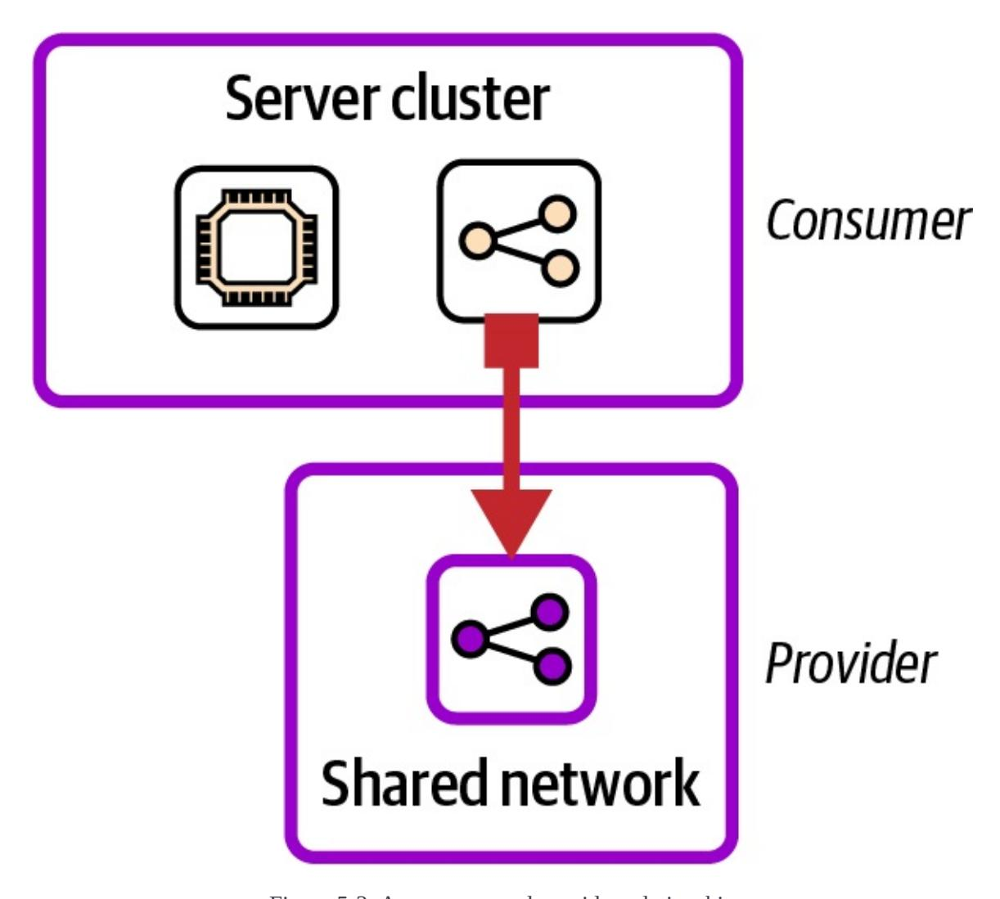
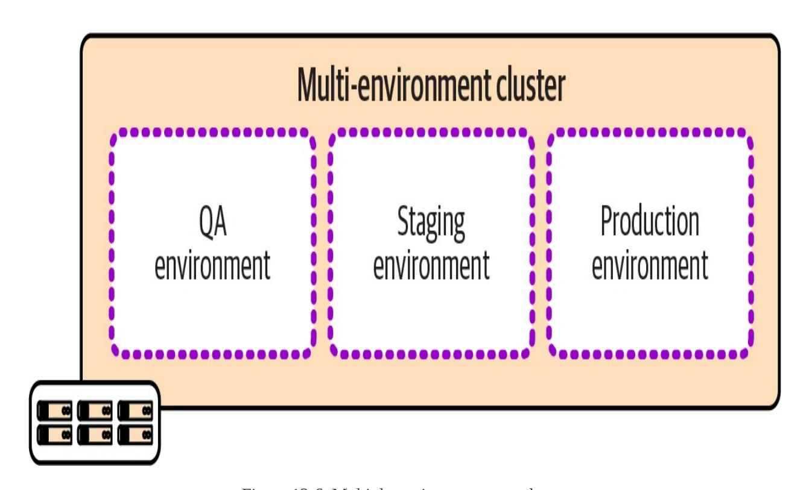
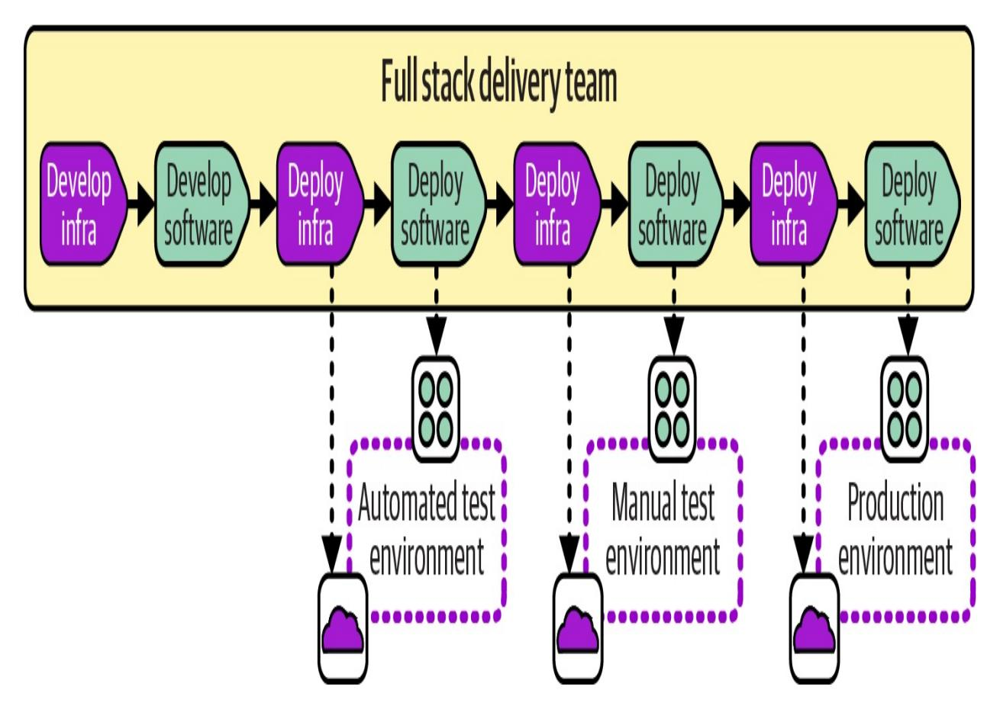
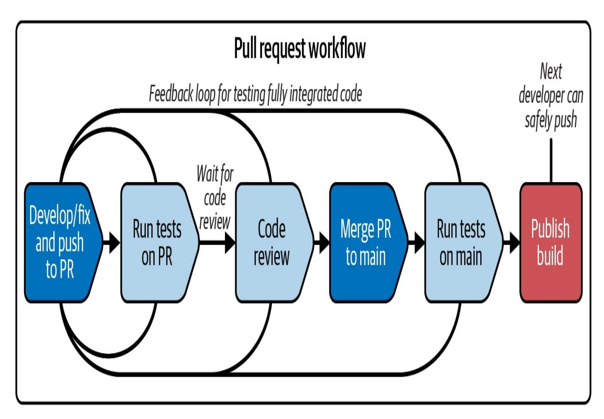
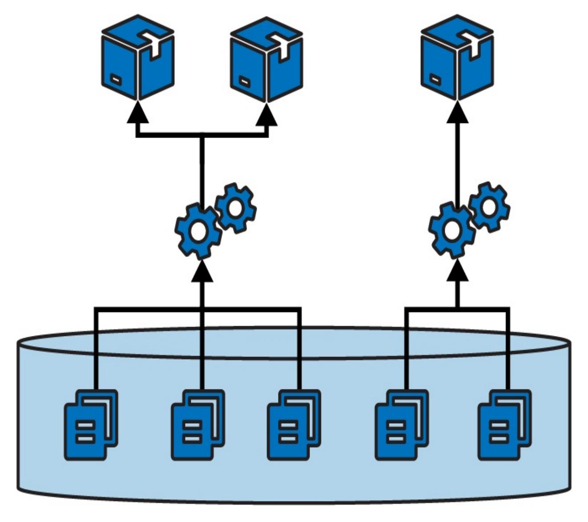
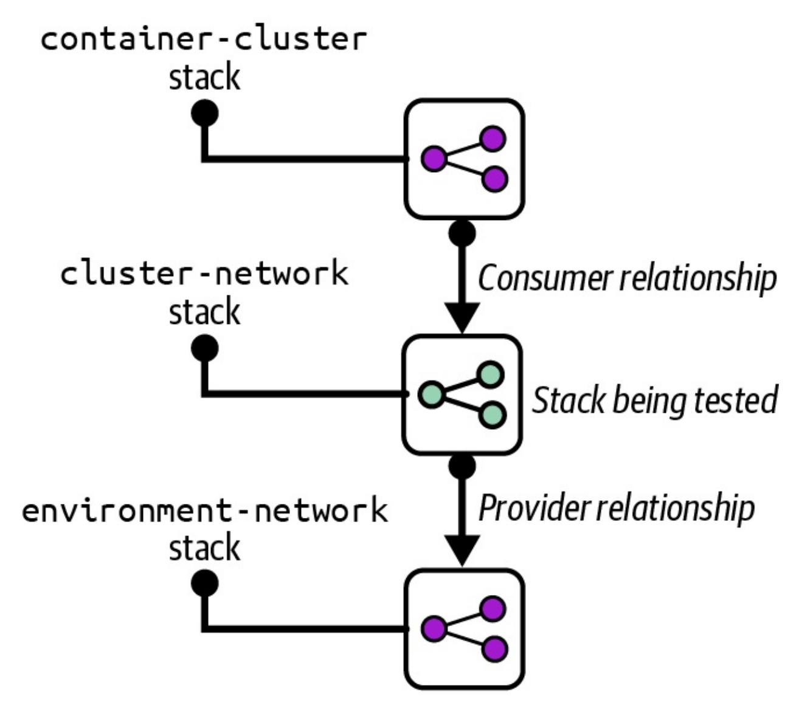
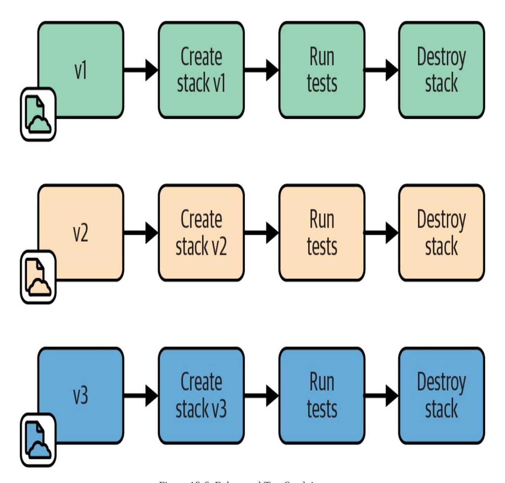
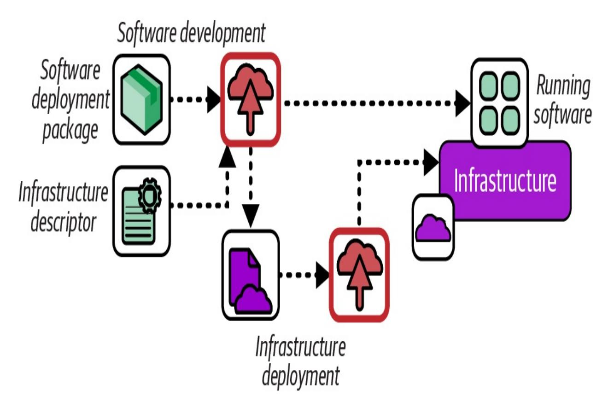
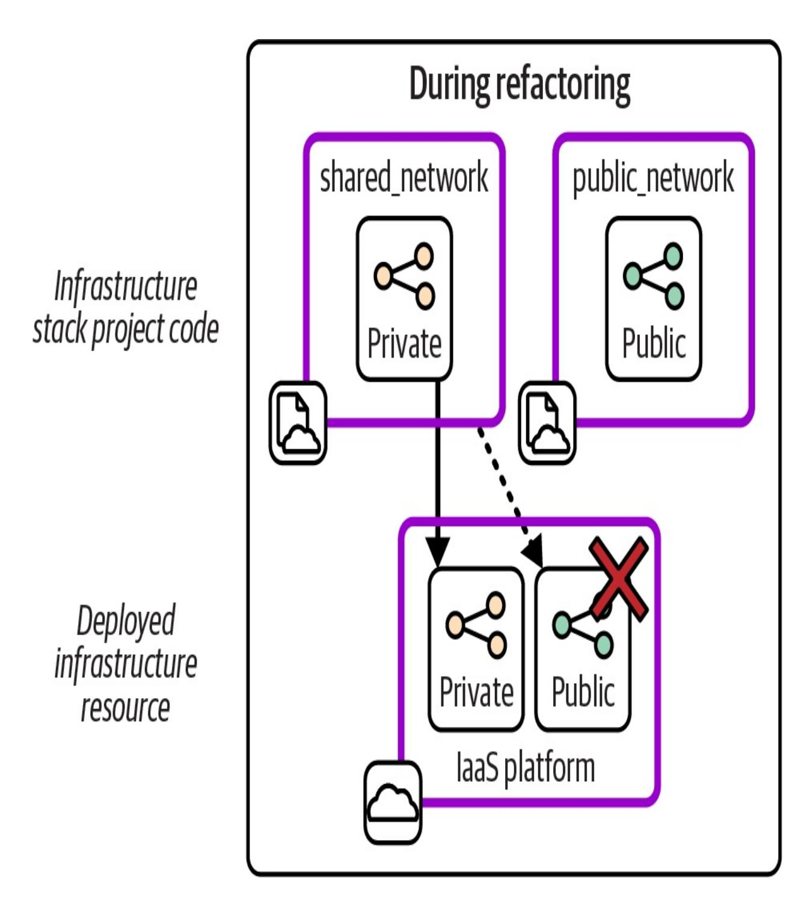
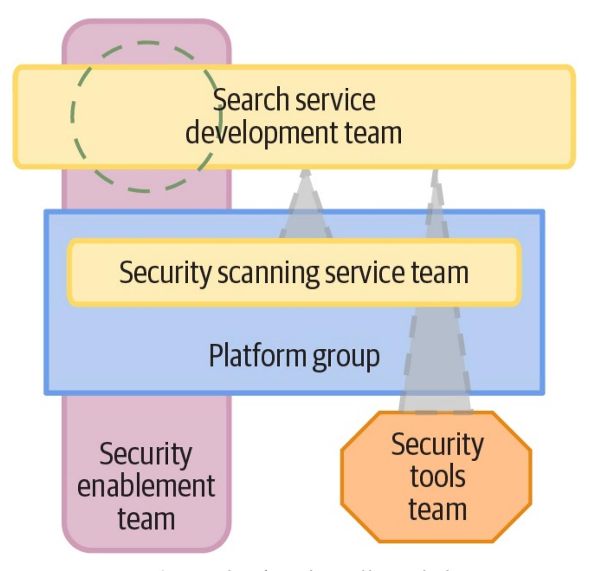

# Infrastructure as Code

Designing and Delivering Dynamic Systems for the Cloud Age


**Kief Morris** 

# Praise for *Infrastructure as Code*, Third Edition

*Infrastructure as Code is one of those fundamental approaches that everyone talks about as a high level idea, usually pointing at their favorite tool as the way to deliver it; but if you want to make it work, you need to understand the techniques involved, not just the tools. Infrastructure as Code, the book, delivers that understanding so you can work with your choice of tools and platforms as they evolve and this new edition brings one of the definitive books on the topic up to date with newer technologies like containers and serverless, and more recent tools.*

—Mary Branscombe, freelance technology journalist and author

*An essential guide to using code to manage infrastructure wherever it may be, on premises or in the cloud.*

—Simon Bisson, freelance technology writer

*Essential reading for anyone getting into the Infrastructure as Code space. This book manages to cover a lot of ground, while delivering deep insights at each step of the way, including exploring the core principles and practices of cloud infrastructure, the tools available today, and the techniques for managing servers, environments, applications, workflows,*

*automated tests, governance, and more.*

—Yevgeniy Brikman, Cofounder of Gruntwork and author of *Terraform: Up and Running*

*Fair warning: this book will transform the way you approach Infrastructure as Code. It challenges you to think beyond today's solutions and push the boundaries of infrastructure management. Its insights, attention to real-life scenarios, and understanding of the developer perspective are timeless, and will remain relevant in the ever-evolving technology landscape.*

> —Lipi Deepaakshi Patnaik, Senior Software Developer, Zeta Suite

*This 3rd edition is a natural evolution of the 1st and 2nd editions. Where the 1st edition is primarily focused on managing virtual machines, and the 2nd is on the divide between VMs and cloud, this 3rd edition is full on managing cloud infrastructure. But…staying equal to itself, it is a principles, practices, and patterns book. That is what I especially like about the Infrastructure as Code book. Although the book gives some tooling references, which can be helpful, it is not a book on how I can do something with my favorite tool. It is especially focused on understanding the baseline, i.e., mastering the principles. Once we recognize this, we can design and implement infrastructure code and resources most effectively.*

—Thierry de Pauw, ThinkingLabs

# Infrastructure as Code

#### THIRD EDITION

Designing and Delivering Dynamic Systems for the Cloud Age

Kief Morris


# Infrastructure as Code

by Kief Morris

Copyright © 2025 Kief Morris. All rights reserved.

Printed in the United States of America.

Published by O'Reilly Media, Inc., 1005 Gravenstein Highway North, Sebastopol, CA 95472.

O'Reilly books may be purchased for educational, business, or sales promotional use. Online editions are also available for most titles [\(http://oreilly.com\)](http://oreilly.com). For more information, contact our corporate/institutional sales department: 800-998- 9938 or *corporate@oreilly.com*.

Acquisitions Editor: John Devins

Development Editor: Jill Leonard

Production Editor: Beth Kelly

Copyeditor: Sharon Wilkey

Proofreader: Kim Cofer

Indexer: Potomac Indexing, LLC

Interior Designer: David Futato

Cover Designer: Karen Montgomery

Illustrator: Kate Dullea

June 2016: First Edition

December 2020: Second Edition

March 2025: Third Edition

# Revision History for the Third Edition

2025-03-13: First Release

See <http://oreilly.com/catalog/errata.csp?isbn=9781098150358> for release details.

The O'Reilly logo is a registered trademark of O'Reilly Media, Inc. *Infrastructure as Code*, the cover image, and related trade dress are trademarks of O'Reilly Media, Inc.

While the publisher and the author have used good faith efforts to ensure that the information and instructions contained in this work are accurate, the publisher and the author disclaim all responsibility for errors or omissions, including without limitation responsibility for damages resulting from the use of or reliance on this work. Use of the information and instructions contained in this work is at your own risk. If any code samples or other technology this work contains or describes is subject to open source licenses or the intellectual property rights of others, it is your responsibility to ensure that your use thereof complies with such licenses and/or rights.

[LSI]

# Preface

I began working as a systems administrator in a team that managed Unix servers and workstations at the Computer Science department of the University of Tennessee. From then, into the dot-com days and after, I've been drawn to applying what I learned about software development to automate managing servers and other infrastructure.

<span id="page-7-1"></span><span id="page-7-0"></span>I discovered the [Infrastructures.org](https://oreil.ly/Y40DR) website in 2001, which was an eye-opener. The authors introduced me to Mark Burgess' pioneering infrastructure tool [CFEngine](https://cfengine.com) and the value of automatically provisioning servers in a consistent, repeatable way, something I used to build physical servers in data centers for a series of startup and scale-up companies in the 2000s. **[1](#page-17-0)**

<span id="page-7-7"></span><span id="page-7-4"></span><span id="page-7-3"></span><span id="page-7-2"></span>Infrastructure as Code, as a term, appeared around the same time that Andrew Clay Shafer and Patrick Debois kicked off the DevOps movement with a talk at the Agile 2008 conference. The first uses I've found for the term ["Infrastructure](https://oreil.ly/ermR3) as Code" are from a talk called "Agile [Infrastructure"](https://oreil.ly/qnJKX) that Shafer gave at the Velocity conference in 2009 and an [article](https://oreil.ly/GojHb) John Willis wrote summarizing the talk. Adam Jacob, who cofounded Chef, and Luke Kanies, founder of Puppet, also used the term around this time.

<span id="page-7-9"></span><span id="page-7-8"></span><span id="page-7-6"></span><span id="page-7-5"></span>Infrastructure as Code tools create the opportunity to work in ways that help you to deliver changes more frequently, quickly, and reliably, improving the overall quality of your systems. But the benefits don't come from the tools themselves. They come from the way you use them. Innovators are creating new tools and

techniques for building and managing infrastructure using code, as well as potential new generations of tools that move beyond the "as code" paradigm. Whatever tools we use, the trick is to leverage the technology to embed quality, reliability, and compliance into the process of making changes.

# Why I Wrote This Book

As cloud computing and Infrastructure as Code grew from a niche into the mainstream in the 2010s, I learned how to put Infrastructure as Code into practice by reading blog posts, attending talks, and working with various tools with consulting clients. I waited for one of the DevOps luminaries I admired to write a book I could share as a comprehensive collection of guidance for this practice. By the middle of the decade, they had yet to write it, so I outlined my ideas for what they should write, carried on fleshing it out, and ended up with the first edition of this book in 2016.

The first edition focused on server configuration using tools like Chef and Puppet. The second edition in 2020 shifted to infrastructure "stacks" using tools like Amazon Web Services (AWS) Cloud Development Kit (CDK) and Terraform, with more interest in cloud native application runtimes like container clusters and serverless.

With this third edition, the shift to using infrastructure code to provide application runtimes based on containers and serverless over configuring server images is much further along. More people are interested in coding infrastructure using general-purpose languages, as enabled by CDK and Pulumi, and are

curious about shifting to integrating application and infrastructure code.

As infrastructure engineers and architects, we need to know how infrastructure enables value for the organization. We must move beyond infrastructure spaghetti code that creates a sprawl of unmanageable environments. This edition shares emerging patterns and practices for a more componentized, composable approach to Infrastructure as Code.

In this book I share approaches that are widely used today, but I don't believe we're anywhere near the end of the journey of finding better ways to manage digital infrastructure. I hope this edition will help you manage your infrastructure more effectively. And I also hope it will inspire you to push beyond current practices. We may eventually move beyond using code to define infrastructure. But whatever specific tools we use, I believe that thoughtful use of effective software design principles and techniques can help us do better, and I hope this new edition will help.

# What This Book Is and Isn't

This book's thesis is that practices, patterns, and techniques can be applied across infrastructure platforms using various infrastructure tools. It focuses less on specific tools and more on how to use them. Although I discuss available tools, you won't find details of how to work with any particular one. You will find patterns, practices, and techniques that should be relevant to whatever tools and platforms you use.

You won't find many code examples for real-world tools or clouds. Tools change too quickly in this field to keep code examples accurate. The advice in this book should age more slowly and be applicable across tools. Instead, I write pseudocode examples for fictional tools to illustrate concepts.

Too many topics fall under the label "infrastructure" for this book to cover. So I've kept the scope focused on using code to manage infrastructure as a service (IaaS) cloud infrastructure, leaving subjects like engineering platforms, developer portals, site reliability engineering (SRE), observability, container orchestration, and AI for other books and resources.

# Who This Book Is For

This book is for people involved in providing and using infrastructure to deliver and run software. You may have a background in systems and infrastructure or software development and delivery. Your role may be engineering, testing, architecture, or management. I assume you have some exposure to cloud infrastructure and infrastructure automation tools.

Readers new to Infrastructure as Code should find this book a good introduction to the topic. However, you will get the most out of it if you know how infrastructure cloud platforms work, and the basics of at least one infrastructure coding tool. I suggest complementing this book with learning resources for the specific cloud platforms and Infrastructure as Code tools you use.

Those with more experience working with these tools should find a mixture of familiar and new concepts and approaches. The content should create a common language and articulate challenges and solutions in ways that experienced practitioners and teams find helpful.

# Principles, Practices, and Patterns

I use the terms *principles*, *practices*, and *patterns* (and *antipatterns*) to describe essential concepts. Here are the ways I use each of these terms:

*Principle*

<span id="page-12-4"></span>A principle is a rule that helps you choose between potential solutions.

#### *Practice*

<span id="page-12-3"></span>A practice is a way of implementing something. A given practice is not always the only way to do something and may not be the best way to do it for a particular situation. You should use principles to guide you in choosing the most appropriate practice for a given situation.

#### *Pattern*

<span id="page-12-2"></span>A pattern is a potential solution to a problem. It is similar to a practice in that different patterns may be more effective in different contexts. Each pattern is described in a format that should help you evaluate its relevance for your problem.

#### *Antipattern*

<span id="page-12-0"></span>An antipattern is a potential solution that you should avoid in most situations. It usually seems like a good idea or is something that you fall into doing without realizing it.

#### **WHY I DON'T USE THE TERM "BEST PRACTICE"**

<span id="page-12-1"></span>Folks in our industry love to talk about "best practices." However, this term often leads people to think there is only one solution to a problem, no matter the context.

I prefer to describe practices and patterns and note when they are helpful along with their limitations. I describe some of these as more effective or appropriate while staying open to alternatives, and I explain why some practices are less effective.

# The FoodSpin Examples

I use a fictional company called FoodSpin to illustrate concepts throughout this book. FoodSpin is a digital service that allows restaurants to provide searchable menus for customers to order and pay for their meals. ["Introduction](#page-34-0) to FoodSpin and Its Strategy" gives a high-level view of the company's strategy. I use FoodSpin's team workloads and infrastructure estate to illustrate design patterns and implementation techniques.

Many of my code examples use fictitious IaaS platforms, infrastructure tools, and pseudocode whose syntax may vary from example to example, depending on my point. I intend to illustrate concepts that apply across technology stacks.

# For More

See the book's [companion](https://infrastructure-as-code.com) website and subscribe to the [newsletter](https://infrastructure-as-code.com/newsletter).

# Conventions Used in This Book

The following typographical conventions are used in this book:

*Italic*

Indicates new terms, URLs, email addresses, filenames, and file extensions.

*Constant width*

Used for program listings, as well as within paragraphs to refer to program elements such as variable or function names, databases, data types, environment variables, statements, and keywords.

#### **Constant width bold**

Shows commands or other text that should be typed literally by the user.

#### *Constant width italic*

Shows text that should be replaced with user-supplied values or by values determined by context.

| TIP     | This element signifies a tip or suggestion.  |
|---------|----------------------------------------------|
| NOTE    | This element signifies a general note.       |
| WARNING | This element indicates a warning or caution. |

# O'Reilly Online Learning

#### **NOTE**

For more than 40 years, *[O'Reilly](http://oreilly.com) Media* has provided technology and business training, knowledge, and

Our unique network of experts and innovators share their knowledge and expertise through books, articles, and our online learning platform. O'Reilly's online learning platform gives you on-demand access to live training courses, indepth learning paths, interactive coding environments, and a vast collection of text and video from O'Reilly and 200+ other publishers. For more information, visit *<http://oreilly.com>*.

# How to Contact Us

Please address comments and questions concerning this book to the publisher:

- O'Reilly Media, Inc.
- 1005 Gravenstein Highway North
- Sebastopol, CA 95472
- 800-889-8969 (in the United States or Canada)
- 707-827-7019 (international or local)
- 707-829-0104 (fax)
- *[support@oreilly.com](mailto:support@oreilly.com)*
- *<https://oreilly.com/about/contact.html>*

We have a web page for this book, where we list errata, examples, and any

additional information. You can access this page at *[https://oreil.ly/infrastructure](https://oreil.ly/infrastructure-as-code-3e)as-code-3e*.

For news and information about our books and courses, visit *<https://oreilly.com>*.

Find us on LinkedIn: *<https://linkedin.com/company/oreilly-media>*.

Watch us on YouTube: *<https://youtube.com/oreillymedia>*.

# Acknowledgments

I assumed that updating from the second edition of this book to the third would be much easier than it was, or at least less work than writing the first two editions. On the contrary, it was a huge effort. Fortunately, as with the earlier editions, I've had a wealth of support from many people.

I owe a great deal to my colleagues, clients, and former colleagues from Thoughtworks. I doubt I would have written this book without the years of immersion in that community of people dedicated to improving our industry and society. I've learned from, been inspired by, and benefited from the advice and feedback from members of Thoughtworks' internal communities, project teams, and growing network of alumni.

I've tried to keep track of the people who've given me feedback, ideas, and notable support, but I'm sure I've missed many of them. My incomplete list includes Adam Jacob, Brian Grant, Cat Morris, Chris Roberts, Clare Walkley, Dale Peakall, Fergus Orbach, Kai Hendry, Kamesh Marthy, Kjeld Schmidt, Manuel Pais, Matthew Skelton, Mohamed Abbas, Monish Jain, Paul Stack, Reinaldo de Souza, Thien-An Mac, Tiago Lock, and Vincenzo Fabrizi.

A number of people gave me their notes on drafts of this book, including Abby Bangser, Alexis Richardson, Claire Walkley, Gregor Hohpe, Marc Hofer, Mike Roberts, and Wisen Tanasa. Thanks to my technical reviewers: Chris Devers, Doron Beit-Halahmi, Lipi Deepaakshi Patnaik, Mary Branscombe, Robert Quinlivan, Simon Bisson, Thierry de Pauw, and Yevgeniy (Jim) Brikman.

I've benefited from John Devin's support at O'Reilly over the years. My editor, Jill Leonard, provided not only her invaluable advice and guidance throughout the process of working on this edition, but also her patience and calm assurance that kept me going when it all felt like a slog.

Last and most, everlasting love to Ozlem, Erel, Jax, and Theo, who endured my obsession with this book. Yet again.

<span id="page-17-0"></span>The original content remains on this site as of January 2025, although it hasn't been updated since 2007. **[1](#page-7-0)**

# <span id="page-18-0"></span>Part I. Foundations

# <span id="page-19-1"></span>Chapter 1. What Is Infrastructure as Code?

<span id="page-19-4"></span><span id="page-19-3"></span><span id="page-19-2"></span>If you work in a team that builds and runs IT infrastructure, cloud and infrastructure automation tools should help you deliver more value in less time and do it more reliably. In practice, however, they drive ever-increasing size, complexity, and diversity of things to manage.

These technologies have become especially relevant over the past decade as organizations have brought digital technology deeper into the core of what they do. Previously, many leaders had treated the IT function as an unfortunate distraction that should be outsourced and ignored. But digitally sophisticated competitors, users, and staff drove more processes and products online, creating entirely new categories of services like streaming media, social media, and machine learning.

The cloud and automation have helped by making it far easier for organizations to add and change digital services. However, many teams have struggled to manage the proliferation of cloud-hosted products, applications, services, and platforms. As one of my clients told me, "Moving from the data center, where we were limited to the capacity of our hardware, to the cloud, where capacity is effectively unlimited, knocked down the walls that kept our tire fire contained." **[1](#page-49-0)**

<span id="page-19-0"></span>Using code to define and build infrastructure creates the opportunity to bring a wide set of tools, practices, and patterns to bear on the problem of designing and implementing systems. This book explores ways of doing this. I describe the problems that Infrastructure as Code can help with, the challenges of various

approaches to using infrastructure code, and patterns and practices that have proven useful.

This chapter provides context for the rest of the book. It starts by defining Infrastructure as Code. Next, it discusses the trends affecting the spread and evolution of using code to manage infrastructure and how infrastructure architecture fits an organization's needs and technology strategy.

The central theme of this book is the need to build infrastructure that can continually evolve to meet changing requirements.

<span id="page-20-1"></span>In the past few years, the terms "infrastructure delivery lifecycle" and "day two requirements" have gained popularity among vendors. In other words, it's not enough to build infrastructure; we need to be able to continually fix, update, upgrade, expand, reshape, and adapt it. The second half of this chapter expands on this thesis, including common myths people believe about infrastructure in general and cloud infrastructure in particular.

The context provided in this chapter shapes everything else in this book. If you've been working with infrastructure code and the cloud for a while, you'll probably skim over it, hopefully nodding your head. If you're new to them, this content may help clarify the approaches advocated throughout the rest of the book.

# <span id="page-20-0"></span>Infrastructure as Code

A literal definition of *Infrastructure as Code* is the practice of provisioning and managing infrastructure using code rather than command-line tools or ClickOps GUIs.

Interactive infrastructure management doesn't help us do things consistently or repeatably since we decide how to implement each change as we work. This leads to inconsistent implementations and mistakes. [Chapter](#page-52-0) 2 talks about some of the principles and goals that using code helps to achieve, most of which are nearly impossible with interactive infrastructure management.

<span id="page-21-0"></span>No-code automation tools typically provide a GUI to define the infrastructure we want—for example, by choosing options from drop-down menus. These tools usually have ways to save configurations that we build (for example, creating templates), which means we can build multiple instances consistently. They may also have ways to update existing infrastructure to maintain consistency over time.

However, no-code tools store the definitions for infrastructure in closed systems rather than in open files. With these systems, we can't exploit the vast ecosystem of tools for working with code, such as source control repositories, code scanning tools, automated testing, and automated delivery, to name just a few.

[Chapter](#page-100-0) 4 details infrastructure coding tools and languages.

<span id="page-21-2"></span><span id="page-21-1"></span>No-code and low-code infrastructure automation may have a place in building and managing infrastructure but generally work best at higher levels of abstraction, such as assembling components. The components themselves,

however, are likely to be built using code. Read more about infrastructure componentization in [Chapter](#page-171-0) 6.

Infrastructure as Code is about more than the mechanics of how infrastructure is defined and provisioned. It is about applying the principles, practices, and tools of software engineering to infrastructure.

This book explains how to use modern software development practices such as test-driven development (TDD), continuous integration (CI), and continuous delivery (CD) to make changing infrastructure fast and safe. It also describes how software design principles help create resilient, well-maintained infrastructure. These practices and design approaches reinforce one another. Well-designed infrastructure is easier to test and deliver. Automated testing and delivery drive simpler and cleaner designs.

# <span id="page-22-0"></span>From the Iron Age to the Cloud Age

<span id="page-22-1"></span>Modern technologies like the cloud and virtualization, and tools to automate infrastructure, deployment, and testing can help us carry out tasks much more quickly than we can by managing physical hardware and manually typing commands or clicking on GUIs, as seen in [Table](#page-23-0) 1-1. However, as many organizations have discovered, adopting these tools doesn't automatically bring visible benefits.

Table 1-1. Technology changes in the Cloud Age

<span id="page-23-0"></span>

|                    | Iron Age            | Cloud Age                |
|--------------------|---------------------|--------------------------|
| Types of resources | Physical hardware   | Virtualized resources    |
| Provisioning       | Takes days or weeks | Takes minutes or seconds |
| Processes          | Manual (runbooks)   | Automated (code)         |

The ability to provision new infrastructure in moments and to set up systems that provision it without direct human involvement can lead to uncontrolled sprawl. If we don't have good processes for ensuring that systems are well managed and maintained, the unbounded nature of cloud technology leads to spiraling [technical](https://oreil.ly/3AqHB) debt.

### **Cloud Age Approaches to Change Management**

<span id="page-23-1"></span>Many organizations try to control the potential chaos by using older, traditional IT governance models. These models focus on throttling the speed of change, requiring decisions on implementation details before work begins, high-effort process gates, and strictly siloed responsibilities for teams.

<span id="page-23-2"></span>However, these models were designed for the Iron Age, when we changed physical infrastructure manually. Changes were slow and expensive, making it difficult to correct mistakes. If a task would take two weeks, and a mistake could take a week or more to fix afterward, then it seemed reasonable to add an extra week up front in hopes of preventing a mistake from happening. With cloud

technology, these processes add weeks to tasks that may take less than an hour to implement and a few minutes to correct, destroying the advantages of the technology.

<span id="page-24-1"></span>Moreover, research suggests that these heavyweight processes were never very effective in preventing errors in the first place. They can make things worse by dividing knowledge and accountability across silos and long periods. **[2](#page-50-0)**

<span id="page-24-4"></span><span id="page-24-3"></span><span id="page-24-2"></span>Fortunately, the emergence of Cloud Age technologies has coincided with the growth of Cloud Age approaches to work, including Lean, Agile, and DevOps. These approaches encourage close collaboration across roles, short feedback loops with users, and a minimalist, quality-first approach to technical implementation. Automation fundamentally shifts thinking about change and risk, resulting in faster delivery and higher quality (see [Table](#page-24-0) 1-2).

<span id="page-24-0"></span>Table 1-2. Ways of working in the Iron Age and the Cloud Age

|                        | Iron Age              | Cloud Age                         |
|------------------------|-----------------------|-----------------------------------|
| Cost of change         | High                  | Low                               |
| Changes are            | Risks to be minimized | Essential to improve quality      |
| A change of plan means | Failure of planning   | Success in learning and improving |

| Optimize to          | Reduce opportunities to<br>fail            | Maximize speed of<br>improvement       |
|----------------------|--------------------------------------------|----------------------------------------|
| Delivery<br>approach | Large batches, test at the<br>end          | Small changes, test<br>continually     |
| Architectures        | Monolithic (fewer, larger<br>moving parts) | Microservices (more,<br>smaller parts) |

This ability to make changes more quickly to improve quality starts with cloud technology, which creates the capability to provision and change infrastructure on demand. Automation gives us a way to exploit this capability. We can automate not only to deploy a change quickly, but also to validate the change for correctness, quality, and governance. And by defining changes as code, we create a detailed history that can be used to audit, troubleshoot, and reverse changes.

So another definition of *Infrastructure as Code* is a Cloud Age approach to automating cloud infrastructure in a way that embraces continual change to achieve high reliability and quality.

#### **DEVOPS AND INFRASTRUCTURE AS CODE**

<span id="page-25-0"></span>People define DevOps in different ways. The fundamental idea of *DevOps* is collaboration across all the people involved in building and running software. This includes not only developers and operations people, but also testers, security specialists, architects, and even managers. There is no one way to implement DevOps.

Many people look at DevOps and notice only the technology that people use to collaborate across software delivery. All too often this leads to reducing DevOps to tooling. I've seen DevOps defined as using an application deployment tool (usually [Jenkins\)](https://oreil.ly/9j-Ko), often with a separate DevOps team that adds an extra barrier across the software delivery path, which contradicts the meaning of the term.

DevOps is, first and foremost, about people, culture, and ways of working. Tools and practices like Infrastructure as Code are valuable to the extent that they bridge gaps and improve collaboration, but they aren't enough.

### **The Path to the Cloud Age**

<span id="page-26-1"></span>DevOps, Infrastructure as Code (the name, at least), and the cloud all emerged between 2005 and 2010. In the early years, these were largely experimental, dismissed by larger organizations that considered themselves too serious to need to change the way they approached IT. The first edition of this book, published in 2016, included arguments for why readers should consider using the cloud even for critical domains like finance and health care.

<span id="page-26-4"></span><span id="page-26-3"></span>The mid-2010s could be considered the Shadow Age of IT. The cloud, DevOps, continuous delivery, and Infrastructure as Code were mainly used by startups or skunkworks digital departments of larger organizations. These departments were usually set up outside the remit of the existing organization, partly to protect them from the main organization's cultural norms and formal policies, which people sometimes call "antibodies." In some cases, they were used quietly within existing departments without involving the IT department, as [shadow](https://oreil.ly/anZUc) IT.

<span id="page-26-2"></span><span id="page-26-0"></span>The mantra of the Shadow Age was "move fast and break things." **[3](#page-50-1)** People saw

<span id="page-27-0"></span>casting aside the shackles of Iron Age governance as the key to explosive growth. In the view of digital hipsters, it was time to leave the crusty old-timers to their change advisory board (CAB) meetings, mainframes, and bankruptcies ("Say hello to Blockbuster and Kodak!").

Cavalier attitudes toward governance made it easier for traditionalists to dismiss the newer technologies and related ideas as irresponsible and doomed to failure. At the same time, new technology enthusiasts have often ignored the real concerns and risks underpinning what may seem like legacy mindsets.

<span id="page-27-2"></span><span id="page-27-1"></span>We need to learn how to leverage newer technologies and ways of working to address fundamental issues rather than either rejecting the new ways or dismissing the issues as legacy. The progression of cloud adoption is shown in [Figure](#page-28-0) 1-1.

<span id="page-28-0"></span>

<span id="page-28-1"></span>Figure 1-1. The path from the Iron Age to the Cloud Age

As the decade wore on and digital businesses overtook slower businesses in more and more markets, digital technologies and approaches were pulled closer to the center of even older businesses. Digital departments were assimilated, and boards asked for strategies to migrate core business systems into the cloud. This trend accelerated when the COVID-19 pandemic led to a dramatic rise in consumers and workers moving to online services. Many organizations found that their digital services were not ready for the unexpected level of demand they faced. As a result, they increased their investment and efforts in cloud

technologies.

<span id="page-29-1"></span>This period when cloud technology has been shifting from the periphery of business to the center can be called the Age of Sprawl. Although breaking things had gone out of fashion, moving fast was still the priority. As a result of the haste to adopt new technologies and practices, larger organizations have seen a proliferation of initiatives. Larger organizations typically have multiple, disconnected teams building platforms using various technologies, multiple cloud vendors, and varying levels of maturity and quality.

<span id="page-29-0"></span>The variety of options available for building digital infrastructure and platforms and the rapid pace of change within them have made it difficult to keep up to date. Platforms built on the latest technology two years ago may already be legacy. **[4](#page-50-2)**

<span id="page-29-3"></span><span id="page-29-2"></span>The drivers that led to this sprawl are real. Organizations must evolve rapidly to survive and prosper in the modern digital economy. However, as I write this in late 2024, the economic landscape has changed, meaning most organizations need to be more careful with investments. Not only do we need to be choosy about which new systems and initiatives to invest in, but we also need to consider how to manage the cost of running and evolving what we already have in place. The need to grow, improve, and exploit emerging technologies has not disappeared, so the next age is not simply about cutting back and staying in place. Instead, organizations need to find sustainable ways to grow and evolve. Call it the Age of Sustainable Growth.

<span id="page-30-0"></span>What does this have to do with Infrastructure as Code? Those involved in designing and building the foundational layers of our organizations' business systems must be aware of the strategic drivers those foundations must support. A key driver is rationalizing systems to sustain growth with less waste. In the years to come, our organizations' needs will shift again.

#### <span id="page-30-1"></span>**THE FUTURE IS NOT EVENLY DISTRIBUTED**

The tidy linear narrative described here as "the path to the Cloud Age" is, as with any tidy linear narrative, simplistic. Many people and organizations have experienced the trends it describes. However, none of its "ages" have ended entirely, and many drivers of different ways of thinking and working are still valid. It's essential to recognize that contexts differ. A Silicon Valley startup has different needs and constraints than a transnational financial institution. New technologies and methodologies create opportunities to handle old risks and new opportunities differently. The path to the Cloud Age is uneven and far from over. Understanding how it has unfolded so far can help us navigate what comes next.

# <span id="page-30-2"></span>Strategic Goals and Infrastructure as Code

<span id="page-30-4"></span><span id="page-30-3"></span>[Figure](#page-31-0) 1-2 shows the gap between organizational strategy and infrastructure strategy. Customer value should drive the organization's strategy, which then drives strategy to infrastructure via product and technology strategy. Each strategic layer supports the layers above it.

<span id="page-31-0"></span>

Figure 1-2. Customer value driving strategy down to infrastructure

<span id="page-31-1"></span>When talking to organizations about their strategy for cloud infrastructure, I'm often struck by the gap between people responsible for the infrastructure and those responsible for organizational strategy. Engineering people are puzzled when I ask questions about the product and commercial strategy. Organizational leaders are dismissive of the need to spend time planning infrastructure capability, assuming that selecting a cloud vendor is the end of that story. Even when their infrastructure architecture creates problems with growth, stability, or security, the instinct is to demand a quick fix and move on.

The gap is not one-sided. Engineering folks tend to focus on implementing the

solutions that seem obvious to them, sometimes assuming it doesn't matter what will run on it. One example of how this turns out is a company whose engineers built a multiregion cloud hosting solution with iron-clad separation between regions. The team wanted to segregate user data to avoid conflicts with various privacy regulations, so this requirement was baked deep into the architecture of their systems.

However, because neither the product nor engineering teams believed they needed close communication during development, the service was nearly ready for production rollout when it surfaced that the commercial strategy assumed that users would be able to use their accounts while traveling and working in different countries. It took considerable effort, expense, and delay to rearchitect the system to ensure that each region's privacy laws could be respected while giving users international roaming access.

So, although infrastructure can seem distant from strategic goals discussed in the boardroom, it's essential to ensure that everyone, from strategic leaders to engineering teams, understands how they are related. [Table](#page-33-0) 1-3 describes a few common organizational concerns where infrastructure architecture can make a considerable difference in either enabling success or creating drag.

Table 1-3. How Infrastructure as Code is relevant to an organization's strategic goals

| Business goal | Infrastructure capabilities to support | Measures of success |
|---------------|----------------------------------------|---------------------|
|---------------|----------------------------------------|---------------------|

<span id="page-33-0"></span>Deliver increasing value to customers quickly and reliably through new products and Provide infrastructure needed to develop, test, and host new and existing digital services.

High performance on the four key metrics ("The Four Key [Metrics"](#page-45-0)). Low effort and dependency on platform and infrastructure teams for common software delivery use cases.

Grow revenues by adding new markets, products, and customers. Add hosting for new regions, instances of our products, and capacity.

features.

Time to add new hosting. Incremental cost of ownership for each region, instance, product, and user.

Provide reliable, performant services to users. Handle scaling, recovery, monitoring, and performance management services.

Availability and performance metrics.

<span id="page-33-1"></span>Throughout this book, I illustrate concepts using the fictitious company

FoodSpin, an online restaurant menu service. The following sidebar provides a high-level view of the company's strategy.

#### <span id="page-34-0"></span>**INTRODUCTION TO FOODSPIN AND ITS STRATEGY**

*FoodSpin* is a digital service that allows restaurants to provide searchable menus for customers to order and pay for their meals. The main service is multitenancy, with multiple restaurants' menus hosted on a shared instance of the company's software. It runs separate instances in several countries, including the US, UK, Germany, and South Korea. The company also partners with large food chains, providing a dedicated, single-tenancy hosted service with customized features.

The main FoodSpin systems are Jakarta EE applications running on JBoss on virtual servers in the cloud. Some services have been rebuilt more recently as containerized applications, so their workloads are a mix of servers and containers with some serverless code.

Until recently, growth was the FoodSpin board's primary goal. The board's strategy was to spend to grow and worry about efficiency later. "Later" has arrived. The economic situation has changed, and the cost of running and developing FoodSpin's existing systems is unsustainable.

However, the company can't afford to miss opportunities to grow market share and enter new markets. So, it needs to find efficient ways to grow its footprint. An added factor is that some of the systems in place now have issues with performance and reliability, and these need to be addressed to rebuild the confidence of customers and partners.

Key organizational goals for FoodSpin include the following:

- Grow its customer base, revenue, and profits by bringing new services to market.
- Grow its customer base, revenue, and profits by expanding services to new regions.
- <span id="page-35-2"></span>Retain and grow its customer base by continually improving existing services.
- Improve profitability and service quality by rationalizing its systems.

# System Architecture Goals and Infrastructure as Code

<span id="page-35-0"></span>An organization's strategic goals typically filter down into goals for services and technology, which can cross teams such as product development, software engineering, platform engineering, and IT operations. These groups will have their own goals, objectives, and initiatives that infrastructure architecture needs to support.

<span id="page-35-3"></span><span id="page-35-1"></span>[Figure](#page-36-0) 1-3 shows an example of how organizational goals, such as those described in ["Introduction](#page-34-0) to FoodSpin and Its Strategy", drive goals for an engineering organization, which in turn drive goals for the infrastructure architecture. Infrastructure as Code can ensure that environments are consistent across the path to production and multiple production instances. Read about types of environments in [Chapter](#page-383-0) 12.


Consistency across environments supports the engineering goal of improving software delivery effectiveness by ensuring that test environments accurately reflect production environments. Consistency also reduces the customization needed to provision new environments for adding products or expanding into new regions.

When infrastructure is built consistently, it's easier to automate operational capabilities like security, compliance, and recovery. Less variation among environments also makes it easier to consolidate and simplify overall system architecture. So this one goal for infrastructure architecture can support multiple higher-level goals for the organization.

# Use Infrastructure as Code to Optimize for Change

<span id="page-37-1"></span>One of the most fundamental reasons for adopting Infrastructure as Code, although not universally understood in our industry, is to optimize the process for making changes to IT systems. If an organization fails to see benefits from adopting the cloud and automation, the most common cause is not approaching them as enablers for change.

<span id="page-37-2"></span><span id="page-37-0"></span>Operations teams know that the biggest risk to a production system is changing it. The Iron Age approach to managing this risk, as mentioned earlier, is to add **[5](#page-50-3)**

heavyweight processes to make changes more slowly and carefully. However, adding barriers to making changes impedes fixing and improving the quality of a system.

<span id="page-38-1"></span><span id="page-38-0"></span>Research from the *Accelerate State of DevOps Report* backs this up. Making changes frequently and reliably is correlated to organizational success. **[6](#page-50-4)**

Rather than resisting commercial pressures to make changes frequently and quickly, modern methods of change management, from Lean to Agile, lean into the idea that this is a good thing. The ability to deliver changes both rapidly and reliably is the secret sauce for resilient, highly available, valuable systems in the digital age.

People raise several common objections when considering change as a goal for automation. These come from misunderstandings of how to use automation.

### **Myth: Infrastructure Doesn't Change Very Often**

<span id="page-38-3"></span><span id="page-38-2"></span>We want to think that we build an environment, and then it's done. In this view, we won't make many changes, so automating the process of making changes, especially testing, is a waste of time.

In reality, few systems stop changing before they are retired. Some people assume that a fast pace of change is temporary. Others create heavyweight change-request processes designed to discourage people from asking for changes. However, high-performing teams handle a continual stream of changes quickly and effectively. Consider these common examples of infrastructure

#### changes:

- An essential new application feature requires a new data processing service.
- A new application feature needs the messaging service upgraded to a newer version.
- Profiling shows that the current application deployment architecture is limiting performance. We can address this by redeploying the applications across multiple clusters globally, which requires changing cloud accounts and network architecture.
- We discover a security vulnerability in our container cluster software. We must patch clusters across multiple regions and in our development and testing systems.
- The API gateway experiences intermittent failures. To diagnose and resolve the problem, we need to make a series of configuration changes.
- We find a configuration change that improves the performance of the database.

An infrastructure team with heavyweight change processes accumulates a backlog of outdated, unpatched systems, hindering the organization's ability to adapt to challenges and opportunities.

# **Myth: We Can Build the Infrastructure First and Automate It Later**

Getting started with infrastructure automation is a steep curve. Setting up the tools, services, and working practices to automate infrastructure delivery is loads of work, especially when migrating simultaneously to a new cloud platform or technology stack. The value of this work is hard to demonstrate before starting to build and deploy services with it. Even then, the value may not be apparent to people who don't work directly with the infrastructure.

Stakeholders may pressure infrastructure teams to build new cloud-hosted systems by hand, thinking it will be quicker and can be automated later. However, automating afterward is impractical for several reasons:

- Automation can enable a new system to be delivered more quickly. Automating after the system is in place sacrifices this opportunity.
- Automation makes it easier to write automated tests for what we build. It also facilitates fixing and rebuilding when we find problems quickly. Doing this as part of the build process helps us build a more robust infrastructure.
- Automation is integral to a system's design and implementation, so adding automation to a system built without it involves significant rework.

Cloud infrastructure built without automation becomes a write-off sooner than we'd like. The cost of manually maintaining and fixing the system can escalate quickly. If the service is successful, stakeholders will prioritize expanding and adding new features over going back to add automation.

The same is true when building a system as an experiment. Once a proof of concept is up and running, people want to move on to the next thing rather than go back and build it right. And in truth, automation should be a part of the experiment. If we intend to use automation to manage our infrastructure, we

need to understand how it will work, so it should be part of our proof of concept.

The solution is to build the system incrementally, automating as we go. The trick is to start with the bare minimum of automation needed to deliver the first increment of the system rather than building a complete automation system first. Starting with ready-made solutions can help, even if we intend to adopt something more sophisticated later.

For example, a team wanted to use an advanced, packaged secrets management solution but knew it would take several weeks to implement it properly. The team members chose to use the cloud platform's built-in secrets storage service initially, so the development team could start working to get the first increment of business functionality in place. They deployed the packaged solution later while the developers were working, rather than making them wait.

### **Myth: Speed and Quality Are Trade-Offs**

<span id="page-41-1"></span>It's natural to think that we can move fast only by skimping on quality and that we can get quality only by moving slowly. Many people see this as a continuum, as shown in [Figure](#page-41-0) 1-4.

<span id="page-41-0"></span>

However, the *Accelerate* research shows otherwise: **[7](#page-50-5)**

<span id="page-42-1"></span>*These results demonstrate that there is no trade-off between improving performance and achieving higher levels of stability and quality. Rather, high performers do better at all of these measures. This is precisely what the Agile and Lean movements predict, but much dogma in our industry still rests on the false assumption that moving faster means trading off against other performance goals, rather than enabling and reinforcing them.*

#### <span id="page-42-3"></span><span id="page-42-2"></span><span id="page-42-0"></span>—Dr. Nicole Forsgren, Accelerate

In short, organizations can't choose between being good at change or being good at stability. They tend to either be good at both or bad at both.

Here's a fundamental truth of the Cloud Age: *Stability comes from making changes*. The longer it takes to make a change, the slower we are to fix things. The flow of changes needed, like those listed previously to rebut the myth that infrastructure doesn't change often, will outpace the capacity to make them. Systems are left unpatched and with quick-fix workarounds to "known issues."

If our systems aren't fully patched, they are not stable; they are vulnerable. If we can't fix issues as soon as we discover them, the system is not stable. If we can't recover from failure quickly, the system is not stable. If making changes involves considerable downtime, the system is not stable. If changes frequently

fail, the system is not stable.

Quality and speed should be seen as a quadrant rather than a continuum, as shown in [Figure](#page-43-0) 1-5.

<span id="page-43-0"></span>

<span id="page-43-1"></span>Figure 1-5. Speed and quality are not trade-offs and can be combined

This quadrant model shows how trying to choose between speed and quality leads to doing poorly at both:

*Lower-right quadrant: prioritize speed over quality*

<span id="page-44-2"></span>This is the "move fast and break things" philosophy. Teams that optimize for speed and sacrifice quality build messy, fragile systems. They slide into the lower-left quadrant because their shoddy systems slow them down. A common pattern for startups is seeing development slow after a year or two, leading founders to despair that their team has lost their mojo. Simple changes that the team would have whipped out quickly in the old days now take days or weeks because the system is a tangled mess. This is a consequence of a system built in a rush, without treating quality as a priority.

#### *Upper-left quadrant: prioritize quality over speed*

Also known as "We're doing serious and important things, so we have to do things *properly*." Then deadline pressures drive "workarounds." Heavyweight processes create barriers to improvement, so technical debt grows along with lists of "known issues." These teams slump into the lower-left quadrant. They end up with low-quality systems because improving them is too hard. They add more processes in response to failures. These processes make it harder to make improvements and increase fragility and risk. This leads to more failures and more process. Many people working in organizations that work this way assume this is normal, especially those who work in risk-sensitive industries. **[8](#page-50-6)**

<span id="page-44-1"></span><span id="page-44-0"></span>The upper-right quadrant is the goal of modern approaches like Lean, Agile, and DevOps. Being able to move quickly while also maintaining a high level of quality may seem like a fantasy. However, the *Accelerate* research proves that many teams do achieve this. So this quadrant is where high performers are

#### <span id="page-45-4"></span>found.

#### **ANTIFRAGILITY**

<span id="page-45-6"></span><span id="page-45-3"></span><span id="page-45-2"></span>Nassim Nicholas Taleb coined the term "antifragile" in his book of the same title to describe systems that actually grow stronger when stressed. Taleb's book is not IT-specific—his main focus is on financial systems—but his ideas are relevant to IT architecture.

# <span id="page-45-0"></span>The Four Key Metrics

<span id="page-45-9"></span>Navigating into the high-performing quadrant is challenging. The DevOps Research and Assessment (DORA) *Accelerate* team identifies four key metrics for software delivery and operational performance that can help keep a team on track. Its research surveys various measures and has found that these four have the strongest correlation to how well an organization meets its goals: **[9](#page-51-0)**

#### <span id="page-45-7"></span><span id="page-45-1"></span>*Delivery lead time*

The elapsed time it takes to implement, test, and deliver changes to the production system

#### *Deployment frequency*

<span id="page-45-8"></span>How often changes are deployed to production systems

#### <span id="page-45-5"></span>*Change fail percentage*

The percentage of changes that either cause an impaired service or need immediate correction, such as a rollback or emergency fix

<span id="page-46-2"></span><span id="page-46-0"></span>*Mean time to restore (MTTR)*

The amount of time it takes to restore service after there is an unplanned outage or impairment

The research shows that organizations that perform well against their goals whether that's revenue, share price, or other criteria—also perform well against these four metrics. The ideas in this book aim to help teams perform well on these metrics. Three core practices for Infrastructure as Code can help achieve this.

# Core Practices for Infrastructure as Code

<span id="page-46-1"></span>We can build and maintain highly effective systems by using Infrastructure as Code to deliver changes continually, quickly, and reliably. The various principles, practices, and techniques described throughout this book can help to achieve this. Underlying all this are a few core practices:

- Define everything as code.
- Continually test and deliver all work in progress.
- Build small, simple pieces that can be changed independently.

Each of these core practices is worth examining in more detail.

### **Define Everything as Code**

Defining everything "as code" is a core practice for making changes rapidly and

reliably. There are a few reasons that this helps:

#### *Reusability*

<span id="page-47-2"></span>If we define a thing as code, we can create many instances of it. We can repair and rebuild things quickly, and other people can build identical instances of the thing.

#### *Consistency*

<span id="page-47-0"></span>Things built from code are built the same way every time. This makes system behavior predictable, makes testing more reliable, and enables continual testing and delivery.

#### *Visibility*

<span id="page-47-3"></span>Everyone can see how the thing is built by looking at the code. People can review the code and suggest improvements. They can learn techniques to use in other code, gain insight to use when troubleshooting, and review and audit for compliance.

### **Continually Test and Deliver All Work in Progress**

<span id="page-47-1"></span>Effective infrastructure teams are rigorous about testing. They use automation to deploy and test each component of their system and integrate all the work everyone has in progress. They test as they work rather than waiting until they've finished.

The idea is to *build quality in* rather than trying to *test quality in*.

One part of this practice that people often overlook is that it involves integrating and testing *all work in progress*. On many teams, people work on code in separate branches and integrate when they finish. According to the *Accelerate* research, however, teams get better results when everyone integrates their work at least daily. CI involves merging and testing everyone's code throughout development. CD takes this further, keeping the merged code always productionready.

I go into more detail on how to continually test and deliver infrastructure code throughout the chapters of [Part](#page-449-0) III.

# **Build Small, Simple Pieces That Can Change Independently**

Teams struggle when their systems are large and tightly coupled. The larger a system is, the harder it is to change, and the easier it is to break.

<span id="page-48-0"></span>The codebase of a high-performing team is visibly different from other codebases. The system is composed of small, simple pieces. Each piece is easy to understand and has clearly defined interfaces. The team can easily change each component on its own and can deploy and test each component in isolation.

<span id="page-48-1"></span>I dig more deeply into design principles and techniques in [Part](#page-135-0) II.

# Conclusion

<span id="page-49-3"></span><span id="page-49-1"></span>Traditional Iron Age approaches to software and system design were based on the belief that, if we are sufficiently skilled, knowledgeable, and diligent, we can come up with the correct design for the system's needs before we start working on it. In reality, we don't know the correct design until the system is already being used. Worse, changes to an organization's situation, environment, and opportunities mean the system's needs are a moving target. Even if we do find and implement the correct design, it won't remain correct for very long.

The only thing we know for sure when designing a system is that it will need to change after it's in use, not once, but continually until the system is no longer needed. The essence of Cloud Age, Lean, Agile, DevOps, and similar philosophies is designing and implementing systems so that we can continually learn and evolve our systems.

<span id="page-49-2"></span>With infrastructure, this means exploiting speed to improve quality and building in quality to gain speed. Automating infrastructure takes work, especially when people are learning the tools and techniques. But doing that work helps ensure that the system can be kept relevant and useful throughout its lifespan. The next chapter discusses more specific principles for using code to design and build cloud infrastructure.

<span id="page-49-4"></span><span id="page-49-0"></span>According to [Wikipedia](https://oreil.ly/IkDu_), a *tire fire* has two forms: "Fast-burning events, leading to almost immediate loss of control, and slow-burning pyrolysis which can continue for over a decade." Both of these seem relevant to digital infrastructure. **[1](#page-19-0)**

- <span id="page-50-8"></span><span id="page-50-0"></span>The *2019 [Accelerate](https://oreil.ly/gdOVy) State of DevOps Report* specifically researched the effectiveness of governance approaches, and includes a discussion of findings on pages 48–52. **[2](#page-24-1)**
- <span id="page-50-13"></span><span id="page-50-1"></span>Meta (then Facebook) CEO Mark [Zuckerberg](https://oreil.ly/dFlcz) said, "Unless you are breaking stuff, you are not moving fast enough." **[3](#page-26-0)**
- <span id="page-50-10"></span><span id="page-50-2"></span>The Cloud Native [Landscape](https://oreil.ly/E27ZB) diagram is a popular one for illustrating how many products, tools, and projects are available for building platforms. One of my favorite memes extends this into a CNCF [conspiracy](https://oreil.ly/6tE-6) chart. **[4](#page-29-0)**
- <span id="page-50-12"></span><span id="page-50-3"></span>According to Gene Kim et al. in *The Visible Ops Handbook* (IT Process Institute), changes cause 80% of unplanned outages. **[5](#page-37-0)**
- <span id="page-50-7"></span><span id="page-50-4"></span>Reports from the *[Accelerate](https://dora.dev)* research are available in the annual *State of DevOps Report* and in the book *Accelerate* by Dr. Nicole Forsgren et al. (IT Revolution Press). **[6](#page-38-0)**
- <span id="page-50-5"></span>*Accelerate* by Dr. Nicole Forsgren et al. Also see the *[Accelerate](https://oreil.ly/ysk9n) State of DevOps Report*. **[7](#page-42-0)**
- <span id="page-50-11"></span><span id="page-50-9"></span><span id="page-50-6"></span>This is an example of "normalization of deviance," which means people get used to working in ways that increase risk. Diane Vaughan defined this term in *The Challenger Launch Decision* (University of Chicago Press). It's ironic (and scary) that so many people in industries like finance, government, and health care consider fragile IT systems—and processes that obstruct improving them to be normal and even desirable. **[8](#page-44-0)**

<span id="page-51-0"></span>DORA, now part of Google, is the team behind the *[Accelerate](https://oreil.ly/ysk9n) State of DevOps Report* I cited earlier. **[9](#page-45-1)**

# <span id="page-52-0"></span>Chapter 2. Principles of Cloud Infrastructure

<span id="page-52-5"></span>The preceding chapter gave context for the use of Infrastructure as Code, including how it can support organizational strategy, and the importance of creating systems that are easy to improve and evolve. This chapter builds on this context, outlining high-level principles for using cloud Infrastructure as Code effectively.

<span id="page-52-6"></span><span id="page-52-4"></span>Computing resources in the Iron Age of IT were tightly coupled to physical hardware. We assembled CPUs, memory, and hard drives in a server, mounted the server into a rack, and cabled it to switches and routers. We installed and configured an operating system (OS) and application software. We could describe an application server's location in the data center: which floor, which row, which rack, which slot.

<span id="page-52-1"></span>The cloud decouples computing resources from the physical hardware they run on. The hardware still exists, of course. But servers, hard drives, and routers have transformed into virtual constructs that we create, duplicate, change, move, and destroy at will.

<span id="page-52-3"></span><span id="page-52-2"></span>The cloud native approach takes this decoupling further, moving away from modeling resources based on hardware concepts like servers, hard drives, and firewalls. Instead, infrastructure is defined around concepts driven by application architecture. Containers strip down the concept of a virtual server to only those

<span id="page-53-3"></span>things that are specific to an application process. Serverless removes even that, providing the bare minimum that an application needs from its environment to run. A service mesh can abstract various aspects of interaction and integration among application processes, including routing, authentication, and service discovery.

We can no longer rely on the physical attributes of our infrastructure to be constant. We must be able to add and remove instances of our system and its components without ceremony, and we need to be able to easily maintain the consistency and quality of our systems even as we rapidly expand and contract their scale.

The principles and pitfalls in this chapter address how to design and deliver Infrastructure as Code in the Cloud Age, and guide the more specific practices and techniques explained in this book.

# Assume Systems Are Unreliable

<span id="page-53-2"></span><span id="page-53-1"></span><span id="page-53-0"></span>In the Iron Age, we assumed our systems were running on reliable hardware. In the Cloud Age, we need to assume our system runs on unreliable hardware. **[1](#page-68-0)**

Cloud-scale infrastructure involves hundreds of thousands of devices, if not more. At this scale, failures happen even when using reliable hardware—and some cloud vendors use cheap, less reliable hardware, detecting and replacing it when it breaks.

We need to patch and upgrade system software, and to resize, reallocate, and redistribute resources. The more systems we have and the more resources we use, the more often we do this work. With static infrastructure, this means taking systems offline. But in many modern organizations, taking systems offline means taking the business offline.

<span id="page-54-0"></span>We can't treat the infrastructure our system runs on as a stable foundation. Instead, we must design for uninterrupted service when underlying resources change. **[2](#page-68-1)**

# Make Everything Reproducible

<span id="page-54-1"></span>One way to make a system resilient is to make sure we can rebuild its parts effortlessly and reliably. *Effortlessly* means that there is no need to make any decisions about how to rebuild parts of the system. Define elements such as configuration settings, software versions, and dependencies as code. Rebuilding is then a simple yes/no decision.

It should be possible not only to rebuild any part of the system but also to rebuild the system as it was at a previous point in time. The most common example is rolling back a change that turns out to be problematic.

Reproducibility not only makes it easy to recover a failed system but also helps to do the following:

Make test environments consistent with production

- Replicate systems across regions for availability
- Add instances on demand to cope with high load
- Replicate systems to give each customer a dedicated instance

Of course, a running system generates data, content, and logs, which can't be defined ahead of time. We need to identify these and find ways to keep them as a part of our replication strategy. Doing this might be as simple as automatically copying or streaming data to a backup and then restoring it when rebuilding. [Chapter](#page-669-0) 20 describes options for doing this.

The ability to effortlessly build, rebuild, and roll back any part of the infrastructure is powerful. It reduces the risk and fear of making changes, so we can handle failures with confidence and can rapidly provision new services and environments.

# <span id="page-55-0"></span>Avoid Snowflake Systems

<span id="page-55-1"></span>A *snowflake* is an instance of a system or part of a system that is difficult to rebuild. It may also be an environment that should be similar to other environments—such as a staging environment—but is different in ways that its team doesn't fully understand.

People don't set out to build snowflake systems; they are a natural occurrence. The first time we build something with a new tool, we learn lessons along the way, which involves making mistakes. But if people are relying on the thing we've built, we may not have time to go back and rebuild or improve it using

what we've learned. Improving what we've built is especially hard if we don't have the mechanisms and practices that make it easy and safe to change.

Another cause of snowflakes is people making changes to one instance of a system that they don't make to others. They may be under pressure to fix a problem that appears in only one system, or they may start a major upgrade in a test environment but run out of time to roll it out to others.

We know a system is a snowflake when we're not confident we can safely change or upgrade it. Worse, if the system does break, fixing it is hard. People then avoid making changes to the system, leaving it out of date, unpatched, and maybe even partly broken.

Snowflake systems create risk and waste the time of the teams that manage them. Replacing them with reproducible systems is almost always worth the effort. If a snowflake system isn't worth improving, it may not be worth keeping at all.

The best way to replace a snowflake system is to write code that can replicate the system, running the new system in parallel until it's ready. Use automated tests and pipelines to prove that the new implementation is correct and reproducible and that you can change it easily.

<span id="page-56-0"></span>Note that it's possible to create snowflake systems using infrastructure code, as explained in ["Snowflakes](#page-233-0) as Code".

# Create Disposable Things

<span id="page-57-1"></span>Building a system that can cope with dynamic infrastructure is one level. The next level is building a system that is itself dynamic. We should be able to gracefully add, remove, start, stop, change, and move the parts of our system. Doing this creates operational flexibility, availability, and scalability. It also simplifies and de-risks changes.

<span id="page-57-0"></span>"Treat your servers like cattle, not pets," is a popular expression about disposability. I miss giving fun names to each new server I create. But I don't miss having to tweak and coddle every server in our estate by hand. **[3](#page-68-2)**

Tools and services that work with a dynamic system need to be able to cope gracefully with parts of the system appearing and disappearing. For example, some older monitoring tools raise an alert every time a virtual server is replaced. At the same time, it's important to be alerted when something gets into a loop rebuilding itself.

#### **THE CASE OF THE DISAPPEARING FILE SERVER**

People can take a while to get used to ephemeral infrastructure. One team I worked with automated its infrastructure with VMware and Chef. The team deleted and replaced virtual machines (VMs) as needed.

A new developer on the team needed a web server to host files to share with teammates, so he manually installed an HTTP server on a development server <span id="page-58-0"></span>and put the files there. A few days later, I rebuilt the VM, and his web server disappeared.

After some confusion, the developer understood why this had happened. He added his web server to the Chef code and persisted his files to the storage area network (SAN). The team now had a reliable file-sharing service.

# Minimize Variation

<span id="page-58-1"></span>As a system grows, it becomes harder to understand, harder to change, and harder to fix. The work involved grows with the number of pieces as well as with the number of different *types* of pieces. So a useful way to keep a system manageable is to have fewer types of pieces—to keep variation low. It's easier to manage one hundred identical servers than five completely different servers.

Any change made to one element of the system must be applied to all other instances of the same element to avoid configuration drift.

Here are some variations that may exist in a system:

- Multiple operating systems, Kubernetes distributions, databases, and other technologies. Each one of these needs people on the team to keep up skills and knowledge.
- Multiple *versions* of software such as a container cluster or database. Different versions may need different configurations and tooling, or have

- slightly different behavior.
- Different versions of a package. When some systems have a newer version of a package, utility, or library than others, risk is created. Commands may not run consistently across them, or older versions may have vulnerabilities or bugs.

Tensions arise as organizations weigh allowing each team to choose technologies and solutions appropriate to their needs against keeping the amount of variation in the organization to a manageable level.

It's important to be aware of the difference between necessary variation and unintended variation. For example, the FoodSpin team has several services that use databases for storage. The requirements for several of these services are similar, storing customer and product data for use during customer visits. FoodSpin also has a data analytics service that is used to run reports and conduct research.

Using different database products for the customer and product services is unnecessary variation, because a single product should be perfectly fine for both services. However, the data analytics service has different requirements that are better met with a specialist database product.

<span id="page-59-1"></span><span id="page-59-0"></span>A specific and common type of unintended variation is *configuration drift*. This variation happens over time across systems that are meant to be consistent. Making changes manually is a common cause of inconsistencies. They can also happen if you use automation tools to make ad hoc changes to only some **[4](#page-68-3)**

<span id="page-60-0"></span>instances, or if you create separate branches or copies of the infrastructure code for different instances. Configuration drift makes it harder to maintain consistent automation.

[Figure](#page-60-0) 2-1 shows an example of configuration drift between the staging and production environments for the example company FoodSpin (as introduced in ["Introduction](#page-34-0) to FoodSpin and Its Strategy").


Figure 2-1. Configuration drift occurs when instances of the same thing become different over time

<span id="page-62-0"></span>On day 1, the FoodSpin team provisions identical staging and production environments. On day 2, the team has an issue deploying a new software release to the staging environment, so engineers make several changes to the infrastructure as a workaround. The developers fix the issue with the application. The team is too busy to revert the workaround in staging, which in any case doesn't seem to be a problem.

On day 3 users report that the system is sluggish, which the infrastructure addresses with some infrastructure tuning. On day 4, one of the engineers starts testing out better ways to tune the infrastructure in the staging environment, but other work becomes a priority, so they leave the changes incomplete.

On day 5, a production outage occurs, which the team swarms to fix right away. The outage is critical, so there is no time to test the infrastructure changes in staging.

Production and staging gradually become very different from each other. Both work fine, so nobody thinks the differences to the infrastructure matter. However, the differences show up in ways that the FoodSpin team becomes used to and takes for granted. For example, deploying a new build of the FoodSpin software takes manual work to configure it to match the environment, so the deployment process is only partly automated.

<span id="page-62-1"></span>Drift detection and resolution (see [Chapter](#page-636-0) 19) involves automatically and continually applying configuration to systems. In itself, this doesn't prevent configuration drift among multiple instances of a system. However, the "handsoff" mechanism of keeping the system and code synchronized helps avoid a type of automation fear that comes from people making changes to a system outside of code.

#### <span id="page-63-1"></span>**THE AUTOMATION FEAR SPIRAL**

<span id="page-63-0"></span>At an Open Space [session](https://oreil.ly/lXaFs) on [configuration](https://oreil.ly/x8G0C) automation at a DevOpsDays conference, I asked the group how many of them were using automation tools like Ansible, Chef, or Puppet. The majority of hands went up. I asked how many were running these tools unattended, on an automatic schedule. Most of the hands went down.

Many people have the same problem I had in my early days of using automation tools. I used automation selectively—for example, to help build new servers or to make a specific configuration change. I tweaked the configuration each time I ran it to suit the particular task I was doing.

I was afraid to turn my back on my automation tools because I lacked confidence in what they would do. I lacked confidence in my automation because my servers were not consistent. My servers were not consistent because I wasn't running automation frequently and consistently.

This is the *automation fear spiral*, shown in [Figure](#page-65-0) 2-2. It describes the way many teams fall into configuration drift and technical debt even with automation tools.

Infrastructure teams must break this spiral to use automation successfully. The most effective way to break the spiral is to face your fears. Start with one set of servers. Make sure you can apply, and then reapply, your infrastructure code to these servers. Schedule an hourly process that continually applies the code to those servers. Then pick another set of servers and repeat the process. Do this until every server is continually updated.

Good monitoring and automated testing build confidence to continually synchronize your code. This exposes configuration drift as it happens, so you can fix it immediately.

<span id="page-65-0"></span>

Which makes me afraid that applying the code
across everything will break something, so...

**FIGURE 2-2. THE AUTOMATION FEAR SPIRAL**

# Ensure That Any Procedure Can Be Repeated

<span id="page-66-3"></span><span id="page-66-1"></span>Building on the reproducibility principle, you should be able to easily and reliably repeat anything you do to your infrastructure. Scripts and configuration management tools are more effective at this than manual steps. But automating a task can take a lot of work, especially if you're not used to it.

For example, let's say I have to partition a hard drive as a one-off task. Writing and testing a script is much more work than just logging in and running the fdisk command. So I do it by hand.

The problem comes later, when someone else on my team, Priya, needs to partition another disk. She comes to the same conclusion I did and does the work by hand rather than writing a script. However, she makes slightly different decisions about how to partition the disk. I made an 80 GB /var ext3 partition on my server, but Priya made /var a 100 GB XFS partition on hers. We're creating configuration drift, which will erode our ability to automate with confidence.

<span id="page-66-4"></span><span id="page-66-2"></span><span id="page-66-0"></span>Effective infrastructure teams have a strong scripting culture. If you can script a task, then script it. If scripting it is hard, dig deeper. Maybe a technique or tool that help, or maybe you can simplify the task or handle it differently. Breaking work into scriptable tasks usually makes it simpler, cleaner, and more reliable. **[5](#page-68-4)**

# Apply Software Design Principles to Infrastructure Code

[Chapter](#page-19-1) 1 defined Infrastructure as Code as "applying the principles, practices, and tools of software engineering to infrastructure." There are tricky differences between infrastructure and software code, touched on in [Chapter](#page-100-0) 4, so this principle needs to be treated with care. However, many software design and engineering concepts are useful for infrastructure.

# Conclusion

The principles described in this chapter embody differences from the way we traditionally worked with static infrastructure. These principles are important for making the most of the dynamic nature of cloud platforms. It isn't enough to move workloads onto a cloud platform, even using Infrastructure as Code tools. Organizations need to adopt the mindset of treating infrastructure as dynamic, disposable, easily recreatable elements if they want to see the benefits of modern hosting technologies.

<span id="page-67-0"></span>The next two chapters present the context for using the principles from this chapter. [Chapter](#page-69-0) 3 introduces a dynamic infrastructure platform that can be managed using automation, and [Chapter](#page-100-0) 4 discusses Infrastructure as Code tools.

- <span id="page-68-8"></span><span id="page-68-0"></span>I first encountered this idea from Sam Johnston's article, ["Simplifying](https://oreil.ly/S3VRT) Cloud: Reliability". Werner Vogels, the CTO of Amazon, says, "Everything fails all the time." **[1](#page-53-0)**
- <span id="page-68-1"></span>The principle of assuming that systems are unreliable drives chaos engineering, which injects failures in controlled [circumstances](https://oreil.ly/7fvio) to test and improve the reliability of our services. **[2](#page-54-0)**
- <span id="page-68-6"></span><span id="page-68-5"></span><span id="page-68-2"></span>I first heard this expression in Gavin McCance's presentation "CERN Data Centre Evolution". In his presentation ["Architectures](https://oreil.ly/cDt47) for Open and Scalable Clouds", Randy Bias credits Bill Baker with the expression. Both presentations are an excellent introduction to these principles. **[3](#page-57-0)**
- <span id="page-68-3"></span>Two definitions have emerged for the term *configuration drift* with infrastructure and environments. The original definition is the one used in this chapter: unnecessary differences between environments. A newer definition, discussed in [Chapter](#page-636-0) 19, describes differences between infrastructure code and a specific infrastructure instance (see "Drift Detection and [Correction"\)](#page-642-0). **[4](#page-59-0)**
- <span id="page-68-7"></span><span id="page-68-4"></span>My colleague Florian Sellmayr says, "If it's worth documenting, it's worth automating." **[5](#page-66-0)**

# <span id="page-69-0"></span>Chapter 3. Infrastructure Platforms

<span id="page-69-4"></span>Different people define the scope of infrastructure in very different ways, often within the broad context of platform engineering, a concept that itself is wide and fuzzy. This chapter defines a scope of infrastructure that is useful for discussing Infrastructure as Code, and puts it into the context of the system as a whole.

<span id="page-69-5"></span><span id="page-69-3"></span><span id="page-69-2"></span><span id="page-69-1"></span>[Figure](#page-70-0) 3-1 shows three high-level system layers. In the top layer sit *applications*, digital products and services that offer business capabilities to customers and other users. Applications are supported by platform services provided in the *engineering platform* layer. *Platform services* include those used to host software, like container clusters and virtual servers, as well as operational services like monitoring.

<span id="page-70-0"></span>

Figure 3-1. An infrastructure platform supports higher system layers

The bottom system layer is the *infrastructure platform*, which provides the compute, storage, and network resources that underpin the rest of the system. The infrastructure platform may be composed of physical or virtual systems, if not both. These systems may be physically managed in a data center by the organization that uses them or hosted by a cloud provider. In many cases, an organization uses a combination of one or more cloud providers and data centers. <span id="page-71-1"></span>As with much IT terminology, people use the terms "infrastructure," "platforms," and "workloads" in different ways, and may even use them in conflicting ways in different contexts. It's important to be aware of these differences and to decide which definitions are useful in a given conversation or context. [Figure](#page-71-0) 3-2 maps how these three terms are often used against the system layers and how this book uses the terms.

<span id="page-71-0"></span>

<span id="page-72-3"></span>This book uses *infrastructure* to describe the resources provided by an infrastructure platform, particularly those that can be defined, provisioned, and configured using infrastructure code. An application developer or solution architect, on the other hand, might call everything below the application layer "infrastructure" (that is, "stuff that isn't an application").

<span id="page-72-2"></span>It's also common to describe everything below the application as "the platform." This book generally refers to the *infrastructure platform* and the *engineering platform* as two different things, as shown in these diagrams. In relation to Infrastructure as Code, an infrastructure platform provides resources that infrastructure code assembles to build the platform services that compose the engineering platform.

From the infrastructure point of view, everything that runs above the infrastructure platform, including applications and platform services, is seen as a *workload*. Many people, often including cloud vendors and platform engineers, use "workloads" to specifically mean applications, the things that provide value most directly to users.

<span id="page-72-4"></span><span id="page-72-1"></span><span id="page-72-0"></span>In either definition, workloads usually include *business capabilities*, which are services that provide capabilities indirectly involved in delivering value to customers, users, and other stakeholders. A business data analytics service is an example of a business capability.

The first section of this chapter discusses infrastructure platforms in more detail.

The second section describes how infrastructure provides platform services in the engineering platform. The last section discusses capabilities used to manage the platform elements, like application delivery services and, of special interest to readers of this book, infrastructure delivery services.

#### <span id="page-73-3"></span>**WHAT IS A PLATFORM?**

*Platform* is one of those words (like "system" and "service") that is used in so many ways that the word is nearly meaningless without a more specific qualifier, such as "business," "developer," or "data." And even then terms like "business platform" still feel woolly. To make comprehension even more difficult, different people define and use various platform-related words in different ways; we have no industry-standard definitions to rely on.

<span id="page-73-1"></span>The Cloud Native Computing Foundation (CNCF) defines a platform as "an integrated collection of capabilities defined and presented according to the needs of the platform's users. It is a cross-cutting layer that ensures a consistent experience for acquiring and integrating typical capabilities and services for a broad set of applications and use cases." **[1](#page-98-0)**

# <span id="page-73-0"></span>Infrastructure Platforms

<span id="page-73-2"></span>So far, I've described infrastructure resources vaguely as the stuff that infrastructure code assembles. These resources, and the platforms that provide them, are the medium in which we infrastructure coders work. They are the

materials that we mold, using our craft to turn characters in a file into the digital foundations that sustain the organizations for which we work.

<span id="page-74-0"></span>That may be a flowery way to describe infrastructure platforms. But they are important to what we do. [Chapter](#page-100-0) 4 discusses Infrastructure as Code tools and languages in detail. This section explores the platforms and resources that those tools manage. The following sections in this chapter discuss the purposes that those resources are put to by infrastructure tools.

[Figure](#page-75-0) 3-3 shows the interaction between infrastructure code, infrastructure tools, and an infrastructure platform.

<span id="page-75-0"></span>

Figure 3-3. Infrastructure code interacts with infrastructure as a service

An infrastructure tool like Terraform or Pulumi reads the infrastructure code to determine what infrastructure needs to be provisioned and how to configure it. The tool connects to the infrastructure as a service (IaaS) API of the infrastructure platform, which then makes the appropriate changes to the provisioned infrastructure in the environment.

<span id="page-75-1"></span>As mentioned earlier, an infrastructure platform can manage physical systems, virtual systems, or a combination. The physical equipment may be managed by <span id="page-76-2"></span><span id="page-76-0"></span>the organization that uses it or by a vendor. The key requirement for managing Infrastructure as Code is that the infrastructure platform is an *IaaS platform*. An IaaS platform exposes a programmable interface that clients can use to provision and manage resources on demand.

<span id="page-76-1"></span>Most IaaS platforms expose a [Representational](https://oreil.ly/3xvu6) State Transfer (REST) API, often with software development kits (SDKs) for different programming languages. **[2](#page-98-1)**

There are different types of IaaS platforms, from full-blown public clouds to private clouds, and from [commercial](#page-76-0) vendors to open source platforms. Table 3- 1 lists examples of vendors, products, and tools for each type of cloud IaaS platform.

Table 3-1. Examples of IaaS solutions

| Type of platform              | Providers or products             |
|-------------------------------|-----------------------------------|
| Public IaaS cloud<br>services | Alibaba Cloud                     |
|                               | Amazon Web Services (AWS)         |
|                               | Microsoft Azure                   |
|                               | Google Cloud                      |
|                               | DigitalOcean                      |
|                               | Linode (Akamai)                   |
|                               | Oracle Cloud Infrastructure (OCI) |
|                               | OVHcloud                          |
|                               | Scaleway                          |
|                               | Vultr                             |

Private IaaS cloud Apache [CloudStack](https://oreil.ly/__7Kt)

products [OpenStack](https://oreil.ly/P_ehF)

[VMware](https://oreil.ly/slySv) vCloud

Bare-metal server-[Crowbar](https://oreil.ly/NRn2E)

provisioning tools [Cobbler](https://oreil.ly/uIuLG)

[Foreman](https://oreil.ly/AzOE7)

[RackN](https://oreil.ly/o9FJX) Digital Rebar

See "Creating a Server by Using Network

[Provisioning"](#page-361-0) for more

Public cloud data center AWS [Outposts](https://oreil.ly/c7ezd)

offerings [Azure](https://oreil.ly/RIUTk) Local

<span id="page-77-4"></span><span id="page-77-3"></span><span id="page-77-1"></span><span id="page-77-0"></span>[Google](https://oreil.ly/F88fN) Cloud Anthos

IaaS providers with the largest global infrastructure, breadth of services, and global presence are sometimes called *hyperscalers*. As of late 2024, AWS, Azure, and Google Cloud are the definitive hyperscalers. **[3](#page-98-2)**

<span id="page-77-2"></span>At the basic level, an infrastructure platform provides compute, storage, and networking resources. The platform can provide these resources in different ways. For instance, it may offer compute as physical servers, VMs, container runtimes, or serverless code execution.

Different vendors often package and offer the same types of resources in

different ways, or at least give them different names. For example, AWS object storage, Azure Blob Storage, and Google Cloud Storage are all pretty much the same thing. This book sometimes uses generic names that apply to different platforms, such as *network address block* or *virtual local area network* (VLAN) rather than *virtual private cloud* (VPC) or *subnet*.

### <span id="page-78-1"></span>**Infrastructure Resources**

<span id="page-78-0"></span>Three essential types of resources are provided by an infrastructure platform: compute, storage, and networking. Different platforms combine and package these resources in different ways. For example, you may be able to provision a database instance, which combines compute, storage, and networking. Even something as seemingly simple as object storage (like Amazon Simple Storage Service, or S3, buckets) involves not only storage but also networking to allow connections over HTTP and compute to carry out encryption.

<span id="page-78-2"></span>The fundamental forms of infrastructure are *primitive resources*, such as a subnet or a virtual disk volume. Cloud platforms combine infrastructure primitives into *composite resources*, such as these:

- Database as a service (DBaaS)
- Containers as a service (CaaS)
- Load balancing
- DNS
- Identity management
- Secrets management

[Figure](#page-79-0) 3-4 shows an example of a composite resource composed of primitive resources and exposed by the IaaS platform API.

<span id="page-79-0"></span>

Figure 3-4. Example of a composite resource

This example is a container cluster that can be created by calling a single API endpoint, createCluster() . That API call leads the IaaS platform to assemble a collection of primitive resources, including a pool of VMs, storage elements to manage state for the cluster, and networking for connectivity. Most of these primitives are also exposed directly through their own endpoints, including the createVirtualMachine() endpoint shown in the diagram.

<span id="page-80-1"></span>The line between a primitive resource and a composite resource is arbitrary, as is the line between a composite infrastructure resource and a platform service such as an API gateway. But it's a useful distinction.

<span id="page-80-0"></span>Similarly, the line between compute, storage, and networking is arbitrary, as even the most primitive resource is usually composed of a combination of other resources. However, it's useful to group resources by the essential capability they provide and consider examples of each of them. **[4](#page-98-3)**

### **Compute resources**

<span id="page-80-3"></span><span id="page-80-2"></span>Compute resources execute code. At its most elemental, *compute* is execution time on a physical server CPU core. But most platforms provide compute in different ways. Common compute resources include the following:

- VM instances
- Physical servers, also called bare metal as a service (BMaaS)
- Server clusters, such as AWS Auto Scaling group (ASG), Azure virtual machine scale set, and Google managed instance groups (MIGs)
- Container instances, containers as a service (CaaS)

- <span id="page-81-0"></span>Container clusters as a service (CCaaS), although sometimes also called CaaS; examples include Amazon Elastic Container Service (ECS), Amazon Elastic Kubernetes Service (EKS), Azure Kubernetes Service (AKS), and Google Kubernetes Engine (GKE)
- Function as a service (FaaS) serverless code runtimes, such as AWS Lambda

The variety of ways to provision and use compute resources create useful options for designing and implementing applications to use them effectively and efficiently.

### **Storage resources**

<span id="page-81-3"></span>Infrastructure platforms also package and provide storage in multiple ways. Typical storage resources include the following:

#### *Block storage*

<span id="page-81-1"></span>Virtual disk volumes that can be mounted to virtual services or other compute instances. Examples include Amazon Elastic Block Store (EBS), Azure Managed Disks, OpenStack Cinder, and GCE Persistent Disk.

### *Object storage*

<span id="page-81-2"></span>Provides access to files from multiple locations rather than attached to a specific compute instance. Amazon S3, Azure Blob Storage, Google Cloud Storage, and OpenStack Swift are all examples. Object storage is usually cheaper and more reliable than block storage, but with higher latency.

*Networked filesystems, shared network volumes*

<span id="page-82-3"></span>These are usually volumes that can be mounted on multiple compute instances by using standard protocols, such as [Network](https://oreil.ly/OLv7D) File System (NFS), [Andrew](https://oreil.ly/c8nh3) File System (AFS), or Server Message Block (SMB) / [Common](https://oreil.ly/DEXyZ) Internet File System (CIFS). **[5](#page-98-4)**

#### <span id="page-82-0"></span>*Structured data storage*

<span id="page-82-1"></span>These are often managed DBaaS offerings. They can be a relational database management system (RDBMS), key-value store, or formatted document stores for JSON or XML content.

#### *Secrets management*

<span id="page-82-4"></span>Structured data storage with additional features for secrets management such as rotation and fine-grained access management. See ["Handling](#page-293-0) Secrets" for techniques for managing secrets and infrastructure code.

As with compute resources, storage choices vary from simple options that provide raw storage space to more sophisticated options tailored for more narrow use cases.

### **Network resources**

<span id="page-82-2"></span>Typical networking constructs and services that an IaaS platform provides include:

- Network address blocks, such as VPCs, virtual networks, subnets, and VLANs
- DNS service

- Traffic routing, gateways (low-level and API level), and proxies
- Load balancing
- Virtual private networks (VPNs)
- Firewall rules
- Asynchronous message queues
- Caching
- Service mesh

The capability of dynamic platforms to provision and change networking on demand, from code, creates interesting opportunities. These opportunities go beyond changing networking more quickly; they also include much safer use of networking.

Part of the safety comes from the ability to quickly and accurately test a networking configuration change before applying it to a critical environment. Beyond this, software-defined networking (SDN) makes it possible to create finer-grained network security constructs than you can do manually. This is especially true with systems where you create and destroy elements dynamically.

The details of networking are outside the scope of this book, so check the documentation for your platform provider, and perhaps a reference such as Craig Hunt's *TCP/IP Network [Administration](https://oreil.ly/2JlVeYe)* (O'Reilly).

### <span id="page-83-1"></span>**IaaS in the Data Center**

<span id="page-83-0"></span>People used Infrastructure as Code in data centers long before public IaaS clouds

brought it into mainstream IT. Early Infrastructure as Code focused on configuring servers more than networks and storage. Public cloud IaaS made it possible to use infrastructure code for broader infrastructure, which drove interest in ways to offer IaaS on premises.

Earlier, [Table](#page-76-0) 3-1 included some open source and commercial products for building private IaaS platforms in a data center. The bare-metal cloud tools in that table can automate the provisioning of physical servers, either to use directly or as a first step for installing virtualization or IaaS software. Many of these tools are used for installing private IaaS products—for example, automating the process of installing hypervisors onto physical servers.

<span id="page-84-2"></span><span id="page-84-1"></span><span id="page-84-0"></span>The major IaaS cloud vendors also offer products for deploying private instances of services in a data center that are compatible with their public cloud offerings. AWS offers [Outposts,](https://oreil.ly/RRM-8) Azure has [Local](https://oreil.ly/ZtLJr), and Google provides [Anthos](https://oreil.ly/F88fN). These solutions are not necessarily complete private IaaS solutions, but are intended as stepping stones or complements for running hybrid clouds with their public cloud services.

<span id="page-84-3"></span>Some use cases require building and running private cloud infrastructure. Some that I've encountered are regulatory, although the availability and acceptance of hyperscalers across smaller regions, and improvements to options for governance and control within these platforms, means that these use cases are shrinking. Other situations driving private infrastructure involve supporting physical infrastructure such as power networks.

<span id="page-85-0"></span>More-dubious rationales for managing private infrastructure involve cost and expertise. Some people compare the cost of public cloud infrastructure with the cost of owning equivalent hardware. However, building and operating physical compute infrastructure involves more than buying servers. The investment and expertise needed to run a highly available, performant IT estate includes operational support, continually updating and replacing systems and parts, physical security, and increased staff and organizational management. I've encountered very few organizations that manage data center infrastructure as effectively, and cost-effectively, as dedicated cloud vendors. **[6](#page-98-5)**

### <span id="page-85-1"></span>**Multicloud**

<span id="page-85-3"></span>Many organizations end up hosting across multiple platforms. A few terms crop up to describe variations of this:

#### *Hybrid cloud*

<span id="page-85-2"></span>Hosting applications and services for a system across both private infrastructure and a public cloud service. People often do this because of legacy systems that they can't easily migrate to a public cloud service (such as services running on mainframes). In other cases, organizations have requirements that public cloud vendors can't currently meet, such as legal requirements to host data in a country where the vendor doesn't have a presence.

#### *Polycloud*

<span id="page-85-4"></span>Using multiple clouds, running different workloads on each. Some

organizations do this to deliberately exploit the strengths of each platform. In other cases, the organization has acquired multiple existing cloud workloads, or certain parts of the organization have made different choices of cloud vendors. Having active, in-house capability for working with multiple clouds can shorten the time needed to move workloads from one cloud to another if needed.

#### *Cloud agnostic*

<span id="page-86-1"></span>Running workloads that can be shifted dynamically among cloud platforms. People often aspire to be cloud agnostic in hopes of avoiding lock-in to one cloud vendor, or to have a failover option if one cloud vendor fails. In practice, this aspiration often leads to enormous investment and lock-in to cloud abstraction software layers, often with little true value.

Although building an abstraction layer to hide cloud implementations creates more problems than it solves, organizations do need to define how they use and interact with cloud platforms. This typically takes the form of an engineering platform.

#### **THE COST OF AVOIDING CLOUD VENDOR LOCK-IN**

<span id="page-86-2"></span>I would argue that the cost of having a cloud-agnostic estate is not double the cost of using one cloud, but an order of magnitude (10×) higher. Don't underestimate the effort and cost needed to build and continually maintain portability across clouds. Having an outage of several hours can be expensive, but does that cost justify 10× your cloud budget? **[7](#page-99-0)**

<span id="page-86-0"></span>Similarly, many organizations need to be prepared to switch to cloud vendors (this is a regulatory requirement in some jurisdictions). However, in most cases having a clear plan to migrate workloads, even where this involves engineering work, is enough to address the risk.

# Engineering Platforms

<span id="page-87-0"></span>An *engineering platform* provides technology capabilities to users inside an organization, who use them to create and operate products for users inside and outside the organization. People sometimes see an engineering platform as a single, unified solution, and many vendors aim to sell them this way. However, a platform is best seen as a collection of services. Different services may be provided by different teams, and in some cases hosted by external vendors as a software as a service (SaaS) solution.

<span id="page-87-1"></span>Infrastructure as Code can be viewed as a method for building and providing platform services. I'll describe various ways infrastructure is used to do this later in this section, after [discussing](#page-88-0) platform services more generally. First, Figure 3- 5 shows two groupings of platform services.

<span id="page-88-0"></span>

<span id="page-88-2"></span><span id="page-88-1"></span>Figure 3-5. The engineering platform provides technology capabilities

Application runtime services host software. These include compute-focused services like virtual servers, container clusters, and serverless runtime services. They also include data services like databases and networking services like event messaging services and web gateways. People working with on-premise estates often refer to this category of services as "middleware." Application runtime capabilities are at the heart of what we provide through infrastructure code.

<span id="page-88-3"></span>Operational services are not strictly required to host the software but are needed to make sure they run well. Examples include monitoring, observability, security management, disaster recovery, and capacity management.

### **Platform Services**

<span id="page-89-1"></span><span id="page-89-0"></span>A *platform service* is an implementation of a technology capability as a cohesive offering within an engineering platform. [Figure](#page-90-0) 3-6 shows a few of the platform services used by the FoodSpin service. **[8](#page-99-1)**

These services are defined by the capability they provide to the software that runs on them, rather than the details of the technology. "Public Traffic," for example, may include DNS entries, content distribution network (CDN) services, and network routing. But the service is defined by the fact that it provides connectivity from users on the public internet to an application.

<span id="page-90-0"></span>Figure 3-6. Example platform services

### **Providing Platform Service Functionality**

The functionality of a platform service may be provided in various ways, and infrastructure is used differently in each. For example, a monitoring service might use functionality from a software package deployed onto the organization's infrastructure, a service provided by the IaaS cloud vendor, or a SaaS monitoring solution. [Figure](#page-91-0) 3-7 shows each of these options.

<span id="page-91-0"></span>

<span id="page-91-1"></span>Figure 3-7. Ways to provide platform service functionality

Infrastructure code is used in different ways for each of these three options:

#### *Packaged software*

<span id="page-91-2"></span>The platform service functionality is provided by deploying and running a software package. Examples include open source monitoring software like [Prometheus](https://prometheus.io), a secrets management service like [HashiCorp](https://oreil.ly/IXQiH) Vault, or a packaged container cluster service like [kOps](https://oreil.ly/QhsvY) or [Rancher](https://oreil.ly/3J89N). Infrastructure code is used to provision infrastructure to host the software package as well as to

integrate it with other infrastructure and services, such as networking and authorization.

#### *Cloud platform–provided service*

<span id="page-92-0"></span>Most cloud platform vendors not only provide basic infrastructure resources like virtual servers and network structures but also offer higher-level platform service functionality. Examples include Azure [Monitor,](https://oreil.ly/9Q0jq) AWS Secrets Manager, and [GKE.](https://oreil.ly/nIiJq) [Infrastructure](https://oreil.ly/Y_YHU) code directly defines, configures, and provisions the services in the IaaS platform. The code also defines integrations with other resources like networking and authorization.

#### *Externally hosted service*

<span id="page-92-2"></span><span id="page-92-1"></span>Many organizations use services hosted by a SaaS vendor. Examples include [Datadog](https://oreil.ly/JLxyy) monitoring, [Akamai](https://oreil.ly/FJnZ8) Edge DNS, and [Okta](https://oreil.ly/jGP0f) identity management. Many SaaS providers have APIs supported by Infrastructure as Code tools, so you can write code to provision, configure, and integrate their services with workloads and services hosted on your infrastructure.

#### **EXAMPLE TECHNOLOGY CAPABILITY IMPLEMENTATIONS BY FOODSPIN**

The FoodSpin teams have built their systems over nearly 20 years and have provided platform service functionality in a variety of ways. When FoodSpin introduced an API layer for mobile applications and later opened it up to thirdparty developers, the company deployed and ran the Kong API [gateway](https://oreil.ly/kaHrI) on an Amazon EKS cluster and an Amazon Relational Database Service (RDS) for PostgreSQL instance. FoodSpin's infrastructure code pulled Docker images with Kong preinstalled. This is an example of pull-based packaged software for a

platform service.

Later, the team decided to migrate to the Amazon API [Gateway](https://oreil.ly/VEwh0) service. Most of the implementation for FoodSpin's folks involved writing Terraform code to configure the service, with some work by the application developers to migrate their code. This is an example of functionality provided by the cloud platform.

FoodSpin management decided to offer a chatbot powered by generative AI (GenAI) to help customers create meal orders. The managers considered using a large language model (LLM) service provided by their IaaS platform, but in the end chose a SaaS GenAI vendor. The team deploys an AWS CDK stack that provides connectivity to the GenAI API for a chatbot service written and deployed by the FoodSpin team.

# <span id="page-93-1"></span>Platform Delivery Services

<span id="page-93-0"></span>This chapter has defined a system's capabilities as belonging to three layers of applications, engineering services, and infrastructure resources. However, a system also needs a set of meta-capabilities that can be used to build, deploy, and manage whatever software, resources, or services implement the system's capabilities. These meta-capabilities can be called *platform delivery services*.

[Figure](#page-94-0) 3-8 shows three sets of delivery services, one for each of the system layers.

<span id="page-94-0"></span>

<span id="page-94-1"></span>Figure 3-8. The platform delivery services for each system layer

These services are also sometimes called *control planes*. They may also be called platforms, as in an *application delivery platform*, or an *infrastructure management platform*. Most people would consider them all to be a part of the engineering platform layer of the system: **[9](#page-99-2)**

#### *Application delivery services*

<span id="page-95-0"></span>Application delivery services are used to develop, test, and deliver changes to software. Examples of specific services include source code and artifact repositories, CI services, CD pipelines, and automated testing tools.

#### *Platform management services*

<span id="page-95-3"></span>Orchestrating platform services may be done with a combination of services or tools, including developer portals and platform service frameworks.

#### *Infrastructure management services*

<span id="page-95-2"></span>These services are most interesting for readers of this book, since they include whatever tools and technology are used to manage infrastructure, particularly Infrastructure as Code tools.

As with many models, these three categories aren't necessarily exclusive. Some services, like a CD pipeline service, could be used to deliver applications, platform services, and infrastructure.

### **Application Delivery Services**

<span id="page-95-4"></span><span id="page-95-1"></span>A wide and sprawling landscape of tools and services can automate the build, testing, delivery, and deployment of application software. These include build and pipeline services and application deployment services. Much of the tooling and practices are shared with infrastructure delivery, so more detail can be found in Chapters [16](#page-530-0) and [19](#page-636-0).

### **Infrastructure Delivery Services**

Your organization may not use the term "infrastructure delivery services toolchain," but every organization that uses infrastructure code has it. There you'll find the obvious infrastructure stack tools like Terraform, CDK, and Pulumi; server configuration tools like Chef and Puppet; testing tools like Terratest and Chef InSpec; and infrastructure-specific delivery tools such as Spacelift and env0. The entire third part of this book is devoted to the infrastructure delivery lifecycle, which is the domain of these services.

### **Platform Management Services**

As with the infrastructure delivery toolchain, different organizations may use different names for these services or may not even clearly define them as a group. Here are a few examples of solutions people use for managing platform services:

*Platform-as-a-service (PaaS) solutions*

<span id="page-96-0"></span>Such as Red Hat [OpenShift](https://oreil.ly/0_CPs) or [VMware](https://oreil.ly/C5iNH) Tanzu Platform. A PaaS provides a collection of platform service implementations along with the tooling to provision, configure, and manage them.

*Platform-building frameworks*

<span id="page-96-1"></span>Like [Kratix](https://kratix.io) and [Humanitec](https://humanitec.com). As opposed to a PaaS, these solutions provide tooling for teams to build and manage their own platform services, rather than providing a set of prebuilt services.

#### *Developer portals*

<span id="page-97-1"></span>Along the lines of [Backstage,](https://backstage.io) which people can use to provision platform services (among other things).

A central platform engineering team may use platform management services to provision environments and services. However, there is a strong movement toward implementing solutions that empower other teams to provision, configure, and manage instances of platform services for themselves.

In some cases, a team can use a self-service solution such as a developer portal to manually trigger the provisioning of a platform service instance to use. In other cases, deploying an application automatically triggers the provisioning of a service the application requires. The latter situation requires integration with the application delivery services.

# <span id="page-97-0"></span>Conclusion

The previous two chapters set out the conceptual groundwork for Infrastructure as Code. This chapter set out the context that infrastructure code is used in. As mentioned earlier, the term "infrastructure" can be used broadly to include everything below applications in the layer-based view of a system. This chapter hopefully makes the scope of infrastructure clear and sensible for the purposes of this book.

<span id="page-97-2"></span>Having touched on the topic of infrastructure delivery services in this chapter, [Chapter](#page-100-0) 4 gets into the details of Infrastructure as Code tools and languages.

- <span id="page-98-0"></span>See the "CNCF [Platforms](https://oreil.ly/1OkcU) White Paper". For another definition of *platform*, see "What I Talk About When I Talk About [Platforms"](https://oreil.ly/XL2CA) by Evan Bottcher. **[1](#page-73-0)**
- <span id="page-98-10"></span><span id="page-98-7"></span><span id="page-98-1"></span>The US National Institute of Standards and Technology (NIST) has an excellent definition of cloud [computing:](https://oreil.ly/U8qkE) "The capability provided to the consumer is to provision processing, storage, networks, and other fundamental computing resources where the consumer can deploy and run arbitrary software, which can include operating systems and applications. The consumer does not manage or control the underlying cloud infrastructure but has control over operating systems, storage, and deployed applications; and possibly limited control of select networking components (e.g., host firewalls)." **[2](#page-76-1)**
- <span id="page-98-6"></span><span id="page-98-2"></span>Alibaba Cloud is often classed as a hyperscaler as well because of the size of its infrastructure and dominance in Asia. However, it doesn't yet have as strong a presence outside Asia; it's an edge case. **[3](#page-77-0)**
- <span id="page-98-3"></span>To see how this is true, we can open up a physical network router and find a CPU, RAM, and some kind of persistent storage for its configuration. **[4](#page-80-0)**
- <span id="page-98-4"></span>Although not provided by IaaS platforms, distributed filesystems like [IPFS](https://ipfs.tech) and [iroh](https://oreil.ly/IKGwl) are interesting alternatives. **[5](#page-82-0)**
- <span id="page-98-9"></span><span id="page-98-8"></span><span id="page-98-5"></span>37 Signals CEO David Heinemeier Hansson sparked a popular tech media meme about "cloud [repatriation"](https://oreil.ly/RncBz) in his post "We Stand to Save \$7M over Five Years from Our Cloud Exit". Charles Fitzgerald, an analyst, regularly writes about his doubts that this is a meaningful industry trend, such as his post ["Platformonomics](https://oreil.ly/gNAdx) Repatriation Index – Q4 2022: The Search Continues". **[6](#page-85-0)**

- <span id="page-99-0"></span>See Gregor Hohpe's article, "Don't Get Locked Up into [Avoiding](https://oreil.ly/H9sqh) Lockin". **[7](#page-86-0)**
- <span id="page-99-1"></span>FoodSpin is the example company described in ["Introduction](#page-34-0) to FoodSpin and Its Strategy". **[8](#page-89-0)**
- <span id="page-99-3"></span><span id="page-99-2"></span>Daniel Bryant's article "Platform Engineering: Orchestrating Applications, Platforms, and [Infrastructure"](https://oreil.ly/SjTaW) has a useful platform engineering diagram that offers a different view of the kinds of capabilities of a platform. He uses the terms "application choreography," "platform orchestration," and "infrastructure composition" to describe the capabilities of the three delivery services this book defines. **[9](#page-94-1)**

# <span id="page-100-0"></span>Chapter 4. Infrastructure as Code Tools and Languages

Systems administrators have been using scripts, configuration, and tools to automatically provision and configure infrastructure for decades. Infrastructure as Code emerged into the mainstream with the adoption of virtualization and the cloud, and has evolved considerably along with those technologies.

This chapter discusses infrastructure code techniques, languages, and tools. Whichever automation tool you currently use, understanding the landscape and evolution of tools will help you make informed decisions about how to design, implement, and deliver infrastructure. And the evolution of infrastructure tools and techniques is far from over, so every team will need to continually evaluate new tools and adopt new techniques as options emerge.

The first topic is the essentials of Infrastructure as Code, including comparison with alternatives like ClickOps and task-focused scripting. We'll discuss the types of things that can be configured as code and the consequences of a codebased approach to infrastructure configuration.

The next topic is infrastructure code processing models. We need to think about the differences between editing infrastructure code, assembling it, processing it, applying it, and the resulting deployed infrastructure resources. This is important context for understanding how infrastructure code tools work, as well as for making decisions about how to design and deliver infrastructure.

The context of these processing models informs the following discussion of infrastructure tools and their approaches to languages, imperative versus declarative languages and tools, and "real" programming languages versus domain-specific languages (DSLs). These models also help to understand why some tools use external state files.

The final part of this chapter looks at some emerging models for infrastructure automation, potentially the next stage in the evolution of Infrastructure as Code.

# Coding Infrastructure

<span id="page-101-2"></span><span id="page-101-1"></span><span id="page-101-0"></span>There are simpler ways to provision infrastructure than writing code and then using a tool to apply it to an IaaS API. You could follow the *ClickOps* approach by opening the platform's web-based user interface in a browser and poking and clicking an application server cluster into being. Or you could embrace *CLIOps* by opening a prompt and using your command-line prowess to wield the IaaS platform's command-line interface (CLI) tool to forge an unbreakable network boundary. However, building infrastructure by hand, whether with a GUI or on the command line, creates systems that are difficult to maintain and keep consistent.

### **Moving Beyond Task-Based Scripting**

<span id="page-101-3"></span>Systems administration has always involved automating tasks by writing scripts, and often developing more complex in-house tools using languages like Perl, Python, and Ruby. Task-focused scripting focuses on activities within an overall

process, such as "create a server" or "add nodes to a container cluster." A symptom of task-focused scripting is wiki pages and other documentation that list steps to carry out the overall process, including guidance on what to do before running the script, arguments to use when running it, and then steps to carry out after it finishes.

Task-focused scripting usually needs someone to actively make decisions to carry out a complete process. Infrastructure as Code, on the other hand, pulls decision-making knowledge into the act of writing definitions, specifications, code, and tests. Provisioning, configuring, and deploying systems then become hands-off processes that can be left to the machines. Getting this right creates capabilities like automated scaling, recovery, and self-service platform services.

Capturing decision making in code and specifications also creates the opportunity for more-effective knowledge sharing and governance. Anyone can understand how the system is implemented by reading the code. Compliance can be assured and proven by reviewing the history of code changes. People can use the code and its history to troubleshoot and fix issues.

### **Understanding What You Can Define as Code**

<span id="page-102-0"></span>The "as code" paradigm works for many parts of infrastructure as well as elements that are infrastructure-adjacent. Here's a partial list of what you might consider defining as code:

*IaaS resources*

<span id="page-103-3"></span><span id="page-103-0"></span>Collections of infrastructure resources provisioned on an IaaS platform are defined and managed as deployable infrastructure stacks. **[1](#page-132-0)**

#### *Servers*

Managing the configuration of OSs and other elements of servers was the focus of the first generation of Infrastructure as Code tools; [Chapter](#page-351-0) 11 covers this topic further.

#### *Hardware provisioning*

<span id="page-103-2"></span>Even most physical devices can be provisioned and configured using code. "Creating a Server by Using Network [Provisioning"](#page-361-0) describes automating bare-metal server provisioning. SDN can be used to automate the configuration of networking devices like routers and firewalls.

#### *Application deployments*

<span id="page-103-1"></span>Application deployment has largely moved away from procedural deployment scripts in favor of immutable containers and declarative descriptors.

#### *Delivery pipelines*

<span id="page-103-4"></span>CD pipeline stages for building, deploying, and testing software can and should be defined as code (see [Chapter](#page-530-0) 16).

#### *Platform service configuration*

<span id="page-103-5"></span>Other services such as monitoring, log aggregation, and identity management should ideally be configured as code. When using a platform service provided by your cloud vendor, you can provision and configure it by using the same infrastructure-coding tools you use for lower-level infrastructure. But even

when using a platform service from a separate SaaS provider, or through a packaged application deployed on your IaaS platform, you should configure it by using APIs and code as well. Many infrastructure deployment tools like Terraform and Pulumi support plug-ins and extensions to configure thirdparty software as well as IaaS and SaaS resources. Configuring platform services as code has the added benefit of making it easier to integrate infrastructure with other resources such as monitoring and DNS.

#### *Tests*

<span id="page-104-2"></span><span id="page-104-1"></span>Tests, monitoring checks, and other validations should all be defined as code. See [Chapter](#page-564-0) 17 for more.

### **Code or Configuration?**

<span id="page-104-0"></span>What is the difference between "as code" and configuration? A working definition for this book is that *code* specifies those aspects of a component that are consistent across multiple deployed instances of the component. *Configuration* specifies those aspects that are specific to a particular deployed instance of a component. For example, the FoodSpin team uses infrastructure code to define an application server as a VM provisioned with an Ubuntu, Java, JBoss, and various other packages and settings. The team uses configuration to specify a different amount of system memory to allocate to the VM in each environment.

These definitions are imperfect and, honestly, not used consistently. I might mention a JBoss "configuration file" that is copied to every instance of the

application server, even if it's the same for every server. But I would talk about Ansible "code" used to dynamically generate that file on each server.

Some people describe all infrastructure code as configuration, especially code not written in a "real" programming language like Python. However, complex declarative infrastructure codebases are fundamentally different from simple property files. Even if it's written in a "not-real" language like YAML, a complex codebase needs to be managed with the same discipline and governance as "actual" code written in Java. Later, this chapter offers more useful terminology for describing types of Infrastructure as Code languages.

#### **TREAT INFRASTRUCTURE CODE LIKE REAL CODE**

<span id="page-105-1"></span>Many infrastructure codebases evolve from configuration files and utility scripts into unmanageable messes. Too often, people don't consider infrastructure code to be "real" code. They don't give it the same level of engineering discipline as application code. To keep an infrastructure codebase maintainable, you need to treat it as a first-class concern.

Design and manage your infrastructure code so that it is easy to understand and maintain. Follow codequality practices, such as code reviews, pair programming, and automated testing. Your team should be aware of technical debt and strive to minimize it.

[Chapter](#page-136-0) 5 describes how to apply various software design principles to infrastructure, such as improving cohesion and reducing coupling. ["Organizing](#page-531-0) Projects in a Codebase" explains ways to organize and manage infrastructure codebases to make them easier to work with.

### **Defining Configuration as Code**

<span id="page-105-0"></span>Many tools, including some infrastructure-automation tools, manage

<span id="page-106-1"></span>configuration with a *closed-box* model: users edit and manage configuration via a UI or perhaps an API, but the tool manages all access to the data files where the configuration is stored. This closed-box approach offers benefits, like checking that configuration follows the correct syntax. However, this approach sacrifices many benefits of externalizing configuration.

<span id="page-106-0"></span>For example, some packaged platform services like CI servers and monitoring servers were originally released as closed-box tools but later added the capability to define aspects of their configuration as code. **[2](#page-132-1)**

<span id="page-106-2"></span>Externalized configuration can be stored in a standard version-control system. The configuration code can be organized in useful ways, such as putting an application's pipeline configuration with the application code and the code for the tests the pipeline runs. The following are other examples of things you can do with externalized configuration that you can't do with closed-box configuration:

- Use a software development IDE or text editor with advanced syntax highlighting, refactoring, and AI coding assistance.
- Edit the configuration together with associated code and configuration, potentially with automated support for ensuring that dependencies across them are correct.
- Automatically trigger CI or pipeline stages to run in order to test when a configuration change is made and to give fast feedback on errors.
- Track and record configuration and code changes in versions across different but related tools and systems. For example, understand the configuration

<span id="page-107-0"></span>settings used when a particular version of an application's code was deployed.

For infrastructure in particular, specifying infrastructure components as code enables teams to use Agile engineering practices like TDD, CI, and CD pipelines.

### **Managing Your Code in a Source Code Repository**

<span id="page-107-3"></span>Code and configuration for infrastructure and other system elements should be stored in a *source code repository*—also called a version control system (VCS) or source code management (SCM) system. These systems provide loads of useful features, including tracking changes, comparing versions, and recovering and using old revisions when new ones have issues. They can also trigger actions automatically when changes are committed, which is the enabler for CI jobs and CD pipelines.

#### <span id="page-107-2"></span>**SECRETS IN SOURCE CONTROL**

<span id="page-107-4"></span>One thing that you should *not* put into source control is unencrypted secrets, such as passwords and keys. Even if your source code repository is private, its history and revisions of code are too easily leaked. Secrets leaked from source code are one of the most common causes of security breaches. See ["Handling](#page-293-0) Secrets" for better ways to manage secrets.

# Infrastructure Code Processing

<span id="page-107-1"></span>The ability to treat infrastructure like software opens many possibilities, such as

<span id="page-108-0"></span>applying well-proven software design principles and patterns to our infrastructure architecture. But differences between how infrastructure code and application code work can be confusing, leading us to force-fit concepts and techniques even when they're not appropriate. It's useful to consider the differences between infrastructure code and application code.

<span id="page-108-1"></span>For example, refactoring application code is usually straightforward: edit the code, compile, and deploy. However, refactoring infrastructure code in an editor is disconnected from the way the changes will be applied to real infrastructure. An IDE gives you control to carefully update references to a class when you change it. Controlling the way the code is applied to change an IaaS resource is a different matter.

### **Understanding When Code Executes**

An application's code executes after it's deployed and running. [Figure](#page-109-0) 4-1 shows a basic lifecycle for software code.

<span id="page-109-0"></span>

Figure 4-1. Application code executes after it's deployed

Application code is edited by developers, then compiled and built to create a package, and then deployed to its runtime environment. The code that developers write executes as processes that run after it's deployed, handling requests and events or doing whatever it is that it does.

<span id="page-109-1"></span>The basic workflow for infrastructure code is simpler. Developers write and edit code, then deploy it. As shown in [Figure](#page-110-0) 4-2, the code is executed during deployment, not in the runtime environment.

<span id="page-110-0"></span>

Figure 4-2. Infrastructure code executes in the deployment context

Executing the infrastructure code creates, modifies, or removes infrastructure resources deployed in the IaaS platform. The outcome is the new state of those resources.

This difference may seem obvious, but it has implications for things like testing. If we write a unit test for infrastructure code, does it tell us about the infrastructure our code will create, or does it tell us only about what happens when the infrastructure code is executed? If our code creates networking structures, can we write unit tests that prove that those structures will route traffic the way we expect?

<span id="page-110-2"></span><span id="page-110-1"></span>More confusion comes with tools that compile infrastructure code we write in one language into another language. For example, AWS CDK allows developers to write infrastructure code in application development languages like Python and JavaScript, and then compile it to CloudFormation templates. This compiled code is an extra level of abstraction between the code you write and the resources provisioned.

### <span id="page-111-0"></span>**Processing and Deploying Infrastructure Code**

The full context of what happens between an engineer writing infrastructure code and having infrastructure resources available for use is more complex than the one-step process shown in [Figure](#page-110-0) 4-2. Infrastructure as Code tools implement code processing and deployment in various ways, and, as discussed in "Build Stage: Preparing for [Distribution"](#page-482-0), there are different ways to implement infrastructure code processing across a broader delivery workflow.

<span id="page-111-1"></span>Although the Deploy step for infrastructure code is typically run as a single command (e.g., terraform apply ), several actions happen. [Figure](#page-112-0) 4-3 breaks the deployment into three substeps.

<span id="page-112-0"></span>

Figure 4-3. The infrastructure deployment broken into three steps

The three substeps of using infrastructure code to provision or change resources are as follows:

#### *1. Assemble*

<span id="page-112-1"></span>Collate the infrastructure code files and any dependencies like libraries and plug-ins. Some file or code transformations could also happen at this point. The result is a *build*, which could be files in a temporary working folder or a packaged artifact.

#### *2. Compile*

<span id="page-113-3"></span>The infrastructure tool compiles and runs the code from the build files to generate the *desired state model*, a data structure that reflects what the infrastructure resources should look like for the instance the code is being deployed to. Most often the infrastructure tool builds this model in memory, although in some cases it may generate interim files, as when the AWS CDK generates CloudFormation or Terraform code, or Bicep generates JSON Azure Resource Manager (ARM) files.

#### <span id="page-113-1"></span><span id="page-113-0"></span>*3. Execute*

<span id="page-113-4"></span><span id="page-113-2"></span>The infrastructure tool uses the infrastructure platform's IaaS API to examine the current state of the infrastructure, compares it with the desired state model generated in the Compile substep, and either changes the *deployed infrastructure resources* to match it or generates a preview report of what it would change.

Although these three substeps may not always be explicit and may not perfectly describe the way a particular infrastructure tool implements the deployment process, they're a useful framing for how the deployment process works and can help when troubleshooting.

### **Previewing Changes**

Some infrastructure tools have a plan command (Terraform and OpenTofu) or

<span id="page-114-2"></span>preview command (Pulumi) that compares the desired state generated in the Compile substep with the existing infrastructure resources. These preview commands run the Execute substep of the deployment process, but use only the IaaS API to determine the current state of the resources, not to change them.

An engineer can use a preview to see any changes that will be made, to reassure themselves that they understand what the code will do before they apply it. However, in some situations, applying code can have effects that aren't revealed by previewing the change.

### **Tracing Infrastructure Code Execution**

<span id="page-114-1"></span>The three-step deployment process model helps you understand that tracing, debugging, profiling, and potentially even unit testing infrastructure code may not work the way you expect. The infrastructure code you write, especially with general-purpose languages like TypeScript or Python when using CDK or Pulumi, executes at the Compile substep that generates the desired state model, not at the Execute substep that transforms the infrastructure.

<span id="page-114-0"></span>So you might expect a code debugger or profiler to follow each line of infrastructure code and the interaction with the IaaS API and changes to infrastructure resources that the code causes. What's more likely is that it will first trace the creation of the desired state model, and only later trace the API calls, without clearly correlating the two. For example, a memory profiler won't tell you how much memory is used by each part of your infrastructure code the way it would for application code. **[3](#page-132-2)**

<span id="page-115-5"></span>Unit tests are useful to make assertions about the desired-state data structures the code generates, but are less useful for asserting how the resources will be modified or will operate afterward. [Chapter](#page-564-0) 17 describes how to use various types of tests most effectively.

<span id="page-115-2"></span><span id="page-115-1"></span>It's especially easy to get muddled when refactoring infrastructure code. When you refactor application code, you build a new executable that you can deploy with only the expected changes to its behavior. Deploying refactored infrastructure code can make unexpected changes to the running infrastructure, such as destroying a storage device with critical data. See [Chapter](#page-669-0) 20 for more on making changes to infrastructure.

### <span id="page-115-0"></span>**Managing Infrastructure State**

<span id="page-115-4"></span>Infrastructure tools need a way to know which resource defined in code corresponds to which resource instance running on the IaaS platform. This mapping is used to make sure a change to the code is applied to the correct resource. IaaS platforms can handle this internally for their own infrastructure tools. For instance, when you run AWS CloudFormation, you pass an identifier for the stack instance, which the AWS API uses as a reference to an internal data structure that lists the resources belonging to that stack instance.

<span id="page-115-3"></span>Tools from third-party vendors (like Terraform, OpenTofu, and Pulumi) need their own data structures to manage these mappings of code to instances. They store these data structures in a state file for each instance. Users of these tools have the option to maintain storage for these state files or to store state data on

#### <span id="page-116-2"></span><span id="page-116-1"></span><span id="page-116-0"></span>hosted services. **[4,](#page-132-3)[5](#page-132-4)**

Although having instance state handled transparently by the IaaS platform carries advantages, viewing and even editing state data structures to debug and fix issues can be useful. [Chapter](#page-669-0) 20 discusses techniques for managing changes with state files.

# <span id="page-116-8"></span>Infrastructure as Code Tools

<span id="page-116-13"></span><span id="page-116-10"></span><span id="page-116-6"></span><span id="page-116-5"></span>Systems administrators have always used interpreted languages like Bash, Perl, Ruby, and Python to write scripts and tools to manage their infrastructure. In the 1990s, [CFEngine](https://cfengine.com) pioneered the use of a declarative, idempotent, DSL for infrastructure management. [Puppet](https://puppet.com) and then [Chef](https://www.chef.io) emerged alongside mainstream server virtualization and the IaaS cloud in the 2000s, both heavily inspired by CFEngine. [Ansible](https://oreil.ly/ZsbZT), Salt [Project](https://saltproject.io), and others followed, also focusing on configuring servers during and after OS installation.

<span id="page-116-11"></span><span id="page-116-3"></span>As IaaS cloud platforms emerged with APIs for managing resources, pioneered by AWS, many people reverted to writing procedural code in languages like Ruby and Python. We used SDKs to interact with the IaaS platform API, perhaps using a library like [boto](https://oreil.ly/VtQV1) or [fog.](https://fog.github.io)

<span id="page-116-12"></span><span id="page-116-9"></span><span id="page-116-7"></span><span id="page-116-4"></span>Stack-oriented tools like [Terraform](https://oreil.ly/9Hzkl) and AWS [CloudFormation](https://oreil.ly/wt4pC) emerged in the 2010s, using a declarative DSL model similar to that used by server-oriented tools like Puppet and Chef. [OpenTofu](https://opentofu.org) is a more recent open source fork of Terraform. Azure's [Bicep](https://oreil.ly/Nikfr), Google's Cloud [Deployment](https://oreil.ly/1Wf2b) Manager, and

<span id="page-117-2"></span><span id="page-117-1"></span>OpenStack's [Heat](https://oreil.ly/MCK-d) are stack-oriented tools that use declarative DSLs for working with those specific IaaS platforms. [BOSH](https://bosh.io/docs) is an infrastructure tool from CloudFoundry.

<span id="page-117-6"></span>Some more recent stack-oriented tools use general-purpose programming languages rather than a declarative DSL to define infrastructure. [Pulumi](https://www.pulumi.com) and [AWS](https://oreil.ly/RlZyw) CDK support languages like TypeScript, Python, and Java.

<span id="page-117-7"></span><span id="page-117-4"></span><span id="page-117-0"></span>Other tools have experimented with different interfaces for infrastructure code, such as [IaSQL](https://iasql.com) and [StackQL](https://stackql.io) which, as their names suggest, allow you to use SQL to query and manage IaaS resources. As of this writing, these types of tools don't seem to have much traction, but they're interesting experiments if nothing else.

<span id="page-117-3"></span>Another genre of infrastructure tools uses an approach called *infrastructure as data* (IaD) for deploying infrastructure code from a Kubernetes cluster. With these tools, infrastructure code is usually written declaratively in YAML and then continually synchronized using a [control](https://oreil.ly/MEC0n) loop. Examples of these tools include AWS Controllers for [Kubernetes](https://oreil.ly/LTyjk) (ACK), [Crossplane](https://oreil.ly/fvUqR), Config [Connector](https://oreil.ly/k4-3J), and Azure Service [Operator](https://oreil.ly/cU3KW). [Chapter](#page-636-0) 19 discusses approaches for deploying infrastructure code, including infrastructure as data (see ["Infrastructure](#page-656-0) as Data").

<span id="page-117-5"></span>An emerging class of infrastructure coding is *infrastructure from code* (IfC), which embeds infrastructure code into application code. Examples of IfC tools include [Ampt,](https://oreil.ly/6Oc-E) [Ballerina,](https://ballerina.io) [Darklang](https://darklang.com), [Klotho,](https://oreil.ly/6ynE9) [Winglang](https://oreil.ly/GYPfF), and [Nitric](https://nitric.io).

Infrastructure tools support various languages and types of languages, as discussed in the next section. Tools also differ in the IaaS platforms they support. The tools provided by IaaS platform vendors usually support their own platform, like AWS CloudFormation and CDK, and Azure ARM and Bicep. Many tools, including Terraform, OpenTofu, and Pulumi, support multiple IaaS platforms.

#### **CLOUD-PORTABLE INFRASTRUCTURE CODE**

<span id="page-118-1"></span>Most infrastructure coding tools that support multiple IaaS platforms require code to be written for a specific platform. That is, you can write Terraform code for AWS, Azure, Google Cloud, or another platform, but you can't write code that will run on more than one platform.

<span id="page-118-0"></span>Some tools, particularly IfC tools, allow developers to use cloud-portable abstractions. For example, you can write code to create and use an object\_storage resource. The tool then calls the relevant platformspecific code to create an Amazon S3 bucket, Azure Block Blob, or whatever the equivalent resource is for the platform the code is deployed to. For example, the following pseudocode creates a storage bucket and stores the menus for FoodSpin's customer restaurants in a file for each restaurant: **[6](#page-132-5)**

```
StorageBucket menuBucket = new cloud.StorageBucket();
for menu in foodspinMenuList {
        menuBucket.store(
                "/restaurants/" + menu.getRestaurantName
                menu.getContents()
```

```
)
}
```

When you use a cloud-portable tool, you need code-abstraction implementations for each abstraction you will use for the cloud platforms you want to run on. If the vendor or third party doesn't supply the abstractions, you will need to develop your own cloud-specific infrastructure code.

A drawback of cloud-portable abstractions is that they typically support only features common across all cloud platforms. The "lowest common denominator" for cloud resources may limit your ability to get the most value from features provided by your cloud vendors.

# Types of Languages for Coding Infrastructure

<span id="page-119-0"></span>Apart from which IaaS platforms they support, Infrastructure as Code tools are distinguished by the types of languages they use for defining infrastructure. Many people who work with infrastructure have strong opinions about which languages are best for working with infrastructure. The reality is that the best language will vary for different systems, for different parts of a system, and for different people. For example, a software developer may prefer to use a generalpurpose, imperative language like TypeScript to define runtime infrastructure at

a high level of abstraction. Systems administrators often prefer declarative DSLs that allow them to specify infrastructure at a low level.

These four groups of opposing characteristics provide a lot of context for considering which tool is right for your system and your team: procedural versus idempotent, declarative versus imperative, general-purpose versus DSL, and low-level versus high-level. Keep in mind that the right choice may be to use different languages for different parts of your system rather than trying to force one tool and language to solve all your use cases.

### **Procedural and Idempotent Code**

<span id="page-120-2"></span>Many task-focused scripts are written to be run only when an action needs to be carried out or a specific change made, but can't be safely run multiple times. For example, this script creates a virtual server by using a fictional infrastructure tool called stack-tool : **[7](#page-132-6)**

```
stack-tool create-virtual-server \
  --name=my-server \
  --os_image=ubuntu-22.10 \
  --memory=4GB \
  --disk=80GB
```

<span id="page-120-1"></span>If you run this script once, you get one new server. If you run it three times, you get three new servers. **[8](#page-133-0)**

We can change the script to check whether the server name exists and refuse to

create a new one if so. The following snippet runs the fictional stack-tool find-virtual-server command and creates a new server only if the code exits with a value of 1:

```
stack-tool find-virtual-server --name=my-server
if [ "$?" = "1" ] ; then
  echo "Creating a new server"
  stack-tool create-virtual-server \
    --name=my-server \
    --os_image=ubuntu-22.10 \
    --memory=4GB \
    --disk=80GB
else
  echo "Server already exists, not creating a new one"
fi
```

The script is now *idempotent*. No matter how many times we run it, the result is the same; a single server named my-server . If we configure an automated process to run this script continually, we can be sure the server exists. If the server doesn't already exist, the process will create it. If someone destroys the server, or if it crashes, the process will restore it.

But what happens if we decide the server needs more memory? We can edit the script to change the argument --memory=4GB to --memory=8GB . But if the server already exists with 4 GB of RAM, the script won't change it. We could add a new check, taking advantage of convenient options available in the

### imaginary stack-tool :

```
stack-tool find-virtual-server --name=my-server --print-id
if [ "$?" = "1" ] ; then
  echo "Creating a new server"
  stack-tool create-virtual-server \
    --name=my-server \
    --os_image=ubuntu-22.10 \
    --memory=8GB \
    --disk=80GB
else
  echo "Server already exists, not creating a new one"
fi
CURRENT_RAM=`stack-tool get-virtual-server-info \
  --id=$(cat saved-server-id) \
  --attribute=memory`
if [ "${CURRENT_RAM}" != "8GB" ] ; then
  stack-tool modify-virtual-server \
    --id=$(cat saved-server-id) \
    --memory=8GB
fi
```

The modified script now captures the ID of the existing virtual server, if found, into a file. It then passes the ID to stack-tool with a command to change the existing server's memory allocation to 8 GB. I've also changed the script so that if the server doesn't already exist, the command to create a new one creates it with the right memory setting.

<span id="page-123-2"></span>Now we have an idempotent script that ensures the server exists with the right amount of memory. However, scripts like this become messy over time as needs change and more conditionals are added.

An alternative would be to write a new, separate script to change the memory of the existing server. Each script is simpler than the one that combines creating and modifying the server. However, you then get a proliferation of scripts.

Writing task-focused scripts comes naturally for systems administrators who maintain systems by carrying out tasks as needed. But the approach depends on humans to make decisions about which scripts to run and when, depending on their knowledge of the current state of the system.

<span id="page-123-6"></span><span id="page-123-0"></span>The core premise of Infrastructure as Code is that humans can put their knowledge and decision making into the code ahead of time, so they can stay hands-off and leave it to the machines to carry out the work. So most modern Infrastructure as Code languages work idempotently, even the imperative ones. **[9](#page-133-1)**

### <span id="page-123-4"></span>**Imperative and Declarative Languages and Tools**

<span id="page-123-8"></span><span id="page-123-7"></span><span id="page-123-5"></span><span id="page-123-3"></span><span id="page-123-1"></span>*Imperative code* is a set of instructions that specifies how to make a certain action happen. *Declarative code* specifies what you want, without specifying how to make it happen. Most popular programming languages are imperative, including procedural languages like Python and object-oriented languages like Java. Configuration languages like YAML and XML are declarative, as are setbased languages like SQL and functional languages like Clojure. **[10](#page-133-2)**

This example uses declarative code to create the same virtual server instance as the earlier examples:

virtual\_server:

name: my\_server

os\_image: ubuntu-22.10

<span id="page-124-0"></span>memory: 8GB

This code doesn't include any logic to check whether the server already exists or, if it does exist, how much memory it currently has. The infrastructure tool takes care of that when it applies the code to the deployed infrastructure. If you edit the code and change the amount of memory, then run it again, the tool will (probably) modify the existing instance rather than create a new one. **[11](#page-133-3)**

The benefit of declarative infrastructure code is its simplicity and clarity. Many infrastructure code tools, including Ansible, Bicep, CloudFormation, Puppet, OpenTofu, and Terraform use declarative languages.

<span id="page-124-1"></span>Other tools, including CDK, Pulumi, and most IfC tools, support imperative languages. (Pulumi also supports at least one declarative language, YAML). It's important to note, however, that most of these tools use a *declarative model*. The procedural or object-oriented infrastructure logic creates data structures that model the desired state of the infrastructure, which the tool then applies to create or modify the infrastructure resources running in the platform.

This code example creates a virtual server, using a conditional statement to set the memory size:

```
appserverMemory = switch (serverSizeParameter) {
        "S": "1GB"
        "M": "4GB"
        "L": "8GB"
        "XL": "16GB"
}
VirtualServer appServer = VirtualServer.new (
        name: "my_server"
                         ,
        os_image: "ubuntu-22"
                              ,
        memory: appserverMemory
)
```

The code in this example is idempotent, without needing to explicitly implement any checks to see whether the instance already exists and has the specified amount of memory. The code runs in the Execute step of the infrastructure code processing model described earlier. The tool then executes the Apply step, interacting with the IaaS API to take whatever actions are needed to create or change the VM.

<span id="page-125-0"></span>Although it uses an imperative language, this example is trivial to implement in a declarative language. The HashiCorp Configuration Language (HCL) used by Terraform and OpenTofu includes expressions, sets, and other constructs that offer enough flexibility for most situations. See the HCL native syntax specification and the Terraform [documentation](https://oreil.ly/X4eQu) for more.

Declarative languages get messier when used to write more-complex

components, and especially when used to create configurable components. On the other hand, using a fully imperative language for straightforward infrastructure definitions often creates code that is unnecessarily verbose. This is why I recommend not trying to use a single language across a large, complex infrastructure estate.

### <span id="page-126-4"></span>**Domain-Specific and General-Purpose Languages**

<span id="page-126-3"></span><span id="page-126-0"></span>Many infrastructure tools use their own *DSL*. A DSL is a language designed to model a specific domain, in our case infrastructure. This makes it easier to write code and makes the code easier to understand because it closely maps the things you're defining. **[12](#page-133-4)**

<span id="page-126-5"></span><span id="page-126-2"></span><span id="page-126-1"></span>Ansible, Chef, and Puppet each have a DSL for configuring servers. Their languages provide constructs for concepts like packages, files, services, and user accounts. Here is a pseudocode example of a server configuration DSL:

package: jdk

package: tomcat

service: tomcat

port: 8443

user: tomcat group: tomcat

file: /var/lib/tomcat/server.conf

owner: tomcat

group: tomcat mode: 0644 contents: \$TEMPLATE(/src/appserver/tomcat/server.conf.template)

This code ensures that two software packages are installed, jdk and tomcat . It defines a service that should be running, including the port it listens to and the user and group it should run as. Finally, the code specifies that a server configuration file should be created using the template file *server.conf.template*. The example code is pretty easy for someone with systems administration knowledge to understand, even if they don't know the specific tool or language.

Many IaaS infrastructure tools also use DSLs, including Terraform, OpenTofu, and CloudFormation. These DSLs model the IaaS resources so that you can write code that refers to virtual servers, disk volumes, and network routes.

<span id="page-127-4"></span><span id="page-127-2"></span><span id="page-127-1"></span>Many infrastructure DSLs are *internal DSLs* written as a subset (or superset) of a general-purpose programming language. Chef is an example of an internal DSL written as Ruby code, allowing access to the fully Ruby language and libraries. Others are *external DSLs*, which are interpreted by code written in a different language. Terraform HCL is an external DSL not related to the Go language its interpreter is written in. Puppet, like Chef, is written in Ruby, but Puppet code isn't Ruby code and can't use general-purpose features of Ruby.

<span id="page-127-7"></span><span id="page-127-6"></span><span id="page-127-5"></span><span id="page-127-3"></span><span id="page-127-0"></span>Some infrastructure tools, notably AWS CDK and Pulumi, enable you to write infrastructure code by using a *general-purpose language* (GPL). GPLs can be used across various domains and problem spaces. Developers can choose a

language they're familiar with from developing software, such as JavaScript, TypeScript, Python, Go, or C#. These languages have a large ecosystem of tools with mature support, including IDEs, linters, and unit-testing frameworks.

Many GPLs are imperative, although, as mentioned earlier, they're used to build a declarative model to apply to infrastructure. Some infrastructure tools use general-purpose markup languages like YAML (Ansible, CloudFormation, anything related to Kubernetes) and JSON (Packer, CloudFormation). Many third-party tools are available for working with these markup languages. But because declarative languages lack type systems, the tools for working with them aren't as powerful as those for imperative languages.

### <span id="page-128-1"></span>**Low-Level and High-Level Languages**

<span id="page-128-3"></span><span id="page-128-2"></span>Most Infrastructure as Code languages directly model the resources they configure. The languages used with tools like Terraform and Pulumi are essentially thin wrappers over IaaS APIs. For example, the Terraform aws\_instance provider directly maps to the AWS API run\_instances API method. **[13](#page-133-5)**

<span id="page-128-0"></span>Many teams use infrastructure code languages to build their own abstraction layers via libraries or modules. [Chapter](#page-329-0) 10 describes several patterns and antipatterns for writing libraries or modules to wrap the gritty details of, for example, wiring up network routes.

A few tools support higher-level abstractions for infrastructure, often as

<span id="page-129-0"></span>components at the level of libraries, deployable components, or compositions. [Chapter](#page-171-0) 6 discusses components for infrastructure code at various levels.

### **Infrastructure from Code**

<span id="page-129-2"></span>Infrastructure from Code, as mentioned earlier, mixes infrastructure code within application code. Some implementations provide support for including infrastructure code with existing general-purpose software development languages, while others introduce a new language, often with dedicated development and testing environments. As of this writing, IfC is not a mainstream approach.

I generally recommend separating concerns between applications and infrastructure, which IfC tools may contradict. For example, imagine a developer writing code to save a new customer's registration information in a database. Code that handles both the registration workflow as well as details of provisioning and configuring the database to store it would be difficult to understand and maintain.

<span id="page-129-1"></span>However, the intent of these languages is not to intermix code at the level normally written in Terraform with business logic. Instead, business logic code can specify the relevant attributes of infrastructure at the right level of detail for the context. The user registration code can specify that the data should be saved to a database configured for handling personal customer information. The code calls a separately written library that handles the details of provisioning and configuring the database appropriately.

So the system can be designed to separate the concerns of business logic and detailed infrastructure configuration, while explicitly managing those concerns that are relevant across those boundaries. The current paradigm of defining and deploying infrastructure separately relies on out-of-band knowledge to know that the database needs to be configured for personal data. This approach also involves brittle integration points that we need to configure explicitly on both sides, such as connectivity and authentication.

<span id="page-130-0"></span>Integrating application and infrastructure development means we can redraw the boundaries of applications vertically, aligning infrastructure with the logic it supports, rather than horizontally. **[14](#page-133-6)**

#### **POST-CODE INFRASTRUCTURE AUTOMATION**

<span id="page-130-3"></span><span id="page-130-1"></span>Many organizations are running into limitations of the Infrastructure as Code model, at least as practiced today. Many experiments and innovations are aimed at moving beyond the current code-oriented model. **[15](#page-134-0)**

The basic premise is often to represent the current and desired state of infrastructure in a data model or graph. Engineers, users, and executable code may be able to interact with the model in different ways, including using "traditional" Infrastructure as Code tools, a GUI, API, or perhaps other modes still to be explored. System [Initiative](https://oreil.ly/SeI_F) and [ConfigHub](https://oreil.ly/wmJG5) are developing tools along these lines. **[16](#page-134-1)**

<span id="page-130-5"></span><span id="page-130-4"></span><span id="page-130-2"></span>At first glance these solutions look similar to the ClickOps approach that I disparaged at the start of this chapter. However, extensible implementations have the potential to handle many of the limitations of ClickOps. For example, users can use the interactive interface to prepare a change set and carry out checks and approvals before applying it to the provisioned resources. This suggests we would be able to implement tests and other validations, support multiple people working on a system concurrently, and potentially replicate changes consistently across environments.

Having a dynamic model that is updated from the real infrastructure in real time would shrink the feedback loop for working on changes. While working on a potential change, an engineer can refresh the model to see new changes to the live system and how they will impact their work.

Post-code infrastructure automation solutions are still unproven, essentially experiments. But it's heartening to see people exploring ways to advance our ways of working. It's important to be aware that the current state of code-based infrastructure management approaches and tools is only a step on a journey.

# Conclusion

<span id="page-131-0"></span>The topics in this chapter could be considered meta concepts for Infrastructure as Code. However, it's important to keep in mind that the goal of making routine tasks hands-off for team members is what makes Infrastructure as Code more powerful than writing scripts to automate tasks within a hands-on workflow. Considering how language attributes affect the maintainability of infrastructure code helps you select more useful tools for different jobs in your system.

This chapter wraps up the foundational content of the book ([Part](#page-18-0) I). The following chapters discuss the architecture and design of building infrastructure systems as code [\(Part](#page-135-0) II).

- <span id="page-132-0"></span>The term *infrastructure stacks* is defined in [Chapter](#page-171-0) 6. **[1](#page-103-0)**
- <span id="page-132-1"></span>The Jenkins CI server's [Pipelines](https://oreil.ly/IRLbL) as Code feature is a prominent example of configuration as code. **[2](#page-106-0)**
- <span id="page-132-2"></span>A team I worked with made this discovery when trying to understand how to optimize Terraform project code that was leading to out-of-memory errors when running apply . The solution they came to wasn't to optimize the code but to break it into smaller projects. **[3](#page-114-0)**
- <span id="page-132-3"></span>The [Terraform](https://oreil.ly/DB2Yi) license may discourage vendors from providing services such as storing state files to users of its tools. **[4](#page-116-0)**
- <span id="page-132-7"></span><span id="page-132-4"></span>Many of the Terraform Automation and Collaboration Software (TACOS) services described in [Chapter](#page-636-0) 19 can manage state files. See "Using an [Infrastructure](#page-653-0) Code Deployment Service". **[5](#page-116-1)**
- <span id="page-132-5"></span>Winglang and Nitric are the main examples I know about as of late 2024. I'm sure there are others. **[6](#page-118-0)**
- <span id="page-132-6"></span>I use fictional tools, languages, and platforms throughout this book. Imaginary tools are nice because their features and syntax work exactly the way **[7](#page-120-0)**

I need for any example.

- <span id="page-133-0"></span>You might hope that the --name=my-server argument will prevent the tool from creating multiple copies of the server. However, most IaaS platforms don't treat user-supplied tags or names as unique identifiers. So this example creates three servers with the same name. **[8](#page-120-1)**
  - Other than when things go wrong. **[9](#page-123-0)**
- <span id="page-133-2"></span><span id="page-133-1"></span>Kids today complain about how terrible YAML is, but I remember the days when XML was everywhere. Writing infrastructure definitions in Ansible's YAML-based syntax is a luxury compared with writing Ant build scripts in XML. **[10](#page-123-1)**
- <span id="page-133-3"></span>Some changes to an existing infrastructure resource will cause it to be destroyed and a new instance built with the changed value, depending on how the IaaS API works for the particular instance. **[11](#page-124-0)**
- <span id="page-133-8"></span><span id="page-133-7"></span><span id="page-133-4"></span>Martin Fowler and Rebecca Parsons define a DSL as a "small language, focused on a particular aspect of a software system" in their book *Domain-Specific Languages* [\(Addison-Wesley\).](https://oreil.ly/hlyHx) **[12](#page-126-0)**
- <span id="page-133-5"></span>You can see this in the documentation for the Terraform [aws\\_instance](https://oreil.ly/NVroh) resource and the AWS [RunInstances](https://oreil.ly/T3uzL) API method. **[13](#page-128-0)**
- <span id="page-133-6"></span>See Gregor Hohpe's article "IxC: Infrastructure as Code, from Code, with Code", for an exploration of various combinations of [infrastructure,](https://oreil.ly/zZprk) architecture, **[14](#page-130-0)**

and code and their implications.

- <span id="page-134-0"></span>I recommend reading through Brian Grant's "Infrastructure as Code and Declarative [Configuration"](https://oreil.ly/SSbW7) series of posts for a thorough critique. **[15](#page-130-1)**
- <span id="page-134-1"></span>As of early 2025, System Initiative has released its services as General Availability, while ConfigHub is still in early development. **[16](#page-130-2)**

# <span id="page-135-0"></span>Part II. Design

# <span id="page-136-0"></span>Chapter 5. Design Principles for Infrastructure as Code

<span id="page-136-4"></span>A good system design leads to an implementation that is effective in meeting the needs of its users and that is easy to continually evolve. This chapter discusses how to do this in the context of infrastructure implemented through code.

<span id="page-136-5"></span><span id="page-136-2"></span><span id="page-136-1"></span>Traditional approaches to infrastructure architecture assume that an initial design, once implemented, won't change much—which, as explained in [Chapter](#page-19-1) 1, is a misconception. Many people aspire to treat designing software systems like designing a bridge or a building. The idea is that a design can anticipate and meet all potential future needs. The result is most often overly complex systems that are difficult to change in unexpected ways and so need to be completely replaced a few years later. **[1](#page-169-0)**

Software, including infrastructure defined as code, is much easier to change than a bridge or skyscraper. The difficulties that people have encountered with changing software mostly come from complex design and implementation, and from a lack of tooling and processes to make changes routine. The goal of modern system architecture should be to enable changes both small and large.

<span id="page-136-3"></span>*Building Evolutionary [Architectures](https://learning.oreilly.com/library/view/building-evolutionary-architectures/9781492097532/)* by Neal Ford et al. (O'Reilly) describes approaches to designing systems to change. The principles and practices underlying Agile and Lean approaches to software development all, at heart, work by making changes easier and safer. This book encourages applying this same way of thinking to infrastructure, so the approaches to design described in this chapter are oriented toward that goal of simplifying maintenance and changes.

This chapter describes design principles that have proven effective in software and system architecture, and when they are relevant to infrastructure architecture and when they aren't.

# Design Considerations for Infrastructure as Code

Beyond the obvious goal of meeting the current requirements effectively, good design should make it easy to understand the system, to improve its effectiveness, to correct issues, and to meet new requirements. The principle underpinning these goals is making it easy and safe to change the system. A design that is easy to understand helps people analyze, plan, and implement changes. A good system design lends itself to improving performance, capacity, security, and cost by making smaller adjustments rather than a complete overhaul. And, aligning systems with organizational structures removes overhead and risks from making changes.

I'll cover a few useful concepts from software design and how they're relevant to infrastructure. Two broad types of decisions are involved in system design. One is how to group elements into separate components. The other is handling dependencies among those components. These two considerations are related, so designing infrastructure involves making choices while understanding the tradeoffs.

### **CUPID Properties for Design**

<span id="page-138-4"></span><span id="page-138-1"></span>Daniel Terhorst-North defines a set of properties that make software "a joy to work with," using the acronym [CUPID](https://oreil.ly/X-DPJ). Unlike other approaches that define principles that should be followed, CUPID defines properties that can be assessed to understand how trade-offs might be different in different situations.

Each of the five CUPID properties is as relevant to infrastructure code as it is to general software design:

#### *Composable*

<span id="page-138-3"></span>Plays well with others. Composable infrastructure code is implemented as components with a small surface area and minimal dependencies. A composable infrastructure component is easy to work on, test, and deliver changes to in isolation from other parts of the system.

#### *Unix philosophy*

<span id="page-138-5"></span><span id="page-138-0"></span>Does one thing well. Each component should embody a single purpose. All components should follow a simple, consistent model in the way they are used. **[2](#page-169-1)**

#### *Predictable*

<span id="page-138-2"></span>Does what you expect. An infrastructure component should be deterministic and observable. It should be easy to understand what the component will

provision, what it's doing when applying it, and what it has done when reviewing the resulting infrastructure.

#### *Idiomatic*

<span id="page-139-4"></span>Feels natural. Design infrastructure components so that their use feels obvious and natural to someone familiar with the resources they will provision and platforms they will be provisioned on.

#### *Domain-based*

<span id="page-139-3"></span>The solution domain models the problem domain in language and structure. Infrastructure code and components should be organized around the capabilities provided by the infrastructure they provision rather than implementation and technology details.

<span id="page-139-1"></span>The CUPID properties are useful for understanding the rationale behind many of the concepts described in this section and beyond.

### **Cohesion and Coupling**

<span id="page-139-2"></span><span id="page-139-0"></span>Cohesion and coupling are two key attributes for considering the effectiveness of a design in grouping elements into components. They describe the relationships among elements within a component and across components, such as IaaS resources within and across infrastructure components. **[3](#page-169-2)**

*Cohesion* describes the relationships among the elements within a component. A component has high cohesion when all its elements are related to a single purpose. It has low cohesion if its elements aren't closely related. The concept of cohesion aligns with the Unix philosophy mentioned in CUPID.

[Figure](#page-141-0) 5-1 shows the infrastructure resources for several of FoodSpin's software services defined and deployed together in a single infrastructure component.

Each of the services in this example has dedicated network and storage resources, as well as some shared compute and network resources. Many changes to the infrastructure are made to the resources for only one of the services, such as changing the network configuration for inbound requests to the patron service. However, making that single change involves modifying and deploying the entire infrastructure component, including the other resources that aren't related to the service being worked on. The component in this example has low cohesion, because many of the resources it contains aren't directly related to one another.

<span id="page-141-0"></span>

Figure 5-1. An infrastructure component with low cohesion

<span id="page-142-0"></span>A rule of changing software is that you should never assume that the code you think you're changing is the only thing that will change when you deploy it. This rule goes double for infrastructure code. So one rule of thumb for assessing cohesion for a component is to analyze which elements of the component are most often modified in the same change. If some elements are rarely changed with the others, they may belong in a separate component. **[4](#page-169-3)**

Components with low cohesion also tend to be large, in which case a useful approach to dealing with the issue is to break the component into smaller components. We'll discuss approaches to breaking large components apart throughout this book. One of the trade-offs when breaking a component into smaller components is the potential for coupling across components.

<span id="page-142-2"></span><span id="page-142-1"></span>*Coupling* describes the relationships among elements in different components. As with cohesion, considering the scope of common changes helps you understand the level of coupling. Two components are described as highly coupled, or tightly coupled, when it's common for a change to one component to require a change to the other. Components are considered loosely coupled when one of them depends on the other but changes to one can most often be made without needing to change the other.

[Figure](#page-143-0) 5-2 modifies the earlier example, moving the infrastructure resources specific to the search service application into a separate component, while keeping the networking resources for the service in a shared component with the resources for other services.

<span id="page-143-0"></span>

Figure 5-2. Tightly coupled infrastructure components

These two components are highly coupled if changing the infrastructure for the search service often requires a change to the shared network component, or the

<span id="page-144-0"></span>other way around.

<span id="page-144-1"></span>Components designed with a single purpose, as per the Unix philosophy property of CUPID, tend to have high cohesion. Low coupling across components helps make them more composable.

### **Providers, Consumers, and Interfaces**

<span id="page-144-3"></span><span id="page-144-2"></span>Although we try to avoid tight coupling among components, we can't avoid dependencies. A *provider* is a component that *consumer* components depend on. With infrastructure, a provider typically defines an infrastructure resource that the consumers need to refer to, such as subnets and load balancers. The providerconsumer relationship is relevant to many discussions around design, especially coupling and interfaces. [Figure](#page-145-0) 5-3 shows a simple provider-consumer relationship for two infrastructure components.

<span id="page-145-0"></span>

<span id="page-145-2"></span>Figure 5-3. A consumer and provider relationship

In this example, the server cluster component is the consumer. It includes a load balancer that directs traffic to the application hosted on the servers. The shared network component is the provider, defining a virtual network and subnets that the load balancer from the server cluster is provisioned within.

#### **AVOID CIRCULAR DEPENDENCIES**

<span id="page-145-1"></span>As you trace relationships from a component that provides resources to consumers, you should never find a loop (or cycle). In other words, a provider component should never consume resources from one of its own direct or indirect consumers.

### **Management of Interfaces Between Components**

<span id="page-146-3"></span><span id="page-146-2"></span><span id="page-146-1"></span><span id="page-146-0"></span>A dependency between two components should be explicitly defined as an interface. Building an infrastructure system without giving much thought to the dependencies usually leads to brittle implementations and tight coupling. Making a change to one part of the infrastructure can have a chain of effects on other parts that is difficult to untangle. Effective design and implementation of interfaces should keep coupling loose, making it easy to test, change, and troubleshoot the system.

Systems that evolve without much attention to dependencies often have implicit interfaces that can create problems later. For example, the FoodSpin container team owns a component that defines a Kubernetes cluster with its VPC and subnets. When the monitoring team created a new component to provision VMs to host a log aggregation service, the team used subnets created by the Kubernetes component to simplify connectivity with the cluster. Later, the container team restructured its subnets, not realizing that the monitoring team was also using them, which caused an outage of the logging service.

<span id="page-146-4"></span>So the design of any type of infrastructure component should explicitly define what the component needs from other components. This forms an *interface contract*, which means the provider team commits to maintaining the interface consistently. Most infrastructure tools have multiple features that can be used to expose resources, such as declaring outputs and naming and tagging resources.

<span id="page-147-0"></span>Organizations should establish conventions and standards for declaring and managing interfaces and contracts between infrastructure components so that teams clearly know how to use them consistently.

### **Use of Interfaces for Composability**

<span id="page-147-1"></span>Making the interfaces explicit helps clarify when a change to one component may affect other components. However, well-defined interfaces aren't enough to keep components loosely coupled. It's often impossible to provision one component to develop and test it without provisioning a pile of other components that it depends on.

Composable infrastructure components can be independently provisioned, which is not only a CUPID property, but also an enabler for effective delivery, testing, and operability. In some cases, it may even be useful for a component to use different provider components in different contexts.

The FoodSpin monitoring team refactored its log aggregation service component to remove the dependency on the container team's component. For production environments and others that involve integrating with the full system, the team integrates with the production network component. However, that infrastructure component is heavy, slow to provision, and fairly expensive to run. So the monitoring team uses a lightweight network component to provision its infrastructure for developing and testing. The team can even use it in a delivery pipeline that tests changes to its network component in isolation before applying them to environments that other teams rely on.

A useful technique for making infrastructure components composable is to implement interfaces between them at the component level rather than integrating with specific IaaS resources in them. [Figure](#page-149-0) 5-4 illustrates the difference.

<span id="page-148-0"></span>The components on the left have a dependency defined at the resource level. The code that defines the load balancer in the consumer component specifically refers to the subnets defined in the provider component, perhaps by knowing how they are named or tagged. This direct dependency between the elements on both sides of the relationship makes changes difficult.

<span id="page-149-0"></span>Figure 5-4. Dependency on a resource compared to dependency on an interface

This pseudocode for the provider component defines a subnet group named main\_subnet\_group :

component: name: shared\_network

```
...
resource: subnet_group
        name: main_subnet_group
        ...
```

The consumer component specifies the subnet group that its load balancer uses by the same name:

```
component:
        name: search_server_cluster
        ...
        resource: cluster_load_balancer
                subnet_group: main_subnet_group
```

If someone needs to restructure the subnets in the provider component and changes the name, they must update the code in this consumer component and in any other consumer components that use it. Finding all the components that depend on the subnets may be difficult, especially with larger and more-complex codebases that involve multiple repositories and teams.

The components on the right in [Figure](#page-149-0) 5-4 have a dependency at the component level. The provider component exports the identifiers of the subnets it creates for example, by exporting them as outputs stored in a configuration registry, as in this example code:

```
component:
        name: shared_network
```

```
...
resource: subnet_group
        name: main_subnet_group
        ...
stored_values:
        shared_network/exported_subnets: main_subnet_group
```

The consumer component can discover the identifiers without knowing the provider component's implementation details:

```
component:
        name: search_server_cluster
        ...
        resource: cluster_load_balancer
                subnet_group: stored_values/shared_network/exported_subnets
```

The subnets in the provider component can be restructured or completely reimplemented, and as long as they expose the resulting identifiers in the same way, consumer components are unaffected. [Chapter](#page-303-0) 9 discusses approaches for implementing interfaces between infrastructure components.

<span id="page-151-1"></span><span id="page-151-0"></span>The idea that a consumer component should not depend on implementation details of provider components is called the *principle of least knowledge*, or the law of [Demeter.](https://oreil.ly/6x0aa)

<span id="page-152-3"></span>[Chapter](#page-564-0) 17 and others in this book describe practices for continually testing infrastructure code as people work on changes. This heavy focus on testing makes testability an essential design consideration for infrastructure components.

Each infrastructure component should be developed along with its tests and delivery pipelines (as described in [Chapter](#page-530-0) 16), ensuring that it is fully tested in isolation from other components. Testing a component in isolation forces decoupled implementation. It also strongly encourages components to be kept small, focused, and highly cohesive. Otherwise, the test and delivery process becomes slow and unusable.

<span id="page-152-1"></span>Adding automated testing and delivery pipelines to an infrastructure codebase that doesn't have them already is a large undertaking. The reason for this is that these codebases tend to be over-coupled and messy. Effective, maintainable testing requires effective, maintainable design. This dynamic is why Agile development advocates insist on TDD. It not only is a practice for writing tests but also drives better system design.

Grouping definitions of infrastructure resources into components can make it easier to understand, maintain, and change your system. The effectiveness of a design is influenced by various forces and trade-offs, as I'll discuss shortly. Specific design forces and trade-offs for infrastructure vary for different parts of the infrastructure code lifecycle.

# <span id="page-152-2"></span>Design Across Infrastructure Code Lifecycle Stages

<span id="page-152-0"></span>The preceding chapter described the lifecycle of infrastructure code, including steps for editing code, building code to assemble a package that can be used for multiple deployments, executing code to create the desired state model for a

<span id="page-153-0"></span>specific deployment, and applying code through an IaaS API to create the runtime resources. Designing infrastructure code as components has different implications in the different states of the code lifecycle.

The way code is organized in a repository may look different from the way it is packaged and distributed, which can be different from the desired state generated when the code is executed. And in the end, the resulting infrastructure resources provisioned in the IaaS platform may not have an obvious relationship to the way the code was organized during its journey.

Let's consider how the code at these stages relates to infrastructure design. In each stage, design is focused on supporting certain activities, which means different concerns may come into play, summarized in [Table](#page-153-0) 5-1.

Table 5-1. Design concerns in parts of the code lifecycle

| Lifecycle<br>stage | Activities                                                                                                                                      | Design<br>concerns                                                       | Manifestation                                                                                                                                                                                                                  |
|--------------------|-------------------------------------------------------------------------------------------------------------------------------------------------|--------------------------------------------------------------------------|--------------------------------------------------------------------------------------------------------------------------------------------------------------------------------------------------------------------------------|
| Source code        | Engineers edit<br>and test<br>infrastructure<br>code.                                                                                           | Understanding,<br>sharing,<br>collaborating,<br>and changing<br>the code | Codebase—<br>repositories,<br>folders, and files.                                                                                                                                                                              |
| Package            | Code is made<br>available to                                                                                                                    | Fast and<br>reliable                                                     | Packages,<br>branches, tags, or                                                                                                                                                                                                |
|                    | deploy to one<br>or more<br>instances of<br>the<br>infrastructure.                                                                              | feedback on the<br>readiness of the<br>code for<br>production use        | artifacts.                                                                                                                                                                                                                     |
| Deployment         | The code is<br>executed to<br>generate a<br>desired state<br>model and<br>then applied to<br>provision<br>resources on<br>the IaaS<br>platform. | Speed and<br>reliability of<br>the deployment                            | The desired state<br>model. Engineers<br>rarely interact<br>directly with this<br>model, but it's<br>represented in<br>memory of the<br>infrastructure tool<br>and affects how<br>long the<br>deployment takes<br>to complete. |
| Live resources     | Workloads use<br>the<br>infrastructure.                                                                                                         | Support<br>operability and<br>troubleshooting                            | Resources<br>provisioned on<br>the IaaS platform.                                                                                                                                                                              |

The activities for each stage are discussed in more detail, along with approaches to implementing them, in [Part](#page-449-0) III.

# <span id="page-155-0"></span>Design Forces

<span id="page-155-2"></span>Given that we may need to break an infrastructure project into multiple components, how do we group IaaS resources into components, and where should we define the boundaries between them? Rather than looking for a fixed set of answers, it's useful to consider the design forces that may apply.

*Design forces* are constraints, requirements, and influences that guide design decisions. Different design forces may be relevant in each of the stages described in [Table](#page-153-0) 5-1, while some apply across the lifecycle.

### **Design Forces for Source Code**

<span id="page-155-3"></span>A few design forces may affect the way a team organizes its infrastructure code across source [repositories.](#page-531-0) I'll give a brief overview here, although "Organizing Projects in a Codebase" provides more details on how to deal with these forces.

### **Code ownership**

<span id="page-155-1"></span>Permissions to view and modify code are set at the repository level, so it's natural to group code into repositories based on its owners and the people expected to need to edit it. Some source code management systems can be configured to set ownership at the folder level, or even by branches, but these are not as transparent. It's best to keep code ownership and structure aligned and clear.

### **Working sets**

<span id="page-156-3"></span>People who work on infrastructure code tend to have particular sets and subsets of code and components they work on as part of a single change. You may often work on several related infrastructure components and code modules that others use, in which case it's useful to have all this code together. On the flip side, the wider the scope of code in a repository, the more likely it is that other people are working on different changes in the same repository, which complicates coordination of testing and delivery of changes.

### **Delivery scope**

<span id="page-156-0"></span>When someone pushes a change to the code for an infrastructure component, that component should be built and tested in a pipeline. It's a good idea to keep the code for that component together, rather than pulling it from multiple locations intermixed with code for other components.

# **Design Forces for Infrastructure Packaging and Deployment**

<span id="page-156-2"></span><span id="page-156-1"></span>The effectiveness of the design of infrastructure code components in getting from code to deployment can be measured using the DORA four key metrics (the time, frequency, and failure rate of delivering changes; and the time to recover from failures, as described in "The Four Key [Metrics"\)](#page-45-0). Various forces come into play that can create trade-offs for finding the most effective designs for optimizing for these measures and other goals your organization or team may have. Addressing these forces is a major theme throughout this book, influencing component design and the delivery lifecycle.

### **Management of downtime**

<span id="page-157-1"></span><span id="page-157-0"></span>Delivering updates and other changes to a set of infrastructure resources impacts the workloads that use those resources, and whatever business or customer processes that those workloads support. A change may require scheduling downtime for the workload, or it may create the risk of unscheduled downtime. In either case, this impact on workloads creates constraints on when infrastructure changes can be applied.

The difficulty of scheduling changes to infrastructure grows (often exponentially) with the number of workloads running on it. More workloads leads to more development teams, more operations teams, and more customer teams that need to agree on a good time to make a change. The difficulty of scheduling infrastructure updates is one of the most common reasons for keeping outdated and unpatched systems software like databases, application servers, and container clusters.

Splitting infrastructure into smaller components that can be delivered independently, and multiple runtime instances that can be upgraded separately, reduces the scope of workloads affected by any given change. Although downtime may still need to be scheduled, it can be scheduled for smaller subsets of the workload.

### **Workload alignment**

<span id="page-158-3"></span>Runtime sharing creates deployment dependencies, so sharing a deployable to provision multiple runtime instances can decouple delivery processes. For example, a database upgrade may require the applications that use it to be tested and updated. If multiple applications share a single runtime instance of the database, it can't be upgraded until all the applications are ready. But if a separate runtime instance can be deployed for each application, each instance can be upgraded as soon as the application is ready.

### **Compliance**

<span id="page-158-0"></span>Regulations, whether imposed by government, industry, or internal authorities, often apply to the delivery process. Controls and approvals may be required before changes are made to certain infrastructure, as well as tracking the history of changes for auditing.

However, the scope of these requirements is normally limited to the parts of the system involved with the target of the regulations, such as personal or financial data and transactions. You may be able to deliver changes to other parts of the system, such as those that handle content and design elements of a user interface, with a less rigorous process. Dividing the system into components with different compliance requirements makes it possible to rapidly fix and improve many parts of your system and infrastructure.

### <span id="page-158-1"></span>**Design Forces for Runtime**

<span id="page-158-2"></span>An infrastructure system's effectiveness is measured by how well it meets its

operational requirements. Typical goals include service delivery, qualities like performance and reliability, and cost of ownership. These lead to design forces that affect decisions about where to split infrastructure into components that can be deployed and run separately.

### **Scaling**

<span id="page-159-0"></span>Resources may need to be added and removed as usage levels increase and decrease. Many IaaS resources can scale automatically, especially compute resources like auto-scaling virtual server groups, container clusters, and serverless code runtimes.

However, other elements of your infrastructure, such as databases, message queues, and storage devices, can become bottlenecks when compute scales up. And other parts of your software system may become bottlenecks, even aside from the infrastructure.

For example, the FoodSpin team can deploy multiple instances of its menu browsing service to cope with higher load, because most user traffic hits that part of the system at peak times. The team keeps a single instance of its frontend traffic routing component, and a single instance of the database component that the application server instances connect to, but creates multiple copies of the core compute component when needed.

Other parts of the system, such as the customer management and ordering services, probably don't need to scale together with the menu browsing service. Splitting the infrastructure for those services into separate components helps the team scale them more quickly. This approach reduces the waste that replicating everything would create.

### **Geographical distribution**

<span id="page-160-0"></span>Deploying replicas of services across multiple regions can serve local users more effectively. In some cases, it's useful to run shared parts of the system in a central location, integrated with multiple distributed replicas. Dividing the relevant infrastructure into separately deployable components can simplify the implementation and reduce costs.

### **Resilience**

<span id="page-160-1"></span>The ability to easily rebuild systems from the infrastructure up is one of the headline benefits of Infrastructure as Code. However, different parts of the system have different requirements for recovering from failures, so it can be helpful to design components around these requirements. For example, rebuilding storage resources may require loading data from snapshots or backups. Managing these within a separate component simplifies managing its recovery differently from compute, networking, and other resources that can be rebuilt more simply.

Infrastructure components need to be designed to make it possible to quickly rebuild and recover them. If you organize resources into components based on their lifecycle, you can also take rebuild and recovery use cases into account.

### **Data regulations**

<span id="page-161-2"></span>Different types of data within a system are often subject to different requirements. For example, the [Payment](https://oreil.ly/ZorXX) Card Industry (PCI) security standard imposes requirements on parts of a system that handle credit card numbers. Personal data of customers and employees often needs to be handled with stricter controls. Regulations often require the data and the infrastructure that hosts it to be managed differently from other data in the system. Provisioning separate instances of infrastructure components for handling controlled data simplifies enforcing controls and can help make audits go smoothly.

### **Data partitioning**

<span id="page-161-1"></span>Other data may be subject to contractual requirements, such as storing data owned by different customers separately. A major restaurant chain that is a FoodSpin customer requires that its patrons' data be hosted separately from the data for other FoodSpin customers. The team uses the same infrastructure components to provision separate instances of the patron databases, even while sharing other parts of the infrastructure across the multiple restaurants.

### **Component lifecycles**

<span id="page-161-0"></span>Different parts of an infrastructure may have different lifecycles, in terms of how often they need to be updated; actions that need to be taken when creating, updating, or destroying them; and even how long it takes to provision or update them.

For example, the FoodSpin team has a "service runtime stack" infrastructure

<span id="page-162-0"></span>component that includes a pool of virtual servers, load balancing for traffic to the servers, and a database instance. Whenever the infrastructure component is changed, such as to patch the servers, the database needs to be backed up in case a problem occurs that requires destroying and rebuilding the infrastructure component. The team decides to split the database infrastructure into a separate component, which means that updates to other parts of the infrastructure don't trigger unnecessary updates and restores of the data, saving time and hosting costs. **[5](#page-169-4)**

Over time, the team finds that rebuilding the load-balancer rules takes much longer than rebuilding other parts of the service's infrastructure. To save running costs (as per the hosting cost design force), the team automatically destroys development and test environments when they're not being actively used. However, when environments are used as part of a delivery pipeline, the development teams want to see fast test results. The lag waiting for the loadbalancer rule to be created takes up more than half of the entire time of the test stage it supports. So the team splits the load-balancer rule into a separate infrastructure component and leaves it running. The company still saves money by destroying the compute resources, but the feedback loop for automated test stages is much faster.

### **Hosting and environmental costs**

<span id="page-162-1"></span>Minimizing hosting costs and carbon emissions can drive design decisions about how to organize resources into components. When some parts of the infrastructure need to be replicated, such as with the scaling and distribution

design forces described previously, costs can be reduced by arranging resources across components to avoid replicating those that don't need it. For example, you may need to provision multiple container clusters across regions, but not a database cluster that all the applications use. Splitting these into separate components means you avoid running extra copies of the database.

<span id="page-163-0"></span>Most cloud vendors charge different costs based on the hosting location, and different hosting locations have different carbon footprints. So cost and environmental impact can sometimes be optimized by managing the locations where different parts of the system are run. **[6](#page-170-0)**

### **Runtime influence on other stages**

Design decisions driven by runtime forces may come into play for components only at the runtime stage, or they may affect the design of components for deployment and sometimes even code. For example, the need to host data for multiple customers in separate databases can be satisfied by reusing a single infrastructure component to provision multiple instances of the infrastructure. There is no need to build or deliver the infrastructure code differently for each instance.

<span id="page-163-1"></span>However, some of these runtime forces may drive design decisions that lead to separate infrastructure code components. The solution for storing credit card data might have infrastructure requirements that are different enough from the solution for storing customer data that defining two different infrastructure components makes more sense.

### **Design Forces Across Lifecycle Stages**

<span id="page-164-2"></span>The design forces I've described apply mainly in separate stages. However, most component boundaries apply across these contexts, so design decisions aren't made in isolation. Several design forces are best viewed through a crosslifecycle lens.

### **Cognitive size**

<span id="page-164-1"></span><span id="page-164-0"></span>A component becomes more unwieldy as it grows in size. It has more code that is more complex to get your head around as you work on it, making it easier to make mistakes and more difficult to debug and fix. Larger infrastructure components take more time to test and debug. Provisioning or updating a larger component is slower, creating longer feedback loops for the end-to-end delivery process. The blast radius when applying a larger infrastructure component is wider, increasing the likelihood and impact of failures. **[7](#page-170-1)**

The time needed to coordinate and manage changes to an infrastructure component grows nonlinearly with the number of resources it includes.

Smaller components have fewer moving parts and a smaller surface area. They are easier to test and deliver, following the Unix philosophy of "do one thing and do it well." The trade-off of breaking a large component into smaller ones is that it shifts complexity into managing their relationships. Each component might be well designed and thoroughly tested, but good testing is needed to make sure an integrated collection of components work well together.

Building infrastructure from loosely coupled components is a fundamental tenet of this book, so we cover quite a few aspects of managing this well, including choosing design patterns for sizing infrastructure components [\(Chapter](#page-208-0) 7), testing infrastructure at various levels of abstraction [\(Chapter](#page-564-0) 17), decoupling delivery of integrated components [\(Chapter](#page-530-0) 16), and standardizing approaches to integrating components at runtime [\(Chapter](#page-303-0) 9).

### <span id="page-165-2"></span><span id="page-165-1"></span>**Change scope**

<span id="page-165-0"></span>The more components that need to be modified to implement a change, the more complex and risky the change is. You may need to make changes to various parts of the codebase, test and deliver changes to multiple components, and then coordinate the impact on production systems. Eliminating the need to modify multiple components isn't realistic, running up against the challenges of having components that are too large. But with a certain amount of analysis and effort, you may be able to reduce how often you need to do it and work out ways to make the changes that do happen often easier to manage.

With an existing system, you may learn about which elements typically change together by examining historical changes. Finer-grained changes, like code commits, give the most useful insight. The most effective teams optimize for frequent commits, fully integrating and testing each one. By understanding which components tend to change together as part of a single commit, or closely related commits across components, you can find patterns that suggest how to refactor your code for more cohesion and less coupling.

Examining higher levels of work, such as tickets, stories, or projects, can help you understand which parts of the system are often involved in a set of changes. But you should optimize for small, frequent changes. Be sure to drill down to understand any changes that can be made independently, to enable incremental changes within the context of larger change initiatives.

### <span id="page-166-1"></span>**Organizational structure**

<span id="page-166-4"></span>Even for changes that can't be limited to the resources in a single infrastructure component, it may be possible to limit the scope of changes to components owned by a single team. Aligning changes with team structure implies aligning designs to team structures as well.

<span id="page-166-2"></span><span id="page-166-0"></span>[Conway's](https://oreil.ly/Sgb2w) law says that systems tend to reflect the structure of the organization that creates it. One team usually finds it easier to integrate software and infrastructure that it owns wholly, and the team will naturally create harder boundaries with parts of the system owned by other teams. **[8](#page-170-2)**

Conway's law has two general implications for designing systems that include infrastructure. One is to avoid designing components that multiple teams need to make changes to. The other is to consider using the inverse Conway [maneuver](https://oreil.ly/EiVME), structuring teams to reflect the architectural boundaries you want.

### **Cost of ownership**

<span id="page-166-3"></span>Variation across your system affects the time and effort needed to maintain and support it. Obvious variations include the number of system software solutions

you run (container cluster packages, database products, and types of OSs, for example). Componentizing your infrastructure effectively can not only reduce the amount of custom infrastructure code you maintain and test but can also simplify work by reducing the number of types of infrastructure you deploy and run. Delivering routine patches and updates across all environments is easier when it involves changing fewer components and therefore less code. It's also easier when component instances are smaller and loosely coupled, so that each instance can be changed on its own schedule.

### **Security**

<span id="page-167-0"></span>The topic of designing secure cloud infrastructure is much broader than the scope of this book. However, it's useful to consider the relationship of infrastructure components and their context to security. Assumptions, mindsets, and "best practices" that apply to data center infrastructure can become pitfalls when applied without considering the differences between infrastructure code and provisioned infrastructure resources.

Attackers may attack a system from various avenues, each of which drives implementation decisions in different areas. The traditional focus of infrastructure security design is attacks that come over the network. Infrastructure is grouped into network segments, starting with public segments and [demilitarized](https://oreil.ly/veoZI) zones (DMZs) on the perimeter, and separate segments for resources used for concerns like business processes, data storage, and operational management.

<span id="page-168-3"></span>While we still group cloud resources into defensive layers to protect against network-based attacks, they aren't necessarily useful as boundaries for infrastructure code components. IaaS platforms create an entirely different attack vector based on authorization to use the IaaS API to manipulate resources. Separating infrastructure code for different network segments doesn't force an attacker to break through multiple layers of defense. They only need to gain permission to use the IaaS API, at which point they can interfere directly with any part of the system.

Design strategies to protect against attackers exploiting the IaaS API focus on separating infrastructure deployment into separate IaaS accounts, with separate permissions. Attention is paid to which service and resources are managed within each of these groups, and the risks of compromise to each. For example, many teams host monitoring systems in a separate IaaS account from an account with the main workload. An attacker who compromises the main workload account doesn't gain access to the monitoring systems, which reduces the risk that they will stop alerts from being raised. Conversely, the account that hosts the alerting systems can be designed so that someone who gains access doesn't gain access to the main workload account.

#### <span id="page-168-2"></span><span id="page-168-1"></span>**LIGHTWEIGHT GOVERNANCE**

<span id="page-168-0"></span>Modern digital organizations are learning the value of *lightweight governance* in IT to balance autonomy and centralized control. This is a key element of the EDGE model for Agile organizations. For more on this, see *EDGE: Value-Driven Digital [Transformation](https://oreil.ly/Eg3Mu)* by Jim Highsmith et al. (Addison-Wesley), or Jonny LeRoy's talk, "The Goldilocks Zone of Lightweight Architectural [Governance".](https://oreil.ly/d29qg) I also recommend Andrew Harmel-Law's article "Scaling the Practice of Architecture, [Conversationally",](https://learning.oreilly.com/library/view/facilitating-software-architecture/9781098151850/) and *Facilitating Software Architecture* (O'Reilly).

# Conclusion

<span id="page-169-6"></span>This chapter discussed guiding principles for designing Infrastructure as Code. These included applying concepts like cohesion and coupling to infrastructure, considering the CUPID design properties, and understanding design forces that apply in various infrastructure code lifecycle stages. All this sets the scene for the next chapter, which defines types of infrastructure components to consider using in your system designs. These components can be used at multiple levels of abstraction and in different stages of the infrastructure code lifecycle.

- <span id="page-169-5"></span><span id="page-169-0"></span>The idea that buildings and other structures don't change after they're built isn't accurate. *How Buildings Learn* by Stewart Brand (Viking Press) gives many examples of how people adapt buildings over their lifetime. This book gave me an appreciation that, when designing anything, we should consider the need to change it in unexpected ways later. **[1](#page-136-1)**
  - See the Unix [philosophy](https://oreil.ly/sO2KS) entry on Wikipedia. **[2](#page-138-0)**
  - See the C2 wiki's definition of coupling and [cohesion](https://oreil.ly/Qe3Sh). **[3](#page-139-0)**
  - This should be one of [Murphy's](https://oreil.ly/Z8HGI) laws. **[4](#page-142-0)**
- <span id="page-169-4"></span><span id="page-169-3"></span><span id="page-169-2"></span><span id="page-169-1"></span>In an ideal world, you wouldn't need to destroy and rebuild all the infrastructure in a component like a Terraform project or CloudFormation stack. **[5](#page-162-0)**

In the real world, this happens all too often.

- <span id="page-170-3"></span><span id="page-170-0"></span>See the Cloud Carbon [Footprint](https://oreil.ly/5Ty0O) project for information and open source tools to help optimize the carbon footprint of your infrastructure. **[6](#page-163-0)**
- <span id="page-170-4"></span><span id="page-170-1"></span>James Lewis, who defined the microservices architectural style, wrote in his post "How Big Should a [Micro-service](https://oreil.ly/BHHA0) Be?" that the right size of a component at any given level of abstraction is no bigger than what you can fit into your head. **[7](#page-164-0)**
- <span id="page-170-2"></span>The complete definition is "Any organization that designs a system (defined broadly) will produce a design whose structure is a copy of the organization's communication structure." **[8](#page-166-0)**

# <span id="page-171-0"></span>Chapter 6. Infrastructure Components

<span id="page-171-1"></span>A key part of system design is grouping elements and defining relationships among those groups. We define these groupings as architectural units, or *components*, that we can use in diagrams and discussions. Components are how we implement a design. Some common components for software design include applications, microservices, libraries, and classes, which span various levels of a system. This chapter describes components that we can use to discuss system designs with Infrastructure as Code.

<span id="page-171-2"></span>Our industry does not widely agree on the definitions of the components relevant for Infrastructure as Code, or what to call them. So for the purposes of this book, I've defined four types of components: IaaS resources, code libraries, deployable infrastructure stacks ("stacks" for short), and infrastructure compositions. Each of these covers a different level of scope, usually by aggregating lower-level structures. Code libraries and stacks aggregate multiple IaaS resources. A stack may optionally aggregate code libraries. An infrastructure composition aggregates multiple stacks.

#### **YOUR TERMINOLOGY MAY VARY**

Your infrastructure probably uses different terminology for its components, so I'll list some common tools and the terms they use for these component types in the following text. I use these terms throughout this book as a common language that isn't specific to any particular tool. You should be able to adapt and apply these patterns and approaches in this book to your own tools and system.

<span id="page-172-2"></span><span id="page-172-0"></span>Both code libraries and stacks are defined and implemented by the infrastructure tool you use, even if the tool uses different names for them. For example, Terraform calls code libraries *modules*, CDK calls them *Level 3 constructs*, and Pulumi calls them *component resources*. Although Terraform doesn't use a term to describe deployment-level components, it correlates with projects (for source code), and its state files correlate with a provisioned stack. Pulumi and CDK both use the term *stack*, while Crossplane has *compositions*. The concept of infrastructure compositions is an emerging one, so this component is least likely to be familiar. A Pulumi project can define multiple stacks, and a Terraform stack can contain multiple projects.

# The Infrastructure Components

<span id="page-172-1"></span>The four components used most in this book are summarized in [Table](#page-172-0) 6-1. I've listed some of the terms that vendors use for these concepts to help you to understand how these may be relevant to the particular toolchain you use.

Table 6-1. Infrastructure components by scope

| Design scope | Component                     | Description                                                                        | Examples                                                                  |
|--------------|-------------------------------|------------------------------------------------------------------------------------|---------------------------------------------------------------------------|
| High-level   | Infrastructure<br>composition | A collection of<br>deployable<br>infrastructure<br>stacks. Defines<br>dependencies | Pulumi project<br>Terraform stack<br>Terragrunt<br>service<br>Atmos stack |

and integrations among stacks and the orchestration of their deployment and lifecycle. Often designed and presented based on the capabilities they provide to workloads.

Mid-level Infrastructure deployment stack A complete collection of infrastructure resources deployed as a unit. Designed around deployment concerns. [CloudFormation](https://oreil.ly/CJoXc) stack [CDK](https://oreil.ly/DuPDN) stack Azure [deployment](https://oreil.ly/U-hcX) stack [Pulumi](https://oreil.ly/93ZYe) stack (deployment context) Terraform or OpenTofu project (in the

code context) [workspace](https://oreil.ly/7Nwqm) (in the deployment context) Terraform stack component as part of a composition (which is, confusingly, called a [stack](https://oreil.ly/vQJRa)) Crossplane [composition](https://oreil.ly/BnA5U) [Gruntwork](https://oreil.ly/oEvJj) unit

Low-level Code library Infrastructure resources grouped by how their code is shared and reused across stacks. Bicep [module](https://oreil.ly/VQRDT) CDK Level 3 [construct](https://oreil.ly/GFyBR) [CloudFormation](https://oreil.ly/QzEtK) module Pulumi [component](https://oreil.ly/vj-2h) resource [Terraform](https://oreil.ly/PEC_c) module

### [OpenTofu](https://oreil.ly/EtF10) module

| Primitive | IaaS resource | The smallest unit<br>of infrastructure<br>that can be<br>independently<br>defined and<br>provisioned. | CDK Level 1/2<br>construct,<br>Terraform,<br>Pulumi,<br>and ACK<br>resource |
|-----------|---------------|-------------------------------------------------------------------------------------------------------|-----------------------------------------------------------------------------|
|           |               |                                                                                                       |                                                                             |

You may have picked up hints in the descriptions of how each of these components' relevance varies with the infrastructure code lifecycle described in [Chapter](#page-100-0) 4. In the code editing stage, we write code that addresses IaaS resources. IaaS resources are abstracted into higher-level components when the code is built and distributed, and then manifested in the IaaS platform during deployment. Resources are the only components meaningfully visible at runtime, where their membership in modules, stacks, and compositions are visible only as tags or labels, if at all. An exception is stacks managed by the IaaS platform, as with AWS CloudFormation.

<span id="page-175-0"></span>Before using these components in an infrastructure design, it's important to understand the purpose the infrastructure will serve, which is to run workloads. Understanding how to think about workloads sets the scene for how to think about infrastructure components.

### **The Start of Infrastructure Design: Workloads**

The starting point for designing infrastructure is understanding the workloads that it will support. A good way to begin an infrastructure design project is by engaging with the people responsible for the software. Collaborate with them to create a picture of the workloads and the infrastructure resources needed to support them.

<span id="page-176-0"></span>A *workload* is software that runs on infrastructure. A workload could be a userfacing application, a backend business service, a microservice, or even a platform service such as a monitoring server.

[Figure](#page-177-0) 6-1 shows some workloads for the FoodSpin restaurant service.

<span id="page-177-0"></span>

Figure 6-1. Workloads for FoodSpin

FoodSpin has a website frontend and a mobile application. These share services for product browsing, searching, shopping carts, and checkout, among others. The mobile applications communicate with a hosted backend for frontend (BFF) service that connects with the shared services. [Figure](#page-178-0) 6-2 adds some of the application runtime infrastructure services needed to support a subset of these workloads.


The diagram shows infrastructure capabilities needed specifically for each software service, such as static website content storage for the website, and separate database instances for the menu service and the ordering service. The diagram also shows shared networking and container cluster capabilities that are used by all the workloads.

<span id="page-179-0"></span>An infrastructure capability diagram like this one shows the infrastructure domain at a high level, without getting into the specific implementation details. This gives us the first step in designing the infrastructure to run the software for FoodSpin's business. The next step is to design the higher-level architecture components to implement these infrastructure capabilities.

### <span id="page-179-1"></span>**Infrastructure Compositions**

<span id="page-179-2"></span>An *infrastructure composition* is a collection of IaaS resources organized around a workload-relevant concern. Infrastructure compositions are typically used to define the integration of multiple infrastructure stacks. The compositions may define configuration values for the stacks, and integration points between stacks that have dependencies on one another.

The contents of an infrastructure composition and the way it is presented for configuration and use should make sense to its users, who are usually the teams responsible for configuring, deploying, and managing the applications and services that use the infrastructure. In contrast, infrastructure stacks are grouped <span id="page-180-0"></span>around technical concerns, especially how IaaS resources should be grouped for provisioning. [Figure](#page-181-0) 6-3 shows the contrasting concerns of compositions and stacks.


The diagram uses the menu service as an example workload and the Menu Service Hosting composition defines the infrastructure specific to that service. The composition includes three infrastructure stacks.

The infrastructure composition is the least mature type of these infrastructure components, in terms of support by infrastructure tools. In the absence of vendor-supported composition features, many infrastructure engineering teams build their own scripts and tools to deploy and integrate infrastructure stacks, as described in "Using Delivery [Orchestration](#page-559-0) Scripts". Other teams effectively use stacks as infrastructure compositions, deploying all their infrastructure together.

<span id="page-182-2"></span>[Chapter](#page-208-0) 7 describes patterns and antipatterns for organizing resources across one or more stacks.

### **Infrastructure Deployment Stacks**

<span id="page-182-3"></span><span id="page-182-1"></span><span id="page-182-0"></span>An *infrastructure deployment stack*, or just *stack*, is a collection of IaaS resources defined, created, and modified as an independent, complete unit. In the terminology defined by the authors of *Building Evolutionary Architectures*, an infrastructure deployment stack is an *architectural quantum*, "an independently deployable component with high functional cohesion." As with software deployment architecture, decisions around how large stacks should be and how to group resources within them have a big impact on how easy it is to deliver, update, and manage a system.

[Figure](#page-183-0) 6-4 shows the progress of an infrastructure stack in the infrastructure code processing model described in ["Infrastructure](#page-107-0) Code Processing".

<span id="page-183-0"></span>

<span id="page-183-3"></span><span id="page-183-2"></span><span id="page-183-1"></span>Figure 6-4. Stacks in the infrastructure code processing model

The *stack project* contains the code that specifies the resources in the stack. In the Assemble substep, the *stack tool* (probably one of the stack-oriented infrastructure tools listed in ["Infrastructure](#page-116-2) as Code Tools" such as Terraform, Pulumi, or CDK) creates the *stack build*, importing libraries and other elements. Depending on how the infrastructure tool works and the delivery workflow used by the team, the stack artifact could be files generated in a working directory, a

branch or tag in source control, or an archive like a ZIP file stored in a repository.

<span id="page-184-2"></span>The stack tool compiles the code build, along with any instance-specific information like configuration parameters, to create the *stack model*, the desired state for the infrastructure resources. The tool then executes the stack model by calling the IaaS API to create, modify, or destroy resources to make the *infrastructure stack instance* match the desired state. The stack instance is the live [infrastructure](#page-482-0) available for use by workloads. See "Build Stage: Preparing for Distribution" for workflow approaches to building and deploying stacks.

<span id="page-184-1"></span>[Chapter](#page-208-0) 7 describes design patterns for stacks. ["Reusable](#page-237-0) Stack" defines one of these patterns, in which a single infrastructure stack project may be reused to deploy multiple stack instances. [Chapter](#page-245-0) 8 then describes patterns for configuring stack instances when deploying them.

#### <span id="page-184-3"></span>**"STACK" AS A TERM**

<span id="page-184-4"></span><span id="page-184-0"></span>Not all infrastructure tools use the term "stack" to describe a deployable unit of resources. CloudFormation and Pulumi both use the term this way, but HashiCorp has much more recently introduced a composition feature that, confusingly, is named "stack."

<span id="page-184-5"></span>Terraform calls a separately deployable unit within a stack a "component." Outside of a Terraform stack (composition), HashiCorp doesn't have a separate term for the concept, although you sometimes see the terms "project," "configuration," or "workspace" used in a related way.

In this book, I describe patterns and practices that should be relevant to any tool. The concept of a deployable infrastructure component is one of the most common concepts in the book. Because "deployable infrastructure component" is too awkward, I have been using the word *stack* for this concept since the first edition of this book in 2016. It is the most widely used term for this in the industry, even if it isn't universal.

I hope that readers will be able to map the patterns and practices described for stacks in this book to whatever tool they use. When I refer to Terraform's stack feature, I will generally say "Terraform stack (composition)." Otherwise, when I use the term "stack" by itself, it follows my definition.

### **Infrastructure Code Libraries**

<span id="page-185-0"></span>An *infrastructure code library* is a component that groups infrastructure code so that it can be shared and reused across stack projects. Common implementations include Terraform modules, CDK Level 3 constructs, CloudFormation modules, and Pulumi component resources.

[Figure](#page-186-0) 6-5 shows where code libraries like modules fit into the infrastructure code deployment process.

As described earlier, the infrastructure tool uses the stack project code to prepare a stack build in the Assembly step, which includes resolving and retrieving libraries. In some cases, the library code is stored and edited together with the stack project code. In others, libraries are imported from a source code repository or an artifact repository like a Terraform / OpenTofu module registry.

<span id="page-186-0"></span>

Figure 6-5. Where libraries fit in the infrastructure code deployment process

[Chapter](#page-329-0) 10 covers patterns and antipatterns for using code libraries to build stacks.

### **Libraries as Deployable Stacks**

One of the patterns defined in [Chapter](#page-329-0) 10 is worth mentioning here as part of

<span id="page-187-4"></span><span id="page-187-3"></span><span id="page-187-0"></span>this chapter's discussion of types of infrastructure components. The Stack Module pattern (see "Stack [Module"\)](#page-347-0) uses a code library to implement a stack. People do this is because some popular infrastructure tools don't have support for an independent deployment-oriented component but do have good support for libraries. Specifically, Terraform and OpenTofu have support for modules as components that can be versioned, distributed, shared, and reused. Infrastructure is deployed using code in a project code folder that may import versioned modules but that doesn't have the attributes of a component. **[1](#page-207-0)**

<span id="page-187-5"></span>A stack module implements a complete, deployable stack (perhaps even importing other libraries) as a library, using the infrastructure tool's library support. To deploy an instance of the stack, an infrastructure code project is created that imports the stack module. A stack project that exists only to import and deploy a stack module is a wrapper stack (see ["Deployment](#page-274-0) Wrapper Stack").

<span id="page-187-6"></span>Tools such as [Terragrunt](https://oreil.ly/3FWZn) are designed to help teams implement wrapper stacks. HCP Terraform's no-code [provisioning](https://oreil.ly/VPH4k) feature dynamically generates a deployment wrapper project for a stack module.

# <span id="page-187-1"></span>Sharing and Reuse of Infrastructure Code

<span id="page-187-2"></span>Sharing and reusing infrastructure code is an obvious way to reduce the surface area of code and systems that need to be maintained and updated, and to get more value out of the work we put into building and managing the code. Tradeoffs and pitfalls exist, of course. Often an existing component doesn't quite meet the needs of a new use case, so we need to exercise judgment on whether we can modify that component to meet the new requirements while still meeting the old, or whether we should create a new component.

<span id="page-188-3"></span>Of the infrastructure components introduced in this chapter, code libraries are, generally, designed to be shared and reused. Infrastructure stacks can usually be treated this way, although not all infrastructure tools are designed to support stacks as a shareable component. Infrastructure compositions, as mentioned, are a newer concept and are less mature. Not all of them are designed as reusable components.

### **Sharing Infrastructure Code Components**

<span id="page-188-2"></span><span id="page-188-0"></span>The don't repeat yourself (DRY) principle says, "Every piece of knowledge must have a single, unambiguous, authoritative representation within a system." If you copy the same code to use in multiple places, then discover the need to make a change, it can be difficult to track down all the places to make that change. **[2](#page-207-1)**

<span id="page-188-1"></span>Code libraries are a common solution for reducing duplicated code across infrastructure stack projects. However, sharing a library across stacks is a tradeoff between reuse and coupling. Making a change to a library impacts all the stacks that use it. A simple change may require all the library's users to retest their components and systems to make sure the library doesn't break something. A larger, breaking change needed to adapt the library to support a new project might force changes to all the stacks that use it.

The DRY principle is best viewed as applying not to specific code but to higherlevel abstractions. For example, one team created a Terraform module to replace all references to Amazon Elastic Compute Cloud (EC2) instances. The team noticed that the code to define an EC2 instance, used in multiple projects, all looked pretty much the same, so decided it needed to be made DRY.

However, once the team members implemented a virtual\_server module to replace the uses of the raw EC2 resource declarations, they noticed that the references to their modules didn't look any more DRY than the original code. They realized that their codebase defined virtual servers for multiple purposes, including web servers, several types of application servers, and some servers that hosted third-party software packages. Because these servers needed to be configured differently, their virtual\_server module needed to offer most of the configuration options from the underlying EC2 resource definition. So their module was a thin wrapper over the native Terraform resource. It didn't add any value but did add complexity to their codebase.

After a rethink, the team members created a java\_application\_server module. They had multiple places in their codebase where they defined these virtual servers, and there were only a few differences in each of these places. They defined their web servers in only one location, so a module would be a waste for that. Each of the third-party packages that they hosted was different enough that sharing code provided no benefit, so they defined these servers simply, directly using the Terraform resource definition. **[3](#page-207-2)**

### <span id="page-189-0"></span>**Sharing Stack Code Across Multiple Instances**

<span id="page-190-1"></span>Infrastructure stacks are the fundamental deployable component. Deployment creates the opportunity to share and reuse a stack project by using it to provision multiple stack instances.

The example infrastructure resource design illustrated earlier in this chapter ([Figure](#page-178-0) 6-2) showed two software services running in the FoodSpin system: the menu service and the ordering service. Each service has a database instance. [Figure](#page-190-0) 6-6 shows how a single code project can be used to deploy a separate database stack instance for each of these services.

<span id="page-190-0"></span>

Figure 6-6. A single stack project deployed to multiple stack instances

The FoodSpin team builds the database service stack once every time it's

changed, creating a new package version. This stack package is then deployed twice, once for each of the services that needs an instance. The teams may need their databases to be configured differently. The menu service may need a larger database than the ordering service, or the search service database may need to be tuned differently than the others. These variations can be managed by making the shared stack configuration. [Chapter](#page-245-0) 8 describes approaches for implementing stack configuration.

In this example, multiple instances of a stack are deployed in a single environment. It's also common to reuse a stack project across multiple environments, like environments used to develop and test software. [Chapter](#page-208-0) 7 defines sharing stack code in this way as the Reusable Stack pattern ("Reusable Stack"), which is a building block used [extensively](#page-237-0) throughout this book.

### **Sharing Stack Instances Across Workloads**

<span id="page-191-0"></span>We can share an infrastructure code library across multiple stack projects, and we can share a stack project across multiple stack instances. We can also share a stack instance across multiple workloads. [Figure](#page-192-0) 6-7 shows another subset of the infrastructure from the example FoodSpin infrastructure design.

<span id="page-192-0"></span>

<span id="page-192-1"></span>Figure 6-7. A stack instance shared by multiple workloads

In addition to the two database stack instances, each dedicated to one of the FoodSpin software services, this diagram shows a single shared network stack instance, used by both of the software services. This could be called a shared tenancy instance, and the database instances could be called single tenancy instances. However, the term "tenancy" is often used to refer to whether different <span id="page-193-2"></span>customers share a single deployed software instance, so I'll generally use the terms *dedicated instance* and *shared instance*.

#### <span id="page-193-0"></span>**SHARED-NOTHING INFRASTRUCTURE ARCHITECTURES**

<span id="page-193-1"></span>In the distributed computing field, a *[shared-nothing](https://oreil.ly/4MFP8) architecture* enables scaling by ensuring that new nodes can be added to a system without adding contention for any resources outside the node itself.

The typical counterexample is a system architecture where processors share a single disk. Contention for the shared disk limits the scalability of the system when adding more processors. Removing the shared disk from the design means the system can scale closer to linearly by adding processors.

A shared-nothing design with Infrastructure as Code avoids sharing provisioned instances of infrastructure components. Reusing a stack project to create multiple stack instances is acceptable since the point is to remove shared dependencies at runtime.

The FoodSpin example in this chapter could be changed to a shared-nothing implementation by provisioning a separate, dedicated instance of the shared network stack for each service. Taking this approach would require many services to be rapidly created and managed without friction for coordination and contention.

Shared-nothing architectures are often appropriate for very high-scale systems. Organizations like telecommunications providers may need to run tens of

thousands of nodes and service instances, adding and removing dozens of instances per minute.

Even a system that doesn't need to scale and change at these levels can often benefit from removing sharing. Many infrastructure design practices are based on Iron Age constraints. Duplicating hardware networking and storage devices was expensive and would usually lead to underutilization. But IaaS and Infrastructure as Code make it simple, fast, and cheap to duplicate virtual infrastructure and to automatically resize it to match usage.

A rule of thumb is that having two consumer infrastructure components share a provider infrastructure component is more likely to be useful when it enables them to interact. The services in our example may use the common infrastructure to communicate with each other, for example. But if you are implementing a shared infrastructure instance to avoid duplication, consider whether you can share the deployable component to create separate instances efficiently.

# Application-Driven Infrastructure Design

<span id="page-194-0"></span>Infrastructure is sometimes designed in complete detachment from the applications and services it enables. Infrastructure as Code creates an opportunity to rethink this siloed mindset, aligning infrastructure more closely with its workloads. The traditional approach leads to inflexible horizontal layers.

The field of software architecture has largely moved from horizontal to vertical

designs, structuring software around the services it provides to users rather than tiers built around specific technologies. Let's consider how these two approaches apply to infrastructure design, and then define a workflow for designing infrastructure that uses the component model introduced in this chapter to align infrastructure with applications.

### **Horizontal Design**

<span id="page-195-0"></span>Traditionally, architects organized systems functionally: networking stuff together, database stuff together, and OS stuff together. [Figure](#page-196-0) 6-8 shows three infrastructure stacks organized around horizontal concerns. Each stack provides resources used by four FoodSpin software services: one for compute resources, one for databases, and the third for networking.

<span id="page-196-0"></span>

Figure 6-8. Infrastructure grouped into horizontal layers

Note that these infrastructure stacks don't necessarily duplicate code or components. For example, the database infrastructure stack may use a single database code library to provision each of the four database instances. The issue with the horizontal infrastructure architecture isn't duplication; it's scope and

ownership of change.

Making a configuration change to the database instance for the menu service changes requires editing the database stack that is shared with the other workloads. So the scope of risk for a change to one instance is all the instances defined in the stack. People need to spend extra effort to coordinate work across the teams, in case more than one team is making changes to the stack at the same time.

A common solution to this problem is to have a central team, such as a database team, own the shared database infrastructure composition. This disempowers the teams that own the services, requiring them to raise a request to the database team for even a small change, and makes the capacity of the database team a bottleneck for all the services.

### <span id="page-197-0"></span>**Vertical Design**

<span id="page-197-2"></span><span id="page-197-1"></span>An alternative is to organize the infrastructure code to align with workloads, as shown in [Figure](#page-198-0) 6-9. In this example, the infrastructure resources for each software service are provisioned in dedicated stacks.

<span id="page-198-0"></span>

Figure 6-9. Infrastructure grouped into vertical layers

As with the previous example, the infrastructure stacks may be defined using shared libraries, so that the code to define database instances, for example, is not duplicated. If the infrastructure for each service is very similar, the team can create a single, configurable shared stack project as described earlier in this chapter. In any case, having separately deployed stack instances for each service means one team can change its infrastructure's configuration without needing to coordinate with other teams and without worrying about accidentally breaking another team's infrastructure.

### **Shared Infrastructure Included in Vertical Design**

Earlier in this chapter, I described sharing deployed infrastructure instances among workloads. Unlike the examples of horizontal layers that included infrastructure dedicated to multiple workloads, a shared infrastructure stack instance is usually needed in these cases. However, the shared infrastructure stack can be limited in scope, designed around a cohesive service, and deployed separately from other stack instances that contain workload-specific infrastructure. [Figure](#page-200-0) 6-10 shows a design with some workload-specific infrastructure stacks and some shared stacks.

<span id="page-200-0"></span>

Figure 6-10. Mixing vertical components with shared components

<span id="page-200-1"></span>The workload-specific infrastructure stacks define a database instance and service-specific network elements, such as firewall and load-balancer rules for traffic to that service. Two infrastructure stacks are shared, one that defines a compute cluster, the other defining shared network resources like a VPC and subnets.

### <span id="page-201-0"></span>**Reference Application-Driven Infrastructure Design**

<span id="page-201-1"></span>Supporting multiple environments adds another dimension for composing infrastructure. [Figure](#page-201-0) 6-11 provides an example of designing infrastructure across multiple environments with an application-driven approach.

The design has multiple levels, each of which may be implemented as one or more infrastructure stacks or compositions. It starts with dedicated infrastructure provisioned specifically for a given workload.


The next level is shared infrastructure components that may be used by multiple workloads and workload infrastructure components, like the shared network and compute stacks described earlier.

Environment infrastructure would include components needed for the environment as a whole, such as network routing policies. Global infrastructure would be used across all environments, often focusing on common controls and governance policies. [Chapter](#page-383-0) 12 discusses designing and implementing environments and IaaS resources groups and accounts.

The following are two useful design principles for deciding where to implement infrastructure resources and components within the overall structure shown here:

*Implement infrastructure at the most specific relevant level* Ideally, components at lower levels of infrastructure, such as an environment, should be minimal, including only resources that are actually used by all the higher levels of infrastructure and workloads it supports. For example, loadbalancing rules for a specific workload should be defined in the dedicated infrastructure for that service, not in the environment.

*Lower levels of infrastructure should not know about higher levels of infrastructure*

For example, an environment should not include configuration for specific workloads or shared services. Workloads and infrastructure components provisioned at higher levels are consumers of lower-level infrastructure. So <span id="page-204-0"></span>environment infrastructure is a provider to shared infrastructure and to workload infrastructure. A provider should not be implemented with knowledge of its consumers, to avoid circular relationships.

# Design Workflow

<span id="page-204-1"></span>An application-driven design approach to infrastructure starts by understanding the workloads it will run and working backward. This leads to a natural design flow based on following the infrastructure code deployment process backward. Start with the runtime context, which is the infrastructure as it is used by workloads, then consider how it will be deployed, and work back to how to organize the code so that people and teams can work on it. [Figure](#page-205-0) 6-12 shows this workflow.

<span id="page-205-0"></span>

Figure 6-12. Application-driven design workflow

Step 1 starts with the workload and uses that to design the appropriate infrastructure compositions in step 2. Step 3 considers how the infrastructure might be best organized as deployable stacks. Step 4 moves into the realm of code, defining the projects needed to create the deployment stacks. The codebase may make use of libraries, as shown in step 5. Step 6 is writing the infrastructure code that defines the specific IaaS resources that will be produced at runtime.

The component model described in this chapter, and the application-driven design workflow to implement it, may be useful for larger, more complex systems. However, the starting point for implementing Infrastructure as Code will normally be either a small system or a small subset of a larger system. The system may evolve to need all the moving parts described here, but this should be done organically, driven by immediate needs and what the team learns along the way, rather than by speculating about future needs.

# <span id="page-206-0"></span>Conclusion

The last few chapters have explored how infrastructure code works, guidance for designing infrastructure, and, in this chapter, infrastructure components. The components described in this chapter will be used throughout the rest of the book to explain patterns for testing, delivering, and managing infrastructure by using code. The terms used here—infrastructure compositions, infrastructure deployment stacks, and infrastructure code libraries—are not used universally across tool vendors. However, the concepts apply to whatever tools you may use, so we need consistent terminology to describe them in this book.

<span id="page-207-3"></span>The rest of the chapters in this part of the book dive into approaches to designing and implementing infrastructure by using the component types described in this chapter. We'll start with a more detailed look at infrastructure deployment stacks.

- <span id="page-207-7"></span><span id="page-207-5"></span><span id="page-207-0"></span>HashiCorp released support for Terraform stack (composition) components as this book is being finalized. It will be interesting to see how this affects the use of modules as distributable stack artifacts. **[1](#page-187-0)**
- <span id="page-207-1"></span>The DRY principle can be found in *The Pragmatic Programmer: Your Journey to Mastery* by David Thomas and Andrew Hunt (Addison-Wesley). **[2](#page-188-0)**
- <span id="page-207-6"></span><span id="page-207-4"></span><span id="page-207-2"></span>I recommend Sandi Metz's post, "The Wrong [Abstraction".](https://sandimetz.com/blog/2016/1/20/the-wrong-abstraction) Kent C. Dodds's post "AHA [Programming"](https://kentcdodds.com/blog/aha-programming) builds on Metz's post and on Cher Scarlett's observation that one should "Avoid Hasty Abstractions." **[3](#page-189-0)**

# <span id="page-208-0"></span>Chapter 7. Designing Deployable Infrastructure Stacks

<span id="page-208-3"></span>The preceding chapter described several levels of infrastructure components, including code libraries, infrastructure compositions, and infrastructure deployment stacks. I recommended starting by implementing a single level of infrastructure component, then evolving it into multiple levels as the system and the teams that build and use its infrastructure grow in complexity.

Deployment stacks are the fundamental unit of design for Infrastructure as Code, because they are the unit that Infrastructure as Code tools provision. So these are the first type of component to explore.

<span id="page-208-4"></span><span id="page-208-2"></span><span id="page-208-1"></span>An infrastructure deployment stack is an *architectural quantum*, defined as "an independently deployable component with high functional cohesion, which includes all the structural elements required for the system to function correctly." In other words, a stack is a component that you can change and deploy without needing to deploy other components, even ones with dependencies on it. **[1](#page-243-0)**

When you change one element of a stack with multiple elements, you need to test the entire stack to be confident everything still works as expected. Because deployment tools work at the level of the stack, any element it defines could potentially be changed, even if you haven't directly modified it. The more elements are in a stack, the longer it takes to deploy it, to test it, and to

troubleshoot and fix it. The effort to manage a change tends to grow exponentially with the number of elements in a stack.

A smaller stack keeps the immediate scope of the change smaller, so it takes less time to develop, test, troubleshoot, and fix. A small scope means a small loop to change, which means changes can be made more quickly and more frequently. Applying rigorous quality control on smaller pieces is also easier: testing goes faster, and failing tests are much quicker to address. So changes are safer, making it easier to keep a high level of quality.

However, smaller deployables push some of the complexity of a system into the integration points between them. Therefore, while the feedback loop to test and deliver changes to one stack may be very fast, the risks from those integrations need to be managed.

The goal of design is not to break infrastructure into the smallest possible deployable pieces. Instead, the goal is to organize infrastructure into the pieces that balance various design forces (as discussed in ["Design](#page-155-0) Forces"), to achieve the relevant outcomes (as discussed in "Strategic Goals and [Infrastructure](#page-30-0) as Code").

This chapter describes two sets of design patterns for infrastructure deployment stacks. The first set of patterns is used for choosing the size and composition of deployment stacks for the infrastructure you need to create and manage. The second set of patterns is used to implement multiple copies of the same essential infrastructure, as when creating multiple environments (for example,

<span id="page-210-3"></span>development, staging, and production environments).

#### **DESIGN PATTERNS**

<span id="page-210-2"></span>A *design pattern* is a typical solution to a common design problem. Naming and describing patterns gives us a common language to discuss various approaches and their trade-offs. For example, rather than simply talking about whether our stacks are too large or too small, we can talk about whether we should use the Single Service Stack or Application Group Stack pattern. The definitions of these patterns illustrate the differences between the two, and when we might prefer one over the other.

<span id="page-210-1"></span>Design patterns are different from best practices. Calling a solution a "best practice" implies that it is the only solution we should use, discouraging us from considering that it might be the wrong thing to do in our particular situation.

<span id="page-210-0"></span>An *antipattern* is a typical but problematic solution to a common design problem. Unlike a pattern, an antipattern is never the best approach, but situations can lead us to implement something that turns out to cause us difficulties. Defining antipatterns is useful to help us recognize when we have fallen into one of these traps, or better yet, to avoid falling into one.

Each pattern and antipattern in this book is defined with a standard format:

#### *Pattern name*

The name to refer to the pattern. This name may be used in other parts of the book or referenced in other patterns.

#### <span id="page-211-0"></span>*Also known as*

Alternative names for the pattern. These are optionally given when other common names or terms exist that you may run across.

#### *Motivation*

Why people may decide to implement this pattern or antipattern.

#### *Applicability*

When this pattern is a good idea, and when it's not.

#### *Consequences*

What you should think about if you choose to implement this pattern. What happens if you implement this antipattern.

#### *Implementation*

How to implement the pattern, or how the antipattern is commonly implemented.

#### *Related patterns*

Other patterns and antipatterns, particularly alternatives.

For more information about patterns and antipatterns, check out the C2 [wiki](https://oreil.ly/WIr1n).

# Patterns for Sizing and Structuring Stacks

<span id="page-211-1"></span>Given a set of infrastructure resources that support one or more workloads, how

should you group them into deployable infrastructure stacks? This question comes down to the considerations and forces discussed in [Chapter](#page-136-0) 5, such as cohesion and coupling. However, some common patterns emerge for grouping infrastructure into deployable units based on aligning them to groupings of the workloads that run on them.

This list gives a brief summary of some patterns, each of which is then defined in more detail afterward:

- <span id="page-212-2"></span>A *Full System Stack* defines all the infrastructure for a system in a single deployment stack.
- <span id="page-212-0"></span>A *Monolithic Stack* is a deployment stack that has become too large to manage effectively.
- <span id="page-212-1"></span>An *Application Group Stack* defines all the infrastructure for a group of related applications and services in a single deployment stack.
- <span id="page-212-6"></span>A *Single Service Stack* defines the infrastructure for a single application in one infrastructure stack.
- <span id="page-212-4"></span>A *Micro Stack* breaks the infrastructure for a given application or service into multiple deployment stacks.
- <span id="page-212-5"></span>A *Shared Stack* provisions a subset of infrastructure for use by multiple workloads.

### **Full System Stack**

<span id="page-212-3"></span>The *Full System Stack* pattern defines all the infrastructure for a system in a single deployment stack, as shown in [Figure](#page-213-0) 7-1.

<span id="page-213-0"></span>

Figure 7-1. A full system stack with the infrastructure for four workloads

### **Motivation**

Managing infrastructure in a single stack avoids the overhead of deploying, testing, and changing multiple separate stacks.

### **Applicability**

A full system stack is appropriate for simpler infrastructure estates. A single

application with a straightforward set of infrastructure is often a good use case for a full system stack. When all the infrastructure resources are shared by multiple workloads, as with some network topologies and when using a compute cluster, then there may not be a compelling reason to split those resources across stacks. Two useful heuristics are deployment time and cohesiveness for changes. A full system stack works well when it is fast to deploy, and when resources in the stack are often changed together.

### **Consequences**

A full system stack doesn't need the complexity that comes with integrating with other stacks, and with orchestrating deployments across multiple stacks. However, you need to pay close attention to deployment speed and cohesiveness of change, both of which fall quickly as a stack grows in size.

### **Implementation**

Implementing a full system stack couldn't be simpler. Be sure that everything needed is included in the stack. If you will run multiple instances of the stack, be careful to extract configuration (as described in [Chapter](#page-245-0) 8). This is especially important for secrets (see ["Handling](#page-293-0) Secrets").

### **Related patterns**

<span id="page-214-0"></span>The Monolithic Stack is the antipattern that describes a full system stack that becomes too large.

### **Monolithic Stack**

<span id="page-215-1"></span>The *Monolithic Stack* antipattern describes an infrastructure deployment stack that includes an unmanageably large number of resources with low cohesion, as shown in [Figure](#page-215-0) 7-2.

<span id="page-215-0"></span>

Figure 7-2. A monolithic stack with resources for a variety of workloads

A monolithic stack often includes infrastructure resources dedicated to different workloads, which is why it's described as having low cohesion.

### **Motivation**

People don't set out to create a monolithic stack. As a system grows, adding infrastructure resources to an existing stack project is easier than creating a new project. A monolithic stack may start as a full system stack and expand to support new requirements. Or one stack within a system that uses a multiple stack pattern may grow over time to become unwieldy. A monolithic stack typically grows out of control organically.

### **Consequences**

A stack with infrastructure resources used by different workloads, as opposed to those shared by workloads, creates high coupling among those workloads. A change to the infrastructure used by one workload risks affecting infrastructure used by other workloads.

A monolithic stack may cause different issues as it grows. Deploying changes to the stack takes longer. Longer deployment times make the process more difficult, including setting up and running tests and finding and fixing errors. These issues often manifest as poor [performance](#page-45-0) on the four key metrics (see "The Four Key Metrics"), including not only the time to deliver changes to production and recover from failures, but also the frequency of changes as people tend to batch up changes in response to the effort needed.

The slower test-fix-test cycle caused by a larger stack size often leads to poor code quality, because people are less likely to prioritize smaller fixes and improvements. Making changes to a large stack is also riskier than changing a smaller one, with more content to break. The impact of a failed change may be broader since more services and applications are running on the stack.

### **Implementation**

You build a monolithic stack by creating an infrastructure stack project and then continually adding code, rather than splitting it into multiple stack projects as it grows.

A team that finds itself with a monolithic stack should explore ways to split the stack into multiple stacks. Consider which design forces from [Chapter](#page-136-0) 5 are relevant to find "seams" where it is natural to create subgroups. Look for other patterns in this chapter to refactor the monolithic stack into. [Chapter](#page-669-0) 20 offers implementation guidance that can be useful to minimize service disruption when splitting a stack.

It could also make sense to convert a monolithic stack into an infrastructure composition, as defined in [Chapter](#page-171-0) 6, if it's useful to retain the relationships among the elements of the stack as it's broken apart.

### **Related patterns**

A Monolithic Stack pattern usually starts as a Full System Stack or an Application Group Stack.

#### **IS MY INFRASTRUCTURE STACK A MONOLITH?**

A stack isn't a monolith because it includes all the infrastructure for a system. It's a monolith because it has too many resources. Symptoms of a monolithic stack include the following:

- Understanding how the pieces of the stack fit together is difficult (they may be too messy to understand, or perhaps they don't fit well together).
- New people take a while learning the codebase.
- Debugging is hard.
- Changes to the code, including fixes, frequently cause new problems.
- You spend too much time maintaining systems and processes whose purpose is to manage the complexity of the code.

A key indicator of whether a stack is becoming monolithic is the number of people working on changes to it at any given time. The more common it is for multiple people or even teams to work on the stack project simultaneously, the more time you spend coordinating changes. If you frequently have failures and conflicts when deploying changes to a stack, it may be too large.

Feature [branching](https://oreil.ly/025IQ) is a strategy for coping with this, but it can add friction and overhead to delivery. The habitual use of feature branches to work on a component suggests that it is too large.

[CI](https://oreil.ly/uJwYF) is a more sustainable way to make it safer for multiple people to work on a single component. However, as a deployment stack grows increasingly monolithic, the CI build takes longer to run, and maintaining good engineering

### <span id="page-219-0"></span>**Application Group Stack**

<span id="page-219-1"></span>An *Application Group Stack* pattern, depicted in [Figure](#page-220-0) 7-3, defines all the infrastructure for a group of related applications and services in a single infrastructure deployment stack. Its workloads are usually related either because they provide a combined service or because they are owned by a single team.

<span id="page-220-0"></span>

Figure 7-3. Two application group stacks

This diagram shows the workloads and infrastructure for two application teams from the FoodSpin example. The menu team develops the menu service for managing lists of food items as well as the search service for searching those items. The checkout team develops services for managing customer details and the food ordering process. Each team has a separate deployment stack that defines and manages the infrastructure for its services.

### **Motivation**

When workloads share infrastructure, defining their infrastructure in one stack can make it easier to manage changes to them than defining them in separate stacks. The resources in each application stack may be more cohesive and closely integrated. When the infrastructure in a stack is used by a single development team, it may be easier to schedule changes than when it's used by more than one team. Application group stacks are an example of following the "organizational structure" design force.

Application group stacks are sometimes useful as an incremental step from a monolithic stack to single service stacks or micro stacks.

### **Consequences**

Managing all the infrastructure resources for a group of applications simplifies tooling, unless the stack has dependencies on other stacks, perhaps managed by other teams.

Designing deployment stacks around team ownership can make it difficult to move ownership of elements among teams. If FoodSpin decides to create a new application team to develop the search service shown in [Figure](#page-220-0) 7-3, the menu team's infrastructure stack will need to be split to avoid the conflicts that can come from two teams managing their infrastructure in the same stack.

Application group stacks may become too large, turning into monolithic stacks that are slow and unwieldy to manage.

### **Implementation**

<span id="page-222-0"></span>Define all the infrastructure used by a particular set of workloads in the stack project. The workloads may also use infrastructure shared with other groups of applications, like shared networking or higher-level policy controls.

Platform services may be application groups as well. For example, monitoring and log management services may be managed by a team or group of teams that manage their infrastructure in a shared stack.

### **Related patterns**

<span id="page-222-1"></span>The Application Group Stack pattern risks growing into a Monolithic Stack. In the other direction, splitting the infrastructure for each of an application group's services into its own component creates a Single Service Stack pattern.

### **Single Service Stack**

<span id="page-222-2"></span>A *Single Service Stack* pattern manages the infrastructure for each deployable application component in a separate infrastructure deployment stack.

[Figure](#page-223-0) 7-4 shows three application services, each with its own infrastructure deployment stack.

<span id="page-223-0"></span>

Figure 7-4. Three workloads, each with its own single service stack

### **Motivation**

Single service stacks align the boundaries of the infrastructure deployment to the workload that runs on it. This alignment limits the blast radius for a change to one service, which simplifies the process of scheduling changes. A team can own

the infrastructure that relates to its software.

### **Applicability**

<span id="page-224-1"></span><span id="page-224-0"></span>Single service stacks can work well with microservice application architectures. They also help organizations with autonomous teams ensure that each team owns its infrastructure. **[2](#page-243-1) [3](#page-243-2)**

### **Consequences**

Having a separate infrastructure stack for each application can unnecessarily duplicate code. For example, each stack may include code to provision a database instance. There are several ways to mitigate this duplication in the implementation.

### **Implementation**

The simplest Single Service Stack implementation involves creating and maintaining a separate infrastructure stack project for each application or platform service. This is appropriate when a workload's infrastructure is not similar to the infrastructure for other workloads. When multiple applications use similar infrastructure, infrastructure code libraries can be used to reduce duplicated code.

In other cases, multiple applications or services have nearly identical infrastructure requirements. Rather than creating a separate infrastructure stack project for each application, a separate infrastructure stack instance can be

<span id="page-225-0"></span>deployed for each application using a single infrastructure project, following the Reusable Stack pattern described later in this chapter.

A single service stack does not necessarily include all the infrastructure used by a workload. Some infrastructure may be shared with other workloads, and so managed in a separate stack. What distinguishes a single service stack is that it includes all the infrastructure that is used only by a particular workload.

As with the shared service stack, a platform service can be considered an application. For example, a single service stack might include all the infrastructure used to run a monitoring application like Prometheus.

### **Related patterns**

The Single Service Stack pattern falls between the Application Group Stack, which has multiple applications in a single deployable, and the Micro Stack, which breaks the infrastructure for a single application across multiple deployables. The pattern is often combined with the Shared Stack pattern.

### <span id="page-225-2"></span>**Micro Stacks**

<span id="page-225-1"></span>The *Micro Stack* pattern divides the infrastructure for a single service across multiple infrastructure deployment stacks, as shown in [Figure](#page-226-0) 7-5.

<span id="page-226-0"></span>

Figure 7-5. A workload with its infrastructure managed across three micro stacks

The infrastructure for one service is split into separate stacks for compute, storage, and networking. Note that a micro stack may define multiple resources. In this example, the compute stack includes a virtual server cluster and serverspecific networking routes and firewall rules. The separate network micro stack includes load-balancer rules and routing from the public internet.

### **Motivation**

Several design forces may lead to managing the parts of the infrastructure

separately, including deployment and runtime concerns (as described in [Chapter](#page-136-0) 5). The FoodSpin team might change the compute service for its customer management service fairly often, upgrading and patching the application server and OSs on the servers. Managing the database in the same stack means the team needs to take extra steps to manage the risk of losing data whenever it updates the stack. Splitting the database into its own stack simplifies changing the compute stack.

### **Consequences**

Although a smaller deployment stack is simpler and easier to manage, creating multiple moving parts adds complexity to testing, delivery, integration, and management. Infrastructure code may be duplicated across multiple services.

### **Implementation**

You can create and maintain separate Micro Stack projects for each stack used by a workload. If other workloads have similar infrastructure requirements, you may share a single stack project, using the same project to deploy a separate stack instance for each workload that needs it. For example, all the FoodSpin services use the same type of database with similar configurations, so a single database stack project can be used by each of the workloads.

### **Related patterns**

The Micro Stack pattern is at the opposite end of the spectrum from the Full System Stack. A micro stack may be implemented as a reusable stack. It may <span id="page-228-1"></span>also be used in conjunction with shared stacks.

### **Shared Stack**

<span id="page-228-2"></span>The *Shared Stack* pattern, depicted in [Figure](#page-228-0) 7-6, provisions infrastructure for use by multiple workloads. It doesn't include any infrastructure elements used by only one workload.

<span id="page-228-0"></span>

Figure 7-6. A shared service stack used by multiple workloads

A shared stack could, in theory, also be either a full system stack or an application group stack, but only if it has no infrastructure specific to any workload. In practice, most systems include multiple shared stacks as well as single service stacks or micro stacks.

The infrastructure resources in a shared stack are normally designed around a particular concern, such as global networking or a shared container cluster, as in [Figure](#page-228-0) 7-6.

### **Motivation**

Putting infrastructure resources that are shared by multiple workloads into a shared stack and those that are used by one workload into separate service stacks helps keep stacks cohesive and creates opportunities to define clean, loosely coupled integration points between them.

### **Applicability**

Shared stacks are especially relevant for infrastructure that provides connectivity between workloads, such as networking and messaging; for infrastructure that provides platform services to workloads, such as monitoring; and for infrastructure that hosts multiple workloads, such as container clusters.

### **Consequences**

Ownership of infrastructure projects and running instances should be carefully aligned with the teams that use it, to avoid the conflicts of sharing ownership.

### **Implementation**

A shared stack is implemented as an infrastructure stack project, and provisioned as a running deployed stack for use by multiple teams to deploy applications to or to consume provided resources. [Chapter](#page-303-0) 9 discusses techniques for exposing and integrating resources for Shared Stacks.

# <span id="page-230-0"></span>Stack Patterns for Multiple Instances of Infrastructure

<span id="page-230-1"></span>We often need to deploy multiple instances of the same infrastructure, perhaps with some configuration differences. The most common example is environments for developing, testing, and running software. In other cases, we need to deploy multiple instances of the same infrastructure within an environment, such as database instances or application servers. We may also deploy multiple production replicas of a system across geographical regions, or dedicated instances for customers.

[Chapter](#page-383-0) 12 discusses types of environments and design strategies in detail. However, deploying and maintaining multiple infrastructure instances is a foundational requirement. There are several approaches to implementing infrastructure deployment stacks to support this requirement. Two of the approaches described here, Multi-Environment Stacks and Snowflakes as Code, are antipatterns, common solutions that are usually harmful and should be avoided. The third approach, Reusable Stack, is a more generally useful solution.

The chapters following this one delve into the details of implementing and using

reusable stacks, such as using configuration to manage differences between stack instances built from the same code and integrating multiple stacks. This section lays the groundwork for this, and indeed for the rest of this book.

#### **ENVIRONMENTS**

<span id="page-231-1"></span>Many of the examples in this book show three environments, usually development, test, and production. These are used purely to demonstrate the concepts of multiple environments, not as a suggestion that these are the environments you should use. Every organization has its own set of environments, often more than three, occasionally fewer, with its own naming scheme.

[Chapter](#page-383-0) 12 describes patterns and strategies for designing and implementing environments, although it doesn't recommend any particular set, either. Most of the chapters in [Part](#page-449-0) III describe the progression of application and infrastructure code across environments. Those chapters also won't tell you what to call them. That decision, I'm afraid, is up to your organization.

### **Multi-Environment Stack**

<span id="page-231-0"></span>The *Multi-Environment Stack* is an antipattern that defines and manages the infrastructure for multiple environments in a single-stack deployment, as in [Figure](#page-232-0) 7-7.

For example, if there are three environments for development, testing, and production, a single infrastructure stack project includes the code for all three environments, and a single instance is deployed from this project.


### <span id="page-233-0"></span>**Motivations**

It feels natural to most people starting out with infrastructure code to create a single project for all their infrastructure.

### **Consequences**

<span id="page-233-1"></span>When running the stack deployment tool, the scope of a potential change is everything in the stack. If you have a mistake or conflict in your code, everything in the instance is vulnerable. **[4](#page-244-0)**

When your production environment is in the same stack deployment as another environment, changing the other environment risks causing a production issue. A coding error, unexpected dependency, or even a bug in your tool can break production when you meant to change only a test environment.

### **Related patterns**

Some people are tempted to turn to the Snowflakes as Code antipattern to move away from this antipattern. The Reusable Stack pattern is a better alternative.

### **Snowflakes as Code**

<span id="page-233-2"></span>The *Snowflakes as Code* antipattern, depicted in [Figure](#page-234-0) 7-8, uses a separate stack source code project for each instance of infrastructure, even when the instances

<span id="page-234-0"></span>are intended to act as replicas of the same resources.


This example shows three environments, named *development*, *test*, and *production*, each with a separate infrastructure stack project. Changes are made by editing the code for one environment and then copying the changes into the projects for each of the other environments in turn.

### **Also known as**

Snowflake Stack, Snowflake Environment.

### **Motivation**

Snowflake stacks avoid the concerns of the Multi-Environment Stack antipattern by splitting each environment into a separate stack. Changes to one environment won't affect another environment.

Snowflakes are often the fastest way to create a new environment, whether it's a delivery environment or a new production environment (for example, for a new geographical region). It's much easier to customize a new copy of infrastructure code without needing to worry about breaking the original environment.

### **Applicability**

Snowflake code might be appropriate if you want to maintain and change instances of infrastructure that don't need to be consistent. Arguably, this case isn't Snowflakes as Code but simply separate infrastructure projects.

### <span id="page-237-0"></span>**Consequences**

Maintaining multiple copies of similar code quickly becomes unwieldy. So while this is a quick way to create a new environment, the cost of ownership per environment grows rapidly.

Making a change, improvement, fix, or update to all snowflake project code and environments is time-consuming. Changes made to one copy of the project may not work the same in others because of their differences. And inconsistencies have a way of growing over time. Some inconsistencies may be deliberate, such as different sizing of resources in production and test instances. But other inconsistencies creep in simply because there isn't time to make a change or update everywhere. This is the original definition of the term "configuration drift."

### **Related patterns**

<span id="page-237-2"></span>Environment branches (see ["Distributing](#page-499-0) Code Branches as Artifacts") may be considered a form of Snowflakes as Code. The Wrapper Stack pattern (see ["Deployment](#page-274-0) Wrapper Stack") is similar to Snowflakes as Code, but no infrastructure code is in the stack project. Each project contains only configuration for the instance of infrastructure.

<span id="page-237-1"></span>The Reusable Stack pattern is usually more appropriate.

### **Reusable Stack**

<span id="page-238-1"></span><span id="page-238-0"></span>In the *Reusable Stack* pattern, an infrastructure stack project is used to create multiple stack instances, as shown in [Figure](#page-238-0) 7-9.


### **Motivation**

Using a single infrastructure stack project to create and update multiple instances makes it easy to keep those instances consistent. A change to the stack project can be applied to all the instances, ensuring they all have the latest updates, fixes, and improvements. The per instance cost of ownership is kept low, and the accumulation of technical debt and outdated versions of infrastructure is avoided.

### **Applicability**

A reusable stack is useful when you need to run multiple instances of infrastructure elements that are essentially replicas. Software delivery environments (development, test, production, etc.) are a common example of this requirement. Stack projects can be reused to replicate production environments, such as deploying systems in multiple geographical regions.

Stacks can also be reused within an environment. Many of the patterns defined earlier in this chapter divide infrastructure into multiple stacks. When multiple workloads each need their own instance of a certain type of infrastructure, such as a database instance or load-balancing rules, a single stack project can be used to create separate instances.

[Chapter](#page-383-0) 12 discusses approaches and patterns for designing environments that use reusable stacks.

The Reusable Stack pattern is less applicable when an instance needs to be heavily customized. However, many differences can be managed by making a reusable stack configurable, as explained in [Chapter](#page-245-0) 8.

### **Consequences**

Reusable stacks support many of the principles of cloud infrastructure described in [Chapter](#page-52-0) 2, including making everything reproducible, avoiding snowflake systems, minimizing variation, and creating disposable components.

Quite often, stack deployments have varying requirements, such as sizing resources. The capacity required for production may be expensive to run for each development and test environment, for example. These differences can usually be managed by making the stack project configurable.

If changes to the stack project code are not deployed to all instances of the stack, the differences can grow to the point where applying the latest version of the stack code can be disruptive and risky. Changes should be tested and applied to all instances in a short time period, as described in the following implementation section of this pattern.

### **Implementation**

A reusable stack is created as a single stack code project. This project code is then applied to create each new deployed instance of the stack and to apply updates to each instance.

Use the syntax of the stack tool to specify which instance you want to create or update. With Terraform and OpenTofu, for example, you specify a different state file or workspace for each instance. With CloudFormation, you pass a unique stack ID for each instance.

The following fictional stack command provisions two stack instances from a single project. The command takes an argument, env , that identifies unique instances:

```
> stack up env=development --source mystack/src
SUCCESS: stack 'development' created
```

> stack up env=test --source mystack/src

SUCCESS: stack 'test' created

As a rule, you should use simple parameters to define differences between stack instances—strings, numbers, or in some cases, lists. Additionally, the infrastructure created by a reusable stack should not vary much across instances. [Chapter](#page-245-0) 8 goes into much more detail on configuring instances of a reusable stack.

Changes to the stack project code should be applied to all existing deployed instances of the stack within a short time period, to avoid drift and ensure consistency. Infrastructure pipelines, described in [Chapter](#page-530-0) 16, can be used to test changes to stack code before applying them to business-critical environments, just as you would do with software changes. Pipelines automate the process of quickly delivering changes to all instances.

### **Related patterns**

The Reusable Stack pattern is an improvement on the Snowflakes as Code antipattern, making it easier to keep multiple deployments consistent.

The Wrapper Stack pattern (see ["Deployment](#page-274-0) Wrapper Stack") uses infrastructure code libraries to define the infrastructure code for a stack but uses a separate stack project to set parameter values for each deployment.

# <span id="page-243-3"></span>Conclusion

<span id="page-243-4"></span>Infrastructure deployment stacks are fundamental building blocks for automated infrastructure. The patterns in this chapter are a starting point for thinking about organizing infrastructure into deployables. Next, [Chapter](#page-245-0) 8 explains ways to manage configuration settings for multiple deployments of an infrastructure stack.

- <span id="page-243-0"></span>As defined in Chapter 4 of *Building Evolutionary Architectures* by Neal Ford et al. (O'Reilly). **[1](#page-208-1)**
- <span id="page-243-1"></span>See ["Microservices"](https://oreil.ly/NRoab) by James Lewis and *Building [Microservices](https://learning.oreilly.com/library/view/building-microservices-2nd/9781492034018/)* by Sam Newman (O'Reilly). **[2](#page-224-0)**
- <span id="page-243-2"></span>See "The Art of Building [Autonomous](https://oreil.ly/cKcgK) Teams" by John Ferguson Smart, among many other references. **[3](#page-224-1)**

<span id="page-244-0"></span>Charity Majors shared her painful experiences of starting out with Terraform by building a [multi-environment](https://oreil.ly/pWONA) stack in her "Terraform, VPC, and Why You Want a tfstate File per Env" blog post. **[4](#page-233-1)**

# <span id="page-245-0"></span>Chapter 8. Configuring Infrastructure Stack Instances

<span id="page-245-3"></span><span id="page-245-2"></span>The previous chapter introduced the Reusable Stack pattern as a way to use infrastructure code to create multiple instances of the same infrastructure. The Reusable Stack is a core pattern for keeping infrastructure consistent across an estate. However, people often find it easier to create new infrastructure by copying or branching code to create a new project, the Snowflakes as Code antipattern. The most common reason people copy a stack project is that it's the easiest way to customize instances of a stack.

<span id="page-245-1"></span>Stack instances inevitably need to be customized. A simple example is a container cluster that needs fewer worker nodes in a development environment and more in a production environment. Copying and customizing a stack's code is temptingly easy, especially if you need more-complex differences than setting the size of a container cluster. But this customization quickly leads to an unmaintainable mess of code and infrastructure, falling afoul of pretty much everything mentioned in [Chapter](#page-52-0) 2.

Ensuring that stacks are configurable helps reduce the size and complexity of an infrastructure codebase. This chapter focuses on ways to specify configuration parameters when provisioning a stack instance. The bulk of the chapter defines patterns for implementing stack configuration. I'll also dip into the topic of configuration registries, which are needed for one of these patterns, and handling secrets as a type of configuration that needs more care.

<span id="page-246-3"></span>Setting configuration parameters for a stack instance is closely related to integrating stacks, which is usually implemented by providing the output values from one stack as configuration parameters to another. [Chapter](#page-303-0) 9 describes approaches specific to integrating stacks, many of which build on patterns from this chapter.

<span id="page-246-0"></span>[Chapter](#page-171-0) 6 described a higher-level component, the infrastructure composition, that defines a collection of stacks. Compositions define stacks to provision and set their configuration values. Compositions are an option for implementing many of the patterns in this chapter and the next, especially when deployments involve multiple stacks.

<span id="page-246-2"></span>Before launching into the patterns for configuring stacks, I'll set the scene with key concepts as well as examples that can be used to illustrate the patterns.

# Key Concepts

<span id="page-246-1"></span>Here is an example of stack code that defines a container cluster with configurable minimum and maximum numbers of worker nodes:

```
container_cluster:
  id: web_cluster-${environment}
  min_workers: ${min_workers}
  max_workers: ${max_workers}
```

You pass different parameter values to this code for each environment, as

#### depicted in [Figure](#page-247-0) 8-1.

<span id="page-247-0"></span>

Stack tools such as Terraform, OpenTofu, Pulumi, and AWS CDK support multiple ways of setting configuration parameter values. These typically include passing values on the command line, reading them from a file, and having the infrastructure code retrieve them from a key-value store. The patterns later in this chapter make use of these options for setting parameter values.

### **Use Stack Parameters to Create Unique Identifiers**

<span id="page-248-1"></span>Even when stack instances don't vary much, setting unique names or identifiers is often necessary for certain resources in an IaaS platform. For example, the following code defines an application server:

```
server:
  id: appserver
  subnet_id: appserver-subnet
```

<span id="page-248-0"></span>This IaaS platform requires a server's id value to be unique, so running the stack command to create the second stack fails: **[1](#page-301-0)**

```
# Create an instance in the development environment:
> stack up --stack-name=app-dev --source mystack/src
SUCCESS: stack 'app-dev' created
# Now create an instance in the test environment:
> stack up --stack-name=app-test --source mystack/src
FAILURE: server 'appserver' already exists in another stack
```

Using a parameter can avoid this clash. The code is modified to take a parameter called environment and use it to assign a unique server ID. The server is also now deployed into a different subnet in each environment:

```
server:
  id: appserver-${environment}
  subnet_id: appserver-subnet-${environment}"
```

Now, the stack command creates multiple stack instances without an error:

```
# Create an instance in the development environment:
> stack up --stack-name=app-dev --source mystack/src --environment=dev
SUCCESS: stack 'app-dev' created
# Now create an instance in the test environment:
> stack up --stack-name=app-test --source mystack/src --environment=test
SUCCESS: stack 'app-test' created
```

In a few cases, unique identifiers may be the only detail that varies among instances of a stack. But further customization is more common. Taking configurability too far can make systems inconsistent and difficult to maintain even when using a single stack project.

### **Keep Parameters Simple**

<span id="page-249-0"></span>The more configurable a stack project is, the more each instance may vary from

others, and the more difficult it can be to test and maintain the code. So it's best to keep stack parameters simple and to use them in simple ways:

- Prefer simple parameter types, like strings, numbers, and perhaps lists and key-value maps.
- Minimize the number of parameters that you can set for a stack. Avoid defining parameters that you "might" need later. Add a parameter only when you have an immediate need for it. You can always add a parameter later if you discover you need it. This is the principle of "you ain't gonna need it" (YAGNI). **[2](#page-301-1)**
- <span id="page-250-2"></span><span id="page-250-0"></span>Avoid using parameters as conditionals that create significant differences in the resulting infrastructure. For example, a Boolean (yes/no) parameter to indicate whether to provision a service as part of a stack instance creates a significant difference between instances of the same stack.

<span id="page-250-1"></span>When following this advice becomes difficult, it's probably a sign that you should refactor your stack code, perhaps splitting it into multiple stack projects.

# Example Stack

I'll use an example stack to compare and contrast the stack configuration patterns in this chapter. The example stack defines a container cluster composed of a dynamic pool of worker nodes and some networking constructs. The folder structure for the project is as follows:

├── src/ │ ├── cluster.infra │ └── networking.infra └── test/

The cluster stack uses the parameters listed in [Table](#page-251-0) 8-1 for three stack instances, dev, test, and prod.

<span id="page-251-0"></span>Table 8-1. Example stack configuration parameters

| Stack<br>instance | environmen<br>t | min_worker<br>s | max_worker<br>s |
|-------------------|-----------------|-----------------|-----------------|
| cluster_de<br>v   | dev             | 1               | 1               |
| cluster_te<br>st  | test            | 1               | 2               |
| cluster_pr<br>od  | prod            | 2               | 5               |

The environment instance is a unique ID for each environment, which can be used to uniquely identify elements within the environment so they don't clash with the same elements in other environments. The min\_workers and max\_workers instances define the range of sizes for the cluster. The infrastructure code in the file *cluster.infra* defines the cluster on the cloud

<span id="page-252-0"></span>platform, which scales the number of host nodes depending on load. Each of the three environments, *dev*, *test*, and *prod*, uses a different set of values.

<span id="page-252-7"></span>I'll refer to this example in the patterns and antipatterns described in the next section.

# Patterns for Configuring Stacks

<span id="page-252-3"></span>We've looked at why you need to parameterize stacks. This section describes patterns and antipatterns for providing parameters to your stack tool when creating or updating an instance:

*Configuration in Code*

<span id="page-252-1"></span>Configuration parameters defined within the stack code.

*Manual Stack Parameters*

<span id="page-252-2"></span>Run the stack tool and type the parameter values on the command line.

*Stack Environment Variables*

<span id="page-252-6"></span>The stack tool picks up parameter values from the environment it executes in.

*Scripted Parameters*

<span id="page-252-4"></span>Hardcode parameter values for each instance in a script that runs the stack tool.

*Stack Configuration Files*

<span id="page-252-5"></span>Declare parameter values for each instance in configuration files kept in the

stack code project.

*Deployment Wrapper Stack*

<span id="page-253-1"></span>Create a separate infrastructure stack project for each instance, and import a shared library with the stack code.

*Pipeline Stack Parameters*

<span id="page-253-2"></span>Define parameter values in the configuration of a pipeline stage for each instance.

*Stack Parameter Registry*

<span id="page-253-3"></span>Store parameter values in a central location.

Each of these patterns and antipatterns is defined in detail in the following sections.

### **Configuration in Code**

<span id="page-253-0"></span>Variations between stack instances can be implemented within the stack's code. A single parameter, such as environment , is used to specify which instance the code is applied to. The stack code is written to implement the variations needed for each potential instance:

```
container_cluster: web_cluster-${environment}
  min_workers: #{
    if ${environment} == "dev" || ${environment} == "test"
      1
    elsif ${environment} == "prod"
```

```
2
  end
}
max_workers: #{
  if ${environment} == "dev"
    1
  elsif ${environment} == "test"
    2
  elsif ${environment} == "prod"
    5
  end
}
```

The *Configuration in Code* antipattern differs from simply having options in the code in that it's tied to the specific instances. The antipattern violates the law of Demeter, also known as the principle of least [knowledge.](https://oreil.ly/6x0aa) The stack code knows too much about where it may be deployed.

### **Motivation**

Implementing instance Configuration in Code is easier than externally managing parameter values, as per the other patterns in this chapter, if you don't have the necessary tools and support mechanisms. It can also be appealing to have the configuration with the code, where it is all visible in one place.

### **Consequences**

Combining instance-specific configuration with code that is reused across the instances couples the code tightly to the environments it's used in. A configuration change requires changing stack code, which needs more comprehensive testing than a change to an input value.

Creating a new environment involves making changes to all the stack code that includes configuration. The overhead of changing and testing stack code increases the cost of creating environments, which can lead to constraints on the capacity for delivery and testing software and infrastructure.

<span id="page-255-0"></span>Infrastructure code (or any code) that includes instance-specific variations can be difficult to read, understand, and maintain as it grows. The preceding example code shows one part of a stack with conditional code based on the instance. The rest of the stack may have multiple other settings and options that also depend on which instance it's applied to.

### **Implementation**

Instance-specific code may be cleaned up by separating code that sets the values from the code where they are used. Here's an example, changed from the preceding one:

```
if ${environment} == "dev"
  ${min_workers} = 1
  ${max_workers} = 1
elsif ${environment} == "test"
  ${min_workers} = 1
```

```
${max_workers} = 2
elsif ${environment} == "prod"
  ${min_workers} = 2
  ${max_workers} = 5
end
container_cluster: web_cluster-${environment}
  min_workers: ${min_workers}
  max_workers: ${max_workers}
```

Configuration and implementation are separated, which makes the code easier to read and maintain. But configuration changes still require changing the stack code. You need to either fully test the stack code for every configuration change or rely on humans to decide when a change needs testing. "I didn't change anything important" is a phrase often heard during postmortems after production incidents.

This cleaned-up code example is only a step away from the Stack Configuration Files pattern described later in this chapter, which avoids most of the problems with the Configuration in Code antipattern.

Rather than specifying variations in infrastructure code based on the instance, specify the variations based on the specific outcome for each variation. You can then select the variation by using a parameter value that makes its purpose explicit.

For example, the following code configures our container cluster based on a

parameter called cluster\_size\_ , which can be set to S , M , or L :

```
if ${cluster_size} == "S"
  ${min_workers} = 1
  ${max_workers} = 1
elsif ${cluster_size} == "M"
  ${min_workers} = 1
  ${max_workers} = 2
elsif ${cluster_size} == "L"
  ${min_workers} = 2
  ${max_workers} = 5
end
container_cluster: web_cluster-${environment}
  min_workers: ${min_workers}
  max_workers: ${max_workers}
```

<span id="page-257-1"></span>Changes to the stack code can be run through tests for all these size settings. The size of an instance can be changed without needing to change or test the stack code since the behavior is known.

### **Related patterns**

<span id="page-257-0"></span>As mentioned in the preceding section, the Stack Configuration Files pattern can be an easy step in moving away from this antipattern, by extracting instancespecific configuration out of the stack code.

### **Manual Stack Parameters**

<span id="page-258-1"></span>Manually typing parameter values for an instance on the command line is a natural approach, as shown in [Example](#page-258-0) 8-1.

<span id="page-258-0"></span>**Example 8-1. Manually typing command-line parameters**

```
> stack up environment=prod min_workers=2 max_workers=5 --source mystack/src
SUCCESS: new stack 'prod' created
> stack up environment=prod min_workers=3 --source mystack/src
SUCCESS: existing stack 'prod' modified. Diff:
  - min_workers=2
  + min_workers=3
  - max_workers=5
  + max_workers=1
WARNING: "Cluster: min_workers must be less than or equal to min_workers, setting
  value to '1'"
```

The example commands create a new stack called prod . With the second command, I wanted to increase the minimum size of the worker pool to 3 . However, I forgot to specify the value for the max\_workers parameter, so the tool set it to the default value of 1 . The cluster automatically "fixed" the sizing to set the minimum to equal the maximum, so I've accidentally reduced my cluster size to one worker node. Oops!

### **Motivation**

It's dirt-simple to type values on the command line, which is helpful when you're learning how to use a tool. Typing parameters on the command line is also useful for experimenting. Some teams write documents with the commands to run so that people can copy and paste them into a command prompt as needed.

### **Consequences**

Making a mistake is easy when typing a value on the command line. Remembering which values to type can also be hard. For infrastructure that people care about, you probably don't want to risk accidentally breaking something important by mistyping a command when making an improvement or fix. When multiple people work on an infrastructure stack, as in a team, you can't expect everyone to remember the correct values to type for each instance. Even copying and pasting commands from a runbook can lead to errors. **[3](#page-302-0)**

### <span id="page-259-0"></span>**Implementation**

For the example stack parameters, pass the values on the command line according to the syntax expected by the particular tool. With my fictional stack tool, the command looks like this:

```
stack up \
    environment=test \
    min_workers=1 \
    max_workers=1 \
    ssl_cert_passphrase="correct horse battery staple"
```

<span id="page-260-2"></span>Anyone who runs the command needs to know the secrets, like passwords and keys, to use for a given environment and pass them on the command line. Your team should use a team password management tool to securely store and share these secrets among team members, and rotate secrets when people leave the team. **[4](#page-302-1)**

### <span id="page-260-0"></span>**Related patterns**

The Scripted Parameters pattern takes the command that you would type and puts it into a script. The Pipeline Stack Parameters pattern does the same thing but puts the command and the parameter values into the pipeline configuration instead of a script.

### **Stack Environment Variables**

<span id="page-260-1"></span>Many infrastructure tools can read parameter values from environment variables. In a given system context, such as a developer workstation, CI node, or container instance, the variables can be set to the values for a specific instance of the stack.

This example stack code references environment variables:

```
container_cluster: web_cluster-${ENV("STACK_ENVIRONMENT")}
  min_workers: ${ENV("STACK_MIN_WORKERS")}
  max_workers: ${ENV("STACK_MAX_WORKERS")}
```

### **Motivation**

Environment variables can be useful when a relationship exists between where the infrastructure tool is executed and a particular environment instance. A common use case is for infrastructure developers to preset environment variables for their personal IaaS environment (see "Personal IaaS [Environments"\)](#page-547-0). Setting these values in a login script or shell configuration allows the developer to run infrastructure tool commands without having to think about which parameter values to use.

### **Consequences**

Using environment variables directly in stack code arguably couples stack code too tightly to the runtime environment. Often, environment variables are appropriate for some environments, like developer workstations, but not in others, like pipeline stages, so you may need to implement multiple configuration patterns for the same stack. Setting secrets in environment variables may expose them to other processes that run on the same system.

### **Implementation**

With many infrastructure coding languages, you can directly reference environment variables, as in the preceding example. However, it's more common to use a wrapper script that runs the infrastructure tool, and have that script import environment variables. A wrapper script might implement alternative patterns for setting parameter values, using environment variables if they are set, but using a different approach if not.

<span id="page-262-0"></span>Because infrastructure developers often work with multiple projects, they may find it useful to set different environment variables for different projects. Local development solutions like those described in ["Working](#page-545-0) on Code Locally" can create separate environments for each project, also including different tools and versions. Lighter solutions focus on setting environment variables, such as [direnv,](https://direnv.net) which loads directory-specific environment settings.

### <span id="page-262-1"></span>**Scripted Parameters**

<span id="page-262-2"></span>The *Scripted Parameters* pattern hardcodes the parameter values into a script that runs the stack tool. You can write a separate script for each environment or a single script that includes the values for all your environments:

```
if ${ENV} == "dev"
  stack up min_workers=1 max_workers=1 environment=dev
elsif ${ENV} == "test"
  stack up min_workers=1 max_workers=2 environment="test"
elsif ${ENV} == "prod"
  stack up min_workers=2 max_workers=5 environment="prod"
end
```

### **Motivation**

Scripts are a simple way to capture the values for each instance, avoiding the problems with the Manual Stack Parameters antipattern. You can be confident that values are used consistently for each environment. By checking the script

into version control, you ensure that you are tracking any changes to the configuration values.

### **Applicability**

<span id="page-263-0"></span>A stack provisioning script is a useful way to set parameters when you have a fixed set of environments that don't change very often. The script doesn't require the additional moving parts of some of the other patterns in this chapter.

Because hardcoding secrets in scripts is dangerous, this pattern is not suitable for secrets. That doesn't mean you shouldn't use this pattern, only that you'll need to implement a separate pattern for dealing with secrets (see ["Handling](#page-293-0) Secrets" for suggestions).

### **Consequences**

Commands used to run the stack tool become complicated over time. Infrastructure deployment orchestration scripts can grow into messy beasts. ["Infrastructure](#page-658-0) Deployment Scripts" discusses scripts for running deployments, and "Using Delivery [Orchestration](#page-559-0) Scripts" describes scripting the overall infrastructure delivery process.

### **Implementation**

This pattern has two common implementations. One is a single script that takes the environment as a command-line argument, with hardcoded parameter values for each environment:

```
#!/bin/sh
case $1 in
dev)
  MIN_WORKERS=1
  MAX_WORKERS=1
  ;;
test)
  MIN_WORKERS=2
  MAX_WORKERS=3
  ;;
prod)
  MIN_WORKERS=2
  MAX_WORKERS=6
  ;;
*)
  echo "Unknown environment $1"
  exit 1
  ;;
esac
stack up \
    environment=$1 \
    min_workers=${MIN_WORKERS} \
    max_workers=${MAX_WORKERS}
```

Another implementation is a separate script for each stack instance:

```
our-infra-stack/
 ├── bin/
 │ ├── dev.sh
 │ ├── test.sh
 │ └── prod.sh
 ├── src/
 └── test/
```

Each of these scripts is identical but has different parameter values hardcoded in it. The scripts are smaller because they don't need logic to select parameter values. However, the scripts need more maintenance. If you need to change the command, you need to change it across all the scripts. Having a script for each environment also tempts people to overly customize environments, creating inconsistency.

Commit your provisioning script or scripts to source control. Putting your script in the same project as the stack it provisions ensures that it stays in sync with the stack code. For example, if you add a new parameter, you add it to the infrastructure source code as well as to your provisioning script. You always know which version of the script to run for a given version of the stack code.

<span id="page-265-2"></span><span id="page-265-1"></span><span id="page-265-0"></span>As mentioned earlier, you shouldn't hardcode secrets into scripts, so you'll need to use a different pattern for those. You can use the script to support that pattern. In this example, a command-line tool fetches the secret from a secrets manager, following the Stack Parameter Registry pattern:

```
...
# (Set environment specific values as in other examples)
...
SSL_CERT_PASSPHRASE=$(secrets-tool get-secret id="/ssl_cert_passphrase/
stack up \
    environment=${ENV} \
    min_workers=${MIN_WORKERS} \
    max_workers=${MAX_WORKERS} \
    ssl_cert_passphrase="${SSL_CERT_PASSPHRASE}"
```

The secrets-tool command connects to the secrets manager and retrieves the secret for the relevant environment by using the ID

/ssl\_cert\_passphrase/\${ENV} . This example assumes that the session is authorized to use the secrets manager. An infrastructure developer may use the tool to start a session before running this script. Or the compute instance that runs the script may have secrets injected into its environment, as discussed later.

### <span id="page-266-2"></span>**Stack Configuration Files**

<span id="page-266-1"></span>Stack configuration files contain parameter values to use for an instance. Typically, the values for each instance are defined in a separate file, as shown in [Figure](#page-267-0) 8-2.

<span id="page-267-0"></span>

Figure 8-2. A separate configuration file provides parameter values for each instance

The configuration files for each instance are stored in version control:

```
├── src/
│ ├── cluster.infra
│ ├── host_servers.infra
│ └── networking.infra
├── environments/
│ ├── dev.properties
│ ├── test.properties
│ └── prod.properties
└── test/
```

### **Motivation**

Creating configuration files for a stack's instances is straightforward. Because the file is committed to the source code repository, it is easy to do the following:

- See which values are used for any given environment ("What is the maximum cluster size for production?")
- Trace the history for debugging ("When did the maximum cluster size change?")
- Audit changes ("Who changed the maximum cluster size?")

The Stack Configuration Files pattern enforces the separation of configuration from the stack code with few moving parts.

### **Applicability**

Stack configuration files are appropriate when the number of environments doesn't change often. You must add a file to your project in order to add a new stack instance. The files also require (and help enforce) consistent logic in the way different instances are created, since, unlike scripts, the configuration files can't include logic.

### **Consequences**

When you want to create a new stack instance, you need to add a new configuration file to the stack project. Doing this means you can't create new environments on the fly, programmatically. In ["Ephemeral](#page-620-0) Test Stack", I describe an approach for managing test environments that relies on creating environments automatically. You could work around this by automatically generating a configuration file.

<span id="page-269-0"></span>Parameter files can add friction when changing the configuration of downstream [environments](#page-550-0) in a change delivery pipeline of the kind described in "Designing Infrastructure Delivery Pipelines". Every change to the stack project code must progress through each stage of the pipeline before being applied to production. Completion can take a while, and this process doesn't add any value when the configuration change is applied only to production.

<span id="page-269-1"></span>Defining parameter values can be a source of considerable complexity in deployment scripts, and I'll talk about this more in "Using Delivery [Orchestration](#page-559-0) Scripts". As a teaser, consider that teams often want to define default values for stack projects and for environments, and then need logic to combine these into values for a given instance of a given stack in a different environment. Inheritance models for parameter values can get messy and confusing.

<span id="page-270-0"></span>Configuration files in source control should not include secrets. So to handle secrets, you either need to select an additional pattern from this chapter or implement a separate secrets configuration file outside of source control.

### **Implementation**

You can define stack parameter values in a separate file for each environment, as shown in [Figure](#page-267-0) 8-2.

The contents of a parameter file could look like this:

```
environment = test
min_workers = 1
max_workers = 3
```

Pass the path to the relevant parameter file when running the stack command:

```
stack up --source ./src --config ./environments/test.properties
```

If the system is composed of multiple stacks, managing configuration across all the environments can get messy. There are two common ways of arranging parameter files in these cases. One is to put configuration files for all the

environments with the code for each stack:

```
├── cluster_stack/
│ ├── src/
│ │ ├── cluster.infra
│ │ ├── host_servers.infra
│ │ └── networking.infra
│ └── environments/
│ ├── dev.properties
│ ├── test.properties
│ └── prod.properties
│
└── appserver_stack/
   ├── src/
   │ ├── server.infra
   │ └── networking.infra
   └── environments/
       ├── dev.properties
       ├── test.properties
       └── prod.properties
```

The other is to centralize the configuration for all the stacks in one place:

```
├── cluster_stack/
│ ├── cluster.infra
│ ├── host_servers.infra
│ └── networking.infra
│
```


Each approach can become messy and confusing in different ways. When you need to make a change to all the elements in an environment, making changes to configuration files across dozens of stack projects is painful. When you need to change the configuration for a single stack across the various environments it's in, trawling through a tree full of configurations for dozens of other stacks is also not fun.

Most infrastructure orchestration tools, like Terragrunt, define folder and file structures for configuration files. If you use configuration files to provide secrets, rather than using a separate pattern for secrets, you should manage those files outside of the project code checked into source control.

For local development environments, you can require users to manually create

the file in a set location. Pass the file location to the stack command like this:

```
stack up --source ./src \
  --config ./environments/test.properties \
  --config ../.secrets/test.properties
```

In this example, you provide two --config arguments to the stack tool, and it reads parameter values from both. You have a directory named *.secrets* outside the project folder, so it is not in source control.

Doing this can be trickier when running the stack tool automatically from a compute instance such as a CD pipeline agent. You could provision similar secrets property files onto these compute instances, but that can expose secrets to other processes that run on the same agent. You also need to provide the secrets to the process that builds the compute instance for the agent, so you still have a bootstrapping problem.

### <span id="page-273-1"></span>**Related patterns**

<span id="page-273-0"></span>Putting configuration values into files simplifies the approach of provisioning scripts or wrapper scripts. You can avoid some of the limitations of environment configuration files by using the Stack Parameter Registry pattern instead. A simple implementation of the parameter registry pattern moves the parameter files for stacks out of each stack project and into a central location, such as an infrastructure-configuration Git repository.

### <span id="page-274-0"></span>**Deployment Wrapper Stack**

<span id="page-274-1"></span>The *Deployment Wrapper Stack* pattern uses a separate infrastructure stack project for each deployed stack instance as a wrapper to import and configure an infrastructure code library ([Figure](#page-275-0) 8-3). A common example is creating separate Terraform projects for each instance, with each project importing a module that defines the infrastructure for the instance. The wrapper project defines the parameter values to use for the stack instance.

<span id="page-275-0"></span>

Figure 8-3. A deployment wrapper stack uses an infrastructure stack project for each deployed stack instance to import and configure a library

### **Also known as**

Wrapper Stack, Configuration Stack.

### **Motivation**

A deployment wrapper stack leverages the stack tool's library functionality or library support to reuse shared code across stack instances. You can use the tool's library versioning, dependency management, and artifact repository functionality to implement a change delivery pipeline. Many infrastructure stack tools don't have a project packaging format that you can use to implement pipelines for stack code. So you need to create a custom stack packaging process yourself. You can work around this by versioning and promoting your shared stack code as a library and using deployment wrapper stacks to configure instances.

With wrapper stacks, you write the logic for provisioning and configuring stacks in the same language that you use to define your infrastructure, rather than using a separate language as you would with a provisioning script.

### **Consequences**

<span id="page-276-0"></span>Components add an extra layer of complexity between your stack and the code contained in the component. You now have two levels: the stack project, which contains the wrapper projects, and the component that contains the code for the stack.

Because you have a separate code project for each stack instance, people may be tempted to add custom logic for each instance. Custom instance code makes

your codebase inconsistent and hard to maintain.

Because you define parameter values in wrapper projects managed in source control, you can't use this pattern to manage secrets. So you need to add another pattern from this chapter to provide secrets to stacks.

### **Implementation**

Each deployed stack instance has a separate infrastructure stack project. For example, you would have a separate Terraform project for each environment. You can implement this similarly to a snowflake stack project (see ["Snowflakes](#page-233-0) as Code"), with each environment in a separate repository. A wrapper stack avoids becoming a snowflake by limiting its contents to configuration values, rather than defining or customizing infrastructure resources unique to the instance.

Alternatively, each environment project could be a folder in a single repository:

```
my_stack/
   ├── dev/
   │ └── stack.infra
   ├── test/
   │ └── stack.infra
   └── production/
       └── stack.infra
```

Define the infrastructure code for the stack as a library, according to your tool's

implementation. You could put the library code in the same repository with your wrapper stacks. However, this would prevent you from leveraging library versioning functionality. You wouldn't be able to use different versions of the infrastructure code in different environments, which is crucial for progressively testing your code.

The following example is a deployment wrapper stack that imports a library called container\_cluster\_library , specifying the version of the library, and the configuration parameters to pass to it:

```
library:
  name: container_cluster_library
  version: 1.23
  parameters:
    env: dev
    min_workers: 1
    max_workers: 1
```

The wrapper stack code for the *test* and *production* environments is similar, other than the parameter values, and perhaps the library version they use.

The project structure for the library could look like this:

```
├── container_cluster_library/
│ ├── cluster.infra
│ └── networking.infra
└── tests/
```

When you make a change to the library code, you test and upload it to a library repository. How the repository works depends on your particular infrastructure stack tool. You can then update your test stack instance to import the new library version and apply it to the test environment.

<span id="page-279-2"></span>[Terragrunt](https://oreil.ly/OQKzM) is a stack orchestration tool that implements the Deployment Wrapper Stack pattern.

### **Related patterns**

The Deployment Wrapper Stack pattern is similar to the Scripted Parameters pattern ("Scripted [Parameters"\)](#page-262-0). The main differences are that it uses your stack tool's language rather than a separate scripting language and that the infrastructure code is in a separate component. The Stack Configuration Files pattern ("Stack [Configuration](#page-266-0) Files") is an alternative that simplifies the implementation by removing a layer of infrastructure code. For example, a set of wrapper stacks and library code is replaced with a single stack project and set of properties files.

### <span id="page-279-0"></span>**Pipeline Stack Parameters**

<span id="page-279-1"></span>With the *Pipeline Stack Parameters* pattern, you set configuration values for each stack deployment in the [configuration](#page-280-0) of a delivery pipeline; see Figure 8- 4.

I explain how to use a change delivery pipeline to apply infrastructure stack code

#### to environments in "Designing [Infrastructure](#page-550-0) Delivery Pipelines".

<span id="page-280-0"></span>

Figure 8-4. Each stage that applies the stack code passes the relevant configuration values for the environment

### **Motivation**

<span id="page-281-0"></span>If you're using a pipeline tool to run your infrastructure deployment tool, the pipeline tool provides the mechanism for storing and passing parameter values to the deployment tool out of the box. Assuming your pipeline tool is itself configured by code, the values are defined as code and stored in version control.

Configuration values are kept separate from the infrastructure code. You can change configuration values for downstream environments and apply them immediately, without needing to push through a new version of the infrastructure code from the start of the pipeline.

### **Applicability**

Teams that are already using a pipeline to apply infrastructure code to environments can easily leverage this pattern to set stack parameters for each instance. However, if stacks require more than a few parameter values, setting these in the pipeline configuration has serious drawbacks, so you should avoid this.

### **Consequences**

Setting stack instance variables in the pipeline configuration couples configuration values to your delivery implementation. The more configuration values you define in your pipeline, the harder it is to run the stack tool outside the pipeline. Your pipeline can become a single point of failure—you may not be able to fix, recover, or rebuild an environment in an emergency until you have

recovered your pipeline. And it can be hard for your team to develop and test stack code outside the pipeline.

In general, it's best to keep the pipeline configuration for applying a stack project as small and simple as possible. Most of the logic should live in a script called by the pipeline, rather than in the pipeline configuration.

### **Implementation**

Parameters should be implemented using "as code" configuration of the pipeline tool. The following example shows a pseudocode pipeline stage configuration that passes the values on the command line:

```
stage: apply-test-stack
  input_artifacts: container_cluster_stack
  commands:
    unpack ${input_artifacts}
    stack up --source ./src environment=test min_workers=1 max_workers=1
    stack test environment=test
```

You can also set parameters as environment variables that the stack code uses:

```
stage: apply-test-stack
  input_artifacts: container_cluster_stack
  environment_vars:
    STACK_ENVIRONMENT=test
    STACK_MIN_WORKERS=1
```

```
STACK_MAX_WORKERS=1
commands:
  unpack ${input_artifacts}
  stack up --source ./src
  stack test environment=test
```

In this example, the pipeline tool sets those environment variables before running the commands.

Many pipeline tools provide management features that you can use to pass secrets to your stack command. Set the secret values in the pipeline tool's configuration and then refer to them in your pipeline job:

```
stage: apply-test-stack
  input_artifacts: container_cluster_stack
  commands:
    unpack ${input_artifacts}
    stack up --source ./src environment=test \
        min_workers=1 \
        max_workers=1 \
        ssl_cert_passphrase=${STACK_SSL_CERT_PASSPHRASE}
```

Note that pipeline tools tend to log output from their jobs, and this output may include secrets set this way. See ["Handling](#page-293-0) Secrets" for better approaches.

### **Related patterns**

<span id="page-284-0"></span>Defining the commands and parameters to apply stack code for each environment in a pipeline configuration is similar to the Scripted Parameters pattern. The difference is where the scripting lives—in the pipeline configuration versus in script files.

### <span id="page-284-2"></span>**Stack Parameter Registry**

<span id="page-284-1"></span>The *Stack Parameter Registry* pattern manages the parameter values for stack instances in a central location rather than with your stack code; see [Figure](#page-285-0) 8-5. The stack tool retrieves the relevant values when it applies the stack code to an instance of the stack.

<span id="page-285-0"></span>

Figure 8-5. Stack instance parameter values stored in a central registry

### **Motivation**

Storing parameter values in a registry separates configuration from implementation. Parameters in a registry can be set, used, and viewed by multiple tools, using various languages and technologies. This flexibility reduces coupling between parts of the system. You can replace any tool that uses the registry without affecting any other tool that uses it.

Because they are tool-agnostic, stack parameter registries can act as a source of truth for infrastructure and even system configuration, acting as a configuration management database (CMDB). This configuration data can be useful in regulated contexts, making it easy to generate reports for auditing.

### **Applicability**

If you are using a configuration registry for other purposes, using it for stack parameters as well may make sense. For example, a configuration registry can be used to integrate multiple stacks (see ["Integration](#page-315-0) Registry Lookup").

### **Consequences**

A stack parameter registry requires a configuration registry service, which is an extra moving part for your overall system. The registry is a dependency for your stack and a potential point of failure. If the registry becomes unavailable, reprovisioning or updating your infrastructure may be impossible until you can restore it. This dependency can be painful in disaster-recovery scenarios, putting the registry service on the critical path.

<span id="page-287-0"></span>Managing parameter values separately from the stack code that uses it has tradeoffs. You can change the configuration of a stack instance without making a change to the stack project. If one team maintains a reusable stack project, other teams can use it to create their own stack instances without needing to add or change configuration files in the stack project itself, as they may with other patterns like Stack Configuration Files. On the other hand, making changes across more than one place—stack project and parameter registry—adds complexity and opportunity for mistakes.

### **Implementation**

I'll discuss ways to implement a parameter registry in ["Implementing](#page-289-0) a Configuration Registry". In short, it may be a service that stores key-value pairs, or it could be a file or directory structure that contains key-value pairs. Either way, parameter values can usually be stored in a hierarchical structure, so you can store and find them based on the environment and the stack, and perhaps other factors like the application, service, team, geography, or customer.

The values for this chapter's example container cluster could look like [Example](#page-287-0) 8-2.

**Example 8-2. Configuration registration entries**

```
└── env/
   ├── dev/
   │ └── cluster/
   │ ├── min = 1
```

```
│ └── max = 1
├── test/
│ └── cluster/
│ ├── min = 2
│ └── max = 3
└── prod/
   └── cluster/
       ├── min = 2
       └── max = 6
```

When you apply the infrastructure stack code to an instance, the stack tool uses the key to retrieve the relevant value. You pass the environment parameter to the stack tool, and the code uses this to refer to the relevant location in the registry:

```
cluster:
  id: container_cluster-${environment}
  minimum: ${get_value("/env/${environment}/cluster/min")}
  maximum: ${get_value("/env/${environment}/cluster/max")}
```

The get\_registry\_item() function in the stack code looks up the value.

This implementation ties your stack code to the configuration registry. You need the registry to run and test your code, which can be too heavy. You could work around this by fetching the values from the registry in a script, which then passes them to the stack code as normal parameters. Doing this gives you the flexibility to set parameter values in other ways. This is particularly useful for reusable

<span id="page-289-0"></span>stack code, giving users of your code more options for configuring their stack instances.

<span id="page-289-3"></span>Secrets management services (see "Storage [resources"\)](#page-81-0) are a special type of parameter registry. Used correctly, they ensure that secrets are available only to people and services that require them, without exposing them more widely. Some configuration registry products and services can be used to store both secret and nonsecret values. But it's important to avoid storing secrets in registries that don't protect them. Doing so makes the registry an easy target for attackers.

### **Related patterns**

You probably need to pass at least one parameter to the stack tool to indicate which stack instance's parameters to use. You might use either the Scripted Parameters or the Pipeline Stack Parameter pattern for this.

# <span id="page-289-2"></span>Implementing a Configuration Registry

<span id="page-289-1"></span>Larger organizations with many teams working across complex systems often find configuration registries useful. They can be used to configure stack instances, as described earlier. A configuration registry can also be useful for managing integration dependencies across stack instances, applications, and other services, as discussed in [Chapter](#page-303-0) 9.

A registry can provide a useful source of information about the composition and

state of your infrastructure. You can use this to create tools, dashboards, and reports, as well as for monitoring and auditing your systems.

You can implement a configuration registry in various ways. You can use an integrated configuration registry provided with an infrastructure automation solution, you can use a standalone packaged configuration registry product, you can use an IaaS platform-provided registry service, or you can build your own registry solution.

### **Integrated Infrastructure Automation Tool Registries**

<span id="page-290-0"></span>Many infrastructure automation toolchains include a configuration registry service. Many of these are part of a centralized automation server providing multiple services to manage the automation. Here are some examples:

- [Pulumi](https://oreil.ly/-RADu) ESC
- Chef Infra [Server](https://oreil.ly/Fe3Ky)
- [PuppetDB](https://oreil.ly/99e0U)
- Red Hat Ansible [Automation](https://oreil.ly/XXq8y) Platform
- Salt [Mine](https://oreil.ly/m2mHh)

You may be able to use these services with tools outside the toolchain that provides them. Most have APIs to share information about the infrastructure they manage, so you can integrate them with other tools and scripts. Some of these registries are extensible, so you can use them to store the data from other tools.

However, this creates a dependency on whatever product set provides the registry service. The service may not fully support integration with third-party tools. It might not offer a contract or API that guarantees future compatibility.

So if you're considering using an infrastructure tool's data store as a generalpurpose configuration registry, consider how well it supports this use case, and what kind of lock-in it creates.

### **Standalone Packaged Configuration Registries**

<span id="page-291-1"></span>Many dedicated configuration registry and key-value database products are available as standalone packages. Here are some examples:

- Apache [ZooKeeper](https://oreil.ly/N_zla)
- [etcd](https://oreil.ly/Ez96x)
- <span id="page-291-0"></span>[Consul](https://www.consul.io) **[5](#page-302-2)**

Because these are generally compatible with various tools, languages, and systems, they avoid locking you into any particular toolchain.

However, defining how data should be stored can take a fair bit of work. Should keys be structured like *environment/service/application*, *service/application/environment*, or something else entirely? You may need to write and maintain custom code to integrate systems with your registry. And a configuration registry gives your team yet another thing to deploy and run.

### **IaaS Platform Registry Services**

<span id="page-292-0"></span>Most cloud platforms provide a key-value store service, such as the AWS Systems Manager (SSM) Parameter Store. These give you most of the advantages of a general-purpose configuration registry product, without forcing you to install and support it yourself. However, it does tie you to that cloud provider. In some cases, you may be using a registry service on one cloud to manage infrastructure running on another!

### **Your Own Configuration Registry**

Rather than running a configuration registry server, some teams build a lightweight custom configuration registry by storing configuration files in a central location or by using distributed storage. They typically use an existing file storage service like an object store (e.g., an S3 bucket on AWS), a version control system, networked filesystem, or even a web server.

One variation is packaging configuration settings into system packages, such as a *.deb* or *.rpm* file (for Debian-based or Red Hat–based Linux distributions, respectively), and pushing them to an internal APT or YUM repository. You can then download configuration files to local servers by using the standard package management tool. Another variation is using a standard relational or document store database server.

All these approaches leverage existing services, so they can be quick to implement for a simple project rather than needing to install and run a new server. But when you get beyond trivial situations, you may find yourself building and maintaining the functionality that you could get off the shelf.

### <span id="page-293-0"></span>**Single or Multiple Configuration Registries**

Combining all configuration values from across all your systems, services, and tools is an appealing idea. You could keep everything in one place rather than sprawling across many systems. "One registry to rule them all." However, this isn't always practical in larger, more heterogeneous environments.

Many tools, such as monitoring services and server configuration systems, have their own registry. You'll often find registry and directory products that are very good at specific tasks, such as license management, service discovery, and user directories. Bending all these tools to use a single system creates an ongoing flow of work. Every update to every tool needs evaluation, testing, and potentially more work to maintain the integration.

Pulling relevant data from across the services where they are stored may be a better choice. Make sure you know which system is the source of truth for any particular data or configuration item. Design your systems and tools with this understanding.

Some teams use messaging systems to share configuration data as events. Whenever a system changes a configuration value, that system sends an event. Other systems can monitor the event queue for changes to configuration items in which they are interested.

# <span id="page-293-1"></span>Handling Secrets

<span id="page-294-0"></span>Systems need various secrets. Your stack tool needs to authenticate to your IaaS platform's API. Many of the infrastructure resources your code defines, and services that run on them, need authentication to each other and to externally hosted services. For example, an application running on a container cluster may need to connect to a database. Another application may need to connect to a GenAI SaaS.

Handling these types of secrets securely from the very beginning is essential. Whether you are using a public cloud or a private cloud, a leaked password can have terrible consequences. So even when you are writing code only to learn how to use a new tool or platform, you should never put secrets into code.

There are many stories of people who checked a secret into a source repository they thought was private, only to find it had been discovered by hackers who exploited it and quickly ran up huge hosting bills. In other incidents, attackers used credentials to lock the company out of the management of its own infrastructure and demanded ransom payments.

We have a few approaches for handling secrets needed by infrastructure code without actually putting them into code. A typical use case is the FoodSpin team implementing a way for applications running on virtual servers or in a container cluster to authenticate to database instances. The compute resources that host an application might be defined in the same deployment stack that defines the database instance it uses, or they could be defined in separate stacks.

Managing secrets has two aspects. One is generating secrets. Another is handling

them, including storage and retrieval.

### **Generating Secrets**

Secrets are commonly generated at three points in the lifecycle of infrastructure. Each of these descriptions glosses over the fact that these secrets need to be stored and accessed, which will be explored a bit later:

#### *Pregenerated secrets*

<span id="page-295-1"></span>A team can generate a secret ahead of deploying the infrastructure and applications that use it. For example, the FoodSpin team may have a process or tool that generates a database password for a new environment before creating the environment. The infrastructure deployment process retrieves the secrets and sets them for the application and database instance. Pregenerating secrets is sometimes used with centralized security tools and teams, especially those that were designed and implemented without dynamic cloud services in mind. Secrets managed this way are longer-lived and handled in more parts of a workflow, so are more vulnerable to being discovered by attackers, and leave a longer window of opportunity for them to exploit.

#### *Deployment-generated secrets*

<span id="page-295-0"></span>Secrets can be generated and stored as a part of deploying the relevant infrastructure stack. If the server and database are defined in the same stack, the secret can be generated, applied to the database instance, and then passed to the server to make it available to the application. If the server and database are deployed in different stacks, one of the stacks can generate the secret and

make it available to the other stack. The relationship could go either way: the database generates the password and passes it to the compute instance to use, or the compute instance generates it and passes it to the database stack to set. Alternatively, the deployment orchestration script or infrastructure composition component could generate the secret and pass it to both stacks. Generating and storing these secrets during deployment means that humans don't need to be directly involved in handling them. The secrets may even be stored in a way that doesn't allow any human access. Keeping passwords out of human hands reduces the opportunity for someone to either deliberately or accidentally expose or misuse them.

#### *Runtime-generated secrets*

<span id="page-296-0"></span>Some services can provide a short-lived password or token on demand, such as a session token. For example, the database instance may create a password that can be used by the application to open a connection to the database, but the password expires after a short period, such as 15 minutes. Each time the application needs to open a new connection to the database, it retrieves a new password. The short lifespan of the secret means that, even if it is leaked, the window of opportunity to exploit it is reduced. However, an attacker who gains access to the resources allowed to request a current token, such as the virtual server where the application runs, can still exploit the secrets. And whatever mechanism is used to acquire the token requires its own authentication mechanism, so attention turns to keeping that mechanism secure.

Each of these methods can be implemented in multiple ways, often with support

from features in the IaaS platform, the Infrastructure as Code tool, infrastructure deployment service, or other services such as secret management services. Some of the common mechanisms for storing and providing secrets include storing them in an encrypted file, using a secrets storage service, injecting them in the runtime environment, or a combination.

### **Storing Secrets in Encrypted Files**

In its earlier days, the FoodSpin team used database passwords that didn't change often and that were typically used by team members to connect to the live database to troubleshoot issues or even to pull data for analysis. When building or updating a database, or applications that used it, team members would reuse the same password. They knew better than to put the database into their infrastructure code projects in source control, but needed a better solution than having someone type in the password when running the command to deploy or update infrastructure. The solution they chose was to store the database password in an encrypted file, which they did check into source control.

<span id="page-297-0"></span>Numerous tools are designed to safely manage secrets in encrypted files, suitable for storing in a source code repository. Examples include [agebox](https://oreil.ly/aNsPD), [BlackBo](https://oreil.ly/ZT99R)[x,](https://oreil.ly/-ZBmS) gitcrypt, [SOPS](https://oreil.ly/7md-J), and [transcrypt](https://oreil.ly/2os70).

The key used to decrypt the secrets file should never be in the repository itself; otherwise, it would be available to attackers who gain access to the code. The key could be typed in when running an infrastructure deployment, but that prevents infrastructure deployments from running unattended. One of the other

methods described in this chapter can be used to store and provide the encrypted file key.

### **Using a Secrets Storage Service**

<span id="page-298-0"></span>Secrets storage services, as the name suggests, store secrets in a central location and control access to those secrets. Most provide more sophisticated functionality, including generating secrets, keys, and certificates; rotating secrets; handling revocation when a secret has been compromised; creating short-lived secrets and tokens; and providing audit logging.

Services provided by IaaS vendors have strong integration with their platform's authentication, policy, and logging services. They are also designed to integrate with resources such as compute and database instances. Some examples include AWS Secrets [Manager,](https://oreil.ly/ZqQwO) Google Cloud Secret [Manager](https://oreil.ly/Ob5h5), [Azure](https://oreil.ly/64qOr) Key Vault, and Alibaba Cloud Key [Management](https://oreil.ly/GEEgU) Service. The AWS secure parameter store is a simple method for storing secrets and using them with infrastructure resources, but it doesn't have the sophisticated management capabilities of Secrets Manager.

Third-party secrets management services have the obvious advantage that they can be used across multiple cloud platforms and in data centers. Although they don't integrate as deeply into the IaaS platform as a platform-native service, they often have more [sophisticated](https://www.conjur.org) feature sets. A few examples include CyberArk Conjur, [HashiCorp](https://oreil.ly/6bc-c) Vault, and [StrongDM.](https://oreil.ly/wiQNA)

Some secrets management services are specifically designed to manage secrets across infrastructure and environments, with features and structures that help organize secrets around environments and their workloads, and in some cases integrating well with Infrastructure as Code tools. [Pulumi](https://oreil.ly/rd8vR) ESC, [Doppler](https://oreil.ly/e4YxM), and [Infisical](https://infisical.com) are three examples to consider.

### <span id="page-299-1"></span>**Injecting Secrets at Runtime**

<span id="page-299-0"></span>Once a secret has been generated and stored, it needs to be made available to processes that need to use it. These include processes on the client side, such as the FoodSpin application, and on the side of the resource being accessed, such as the application's database.

In some cases, the application or service may integrate directly with the service that stores the secret. For example, the FoodSpin application could connect to a Vault service to retrieve the database password. The database could also integrate with the secrets service—for example, to enable short-lived passwords. The database either has passwords injected into it, or may call to the secrets service when the client connects to validate the password.

Most infrastructure services, including IaaS platforms and container clusters, support injecting secrets into compute environments. For example, a virtual server or container can have secrets exposed as environment variables or metadata values available to processes running on them. Short-term passwords and tokens can be continually updated in the runtime environment so applications always have access to the current value.

Making secrets available in runtime environments simplifies client implementation and leaves the implementation of securely transmitting and storing secrets to the platform. However, this approach grants trust to any process running in that context, so the system is vulnerable to attackers who can gain access to the server, container instance, or other relevant process. Keeping runtime contexts small and short-lived reduces risk, which favors containers over VMs, and serverless processes over containers. Using short-lived passwords and tokens wherever possible reduces the time to exploit secrets that are leaked outside of their environments.

#### <span id="page-300-2"></span>**BEWARE OF LOGS!**

<span id="page-300-0"></span>One of the most common ways for secrets to leak out, even when using the most sophisticated services and tools, is in logs. A script, application, or tool that happens to handle a secret may print it to a log or echo it to a console, where it is made available to people who shouldn't have access. For example, CI server jobs often log all the console output of commands they run, which passwords love to slip into. Although logs may not be readily available outside of a core support team, people sometimes paste parts of logs into bug reports, forum posts, or other locations, especially when they're under pressure to fix a production incident.

Many tools are available for scanning logs and source code repositories for secrets. These can at the least alert you when a secret may have been leaked, so you can quickly change or revoke it and take corrective action on systems that might have been compromised.

# Conclusion

<span id="page-300-1"></span>[Chapter](#page-208-0) 7 recommended the Reusable Stack pattern, using a single deployable infrastructure stack project to deploy multiple instances of the infrastructure. A stack project is reused when most of the resources in it should be kept consistent across instances, but some variation is always needed, which is where configuration parameters come in. The goal of this chapter is to provide you with some good ideas for managing configuration across instances of a stack.

<span id="page-301-2"></span>Another practice [Chapter](#page-208-0) 7 recommended was organizing your infrastructure into multiple, separately deployable stacks, to keep them more manageable and composable. A big challenge created by splitting infrastructure stacks is managing dependencies among those stacks, such as the example in this chapter where a FoodSpin application hosted on a server defined in one stack connects to a database defined in a different stack. The next chapter delves into patterns and antipatterns for integrating multiple stacks. Many of these patterns pass references across stacks as configuration parameters, so you should find the content you've just read useful in the next chapter.

- <span id="page-301-0"></span>A reminder that the stack command, the code syntax, and the IaaS platform that I use in most of my examples are all fictional. **[1](#page-248-0)**
- <span id="page-301-1"></span>*[YAGNI](https://oreil.ly/nQBTm)* is the principle of waiting to add something to your system until you actually need it, rather than adding it because you think you'll need later. People often add things before they're needed because they believe adding them later will be harder. Practices and techniques that make changes easy, quick, and safe increase peoples' confidence that it's OK to wait, another reason this is such a core theme for this book. **[2](#page-250-0)**

- <span id="page-302-0"></span>I know of a major financial institution where a team testing its deployment rollback process in a staging environment accidentally copied and pasted the commands for the production environment. The bank's national ATM network was down for two days. **[3](#page-259-0)**
- <span id="page-302-1"></span>Some examples of tools that teams can use to securely share passwords include [GnuPG](https://gnupg.org), [KeePass](https://keepass.info), [1Password,](https://oreil.ly/TMr9e) [Keeper](https://oreil.ly/rW_h7), and [LastPass](https://oreil.ly/mNPyE). **[4](#page-260-0)**
- <span id="page-302-4"></span><span id="page-302-3"></span><span id="page-302-2"></span>Consul is a product of HashiCorp, which also makes Terraform, and of course, these products work well together. But Consul was created and is maintained as an independent tool and is not required for Terraform to function. This is why I count it as a general-purpose registry product. **[5](#page-291-0)**

# <span id="page-303-0"></span>Chapter 9. Integrating Infrastructure Stacks

<span id="page-303-1"></span>As defined in [Chapter](#page-171-0) 6, an infrastructure deployment stack is the smallest collection of infrastructure that can be changed independently. [Chapter](#page-208-0) 7 described several design patterns that divide the infrastructure resources for an environment across multiple stacks, to make it easier and safer to change and update parts of the system. However, as discussed in [Chapter](#page-136-0) 5, multiple stacks usually have dependencies among them. For example, if one stack creates shared networking structures like VPCs and subnets, another stack will need to provision its resources to use those networking structures.

This chapter describes several patterns for managing dependencies among infrastructure stacks. Many popular techniques can be used to implement discovery and integration of resources among stacks, but many of these techniques create tight coupling that makes changes more difficult. So coupling is a key factor in evaluating the patterns defined in this chapter and their applications to your infrastructure.

The first section of this chapter defines an example of a dependency relationship between two stacks. This example will be used to illustrate the patterns defined in this chapter. The second section describes several patterns for one stack to discover infrastructure resources that it depends on, which have been created in a different stack. The final section of the chapter discusses ways to implement resource discovery.

# Example Infrastructure Deployment Stacks

The FoodSpin compute platform team provides development teams with a container cluster in each environment to run their applications. The compute team defines the cluster by using two deployment stack projects. The cluster\_compute\_stack defines the container cluster control plane and worker nodes, and the cluster\_network\_stack defines networking used by the cluster. This is an example of the Micro Stack pattern ("Micro [Stacks"](#page-225-0)): the infrastructure for the workload (considering the container cluster itself to be the workload in this example) is split into two stacks rather than all defined in one stack.

<span id="page-304-0"></span>[Figure](#page-305-0) 9-1 shows these two stacks and the relationship between them.

<span id="page-305-0"></span>

Figure 9-1. Two infrastructure stacks for implementing a container cluster and its networking

The network stack is the provider in this relationship, creating a list of subnets that are used by the compute stack, which is the consumer. The pseudocode for the network stack includes the declaration for the subnet resources:

```
subnets:
  count: 3
  vpc: local.vpc_id
  name: cluster_subnet_${environment_name}_${count.index}
  address_range: get_address_subrange(
      vpc: local.vpc_id,
      how_many_subranges: 3,
```

```
which_subrange: ${count.index}
)
```

It's best not to get too hung up on the syntax of this example. The idea is that it defines three subnets, created within a VPC identified as local.vpc\_id , which is defined somewhere else in the network stack project. The subnets will be named cluster\_subnet\_0 , cluster\_subnet\_1 , and cluster\_subnet\_2 .

The pseudocode to define the container cluster includes a reference to the subnets to provision virtual servers for hosting the cluster:

```
container_cluster:
  name: compute_cluster_${environment_name}
  networking_subnets:
      - cluster_subnet_0
      - cluster_subnet_1
      - cluster_subnet_2
```

This example hardcodes the dependency between the two stacks, creating very tight coupling. Testing changes to the cluster stack code won't be possible without an instance of the networking stack. If someone makes a change to the networking stack that involves changing the names of the subnets, they must know and remember to update the cluster stack as well. Otherwise, when they update deployed instances of the networking stack, their change will either fail or break the container cluster.

So instead of hardcoding dependencies, consider using one of the patterns described next for discovering dependencies.

# Resource Discovery Patterns

<span id="page-307-0"></span>The patterns in this section are used when two stacks have a dependency between them, a provider stack that manages an infrastructure resource and a consumer stack that needs to reference that resource. Each pattern describes a solution for discovering resources created outside the stack that depends on that resource. As the next section explains, these discovery patterns can be implemented in different ways, including in the consumer stack code, by an orchestration script, or in a composition definition. The examples in the following patterns show implementation within the consumer stack code.

The resource discovery patterns are as follows:

#### *Resource Matching*

The consumer stack searches for the resources on the IaaS platform that match a naming or tagging scheme.

#### *Stack State Lookup*

<span id="page-307-2"></span>The consumer stack searches for the resources in the provider's state data.

#### *Integration Registry Lookup*

<span id="page-307-1"></span>The provider publishes resource identifiers to a registry, and the consumer looks them up.

Let's define each of these patterns in more detail.

### **Resource Matching**

<span id="page-308-0"></span>The *Resource Matching* pattern is used to discover a required resource by using the IaaS platform API to search for resources that match expected names, tags, or other identifying characteristics. In the following example, the cluster stack looks for subnets matching a naming pattern that includes the name of the environment:

```
container_cluster:
  name: compute_cluster_${environment_name}
  networking_subnets: cluster_subnet_${environment_name}_*
```

A value for environment\_name is passed to the stack deployment tool as a configuration parameter, as described in [Chapter](#page-245-0) 8.

This pattern assumes that the provider stack names its subnets according to this pattern, with a number at the end of each subnet name that can be discovered using the \\* wildcard.

### **Motivation**

Resource Matching is straightforward to implement with most stack deployment tools and languages. The pattern mostly eliminates hardcoded dependencies, reducing coupling.

Resource Matching also avoids coupling on tools. The provider infrastructure and consumer stacks could each be implemented using a different infrastructure code tool.

### **Applicability**

Use Resource Matching for discovering dependencies when the people working on the consumer stack project can rely on the people working on the provider stack code to be consistent in the way they name and tag the resources they use as a dependency. When both stacks are owned by the same team, this is a bit easier, although mistakes can still happen. Consider switching to an alternative pattern if you experience issues with breaking dependencies across stacks owned by different teams.

Resource Matching is useful in larger organizations or across organizations, where different teams may use different tooling to manage their infrastructure but still need to integrate at the infrastructure level. Even if everyone uses the same infrastructure tool, Resource Matching reduces lock-in to that tool, creating the option to introduce new tools for different parts of the system.

### **Consequences**

As soon as a consumer stack implements Resource Matching to discover a resource from another stack, the matching pattern becomes a contract. If someone changes the naming pattern of the subnet in the core networking stack, the consumer's dependency breaks. The consumer can implement Resource

Matching for any resource created by another stack, even if the people owning the other stack have no idea that these dependencies exist.

So a consumer stack's team should discover dependencies only by matching resources in ways that the provider team explicitly supports. Provider teams should clearly communicate what Resource Matching patterns they support and be sure to maintain the integrity of those patterns as a contract.

### **Implementation**

We have several ways to discover infrastructure resources by matching. The most straightforward method is to use variables in the name of the resource, as shown in the example code from earlier:

```
container_cluster:
  name: compute_cluster_${environment_name}
  networking_subnets: cluster_subnet_${environment_name}_*
```

The string cluster\_subnet\_\${environment\_name}\_\* will match the relevant VLAN for the environment.

Most stack languages have features to match attributes other than the resource name. Terraform and OpenTofu have data [sources,](https://oreil.ly/4tkdu) and AWS CDK supports resource [importing](https://oreil.ly/ZLEFv).

In this example, the provider assigns tags to its subnets:

```
subnets:
  count: 3
  vpc: local.vpc_id
  name: cluster_subnet_${environment_name}_${count.index}
  tags:
      network_tier: compute_cluster
      environment: ${environment_name}
```

The consumer code discovers the subnets it needs by using those tags:

```
lookup_resources:
  cluster_subnets:
    type: subnet
    match_tags:
      network_tier: compute_cluster
      environment: ${environment_name}
container_cluster:
  name: compute_cluster_${environment_name}
  networking_subnets: ${cluster_subnets}
```

This pseudocode has a section to look up subnet resources that match two tags, network\_tier: compute\_cluster and environment , matching the environment parameter value. The pseudocode assigns the subnets it discovers to a variable called compute\_cluster , which it refers to in the code to provision the container cluster.

Resource Matching can be implemented in stack code, as shown in the preceding examples, but can also be implemented in an orchestration script or composition definition and set using dependency injection, as explained in ["Implementing](#page-320-0) Resource Discovery".

### **Related patterns**

<span id="page-312-2"></span>The Resource Matching pattern is similar to the Stack State Lookup pattern. The main difference is that Resource Matching doesn't depend on the implementation of the same stack deployment tool across provider and consumer stacks. On the other hand, Stack State Lookup is usually tied to values that are explicitly output by the creators of the provider stack, so it's easier to manage those dependencies as a contract.

### <span id="page-312-0"></span>**Stack State Lookup**

<span id="page-312-1"></span>A consumer stack uses *Stack State Lookup* to find provider resources by using state data maintained by the infrastructure deployment tool. Many stack management tools maintain data structures for each stack instance, as described in "Managing [Infrastructure](#page-115-0) State". This state data usually includes output values explicitly exported by the stack code. Examples include remote state files created by Terraform, OpenTofu, and Pulumi.

### **Also known as**

Remote State File Lookup, Stack Reference Lookup, or Stack Resource Lookup.

### **Motivation**

Stack management tool vendors make it easy to use their Stack State Lookup features to integrate various deployment stacks.

Most implementations of data sharing across stacks require the provider stack to explicitly declare which resources to publish for use by other stacks. Doing this discourages consumer stacks from creating dependencies on resources without the provider's knowledge. This approach also makes the people maintaining the provider stack aware of which resources other stacks may depend on, so they can be careful when making changes to them.

### **Applicability**

Using Stack State Lookup functionality to discover dependencies across stacks works when all the infrastructure in a system is managed using the same infrastructure deployment tool.

### **Consequences**

Stack State Lookup tends to lock you into a single stack deployment tool. It's possible to use the pattern with different tools, as described in the implementation of this pattern. But this adds complexity to your implementation.

This pattern sometimes breaks across different versions of the same stack tool. An upgrade to the tool may involve changing the stack data structures. This can cause problems when upgrading a provider stack to the newer version of the

tool. Until you upgrade the consumer stack to the new version of the tool as well, the older version of the tool may not be able to extract the resource values from the upgraded provider stack. This stops you from rolling out stack tool upgrades incrementally across stacks, potentially forcing a disruptive coordinated upgrade across your estate.

### **Implementation**

<span id="page-314-5"></span><span id="page-314-4"></span><span id="page-314-3"></span><span id="page-314-2"></span>Terraform and OpenTofu store [output](https://oreil.ly/9_tiM) values in a [remote](https://oreil.ly/ch3cK) state file. Pulumi also stores resource details in a state file that can be referenced in a consumer stack by using a [StackReference](https://oreil.ly/5lTLw) . CloudFormation can export and import stack output values across stacks, which AWS CDK can also access. **[1](#page-328-0)**

<span id="page-314-1"></span><span id="page-314-0"></span>In this pseudocode example, the networking stack exports the list of subnets it has created:

```
stack:
  deployment_name: cluster_network_stack_${environment_name}
subnets:
  count: 3
  vpc: local.vpc_id
  name: cluster_subnet_${environment_name}_${count.index}
export:
  - cluster_subnet_list: cluster_subnet_*
```

<span id="page-315-0"></span>The consumer stack then imports the subnets:

```
lookup_state_exports:
  stack_deployment: cluster_network_stack_${environment_name}
  set_variables_from_exports:
    cluster_subnets: cluster_subnet_list
container_cluster:
  name: compute_cluster_${environment_name}
  networking_subnets: ${cluster_subnets}
```

In this example, the stack code implements the lookup from the remote state file. Implementing Stack State Lookup in stack code usually couples the dependency to the specific tool that deploys the provider stack. "Implementing Resource Discovery" describes alternative [implementations](#page-320-0) to inject the dependency values as parameter values. Injecting parameter values avoids coupling to tools used by other stacks.

### **Related patterns**

<span id="page-315-2"></span>The alternative patterns are Resource Matching and Integration Registry Lookup.

### **Integration Registry Lookup**

<span id="page-315-1"></span>To support *Integration Registry Lookup*, the provider stack publishes the values

for resources it makes available to consumers in a shared key-value registry. The consumer looks up the resources in the registry to use them.

### **Also known as**

Integration Registry.

### **Motivation**

Using an integration registry makes dependencies among deployment stacks explicit. A consumer stack can use only values explicitly published by a provider stack, so the provider team can freely change the way they implement their resources.

A registry also decouples integration from the infrastructure tools. The consumer stack does not need to know what tool is used to deploy the provider stack, and vice versa. Each stack can be implemented with a different tool, which is useful in larger organizations that don't have standardized tooling. This decoupling also makes it easier for teams to upgrade or migrate their tooling without impacting other teams.

### **Applicability**

The Integration Registry Lookup pattern is useful for larger organizations, where different teams may use different technologies. It's also useful for organizations concerned about lock-in to a tool.

If your system already uses a configuration registry (see ["Implementing](#page-289-0) a Configuration Registry") to provide configuration values to stack instances, following the Stack Parameter Registry pattern (see "Stack Parameter [Registry"\),](#page-284-0) it can make sense to use the same registry for integrating stacks.

### **Consequences**

The configuration registry becomes a critical service when you adopt the Integration Registry Lookup pattern. You may not be able to provision or recover resources when the registry is unavailable.

### **Implementation**

Many stack deployment tool languages support storing and retrieving values from various types of registries from within infrastructure code. For example, cluster\_network\_stack stores the identifiers of the subnets it creates in the registry:

```
subnets:
  count: 3
  vpc: local.vpc_id
  name: cluster_subnet_${environment_name}_${count.index}
export:
  - cluster_subnet_list: cluster_subnet_*
registry:
```

```
host: registry.foodspin.biz
set_values:
  ${environment_name}/cluster_subnet_list: ${cluster_subnets}
```

The provider stores the subnet values in the location

\${environment\_name}/cluster\_subnet\_list . The consumer stack code retrieves the values from that location:

```
registry:
  host: registry.foodspin.biz
  get_values:
    cluster_subnets: ${environment_name}/cluster_subnet list
container_cluster:
  name: compute_cluster_${environment_name}
  networking_subnets: ${cluster_subnets}
```

The configuration registry is a prerequisite for using this pattern. See ["Implementing](#page-289-0) a Configuration Registry" for a discussion of registries. Some infrastructure tool vendors provide registry servers, as mentioned in that discussion. With any registry product, be sure it's well-supported by the tools you use and by those you might consider using in the future.

Implementing a more lightweight registry is also possible—for example, by storing output files in a shared location. However, changing values used for integration among stacks can be trickier than with normal stack configuration values. You may need to implement locking to prevent problems when a stack reads multiple input values while they are being changed by another stack's deployment process.

Establishing a clear convention for naming parameters is essential, especially when using the registry to integrate infrastructure across multiple teams. Many organizations use a hierarchical namespace, similar to a directory or folder structure, even when the registry product implements a simple key-value mechanism. The structure typically includes components for architectural units (such as services, applications, or products), environments, geography, or teams.

For example, FoodSpin could use a hierarchical path based on the environment:

```
/infrastructure/
 ├── development/
 │ └── cluster_subnet
 ├── testing/
 │ └── cluster_subnet
 └── production/
     └── cluster_subnet
```

The subnets for the production environment are found at the location */infrastructure/production/cluster\_subnet*.

### **Related patterns**

Like this pattern, the Stack State Lookup pattern stores and retrieves values from

<span id="page-320-0"></span>a central location. That pattern uses data structures specific to the stack management tool, whereas this pattern uses a general-purpose registry [implementation.](#page-284-0) The Stack Parameter Registry pattern (see "Stack Parameter Registry") is essentially the same as this pattern, in that a stack pulls values from a registry to use in a given stack instance. The only difference is that with this pattern, the value comes from another stack and is used explicitly to integrate infrastructure resources among stacks.

# <span id="page-320-1"></span>Implementing Resource Discovery

<span id="page-320-2"></span>Infrastructure dependency relationships are usually defined when writing code; they're resolved when the code is executed, during the deployment step of the infrastructure code processing lifecycle described in [Chapter](#page-100-0) 4. Discovery of resources that a particular infrastructure stack depends on can be implemented within the stack's code, or it can be implemented by an orchestration script or tool and then passed to the stack as a parameter. Key criteria for implementing integration among stacks includes avoiding tight coupling. Unfortunately, tight coupling is a common side effect of a popular approach to implementing resource discovery, which is in stack code.

### **Implementing Discovery in Stack Code**

The integration patterns defined in this chapter describe various solutions for a consumer stack to discover resources defined outside the stack. Most infrastructure stack tools support directly implementing these patterns from

within infrastructure code.

Consider this snippet from the earlier implementation example for the Resource Matching pattern:

```
lookup_resources:
  cluster_subnets:
    type: subnet
    match_tags:
      network_tier: compute_cluster
      environment: ${environment_name}
container_cluster:
  name: compute_cluster_${environment_name}
  networking_subnets: ${cluster_subnets}
```

The essential part of this code is the container\_cluster declaration. The rest of the snippet, everything in the lookup\_resources declaration, contains details about storing and structuring parameter values. This code clutter isn't directly relevant to the purpose of the stack.

<span id="page-321-0"></span>But the deeper issue with implementing dependency discovery in the stack code is that it tightly couples the stack to the implementation of its dependency. The discovery implementation depends on the implementation of the provided resource, whether it's the IaaS platform, stack tool state file, or configuration registry. The stack can be deployed only in the context of that implementation.

[Chapter](#page-208-0) 7 described the benefits of breaking a monolithic stack into multiple, separately deployable stacks. Smaller, more cohesive stacks are easier and safer to change, and are quicker to deploy and test. The ability to deploy a stack in isolation enables the approaches described throughout [Part](#page-449-0) III for separately developing, testing, and delivering each stack before integrating it into the larger system.

To deploy a stack in isolation, it should be possible to deploy a stack in different contexts, such as to a local emulator (where appropriate), to a lightweight test context without all the services of a full environment, or to an environment with a smaller subset of the full infrastructure estate.

<span id="page-322-1"></span>When a stack has hardcoded discovery that depends not only on the resources provided by a stack it depends on, but on the way that stack is implemented and managed, then it's difficult to deploy the stack in isolation. Tightly coupling the relationships among infrastructure stacks leads to a *distributed monolith*, a system that is divided into pieces that can only be developed, tested, distributed, and deployed together.

Moving resource discovery out of the stack code can decouple the implementation of discovery from the implementation of the stack, creating more flexibility for deploying it. This approach is dependency injection.

### **Using Dependency Injection**

<span id="page-322-0"></span>*Dependency injection* (*DI*) is an approach that decouples code from the

implementation details of discovering its dependencies. The code component declares its dependencies as configuration parameters, and the deployment mechanism passes in the values for those parameters when provisioning the component. The implementation of dependency discovery is handled outside the stack, as I'll discuss next.

The infrastructure stack code treats its dependencies like any other configuration parameters. For example, the container\_cluster code would look like this:

```
parameters:
  - cluster_name
  - cluster_subnets
container_cluster:
  name: ${cluster_name}
  networking_subnets: ${cluster_subnets}
```

The code declares two parameters that must be set when applying the code to an instance. The cluster\_subnets parameter is the dependency, set to a list of subnet identifiers that can be used to provision the container cluster. The cluster\_name configuration parameter is a string assigned as the name of the cluster.

#### **ORIGINS OF DEPENDENCY INJECTION**

Dependency injection originated in the world of object-oriented software design in the early 2000s. Proponents of XP found that unit testing and TDD were much easier with software written for DI. Java <span id="page-324-1"></span>frameworks like [PicoContainer](https://oreil.ly/jF07b) and the Spring [Framework](https://oreil.ly/qGt9g) pioneered DI. Martin Fowler's 2004 article "Inversion of Control Containers and the [Dependency](https://oreil.ly/1eMFQ) Injection Pattern" explains the rationale behind using the approach for object-oriented software design.

### **Managing Dependencies in a Deployment Script**

<span id="page-324-0"></span>As mentioned, dependency injection shifts the implementation of discovering dependencies out of the stack code. A common alternative place to implement discovery is in a stack deployment script (see ["Infrastructure](#page-658-0) Deployment Scripts" for more). Consider a shell script as a simple example:

```
#!/usr/bin/env bash
SUBNET_ID_LIST=$(
  stack value \
    --stack_instance cluster_network_stack_${ENVIRONMENT_NAME
    --export_name cluster_subnet_list
)
stack up \
    --stack_instance container_cluster_${ENVIRONMENT_NAME
    --parameter cluster_name=container_cluster_${ENVIRONMENT_NAME
    --parameter cluster_subnets=${SUBNET_ID_LIST}
```

The fictional stack tool is used to fetch the subnet ID list from the state file of the cluster\_network\_stack\_\${ENVIRONMENT\_NAME} stack

deployment and set it as a shell script variable named SUBNET\_ID\_LIST . The script then runs the stack command a second time to provision the cluster stack instance, passing it two parameters, one with the name of the cluster, the other with the list of subnet IDs.

A stack deployment script can implement any of the resource discovery patterns described in this chapter. It can even implement different patterns for different contexts, such as when deploying the stack to a local emulator, or in a test suite where it may provide a stripped-down version of the needed resources. See "Use Test Fixtures to Handle [Dependencies"](#page-604-0) for more on using test fixtures in place of dependencies.

It's often a good idea to implement different stack deployment scripts, or a modular deployment script, to discover dependency and configuration values in different situations. Otherwise, stack deployment scripts can become complex spaghetti monsters that encode far too much detail of the stack implementations. "Using Delivery [Orchestration](#page-559-0) Scripts" touches on how scripts for orchestrating delivery, build, and/or deployment of infrastructure stacks can grow out of control.

<span id="page-325-1"></span>An alternative to a deployment script is using a composition to integrate stacks.

### **Wiring Stacks Together with a Composition**

<span id="page-325-0"></span>[Chapter](#page-171-0) 6 described an infrastructure composition as a component that defines a collection of deployable infrastructure stacks. A composition could be viewed as replacing an imperative stack deployment script with a declarative configuration. This example defines the two stacks from the FoodSpin example used in this chapter as a YAML file:

```
composition: runtime_platform
parameters:
  - environment_name
stacks:
  - name: cluster_network_stack
    inputs:
      environment_name: ${environment_name}
    outputs:
      - subnet_list
  - name: cluster_compute_stack
    inputs:
      environment_name: ${composition.environment_name}
      cluster_subnet_list: ${stack.cluster_network_stack.subnet_list}
```

The composition declares that the value for the subnet list output from cluster\_network\_stack will be passed as a parameter to cluster\_compute\_stack . The compute stack code doesn't need to know where the subnet list comes from. A test stage for the compute stack could use a composition that gets the subnet list from a test fixture:

```
composition: isolated_test_for_cluster_compute_stack
parameters:
  - environment_name: isolated_stack_test
```

```
stacks:
  - name: network_test_fixture_stack
    outputs:
      - subnet_list
  - name: cluster_compute_stack
    inputs:
      environment_name: ${composition.environment_name}
      cluster_subnet_list: ${stack.network_test_fixture_stack.subnet_list}
```

The network\_test\_fixture\_stack is a smaller stack than cluster\_network\_stack used in other environments, so it's faster to use for testing purposes.

<span id="page-327-0"></span>Of course, using a composition definition to manage the integration among stacks requires a tool or service that reads the file and uses it to configure and deploy each stack.

# Conclusion

<span id="page-327-1"></span>Composing infrastructure from well-designed, well-sized stacks that are loosely coupled makes it easier, faster, and safer to make changes to your system. However, this approach requires a way to manage the discovery of dependencies that a stack depends on so the stack can be deployed. This chapter has given you useful ideas for managing dependency resource discovery, including selecting an appropriate resource discovery pattern such as Resource Matching, Stack State Lookup, or Integration Registry Lookup. I hope you'll also see the benefit of

using dependency injection to keep your stacks loosely coupled.

<span id="page-328-0"></span>**[1](#page-314-0)** See the AWS CDK [Developer](https://oreil.ly/jWSJG) Guide.

# <span id="page-329-0"></span>Chapter 10. Designing Infrastructure Code Libraries

<span id="page-329-1"></span>As described in [Chapter](#page-171-0) 6, most stack infrastructure tools support code libraries. Terraform, OpenTofu, CloudFormation, and Bicep call them *modules*, CDK has *constructs*, and Pulumi has *component resources*. Organizing code into a library makes it possible to reuse the code across projects and to share it among teams.

<span id="page-329-4"></span><span id="page-329-3"></span>As I've touched on before, Terraform (and OpenTofu modules are used widely because a module is the only component that the tool supports for versioning, distributing, and sharing code. This is why Terraform modules are often adapted into deployment components, as described in "Stack [Module"](#page-347-0) and ["Deployment](#page-274-0) Wrapper Stack".

This chapter describes common patterns and antipatterns for designing and implementing code libraries.

# Facade Module

<span id="page-329-2"></span>The *Facade Module* pattern creates a simplified interface to a resource from the stack tool language or the infrastructure platform. The module exposes a few parameters to the calling code [\(Example](#page-330-0) 10-1).

#### **Example 10-1. Code using a facade module**

```
use module: foodspin-server
  name: checkout-appserver
  memory: 8GB
```

The module uses these parameters to call the resource it wraps, and it hardcodes values for other parameters needed by the resource [\(Example](#page-330-1) 10-2).

#### <span id="page-330-1"></span>**Example 10-2. Code for the example facade module**

```
declare module: foodspin-server
  virtual_machine:
    name: ${name}
    source_image: hardened-linux-base
    memory: ${memory}
    provision:
      tool: servermaker
      maker_server: maker.foodspin.biz
      role: application_server
    network:
      vlan: application_zone_vlan
```

This example module allows the caller to create a virtual server, specifying its name and amount of memory. Every server created using the module uses a source image, role, and networking defined by the module.

### **Also Known As**

Wrapper Module.

### **Motivation**

A facade module simplifies and standardizes a common use case for an infrastructure resource. The stack code that uses a facade module should be simpler to write and easier to read. Improvements to the quality of the module code are rapidly available to all the stacks that use it.

### **Applicability**

Facade modules work best for simple use cases, usually involving a basic infrastructure resource. They are also useful when the underlying API is complex and has options that aren't necessary to expose.

### **Consequences**

A facade module limits the way you can use the underlying infrastructure resource. This can be useful, simplifying options and standardizing around better and more secure implementations. But this approach limits flexibility, so it won't apply to every use case.

A module is an extra layer of code between the stack code and the code that directly specifies the infrastructure resources. This extra layer adds at least some overhead to maintaining, debugging, and improving code. It can also make it harder for people to understand the stack code.

**Implementation**

Implementing the Facade Module pattern generally involves specifying an

infrastructure resource with hardcoded values, and a small number of values that

are passed through from the code that uses the module. A declarative

infrastructure language is appropriate for a facade module.

**Related Patterns**

<span id="page-332-0"></span>The Obfuscation Module pattern is a Facade Module that doesn't hide much,

adding complexity without adding much value. A Bundle Module declares

multiple related infrastructure resources, so is like a Facade Module with more

<span id="page-332-1"></span>parts.

Obfuscation Module

The *Obfuscation Module* antipattern wraps the code for an infrastructure element

defined by the stack language or infrastructure platform, but does not simplify it

or add any particular value. In the worst cases, the module is harder to learn and

understand than directly using the infrastructure code language. [Example](#page-333-0) 10-3

shows code that uses a module called any\_server .

**Example 10-3. Code using an obfuscation module**

use module: any\_server

y\_server

server name

server\_name: checkout-appserver

```
ram: 8GB
source_image: base_linux_image
provisioning_tool: servermaker
server_role: application_server
vlan: application_zone_vlan
```

The module itself passes the parameters directly to the stack management tool's code, as shown in [Example](#page-333-1) 10-4.

<span id="page-333-1"></span>**Example 10-4. Code for the example obfuscation module**

```
declare module: any_server
  virtual_machine:
    name: ${server_name}
    source_image: ${origin_server_image}
    memory: ${ram}
    provision:
      tool: ${provisioning_tool}
      role: ${server_role}
    network:
      vlan: ${server_vlan}
```

### **Motivation**

An obfuscation module may be a facade module gone wrong. Sometimes people write this kind of module aiming to follow the DRY principle. They see that code defining a common infrastructure element (such as a virtual server, load balancer, or security group) is used in multiple places in the codebase. So they

create a module declaring that element type once and use the module everywhere instead of directly using the resource declaration code.

Other people create obfuscation modules in a quest to design their own language for referring to infrastructure elements, "improving" the one provided by their stack tool.

### **Applicability**

Nobody intentionally writes an obfuscation module. You may debate whether a given module obfuscates or is a facade, and that debate is useful. You should consider whether a module adds real value and, if not, refactor it into code that uses the infrastructure tool's language directly.

### **Consequences**

Writing, using, and maintaining module code rather than directly using the constructs provided by your stack tool adds overhead. This approach adds more code to maintain, cognitive overhead to learn, and extra moving parts in your build and delivery process. A component should add enough value to make the overhead worthwhile.

### **Implementation**

If a module neither simplifies the resources it defines nor adds value over the underlying stack language code, consider replacing usages by directly using the stack language.

If your goal is to simplify creating infrastructure from code for people who are not infrastructure developers, consider using higher-level abstractions, such as a stack or composition, instead of wrapping infrastructure resources in custom modules. The challenge for these users is rarely the syntax of the infrastructure coding language, but rather the low-level details of the IaaS resources that it defines.

### **Related Patterns**

<span id="page-335-0"></span>The Obfuscation Module antipattern is similar to the Facade Module but doesn't noticeably simplify the underlying code.

# Unshared Module

<span id="page-335-1"></span>The *Unshared Module* antipattern is used only once rather than being reused by multiple stacks.

### **Motivation**

People usually create unshared modules as a way to organize the code within a stack project.

### **Applicability**

As a stack project's code grows, you may be tempted to divide the code into modules. If you divide the code so that you can write tests for each module, working with the code can become easier. Otherwise, there may be better ways to improve the codebase.

### **Consequences**

<span id="page-336-1"></span>Organizing a single stack's code into modules adds overhead and moving parts to the codebase, like versioning and dependency management. Building a reusable module when you don't need to reuse it is an example of [YAGNI](https://oreil.ly/nQBTm), investing effort now for a benefit that you may or may not need in the future.

### **Implementation**

When a stack project becomes too large, you have several alternatives to moving its code into modules. It's often better to split the stack into multiple stacks, using an appropriate stack structural pattern from [Chapter](#page-208-0) 7. If the stack is fairly cohesive, you could instead simply organize the code into multiple files and, if necessary, multiple folders. Doing this can make the code easier to navigate and understand without the overhead of the other options.

<span id="page-336-0"></span>The *rule of three* for software reuse suggests that you should turn something into a reusable component when you find three places that you need to use it. **[1](#page-349-0)**

# Bundle Module

<span id="page-337-1"></span><span id="page-337-0"></span>The *Bundle Module* pattern declares a collection of related infrastructure resources with a simplified interface. The stack code uses the module to define what it needs to provision:

```
use module: application_server
  service_name: checkout_service
  application_name: checkout_application
  application_version: 1.23
  min_cluster: 1
  max_cluster: 3
  ram_required: 4GB
```

The module code declares multiple infrastructure resources, usually centered on a core resource. In [Example](#page-337-0) 10-5, the resource is a server cluster but also includes a load balancer and DNS entry.

**Example 10-5. Module code for an application server**

```
declare module: application_server
  server_cluster:
    id: "${service_name}-cluster"
    min_size: ${min_cluster}
    max_size: ${max_cluster}
    each_server_node:
      source_image: base_linux
      memory: ${ram_required}
      provision:
```

```
tool: servermaker
      role: appserver
      parameters:
        app_package: "${checkout_application}-${application_version}.war"
        app_repository: "repository.foodspin.biz"
load_balancer:
  protocol: https
  target:
    type: server_cluster
    target_id: "${service_name}-cluster"
dns_entry:
  id: "${service_name}-hostname"
  record_type: "A"
  hostname: "${service_name}.foodspin.biz"
  ip_address: {$load_balancer.ip_address}
```

### **Motivation**

A bundle module is useful for defining a cohesive collection of infrastructure resources. It avoids verbose, redundant code. These modules capture knowledge about the various elements needed and how to wire them together for a common purpose.

### **Applicability**

A bundle module may be suitable when you're working with a declarative stack language and when the resources involved don't vary across use cases. If you need the module to create different resources or to configure them differently depending on the usage, you should either create separate modules or switch to an imperative language and create an Infrastructure Domain Entity.

### **Consequences**

A bundle module may provision more resources than you need in some situations. Users of the module should understand what it provisions and should avoid using the module if it's overkill for their use case.

### **Implementation**

Define the module declaratively, including infrastructure elements that are closely related to the declared purpose.

### **Related Patterns**

<span id="page-339-0"></span>The Facade Module pattern wraps a single infrastructure resource, while the Bundle Module includes multiple resources, although both are declarative in nature. The Infrastructure Domain Entity is similar to the Bundle Module but dynamically generates infrastructure resources. The Spaghetti Module antipattern is a bundle module that wishes it was a domain entity but descends into madness thanks to the limitations of its declarative language.

# <span id="page-340-0"></span>Spaghetti Module

<span id="page-340-1"></span>The *Spaghetti Module* antipattern is configurable to the point where it creates significantly different results depending on the parameters given to it. The implementation of the module is messy and difficult to understand because it has too many moving parts; see [Example](#page-340-0) 10-6.

#### **Example 10-6. A spaghetti module**

```
declare module: application-server-infrastructure
  variable: network_segment = {
    if ${parameter.network_access} = "public"
      id: public_subnet
    else if ${parameter.network_access} = "customer"
      id: customer_subnet
    else
      id: internal_subnet
    end
  }
  switch ${parameter.application_type}:
    "java":
      virtual_machine:
        origin_image: base_tomcat
        network_segment: ${variable.network_segment}
        server_configuration:
        if ${parameter.database} != "none"
          database_connection: ${database_instance.my_database.connection_string}
```

```
end
      ...
  "NET":
    virtual_machine:
      origin_image: windows_server
      network_segment: ${variable.network_segment}
      server_configuration:
      if ${parameter.database} != "none"
        database_connection: ${database_instance.my_database.connection_string}
      end
      ...
  "php":
    container_group:
      cluster_id: ${parameter.container_cluster}
      container_image: nginx_php_image
      network_segment: ${variable.network_segment}
      server_configuration:
      if ${parameter.database} != "none"
        database_connection: ${database_instance.my_database.connection_string}
      end
      ...
end
switch ${parameter.database}:
  "mysql":
    database_instance: my_database
      type: mysql
      ...
  ...
```

This example code assigns the server it creates to one of three network segments, and optionally creates a database cluster and passes a connection string to the server configuration. In some cases, the code creates a group of container instances rather than a virtual server. This module is a bit of a beast.

### **Motivation**

As with many other antipatterns, people create a spaghetti module by accident, often over time. They may create a facade module or a bundle module that grows in complexity to handle divergent use cases that seem similar on the surface.

Spaghetti modules often result from using a declarative language to implement the Infrastructure Domain Entity pattern.

### **Consequences**

A module that does too many things is less maintainable than one with a tighter scope. The more things a module does, and the more variations that exist in the infrastructure that it can create, the harder it is to change it without breaking something. These modules are harder to test. Better-designed code is easier to test, so if you're struggling to write automated tests and build pipelines to test the module in isolation, it's a sign that you have a spaghetti module.

### **Implementation**

A spaghetti module's code often contains conditionals that apply different specifications in different situations. For example, a database cluster module might take a parameter to choose which database to provision.

When you realize you have a spaghetti module on your hands, you should refactor it. Often, you can split it into multiple modules, each with a more focused remit. For example, you might decompose your single application infrastructure module into multiple modules for different parts of the application's infrastructure. An example of a stack that uses decomposed modules in this way, rather than using the spaghetti module shown previously, might look like [Example](#page-343-0) 10-7.

<span id="page-343-1"></span><span id="page-343-0"></span>**Example 10-7. Using decomposed modules rather than a single spaghetti module**

```
use module: java-application-servers
  name: checkout_appserver
  application: "shopping_app"
  application_version: "4.20"
  network_segment: customer_subnet
  server_configuration:
    database_connection: ${module.mysql-database.outputs.connection_string}
use module: mysql-database
  cluster_minimum: 1
  cluster_maximum: 3
  allow_connections_from: customer_subnet
```

Each of the modules is smaller, simpler, and easier to maintain and test than the original spaghetti module.

### **Related Patterns**

The Spaghetti Module antipattern often results from an attempt at using declarative code to build an infrastructure domain entity. This antipattern could also result from a facade module or a bundle module that people tried to extend to handle different use cases.

# <span id="page-344-0"></span>Infrastructure Domain Entity

<span id="page-344-1"></span>The *Infrastructure Domain Entity* pattern implements a high-level stack component by combining multiple lower-level infrastructure resources. An example of a higher-level concept is the infrastructure needed to run an application.

This example shows how a library that implements a Java application infrastructure instance might be used from stack project code:

```
use module: application_server
  service_name: checkout_service
  application_name: checkout_application
  application_version: 1.23
  traffic_level: medium
```

The code defines the application and version to deploy as well as a traffic level. The domain entity library code could look similar to the Bundle Module example but includes dynamic code to provision resources according to the traffic\_level parameter:

```
...
  switch (${traffic_level}) {
    case ("high") {
      $appserver_cluster.min_size = 3
      $appserver_cluster.max_size = 9
    } case ("medium") {
      $appserver_cluster.min_size = 2
      $appserver_cluster.max_size = 5
    } case ("low") {
      $appserver_cluster.min_size = 1
      $appserver_cluster.max_size = 2
    }
  }
...
```

### **Motivation**

A domain entity is often part of an abstraction layer that people can use to define and build infrastructure based on higher-level requirements. An infrastructure platform team builds components that other teams can use to assemble stacks.

### **Applicability**

Because an infrastructure domain entity dynamically provisions infrastructure resources, it should be written in an imperative language rather than a declarative one.

### **Implementation**

On a concrete level, implementing the Infrastructure Domain Entity pattern is a matter of writing the code. But the best way to create a high-quality codebase that is easy for people to learn and maintain is to take a design-led approach.

<span id="page-346-1"></span><span id="page-346-0"></span>I recommend drawing from lessons learned in software architecture and design. The Infrastructure Domain Entity pattern derives from *domain-driven design* (*DDD*), which creates a conceptual model for the business domain of a software system and uses that to drive the design of the system itself. Infrastructure, especially one designed and built as software, should be seen as a domain in its own right. The domain is building, delivering, and running software. **[2](#page-350-0)**

A particularly powerful approach is for an organization to use DDD to design the architecture for the business software, and then extend the domain to include the systems and services used for building and running that software.

### **Related Patterns**

The Bundle Module pattern is similar to the Infrastructure Domain Entity in that it creates a cohesive collection of infrastructure resources. But a bundle module normally creates a fairly static set of resources, without much variation. The

mindset of a bundle module is usually bottom-up, starting with the infrastructure resources to create. A domain entity is a top-down approach, starting with what's required for the use case.

Most spaghetti modules for infrastructure stacks are a result of stretching declarative code to implement dynamic logic. But sometimes an infrastructure domain entity becomes overly complicated. A domain entity with poor cohesion becomes a spaghetti module.

# <span id="page-347-1"></span><span id="page-347-0"></span>Stack Module

<span id="page-347-2"></span>The *Stack Module* pattern uses a library written to implement a complete, deployable stack. A separate wrapper stack (see ["Deployment](#page-274-0) Wrapper Stack") is implemented for each deployed instance of the module to provide the additional code and configuration necessary to deploy the module. Only one stack module is used for a deployed stack.

### **Also Known As**

No-Code Module.

### **Motivation and Applicability**

Teams use the Stack Module pattern when they want to redeploy the same code consistently across multiple instances, following the Reusable Stack pattern (["Reusable](#page-237-0) Stack"). Ideally, they would use a stack component for this purpose, but some tools (notably Terraform and OpenTofu) have strong support for modules as distributable, shareable, reusable components, but not for stacks.

### **Implementation**

<span id="page-348-2"></span>As mentioned in the description, many teams implement a wrapper stack project for each deployed instance of the stack module, setting configuration parameter values for the instance. Some tools or services, such as HashiCorp's no-code provisioning, can [automatically](https://oreil.ly/qB4yh) generate a wrapper stack project, so you can specify the stack module to deploy.

Alternatively, some teams prefer to write reusable stacks without modules, although this requires them to implement orchestration logic to distribute, share, and version their stack-level code.

# <span id="page-348-1"></span>Modular Monolith

<span id="page-348-0"></span>The *Modular Monolith* antipattern is a monolithic stack that is divided into modules but that still suffers from the drawbacks of being a monolith.

### **Motivation**

Some teams approach fixing a monolithic stack by breaking it into modules.

### **Consequences**

Splitting a monolithic stack's code into libraries may help make the code easier to understand and to change. However, this approach doesn't solve the core problems of a monolith. Deploying the stack still takes too long, changes to one part risk impacting everything else in the stack, and the feedback loop for testing and delivering changes across environments is no faster.

### **Implementation**

Rather than breaking a monolith into code libraries or modules, the team that owns it should find ways to split it into smaller, separately releasable and deployable stacks.

### **Related Patterns**

Modular monoliths are a specific manifestation of a monolithic stack.

# Conclusion

<span id="page-349-1"></span>Code libraries can be useful for organizing, reusing, and sharing code. It's important to understand the difference between a library or module and a deployable stack. In many cases it's more useful to share code as a stack component rather than as a library, as described in ["Reusable](#page-237-0) Stack".

<span id="page-349-0"></span>The rule of three was defined in Robert Glass's *Facts and Fallacies of Software Engineering* (Addison-Wesley). Jeff Atwood also commented on the **[1](#page-336-0)**

rule of three in his post on the [delusion](https://oreil.ly/TBkQC) of reuse.

<span id="page-350-0"></span>See *Domain-Driven Design: Tackling Complexity in the Heart of Software* by Eric Evans (Addison-Wesley). **[2](#page-346-0)**

# <span id="page-351-0"></span>Chapter 11. Building Servers as Code

<span id="page-351-3"></span><span id="page-351-2"></span>Infrastructure as Code originally emerged as a way to configure servers. Systems administrators wrote shell, batch, and Perl scripts. CFEngine pioneered the use of declarative, idempotent DSLs for installing packages and managing configuration files on servers, and Puppet and Chef followed.

<span id="page-351-1"></span>The popularity of containerized (cloud native) and serverless application runtimes has shifted attention away from servers to the level of stacks. But most organizations that have been in business for a while still have at least some workloads running on servers, whether physical, virtualized, or cloud-hosted. Even a newer organization starting from scratch typically provisions servers as part of its application-hosting clusters. **[1](#page-381-0)**

Within the component model I described in [Chapter](#page-171-0) 6, a server can be viewed either as an IaaS resource or a special type of infrastructure component. IaaS platforms expose VMs as a primitive resource that can be created and destroyed through their APIs. However, a running server usually involves a collection of other primitives such as storage volumes, networking, and permissions. So it makes sense to treat servers as a component.

This chapter explains approaches to building and managing server configuration as code. I'll start by outlining the composition of servers, techniques for creating and then configuring new servers, and approaches to changing existing servers. I'll then discuss how to manage and use server images, and finally how to deliver servers by using pipelines and automated testing.

<span id="page-352-1"></span>It can be helpful to think about the lifecycle of a server as having several transition phases, as illustrated in [Figure](#page-352-0) 11-1.

<span id="page-352-0"></span>

Figure 11-1. The basic server lifecycle

The basic lifecycle shown here has four stages:

- 1. Build a server image (optional).
- 2. Create a new server instance.
- 3. Change an existing server instance.
- 4. Destroy a server instance.

I'll start by discussing the composition of a server and how it's defined.

# Defining Servers

<span id="page-352-2"></span>In theory, a team could specify everything about a server by using reproducible code. In practice, servers are built from a combination of an OS image, application installation packages, and infrastructure server code.

### <span id="page-353-0"></span>**What's on a Server**

It's useful to think about the various things on a server and where they all come from. One way of thinking of the stuff on a server is to divide it into software, configuration, and data. These categories, elaborated in [Table](#page-353-0) 11-1, are useful for understanding the server's configuration code and lifecycle.

<span id="page-353-1"></span>Table 11-1. Types of things on a server

| Type of thing | Description                                                                                                                                                                                                                        | How infrastructure code treats it                                                                                                                     |
|---------------|------------------------------------------------------------------------------------------------------------------------------------------------------------------------------------------------------------------------------------|-------------------------------------------------------------------------------------------------------------------------------------------------------|
| Software      | Applications, libraries, and other code. These don't need to be executable files; they could be any files that are static and don't tend to vary from one system to another. An example is time-zone data files on a Linux system. | Makes sure it's the same on every relevant server; doesn't care what's inside. Typically managed by application installation packages like RPM files. |

Configuration

Configuration Files used to control how the system and/or an application works. The contents may vary among servers, based on their roles, environments, instances, and so on. These files are managed by infrastructure code rather than by application processes themselves. For example, if an application has a UI for managing user profiles, the data files that store the user profiles aren't considered configuration to be managed by code. Instead, they are application data. But an application configuration file that is stored on the filesystem and managed by infrastructure code is considered configuration in this sense.

Builds the file content on the server; ensures it is consistent.

Data

Data Files generated and updated by the system and applications. Infrastructure code may have some responsibility for this data, such as distributing it, backing it up, or replicating it. But code treats the

Naturally occurring and changing; may need to preserve it, but won't try to

contents of the files as an opaque box, not caring about their contents. Database data files and logfiles are examples of data in this sense.

manage what's inside.

<span id="page-355-0"></span>The difference between configuration and data is whether automation tools automatically manage what's inside the file. So even though a system log is essential for infrastructure, infrastructure code treats it as externally managed data. Similarly, if an application stores information like its accounts and preferences for its users in files on the server, the server configuration tool treats that file as data.

### **Where Things Come From**

The software, configuration, and data that make up a server instance may be added when the server is created and configured, or when the server is changed. These elements have several possible sources, as shown in [Figure](#page-356-0) 11-2.

<span id="page-356-0"></span>

Figure 11-2. Packages and other elements of a server instance

The elements shown in the diagram include the following:

### *Base operating system*

<span id="page-356-1"></span>The OS installation image could be a physical disk, an ISO file, or a stock server image provided by an IaaS platform. In some cases, an installer process is run to customize the installed server.

### *OS package repositories*

The OS installation, or a post-installation configuration step, can run a tool that downloads and installs packages from one or more repositories. OS

vendors usually provide a repository with packages they support. You can also use third-party repositories for open source or commercial packages. You can additionally host an internal repository for packages developed or curated in-house.

*Language, framework, and other platform repositories*

In addition to OS-specific packages, you may install packages for languages or frameworks like Ruby or Python. As with OS packages, you may pull packages from repositories managed by language vendors, third parties, or internal groups.

#### *Nonstandard packages*

<span id="page-357-1"></span>Some vendors and in-house groups provide software with their own installers rather than using a standard package management tool, or else give instructions for installing their software manually.

#### *Separate material*

You may add or modify files outside of an application or component—for example, adding user accounts or setting local firewall rules.

### **Server Configuration Code**

<span id="page-357-2"></span><span id="page-357-0"></span>The first generation of Infrastructure as Code tools focused on automated server configuration. The following are some of the tools in this space:

- [Ansible](https://oreil.ly/lQydj)
- [CFEngine](https://cfengine.com)

- [Chef](https://www.chef.io)
- [Puppet](https://puppet.com)
- Salt [Project](https://saltproject.io)

Server configuration code can be applied to a server instance as part of the provisioning process when it is created, as I'll describe in "Creating and [Provisioning](#page-360-0) a New Server Instance". It can also be applied to prebuilt server images that are later used to create instances, as I'll describe in ["Configuring](#page-366-0) a New Server Instance".

Server configuration tools organize code in modules, such as Ansible playbooks, Chef cookbooks, and Puppet modules. Teams can then define server roles to specify which code modules to apply to each server.

### **Server Roles**

<span id="page-358-0"></span>A team may run many types of servers for multiple purposes, including container cluster nodes, DNS servers, or database server nodes. Server infrastructure code tools support the concept of a server role to specify which code modules to apply to a given server. Server roles are the entry point for managing servers, whether creating a new server, specifying a server to provision as part of an infrastructure stack, or configuring automated server cluster management like an AWS Auto Scaling group.

In addition to specifying which server code modules to apply to a server, a role may set default parameter values for the modules to use. For example, you may create an application-server role:

```
role: application-server
  server_modules:
    - jboss
    - monitoring_agent
    - logging_agent
    - network_hardening
  parameters:
    - inbound_port: 8443
```

Assigning this role to a server applies the configuration for JBoss, monitoring and logging agents, and network hardening. It also sets a parameter for an inbound port, presumably so that the network\_hardening module will open that port in the local firewall while locking down everything else. An email server may use the same module, but open port 25 for inbound SMTP connections.

Roles can become messy, so you should be deliberate and consistent in the way you use them. You may prefer to create fine-grained roles that you combine to compose specific servers. You assign multiple roles to a given server, such as ApplicationServer , MonitoredServer , and PublicFacingServer . Each of these roles includes a small number of server modules for a narrow purpose.

Alternatively, you may have higher-level roles, which include more modules. Each server probably has only one role, which may be quite specific (for

<span id="page-360-0"></span>example, ShoppingServiceApplicationServer or JenkinsServer ).

<span id="page-360-2"></span>A common approach is to use role inheritance. You define a base role that includes software and configuration common to all servers. This role might have networking hardening, administrative user accounts, and agents for monitoring and logging. More specific roles, such as for application servers or container hosts, include the base role and then add additional server configuration modules and parameters.

# <span id="page-360-4"></span>Creating and Provisioning a New Server Instance

<span id="page-360-3"></span>The following are the steps to create a server instance:

- 1. Selecting a physical server or virtualization host server
- 2. Optionally starting a VM on the host server and allocating resources such as storage, memory, and networking
- 3. Installing a base image
- 4. Configuring the instance, installing applications, and registering with supporting services

<span id="page-360-1"></span>An IaaS platform handles the first two steps behind its API and orchestrates the third step as specified by API parameters. Even without an IaaS platform, a team can automate these steps by using a network provisioning tool, as I'll describe

shortly. Either way, a team then has the option to manually create new servers, specifying the details of the instance to create each time. Better yet, the team can use code to define the process to create and provision a server instance as part of an infrastructure stack or as a response to events. I'll describe each of these in more detail.

In each case, the server creation and provisioning process combines two main elements: the server image from which the server is initially created, and server configuration code that is applied to the instance after it is created but before it is made available for use. I'll touch on how these come into play with each of the options for creating servers, and I'll go into more detail of the options for when and how to run server configuration tools in the following sections.

### <span id="page-361-0"></span>**Creating a Server by Using Network Provisioning**

<span id="page-361-3"></span><span id="page-361-2"></span><span id="page-361-1"></span>In [Chapter](#page-69-0) 3, I mentioned bare-metal provisioning tools for dynamically provisioning hardware servers. This process usually includes these steps:

- 1. Select an available physical server and trigger it to boot in a network install mode supported by the server firmware. This is typically a hardware-vendorprovided lights-out [management](https://oreil.ly/N-85U) (LOM) hardware function combined with the [PXE](https://oreil.ly/j1lTS) boot standard for initiating the network booting process.
- 2. Boot the server from a minimal OS image to initiate the image installation.
- 3. Download a server image and copy it to the primary hard drive.
- 4. Reboot the server and apply server configuration or automated OS setup.

Tools to orchestrate the process include the following:

- [Crowbar](https://oreil.ly/mt8CO)
- [Cobbler](https://oreil.ly/JZlND)
- Fully Automatic [Installation](http://fai-project.org) (FAI)
- [Foreman](http://theforeman.org)
- [Canonical](https://maas.io) Metal as a Service (MAAS)
- [RackN](https://rackn.com/rebar) Digital Rebar
- [Tinkerbell](https://tinkerbell.org)

<span id="page-362-1"></span>In some cases, the server image may be an OS installation image. If so, the instance is booted from the image in step 4 in a mode that runs a scripted OS installer. Examples of scripted OS installers include Red Hat [Kickstart](https://oreil.ly/k6d53), Solaris JumpStart, Debian [Preseed](https://oreil.ly/tXdcu), and the Windows [installation](https://oreil.ly/flDLL) answer file.

### <span id="page-362-0"></span>**Creating an IaaS Server by Hand**

IaaS platforms provide tools to create new servers via their APIs, which are usually web interfaces or command-line tools. Each time you create a new server, you select the options you want, including the source image, resources to allocate, and networking details:

```
$ mycloud server new \
    --source-image=stock-linux-1.23 \
    --memory=2GB \
    --vnet=appservers
```

The API may include a way to execute a provisioning script when booting it for

the first time, which can be used to run server configuration code. Otherwise, the team will need to run the server configuration process after the server is created.

<span id="page-363-0"></span>While it's useful to play with UIs and command-line tools to experiment with a platform, it's not a good way to create servers that people rely on. The same principles for creating and configuring stacks discussed previously apply to servers. Setting options manually encourages mistakes and leads to inconsistently configured servers, unpredictable systems, and too much maintenance work. **[2](#page-381-1)**

### **Creating a Server as Part of a Stack**

<span id="page-364-1"></span>An infrastructure stack may include server instances, such as a pool of nodes for a container cluster, or an application server and database server in an application-hosting stack. The stack code specifies the details of the server instance so the IaaS platform API can create it.

As with hand-building IaaS server instances, you normally have the option to configure a server configuration script or tool to run after booting the server but before making it available for use. Two ways this can be implemented include using the IaaS API to orchestrate a pull configuration process, or configuring the stack tool to execute a push configuration command after the server is started. See "Pull [Configuration](#page-368-0) with Initialization Scripts" for more on how these work.

[Example](#page-364-0) 11-1 shows a stack definition to provision an application server to run the menu-service application.

#### <span id="page-364-0"></span>**Example 11-1. A stack defining a server instance**

```
virtual_machine:
  name: menu-service-appserver
  source_image: ubuntu-24.04
  memory: 4GB
  provision:
    method: cloud-init
    tool: servermaker
    parameters:
      role: appserver
```

#### application: menu-service

This stack defines an application server instance created from a base server image that has Ubuntu Linux preinstalled. It uses the cloud-init tool preinstalled on the server image to run the fictional servermaker tool to configure the server. The configuration parameters tell servermaker to apply the appserver role, specifying the menu-service application to be installed.

### **Creating a Server from an Event**

<span id="page-365-3"></span><span id="page-365-2"></span><span id="page-365-1"></span>Most IaaS platforms will automatically create new server instances in specific circumstances. Two common cases are *auto-scaling*, adding servers to handle load increases, and *auto-recovery*, replacing a server instance when it fails. You normally define this by using stack code, as shown in [Example](#page-365-0) 11-2.

#### <span id="page-365-0"></span>**Example 11-2. Stack code for automated scaling**

```
server_cluster:
  server_instance:
    source_image: stock-linux-1.23
    memory: 2GB
    vnet: ${APPSERVER_VNET}
  scaling_rules:
    min_instances: 2
    max_instances: 5
    scaling_metric: cpu_utilization
```

```
scaling_value_target: 40%
health_check:
  type: http
  port: 8443
  path: /health
  expected_code: 200
  wait: 90s
```

This example tells the platform to keep at least two and at most five instances of the server running. The platform adds or removes instances as needed to keep the CPU utilization across them close to 40%.

The definition also includes a health check. This check makes an HTTP request to /health on port 8443, and considers the server to be healthy if the request returns a 200 HTTP response code. If the server doesn't return the expected code after 90 seconds, the platform assumes the server has failed, and so destroys it and creates a new instance.

# <span id="page-366-2"></span>Configuring a New Server Instance

<span id="page-366-1"></span>My descriptions of how to create a new server instance glossed over how to configure what's on the server. In each case, the creation starts with a base image of some sort. It could be an OS installation image, a preconfigured image provided by the IaaS platform or a third party, or an image that you prepare yourself. You have several options for applying server configuration code to a new server instance:

- Preconfigure the server image so no additional configuration is needed when using it to create a new server.
- Use the IaaS API to execute commands to configure the server while it is being created.
- Use the IaaS API to run a script or configuration tool on the server while it is being created.
- Run a tool that connects to the new server over the network and configures it after it starts.

People sometimes talk about "baking" server images and "frying" server instances.

### **Baking Images and Frying Instances**

<span id="page-367-0"></span>Building configuration into server images (*baking*) optimizes for speed and ease of creating server instances. This process is especially useful for event-driven server creation like auto-scaling and recovery, when it's important to get new servers into service quickly. Another advantage is that the image can be thoroughly tested offline with the confidence that servers created from it will behave consistently. Container cluster nodes are good candidates for using baked images. However, the lead time to get a change into production can be relatively slow when the change needs to be baked into an image and put through a testing pipeline.

<span id="page-367-1"></span>Applying configuration when creating each server instance (*frying*) optimizes for variability among servers and for speed of delivering changes. When each server

<span id="page-368-0"></span>instance is configured or used differently, the information needed may be available only when the server is created. Servers created and customized on demand, such as to run customer-developed workloads, may be candidates for applying customized configuration parameters each time.

Often the most practical approach is to combine baking and frying. Create server images with as much as possible baked into them, especially larger items like language runtimes (the Java Development Kit, or JDK, comes to mind), application servers, database servers, and container cluster system software. Server infrastructure code can be applied with configuration supplied when creating servers to customize the configuration for particular uses and environments.

I've worked with teams that built images with their in-house software baked in but that used creation-time configuration scripts to fry in development builds of software for fast development and test feedback loops.

### **Pull Configuration with Initialization Scripts**

<span id="page-368-5"></span><span id="page-368-4"></span><span id="page-368-3"></span><span id="page-368-2"></span><span id="page-368-1"></span>Most IaaS platforms' APIs for creating new server instances include a way to specify commands that will be executed the first time the server starts. AWS calls this user [data,](https://oreil.ly/YNp1Y) Azure calls it [custom](https://oreil.ly/iUU_q) data, and Google Cloud uses startup scripts. You can configure this by using the API, [command-line](https://oreil.ly/eTAxN) tool, infrastructure code, or the IaaS platform's web interface. Options include directly passing a command to execute, files to upload, scripts to execute, parameters to pass, or a combination of these. The [cloud-init](https://cloud-init.io) standard tool is

preinstalled on most Linux server images and offers advanced capabilities to configure new servers in combination with the data passed by the IaaS API.

Initialization scripts are often used to run server configuration tools like Ansible, Chef, or Puppet to configure the new server. The IaaS API passes a role name and a few parameters, such as the name of the environment the server is deployed into, and the tool downloads and applies the relevant infrastructure code. The server image usually has the server configuration tool agent preinstalled, although in some cases the initialization script might need to download and install the tool over the network before running it.

Teams that use more fully configured server images may not need to run a server configuration tool on new servers, but may instead run a script with a few simple commands to customize the specific server instance. This is especially common when using the immutable server approach.

Initialization scripts follow the pull configuration approach, so are also natural for teams that use continual synchronization to manage changes to servers and keep them consistent.

The advantage of configuring a new server by using an initialization script is that it isn't necessary to open the server for external services or tools to connect over the network and run commands with root access. Server images can be more secure, possibly not even needing to run services like Secure Shell (SSH) at all.

### <span id="page-369-0"></span>**Push Configuration with External Commands**

<span id="page-370-1"></span>An alternative to having the IaaS API execute commands on the server is to run a tool from an external agent that connects to the newly created server to run configuration commands over the network, usually using SSH. As I'll discuss shortly, some server configuration tools, like Ansible, are designed to be run from a central service and connect into servers to configure them.

Teams may prefer using external tools and services to configure new servers because it avoids the need to preinstall server configuration agents, tools, or scripts. However, this approach requires ensuring that the configuration service is able to connect to the new server and execute commands as root, which potentially creates avenues for attackers to exploit.

# <span id="page-370-0"></span>Updating and Changing Servers

<span id="page-370-2"></span>So far I've explained how to create and configure new servers. Once a server is in use, it's important to keep it updated—for example, by applying patches and minor updates to the OS and installed software. Additionally, teams should roll out configuration changes like fixes, optimizations, and configuration changes to existing servers. As with infrastructure more generally, failing to keep running servers updated creates configuration drift and technical debt.

You can use several strategies to manage updates and changes to servers. The ones I'll describe here are push on change, continual synchronization, and immutable servers.

### **Push on Change**

<span id="page-371-2"></span>The naive approach to using infrastructure code is to apply the code when you have a specific change you need to make. Many systems administration teams new to Infrastructure as Code follow the same pattern as when making changes manually, applying infrastructure code to only those systems they are aware need to be changed.

<span id="page-371-1"></span>The drawback of this approach is that it leads to configuration drift among servers, with different versions of configuration and even system software across servers that should be broadly the same. For instance, newly created application servers may have the latest patches of the OS and application server software, while other application servers may be months or even years behind. In the worst case, this approach leads to snowflake servers, as described in [Chapter](#page-52-0) 2. Pushing a change to only those servers that you know need it contributes to inconsistency and legacy systems.

### **Continuous Configuration Synchronization**

<span id="page-371-0"></span>*Continuous configuration synchronization* repeatedly and frequently applies configuration code to a server, whether or not the code has changed.

There are several reasons for doing this. One is to revert any changes that might have been made on a server outside of the configuration code. When code is applied only occasionally, some people might edit files on a server by hand to quickly fix an issue or because they aren't aware of the automation. These conflicts are difficult to detect. The manual change will be reverted the next time the configuration is applied, but if it's been a while, people may not notice or

realize why something that had been working for a few weeks has broken.

Synchronizing configuration to servers on a short, automated cycle forces the discipline of including every change in the server code, breaking habits of making ad hoc tweaks. The rigor of this approach can help meet governance and compliance requirements such as those faced in financial services, government, and health care.

Malicious changes, such as those made by attackers gaining access to a server, may also be reverted. However, relying on continuous synchronization to stop attackers is not a good idea, since they might make changes to parts of the system not directly managed by code, or may even disable or subvert the automated updates on servers they've compromised.

Continuous synchronization could be run using push configuration, as described previously as an option for configuring new servers. A central service schedules commands that connect to each server and apply updates. As with configuring new servers, this approach requires enabling network access for the configuration service. It also requires ensuring that all servers are correctly registered with the service, to avoid any being left out of updates.

<span id="page-372-0"></span>A more popular approach is pull configuration: an agent either runs as a service or is started by a scheduler like cron. The agent schedules a run, checking a central service or repository for the latest version of code and then applying it.

It's a good idea to avoid running server configuration on the same schedule across a large estate of servers. The time to synchronize each should vary,

<span id="page-373-1"></span><span id="page-373-0"></span>perhaps with randomization, to avoid swamping the code repositories by running all the updates at the same time. **[3](#page-381-2)**

### **Changing Servers by Replacement**

<span id="page-373-2"></span>Continuous synchronization leaves gaps in a system, in particular those parts of a server's content that are not directly managed by infrastructure code. In theory, two servers built using the same starting image and with the same system and software package versions installed should be identical.

In practice, a server built fresh from the latest OS and packages often has differences from one built weeks or months earlier and brought to the same patch levels by updates. These differences might be subtle, but it's not unusual for them to become the source of frustrating, inconsistent behavior.

And as I've mentioned earlier, people might make changes to areas of the system not directly managed by infrastructure code. Someone might decide to install a new package onto one server to try out some software, and leave it in place when they're done or are interrupted by another task.

So the best way to ensure that a server is consistent and as deterministically managed as possible is to rebuild it. Many teams have processes to ensure that no server runs for very long before being rebuilt. "Very long" might be defined as a week or a few weeks.

The essential process for replacing a server instance is as follows:

- 1. Create a new instance without putting it into service.
- 2. Run checks to validate that the server is correct and ready.
- 3. Switch services to use the new server in place of the old one.
- 4. Allow monitoring to verify that the new server is handling its workload correctly.
- 5. Destroy the old server.

Depending on the applications and systems that use the server instance, it may be possible to carry out the replacement without downtime or at least with minimal downtime. You can find advice on this in [Chapter](#page-669-0) 20, along with pointers for handling data that needs to be persistent.

Some IaaS platforms have functionality to automate the server replacement process. You can update the server image version used by a server cluster in a stack instance, and the platform automatically adds new instances and removes old ones on a rolling basis.

### **Immutable Server**

<span id="page-374-1"></span><span id="page-374-0"></span>The *Immutable Server* pattern is a strategy that uses replacement as the only way to make changes to a server. The entire server configuration is defined in the image used to create instances. A change is made by building a new version of the image and replacing all the server instances that use it. **[4](#page-381-3)**

Immutable servers reduce the risk of applying configuration changes to running servers. Every change is tested in an image delivery pipeline before being put

into production.

<span id="page-375-2"></span>Despite the name, content on immutable servers does change. Application data, logs, and running processes obviously do change while a server is running. The term *immutable* refers to the policy of not changing configuration or installed software or packages on a running server instance.

# <span id="page-375-3"></span>Building Server Images

<span id="page-375-5"></span><span id="page-375-4"></span><span id="page-375-1"></span><span id="page-375-0"></span>IaaS and virtualization platforms have a format for server images that can be used as a template. Amazon has Amazon Machine Images (AMIs), Azure has managed images, and VMware has VM templates. Hosted platforms provide prepackaged stock images with common OSs and distributions so that you can create servers without needing to build images yourself. Many vendors and organizations also offer prebuilt server images. These images are perfectly useful for many cases, and quite a few teams have no need to build their own images.

However, a team might decide to build its own custom server images for various reasons, including these:

#### *Providing a standard base image*

Many organizations use a standard collection of services, agents, tools, and default configurations for servers. Examples include monitoring agents, administrative user accounts, and security policies. Providing images with these preinstalled makes it easy for teams to create their own servers while keeping the estate consistent and well managed.

#### *Optimizing server creation*

Installing and updating in-house and third-party packages can take minutes or even tens of minutes, which makes creating new servers slow. Baking these all into an image and refreshing it frequently often makes it possible to start new servers very quickly, which is particularly important for automated scaling and recovery scenarios. Images can also be stripped down, with unnecessary packages removed, to make them even quicker to boot and leaner to run.

#### *Hardening for security*

<span id="page-376-2"></span><span id="page-376-1"></span>Server images can have security policies preconfigured to meet the governance and compliance requirements of your organization. It's common to strip out user accounts, software packages, and other elements that aren't needed, since each adds to the surface areas that attackers can potentially exploit. **[5](#page-381-4)**

#### <span id="page-376-0"></span>*Building images for server roles*

Many of the examples in this chapter go further than building a standard, general-purpose image. You can build server images tailored for a particular purpose, such as a container cluster node, application server, or CI server agent.

Teams have a few options for creating their own server images, depending on their IaaS or virtualization platform. Most of these options involve booting a server and running scripts or server configuration tools to customize it, and then saving the running image into the platform's server image format.

An alternative is to use a source image that is mountable as a disk volume—for example, an EBS-backed AMI in AWS. You can mount a copy of this image as a disk volume and then configure the files on that disk image. Once you have finished configuring the disk image, you can unmount it and convert it to the platform's server image format. This offline image-building process can be faster than booting a live server and configuring it, but requires more sophisticated tools and techniques.

<span id="page-377-1"></span>Building server images from a running server image is more straightforward, and there are several options for doing it.

### **Hot-Cloning an Existing Server**

<span id="page-377-0"></span>Most infrastructure platforms make it simple to duplicate a running server, so some teams create new servers by selecting a server that is already in use and cloning it. This quick-and-easy approach gives you servers that are consistent at the point of cloning. However, it doesn't create clean, consistently configured servers.

Cloned servers contain historical data from the original server, such as logs. This data pollution can make troubleshooting confusing. I've seen people spend time puzzling over error messages that turned out not to have come from the server they were debugging, but instead from the server it was cloned from.

Cloned servers aren't consistent or reproducible, because even when you use the same server to make new ones, the source server is likely to have changed in subtle ways. The capability to build new servers that are each exactly the same,

even when created later, is useful for troubleshooting and can also be important for compliance and auditing.

Cloning a production server can be useful for troubleshooting issues or experimenting, but clones should never be used for business-critical activities, including development and testing software.

### **Booting an OS Installer**

<span id="page-378-1"></span><span id="page-378-0"></span>Some IaaS platforms and most virtualization systems allow you to boot a new server directly from a standard bootable disk image such as an ISO file, which is effectively a snapshot of a CD or DVD. This feature makes it possible to boot a new server directly from an OS setup image, passing parameters or console commands to customize the OS installation and configuration process.

Installing a new OS and then customizing it gives team members more control over the images they create. They obviously still rely on the OS vendor or project team, but don't need to worry about other third parties who may have interfered with prebuilt stock images.

### **Modifying a Stock Image**

<span id="page-378-2"></span>The most common approach for building server images is to boot a new server instance from an existing stock image for your IaaS platform, modify it, and save it as a new image. An existing image can save a lot of work over building a new image from a base OS installation, although it may have more packages and services than you need.

### **Orchestrating Image Building**

<span id="page-379-3"></span>You can use an orchestration tool to manage the process of building server images. The tool should let you specify the starting image, boot disk image, or other source, as well as the configuration tool and any scripts you want to run to configure your new image. You should define this process as code, for all the usual reasons.

<span id="page-379-1"></span><span id="page-379-0"></span>Netflix pioneered the extensive use of in-house server images and released as open source the [Aminator](https://oreil.ly/P2L1K) tool it created for that purpose. **[6](#page-381-5)**

<span id="page-379-2"></span>The most popular tool for building images is HashiCorp [Packer.](http://packer.io) Packer supports every OS and IaaS or virtualization platform I've ever used or considered using. Some of the infrastructure platforms offer services for building their server images, including AWS EC2 Image [Builder](https://oreil.ly/hvf5R) and Azure VM Image [Builder.](https://oreil.ly/jJy8n)

#### **USING SIMPLE SCRIPTS TO BUILD A SERVER IMAGE**

<span id="page-379-4"></span>When you're already using a server Infrastructure as Code tool to configure servers, using the same tool when building server images makes sense. But for teams that bake more-complete server images, a full-blown server configuration tool may be overkill.

Server configuration tools like Ansible and Chef add complexity that is necessary when you apply and reapply code to servers with unknown or variable starting conditions. But that complexity isn't needed when you are configuring each server only once, from a consistent starting point such as a fresh OS installation or a stock base image.

When you write scripts to configure server images, you should write small, simple scripts, each focused on a single task, rather than having large complex scripts with conditional loops. I like to prefix scripts with a number so that the order they run in is clear, as shown in [Example](#page-380-0) 11-3.

#### <span id="page-380-1"></span><span id="page-380-0"></span>**EXAMPLE 11-3. IMAGE BUILDER USING SHELL SCRIPTS**

```
image:
  name: foodspin-linux-image
  origin: fci-12345678
  configure:
    commands:
      - 10-install-monitoring-agent.sh
      - 20-install-jdk.sh
      - 30-install-tomcat.sh
```

# Conclusion

Although there are those who consider servers obsolete, many of us still deal with servers, whether because we're supporting more-mature technology estates or because we're building the infrastructure that underpins containerized, cloud native, and even supposedly serverless software stacks.

<span id="page-381-6"></span>In this chapter I've described the elements of a server, how servers are created and updated, and approaches for building server images as a reusable component. Later chapters discuss infrastructure more generally, often focusing on infrastructure stacks. However, it's important to keep in mind that servers are quite often a part of these stacks. [Chapter](#page-530-0) 16 in particular discusses how server images and server infrastructure code are tested and delivered as a part of infrastructure delivery pipelines.

- <span id="page-381-1"></span><span id="page-381-0"></span>I've observed that new technologies rarely completely replace old ones. Instead, each generation of technology adds a new layer to the [organization's](https://oreil.ly/e0_B3) IT archaeology. **[1](#page-351-1)**
  - See "Patterns for [Configuring](#page-252-0) Stacks". **[2](#page-363-0)**
  - For an example, see the Chef Infra Client [--splay](https://oreil.ly/MH-54) option. **[3](#page-373-0)**
- <span id="page-381-3"></span><span id="page-381-2"></span>My former colleague Ben Butler-Cole describes how he and Peter Gillard-Moss used immutable servers in their post ["Rethinking](https://oreil.ly/wl-Ef) Building on the Cloud". **[4](#page-374-0)**
- <span id="page-381-4"></span>For more information on security hardening, see "Proactively Hardening Systems Against Intrusion: [Configuration](https://oreil.ly/XiL0h) Hardening" by Megan Freshley, "25 [Hardening](https://oreil.ly/yZUVa) Security Tips for Linux Servers" by Ravi Saive, and "40 Linux Server Hardening Security Tips" by Vivek Gite. **[5](#page-376-0)**
- <span id="page-381-5"></span>Aminator doesn't appear to be actively developed anymore. Netflix described its approach for building and using AMIs in its post "AMI Creation **[6](#page-379-0)**

with Aminator".

# <span id="page-383-0"></span>Chapter 12. Designing Environments

<span id="page-383-1"></span>The concept of an environment is so pervasive in the IT industry that, paradoxically, it's not well-defined. From an Infrastructure as Code viewpoint, an *environment* is a logical grouping of deployed infrastructure. Organizations may group their infrastructure into environments based on their own concerns. A common one is application instances that integrate to provide a service. In this case, you could have multiple production environments, each serving a different customer or region.

Some organizations group services into different environments even when they integrate with one another. For example, one environment might host a production customer-facing service, while another environment provides backend services like logistics or operational services like monitoring. Quite often, each environment has a common set of policies and access permissions, which is a driver for how to group their workloads and services.

Much of this chapter discusses design forces that apply to environments and that can be used to create and evolve your organization's environment architecture.

Changes in technology, such as hardware virtualization and cloud native approaches to packaging and deploying software, are driving changes in the way people think about environments. Some people believe the concept of environments is obsolete. The truth is that infrastructure can be abstracted at various levels of the stack, but as with the other design forces discussed in this chapter, it's important to consider the implications and draw the boundaries of

abstraction at the right level for your situation. I will share a model for environment implementation layers that can help with this.

<span id="page-384-1"></span>IaaS platforms provide structures for grouping resources as accounts (AWS), resource groups (Azure), and projects (Google Cloud). These structures have a lot in common with environments, so an environment architecture needs to consider what kind of relationship to create between IaaS resource groupings and environments.

An environment's infrastructure should, of course, be implemented as code. Infrastructure stacks, as defined in [Chapter](#page-208-0) 7, are deployable units of infrastructure code. So the chapter finishes by bringing environment architecture together with design patterns for infrastructure stacks to implement environments.

Although this chapter discusses delivery environments used to promote software and infrastructure changes through stages of testing, it leaves discussion of delivery processes for the next part of this book. In particular, [Chapter](#page-450-0) 14 describes the lifecycle for delivering changes to infrastructure, and [Chapter](#page-530-0) 16 explains using automated pipelines to test and deliver changes. While these are based on principles and practices from software delivery, neither this book nor this chapter offers guidance on structuring software delivery, or makes any recommendations on the environments you should have or how to use them. **[1](#page-419-0)**

# <span id="page-384-0"></span>Multi-Environment Architectures

<span id="page-385-0"></span>An environment provides infrastructure resources, platform services, and controls for running a set of workloads. In a simple situation, all of an organization's workloads could run in a single environment. But more often, workloads need to be separated into more than one environment.

A multi-environment architecture has at least three categories:

- Providing delivery environments for change management, such as software delivery
- Splitting environments for manageability, such as ownership by different groups
- Replicating and customizing environments for separate user bases, such as regions, customers (with dedicated single-tenancy environments), or brands or products

More-complex systems often find the need to split environments across more than one of these architecture categories. For example, if different product groups each have their own production environments, they probably also have separate delivery environments to test their software releases.

Multiple design forces are at play with each of these multi-environment architectures. Keep in mind that, as with any up-front system design, all you know for sure about the design decisions you make for your environments is that they will be wrong. Even if you get the design right at first, needs will change. Don't assume that you will design your environments and be done with it. Instead, be sure to consider how you will make changes after the environments

<span id="page-386-0"></span>are in use. Changes may include splitting environments, merging them, and moving systems between them.

# Multiple Delivery Environments

<span id="page-386-1"></span>Most processes for managing changes to parts of a system—whether it's software, infrastructure, or configuration—involve deploying a change into a series of separate environments before applying the change to a production environment. Developing and testing the change in a separate environment reduces the risk of causing a problem in a business-critical system. The environments used in the change delivery process are *delivery environments*. The process of validating and progressing a change through the stages of the delivery process is sometimes called the *path to production*.

<span id="page-386-2"></span>Organizations and teams have their own groups and naming conventions for the environments in their path to production. [Figure](#page-387-0) 12-1 shows a simple set of delivery environments that include one environment each for development, testing, and production, to use as a reference.

<span id="page-387-0"></span>

<span id="page-387-2"></span>Figure 12-1. FoodSpin delivery environments

<span id="page-387-1"></span>An *upstream environment* is used earlier in the delivery process. A *downstream environment* is used later in the process. In the FoodSpin example, the development environment is upstream of the testing environment, and the production environment is downstream of the development and testing environments. The metaphor is the change as a boat floating down a river.

Three key concerns for designing and implementing delivery concerns are segregation, consistency, and variation. These concerns are in tension with one another and need to be balanced:

#### *Segregation*

<span id="page-388-1"></span>Resources, services, and software in one environment should not affect other delivery environments. For example, testing a change to an application in an upstream environment should not be able to change data in a downstream environment, which could cause problems in production. Allowing a change in a downstream environment to affect an upstream environment can affect the outcomes of testing activities, making the delivery process unreliable. This concern suggests avoiding sharing infrastructure resources, such as a database cluster, across environments. However, as we'll see later in this chapter, environments may be implemented as a higher layer over shared lower-level infrastructure.

#### *Consistency*

<span id="page-388-0"></span>Differences between resources or services across environments can also affect the validity of testing. Testing in one environment may not uncover problems that appear in another. Differences can also increase the effort and time needed to deploy and configure software in each environment and complicate troubleshooting. Lack of consistency across delivery environments is a major contributor to poor performance on the four key metrics, and resolving it is one of the leading drivers for the use of Infrastructure as Code.

#### *Variation*

<span id="page-388-2"></span>Some variation in delivery environments is usually necessary. For example, it may not be practical or necessary to provision testing environments with the same capacity as the production environment. Individuals may have different access privileges in different environments. At the very least, names and IDs

<span id="page-389-0"></span>may be different (*appserver-development*, *appserver-testing*, *appserverproduction*).

As mentioned earlier, other multi-environment architectures may involve multiple production environments. When each production environment hosts different software or different parts of a system, a separate set of delivery environments is usually needed for each production environment, as shown in [Figure](#page-389-0) 12-2.

In this example, FoodSpin has added a new service called SnackSpin. The software for SnackSpin is deployed to a separate set of environments than the core FoodSpin software because they are run as separate services.

<span id="page-389-2"></span><span id="page-389-1"></span>In other cases, a single set of delivery environments may be used to test and deliver the same software to multiple production [environments,](#page-391-0) as in Figure 12- 3. This is a *fan-out* delivery pattern. As with other delivery environment patterns, this pattern mirrors a software delivery pipeline pattern. **[2](#page-419-1)**

# FoodSpin software path to production


# SnackSpin software path to production


<span id="page-391-0"></span>Figure 12-2. Separate delivery environments for separate workloads


Figure 12-3. A single path to production fanned out to multiple production environments

The fan-out pattern works well when each production environment hosts an instance of essentially the same software, perhaps with some context-specific configuration. In this example, each production environment hosts an instance of the FoodSpin service for a different country, the United Kingdom, Germany, and South Korea.

# <span id="page-391-1"></span>Environments Split for Alignment

<span id="page-391-2"></span>Running a very large system in a single environment may be unrealistic,

<span id="page-392-1"></span>especially if the workloads are not closely related, many stakeholders have conflicting requirements, or the governance requirements vary. In these cases, dividing the workload across multiple, separately configured environments can simplify design and maintenance.

As with any architectural decisions about where to draw boundaries between system components, it's important to consider the design forces involved for environments, so you can keep cohesion high and coupling low. Environments should be aligned to specific concerns.

### **Aligning Environments to System Architecture**

<span id="page-392-0"></span>A defining characteristic of an environment is sharing infrastructure resources and platform services across multiple software deployables. But another word for sharing is *coupling*. As the number of things running in an environment grows, barriers to changing, upgrading, patching, or fixing the shared elements also grow. At some point, creating multiple environments may be useful, to reduce coupling across workloads.

In some cases, software systems have no dependencies between them, so the environments can be cleanly separated. This is an example of the shared-nothing architecture described in ["Shared-Nothing](#page-193-0) Infrastructure Architectures". In other cases, systems running in different environments need to integrate. [Figure](#page-393-0) 12-4 shows an example of the first case.

<span id="page-393-0"></span>

Figure 12-4. Environments for separate systems

FoodSpin runs two online stores: one for the core FoodSpin brand and another for the new SnackSpin brand built as a separate greenfield project. Each store has its own set of business capabilities and platform services, so there is no need to manage both in a single environment.

[Figure](#page-394-0) 12-5 adds backend systems that handle data analysis and customer management for both the FoodSpin and SnackSpin online stores. These are hosted in a third environment.

Systems running in each of the storefront environments integrate with systems running in the backend services environment. Decisions about where to draw the boundaries between environments and which environment should host each service are driven, at least partly, by the system architecture.

<span id="page-394-0"></span>

<span id="page-394-1"></span>Figure 12-5. Separate environments for integrated systems

Each storefront environment is fairly cohesive, in that everything in it supports that particular storefront. If one environment hosted both storefronts, it would lack cohesion, since it would include services not used by both storefronts. **[3](#page-419-2)**

<span id="page-395-0"></span>Both storefronts in our example are coupled with the backend services. Hopefully, they are loosely coupled, meaning changes to a system on one side of the integration can usually be made without changing the other system.

### **Aligning Environments to Organizational Structure**

<span id="page-395-1"></span>Environments are often defined by who owns them, either in terms of who uses them or who provides and manages the infrastructure in them. For example, when FoodSpin created a new service called SnackSpin, the company decided to set up a new development and platform team to build it. The idea was that team members could develop the new service faster if they didn't need to worry about disrupting the existing FoodSpin service's systems. Each of the groups shown in [Figure](#page-396-0) 12-6, FoodSpin core and SnackSpin, were able to develop, test, and deploy changes to their services independently of one another.

Each of the two environments is used and managed by a distinct set of teams.

<span id="page-396-0"></span>

Figure 12-6. Two environments used and managed by separate teams

When the company decided to create shared analysis and customer management systems, as mentioned earlier, it set up a new development team for each of those services. The core FoodSpin platform team was asked to provide the hosting for the new system, which the team initially did by adding infrastructure to its existing environment, shown with the teams involved in [Figure](#page-397-0) 12-7.


The FoodSpin environment is aligned with the platform team that manages it, but is shared by three development teams: the FoodSpin development team, the data analysis team, and the customer data team.

The architectural concerns described in the previous section led to the creation of a third [environment](#page-394-0) to manage backend services, as shown earlier in Figure 12- 5. This led to the discussion of whether to split out a third platform team to manage the new environment.

<span id="page-398-1"></span>As mentioned in ["Application](#page-219-0) Group Stack", Conway's law is an observation that organizational design tends to drive system architecture. Splitting out a new team to manage the infrastructure for SnackSpin would certainly have led to the creation of a separate environment, even if that hadn't been already decided. Assigning a single team to provide infrastructure for two software development groups resulted, at least initially, in using a single infrastructure environment for both groups'software.

#### **AVOID SPLITTING OWNERSHIP OF DELIVERY ENVIRONMENTS**

<span id="page-398-3"></span><span id="page-398-2"></span>Some organizations separate the responsibility for maintaining development and testing environments from maintaining production environments. In more extreme cases, every environment in a multistage path to production may be managed by a separate team. Having a separate team managing each environment inevitably leads to different configurations and optimizations in each environment, which leads to inconsistent behavior and wasted effort.

<span id="page-398-0"></span>The worst case of this I've seen involved seven environments for a path to production, each managed by a separate team. Deploying, configuring, and troubleshooting the software took nearly a week for each **[4](#page-419-3)**

### <span id="page-399-2"></span>**Aligning Environments to Governance Concerns**

<span id="page-399-1"></span>Splitting a system across multiple environments can be useful to address governance concerns like compliance or security. Boundaries and integration points between environments are usually very clear, making it easy to enforce and audit the data and transactions that cross them. Infrastructure resources should not be shared across environments at a level that is material for governance, to reduce the risk of leaking data or authority.

<span id="page-399-3"></span>Strong segregation by environment creates stronger governance and can also help reduce the impact of an attack. An attacker who gains access to an environment that hosts a user-facing application may have little access to backend systems with sensitive data. Hosting security operational services (such as monitoring, scanning, and log analysis), in a separate environment can prevent attackers from covering their tracks. Separately hosting systems with a broad scope of control, such as administrative and delivery pipeline services, can also limit the scope of damage an attacker can do.

<span id="page-399-0"></span>With a well-designed system, governance and compliance aligns closely with architectural and organizational drivers.

# Multiple Environment Replicas

<span id="page-400-1"></span>As an organization scales, there is often a need to deploy multiple production instances of a system. Each environment is a replica, in that it hosts essentially the same software. However, each replica may have its own data set, such as a user base. There may also be requirements to configure the software and the infrastructure in different ways for different replicas. So, as with delivery environments, the need for consistency (which helps keep maintenance costs low), variation (to customize for different use cases), and segregation are usually in tension with one another.

Three common reasons for deploying replica environments are operability scenarios (such as resilience), geographic distribution, and multiple user bases. These reasons may be combined. For example, a common resilience scenario is running replicas of environments in multiple regions. The reasons may also be combined with other multi-environment architectures. System replicas in different geographical areas may be subject to different legal regulations, which can drive alignment to governance concerns as discussed previously.

### **Designing Environments for Operability Scenarios**

<span id="page-400-2"></span>Replicating environments can be useful to support operability scenarios, particularly for availability and scaling. Both types of scenarios involve running multiple environments, each of which can handle any given workload interchangeably.

<span id="page-400-0"></span>Availability scenarios address situations where one environment is impaired. For example, if services in one data center or cloud-hosting region have an issue,

traffic can be rerouted to a replica environment hosted in another data center or region. Availability scenarios can also be handled with a single environment that spans multiple hosting zones. However, a replica environment is often a convenient unit for providing redundancy, since it should include all the resources and services needed to continue handling workloads independently.

<span id="page-401-4"></span>Environment replicas can be used for scalability scenarios using approaches very similar to those used for availability, and may even use the same implementation. When the active workload nears the maximum capacity for an environment, one of the potential strategies is to provision an additional replica environment and redirect a portion of traffic or work to it.

Some organizations run multiple environment replicas continuously, shifting their loads to gracefully handle failures or local surges in traffic.

<span id="page-401-1"></span>Availability and capacity can be handled at other levels of the system than the environment. Compute capacity may be automatically scaled, data replicated, and workloads shifted across parts of a system within one environment. Environment-level replication can be useful as one part of a multitiered approach to these scenarios.

### <span id="page-401-0"></span>**Distributing Environments Geographically**

<span id="page-401-2"></span>Organizations can use various approaches for structuring their systems, infrastructure, and environments to serve users in different geographical regions.

<span id="page-401-3"></span>One concern when deciding on the right approach is latency. Even when running

on a public cloud service, your system will be hosted in a physical data center that may be far enough from some of your users, in terms of network connectivity, that latency may affect their experience. Replicating or distributing some parts of your system so they are hosted closer to your users can address this.

[Figure](#page-402-0) 12-8 illustrates an option for FoodSpin that uses a single environment to centrally serve customers in the UK, Germany, and South Korea.

<span id="page-402-0"></span>

Figure 12-8. A single environment for multiple regions

FoodSpin can use a CDN to cache static assets like web pages, client-side scripts (JavaScript), and images closer to users. Some executable code could also be distributed using edge computing offered by a CDN provider. And even if a system's implementation doesn't lend itself to easily using these types of services, parts of the system could be explicitly deployed to data centers or cloud-hosting locations closer to users. There is a natural tendency to think of an environment as being located in a single region, but you can choose to draw its boundaries across regions if it's useful.

But many organizations prefer to define a separate environment for each region to support customizations for local markets or businesses. For example, FoodSpin may have a payment partner in South Korea, which means FoodSpin doesn't need to deploy the part of its system used for payments in the UK and Germany. Other parts of the service may need to be customized to integrate with the local partner. So FoodSpin needs to deploy different builds of its software in different regions, leading the company to run a separate environment for each region, as shown in [Figure](#page-404-0) 12-9.

<span id="page-404-0"></span>

Figure 12-9. A separate environment for each region

In this example, FoodSpin also runs a separate environment for centralized services, including data analytics and customer management.

Customizing the software for each region complicates the testing needed, which in turn complicates the path to production for the software. If the customization is implemented so a single build of the software can be used, and simply configured separately for each environment, the teams may be able to use a fan<span id="page-405-0"></span>out path to production, as shown earlier in [Figure](#page-391-0) 12-3. The fan-out pattern minimizes the effort and expense of maintaining multiple regions.

If the software is heavily customized, however, the teams will need separate paths to production for each environment, each with a separate set of delivery environments, as in [Figure](#page-389-0) 12-2.

<span id="page-405-2"></span>Often different regions fall under different legal regulations. FoodSpin may need to meet different requirements in the UK, Germany (as part of the EU), and South Korea, which could lead to differences in the way infrastructure is implemented. It's often feasible to implement systems so that a single build of the software and even the infrastructure meets the regulations of each region it's used in. However, the regulations may still require separate hosting. For example, data residency laws control where personal data for users can be transferred or stored. This leads back to governance concerns as a driver for designing environment boundaries.

It's often theoretically possible to adhere to local regulations, including data residency, within a single environment with careful system design. But environments offer clear boundaries, reducing the risk of a misconfiguration or other mistake that breaks regulations. The boundaries of an environment can also simplify auditing.

### <span id="page-405-1"></span>**Replicating Environments for User Bases**

A common business model provides a service customized for different markets,

<span id="page-406-4"></span>customers, or partners. Some are white-label services, where the provider hosts the service for different customer companies, customizing the system for each customer's brand so the customer can market it as their own. Online service white labeling is used in telecommunications, finance, retail, and many other domains.

<span id="page-406-2"></span>Each white-labeled or partnered system may have customized branding or features. Each will usually have separately managed data, such as products and users. A person who uses the FoodSpin menu service will use a separate login for each, and will not expect to see their dining history from one restaurant appear on the menu service for another one.

<span id="page-406-1"></span>The simplest way to use the same software to implement separate brands is to deploy a separate instance of the software for each. An alternative is to implement a *multi-tenant* system, where a single hosted instance serves multiple brands. Customized branding, features, and user data separation is implemented in the software.

<span id="page-406-3"></span><span id="page-406-0"></span>Multitenancy makes more efficient use of infrastructure resources and takes less work to maintain. However, it requires more sophisticated software development. Also, some governance concerns, such as data residency, may require separate *single-tenant* systems, where each instance serves only one brand. Some organizations choose to host each single-tenant system in a separate environment. The implications of this approach are similar to those described for aligning environments to geography. The cost and effort to update, run, and maintain multiple system instances can be difficult to control.

# <span id="page-407-0"></span>Environment Implementation Layers

<span id="page-407-7"></span><span id="page-407-5"></span><span id="page-407-4"></span><span id="page-407-3"></span>Virtualization and cloud technologies have increasingly moved the level of abstraction between application software and the hardware it runs on. IaaS uses virtualization to separate concepts like servers, disks, and load balancers from their hardware implementations. PaaS takes another step, discarding abstractions that imitate hardware devices, and instead using abstractions aligned with application architecture. A container wraps a compute process and the smallest subset of the OS it needs to run. Serverless strips the abstraction even further to the execution of a single operation.

<span id="page-407-6"></span><span id="page-407-2"></span><span id="page-407-1"></span>The implementation of an environment is evolving with the layers of infrastructure abstraction. [Figure](#page-408-0) 12-10 shows the progression from physical environments to environments running on shared runtimes such as container clusters.

<span id="page-408-0"></span>

Figure 12-10. Increasing levels of abstraction layers for environments

<span id="page-408-1"></span>A *physical environment* has dedicated hardware and shares infrastructure only at the level of the data center, such as networking and power.

<span id="page-408-2"></span>*Virtual environments* share hardware using an IaaS cloud. You provision

dedicated application runtime resources for each environment, such as a container cluster or virtual servers. But the underlying physical hardware is abstracted or even shared, with no distinction between hardware for different environments. **[5](#page-420-0)**

<span id="page-409-1"></span><span id="page-409-0"></span>A *configuration environment* is an application-level construct. Applications are deployed onto a shared application runtime service, such as a container cluster. Environments are defined by configuration (for example, using namespaces).

# **Using Design Forces to Choose the Environment Implementation Layer**

<span id="page-409-2"></span>The level of abstraction you can use to design your environments is constrained by the type of application. Normally, only cloud native applications implemented as serverless code or containers can be hosted in a configuration environment, unless you implement custom mechanisms for cohosting instances for different environments on shared virtual servers.

However, even if you are technically able to deploy application instances on shared infrastructure, it's important to consider the level of isolation you need between environments, and what you can achieve with the technology. Many of the design forces discussed earlier in this chapter that lead to separating environments may not be satisfied when the environments are implemented on a shared runtime service. Here are some examples:

<span id="page-409-3"></span>A highly regulated system may require that test code that hasn't been

- approved for production must be prevented from accessing production data by stronger segregation than a deployment configuration setting.
- A runtime system may need to be optimized for multiple types of workloads. For example, one workload may need to handle high volumes of transactions with low latency, while another may load and analyze large data sets. These conflicting requirements may need separate environments defined at a lower level of abstraction than namespaces in a container cluster.
- Upgrading or even patching a runtime system may require downtime, or at the least, risk disrupting workloads running on it. The more environments running on the system, the broader the blast radius for planned or unplanned disruption. The number of teams and stakeholders who need to be involved in scheduling upgrades can add friction to the process. This friction can lead to upgrading and patching less often, which then leads to running outdated software, perhaps even versions with exploitable vulnerabilities.
- Even when a runtime system has automated recovery features, some availability scenarios can be managed only by running multiple instances that share less of the underlying infrastructure. A failover between two zones of a container cluster doesn't help when cluster management services fail.

# **Testing and Delivering Changes to Environment Infrastructure**

<span id="page-410-0"></span>Your environments are defined at a certain level of abstraction on top of a shared layer of infrastructure. Systems need to be tested at each layer of abstraction. Chapters [14](#page-450-0) through [18](#page-596-0) discuss progressively testing infrastructure, but for now,

[Figure](#page-411-0) 12-11 shows how environment abstraction layers are progressively tested from the bottom up.

<span id="page-411-0"></span>

<span id="page-411-1"></span>Figure 12-11. Testing infrastructure abstraction layers

The bottom layer is the IaaS platform. Whoever is responsible for that layer, whether it's a cloud vendor or an in-house team, needs to test the configuration of physical systems, including operating systems, hypervisors, and network device configuration. They also need to test that resources are made available correctly via the IaaS API. Testing of changes to the underlying IaaS platform and physical-level systems is done without disrupting its users. Very few IaaS cloud customers are aware of changes at this level, other than reading announcements when new types of resources have been made available for use. The next layer above the IaaS is the layer of most relevance to readers of this book: testing the environments and services made available by using code to deploy infrastructure. [Figure](#page-411-0) 12-11 shows the first environment being tested without applications running in it. Having a separate environment for testing infrastructure code avoids interfering with software development and testing activities by deploying untested infrastructure code to software delivery environments.

# <span id="page-412-0"></span>IaaS Resource Groups and Environments

<span id="page-412-1"></span>Each IaaS platform provides a base-level organizational structure for resources. With AWS, this is accounts; Azure has resource groups; and for Google Cloud it's projects. For lack of a common term, I'll call these *IaaS resource groups*. The vendors provide other groupings for managing hierarchies of resource groups, such as organizations in AWS and Google Cloud, and management groups in Azure.

An IaaS resource group is the default level for defining permissions, allocating costs, and other fundamental configuration that applies to all the resources allocated within it. A key question for an environment architecture when using IaaS is how to align resource structures and environments.

<span id="page-412-2"></span>A common, basic approach is to create multiple environments in a single IaaS resource group. Resource groups can be difficult to create and configure. Many organizations put heavyweight governance around the creation of AWS

accounts, Google Cloud projects, and the like, so teams find it easier to create a new environment inside an existing group than to have a new group created.

The drawback of having multiple environments in one resource group is that it results in sharing at least some configuration, access policies, and resources across those environments. It's usually possible to segregate resources and configuration within a resource group, to at least some extent—for example, by adding a filter to apply a policy to subsets of resources based on identifiers or tags.

However, it's easier and more reliable to segregate resources and configurations between IaaS resource groups than within them. So another approach is to create a separate resource group for each environment. This approach can be taken further, splitting parts of a single environment across more than one resource group. These structures may be divided following similar design forces as those described for environments.

[Figure](#page-414-0) 12-12 shows how FoodSpin uses three AWS accounts to create a single environment.

<span id="page-414-0"></span>

Figure 12-12. One environment composed of multiple IaaS resource groups

One account hosts the application software that directly serves users. A separate management account runs services with administration permissions to make changes to the application account, such as an infrastructure management

pipeline. A third account runs monitoring services, receiving logs from the applications account and making read-only requests to examine resources running in that account. The application-hosting account has no access to the other two accounts. These three accounts have clearly separated and limited permissions according to the needs of the workloads within each.

IaaS resource groups are designed as a boundary for configuration, permissions, and accounting. So using one or more resource groups for each environment makes for more natural alignments of governance, operability, and other design forces for environments. Many organizations find it useful to align resource groups to ownership by team. Permissions for each AWS account, Azure resource group, or Google Cloud project are assigned to one group of people rather than giving each team permissions for resources owned by other teams in a shared group.

Going one step further, maintaining a separate IaaS resource group for each application or service not only aligns the permissions and configuration with current team ownership but also simplifies alignment when team ownership changes. As we know, system designs will change, including ownership of parts of a system by different teams. It's easier to reassign the permissions for a resource group from one team to another than to move the infrastructure and configuration from one team's resource group to another's. The lowest level of granularity for ownership of infrastructure content is typically the application or service, so aligning IaaS resource groups at this level creates the most flexibility for managing changes.

As I mentioned earlier, people commonly put multiple environments in a single AWS account, Azure resource group, Google Cloud project, or equivalent because creating and managing new IaaS resource groups is difficult. An architecture that aligns resource groups at a lower level of granularity, even per environment, means you will be creating and managing many more of them. Therefore, a prerequisite of fine-grained resource groups is defining and managing them as code so they can be easily created, updated, and kept consistent. Managing IaaS resource groups as code gives all the benefits of defining anything as code, including auditability and hooks for automated governance.

# <span id="page-416-0"></span>Environments with Multiple Stacks

<span id="page-416-2"></span><span id="page-416-1"></span>The Reusable Stack pattern [\("Reusable](#page-237-0) Stack") describes an approach for implementing multiple replica environments. This pattern is straightforward to implement when your environment is defined as a single stack.

However, [Chapter](#page-208-0) 7 also describes patterns for breaking a system across multiple stacks ("Patterns for Sizing and [Structuring](#page-211-0) Stacks"). As a system grows, using a single stack for each environment becomes unwieldy, becoming a Monolithic Stack.

When a system that is replicated in multiple environments is broken into multiple stacks, each stack will need to be replicated in each environment. [Figure](#page-417-0) 12-13 shows the example delivery environments, each of which hosts the set of stacks described in the example for the Single Service Stack pattern ("Single [Service](#page-222-0) Stack").

<span id="page-417-0"></span>

Figure 12-13. Using multiple stacks to build each environment

Each of the three service stacks—browse, search, and administration—is defined as a stack code project. To create an environment, the stack tool is run to deploy each of the three stacks. To create a new environment called demo using the fictional stack tool, the FoodSpin team would run the command three times:

```
$ stack up env=demo --source browse_stack/src
SUCCESS: stack 'browse-demo' created
$ stack up env=demo --source search_stack/src
SUCCESS: stack 'search-demo' created
$ stack up env=demo --source admin_stack/src
SUCCESS: stack 'admin-demo' created
```

When the code in one of the stack projects changes, the updated version of the stack project needs to be deployed in each environment, but the other stacks aren't touched. [Chapter](#page-136-0) 5 describes strategies for splitting systems into multiple components, and [Chapter](#page-303-0) 9 discusses how to integrate infrastructure across stacks.

<span id="page-418-0"></span>Chapters [14](#page-450-0) through [20](#page-669-0) go into more detail of how multiple infrastructure components can be developed, tested, and delivered.

# Conclusion

Environment architecture is a topic that is often taken for granted. Many IT organizations suffer from design decisions they have made not from conscious <span id="page-419-5"></span><span id="page-419-4"></span>thought, but from habits and assumptions about what is "industry best practice." This chapter describes aspects of designing and implementing a conscious architecture for environments. Infrastructure as Code creates an opportunity to move beyond heavyweight, static environments. Environments should be evolvable, as with every part of a system, so they can be continually adapted and improved with changing needs and better understanding. **[6](#page-420-1)**

- <span id="page-419-0"></span>Readers interested in these topics may find *Continuous Delivery* by Humble and Farley (Addison-Wesley), *Continuous Delivery Pipelines* by Dave Farley (independently published), and *Continuous [Deployment](https://learning.oreilly.com/library/view/continuous-deployment/9781098146719/)*, by Valentina Servile (O'Reilly) useful. **[1](#page-384-0)**
- <span id="page-419-1"></span>Read more about fan-out and fan-in pipelines for software delivery in the article "Modeling [Deployment](https://oreil.ly/DqTDX) Pipelines: Build Propagation Using Fan-In/Fan-Out" by Aravind S.V. **[2](#page-389-1)**
- <span id="page-419-2"></span>The two storefronts could share services. The FoodSpin team has had many debates about whether and how to consolidate its services, but the business priority was to accelerate the development of SnackSpin without disrupting the existing FoodSpin business, which led to separate implementations. **[3](#page-394-1)**
- <span id="page-419-3"></span>The environments were development, QA, systems integration testing (SIT), user acceptance testing (UAT), operations acceptance testing (OAT), preprod, and production. **[4](#page-398-0)**
  - In practice, your cloud vendor may give you options to override the **[5](#page-409-0)**

<span id="page-420-0"></span>abstraction—for example, by specifying that particular resources should not share physical hardware with one another.

<span id="page-420-1"></span>**[6](#page-419-4)** I mentioned in the preface why I'm not a fan of the term "best practice."

# Chapter 13. Providing Application Runtime Infrastructure

<span id="page-421-2"></span><span id="page-421-1"></span>Where does software fit into infrastructure design? In [Chapter](#page-69-0) 3, I described a system in terms of platform layers, which are summarized in [Figure](#page-421-0) 13-1.

<span id="page-421-0"></span>

Figure 13-1. Overview of the platform layers

The topic of this chapter is *application runtime services*, which are those services that are directly involved in hosting running workloads. The other services in the platform layer include delivery services and operational services, which are necessary but not directly involved in running the applications.

<span id="page-422-1"></span><span id="page-422-0"></span>Delivery services are used to create, validate, and deploy changes to software; examples include source code repositories, pipeline services, and deployment services. Operational services are used to manage running applications, including things like monitoring and reporting.

Runtime services must be provisioned before an application can be deployed; examples include servers, compute clusters, database instances, and network structures. [Figure](#page-423-0) 13-2 shows several runtime services that are used by an example application.

<span id="page-423-0"></span>

Figure 13-2. Application runtime services

The diagram shows that runtime services are provided by provisioning infrastructure resources. In [Chapter](#page-69-0) 3, I explained that a platform service functionality may be provided to workloads using one of three models, which I've shown again in [Figure](#page-424-0) 13-3.

<span id="page-424-0"></span>

Figure 13-3. How different models for providing a runtime service use infrastructure

Some platform services might be provided by deploying packaged software onto infrastructure, such as a specialized AI database deployed onto VMs. Many services can be provided directly from the IaaS platform, such as a container cluster or database as a service. Other services may be externally hosted, such as

<span id="page-425-1"></span>a SaaS monitoring service, imported into the system by configuring network resources in the IaaS platform.

When reviewing or designing infrastructure, I find it useful to start by examining the workloads that run on the system, identifying the runtime capabilities that they need, and then the platform services that provide those capabilities. I'll start with an example of this application-driven infrastructure design approach.

I'll then discuss several typical types of application runtime services, particularly compute services. I'll finish the chapter with a discussion of several topologies for organizing clusters and environments.

# Application-Driven Infrastructure Design

<span id="page-425-3"></span><span id="page-425-2"></span><span id="page-425-0"></span>*Application-driven infrastructure design* is an approach that starts by looking at the workloads to understand their requirements. Requirements can best be understood by defining capabilities. A capability is described without being specific about the technology used to implement it. [Figure](#page-426-0) 13-4 shows a capability map for a retrieval-augmented generation (RAG) application the FoodSpin team is building to create an interactive GenAI chat service for its customers.


The application consists of three main services, each built and deployed as separately deployable containers:

#### *Frontend service*

Provides the UI for the chat, including user profile management. It stores user profile information and chat history in a database. The service also allows admin users to upload and store data files for processing.

#### *File processing service*

Ingests files that contain product information and specialist data specific to the FoodSpin chat. It accesses these files from storage and exchanges messages with the API service.

#### *AI API service*

Connects to an external SaaS GenAI API on behalf of the other services. It sends and receives messages with the file processing service.

<span id="page-427-0"></span>I won't detail all the capabilities involved in this application, but several of them illustrate the concept of capabilities and how they relate to workloads.

All these services use a single shared networking capability for communication with other parts of the system. The frontend and API services each also have specific networking requirements. The frontend service needs to accept connections from the public internet, and the API service needs to connect to the external AI SaaS provider.

The AI and file processing service will communicate with each other using an asynchronous messaging capability. And all three of the services, and potentially implementations of some of their supporting capabilities, run on a container cluster.

[Figure](#page-429-0) 13-5 shows the capabilities used by the AI API service, indicating how each capability is provided.

Four of the capabilities are provided by provisioning resources from the IaaS platform, including all the networking as well as the container cluster and file storage. The GenAI service is provided by an external vendor as a SaaS API. And the search service is provided by deploying an open source search indexing tool.

<span id="page-428-0"></span>The next level of detail is defining which specific services and software are used for these services.


# Application Runtime Platforms

<span id="page-430-1"></span>Application runtime services include a wide array of compute, storage, and networking constructs that are far outside the scope of this book. However, Infrastructure as Code emerged from the need to configure servers, and newer compute stacks such as containers and serverless code are still at the core of most runtime platforms. I've had to resist the urge to devote multiple chapters to these topics, which are covered in detail in many other sources, but I will give a summary focusing on the intersection of these platforms and infrastructure code.

### **Servers as Code**

Servers, whether physical or virtual, are the traditional runtime platform, and still underpin even containerized and serverless platforms. [Chapter](#page-351-0) 11 describes defining and provisioning servers as code in detail.

### **Server Clusters as Code**

<span id="page-430-2"></span><span id="page-430-0"></span>Before Docker and Kubernetes ruled the world, there were server clusters. Each server in a cluster is identically configured and runs an identical workload. Applications are much more tightly coupled to servers than they are to container clusters. **[1](#page-447-0)**

Traditionally, teams provisioned servers in a cluster using push deployments,

often using a remote command-scripting tool like [Capistrano](https://oreil.ly/kvCWH) or [Fabric,](https://oreil.ly/Wrgda) and server configuration tools like Ansible. These clusters tended to be fairly static, as adding and removing servers were manually initiated and often involved multiple manual steps.

<span id="page-431-2"></span>IaaS platforms enable us to specify servers and their workloads in code, as well as to define the nature of the cluster. The IaaS platform automatically adds servers to and removes servers from the cluster, whether in response to events, metrics like load, or conditions like failed health checks. These capabilities mean we can use a server cluster not only to scale capacity to match demand, but also to automatically recover from certain types of failures.

<span id="page-431-4"></span><span id="page-431-3"></span><span id="page-431-0"></span>You can configure servers in an automated cluster using pull deployments, where a script or agent running on the server downloads and installs software, or else to bake the software into the server image used to create servers in a cluster. Using a push configuration or deployment process is complicated because you need to trigger a separate process after a new server becomes available, and then indicate when configuration is complete so the server can be put into service. **[2](#page-447-1)**

### **Application Clusters as Code**

<span id="page-431-1"></span>An *application cluster* is a pool of servers that runs one or more applications. Unlike a server cluster, where each server runs the same set of applications, with an application cluster, application instances are dynamically added to and removed from nodes of the cluster on demand. At any point in time, any given node may run a different set of application instances than other nodes are

running.

Early application clusters were based on application servers such as J2EE servers (JBoss, IBM WebSphere, Orion, and WebLogic Server, among many others) that were deployed to a server cluster and provided an applicationhosting layer for a particular application stack such as Java or .NET applications.

Another generation of cluster systems was designed to orchestrate multiple types of [application](https://oreil.ly/46lat) processes across a server cluster. Examples include Apache Mesos, [DC/OS](https://dcos.io), and [Nomad](https://oreil.ly/-Lwlk), all of which are still in use.

<span id="page-432-4"></span>Container clusters, particularly Kubernetes, have come to dominate the market. A *container cluster* is an application cluster that orchestrates containerized workloads. Some people use the phrase "cloud native" to mean software and systems based on Kubernetes.

As with other platform services, application cluster functionality can be provided by the IaaS platform, or by deploying a packaged solution onto infrastructure that has been provided for it. I'll discuss options for each of these.

### <span id="page-432-1"></span>**Cluster as a service (IaaS provisioned)**

<span id="page-432-5"></span><span id="page-432-3"></span><span id="page-432-2"></span><span id="page-432-0"></span>Most IaaS cloud providers offer hosted container orchestration, and most of these are Kubernetes implementations. Amazon has EKS, as well as the non-Kubernetes ECS service. Azure has AKS, and Google has GKE. The smaller clouds also have offerings, including Alibaba Cloud (AKS), DigitalOcean (DOKS), IBM (IKS), Linode (LKE), Oracle (OKE), and VMWare Tanzu

#### <span id="page-433-0"></span>(TKG). **[3](#page-447-2)**

Infrastructure code that defines IaaS-provided container clusters is easily integrated with broader infrastructure estates, including traffic management, storage, and other types of compute.

### **Packaged cluster distribution**

<span id="page-433-3"></span>Many teams prefer to install and manage application clusters themselves rather than using managed clusters. The motivation is usually to provide a single consistent solution across multiple cloud providers.

<span id="page-433-2"></span>Kubernetes is, again, the most popular core cluster solution, although Mesos, DC/OS, and Nomad also fall into this category. You can use an installer such as [kOps](https://oreil.ly/LWnYs), [Kubeadm,](https://oreil.ly/XeMTa) or [Kubespray](https://kubespray.io) to deploy Kubernetes onto infrastructure you've provisioned for it.

<span id="page-433-1"></span>There are also packaged Kubernetes distributions that bundle other services and features with them. Dozens of these exist, including the following: **[4](#page-447-3)**

- D2iQ [Kubernetes](https://oreil.ly/kZX3w) Platform
- [KubeSphere](https://kubesphere.io) container platform
- Mirantis [Kubernetes](https://oreil.ly/FN5Yl) Engine (formerly Docker Enterprise)
- [OpenShift](https://oreil.ly/FCA7S) (Red Hat)
- Rancher [Kubernetes](https://oreil.ly/jxlRa) Engine (RKE)
- Tanzu [Platform](https://oreil.ly/sCN-y) (VMware)

Some of these products started out with their own container formats and application scheduling and orchestration services. Many decided to rebuild their core products around the overwhelmingly popular Docker and Kubernetes rather than to continue developing their own solutions.

### <span id="page-434-2"></span>**Serverless Application Infrastructure**

<span id="page-434-4"></span><span id="page-434-0"></span>Serverless applications, sometimes called FaaS (function as a service), are code that is executed on demand. The execution process is usually started from an event, which could be a message, inbound network connection, scheduler event, or a change in the lifecycle of an IaaS resource, such as creating a new instance of a resource. Once the execution completes, the process is either terminated or frozen. Most often, multiple instances of the serverless function can be triggered and run in parallel, although there may be a configurable limit on the number of processes that run concurrently. **[5](#page-447-4)**

<span id="page-434-5"></span><span id="page-434-3"></span><span id="page-434-1"></span>A key advantage of serverless code is that it can be simpler than code that runs continually on a server or in a container. Non-serverless code tends to need logic to manage whatever events it needs to respond to, such as opening ports to listen on, looping over multiple requests, and managing the use of resources like memory over time and multiple requests. With serverless code, these activities are generally handled by the platform, so the code can focus on business logic. Note that some serverless platforms, including AWS Lambda, may reuse an instance to serve multiple requests, so engineers need to be aware of how resources may be used across requests.

#### <span id="page-435-2"></span><span id="page-435-0"></span>**SERVERLESS BEYOND COMPUTE**

<span id="page-435-1"></span>The serverless concept goes beyond running code. Amazon DynamoDB and Azure Cosmos DB are serverless databases: the servers involved in hosting the database are transparent to you, unlike more traditional DBaaS offerings like Amazon RDS. AWS Step Functions is a serverless implementation of state machines, blurring the line between compute and storage.

Some cloud platforms offer specialized on-demand application execution environments. For example, you can use Amazon SageMaker, Azure Machine Learning, or Vertex AI to deploy and run machine learning models.

One concern with serverless code is that a request may involve starting a new process, which can affect latency. Serverless code is useful for well-defined, short-lived actions where the code starts quickly. It's also appropriate when latency is less of a concern—for example, with asynchronous message processing. Serverless can be very efficient for workloads where the demand varies greatly, scaling up when there are peaks and not running at all when not needed.

### **Serverless and infrastructure**

*Serverless* isn't the most accurate term because, of course, the code does run on a server. It's just that the server is effectively invisible to the developer. The level of abstraction from servers goes a step further than containers, which bundle OS configuration with the application.

Some early enthusiasts declared that serverless makes Infrastructure as Code irrelevant. However, serverless code usually depends on infrastructure resources, such as storage and networking, which are still best defined as code. IfC offers a

way to declare infrastructure within serverless code and have it provisioned by the platform on demand (see ["Infrastructure](#page-129-0) from Code"). In many cases, even systems that make heavy use of serverless code may need shared infrastructure that is best defined outside of application code.

### **Serverless platforms**

<span id="page-436-2"></span>IaaS platforms usually provide their own serverless implementations, such as AWS [Lambda,](https://oreil.ly/wM1T2) Azure [Functions](https://oreil.ly/Yp76V), and Cloud Run [functions.](https://oreil.ly/HGViq) Unlike with containers and Kubernetes, there is little standardization of serverless runtimes, so code developed for IaaS serverless platforms are tied to those platforms. In addition, options for packaged serverless runtime solutions can be deployed on multiple IaaS platforms and in data centers. Examples of these include the following:

- <span id="page-436-0"></span>[Fission](https://fission.io)
- [KEDA](https://keda.sh/)
- [Knative](https://oreil.ly/VhtsK)
- [OpenFaaS](https://oreil.ly/PgSNE)
- Apache [OpenWhisk](https://oreil.ly/DjmJs)

#### **INFRASTRUCTURE, APPLICATIONS, AND BUSINESS LOGIC**

<span id="page-436-1"></span>In theory, a clear separation exists between business logic, which lives in application code, and system concerns. System concerns have traditionally lived across operating systems, system libraries, network device configurations, and other areas where application developers can safely ignore them. Infrastructure

as Code adds a new way to orchestrate all these concerns but maintains the ideal of clear separation from applications.

In practice, the boundary between business logic and system concerns has never been clear, although it has shifted over the decades. Some years ago, a networked application would include code to open a port to listen for incoming connections from clients or to send commands and data to a server. This code has mostly moved into frameworks and system libraries, in the same way that concerns like logging, monitoring, and connection authentication have moved into container platforms and service meshes.

Serverless creates the opportunity to move even more system concerns out of application code and into infrastructure. For example, without serverless, a developer might write code that listens to and reads from a message queue and then writes responses to another queue. With serverless, the developer's code doesn't need to know where its message comes from or goes, or even whether these are synchronous or asynchronous calls. These details are pulled out into infrastructure and deployment, allowing the developer to focus on business logic.

This convenient merging of infrastructure and business logic mirrors similar trends in other areas of programming. In the early days of web programming, languages to embed business and data logic into HTML were popular. You could have an HTML file with table rows generated directly from an SQL query. Similarly, people have embedded complex business logic into SQL using database language extensions such as PL/SQL. In both cases, these models

<span id="page-438-0"></span>tended to overly create tight coupling of business logic, presentation, and data storage. Keeping these concerns cleanly separated has proven to help keep systems maintainable, scalable, and adaptable.

# Cluster Topologies

<span id="page-438-1"></span>When designing a clustered platform capability like a container cluster or serverless platform solution, an important decision is how to organize clusters, workloads, and environments. The forces to consider when deciding on a cluster topology are similar to other component design forces (like those I shared in [Chapter](#page-136-0) 5). Here are the ones I've found most applicable:

#### *Governance*

<span id="page-438-2"></span>With some regulatory regimes, it's easier to demonstrate compliance by segregating workloads with stricter requirements into separate clusters. The most obvious example is with restrictions on where data is stored and processed, as required by many national financial services regulators. It may be possible to configure a multiregional cluster and its workloads to comply with these requirements, but it's often simpler to demonstrate compliance to regulators with fully separate clusters.

### *Optimization*

Tuning a cluster for a special purpose, such as low-latency transactions or high-volume data processing, may create performance or other issues for different types of workloads.

#### *Ownership*

<span id="page-439-2"></span>Larger organizations sharing clusters across multiple teams or groups can create various conflicts around configuration, upgrade schedules, and resource contention. Although imagining technical solutions to these conflicts is easy, in practice it's often simpler to allocate separate clusters to separate groups.

#### *Continuity*

<span id="page-439-1"></span>Upgrading core software for some cluster solutions can be disruptive for workloads running on them. The challenges with scheduling maintenance and upgrades increases exponentially with the number of workloads and teams involved. Running multiple clusters reduces the impact of each upgrade and simplifies scheduling.

I'll describe four broad types of topologies in relation to environments. These topologies leverage different environment implementation layers (as I defined in "Environment [Implementation](#page-407-0) Layers"). Note that although the examples I give show multiple delivery environments in the path to production, the same topologies apply with multiple region-specific environments.

### **Multiple Environments in One Cluster**

<span id="page-439-0"></span>[Figure](#page-440-0) 13-6 shows a single cluster that hosts multiple environments. These are *configuration environments* in the environment abstraction layers model I described.

Many smaller organizations prefer to run a single cluster, especially those with newer systems that are entirely containerized. Scaling to very large organizations across geographies may require adopting advanced tooling and techniques, especially to manage upgrades and maintenance work.

<span id="page-440-0"></span>

Figure 13-6. Multiple environments per cluster

### **One Cluster per Environment**

Running a separate cluster for each environment, as shown in [Figure](#page-441-0) 13-7, can simplify issues including governance and testing changes and upgrades to the clustering system.

<span id="page-441-0"></span>

Figure 13-7. One cluster per environment

The challenge with running multiple clusters is ensuring that they are easily updated, upgraded, and kept consistent. Teams that manage clusters through manual configuration, or per environment snowflake configuration, often struggle as they add more environments, leading to growing technical debt. Automating the delivery of clusters as deployable, reusable stacks makes this more manageable.

### **Multiple Clusters per Environment**

Organizations with larger suites of workloads developed and managed by multiple teams and groups often find that a single cluster isn't appropriate for a single environment. [Figure](#page-443-0) 13-8 shows three clusters in each of the example environments.

Here, the forces I described earlier lead to giving each application team a dedicated cluster in each environment. Clearly, the challenges with managing multiple clusters are intensified, not only because there are so many more clusters, but because the clusters for each application team are likely to be configured and managed separately. Organizations using this approach could have each application team develop and maintain its own infrastructure code for its clusters. Alternatively, the organization can ensure that infrastructure code is not only reusable across delivery environments, but also configurable for the different use cases of each application team.

<span id="page-443-0"></span>

Figure 13-8. Multiple clusters per environment

Mature systems for managing multiple clusters can reduce the overhead of time

and effort and avoid inconsistency across clusters. However, clusters that are too small may be inefficient because of the overhead resources used for each cluster. Clusters with small workloads also lead to lower utilization than running workloads in a shared cluster. Modern cluster management systems have many options for handling differing requirements of tenants in a shared cluster.

### **Cross-Environment Clusters**

<span id="page-444-0"></span>[Figure](#page-445-0) 13-9 shows three clusters, each of which hosts multiple environments with a subset of workloads.

<span id="page-444-1"></span>The clusters in this example are divided according to governance and optimization concerns rather than team boundaries as in the previous examples. One cluster handles externally visible public services, the second handles internal services, and the third is optimized for data processing. These are considered shared environments because services running on different clusters are integrated within each environment.

<span id="page-445-0"></span>

<span id="page-445-1"></span>Figure 13-9. Multiple cross-environment clusters

#### **CLOUD NATIVE SOFTWARE**

The term *cloud native* has different meanings to different people. I've always defined it as software and systems that are designed and implemented to make use of the capabilities of cloud platforms. My definition isn't specific about

which capabilities the system leverages, but generally I emphasize the dynamic nature of the cloud, including the ability to adapt to changing needs of capacity, locality, and availability. **[6](#page-448-0)**

<span id="page-446-0"></span>My definition also isn't specific to any one implementation. For many people, *cloud native* means the workload is containerized, and quite often it means that it runs on Kubernetes.

<span id="page-446-2"></span>The [definition](https://oreil.ly/nGE-N) used by the CNCF is broader, although a bit more detailed than mine: "Cloud native practices empower organizations to develop, build, and deploy workloads in computing environments (public, private, hybrid cloud) to meet their organizational needs at scale in a programmatic and repeatable manner. It is characterized by loosely coupled systems that interoperate in a manner that is secure, resilient, manageable, sustainable, and observable."

<span id="page-446-3"></span><span id="page-446-1"></span>The folks at Heroku articulated the [twelve-factor](https://12factor.net) methodology for building applications to run on cloud infrastructure, which is still a good set of principles to consider.

# Conclusion

Many organizations divide the responsibilities for infrastructure from developing and managing workloads that run on it. The reasoning is typically that these involve different skill sets, and a desire to enforce clean design boundaries. However, boundaries that cross horizontal layers like applications and

infrastructure often cut across dependencies in a way that doesn't reduce coupling but instead makes that coupling impossible to manage well.

<span id="page-447-5"></span>I've found that the best way to design infrastructure is to start by understanding the workloads that run on it and then implementing infrastructure around their needs. In [Chapter](#page-450-0) 14, I'll discuss ways to arrange team topologies and workflows across infrastructure and software to align with this approach. However, to get there, I'll first cover various aspects of developing and delivering infrastructure code, including testing, pipelines, deployment, and managing changes.

- <span id="page-447-7"></span><span id="page-447-0"></span>In truth, server clusters still exist, even if they are hidden behind cloud native curtains. [Kubernetes](https://oreil.ly/Ptydz) nodes are typically implemented as server clusters. **[1](#page-430-0)**
- <span id="page-447-1"></span>["Configuring](#page-366-0) a New Server Instance" describes these options for configuring new servers. **[2](#page-431-0)**
- <span id="page-447-2"></span>Smaller providers are largely focused on container clusters, in some cases better described as PaaS services than IaaS, such as Platform9 (PMK) and Civo. **[3](#page-433-0)**
- <span id="page-447-3"></span>You can find a current list of certified Kubernetes distributions on the [Kubernetes](https://oreil.ly/HR9VS) website. **[4](#page-433-1)**
- <span id="page-447-6"></span><span id="page-447-4"></span>The term *FaaS* is usually used to distinguish the concept from other uses of the term *serverless*, such as *backend as a service* (BaaS), which is an externally hosted service. See Mike Roberts's definitive article "Serverless [Architectures"](https://oreil.ly/wHE-5) **[5](#page-434-0)**

for more. I've found that most people have come to use *serverless* to mean *FaaS* without distinguishing it, so I'm doing the same here.

<span id="page-448-0"></span>In the 2016 edition of this book I defined cloud native as "software that has been designed and implemented to function seamlessly when elements of the infrastructure it runs on are routinely added and removed." Looking back, I find this a bit narrow, although it reflected a common issue I saw at the time when teams ported workloads directly from data centers to cloud servers that they expected to treat as static. **[6](#page-446-0)**

# <span id="page-449-0"></span>Part III. Delivery

# <span id="page-450-0"></span>Chapter 14. Core Infrastructure Delivery Workflows

<span id="page-450-3"></span>In the traditional waterfall model, a system is fully developed in a build phase, tested and deployed in a release phase, and then maintained in a run phase. In the past 10 to 20 years various interpretations of Agile and DevOps have emerged that, at their essence, focus on optimizing the flow of delivering value. *Continuous delivery (CD)* is an approach to software delivery that leverages automation, Extreme Programming (XP), and Lean principles to deliver incremental changes frequently and quickly. [Figure](#page-450-1) 14-1 illustrates the difference between traditional and continuous delivery lifecycles. **[1](#page-481-0)**

<span id="page-450-2"></span><span id="page-450-1"></span>

Figure 14-1. Traditional versus continuous delivery system lifecycles

CD has the following advantages over the traditional model:

- Testing each change thoroughly enough to release, one by one, means issues are discovered and fixed sooner, when it's simpler and cheaper to do so. A common failing of longer release cycles is that there is not enough time to fix everything discovered at the end, leading to kludgy workarounds and accepting "known issues." CD supports a rigorous, "build quality in" culture.
- Making the system usable early creates the opportunity to review how it works and gain user feedback early and often during development. CD enables fast feedback loops to improve the effectiveness and usability of the system during development and beyond.
- The same tools, processes, and habits for fully proving and delivering incremental changes are useful for developing features and fixes before and after going live. Teams that release less frequently don't build the levels of competence and often use less rigorous processes for "emergency" changes, increasing risk.
- Measures for validating security, compliance, and other concerns can be incorporated into the automation, improving the consistency, reliability, and auditability for governance.

This chapter describes workflows for delivering infrastructure. The first part describes how to apply CD principles and practices to deliver new infrastructure, changes, updates, and upgrades to a system quickly and reliably and with strong governance. The second part defines the high-level stages of the change delivery workflow, including developing, building, testing, and releasing changes to infrastructure. The last part introduces basic team topologies for delivering

infrastructure.

# Continuous Delivery Principles for Infrastructure as Code

<span id="page-452-0"></span>[Chapter](#page-52-0) 2 lists a set of principles for designing and implementing cloud infrastructure. As a refresher, these are as follows:

- Assume that systems are unreliable.
- Make everything reproducible.
- Avoid snowflake systems.
- Create disposable things.
- Minimize variation.
- Ensure that you can repeat any procedure.
- Apply software design principles to your infrastructure code.

These principles inform the design of infrastructure delivery workflows. In particular, by using automated pipelines to test and apply changes defined as code, you can easily reproduce your system and its elements, minimize variation among systems, and ensure procedures can be repeated. A few additional principles and practices are more specific to delivery workflows for infrastructure code changes. Some of these are drawn from practices commonly used in software delivery, and others are related to the nature of infrastructure and the cloud.

### **Automate the Full Process**

<span id="page-453-0"></span>Many teams starting out with Infrastructure as Code tools use them to automate steps in a manual process—for example, creating a runbook describing the steps to build an environment. The steps may include which files to edit and which commands to run, but a human needs to carry out those steps. A fully automated process, on the other hand, orchestrates each step without human intervention. In practice, humans may play a part, including reviewing the results of the change in a test environment, and approving the change to progress through the process. But the system manages the progression, and each action within it is automated.

<span id="page-453-2"></span>A corollary to this principle is "define everything as code." Code should describe not only the infrastructure resources, but also the deployment process, pipeline stages, developer setup, tests, and monitoring.

### **Make Changes Using Only the Automated Process**

<span id="page-453-1"></span>Teams using manual delivery processes will often find and fix an issue in a downstream environment such as staging. Often, tests that were run in previous stages aren't run again after making the fix. Making a fix directly to a production environment takes this to the extreme, bypassing the release process entirely. This risks introducing new issues or regressions that could have been caught by the testing process. The fix may also not be implemented in the original source, leading to a regression when later changes are made to the code and applied over the fix.

<span id="page-454-1"></span>When using a code-driven, pipeline-managed delivery process, every change should be made to the source and pushed through the pipeline from the beginning. No changes should be made to application, infrastructure, or other elements of the system anywhere other than at the start of the pipeline. When you discover an issue in a later stage of the delivery process, you might make changes directly as part of troubleshooting. But the fix should then be made to the source and progressed through the pipeline as soon as feasible. Doing this validates that the fix still works correctly when it reaches the environment where it failed originally, and that it isn't reverted by a later change made to the unfixed source.

### **Ensure That Environments Are Consistent**

<span id="page-454-0"></span>[Chapter](#page-52-0) 2 describes the perils of configuration drift, where similar infrastructure elements become inconsistent over time. Differences between environments used in the path to production make it harder to find and fix defects and issues before they impact users. Differences between production environment instances increase the cost of ownership, and make it hard to keep systems wellconfigured and up to date.

Implementing environments by using the Reusable Stack pattern is a key part of keeping environments consistent. However, you need effective workflows to make sure the code from those stacks is applied quickly and comprehensively across environments.

### **Deliver Changes Comprehensively**

The delivery process should apply code changes to all relevant infrastructure within a short time frame. If it takes too long to apply changes to all environments, over time the versions of code will drift apart. Those differences, and local fixes and manual tweaks to environments, add to the time it takes to make a single change or update everywhere, creating a negative cycle that leads to Snowflakes as Code.

Ensure that each change is defined in code and any necessary variations are captured as configuration so the code can be tested and safely delivered everywhere.

When tracking and reporting the time and frequency of delivering changes to systems, be sure to measure the time to deliver a change to all relevant systems, not only to the first production system. It may be useful to also measure the lag between applying a change to the first production system and the last.

### **Keep Delivery Cycles Short**

<span id="page-455-0"></span>Tracking and optimizing the key metrics for the speed and frequency of delivering changes to infrastructure drives consistency across environments by making sure we don't leave differing versions of infrastructure in place for very long.

A slow, heavyweight change process encourages people to go outside that process for urgent changes and fixes. These changes, made "temporarily," have a way of staying in place. A fix may be overwritten if nobody has the time to go

back and add it into the code and run it through the pipeline. Or people may disable the automation to avoid overwriting environment-specific fixes and tweaks. Over time, slower automated delivery processes tend to be abandoned because people find it easier and safer to just do things manually.

Continually optimize delivery systems and processes to deliver changes quickly and reliably, so that people prefer using the automated processes over making changes by hand.

### **Keep All Code Production-Ready**

<span id="page-456-1"></span><span id="page-456-0"></span>The principle of ensuring that the codebase is always production-ready, even if you don't plan to release it, is fundamental to CD, although not always well understood. Traditional approaches to development normalize the idea that you may postpone some of the work needed to make the code production-ready for later, such as before release, or at the end of a time-boxed period like a sprint. The work left until later might include testing and bug fixing, security scanning, merging feature branches, deploying into a production-like environment, or reviews by stakeholders.

The thinking with CD is that it's easier and more effective to carry out these tasks as you go. By checking whether the code passes all its validations and runs correctly for each small change, it's easier to troubleshoot and fix problems than testing, troubleshooting, and fixing a larger batch of changes. I often think of it as similar to washing the dishes and cleaning the kitchen after every meal rather than letting dirty dishes pile up to be washed at the end of the week.

Not only is it less work to clean up after a small code change, but you also become very good at making changes. You find ways to make it easier to do the job quickly, including improving automation and streamlining system designs.

Another benefit of keeping your codebase always production-ready is that you can deliver small changes very quickly if needed. When you discover a critical issue or security hole, you can confidently push it straight out to your production systems.

# **Ensure That Code and Deployed Resources Are Consistent**

It seems natural to deploy and apply code to systems only to make a change. The assumption is that deployed software and infrastructure resources won't change from any other source. In practice, it's possible that someone might change things from outside the automated delivery systems. They might do this because they find the automation too difficult or confusing to use, because they are under pressure to make a change quickly, or maybe even because they have bad intentions and don't want the changes they make to be traceable.

<span id="page-457-4"></span><span id="page-457-3"></span><span id="page-457-2"></span><span id="page-457-1"></span><span id="page-457-0"></span>Server-oriented Infrastructure as Code tools, notably Puppet and Chef, are designed to be run as agents that continually synchronize infrastructure code to servers. The tool executes periodically, for example hourly, applying the current version of the code whether it has changed or not. With the emergence of Kubernetes, application deployment tools, particularly [Weaveorks](https://oreil.ly/ZWBht) and [Argo,](https://oreil.ly/hjRa-) took advantage of the platform's orchestration engine to implement [control](https://oreil.ly/WjflT) loops to continually synchronize immutable containerized applications by using declarative configuration, creating the GitOps approach. [Chapter](#page-636-0) 19 describes how the Controller pattern can also be applied to deploy infrastructure.

### **Minimize Disruption When Deploying Changes**

<span id="page-458-2"></span><span id="page-458-1"></span>Deploying changes to an environment, especially changes to infrastructure, often interrupts operations. Production system downtime has obvious costs to an organization, but taking even nonproduction environments offline can disrupt business activities like developing and testing software. This downtime can impact the delivery time and frequency metrics of software.

I've found it useful to directly measure and track the typical downtime required for infrastructure changes of different types across all environments. How long is an environment down when a database is patched, container cluster upgraded, or network structures modified?

Techniques are available to reduce or eliminate downtime when deploying code, in addition to using testing and keeping environments consistent to make deploying less risky. However, it's also useful to keep changes and their scope small by preferring to make small, incremental changes frequently rather than larger, less frequent changes, as well as by composing the system from smaller deployable components. See [Chapter](#page-669-0) 20 for more detail on this topic.

# <span id="page-458-0"></span>Core Infrastructure Delivery Workflow

<span id="page-459-1"></span>[Figure](#page-459-0) 14-2 gives an overview of the stages of a change delivery workflow, which apply to software as well as infrastructure. Keep in mind that, as explained at the start of the chapter, this workflow applies to incremental changes, even those that may not be a complete new feature. The workflow is usually repeated many times to deliver and apply all the changes for a feature, project, or other piece of work. So these stages should not be confused with long-running phases of a delivery project in a waterfall model.

<span id="page-459-0"></span>

Figure 14-2. Delivery workflow stages

Each of these stages may include multiple parts or steps, such as having different sets of tests, and testing with and then without integrating [dependencies.](#page-545-0) Some activities are repeated in multiple stages. For example, a developer may run tests locally before committing a change into the pipeline, where the same tests are run and recorded in a pipeline stage.

### **Development Stage**

<span id="page-459-2"></span>In the development stage, an infrastructure developer edits the infrastructure code in a personal workspace. They also run tests and may deploy the code to a personal instance of the system, which may be a local emulator, or to a sandbox instance on the IaaS platform. When the changes are ready, the developer pushes a change so that it can move on to the build stage. See "Working on Code

Locally" for more details.

### <span id="page-460-0"></span>**Build Stage**

<span id="page-460-1"></span>In a software build stage, an automated process prepares the code change for distribution and use in later workflow phases. The stage downloads libraries and other dependencies, and packages the build into a versioned, deployable artifact such as a container image. Software build stages are typically combined with running offline tests (see ["Offline](#page-599-0) Testing Stages for Stacks") as a part of a CI stage.

The use of a build stage for infrastructure delivery is not as well established as it is for software delivery, although it's important for effectively implementing reusable stacks (see ["Reusable](#page-237-0) Stack"). When a change is pushed to a stack project's code, it creates a new version of a deployable code *build*. The build may be packaged into an artifact, such as a file stored in an artifact repository, or it may be referenced in the source code repository as a tag or branch. However it's implemented, it should be possible to identify the build as a versioned changeset of code and dependencies.

"Build Stage: Preparing for [Distribution"](#page-482-0) discusses infrastructure code build activities in detail, including ways to include them in delivery workflows for infrastructure.

### **Test Stages**

<span id="page-461-3"></span>The code build is validated, usually by deploying it to a series of test environments where testing is carried out. Testing is often divided across multiple stages to test the build in different contexts, such as before and after integrating it with other elements of the system. Some test stages may be manual, such as exploratory testing, code reviews, user acceptance testing, or reviews and authorization. [Chapter](#page-564-0) 17 discusses testing strategy for infrastructure code, and [Chapter](#page-596-0) 18 provides implementation guidance.

### **Release Stage**

<span id="page-461-1"></span>A build that has passed all its tests is distributed and deployed to production environments. It's not accurate to call this the "deployment" stage, as code is normally deployed to test environments in earlier stages of the workflow.

### **Run Stage**

<span id="page-461-2"></span>After infrastructure code is deployed to a given environment, the resulting infrastructure is used by workloads. The code build might be used again in situations like recovering from failures or correcting configuration drift.

### **Workflow Cycles**

<span id="page-461-4"></span><span id="page-461-0"></span>As mentioned earlier, the workflow described here is not a batch process where a complete set of changes are made in one stage, and then progressed stage by stage until release. Instead, work is divided into incremental changes, with each change developed and pushed into the pipeline that implements the workflow.

The incremental changes accumulate until the complete feature or project has been delivered.

Not every incremental change runs through the complete workflow to release. When a change fails at a stage of the pipeline (for example, in a test stage), the change does not continue. Even if the failure is diagnosed and fixed in the test environment, the change is made to the source, restarting the workflow from the beginning.

Even when an incremental change passes the testing stages, the team may decide not to release it to production. Ideally, team members use techniques such as those explained in "Changing a System [Incrementally"](#page-671-0) that would allow them to safely deploy an incomplete change into production, but they may choose to wait.

As an example, two FoodSpin platform developers spend a week working on an update to a container cluster. They could make all the changes to a local copy of their code and push it into the pipeline when they've finished. They would then need to troubleshoot and fix the deployment issues and test failures from all of the changes they'd made over the week, which could take a day or more. In the meantime, their broke builds would potentially block anyone else from releasing changes to the cluster—for example, if someone found a critical issue or optimization.

Instead, the developers make small, incremental changes, pushing each one into the pipeline. Each change is run through all the build tests, including static

<span id="page-463-0"></span>analysis and dependency checking (see ["Offline](#page-599-0) Testing Stages for Stacks"), and is then deployed to two test environments on their IaaS platform, one for automated testing, one for exploratory testing (see "Online Testing Stages for Stacks"). If one of their [incremental](#page-610-0) changes introduces a problem that causes tests to fail, they discover and correct it immediately, rather than waiting until all the work is done at the end of the week before they find out.

[Figure](#page-463-0) 14-3 shows multiple commits made by the platform developers passing through the stages of their workflow.


The developers often commit several changes before they deploy to the manual testing environment for exploratory testing. And they push changes to production only once or twice a day, when they reach a point where they are happy with their work so far and are confident their changes won't disrupt production use.

<span id="page-465-1"></span>When a deployment or test fails in the automated test stage, they could fix the issue in that test environment and then push their fixed code the rest of the way through the pipeline. But doing that would mean their fix isn't subjected to the testing that happens in the build stage of the pipeline. So instead, they troubleshoot their fix in the test environment, but make the change in the source code and push it through the start of the pipeline, as in [Figure](#page-466-0) 14-4.

<span id="page-465-0"></span>As the developers finish their work on updating the cluster at the end of the week, they have very little left to do. Their local copy of the code is nearly identical to the code that has been thoroughly tested many times over the course of the week. When they push their last change, they know that, even if a test or deployment fails, they can focus their troubleshooting on that one change rather than needing to pick through and untangle a week's worth of work, which may have multiple problems.

<span id="page-466-0"></span>

Figure 14-4. When a change fails in the pipeline, the fix is made as a new change

Workflows and Team Topologies for

# Delivering Software and Infrastructure

<span id="page-467-0"></span>Software delivery workflows typically assume infrastructure is in place and updated for each stage where the software is deployed for testing or production. A common model for this approach has two separate workflows, one for the infrastructure and one for the software, as shown in [Figure](#page-468-0) 14-5.

<span id="page-468-0"></span>

Figure 14-5. Separate workflows for software and infrastructure

Considering how multiple workflows interact raises questions about team

<span id="page-469-0"></span>structure and ownership of different parts of the system. I'll use shapes and terminology from team topologies to illustrate team structures that can be used to support workflows for infrastructure. See "Team [Topologies"](#page-469-0) for an introduction to the shapes used in this book.

[Chapter](#page-482-0) 15 discusses more-complex workflows and topologies for handling infrastructure and systems that are decomposed into multiple components. For now, even the simple case of delivering one software component and one infrastructure stack to host it creates at least two options for organizing teams and their workflows. The first is separate software and infrastructure teams. The second is the full stack team.

#### **TEAM TOPOLOGIES**

<span id="page-469-3"></span><span id="page-469-2"></span><span id="page-469-1"></span>Matthew Skelton and Manuel Pais define Team Topologies patterns and visual representations in their book *Team Topologies* (IT Revolution Press) and [website.](https://oreil.ly/_mVRk) The diagrams in this and later chapters use the shapes shown in [Figure](#page-470-0) 14-6 to describe team topologies.

<span id="page-470-0"></span>Enabling
team

Complicated
subsystem
team

Platform team

Undefined team type

**FIGURE 14-6. TEAM TOPOLOGY SHAPES**

The team topology shapes used here are as follows:

#### *Stream-aligned team*

<span id="page-471-3"></span>Long-term design, build, and run for software-enriched services in a small, stable team of around five to nine people.

#### *Enabling team*

<span id="page-471-1"></span>Reduce intrinsic cognitive load and increase flow in stream-aligned teams. A group of experts who mentor and facilitate to uplift capabilities and detect gaps. This team type should not own any software components.

#### *Platform group*

<span id="page-471-2"></span>Reduce extraneous cognitive load and increase flow in stream-aligned teams by providing nondifferentiating aspects *as a service*.

#### *Complicated subsystem team*

<span id="page-471-0"></span>Like a platform group, this team reduces extraneous cognitive load and increases flow in stream-aligned teams. However, a complicated subsystem team focuses on a specific, complex domain that needs dedicated expertise. The complex domain for this team is likely more differentiating for the organization, whereas a platform team's domain is often undifferentiated, like monitoring or CD.

As discussed in [Chapter](#page-136-0) 5, system design and team structure are inevitably linked (see ["Organizational](#page-166-1) structure"). Workflows for delivering changes to system elements are inevitably connected to both team structures and the systems those teams work on.

### <span id="page-472-1"></span>**Infrastructure Instance Management Teams**

<span id="page-472-2"></span>Many organizations go immediately to the idea of splitting the ownership of software and infrastructure across two teams, as shown in [Figure](#page-472-0) 14-7.

<span id="page-472-0"></span>

Figure 14-7. Infrastructure instance management team

This topology is a simple translation of the software and infrastructure workflows shown earlier into a team structure. An infrastructure instance management team becomes appealing with more-complex systems that involve shared infrastructure and multiple software applications. However, this divide can create issues.

<span id="page-473-0"></span>"Using Value Stream Mapping to Improve [Workflows"](#page-475-0) describes how to use value stream mapping to understand and optimize the flow of value. [Figure](#page-474-0) 14-8 shows a simple value stream map for a software change that involves a change to infrastructure code.

<span id="page-474-0"></span>

Figure 14-8. Handoffs across software and infrastructure instance management teams

This value stream shows quite a few handoffs between the software and

infrastructure teams. Each of these handoffs is an opportunity for delay, waiting for someone in the other team to become available. It's also an opportunity for a failure and rework. For example, the software team may discover that its software fails to deploy to the first environment because of an incompatibility between the infrastructure change and the software change.

As we'll discuss in ["Infrastructure](#page-515-0) Service Teams", there are ways to minimize handoffs and reduce the chance of failures. However, taking these actions tends to become more practical with larger systems, when providing infrastructure to multiple teams. For a simple system, it's often more effective to combine the responsibility for infrastructure and software in a single, full stack team.

#### <span id="page-475-2"></span><span id="page-475-0"></span>**USING VALUE STREAM MAPPING TO IMPROVE WORKFLOWS**

<span id="page-475-1"></span>*Value stream mapping* is a useful way to analyze your workflows at a more detailed level than shown here. By measuring the time spent on various activities, including waiting for other teams to fulfill tasks, you can focus efforts on improving the areas that will make the most difference. **[2](#page-481-1)**

Too often, we optimize parts of our process that seem the most obviously inefficient but that have little impact on the total lead time. For example, one team implemented automation to cut the time to provision a server from 8 hours to 10 minutes. This was a massive 98% decrease in the time needed for that activity. However, the full process of requesting a server, having the request reviewed, validated, and prioritized, and then checks and administration before delivering it to the requesting team took 7 to 10 days. So the average improvement was a much less exciting 12%. If server request tickets wait in a

queue for an average of eight days, you should focus your efforts there instead.

Value stream mapping makes the time to complete an action visible so that you can find the best opportunities for improvement. Continue to measure the end-toend lead time, and other metrics such as failure rates, while you make improvements. Doing this helps avoid optimizations to one part of your process that make the full flow worse.

### **Full Stack Infrastructure Team**

<span id="page-476-0"></span>A full stack team owns the development, deployment, and operation of infrastructure along with the software that runs on it. The workflow for the software and the infrastructure can be seen as a single stream, as in [Figure](#page-477-0) 14-9.

<span id="page-477-0"></span>

Figure 14-9. The full stack infrastructure team owns the workload and its infrastructure

All members of a full stack team don't necessarily have the same skills and work on every part of their system. The team may include developers and infrastructure engineers, but they prioritize their work across the parts as a whole. Each change that involves both software and infrastructure can be worked on as a single item, with the necessary people collaborating to make sure the change works correctly across the system.

### **Infrastructure Enablement Team**

<span id="page-477-1"></span>As a system grows to the point where full stack teams begin to struggle, one way to evolve is to introduce an infrastructure enablement team, as shown in

#### [Figure](#page-478-0) 14-10.

<span id="page-478-0"></span>

Figure 14-10. The infrastructure enablement team supports the software team to deliver infrastructure

The software delivery team members still have responsibility for building and deploying the infrastructure they use, but the enablement team helps them with infrastructure development work and makes sure they're able to deploy and configure it. Enablement teams work closely with the teams they support, often having team members pair with members of the software team on the infrastructure work.

<span id="page-478-1"></span>Infrastructure enablement teams are usually an interim stage, before moving to infrastructure service teams or infrastructure component teams (see ["Infrastructure](#page-515-0) Service Teams").

# Measuring Infrastructure Delivery Effectiveness

<span id="page-479-0"></span>Measures are useful for making decisions about delivery workflows and practices, as well as about design and team organization. The four key metrics identified by the DORA group (see "The Four Key [Metrics"\)](#page-45-0) are a good base set of measures. The performance of software delivery processes on these metrics, although also affected by other factors, is an indicator of how well environments and infrastructure for delivery and production hosting enable delivery effectiveness.

As a refresher, the four key metrics are listed here:

*Delivery lead time*

The elapsed time it takes to implement, test, and deliver changes to the production system

*Deployment frequency*

How often changes are deployed to production systems

*Change fail percentage*

The percentage of changes that either cause an impaired service or need immediate correction, such as a rollback or emergency fix

*Mean time to restore (MTTR)*

The amount of time it takes to restore service after an unplanned outage or

#### impairment

The four key metrics can also be measured for changes to infrastructure and platform services, giving an idea of the effectiveness of infrastructure delivery systems and processes.

Other metrics that may be useful for infrastructure delivery include the following:

#### *Effort*

<span id="page-480-1"></span>How much expert time is needed to complete a change? Self-service systems and other automation can reduce this number.

#### *Toil*

<span id="page-480-2"></span><span id="page-480-0"></span>The amount of your infrastructure and platform team members' time that is spent on work that could potentially be removed (typically repetitive, manual, tactical work). **[3](#page-481-2)**

#### *Version spread*

<span id="page-480-4"></span>How many versions of the given software, infrastructure, and systems are currently deployed to systems in the estate? Keeping systems patched and upgraded reduces the time needed to maintain them and avoids the potential number of vulnerabilities.

#### *Utilization*

<span id="page-480-3"></span>How often environments and other infrastructure are actually in use. Replacing static, long-running environments with dynamically provisioned <span id="page-481-3"></span>"environments as a service" can reduce waste.

These are only a few examples of measures you might use. See the [Infrastructure](https://infrastructure-as-code.com/infrastructure-measurements) as Code website for more ideas.

# Conclusion

<span id="page-481-4"></span>The workflows and topologies I've outlined in this chapter are the starting point for the rest of [Part](#page-449-0) III. [Chapter](#page-482-0) 15 discusses workflows, practices, and team shapes for building, distributing, and integrating infrastructure as part of a larger system that includes software delivery. Later chapters provide details on implementing delivery pipelines as well as testing, deploying, and modifying infrastructure with code.

- <span id="page-481-0"></span>For more on CD, see *Continuous Delivery* by Jez Humble and David Farley (Addison-Wesley), *Continuous Delivery Pipelines* by Dave Farley (independently published), and *Continuous Deployment* by Valentina Servile (O'Reilly). **[1](#page-450-2)**
- <span id="page-481-1"></span>*Value Stream Mapping* by Karen Martin and Mike Osterling (McGraw-Hill) is a good reference. **[2](#page-475-1)**
- <span id="page-481-2"></span>See Chapter 5 of *Site Reliability [Engineering](https://oreil.ly/Hbu7E)*, edited by Betsy Beyer et al. (O'Reilly). **[3](#page-480-0)**

# <span id="page-482-0"></span>Chapter 15. Building and Distributing Infrastructure as Code

<span id="page-482-2"></span>The workflows and team topologies in [Chapter](#page-450-0) 14 provide the core concepts for delivering and managing infrastructure by using code. This chapter digs deeper into how to build and distribute infrastructure code across environments, and how to integrate separately built infrastructure components and software.

Many teams approach building and delivering infrastructure code differently from the way they deliver software. Infrastructure does have some inherent differences from software that affect delivery, as I've pointed out with the code processing model in [Chapter](#page-100-0) 4. However, there are benefits from drawing more deeply from the experience and learning gained in the software delivery field over the past few decades. This chapter draws on patterns and practices from software delivery for building and distributing infrastructure, as well as practices specific to infrastructure.

The preceding chapter also described basic topologies for teams that manage infrastructure for software development teams. This chapter explores patterns aimed at improving the flow of delivery of software and infrastructure changes.

# Build Stage: Preparing for Distribution

<span id="page-482-1"></span>[Chapter](#page-450-0) 14 includes a build stage as part of an infrastructure delivery workflow. The purpose of a build stage is to prepare the code for a component so that it can be deployed to multiple environments in later stages of the workflow. In the workflow for a Reusable Stack, the build stage takes a commit of the stack project code and produces a *release candidate* as an output, illustrated in [Figure](#page-484-0) 15-1.

<span id="page-484-0"></span>

Figure 15-1. The stack build stage turns a code commit into a release candidate

<span id="page-485-1"></span>A release candidate has all the elements needed to deploy it to any environment. The diagram shows that the release candidate is deployed with instance configuration to two environments, one for the stack testing stage and another for the integration testing stage. Assuming all the tests pass, the release candidate is released. The released stack is approved for use in production environments or in software delivery workflows, but its contents aren't changed from when it was tested as a release candidate.

<span id="page-485-2"></span>Software delivery build stages are well understood. The code is compiled, libraries are resolved and downloaded, and everything is packaged into an artifact such as a JAR file, container image, or executable installer. An artifact is given a version number (like 2.4.321) and uploaded to a repository that a deployment tool will download it from.

Infrastructure build stages are not as commonly understood. Most infrastructure code isn't compiled, or if it is, it's used to generate intermediary code separately for each environment. Libraries and modules are resolved and downloaded, but this is often done each time the code is deployed to an environment rather than once for each build and reused across environments. Most infrastructure code workflows don't turn stack code into an artifact or assign a version number, and the deployment tool or script pulls the code directly from the source code repository.

### **Code Processing Steps for Building and Deploying**

<span id="page-485-0"></span>["Infrastructure](#page-107-0) Code Processing" is useful for considering when various

activities are carried out across the build stage and deployment stages. You may recall the model includes three steps for processing infrastructure code for deployment: assemble, compile, and execute. [Figure](#page-486-0) 15-2 elaborates on how code is prepared in each of these steps.

<span id="page-486-0"></span>

<span id="page-486-1"></span>Figure 15-2. Code-processing steps

The *Assemble* step takes code and build-time dependencies and turns them into a *build*. The build could be the distributable release candidate, or it could be files in a temporary working folder. The key attribute of the build for the purposes of this discussion is that it is not specific to any instance where the infrastructure code will be deployed.

Examples of actions that happen in the Assemble step include resolving and integrating build-time code dependencies such as libraries or modules, and resolving and integrating build-time tool dependencies such as plug-ins or providers.

<span id="page-487-2"></span><span id="page-487-1"></span>Deployment dependencies are added in the *Compile* step that creates the *desired state model*. Unlike the build, the model is specific to an instance where the code will be deployed.

Deployment dependencies may include configuration values, references to external infrastructure resources, and configuration the tool needs for the instance, such as an IaaS authentication token or state file configuration. The *Execute* step then uses the IaaS API to compare the desired state model to the actual resources in the environment instance and modify them as needed.

<span id="page-487-3"></span>Many infrastructure tools don't implement a clean distinction between build dependencies and deployment dependencies, or between assembling a build that is not instance specific and compiling a model that is. I'll explain how it can be useful to implement this distinction in a *build once, deploy many* workflow shortly, but first I'll describe the default *build on deploy* workflow that many tools assume.

### **Build on Deploy Workflow**

<span id="page-487-0"></span>Many infrastructure code tools were originally designed around the needs of deploying infrastructure code to a single environment. The natural workflow for these tools is to run all code-processing activities in a single deployment step. When using these tools to deploy a reusable stack to multiple environments, this workflow means all the processing steps are repeated for every deployment, including things like resolving code and tool dependencies. [Figure](#page-489-0) 15-3 shows this workflow.

<span id="page-489-0"></span>

Figure 15-3. Include build dependencies when deploying

The same infrastructure stack project code commit is deployed to each

environment, following the Reusable Stack pattern. However, each time the code is deployed, code libraries and tool plug-ins are resolved and downloaded again.

Resolving dependencies every time doesn't usually cause problems. However, it does create the possibility that in the time between deploying to one environment and the next, a new version of a dependency becomes available. When this happens, a risk arises that the updated dependency causes a change to the infrastructure resources that are provisioned.

Although the risk from dependencies drifting between deployments is usually small, it's not zero, and troubleshooting inconsistent behavior and failures caused by it can be fiendishly difficult. Good change management practice encourages us to find ways to reduce variation among environments built with the same infrastructure code, as do many compliance and auditing regimes.

### **Build Once, Deploy Many Workflow**

<span id="page-490-0"></span>A more rigorous approach to ensuring consistency across environments is to separate the Assemble step and run it once for each commit, in the build stage. Then run the Compile step, with deployment-specific activities, each time the build is deployed. [Figure](#page-491-0) 15-4 illustrates this.


<span id="page-492-3"></span><span id="page-492-0"></span>The Assemble step runs once when a code change is committed, resolving buildtime dependencies and including them in the stack build. The build is then used across multiple environment deployments, where the Compile step adds dependencies specific to the instance.

Building each version of an infrastructure project's code once and then deploying the resulting artifact to multiple environments makes those environments more consistent. This improves the reliability of tests by avoiding situations where deployments or tests fail because of inconsistencies between environments.

#### **DEPENDENCY VERSIONING AND REGULATED ENVIRONMENTS**

<span id="page-492-4"></span>Ensuring consistency of dependency versions across the delivery process has added benefits for systems that are subjected to strict regulations, such as those used in finance, government, and health care. Compliance usually includes proving that dependencies are managed well, including testing changes and creating an audit trail. The approach described here fulfills these needs almost as an incidental side effect.

### **Bundling or Locking Dependencies**

<span id="page-492-2"></span><span id="page-492-1"></span>A build once, deploy many workflow involves resolving versions of build-time dependencies once and ensuring that the same versions are used every time the build is deployed. A simple way to ensure this is to download the dependency files and bundle them with the code build. This approach works well when distributing builds as artifacts, as described later. If you are distributing builds in <span id="page-493-1"></span>the code repository, such as using environment branches, you could commit the downloaded dependencies to the repository.

<span id="page-493-2"></span>Another approach is to use a version lock-file. The build stage resolves the dependencies, including transitive dependencies that may not be explicitly specified in the build configuration. These versions are written to a lock-file, such as a Terraform [dependency](https://oreil.ly/mZkP8) lock-file. The version lock-file can be committed with the build in the source repository or bundled into the artifact.

### **Pull Requests and Trunk-Based Development**

<span id="page-493-5"></span><span id="page-493-3"></span>Two major alternative workflows are most often used by development teams to take code changes to the build stage. These are pull requests and trunk-based development:

*Pull requests (PRs)*

Developers work on each feature in a separate branch. When they believe the feature is ready, they submit the branch (creating a pull request) to be reviewed and merged with the main branch. **[1](#page-528-0)**

<span id="page-493-0"></span>*Trunk-based development (TBD)*

<span id="page-493-4"></span>Developers commit incremental changes that are functionally correct but not necessarily completed features to the main branch (sometimes called the *trunk*).

The PR workflow is used by teams believing that human reviews are more effective than their automated test suites for preventing developers from

<span id="page-494-0"></span>breaking the main code branch. This approach is also popular because it makes it easier to enforce code reviews, with good support in modern source code management systems.

TBD is preferred by teams believing that their automated test suites are fast and effective enough to stop changes from breaking the main code branch. These teams typically work at a fast pace, committing multiple incremental changes and prioritizing fast feedback from tests.

Note that a PR workflow may involve building the code on the PR before it's merged to main. However, the build that results from merging the code to main is the true release candidate. It's the version that will be promoted and potentially deployed to production.

The key trade-off between the PRs and TBD is feedback loops versus how manual code reviews are implemented. [Figure](#page-494-0) 15-5 compares the two workflows.




The two workflows differ in where code review sits in relation to publishing a build that includes the code change merged into the main branch. Pull requests put manual code reviews inside this loop. Because it may take a while for someone to review a PR, and to resolve and rerun the loop for any changes the reviewer requires, the feedback loop for merging the code and publishing the build from it can be fairly long.

<span id="page-496-3"></span>With TBD, changes are merged and, assuming automated tests pass, a build is immediately published as a release candidate and promoted to the rest of the delivery workflow. Teams using TBD tend to keep their automated test suites fast, so the feedback loop for the build takes ideally less than 10 minutes.

<span id="page-496-2"></span><span id="page-496-0"></span>Many teams using TBD do human code reviews, using alternatives to PRs. Pair [programming](https://oreil.ly/Gk3u-) is code reviewing done continually, in real time. Other teams use pipelines to enforce code reviews in later stages, moving them outside the inner loop of the build stage. Either of these approaches can be used to satisfy certain regulatory requirements around reviewing changes, but they tend to need custom tooling to enforce them and create audit trails. **[2](#page-528-1)**

<span id="page-496-1"></span>TBD requires mature engineering practices for managing small, incremental changes in a potentially production codebase. See "Changing a System [Incrementally"](#page-671-0) for advice.

# Distribution of Infrastructure Code

<span id="page-497-0"></span>When I work on trivial, solo code projects like the infrastructure for my personal website, I usually edit and deploy my code directly from the current version of the code in my repository. I apply the code to a test environment, run tests and assure myself it's good, then deploy the code to my production instance. I can get away with this because nobody else is working on the codebase, and I work on only one change at a time.

For a nontrivial workflow, we usually need a way to deploy different versions of the code to different environments. While I'm testing a change in the user acceptance testing (UAT) environment, another developer may work on another change and deploy to a QA instance.

With software, we package builds into a versioned artifact like a container image. The build I deploy to UAT may be version 2.8.123, and the version someone else is deploying to QA is 2.8.124. As we'll see, infrastructure builds can be handled the same way, but many teams use other approaches, such as code branches and libraries as artifacts.

[Figure](#page-498-0) 15-6 shows how the build progresses through an infrastructure delivery workflow regardless of how the build is physically managed.

<span id="page-498-0"></span>Figure 15-6. How a build progresses through an infrastructure delivery workflow

A developer creates an infrastructure build by committing or merging code in the repository. Creating the build triggers the build stage to prepare the build for distribution. The build stage publishes the build, which means making it available for the next stage in the workflow. At each stage in the workflow, the build may, if tests and other requirements for the stage pass, be promoted to the following stage.

#### **TREAT BUILDS AS IMMUTABLE**

<span id="page-499-4"></span>Whether infrastructure code builds are distributed in a code repository or as artifacts, each build should be treated as immutable, meaning no changes are made to the code as it progresses across environments. Some teams make a habit of editing stack code to customize it for each environment, which results in the Snowflakes as Code antipattern (see ["Snowflakes](#page-233-0) as Code"). Variations should be managed as configuration parameters, following the Reusable Stack pattern (see ["Reusable](#page-237-0) Stack").

### <span id="page-499-0"></span>**Distributing Code Branches as Artifacts**

<span id="page-499-1"></span>Infrastructure code is already stored in a central source code repository, so the simplest approach for delivering the code to multiple environments is to pull it directly from the repository. Given that we want to manage each change as a discrete, identifiable build, we have two ways to manage builds in a source repository. One way is by reference; the other is with environment branches.

<span id="page-499-3"></span>Managing an infrastructure build by reference requires using a unique identifier for the build in the source repository. The identifier could be one that the repository assigns to the changeset, such as the Git commit ID. Or you could tag the code commit with an ID, such as a sequential version number. Either way, the workflow implementation needs to pass the build ID from one stage to the next, so that the correct version of the code can be pulled from the repository and deployed.

<span id="page-499-2"></span>An alternative approach is to maintain a branch for each environment and promote the build by merging its code to that branch. Environment branches are commonly used with the deployment technique described in ["Infrastructure](#page-656-0) as

Data": a controller continually synchronizes the code in the branch with the resources deployed in the environment.

### **Distributing Stack Packages as Artifacts**

<span id="page-500-3"></span><span id="page-500-2"></span><span id="page-500-1"></span>Most software development languages have packaging formats for bundling libraries and deployables into artifacts for distribution. Java has JAR, WAR, and EAR files, Ruby has gems, JavsScript has npm, and Python has pip, to name a few. Other packaging formats are designed to bundle, distribute, and install applications developed in any language, typically focusing on how to deploy and configure the application for particular runtime systems. Examples of these include RPM (RedHat-based Linux systems), DEB (Debian-based Linux systems), MSI, and NuGet (Windows). Container images are a way to package software written in any language in a highly portable, executable format.

<span id="page-500-0"></span>Few infrastructure tools have a package format for their code projects. However, some teams build their own artifacts for these, bundling stack or server infrastructure code into ZIP files or TGZ *tarballs* (TAR archives compressed with gzip). Some teams use OS packaging formats, creating RPM files that unpack Chef cookbook files onto a server, for example. Other teams create container images with the infrastructure code build, often bundling the stack tool executable with it.

A system has three parts for distributing infrastructure code as artifacts: the packager, the repository, and the deployer.

<span id="page-501-4"></span>You can leverage an ecosystem of tools and services by packaging your infrastructure code with an off-the-shelf packaging system. Alternatively, you can script your own tools by using an archiving tool like tar or zip. You can store home-built artifacts by using a general-purpose file storage service like S3 buckets or a file server. Or you could use an artifact repository like JFrog Artifactory or Sonatype Nexus [Repository.](https://oreil.ly/k3xmX) The OCI Registry As Storage (ORAS) project offers a way to use a container registry as a repository for arbitrary types of artifacts, which can be used for infrastructure. GitHub supports publishing a package as a [release.](https://oreil.ly/6u2Om)

<span id="page-501-2"></span><span id="page-501-1"></span>Some infrastructure code tools, particularly those used for server configuration, have repositories for infrastructure code components. Examples of these include [Ansible](https://oreil.ly/Gs658) Galaxy, Chef Infra [Server,](https://oreil.ly/Nxsbc) and Puppet control [repository.](https://oreil.ly/Zlc2S) Some infrastructure deployment services (like those described in "Using an [Infrastructure](#page-653-0) Code Deployment Service") include repositories for storing infrastructure code.

#### <span id="page-501-3"></span>**VERSIONING AND PROMOTING SERVER CODE**

<span id="page-501-0"></span>As with any code, you should test and promote server configuration images and code modules across workflow stages before applying them to production systems. Some teams version and promote all their server code modules together, as a single unit. Others build and test them separately before combining them for use in production environments.

<span id="page-501-5"></span>If you manage each module as a separate unit, you need to handle their dependencies. Many server configuration tools allow you to specify the <span id="page-502-3"></span>dependencies for a module in a descriptor. In a Chef cookbook, for example, you list dependencies in the depends field of the cookbook's [metadata](https://oreil.ly/_4eEP) file. The server configuration tool uses this specification to download and apply dependent modules to a server instance. Dependency management for server configuration modules works the same way as software package management systems like RPMs and Python pip packages.

You also need to store and manage different versions of your server configuration code. Often you have one version of the code currently applied to production environments, and other versions being developed and tested.

### **Distributing Libraries as Artifacts**

<span id="page-502-5"></span><span id="page-502-4"></span><span id="page-502-0"></span>A wrapper stack implements a reusable deployment stack as a code library. Each deployment of the stack is defined as a separate stack project. Using Terraform, for example, the stack is implemented as a Terraform module, with a separate Terraform project for each environment where the stack is deployed. [Figure](#page-503-0) 15-7 shows the delivery flow for a code library deployed using wrapper stacks. **[3](#page-528-2)**

<span id="page-502-2"></span><span id="page-502-1"></span>Separate stack projects define the environment-specific configuration to deploy the infrastructure defined in the library. The advantage of this approach is that it makes use of services for managing libraries as versioned artifacts (like a Terraform module registry) with toolchains that don't support doing so for deployment-level components.

<span id="page-503-0"></span>

Figure 15-7. Distributing an infrastructure code library as a deployment artifact

# Integration Workflows

<span id="page-503-1"></span>Much of the design advice in this book leads to multiple, separately deployable infrastructure stack projects that may be integrated to form an environment.

[Figure](#page-504-0) 15-8 shows three stacks that build the infrastructure hosting the FoodSpin menu service software. The compute stack creates a pool of virtual servers, the storage stack creates a database instance, and the network stack defines the networking used to manage inbound traffic to the service.

<span id="page-504-0"></span>

Figure 15-8. Decoupled infrastructure deployment stacks

The FoodSpin team has separated the service's infrastructure into these stacks to reduce the time needed to test and deploy the infrastructure code, and because the team often makes changes to the infrastructure in each stack separately. Changing the storage stack involves steps to retain the data, so deploying that

stack separately from the others is useful. The compute stack isn't as risky to change, and in fact can be completely destroyed and rebuilt without losing data. The network stack is also safe to rebuild, but changes to load-balancer rules are quite slow. Although changes to any of these stacks often results in downtime for the service, the three-stack design helps minimize downtime for any one change.

However, managing the service's infrastructure in three stacks means the team's workflow needs to support integrating and testing changes to the stacks. Three workflow patterns that may be considered involve integrating and testing the stacks together at three points in the workflow. One is integrating during delivery, using the fan-in pattern. The next is integrating each time the stacks are deployed with a federated workflow. The third is integrating in the build, using a monorepo. A fourth option is to use compositions to treat stack components like libraries.

### **Fan-in: Integrating Components During Delivery**

<span id="page-505-1"></span><span id="page-505-0"></span>A *fan-in integration workflow* builds and tests each deployable component separately, to ensure it is independently deployable and to check that it works correctly. [Figure](#page-506-0) 15-9 shows a fan-in workflow for the menu service infrastructure stacks. **[4](#page-528-3)**

<span id="page-506-0"></span>

Figure 15-9. Fan-in delivery workflow

When any one of the stacks has changed, this workflow integrates it, deploying and testing all together. It then progresses all three stacks together through the rest of the workflow, deploying to software delivery environments and production. At each integrated workflow stage, only the stacks that have

changed are deployed. Often when multiple stacks have been changed, they can be deployed in parallel. This not only can reduce downtime needed, but also improves the cycle time for the overall delivery workflow, especially automated segments.

The advantage of the fan-in approach is ensuring that changes to any of the components can be reliably deployed without needing to redeploy everything, while also ensuring that the collection of components works properly before deploying it to production environments. A drawback is that this approach tends to become unwieldy when scaled to larger numbers of components owned by different teams. So it's recommended to ensure that all the components of a fanin workflow are owned by the same stream-aligned team.

### <span id="page-507-2"></span>**Federation: Integrating Components at Runtime**

<span id="page-507-4"></span>A *federated integration workflow* decouples the delivery of each deployable across environments. For larger systems, decoupling this way removes the overhead and friction involved in coordinating releases across components, but requires mature approaches to managing their dependencies. [Figure](#page-508-0) 15-10 shows a federated workflow.

<span id="page-507-3"></span><span id="page-507-1"></span><span id="page-507-0"></span>An infrastructure developer can change one of the infrastructure stacks and push it through to release without needing to coordinate with people working on changes to other components. Federated delivery of separately deployable software components is a key practice of microservices architectures. **[5](#page-528-4)**

<span id="page-508-0"></span>The challenge with federated delivery is that a stack build may be tested in an earlier stage with its dependencies and consumers, but then released into production with different versions of those components. The variation in integrated versions across the delivery workflow creates an obvious risk of inconsistent behavior and incompatibility.

Teams that adopt federated delivery use various practices to manage these risks. One practice is applying API design principles and concepts to dependencies between infrastructure components, such as backward compatibility and contract testing. A robust approach to testing and monitoring also help, as do progressive deployment practices like dark launching. These topics are covered in [Chapter](#page-669-0) 20.


Organizations adopt microservices and federated infrastructure delivery when coordinating delivery across dozens of teams becomes unworkable. However, many use a hybrid approach, using fan-in delivery for subsets of components, and federation between those subsets. As a rule of thumb, fanning can be appropriate for components owned by a single stream-aligned team or group, while federation is more appropriate across teams.

One benefit of federating delivery of components even within teams is that it makes code ownership more portable. Reassigning ownership of components is easier with decoupled delivery workflows.

### <span id="page-510-0"></span>**Monorepo: Integrating Components in the Build**

<span id="page-510-1"></span>Some larger organizations with particularly complex systems take integration in the opposite direction of a federated workflow and integrate all their deployable components at build time. This approach is called a *monorepo* because the components and their build-time dependencies are all maintained in a single repository.

It's important to understand that a monorepo involves more than managing all the code for a system in a single repository. The fact that the code is all in one repository led to the name, but if elements of the repository are built and delivered separately, it's not a monorepo; it's just a mess.

A monorepo also isn't the same as having a single, monolithic deployable artifact. The key concept of a monorepo is that multiple deployable artifacts, and their shared code, are built together, as shown in [Figure](#page-511-0) 15-11.

<span id="page-511-0"></span>

Figure 15-11. Building all projects in a repository together

A monorepo build avoids having different versions of the same shared code used in production. Whenever someone changes shared code, the build and tests make sure that everything that uses that code still works correctly.

The challenge with a monorepo is that rebuilding and retesting everything in the repository takes a long time, which isn't feasible to do every time someone changes some code. A build tool like Make can conditionally build and test only those files that have changed, but most build tools aren't designed to scale across a very large number of projects. Parallelization can speed up this process by building and testing multiple projects in different threads, processes, or even across a compute grid.

A better way to optimize large-scale builds is using a directed graph to limit building and testing to the parts of the codebase that have changed. Done well, this should reduce the time needed to build and test after a commit so that it takes only a little longer than running a build for separate projects.

<span id="page-512-3"></span><span id="page-512-2"></span><span id="page-512-1"></span><span id="page-512-0"></span>Facebook, Google, and Microsoft pioneered the monorepo approach, and each developed custom, in-house build tools to manage them. These have evolved into and inspired other monorepo build tools, including [Bazel,](https://bazel.build) [Buck](https://buck.build), [Pants,](https://oreil.ly/mBi_y) and [Please.](https://please.build) **[6](#page-528-5)**

### <span id="page-512-4"></span>**Pretesting Infrastructure**

<span id="page-512-5"></span>It's essential to keep in mind that development and testing environments are business critical. Pushing an untested infrastructure change to a development environment risks disrupting software development, which could delay a bug fix or the release of a new feature, and waste the time of developers, testers, and others who need reliable systems to do their jobs.

[Figure](#page-514-0) 15-12 shows a workflow that tests infrastructure code in isolation before deploying it to software delivery environments.

<span id="page-514-0"></span>

Figure 15-12. Integrated infrastructure and software pipeline

Once the infrastructure code build passes its tests, its workflow joins with the software delivery workflow, which is another example of the fan-in pattern. The infrastructure is applied to the first software delivery environment, and the

<span id="page-515-0"></span>software tests run to prove that the previous software build still works correctly after the infrastructure change. The infrastructure change can then proceed to the rest of the software delivery environments.

# <span id="page-515-2"></span>Infrastructure Service Teams

<span id="page-515-3"></span><span id="page-515-1"></span>In ["Infrastructure](#page-472-1) Instance Management Teams", I described the infrastructure instance management team that configures and manages the use of infrastructure that software delivery teams use to run their workloads. Infrastructure instance management teams are typically responsible for even minor changes to the infrastructure instance and its configuration needed by software teams. This model leads to the infrastructure team becoming a bottleneck for routine software delivery, and to the team becoming overwhelmed by routine work (toil).

#### **TOIL**

<span id="page-515-4"></span>In the DevOps and SRE world, *toil* refers to manual, repetitive, and often mundane tasks that are needed to keep a system or service running but don't contribute to its improvement or innovation. Toil is timeconsuming, error-prone, and generally low-value work.

The infrastructure service team is an alternative model: the team provides services and tools that other teams can use to manage their use of infrastructure. A service team makes sure that its consumer teams can carry out normal delivery work without the service team being directly involved. The service team may need to help out when the consumer team runs into a problem it doesn't know

how to solve, or to add a new capability to the infrastructure it provides. But these situations are the exception to normal workflows.

[Figure](#page-517-0) 15-13 shows that the FoodSpin compute team provides services to three software teams.

The topology shows that the FoodSpin shared compute team makes its compute cluster available for software teams to add, deploy, and configure their applications via a self-service model rather than a handover model (like raising a request in a ticketing system). A service team has two main options for providing self-service infrastructure. One is self-service use of a shared instance; the other is self-service provisioning of dedicated instances.

<span id="page-517-0"></span>

Figure 15-13. The shared compute team manages infrastructure that workload teams can use as a service

### **Shared Infrastructure as a Service**

<span id="page-517-2"></span><span id="page-517-1"></span>Several software teams may deploy and run workloads on a shared infrastructure

instance in a multitenancy arrangement, as shown in [Figure](#page-518-0) 15-14.

<span id="page-518-0"></span>

Figure 15-14. A shared compute infrastructure deployment

The FoodSpin development teams in this example each deploy their applications onto a shared container cluster. This cluster could be provided by an infrastructure instance management team, or by an infrastructure service team. The difference is in the amount of involvement the team needs to have to support consumer teams. It's useful to consider various journeys involved in using the shared infrastructure:

#### *Onboarding a new workload*

When a consuming team develops new software to deploy onto the cluster,

can the team add and deploy it on its own? An instance management team needs to make changes either to the infrastructure code or the instance configuration before the software team can deploy the new workload. A service team provides a way for the software team to add and configure its new workload on the cluster without the service team doing anything.

#### *Configuring infrastructure for a workload*

If a consumer needs to change the infrastructure (for example, to optimize performance or support a new software feature), can they make this change themselves, or do they need the infrastructure team to do it for them?

#### *Troubleshooting for a workload*

When something goes wrong with the workload, how easy is it for the consumer team to get visibility into what is happening with the infrastructure, and to make the necessary changes to resolve the issue? An infrastructure instance management team often needs to respond to incidents, perhaps even before the application team gets involved. An infrastructure service team makes it possible for the application team to respond first, handling escalations only when necessary. **[7](#page-529-0)**

#### <span id="page-519-0"></span>*Deploying a workload*

When a new version of workload software needs to be deployed to an instance, an infrastructure service team makes it possible for the consumer team (or its automation) to deploy that version without being involved. Many instance management teams are able to provide at least this level of selfservice, but in extreme cases the infrastructure team owns application

deployment.

Some journeys can be self-service, while other journeys on the same infrastructure are managed. For example, a development team may be able to deploy and configure its software on a container cluster, but may need the infrastructure team to troubleshoot issues and make changes for adding new application instances. Whether the team is seen as a service team or an instance management team will depend on how often those journeys are needed.

If new applications are added once or twice a year, there is less need to make the journey self-service. If a new application instance is deployed multiple times a week (every time a new customer signs up, for instance), it's probably time to make that process self-service or even fully automated.

<span id="page-520-0"></span>Multitenancy infrastructure deployments are most appropriate when the workloads are integrated—for example, when they need to communicate with one another by using the infrastructure capability, like some networking constructs. Unrelated workloads may share an infrastructure instance, such as a container cluster or database server, in order to optimize resource utilization. However, a given workload's requirements should not impact other workloads sharing the infrastructure.

<span id="page-520-1"></span>If workloads sharing an infrastructure instance may impact other workloads, consider running them on separate, dedicated instances. An infrastructure team can provide dedicated instances as a service by providing on-demand instance provisioning.

### **Provisioning an Infrastructure Instance on Demand**

Infrastructure that is used by only a single workload, or a set of workloads for a single team, can take the "as a service" model a step further. The teams that use the infrastructure can provision dedicated instances of the infrastructure on demand. [Figure](#page-521-0) 15-15 shows each FoodSpin application using a dedicated database instance.

<span id="page-521-0"></span>

Figure 15-15. Single-tenancy infrastructure can be provisioned on demand

The FoodSpin database service team provides database infrastructure to development teams as a service. The database team develops and maintains an infrastructure stack project ensuring that databases follow the company's policies for authentication, encryption, monitoring, and backups. Those teams

also provide an API that application teams' deployment tools can call to trigger provisioning and updating database instances via their stack code, running policy checks to verify and record that the database instance meets compliance requirements.

### **Providing Deployable Infrastructure as a Component**

<span id="page-522-0"></span>In practice, when a team deploys infrastructure provided by another team, it uses a common deployment platform, such as a developer portal, infrastructure deployment service, or platform orchestration service, rather than a deployment service managed by the provider team. See [Chapter](#page-636-0) 19 for a deeper exploration of services for deploying and updating infrastructure components.

The provider team publishes a versioned infrastructure stack component, or even a composition that bundles multiple stacks. The consuming team selects the components, sets configuration values, and deploys it without needing to edit the infrastructure code.

For example, the FoodSpin network team provides an application networking stack that is used by several public-facing services. The stack defines networking constructs specific to an application, including DNS entries, SSL certificates, load balancing, and routing. The stack is easy to integrate with shared networking provided separately by the same team, which defines VPCs, subnets, and other constructs that aren't specific to any one application.

[Figure](#page-524-0) 15-16 shows the workflow for the application networking stack, from the

infrastructure team to the customer service software team.

<span id="page-524-0"></span>

Figure 15-16. Workflow for a deployable infrastructure component

<span id="page-525-0"></span>The network team has a pipeline to build and test its infrastructure code and publish it to a repository. The repository could be a source code repository, following the "branch as artifact" approach. However, a packaged artifact often works better as a distributable component. The FoodSpin teams share their infrastructure components as compressed TAR files (TGZ, or tarballs).

### <span id="page-525-1"></span>**Multiple Infrastructure Platform Teams**

Most of the examples so far have shown one or more software delivery teams using infrastructure provided by a single infrastructure team. A key theme throughout this book is breaking infrastructure into more-manageable components as it grows in scope and complexity. The teams that provide the infrastructure, whichever models they use to provide it, will also need to be split to keep their work manageable.

[Figure](#page-525-0) 15-17 shows three FoodSpin teams that provide infrastructure capabilities to other teams, including compute capabilities, databases, and network capabilities.


Each of these infrastructure capability teams works as a *stream-aligned team* in the language of Team Topologies. They develop infrastructure code and provide it as a managed instance, library, deployable component, or on-demand service. A team may provide different implementations of their capabilities in different formats.

# <span id="page-527-0"></span>Conclusion

This chapter has described ways of dividing infrastructure code processing steps across a "once per build" build stage of a workflow, and multiple "once for each deploy" deployment stages. The way code is built is tied to the way code is physically distributed for deployment across multiple instances, which can be done using code repository branches, stack packages, or code libraries.

The story becomes more complicated when considering ways of integrating multiple infrastructure components: whether to build and test components separately first and then "fan in" to integrate and distribute them together, or deliver each component to every instance independently of the other components, or build them all together with a monorepo.

Ultimately, workflows for building, distributing, and integrating infrastructure components can come together in different ways to provide infrastructure to the teams and workloads that use it. I've recommended aiming for a service-based approach that empowers teams to deliver and run their software, relying on

<span id="page-528-6"></span>infrastructure teams only when needed for unusual requirements and troubleshooting situations.

The next chapter gets into more-concrete details of how to implement building and delivering software by using delivery pipelines.

- <span id="page-528-0"></span>Some teams use feature branches, which are similar to PRs but don't involve a separate person reviewing and merging the branch when it's ready. **[1](#page-493-0)**
- <span id="page-528-7"></span><span id="page-528-1"></span>Pairing is a core practice of Extreme Programming, which gets its name from the idea that practices that are known to be effective, like code reviews and testing, should be turned up to the maximum. **[2](#page-496-0)**
  - See ["Deployment](#page-274-0) Wrapper Stack" and ["Reusable](#page-237-0) Stack". **[3](#page-502-0)**
- <span id="page-528-3"></span><span id="page-528-2"></span>See ["Progressive](#page-582-0) Testing" for more on the value of testing components in isolation and progressively integrating them. Also see "Use Test Fixtures to Handle [Dependencies"](#page-604-0) for techniques for testing a component without other components it depends on. **[4](#page-505-0)**
- <span id="page-528-4"></span>For more on microservices see *Building [Microservices](https://learning.oreilly.com/library/view/building-microservices-2nd/9781492034018/)* by Sam Newman, and the article ["Microservices,](https://oreil.ly/ttCye) a Definition of This New Architectural Term", by James Lewis and Martin Fowler (published in 2014, when it was a new term). **[5](#page-507-0)**
- <span id="page-528-5"></span>See "Scaling version control [software"](https://oreil.ly/2KBk8) on Wikipedia for more. Also see "Scaled Trunk-Based [Development"](https://oreil.ly/82K8C) for insight on the history of Google's **[6](#page-512-0)**

approach and " [microsoft/git](https://oreil.ly/n-1wG) and the Scalar CLI" on GitHub for work done by Microsoft to modify Git to support large, monorepo-style repositories.

<span id="page-529-0"></span>I encountered an extreme example of poor developer observability with an early internal PaaS system at a major bank. The development team's deployments frequently failed with a generic error message. The development team asked the PaaS team for help, but the PaaS team did not have access to the error logs. The PaaS team needed to raise a ticket with the team that managed the server nodes to ask it to investigate the issue. This siloed troubleshooting process took over a week to resolve the issue via a simple server configuration change. **[7](#page-519-0)**

# <span id="page-530-0"></span>Chapter 16. Implementing Infrastructure Delivery with Pipelines

<span id="page-530-2"></span>An *infrastructure delivery pipeline* is an automated implementation of your delivery workflow. Many infrastructure teams implement their workflows by having people run commands from their laptops. However, automating the process of building, delivering, and deploying infrastructure is essential for ensuring that processes are repeatable and that systems are built and configured consistently.

The automated delivery pipeline is the core concept of this chapter. However, I'll start by discussing approaches for organizing an infrastructure codebase, and then how to work on infrastructure code locally before pushing it into the pipeline. Once these topics are covered, I'll get into the elements of pipeline design, with a particular focus on pipeline stages.

#### **AUTOMATING DELIVERY DOESN'T MEAN SURRENDERING CONTROL**

<span id="page-530-1"></span>Many people mistakenly believe that an automated delivery pipeline automatically delivers every change committed to a codebase into production. I'll explain in this chapter that, while the process for building, promoting, and deploying infrastructure code should be automated, a pipeline workflow can include stages that are manually triggered. Humans are typically in the loop to make sure that everyone impacted by a change is ready for it to be deployed to a given environment. People may also manually review code or conduct

<span id="page-531-0"></span>exploratory testing before giving their approval for a build to progress to the next stage.

The important point is that people don't manually carry out the tasks involved in delivery and deployment, such as editing configuration files and running commands.

<span id="page-531-3"></span>Some teams do use a continuous deployment workflow that automatically promotes every build from one stage to the next, assuming it passes the automated tests in each stage. However, not every team is in a position to use continuous deployment (with every passing change automatically progressing to production); some may instead stick with continuous delivery (every change is tested to ensure that it meets the standards to go to production, even if it doesn't).

# Organizing Projects in a Codebase

<span id="page-531-4"></span><span id="page-531-2"></span><span id="page-531-1"></span>As with so many terms, "codebase" and "project" are widely and inconsistently used. For the purpose of this discussion, I'm defining a *build project* as a collection of code used to build a discrete component, which could be a code library, a deployable stack, or a deployable application. A *codebase* is a collection of one or more build projects, usually interrelated. A *repository* is a collection of one or more build projects defined within the source control system.

A developer typically checks out a version of the code locally at the repository level, although some source control systems support partial checkouts. Versioning within the source control system also works at the repository level; a branch, tag, or commit version applies to all the files in the repository.

All the build projects in a codebase may be contained in a single repository, or they may be distributed across multiple repositories. I'll describe a few patterns for organizing projects and repositories first.

Finally, I'll describe some alternatives for how to organize code within an infrastructure project.

### **Organizing Build Projects and Repositories**

If you have multiple build projects, should you manage them all in a single repository or spread them across more than one? If you use more than one repository, should every project have its own repository, or should you group some projects into shared repositories? If so, how should you decide which projects to group together?

<span id="page-532-0"></span>Consider the following design forces:

- Separating projects into their own repositories makes it easier to maintain boundaries at the code level.
- Having too many people working on code in a single repository can create friction and conflicts.
- Most source control systems manage permissions at the repository level,

which may suggest organizing projects into repositories based on team ownership.

- Spreading code across multiple repositories can complicate working on changes that cross them.
- Code kept in the same repository is versioned and can be branched together, which simplifies some project integration and delivery strategies.
- Source code management systems (such as Git, Perforce, and Mercurial) have differing performance and scalability characteristics and features to support complex scenarios.

Let's look at the main options for organizing projects across repositories in light of these factors.

### **Full codebase in one repository**

<span id="page-533-0"></span>Many teams manage an entire codebase in a single repository. A repository that contains a large codebase built together in a single process is a monorepo, as defined in the previous chapter. However, teams more commonly have multiple separate builds for different projects in their codebase managed in a single repository, as shown in [Figure](#page-534-0) 16-1.

<span id="page-534-0"></span>

Figure 16-1. Building multiple projects in one repository

A pitfall of projects sharing a repository is that their boundaries can blur. It's easy to have a component import code or other files from a different component's folder structure, which then requires those components to be checked out and built together. Over time, code becomes tangled across projects and hard to maintain, because a change to a file in one project can have unexpected conflicts with others.

### **A separate repository for each build project**

<span id="page-535-1"></span>The other extreme is a *microrepo*, where each project is in a separate repository, as in [Figure](#page-535-0) 16-2.

<span id="page-535-0"></span>

Figure 16-2. Each project in a separate repository

This strategy ensures a clean separation between projects, especially when you

have a pipeline that builds and tests each project separately before integrating them. In theory, you could use build-time integration across projects managed in separate repositories, by first checking out all the builds (see [Figure](#page-536-0) 16-3).

<span id="page-536-0"></span>

Figure 16-3. A single build across multiple repositories

However, building across multiple projects in a single repository is more practical, because their code is versioned together. Pushing changes for a single build to multiple repositories complicates the delivery process. The delivery stage would need some way to know which versions of all the involved repositories to check out to create a consistent build.

Single-project repositories work best when supporting delivery-time and applytime integration. A change to any one repository triggers the delivery process for its project, bringing it together with other projects later in the flow.

### <span id="page-537-0"></span>**Multiple repositories with multiple projects**

While some organizations push toward one extreme or the other—single repository for everything, or a separate repository for each project—most maintain multiple repositories that each contain more than one build project (see [Figure](#page-538-0) 16-4).

<span id="page-538-0"></span>

Figure 16-4. Multiple repositories with multiple projects

Often the grouping of projects into repositories happens organically rather than being driven by a strategy like monorepo or microrepo. However, a few factors influence how easy the projects are to work with.

One factor, as seen in the discussions of the other repository strategies, is the alignment of projects with their build and delivery strategy. Keep projects in a single repository when they are closely related, and especially when you integrate the projects at build time. Consider separating projects into separate repositories when their delivery paths aren't tightly integrated.

<span id="page-539-2"></span>Another factor is team ownership. Although multiple people and teams can work on different projects in the same repository, it can be distracting. Changelogs intermingle commit history from different teams with unrelated workstreams. Some organizations restrict access to code. Access control for source control systems is often managed by repository, which is another driver for deciding which projects go where.

As mentioned for single repositories, projects within a repository more easily become tangled with file dependencies. So teams might divide projects into repositories based on where they need stronger boundaries from an architectural and design perspective.

### <span id="page-539-0"></span>**Organizing Types of Code**

<span id="page-539-1"></span>Different projects in an infrastructure codebase usually define different types of elements of your system, such as applications, infrastructure stacks, server configuration modules, and libraries. Any of these projects could include multiple types of code, including infrastructure code, configuration values, tests, and utility scripts. Having a strategy for organizing these types helps keep your codebase maintainable.

Several design forces should be considered when deciding how to organize code

<span id="page-540-1"></span>in a repository. I mentioned a few of these design forces in [Chapter](#page-136-0) 5. One is to organize projects around team ownership, which helps reduce friction that comes when you fall afoul of Conway's law. Another is considering the working sets, making it easy for people to work on the code for the groups of projects they tend to change together. A third is delivery scope, aligning project code and pipeline design.

Design forces also affect how to organize source code within a project. Using domains to drive design is usually good, but for infrastructure code there are different domains you might consider.

### **Organize code by domain concept**

<span id="page-540-2"></span><span id="page-540-0"></span>Domain-driven design starts with the business domain, suggesting it's a good idea to organize projects and code within them around business concepts like, in the case of FoodSpin, product management, checkout, and logistics. I find it useful to treat platform domains in a similar way, grouping components and code around areas such as availability and monitoring, analytics, and identity.

Many infrastructure teams organize their code around functionality and technology, such as networking, databases, and servers. As an example, a FoodSpin development team has an application infrastructure stack project that defines a server cluster, database instance, networking structures, and security policies, each in its own file:

└── src/  
├── cluster.infra

```
├── database.infra
├── load_balancer.infra
├── routing.infra
├── firewall_rules.infra
└── policies.infra
```

The *firewall\_rules.infra* file includes firewall rules for the VMs created in *cluster.infra* as well as rules for the database instance defined in *database.infra*.

Organizing code this way emphasizes implementation over use. To make a change for one workload's infrastructure, an infrastructure developer needs to sift through multiple files, each of which has resource definitions for dozens of other workloads. Applying this strategy of organizing code by implementation at the component level tends to support siloed team structure. [Chapter](#page-450-0) 14 describes how this leads to workflow bottlenecks.

<span id="page-541-0"></span>An alternative is to organize the code by domain or workload:

```
└── src/
    ├── customer_service.infra
    ├── search_service.infra
    ├── menu_service.infra
    ├── shared_compute.infra
    └── shared_network.infra
```

Each of the *\*\_service.infra* files in this stack folder contains the database, networking, and policies specific to that workload. The *shared\_\** files each contain infrastructure shared across workloads. Even the shared infrastructure code files are organized according to domain, rather than thrown into a miscellaneous "shared stuff" file.

### <span id="page-542-0"></span>**Project support files**

<span id="page-542-1"></span>Generally speaking, any supporting code for a specific project should live with that project's code. A typical project layout for a stack might look like this:

```
├── build.sh
├── deploy.sh
├── src/
├── tests/
├── environments/
└── pipeline/
```

This project's folder structure includes the following:

*src/*

The infrastructure stack code, which is the heart of the project.

*tests/*

Test code. This folder can be divided into subfolders for tests that run at different phases, such as offline and online tests. Tests that use different tools, like static analysis, performance tests, and functional tests, probably have dedicated subfolders as well.

*environments/*

Configuration. This folder includes a separate file with configuration values for each stack instance.

*pipeline/*

Delivery configuration. The folder contains configuration files to create delivery stages in a delivery pipeline tool.

*build.sh*

Script that runs the stack build process.

*deploy.sh*

Script that runs the stack deployment process.

Of course, this is only an example. People organize their projects differently and include content other than what's shown here.

The key takeaway is the recommendation that files specific to a project live with the project. This ensures that when someone checks out a version of the project, they know that the infrastructure code, tests, and delivery are all the same version, and so should work together. If the tests are stored in a separate project, it would be easy to mismatch them, running the wrong version of the tests for the code you're testing.

<span id="page-543-0"></span>However, some test, configuration, or other files might not be specific to a single project.

### **Cross-project tests**

<span id="page-544-2"></span><span id="page-544-0"></span>Progressive testing involves testing each project separately before testing it integrated with other projects, following a fan-in workflow as described in [Chapter](#page-482-0) 15. You can comfortably put the test code that runs for each component in the project for that component. But what about the test code for the integration stage? You can put these tests in one of the projects or create a separate project for the integration tests.

<span id="page-544-1"></span>When you integrate multiple components in a pipeline stage, one project is often an obvious entry point for certain types of tests. For example, many functional tests connect to a frontend service to prove that the entire system works. If a backend component, such as a database, isn't configured correctly, the frontend service can't connect to it, so the test fails.

In these cases, the integration test code lives comfortably with the project that provisions the frontend service. Most likely, the test code is coupled to that service. For example, it needs to know the hostname and port for that service.

Separate these tests from tests that run in earlier delivery stages—for example, when testing with test doubles. You can keep each set of tests in a separate subfolder in the project.

Integration tests also fit well in the project for a consumer component, rather than keeping them in the provider project. This avoids the provider component project needing to include knowledge of its consumers.

### <span id="page-545-0"></span>**Dedicated integration test projects**

<span id="page-545-3"></span>An alternative approach is to create a separate project for integration tests, perhaps one for each integration stage. This approach is common when a different team owns the integration tests, as predicted by Conway's law. Other teams do this when it's not clear which project aligns with the integration tests.

Versioning can be challenging when managing integration test suites separately from the code they test. People may confuse which version of the integration tests to run for a given version of the system code. To mitigate this, be sure to write and change tests when you change the code. And implement a way to correlate project versions (for example, using the fan-in pipeline pattern).

# <span id="page-545-2"></span>Working on Code Locally

<span id="page-545-4"></span><span id="page-545-1"></span>Infrastructure engineers need to edit and test changes to the code before pushing the change to the shared code and starting the build and delivery pipeline. The workflow starts with an infrastructure developer, or pair of developers, checking out a copy of the codebase locally. They edit the code and its tests and make sure they work. Once the developers are satisfied with the change, they push it to the code repository to trigger a run of the delivery pipeline.

I use the word "locally" to describe when someone edits and tests a copy of the code that they have checked out from source control. It might be literally local, on a laptop or desktop. However, it could be checked out in hosted environment, such as a cloud editor or virtual desktop hosted somewhere else.

Details of managing development environments as well as tools like IDEs for editing and working with code are beyond the scope of this book, as these topics aren't specific to infrastructure development. However, I do need to discuss how infrastructure developers can try out and test their local copy of infrastructure code.

#### **THE ADVANTAGE OF CONSISTENT DEVELOPMENT ENVIRONMENTS**

<span id="page-546-7"></span><span id="page-546-3"></span><span id="page-546-1"></span>Although every developer could configure their local development environment themselves, it helps if developers in a team set up the environment consistently. People should use the same tools, versions of those tools, and configuration settings to cut down on time wasted by inconsistent behavior across local setups. Putting measures in place to standardize development setups also helps with onboarding new team members, and can be used to create consistency between local environments and delivery and production environments.

<span id="page-546-4"></span><span id="page-546-2"></span><span id="page-546-0"></span>You can use server configuration tools like Ansible, Chef, or Puppet to configure parts of developer environments. Another option is leveraging containers. [Batect](https://batect.dev) and [Dojo](https://oreil.ly/v2V7j) support creating repeatable, shareable containers for developing applications and infrastructure, or local VMs, perhaps using a tool like [Vagrant.](https://oreil.ly/wCPKm)

The first challenge is how to run local infrastructure code. Developers need to see the results of deploying their code so they can make sure it does what they expect and can troubleshoot it when it doesn't. And they need to be able to run automated tests, both as part of developing the tests and to make sure their changes pass these tests before pushing them into the pipeline.

### **Local IaaS Emulators**

<span id="page-546-6"></span><span id="page-546-5"></span>Developers can use various tools to emulate their IaaS platform, or parts of it, so

<span id="page-547-0"></span>they can apply code. [Chapter](#page-596-0) 18 discusses some of these tools in detail. For local work, emulators may be handy for running some automated tests. However, most emulators don't fully replicate the IaaS platform, because they don't replicate fully usable infrastructure resources. Instead, they emulate the API endpoints of the IaaS platform. The infrastructure stack tool interacts with these endpoints when it deploys the code to the emulator, but the emulator doesn't provision real infrastructure resources.

The emulator might maintain some stateful data structures that later calls to the API can query. Most emulators don't have a particularly useful UI for developers to interact with, so they're more useful for automated tests and validations rather than for interactive exploration of what your code does. That said, IaaS emulators can give you fast feedback, so running tests against them as you work is useful to catch basic errors.

### **Personal IaaS Environments**

<span id="page-547-1"></span>Given the limitations of local IaaS emulators, infrastructure developers will almost certainly find it useful to be able to apply their local code to infrastructure hosted on the real IaaS platform.

Some teams have multiple developers share an environment to test their infrastructure changes. However, sharing environments invites clashes and confusion. I've seen people spend hours debugging what they assumed was an error in their code or a flaky system, which turned out to be another developer testing their own changes to the same infrastructure. This leads to situations like a developer wondering, "Why do my changes to the load balancer keep disappearing?"

Each person working on infrastructure code should be able to provision their own instance of the infrastructure on the IaaS platform. Some useful metrics for the effectiveness of your infrastructure development process include measuring how quickly someone can provision a personal environment to work on, and utilization levels for these environments. High-performing infrastructure teams provision environments on demand and tear them down when they're not in use.

Developers might provision personal environments by using a script or tool. Using the same tools and process that are used to deploy infrastructure in other environments in the pipeline through to production helps keep results consistent. Some teams manage personal environments by using the same hosted tools or services used in the pipeline. Each developer creates a branch of the code they're working on, and the service deploys code from the branch. The developer commits their changes to the pipeline by merging their branch to the main codebase branch.

An advantage of deploying personal environments from the repository rather than from code checked out to a local workstation is that the code is available to others. I've seen a team struggle to tear down a personal instance that someone left running when they went on vacation, because they didn't have access to the person's local code.

### <span id="page-548-0"></span>**Just Enough Environment**

<span id="page-549-2"></span>A common reason for having developers share an environment to test their local code changes is that it's too expensive to provide every developer with their own environment. Ensuring that environments are provisioned on demand and destroyed when not in use helps to some extent. But sometimes an environment is so large that creating a new one takes too long.

Teams should aim to be able to provision a partial environment with just enough infrastructure to work on the change at hand. Throughout this book I've advocated for breaking the infrastructure for an environment into separately deployable stacks and infrastructure compositions. One of the many benefits of a composable infrastructure architecture is that it simplifies provisioning partial environments for development and testing.

A challenge with spinning up only some parts of an environment is that those parts may depend on infrastructure provided by parts of the environment that you don't particularly need. You might need to test an infrastructure stack that can be spun up in under 2 minutes but find that its chain of dependencies takes nearly 30 minutes to provision.

<span id="page-549-1"></span><span id="page-549-0"></span>You can create and use test fixtures to loosen the coupling between parts of your environment (see "Use Test Fixtures to Handle [Dependencies"\)](#page-604-0). For example, your networking stack may be fully featured with comprehensive hardening and audit logging. But the infrastructure component you're testing may need only a subnet from that stack. You can create a lightweight networking stack that includes the bare minimum to test dependent components.

# <span id="page-550-0"></span>Designing Infrastructure Delivery Pipelines

<span id="page-550-3"></span><span id="page-550-2"></span>As I mentioned earlier, a CD pipeline is an automated implementation of a delivery workflow. [Figure](#page-550-1) 16-5 is an example of a simple pipeline. **[1](#page-563-0)**

<span id="page-550-1"></span>

<span id="page-550-4"></span>Figure 16-5. Basic delivery pipeline stages

A developer commits code to push it into the build stage of the pipeline, after which it progresses to validation stages. Different pipelines will have different validation stages. This example has two validation stages: one that runs automated tests and the other for manual, exploratory testing. The final stage of a pipeline is typically the production deployment stage. Delivery pipelines build on this basic structure to deliver multiple components and more-complex workflows.

The infrastructure component architecture of a system drives the need to test and deliver components independently. More-complex pipeline design patterns are needed to keep components decoupled. The overall design of the flow of a pipeline, or multiple pipelines, will reflect the workflows described in the past few chapters, including patterns such as fan-in and federated pipelines.

Each stage in an automated pipeline progresses a change within the workflow. [Figure](#page-552-0) 16-6 diagrams the elements of a pipeline stage so you can consider the design and implementation of a pipeline.

<span id="page-551-0"></span>The elements of a pipeline stage can be roughly grouped into content, actions, and context. I'll describe each of these separately.

<span id="page-552-0"></span>

Figure 16-6. Anatomy of a pipeline stage

### **Pipeline Stage Content**

<span id="page-553-0"></span>A pipeline stage takes input material. A build stage's input is usually source code for the component. Later stages will take the build as a package or repository branch or tag. Materials can also include code libraries to assemble into a build package, tests to execute, or configuration values.

Clearly defining the scope of the stage is useful, in terms of which parts of the system are being tested or reviewed. The stage may have dependencies on other parts of the system, such as an IaaS platform or APIs of a hosted service. The pipeline stage for a component should not be responsible for ensuring that its dependencies have been built correctly, instead proving whether they work as needed in combination with the component being tested.

When the pipeline stage completes, whether it succeeds or fails, it usually produces output material. The output for a build stage is the code or package to be distributed in later stages. These may be altered in some ways, such as added files, a version number, or a tag indicating the results of the stage. Most stages produce additional output materials like test reports or logs.

### **Pipeline Stage Actions**

<span id="page-553-1"></span>Each stage of the pipeline runs within a broader flow. The stage has a trigger that causes it to execute. A pipeline stage trigger might be an event, like a previous stage completing successfully. The stage implementation could poll the source of the event—for example, checking a source code repository to see whether a new

commit has occurred.

The actions of the stage fulfill its purpose. This may be to assemble the build, test an aspect of the code, or allow human review or testing.

Because an automated stage runs every time the trigger activates, that stage will normally run for every change to its inputs. Every commit to the component source code should trigger the first stage of the pipeline, and every success of a stage within the pipeline should trigger the following stage, if it's automated.

<span id="page-554-0"></span>A manually triggered pipeline stage, on the other hand, runs only when a person decides to carry out the activity for the stage. This means a manual stage doesn't necessarily run for every change to the previous stage. For example, a human tester may run the stage to deploy a build to the QA environment once or twice a day. When they do run the stage, the previous stage may have run multiple times, as multiple developer commits have passed through the earlier parts of the pipeline. A manual pipeline stage should normally use the last passing build from the previous pipeline stage unless the person decides to choose a specific, different build.

#### **AVOID MIXING AUTOMATED AND MANUAL MODES IN A PIPELINE STAGE**

Mixing automated and manual triggers and activities is not a good idea. A stage with manual activities should be triggered manually, and a stage with automated activities should be triggered automatically.

Having a stage that automatically triggers the deployment of builds to an environment used by a human for testing will be disruptive, as it may deploy a new build unexpectedly while the person is in the middle of testing. In the reverse situation, waiting for a human to trigger automated tests means those tests won't run as soon or frequently as they would if they're automatically triggered for every new build.

A corollary to this guidance is that the overall pipeline design should run automated stages first, leaving manual stages for the later part of the pipeline. This structure ensures that all possible automated validation has been carried out before a person looks at it. Human time is valuable and shouldn't be wasted on a build that a machine could indicate isn't ready.

When the pipeline stage completes, it promotes the build for use in later stages in the pipeline. It could do this by putting output material into a location for use by later stages, such as an artifact repository or a source code branch. The stage might tag or label the build, perhaps setting a version number or marking it as having passed the validation.

<span id="page-555-0"></span>A manual pipeline stage might be split into separate tasks. One task would trigger the start of the stage—for example, deploying the build to a test environment. The person would test the system, and then run a second pipeline task to approve the build. The approval step triggers closing activities such as assembling and storing test reports, and then promotes the build for the next stage in the pipeline.

A pipeline stage might actively trigger the next stage in the pipeline, calling an API or running a command. If the output of a pipeline stage may be used as inputs to multiple downstream stages or pipelines, such as building a library component, using a passive promotion method is often better.

<span id="page-555-1"></span>With a passive trigger, the consumer pipelines and stages detect when a new build of their input has been released by the provider pipeline. Passive triggers make self-service models easier. Consumer teams don't need to ask the provider <span id="page-556-0"></span>team to add a trigger for them, and provider teams don't need to spend time maintaining the triggers each time a downstream team changes its own pipeline configuration.

### **Pipeline Stage Context**

<span id="page-556-1"></span>In [Chapter](#page-564-0) 17, I describe progressive testing strategies, where tests with smaller scope are run in earlier stages for faster feedback, with the scope of components under test increasing further along the pipeline.

In addition to progressively increasing the scope of the components tested in each stage of the pipeline, each stage may expand the environment and integrations the component is tested with. Earlier stages of the pipeline will run faster in a more minimal environment, and will run more reliably by integrating with test fixtures rather than live API services. [Figure](#page-557-0) 16-7 illustrates progressive context for multiple pipeline stages.

The first stage in the pipeline is an offline stage; the infrastructure component is validated without deploying the code to the IaaS platform. The code executes entirely in a pipeline service agent, perhaps using an IaaS emulator. Any dependencies the infrastructure requires from other infrastructure are replaced with test fixtures such as a mock service.

<span id="page-557-0"></span>

<span id="page-557-1"></span>Figure 16-7. Progressive pipeline stages

The second stage deploys the code on the IaaS platform but still uses test fixtures in place of dependencies. The test fixtures should be faster to deploy than the real infrastructure, which makes the tests run faster. The use of fixtures also

keeps the tests in this stage focused on the component under test. The tests won't fail because of issues in its dependencies, but only because of problems with the component itself.

The third stage closely replicates the production environment, deploying the infrastructure code on the IaaS platform and integrating with infrastructure and services it depends on. The testing in this stage should cover only issues that will emerge in this situation, rather than checking for issues that could be caught in the earlier stages.

<span id="page-558-2"></span>"Use Test Fixtures to Handle [Dependencies"](#page-604-0) discusses mocks and other text fixtures in more detail.

### <span id="page-558-0"></span>**Delivery Pipeline Software and Services**

Infrastructure pipelines need capabilities to implement, including a source code repository, (potentially) an artifact repository, pipeline orchestration, and a deployment service.

<span id="page-558-3"></span><span id="page-558-1"></span>A pipeline orchestration system manages the flow of code and artifacts through the stages of a pipeline. Some systems model the end-to-end flow of a pipeline for example, [Buildkite,](https://buildkite.com) [Concourse,](https://oreil.ly/pgZZi) [GoCD](https://oreil.ly/3IjkS), and [Spinnaker](https://spinnaker.io). These services are designed to build and deliver software but can deliver any type of code including infrastructure.

You can also build pipelines by using a build server such as [Jenkins,](https://jenkins.io) [TeamCity](https://oreil.ly/Ez5Zv), [Bamboo](https://oreil.ly/VipT_) Data Center, or GitHub [Actions.](https://oreil.ly/nDqlF) These tools are often job oriented

<span id="page-559-0"></span>rather than flow oriented. The core design doesn't inherently correlate versions of code, artifacts, and runs across multiple jobs. Most of these products have added support for pipelines as an overlay in their UI and configuration.

Some services and tools are designed specifically for deploying Infrastructure as Code. Most of these are focused on deploying to a single instance of infrastructure as opposed to delivering code across multiple environments, so I cover them in [Chapter](#page-636-0) 19.

# <span id="page-559-1"></span>Using Delivery Orchestration Scripts

<span id="page-559-2"></span>Most infrastructure teams write custom scripts to orchestrate and run their various infrastructure tools. Some use software build tools like Make, Rake, or Gradle. Others write scripts in Bash, Python, Ruby, or PowerShell.

An orchestration script manages the process of one or more activities in the delivery process, such as the following:

#### *Building a project*

<span id="page-559-4"></span>Resolving dependencies, assembling files, generating code, and any other activities needed to prepare an infrastructure component's code for delivery, as described in "Build [Stage".](#page-460-0)

#### *Deployment*

<span id="page-559-3"></span>Assembling instance configuration parameters, generating code, and other actions needed to apply code to a deployable infrastructure stack (see

[Chapter](#page-636-0) 19). An orchestration script may orchestrate the deployment and integration of multiple stacks in an environment.

#### *Delivery*

Uploading, downloading, and promoting builds of infrastructure component packages, as discussed in this chapter.

#### *Testing*

<span id="page-560-0"></span>Preparing test fixtures, local emulators, and other prerequisites, then executing automated tests and assembling the results [\(Chapter](#page-564-0) 17).

The following are examples of tasks an orchestration script may need to handle:

#### *Dependencies*

Resolving and retrieving libraries, providers, and other code, whether at compile time or deploy time

#### *Tool and platform setup*

Resolving configuration options for the execution of the Infrastructure as Code tool and for the IaaS platform, managing state files

#### *Authentication*

Managing secrets or other methods to authenticate to the IaaS platform and other services

#### *Configuration*

Assembling configuration parameter values for the infrastructure stacks

#### *Packaging*

Preparing code for delivery, whether packaging it into an artifact or creating or merging a branch

#### *Promotion*

Moving code from one stage to the next, whether by tagging or moving an artifact or creating or merging a branch

#### *Execution*

Running the relevant infrastructure tools, assembling command-line arguments and configuration files according to the instance the code is applied to

Infrastructure developers often run orchestration scripts locally while editing and testing infrastructure code. Scripts are also called from delivery pipeline tools. Wrapping the logic for tasks in a script helps avoid tight coupling that comes from embedding the details of build and deployment into the configuration of pipeline stages and tasks.

A common pitfall is for orchestration scripts to become as complicated as the code that defines the infrastructure, leading teams to spend much of their time debugging and maintaining it. Rather than having scripts that handle multiple activities and multiple parts of the delivery process, you should split scripts to keep them small and focused on a single activity. Avoid having a single script managing the build, testing, and deployment. Separate the script that orchestrates deployment of multiple stacks from the script that handles the details of a stack's

<span id="page-562-1"></span>deployment. And write and maintain tests for your scripts, possibly using a shell script testing tool like [Bats](https://oreil.ly/zkL93).

# Conclusion

While the previous chapters described workflows for delivering infrastructure, this chapter has focused on implementing those workflows with automated processes. Logically, implementation starts with organizing the code into one or more repositories. Many teams structure a code repository based on habits and how they've worked with previous teams, which can lead to complex workarounds to implement builds and delivery workflows.

A better approach is to organize code with a consideration of design forces such as team ownership, the desired workflow across software and infrastructure, and the way people will develop and test infrastructure code. The workflow for delivering infrastructure also drives the design of automated pipelines to build, validate, and deliver infrastructure changes across environments.

This chapter laid the groundwork for implementing automated infrastructure delivery. The next two chapters build on this groundwork by discussing testing strategies and how to automate infrastructure testing in pipelines. Those are followed by chapters on deploying infrastructure code to environments and managing changes to live infrastructure safely.

<span id="page-562-2"></span><span id="page-562-0"></span>**[1](#page-550-2)** Sam Newman described the concept of build pipelines in several blog posts

<span id="page-563-2"></span><span id="page-563-1"></span><span id="page-563-0"></span>starting in 2005, which he recaps in a 2009 blog post, "A Brief and Incomplete History of Build Pipelines". Jez Humble and David Farley's book *[Continuous](https://oreil.ly/hm75g) Delivery* popularized the use of delivery pipelines in the industry, particularly for software code. See the [deployment](https://oreil.ly/lGvIn) pipeline pattern at the Continuous Delivery website.

# <span id="page-564-0"></span>Chapter 17. Infrastructure Code Testing Strategy

<span id="page-564-1"></span>Continually testing and delivering changes to infrastructure code is the second of the three core practices of [Infrastructure](#page-46-0) as Code described in "Core Practices for Infrastructure as Code", along with defining everything as code and building infrastructure from small, simple pieces.

If a strong focus on testing creates good results when writing application code, it's reasonable to expect it to be useful for infrastructure code as well. This chapter explores challenges and approaches with testing infrastructure code. It draws heavily on Agile engineering approaches to quality, such as Extreme [Programming](https://oreil.ly/dg1SK) (XP) and test-driven [development](https://oreil.ly/3_gS5) (TDD), that integrate testing with development.

I'll build on these ideas in the following chapters to describe how to implement infrastructure testing into change delivery workflows by using automated pipelines. In [Chapter](#page-596-0) 18, I'll provide some patterns to implement automated testing in automated delivery workflows.

# Why Continually Test Infrastructure Code?

Testing changes to your infrastructure is clearly a good idea. But the need to build and maintain a suite of test automation code may not be as clear. We often think of building infrastructure as a one-off activity: build it, test it, then use it.

Why spend the effort to create an automated test suite for infrastructure if you're going to build it only once?

<span id="page-565-0"></span>Creating an automated test suite is hard work, especially when you consider the work needed to implement the delivery and testing tools and services—CI servers, pipelines, test runners, test scaffolding, and various types of scanning and validation tools. When getting started with Infrastructure as Code, building all these parts may seem like more work than building the workloads you'll run on them.

In [Chapter](#page-19-1) 1, I explained the rationale for implementing systems for delivering changes to infrastructure. To recap, you'll make more changes to your infrastructure after you build it than you might expect. Once any nontrivial system is live, you need to patch, upgrade, fix, and improve it for as long as it's in use.

<span id="page-565-1"></span>A key benefit of CD is removing the classic, Iron Age distinction between the build and run phases of a system's lifecycle. Any nontrivial system is continually updated, improved, and patched until it's decommissioned, which brings build activities into the run phase. Modern approaches to designing and building systems encourage delivering a fully working subset of the system as early as possible so you can build production readiness into it. Activities and concerns from the run phase are included in the build phase.

You should design and implement your change delivery system, including automated testing and deployment, along with the system itself. Use this system to support prerelease implementation, and continue using the same automation after the first release. Integrating build and run in this way massively de-risks your "go-live," since deploying version 1 uses the same processes and tooling that you've been using throughout development. And you get the capability to quickly and reliably roll out fixes and improvements to your production system for "free."

#### **PAINLESS GO-LIVES**

<span id="page-566-0"></span>When done well, CD removes the drama from go-live events.

One bank I worked with scheduled two weeks for the operations team to deploy, configure, and validate the deployment of the first release of a system we'd developed into the production environment. The team used the automation we provided and finished it in half a day, then spent another day testing it. The team was left with more than a week and a half of nothing to do but wait for the scheduled release date.

On another team, our go-live involved a DNS change to reroute traffic from the old system to our newly built one. We loaded up the metrics dashboard on a monitor and waited for the DNS change to propagate while the product manager clicked their browser refresh button every minute or so. Suddenly, the new interface appeared in the browser, and the system load graphs swooped upward. We watched the logs and dashboards for 15 minutes, shrugged, then went to the pub for a relaxed lunch.

### **What Continual Testing Means**

One of the cornerstones of Agile engineering is testing as you work—*build quality in*. The earlier you validate whether each line of code you write is ready for production, the faster you can fix anything that needs it, and the sooner you can deliver value. Finding problems more quickly also means spending less time going back to investigate problems and less time fixing and rewriting code. Fixing problems continually avoids accumulating technical debt.

Most people get the importance of fast feedback. But what differentiates genuinely high-performing teams is how aggressively they pursue truly *continual* feedback.

<span id="page-567-2"></span>Legacy delivery methodologies test after the system's complete functionality has been implemented (often referred to as "feature complete"). Time-boxed Agile methodologies take this further. The team tests periodically during development, such as at the end of a sprint. Teams following Lean or Kanban test each story as they complete it. **[1](#page-594-0)**

<span id="page-567-4"></span><span id="page-567-3"></span><span id="page-567-0"></span>Truly continual testing involves testing even more frequently than this. People write and run tests as they code, even before finishing a story. They frequently push their code into a centralized, automated build system—ideally, at least once a day. **[2](#page-594-1)**

<span id="page-567-1"></span>People need to get feedback as soon as possible when they push their code so that they can respond to it with as little interruption to their flow of work as possible. Tight feedback loops are the essence of continual testing.

### **Immediate Testing and Eventual Testing**

<span id="page-568-2"></span><span id="page-568-1"></span>Another way to think of this is to classify each of your testing activities as either immediate or eventual. *Immediate testing* happens as soon as you push your code. *Eventual testing* happens after a delay, perhaps after a manual review, or maybe on a schedule, such as an automated nightly test run.

<span id="page-568-3"></span>Ideally, testing is truly immediate, happening as you write code. Validation activities run in your editor, such as syntax highlighting or running unit tests. The [Language](https://langserver.org) Server Protocol (LSP) defines a standard for integrating syntax checking into IDEs, supported by implementations for various languages.

People who prefer the command line as a development environment can use a utility like [inotifywait](https://oreil.ly/h47e0) or [entr](https://oreil.ly/koche) to run checks in a terminal when your code changes.

<span id="page-568-4"></span>Another example of immediate validation is pair [programming,](https://oreil.ly/Gk3u-) which is essentially a code review that happens as you work. Pairing provides much faster feedback than code reviews that happen after you've finished working on a story or feature and someone else finds time to review what you've done. **[3](#page-594-2)**

<span id="page-568-0"></span>The CI build and the CD pipeline should run immediately every time someone pushes a change to the codebase. Running immediately on each change not only gives them feedback faster but also ensures a small scope of change for each run. If the pipeline runs only periodically, it may include multiple changes from multiple people. If any of the tests fail, working out which change caused the issue is harder, meaning more people need to get involved and spend time to find <span id="page-569-4"></span>and fix it.

# What Should We Test with Infrastructure?

<span id="page-569-7"></span><span id="page-569-5"></span>Quality assurance is about managing the risks of applying code to your system. Will the code break when applied? Does it create the right infrastructure? Does the infrastructure work the way it should? Does it meet operational criteria for performance, reliability, and security? Does it comply with regulatory and governance rules?

Teams should identify the risks that come from making changes to their infrastructure code, and create a repeatable process for testing any given change against those risks. This process takes the form of automated test suites and manual tests. A *test suite* is a collection of automated tests that are run as a group.

<span id="page-569-1"></span>When people think about automated testing, they generally think about functional tests like unit tests and UI-driven journey tests. But the scope of risks is broader than functional defects, so the scope of validation needs to be broader as well. Constraints and requirements beyond the purely functional are often called *non-functional requirements (NFRs)* or *cross-functional requirements (CFRs)*. Examples of aspects that you may want to validate, whether automatically or manually, include the following: **[4](#page-594-3)**

#### <span id="page-569-6"></span><span id="page-569-2"></span><span id="page-569-0"></span>*Code quality*

<span id="page-569-3"></span>Is the code readable and maintainable? Does it follow the team's standards for

formatting and structuring code? Depending on the tools and languages you're using, some tools can scan code for syntax errors and compliance with formatting rules, and run a complexity analysis. Depending on how long they've been around and how popular they are, infrastructure languages may not have many (or any!) of these tools. Manual review methods include gated code review processes, code showcase sessions, and pair programming.

#### *Functionality*

<span id="page-570-1"></span>Does the code do what it should? Ultimately, functionality is tested by deploying the applications onto the infrastructure and checking that they run correctly. Doing this indirectly tests that the infrastructure is correct, but you can often catch issues before deploying applications. An example of this for infrastructure is network routing. Can an HTTPS connection be made from the public internet to the web servers? You may be able to test this by using a subset of the entire infrastructure.

#### *Security*

<span id="page-570-2"></span>You can test security at a variety of levels, from code scanning to unit testing to integration testing and production monitoring. Some tools are specific to security testing, such as scanners for vulnerabilities and secrets. Writing security tests into standard test suites may also be useful. For example, unit tests can make assertions about open ports, user account handling, or access permissions.

### *Compliance*

<span id="page-570-0"></span>Systems may need to comply with laws, regulations, industry standards,

contractual obligations, or organizational policies. Ensuring and proving compliance can be time-consuming for infrastructure and operations teams. Automated testing can be enormously useful, both to catch violations quickly and to provide evidence for auditors. As with security, you can automate compliance checks at multiple levels of validation, from the code level to production testing. See "Controls by [Workflow"](#page-717-0) for a broader look at this topic.

#### *Provenance*

<span id="page-571-2"></span><span id="page-571-1"></span>Code often makes use of libraries, providers, and other externally sourced code, whether open source or commercial. Tools are available that analyze this, sometimes referring to it as a *software supply chain*. This analysis can involve checking library versions with public databases to see if there are known vulnerabilities. These tools can also check that licensing is compatible with your organization's policies. And they can make a record of what's included for inventories and auditing, perhaps as a software bill of materials (SBOM).

#### *Performance*

<span id="page-571-0"></span>Automated tools can test how quickly specific actions complete. Testing the speed of a network connection from point A to point B can surface issues with the network configuration or the cloud platform if run before you even deploy an application. Finding performance issues on a subset of your system is another example of how you can get faster feedback.

### *Scalability*

<span id="page-572-3"></span>Automated tests can prove that scaling works correctly—for example, checking that an auto-scaled cluster adds nodes when it should. Tests can also check whether scaling gives you the outcomes that you expect. For example, perhaps adding nodes to the cluster doesn't improve capacity, because of a bottleneck somewhere else in the system. Having these tests run frequently means you'll discover quickly if a change to your infrastructure breaks your scaling.

#### *Availability*

<span id="page-572-0"></span>Similarly, automated testing can prove that your system would be available in the face of potential outages. Your tests can destroy resources, such as nodes of a cluster, and verify that the cluster automatically replaces them. You can also test that scenarios that aren't automatically resolved are handled gracefully—for example, showing an error page and avoiding data corruption.

### *Operability*

<span id="page-572-2"></span>You can automatically test any other system requirements needed for operations. Teams can test monitoring (by injecting errors and proving that monitoring detects and reports them), logging, and automated maintenance activities.

<span id="page-572-1"></span>Each of these types of validations can be applied at more than one level of scope, from server configuration to stack code to the fully integrated system. I discuss this in ["Progressive](#page-582-0) Testing". But first I'd like to address the things that make infrastructure especially difficult to test.

# Challenges with Testing Infrastructure Code

<span id="page-573-1"></span>Most of the teams I encounter that work with Infrastructure as Code struggle to implement the same level of automated testing and delivery for their infrastructure code as they would for application code. And many teams without a background in Agile software engineering find it even more difficult.

<span id="page-573-0"></span>The premise of Infrastructure as Code is that we can apply software engineering practices, including those for testing, to infrastructure. But infrastructure code and application code differ significantly. We need to adapt some of the techniques and mindsets from application testing to make them practical for infrastructure.

This section presents a few challenges that arise from the differences between infrastructure code and application code.

### **Tests for Declarative Code Often Have Low Value**

As mentioned in ["Imperative](#page-123-2) and Declarative Languages and Tools", many infrastructure tools use declarative languages rather than imperative languages. Declarative code typically declares the desired state for some infrastructure, such as this code that defines a networking subnet:

<span id="page-573-2"></span>

| subnet: |  |  |  |
|---------|--|--|--|
|         |  |  |  |

```
name: private_A
address_range: 192.168.0.0/16
```

A test for this would simply restate the code:

```
assert:
  subnet("private_A").exists
assert:
  subnet("private_A").address_range is("192.168.0.0/16")
```

A suite of low-level tests of declarative code can become a bookkeeping exercise. Every time you change the infrastructure code, you change the test to match. What value do these tests provide? Well, testing is about managing risks, so let's consider what risks the preceding test can uncover:

- The infrastructure code was never applied.
- The infrastructure code was applied, but the tool failed to apply it correctly, without returning an error.
- Someone changed the infrastructure code but forgot to change the test to match.

The first risk may be a real one, but it doesn't require a test for every single declaration. Assuming you have code that does multiple things on a server, a single test would be enough to reveal that, for whatever reason, the code wasn't applied.

The second risk boils down to protecting yourself against a bug in the tool you're using. The tool developers should fix that bug, or your team should switch to a more reliable tool. I've seen teams use tests like this when they found a specific bug and wanted to protect themselves against it. Testing for this is OK to cover a known issue, but it is wasteful to blanket your code with detailed tests just in case your tool has a bug.

The last risk is circular logic. Removing the test would remove the risk it addresses and would remove work for the team.

#### <span id="page-575-1"></span><span id="page-575-0"></span>**DECLARATIVE TESTS**

The *Given, When, Then* format is useful for writing tests. A declarative test omits the When part, having a format more like "Given a thing, then it has these characteristics." Tests written like this suggest that the code you're testing doesn't create variable outcomes. Declarative tests, like declarative code, have a place in many infrastructure codebases, but be aware that many tools and practices for testing dynamic code may not be appropriate. **[5](#page-594-4)**

In some situations, it's useful to test declarative code. Two that come to mind are when the declarative code can create different outcomes, and when you combine multiple declarations.

### **Testing declarative code that varies outcomes**

The previous example of declarative code is simple—the values are hardcoded, so the result of applying the code is clear. Variables introduce the possibility of creating different results, which may create risks that make testing more useful. Variables don't always create variation that needs testing. What if we add simple variables to the earlier example:

```
subnet:
  name: ${MY_APP}-${MY_ENVIRONMENT}
  address_range: ${SUBNET_IP_RANGE}
```

This code doesn't have much risk that isn't already managed by the tool that applies it. If someone sets the variables to invalid values, the tool should fail with an error.

The code becomes riskier when more outcomes are possible. Let's add some conditional code to the example:

```
subnet:
  name: ${MY_APP}-${MY_ENVIRONMENT}
  address_range: get_networking_subrange(
    get_vpc(${MY_ENVIRONMENT}),
    data_centers.howmany,
    data_centers.howmany++
  )
```

This code has logic that might be worth testing. It calls two functions, get\_ networking\_subrange() and get\_vpc() , either of which might fail or return a result that interacts in unexpected ways with the other function.

The outcome of applying this code varies based on inputs and context, which

makes writing tests worthwhile.

#### **TESTING DECLARATIVE CODE MIXED WITH PROCEDURAL CODE**

Imagine that instead of calling these functions, you wrote the code to select a subset of the address range as a part of this declaration for your subnet. This is an example of mixing declarative and imperative code (as discussed in ["Imperative](#page-123-2) and Declarative Languages and Tools"). The tests for the subnet code would need to include various edge cases of the imperative code—for example, what happens if the parent range is smaller than the range needed?

If your declarative code is complex enough that it needs complex testing, it is a sign that you should pull some of the logic out of your declarations and into a library written in a procedural language. You can then write clean, separate tests for that function and simplify the testing for the subnet declaration.

### **Testing combinations of declarative code**

Testing declarative code is also valuable when you have multiple declarations for infrastructure that are combined into more-complicated structures. For example, you may have code that defines multiple networking structures—subnets, a load balancer, routing rules, and a gateway, for instance. Each piece of code would probably be simple enough that tests would be unnecessary. But the combination of these produces an outcome that is worth testing—that someone can make a network connection from point A to point B.

Testing that the tool created the elements declared in code is usually less valuable than testing that they enable the outcomes you want.

### **Unit Testing Code Generation**

<span id="page-578-1"></span><span id="page-578-0"></span>Many tools that support writing procedural or object-oriented code for infrastructure act as code generators. For example, AWS CDK uses the code you write in JavaScript or another language to generate CloudFormation templates, which are declarative JSON code. One of the benefits of writing infrastructure code in these languages is great support for writing unit tests.

A pitfall with this, however, is the illusion that your unit tests validate the infrastructure built using the code. In reality, they can validate only how the code generates the intermediate code, a few steps removed from the outcomes enabled by the infrastructure (e.g., "can a user connect from the public internet to the application running on the infrastructure?"). This is another example of the gap between infrastructure code and reality that was described in ["Infrastructure](#page-107-0) Code Processing".

This isn't to say that unit testing infrastructure code written in programming languages isn't valuable—only that it's important to be conscious of what your tests are actually proving. Some validations may require applying the code and checking the resulting infrastructure resources and their behavior. This is part of the progressive testing strategies discussed later in this chapter.

### **Testing Infrastructure Code Is Slow**

To test the results of infrastructure code, you need to apply it to relevant infrastructure instances. Applying the code on your IaaS platform is often slow and can be costly. The length of time needed to get feedback from these tests is a common reason that teams struggle to implement automated infrastructure

testing.

The solution is usually a combination of strategies:

*Divide infrastructure into more tractable pieces*

<span id="page-579-1"></span>Including testability as a factor in designing a system's structure is useful, as it's one of the key ways to make the system easy to maintain, extend, and evolve. Making pieces smaller is one tactic, as smaller pieces are usually faster to provision and test. It's easier to write and maintain tests for smaller, more loosely coupled pieces since they are simpler and have less surface area of risk. [Chapter](#page-136-0) 5 discusses this topic in more depth.

*Clarify, minimize, and isolate dependencies*

<span id="page-579-2"></span><span id="page-579-0"></span>Each element of your system may have dependencies on other parts of your system, on platform services, and on services and systems that are external to your team, department, or organization. These impact testing, especially if you need to rely on someone else to provide instances to support your test. External dependencies may be slow, expensive, unreliable, or have inconsistent test data, especially if other users share them. *Test doubles* are a useful way to isolate a component so that you can test it quickly. You may use test doubles as part of a progressive testing strategy—first testing your component with test doubles, and later testing it integrated with other components and services. See "Use local emulators and test doubles" in this list for more about test doubles.

*Progressive testing*

<span id="page-580-5"></span>You'll usually have multiple test suites to test different aspects of the system. You can run faster tests first, to get quicker feedback if they fail, and run slower, broader-scoped tests only after the faster tests have passed. For example, run static code analysis and syntax checkers on code before you apply it to provision infrastructure resources for other types of tests. I'll delve into progressive testing strategies later in this chapter.

#### *Use local emulators and test doubles*

<span id="page-580-2"></span><span id="page-580-0"></span>You may use a local IaaS emulator as a test double to run some tests. As we'll discuss in [Chapter](#page-596-0) 18, testing with an emulator has limitations over testing with the real IaaS platform, but it can give faster feedback for some types of tests.

#### *Test offline where feasible and useful*

<span id="page-580-3"></span>Some types of tests run *online*, requiring you to provision infrastructure on the IaaS platform. Others can run *offline*, on your laptop or a build agent. Consider the nature of your various tests and consider which ones can run where. Offline tests usually run much faster. You can use test doubles to support offline testing.

#### *Use persistent IaaS instances*

<span id="page-580-4"></span><span id="page-580-1"></span>For online tests, you may create and destroy an instance of the infrastructure each time you test it (an *ephemeral instance*), or you may leave an instance running in between runs (*persistent instances*). Using ephemeral instances can make tests significantly slower, but it's cleaner and gives more consistent results. Keeping persistent instances cuts the time needed to run tests, but

<span id="page-581-0"></span>may leave changes and accumulate inconsistencies over time, as well as run up hosting costs. Choose the appropriate strategy for a given set of tests and revisit the decision based on how well it's working. I'll provide moreconcrete examples of implementing ephemeral and persistent instances in [Chapter](#page-596-0) 18. **[6](#page-595-0)**

With any of these strategies, you should regularly assess how well they are working. If tests are unreliable, either failing to run correctly or returning inconsistent results, you should drill into the reasons and either fix them or replace them with something else. If tests rarely fail, or if the same tests almost always fail together, you may be able to strip them out to simplify your test suite. If you spend more time finding and fixing problems that originate in your tests rather than in the code you're testing, look for ways to simplify and improve the tests.

### **Dependencies Complicate Testing Infrastructure**

<span id="page-581-7"></span><span id="page-581-2"></span>The time needed to set up other infrastructure that your code depends on makes testing even slower. A useful technique for addressing this is to replace dependencies with test doubles. A *test double* replaces a dependency needed by a component so you can test it in isolation.

<span id="page-581-6"></span><span id="page-581-5"></span><span id="page-581-4"></span><span id="page-581-3"></span><span id="page-581-1"></span>Mocks, fakes, and stubs are types of test doubles. These terms tend to be used in different ways by different people, but I've found the definitions used by Gerard Meszaros in *xUnit Test Patterns* (Addison-Wesley) to be useful. **[7](#page-595-1)**

<span id="page-582-0"></span>In the context of infrastructure, a growing number of tools allow you to mock IaaS platform APIs or even emulate their behavior. I'll share examples of emulators in [Chapter](#page-596-0) 18.

<span id="page-582-3"></span>It's often more useful to use test doubles for other infrastructure components than for the infrastructure platform itself. [Chapter](#page-596-0) 18 gives examples of using test doubles and other test fixtures for testing infrastructure stacks (see "Use Test Fixtures to Handle [Dependencies"\).](#page-604-0) [Chapter](#page-136-0) 5 describes breaking infrastructure into smaller pieces and integrating them. Test fixtures are a key tool for keeping components loosely coupled.

# <span id="page-582-1"></span>Progressive Testing

<span id="page-582-2"></span>Most nontrivial systems need multiple suites of tests to validate changes. Different suites may test different aspects, as described earlier in this chapter.

One suite may test a concern offline, such as checking for security vulnerabilities by scanning code syntax. Another suite may run online checks for the same concern (for example, by probing a running instance of an infrastructure stack for security vulnerabilities).

Progressive testing involves running test suites in a sequence. The sequence builds up, starting with simpler tests that run more quickly over a smaller scope of code, and then running more comprehensive tests over a broader set of integrated components and services. Models like the test pyramid and Swiss cheese testing (described next) help you think about how to structure validation

activities across your test suites in different testing stages. The progressive sequence of testing becomes the basis for designing delivery pipelines.

The guiding principle for a progressive feedback strategy is to optimize for fast, accurate feedback. As a rule, this means running faster tests with a narrower scope and fewer dependencies first and then running tests that progressively add more components and integration points [\(Figure](#page-583-0) 17-1). This way, small errors are quickly made visible so they can be quickly fixed and retested.

<span id="page-583-0"></span>

Figure 17-1. Scope versus speed of progressive testing

When a broadly scoped test fails, you have a large surface area of components and dependencies to investigate. You should try to find any potential area at the earliest point, with the smallest scope that you can.

Another goal of a test strategy is to keep the overall test suite manageable. Avoid

duplicating tests in different stages. For example, you may test that your application server configuration code sets the correct directory permissions on the log folder. This test would run in an earlier stage that explicitly tests the server configuration, possibly an offline test stage. You should not test directory permissions in a later stage that focuses on the fully provisioned infrastructure stack.

### **Test Pyramid**

<span id="page-584-1"></span><span id="page-584-0"></span>The *test pyramid* is a well-known model for software testing. Its key idea is that you should have more tests at the lower layers, which are the earlier stages in your progression, and fewer tests in the later stages represented higher in the pyramid. See [Figure](#page-585-0) 17-2. **[8](#page-595-2)**

<span id="page-585-0"></span>

<span id="page-585-3"></span><span id="page-585-2"></span><span id="page-585-1"></span>Figure 17-2. The classic test pyramid

The pyramid was devised for application software development. The lower level of the pyramid is composed of unit tests, each of which tests a small piece of code and runs very quickly. The middle layer is integration tests, each of which **[9](#page-595-3)**

<span id="page-586-1"></span>covers a collection of components. The higher stages are journey tests, driven through the UI, which test the application as a whole.

The scope of tests in higher levels of the pyramid includes everything covered in lower levels. This means they can be less comprehensive—they need to test only functionality that emerges from the integration of components, rather than proving the detailed behavior of each lower-level component.

The test pyramid can be less valuable with declarative infrastructure codebases. Most low-level declarative stack code written for tools like Terraform and CloudFormation depends on the IaaS platform. Declarative code modules, such as Terraform modules, are difficult to test in a useful way, both because of the lower value of testing declarative code and because usually not much can be usefully tested without the IaaS platform.

<span id="page-586-0"></span>Therefore, although you'll almost certainly have low-level infrastructure tests, there may not be as many as the pyramid model suggests. An infrastructure test suite for declarative infrastructure may end up looking more like a diamond, as shown in [Figure](#page-587-0) 17-3.

<span id="page-587-0"></span>


Figure 17-3. The infrastructure test diamond

The pyramid may be more relevant with an infrastructure codebase that makes heavier use of dynamic libraries written in imperative languages. These codebases have more components that produce variable results, so there is more to test at lower levels.

### <span id="page-588-1"></span>**Swiss Cheese Testing Model**

<span id="page-588-0"></span>Another way to think about how to organize progressive tests is the Swiss cheese model. This concept comes from risk [management](https://oreil.ly/XExp1) outside the software industry. The idea is that a given layer of testing may have gaps, like the holes in a single slice of Swiss cheese, that can miss a defect or risk. But when you combine multiple layers, it looks more like a block of Swiss cheese, where no hole goes all the way through.

The point of using the Swiss cheese model for infrastructure testing is that you focus on where to catch any given risk (see [Figure](#page-589-0) 17-4). You still want to catch issues in the earliest layer where it is feasible to do so, but the important point is that it is tested somewhere in the overall model.

<span id="page-589-0"></span>

<span id="page-589-2"></span>Figure 17-4. Swiss cheese testing model

The key takeaway is to design your test suite based on managing risks rather than fitting a formula.

# Testing in Production

<span id="page-589-1"></span>Testing releases and changes before applying them to production is a big focus in our industry. At one client, I counted eight groups that needed to review and

<span id="page-590-0"></span>approve releases, even apart from the various technical teams that had to carry out tasks to install and configure various parts of the system. **[10](#page-595-4)**

As systems increase in complexity and scale, the scope of risks that you can practically check for outside of production shrinks. This isn't to say that testing changes before applying them to production has no value. But believing that prerelease testing can comprehensively cover your risks leads to the following:

- Over-investing in prerelease testing, well past the point of diminishing returns
- Under-investing in testing in your production environment

#### **GOING DEEPER ON TESTING IN PRODUCTION**

<span id="page-590-2"></span>For more on testing in production, I recommend watching "Yes, I Test in [Production](https://oreil.ly/exX7g) (And So Do You)" by Charity Majors, which is a key source of my thinking on this topic.

### **What You Can't Replicate Outside Production**

<span id="page-590-1"></span>Production environments have several characteristics you can't realistically replicate outside of production:

#### *Data*

Your production system may have larger data sets than you can replicate, and will undoubtedly have unexpected data values and combinations, thanks to your users.

#### *Users*

<span id="page-591-3"></span><span id="page-591-0"></span>Because of their sheer numbers, your users are far more creative at doing strange things than your testing staff. **[11](#page-595-5)**

#### *Traffic*

<span id="page-591-2"></span>If your system has a nontrivial level of traffic, you can't replicate the number and types of activities it will regularly experience. A week-long soak test is trivial compared to a year of running in production. Unexpected side effects of traffic and longevity include logs and other files filling storage capacity.

#### *Concurrency*

<span id="page-591-1"></span>Testing tools can emulate multiple users using the system at the same time, but they can't replicate the unusual combinations of things that your users do concurrently.

The two challenges that come from these characteristics are that they create risks that you can't predict, and they create conditions that you can't replicate well enough to test anywhere other than production.

By running tests in production, you take advantage of the conditions that exist with large natural data sets and unpredictable concurrent activity.

#### **WHY TEST ANYWHERE OTHER THAN PRODUCTION?**

Obviously, testing in production is not a substitute for testing changes before you apply them to production. It helps to be clear on what you realistically can (and should!) test beforehand:

- Does it work?
- Does my code run?
- Does it fail in ways I can predict?

<span id="page-592-6"></span><span id="page-592-3"></span>Does it fail in the ways it has failed before?

Testing changes before production addresses the *known unknowns*, the things that you know might go wrong. Testing changes in production addresses the *unknown unknowns*, the risks that are more difficult to predict.

### **Managing the Risks of Testing in Production**

Testing in production creates new risks. There are a few ways to manage these risks:

#### *Monitoring*

<span id="page-592-4"></span>Effective monitoring gives confidence that you can detect problems caused by your tests so you can stop them quickly.

#### *Observability*

<span id="page-592-5"></span>Observability gives you visibility into what's happening within the system at a level of detail that helps you investigate and fix problems quickly, as well as improving the quality of what you can test. **[12](#page-595-6)**

#### <span id="page-592-0"></span>*Zero-downtime deployment*

<span id="page-592-7"></span><span id="page-592-2"></span>Being able to deploy and roll back changes quickly and seamlessly helps mitigate the risk of errors.

#### *Progressive deployment*

<span id="page-592-1"></span>If you can run different versions of components concurrently, or have different configurations for different sets of users, you can test changes in production conditions before rolling out the change to the full user population.

#### *Data management*

<span id="page-593-2"></span>Your production tests shouldn't make inappropriate changes to data or expose sensitive data. You can maintain test data records, such as users and credit card numbers, that won't trigger real-world actions.

#### *Chaos engineering*

<span id="page-593-1"></span><span id="page-593-0"></span>Lower risk in production environments by deliberately injecting known types of failures to prove that your mitigation systems work correctly (see "Principles of Chaos [Engineering"](https://oreil.ly/7fvio) by the chaos engineering community).

#### **MONITORING AS TESTING**

<span id="page-593-3"></span>Monitoring can be seen as passive testing in production. It's not true testing, in that you aren't taking an action and checking the result. Instead, you're observing the natural activity of your users and watching for undesirable outcomes. Monitoring should form a part of the testing strategy because it is a part of the mix of actions you take to manage risks to your system.

# Conclusion

This chapter has discussed general challenges and approaches for testing infrastructure. I've avoided going deeply into the subjects of testing, quality, and risk management. If these aren't areas you have much experience with, this chapter may give you enough to get started. I encourage you to read more, as

<span id="page-594-5"></span>testing and QA are fundamental to Infrastructure as Code.

The next chapter goes into deeper detail on testing infrastructure code in automated delivery workflows.

- <span id="page-594-0"></span>See the [Mountain](https://oreil.ly/DEG5M) Goat Software site for an explanation of Agile stories. **[1](#page-567-0)**
- <span id="page-594-1"></span>The *Accelerate* research published in the annual *State of [DevOps](https://oreil.ly/ysk9n) Report* finds that teams that merge their code at least daily tend to be more effective than those that do so less often. In the most effective teams I've seen, developers push their code multiple times a day, sometimes as often as every hour or so. **[2](#page-567-1)**
- <span id="page-594-6"></span><span id="page-594-2"></span>Mob [programming,](https://oreil.ly/gGb5M) or *mobbing*, takes pairing to the extreme by having the team work on a code change together, in real time. Few teams will mob program all the time. But it's an effective way to build and reinforce norms for coding styles and ways of working. I find it useful to have a team mob when it's first forming and then on a regular basis. **[3](#page-568-0)**
- <span id="page-594-7"></span><span id="page-594-3"></span>My colleague Sarah [Taraporewalla](https://oreil.ly/J75na) coined the term *CFR* to emphasize that people should not consider these requirements to be separate from development work, but applicable to all the work. **[4](#page-569-0)**
- <span id="page-594-4"></span>See Perryn [Fowler's](https://oreil.ly/HIv5b) post for an explanation of writing Given, When, Then tests. **[5](#page-575-0)**
  - On the other hand, keeping an instance running over a long period may **[6](#page-581-0)**

<span id="page-595-0"></span>expose issues like memory leaks that will otherwise appear only in production. However, if long-term resource management is a concern, it's probably better to test this with intentional soak testing.

- <span id="page-595-1"></span>Martin Fowler's bliki entry ["Mocks](https://oreil.ly/SvTx1) Aren't Stubs" is another useful reference for test doubles. **[7](#page-581-1)**
  - "The Practical Test [Pyramid"](https://oreil.ly/oV266) by Ham Vocke is a thorough reference. **[8](#page-584-0)**
- <span id="page-595-8"></span><span id="page-595-7"></span><span id="page-595-3"></span><span id="page-595-2"></span>See the ExtremeProgramming.org [definition](https://oreil.ly/EoSH6) of *unit tests*. Martin Fowler's bliki [definition](https://oreil.ly/kW14x) of unit test discusses a few ways of thinking of unit tests. **[9](#page-585-1)**
- <span id="page-595-4"></span>These groups were change management, information security, risk management, service management, transition management, system integration testing, user acceptance, and the technical governance board. **[10](#page-590-0)**
- <span id="page-595-5"></span>A popular joke goes, "A software tester walks into a bar. Orders a beer. Orders 0 beers. Orders 999999999 beers. Orders a bear. Orders -1 beers. Orders hdtseatfibkd. The first real customer walks into a bar and asks where the bathroom is. The bar bursts into flames, killing everyone inside." **[11](#page-591-0)**
- <span id="page-595-6"></span>Although it's often conflated with monitoring, observability is about giving people ways to understand what's going on inside your system. See Honeycomb's "Introduction to [Observability"](https://oreil.ly/OVXNF). **[12](#page-592-0)**

# <span id="page-596-0"></span>Chapter 18. Infrastructure Code Testing Implementation

<span id="page-596-1"></span>[Chapter](#page-530-0) 16 explained the use of automated pipelines to deliver infrastructure code changes. [Chapter](#page-564-0) 17 then described how to apply progressive testing strategies to infrastructure code. Now we can bring these together to look at how to implement automated infrastructure tests in the context of a pipeline.

[Figure](#page-597-0) 18-1 gives an example of a pipeline that progressively tests and delivers the code for an infrastructure stack that defines a compute cluster.

<span id="page-597-0"></span>

Figure 18-1. Overview of example pipeline stages

The compute stack pipeline includes various types of testing stages, each of which I describe in more detail in this chapter. The idea of a pipeline is to

optimize for fast feedback, so the earlier stages run more quickly by having a smaller scope. The later stages test across a broader scope and take more time. The stages in this example pipeline are listed here:

#### *Build and test*

<span id="page-598-0"></span>Previous chapters have discussed the build stage in detail but skimmed over tests that can be run in the same stage. The build stage is an *offline test stage*, meaning the code isn't deployed to the IaaS platform.

#### *Stack test*

<span id="page-598-1"></span>The next stage is an *online test stage*, so it deploys the stack code on the IaaS platform. However, its scope is limited to the stack itself, so it doesn't deploy other infrastructure components.

#### *Integrated infrastructure test*

Once the stack has been validated on its own, the next stage deploys the code with other infrastructure components and tests how the stack works when integrated.

#### *Product test*

The final stages of the example pipeline use the stack code to deploy and test workload code. This part of the pipeline may have multiple stages for different types of application testing and review.

The following sections describe approaches for implementing offline and online stages, as well as techniques for handling dependencies, managing the lifecycle of test environments, and running tests.

# <span id="page-599-0"></span>Offline Testing Stages for Stacks

An *offline stage* runs locally, either on an engineer's workstation or on an agent node of the pipeline service, rather than needing to provision infrastructure on an IaaS platform. Strict offline testing runs entirely within the local server or container instance, or on the developer's workstation, without connecting to any external services such as a database. The types of activities in an offline stage are similar to those for local [development](#page-545-0) (as discussed in "Working on Code Locally").

An offline stage should do the following:

- Run quickly, giving fast feedback if something is incorrect
- Validate the correctness of components in isolation, to give confidence in each component, and to simplify debugging failures
- Not have dependencies on code outside of the stack
- Prove that the component is cleanly decoupled

Some of the stack tests that can run offline include syntax checking, static code analysis, supply-chain checks, static code analysis with the platform API, and testing with a mock API.

Some validation tools work in a connected mode that depends on connectivity to a hosted service. For example, some tools check libraries against online databases of the latest known security vulnerabilities.

### **Syntax Checking**

<span id="page-600-4"></span><span id="page-600-2"></span>With most stack tools, you can run a *dry run* command that parses your code without applying it to infrastructure. The command exits with an error if a syntax error exists. The check quickly tells you when you've made a typo in your code change but misses many other errors. Examples of scriptable syntax-checking tools include terraform validate and aws cloudformation validate-template .

The output of a failing syntax check might look like this:

```
$ stack validate
Error: Invalid resource type
  on appserver_vm.infra line 1, in resource "virtual_mahcine":
stack does not support resource type "virtual_mahcine".
```

### **Offline Static Code Analysis**

<span id="page-600-3"></span><span id="page-600-1"></span><span id="page-600-0"></span>Some tools can parse and analyze stack source code for a wider class of issues than just syntax, but still without deploying resources to an IaaS platform. This analysis is often called *linting*. This kind of tool may look for coding errors, confusing or poor coding style, adherence to code style policy, or security issues. Some tools may modify code to match a certain style, such as the terraform **[1](#page-635-0)**

#### fmt command.

If your infrastructure code is written in a general-purpose programming language via a tool like CDK or Pulumi, you should be able to find a linter that supports that language. A growing number of linters are available for popular infrastructure DSLs like Terraform's HCL and CloudFormation templates, such as [TFLint](https://oreil.ly/ZBAng), [CloudFormation](https://oreil.ly/lDuDV) Linter, [cfn\\_nag](https://oreil.ly/u2Hp1), and [Trivy](https://oreil.ly/DlG1K).

Most linters come with a comprehensive set of rules for deciding whether a given bit of code is "clean." You can usually add custom rules to enforce your team's preferred coding style.

<span id="page-601-1"></span><span id="page-601-0"></span>A growing category of *policy-as-code* tools validates whether code complies with governance requirements. The difference between linters and policy-ascode tools is mostly down to intent. Linters focus more on maintainability, while policy tools focus on compliance. Because security policies vary widely across organizations, policy tools are usually more extensible and can be used for complex checks.

<span id="page-601-2"></span>Some examples of [policy-as-code](https://oreil.ly/UdqC0) tools include [Checkov](https://oreil.ly/wxnsb), [Conftest,](https://oreil.ly/YCwrG) Open Policy Agent (OPA), and [Snyk](https://snyk.io).

### **Connected Static Code Analysis**

Depending on the tool, some static code analysis checks may connect to the cloud platform API to check for conflicts with what the platform supports. For example, TFLint can check Terraform project code to make sure that any

instance types (VM sizes) or AMIs (server images) defined in the code actually exist. Unlike [previewing](#page-612-0) changes (see "Preview: Seeing What Changes Will Be Made"), this type of validation tests the code in general rather than checking it against resources already provisioned on the IaaS platform.

<span id="page-602-0"></span>The following example output fails because the code declaring the virtual server specifies a server image that doesn't exist on the platform:

```
$ stacklint
1 issue(s) found:
Notice: base_image 'SERVER_IMAGE.shopspinner_java_server_image' doesn't
  exist (validate_server_images)
  on appserver_vm.infra line 5, in resource "virtual_machine":
```

### **Supply-Chain Checks**

<span id="page-602-2"></span><span id="page-602-1"></span>Many systems include components from third parties, such as code libraries or base container images. These components and other materials may come from open source repositories or be provided by a vendor. In either case, it is increasingly important to validate the safety of these materials. Some components may have security vulnerabilities that have been reported to central registries. Others may have software-licensing terms that aren't compatible with your organization's policies.

<span id="page-603-4"></span><span id="page-603-2"></span>Supply-chain validation tools can check the various components that are imported when building or provisioning your systems. Additionally, they can record the contents of a package, such as a container, in an SBOM. An SBOM is important because vulnerabilities may be reported in a version of a component after you have packaged and provisioned it. An automated process could regularly check the versions of materials currently deployed in your system against the latest vulnerability reports.

IaaS-level infrastructure code typically has fewer components pulled in from third parties than application-level packages such as containers. However, the use of third-party infrastructure code components such as Terraform modules and GPL libraries used with CDK and Pulumi increases the importance of ensuring that you have relevant supply-chain validation in place.

### <span id="page-603-3"></span>**Local Infrastructure Emulators**

<span id="page-603-0"></span>Part of the process of working on code in your personal development environment involves trying out the code, applying it to create and update infrastructure. You should also be writing, updating, and running tests, many of which need to be run against the infrastructure that results from applying your code.

<span id="page-603-1"></span>One option for a personal instance of the infrastructure you're working on is a local emulator for your IaaS platform's API. A handful of tools can mock these APIs. [LocalStack](https://oreil.ly/KaSV3) is a well-established tool with API compatibility for AWS. You can configure your infrastructure tool to treat a LocalStack instance running <span id="page-604-3"></span><span id="page-604-0"></span>in a local container as if it were AWS. [Moto](https://oreil.ly/DJMqx) is a Python library for mocking AWS that can be used to test infrastructure code written in Python. Some tools can mock parts of a platform. Here are a few examples:

- [Azurite](https://oreil.ly/IEmWX), to emulate Azure blob and queue storage
- Azure Cosmos DB [emulator](https://oreil.ly/7FgPs)
- Azure [Functions](https://oreil.ly/ixr69) Core Tools
- gcloud [emulators](https://oreil.ly/h19C9)
- Firebase Local [Emulator](https://oreil.ly/J2SYH) Suite
- Winglang [Simulator,](https://oreil.ly/UUnsg) for use with the Winglang development environment

These emulators don't replicate the full functionality of the IaaS platform. In some cases, their implementations are shallow mocks of the IaaS platform's API calls. As a developer, you need to be conscious of their limitations, and whether and how they may be helpful. As with all testing, it's important to limit the tests you create and maintain to those that identify and validate a meaningful risk. Local emulators can be useful for specific use cases, but it's easy to get carried away and create suites of unit tests that don't prove anything useful.

# <span id="page-604-1"></span>Use Test Fixtures to Handle Dependencies

<span id="page-604-2"></span>[Chapter](#page-136-0) 5 explained dependencies between stacks in terms of providers and consumers ("Providers, [Consumers,](#page-144-0) and Interfaces"). A stack that you are testing may have providers, consumers, or both, which can affect how you need to test the stack. [Figure](#page-605-0) 18-2 shows an example of a stack that has both a consumer and

a provider.

<span id="page-605-0"></span>

Figure 18-2. Example of a stack with a provider and consumer

The cluster-network stack defines networking resources for a container cluster, such as gateways and routes. The container-cluster stack is a consumer of the cluster-network stack, provisioning a control plane and worker nodes into the cluster network. The network stack, in turn, depends on the environment-network stack to create base infrastructure shared

across the environment, such as a VPC and subnets. I'll use this example to discuss how to use test fixtures.

### **Use Test Fixtures to Replace Providers**

<span id="page-606-0"></span>The aim of a component test, such as a stack test, is to limit the scope of testing to that specific component. There are two reasons for this. One is to keep the test runtime as short as possible, so people get fast feedback when they make a change that causes an error. The other is to ensure that the tests fail only because of a change to the component itself, rather than problems with providers or consumers, which simplifies writing and debugging tests.

Without test fixtures, running online tests for the cluster-network stack requires provisioning all provider and consumer stacks to be provisioned in addition to the tested stack. The other stacks could be large and take a long time to provision.

A test fixture is a lightweight implementation of just enough system elements to support [provisioning](#page-607-0) and testing the subject component, as shown in Figure 18- 3.

<span id="page-607-0"></span>

Figure 18-3. A test fixture

The full environment-network stack in our example may provision complex infrastructure needed for production systems, such as security controls, connections to other networks, and traffic logging. Tests for the clusternetwork stack may need only a simple VPC and a few subnets, which will be much quicker to provision.

<span id="page-607-1"></span>Using the simple network test fixture also avoids the risk that a change to the environment network stack will cause tests for the cluster-network stack to fail. A change to the provider that breaks the subject stack should be caught in a later stage specifically designed to test the integration between stacks. Integration testing is simpler when separated from stack testing. Integration tests can assume that each stack being integrated works correctly as a separate

<span id="page-608-2"></span>component because stack-level tests have already passed. Integration tests can focus on the interaction between the stacks, as can troubleshooting efforts when one of the tests fails.

### **Use Test Fixtures to Replace Consumers**

<span id="page-608-1"></span>You can also use test fixtures for the reverse situation, to test that the resources provisioned by the subject stack work as consumer stacks need them to.

<span id="page-608-0"></span>[Figure](#page-608-0) 18-4 shows a test fixture for the cluster-network stack.


Figure 18-4. Test instance of the FoodSpin network stack, with test fixtures

It would be difficult to test the cluster-network stack provisioned alone.

It creates a gateway for public traffic to reach applications running on a cluster, with supporting network routes. Without those applications running, tests can assert only that the gateway and routes exist, not whether they are configured correctly.

So the network test fixture provisions a piece of serverless code to stand in for an application deployed on a container cluster. The test fixture may also provision a network client located outside the environment network. A test can demonstrate whether the network client can connect to the serverless code through the cluster network's gateway and routes:

```
given stack_instance(stack: "cluster_network"
                                              ,
                     instance: "online_test") {
  can_connect(from: get_fixture("client_fixture"),
              to: get_fixture("server_fixture").address
              port: 8443)
}
```

This example assumes that the test framework provides a method called get\_ fixture() to find the details of the relevant test fixture, and that a test method called can\_connect() succeeds if the connection is successfully opened and fails otherwise.

### <span id="page-609-0"></span>**Refactor Components So They Can Be Isolated**

<span id="page-610-3"></span><span id="page-610-0"></span>Sometimes a particular component can't be easily isolated and provisioned with only a few lightweight test fixtures. Dependencies on other components may be hardcoded or simply too messy to pull apart. One of the benefits of writing tests while developing a system, rather than after development is complete, is that it helps you improve your designs. A component that is difficult to test in isolation is a symptom of design issues. A well-designed system should have loosely coupled components.

When you run across a component that is difficult to isolate, you should fix the design to make it easy to do so. You may need to completely rewrite the component or replace libraries, tools, or applications. As the saying goes, this is a feature, not a bug. Clean design and loosely coupled code is a by-product of making a system testable. Anything that complicates fast and clean testing should be treated as a design issue.

<span id="page-610-4"></span>Several strategies exist for restructuring systems. Martin Fowler has written about [refactoring](https://oreil.ly/3oSt8) and other techniques for improving system architecture. For example, the strangler [application](https://oreil.ly/Lb7Zw) prioritizes keeping the system fully working while restructuring it over time.

# <span id="page-610-2"></span>Online Testing Stages for Stacks

<span id="page-610-1"></span>An *online stage* provisions an instance of the stack on the IaaS platform and runs tests against the resources it creates. This type of stage is slower and more expensive because of the time that provisioning takes and use of IaaS resources.

However, online tests are often more meaningful than offline tests.

Although an online test stage depends on the IaaS platform, you should design tests to use a minimum of dependencies outside the stack itself. In particular, you should design your infrastructure, stacks, and tests so that you can create and test an instance of a stack without needing to integrate with instances of other stacks. I cover techniques for splitting infrastructure and keeping components loosely coupled in [Chapter](#page-136-0) 5.

Online validations can include various types of tests and checks. An online test stage may preview changes, verify that changes are applied correctly, or prove outcomes. It may also test the operational characteristics of the stack, such as performance, policy compliance, or recoverability.

#### **MIXING ONLINE AND OFFLINE TESTS**

<span id="page-611-0"></span>Many tools can be used for both online and offline tests, so people tend to write and run them in a single stage of their change delivery pipeline. A single stage is simpler to implement for a very small codebase. However, offline tests are typically much faster than online tests, on the order of seconds rather than minutes. Splitting the tests apart and running the offline tests first can shorten the feedback loop for basic errors.

### **Preview: Seeing What Changes Will Be Made**

<span id="page-611-5"></span><span id="page-611-4"></span><span id="page-611-3"></span><span id="page-611-2"></span><span id="page-611-1"></span>Some stack tools can compare stack code against a stack instance to list changes it would make without actually changing anything. Terraform's plan command and Pulumi's preview command are well-known examples.

<span id="page-612-0"></span>Most often, people preview changes against production instances as a safety measure, so someone can review the list of changes to reassure themselves that nothing unexpected will happen. Applying changes to a stack can be done with a two-step process in a pipeline stage. The first step runs the preview, and a person triggers the second step to apply the changes after reviewing the results of the preview.

Having humans review changes isn't very reliable. People might misunderstand or not notice a problematic change. You can write automated tests that check the output of a preview command. This kind of test might check changes against policies, failing if the code creates a deprecated resource type, for example. Or it might check for disruptive changes—failing if the code will rebuild or destroy a database instance.

Another issue is that stack tool previews are usually not deep. A preview tells you that this code will create a new server:

```
virtual_machine:
  name: myappserver
  base_image: "java_server_image"
```

But the preview may not tell you that java\_server\_image doesn't exist, something you won't discover until the apply command fails to create the server.

Previewing stack changes is useful for immediately checking a limited set of

risks before applying a code change to an instance. However, it is less useful for testing code that you intend to reuse across multiple instances, such as across delivery [environments.](#page-233-0) Teams using copy-paste environments (see "Snowflakes as Code") often use a preview stage as a minimal test for each environment. But deploying and testing instances of reusable stacks is a safer and more effective way to validate code.

# **Verification: Making Assertions About Infrastructure Resources**

Given a stack instance, you can have tests in an online stage that make assertions about the infrastructure in the stack. The following are examples of frameworks for testing infrastructure resources:

- [awspec](https://oreil.ly/V6H8K)
- Chef [InSpec](https://www.inspec.io)
- [TaskCat](https://oreil.ly/PLzOJ)
- [Terratest](https://oreil.ly/oes8O)

A test for a VM could look like this:

```
given virtual_machine(name: "myappserver") {
  it { exists }
  it { is_running }
  it { passes_healthcheck }
  it { has_attached storage_volume(name: "appserver-storage"
```

}

<span id="page-614-0"></span>Most infrastructure testing tools provide libraries to help write assertions about IaaS resources and other common infrastructure elements. This example test uses a virtual\_machine resource to identify the VM in the stack instance for the staging environment. The test makes several assertions about the resource, including whether it has been created ( exists ), whether it's running rather than having terminated ( is\_running ), and whether the infrastructure platform considers it healthy ( passes\_healthcheck ).

Simple assertions are rarely valuable since they only restate the infrastructure code they are testing. A few basic assertions (such as exists ) help sanity check that the code was applied successfully. These quickly identify basic problems with pipeline stage configuration or test setup scripts. Tests such as is\_running and passes\_healthcheck would tell you whether the stack tool successfully created the VM. Simple assertions like these save you time in troubleshooting.

Although you can create assertions that reflect each of the VM's configuration items in the stack code, like the amount of RAM or the network address assigned to it, these have little value and add maintenance overhead.

The fourth assertion in the example, has\_attached storage\_volume() , is more interesting. The assertion checks that the storage volume defined in the same stack is attached to the VM. Doing this validates that the combination of multiple declarations works correctly.

Depending on your platform and tooling, the stack code might run successfully but leave the storage volume unattached to the server. Or you might make an error in your stack code that breaks the attachment.

<span id="page-615-0"></span>Another case where assertions can be useful is with dynamic stack code. When passing different parameters to a stack can create different results, you may want to make assertions about those results. As an example, this code creates the infrastructure for an application server that is either public facing or internally facing:

```
virtual_machine:
  name: appserver-${customer}-${environment}
  address_block:
    if(${network_access} == "public")
      ADDRESS_BLOCK.public-${customer}-${environment}
    else
      ADDRESS_BLOCK.internal-${customer}-${environment}
    end
```

You could have a testing stage that creates each type of instance and asserts that the networking configuration is correct in each case. You should move morecomplex variations into modules or libraries and test those modules separately from the stack code. Doing this simplifies testing the stack code.

Asserting that infrastructure resources are created as expected is useful up to a point. But the most valuable testing is proving that they do what they should.

### **Outcomes: Proving Infrastructure Works Correctly**

<span id="page-616-0"></span>Functional testing is an essential part of testing application software. The analogy with infrastructure is proving that you can use the infrastructure as intended. These are examples of outcomes you could test with infrastructure stack code:

- Can you make a network connection from the web-server networking segment to an application-hosting network segment on the relevant port?
- Can you deploy and run an application on an instance of your container cluster stack?
- Can you safely reattach a storage volume when you rebuild a server instance?
- Does your load balancer correctly handle node instances as they are added and removed?

Testing outcomes is more complicated than verifying that things exist. Not only do your tests need to create or update the stack instance, but you may also need to use test fixtures.

This test makes a connection to the server to check that the port is reachable and then returns the expected HTTP response:

```
given stack_instance(stack: "shopspinner_networking"
                     instance: "online_test") {
  can_connect(ip_address: stack_instance.appserver_ip_address
              port:443)
```

```
http_request(ip_address: stack_instance.appserver_ip_address
              port:443,
              url: '/').response.code is('200')
}
```

<span id="page-617-0"></span>The testing framework and libraries implement the details of validations like can\_connect() and http\_request() . You'll need to read the documentation for your test tool to see how to write actual tests.

# Test Instance Lifecycles

<span id="page-617-1"></span>Before we had virtualization and clouds, we had to maintain static, long-lived test environments. Many teams still use static environments, but creating and destroying environments on demand has advantages. The following patterns describe the trade-offs of keeping a persistent stack deployment, creating an ephemeral deployment for each test run, and ways of combining both approaches. You can also apply these patterns to application and full system test environments as well as to testing infrastructure stack code.

### **Persistent Test Stack**

<span id="page-617-2"></span>A testing stage can use a *Persistent Test Stack* deployment that is always running. The stage applies each code change as an update to the existing deployed stack, runs the tests, and leaves the resulting modified stack in place for the next run, as shown in [Figure](#page-618-0) 18-5.

<span id="page-618-0"></span>

Figure 18-5. Persistent Test Stack instance

### **Motivation**

Applying changes to an existing stack deployment is faster than creating a new deployment. Therefore, the persistent test stack can give faster feedback. For

larger stacks, using a Persistent Test Stack can noticeably cut the lead time for delivering changes.

Additionally, leaving a test system running for longer periods rather than frequently rebuilding it can expose some issues such as resource leaks that will otherwise appear only in production.

### **Applicability**

A Persistent Test Stack is useful when you can reliably apply your stack code to the instance with a low rate of failures or errors. If you find yourself spending time fixing broken deployments to get the pipeline running again, you should consider one of the other patterns in this chapter.

### **Consequences**

<span id="page-619-0"></span>It's not uncommon for stack deployments to become "wedged" when a change fails and leaves it in a state where any new attempt to apply stack code also fails. Often a deployment gets wedged so severely that the stack tool can't even destroy it so you can start over. Your team then spends too much time manually unwedging broken test deployments.

You can often reduce the frequency of wedged stacks through better stack design. Breaking stacks into smaller and simpler stacks, and simplifying dependencies between stacks, can lower your wedge rate. See [Chapter](#page-136-0) 5 for more on this.

### <span id="page-620-0"></span>**Implementation**

Implementing a Persistent Test Stack is easy. Your pipeline stage runs the stack tool command to update the deployment with the relevant version of the stack code, runs the tests, and then leaves the stack deployment in place when finished.

You may rebuild the stack completely as an ad hoc process, such as someone running the tool from their local computer, or using an extra stage or job outside the routine pipeline flow.

### **Related patterns**

<span id="page-620-2"></span>The Periodic Stack Rebuild pattern is a simple tweak to this pattern, tearing down the deployment at the end of the working day and building a new one every morning.

### **Ephemeral Test Stack**

<span id="page-620-1"></span>With the *Ephemeral Test Stack* pattern, the test stage creates and destroys a new deployment of the stack every time it runs, as in [Figure](#page-621-0) 18-6.

<span id="page-621-0"></span>

Figure 18-6. Ephemeral Test Stack instance

### **Motivation**

An Ephemeral Test Stack provides a clean environment for each run of the tests. There is no risk from data, fixtures, or other "cruft" left over from a previous run.

### **Applicability**

You may want to use ephemeral deployments for stacks that are quick to provision from scratch. "Quick" is relative to the feedback loop you and your teams need. For more frequent changes, like commits to application code during rapid development phases, the time to build a new environment is probably longer than people can tolerate. However, less frequent changes, such as weekly OS patch updates, may be acceptable to test with a complete rebuild.

### **Consequences**

Stacks generally take a long time to provision from scratch. So stages using ephemeral stack deployments make feedback loops and delivery cycles slower.

### **Implementation**

To implement an Ephemeral Test Stack, your test stage should run the stack tool to destroy the stack deployment when testing and reporting have finished. You may want to configure the stage to stop without destroying the deployment if the tests fail to let people debug the failure.

A common challenge is that destroying an infrastructure deployment often fails, especially when things go wrong as they're prone to do in a test stage. You may need to implement additional measures to clean up—for example, using the [cloud-nuke](https://oreil.ly/_Q_Jg) tool.

### **Related patterns**

<span id="page-623-1"></span>The Continuous Stack Reset pattern is similar but runs the stack creation and destruction commands out of band from the stage, so the time taken doesn't affect feedback loops.

### **Dual Persistent and Ephemeral Stack Stages**

<span id="page-623-0"></span>With *Persistent and Ephemeral Stack Stages*, the pipeline sends each change to a stack to two different stages, one that creates a new ephemeral stack deployment and one that updates a persistent stack deployment. This combines the Persistent Test Stack pattern and the Ephemeral Test Stack pattern.

### **Motivation**

Teams usually implement this approach to work around the disadvantages of each of the two patterns it combines. If all works well, the "quick and dirty" stage (the one updating the persistent deployment) provides fast feedback. If that stage fails because the environment becomes wedged, you will get feedback eventually from the "slow and clean" stage (the one creating a new ephemeral deployment).

### **Applicability**

This pattern is useful with long-running systems where resource leaks are a potential issue. It may also be worth implementing both types of stages as an interim solution while improving the reliability of the infrastructure and testing process.

### **Consequences**

In practice, using both types of stack lifecycles often combines the disadvantages of both. If updating an existing stack is unreliable, your team will still spend time manually fixing that stage when it goes wrong. And you probably wait until the slower stage passes before being confident that a change is good.

### **Implementation**

You implement dual stages by creating two pipeline stages, both triggered by the previous stage in the pipeline for the stack project, as shown in [Figure](#page-625-0) 18-7. You may require both stages to pass before promoting the stack version to the following stage, or you may promote it when either of the stages passes.

<span id="page-625-0"></span>

<span id="page-625-1"></span>Figure 18-7. Dual Persistent and Ephemeral Stack Stages

### **Related patterns**

This antipattern combines the Persistent Test Stack pattern and the Ephemeral Test Stack pattern.

### **Periodic Stack Rebuild**

<span id="page-626-0"></span>*Periodic Stack Rebuild* uses a Persistent Test Stack deployment for the stack test stage, and then has a process that runs out of band to destroy and rebuild the stack instance on a schedule, such as nightly.

### **Motivation**

People often use periodic rebuilds to reduce costs. They destroy the stack at the end of the working day and provision a new one at the start of the next day.

Periodic rebuilds might help with unreliable stack updates, depending on why the updates are unreliable. In some cases, the resource usage of instances builds up over time, such as memory or storage that accumulates across test runs. Regular resets can clear these out.

### **Applicability**

Destroying a stack deployment when it isn't in use to save costs is sensible, especially when using metered resources such as with public cloud platforms.

### **Consequences**

Rebuilding a stack deployment to work around resource usage usually masks underlying problems or design issues. In this case, this pattern is, at best, a temporary hack, and at worst, a way to allow problems to build up until they cause a production outage.

### **Implementation**

Most pipeline services support jobs that run on a schedule, which you can use to destroy the deployed stack at the end of the day and build a new one in the morning. A more sophisticated solution would run based on activity levels. For example, you could have a job that destroys a deployment if the test stage hasn't run in the past hour.

We have three options for triggering the build of a fresh stack after destroying the previous instance. One is to rebuild it right away after destroying it. This approach clears resources but doesn't save costs.

A second option is to build the new stack deployment at a scheduled point in time out of hours, assuming the team isn't distributed across time zones and so has an "out of hours."

The third option is for the test stage to deploy a new stack instance if it doesn't currently exist. Create a separate job that destroys the instance, either on a schedule or after a period of inactivity. Each time the testing stage runs, it first checks whether the instance is already running. If not, it provisions a new instance first. With this approach, people occasionally need to wait longer than usual to get test results. The first person to push a change in the morning needs to wait for the system to provision the stack.

### **Related patterns**

<span id="page-627-0"></span>This pattern can play out like the Persistent Test Stack pattern. If your stack updates are unreliable, people spend time fixing broken instances.

### **Continuous Stack Reset**

<span id="page-628-0"></span>With the *Continuous Stack Reset* pattern, as shown in [Figure](#page-629-0) 18-8, every time the stack testing stage completes, a job destroys and rebuilds the stack instance. However, the results of the test stage are reported, and any following pipeline stages are triggered before the rebuild job runs. So the stack rebuild job is effectively out of band from the main test stage.

<span id="page-629-0"></span>

Figure 18-8. Pipeline flow for Continuous Stack Reset

### **Motivation**

Destroying and rebuilding the stack instance every time provides a clean slate for each testing run. This approach should automatically reset the instance to a clean state if the stack build breaks it. This technique also removes the time it takes to create and destroy the stack instance from the feedback loop.

Another benefit of this pattern is that it can reliably test the update process that would happen for the given stack code version in production.

### **Applicability**

Destroying the stack instance in the background can work well if the stack project doesn't tend to break and need manual intervention to fix.

### **Consequences**

Since the stack is destroyed and provisioned outside the delivery flow of the pipeline, problems may not be visible. The pipeline can be green, but the test instance may break behind the scenes. When the next change reaches the test stage, it may take time to realize it failed because of the background job rather than because of the change itself.

### **Implementation**

When the test stage passes, the stack project code is promoted to the next stage. This approach also triggers a job to destroy and rebuild the stack instance. When someone pushes a new change to the code, the test stage applies it to the instance as an update.

You need to decide which version of the stack code to use when rebuilding the instance. You could use the same version that has just passed the stage. An alternative is to pull the last version of the stack code applied to the production instance. This way, each new version of the stack code is tested as an update to

the current production version. Depending on how your infrastructure code typically flows to production, this may be a more accurate representation of the production upgrade process.

### **Related patterns**

<span id="page-631-0"></span>Ideally, this pattern resembles the Persistent Test Stack pattern, enabling fast test runs, while having the reliability of the Ephemeral Test Stack pattern.

# Test Orchestration

<span id="page-631-1"></span>I've described each of the moving parts involved in testing stacks: the types of tests and validations you can apply, using test fixtures to handle dependencies, and lifecycles for test stack instances. But how should you put these together to set up and run tests?

Most teams use scripts to orchestrate their tests. Often these are the same scripts they use to orchestrate running their stack tools, as discussed in "Using Delivery [Orchestration](#page-559-0) Scripts".

Test orchestration may involve the following:

- Creating test fixtures
- Loading test data (more commonly needed for application testing than for infrastructure testing)
- Managing the lifecycle of test stack instances

- Providing parameters to the test tool
- Running the test tool
- Consolidating test results
- Cleaning up test instances, fixtures, and data

Most of these topics, such as test fixtures and stack instance lifecycles, are covered earlier in this chapter. Others, including running the tests and consolidating the results, depend on the particular tool.

Two guidelines to consider for orchestrating tests are supporting local testing and avoiding tight coupling to pipeline tools.

### **Consider Test Orchestration Tools**

Many teams write custom scripts to orchestrate tests. These scripts are similar to, or may even be the same, scripts used to orchestrate stack management (as described in "Using Delivery [Orchestration](#page-559-0) Scripts"). People use Bash scripts, batch files, Ruby, Python, Make, Rake, and others I've never heard of.

<span id="page-632-0"></span>A few tools available are specifically designed to orchestrate infrastructure tests. Two I know of are Test [Kitchen](https://kitchen.ci) and Ansible [Molecule](https://oreil.ly/ntn9h). Test Kitchen is an open source product from Chef that was originally aimed at testing Chef cookbooks. Molecule is an open source tool designed for testing Ansible playbooks. You can use either tool to test [infrastructure](https://oreil.ly/BBfoT) stacks—for example, using Kitchen-Terraform.

The challenge with these tools is that they are designed with a particular

workflow in mind and can be difficult to configure to suit the workflow you need. Some people tweak and massage them, while others find it simpler to write their own scripts.

### **Support Local Testing**

<span id="page-633-0"></span>People working on infrastructure stack code should be able to run the tests themselves before pushing code into the shared pipeline and environments. Doing this allows you to code and run online tests before pushing changes.

In addition to being able to work with personal test instances of stacks, people need to have the testing tools and other elements involved in running tests on their local working environment. Many teams use code-driven development environments, which automate installing and configuring tools. You can use containers or VMs for packaging development environments that can run on various types of desktop systems. Alternatively, your team could use virtual desktop infrastructure (VDI), cloud-hosted desktops (hopefully configured as code), although these may suffer from latency, especially for distributed teams.

A key to making it easy for people to run tests themselves is using the same test orchestration scripts across local work and pipeline stages. Doing this ensures that tests are set up and run consistently everywhere, and makes it easier to troubleshoot pipeline test failures.

### **Avoid Tight Coupling with Pipeline Tools**

Many CI and pipeline orchestration tools have features or plug-ins for test orchestration, even configuring and running the tests for you. While these features may seem convenient, they make it difficult to set up and run your tests consistently outside the pipeline. Mixing test and pipeline configuration can also make it painful to make changes.

Instead, you should implement your test orchestration in a separate script or tool. The test stage should call this tool, passing a minimum of configuration parameters. This approach keeps the concerns of pipeline orchestration and test orchestration loosely coupled.

# <span id="page-634-1"></span>Conclusion

The core of a delivery pipeline is stages that test the code, progressively broadening the scope of the system under test by bringing together more dependencies. Test fixtures are particularly useful to implement earlier stages with fewer dependencies in place, allowing them to run more quickly. In later stages, strategies for managing the lifecycle of instances helps manage cost and delivery speed.

<span id="page-634-0"></span>A missing piece for the conversation about pipelines so far is actually deploying infrastructure code to create and update instances, whether in delivery environments used for testing or in production environments. That's the topic of the next chapter.

<span id="page-635-0"></span>

| The<br>1 | term<br>lint<br>comes | from<br>a<br>classic | Unix<br>utility | that<br>analyzes | C<br>source<br>code. |  |
|----------|-----------------------|----------------------|-----------------|------------------|----------------------|--|
|          |                       |                      |                 |                  |                      |  |
|          |                       |                      |                 |                  |                      |  |
|          |                       |                      |                 |                  |                      |  |
|          |                       |                      |                 |                  |                      |  |
|          |                       |                      |                 |                  |                      |  |
|          |                       |                      |                 |                  |                      |  |
|          |                       |                      |                 |                  |                      |  |
|          |                       |                      |                 |                  |                      |  |
|          |                       |                      |                 |                  |                      |  |
|          |                       |                      |                 |                  |                      |  |
|          |                       |                      |                 |                  |                      |  |
|          |                       |                      |                 |                  |                      |  |
|          |                       |                      |                 |                  |                      |  |
|          |                       |                      |                 |                  |                      |  |
|          |                       |                      |                 |                  |                      |  |
|          |                       |                      |                 |                  |                      |  |
|          |                       |                      |                 |                  |                      |  |

# <span id="page-636-0"></span>Chapter 19. Deploying Infrastructure

<span id="page-636-1"></span>Throughout this book, I've discussed the step of deploying infrastructure code to provision, change, or remove infrastructure resources. In [Chapter](#page-100-0) 4, I explained that, unlike software code, infrastructure code is executed during deployment. The ultimate purpose of infrastructure code is the set of infrastructure resources that result from executing the code, but deployment is where the action is.

This chapter focuses on the details of deploying infrastructure code. Deploying infrastructure code may require multiple steps. The first step is defining which version of the infrastructure code to deploy (the build). As described in [Chapter](#page-482-0) 15, the build may be found as a package in an artifact repository, or it may be pulled directly from a source code repository as a branch or tag.

<span id="page-636-2"></span>That chapter also explained that some activities, like resolving dependencies, may have been run during a build stage to prepare the build, or they could be repeated each time the build is deployed. Some activities need to execute as part of the process of deploying to a specific instance of the infrastructure. These can include:

- Assembling configuration parameter values and secrets (discussed in [Chapter](#page-245-0) 8)
- Managing authentication to the IaaS platform and any other services involved in the deployment
- Orchestrating the deployment and integration of multiple deployment stacks, as explained in [Chapter](#page-303-0) 9

- Recording output values and other data that may be needed by configuration databases, registries, and management services
- Running tests, policy checks, health checks, and other validations before and/or after the infrastructure code is applied

The basic unit of deployment is the infrastructure stack. Some deployment processes deploy multiple stacks, which this book describes as a *composition* although, as mentioned in [Chapter](#page-171-0) 6, different toolchains use different terms.

I'll start this chapter by describing a few strategies for software deployment and then several infrastructure deployment strategies. The application strategies are a basis for some of the infrastructure deployment approaches, so it's useful to have them for context.

Once I've described these strategies, I'll describe ways to implement infrastructure deployment, including where to run infrastructure apply commands from, and then ways to trigger deployments.

# Understanding Software Deployment Strategies

<span id="page-637-0"></span>Understanding strategies for deploying software is an important starting point for considering infrastructure deployment. Many teams implement infrastructure deployments by using the same processes and even the same systems and tools that they use for deploying software, such as pipeline tools. Even when they use

different tools, many infrastructure deployments follow similar patterns as application deployments. Finally, some interesting approaches combine deploying software and infrastructure.

### **Push Deployment for Software**

<span id="page-638-1"></span>The most common way to deploy software is to run a deployment tool when a change is made to the deployable code. This technique, called *push deployment*, is shown in [Figure](#page-638-0) 19-1.

<span id="page-638-0"></span>

Figure 19-1. Push software deployment process

The deployment process is often managed by a pipeline stage that either responds to an event, polls a repository for new versions of the software, or runs when a human triggers it.

### **Pull Deployment for Software**

<span id="page-639-1"></span>A *pull deployment* defines software to be installed in infrastructure code, such as a server configuration that specifies an RPM package, illustrated in [Figure](#page-639-0) 19-2.

<span id="page-639-0"></span>

Figure 19-2. Pull software deployment process

Using infrastructure code to deploy software works well when the installation process is simple, as with many OS packages. When teams find themselves implementing deployment sequencing logic, failure detection and rollback steps, or orchestrating database schema definitions with deploying executables, I

recommend stopping and looking into a proper application deployment tool like [Capistrano](https://oreil.ly/rax_v) or [Fabric](https://oreil.ly/D6l1i), assuming the application deployment process can't be simplified.

### **GitOps Deployment for Software**

<span id="page-640-0"></span>*[GitOps](https://oreil.ly/YWlVZ)* is an approach most commonly used for deploying applications to Kubernetes clusters. The GitOps principles are as follows:

*Declarative*

A system managed by GitOps must have its desired state expressed declaratively.

*Versioned and immutable*

Desired state is stored in a way that enforces immutability and retains a complete version history.

*Pulled automatically*

Software agents automatically pull the desired state declarations from the source.

*Continuously reconciled*

Software agents continuously observe actual system state and attempt to apply the desired state.

[Figure](#page-641-0) 19-3 shows a deployment service pulling application configuration and binaries and deploying them to a runtime platform.

<span id="page-641-0"></span>

<span id="page-641-1"></span>Figure 19-3. GitOps software deployment process

Unlike a push or pull deploy, the GitOps service continuously checks the version of code and configuration currently deployed against their definitions in the configuration file, and redeploys if the code is found to be different. This means that a deployment doesn't run only when there is a new version of code, but even if the code is unchanged but, for some reason, the deployed code is no longer the same. This process is called *drift detection* (see the following sidebar).

<span id="page-641-3"></span>GitOps is typically implemented using the Kubernetes Controller pattern (see the Kubernetes [documentation\)](https://oreil.ly/du49L).

#### **DRIFT DETECTION AND CORRECTION**

<span id="page-641-2"></span>*Drift detection* is the practice of applying infrastructure code to an infrastructure instance when any differences are detected between the code and the instance. A

<span id="page-642-0"></span>change to the source code or other input materials triggers a build, as with other passive triggers. But drift detection also triggers a deployment when the target resources have changed in the deployed instance. **[1](#page-667-0)**

<span id="page-642-1"></span>Someone could change existing resources by using the IaaS platform UI, a command-line tool, or another tool. Drift detection will find that the resources are no longer consistent with the code and so reapply to code to bring it back into alignment. Resources could also change because of a failure, like a virtual server crash, or when the IaaS platform has a partial outage. Drift detection can automatically correct certain failures, attacks, and misconfigurations.

A simple way to implement drift correction with an idempotent infrastructure tool is to run the tool in a loop, such as every minute or so. When the code for a new build is put into place, the next run will apply it, updating the infrastructure instance to match. If anything changes with the instance, the code will be reapplied, reverting the change.

Drift detection can be implemented by running a preview command that returns a code based on whether any differences exist (like terraform plan detailed-exitcode ). Infrastructure tool preview commands may not detect all changes, like those that come from dependencies, but they can be useful enough to optimize by not running the full apply command as frequently.

Teams that use drift detection should be especially sure to have monitoring in place to report when code has been reapplied. Some scenarios can lead to a loop of changes being applied, reverted, and reapplied, which can lead to service

# <span id="page-643-0"></span>Using Infrastructure Deployment Strategies

Infrastructure deployment builds on approaches for deploying software. The more interesting aspects are in how the deployment of software and infrastructure are orchestrated together. The pull deployment pattern I described previously is the first example of this, where software is deployed as a part of deploying infrastructure. Several approaches for infrastructure deployment invert this, managing infrastructure deployment in the context of software deployment.

### **Siloed Infrastructure Deployment**

<span id="page-643-1"></span>Possibly the most common approach to managing infrastructure is to provision it in a separate operation from deploying its workloads. [Figure](#page-644-0) 19-4 shows the infrastructure deployment and software deployment as separate processes.

Siloed infrastructure may be deployed using any of the deployment processes described in this chapter, such as manually or from a centralized service. This approach is often used by instance management teams, which, as explained in ["Infrastructure](#page-472-1) Instance Management Teams", can lead to lower effectiveness in the quality, reliability, and flow of delivery for both software and infrastructure. It's usually more effective to separate the definition and deployment of infrastructure tied to specific applications from shared infrastructure.

<span id="page-644-0"></span>

Figure 19-4. Siloed infrastructure deployment

### **Application Infrastructure Descriptor**

<span id="page-644-1"></span>An increasingly common way to enable people who are responsible for software to deploy the infrastructure they rely on is to use infrastructure deployment descriptors. [Figure](#page-645-0) 19-5 shows how these work.

<span id="page-645-0"></span>

<span id="page-645-1"></span>Figure 19-5. Application infrastructure descriptor

An application deployment includes a descriptor file specifying the infrastructure that the software needs. For infrastructure specific to that application, like a database instance, the deployment service can trigger the deployment of the relevant infrastructure. The descriptor can also specify a shared service, like a container cluster or monitoring service, which the deployment service can use to integrate the application.

Many teams define in-house deployment specifications, but movements to standardize this concept have arisen, such as the Score [specification.](https://oreil.ly/POZbW)

### **Infrastructure from Code**

<span id="page-646-2"></span><span id="page-646-1"></span>Some leading-edge, experimental tools take the infrastructure descriptor concept a step further by embedding code that defines the infrastructure needed by an application into the application code. In some cases, the infrastructure is deployed when the application is deployed or when it runs for the first time. In other cases, the application code might deploy its infrastructure the first time it needs to use it. [Figure](#page-646-0) 19-6 show infrastructure deployed from application code.

<span id="page-646-0"></span>

Figure 19-6. Infrastructure deployed from application code

I've mentioned examples of tools built around the IfC concept, including Ampt, Darklang, Winglang, and Nitric (see ["Infrastructure](#page-129-0) from Code"). The approach is also advocated by some serverless developers, leveraging the ability of infrastructure tools like AWS CDK to write infrastructure code in the same language used to write the application code to have projects that provision their

<span id="page-647-0"></span>own IaaS resources. In my pre-cloud days, I deployed applications that automatically connected to their database and provisioned their schemas the first time they started, an early example of infrastructure from data. **[2](#page-667-1)**

Although application infrastructure code could embed low-level infrastructure code, other options include importing code libraries, or including annotations in application code that indicate the infrastructure required. Code from the application might directly interface with the IaaS platform API, or it might interact with an infrastructure deployment service API. These depend on the implementation of the infrastructure from data framework or platform.

# <span id="page-647-3"></span>Running Infrastructure Deployments

<span id="page-647-2"></span>Many people start out with Infrastructure as Code by running deployment tools from their personal workstation or laptop. However, this doesn't work well when working in a team and managing infrastructure for environments used by other people. In these situations, individual infrastructure developers may still run tools locally while editing and testing code, but most of the delivery workflow involves running the tools to apply code from a centralized service. I'll discuss the circumstances for running code locally first and then options for running it centrally.

### **Deploying Infrastructure Code from Your Computer**

<span id="page-647-1"></span>The simplest way to deploy infrastructure code is to run the tool on your laptop or workstation by using a local copy of the code you have checked out. Doing

this is useful when you are testing changes that you're working on, and for small, personal projects where you're not too worried about breaking something.

On the other hand, having multiple people share an instance of infrastructure to test changes they each work on locally can lead to conflicts and wasted time. [Figure](#page-648-0) 19-7 shows two people deploying local code changes to the same instance and overwriting each other's work.

<span id="page-648-0"></span>

Figure 19-7. Locally editing and applying code leads to conflicts

It often takes a while for the people involved to recognize what's going on in this situation. They waste time and energy trying to work out what's wrong with the system, or their code, not realizing that someone else is reverting their change

without noticing.

<span id="page-649-2"></span>Note that a locking solution, such as [Terraform's](https://oreil.ly/f_QGZ) state locking, won't prevent this situation. Locking stops two people from applying their code to the same instance simultaneously. But, as of this writing, locking solutions don't stop people from applying their own, conflicting versions of code one after the other.

As I've suggested in "Personal IaaS [Environments"](#page-547-0), it's best if infrastructure developers have their own instances of infrastructure to test their changes, making sure the resources are destroyed when not in use to avoid running up costs. However, when multiple people need to work on an infrastructure instance, infrastructure code should be deployed from a centralized service.

### <span id="page-649-1"></span>**Deploying from a Central Service**

<span id="page-649-0"></span>A centralized infrastructure deployment service carries out the deployment activities described earlier in this chapter. The service pulls an infrastructure code build from a source code repository or an artifact repository and then runs the tools to apply the code to the infrastructure instance. This technique imposes a clear, controlled process for managing which version of code is applied and how it's applied.

As shown in [Figure](#page-650-0) 19-8, infrastructure developers can push their changes to the repository, and the deployment service pulls each build to deploy it.

<span id="page-650-0"></span>

Figure 19-8. A centralized infrastructure code deployment service

Using a central deployment service doesn't guarantee people won't overwrite one another's work. But because the developers need to push their code into the source repository before it is applied, they will see when someone else has pushed a newer change. They can then merge the other developer's change with their local copy before pushing again, so they are fully aware of any conflicts.

The central service should also track the history of deployments, which makes it easier to understand what's been done to the environments and troubleshoot issues. The code that has been applied is available in the repository for anyone to review and use in troubleshooting and correcting problems. This is handy if the person who made the code change isn't available. Otherwise, it can be hard to work out which copy of the code was applied, and it may even be impossible to get access to that copy if it's on the personal machine of a developer who has left for a vacation, for example.

Another benefit of a central deployment service is that it can ensure that all the right steps are run when applying a change to an environment, including governance and reporting. People in the habit of deploying from their personal machine may be tempted to skip parts of the process, especially when rushed, which is a common way to cause or worsen a production outage.

### <span id="page-651-0"></span>**Deploying from a Delivery Pipeline**

<span id="page-651-1"></span>A centralized service has many options for deploying infrastructure code. A common choice is to implement deployment in a build or deployment stage by using the delivery pipeline (see ["Delivery](#page-558-0) Pipeline Software and Services"). [Figure](#page-652-0) 19-9 shows a pipeline stage that deploys infrastructure to an environment.

<span id="page-652-0"></span>

Figure 19-9. Deployment implemented in the delivery pipeline

<span id="page-653-0"></span>The example shows the previous stage promoting the infrastructure code artifact and triggering the current stage. The pipeline executes the current stage, which runs the infrastructure tool to apply the code to the relevant environment. The pipeline service normally runs the infrastructure tool on an agent, such as a server or container instance. If the current stage completes successfully, it promotes the build to the next stage of the pipeline.

Many teams prefer running infrastructure deployments from the pipeline to keep the visibility and troubleshooting of the process in one place. This particularly makes sense when a single team is responsible for both the workflow and deployment of infrastructure. When the ownership is split, such as when one team provides infrastructure that another team configures and deploys, it can make sense to separate the workflow from the deployment by using a separate deployment service.

### **Using an Infrastructure Code Deployment Service**

<span id="page-653-1"></span>Some vendors and open source projects provide specialized software or services for deploying infrastructure code. Some of these also implement a pipeline service that progresses builds across stages. Other solutions handle only the infrastructure code deployment and can be combined with a deployment pipeline, as shown in [Figure](#page-654-0) 19-10.


This example shows the same pipeline stages and environments from the previous example, where the pipeline deploys the infrastructure code. However, in this case the delivery pipeline only manages the progression of the code from one stage to the next. Again, progression may be implemented as a version number, repository tag, or source code branch.

<span id="page-655-3"></span>A deployment service normally has a server or pool of nodes that runs the infrastructure tool, downloading or checking out the relevant build the same way I described for running deployments from a pipeline.

Many Infrastructure as Code tool vendors offer hosted deployment services, including [Pulumi](https://oreil.ly/I1ayP) Cloud and HCP [Terraform,](https://oreil.ly/SA138) usually as part of a suite of services.

<span id="page-655-2"></span><span id="page-655-1"></span><span id="page-655-0"></span>Some IaaS cloud vendors also have services to run infrastructure code. The AWS Service Catalog supports both [CloudFormation](https://oreil.ly/4G8lb) and Terraform. Google Cloud Infrastructure Manager and Oracle Cloud [Infrastructure](https://oreil.ly/56bo6) Resource Manager both support Terraform.

Some third-party vendors provide solutions that work with multiple Infrastructure as Code tools, such as [env0](https://www.env0.com), [Garden,](https://garden.io) and [Spacelift.](https://spacelift.io)

<span id="page-655-4"></span>Terraform Automation and [Collaboration](https://oreil.ly/HKQWN) Software (TACOS) products are specifically for use with Terraform and OpenTofu. TACOS products and services include the following:

- <span id="page-656-0"></span>[Atlantis](https://oreil.ly/VrK5y)
- [ControlMonkey](https://oreil.ly/Qn-92)
- [Digger](https://digger.dev)
- Gruntwork DevOps [Foundations](https://oreil.ly/zFStw)
- [Harness](https://www.harness.io)
- [Scalr](https://www.scalr.com)
- [Terrakube](https://terrakube.org)
- [Terramate](https://terramate.io)
- [Terrateam](https://terrateam.io)

<span id="page-656-5"></span>Some of these services are hosted SaaS offerings, some are products you can deploy and run yourself, and some are tools that you run from another service or system like a delivery pipeline. Terrakube and some of the other offerings apply infrastructure code from a Kubernetes operator, so they leverage your Kubernetes cluster as an infrastructure deployment service.

### <span id="page-656-3"></span>**Infrastructure as Data**

<span id="page-656-4"></span><span id="page-656-2"></span><span id="page-656-1"></span>*Infrastructure as data* is the practice of deploying infrastructure code by using the same Controller pattern used with GitOps. It's a variation of Infrastructure as Code that treats drift detection and resolution as a core feature. Infrastructure definitions are stored in a central service, usually a Kubernetes cluster, which uses a control loop to continually synchronize the definitions with the running infrastructure, as shown in [Figure](#page-657-0) 19-11. **[3](#page-667-2)**

<span id="page-657-0"></span>

<span id="page-657-1"></span>Figure 19-11. Infrastructure as data

Some Infrastructure as Code tools are designed to natively use the Controller pattern (see ["Infrastructure](#page-116-2) as Code Tools"). The following are some of these tools:

- [ACK,](https://oreil.ly/kNYBo) which works with AWS
- [Crossplane](https://oreil.ly/CDx1y), which supports multiple clouds
- Azure Service [Operator](https://oreil.ly/fFSyZ)
- Config [Connector,](https://oreil.ly/d0SnB) which works with GCP

Each of these supports its own YAML-based language for defining infrastructure. Other custom controllers are available that work with other infrastructure tools. The controller is installed in a Kubernetes cluster and either triggers deployment from a hosted service like HCP or Pulumi Cloud, or else runs the infrastructure tool itself. Here are some examples:

- HCP Terraform Operator for [Kubernetes](https://oreil.ly/e0Y-R)
- Tofu [Controller](https://oreil.ly/IB1NE) (which works with Terraform as well)

#### <span id="page-658-0"></span>Pulumi [Kubernetes](https://oreil.ly/SFdzV) Operator

<span id="page-658-4"></span>Although most infrastructure as data systems are based on Kubernetes, [IaSQL](https://iasql.com) is an intriguing alternative that uses the PostgreSQL database instead. Infrastructure code is written in SQL, and a connector synchronizes the definitions in the database with infrastructure hosted on AWS. **[4](#page-668-0)**

### <span id="page-658-3"></span><span id="page-658-1"></span>**Infrastructure Deployment Scripts**

<span id="page-658-5"></span>At the beginning of this chapter, I listed various activities that are often needed to prepare for executing infrastructure code and to finish up afterward. These included retrieving the code and its dependencies, assembling configuration parameters, orchestrating the deployment and integration of multiple stacks, recording values and other information about the resulting infrastructure, and running any tests and checks before and after the deployment.

<span id="page-658-2"></span>Most teams I've encountered write custom scripts to orchestrate the process of deploying infrastructure code. They write these orchestration scripts in languages like Python or Ruby, as shell scripts or batch files, or use build definition languages like Make or Rake. Their scripts start simple but evolve to handle a multitude of tasks. I've worked on projects with infrastructure deployment scripts that had more lines of code than the infrastructure codebase we managed with them and that took up more of our time to maintain and troubleshoot.

<span id="page-658-6"></span>Tools and services have been developed over the past few years to standardize

<span id="page-659-5"></span><span id="page-659-4"></span><span id="page-659-3"></span><span id="page-659-1"></span><span id="page-659-0"></span>and productize various aspects of infrastructure code delivery and deployment workflows. These include [Terragrunt](https://oreil.ly/vjeGa), which is essentially a build and deployment tool for Terraform, as well as [Atmos](https://atmos.tools), [InfraBlocks](https://oreil.ly/tdahW), and [Terraspace](https://oreil.ly/Rf_5E), which I would describe as deployment frameworks. Some of the deployment services I mentioned earlier in this chapter also provide some levels of standardization and support for managing infrastructure code projects.

#### **SIMPLIFYING WRAPPER SCRIPTS**

<span id="page-659-2"></span>Whether you use an off-the-shelf tool or a framework or build your own infrastructure deployment orchestration scripts, you risk creating spaghetti code that is difficult to use and maintain. I have a few suggestions to help, which boil down to treating these scripts as software by applying principles and practices of good software design and implementation:

#### *Split the project lifecycle*

A single script shouldn't combine multiple responsibilities across the infrastructure lifecycle, such as building, progressing, testing, and deployment. Write and use different scripts for each of these activities. Make sure you have a clear understanding of where information needs to be passed from one of these phases to the next. Implement clear boundaries and clean, well-defined interfaces between these phases, as with any API or contract.

#### *Separate tasks*

Break out the various tasks for managing your infrastructure, such as assembling configuration values, packaging code, and executing infrastructure tools. Again, define the integration points between these tasks and keep them loosely coupled.

#### *Decouple deployment and component levels*

A script that orchestrates the deployment of multiple stacks should be separate from a script that manages the deployment of a single stack. Deploying each stack separately should be possible, assuming its dependencies are in place.

#### *Keep wrapper code ignorant*

Your scripts should not know anything about the projects they support. Avoid hardcoding configuration or actions that depend on the details of the infrastructure code. Ideal orchestration scripts are generic, usable for any infrastructure project of a particular shape (e.g., any project that uses a particular stack tool).

Treating wrapper scripts like "real" code helps with all this. Test and validate scripts with tools like [ShellCheck](https://oreil.ly/TTriI). Apply the rules of good software design to your scripts, such as the rule of composition and the single responsibility principle, and design around domain concepts. See [Chapter](#page-136-0) 5 and the references to other sources of information on good software design.

# <span id="page-660-1"></span>Triggering Infrastructure Deployments

<span id="page-660-0"></span>Now that we've discussed where we can run infrastructure deployments, we can move on to when and how to make those deployments happen. Some of the

drivers for running an infrastructure deployment include changes to input materials such as source code or dependencies, rollbacks to a previous version of code, and changes to target infrastructure resulting in it no longer matching the code.

### **Using Input Materials for Deployment**

You may use multiple types of input materials to deploy an infrastructure stack instance, as shown in [Figure](#page-662-0) 19-12. The main input material is the infrastructure code and anything included in the build, as discussed in [Chapter](#page-482-0) 15.

Infrastructure deployments usually also use instance-specific configuration values. [Chapter](#page-245-0) 8 described options for storing configuration values, including configuration files kept with the code build, in a central file location, or in a configuration registry.

<span id="page-662-0"></span>

<span id="page-662-1"></span>Figure 19-12. Deployment input materials

A deployment may also involve other dependencies, such as infrastructure resources created outside the stack being deployed, static files, or templates. A common example is a server build image, like an AWS AMI, referenced by infrastructure code that deploys a cluster. Dependencies that are referenced indirectly, perhaps even from libraries imported by the code, can be difficult to track and manage.

As discussed in "Build [Stage",](#page-460-0) it's a good idea to set up your delivery process so

that as many of the dependencies and inputs as possible are assembled and bundled with the versioned build, rather than reassembling them each time the build is deployed to a different instance. Including materials in the build improves the consistency of deployments and environments, and gives you better awareness of your software (and system) supply chain.

When the input materials for a given environment change, you need to deploy those changes. I recommend deploying as soon as you safely can after any input materials change, to avoid accumulating outdated system elements. The purpose of pipelines that run testing and validation is to make it as safe as possible to pull in updates when they're available. Ideally, you automatically trigger deployments for routine updates and changes.

### **Manually Triggering Deployment**

<span id="page-663-0"></span>Humans often need to trigger the deployment of infrastructure builds. A tester provisions a specific version of infrastructure for exploratory testing. A system operator rolls back a change that has an issue by deploying the previous version of infrastructure. A reviewer approves the deployment of an infrastructure change to a regulated system. A software developer troubleshoots a production issue by deploying the same version of infrastructure to a test instance.

We can implement a manual deployment trigger in various ways. Here are some options:

*Pipeline or deployment service UI*

<span id="page-664-1"></span>Although the default workflow for these tools often triggers deployments automatically, most also have a UI where someone can select an infrastructure build to run a particular stage. This option is useful when you want to deploy an older build version for rollbacks and troubleshooting, or when you want to give testers control over which versions of code they're testing.

#### *Developer portal*

<span id="page-664-2"></span>A developer portal can be configured to present users with the option to select an infrastructure build to deploy to an existing or new environment. The portal handles the interface, authorization, and potentially other concerns like billing, and then calls a deployment service on the backend. You may want to implement tags in addition to version numbers, so people can choose to deploy the current production version, latest development version, or perhaps an alpha or beta version.

#### *Ticketing system*

<span id="page-664-3"></span>Ticketing systems can implement a governance workflow for managing approvals and recording auditing information for the lifecycle of an infrastructure build and environments. You can integrate ticketing workflows with your delivery pipelines to separate the implementation of governance and deployment.

#### *Deployment source code branches*

<span id="page-664-0"></span>Some teams use branches to manage the workflow of code and configuration across environments. A person promotes a build to an environment by merging the build code into the environment's branch. The deployment

mechanism may be triggered by a hook in the source control service, or by the deployment service polling the branch for changes. Many of the infrastructure deployment tools listed earlier are specifically designed for this type of workflow, often using pull requests for reviewing and authorizing deployments.

<span id="page-665-1"></span>Although having an option for people to trigger deployments is useful, especially for human-managed workflow steps, in many cases workflows should automatically run deploy infrastructure builds.

### **Automatically Triggering Deployment**

<span id="page-665-0"></span>Many delivery workflows include steps to automatically validate that each build meets certain criteria. In [Chapter](#page-530-0) 16, I described using multiple stages to progressively test builds with a broader scope of integrations and dependencies.

An infrastructure developer usually triggers the pipeline by pushing a commit to the infrastructure code. The first stage creates the build and runs offline tests, and then triggers a stage to deploy a test instance of the build on the IaaS and run automated tests. That stage might, in turn, trigger a following stage that deploys the build into an integrated environment to run more-comprehensive automated tests.

Each of these stages will automatically trigger the deployment of the infrastructure build. The mechanism for triggering the deployment is usually the same used for manual deployments, as I'll discuss next.

### **Implementing Triggers**

The mechanism to implement a deployment trigger depends on the tools and services you use. Many deployment services have an API. The pipeline service, developer portal, ticketing system, or source code repository service calls the deployment service API, passing the information it needs such as the version of the infrastructure code build to deploy. The API call might pass details like instance parameter values. The details of the deployment might be implemented in the configuration for the deployment job, or the deployment job could call an orchestration script, as I'll describe later.

Calling an API or other mechanism to start the deployment is an active deployment trigger. Some deployment services use passive deployment triggers, particularly with infrastructure as data. Passive triggers could monitor code in a source repository, packages in an artifact repository, values in a configuration registry, or changes to dependent resources.

<span id="page-666-1"></span>One concern with indirect deployments is that troubleshooting deployments that happen in the background can be more difficult. Implement [information](https://oreil.ly/Q-F1w) radiators and alerts to make sure the team is notified when deployments are running out of control or failing. Ensure that there is a way to temporarily pause synchronization and comprehensive logging and observability of the deployment process to support troubleshooting.

# <span id="page-666-0"></span>Conclusion

Current approaches and tooling for deploying infrastructure code are an area that is likely to evolve in the years after this book is published. My intention has been to examine aspects of deployment, particularly how they are triggered, which will most likely still be relevant as time goes on. I expect the main areas of change to be a movement from some techniques that are common now, like deploying code from someone's laptop, to the use of services that separate code promotion from deployment, and more use of passive triggers over active triggers.

<span id="page-667-4"></span>The approaches I described in this chapter are used not only to provision new infrastructure but also to apply changes to existing infrastructure resources. Making changes to production infrastructure can be challenging, as it has the potential to disrupt running workloads. I'll discuss the challenges this presents and techniques for dealing with them in the next chapter.

- <span id="page-667-3"></span><span id="page-667-0"></span>In [Chapter](#page-52-0) 2, I mentioned that *configuration drift* has two definitions. The older definition is drift between the configuration of infrastructure instances that are meant to be consistent, like [environments](#page-58-0) in a delivery path (see "Minimize Variation"). In the second, more recent definition, drift detection describes differences between code and the instance it's deployed to, as in this chapter. **[1](#page-642-1)**
- <span id="page-667-2"></span><span id="page-667-1"></span>This serverless Hello World [application](https://oreil.ly/PM87v) tutorial is a typical example of infrastructure from code. **[2](#page-647-0)**
  - See "I Do Declare! Infrastructure Automation with [Configuration](https://oreil.ly/IPebM) as Data" **[3](#page-656-1)**

by Kelsey Hightower and Mark Balch.

<span id="page-668-0"></span>As of this writing, not much activity is occurring on the IaSQL project. Whether it's active or not, it's an interesting example of an alternative way of approaching Infrastructure as Code. **[4](#page-658-1)**

# <span id="page-669-0"></span>Chapter 20. Changing Existing Infrastructure

<span id="page-669-1"></span>A core theme of this book is optimizing the design and delivery of infrastructure to make changes easier and safer. Far from making a system unstable, being able to quickly, reliably, and frequently make changes is the key to continually improving it. The mantra should not be "move fast and break things" but rather "move fast and improve things."

<span id="page-669-2"></span>The challenge is that applying a change to infrastructure risks disrupting services that run on it. A change that goes wrong can lead to losing data, transactions, reputation, or revenue, and can even violate contracts or legal regulations. Even when a change succeeds, doing it too often may be unacceptable if downtime is required. But systems that are changed less often accumulate unfixed issues, security vulnerabilities, outdated components, and technical debt.

The answer is to make the process of changing a system less disruptive. Delivering changes frequently helps do this, because it forces us to optimize our tools, processes, and skills. Having experience and confidence in the ability to make a change means we don't hesitate to fix and improve our system, and this equips us to handle outages and incidents effectively.

On the one hand, defining infrastructure as code and automating its testing and deployment removes many opportunities for human error. On the other hand, running an automated change across a large system can quickly do a lot of

damage. As the saying goes, "To err is human; to really mess things up, you need a computer." We try to avoid major damage by using preview features to see what changes will be made, but these features are fallible. **[1](#page-705-0)**

<span id="page-670-0"></span>In [Chapter](#page-636-0) 19, I discussed how to deploy infrastructure code, including changing existing infrastructure. This chapter goes deeper into techniques for making it safer to deploy those changes. These techniques, which form the structure of this chapter, include the following:

- Deliver changes in smaller increments.
- Change live infrastructure progressively.
- Minimize or eliminate downtime during deployments.
- Retain data when changing infrastructure that hosts it.

#### **MAKING CHANGE ROUTINE**

<span id="page-670-1"></span>Many large organizations classify changes into governance and delivery processes. Changes may be classified by risk (likelihood and impact of a failure), disruption (whether it requires downtime), and delivery method (routine or exceptional).

<span id="page-670-2"></span>An *exceptional change* isn't done very often or is done differently every time. Planning and applying an exceptional change requires time, energy, and expertise. A major OS upgrade is an example of an exceptional change.

<span id="page-670-3"></span>A *routine change* is done often and in the same way every time. This process minimizes how much someone needs to think about the change, which

<span id="page-671-0"></span>minimizes the chances that someone will make a mistake. A minor OS patch release is an example of a routine change.

Automating the delivery process for a change should be seen as making the type of change it delivers routine. Automation should also reduce the risk classification of a change. People responsible for governance and compliance can be assured that risk is managed through automated testing in environments that are demonstrably accurate representations of production, through an automated build progression system that demonstrably enforces and records testing and approvals, and through an automated deployment process that is demonstrably consistent every time.

Some changes may seem too large or unusual to turn into a routine, automated process. But these can usually be divided into a set of smaller changes, many of which are either routine, or will quickly become new routine changes. For example, upgrading to a new major version of an OS may seem like an ad hoc process. However, creating a delivery pipeline for server images may be fairly common, as is adding pipeline stages to deploy and test applications on a different server images.

# Changing a System Incrementally

<span id="page-671-1"></span>The Agile, XP, Lean, and similar approaches I advocate in this book optimize the speed and reliability of delivery by making changes in small increments. It's easier and safer to plan, implement, test, and debug a small change than a large

one, but we often need to build a large system and make significant changes to that existing system. The key to making changes with larger scope and complexity is to break down the work and deliver it as a series of smaller, incremental changes.

This leads to two questions. First, what's the best way to divide the work needed to implement a larger change into smaller increments? Second, what happens when an incremental change leaves the overall change incomplete and unusable?

### **Break a Change into Increments**

<span id="page-672-0"></span>The most obvious way to break up work is by component. After all, we break a system's design into smaller pieces to make it easier to build and maintain. And I've recommended separating delivery pipelines for each component, again to make it easier to deliver changes. So why shouldn't we implement a system, or a change to the system, one component at a time?

The FoodSpin team is building new application-hosting infrastructure as three stacks: one for networking, one for data storage, and the third for a compute cluster. The team could develop and deploy the networking stack first, then the storage stack, and finally the compute cluster. The order makes sense because each stack depends on resources created by the previous stacks.

The drawback of building components one at a time is that you don't have anything you can meaningfully test, either in terms of functionality or usefulness, until everything is complete. So you might discover after deploying the compute cluster that the way you built the networking doesn't work very

well for the system as a whole. Hopefully, you'll need only some minor tweaks to make it right, but you might need significant rework or even a serious redesign once you see how it all works together.

<span id="page-673-4"></span><span id="page-673-0"></span>The alternative is to build the system incrementally. An incremental approach starts with a simple implementation that may not be very useful but lets you start testing and getting feedback. Each additional increment adds something that is valuable, even if the value is simply letting you test and get feedback. An early iteration of a system is sometimes called a walking [skeleton.](https://oreil.ly/1I7bC) A walking skeleton is useful because it helps you work out how to build, test, configure, and deploy multiple components early on. Once the scaffolding for this is in place, you can focus on fleshing out the skeleton, adding and evolving capabilities. **[2](#page-705-1)**

#### <span id="page-673-2"></span>**DEFINING AN INCREMENT**

<span id="page-673-3"></span>I use *increment* to mean a small change that is part of a larger intended change in the functionality or outcome of a system. I sometimes use *iterative* to describe the way multiple increments gradually build up that functionality. Multiple increments may be made to the code and the system it defines in order to achieve an iteration of the system. For example, a team may deploy a series of code changes that together progress a system from an initial iteration that hosts only stateless workloads to an iteration that provides a database storage capability.

<span id="page-673-1"></span>It should be possible to deploy each incremental code change to the production system while keeping it in a workable state, passing all tests, and meeting all operability requirements that apply to the current iteration of the system. **[3](#page-705-2)**

A side effect of building a new system incrementally is that you can put the same

<span id="page-674-4"></span><span id="page-674-3"></span><span id="page-674-0"></span>systems, tools, and processes in place that you will use throughout development and once the system is live. A *tracer bullet*, or *trail marker*, pipeline is a starting iteration of a delivery pipeline that is evolved along with the system. **[4](#page-705-3)**

### **Handle Incomplete Changes**

Ideally, when delivering a large change in increments, you'd like to put each increment into use in production as it's delivered. For example, you may have plans to create a sophisticated set of networking structures, but start with a simple structure and add to it over time. You get much better feedback on the correctness and usefulness of a change when it's in use than you can get from testing. However, some changes can't be put into active use until after many incremental changes. Several strategies are available for handling incomplete changes:

#### *Feature branches*

<span id="page-674-1"></span>Many teams work on changes in a branch in their source code repository, not releasing it to production systems until it's complete. However, feature branches limit feedback, leaving risk and additional work to be done after the feature is complete. The strategies in this chapter support trunk-based development. See "Pull Requests and Trunk-Based [Development"](#page-493-1) for more.

#### *Feature toggles*

<span id="page-674-2"></span>A [feature](https://oreil.ly/CMIqc) toggle is a configuration setting that can switch a system between two implementations. The new implementation can be delivered as part of the same infrastructure code build to multiple environments, but is activated only

for environments where you need to test the new feature. Feature toggles, also called *feature flags*, are a useful way to avoid the need to maintain code branches.

#### *Feature hiding*

<span id="page-675-3"></span><span id="page-675-2"></span>Some changes can be deployed into production but not actively used—for example, with the Expand and Contract technique described in "Use Expand and Contract to Incrementally Change Live [Infrastructure".](#page-693-0) The difference between feature hiding and feature toggles is that feature toggles disable the feature, while a feature released as hidden could be used, such as for testing. You might use dark [launching](https://oreil.ly/l_1K3), making the new elements of the system available for controlled testing. Dark launching makes it possible to see how new versions of system components work with production data and integrations, without putting them in the critical path for production workloads.

# <span id="page-675-0"></span>Safely Changing Live Infrastructure

<span id="page-675-1"></span>Once people are using your infrastructure, making changes to it becomes trickier. How can you deliver a significant change to your production system as a series of small, incremental changes while keeping the service working?

<span id="page-675-4"></span>The FoodSpin team has delivered the first production version of its infrastructure for hosting applications and gone live with production workloads. As the workloads evolve, the team realizes it needs to make major changes to the

infrastructure. A security review has recommended splitting the compute cluster into two clusters, one for running public-facing workloads and a second for running internally facing workloads. Each of these clusters needs a separate set of network resources.

The infrastructure developers could make all these changes at once. They would create a new internal-facing network stack, change the existing shared networking stack to manage traffic between the two network segments, and reconfigure the compute cluster to deploy two pools of nodes, one in each network. However, if they deploy all these changes to production at once the internally facing workloads will be destroyed and re-created on their new cluster, possibly losing transactions and certainly disrupting workloads. Data volumes may also need to be reattached to the new cluster, potentially destroying them and their data in the process.

#### **REFACTORING AND INFRASTRUCTURE**

<span id="page-676-1"></span><span id="page-676-0"></span>*[Refactoring](https://oreil.ly/uNwT1)* is a disciplined technique for restructuring an existing body of code, altering its internal structure without changing its external behavior. People often misuse this term to describe any restructuring of code or a system, but it's useful to distinguish it as a particular type of change. When considering how to implement a change to the system's behavior, the developer may find that the change would be easier if they first refactor the code so that it's cleaner, simpler, or arranged in a way that is more aligned with the planned change. Refactoring is often done as part of a TDD workflow, to pave the way for another change that does change behavior. **[5](#page-705-4)**

With infrastructure, we can differentiate between refactoring the infrastructure code and refactoring infrastructure resources. You can use an IDE to refactor code to improve its structure and even pass automated tests. But applying the refactored code to running infrastructure might wreak havoc, destroying data and interrupting service.

Refactoring infrastructure resources aligns those resources to refactored infrastructure code, which may involve adding, moving, or removing deployed infrastructure resources within and between infrastructure stacks.

For example, the FoodSpin team needs to improve the security of its publicfacing networking infrastructure. The code for this infrastructure is defined in a stack called shared\_network , which also defines networking used for communication between internal applications. The team decides that working on the public-facing networking would be easier if the code were split into two stacks.

The team members first make sure they have automated tests that validate how public and private network connectivity works. Then they create the new stack project and move the public networking code into it. They deploy both stacks to a test environment and run the tests to make sure their changes haven't broken anything. [Figure](#page-678-0) 20-1 shows the code and deployed resources before and after the change.

The resources deployed on the IaaS platform are the same before and after. But

the new stacks are smaller than the one stack before the change, so the team can deploy and test changes to the public stack more quickly and with fewer disruptions to workloads.

<span id="page-678-0"></span>

Figure 20-1. Planned changes to the FoodSpin application-hosting infrastructure

If you've worked on these kinds of infrastructure changes, you probably have a complaint about the example I just described. The diagram shows a very tidy world where the infrastructure is exactly the same after the refactored stack code was deployed, but skips over what happens in between. [Figure](#page-680-0) 20-2 shows the missing step.

<span id="page-680-0"></span>

Figure 20-2. Interim steps may be destructive

Deploying the new version of the shared\_network stack destroys the public network structures. Although these structures are restored when the team deploys the new public\_network stack, service is interrupted for at least a

few moments, maybe longer. Worse, it may not even be possible to deploy the updated shared\_network stack without errors if other infrastructure depends on the network resources that are deleted from it. Deploying this change to a live system might need other components and software to be stopped and even temporarily removed.

Therefore, changing infrastructure code, unlike changing software code, may require planning downtime. Certain techniques can change live infrastructure faster and more simply and safely. With some infrastructure tools, specifically, those that use external state files, you can remap running infrastructure resources without destroying them, manually or in scripts. Expand and Contract is an alternative technique you can use with any infrastructure tool. I'll describe each of these.

### **Manually Remap Live Infrastructure**

Infrastructure tools like Terraform and Pulumi maintain mappings of resources deployed in a stack instance to their definitions in stack code by using an external state file. With other tools like CloudFormation and CDK, these mappings are managed internally by the IaaS platform (see "Managing [Infrastructure](#page-115-0) State"). You can take advantage of external state files to make some live infrastructure changes nondestructively, including the previous example. **[6](#page-706-0)**

<span id="page-681-1"></span><span id="page-681-0"></span>[Figure](#page-682-0) 20-3 shows the starting point with the example stack, including the state file.

<span id="page-682-0"></span>Each of the resources defined in the project code is represented in the state file with a mapping to the identifier for the resource in the IaaS platform. The networking structure named public in the infrastructure code is mapped to the IaaS platform resource with the identifier fe9876 .

[Figure](#page-684-0) 20-4 shows the first step in the change, creating a new stack project and its state file.


<span id="page-684-0"></span>Figure 20-3. State file for the stack before refactoring


<span id="page-686-0"></span>The new stack doesn't include the resource that will be moved from the first stack. Including that resource now could cause a clash with the resource still defined by the first stack. The resource could also end up orphaned after being moved to the new stack, still existing on the IaaS platform but no longer managed by any of the team's infrastructure code. The final stage of the change, shown in [Figure](#page-686-0) 20-5, is trickier.


The team edits the two state files, removing the mapping for the resource from the first stack and adding it to the new stack. The team members might do this by editing the state file, which for many tools is stored in a readable format like JSON. Or they may use features of their infrastructure code tool (like terraform state mv , terraform move blocks, or pulumi state ) or a third-party state-editing tool.

Once the state files are updated, the team members need to ensure that the stack code for both projects is correct and that they can deploy the stacks without causing any changes. If the code is updated and applied at the wrong point, they could end up breaking their infrastructure or state files. In the worst cases, they may find the mess is impossible to repair without manually destroying the broken infrastructure and redeploying the stacks and workloads.

<span id="page-688-0"></span>I call manually editing state files, whether for this kind of change or to fix problems, *infrastructure surgery*. It's a risky, error-prone operation. Teams should avoid infrastructure surgery except in extreme situations, when the only other option is destroying and rebuilding swathes of infrastructure. Be sure to back up data and be prepared in case things go wrong and you need to destroy and rebuild after all.

### <span id="page-688-2"></span>**Remap Live Infrastructure in Pipelines**

<span id="page-688-1"></span>A key tenet of Infrastructure as Code is to find ways to implement changes that

don't require steps by a human, other than writing code and perhaps approving a change to proceed. Changing live infrastructure by running a series of commands, as described previously, violates this tenet.

The rest of the options in this section on changing live infrastructure involve defining a change in code and delivering it to multiple environments via the same delivery pipeline and workflows that you would use for any infrastructure code change. This gives you confidence that the process you're using is well proven and that your tests will flag most issues before they hit a production system.

A live change implemented as code needs to be idempotent and should be safe to apply to existing infrastructure, regardless of the code version was last applied to it. [Figure](#page-690-0) 20-6 shows how the environments in the path to production may have different versions of the infrastructure code when a change is applied.

Version 1 of the stack code has been applied to all the environments through to production. However, version 2 made it only to the manual test environment, where an issue was found that the infrastructure team tried to fix in version 3. Version 3 was deployed to the automated test environment, but the tests failed, so it didn't progress to later environments. The team then decided a change was needed to avoid the issue, which was implemented as version 4. If the change passes its tests, it will be applied to each environment in turn and will need to work correctly regardless of which version of infrastructure it starts from.

Three requirements to deliver an infrastructure change as code are that it can be

<span id="page-690-0"></span>deployed automatically through a pipeline, it can be applied to different starting versions of the infrastructure and state files (if applicable), and it is idempotent, so it can be applied to the same environment multiple times without harm. Each of the following methods can be used to meet these requirements.


### **Define Changes to Live Infrastructure in Code**

<span id="page-692-3"></span><span id="page-692-2"></span><span id="page-692-1"></span><span id="page-692-0"></span>Terraform and OpenTofu support safely renaming infrastructure resources within a stack with the moved block feature, while Pulumi has [aliases.](https://oreil.ly/yUpyJ) **[7](#page-706-1)**

By default, a tool has no way to know when you have changed the name of an infrastructure resource in your code rather than removed one resource and added a new one. So when you apply the code, the tool will destroy the existing instance of the resource and create a new one. In some cases, this may be fine, but in others, you may want to avoid interrupting service or losing data stored in the resource.

The moved block tells the tool to update the state file to map the existing resource to its new identity. The implementation of this feature is idempotent and can be applied to infrastructure regardless of which version of the code was applied before. However, you should avoid accumulating moved blocks in your stack code since it can become messy and confusing. You can remove the block from the code after the change has been applied to all instances.

The moved block works only for renaming resources within a stack and doesn't help with moving them between stacks.

Pulumi aliases are arguably cleaner and appear more naturally in code than moved blocks, so you may have less need to remove them as diligently as Terraform moved blocks.

### <span id="page-693-0"></span>**Script Live Infrastructure Changes**

<span id="page-693-2"></span><span id="page-693-1"></span>[Tfmigrate](https://oreil.ly/KoVVD) is an example of a tool that supports scripting changes to state files. You can create a file that specifies the old and new identifiers in the infrastructure code, much like the moved block in Terraform in OpenTofu. You then run the tfmigrate tool, which updates the state file and then applies the updated code. Tfmigrate, unlike the moved block (as of this writing), can migrate resources between state files to support changes such as breaking a large stack into smaller stacks.

Using a tool like tfmigrate needs more orchestration when deploying infrastructure code through a pipeline, because the deployment process needs to know whether to run the tfmigrate command or not. You may also need to make the effort to implement the change in a way that is idempotent and version safe.

# **Use Expand and Contract to Incrementally Change Live Infrastructure**

Making changes that involve editing state files can be tricky because you need to coordinate the code and state file edits. If your tool doesn't use state files, like those provided by cloud vendors, you don't even have the option of moving existing resources to keep them from being destroyed or to move them from one stack to another. The Expand and Contract pattern is an alternative that is arguably safer than moving resources, although it requires delivering multiple changes to complete the change.

<span id="page-694-1"></span><span id="page-694-0"></span>The Expand and Contract technique, also called Parallel [Change,](https://oreil.ly/InnHG) makes a change in three steps. The first step adds the new resource, the second step changes usage from the old resource to the new one, and the third step removes the old resource. Each step is implemented as a separate change pushed through the pipeline and tested. The normal set of tests should prove that none of the steps breaks anything, loses data, or interrupts service. [Figure](#page-694-0) 20-7 shows how the FoodSpin team uses the Expand and Contract technique to split out its public networking resources into a new stack.

As in the previous examples, the team members start with public and private networking resources in a single stack. They make a new stack project with a copy of the public networking resources, creating a new pipeline and tests. Then the team pushes the new code through the pipeline, creating an instance of the new stack in each environment. The resources in the new stack aren't used yet, so this change has little risk of breaking anything.


The second commit changes the private stack to integrate with the resources in the new public stack. This change is pushed through the pipeline for the existing stack, being tested in each environment in the path to production. The automated tests make the change relatively safe, and because the previous resources are still in place, the change can be rolled back quickly if something goes wrong in production.

Once the new stack is being actively used in the production environment, and the team members are confident the change is successful, they can remove the old networking resources from the shared stack by pushing a third code change through the pipeline.

Expand and Contract can be used with any infrastructure code tool, even those that don't have state files that can be edited. This approach also takes advantage of pipelines and automated tests so that the change follows a standard workflow with less chance for error, rather than needing risky infrastructure surgery.

# <span id="page-696-0"></span>Minimizing Disruption When Deploying Changes

<span id="page-696-1"></span>Ideally, you would like to deploy changes to running infrastructure without disrupting the services running on it. Many teams schedule downtime for their deployments, taking services offline and giving themselves a time window for

dealing with any unexpected issues. Critical systems, such as those that provide services to paying customers or taxpayers, have less leeway for outages, planned or not.

As I mentioned in [Chapter](#page-19-1) 1, teams that deploy to production more often have higher levels of reliability and service continuity. Although this seems counterintuitive, what we see in practice is that teams that deploy frequently use techniques to make their deployments easier, faster, and more reliable. Teams that deploy less often tend to use release and deployment processes with more manual steps, and their releases are larger and more complex, so they need more time and are more likely to run into problems.

One of the keys to deploying frequently and safely, in addition to keeping changes small and incremental, is using techniques to deploy changes without taking services offline. These techniques are often used for deploying software changes but can also be used for infrastructure changes or even for deployments that involve changing both software and its infrastructure.

### **Blue-Green Deployments**

<span id="page-697-0"></span>A blue-green [deployment](https://oreil.ly/mdYwS) involves creating a new instance, switching usage to the new instance, and then removing the old instance. The process has several steps, very much like the Expand and Contract technique I described earlier, with user traffic as the consumer.

Blue-green changes require a mechanism to handle the switchover of a workload from one instance to another, such as a load balancer for network traffic.

Sophisticated implementations allow the workload to "drain," allocating new work to the new instance, and waiting for all work on the old instance to complete before destroying it. One concern with blue-green deployments is managing changes to live data and data structures, which I'll discuss later in this chapter.

Many descriptions of blue-green deployments define its use with servers, since the technique originated with physical environments with two sets of servers, one "blue" and one "green."

Years ago I worked with an organization that implemented blue-green at the level of data centers, repurposing "live" and "disaster recovery" data centers into "blue" and "green." Each release involved switching workloads for its entire system from one data center to the other. This scale became unwieldy as we released more and more often, so we worked to make it possible to deploy individual services using blue-green. This meant different services would be live in different data centers, with service integration between the locations.

Blue-green deployment to virtualized or cloud infrastructure often involves more infrastructure than one server, usually at the level of a deployment stack. A new stack instance is created for the deployment, and the old one destroyed afterward. However, modern application runtime technologies make it possible to take blue-green deployments to a new level, with rolling upgrades.

### **Rolling Upgrades and Canary Releases**

<span id="page-699-5"></span>A *rolling [upgrade](https://oreil.ly/VDKcf)* incrementally deploys new versions to a pool of applications or infrastructure. For example, when the FoodSpin team members need to update the OS of worker nodes in its container clusters, they create a new server image with the updated OS and then use a feature of their cluster orchestration system to add new nodes to the cluster via the new image, removing old nodes as it goes. Rolling upgrades can be used with a pool of deployed instances.

<span id="page-699-1"></span>For some changes, a team can spread the upgrades to allow time for each new server to take on traffic and ensure that it's stable before moving on to the next. This technique is called *canary [deployment](https://oreil.ly/b85v9)*. Monitoring and health checks assess the upgraded nodes, and if issues are detected, the change can be rolled back either manually or automatically.

#### <span id="page-699-2"></span>**IMMUTABLE INFRASTRUCTURE**

<span id="page-699-3"></span>Many of the techniques for zero-downtime deployments use *immutable infrastructure*. This technique makes a change to an instance, usually a server or a infrastructure deployment stack, by building a new instance and destroying the old instance. Rather than applying a new version of code to update the existing set of resources, the new code build is used to create an entirely new instance. The new instance can be tested offline before being put into service by switching usage to it. If something goes wrong shortly after switching to the new instance, it's easy to roll back by swapping the old instance back into service. **[8](#page-706-2)**

<span id="page-699-4"></span><span id="page-699-0"></span>Automation lag is still a concern, so teams that use immutable infrastructure tend to rebuild instances frequently, a practice sometimes called *[phoenix](https://oreil.ly/ngW7M) servers*.

# Managing Data When Changing Live Infrastructure

<span id="page-700-1"></span><span id="page-700-0"></span>So far I've discussed the challenges of minimizing disruption to service when using code to change live infrastructure, but I haven't mentioned how to avoid disruption of data hosted on the infrastructure. Data can make it difficult to implement many of the delivery and deployment techniques I've described that involve destroying existing resources. Challenges include retaining data hosted on resources that are destroyed, ensuring continuity of service when data is migrated from old to new resources, having the time needed to transfer large data sets, and dealing with data version changes with application upgrades.

### **Store and Load**

<span id="page-700-3"></span>When using a destructive deployment process, you will need to back up data before the infrastructure hosting it is destroyed, and you'll need to load it to the new resources after they are created. Most IaaS platforms offer features that you can leverage to back up and restore storage resources, such as snapshots. If not, you can implement data snapshots by using the same techniques you would use for backups of the particular type of data.

Storing and loading data across infrastructure changes requires extra orchestration. Your infrastructure deployment scripts may need to run the backups and restores for infrastructure where it's relevant. So data continuity complicates orchestration scripts, maybe even requiring the scripts to have highly customized knowledge of the infrastructure, which makes the scripts and infrastructure code more work to maintain.

<span id="page-700-2"></span>Keep orchestration scripts simple by separating the concerns of orchestrating and

implementing the backups and restore. Avoid encoding details of a system's storage, such as database table structures, in the deployment process.

<span id="page-701-2"></span><span id="page-701-1"></span>An event-based store-and-load process may help separate these concerns. Your infrastructure code tool or IaaS platform may offer lifecycle hooks that you can use to trigger a snapshot before infrastructure is destroyed, and trigger a load when new infrastructure is created, perhaps using FaaS serverless code like AWS Lambda. Otherwise, you might implement this type of hook as a feature of your orchestration scripts, using tags or configuration to indicate which infrastructure needs data to be saved and loaded. Although this still involves more work on your in-house scripting, at the least you can keep your scripts loosely coupled from the infrastructure code implementations.

### **Use Continuous Data Transfer**

<span id="page-701-0"></span>Storing and loading data gives you a way to ensure that data is retained when you replace infrastructure resources. However, there is a gap in time after completing the backup, loading it to the new infrastructure, and then switching workloads to use the new copy of the storage. If software writes data to the old storage infrastructure before the workload is switched, those data changes will be lost since they are not included in the new storage instance.

Depending on the nature of the workload, it might be possible to pause service during this gap, especially if it's brief. For example, with a message-based system, it might be fine to allow messages to back up in the queue for a short while. With other applications, pausing service might not be acceptable.

Streaming data from one data instance to the next may be possible during the deployment process. Some databases have transaction logs that can be fed from the old instance (the active node) to the new instance (passive node). A brief pause may occur when the software is switched over and the new instance is switched from passive to active, but often this is fast enough that no noticeable service interruption happens. Depending on the size of data and the duration of changes, this approach can rack up data storage costs.

<span id="page-702-0"></span>Some data services support active-active data synchronization, so data can be written to either node without loss. This capability will be needed to make rolling deployments to infrastructure that hosts data, because in these situations multiple instances may have different versions of infrastructure in use for a longer period of time.

### **Segregate Data Infrastructure**

<span id="page-702-1"></span>All these techniques mean you need to handle changing or replacing infrastructure that hosts data differently from infrastructure that doesn't. A good way to make infrastructure deployment easier is to define data-hosting infrastructure in separate deployment stacks. Doing this means you won't need to run the extra steps to manage data consistency when changing other parts of your infrastructure. This approach can also keep the size of the infrastructure involved in the change smaller, which means deploying the changes should be faster, and easier to roll back or correct if necessary.

### **Separate Software and Data Changes**

<span id="page-703-3"></span><span id="page-703-1"></span><span id="page-703-0"></span>Some software updates make backward-incompatible changes to data formats that complicate deployments. For example, version 2 of the software might change the structure of data records in a way that version 1 of the software can't read or write. If so, you won't be able to use rolling or canary deployments for your software code, because you would have two incompatible versions of your software accessing the same data.

As with other difficult changes, you can simplify the process by making changes in incremental steps. One rule of thumb is to separate changes of software and infrastructure, especially infrastructure that hosts data. Try to make one change first, such as upgrading the database or other data resources, and then deploy and release the other change. This can require you to coordinate the software code changes with the infrastructure changes.

With applications that may need to run different versions during deployment, you can again separate the change to the software from the change to the data format. The new version of the software should be written to be backward compatible with the older version's data record format. Deploy the new software version first, using rolling deployments as needed. After all versions of the software have been upgraded, you can then deploy the changes to the data record formats as a separate change.

### **Use Continuous Disaster Recovery**

<span id="page-703-2"></span>Many organizations treat disaster recovery as a special activity, following processes and even using tools that are used only in these crisis scenarios.

Having regular rehearsals and game days can help work out any issues with the process and make sure people know what to do if they need to.

However, if you consider the approaches to deploying and updating infrastructure described in the preceding chapters, you might find that many of the techniques and processes can be applied in disaster scenarios. Rebuilding a failed system using infrastructure code is not very different from building a new environment using infrastructure code. Restoring part of your infrastructure that has failed can often be done as simply as rerunning the deployment of the latest version of your infrastructure code builds.

It's worth mapping out various disaster scenarios and understanding how your routine infrastructure deployment systems and processes can be used to handle them. Instead of disaster recovery as a special situation, it becomes just another deployment. Every routine deployment exercises your disaster-recovery process. When disaster strikes, your team will be familiar and comfortable with the process, most of which is already automated.

<span id="page-704-0"></span>For example, you should aim to use the same mechanisms for backing up data to longer-term storage and recovering from major failures that you use to deploy routine changes to infrastructure.

# Conclusion

I've called out before that while Infrastructure as Code has many similarities with software development, the fact that infrastructure code executes when it's deployed rather than at runtime creates fundamental differences. Changing existing infrastructure is a major example. We can make changes to our infrastructure code and know what the outcome will be for our live infrastructure, but we have less control over how the changes are executed to that infrastructure.

<span id="page-705-6"></span>My goal for this chapter was to shed light on the issues involved, and provide various techniques available to give you control over the way changes are executed to your infrastructure.

- <span id="page-705-0"></span>I explained some of the pitfalls of relying too much on "plan" features in ["Preview:](#page-612-0) Seeing What Changes Will Be Made". **[1](#page-670-0)**
- <span id="page-705-1"></span>*Growing Object-Oriented Software, Guided by Tests* by Steve Freeman and Nat Pryce (Addison-Wesley) devotes a chapter to walking skeletons. **[2](#page-673-0)**
- <span id="page-705-5"></span><span id="page-705-4"></span><span id="page-705-3"></span><span id="page-705-2"></span>An alternative definition of *incremental delivery* is to build a system in the way I described earlier, one component at a time, without achieving a useful system until the end. This definition is often compared to paint-by-numbers, and contrasted with *iterative delivery* as building up layers of useful functionality, much like creating a painting by layering. While distinguishing between these approaches is useful, most people use *increment* in the way I've defined it. **[3](#page-673-1)**
  - See my blog post about tracer bullet [pipelines](https://oreil.ly/YCFvr) for guidance. **[4](#page-674-0)**
  - Kent Beck describes workflows for making "large changes in small, safe **[5](#page-676-0)**

steps" in *Tidy [First?](https://learning.oreilly.com/library/view/tidy-first/9781098151232/)* (O'Reilly) and in his accompanying email [newsletter](https://oreil.ly/1X2Rj).

- <span id="page-706-0"></span>In theory, cloud providers probably could expose an API with the ability to edit resource mappings or to migrate them between stacks. But I haven't heard of any that do. **[6](#page-681-0)**
- <span id="page-706-3"></span><span id="page-706-2"></span><span id="page-706-1"></span>See the [Refactoring](https://oreil.ly/02JCN) Modules section of the Terraform and OpenTofu [documentation.](https://oreil.ly/VhuEs) **[7](#page-692-0)**
  - The term was coined by Ben [Butler-Cole](https://oreil.ly/z00wC) and [adopted](https://oreil.ly/qG_CX) more widely since. **[8](#page-699-0)**

# Chapter 21. Governance

<span id="page-707-1"></span>Governance, compliance, and security are not topics that can be added after a system is built; they must be built into its foundations. Don't be misled by this chapter being the last in this book, as these topics are woven throughout the preceding chapters. Governance and related concerns are key design forces guiding decisions about how to organize infrastructure into components and delivery workflows.

<span id="page-707-0"></span>Automating delivery and testing with pipelines creates opportunities to continually validate the integrity and compliance of the system. Good automation makes governance an inherent, natural part of workflows for frequently and quickly improving and evolving a system, rather than an opposing force that slows delivery.

The purpose of this chapter is to step back and consider how governance works when infrastructure is managed using code with a continual, Agile approach.

<span id="page-707-2"></span>Governance is about making sure the system we built is built right. This process includes quality and correctness, as well as operational qualities like performance, cost, capacity, and reliability. An organization can set architectural guidelines and policies that systems need to meet. Standards bodies define requirements for certifications like PCI. Government regulators impose legal requirements for general areas like privacy, and for domains including finance and healthcare.

But governance should not stop at meeting the letter of standards and regulations. It's important to keep the underlying intention of governance requirements in mind, whether the intention is protecting users'safety, money, or data, or ensuring that a system can be scaled and maintained cost-effectively.

Although good governance starts with designing and building elements of the system to support various requirements, guaranteeing that the system is safe and reliable isn't possible. Some of the steps we can take to strengthen compliance include the following:

- Continually validate each change to the system by default, without relying on humans to spend the time and attention needed.
- Continually and automatically validate the compliance of the live system.
- Continually and automatically monitor activities on the live system.
- Provide visibility into the operation of the system for people to investigate incidents and issues.
- Provide safe, routine processes to quickly and reliably deliver corrections, fixes, and improvements to the system.
- Record changes and activities so we can easily provide the evidence needed for audits and certifications.

The normal workflow for delivering changes to production should be fast enough to get a fix through in an emergency. If the pipeline takes too long, people will be tempted to bypass it to make fixes manually, which often leads to mistakes. Even having a special, "emergency fix" process typically means relaxing controls, creating an opportunity for errors or noncompliant changes. A

useful exercise is to design the most stripped-down, minimal process to reliably deliver changes that meet governance requirements, and make that your default. If a process is good enough and safe enough to use in an emergency, it should be good enough and safe enough to use every day.

Two key ideas of compliance and governance in the modern Cloud Age are shift left and compliance as code. I'll discuss each of these next. I'll finish the chapter with a discussion of how to implement governance within a composable infrastructure architecture and CD workflow.

# <span id="page-709-1"></span>Shift Left

<span id="page-709-2"></span><span id="page-709-0"></span>*Shifting left* describes the principle of ensuring that compliance, security, quality, and other governance concerns are addressed as early as possible in the workflow for making a change. People who make a change, whether developers or infrastructure engineers, are empowered and responsible for validating that their changes are compliant so that they can immediately correct any conflicts. Shifting left extends the concepts of TDD and "building quality in" to all aspects of governance.

### **Workflow for Shifting Left**

<span id="page-709-3"></span>*Left* refers to diagrams that show the steps in a workflow running from left to right, as the workflow diagrams in this book do. [Figure](#page-710-0) 21-1 is a traditional workflow, where checks such as security reviews, penetration tests, and other assessments are carried out only after all the developers' work is complete, at the *right* end of the process flow.

<span id="page-710-0"></span>

Figure 21-1. In a traditional workflow, governance checks are carried out late in the process

In this flow, compliance checks are often done manually by a separate team of specialists who are not involved in building the system. This division of responsibility often means developers and other engineers don't have much understanding of or responsibility for the security and compliance implications of the decisions they make when implementing the system, encouraging the attitude that it's not their problem.

The workflow in [Figure](#page-711-0) 21-2 carries out all possible checks during the development process, following CD principles described in [Chapter](#page-450-0) 14. Infrastructure developers run tests as they work, and each change they commit to source control is run through automated checks in the pipeline, including security scans and policy validations.

<span id="page-711-0"></span>

Figure 21-2. Workflow that shifts governance left into the build process

One of the advantages of shifting governance left is that developers are given immediate feedback when they make a change that violates compliance policies or security rules, so they can correct it immediately. The longer the feedback loop is to check whether a change is compliant, the more difficult it is to correct the issue. More changes may have been implemented on top of the noncompliant one, which means more work needs to be redone. In some cases, making code changes compliant may need not just a reimplementation but a redesign of the solution. When compliance issues are found late in the process, the amount of rework needed to properly fix the issues often leads to a decision to quickly implement less effective workarounds and then release "at risk."

### <span id="page-711-2"></span>**Team Topologies for Shifting Left**

<span id="page-711-1"></span>People who work in governance roles like security may wonder where they fit in a process that expects developers to build quality and compliance into their code and that largely automates validations. Governance specialists are used to acting

as gatekeepers for every change. [Figure](#page-712-0) 21-3 shows several ways that governance stakeholders can support stream-aligned software and infrastructure development teams.

<span id="page-712-0"></span>

Figure 21-3. Team topologies for compliance enablement and tool teams

This topology shows three team interactions for the FoodSpin search service development team. In practice, a single security governance team could provide all three of these interactions. The security enablement team interaction involves supporting the search service team, to help that team implement its code securely. This support could include training, documentation, and collaborating to implement trickier aspects of the search service.

The security scanning service team provides tools that the development team uses in its pipeline to automatically scan code for security issues, vulnerabilities in dependencies, and automated penetration testing.

The security research team interaction handles special situations, such as researching and implementing security controls for new services. For example, the FoodSpin search service team develops a new generative AI chatbot to help users choose restaurants and menu items. The FoodSpin developers haven't worked with generative AI before, so the security team works to understand its risks and develop approaches to managing those risks. Over time the work of this team will make its way into tools and services provided by a stream-aligned platform team.

<span id="page-713-0"></span>Collaboration among development, infrastructure, and governance teams is sometimes referred to as *DevSecOps*. The underlying idea of DevSecOps is that, like DevOps, teams should jointly own responsibility for governance rather than treating it as a siloed concern of a single team.

A typical challenge to shifting governance left is that it places trust in developers. It's essential to implement automated policy checks throughout the delivery lifecycle, using the pipeline and the deployment platform and services. <span id="page-714-5"></span><span id="page-714-1"></span>Automation should ensure that no code change is deployed without appropriate controls and approvals. Automated systems should also log changes to provide a clear and irrefutable audit trail for every change.

# Compliance as Code

<span id="page-714-4"></span><span id="page-714-2"></span>*Compliance as code*, or *policy as code*, leverages automation and more collaborative working practices to support short feedback loops for shifting left. Compliance controls are defined using code and automatically applied in delivery pipelines. A given compliance control may be used to detect, prevent, or correct violations: **[1](#page-720-0)**

#### <span id="page-714-0"></span>*Detection controls*

<span id="page-714-3"></span>A detection control reports when a violation has occurred or has potentially occurred, so that a human can take action. Detection controls are useful for actions that can't be automatically prevented, or where automatically attempting to correct the violation could be harmful. For example, one financial services client automatically blocked access to a critical backend system when hacking attempts were detected. This measure gave attackers an easy way to inflict a denial-of-service attack on the bank, interrupting the business without needing to succeed in breaking into the system. The bank switched to logging and reporting attempted attacks so InfoSec staff could decide how to respond.

#### *Prevention controls*

<span id="page-715-3"></span>A prevention control disallows a noncompliant action. An automated check may stop the deployment of code to a live system if the check discovers code that contains a known security issue, for example.

#### *Correction controls*

<span id="page-715-2"></span>A correction control combines detection with an automated response. For example, an unauthorized user account might be automatically removed or disabled when discovered on a server. Correction controls should be combined with logging and reporting, especially when they are triggered repeatedly.

In addition to these three types of controls, a control is implemented and provisioned across two dimensions: the component layer and the workflow stage.

### <span id="page-715-0"></span>**Controls by Component Design Layer**

<span id="page-715-1"></span>A control is implemented at a particular layer of the infrastructure design. [Chapter](#page-171-0) 6 described a design approach that drives different layers of deployed infrastructure components from the workload (see "Reference Application-Driven [Infrastructure](#page-201-0) Design"). [Figure](#page-716-0) 21-4 shows that controls may be applied at various layers.

<span id="page-716-0"></span>

Figure 21-4. Policy controls applied at various levels of the infrastructure design

<span id="page-716-1"></span>As a rule of thumb, controls at the lower level are broadly scoped restrictions, while controls at higher levels (more specific to the workloads) tend to define

<span id="page-717-0"></span>specific exceptions. For example, inbound network traffic may be denied on all ports as a global control, and then allowed on port 443 (HTTPS) as a workload infrastructure control. This keeps to the principle of implementation at the most specific level. It also follows the principle of keeping lower levels of infrastructure implementation tied to the specific higher-level components that depend on them.

### **Controls by Workflow**

<span id="page-717-3"></span>A compliance control may be implemented at one of several points in the code workflow, as shown in [Figure](#page-717-1) 21-5.

<span id="page-717-1"></span>

Figure 21-5. Policy controls implemented at various points in the workflow

Controls have four types based on where they are implemented in the workflow:

*Platform control*

<span id="page-717-2"></span>A platform control is usually infrastructure code that deploys and configures

policies and other controls supported by the IaaS platform itself. For example, an IaaS platform policy may be used to restrict who is authorized to make changes to certain types of infrastructure resources. A platform control is implemented in a deployable infrastructure code component, and should be tested, delivered, and deployed just like any other infrastructure code. Automated tests may validate that the control works as expected—for example, attempting to carry out a restricted action and failing if the action is allowed. Platform controls should be applied consistently to all environments, not only to production, so that issues are discovered as early as possible in the workflow.

#### *Delivery control*

<span id="page-718-0"></span>A delivery control is an automated test that runs in the delivery pipeline for an infrastructure component to validate that code changes comply with relevant policies. One example is static analysis that checks for unsafe code. Another delivery control might check libraries and other dependencies against registries of versions with known security vulnerabilities. Some delivery controls are more active, attempting to prove compliant functionality. For example, a check could validate that a transaction is recorded in an audit log where required by regulations. Running these checks in test environments gives strong assurance that code is compliant before applying it into production systems.

#### *Deployment control*

<span id="page-718-1"></span>A deployment control runs when code is being deployed or applied to an environment. The control may block deployment if a violation is found. Or it may simply record relevant details of the changes being deployed so that it is available for any audits that may happen later. Deployment controls should be used in all environments, not only production, to ensure that issues are caught as soon as possible.

#### *Monitoring control*

<span id="page-719-1"></span>A monitoring control runs continuously against deployed workloads and infrastructure. It typically confirms that the system remains in compliance to protect against changes to the running system. For example, delivery and deployment checks may have validated that the infrastructure code configures the system correctly, but someone, whether deliberately or otherwise, might make a change outside of the automation that exposes a security vulnerability. A monitoring check runs out of band to ensure that the system remains in compliance after deployment.

# <span id="page-719-0"></span>Conclusion

Governance is a fitting way to tie together all the concepts and practices described throughout this book. Infrastructure as Code builds on and supports modern Cloud Age approaches to building IT systems, using automation to create a continual, reliable flow of improvements to digital services. Rather than viewing changes as a source of risk to be minimized, digital software delivery views change as necessary to improve the quality, reliability, and security of a system.

<span id="page-720-1"></span>Infrastructure as Code, and whatever approaches may follow it, should help us as technology practitioners spend less of our time and energy on tedious, repetitive work. Instead, we should be able to build foundations that we can use to focus our efforts on work that improves value for our customers and the organizations we work for.

<span id="page-720-0"></span>See ["Compliance](https://oreil.ly/OpahN) as Code" from Thoughtworks Decoder for guidance on compliance as code. **[1](#page-714-0)**

# Index

### **A**

abstraction, Environment [Implementation](#page-412-0) Layers-Testing and Delivering Changes to Environment Infrastructure

Accelerate (Forsgren et al.), Use [Infrastructure](#page-50-7) as Code to Optimize for Change, Myth: Speed and Quality Are [Trade-Offs](#page-42-1)[,](#page-44-1) Myth: Speed and Quality Are Trade-Offs

Accelerate State of DevOps Report (DORA), Cloud Age Approaches to Change [Management,](#page-50-8) Use [Infrastructure](#page-38-1) as Code to Optimize for Change, What [Continual](#page-594-1) Testing Means

Accelerate team (see DORA [DevOps Research and Assessment] Accelerate team)

active-active data synchronization, Use [Continuous](#page-702-0) Data Transfer

Age of Sprawl, The Path to the [Cloud](#page-29-1) Age-The Path to the [Cloud](#page-29-2) Age

Age of Sustainable Growth, The Path to the [Cloud](#page-29-3) Age

Agile, Cloud Age Approaches to Change [Management](#page-24-2)[,](#page-567-2) What Continual

#### Testing Means

Alibaba Cloud, [Infrastructure](#page-98-6) Platforms

Amazon, [Building](#page-375-0) Server Images, Cluster as a service (IaaS [provisioned\)](#page-432-0)

Amazon DynamoDB, Serverless Application [Infrastructure](#page-435-0)

Amazon Web Services (see AWS)

Animator, [Orchestrating](#page-379-1) Image Building

Ansible, [Infrastructure](#page-116-3) as Code Tools, [Domain-Specific](#page-126-1) and General-Purpose

#### Languages

Antifragile (Taleb), Myth: Speed and Quality Are [Trade-Offs](#page-45-2) antifragility, Myth: Speed and Quality Are [Trade-Offs](#page-45-3) antipatterns, [Principles,](#page-12-0) Practices, and Patterns, Designing Deployable [Infrastructure](#page-210-0) Stacks

Configuration in Code, Patterns for [Configuring](#page-252-1) Stacks, [Configuration](#page-253-0) in Code-Related [patterns](#page-257-0)

Modular Monolith, Modular [Monolith](#page-348-0)

Monolithic Stack, Patterns for Sizing and [Structuring](#page-212-0) Stacks, Monolithic [Stack-Application](#page-215-1) Group Stack

Multi-Environment Stack, [Multi-Environment](#page-231-0) Stack-Related [patterns](#page-237-1)

Obfuscation Module, Related [Patterns](#page-332-0)-Related [Patterns](#page-335-0)

Persistent and Ephemeral Stack Stages, Dual Persistent and Ephemeral

Stack [Stages-Related](#page-623-0) [patterns](#page-625-1)

Snowflakes as Code, [Snowflakes](#page-233-2) as [Code-Related](#page-245-1) [patterns](#page-237-1), Configuring

Infrastructure Stack Instances

Spaghetti Module, [Spaghetti](#page-340-1) Module-Related [Patterns](#page-344-0)

Unshared Module, [Unshared](#page-335-1) Module

application clusters, [Application](#page-431-1) Clusters as [Code-Application](#page-432-1) Clusters as Code

application code, versus infrastructure code, [Infrastructure](#page-108-0) Code Processing-[Understanding](#page-111-0) When Code Executes, Tracing [Infrastructure](#page-115-1) Code Execution, Challenges with Testing [Infrastructure](#page-573-0) Code

application delivery services, [Platform](#page-95-0) Delivery Services, [Application](#page-95-1) Delivery Services

application deployments, [Understanding](#page-103-1) What You Can Define as Code Application Group Stack pattern, Patterns for Sizing and [Structuring](#page-212-1) Stacks, [Application](#page-219-1) Group Stack-Related [patterns](#page-222-1)

application infrastructure descriptors, Application [Infrastructure](#page-644-1) Descriptor application runtime platforms, [Application](#page-430-1) Runtime [Platforms-Serverless](#page-436-0) platforms

application runtime services, [Engineering](#page-88-1) Platforms, Providing Application Runtime [Infrastructure-Conclusion](#page-421-1)

application runtime platforms, [Application](#page-430-1) Runtime [Platforms-Serverless](#page-438-0) platforms

application-driven infrastructure design, [Application-Driven](#page-194-0) Infrastructure Design-Reference [Application-Driven](#page-204-0) Infrastructure Design, Application-Driven Infrastructure [Design-Application-Driven](#page-425-0) Infrastructure Design cluster topologies, Cluster [Topologies](#page-438-1)[-Cross-Environment](#page-446-1) Clusters and platform layers, Providing Application Runtime [Infrastructure](#page-421-2)-Providing Application Runtime [Infrastructure](#page-425-1)

application-driven infrastructure design, [Application-Driven](#page-194-0) Infrastructure Design-Reference [Application-Driven](#page-204-0) Infrastructure Design, Application-Driven Infrastructure [Design-Application-Driven](#page-425-0) Infrastructure Design applications, [Infrastructure](#page-69-1) Platforms, [Infrastructure](#page-72-0) Platforms (see also workloads)

architectural quanta, [Infrastructure](#page-182-0) Deployment Stacks, Designing Deployable Infrastructure Stacks

architectures

aligning environments to, Aligning [Environments](#page-392-0) to System Architecture-

Aligning [Environments](#page-395-0) to System Architecture

goals, System Architecture Goals and [Infrastructure](#page-35-0) as Code microservices, Federation: Integrating [Components](#page-507-1) at Runtime multi-environment, [Multi-Environment](#page-385-0) [Architectures-Multi-Environment](#page-386-0) Architectures

shared-nothing, Sharing Stack Instances Across [Workloads](#page-193-1) traditional approaches to, Design Principles for [Infrastructure](#page-136-2) as Code Architectures for Open and Scalable Clouds (Bias), Create [Disposable](#page-68-5) Things Argo, Ensure That Code and Deployed Resources Are [Consistent](#page-457-0) artifacts, [Distributing](#page-499-1) Code Branches as [Artifacts-Distributing](#page-502-1) Libraries as Artifacts

as code paradigm, [Understanding](#page-102-0) What You Can Define as Code-Code or [Configuration?](#page-104-0)

Assemble substep, Processing and Deploying [Infrastructure](#page-112-1) Code, [Infrastructure](#page-183-1) Deployment Stacks, Code Processing Steps for Building and Deploying, Build Once, Deploy Many [Workflow](#page-492-0) assertions, Verification: Making Assertions About [Infrastructure](#page-614-0) Resources

Atmos, [Infrastructure](#page-659-0) Deployment Scripts

auto-recovery, [Creating](#page-365-1) a Server from an Event

auto-scaling, [Creating](#page-365-2) a Server from an Event

automated delivery pipelines (see pipelines)

automated test suites, Why Continually Test [Infrastructure](#page-565-0) Code?, What Should We Test with [Infrastructure?](#page-569-1)

automated testing (see code testing implementation; code testing strategy) automatic deployment triggers, [Automatically](#page-665-0) Triggering Deployment-

```
Implementing Triggers
automation
  and CD, Automate the Full Process
  challenges driven by, What Is Infrastructure as Code?
  and governance, Governance, Team Topologies for Shifting Left
  myths, Myth: Infrastructure Doesn't Change Very Often-Myth: Speed and
  Quality Are Trade-Offs
  no-code and low-code, Infrastructure as Code-Infrastructure as Code
  post-code, Infrastructure from Code
automation fear spiral, Minimize Variation
availability, Designing Environments for Operability Scenarios-Designing
Environments for Operability Scenarios, What Should We Test with
Infrastructure?
availability scenarios, Designing Environments for Operability Scenarios-
Designing Environments for Operability Scenarios
AWS (Amazon Web Services), Infrastructure Platforms, IaaS in the Data
Center, Pull Configuration with Initialization Scripts
AWS CDK
  code generation, Unit Testing Code Generation
  interim files, Processing and Deploying Infrastructure Code
  languages supported, Infrastructure as Code Tools, Domain-Specific and
  General-Purpose Languages
  stack output values, Implementation
  writing code in, Understanding When Code Executes
AWS CloudFormation, Infrastructure as Code Tools
```

AWS Lambda, Serverless Application [Infrastructure](#page-434-1)

AWS Service Catalog, Using an [Infrastructure](#page-655-0) Code Deployment Service

AWS Step Functions, Serverless Application [Infrastructure](#page-435-1)

Azure, [Infrastructure](#page-77-2) Platforms, IaaS in the Data [Center](#page-84-1), Pull [Configuration](#page-368-2) with [Initialization](#page-432-2) Scripts, [Building](#page-375-1) Server Images, Cluster as a service (IaaS provisioned)

Azure Cosmos DB, Serverless Application [Infrastructure](#page-435-2)

**B**

backend as a service (BaaS), Serverless Application [Infrastructure](#page-447-6)

backward-incompatible changes, Separate [Software](#page-703-0) and Data Changes

baking server images, Baking Images and Frying [Instances](#page-367-0)

Batect, [Working](#page-546-0) on Code Locally

Beck, Kent: Tidy First?, Safely Changing Live [Infrastructure](#page-705-5)

best practices, [Principles,](#page-12-1) Practices, and Patterns, Designing Deployable

[Infrastructure](#page-210-1) Stacks

Bias, Randy: [Architectures](#page-68-5) for Open and Scalable Clouds, Create Disposable

Things

Bicep, Processing and Deploying [Infrastructure](#page-113-1) Code

block storage, Storage [resources](#page-81-1)

blue-green deployments, Blue-Green [Deployments](#page-697-0)

BOSH, [Infrastructure](#page-117-1) as Code Tools

branches, [Distributing](#page-499-2) Code Branches as Artifacts, Manually Triggering

[Deployment](#page-664-0)

Brand, Stewart: How Buildings Learn, Design Principles for Infrastructure as

#### Code

A Brief and Incomplete History of Build Pipelines (Newman), Designing [Infrastructure](#page-562-0) Delivery Pipelines

Bryant, Daniel: Platform Engineering, [Platform](#page-99-3) Delivery Services build on deploy workflow, Build on Deploy [Workflow](#page-487-0) build once, deploy many workflow, Build Once, Deploy Many [Workflow-](#page-490-0)Bundling or Locking [Dependencies](#page-492-1)

build projects, organizing, [Organizing](#page-531-1) Projects in a [Codebase-Multiple](#page-539-0) repositories with multiple projects

build stage, Build [Stage,](#page-460-1) Build Stage: Preparing for [Distribution](#page-482-1)[-Pull](#page-496-1) Requests and Trunk-Based Development, [Pipeline](#page-553-0) Stage Content building and distributing Infrastructure as Code, Building and Distributing Infrastructure as [Code-Conclusion](#page-482-2) (see pipelines)

build stage, Build [Stage](#page-460-1), Build Stage: Preparing for [Distribution-Pull](#page-496-1) Requests and Trunk-Based Development, [Pipeline](#page-553-0) Stage Content distribution, Distribution of [Infrastructure](#page-497-0) [Code-Distributing](#page-502-2) Libraries as Artifacts

infrastructure service teams, [Infrastructure](#page-515-1) Service [Teams-Multiple](#page-527-0) Infrastructure Platform Teams

integration workflows, Integration [Workflows-](#page-503-1)Pretesting [Infrastructure](#page-515-2) Building Evolutionary Architectures (Ford et al.), Design Principles for [Infrastructure](#page-136-3) as Code, [Infrastructure](#page-182-1) Deployment Stacks Bundle Module pattern, Bundle [Module-](#page-337-1)Related [Patterns](#page-339-0) bundling dependencies, Bundling or Locking [Dependencies](#page-492-2) Burgess, Mark, [Preface](#page-7-1)

business capabilities, [Infrastructure](#page-72-1) Platforms business goals, Strategic Goals and [Infrastructure](#page-33-1) as Code business logic, [Serverless](#page-436-1) platforms business logic code, [Infrastructure](#page-129-1) from Code Butler-Cole, Ben, Rolling [Upgrades](#page-706-3) and Canary Releases

**C**

canary [deployments,](#page-703-1) Rolling [Upgrades](#page-699-1) and Canary Releases, Separate Software and Data Changes

capabilities, [Application-Driven](#page-427-0) Infrastructure Design, Application-Driven Infrastructure Design

capability diagrams, The Start of [Infrastructure](#page-179-0) Design: Workloads capacity, Designing [Environments](#page-401-1) for Operability Scenarios carbon footprints, Hosting and [environmental](#page-170-3) costs

CD (continuous delivery), Core [Infrastructure](#page-450-3) Delivery [Workflows-Minimiz](#page-458-0)[e](#page-50-9) Disruption When Deploying Changes, Designing Infrastructure Delivery [Pipelines-Delivery](#page-550-3) Pipeline [Software](#page-559-1) and Services, Why Continually Test Infrastructure Code?

central deployment services, [Deploying](#page-649-0) from a Central [Service-Deploying](#page-651-0) from a Central Service

CERN Data Centre Evolution (McCance), Create [Disposable](#page-68-6) Things CFEngine, [Infrastructure](#page-116-5) as Code Tools, [Building](#page-351-2) Servers as Code CFRs [\(cross-functional](#page-569-2) requirements), What Should We Test with Infrastructure?

The Challenger Launch Decision (Vaughan), Myth: Speed and Quality Are

```
Trade-Offs
```

change delivery workflow, Core [Infrastructure](#page-459-1) Delivery [Workflow-Workflow](#page-465-0) Cycles

change fail percentage, The Four Key [Metrics](#page-45-5) change management, Cloud Age Approaches to Change [Management](#page-23-1)[-The](#page-30-1)

change scope, [Change](#page-165-0) scope

Path to the Cloud Age

changing existing infrastructure, Changing Existing [Infrastructure-Conclusion](#page-126-2) and CD principles, Make Changes Using Only the [Automated](#page-453-1) Process challenge of, Changing Existing [Infrastructure](#page-669-2)

incremental changes, Changing a System [Incrementall](#page-671-1)[y-Handle](#page-675-0) Incomplete Changes

live changes, Safely Changing Live [Infrastructure-Use](#page-696-0) Expand and

Contract to Incrementally Change Live Infrastructure

making routine, Changing Existing [Infrastructure](#page-670-1)

and management of downtime, [Management](#page-157-0) of downtime

managing data, Managing Data When Changing Live [Infrastructure](#page-700-0)[-Use](#page-704-0)

Continuous Disaster Recovery

minimizing disruption, [Minimizing](#page-696-1) Disruption When Deploying Changes-

Rolling [Upgrades](#page-699-2) and Canary Releases

myths about, Myth: [Infrastructure](#page-38-3) Doesn't Change Very Often

optimizing for, Use [Infrastructure](#page-37-1) as Code to Optimize for [Change-Myth:](#page-45-6)

Speed and Quality Are Trade-Offs

chaos engineering, Managing the Risks of Testing in [Production](#page-593-0)

Chef, [Infrastructure](#page-116-6) as Code Tools, Domain-Specific and General-Purpose

Languages, [D](#page-457-1)[omain-Specific](#page-127-1) and General-Purpose Languages, Ensure That Code and Deployed Resources Are Consistent, [Distributing](#page-502-3) Stack Packages as Artifacts

circular dependencies, Providers, [Consumers,](#page-145-1) and Interfaces

ClickOps approach, Coding [Infrastructure](#page-101-0)

CLIOps approach, Coding [Infrastructure](#page-101-1)

cloned servers, [Hot-Cloning](#page-377-0) an Existing Server

closed-box model of configuration, Defining [Configuration](#page-106-1) as Code

Cloud Age, From the Iron Age to the [Cloud](#page-22-1) Age-The Path to the [Cloud](#page-30-2) Age,

Myth: Speed and Quality Are [Trade-Offs](#page-42-2), [C](#page-53-1)[onclusio](#page-49-1)[n,](#page-53-1) Assume Systems Are

#### Unreliable

cloud agnostic hosting, [Multicloud](#page-86-1)

cloud computing, Principles of Cloud [Infrastructure](#page-52-1), [Infrastructure](#page-98-7) Platforms

Cloud Deployment Manager, [Infrastructure](#page-116-7) as Code Tools

cloud infrastructure (see Infrastructure as Code)

cloud native, Principles of Cloud [Infrastructure](#page-52-2), [Cross-Environment](#page-445-1) Clusters-

### [Cross-Environment](#page-446-1) Clusters

Cloud Native Computing Foundation (CNCF), [Infrastructure](#page-73-1) Platforms

Cloud Native Landscape diagram, The Path to the [Cloud](#page-50-10) Age

cloud platform-provided services, Providing Platform Service [Functionality](#page-92-0)

cloud-init, Pull [Configuration](#page-368-3) with Initialization Scripts

cloud-portable infrastructure code, [Infrastructure](#page-118-1) as Code Tools

CloudFormation, [Implementation](#page-314-2)

cluster as a service, Cluster as a service (IaaS [provisioned\)](#page-432-3)

cluster topologies, Cluster [Topologies](#page-438-1)[-Cross-Environment](#page-446-1) Clusters

clusters, [Application](#page-431-1) Clusters as Code-Packaged cluster [distribution,](#page-434-2) Cross-

Environment [Clusters-Cross-Environment](#page-444-0) Clusters

CNCF (Cloud Native Computing Foundation), [Infrastructure](#page-73-1) Platforms,

[Cross-Environment](#page-446-2) Clusters

code

and CD, Keep All Code [Production-Ready](#page-456-0)

CUPID properties for design, CUPID [Properties](#page-138-1) for [Design-CUPID](#page-139-1)

Properties for Design

defining configuration as, Defining [Configuration](#page-105-0) as Code

defining infrastructure as, [Understanding](#page-102-0) What You Can Define as Code-

[Understanding](#page-104-1) What You Can Define as Code

dynamic stack code, Verification: Making Assertions About [Infrastructure](#page-615-0)

Resources

executing, [Understanding](#page-113-2) When Code Executes, Processing and

Deploying Infrastructure Code, Tracing [Infrastructure](#page-114-1) Code Execution

infrastructure code versus application code, Infrastructure Code

[Processing-Understanding](#page-108-0) When Code Executes, Tracing Infrastructure

Code Execution, Challenges with Testing [Infrastructure](#page-573-0) Code

instance-specific code, [Consequences](#page-255-0)[-Implementation](#page-257-1)

lifecycle stages, Design Across [Infrastructure](#page-152-0) Code Lifecycle Stages

local, [Working](#page-545-1) on Code Locally-Just Enough [Environment,](#page-549-0) Support Local

Testing, Deploying [Infrastructure](#page-647-1) Code from Your [Computer-Deploying](#page-633-0)

Infrastructure Code from Your Computer

organizing in repositories, [Organizing](#page-539-1) Types of Code-Project [support](#page-543-0) files ownership of, Code [ownership](#page-155-1)

and platform services, Providing Platform Service [Functionality](#page-91-1) processing, [Infrastructure](#page-107-1) Code Processing-Managing [Infrastructure](#page-116-8) State, Code [Processing](#page-485-0) Steps for Building and Deploying quality, What Should We Test with [Infrastructure?](#page-569-3) refactoring, [I](#page-115-2)[nfrastructure](#page-108-1) Code Processing, Tracing Infrastructure Code Execution, Safely Changing Live [Infrastructure](#page-676-1) serverless and non-serverless, Serverless Application [Infrastructure](#page-434-3) static code analysis, Offline Static Code [Analysis-Connected](#page-602-0) Static Code Analysis

techniques, Coding [Infrastructure](#page-101-2)[-Managing](#page-107-2) Your Code in a Source Code Repository

treating infrastructure code as real code, Code or [Configuration?](#page-105-1) versioning and promoting, [Distributing](#page-501-0) Stack Packages as Artifacts versus configuration, Code or [Configuration?](#page-104-0)

code libraries, The [Infrastructure](#page-172-1) Components, [Infrastructure](#page-185-0) Code Libraries-Libraries as [Deployable](#page-187-1) Stacks, Designing [Infrastructure](#page-329-1) Code Libraries-[Conclusion](#page-349-1)

Bundle Module pattern, Bundle [Module](#page-337-1)-Related [Patterns](#page-339-0) distributing as artifacts, [Distributing](#page-502-4) Libraries as Artifacts Facade Module pattern, Facade [Module-](#page-329-2)Related [Patterns](#page-332-1) Infrastructure Domain Entity pattern, [Infrastructure](#page-344-1) Domain Entity-Related [Patterns](#page-347-1)

Modular Monolith antipattern, Modular [Monolith](#page-348-0) Obfuscation Module antipattern, Related [Patterns-](#page-332-0)Related [Patterns](#page-335-0) sharing across stacks, Sharing [Infrastructure](#page-188-1) Code Components

Spaghetti Module antipattern, [Spaghetti](#page-340-1) Module-Related [Patterns](#page-344-0) Stack Module pattern, Stack [Module](#page-347-2)-[Implementation](#page-348-1) Unshared Module antipattern, [Unshared](#page-335-1) Module code quality, What Should We Test with [Infrastructure?](#page-569-3) code testing implementation, Infrastructure Code Testing [Implementation](#page-596-1)-[Conclusion](#page-634-0)

offline testing stages, Infrastructure Code Testing [Implementatio](#page-598-0)[n-Local](#page-604-1) Infrastructure Emulators

online testing stages, Infrastructure Code Testing [Implementation](#page-598-1), Online Testing Stages for [Stacks-Outcomes:](#page-610-1) Proving Infrastructure Works Correctly

test fixtures, Use Test Fixtures to Handle [Dependencie](#page-604-2)[s-Refactor](#page-610-2) Components So They Can Be Isolated

test instance lifecycles, Test Instance [Lifecycles](#page-617-1)-Related [patterns](#page-631-0) test orchestration, Test [Orchestratio](#page-631-1)[n-Avoid](#page-634-1) Tight Coupling with Pipeline Tools

code testing strategy, [Infrastructure](#page-564-1) Code Testing Strategy[-Conclusion](#page-594-5) challenges with, Challenges with Testing [Infrastructure](#page-573-1) Code-[Dependencies](#page-582-1) Complicate Testing Infrastructure continual testing, [Infrastructure](#page-564-1) Code Testing [Strategy-Immediate](#page-569-4) Testing and Eventual Testing

in production, Testing in [Production](#page-589-1)[-Managing](#page-593-1) the Risks of Testing in Production

progressive testing, [Progressive](#page-582-2) Testing-Swiss Cheese [Testing](#page-589-2) Model what to test, What Should We Test with [Infrastructure?-](#page-569-5)What Should We

#### Test with Infrastructure?

codebases, Build Small, Simple Pieces That Can Change [Independently,](#page-48-0) Use of Interfaces for Composability, Keep All Code [Production-Ready,](#page-152-1)

[Organizing](#page-531-2) Projects in a Codebase-Dedicated [integration](#page-545-2) test projects cognitive size, [Cognitive](#page-164-1) size-[Cognitive](#page-165-1) size

cohesion, [Cohesion](#page-139-2) and Coupling[-Cohesion](#page-142-1) and Coupling

Compile substep, Processing and Deploying [Infrastructure](#page-113-3) Code, Code Processing Steps for Building and [Deploying,](#page-492-3) Build Once, Deploy Many Workflow

compliance, [Compliance](#page-158-0), What Should We Test with [Infrastructure?](#page-570-0), Shift [Left-Compliance](#page-709-0) as Code

compliance controls, [Compliance](#page-714-2) as Code-Controls by [Workflow](#page-719-0) complicated subsystem teams, Workflows and Team Topologies for Delivering Software and [Infrastructure](#page-471-0)

components, [Infrastructure](#page-171-1) Co[mponents-C](#page-522-0)[onclusio](#page-207-3)[n](#page-522-0) (see compositions; libraries; stacks)

application-driven design, [Application-Driven](#page-194-0) Infrastructure Design-Reference [Application-Driven](#page-204-0) Infrastructure Design

breaking changes up by, Break a Change into [Increments-Break](#page-673-2) a Change into Increments

cognitive size, [Cognitive](#page-164-1) size-[Cognitive](#page-165-2) size

cohesion and coupling, [Cohesion](#page-139-2) and Coupling[-Cohesion](#page-144-1) and Coupling controls by design layers, Controls by [Component](#page-715-1) Design Layer and CUPID properties for design, CUPID [Properties](#page-138-2) for Design deployable infrastructure as, Providing Deployable Infrastructure as a

Component-Providing Deployable [Infrastructure](#page-525-1) as a Component design workflow, Design [Workflow](#page-204-1)-Design [Workflow](#page-206-0) lifecycles, [Component](#page-161-0) lifecycles managing interfaces between, Management of Interfaces Between [Components-Management](#page-146-0) of Interfaces Between Components provider-consumer relationship, Providers, [Consumers,](#page-144-2) and Interfaces-Providers, [Consumers,](#page-145-2) and Interfaces refactoring, Refactor [Components](#page-610-3) So They Can Be Isolated and secret provision, [Consequences](#page-276-0) sharing and reuse, Sharing and Reuse of [Infrastructure](#page-187-2) [Code-Application-](#page-194-0)Driven Infrastructure Design terminology for, [Infrastructure](#page-171-2) [Components-The](#page-175-0) Infrastructure Components third-party, [Supply-Chain](#page-602-1) Checks and workloads, The Start of [Infrastructure](#page-176-0) Design: [Workloads-The](#page-179-1) Start of Infrastructure Design: Workloads composable infrastructure code, CUPID [Properties](#page-138-3) for Design, Use of Interfaces for [Composability-Use](#page-147-1) of Interfaces for [Composability](#page-151-0) composite resources, [Infrastructure](#page-80-1) Resources compositions, The [Infrastructure](#page-172-1) Components, Infrastructure [Compositions](#page-179-2)-Infrastructure [Compositions](#page-182-2), Configuring [Infrastructure](#page-246-0) Stack Instances, Wiring Stacks Together with a [Compositio](#page-325-0)[n-Wiring](#page-327-0) Stacks Together with a Composition compute, Compute [resources](#page-80-2)

compute capacity, Designing [Environments](#page-401-1) for Operability Scenarios

```
compute resources, Compute resources
concurrency, What You Can't Replicate Outside Production
ConfigHub, Infrastructure from Code
configuration
  versus code, Code or Configuration?
  continuous synchronization, Continuous Configuration Synchronization-
  Continuous Configuration Synchronization
  versus data, What's on a Server
  defining as code, Defining Configuration as Code
  of new server instances, Configuring a New Server Instance-Push
  Configuration with External Commands
  tools for, Server Configuration Code, Distributing Stack Packages as
  Artifacts
configuration drift, Minimize Variation-Minimize Variation, Push on Change,
GitOps Deployment for Software
configuration environments, Environment Implementation Layers, Multiple
Environments in One Cluster
configuration files, Stack Configuration Files-Related patterns
Configuration in Code antipattern, Patterns for Configuring Stacks,
Configuration in Code-Related patterns
configuration registries, Implementing a Configuration Registry-Single or
Multiple Configuration Registries, Integration Registry Lookup-Related
patterns
configuration registry implementation, Implementing a Configuration
```

Registry-Single or Multiple [Configuration](#page-293-1) Registries

[Configuration](#page-274-1) Stack pattern, Patterns for [Configuring](#page-253-1) Stacks, Deployment Wrapper Stack-Related [patterns](#page-279-0)

consistency, System Architecture Goals and [Infrastructure](#page-35-1) as Code, Define Everything as Code, Multiple Delivery [Environments,](#page-546-1) Working on Code Locally

Consul, Standalone Packaged [Configuration](#page-302-3) Registries consumer components, Providers, [Consumers,](#page-144-3) and [Interfaces-Providers,](#page-145-2) Consumers, and Interfaces, Use Test Fixtures to Replace [Consumers-Use](#page-609-0) Test Fixtures to Replace Consumers

consumer stacks, patterns for, Resource [Discovery](#page-307-0) Patterns-Related [patterns](#page-320-1) container clusters, [Application](#page-432-4) Clusters as Code

container images, [Distributing](#page-500-0) Stack Packages as Artifacts

containers, Principles of Cloud [Infrastructure](#page-52-3), Environment [Implementation](#page-407-2) Layers, [Working](#page-546-2) on Code Locally

continual testing, [Continually](#page-47-1) Test and Deliver All Work in Progress,

[Infrastructure](#page-564-1) Code Testing Strategy-[Immediate](#page-569-4) Testing and Eventual Testing continuity, Cluster [Topologies](#page-439-1)

continuous configuration synchronization, Continuous Configuration

[Synchronization-Continuous](#page-371-0) Configuration [Synchronization](#page-373-1)

continuous data transfer, Use [Continuous](#page-701-0) Data Transfer

continuous delivery (CD), Core [Infrastructure](#page-450-3) Delivery [Workflows-Minimiz](#page-458-0)[e](#page-563-1)

Disruption When Deploying Changes, Designing Infrastructure Delivery

[Pipelines-Delivery](#page-565-1) Pipeline [Software](#page-559-1) and Services, Why Continually Test

Infrastructure Code?

Continuous Delivery (Humble and Farley), Designing Infrastructure Delivery

#### Pipelines

continuous deployment, [Implementing](#page-531-3) Infrastructure Delivery with Pipelines continuous disaster recovery, Use [Continuous](#page-703-2) Disaster Recovery

Continuous Stack Reset pattern, [Continuous](#page-628-0) Stack Reset-Related [patterns](#page-631-0) control planes, Platform [Delivery](#page-93-0) Services-Platform [Management](#page-97-0) Services Controller pattern, GitOps [Deployment](#page-641-1) for Software, [Infrastructure](#page-656-2) as Data controls, [Compliance](#page-714-2) as Code-Controls by [Workflow](#page-719-0)

Conway's law, [Organizational](#page-398-1) structure, Aligning Environments to

Organizational Structure

correction controls, [Compliance](#page-715-2) as Code

cost of ownership, Cost of [ownership](#page-166-3)

coupling, [Cohesion](#page-142-2) and [Coupling-Cohesion](#page-146-1) and [Coupling,](#page-144-1) Management of Interfaces Between Components

COVID-19 pandemic, The Path to the [Cloud](#page-28-1) Age

cross-environment clusters, [Cross-Environment](#page-444-0) [Clusters-Cross-Environment](#page-444-1)

### Clusters

[cross-functional](#page-569-2) requirements (CFRs), What Should We Test with

Infrastructure?

cross-project tests, [Cross-project](#page-544-0) tests

CUPID properties for design, CUPID [Properties](#page-138-1) for [Design-CUPID](#page-139-1)

Properties for Design

customer value, Strategic Goals and [Infrastructure](#page-30-3) as [Code-Strategic](#page-31-1) Goals and Infrastructure as Code

```
dark launching, Handle Incomplete Changes
data, Data partitioning, What's on a Server, Managing the Risks of Testing in
Production, Managing Data When Changing Live Infrastructure-Use
Continuous Disaster Recovery
data centers, IaaS in the Data Center-IaaS in the Data Center
data infrastructure, Segregate Data Infrastructure
data management, Managing the Risks of Testing in Production
data storage, structured, Storage resources
data transfer, continuous, Use Continuous Data Transfer
DDD (domain-driven design), Implementation, Organize code by domain
concept-Organize code by domain concept
Debois, Patrick, Preface
declarative code, Imperative and Declarative Languages and Tools, Tests for
Declarative Code Often Have Low Value
decomposing modules, Implementation
define everything as code, Automate the Full Process
delivery
  changing existing infrastructure (see changing existing infrastructure)
  code testing strategy (see code testing strategy)
  continuous delivery (CD), Core Infrastructure Delivery Workflows-
  Minimize Disruption When Deploying Changes, Designing Infrastructure
  Delivery Pipelines-Delivery Pipeline Software and Services, Why
  Continually Test Infrastructure Code?
  deployment (see deployment)
  governance (see governance)
```

```
orchestration scripts for, Using Delivery Orchestration Scripts-Using
  Delivery Orchestration Scripts
  pipelines (see pipelines)
  workflows (see workflows)
delivery controls, Controls by Workflow
delivery cycles, Keep Delivery Cycles Short
delivery environments, Multiple Delivery Environments-Multiple Delivery
Environments, Aligning Environments to Organizational Structure
delivery lead time, The Four Key Metrics
delivery pipelines (see pipelines)
delivery scope, Delivery scope
delivery services, Platform Delivery Services-Platform Management
Services, Providing Application Runtime Infrastructure
dependencies
  between stacks, Resource Discovery Patterns-Related patterns
  bundling or locking, Bundling or Locking Dependencies
  circular, Providers, Consumers, and Interfaces
  defining as interfaces, Management of Interfaces Between Components-
  Management of Interfaces Between Components
  and deployment, Build on Deploy Workflow, Using Input Materials for
  Deployment
  deployment dependencies, Code Processing Steps for Building and
  Deploying
  discovery implementation, Implementing Discovery in Stack Code
  handling with test fixtures, Just Enough Environment, Pipeline Stage
```

Context, [Dependencies](#page-582-3) Complicate Testing Infrastructure, Use Test Fixtures to Handle [Dependencies-Refactor](#page-604-2) Components So They Can Be Isolated

at resource versus component level, Use of Interfaces for [Composability](#page-148-0)-Use of Interfaces for [Composability](#page-151-0)

and test doubles, Testing [Infrastructure](#page-579-0) Code Is Slow, [Dependencies](#page-581-2) Complicate Testing Infrastructure

Dependency injection (DI), Using [Dependency](#page-322-0) Injection dependency versioning, Build Once, Deploy Many [Workflow](#page-492-4) Deploy substep, Processing and Deploying [Infrastructure](#page-111-1) Code deployable infrastructure components (see stacks) deployment, Providing Deployable [Infrastructure](#page-522-0) as a [Component-Providing](#page-525-1) Deployable Infrastructure as a Component, Deploying [Infrastructure-](#page-636-1)

[Conclusion](#page-667-4)

activities executing during, Deploying [Infrastructure](#page-636-2) design forces for, Design Forces for Infrastructure Packaging and [Deployment-Compliance](#page-156-1) minimizing disruption, Minimize [Disruption](#page-458-1) When Deploying Changes orchestration scripts, Using Delivery [Orchestration](#page-658-2) Scripts, Infrastructure Deployment Scripts, [Store](#page-700-2) and Load

progressive, Managing the Risks of Testing in [Production](#page-592-1) running infrastructure deployments, Running [Infrastructure](#page-647-2) Deployments-Triggering [Infrastructure](#page-660-0) Deployments

stack deployment scripts, Managing Dependencies in a Deployment [Script-Managing](#page-324-0) [Dependencies](#page-325-1) in a Deployment Script

```
strategies, Understanding Software Deployment Strategies-Infrastructure
  from Code
  three-step process model, Processing and Deploying Infrastructure Code,
  Tracing Infrastructure Code Execution
  triggering, Triggering Infrastructure Deployments-Implementing Triggers
  wedged, Consequences
  zero-downtime, Managing the Risks of Testing in Production
deployment controls, Controls by Workflow
deployment dependencies, Code Processing Steps for Building and Deploying
deployment frequency, The Four Key Metrics
deployment scripts, Managing Dependencies in a Deployment Script-
Managing Dependencies in a Deployment Script
deployment service UIs, Manually Triggering Deployment
deployment services, Using an Infrastructure Code Deployment Service-
Using an Infrastructure Code Deployment Service
deployment stacks (see stacks)
Deployment Wrapper Stack pattern, Patterns for Configuring Stacks,
Deployment Wrapper Stack-Related patterns
deployment-generated secrets, Generating Secrets
descriptor files, Application Infrastructure Descriptor
design, Design Principles for Infrastructure as Code-Conclusion
  of application runtime services (see application runtime services)
  cohesion and coupling, Cohesion and Coupling-Cohesion and Coupling
  of components (see components)
  CUPID properties for, CUPID Properties for Design-CUPID Properties for
```

```
Design
  design forces (see design forces)
  of environments (see environments)
  and interfaces, Management of Interfaces Between Components-Use of
  Interfaces for Composability
  Iron Age approach to, Conclusion
  of libraries (see code libraries)
  across lifecycle stages, Design Across Infrastructure Code Lifecycle
  Stages
  of provider-consumer relationship, Providers, Consumers, and Interfaces-
  Providers, Consumers, and Interfaces
  of servers (see servers as code)
  of stacks (see stacks)
  and testability, Testing Infrastructure Code Is Slow
  traditional approaches to, Design Principles for Infrastructure as Code
  workflow for, Design Workflow-Design Workflow
design forces, Design Forces-Security
  and environment choice, Using Design Forces to Choose the Environment
  Implementation Layer
  across lifecycle stages, Design Forces Across Lifecycle Stages-Security
  and organizing projects, Organizing Build Projects and Repositories-
  Project support files
  and organizing code in repositories, Organizing Types of Code-Organize
  code by domain concept
  for packaging and deployment, Design Forces for Infrastructure Packaging
```

| and | Deployment-Compliance |  |
|-----|-----------------------|--|
|     |                       |  |

for runtime, Design Forces for [Runtime](#page-158-2)-Runtime [influence](#page-163-1) on other stages for repositories, [Design](#page-155-3) Forces for Source Code

design patterns (see antipatterns; patterns)

desired state model, Code [Processing](#page-487-1) Steps for Building and Deploying detection controls, [Compliance](#page-714-3) as Code

developer portals, Platform [Management](#page-97-1) Services, Manually Triggering

#### Deployment

development environments, [Working](#page-546-3) on Code Locally

development stage, [Development](#page-459-2) Stage

deviance, normalization of, Myth: Speed and Quality Are [Trade-Offs](#page-50-11)

DevOps, [Preface,](#page-7-3) Cloud Age Approaches to Change [Managemen](#page-24-3)[t,](#page-25-0) Cloud

Age Approaches to Change Management

DevOps Research and Assessment (DORA) Accelerate team (see DORA

[DevOps Research and Assessment] Accelerate team)

DevSecOps, Team [Topologies](#page-713-0) for Shifting Left

DI (Dependency injection), Using [Dependency](#page-322-0) Injection

disaster recovery, Use [Continuous](#page-703-2) Disaster Recovery

disposability, Create [Disposable](#page-57-1) Things

disruption, minimizing, [Minimizing](#page-696-1) Disruption When Deploying Changes-

Rolling [Upgrades](#page-699-2) and Canary Releases

distributed monoliths, [Implementing](#page-322-1) Discovery in Stack Code

distribution, Distribution of [Infrastructure](#page-497-0) [Code-Distributing](#page-502-2) Libraries as

#### Artifacts

Dodds, Kent C., Sharing [Infrastructure](#page-207-4) Code Components

Dojo, [Working](#page-546-4) on Code Locally

domain concepts, [Organize](#page-540-2) code by domain [concept-Organize](#page-542-0) code by domain concept

domain-based code and components, CUPID [Properties](#page-139-3) for Design domain-driven design (DDD), [Implementation,](#page-346-1) Organize code by domain [concept-Organize](#page-540-0) code by domain concept

domain-specific languages (DSLs), Domain-Specific and General-Purpose [Languages-Domain-Specific](#page-126-3) and General-Purpose Languages

[Domain-Specific](#page-133-7) Languages (Fowler and Parsons), Domain-Specific and General-Purpose Languages

don't repeat yourself (DRY) principle, Sharing [Infrastructure](#page-188-2) Code Components

DORA (DevOps Research and Assessment) Accelerate team

Accelerate State of DevOps Report, Cloud Age Approaches to Change Management, Use [Infrastructure](#page-50-8) as Code to Optimize for Change, What Continual Testing Means

four key metrics, The Four Key [Metrics](#page-45-9), Design Forces for [Infrastructure](#page-156-2) Packaging and Deployment, Measuring Infrastructure Delivery

[Effectiveness-Measuring](#page-479-0) [Infrastructure](#page-481-3) Delivery Effectiveness downstream environments, Multiple Delivery [Environments](#page-387-1) downtime, [Management](#page-157-0) of downtime, Minimize Disruption When Deploying Changes

drift detection, [Minimize](#page-62-1) Variation, GitOps [Deployment](#page-641-2) for [Software-GitOps](#page-643-0) Deployment for Software

DRY (don't repeat yourself) principle, Sharing Infrastructure Code

#### Components

dry run command, Syntax [Checking](#page-600-2)

DSLs (domain-specific languages), Domain-Specific and General-Purpose

[Languages-Domain-Specific](#page-126-3) and General-Purpose Languages

Dual Persistent and Ephemeral Stack Stages antipattern, Dual Persistent and

Ephemeral Stack [Stages-Related](#page-623-0) [patterns](#page-625-1)

dynamic stack code, Verification: Making Assertions About [Infrastructure](#page-615-0)

Resources

dynamic systems, Create [Disposable](#page-57-1) Things

**E**

effort metric, Measuring [Infrastructure](#page-480-1) Delivery Effectiveness emulators, Local IaaS [Emulators,](#page-546-5) Testing [Infrastructure](#page-580-0) Code Is Slow, Local [Infrastructure](#page-603-0) Emulators

enablement team, [Infrastructure](#page-477-1) Enablement Team

enabling teams, Workflows and Team Topologies for Delivering Software and

[Infrastructure](#page-471-1)

engineering platforms, [Infrastructure](#page-69-2) Platforms, [Infrastructure](#page-72-2) Platforms,

[Engineering](#page-87-0) Platforms-Providing Platform Service [Functionality](#page-93-1)

environment branches, [Distributing](#page-499-2) Code Branches as Artifacts

environment variables, Stack [Environment](#page-260-1) Variables[-Implementation](#page-262-1)

environmental costs, Hosting and [environmental](#page-162-1) costs

environments, Stack Patterns for Multiple Instances of [Infrastructure,](#page-231-1)

Designing [Environments-](#page-383-1)[Conclusion](#page-419-5)

and CD, Ensure That [Environments](#page-454-0) Are Consistent

and cluster topologies, Cluster [Topologies](#page-438-1)-[Cross-Environment](#page-446-1) Clusters consistency across, System Architecture Goals and [Infrastructure](#page-35-1) as Code development, [Working](#page-546-3) on Code Locally

and IaaS resource groups, IaaS Resource Groups and [Environments-IaaS](#page-416-0) Resource Groups and Environments

implementation layers, Environment [Implementation](#page-407-3) Layers-Testing and Delivering Changes to Environment Infrastructure

multi-environment architectures, [Multi-Environment](#page-385-0) [Architectures-Multi-](#page-386-0)Environment Architectures

multiple delivery environments, Multiple Delivery [Environment](#page-386-1)[s-Multiple](#page-391-1) Delivery Environments

multiple environment replicas, Multiple [Environment](#page-400-1) [Replicas-Replicating](#page-406-0) Environments for User Bases

with multiple stacks, [Environments](#page-416-1) with Multiple [Stacks-Environments](#page-418-0) with Multiple Stacks

partial, Just Enough [Environment](#page-549-2)

personal, Personal IaaS [Environments-](#page-547-1)Personal IaaS [Environments](#page-548-0) production, What You Can't Replicate Outside [Production](#page-590-1) split for alignment, [Environments](#page-391-2) Split for [Alignment-Aligning](#page-399-0) Environments to Governance Concerns

ephemeral instances, Testing [Infrastructure](#page-580-1) Code Is Slow Ephemeral Test Stack pattern, [Ephemeral](#page-620-1) Test Stack-Related [patterns](#page-623-1) event-based store-and-load processes, [Store](#page-701-1) and Load eventual testing, [Immediate](#page-568-1) Testing and Eventual Testing exceptional changes, Changing Existing [Infrastructure](#page-670-2)

Execute substep, Processing and Deploying [Infrastructure](#page-113-4) Code, Code Processing Steps for Building and Deploying

Expand and Contract technique, Use Expand and Contract to Incrementally Change Live [Infrastructure-Use](#page-696-0) Expand and Contract to Incrementally Change Live Infrastructure

external DSLs, [Domain-Specific](#page-127-2) and General-Purpose Languages externalized configuration, Defining [Configuration](#page-106-2) as Code externally hosted services, Providing Platform Service [Functionality](#page-92-1) Extreme Programming, Pull Requests and Trunk-Based [Development](#page-528-7)

**F**

FaaS (function as a service), Serverless Application [Infrastructure](#page-434-4)[-Serverless](#page-436-0) platforms

Facade Module pattern, Facade [Module](#page-329-2)-Related [Patterns](#page-332-1)

Facebook, Monorepo: Integrating [Components](#page-512-1) in the Build

fakes, [Dependencies](#page-581-3) Complicate Testing Infrastructure

fan-in integration workflow, Fan-in: Integrating Components During

[Delivery-Fan-in:](#page-505-1) Integrating [Components](#page-507-2) During Delivery

fan-out delivery pattern, Multiple Delivery [Environment](#page-389-2)[s-Multiple](#page-391-1) Delivery

Environments, Distributing Environments [Geographically](#page-405-0)

Farley, David: Continuous Delivery, Designing [Infrastructure](#page-563-2) Delivery

Pipelines

feature branches, Handle [Incomplete](#page-674-1) Changes

feature hiding, Handle [Incomplete](#page-675-3) Changes

feature toggles, Handle [Incomplete](#page-674-2) Changes

federated delivery, Federation: Integrating [Components](#page-507-3) at Runtime

federated integration workflow, Federation: Integrating Components at

[Runtime-Federation:](#page-507-4) Integrating [Components](#page-510-0) at Runtime

Fitzgerald, Charles, IaaS in the Data [Center](#page-98-8)

Ford, Neal: Building Evolutionary [Architectures,](#page-136-3) Design Principles for

Infrastructure as Code, [Infrastructure](#page-182-1) Deployment Stacks

Forsgren, Nicole: Accelerate, Use [Infrastructure](#page-50-7) as Code to Optimize for

Change, Myth: Speed and Quality Are [Trade-Offs,](#page-44-1) Myth: Speed and Quality

Are Trade-Offs

four key metrics, The Four Key [Metrics](#page-45-9), Design Forces for Infrastructure

Packaging and Deployment, Measuring [Infrastructure](#page-156-2) Delivery Effectiveness-

Measuring [Infrastructure](#page-481-3) Delivery Effectiveness

Fowler, Martin, Test [Pyramid](#page-595-7), Refactor [Components](#page-610-4) So They Can Be Isolated

Domain-Specific Languages, [Domain-Specific](#page-133-8) and General-Purpose

Languages

Inversion of Control Containers and the Dependency Injection Pattern,

Using [Dependency](#page-324-1) Injection

frying server instances, Baking Images and Frying [Instances](#page-367-1)

full stack infrastructure team, Full Stack [Infrastructure](#page-476-0) Team

Full System Stack pattern, Patterns for Sizing and [Structuring](#page-212-2) Stacks, Full

System [Stack-Related](#page-212-3) [patterns](#page-214-0)

function as a service (FaaS), Serverless Application [Infrastructure](#page-434-4)[-Serverless](#page-436-0) platforms

functional testing, Outcomes: Proving [Infrastructure](#page-616-0) Works Correctly functionality, testing, What Should We Test with [Infrastructure?](#page-570-1)

```
general-purpose languages (GPLs), Domain-Specific and General-Purpose
Languages
geographical distribution, Geographical distribution, Distributing
Environments Geographically-Distributing Environments Geographically
GitHub, Distributing Stack Packages as Artifacts
GitOps deployment, GitOps Deployment for Software-GitOps Deployment
for Software
Given, When, Then format, Tests for Declarative Code Often Have Low
Value
go-live events, Why Continually Test Infrastructure Code?
goals (see strategic goals; system architectures goals)
Google, IaaS in the Data Center, Cluster as a service (IaaS provisioned),
Monorepo: Integrating Components in the Build
Google Cloud, Infrastructure Platforms, Pull Configuration with Initialization
Scripts
Google Cloud Deployment Manager, Infrastructure as Code Tools
Google Cloud Infrastructure Manager, Using an Infrastructure Code
Deployment Service
governance, Governance-Conclusion
  aligning environments to, Aligning Environments to Governance Concerns
  and cluster topologies, Cluster Topologies
  compliance as code, Compliance as Code-Compliance as Code
  intention and steps, Governance-Governance
  Iron Age models, Cloud Age Approaches to Change Management
```

```
lightweight, Security
  policy-as-code tools, Offline Static Code Analysis
  and resource groups, IaaS Resource Groups and Environments
  in Shadow Age, The Path to the Cloud Age
  shifting left, Shift Left-Team Topologies for Shifting Left
GPLs (general-purpose languages), Domain-Specific and General-Purpose
Languages
```

### **H**

Hansson, David Heinemeier, IaaS in the Data [Center](#page-98-9) hardening for security, [Building](#page-376-1) Server Images hardware, Principles of Cloud [Infrastructure](#page-52-4) hardware provisioning, [Understanding](#page-103-2) What You Can Define as Code, Creating a Server by Using Network [Provisionin](#page-361-1)[g-Creating](#page-362-0) a Server by Using Network Provisioning HashiCorp, [Infrastructure](#page-184-0) Deployment Stacks, Libraries as Deployable Stacks, [Implementation](#page-207-5) HashiCorp [Configuration](#page-125-0) Language (HCL), Imperative and Declarative Languages and Tools HashiCorp Packer, [Orchestrating](#page-379-2) Image Building Heat, [Infrastructure](#page-117-2) as Code Tools Heroku, [Cross-Environment](#page-446-3) Clusters high-level and low-level languages, Low-Level and [High-Level](#page-128-2) Languages horizontal design, [Horizontal](#page-195-0) Design-[Horizontal](#page-197-0) Design hosting costs, Hosting and [environmental](#page-162-1) costs

```
hot-cloning servers, Hot-Cloning an Existing Server
How Big Should a Micro-service Be? (Lewis), Cognitive size
How Buildings Learn (Brand), Design Principles for Infrastructure as Code
Humble, Jez: Continuous Delivery, Designing Infrastructure Delivery
Pipelines
hybrid cloud hosting, Multicloud
hyperscalers, Infrastructure Platforms
```

**I**

IaaS (Infrastructure as a Service), Environment [Implementation](#page-407-4) Layers IaaS platforms, [Infrastructure](#page-76-2) Platforms[-Infrastructure](#page-77-4) Platforms creating new server instances, [Creating](#page-365-3) a Server from an Event-Push [Configuration](#page-370-0) with External Commands creating servers with, Creating and [Provisioning](#page-360-1) a New Server Instance-Push [Configuration](#page-370-0) with External Commands in data centers, IaaS in the Data [Center](#page-83-0)-IaaS in the Data [Center](#page-85-1) emulating, Local IaaS [Emulators](#page-546-6) and environments, Designing [Environments](#page-384-1), Personal IaaS [Environment](#page-547-1)[s-](#page-416-0)Personal IaaS [Environments](#page-548-0) platform registry services, IaaS [Platform](#page-292-0) Registry Services and security, [Security](#page-168-3) and server clusters as code, Server [Clusters](#page-431-2) as Code serverless implementations, [Serverless](#page-436-2) platforms testing, Testing and Delivering Changes to Environment [Infrastructure](#page-411-1) IaaS resource groups, IaaS Resource Groups and [Environments-](#page-412-1)IaaS

| Resource | Groups | and | Environments |
|----------|--------|-----|--------------|
|          |        |     |              |

IaaS resources, [Understanding](#page-103-3) What You Can Define as Code, The Infrastructure Components

IaD (infrastructure as data), [Infrastructure](#page-117-3) as Code Tools, Infrastructure as [Data-Infrastructure](#page-656-4) as Data

IaSQL, [Infrastructure](#page-117-4) as Code Tools, [Infrastructure](#page-658-4) as Data idempotent and procedural code, Procedural and [Idempotent](#page-120-2) [Code-Procedural](#page-123-4) and Idempotent Code

identifiers, unique, Use Stack [Parameters](#page-248-1) to Create Unique Identifiers,

[Distributing](#page-499-3) Code Branches as Artifacts

idiomatic components, CUPID [Properties](#page-139-4) for Design

IfC [\(infrastructure](#page-129-2) from code), [Infrastructure](#page-117-5) as Code Tools, Infrastructure from Code, [Infrastructure](#page-646-1) from Code

immediate testing, [Immediate](#page-568-2) Testing and Eventual Testing

immutable (term), [Immutable](#page-375-2) Server, Distribution of [Infrastructure](#page-499-4) Code

immutable infrastructure, Rolling [Upgrades](#page-699-3) and Canary Releases

Immutable Server pattern, [Immutable](#page-374-1) Server

imperative languages and code, Imperative and Declarative Languages and

[Tools-Imperative](#page-123-5) and [Declarative](#page-126-4) Languages and Tools

incremental changes, [Workflow](#page-461-0) Cycles-[Workflow](#page-465-1) Cycles, Changing a System

[Incrementally-Handle](#page-671-1) [Incomplete](#page-675-0) Changes

increments, Break a Change into [Increments](#page-673-3)

indirect deployments, [Implementing](#page-666-1) Triggers

InfraBlocks, [Infrastructure](#page-659-1) Deployment Scripts

infrastructure, [Infrastructure](#page-72-3) Platforms

```
Infrastructure as a Service (IaaS) (see IaaS)
```

Infrastructure as Code, What Is [Infrastructure](#page-19-3) as Code?[-Conclusion](#page-49-2) challenges of, What Is [Infrastructure](#page-20-0) as Code?-What Is Infrastructure as Code?

Cloud Age [approaches,](#page-30-2) From the Iron Age to the [Cloud](#page-22-1) Age-The Path to the Cloud Age, [Conclusion](#page-49-1)

core practices, Core Practices for [Infrastructure](#page-46-1) as Code-Build Small,

Simple Pieces That Can Change [Independently](#page-48-1)

core premise, Procedural and [Idempotent](#page-123-6) Code

delivery (see delivery)

design (see design)

key metrics, The Four Key [Metrics,](#page-45-9) Design Forces for [Infrastructure](#page-156-2)

Packaging and Deployment, Measuring Infrastructure Delivery

[Effectiveness-Measuring](#page-479-0) [Infrastructure](#page-481-3) Delivery Effectiveness

languages, [Understanding](#page-110-2) When Code Executes, Types of Languages for

Coding [Infrastructure-Conclusion,](#page-119-0) Distributing Stack Packages as

### Artifacts

versus no-code and low-code automation, [Infrastructure](#page-21-0) as Code-

#### [Infrastructure](#page-22-0) as Code

optimizing for change with, Use Infrastructure as Code to Optimize for

[Change-Myth:](#page-37-1) Speed and Quality Are [Trade-Offs](#page-45-6)

and organizational strategy, Strategic Goals and [Infrastructure](#page-30-4) as Code-

Strategic Goals and [Infrastructure](#page-35-2) as Code

platforms (see platforms)

principles of infrastructure, Principles of Cloud [Infrastructure](#page-52-5)-[Conclusion](#page-67-0)

```
system architecture goals, System Architecture Goals and Infrastructure as
  Code
  techniques (see techniques)
  term's origin, Preface, The Path to the Cloud Age
  tools (see tools)
infrastructure as data (IaD), Infrastructure as Code Tools, Infrastructure as
Data-Infrastructure as Data
infrastructure capability diagrams, The Start of Infrastructure Design:
Workloads
infrastructure code (see code)
infrastructure delivery lifecycle, What Is Infrastructure as Code?
infrastructure delivery pipelines (see pipelines)
infrastructure deployment stacks (see stacks)
Infrastructure Domain Entity pattern, Infrastructure Domain Entity-Related
Patterns
infrastructure enablement team, Infrastructure Enablement Team
infrastructure from code (IfC), Infrastructure as Code Tools, Infrastructure
from Code, Infrastructure from Code
infrastructure instance management teams, Infrastructure Instance
Management Teams-Infrastructure Instance Management Teams,
Infrastructure Service Teams
infrastructure management platforms, Platform Delivery Services-Platform
Management Services
infrastructure management services, Platform Delivery Services
infrastructure platforms (see platforms)
```

infrastructure resources, [Infrastructure](#page-73-2) Platforms-Network [resources](#page-83-1) infrastructure service teams, [Infrastructure](#page-515-1) Service [Teams-Multiple](#page-527-0) Infrastructure Platform Teams

infrastructure stack instance, [Infrastructure](#page-184-1) Deployment Stacks infrastructure surgery, Manually Remap Live [Infrastructure](#page-688-0) infrastructure test diamond, Test [Pyramid](#page-586-0)

initialization scripts, Pull [Configuration](#page-368-5) with Initialization Scripts-Pull Configuration with Initialization Scripts

input materials, for deployments, Triggering [Infrastructure](#page-660-0) Deployments-[Implementing](#page-666-0) Triggers

instance-specific code, [Consequences](#page-255-0)[-Implementation](#page-257-1)

integrated infrastructure automation tool registries, Integrated [Infrastructure](#page-290-0) Automation Tool Registries

Integration Registry Lookup pattern, Resource [Discovery](#page-307-1) Patterns, [Integration](#page-315-1) Registry Lookup-Related [patterns](#page-320-1)

integration tests, [Cross-project](#page-544-1) tests, Test [Pyramid](#page-585-2), Use Test Fixtures to Replace Providers

integration workflows, Integration [Workflows](#page-503-1)-Pretesting [Infrastructure](#page-515-2) interface contracts, [Management](#page-146-4) of Interfaces Between Components interfaces, [Management](#page-146-3) of Interfaces Between [Components-Use](#page-152-2) of Interfaces for Composability

internal DSLs, [Domain-Specific](#page-127-4) and General-Purpose Languages Inversion of Control Containers and the Dependency Injection Pattern (Fowler), Using [Dependency](#page-324-1) Injection Iron Age

```
approach to change, Use Infrastructure as Code to Optimize for Change
     beliefs about correct design, Conclusion
     computing resources in, Principles of Cloud Infrastructure, Assume
     Systems Are Unreliable
     governance models, Cloud Age Approaches to Change Management
     path to Cloud Age, The Path to the Cloud Age
  ISO files, Booting an OS Installer
  iterative changes, Break a Change into Increments
J
  Jacob, Adam, Preface
  journey tests, Test Pyramid
K
  Kanban, What Continual Testing Means
  Kanies, Luke, Preface
  key-value store services, IaaS Platform Registry Services
  Kim, Gene: The Visible Ops Handbook, Use Infrastructure as Code to
  Optimize for Change
  known unknowns, What You Can't Replicate Outside Production
  Kubernetes, Server Clusters as Code, Packaged cluster distribution
  Kubernetes Controller pattern, GitOps Deployment for Software,
  Infrastructure as Data
```

Language Server Protocol (LSP), [Immediate](#page-568-3) Testing and Eventual Testing

languages, [Understanding](#page-110-2) When Code Executes, Types of Languages for

Coding [Infrastructure-Conclusion,](#page-119-0) [Distributing](#page-500-1) Stack Packages as Artifacts

latency, Distributing Environments [Geographically](#page-401-3)

law of Demeter, Use of Interfaces for [Composability](#page-151-1)

layers of abstraction, Environment [Implementation](#page-407-1) Layers-Testing and

Delivering Changes to Environment Infrastructure

Lean, Cloud Age Approaches to Change [Management,](#page-567-4) What Continual

Testing Means

Lewis, James: How Big Should a Micro-service Be?, [Cognitive](#page-170-4) size

libraries (see code libraries)

lifecycle hooks, [Store](#page-701-2) and Load

lifecycle stages, design forces across, Design Forces Across [Lifecycle](#page-164-2) Stages-

[Security](#page-168-1)

lifecycles, [Component](#page-161-0) lifecycles, [Building](#page-352-1) Servers as Code

lightweight governance, [Security](#page-168-2)

linting and linters, Offline Static Code [Analysis](#page-600-3)

live changes, Safely Changing Live [Infrastructure-Use](#page-696-0) Expand and Contract

to Incrementally Change Live Infrastructure

local code, [Working](#page-545-1) on Code Locally-Just Enough [Environmen](#page-549-0)[t,](#page-633-0) Support

Local Testing, Deploying [Infrastructure](#page-647-1) Code from Your Computer-

Deploying [Infrastructure](#page-649-1) Code from Your Computer

local emulators, Local IaaS [Emulators](#page-546-5), Testing [Infrastructure](#page-580-2) Code Is Slow,

Local [Infrastructure](#page-603-0) Emulators

local testing, [Support](#page-633-0) Local Testing

LocalStack, Local [Infrastructure](#page-603-1) Emulators

lock-files, Bundling or Locking [Dependencies](#page-493-2)

lock-in, [Multicloud](#page-86-2)

locking dependencies, Bundling or Locking [Dependencies](#page-492-2)

locking solutions, Deploying [Infrastructure](#page-649-2) Code from Your Computer

logs, secrets leaked by, [Injecting](#page-300-0) Secrets at Runtime

low-code automation, [Infrastructure](#page-21-1) as Code

low-level and high-level languages, Low-Level and [High-Level](#page-128-2) Languages

LSP (Language Server Protocol), [Immediate](#page-568-3) Testing and Eventual Testing

### **M**

Majors, Charity: Yes

I Test in Production (And So Do You), Testing in [Production](#page-590-2) manual deployment, [Implementing](#page-530-1) Infrastructure Delivery with Pipelines, Manually Triggering [Deployment-](#page-663-0)Manually Triggering [Deployment](#page-665-1) manual deployment triggers, Manually Triggering [Deployment](#page-663-0)[-Manually](#page-665-1) Triggering Deployment

manual pipeline stages, [Pipeline](#page-554-0) Stage Actions, [Pipeline](#page-555-0) Stage Actions Manual Stack Parameters pattern, Patterns for [Configuring](#page-252-2) Stacks, Manual Stack [Parameters-Implementation](#page-258-1)

matching, Resource [Matching](#page-308-0)-Related [patterns](#page-312-0)

McCance, Gavin: CERN Data Centre Evolution, Create [Disposable](#page-68-6) Things mean time to restore (MTTR), The Four Key [Metrics](#page-46-2)

Meszaros, Gerard: xUnit Test Patterns, [Dependencies](#page-581-4) Complicate Testing Infrastructure

metrics, The Four Key [Metrics](#page-45-9), Design Forces for Infrastructure Packaging and Deployment, Measuring [Infrastructure](#page-479-0) Delivery [Effectiveness-Measuri](#page-156-2)[ng](#page-481-3) Infrastructure Delivery Effectiveness

Micro Stack pattern, Patterns for Sizing and [Structuring](#page-212-4) Stacks, Micro [Stacks-Related](#page-225-1) [patterns,](#page-228-1) Example [Infrastructure](#page-304-0) Deployment Stacks [microrepos,](#page-537-0) A separate [repository](#page-535-1) for each build project-A separate repository for each build project

microservices architectures, Federation: Integrating [Components](#page-507-1) at Runtime Microsoft, Monorepo: Integrating [Components](#page-512-3) in the Build middleware, [Engineering](#page-88-2) Platforms

mob programming (mobbing), [Immediate](#page-594-6) Testing and Eventual Testing mocks, [Dependencies](#page-581-5) Complicate Testing Infrastructure

Modular Monolith antipattern, Modular [Monolith](#page-348-0)

modules (see code libraries)

[monitoring,](#page-593-3) Managing the Risks of Testing in [Production,](#page-592-4) Managing the Risks of Testing in Production

monitoring controls, Controls by [Workflow](#page-719-1)

Monolithic Stack antipattern, Patterns for Sizing and [Structuring](#page-212-0) Stacks,

[Monolithic](#page-215-1) Stack-[Application](#page-219-1) Group Stack

monorepos, Monorepo: Integrating [Components](#page-510-1) in the [Build-Monorepo:](#page-512-4)

Integrating Components in the Build, Full codebase in one [repository](#page-533-0)

Moto, Local [Infrastructure](#page-604-3) Emulators

move fast and break things [philosophy,](#page-44-2) The Path to the [Cloud](#page-26-2) Age, Myth:

Speed and Quality Are Trade-Offs

moved block feature, Define Changes to Live [Infrastructure](#page-692-1) in Code

MTTR (mean time to restore), The Four Key [Metrics](#page-46-2) multi-environment architectures, [Multi-Environment](#page-385-0) [Architectures-Multi-](#page-386-0)Environment Architectures

[Multi-Environment](#page-237-1) Stack antipattern, [Multi-Environment](#page-231-0) Stack-Related patterns

multi-tenant systems, Replicating [Environments](#page-406-1) for User Bases multicloud hosting, [Multicloud](#page-85-3)

multiple delivery environments, Multiple Delivery [Environments-Multiple](#page-391-1) Delivery Environments

multiple environment replicas, Multiple [Environment](#page-400-1) [Replicas-Replicating](#page-406-0) Environments for User Bases

multitenancy infrastructure deployments, Shared [Infrastructure](#page-520-0) as a Service myths about infrastructure, Myth: [Infrastructure](#page-38-2) Doesn't Change Very Often-Myth: Speed and Quality Are [Trade-Offs](#page-45-4)

**N**

National Institute of Standards and Technology (NIST), [Infrastructure](#page-98-10) Platforms

Netflix, [Orchestrating](#page-379-1) Image Building

network [provisioning,](#page-361-2) creating servers with, Creating a Server by Using

Network Provisioning

network resources, Network [resources-](#page-82-2)Network [resources](#page-83-1)

networked filesystems, Storage [resources](#page-82-3)

Newman, Sam: A Brief and Incomplete History of Build Pipelines, Designing [Infrastructure](#page-562-0) Delivery Pipelines

NIST (National Institute of Standards and Technology), [Infrastructure](#page-98-10) Platforms

no-code automation, [Infrastructure](#page-21-0) as Code-[Infrastructure](#page-22-0) as Code No-Code Module pattern, Stack [Module-](#page-347-2)[Implementation](#page-348-1) [non-functional](#page-569-6) requirements (NFRs), What Should We Test with Infrastructure?

normalization of deviance, Myth: Speed and Quality Are [Trade-Offs](#page-50-11)

**O**

Obfuscation Module antipattern, Related [Patterns](#page-332-0)-Related [Patterns](#page-335-0) object storage, Storage [resources](#page-81-2) observability, Managing the Risks of Testing in [Production](#page-592-5) OCI Registry As Storage (ORAS), [Distributing](#page-501-2) Stack Packages as Artifacts offline tests and testing, Testing [Infrastructure](#page-580-3) Code Is Slow, Infrastructure Code Testing [Implementation-Local](#page-611-0) [Infrastructure](#page-604-1) Emulators, Online Testing Stages for Stacks online tests and testing, Testing [Infrastructure](#page-580-3) Code Is Slow, Infrastructure Code Testing Implementation, Online [Testing](#page-610-1) Stages for [Stacks-Outcomes](#page-598-1)[:](#page-617-0) Proving Infrastructure Works Correctly OpenStack Heat, [Infrastructure](#page-117-2) as Code Tools OpenTofu, [Infrastructure](#page-116-9) as Code Tools, Libraries as [Deployable](#page-187-3) Stacks, [Implementation](#page-314-3), Define Changes to Live [Infrastructure](#page-692-2) in Code OpenTofu), Designing [Infrastructure](#page-329-3) Code Libraries

operability scenarios, Designing [Environments](#page-400-2) for Operability Scenarios-

Designing [Environments](#page-401-0) for Operability Scenarios

operability, testing, What Should We Test with [Infrastructure?](#page-572-2) operational services, [Engineering](#page-88-3) Platforms, Providing Application Runtime [Infrastructure](#page-422-1)

Oracle Cloud [Infrastructure](#page-655-2) Resource Manager, Using an Infrastructure Code Deployment Service

ORAS (OCI Registry As Storage), [Distributing](#page-501-2) Stack Packages as Artifacts orchestration scripts, Using Delivery [Orchestration](#page-559-2) [Scripts-Using](#page-562-1) Delivery Orchestration Scripts, [Infrastructure](#page-658-2) Deployment Scripts, [Store](#page-700-2) and Load orchestration tools, [Orchestrating](#page-379-3) Image Building organizational strategy and goals, Strategic Goals and [Infrastructure](#page-30-4) as Code-System Architecture Goals and [Infrastructure](#page-35-3) as Code organizational structure, [Organizational](#page-166-4) structure, Aligning Environments to Organizational [Structure-Aligning](#page-395-1) Environments to [Organizational](#page-501-3) Structure OS installers, Booting an OS [Installer](#page-378-1) OS package repositories, Where [Things](#page-356-1) Come From ownership, Code [ownership](#page-155-1), Cost of [ownership](#page-166-3), Aligning Environments to Organizational [Structure-Aligning](#page-395-1) Environments to [Organizational](#page-399-2) Structure, Cluster [Topologies](#page-439-2), Multiple [repositories](#page-539-2) with multiple projects

**P**

PaaS (platform-as-a-service) solutions, Platform [Management](#page-96-0) Services, Environment [Implementation](#page-407-5) Layers packaged cluster distribution, Packaged cluster [distribution](#page-433-3) packages, Providing Platform Service [Functionality](#page-91-2), Where Things Come From, [Distributing](#page-500-2) Stack Packages as [Artifacts-Distributing](#page-357-1) Stack Packages

```
as Artifacts
```

packaging formats, [Distributing](#page-500-3) Stack Packages as Artifacts

packaging, design forces for, Design Forces for Infrastructure Packaging and

[Deployment-Compliance](#page-156-1)

Packer, [Orchestrating](#page-379-2) Image Building

pair [programming,](#page-568-4) Pull Requests and Trunk-Based [Development](#page-496-2), Immediate

Testing and Eventual Testing

Pais, Manuel: Team Topologies, Workflows and Team Topologies for

Delivering Software and [Infrastructure](#page-469-1)

Parallel Change technique, Use Expand and Contract to [Incrementally](#page-694-1)

Change Live Infrastructure

parameter files, [Consequences-](#page-269-0)[Implementation](#page-273-1)

parameters, Keep [Parameters](#page-249-0) Simple-Keep [Parameters](#page-250-1) Simple,

[Consequences,](#page-269-1) Stack [Parameter](#page-284-1) Registry

(see also patterns for configuring stacks)

Parsons, Rebecca: [Domain-Specific](#page-133-7) Languages, Domain-Specific and

General-Purpose Languages

partial environments, Just Enough [Environment](#page-549-2)

partnered systems, Replicating [Environments](#page-406-2) for User Bases

passive triggers, [Pipeline](#page-555-1) Stage Actions

password management tools, [Implementation](#page-260-2)

path to production, Multiple Delivery [Environments](#page-386-2)

patterns, [Principles,](#page-12-2) Practices, and Patterns, Designing Deployable

[Infrastructure](#page-210-2) Stacks

for code testing (see patterns for code testing)

Controller pattern, GitOps [Deployment](#page-641-1) for Software, [Infrastructure](#page-656-2) as Data

fan-out delivery, Multiple Delivery [Environments-Multiple](#page-391-1) Delivery

Environments, Distributing Environments [Geographically](#page-405-0)

for designing code libraries (see code libraries)

Immutable Server, [Immutable](#page-374-1) Server

for resource discovery (see patterns for resource discovery)

Stack Module, Libraries as [Deployable](#page-187-4) Stacks

for stacks (see patterns for configuring stacks; patterns for designing stacks)

patterns for code testing, [Persistent](#page-617-2) Test Stack-Related [patterns](#page-631-0)

Continuous Stack Reset, [Continuous](#page-628-0) Stack Reset-Related [patterns](#page-631-0)

Ephemeral Test Stack, [Ephemeral](#page-620-1) Test Stack-Related [patterns](#page-623-1)

Periodic Stack Rebuild, [Periodic](#page-626-0) Stack Rebuild-Related [patterns](#page-627-0)

Persistent Test Stack, [Persistent](#page-617-2) Test Stack-Related [patterns](#page-620-2)

patterns for configuring stacks, Patterns for [Configuring](#page-252-3) [Stacks-Related](#page-289-2) patterns

Deployment Wrapper Stack, Patterns for [Configuring](#page-253-1) Stacks, Deployment Wrapper [Stack-Related](#page-274-1) [patterns](#page-279-0)

Manual Stack Parameters, Patterns for [Configuring](#page-252-2) Stacks, Manual Stack [Parameters-Implementation](#page-258-1)

Pipeline Stack Parameters, Patterns for [Configuring](#page-253-2) Stacks, Pipeline Stack [Parameters-Related](#page-279-1) [patterns](#page-284-2)

Scripted Parameters, Patterns for [Configuring](#page-252-4) Stacks, Scripted [Parameters-](#page-262-2)[Implementation](#page-266-2)

Stack [Configuration](#page-266-1) Files, Patterns for [Configuring](#page-252-5) Stacks, Stack Configuration Files-Related [patterns](#page-273-0)

Stack Environment Variables, Patterns for [Configuring](#page-252-6) Stacks, Stack

Environment [Variables-Implementation](#page-260-1)

Stack Parameter Registry, Patterns for [Configuring](#page-253-3) Stacks,

[Implementation,](#page-265-0) Stack [Parameter](#page-284-1) Registry-Related [patterns](#page-289-2)

Wrapper Stack pattern, Related [patterns](#page-237-2)

patterns for designing stacks, Patterns for Sizing and [Structuring](#page-211-1) Stacks-Related [patterns](#page-243-3)

Application Group Stack, Patterns for Sizing and [Structuring](#page-212-1) Stacks,

[Application](#page-219-1) Group Stack-Related [patterns](#page-222-1)

Full System Stack, Patterns for Sizing and [Structuring](#page-212-2) Stacks, Full System [Stack-Related](#page-212-3) [patterns](#page-214-0)

Micro Stack, Patterns for Sizing and [Structuring](#page-212-4) Stacks, Micro [Stacks](#page-225-1)-

Related [patterns,](#page-228-1) Example [Infrastructure](#page-304-0) Deployment Stacks

Reusable Stack, [Reusable](#page-238-1) Stack-Related [patterns](#page-243-3), Configuring

Infrastructure Stack Instances, [Conclusion](#page-300-1), [Environments](#page-245-2) with Multiple Stacks

Shared Stack, Patterns for Sizing and [Structuring](#page-212-5) Stacks, [Shared](#page-228-2) Stack-[Implementation](#page-230-0)

Single Service Stack, Patterns for Sizing and [Structuring](#page-212-6) Stacks, Single Service [Stack-Related](#page-222-2) [patterns](#page-225-2)

patterns for resource discovery, Resource [Discovery](#page-307-0) Patterns-Related [patterns](#page-320-1) Integration Registry Lookup, Resource [Discovery](#page-307-1) Patterns, Integration Registry [Lookup-Related](#page-315-1) [patterns](#page-320-1)

Resource Matching, Resource [Matching](#page-308-0)-Related [patterns](#page-312-0) Stack State Lookup, Resource [Discovery](#page-307-2) Patterns, Stack State [Lookup-](#page-312-1)Related [patterns](#page-315-2)

performance, and automated code testing, What Should We Test with [Infrastructure?](#page-571-0)

Periodic Stack Rebuild pattern, [Periodic](#page-626-0) Stack Rebuild-Related [patterns](#page-627-0) Persistent and Ephemeral Stack Stages antipattern, Dual Persistent and Ephemeral Stack [Stages-Related](#page-623-0) [patterns](#page-625-1)

persistent instances, Testing [Infrastructure](#page-580-4) Code Is Slow Persistent Test Stack pattern, [Persistent](#page-617-2) Test Stack-Related [patterns](#page-620-2) personal environments, Personal IaaS [Environment](#page-547-1)[s-Personal](#page-548-0) IaaS Environments

phoenix servers, Rolling [Upgrades](#page-699-4) and Canary Releases physical environments, Environment [Implementation](#page-408-1) Layers pipeline orchestration systems, Delivery Pipeline [Software](#page-558-1) and Services Pipeline Stack Parameters pattern, Patterns for [Configuring](#page-253-2) Stacks, Pipeline Stack [Parameters-Related](#page-279-1) [patterns](#page-284-2)

pipeline stage triggers, [Pipeline](#page-553-1) Stage Actions[-Pipeline](#page-556-0) Stage Actions pipeline stages, Designing [Infrastructure](#page-551-0) Delivery [Pipelines-Pipeline](#page-558-2) Stage Context

pipelines, [Implementing](#page-530-2) Infrastructure Delivery with Pipelines[-Conclusion](#page-562-2) and CD, Make Changes Using Only the [Automated](#page-454-1) Process defining as code, [Understanding](#page-103-4) What You Can Define as Code delivery orchestration scripts, Using Delivery [Orchestration](#page-559-2) [Scripts-Using](#page-562-1) Delivery Orchestration Scripts

deploying from, [Deploying](#page-651-1) from a Delivery [Pipeline-Using](#page-655-3) an

Infrastructure Code Deployment Service

designing, Designing [Infrastructure](#page-550-3) Delivery [Pipelines-Delivery](#page-559-1) Pipeline Software and Services

organizing projects in a codebase, [Organizing](#page-531-2) Projects in a Codebase-Dedicated [integration](#page-545-2) test projects

remapping live infrastructure in, Remap Live [Infrastructure](#page-688-1) in Pipelines tracer bullet and trail marker pipelines, Break a Change into [Increments](#page-674-3) working on code locally, [Working](#page-545-1) on Code Locally-Just Enough [Environment](#page-549-0)

plan command, [P](#page-611-1)[reviewing](#page-114-2) Changes, Preview: Seeing What Changes Will Be Made

platform controls, Controls by [Workflow](#page-717-2) platform delivery services, Platform [Delivery](#page-93-0) [Services-Platform](#page-97-0) Management Services

Platform Engineering (Bryant), [Platform](#page-99-3) Delivery Services platform groups, Workflows and Team Topologies for Delivering Software and [Infrastructure](#page-471-2)

platform layers, Providing Application Runtime [Infrastructure-Providing](#page-425-1) Application Runtime Infrastructure

platform management services, [Platform](#page-95-3) Delivery Services platform service configuration, [Understanding](#page-103-5) What You Can Define as Code platform services, [Infrastructure](#page-69-3) Platforms, [Engineering](#page-87-1) Platforms, Platform [Services-Providing](#page-89-1) Platform Service [Functionality](#page-92-2) platform-as-a-service (PaaS) solutions, Platform [Management](#page-96-0) Services,

```
Environment Implementation Layers
platform-building frameworks, Platform Management Services
platforms, Infrastructure Platforms-Conclusion
  in data centers, IaaS in the Data Center-IaaS in the Data Center
  multicloud, Multicloud
  platform delivery services, Platform Delivery Services-Platform
  Management Services
  resources provided by, Infrastructure Resources-Network resources
  system layers supported by, Infrastructure Platforms-Infrastructure
  Platforms
  and tools, Infrastructure Platforms-Infrastructure Platforms
policy as code, Compliance as Code-Compliance as Code
policy controls, Controls by Component Design Layer
policy-as-code tools, Offline Static Code Analysis
polycloud hosting, Multicloud
post-code infrastructure automation, Infrastructure from Code
The Practical Test Pyramid (Vocke), Test Pyramid
practices, Principles, Practices, and Patterns
predictability, CUPID Properties for Design
pregenerated secrets, Generating Secrets
pretesting, Pretesting Infrastructure
prevention controls, Compliance as Code
preview command, Previewing Changes, Preview: Seeing What Changes Will
Be Made
previewing changes, Preview: Seeing What Changes Will Be Made
```

primitive resources, [Infrastructure](#page-78-2) Resources principle of least knowledge, Use of Interfaces for [Composability](#page-151-1) principles, [Principles,](#page-12-4) Practices, and Patterns

for CD, Continuous Delivery Principles for [Infrastructure](#page-452-0) as Code-Minimize [Disruption](#page-458-0) When Deploying Changes

of Infrastructure as Code, Principles of Cloud [Infrastructure](#page-52-5)-[Conclusion](#page-67-0) private infrastructure, IaaS in the Data [Center-](#page-83-0)IaaS in the Data [Center](#page-85-1) procedural and idempotent code, Procedural and [Idempotent](#page-120-2) [Code-Procedural](#page-123-4) and Idempotent Code

production environments, What You Can't Replicate Outside [Production](#page-590-1) production, testing in, Testing in [Production](#page-589-1)[-Managing](#page-593-1) the Risks of Testing in Production

progressive deployment, Managing the Risks of Testing in [Production](#page-592-1) progressive testing, [Cross-project](#page-544-2) tests, [Pipeline](#page-556-1) Stage Context, Testing Infrastructure Code Is Slow, [Progressive](#page-582-2) [Testing-Swiss](#page-580-5) Cheese [Testing](#page-589-2) Model project support files, organizing, Project [support](#page-542-1) files-Project [support](#page-543-0) files projects, [Organizing](#page-531-1) Projects in a [Codebase-Multiple](#page-539-0) repositories with multiple projects, Using Delivery [Orchestration](#page-559-4) Scripts provenance, What Should We Test with [Infrastructure?](#page-571-1) provider components, Providers, [Consumers,](#page-144-3) and [Interfaces-Providers,](#page-145-2) Consumers, and Interfaces, Use Test Fixtures to Replace [Providers](#page-606-0)[-Use](#page-608-2) Test Fixtures to Replace Providers

provider stacks, patterns for, Resource [Discovery](#page-307-0) Patterns-Related [patterns](#page-320-1) provisioning scripts, [Applicability](#page-263-0)[-Implementation](#page-265-1) pull configuration, Pull [Configuration](#page-368-5) with Initialization Scripts-Pull

Configuration with Initialization Scripts, Continuous Configuration [Synchronization](#page-372-0)

pull deployments, Server [Clusters](#page-431-3) as Code, Pull [Deployment](#page-639-1) for Software pull requests (PRs), Pull Requests and Trunk-Based [Development-Pull](#page-496-3) Requests and Trunk-Based Development

#### Pulumi

languages supported, [Infrastructure](#page-117-6) as Code Tools, Imperative and Declarative Languages and Tools, [Domain-Specific](#page-127-5) and General-Purpose Languages

preview command, [Preview:](#page-611-4) Seeing What Changes Will Be Made renaming with, Define Changes to Live [Infrastructure](#page-692-1) in Code resource detail storage, [Implementation](#page-314-4)

Puppet, [Infrastructure](#page-116-10) as Code Tools, [Domain-Specific](#page-126-5) and General-Purpose Languages, [Domain-Specific](#page-457-2) and General-Purpose Languages, Ensure That Code and Deployed Resources Are Consistent

push [configuration,](#page-431-4) Push [Configuration](#page-370-1) with External Commands, Server Clusters as Code

push deployment, Server [Clusters](#page-431-4) as Code, Push [Deployment](#page-638-1) for Software push on change approach, Push on [Change](#page-371-2)

### **Q**

[quadrant](#page-43-1) model of speed and quality, Myth: Speed and Quality Are Trade-Offs

quality, Myth: Speed and Quality Are [Trade-Offs,](#page-41-1) What Should We Test with [Infrastructure?](#page-569-3)

rebuilding, Make Everything [Reproducible](#page-54-1)-Make Everything [Reproducible](#page-55-0), [Periodic](#page-626-0) Stack Rebuild-Related [patterns](#page-627-0)

refactoring, [Infrastructure](#page-108-1) Code Processing, Tracing [Infrastructure](#page-115-2) Code Execution, Refactor [Components](#page-610-3) So They Can Be Isolated, Safely Changing Live [Infrastructure](#page-676-1)

reference application-driven infrastructure design, Reference Application-Driven Infrastructure Design-Reference [Application-Driven](#page-204-0) Infrastructure Design

registries, Implementing a [Configuration](#page-289-1) Registry-Single or Multiple Configuration Registries, [Integration](#page-315-1) Registry [Lookup-Related](#page-293-1) [patterns](#page-320-1) regulations, IaaS in the Data [Center,](#page-84-3) [Compliance](#page-158-0), Data [regulations](#page-161-2), Distributing Environments [Geographically,](#page-492-4) Build Once, Deploy Many Workflow

release candidates, Build Stage: Preparing for [Distribution](#page-485-1) release stage, [Release](#page-461-1) Stage

Remote State File Lookup pattern, Resource [Discovery](#page-307-2) Patterns, Stack State [Lookup-Related](#page-312-1) [patterns](#page-315-2)

renaming resources, Define Changes to Live [Infrastructure](#page-692-3) in Code repeatability principle, Ensure That Any [Procedure](#page-66-1) Can Be [Repeated-Ensure](#page-66-2) That Any Procedure Can Be Repeated

replacement, changing servers by, Changing Servers by [Replacement-](#page-373-2)[Immutable](#page-375-3) Server

```
replica environments, Multiple Environment Replicas-Replicating
Environments for User Bases
repositories, Managing Your Code in a Source Code Repository, Organizing
Projects in a Codebase
  design forces for, Design Forces for Source Code
  managing builds in, Distributing Code Branches as Artifacts
  microrepos, A separate repository for each build project-A separate
  repository for each build project
  monorepos, Monorepo: Integrating Components in the Build-Monorepo:
  Integrating Components in the Build, Full codebase in one repository
  organizing projects in, Organizing Projects in a Codebase-Dedicated
  integration test projects
  OS package repositories, Where Things Come From
reproducibility, Make Everything Reproducible-Make Everything
Reproducible
requirements, Application-Driven Infrastructure Design
resilience, Resilience
resource discovery
  implementing, Implementing Resource Discovery-Wiring Stacks Together
  with a Composition
  patterns, Resource Discovery Patterns-Related patterns
resource groups, IaaS Resource Groups and Environments-IaaS Resource
Groups and Environments
Resource Matching pattern, Resource Matching-Related patterns
```

reusability, Define [Everything](#page-47-2) as Code

Reusable Stack pattern, [Reusable](#page-238-1) Stack-Related [patterns,](#page-243-3) Configuring Infrastructure Stack Instances, [Conclusion](#page-300-1), [Environments](#page-245-2) with Multiple Stacks

role inheritance, [Server](#page-360-2) Roles rolling deployments, Separate [Software](#page-703-3) and Data Changes rolling upgrades, Rolling [Upgrades](#page-699-5) and Canary Releases routine changes, Changing Existing [Infrastructure](#page-670-3) run stage, Run [Stage](#page-461-2) runtime, Design Forces for [Runtime-](#page-158-2)Runtime [influence](#page-163-1) on other stages, [Injecting](#page-299-0) Secrets at Runtime runtime services (see application runtime services) runtime systems, Using Design Forces to Choose the Environment [Implementation](#page-409-3) Layer runtime-generated secrets, [Generating](#page-296-0) Secrets

**S**

Salt Project, [Infrastructure](#page-116-11) as Code Tools SBOMs, [Supply-Chain](#page-603-2) Checks scalability, What Should We Test with [Infrastructure?](#page-572-3) scalability scenarios, Designing [Environments](#page-401-4) for Operability Scenarios scaling, [Scaling](#page-159-0) Scarlett, Cher, Sharing [Infrastructure](#page-207-6) Code Components scripted OS installers, Creating a Server by Using Network [Provisioning](#page-362-1) Scripted Parameters pattern, Patterns for [Configuring](#page-252-4) Stacks, Scripted [Parameters-Implementation](#page-262-2)

```
scripts and scripting
```

configuring server images, [Orchestrating](#page-379-4) Image Building for infrastructure deployment, [Infrastructure](#page-658-5) Deployment Scripts initialization scripts, Pull [Configuration](#page-369-0) with Initialization Scripts-Pull Configuration with Initialization Scripts

orchestration scripts, Using Delivery [Orchestration](#page-559-2) [Scripts-Using](#page-562-1) [Delivery](#page-602-2) Orchestration Scripts, [Infrastructure](#page-658-2) Deployment Scripts, [Store](#page-700-2) and Load provisioning scripts, [Applicability](#page-263-0)[-Implementation](#page-265-1)

stack deployment, Managing [Dependencies](#page-324-0) in a Deployment Script-

Managing [Dependencies](#page-325-1) in a Deployment Script

task-focused, Moving Beyond [Task-Based](#page-101-3) Scripting, Procedural and

Idempotent [Code-Procedural](#page-120-2) and [Idempotent](#page-123-4) Code

value of, Ensure That Any [Procedure](#page-66-3) Can Be [Repeated-Ensure](#page-66-4) That Any

Procedure Can Be Repeated

wrapper scripts, [Infrastructure](#page-659-2) Deployment [Scripts-Infrastructure](#page-660-1)

Deployment Scripts

secrets, Managing Your Code in a Source Code [Repository,](#page-107-4) [Implementation](#page-260-2), [Implementation](#page-265-2), [Consequences,](#page-270-0) [Handling](#page-294-0) [Secrets-Injecting](#page-300-2) Secrets at Runtime

secrets management, Storage [resources](#page-82-4)

secrets management services, [Implementation](#page-289-3)

secrets storage services, Using a Secrets [Storage](#page-298-0) [Service-Using](#page-299-1) a Secrets Storage Service

security, [Security-Security,](#page-399-3) [Building](#page-376-2) Server Images, Aligning Environments to Governance Concerns, What Should We Test with [Infrastructure?,](#page-570-2) Supply-

```
Chain Checks-Supply-Chain Checks
security hardening, Building Server Images
segregation, Multiple Delivery Environments
Sellmayr, Florian, Ensure That Any Procedure Can Be Repeated
server clusters, Server Clusters as Code
server configuration code, Server Configuration Code
server configuration images and tools, Distributing Stack Packages as
Artifacts
server images, Baking Images and Frying Instances, Building Server Images-
Building Server Images, Modifying a Stock Image
server roles, Server Roles
serverless, Principles of Cloud Infrastructure, Environment Implementation
Layers, Serverless Application Infrastructure-Serverless platforms
serverless code, Serverless Application Infrastructure
servers as code, Building Servers as Code-Conclusion
  building server images, Building Server Images-Orchestrating Image
  Building
  configuring new instances, Configuring a New Server Instance-Push
  Configuration with External Commands
  creating and provisioning, Creating and Provisioning a New Server
  Instance-Creating a Server from an Event
  defining, Defining Servers-Server Roles
  server lifecycle, Building Servers as Code
  updating and changing, Updating and Changing Servers-Immutable Server
service teams, Infrastructure Service Teams-Multiple Infrastructure Platform
```

#### Teams

Shadow Age, The Path to the [Cloud](#page-26-3) Age-The Path to the [Cloud](#page-27-2) Age

Shafer, Andrew Clay, [Preface](#page-7-7)

shared infrastructure as a service, Shared [Infrastructure](#page-517-1) as a [Service-Shared](#page-520-1)

Infrastructure as a Service

shared network volumes, Storage [resources](#page-82-3)

Shared Stack pattern, Patterns for Sizing and [Structuring](#page-212-5) Stacks, Shared [Stack-Implementation](#page-228-2)

shared-nothing architectures, Sharing Stack Instances Across [Workloads](#page-193-1)

shifting left, [Shift](#page-709-2) Left-Team [Topologies](#page-714-5) for Shifting Left

siloed infrastructure deployment, Siloed [Infrastructure](#page-643-1) Deployment

Single Service Stack pattern, Patterns for Sizing and [Structuring](#page-212-6) Stacks,

Single [Service](#page-222-2) Stack-Related [patterns](#page-225-2)

[single-project](#page-537-0) repositories, A separate [repository](#page-535-1) for each build project-A

separate repository for each build project

single-tenant systems, Replicating [Environments](#page-406-3) for User Bases

Skelton, Matthew: Team Topologies, Workflows and Team Topologies for

Delivering Software and [Infrastructure](#page-469-2)

skunkworks digital departments, The Path to the [Cloud](#page-26-4) Age

snowflakes, Avoid [Snowflake](#page-55-1) Systems-Avoid [Snowflake](#page-56-0) Systems

Snowflakes as Code antipattern, [Snowflakes](#page-233-2) as Code-Related [patterns](#page-237-1),

Configuring [Infrastructure](#page-245-1) Stack Instances

software, [What's](#page-353-1) on a Server

(see also applications; code; code libraries)

software delivery build stage, Build Stage: Preparing for [Distribution](#page-485-2)

software supply chain, What Should We Test with [Infrastructure?](#page-571-2)

source code (see code)

source code management (SCM) systems (see repositories)

source code repositories (see repositories)

Spaghetti Module antipattern, [Spaghetti](#page-340-1) Module-Related [Patterns](#page-344-0)

speed-quality trade-off myth, Myth: Speed and Quality Are [Trade-Offs](#page-41-1)[-Myth:](#page-45-4)

Speed and Quality Are Trade-Offs

stability, Myth: Speed and Quality Are [Trade-Offs](#page-42-3)

Stack [Configuration](#page-266-1) Files pattern, Patterns for [Configuring](#page-252-5) Stacks, Stack

Configuration Files-Related [patterns](#page-273-0)

stack deployment scripts, Managing [Dependencies](#page-324-0) in a Deployment Script-

Managing [Dependencies](#page-325-1) in a Deployment Script

Stack Environment Variables pattern, Patterns for [Configuring](#page-252-6) Stacks, Stack

Environment [Variables-Implementation](#page-260-1)

stack model, [Infrastructure](#page-184-2) Deployment Stacks

Stack Module pattern, Libraries as [Deployable](#page-187-4) Stacks, Stack [Module-](#page-347-2)

[Implementation](#page-348-1)

stack modules, Libraries as [Deployable](#page-187-5) Stacks

Stack Parameter Registry pattern, Patterns for [Configuring](#page-253-3) Stacks,

[Implementation](#page-265-0), Stack [Parameter](#page-284-1) Registry-Related [patterns](#page-289-2)

stack projects, [Infrastructure](#page-183-2) Deployment Stacks

stack provisioning scripts, [Applicability-](#page-263-0)[Implementation](#page-265-1)

Stack Reference Lookup pattern, Resource [Discovery](#page-307-2) Patterns, Related

[patterns-Related](#page-312-2) [patterns](#page-315-2)

Stack Resource Lookup pattern, Resource [Discovery](#page-307-2) Patterns, Related

```
patterns-Related patterns
Stack State Lookup pattern, Resource Discovery Patterns, Stack State
Lookup-Related patterns
stack tools, Infrastructure Deployment Stacks
  (see also tools)
StackQL, Infrastructure as Code Tools
stacks, Infrastructure Deployment Stacks-Infrastructure Deployment Stacks
  versus compositions, The Infrastructure Components, Infrastructure
  Compositions
  configuring (see stacks, configuring)
  creating servers as part of, Creating a Server as Part of a Stack
  designing (see stacks, designing)
  environments with multiple, Environments with Multiple Stacks-
  Environments with Multiple Stacks
  integrating (see stacks, integrating)
  sharing and reuse, Sharing and Reuse of Infrastructure Code, Sharing
  Stack Code Across Multiple Instances-Sharing Stack Instances Across
  Workloads
  terminology for, Infrastructure Deployment Stacks
stacks, configuring, Configuring Infrastructure Stack Instances-Conclusion
  antipatterns for (see antipatterns)
  configuration registry implementation, Implementing a Configuration
  Registry-Single or Multiple Configuration Registries
  handling secrets, Handling Secrets-Injecting Secrets at Runtime
  key concepts, Key Concepts-Example Stack
```

| need<br>for,<br>Configuring<br>Infrastructure<br>Stack<br>Instances-Configuring |
|---------------------------------------------------------------------------------|
| Infrastructure<br>Stack<br>Instances                                            |
| patterns<br>for<br>(see<br>patterns<br>for<br>configuring<br>stacks)            |

stacks, designing, Designing Deployable [Infrastructure](#page-208-3) Stacks-[Conclusion](#page-243-4) horizontal and vertical design of, [Horizontal](#page-195-0) [Design-Shared](#page-200-1) Infrastructure Included in Vertical Design

patterns for multiple instances of infrastructure, Stack Patterns for Multiple Instances of [Infrastructure-Related](#page-230-1) [patterns](#page-243-3)

patterns for sizing and structuring, Patterns for Sizing and Structuring [Stacks-Implementation](#page-211-1)

size and organization, Designing Deployable [Infrastructure](#page-208-4) Stacks-Designing Deployable [Infrastructure](#page-210-3) Stacks

stacks, integrating, Configuring [Infrastructure](#page-246-3) Stack Instances, Integrating Infrastructure [Stacks-Conclusion](#page-303-1)

resource discovery implementation, [Implementing](#page-320-2) Resource Discovery-Wiring Stacks Together with a [Composition](#page-327-0)

resource discovery patterns, Resource [Discovery](#page-307-0) Patterns-Related [patterns](#page-320-1) standalone packaged configuration registries, Standalone Packaged

[Configuration](#page-291-1) Registries

state files, Managing [Infrastructure](#page-115-3) State, Manually Remap Live [Infrastructure-Manually](#page-681-1) Remap Live [Infrastructure](#page-688-2)

State of DevOps Report (DORA), Cloud Age Approaches to Change [Management,](#page-594-1) Use [Infrastructure](#page-38-1) as Code to Optimize for Change, What Continual Testing Means

state, managing, Managing [Infrastructure](#page-115-4) State

static code analysis, Offline Static Code [Analysi](#page-600-1)[s-Connected](#page-602-0) Static Code Analysis storage resources, Storage [resources](#page-81-3) store-and-load process, [Store](#page-700-3) and Load strategic goals, Strategic Goals and [Infrastructure](#page-30-4) as [Code-Strategic](#page-35-2) Goals and Infrastructure as Code [stream-aligned](#page-471-3) teams, Workflows and Team Topologies for Delivering Software and Infrastructure structured data storage, Storage [resources](#page-82-1) stubs, [Dependencies](#page-581-6) Complicate Testing Infrastructure supply-chain checks, [Supply-Chain](#page-602-2) Checks[-Supply-Chain](#page-603-3) Checks Swiss cheese model, Swiss Cheese [Testing](#page-588-0) Model syntax checking, Syntax [Checking](#page-600-4) system architecture goals, System Architecture Goals and [Infrastructure](#page-35-0) as Code system concerns, and business logic, [Serverless](#page-436-1) platforms

**T**

Taleb, Nassim Nicholas: [Antifragile,](#page-45-2) Myth: Speed and Quality Are Trade-Offs

system layers, [Infrastructure](#page-69-5) Platforms[-Infrastructure](#page-73-3) Platforms

System Initiative, [Infrastructure](#page-130-5) from Code

Taraporewalla, Sarah, What Should We Test with [Infrastructure?](#page-594-7) task-focused scripts, Moving Beyond [Task-Based](#page-101-3) Scripting, Procedural and Idempotent [Code-Procedural](#page-120-2) and [Idempotent](#page-123-4) Code

TBD (trunk-based development), Pull Requests and Trunk-Based [Development-Pull](#page-493-4) Requests and Trunk-Based [Development](#page-496-1) team ownership, Multiple [repositories](#page-539-2) with multiple projects team topologies, Workflows and Team Topologies for Delivering Software and [Infrastructure-Infrastructure](#page-467-0) Enablement Team, Team Topologies for Shifting Left-Team [Topologies](#page-714-5) for Shifting Left Team Topologies (Skelton and Pais), Workflows and Team Topologies for Delivering Software and [Infrastructure](#page-469-3) teams, Aligning Environments to [Organizational](#page-398-3) Structure, Workflows and Team Topologies for Delivering Software and [Infrastructure-Infrastructure](#page-469-2) Enablement Team, [Infrastructure](#page-515-1) Service [Teams-Multiple](#page-527-0) Infrastructure Platform Teams techniques coding infrastructure, Coding [Infrastructure-Managing](#page-107-2) Your Code in a Source Code Repository infrastructure code processing, [Infrastructure](#page-107-1) Code [Processing-Managing](#page-116-8) Infrastructure State post-code infrastructure automation, [Infrastructure](#page-130-3) from Code tenancy, Sharing Stack Instances Across [Workloads](#page-192-1) Terhorst-North, Daniel, CUPID [Properties](#page-138-4) for Design Terraform, [Domain-Specific](#page-127-7) and General-Purpose Languages aws\_instance provider, Low-Level and [High-Level](#page-128-3) Languages and Consul, Standalone Packaged [Configuration](#page-302-4) Registries deployment-level components, [Infrastructure](#page-172-2) Components

emergence, [Infrastructure](#page-116-12) as Code Tools

modules, Designing [Infrastructure](#page-329-4) Code Libraries output value storage, [Implementation](#page-314-5) plan command, [Preview:](#page-611-5) Seeing What Changes Will Be Made renaming infrastructure resources with, Define Changes to Live [Infrastructure](#page-692-2) in Code

separately deployable units, [Infrastructure](#page-184-5) Deployment Stacks stacks and components, [Infrastructure](#page-184-5) Deployment Stacks, Libraries as Deployable Stacks

Terraform Automation and [Collaboration](#page-132-7) Software (TACOS), Managing Infrastructure State, Using an [Infrastructure](#page-655-4) Code Deployment Service Terragrunt, [Implementation](#page-279-2), [Infrastructure](#page-659-3) Deployment Scripts Terrakube, Using an [Infrastructure](#page-656-5) Code Deployment Service Terraspace, [Infrastructure](#page-659-4) Deployment Scripts

test diamond, Test [Pyramid](#page-586-0)

test doubles, Testing [Infrastructure](#page-579-2) Code Is Slow, [Dependencies](#page-581-7) [Complicate](#page-569-1) Testing Infrastructure

test fixtures, Just Enough [Environment,](#page-549-1) [Pipeline](#page-557-1) Stage Context, [Dependencies](#page-582-3) Complicate Testing Infrastructure, Use Test Fixtures to Handle [Dependencies-Refactor](#page-604-2) [Components](#page-610-2) So They Can Be Isolated test instance lifecycles, Test Instance [Lifecycles-](#page-617-1)Related [patterns](#page-631-0) test orchestration, Test [Orchestration](#page-631-1)[-Avoid](#page-634-1) Tight Coupling with Pipeline Tools

test pyramid, Test [Pyramid](#page-584-1)-Test [Pyramid](#page-588-1) test stages, for infrastructure delivery, Test [Stages](#page-461-3) test suites, Why Continually Test [Infrastructure](#page-565-0) Code?, What Should We Test

#### with Infrastructure?

tests and testing (see code testing implementation; code testing strategy) continual testing, [Continually](#page-47-1) Test and Deliver All Work in Progress, [Infrastructure](#page-564-1) Code Testing [Strategy-Immediate](#page-569-4) Testing and Eventual Testing

cross-project tests, [Cross-project](#page-544-0) tests

dedicated integration test projects, Dedicated [integration](#page-545-3) test projects defining tests as code, [Understanding](#page-104-2) What You Can Define as Code driving better design with, Use of Interfaces for [Composability](#page-152-3) infrastructure abstraction layers, Testing and Delivering Changes to Environment [Infrastructure](#page-410-0)

integration tests, [Cross-project](#page-544-1) tests, Test [Pyramid](#page-585-2), Use Test Fixtures to Replace Providers

offline tests and testing, Testing [Infrastructure](#page-580-3) Code Is Slow, Infrastructure Code Testing [Implementation-Local](#page-598-0) [Infrastructure](#page-604-1) Emulators, Online Testing Stages for Stacks

online tests and testing, Testing [Infrastructure](#page-580-3) Code Is Slow, Infrastructure Code Testing Implementation, Online [Testing](#page-610-1) Stages for [Stacks-Outcomes:](#page-617-0) Proving Infrastructure Works Correctly

orchestration scripts for, Using Delivery [Orchestration](#page-560-0) Scripts patterns for (see patterns for code testing)

across pipeline stages, [Pipeline](#page-556-1) Stage Context[-Pipeline](#page-558-2) Stage Context pretesting, Pretesting [Infrastructure](#page-512-5)

progressive, [Cross-project](#page-544-2) tests, [Pipeline](#page-556-1) Stage Context server configuration images, [Distributing](#page-501-0) Stack Packages as Artifacts

```
and shifting left, Shift Left-Team Topologies for Shifting Left
test stages, in core delivery workflow, Test Stages
unit tests, Tracing Infrastructure Code Execution, Unit Testing Code
Generation, Test Pyramid
```

tfmigrate, Script Live [Infrastructure](#page-693-1) Changes

ticketing systems, Manually Triggering [Deployment](#page-664-3)

Tidy First? (Beck), Safely Changing Live [Infrastructure](#page-705-5)

tire fires, What Is [Infrastructure](#page-49-4) as Code?

toil, Measuring [Infrastructure](#page-480-2) Delivery [Effectiveness,](#page-515-4) Infrastructure Service Teams

tools, [Infrastructure](#page-116-13) as Code Tools-[Infrastructure](#page-118-2) as Code Tools

benefits of, [Preface](#page-7-8)

configuration registry services, Integrated [Infrastructure](#page-290-0) Automation Tool

### Registries

and consistency, [Working](#page-546-7) on Code Locally

for deployment, [Infrastructure](#page-657-1) as Data, [Infrastructure](#page-658-6) Deployment Scripts emulators, Local IaaS [Emulators](#page-546-5), Testing [Infrastructure](#page-580-0) Code Is Slow,

Local [Infrastructure](#page-603-0) Emulators

for IfC, [Infrastructure](#page-646-2) from Code

linters and policy as code tools, Offline Static Code [Analysi](#page-600-1)[s-Offline](#page-601-2) Static Code Analysis

no-code and low-code tools, [Infrastructure](#page-21-0) as Code-[Infrastructure](#page-21-2) as Code for packaging infrastructure code, [Distributing](#page-501-4) Stack Packages as Artifacts for password management, [Implementation](#page-260-2)

for pipelines, [Motivation](#page-281-0), Delivery Pipeline [Software](#page-558-3) and Services-

| Delivery | Pipeline | Software | and | Services |
|----------|----------|----------|-----|----------|
|          |          |          |     |          |

for platforms, [Infrastructure](#page-74-0) Platforms-[Infrastructure](#page-75-1) Platforms,

[Application](#page-95-4) Delivery Services-Platform [Management](#page-97-0) Services

for previewing changes, [Preview:](#page-611-3) Seeing What Changes Will Be Made

running with orchestration scripts, Using Delivery [Orchestration](#page-559-2) Scripts-

Using Delivery [Orchestration](#page-562-1) Scripts

for scripting changes to state files, Script Live [Infrastructure](#page-693-2) Changes

for secrets management, Storing Secrets in [Encrypted](#page-297-0) Files

server [configuration,](#page-501-5) Server [Configuration](#page-357-2) Code, Distributing Stack

Packages as Artifacts

server creation, Creating a Server by Using Network [Provisioning-](#page-361-3)

Creating a Server by Using Network [Provisioning](#page-362-0)

server image building, [Orchestrating](#page-379-3) Image Building

supply-chain validation, [Supply-Chain](#page-603-4) Checks

[synchronizing](#page-457-3) code to servers with, Ensure That Code and Deployed

Resources Are Consistent

for test [orchestration,](#page-634-1) Consider Test [Orchestration](#page-632-0) Tools-Avoid Tight

Coupling with Pipeline Tools

topologies

cluster, Cluster [Topologies](#page-438-1)-[Cross-Environment](#page-446-1) Clusters

team, Workflows and Team Topologies for Delivering Software and

[Infrastructure-Infrastructure](#page-467-0) Enablement Team, Team Topologies for

Shifting Left-Team [Topologies](#page-714-5) for Shifting Left

tracer bullet pipelines, Break a Change into [Increments](#page-674-4)

tracing, Tracing [Infrastructure](#page-114-1) Code Execution

traffic, What You Can't Replicate Outside [Production](#page-591-2) trail marker pipelines, Break a Change into [Increments](#page-674-4) triggers

for deployment, [Automatically](#page-665-0) Triggering [Deployment-Implementin](#page-666-0)[g](#page-388-2) Triggers

for pipeline stages, [Pipeline](#page-553-1) Stage Actions[-Pipeline](#page-556-0) Stage Actions trunk-based development (TBD), Pull Requests and Trunk-Based [Development-Pull](#page-493-4) Requests and Trunk-Based [Development](#page-496-1)

**U**

unique identifiers, Use Stack [Parameters](#page-248-1) to Create Unique Identifiers, [Distributing](#page-499-3) Code Branches as Artifacts unit tests, Tracing [Infrastructure](#page-115-5) Code Execution, Unit Testing Code Generation, Test [Pyramid](#page-585-3) Unix philosophy, CUPID [Properties](#page-138-5) for Design unknown unknowns, What You Can't Replicate Outside [Production](#page-592-6) Unshared Module antipattern, [Unshared](#page-335-1) Module upstream environments, Multiple Delivery [Environments](#page-387-2) users, creativity of, What You Can't Replicate Outside [Production](#page-591-3) utilization, Measuring [Infrastructure](#page-480-3) Delivery Effectiveness

**V**

validation stages, Designing [Infrastructure](#page-550-4) Delivery Pipelines value stream mapping, [Infrastructure](#page-473-0) Instance Management Teams variation, [Minimize](#page-58-1) Variation-[Minimize](#page-63-1) Variation, Multiple Delivery

#### Environments

Vaughan, Diane: The [Challenger](#page-50-9) Launch Decision, Myth: Speed and Quality

Are Trade-Offs

vendor lock-in, [Multicloud](#page-86-2)

version control systems (VCS) (see repositories)

version lock-files, Bundling or Locking [Dependencies](#page-493-2)

version spread, Measuring [Infrastructure](#page-480-4) Delivery Effectiveness

vertical design, [Vertical](#page-197-1) [Design-Shared](#page-200-1) Infrastructure Included in Vertical

#### Design

virtual environments, Environment [Implementation](#page-408-2) Layers

virtualization, Environment [Implementation](#page-407-7) Layers

visibility, Define [Everything](#page-47-3) as Code

The Visible Ops Handbook (Kim), Use [Infrastructure](#page-50-12) as Code to Optimize for

#### Change

VMware, [Building](#page-375-5) Server Images

Vocke, Ham: The Practical Test Pyramid, Test [Pyramid](#page-595-8)

Vogels, Werner, Assume Systems Are [Unreliable](#page-68-8)

### **W**

walking skeletons, Break a Change into [Increments](#page-673-4) waterfall model, Core [Infrastructure](#page-450-3) Delivery Workflows Weaveworks, Ensure That Code and Deployed Resources Are [Consistent](#page-457-4) wedged stack deployments, [Consequences](#page-619-0) white-label services, Replicating [Environments](#page-406-4) for User Bases Willis, John, [Preface](#page-7-9)

workflow cycles, [Workflow](#page-461-4) Cycles-[Workflow](#page-465-0) Cycles workflows, Core [Infrastructure](#page-450-3) Delivery Workflows-[Conclusion](#page-481-4) (see building and distributing Infrastructure as Code; workflows, specific)

CD principles, Core [Infrastructure](#page-450-3) Delivery [Workflows-Minimize](#page-458-0) Disruption When Deploying Changes

and controls, Controls by [Workflow-](#page-717-3)Controls by [Workflow](#page-719-0) core delivery workflow, Core [Infrastructure](#page-459-1) Delivery [Workflow-Workflow](#page-465-0) Cycles

measuring effectiveness, Measuring [Infrastructure](#page-479-0) Delivery Effectiveness-Measuring [Infrastructure](#page-481-3) Delivery Effectiveness and team topologies, Workflows and Team Topologies for Delivering

Software and [Infrastructure-Infrastructure](#page-467-0) Enablement Team tools for delivery and deployment, [Infrastructure](#page-659-5) Deployment Scripts workflows, specific

build on deploy workflow, Build on Deploy [Workflow](#page-487-0)

build once, deploy many workflow, Build Once, Deploy Many [Workflow](#page-490-0)-

Bundling or Locking [Dependencies](#page-492-1)

design workflow, Design [Workflow](#page-204-1)-Design [Workflow](#page-206-0)

fan-in integration workflow, Fan-in: Integrating Components During

[Delivery-Fan-in:](#page-505-1) Integrating [Components](#page-507-2) During Delivery

federated integration workflow, Federation: Integrating Components at

[Runtime-Federation:](#page-507-4) Integrating [Components](#page-510-0) at Runtime

PRs and TBD, Pull Requests and Trunk-Based [Development-Pull](#page-496-1) Requests and Trunk-Based Development

for shifting left, [Workflow](#page-709-3) for Shifting Left-[Workflow](#page-711-2) for Shifting Left

for working on code locally, [Working](#page-545-4) on Code Locally working sets, [Working](#page-156-3) sets workload alignment, Workload [alignment](#page-158-3)

workloads, [Infrastructure](#page-71-1) Platforms, [Infrastructure](#page-72-4) Platforms, The Start of Infrastructure Design: [Workloads-The](#page-176-0) Start of Infrastructure Design:

Workloads (see application runtime services; environments; stacks, designing)

and downtime, [Management](#page-157-1) of downtime and environments split for alignment, [Environments](#page-392-1) Split for Alignment and live changes, Safely Changing Live [Infrastructure](#page-675-4) organizing code by, [Organize](#page-541-0) code by domain concept and shared infrastructure as a service, Shared [Infrastructure](#page-517-2) as a Service-Shared [Infrastructure](#page-520-1) as a Service

sharing stack instances across, Sharing Stack Instances Across [Workloads](#page-191-0) and vertical design of stacks, [Vertical](#page-197-2) [Design-Shared](#page-200-1) Infrastructure Included in Vertical Design

Wrapper Module pattern, Facade [Module](#page-329-2)-Related [Patterns](#page-332-1) wrapper scripts, [Infrastructure](#page-659-2) Deployment [Scripts-Infrastructure](#page-660-1) Deployment Scripts

Wrapper Stack pattern, Related [patterns,](#page-237-2) Patterns for [Configuring](#page-253-1) Stacks, [Deployment](#page-274-1) Wrapper Stack-Related [patterns](#page-279-0) wrapper stacks, Libraries as [Deployable](#page-187-6) Stacks, [Distributing](#page-502-5) Libraries as Artifacts

XML, Imperative and [Declarative](#page-123-7) Languages and Tools xUnit Test Patterns (Meszaros), [Dependencies](#page-581-4) Complicate Testing Infrastructure

**Y**

YAML, Imperative and [Declarative](#page-123-8) Languages and Tools Yes

I Test in Production (And So Do You) (Majors), Testing in [Production](#page-590-2) you ain't gonna need it (YAGNI), Keep [Parameters](#page-250-2) Simple, [Consequences](#page-336-1)

**Z**

zero-downtime deployment, Managing the Risks of Testing in [Production](#page-592-7) Zuckerberg, Mark, The Path to the [Cloud](#page-50-13) Age

# About the Author

**Kief Morris** (he/him) is a distinguished engineer at Thoughtworks. He drives conversations across roles, regions, and industries at companies ranging from global enterprises to early-stage startups. He enjoys working and talking with people to explore better engineering practices, architecture design principles, and delivery practices for building systems on the cloud.

Kief ran his first online system, a bulletin board system (BBS) in Florida in the early 1990s. He later enrolled in a master's degree program in computer science at the University of Tennessee because it seemed like the easiest way to get a real internet connection. Joining the CS department's system administration team gave him exposure to managing hundreds of machines running a variety of Unix flavors.

When the dot-com bubble began to inflate, Kief moved to London, drawn by the multicultural mixture of industries and people. He's still there, living with his wife, son, and cat.

Most of the companies Kief worked for before Thoughtworks were poststartups, looking to build and scale. The titles he's been given, or self-applied, include software developer, systems administrator, deputy technical director, R&D manager, hosting manager, technical lead, technical architect, consultant, and director of cloud engineering.

# Colophon

The animal on the cover of *Infrastructure as Code* is Rüppell's vulture (*Gyps rueppellii*), native to East Africa and the Sahel. It is named in honor of 19thcentury German explorer and zoologist Eduard Rüppell.

This large bird has a wingspan of 7–8 feet and weighs 14–20 pounds. It has mottled brown feathers and a yellowish-white neck and head. Like all vultures, this species is carnivorous and feeds almost exclusively on carrion. They use their sharp talons and beaks to rip meat from carcasses and have backwardfacing spines on their tongue to thoroughly scrape bones clean.

The Rüppell's vulture is monogamous and mates for life, which can be 40–50 years long. Breeding pairs build their nests near cliffs out of sticks and lined with grass and leaves. Only one egg is laid each year—by the time the next breeding season begins, the chick is just becoming independent.

While normally silent, these are very social birds who will voice a loud squealing call at colony nesting sites or when fighting over food. This vulture does not fly very fast (about 22 mph), but it flies for 6–7 hours per day and ventures up to 90 miles from the nest in search of food. Rüppell's vultures are the highest-flying birds on record; there is evidence of one flying 37,000 feet above sea level, as high as commercial aircraft. They have a hemoglobin variant in their blood that allows them to absorb oxygen efficiently while at high altitudes.

The IUCN conservation status of Rüppell's vulture is critically endangered. Though loss of habitat is one factor, the most serious threat is poisoning. The vulture is not even the intended target: farmers often poison livestock carcasses to retaliate against predators like lions and hyenas, and hundreds of birds can be killed at a time. The total population is estimated to be 22,000 birds. Many of the animals on O'Reilly covers are endangered; all of them are important to the world.

Color illustration by Karen Montgomery, based on a black and white engraving from Cassell's *Natural History*. The series design is by Edie Freedman, Ellie Volckhausen, and Karen Montgomery. The cover fonts are Gilroy Semibold and Guardian Sans. The text font is Adobe Minion Pro; the heading font is Adobe Myriad Condensed; and the code font is Dalton Maag's Ubuntu Mono.