O'REILLY®

to cond

# Learning Go

An Idiomatic Approach to Real-World Go Programming


Jon Bodner

# **Learning Go**

Go has rapidly become the preferred language for building web services. Plenty of tutorials are available to teach Go's syntax to developers with experience in other programming languages, but tutorials aren't enough. They don't teach Go's idioms, so developers end up recreating patterns that don't make sense in a Go context. This practical guide provides the essential background you need to write clear and idiomatic Go.

No matter your level of experience, you'll learn how to think like a Go developer. Author Jon Bodner introduces the design patterns experienced Go developers have adopted and explores the rationale for using them. This updated edition also includes a new chapter on Go tooling.

This book helps you:

- **•** Write idiomatic code in Go and design a Go project
- **•** Understand the reasons behind Go's design decisions
- **•** Set up a Go development environment for solo developers or teams
- **•** Learn how and when to use reflection, unsafe, and cgo
- **•** Discover how Go's features allow the language to run efficiently
- **•** Know which features you should use sparingly or not at all
- **•** Improve performance, optimize memory usage, and reduce garbage collection
- **•** Learn how to use Go's advanced development tools

"Go is unique and even experienced programmers have to unlearn a few things and think differently about software. *Learning Go* does a good job of working through the big features of the language while pointing out idiomatic code, pitfalls, and design patterns along the way."

> —Aaron Schlesinger Senior Engineer, Microsoft

Jon Bodner is a staff engineer at Datadog, where he leads the effort to simplify onboarding to the company's APM products. He's also the creator of the Proteus data access library. He's been a software engineer, lead developer, and architect for over 25 years.

GO / PROGRAMMING LANGUAGES

US \$65.99 CAN \$82.99 ISBN: 978-1-098-13929-2


Twitter: @oreillymedia linkedin.com/company/oreilly-media youtube.com/oreillymedia

# **Praise for** *Learning Go***, Second Edition**

"The first edition of *Learning Go* was an excellent starting point for any developer interested in learning Go, and the second edition is even better. This book is thorough without being monotonous, which is perfect for introducing newcomers to the Go ecosystem."

*—Jonathan Hall, Go Developer and Content Creator*

"*Learning Go* does more than teach Go, it teaches good idiomatic Go. It is the perfect book for programmers familiar with other languages who want to learn Go."

*—Chris Hines, Senior Principal Software Engineer, Comcast*

# **Praise for** *Learning Go***, First Edition**

"Go is unique and even experienced programmers have to unlearn a few things and think differently about software. *Learning Go* does a good job of working through the big features of the language while pointing out idiomatic code, pitfalls, and design patterns along the way."

*—Aaron Schlesinger, Senior Engineer, Microsoft*

"Jon has been a critical voice in the Go community for many years and we have been strongly benefitted from his talks and articles. With *Learning Go*, Jon has written the programmers' guide to learning Go. It strikes just the right balance of giving a good overview of what you need to know without rehashing well understood concepts from other languages."

> *—Steve Francia, Go language product lead, Google, and author of Hugo, Cobra, and Viper*

"Bodner gets Go. In clear, lively prose, he teaches the language from its basics to advanced topics like reflection and C interop. He demonstrates through numerous examples how to write *idiomatic* Go, with its emphasis on clarity and simplicity. He also takes the time to explain the underlying concepts that can affect your program's behavior, like the effects of pointers on memory layout and garbage collection. Beginners who read this book will come up to speed quickly, and even experienced Go programmers are likely to learn something."

> *—Jonathan Amsterdam, Software Engineer on the Go team at Google*

"*Learning Go* is the essential introduction to what makes the Go programming language unique as well as the design patterns and idioms that make it so powerful. Jon Bodner manages to connect the fundamentals of the language to Go's philosophy, guiding readers to write Go the way it was meant to be written."

*—Robert Liebowitz, Software Engineer at Morning Consult*

"Jon wrote a book that does more than just reference Go; it provides an idiomatic and practical understanding of the language. Jon's industry experience is what drives this book, and it will help those looking to be immediately productive in the language."

*—William Kennedy, Managing Partner at Ardan Labs*

# **Learning Go**

*An Idiomatic Approach to Real-World Go Programming*

*Jon Bodner*


### **Learning Go**

by Jon Bodner

Copyright © 2024 Jon Bodner. All rights reserved.

Printed in the United States of America.

Published by O'Reilly Media, Inc., 1005 Gravenstein Highway North, Sebastopol, CA 95472.

O'Reilly books may be purchased for educational, business, or sales promotional use. Online editions are also available for most titles (*<http://oreilly.com>*). For more information, contact our corporate/institutional sales department: 800-998-9938 or *corporate@oreilly.com*.

> **Indexer:** Sue Klefstad **Interior Designer:** David Futato **Cover Designer:** Karen Montgomery

**Illustrator:** Kate Dullea

**Acquisitions Editor:** Suzanne McQuade **Developmental Editor:** Rita Fernando **Production Editor:** Beth Kelly

**Copyeditor:** Kim Cofer **Proofreader:** Sharon Wilkey

March 2021: First Edition

January 2024: Second Edition

### **Revision History for the Second Edition**

2024-01-11: First Release

See *<http://oreilly.com/catalog/errata.csp?isbn=0636920787686>* for release details.

The O'Reilly logo is a registered trademark of O'Reilly Media, Inc. *Learning Go*, the cover image, and related trade dress are trademarks of O'Reilly Media, Inc.

The views expressed in this work are those of the author, and do not represent the publisher's views. While the publisher and the author have used good faith efforts to ensure that the information and instructions contained in this work are accurate, the publisher and the author disclaim all responsibility for errors or omissions, including without limitation responsibility for damages resulting from the use of or reliance on this work. Use of the information and instructions contained in this work is at your own risk. If any code samples or other technology this work contains or describes is subject to open source licenses or the intellectual property rights of others, it is your responsibility to ensure that your use thereof complies with such licenses and/or rights.

# **Table of Contents**

|                                              | Preface xvii                                                                                      |     |
|----------------------------------------------|---------------------------------------------------------------------------------------------------|-----|
| 1.                                           | Setting Up Your Go Environment 1                                                                  |     |
|                                              | Installing the Go Tools                                                                           | 1   |
|                                              | Troubleshooting Your Go Installation                                                              | 2   |
|                                              | Go Tooling                                                                                        | 2   |
|                                              | Your First Go Program                                                                             | 3   |
|                                              | Making a Go Module                                                                                | 3   |
|                                              | go build                                                                                          | 4   |
|                                              | go fmt                                                                                            | 5   |
|                                              | go vet                                                                                            | 7   |
|                                              | Choose Your Tools                                                                                 | 8   |
|                                              | Visual Studio Code                                                                                | 8   |
|                                              | GoLand                                                                                            | 9   |
|                                              | The Go Playground                                                                                 | 10  |
|                                              | Makefiles                                                                                         | 12  |
|                                              | The Go Compatibility Promise                                                                      | 13  |
|                                              | Staying Up-to-Date                                                                                | 14  |
|                                              | Exercises                                                                                         | 14  |
|                                              | Wrapping Up                                                                                       | 15  |
| 2.                                           | Predeclared Types and Declarations 17                                                             |     |
|                                              | The Predeclared Types                                                                             | 17  |
|                                              | The Zero Value                                                                                    | 17  |
|                                              | Literals                                                                                          | 18  |
|                                              | Booleans                                                                                          | 19  |
|                                              | Numeric Types                                                                                     | 20  |
|                                              | A Taste of Strings and Runes                                                                      | 25  |
|                                              |                                                                                                   |     |
|                                              | Explicit Type Conversion                                                                          | 26  |
|                                              | Literals Are Untyped                                                                              | 27  |
|                                              | var Versus :=                                                                                     | 28  |
|                                              | Using const                                                                                       | 30  |
|                                              | Typed and Untyped Constants                                                                       | 32  |
|                                              | Unused Variables                                                                                  | 32  |
|                                              | Naming Variables and Constants                                                                    | 33  |
|                                              | Exercises                                                                                         | 35  |
|                                              | Wrapping Up                                                                                       | 36  |
| 3.                                           | Composite Types 37                                                                                |     |
|                                              | Arrays—Too Rigid to Use Directly                                                                  | 37  |
|                                              | Slices                                                                                            | 39  |
|                                              | len                                                                                               | 41  |
|                                              | append                                                                                            | 41  |
|                                              | Capacity                                                                                          | 42  |
|                                              | make                                                                                              | 43  |
|                                              | Emptying a Slice                                                                                  | 44  |
|                                              | Declaring Your Slice                                                                              | 45  |
|                                              | Slicing Slices                                                                                    | 46  |
|                                              | copy                                                                                              | 49  |
|                                              | Converting Arrays to Slices                                                                       | 50  |
|                                              | Converting Slices to Arrays                                                                       | 51  |
|                                              | Strings and Runes and Bytes                                                                       | 52  |
|                                              | Maps                                                                                              | 56  |
|                                              | Reading and Writing a Map                                                                         | 57  |
|                                              | The comma ok Idiom                                                                                | 58  |
|                                              | Deleting from Maps                                                                                | 59  |
|                                              | Emptying a Map                                                                                    | 59  |
|                                              | Comparing Maps                                                                                    | 59  |
|                                              | Using Maps as Sets                                                                                | 60  |
|                                              | Structs                                                                                           | 61  |
|                                              | Anonymous Structs                                                                                 | 63  |
|                                              | Comparing and Converting Structs                                                                  | 64  |
|                                              | Exercises                                                                                         | 65  |
|                                              | Wrapping Up                                                                                       | 66  |
| 4.                                           | Blocks, Shadows, and Control Structures 67                                                        |     |
|                                              | Blocks                                                                                            | 67  |
|                                              | Shadowing Variables                                                                               | 68  |
|                                              | if                                                                                                | 71  |
|                                              | for, Four Ways                                                                                    | 72  |
|                                              | The Complete for Statement                                                                        | 72  |
|                                              | The Condition-Only for Statement                                                                  | 73  |
|                                              | The Infinite for Statement                                                                        | 74  |
|                                              | break and continue                                                                                | 75  |
|                                              | The for-range Statement                                                                           | 76  |
|                                              | Labeling Your for Statements                                                                      | 82  |
|                                              | Choosing the Right for Statement                                                                  | 83  |
|                                              | switch                                                                                            | 84  |
|                                              | Blank Switches                                                                                    | 87  |
|                                              | Choosing Between if and switch                                                                    | 89  |
|                                              | goto—Yes, goto                                                                                    | 89  |
|                                              | Exercises                                                                                         | 92  |
|                                              | Wrapping Up                                                                                       | 92  |
| 5.                                           | Functions                                                                                         | 93  |
|                                              | Declaring and Calling Functions                                                                   | 93  |
|                                              | Simulating Named and Optional Parameters                                                          | 94  |
|                                              | Variadic Input Parameters and Slices                                                              | 95  |
|                                              | Multiple Return Values                                                                            | 96  |
|                                              | Multiple Return Values Are Multiple Values                                                        | 97  |
|                                              | Ignoring Returned Values                                                                          | 97  |
|                                              | Named Return Values                                                                               | 98  |
|                                              | Blank Returns—Never Use These!                                                                    | 99  |
|                                              | Functions Are Values                                                                              | 100 |
|                                              | Function Type Declarations                                                                        | 103 |
|                                              | Anonymous Functions                                                                               | 103 |
|                                              | Closures                                                                                          | 105 |
|                                              | Passing Functions as Parameters                                                                   | 107 |
|                                              | Returning Functions from Functions                                                                | 108 |
|                                              | defer                                                                                             | 109 |
|                                              | Go Is Call by Value                                                                               | 114 |
|                                              | Exercises                                                                                         | 116 |
|                                              | Wrapping Up                                                                                       | 117 |
| 6.                                           | Pointers                                                                                          | 119 |
|                                              | A Quick Pointer Primer                                                                            | 119 |
|                                              | Don't Fear the Pointers                                                                           | 123 |
|                                              | Pointers Indicate Mutable Parameters                                                              | 125 |
|                                              | Pointers Are a Last Resort                                                                        | 129 |
|                                              | Pointer Passing Performance                                                                       | 130 |
|                                              | The Zero Value Versus No Value                                                                    | 131 |
|                                              | The Difference Between Maps and Slices                                                            | 131 |
|                                              | Slices as Buffers                                                                                 | 135 |
|                                              | Reducing the Garbage Collector's Workload                                                         | 136 |
|                                              | Tuning the Garbage Collector                                                                      | 139 |
|                                              | Exercises                                                                                         | 141 |
|                                              | Wrapping Up                                                                                       | 141 |
| 7.                                           | Types, Methods, and Interfaces 143                                                                |     |
|                                              | Types in Go                                                                                       | 143 |
|                                              | Methods                                                                                           | 144 |
|                                              | Pointer Receivers and Value Receivers                                                             | 145 |
|                                              | Code Your Methods for nil Instances                                                               | 148 |
|                                              | Methods Are Functions Too                                                                         | 149 |
|                                              | Functions Versus Methods                                                                          | 150 |
|                                              | Type Declarations Aren't Inheritance                                                              | 150 |
|                                              | Types Are Executable Documentation                                                                | 151 |
|                                              | iota Is for Enumerations—Sometimes                                                                | 152 |
|                                              | Use Embedding for Composition                                                                     | 154 |
|                                              | Embedding Is Not Inheritance                                                                      | 156 |
|                                              | A Quick Lesson on Interfaces                                                                      | 157 |
|                                              | Interfaces Are Type-Safe Duck Typing                                                              | 158 |
|                                              | Embedding and Interfaces                                                                          | 162 |
|                                              | Accept Interfaces, Return Structs                                                                 | 162 |
|                                              | Interfaces and nil                                                                                | 164 |
|                                              | Interfaces Are Comparable                                                                         | 165 |
|                                              | The Empty Interface Says Nothing                                                                  | 166 |
|                                              | Type Assertions and Type Switches                                                                 | 167 |
|                                              | Use Type Assertions and Type Switches Sparingly                                                   | 170 |
|                                              | Function Types Are a Bridge to Interfaces                                                         | 173 |
|                                              | Implicit Interfaces Make Dependency Injection Easier                                              | 174 |
|                                              | Wire                                                                                              | 178 |
|                                              | Go Isn't Particularly Object-Oriented (and That's Great)                                          | 178 |
|                                              | Exercises                                                                                         | 178 |
|                                              | Wrapping Up                                                                                       | 179 |
| 8.                                           | Generics                                                                                          | 181 |
|                                              | Generics Reduce Repetitive Code and Increase Type Safety                                          | 181 |
|                                              | Introducing Generics in Go                                                                        | 184 |
|                                              | Generic Functions Abstract Algorithms                                                             | 187 |
|                                              | Generics and Interfaces                                                                           | 188 |
|                                              | Use Type Terms to Specify Operators                                                               | 190 |
|                                              | Type Inference and Generics                                                                       | 193 |
|                                              | Type Elements Limit Constants                                                                     | 193 |
|                                              | Combining Generic Functions with Generic Data Structures                                          | 194 |
|                                              | More on comparable                                                                                | 196 |
|                                              | Things That Are Left Out                                                                          | 198 |
|                                              | Idiomatic Go and Generics                                                                         | 199 |
|                                              | Adding Generics to the Standard Library                                                           | 201 |
|                                              | Future Features Unlocked                                                                          | 201 |
|                                              | Exercises                                                                                         | 201 |
|                                              | Wrapping Up                                                                                       | 202 |
| 9.                                           | Errors                                                                                            | 203 |
|                                              | How to Handle Errors: The Basics                                                                  | 203 |
|                                              | Use Strings for Simple Errors                                                                     | 205 |
|                                              | Sentinel Errors                                                                                   | 205 |
|                                              | Errors Are Values                                                                                 | 208 |
|                                              | Wrapping Errors                                                                                   | 210 |
|                                              | Wrapping Multiple Errors                                                                          | 212 |
|                                              | Is and As                                                                                         | 214 |
|                                              | Wrapping Errors with defer                                                                        | 217 |
|                                              | panic and recover                                                                                 | 218 |
|                                              | Getting a Stack Trace from an Error                                                               | 220 |
|                                              | Exercises                                                                                         | 221 |
|                                              | Wrapping Up                                                                                       | 221 |
| 10.                                          | Modules, Packages, and Imports                                                                    | 223 |
|                                              | Repositories, Modules, and Packages                                                               | 223 |
|                                              | Using go.mod                                                                                      | 224 |
|                                              | Use the go Directive to Manage Go Build Versions                                                  | 225 |
|                                              | The require Directive                                                                             | 226 |
|                                              | Building Packages                                                                                 | 227 |
|                                              | Importing and Exporting                                                                           | 227 |
|                                              | Creating and Accessing a Package                                                                  | 227 |
|                                              | Naming Packages                                                                                   | 230 |
|                                              | Overriding a Package's Name                                                                       | 230 |
|                                              | Documenting Your Code with Go Doc Comments                                                        | 231 |
|                                              | Using the internal Package                                                                        | 234 |
|                                              | Avoiding Circular Dependencies                                                                    | 235 |
|                                              | Organizing Your Module                                                                            | 236 |
|                                              | Gracefully Renaming and Reorganizing Your API                                                     | 238 |
|                                              | Avoiding the init Function if Possible                                                            | 239 |
|                                              | Working with Modules                                                                              | 240 |
|                                              | Importing Third-Party Code                                                                        | 240 |
|                                              | Working with Versions                                                                             | 245 |
|                                              | Minimal Version Selection                                                                         | 247 |
|                                              | Updating to Compatible Versions                                                                   | 248 |
|                                              | Updating to Incompatible Versions                                                                 | 248 |
|                                              | Vendoring                                                                                         | 250 |
|                                              | Using pkg.go.dev                                                                                  | 251 |
|                                              | Publishing Your Module                                                                            | 251 |
|                                              | Versioning Your Module                                                                            | 252 |
|                                              | Overriding Dependencies                                                                           | 254 |
|                                              | Retracting a Version of Your Module                                                               | 255 |
|                                              | Using Workspaces to Modify Modules Simultaneously                                                 | 255 |
|                                              | Module Proxy Servers                                                                              | 259 |
|                                              | Specifying a Proxy Server                                                                         | 259 |
|                                              | Using Private Repositories                                                                        | 260 |
|                                              | Additional Details                                                                                | 260 |
|                                              | Exercises                                                                                         | 261 |
|                                              | Wrapping Up                                                                                       | 261 |
| 11.                                          | Go Tooling................................................................................        | 263 |
|                                              | Using go run to Try Out Small Programs                                                            | 263 |
|                                              | Adding Third-Party Tools with go install                                                          | 264 |
|                                              | Improving Import Formatting with goimports                                                        | 266 |
|                                              | Using Code-Quality Scanners                                                                       | 267 |
|                                              | staticcheck                                                                                       | 268 |
|                                              | revive                                                                                            | 269 |
|                                              | golangci-lint                                                                                     | 270 |
|                                              | Using govulncheck to Scan for Vulnerable Dependencies                                             | 272 |
|                                              | Embedding Content into Your Program                                                               | 274 |
|                                              | Embedding Hidden Files                                                                            | 277 |
|                                              | Using go generate                                                                                 | 278 |
|                                              | Working with go generate and Makefiles                                                            | 281 |
|                                              | Reading the Build Info Inside a Go Binary                                                         | 281 |
|                                              | Building Go Binaries for Other Platforms                                                          | 283 |
|                                              | Using Build Tags                                                                                  | 284 |
|                                              | Testing Versions of Go                                                                            | 285 |
|                                              | Using go help to Learn More About Go Tooling                                                      | 286 |
|                                              | Exercises                                                                                         | 286 |
|                                              | Wrapping Up                                                                                       | 286 |
| 12.                                          | Concurrency in Go................................................................................ | 287 |
|                                              | When to Use Concurrency                                                                           | 287 |
|                                              | Goroutines                                                                                        | 289 |
|                                              | Channels                                                                                          | 291 |
|                                              |                                                                                                   |     |
|                                              | Reading, Writing, and Buffering                                                                   | 291 |
|                                              | Using for-range and Channels                                                                      | 292 |
|                                              | Closing a Channel                                                                                 | 292 |
|                                              | Understanding How Channels Behave                                                                 | 293 |
|                                              | select                                                                                            | 294 |
|                                              | Concurrency Practices and Patterns                                                                | 297 |
|                                              | Keep Your APIs Concurrency-Free                                                                   | 297 |
|                                              | Goroutines, for Loops, and Varying Variables                                                      | 298 |
|                                              | Always Clean Up Your Goroutines                                                                   | 299 |
|                                              | Use the Context to Terminate Goroutines                                                           | 300 |
|                                              | Know When to Use Buffered and Unbuffered Channels                                                 | 301 |
|                                              | Implement Backpressure                                                                            | 302 |
|                                              | Turn Off a case in a select                                                                       | 304 |
|                                              | Time Out Code                                                                                     | 304 |
|                                              | Use WaitGroups                                                                                    | 306 |
|                                              | Run Code Exactly Once                                                                             | 308 |
|                                              | Put Your Concurrent Tools Together                                                                | 309 |
|                                              | When to Use Mutexes Instead of Channels                                                           | 313 |
|                                              | Atomics—You Probably Don't Need These                                                             | 317 |
|                                              | Where to Learn More About Concurrency                                                             | 317 |
|                                              | Exercises                                                                                         | 317 |
|                                              | Wrapping Up                                                                                       | 318 |
| 13.                                          | The Standard Library                                                                              | 319 |
|                                              | io and Friends                                                                                    | 319 |
|                                              | time                                                                                              | 324 |
|                                              | Monotonic Time                                                                                    | 326 |
|                                              | Timers and Timeouts                                                                               | 327 |
|                                              | encoding/json                                                                                     | 327 |
|                                              | Using Struct Tags to Add Metadata                                                                 | 327 |
|                                              | Unmarshaling and Marshaling                                                                       | 329 |
|                                              | JSON, Readers, and Writers                                                                        | 330 |
|                                              | Encoding and Decoding JSON Streams                                                                | 331 |
|                                              | Custom JSON Parsing                                                                               | 332 |
|                                              | net/http                                                                                          | 336 |
|                                              | The Client                                                                                        | 336 |
|                                              | The Server                                                                                        | 337 |
|                                              | ResponseController                                                                                | 342 |
|                                              | Structured Logging                                                                                | 344 |
|                                              | Exercises                                                                                         | 347 |
| 14.                                          | The Context                                                                                       | 349 |
|                                              | What Is the Context?                                                                              | 349 |
|                                              | Values                                                                                            | 352 |
|                                              | Cancellation                                                                                      | 358 |
|                                              | Contexts with Deadlines                                                                           | 363 |
|                                              | Context Cancellation in Your Own Code                                                             | 367 |
|                                              | Exercises                                                                                         | 368 |
|                                              | Wrapping Up                                                                                       | 369 |
| 15.                                          | Writing Tests                                                                                     | 371 |
|                                              | Understanding the Basics of Testing                                                               | 371 |
|                                              | Reporting Test Failures                                                                           | 373 |
|                                              | Setting Up and Tearing Down                                                                       | 373 |
|                                              | Testing with Environment Variables                                                                | 376 |
|                                              | Storing Sample Test Data                                                                          | 376 |
|                                              | Caching Test Results                                                                              | 377 |
|                                              | Testing Your Public API                                                                           | 377 |
|                                              | Using go-cmp to Compare Test Results                                                              | 378 |
|                                              | Running Table Tests                                                                               | 380 |
|                                              | Running Tests Concurrently                                                                        | 382 |
|                                              | Checking Your Code Coverage                                                                       | 384 |
|                                              | Fuzzing                                                                                           | 386 |
|                                              | Using Benchmarks                                                                                  | 393 |
|                                              | Using Stubs in Go                                                                                 | 397 |
|                                              | Using httptest                                                                                    | 402 |
|                                              | Using Integration Tests and Build Tags                                                            | 405 |
|                                              | Finding Concurrency Problems with the Data Race Detector                                          | 406 |
|                                              | Exercises                                                                                         | 408 |
|                                              | Wrapping Up                                                                                       | 408 |
| 16.                                          | Here Be Dragons: Reflect, Unsafe, and Cgo 409                                                     |     |
|                                              | Reflection Lets You Work with Types at Runtime                                                    | 410 |
|                                              | Types, Kinds, and Values                                                                          | 411 |
|                                              | Make New Values                                                                                   | 415 |
|                                              | Use Reflection to Check If an Interface's Value Is nil                                            | 417 |
|                                              | Use Reflection to Write a Data Marshaler                                                          | 417 |
|                                              | Build Functions with Reflection to Automate Repetitive Tasks                                      | 422 |
|                                              | You Can Build Structs with Reflection, but Don't                                                  | 423 |
|                                              | Reflection Can't Make Methods                                                                     | 424 |
|                                              | Use Reflection Only if It's Worthwhile                                                            | 424 |
|                                              | unsafe Is Unsafe                                                                                  | 425 |
|                                              | Using Sizeof and Offsetof                                                                         | 426 |
| Using unsafe to Convert External Binary Data | 428                                                                                               |     |
| Accessing Unexported Fields                  | 432                                                                                               |     |
| Using unsafe Tools                           | 433                                                                                               |     |
| Cgo Is for Integration, Not Performance      | 433                                                                                               |     |
| Exercises                                    | 438                                                                                               |     |
| Wrapping Up                                  | 438                                                                                               |     |
|                                              |                                                                                                   |     |
| Index 441                                    |                                                                                                   |     |

# **Preface**

<span id="page-18-0"></span>In the preface of the first edition, I wrote:

My first choice for a book title was *Boring Go* because, properly written, Go is boring….

Boring does not mean trivial. Using Go correctly requires an understanding of how its features are intended to fit together. While you can write Go code that looks like Java or Python, you're going to be unhappy with the result and wonder what all the fuss is about. That's where this book comes in. It walks through the features of Go, explaining how to best use them to write idiomatic code that can grow.

Go remains a small language with a small feature set. It still lacks inheritance, aspect-oriented programming, function overloading, operator overloading, pattern matching, named parameters, exceptions, and many additional features that compli‐ cate other languages. So why does a book on a boring language need an update?

There are a few reasons for this edition. First, just as boring doesn't mean *trivial*, it also does not mean *unchanging*. Over the past three years, new features, tools, and libraries have arrived. Improvements like structured logging, fuzzing, workspaces, and vulnerability checking help Go developers create reliable, lasting, maintainable code. Now that Go developers have several years of experience with generics, the standard library has started to include type constraints and generic functions to reduce repetitive code. Even the unsafe package has been updated to make it a little safer. Go developers need a resource that explains how to best use these new features.

Secondly, some aspects of Go weren't done justice by the first edition. The introduc‐ tory chapter didn't flow as well as I'd like. The rich Go tool ecosystem wasn't explored. And first-edition readers asked for exercises and additional sample code. This edition attempts to address those limitations.

Finally, the Go team has introduced something new, and, dare I say, *exciting*. There's now a strategy that allows Go to keep the backward compatibility required for long-term software engineering projects while providing the ability to introduce <span id="page-19-0"></span>backward-breaking changes to address long-standing design flaws. The new for loop variable scoping rules introduced in Go 1.22 are the first feature to take advantage of this approach.

Go is still boring, it's still fantastic, and it's better than ever. I hope you enjoy this second edition.

# **Who Should Read This Book**

This book is targeted at developers who are looking to pick up a second (or fifth) language. The focus is on people who are new to Go. This ranges from those who don't know anything about Go other than it has a cute mascot, to those who have already worked through a Go tutorial or even written some Go code. The focus for *Learning Go* isn't just how to write programs in Go; it's how to write Go *idiomatically*. More experienced Go developers can find advice on how to best use the newer features of the language. The most important thing is that the reader wants to learn how to write Go code that looks like Go.

Experience is assumed with the tools of the developer trade, such as version control (preferably Git) and IDEs. Readers should be familiar with basic computer science concepts like concurrency and abstraction, as the book explains how they work in Go. Some of the code examples are downloadable from GitHub, and dozens more can be tried out online on The Go Playground. While an internet connection isn't required, it is helpful when reviewing executable examples. Since Go is often used to build and call HTTP servers, some examples assume familiarity with basic HTTP concepts.

While most of Go's features are found in other languages, Go makes different trade‐ offs, so programs written in it have a different structure. *Learning Go* starts by look‐ ing at how to set up a Go development environment, and then covers variables, types, control structures, and functions. If you are tempted to skip over this material, resist the urge and take a look. It is often the details that make your Go code idiomatic. Some of what seems obvious at first glance might actually be subtly surprising when you think about it in depth.

# **Conventions Used in This Book**

The following typographical conventions are used in this book:

*Italic*

Indicates new terms, URLs, email addresses, filenames, and file extensions.

<span id="page-20-0"></span>

## Constant width

Used for program listings, as well as within paragraphs to refer to program elements such as variable or function names, databases, data types, environment variables, statements, and keywords.

## **Constant width bold**

Shows commands or other text that should be typed literally by the user.

## *Constant width italic*

Shows text that should be replaced with user-supplied values or by values deter‐ mined by context.


This element signifies a tip or suggestion.


This element signifies a general note.


This element indicates a warning or caution.

# **Using Code Examples**

Supplemental material (code examples, exercises, etc.) is available for download at *<https://github.com/learning-go-book-2e>*.

If you have a technical question or a problem using the code examples, please send email to *[bookquestions@oreilly.com](mailto:bookquestions@oreilly.com)*.

This book is here to help you get your job done. In general, if example code is offered with this book, you may use it in your programs and documentation. You do not need to contact us for permission unless you're reproducing a significant portion of the code. For example, writing a program that uses several chunks of code from this book does not require permission. Selling or distributing examples from O'Reilly books does require permission. Answering a question by citing this book and quoting example code does not require permission. Incorporating a significant amount of example code from this book into your product's documentation does require permission.

We appreciate, but do not require, attribution. An attribution usually includes the title, author, publisher, and ISBN. For example: "*Learning Go* by Jon Bodner (O'Reilly). Copyright 2024 Jon Bodner, 978-1-098-13929-2."

If you feel your use of code examples falls outside fair use or the permission given above, feel free to contact us at *[permissions@oreilly.com](mailto:permissions@oreilly.com)*.

# **O'Reilly Online Learning**


For more than 40 years, *[O'Reilly Media](http://oreilly.com)* has provided technol‐ ogy and business training, knowledge, and insight to help companies succeed.

Our unique network of experts and innovators share their knowledge and expertise through books, articles, and our online learning platform. O'Reilly's online learning platform gives you on-demand access to live training courses, in-depth learning paths, interactive coding environments, and a vast collection of text and video from O'Reilly and 200+ other publishers. For more information, visit *<http://oreilly.com>*.

# **How to Contact Us**

Please address comments and questions concerning this book to the publisher:

O'Reilly Media, Inc. 1005 Gravenstein Highway North Sebastopol, CA 95472 800-889-8969 (in the United States or Canada) 707-827-7019 (international or local) 707-829-0104 (fax) *[support@oreilly.com](mailto:support@oreilly.com) <https://www.oreilly.com/about/contact.html>*

We have a web page for this book, where we list errata, examples, and any additional information. You can access this page at *<https://oreil.ly/learning-go-2ed>*.

For news and information about our books and courses, visit *<https://oreilly.com>*.

Find us on LinkedIn: *<https://linkedin.com/company/oreilly-media>*

Follow us on Twitter: *<https://twitter.com/oreillymedia>* Watch us on YouTube: *<https://youtube.com/oreillymedia>*

# **Acknowledgments for the 2nd Edition**

I've been humbled and flattered by the response to the first edition of *Learning Go*. It was started in late 2019, completed in late 2020, and released in early 2021. It was, unintentionally, my own pandemic project. Some people baked bread; I explained pointers.

After I finished, people asked me what my next book would be. I told them that I was going to take a well-deserved break and then get to work on a romance novel. But before I could start writing about pirates and princesses, something amazing happened: *Learning Go* was a huge success. It spent the better part of a year as one of the five most popular books on O'Reilly Learning. As sales continued, I saw things in the first edition that I wanted to fix and received letters from readers pointing out errors and omissions. Some were fixed as errata in later printings, but I contacted O'Reilly to see if they would like a new edition, and they were interested.

Returning to *Learning Go* and O'Reilly for the second edition was a pleasant experi‐ ence. Rita Fernando provided guidance, feedback, and editing. This edition has been made immeasurably better by feedback from Jonathan Amsterdam, Leam Hall, Katie Hockman, Thomas Hunter, Max Horstmann, and Natalie Pistunovich. Chris Hines did an incredibly thorough job finding my mistakes and suggesting better examples. The comments and feedback from Abby Deng and the members of the Go Book Club at Datadog allowed me to makes changes based on feedback from developers new to Go. The (hopefully few) remaining errors are all mine.

My wife and children were kind enough to not mind me skipping out on family movie nights while I figured out the best way to describe new Go features.

I also want to thank the readers of the first edition who reached out to me with their kind words. I thank you all for your support and encouragement.

# **Acknowledgments for the 1st Edition**

Writing a book seems like a solitary task, but it doesn't happen without the help of a great number of people. I mentioned to Carmen Andoh that I wanted to write a book on Go and at GopherCon 2019, and she introduced me to Zan McQuade at O'Reilly. Zan guided me through the acquisition process and continued to provide me advice while I was writing *Learning Go*. Michele Cronin edited the text, gave feedback, and listened during the inevitable rough patches. Tonya Trybula's copyediting and Beth Kelly's production editing made my draft production-quality.

While writing, I received critical feedback (and encouragement) from many people including Jonathan Altman, Jonathan Amsterdam, Johnny Ray Austin, Chris Fauer‐ bach, Chris Hines, Bill Kennedy, Tony Nelson, Phil Pearl, Liz Rice, Aaron Schlesinger, Chris Stout, Kapil Thangavelu, Claire Trivisonno, Volker Uhrig, Jeff Wendling, and

Kris Zaragoza. I'd especially like to recognize Rob Liebowitz, whose detailed notes and rapid responses made this book far better than it would have been without his efforts.

My family put up with me spending nights and weekends at the computer instead of with them. In particular, my wife, Laura, graciously pretended that I didn't wake her up when I'd come to bed at 1 A.M. or later.

Finally, I want to remember the two people who started me on this path four decades ago. The first is Paul Goldstein, the father of a childhood friend. In 1982, Paul showed us a Commodore PET, typed PRINT 2 + 2, and hit the Enter key. I was amazed when the screen said 4 and was instantly hooked. He later taught me how to program and even let me borrow the PET for a few weeks. Second, I'd like to thank my mother for encouraging my interest in programming and computers, despite having no idea what any of it was for. She bought me the BASIC programming cartridge for the Atari 2600, a VIC-20, and then a Commodore 64, along with the programming books that inspired me to want to write my own someday.

Thank you all for helping make this dream of mine come true.

# <span id="page-24-0"></span>**Setting Up Your Go Environment**

Every programming language needs a development environment, and Go is no exception. If you've already built a Go program or two, then you have a working environment, but you might have missed out on some of the newer techniques and tools. If this is your first time setting up Go on your computer, don't worry; it's easy to install Go and its supporting tools. After setting up the environment and verifying it, you will build a simple program, learn about the different ways to build and run Go code, and then explore some tools and techniques that make Go development easier.

# **Installing the Go Tools**

To build Go code, you need to download and install the Go development tools. You can find the latest version of the tools at the downloads page on the [Go website.](https://go.dev/dl) Choose the download for your platform and install it. The *.pkg* installer for Mac and the *.msi* installer for Windows automatically install Go in the correct location, remove any old installations, and put the Go binary in the default executable path.


If you are a Mac developer, you can install Go using [Homebrew](https://brew.sh) with the command brew install go. Windows developers who use [Chocolatey](https://chocolatey.org) can install Go with the command choco install golang.

The various Linux and BSD installers are gzipped TAR files and expand to a directory named *go*. Copy this directory to */usr/local* and add */usr/local/go/bin* to your \$PATH so that the go command is accessible:

**1**

```
$ tar -C /usr/local -xzf go1.20.5.linux-amd64.tar.gz
$ echo 'export PATH=$PATH:/usr/local/go/bin' >> $HOME/.bash_profile
$ source $HOME/.bash_profile
```

You might need root permissions to write to */usr/local*. If the tar command fails, rerun it with sudo tar -C /usr/local -xzf go1.20.5.linux-amd64.tar.gz.


Go programs compile to a single native binary and do not require any additional software to be installed in order to run them. This is in contrast to languages like Java, Python, and JavaScript, which require you to install a virtual machine to run your program. Using a single native binary makes it a lot easier to distribute programs written in Go. This book doesn't cover containers, but developers who use Docker or Kubernetes can often package a Go app inside a scratch or distroless image. You can find details in Geert Baeke's blog post ["Distroless or Scratch for Go Apps"](https://oreil.ly/W0VUB).

You can validate that your environment is set up correctly by opening up a terminal or command prompt and typing:

### \$ **go version**

If everything is set up correctly, you should see something like this printed:

```
go version go1.20.5 darwin/arm64
```

This tells you that this is Go version 1.20.5 on macOS. (Darwin is the operating system at the heart of macOS, and arm64 is the name for the 64-bit chips based on ARM's designs.) On x64 Linux, you would see:

```
go version go1.20.5 linux/amd64
```

## **Troubleshooting Your Go Installation**

If you get an error instead of the version message, it's likely that you don't have go in your executable path, or you have another program named go in your path. On macOS and other Unix-like systems, use which go to see the go command being executed, if any. If nothing is returned, you need to fix your executable path.

If you're on Linux or BSD, it's possible you installed the 64-bit Go development tools on a 32-bit system or the development tools for the wrong chip architecture.

## **Go Tooling**

All of the Go development tools are accessed via the go command. In addition to go version, there's a compiler (go build), code formatter (go fmt), dependency manager (go mod), test runner (go test), a tool that scans for common coding mistakes (go vet), and more. They are covered in detail in Chapters [10,](#page-246-0) [11](#page-286-0), and <span id="page-26-0"></span>[15](#page-394-0). For now, let's take a quick look at the most commonly used tools by writing everyone's favorite first application: "Hello, World!""


Since the introduction of Go in 2009, several changes have occur‐ red in the way Go developers organize their code and their depen‐ dencies. Because of this churn, there's lots of conflicting advice, and most of it is obsolete (for example, you can safely ignore discussions about GOROOT and GOPATH).

For modern Go development, the rule is simple: you are free to organize your projects as you see fit and store them anywhere you want.

# **Your First Go Program**

Let's go over the basics of writing a Go program. Along the way, you will see the parts that make up a simple Go program. You might not understand everything just yet, and that's OK; that's what the rest of the book is for!

## **Making a Go Module**

The first thing you need to do is create a directory to hold your program. Call it *ch1*. On the command line, enter the new directory. If your computer's terminal uses bash or zsh, this looks like the following:

```
$ mkdir ch1
$ cd ch1
```

Inside the directory, run the go mod init command to mark this directory as a Go module:

```
$ go mod init hello_world
go: creating new go.mod: module hello_world
```

You will learn more about what a module is in [Chapter 10,](#page-246-0) but for now, all you need to know is that a Go project is called a *module*. A module is not just source code. It is also an exact specification of the dependencies of the code within the module. Every module has a *go.mod* file in its root directory. Running go mod init creates this file for you. The contents of a basic *go.mod* file look like this:

```
module hello_world
```

go 1.20

The *go.mod* file declares the name of the module, the minimum supported version of Go for the module, and any other modules that your module depends on. You can think of it as being similar to the *requirements.txt* file used by Python or the *Gemfile* used by Ruby.

<span id="page-27-0"></span>You shouldn't edit the *go.mod* file directly. Instead, use the go get and go mod tidy commands to manage changes to the file. Again, all things related to modules are covered in [Chapter 10.](#page-246-0)

## **go build**

Now let's write some code! Open up a text editor, enter the following text, and save it inside *ch1* with the filename *hello.go*:

```
package main
import "fmt"
func main() {
fmt.Println("Hello, world!")
}
```

(Yes, the indentation in this code example looks sloppy: I meant to do that! You will see why in just a bit.)

Let's quickly go over the parts of the Go file you created. The first line is a package declaration. Within a Go module, code is organized into one or more packages. The main package in a Go module contains the code that starts a Go program.

Next there is an import declaration. The import statement lists the packages refer‐ enced in this file. You're using a function in the fmt (usually pronounced "fumpt") package from the standard library, so you list the package here. Unlike other lan‐ guages, Go imports only whole packages. You can't limit the import to specific types, functions, constants, or variables within a package.

All Go programs start from the main function in the main package. You declare this function with func main() and a left brace. Like Java, JavaScript, and C, Go uses braces to mark the start and end of code blocks.

The body of the function consists of a single line. It says that you are calling the Println function in the fmt package with the argument "Hello, world!". As an experienced developer, you can likely guess what this function call does.

After the file is saved, go back to your terminal or command prompt and type:

### \$ **go build**

This creates an executable called hello\_world (or *hello\_world.exe* on Windows) in the current directory. Run it and you will unsurprisingly see Hello, world! printed on the screen:

```
$ ./hello_world
Hello, world!
```

<span id="page-28-0"></span>The name of the binary matches the name in the module declaration. If you want a different name for your application, or if you want to store it in a different location, use the -o flag. For example, if you wanted to compile the code to a binary called "hello," you would use the following:

### \$ **go build -o hello**

In ["Using go run to Try Out Small Programs" on page 263,](#page-286-0) I will cover another way to execute a Go program.

## **go fmt**

One of the chief design goals for Go was to create a language that allowed you to write code efficiently. This meant having simple syntax and a fast compiler. It also led Go's authors to reconsider code formatting. Most languages allow a great deal of flexibility in the way code is formatted. Go does not. Enforcing a standard format makes it a great deal easier to write tools that manipulate source code. This simplifies the compiler and allows the creation of some clever tools for generating code.

There is a secondary benefit as well. Developers have historically wasted extraordi‐ nary amounts of time on format wars. Since Go defines a standard way of formatting code, Go developers avoid arguments over [brace style](https://oreil.ly/dAsbS) and [tabs versus spaces.](https://oreil.ly/dSkol) For example, Go programs use tabs to indent, and it is a syntax error if the opening brace is not on the same line as the declaration or command that begins the block.


Many Go developers think the Go team defined a standard format as a way to avoid developer arguments and discovered the tooling advantages later. However, [Russ Cox, the development lead for Go,](https://oreil.ly/rZEUv) [has publicly stated](https://oreil.ly/rZEUv) that better tooling was his original motivation.

The Go development tools include a command, go fmt, which automatically fixes the whitespace in your code to match the standard format. However, it can't fix braces on the wrong line. Run it with the following:

```
$ go fmt ./...
hello.go
```

Using ./... tells a Go tool to apply the command to all the files in the current directory and all subdirectories. You will see it again as you learn about more Go tools.

If you open up *hello.go*, you'll see that the line with fmt.Println is now properly indented with a single tab.

<span id="page-29-0"></span>

Remember to run go fmt before you compile your code, and, at the very least, before you commit source code changes to your repository! If you forget, make a separate commit that does *only* **go fmt ./...** so you don't hide logic changes in an avalanche of formatting changes.

### **The Semicolon Insertion Rule**

The go fmt command won't fix braces on the wrong line because of the *semicolon insertion rule*. Like C or Java, Go requires a semicolon at the end of every statement. However, Go developers should never put the semicolons in themselves. The Go compiler adds them automatically, following a simple rule described in [Effective Go](https://oreil.ly/hTOHU). If the last token before a newline is any of the following, the lexer inserts a semicolon after the token:

- An identifier (which includes words like int and float64)
- A basic literal such as a number or string constant
- One of the tokens: break, continue, fallthrough, return, ++, --, ), or }

With this simple rule in place, you can see why putting a brace in the wrong place breaks. If you write your code like this:

```
func main()
{
 fmt.Println("Hello, world!")
}
```

the semicolon insertion rule sees the ) at the end of the func main() line and turns that into:

```
func main();
{
 fmt.Println("Hello, world!");
};
```

And that's not valid Go.

The semicolon insertion rule and the resulting restriction on brace placement is one of the things that makes the Go compiler simpler and faster, while at the same time enforcing a coding style. That's clever.

## <span id="page-30-0"></span>**go vet**

In one class of bugs, the code is syntactically valid but quite likely incorrect. The go tool includes a command called go vet to detect these kinds of errors. Add one to the program and watch it get detected. Change the fmt.Println line in *hello.go* to the following:

fmt.Printf("Hello, %s!\n")


fmt.Printf is similar to printf in C, Java, Ruby, and many other languages. If you haven't seen fmt.Printf before, it is a function with a template for its first parameter, and values for the placehold‐ ers in the template in the remaining parameters.

In this example, you have a template ("Hello, %s!\n") with a %s placeholder, but no value was specified for the placeholder. This code will compile and run, but it's not correct. One of the things that go vet detects is whether a value exists for every placeholder in a formatting template. Run go vet on the modified code, and it finds an error:

```
$ go vet ./...
# hello_world
./hello.go:6:2: fmt.Printf format %s reads arg #1, but call has 0 args
```

Now that go vet found the bug, you can easily fix it. Change line 6 in *hello.go* to:

```
fmt.Printf("Hello, %s!\n", "world")
```

While go vet catches several common programming errors, there are things that it cannot detect. Luckily, third-party Go code-quality tools can close the gap. Some of the most popular code-quality tools are covered in ["Using Code-Quality Scanners" on](#page-290-0) [page 267.](#page-290-0)


Just as you should run go fmt to make sure your code is formatted properly, run go vet to scan for possible bugs in valid code. These commands are just the first step in ensuring that your code is of high quality. In addition to the advice in this book, all Go developers should read through [Effective Go](https://oreil.ly/GBRut) and the [Code Review](https://oreil.ly/FHi_h) [Comments page on Go's wiki](https://oreil.ly/FHi_h) to understand what idiomatic Go code looks like.

# <span id="page-31-0"></span>**Choose Your Tools**

While you wrote a small Go program using nothing more than a text editor and the go command, you'll probably want more advanced tools when working on larger projects. Go IDEs provide many advantages over text editors, including automatic formatting on save, code completion, type checking, error reporting, and integrated debugging. Excellent [Go development tools](https://oreil.ly/cav8N) are available for most text editors and IDEs. If you don't already have a favorite tool, two of the most popular Go development environments are Visual Studio Code and GoLand.

## **Visual Studio Code**

If you are looking for a free development environment, [Visual Studio Code](https://oreil.ly/zktT8) from Microsoft is your best option. Since it was released in 2015, VS Code has become the most popular source code editor for developers. It does not ship with Go support, but you can make it a Go development environment by downloading the Go extension from the extensions gallery.

VS Code's Go support relies on third-party extensions that are accessed via its built-in Marketplace. This includes the Go Development tools, the [Delve debugger](https://oreil.ly/sosLu), and [gopls,](https://oreil.ly/TLapT) a Go language server developed by the Go team. While you need to install the Go compiler yourself, the Go extension will install Delve and gopls for you.


What is a language server? It's a standard specification for an API that enables editors to implement intelligent editing behavior, like code completion, quality checks, or finding all the places a variable or function is used in your code. You can learn more about lan‐ guage servers and their capabilities by checking out the [Language](https://oreil.ly/2T2fw) [Server Protocol website](https://oreil.ly/2T2fw).

Once your tools are set up, you can open your project and work with it. [Figure 1-1](#page-32-0) shows you what your project window should look like. ["Getting Started with VS Code](https://oreil.ly/XhoeB) [Go"](https://oreil.ly/XhoeB) is a walkthrough that demonstrates the VS Code Go extension.

<span id="page-32-0"></span>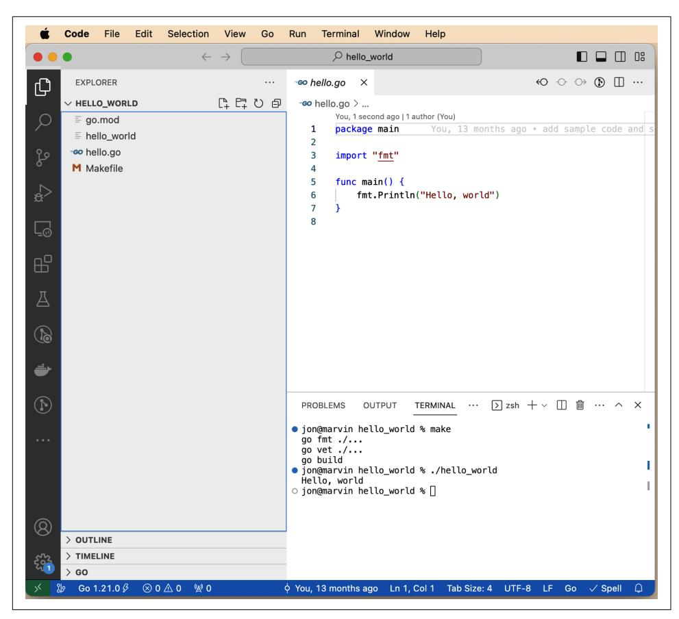

*Figure 1-1. Visual Studio Code*

## **GoLand**

[GoLand](https://oreil.ly/6cXjL) is the Go-specific IDE from JetBrains. While JetBrains is best known for Java-centric tools, GoLand is an excellent Go development environment. As you can see in [Figure 1-2,](#page-33-0) GoLand's user interface looks similar to IntelliJ, PyCharm, RubyMine, WebStorm, Android Studio, or any of the other JetBrains IDEs. Its Go support includes refactoring, syntax highlighting, code completion and navigation, documentation pop-ups, a debugger, code coverage, and more. In addition to Go support, GoLand includes JavaScript/HTML/CSS and SQL database tools. Unlike VS Code, GoLand doesn't require you to install a plug-in to get it to work.

<span id="page-33-0"></span>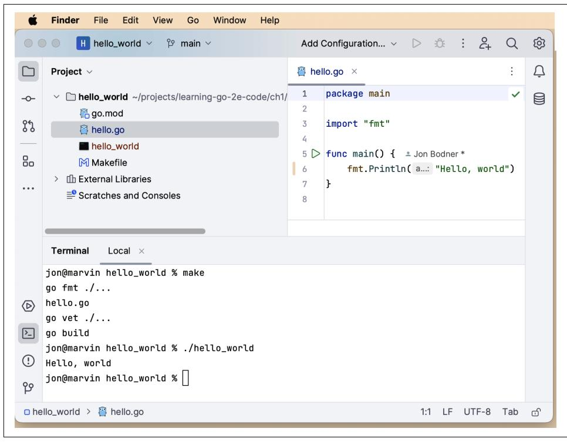

*Figure 1-2. GoLand*

If you have already subscribed to IntelliJ Ultimate, you can add Go support via a plug-in. While GoLand is commercial software, JetBrains has a [Free License Program](https://oreil.ly/48gEF) for students and core open source contributors. If you don't qualify for a free license, a 30-day free trial is available. After that, you have to pay for GoLand.

## **The Go Playground**

There's one more important tool for Go development, but this is one that you don't install. Visit [The Go Playground](http://go.dev/play) and you'll see a window that resembles [Figure 1-3.](#page-34-0) If you have used a command-line environment like irb, node, or python, you'll find The Go Playground has a similar feel. It gives you a place to try out and share small programs. Enter your program into the window and click the Run button to execute the code. The Format button runs go fmt on your program and updates your imports. The Share button creates a unique URL that you can send to someone else to take a look at your program or to come back to your code at a future date (the URLs have proven to be persistent for a long time, but I wouldn't rely on the playground as your source code repository).

<span id="page-34-0"></span>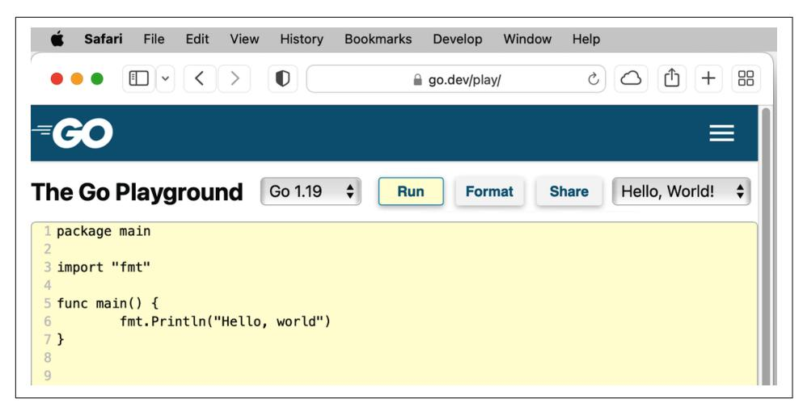

*Figure 1-3. The Go Playground*

As you can see in [Figure 1-4,](#page-35-0) you can simulate multiple files by separating each file with a line that looks like -- filename.go --. You can even create simulated subdirectories by including a / in the filename, such as -- subdir/my\_code.go -- .

Be aware that The Go Playground is on someone else's computer (in particular, Google's computer), so you don't have completely free rein. It gives you a choice of a few versions of Go (usually the current release, the previous release, and the latest development version). You can make network connections only to localhost, and processes that run for too long or use too much memory are stopped. If your program depends on time, you need to take into account that the clock is set to November 10, 2009, 23:00:00 UTC (the date of the initial announcement of Go). Even with these limitations, The Go Playground is a useful way to try out new ideas without creating a new project locally. Throughout this book, you'll find links to The Go Playground so you can run code examples without copying them onto your computer.


Do not put sensitive information (such as personally identifiable information, passwords, or private keys) into your playground! If you click the Share button, the information is saved on Google's servers and is accessible to anyone who has the associ‐ ated Share URL. If you do this by accident, contact Google at *security@golang.org* with the URL and the reason the content needs to be removed.

<span id="page-35-0"></span>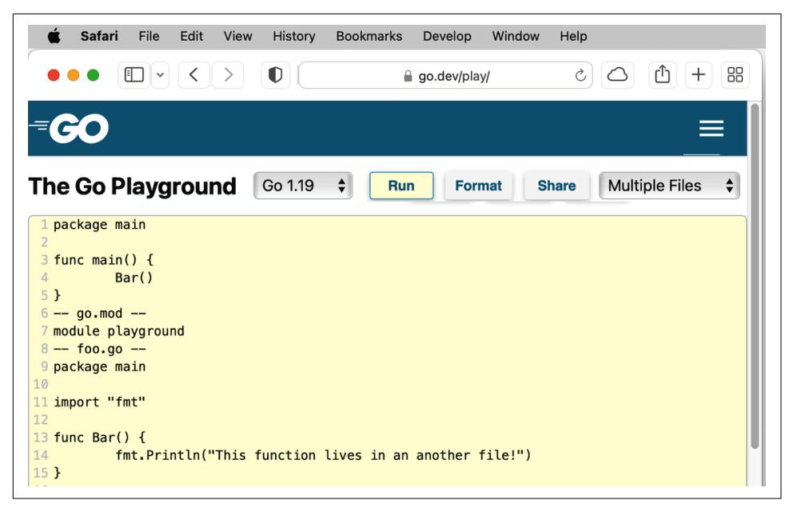

*Figure 1-4. The Go Playground supports multiple files*

# **Makefiles**

An IDE is nice to use, but it's hard to automate. Modern software development relies on repeatable, automatable builds that can be run by anyone, anywhere, at any time. Requiring this kind of tooling is good software engineering practice. It avoids the age-old situation where a developer absolves themselves of any build problems with a shrug and the statement, "It works on my machine!" The way to do this is to use some kind of script to specify your build steps. Go developers have adopted make as their solution. It lets developers specify a set of operations that are necessary to build a program and the order in which the steps must be performed. You may not be familiar with make, but it's been used to build programs on Unix systems since 1976.

Create a file called *Makefile* in the *ch1* directory with the following contents:

```
.DEFAULT_GOAL := build
.PHONY:fmt vet build
fmt:
 go fmt ./...
vet: fmt
 go vet ./...
build: vet
 go build
```

<span id="page-36-0"></span>Even if you haven't seen a Makefile before, figuring out what's going on is not too difficult. Each possible operation is called a *target*. The .DEFAULT\_GOAL defines which target is run when no target is specified. In this case, the default is the build target. Next you have the target definitions. The word before the colon (:) is the name of the target. Any words after the target (like vet in the line build: vet) are the other targets that must be run before the specified target runs. The tasks that are performed by the target are on the indented lines after the target. The .PHONY line keeps make from getting confused if a directory or file in your project has the same name as one of the listed targets.

Run make and you should see the following output:

```
$ make
go fmt ./...
go vet ./...
go build
```

Entering a single command formats the code correctly, checks it for nonobvious errors, and compiles it. You can also vet the code with make vet, or just run the formatter with make fmt. This might not seem like a big improvement, but ensuring that formatting and vetting always happen before a developer (or a script running on a continuous integration build server) triggers a build means you won't miss any steps.

One drawback to Makefiles is that they are exceedingly picky. You *must* indent the steps in a target with a tab. They are also not supported out-of-the-box on Windows. If you are doing your Go development on a Windows computer, you need to install make first. The easiest way to do so is to first install a package manager like [Chocola‐](https://chocolatey.org) [tey](https://chocolatey.org) and then use it to install make (for Chocolatey, the command is choco install make).

If you want to learn more about writing Makefiles, there's a good [tutorial by Chase](https://oreil.ly/Vytcj) [Lambert,](https://oreil.ly/Vytcj) but it does use a tiny bit of C to explain the concepts.

You can find the code from this chapter in the [Chapter 1 repository](https://oreil.ly/eOfkK) for this book.

# **The Go Compatibility Promise**

As with all programming languages, the Go development tools are periodically upda‐ ted. Since Go 1.2, a new release has occurred roughly every six months. Patch releases with bug and security fixes are also released as needed. Given the rapid development cycles and the Go team's commitment to backward compatibility, Go releases tend to be incremental rather than expansive. The [Go Compatibility Promise](https://oreil.ly/p_NMY) is a detailed description of how the Go team plans to avoid breaking Go code. It says that there won't be backward-breaking changes to the language or the standard library for any Go version that starts with 1, unless the change is required for a bug or security fix. In <span id="page-37-0"></span>his GopherCon 2022 keynote talk ["Compatibility: How Go Programs Keep Working",](https://oreil.ly/Ohkr7) Russ Cox discusses all the ways that the Go Team works to keep Go code from breaking. He says, "I believe that prioritizing compatibility was the most important design decision that we made in Go 1."

This guarantee doesn't apply to the go commands. There have been backwardincompatible changes to the flags and functionality of the go commands, and it's entirely possible that it will happen again.

# **Staying Up-to-Date**

Go programs compile to a standalone native binary, so you don't need to worry that updating your development environment could cause your currently deployed programs to fail. You can have programs compiled with different versions of Go running simultaneously on the same computer or virtual machine.

When you are ready to update the Go development tools installed on your computer, Mac and Windows users have the easiest path. Those who installed with brew or chocolatey can use those tools to update. Those who used the installers on *[https://](https://golang.org/dl) [golang.org/dl](https://golang.org/dl)* can download the latest installer, which removes the old version when it installs the new one.

Linux and BSD users need to download the latest version, move the old version to a backup directory, unpack the new version, and then delete the old version:

```
$ mv /usr/local/go /usr/local/old-go
$ tar -C /usr/local -xzf go1.20.6.linux-amd64.tar.gz
$ rm -rf /usr/local/old-go
```


Technically, you don't need to move the existing installation to a new location; you could just delete it and install the new version. However, this falls in the "better safe than sorry" category. If some‐ thing goes wrong while installing the new version, it's good to have the previous one around.

# **Exercises**

Each chapter has exercises at the end to let you try out the ideas that I cover. You can find answers to these exercises in the [Chapter 1 repository](https://oreil.ly/c-oc3).

- 1. Take the "Hello, world!" program and run it on The Go Playground. Share a link to the code in the playground with a coworker who would love to learn about Go.
- 2. Add a target to the Makefile called clean that removes the hello\_world binary and any other temporary files created by go build. Take a look at the [Go](https://oreil.ly/uqsMy) [command documentation](https://oreil.ly/uqsMy) to find a go command to help implement this.

<span id="page-38-0"></span>3. Experiment with modifying the formatting in the "Hello, world!" program. Add blank lines, spaces, change indentation, insert newlines. After making a modifi‐ cation, run go fmt to see if the formatting change is undone. Also, run go build to see if the code still compiles. You can also add additional fmt.Println calls so you can see what happens if you put blank lines in the middle of a function.

# **Wrapping Up**

In this chapter, you learned how to install and configure your Go development environment. You also learned about tools for building Go programs and ensuring code quality. Now that your environment is ready, you're on to the next chapter, where you'll explore the built-in types in Go and how to declare variables.

# <span id="page-40-0"></span>**Predeclared Types and Declarations**

Now that you have your development environment set up, it's time to start looking at Go's language features and how to best use them. When trying to figure out what "best" means, there is one overriding principle: write your programs in a way that makes your intentions clear. As I go through features and discuss the options, I'll explain why I find that a particular approach produces clearer code.

I'll start by looking at the types that are built into Go and how to declare variables of those types. While every programmer has experience with these concepts, Go does some things differently, and subtle differences exist between Go and other languages.

# **The Predeclared Types**

Go has many types built into the language. These are called *predeclared* types. They are similar to types that are found in other languages: booleans, integers, floats, and strings. Using these types idiomatically is sometimes a challenge for developers who are transitioning from another language. You'll look at these types and see how they work best in Go. Before I review the types, let's cover some of the concepts that apply to all types.

## **The Zero Value**

Go, like most modern languages, assigns a default *zero value* to any variable that is declared but not assigned a value. Having an explicit zero value makes code clearer and removes a source of bugs found in C and C++ programs. As I talk about each type, I will also cover the zero value for the type. You can find details on the zero value in [The Go Programming Language Specification](https://oreil.ly/3d3e6).

## <span id="page-41-0"></span>**Literals**

A Go *literal* is an explicitly specified number, character, or string. Go programs have four common kinds of literals. (I'll cover a rare fifth kind of literal when discussing complex numbers.)

An *integer literal* is a sequence of numbers. Integer literals are base 10 by default, but different prefixes are used to indicate other bases: 0b for binary (base 2), 0o for octal (base 8), or 0x for hexadecimal (base 16). You can use either upper- or lowercase letters for the prefix. A leading 0 with no letter after it is another way to represent an octal literal. Do not use it, as it is very confusing.

To make it easier to read longer integer literals, Go allows you to put underscores in the middle of your literal. This allows you to, for example, group by thousands in base 10 (1\_234). These underscores have no effect on the value of the number. The only limitations on underscores are that they can't be at the beginning or end of numbers, and you can't have them next to each other. You could put an underscore between every digit in your literal (1\_2\_3\_4), but don't. Use them to improve read‐ ability by breaking up base 10 numbers at the thousands place or to break up binary, octal, or hexadecimal numbers at 1-, 2-, or 4-byte boundaries.

A *floating-point literal* has a decimal point to indicate the fractional portion of the value. They can also have an exponent specified with the letter e and a positive or negative number (such as 6.03e23). You also have the option to write them in hexadecimal by using the 0x prefix and the letter p for indicating any exponent (0x12.34p5, which is equal to 582.5 in base 10). As integer literals, you can use underscores to format your floating-point literals.

A *rune literal* represents a character and is surrounded by single quotes. Unlike many other languages, in Go single quotes and double quotes are *not* interchange‐ able. Rune literals can be written as single Unicode characters ('a'), 8-bit octal numbers ('\141'), 8-bit hexadecimal numbers ('\x61'), 16-bit hexadecimal num‐ bers ('\u0061'), or 32-bit Unicode numbers ('\U00000061'). There are also several backslash-escaped rune literals, with the most useful ones being newline ('\n'), tab ('\t'), single quote ('\''), and backslash ('\\').

Practically speaking, use base 10 to represent your integer and floating-point literals. Octal representations are rare, mostly used to represent POSIX permission flag values (such as 0o777 for rwxrwxrwx). Hexadecimal and binary are sometimes used for bit filters or networking and infrastructure applications. Avoid using any of the numeric escapes for rune literals, unless the context makes your code clearer.

<span id="page-42-0"></span>There are two ways to indicate *string literals*. Most of the time, you should use double quotes to create an *interpreted string literal* (e.g., type **"Greetings and Salutations"**). These contain zero or more rune literals. They are called "inter‐ preted" because they interpret rune literals (both numeric and backslash escaped) into single characters.


One rune literal backslash escape is not legal in a string literal: the single quote escape. It is replaced by a backslash escape for double quotes.

The only characters that cannot appear in an interpreted string literal are unesca‐ ped backslashes, unescaped newlines, and unescaped double quotes. If you use an interpreted string literal and want your greetings on a different line from your salutations and want "Salutations" to appear in quotes, you need to type **"Greetings and\n\"Salutations\""**.

If you need to include backslashes, double quotes, or newlines in your string, using a *raw string literal* is easier. These are delimited with backquotes (`) and can contain any character except a backquote. There's no escape character in a raw string literal; all characters are included as is. When using a raw string literal, you write a multiline greeting like so:

```
`Greetings and
"Salutations"`
```

Literals are considered *untyped*. I'll explore this concept more in ["Literals Are Unty‐](#page-50-0) [ped" on page 27](#page-50-0). As you will see in ["var Versus :=" on page 28](#page-51-0), there are situations in Go where the type isn't explicitly declared. In those cases, Go uses the *default type* for a literal; if there's nothing in the expression that makes clear what the type of the literal is, the literal defaults to a type. I will mention the default type for literals when discussing the different predeclared types.

## **Booleans**

The bool type represents Boolean variables. Variables of bool type can have one of two values: true or false. The zero value for a bool is false:

```
var flag bool // no value assigned, set to false
var isAwesome = true
```

It's hard to talk about variable types without showing a variable declaration, and vice versa. I'll use variable declarations first and describe them in ["var Versus :=" on page](#page-51-0) [28](#page-51-0).

## <span id="page-43-0"></span>**Numeric Types**

Go has a large number of numeric types: 12 types (and a few special names) that are grouped into three categories. If you are coming from a language like JavaScript that gets along with only a single numeric type, this might seem like a lot. And in fact, some types are used frequently while others are more esoteric. I'll start by looking at integer types before moving on to floating-point types and the very unusual complex type.

### **Integer types**

Go provides both signed and unsigned integers in a variety of sizes, from one to eight bytes. They are shown in Table 2-1.

*Table 2-1. The integer types in Go*

| Type name | Value range                                 |
|-----------|---------------------------------------------|
| int8      | –128 to 127                                 |
| int16     | –32768 to 32767                             |
| int32     | –2147483648 to 2147483647                   |
| int64     | –9223372036854775808 to 9223372036854775807 |
| uint8     | 0 to 255                                    |
| uint16    | 0 to 65535                                  |
| uint32    | 0 to 4294967295                             |
| uint64    | 0 to 18446744073709551615                   |

It might be obvious from the name, but the zero value for all of the integer types is 0.

### **The special integer types**

Go does have some special names for integer types. A byte is an alias for uint8; it is legal to assign, compare, or perform mathematical operations between a byte and a uint8. However, you rarely see uint8 used in Go code; just call it a byte.

The second special name is int. On a 32-bit CPU, int is a 32-bit signed integer like an int32. On most 64-bit CPUs, int is a 64-bit signed integer, just like an int64. Because int isn't consistent from platform to platform, it is a compile-time error to assign, compare, or perform mathematical operations between an int and an int32 or int64 without a type conversion (see ["Explicit Type Conversion" on page 26](#page-49-0) for more details). Integer literals default to being of int type.

<span id="page-44-0"></span>

Some uncommon 64-bit CPU architectures use a 32-bit signed integer for the int type. Go supports three of them: amd64p32, mips64p32, and mips64p32le.

The third special name is uint. It follows the same rules as int, only it is unsigned (the values are always 0 or positive).

There are two other special names for integer types, rune and uintptr. You looked at rune literals earlier and I'll discuss the rune type in ["A Taste of Strings and Runes" on](#page-48-0) [page 25](#page-48-0) and uintptr in [Chapter 16](#page-432-0).

### **Choosing which integer to use**

Go provides more integer types than some other languages. Given all these choices, you might wonder when you should use each of them. You should follow three simple rules:

- If you are working with a binary file format or network protocol that has an integer of a specific size or sign, use the corresponding integer type.
- If you are writing a library function that should work with any integer type, take advantage of Go's generics support and use a generic type parameter to represent any integer type (I talk more about functions and their parameters in [Chapter 5](#page-116-0) and more about generics in [Chapter 8.](#page-204-0))
- In all other cases, just use int.


You'll likely find legacy code where there's a pair of functions that do the same thing, but one has int64 for the parameters and variables and the other has uint64. The reason is that the API was created before generics were added to Go. Without generics, you needed to write functions with slightly different names to imple‐ ment the same algorithm with different types. Using int64 and uint64 meant that you could write the code once and let callers use type conversions to pass values in and convert data that's returned.

You can see this pattern in the Go standard library within the functions FormatInt and FormatUint in the strconv package.

### **Integer operators**

Go integers support the usual arithmetic operators: +, -, \*, /, with % for modulus. The result of an integer division is an integer; if you want to get a floating-point result, you need to use a type conversion to make your integers into floating-point numbers.

<span id="page-45-0"></span>Also, be careful not to divide an integer by 0; this causes a panic (I talk more about panics in ["panic and recover" on page 218](#page-241-0)).


Integer division in Go follows truncation toward zero; see the Go spec's section on [arithmetic operators](https://oreil.ly/zp3OJ) for the full details.

You can combine any of the arithmetic operators with = to modify a variable: +=, -=, \*=, /=, and %=. For example, the following code results in x having the value 20:

```
var x int = 10
x *= 2
```

You compare integers with ==, !=, >, >=, <, and <=.

Go also has bit-manipulation operators for integers. You can bit shift left and right with << and >>, or do bit masks with & (bitwise AND), | (bitwise OR), ^ (bitwise XOR), and &^ (bitwise AND NOT). As with the arithmetic operators, you can also combine all the bitwise operators with = to modify a variable: &=, |=, ^=, &^=, <<=, and >>=.

### **Floating-point types**

Go has two floating-point types, as shown in Table 2-2.

*Table 2-2. The floating-point types in Go*

| Type<br>name | Largest absolute value                         | Smallest (nonzero) absolute value              |
|--------------|------------------------------------------------|------------------------------------------------|
| float32      | 3.40282346638528859811704183484516925440e+38   | 1.401298464324817070923729583289916131280e-45  |
| float64      | 1.797693134862315708145274237317043567981e+308 | 4.940656458412465441765687928682213723651e-324 |

Like the integer types, the zero value for the floating-point types is 0.

Floating point in Go is similar to floating-point math in other languages. Go uses the IEEE 754 specification, giving a large range and limited precision. Picking which floating-point type to use is straightforward: unless you have to be compatible with an existing format, use float64. Floating-point literals have a default type of float64, so always using float64 is the simplest option. It also helps mitigate floating-point accuracy issues since a float32 has only six- or seven-decimal digits of precision. Don't worry about the difference in memory size unless you have used the profiler to determine that it is a significant source of problems. (Testing and profiling are covered in [Chapter 15.](#page-394-0))

<span id="page-46-0"></span>The bigger question is whether you should be using a floating-point number at all. In many cases, the answer is no. Just like other languages, Go floating-point numbers have a huge range, but they cannot store every value in that range; they store the nearest approximation. Because floats aren't exact, they can be used only in situations where inexact values are acceptable or the rules of floating point are well understood. That limits them to things like graphics, statistics, and scientific operations.


A floating-point number cannot represent a decimal value exactly. Do not use them to represent money or any other value that must have an exact decimal representation! You'll look at a third-party module for handling exact decimal values in ["Importing Third-](#page-263-0)[Party Code" on page 240](#page-263-0).

### **IEEE 754**

As mentioned earlier, Go (and most other programming languages) stores floatingpoint numbers using a specification called IEEE 754.

The actual rules are outside the scope of this book, and they aren't straightforward. You can learn more about IEEE 754 from [The Floating Point Guide](https://oreil.ly/FHeW-).

You can use all the standard mathematical and comparison operators with floats, except %. Floating-point division has a couple of interesting properties. Dividing a nonzero floating-point variable by 0 returns +Inf or -Inf (positive or negative infinity), depending on the sign of the number. Dividing a floating-point variable set to 0 by 0 returns NaN (Not a Number).

While Go lets you use == and != to compare floats, don't do it. Because of the inexact nature of floats, two floating-point values might not be equal when you think they should be. Instead, define a maximum allowed variance and see if the difference between two floats is less than that. This value (sometimes called *epsilon*) depends on your accuracy needs; I can't give you a simple rule. If you aren't sure, consult your friendly local mathematician for advice. If you can't find one, [The Floating Point](https://oreil.ly/n9ws3) [Guide has a "Comparison" page](https://oreil.ly/n9ws3) that can help you out (or possibly convince you to avoid floating-point numbers unless absolutely necessary).

### **Complex types (you're probably not going to use these)**

There is one more numeric type and it is pretty unusual. Go has first-class support for complex numbers. If you don't know what complex numbers are, you are not the target audience for this feature; feel free to skip ahead.

<span id="page-47-0"></span>There isn't a lot to the complex number support in Go. Go defines two complex num‐ ber types. complex64 uses float32 values to represent the real and imaginary part, and complex128 uses float64 values. Both are declared with the complex built-in function:

```
var complexNum = complex(20.3, 10.2)
```

Go uses a few rules to determine the type of the value returned by complex:

- If you use untyped constants or literals for both function parameters, you'll create an untyped complex literal, which has a default type of complex128.
- If both values passed into complex are of float32 type, you'll create a complex64.
- If one value is a float32 and the other value is an untyped constant or literal that can fit within a float32, you'll create a complex64.
- Otherwise, you'll create a complex128.

All the standard floating-point arithmetic operators work on complex numbers. Just as with floats, you can use == or != to compare them, but they have the same precision limitations, so it's best to use the epsilon technique. You can extract the real and imaginary portions of a complex number with the real and imag built-in functions, respectively. The math/cmplx package has additional functions for manip‐ ulating complex128 values.

The zero value for both types of complex numbers has 0 assigned to both the real and imaginary portions of the number.

Example 2-1 shows a simple program that demonstrates how complex numbers work. You can run it for yourself on [The Go Playground](https://oreil.ly/fuyIu) or in the *sample\_code/com‐ plex\_numbers* directory in the [Chapter 2 repository.](https://oreil.ly/zXZqI)

### *Example 2-1. Complex numbers*

```
func main() {
 x := complex(2.5, 3.1)
 y := complex(10.2, 2)
 fmt.Println(x + y)
 fmt.Println(x - y)
 fmt.Println(x * y)
 fmt.Println(x / y)
 fmt.Println(real(x))
 fmt.Println(imag(x))
 fmt.Println(cmplx.Abs(x))
}
```

<span id="page-48-0"></span>Running this code gives you the following:

```
(12.7+5.1i)
(-7.699999999999999+1.1i)
(19.3+36.62i)
(0.2934098482043688+0.24639022584228065i)
2.5
3.1
3.982461550347975
```

You can see floating-point imprecision on display here too.

In case you were wondering what the fifth kind of primitive literal was, Go supports imaginary literals to represent the imaginary portion of a complex number. They look just like floating-point literals, but they have an i for a suffix.

Despite having complex numbers as a predeclared type, Go is not a popular language for numerical computing. Adoption has been limited because other features (like matrix support) are not part of the language and libraries have to use inefficient replacements, like slices of slices. (You'll look at slices in [Chapter 3](#page-60-0) and how they are implemented in [Chapter 6.](#page-142-0)) But if you need to calculate a Mandelbrot set as part of a larger program, or implement a quadratic equation solver, complex number support is there for you.

You might be wondering why Go includes complex numbers. The answer is simple: Ken Thompson, one of the creators of Go (and Unix), thought they would be [inter‐](https://oreil.ly/eBmkq) [esting.](https://oreil.ly/eBmkq) There has been discussion about [removing complex numbers](https://oreil.ly/Q76EV) from a future version of Go, but it's easier to just ignore the feature.


If you do want to write numerical computing applications in Go, you can use the third-party [Gonum](https://www.gonum.org) package. It takes advantage of complex numbers and provides useful libraries for things like linear algebra, matrices, integration, and statistics. But you should consider other languages first.

## **A Taste of Strings and Runes**

This brings us to strings. Like most modern languages, Go includes strings as a built-in type. The zero value for a string is the empty string. Go supports Unicode; as I showed ["Literals" on page 18](#page-41-0), you can put any Unicode character into a string. Like integers and floats, strings are compared for equality using ==, difference with !=, or ordering with >, >=, <, or <=. They are concatenated by using the + operator.

Strings in Go are immutable; you can reassign the value of a string variable, but you cannot change the value of the string that is assigned to it.

<span id="page-49-0"></span>Go also has a type that represents a single code point. The *rune* type is an alias for the int32 type, just as byte is an alias for uint8. As you could probably guess, a rune literal's default type is a rune, and a string literal's default type is a string.

If you are referring to a character, use the rune type, not the int32 type. They might be the same to the compiler, but you want to use the type that clarifies the intent of your code:

```
var myFirstInitial rune = 'J' // good - the type name matches the usage
var myLastInitial int32 = 'B' // bad - legal but confusing
```

I am going to talk a lot more about strings in the next chapter, covering some imple‐ mentation details, relationships with bytes and runes, as well as advanced features and pitfalls.

## **Explicit Type Conversion**

Most languages that have multiple numeric types automatically convert from one to another when needed. This is called *automatic type promotion*, and while it seems very convenient, it turns out that the rules to properly convert one type to another can get complicated and produce unexpected results. As a language that values clarity of intent and readability, Go doesn't allow automatic type promotion between variables. You must use a *type conversion* when variable types do not match. Even different-sized integers and floats must be converted to the same type to interact. This makes it clear exactly what type you want without having to memorize any type conversion rules (see Example 2-2).

### *Example 2-2. Type conversions*

```
var x int = 10
var y float64 = 30.2
var sum1 float64 = float64(x) + y
var sum2 int = x + int(y)
fmt.Println(sum1, sum2)
```

In this sample code, you define four variables. x is an int with the value 10, and y is a float64 with the value 30.2. Since these are not identical types, you need to convert them to add them together. For sum1, you convert x to a float64 using a float64 type conversion, and for sum2, you convert y to an int using an int type conversion. When you run this code, it prints out 40.2 40.

The same behavior applies with different-sized integer types (see [Example 2-3\)](#page-50-0).

<span id="page-50-0"></span>

### *Example 2-3. Integer type conversions*

```
var x int = 10
var b byte = 100
var sum3 int = x + int(b)
var sum4 byte = byte(x) + b
fmt.Println(sum3, sum4)
```

You can run these examples on [The Go Playground](https://oreil.ly/VoE7H) or in the *sample\_code/type\_con‐ version* directory in the [Chapter 2 repository.](https://oreil.ly/dGtos)

This strictness around types has other implications. Since all type conversions in Go are explicit, you cannot treat another Go type as a boolean. In many languages, a nonzero number or a nonempty string can be interpreted as a boolean true. Just like automatic type promotion, the rules for "truthy" values vary from language to language and can be confusing. Unsurprisingly, Go doesn't allow truthiness. In fact, *no other type can be converted to a bool, implicitly or explicitly*. If you want to convert from another data type to boolean, you must use one of the comparison operators (==, !=, >, <, <=, or >=). For example, to check if variable x is equal to 0, the code would be x == 0. If you want to check if string s is empty, use s == "".


Type conversions are one of the places where Go chooses to add a little verbosity in exchange for a great deal of simplicity and clarity. You'll see this trade-off multiple times. Idiomatic Go values comprehensibility over conciseness.

## **Literals Are Untyped**

While you can't add two integer variables together if they are declared to be of differ‐ ent types of integers, Go lets you use an integer literal in floating-point expressions or even assign an integer literal to a floating-point variable:

```
var x float64 = 10
var y float64 = 200.3 * 5
```

This is because, as I mentioned earlier, literals in Go are untyped. Go is a practical language, and it makes sense to avoid forcing a type until the developer specifies one. This means they can be used with any variable whose type is compatible with the literal. When you look at user-defined types in [Chapter 7,](#page-166-0) you'll see that you can even use literals with user-defined types based on predefined types. Being untyped goes only so far; you can't assign a literal string to a variable with a numeric type or a literal number to a string variable, nor can you assign a float literal to an int. These are all flagged by the compiler as errors. Size limitations also exist; while you can write numeric literals that are larger than any integer can hold, it is a compile-time

<span id="page-51-0"></span>error to try to assign a literal whose value overflows the specified variable, such as trying to assign the literal 1000 to a variable of type byte.

# **var Versus :=**

For a small language, Go has a lot of ways to declare variables. There's a reason for this: each declaration style communicates something about how the variable is used. Let's go through the ways you can declare a variable in Go and see when each is appropriate.

The most verbose way to declare a variable in Go uses the var keyword, an explicit type, and an assignment. It looks like this:

```
var x int = 10
```

If the type on the righthand side of the = is the expected type of your variable, you can leave off the type from the left side of the =. Since the default type of an integer literal is int, the following declares x to be a variable of type int:

```
var x = 10
```

Conversely, if you want to declare a variable and assign it the zero value, you can keep the type and drop the = on the righthand side:

```
var x int
```

You can declare multiple variables at once with var, and they can be of the same type:

```
var x, y int = 10, 20
```

You can declare all zero values of the same type:

```
var x, y int
```

or of different types:

```
var x, y = 10, "hello"
```

There's one more way to use var. If you are declaring multiple variables at once, you can wrap them in a *declaration list*:

```
var (
 x int
 y = 20
 z int = 30
 d, e = 40, "hello"
 f, g string
)
```

Go also supports a short declaration and assignment format. When you are within a function, you can use the := operator to replace a var declaration that uses type <span id="page-52-0"></span>inference. The following two statements do exactly the same thing—they declare x to be an int with the value of 10:

```
var x = 10
x := 10
```

As with var, you can declare multiple variables at once using :=. These two lines both assign 10 to x and "hello" to y:

```
var x, y = 10, "hello"
x, y := 10, "hello"
```

The := operator can do one trick that you cannot do with var: it allows you to assign values to existing variables too. As long as at least one new variable is on the lefthand side of the :=, any of the other variables can already exist:

```
x := 10
x, y := 30, "hello"
```

Using := has one limitation. If you are declaring a variable at the package level, you must use var because := is not legal outside of functions.

How do you know which style to use? As always, choose what makes your intent clearest. The most common declaration style within functions is :=. Outside of a function, use declaration lists on the rare occasions when you are declaring multiple package-level variables.

In some situations within functions, you should avoid :=:

- When initializing a variable to its zero value, use var x int. This makes it clear that the zero value is intended.
- When assigning an untyped constant or a literal to a variable and the default type for the constant or literal isn't the type you want for the variable, use the long var form with the type specified. While it is legal to use a type conversion to specify the type of the value and use := to write x := byte(20), it is idiomatic to write var x byte = 20.
- Because := allows you to assign to both new and existing variables, it sometimes creates new variables when you think you are reusing existing ones (see ["Shad‐](#page-91-0) [owing Variables" on page 68](#page-91-0) for details). In those situations, explicitly declare all your new variables with var to make it clear which variables are new, and then use the assignment operator (=) to assign values to both new and old variables.

While var and := allow you to declare multiple variables on the same line, use this style only when assigning multiple values returned from a function or the comma ok idiom (see [Chapter 5](#page-116-0) and ["The comma ok Idiom" on page 58\)](#page-81-0).

<span id="page-53-0"></span>You should rarely declare variables outside of functions, in what's called the *package block* (see ["Blocks" on page 67](#page-90-0)). Package-level variables whose values change are a bad idea. When you have a variable outside of a function, it can be difficult to track the changes made to it, which makes it hard to understand how data is flowing through your program. This can lead to subtle bugs. As a general rule, you should only declare variables in the package block that are effectively immutable.


Avoid declaring variables outside of functions because they compli‐ cate data flow analysis.

You might be wondering: does Go provide a way to *ensure* that a value is immutable? It does, but it is a bit different from what you may have seen in other programming languages. It's time to learn about const.

# **Using const**

Many languages have a way to declare a value as immutable. In Go, this is done with the const keyword. At first glance, it seems to work exactly as it would in other languages. Try out the code in Example 2-4 on [The Go Playground](https://oreil.ly/FdG-W) or in the *sample\_code/const\_declaration* directory in the [Chapter 2 repository.](https://oreil.ly/QxTTT)

*Example 2-4. const declarations*

```
package main
import "fmt"
const x int64 = 10
const (
 idKey = "id"
 nameKey = "name"
)
const z = 20 * 10
func main() {
 const y = "hello"
 fmt.Println(x)
 fmt.Println(y)
 x = x + 1 // this will not compile!
 y = "bye" // this will not compile!
```

```
 fmt.Println(x)
 fmt.Println(y)
}
```

When you run this code, compilation fails with the following error messages:

```
./prog.go:20:2: cannot assign to x (constant 10 of type int64)
./prog.go:21:2: cannot assign to y (untyped string constant "hello")
```

As you see, you declare a constant at the package level or within a function. Just as with var, you can (and should) declare a group of related constants within a set of parentheses.

Be aware that const in Go is very limited. Constants in Go are a way to give names to literals. They can only hold values that the compiler can figure out at compile time. This means that they can be assigned:

- Numeric literals
- true and false
- Strings
- Runes
- The values returned by the built-in functions complex, real, imag, len, and cap
- Expressions that consist of operators and the preceding values


I'll cover the len and cap functions in the next chapter. Another value that can be used with const is called iota. I'll talk about iota when I discuss creating your own types in [Chapter 7](#page-166-0).

Go doesn't provide a way to specify that a value calculated at runtime is immutable. For example, the following code will fail to compile with the error x + y (value of type int) is not constant:

```
x := 5
y := 10
const z = x + y // this won't compile!
```

As you'll see in the next chapter, there are no immutable arrays, slices, maps, or structs, and there's no way to declare that a field in a struct is immutable. This is less limiting than it sounds. Within a function, it is clear if a variable is being modified, so immutability is less important. In ["Go Is Call by Value" on page 114,](#page-137-0) you'll see how Go prevents modifications to variables that are passed as parameters to functions.

<span id="page-55-0"></span>

Constants in Go are a way to give names to literals. There is *no* way in Go to declare that a variable is immutable.

# **Typed and Untyped Constants**

Constants can be typed or untyped. An untyped constant works exactly like a literal; it has no type of its own but does have a default type that is used when no other type can be inferred. A typed constant can be directly assigned only to a variable of that type.

Whether to make a constant typed depends on why the constant was declared. If you are giving a name to a mathematical constant that could be used with multiple numeric types, keep the constant untyped. In general, leaving a constant untyped gives you more flexibility. In certain situations, you'll want a constant to enforce a type. You'll see a use for typed constants when I cover enumerations with iota in ["iota Is for Enumerations—Sometimes" on page 152.](#page-175-0)

Here's what an untyped constant declaration looks like:

```
const x = 10
```

All of the following assignments are legal:

```
var y int = x
var z float64 = x
var d byte = x
```

Here's what a typed constant declaration looks like:

```
const typedX int = 10
```

This constant can be assigned directly only to an int. Assigning it to any other type produces a compile-time error like this:

```
cannot use typedX (type int) as type float64 in assignment
```

# **Unused Variables**

One of the goals for Go is to make it easier for large teams to collaborate on pro‐ grams. To do so, Go has some rules that are unique among programming languages. In [Chapter 1](#page-24-0), you saw that Go programs need to be formatted in a specific way with go fmt to make it easier to write code-manipulation tools and to provide coding standards. Another Go requirement is that *every declared local variable must be read*. It is a *compile-time error* to declare a local variable and to not read its value.

<span id="page-56-0"></span>The compiler's unused variable check is not exhaustive. As long as a variable is read once, the compiler won't complain, even if there are writes to the variable that are never read. The following is a valid Go program that you can run on [The Go Playground](https://oreil.ly/8JLA6) or in the *sample\_code/assignments\_not\_read* directory in the [Chapter 2 repository](https://oreil.ly/FqALl):

```
func main() {
 x := 10 // this assignment isn't read!
 x = 20
 fmt.Println(x)
 x = 30 // this assignment isn't read!
}
```

While the compiler and go vet do not catch the unused assignments of 10 and 30 to x, third-party tools can detect them. I'll talk about these tools in ["Using Code-Quality](#page-290-0) [Scanners" on page 267](#page-290-0).


The Go compiler won't stop you from creating unread packagelevel variables. This is one more reason you should avoid creating package-level variables.

### **Unused Constants**

Perhaps surprisingly, the Go compiler allows you to create unread constants with const. This is because constants in Go are calculated at compile time and cannot have any side effects. This makes them easy to eliminate: if a constant isn't used, it is simply not included in the compiled binary.

# **Naming Variables and Constants**

There is a difference between Go's rules for naming variables and the patterns that Go developers follow when naming their variables and constants. Like most languages, Go requires identifier names to start with a letter or underscore, and the name can contain numbers, underscores, and letters. Go's definition of "letter" and "number" is a bit broader than many languages. Any Unicode character considered a letter or digit is allowed. This makes all the variable definitions in Example 2-5 perfectly valid Go.

*Example 2-5. Variable names you should never use*

```
_0 := 0_0
_1 := 20
π := 3
a := "hello" // Unicode U+FF41
```

```
__ := "double underscore" // two underscores
fmt.Println(_0)
fmt.Println(_1)
fmt.Println(π)
fmt.Println(a)
fmt.Println(__)
```

You can test out this awful code on [The Go Playground.](https://oreil.ly/VIYOk) While it works, *do not* use variable names like this. These names are considered nonidiomatic because they break the fundamental rule of making sure that your code communicates what it is doing. These names are confusing or difficult to type on many keyboards. Look-alike Unicode code points are the most insidious, because even if they appear to be the same character, they represent entirely different variables. You can run the code shown in Example 2-6 on [The Go Playground](https://oreil.ly/hrvb6) or in the *sample\_code/ look\_alike\_code\_points* directory in the [Chapter 2 repository.](https://oreil.ly/7nLfx)

*Example 2-6. Using look-alike code points for variable names*

```
func main() {
 a := "hello" // Unicode U+FF41
 a := "goodbye" // standard lowercase a (Unicode U+0061)
 fmt.Println(a)
 fmt.Println(a)
}
```

When you run this program, you get:

hello goodbye

Even though the underscore is a valid character in a variable name, it is rarely used, because idiomatic Go doesn't use snake case (names like index\_counter or number\_tries). Instead, idiomatic Go uses camel case (names like indexCounter or numberTries) when an identifier name consists of multiple words.


An underscore by itself (\_) is a special identifier name in Go; I'll talk more about it when I cover functions in [Chapter 5](#page-116-0).

In many languages, constants are always written in all uppercase letters, with words separated by underscores (names like INDEX\_COUNTER or NUMBER\_TRIES). Go does not follow this pattern. This is because Go uses the case of the first letter in the name of a package-level declaration to determine if the item is accessible outside the package. I will revisit this when I talk about packages in [Chapter 10](#page-246-0).

<span id="page-58-0"></span>Within a function, favor short variable names. *The smaller the scope for a variable, the shorter the name that's used for it*. It is common in Go to see single-letter variable names used with for loops. For example, the names k and v (short for *key* and *value*) are used as the variable names in a for-range loop. If you are using a standard for loop, i and j are common names for the index variable. There are other idiomatic ways to name variables of common types; I will mention them as I cover more parts of the standard library.

Some languages with weaker type systems encourage developers to include the expected type of the variable in the variable's name. Since Go is strongly typed, you don't need to do this to keep track of the underlying type. However, you may see Go code where the first letter of a type is used as the variable name (for example, i for integers or f for floats). When you define your own types, similar patterns apply, especially when naming receiver variables (which are covered in ["Methods"](#page-167-0) on page [144](#page-167-0)).

These short names serve two purposes. The first is that they eliminate repetitive typing, keeping your code shorter. Second, they serve as a check on how complicated your code is. If you find it hard to keep track of your short-named variables, your block of code is likely doing too much.

When naming variables and constants in the package block, use more descriptive names. The type should still be excluded from the name, but since the scope is wider, you need a more complete name to clarify what the value represents.

For more discussion of Go naming recommendations, read the [Naming section of](https://oreil.ly/6AUc_) [Google's Go Style Decisions](https://oreil.ly/6AUc_).

# **Exercises**

These exercises demonstrate the concepts discussed in the chapter. Solutions to these exercises, along with the programs in this chapter, are in the [Chapter 2 repository](https://oreil.ly/nGUVd).

- 1. Write a program that declares an integer variable called i with the value 20. Assign i to a floating-point variable named f. Print out i and f.
- 2. Write a program that declares a constant called value that can be assigned to both an integer and a floating-point variable. Assign it to an integer called i and a floating-point variable called f. Print out i and f.
- 3. Write a program with three variables, one named b of type byte, one named smallI of type int32, and one named bigI of type uint64. Assign each variable the maximum legal value for its type; then add 1 to each variable. Print out their values.

# <span id="page-59-0"></span>**Wrapping Up**

You've covered a lot of ground here, understanding how to use the predeclared types, declare variables, and work with assignments and operators. In the next chapter, we will look at the composite types in Go: arrays, slices, maps, and structs. We will also take another look at strings and runes and how they interact with character encodings.

# **Composite Types**

<span id="page-60-0"></span>In the previous chapter, you looked at literals and predeclared variable types: num‐ bers, booleans, and strings. In this chapter, you'll learn about the composite types in Go, the built-in functions that support them, and the best practices for working with them.

# **Arrays—Too Rigid to Use Directly**

Like most programming languages, Go has arrays. However, arrays are rarely used directly in Go. You'll learn why in a bit, but first let's quickly cover array declaration syntax and use.

All elements in the array must be of the type that's specified. There are a few declara‐ tion styles. In the first, you specify the size of the array and the type of the elements in the array:

```
var x [3]int
```

This creates an array of three ints. Since no values were specified, all of the elements (x[0], x[1], and x[2]) are initialized to the zero value for an int, which is (of course) 0. If you have initial values for the array, you specify them with an *array literal*:

```
var x = [3]int{10, 20, 30}
```

If you have a *sparse array* (an array where most elements are set to their zero value), you can specify only the indices with nonzero values in the array literal:

```
var x = [12]int{1, 5: 4, 6, 10: 100, 15}
```

This creates an array of 12 ints with the following values: [1, 0, 0, 0, 0, 4, 6, 0, 0, 0, 100, 15].

<span id="page-61-0"></span>When using an array literal to initialize an array, you can replace the number that specifies the number of elements in the array with ...:

```
var x = [...]int{10, 20, 30}
```

You can use == and != to compare two arrays. Arrays are equal if they are the same length and contain equal values:

```
var x = [...]int{1, 2, 3}
var y = [3]int{1, 2, 3}
fmt.Println(x == y) // prints true
```

Go has only one-dimensional arrays, but you can simulate multidimensional arrays:

```
var x [2][3]int
```

This declares x to be an array of length 2 whose type is an array of ints of length 3. This sounds pedantic, but some languages have true matrix support, like Fortran or Julia; Go isn't one of them.

Like most languages, arrays in Go are read and written using bracket syntax:

```
x[0] = 10
fmt.Println(x[2])
```

You cannot read or write past the end of an array or use a negative index. If you do this with a constant or literal index, it is a compile-time error. An out-of-bounds read or write with a variable index compiles but fails at runtime with a *panic* (you'll learn more about panics in ["panic and recover" on page 218](#page-241-0)).

Finally, the built-in function len takes in an array and returns its length:

```
fmt.Println(len(x))
```

Earlier I said that arrays in Go are rarely used explicitly. This is because they come with an unusual limitation: Go considers the *size* of the array to be part of the *type* of the array. This makes an array that's declared to be [3]int a different type from an array that's declared to be [4]int. This also means that you cannot use a variable to specify the size of an array, because types must be resolved at compile time, not at runtime.

What's more, *you can't use a type conversion to directly convert arrays of different sizes to identical types*. Because you can't convert arrays of different sizes into each other, you can't write a function that works with arrays of any size and you can't assign arrays of different sizes to the same variable.


You'll learn how arrays work behind the scenes when I discuss memory layout in [Chapter 6.](#page-142-0)

<span id="page-62-0"></span>Because of these restrictions, don't use arrays unless you know the exact length you need ahead of time. For example, some of the cryptographic functions in the standard library return arrays because the sizes of checksums are defined as part of the algorithm. This is the exception, not the rule.

This raises the question: why is such a limited feature in the language? The main reason arrays exist in Go is to provide the backing store for *slices*, which are one of the most useful features of Go.

# **Slices**

Most of the time, when you want a data structure that holds a sequence of values, a slice is what you should use. What makes slices so useful is that you can grow slices as needed. This is because the length of a slice is *not* part of its type. This removes the biggest limitations of arrays and allows you to write a single function that processes slices of any size (I'll cover function writing in [Chapter 5\)](#page-116-0). After going over the basics of using slices in Go, I'll cover the best ways to use them.

Working with slices looks a lot like working with arrays, but subtle differences exist. The first thing to notice is that you don't specify the size of the slice when you declare it:

```
var x = []int{10, 20, 30}
```


Using [...] makes an array. Using [] makes a slice.

This creates a slice of three ints using a *slice literal*. Just as with arrays, you can also specify only the indices with nonzero values in the slice literal:

```
var x = []int{1, 5: 4, 6, 10: 100, 15}
```

This creates a slice of 12 ints with the following values: [1, 0, 0, 0, 0, 4, 6, 0, 0, 0, 100, 15].

You can simulate multidimensional slices and make a slice of slices:

```
var x [][]int
```

You read and write slices using bracket syntax, and, just as with arrays, you can't read or write past the end or use a negative index:

```
x[0] = 10
fmt.Println(x[2])
```

<span id="page-63-0"></span>So far, slices have seemed identical to arrays. You start to see the differences between arrays and slices when you look at declaring slices without using a literal:

```
var x []int
```

This creates a slice of ints. Since no value is assigned, x is assigned the zero value for a slice, which is something you haven't seen before: nil. I'll talk more about nil in [Chapter 6,](#page-142-0) but it is slightly different from the null that's found in other languages. In Go, nil is an identifier that represents the lack of a value for some types. Like the untyped numeric constants you saw in the previous chapter, nil has no type, so it can be assigned or compared against values of different types. A nil slice contains nothing.

A slice is the first type you've seen that isn't *comparable*. It is a compile-time error to use == to see if two slices are identical or != to see if they are different. The only thing you can compare a slice with using == is nil:

```
fmt.Println(x == nil) // prints true
```

Since Go 1.21, the slices package in the standard library includes two functions to compare slices. The slices.Equal function takes in two slices and returns true if the slices are the same length, and all of the elements are equal. It requires the elements of the slice to be comparable. The other function, slices.EqualFunc, lets you pass in a function to determine equality and does not require the slice elements to be comparable. You'll learn about passing functions into functions in ["Passing Functions](#page-130-0) [as Parameters" on page 107.](#page-130-0) The other functions in the slices package are covered in ["Adding Generics to the Standard Library" on page 201.](#page-224-0)

```
x := []int{1, 2, 3, 4, 5}
y := []int{1, 2, 3, 4, 5}
z := []int{1, 2, 3, 4, 5, 6}
s := []string{"a", "b", "c"}
fmt.Println(slices.Equal(x, y)) // prints true
fmt.Println(slices.Equal(x, z)) // prints false
fmt.Println(slices.Equal(x, s)) // does not compile
```


The reflect package contains a function called DeepEqual that can compare almost anything, including slices. It's a legacy func‐ tion, primarily intended for testing. Before the inclusion of slices.Equal and slices.EqualFunc, reflect.DeepEqual was often used to compare slices. Don't use it in new code, as it is slower and less safe than using the functions in the slices package.

## <span id="page-64-0"></span>**len**

Go provides several built-in functions to work with slices. You've already seen the built-in len function when looking at arrays. It works for slices too. Passing a nil slice to len returns 0.


Functions like len are built into Go because they can do things that can't be done by the functions that you can write. You've already seen that len's parameter can be any type of array or any type of slice. You'll soon see that it also works for strings and maps. In ["Channels" on page 291](#page-314-0), you'll see it working with channels. Trying to pass a variable of any other type to len is a compile-time error. As you'll see in [Chapter 5,](#page-116-0) Go doesn't let developers write a function that accepts any string, array, slice, channel, or map, but rejects other types.

## **append**

The built-in append function is used to grow slices:

```
var x []int
x = append(x, 10) // assign result to the variable that's passed in
```

The append function takes at least two parameters, a slice of any type and a value of that type. It returns a slice of the same type, which is assigned to the variable that was passed to append. In this example, you are appending to a nil slice, but you can append to a slice that already has elements:

```
var x = []int{1, 2, 3}
x = append(x, 4)
```

You can append more than one value at a time:

```
x = append(x, 5, 6, 7)
```

One slice is appended onto another by using the ... operator to expand the source slice into individual values (you'll learn more about the ... operator in ["Variadic](#page-118-0) [Input Parameters and Slices" on page 95\)](#page-118-0):

```
y := []int{20, 30, 40}
x = append(x, y...)
```

It is a compile-time error if you forget to assign the value returned from append. You might be wondering why as it seems a bit repetitive. I will talk about this in greater detail in [Chapter 5](#page-116-0), but Go is a *call-by-value* language. Every time you pass a parameter to a function, Go makes a copy of the value that's passed in. Passing a slice to the append function actually passes a copy of the slice to the function. The <span id="page-65-0"></span>function adds the values to the copy of the slice and returns the copy. You then assign the returned slice back to the variable in the calling function.

## **Capacity**

As you've seen, a slice is a sequence of values. Each element in a slice is assigned to consecutive memory locations, which makes it quick to read or write these values. The length of a slice is the number of consecutive memory locations that have been assigned a value. Every slice also has a *capacity*, which is the number of consecutive memory locations reserved. This can be larger than the length. Each time you append to a slice, one or more values is added to the end of the slice. Each value added increases the length by one. When the length reaches the capacity, there's no more room to put values. If you try to add additional values when the length equals the capacity, the append function uses the Go runtime to allocate a new backing array for the slice with a larger capacity. The values in the original backing array are copied to the new one, the new values are added to the end of the new backing array, and the slice is updated to refer to the new backing array. Finally, the updated slice is returned.

#### **The Go Runtime**

Every high-level language relies on a set of libraries to enable programs written in that language to run, and Go is no exception. The Go runtime provides services like memory allocation and garbage collection, concurrency support, networking, and implementations of built-in types and functions.

The Go runtime is compiled into every Go binary. This is different from languages that use a virtual machine, which must be installed separately to allow programs written in those languages to function. Including the runtime in the binary makes it easier to distribute Go programs and avoids worries about compatibility issues between the runtime and the program. The drawback of including the runtime in the binary is that even the simplest Go program produces a binary that's about 2 MB.

When a slice grows via append, it takes time for the Go runtime to allocate new memory and copy the existing data from the old memory to the new. The old memory also needs to be garbage collected. For this reason, the Go runtime usually increases a slice by more than one each time it runs out of capacity. The rule as of Go 1.18 is to double the capacity of a slice when the current capacity is less than 256. A bigger slice increases by (current\_capacity + 768)/4. This slowly converges at 25% growth (a slice with capacity of 512 will grow by 63%, but a slice with capacity 4,096 will grow by only 30%).

<span id="page-66-0"></span>Just as the built-in len function returns the current length of a slice, the built-in cap function returns the current capacity of a slice. It is used far less frequently than len. Most of the time, cap is used to check if a slice is large enough to hold new data, or if a call to make is needed to create a new slice.

You can also pass an array to the cap function, but cap always returns the same value as len for arrays. Don't put it in your code, but save this trick for Go trivia night.

Let's take a look at how adding elements to a slice changes the length and capacity. Run the code in Example 3-1 on [The Go Playground](https://oreil.ly/yiHu-) or in the *sample\_code/len\_cap* directory in the [Chapter 3 repository](https://oreil.ly/dZMDe).

*Example 3-1. Understanding capacity*

```
var x []int
fmt.Println(x, len(x), cap(x))
x = append(x, 10)
fmt.Println(x, len(x), cap(x))
x = append(x, 20)
fmt.Println(x, len(x), cap(x))
x = append(x, 30)
fmt.Println(x, len(x), cap(x))
x = append(x, 40)
fmt.Println(x, len(x), cap(x))
x = append(x, 50)
fmt.Println(x, len(x), cap(x))
```

When you build and run the code, you'll see the following output. Notice how and when the capacity increases:

```
[] 0 0
[10] 1 1
[10 20] 2 2
[10 20 30] 3 4
[10 20 30 40] 4 4
[10 20 30 40 50] 5 8
```

While it's nice that slices grow automatically, it's far more efficient to size them once. If you know how many things you plan to put into a slice, create it with the correct initial capacity. You do that with the make function.

## **make**

You've already seen two ways to declare a slice, using a slice literal or the nil zero value. While useful, neither way allows you to create an empty slice that already has a length or capacity specified. That's the job of the built-in make function. It allows you to specify the type, length, and, optionally, the capacity. Let's take a look:

```
x := make([]int, 5)
```

<span id="page-67-0"></span>This creates an int slice with a length of 5 and a capacity of 5. Since it has a length of 5, x[0] through x[4] are valid elements, and they are all initialized to 0.

One common beginner mistake is to try to populate those initial elements using append:

```
x := make([]int, 5)
x = append(x, 10)
```

The 10 is placed at the end of the slice, *after* the zero values in elements 0–4 because append always increases the length of a slice. The value of x is now [0 0 0 0 0 10], with a length of 6 and a capacity of 10 (the capacity was doubled as soon as the sixth element was appended).

You can also specify an initial capacity with make:

```
x := make([]int, 5, 10)
```

This creates an int slice with a length of 5 and a capacity of 10.

You can also create a slice with zero length but a capacity that's greater than zero:

```
x := make([]int, 0, 10)
```

In this case, you have a non-nil slice with a length of 0 but a capacity of 10. Since the length is 0, you can't directly index into it, but you can append values to it:

```
x := make([]int, 0, 10)
x = append(x, 5,6,7,8)
```

The value of x is now [5 6 7 8], with a length of 4 and a capacity of 10.


Never specify a capacity that's less than the length! It is a compiletime error to do so with a constant or numeric literal. If you use a variable to specify a capacity that's smaller than the length, your program will panic at runtime.

## **Emptying a Slice**

Go 1.21 added a clear function that takes in a slice and sets all of the slice's elements to their zero value. The length of the slice remains unchanged. The following code:

```
s := []string{"first", "second", "third"}
fmt.Println(s, len(s))
clear(s)
fmt.Println(s, len(s))
prints out:
[first second third] 3
[ ] 3
```

<span id="page-68-0"></span>(Remember, the zero value for a string is an empty string ""!)

## **Declaring Your Slice**

Now that you've seen all these ways to create slices, how do you choose which slice declaration style to use? The primary goal is to minimize the number of times the slice needs to grow. If it's possible that the slice won't need to grow at all, use a var declaration with no assigned value to create a nil slice, as shown in Example 3-2.

*Example 3-2. Declaring a slice that might stay nil*

**var** data []**int**


You can create a slice using an empty slice literal:

**var** x = []**int**{}

This creates a slice with zero length and zero capacity. It is confus‐ ingly different from a nil slice. Because of implementation reasons, comparing a zero-length slice to nil returns false, while compar‐ ing a nil slice to nil returns true. For simplicity, favor nil slices. A zero-length slice is useful only when converting a slice to JSON. You'll look at this more in ["encoding/json" on page 327](#page-350-0).

If you have some starting values, or if a slice's values aren't going to change, then a slice literal is a good choice (see Example 3-3).

*Example 3-3. Declaring a slice with default values*

```
data := []int{2, 4, 6, 8} // numbers we appreciate
```

If you have a good idea of how large your slice needs to be, but don't know what those values will be when you are writing the program, use make. The question then becomes whether you should specify a nonzero length in the call to make or specify a zero length and a nonzero capacity. There are three possibilities:

- If you are using a slice as a buffer (you'll see this in ["io and Friends" on page 319\)](#page-342-0), then specify a nonzero length.
- If you are *sure* you know the exact size you want, you can specify the length and index into the slice to set the values. This is often done when transforming values in one slice and storing them in a second. The downside to this approach is that if you have the size wrong, you'll end up with either zero values at the end of the slice or a panic from trying to access elements that don't exist.

<span id="page-69-0"></span>• In other situations, use make with a zero length and a specified capacity. This allows you to use append to add items to the slice. If the number of items turns out to be smaller, you won't have an extraneous zero value at the end. If the number of items is larger, your code will not panic.

The Go community is split between the second and third approaches. I personally prefer using append with a slice initialized to a zero length. It might be slower in some situations, but it is less likely to introduce a bug.


append always increases the length of a slice! If you have specified a slice's length using make, be sure that you mean to append to it before you do so, or you might end up with a bunch of surprise zero values at the beginning of your slice.

## **Slicing Slices**

A *slice expression* creates a slice from a slice. It's written inside brackets and consists of a starting offset and an ending offset, separated by a colon (:). The starting offset is the first position in the slice that is included in the new slice, and the ending offset is one past the last position to include. If you leave off the starting offset, 0 is assumed. Likewise, if you leave off the ending offset, the end of the slice is substituted. You can see how this works by running the code in Example 3-4 on [The Go Playground](https://oreil.ly/PFtfZ) or in the *sample\_code/slicing\_slices* directory in the [Chapter 3 repository](https://oreil.ly/Ka-rJ).

#### *Example 3-4. Slicing slices*

```
x := []string{"a", "b", "c", "d"}
y := x[:2]
z := x[1:]
d := x[1:3]
e := x[:]
fmt.Println("x:", x)
fmt.Println("y:", y)
fmt.Println("z:", z)
fmt.Println("d:", d)
fmt.Println("e:", e)
```

It gives the following output:

```
x: [a b c d]
y: [a b]
z: [b c d]
d: [b c]
e: [a b c d]
```

<span id="page-70-0"></span>When you take a slice from a slice, you are *not* making a copy of the data. Instead, you now have two variables that are sharing memory. This means that changes to an element in a slice affect all slices that share that element. Let's see what happens when you change values. You can run the code in Example 3-5 on [The Go Playground](https://oreil.ly/xEw9J) or in the *sample\_code/slice\_share\_storage* directory in the [Chapter 3 repository.](https://oreil.ly/nYkrx)

*Example 3-5. Slices with overlapping storage*

```
x := []string{"a", "b", "c", "d"}
y := x[:2]
z := x[1:]
x[1] = "y"
y[0] = "x"
z[1] = "z"
fmt.Println("x:", x)
fmt.Println("y:", y)
fmt.Println("z:", z)
```

You get the following output:

```
x: [x y z d]
y: [x y]
z: [y z d]
```

Changing x modified both y and z, while changes to y and z modified x.

Slicing slices gets extra confusing when combined with append. Try out the code in Example 3-6 on [The Go Playground](https://oreil.ly/4f4pd) or in the *sample\_code/slice\_append\_storage* directory in the [Chapter 3 repository](https://oreil.ly/H1YKD).

### *Example 3-6. append makes overlapping slices more confusing*

```
x := []string{"a", "b", "c", "d"}
y := x[:2]
fmt.Println(cap(x), cap(y))
y = append(y, "z")
fmt.Println("x:", x)
fmt.Println("y:", y)
```

Running this code gives the following output:

```
4 4
x: [a b z d]
y: [a b z]
```

<span id="page-71-0"></span>What's going on? Whenever you take a slice from another slice, the subslice's capacity is set to the capacity of the original slice, minus the starting offset of the subslice within the original slice. This means elements of the original slice beyond the end of the subslice, including unused capacity, are shared by both slices.

When you make the y slice from x, the length is set to 2, but the capacity is set to 4, the same as x. Since the capacity is 4, appending onto the end of y puts the value in the third position of x.

This behavior creates some odd scenarios, with multiple slices appending and over‐ writing each other's data. See if you can guess what the code in Example 3-7 prints out, then run it on [The Go Playground](https://oreil.ly/KCveh) or in the *sample\_code/confusing\_slices* direc‐ tory in the [Chapter 3 repository](https://oreil.ly/Ur5f2) to see if you guessed correctly.

*Example 3-7. Even more confusing slices*

```
x := make([]string, 0, 5)
x = append(x, "a", "b", "c", "d")
y := x[:2]
z := x[2:]
fmt.Println(cap(x), cap(y), cap(z))
y = append(y, "i", "j", "k")
x = append(x, "x")
z = append(z, "y")
fmt.Println("x:", x)
fmt.Println("y:", y)
fmt.Println("z:", z)
```

To avoid complicated slice situations, you should either never use append with a subslice or make sure that append doesn't cause an overwrite by using a *full slice expression*. This is a little weird, but it makes clear how much memory is shared between the parent slice and the subslice. The full slice expression includes a third part, which indicates the last position in the parent slice's capacity that's available for the subslice. Subtract the starting offset from this number to get the subslice's capacity. Example 3-8 shows the first four lines from the previous example, modified to use full slice expressions.

*Example 3-8. The full slice expression protects against append*

```
x := make([]string, 0, 5)
x = append(x, "a", "b", "c", "d")
y := x[:2:2]
z := x[2:4:4]
```

<span id="page-72-0"></span>Try out this code on [The Go Playground](https://oreil.ly/G7YBT) or in the *sample\_code/full\_slice\_expression* directory in the [Chapter 3 repository](https://oreil.ly/Ur5f2). Both y and z have a capacity of 2. Because you limited the capacity of the subslices to their lengths, appending additional elements onto y and z created new slices that didn't interact with the other slices. After this code runs, x is set to [a b c d x], y is set to [a b i j k], and z is set to [c d y].


Be careful when taking a slice of a slice! Both slices share the same memory, and changes to one are reflected in the other. Avoid mod‐ ifying slices after they have been sliced or if they were produced by slicing. Use a three-part slice expression to prevent append from sharing capacity between slices.

## **copy**

If you need to create a slice that's independent of the original, use the built-in copy function. Let's take a look at a simple example, which you can run on [The Go](https://oreil.ly/ilMNY) [Playground](https://oreil.ly/ilMNY) or in the *sample\_code/copy\_slice* directory in the [Chapter 3 repository:](https://oreil.ly/Ur5f2)

```
x := []int{1, 2, 3, 4}
y := make([]int, 4)
num := copy(y, x)
fmt.Println(y, num)
```

You get this output:

```
[1 2 3 4] 4
```

The copy function takes two parameters. The first is the destination slice, and the second is the source slice. The function copies as many values as it can from source to destination, limited by whichever slice is smaller, and returns the number of elements copied. The *capacity* of x and y doesn't matter; it's the length that's important.

You can also copy a subset of a slice. The following code copies the first two elements of a four-element slice into a two-element slice:

```
x := []int{1, 2, 3, 4}
y := make([]int, 2)
num := copy(y, x)
```

The variable y is set to [1 2], and num is set to 2.

You could also copy from the middle of the source slice:

```
x := []int{1, 2, 3, 4}
y := make([]int, 2)
copy(y, x[2:])
```

<span id="page-73-0"></span>You are copying the third and fourth elements in x by taking a slice of the slice. Also note that *you don't assign the output of copy to a variable*. If you don't need the number of elements copied, you don't need to assign it.

The copy function allows you to copy between two slices that cover overlapping sections of an underlying slice:

```
x := []int{1, 2, 3, 4}
num := copy(x[:3], x[1:])
fmt.Println(x, num)
```

In this case, you are copying the last three values in x on top of the first three values of x. This prints out [2 3 4 4] 3.

You can use copy with arrays by taking a slice of the array. You can make the array either the source or the destination of the copy. You can try out the following code on [The Go Playground](https://oreil.ly/-mhRW) or in the *sample\_code/copy\_array* directory in the [Chapter 3](https://oreil.ly/Ur5f2) [repository](https://oreil.ly/Ur5f2):

```
x := []int{1, 2, 3, 4}
d := [4]int{5, 6, 7, 8}
y := make([]int, 2)
copy(y, d[:])
fmt.Println(y)
copy(d[:], x)
fmt.Println(d)
```

The first call to copy copies the first two values in array d into slice y. The second copies all of the values in slice x into array d. This produces the following output:

```
[5 6]
[1 2 3 4]
```

## **Converting Arrays to Slices**

Slices aren't the only thing you can slice. If you have an array, you can take a slice from it using a slice expression. This is a useful way to bridge an array to a function that takes only slices. To convert an entire array into a slice, use the [:] syntax:

```
xArray := [4]int{5, 6, 7, 8}
xSlice := xArray[:]
```

You can also convert a subset of an array into a slice:

```
x := [4]int{5, 6, 7, 8}
y := x[:2]
z := x[2:]
```

Be aware that taking a slice from an array has the same memory-sharing properties as taking a slice from a slice. If you run the following code on [The Go Playground](https://oreil.ly/kliaJ) or in the *sample\_code/slice\_array\_memory* directory in the [Chapter 3 repository:](https://oreil.ly/Ur5f2)

```
x := [4]int{5, 6, 7, 8}
y := x[:2]
z := x[2:]
x[0] = 10
fmt.Println("x:", x)
fmt.Println("y:", y)
fmt.Println("z:", z)
you get this output:
x: [10 6 7 8]
y: [10 6]
z: [7 8]
```

## **Converting Slices to Arrays**

Use a type conversion to make an array variable from a slice. You can convert an entire slice to an array of the same type, or you can create an array from a subset of the slice.

When you convert a slice to an array, the data in the slice is copied to new memory. That means that changes to the slice won't affect the array, and vice versa.

The following code:

```
xSlice := []int{1, 2, 3, 4}
xArray := [4]int(xSlice)
smallArray := [2]int(xSlice)
xSlice[0] = 10
fmt.Println(xSlice)
fmt.Println(xArray)
fmt.Println(smallArray)
prints out:
[10 2 3 4]
[1 2 3 4]
[1 2]
```

The size of the array must be specified at compile time. It's a compile-time error to use [...] in a slice to array type conversion.

While the size of the array can be smaller than the size of the slice, it cannot be bigger. Unfortunately, the compiler cannot detect this, and your code will panic at runtime if you specify an array size that's bigger than the length (not the capacity) of the slice. The following code:

```
panicArray := [5]int(xSlice)
fmt.Println(panicArray)
```

<span id="page-75-0"></span>panics at runtime with the message:

```
panic: runtime error: cannot convert slice with length 4 to array
 or pointer to array with length 5
```


I haven't talked about pointers yet, but you can also use a type conversion to convert a slice into a pointer to an array:

```
xSlice := []int{1,2,3,4}
xArrayPointer := (*[4]int)(xSlice)
```

After converting a slice to an array pointer, the storage between the two is shared. A change to one will change the other:

```
xSlice[0] = 10
xArrayPointer[1] = 20
fmt.Println(xSlice) // prints [10 20 3 4]
fmt.Println(xArrayPointer) // prints &[10 20 3 4]
Pointers are covered in Chapter 6.
```

You can try all of the array type conversions on [The Go Playground](https://oreil.ly/Ss4Ea) or in the *sample\_code/array\_conversion* directory in the [Chapter 3 repository.](https://oreil.ly/Ur5f2)

In ["Arrays—Too Rigid to Use Directly" on page 37,](#page-60-0) I mentioned that you can't use arrays as function parameters when the size of the array being passed in might vary. Technically, you can work around this limitation by converting an array to a slice, converting the slice to an array of a different size, and then passing the second array in to a function. The second array must be shorter than the first array, or your program will panic. While this might be helpful in a pinch, if you find yourself doing this frequently, strongly consider changing your function's API to take a slice instead of an array.

# **Strings and Runes and Bytes**

Now that I've talked about slices, we can look at strings again. You might think that a string in Go is made out of runes, but that's not the case. Under the covers, Go uses a sequence of bytes to represent a string. These bytes don't have to be in any particular character encoding, but several Go library functions (and the for-range loop that I discuss in the next chapter) assume that a string is composed of a sequence of UTF-8-encoded code points.


According to the language specification, Go source code is always written in UTF-8. Unless you use hexadecimal escapes in a string literal, your string literals are written in UTF-8.

<span id="page-76-0"></span>Just as you can extract a single value from an array or a slice, you can extract a single value from a string by using an *index expression*:

```
var s string = "Hello there"
var b byte = s[6]
```

Like arrays and slices, string indexes are zero-based; in this example, b is assigned the numeric value of the seventh position in s, which is 116 (the UTF-8 value of a lowercase t).

The slice expression notation that you used with arrays and slices also works with strings:

```
var s string = "Hello there"
var s2 string = s[4:7]
var s3 string = s[:5]
var s4 string = s[6:]
```

This assigns "o t" to s2, "Hello" to s3, and "there" to s4. You can try out this code [on The Go Playground](https://oreil.ly/pF8T6) or in the *sample\_code/string\_slicing* directory in the [Chapter 3](https://oreil.ly/Ur5f2) [repository](https://oreil.ly/Ur5f2).

While it's handy that Go allows you to use slicing notation to make substrings and use index notation to extract individual entries from a string, you should be careful when doing so. Since strings are immutable, they don't have the modification problems that slices of slices do. There is a different problem, though. A string is composed of a sequence of bytes, while a code point in UTF-8 can be anywhere from one to four bytes long. The previous example was entirely composed of code points that are one byte long in UTF-8, so everything worked out as expected. But when dealing with languages other than English or with emojis, you run into code points that are multiple bytes long in UTF-8:

```
var s string = "Hello "
var s2 string = s[4:7]
var s3 string = s[:5]
var s4 string = s[6:]
```

In this example, s3 will still be equal to "Hello." The variable s4 is set to the sun emoji. But s2 is not set to "o ." Instead, you get "o ." That's because you copied only the first byte of the sun emoji's code point, which is not a valid code point on its own.

Go allows you to pass a string to the built-in len function to find the length of the string. Given that string index and slice expressions count positions in bytes, it's not surprising that the length returned is the length in bytes, not in code points:

```
var s string = "Hello "
fmt.Println(len(s))
```

<span id="page-77-0"></span>This code prints out 10, not 7, because it takes four bytes to represent the sun with smiling face emoji in UTF-8. You can run these sun emoji examples on [The Go](https://oreil.ly/6ngTb) [Playground](https://oreil.ly/6ngTb) or in the *sample\_code/sun\_slicing* directory in the [Chapter 3 repository](https://oreil.ly/Ur5f2).


Even though Go allows you to use slicing and indexing syntax with strings, you should use it only when you know that your string contains only characters that take up one byte.

Because of this complicated relationship among runes, strings, and bytes, Go has some interesting type conversions between these types. A single rune or byte can be converted to a string:

```
var a rune = 'x'
var s string = string(a)
var b byte = 'y'
var s2 string = string(b)
```


A common bug for new Go developers is to try to make an int into a string by using a type conversion:

```
var x int = 65
var y = string(x)
fmt.Println(y)
```

This results in y having the value "A," not "65." As of Go 1.15, go vet blocks a type conversion to string from any integer type other than rune or byte.

A string can be converted back and forth to a slice of bytes or a slice of runes. Try Example 3-9 on [The Go Playground](https://oreil.ly/N7fOB) or in the *sample\_code/string\_to\_slice* directory in the [Chapter 3 repository.](https://oreil.ly/Ur5f2)

*Example 3-9. Converting strings to slices*

```
var s string = "Hello, "
var bs []byte = []byte(s)
var rs []rune = []rune(s)
fmt.Println(bs)
fmt.Println(rs)
```

When you run this code, you see the following:

```
[72 101 108 108 111 44 32 240 159 140 158]
[72 101 108 108 111 44 32 127774]
```

The first output line has the string converted to UTF-8 bytes. The second has the string converted to runes.

<span id="page-78-0"></span>Most data in Go is read and written as a sequence of bytes, so the most common string type conversions are back and forth with a slice of bytes. Slices of runes are uncommon.

### UTF-8

UTF-8 is the most commonly used encoding for Unicode. Unicode uses four bytes (32 bits) to represent each *code point*, the technical name for each character and modifier. Given this, the simplest way to represent Unicode code points is to store four bytes for each code point. This is called UTF-32. It is mostly unused because it wastes so much space. Due to Unicode implementation details, 11 of the 32 bits are always zero. Another common encoding is UTF-16, which uses one or two 16-bit (2-byte) sequences to represent each code point. This is also wasteful; much of the content in the world is written using code points that fit into a single byte. And that's where UTF-8 comes in.

UTF-8 is clever. It lets you use a single byte to represent the Unicode characters whose values are below 128 (which includes all of the letters, numbers, and punctuation commonly used in English), but expands to a maximum of four bytes to represent Unicode code points with larger values. The result is that the *worst* case for UTF-8 is the same as using UTF-32. UTF-8 has some other nice properties. Unlike UTF-32 and UTF-16, you don't have to worry about little-endian versus big-endian. It also allows you to look at any byte in a sequence and tell if you are at the start of a UTF-8 sequence or somewhere in the middle. That means you can't accidentally read a character incorrectly.

The only downside is that you cannot randomly access a string encoded with UTF-8. While you can detect if you are in the middle of a character, you can't tell how many characters in you are. You need to start at the beginning of the string and count. Go doesn't require a string to be written in UTF-8 but strongly encourages it. You'll see how to work with UTF-8 strings in upcoming chapters.

Fun fact: UTF-8 was invented in 1992 by Ken Thompson and Rob Pike, two of the creators of Go.

Rather than use the slice and index expressions with strings, you should extract substrings and code points from strings using the functions in the strings and unicode/utf8 packages in the standard library. In the next chapter, you'll see how to use a for-range loop to iterate over the code points in a string.

# <span id="page-79-0"></span>**Maps**

Slices are useful when you have sequential data. Like most languages, Go provides a built-in data type for situations where you want to associate one value to another. The map type is written as map[keyType]valueType. Let's take a look at a few ways to declare maps. First, you can use a var declaration to create a map variable that's set to its zero value:

```
var nilMap map[string]int
```

In this case, nilMap is declared to be a map with string keys and int values. The zero value for a map is nil. A nil map has a length of 0. Attempting to read a nil map always returns the zero value for the map's value type. However, *attempting to write to a nil map variable causes a panic*.

You can use a := declaration to create a map variable by assigning it a *map literal*:

```
totalWins := map[string]int{}
```

In this case, you are using an empty map literal. This is not the same as a nil map. It has a length of 0, but you can read and write to a map assigned an empty map literal. Here's what a nonempty map literal looks like:

```
teams := map[string][]string {
 "Orcas": []string{"Fred", "Ralph", "Bijou"},
 "Lions": []string{"Sarah", "Peter", "Billie"},
 "Kittens": []string{"Waldo", "Raul", "Ze"},
}
```

A map literal's body is written as the key, followed by a colon (:), then the value. A comma separates each key-value pair in the map, even on the last line. In this example, the value is a slice of strings. The type of the value in a map can be anything. There are some restrictions on the types of the keys that I'll discuss in a bit.

If you know how many key-value pairs you intend to put in the map but don't know the exact values, you can use make to create a map with a default size:

```
ages := make(map[int][]string, 10)
```

Maps created with make still have a length of 0, and they can grow past the initially specified size.

Maps are like slices in several ways:

- Maps automatically grow as you add key-value pairs to them.
- If you know how many key-value pairs you plan to insert into a map, you can use make to create a map with a specific initial size.
- Passing a map to the len function tells you the number of key-value pairs in a map.

- <span id="page-80-0"></span>• The zero value for a map is nil.
- Maps are not comparable. You can check if they are equal to nil, but you cannot check if two maps have identical keys and values using == or differ using !=.

The key for a map can be any comparable type. This means *you cannot use a slice or a map as the key for a map*.


When should you use a map, and when should you use a slice? You should use slices for lists of data when the data should be processed sequentially or the order of the elements is important.

Maps are useful when you need to organize values using something other than an increasing integer value, such as a name.

### **What Is a Hash Map?**

In computer science, a *map* is a data structure that associates (or maps) one value to another. Maps can be implemented in several ways, each with its own trade-offs. The map that's built into Go is a *hash map*, or *hash table*. If you aren't familiar with the concept, Chapter 5 in *[Grokking Algorithms](https://oreil.ly/A5GzB)* by Aditya Bhargava (Manning) describes what a hash table is and why they are so useful.

It's great that Go includes a hash map implementation as part of the runtime, because building your own is hard to get right. If you'd like to learn more about how Go does it, watch ["Inside the Map Implementation",](https://oreil.ly/kIeJM) a talk from GopherCon 2016 by Keith Randall.

Go doesn't require (or even allow) you to define your own hash algorithm or equality definition. Instead, the Go runtime that's compiled into every Go program has code that implements hash algorithms for all types that are allowed to be keys.

## **Reading and Writing a Map**

Let's look at a short program that declares, writes to, and reads from a map. You can run the program in Example 3-10 on [The Go Playground](https://oreil.ly/gBMvf) or in the *sample\_code/ map\_read\_write* directory in the [Chapter 3 repository.](https://oreil.ly/Ur5f2)

*Example 3-10. Using a map*

```
totalWins := map[string]int{}
totalWins["Orcas"] = 1
totalWins["Lions"] = 2
fmt.Println(totalWins["Orcas"])
fmt.Println(totalWins["Kittens"])
totalWins["Kittens"]++
```

```
fmt.Println(totalWins["Kittens"])
totalWins["Lions"] = 3
fmt.Println(totalWins["Lions"])
```

When you run this program, you'll see the following output:

> You assign a value to a map key by putting the key within brackets and using = to specify the value, and you read the value assigned to a map key by putting the key within brackets. Note that you cannot use := to assign a value to a map key.

> When you try to read the value assigned to a map key that was never set, the map returns the zero value for the map's value type. In this case, the value type is an int, so you get back a 0. You can use the ++ operator to increment the numeric value for a map key. Because a map returns its zero value by default, this works even when there's no existing value associated with the key.

## **The comma ok Idiom**

As you've seen, a map returns the zero value if you ask for the value associated with a key that's not in the map. This is handy when implementing things like the totalWins counter you saw earlier. However, you sometimes do need to find out if a key is in a map. Go provides the *comma ok idiom* to tell the difference between a key that's associated with a zero value and a key that's not in the map:

```
m := map[string]int{
 "hello": 5,
 "world": 0,
}
v, ok := m["hello"]
fmt.Println(v, ok)
v, ok = m["world"]
fmt.Println(v, ok)
v, ok = m["goodbye"]
fmt.Println(v, ok)
```

Rather than assign the result of a map read to a single variable, with the comma ok idiom you assign the results of a map read to two variables. The first gets the value associated with the key. The second value returned is a bool. It is usually named ok. If ok is true, the key is present in the map. If ok is false, the key is not present. In this example, the code prints out 5 true, 0 true, and 0 false.

<span id="page-82-0"></span>

The comma ok idiom is used in Go when you want to differentiate between reading a value and getting back the zero value. You'll see it again when you read from channels in [Chapter 12](#page-310-0) and when you use type assertions in [Chapter 7](#page-166-0).

## **Deleting from Maps**

Key-value pairs are removed from a map via the built-in delete function:

```
m := map[string]int{
 "hello": 5,
 "world": 10,
}
delete(m, "hello")
```

The delete function takes a map and a key and then removes the key-value pair with the specified key. If the key isn't present in the map or if the map is nil, nothing happens. The delete function doesn't return a value.

## **Emptying a Map**

The clear function that you saw in ["Emptying a Slice" on page 44](#page-67-0) works on maps also. A cleared map has its length set to zero, unlike a cleared slice. The following code:

```
m := map[string]int{
 "hello": 5,
 "world": 10,
}
fmt.Println(m, len(m))
clear(m)
fmt.Println(m, len(m))
prints out:
map[hello:5 world:10] 2
map[] 0
```

## **Comparing Maps**

Go 1.21 added a package to the standard library called maps that contains helper functions for working with maps. You'll learn more about this package in ["Adding](#page-224-0) [Generics to the Standard Library" on page 201.](#page-224-0) Two functions in the package are useful for comparing if two maps are equal, maps.Equal and maps.EqualFunc. They are analogous to the slices.Equal and slices.EqualFunc functions:

```
m := map[string]int{
 "hello": 5,
 "world": 10,
```

```
}
n := map[string]int{
 "world": 10,
 "hello": 5,
}
fmt.Println(maps.Equal(m, n)) // prints true
```

## **Using Maps as Sets**

Many languages include a set in their standard library. A *set* is a data type that ensures there is at most one of a value, but doesn't guarantee that the values are in any particular order. Checking to see if an element is in a set is fast, no matter how many elements are in the set. (Checking to see if an element is in a slice takes longer, as you add more elements to the slice.)

Go doesn't include a set, but you can use a map to simulate some of its features. Use the key of the map for the type that you want to put into the set and use a bool for the value. The code in Example 3-11 demonstrates the concept. You can run it on [The Go](https://oreil.ly/wC6XK) [Playground](https://oreil.ly/wC6XK) or in the *sample\_code/map\_set* directory in the [Chapter 3 repository.](https://oreil.ly/Ur5f2)

*Example 3-11. Using a map as a set*

```
intSet := map[int]bool{}
vals := []int{5, 10, 2, 5, 8, 7, 3, 9, 1, 2, 10}
for _, v := range vals {
 intSet[v] = true
}
fmt.Println(len(vals), len(intSet))
fmt.Println(intSet[5])
fmt.Println(intSet[500])
if intSet[100] {
 fmt.Println("100 is in the set")
}
```

You want a set of ints, so you create a map where the keys are of int type and the values are of bool type. You iterate over the values in vals using a for-range loop (which I discuss in ["The for-range Statement"](#page-99-0) on page 76) to place them into intSet, associating each int with the boolean value true.

We wrote 11 values into intSet, but the length of intSet is 8, because you cannot have duplicate keys in a map. If you look for 5 in intSet, it returns true, because there is a key with the value 5. However, if you look for 500 or 100 in intSet, it returns false. This is because you haven't put either value into intSet, which causes the map to return the zero value for the map value, and the zero value for a bool is false.

<span id="page-84-0"></span>If you need sets that provide operations like union, intersection, and subtraction, you can either write one yourself or use one of the many third-party libraries that provide the functionality. (You'll learn more about using third-party libraries in [Chapter 10](#page-246-0).)


Some people prefer to use struct{} for the value when a map is being used to implement a set. (I'll discuss structs in the next section.) The advantage is that an empty struct uses zero bytes, while a boolean uses one byte.

The disadvantage is that using a struct{} makes your code clums‐ ier. You have a less obvious assignment, and you need to use the comma ok idiom to check if a value is in the set:

```
intSet := map[int]struct{}{}
vals := []int{5, 10, 2, 5, 8, 7, 3, 9, 1, 2, 10}
for _, v := range vals {
 intSet[v] = struct{}{}
}
if _, ok := intSet[5]; ok {
 fmt.Println("5 is in the set")
}
```

Unless you have very large sets, the difference in memory usage will not likely be significant enough to outweigh the disadvantages.

# **Structs**

Maps are a convenient way to store some kinds of data, but they have limitations. They don't define an API since there's no way to constrain a map to allow only certain keys. Also, all values in a map must be of the same type. For these reasons, maps are not an ideal way to pass data from function to function. When you have related data that you want to group together, you should define a *struct*.


If you already know an object-oriented language, you might be wondering about the difference between classes and structs. The difference is simple: Go doesn't have classes, because it doesn't have inheritance. This doesn't mean that Go doesn't have some of the features of object-oriented languages it just does things a little differently. You'll learn more about the object-oriented features of Go in [Chapter 7.](#page-166-0)

Most languages have a concept that's similar to a struct, and the syntax that Go uses to read and write structs should look familiar:

```
type person struct {
 name string
 age int
```

```
 pet string
}
```

A struct type is defined with the keyword type, the name of the struct type, the keyword struct, and a pair of braces ({}). Within the braces, you list the fields in the struct. Just as you put the variable name first and the variable type second in a var declaration, you put the struct field name first and the struct field type second. Also note that unlike in map literals, no commas separate the fields in a struct declaration. You can define a struct type inside or outside of a function. A struct type that's defined within a function can be used only within that function. (You'll learn more about functions in [Chapter 5](#page-116-0).)


Technically, you can scope a struct definition to any block level. You'll learn more about blocks in [Chapter 4.](#page-90-0)

Once a struct type is declared, you can define variables of that type:

```
var fred person
```

Here we are using a var declaration. Since no value is assigned to fred, it gets the zero value for the person struct type. A zero value struct has every field set to the field's zero value.

A *struct literal* can be assigned to a variable as well:

```
bob := person{}
```

Unlike maps, there is no difference between assigning an empty struct literal and not assigning a value at all. Both initialize all fields in the struct to their zero values. There are two styles for a nonempty struct literal. First, a struct literal can be specified as a comma-separated list of values for the fields inside of braces:

```
julia := person{
 "Julia",
 40,
 "cat",
}
```

When using this struct literal format, a value for every field in the struct must be specified, and the values are assigned to the fields in the order they were declared in the struct definition.

The second struct literal style looks like the map literal style:

```
beth := person{
 age: 30,
```

```
 name: "Beth",
}
```

You use the names of the fields in the struct to specify the values. This style has some advantages. It allows you to specify the fields in any order, and you don't need to provide a value for all fields. Any field not specified is set to its zero value.

You cannot mix the two struct literal styles: either all fields are specified with names, or none of them are. For small structs where all fields are always specified, the simpler struct literal style is fine. In other cases, use the names. It's more verbose, but it makes clear what value is being assigned to what field without having to reference the struct definition. It's also more maintainable. If you initialize a struct without using the field names and a future version of the struct adds additional fields, your code will no longer compile.

A field in a struct is accessed with dot notation:

```
bob.name = "Bob"
fmt.Println(bob.name)
```

Just as you use brackets for both reading and writing to a map, you use dotted notation for reading and writing to struct fields.

## **Anonymous Structs**

You can also declare that a variable implements a struct type without first giving the struct type a name. This is called an *anonymous struct*:

```
var person struct {
 name string
 age int
 pet string
}
person.name = "bob"
person.age = 50
person.pet = "dog"
pet := struct {
 name string
 kind string
}{
 name: "Fido",
 kind: "dog",
}
```

In this example, the types of the variables person and pet are anonymous structs. You assign (and read) fields in an anonymous struct just as you do for a named struct type. Just as you can initialize an instance of a named struct with a struct literal, you can do the same for an anonymous struct as well.

<span id="page-87-0"></span>You might wonder when it's useful to have a data type that's associated only with a single instance. Anonymous structs are handy in two common situations. The first is when you translate external data into a struct or a struct into external data (like JSON or Protocol Buffers). This is called *unmarshaling* and *marshaling* data, respectively. You'll learn how to do this in ["encoding/json" on page 327](#page-350-0).

Writing tests is another place where anonymous structs pop up. You'll use a slice of anonymous structs when writing table-driven tests in [Chapter 15.](#page-394-0)

## **Comparing and Converting Structs**

Whether a struct is comparable depends on the struct's fields. Structs that are entirely composed of comparable types are comparable; those with slice or map fields are not (as you will see in later chapters, function and channel fields also prevent a struct from being comparable).

Unlike in Python or Ruby, in Go there's no magic method that can be overridden to redefine equality and make == and != work for incomparable structs. You can, of course, write your own function that you use to compare structs.

Just as Go doesn't allow comparisons between variables of different primitive types, Go doesn't allow comparisons between variables that represent structs of different types. Go does allow you to perform a type conversion from one struct type to another *if the fields of both structs have the same names, order, and types*. Let's see what this means. Given this struct:

```
type firstPerson struct {
 name string
 age int
}
```

you can use a type conversion to convert an instance of firstPerson to secondPerson, but you can't use == to compare an instance of firstPerson and an instance of secondPerson, because they are different types:

```
type secondPerson struct {
 name string
 age int
}
```

You can't convert an instance of firstPerson to thirdPerson, because the fields are in a different order:

```
type thirdPerson struct {
 age int
 name string
}
```

<span id="page-88-0"></span>You can't convert an instance of firstPerson to fourthPerson because the field names don't match:

```
type fourthPerson struct {
 firstName string
 age int
}
```

Finally, you can't convert an instance of firstPerson to fifthPerson because there's an additional field:

```
type fifthPerson struct {
 name string
 age int
 favoriteColor string
}
```

Anonymous structs add a small twist: if two struct variables are being compared and at least one has a type that's an anonymous struct, you can compare them without a type conversion if the fields of both structs have the same names, order, and types. You can also assign between named and anonymous struct types if the fields of both structs have the same names, order, and types:

```
type firstPerson struct {
 name string
 age int
}
f := firstPerson{
 name: "Bob",
 age: 50,
}
var g struct {
 name string
 age int
}
// compiles -- can use = and == between identical named and anonymous structs
g = f
fmt.Println(f == g)
```

# **Exercises**

The following exercises will test what you've learned about Go's composite types. You can find solutions in the *exercise\_solutions* directory in the [Chapter 3 Repository](https://oreil.ly/d2nrA).

1. Write a program that defines a variable named greetings of type slice of strings with the following values: "Hello", "Hola", "नमस्कार", "こんにちは", and "Привіт". Create a subslice containing the first two values; a second subslice with the second, third, and fourth values; and a third subslice with the fourth and fifth values. Print out all four slices.

- <span id="page-89-0"></span>2. Write a program that defines a string variable called message with the value "Hi and " and prints the fourth rune in it as a character, not a number.
- 3. Write a program that defines a struct called Employee with three fields: firstName, lastName, and id. The first two fields are of type string, and the last field (id) is of type int. Create three instances of this struct using whatever values you'd like. Initialize the first one using the struct literal style without names, the second using the struct literal style with names, and the third with a var declaration. Use dot notation to populate the fields in the third struct. Print out all three structs.

# **Wrapping Up**

You've learned a lot about composite types in Go. In addition to learning more about strings, you now know how to use the built-in generic container types: slices and maps. You can also construct your own composite types via structs. In the next chapter, you're going to take a look at Go's control structures: for, if/else, and switch. You will also learn how Go organizes code into blocks and how the different block levels can lead to surprising behavior.

# <span id="page-90-0"></span>**Blocks, Shadows, and Control Structures**

Now that I have covered variables, constants, and built-in types, you are ready to look at programming logic and organization. I'll start by explaining blocks and how they control when an identifier is available. Then I'll present Go's control structures: if, for, and switch. Finally, I will talk about goto and the one situation when you should use it.

# **Blocks**

Go lets you declare variables in lots of places. You can declare them outside of functions, as the parameters to functions, and as local variables within functions.


So far, you've written only the main function, but you'll write func‐ tions with parameters in the next chapter.

Each place where a declaration occurs is called a *block*. Variables, constants, types, and functions declared outside of any functions are placed in the *package* block. You've used import statements in your programs to gain access to printing and math functions (and I will talk about them in detail in [Chapter 10\)](#page-246-0). They define names for other packages that are valid for the file that contains the import statement. These names are in the *file* block. All the variables defined at the top level of a function (including the parameters to a function) are in a block. Within a function, every set of braces ({}) defines another block, and in a bit you will see that the control structures in Go define blocks of their own.

<span id="page-91-0"></span>You can access an identifier defined in any outer block from within any inner block. This raises the question: what happens when you have a declaration with the same name as an identifier in a containing block? If you do that, you *shadow* the identifier created in the outer block.

# **Shadowing Variables**

Before I explain what shadowing is, let's take a look at some code (see Example 4-1). You can run it on [The Go Playground](https://oreil.ly/50t6b) or in the *sample\_code/shadow\_variables* direc‐ tory in the [Chapter 4 repository.](https://oreil.ly/Fqw5B)

*Example 4-1. Shadowing variables*

```
func main() {
 x := 10
 if x > 5 {
 fmt.Println(x)
 x := 5
 fmt.Println(x)
 }
 fmt.Println(x)
}
```

Before you run this code, try to guess what it's going to print out:

- Nothing prints; the code does not compile
- 10 on line one, 5 on line two, 5 on line three
- 10 on line one, 5 on line two, 10 on line three

Here's what happens:

10 5 10

A *shadowing variable* is a variable that has the same name as a variable in a containing block. For as long as the shadowing variable exists, you cannot access a shadowed variable.

In this case, you almost certainly didn't want to create a brand-new x inside the if statement. Instead, you probably wanted to assign 5 to the x declared at the top level of the function block. At the first fmt.Println inside the if statement, you are able to access the x declared at the top level of the function. On the next line, though, you *shadow* x by *declaring a new variable with the same name* inside the block created by the if statement's body. At the second fmt.Println, when you access the variable named x, you get the shadowing variable, which has the value of 5. The closing brace

<span id="page-92-0"></span>for the if statement's body ends the block where the shadowing x exists, and at the third fmt.Println, when you access the variable named x, you get the variable declared at the top level of the function, which has the value of 10. Notice that this x didn't disappear or get reassigned; there was just no way to access it once it was shadowed in the inner block.

I mentioned in the previous chapter that in some situations I avoid using := because it can make it unclear what variables are being used. That's because it is very easy to accidentally shadow a variable when using :=. Remember, you can use := to create and assign to multiple variables at once. Also, not all variables on the lefthand side have to be new for := to be legal. You can use := as long as there is at least one new variable on the lefthand side. Let's look at another program (see Example 4-2), which you can find on [The Go Playground](https://oreil.ly/U_m4B) or in the *sample\_code/shadow\_multiple\_assign‐ ment* directory in the [Chapter 4 repository](https://oreil.ly/Fqw5B).

*Example 4-2. Shadowing with multiple assignment*

```
func main() {
 x := 10
 if x > 5 {
 x, y := 5, 20
 fmt.Println(x, y)
 }
 fmt.Println(x)
}
```

Running this code gives you the following:

```
5 20
10
```

Although there was an existing definition of x in an outer block, x was still shadowed within the if statement. That's because := reuses only variables that are declared in the current block. When using :=, make sure that you don't have any variables from an outer scope on the lefthand side unless you intend to shadow them.

You also need to be careful to ensure that you don't shadow a package import. I'll talk more about importing packages in [Chapter 10,](#page-246-0) but you've been importing the fmt package to print out results of our programs. Let's see what happens when you declare a variable called fmt within your main function, as shown in [Example 4-3.](#page-93-0) You can try to run it on [The Go Playground](https://oreil.ly/CKQvm) or in the *sample\_code/shadow\_package\_names* directory in the [Chapter 4 repository](https://oreil.ly/Fqw5B).

<span id="page-93-0"></span>

### *Example 4-3. Shadowing package names*

```
func main() {
 x := 10
 fmt.Println(x)
 fmt := "oops"
 fmt.Println(fmt)
}
```

When you try to run this code, you get an error:

fmt.Println undefined (type string has no field or method Println)

Notice that the problem isn't that you named your variable fmt; it's that you tried to access something that the local variable fmt didn't have. Once the local variable fmt is declared, it shadows the package named fmt in the file block, making it impossible to use the fmt package for the rest of the main function.

### **The Universe Block**

One more block is a little weird: the universe block. Remember, Go is a small language with only 25 keywords. What's interesting is that the built-in types (like int and string), constants (like true and false), and functions (like make or close) aren't included in that list. Neither is nil. So, where are they?

Rather than make them keywords, Go considers these *predeclared identifiers* and defines them in the universe block, which is the block that contains all other blocks.

Because these names are declared in the universe block, they can be shadowed in other scopes. You can see this happen by running the code in Example 4-4 on [The Go](https://oreil.ly/eoU2A) [Playground](https://oreil.ly/eoU2A) or in the *sample\_code/shadow\_true* directory in the [Chapter 4 repository.](https://oreil.ly/Fqw5B)

*Example 4-4. Shadowing true*

```
fmt.Println(true)
true := 10
fmt.Println(true)
```

When you run it, you'll see:

true 10

*You must be very careful to never redefine any identifiers in the universe block*. If you accidentally do so, you will get some strange behavior. If you are lucky, you'll get compilation failures. If you are not, you'll have a harder time tracking down the source of your problems.

<span id="page-94-0"></span>Since shadowing is useful in a few instances (later chapters will point them out), go vet does not report it as a likely error. In ["Using Code-Quality Scanners" on page](#page-290-0) [267](#page-290-0), you'll learn about third-party tools that can detect accidental shadowing in your code.

# **if**

The if statement in Go is much like the if statement in most programming lan‐ guages. Because it is such a familiar construct, I've used it in previous sample code without worrying that it'd be confusing. Example 4-5 shows a more complete sample.

### *Example 4-5. if and else*

```
n := rand.Intn(10)
if n == 0 {
 fmt.Println("That's too low")
} else if n > 5 {
 fmt.Println("That's too big:", n)
} else {
 fmt.Println("That's a good number:", n)
}
```

The most visible difference between if statements in Go and other languages is that you don't put parentheses around the condition. But Go adds another feature to if statements that helps you better manage your variables.

As I discussed in ["Shadowing Variables" on page 68,](#page-91-0) any variable declared within the braces of an if or else statement exists only within that block. This isn't that uncommon; it is true in most languages. What Go adds is the ability to declare variables that are scoped to the condition and to both the if and else blocks. Take a look at Example 4-6, which rewrites our previous example to use this scope.

### *Example 4-6. Scoping a variable to an if statement*

```
if n := rand.Intn(10); n == 0 {
 fmt.Println("That's too low")
} else if n > 5 {
 fmt.Println("That's too big:", n)
} else {
 fmt.Println("That's a good number:", n)
}
```

Having this special scope is handy. It lets you create variables that are available only where they are needed. Once the series of if/else statements ends, n is undefined. You can test this by trying to run the code in [Example 4-7](#page-95-0) on [The Go Playground](https://oreil.ly/rz671) or in the *sample\_code/if\_bad\_scope* directory in the [Chapter 4 repository.](https://oreil.ly/Fqw5B)

<span id="page-95-0"></span>*Example 4-7. Out of scope…*

```
if n := rand.Intn(10); n == 0 {
 fmt.Println("That's too low")
} else if n > 5 {
 fmt.Println("That's too big:", n)
} else {
 fmt.Println("That's a good number:", n)
}
fmt.Println(n)
```

Attempting to run this code produces a compilation error:

undefined: n


Technically, you can put any *simple statement* before the compar‐ ison in an if statement—including a function call that doesn't return a value or an assignment of a new value to an existing variable. But don't do this. Use this feature only to define new variables that are scoped to the if/else statements; anything else would be confusing.

Also be aware that just like any other block, a variable declared as part of an if statement will shadow variables with the same name that are declared in containing blocks.

# **for, Four Ways**

As in other languages in the C family, Go uses a for statement to loop. What makes Go different from other languages is that for is the *only* looping keyword in the language. Go accomplishes this by using the for keyword in four formats:

- A complete, C-style for
- A condition-only for
- An infinite for
- for-range

## **The Complete for Statement**

The first for loop style is the complete for declaration you might be familiar with from C, Java, or JavaScript, as shown in [Example 4-8.](#page-96-0)

<span id="page-96-0"></span>

### *Example 4-8. A complete for statement*

```
for i := 0; i < 10; i++ {
 fmt.Println(i)
}
```

You might be unsurprised to find that this program prints out the numbers from 0 to 9, inclusive.

Just like the if statement, the for statement does not use parentheses around its parts. Otherwise, it should look familiar. The if statement has three parts, separated by semicolons. The first part is an initialization that sets one or more variables before the loop begins. You should remember two important details about the initialization section. First, you *must* use := to initialize the variables; var is *not* legal here. Second, just as variable declarations in if statements, you can shadow a variable here.

The second part is the comparison. This must be an expression that evaluates to a bool. It is checked immediately *before* each iteration of the loop. If the expression evaluates to true, the loop body is executed.

The last part of a standard for statement is the increment. You usually see something like i{plus}{plus} here, but any assignment is valid. It runs immediately after each iteration of the loop, before the condition is evaluated.

Go allows you to leave out one or more of the three parts of the for statement. Most commonly, you'll either leave off the initialization if it is based on a value calculated before the loop:

```
i := 0
for ; i < 10; i++ {
 fmt.Println(i)
}
```

or you'll leave off the increment because you have a more complicated increment rule inside the loop:

```
for i := 0; i < 10; {
 fmt.Println(i)
 if i % 2 == 0 {
 i++
 } else {
 i+=2
 }
}
```

## **The Condition-Only for Statement**

When you leave off both the initialization and the increment in a for statement, do not include the semicolons. (If you do, go fmt will remove them.) That leaves a <span id="page-97-0"></span>for statement that functions like the while statement found in C, Java, JavaScript, Python, Ruby, and many other languages. It looks like Example 4-9.

*Example 4-9. A condition-only for statement*

```
i := 1
for i < 100 {
 fmt.Println(i)
 i = i * 2
}
```

## **The Infinite for Statement**

The third for statement format does away with the condition too. Go has a version of a for loop that loops forever. If you learned to program in the 1980s, your first program was probably an infinite loop in BASIC that printed HELLO to the screen forever:

```
10 PRINT "HELLO"
20 GOTO 10
```

Example 4-10 shows the Go version of this program. You can run it locally or try it out on [The Go Playground](https://oreil.ly/whOi-) or in the *sample\_code/infinite\_for* directory in the [Chapter](https://oreil.ly/Fqw5B) [4 repository.](https://oreil.ly/Fqw5B)

*Example 4-10. Infinite looping nostalgia*

```
package main
import "fmt"
func main() {
 for {
 fmt.Println("Hello")
 }
}
```

Running this program gives you the same output that filled the screens of millions of Commodore 64s and Apple ][s:

```
Hello
Hello
Hello
Hello
Hello
Hello
Hello
...
```

<span id="page-98-0"></span>Press Ctrl-C when you are tired of walking down memory lane.


If you run [Example 4-10](#page-97-0) on The Go Playground, you'll find that it will stop execution after a few seconds. As a shared resource, the playground doesn't allow any one program to run for too long.

## **break and continue**

How do you get out of an infinite for loop without using the keyboard or turning off your computer? That's the job of the break statement. It exits the loop immediately, just like the break statement in other languages. Of course, you can use break with any for statement, not just the infinite for statement.


Go has no equivalent of the do keyword in Java, C, and JavaScript. If you want to iterate at least once, the cleanest way is to use an infinite for loop that ends with an if statement. If you have some Java code, for example, that uses a do/while loop:

```
do {
 // things to do in the loop
} while (CONDITION);
the Go version looks like this:
for {
 // things to do in the loop
 if !CONDITION {
 break
 }
}
```

Note that the condition has a leading ! to *negate* the condition from the Java code. The Go code is specifying how to *exit* the loop, while the Java code specifies how to stay in it.

Go also includes the continue keyword, which skips over the rest of the for loop's body and proceeds directly to the next iteration. Technically, you don't need a continue statement. You could write code like Example 4-11.

### *Example 4-11. Confusing code*

```
for i := 1; i <= 100; i++ {
 if i%3 == 0 {
 if i%5 == 0 {
 fmt.Println("FizzBuzz")
 } else {
 fmt.Println("Fizz")
```

```
 }
 } else if i%5 == 0 {
 fmt.Println("Buzz")
 } else {
 fmt.Println(i)
 }
}
```

But this is not idiomatic. Go encourages short if statement bodies, as left-aligned as possible. Nested code is more difficult to follow. Using a continue statement makes it easier to understand what's going on. Example 4-12 shows the code from the previous example, rewritten to use continue instead.

*Example 4-12. Using continue to make code clearer*

```
for i := 1; i <= 100; i++ {
 if i%3 == 0 && i%5 == 0 {
 fmt.Println("FizzBuzz")
 continue
 }
 if i%3 == 0 {
 fmt.Println("Fizz")
 continue
 }
 if i%5 == 0 {
 fmt.Println("Buzz")
 continue
 }
 fmt.Println(i)
}
```

As you can see, replacing chains of if/else statements with a series of if statements that use continue makes the conditions line up. This improves the layout of your conditions, which means your code is easier to read and understand.

## **The for-range Statement**

The fourth for statement format is for iterating over elements in some of Go's built-in types. It is called a for-range loop and resembles the iterators found in other languages. This section shows how to use a for-range loop with strings, arrays, slices, and maps. When I cover channels in [Chapter 12,](#page-310-0) I will talk about how to use them with for-range loops.


You can use a for-range loop only to iterate over the built-in compound types and user-defined types that are based on them.

<span id="page-100-0"></span>First, let's take a look at using a for-range loop with a slice. You can try out the code in Example 4-13 on [The Go Playground](https://oreil.ly/XwuTL) or in the forRangeKeyValue function in *main.go* in the *sample\_code/for\_range* directory in the [Chapter 4 repository](https://oreil.ly/Fqw5B).

### *Example 4-13. The for-range loop*

```
evenVals := []int{2, 4, 6, 8, 10, 12}
for i, v := range evenVals {
 fmt.Println(i, v)
}
```

Running this code produces the following output:

- 0 2
- 1 4
- 2 6
- 3 8
- 4 10
- 5 12

What makes a for-range loop interesting is that you get two loop variables. The first variable is the position in the data structure being iterated, while the second is the value at that position. The idiomatic names for the two loop variables depend on what is being looped over. When looping over an array, slice, or string, an i for *index* is commonly used. When iterating through a map, k (for *key*) is used instead.

The second variable is frequently called v for *value*, but is sometimes given a name based on the type of the values being iterated. Of course, you can give the variables any names that you like. If the body of the loop contains only a few statements, single-letter variable names work well. For longer (or nested) loops, you'll want to use more descriptive names.

What if you don't need to use the first variable within your for-range loop? Remem‐ ber, Go requires you to access all declared variables, and this rule applies to the ones declared as part of a for loop too. If you don't need to access the key, use an underscore (\_) as the variable's name. This tells Go to ignore the value.

Let's rewrite the slice ranging code to not print out the position. You can run the code in [Example 4-14](#page-101-0) on [The Go Playground](https://oreil.ly/2fO12) or in the forRangeIgnoreKey function in *main.go* in the *sample\_code/for\_range* directory in the [Chapter 4 repository](https://oreil.ly/Fqw5B).

<span id="page-101-0"></span>

### *Example 4-14. Ignoring the slice index in a for-range loop*

```
evenVals := []int{2, 4, 6, 8, 10, 12}
for _, v := range evenVals {
 fmt.Println(v)
}
```

Running this code produces the following output:


Anytime you are in a situation where a value is returned, but you want to ignore it, use an underscore to hide the value. You'll see the underscore pattern again when I talk about functions in [Chapter 5](#page-116-0) and packages in [Chapter 10.](#page-246-0)

What if you want the key but don't want the value? In this situation, Go allows you to just leave off the second variable. This is valid Go code:

```
uniqueNames := map[string]bool{"Fred": true, "Raul": true, "Wilma": true}
for k := range uniqueNames {
 fmt.Println(k)
}
```

The most common reason for iterating over the key is when a map is being used as a set. In those situations, the value is unimportant. However, you can also leave off the value when iterating over arrays or slices. This is rare, as the usual reason for iterating over a linear data structure is to access the data. If you find yourself using this format for an array or slice, there's an excellent chance that you have chosen the wrong data structure and should consider refactoring.


When you look at channels in [Chapter 12,](#page-310-0) you'll see a situation where a for-range loop returns only a single value each time the loop iterates.

### **Iterating over maps**

There's something interesting about how a for-range loop iterates over a map. You can run the code in [Example 4-15](#page-102-0) on [The Go Playground](https://oreil.ly/VplnA) or in the *sample\_code/iter‐ ate\_map* directory in the [Chapter 4 repository](https://oreil.ly/Fqw5B).

<span id="page-102-0"></span>

### *Example 4-15. Map iteration order varies*

```
m := map[string]int{
 "a": 1,
 "c": 3,
 "b": 2,
}
for i := 0; i < 3; i++ {
 fmt.Println("Loop", i)
 for k, v := range m {
 fmt.Println(k, v)
 }
}
```

When you build and run this program, the output varies. Here is one possibility:

```
Loop 0
c 3
b 2
a 1
Loop 1
a 1
c 3
b 2
Loop 2
b 2
a 1
c 3
```

The order of the keys and values varies; some runs may be identical. This is actually a security feature. In earlier Go versions, the iteration order for keys in a map was usually (but not always) the same if you inserted the same items into a map. This caused two problems:

- People would write code that assumed that the order was fixed, and this code would break at weird times.
- If maps always hash items to the exact same values, and you know that a server is storing user data in a map, you can slow down a server with an attack called *Hash DoS* by sending it specially crafted data with keys that all hash to the same bucket.

To prevent both of these problems, the Go team made two changes to the map imple‐ mentation. First, they modified the hash algorithm for maps to include a random number that's generated every time a map variable is created. Next, they made the order of a for-range iteration over a map vary a bit each time the map is looped over. These two changes make it far harder to implement a Hash DoS attack.

<span id="page-103-0"></span>

This rule has one exception. To make it easier to debug and log maps, the formatting functions (like fmt.Println) always output maps with their keys in ascending sorted order.

### **Iterating over strings**

As I mentioned earlier, you can also use a string with a for-range loop. Let's take a look. You can run the code in Example 4-16 on your computer or on [The Go](https://oreil.ly/C3LRy) [Playground](https://oreil.ly/C3LRy) or in the *sample\_code/iterate\_string* directory in the [Chapter 4 repository](https://oreil.ly/Fqw5B).

*Example 4-16. Iterating over strings*

```
samples := []string{"hello", "apple_π!"}
for _, sample := range samples {
 for i, r := range sample {
 fmt.Println(i, r, string(r))
 }
 fmt.Println()
}
```

The output when the code iterates over the word "hello" has no surprises:

```
0 104 h
1 101 e
2 108 l
3 108 l
4 111 o
```

In the first column is the index; in the second, the numeric value of the letter; and in the third is the numeric value of the letter type converted to a string.

Looking at the result for "apple\_π!" is more interesting:

```
0 97 a
1 112 p
2 112 p
3 108 l
4 101 e
5 95 _
6 960 π
8 33 !
```

Notice two things about this output. First, notice that the first column skips the number 7. Second, the value at position 6 is 960. That's far larger than what can fit in a byte. But in [Chapter 3,](#page-60-0) you saw that strings were made out of bytes. What's going on?

What you are seeing is special behavior from iterating over a string with a for-range loop. It iterates over the *runes*, not the *bytes*. Whenever a for-range loop encounters <span id="page-104-0"></span>a multibyte rune in a string, it converts the UTF-8 representation into a single 32-bit number and assigns it to the value. The offset is incremented by the number of bytes in the rune. If the for-range loop encounters a byte that doesn't represent a valid UTF-8 value, the Unicode replacement character (hex value 0xfffd) is returned instead.


Use a for-range loop to access the runes in a string in order. The first variable holds the number of bytes from the beginning of the string, but the type of the second variable is rune.

### **The for-range value is a copy**

You should be aware that each time the for-range loop iterates over your compound type, it *copies* the value from the compound type to the value variable. *Modifying the value variable will not modify the value in the compound type*. Example 4-17 shows a quick program to demonstrate this. You can try it out on [The Go Playground](https://oreil.ly/ShwR0) or in the forRangeIsACopy function in *main.go* in the *sample\_code/for\_range* directory in the [Chapter 4 repository.](https://oreil.ly/Fqw5B)

*Example 4-17. Modifying the value doesn't modify the source*

```
evenVals := []int{2, 4, 6, 8, 10, 12}
for _, v := range evenVals {
 v *= 2
}
fmt.Println(evenVals)
```

Running this code gives the following output:

```
[2 4 6 8 10 12]
```

In versions of Go before 1.22, the value variable is created once and is reused on each iteration through the for loop. Since Go 1.22, the default behavior is to create a new index and value variable on each iteration through the for loop. This change may not seem important, but it prevents a common bug. When I talk about goroutines and for-range loops in ["Goroutines, for Loops, and Varying Variables" on page 298,](#page-321-0) you'll see that prior to Go 1.22, if you launched goroutines in a for-range loop, you needed to be careful in how you passed the index and value to the goroutines, or you'd get surprisingly wrong results.

Because this is a backward-breaking change (even if it is a change that eliminates a common bug), you can control whether to enable this behavior by specifying the Go version in the go directive in the *go.mod* file for your module. I talk about this in greater detail in ["Using go.mod" on page 224.](#page-247-0)

<span id="page-105-0"></span>Just as with the other three forms of the for statement, you can use break and continue with a for-range loop.

## **Labeling Your for Statements**

By default, the break and continue keywords apply to the for loop that directly contains them. What if you have nested for loops and want to exit or skip over an iterator of an outer loop? Let's look at an example. You're going to modify the earlier string iterating program to stop iterating through a string as soon as it hits a letter "l." You can run the code in Example 4-18 on [The Go Playground](https://oreil.ly/ToDkq) or in the *sample\_code/for\_label* directory in the [Chapter 4 repository.](https://oreil.ly/Fqw5B)

*Example 4-18. Labels*

```
func main() {
 samples := []string{"hello", "apple_π!"}
outer:
 for _, sample := range samples {
 for i, r := range sample {
 fmt.Println(i, r, string(r))
 if r == 'l' {
 continue outer
 }
 }
 fmt.Println()
 }
}
```

Notice that the label outer is indented by go fmt to the same level as the surrounding function. Labels are always indented to the same level as the braces for the block. This makes them easier to notice. Running the program gives the following output:

```
0 104 h
1 101 e
2 108 l
0 97 a
1 112 p
2 112 p
3 108 l
```

Nested for loops with labels are rare. They are most commonly used to implement algorithms similar to the following pseudocode:

```
outer:
 for _, outerVal := range outerValues {
 for _, innerVal := range outerVal {
 // process innerVal
 if invalidSituation(innerVal) {
 continue outer
```

```
 }
 }
 // here we have code that runs only when all of the
 // innerVal values were successfully processed
 }
```

## **Choosing the Right for Statement**

Now that I've covered all forms of the for statement, you might be wondering when to use which format. Most of the time, you're going to use the for-range format. A for-range loop is the best way to walk through a string, since it properly gives you back runes instead of bytes. You have also seen that a for-range loop works well for iterating through slices and maps, and you'll see in [Chapter 12](#page-310-0) that channels work naturally with for-range as well.


Favor a for-range loop when iterating over all the contents of an instance of one of the built-in compound types. It avoids a great deal of boilerplate code that's required when you use an array, slice, or map with one of the other for loop styles.

When should you use the complete for loop? The best place for it is when you aren't iterating from the first element to the last element in a compound type. While you could use some combination of if, continue, and break within a for-range loop, a standard for loop is a clearer way to indicate the start and end of your iteration. Compare these two code snippets, both of which iterate over the second through the second-to-last elements in an array. First the for-range loop:

```
evenVals := []int{2, 4, 6, 8, 10}
for i, v := range evenVals {
 if i == 0 {
 continue
 }
 if i == len(evenVals)-1 {
 break
 }
 fmt.Println(i, v)
}
```

And here's the same code, with a standard for loop:

```
evenVals := []int{2, 4, 6, 8, 10}
for i := 1; i < len(evenVals)-1; i++ {
 fmt.Println(i, evenVals[i])
}
```

<span id="page-107-0"></span>The standard for loop code is both shorter and easier to understand.


This pattern does not work for skipping over the beginning of a string. Remember, a standard for loop doesn't properly handle multibyte characters. If you want to skip over some of the runes in a string, you need to use a for-range loop so that it will properly process runes for you.

The remaining two for statement formats are used less frequently. The conditiononly for loop is, like the while loop it replaces, useful when you are looping based on a calculated value.

The infinite for loop is useful in some situations. The body of the for loop should always contain a break or return because you'll rarely want to loop forever. Realworld programs should bound iteration and fail gracefully when operations cannot be completed. As shown previously, an infinite for loop can be combined with an if statement to simulate the do statement that's present in other languages. An infinite for loop is also used to implement some versions of the *iterator* pattern, which you will look at when I review the standard library in ["io and Friends" on page 319.](#page-342-0)

# **switch**

Like many C-derived languages, Go has a switch statement. Most developers in those languages avoid switch statements because of their limitations on values that can be switched on and the default fall-through behavior. But Go is different. It makes switch statements useful.


For those readers who are more familiar with Go, I'm going to cover *expression switch* statements in this chapter. I'll discuss *type switch* statements when I talk about interfaces in [Chapter 7](#page-166-0).

At first glance, switch statements in Go don't look all that different from how they appear in C/C++, Java, or JavaScript, but there are a few surprises. Let's take a look at a sample switch statement. You can run the code in Example 4-19 on [The Go](https://oreil.ly/VKf4N) [Playground](https://oreil.ly/VKf4N) or in the basicSwitch function in main.go in the *sample\_code/switch* directory in the [Chapter 4 repository](https://oreil.ly/Fqw5B).

*Example 4-19. The switch statement*

```
words := []string{"a", "cow", "smile", "gopher",
 "octopus", "anthropologist"}
```

```
for _, word := range words {
 switch size := len(word); size {
 case 1, 2, 3, 4:
 fmt.Println(word, "is a short word!")
 case 5:
 wordLen := len(word)
 fmt.Println(word, "is exactly the right length:", wordLen)
 case 6, 7, 8, 9:
 default:
 fmt.Println(word, "is a long word!")
 }
}
```

When you run this code, you get the following output:

```
a is a short word!
cow is a short word!
smile is exactly the right length: 5
anthropologist is a long word!
```

I'll go over the features of the switch statement to explain the output. As is the case with if statements, you don't put parentheses around the value being compared in a switch. Also as if an if statement, you can declare a variable that's scoped to all branches of the switch statement. In this case, you are scoping the variable size to all cases in the switch statement.

All case clauses (and the optional default clause) are contained inside a set of braces. But you should note that you don't put braces around the contents of the case clauses. You can have multiple lines inside a case (or default) clause, and they are all considered to be part of the same block.

Inside case 5:, you declare wordLen, a new variable. Since this is a new block, you can declare new variables within it. Just like any other block, any variables declared within a case clause's block are visible only within that block.

If you are used to putting a break statement at the end of every case in your switch statements, you'll be happy to notice that they are gone. By default, cases in switch statements in Go don't fall through. This is more in line with the behavior in Ruby or (if you are an old-school programmer) Pascal.

This prompts the question: if cases don't fall through, what do you do if there are multiple values that should trigger the exact same logic? In Go, you separate multiple matches with commas, as you do when matching 1, 2, 3, and 4 or 6, 7, 8, and 9. That's why you get the same output for both a and cow.

Which leads to the next question: if you don't have fall-through, and you have an empty case (as you do in the sample program when the length of your argument is 6, 7, 8, or 9 characters), what happens? In Go, *an empty case means nothing happens*. <span id="page-109-0"></span>That's why you don't see any output from your program when you use *octopus* or *gopher* as the parameter.


For the sake of completeness, Go does include a fallthrough keyword, which lets one case continue on to the next one. Please think twice before implementing an algorithm that uses it. If you find yourself needing to use fallthrough, try to restructure your logic to remove the dependencies between cases.

In the sample program, you are switching on the value of an integer, but that's not all you can do. You can switch on any type that can be compared with ==, which includes all built-in types except slices, maps, channels, functions, and structs that contain fields of these types.

Even though you don't need to put a break statement at the end of each case clause, you can use them when you want to exit early from a case. However, the need for a break statement might indicate that you are doing something too complicated. Consider refactoring your code to remove it.

There is one more place where you might find yourself using a break statement in a case in a switch statement. If you have a switch statement inside a for loop, and you want to break out of the for loop, put a label on the for statement and put the name of the label on the break. If you don't use a label, Go assumes that you want to break out of the case. Let's look at a quick example where you want to break out of the for loop once it reaches 7. You can run the code in Example 4-20 on [The Go Playground](https://oreil.ly/xH2Ij) or in the missingLabel function in *main.go* in the *sample\_code/switch* directory in the [Chapter 4 repository.](https://oreil.ly/Fqw5B)

*Example 4-20. The case of the missing label*

```
func main() {
 for i := 0; i < 10; i++ {
 switch i {
 case 0, 2, 4, 6:
 fmt.Println(i, "is even")
 case 3:
 fmt.Println(i, "is divisible by 3 but not 2")
 case 7:
 fmt.Println("exit the loop!")
 break
 default:
 fmt.Println(i, "is boring")
 }
 }
}
```

<span id="page-110-0"></span>Running this code produces the following output:

```
0 is even
1 is boring
2 is even
3 is divisible by 3 but not 2
4 is even
5 is boring
6 is even
exit the loop!
8 is boring
9 is boring
```

That's not what is intended. The goal was to break out of the for loop when it got a 7, but the break was interpreted as exiting the case. To resolve this, you need to introduce a label, just as you did when breaking out of a nested for loop. First, you label the for statement:

```
loop:
 for i := 0; i < 10; i++ {
```

Then you use the label on your break:

### break loop

You can see these changes on [The Go Playground](https://oreil.ly/PeaBI) or in the labeledBreak function in *main.go* in the *sample\_code/switch* directory in the [Chapter 4 repository](https://oreil.ly/Fqw5B). When you run it again, you get the expected output:

```
0 is even
1 is boring
2 is even
3 is divisible by 3 but not 2
4 is even
5 is boring
6 is even
exit the loop!
```

## **Blank Switches**

You can use switch statements in another, more powerful way. Just as Go allows you to leave out parts from a for statement's declaration, you can write a switch statement that doesn't specify the value that you're comparing against. This is called a *blank switch*. A regular switch only allows you to check a value for equality. A blank switch allows you to use any boolean comparison for each case. You can try out the code in [Example 4-21](#page-111-0) on [The Go Playground](https://oreil.ly/v7qI5) or in the basicBlankSwitch function in *main.go* in the *sample\_code/blank\_switch* directory in the [Chapter 4 repository](https://oreil.ly/Fqw5B).

<span id="page-111-0"></span>

### *Example 4-21. The blank switch*

```
words := []string{"hi", "salutations", "hello"}
for _, word := range words {
 switch wordLen := len(word); {
 case wordLen < 5:
 fmt.Println(word, "is a short word!")
 case wordLen > 10:
 fmt.Println(word, "is a long word!")
 default:
 fmt.Println(word, "is exactly the right length.")
 }
}
```

When you run this program, you get the following output:

```
hi is a short word!
salutations is a long word!
hello is exactly the right length.
```

Just as with a regular switch statement, you can optionally include a short variable declaration as part of your blank switch. But unlike a regular switch, you can write logical tests for your cases. Blank switches are pretty cool, but don't overdo them. If you find that you have written a blank switch where all your cases are equality comparisons against the same variable:

```
switch {
case a == 2:
 fmt.Println("a is 2")
case a == 3:
 fmt.Println("a is 3")
case a == 4:
 fmt.Println("a is 4")
default:
 fmt.Println("a is ", a)
}
you should replace it with an expression switch statement:
switch a {
case 2:
 fmt.Println("a is 2")
case 3:
 fmt.Println("a is 3")
case 4:
 fmt.Println("a is 4")
default:
 fmt.Println("a is ", a)
}
```

## <span id="page-112-0"></span>**Choosing Between if and switch**

As a matter of functionality, there isn't much difference between a series of if/else statements and a blank switch statement. Both allow a series of comparisons. So, when should you use switch, and when should you use a set of if or if/else statements? A switch statement, even a blank switch, indicates that a relationship exists between the values or comparisons in each case. To demonstrate the difference in clarity, rewrite the FizzBuzz program from [Example 4-11](#page-98-0) using a blank switch, as shown in Example 4-22. You can also find this code in the *sample\_code/sim‐ plest\_fizzbuzz* directory in the [Chapter 4 repository.](https://oreil.ly/Fqw5B)

*Example 4-22. Rewriting a series of if statements with a blank switch*

```
for i := 1; i <= 100; i++ {
 switch {
 case i%3 == 0 && i%5 == 0:
 fmt.Println("FizzBuzz")
 case i%3 == 0:
 fmt.Println("Fizz")
 case i%5 == 0:
 fmt.Println("Buzz")
 default:
 fmt.Println(i)
 }
}
```

Most people would agree that this is the most readable version. There's no more need for continue statements, and the default behavior is made explicit with the default case.

Of course, nothing in Go prevents you from doing all sorts of unrelated comparisons on each case in a blank switch. However, this is not idiomatic. If you find yourself in a situation where you want to do this, use a series of if/else statements (or perhaps consider refactoring your code).


Favor blank switch statements over if/else chains when you have multiple related cases. Using a switch makes the comparisons more visible and reinforces that they are a related set of concerns.

# **goto—Yes, goto**

Go has a fourth control statement, but chances are, you will never use it. Ever since Edsger Dijkstra wrote ["Go To Statement Considered Harmful"](https://oreil.ly/YK2tl) in 1968, the goto statement has been the black sheep of the coding family. There are good reasons for <span id="page-113-0"></span>this. Traditionally, goto was dangerous because it could jump to nearly anywhere in a program; you could jump into or out of a loop, skip over variable definitions, or into the middle of a set of statements in an if statement. This made it difficult to understand what a goto-using program did.

Most modern languages don't include goto. Yet Go has a goto statement. You should still do what you can to avoid using it, but it has some uses, and the limitations that Go places on it make it a better fit with structured programming.

In Go, a goto statement specifies a labeled line of code, and execution jumps to it. However, you can't jump anywhere. Go forbids jumps that skip over variable declarations and jumps that go into an inner or parallel block.

The program in Example 4-23 shows two illegal goto statements. You can attempt to run it on [The Go Playground](https://oreil.ly/l016p) or in the *sample\_code/broken\_goto* directory in the [Chapter 4 repository](https://oreil.ly/Fqw5B).

### *Example 4-23. Go's goto has rules*

```
func main() {
 a := 10
 goto skip
 b := 20
skip:
 c := 30
 fmt.Println(a, b, c)
 if c > a {
 goto inner
 }
 if a < b {
 inner:
 fmt.Println("a is less than b")
 }
}
```

Trying to run this program produces the following errors:

```
goto skip jumps over declaration of b at ./main.go:8:4
goto inner jumps into block starting at ./main.go:15:11
```

So what should you use goto for? Mostly, you shouldn't. Labeled break and continue statements allow you to jump out of deeply nested loops or skip iteration. The program in [Example 4-24](#page-114-0) has a legal goto and demonstrates one of the few valid use cases. You can also find this code in the *sample\_code/good\_goto* directory in the [Chapter 4 repository](https://oreil.ly/Fqw5B).

<span id="page-114-0"></span>

### *Example 4-24. A reason to use goto*

```
func main() {
 a := rand.Intn(10)
 for a < 100 {
 if a%5 == 0 {
 goto done
 }
 a = a*2 + 1
 }
 fmt.Println("do something when the loop completes normally")
done:
 fmt.Println("do complicated stuff no matter why we left the loop")
 fmt.Println(a)
}
```

This example is contrived, but it shows how goto can make a program clearer. In this simple case, there is some logic that you don't want to run in the middle of the function, but you do want to run at the end of the function. There are ways to do this without goto. You could set up a boolean flag or duplicate the complicated code after the for loop instead of having a goto, but both approaches have drawbacks. Littering your code with boolean flags to control the logic flow is arguably the same functionality as the goto statement, just more verbose. Duplicating complicated code is problematic because it makes your code harder to maintain. These situations are rare, but if you cannot find a way to restructure your logic, using a goto like this actually improves your code.

If you want to see a real-world example, you can take a look at the floatBits method in the file *atof.go* in the strconv package in the standard library. It's too long to include in its entirety, but the method ends with this code:

```
overflow:
 // ±Inf
 mant = 0
 exp = 1<<flt.expbits - 1 + flt.bias
 overflow = true
out:
 // Assemble bits.
 bits := mant & (uint64(1)<<flt.mantbits - 1)
 bits |= uint64((exp-flt.bias)&(1<<flt.expbits-1)) << flt.mantbits
 if d.neg {
 bits |= 1 << flt.mantbits << flt.expbits
 }
 return bits, overflow
```

Before these lines, there are several condition checks. Some require the code after the overflow label to run, while other conditions require skipping that code and going directly to out. Depending on the condition, there are goto statements that <span id="page-115-0"></span>jump to overflow or out. You could probably come up with a way to avoid the goto statements, but they all make the code harder to understand.


You should try very hard to avoid using goto. But in the rare situations where it makes your code more readable, it is an option.

# **Exercises**

Now it's time to apply everything you've learned about control structures and blocks in Go. You can find answers to these exercises in the [Chapter 4 repository](https://oreil.ly/Fqw5B).

- 1. Write a for loop that puts 100 random numbers between 0 and 100 into an int slice.
- 2. Loop over the slice you created in exercise 1. For each value in the slice, apply the following rules:
  - a. If the value is divisible by 2, print "Two!"
  - b. If the value is divisible by 3, print "Three!"
  - c. IIf the value is divisible by 2 and 3, print "Six!". Don't print anything else.
  - d. Otherwise, print "Never mind".
- 3. Start a new program. In main, declare an int variable called total. Write a for loop that uses a variable named i to iterate from 0 (inclusive) to 10 (exclusive). The body of the for loop should be as follows:

```
total := total + i
fmt.Println(total)
```

After the for loop, print out the value of total. What is printed out? What is the likely bug in this code?

# **Wrapping Up**

This chapter covered a lot of important topics for writing idiomatic Go. You've learned about blocks, shadowing, and control structures, and how to use them cor‐ rectly. At this point, you're able to write simple Go programs that fit within the main function. It's time to move on to larger programs, using functions to organize your code.

# **Functions**

<span id="page-116-0"></span>So far, your programs have been limited to a few lines in the main function. It's time to get bigger. In this chapter, you're going to learn how to write functions in Go and see all the interesting things you can do with them.

# **Declaring and Calling Functions**

The basics of Go functions are familiar to anyone who has programmed in other languages with first-class functions, like C, Python, Ruby, or JavaScript. (Go also has methods, which I'll cover in [Chapter 7.](#page-166-0)) Just as with control structures, Go adds its own twist on function features. Some are improvements, and others are experiments that should be avoided. I'll cover both in this chapter.

You've already seen functions being declared and used. Every Go program starts from a main function, and you've been calling the fmt.Println function to print to the screen. Since a main function doesn't take in parameters or return values, let's see what it looks like when a function does:

```
func div(num int, denom int) int {
 if denom == 0 {
 return 0
 }
 return num / denom
}
```

Let's look at all the new things in this code sample. A function declaration has four parts: the keyword func, the name of the function, the input parameters, and the return type. The input parameters are listed in parentheses, separated by commas, with the parameter name first and the type second. Go is a typed language, so you must specify the types of the parameters. The return type is written between the input parameter's closing parenthesis and the opening brace for the function body.

<span id="page-117-0"></span>Just like other languages, Go has a return keyword for returning values from a function. If a function returns a value, you *must* supply a return. If a function returns nothing, a return statement is not needed at the end of the function. The return keyword is needed in a function that returns nothing only if you are exiting from the function before the last line.

The main function has no input parameters or return values. When a function has no input parameters, use empty parentheses (()). When a function returns nothing, you write nothing between the input parameter's closing parenthesis and the opening brace for the function body:

```
func main() {
 result := div(5, 2)
 fmt.Println(result)
}
```

The code for this simple program is in the *sample\_code/simple\_div* directory in the [Chapter 5 repository](https://oreil.ly/EzU8N).

Calling a function should be familiar to experienced developers. On the right side of the :=, you call the div function with the values 5 and 2. On the left side, you assign the returned value to the variable result.


When you have two or more consecutive input parameters of the same type, you can specify the type once for all of them like this:

```
func div(num, denom int) int {
```

## **Simulating Named and Optional Parameters**

Before getting to the unique function features that Go has, I'll mention two that Go *doesn't* have: named and optional input parameters. With one exception that I will cover in the next section, you must supply all the parameters for a function. If you want to emulate named and optional parameters, define a struct that has fields that match the desired parameters, and pass the struct to your function. Example 5-1 shows a snippet of code that demonstrates this pattern.

*Example 5-1. Using a struct to simulate named parameters*

```
type MyFuncOpts struct {
 FirstName string
 LastName string
 Age int
}
func MyFunc(opts MyFuncOpts) error {
```

```
 // do something here
}
func main() {
 MyFunc(MyFuncOpts{
 LastName: "Patel",
 Age: 50,
 })
 MyFunc(MyFuncOpts{
 FirstName: "Joe",
 LastName: "Smith",
 })
}
```

The code for this program is in the *sample\_code/named\_optional\_parameters* direc‐ tory in the [Chapter 5 repository.](https://oreil.ly/EzU8N)

In practice, not having named and optional parameters isn't a limitation. A function shouldn't have more than a few parameters, and named and optional parameters are mostly useful when a function has many inputs. If you find yourself in that situation, your function is quite possibly too complicated.

## **Variadic Input Parameters and Slices**

You've been using fmt.Println to print results to the screen and you've probably noticed that it allows any number of input parameters. How does it do that? Like many languages, Go supports *variadic parameters*. The variadic parameter *must* be the last (or only) parameter in the input parameter list. You indicate it with three dots (...) *before* the type. The variable that's created within the function is a slice of the specified type. You use it just like any other slice. Let's see how they work by writing a program that adds a base number to a variable number of parameters and returns the result as a slice of int. You can run this program on [The Go Playground](https://oreil.ly/nSad4) or in the *sample\_code/variadic* directory in the [Chapter 5 repository](https://oreil.ly/EzU8N). First, write the variadic function:

```
func addTo(base int, vals ...int) []int {
 out := make([]int, 0, len(vals))
 for _, v := range vals {
 out = append(out, base+v)
 }
 return out
}
And now call it in a few ways:
func main() {
 fmt.Println(addTo(3))
 fmt.Println(addTo(3, 2))
 fmt.Println(addTo(3, 2, 4, 6, 8))
 a := []int{4, 3}
```

```
 fmt.Println(addTo(3, a...))
 fmt.Println(addTo(3, []int{1, 2, 3, 4, 5}...))
}
```

As you can see, you can supply however many values you want for the variadic parameter or no values at all. Since the variadic parameter is converted to a slice, you can supply a slice as the input. However, you must put three dots (...) *after* the variable or slice literal. If you do not, it is a compile-time error.

When you build and run this program, you get this output:

```
[]
[5]
[5 7 9 11]
[7 6]
[4 5 6 7 8]
```

## **Multiple Return Values**

The first difference that you'll see between Go and other languages is that Go allows for multiple return values. Let's add a small feature to the previous division program. You're going to return both the dividend and the remainder from the function. Here's the updated function:

```
func divAndRemainder(num, denom int) (int, int, error) {
 if denom == 0 {
 return 0, 0, errors.New("cannot divide by zero")
 }
 return num / denom, num % denom, nil
}
```

There are a few changes to support multiple return values. When a Go function returns multiple values, the types of the return values are listed in parentheses, separated by commas. Also, if a function returns multiple values, you must return all of them, separated by commas. Don't put parentheses around the returned values; that's a compile-time error.

There's something else that you haven't seen yet: creating and returning an error. If you want to learn more about errors, skip ahead to [Chapter 9.](#page-226-0) For now, you need to know only that you use Go's multiple return value support to return an error if something goes wrong in a function. If the function completes successfully, you return nil for the error's value. By convention, the error is always the last (or only) value returned from a function.

Calling the updated function looks like this:

```
func main() {
 result, remainder, err := divAndRemainder(5, 2)
 if err != nil {
 fmt.Println(err)
```

```
 os.Exit(1)
 }
 fmt.Println(result, remainder)
}
```

The code for this program is in the *sample\_code/updated\_div* directory in the [Chapter](https://oreil.ly/EzU8N) [5 repository.](https://oreil.ly/EzU8N)

I talked about assigning multiple values at once in ["var Versus :=" on page 28.](#page-51-0) Here you are using that feature to assign the results of a function call to three variables. On the right side of the :=, you call the divAndRemainder function with the values 5 and 2. On the left side, you assign the returned values to the variables result, remainder, and err. You check to see if there was an error by comparing err to nil.

## **Multiple Return Values Are Multiple Values**

If you are familiar with Python, you might think that multiple return values are like Python functions returning a tuple that's optionally destructured if the tuple's values are assigned to multiple variables. Example 5-2 shows some sample code run in the Python interpreter.

*Example 5-2. Multiple return values in Python are destructured tuples*

```
>>> def div_and_remainder(n,d):
... if d == 0:
... raise Exception("cannot divide by zero")
... return n / d, n % d
>>> v = div_and_remainder(5,2)
>>> v
(2.5, 1)
>>> result, remainder = div_and_remainder(5,2)
>>> result
2.5
>>> remainder
1
```

In Python, you can assign all the values returned to a single variable or to multiple variables. That's not how Go works. You must assign each value returned from a function. If you try to assign multiple return values to one variable, you get a compile-time error.

## **Ignoring Returned Values**

What if you call a function and don't want to use all the returned values? As covered in ["Unused Variables" on page 32,](#page-55-0) Go does not allow unused variables. If a function returns multiple values, but you don't need to read one or more of the values, assign the unused values to the name \_. For example, if you weren't

<span id="page-121-0"></span>going to read remainder, you would write the assignment as result, \_, err := divAndRemainder(5, 2).

Surprisingly, Go does let you implicitly ignore *all* of the return values for a function. You can write divAndRemainder(5,2), and the returned values are dropped. You have actually been doing this since the earliest examples: fmt.Println returns two values, but it is idiomatic to ignore them. In almost all other cases, you should make it explicit that you are ignoring return values by using underscores.


Use \_ whenever you don't need to read a value that's returned by a function.

## **Named Return Values**

In addition to letting you return more than one value from a function, Go allows you to specify *names* for your return values. Rewrite the divAndRemainder function one more time, this time using named return values:

```
func divAndRemainder(num, denom int) (result int, remainder int, err error) {
 if denom == 0 {
 err = errors.New("cannot divide by zero")
 return result, remainder, err
 }
 result, remainder = num/denom, num%denom
 return result, remainder, err
}
```

When you supply names to your return values, what you are doing is predeclaring variables that you use within the function to hold the return values. They are written as a comma-separated list within parentheses. *You must surround named return values with parentheses, even if there is only a single return value*. Named return values are initialized to their zero values when created. This means that you can return them before any explicit use or assignment.


If you want to name only *some* of the return values, you can do so by using \_ as the name for any return values you want to remain nameless.

One important thing to note: the name that's used for a named returned value is local to the function; it doesn't enforce any name outside of the function. It is perfectly legal to assign the return values to variables of different names:

```
func main() {
 x, y, z := divAndRemainder(5, 2)
 fmt.Println(x, y, z)
}
```

While named return values can sometimes help clarify your code, they do have some potential corner cases. First is the problem of shadowing. Just as with any other variable, you can shadow a named return value. Be sure that you are assigning to the return value and not to a shadow of it.

The other problem with named return values is that you don't have to return them. Let's take a look at another variation on divAndRemainder. You can run it on [The](https://oreil.ly/FzUkw) [Go Playground](https://oreil.ly/FzUkw) or in the divAndRemainderConfusing function in *main.go* in the *sample\_code/named\_div* directory in the [Chapter 5 repository:](https://oreil.ly/EzU8N)

```
func divAndRemainder(num, denom int) (result int, remainder int, err error) {
 // assign some values
 result, remainder = 20, 30
 if denom == 0 {
 return 0, 0, errors.New("cannot divide by zero")
 }
 return num / denom, num % denom, nil
}
```

Notice that you assigned values to result and remainder and then returned different values directly. Before running this code, try to guess what happens when 5 and 2 are passed to this function. The result might surprise you:

2 1

The values from the return statement were returned even though they were never assigned to the named return parameters. That's because the Go compiler inserts code that assigns whatever is returned to the return parameters. The named return parameters give a way to declare an *intent* to use variables to hold the return values, but don't *require* you to use them.

Some developers like to use named return parameters because they provide addi‐ tional documentation. However, I find them of limited value. Shadowing makes them confusing, as does simply ignoring them. Named return parameters are essential in one situation. I will talk about that when I cover defer later in the chapter.

## **Blank Returns—Never Use These!**

If you use named return values, you need to be aware of one severe misfeature in Go: blank (sometimes called *naked*) returns. If you have named return values, you can just write return without specifying the values that are returned. This returns the last values assigned to the named return values. Rewrite the divAndRemainder function one last time, this time using blank returns:

```
func divAndRemainder(num, denom int) (result int, remainder int, err error) {
 if denom == 0 {
 err = errors.New("cannot divide by zero")
 return
 }
 result, remainder = num/denom, num%denom
 return
}
```

Using blank returns makes a few additional changes to the function. When there's invalid input, the function returns immediately. Since no values were assigned to result and remainder, their zero values are returned. If you are returning the zero values for your named return values, be sure they make sense. Also note that you still have to put a return at the end of the function. Even though the function is using blank returns, this function returns values. Leaving out return is a compile-time error.

At first, you might find blank returns handy since they allow you to avoid some typing. However, most experienced Go developers consider blank returns a bad idea because they make it harder to understand data flow. Good software is clear and readable; it's obvious what is happening. When you use a blank return, the reader of your code needs to scan back through the program to find the last value assigned to the return parameters to see what is actually being returned.


If your function returns values, *never* use a blank return. It can make it very confusing to figure out what value is actually returned.

# **Functions Are Values**

Just as in many other languages, functions in Go are values. The type of a function is built out of the keyword func and the types of the parameters and return values. This combination is called the *signature* of the function. Any function that has the exact same number and types of parameters and return values meets the type signature.

Since functions are values, you can declare a function variable:

```
var myFuncVariable func(string) int
```

<span id="page-124-0"></span>myFuncVariable can be assigned any function that has a single parameter of type string and returns a single value of type int. Here's a longer example:

```
func f1(a string) int {
 return len(a)
}
func f2(a string) int {
 total := 0
 for _, v := range a {
 total += int(v)
 }
 return total
}
func main() {
 var myFuncVariable func(string) int
 myFuncVariable = f1
 result := myFuncVariable("Hello")
 fmt.Println(result)
 myFuncVariable = f2
 result = myFuncVariable("Hello")
 fmt.Println(result)
}
```

You can run this program on [The Go Playground](https://oreil.ly/lPj9X) or in the *sample\_code/func\_value* directory in the [Chapter 5 repository](https://oreil.ly/EzU8N). The output is:

5 500

The default zero value for a function variable is nil. Attempting to run a function variable with a nil value results in a panic (which is covered in ["panic and recover"](#page-241-0) [on page 218](#page-241-0)).

Having functions as values allows you to do some clever things, such as build a simple calculator using functions as values in a map. Let's see how this works. The following code is available on [The Go Playground](https://oreil.ly/L59VY) or in the *sample\_code/calculator* directory in the [Chapter 5 repository.](https://oreil.ly/EzU8N) First, create a set of functions that all have the same signature:

```
func add(i int, j int) int { return i + j }
func sub(i int, j int) int { return i - j }
func mul(i int, j int) int { return i * j }
func div(i int, j int) int { return i / j }
```

<span id="page-125-0"></span>Next, create a map to associate a math operator with each function:

```
var opMap = map[string]func(int, int) int{
 "+": add,
 "-": sub,
 "*": mul,
 "/": div,
}
Finally, try out the calculator with a few expressions:
func main() {
 expressions := [][]string{
 {"2", "+", "3"},
 {"2", "-", "3"},
 {"2", "*", "3"},
 {"2", "/", "3"},
 {"2", "%", "3"},
 {"two", "+", "three"},
 {"5"},
 }
 for _, expression := range expressions {
 if len(expression) != 3 {
 fmt.Println("invalid expression:", expression)
 continue
 }
 p1, err := strconv.Atoi(expression[0])
 if err != nil {
 fmt.Println(err)
 continue
 }
 op := expression[1]
 opFunc, ok := opMap[op]
 if !ok {
 fmt.Println("unsupported operator:", op)
 continue
 }
 p2, err := strconv.Atoi(expression[2])
 if err != nil {
 fmt.Println(err)
 continue
 }
 result := opFunc(p1, p2)
 fmt.Println(result)
 }
}
```

You're using the strconv.Atoi function in the standard library to convert a string to an int. The second value returned by this function is an error. Just as before, you check for errors that are returned by functions and handle error conditions properly.

You use op as the key to the opMap map, and assign the value associated with the key to the variable opFunc. The type of opFunc is func(int, int) int. If there wasn't a <span id="page-126-0"></span>function in the map associated with the provided key, you print an error message and skip the rest of the loop. You then call the function assigned to the opFunc variable with the p1 and p2 variables that you decoded earlier. Calling a function in a variable looks just like calling a function directly.

When you run this program, you can see the simple calculator at work:

```
5
-1
6
0
unsupported operator: %
strconv.Atoi: parsing "two": invalid syntax
invalid expression: [5]
```


Don't write fragile programs. The core logic for this example is relatively short. Of the 22 lines inside the for loop, 6 of them implement the actual algorithm, and the other 16 are for error checking and data validation. You might be tempted to not validate incoming data or check errors, but doing so produces unstable, unmaintainable code. Error handling is what separates the profes‐ sionals from the amateurs.

## **Function Type Declarations**

Just as you can use the type keyword to define a struct, you can use it to define a function type too (I'll go into more details on type declarations in [Chapter 7](#page-166-0)):

```
type opFuncType func(int,int) int
```

You can then rewrite the opMap declaration to look like this:

```
var opMap = map[string]opFuncType {
 // same as before
}
```

You don't have to modify the functions at all. Any function that has two input parameters of type int and a single return value of type int automatically meets the type and can be assigned as a value in the map.

What's the advantage of declaring a function type? One use is documentation. It's useful to give something a name if you are going to refer to it multiple times. You will see another use in ["Function Types Are a Bridge to Interfaces" on page 173](#page-196-0).

## **Anonymous Functions**

You can not only assign functions to variables, but also define new functions within a function and assign them to variables. Here's a program to demonstrate this, which <span id="page-127-0"></span>you can run on [The Go Playground](https://oreil.ly/WPI6w). The code is also available in the *sample\_code/ anon\_func* directory in the [Chapter 5 repository](https://oreil.ly/EzU8N):

```
func main() {
 f := func(j int) {
 fmt.Println("printing", j, "from inside of an anonymous function")
 }
 for i := 0; i < 5; i++ {
 f(i)
 }
}
```

Inner functions are *anonymous*; they don't have a name. You declare an anonymous function with the keyword func immediately followed by the input parameters, the return values, and the opening brace. It is a compile-time error to try to put a function name between func and the input parameters.

Just like any other function, an anonymous function is called by using parentheses. In this example, you are passing the i variable from the for loop in here. It is assigned to the j input parameter of the anonymous function.

The program gives the following output:

```
printing 0 from inside of an anonymous function
printing 1 from inside of an anonymous function
printing 2 from inside of an anonymous function
printing 3 from inside of an anonymous function
printing 4 from inside of an anonymous function
```

You don't have to assign an anonymous function to a variable. You can write them inline and call them immediately. The previous program can be rewritten into this:

```
func main() {
 for i := 0; i < 5; i++ {
 func(j int) {
 fmt.Println("printing", j, "from inside of an anonymous function")
 }(i)
 }
}
```

You can run this example on [The Go Playground](https://oreil.ly/EnkN6) or in the *sample\_code/anon\_func* directory in the [Chapter 5 repository](https://oreil.ly/EzU8N).

Now, this is not something that you would normally do. If you are declaring and executing an anonymous function immediately, you might as well get rid of the anonymous function and just call the code. However, declaring anonymous functions without assigning them to variables is useful in two situations: defer statements and launching goroutines. I'll talk about defer statements in a bit. Goroutines are covered in [Chapter 12](#page-310-0).

<span id="page-128-0"></span>Since you can declare variables at the package scope, you can also declare package scope variables that are assigned anonymous functions:

```
var (
 add = func(i, j int) int { return i + j }
 sub = func(i, j int) int { return i - j }
 mul = func(i, j int) int { return i * j }
 div = func(i, j int) int { return i / j }
)
func main() {
 x := add(2, 3)
 fmt.Println(x)
}
```

Unlike a normal function definition, you can assign a new value to a package-level anonymous function:

```
func main() {
 x := add(2, 3)
 fmt.Println(x)
 changeAdd()
 y := add(2, 3)
 fmt.Println(y)
}
func changeAdd() {
 add = func(i, j int) int { return i + j + j }
}
```

Running this code gives the following output:

5 8

You can try this sample on [The Go Playground](https://oreil.ly/nK6Z9). The code is also in the *sam‐ ple\_code/package\_level\_anon* directory in the [Chapter 5 repository](https://oreil.ly/EzU8N).

Before using a package-level anonymous function, be very sure you need this capabil‐ ity. Package-level state should be immutable to make data flow easier to understand. If a function's meaning changes while a program is running, it becomes difficult to understand not just how data flows, but how it is processed.

# **Closures**

Functions declared inside functions are special; they are *closures*. This is a computer science word that means that functions declared inside functions are able to access and modify variables declared in the outer function. Let's look at a quick example to see how this works. You can find the code on [The Go Playground](https://oreil.ly/6aILJ). The code is also in the *sample\_code/closure* directory in the [Chapter 5 repository:](https://oreil.ly/EzU8N)

```
func main() {
 a := 20
 f := func() {
 fmt.Println(a)
 a = 30
 }
 f()
 fmt.Println(a)
}
```

Running this program gives the following output:

20 30

The anonymous function assigned to f can read and write a, even though a is not passed in to the function.

Just as with any inner scope, you can shadow a variable inside a closure. If you change the code to:

```
func main() {
 a := 20
 f := func() {
 fmt.Println(a)
 a := 30
 fmt.Println(a)
 }
 f()
 fmt.Println(a)
}
```

this will print out the following:

20 30 20

Using := instead of = inside the closure creates a new a that ceases to exist when the closure exits. When working with inner functions, be careful to use the correct assignment operator, especially when multiple variables are on the lefthand side. You can try this code on [The Go Playground](https://oreil.ly/JXn8P). The code is also in the *sample\_code/clo‐ sure\_shadow* directory in the [Chapter 5 repository](https://oreil.ly/EzU8N).

This inner function and closure stuff might not seem all that useful at first. What benefit do you get from making mini-functions within a larger function? Why does Go have this feature?

One thing that closures allow you to do is to limit a function's scope. If a function is going to be called from only one other function, but it's called multiple times, you can use an inner function to "hide" the called function. This reduces the number of declarations at the package level, which can make it easier to find an unused name.

<span id="page-130-0"></span>If you have a piece of logic that is repeated multiple times within a function, a closure can be used to remove that repetition. I wrote a simple Lisp interpreter with a Scan function that processes an input string to find the parts of a Lisp program. It relies on two closures, buildCurToken and update, to make the code shorter and easier to understand. You can see it on [GitHub.](https://oreil.ly/qanW3)

Closures really become interesting when they are passed to other functions or returned from a function. They allow you to take the variables within your function and use those values *outside* of your function.

## **Passing Functions as Parameters**

Since functions are values and you can specify the type of a function using its parameter and return types, you can pass functions as parameters into functions. If you aren't used to treating functions like data, you might need a moment to think about the implications of creating a closure that references local variables and then passing that closure to another function. It's a very useful pattern that appears several times in the standard library.

One example is sorting slices. The sort package in the standard library has a function called sort.Slice. It takes in any slice and a function that is used to sort the slice that's passed in. Let's see how it works by sorting a slice of a struct using two different fields.


The sort.Slice function predates the addition of generics to Go, so it does some internal magic to make it work with any kind of slice. I'll talk about this magic more in [Chapter 16.](#page-432-0)

Let's see how to use closures to sort the same data different ways. You can run this code on [The Go Playground](https://oreil.ly/deOHW). The code is also in the *sample\_code/sort\_sample* directory in the [Chapter 5 repository](https://oreil.ly/EzU8N). First, define a simple type, a slice of values of that type, and print out the slice:

```
type Person struct {
 FirstName string
 LastName string
 Age int
}
people := []Person{
 {"Pat", "Patterson", 37},
 {"Tracy", "Bobdaughter", 23},
 {"Fred", "Fredson", 18},
}
fmt.Println(people)
```

<span id="page-131-0"></span>Next, sort the slice by last name and print out the results:

```
// sort by last name
sort.Slice(people, func(i, j int) bool {
 return people[i].LastName < people[j].LastName
})
fmt.Println(people)
```

The closure that's passed to sort.Slice has two parameters, i and j, but within the closure, people is used, so you can sort it by the LastName field. In computer science terms, people is *captured* by the closure. Next you do the same, sorting by the Age field:

```
// sort by age
sort.Slice(people, func(i, j int) bool {
 return people[i].Age < people[j].Age
})
fmt.Println(people)
```

Running this code gives the following output:

```
[{Pat Patterson 37} {Tracy Bobdaughter 23} {Fred Fredson 18}]
[{Tracy Bobdaughter 23} {Fred Fredson 18} {Pat Patterson 37}]
[{Fred Fredson 18} {Tracy Bobdaughter 23} {Pat Patterson 37}]
```

The people slice is changed by the call to sort.Slice. I talk about this briefly in ["Go](#page-137-0) [Is Call by Value" on page 114](#page-137-0) and in more detail in the next chapter.


Passing functions as parameters to other functions is often useful for performing different operations on the same kind of data.

## **Returning Functions from Functions**

In addition to using a closure to pass some function state to another function, you can also return a closure from a function. Let's demonstrate this by writing a function that returns a multiplier function. You can run this program on [The Go Playground.](https://oreil.ly/8tpbN) The code is also in the *sample\_code/makeMult* directory in the [Chapter 5 repository.](https://oreil.ly/EzU8N) Here is a function that returns a closure:

```
func makeMult(base int) func(int) int {
 return func(factor int) int {
 return base * factor
 }
}
And here is how the function is used:
func main() {
 twoBase := makeMult(2)
 threeBase := makeMult(3)
 for i := 0; i < 3; i++ {
```

Running this program gives the following output:

fmt.Println(twoBase(i), threeBase(i))

0 0

 } }

Now that you've seen closures in action, you might wonder how often they are used by Go developers. It turns out that they are surprisingly useful. You saw how they are used to sort slices. A closure is also used to efficiently search a sorted slice with sort.Search. As for returning closures, you will see this pattern used when you build middleware for a web server in ["Middleware" on page 340](#page-363-0). Go also uses closures to implement resource cleanup, via the defer keyword.


If you spend any time with programmers who use functional programming languages like Haskell, you might hear the term *higher-order functions*. That's a fancy way to say that a function has a function for an input parameter or a return value. As a Go developer, you are as cool as they are!

# **defer**

Programs often create temporary resources, like files or network connections, that need to be cleaned up. This cleanup has to happen, no matter how many exit points a function has, or whether a function completed successfully or not. In Go, the cleanup code is attached to the function with the defer keyword.

Let's take a look at how to use defer to release resources. You'll do this by writing a simple version of cat, the Unix utility for printing the contents of a file. You can't pass in arguments on The Go Playground, but you can find the code for this example in the *sample\_code/simple\_cat* directory in the [Chapter 5 repository:](https://oreil.ly/EzU8N)

```
func main() {
 if len(os.Args) < 2 {
```

```
 log.Fatal("no file specified")
 }
 f, err := os.Open(os.Args[1])
 if err != nil {
 log.Fatal(err)
 }
 defer f.Close()
 data := make([]byte, 2048)
 for {
 count, err := f.Read(data)
 os.Stdout.Write(data[:count])
 if err != nil {
 if err != io.EOF {
 log.Fatal(err)
 }
 break
 }
 }
}
```

This example introduces a few new features that I cover in more detail in later chapters. Feel free to read ahead to learn more.

First, you make sure that a filename was specified on the command line by checking the length of os.Args, a slice in the os package. The first value in os.Args is the name of the program. The remaining values are the arguments passed to the program. You check that the length of os.Args is at least 2 to determine whether the argument to the program was provided. If it wasn't, use the Fatal function in the log package to print a message and exit the program. Next, you acquire a read-only file handle with the Open function in the os package. The second value that's returned by Open is an error. If there's a problem opening the file, you print the error message and exit the program. As mentioned earlier, I'll talk about errors in [Chapter 9.](#page-226-0)

Once you know there is a valid file handle, you need to close it after you use it, no matter how you exit the function. To ensure that the cleanup code runs, you use the defer keyword, followed by a function or method call. In this case, you use the Close method on the file variable. (I cover at methods in Go in [Chapter 7](#page-166-0).) Normally, a function call runs immediately, but defer delays the invocation until the surrounding function exits.

You read from a file handle by passing a slice of bytes into the Read method on a file variable. I'll cover how to use this method in detail in ["io and Friends" on page 319,](#page-342-0) but Read returns the number of bytes that were read into the slice and an error. If an error occurs, you check whether it's an end-of-file marker. If you are at the end of the file, you use break to exit the for loop. For all other errors, you report it and exit immediately, using log.Fatal. I'll talk a little more about slices and function <span id="page-134-0"></span>parameters in ["Go Is Call by Value" on page 114](#page-137-0) and go into details on this pattern when I discuss pointers in the next chapter.

Building and running the program from within the *simple\_cat* directory produces the following result:

```
$ go build
$ ./simple_cat simple_cat.go
package main
import (
 "io"
 "log"
 "os"
)
...
```

You should know a few more things about defer. First, you can use a function, method, or closure with defer. (When I mention functions with defer, mentally expand that to "functions, methods, or closures.")

You can defer multiple functions in a Go function. They run in last-in, first-out (LIFO) order; the last defer registered runs first.

The code within defer functions runs *after* the return statement. As I mentioned, you can supply a function with input parameters to a defer. The input parameters are evaluated immediately and their values are stored until the function runs.

Here's a quick example that demonstrates both of these features of defer:

```
func deferExample() int {
 a := 10
 defer func(val int) {
 fmt.Println("first:", val)
 }(a)
 a = 20
 defer func(val int) {
 fmt.Println("second:", val)
 }(a)
 a = 30
 fmt.Println("exiting:", a)
 return a
}
```

Running this code gives the following output:

```
exiting: 30
second: 20
first: 10
```

You can run this on [The Go Playground.](https://oreil.ly/SgAcq) It is also available in the *sample\_code/ defer\_example* directory in the [Chapter 5 repository](https://oreil.ly/EzU8N).

<span id="page-135-0"></span>

You can supply a function that returns values to a defer, but there's no way to read those values:

```
func example() {
 defer func() int {
 return 2 // there's no way to read this value
 }()
}
```

You might be wondering whether there's a way for a deferred function to examine or modify the return values of its surrounding function. There is, and it's the best reason to use named return values. It allows your code to take actions based on an error. When I talk about errors in [Chapter 9](#page-226-0), I will discuss a pattern that uses defer to add contextual information to an error returned from a function. Let's look at a way to handle database transaction cleanup using named return values and defer:

```
func DoSomeInserts(ctx context.Context, db *sql.DB, value1, value2 string)
 (err error) {
 tx, err := db.BeginTx(ctx, nil)
 if err != nil {
 return err
 }
 defer func() {
 if err == nil {
 err = tx.Commit()
 }
 if err != nil {
 tx.Rollback()
 }
 }()
 _, err = tx.ExecContext(ctx, "INSERT INTO FOO (val) values $1", value1)
 if err != nil {
 return err
 }
 // use tx to do more database inserts here
 return nil
}
```

I'm not going to cover Go's database support in this book, but the standard library includes extensive support for databases in the database/sql package. In the exam‐ ple function, you create a transaction to do a series of database inserts. If any of them fails, you want to roll back (not modify the database). If all of them succeed, you want to commit (store the database changes). You use a closure with defer to check whether err has been assigned a value. If it hasn't, you run tx.Commit, which could also return an error. If it does, the value err is modified. If any database interaction returned an error, you call tx.Rollback.

<span id="page-136-0"></span>

New Go developers tend to forget the set of parentheses after the braces when specifying a function for defer. It is a compile-time error to leave them out, and eventually the habit sets in. It helps to remember that supplying parentheses allows you to specify values that will be passed into the function when it runs.

A common pattern in Go is for a function that allocates a resource to also return a closure that cleans up the resource. In the *sample\_code/simple\_cat\_cancel* directory in the [Chapter 5 repository,](https://oreil.ly/EzU8N) there is a rewrite of the simple cat program that does this. First you write a helper function that opens a file and returns a closure:

```
func getFile(name string) (*os.File, func(), error) {
 file, err := os.Open(name)
 if err != nil {
 return nil, nil, err
 }
 return file, func() {
 file.Close()
 }, nil
}
```

The helper function returns a file, a function, and an error. That \* means that a file reference in Go is a pointer. I'll talk more about that in the next chapter.

Now in main, you use the getFile function:

```
f, closer, err := getFile(os.Args[1])
if err != nil {
 log.Fatal(err)
}
defer closer()
```

Because Go doesn't allow unused variables, returning the closer from the function means that the program will not compile if the function is not called. That reminds the user to use defer. As covered earlier, you put parentheses after closer when you defer it.

<span id="page-137-0"></span>

Using defer can feel strange if you are used to a language that uses a block within a function to control when a resource is cleaned up, like the try/catch/finally blocks in Java, JavaScript, and Python or the begin/rescue/ensure blocks in Ruby.

The downside to these resource-cleanup blocks is that they create another level of indentation in your function, and that makes the code harder to read. It's not just my opinion that nested code is harder to follow. In research described in a [2017 paper in](https://oreil.ly/VcYrR) *Empirical [Software Engineering](https://oreil.ly/VcYrR)*, Vard Antinyan et al. discovered that "Of… eleven proposed code characteristics, only two markedly influence complexity growth: the nesting depth and the lack of structure."

Research on what makes a program easier to read and understand isn't new. You can find papers that are many decades old, including a [paper from 1983](https://oreil.ly/s0xcq) by Richard Miara et al. that tries to figure out the right amount of indentation to use (according to their results, two to four spaces).

# **Go Is Call by Value**

You might hear people say that Go is a *call-by-value* language and wonder what that means. It means that when you supply a variable for a parameter to a function, Go *always* makes a copy of the value of the variable. Let's take a look. You can run this code on [The Go Playground](https://oreil.ly/yo_rY). It is also in the *sample\_code/pass\_value\_type* directory in the [Chapter 5 repository.](https://oreil.ly/EzU8N) First, you define a simple struct:

```
type person struct {
 age int
 name string
}
```

Next, you write a function that takes in an int, a string, and a person, and modifies their values:

```
func modifyFails(i int, s string, p person) {
 i = i * 2
 s = "Goodbye"
 p.name = "Bob"
}
```

You then call this function from main and see whether the modifications stick:

```
func main() {
 p := person{}
 i := 2
 s := "Hello"
 modifyFails(i, s, p)
 fmt.Println(i, s, p)
}
```

<span id="page-138-0"></span>As the name of the function indicates, running this code shows that a function won't change the values of the parameters passed into it:

```
2 Hello {0 }
```

I included the person struct to show that this isn't true just for primitive types. If you have programming experience in Java, JavaScript, Python, or Ruby, you might find the struct behavior strange. After all, those languages let you modify the fields in an object when you pass an object as a parameter to a function. The reason for the difference is something I will cover when I talk about pointers.

The behavior is a little different for maps and slices. Let's see what happens when you try to modify them within a function. You can run this code on [The Go Playground.](https://oreil.ly/kKL4R) It is also in the *sample\_code/pass\_map\_slice* directory in the [Chapter 5 repository.](https://oreil.ly/EzU8N) You're going to write a function to modify a map parameter and a function to modify a slice parameter:

```
func modMap(m map[int]string) {
 m[2] = "hello"
 m[3] = "goodbye"
 delete(m, 1)
}
func modSlice(s []int) {
 for k, v := range s {
 s[k] = v * 2
 }
 s = append(s, 10)
}
```

You then call these functions from main:

```
func main() {
 m := map[int]string{
 1: "first",
 2: "second",
 }
 modMap(m)
 fmt.Println(m)
 s := []int{1, 2, 3}
 modSlice(s)
 fmt.Println(s)
}
```

When you run this code, you'll see something interesting:

```
map[2:hello 3:goodbye]
[2 4 6]
```

For the map, it's easy to explain what happens: any changes made to a map param‐ eter are reflected in the variable passed into the function. For a slice, it's more <span id="page-139-0"></span>complicated. You can modify any element in the slice, but you can't lengthen the slice. This is true for maps and slices that are passed directly into functions as well as map and slice fields in structs.

This program leads to the question: why do maps and slices behave differently than other types? It's because maps and slices are both implemented with pointers. I'll go into more detail in the next chapter.


Every type in Go is a value type. It's just that sometimes the value is a pointer.

Call by value is one reason that Go's limited support for constants is only a minor handicap. Since variables are passed by value, you can be sure that calling a function doesn't modify the variable whose value was passed in (unless the variable is a slice or map). In general, this is a good thing. It makes it easier to understand the flow of data through your program when functions don't modify their input parameters and instead return newly computed values.

While this approach is easy to understand, at times you need to pass something mutable to a function. What do you do then? That's when you need a pointer.

# **Exercises**

These exercises test your knowledge of functions in Go and how to use them. Solutions are available in the *exercise\_solutions* directory in the [Chapter 5 repository](https://oreil.ly/EzU8N).

- 1. The simple calculator program doesn't handle one error case: division by zero. Change the function signature for the math operations to return both an int and an error. In the div function, if the divisor is 0, return errors.New("division by zero") for the error. In all other cases, return nil. Adjust the main function to check for this error.
- 2. Write a function called fileLen that has an input parameter of type string and returns an int and an error. The function takes in a filename and returns the number of bytes in the file. If there is an error reading the file, return the error. Use defer to make sure the file is closed properly.
- 3. Write a function called prefixer that has an input parameter of type string and returns a function that has an input parameter of type string and returns a string. The returned function should prefix its input with the string passed into prefixer. Use the following main function to test prefixer:

```
func main() {
 helloPrefix := prefixer("Hello")
 fmt.Println(helloPrefix("Bob")) // should print Hello Bob
 fmt.Println(helloPrefix("Maria")) // should print Hello Maria
}
```

# **Wrapping Up**

In this chapter, you've looked at functions in Go, how they are similar to functions in other languages, and their unique features. In the next chapter, you're going to look at pointers, find out that they aren't nearly as scary as many new Go developers expect them to be, and learn how to take advantage of them to write efficient programs.

# **Pointers**

<span id="page-142-0"></span>Now that you've seen variables and functions, it's time to learn about pointer syntax. Then I'll clarify the behavior of pointers in Go by comparing them to the behavior of classes in other languages. You'll also learn how and when to use pointers, how memory is allocated in Go, and how using pointers and values properly makes Go programs faster and more efficient.

# **A Quick Pointer Primer**

**var** x **int32** = 10

A *pointer* is a variable that holds the location in memory where a value is stored. If you've taken computer science courses, you might have seen a graphic to represent the way variables are stored in memory. The representation of the following two variables would look something like Figure 6-1:

```
var y bool = true
```

*Figure 6-1. Storing two variables in memory*

Every variable is stored in one or more contiguous memory locations, called *addresses*. Different types of variables can take up different amounts of memory. In this example, you have two variables, x, which is a 32-bit int, and y, which is a boolean. Storing a 32-bit int requires four bytes, so the value for x is stored in four bytes, starting at address 1 and ending at address 4. A boolean requires only a single byte (you need only a bit to represent true or false, but the smallest amount of

<span id="page-143-0"></span>memory that can be independently addressed is a byte), so the value for y is stored in one byte at address 5, with true represented by the value 1.

A pointer is a variable that contains the address where another variable is stored. Figure 6-2 demonstrates how the following pointers are stored in memory:

```
var x int32 = 10
var y bool = true
pointerX := &x
pointerY := &y
var pointerZ *string
```

| Value    | 0 | 0 | 0: | 10 | 1 | 0:       | 0: | 0: | 1 | 0:       | 0: | 0: | 5  | 0:       | 0: | 0: | 0  |
|----------|---|---|----|----|---|----------|----|----|---|----------|----|----|----|----------|----|----|----|
| Address  | 1 | 2 | 3  | 4  | 5 | 6        | 7  | 8  | 9 | 10       | 11 | 12 | 13 | 14       | 15 | 16 | 17 |
| Variable | x |   |    |    | y | pointerX |    |    |   | pointerY |    |    |    | pointerZ |    |    |    |

*Figure 6-2. Storing pointers in memory*

While different types of variables can take up different numbers of memory locations, every pointer, no matter what type it is pointing to, is always the same number of memory locations. The examples in this chapter use 4-byte pointers, but many modern computers use 8 bytes for a pointer. A pointer holds a number that indicates the location in memory where the data being pointed to is stored. That number is called the *address*. Our pointer to x, pointerX, is stored at location 6 and has the value 1, the address of x. Similarly, our pointer to y, pointerY, is stored at location 10 and has the value 5, the address of y. The last pointer, pointerZ, is stored at location 14 and has the value 0, because it doesn't point to anything.

The zero value for a pointer is nil. You've seen nil a few times before, as the zero value for slices, maps, and functions. All these types are implemented with pointers. (Two more types, channels and interfaces, are also implemented with pointers. You'll look at them in detail in ["A Quick Lesson on Interfaces" on page 157](#page-180-0) and ["Channels"](#page-314-0) [on page 291.](#page-314-0)) As I covered in [Chapter 3](#page-60-0), nil is an untyped identifier that represents the lack of a value for certain types. Unlike NULL in C, nil is not another name for 0; you can't convert it back and forth with a number.


As alluded to in [Chapter 4](#page-90-0), nil is defined in the universe block. Because nil is a value defined in the universe block, it can be shadowed. Never name a variable or function nil, unless you are trying to trick your coworker and are unconcerned about your annual review.

<span id="page-144-0"></span>Go's pointer syntax is partially borrowed from C and C++. Since Go has a garbage collector, most memory management pain is removed. Furthermore, some tricks that you can do with pointers in C and C++, including *pointer arithmetic*, are not allowed in Go.


The Go standard library does have an unsafe package that lets you do some low-level operations on data structures. While pointer manipulation is used in C for common operations, it is exceedingly rare for Go developers to use unsafe. You'll take a quick look at it in [Chapter 16](#page-432-0).

The & is the *address* operator. It precedes a value type and returns the address where the value is stored:

```
x := "hello"
pointerToX := &x
```

The \* is the *indirection* operator. It precedes a variable of pointer type and returns the pointed-to value. This is called *dereferencing*:

```
x := 10
pointerToX := &x
fmt.Println(pointerToX) // prints a memory address
fmt.Println(*pointerToX) // prints 10
z := 5 + *pointerToX
fmt.Println(z) // prints 15
```

Before dereferencing a pointer, you must make sure that the pointer is non-nil. Your program will panic if you attempt to dereference a nil pointer:

```
var x *int
fmt.Println(x == nil) // prints true
fmt.Println(*x) // panics
```

A *pointer type* is a type that represents a pointer. It is written with a \* before a type name. A pointer type can be based on any type:

```
x := 10
var pointerToX *int
pointerToX = &x
```

The built-in function new creates a pointer variable. It returns a pointer to a zerovalue instance of the provided type:

```
var x = new(int)
fmt.Println(x == nil) // prints false
fmt.Println(*x) // prints 0
```

<span id="page-145-0"></span>The new function is rarely used. For structs, use an & before a struct literal to create a pointer instance. You can't use an & before a primitive literal (numbers, booleans, and strings) or a constant because they don't have memory addresses; they exist only at compile time. When you need a pointer to a primitive type, declare a variable and point to it:

```
x := &Foo{}
var y string
z := &y
```

Not being able to take the address of a constant is sometimes inconvenient. If you have a struct with a field of a pointer to a primitive type, you can't assign a literal directly to the field:

```
type person struct {
 FirstName string
 MiddleName *string
 LastName string
}
p := person{
 FirstName: "Pat",
 MiddleName: "Perry", // This line won't compile
 LastName: "Peterson",
}
```

Compiling this code returns the error:

```
cannot use "Perry" (type string) as type *string in field value
```

If you try to put an & before "Perry", you'll get the error message:

```
cannot take the address of "Perry"
```

There are two ways around this problem. The first is to do what was shown previ‐ ously, which is to introduce a variable to hold the constant value. The second way is to write a generic helper function that takes in a parameter of any type and returns a pointer to that type:

```
func makePointer[T any](t T) *T {
 return &t
}
```

With that function, you can now write:

```
p := person{
 FirstName: "Pat",
 MiddleName: makePointer("Perry"), // This works
 LastName: "Peterson",
}
```

<span id="page-146-0"></span>Why does this work? When you pass a constant to a function, the constant is copied to a parameter, which is a variable. Since it's a variable, it has an address in memory. The function then returns the variable's memory address. Writing generic functions is covered in [Chapter 8.](#page-204-0)


Use a helper function to turn a constant value into a pointer.

# **Don't Fear the Pointers**

The first rule of pointers is to not be afraid of them. If you are used to Java, JavaScript, Python, or Ruby, you might find pointers intimidating. However, pointers are actually the familiar behavior for classes. It's the nonpointer structs in Go that are unusual.

In Java and JavaScript, there is a difference in the behavior between primitive types and classes (Python and Ruby don't have primitive values but use immutable instan‐ ces to simulate them). When a primitive value is assigned to another variable or passed to a function or method, any changes made to the other variable aren't reflected in the original, as shown in Example 6-1.

*Example 6-1. Assigning primitive variables doesn't share memory in Java*

```
int x = 10;
int y = x;
y = 20;
System.out.println(x); // prints 10
```

However, let's take a look at what happens when an instance of a class is assigned to another variable or passed to a function or method (the code in Example 6-2 is written in Python, but you can find similar code for Java, JavaScript, and Ruby in the *sample\_code/language\_pointer\_examples* directory in the [Chapter 6 repository\)](https://oreil.ly/riOYA).

*Example 6-2. Passing a class instance into a function*

```
class Foo:
 def __init__(self, x):
 self.x = x
def outer():
 f = Foo(10)
 inner1(f)
 print(f.x)
```

```
 inner2(f)
 print(f.x)
 g = None
 inner2(g)
 print(g is None)
def inner1(f):
 f.x = 20
def inner2(f):
 f = Foo(30)
outer()
```

Running this code prints the following output:

20 20 True

That's because the following scenarios are true in Java, Python, JavaScript, and Ruby:

- If you pass an instance of a class to a function and you change the value of a field, the change is reflected in the variable that was passed in.
- If you reassign the parameter, the change is *not* reflected in the variable that was passed in.
- If you pass nil/null/None for a parameter value, setting the parameter itself to a new value doesn't modify the variable in the calling function.

Some people explain this behavior by saying that class instances are passed by ref‐ erence in these languages. This is untrue. If they were being passed by reference, scenarios two and three would change the variable in the calling function. These languages are always pass-by-value, just as in Go.

What you are seeing is that every instance of a class in these languages is imple‐ mented as a pointer. When a class instance is passed to a function or method, the value being copied is the pointer to the instance. Since outer and inner1 are referring to the same memory, changes made to fields in f in inner1 are reflected in the variable in outer. When inner2 reassigns f to a new class instance, this creates a separate instance and does not affect the variable in outer.

When you use a pointer variable or parameter in Go, you see the exact same behav‐ iors. The difference between Go and these languages is that Go gives you the *choice* to use pointers or values for both primitives and structs. Most of the time, you should use a value. Values make it easier to understand how and when your data <span id="page-148-0"></span>is modified. A secondary benefit is that using values reduces the amount of work that the garbage collector has to do. I'll talk about that in ["Reducing the Garbage](#page-159-0) [Collector's Workload" on page 136](#page-159-0).

# **Pointers Indicate Mutable Parameters**

As you've already seen, Go constants provide names for literal expressions that can be calculated at compile time. Go has no mechanism to declare that other kinds of values are immutable. Modern software engineering embraces immutability. [MIT's course](https://oreil.ly/FbUTJ) [on Software Construction](https://oreil.ly/FbUTJ) sums up the reasons: "[I]mmutable types are safer from bugs, easier to understand, and more ready for change. Mutability makes it harder to understand what your program is doing, and much harder to enforce contracts."

The lack of immutable declarations in Go might seem problematic, but the ability to choose between value and pointer parameter types addresses the issue. As the Software Construction course materials go on to explain: "[U]sing mutable objects is just fine if you are using them entirely locally within a method, and with only one reference to the object." Rather than declare that some variables and parameters are immutable, Go developers use pointers to indicate that a parameter is mutable.

Since Go is a call-by-value language, the values passed to functions are copies. For nonpointer types like primitives, structs, and arrays, this means that the called func‐ tion cannot modify the original. Since the called function has a copy of the original data, the original data's immutability is guaranteed.


I'll talk about passing maps and slices to functions in ["The Differ‐](#page-154-0) [ence Between Maps and Slices" on page 131](#page-154-0).

However, if a pointer is passed to a function, the function gets a copy of the pointer. This still points to the original data, which means that the original data can be modified by the called function.

This has a couple of related implications.

The first implication is that when you pass a nil pointer to a function, you cannot make the value non-nil. You can reassign the value only if there was a value already assigned to the pointer. While confusing at first, it makes sense. Since the memory location was passed to the function via call-by-value, you can't change the memory address, any more than you could change the value of an int parameter. You can demonstrate this with the following program:

```
func failedUpdate(g *int) {
 x := 10
```

```
 g = &x
}
func main() {
 var f *int // f is nil
 failedUpdate(f)
 fmt.Println(f) // prints nil
}
```

The flow through this code is shown in Figure 6-3.

| Value    | 0    | 0 | 0 | 0 |              |   |   |   |   |    |    |    |  |
|----------|------|---|---|---|--------------|---|---|---|---|----|----|----|--|
| Address  | 1    | 2 | 3 | 4 |              |   |   |   |   |    |    |    |  |
| Variable | f    |   |   |   |              |   |   |   |   |    |    |    |  |
| Function | main |   |   |   |              |   |   |   |   |    |    |    |  |
| Value    | 0    | 0 | 0 | 0 | 0            | 0 | 0 | 0 |   |    |    |    |  |
| Address  | 1    | 2 | 3 | 4 | 5            | 6 | 7 | 8 |   |    |    |    |  |
| Variable | f    |   |   |   | g            |   |   |   |   |    |    |    |  |
| Function | main |   |   |   | failedUpdate |   |   |   |   |    |    |    |  |
| Value    | 0    | 0 | 0 | 0 | 0            | 0 | 0 | 0 | 0 | 0  | 0  | 10 |  |
| Address  | 1    | 2 | 3 | 4 | 5            | 6 | 7 | 8 | 9 | 10 | 11 | 12 |  |
| Variable | f    |   |   |   | g            |   |   |   | x |    |    |    |  |
| Function | main |   |   |   | failedUpdate |   |   |   |   |    |    |    |  |
| Value    | 0    | 0 | 0 | 0 | 0            | 0 | 0 | 9 | 0 | 0  | 0  | 10 |  |
| Address  | 1    | 2 | 3 | 4 | 5            | 6 | 7 | 8 | 9 | 10 | 11 | 12 |  |
| Variable | f    |   |   |   | g            |   |   |   | x |    |    |    |  |
| Function | main |   |   |   | failedUpdate |   |   |   |   |    |    |    |  |
| Value    | 0    | 0 | 0 | 0 |              |   |   |   |   |    |    |    |  |
| Address  | 1    | 2 | 3 | 4 |              |   |   |   |   |    |    |    |  |
| Variable | f    |   |   |   |              |   |   |   |   |    |    |    |  |
| Function | main |   |   |   |              |   |   |   |   |    |    |    |  |

*Figure 6-3. Failing to update a nil pointer*

<span id="page-150-0"></span>You start with a nil variable f in main. When you call failedUpdate, you copy the value of f, which is nil, into the parameter named g. This means that g is also set to nil. You then declare a new variable x within failedUpdate with the value 10. Next, you change g in failedUpdate to point to x. This does not change the f in main, and when you exit failedUpdate and return to main, f is still nil.

The second implication of copying a pointer is that if you want the value assigned to a pointer parameter to still be there when you exit the function, you must dereference the pointer and set the value. If you change the pointer, you have changed the copy, not the original. Dereferencing puts the new value in the memory location pointed to by both the original and the copy. Here's a short program that shows how this works:

```
func failedUpdate(px *int) {
 x2 := 20
 px = &x2
}
func update(px *int) {
 *px = 20
}
func main() {
 x := 10
 failedUpdate(&x)
 fmt.Println(x) // prints 10
 update(&x)
 fmt.Println(x) // prints 20
}
```

The flow through this code is shown in [Figure 6-4.](#page-151-0)

In this example, you start with x in main set to 10. When you call failedUpdate, you copy the address of x into the parameter px. Next, you declare x2 in failedUpdate, set to 20. You then point px in failedUpdate to the address of x2. When you return to main, the value of x is unchanged. When you call update, you copy the address of x into px again. However, this time you change the value of what px in update points to, the variable x in main. When you return to main, x has been changed.

<span id="page-151-0"></span>

| Value    | 0:   | 0: | 0: | 10 |              |    |    |   |    |     |     |    |
|----------|------|----|----|----|--------------|----|----|---|----|-----|-----|----|
| Address  | 1:   | 2: | 3: | 4  |              |    |    |   |    |     |     |    |
| Variable | x    |    |    |    |              |    |    |   |    |     |     |    |
| Function | main |    |    |    |              |    |    |   |    |     |     |    |
| Value    | 0:   | 0: | 0: | 10 | 0:           | 0: | 0: | 1 |    |     |     |    |
| Address  | 1:   | 2: | 3: | 4  | 5:           | 6: | 7: | 8 |    |     |     |    |
| Variable | x    |    |    |    | px           |    |    |   |    |     |     |    |
| Function | main |    |    |    | failedUpdate |    |    |   |    |     |     |    |
| Value    | 0:   | 0: | 0: | 10 | 0:           | 0: | 0: | 1 | 0: | 0:  | 0:  | 20 |
| Address  | 1:   | 2: | 3: | 4  | 5:           | 6: | 7: | 8 | 9: | 10: | 11: | 12 |
| Variable | x    |    |    |    | px           |    |    |   | x2 |     |     |    |
| Function | main |    |    |    | failedUpdate |    |    |   |    |     |     |    |
| Value    | 0:   | 0: | 0: | 10 | 0:           | 0: | 0: | 9 | 0: | 0:  | 0:  | 20 |
| Address  | 1:   | 2: | 3: | 4  | 5:           | 6: | 7: | 8 | 9: | 10: | 11: | 12 |
| Variable | x    |    |    |    | px           |    |    |   | x2 |     |     |    |
| Function | main |    |    |    | failedUpdate |    |    |   |    |     |     |    |
| Value    | 0:   | 0: | 0: | 10 |              |    |    |   |    |     |     |    |
| Address  | 1:   | 2: | 3: | 4  |              |    |    |   |    |     |     |    |
| Variable | x    |    |    |    |              |    |    |   |    |     |     |    |
| Function | main |    |    |    |              |    |    |   |    |     |     |    |
| Value    | 0:   | 0: | 0: | 10 | 0:           | 0: | 0: | 1 |    |     |     |    |
| Address  | 1:   | 2: | 3: | 4  | 5:           | 6: | 7: | 8 |    |     |     |    |
| Variable | x    |    |    |    | px           |    |    |   |    |     |     |    |
| Function | main |    |    |    | Update       |    |    |   |    |     |     |    |
| Value    | 0:   | 0: | 0: | 20 | 0:           | 0: | 0: | 1 |    |     |     |    |
| Address  | 1:   | 2: | 3: | 4  | 5:           | 6: | 7: | 8 |    |     |     |    |
| Variable | x    |    |    |    | px           |    |    |   |    |     |     |    |
| Function | main |    |    |    | Update       |    |    |   |    |     |     |    |
| Value    | 0:   | 0: | 0: | 20 |              |    |    |   |    |     |     |    |
| Address  | 1:   | 2: | 3: | 4  |              |    |    |   |    |     |     |    |
| Variable | x    |    |    |    |              |    |    |   |    |     |     |    |
| Function | main |    |    |    |              |    |    |   |    |     |     |    |

*Figure 6-4. The wrong way and the right way to update a pointer*

# <span id="page-152-0"></span>**Pointers Are a Last Resort**

That said, you should be careful when using pointers in Go. As discussed earlier, they make it harder to understand data flow and can create extra work for the garbage collector. Rather than populating a struct by passing a pointer to it into a function, have the function instantiate and return the struct (see Examples 6-3 and 6-4).

```
Example 6-3. Don't do this
```

```
func MakeFoo(f *Foo) error {
 f.Field1 = "val"
 f.Field2 = 20
 return nil
}
Example 6-4. Do this
func MakeFoo() (Foo, error) {
 f := Foo{
 Field1: "val",
 Field2: 20,
 }
 return f, nil
}
```

The only time you should use pointer parameters to modify a variable is when the function expects an interface. You see this pattern when working with JSON (I'll talk more about the JSON support in Go's standard library in ["encoding/json"](#page-350-0) on page [327](#page-350-0)):

```
f := struct {
 Name string `json:"name"`
 Age int `json:"age"`
}{}
err := json.Unmarshal([]byte(`{"name": "Bob", "age": 30}`), &f)
```

The Unmarshal function populates a variable from a slice of bytes containing JSON. It is declared to take a slice of bytes and an any parameter. The value passed in for the any parameter must be a pointer. If it is not, an error is returned.

Why do you pass a pointer into Unmarshal instead of having it return a value? There are two reasons. First, this function predates the addition of generics to Go, and without generics (which I'll talk about in detail in [Chapter 8\)](#page-204-0), there is no way to know what type of value to create and return.

The second reason is that passing in a pointer gives you control over memory alloca‐ tion. Iterating over data and converting it from JSON to a Go struct is a common design pattern, so Unmarshal is optimized for this case. If the Unmarshal function

<span id="page-153-0"></span>returned a value and Unmarshal was called in a loop, one struct instance would be created on each loop iteration. This creates a lot more work for the garbage collector, which slows down your program. You'll see another use of this pattern when you look at ["Slices as Buffers" on page 135](#page-158-0), and I'll talk more about efficient memory usage in ["Reducing the Garbage Collector's Workload" on page 136](#page-159-0).

Because JSON integration is so common, this API is sometimes treated as a common case by new Go developers, instead of the exception that it should be.

When returning values from a function, you should favor value types. Use a pointer type as a return type only if there is state within the data type that needs to be modified. When you look at I/O in ["io and Friends" on page 319](#page-342-0), you'll see that with buffers for reading or writing data. In addition, some data types used with concurrency must always be passed as pointers. You'll see those in [Chapter 12.](#page-310-0)

# **Pointer Passing Performance**

If a struct is large enough, using a pointer to the struct as either an input parameter or a return value improves performance. The time to pass a pointer into a function is constant for all data sizes, roughly one nanosecond. This makes sense, as the size of a pointer is the same for all data types. Passing a value into a function takes longer as the data gets larger. It takes about 0.7 milliseconds once the value gets to be around 10 megabytes of data.

The behavior for returning a pointer versus returning a value is more interesting. For data structures that are smaller than 10 megabytes, it is actually *slower* to return a pointer type than a value type. For example, a 100-byte data structure takes around 10 nanoseconds to be returned, but a pointer to that data structure takes about 30 nanoseconds. As your data structures get larger, the performance advantage flips. It takes nearly 1.5 milliseconds to return 10 megabytes of data, but a little less than half a millisecond to return a pointer to it.

You should be aware that these are very short times. For the vast majority of cases, the difference between using a pointer and a value won't affect your program's performance. But if you are passing megabytes of data between functions, consider using a pointer even if the data is meant to be immutable.

All these numbers are from an i7-8700 computer with 32 GB of RAM. Different CPUs can produce different crossover points. For example, on an Apple M1 CPU with 16 GB of RAM, it is faster to return a pointer (5 microseconds) than a value (8 microseconds) at sizes of around 100 kilobytes. You can run your own perfor‐ mance tests with the code in the *sample\_code/pointer\_perf* directory in the [Chapter](https://oreil.ly/riOYA) [6 repository](https://oreil.ly/riOYA). Run the command go test ./… -bench=. to find your own results. (Benchmarks are covered in ["Using Benchmarks" on page 393](#page-416-0).)

# <span id="page-154-0"></span>**The Zero Value Versus No Value**

Go pointers are also commonly used to indicate the difference between a variable or field that's been assigned the zero value and a variable or field that hasn't been assigned a value at all. If this distinction matters in your program, use a nil pointer to represent an unassigned variable or struct field.

Because pointers also indicate mutability, be careful when using this pattern. Rather than return a pointer set to nil from a function, use the comma ok idiom that you saw for maps, and return a value type and a boolean.

Remember, if a nil pointer is passed into a function via a parameter or a field on a parameter, you cannot set the value within the function, as there's nowhere to store the value. If a non-nil value is passed in for the pointer, do not modify it unless you document the behavior.

Again, JSON conversions are the exception that proves the rule. When converting data back and forth from JSON (yes, I'll talk more about the JSON support in Go's standard library in ["encoding/json" on page 327\)](#page-350-0), you often need a way to differenti‐ ate between the zero value and not having a value assigned at all. Use a pointer value for fields in the struct that are nullable.

When not working with JSON (or other external protocols), resist the temptation to use a pointer field to indicate no value. While a pointer does provide a handy way to indicate no value, if you are not going to modify the value, you should use a value type instead, paired with a boolean.

# **The Difference Between Maps and Slices**

As you saw in the previous chapter, any modifications made to a map that's passed to a function are reflected in the original variable that was passed in. Now that you know about pointers, you can understand why: within the Go runtime, a map is implemented as a pointer to a struct. Passing a map to a function means that you are copying a pointer.

Because of this, you should consider carefully before using maps for input parameters or return values, especially on public APIs. On an API-design level, maps are a bad choice because they say nothing about the values contained within; nothing explicitly defines any keys in the map, so the only way to know what they are is to trace through the code. From the standpoint of immutability, maps are bad because the only way to know what ended up in the map is to trace through all the functions that interact with it. This prevents your API from being self-documenting. If you are used to dynamic languages, don't use a map as a replacement for another language's lack of structure. Go is a strongly typed language; rather than passing a map around, use a struct. <span id="page-155-0"></span>(You'll learn another reason to prefer structs when I talk about memory layout in ["Reducing the Garbage Collector's Workload" on page 136](#page-159-0).)


A map input parameter or return value is the correct choice in cer‐ tain situations. A struct requires you to name its fields at compile time. If the keys for your data aren't known at compile time, a map is ideal.

Meanwhile, passing a slice to a function has more complicated behavior: any modifi‐ cation to the slice's contents is reflected in the original variable, but using append to change the length isn't reflected in the original variable, even if the slice has a capacity greater than its length. That's because a slice is implemented as a struct with three fields: an int field for length, an int field for capacity, and a pointer to a block of memory. Figure 6-5 demonstrates the relationship.

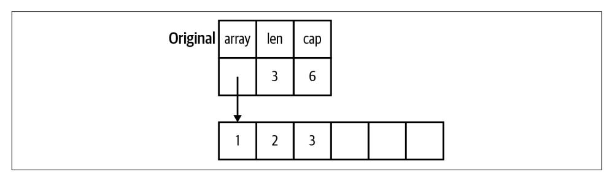

*Figure 6-5. The memory layout of a slice*

When a slice is copied to a different variable or passed to a function, a copy is made of the length, capacity, and the pointer. Figure 6-6 shows how both slice variables point to the same memory.

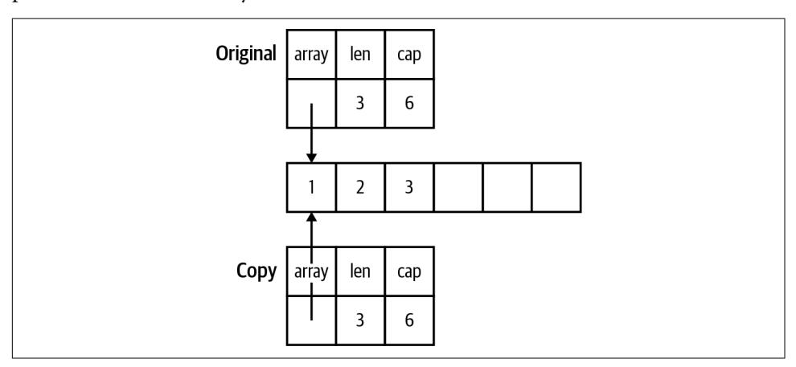

*Figure 6-6. The memory layout of a slice and its copy*

<span id="page-156-0"></span>Changing the values in the slice changes the memory that the pointer points to, so the changes are seen in both the copy and the original. You see in Figure 6-7 how this looks in memory.

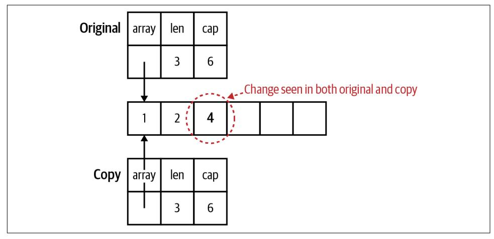

*Figure 6-7. Modifying the contents of a slice*

If the slice copy is appended to and there *is* enough capacity in the slice for the new values, the length changes in the copy, and the new values are stored in the block of memory that's shared by the copy and the original. However, the length in the original slice remains unchanged. The Go runtime prevents the original slice from seeing those values since they are beyond the length of the original slice. Figure 6-8 highlights the values that are visible in one slice variable but not in the other.

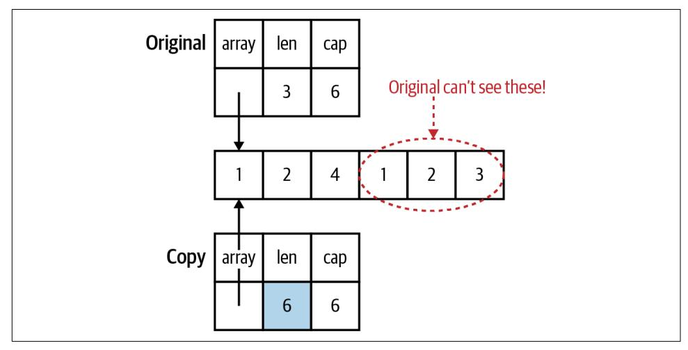

*Figure 6-8. Changing the length is invisible in the original*

<span id="page-157-0"></span>If the slice copy is appended to and there *isn't* enough capacity in the slice for the new values, a new, bigger block of memory is allocated, values are copied over, and the pointer, length, and capacity fields in the copy are updated. Changes to the pointer, length, and capacity are not reflected in the original, because they are only in the copy. Figure 6-9 shows how each slice variable now points to a different memory block.

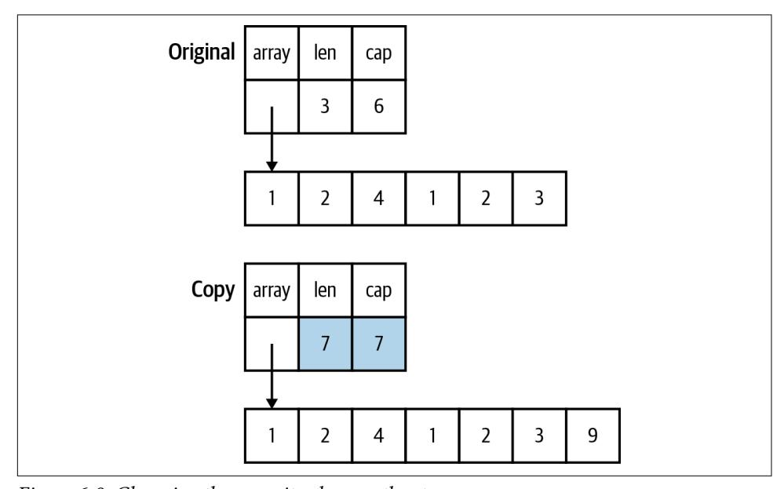

*Figure 6-9. Changing the capacity changes the storage*

The result is that a slice that's passed to a function can have its contents modified, but the slice can't be resized. As the only usable linear data structure, slices are frequently passed around in Go programs. By default, you should assume that a slice is not modified by a function. Your function's documentation should specify whether it modifies the slice's contents.


The reason you can pass a slice of any size to a function is that the data type that's passed to the function is the same for any size slice: a struct of two int values and a pointer. The reason you can't write a function that takes an array of any size is that the entire array is passed to the function, not just a pointer to the data.

There is one situation where the ability to modify the contents (but not the size) of a slice input parameter is very useful. This makes them ideal for reusable buffers.

# <span id="page-158-0"></span>**Slices as Buffers**

When reading data from an external resource (like a file or a network connection), many languages use code like this:

```
r = open_resource()
while r.has_data() {
 data_chunk = r.next_chunk()
 process(data_chunk)
}
close(r)
```

The problem with this pattern is that every time you iterate through that while loop, you allocate another data\_chunk even though each one is used only once. This creates lots of unnecessary memory allocations, just as I discussed in ["Pointers Are a](#page-152-0) [Last Resort" on page 129](#page-152-0) when looking at the Unmarshal function. Garbage-collected languages handle those allocations for you automatically, but the work still needs to be done to clean them up when you are done processing.

Even though Go is a garbage-collected language, writing idiomatic Go means avoid‐ ing unneeded allocations. Rather than returning a new allocation each time you read from a data source, you create a slice of bytes once and use it as a buffer to read data from the data source:

```
file, err := os.Open(fileName)
if err != nil {
 return err
}
defer file.Close()
data := make([]byte, 100)
for {
 count, err := file.Read(data)
 process(data[:count])
 if err != nil {
 if errors.Is(err, io.EOF) {
 return nil
 }
 return err
 }
}
```

Remember that you can't change the length or capacity of a slice when it is passed into a function, but you can change the contents up to the current length. In this code, you create a buffer of 100 bytes, and each time through the loop, you copy the next block of bytes (up to 100) into the slice. You then pass the populated portion of the buffer to process. If an error happens (other than io.EOF, a special-case error that indicates there is no more data to read), it is returned. When io.EOF is returned as the error, there is no more data and the function returns nil. You'll look at more <span id="page-159-0"></span>details about I/O in ["io and Friends" on page 319](#page-342-0) and error handling is covered in [Chapter 9](#page-226-0).

# **Reducing the Garbage Collector's Workload**

Using buffers is just one example of how you reduce the work done by the garbage collector. When programmers talk about "garbage," what they mean is "data that has no more pointers pointing to it." Once there are no more pointers pointing to some data, the memory that this data takes up can be reused. If the memory isn't recovered, the program's memory usage would continue to grow until the computer ran out of RAM. The job of a garbage collector is to automatically detect unused memory and recover it so it can be reused. It is fantastic that Go has a garbage collector, because decades of experience have shown that it is very difficult for people to properly manage memory manually. But just because you have a garbage collector doesn't mean you should create lots of garbage.

If you've spent time learning how programming languages are implemented, you've probably learned about the *heap* and the stack. If you're unfamiliar, here's how a stack works. A *stack* is a consecutive block of memory. Every function call in a thread of execution shares the same stack. Allocating memory on the stack is fast and simple. A *stack pointer* tracks the last location where memory was allocated. Allocating additional memory is done by changing the value of the stack pointer. When a function is invoked, a new *stack frame* is created for the function's data. Local variables are stored on the stack, along with parameters passed into a function. Each new variable moves the stack pointer by the size of the value. When a function exits, its return values are copied back to the calling function via the stack, and the stack pointer is moved back to the beginning of the stack frame for the exited function, deallocating all the stack memory that was used by that function's local variables and parameters.


Since version 1.17, Go uses a combination of registers (a small set of very high-speed memory that's directly on the CPU) and the stack to pass values into and out of functions. It's faster and more complicated, but the general concepts of stack-only function calls still apply.

To store something on the stack, you have to know exactly how big it is at compile time. When you look at the value types in Go (primitive values, arrays, and structs), they all have one thing in common: you know exactly how much memory they take at compile time. This is why the size is considered part of the type for an array. Because their sizes are known, they can be allocated on the stack instead of the heap. The size of a pointer type is also known, and it is also stored on the stack.

<span id="page-160-0"></span>

Go is unusual in that it can increase the size of a stack while the program is running. This is possible because each goroutine has its own stack and goroutines are managed by the Go runtime, not by the underlying operating system (I discuss goroutines when I talk about concurrency in [Chapter 12](#page-310-0)). This has advantages (Go stacks start small and use less memory) and disadvantages (when the stack needs to grow, all data on the stack needs to be copied, which is slow). It's also possible to write worst-case-scenario code that causes the stack to grow and shrink over and over.

The rules are more complicated when it comes to the data that the pointer points to. In order for Go to allocate the data the pointer points to on the stack, several conditions must be true. The data must be a local variable whose data size is known at compile time. The pointer cannot be returned from the function. If the pointer is passed into a function, the compiler must be able to ensure that these conditions still hold. If the size isn't known, you can't make space for it by moving the stack pointer. If the pointer variable is returned, the memory that the pointer points to will no longer be valid when the function exits. When the compiler determines that the data can't be stored on the stack, we say that the data the pointer points to *escapes* the stack, and the compiler stores the data on the heap.

The heap is the memory that's managed by the garbage collector (or by hand in languages like C and C++). I won't discuss the details of garbage collector algorithm implementation, but they are much more complicated than moving a stack pointer. Any data that's stored on the heap is valid as long as it can be tracked back to a pointer type variable on a stack. Once there are no more variables on the stack pointing to that data, either directly or via a chain of pointers, the data becomes *garbage*, and it's the job of the garbage collector to clear it out. This program on [The](https://oreil.ly/VDi4t) [Go Playground](https://oreil.ly/VDi4t) demonstrates when data on the heap becomes garbage.


A common source of bugs in C programs is returning a pointer to a local variable. In C, this results in a pointer pointing to invalid memory. The Go compiler is smarter. When it sees that a pointer to a local variable is returned, the local variable's value is stored on the heap.

The *escape analysis* done by the Go compiler isn't perfect. In some cases, data that could be stored on the stack escapes to the heap. However, the compiler has to be conservative; it can't take the chance of leaving a value on the stack when it might need to be on the heap because leaving a reference to invalid data causes memory corruption. Newer Go releases improve escape analysis.

You might be wondering: what's so bad about storing things on the heap? Two problems arise related to performance. First, the garbage collector takes time to do

<span id="page-161-0"></span>its work. It isn't trivial to keep track of all available chunks of free memory on the heap or to track which used blocks of memory still have valid pointers. This is time that's taken away from doing the processing that your program is written to do. Many garbage-collection algorithms have been written, and they can be placed into two rough categories: those that are designed for higher throughput (find the most garbage possible in a single scan) or lower latency (finish the garbage scan as quickly as possible). [Jeffrey Dean,](https://oreil.ly/x2Rxr) the genius behind many of Google's engineering successes, cowrote a paper in 2013 called ["The Tail at Scale".](https://oreil.ly/cvLpa) It argues that systems should be optimized for latency, to keep response times low. The garbage collector used by the Go runtime favors low latency. Each garbage-collection cycle is designed to "stop the world" (i.e., pause your program) for fewer than 500 microseconds. However, if your Go program creates lots of garbage, the garbage collector won't be able to find all the garbage during a cycle, slowing the collector and increasing memory usage.


If you are interested in the implementation details, you may want to listen to the talk Rick Hudson gave at the International Sympo‐ sium on Memory Management in 2018, describing the [history and](https://oreil.ly/UUhGK) [implementation](https://oreil.ly/UUhGK) of the Go garbage collector.

The second problem deals with the nature of computer hardware. RAM might mean "random access memory," but the fastest way to read from memory is to read it sequentially. A slice of structs in Go has all the data laid out sequentially in memory. This makes it fast to load and fast to process. A slice of pointers to structs (or structs whose fields are pointers) has its data scattered across RAM, making it far slower to read and process. Forrest Smith wrote an in-depth [blog post](https://oreil.ly/v_urr) that explores how much this can affect performance. His numbers indicate that it's roughly two orders of magnitude slower to access data via pointers stored randomly in RAM.

This approach of writing software that's aware of the hardware it's running on is called *mechanical sympathy*. The term comes from the world of car racing, where the idea is that a driver who understands what the car is doing can best squeeze the last bits of performance out of it. In 2011, Martin Thompson began applying the term to software development. Following best practices in Go gives it to you automatically.

Compare Go's approach to Java's. In Java, local variables and parameters are stored in the stack, just as in Go. However, as discussed earlier, objects in Java are implemented as pointers. For every object variable instance, only the pointer to it is allocated on the stack; the data within the object is allocated on the heap. Only primitive values (numbers, booleans, and chars) are stored entirely on the stack. This means that the garbage collector in Java has to do a great deal of work. It also means that implementations of the List interface in Java are built using a pointer to an array of pointers. Even though they *look* like a linear data structure, reading from them actually involves bouncing through memory, which is highly inefficient. There are <span id="page-162-0"></span>similar behaviors for the sequential data types in Python, Ruby, and JavaScript. To work around all this inefficiency, the Java Virtual Machine includes some very clever garbage collectors that do lots of work, some optimized for throughput, some for latency, and all with configuration settings to tune them for the best performance. The virtual machines for Python, Ruby, and JavaScript are less optimized, and their performance suffers accordingly.

Now you can see why Go encourages you to use pointers sparingly. You reduce the garbage collector's workload by making sure that as much as possible is stored on the stack. Slices of structs or primitive types have their data lined up sequentially in memory for rapid access. And when the garbage collector does do work, it is opti‐ mized to return quickly rather than gather the most garbage. The key to making this approach work is to simply create less garbage in the first place. While focusing on optimizing memory allocations can feel like premature optimization, the idiomatic approach in Go is also the most efficient.

If you want to learn more about heap versus stack allocation and escape analysis in Go, excellent blog posts cover the topic, including ones by [Bill Kennedy of Ardan](https://oreil.ly/juu44) [Labs](https://oreil.ly/juu44) and [Achille Roussel and Rick Branson of Segment](https://oreil.ly/c_gvC).

# **Tuning the Garbage Collector**

A garbage collector doesn't immediately reclaim memory as soon as it is no longer referenced. Doing so would seriously impact performance. Instead, it lets the garbage pile up for a bit. The heap almost always contains both live data and memory that's no longer needed. The Go runtime provides users a couple of settings to control the heap's size. The first is the GOGC environment variable. The garbage collector looks at the heap size at the end of a garbage-collection cycle and uses the formula CURRENT\_HEAP\_SIZE + CURRENT\_HEAP\_SIZE\*GOGC/100 to calculate the heap size that needs to be reached to trigger the next garbage-collection cycle.


The GOGC heap size calculation is a little more complicated than just described. It takes into account not just the heap size, but the sizes of all the stacks of all the goroutines and the memory set aside to hold package-level variables. Most of the time, the heap size is far bigger than the size of these other memory areas, but in some situations they do have an effect.

By default, GOGC is set to 100, which means that the heap size that triggers the next collection is roughly double the heap size at the end of the current collection. Setting GOGC to a smaller value will decrease the target heap size, and setting it to a larger value will increase it. As a rough estimate, doubling the value of GOGC will halve the amount of CPU time spent on GC.

<span id="page-163-0"></span>Setting GOGC to off disables garbage collection. This will make your programs run faster. However, turning off garbage collection on a long-running process will poten‐ tially use all available memory on your computer. This is not usually considered optimal behavior.

The second garbage-collection setting specifies a limit on the total amount of mem‐ ory your Go program is allowed to use. Java developers are likely familiar with the -Xmx JVM argument, and GOMEMLIMIT is similar. By default, it is disabled (technically, it is set to math.MaxInt64, but it's unlikely that your computer has that much mem‐ ory). The value for GOMEMLIMIT is specified in bytes, but you can optionally use the suffixes B, KiB, MiB, GiB, and TiB. For example, GOMEMLIMIT=3GiB sets the memory limit to 3 gibibytes (which is equal to 3,221,225,472 bytes).


If you haven't seen these suffixes before, they are the official powerof-two analogues of the more commonly used power-of-ten KB, MB, GB, and TB. KiB is equal to 2<sup>10</sup>, MiB is equal to 2<sup>20</sup>, and so on. It is [technically correct](https://oreil.ly/W3XkL) to use KiB, MiB, and friends when dealing with computers.

It might seem counterintuitive that limiting the maximum amount of memory could improve a program's performance, but there are good reasons this flag was added. The primary reason is that computers (or virtual machines or containers) don't have infinite RAM. If a sudden, temporary spike occurs in memory usage, relying on GOGC alone might result in the maximum heap size exceeding the amount of available memory. This can cause memory to swap to disk, which is very slow. Depending on your operating system and its settings, it might crash your program. Specifying a maximum memory limit prevents the heap from growing beyond the computer's resources.

GOMEMLIMIT is a *soft* limit that can be exceeded in certain circumstances. A common problem occurs in garbage-collected systems when the collector is unable to free up enough memory to get within a memory limit or the garbage-collection cycles are rapidly being triggered because a program is repeatedly hitting the limit. Called *thrashing*, this results in a program that does nothing other than run the garbage collector. If the Go runtime detects that thrashing is starting to happen, it chooses to end the current garbage-collection cycle and exceed the limit. This does mean that you should set GOMEMLIMIT below the absolute maximum amount of available memory so you have spare capacity.

If you specify a value for GOMEMLIMIT, you could set GOGC to off and not run out of memory, but this may not produce the desired performance effect. You are likely to find yourself trading frequent, very short pauses for infrequent, longer pauses. If you

<span id="page-164-0"></span>are running a web service, this produces inconsistent response times, which was one of the behaviors that Go's garbage collection was designed to avoid.

The best option is to use these two environment variables together to ensure both a reasonable pace for garbage collection and a maximum that should be respected. You can learn more about how to use GOGC and GOMEMLIMIT by reading ["A Guide to the Go](https://oreil.ly/lM_X8) [Garbage Collector"](https://oreil.ly/lM_X8) from Go's development team.

# **Exercises**

Now that you have learned about pointers and memory in Go, work through these exercises to reinforce using pointers effectively. You can find answers to these exerci‐ ses in the [Chapter 6 repository](https://oreil.ly/riOYA).

- 1. Create a struct named Person with three fields: FirstName and LastName of type string and Age of type int. Write a function called MakePerson that takes in firstName, lastName, and age and returns a Person. Write a second function MakePersonPointer that takes in firstName, lastName, and age and returns a \*Person. Call both from main. Compile your program with go build -gcflags="-m". This both compiles your code and prints out which values escape to the heap. Are you surprised about what escapes?
- 2. Write two functions. The UpdateSlice function takes in a []string and a string. It sets the last position in the passed-in slice to the passed-in string. At the end of UpdateSlice, print the slice after making the change. The GrowSlice function also takes in a []string and a string. It appends the string onto the slice. At the end of GrowSlice, print the slice after making the change. Call these functions from main. Print out the slice before each function is called and after each function is called. Do you understand why some changes are visible in main and why some changes are not?
- 3. Write a program that builds a []Person with 10,000,000 entries (they could all be the same names and ages). See how long it takes to run. Change the value of GOGC and see how that affects the time it takes for the program to complete. Set the environment variable GODEBUG=gctrace=1 to see when garbage collections happen and see how changing GOGC changes the number of garbage collections. What happens if you create the slice with a capacity of 10,000,000?

# **Wrapping Up**

This chapter peeked under the covers a bit to help you understand pointers, what they are, how to use them, and, most importantly, when to use them. In the next chapter, you'll take a look at Go's implementation of methods, interfaces, and types, how they differ from other languages, and the power they possess.

# <span id="page-166-0"></span>**Types, Methods, and Interfaces**

As you saw in earlier chapters, Go is a statically typed language with both built-in types and user-defined types. Like most modern languages, Go allows you to attach methods to types. It also has type abstraction, allowing you to write code that invokes methods without explicitly specifying the implementation.

However, Go's approach to methods, interfaces, and types is very different from that of most other languages in common use today. Go is designed to encourage the best practices advocated by software engineers, avoiding inheritance while encouraging composition. In this chapter, you'll take a look at types, methods, and interfaces, and see how to use them to build testable and maintainable programs.

# **Types in Go**

Back in ["Structs" on page 61](#page-84-0), you saw how to define a struct type:

```
type Person struct {
 FirstName string
 LastName string
 Age int
}
```

This should be read as declaring a user-defined type with the name Person to have the *underlying type* of the struct literal that follows. In addition to struct literals, you can use any primitive type or compound type literal to define a concrete type. Here are a few examples:

```
type Score int
type Converter func(string)Score
type TeamScores map[string]Score
```

<span id="page-167-0"></span>Go allows you to declare a type at any block level, from the package block down. However, you can access the type only from within its scope. The only exceptions are types exported from other packages. I'll talk more about those in [Chapter 10.](#page-246-0)


To make it easier to talk about types, I'll define a couple of terms. An *abstract type* is one that specifies *what* a type should do but not *how* it is done. A *concrete type* specifies what and how. This means that tthe type has a specified way to store its data and provides an implementation of any methods declared on the type. While all types in Go are either abstract or concrete, some languages allow hybrid types, such as abstract classes or interfaces with default methods in Java.

# **Methods**

Like most modern languages, Go supports methods on user-defined types.

The methods for a type are defined at the package block level:

```
type Person struct {
 FirstName string
 LastName string
 Age int
}
func (p Person) String() string {
 return fmt.Sprintf("%s %s, age %d", p.FirstName, p.LastName, p.Age)
}
```

Method declarations look like function declarations, with one addition: the *receiver* specification. The receiver appears between the keyword func and the name of the method. Like all other variable declarations, the receiver name appears before the type. By convention, the receiver name is a short abbreviation of the type's name, usually its first letter. It is nonidiomatic to use this or self.

There is one key difference between declaring methods and functions: methods can be defined *only* at the package block level, while functions can be defined inside any block.

Just like functions, method names cannot be overloaded. You can use the same method names for different types, but you can't use the same method name for two different methods on the same type. While this philosophy feels limiting when coming from languages that have method overloading, not reusing names is part of Go's philosophy of making clear what your code is doing.

<span id="page-168-0"></span>I'll talk more about packages in [Chapter 10,](#page-246-0) but be aware that methods must be declared in the same package as their associated type; Go doesn't allow you to add methods to types you don't control. While you can define a method in a different file within the same package as the type declaration, it is best to keep your type definition and its associated methods together so that it's easy to follow the implementation.

Method invocations should look familiar to those who have used methods in other languages:

```
p := Person{
 FirstName: "Fred",
 LastName: "Fredson",
 Age: 52,
}
output := p.String()
```

## **Pointer Receivers and Value Receivers**

As I covered in [Chapter 6,](#page-142-0) Go uses parameters of pointer type to indicate that a parameter might be modified by the function. The same rules apply for method receivers too. They can be *pointer receivers* (the type is a pointer) or *value receivers* (the type is a value type). The following rules help you determine when to use each kind of receiver:

- If your method modifies the receiver, you *must* use a pointer receiver.
- If your method needs to handle nil instances (see ["Code Your Methods for nil](#page-171-0) [Instances" on page 148](#page-171-0)), then it *must* use a pointer receiver.
- If your method doesn't modify the receiver, you *can* use a value receiver.

Whether you use a value receiver for a method that doesn't modify the receiver depends on the other methods declared on the type. When a type has *any* pointer receiver methods, a common practice is to be consistent and use pointer receivers for *all* methods, even the ones that don't modify the receiver.

Here's some simple code to demonstrate pointer and value receivers. It starts with a type that has two methods on it, one using a value receiver, the other with a pointer receiver:

```
type Counter struct {
 total int
 lastUpdated time.Time
}
func (c *Counter) Increment() {
 c.total++
 c.lastUpdated = time.Now()
}
```

```
func (c Counter) String() string {
 return fmt.Sprintf("total: %d, last updated: %v", c.total, c.lastUpdated)
}
```

You can then try out these methods with the following code. You can run it yourself on [The Go Playground](https://oreil.ly/aqY0i) or use the code in the *sample\_code/pointer\_value* directory in the [Chapter 7 repository:](https://oreil.ly/qJQgV)

```
var c Counter
fmt.Println(c.String())
c.Increment()
fmt.Println(c.String())
```

You should see the following output:

```
total: 0, last updated: 0001-01-01 00:00:00 +0000 UTC
total: 1, last updated: 2009-11-10 23:00:00 +0000 UTC m=+0.000000001
```

One thing you might notice is that you were able to call the pointer receiver method even though c is a value type. When you use a pointer receiver with a local variable that's a value type, Go automatically takes the address of the local variable when calling the method. In this case, c.Increment() is converted to (&c).Increment().

If you call a value receiver on a pointer variable, Go automatically dereferences the pointer when calling the method. In the code:

```
c := &Counter{}
fmt.Println(c.String())
c.Increment()
fmt.Println(c.String())
```

the call c.String() is silently converted to (\*c).String().


If you call a value receiver method with pointer instance whose value is nil, your code will compile but will panic at runtime (I discuss panics in ["panic and recover" on page 218\)](#page-241-0).

Be aware that the rules for passing values to functions still apply. If you pass a value type to a function and call a pointer receiver method on the passed value, you are invoking the method on a *copy*. You can try out the following code on [The](https://oreil.ly/bGdDi) [Go Playground](https://oreil.ly/bGdDi) or use the code in the *sample\_code/update\_wrong* directory in the [Chapter 7 repository](https://oreil.ly/qJQgV):

```
func doUpdateWrong(c Counter) {
 c.Increment()
 fmt.Println("in doUpdateWrong:", c.String())
}
func doUpdateRight(c *Counter) {
```

```
 c.Increment()
 fmt.Println("in doUpdateRight:", c.String())
}
func main() {
 var c Counter
 doUpdateWrong(c)
 fmt.Println("in main:", c.String())
 doUpdateRight(&c)
 fmt.Println("in main:", c.String())
}
```

When you run this code, you'll get the following output:

```
in doUpdateWrong: total: 1, last updated: 2009-11-10 23:00:00 +0000 UTC
 m=+0.000000001
in main: total: 0, last updated: 0001-01-01 00:00:00 +0000 UTC
in doUpdateRight: total: 1, last updated: 2009-11-10 23:00:00 +0000 UTC
 m=+0.000000001
in main: total: 1, last updated: 2009-11-10 23:00:00 +0000 UTC m=+0.000000001
```

The parameter in doUpdateRight is of type \*Counter, which is a pointer instance. As you can see, you can call both Increment and String on it. Go considers both pointer and value receiver methods to be in the *method set* for a pointer instance. For a value instance, only the value receiver methods are in the method set. This seems like a pedantic detail right now, but I'll come back to it when talking about interfaces in just a bit.


This can be confusing to new Go programmers (and, to be honest, to not-so-new Go programmers), but Go's automatic conversion from pointer types to value types, and vice versa, is purely syntactic sugar. It is independent of the method set concept. Alexey Gron‐ skiy has written a [blog post](https://oreil.ly/i7P5_) that explores in detail why the method set of pointer instances have both pointer and value receiver meth‐ ods, but the method set of value instances has only value receiver methods.

One final note: do not write getter and setter methods for Go structs unless you need them to meet an interface (I'll start covering interfaces in ["A Quick Lesson](#page-180-0) [on Interfaces" on page 157\)](#page-180-0). Go encourages you to directly access a field. Reserve methods for business logic. The exceptions are when you need to update multiple fields as a single operation or when the update isn't a straightforward assignment of a new value. The Increment method defined earlier demonstrates both of these properties.

## <span id="page-171-0"></span>**Code Your Methods for nil Instances**

The previous section covered pointer receivers, which might make you wonder what happens when you call a method on a nil instance. In most languages, this produces some sort of error. (Objective-C allows you to call a method on a nil instance, but it always does nothing.)

Go does something a little different. It actually tries to invoke the method. As men‐ tioned earlier, if it's a method with a value receiver, you'll get a panic, since there is no value being pointed to by the pointer. If it's a method with a pointer receiver, it can work if the method is written to handle the possibility of a nil instance.

In some cases, expecting a nil receiver makes the code simpler. Here's an implemen‐ tation of a binary tree that takes advantage of nil values for the receiver:

```
type IntTree struct {
 val int
 left, right *IntTree
}
func (it *IntTree) Insert(val int) *IntTree {
 if it == nil {
 return &IntTree{val: val}
 }
 if val < it.val {
 it.left = it.left.Insert(val)
 } else if val > it.val {
 it.right = it.right.Insert(val)
 }
 return it
}
func (it *IntTree) Contains(val int) bool {
 switch {
 case it == nil:
 return false
 case val < it.val:
 return it.left.Contains(val)
 case val > it.val:
 return it.right.Contains(val)
 default:
 return true
 }
}
```


The Contains method doesn't modify the \*IntTree, but it is declared with a pointer receiver. This demonstrates the rule men‐ tioned previously about supporting a nil receiver. A method with a value receiver can't check for nil and, as mentioned earlier, panics if invoked with a nil receiver.

<span id="page-172-0"></span>The following code uses the tree. You can try it out on [The Go Playground](https://oreil.ly/-F2i-) or use the code in the *sample\_code/tree* directory in the [Chapter 7 repository:](https://oreil.ly/qJQgV)

```
func main() {
 var it *IntTree
 it = it.Insert(5)
 it = it.Insert(3)
 it = it.Insert(10)
 it = it.Insert(2)
 fmt.Println(it.Contains(2)) // true
 fmt.Println(it.Contains(12)) // false
}
```

It's very clever that Go allows you to call a method on a nil receiver, and there are situations where it is useful, like the previous tree node example. However, most of the time it's not very useful. Pointer receivers work like pointer function parameters; it's a copy of the pointer that's passed into the method. Just like nil parameters passed to functions, if you change the copy of the pointer, you haven't changed the original. This means you can't write a pointer receiver method that handles nil and makes the original pointer non-nil.

If your method has a pointer receiver and won't work for a nil receiver, you have to decide how your method should handle a nil receiver. One choice is to treat it as a fatal flaw, like trying to access a position in a slice beyond its length. In that case, don't do anything and let the code panic. (Also make sure you write good tests, as discussed in [Chapter 15](#page-394-0).) If a nil receiver is something that is recoverable, check for nil and return an error (I discuss errors in [Chapter 9\)](#page-226-0).

## **Methods Are Functions Too**

Methods in Go are so much like functions that you can use a method as a replace‐ ment for a function anytime there's a variable or parameter of a function type.

Let's start with this simple type:

```
type Adder struct {
 start int
}
func (a Adder) AddTo(val int) int {
 return a.start + val
}
```

You create an instance of the type in the usual way and invoke its method:

```
myAdder := Adder{start: 10}
fmt.Println(myAdder.AddTo(5)) // prints 15
```

<span id="page-173-0"></span>You can also assign the method to a variable or pass it to a parameter of type func(int)int. This is called a *method value*:

```
f1 := myAdder.AddTo
fmt.Println(f1(10)) // prints 20
```

A method value is a bit like a closure, since it can access the values in the fields of the instance from which it was created.

You can also create a function from the type itself. This is called a *method expression*:

```
f2 := Adder.AddTo
fmt.Println(f2(myAdder, 15)) // prints 25
```

In a method expression, the first parameter is the receiver for the method; the function signature is func(Adder, int) int.

Method values and method expressions aren't clever corner cases. You'll see one way to use them when you look at dependency injection in ["Implicit Interfaces Make](#page-197-0) [Dependency Injection Easier" on page 174](#page-197-0).

## **Functions Versus Methods**

Since you can use a method as a function, you might wonder when you should declare a function and when you should use a method.

The differentiator is whether your function depends on other data. As I've covered several times, package-level state should be effectively immutable. Anytime your logic depends on values that are configured at startup or changed while your program is running, those values should be stored in a struct, and that logic should be imple‐ mented as a method. If your logic depends only on the input parameters, it should be a function.

## **Type Declarations Aren't Inheritance**

In addition to declaring types based on built-in Go types and struct literals, you can also declare a user-defined type based on another user-defined type:

```
type HighScore Score
type Employee Person
```

Many concepts can be considered "object-oriented," but one stands out: *inheritance*. With inheritance, the state and methods of a *parent* type are declared to be available on a *child* type, and values of the child type can be substituted for the parent type.<sup>1</sup>

<sup>1</sup> For the computer scientists in the audience, I realize that subtyping is not inheritance. However, most programming languages use inheritance to implement subtyping, so the definitions are often conflated in popular usage.

<span id="page-174-0"></span>Declaring a type based on another type looks a bit like inheritance but isn't. The two types have the same underlying type, but that's all. The types have no hierarchy. In languages with inheritance, a child instance can be used anywhere the parent instance is used. The child instance also has all the methods and data structures of the parent instance. That's not the case in Go. You can't assign an instance of type HighScore to a variable of type Score, or vice versa, without a type conversion, nor can you assign either of them to a variable of type int without a type conversion. Furthermore, any methods defined on Score aren't defined on HighScore:

```
// assigning untyped constants is valid
var i int = 300
var s Score = 100
var hs HighScore = 200
hs = s // compilation error!
s = i // compilation error!
s = Score(i) // ok
hs = HighScore(s) // ok
```

User-defined types whose underlying types are built-in types can be assigned literals and constants compatible with the underlying type. They can also be used with the operators for those types:

```
var s Score = 50
scoreWithBonus := s + 100 // type of scoreWithBonus is Score
```


A type conversion between types that share an underlying type keeps the same underlying storage but associates different methods.

## **Types Are Executable Documentation**

While it's well understood that you should declare a struct type to hold a set of related data, it's less clear when you should declare a user-defined type based on other built-in types or one user-defined type that's based on another user-defined type. The short answer is that types are documentation. They make code clearer by providing a name for a concept and describing the kind of data that is expected. It's clearer for someone reading your code when a method has a parameter of type Percentage than of type int, and it's harder for it to be invoked with an invalid value.

The same logic applies when declaring one user-defined type based on another user-defined type. When you have the same underlying data, but different sets of operations to perform, make two types. Declaring one as being based on the other avoids some repetition and makes it clear that the two types are related.

# <span id="page-175-0"></span>**iota Is for Enumerations—Sometimes**

Many programming languages have the concept of enumerations, which allow you to specify that a type can have only a limited set of values. Go doesn't have an enumeration type. Instead, it has iota, which lets you assign an increasing value to a set of constants.


The concept of iota comes from the programming language APL (which stood for "A Programming Language"). To generate a list of the first three positive integers in APL, you write ι3, where ι is the lowercase Greek letter iota.

APL is famous for being so reliant on its own custom notation that it required computers with a special keyboard. For example, (~R∊R∘.×R)/R←1↓ιR is an APL program to find all the prime num‐ bers up to the value of the variable R.

It may seem ironic that a language as focused on readability as Go would borrow a concept from a language that is concise to a fault, but this is why you should learn multiple programming languages: you can find inspiration everywhere.

When using iota, the best practice is to first define a type based on int that will represent all the valid values:

```
type MailCategory int
```

Next, use a const block to define a set of values for your type:

```
const (
 Uncategorized MailCategory = iota
 Personal
 Spam
 Social
 Advertisements
)
```

The first constant in the const block has the type specified, and its value is set to iota. Every subsequent line has neither the type nor a value assigned to it. When the Go compiler sees this, it repeats the type and the assignment to all the subsequent constants in the block, which is iota. The value of iota increments for each constant defined in the const block, starting with 0. This means that 0 is assigned to the first constant (Uncategorized), 1 to the second constant (Personal), and so on. When a new const block is created, iota is set back to 0.

<span id="page-176-0"></span>The value of iota increments for each constant in the const block, whether or not iota is used to define the value of a constant. The following code demonstrates what happens when iota is used intermittently in a const block:

```
const (
 Field1 = 0
 Field2 = 1 + iota
 Field3 = 20
 Field4
 Field5 = iota
)
func main() {
 fmt.Println(Field1, Field2, Field3, Field4, Field5)
}
```

You can run this code on [The Go Playground](https://oreil.ly/jTXxD) and see the (perhaps unexpected) result:

```
0 2 20 20 4
```

Field2 is assigned 2 because iota has a value of 1 on the second line in the const block. Field4 is assigned 20 because it has no type or value explicitly assigned, so it gets the value of the previous line with a type and assignment. Finally, Field5 gets the value 4 because it is the fifth line and iota starts counting from 0.

This is the best advice I've seen on iota:

Don't use *iota* for defining constants where its values are explicitly defined (elsewhere). For example, when implementing parts of a specification and the specification says which values are assigned to which constants, you should explicitly write the constant values. Use *iota* for "internal" purposes only. That is, where the constants are referred to by name rather than by value. That way, you can optimally enjoy *iota* by inserting new constants at any moment in time / location in the list without the risk of breaking everything.

```
—Danny van Heumen
```

The important thing to understand is that nothing in Go will stop you (or anyone else) from creating additional values of your type. Furthermore, if you insert a new identifier in the middle of your list of literals, all subsequent ones will be renumbered. This will break your application in a subtle way if those constants represented values in another system or in a database. Given these two limitations, iota-based enumera‐ tions make sense only when you care about being able to differentiate between a set of values and don't particularly care what the value is behind the scenes. If the actual value matters, specify it explicitly.

<span id="page-177-0"></span>

Because you can assign a literal expression to a constant, you'll see sample code that suggests you should use iota for cases like this:

```
const (
 Field1 BitField = 1 << iota // assigned 1
 Field2 // assigned 2
 Field3 // assigned 4
 Field4 // assigned 8
)
```

While this is clever, be careful when using this pattern. If you do so, document what you are doing. As mentioned previously, using iota with constants is fragile when you care about the value. You don't want a future maintainer to insert a new constant in the middle of the list and break your code.

Be aware that iota starts numbering from 0. If you are using your set of constants to represent different configuration states, the zero value might be useful. You saw this earlier in the MailCategory type. When mail first arrives, it is uncategorized, so the zero value makes sense. If there isn't a sensical default value for your constants, a common pattern is to assign the first iota value in the constant block to \_ or to a constant that indicates the value is invalid. This makes it easy to detect when a variable has not been properly initialized.

# **Use Embedding for Composition**

**type** BitField **int**

The software engineering advice "Favor object composition over class inheritance" dates back to at least the 1994 book *Design Patterns* by Erich Gamma, Richard Helm, Ralph Johnson, and John Vlissides (Addison-Wesley), better known as the Gang of Four book. While Go doesn't have inheritance, it encourages code reuse via built-in support for composition and promotion:

```
type Employee struct {
 Name string
 ID string
}
func (e Employee) Description() string {
 return fmt.Sprintf("%s (%s)", e.Name, e.ID)
}
type Manager struct {
 Employee
 Reports []Employee
}
func (m Manager) FindNewEmployees() []Employee {
```

```
 // do business logic
}
```

Note that Manager contains a field of type Employee, but no name is assigned to that field. This makes Employee an *embedded field*. Any fields or methods declared on an embedded field are *promoted* to the containing struct and can be invoked directly on it. That makes the following code valid:

```
m := Manager{
 Employee: Employee{
 Name: "Bob Bobson",
 ID: "12345",
 },
 Reports: []Employee{},
}
fmt.Println(m.ID) // prints 12345
fmt.Println(m.Description()) // prints Bob Bobson (12345)
```


You can embed any type within a struct, not just another struct. This promotes the methods on the embedded type to the contain‐ ing struct.

If the containing struct has fields or methods with the same name as an embedded field, you need to use the embedded field's type to refer to the obscured fields or methods. If you have types defined like this:

```
type Inner struct {
 X int
}
type Outer struct {
 Inner
 X int
}
```

you can access the X on Inner only by specifying Inner explicitly:

```
o := Outer{
 Inner: Inner{
 X: 10,
 },
 X: 20,
}
fmt.Println(o.X) // prints 20
fmt.Println(o.Inner.X) // prints 10
```

# <span id="page-179-0"></span>**Embedding Is Not Inheritance**

Built-in embedding support is rare in programming languages (I'm not aware of another popular language that supports it). Many developers who are familiar with inheritance (which is available in many languages) try to understand embedding by treating it as inheritance. That way lies tears. You cannot assign a variable of type Manager to a variable of type Employee. If you want to access the Employee field in Manager, you must do so explicitly. You can run the following code on [The Go](https://oreil.ly/vBl7o) [Playground](https://oreil.ly/vBl7o) or use the code in the *sample\_code/embedding* directory in the [Chapter 7](https://oreil.ly/qJQgV) [repository](https://oreil.ly/qJQgV):

```
var eFail Employee = m // compilation error!
var eOK Employee = m.Employee // ok!
You'll get the error:
cannot use m (type Manager) as type Employee in assignment
```

Furthermore, Go has no *dynamic dispatch* for concrete types. The methods on the embedded field have no idea they are embedded. If you have a method on an embedded field that calls another method on the embedded field, and the containing struct has a method of the same name, the method on the embedded field is invoked, not the method on the containing struct. This behavior is demonstrated in the following code, which you can run on [The Go Playground,](https://oreil.ly/yN6bV) or use the code in the *sample\_code/no\_dispatch* directory in the [Chapter 7 repository](https://oreil.ly/qJQgV):

```
type Inner struct {
 A int
}
func (i Inner) IntPrinter(val int) string {
 return fmt.Sprintf("Inner: %d", val)
}
func (i Inner) Double() string {
 return i.IntPrinter(i.A * 2)
}
type Outer struct {
 Inner
 S string
}
func (o Outer) IntPrinter(val int) string {
 return fmt.Sprintf("Outer: %d", val)
}
func main() {
 o := Outer{
 Inner: Inner{
```

```
 A: 10,
 },
 S: "Hello",
 }
 fmt.Println(o.Double())
}
```

Running this code produces the following output:

```
Inner: 20
```

While embedding one concrete type inside another won't allow you to treat the outer type as the inner type, the methods on an embedded field do count toward the *method set* of the containing struct. This means they can make the containing struct implement an interface.

# **A Quick Lesson on Interfaces**

While Go's concurrency model (which I cover in [Chapter 12\)](#page-310-0) gets all the publicity, the real star of Go's design is its implicit interfaces, the only abstract type in Go. Let's see what makes them so great.

Let's start by taking a quick look at how to declare interfaces. At their core, interfaces are simple. Like other user-defined types, you use the type keyword.

Here's the definition of the Stringer interface in the fmt package:

```
type Stringer interface {
 String() string
}
```

In an interface declaration, an interface literal appears after the name of the interface type. It lists the methods that must be implemented by a concrete type to meet the interface. The methods defined by an interface are the method set of the interface. As I covered in ["Pointer Receivers and Value Receivers" on page 145,](#page-168-0) the method set of a pointer instance contains the methods defined with both pointer and value receivers, while the method set of a value instance contains only the methods with value receivers. Here's a quick example using the Counter struct defined previously:

```
type Incrementer interface {
 Increment()
}
var myStringer fmt.Stringer
var myIncrementer Incrementer
pointerCounter := &Counter{}
valueCounter := Counter{}
myStringer = pointerCounter // ok
myStringer = valueCounter // ok
```

```
myIncrementer = pointerCounter // ok
myIncrementer = valueCounter // compile-time error!
```

Trying to compile this code results in the error cannot use valueCounter (vari able of type Counter) as Incrementer value in assignment: Counter does not implement Incrementer (method Increment has pointer receiver).

You can try this code on [The Go Playground](https://oreil.ly/yYx8Q) or use the code in the *sample\_code/ method\_set* directory in the [Chapter 7 repository.](https://oreil.ly/qJQgV)

Like other types, interfaces can be declared in any block.

Interfaces are usually named with "er" endings. You've already seen fmt.Stringer, but there are many more, including io.Reader, io.Closer, io.ReadCloser, json.Marshaler, and http.Handler.

# **Interfaces Are Type-Safe Duck Typing**

So far, nothing that's been said about the Go interface is much different from inter‐ faces in other languages. What makes Go's interfaces special is that they are imple‐ mented *implicitly*. As you've seen with the Counter struct type and the Incrementer interface type that you've used in previous examples, a concrete type does not declare that it implements an interface. If the method set for a concrete type contains all the methods in the method set for an interface, the concrete type implements the interface. Therefore, that the concrete type can be assigned to a variable or field declared to be of the type of the interface.

This implicit behavior makes interfaces the most interesting thing about types in Go, because they enable both type safety and decoupling, bridging the functionality in both static and dynamic languages.

To understand why, let's talk about why languages have interfaces. Earlier I men‐ tioned that *Design Patterns* taught developers to favor composition over inheritance. Another piece of advice from the book is "Program to an interface, not an implemen‐ tation." Doing so allows you to depend on behavior, not on implementation, allowing you to swap implementations as needed. This allows your code to evolve over time, as requirements inevitably change.

Dynamically typed languages like Python, Ruby, and JavaScript don't have interfaces. Instead, those developers use *duck typing*, which is based on the expression "If it walks like a duck and quacks like a duck, it's a duck." The concept is that you can pass an instance of a type as a parameter to a function as long as the function can find a method to invoke that it expects:

```
class Logic:
 def process(self, data):
 # business logic
```

```
def program(logic):
 # get data from somewhere
 logic.process(data)
logicToUse = Logic()
program(logicToUse)
```

Duck typing might sound weird at first, but it's been used to build large and success‐ ful systems. If you program in a statically typed language, this sounds like utter chaos. Without an explicit type being specified, it's hard to know exactly what functionality should be expected. As new developers move on to a project or the existing develop‐ ers forget what the code is doing, they have to trace through the code to identify the actual dependencies.

Java developers use a different pattern. They define an interface, create an implemen‐ tation of the interface, but refer to the interface only in the client code:

```
public interface Logic {
 String process(String data);
}
public class LogicImpl implements Logic {
 public String process(String data) {
 // business logic
 }
}
public class Client {
 private final Logic logic;
 // this type is the interface, not the implementation
 public Client(Logic logic) {
 this.logic = logic;
 }
 public void program() {
 // get data from somewhere
 this.logic.process(data);
 }
}
public static void main(String[] args) {
 Logic logic = new LogicImpl();
 Client client = new Client(logic);
 client.program();
}
```

Dynamic language developers look at the explicit interfaces in Java and don't see how you can possibly refactor your code over time when you have explicit dependencies. <span id="page-183-0"></span>Switching to a new implementation from a different provider means rewriting your code to depend on a new interface.

Go's developers decided that both groups are right. If your application is going to grow and change over time, you need flexibility to change implementation. However, in order for people to understand what your code is doing (as new people work on the same code over time), you also need to specify what the code depends on. That's where implicit interfaces come in. Go code is a blend of the previous two styles:

```
type LogicProvider struct {}
func (lp LogicProvider) Process(data string) string {
 // business logic
}
type Logic interface {
 Process(data string) string
}
type Client struct{
 L Logic
}
func(c Client) Program() {
 // get data from somewhere
 c.L.Process(data)
}
main() {
 c := Client{
 L: LogicProvider{},
 }
 c.Program()
}
```

The Go code provides an interface, but only the caller (Client) knows about it; nothing is declared on LogicProvider to indicate that it meets the interface. This is sufficient to both allow a new logic provider in the future and provide executable documentation to ensure that any type passed into the client will match the client's need.


Interfaces specify what callers need. The client code defines the interface to specify what functionality it requires.

This doesn't mean that interfaces can't be shared. You've already seen several inter‐ faces in the standard library that are used for input and output. Having a standard <span id="page-184-0"></span>interface is powerful; if you write your code to work with io.Reader and io.Writer, it will function correctly whether it is writing to a file on local disk or a value in memory.

Furthermore, using standard interfaces encourages the *decorator pattern*. It is com‐ mon in Go to write factory functions that take in an instance of an interface and return another type that implements the same interface. For example, say you have a function with the following definition:

```
func process(r io.Reader) error
```

You can process data from a file with the following code:

```
r, err := os.Open(fileName)
if err != nil {
 return err
}
defer r.Close()
return process(r)
```

The os.File instance returned by os.Open meets the io.Reader interface and can be used in any code that reads in data. If the file is gzip-compressed, you can wrap the io.Reader in another io.Reader:

```
r, err := os.Open(fileName)
if err != nil {
 return err
}
defer r.Close()
gz, err := gzip.NewReader(r)
if err != nil {
 return err
}
defer gz.Close()
return process(gz)
```

Now the exact same code that was reading from an uncompressed file is reading from a compressed file instead.


If an interface in the standard library describes what your code needs, use it! Commonly used interfaces include io.Reader, io.Writer, and io.Closer.

It's perfectly fine for a type that meets an interface to specify additional methods that aren't part of the interface. One set of client code may not care about those methods, but others do. For example, the io.File type also meets the io.Writer interface. If your code cares only about reading from a file, use the io.Reader interface to refer to the file instance and ignore the other methods.

# <span id="page-185-0"></span>**Embedding and Interfaces**

Embedding is not only for structs. You can also embed an interface in an interface. For example, the io.ReadCloser interface is built out of an io.Reader and an io.Closer:

```
type Reader interface {
 Read(p []byte) (n int, err error)
}
type Closer interface {
 Close() error
}
type ReadCloser interface {
 Reader
 Closer
}
```


Just as you can embed a concrete type in a struct, you can also embed an interface in a struct. You'll see a use for this in ["Using](#page-420-0) [Stubs in Go" on page 397](#page-420-0).

# **Accept Interfaces, Return Structs**

You'll often hear experienced Go developers say that your code should "Accept inter‐ faces, return structs." This phrase was most likely coined by Jack Lindamood in his 2016 blog post ["Preemptive Interface Anti-Pattern in Go"](https://oreil.ly/OT1yi). It means that the business logic invoked by your functions should be invoked via interfaces, but the output of your functions should be a concrete type. I've already covered why functions should accept interfaces: they make your code more flexible and explicitly declare the exact functionality being used.

The primary reason your functions should return concrete types is they make it easier to gradually update a function's return values in new versions of your code. When a concrete type is returned by a function, new methods and fields can be added without breaking existing code that calls the function, because the new fields and methods are ignored. The same is not true for an interface. Adding a new method to an interface means that all existing implementations of that interface must be updated, or your code breaks. In semantic versioning terms, this is the difference between a minor release that is backward compatible and a major release, which is backward breaking. If you are exposing an API that's consumed by other people (either inside your organization or as part of an open source project), avoiding backward-breaking changes keeps your users happy.

<span id="page-186-0"></span>In some rare situations, the least bad option is to have your functions return interfaces. For example, the database/sql/driver package in the standard library defines a set of interfaces that define what a database driver must provide. It is the responsibility of the database driver author to provide concrete implementations of these interfaces, so almost all methods on all interfaces defined in database/sql/ driver return interfaces. Starting in Go 1.8, database drivers are expected to support additional features. The standard library has a compatibility promise, so the existing interfaces can't be updated with new methods, and the existing methods on these interfaces can't be updated to return different types. The solution is to leave the existing interfaces alone, define new interfaces that describe the new functionality, and tell database driver authors that they should implement both the old and new methods on their concrete types.

This leads to the question of how to check whether these new methods are present and how to access them if they are. You'll learn how in ["Type Assertions and Type](#page-190-0) [Switches" on page 167](#page-190-0).

Rather than writing a single factory function that returns different instances behind an interface based on input parameters, try to write separate factory functions for each concrete type. In some situations (such as a parser that can return one or more kinds of tokens), it's unavoidable and you have no choice but to return an interface.

Errors are an exception to this rule. As you'll see in [Chapter 9](#page-226-0), Go functions and methods can declare a return parameter of the error interface type. In the case of error, it's quite likely that different implementations of the interface could be returned, so you need to use an interface to handle all possible options, as interfaces are the only abstract type in Go.

This pattern has one potential drawback. As I discussed in ["Reducing the Garbage](#page-159-0) [Collector's Workload" on page 136](#page-159-0), reducing heap allocations improves performance by reducing the amount of work for the garbage collector. Returning a struct avoids a heap allocation, which is good. However, when invoking a function with parameters of interface types, a heap allocation occurs for each interface parameter. Figuring out the trade-off between better abstraction and better performance should be done over the life of your program. Write your code so that it is readable and maintainable. If you find that your program is too slow *and* you have profiled it *and* you have determined that the performance problems are due to a heap allocation caused by an interface parameter, then you should rewrite the function to use a concrete type parameter. If multiple implementations of an interface are passed into the function, this will mean creating multiple functions with repeated logic.

<span id="page-187-0"></span>

Developers who come from a C++ or Rust background might try using generics as a way to get the compiler to generate specialized functions. As of Go 1.21, this will probably not produce faster code. I'll cover why in ["Idiomatic Go and Generics" on page 199](#page-222-0).

# **Interfaces and nil**

When discussing pointers in [Chapter 6,](#page-142-0) I also talked about nil, the zero value for pointer types. You can also use nil to represent the zero value for an interface instance, but it's not as simple as it is for concrete types.

Understanding the relationship between interfaces and nil requires understanding a little bit about how interfaces are implemented. In the Go runtime, interfaces are implemented as a struct with two pointer fields, one for the value and one for the type of the value. As long as the type field is non-nil, the interface is non-nil. (Since you cannot have a variable without a type, if the value pointer is non-nil, the type pointer is always non-nil.)

In order for an interface to be considered nil, *both* the type and the value must be nil. The following code prints out true on the first two lines and false on the last:

```
var pointerCounter *Counter
fmt.Println(pointerCounter == nil) // prints true
var incrementer Incrementer
fmt.Println(incrementer == nil) // prints true
incrementer = pointerCounter
fmt.Println(incrementer == nil) // prints false
```

You can run this code for yourself on [The Go Playground](https://oreil.ly/njtz9) or use the code in the *sample\_code/interface\_nil* directory in the [Chapter 7 repository](https://oreil.ly/qJQgV).

What nil indicates for a variable with an interface type is whether you can invoke methods on it. As I covered earlier, you can invoke methods on nil concrete instan‐ ces, so it makes sense that you can invoke methods on an interface variable that was assigned a nil concrete instance. If an interface variable is nil, invoking any methods on it triggers a panic (which I'll discuss in ["panic and recover" on page 218\)](#page-241-0). If an interface variable is non-nil, you can invoke methods on it. (But note that if the value is nil and the methods of the assigned type don't properly handle nil, you could still trigger a panic.)

Since an interface instance with a non-nil type is not equal to nil, it is not straightfor‐ ward to tell whether the value associated with the interface is nil when the type is non-nil. You must use reflection (which I'll discuss in ["Use Reflection to Check If an](#page-440-0) [Interface's Value Is nil" on page 417\)](#page-440-0) to find out.

# <span id="page-188-0"></span>**Interfaces Are Comparable**

In [Chapter 3,](#page-60-0) you learned about comparable types, the ones that can be checked for equality with ==. You might be surprised to learn that interfaces are comparable. Just as an interface is equal to nil only if its type and value fields are both nil, two instances of an interface type are equal only if their types are equal and their values are equal. This suggests a question: what happens if the type isn't comparable? Let's use a simple example to explore this concept. Start with an interface definition and a couple of implementations of that interface:

```
type Doubler interface {
 Double()
}
type DoubleInt int
func (d *DoubleInt) Double() {
 *d = *d * 2
}
type DoubleIntSlice []int
func (d DoubleIntSlice) Double() {
 for i := range d {
 d[i] = d[i] * 2
 }
}
```

The Double method on DoubleInt is declared with a pointer receiver because you are modifying the value of the int. You can use a value receiver for the Double method on DoubleIntSlice because, as covered in ["The Difference Between Maps and Slices"](#page-154-0) [on page 131,](#page-154-0) you can change the value of an item in a parameter that is a slice type. The \*DoubleInt type is comparable (all pointer types are), and the DoubleIntSlice type is not comparable (slices aren't comparable).

You also have a function that takes in two parameters of type Doubler and prints if they are equal:

```
func DoublerCompare(d1, d2 Doubler) {
 fmt.Println(d1 == d2)
}
You now define four variables:
var di DoubleInt = 10
var di2 DoubleInt = 10
var dis = DoubleIntSlice{1, 2, 3}
var dis2 = DoubleIntSlice{1, 2, 3}
```

Now, you're going to call this function three times. The first call is as follows:

```
DoublerCompare(&di, &di2)
```

This prints out false. The types match (both are \*DoubleInt), but you are compar‐ ing pointers, not values, and the pointers point to different instances.

Next, you compare a \*DoubleInt with a DoubleIntSlice:

```
DoublerCompare(&di, dis)
```

This prints out false, because the types do not match.

Finally, you get to the problematic case:

```
DoublerCompare(dis, dis2)
```

This code compiles without issue, but triggers a panic at runtime:

```
panic: runtime error: comparing uncomparable type main.DoubleIntSlice
```

The entire program is available in the *sample\_code/comparable* directory in the [Chap‐](https://oreil.ly/qJQgV) [ter 7 repository.](https://oreil.ly/qJQgV)

Also be aware that the key of a map must be comparable, so a map can be defined to have an interface as a key:

```
m := map[Doubler]int{}
```

If you add a key-value pair to this map and the key isn't comparable, that will also trigger a panic.

Given this behavior, be careful when using == or != with interfaces or using an interface as a map key, as it's easy to accidentally generate a panic that will crash your program. Even if all your interface implementations are currently comparable, you don't know what will happen when someone else uses or modifies your code, and there's no way to specify that an interface can be implemented only by compa‐ rable types. If you want to be extra safe, you can use the Comparable method on reflect.Value to inspect an interface before using it with == or !=. (You'll learn more about reflection in ["Reflection Lets You Work with Types at Runtime"](#page-433-0) on page [410](#page-433-0)).

# **The Empty Interface Says Nothing**

Sometimes in a statically typed language, you need a way to say that a variable could store a value of any type. Go uses an *empty interface*, interface{}, to represent this:

```
var i interface{}
i = 20
i = "hello"
i = struct {
 FirstName string
 LastName string
} {"Fred", "Fredson"}
```

<span id="page-190-0"></span>

interface{} isn't special case syntax. An empty interface type simply states that the variable can store any value whose type implements zero or more methods. This just happens to match every type in Go.

To improve readability, Go added any as a type alias for interface{}. Legacy code (written before any was added in Go 1.18) used interface{}, but stick with any for new code.

Because an empty interface doesn't tell you anything about the value it represents, you can't do a lot with it. One common use of any is as a placeholder for data of uncertain schema that's read from an external source, like a JSON file:

```
data := map[string]any{}
contents, err := os.ReadFile("testdata/sample.json")
if err != nil {
 return err
}
json.Unmarshal(contents, &data)
// the contents are now in the data map
```


User-created data containers that were written before generics were added to Go use an empty interface to store a value. (I'll talk about generics in [Chapter 8.](#page-204-0)) An example in the standard library is [container/list](https://oreil.ly/53tmr). Now that generics are part of Go, please use them for any newly created data containers.

If you see a function that takes in an empty interface, it's likely using reflection (which I'll talk about in [Chapter 16](#page-432-0)) to either populate or read the value. In the preceding example, the second parameter of the json.Unmarshal function is declared to be of type any.

These situations should be relatively rare. Avoid using any. As you've seen, Go is designed as a strongly typed language and attempts to work around this are unidiomatic.

If you find yourself in a situation where you had to store a value into an empty interface, you might be wondering how to read the value back again. To do that, you need to learn about type assertions and type switches.

# **Type Assertions and Type Switches**

Go provides two ways to see if a variable of an interface type has a specific concrete type or if the concrete type implements another interface. Let's start by looking at type assertions. A *type assertion* names the concrete type that implemented the interface,

<span id="page-191-0"></span>or names another interface that is also implemented by the concrete type whose value is stored in the interface. You can try it out on [The Go Playground](https://oreil.ly/XUfuO) or in the typeAssert function in *main.go* in the *sample\_code/type\_assertions* directory in the [Chapter 7 repository](https://oreil.ly/qJQgV):

```
type MyInt int
func main() {
 var i any
 var mine MyInt = 20
 i = mine
 i2 := i.(MyInt)
 fmt.Println(i2 + 1)
}
```

In the preceding code, the variable i2 is of type MyInt.

You might wonder what happens if a type assertion is wrong. In that case, your code panics. You can try it out on [The Go Playground](https://oreil.ly/qoXu_) or in the typeAssertPanicWrong Type function in *main.go* in the *sample\_code/type\_assertions* directory in the [Chapter](https://oreil.ly/qJQgV) [7 repository:](https://oreil.ly/qJQgV)

```
i2 := i.(string)
fmt.Println(i2)
```

Running this code produces the following panic:

```
panic: interface conversion: interface {} is main.MyInt, not string
```

As you've already seen, Go is very careful about concrete types. Even if two types share an underlying type, a type assertion must match the type of the value stored in the interface. The following code panics. You can try it out on [The Go Play‐](https://oreil.ly/YUaka) [ground](https://oreil.ly/YUaka) or in the typeAssertPanicTypeNotIdentical function in *main.go* in the *sample\_code/type\_assertions* directory in the [Chapter 7 repository:](https://oreil.ly/qJQgV)

```
i2 := i.(int)
fmt.Println(i2 + 1)
```

Obviously, crashing is not desired behavior. You avoid this by using the comma ok idiom, just as you saw in ["The comma ok Idiom"](#page-81-0) on page 58 when detecting whether a zero value was in a map. You can see this in the typeAssertCommaOK function in *main.go* in the *sample\_code/type\_assertions* directory in the [Chapter 7 repository:](https://oreil.ly/qJQgV)

```
i2, ok := i.(int)
if !ok {
 return fmt.Errorf("unexpected type for %v",i)
}
fmt.Println(i2 + 1)
```

The boolean ok is set to true if the type conversion was successful. If it was not, ok is set to false and the other variable (in this case i2) is set to its zero value. You then <span id="page-192-0"></span>handle the unexpected condition within an if statement. I'll talk more about error handling in [Chapter 9](#page-226-0).


A type assertion is very different from a type conversion. Conver‐ sions change a value to a new type, while assertions reveal the type of the value stored in the interface. Type conversions can be applied to both concrete types and interfaces. Type assertions can be applied only to interface types. All type assertions are checked at runtime, so they can fail at runtime with a panic if you don't use the comma ok idiom. Most type conversions are checked at compile time, so if they are invalid, your code won't compile. (Type conversions between slices and array pointers can fail at runtime and don't support the comma ok idiom, so be careful when using them!)

Even if you are absolutely certain that your type assertion is valid, use the comma ok idiom version. You don't know how other people (or you in six months) will reuse your code. Sooner or later, your unvalidated type assertions will fail at runtime.

When an interface could be one of multiple possible types, use a *type switch* instead:

```
func doThings(i any) {
 switch j := i.(type) {
 case nil:
 // i is nil, type of j is any
 case int:
 // j is of type int
 case MyInt:
 // j is of type MyInt
 case io.Reader:
 // j is of type io.Reader
 case string:
 // j is a string
 case bool, rune:
 // i is either a bool or rune, so j is of type any
 default:
 // no idea what i is, so j is of type any
 }
}
```

A type switch looks a lot like the switch statement that you saw way back in ["switch"](#page-107-0) [on page 84](#page-107-0). Instead of specifying a boolean operation, you specify a variable of an interface type and follow it with .(type). Usually, you assign the variable being checked to another variable that's valid only within the switch.

<span id="page-193-0"></span>

Since the purpose of a type switch is to derive a new variable from an existing one, it is idiomatic to assign the variable being switched on to a variable of the same name (i := i.(type)), making this one of the few places where shadowing is a good idea. To make the comments more readable, this example doesn't use shadowing.

The type of the new variable depends on which case matches. You can use nil for one case to see if the interface has no associated type. If you list more than one type on a case, the new variable is of type any. Just as with a switch statement, you can have a default case that matches when no specified type does. Otherwise, the new variable has the type of the case that matches.

While the examples so far have used the any interface with type assertions and type switches, you can uncover the concrete type from all interface types.


If you *don't* know the type of the value stored in an interface, you need to use reflection. I'll talk more about reflection in [Chapter 16.](#page-432-0)

# **Use Type Assertions and Type Switches Sparingly**

While being able to extract the concrete implementation from an interface variable might seem handy, you should use these techniques infrequently. For the most part, treat a parameter or return value as the type that was supplied and not what else it could be. Otherwise, your function's API isn't accurately declaring the types it needs to perform its task. If you needed a different type, it should be specified.

That said, type assertions and type switches are useful in some use cases. One common use of a type assertion is to see if the concrete type behind the interface also implements another interface. This allows you to specify optional interfaces. For example, the standard library uses this technique to allow more efficient copies when the io.Copy function is called. This function has two parameters of types io.Writer and io.Reader and calls the io.copyBuffer function to do its work. If the io.Writer parameter also implements io.WriterTo, or the io.Reader parameter also implements io.ReaderFrom, most of the work in the function can be skipped:

```
// copyBuffer is the actual implementation of Copy and CopyBuffer.
// if buf is nil, one is allocated.
func copyBuffer(dst Writer, src Reader, buf []byte) (written int64, err error) {
 // If the reader has a WriteTo method, use it to do the copy.
 // Avoids an allocation and a copy.
 if wt, ok := src.(WriterTo); ok {
 return wt.WriteTo(dst)
 }
```

```
 // Similarly, if the writer has a ReadFrom method, use it to do the copy.
 if rt, ok := dst.(ReaderFrom); ok {
 return rt.ReadFrom(src)
 }
 // function continues...
}
```

Another place optional interfaces are used is when evolving an API. As was covered in ["Accept Interfaces, Return Structs" on page 162,](#page-185-0) the API for the database drivers has changed over time. One of the reasons for this change is the addition of the context, which is discussed in [Chapter 14](#page-372-0). Context is a parameter that's passed to functions that provides, among other things, a standard way to manage cancellation. It was added to Go in version 1.7, which means older code doesn't support it. This includes older database drivers.

In Go 1.8, new context-aware analogues of existing interfaces were defined in the database/sql/driver package. For example, the StmtExecContext interface defines a method called ExecContext, which is a context-aware replacement for the Exec method in Stmt. When an implementation of Stmt is passed into standard library database code, it checks whether it also implements StmtExecContext. If it does, ExecContext is invoked. If not, the Go standard library provides a fallback imple‐ mentation of the cancellation support provided by newer code:

```
func ctxDriverStmtExec(ctx context.Context, si driver.Stmt,
 nvdargs []driver.NamedValue) (driver.Result, error) {
 if siCtx, is := si.(driver.StmtExecContext); is {
 return siCtx.ExecContext(ctx, nvdargs)
 }
 // fallback code is here
}
```

This optional interface technique has one drawback. You saw earlier that it is common for implementations of interfaces to use the decorator pattern to wrap other implementations of the same interface to layer behavior. The problem is that if an optional interface is implemented by one of the wrapped implementations, you cannot detect it with a type assertion or type switch. For example, the standard library includes a bufio package that provides a buffered reader. You can buffer any other io.Reader implementation by passing it to the bufio.NewReader function and using the returned \*bufio.Reader. If the passed-in io.Reader also implemented io.ReaderFrom, wrapping it in a buffered reader prevents the optimization.

You also see this when handling errors. As mentioned earlier, they implement the error interface. Errors can include additional information by wrapping other errors. A type switch or type assertion cannot detect or match wrapped errors. If you want different behaviors to handle different concrete implementations of a returned error, use the errors.Is and errors.As functions to test for and access the wrapped error.

<span id="page-195-0"></span>Type switch statements provide the ability to differentiate between multiple imple‐ mentations of an interface that require different processing. They are most useful when only certain possible valid types can be supplied for an interface. Be sure to include a default case in the type switch to handle implementations that aren't known at development time. This protects you if you forget to update your type switch statements when adding new interface implementations:

```
func walkTree(t *treeNode) (int, error) {
 switch val := t.val.(type) {
 case nil:
 return 0, errors.New("invalid expression")
 case number:
 // we know that t.val is of type number, so return the
 // int value
 return int(val), nil
 case operator:
 // we know that t.val is of type operator, so
 // find the values of the left and right children, then
 // call the process() method on operator to return the
 // result of processing their values.
 left, err := walkTree(t.lchild)
 if err != nil {
 return 0, err
 }
 right, err := walkTree(t.rchild)
 if err != nil {
 return 0, err
 }
 return val.process(left, right), nil
 default:
 // if a new treeVal type is defined, but walkTree wasn't updated
 // to process it, this detects it
 return 0, errors.New("unknown node type")
 }
}
```

You can see the complete implementation on [The Go Playground](https://oreil.ly/jDhqM) or in the *sam‐ ple\_code/type\_switch* directory in the [Chapter 7 repository](https://oreil.ly/qJQgV).


You can further protect yourself from unexpected interface imple‐ mentations by making the interface unexported and at least one method unexported. If the interface is exported, it can be embed‐ ded in a struct in another package, making the struct implement the interface. I'll talk more about packages and exporting identifi‐ ers in [Chapter 10.](#page-246-0)

# <span id="page-196-0"></span>**Function Types Are a Bridge to Interfaces**

I haven't talked about one last thing with type declarations. Once you understand the concept of declaring a method on a struct, you can start to see how a user-defined type with an underlying type of int or string can have a method as well. After all, a method provides business logic that interacts with the state of an instance, and integers and strings have state as well.

Go, however, allows methods on *any* user-defined type, including user-defined func‐ tion types. This sounds like an academic corner case, but they are actually very useful. They allow functions to implement interfaces. The most common usage is for HTTP handlers. An HTTP handler processes an HTTP server request. It's defined by an interface:

```
type Handler interface {
 ServeHTTP(http.ResponseWriter, *http.Request)
}
```

By using a type conversion to http.HandlerFunc, any function that has the signature func(http.ResponseWriter,\*http.Request) can be used as an http.Handler:

```
type HandlerFunc func(http.ResponseWriter, *http.Request)
func (f HandlerFunc) ServeHTTP(w http.ResponseWriter, r *http.Request) {
 f(w, r)
}
```

This lets you implement HTTP handlers using functions, methods, or closures using the exact same code path as the one used for other types that meet the http.Handler interface.

Functions in Go are first-class concepts, and as such, they are often passed as param‐ eters into functions. Meanwhile, Go encourages small interfaces, and an interface of only one method could easily replace a parameter of a function type. The question becomes: when should your function or method specify an input parameter of a function type, and when should you use an interface?

If your single function is likely to depend on many other functions or other state that's not specified in its input parameters, use an interface parameter and define a function type to bridge a function to the interface. That's what's done in the http package; a Handler is likely just the entry point for a chain of calls that needs to be configured. However, if it's a simple function (like the one used in sort.Slice), then a parameter of a function type is a good choice.

# <span id="page-197-0"></span>**Implicit Interfaces Make Dependency Injection Easier**

In the preface, I compared writing software to building bridges. One of the things that software has in common with physical infrastructure is that any program used for a lengthy period of time by multiple people will need maintenance. While pro‐ grams don't wear out, developers are often asked to update programs to fix bugs, add features, and run in new environments. Therefore, you should structure your programs in ways that make them easier to modify. Software engineers talk about *decoupling* code, so that changes to different parts of a program have no effect on one another.

One of the techniques that has been developed to ease decoupling is called *depend‐ ency injection*. Dependency injection is the concept that your code should explicitly specify the functionality it needs to perform its task. It's quite a bit older than you might think; in 1996, Robert Martin wrote an article called ["The Dependency](https://oreil.ly/6HVob) [Inversion Principle"](https://oreil.ly/6HVob).

One of the surprising benefits of Go's implicit interfaces is that they make depend‐ ency injection an excellent way to decouple your code. While developers in other languages often use large, complicated frameworks to inject their dependencies, the truth is that it is easy to implement dependency injection in Go without any additional libraries. Let's work through a simple example to see how to use implicit interfaces to compose applications via dependency injection.

To understand this concept better and see how to implement dependency injection in Go, you'll build a very simple web application. (I'll talk more about Go's built-in HTTP server support in ["The Server" on page 337](#page-360-0); consider this a preview.) Start by writing a small utility function, a logger:

```
func LogOutput(message string) {
 fmt.Println(message)
}
Another thing your app needs is a data store. Let's create a simple one:
type SimpleDataStore struct {
 userData map[string]string
}
func (sds SimpleDataStore) UserNameForID(userID string) (string, bool) {
 name, ok := sds.userData[userID]
 return name, ok
}
Also define a factory function to create an instance of a SimpleDataStore:
func NewSimpleDataStore() SimpleDataStore {
 return SimpleDataStore{
 userData: map[string]string{
```

```
 "1": "Fred",
 "2": "Mary",
 "3": "Pat",
 },
 }
}
```

Next, write some business logic that looks up a user and says hello or goodbye. Your business logic needs some data to work with, so it requires a data store. You also want your business logic to log when it is invoked, so it depends on a logger. However, you don't want to force it to depend on LogOutput or SimpleDataStore, because you might want to use a different logger or data store later. What your business logic needs are interfaces to describe what it depends on:

```
type DataStore interface {
 UserNameForID(userID string) (string, bool)
}
type Logger interface {
 Log(message string)
}
```

To make your LogOutput function meet this interface, you define a function type with a method on it:

```
type LoggerAdapter func(message string)
func (lg LoggerAdapter) Log(message string) {
 lg(message)
}
```

By a stunning coincidence, LoggerAdapter and SimpleDataStore happen to meet the interfaces needed by your business logic, but neither type has any idea that it does.

Now that you have the dependencies defined, let's look at the implementation of your business logic:

```
type SimpleLogic struct {
 l Logger
 ds DataStore
}
func (sl SimpleLogic) SayHello(userID string) (string, error) {
 sl.l.Log("in SayHello for " + userID)
 name, ok := sl.ds.UserNameForID(userID)
 if !ok {
 return "", errors.New("unknown user")
 }
 return "Hello, " + name, nil
}
func (sl SimpleLogic) SayGoodbye(userID string) (string, error) {
```

```
 sl.l.Log("in SayGoodbye for " + userID)
 name, ok := sl.ds.UserNameForID(userID)
 if !ok {
 return "", errors.New("unknown user")
 }
 return "Goodbye, " + name, nil
}
```

You have a struct with two fields: one a Logger, the other a DataStore. Nothing in SimpleLogic mentions the concrete types, so there's no dependency on them. There's no problem if you later swap in new implementations from an entirely different provider, because the provider has nothing to do with your interface. This is very different from explicit interfaces in languages like Java. Even though Java uses an interface to decouple the implementation from the interface, the explicit interfaces bind the client and the provider together. This makes replacing a dependency in Java (and other languages with explicit interfaces) far more difficult than it is in Go.

When you want a SimpleLogic instance, you call a factory function, passing in interfaces and returning a struct:

```
func NewSimpleLogic(l Logger, ds DataStore) SimpleLogic {
 return SimpleLogic{
 l: l,
 ds: ds,
 }
}
```


The fields in SimpleLogic are unexported. This means they can be accessed only by code within the same package as SimpleLogic. You can't enforce immutability in Go, but limiting which code can access these fields makes their accidental modification less likely. I'll talk more about exported and unexported identifiers in [Chapter 10](#page-246-0).

Now you get to your API. You're going to have only a single endpoint, /hello, which says hello to the person whose user ID is supplied. (Please do not use query parameters in your real applications for authentication information; this is just a quick sample.) Your controller needs business logic that says hello, so you define an interface for that:

```
type Logic interface {
 SayHello(userID string) (string, error)
}
```

This method is available on your SimpleLogic struct, but once again, the concrete type is not aware of the interface. Furthermore, the other method on SimpleLogic, SayGoodbye, is not in the interface because your controller doesn't care about it. The <span id="page-200-0"></span>interface is owned by the client code, so its method set is customized to the needs of the client code:

```
type Controller struct {
 l Logger
 logic Logic
}
func (c Controller) SayHello(w http.ResponseWriter, r *http.Request) {
 c.l.Log("In SayHello")
 userID := r.URL.Query().Get("user_id")
 message, err := c.logic.SayHello(userID)
 if err != nil {
 w.WriteHeader(http.StatusBadRequest)
 w.Write([]byte(err.Error()))
 return
 }
 w.Write([]byte(message))
}
```

Just as you have factory functions for your other types, let's write one for the Controller:

```
func NewController(l Logger, logic Logic) Controller {
 return Controller{
 l: l,
 logic: logic,
 }
}
```

Again, you accept interfaces and return structs.

Finally, you wire up all your components in your main function and start your server:

```
func main() {
 l := LoggerAdapter(LogOutput)
 ds := NewSimpleDataStore()
 logic := NewSimpleLogic(l, ds)
 c := NewController(l, logic)
 http.HandleFunc("/hello", c.SayHello)
 http.ListenAndServe(":8080", nil)
}
```

You can find the complete code for this application in the *sample\_code/depend‐ ency\_injection* directory in the [Chapter 7 repository.](https://oreil.ly/qJQgV)

The main function is the only part of the code that knows what all the concrete types actually are. If you want to swap in different implementations, this is the only place that needs to change. Externalizing the dependencies via dependency injection means that you limit the changes that are needed to evolve your code over time.

Dependency injection is also a great pattern for making testing easier. It shouldn't be surprising, since writing unit tests is effectively reusing your code in a different <span id="page-201-0"></span>environment, one that constrains the inputs and outputs to validate functionality. For example, you can validate the logging output in a test by injecting a type that captures the log output and meets the Logger interface. I'll talk about this more in [Chapter 15.](#page-394-0)


The line http.HandleFunc("/hello", c.SayHello) demonstrates two points I talked about earlier.

First, you are treating the SayHello method as a function.

Second, the http.HandleFunc function takes in a function and converts it to an http.HandlerFunc function type, which declares a method to meet the http.Handler interface, which is the type used to represent a request handler in Go. You took a method from one type and converted it into another type with its own method. That's pretty neat.

# **Wire**

If you feel that writing dependency injection code by hand is too much work, you can use [Wire](https://oreil.ly/Akwt_), a dependency injection helper written by Google. Wire uses code generation to automatically create the concrete type declarations that you wrote yourself in main.

# **Go Isn't Particularly Object-Oriented (and That's Great)**

Now that you've taken a look at the idiomatic use of types in Go, you can see that categorizing Go as a particular style of language is difficult. It clearly isn't a strictly procedural language. At the same time, Go's lack of method overriding, inheritance, or, well, objects means that it is also not a particularly object-oriented language. Go has function types and closures, but it isn't a functional language either. If you attempt to shoehorn Go into one of these categories, the result is nonidiomatic code.

If you had to label Go's style, the best word to use is *practical*. It borrows concepts from many places with the overriding goal of creating a language that is simple, readable, and maintainable by large teams for many years.

# **Exercises**

In these exercises, you're going to build a program that uses what you've learned about types, methods, and interfaces. Answers are available in the *exercise\_solutions* directory in the [Chapter 7 repository](https://oreil.ly/qJQgV).

1. You have been asked to manage a basketball league and are going to write a program to help you. Define two types. The first one, called Team, has a field for

- <span id="page-202-0"></span>the name of the team and a field for the player names. The second type is called League and has a field called Teams for the teams in the league and a field called Wins that maps a team's name to its number of wins.
- 2. Add two methods to League. The first method is called MatchResult. It takes four parameters: the name of the first team, its score in the game, the name of the second team, and its score in the game. This method should update the Wins field in League. Add a second method to League called Ranking that returns a slice of the team names in order of wins. Build your data structures and call these methods from the main function in your program using some sample data.
- 3. Define an interface called Ranker that has a single method called Ranking that returns a slice of strings. Write a function called RankPrinter with two parame‐ ters, the first of type Ranker and the second of type io.Writer. Use the io.Write String function to write the values returned by Ranker to the io.Writer, with a newline separating each result. Call this function from main.

# **Wrapping Up**

In this chapter, you learned about types, methods, interfaces, and their best practi‐ ces. In the next chapter, you'll learn about generics, which improve readability and maintainability by allowing you to reuse logic and custom-written containers with different types.

# **Generics**

<span id="page-204-0"></span>"Don't repeat yourself " is common software engineering advice. It's better to reuse a data structure or a function than it is to re-create it, because it's hard to keep code changes in sync between duplicated code. In a strongly typed language like Go, the type of every function parameter and every struct field must be known at compile time. This strictness enables the compiler to help validate that your code is correct, but sometimes when you'll want to reuse the logic in a function or the fields in a struct with different types. Go provides this functionality via type parameters, which are colloquially referred to as *generics*. In this chapter you'll learn why people want generics, what Go's implementation of generics can do, what generics can't do, and how to use them properly.

# **Generics Reduce Repetitive Code and Increase Type Safety**

Go is a statically typed language, which means that the types of variables and param‐ eters are checked when the code is compiled. Built-in types (maps, slices, channels) and functions (such as len, cap, or make) are able to accept and return values of different concrete types, but until Go 1.18, user-defined Go types and functions could not.

If you are accustomed to dynamically typed languages, where types are not evaluated until the code runs, you might not understand what the fuss is about generics, and you might be a bit unclear on what they are. It helps to think of them as "type parameters." So far in this book, you've seen functions that take in parameters whose values are specified when the function is called. In ["Multiple Return Values" on](#page-119-0) [page 96](#page-119-0), the function divAndRemainder has two int parameters and returns two int values:

```
func divAndRemainder(num, denom int) (int, int, error) {
 if denom == 0 {
 return 0, 0, errors.New("cannot divide by zero")
 }
 return num / denom, num % denom, nil
}
```

Similarly, you create structs by specifying the type for the fields when the struct is declared. Here, Node has a field of type int and another field of type \*Node:

```
type Node struct {
 val int
 next *Node
}
```

In some situations, however, it's useful to write functions or structs that leave the specific *type* of a parameter or field unspecified until it is used.

The case for generic types is easy to understand. In ["Code Your Methods for nil](#page-171-0) [Instances" on page 148](#page-171-0), you looked at a binary tree for ints. If you want a binary tree for strings or float64s and want type safety, you have a few options. The first possibility is writing a custom tree for each type, but having that much duplicated code is verbose and error-prone.

Without generics, the only way to avoid duplicated code would be to modify your tree implementation so that it uses an interface to specify how to order values. The interface would look like this:

```
type Orderable interface {
 // Order returns:
 // a value < 0 when the Orderable is less than the supplied value,
 // a value > 0 when the Orderable is greater than the supplied value,
 // and 0 when the two values are equal.
 Order(any) int
}
```

Now that you have Orderable, you can modify your Tree implementation to support it:

```
type Tree struct {
 val Orderable
 left, right *Tree
}
func (t *Tree) Insert(val Orderable) *Tree {
 if t == nil {
 return &Tree{val: val}
 }
 switch comp := val.Order(t.val); {
 case comp < 0:
 t.left = t.left.Insert(val)
```

```
 case comp > 0:
 t.right = t.right.Insert(val)
 }
 return t
}
```

With an OrderableInt type, you can then insert int values:

```
type OrderableInt int
func (oi OrderableInt) Order(val any) int {
 return int(oi - val.(OrderableInt))
}
func main() {
 var it *Tree
 it = it.Insert(OrderableInt(5))
 it = it.Insert(OrderableInt(3))
 // etc...
}
```

While this code works correctly, it doesn't allow the compiler to validate that the values inserted into your data structure are all the same. If you also had an Orderable String type:

```
type OrderableString string
func (os OrderableString) Order(val any) int {
 return strings.Compare(string(os), val.(string))
}
the following code compiles:
var it *Tree
it = it.Insert(OrderableInt(5))
it = it.Insert(OrderableString("nope"))
```

The Order function uses any to represent the value that's passed in. This effectively short-circuits one of Go's primary advantages: checking compile-time type safety. When you compile code that attempts to insert an OrderableString into a Tree that already contains an OrderableInt, the compiler accepts the code. However, the program panics when run:

```
panic: interface conversion: interface {} is main.OrderableInt, not string
```

You can try out this code in the *sample\_code/non\_generic\_tree* directory in the [Chap‐](https://oreil.ly/E0Ay8) [ter 8 repository.](https://oreil.ly/E0Ay8)

With generics, there's a way to implement a data structure once for multiple types and detect incompatible data at compile time. You'll see how to properly use them in just a bit.

<span id="page-207-0"></span>While data structures without generics are inconvenient, the real limitation is in writing functions. Several implementation decisions in Go's standard library were made because generics weren't originally part of the language. For example, rather than write multiple functions to handle different numeric types, Go implements functions like math.Max, math.Min, and math.Mod using float64 parameters, which have a range big enough to represent nearly every other numeric type exactly. (The exceptions are an int, int64, or uint with a value greater than 2<sup>53</sup> – 1 or less than –2<sup>53</sup> – 1.)

Some other things are impossible without generics. You cannot create a new instance of a variable that's specified by an interface, nor can you specify that two parameters of the same interface type are also of the same concrete type. Without generics, you cannot write a function to process a slice of any type without resorting to reflection and giving up some performance along with compile-time type safety (this is how sort.Slice works). This meant that before generics were introduced to Go, functions that operate on slices (like map, reduce, and filter) would be repeatedly implemented for each type of slice. While simple algorithms are easy enough to copy, many (if not most) software engineers find it grating to duplicate code simply because the compiler isn't smart enough to do it automatically.

# **Introducing Generics in Go**

Since the first announcement of Go, people have called for generics to be added to the language. Russ Cox, the development lead for Go, wrote a [blog post](https://oreil.ly/U4huA) in 2009 to explain why generics weren't initially included. Go emphasizes a fast compiler, readable code, and good execution time, and none of the generics implementations that they were aware of would allow them to include all three. After a decade studying the problem, the Go team has a workable approach, which is outlined in the [Type](https://oreil.ly/31ay7) [Parameters Proposal.](https://oreil.ly/31ay7)

You can see how generics work in Go by looking at a stack. If you don't have a computer science background, a stack is a data type where values are added and removed in LIFO order. It's like a pile of dishes waiting to be washed; the ones that were placed first are at the bottom, and you get to them only by working through the ones that were added later. Let's see how to make a stack using generics:

```
type Stack[T any] struct {
 vals []T
}
func (s *Stack[T]) Push(val T) {
 s.vals = append(s.vals, val)
}
func (s *Stack[T]) Pop() (T, bool) {
 if len(s.vals) == 0 {
```

```
 var zero T
 return zero, false
 }
 top := s.vals[len(s.vals)-1]
 s.vals = s.vals[:len(s.vals)-1]
 return top, true
}
```

There are a few things to note. First, you have [T any] after the type declaration. Type parameter information is placed within brackets and has two parts. The first part is the type parameter name. You can pick any name for the type parameter, but using capital letters is customary. The second part is the *type constraint*, which uses a Go interface to specify which types are valid. If any type is usable, this is specified with the universe block identifier any, which you first saw in ["The Empty Interface](#page-189-0) [Says Nothing" on page 166.](#page-189-0) Inside the Stack declaration, you declare vals to be of type []T.

Next, look at the method declarations. Just as you used T in your vals declaration, you do the same here. You also refer to the type in the receiver section with Stack[T] instead of Stack.

Finally, generics make zero value handling a little interesting. In Pop, you can't just return nil, because that's not a valid value for a value type, like int. The easiest way to get a zero value for a generic is to simply declare a variable with var and return it, since by definition, var always initializes its variable to the zero value if no other value is assigned.

Using a generic type is similar to using a nongeneric one:

```
func main() {
 var intStack Stack[int]
 intStack.Push(10)
 intStack.Push(20)
 intStack.Push(30)
 v, ok := intStack.Pop()
 fmt.Println(v, ok)
}
```

The only difference is that when you declare your variable, you include the type that you want to use with your Stack—in this case, int. If you try to push a string onto your stack, the compiler will catch it. Adding the line:

```
intStack.Push("nope")
produces the compiler error:
cannot use "nope" (untyped string constant) as int value
 in argument to intStack.Push
```

<span id="page-209-0"></span>You can try out the generic stack on [The Go Playground](https://oreil.ly/9vzHB) or in the *sample\_code/stack* directory in the [Chapter 8 repository](https://oreil.ly/E0Ay8).

Add another method to your stack to tell you if the stack contains a value:

```
func (s Stack[T]) Contains(val T) bool {
 for _, v := range s.vals {
 if v == val {
 return true
 }
 }
 return false
}
```

Unfortunately, this does not compile. It gives an error:

```
invalid operation: v == val (type parameter T is not comparable with ==)
```

Just as interface{} doesn't say anything, neither does any. You can only store values of any type and retrieve them. To use ==, you need a different type. Since nearly all Go types can be compared with == and !=, a new built-in interface called comparable is defined in the universe block. If you change the definition of Stack to use comparable:

```
type Stack[T comparable] struct {
 vals []T
}
you can then use your new method:
func main() {
 var s Stack[int]
 s.Push(10)
 s.Push(20)
 s.Push(30)
 fmt.Println(s.Contains(10))
 fmt.Println(s.Contains(5))
}
This prints out the following:
true
```

You can try out this updated stack on [The Go Playground](https://oreil.ly/Qc4J3) or in the *sample\_code/com‐ parable\_stack* directory in the [Chapter 8 repository](https://oreil.ly/E0Ay8).

Later, you'll see how to make a generic binary tree. First, I'll cover some additional concepts: *generic functions*, how generics work with interfaces, and *type terms*.

false

# <span id="page-210-0"></span>**Generic Functions Abstract Algorithms**

As I have hinted, you can also write generic functions. Earlier I mentioned that not having generics made it difficult to write map, reduce, and filter implementations that work for all types. Generics make it easy. Here are implementations from the type parameters proposal:

```
// Map turns a []T1 to a []T2 using a mapping function.
// This function has two type parameters, T1 and T2.
// This works with slices of any type.
func Map[T1, T2 any](s []T1, f func(T1) T2) []T2 {
 r := make([]T2, len(s))
 for i, v := range s {
 r[i] = f(v)
 }
 return r
}
// Reduce reduces a []T1 to a single value using a reduction function.
func Reduce[T1, T2 any](s []T1, initializer T2, f func(T2, T1) T2) T2 {
 r := initializer
 for _, v := range s {
 r = f(r, v)
 }
 return r
}
// Filter filters values from a slice using a filter function.
// It returns a new slice with only the elements of s
// for which f returned true.
func Filter[T any](s []T, f func(T) bool) []T {
 var r []T
 for _, v := range s {
 if f(v) {
 r = append(r, v)
 }
 }
 return r
}
```

Functions place their type parameters after the function name and before the variable parameters. Map and Reduce have two type parameters, both of any type, while Filter has one. When you run the code:

```
words := []string{"One", "Potato", "Two", "Potato"}
filtered := Filter(words, func(s string) bool {
 return s != "Potato"
})
fmt.Println(filtered)
lengths := Map(filtered, func(s string) int {
 return len(s)
```

```
})
fmt.Println(lengths)
sum := Reduce(lengths, 0, func(acc int, val int) int {
 return acc + val
})
fmt.Println(sum)
you get the output:
[One Two]
[3 3]
6
```

Try it for yourself on [The Go Playground](https://oreil.ly/Ahf2b) or in the *sample\_code/map\_filter\_reduce* directory in the [Chapter 8 repository](https://oreil.ly/E0Ay8).

# **Generics and Interfaces**

You can use any interface as a type constraint, not just any and comparable. For example, say you wanted to make a type that holds any two values of the same type, as long as the type implements fmt.Stringer. Generics make it possible to enforce this at compile time:

```
type Pair[T fmt.Stringer] struct {
 Val1 T
 Val2 T
}
```

You can also create interfaces that have type parameters. For example, here's an interface with a method that compares against a value of the specified type and returns a float64. It also embeds fmt.Stringer:

```
type Differ[T any] interface {
 fmt.Stringer
 Diff(T) float64
}
```

You'll use these two types to create a comparison function. The function takes in two Pair instances that have fields of type Differ, and returns the Pair with the closer values:

```
func FindCloser[T Differ[T]](pair1, pair2 Pair[T]) Pair[T] {
 d1 := pair1.Val1.Diff(pair1.Val2)
 d2 := pair2.Val1.Diff(pair2.Val2)
 if d1 < d2 {
 return pair1
 }
 return pair2
}
```

Note that FindCloser takes in Pair instances that have fields that meet the Differ interface. Pair requires that its fields are both of the same type and that the type meets the fmt.Stringer interface; this function is more selective. If the fields in a Pair instance don't meet Differ, the compiler will prevent you from using that Pair instance with FindCloser.

Now define a couple of types that meet the Differ interface:

```
type Point2D struct {
 X, Y int
}
func (p2 Point2D) String() string {
 return fmt.Sprintf("{%d,%d}", p2.X, p2.Y)
}
func (p2 Point2D) Diff(from Point2D) float64 {
 x := p2.X - from.X
 y := p2.Y - from.Y
 return math.Sqrt(float64(x*x) + float64(y*y))
}
type Point3D struct {
 X, Y, Z int
}
func (p3 Point3D) String() string {
 return fmt.Sprintf("{%d,%d,%d}", p3.X, p3.Y, p3.Z)
}
func (p3 Point3D) Diff(from Point3D) float64 {
 x := p3.X - from.X
 y := p3.Y - from.Y
 z := p3.Z - from.Z
 return math.Sqrt(float64(x*x) + float64(y*y) + float64(z*z))
}
And here's what it looks like to use this code:
func main() {
 pair2Da := Pair[Point2D]{Point2D{1, 1}, Point2D{5, 5}}
 pair2Db := Pair[Point2D]{Point2D{10, 10}, Point2D{15, 5}}
 closer := FindCloser(pair2Da, pair2Db)
 fmt.Println(closer)
 pair3Da := Pair[Point3D]{Point3D{1, 1, 10}, Point3D{5, 5, 0}}
 pair3Db := Pair[Point3D]{Point3D{10, 10, 10}, Point3D{11, 5, 0}}
 closer2 := FindCloser(pair3Da, pair3Db)
 fmt.Println(closer2)
}
```

<span id="page-213-0"></span>Run it for yourself on [The Go Playground](https://oreil.ly/rnKj9) or in the *sample\_code/generic\_interface* directory in the [Chapter 8 repository](https://oreil.ly/E0Ay8).

# **Use Type Terms to Specify Operators**

One more thing needs to be represented with generics: operators. The divAndRemain der function works fine with int, but using it with other integer types requires type casting, and uint allows you to represent values that are too big for an int. If you want to write a generic version of divAndRemainder, you need a way to specify that you can use / and %. Go generics do that with a *type element*, which is composed of one or more *type terms* within an interface:

```
type Integer interface {
 int | int8 | int16 | int32 | int64 |
 uint | uint8 | uint16 | uint32 | uint64 | uintptr
}
```

In ["Embedding and Interfaces"](#page-185-0) on page 162, you learned about embedding interfaces to indicate that the method set of the containing interface includes the methods of the embedded interface. Type elements specify which types can be assigned to a type parameter and which operators are supported. They list concrete types separated by |. The allowed operators are the ones that are valid for *all* of the listed types. The modulus (%) operator is valid only for integers, so we list all integer types. (You can leave off byte and rune because they are type aliases for uint8 and int32, respectively.)

Be aware that interfaces with type elements are valid only as type constraints. It is a compile-time error to use them as the type for a variable, field, return value, or parameter.

Now you can write your generic version of divAndRemainder and use it with the built-in uint type (or any of the other types listed in Integer):

```
func divAndRemainder[T Integer](num, denom T) (T, T, error) {
 if denom == 0 {
 return 0, 0, errors.New("cannot divide by zero")
 }
 return num / denom, num % denom, nil
}
func main() {
 var a uint = 18_446_744_073_709_551_615
 var b uint = 9_223_372_036_854_775_808
 fmt.Println(divAndRemainder(a, b))
}
```

<span id="page-214-0"></span>By default, type terms match exactly. If you try to use divAndRemainder with a user-defined type whose underlying type is one of the types listed in Integer, you'll get an error. This code:

```
type MyInt int
var myA MyInt = 10
var myB MyInt = 20
fmt.Println(divAndRemainder(myA, myB))
produces the following error:
MyInt does not satisfy Integer (possibly missing ~ for int in Integer)
```

The error text gives a hint for how to solve this problem. If you want a type term to be valid for any type that has the type term as its underlying type, put a ~ before the type term. This changes the definition of Integer as follows:

```
type Integer interface {
 ~int | ~int8 | ~int16 | ~int32 | ~int64 |
 ~uint | ~uint8 | ~uint16 | ~uint32 | ~uint64 | ~uintptr
}
```

You can look at the generic version of the divAndRemainder function on [The Go](https://oreil.ly/OLd32) [Playground](https://oreil.ly/OLd32) or in the *sample\_code/type\_terms* directory in the [Chapter 8 repository.](https://oreil.ly/E0Ay8)

The addition of type terms allows you to define a type that lets you write generic comparison functions:

```
type Ordered interface {
 ~int | ~int8 | ~int16 | ~int32 | ~int64 |
 ~uint | ~uint8 | ~uint16 | ~uint32 | ~uint64 | ~uintptr |
 ~float32 | ~float64 |
 ~string
}
```

The Ordered interface lists all types that support the ==, !=, <, >, <=, and >= operators. Having a way to specify that a variable represents an orderable type is so useful that Go 1.21 added the cmp [package,](https://oreil.ly/nXRdO) which defines this Ordered interface. The package also defines two comparison functions. The Compare function returns either –1, 0, or 1, depending on whether its first parameter is less than, equal to, or greater than its second parameter, and the Less function returns true if its first parameter is less than its second parameter.

It is legal to have both type elements and method elements in an interface used for a type parameter. For example, you could specify that a type must have an underlying type of int and a String() string method:

```
type PrintableInt interface {
 ~int
 String() string
}
```

Be aware that Go will let you declare a type parameter interface that is impossible to actually instantiate. If you had used int instead of ~int in PrintableInt, there would be no valid type that meets it, since int has no methods. This might seem bad, but the compiler still comes to your rescue. If you declare a type or function with an impossible type parameter, any attempt to use it causes a compiler error. Assume you declare these types:

```
type ImpossiblePrintableInt interface {
 int
 String() string
}
type ImpossibleStruct[T ImpossiblePrintableInt] struct {
 val T
}
type MyInt int
func (mi MyInt) String() string {
 return fmt.Sprint(mi)
}
```

Even though you cannot instantiate ImpossibleStruct, the compiler has no problem with any of these declarations. However, once you try using ImpossibleStruct, the compiler complains. This code:

```
s := ImpossibleStruct[int]{10}
s2 := ImpossibleStruct[MyInt]{10}
```

produces the following compile-time errors:

```
int does not implement ImpossiblePrintableInt (missing String method)
MyInt does not implement ImpossiblePrintableInt (possibly missing ~ for
int in constraint ImpossiblePrintableInt)
```

Try this on [The Go Playground](https://oreil.ly/eFx6t) or in the *sample\_code/impossible* directory in the [Chapter 8 repository](https://oreil.ly/E0Ay8).

In addition to built-in primitive types, type terms can also be slices, maps, arrays, channels, structs, or even functions. They are most useful when you want to ensure that a type parameter has a specific underlying type and one or more methods.

# <span id="page-216-0"></span>**Type Inference and Generics**

Just as Go supports type inference when using the := operator, it also supports type inference to simplify calls to generic functions. You can see this in the calls to Map, Filter, and Reduce earlier. In some situations, type inference isn't possible (for example, when a type parameter is used only as a return value). When that happens, all type arguments must be specified. Here's a slightly silly bit of code that demonstrates a situation where type inference doesn't work:

```
type Integer interface {
 int | int8 | int16 | int32 | int64 | uint | uint8 | uint16 | uint32 | uint64
}
func Convert[T1, T2 Integer](in T1) T2 {
 return T2(in)
}
func main() {
 var a int = 10
 b := Convert[int, int64](a) // can't infer the return type
 fmt.Println(b)
}
```

Try it out on [The Go Playground](https://oreil.ly/tWsu3) or in the *sample\_code/type\_inference* directory in the [Chapter 8 repository.](https://oreil.ly/E0Ay8)

# **Type Elements Limit Constants**

Type elements also specify which constants can be assigned to variables of the generic type. Like operators, the constants need to be valid for all the type terms in the type element. There are no constants that can be assigned to every listed type in Ordered, so you cannot assign a constant to a variable of that generic type. If you use the Integer interface, the following code will not compile, because you cannot assign the value 1,000 to an 8-bit integer:

```
// INVALID!
func PlusOneThousand[T Integer](in T) T {
 return in + 1_000
}
However, this is valid:
// VALID
func PlusOneHundred[T Integer](in T) T {
 return in + 100
}
```

## <span id="page-217-0"></span>**Combining Generic Functions with Generic Data Structures**

Let's return to the binary tree example and see how to combine everything you've learned to make a single tree that works for any concrete type.

The secret is to realize that what your tree needs is a single generic function that compares two values and tells you their order:

```
type OrderableFunc [T any] func(t1, t2 T) int
```

Now that you have OrderableFunc, you can modify your tree implementation slightly. First, you're going to split it into two types, Tree and Node:

```
type Tree[T any] struct {
 f OrderableFunc[T]
 root *Node[T]
}
type Node[T any] struct {
 val T
 left, right *Node[T]
}
```

You construct a new Tree with a constructor function:

```
func NewTree[T any](f OrderableFunc[T]) *Tree[T] {
 return &Tree[T]{
 f: f,
 }
}
```

Tree 's methods are very simple, because they just call Node to do all the real work:

```
func (t *Tree[T]) Add(v T) {
 t.root = t.root.Add(t.f, v)
}
func (t *Tree[T]) Contains(v T) bool {
 return t.root.Contains(t.f, v)
}
```

The Add and Contains methods on Node are very similar to what you've seen before. The only difference is that the function you are using to order your elements is passed in:

```
func (n *Node[T]) Add(f OrderableFunc[T], v T) *Node[T] {
 if n == nil {
 return &Node[T]{val: v}
 }
 switch r := f(v, n.val); {
 case r <= -1:
```

```
 n.left = n.left.Add(f, v)
 case r >= 1:
 n.right = n.right.Add(f, v)
 }
 return n
}
func (n *Node[T]) Contains(f OrderableFunc[T], v T) bool {
 if n == nil {
 return false
 }
 switch r := f(v, n.val); {
 case r <= -1:
 return n.left.Contains(f, v)
 case r >= 1:
 return n.right.Contains(f, v)
 }
 return true
}
```

Now you need a function that matches the OrderedFunc definition. Luckily, you've already seen one: Compare in the cmp package. When you use it with your Tree, it looks like this:

```
t1 := NewTree(cmp.Compare[int])
t1.Add(10)
t1.Add(30)
t1.Add(15)
fmt.Println(t1.Contains(15))
fmt.Println(t1.Contains(40))
For structs, you have two options. You can write a function:
type Person struct {
 Name string
 Age int
}
func OrderPeople(p1, p2 Person) int {
 out := cmp.Compare(p1.Name, p2.Name)
 if out == 0 {
 out = cmp.Compare(p1.Age, p2.Age)
 }
 return out
}
Then you can pass that function in when you create your tree:
t2 := NewTree(OrderPeople)
t2.Add(Person{"Bob", 30})
t2.Add(Person{"Maria", 35})
t2.Add(Person{"Bob", 50})
```

fmt.Println(t2.Contains(Person{"Bob", 30})) fmt.Println(t2.Contains(Person{"Fred", 25})) <span id="page-219-0"></span>Instead of using a function, you can also supply a method to NewTree. As I talked about in ["Methods Are Functions Too" on page 149](#page-172-0), you can use a method expression to treat a method like a function. Let's do that here. First, write the method:

```
func (p Person) Order(other Person) int {
 out := cmp.Compare(p.Name, other.Name)
 if out == 0 {
 out = cmp.Compare(p.Age, other.Age)
 }
 return out
}
And then use it:
t3 := NewTree(Person.Order)
t3.Add(Person{"Bob", 30})
t3.Add(Person{"Maria", 35})
t3.Add(Person{"Bob", 50})
fmt.Println(t3.Contains(Person{"Bob", 30}))
fmt.Println(t3.Contains(Person{"Fred", 25}))
```

You can find the code for this tree on [The Go Playground](https://oreil.ly/-tus2) or in the *sample\_code/ generic\_tree* directory in the [Chapter 8 repository.](https://oreil.ly/E0Ay8)

# **More on comparable**

As you saw in ["Interfaces Are Comparable" on page 165](#page-188-0), interfacesare one of the comparable types in Go. This means that you need to be careful when using == and != with variables of the interface type. If the underlying type of the interface is not comparable, your code panics at runtime.

This pothole still exists when using the comparable interface with generics. Say you've defined an interface and a couple of implementations:

```
type Thinger interface {
 Thing()
}
type ThingerInt int
func (t ThingerInt) Thing() {
 fmt.Println("ThingInt:", t)
}
type ThingerSlice []int
func (t ThingerSlice) Thing() {
 fmt.Println("ThingSlice:", t)
}
```

<span id="page-220-0"></span>You also define a generic function that accepts only values that are comparable:

```
func Comparer[T comparable](t1, t2 T) {
 if t1 == t2 {
 fmt.Println("equal!")
 }
}
```

It's legal to call this function with variables of type int or ThingerInt:

```
var a int = 10
var b int = 10
Comparer(a, b) // prints true
var a2 ThingerInt = 20
var b2 ThingerInt = 20
Comparer(a2, b2) // prints true
```

The compiler won't allow you to call this function with variables of type Thinger Slice (or []int):

```
var a3 ThingerSlice = []int{1, 2, 3}
var b3 ThingerSlice = []int{1, 2, 3}
Comparer(a3, b3) // compile fails: "ThingerSlice does not satisfy comparable"
```

However, it's perfectly legal to call it with variables of type Thinger. If you use ThingerInt, the code compiles and works as expected:

```
var a4 Thinger = a2
var b4 Thinger = b2
Comparer(a4, b4) // prints true
```

But you can also assign ThingerSlice to variables of type Thinger. That's where things go wrong:

```
a4 = a3
b4 = b3
Comparer(a4, b4) // compiles, panics at runtime
```

The compiler won't stop you from building this code, but if you run it, your program will panic with the message panic: runtime error: comparing uncompar able type main.ThingerSlice (see ["panic and recover" on page 218](#page-241-0) for more information). You can try this code yourself on [The Go Playground](https://oreil.ly/NVIA4) or in the *sam‐ ple\_code/more\_comparable* directory in the [Chapter 8 repository](https://oreil.ly/E0Ay8).

For more technical details on how comparable types and generics interact and why this design decision was made, read the blog post ["All Your Comparable Types"](https://oreil.ly/AsWs-) from Robert Griesemer on the Go team.

# <span id="page-221-0"></span>**Things That Are Left Out**

Go remains a small, focused language, and the generics implementation for Go doesn't include many features that are found in generics implementations in other languages. This section describes some of the features that are not in the initial implementation of Go generics.

While you can build a single tree that works with both user-defined and built-in types, languages like Python, Ruby, and C++ solve this problem in a different way. They include *operator overloading*, which allows user-defined types to specify imple‐ mentations for operators. Go will not be adding this feature. This means that you can't use range to iterate over user-defined container types or [] to index into them.

There are good reasons for leaving out operator overloading. For one thing, Go has a surprisingly large number of operators. Go also doesn't have function or method overloading, and you'd need a way to specify different operator functionality for different types. Furthermore, operator overloading can lead to code that's harder to follow as developers invent clever meanings for symbols (in C++, << means "shift bits left" for some types and "write the value on the right to the value on the left" for others). These are the sorts of readability issues that Go tries to avoid.

Another useful feature that's been left out of the initial Go generics implementation is additional type parameters on methods. Looking back on the Map/Reduce/Filter functions, you might think they'd be useful as methods, like this:

```
type functionalSlice[T any] []T
// THIS DOES NOT WORK
func (fs functionalSlice[T]) Map[E any](f func(T) E) functionalSlice[E] {
 out := make(functionalSlice[E], len(fs))
 for i, v := range fs {
 out[i] = f(v)
 }
 return out
}
// THIS DOES NOT WORK
func (fs functionalSlice[T]) Reduce[E any](start E, f func(E, T) E) E {
 out := start
 for _, v := range fs {
 out = f(out, v)
 }
 return out
}
which you could use like this:
var numStrings = functionalSlice[string]{"1", "2", "3"}
sum := numStrings.Map(func(s string) int {
```

```
 v, _ := strconv.Atoi(s)
 return v
}).Reduce(0, func(acc int, cur int) int {
 return acc + cur
})
```

Unfortunately for fans of functional programming, this does not work. Rather than chaining method calls together, you need to either nest function calls or use the much more readable approach of invoking the functions one at a time and assigning the intermediate values to variables. The type parameter proposal goes into detail on the reasons for excluding parameterized methods.

Go also has no variadic type parameters. As discussed in ["Variadic Input Parameters](#page-118-0) [and Slices" on page 95](#page-118-0), to implement a function that takes in a varying number of parameters, you specify that the last parameter type starts with .... For example, there's no way to specify some sort of type pattern to those variadic parameters, such as alternating string and int. All variadic variables must match a single declared type, which can be generic or not.

Other features left out of Go generics are more esoteric. These include the following:

### *Specialization*

A function or method can be overloaded with one or more type-specific versions in addition to the generic version. Since Go doesn't have overloading, this feature is not under consideration.

### *Currying*

Allows you to partially instantiate a function or type based on another generic function or type by specifying some of the type parameters.

### *Metaprogramming*

Allows you to specify code that runs at compile time to produce code that runs at runtime.

# **Idiomatic Go and Generics**

Adding generics clearly changes some of the advice for how to use Go idiomatically. The use of float64 to represent any numeric type will end. You should use any instead of interface{} to represent an unspecified type in a data structure or func‐ tion parameter. You can handle different slice types with a single function. But don't feel the need to switch all your code over to using type parameters immediately. Your old code will still work as new design patterns are invented and refined.

It's still too early to judge the long-term impact of generics on performance. As of this writing, there's no impact on compilation time. The Go 1.18 compiler was slower than previous versions, but the compiler in Go 1.20 resolved this issue.

<span id="page-223-0"></span>Some research has also been done on the runtime impact of generics. Vicent Marti wrote a [detailed blog post](https://oreil.ly/YK4HT) exploring cases where generics result in slower code and the implementation details that explain why this is so. Conversely, Eli Bendersky wrote a [blog post](https://oreil.ly/2Mqms) that shows that generics make sorting algorithms faster.

In particular, do not change a function that has an interface parameter into a function with a generic type parameter in hopes of improving performance. For example, converting this trivial function:

```
type Ager interface {
 age() int
}
func doubleAge(a Ager) int {
 return a.age() * 2
}
into:
func doubleAgeGeneric[T Ager](a T) int {
 return a.age() * 2
}
```

makes the function call about 30% slower in Go 1.20. (For a nontrivial function, there's no significant performance difference.) You can run the benchmarks using the code in the *sample\_code/perf* directory in the [Chapter 8 repository.](https://oreil.ly/E0Ay8)

This might be surprising for developers experienced with generics in other languages. In C++, for example, the compiler uses generics on abstract data types to turn what is normally a runtime operation (figuring out which concrete type is being used) into a compile-time one, generating a unique function for each concrete type. This makes the resulting binary larger but also faster. As Vicent explains in his blog post, the current Go compiler generates only unique functions for different underlying types. Furthermore, all pointer types share a single generated function. To differentiate between the different types that are passed in to shared generated functions, the com‐ piler adds additional runtime lookups. This causes the slowdown in performance.

Again, as the generics implementation matures in future versions of Go, expect run‐ time performance to improve. As always, the goal is to write maintainable programs that are fast enough to meet your needs. Use the benchmarking and profiling tools that are discussed in ["Using Benchmarks" on page 393](#page-416-0) to measure and improve your code.

# <span id="page-224-0"></span>**Adding Generics to the Standard Library**

The initial release of generics in Go 1.18 was very conservative. It added the new interfaces any and comparable to the universe block, but no API changes occurred in the standard library to support generics. A stylistic change has been made; virtually all uses of interface{} in the standard library were replaced with any.

Now that the Go community is more comfortable with generics, we are starting to see more changes. Starting with Go 1.21, the standard library includes functions that use generics to implement common algorithms for slices, maps, and concurrency. In [Chapter 3](#page-60-0), I covered the Equal and EqualFunc functions in the slices and maps packages. Other functions in these packages simplify slice and map manipulation. The Insert, Delete, and DeleteFunc functions in the slices package allow develop‐ ers to avoid building some surprisingly tricky slice-handling code. The maps.Clone function takes advantage of the Go runtime to provide a faster way to create a shallow copy of a map. In ["Run Code Exactly Once" on page 308](#page-331-0), you'll learn about sync.OnceValue and sync.OnceValues, which use generics to build functions that are invoked only once and return one or two values. Prefer using functions in these packages over writing your own implementations. Future versions of the standard library will likely include additional new functions and types that take advantage of generics.

# **Future Features Unlocked**

Generics might be the basis for other future features. One possibility is *sum types*. Just as type elements are used to specify the types that can be substituted for a type parameter, they could also be used for interfaces in variable parameters. This would enable some interesting features. Today, Go has a problem with a common situation in JSON: a field that can be a single value or a list of values. Even with generics, the only way to handle this is with a field of type any. Adding sum types would allow you to create an interface specifying that a field could be a string, a slice of strings, and nothing else. A type switch could then completely enumerate every valid type, improving type safety. This ability to specify a bounded set of types allows many modern languages (including Rust and Swift) to use sum types to represent enums. Given the weakness of Go's current enum features, this might be an attractive solution, but it will take time for these ideas to be evaluated and explored.

# **Exercises**

Now that you've seen how generics work, apply them to solve the following problems. Solutions are available in the *exercise\_solutions* directory in the [Chapter 8 repository](https://oreil.ly/E0Ay8).

- <span id="page-225-0"></span>1. Write a generic function that doubles the value of any integer or float that's passed in to it. Define any needed generic interfaces.
- 2. Define a generic interface called Printable that matches a type that implements fmt.Stringer and has an underlying type of int or float64. Define types that meet this interface. Write a function that takes in a Printable and prints its value to the screen using fmt.Println.
- 3. Write a generic singly linked list data type. Each element can hold a comparable value and has a pointer to the next element in the list. The methods to implement are as follows:

```
// adds a new element to the end of the linked list
Add(T)
// adds an element at the specified position in the linked list
Insert(T, int)
// returns the position of the supplied value, -1 if it's not present
Index (T) int
```

# **Wrapping Up**

In this chapter, you took a look at generics and how to use them to simplify your code. It's still early days for generics in Go. It will be exciting to see how they help grow the language while still maintaining the spirit that makes Go special.

In the next chapter, you are going to learn how to properly use one of Go's most controversial features: errors.

# **Errors**

<span id="page-226-0"></span>Error handling is one of the biggest challenges for developers moving to Go from other languages. For those used to exceptions, Go's approach feels anachronistic. But solid software engineering principles underlie Go's approach. In this chapter, you'll learn how to work with errors in Go. You'll also take a look at panic and recover, Go's system for handling errors that should stop execution.

# **How to Handle Errors: The Basics**

As was covered briefly in [Chapter 5](#page-116-0), Go handles errors by returning a value of type error as the last return value for a function. This is entirely by convention, but it is such a strong convention that it should never be breached. When a function executes as expected, nil is returned for the error parameter. If something goes wrong, an error value is returned instead. The calling function then checks the error return value by comparing it to nil, handling the error, or returning an error of its own. A simple function with error handling looks like this:

```
func calcRemainderAndMod(numerator, denominator int) (int, int, error) {
 if denominator == 0 {
 return 0, 0, errors.New("denominator is 0")
 }
 return numerator / denominator, numerator % denominator, nil
}
```

A new error is created from a string by calling the New function in the errors pack‐ age. Error messages should not be capitalized nor should they end with punctuation or a newline. In most cases, you should set the other return values to their zero values when a non-nil error is returned. You'll see an exception to this rule when I cover sentinel errors.

<span id="page-227-0"></span>Unlike languages with exceptions, Go doesn't have special constructs to detect if an error was returned. When a function returns an error, use an if statement to check the error variable to see if it is non-nil:

```
func main() {
 numerator := 20
 denominator := 3
 remainder, mod, err := calcRemainderAndMod(numerator, denominator)
 if err != nil {
 fmt.Println(err)
 os.Exit(1)
 }
 fmt.Println(remainder, mod)
}
```

You can try out this code in the *sample\_code/error\_basics* directory in the [Chapter 9](https://oreil.ly/KCSeb) [repository](https://oreil.ly/KCSeb).

error is a built-in interface that defines a single method:

```
type error interface {
 Error() string
}
```

Anything that implements this interface is considered an error. The reason you return nil from a function to indicate that no error occurred is that nil is the zero value for any interface type.

There are two very good reasons that Go uses a returned error instead of thrown exceptions. First, exceptions add at least one new code path through the code. These paths are sometimes unclear, especially in languages whose functions don't include a declaration that an exception is possible. This produces code that crashes in surpris‐ ing ways when exceptions aren't properly handled, or, even worse, code that doesn't crash but whose data is not properly initialized, modified, or stored.

The second reason is more subtle but demonstrates how Go's features work together. The Go compiler requires all variables to be read. Making errors returned values forces developers to either check and handle error conditions or make it explicit that they are ignoring errors by using an underscore (\_) for the returned error value.

Exception handling may produce shorter code, but having fewer lines doesn't neces‐ sarily make code easier to understand or maintain. As you've seen, idiomatic Go favors clear code, even if it takes more lines.

Another thing to note is how code flows in Go. The error handling is indented inside an if statement. The business logic is not. This gives a quick visual clue to which code is along the "golden path" and which code is the exceptional condition.

<span id="page-228-0"></span>

The second situation is a reused err variable. The Go compiler requires every variable to be read at least once. It doesn't require that *every* write to a variable is read. If you use an err variable multiple times, you have to read it only once to make the compiler happy. In ["staticcheck" on page 268,](#page-291-0) you'll see a way to detect this.

# **Use Strings for Simple Errors**

Go's standard library provides two ways to create an error from a string. The first is the errors.New function. It takes in a string and returns an error. This string is returned when you call the Error method on the returned error instance. If you pass an error to fmt.Println, it calls the Error method automatically:

```
func doubleEven(i int) (int, error) {
 if i % 2 != 0 {
 return 0, errors.New("only even numbers are processed")
 }
 return i * 2, nil
}
func main() {
 result, err := doubleEven(1)
 if err != nil {
 fmt.Println(err) // prints "only even numbers are processed"
 }
 fmt.Println(result)
}
```

The second way is to use the fmt.Errorf function. This function allows you to include runtime information in the error message by using the fmt.Printf verbs to format an error string. Like errors.New, this string is returned when you call the Error method on the returned error instance:

```
func doubleEven(i int) (int, error) {
 if i % 2 != 0 {
 return 0, fmt.Errorf("%d isn't an even number", i)
 }
 return i * 2, nil
}
```

You can find this code in the *sample\_code/string\_error* directory in the [Chapter 9](https://oreil.ly/KCSeb) [repository](https://oreil.ly/KCSeb).

# **Sentinel Errors**

Some errors are meant to signal that processing cannot continue because of a prob‐ lem with the current state. In his blog post ["Don't Just Check Errors, Handle Them](https://oreil.ly/TiJnS) <span id="page-229-0"></span>[Gracefully",](https://oreil.ly/TiJnS) Dave Cheney, a developer who has been active in the Go community for many years, coined the term *sentinel errors* to describe these:

The name descends from the practice in computer programming of using a specific value to signify that no further processing is possible. So too with Go, we use specific values to signify an error.

Sentinel errors are one of the few variables that are declared at the package level. By convention, their names start with Err (with the notable exception of io.EOF). They should be treated as read-only; there's no way for the Go compiler to enforce this, but it is a programming error to change their value.

Sentinel errors are usually used to indicate that you cannot start or continue pro‐ cessing. For example, the standard library includes a package for processing ZIP files, archive/zip. This package defines several sentinel errors, including ErrFormat, which is returned when data that doesn't represent a ZIP file is passed in. Try out this code on [The Go Playground](https://oreil.ly/DaW-s) or in the *sample\_code/sentinel\_error* directory in the [Chapter 9 repository](https://oreil.ly/KCSeb):

```
func main() {
 data := []byte("This is not a zip file")
 notAZipFile := bytes.NewReader(data)
 _, err := zip.NewReader(notAZipFile, int64(len(data)))
 if err == zip.ErrFormat {
 fmt.Println("Told you so")
 }
}
```

Another example of a sentinel error in the standard library is rsa.ErrMessage TooLong in the crypto/rsa package. It indicates that a message cannot be encrypted because it is too long for the provided public key. The sentinel error context.Canceled is covered in [Chapter 14](#page-372-0).

Be sure you need a sentinel error before you define one. Once you define one, it is part of your public API, and you have committed to it being available in all future backward-compatible releases. It's far better to reuse one of the existing ones in the standard library or to define an error type that includes information about the condition that caused the error to be returned (you'll see how to do that in the next section). But if you have an error condition that indicates a specific state has been reached in your application where no further processing is possible and no additional information needs to be used to explain the error state, a sentinel error is the correct choice.

How do you test for a sentinel error? As you can see in the preceding code sample, use == to test whether the error was returned when calling a function whose docu‐ mentation explicitly says it returns a sentinel error. In ["Is and As" on page 214,](#page-237-0) I discuss how to check for sentinel errors in other situations.

## **Using Constants for Sentinel Errors**

<span id="page-230-0"></span>In ["Constant Errors",](https://oreil.ly/1AnVg) Dave Cheney proposes that constants would make useful senti‐ nel errors. You'd have a type like this in a package (I'll talk about creating packages in [Chapter 10\)](#page-246-0):

```
package consterr
type Sentinel string
func(s Sentinel) Error() string {
 return string(s)
}
Then you'd use it like this:
package mypkg
const (
 ErrFoo = consterr.Sentinel("foo error")
 ErrBar = consterr.Sentinel("bar error")
)
```

This looks like a function call, but it's actually casting a string literal to a type that implements the error interface. Changing the values of ErrFoo and ErrBar would be impossible. At first glance, this looks like a good solution.

However, this practice isn't considered idiomatic. If you used the same type to create constant errors across packages, two errors would be equal if their error strings are equal. They'd also be equal to a string literal with the same value. Meanwhile, an error created with errors.New is equal only to itself or to variables explicitly assigned its value. You almost certainly do not want to make errors in different packages equal to each other; otherwise, why declare two different errors? (You could avoid this by creating a nonpublic error type in every package, but that's a lot of boilerplate.)

The sentinel error pattern is another example of the Go design philosophy. Sentinel errors should be rare, so they can be handled by convention instead of language rules. Yes, they are public package-level variables. This makes them mutable, but it's highly unlikely someone would accidentally reassign a public variable in a package. In short, it's a corner case that is handled by other features and patterns. The Go philosophy is that it's better to keep the language simple and trust the developers and tooling than it is to add features.

So far, all the errors that you've seen are strings. But Go errors can contain more information. Let's see how.

# <span id="page-231-0"></span>**Errors Are Values**

Since error is an interface, you can define your own errors that include additional information for logging or error handling. For example, you might want to include a status code as part of the error to indicate the kind of error that should be reported back to the user. This lets you avoid string comparisons (whose text might change) to determine error causes. Let's see how this works. First, define your own enumeration to represent the status codes:

```
type Status int
const (
 InvalidLogin Status = iota + 1
 NotFound
)
Next, define a StatusErr to hold this value:
type StatusErr struct {
 Status Status
 Message string
}
func (se StatusErr) Error() string {
 return se.Message
}
Now you can use StatusErr to provide more details about what went wrong:
func LoginAndGetData(uid, pwd, file string) ([]byte, error) {
 token, err := login(uid, pwd)
 if err != nil {
 return nil, StatusErr{
 Status: InvalidLogin,
 Message: fmt.Sprintf("invalid credentials for user %s", uid),
 }
 }
 data, err := getData(token, file)
 if err != nil {
 return nil, StatusErr{
 Status: NotFound,
 Message: fmt.Sprintf("file %s not found", file),
 }
 }
 return data, nil
}
```

You can find this code in the *sample\_code/custom\_error* directory in the [Chapter 9](https://oreil.ly/KCSeb) [repository](https://oreil.ly/KCSeb).

Even when you define your own custom error types, always use error as the return type for the error result. This allows you to return different types of errors from your

function and allows callers of your function to choose not to depend on the specific error type.

If you are using your own error type, be sure you don't return an uninitialized instance. Let's see what happens if you do. Try out the following code on [The Go](https://oreil.ly/MPaHx) [Playground](https://oreil.ly/MPaHx) or in the *sample\_code/return\_custom\_error* directory in the [Chapter 9](https://oreil.ly/KCSeb) [repository](https://oreil.ly/KCSeb):

```
func GenerateErrorBroken(flag bool) error {
 var genErr StatusErr
 if flag {
 genErr = StatusErr{
 Status: NotFound,
 }
 }
 return genErr
}
func main() {
 err := GenerateErrorBroken(true)
 fmt.Println("GenerateErrorBroken(true) returns non-nil error:", err != nil)
 err = GenerateErrorBroken(false)
 fmt.Println("GenerateErrorBroken(false) returns non-nil error:", err != nil)
}
```

Running this program produces the following output:

true true

This isn't a pointer type versus value type issue; if you declared genErr to be of type \*StatusErr, you'd see the same output. The reason err is non-nil is that error is an interface. As I discussed in ["Interfaces and nil" on page 164](#page-187-0), for an interface to be considered nil, both the underlying type and the underlying value must be nil. Whether or not genErr is a pointer, the underlying type part of the interface is not nil.

You can fix this in two ways. The most common approach is to explicitly return nil for the error value when a function completes successfully:

```
func GenerateErrorOKReturnNil(flag bool) error {
 if flag {
 return StatusErr{
 Status: NotFound,
 }
 }
 return nil
}
```

This has the advantage of not requiring you to read through code to make sure that the error variable on the return statement is correctly defined.

<span id="page-233-0"></span>Another approach is to make sure that any local variable that holds an error is of type error:

```
func GenerateErrorUseErrorVar(flag bool) error {
 var genErr error
 if flag {
 genErr = StatusErr{
 Status: NotFound,
 }
 }
 return genErr
}
```


When using custom errors, never define a variable to be of the type of your custom error. Either explicitly return nil when no error occurs or define the variable to be of type error.

As was covered in ["Use Type Assertions and Type Switches Sparingly" on page 170,](#page-193-0) don't use a type assertion or a type switch to access the fields and methods of a custom error. Instead, use errors.As, which is discussed in ["Is and As" on page 214.](#page-237-0)

# **Wrapping Errors**

When an error is passed back through your code, you often want to add information to it. This can be the name of the function that received the error or the operation it was trying to perform. When you preserve an error while adding information, it is called *wrapping* the error. When you have a series of wrapped errors, it is called an *error tree*.

A function in the Go standard library wraps errors, and you've already seen it. The fmt.Errorf function has a special verb, %w. Use this to create an error whose formatted string includes the formatted string of another error and which contains the original error as well. The convention is to write : %w at the end of the error format string and to make the error to be wrapped the last parameter passed to fmt.Errorf.

The standard library also provides a function for unwrapping errors, the Unwrap function in the errors package. You pass it an error, and it returns the wrapped error if there is one. If there isn't, it returns nil. Here's a quick program that demonstrates wrapping with fmt.Errorf and unwrapping with errors.Unwrap. You can run it on [The Go Playground](https://oreil.ly/HxdHz) or in the *sample\_code/wrap\_error* directory in the [Chapter 9](https://oreil.ly/KCSeb) [repository](https://oreil.ly/KCSeb):

```
func fileChecker(name string) error {
 f, err := os.Open(name)
 if err != nil {
 return fmt.Errorf("in fileChecker: %w", err)
 }
 f.Close()
 return nil
}
func main() {
 err := fileChecker("not_here.txt")
 if err != nil {
 fmt.Println(err)
 if wrappedErr := errors.Unwrap(err); wrappedErr != nil {
 fmt.Println(wrappedErr)
 }
 }
}
```

When you run this program, you see the following output:

in fileChecker: open not\_here.txt: no such file or directory open not\_here.txt: no such file or directory


You don't usually call errors.Unwrap directly. Instead, you use errors.Is and errors.As to find a specific wrapped error. I'll talk about these two functions in the next section.

If you want to wrap an error with your custom error type, your error type needs to implement the method Unwrap. This method takes in no parameters and returns an error. Here's an update to the error that you defined earlier to demonstrate how this works. You can find it in the *sample\_code/custom\_wrapped\_error* directory in the [Chapter 9 repository](https://oreil.ly/KCSeb):

```
type StatusErr struct {
 Status Status
 Message string
 Err error
}
func (se StatusErr) Error() string {
 return se.Message
}
func (se StatusErr) Unwrap() error {
 return se.Err
}
```

Now you can use StatusErr to wrap underlying errors:

```
func LoginAndGetData(uid, pwd, file string) ([]byte, error) {
 token, err := login(uid,pwd)
 if err != nil {
 return nil, StatusErr {
 Status: InvalidLogin,
 Message: fmt.Sprintf("invalid credentials for user %s",uid),
 Err: err,
 }
 }
 data, err := getData(token, file)
 if err != nil {
 return nil, StatusErr {
 Status: NotFound,
 Message: fmt.Sprintf("file %s not found",file),
 Err: err,
 }
 }
 return data, nil
}
```

Not all errors need to be wrapped. A library can return an error that means pro‐ cessing cannot continue, but the error message contains implementation details that aren't needed in other parts of your program. In this situation, it is perfectly acceptable to create a brand-new error and return that instead. Understand the situation and determine what needs to be returned.


If you want to create a new error that contains the message from another error, but don't want to wrap it, use fmt.Errorf to create an error but use the %v verb instead of %w:

```
err := internalFunction()
if err != nil {
 return fmt.Errorf("internal failure: %v", err)
}
```

# **Wrapping Multiple Errors**

Sometimes a function generates multiple errors that should be returned. For example, if you wrote a function to validate the fields in a struct, it would be better to return an error for each invalid field. Since the standard function signature returns error and not []error, you need to merge multiple errors into a single error. That's what the errors.Join function is for:

```
type Person struct {
 FirstName string
 LastName string
 Age int
}
```

```
func ValidatePerson(p Person) error {
 var errs []error
 if len(p.FirstName) == 0 {
 errs = append(errs, errors.New("field FirstName cannot be empty"))
 }
 if len(p.LastName) == 0 {
 errs = append(errs, errors.New("field LastName cannot be empty"))
 }
 if p.Age < 0 {
 errs = append(errs, errors.New("field Age cannot be negative"))
 }
 if len(errs) > 0 {
 return errors.Join(errs...)
 }
 return nil
}
```

You can find this code in the *sample\_code/join\_error* directory in the [Chapter 9](https://oreil.ly/KCSeb) [repository](https://oreil.ly/KCSeb).

Another way to merge multiple errors is to pass multiple %w verbs to fmt.Errorf:

```
err1 := errors.New("first error")
err2 := errors.New("second error")
err3 := errors.New("third error")
err := fmt.Errorf("first: %w, second: %w, third: %w", err1, err2, err3)
```

You can implement your own error type that supports multiple wrapped errors. To do so, implement the Unwrap method but have it return []error instead of error:

```
type MyError struct {
 Code int
 Errors []error
}
type (m MyError) Error() string {
 return errors.Join(m.Errors...).Error()
}
func (m MyError) Unwrap() []error {
 return m.Errors
}
```

Go doesn't support method overloading, so you can't create a single type that pro‐ vides both implementations of Unwrap. Also note that the errors.Unwrap function will return nil if you pass it an error that implements the []error variant of Unwrap. This is another reason you shouldn't call the errors.Unwrap function directly.

If you need to handle errors that may wrap zero, one, or multiple errors, use this code as a basis. You can find it in the *sample\_code/custom\_wrapped\_multi\_error* directory in the [Chapter 9 repository:](https://oreil.ly/KCSeb)

```
var err error
err = funcThatReturnsAnError()
switch err := err.(type) {
case interface {Unwrap() error}:
 // handle single error
 innerErr := err.Unwrap()
 // process innerErr
case interface {Unwrap() []error}:
 //handle multiple wrapped errors
 innerErrs := err.Unwrap()
 for _, innerErr := range innerErrs {
 // process each innerErr
 }
default:
 // handle no wrapped error
}
```

Since the standard library doesn't define interfaces to represent errors with either Unwrap variant, this code uses anonymous interfaces in a type switch to match the methods and access the wrapped errors. Before writing your own code, see if you can use errors.Is and errors.As to examine your error trees. Let's see how they work.

# **Is and As**

Wrapping errors is a useful way to get additional information about an error, but it introduces problems. If a sentinel error is wrapped, you cannot use == to check for it, nor can you use a type assertion or type switch to match a wrapped custom error. Go solves this problem with two functions in the errors package, Is and As.

To check whether the returned error or any errors that it wraps match a specific sentinel error instance, use errors.Is. It takes in two parameters: the error being checked and the instance you are comparing it against. The errors.Is function returns true if any error in the error tree matches the provided sentinel error. You'll write a short program to see errors.Is in action. You can run it yourself on [The Go](https://oreil.ly/5_6rI) [Playground](https://oreil.ly/5_6rI) or in the *sample\_code/is\_error* directory in the [Chapter 9 repository](https://oreil.ly/KCSeb):

```
func fileChecker(name string) error {
 f, err := os.Open(name)
 if err != nil {
 return fmt.Errorf("in fileChecker: %w", err)
 }
 f.Close()
 return nil
}
func main() {
 err := fileChecker("not_here.txt")
 if err != nil {
 if errors.Is(err, os.ErrNotExist) {
```

```
 fmt.Println("That file doesn't exist")
 }
 }
}
```

Running this program produces the following output:

```
That file doesn't exist
```

By default, errors.Is uses == to compare each wrapped error with the specified error. If this does not work for an error type that you define (for example, if your error is a noncomparable type), implement the Is method on your error:

```
type MyErr struct {
 Codes []int
}
func (me MyErr) Error() string {
 return fmt.Sprintf("codes: %v", me.Codes)
}
func (me MyErr) Is(target error) bool {
 if me2, ok := target.(MyErr); ok {
 return slices.Equal(me.Codes, me2.Codes)
 }
 return false
}
```

(The slices.Equal function was mentioned back in ["Slices" on page 39.](#page-62-0))

Another use for defining your own Is method is to allow comparisons against errors that aren't identical instances. You might want to pattern match your errors, specifying a filter instance that matches errors that have some of the same fields. Define a new error type, ResourceErr:

```
type ResourceErr struct {
 Resource string
 Code int
}
func (re ResourceErr) Error() string {
 return fmt.Sprintf("%s: %d", re.Resource, re.Code)
}
```

If you want two ResourceErr instances to match when either field is set, you can do so by writing a custom Is method:

```
func (re ResourceErr) Is(target error) bool {
 if other, ok := target.(ResourceErr); ok {
 ignoreResource := other.Resource == ""
 ignoreCode := other.Code == 0
 matchResource := other.Resource == re.Resource
 matchCode := other.Code == re.Code
```

```
 return matchResource && matchCode ||
 matchResource && ignoreCode ||
 ignoreResource && matchCode
 }
 return false
}
```

Now you can find, for example, all errors that refer to the database, no matter the code:

```
if errors.Is(err, ResourceErr{Resource: "Database"}) {
 fmt.Println("The database is broken:", err)
 // process the codes
}
```

You can see this code on [The Go Playground](https://oreil.ly/Mz_Op) or in the *sample\_code/custom\_is \_error\_pattern\_match* directory in the [Chapter 9 repository](https://oreil.ly/KCSeb).

The errors.As function allows you to check whether a returned error (or any error it wraps) matches a specific type. It takes in two parameters. The first is the error being examined, and the second is a pointer to a variable of the type that you are looking for. If the function returns true, an error in the error tree was found that matched, and that matching error is assigned to the second parameter. If the function returns false, no match was found in the error tree. Try it out with MyErr:

```
err := AFunctionThatReturnsAnError()
var myErr MyErr
if errors.As(err, &myErr) {
 fmt.Println(myErr.Codes)
}
```

Note that you use var to declare a variable of a specific type set to the zero value. You then pass a pointer to this variable into errors.As.

You don't have to pass a pointer to a variable of an error type as the second parameter to errors.As. You can pass a pointer to an interface to find an error that meets the interface:

```
err := AFunctionThatReturnsAnError()
var coder interface {
 CodeVals() []int
}
if errors.As(err, &coder) {
 fmt.Println(coder.CodeVals())
}
```

The example uses an anonymous interface, but any interface type is acceptable. You can find both errors.As examples in the *sample\_code/custom\_as\_error* directory in the [Chapter 9 repository.](https://oreil.ly/KCSeb)

<span id="page-240-0"></span>

If the second parameter to errors.As is anything other than a pointer to an error or a pointer to an interface, the method panics.

Just as you can override the default errors.Is comparison with an Is method, you can override the default errors.As comparison with an As method on your error. Implementing an As method is nontrivial and requires reflection (I will talk about reflection in Go in [Chapter 16\)](#page-432-0). You should do it only in unusual circumstances, such as when you want to match an error of one type and return another.


Use errors.Is when you are looking for a specific *instance* or specific *values*. Use errors.As when you are looking for a specific *type*.

# **Wrapping Errors with defer**

Sometimes you find yourself wrapping multiple errors with the same message:

```
func DoSomeThings(val1 int, val2 string) (string, error) {
 val3, err := doThing1(val1)
 if err != nil {
 return "", fmt.Errorf("in DoSomeThings: %w", err)
 }
 val4, err := doThing2(val2)
 if err != nil {
 return "", fmt.Errorf("in DoSomeThings: %w", err)
 }
 result, err := doThing3(val3, val4)
 if err != nil {
 return "", fmt.Errorf("in DoSomeThings: %w", err)
 }
 return result, nil
}
You can simplify this code by using defer:
func DoSomeThings(val1 int, val2 string) (_ string, err error) {
 defer func() {
 if err != nil {
 err = fmt.Errorf("in DoSomeThings: %w", err)
 }
 }()
 val3, err := doThing1(val1)
 if err != nil {
 return "", err
 }
```

```
 val4, err := doThing2(val2)
 if err != nil {
 return "", err
 }
 return doThing3(val3, val4)
}
```

You have to name the return values so that you can refer to err in the deferred function. If you name a single return value, you must name all of them, so you use an underscore here for the string return value that isn't explicitly assigned.

In the defer closure, the code checks whether an error was returned. If so, it reas‐ signs the error to a new error that wraps the original error with a message indicating which function detected the error.

This pattern works well when you are wrapping every error with the same message. If you want to customize the wrapping error with more detail, put both the specific and the general message in every fmt.Errorf.

# **panic and recover**

Previous chapters have mentioned panics in passing without going into any details on what they are. A *panic* is similar to an Error in Java or Python. It is a state generated by the Go runtime whenever it is unable to figure out what should happen next. This is almost always due to a programming error, like an attempt to read past the end of a slice or passing a negative size to make. The Go runtime also panics if it detects bugs in itself, such as the garbage collector misbehaving. However, I've never seen this happen. If there's a panic, blame the runtime last.

As soon as a panic happens, the current function exits immediately, and any defers attached to the current function start running. When those defers complete, the defers attached to the calling function run, and so on, until main is reached. The program then exits with a message and a stack trace.


If there is a panic in a goroutine other than the main goroutine (goroutines are covered in ["Goroutines" on page 289\)](#page-312-0), the chain of defers ends at the function used to launch the goroutine. A program exits if *any* goroutine panics without being recovered.

If any situations in your programs are unrecoverable, you can create your own panics. The built-in function panic takes one parameter, which can be of any type. Usually, it is a string. Following is a trivial program that panics; you can run it on [The](https://oreil.ly/yCBib) [Go Playground](https://oreil.ly/yCBib) or in the *sample\_code/panic* directory in the [Chapter 9 repository:](https://oreil.ly/KCSeb)

```
func doPanic(msg string) {
 panic(msg)
}
func main() {
 doPanic(os.Args[0])
}
```

Running this code produces the following output:

```
panic: /tmpfs/play
goroutine 1 [running]:
main.doPanic(...)
 /tmp/sandbox567884271/prog.go:6
main.main()
 /tmp/sandbox567884271/prog.go:10 +0x5f
```

As you can see, a panic prints out its message followed by a stack trace.

Go provides a way to capture a panic to provide a more graceful shutdown or to prevent shutdown at all. The built-in recover function is called from within a defer to check whether a panic happened. If there was a panic, the value assigned to the panic is returned. Once a recover happens, execution continues normally. Let's take a look with another sample program. Run it on [The Go Playground](https://oreil.ly/f5Ybe) or in the *sample\_code/panic\_recover* directory in the [Chapter 9 repository:](https://oreil.ly/KCSeb)

```
func div60(i int) {
 defer func() {
 if v := recover(); v != nil {
 fmt.Println(v)
 }
 }()
 fmt.Println(60 / i)
}
func main() {
 for _, val := range []int{1, 2, 0, 6} {
 div60(val)
 }
}
```

There's a specific pattern for using recover. You register a function with defer to handle a potential panic. You call recover within an if statement and check whether a non-nil value was found. You must call recover from within a defer because once a panic happens, only deferred functions are run.

<span id="page-243-0"></span>Running this code produces the following output:

```
60
30
runtime error: integer divide by zero
10
```

Since recover uses a non-nil value to detect whether a panic happened, a clever reader might raise the question: *What happens if you call panic(nil) and there's a recover?* In code compiled with Go versions before 1.21, the answer was "nothing great." In those versions, recover stops a panic from propagating, but no message or data indicates what happened. Starting with Go 1.21, a panic(nil) call is identical to panic(new(runtime.PanicNilError)).

While panic and recover look a lot like exception handling in other languages, they are not intended to be used that way. Reserve panics for fatal situations and use recover as a way to gracefully handle these situations. If your program panics, be careful about trying to continue executing after the panic. You'll rarely want to keep your program running after a panic occurs. If the panic was triggered because the computer is out of a resource like memory or disk space, the safest thing to do is use recover to log the situation to monitoring software and shut down with os.Exit(1). If a programming error caused the panic, you can try to continue, but you'll likely hit the same problem again. In the preceding sample program, it would be idiomatic to check for division by zero and return an error if one was passed in.

The reason you don't rely on panic and recover is that recover doesn't make clear *what* could fail. It just ensures that *if* something fails, you can print out a message and continue. Idiomatic Go favors code that explicitly outlines the possible failure conditions over shorter code that handles anything while saying nothing.

Using recover is recommended in one situation. If you are creating a library for third parties, do not let panics escape the boundaries of your public API. If a panic is possible, a public function should use recover to convert the panic into an error, return it, and let the calling code decide what to do with them.


While the HTTP server built into Go recovers from panics in handlers, David Symonds said in a [GitHub comment](https://oreil.ly/BGOmg) that as of 2015, this is now considered a mistake by the Go team.

# **Getting a Stack Trace from an Error**

One of the reasons that new Go developers are tempted to use panic and recover is they want to get a stack trace when something goes wrong. By default, Go doesn't provide that. As I've shown, you can use error wrapping to build a call stack by hand, <span id="page-244-0"></span>but some third-party libraries with error types generate those stacks automatically (see [Chapter 10](#page-246-0) to learn how to incorporate third-party code in your program). Cockroachdb provides a [third-party library](https://oreil.ly/-n1EX) with functions for wrapping errors with stack traces.

By default, the stack trace is not printed out. If you want to see the stack trace, use fmt.Printf and the verbose output verb (%+v). Check the [documentation](https://oreil.ly/3-5Ql) to learn more.


When you have a stack trace in your error, the output includes the full path to the file on the computer where the program was compiled. If you don't want to expose the path, use the -trimpath flag when building your code. This replaces the full path with the package.

# **Exercises**

Look at the code in the *sample\_code/exercise* directory in the [Chapter 9 repository.](https://oreil.ly/KCSeb) You are going to modify this code in each of these exercises. It works correctly, but improvements should be made to its error handling.

- 1. Create a sentinel error to represent an invalid ID. In main, use errors.Is to check for the sentinel error, and print a message when it is found.
- 2. Define a custom error type to represent an empty field error. This error should include the name of the empty Employee field. In main, use errors.As to check for this error. Print out a message that includes the field name.
- 3. Rather than returning the first error found, return back a single error that con‐ tains all errors discovered during validation. Update the code in main to properly report multiple errors.

# **Wrapping Up**

This chapter covered errors in Go, what they are, how to define your own, and how to examine them. You also took a look at panic and recover. The next chapter discusses packages and modules, how to use third-party code in your programs, and how to publish your own code for others to use.

# <span id="page-246-0"></span>**Modules, Packages, and Imports**

Most modern programming languages have a system for organizing code into name‐ spaces and libraries, and Go is no exception. As you've seen while exploring other features, Go introduces some new approaches to this old idea. In this chapter, you'll learn how to organize code with packages and modules, how to import them, how to work with third-party libraries, and how to create libraries of your own.

# **Repositories, Modules, and Packages**

Library management in Go is based around three concepts: repositories, modules, and packages. A *repository* is familiar to all developers. It is a place in a version control system where the source code for a project is stored. A *module* is a bundle of Go source code that's distributed and versioned as a single unit. Modules are stored in a repository. Modules consist of one or more *packages*, which are directories of source code. Packages give a module organization and structure.


While you can store more than one module in a repository, it is discouraged. Everything within a module is versioned together. Maintaining two modules in one repository requires you to track separate versions for two different modules in a single repository.

Unfortunately, different programming languages use these words to represent differ‐ ent concepts. While packages in Java and Go are similar, a Java repository is a centralized place to store multiple *artifacts* (the analogue of a Go module). Node.js and Go swap the meanings of the terms: a Node.js package is similar to what Go calls a module, and a Go package is similar to a Node.js module. The terminology certainly can be confusing at first, but as you get more comfortable with Go, the terms will seem more familiar.

<span id="page-247-0"></span>Before using code from packages outside the standard library, you need to make sure that you have a properly created module. Every module has a globally unique identifier. This is not unique to Go. Java defines globally unique package decla‐ rations by using the reverse domain name convention (com.*companyname*.*project name*.library).

In Go, this name is called a *module path*. It is usually based on the repository where the module is stored. For example, you can find Proteus, a module I wrote to simplify relational database access in Go, at *<https://github.com/jonbodner/proteus>*. It has a module path of *github.com/jonbodner/proteus*.


Back in ["Your First Go Program" on page 3,](#page-26-0) you created a module whose name was hello\_world, which is obviously not globally unique. This is fine if you are creating a module for local use only. If you put a module with a nonunique name into a source code repository, it cannot be imported by another module.

# **Using go.mod**

A directory tree of Go source code becomes a module when there's a valid *go.mod* file in it. Rather than create this file manually, use the subcommands of the go mod command to manage modules. The command go mod init *MODULE\_PATH* creates the *go.mod* file that makes the current directory the root of a module. The *MODULE\_PATH* is the globally unique name that identifies your module. The module path is casesensitive. To reduce confusion, do not use uppercase letters within it.

Take a look at the contents of a *go.mod* file:

```
module github.com/learning-go-book-2e/money
go 1.21
require (
 github.com/learning-go-book-2e/formatter v0.0.0-20220918024742-18...
 github.com/shopspring/decimal v1.3.1
)
require (
 github.com/fatih/color v1.13.0 // indirect
 github.com/mattn/go-colorable v0.1.9 // indirect
 github.com/mattn/go-isatty v0.0.14 // indirect
 golang.org/x/sys v0.0.0-20210630005230-0f9fa26af87c // indirect
)
```

Every *go.mod* file starts with a module directive that consists of the word module and the module's unique path. Next, the *go.mod* file specifies the minimum compatible version of Go with the go directive. All source code within the module must be

<span id="page-248-0"></span>compatible with the specified version. For example, if you specify the (rather old) version 1.12, the compiler will not let you use underscores within numeric literals, because that feature was added in Go 1.13.

## **Use the go Directive to Manage Go Build Versions**

What happens if the go directive specifies a version of Go that's newer than what's installed? If you have Go 1.20 or earlier installed, the newer Go version is ignored and you get the features of the installed version. If you have Go 1.21 or newer installed, the default behavior is to download the newer version of Go and use it to build your code. You can control this behavior in Go 1.21 and newer with the toolchain directive and the GOTOOLCHAIN environment variable. You can assign them the following values:

- auto, which downloads newer versions of Go. (This is the default behavior of Go 1.21 and later.)
- local, which restores the behavior of Go releases before 1.21.
- A specific Go version (such as go1.20.4), which means that specific version will be downloaded and used to build the program.

For example, the command line GOTOOLCHAIN=go1.18 go build will build your Go program with Go 1.18, downloading it if necessary.

If both the GOTOOLCHAIN environment variable and the toolchain directive are set, the value assigned to GOTOOLCHAIN is used.

Complete details on the go directive, the toolchain directive, and the GOTOOLCHAIN environment variable are found in the [official Go toolchain documentation](https://oreil.ly/hv3Mg).

As discussed in ["The for-range value is a copy" on page 81,](#page-104-0) Go 1.22 introduces the first backward-breaking change to the language. When using Go 1.22 or later, if the go directive is set to 1.22 or higher, a for loop creates a new index and value variable on each iteration. This behavior is applied per module. The value of the go directive in each imported module determines the language level for that module. [\("Importing](#page-263-0) [Third-Party Code" on page 240](#page-263-0) describes how to use and manage multiple modules in your programs.)

You can see this difference with a short example. You can find the code in the *sample\_code/loop\_test* directory in the [Chapter 10 repository](https://oreil.ly/eCRCH).

The code in *loop.go* is simple:

```
func main() {
 x := []int{1, 2, 3, 4, 5}
 for _, v := range x {
 fmt.Printf("%p\n", &v)
```

```
 }
}
```

If you haven't seen it before, the %p verb in the fmt formatting language returns the memory location of a pointer. The repository has the go directive in its *go.mod* file set to 1.21. Building and running the program gives the following output:

```
140000140a8
140000140a8
140000140a8
140000140a8
140000140a8
```

When built using older versions of Go, the program prints out the same memory address five times. (The memory addresses might differ from what's shown here, but all will be the same value.)

Change the value of the go directive in *go.mod* to 1.22 and rebuild and rerun the program. You will now get this output:

```
1400000e0b0
1400000e0b8
1400000e0d0
1400000e0d8
1400000e0e0
```

Notice that every memory address value is different, indicating that a new variable was created on each iteration. (The memory addresses might differ from what's shown here, but each one will be a different value.)

## **The require Directive**

The next sections in a *go.mod* file are the require directives. The require directives are present only if your module has dependencies. They list the modules that your module depends on and the minimum version required for each one. The first require section lists the direct dependencies of your module. The second one lists the dependencies of the dependencies of your module. Each line in this section ends with an // indirect comment. There's no functional difference between modules marked as indirect and those that aren't; it's just documentation for people when they look at the *go.mod* file. Direct dependencies are marked as indirect in one situation, and I will discuss it when I talk about the ways to use go get. In ["Importing](#page-263-0) [Third-Party Code" on page 240,](#page-263-0) you'll learn more about adding and managing the dependencies of your module.

While the module, go, and require directives are the ones most commonly used in a *go.mod* file, there are three others directives as well. I will cover the replace and exclude directives in ["Overriding Dependencies" on page 254](#page-277-0), and I'll cover the retract directive in ["Retracting a Version of Your Module" on page 255.](#page-278-0)

# <span id="page-250-0"></span>**Building Packages**

Now that you've learned how to make your directory of code into a module, it's time to start using packages to organize your code. You'll start by seeing how import works, move on to creating and organizing packages, and then look at some of the features of Go's packages, both good and bad.

## **Importing and Exporting**

The example programs have been using the import statement in Go even though I haven't discussed what it does and how importing in Go differs from other languages. Go's import statement allows you to access exported constants, variables, functions, and types in another package. A package's exported identifiers (an *identifier* is the name of a variable, constant, type, function, method, or a field in a struct) cannot be accessed from another current package without an import statement.

This leads to the question, how do you export an identifier in Go? Rather than use a special keyword, Go uses *capitalization* to determine whether a package-level identifier is visible outside the package where it is declared. An identifier whose name starts with an uppercase letter is *exported*. Conversely, an identifier whose name starts with a lowercase letter or underscore can be accessed only from within the package where it is declared. (Identifiers in Go can't start with a digit but can contain them.)

Anything you export is part of your package's API. Before you export an identifier, be sure that you intend to expose it to clients. Document all exported identifiers and keep them backward compatible unless you are intentionally making a major version change (see ["Versioning Your Module" on page 252](#page-275-0) for more information).

## **Creating and Accessing a Package**

Making packages in Go is easy. Let's look at a small program to demonstrate this. You can find it in the *package\_example* [directory for this book.](https://oreil.ly/E1st2) Inside *package\_example*, you'll see two additional directories, *math* and *do-format*. In *math*, there's a file called *math.go* with the following contents:

```
package math
func Double(a int) int {
 return a * 2
}
```

<span id="page-251-0"></span>The first line of the file is called the *package clause*. It consists of the keyword package and the name for the package. The package clause is always the first nonblank, noncomment line in a Go source file.

In the *do-format* directory is a file called *formatter.go* with the following contents:

```
package format
import "fmt"
func Number(num int) string {
 return fmt.Sprintf("The number is %d", num)
}
```

Note that the package name is format in the package clause, but it's in the *do-format* directory. How to interact with this package will be covered very shortly.

Finally, the following contents are in the file *main.go* in the root directory:

```
package main
import (
 "fmt"
 "github.com/learning-go-book-2e/package_example/do-format"
 "github.com/learning-go-book-2e/package_example/math"
)
func main() {
 num := math.Double(2)
 output := format.Number(num)
 fmt.Println(output)
}
```

The first line of this file is familiar. All the programs before this chapter have put package main as the first line in the code. I'll talk more about what this means in a bit.

Next is the import section. It imports three packages. The first is fmt, which is in the standard library. You've done this in previous chapters. The next two imports refer to the packages within the program. You must specify an *import path* when importing from anywhere besides the standard library. The import path consists of the module path followed by the path to the package within the module. For example, the import "github.com/learning-go-book-2e/package\_example/math" has the module path github.com/learning-go-book-2e/package\_example, while /math is the path to the package within the module.

It is a compile-time error to import a package but not use any of the identifiers exported by the package. This ensures that the binary produced by the Go compiler includes only code that's actually used in the program.

<span id="page-252-0"></span>

You might come across obsolete documentation on the web that mentions relative path import paths. They do not work with mod‐ ules. (And were a bad idea, anyway.)

When you run this program, you'll see the following output:

\$ **go build** \$ **./package\_example** The number is 4

The main function called the Double function in the math package by prefixing the function name with the package name. You've seen this in previous chapters when calling functions in the standard library. You also call the Number function in the format package. You might wonder where this format package came from, since the import says github.com/learning-go-book-2e/package\_example/do-format.

Every Go file in a directory must have an identical package clause. (You'll see one tiny exception to this rule in ["Testing Your Public API" on page 377](#page-400-0).) You imported the format package with the import path *github.com/learning-go-book-2e/package\_exam‐ ple/do-format*. That's because *the name of a package is determined by its package clause, not its import path*.

As a general rule, you should make the name of the package match the name of the directory that contains the package. It is hard to discover a package's name if it does not match the containing directory. However, in a few situations you'll use a different name for the package than for the directory.

The first is something you have been doing all along without realizing it. You declare a package to be a starting point for a Go application by using the special package name main. Since you cannot import the main package, this doesn't produce confus‐ ing import statements.

The other reasons for having a package name not match your directory name are less common. If your directory name contains a character that's not valid in a Go identifier, then you must choose a package name that's different from your directory name. In your case, do-format is not a valid identifier name, so it's replaced with format. It's better to avoid this by never creating a directory with a name that's not a valid identifier.

The final reason for creating a directory whose name doesn't match the package name is to support versioning using directories. I'll talk about this more in ["Versioning](#page-275-0) [Your Module" on page 252.](#page-275-0)

As was discussed in ["Blocks" on page 67,](#page-90-0) package names in import statements are in the *file block*. If you use exported symbols from one package in two different files <span id="page-253-0"></span>in another package, you must import the first package in both files in the second package.

## **Naming Packages**

Package names should be descriptive. Rather than have a package called util, create a package name that describes the functionality provided by the package. For exam‐ ple, say you have two helper functions: one to extract all names from a string and another to format names properly. Don't create two functions in a util package called ExtractNames and FormatNames. If you do, every time you use these functions, they will be referred to as util.ExtractNames and util.FormatNames, and that util package tells you nothing about what the functions do.

One option is to create one function called Names in a package called extract and a second function called Names in a package called format. It's OK for these two functions to have the same name, because they will always be disambiguated by their package names. The first will be referred to as extract.Names when imported, and the second will be referred to as format.Names.

An even better option is to think about parts of speech. A function or method does something, so it should be a verb or action word. A package would be a noun, a name for the kind of item that is created or modified by the functions in the package. By following these rules, you would create a package called names with two functions, Extract and Format. The first would then be referred to as names.Extract and the second would be names.Format.

You should also avoid repeating the name of the package in the names of functions and types within the package. Don't name your function ExtractNames when it is in the names package. The exception to this rule occurs when the name of the identifier is the same as the name of the package. For example, the package sort in the standard library has a function called Sort, and the context package defines the Context interface.

## **Overriding a Package's Name**

Sometimes you'll find yourself importing two packages whose names collide. For example, the standard library includes two packages for generating random numbers; one is cryptographically secure (crypto/rand), and the other is not (math/rand). The regular generator is fine when you aren't generating random numbers for encryption, but you need to seed it with an unpredictable value. A common pattern is to seed a regular random number generator with a value from a cryptographic generator. In Go, both packages have the same name (rand). When that happens, you provide an alternate name for one package within the current file. Try out this code on [The Go](https://oreil.ly/YVwkm) <span id="page-254-0"></span>[Playground](https://oreil.ly/YVwkm) or in the *sample\_code/package\_name\_override* directory in the [Chapter](https://oreil.ly/eCRCH) [10 repository.](https://oreil.ly/eCRCH) First, look at the import section:

```
import (
 crand "crypto/rand"
 "encoding/binary"
 "fmt"
 "math/rand"
)
```

You import crypto/rand with the name crand. This overrides the name rand that's declared within the package. You then import math/rand normally. When you look at the seedRand function, you see that you access identifiers in math/rand with the rand prefix, and use the crand prefix with the crypto/rand package:

```
func seedRand() *rand.Rand {
 var b [8]byte
 _, err := crand.Read(b[:])
 if err != nil {
 panic("cannot seed with cryptographic random number generator")
 }
 r := rand.New(rand.NewSource(int64(binary.LittleEndian.Uint64(b[:]))))
 return r
}
```


You can use two other symbols as a package name. The package name . (dot) places all the exported identifiers in the imported package into the current package's namespace; you don't need a prefix to refer to them. This is discouraged because it makes your source code less clear. You can no longer tell whether something is defined in the current package or whether it was imported by simply looking at its name.

You can also use \_ (underscore) as the package name. You'll explore what this does when I talk about init in ["Avoiding the](#page-262-0) [init Function if Possible" on page 239.](#page-262-0)

As I discussed in ["Shadowing Variables" on page 68,](#page-91-0) package names can be shad‐ owed. Declaring variables, types, or functions with the same name as a package makes the package inaccessible within the block with that declaration. If this is unavoidable (for example, a newly imported package has a name that conflicts with an existing identifier), override the package's name to resolve the conflict.

## **Documenting Your Code with Go Doc Comments**

An important part of creating a module for others to use is documenting it properly. Go has its own format for writing comments that are automatically converted into documentation. It's called *Go Doc* format, and it's very simple. Here are the rules:

- Place the comment directly before the item being documented, with no blank lines between the comment and the declaration of the item.
- Start each line of the comment with double slashes (//), followed by a space. While it's legal to use /\* and \*/ to mark your comment block, it is idiomatic to use double slashes.
- The first word in the comment for a symbol (a function, type, constant, variable, or method) should be the name of the symbol. You can also use "A" or "An" before the symbol name to help make the comment text grammatically correct.
- Use a blank comment line (double slashes and a newline) to break your comment into multiple paragraphs.

As I'll talk about in ["Using pkg.go.dev" on page 251](#page-274-0), you can view public documen‐ tation online in HTML format. If you want to make your documents look a little snazzier, there are a couple of ways to format it:

- If you want your comment to contain some preformatted content (such as a table or source code), put an additional space after the double slashes to indent the lines with the content.
- If you want a header in your comment, put a # and a space after the double slashes. Unlike with Markdown, you cannot use multiple # characters to make different levels of headers.
- To make a link to another package (whether or not it is in the current module), put the package path within brackets ([ and ]).
- To link to an exported symbol, place its name in brackets. If the symbol is in another package, use [pkgName.SymbolName].
- If you include a raw URL in your comment, it will be converted into a link.
- If you want to include text that links to a web page, put the text within brackets ([ and ]). At the end of the comment block, declare the mappings between your text and their URLs with the format // [*TEXT*]: *URL*. You'll see a sample of this in a moment.

Comments before the package declaration create package-level comments. If you have lengthy comments for the package (such as the extensive formatting documen‐ tation in the fmt package), the convention is to put the comments in a file in your package called *doc.go*.

Let's go through a well-commented file, starting with the package-level comment in [Example 10-1.](#page-256-0)

<span id="page-256-0"></span>

### *Example 10-1. A package-level comment*

```
// Package convert provides various utilities to
// make it easy to convert money from one currency to another.
package convert
```

Next, place a comment on an exported struct (see Example 10-2). Notice that it starts with the name of the struct.

### *Example 10-2. A struct comment*

```
// Money represents the combination of an amount of money
// and the currency the money is in.
//
// The value is stored using a [github.com/shopspring/decimal.Decimal]
type Money struct {
 Value decimal.Decimal
 Currency string
}
```

Finally, there is a comment on a function (see Example 10-3).

### *Example 10-3. A well-commented function*

```
// Convert converts the value of one currency to another.
//
// It has two parameters: a Money instance with the value to convert,
// and a string that represents the currency to convert to. Convert returns
// the converted currency and any errors encountered from unknown or unconvertible
// currencies.
//
// If an error is returned, the Money instance is set to the zero value.
//
// Supported currencies are:
// - USD - US Dollar
// - CAD - Canadian Dollar
// - EUR - Euro
// - INR - Indian Rupee
//
// More information on exchange rates can be found at [Investopedia].
//
// [Investopedia]: https://www.investopedia.com/terms/e/exchangerate.asp
func Convert(from Money, to string) (Money, error) {
 // ...
}
```

Go includes a command-line tool called go doc that displays godocs. The command go doc *PACKAGE\_NAME* displays the documentation for the specified package and a <span id="page-257-0"></span>list of the identifiers in the package. Use go doc *PACKAGE\_NAME.IDENTIFIER\_NAME* to display the documentation for a specific identifier in the package.

If you want to preview your documentation's HTML formatting before it is published on the web, use pkgsite. This is the same program that powers pkg.go.dev (which I will talk about later in the chapter). To install pkgsite, use this command:

### \$ **go install golang.org/x/pkgsite/cmd/pkgsite@latest**

(I will talk more about go install in ["Adding Third-Party Tools with go install" on](#page-287-0) [page 264\)](#page-287-0).

To view your source code's comments rendered as HTML, go to the root of your module and run this:

### \$ **pkgsite**

Then go to *<http://localhost:8080>* to view your project and its source code.

You can find even more details about comments and potential pitfalls by reading through the official [Go Doc Comments documentation.](https://oreil.ly/cakQm)


Make sure you comment your code properly. At the very least, any exported identifier should have a comment. In ["Using Code-](#page-290-0)[Quality Scanners" on page 267,](#page-290-0) you will look at some third-party tools that can report missing comments on exported identifiers.

## **Using the internal Package**

Sometimes you want to share a function, type, or constant among packages in your module, but you don't want to make it part of your API. Go supports this via the special internal package name.

When you create a package called internal, the exported identifiers in that package and its subpackages are accessible only to the direct parent package of internal and the sibling packages of internal. Let's look at an example to see how this works. You can find the code on [GitHub](https://oreil.ly/pJokh). The directory tree is shown in [Figure 10-1.](#page-258-0)

You've declared a simple function in the *internal.go* file in the internal package:

```
func Doubler(a int) int {
 return a * 2
}
```

You can access this function from *foo.go* in the foo package and from *sibling.go* in the sibling package.

<span id="page-258-0"></span>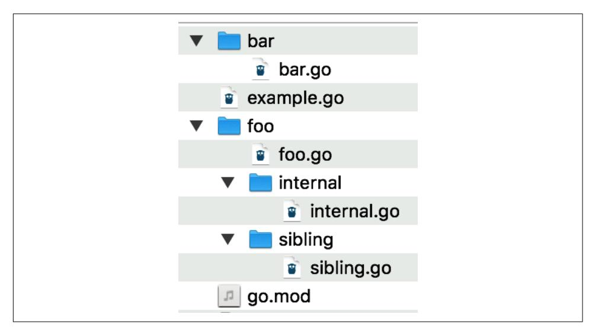

*Figure 10-1. The file tree for internal\_package\_example*

Be aware that attempting to use the internal function from *bar.go* in the bar package or from *example.go* in the root package results in a compilation error:

```
$ go build ./...
package github.com/learning-go-book-2e/internal_example
example.go:3:8: use of internal package
github.com/learning-go-book-2e/internal_example/foo/internal not allowed
package github.com/learning-go-book-2e/internal_example/bar
bar/bar.go:3:8: use of internal package
github.com/learning-go-book-2e/internal_example/foo/internal not allowed
```

## **Avoiding Circular Dependencies**

Two of the goals of Go are a fast compiler and easy-to-understand source code. To support this, Go does not allow you to have a *circular dependency* between packages. If package A imports package B, directly or indirectly, package B cannot import package A, directly or indirectly.

Let's look at a quick example to explain the concept. You can find the code in the *sample\_code/circular\_dependency\_example* directory in the [Chapter 10 repository.](https://oreil.ly/eCRCH) There are two packages, pet and person. In *pet.go* in the pet package, you have this:

```
import "github.com/learning-go-book-2e/ch10/sample_code/
circular_dependency_example/person"
var owners = map[string]person.Person{
        "Bob": {"Bob", 30, "Fluffy"},
```

```
"Julia": {"Julia", 40, "Rex"},
}
While in person.go in the person package, you have this:
import "github.com/learning-go-book-2e/ch10/sample_code/
circular_dependency_example/pet"
var pets = map[string]pet.Pet{
       "Fluffy": {"Fluffy", "Cat", "Bob"},
       "Rex": {"Rex", "Dog", "Julia"},
}
If you try to build this program, you'll get an error:
$ go build ./sample_code/circular_dependency_example
package github.com/learning-go-book-2e/ch10/sample_code/
 circular_dependency_example
       imports github.com/learning-go-book-2e/ch10/sample_code/
 circular_dependency_example/person
       imports github.com/learning-go-book-2e/ch10/sample_code/
 circular_dependency_example/pet
       imports github.com/learning-go-book-2e/ch10/sample_code/
 circular_dependency_example/person: import cycle not allowed
```

If you find yourself with a circular dependency, you have a few options. In some cases, this is caused by splitting up packages too finely. If two packages depend on each other, there's a good chance they should be merged into a single package. You can merge the person and pet packages into a single package, and that solves your problem.

If you have a good reason to keep your packages separated, it may be possible to move just the items that cause the circular dependency to one of the two packages or to a new package.

## **Organizing Your Module**

There's no official way to structure the Go packages in your module, but several patterns have emerged over the years. They are guided by the principle that you should focus on making your code easy to understand and maintain.

When your module is small, keep all your code in a single package. As long as no other modules depend on your module, there is no harm in delaying organization.

As your module grows, you'll want to impose some order to make your code more readable. The first question to ask is what type of module you are creating. You can group modules into two broad categories: those that are intended as a single application and those that are primarily intended as libraries. If you are sure that your module is intended to be used only as an application, make the root of the project the main package. The code in the main package should be minimal; place all your logic

<span id="page-260-0"></span>in an *internal* directory, and the code in the main function will simply invoke code within *internal*. This way, you can ensure that no one is going to create a module that depends on your application's implementation.

If you want your module to be used as a library, the root of your module should have a package name that matches the repository name. This makes sure that the import name matches the package name. To make this work, you must ensure that your repository name is a valid Go identifier. In particular, you cannot use a hyphen as a word separator in your repository name, because a hyphen is not a valid character in a package name.

It's not uncommon for library modules to have one or more applications included with them as utilities. In this case, create a directory called *cmd* at the root of your module. Within *cmd*, create one directory for each binary built from your module. For example, you might have a module that contains both a web application and a command-line tool that analyzes data in the web application's database. Use main as the package name within each of these directories.

For more detailed information, this [blog post by Eli Bendersky](https://oreil.ly/faMHH) provides good advice on how you should structure a simple Go module.

As projects get more complicated, you'll be tempted to break up your packages. Make sure to organize your code to limit the dependencies among packages. One common pattern is to organize your code by slices of functionality. For example, if you wrote a shopping site in Go, you might place all the code for customer management in one package and all the code for inventory management in another. This style limits the dependencies among packages, which makes it easier to later refactor a single web application into multiple microservices. This style is in contrast to the way that many Java applications are organized, with all the business logic in one package, all the database logic in another package, and the data transfer objects in a third.

When developing a library, take advantage of the internal package. If you create multiple packages within a module and they are outside an internal package, exporting a symbol so it can be used by another package in your module means it can also be used by *anyone* who imports your module. There's a principle in software engineering called [Hyrum's law:](https://oreil.ly/820xv) "With a sufficient number of users of an API, it does not matter what you promise in the contract: all observable behaviors of your system will be depended on by somebody." Once something is part of your API, you have a responsibility to continue supporting it until you decide to make a new version that's not backward compatible. You will learn how to do this in ["Updating to Incompatible](#page-271-0) [Versions" on page 248.](#page-271-0) If you have some symbols that you want to share only within your module, put them in internal. If you change your mind, you can always move the package out of internal later.

<span id="page-261-0"></span>For a good overview of Go project structure advice, watch Kat Zien's talk from GopherCon 2018, ["How Do You Structure Your Go Apps".](https://oreil.ly/0zHY4)


The "golang-standards" GitHub repository claims to be the "stan‐ dard" module layout. Russ Cox, the development lead for Go, has [publicly stated](https://oreil.ly/PAhWS) that it is not endorsed by the Go team and that the structure it recommends is in fact an antipattern. Please do not cite this repository as a way to organize your code.

## **Gracefully Renaming and Reorganizing Your API**

After using a module for a while, you might realize that its API is not ideal. You might want to rename some of the exported identifiers or move them to another package within your module. To avoid a backward-breaking change, don't remove the original identifiers; provide an alternate name instead.

This is easy with a function or method. You declare a function or method that calls the original. For a constant, simply declare a new constant with the same type and value, but a different name.

If you want to rename or move an exported type, you use an alias. Quite simply, an *alias* is a new name for a type. You saw in [Chapter 7](#page-166-0) how to use the type keyword to declare a new type based on an existing one. You also use the type keyword to declare an alias. Let's say you have a type called Foo:

```
type Foo struct {
 x int
 S string
}
func (f Foo) Hello() string {
 return "hello"
}
func (f Foo) goodbye() string {
 return "goodbye"
}
```

If you want to allow users to access Foo by the name Bar, all you need to do is this:

```
type Bar = Foo
```

To create an alias, use the type keyword, the name of the alias, an equals sign, and the name of the original type. The alias has the same fields and methods as the original type.

The alias can even be assigned to a variable of the original type without a type conversion:

```
func MakeBar() Bar {
 bar := Bar{
 x: 20,
 S: "Hello",
 }
 var f Foo = bar
 fmt.Println(f.Hello())
 return bar
}
```

One important point to remember: an alias is just another name for a type. If you want to add new methods or change the fields in an aliased struct, you must add them to the original type.

You can alias a type that's defined in the same package as the original type or in a different package. You can even alias a type from another module. There is one drawback to an alias in another package: you cannot use an alias to refer to the unexported methods and fields of the original type. This limitation makes sense, as aliases exist to allow a gradual change to a package's API, and the API consists only of the exported parts of the package. To work around this limitation, call code in the type's original package to manipulate unexported fields and methods.

Two kinds of exported identifiers can't have alternate names. The first is a packagelevel variable. The second is a field in a struct. Once you choose a name for an exported struct field, there's no way to create an alternate name.

## **Avoiding the init Function if Possible**

When you read Go code, it is usually clear which methods and functions are called. One of the reasons Go doesn't have method overriding or function overloading is to make it easier to understand what code is running. However, there is a way to set up state in a package without explicitly calling anything: the init function. When you declare a function named init that takes no parameters and returns no values, it runs the first time the package is referenced by another package. Since init functions do not have any inputs or outputs, they can work only by side effect, interacting with package-level functions and variables.

The init function has another unique feature. Go allows you to declare multiple init functions in a single package, or even in a single file in a package. There's a documented order for running multiple init functions in a single package, but rather than remembering it, it's better to simply avoid them.

Some packages, like database drivers, use init functions to register the database driver. However, you don't use any of the identifiers in the package. As mentioned earlier, Go doesn't allow you to have unused imports. To work around this, Go allows *blank imports*, where the name assigned to an import is the underscore (\_). Just as an underscore allows you to skip an unused return value from a function, a blank

<span id="page-263-0"></span>import triggers the init function in a package but doesn't give you access to any of the exported identifiers in the package:

```
import (
 "database/sql"
 _ "github.com/lib/pq"
)
```

This pattern is considered obsolete because it's unclear that a registration operation is being performed. Go's compatibility guarantee for its standard library means that you are stuck using it to register database drivers and image formats, but if you have a registry pattern in your own code, register your plug-ins explicitly.

The primary use of init functions today is to initialize package-level variables that can't be configured in a single assignment. It's a bad idea to have mutable state at the top level of a package, since it makes it harder to understand how data flows through your application. That means that any package-level variables configured via init should be *effectively immutable*. While Go doesn't provide a way to enforce that their value does not change, you should make sure that your code does not change them. If you have package-level variables that need to be modified while your program is running, see if you can refactor your code to put that state into a struct that's initialized and returned by a function in the package.

The nonexplicit invocation of init functions means that you should document their behavior. For example, a package with an init function that loads files or accesses the network should call this out in a package-level comment so that security-conscious users of your code aren't surprised by unexpected I/O.

# **Working with Modules**

You've seen how to work with packages within a single module, and now it's time to see how to integrate with third-party modules and the packages within them. After that, you'll learn about publishing and versioning your own modules and Go's centralized services: pkg.go.dev, the module proxy, and the checksum database.

## **Importing Third-Party Code**

So far, you've imported packages from the standard library like fmt, errors, os, and math. Go uses the same import system to integrate packages from third parties. Unlike many other compiled languages, Go always builds applications from source code into a single binary file. This includes the source code of your module and the source code of all the modules on which your module depends. (The Go compiler is smart enough to not include unreferenced packages in the binary it produces.) Just as you saw when you imported a package from within your own module, when you <span id="page-264-0"></span>import a third-party package, you specify the location in the source code repository where the package is located.

Let's look at an example. I mentioned back in [Chapter 2](#page-40-0) that you should never use floating-point numbers when you need an exact representation of a decimal number. If you do need an exact representation, one good option is the decimal module from [ShopSpring](https://oreil.ly/UZfMN). You are also going to look at a simple [formatting module](https://oreil.ly/q-Ce5) that I've written for this book. Both of these modules are used in a small program in the [money repository](https://oreil.ly/vSiNr) for the book. This program calculates the price of an item with the tax included and prints the output in a neat format.

The following code is in *main.go*:

```
package main
import (
 "fmt"
 "log"
 "os"
 "github.com/learning-go-book-2e/formatter"
 "github.com/shopspring/decimal"
)
func main() {
 if len(os.Args) < 3 {
 fmt.Println("Need two parameters: amount and percent")
 os.Exit(1)
 }
 amount, err := decimal.NewFromString(os.Args[1])
 if err != nil {
 log.Fatal(err)
 }
 percent, err := decimal.NewFromString(os.Args[2])
 if err != nil {
 log.Fatal(err)
 }
 percent = percent.Div(decimal.NewFromInt(100))
 total := amount.Add(amount.Mul(percent)).Round(2)
 fmt.Println(formatter.Space(80, os.Args[1], os.Args[2],
 total.StringFixed(2)))
}
```

The two imports github.com/learning-go-book-2e/formatter and github.com/ shopspring/decimal specify third-party imports. Note that they include the location of the package in the repository. Once they're imported, you access the exported items in these packages just like any other imported package.

<span id="page-265-0"></span>Before building the application, look at the *go.mod* file. Its contents should be as follows:

```
module github.com/learning-go-book-2e/money
go 1.20
If you try to do a build, you get the following message:
$ go build
main.go:8:2: no required module provides package
 github.com/learning-go-book-2e/formatter; to add it:
 go get github.com/learning-go-book-2e/formatter
main.go:9:2: no required module provides package
 github.com/shopspring/decimal; to add it:
 go get github.com/shopspring/decimal
```

As the errors indicate, you cannot build the program until you add references to the third-party modules to your *go.mod* file. The go get command downloads modules and updates the *go.mod* file. You have two options when using go get. The simplest option is to tell go get to scan your module's source code and add any modules that are found in import statements to *go.mod*:

```
$ go get ./...
go: downloading github.com/shopspring/decimal v1.3.1
go: downloading github.com/learning-go-book-2e/formatter
 v0.0.0-20220918024742-1835a89362c9
go: downloading github.com/fatih/color v1.13.0
go: downloading github.com/mattn/go-colorable v0.1.9
go: downloading github.com/mattn/go-isatty v0.0.14
go: downloading golang.org/x/sys v0.0.0-20210630005230-0f9fa26af87c
go: added github.com/fatih/color v1.13.0
go: added github.com/learning-go-book-2e/formatter
 v0.0.0-20220918024742-1835a89362c9
go: added github.com/mattn/go-colorable v0.1.9
go: added github.com/mattn/go-isatty v0.0.14
go: added github.com/shopspring/decimal v1.3.1
go: added golang.org/x/sys v0.0.0-20210630005230-0f9fa26af87c
```

Because the location of the package is in the source code, go get is able to get the package's module and download it. If you look in the *go.mod* file now, you'll see this:

```
module github.com/learning-go-book-2e/money
go 1.20
require (
 github.com/learning-go-book-2e/formatter v0.0.0-20220918024742-1835a89362c9
 github.com/shopspring/decimal v1.3.1
)
require (
 github.com/fatih/color v1.13.0 // indirect
```

```
 github.com/mattn/go-colorable v0.1.9 // indirect
 github.com/mattn/go-isatty v0.0.14 // indirect
 golang.org/x/sys v0.0.0-20210630005230-0f9fa26af87c // indirect
)
```

The first require section of the *go.mod* file lists the modules that you've imported into your module. After the module name is a version number. In the case of the formatter module, it doesn't have a version tag, so Go makes up a *pseudoversion*.

You also see a second require directive section that has modules with an *indirect* comment. One of these modules (github.com/fatih/color) is directly used by formatter. It, in turn, depends on the other three modules in the second require directive section. All the modules used by all your module's dependencies (and your dependencies' dependencies, and so on) are included in the *go.mod* file for your module. The ones that are used only in dependencies are marked as indirect.

In addition to updating *go.mod*, a *go.sum* file is created. For each module in the dependency tree of your project, the *go.sum* file has one or two entries: one with the module, its version, and a hash of the module; the other with the hash of the *go.mod* file for the module. Here's what the *go.sum* file looks like:

```
github.com/fatih/color v1.13.0 h1:8LOYc1KYPPmyKMuN8QV2DNRWNbLo6LZ0iLs...
github.com/fatih/color v1.13.0/go.mod h1:kLAiJbzzSOZDVNGyDpeOxJ47H46q...
github.com/learning-go-book-2e/formatter v0.0.0-20220918024742-1835a8...
github.com/learning-go-book-2e/formatter v0.0.0-20220918024742-1835a8...
github.com/mattn/go-colorable v0.1.9 h1:sqDoxXbdeALODt0DAeJCVp38ps9Zo...
github.com/mattn/go-colorable v0.1.9/go.mod h1:u6P/XSegPjTcexA+o6vUJr...
github.com/mattn/go-isatty v0.0.12/go.mod h1:cbi8OIDigv2wuxKPP5vlRcQ1...
github.com/mattn/go-isatty v0.0.14 h1:yVuAays6BHfxijgZPzw+3Zlu5yQgKGP...
github.com/mattn/go-isatty v0.0.14/go.mod h1:7GGIvUiUoEMVVmxf/4nioHXj...
github.com/shopspring/decimal v1.3.1 h1:2Usl1nmF/WZucqkFZhnfFYxxxu8LG...
github.com/shopspring/decimal v1.3.1/go.mod h1:DKyhrW/HYNuLGql+MJL6WC...
golang.org/x/sys v0.0.0-20200116001909-b77594299b42/go.mod h1:h1NjWce...
golang.org/x/sys v0.0.0-20200223170610-d5e6a3e2c0ae/go.mod h1:h1NjWce...
golang.org/x/sys v0.0.0-20210630005230-0f9fa26af87c h1:F1jZWGFhYfh0Ci...
golang.org/x/sys v0.0.0-20210630005230-0f9fa26af87c/go.mod h1:oPkhp1M...
```

You'll see what these hashes are used for in ["Module Proxy Servers"](#page-282-0) on page 259. You might also notice that there are multiple versions of some of the dependencies. I'll talk about that in ["Minimal Version Selection" on page 247](#page-270-0).

Let's validate that your modules are now set up correctly. Run go build again, and then run the money binary and pass it some arguments:

```
$ go build
$ ./money 99.99 7.25
99.99 7.25 107.24
```

<span id="page-267-0"></span>

This sample program was checked in without *go.sum* and with an incomplete *go.mod*. This was done so you could see what happens when these files are populated. When committing your own modules to source control, always include up-to-date *go.mod* and *go.sum* files. Doing so specifies exactly what versions of your dependencies are being used. This enables *repeatable builds*; when anyone else (including your future self) builds this module, they will get the exact same binary.

As I mentioned, there's another way to use go get. Instead of telling it to scan your source code to discover modules, you can pass the module paths to go get. To see this work, roll back the changes to your *go.mod* file and remove the *go.sum* file. On Unix-like systems, the following commands will do this:

```
$ git restore go.mod
$ rm go.sum
```

Now, pass the module paths to go get directly:

```
$ go get github.com/learning-go-book-2e/formatter
go: added github.com/learning-go-book-2e/
 formatter v0.0.0-20200921021027-5abc380940ae
$ go get github.com/shopspring/decimal
go: added github.com/shopspring/decimal v1.3.1
```


Sharp-eyed readers might have noticed that when we used go get a second time, the go: downloading messages weren't displayed. The reason is that Go maintains a *module cache* on your local computer. Once a version of a module is downloaded, a copy is kept in the cache. Source code is pretty compact, and drives are pretty large, so this isn't usually a concern. However, if you want to delete the module cache, use the command go clean -modcache.

Take a look at the contents of *go.mod*, and they'll look a little different than before: module github.com/learning-go-book-2e/money

```
go 1.20
require (
 github.com/fatih/color v1.13.0 // indirect
 github.com/learning-go-book-2e/
 formatter v0.0.0-20220918024742-1835a89362c9 // indirect
 github.com/mattn/go-colorable v0.1.9 // indirect
 github.com/mattn/go-isatty v0.0.14 // indirect
 github.com/shopspring/decimal v1.3.1 // indirect
 golang.org/x/sys v0.0.0-20210630005230-0f9fa26af87c // indirect
)
```

<span id="page-268-0"></span>Notice that all the imports are marked as *indirect*, not just the ones that came from formatter. When you run go get and pass it a module name, it doesn't check your source code to see whether the module you specified is used within your main module. Just to be safe, it adds an indirect comment.

If you want to fix this label automatically, use the command go mod tidy. It scans your source code and synchronizes the *go.mod* and *go.sum* files with your module's source code, adding and removing module references. It also makes sure that the indirect comments are correct.

You might be wondering why you would want to bother using go get with a module name. The reason is that it allows you to update the version of an individual module.

## **Working with Versions**

Let's see how Go's module system uses versions. I've written a [simple module](https://oreil.ly/zx0GR) that you're going to use in another [tax-collection program.](https://oreil.ly/AyAz_) In *main.go*, there are the following third-party imports:

```
"github.com/learning-go-book-2e/simpletax"
"github.com/shopspring/decimal"
```

As before, the sample program wasn't checked in with *go.mod*, and *go.sum* updated, so you could see what happens. When the program is built, you see the following:

```
$ go get ./...
go: downloading github.com/learning-go-book-2e/simpletax v1.1.0
go: added github.com/learning-go-book-2e/simpletax v1.1.0
go: added github.com/shopspring/decimal v1.3.1
$ go build
The go.mod file has been updated:
module github.com/learning-go-book-2e/region_tax
go 1.20
require (
 github.com/learning-go-book-2e/simpletax v1.1.0
 github.com/shopspring/decimal v1.3.1
)
```

There is also a *go.sum* file with hashes for your dependencies. Run the code and see whether it's working:

```
$ ./region_tax 99.99 12345
2022/09/19 22:04:38 unknown zip: 12345
```

That looks like an unexpected answer. The latest version of the module might have a bug. By default, Go picks the latest version of a dependency when you add it to your module. However, one of the things that makes versioning useful is that you can

<span id="page-269-0"></span>specify an earlier version of a module. First, you can see what versions of the module are available with the go list command:

```
$ go list -m -versions github.com/learning-go-book-2e/simpletax
github.com/learning-go-book-2e/simpletax v1.0.0 v1.1.0
```

By default, the go list command lists the packages that are used in your module. The -m flag changes the output to list the modules instead, and the -versions flag changes go list to report on the available versions for the specified module. In this case, you see that there are two versions, v1.0.0 and v1.1.0. Let's downgrade to version v1.0.0 and see if that fixes your problem. You do that with the go get command:

```
$ go get github.com/learning-go-book-2e/simpletax@v1.0.0
go: downloading github.com/learning-go-book-2e/simpletax v1.0.0
go: downgraded github.com/learning-go-book-2e/simpletax v1.1.0 => v1.0.0
```

The go get command lets you work with modules, updating the versions of your dependencies.

Now if you look at *go.mod*, you'll see that the version has been changed:

```
module github.com/learning-go-book-2e/region_tax
go 1.20
require (
 github.com/learning-go-book-2e/simpletax v1.0.0
 github.com/shopspring/decimal v1.3.1
)
```

You also see in *go.sum* that it contains both versions of simpletax:

```
github.com/learning-go-book-2e/simpletax v1.0.0 h1:KZU8aXRCHkvgFmBWkV...
github.com/learning-go-book-2e/simpletax v1.0.0/go.mod h1:lR4YYZwbDTI...
github.com/learning-go-book-2e/simpletax v1.1.0 h1:sG83gscauX/b8yKKY9...
github.com/learning-go-book-2e/simpletax v1.1.0/go.mod h1:lR4YYZwbDTI...
```

This is fine; if you change a module's version or even remove a module from your module, an entry for it might still remain in *go.sum*. This doesn't cause problems.

When you build and run the code again, the bug is fixed:

```
$ go build
$ ./region_tax 99.99 12345
107.99
```

### **Semantic Versioning**

Software has had version numbers from time immemorial, but there has been little consistency in what version numbers mean. The version numbers attached to Go modules follow the rules of *semantic versioning*, also known as *SemVer*. By requiring <span id="page-270-0"></span>semantic versioning for modules, Go makes its module management code simpler while ensuring that users of a module understand what a new release promises.

If you aren't familiar with SemVer, check out the [full specification](https://semver.org). The very short explanation is that semantic versioning divides a version number into three parts: the *major* version, the *minor* version, and the *patch* version, which are written as major.minor.patch and preceded by a v. The patch version number is incremented when fixing a bug; the minor version number is incremented (and the patch version is set back to 0) when a new, backward-compatible feature is added; and the major version number is incremented (and minor and patch are set back to 0) when making a change that breaks backward compatibility.

## **Minimal Version Selection**

At some point, your module will depend on two or more modules that all depend on the same module. As often happens, these modules declare that they depend on different minor or patch versions of that module. How does Go resolve this?

The module system uses the principle of *minimal version selection*: you will always get the lowest version of a dependency that is declared to work in all the *go.mod* files across all your dependencies. Let's say that your module directly depends on modules A, B, and C. All three of these modules depend on module D. The *go.mod* file for module A declares that it depends on v1.1.0, module B declares that it depends on v1.2.0, and module C declares that it depends on v1.2.3. Go will import module D only once, and it will choose version v1.2.3, as that, in the words of the [Go Modules](https://oreil.ly/6YRBy) [Reference,](https://oreil.ly/6YRBy) is the minimum version that satisfies all requirements.

You can see this in action with your sample program from ["Importing Third-Party](#page-263-0) [Code" on page 240.](#page-263-0) The command go mod graph shows the dependency graph of your module and all its dependencies. Here are a few lines of its output:

```
github.com/learning-go-book-2e/money github.com/fatih/color@v1.13.0
github.com/learning-go-book-2e/money github.com/mattn/go-colorable@v0.1.9
github.com/learning-go-book-2e/money github.com/mattn/go-isatty@v0.0.14
github.com/fatih/color@v1.13.0 github.com/mattn/go-colorable@v0.1.9
github.com/fatih/color@v1.13.0 github.com/mattn/go-isatty@v0.0.14
github.com/mattn/go-colorable@v0.1.9 github.com/mattn/go-isatty@v0.0.12
```

Each line lists two modules, the first being the parent and the second being the dependency and its version. You'll notice the github.com/fatih/color mod‐ ule is declared to depend on version v0.0.14 of github.com/mattn/go-isatty, while github.com/mattn/go-colorable depends on v0.0.12. The Go compiler selects version v0.0.14 to use, because it is the minimal version that meets all requirements. This occurs even though, as of this writing, the latest version of github.com/mattn/go-isatty is v0.0.16. Your minimal version requirement is met with v0.0.14, so that's what is used.

<span id="page-271-0"></span>This system isn't perfect. You might find that while module A works with version v1.1.0 of module D, it does not work with version v1.2.3. What do you do then? Go's answer is that you need to contact the module authors to fix their incompatibilities. The *import compatibility rule* says, "If an old package and a new package have the same import path, the new package must be backward compatible with the old package." All minor and patch versions of a module must be backward compatible. If they aren't, it's a bug. In our hypothetical example, either module D needs to be fixed because it broke backward compatibility, or module A needs to be fixed because it made a faulty assumption about the behavior of module D.

You might not find this answer satisfying, but it's honest. Some build systems, like npm, will include multiple versions of the same package. This can introduce its own set of bugs, especially when there is package-level state. It also increases the size of your application. In the end, some things are better solved by community than code.

## **Updating to Compatible Versions**

What if you explicitly want to upgrade a dependency? Let's assume that after writing the initial program, there are three more versions of simpletax. The first fixes problems in the initial v1.1.0 release. Since it's a bug patch release with no new func‐ tionality, it would be released as v1.1.1. The second keeps the current functionality but also adds a new function. It would get the version number v1.2.0. Finally, the third fixes a bug that was found in version v1.2.0. It has the version number v1.2.1.

To upgrade to the bug patch release for the current minor version, use the command go get -u=patch github.com/learning-go-book-2e/simpletax. Since you had downgraded to v1.0.0, you would remain on that version, because there is no patch version with the same minor version.

Upgrade to version v1.1.0 by using go get github.com/learning-go-book-2e/sim pletax@v1.1.0 and then run go get -u=patch github.com/learning-go-book-2e/ simpletax. This upgrades the version to v1.1.1.

Finally, use the command go get -u github.com/learning-go-book-2e/simpletax to get the most recent version of simpletax. That upgrades you to version v1.2.1.

## **Updating to Incompatible Versions**

Let's go back to the program. You're expanding to Canada, and luckily, a version of the simpletax module handles both the US and Canada. However, this version has a slightly different API than the previous one, so its version is v2.0.0.

<span id="page-272-0"></span>To handle incompatibility, Go modules follow the *semantic import versioning* rule. This rule has two parts:

- The major version of the module must be incremented.
- For all major versions besides 0 and 1, the path to the module must end in v*N*, where *N* is the major version.

The path changes because an import path uniquely identifies a package. By definition, incompatible versions of a package are not the same package. Using different paths means that you can import two incompatible versions of a package into different parts of your program, allowing you to upgrade gracefully.

Let's see how this changes the program. First, change the import of simpletax to this:

```
"github.com/learning-go-book-2e/simpletax/v2"
```

This changes your import to refer to the v2 module.

Next, change the code in main to the following:

```
func main() {
 amount, err := decimal.NewFromString(os.Args[1])
 if err != nil {
 log.Fatal(err)
 }
 zip := os.Args[2]
 country := os.Args[3]
 percent, err := simpletax.ForCountryPostalCode(country, zip)
 if err != nil {
 log.Fatal(err)
 }
 total := amount.Add(amount.Mul(percent)).Round(2)
 fmt.Println(total)
}
```

The program is now reading a third parameter from the command line, which is the country code. The program also calls a different function in the simpletax package. When you run go get ./..., the dependency is automatically updated:

```
$ go get ./...
go: downloading github.com/learning-go-book-2e/simpletax/v2 v2.0.0
go: added github.com/learning-go-book-2e/simpletax/v2 v2.0.0
```

Build and run the program to see the new output:

```
$ go build
$ ./region_tax 99.99 M4B1B4 CA
112.99
$ ./region_tax 99.99 12345 US
107.99
```

<span id="page-273-0"></span>When you look at the *go.mod* file, you'll see that the new version of simpletax is included:

```
module github.com/learning-go-book-2e/region_tax
go 1.20
require (
 github.com/learning-go-book-2e/simpletax v1.0.0
 github.com/learning-go-book-2e/simpletax/v2 v2.0.0
 github.com/shopspring/decimal v1.3.1
)
And go.sum has been updated as well:
github.com/learning-go-book-2e/simpletax v1.0.0 h1:KZU8aXRCHkvgFmBWkV...
github.com/learning-go-book-2e/simpletax v1.0.0/go.mod h1:lR4YYZwbDTI...
github.com/learning-go-book-2e/simpletax v1.1.0 h1:sG83gscauX/b8yKKY9...
github.com/learning-go-book-2e/simpletax v1.1.0/go.mod h1:lR4YYZwbDTI...
github.com/learning-go-book-2e/simpletax/v2 v2.0.0 h1:EUFWy1BBA2omgkm...
github.com/learning-go-book-2e/simpletax/v2 v2.0.0/go.mod h1:yGLh6ngH...
github.com/shopspring/decimal v1.3.1 h1:2Usl1nmF/WZucqkFZhnfFYxxxu8LG...
github.com/shopspring/decimal v1.3.1/go.mod h1:DKyhrW/HYNuLGql+MJL6WC...
```

The old versions of simpletax are still referenced, even though they are no longer used. Use go mod tidy to remove those unused versions. Then you'll see only v2.0.0 of simpletax referenced in *go.mod* and *go.sum*.

## **Vendoring**

To ensure that a module always builds with identical dependencies, some organiza‐ tions like to keep copies of their dependencies inside their module. This is known as *vendoring*. It's enabled by running the command go mod vendor. This creates a directory called *vendor* at the top level of your module that contains all your module's dependencies. These dependencies are used in place of the module cache stored on your computer.

If new dependencies are added to *go.mod* or versions of existing dependencies are upgraded with go get, you need to run go mod vendor again to update the *vendor* directory. If you forget to do this, go build, go run, and go test will display an error message and refuse to run.

Older Go dependency management systems required vendoring, but with the advent of Go modules and proxy servers (see ["Module Proxy Servers" on page 259](#page-282-0) for details), the practice is falling out of favor. One reason you might still want to vendor is that it can make building your code faster and more efficient when working with some CI/CD (continuous integration/continuous delivery) pipelines. If a pipeline's build servers are ephemeral, the module cache may not be preserved. Vendoring dependencies allows these pipelines to avoid making multiple network <span id="page-274-0"></span>calls to download dependencies every time a build is triggered. The downside is that it dramatically increases the size of your codebase in version control.

## **Using pkg.go.dev**

While there isn't a single centralized repository of Go modules, there is a single ser‐ vice that gathers together documentation on Go modules. The Go team has created a site called *[pkg.go.dev](https://pkg.go.dev)* that automatically indexes open source Go modules. For each module, the package index publishes the godocs, the license used, the *README*, the module's dependencies, and what open source modules depend on the module. You can see the info that *pkg.go.dev* has on your simpletax module in Figure 10-2.

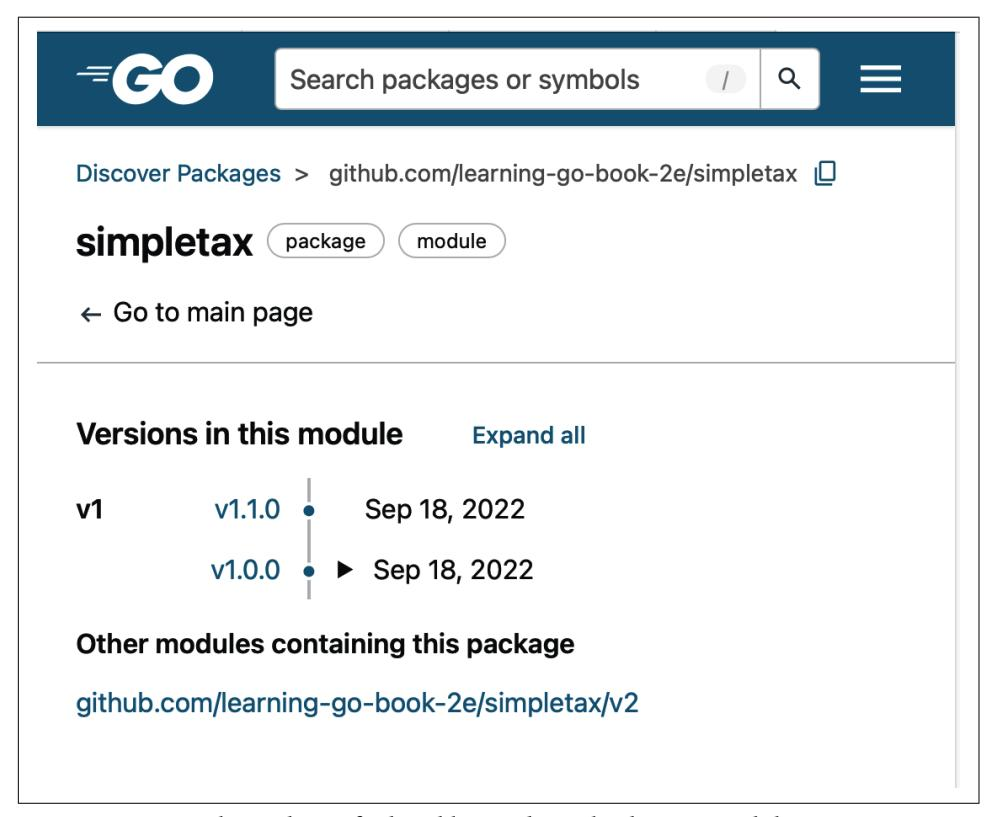

*Figure 10-2. Use pkg.go.dev to find and learn about third-party modules*

# **Publishing Your Module**

Making your module available to other people is as simple as putting it in a version control system. This is true whether you are releasing your module as open source on a public version control system like GitHub or a private one that's hosted by you or

<span id="page-275-0"></span>within a company. Since Go programs build from source code and use a repository path to identify themselves, there's no need to explicitly upload your module to a central library repository, as you do for Maven Central or npm. Make sure you check in both your *go.mod* file and your *go.sum* file.


While most Go developers use Git for version control, Go also sup‐ ports Subversion, Mercurial, Bazaar, and Fossil. By default, Git and Mercurial can be used for public repositories, and any of the sup‐ ported version control systems can be used for private repositories. For details, check out the [version control system documentation](https://oreil.ly/Oz608) for Go modules.

When releasing an open source module, you should include a file named *LICENSE* in the root of your repository that specifies the open source license under which you are releasing your code. [It's FOSS](https://oreil.ly/KVlrd) is a good resource for learning more about the various kinds of open source licenses.

Roughly speaking, you can divide open source licenses into two categories: permis‐ sive (which allows users of your code to keep their code private) and nonpermissive (which requires users of your code to make their code open source). While the license you choose is up to you, the Go community favors permissive licenses, such as BSD, MIT, and Apache. Since Go compiles third-party code directly into every application, the use of a nonpermissive license like the GPL would require people who use your code to release their code as open source as well. For many organizations, this is not acceptable.

One final note: do not write your own license. Few people will trust that it has been properly reviewed by a lawyer, and they can't tell what claims you are making on their module.

# **Versioning Your Module**

Whether your module is public or private, you should properly version your module so that it works correctly with Go's module system. As long as you are adding functionality or patching bugs, the process is simple. Store your changes in your source code repository, then apply a tag that follows the semantic versioning rules I discussed in ["Semantic Versioning" on page 246](#page-269-0).

Go's semantic versioning supports the concept of *pre-releases*. Let's assume that the current version of your module is tagged v1.3.4. You are working on version 1.4.0, which is not quite done, but you want to try importing it into another module. What you should do is append a hyphen (*-*) to the end of your version tag, followed by an identifier for the pre-release build. In this case, use a tag like v1.4.0-beta1 to indicate beta 1 of version 1.4.0 or v1.4.0-rc2 to indicate release candidate 2. If you <span id="page-276-0"></span>want to depend on a pre-release candidate, you must specify its version explicitly in go get, as Go will not automatically select a pre-release version.

If you reach a point where you need to break backward compatibility, the process is more complicated. As you saw when importing version 2 of the simpletax module, a backward-breaking change requires a different import path. There are a few steps to take.

First you need to choose a way to store your new version. Go supports two ways for creating the different import paths:

- Create a subdirectory within your module named *vN*, where *N* is the major version of your module. For example, if you are creating version 2 of your module, call this directory *v2*. Copy your code into this subdirectory, including the *README* and *LICENSE* files.
- Create a branch in your version control system. You can put either the old code or the new code on the new branch. Name the branch *vN* if you are putting the new code on the branch, or *vN-1* if you are putting the old code there. For example, if you are creating version 2 of your module and want to put version 1 code on the branch, name the branch *v1*.

After you decide how to store your new code, you need to change the import path in the code in your subdirectory or branch. The module path in your *go.mod* file must end with */vN*, and all the imports within your module must use */vN* as well. Going through all your code can be tedious, but Marwan Sulaiman has created a [tool that](https://oreil.ly/BeOAr) [automates](https://oreil.ly/BeOAr) the work. Once the paths are fixed, go ahead and implement your changes.


Technically, you could just change *go.mod* and your import state‐ ments, tag your main branch with the latest version, and not bother with a subdirectory or versioned branch. However, this is not a good practice, as it makes it unclear where to find older major versions of your module.

When you are ready to publish your new code, place a tag on your repository that looks like v*N*.0.0. If you are using the subdirectory system or keeping the latest code on your main branch, tag the main branch. If you are placing your new code on a different branch, tag that branch instead.

You can find more details on updating your code to an incompatible version in the post ["Go Modules: v2 and Beyond"](https://oreil.ly/E-3Qo) on The Go Blog and in ["Developing a Major](https://oreil.ly/_Li5v) [Version Update"](https://oreil.ly/_Li5v) on the Go developer website.

## <span id="page-277-0"></span>**Overriding Dependencies**

Forks happen. While there's a bias against forking in the open source community, sometimes a module stops being maintained or you want to experiment with changes that aren't accepted by the module's owner. A replace directive redirects all refer‐ ences to a module across all your module's dependencies and replaces them with the specified fork of the module. It looks like this:

replace github.com/jonbodner/proteus => github.com/someone/my\_proteus v1.0.0

The original module location is specified on the left side of the => and the replace‐ ment on the right. The right side must have a version specified, but specifying a version is optional for the left side. If a version is specified on the left side, only that specific version will be replaced. If the version is not specified, any version of the original module will be replaced with the specific version of the fork.

A replace directive can also refer to a path on your local filesystem:

replace github.com/jonbodner/proteus => ../projects/proteus

With a local replace directive, the module version must be omitted from the right side.


Avoid using local replace directives. They provided a way to modify multiple modules simultaneously before the invention of Go workspaces, but now they are a potential source of broken modules. (I will cover workspaces shortly.) If you share your mod‐ ule via version control, a module with local references in replace directives will probably not build for anyone else, since you cannot guarantee that other people will have the replacement modules in the same locations on their drive.

You also might want to block a specific version of a module from being used. Perhaps it has a bug or is incompatible with your module. Go provides the exclude directive to prevent a specific version of a module from being used:

exclude github.com/jonbodner/proteus v0.10.1

When a module version is excluded, any mentions of that module version in any dependent module are ignored. If a module version is excluded and it's the only version of that module that's required in your module's dependencies, use go get to add an indirect import of a different version of the module to your module's *go.mod* file so that your module still compiles.

## <span id="page-278-0"></span>**Retracting a Version of Your Module**

Sooner or later, you will accidentally publish a version of your module that you don't want anyone to use. Perhaps it was released by accident before testing was complete. Maybe after its release, a critical vulnerability is discovered and no one should use it any more. No matter the reason, Go provides a way for you to indicate that certain versions of a module should be ignored. This is done by adding a retract directive to the *go.mod* file of your module. It consists of the word retract and the semantic version that should no longer be used. If a range of versions shouldn't be used, you can exclude all versions in that range by placing the upper and lower bounds within brackets, separated by a comma. While it's not required, you should include a comment after a version or version range to explain the reason for the retraction.

If you wish to retract multiple nonsequential versions, you can specify them with multiple retract directives. In the examples shown, version 1.5.0 is excluded, as are all versions from 1.7.0 to 1.8.5, inclusive:

```
retract v1.5.0 // not fully tested
retract [v1.7.0, v.1.8.5] // posts your cat photos to LinkedIn w/o permission
```

Adding a retract directive to *go.mod* requires you to create a new version of your module. If the new version contains only the retraction, you should retract it as well.

When a version is retracted, existing builds that specified the version will continue to work, but go get and go mod tidy will not upgrade to them. They will no longer appear as options when you use the go list command. If the most recent version of a module is retracted, it will no longer be matched with @latest; the highest unretracted version will match instead.


While retract can be confused with exclude, there's a very impor‐ tant difference. You use retract to prevent others from using specific versions of *your* module. An exclude directive blocks you from using versions of another module.

## **Using Workspaces to Modify Modules Simultaneously**

There's one drawback to using your source code repository and its tags as a way to track your dependencies and their versions. If you want to make changes to two (or more) modules simultaneously, and you want to experiment with those changes across modules, you need a way to use a local copy of a module instead of the version in the source code repository.

<span id="page-279-0"></span>

You can find obsolete advice online to try to solve this issue with temporary replace directives in *go.mod* that point to local directo‐ ries. Do not do this! It's too easy to forget to undo these changes before committing and pushing your code. Workspaces were intro‐ duced to avoid this antipattern.

Go uses *workspaces* to address this issue. A workspace allows you to have multiple modules downloaded to your computer, and references between those modules will automatically resolve to the local source code instead of the code hosted in your repository.


This section assumes that you have a GitHub account. If you don't, you can still follow along. I'm going to use the organization name learning-go-book-2e, but you should replace it with your GitHub account name or organization.

Let's start with two sample modules. Create a *my\_workspace* directory and in that directory, create two more directories, *workspace\_lib* and *workspace\_app*. In the *workspace\_lib* directory, run go mod init github.com/learning-go-book-2e/work space\_lib. Create a file called *lib.go* with the following content:

```
package workspace_lib
func AddNums(a, b int) int {
 return a + b
}
```

In the *workspace\_app* directory, run go mod init github.com/learning-go -book-2e/workspace\_app. Create a file called *app.go* with the following contents:

```
package main
import (
 "fmt"
 "github.com/learning-go-book-2e/workspace_lib"
)
func main() {
 fmt.Println(workspace_lib.AddNums(2, 3))
}
```

In previous sections, you used go get ./... to add require directives to *go.mod*. Let's see what happens if you try it here:

```
$ go get ./...
github.com/learning-go-book-2e/workspace_app imports
 github.com/learning-go-book-2e/workspace_lib: cannot find module
 providing package github.com/learning-go-book-2e/workspace_lib
```

<span id="page-280-0"></span>Since *workspace\_lib* hasn't been pushed to GitHub yet, you can't pull it in. If you try to run go build, you will get a similar error:

```
$ go build
app.go:5:2: no required module provides
 package github.com/learning-go-book-2e/workspace_lib; to add it:
 go get github.com/learning-go-book-2e/workspace_lib
```

Let's take advantage of workspaces to allow *workplace\_app* to see the local copy of *workspace\_lib*. Go to the *my\_workspace* directory and run the following commands:

```
$ go work init ./workspace_app
$ go work use ./workspace_lib
```

This creates a *go.work* file in *my\_workspace* with the following contents:

```
go 1.20
use (
 ./workspace_app
 ./workspace_lib
)
```


The *go.work* file is meant for your local computer only. Do not commit it to source control!

Now if you build *workspace\_app*, everything works:

```
$ cd workspace_app
$ go build
$ ./workspace_app
5
```

Now that you are sure that *workspace\_lib* does the right thing, it can be pushed to GitHub. In GitHub, create an empty public repository called workspace\_lib and then run the following commands in the *workspace\_lib* directory:

```
$ git init
$ git add .
$ git commit -m "first commit"
$ git remote add origin git@github.com:learning-go-book-2e/workspace_lib.git
$ git branch -M main
$ git push -u origin main
```

After running these commands, go to *[https://github.com/learning-go-book-2e/work](https://github.com/learning-go-book-2e/workspace_lib/releases/new) [space\\_lib/releases/new](https://github.com/learning-go-book-2e/workspace_lib/releases/new)* (replacing "learning-go-book-2e" with your account or organi‐ zation), and create a new release with the tag v0.1.0.

<span id="page-281-0"></span>Now if you go back to the *workspace\_app* directory and run go get ./..., the require directive is added, because there is a public module that can be downloaded:

```
$ go get ./...
go: downloading github.com/learning-go-book-2e/workspace_lib v0.1.0
go: added github.com/learning-go-book-2e/workspace_lib v0.1.0
$ cat go.mod
module github.com/learning-go-book-2e/workspace_app
go 1.20
```

require github.com/learning-go-book-2e/workspace\_lib v0.1.0

You can validate that your code is working with the public module by setting the environment variable GOWORK=off and building your application:

```
$ rm workspace_app
$ GOWORK=off go build
$ ./workspace_app
5
```

Even though there is now a require directive referring to the public module, you can continue to make updates in our local workspace and they will be used instead. In *workspace\_lib*, modify the *lib.go* file and add the following function:

```
func SubNums(a, b int) int {
 return a - b
}
```

In *workspace\_app*, modify the *app.go* file and add the following line to the end of the main function:

```
 fmt.Println(workspace_lib.SubNums(2,3))
```

Now run go build and see it use the local module instead of the public one:

```
$ go build
$ ./workspace_app
5
-1
```

Once you have made the edits and want to release your software, you need to update the version information in your modules' *go.mod* files to refer to the updated code. This requires you to commit your modules to source control in dependency order:

- 1. Choose a modified module that has no dependencies on any of the modified modules in your workspace.
- 2. Commit this module to your source code repository.
- 3. Create a new version tag on the newly committed module in your source code repository.

- <span id="page-282-0"></span>4. Use go get to update the version specified in *go.mod* in the modules that depend on the newly committed module.
- 5. Repeat the first four steps until all modified modules are committed.

If you have to make changes to *workspace\_lib* in the future and want to test them in *workspace\_app* without pushing back to GitHub and creating lots of temporary versions, you can git pull the latest versions of the modules into your workspace again and make your updates.

# **Module Proxy Servers**

Rather than relying on a single, central repository for libraries, Go uses a hybrid model. Every Go module is stored in a source code repository, like GitHub or GitLab. But by default, go get doesn't fetch code directly from source code repositories. Instead, it sends requests to a *[proxy server](https://oreil.ly/TllQM)* run by Google. When the proxy server receives the go get request, it checks its cache to see if there has been a request for this module version before. If so, it returns the cached information. If a module or a version of a module isn't cached on the proxy server, it downloads the module from the module's repository, stores a copy, and returns the module. This allows the proxy server to keep copies of every version of virtually all public Go modules.

In addition to the proxy server, Google also maintains a *checksum database*. It stores information on every version of every module cached by the proxy server. Just as the proxy server protects you from a module or a version of a module being removed from the internet, the checksum database protects you against modifications to a version of a module. This could be malicious (someone has hijacked a module and slipped in malicious code), or it could be inadvertent (a module maintainer fixes a bug or adds a new feature and reuses an existing version tag). In either case, you don't want to use a module version that has changed because you won't be building the same binary and don't know what the effects are on your application.

Every time you download a module via go get or go mod tidy, the Go tools calculate a hash for the module and contact the checksum database to compare the calculated hash to the hash stored for that module's version. If they don't match, the module isn't installed.

## **Specifying a Proxy Server**

Some people object to sending requests for third-party libraries to Google. There are a few options:

• You can disable proxying entirely by setting the GOPROXY environment variable to direct. You'll download modules directly from their repositories, but if you <span id="page-283-0"></span>depend on a version that's removed from the repository, you won't be able to access it.

• You can run your own proxy server. Both Artifactory and Sonatype have Go proxy server support built into their enterprise repository products. The [Athens](https://oreil.ly/Ud1uX) [Project](https://oreil.ly/Ud1uX) provides an open source proxy server. Install one of these products on your network and then point GOPROXY to the URL.

## **Using Private Repositories**

Most organizations keep their code in private repositories. If you want to use a private module in another Go module, you can't request it from Google's proxy server. Go will fall back to checking the private repository directly, but you might not want to leak the names of private servers and repositories to external services.

If you are using your own proxy server, or if you have disabled proxying, this isn't an issue. Running a private proxy server has some additional benefits. First, it speeds up downloading of third-party modules, as they are cached in your company's network. If accessing your private repositories requires authentication, using a private proxy server means that you don't have to worry about exposing authentication information in your CI/CD pipeline. The private proxy server is configured to authenticate to your private repositories (see the [authentication configuration documentation](https://oreil.ly/Nl4hv) for Athens), while the calls to the private proxy server are unauthenticated.

If you are using a public proxy server, you can set the GOPRIVATE environment variable to a comma-separated list of your private repositories. For example, if you set GOPRIVATE to:

```
GOPRIVATE=*.example.com,company.com/repo
```

any module stored in a repository that's located at any subdomain of *example.com* or at a URL that starts with *company.com/repo* will be downloaded directly.

# **Additional Details**

The Go Team has a complete [Go Modules Reference](https://oreil.ly/ZW-VD) available online. In addition to the content in this chapter, the Module Reference also covers topics like using version control systems besides Git, the structure and API of the module cache, additional environment variables for controlling module lookup behavior, and the REST API for the module proxy and checksum database.

# <span id="page-284-0"></span>**Exercises**

- 1. Create a module in your own public repository. This module has a single func‐ tion named Add with two int parameters and one int return value. This function adds the two parameters together and returns them. Make this version v1.0.0.
- 2. Add godoc comments to your module that describe the package and the Add function. Be sure to include a link to *[https://www.mathsisfun.com/numbers/addi](https://www.mathsisfun.com/numbers/addition.html) [tion.html](https://www.mathsisfun.com/numbers/addition.html)* in your Add function godoc. Make this version v1.0.1.
- 3. Change Add to make it generic. Import the golang.org/x/exp/constraints package. Combine the Integer and Float types in that package to create an interface called Number. Rewrite Add to take in two parameters of type Number and return a value of type Number. Version your module again. Because this is a backward-breaking change, this should be v2.0.0 of your module.

# **Wrapping Up**

In this chapter, you've learned how to organize code and interact with the ecosystem of Go source code. You've seen how modules work, how to organize your code into packages, how to use third-party modules, and how to release modules of your own. In the next chapter, you're going to take a look at more of the development tools that are included with Go, learn about some essential third-party tools, and explore some techniques to give you better control over your build process.

# **Go Tooling**

<span id="page-286-0"></span>A programming language doesn't exist in isolation. For it to be useful, tools must help the developer turn source code into an executable. Since Go is intended to address the problems that software engineers face today and to help them build quality software, careful thought has been put into tooling that simplifies tasks that are often difficult with other development platforms. This includes improvements in how you build, format, update, validate, and distribute, and even how your users will install your code.

I have already covered many of the bundled Go tools: go vet, go fmt, go mod, go get, go list, go work, go doc, and go build. The testing support provided by the go test tool is so extensive, it is covered by itself in [Chapter 15](#page-394-0). In this chapter, you will explore additional tools that make Go development great, both from the Go team and from third parties.

# **Using go run to Try Out Small Programs**

Go is a compiled language, which means that before Go code is run, it must be converted into an executable file. This is in contrast to interpreted languages like Python or JavaScript, which allow you to write a quick script to test an idea and execute it immediately. Having that rapid feedback cycle is important, so Go provides similar functionality via the go run command. It builds and executes a program in one step. Let's go back to the first program from [Chapter 1](#page-24-0). Put it in a file called *hello.go*:

```
package main
import "fmt"
func main() {
 fmt.Println("Hello, world!")
}
```

(You can also find this code in the [Chapter 11 repository](https://oreil.ly/Z_Fpg) in the *sample\_code/gorun* directory.)

Once the file is saved, use the go run command to build and execute it:

```
go run hello.go
Hello, world!
```

If you look inside the directory after running the go run command, you see that no binary has been saved there; the only file in the directory is the *hello.go* file you just created. Where did the executable go (no pun intended)?

The go run command does, in fact, compile your code into a binary. However, the binary is built in a temporary directory. The go run command builds the binary, executes the binary from that temporary directory, and then deletes the binary after your program finishes. This makes the go run command useful for testing out small programs or using Go like a scripting language.


Use go run when you want to treat a Go program like a script and run the source code immediately.

# **Adding Third-Party Tools with go install**

While some people choose to distribute their Go programs as precompiled binaries, tools written in Go can also be built from source and installed on your computer via the go install command.

As you saw in ["Publishing Your Module" on page 251,](#page-274-0) Go modules are identified via their source code repositories. The go install command takes an argument, which is the path to the main package in a module's source code repository, followed by an @ and the version of the tool you want (if you just want to get the latest version, use @latest). It then downloads, compiles, and installs the tool.

<span id="page-288-0"></span>

Always be sure to include the @version or @latest after the name of the package that you are installing! If you don't, it triggers a variety of confusing behaviors and is almost certainly not what you want to do. You either get an error message (if the current directory is not in a module, or if the current directory is a module, but the package isn't referenced in the module's *go.mod* file), or it installs the package version mentioned in *go.mod*.

By default, go install places binaries into the *go/bin* directory within your home directory. Set the *GOBIN* environment variable to change this location. It is strongly recommended that you add the go install directory to your executable search path (this is done by modifying the *PATH* environment variable on both Unix and Windows). For simplicity, all the examples in this chapter assume that you've added this directory.


Other environment variables are recognized by the go tool. You can get a complete list, along with a brief description of each variable, using the go help environment command. Many of them control low-level behavior that can be safely ignored. I'll point out the relevant ones as needed.

Some online resources tell you to set the GOROOT or GOPATH envi‐ ronment variables. GOROOT specifies the location where your Go development environment is installed, and GOPATH was used to store all Go source code, both your own and third-party dependen‐ cies. Setting these variables is no longer necessary; the go tool figures out GOROOT automatically, and GOPATH-based development has been superseded by modules.

Let's look at a quick example. Jaana Dogan created a great Go tool called hey that load tests HTTP servers. You can point it at the website of your choosing or an application that you've written. Here's how to install hey with the go install command:

### \$ **go install github.com/rakyll/hey@latest**

go: downloading github.com/rakyll/hey v0.1.4

go: downloading golang.org/x/net v0.0.0-20181017193950-04a2e542c03f

go: downloading golang.org/x/text v0.3.0

This downloads hey and all its dependencies, builds the program, and installs the binary in your Go binary directory.

<span id="page-289-0"></span>

As I covered in ["Module Proxy Servers" on page 259](#page-282-0), the contents of Go repositories are cached in proxy servers. Depending on the repository and the values in your GOPROXY environment variable, go install may download from a proxy or directly from a repository. If go install downloads directly from a repository, it relies on command-line tools being installed on your computer. For exam‐ ple, you must have Git installed to download from GitHub.

Now that you have built and installed hey, you can run it with the following:

### \$ **hey https://go.dev**

### Summary:

 Total: 2.1272 secs Slowest: 1.4227 secs Fastest: 0.0573 secs Average: 0.3467 secs Requests/sec: 94.0181

If you have already installed a tool and want to update it to a newer version, rerun go install with the newer version specified or with @latest:

### \$ **go install github.com/rakyll/hey@latest**

Of course, you don't need to leave programs installed via go install in the *go/bin* directory; they are regular executable binaries and can be stored anywhere on your computer. Likewise, you don't have to distribute programs written in Go using go install; you can put a binary up for download. However, go install is convenient for Go developers, and it has become the method of choice for distributing thirdparty developer tools.

# **Improving Import Formatting with goimports**

An enhanced version of go fmt called goimports also cleans up your import state‐ ments. It puts them in alphabetical order, removes unused imports, and attempts to guess any unspecified imports. Its guesses are sometimes inaccurate, so you should insert imports yourself.

You can download goimports with the command go install golang.org/x/ tools/cmd/goimports@latest. You run it across your project with this command:

### \$ **goimports -l -w .**

The -l flag tells goimports to print the files with incorrect formatting to the console. The -w flag tells goimports to modify the files in place. The . specifies the files to be scanned: everything in the current directory and all its subdirectories.

<span id="page-290-0"></span>

The packages under golang.org/x are part of the Go Project but outside the main Go tree. While useful, they are developed under looser compatibility requirements than the Go standard library and may introduce backward-breaking changes. Some packages in the standard library, such as the context package that is covered in [Chapter 14](#page-372-0), started out in golang.org/x. The pkgsite tool that was covered in ["Documenting Your Code with Go Doc Comments"](#page-254-0) [on page 231](#page-254-0) is also located there. You can see the other packages in the ["Sub-repositories" section.](https://oreil.ly/tuROf)

# **Using Code-Quality Scanners**

Back in ["go vet" on page 7](#page-30-0), you looked at the built-in tool go vet, which scans source code for common programming errors. Many third-party tools can check code style and scan for potential bugs that are missed by go vet. These tools are often called *linters*. 1 In addition to likely programming errors, some of the changes suggested by these tools include properly naming variables, formatting error messages, and placing comments on public methods and types. These aren't errors since they don't keep your programs from compiling or make your program run incorrectly, but they do flag situations where you are writing nonidiomatic code.

When you add linters to your build process, follow the old maxim "trust, but verify." Since the kinds of issues that linters find are fuzzier, they sometimes have false positives and false negatives. This means you don't *have* to make the changes that they suggest, but you should take the suggestions seriously. Go developers expect code to look a certain way and follow certain rules, and if your code does not, it sticks out.

If you find a linter's suggestion to be unhelpful, each linting tool allows you to add a comment to your source code that blocks the errant result (the format of the comment varies from linter to linter; check each tool's documentation to learn what to write). Your comment should also include an explanation of why you are ignoring the linter's finding, so code reviewers (and future you, when you look back on your source code in six months) understand your reasoning.

<sup>1</sup> The term "linter" comes from the original lint program written by Steve Johnson when he was on the Unix team at Bell Labs and described in his [1978 paper](https://oreil.ly/RgZbU). The name comes from the tiny bits of fabric that come off clothes in a dryer and are captured by a filter. He saw his program as being like a filter capturing small errors.

## <span id="page-291-0"></span>**staticcheck**

If you had to pick one third-party scanner, use [staticcheck](https://oreil.ly/ky8ZD). It is supported by many companies that are active in the Go community, includes more than 150 code-quality checks, and tries to produce few to no false positives. It is installed via go install honnef.co/go/tools/cmd/staticcheck@latest. Invoke it with staticcheck ./... to examine your module.

Here's an example of something that staticcheck finds that go vet does not:

```
package main
import "fmt"
func main() {
 s := fmt.Sprintf("Hello")
 fmt.Println(s)
}
```

(You can also find this code in the *sample\_code/staticcheck\_test* directory in the [Chapter 11 repository](https://oreil.ly/Z_Fpg).)

If you run go vet on this code, it doesn't find anything wrong. But, staticcheck notices a problem:

```
$ staticcheck ./...
main.go:6:7: unnecessary use of fmt.Sprintf (S1039)
```

Pass the code in parentheses to staticcheck with the -explain flag for an explana‐ tion of the issue:

```
$ staticcheck -explain S1039
Unnecessary use of fmt.Sprint
Calling fmt.Sprint with a single string argument is unnecessary
and identical to using the string directly.
Available since
 2020.1
Online documentation
 https://staticcheck.io/docs/checks#S1039
```

Another common issue that staticcheck finds is unused assignments to variables. While the Go compiler requires all variables to be read *once*, it doesn't check that *every* value assigned to a variable is read. It is a common practice to reuse an err variable when there are multiple function calls within a function. If you forget to write if err != nil after one of those function invocations, the compiler won't be able to help you. However, staticcheck can. This code compiles without a problem:

```
func main() {
 err := returnErr(false)
 if err != nil {
 fmt.Println(err)
 }
 err = returnErr(true)
 fmt.Println("end of program")
}
```

(This code is in the [Chapter 11 repository](https://oreil.ly/Z_Fpg) in the *sample\_code/check\_err* directory.)

Running staticcheck finds the mistake:

```
$ staticcheck ./...
main.go:13:2: this value of err is never used (SA4006)
main.go:13:8: returnErr doesn't have side effects and its return value is
ignored (SA4017)
```

There are two related issues on line 13. The first is that the error returned by returnErr is never read. The second is that the returnErr function's output (the error) is being ignored.

## **revive**

Another good linting option is [revive](https://revive.run). It is based on golint, a tool that used to be maintained by the Go team. Install revive with the command go install github.com/mgechev/revive@latest. By default, it enables only the rules that were present in golint. It can find style and code-quality issues like exported identifiers that don't have comments, variables that don't follow naming conventions, or error return values that aren't the last return value.

With a configuration file, you can turn on many more rules. For example, to enable a check for shadowing of universe block identifiers, create a file named *built\_in.toml* with the following contents:

```
[rule.redefines-builtin-id]
If you scan the following code:
package main
import "fmt"
func main() {
 true := false
 fmt.Println(true)
```

you'll get this warning:

}

```
$ revive -config built_in.toml ./...
main.go:6:2: assignment creates a shadow of built-in identifier true
```

(You can also find this code in the [Chapter 11 repository](https://oreil.ly/Z_Fpg) in the *sample\_code/ revive\_test* directory.)

Other rules that can be enabled are focused on opinionated code organization, like limiting the number of lines in a function or number of public structs in a file. There are even rules for evaluating the complexity of the logic in a function. Check out the revive [documentation](https://oreil.ly/WGY9S) and its [supported rules](https://revive.run/r).

## **golangci-lint**

Finally, if you'd rather take the buffet approach to tool selection, there's [golangci](https://oreil.ly/p9BH4)[lint](https://oreil.ly/p9BH4). It is designed to make it as efficient as possible to configure and run over 50 code-quality tools, including go vet, staticcheck, and revive.

While you can use go install to install golangci-lint, it is recommended that you download a binary version instead. Follow the installation instructions on the [website](https://oreil.ly/IKa_S). Once it is installed, you run golangci-lint:

#### \$ **golangci-lint run**

Back in ["Unused Variables" on page 32](#page-55-0), you looked at a program with variables set to values that were never read, and I mentioned that go vet and the go compiler were unable to detect these issues. Neither staticcheck nor revive catches this problem. However, one of the tools bundled with golangci-lint does:

```
$ golangci-lint run
main.go:6:2: ineffectual assignment to x (ineffassign)
 x := 10
 ^
main.go:9:2: ineffectual assignment to x (ineffassign)
 x = 30
 ^
```

You can also use golangci-lint to provide shadowing checks that go beyond what revive can do. Configure golangci-lint to detect shadowing of both universe block identifiers and identifiers within your own code by putting the following configura‐ tion into a file named *.golangci.yml* in the directory where you run golangci-lint:

```
linters:
 enable:
 - govet
 - predeclared
linters-settings:
 govet:
 check-shadowing: true
 settings:
```

```
 shadow:
 strict: true
 enable-all: true
```

^

With these settings, running golangci-lint on this code

```
package main
import "fmt"
var b = 20
func main() {
 true := false
 a := 10
 b := 30
 if true {
 a := 20
 fmt.Println(a)
 }
 fmt.Println(a, b)
}
detects the following issues:
$ golangci-lint run
main.go:5:5: var `b` is unused (unused)
var b = 20
 ^
main.go:10:2: shadow: declaration of "b" shadows declaration at line 5 (govet)
 b := 30
 ^
main.go:12:3: shadow: declaration of "a" shadows declaration at line 9 (govet)
 a := 20
 ^
main.go:8:2: variable true has same name as predeclared identifier (predeclared)
 true := false
```

(You can find both golangci-lint code samples in the [Chapter 11 repository](https://oreil.ly/Z_Fpg) in the *sample\_code/golangci-lint\_test* directory.)

Because golangci-lint runs so many tools (as of this writing, it runs 7 different tools by default and allows you to enable more than 50 more), it's inevitable that your team may disagree with some of its suggestions. Review the [documentation](https://oreil.ly/L_mH4) to understand what each tool can do. Once you come to agreement on which linters to enable, update the *.golangci.yml* file at the root of your module and commit it to source control. Check out the [documentation](https://oreil.ly/vufj1) for the file format.

<span id="page-295-0"></span>

While golangci-lint allows you to have a configuration file in your home directory, don't put one there if you are working with other developers. Unless you enjoy adding hours of silly arguments to your code reviews, you want to make sure that everyone is using the same code-quality tests and formatting rules.

I recommend that you start using go vet as a required part of your automated build process. Add staticcheck next since it produces few false positives. When you are interested in configuring tools and setting code-quality standards, look at revive, but be aware that it might have false positives and false negatives, so you can't require your team to fix every issue it reports. Once you are used to their recommendations, try out golangci-lint and tweak its settings until it works for your team.

# **Using govulncheck to Scan for Vulnerable Dependencies**

One kind of code quality isn't enforced by the tools you've looked at so far: software vulnerabilities. Having a rich ecosystem of third-party modules is fantastic, but clever hackers find security vulnerabilities in libraries and exploit them. Developers patch these bugs when they are reported, but how do you ensure that the software that uses a vulnerable version of a library is updated to the fixed version?

The Go team has released a tool called govulncheck to address this situation. It scans through your dependencies and finds known vulnerabilities in both the standard library and in third-party libraries imported into your module. These vulnerabilities are reported in a [public database](https://oreil.ly/dffxM) maintained by the Go team. You can install it with this:

#### \$ **go install golang.org/x/vuln/cmd/govulncheck@latest**

Let's take a look at a small program to see the vulnerability checker in action. First, download the [repository](https://oreil.ly/TcwW8). The source code in *main.go* is very simple. It imports a third-party YAML library and uses it to load a small YAML string into a struct:

```
func main() {
 info := Info{}
 err := yaml.Unmarshal([]byte(data), &info)
 if err != nil {
 fmt.Printf("error: %v\n", err)
 os.Exit(1)
 }
 fmt.Printf("%+v\n", info)
}
```

The *go.mod* file contains the required modules and their versions:

module github.com/learning-go-book-2e/vulnerable

```
require gopkg.in/yaml.v2 v2.2.7
```

require gopkg.in/check.v1 v1.0.0-20201130134442-10cb98267c6c // indirect

Let's see what happens when you run govulncheck on this project:

```
$ govulncheck ./...
```

```
Using go1.21 and govulncheck@v1.0.0 with vulnerability data from
 https://vuln.go.dev (last modified 2023-07-27 20:09:46 +0000 UTC).
```

Scanning your code and 49 packages across 1 dependent module for known vulnerabilities...

Vulnerability #1: GO-2020-0036

Excessive resource consumption in YAML parsing in gopkg.in/yaml.v2

More info: https://pkg.go.dev/vuln/GO-2020-0036

Module: gopkg.in/yaml.v2

 Found in: gopkg.in/yaml.v2@v2.2.7 Fixed in: gopkg.in/yaml.v2@v2.2.8

Example traces found:

#1: main.go:25:23: vulnerable.main calls yaml.Unmarshal

Your code is affected by 1 vulnerability from 1 module.

This module is using an old and vulnerable version of the YAML package. govuln check helpfully gives the exact line in the codebase that calls the problematic code.


No vulnerabilities found.

If govulncheck knows there a vulnerability in a module that your code uses, but can't find an explicit call to the buggy part of the module, you'll get a less severe warning. The message informs you of the library's vulnerability and what version resolves the issue, but it will also let you know that your module is likely not affected.

Let's update to a fixed version and see if that solves the problem:

```
$ go get -u=patch gopkg.in/yaml.v2
go: downloading gopkg.in/yaml.v2 v2.2.8
go: upgraded gopkg.in/yaml.v2 v2.2.7 => v2.2.8
$ govulncheck ./...
Using go1.21and govulncheck@v1.0.0 with vulnerability data from
 https://vuln.go.dev (last modified 2023-07-27 20:09:46 +0000 UTC).
Scanning your code and 49 packages across 1 dependent module
 for known vulnerabilities...
```

<span id="page-297-0"></span>Remember, you should always strive for the smallest possible change to your project's dependencies since that makes it less likely that a change in a dependency breaks your code. For that reason, update to the most recent patch version for v2.2.*x*, which is v2.2.8. When govulncheck is run again, there are no known issues.

While govulncheck currently requires a go install to download it, it likely will be added to the standard toolset eventually. In the meantime, be sure to install and run it against your projects as a regular part of your builds. You can learn more about it in the [blog post](https://oreil.ly/uR09p) that announced it.

# **Embedding Content into Your Program**

Many programs are distributed with directories of support files; you might have web page templates or some standard data that's loaded when a program starts. If a Go program needs support files, you could include a directory of files, but this takes away one of the advantages of Go: its ability to compile to a single binary that's easy to ship and distribute. However, there's another option. You can embed the contents of the files within your Go binary by using go:embed comments.

You can find a program demonstrating embedding on GitHub in the *sam‐ ple\_code/embed\_passwords* directory in the [Chapter 11 repository](https://oreil.ly/Z_Fpg). It checks to see if a password is one of the 10,000 most commonly used passwords. Rather than write that list of passwords directly into the source code, you're going to embed it.

The code in *main.go* is straightforward:

```
package main
import (
 _ "embed"
 "fmt"
 "os"
 "strings"
)
//go:embed passwords.txt
var passwords string
func main() {
 pwds := strings.Split(passwords, "\n")
 if len(os.Args) > 1 {
 for _, v := range pwds {
 if v == os.Args[1] {
 fmt.Println("true")
 os.Exit(0)
 }
 }
 fmt.Println("false")
```

```
 }
}
```

You must do two things to enable embedding. First, the embed package must be imported. The Go compiler uses this import as a flag to indicate that embedding should be enabled. Because this sample code isn't referring to anything exported from the embed package, you use a blank import, which was discussed in ["Avoiding the init](#page-262-0) [Function if Possible" on page 239](#page-262-0). The only symbol exported from embed is FS. You'll see it in the next example.

Next, you place a magic comment directly before each package-level variable that holds the contents of a file. This comment must start with go:embed, with no space between the slashes and go:embed. The comment must also be on the line directly before the variable. (Technically, it is legal to have blank lines or other, nonmagic comments between the embedding comment and the variable declaration, but don't do it.) In this sample, you are embedding the contents of *passwords.txt* into the package-level variable named passwords. It is idiomatic to treat a variable with an embedded value as immutable. As mentioned earlier, you can embed into only a package-level variable. The variable must be of type string, []byte, or embed.FS. If you have a single file, it's simplest to use string or []byte.

If you need to place one or more directories of files into your program, use a variable of type embed.FS. This type implements three interfaces defined in the io/fs pack‐ age: FS, ReadDirFS, and ReadFileFS. This allows an instance of embed.FS to represent a virtual filesystem. The following program provides a simple command-line help system. If you don't provide a help file, it lists all available files. If you specify a file that's not present, it returns an error:

```
package main
import (
 "embed"
 "fmt"
 "io/fs"
 "os"
 "strings"
)
//go:embed help
var helpInfo embed.FS
func main() {
 if len(os.Args) == 1 {
 printHelpFiles()
 os.Exit(0)
 }
 data, err := helpInfo.ReadFile("help/" + os.Args[1])
 if err != nil {
```

```
 fmt.Println(err)
 os.Exit(1)
 }
 fmt.Println(string(data))
}
```

You can find this code, along with the sample help files, in the *sample\_code/help\_sys‐ tem* directory in the [Chapter 11 repository](https://oreil.ly/Z_Fpg).

Here's the output when you build and run this program:

```
$ go build
$ ./help_system
contents:
advanced/topic1.txt
advanced/topic2.txt
info.txt
$ ./help_system advanced/topic1.txt
This is advanced topic 1.
$ ./help_system advanced/topic3.txt
open help/advanced/topic3.txt: file does not exist
```

You should notice a couple of things. First, you no longer need to use a blank import for embed, since you are using embed.FS. Second, the directory name is part of the filesystem that's embedded. The users of this program don't enter the "help/" prefix, so you have to prepend it in the call to ReadFile.

The printHelpFiles function shows how you can treat an embedded virtual filesys‐ tem just like a real one:

```
func printHelpFiles() {
 fmt.Println("contents:")
 fs.WalkDir(helpInfo, "help",
 func(path string, d fs.DirEntry, err error) error {
 if !d.IsDir() {
 _, fileName, _ := strings.Cut(path, "/")
 fmt.Println(fileName)
 }
 return nil
 })
}
```

You use the WalkDir function in io/fs to walk through the embedded filesystem. WalkDir takes in an instance of fs.FS, a path to start at, and a function. This function is called for every file and directory in the filesystem, starting from the specified path. If the fs.DirEntry is not a directory, you print out its full pathname, removing the help/ prefix by using strings.Cut.

<span id="page-300-0"></span>There are a few more things to know about file embedding. While all the examples have been text files, you can embed binary files as well. You can also embed multiple files or directories into a single embed.FS variable by specifying their names, separa‐ ted by spaces. When embedding a file or directory that has a space in its name, put the name in quotes.

In addition to exact file and directory names, you can use wildcards and ranges to specify the names of the files and directories you want to embed. The syntax is defined in the [documentation for the Match function in the](https://oreil.ly/BQTEX) path package in the [standard library](https://oreil.ly/BQTEX), but it follows common conventions. For example, \* matches 0 or more characters, and ? matches a single character.

All embedding specifications, whether or not they use match patterns, are checked by the compiler. If they aren't valid, compilation fails. Here are the ways a pattern can be invalid:

- If the specified name or pattern doesn't match a file or directory
- If you specify multiple filenames or patterns for a string or []byte variable
- If you specify a pattern for a string or []byte variable and it matches more than one file

# **Embedding Hidden Files**

Including files in a directory tree that start with . or \_ is a little complicated. Many operating systems consider these to be hidden files, so they are not included by default when a directory name is specified. However, you can override this behavior in two ways. The first is to put /\* after the name of a directory you want to embed. This will include all hidden files within the root directory, but it will not include hidden files in its subdirectories. To include all hidden files in all subdirectories, put all: before the name of the directory.

This sample program (which you can find in the *sample\_code/embed\_hidden* direc‐ tory in the [Chapter 11 repository](https://oreil.ly/Z_Fpg)) makes this easier to understand. In the sample, the directory *parent\_dir* contains two files, *.hidden* and *visible*, and one subdirectory, *child\_dir*. The *child\_dir* subdirectory contains two files, *.hidden* and *visible*.

Here is the code for the program:

```
//go:embed parent_dir
var noHidden embed.FS
//go:embed parent_dir/*
var parentHiddenOnly embed.FS
//go:embed all:parent_dir
var allHidden embed.FS
```

```
func main() {
 checkForHidden("noHidden", noHidden)
 checkForHidden("parentHiddenOnly", parentHiddenOnly)
 checkForHidden("allHidden", allHidden)
}
func checkForHidden(name string, dir embed.FS) {
 fmt.Println(name)
 allFileNames := []string{
 "parent_dir/.hidden",
 "parent_dir/child_dir/.hidden",
 }
 for _, v := range allFileNames {
 _, err := dir.Open(v)
 if err == nil {
 fmt.Println(v, "found")
 }
 }
 fmt.Println()
}
The output of the program is shown here:
noHidden
parentHiddenOnly
parent_dir/.hidden found
allHidden
parent_dir/.hidden found
parent_dir/child_dir/.hidden found
```

# **Using go generate**

The go generate tool is a little different, because it doesn't do anything by itself. When you run go generate, it looks for specially formatted comments in your source code and runs programs specified in those comments. While you could use go generate to run anything at all, it is most commonly used by developers to run tools that (unsurprisingly, given the name) generate source code. This could be from analyzing existing code and adding functionality or processing schemas and making source code out of it.

A good example of something that can be automatically converted to code are [Pro‐](https://protobuf.dev) [tocol Buffers,](https://protobuf.dev) sometimes called *protobufs*. Protobuf is a popular binary format that is used by Google to store and transmit data. When working with protobufs, you write a *schema*, which is a language-independent description of the data structure. Developers who want to write programs to interact with data in protobuf format run

tools that process the schema and produce language-specific data structures to hold the data and language-specific functions to read and write data in protobuf format.

Let's see how this works in Go. You can find a sample module in the [proto\\_generate](https://oreil.ly/OJdYU) [repo](https://oreil.ly/OJdYU). The module contains a protobuf schema file called *person.proto*:

```
syntax = "proto3";
message Person {
 string name = 1;
 int32 id = 2;
 string email = 3;
}
```

While making a struct that implements Person would be easy, writing the code to convert back and forth from the binary format is difficult. Let's use tools from Google to do the hard work and invoke them with go generate. You need to install two things. The first is the protoc binary for your computer (see the [installation](https://oreil.ly/UIvZN) [instructions](https://oreil.ly/UIvZN). Next, use go install to install the Go protobuf plug-ins:

#### \$ **go install google.golang.org/protobuf/cmd/protoc-gen-go@v1.28**

In *main.go*, there is the magic comment that's processed by go generate:

```
//go:generate protoc -I=. --go_out=.
 --go_opt=module=github.com/learning-go-book-2e/proto_generate
 --go_opt=Mperson.proto=github.com/learning-go-book-2e/proto_generate/data
 person.proto
```

(If you look at the source code in GitHub, you'll see this should be a single line. It's wrapped to fit the constraints of a printed page.)

Run go generate by typing the following:

```
$ go generate ./...
```

After running go generate, you'll see a new directory called *data* that contains a file named *person.pb.go*. It contains the source code for the Person struct, and some methods and functions that are used by the Marshal and Unmarshal functions in the google.golang.org/protobuf/proto module. You call these functions in your main function:

```
func main() {
 p := &data.Person{
 Name: "Bob Bobson",
 Id: 20,
 Email: "bob@bobson.com",
 }
 fmt.Println(p)
 protoBytes, _ := proto.Marshal(p)
 fmt.Println(protoBytes)
 var p2 data.Person
```

```
 proto.Unmarshal(protoBytes, &p2)
 fmt.Println(&p2)
}
```

Build and run the program as usual:

```
$ go build
$ ./proto_generate
name:"Bob Bobson" id:20 email:"bob@bobson.com"
[10 10 66 111 98 32 66 111 98 115 111 110 16 20 26 14 98
 111 98 64 98 111 98 115 111 110 46 99 111 109]
name:"Bob Bobson" id:20 email:"bob@bobson.com"
```

Another tool commonly used with go generate is stringer. As I discussed in ["iota](#page-175-0) [Is for Enumerations—Sometimes"](#page-175-0) on page 152, enumerations in Go lack many of the features that are found in other languages with enumerations. One of those features is automatically generating a printable name for each value in the enumeration. The stringer tool is used with go generate to add a String method to your enumera‐ tion's values so they can be printed.

Install stringer with go install golang.org/x/tools/cmd/stringer@latest. The *sample\_code/stringer\_demo* directory in the [Chapter 11 repository](https://oreil.ly/Z_Fpg) provides a very simple example of how to use stringer. Here's the source in *main.go*:

```
type Direction int
const (
 _ Direction = iota
 North
 South
 East
 West
)
//go:generate stringer -type=Direction
func main() {
 fmt.Println(North.String())
}
```

Run go generate ./... and you'll see a new file generated called *direction\_string.go*. Use go build to build the string\_demo binary and when you run it, you'll get the output:

North

You can configure stringer and its output in multiple ways. Arjun Mahishi has written a great [blog post](https://oreil.ly/2YVE2) describing how to use stringer and customize its output.

# <span id="page-304-0"></span>**Working with go generate and Makefiles**

Since the job of go generate is to run other tools, you might wonder if it's worth using when you have a perfectly good Makefile in your project. The advantage of go generate is that it creates a separation of responsibilities. Use go generate commands to mechanically create source code, and use the Makefile to validate and compile source code.

It is a best practice to commit the source code created by go generate to version control. (The sample projects in the [Chapter 11 repository](https://oreil.ly/Z_Fpg) don't include generated source code so you can see go generate work.) This allows people browsing your source code to see everything that's invoked, even the generated parts. It also means they don't need to have tools like protoc installed in order to build your code.

Checking in your generated source code technically means that you don't *need* to run go generate unless it will produce different output, such as processing a modified protobuf definition or an updated enumeration. However, it's still a good idea to automate calling go generate before go build. Relying on a manual process is asking for trouble. Some generator tools, like stringer, include clever tricks to block compilation if you forget to rerun go generate, but that's not universal. You'll inevitably waste time during testing trying to understand why a change didn't show up before realizing that you forgot to invoke go generate. (I made this mistake multiple times before I learned my lesson.) Given this, it is best to add a generate step to your Makefile and make it a dependency of your build step.

However, I would disregard this advice in two situations. The first is if invoking go generate on identical input produces source files with minor differences, such as a timestamp. A well-written go generate tool should produce identical output every time it's run on the same input, but there are no guarantees that every tool you need to use is well written. You don't want to keep on checking in new versions of files that are functionally identical, as they will clutter your version control system and make your code reviews noisier.

The second situation is if go generate takes a very long time to complete. Fast builds are a feature of Go, because they allow developers to stay focused and get rapid feedback. If you are noticeably slowing down a build to generate identical files, the loss in developer productivity is not worth it. In both cases, all you can do is leave lots of comments to remind people to rebuild when things change and hope that everyone on your team is diligent.

# **Reading the Build Info Inside a Go Binary**

As companies develop more of their own software, it is becoming increasingly com‐ mon for them to want to understand exactly what they have deployed to their data

<span id="page-305-0"></span>centers and cloud environments, down to the version and the dependencies. You might wonder why you'd want to get this information from compiled code. After all, a company already has this information in version control.

Companies with mature development and deployment pipelines can capture this information right before deploying a program, allowing them to be sure that the information is accurate. However, many, if not most, companies don't track the exact version of internal software that's deployed. In some cases, software can be deployed for years without being replaced, and no one remembers much about it. If a vulnerability is reported in a version of a third-party library, you need to either find some way to scan your deployed software and figure out what versions of third-party libraries are deployed, or redeploy everything just to be safe. In the Java world, this exact problem happened when a serious vulnerability was discovered in the popular Log4j library.

Luckily, Go solves this problem for you. Every Go binary you create with go build automatically contains build information on what versions of what modules make up the binary, and also what build commands were used, what version control system was used, and what revision the code was at in your version control system. You can view this information with the go version -m command. The following shows the output for the vulnerable program when built on an Apple Silicon Mac:

```
$ go build
go: downloading gopkg.in/yaml.v2 v2.2.7
$ go version -m vulnerable
vulnerable: go1.20
 path github.com/learning-go-book-2e/vulnerable
 mod github.com/learning-go-book-2e/vulnerable (devel)
 dep gopkg.in/yaml.v2 v2.2.7 h1:VUgggvou5XRW9mHwD/yXxIYSMtY0zoKQf/v...
 build -compiler=gc
 build CGO_ENABLED=1
 build CGO_CFLAGS=
 build CGO_CPPFLAGS=
 build CGO_CXXFLAGS=
 build CGO_LDFLAGS=
 build GOARCH=arm64
 build GOOS=darwin
 build vcs=git
 build vcs.revision=623a65b94fd02ea6f18df53afaaea3510cd1e611
 build vcs.time=2022-10-02T03:31:05Z
 build vcs.modified=false
```

Because this information is embedded into every binary, govulncheck is capable of scanning Go programs to check for libraries with known vulnerabilities:

```
$ govulncheck -mode binary vulnerable
Using govulncheck@v1.0.0 with vulnerability data from
 https://vuln.go.dev (last modified 2023-07-27 20:09:46 +0000 UTC).
```

<span id="page-306-0"></span>Scanning your binary for known vulnerabilities...

```
Vulnerability #1: GO-2020-0036
 Excessive resource consumption in YAML parsing in gopkg.in/yaml.v2
 More info: https://pkg.go.dev/vuln/GO-2020-0036
 Module: gopkg.in/yaml.v2
 Found in: gopkg.in/yaml.v2@v2.2.7
 Fixed in: gopkg.in/yaml.v2@v2.2.8
 Example traces found:
 #1: yaml.Unmarshal
```

Your code is affected by 1 vulnerability from 1 module.

Be aware that govulncheck can't track down exact lines of code when inspecting a binary. If govulncheck finds a problem in a binary, use go version -m to find out the exact deployed version, check the code out of version control, and run it again against the source code to pinpoint the issue.

If you want to build your own tools to read the build information, look at the [debug/](https://oreil.ly/M5Jmq) [buildinfo](https://oreil.ly/M5Jmq) package in the standard library.

# **Building Go Binaries for Other Platforms**

One of the advantages of a VM-based language like Java, JavaScript, or Python is that you can take your code and get it to run on any computer where the virtual machine has been installed. This portability makes it easy for developers using these languages to build programs on a Windows or Mac computer and deploy it on a Linux server, even though the operating system and possibly the CPU architecture are different.

Go programs are compiled to native code, so the generated binary is compatible with only a single operating system and CPU architecture. However, that doesn't mean that Go developers need to maintain a menagerie of machines (virtual or otherwise) to release on multiple platforms. The go build command makes it easy to *cross-compile*, or create a binary for a different operating system and/or CPU. When go build is run, the target operating system is specified by the GOOS environment variable. Similarly, the GOARCH environment variable specifies the CPU architecture. If you don't set them explicitly, go build defaults to using the values for your current computer, which is why you've never had to worry about these variables before.

You can find the valid values and combinations for GOOS and GOARCH (sometimes pronounced "GOOSE" and "GORCH") in the [installation documentation](https://oreil.ly/Zf1lx). Some of the supported operating systems and CPUs are a bit esoteric, and others might require some translation. For example, darwin refers to macOS (Darwin is the name of the macOS kernel), and amd64 means 64-bit Intel-compatible CPUs.

<span id="page-307-0"></span>Let's go back to the vulnerable program one last time. When using an Apple Silicon Mac (which has an ARM64 CPU), running go build defaults to darwin for GOOS and arm64 for GOARCH. You can confirm this using the file command:

```
$ go build
$ file vulnerable
vulnerable: Mach-O 64-bit executable arm64
Here is how to build a binary for Linux on 64-bit Intel CPUs:
$ GOOS=linux GOARCH=amd64 go build
$ file vulnerable
vulnerable: ELF 64-bit LSB executable, x86-64, version 1 (SYSV),
 statically linked, Go BuildID=IDHVCE8XQPpWluGpMXpX/4VU3GpRZEifN
 8TzUrT_6/1c30VcDYNVPfSSN-zCkz/JsZSLAbWkxqIVhPkC5p5, with debug_info,
 not stripped
```

# **Using Build Tags**

When writing programs that need to run on multiple operating systems or CPU architectures, you sometimes need different code for different platforms. You also might want to write a module that takes advantage of the latest Go features but is still backward compatible with older Go compilers.

You can create targeted code in two ways. The first is to use the name of the file to indicate when the file should be included in the build. You do this by adding the target *GOOS* and *GOARCH*, separated by \_, to the filename before *.go*. For example, if you have a file that you want to be compiled only on Windows, you'd name the file *something\_windows.go*, but if you wanted it to be compiled only when building for ARM64 Windows, name the file *something\_windows\_arm64.go*.

A *build tag* (also called a *build constraint*) is the other option you can use to specify when a file is compiled. Like embedding and generating, build tags take advantage of a magic comment. In this case, it's //go:build. This comment must be placed on the line before the package declaration in your file.

Build tags use boolean operators (||, &&, and !) and parentheses to specify exact build rules for architectures, operating systems, and Go versions. The build tag //go:build (!darwin && !linux) || (darwin && !go1.12)—which really appears in the Go standard library—specifies that the file should not be compiled on Linux or macOS, except it's OK to compile it on macOS if the Go version is 1.11 or earlier.

Some meta build constraints are also available. The constraint unix matches any Unix-ish platform, and cgo matches if cgo is supported by the current platform and is enabled. (I cover cgo in ["Cgo Is for Integration, Not Performance" on page 433.](#page-456-0))

The question becomes when you should use filenames to indicate where to run code and when you should use build tags. Because build tags allow binary operators, you

<span id="page-308-0"></span>can specify a more specific set of platforms with them. The Go standard library sometimes takes a belt-and-suspenders approach. The package internal/cpu in the standard library has platform-specific source code for CPU feature detection. The file *internal/cpu/cpu\_arm64\_darwin.go* has a name that indicates that it is meant only for computers using Apple CPUs. It also has a //go:build arm64 && darwin && !ios line in the file to indicate that it should be compiled only when building for Apple Silicon Macs and not for iPhones or iPads. The build tags are able to specify the target platform with more detail, but following the filename convention makes it easy for a person to find the right file for a given platform.

In addition to the built-in build tags that represent Go versions, operating systems and CPU architectures, you can also use any string at all as a custom build tag. You can then control compilation of that file with the -tags command-line flag. For example, if you put //go:build gopher on the line before the package declaration in a file, it will not be compiled unless you include a -tags gopher flag as part of the go build, go run, or go test command.

Custom build tags are surprisingly handy. If you have a source file that you don't want to build right now (perhaps it doesn't compile yet, or it's an experiment that's not ready to be included), it is idiomatic to skip over the file by putting //go:build ignore on the line before the package declaration. You will see another use for custom build tags when looking at integration tests in ["Using Integration Tests and](#page-428-0) [Build Tags" on page 405.](#page-428-0)


When writing your build tags, make sure there isn't any whitespace between the // and go:build. If there is, Go will not consider it a build tag.

# **Testing Versions of Go**

Despite Go's strong backward-compatibility guarantees, bugs do happen. It's natural to want to make sure that a new release doesn't break your programs. You also might get a bug report from a user of your library saying that your code doesn't work as expected on an older version of Go. One option is to install a secondary Go environment. For example, if you wanted to try out version 1.19.2, you would use the following commands:

```
$ go install golang.org/dl/go1.19.2@latest
$ go1.19.2 download
```

<span id="page-309-0"></span>You can then use the command go1.19.2 instead of the go command to see if version 1.19.2 works for your programs:

```
$ go1.19.2 build
```

Once you have validated that your code works, you can uninstall the secondary environment. Go stores secondary Go environments in the *sdk* directory within your home directory. To uninstall, delete the environment from the *sdk* directory and the binary from the *go/bin* directory. Here's how to do that on macOS, Linux, and BSD:

```
$ rm -rf ~/sdk/go.19.2
$ rm ~/go/bin/go1.19.2
```

# **Using go help to Learn More About Go Tooling**

You can learn more about Go's tooling and runtime environment with the go help command. It contains exhaustive information about all the commands mentioned here, as well as things like modules, import path syntax, and working with nonpublic source code. For example, you can get information on import path syntax by typing go help importpath.

# **Exercises**

These exercises cover some of the tools that you've learned about in this chapter. You can find the solutions in the *exercise\_solutions* directory in the [Chapter 11 repository.](https://oreil.ly/Z_Fpg)

- 1. Go to the [UN's Universal Declaration of Human Rights \(UDHR\) page](https://oreil.ly/-q7Cn) and copy the text of the UDHR into a text file called *english\_rights.txt*. Click the Other Languages link and copy the document text in a few additional languages into files named *LANGUAGE\_rights.txt*. Create a program that embeds these files into package-level variables. Your program should take in one command-line parameter, the name of a language. It should then print out the UDHR in that language.
- 2. Use go install to install staticcheck. Run it against your program and fix any problems it finds.
- 3. Cross-compile your program for ARM64 on Windows. If you are using an ARM64 Windows computer, cross-compile for AMD64 on Linux.

# **Wrapping Up**

In this chapter, you learned about the tools that Go provides to improve software engineering practices and third-party code-quality tools. In the next chapter, you're going to explore one of the signature features in Go: concurrency.

# **Concurrency in Go**

<span id="page-310-0"></span>*Concurrency* is the computer science term for breaking up a single process into inde‐ pendent components and specifying how these components safely share data. Most languages provide concurrency via a library using operating system–level threads that share data by attempting to acquire locks. Go is different. Its main concurrency model, arguably Go's most famous feature, is based on Communicating Sequential Processes (CSP). This style for concurrency was described in 1978 in a [paper by Tony](https://oreil.ly/x1IVG) [Hoare](https://oreil.ly/x1IVG), the man who invented the Quicksort algorithm. The patterns implemented with CSP are just as powerful as the standard ones but are far easier to understand.

In this chapter, you are going to quickly review the features that are the backbone of concurrency in Go: goroutines, channels, and the select keyword. Then you are going to look at some common Go concurrency patterns and learn about the situations where lower-level techniques are a better approach.

# **When to Use Concurrency**

Let's start with a word of caution. Be sure that your program benefits from concur‐ rency. When new Go developers start experimenting with concurrency, they tend to go through a series of stages:

- 1. This is *amazing*; I'm going to put everything in goroutines!
- 2. My program isn't any faster. I'm adding buffers to my channels.
- 3. My channels are blocking and I'm getting deadlocks. I'm going to use buffered channels with *really* big buffers.

- <span id="page-311-0"></span>4. My channels are still blocking. I'm going to use mutexes.
- 5. Forget it, I'm giving up on concurrency.

People are attracted to concurrency because they believe concurrent programs run faster. Unfortunately, that's not always the case. More concurrency doesn't automati‐ cally make things faster, and it can make code harder to understand. The key is understanding that *concurrency is not parallelism*. Concurrency is a tool to better structure the problem you are trying to solve.

Whether concurrent code runs in parallel (at the same time) depends on the hard‐ ware and whether the algorithm allows it. In 1967, Gene Amdahl, one of the pioneers of computer science, derived Amdahl's law. It is a formula for figuring out how much parallel processing can improve performance, given how much of the work must be performed sequentially. If you want to dive into the details on Amdahl's law, you can learn more in *[The Art of Concurrency](https://oreil.ly/HaZQ8)* by Clay Breshears (O'Reilly). For our purposes, all you need to understand is that more concurrency does not mean more speed.

Broadly speaking, all programs follow the same three-step process: they take data, transform it, and then output the result. Whether you should use concurrency in your program depends on how data flows through the steps in your program. Some‐ times two steps can be concurrent because the data from one is not required for the other to proceed, and at other times two steps must happen in series because one depends on the other's output. Use concurrency when you want to combine data from multiple operations that can operate independently.

Another important thing to note is that concurrency isn't worth using if the process that's running concurrently doesn't take a lot of time. Concurrency isn't free; many common in-memory algorithms are so fast that the overhead of passing values via concurrency overwhelms any potential time savings you'd gain by running concur‐ rent code in parallel. This is why concurrent operations are often used for I/O; read‐ ing or writing to a disk or network is thousands of times slower than all but the most complicated in-memory processes. If you are not sure if concurrency will help, first write your code serially and then write a benchmark to compare performance with a concurrent implementation. (See ["Using Benchmarks" on page 393](#page-416-0) for information on how to benchmark your code.)

Let's consider an example. Say you are writing a web service that calls three other web services. Your program sends data to two of those services, and then takes the results of those two calls and sends them to the third, returning the result. The entire process must take less than 50 milliseconds, or an error should be returned. This is a good use of concurrency, because there are parts of the code that need to perform I/O that can run without interacting with one another, there's a part where the results are combined, and there's a limit on how long the code needs to run. At the end of this chapter, you'll see how to implement this code.

# <span id="page-312-0"></span>**Goroutines**

The goroutine is the core concept in Go's concurrency model. To understand gorou‐ tines, let's define a couple of terms. The first is *process*. A process is an instance of a program that's being run by a computer's operating system. The operating system associates some resources, such as memory, with the process and makes sure that other processes can't access them. A process is composed of one or more *threads*. A thread is a unit of execution that is given some time to run by the operating system. Threads within a process share access to resources. A CPU can execute instructions from one or more threads at the same time, depending on the number of cores. One of the jobs of an operating system is to schedule threads on the CPU to make sure that every process (and every thread within a process) gets a chance to run.

Think of a goroutine as a lightweight thread, managed by the Go runtime. When a Go program starts, the Go runtime creates a number of threads and launches a single goroutine to run your program. All the goroutines created by your program, including the initial one, are assigned to these threads automatically by the Go run‐ time scheduler, just as the operating system schedules threads across CPU cores. This might seem like extra work, since the underlying operating system already includes a scheduler that manages threads and processes, but it has several benefits:

- Goroutine creation is faster than thread creation, because you aren't creating an operating system–level resource.
- Goroutine initial stack sizes are smaller than thread stack sizes and can grow as needed. This makes goroutines more memory efficient.
- Switching between goroutines is faster than switching between threads because it happens entirely within the process, avoiding operating system calls that are (relatively) slow.
- The goroutine scheduler is able to optimize its decisions because it is part of the Go process. The scheduler works with the network poller, detecting when a goroutine can be unscheduled because it is blocking on I/O. It also integrates with the garbage collector, making sure that work is properly balanced across all the operating system threads assigned to your Go process.

These advantages allow Go programs to spawn hundreds, thousands, even tens of thousands of simultaneous goroutines. If you try to launch thousands of threads in a language with native threading, your program will slow to a crawl.

<span id="page-313-0"></span>

If you are interested in learning more about how the scheduler does its work, watch the talk Kavya Joshi gave at GopherCon 2018 called ["The Scheduler Saga"](https://oreil.ly/879mk).

A goroutine is launched by placing the go keyword before a function invocation. Just as with any other function, you can pass it parameters to initialize its state. However, any values returned by the function are ignored.

Any function can be launched as a goroutine. This is different from JavaScript, where a function runs asynchronously only if the author of the function declared it with the async keyword. However, it is customary in Go to launch goroutines with a closure that wraps business logic. The closure takes care of the concurrent bookkeeping. The following sample code demonstrates the concept:

```
func process(val int) int {
 // do something with val
}
func processConcurrently(inVals []int) []int {
 // create the channels
 in := make(chan int, 5)
 out := make(chan int, 5)
 // launch processing goroutines
 for i := 0; i < 5; i++ {
 go func() {
 for val := range in {
 out <- process(val)
 }
 }()
 }
 // load the data into the in channel in another goroutine
 // read the data from the out channel
 // return the data
}
```

In this code, the processConcurrently function creates a closure, which reads values out of a channel and passes them to the business logic in the process function. The process function is completely unaware that it is running in a goroutine. The result of process is then written back to a different channel by the closure. (I'll do a brief overview of channels in the next section.) This separation of responsibility makes your programs modular and testable, and keeps concurrency out of your APIs. The decision to use a thread-like model for concurrency means that Go programs avoid the "function coloring" problem described by Bob Nystrom in his famous blog post ["What Color Is Your Function?"](https://oreil.ly/0I_Op)

<span id="page-314-0"></span>You can find a complete example on [The Go Playground](https://oreil.ly/mw5NU) or in the *sam‐ ple\_code/goroutine* directory in the [Chapter 12 repository.](https://oreil.ly/uSQBs)

# **Channels**

Goroutines communicate using *channels*. Like slices and maps, channels are a built-in type created using the make function:

```
ch := make(chan int)
```

Like maps, channels are reference types. When you pass a channel to a function, you are really passing a pointer to the channel. Also like maps and slices, the zero value for a channel is nil.

## **Reading, Writing, and Buffering**

Use the <- operator to interact with a channel. You read from a channel by placing the <- operator to the left of the channel variable, and you write to a channel by placing it to the right:

```
a := <-ch // reads a value from ch and assigns it to a
ch <- b // write the value in b to ch
```

Each value written to a channel can be read only once. If multiple goroutines are reading from the same channel, a value written to the channel will be read by only one of them.

A single goroutine rarely reads and writes to the same channel. When assigning a channel to a variable or field, or passing it to a function, use an arrow before the chan keyword (ch <-chan int) to indicate that the goroutine only *reads* from the channel. Use an arrow after the chan keyword (ch chan<- int) to indicate that the goroutine only *writes* to the channel. Doing so allows the Go compiler to ensure that a channel is only read from or written to by a function.

By default, channels are *unbuffered*. Every write to an open, unbuffered channel causes the writing goroutine to pause until another goroutine reads from the same channel. Likewise, a read from an open, unbuffered channel causes the reading goroutine to pause until another goroutine writes to the same channel. This means you cannot write to or read from an unbuffered channel without at least two concur‐ rently running goroutines.

Go also has *buffered* channels. These channels buffer a limited number of writes without blocking. If the buffer fills before there are any reads from the channel, a subsequent write to the channel pauses the writing goroutine until the channel is read. Just as writing to a channel with a full buffer blocks, reading from a channel with an empty buffer also blocks.

<span id="page-315-0"></span>A buffered channel is created by specifying the capacity of the buffer when creating the channel:

```
ch := make(chan int, 10)
```

The built-in functions len and cap return information about a buffered channel. Use len to find out how many values are currently in the buffer and use cap to find out the maximum buffer size. The capacity of the buffer cannot be changed.


Passing an unbuffered channel to both len and cap returns 0. This makes sense because, by definition, an unbuffered channel doesn't have a buffer to store values.

Most of the time, you should use unbuffered channels. In ["Know When to Use](#page-324-0) [Buffered and Unbuffered Channels" on page 301](#page-324-0), I'll talk about the situations where buffered channels are useful.

## **Using for-range and Channels**

You can also read from a channel by using a for-range loop:

```
for v := range ch {
 fmt.Println(v)
}
```

Unlike other for-range loops, there is only a single variable declared for the channel, which is the value. If the channel is open and a value is available on the channel, it is assigned to v and the body of the loop executes. If no value is available on the channel, the goroutine pauses until a value is available or the channel is closed. The loop continues until the channel is closed, or until a break or return statement is reached.

## **Closing a Channel**

When you're done writing to a channel, you close it using the built-in close function:

```
close(ch)
```

Once a channel is closed, any attempts to write to it or close it again will panic. Inter‐ estingly, attempting to read from a closed channel always succeeds. If the channel is buffered and some values haven't been read yet, they will be returned in order. If the channel is unbuffered or the buffered channel has no more values, the zero value for the channel's type is returned.

<span id="page-316-0"></span>This leads to a question that might sound familiar from your experience with maps: when your code reads from a channel, how do you tell the difference between a zero value that was written and a zero value that was returned because the channel is closed? Since Go tries to be a consistent language, there is a familiar answer—use the comma ok idiom to detect whether a channel has been closed:

v, ok := <-ch

If ok is set to true, the channel is open. If it is set to false, the channel is closed.


Anytime you are reading from a channel that might be closed, use the comma ok idiom to ensure that the channel is still open.

The responsibility for closing a channel lies with the goroutine that writes to the channel. Be aware that closing a channel is required only if a goroutine is waiting for the channel to close (such as one using a for-range loop to read from the channel). Since a channel is just another variable, Go's runtime can detect channels that are no longer referenced and garbage collect them.

Channels are one of the two things that set apart Go's concurrency model. They guide you into thinking about your code as a series of stages and making data dependen‐ cies clear, which makes it easier to reason about concurrency. Other languages rely on global shared state to communicate between threads. This mutable shared state makes it hard to understand how data flows through a program, which in turn makes it difficult to understand whether two threads are actually independent.

## **Understanding How Channels Behave**

Channels have many states, each with a different behavior when reading, writing, or closing. Use Table 12-1 to keep them straight.

*Table 12-1. How channels behave*

|       | Unbuffered, open                    | Unbuffered, closed                                      | Buffered, open                         | Buffered, closed                                                                                                           | Nil             |
|-------|-------------------------------------|---------------------------------------------------------|----------------------------------------|----------------------------------------------------------------------------------------------------------------------------|-----------------|
| Read  | Pause until<br>something is written | Return zero value (use<br>comma ok to see if<br>closed) | Pause if buffer is<br>empty            | Return a remaining value in<br>the buffer; if the buffer is<br>empty, return zero value (use<br>comma ok to see if closed) | Hang<br>forever |
| Write | Pause until<br>something is read    | PANIC                                                   | Pause if buffer is full                | PANIC                                                                                                                      | Hang<br>forever |
| Close | Works                               | PANIC                                                   | Works, remaining<br>values still there | PANIC                                                                                                                      | PANIC           |

<span id="page-317-0"></span>You must avoid situations that cause Go programs to panic. As mentioned earlier, the standard pattern is to make the writing goroutine responsible for closing the channel when there's nothing left to write. When multiple goroutines are writing to the same channel, this becomes more complicated, as calling close twice on the same channel causes a panic. Furthermore, if you close a channel in one goroutine, a write to the channel in another goroutine triggers a panic as well. The way to address this is to use a sync.WaitGroup. You'll see an example in ["Use WaitGroups" on page 306](#page-329-0).

A nil channel can be dangerous as well, but it is useful in some cases. You'll learn more about them in ["Turn Off a case in a select" on page 304.](#page-327-0)

# **select**

The select statement is the other thing that sets apart Go's concurrency model. It is the control structure for concurrency in Go, and it elegantly solves a common problem: if you can perform two concurrent operations, which one do you do first? You can't favor one operation over others, or you'll never process some cases. This is called *starvation*.

The select keyword allows a goroutine to read from or write to one of a set of multiple channels. It looks a great deal like a blank switch statement:

```
select {
case v := <-ch:
 fmt.Println(v)
case v := <-ch2:
 fmt.Println(v)
case ch3 <- x:
 fmt.Println("wrote", x)
case <-ch4:
 fmt.Println("got value on ch4, but ignored it")
}
```

Each case in a select is a read or a write to a channel. If a read or write is possible for a case, it is executed along with the body of the case. Like a switch, each case in a select creates its own block.

What happens if multiple cases have channels that can be read or written? The select algorithm is simple: it picks randomly from any of its cases that can go forward; order is unimportant. This is very different from a switch statement, which always chooses the first case that resolves to true. It also cleanly resolves the starva‐ tion problem, as no case is favored over another and all are checked at the same time.

Another advantage of select choosing at random is that it prevents one of the most common causes of deadlocks: acquiring locks in an inconsistent order. If you have two goroutines that both access the same two channels, they must be accessed in the same order in both goroutines, or they will *deadlock*. This means that neither one

<span id="page-318-0"></span>can proceed because they are waiting on each other. If every goroutine in your Go application is deadlocked, the Go runtime kills your program (see Example 12-1).

#### *Example 12-1. Deadlocking goroutines*

```
func main() {
 ch1 := make(chan int)
 ch2 := make(chan int)
 go func() {
 inGoroutine := 1
 ch1 <- inGoroutine
 fromMain := <-ch2
 fmt.Println("goroutine:", inGoroutine, fromMain)
 }()
 inMain := 2
 ch2 <- inMain
 fromGoroutine := <-ch1
 fmt.Println("main:", inMain, fromGoroutine)
}
```

If you run this program on [The Go Playground](https://oreil.ly/eP3D1) or in the *sample\_code/deadlock* directory in the [Chapter 12 repository](https://oreil.ly/uSQBs), you'll see the following error:

```
fatal error: all goroutines are asleep - deadlock!
```

Remember that main is running on a goroutine that is launched at startup by the Go runtime. The goroutine that is explicitly launched cannot proceed until ch1 is read, and the main goroutine cannot proceed until ch2 is read.

If the channel read and the channel write in the main goroutine are wrapped in a select, deadlock is avoided (see Example 12-2).

#### *Example 12-2. Using select to avoid deadlocks*

```
func main() {
 ch1 := make(chan int)
 ch2 := make(chan int)
 go func() {
 inGoroutine := 1
 ch1 <- inGoroutine
 fromMain := <-ch2
 fmt.Println("goroutine:", inGoroutine, fromMain)
 }()
 inMain := 2
 var fromGoroutine int
 select {
 case ch2 <- inMain:
 case fromGoroutine = <-ch1:
 }
```

```
 fmt.Println("main:", inMain, fromGoroutine)
}
```

If you run this program on [The Go Playground](https://oreil.ly/Djtpj) or in the *sample\_code/select* directory in the [Chapter 12 repository,](https://oreil.ly/uSQBs) you'll get the output:

```
main: 2 1
```

Because a select checks whether any of its cases can proceed, the deadlock is avoided. The goroutine that is launched explicitly wrote the value 1 into ch1, so the read from ch1 into fromGoroutine in the main goroutine is able to succeed.

Although this program doesn't deadlock, it still doesn't do the right thing. The fmt.Println statement in the launched goroutine never executes, because that goroutine is paused, waiting for a value to read from ch2. When the main goroutine exits, the program exits and kills any remaining goroutines, which does technically resolve the pause. However, you should make sure that all your goroutines exit properly so that you don't *leak* them. I talk about this in more detail in ["Always Clean](#page-322-0) [Up Your Goroutines" on page 299](#page-322-0).


Making this program behave properly requires a few techniques that you'll learn about later in the chapter. You can find a working solution on [The Go Playground.](https://oreil.ly/G1bi7)

Since select is responsible for communicating over a number of channels, it is often embedded within a for loop:

```
for {
 select {
 case <-done:
 return
 case v := <-ch:
 fmt.Println(v)
 }
}
```

This is so common that the combination is often referred to as a for-select loop. When using a for-select loop, you must include a way to exit the loop. You'll see one way to do this in ["Use the Context to Terminate Goroutines" on page 300](#page-323-0).

Just like switch statements, a select statement can have a default clause. Also just like switch, default is selected when there are no cases with channels that can be read or written. If you want to implement a nonblocking read or write on a channel, use a select with a default. The following code does not wait if there's no value to read in ch; it immediately executes the body of the default:

```
select {
case v := <-ch:
 fmt.Println("read from ch:", v)
default:
 fmt.Println("no value written to ch")
}
```

You'll take a look at a use for default in ["Implement Backpressure" on page 302.](#page-325-0)


Having a default case inside a for-select loop is almost always the wrong thing to do. It will be triggered every time through the loop when there's nothing to read or write for any of the cases. This makes your for loop run constantly, which uses a great deal of CPU.

# **Concurrency Practices and Patterns**

Now that you've seen the basic tools that Go provides for concurrency, let's take a look at some concurrency best practices and patterns.

## **Keep Your APIs Concurrency-Free**

Concurrency is an implementation detail, and good API design should hide imple‐ mentation details as much as possible. This allows you to change how your code works without changing how your code is invoked.

Practically, this means that you should never expose channels or mutexes in your API's types, functions, and methods (I'll talk about mutexes in ["When to Use Mutexes](#page-336-0) [Instead of Channels" on page 313\)](#page-336-0). If you expose a channel, you put the responsibility of channel management on the users of your API. The users then have to worry about concerns like whether a channel is buffered or closed or nil. They can also trigger deadlocks by accessing channels or mutexes in an unexpected order.


This doesn't mean that you shouldn't ever have channels as func‐ tion parameters or struct fields. It means that they shouldn't be exported.

This rule has some exceptions. If your API is a library with a concurrency helper function, channels are going to be part of its API.

## <span id="page-321-0"></span>**Goroutines, for Loops, and Varying Variables**

Most of the time, the closure that you use to launch a goroutine has no parameters. Instead, it captures values from the environment where it was declared. Before Go 1.22, there was one common situation where this didn't work: when trying to capture the index or value of a for loop. As mentioned in ["The for-range value is a copy"](#page-104-0) [on page 81](#page-104-0) and ["Using go.mod" on page 224](#page-247-0), a backward-breaking change was introduced in Go 1.22 that changed the behavior of a for loop so that it creates new variables for the index and value on each iteration instead of reusing a single variable.

The following code demonstrates the reason this change was worthwhile. You can find it in the [goroutine\\_for\\_loop](https://oreil.ly/8KkS9) repository in the Learning Go 2nd Edition organi‐ zation on GitHub.

If you run the following code on Go 1.21 or earlier (or on Go 1.22 or later with the Go version set to 1.21 or earlier in the go directive in the *go.mod* file), you'll see a subtle bug:

```
func main() {
 a := []int{2, 4, 6, 8, 10}
 ch := make(chan int, len(a))
 for _, v := range a {
 go func() {
 ch <- v * 2
 }()
 }
 for i := 0; i < len(a); i++ {
 fmt.Println(<-ch)
 }
}
```

One goroutine is launched for each value in a. It looks like a different value is passed in to each goroutine, but running the code shows something different:

The reason every goroutine wrote 20 to ch on earlier versions of Go is that the closure for every goroutine captured the same variable. The index and value variables in a for loop were reused on each iteration. The last value assigned to v was 10. When the goroutines run, that's the value that they see.

Upgrading to Go 1.22 or later and changing the value of the go directive in *go.mod* to 1.22 or later changes the behavior of for loops so they create a new index and value variable on each iteration. This gives you the expected result, with a different value passed to each goroutine:

```
20
8
4
12
16
```

If you cannot upgrade to Go 1.22, you can resolve this issue in two ways. The first is to make a copy of the value by shadowing the value within the loop:

```
for _, v := range a {
 v := v
 go func() {
 ch <- v * 2
 }()
}
```

If you want to avoid shadowing and make the data flow more obvious, you can also pass the value as a parameter to the goroutine:

```
for _, v := range a {
 go func(val int) {
 ch <- val * 2
 }(v)
}
```

While Go 1.22 prevents this issue for the index and value variables in for loops, you still need to be careful with other variables that are captured by closures. Anytime a closure depends on a variable whose value might change, whether or not it is used as a goroutine, you must pass the value into the closure or make sure a unique copy of the variable is created for each closure that refers to the variable.


Anytime a closure uses a variable whose value might change, use a parameter to pass a copy of the variable's current value into the closure.

## **Always Clean Up Your Goroutines**

Whenever you launch a goroutine function, you must make sure that it will eventu‐ ally exit. Unlike variables, the Go runtime can't detect that a goroutine will never be used again. If a goroutine doesn't exit, all the memory allocated for variables on its stack remains allocated and any memory on the heap that is rooted in the goroutine's stack variables cannot be garbage collected. This is called a *goroutine leak*.

It may not be obvious that a goroutine isn't guaranteed to exit. For example, say you used a goroutine as a generator:

```
func countTo(max int) <-chan int {
 ch := make(chan int)
 go func() {
 for i := 0; i < max; i++ {
 ch <- i
 }
 close(ch)
 }()
 return ch
}
func main() {
 for i := range countTo(10) {
 fmt.Println(i)
 }
}
```


This is just a short example; don't use a goroutine to generate a list of numbers. It's too simple of an operation, which violates one of our "when to use concurrency" guidelines.

In the common case, where you use all the values, the goroutine exits. However, if you exit the loop early, the goroutine blocks forever, waiting for a value to be read from the channel:

```
func main() {
 for i := range countTo(10) {
 if i > 5 {
 break
 }
 fmt.Println(i)
 }
}
```

## **Use the Context to Terminate Goroutines**

To solve the countTo goroutine leak, you need a way to tell the goroutine that it's time to stop processing. You solve this in Go by using a *context*. Here's a rewrite of countTo to demonstrate this technique. You can find the code in the *sample\_code/context\_can‐ cel* directory in the [Chapter 12 repository](https://oreil.ly/uSQBs):

```
func countTo(ctx context.Context, max int) <-chan int {
 ch := make(chan int)
 go func() {
 defer close(ch)
 for i := 0; i < max; i++ {
 select {
 case <-ctx.Done():
```

```
 return
 case ch <- i:
 }
 }
 }()
 return ch
}
func main() {
 ctx, cancel := context.WithCancel(context.Background())
 defer cancel()
 ch := countTo(ctx, 10)
 for i := range ch {
 if i > 5 {
 break
 }
 fmt.Println(i)
 }
}
```

The countTo function is modified to take a context.Context parameter in addition to max. The for loop in the goroutine is also changed. It is now a for-select loop with two cases. One tries to write to ch. The other case checks the channel returned by the Done method on the context. If it returns a value, you exit the for-select loop and the goroutine. Now, you have a way to prevent the goroutine from leaking when every value is read.

This leads to the question, how do you get the Done channel to return a value? It is triggered via *context cancellation*. In main, you create a context and a cancel function by using the WithCancel function in the context package. Next, you use defer to call cancel when the main function exits. This closes the channel returned by Done, and since a closed channel always returns a value, it ensures that the goroutine running countTo exits.

Using the context to terminate a goroutine is a very common pattern. It allows you to stop goroutines based on something from an earlier function in the call stack. In ["Cancellation" on page 358](#page-381-0), you'll learn in detail how to use the context to tell one or more goroutines that it is time to shut down.

## **Know When to Use Buffered and Unbuffered Channels**

One of the most complicated techniques to master in Go concurrency is deciding when to use a buffered channel. By default, channels are unbuffered, and they are easy to understand: one goroutine writes and waits for another goroutine to pick up its work, like a baton in a relay race. Buffered channels are much more complicated. You have to pick a size, since buffered channels never have unlimited buffers. Proper use of a buffered channel means that you must handle the case where the buffer is

<span id="page-325-0"></span>full and your writing goroutine blocks waiting for a reading goroutine. So what is the proper use of a buffered channel?

The case for buffered channels is subtle. To sum it up in a single sentence: buffered channels are useful when you know how many goroutines you have launched, want to limit the number of goroutines you will launch, or want to limit the amount of work that is queued up.

Buffered channels work great when you either want to gather data back from a set of goroutines that you have launched or want to limit concurrent usage. They are also helpful for managing the amount of work a system has queued up, preventing your services from falling behind and becoming overwhelmed. Here are a couple of examples to show how they can be used.

In the first example, you are processing the first 10 results on a channel. To do this, you launch 10 goroutines, each of which writes its results to a buffered channel:

```
func processChannel(ch chan int) []int {
 const conc = 10
 results := make(chan int, conc)
 for i := 0; i < conc; i++ {
 go func() {
 v := <- ch
 results <- process(v)
 }()
 }
 var out []int
 for i := 0; i < conc; i++ {
 out = append(out, <-results)
 }
 return out
}
```

You know exactly how many goroutines have been launched, and you want each goroutine to exit as soon as it finishes its work. This means you can create a buffered channel with one space for each launched goroutine, and have each goroutine write data to this goroutine without blocking. You can then loop over the buffered channel, reading out the values as they are written. When all the values have been read, you return the results, knowing that you aren't leaking any goroutines.

You can find this code in the *sample\_code/buffered\_channel\_work* directory in the [Chapter 12 repository](https://oreil.ly/uSQBs).

## **Implement Backpressure**

Another technique that can be implemented with a buffered channel is *backpressure*. It is counterintuitive, but systems perform better overall when their components limit the amount of work they are willing to perform. You can use a buffered channel and a select statement to limit the number of simultaneous requests in a system:

```
type PressureGauge struct {
 ch chan struct{}
}
func New(limit int) *PressureGauge {
 return &PressureGauge{
 ch: make(chan struct{}, limit),
 }
}
func (pg *PressureGauge) Process(f func()) error {
 select {
 case pg.ch <- struct{}{}:
 f()
 <-pg.ch
 return nil
 default:
 return errors.New("no more capacity")
 }
}
```

In this code, you create a struct containing a buffered channel that can hold a number of "tokens" and a function to run. Every time a goroutine wants to use the function, it calls Process. This is one of the rare examples of the same goroutine both reading and writing the same channel. The select tries to write a token to the channel. If it can, the function runs, and then a token is read to the buffered channel. If it can't write a token, the default case runs, and an error is returned instead. Here's a quick example that uses this code with the built-in HTTP server (you'll learn more about working with HTTP in ["The Server" on page 337\)](#page-360-0):

```
func doThingThatShouldBeLimited() string {
 time.Sleep(2 * time.Second)
 return "done"
}
func main() {
 pg := New(10)
 http.HandleFunc("/request", func(w http.ResponseWriter, r *http.Request) {
 err := pg.Process(func() {
 w.Write([]byte(doThingThatShouldBeLimited()))
 })
 if err != nil {
 w.WriteHeader(http.StatusTooManyRequests)
 w.Write([]byte("Too many requests"))
 }
 })
 http.ListenAndServe(":8080", nil)
}
```

You can find this code in the *sample\_code/backpressure* directory in the [Chapter 12](https://oreil.ly/uSQBs) [repository](https://oreil.ly/uSQBs).

## <span id="page-327-0"></span>**Turn Off a case in a select**

When you need to combine data from multiple concurrent sources, the select keyword is great. However, you need to properly handle closed channels. If one of the cases in a select is reading a closed channel, it will always be successful, returning the zero value. Every time that case is selected, you need to check to make sure that the value is valid and skip the case. If reads are spaced out, your program is going to waste a lot of time reading junk values. Even if there is lots of activity on the nonclosed channels, your program will still spend some portion of its time reading from the closed channel, since select chooses a case at random.

When that happens, you rely on something that looks like an error: reading a nil channel. As you saw earlier, reading from or writing to a nil channel causes your code to hang forever. While that is bad if it is triggered by a bug, you can use a nil channel to disable a case in a select. When you detect that a channel has been closed, set the channel's variable to nil. The associated case will no longer run, because the read from the nil channel never returns a value. Here is a for-select loop that reads from two channels until both are closed:

```
// in and in2 are channels
for count := 0; count < 2; {
 select {
 case v, ok := <-in:
 if !ok {
 in = nil // the case will never succeed again!
 count++
 continue
 }
 // process the v that was read from in
 case v, ok := <-in2:
 if !ok {
 in2 = nil // the case will never succeed again!
 count++
 continue
 }
 // process the v that was read from in2
 }
}
```

You can try out this code on [The Go Playground](https://oreil.ly/0nCDz) or in the *sample\_code/close\_case* directory in the [Chapter 12 repository](https://oreil.ly/uSQBs).

## **Time Out Code**

Most interactive programs have to return a response within a certain amount of time. One of the things that you can do with concurrency in Go is manage how much time a request (or a part of a request) has to run. Other languages introduce additional features on top of promises or futures to add this functionality, but Go's timeout idiom shows how you build complicated features from existing parts. Let's take a look:

```
func timeLimit[T any](worker func() T, limit time.Duration) (T, error) {
 out := make(chan T, 1)
 ctx, cancel := context.WithTimeout(context.Background(), limit)
 defer cancel()
 go func() {
 out <- worker()
 }()
 select {
 case result := <-out:
 return result, nil
 case <-ctx.Done():
 var zero T
 return zero, errors.New("work timed out")
 }
}
```

Whenever you need to limit how long an operation takes in Go, you'll see a variation on this pattern. I talk about the context in [Chapter 14](#page-372-0) and cover using timeouts in detail in ["Contexts with Deadlines" on page 363](#page-386-0). For now, all you need to know is that reaching the timeout cancels the context. The Done method on the context returns a channel that returns a value when the context is canceled by either timing out or when the context's cancel method is called. You create a timed context by using the WithTimeout function in the context package and specify how long to wait by using constants from the time package (I'll talk more about the time package in ["time"](#page-347-0) on [page 324\)](#page-347-0).

Once the context is set up, you run the worker in a goroutine and then use select to choose between two cases. The first case reads the value from the out channel when the work completes. The second case waits for the channel returned by the Done method to return a value, just as you saw in ["Use the Context to Terminate](#page-323-0) [Goroutines" on page 300.](#page-323-0) If it does, you return a timeout error. You write to a buffered channel of size 1 so that the channel write in the goroutine will complete even if Done is triggered first.

You can try out this code on [The Go Playground](https://oreil.ly/mTgyA) or in the *sample\_code/time\_out* directory in the [Chapter 12 repository](https://oreil.ly/uSQBs).


If timeLimit exits before the goroutine finishes processing, the goroutine continues to run, eventually writing the returned value to the buffered channel and exiting. You just don't do anything with the result that is returned. If you want to stop work in a goroutine when you are no longer waiting for it to complete, use context cancellation, which I'll discuss in ["Cancellation" on page 358.](#page-381-0)

## <span id="page-329-0"></span>**Use WaitGroups**

Sometimes one goroutine needs to wait for multiple goroutines to complete their work. If you are waiting for a single goroutine, you can use the context cancellation pattern that you saw earlier. But if you are waiting on several goroutines, you need to use a WaitGroup, which is found in the sync package in the standard library. Here is a simple example, which you can run on [The Go Playground](https://oreil.ly/hg7IF) or in the *sample\_code/ waitgroup* directory in the [Chapter 12 repository:](https://oreil.ly/uSQBs)

```
func main() {
 var wg sync.WaitGroup
 wg.Add(3)
 go func() {
 defer wg.Done()
 doThing1()
 }()
 go func() {
 defer wg.Done()
 doThing2()
 }()
 go func() {
 defer wg.Done()
 doThing3()
 }()
 wg.Wait()
}
```

A sync.WaitGroup doesn't need to be initialized, just declared, as its zero value is useful. There are three methods on sync.WaitGroup: Add, which increments the counter of goroutines to wait for; Done, which decrements the counter and is called by a goroutine when it is finished; and Wait, which pauses its goroutine until the counter hits zero. Add is usually called once, with the number of goroutines that will be launched. Done is called within the goroutine. To ensure that it is called, even if the goroutine panics, you use a defer.

You'll notice that you don't explicitly pass the sync.WaitGroup. There are two rea‐ sons. The first is that you must ensure that every place that uses a sync.WaitGroup is using the same instance. If you pass the sync.WaitGroup to the goroutine func‐ tion and don't use a pointer, then the function has a *copy* and the call to Done won't decrement the original sync.WaitGroup. By using a closure to capture the sync.WaitGroup, you are assured that every goroutine is referring to the same instance.

The second reason is design. Remember, you should keep concurrency out of your API. As you saw with channels earlier, the usual pattern is to launch a goroutine with a closure that wraps the business logic. The closure manages issues around concurrency, and the function provides the algorithm.

<span id="page-330-0"></span>Let's take a look at a more realistic example. As I mentioned earlier, when you have multiple goroutines writing to the same channel, you need to make sure that the channel being written to is closed only once. A sync.WaitGroup is perfect for this. Let's see how it works in a function that processes the values in a channel concurrently, gathers the results into a slice, and returns the slice:

```
func processAndGather[T, R any](in <-chan T, processor func(T) R, num int) []R {
 out := make(chan R, num)
 var wg sync.WaitGroup
 wg.Add(num)
 for i := 0; i < num; i++ {
 go func() {
 defer wg.Done()
 for v := range in {
 out <- processor(v)
 }
 }()
 }
 go func() {
 wg.Wait()
 close(out)
 }()
 var result []R
 for v := range out {
 result = append(result, v)
 }
 return result
}
```

In this example, you launch a monitoring goroutine that waits until all the processing goroutines exit. When they do, the monitoring goroutine calls close on the output channel. The for-range channel loop exits when out is closed and the buffer is empty. Finally, the function returns the processed values. You can try out this code in the *sample\_code/waitgroup\_close\_once* directory in the [Chapter 12 repository.](https://oreil.ly/uSQBs)

While WaitGroups are handy, they shouldn't be your first choice when coordinating goroutines. Use them only when you have something to clean up (like closing a channel they all write to) after all your worker goroutines exit.

### **golang.org/x and errgroup.Group**

The Go authors maintain a set of utilities that supplements the standard library. Collectively known as the golang.org/x packages, they include a package called errgroup that contains a type, errgroup.Group. It builds on top of WaitGroup to create a set of goroutines that stop processing when one of them returns an error. Read the errgroup.Group [documentation](https://oreil.ly/_EVsK) to learn more.

## <span id="page-331-0"></span>**Run Code Exactly Once**

As I covered in ["Avoiding the init Function if Possible" on page 239](#page-262-0), init should be reserved for initialization of effectively immutable package-level state. However, sometimes you want to *lazy load*, or call some initialization code exactly once after program launch time. This is usually because the initialization is relatively slow and may not even be needed every time your program runs. The sync package includes a handy type called Once that enables this functionality. Let's take a quick look at how it works. Say you have some code that takes a long time to initialize:

```
type SlowComplicatedParser interface {
 Parse(string) string
}
func initParser() SlowComplicatedParser {
 // do all sorts of setup and loading here
}
```

Here's how you use sync.Once to delay initialization of a SlowComplicatedParser:

```
var parser SlowComplicatedParser
var once sync.Once
func Parse(dataToParse string) string {
 once.Do(func() {
 parser = initParser()
 })
 return parser.Parse(dataToParse)
}
```

There are two package-level variables: parser, which is of type SlowComplicated Parser, and once, which is of type sync.Once. As with sync.WaitGroup, you do not have to configure an instance of sync.Once. This is an example of *making the zero value useful*, which is a common pattern in Go.

As with sync.WaitGroup, you must make sure not to make a copy of an instance of sync.Once, because each copy has its own state to indicate whether it has already been used. Declaring a sync.Once instance inside a function is usually the wrong thing to do, as a new instance will be created on every function call and there will be no memory of previous invocations.

In the example, you want to make sure that parser is initialized only once, so you set the value of parser from within a closure that's passed to the Do method on once. If Parse is called more than once, once.Do will not execute the closure again.

You can try out this code on [The Go Playground](https://oreil.ly/v7qtq) or in the *sample\_code/sync\_once* directory in the [Chapter 12 repository](https://oreil.ly/uSQBs).

<span id="page-332-0"></span>Go 1.21 added helper functions that make it easier to run a function exactly once: sync.OnceFunc, sync.OnceValue, and sync.OnceValues. The only difference between the three functions is the number of return values of the passed-in function (zero, one, or two, respectively). The sync.OnceValue and sync.OnceValues func‐ tions are generic, so they adapt to the type of the original function's return values.

Using these functions is straightforward. You pass the original function to the helper function and get back a function that calls the original function only once. The values returned by the original function are cached. Here's how you can use sync.OnceValue to rewrite the Parse function in the previous example:

```
var initParserCached func() SlowComplicatedParser = sync.OnceValue(initParser)
func Parse(dataToParse string) string {
 parser := initParserCached()
 return parser.Parse(dataToParse)
}
```

The package-level initParserCached variable is assigned the function returned by sync.OnceValue when initParser is passed to it. The first time initParserCached is called, initParser is also called, and its return value is cached. Each subsequent time initParserCached is called, the cached value is returned. This means you can get rid of the parser package-level variable.

You can try out this code on [The Go Playground](https://oreil.ly/VrR-s) or in the *sample\_code/sync\_value* directory in the [Chapter 12 repository](https://oreil.ly/uSQBs).

## **Put Your Concurrent Tools Together**

Let's go back to the example from the first section in the chapter. You have a function that calls three web services. You send data to two of those services, and then take the results of those two calls and send them to the third, returning the result. The entire process must take less than 50 milliseconds, or an error is returned.

You'll start with the function you invoke:

```
func GatherAndProcess(ctx context.Context, data Input) (COut, error) {
 ctx, cancel := context.WithTimeout(ctx, 50*time.Millisecond)
 defer cancel()
 ab := newABProcessor()
 ab.start(ctx, data)
 inputC, err := ab.wait(ctx)
 if err != nil {
 return COut{}, err
 }
 c := newCProcessor()
 c.start(ctx, inputC)
```

```
 out, err := c.wait(ctx)
 return out, err
}
```

The first thing to do is set up a context.Context that times out in 50 milliseconds, as you saw in ["Time Out Code" on page 304](#page-327-0).

After creating the context, use a defer to make sure the context's cancel function is called. As I'll discuss in ["Cancellation" on page 358](#page-381-0), you must call this function, or resources leak.

You are using A and B as the names of the two services that are called in parallel, so you'll make a new abProcessor to call them. You then start processing with a call to the start method, and then wait for your results with a call to the wait method.

When wait returns, you do a standard error check. If all is well, you call the third service, which you are calling C. The logic is the same as before. Processing is started with a call to the start method on the cProcessor and then you wait for the result with a call to the wait method on cProcessor. You then return the result of the wait method call.

This looks a lot like standard sequential code without concurrency. Let's look at the abProcessor and cProcessor to see how the concurrency happens:

```
type abProcessor struct {
 outA chan aOut
 outB chan bOut
 errs chan error
}
func newABProcessor() *abProcessor {
 return &abProcessor{
 outA: make(chan aOut, 1),
 outB: make(chan bOut, 1),
 errs: make(chan error, 2),
 }
}
```

The abProcessor has three fields, all of which are channels. They are outA, outB, and errs. You'll see how you use all these channels next. Notice that every channel is buffered, so that the goroutines that write to them can exit after writing without waiting for a read to happen. The errs channel has a buffer size of 2, because it could have up to two errors written to it.

Next is the implementation of the start method:

```
func (p *abProcessor) start(ctx context.Context, data Input) {
 go func() {
 aOut, err := getResultA(ctx, data.A)
 if err != nil {
```

```
 p.errs <- err
 return
 }
 p.outA <- aOut
 }()
 go func() {
 bOut, err := getResultB(ctx, data.B)
 if err != nil {
 p.errs <- err
 return
 }
 p.outB <- bOut
 }()
}
```

The start method launches two goroutines. The first one calls getResultA to talk to the A service. If the call returns an error, you write to the errs channel. Otherwise, you write to the outA channel. Since these channels are buffered, the goroutine will not hang, no matter which channel is written to. Also notice that you are passing the context along to getResultA, which allows it to cancel processing if the timeout happens.

The second goroutine is just like the first, only it calls getResultB and writes to the outB channel on success.

Let's see what the wait method for ABProcessor looks like:

```
func (p *abProcessor) wait(ctx context.Context) (cIn, error) {
 var cData cIn
 for count := 0; count < 2; count++ {
 select {
 case a := <-p.outA:
 cData.a = a
 case b := <-p.outB:
 cData.b = b
 case err := <-p.errs:
 return cIn{}, err
 case <-ctx.Done():
 return cIn{}, ctx.Err()
 }
 }
 return cData, nil
}
```

The wait method on abProcessor is the most complicated method you need to implement. It populates a struct of type cIn, which holds the data returned from calling the A service and the B service. You define your output variable, cData, as type cIn. You then have a for loop that counts to two, since you need to read from two channels to finish successfully. Inside the loop, you have a select statement. If you read a value on outA, you set the a field on cData. If you read a value on outB, you set

the b field on cData. If you read a value on the errs channel, you return immediately with the error. Finally, if the context times out, you return immediately with the error from the context's Err method.

Once you have read a value from both the p.outA channel and the p.outB channel, you exit the loop and return the input that you're going to use with the cProcessor.

The cProcessor looks like a simpler version of the abProcessor:

```
type cProcessor struct {
 outC chan COut
 errs chan error
}
func newCProcessor() *cProcessor {
 return &cProcessor{
 outC: make(chan COut, 1),
 errs: make(chan error, 1),
 }
}
func (p *cProcessor) start(ctx context.Context, inputC cIn) {
 go func() {
 cOut, err := getResultC(ctx, inputC)
 if err != nil {
 p.errs <- err
 return
 }
 p.outC <- cOut
 }()
}
func (p *cProcessor) wait(ctx context.Context) (COut, error) {
 select {
 case out := <-p.outC:
 return out, nil
 case err := <-p.errs:
 return COut{}, err
 case <-ctx.Done():
 return COut{}, ctx.Err()
 }
}
```

The cProcessor struct has one out channel and one error channel.

The start method on the cProcessor looks like the start method on the abProces sor. It launches a goroutine that calls getResultC with your input data, writes to the errs channel on an error, and writes to the outC channel on success.

<span id="page-336-0"></span>Finally, the wait method on the cProcessor is a simple select statement that checks whether there's a value to read from the outC channel, the errs channel, or the context's Done channel.

By structuring code with goroutines, channels, and select statements, you separate the individual steps, allow independent parts to run and complete in any order, and cleanly exchange data between the dependent parts. In addition, you make sure that no part of the program hangs, and you properly handle timeouts set both within this function and from earlier functions in the call history. If you are not convinced that this is a better method for implementing concurrency, try to implement this in another language. You might be surprised at how difficult it is.

You can find the code for this concurrent pipeline in the *sample\_code/pipeline* direc‐ tory in the [Chapter 12 repository.](https://oreil.ly/uSQBs)

# **When to Use Mutexes Instead of Channels**

If you've had to coordinate access to data across threads in other programming languages, you have probably used a *mutex*. This is short for *mutual exclusion*, and the job of a mutex is to limit the concurrent execution of some code or access to a shared piece of data. This protected part is called the *critical section*.

There are good reasons Go's creators designed channels and select to manage concurrency. The main problem with mutexes is that they obscure the flow of data through a program. When a value is passed from goroutine to goroutine over a series of channels, the data flow is clear. Access to the value is localized to a single goroutine at a time. When a mutex is used to protect a value, there is nothing to indicate which goroutine currently has ownership of the value, because access to the value is shared by all the concurrent processes. That makes it hard to understand the order of processing. There is a saying in the Go community to describe this philosophy: "Share memory by communicating; do not communicate by sharing memory."

That said, sometimes it is clearer to use a mutex, and the Go standard library includes mutex implementations for these situations. The most common case is when your goroutines read or write a shared value, but don't process the value. Let's use an in-memory scoreboard for a multiplayer game as an example. You'll first see how to implement this using channels. Here's a function that you can launch as a goroutine to manage the scoreboard:

```
func scoreboardManager(ctx context.Context, in <-chan func(map[string]int)) {
 scoreboard := map[string]int{}
 for {
 select {
 case <-ctx.Done():
 return
 case f := <-in:
```

```
 f(scoreboard)
 }
 }
}
```

This function declares a map and then listens on one channel for a function that reads or modifies the map and on a context's Done channel to know when to shut down. Let's create a type with a method to write a value to the map:

```
type ChannelScoreboardManager chan func(map[string]int)
```

```
func NewChannelScoreboardManager(ctx context.Context) ChannelScoreboardManager {
 ch := make(ChannelScoreboardManager)
 go scoreboardManager(ctx, ch)
 return ch
}
func (csm ChannelScoreboardManager) Update(name string, val int) {
 csm <- func(m map[string]int) {
 m[name] = val
 }
}
```

The update method is very straightforward: just pass a function that puts a value into the map. But how about reading from the scoreboard? You need to return a value back. That means creating a channel that's written to within the passed-in function:

```
func (csm ChannelScoreboardManager) Read(name string) (int, bool) {
 type Result struct {
 out int
 ok bool
 }
 resultCh := make(chan Result)
 csm <- func(m map[string]int) {
 out, ok := m[name]
 resultCh <- Result{out, ok}
 }
 result := <-resultCh
 return result.out, result.ok
}
```

While this code works, it's cumbersome and allows only a single reader at a time. A better approach is to use a mutex. The standard library has two mutex implementa‐ tions, both in the sync package. The first, Mutex, has two methods, Lock and Unlock. Calling Lock causes the current goroutine to pause as long as another goroutine is currently in the critical section. When the critical section is clear, the lock is *acquired* by the current goroutine, and the code in the critical section is executed. A call to the Unlock method on the Mutex marks the end of the critical section.

The second mutex implementation, called RWMutex, allows you to have both reader locks and writer locks. While only one writer can be in the critical section at a time, <span id="page-338-0"></span>reader locks are shared; multiple readers can be in the critical section at once. The writer lock is managed with the Lock and Unlock methods, while the reader lock is managed with RLock and RUnlock methods.

Anytime you acquire a mutex lock, you must make sure that you release the lock. Use a defer statement to call Unlock immediately after calling Lock or RLock:

```
type MutexScoreboardManager struct {
 l sync.RWMutex
 scoreboard map[string]int
}
func NewMutexScoreboardManager() *MutexScoreboardManager {
 return &MutexScoreboardManager{
 scoreboard: map[string]int{},
 }
}
func (msm *MutexScoreboardManager) Update(name string, val int) {
 msm.l.Lock()
 defer msm.l.Unlock()
 msm.scoreboard[name] = val
}
func (msm *MutexScoreboardManager) Read(name string) (int, bool) {
 msm.l.RLock()
 defer msm.l.RUnlock()
 val, ok := msm.scoreboard[name]
 return val, ok
}
```

You can find the example in the *sample\_code/mutex* directory in the [Chapter 12](https://oreil.ly/uSQBs) [repository](https://oreil.ly/uSQBs).

Now that you've seen an implementation using mutexes, carefully consider your options before using one. Katherine Cox-Buday's excellent book *[Concurrency in Go](https://oreil.ly/G7bpu)* (O'Reilly) includes a decision tree to help you decide whether to use channels or mutexes:

- If you are coordinating goroutines or tracking a value as it is transformed by a series of goroutines, use channels.
- If you are sharing access to a field in a struct, use mutexes.
- If you discover a critical performance issue when using channels (see ["Using](#page-416-0) [Benchmarks" on page 393](#page-416-0) to learn how to do this), and you cannot find any other way to fix the issue, modify your code to use a mutex.

Since your scoreboard is a field in a struct and there's no transfer of the scoreboard, using a mutex makes sense. This is a good use for a mutex only because the data is <span id="page-339-0"></span>stored in-memory. When data is stored in external services, like an HTTP server or a database, don't use a mutex to guard access to the system.

Mutexes require you to do more bookkeeping. For example, you must correctly pair locks and unlocks, or your programs will likely deadlock. The example both acquires and releases the locks within the same method. Another issue is that mutexes in Go aren't *reentrant*. If a goroutine tries to acquire the same lock twice, it deadlocks, waiting for itself to release the lock. This is different from languages like Java, where locks are reentrant.

Nonreentrant locks make it tricky to acquire a lock in a function that calls itself recursively. You must release the lock before the recursive function call. In general, be careful when holding a lock while making a function call, because you don't know what locks are going to be acquired in those calls. If your function calls another function that tries to acquire the same mutex lock, the goroutine deadlocks.

Like sync.WaitGroup and sync.Once, mutexes must never be copied. If they are passed to a function or accessed as a field on a struct, it must be via a pointer. If a mutex is copied, its lock won't be shared.


Never try to access a variable from multiple goroutines unless you acquire a mutex for that variable first. It can cause odd errors that are hard to trace. See ["Finding Concurrency Problems with](#page-429-0) [the Data Race Detector" on page 406](#page-429-0) to learn how to detect these problems.

#### **sync.Map—This Is Not the Map You Are Looking For**

When looking through the sync package, you'll find a type called Map. It provides a concurrency-safe version of Go's built-in map. Because of trade-offs in its implementa‐ tion, sync.Map is appropriate only in very specific situations:

- When you have a shared map where key-value pairs are inserted once and read many times
- When goroutines share the map, but don't access each other's keys and values

Furthermore, because sync.Map was added to the standard library before the intro‐ duction of generics, sync.Map uses any as the type for its keys and values. This means the compiler cannot help you ensure that the right data types are used.

Given these limitations, in the rare situations where you need to share a map across multiple goroutines, use a built-in map protected by a sync.RWMutex.

# <span id="page-340-0"></span>**Atomics—You Probably Don't Need These**

In addition to mutexes, Go provides another way to keep data consistent across multiple threads. The sync/atomic package provides access to the *atomic variable* operations built into modern CPUs to add, swap, load, store, or compare and swap (CAS) a value that fits into a single register.

If you need to squeeze out every last bit of performance and are an expert on writing concurrent code, you'll be glad that Go includes atomic support. For everyone else, use goroutines and mutexes to manage your concurrency needs.

# **Where to Learn More About Concurrency**

I've covered a few simple concurrency patterns here, but there are many more. In fact, you could write an entire book on how to properly implement various concur‐ rency patterns in Go, and, luckily, Katherine Cox-Buday has. I've already mentioned *Concurrency in Go*, when discussing how to decide between mutexes or channels, but it's an excellent resource on all things involving Go and concurrency. Check out her book if you want to learn more.

# **Exercises**

Using concurrency effectively is one of the most important skills for a Go developer. Work through these exercises to see if you have mastered them. The solutions are available in the *exercise\_solutions* directory in the [Chapter 12 repository](https://oreil.ly/uSQBs).

- 1. Create a function that launches three goroutines that communicate using a channel. The first two goroutines each write 10 numbers to the channel. The third goroutine reads all the numbers from the channel and prints them out. The function should exit when all values have been printed out. Make sure that none of the goroutines leak. You can create additional goroutines if needed.
- 2. Create a function that launches two goroutines. Each goroutine writes 10 num‐ bers to its own channel. Use a for-select loop to read from both channels, printing out the number and the goroutine that wrote the value. Make sure that your function exits after all values are read and that none of your goroutines leak.
- 3. Write a function that builds a map[int]float64 where the keys are the numbers from 0 (inclusive) to 100,000 (exclusive) and the values are the square roots of those numbers (use the [math.Sqrt](https://oreil.ly/DPNYi) function to calculate square roots). Use sync.OnceValue to generate a function that caches the map returned by this function and use the cached value to look up square roots for every 1,000th number from 0 to 100,000.

# <span id="page-341-0"></span>**Wrapping Up**

In this chapter, you've looked at concurrency and learned why Go's approach is simpler than more traditional concurrency mechanisms. In doing so, you've also learned when you should use concurrency as well as a few concurrency rules and patterns. In the next chapter, you're going to take a quick look at Go's standard library, which embraces a "batteries included" ethos for modern computing.

# **The Standard Library**

<span id="page-342-0"></span>One of the best parts of developing with Go is being able to take advantage of its standard library. Like Python, it has a "batteries included" philosophy, providing many of the tools that you need to build an application. Since Go is a relatively new language, it ships with a library that is focused on problems faced in modern programming environments.

I can't cover all the standard library packages, and luckily, I don't have to, as there are many excellent sources of information on the standard library, starting with the [documentation](https://oreil.ly/g970a). Instead, I'll focus on several of the most important packages and how their design and use demonstrate the principles of idiomatic Go. Some packages (errors, sync, context, testing, reflect, and unsafe) are covered in their own chapters. In this chapter, you'll look at Go's built-in support for I/O, time, JSON, and HTTP.

# **io and Friends**

For a program to be useful, it needs to read in and write out data. The heart of Go's input/output philosophy can be found in the io package. In particular, two interfaces defined in this package are probably the second and third most-used interfaces in Go: io.Reader and io.Writer.


What's number one? That'd be error, which you already looked at in [Chapter 9.](#page-226-0)

<span id="page-343-0"></span>Both io.Reader and io.Writer define a single method:

```
type Reader interface {
 Read(p []byte) (n int, err error)
}
type Writer interface {
 Write(p []byte) (n int, err error)
}
```

The Write method on the io.Writer interface takes in a slice of bytes, which are written to the interface implementation. It returns the number of bytes written and an error if something went wrong. The Read method on io.Reader is more interest‐ ing. Rather than return data through a return parameter, a slice is passed into the implementation and modified. Up to len(p) bytes will be written into the slice. The method returns the number of bytes written. This might seem a little strange. You might expect this:

```
type NotHowReaderIsDefined interface {
 Read() (p []byte, err error)
}
```

There's a very good reason io.Reader is defined the way it is. Let's write a function that's representative of how to work with an io.Reader to illustrate:

```
func countLetters(r io.Reader) (map[string]int, error) {
 buf := make([]byte, 2048)
 out := map[string]int{}
 for {
 n, err := r.Read(buf)
 for _, b := range buf[:n] {
 if (b >= 'A' && b <= 'Z') || (b >= 'a' && b <= 'z') {
 out[string(b)]++
 }
 }
 if err == io.EOF {
 return out, nil
 }
 if err != nil {
 return nil, err
 }
 }
}
```

There are three things to note. First, you create your buffer once and reuse it on every call to r.Read. This allows you to use a single memory allocation to read from a potentially large data source. If the Read method were written to return a []byte, it would require a new allocation on every single call. Each allocation would end up on the heap, which would make quite a lot of work for the garbage collector.

<span id="page-344-0"></span>If you want to reduce the allocations further, you could create a pool of buffers when the program launches. You would then take a buffer out of the pool when the function starts, and return it when it ends. By passing in a slice to io.Reader, memory allocation is under the control of the developer.

Second, you use the n value returned from r.Read to know how many bytes were written to the buffer and iterate over a subslice of your buf slice, processing the data that was read.

Finally, you know that you're done reading from r when the error returned from r.Read is io.EOF. This error is a bit odd, in that it isn't really an error. It indicates that there's nothing left to read from the io.Reader. When io.EOF is returned, you are finished processing and return your result.

The Read method in io.Reader has one unusual aspect. In most cases when a function or method has an error return value, you check the error before you try to process the nonerror return values. You do the opposite for Read because bytes might have been copied into the buffer before an error was triggered by the end of the data stream or by an unexpected condition.


If you get to the end of an io.Reader unexpectedly, a different sen‐ tinel error is returned (io.ErrUnexpectedEOF). Note that it starts with the string Err to indicate that it is an unexpected state.

Because io.Reader and io.Writer are such simple interfaces, they can be imple‐ mented many ways. You can create an io.Reader from a string by using the strings.NewReader function:

```
s := "The quick brown fox jumped over the lazy dog"
sr := strings.NewReader(s)
counts, err := countLetters(sr)
if err != nil {
 return err
}
fmt.Println(counts)
```

As I discussed in ["Interfaces Are Type-Safe Duck Typing" on page 158,](#page-181-0) implemen‐ tations of io.Reader and io.Writer are often chained together in a decorator pat‐ tern. Because countLetters depends on an io.Reader, you can use the exact same countLetters function to count English letters in a gzip-compressed file. First you write a function that, when given a filename, returns a \*gzip.Reader:

```
func buildGZipReader(fileName string) (*gzip.Reader, func(), error) {
 r, err := os.Open(fileName)
 if err != nil {
```

```
 return nil, nil, err
 }
 gr, err := gzip.NewReader(r)
 if err != nil {
 return nil, nil, err
 }
 return gr, func() {
 gr.Close()
 r.Close()
 }, nil
}
```

This function demonstrates the way to properly wrap types that implement io.Reader. You create an \*os.File (which meets the io.Reader interface), and after making sure it's valid, you pass it to the gzip.NewReader function, which returns a \*gzip.Reader instance. If it is valid, you return the \*gzip.Reader and a closure that properly cleans up your resources when it is invoked.

Since \*gzip.Reader implements io.Reader, you can use it with countLetters just as you used the \*strings.Reader previously:

```
r, closer, err := buildGZipReader("my_data.txt.gz")
if err != nil {
 return err
}
defer closer()
counts, err := countLetters(r)
if err != nil {
 return err
}
fmt.Println(counts)
```

You can find the code for countLetters and buildGZipReader in the *sample\_code/ io\_friends* directory in the [Chapter 13 repository.](https://oreil.ly/XOPbD)

Because there are standard interfaces for reading and writing, there's a standard function in the io package for copying from an io.Reader to an io.Writer, io.Copy. There are other standard functions for adding new functionality to existing io.Reader and io.Writer instances. These include the following:

### io.MultiReader

Returns an io.Reader that reads from multiple io.Reader instances, one after another

### io.LimitReader

Returns an io.Reader that reads only up to a specified number of bytes from the supplied io.Reader

<span id="page-346-0"></span>

### io.MultiWriter

Returns an io.Writer that writes to multiple io.Writer instances at the same time

Other packages in the standard library provide their own types and functions to work with io.Reader and io.Writer. You've seen a few of them already, but there are many more. These cover compression algorithms, archives, cryptography, buffers, byte slices, and strings.

Other one-method interfaces are defined in io, such as io.Closer and io.Seeker:

```
type Closer interface {
 Close() error
}
type Seeker interface {
 Seek(offset int64, whence int) (int64, error)
}
```

The io.Closer interface is implemented by types like os.File that need to do cleanup when reading or writing is complete. Usually, Close is called via a defer:

```
f, err := os.Open(fileName)
if err != nil {
 return nil, err
}
defer f.Close()
// use f
```


If you are opening the resource in a loop, do not use defer, as it will not run until the function exits. Instead, you should call Close before the end of the loop iteration. If there are errors that can lead to an exit, you must call Close there too.

The io.Seeker interface is used for random access to a resource. The valid values for whence are the constants io.SeekStart, io.SeekCurrent, and io.SeekEnd. This should have been made clearer by using a custom type, but in a surprising design oversight, whence is of type int.

The io package defines interfaces that combine these four interfaces in various ways. They include io.ReadCloser, io.ReadSeeker, io.ReadWriteCloser, io.ReadWrite Seeker, io.ReadWriter, io.WriteCloser, and io.WriteSeeker. Use these interfaces to specify what your functions expect to do with the data. For example, rather than just using an os.File as a parameter, use the interfaces to specify exactly what your function will do with the parameter. Not only does it make your functions more general-purpose, it also makes your intent clearer. Furthermore, make your code compatible with these interfaces if you are writing your own data sources and sinks. <span id="page-347-0"></span>In general, strive to create interfaces as simple and decoupled as the interfaces defined in io. They demonstrate the power of simple abstractions.

In addition to the interfaces in the io package, there are several helper functions for common operations. For example, the io.ReadAll function reads all the data from an io.Reader into a byte slice. One of the more clever functions in io demonstrates a pattern for adding a method to a Go type. If you have a type that implements io.Reader but not io.Closer (such as strings.Reader) and need to pass it to a function that expects an io.ReadCloser, pass your io.Reader into io.NopCloser and get back a type that implements io.ReadCloser. If you look at the implementation, it's very simple:

```
type nopCloser struct {
 io.Reader
}
func (nopCloser) Close() error { return nil }
func NopCloser(r io.Reader) io.ReadCloser {
 return nopCloser{r}
}
```

Anytime you need to add additional methods to a type so that it can meet an interface, use this embedded type pattern.


The io.NopCloser function violates the general rule of not return‐ ing an interface from a function, but it's a simple adapter for an interface that is guaranteed to stay the same because it is part of the standard library.

Among other things, the os package contains functions for interacting with files. The functions os.ReadFile and os.WriteFile read an entire file into a slice of bytes and write a slice of bytes into a file, respectively. These functions (and io.ReadAll) are fine for small amounts of data, but they are not appropriate for large data sources. When working with larger data sources, use the Create, NewFile, Open, and OpenFile functions in the os package. They return an \*os.File instance, which implements the io.Reader and io.Writer interfaces. You can use an \*os.File instance with the Scanner type in the bufio package.

# **time**

Like most languages, Go's standard library includes time support, which is found, unsurprisingly, in the time package. Two main types are used to represent time: time.Duration and time.Time.

<span id="page-348-0"></span>A period of time is represented with a time.Duration, a type based on an int64. The smallest amount of time that Go can represent is one nanosecond, but the time package defines constants of type time.Duration to represent a nanosecond, microsecond, millisecond, second, minute, and hour. For example, you represent a duration of 2 hours and 30 minutes as follows:

```
d := 2 * time.Hour + 30 * time.Minute // d is of type time.Duration
```

These constants make the use of a time.Duration both readable and type-safe. They demonstrate a good use of a typed constant.

Go defines a sensible string format, a series of numbers, that can be parsed into a time.Duration with the time.ParseDuration function. This format is described in the standard library documentation:

A duration string is a possibly signed sequence of decimal numbers, each with optional fraction and a unit suffix, such as "300ms", "-1.5h" or "2h45m". Valid time units are "ns", "us" (or "µs"), "ms", "s", "m", "h".

```
—Go Standard Library Documentation
```

Several methods are defined on time.Duration. It meets the fmt.Stringer interface and returns a formatted duration string via the String method. It also has methods to get the value as a number of hours, minutes, seconds, milliseconds, microseconds, or nanoseconds. The Truncate and Round methods truncate or round a time.Duration to the units of the specified time.Duration.

A moment of time is represented with the time.Time type, complete with a time zone. You acquire a reference to the current time with the function time.Now. This returns a time.Time instance set to the current local time.


The fact that a time.Time instance contains a time zone means that you should not use == to check whether two time.Time instances refer to the same moment in time. Instead, use the Equal method, which corrects for time zone.

The time.Parse function converts from a string to a time.Time, while the Format method converts a time.Time to a string. While Go usually adopts ideas that worked well in the past, it uses [its own date and time formatting language](https://oreil.ly/yfm_V). It relies on the idea of formatting the date and time January 2, 2006 at 3:04:05PM MST (Mountain Standard Time) to specify your format.

<span id="page-349-0"></span>

Why that date? Because each part of it represents one of the num‐ bers from 1 to 7 in sequence, that is, 01/02 03:04:05PM '06 -0700 (MST is 7 hours before UTC).

For example, the following code

```
t, err := time.Parse("2006-01-02 15:04:05 -0700", "2023-03-13 00:00:00 +0000")
if err != nil {
 return err
}
fmt.Println(t.Format("January 2, 2006 at 3:04:05PM MST"))
prints out this output:
```

March 13, 2023 at 12:00:00AM UTC

While the date and time used for formatting is intended to be a clever mnemonic, I find it hard to remember and have to look it up each time I want to use it. Luckily, the most commonly used date and time formats have been given their own constants in the time package.

Just as there are methods on time.Duration to extract portions of it, there are methods defined on time.Time to do the same, including Day, Month, Year, Hour, Minute, Second, Weekday, Clock (which returns the time portion of a time.Time as separate hour, minute, and second int values), and Date (which returns the year, month, and day as separate int values). You can compare one time.Time instance against another with the After, Before, and Equal methods.

The Sub method returns a time.Duration that represents the elapsed time between two time.Time instances, while the Add method returns a time.Time that is time.Duration later, and the AddDate method returns a new time.Time instance that's incremented by the specified number of years, months, and days. As with time.Duration, there are Truncate and Round methods defined as well. All these methods are defined on a value receiver, so they do not modify the time.Time instance.

## **Monotonic Time**

Most operating systems keep track of two sorts of time: the *wall clock*, which corre‐ sponds to the current time, and the *monotonic clock*, which counts up from the time the computer was booted. The reason for tracking two clocks is that the wall clock doesn't uniformly increase. Daylight Saving Time, leap seconds, and Network Time Protocol (NTP) updates can make the wall clock move unexpectedly forward or backward. This can cause problems when setting a timer or finding the amount of time that's elapsed.

<span id="page-350-0"></span>To address this potential problem, Go uses monotonic time to track elapsed time whenever a timer is set or a time.Time instance is created with time.Now. This support is invisible; timers use it automatically. The Sub method uses the monotonic clock to calculate the time.Duration if both time.Time instances have it set. If they don't (because one or both of the instances was not created with time.Now), the Sub method uses the time specified in the instances to calculate the time.Duration instead.


If you want to understand the sorts of problems that can occur when not handling monotonic time correctly, take a look at the Cloudflare [blog post](https://oreil.ly/IxS2D) that detailed a bug caused by the lack of monotonic time support in an earlier version of Go.

## **Timers and Timeouts**

As I covered in ["Time Out Code" on page 304,](#page-327-0) the time package includes functions that return channels that output values after a specified time. The time.After func‐ tion returns a channel that outputs once, while the channel returned by time.Tick returns a new value every time the specified time.Duration elapses. These are used with Go's concurrency support to enable timeouts or recurring tasks.

You can also trigger a single function to run after a specified time.Duration with the time.AfterFunc function. Don't use time.Tick outside trivial programs, because the underlying time.Ticker cannot be shut down (and therefore cannot be garbage collected). Use the time.NewTicker function instead, which returns a \*time.Ticker that has the channel to listen to, as well as methods to reset and stop the ticker.

# **encoding/json**

REST APIs have enshrined JSON as the standard way to communicate between services, and Go's standard library includes support for converting Go data types to and from JSON. The word *marshaling* means converting from a Go data type to an encoding, and *unmarshaling* means converting to a Go data type.

## **Using Struct Tags to Add Metadata**

Let's say that you are building an order management system and have to read and write the following JSON:

```
{
 "id":"12345",
 "date_ordered":"2020-05-01T13:01:02Z",
 "customer_id":"3",
```

```
 "items":[{"id":"xyz123","name":"Thing 1"},{"id":"abc789","name":"Thing 2"}]
}
You define types to map this data:
type Order struct {
 ID string `json:"id"`
 DateOrdered time.Time `json:"date_ordered"`
 CustomerID string `json:"customer_id"`
 Items []Item `json:"items"`
}
type Item struct {
 ID string `json:"id"`
 Name string `json:"name"`
}
```

You specify the rules for processing your JSON with *struct tags*, strings that are written after the fields in a struct. Even though struct tags are strings marked with backticks, they cannot extend past a single line. Struct tags are composed of one or more tag/value pairs, written as *tagName:"tagValue"* and separated by spaces. Because they are just strings, the compiler cannot validate that they are formatted correctly, but go vet does. Also, note that all these fields are exported. Like any other package, the code in the encoding/json package cannot access an unexported field on a struct in another package.

For JSON processing, use the tag json to specify the name of the JSON field that should be associated with the struct field. If no json tag is provided, the default behavior is to assume that the name of the JSON object field matches the name of the Go struct field. Despite this default behavior, it's best to use the struct tag to specify the name of the field explicitly, even if the field names are identical.


When unmarshaling from JSON into a struct field with no json tag, the name match is case-insensitive. When marshaling a struct field with no json tag back to JSON, the JSON field will always have an uppercase first letter, because the field is exported.

If a field should be ignored when marshaling or unmarshaling, use a dash (-) for the name. If the field should be left out of the output when it is empty, add ,omitempty after the name. For example, in the Order struct, if you didn't want to include CustomerID in the output if it was set to an empty string, the struct tag would be json:"customer\_id,omitempty".

<span id="page-352-0"></span>

Unfortunately, the definition of "empty" doesn't exactly align with the zero value, as you might expect. The zero value of a struct doesn't count as empty, but a zero-length slice or map does.

Struct tags allow you to use metadata to control how your program behaves. Other languages, most notably Java, encourage developers to place annotations on various program elements to describe *how* they should be processed, without explicitly spec‐ ifying *what* is going to do the processing. While declarative programming allows for more concise programs, automatic processing of metadata makes it difficult to understand how a program behaves. Anyone who has worked on a large Java project with annotations has had a moment of panic when something goes wrong and they don't understand which code is processing a particular annotation and what changes it made. Go favors explicit code over short code. Struct tags are never evaluated automatically; they are processed when a struct instance is passed into a function.

## **Unmarshaling and Marshaling**

The Unmarshal function in the encoding/json package is used to convert a slice of bytes into a struct. If you have a string named data, this is the code to convert data to a struct of type Order:

```
var o Order
err := json.Unmarshal([]byte(data), &o)
if err != nil {
 return err
}
```

The json.Unmarshal function populates data into an input parameter, just like the implementations of the io.Reader interface. As I discussed in ["Pointers Are a Last](#page-152-0) [Resort" on page 129,](#page-152-0) this allows for efficient reuse of the same struct over and over, giving you control over memory usage.

You use the Marshal function in the encoding/json package to write an Order instance back as JSON, stored in a slice of bytes:

```
out, err := json.Marshal(o)
```

This leads to the question: how are you able to evaluate struct tags? You might also be wondering how json.Marshal and json.Unmarshal are able to read and write a struct of any type. After all, every other method that you've written has worked only with types that were known when the program was compiled (even the types listed in a type switch are enumerated ahead of time). The answer to both questions is reflection. You can find out more about reflection in [Chapter 16](#page-432-0).

## <span id="page-353-0"></span>**JSON, Readers, and Writers**

The json.Marshal and json.Unmarshal functions work on slices of bytes. As you just saw, most data sources and sinks in Go implement the io.Reader and io.Writer interfaces. While you could use io.ReadAll to copy the entire contents of an io.Reader into a byte slice so it can be read by json.Unmarshal, this is inefficient. Similarly, you could write to an in-memory byte slice buffer using json.Marshal and then write that byte slice to the network or disk, but it'd be better if you could write to an io.Writer directly.

The encoding/json package includes two types that allow you to handle these situa‐ tions. The json.Decoder and json.Encoder types read from and write to anything that meets the io.Reader and io.Writer interfaces, respectively. Let's take a quick look at how they work.

Start with your data in toFile, which implements a simple struct:

```
type Person struct {
 Name string `json:"name"`
 Age int `json:"age"`
}
toFile := Person {
 Name: "Fred",
 Age: 40,
}
```

The os.File type implements both the io.Reader and io.Writer interfaces, so it can be used to demonstrate json.Decoder and json.Encoder. First, you write toFile to a temp file by passing the temp file to json.NewEncoder, which returns a json.Encoder for the temp file. You then pass toFile to the Encode method:

```
tmpFile, err := os.CreateTemp(os.TempDir(), "sample-")
if err != nil {
 panic(err)
}
defer os.Remove(tmpFile.Name())
err = json.NewEncoder(tmpFile).Encode(toFile)
if err != nil {
 panic(err)
}
err = tmpFile.Close()
if err != nil {
 panic(err)
}
```

Once toFile is written, you can read the JSON back in by passing a reference to the temp file to json.NewDecoder and then calling the Decode method on the returned json.Decoder with a variable of type Person:

```
tmpFile2, err := os.Open(tmpFile.Name())
if err != nil {
 panic(err)
}
var fromFile Person
err = json.NewDecoder(tmpFile2).Decode(&fromFile)
if err != nil {
 panic(err)
}
err = tmpFile2.Close()
if err != nil {
 panic(err)
}
fmt.Printf("%+v\n", fromFile)
```

You can see a complete example on [The Go Playground](https://oreil.ly/eLk64) or in the *sample\_code/json* directory in the [Chapter 13 repository](https://oreil.ly/XOPbD).

## **Encoding and Decoding JSON Streams**

What do you do when you have multiple JSON structs to read or write at once? Our friends json.Decoder and json.Encoder can be used for these situations too.

Assume you have the following data:

```
{"name": "Fred", "age": 40}
{"name": "Mary", "age": 21}
{"name": "Pat", "age": 30}
```

For the sake of this example, assume it's stored in a string called streamData, but it could be in a file or even an incoming HTTP request (you'll see how HTTP servers work in just a bit).

You're going to store this data into your t variable, one JSON object at a time.

Just as before, you initialize your json.Decoder with the data source, but this time you use a for loop and run until you get an error. If the error is io.EOF, you have successfully read all the data. If not, there was a problem with the JSON stream. This lets you read and process the data, one JSON object at a time:

```
var t struct {
 Name string `json:"name"`
 Age int `json:"age"`
}
dec := json.NewDecoder(strings.NewReader(streamData))
for {
 err := dec.Decode(&t)
 if err != nil {
 if errors.Is(err, io.EOF) {
 break
 }
```

```
 panic(err)
 }
 // process t
}
```

Writing out multiple values with the json.Encoder works just like using it to write out a single value. In this example, you are writing to a bytes.Buffer, but any type that meets the io.Writer interface will work:

```
var b bytes.Buffer
enc := json.NewEncoder(&b)
for _, input := range allInputs {
 t := process(input)
 err = enc.Encode(t)
 if err != nil {
 panic(err)
 }
}
out := b.String()
```

You can run this example on [The Go Playground](https://oreil.ly/XGbRQ) or find it in the *sample\_code/ encode\_decode* directory in the [Chapter 13 repository.](https://oreil.ly/XOPbD)

This example has multiple JSON objects in the data stream that aren't wrapped in an array, but you can also use the json.Decoder to read a single object from an array without loading the entire array into memory at once. This can greatly increase performance and reduce memory usage. An example is in the [Go documentation](https://oreil.ly/_LTZQ).

## **Custom JSON Parsing**

While the default functionality is often sufficient, sometimes you need to override it. While time.Time supports JSON fields in RFC 3339 format out of the box, you might have to deal with other time formats. You can handle this by creating a new type that implements two interfaces, json.Marshaler and json.Unmarshaler:

```
type RFC822ZTime struct {
 time.Time
}
func (rt RFC822ZTime) MarshalJSON() ([]byte, error) {
 out := rt.Time.Format(time.RFC822Z)
 return []byte(`"` + out + `"`), nil
}
func (rt *RFC822ZTime) UnmarshalJSON(b []byte) error {
 if string(b) == "null" {
 return nil
 }
 t, err := time.Parse(`"`+time.RFC822Z+`"`, string(b))
 if err != nil {
 return err
```

```
 }
 *rt = RFC822ZTime{t}
 return nil
}
```

You embedded a time.Time instance into a new struct called RFC822ZTime so that you still have access to the other methods on time.Time. As was discussed in ["Pointer](#page-168-0) [Receivers and Value Receivers" on page 145,](#page-168-0) the method that reads the time value is declared on a value receiver, while the method that modifies the time value is declared on a pointer receiver.

You then change the type of your DateOrdered field and can work with RFC 822 formatted times instead:

```
type Order struct {
 ID string `json:"id"`
 DateOrdered RFC822ZTime `json:"date_ordered"`
 CustomerID string `json:"customer_id"`
 Items []Item `json:"items"`
}
```

You can run this code on [The Go Playground](https://oreil.ly/I_cSY) or find it in the *sample\_code/cus‐ tom\_json* directory in the [Chapter 13 repository.](https://oreil.ly/XOPbD)

This approach has a philosophical drawback: the date format of the JSON determines the types of the fields in your data structure. This is a drawback to the encoding/json approach. You could have Order implement json.Marshaler and json.Unmarshaler, but that requires you to write code to handle all the fields, even the ones that don't require custom support. The struct tag format does not provide a way to specify a function to parse a particular field. That leaves you with creating a custom type for the field.

Another option is described in a [blog post by Ukiah Smith](https://oreil.ly/Jl05c). It allows you to redefine only the fields that don't match the default marshaling behavior by taking advantage of how struct embedding (which was covered in ["Use Embedding for Composition"](#page-177-0) [on page 154](#page-177-0)) interacts with JSON marshaling and unmarshaling. If a field on an embedded struct has the same name as the containing struct, that field is ignored when marshaling or unmarshaling JSON.

In this example, the fields for Order look like this:

```
type Order struct {
 ID string `json:"id"`
 Items []Item `json:"items"`
 DateOrdered time.Time `json:"date_ordered"`
 CustomerID string `json:"customer_id"`
}
```

The MarshalJSON method looks like this:

```
func (o Order) MarshalJSON() ([]byte, error) {
 type Dup Order
 tmp := struct {
 DateOrdered string `json:"date_ordered"`
 Dup
 }{
 Dup: (Dup)(o),
 }
 tmp.DateOrdered = o.DateOrdered.Format(time.RFC822Z)
 b, err := json.Marshal(tmp)
 return b, err
}
```

In the MarshalJSON method for Order, you define a type Dup whose underlying type is Order. The reason for creating Dup is that a type based on another type has the same fields as the underlying type, but not the methods. If you didn't have Dup, there would be an infinite loop of calls to MarshalJSON when you call json.Marshal, eventually resulting in a stack overflow.

You define an anonymous struct that has the DateOrdered field and an embedded Dup. You then assign the Order instance to the embedded field in tmp, assign the DateOrdered field in tmp the time formatted as RFC822Z, and call json.Marshal on tmp. This produces the desired JSON output.

There is similar logic in UnmarshalJSON:

```
func (o *Order) UnmarshalJSON(b []byte) error {
 type Dup Order
 tmp := struct {
 DateOrdered string `json:"date_ordered"`
 *Dup
 }{
 Dup: (*Dup)(o),
 }
 err := json.Unmarshal(b, &tmp)
 if err != nil {
 return err
 }
 o.DateOrdered, err = time.Parse(time.RFC822Z, tmp.DateOrdered)
 if err != nil {
 return err
 }
 return nil
}
```

<span id="page-358-0"></span>In UnmarshalJSON, the call to json.Unmarshal populates the fields in o (except DateOrdered) because it's embedded into tmp. You then populate DateOrdered in o by using time.Parse to process the DateOrdered field in tmp.

You can run this code on [The Go Playground](https://oreil.ly/JHsdO) or find it in the *sample\_code/cus‐ tom\_json2* directory in the [Chapter 13 repository.](https://oreil.ly/XOPbD)

While this does keep Order from having a field tied to the JSON format, the Mar shalJSON and UnmarshalJSON methods on Order are coupled to the format of the time field in the JSON. You cannot reuse Order to support JSON that has the time formatted another way.

To limit the amount of code that cares about what your JSON looks like, define two structs. Use one for converting to and from JSON and the other for data processing. Read in JSON to your JSON-aware type, and then copy it to the other. When you want to write out JSON, do the reverse. This does create some duplication, but it keeps your business logic from depending on wire protocols.

You can pass a map[string]any to json.Marshal and json.Unmarshal to translate back and forth between JSON and Go, but save that for the exploratory phase of your coding and replace it with a concrete type when you understand what you are processing. Go uses types for a reason; they document the expected data and the types of the expected data.

While JSON is probably the most commonly used encoder in the standard library, Go ships with others, including XML and Base64. If you have a data format that you want to encode and you can't find support for it in the standard library or a third-party module, you can write one yourself. You'll learn how to implement our own encoder in ["Use Reflection to Write a Data Marshaler" on page 417](#page-440-0).


The standard library includes encoding/gob, which is a Go-specific binary representation that is a bit like serialization in Java. Just as Java serialization is the wire protocol for Enterprise Java Beans and Java RMI, the gob protocol is intended as the wire format for a Go-specific RPC (remote procedure call) implementation in the net/rpc package. Don't use either encoding/gob or net/rpc. If you want to do remote method invocation with Go, use a standard protocol like [GRPC](https://grpc.io) so that you aren't tied to a specific language. No matter how much you love Go, if you want your services to be useful, make them callable by developers using other languages.

# <span id="page-359-0"></span>**net/http**

Every language ships with a standard library, but the expectations of what a stan‐ dard library should include have changed over time. As a language launched in the 2010s, Go's standard library includes something that other language distributions had considered the responsibility of a third party: a production-quality HTTP/2 client and server.

## **The Client**

The net/http package defines a Client type to make HTTP requests and receive HTTP responses. A default client instance (cleverly named DefaultClient) is found in the net/http package, but you should avoid using it in production applications, because it defaults to having no timeout. Instead, instantiate your own. You need to create only a single http.Client for your entire program, as it properly handles multiple simultaneous requests across goroutines:

```
client := &http.Client{
 Timeout: 30 * time.Second,
}
```

When you want to make a request, you create a new \*http.Request instance with the http.NewRequestWithContext function, passing it a context, the method, and URL that you are connecting to. If you are making a PUT, POST, or PATCH request, specify the body of the request with the last parameter as an io.Reader. If there is no body, use nil:

```
req, err := http.NewRequestWithContext(context.Background(),
 http.MethodGet, "https://jsonplaceholder.typicode.com/todos/1", nil)
if err != nil {
 panic(err)
}
```


I'll talk about what a context is in [Chapter 14.](#page-372-0)

Once you have an \*http.Request instance, you can set any headers via the Head ers field of the instance. Call the Do method on the http.Client with your http.Request, and the result is returned in an http.Response:

```
req.Header.Add("X-My-Client", "Learning Go")
res, err := client.Do(req)
if err != nil {
```

```
 panic(err)
}
```

The response has several fields with information on the request. The numeric code of the response status is in the StatusCode field, the text of the response code is in the Status field, the response headers are in the Header field, and any returned content is in a Body field of type io.ReadCloser. This allows you to use it with json.Decoder to process REST API responses:

```
defer res.Body.Close()
if res.StatusCode != http.StatusOK {
 panic(fmt.Sprintf("unexpected status: got %v", res.Status))
}
fmt.Println(res.Header.Get("Content-Type"))
var data struct {
 UserID int `json:"userId"`
 ID int `json:"id"`
 Title string `json:"title"`
 Completed bool `json:"completed"`
}
err = json.NewDecoder(res.Body).Decode(&data)
if err != nil {
 panic(err)
}
fmt.Printf("%+v\n", data)
```

You can find this code in the *sample\_code/client* directory in the [Chapter 13](https://oreil.ly/XOPbD) [repository](https://oreil.ly/XOPbD).


There are functions in the net/http package to make GET, HEAD, and POST calls. Avoid using these functions because they use the default client, which means they don't set a request timeout.

## **The Server**

The HTTP Server is built around the concept of an http.Server and the http.Handler interface. Just as the http.Client sends HTTP requests, the http.Server is responsible for listening for HTTP requests. It is a performant HTTP/2 server that supports TLS.

A request to a server is handled by an implementation of the http.Handler interface that's assigned to the Handler field. This interface defines a single method:

```
type Handler interface {
 ServeHTTP(http.ResponseWriter, *http.Request)
}
```

<span id="page-361-0"></span>The \*http.Request should look familiar, as it's the exact same type that's used to send a request to an HTTP server. The http.ResponseWriter is an interface with three methods:

```
type ResponseWriter interface {
 Header() http.Header
 Write([]byte) (int, error)
 WriteHeader(statusCode int)
}
```

**type** HelloHandler **struct**{}

These methods must be called in a specific order. First, call Header to get an instance of http.Header and set any response headers you need. If you don't need to set any headers, you don't need to call it. Next, call WriteHeader with the HTTP status code for your response. (All the status codes are defined as constants in the net/http package. This would have been a good place to define a custom type, but that was not done; all status code constants are untyped integers.) If you are sending a response that has a 200 status code, you can skip WriteHeader. Finally, call the Write method to set the body for the response. Here's what a trivial handler looks like:

```
func (hh HelloHandler) ServeHTTP(w http.ResponseWriter, r *http.Request) {
 w.Write([]byte("Hello!\n"))
}
You instantiate a new http.Server just like any other struct:
s := http.Server{
 Addr: ":8080",
 ReadTimeout: 30 * time.Second,
 WriteTimeout: 90 * time.Second,
 IdleTimeout: 120 * time.Second,
 Handler: HelloHandler{},
}
err := s.ListenAndServe()
if err != nil {
 if err != http.ErrServerClosed {
 panic(err)
 }
}
```

The Addr field specifies the host and port the server listens on. If you don't specify them, your server defaults to listening on all hosts on the standard HTTP port, 80. You specify timeouts for the server's reads, writes, and idles by using time.Duration values. Be sure to set these to properly handle malicious or broken HTTP clients, as the default behavior is to not time out at all. Finally, you specify the http.Handler for your server with the Handler field.

You can find this code in the *sample\_code/server* directory in the [Chapter 13](https://oreil.ly/XOPbD) [repository](https://oreil.ly/XOPbD).

<span id="page-362-0"></span>A server that handles only a single request isn't terribly useful, so the Go standard library includes a request router, \*http.ServeMux. You create an instance with the http.NewServeMux function. It meets the http.Handler interface, so it can be assigned to the Handler field in http.Server. It also includes two methods that allow it to dispatch requests. The first method is called Handle and takes in two parameters, a path and an http.Handler. If the path matches, the http.Handler is invoked.

While you could create implementations of http.Handler, the more common pattern is to use the HandleFunc method on \*http.ServeMux:

```
mux.HandleFunc("/hello", func(w http.ResponseWriter, r *http.Request) {
 w.Write([]byte("Hello!\n"))
})
```

This method takes in a function or closure and converts it to an http.HandlerFunc. You explored the http.HandlerFunc type in ["Function Types Are a Bridge to Inter‐](#page-196-0) [faces" on page 173](#page-196-0). For simple handlers, a closure is sufficient. For more complicated handlers that depend on other business logic, use a method on a struct, as demon‐ strated in ["Implicit Interfaces Make Dependency Injection Easier" on page 174](#page-197-0).

Go 1.22 extends the path syntax to optionally allow HTTP verbs and path wildcard variables. The value of a wildcard variable is read using the PathValue method on http.Request:

```
mux.HandleFunc("GET /hello/{name}", func(w http.ResponseWriter,
 r *http.Request) {
 name := r.PathValue("name")
 w.Write([]byte(fmt.Sprintf("Hello, %s!\n", name)))
})
```


The package-level functions http.Handle, http.HandleFunc, http.ListenAndServe, and http.ListenAndServeTLS that work with a package-level instance of the \*http.ServeMux called http. DefaultServeMux. Don't use them outside trivial test programs. The http.Server instance is created in the http.ListenAndServe and http.ListenAndServeTLS functions, so you are unable to con‐ figure server properties like timeouts. Furthermore, third-party libraries could have registered their own handlers with the http.DefaultServeMux, and there's no way to know without scan‐ ning through all your dependencies (both direct and indirect). Keep your application under control by avoiding shared state.

Because \*http.ServeMux dispatches requests to http.Handler instances, and since \*http.ServeMux implements http.Handler, you can create an \*http.ServeMux instance with multiple related requests and register it with a parent \*http.ServeMux:

```
person := http.NewServeMux()
person.HandleFunc("/greet", func(w http.ResponseWriter, r *http.Request) {
 w.Write([]byte("greetings!\n"))
})
dog := http.NewServeMux()
dog.HandleFunc("/greet", func(w http.ResponseWriter, r *http.Request) {
 w.Write([]byte("good puppy!\n"))
})
mux := http.NewServeMux()
mux.Handle("/person/", http.StripPrefix("/person", person))
mux.Handle("/dog/", http.StripPrefix("/dog", dog))
```

In this example, a request for /person/greet is handled by handlers attached to person, while /dog/greet is handled by handlers attached to dog. When you register person and dog with mux, you use the http.StripPrefix helper function to remove the part of the path that's already been processed by mux. You can find this code in the *sample\_code/server\_mux* directory in the [Chapter 13 repository](https://oreil.ly/XOPbD).

#### **Middleware**

One of the most common requirements of an HTTP server is to perform a set of actions across multiple handlers, such as checking whether a user is logged in, timing a request, or checking a request header. Go handles these cross-cutting concerns with the *middleware pattern*.

Rather than using a special type, the middleware pattern uses a function that takes in an http.Handler instance and returns an http.Handler. Usually, the returned http.Handler is a closure that is converted to an http.HandlerFunc. Here are two middleware generators, one that provides timing of requests and another that uses perhaps the worst access controls imaginable:

```
func RequestTimer(h http.Handler) http.Handler {
 return http.HandlerFunc(func(w http.ResponseWriter, r *http.Request) {
 start := time.Now()
 h.ServeHTTP(w, r)
 dur := time.Since(start)
 slog.Info("request time",
 "path", r.URL.Path,
 "duration", dur)
 })
}
var securityMsg = []byte("You didn't give the secret password\n")
func TerribleSecurityProvider(password string) func(http.Handler) http.Handler {
 return func(h http.Handler) http.Handler {
 return http.HandlerFunc(func(w http.ResponseWriter, r *http.Request) {
 if r.Header.Get("X-Secret-Password") != password {
 w.WriteHeader(http.StatusUnauthorized)
 w.Write(securityMsg)
```

```
 return
 }
 h.ServeHTTP(w, r)
 })
 }
}
```

These two middleware implementations demonstrate what middleware does. First, you do setup operations or checks. If the checks don't pass, you write the output in the middleware (usually with an error code) and return. If all is well, you call the handler's ServeHTTP method. When that returns, you run cleanup operations.

The TerribleSecurityProvider shows how to create configurable middleware. You pass in the configuration information (in this case, the password), and the function returns middleware that uses that configuration information. It is a bit of a mind bender, as it returns a closure that returns a closure.


You might be wondering how to pass values through the layers of middleware. This is done via the context, which you'll look at in [Chapter 14](#page-372-0).

You add middleware to your request handlers by chaining them:

```
terribleSecurity := TerribleSecurityProvider("GOPHER")
mux.Handle("/hello", terribleSecurity(RequestTimer(
 http.HandlerFunc(func(w http.ResponseWriter, r *http.Request) {
 w.Write([]byte("Hello!\n"))
 }))))
```

We get back your middleware from TerribleSecurityProvider and then wrap your handler in a series of function calls. This calls the terribleSecurity closure first, then calls the RequestTimer, which then calls your actual request handler.

Because \*http.ServeMux implements the http.Handler interface, you can apply a set of middleware to all the handlers registered with a single request router:

```
terribleSecurity := TerribleSecurityProvider("GOPHER")
wrappedMux := terribleSecurity(RequestTimer(mux))
s := http.Server{
 Addr: ":8080",
 Handler: wrappedMux,
}
```

You can find this code in the *sample\_code/middleware* directory in the [Chapter 13](https://oreil.ly/XOPbD) [repository](https://oreil.ly/XOPbD).

#### <span id="page-365-0"></span>**Use third-party modules to enhance the server**

Just because the server is production quality doesn't mean that you shouldn't use third-party modules to improve its functionality. If you don't like the function chains for middleware, you can use a third-party module called [alice](https://oreil.ly/_cS1w), which allows you to use the following syntax:

```
helloHandler := func(w http.ResponseWriter, r *http.Request) {
 w.Write([]byte("Hello!\n"))
}
chain := alice.New(terribleSecurity, RequestTimer).ThenFunc(helloHandler)
mux.Handle("/hello", chain)
```

While \*http.ServeMux gained some much-requested features in Go 1.22, its routing and variable support are still basic. Nesting \*http.ServeMux instances is also a bit clunky. If you find yourself needing more advanced features, such as routing based on a header value, specifying a path variable using a regular expression, or better handler nesting, many third-party request routers are available. Two of the most popular ones are [gorilla mux](https://oreil.ly/CrQ4i) and [chi](https://oreil.ly/twYcG). Both are considered idiomatic because they work with http.Handler and http.HandlerFunc instances, demonstrating the Go philosophy of using composable libraries that fit together with the standard library. They also work with idiomatic middleware, and both projects provide optional middleware implementations of common concerns.

Several popular web frameworks also implement their own handler and middleware patterns. Two of the most popular are [Echo](https://oreil.ly/7UdEi) and [Gin](https://oreil.ly/vvTve). They simplify web development by incorporating features like automating the binding of data in requests or responses to JSON. They also provide adapter functions that enable you to use http.Handler implementations, providing a migration path.

## **ResponseController**

In ["Accept Interfaces, Return Structs" on page 162](#page-185-0), you learned that modifying inter‐ faces breaks backward compatibility. You also learned that you can evolve an interface over time by defining new interfaces and using type switches and type assertions to see whether the new interfaces are implemented. The drawback to creating these additional interfaces is that it is difficult to know that they exist, and using type switches to check for them is verbose.

You can find an example of this in the http package. When the package was designed, the choice was made to make http.ResponseWriter an interface. This meant that additional methods could not be added to it in future releases, or the Go Compati‐ bility Guarantee would be broken. To represent new optional functionality for an http.ResponseWriter instance, the http package contains a couple of interfaces that may be implemented by http.ResponseWriter implementations: http.Flusher and <span id="page-366-0"></span>http.Hijacker. The methods on these interfaces are used to control the output for a response.

In Go 1.20, a new concrete type was added to the http package, http.ResponseCon troller. It demonstrates another way to expose methods that have been added to an existing API:

```
func handler(rw http.ResponseWriter, req *http.Request) {
 rc := http.NewResponseController(rw)
 for i := 0; i < 10; i++ {
 result := doStuff(i)
 _, err := rw.Write([]byte(result))
 if err != nil {
 slog.Error("error writing", "msg", err)
 return
 }
 err = rc.Flush()
 if err != nil && !errors.Is(err, http.ErrNotSupported) {
 slog.Error("error flushing", "msg", err)
 return
 }
 }
}
```

In this example, you want to return data to the client as it is calculated, if the http.ResponseWriter supports Flush. If not, you will return all the data after all of it has been calculated. The factory function http.NewResponseController takes in an http.ResponseWriter and returns a pointer to an http.ResponseController. This concrete type has methods for the optional functionality of an http.Response Writer. You check whether the optional method is implemented by the underlying http.ResponseWriter by comparing the returned error to http.ErrNotSupported using errors.Is. You can find this code in the *sample\_code/response\_controller* direc‐ tory in the [Chapter 13 repository.](https://oreil.ly/XOPbD)

Because http.ResponseController is a concrete type that wraps access to an http.ResponseWriter implementation, new methods can be added to it over time without breaking existing implementations. This makes new functionality discovera‐ ble and provides a way to check for the presence or absence of an optional method with a standard error check. This pattern is an interesting way to handle situations where an interface needs to evolve. In fact, http.ResponseController contains two methods that don't have corresponding interfaces: SetReadDeadline and SetWrite Deadline. Future optional methods on http.ResponseWriter will likely be added via this technique.

# <span id="page-367-0"></span>**Structured Logging**

Since its initial release, the Go standard library has included a simple logging pack‐ age, log. While it's fine for small programs, it doesn't easily produce *structured* logs. Modern web services can have millions of simultaneous users, and at that scale you need software to process log output in order to understand what's going on. A structured log uses a documented format for each log entry, making it easier to write programs that process log output and discover patterns and anomalies.

JSON is commonly used for structured logs, but even whitespace separated key-value pairs are easier to process than unstructured logs that don't separate values into fields. While you certainly could write JSON by using the log package, it doesn't provide any support for simplifying structured log creation. The log/slog package resolves this problem.

Adding log/slog to the standard library demonstrated several good Go library design practices. The first good decision was to include structured logging in the standard library. Having a standard structured logger makes it easier to write mod‐ ules that work together. Several third-party structured loggers have been released to address the shortcomings of log, including [zap,](https://oreil.ly/gkd0p) [logrus](https://oreil.ly/7QpFC), [go-kit log](https://oreil.ly/Obk0L), and many others. The problem with a fragmented logging ecosystem is that you want control over where log output goes and what level of messages are logged. If your code depends on third-party modules that use different loggers, this becomes impossible. The usual advice to prevent logging fragmentation is to not log in a module intended as a library, but that's impossible to enforce and makes it harder to monitor what's going on in a third-party library. The log/slog package was new in Go 1.21, but the fact that it solves these inconsistencies makes it likely that within a few years, it will be used in the vast majority of Go programs.

The second good decision was to make structured logging its own package and not part of the log package. While both packages have similar purposes, they have very different design philosophies. Trying to add structured logging into an unstructured logging package would confuse the API. By making them separate packages, you know at a glance that slog.Info is a structured log and log.Print is unstructured, even if you don't remember whether Info is for structured or unstructured logging.

The next good decision was to make the log/slog API scalable. It starts simply, with a default logger available via functions:

```
func main() {
 slog.Debug("debug log message")
 slog.Info("info log message")
 slog.Warn("warning log message")
 slog.Error("error log message")
}
```

These functions allow you to log simple messages at various logging levels. The output looks like the following:

```
2023/04/20 23:13:31 INFO info log message
2023/04/20 23:13:31 WARN warning log message
2023/04/20 23:13:31 ERROR error log message
```

There are two things to notice. First, the default logger suppresses debug messages by default. You'll see how to control the logging level when I discuss creating your own logger in a bit.

The second point is a bit more subtle. While this is plain-text output, it uses white‐ space to make a structured log. The first column is the date in year/month/day format. The second column is the time in 24-hour time. The third column is the logging level. Finally, there is the message.

The power of structured logging comes from the ability to add fields with custom values. Update your logs with some custom fields:

```
userID := "fred"
loginCount := 20
slog.Info("user login",
 "id", userID,
 "login_count", loginCount)
```

You use the same function as before, but now you add optional arguments. Optional arguments come in pairs. The first part is the key, which should be a string. The second part is the value. This log line prints out the following:

```
2023/04/20 23:36:38 INFO user login id=fred login_count=20
```

After the message, you have key-value pairs, again space separated.

While this text format is far easier to parse than an unstructured log, you might want to use something like JSON instead. You also might want to customize where the log is written or the logging level. To do that, you create a structured logging instance:

```
options := &slog.HandlerOptions{Level: slog.LevelDebug}
handler := slog.NewJSONHandler(os.Stderr, options)
mySlog := slog.New(handler)
lastLogin := time.Date(2023, 01, 01, 11, 50, 00, 00, time.UTC)
mySlog.Debug("debug message",
 "id", userID,
 "last_login", lastLogin)
```

You are using the slog.HandlerOptions struct to define the minimum log‐ ging level for the new logger. You then use the NewJSONHandler method on slog.HandlerOptions to create a slog.Handler that writes logs using JSON to the specified io.Writer. In this case, you are using the standard error output. Finally, you use the slog.New function to create a \*slog.Logger that wraps the <span id="page-369-0"></span>slog.Handler. You then create a lastLogin value to log, along with a user ID. This gives the following output:

```
{"time":"2023-04-22T23:30:01.170243-04:00","level":"DEBUG",
 "msg":"debug message","id":"fred","last_login":"2023-01-01T11:50:00Z"}
```

If JSON and text aren't sufficient for your output needs, you can define your own implementation of the slog.Handler interface and pass it to slog.New.

Finally, the log/slog package takes performance into consideration. If you aren't careful, your program might end up spending more time writing logs than doing the work it was designed to perform. You can choose to write data out to log/slog in a number of ways. You have already seen the simplest (but slowest) method, using alternating keys and values on the Debug, Info, Warn, and Error methods. For improved performance with fewer allocations, use the LogAttrs method instead:

```
mySlog.LogAttrs(ctx, slog.LevelInfo, "faster logging",
 slog.String("id", userID),
 slog.Time("last_login", lastLogin))
```

The first parameter is a context.Context, next comes the logging level, and then zero or more slog.Attr instances. There are factory functions for the most com‐ monly used types, and you can use slog.Any for the ones that don't have functions already supplied.

Because of the Go Compatibility Promise, the log package isn't going away. Existing programs that use it will continue to work, as will programs that use third-party structured loggers. If you have code that uses a log.Logger, the slog.NewLogLogger function provides a bridge to the original log package. It creates a log.Logger instance that uses a slog.Handler to write its output:

```
myLog := slog.NewLogLogger(mySlog.Handler(), slog.LevelDebug)
myLog.Println("using the mySlog Handler")
```

This produces the following output:

```
{"time":"2023-04-22T23:30:01.170269-04:00","level":"DEBUG",
 "msg":"using the mySlog Handler"}
```

You can find all the coding examples for log/slog in the *sample\_code/structured\_log‐ ging* directory in the [Chapter 13 repository.](https://oreil.ly/XOPbD)

The log/slog API includes more features, including dynamic logging-level support, context support (the context is covered in [Chapter 14](#page-372-0)), grouping values, and creating a common header of values. You can learn more by looking at its [API documentation.](https://oreil.ly/LRhGf) Most importantly, look at how log/slog was put together so you can learn how to construct APIs of your own.

# <span id="page-370-0"></span>**Exercises**

Now that you've learned more about the standard library, work through these exerci‐ ses to reinforce what you've learned. Solutions are in the *exercise\_solutions* directory of the [Chapter 13 repository.](https://oreil.ly/XOPbD)

- 1. Write a small web server that returns the current time in RFC 3339 format when you send it a GET command. You can use a third-party module if you'd like.
- 2. Write a small middleware component that uses JSON structured logging to log the IP address of each incoming request to your web server.
- 3. Add the ability to return the time as JSON. Use the Accept header to control whether JSON or text is returned (default to text). The JSON should be struc‐ tured as follows:

```
{
 "day_of_week": "Monday",
 "day_of_month": 10,
 "month": "April",
 "year": 2023,
 "hour": 20,
 "minute": 15,
 "second": 20
}
```

# **Wrapping Up**

In this chapter, you looked at some of the most commonly used packages in the standard library and saw how they embody best practices that should be emulated in your code. You've also seen other sound software engineering principles: how some decisions might have been made differently given experience, and how to respect backward compatibility so you can build applications on a solid foundation.

In the next chapter, you're going to look at the context, a package and pattern for passing state and timers through Go code.

# **The Context**

<span id="page-372-0"></span>Servers need a way to handle metadata on individual requests. This metadata falls into two general categories: metadata that is required to correctly process the request, and metadata on when to stop processing the request. For example, an HTTP server might want to use a tracking ID to identify a chain of requests through a set of micro‐ services. It also might want to set a timer that ends requests to other microservices if they take too long.

Many languages use *threadlocal* variables to store this kind of information, associat‐ ing data to a specific operating system thread of execution. This doesn't work in Go because goroutines don't have unique identities that can be used to look up values. More importantly, threadlocals feel like magic; values go in one place and pop up somewhere else.

Go solves the request metadata problem with a construct called the *context*. Let's see how to use it correctly.

# **What Is the Context?**

Rather than add a new feature to the language, a context is simply an instance that meets the Context interface defined in the context package. As you know, idiomatic Go encourages explicit data passing via function parameters. The same is true for the context. It is just another parameter to your function.

Just as Go has a convention that the last return value from a function is an error, Go has another convention that the context is explicitly passed through your program as the first parameter of a function. The usual name for the context parameter is ctx:

```
func logic(ctx context.Context, info string) (string, error) {
 // do some interesting stuff here
 return "", nil
}
```

In addition to defining the Context interface, the context package contains several factory functions for creating and wrapping contexts. When you don't have an exist‐ ing context, such as at the entry point to a command-line program, create an empty initial context with the function context.Background. This returns a variable of type context.Context. (Yes, this is an exception to the usual pattern of returning a concrete type from a function call.)

An empty context is a starting point; each time you add metadata to the context, you do so by *wrapping* the existing context by using one of the factory functions in the context package.


Another function, context.TODO, also creates an empty con text.Context. It is intended for temporary use during develop‐ ment. If you aren't sure where the context is going to come from or how it's going to be used, use context.TODO to put a placeholder in your code. Production code shouldn't include context.TODO.

When writing an HTTP server, you use a slightly different pattern for acquiring and passing the context through layers of middleware to the top-level http.Handler. Unfortunately, context was added to the Go APIs long after the net/http package was created. Because of the compatibility promise, there was no way to change the http.Handler interface to add a context.Context parameter.

The compatibility promise does allow new methods to be added to existing types, and that's what the Go team did. Two context-related methods are on http.Request:

- Context returns the context.Context associated with the request.
- WithContext takes in a context.Context and returns a new http.Request with the old request's state combined with the supplied context.Context.

### Here's the general pattern:

```
func Middleware(handler http.Handler) http.Handler {
 return http.HandlerFunc(func(rw http.ResponseWriter, req *http.Request) {
 ctx := req.Context()
 // wrap the context with stuff -- you'll see how soon!
 req = req.WithContext(ctx)
 handler.ServeHTTP(rw, req)
 })
}
```

The first thing you do in your middleware is extract the existing context from the request by using the Context method. (If you want to skip ahead, you can see how to put values into the context in ["Values" on page 352.](#page-375-0)) After you put values into the context, you create a new request based on the old request and the now-populated context by using the WithContext method. Finally, you call the handler and pass it your new request and the existing http.ResponseWriter.

When you implement the handler, extract the context from the request by using the Context method and call your business logic with the context as the first parameter, just as you saw previously:

```
func handler(rw http.ResponseWriter, req *http.Request) {
 ctx := req.Context()
 err := req.ParseForm()
 if err != nil {
 rw.WriteHeader(http.StatusInternalServerError)
 rw.Write([]byte(err.Error()))
 return
 }
 data := req.FormValue("data")
 result, err := logic(ctx, data)
 if err != nil {
 rw.WriteHeader(http.StatusInternalServerError)
 rw.Write([]byte(err.Error()))
 return
 }
 rw.Write([]byte(result))
}
```

When making an HTTP call from your application to another HTTP service, use the NewRequestWithContext function in the net/http package to construct a request that includes existing context information:

```
type ServiceCaller struct {
 client *http.Client
}
func (sc ServiceCaller) callAnotherService(ctx context.Context, data string)
 (string, error) {
 req, err := http.NewRequestWithContext(ctx, http.MethodGet,
 "http://example.com?data="+data, nil)
 if err != nil {
 return "", err
 }
 resp, err := sc.client.Do(req)
 if err != nil {
 return "", err
 }
 defer resp.Body.Close()
 if resp.StatusCode != http.StatusOK {
 return "", fmt.Errorf("Unexpected status code %d",
```

```
 resp.StatusCode)
 }
 // do the rest of the stuff to process the response
 id, err := processResponse(resp.Body)
 return id, err
}
```

You can find these code samples in the *sample\_code/context\_patterns* directory in the [Chapter 14 repository](https://oreil.ly/iT-az).

Now that you know how to acquire and pass a context, let's start making them useful. You'll begin with passing values.

# **Values**

By default, you should prefer to pass data through explicit parameters. As has been mentioned before, idiomatic Go favors the explicit over the implicit, and this includes explicit data passing. If a function depends on some data, it should be clear what data it needs and where that data came from.

However, in some cases you cannot pass data explicitly. The most common situation is an HTTP request handler and its associated middleware. As you have seen, all HTTP request handlers have two parameters, one for the request and one for the response. If you want to make a value available to your handler in middleware, you need to store it in the context. Possible situations include extracting a user from a JWT (JSON Web Token) or creating a per-request GUID that is passed through multiple layers of middleware and into your handler and business logic.

There is a factory method for putting values into the context, context.WithValue. It takes in three values: a context, a key to look up the value, and the value itself. The key and the value parameters are declared to be of type any. The context.WithValue function returns a context, but it is not the same context that was passed into the function. Instead, it is a *child* context that contains the key-value pair and *wraps* the passed-in *parent* context.Context.


You'll see this wrapping pattern several times. A context is treated as an immutable instance. Whenever you add information to a context, you do so by wrapping an existing parent context with a child context. This allows you to use contexts to pass information into deeper layers of the code. The context is never used to pass information out of deeper layers to higher layers.

The Value method on context.Context checks whether a value is in a context or any of its parent contexts. This method takes in a key and returns the value associated with the key. Again, both the key parameter and the value result are declared to be of

type any. If no value is found for the supplied key, nil is returned. Use the comma ok idiom to type-assert the returned value to the correct type:

```
ctx := context.Background()
if myVal, ok := ctx.Value(myKey).(int); !ok {
 fmt.Println("no value")
} else {
 fmt.Println("value:", myVal)
}
```


If you are familiar with data structures, you might recognize that searching for values stored in the context chain is a *linear* search. This has no serious performance implications when there are only a few values, but it would perform poorly if you stored dozens of values in the context during a request. That said, if your program is creating a context chain with dozens of values, your program probably needs some refactoring.

The value stored in the context can be of any type, but picking the correct key is important. Like the key for a map, the key for a context value must be comparable. Don't just use a string like "id". If you use string or another predefined or exported type for the type of the key, different packages could create identical keys, resulting in collisions. This causes problems that are hard to debug, such as one package writing data to the context that masks the data written by another package, or reading data from the context that was written by another package.

Two patterns are used to guarantee that a key is unique and comparable. The first creates a new, unexported type for the key, based on an int:

### **type** userKey **int**

After declaring your unexported key type, you then declare an unexported constant of that type:

```
const (
 _ userKey = iota
 key
)
```

With both the type and the typed constant of the key being unexported, no code from outside your package can put data into the context that would cause a collision. If your package needs to put multiple values into the context, define a different key of the same type for each value, using the iota pattern you looked at in ["iota Is for](#page-175-0) [Enumerations—Sometimes" on page 152.](#page-175-0) Since you care about the constant's value only as a way to differentiate multiple keys, this is a perfect use for iota.

Next, build an API to place a value into the context and to read the value from the context. Make these functions public only if code outside your package should be

able to read and write your context values. The name of the function that creates a context with the value should start with ContextWith. The function that returns the value from the context should have a name that ends with FromContext. Here are the implementations of functions to set and read the user from the context:

```
func ContextWithUser(ctx context.Context, user string) context.Context {
 return context.WithValue(ctx, key, user)
}
func UserFromContext(ctx context.Context) (string, bool) {
 user, ok := ctx.Value(key).(string)
 return user, ok
}
```

Another option is to define the unexported key type by using an empty struct:

```
type userKey struct{}
```

The functions for managing access to the context value are then changed:

```
func ContextWithUser(ctx context.Context, user string) context.Context {
 return context.WithValue(ctx, userKey{}, user)
}
func UserFromContext(ctx context.Context) (string, bool) {
 user, ok := ctx.Value(userKey{}).(string)
 return user, ok
}
```

How do you know which key style to use? If you have a set of related keys for storing different values in the context, use the int and iota technique. If you have only a single key, either is fine. The important thing is that you want to make it impossible for context keys to collide.

Now that you've written your user-management code, let's see how to use it. You're going to write middleware that extracts a user ID from a cookie:

```
// a real implementation would be signed to make sure
// the user didn't spoof their identity
func extractUser(req *http.Request) (string, error) {
 userCookie, err := req.Cookie("identity")
 if err != nil {
 return "", err
 }
 return userCookie.Value, nil
}
func Middleware(h http.Handler) http.Handler {
 return http.HandlerFunc(func(rw http.ResponseWriter, req *http.Request) {
 user, err := extractUser(req)
 if err != nil {
 rw.WriteHeader(http.StatusUnauthorized)
 rw.Write([]byte("unauthorized"))
```

```
 return
 }
 ctx := req.Context()
 ctx = ContextWithUser(ctx, user)
 req = req.WithContext(ctx)
 h.ServeHTTP(rw, req)
 })
}
```

In the middleware, you first get your user value. Next, you extract the context from the request with the Context method and create a new context that contains the user with your ContextWithUser function. It is idiomatic to reuse the ctx variable name when you wrap a context. You then make a new request from the old request and the new context by using the WithContext method. Finally, you call the next function in your handler chain with our new request and the supplied http.ResponseWriter.

In most cases, you want to extract the value from the context in your request handler and pass it in to your business logic explicitly. Go functions have explicit parameters, and you shouldn't use the context as a way to sneak values past the API:

```
func (c Controller) DoLogic(rw http.ResponseWriter, req *http.Request) {
 ctx := req.Context()
 user, ok := identity.UserFromContext(ctx)
 if !ok {
 rw.WriteHeader(http.StatusInternalServerError)
 return
 }
 data := req.URL.Query().Get("data")
 result, err := c.Logic.BusinessLogic(ctx, user, data)
 if err != nil {
 rw.WriteHeader(http.StatusInternalServerError)
 rw.Write([]byte(err.Error()))
 return
 }
 rw.Write([]byte(result))
}
```

Your handler gets the context by using the Context method on the request, extracts the user from the context by using the UserFromContext function, and then calls the business logic. This code shows the value of separation of concerns; how the user is loaded is unknown to the Controller. A real user-management system could be implemented in middleware and swapped in without changing any of the controller's code.

The complete code for this example is in the *sample\_code/context\_user* directory in the [Chapter 14 repository](https://oreil.ly/iT-az).

In some situations, it's better to keep a value in the context. The tracking GUID that was mentioned earlier is one. This information is meant for management of your application; it is not part of your business state. Passing it explicitly through your

code adds additional parameters and prevents integration with third-party libraries that do not know about your metainformation. By leaving a tracking GUID in the context, it passes invisibly through business logic that doesn't need to know about tracking and is available when your program writes a log message or connects to another server.

Here is a simple context-aware GUID implementation that tracks from service to service and creates logs with the GUID included:

```
package tracker
import (
 "context"
 "fmt"
 "net/http"
 "github.com/google/uuid"
)
type guidKey int
const key guidKey = 1
func contextWithGUID(ctx context.Context, guid string) context.Context {
 return context.WithValue(ctx, key, guid)
}
func guidFromContext(ctx context.Context) (string, bool) {
 g, ok := ctx.Value(key).(string)
 return g, ok
}
func Middleware(h http.Handler) http.Handler {
 return http.HandlerFunc(func(rw http.ResponseWriter, req *http.Request) {
 ctx := req.Context()
 if guid := req.Header.Get("X-GUID"); guid != "" {
 ctx = contextWithGUID(ctx, guid)
 } else {
 ctx = contextWithGUID(ctx, uuid.New().String())
 }
 req = req.WithContext(ctx)
 h.ServeHTTP(rw, req)
 })
}
type Logger struct{}
func (Logger) Log(ctx context.Context, message string) {
 if guid, ok := guidFromContext(ctx); ok {
 message = fmt.Sprintf("GUID: %s - %s", guid, message)
 }
 // do logging
```

```
 fmt.Println(message)
}
func Request(req *http.Request) *http.Request {
 ctx := req.Context()
 if guid, ok := guidFromContext(ctx); ok {
 req.Header.Add("X-GUID", guid)
 }
 return req
}
```

The Middleware function either extracts the GUID from the incoming request or generates a new GUID. In both cases, it places the GUID into the context, creates a new request with the updated context, and continues the call chain.

Next you see how this GUID is used. The Logger struct provides a generic logging method that takes in a context and a string. If there's a GUID in the context, it appends it to the beginning of the log message and outputs it. The Request function is used when this service makes a call to another service. It takes in an \*http.Request, adds a header with the GUID if it exists in the context, and returns the \*http.Request.

Once you have this package, you can use the dependency injection techniques that I discussed in ["Implicit Interfaces Make Dependency Injection Easier" on page 174](#page-197-0) to create business logic that is completely unaware of any tracking information. First, you declare an interface to represent your logger, a function type to represent a request decorator, and a business logic struct that depends on them:

```
type Logger interface {
 Log(context.Context, string)
}
type RequestDecorator func(*http.Request) *http.Request
type LogicImpl struct {
 RequestDecorator RequestDecorator
 Logger Logger
 Remote string
}
Next, you implement your business logic:
func (l LogicImpl) Process(ctx context.Context, data string) (string, error) {
 l.Logger.Log(ctx, "starting Process with "+data)
 req, err := http.NewRequestWithContext(ctx,
 http.MethodGet, l.Remote+"/second?query="+data, nil)
 if err != nil {
 l.Logger.Log(ctx, "error building remote request:"+err.Error())
 return "", err
 }
 req = l.RequestDecorator(req)
```

```
 resp, err := http.DefaultClient.Do(req)
 // process the response...
}
```

The GUID is passed through to the logger and the request decorator without the business logic being aware of it, separating the data needed for program logic from the data needed for program management. The only place that's aware of the associa‐ tion is the code in main that wires up your dependencies:

```
controller := Controller{
 Logic: LogicImpl{
 RequestDecorator: tracker.Request,
 Logger: tracker.Logger{},
 Remote: "http://localhost:4000",
 },
}
```

You can find the complete code for the GUID tracker in the *sample\_code/con‐ text\_guid* directory in the [Chapter 14 repository](https://oreil.ly/iT-az).


Use the context to pass values through standard APIs. Copy values from the context into explicit parameters when they are needed for processing business logic. System maintenance information can be accessed directly from the context.

# **Cancellation**

While context values are useful for passing metadata and working around the limita‐ tions of Go's HTTP API, the context has a second use. The context also allows you to control the responsiveness of your application and coordinate concurrent goroutines. Let's see how.

I discussed this briefly in ["Use the Context to Terminate Goroutines" on page 300.](#page-323-0) Imagine that you have a request that launches several goroutines, each one calling a different HTTP service. If one service returns an error that prevents you from return‐ ing a valid result, there is no point in continuing to process the other goroutines. In Go, this is called *cancellation*, and the context provides the mechanism for its implementation.

To create a cancellable context, use the context.WithCancel function. It takes in a context.Context as a parameter and returns a context.Context and a context.CancelFunc. Just like context.WithValue, the returned context.Context is a child context of the context that was passed into the function. A context.Cancel Func is a function that takes no parameters and *cancels* the context, telling all the code that's listening for potential cancellation that it's time to stop processing.

Anytime you create a context that has an associated cancel function, you *must* call that cancel function when you are done processing, whether or not your processing ends in an error. If you do not, your program will leak resources (memory and goroutines) and eventually slow down or crash. No error occurs if you call the cancel function more than once; any invocation after the first does nothing.

The easiest way to make sure you call the cancel function is to use defer to invoke it right after the cancel function is returned:

```
ctx, cancelFunc := context.WithCancel(context.Background())
defer cancelFunc()
```

This leads to the question, how do you detect cancellation? The context.Context interface has a method called Done. It returns a channel of type struct{}. (The reason this is the chosen return type is that an empty struct uses no memory.) This channel is closed when the cancel function is invoked. Remember, a closed channel always immediately returns its zero value when you attempt to read it.


If you call Done on a context that isn't cancellable, it returns nil. As was covered in ["Turn Off a case in a select" on page 304](#page-327-0), a read from a nil channel never returns. If this is not done inside a case in a select statement, your program will hang.

Let's take a look at how this works. Let's say you have a program that's gathering data from a number of HTTP endpoints. If any one of them fails, you want to end processing across all of them. Context cancellation allows you to do that.


In this example, you are going to take advantage of a great service called [httpbin.org](http://httpbin.org). You send it HTTP or HTTPS requests to test how your application responds to a variety of situations. You'll use two of its endpoints: one that delays response for a specified number of seconds, and one that will return one of the status codes that you send it.

First, create your cancellable context, a channel to get back data from your gorou‐ tines, and a sync.WaitGroup to allow you to wait until all goroutines have completed:

```
ctx, cancelFunc := context.WithCancel(context.Background())
defer cancelFunc()
ch := make(chan string)
var wg sync.WaitGroup
wg.Add(2)
```

Next, you launch two goroutines, one that calls a URL that randomly returns a bad status, and the other that sends a canned JSON response after a delay. First the random status goroutine:

```
 go func() {
 defer wg.Done()
 for {
 // return one of these status code at random
 resp, err := makeRequest(ctx,
 "http://httpbin.org/status/200,200,200,500")
 if err != nil {
 fmt.Println("error in status goroutine:", err)
 cancelFunc()
 return
 }
 if resp.StatusCode == http.StatusInternalServerError {
 fmt.Println("bad status, exiting")
 cancelFunc()
 return
 }
 select {
 case ch <- "success from status":
 case <-ctx.Done():
 }
 time.Sleep(1 * time.Second)
 }
 }()
```

The makeRequest function is a helper to make an HTTP request using the supplied context and URL. If you get back an OK status, you write a message to the channel and sleep for a second. When an error occurs or you get back a bad status code, you call cancelFunc and exit the goroutine.

The delay goroutine is similar:

```
 go func() {
 defer wg.Done()
 for {
 // return after a 1 second delay
 resp, err := makeRequest(ctx, "http://httpbin.org/delay/1")
 if err != nil {
 fmt.Println("error in delay goroutine:", err)
 cancelFunc()
 return
 }
 select {
 case ch <- "success from delay: " + resp.Header.Get("date"):
 case <-ctx.Done():
 }
 }
 }()
```

<span id="page-384-0"></span>Finally, you use the for/select pattern to read data from the channel written to by the goroutines and wait for cancellation to happen:

```
loop:
 for {
 select {
 case s := <-ch:
 fmt.Println("in main:", s)
 case <-ctx.Done():
 fmt.Println("in main: cancelled!")
 break loop
 }
 }
 wg.Wait()
```

In your select statement, you have two cases. One reads from the message channel, and the other waits for the done channel to be closed. When it closes, you exit the loop and wait for the goroutines to exit. You can find this program in the *sample\_code/cancel\_http* directory in the [Chapter 14 repository.](https://oreil.ly/iT-az)

Here's what happens when you run the code (the results are random, so go ahead and run it a few times to see different results):

```
in main: success from status
in main: success from delay: Thu, 16 Feb 2023 03:53:57 GMT
in main: success from status
in main: success from delay: Thu, 16 Feb 2023 03:53:58 GMT
bad status, exiting
in main: cancelled!
error in delay goroutine: Get "http://httpbin.org/delay/1": context canceled
```

There are some interesting things to note. First, you are calling cancelFunc multiple times. As mentioned earlier, this is perfectly fine and causes no problems. Next, notice that you got an error from the delay goroutine after cancellation was triggered. This is because the built-in HTTP client in the Go standard library respects cancella‐ tion. You created the request using the cancellable context, and when it was cancelled, the request ended. This triggers the error path in the goroutine and makes sure that it does not leak.

You might wonder about the error that caused the cancellation and how you can report it. An alternate version of WithCancel, called WithCancelCause, returns a cancellation function that takes in an error as a parameter. The Cause function in the context package returns the error that was passed into the first invocation of the cancellation function.


Cause is a function in the context package instead of a method on context.Context because the ability to return errors via cancel‐ lation was added to the context package in Go 1.20, long after the context was initially introduced. If a new method was added to the context.Context interface, this would have broken any third-party code that implemented it. Another option would be to define a new interface that included this method, but existing code already passes context.Context everywhere, and converting to a new interface with a Cause method would require type assertions or type switches. Adding a function is the simplest approach. There are several ways to evolve your APIs over time. You should pick the one that has the least impact on your users.

Let's rewrite the program to capture the error. First, you change your context creation:

```
ctx, cancelFunc := context.WithCancelCause(context.Background())
defer cancelFunc(nil)
```

Next, you are going to make slight modifications to your two goroutines. The body of the for loop in the status goroutine now looks like this:

```
resp, err := makeRequest(ctx, "http://httpbin.org/status/200,200,200,500")
if err != nil {
 cancelFunc(fmt.Errorf("in status goroutine: %w", err))
 return
}
if resp.StatusCode == http.StatusInternalServerError {
 cancelFunc(errors.New("bad status"))
 return
}
ch <- "success from status"
time.Sleep(1 * time.Second)
```

You've removed the fmt.Println statements and pass errors to cancelFunc. The body of the for loop in the delay goroutine now looks like this:

```
resp, err := makeRequest(ctx, "http://httpbin.org/delay/1")
if err != nil {
 fmt.Println("in delay goroutine:", err)
 cancelFunc(fmt.Errorf("in delay goroutine: %w", err))
 return
}
ch <- "success from delay: " + resp.Header.Get("date")
```

The fmt.Println is still there so you can show that the error is still generated and passed to cancelFunc.

<span id="page-386-0"></span>Finally, you use context.Cause to print out the error both on initial cancellation and after you finish waiting for your goroutines to complete:

```
loop:
 for {
 select {
 case s := <-ch:
 fmt.Println("in main:", s)
 case <-ctx.Done():
 fmt.Println("in main: cancelled with error", context.Cause(ctx))
 break loop
 }
 }
 wg.Wait()
 fmt.Println("context cause:", context.Cause(ctx))
```

You can find this code in the *sample\_code/cancel\_error\_http* directory in the [Chapter](https://oreil.ly/iT-az) [14 repository.](https://oreil.ly/iT-az)

Running your new program produces this output:

```
in main: success from status
in main: success from delay: Thu, 16 Feb 2023 04:11:49 GMT
in main: cancelled with error bad status
in delay goroutine: Get "http://httpbin.org/delay/1": context canceled
context cause: bad status
```

You see that the error from the status goroutine is printed out both when cancellation is initially detected in the switch statement and after you finish waiting for the delay goroutine to complete. Notice that the delay goroutine called cancelFunc with an error, but that error doesn't overwrite the initial cancellation error.

Manual cancellation is very useful when your code reaches a logical state that ends processing. Sometimes you want to cancel because a task is taking too long. In that case, you use a timer.

# **Contexts with Deadlines**

One of the most important jobs for a server is managing requests. A novice program‐ mer often thinks that a server should take as many requests as it possibly can and work on them for as long as it can until it returns a result for each client.

The problem is that this approach does not scale. A server is a shared resource. Like all shared resources, each user wants to get as much as they can out of it and isn't terribly concerned with the needs of other users. It's the responsibility of the shared resource to manage itself so that it provides a fair amount of time to all its users.

<span id="page-387-0"></span>Generally, a server can do four things to manage its load:

- Limit simultaneous requests
- Limit the number of queued requests waiting to run
- Limit the amount of time a request can run
- Limit the resources a request can use (such as memory or disk space)

Go provides tools to handle the first three. You saw how to handle the first two when learning about concurrency in [Chapter 12](#page-310-0). By limiting the number of goroutines, a server manages simultaneous load. The size of the waiting queue is handled via buffered channels.

The context provides a way to control how long a request runs. When building an application, you should have an idea of your performance envelope: how long you have for your request to complete before the user has an unsatisfactory experience. If you know the maximum amount of time that a request can run, you can enforce it using the context.


While GOMEMLIMIT provides a soft way to limit the amount of memory a Go program uses, if you want to enforce constraints on memory or disk space that a single request uses, you'll have to write the code to manage that yourself. Discussion of this topic is beyond the scope of this book.

You can use one of two functions to create a time-limited context. The first is con text.WithTimeout. It takes two parameters: an existing context and time.Duration that specifies the duration until the context automatically cancels. It returns a context that automatically triggers a cancellation after the specified duration as well as a cancellation function that is invoked to cancel the context immediately.

The second function is context.WithDeadline. This function takes in an existing context and a time.Time that specifies the time when the context is automatically canceled. Like context.WithTimeout, it returns a context that automatically triggers a cancellation after the specified time has elapsed as well as a cancellation function.


If you pass a time in the past to context.WithDeadline, the con‐ text is created already canceled.

Just as with the cancellation function returned from context.WithCancel and con text.WithCancelCause, you must make sure that that the cancellation function <span id="page-388-0"></span>returned by context.WithTimeout and context.WithDeadline is invoked at least once.

If you want to find out when a context will automatically cancel, use the Deadline method on context.Context. It returns a time.Time that indicates the time and a bool that indicates if a timeout was set. This mirrors the comma ok idiom you use when reading from maps or channels.

When you set a time limit for the overall duration of the request, you might want to subdivide that time. And if you call another service from your service, you might want to limit how long you allow the network call to run, reserving some time for the rest of your processing or for other network calls. You control how long an individual call takes by creating a child context that wraps a parent context by using context.WithTimeout or context.WithDeadline.

Any timeout that you set on the child context is bounded by the timeout set on the parent context; if a parent context times out in 2 seconds, you can declare that a child context times out in 3 seconds, but when the parent context times out after 2 seconds, so will the child.

You can see this with a simple program:

```
ctx := context.Background()
parent, cancel := context.WithTimeout(ctx, 2*time.Second)
defer cancel()
child, cancel2 := context.WithTimeout(parent, 3*time.Second)
defer cancel2()
start := time.Now()
<-child.Done()
end := time.Now()
fmt.Println(end.Sub(start).Truncate(time.Second))
```

In this sample, you specify a 2-second timeout on the parent context and a 3-second timeout on the child context. You then wait for the child context to complete by wait‐ ing on the channel returned from the Done method on the child context.Context. I'll talk more about the Done method in the next section.

You can find this code in the *sample\_code/nested\_timers* directory in the [Chapter 14](https://oreil.ly/iT-az) [repository](https://oreil.ly/iT-az) or run this code on [The Go Playground.](https://oreil.ly/FS8h2) You'll see the following result:

2s

Since contexts with timers can cancel because of a timeout or an explicit call to the cancellation function, the context API provides a way to tell what caused cancellation. The Err method returns nil if the context is still active, or it returns one of two sentinel errors if the context has been canceled: context.Canceled or context.Dead lineExceeded. The first is returned after explicit cancellation, and the second is returned when a timeout triggered cancellation.

<span id="page-389-0"></span>Let's see them in use. You're going to make one more change to your httpbin pro‐ gram. This time, you're adding a timeout to the context that's used to control how long the goroutines run:

```
ctx, cancelFuncParent := context.WithTimeout(context.Background(), 3*time.Second)
defer cancelFuncParent()
ctx, cancelFunc := context.WithCancelCause(ctx)
defer cancelFunc(nil)
```


If you want the option of returning the error for the cancella‐ tion cause, you need to wrap a context created by WithTimeout or WithDeadline in a context created by WithCancelCause. You must defer both cancellation functions to keep resources from being leaked. If you want to return a custom sentinel error when a context times out, use the context.WithTimeoutCause or con text.WithDeadlineCause functions instead.

Now your program will exit if a 500 status code is returned or if you don't get a 500 status code within 3 seconds. The only other change you are making to the program is to print out the value returned by Err when cancellation happens:

```
fmt.Println("in main: cancelled with cause:", context.Cause(ctx),
 "err:", ctx.Err())
```

You can find the code in the *sample\_code/timeout\_error\_http* directory in the [Chapter](https://oreil.ly/iT-az) [14 repository.](https://oreil.ly/iT-az)

The results are random, so run the program multiple times to see different results. If you run the program and hit the timeout, you'll get output like this:

```
in main: success from status
in main: success from delay: Sun, 19 Feb 2023 04:36:44 GMT
in main: success from status
in main: success from status
in main: success from delay: Sun, 19 Feb 2023 04:36:45 GMT
in main: cancelled with cause: context deadline exceeded
 err: context deadline exceeded
in delay goroutine: Get "http://httpbin.org/delay/1":
 context deadline exceeded
context cause: context deadline exceeded
```

Notice that the error returned by context.Cause is the same error that's returned by the Err method: context.DeadlineExceeded.

If the status error happens within 3 seconds, you'll get output like this:

```
in main: success from status
in main: success from status
in main: success from delay: Sun, 19 Feb 2023 04:37:14 GMT
in main: cancelled with cause: bad status err: context canceled
```

```
in delay goroutine: Get "http://httpbin.org/delay/1": context canceled
context cause: bad status
```

Now the error returned by context.Cause is bad status, but Err returns a con text.Canceled error.

# **Context Cancellation in Your Own Code**

Most of the time, you don't need to worry about timeouts or cancellation within your own code; it simply doesn't run for long enough. Whenever you call another HTTP service or the database, you should pass along the context; those libraries properly handle cancellation via the context.

You should think about handling cancellation for two situations. The first is when you have a function that reads or writes channels by using a select statement. As shown in ["Cancellation" on page 358](#page-381-0), include a case that checks the channel returned by the Done method on the context. This allows your function to exit upon context cancellation, even if the goroutines do not handle cancellation properly.

The second situation is when you write code that runs long enough that it should be interrupted by a context cancellation. In that case, check the status of the context periodically using context.Cause. The context.Cause function returns an error if the context has been cancelled.

Here's the pattern for supporting context cancellation in your code:

```
func longRunningComputation(ctx context.Context, data string) (string, error) {
 for {
 // do some processing
 // insert this if statement periodically
 // to check if the context has been cancelled
 if err := context.Cause(ctx); err != nil {
 // return a partial value if it makes sense,
 // or a default one if it doesn't
 return "", err
 }
 // do some more processing and loop again
 }
}
```

Here's an example loop from a function that calculates π by using the inefficient Leibniz algorithm. Using context cancellation allows you to control how long it can run:

```
i := 0
for {
 if err := context.Cause(ctx); err != nil {
 fmt.Println("cancelled after", i, "iterations")
 return sum.Text('g', 100), err
 }
```

```
 var diff big.Float
 diff.SetInt64(4)
 diff.Quo(&diff, &d)
 if i%2 == 0 {
 sum.Add(&sum, &diff)
 } else {
 sum.Sub(&sum, &diff)
 }
 d.Add(&d, two)
 i++
}
```

You can see the complete sample program that demonstrates this pattern in the *sample\_code/own\_cancellation* directory in the [Chapter 14 repository](https://oreil.ly/iT-az).

# **Exercises**

Now that you've seen how to use the context, try to implement these exercises. All the answers are found in the [Chapter 14 repository](https://oreil.ly/iT-az).

- 1. Create a middleware-generating function that creates a context with a time‐ out. The function should have one parameter, which is the number of milli‐ seconds that a request is allowed to run. It should return a func(http.Handler) http.Handler.
- 2. Write a program that adds randomly generated numbers between 0 (inclusive) and 100,000,000 (exclusive) together until one of two things happen: the number 1234 is generated or 2 seconds has passed. Print out the sum, the number of iterations, and the reason for ending (timeout or number reached).
- 3. Assume you have a simple logging function that looks like this:

```
func Log(ctx context.Context, level Level, message string) {
 var inLevel Level
 // TODO get a logging level out of the context and assign it to inLevel
 if level == Debug && inLevel == Debug {
 fmt.Println(message)
 }
 if level == Info && (inLevel == Debug || inLevel == Info) {
 fmt.Println(message)
 }
}
```

Define a type called Level whose underlying type is string. Define two con‐ stants of this type, Debug and Info, and set them to "debug" and "info", respectively.

Create functions to store the log level in the context and to extract it.

Create a middleware function to get the logging level from a query parameter called log\_level. The valid values for log\_level are debug and info.

<span id="page-392-0"></span>Finally, fill in the TODO in Log to properly extract the log level from the context. If the log level is not assigned or is not a valid value, nothing should be printed.

# **Wrapping Up**

In this chapter, you learned how to manage request metadata by using the context. You can now set timeouts, perform explicit cancellation, pass values through the context, and know when you should do each of these things. In the next chapter, you're going to see Go's built-in testing framework and learn how to use it to find bugs and diagnose performance problems in your programs.

# **Writing Tests**

<span id="page-394-0"></span>Since the 2000s, the widespread adoption of automated testing has probably done more to improve code quality than any other software engineering technique. As a language and ecosystem focused on improving software quality, it's not surprising that Go includes testing support as part of its standard library. Go makes it so easy to test your code, there's no excuse to not do it.

In this chapter, you'll see how to test Go code, group tests into unit and integration tests, examine code coverage, write benchmarks, and learn how to check code for concurrency issues by using the Go data race detector. Along the way, I'll discuss how to write code that is testable and why this improves our code quality.

# **Understanding the Basics of Testing**

Go's testing support has two parts: libraries and tooling. The testing package in the standard library provides the types and functions to write tests, while the go test tool that's bundled with Go runs your tests and generates reports. Unlike many other languages, Go places its tests in the same directory and the same package as the production code. Since tests are located in the same package, they are able to access and test unexported functions and variables. You'll see in a bit how to write tests that ensure that you are testing only a public API.


Complete code samples for this chapter are found in the [Chapter](https://oreil.ly/PNRJx) [15 repository.](https://oreil.ly/PNRJx)

Let's write a simple function and then a test to make sure the function works. In the *sample\_code/adder* directory, in the file *adder.go*, you have the following:

```
func addNumbers(x, y int) int {
 return x + x
}
The corresponding test is in adder_test.go:
func Test_addNumbers(t *testing.T) {
 result := addNumbers(2,3)
 if result != 5 {
 t.Error("incorrect result: expected 5, got", result)
 }
}
```

Every test is written in a file whose name ends with *\_test.go*. If you are writing tests against *foo.go*, place your tests in a file named *foo\_test.go*.

Test functions start with the word Test and take in a single parameter of type \*testing.T. By convention, this parameter is named t. Test functions do not return any values. The name of the test (apart from starting with the word "Test") is meant to document what you are testing, so pick something that explains what you are testing. When writing unit tests for individual functions, the convention is to name the unit test Test followed by the name of the function. When testing unexported functions, some people use an underscore between the word Test and the name of the function.

Also note that you use standard Go code to call the code being tested and to validate that the responses are as expected. When there's an incorrect result, you report the error with the t.Error method, which works like the fmt.Print function. You'll see other error-reporting methods in a bit.

You've just seen the library portion of Go's test support. Now let's take a look at the tooling. Just as go build builds a binary and go run runs a program, the command go test runs the test functions in the current directory:

```
$ go test
--- FAIL: Test_addNumbers (0.00s)
 adder_test.go:8: incorrect result: expected 5, got 4
FAIL
exit status 1
FAIL test_examples/adder 0.006s
```

It looks like you found a bug in your code. Taking a second look at addNumbers, you see that you are adding x to x, not x to y. Let's change the code and rerun the test to verify that the bug is fixed:

```
$ go test
PASS
ok test_examples/adder 0.006s
```

<span id="page-396-0"></span>The go test command allows you to specify which packages to test. Using ./... for the package name specifies that you want to run tests in the current directory and all subdirectories of the current directory. Include a -v flag to get verbose testing output.

## **Reporting Test Failures**

There are several methods on \*testing.T for reporting test failures. You've already seen Error, which builds a failure description string out of a comma-separated list of values.

If you'd rather use a Printf-style formatting string to generate your message, use the Errorf method instead:

```
t.Errorf("incorrect result: expected %d, got %d", 5, result)
```

While Error and Errorf mark a test as failed, the test function continues running. If you think a test function should stop processing as soon as a failure is found, use the Fatal and Fatalf methods. The Fatal method works like Error, and the Fatalf method works like Errorf. The difference is that the test function exits immediately after the test failure message is generated. Note that this doesn't exit *all* tests; any remaining test functions will execute after the current test function exits.

When should you use Fatal/Fatalf and when should you use Error/Errorf? If the failure of a check in a test means that further checks in the same test function will always fail or cause the test to panic, use Fatal or Fatalf. If you are testing several independent items (such as validating fields in a struct), then use Error or Errorf so you can report many problems at once. This makes it easier to fix multiple problems without rerunning your tests over and over.

## **Setting Up and Tearing Down**

Sometimes you have some common state that you want to set up before any tests run and remove when testing is complete. Use a TestMain function to manage this state and run your tests:

```
var testTime time.Time
func TestMain(m *testing.M) {
 fmt.Println("Set up stuff for tests here")
 testTime = time.Now()
 exitVal := m.Run()
 fmt.Println("Clean up stuff after tests here")
 os.Exit(exitVal)
}
func TestFirst(t *testing.T) {
 fmt.Println("TestFirst uses stuff set up in TestMain", testTime)
}
```

```
func TestSecond(t *testing.T) {
 fmt.Println("TestSecond also uses stuff set up in TestMain", testTime)
}
```

Both TestFirst and TestSecond refer to the package-level variable testTime. Assume that it needs to be initialized in order for the tests to run properly. You declare a function called TestMain with a parameter of type \*testing.M. If there's a function named TestMain in a package, go test calls it instead of the test functions. It is the responsibility of the TestMain function to set up any state that's necessary to make the tests in the package run correctly.

Once the state is configured, the TestMain function calls the Run method on \*test ing.M. This runs the test functions in the package. The Run method returns the exit code; 0 indicates that all tests passed. Finally, the TestMain function must call os.Exit with the exit code returned from Run.

Running go test on this produces the output:

#### \$ **go test**

```
Set up stuff for tests here
TestFirst uses stuff set up in TestMain 2020-09-01 21:42:36.231508 -0400 EDT
 m=+0.000244286
TestSecond also uses stuff set up in TestMain 2020-09-01 21:42:36.231508 -0400
 EDT m=+0.000244286
PASS
Clean up stuff after tests here
ok test_examples/testmain 0.006s
```


Be aware that TestMain is invoked once, not before and after each individual test. Also be aware that you can have only one TestMain per package.

TestMain is useful in two common situations:

- When you need to set up data in an external repository, such as a database
- When the code being tested depends on package-level variables that need to be initialized

As mentioned before (and will be again!), you should avoid package-level variables in your programs. They make it hard to understand how data flows through your program. If you are using TestMain for this reason, consider refactoring your code.

The Cleanup method on \*testing.T is used to clean up temporary resources created for a single test. This method has a single parameter, a function with no input param‐ eters or return values. The function runs when the test completes. For simple tests,

<span id="page-398-0"></span>you can achieve the same result by using a defer statement, but Cleanup is useful when tests rely on helper functions to set up sample data, as you see in Example 15-1. It's fine to call Cleanup multiple times. Just like defer, the functions are invoked in last-added, first-called order.

### *Example 15-1. Using t.Cleanup*

```
// createFile is a helper function called from multiple tests
func createFile(t *testing.T) (_ string, err error) {
 f, err := os.Create("tempFile")
 if err != nil {
 return "", err
 }
 defer func() {
 err = errors.Join(err, f.Close())
 }()
 // write some data to f
 t.Cleanup(func() {
 os.Remove(f.Name())
 })
 return f.Name(), nil
}
func TestFileProcessing(t *testing.T) {
 fName, err := createFile(t)
 if err != nil {
 t.Fatal(err)
 }
 // do testing, don't worry about cleanup
}
```

If your test uses temporary files, you can avoid writing cleanup code by taking advan‐ tage of the TempDir method on \*testing.T. This method creates a new temporary directory every time it is invoked and returns the full path of the directory. It also registers a handler with Cleanup to delete the directory and its contents when the test has completed. You can use it to rewrite the previous example:

```
// createFile is a helper function called from multiple tests
func createFile(tempDir string) (_ string, err error) {
 f, err := os.CreateTemp(tempDir, "tempFile")
 if err != nil {
 return "", err
 }
 defer func() {
 err = errors.Join(err, f.Close())
 }()
 // write some data to f
 return f.Name(), nil
}
```

```
func TestFileProcessing(t *testing.T) {
 tempDir := t.TempDir()
 fName, err := createFile(tempDir)
 if err != nil {
 t.Fatal(err)
 }
 // do testing, don't worry about cleanup
}
```

## **Testing with Environment Variables**

It's a common (and very good) practice to configure applications with environment variables. To help you test your environment-variable–parsing code, Go provides a helper method on testing.T. Call t.Setenv() to register a value for an environment variable for your test. Behind the scenes, it calls Cleanup to revert the environment variable to its previous state when the test exits:

```
// assume ProcessEnvVars is a function that processes environment variables
// and returns a struct with an OutputFormat field
func TestEnvVarProcess(t *testing.T) {
 t.Setenv("OUTPUT_FORMAT", "JSON")
 cfg := ProcessEnvVars()
 if cfg.OutputFormat != "JSON" {
 t.Error("OutputFormat not set correctly")
 }
 // value of OUTPUT_FORMAT is reset when the test function exits
}
```


While it is good to use environment variables to configure your application, it is also good to make sure that most of your code is entirely unaware of them. Be sure to copy the values of envi‐ ronment variables into configuration structs before your program starts its work, in your main function or soon afterward. Doing so makes it easier to reuse and test code, since *how* the code is configured has been abstracted away from *what* the code is doing.

Rather than writing this code yourself, you should strongly con‐ sider using a third-party configuration library, like [Viper](https://oreil.ly/-RUA-) or [env‐](https://oreil.ly/rhGYk) [config.](https://oreil.ly/rhGYk) Also, look at [GoDotEnv](https://oreil.ly/sN2Sp) as a way to store environment variables in *.env* files for development or continuous integration machines.

## **Storing Sample Test Data**

As go test walks your source code tree, it uses the current package directory as the current working directory. If you want to use sample data to test functions in a package, create a subdirectory named *testdata* to hold your files. Go reserves this directory name as a place to hold test files. When reading from *testdata*, always use

<span id="page-400-0"></span>a relative file reference. Since go test changes the current working directory to the current package, each package accesses its own *testdata* via a relative file path.


The text [package](https://oreil.ly/lV_KJ) in the *sample\_code* directory of the Chapter 15 repository demonstrates how to use *testdata*.

## **Caching Test Results**

Just as you learned in [Chapter 10](#page-246-0) that Go caches compiled packages if they haven't changed, Go also caches test results when running tests across multiple packages if they have passed and their code hasn't changed. The tests are recompiled and rerun if you change any file in the package or in the *testdata* directory. You can also force tests to always run if you pass the flag -count=1 to go test.

## **Testing Your Public API**

The tests that you've written are in the same package as the production code. This allows you to test both exported and unexported functions.

If you want to test just the public API of your package, Go has a convention for specifying this. You still keep your test source code in the same directory as the production source code, but you use packagename\_test for the package name. Let's redo the initial test case, using an exported function instead. You can find the code in the *sample\_code/pubadder* directory in the [Chapter 15 repository.](https://oreil.ly/PNRJx) If you have the following function in the pubadder package

```
func AddNumbers(x, y int) int {
 return x + y
}
```

then you can test it as public API by using the following code in a file in the pubadder package named *adder\_public\_test.go*:

```
package pubadder_test
import (
 "github.com/learning-go-book-2e/ch15/sample_code/pubadder"
 "testing"
)
func TestAddNumbers(t *testing.T) {
 result := pubadder.AddNumbers(2, 3)
 if result != 5 {
 t.Error("incorrect result: expected 5, got", result)
 }
}
```

<span id="page-401-0"></span>Notice that the package name for the test file is pubadder\_test. You have to import github.com/learning-go-book-2e/ch15/sample\_code/pubadder even though the files are in the same directory. To follow the convention for naming tests, the test function name matches the name of the AddNumbers function. Also note that you use pubadder.AddNumbers, since you are calling an exported function in a different package.


If you are typing this code in by hand, you'll need to create a module with a *go.mod* file that has the module declaration:

module github.com/learning-go-book-2e/ch15 and that puts the source code in the *sample\_code/pubadder* direc‐ tory within the module.

Just as you can call exported functions from within a package, you can test your public API from a test that is in the same package as your source code. The advantage of using the \_test suffix in the package name is that it lets you treat your tested package as a "black box." You are forced to interact with it only via its exported functions, methods, types, constants, and variables. Also be aware that you can have test source files with both package names intermixed in the same source directory.

## **Using go-cmp to Compare Test Results**

Writing a thorough comparison of a compound type's two instances can be verbose. While you can use reflect.DeepEqual to compare structs, maps, and slices, there's a better way. Google released a third-party module called [go-cmp](https://oreil.ly/9bWJf) that does the comparison for you and returns a detailed description of what does not match. Let's see how it works by defining a simple struct and a factory function that populates it. You can find this code in the *sample\_code/cmp* directory in the [Chapter 15 repository](https://oreil.ly/PNRJx):

```
type Person struct {
 Name string
 Age int
 DateAdded time.Time
}
func CreatePerson(name string, age int) Person {
 return Person{
 Name: name,
 Age: age,
 DateAdded: time.Now(),
 }
}
```

In your test file, you need to import github.com/google/go-cmp/cmp, and your test function looks like this:

```
func TestCreatePerson(t *testing.T) {
 expected := Person{
 Name: "Dennis",
 Age: 37,
 }
 result := CreatePerson("Dennis", 37)
 if diff := cmp.Diff(expected, result); diff != "" {
 t.Error(diff)
 }
}
```

The cmp.Diff function takes in the expected output and the output that was returned by the function that you're testing. It returns a string that describes any mismatches between the two inputs. If the inputs match, it returns an empty string. You assign the output of the cmp.Diff function to a variable called diff and then check whether diff is an empty string. If it is not, an error occurred.

When you build and run the test, you'll see the output that go-cmp generates when two struct instances don't match:

```
$ go test
--- FAIL: TestCreatePerson (0.00s)
 ch13_cmp_test.go:16: ch13_cmp.Person{
 Name: "Dennis",
 Age: 37,
 - DateAdded: s"0001-01-01 00:00:00 +0000 UTC",
 + DateAdded: s"2020-03-01 22:53:58.087229 -0500 EST m=+0.001242842",
 }
FAIL
FAIL ch13_cmp 0.006s
```

The lines with a - and + indicate the fields whose values differ. The test failed because the dates didn't match. This is a problem because you can't control what date is assigned by the CreatePerson function. You have to ignore the DateAdded field. You do that by specifying a comparator function. Declare the function as a local variable in your test:

```
comparer := cmp.Comparer(func(x, y Person) bool {
 return x.Name == y.Name && x.Age == y.Age
})
```

Pass a function to the cmp.Comparer function to create a customer comparator. The function that's passed in must have two parameters of the same type and return a bool. It also must be symmetric (the order of the parameters doesn't matter), deterministic (it always returns the same value for the same inputs), and pure (it must

<span id="page-403-0"></span>not modify its parameters). In your implementation, you are comparing the Name and Age fields and ignoring the DateAdded field.

Then change your call to cmp.Diff to include comparer:

```
if diff := cmp.Diff(expected, result, comparer); diff != "" {
 t.Error(diff)
}
```

This is only a quick preview of the most useful features in go-cmp. Check its [docu‐](https://oreil.ly/rmiWO) [mentation](https://oreil.ly/rmiWO) to learn more about how to control what is compared and the output format.

# **Running Table Tests**

Most of the time, it takes more than a single test case to validate that a function is working correctly. You could write multiple test functions to validate your function or multiple tests within the same function, but you'll find that a great deal of the testing logic is repetitive. You set up supporting data and functions, specify inputs, check the outputs, and compare to see if they match your expectations.

Rather than writing this over and over, you can take advantage of a pattern called *table tests*. Let's take a look at a sample. You can find this code in the *sample\_code/ table* directory in the [Chapter 15 repository.](https://oreil.ly/PNRJx) Assume you have the following function in the table package:

```
func DoMath(num1, num2 int, op string) (int, error) {
 switch op {
 case "+":
 return num1 + num2, nil
 case "-":
 return num1 - num2, nil
 case "*":
 return num1 + num2, nil
 case "/":
 if num2 == 0 {
 return 0, errors.New("division by zero")
 }
 return num1 / num2, nil
 default:
 return 0, fmt.Errorf("unknown operator %s", op)
 }
}
```

To test this function, you need to check the different branches, trying out inputs that return valid results, as well as inputs that trigger errors. You could write code like this, but it's very repetitive:

```
func TestDoMath(t *testing.T) {
 result, err := DoMath(2, 2, "+")
```

```
 if result != 4 {
 t.Error("Should have been 4, got", result)
 }
 if err != nil {
 t.Error("Should have been nil error, got", err)
 }
 result2, err2 := DoMath(2, 2, "-")
 if result2 != 0 {
 t.Error("Should have been 0, got", result2)
 }
 if err2 != nil {
 t.Error("Should have been nil error, got", err2)
 }
 // and so on...
}
```

Let's replace this repetition with a table test. First, you declare a slice of anonymous structs. The struct contains fields for the name of the test, the input parameters, and the return values. Each entry in the slice represents another test:

```
data := []struct {
 name string
 num1 int
 num2 int
 op string
 expected int
 errMsg string
}{
 {"addition", 2, 2, "+", 4, ""},
 {"subtraction", 2, 2, "-", 0, ""},
 {"multiplication", 2, 2, "*", 4, ""},
 {"division", 2, 2, "/", 1, ""},
 {"bad_division", 2, 0, "/", 0, `division by zero`},
}
```

Next, loop over each test case in data, invoking the Run method each time. This is the line that does the magic. You pass two parameters to Run, a name for the subtest and a function with a single parameter of type \*testing.T. Inside the function, you call DoMath by using the fields of the current entry in data, using the same logic over and over. When you run these tests, you'll see that not only do they pass, but when you use the -v flag, each subtest also now has a name:

```
for _, d := range data {
 t.Run(d.name, func(t *testing.T) {
 result, err := DoMath(d.num1, d.num2, d.op)
 if result != d.expected {
 t.Errorf("Expected %d, got %d", d.expected, result)
 }
 var errMsg string
 if err != nil {
 errMsg = err.Error()
 }
```

```
 if errMsg != d.errMsg {
 t.Errorf("Expected error message `%s`, got `%s`",
 d.errMsg, errMsg)
 }
 })
}
```


Comparing error messages can be fragile, because there may not be any compatibility guarantees on the message text. The function that you are testing uses errors.New and fmt.Errorf to make errors, so the only option is to compare the messages. If an error has a custom type or a named sentinel error, use errors.Is or errors.As to check that the correct error is returned.

# **Running Tests Concurrently**

By default, unit tests are run sequentially. Since each unit test is supposed to be independent from every other unit test, they make ideal candidates for concurrency. To make a unit test run concurrently with other tests, call the Parallel method on \*testing.T as the first line in your test:

```
func TestMyCode(t *testing.T) {
 t.Parallel()
 // rest of test goes here
}
```

Parallel tests run concurrently with other tests marked as parallel.

The advantage of parallel tests is that it can speed up long-running test suites. There are some disadvantages, though. If you have multiple tests that rely on the same shared mutable state, do not mark them as parallel, because you will get inconsistent results. (But after all of my warnings, you don't have any shared mutable state in your application, right?) Also be aware that your test will panic if you mark it as parallel and use the Setenv method in your test function.

Be careful when running table tests in parallel. When table tests run in parallel, it's just as you saw in ["Goroutines, for Loops, and Varying Variables"](#page-321-0) on page 298, where you launched multiple goroutines within a for loop. If you run this example using Go 1.21 or earlier (or on Go 1.22 or later with the Go version set to 1.21 or earlier in the go directive in the *go.mod* file), a reference to the variable d is shared by all the parallel tests, so they all see the same value:

```
func TestParallelTable(t *testing.T) {
 data := []struct {
 name string
 input int
 output int
 }{
```

```
 {"a", 10, 20},
 {"b", 30, 40},
 {"c", 50, 60},
 }
 for _, d := range data {
 t.Run(d.name, func(t *testing.T) {
 t.Parallel()
 fmt.Println(d.input, d.output)
 out := toTest(d.input)
 if out != d.output {
 t.Error("didn't match", out, d.output)
 }
 })
 }
}
```

You can run this code on [The Go Playground](https://oreil.ly/b0S4n) or in the *sample\_code/parallel* directory in the [Chapter 15 repository.](https://oreil.ly/PNRJx) Take a look at the output and you'll see that you test the last value in the table test three times:

```
=== CONT TestParallelTable/a
50 60
=== CONT TestParallelTable/c
50 60
=== CONT TestParallelTable/b
50 60
```

This problem is common enough that Go 1.20 added a go vet check for this problem. When you run go vet on this code, you get the message loop variable d captured by func literal on each line where d is captured.

The for loop changes in Go 1.22 or later resolve this issue. If you cannot use Go 1.22, you can avoid this bug by shadowing d within the for loop before invoking t.Run:

```
 for _, d := range data {
 d := d // THIS IS THE LINE THAT SHADOWS d!
 t.Run(d.name, func(t *testing.T) {
 t.Parallel()
 fmt.Println(d.input, d.output)
 out := toTest(d.input)
 if out != d.output {
 t.Error("didn't match", out, d.output)
 }
 })
 }
```

Now that you have a way to run lots of tests, you'll learn about code coverage to find out what your tests are testing.

# <span id="page-407-0"></span>**Checking Your Code Coverage**

Code coverage is a very useful tool for knowing whether you've missed any obvious cases. However, reaching 100% code coverage doesn't guarantee that there aren't bugs in your code for some inputs. First you'll see how go test displays code coverage and then you'll look at the limitations of relying on code coverage alone.

Adding the -cover flag to the go test command calculates coverage informa‐ tion and includes a summary in the test output. If you include a second flag -coverprofile, you can save the coverage information to a file. Let's go back to the *sample\_code/table* directory in the [Chapter 15 repository](https://oreil.ly/PNRJx) and gather code coverage information:

### \$ **go test -v -cover -coverprofile=c.out**

If you run your table test with code coverage, the test output now includes a line that indicates the amount of test code coverage, 87.5%. That's good to know, but it'd be more useful if you could see what you missed. The cover tool included with Go generates an HTML representation of your source code with that information:

### \$ **go tool cover -html=c.out**

When you run it, your web browser should open and show you a page that looks like [Figure 15-1](#page-408-0).

Every file that's tested appears in the combo box in the upper left. The source code is in one of three colors. Gray is used for lines of code that aren't testable, green is used for code that's been covered by a test, and red is used for code that hasn't been tested. (The reliance on color is unfortunate for readers of the print edition and those who have red-green color blindness. If you are unable to see the colors, the lighter gray is the covered lines.) From looking at this, you can see that you didn't write a test to cover the default case, when a bad operator is passed to your function. Add that case to your slice of test cases:

```
{"bad_op", 2, 2, "?", 0, `unknown operator ?`},
```

When you rerun go test -v -cover -coverprofile=c.out and go tool cover -html=c.out, you see in [Figure 15-2](#page-408-0) that the final line is covered and you have 100% test code coverage.

*Figure 15-1. Initial code coverage*

*Figure 15-2. Final code coverage*

<span id="page-409-0"></span>Code coverage is a great thing, but it's not enough. There's actually a bug in your code, even though you have 100% coverage. Have you noticed it? If not, add another test case and rerun your tests:

```
{"another_mult", 2, 3, "*", 6, ""},
You should see the error:
```

```
table_test.go:57: Expected 6, got 5
```

Your case for multiplication has a typo. It adds the numbers together instead of multiplying them. (Beware the dangers of copy-and-paste coding!) Fix the code, rerun go test -v -cover -coverprofile=c.out and go tool cover -html=c.out, and you'll see that the tests pass again.


Code coverage is necessary but not sufficient. You can have 100% code coverage and still have bugs in your code!

# **Fuzzing**

One of the most important lessons that every developer eventually learns is that all data is suspect. No matter how well specified a data format is, you will eventually have to process input that doesn't match what you expect. This doesn't happen for only malicious reasons. Data can be corrupted in transit, in storage, and even in memory. Programs that process data might have bugs, and specifications for data formats always have corner cases that can be interpreted differently by different developers.

Even when developers do the work of writing good unit tests, it's impossible to think of everything. As you've seen, even 100% unit test code coverage is no guarantee that your code is bug free. You need to supplement unit tests with generated data that could break your program in ways you didn't anticipate. That's where fuzzing helps.

*Fuzzing* is a technique for generating random data and submitting it to code to see whether it properly handles unexpected input. The developer can provide a *seed corpus* or set of known good data, and the fuzzer uses that as a basis for generating bad input. Let's see how to use the fuzzing support in Go's testing tools to discover additional test cases.

Assume that you are writing a program to processes data files. You can find the code for this example [on GitHub.](https://oreil.ly/7dx6i) You are sending a list of strings but want to efficiently allocate memory, so the number of strings in a file is sent as the first line, while the remaining lines are the lines of text. Here's the sample function for processing this data:

```
func ParseData(r io.Reader) ([]string, error) {
 s := bufio.NewScanner(r)
 if !s.Scan() {
 return nil, errors.New("empty")
 }
 countStr := s.Text()
 count, err := strconv.Atoi(countStr)
 if err != nil {
 return nil, err
 }
 out := make([]string, 0, count)
 for i := 0; i < count; i++ {
 hasLine := s.Scan()
 if !hasLine {
 return nil, errors.New("too few lines")
 }
 line := s.Text()
 out = append(out, line)
 }
 return out, nil
}
```

You use a bufio.Scanner to read line-by-line from an io.Reader. If there's no data to be read, an error is returned. You then read the first line and attempt to convert it to an int named count. If you can't, an error is returned. Next, you allocate the memory for your slice of strings, and read count number of lines from the scanner. If there aren't enough lines, an error is returned. If all goes well, you return the lines you read.

A unit test has already been written to validate the code:

```
func TestParseData(t *testing.T) {
 data := []struct {
 name string
 in []byte
 out []string
 errMsg string
 }{
 {
 name: "simple",
 in: []byte("3\nhello\ngoodbye\ngreetings\n"),
 out: []string{"hello", "goodbye", "greetings"},
 errMsg: "",
 },
 {
 name: "empty_error",
 in: []byte(""),
 out: nil,
 errMsg: "empty",
 },
 {
 name: "zero",
 in: []byte("0\n"),
```

```
 out: []string{},
 errMsg: "",
 },
 {
 name: "number_error",
 in: []byte("asdf\nhello\ngoodbye\ngreetings\n"),
 out: nil,
 errMsg: `strconv.Atoi: parsing "asdf": invalid syntax`,
 },
 {
 name: "line_count_error",
 in: []byte("4\nhello\ngoodbye\ngreetings\n"),
 out: nil,
 errMsg: "too few lines",
 },
 }
 for _, d := range data {
 t.Run(d.name, func(t *testing.T) {
 r := bytes.NewReader(d.in)
 out, err := ParseData(r)
 var errMsg string
 if err != nil {
 errMsg = err.Error()
 }
 if diff := cmp.Diff(d.out, out); diff != "" {
 t.Error(diff)
 }
 if diff := cmp.Diff(d.errMsg, errMsg); diff != "" {
 t.Error(diff)
 }
 })
 }
}
```

The unit test has 100% line coverage for ParseData, handling all its error cases. You might think the code is ready for production, but let's see if fuzzing can help you discover errors that you hadn't considered.


Be aware that fuzzing uses a lot of resources. A fuzz test can allocate (or attempt to allocate) many gigabytes of memory and might write several gigabytes of data to your local disk. If you are running something else on the same machine at the same time as a fuzz test, don't be surprised if it slows down.

You start by writing a fuzz test:

```
func FuzzParseData(f *testing.F) {
 testcases := [][]byte{
 []byte("3\nhello\ngoodbye\ngreetings\n"),
 []byte("0\n"),
 }
```

```
 for _, tc := range testcases {
 f.Add(tc)
 }
 f.Fuzz(func(t *testing.T, in []byte) {
 r := bytes.NewReader(in)
 out, err := ParseData(r)
 if err != nil {
 t.Skip("handled error")
 }
 roundTrip := ToData(out)
 rtr := bytes.NewReader(roundTrip)
 out2, err := ParseData(rtr)
 if diff := cmp.Diff(out, out2); diff != "" {
 t.Error(diff)
 }
 })
}
```

A fuzz test looks similar to a standard unit test. The function name starts with Fuzz, the only parameter is of type \*testing.F, and it has no return values.

Next, you set up a seed corpus, which is composed of one or more sets of sample data. The data can run successfully, error out, or even panic. The important things are that you know how your program behaves when this data is provided and that this behavior is accounted for by your fuzz test. These samples are mutated by the fuzzer to generate bad inputs. This example uses only a single field of data for each entry (a slice of bytes), but you can have as many fields as needed. The fields in a corpus entry are currently limited to only certain types:

- Any integer type (including unsigned types, rune, and byte)
- Any floating-point type
- bool
- string
- []byte

Each entry in the corpus is passed to the Add method on the \*testing.F instance. In the example, you have a slice of bytes for each entry:

#### f.Add(tc)

If the function being fuzzed needed an int and a string, the call to Add would look like this:

```
f.Add(1, "some text")
```

It's a runtime error to pass a value of an invalid type to Add.

Next you call the Fuzz method on your \*testing.F instance. This looks a bit like a call to Run when writing a table test in a standard unit test. Fuzz takes in a single parameter, a function whose first parameter is of type \*testing.T and whose remaining parameters exactly match the types, order, and count of the values that were passed in to Add. This also specifies the type of data generated by the fuzzing engine during fuzzing. There's no way for the Go compiler to enforce this constraint, so it's a runtime error if the convention is not followed.

Finally, let's look at the body of the fuzz target. Remember, fuzzing is used to find cases where bad input is not handled correctly. Since the input is randomly generated, you can't write tests that have knowledge of what the output should be. Instead, you have to use test conditions that will be true for all inputs. In the case of ParseData, you can check for two things:

- Does the code return an error for bad input, or does it panic?
- If you convert the slice of strings back to a slice of bytes and re-parse it, do you get the same result?

Let's see what happens when you run the fuzz test:

```
$ go test -fuzz=FuzzParseData
fuzz: elapsed: 0s, gathering baseline coverage: 0/243 completed
fuzz: elapsed: 0s, gathering baseline coverage: 243/243 completed,
 now fuzzing with 8 workers
fuzz: minimizing 289-byte failing input file
fuzz: elapsed: 3s, minimizing
fuzz: elapsed: 6s, minimizing
fuzz: elapsed: 9s, minimizing
fuzz: elapsed: 10s, minimizing
--- FAIL: FuzzParseData (10.48s)
 fuzzing process hung or terminated unexpectedly while minimizing: EOF
 Failing input written to testdata/fuzz/FuzzParseData/
 fedbaf01dc50bf41b40d7449657cdc9af9868b1be0421c98b2910071de9be3df
 To re-run:
 go test -run=FuzzParseData/
 fedbaf01dc50bf41b40d7449657cdc9af9868b1be0421c98b2910071de9be3df
FAIL
exit status 1
FAIL file_parser 10.594s
```

If you don't specify the -fuzz flag, your fuzz tests will be treated like unit tests and will be run against the seed corpus. Only a single fuzz test can be fuzzed at a time.


If you want to get the full experience, delete the contents of the *testdata/fuzz/FuzzParseData* directory. This will cause the fuzzer to generate new seed corpus entries. Since the fuzzer generates ran‐ dom input, your samples might be different from the ones shown. The different entries will likely produce similar errors, though maybe not in the same order.

The fuzz test runs for several seconds and then fails. In this case, the go command reports that it has crashed. You don't want programs that crash, so let's look at the input that was generated. Every time a test case fails, the fuzzer writes it to the *testdata/fuzz/TESTNAME* subdirectory in the same package as the failed test, adding a new entry to the seed corpus. The new seed corpus entry in the file now becomes a new unit test, one that was automatically generated by the fuzzer. It is run anytime go test runs the FuzzParseData function, and acts as a regression test once you fix your bug.

Here are the contents of the file:

```
go test fuzz v1
[]byte("300000000000")
```

The first line is a header to indicate that this is test data for a fuzz test. The subse‐ quent lines have the data that caused the failure.

The failure message tells you how to isolate this failing case when you rerun the test:

```
$ go test -run=FuzzParseData/
 fedbaf01dc50bf41b40d7449657cdc9af9868b1be0421c98b2910071de9be3df
signal: killed
FAIL file_parser 15.046s
```

The problem is that you are trying to allocate a slice with the capacity to hold 300,000,000,000 strings. That requires quite a bit more RAM than my computer (and probably yours) has. You need to limit the number of expected text elements to a reasonable number. Set the maximum number of rows to 1,000 by adding the following code to ParseData after you parse the number of expected rows:

```
 if count > 1000 {
 return nil, errors.New("too many")
 }
```

Run the fuzzer again to see whether it finds any more errors:

```
$ go test -fuzz=FuzzParseData
```

```
fuzz: elapsed: 0s, gathering baseline coverage: 0/245 completed
fuzz: elapsed: 0s, gathering baseline coverage: 245/245 completed,
 now fuzzing with 8 workers
fuzz: minimizing 29-byte failing input file
fuzz: elapsed: 2s, minimizing
--- FAIL: FuzzParseData (2.20s)
```

```
 --- FAIL: FuzzParseData (0.00s)
 testing.go:1356: panic: runtime error: makeslice: cap out of range
 goroutine 23027 [running]:
 runtime/debug.Stack()
 /usr/local/go/src/runtime/debug/stack.go:24 +0x104
 testing.tRunner.func1()
 /usr/local/go/src/testing/testing.go:1356 +0x258
 panic({0x1003f9920, 0x10042a260})
 /usr/local/go/src/runtime/panic.go:884 +0x204
 file_parser.ParseData({0x10042a7c8, 0x14006c39bc0})
 file_parser/file_parser.go:24 +0x254
[...]
 Failing input written to testdata/fuzz/FuzzParseData/
 03f81b404ad91d092a482ad1ccb4a457800599ab826ec8dae47b49c01c38f7b1
 To re-run:
 go test -run=FuzzParseData/
 03f81b404ad91d092a482ad1ccb4a457800599ab826ec8dae47b49c01c38f7b1
FAIL
exit status 1
FAIL file_parser 2.434s
```

This time you get a fuzz result that produces a panic. Looking at the file generated by go fuzz, you see this:

```
go test fuzz v1
[]byte("-1")
```

The line that's generating the panic is shown here:

```
 out := make([]string, 0, count)
```

You are trying to create a slice with negative capacity, which panics. Add another condition to your code to look for negative numbers:

```
 if count < 0 {
 return nil, errors.New("no negative numbers")
 }
```

Run your fuzzer again, and it generates another error:

```
$ go test -fuzz=FuzzParseData
```

```
fuzz: elapsed: 0s, gathering baseline coverage: 0/246 completed
fuzz: elapsed: 0s, gathering baseline coverage: 246/246 completed,
 now fuzzing with 8 workers
fuzz: elapsed: 3s, execs: 288734 (96241/sec), new interesting: 0 (total: 246)
fuzz: elapsed: 6s, execs: 418803 (43354/sec), new interesting: 0 (total: 246)
fuzz: minimizing 34-byte failing input file
fuzz: elapsed: 7s, minimizing
--- FAIL: FuzzParseData (7.43s)
 --- FAIL: FuzzParseData (0.00s)
 file_parser_test.go:89: []string{
 - "\r",
 + "",
 }
```

```
 Failing input written to testdata/fuzz/FuzzParseData/
 b605c41104bf41a21309a13e90cfc6f30ecf133a2382759f2abc34d41b45ae79
 To re-run:
 go test -run=FuzzParseData/
 b605c41104bf41a21309a13e90cfc6f30ecf133a2382759f2abc34d41b45ae79
FAIL
exit status 1
FAIL file_parser 7.558s
```

Looking at the file it created, you are generating blank lines with only \r (return) characters. Blank lines are not what you expect in your input, so add some code to the loop that reads lines of text from the Scanner. You'll check whether a line consists only of whitespace characters. If it does, return an error:

```
 line = strings.TrimSpace(line)
 if len(line) == 0 {
 return nil, errors.New("blank line")
 }
```

Run your fuzzer yet again:

\$ **go test -fuzz=FuzzParseData**

```
fuzz: elapsed: 0s, gathering baseline coverage: 0/247 completed
fuzz: elapsed: 0s, gathering baseline coverage: 247/247 completed,
 now fuzzing with 8 workers
fuzz: elapsed: 3s, execs: 391018 (130318/sec), new interesting: 2 (total: 249)
fuzz: elapsed: 6s, execs: 556939 (55303/sec), new interesting: 2 (total: 249)
fuzz: elapsed: 9s, execs: 622126 (21734/sec), new interesting: 2 (total: 249)
[...]
fuzz: elapsed: 2m0s, execs: 2829569 (0/sec), new interesting: 16 (total: 263)
```

fuzz: elapsed: 2m3s, execs: 2829569 (0/sec), new interesting: 16 (total: 263)

^Cfuzz: elapsed: 2m4s, execs: 2829569 (0/sec), new interesting: 16 (total: 263) PASS ok file\_parser 123.662s

After a few minutes, no more errors are found, so hit Ctrl-C to end fuzzing.

Just because the fuzzer didn't find additional issues doesn't mean that the code is now bug free. However, fuzzing allowed you to automatically find some significant oversights in the original code. Writing fuzz tests takes practice, as they require a slightly different mindset than writing unit tests. Once you get the hang of them, they become an essential tool for validating how your code handles unexpected user input.

# **Using Benchmarks**

Determining how fast (or slow) code runs is surprisingly difficult. Rather than trying to figure it out yourself, you should use the benchmarking support that's built into Go's testing framework. Let's explore it with a function in the *sample\_code/bench* directory in the [Chapter 15 repository](https://oreil.ly/PNRJx):

```
func FileLen(f string, bufsize int) (int, error) {
 file, err := os.Open(f)
 if err != nil {
 return 0, err
 }
 defer file.Close()
 count := 0
 for {
 buf := make([]byte, bufsize)
 num, err := file.Read(buf)
 count += num
 if err != nil {
 break
 }
 }
 return count, nil
}
```

This function counts the number of characters in a file. It takes in two parameters, the name of the file and the size of the buffer that you are using to read the file (you'll see the reason for the second parameter in a moment).

Before seeing how fast it is, you should test your library to make sure that it works (it does). Here's a simple test:

```
func TestFileLen(t *testing.T) {
 result, err := FileLen("testdata/data.txt", 1)
 if err != nil {
 t.Fatal(err)
 }
 if result != 65204 {
 t.Error("Expected 65204, got", result)
 }
}
```

Now you can see how long it takes your file-length function to run. Your goal is to find out what size buffer you should use to read from the file.


Before you spend time going down an optimization rabbit hole, be sure that you need to optimize. If your program is already fast enough to meet your responsiveness requirements and is using an acceptable amount of memory, your time is better spent on adding features and fixing bugs. Your business requirements determine what "fast enough" and "acceptable amount of memory" mean.

In Go, *benchmarks* are functions in your test files that start with the word Benchmark and take in a single parameter of type \*testing.B. This type includes all the func‐ tionality of a \*testing.T as well as additional support for benchmarking. Let's start by looking at a benchmark that uses a buffer size of 1 byte:

<span id="page-418-0"></span>

### **var** blackhole **int**

```
func BenchmarkFileLen1(b *testing.B) {
 for i := 0; i < b.N; i++ {
 result, err := FileLen("testdata/data.txt", 1)
 if err != nil {
 b.Fatal(err)
 }
 blackhole = result
 }
}
```

The blackhole package-level variable is interesting. You write the results from FileLen to this package-level variable to make sure that the compiler doesn't get too clever and decide to optimize away the call to FileLen, ruining your benchmark.

Every Go benchmark must have a loop that iterates from 0 to b.*N*. The testing framework calls your benchmark functions over and over with larger and larger values for *N* until it is sure that the timing results are accurate. You'll see this in the output in a moment.

You run a benchmark by passing the -bench flag to go test. This flag expects a regular expression to describe the name of the benchmarks to run. Use -bench=. to run all benchmarks. A second flag, -benchmem, includes memory allocation informa‐ tion in the benchmark output. All tests are run before the benchmarks, so you can benchmark code only when tests pass.

Here's the output for the benchmark on my computer:

```
BenchmarkFileLen1-12 25 47201025 ns/op 65342 B/op 65208 allocs/op
```

Running a benchmark with memory allocation information produces output with five columns. Here's what each one means:

### *BenchmarkFileLen1-12*

The name of the benchmark, a hyphen, and the value of GOMAXPROCS for the benchmark.

*25*

The number of times that the test ran to produce a stable result.

### *47201025 ns/op*

The amount of time it took to run a single pass of this benchmark, in nanosec‐ onds (there are 1,000,000,000 nanoseconds in a second).

### *65342 B/op*

The number of bytes allocated during a single pass of the benchmark.

### *65208 allocs/op*

The number of times bytes had to be allocated from the heap during a single pass of the benchmark. This will always be less than or equal to the number of bytes allocated.

Now that you have results for a buffer of 1 byte, let's see what the results look like when you use buffers of different sizes:

```
func BenchmarkFileLen(b *testing.B) {
 for _, v := range []int{1, 10, 100, 1000, 10000, 100000} {
 b.Run(fmt.Sprintf("FileLen-%d", v), func(b *testing.B) {
 for i := 0; i < b.N; i++ {
 result, err := FileLen("testdata/data.txt", v)
 if err != nil {
 b.Fatal(err)
 }
 blackhole = result
 }
 })
 }
}
```

Just as you launched table tests using t.Run, you're using b.Run to launch bench‐ marks that vary based only on input. Here are the results of this benchmark on my computer:

```
BenchmarkFileLen/FileLen-1-12 25 47828842 ns/op 65342 B/op 65208 allocs/op
BenchmarkFileLen/FileLen-10-12 230 5136839 ns/op 104488 B/op 6525 allocs/op
BenchmarkFileLen/FileLen-100-12 2246 509619 ns/op 73384 B/op 657 allocs/op
BenchmarkFileLen/FileLen-1000-12 16491 71281 ns/op 68744 B/op 70 allocs/op
BenchmarkFileLen/FileLen-10000-12 42468 26600 ns/op 82056 B/op 11 allocs/op
BenchmarkFileLen/FileLen-100000-12 36700 30473 ns/op 213128 B/op 5 allocs/op
```

These results aren't surprising; as you increase the size of the buffer, you make fewer allocations and your code runs faster, until the buffer is bigger than the file. When the buffer is bigger than the size of the file, extra allocations slow the output. If you expect files of roughly this size, a buffer of 10,000 bytes would work best.

But you can make a change that improves the numbers more. You are reallocating the buffer every time you get the next set of bytes from the file. That's unnecessary. If you move the byte slice allocation before the loop and rerun your benchmark, you see an improvement:

```
BenchmarkFileLen/FileLen-1-12 25 46167597 ns/op 137 B/op 4 allocs/op
BenchmarkFileLen/FileLen-10-12 261 4592019 ns/op 152 B/op 4 allocs/op
BenchmarkFileLen/FileLen-100-12 2518 478838 ns/op 248 B/op 4 allocs/op
BenchmarkFileLen/FileLen-1000-12 20059 60150 ns/op 1160 B/op 4 allocs/op
BenchmarkFileLen/FileLen-10000-12 62992 19000 ns/op 10376 B/op 4 allocs/op
BenchmarkFileLen/FileLen-100000-12 51928 21275 ns/op 106632 B/op 4 allocs/op
```

<span id="page-420-0"></span>The number of allocations are now consistent and small, just four allocations for every buffer size. What is interesting is that you now can make trade-offs. If you are tight on memory, you can use a smaller buffer size and save memory at the expense of performance.

### **Profiling Your Go Code**

If benchmarking reveals that you have a performance or memory problem, the next step is figuring out exactly what the problem is. Go includes profiling tools that gather CPU and memory usage data from a running program as well as tools that help you visualize and interpret the generated data. You can even expose a web service endpoint to gather profiling information remotely from a running Go service.

Discussing the profiler is a topic that's beyond the scope of this book. Many great resources are available online. A good starting point is the blog post ["Profiling Go](https://oreil.ly/HHe9c) [Programs with pprof "](https://oreil.ly/HHe9c) by Julia Evans.

# **Using Stubs in Go**

So far, you've written tests for functions that didn't depend on other code. This is not typical, as most code is filled with dependencies. As you saw in [Chapter 7,](#page-166-0) Go allows you to abstract function calls in two ways: defining a function type and defining an interface. These abstractions help you write not only modular production code but also unit tests.


When your code depends on abstractions, it's easier to write unit tests!

Let's take a look at an example in the *sample\_code/solver* directory in the [Chapter 15](https://oreil.ly/PNRJx) [repository](https://oreil.ly/PNRJx). You define a type called Processor:

```
type Processor struct {
 Solver MathSolver
}
It has a field of type MathSolver:
type MathSolver interface {
 Resolve(ctx context.Context, expression string) (float64, error)
}
```

You'll implement and test MathSolver in a bit.

Processor also has a method that reads an expression from an io.Reader and returns the calculated value:

```
func (p Processor) ProcessExpression(ctx context.Context, r io.Reader)
 (float64, error) {
 curExpression, err := readToNewLine(r)
 if err != nil {
 return 0, err
 }
 if len(curExpression) == 0 {
 return 0, errors.New("no expression to read")
 }
 answer, err := p.Solver.Resolve(ctx, curExpression)
 return answer, err
}
```

Let's write the code to test ProcessExpression. First, you need a simple implementa‐ tion of the Resolve method to write your test:

```
type MathSolverStub struct{}
func (ms MathSolverStub) Resolve(ctx context.Context, expr string)
 (float64, error) {
 switch expr {
 case "2 + 2 * 10":
 return 22, nil
 case "( 2 + 2 ) * 10":
 return 40, nil
 case "( 2 + 2 * 10":
 return 0, errors.New("invalid expression: ( 2 + 2 * 10")
 }
 return 0, nil
}
```

Next, you write a unit test that uses this stub (production code should test the error messages too, but for the sake of brevity, you'll leave those out):

```
func TestProcessorProcessExpression(t *testing.T) {
 p := Processor{MathSolverStub{}}
 in := strings.NewReader(`2 + 2 * 10
( 2 + 2 ) * 10
( 2 + 2 * 10`)
 data := []float64{22, 40, 0}
 hasErr := []bool{false, false, true}
 for i, d := range data {
 result, err := p.ProcessExpression(context.Background(), in)
 if err != nil && !hasErr[i] {
 t.Error(err)
 }
 if result != d {
 t.Errorf("Expected result %f, got %f", d, result)
 }
```

```
 }
}
```

You can then run your test and see that everything works.

While most Go interfaces specify only one or two methods, this isn't always the case. You sometimes find yourself with an interface that has many methods. Let's take a look at the code in the *sample\_code/stub* directory in the [Chapter 15 repository.](https://oreil.ly/PNRJx) Assume you have an interface that looks like this:

```
type Entities interface {
 GetUser(id string) (User, error)
 GetPets(userID string) ([]Pet, error)
 GetChildren(userID string) ([]Person, error)
 GetFriends(userID string) ([]Person, error)
 SaveUser(user User) error
}
```

There are two patterns for testing code that depends on large interfaces. The first is to embed the interface in a struct. Embedding an interface in a struct automatically defines all the interface's methods on the struct. It doesn't provide any implementa‐ tions of those methods, so you need to implement the methods that you care about for the current test. Let's assume that Logic is a struct that has a field of type Entities:

```
 Entities Entities
}
Assume you want to test this method:
func (l Logic) GetPetNames(userId string) ([]string, error) {
 pets, err := l.Entities.GetPets(userId)
 if err != nil {
 return nil, err
 }
 out := make([]string, len(pets))
 for _, p := range pets {
 out = append(out, p.Name)
 }
 return out, nil
```

This method uses only one of the methods declared on Entities: GetPets. Rather than creating a stub that implements every single method on Entities just to test GetPets, you can write a stub struct that implements only the method you need to test this method:

```
type GetPetNamesStub struct {
 Entities
}
```

**type** Logic **struct** {

}

```
func (ps GetPetNamesStub) GetPets(userID string) ([]Pet, error) {
 switch userID {
 case "1":
 return []Pet{{Name: "Bubbles"}}, nil
 case "2":
 return []Pet{{Name: "Stampy"}, {Name: "Snowball II"}}, nil
 default:
 return nil, fmt.Errorf("invalid id: %s", userID)
 }
}
```

You then write your unit test, with your stub injected into Logic:

```
func TestLogicGetPetNames(t *testing.T) {
 data := []struct {
 name string
 userID string
 petNames []string
 }{
 {"case1", "1", []string{"Bubbles"}},
 {"case2", "2", []string{"Stampy", "Snowball II"}},
 {"case3", "3", nil},
 }
 l := Logic{GetPetNamesStub{}}
 for _, d := range data {
 t.Run(d.name, func(t *testing.T) {
 petNames, err := l.GetPetNames(d.userID)
 if err != nil {
 t.Error(err)
 }
 if diff := cmp.Diff(d.petNames, petNames); diff != "" {
 t.Error(diff)
 }
 })
 }
```

(By the way, the GetPetNames method has a bug. Did you see it? Even simple methods can sometimes have bugs.)


If you embed an interface in a stub struct, make sure you provide an implementation for every method that's called during your test! If you call an unimplemented method, your tests will panic.

If you need to implement only one or two methods in an interface for a single test, this technique works well. The drawback comes when you need to call the same method in different tests with different inputs and outputs. When that happens, you need to either include every possible result for every test within the same imple‐ mentation or reimplement the struct for each test. This quickly becomes difficult to

}

understand and maintain. A better solution is to create a stub struct that proxies method calls to function fields. For each method defined on Entities, you define a function field with a matching signature on your stub struct:

```
type EntitiesStub struct {
 getUser func(id string) (User, error)
 getPets func(userID string) ([]Pet, error)
 getChildren func(userID string) ([]Person, error)
 getFriends func(userID string) ([]Person, error)
 saveUser func(user User) error
}
```

You then make EntitiesStub meet the Entities interface by defining the methods. In each method, you invoke the associated function field. For example:

```
func (es EntitiesStub) GetUser(id string) (User, error) {
 return es.getUser(id)
}
func (es EntitiesStub) GetPets(userID string) ([]Pet, error) {
 return es.getPets(userID)
}
```

Once you create this stub, you can supply different implementations of different methods in different test cases via the fields in the data struct for a table test:

```
func TestLogicGetPetNames(t *testing.T) {
 data := []struct {
 name string
 getPets func(userID string) ([]Pet, error)
 userID string
 petNames []string
 errMsg string
 }{
 {"case1", func(userID string) ([]Pet, error) {
 return []Pet{{Name: "Bubbles"}}, nil
 }, "1", []string{"Bubbles"}, ""},
 {"case2", func(userID string) ([]Pet, error) {
 return nil, errors.New("invalid id: 3")
 }, "3", nil, "invalid id: 3"},
 }
 l := Logic{}
 for _, d := range data {
 t.Run(d.name, func(t *testing.T) {
 l.Entities = EntitiesStub{getPets: d.getPets}
 petNames, err := l.GetPetNames(d.userID)
 if diff := cmp.Diff(d.petNames, petNames); diff != "" {
 t.Error(diff)
 }
 var errMsg string
 if err != nil {
 errMsg = err.Error()
 }
```

```
 if errMsg != d.errMsg {
 t.Errorf("Expected error `%s`, got `%s`", d.errMsg, errMsg)
 }
 })
 }
}
```

You add a field of function type to data's anonymous struct. In each test case, you specify a function that returns the data that GetPets would return. When you write your test stubs this way, it's clear what the stubs should return for each test case. As each test runs, you instantiate a new EntitiesStub and assign the getPets function field in your test data to the getPets function field in EntitiesStub.

### **Mocks and Stubs**

The terms *mock* and *stub* are often used interchangeably, but they are actually two different concepts. Martin Fowler, a respected voice on all things related to software development, wrote a [blog post](https://oreil.ly/nDkF5) on mocks that, among other things, covers the difference between mocks and stubs. In short, a *stub* returns a canned value for a given input, whereas a *mock* validates that a set of calls happen in the expected order with the expected inputs.

You used stubs in the examples to return canned values to a given response. You can write your own mocks by hand, or you can use a third-party library to generate them. The two most popular options are the [gomock](https://oreil.ly/_EjoS) library from Google and the [testify](https://oreil.ly/AfDGD) library from Stretchr, Inc.

# **Using httptest**

It can be difficult to write tests for a function that calls an HTTP service. Tradition‐ ally, this became an integration test, requiring you to stand up a test instance of the service that the function calls. The Go standard library includes the [net/http/](https://oreil.ly/0c_MX) [httptest](https://oreil.ly/0c_MX) package to make it easier to stub HTTP services. Let's go back to the *sam‐ ple\_code/solver* directory in the [Chapter 15 repository](https://oreil.ly/PNRJx) and provide an implementation of MathSolver that calls an HTTP service to evaluate expressions:

```
type RemoteSolver struct {
 MathServerURL string
 Client *http.Client
}
func (rs RemoteSolver) Resolve(ctx context.Context, expression string)
 (float64, error) {
 req, err := http.NewRequestWithContext(ctx, http.MethodGet,
 rs.MathServerURL+"?expression="+url.QueryEscape(expression),
 nil)
```

```
 if err != nil {
 return 0, err
 }
 resp, err := rs.Client.Do(req)
 if err != nil {
 return 0, err
 }
 defer resp.Body.Close()
 contents, err := io.ReadAll(resp.Body)
 if err != nil {
 return 0, err
 }
 if resp.StatusCode != http.StatusOK {
 return 0, errors.New(string(contents))
 }
 result, err := strconv.ParseFloat(string(contents), 64)
 if err != nil {
 return 0, err
 }
 return result, nil
}
```

Now let's see how to use the httptest library to test this code without standing up a server. The code is in the TestRemoteSolver\_Resolve function in *sample\_code/ solver/remote\_solver\_test.go* in the [Chapter 15 repository](https://oreil.ly/PNRJx), but here are the highlights. First, you want to make sure that the data that's passed into the function arrives on the server. So in your test function, you define a type called info to hold your input and output and a variable called io that is assigned the current input and output:

```
type info struct {
 expression string
 code int
 body string
}
var io info
```

Next, you set up your fake remote server and use it to configure an instance of RemoteSolver:

```
server := httptest.NewServer(
 http.HandlerFunc(func(rw http.ResponseWriter, req *http.Request) {
 expression := req.URL.Query().Get("expression")
 if expression != io.expression {
 rw.WriteHeader(http.StatusBadRequest)
 fmt.Fprintf(rw, "expected expression '%s', got '%s'",
 io.expression, expression)
 return
 }
 rw.WriteHeader(io.code)
 rw.Write([]byte(io.body))
 }))
defer server.Close()
```

```
rs := RemoteSolver{
 MathServerURL: server.URL,
 Client: server.Client(),
}
```

The httptest.NewServer function creates and starts an HTTP server on a random unused port. You need to provide an http.Handler implementation to process the request. Since this is a server, you must close it when the test completes. The server instance has its URL specified in the URL field of the server instance and a precon‐ figured http.Client for communicating with the test server. You pass these into RemoteSolver.

The rest of the function works like every other table test that you've seen:

```
data := []struct {
 name string
 io info
 result float64
}{
 {"case1", info{"2 + 2 * 10", http.StatusOK, "22"}, 22},
 // remaining cases
}
for _, d := range data {
 t.Run(d.name, func(t *testing.T) {
 io = d.io
 result, err := rs.Resolve(context.Background(), d.io.expression)
 if result != d.result {
 t.Errorf("io `%f`, got `%f`", d.result, result)
 }
 var errMsg string
 if err != nil {
 errMsg = err.Error()
 }
 if errMsg != d.errMsg {
 t.Errorf("io error `%s`, got `%s`", d.errMsg, errMsg)
 }
 })
}
```

The interesting thing to note is that the variable io has been captured by two closures: the one for the stub server and the one for running each test. You write to it in one closure and read it in the other. This is a bad idea in production code, but it works well in test code within a single function.

# <span id="page-428-0"></span>**Using Integration Tests and Build Tags**

Even though httptest provides a way to avoid testing against external services, you should still write *integration tests*, automated tests that connect to other services. These validate that your understanding of the service's API is correct. The challenge is figuring out how to group your automated tests; you want to run integration tests only when the support environment is present. Also, integration tests tend to be slower than unit tests, so they are usually run less frequently.

In ["Using Build Tags" on page 284](#page-307-0), I covered build tags, which are used by the Go compiler to control when a file is compiled. While they are primarily intended to allow developers to write code that's intended only for a specific operating system, CPU, or Go version, you can take advantage of the ability to specify custom build tags to control when integration tests are compiled and run.

Let's try this out with the math-solving project. Use [Docker](https://oreil.ly/5FWcb) to download a server implementation with docker pull jonbodner/math-server and then run the server locally on port 8080 with docker run -p 8080:8080 jonbodner/math-server.


If you don't have Docker installed or if you want to build the code for yourself, you can find it on [GitHub.](https://oreil.ly/yjMzc)

You need to write an integration test to make sure that your Resolve method prop‐ erly communicates with the math server. The *sample\_code/solver/remote\_solver\_inte‐ gration\_test.go* file in the [Chapter 15 repository](https://oreil.ly/PNRJx) has a complete test in the TestRemoteSolver\_ResolveIntegration function. The test looks like every other table test that you've written. The interesting thing is the first line of the file, separa‐ ted from the package declaration by a newline:

*//go:build integration*

To run your integration test alongside the other tests you've written, use this:

\$ **go test -tags integration -v ./...**

You should be aware that some people in the Go community prefer to use environ‐ ment variables rather than build tags to create groups of integration tests. Peter Bourgon describes the concept in a blog post with the unsubtle title ["Don't Use Build](https://oreil.ly/BXSnu) [Tags for Integration Tests"](https://oreil.ly/BXSnu). His argument is that it's hard to find out what build tags to set in order to run integration tests. An explicit check for an environment variable in each integration test, combined with a detailed message in a t.Skip method call, makes it clear that tests aren't being run and how to run them. In the end, it's a trade-off between verbosity and discoverability. Feel free to use either technique.

### **Using the -short Flag**

<span id="page-429-0"></span>Yet another way to group tests is to use go test with the -short flag. If you want to skip over tests that take a long time, label your slow tests by placing the following code at the start of the test function:

```
if testing.Short() {
 t.Skip("skipping test in short mode.")
}
```

When you want to run only short tests, pass the -short flag to go test.

There are a few problems with the -short flag. If you use it, there are only two levels of testing: short tests and all tests. By using build tags, you can group your integration tests, specifying which service they need in order to run. Another argument against using the -short flag to indicate integration tests is philosophical. Build tags indicate a dependency, while the -short flag is meant to indicate only that you don't want to run tests that take a long time. Those are different concepts. Finally, I find the -short flag unintuitive. You should run short tests all the time. It makes more sense to require a flag to *include* long-running tests, not to *exclude* them.

## **Finding Concurrency Problems with the Data Race Detector**

Even with Go's built-in support for concurrency, bugs still happen. It's easy to acci‐ dentally reference a variable from two different goroutines without acquiring a lock. The computer science term for this is a *data race*. To help find these sorts of bugs, Go includes a *race checker*. It isn't guaranteed to find every single data race in your code, but if it finds one, you should put proper locks around what it finds.

Look at a simple example in the file *sample\_code/race/race.go* in the [Chapter 15](https://oreil.ly/PNRJx) [repository](https://oreil.ly/PNRJx):

```
func getCounter() int {
 var counter int
 var wg sync.WaitGroup
 wg.Add(5)
 for i := 0; i < 5; i++ {
 go func() {
 for i := 0; i < 1000; i++ {
 counter++
 }
 wg.Done()
 }()
 }
 wg.Wait()
```

```
 return counter
}
```

This code launches five goroutines, has each of them update a shared counter variable 1,000 times, and then returns the result. You'd expect it to be 5,000, so let's verify this with a unit test in *sample\_code/race/race\_test.go*:

```
func TestGetCounter(t *testing.T) {
 counter := getCounter()
 if counter != 5000 {
 t.Error("unexpected counter:", counter)
 }
}
```

If you run go test a few times, you'll see that sometimes it passes, but most of the time it fails with an error message like this:

```
unexpected counter: 3673
```

The problem is that there's a data race in the code. In a program this simple, the cause is obvious: multiple goroutines are trying to update counter simultaneously, and some of their updates are lost. In more complicated programs, these sorts of races are harder to see. Let's see what the data race detector does. Use the flag -race with go test to enable it:

```
$ go test -race
==================
WARNING: DATA RACE
Read at 0x00c000128070 by goroutine 10:
 test_examples/race.getCounter.func1()
 test_examples/race/race.go:12 +0x45
Previous write at 0x00c000128070 by goroutine 8:
 test_examples/race.getCounter.func1()
 test_examples/race/race.go:12 +0x5b
```

The traces make it clear that the line counter++ is the source of your problems.


Some people try to fix race conditions by inserting "sleeps" into their code, trying to space out access to the variable that's being accessed by multiple goroutines. *This is a bad idea*. Doing so might eliminate the problem in some cases, but the code is still wrong and will fail in some situations.

You can also use the -race flag when you build your programs. This creates a binary that includes the data race detector and that reports any races it finds to the console. This allows you to find data races in code that doesn't have tests.

<span id="page-431-0"></span>If the data race detector is so useful, why isn't it enabled all the time for testing and production? A binary with -race enabled runs approximately 10 times slower than a normal binary. That isn't a problem for test suites that take a second to run, but for large test suites that take several minutes, a 10× slowdown reduces productivity.

For more information on the data race detector, check out its [official documentation.](https://oreil.ly/0uLcW)

# **Exercises**

Now that you've learned about writing tests and using the code-quality tools included with Go, complete these exercises to apply that knowledge to a sample application.

- 1. [Download the Simple Web App program](https://oreil.ly/5b_xI). Write unit tests for the program and get as close to 100% code coverage as you can. If you find any bugs, fix them.
- 2. Use the race detector to find a concurrency problem in the program and fix it.
- 3. Write a fuzz test against the parser function and fix any problems that you find.

# **Wrapping Up**

In this chapter, you've learned how to write tests and improve code quality by using Go's built-in support for testing, code coverage, benchmarking, fuzzing, and data race checking. In the next chapter, you're going to explore some Go features that allow you to break the rules: the unsafe package, reflection, and cgo.

# <span id="page-432-0"></span>**Here Be Dragons: Reflect, Unsafe, and Cgo**

The edges of the known world are scary. Ancient maps would fill in the unexplored areas with pictures of dragons and lions. In the previous sections, I have emphasized that Go is a safe language, with typed variables to make clear what sort of data you are using and garbage collection to manage memory. Even the pointers are tame; you can't abuse them in the way that C and C++ do.

All those things are true, and for the vast majority of the Go code that you'll write, you can be assured that the Go runtime will protect you. But there are escape hatches. Sometimes your Go programs need to venture out into less defined areas. In this chapter, you're going to look at how to handle situations that can't be solved with nor‐ mal Go code. For example, when the type of the data can't be determined at compile time, you can use the reflection support in the reflect package to interact with and even construct data. When you need to take advantage of the memory layout of data types in Go, you can use the unsafe package. And if there is functionality that can be provided only by libraries written in C, you can call into C code with cgo.

You might be wondering why these advanced concepts appear in a book targeted at those new to Go. There are two reasons. First, developers searching for a solution to a problem sometimes discover (and copy and paste) techniques they don't fully under‐ stand. It's best to know a bit about advanced techniques that can cause problems before you add them to your codebase. Second, these tools are fun. Because they allow you to do things that aren't normally possible with Go, it feels a bit exciting to play with them and see what you can do.

# <span id="page-433-0"></span>**Reflection Lets You Work with Types at Runtime**

One of the things that people who use Go like about it is that it is a statically typed language. Most of the time, declaring variables, types, and functions in Go is pretty straightforward. When you need a type, a variable, or a function, you define it:

```
type Foo struct {
 A int
 B string
}
var x Foo
func DoSomething(f Foo) {
 fmt.Println(f.A, f.B)
}
```

You use types to represent the data structures you know you need when you write your programs. Since types are a core part of Go, the compiler uses them to make sure that your code is correct. But sometimes, relying on only compilation-time information is a limitation. You might need to work with variables at runtime using information that didn't exist when the program was written. Maybe you're trying to map data from a file or network request into a variable. In those situations, you need to use *reflection*. Reflection allows you to examine types at runtime. It also provides the ability to examine, modify, and create variables, functions, and structs at runtime.

This leads to the question of when this functionality is needed. If you look at the Go standard library, you can get an idea. Its uses fall into one of a few general categories:

- Reading and writing from a database. The database/sql package uses reflection to send records to databases and read data back.
- Go's built-in templating libraries, text/template and html/template, use reflec‐ tion to process the values that are passed to the templates.
- The fmt package uses reflection heavily, as all those calls to fmt.Println and friends rely on reflection to detect the type of the provided parameters.
- The errors package uses reflection to implement errors.Is and errors.As.
- The sort package uses reflection to implement functions that sort and evaluate slices of any type: sort.Slice, sort.SliceStable, and sort.SliceIsSorted.
- The last main usage of reflection in the Go standard library is for marshaling and unmarshaling data into JSON and XML, along with the other data formats defined in the various encoding packages. Struct tags (which I will talk about soon) are accessed via reflection, and the fields in structs are read and written using reflection as well.

<span id="page-434-0"></span>Most of these examples have one thing in common: they involve accessing and formatting data that is being imported into or exported out of a Go program. You'll often see reflection used at the boundaries between your program and the outside world.

As you take a look at the techniques you can implement with reflection, keep in mind that this power has a price. Using reflection is quite a bit slower than performing the identical operation without it. I'll talk more about this in ["Use Reflection Only if It's](#page-447-0) [Worthwhile" on page 424.](#page-447-0) Even more importantly, code that uses reflection is both more fragile and more verbose. Many functions and methods in the reflect package panic when passed the wrong type of data. Be sure to leave comments in your code to explain what you are doing so that it's clear to future reviewers (including yourself).


Another use of the reflect package in the Go standard library is testing. In ["Slices" on page 39](#page-62-0), I mentioned a function that you can find in the reflect package called DeepEqual. It's in the reflect package because it takes advantage of reflection to do its work. The reflect.DeepEqual function checks whether two values are "deeply equal" to each other. This is a more thorough comparison than what you get if you use == to compare two things, and it's used in the standard library as a way to validate test results. It can also compare things that can't be compared using ==, like slices and maps. Most of the time, you don't need DeepEqual. Since the release of Go 1.21, it's faster to use slices.Equal and maps.Equal to check for equality in slices and maps.

## **Types, Kinds, and Values**

Now that you know what reflection is and when you might need it, let's see how it works. The reflect package in the standard library is the home for the types and functions that implement reflection in Go. Reflection is built around three core concepts: types, kinds, and values.

#### **Types and kinds**

A *type* is exactly what it sounds like. It defines the properties of a variable, what it can hold, and how you can interact with it. With reflection, you are able to query a type to find out about these properties using code.

You get the reflection representation of the type of a variable with the TypeOf func‐ tion in the reflect package:

```
vType := reflect.TypeOf(v)
```

The reflect.TypeOf function returns a value of type reflect.Type, which repre‐ sents the type of the variable passed into the TypeOf function. The reflect.Type type defines methods with information about a variable's type. I can't cover all the methods, but here are a few.

The Name method returns, not surprisingly, the name of the type. Here is a quick example:

```
var x int
xt := reflect.TypeOf(x)
fmt.Println(xt.Name()) // returns int
f := Foo{}
ft := reflect.TypeOf(f)
fmt.Println(ft.Name()) // returns Foo
xpt := reflect.TypeOf(&x)
fmt.Println(xpt.Name()) // returns an empty string
```

You start with a variable x of type int. You pass it to reflect.TypeOf and get back a reflect.Type instance. For primitive types like int, Name returns the name of the type, in this case the string "int" for your int. For a struct, the name of the struct is returned. Some types, like a slice or a pointer, don't have names; in those cases, Name returns an empty string.

The Kind method on reflect.Type returns a value of type reflect.Kind, which is a constant that says what the type is made of—a slice, a map, a pointer, a struct, an interface, a string, an array, a function, an int, or some other primitive type. The difference between the kind and the type can be tricky to understand. Remember this rule: if you define a struct named Foo, the kind is reflect.Struct and the type is "Foo."

The kind is very important. One thing to be aware of when using reflection is that almost everything in the reflect package assumes that you know what you are doing. Some of the methods defined on reflect.Type and other types in the reflect package make sense for only certain kinds. For example, there's a method on reflect.Type called NumIn. If your reflect.Type instance represents a function, it returns the number of input parameters for the function. If your reflect.Type instance isn't a function, calling NumIn will panic your program.


In general, if you call a method that doesn't make sense for the kind of the type, the method call panics. Always remember to use the kind of the reflected type to know which methods will work and which ones will panic.

Another important method on reflect.Type is Elem. Some types in Go have refer‐ ences to other types and Elem is how to find out the contained type. For example, let's use reflect.TypeOf on a pointer to an int:

```
var x int
xpt := reflect.TypeOf(&x)
fmt.Println(xpt.Name()) // returns an empty string
fmt.Println(xpt.Kind()) // returns reflect.Pointer
fmt.Println(xpt.Elem().Name()) // returns "int"
fmt.Println(xpt.Elem().Kind()) // returns reflect.Int
```

That gives you a reflect.Type instance with a blank name and a kind of reflect.Pointer. When the reflect.Type represents a pointer, Elem returns the reflect.Type for the type the pointer points to. In this case, the Name method returns "int," and Kind returns reflect.Int. The Elem method also works for slices, maps, channels, and arrays.

There are methods on reflect.Type for reflecting on structs. Use the NumField method to get the number of fields in the struct, and get the fields in a struct by index with the Field method. That returns each field's structure described in a reflect.StructField, which has the name, order, type, and struct tags on a field. Let's look at a quick example, which you can run on [The Go Playground](https://oreil.ly/Ynv_4) or in the *sample\_code/struct\_tag* directory in the [Chapter 16 repository:](https://oreil.ly/jAIdQ)

```
type Foo struct {
 A int `myTag:"value"`
 B string `myTag:"value2"`
}
var f Foo
ft := reflect.TypeOf(f)
for i := 0; i < ft.NumField(); i++ {
 curField := ft.Field(i)
 fmt.Println(curField.Name, curField.Type.Name(),
 curField.Tag.Get("myTag"))
}
```

You create an instance of type Foo and use reflect.TypeOf to get the reflect.Type for f. Next you use the NumField method to set up a for loop to get the index of each field in f. Then you use the Field method to get the reflect.StructField struct that represents the field, and then you can use the fields on reflect.StructField to get more information about the field. This code prints out the following:

```
A int value
B string value2
```

There are many more methods in reflect.Type, but they all follow the same pat‐ tern, allowing you to access the information that describes the type of a variable. You can look at the reflect.Type [documentation](https://oreil.ly/p4AZ6) in the standard library for more information.

#### <span id="page-437-0"></span>**Values**

In addition to examining the types of variables, you can also use reflection to read a variable's value, set its value, or create a new value from scratch.

You use the reflect.ValueOf function to create a reflect.Value instance that represents the value of a variable:

```
vValue := reflect.ValueOf(v)
```

Since every variable in Go has a type, reflect.Value has a method called Type that returns the reflect.Type of the reflect.Value. There's also a Kind method, just as there is on reflect.Type.

Just as reflect.Type has methods for finding out information about the type of a variable, reflect.Value has methods for finding out information about the value of a variable. I'm not going to cover all of them, but let's take a look at how to use a reflect.Value to get the value of the variable.

I'll start by demonstrating how to read your values back out of a reflect.Value. The Interface method returns the value of the variable as any. When you put the value returned by Interface into a variable, you have to use a type assertion to get back to a usable type:

```
s := []string{"a", "b", "c"}
sv := reflect.ValueOf(s) // sv is of type reflect.Value
s2 := sv.Interface().([]string) // s2 is of type []string
```

While Interface can be called for reflect.Value instances that contain values of any kind, you can use special case methods if the kind of the variable is one of the built-in, primitive types: Bool, Complex, Int, Uint, Float, and String. There's also a Bytes method that works if the type of the variable is a slice of bytes. If you use a method that doesn't match the type of the reflect.Value, your code will panic. If you are unsure about the type of the Value, methods can preemptively check: the CanComplex, CanFloat, CanInt, and CanUint methods validate that the Value is of one of the numeric types, and CanConvert checks for other types.

You can use reflection to set the value of a variable as well, but it's a three-step process.

First, you pass a pointer to the variable into reflect.ValueOf. This returns a reflect.Value that represents the pointer:

```
i := 10
iv := reflect.ValueOf(&i)
```

Next, you need to get to the actual value to set it. You use the Elem method on reflect.Value to get to the value pointed to by the pointer that was passed into reflect.ValueOf. Just as Elem on reflect.Type returns the type that's pointed to by

<span id="page-438-0"></span>a containing type, Elem on reflect.Value returns the value that's pointed to by a pointer or the value that's stored in an interface:

```
ivv := iv.Elem()
```

Finally, you get to the actual method that's used to set the value. Just as there are special-case methods for reading primitive types, there are special-case methods for setting primitive types: SetBool, SetInt, SetFloat, SetString, and SetUint. In the example, calling ivv.SetInt(20) changes the value of i. If you print out i now, you will get 20:

```
ivv.SetInt(20)
fmt.Println(i) // prints 20
```

For all other types, you need to use the Set method, which takes a variable of type reflect.Value. The value that you are setting it to doesn't need to be a pointer, because you are just reading this value, not changing it. And just as you can use Interface() to read primitive types, you can use Set to write primitive types.

The reason you need to pass a pointer to reflect.ValueOf to change the value of the input parameter is that it is just like any other function in Go. As I discussed in ["Pointers Indicate Mutable Parameters" on page 125](#page-148-0), you use a parameter of a pointer type to indicate that you want to modify the value of the parameter. When you modify the value, you dereference the pointer and then set the value. The following two functions follow the same process:

```
func changeInt(i *int) {
 *i = 20
}
func changeIntReflect(i *int) {
 iv := reflect.ValueOf(i)
 iv.Elem().SetInt(20)
}
```

Attempting to set a reflect.Value to a value of the wrong type will produce a panic.


If you don't pass a pointer to a variable to reflect.ValueOf, you can still read the value of the variable using reflection. But if you try to use any of the methods that can change the value of a variable, the method calls will (not surprisingly) panic. The CanSet method on reflect.Value will tell you if calling Set will produce a panic.

## **Make New Values**

Before you learn how to best use reflection, there's one more thing to cover: how to create a value. The reflect.New function is the reflection analogue of the new function. It takes in a reflect.Type and returns a reflect.Value that's a pointer to a reflect.Value of the specified type. Since it's a pointer, you can modify it and then assign the modified value to a variable by using the Interface method.

Just as reflect.New creates a pointer to a scalar type, you can also use reflection to do the same thing as the make keyword with the following functions:

```
func MakeChan(typ Type, buffer int) Value
func MakeMap(typ Type) Value
func MakeMapWithSize(typ Type, n int) Value
func MakeSlice(typ Type, len, cap int) Value
```

Each of these functions takes in a reflect.Type that represents the compound type, not the contained type.

You must always start from a value when constructing a reflect.Type. However, a trick lets you create a variable to represent a reflect.Type if you don't have a value handy:

```
var stringType = reflect.TypeOf((*string)(nil)).Elem()
var stringSliceType = reflect.TypeOf([]string(nil))
```

The variable stringType contains a reflect.Type that represents a string, and the variable stringSliceType contains a reflect.Type that represents a []string. That first line can take a bit of effort to decode. What you are doing is converting nil to a pointer to string, using reflect.TypeOf to make a reflect.Type of that pointer type, and then calling Elem on that pointer's reflect.Type to get the underlying type. You have to put \*string in parentheses because of the Go order of operations; without the parentheses, the compiler thinks that you are converting nil to string, which is illegal.

For the stringSliceType, it's a bit simpler since nil is a valid value for a slice. All you have to do is type conversion of nil to a []string and pass that to reflect.Type.

Now that you have these types, you can see how to use reflect.New and reflect.MakeSlice:

```
ssv := reflect.MakeSlice(stringSliceType, 0, 10)
sv := reflect.New(stringType).Elem()
sv.SetString("hello")
ssv = reflect.Append(ssv, sv)
```

```
ss := ssv.Interface().([]string)
fmt.Println(ss) // prints [hello]
```

You can try out this code for yourself on [The Go Playground](https://oreil.ly/ak2PG) or in the *sample\_code/ reflect\_string\_slice* directory in the [Chapter 16 repository.](https://oreil.ly/jAIdQ)

## **Use Reflection to Check If an Interface's Value Is nil**

As I talked about in ["Interfaces and nil" on page 164](#page-187-0), if a nil variable of a concrete type is assigned to a variable of an interface type, the variable of the interface type is not nil. This is because a type is associated with the interface variable. If you want to check whether the value associated with an interface is nil, you can do so with reflection by using two methods—IsValid and IsNil:

```
func hasNoValue(i any) bool {
 iv := reflect.ValueOf(i)
 if !iv.IsValid() {
 return true
 }
 switch iv.Kind() {
 case reflect.Pointer, reflect.Slice, reflect.Map, reflect.Func,
 reflect.Interface:
 return iv.IsNil()
 default:
 return false
 }
}
```

The IsValid method returns true if reflect.Value holds anything other than a nil interface. You need to check this first because calling any other method on reflect.Value will (unsurprisingly) panic if IsValid is false. The IsNil method returns true if the value of the reflect.Value is nil, but it can be called only if the reflect.Kind is something that *can* be nil. If you call it on a type whose zero value isn't nil, it (you guessed it) panics.

You can see this function in use on [The Go Playground](https://oreil.ly/D-HR9) or in the *sample\_code/ no\_value* directory in the [Chapter 16 repository](https://oreil.ly/jAIdQ).

Even though it is possible to detect an interface with a nil value, strive to write your code so that it performs correctly even when the value associated with an interface is nil. Reserve this code for situations where you have no other options.

## **Use Reflection to Write a Data Marshaler**

As mentioned earlier, reflection is what the standard library uses to implement marshaling and unmarshaling. Let's see how it's done by building a data marshaler for ourselves. Go provides the csv.NewReader and csv.NewWriter functions to read a CSV file into a slice of slice of strings and to write a slice of slice of strings out to a <span id="page-441-0"></span>CSV file, but nothing in the standard library can automatically map that data to the fields in a struct. The following code is going to add that missing functionality.


The examples here have been cut down a bit to fit, reducing the number of supported types. You can find the complete code on [The](https://oreil.ly/VDytK) [Go Playground](https://oreil.ly/VDytK) or in the *sample\_code/csv* directory in the [Chapter](https://oreil.ly/jAIdQ) [16 repository.](https://oreil.ly/jAIdQ)

You'll start by defining your API. As with other marshalers, you'll define a struct tag that specifies the name of a field in the data to map it to a field in a struct:

```
type MyData struct {
 Name string `csv:"name"`
 Age int `csv:"age"`
 HasPet bool `csv:"has_pet"`
}
The public API consists of two functions:
// Unmarshal maps all of the rows of data in a slice of slice of strings
// into a slice of structs.
// The first row is assumed to be the header with the column names.
func Unmarshal(data [][]string, v any) error
// Marshal maps all of the structs in a slice of structs to a slice of slice
// of strings.
```

You'll start with Marshal, writing the function and then looking at the two helper functions it uses:

```
func Marshal(v any) ([][]string, error) {
 sliceVal := reflect.ValueOf(v)
 if sliceVal.Kind() != reflect.Slice {
 return nil, errors.New("must be a slice of structs")
 }
 structType := sliceVal.Type().Elem()
 if structType.Kind() != reflect.Struct {
 return nil, errors.New("must be a slice of structs")
 }
 var out [][]string
 header := marshalHeader(structType)
 out = append(out, header)
 for i := 0; i < sliceVal.Len(); i++ {
 row, err := marshalOne(sliceVal.Index(i))
 if err != nil {
 return nil, err
 }
 out = append(out, row)
 }
```

*// The first row written is the header with the column names.*

**func** Marshal(v **any**) ([][]**string**, **error**)

```
 return out, nil
}
```

Since you can marshal a struct of any type, you need to use a parameter of type any. This isn't a pointer to a slice of structs, because you are only reading from your slice, not modifying it.

The first row of your CSV is going to be the header with the column names, so you get those column names from the struct tags on fields in the struct's type. You use the Type method to get the reflect.Type of the slice from the reflect.Value, and then call the Elem method to get the reflect.Type of the elements of the slice. You then pass this to marshalHeader and append the response to your output.

Next, you iterate through each element in the struct slice using reflection, passing the reflect.Value of each element to marshalOne, appending the result to your output. When you finish iterating, you return your slice of slice of string.

Look at the implementation of your first helper function, marshalHeader:

```
func marshalHeader(vt reflect.Type) []string {
 var row []string
 for i := 0; i < vt.NumField(); i++ {
 field := vt.Field(i)
 if curTag, ok := field.Tag.Lookup("csv"); ok {
 row = append(row, curTag)
 }
 }
 return row
}
```

This function simply loops over the fields of the reflect.Type, reads the csv tag on each field, appends it into a string slice, and returns the slice.

The second helper function is marshalOne:

```
func marshalOne(vv reflect.Value) ([]string, error) {
 var row []string
 vt := vv.Type()
 for i := 0; i < vv.NumField(); i++ {
 fieldVal := vv.Field(i)
 if _, ok := vt.Field(i).Tag.Lookup("csv"); !ok {
 continue
 }
 switch fieldVal.Kind() {
 case reflect.Int:
 row = append(row, strconv.FormatInt(fieldVal.Int(), 10))
 case reflect.String:
 row = append(row, fieldVal.String())
 case reflect.Bool:
 row = append(row, strconv.FormatBool(fieldVal.Bool()))
 default:
 return nil, fmt.Errorf("cannot handle field of kind %v",
```

```
 fieldVal.Kind())
 }
 }
 return row, nil
}
```

This function takes in a reflect.Value and returns a string slice. You create the string slice, and for each field in the struct, you switch on its reflect.Kind to determine how to convert it to a string, and append it to the output.

Your simple marshaler is now complete. Let's see what you have to do to unmarshal:

```
func Unmarshal(data [][]string, v any) error {
 sliceValPointer := reflect.ValueOf(v)
 if sliceValPointer.Kind() != reflect.Pointer {
 return errors.New("must be a pointer to a slice of structs")
 }
 sliceVal := sliceValPointer.Elem()
 if sliceVal.Kind() != reflect.Slice {
 return errors.New("must be a pointer to a slice of structs")
 }
 structType := sliceVal.Type().Elem()
 if structType.Kind() != reflect.Struct {
 return errors.New("must be a pointer to a slice of structs")
 }
 // assume the first row is a header
 header := data[0]
 namePos := make(map[string]int, len(header))
 for i, name := range header {
 namePos[name] = i
 }
 for _, row := range data[1:] {
 newVal := reflect.New(structType).Elem()
 err := unmarshalOne(row, namePos, newVal)
 if err != nil {
 return err
 }
 sliceVal.Set(reflect.Append(sliceVal, newVal))
 }
 return nil
}
```

Since you are copying data into a slice of any kind of struct, you need to use a parameter of type any. Furthermore, because you are modifying the value stored in this parameter, you *must* pass in a pointer to a slice of structs. The Unmarshal function converts that slice of structs pointer to a reflect.Value, then gets the underlying slice, and then gets the type of the structs in the underlying slice.

As I said earlier, the code assumes that the first row of data is a header with the names of the columns. You use this information to build up a map, so you can associate the csv struct tag value with the correct data element.

You then loop through all the remaining string slices, creating a new reflect.Value using the reflect.Type of the struct, call unmarshalOne to copy the data in the current string slice into the struct, and then add the struct to your slice. After iterating through all the rows of data, you return.

All that remains is looking at the implementation of unmarshalOne:

```
func unmarshalOne(row []string, namePos map[string]int, vv reflect.Value) error {
 vt := vv.Type()
 for i := 0; i < vv.NumField(); i++ {
 typeField := vt.Field(i)
 pos, ok := namePos[typeField.Tag.Get("csv")]
 if !ok {
 continue
 }
 val := row[pos]
 field := vv.Field(i)
 switch field.Kind() {
 case reflect.Int:
 i, err := strconv.ParseInt(val, 10, 64)
 if err != nil {
 return err
 }
 field.SetInt(i)
 case reflect.String:
 field.SetString(val)
 case reflect.Bool:
 b, err := strconv.ParseBool(val)
 if err != nil {
 return err
 }
 field.SetBool(b)
 default:
 return fmt.Errorf("cannot handle field of kind %v",
 field.Kind())
 }
 }
 return nil
}
```

This function iterates over each field in the newly created reflect.Value, uses the csv struct tag on the current field to find its name, looks up the element in the data slice by using the namePos map, converts the value from a string to the correct type, and sets the value on the current field. After all fields have been populated, the function returns.

<span id="page-445-0"></span>Now that you have written your marshaler and unmarshaler, you can integrate with the existing CSV support in the Go standard library:

```
data := `name,age,has_pet
Jon,"100",true
"Fred ""The Hammer"" Smith",42,false
Martha,37,"true"
r := csv.NewReader(strings.NewReader(data))
allData, err := r.ReadAll()
if err != nil {
 panic(err)
}
var entries []MyData
Unmarshal(allData, &entries)
fmt.Println(entries)
//now to turn entries into output
out, err := Marshal(entries)
if err != nil {
 panic(err)
}
sb := &strings.Builder{}
w := csv.NewWriter(sb)
w.WriteAll(out)
fmt.Println(sb)
```

## **Build Functions with Reflection to Automate Repetitive Tasks**

Another thing that Go lets you do with reflection is create a function. You can use this technique to wrap existing functions with common functionality without writing repetitive code. For example, here's a factory function that adds timing to any function that's passed into it:

```
func MakeTimedFunction(f any) any {
 ft := reflect.TypeOf(f)
 fv := reflect.ValueOf(f)
 wrapperF := reflect.MakeFunc(ft, func(in []reflect.Value) []reflect.Value {
 start := time.Now()
 out := fv.Call(in)
 end := time.Now()
 fmt.Println(end.Sub(start))
 return out
 })
 return wrapperF.Interface()
}
```

This function takes in any function, so the parameter is of type any. It then passes the reflect.Type that represents the function into reflect.MakeFunc, along with a closure that captures the start time, calls the original function using reflection, cap‐ tures the end time, prints out the difference, and returns the value calculated by the

<span id="page-446-0"></span>original function. The value returned from reflect.MakeFunc is a reflect.Value, and you call its Interface method to get the value to return. Here's how you use it:

```
func timeMe(a int) int {
 time.Sleep(time.Duration(a) * time.Second)
 result := a * 2
 return result
}
func main() {
 timed:= MakeTimedFunction(timeMe).(func(int) int)
 fmt.Println(timed(2))
}
```

You can run a more complete version of this program on [The Go Playground](https://oreil.ly/NDfp1) or in the *sample\_code/timed\_function* directory in the [Chapter 16 repository.](https://oreil.ly/jAIdQ)

While generating functions is clever, be careful when using this feature. Make sure that it's clear when you are using a generated function and what functionality it is adding. Otherwise, you will be making it harder to understand the flow of data through your program. Furthermore, as I'll discuss in ["Use Reflection Only if It's](#page-447-0) [Worthwhile" on page 424,](#page-447-0) reflection makes your programs slower, so using it to generate and invoke functions seriously impacts performance unless the code you are generating is already performing a slow operation, like a network call. Remember, reflection works best when it's used to map data in and out of the edge of your programs.

One project that follows these rules for generated functions is my SQL mapping library Proteus. It creates a type-safe database API by generating a function from a SQL query and a function field or variable. You can learn more about Proteus in my GopherCon 2017 talk, ["Runtime Generated, Typesafe, and Declarative: Pick Any](https://oreil.ly/ZUE47) [Three,"](https://oreil.ly/ZUE47) and you can find the source code on [GitHub.](https://oreil.ly/KtFyj)

## **You Can Build Structs with Reflection, but Don't**

You can make one more thing with reflection, and it's weird. The reflect.StructOf function takes in a slice of reflect.StructField and returns a reflect.Type that represents a new struct type. These structs can be assigned only to variables of type any, and their fields can only be read and written using reflection.

For the most part, this is a feature of academic interest only. To see a demo of how reflect.StructOf works, look at the memoizer function on [The Go Playground](https://oreil.ly/iJwqv) or in the *sample\_code/memoizer* directory in the [Chapter 16 repository](https://oreil.ly/jAIdQ). It uses dynami‐ cally generated structs as the keys to a map that caches the output of a function.

## <span id="page-447-0"></span>**Reflection Can't Make Methods**

You've seen all the things that you can do with reflection, but there's one thing you can't make. While you can use reflection to create new functions and new struct types, there's no way to use reflection to add methods to a type. This means you cannot use reflection to create a new type that implements an interface.

## **Use Reflection Only if It's Worthwhile**

Although reflection is essential when converting data at the boundaries of Go, be careful using it in other situations. Reflection isn't free. To demonstrate, let's imple‐ ment Filter by using reflection. You looked at a generic implementation in ["Generic](#page-210-0) [Functions Abstract Algorithms" on page 187,](#page-210-0) but let's see what a reflection-based version looks like:

```
func Filter(slice any, filter any) any {
 sv := reflect.ValueOf(slice)
 fv := reflect.ValueOf(filter)
 sliceLen := sv.Len()
 out := reflect.MakeSlice(sv.Type(), 0, sliceLen)
 for i := 0; i < sliceLen; i++ {
 curVal := sv.Index(i)
 values := fv.Call([]reflect.Value{curVal})
 if values[0].Bool() {
 out = reflect.Append(out, curVal)
 }
 }
 return out.Interface()
}
You use it like this:
names := []string{"Andrew", "Bob", "Clara", "Hortense"}
longNames := Filter(names, func(s string) bool {
 return len(s) > 3
}).([]string)
fmt.Println(longNames)
ages := []int{20, 50, 13}
adults := Filter(ages, func(age int) bool {
 return age >= 18
}).([]int)
fmt.Println(adults)
This prints out the following:
[Andrew Clara Hortense]
[20 50]
```

<span id="page-448-0"></span>Your reflection-using filter function isn't difficult to understand, but it's certainly longer than a custom-written or generic function. Let's see how it performs on an Apple Silicon M1 with 16 GB of RAM on Go 1.20 when filtering 1,000 element slices of strings and ints, compared to custom-written functions:

```
BenchmarkFilterReflectString-8 5870 203962 ns/op 46616 B/op 2219 allocs/op
BenchmarkFilterGenericString-8 294355 3920 ns/op 16384 B/op 1 allocs/op
BenchmarkFilterString-8 302636 3885 ns/op 16384 B/op 1 allocs/op
BenchmarkFilterReflectInt-8 5756 204530 ns/op 45240 B/op 2503 allocs/op
BenchmarkFilterGenericInt-8 439100 2698 ns/op 8192 B/op 1 allocs/op
BenchmarkFilterInt-8 443745 2677 ns/op 8192 B/op 1 allocs/op
```

You can find this code in the *sample\_code/reflection\_filter* directory in the [Chapter 16](https://oreil.ly/jAIdQ) [repository](https://oreil.ly/jAIdQ) so you can run it yourself.

This benchmark demonstrates the value of using generics when you can. Reflection is over 50 times slower than a custom or generic function for string filtering and roughly 75 times slower for ints. It uses significantly more memory and performs thousands of allocations, which creates additional work for the garbage collector. The generic version provides the same performance as the custom-written functions without having to write multiple versions.

A more serious downside to the reflection implementation is that the compiler can't stop you from passing in a wrong type for either the slice or the filter parameter. You might not mind a few thousand nanoseconds of CPU time, but if someone passes in a function or slice of the wrong type to Filter, your program will crash in production. The maintenance cost might be too high to accept.

Some things can't be written using generics, and you'll need to fall back to reflec‐ tion. CSV marshaling and unmarshaling requires reflection, as does the memoizing program. In both cases, you need to work with an unknown number of values of different (and unknown) types. But do make sure that reflection is essential before employing it.

# **unsafe Is Unsafe**

Just as the reflect package allows you to manipulate types and values, the unsafe package allows you to manipulate memory. The unsafe package is very small and very odd. It defines several functions and one type, none of which act like the types and functions found in other packages.

Given Go's focus on memory safety, you might wonder why unsafe even exists. Just as you used reflect to translate text data between the outside world and Go code, you use unsafe to translate binary data. There are two main reasons for using unsafe. A 2020 paper by Diego Elias Costa et al. called ["Breaking Type-Safety in Go: An](https://oreil.ly/N_6JX) <span id="page-449-0"></span>[Empirical Study on the Usage of the unsafe Package"](https://oreil.ly/N_6JX) surveyed 2,438 popular Go open source projects and found the following:

- 24% of the studied Go projects use unsafe at least once in their codebase.
- The majority of unsafe usages were motivated by integration with operating systems and C code.
- Developers frequently use unsafe to write more efficient Go code.

The plurality of the uses of unsafe are for system interoperability. The Go standard library uses unsafe to read data from and write data to the operating system. You can see examples in the syscall package in the standard library or in the higher-level sys [package.](https://oreil.ly/ueHY3) You can learn more about how to use unsafe to communicate with the operating system in [a great blog post](https://oreil.ly/VtE1t) written by Matt Layher.

The unsafe.Pointer type is a special type that exists for a single purpose: a pointer of any type can be converted to or from unsafe.Pointer. In addition to pointers, unsafe.Pointer can also be converted to or from a special integer type, called uintptr. As with any other integer type, you can do math with it. This allows you to walk into an instance of a type, extracting individual bytes. You can also perform pointer arithmetic, just as you can with pointers in C and C++. This byte manipulation changes the value of the variable.

There are two common patterns in unsafe code. The first is a conversion between two types of variables that are normally not convertible. This is performed using a series of type conversions with unsafe.Pointer in the middle. The second is reading or modifying the bytes in a variable by converting a variable to an unsafe.Pointer, converting the unsafe.Pointer to a pointer, and then copying or manipulating the underlying bytes. Both of these techniques require you to know the size (and possibly the location) of the data being manipulated. The Sizeof and Offsetof functions in the unsafe package provide this information.

## **Using Sizeof and Offsetof**

Some of the functions in unsafe reveal how the bytes in various types are laid out in memory. The first one you'll look at is Sizeof. As the name implies, it returns the size in bytes of whatever is passed into it.

While the sizes for numeric types are fairly obvious (an int16 is 16 bits or 2 bytes, a byte is 1 byte, and so on), other types are a bit more complicated. For a pointer, you get the size of the memory to store the pointer (usually 8 bytes on a 64-bit system), not the size of the data that the pointer points to. This is why Sizeof considers any slice to be 24 bytes long on a 64-bit system; it's implemented as two int fields (for length and capacity) and a pointer to the data for the slice. Any string is 16 <span id="page-450-0"></span>bytes long on a 64-bit system (an int for length and a pointer to the contents of the string). Any map on a 64-bit system is 8 bytes, since within the Go runtime, a map is implemented as a pointer to a rather complicated data structure.

Arrays are value types, so their size is calculated by multiplying the length of the array by the size of each element in the array.

For a struct, the size is the sum of the sizes of the fields, plus some adjustments for *alignment*. Computers like to read and write data in regular-sized chunks and they really don't want a value to start in one chunk and end in another. To make this happen, the compiler adds padding between fields so they line up properly. The compiler also wants the entire struct to be properly aligned. On a 64-bit system, it will add padding at the end of the struct to bring its size up to a multiple of 8 bytes.

Another function in unsafe, Offsetof, tells you the position of a field within a struct. Let's use Sizeof and Offsetof to look at the effects of field order on the size of a struct. Say you have two structs:

```
type BoolInt struct {
 b bool
 i int64
}
type IntBool struct {
 i int64
 b bool
}
Running this code
fmt.Println(unsafe.Sizeof(BoolInt{}),
 unsafe.Offsetof(BoolInt{}.b),
 unsafe.Offsetof(BoolInt{}.i))
fmt.Println(unsafe.Sizeof(IntBool{}),
 unsafe.Offsetof(IntBool{}.i),
 unsafe.Offsetof(IntBool{}.b))
produces the following output:
16 0 8
16 0 8
```

The size of both types is 16 bytes. When the bool comes first, the compiler puts 7 bytes of padding between b and i. When the int64 comes first, the compiler puts 7 bytes of padding after b to make the struct's size a multiple of 8 bytes.

<span id="page-451-0"></span>You can see the effect of field order when there are more fields:

```
type BoolIntBool struct {
 b bool
 i int64
 b2 bool
}
type BoolBoolInt struct {
 b bool
 b2 bool
 i int64
}
type IntBoolBool struct {
 i int64
 b bool
 b2 bool
}
```

Printing out the sizes and offsets for these types produces the following output:

```
24 0 8 16
16 0 1 8
16 0 8 9
```

Putting the int64 field between the two bool fields produces a struct that's 24 bytes long, since both bool fields need to be padded to 8 bytes. Meanwhile, grouping the bool fields together produces a struct that's 16 bytes long, the same as the structs with only two fields. You can validate this on [The Go Playground](https://oreil.ly/1X9--) or in the *sample\_code/sizeof\_offsetof* directory in the [Chapter 16 repository](https://oreil.ly/jAIdQ).

Although only of academic interest most of the time, this information is useful in two situations. The first is in programs that manage large amounts of data. You can sometimes achieve significant savings in memory usage simply by reordering the fields in heavily used structs in order to minimize the amount of padding needed for alignment.

The second situation occurs when you want to map a sequence of bytes directly into a struct. You'll look at that next.

## **Using unsafe to Convert External Binary Data**

As was mentioned earlier, one of the main reasons people use unsafe is for perfor‐ mance, especially when reading data from a network. If you want to map the data into or out of a Go data structure, unsafe.Pointer gives you a very fast way to do so. You can explore this with a contrived example. Imagine a *wire protocol* (a specification indicating which bytes are written in which order when communicating over a network) with the following structure:

- <span id="page-452-0"></span>• Value: 4 bytes, representing an unsigned, big-endian 32-bit int
- Label: 10 bytes, ASCII name for the value
- Active: 1 byte, boolean flag to indicate whether the field is active
- Padding: 1 byte, because you want everything to fit into 16 bytes


Data sent over a network is usually sent in big-endian format (most significant bytes first), often called *network byte order*. Since most CPUs in use today are little-endian (or bi-endian running in little-endian mode), you need to be careful when reading or writing data to a network.

The code for this example is in the *sample\_code/unsafe\_data* directory in the [Chapter](https://oreil.ly/jAIdQ) [16 repository.](https://oreil.ly/jAIdQ)

You define a data structure whose in-memory layout matches the wire protocol:

```
type Data struct {
 Value uint32 // 4 bytes
 Label [10]byte // 10 bytes
 Active bool // 1 byte
 // Go pads this with 1 byte to make it align
}
```

You use unsafe.Sizeof to define a constant that represents its size:

```
const dataSize = unsafe.Sizeof(Data{}) // sets dataSize to 16
```

(One of the weird things about unsafe.Sizeof and Offsetof is that you can use them in const expressions. The size and layout of a data structure in memory is known at compile time, so the results of these functions are calculated at compile time, just like a constant expression.)

Say you just read the following bytes off the network:

```
[0 132 95 237 80 104 111 110 101 0 0 0 0 0 1 0]
```

You're going to read these bytes into an array of length 16 and then convert that array into the struct described previously.

With safe Go code, you could map it like this:

```
func DataFromBytes(b [dataSize]byte) Data {
 d := Data{}
 d.Value = binary.BigEndian.Uint32(b[:4])
 copy(d.Label[:], b[4:14])
 d.Active = b[14] != 0
 return d
}
```

Or, you could use unsafe.Pointer instead:

```
func DataFromBytesUnsafe(b [dataSize]byte) Data {
 data := *(*Data)(unsafe.Pointer(&b))
 if isLE {
 data.Value = bits.ReverseBytes32(data.Value)
 }
 return data
}
```

The first line is a little confusing, but you can take it apart and understand what's going on. First, you take the address of the byte array and convert it to an unsafe.Pointer. Then you convert the unsafe.Pointer to a (\*Data) (you have to put (\*Data) in parentheses because of Go's order of operations). You want to return the struct, not a pointer to it, so you dereference the pointer. Next, you check your flag to see if you are on a little-endian platform. If so, you reverse the bytes in the Value field. Finally, you return the value.


Why did you use an array instead of a slice for the parameter? Remember, arrays, like structs, are value types; the bytes are allo‐ cated directly. That means you can map the values in b directly into the data struct. A slice is composed of three parts: a length, a capacity, and a pointer to the actual values. You'll see how to map a slice into a struct using unsafe in a bit.

How do you know if you are on a little-endian platform? Here's the code you're using:

```
var isLE bool
func init() {
 var x uint16 = 0xFF00
 xb := *(*[2]byte)(unsafe.Pointer(&x))
 isLE = (xb[0] == 0x00)
}
```

As I discussed in ["Avoiding the init Function if Possible" on page 239,](#page-262-0) you should avoid using init functions, except when initializing a package-level value whose value is effectively immutable. Since the endianness of your processor isn't going to change while your program is running, this is a good use case.

On a little-endian platform, the bytes that represent x will be stored as [00 FF]. On a big-endian platform, x is stored in memory as [FF 00]. You use unsafe.Pointer to convert a number to an array of bytes, and you check what the first byte is to determine the value of isLE.

Likewise, if you wanted to write your Data back to the network, you could use safe Go:

```
func BytesFromData(d Data) [dataSize]byte {
 out := [dataSize]byte{}
 binary.BigEndian.PutUint32(out[:4], d.Value)
 copy(out[4:14], d.Label[:])
 if d.Active {
 out[14] = 1
 }
 return out
}
Or you could use unsafe:
func BytesFromDataUnsafe(d Data) [dataSize]byte {
 if isLE {
 d.Value = bits.ReverseBytes32(d.Value)
 }
 b := *(*[dataSize]byte)(unsafe.Pointer(&d))
 return b
}
```

If the bytes are stored in a slice, you can use the unsafe.Slice function to create a slice from the contents of Data. The unsafe.SliceData function is used to create a Data instance from the data stored in a slice:

```
func BytesFromDataUnsafeSlice(d Data) []byte {
 if isLE {
 d.Value = bits.ReverseBytes32(d.Value)
 }
 bs := unsafe.Slice((*byte)(unsafe.Pointer(&d)), dataSize)
 return bs
}
func DataFromBytesUnsafeSlice(b []byte) Data {
 data := *(*Data)((unsafe.Pointer)(unsafe.SliceData(b)))
 if isLE {
 data.Value = bits.ReverseBytes32(data.Value)
 }
 return data
}
```

The first parameter to unsafe.Slice requires two casts. The first cast converts a pointer of the Data instance to an unsafe.Pointer. Then you need to cast again to a pointer of the type of data that you want the slice to hold. For a slice of bytes, you use \*byte. The second parameter is the length of the data.

The unsafe.SliceData function takes in a slice and returns a pointer to the type of the data contained in the slice. In this case, you passed in a []byte, so it returned a <span id="page-455-0"></span>\*byte. You then use unsafe.Pointer as a bridge between \*byte and \*Data to convert the contents of the slice into a Data instance.

Is this worth it? Here are the timings on an Apple Silicon M1 (which is little-endian):

```
BenchmarkBytesFromData-8 548607271 2.185 ns/op 0 B/op 0 allocs/op
BenchmarkBytesFromDataUnsafe-8 1000000000 0.8418 ns/op 0 B/op 0 allocs/op
BenchmarkBytesFromDataUnsafeSlice-8 91179056 13.14 ns/op 16 B/op 1 allocs/op
BenchmarkDataFromBytes-8 538443861 2.186 ns/op 0 B/op 0 allocs/op
BenchmarkDataFromBytesUnsafe-8 1000000000 1.160 ns/op 0 B/op 0 allocs/op
BenchmarkDataFromBytesUnsafeSlice-8 1000000000 0.9617 ns/op 0 B/op 0 allocs/op
```

Two things stand out in this chart. First, the conversion from a struct to a slice is by far the slowest operation, and it's the only one that allocates memory. This isn't surprising, since the slice's data needs to escape to the heap when it is returned from the function. Allocating memory on the heap is almost always slower than using memory on the stack. Converting from a slice to a struct is very fast, though.

If you are working with arrays, using unsafe is about 2–2.5 times faster than the standard approach. If you have a program with many of these kinds of conversions, or if you are trying to map a very large and complicated data structure, using these low-level techniques is worthwhile. But for the vast majority of programs, stick with the safe code.

## **Accessing Unexported Fields**

Here's another bit of magic you can do with unsafe, but it's something to use only as a last resort. You can combine reflection and unsafe to read and modify unexported fields in structs. Let's see how.

First, define a struct in one package:

```
type HasUnexportedField struct {
 A int
 b bool
 C string
}
```

Normally, code outside this package is unable to access b. However, let's see what you can do from another package by using unsafe:

```
func SetBUnsafe(huf *one_package.HasUnexportedField) {
 sf, _ := reflect.TypeOf(huf).Elem().FieldByName("b")
 offset := sf.Offset
 start := unsafe.Pointer(huf)
 pos := unsafe.Add(start, offset)
 b := (*bool)(pos)
 fmt.Println(*b) // read the value
 *b = true // write the value
}
```

<span id="page-456-0"></span>You use reflection to access type information about field b. The FieldByName method returns a reflect.StructField instance for any field on a struct, even unexported ones. The instance includes the offset of its associated field. You then convert huf into an unsafe.Pointer and use the unsafe.Add method to add the offset to the pointer in order to find the location of b within the struct. All that remains is casting the unsafe.Pointer returned by Add to a \*bool. Now you can read the value of b or set its value. You can try out this code in the *sample\_code/unexported\_field\_access* directory in the [Chapter 16 repository](https://oreil.ly/jAIdQ).

## **Using unsafe Tools**

Go is a language that values tooling, and a compiler flag can help you find misuse of Pointer and unsafe.Pointer. Run your code with the flag -gcflags=-d=checkptr to add additional checks at runtime. Like the race checker, it's not guaranteed to find every unsafe problem and it does slow your program. However, it's a good practice while testing your code.

If you want to learn more about unsafe, read through the package [documentation](https://oreil.ly/xmihF).


The unsafe package is powerful and low-level! Avoid using it unless you know what you are doing and you need the perfor‐ mance improvements that it provides.

# **Cgo Is for Integration, Not Performance**

Just like reflection and unsafe, cgo is most useful at the border between Go programs and the outside world. Reflection helps integrate with external textual data, unsafe is best used with operating system and network data, and cgo is best for integrating with C libraries.

Despite being nearly 50 years old, C is still the *lingua franca* of programming lan‐ guages. All the major operating systems are primarily written in either C or C++, which means that they are bundled with libraries written in C. It also means that nearly every programming language provides a way to integrate with C libraries. Go calls its foreign function interface (FFI) to C cgo.

As you have seen many times, Go is a language that favors explicit specification. Go developers sometimes deride automatic behaviors in other languages as "magic." However, using cgo feels a bit like spending time with Merlin. Let's take a look at this magical glue code.

<span id="page-457-0"></span>You'll start with a very simple program that calls C code to do some math. The source code is in GitHub in the *sample\_code/call\_c\_from\_go* directory in the [Chapter 16](https://oreil.ly/jAIdQ) [repository](https://oreil.ly/jAIdQ). First, here's the code in *main.go*:

```
package main
import "fmt"
/*
 #cgo LDFLAGS: -lm
 #include <stdio.h>
 #include <math.h>
 #include "mylib.h"
 int add(int a, int b) {
 int sum = a + b;
 printf("a: %d, b: %d, sum %d\n", a, b, sum);
 return sum;
 }
*/
import "C"
func main() {
 sum := C.add(3, 2)
 fmt.Println(sum)
 fmt.Println(C.sqrt(100))
 fmt.Println(C.multiply(10, 20))
}
The mylib.h header is in the same directory as your main.go:
int multiply(int a, int b);
There is also mylib.c:
#include "mylib.h"
int multiply(int a, int b) {
 return a * b;
}
Assuming you have a C compiler installed on your computer, all you need to do is
compile your program with go build:
$ go build
```

compile your program with go build:

```
\$ go build

```
$ ./call_c_from_go
a: 3, b: 2, sum 5
5
10
200
```

What's going on here? The standard library doesn't have a real package named C. Instead, C is an automatically generated package whose identifiers mostly come from the C code embedded in the comments that immediately precede it. In this example, you declare a C function called add, and cgo makes it available to your Go program as the name C.add. You can also invoke functions or global variables that are imported into the comment block from libraries via header files, as you can see when you call C.sqrt from main (imported from *math.h*) or C.multiply (imported from *mylib.h*).

In addition to the identifier names that appear in the comment block (or are impor‐ ted into the comment block), the C pseudopackage also defines types like C.int and C.char to represent the built-in C types and functions, such as C.CString to convert a Go string to a C string.

You can use more magic to call Go functions from C functions. Go functions can be exposed to C code by putting an //export comment before the function. You can see this in use in the *sample\_code/call\_go\_from\_c* directory in the [Chapter 16 repository.](https://oreil.ly/jAIdQ) In *main.go*, you export the doubler function:

```
//export doubler
func doubler(i int) int {
 return i * 2
}
```

When you export a Go function, you can no longer write C code directly in the comment before the import "C" statement. You can only list function headers:

```
/*
 extern int add(int a, int b);
*/
import "C"
```

Put your C code into a *.c* file in the same directory as your Go code and include the magic header "cgo\_export.h". You can see this in the *example.c* file:

```
#include "_cgo_export.h"
int add(int a, int b) {
 int doubleA = doubler(a);
 int sum = doubleA + b;
 return sum;
}
```

Running this program with go build give the following output:

```
$ go build
$ ./call_go_from_c
8
```

So far, this seems pretty simple, but one major stumbling block arises when using cgo: Go is a garbage-collected language, and C is not. This makes it difficult to integrate nontrivial Go code with C. While you can pass a pointer into C code, you cannot directly pass something that contains a pointer. This is very limiting, as things like <span id="page-459-0"></span>strings, slices, and functions are implemented with pointers and therefore cannot be contained in a struct passed into a C function.

That's not all: a C function cannot store a copy of a Go pointer that lasts after the function returns. If you break these rules, your program will compile and run, but it may crash or behave incorrectly at runtime when the memory pointed to by the pointer is garbage collected.

If you find yourself needing to pass an instance of a type that contains a pointer from Go to C and then back into Go, you can use a cgo.Handle to wrap the instance. Here's a short example. You can find the source code in the *sample\_code/handle* directory in the [Chapter 16 repository](https://oreil.ly/jAIdQ).

First you have your Go code:

```
package main
/*
 #include <stdint.h>
 extern void in_c(uintptr_t handle);
*/
import "C"
import (
 "fmt"
 "runtime/cgo"
)
type Person struct {
 Name string
 Age int
}
func main() {
 p := Person{
 Name: "Jon",
 Age: 21,
 }
 C.in_c(C.uintptr_t(cgo.NewHandle(p)))
}
//export processor
func processor(handle C.uintptr_t) {
 h := cgo.Handle(handle)
 p := h.Value().(Person)
 fmt.Println(p.Name, p.Age)
 h.Delete()
}
```

#### And this is the C code:

```
#include <stdint.h>
#include "_cgo_export.h"
void in_c(uintptr_t handle) {
 processor(handle);
}
```

In the Go code, you're passing a Person instance into the C function in\_c. This function in turn calls the Go function processor. You can't safely pass a Person into C via cgo, because one of its fields is a string, and every string contains a pointer. To make this work, use the cgo.NewHandle function to convert p to a cgo.Handle. You then cast the Handle to a C.uintptr\_t so you can pass it to the C function in\_c. The function takes in a single parameter of type uintptr\_t, which is a C type that is analogous to Go's uintptr type. The in\_c function calls the Go function process, which also takes in a single parameter of type C.uintptr\_t. It casts this parameter to a cgo.Handle, and then uses a type assertion to convert the Handle to a Person instance. You print out the fields in p. Now that you are done using the Handle, you call the Delete method to delete it.

In addition to working with pointers, other cgo limitations exist. For example, you cannot use cgo to call a variadic C function (such as printf). Union types in C are converted into byte arrays. And you cannot invoke a C function pointer (but you can assign it to a Go variable and pass it back into a C function).

These rules make using cgo nontrivial. If you have a background in Python or Ruby, you might think that using cgo is worth it for performance reasons. Those developers write the performance-critical parts of their programs in C. The speed of NumPy is due to the C libraries that are wrapped by Python code.

In most cases, Go code is many times faster than Python or Ruby, so the need to rewrite algorithms in a lower-level language is greatly reduced. You might think that you could save cgo for those situations when you do need additional performance gains, but unfortunately, using cgo to make your code faster is difficult. Because of the mismatches in the processing and memory models, calling a C function from Go is roughly 29 times slower than a C function calling another C function.

At CapitalGo 2018, Filippo Valsorda gave a talk, called "Why cgo is slow." Unfortu‐ nately, the talk wasn't recorded, but [slides are available.](https://oreil.ly/MLRFY) They explain why cgo is slow and why it will not be made appreciably faster in the future. In his blog post ["CGO](https://oreil.ly/AoCDG) [Performance in Go 1.21,"](https://oreil.ly/AoCDG) Shane Hansen measured the overhead of a cgo call in Go 1.21 at roughly 40ns on an Intel Core i7-12700H.

<span id="page-461-0"></span>

Since cgo isn't fast, and it isn't easy to use for nontrivial programs, the only reason to use cgo is if you must use a C library and there is no suitable Go replacement. Rather than writing cgo yourself, see if a third-party module already provides the wrapper. For example, if you want to embed SQLite in a Go application, look at [GitHub](https://oreil.ly/IEskN). For ImageMagick, check out [this repository](https://oreil.ly/l58-1).

If you find yourself needing to use an internal C library or third-party library that doesn't have a wrapper, you can find [additional details](https://oreil.ly/9JvNI) on how to write your integration in the Go documentation. For information on the sorts of performance and design trade-offs that you are likely to encounter when using cgo, read Tobias Grieger's blog post called ["The Cost and Complexity of Cgo."](https://oreil.ly/Oj9Tw)

# **Exercises**

Now it's time to test yourself to see if you can write small programs using reflection, unsafe, and cgo. Answers for the exercises are found in the *exercise\_solutions* direc‐ tory in the [Chapter 16 repository.](https://oreil.ly/jAIdQ)

- 1. Use reflection to create a simple minimal string-length validator for struct fields. Write a ValidateStringLength function that takes in a struct and returns an error if one or more of the fields is a string, has a struct tag called minStrlen, and the length of the value in the field is less than the value specified in the struct tag. Nonstring fields and string fields that don't have the minStrlen struct tag are ignored. Use errors.Join to report all invalid fields. Be sure to validate that a struct was passed in. Return nil if all fields are of the proper length.
- 2. Use unsafe.Sizeof and unsafe.Offsetof to print out the size and offsets for the OrderInfo struct defined in *[ch16/tree/main/sample\\_code/orders](https://oreil.ly/SrSpa)*. Create a new type, SmallOrderInfo, that has the same fields, but reordered to use as little memory as possible.
- 3. Copy the C code at *[ch16/tree/main/sample\\_code/mini\\_calc](https://oreil.ly/E-PfQ)* into your own module and use cgo to call it from a Go program.

# **Wrapping Up**

In this chapter, you've learned about reflection, unsafe, and cgo. These features are probably the most exciting parts of Go because they allow you to break the rules that make Go a boring, type-safe, memory-safe language. More importantly, you've learned *why* you would want to break the rules and why you should avoid doing so most of the time.

You've completed your journey through Go and how to use it idiomatically. As with any graduation ceremony, it's time for a few closing words. Let's look back at what was said in the preface. "[P]roperly written, Go is boring….Well-written Go programs tend to be straightforward and sometimes a bit repetitive." I hope you can now see why this leads to better software engineering.

Idiomatic Go is a set of tools, practices, and patterns that makes it easier to maintain software across time and changing teams. That's not to say the cultures around other languages don't value maintainability; it just may not be their highest priority. Instead, they emphasize things like performance, new features, or concise syntax. There is a place for these trade-offs, but in the long run, I suspect Go's focus on crafting software that lasts will win out. I wish you the best as you create the software for the next 50 years of computing.

# **Index**

<span id="page-464-0"></span>

| Symbols                                                                              |                                                                                                             |                                             |
|--------------------------------------------------------------------------------------|-------------------------------------------------------------------------------------------------------------|---------------------------------------------|
| " (double quote)<br>not interchangeable with single quote, 18<br>string literals, 19 | complex types, 24                                                                                           |                                             |
| % (modulus) for integer types, 21<br>not floating-point types, 23                    | floating-point types, 23                                                                                    |                                             |
| & (ampersand) as pointer address operator, 121                                       | integer types, 22                                                                                           |                                             |
| ' (single quote)<br>not interchangeable with double quote, 18<br>rune literals, 18   | interfaces comparable, 165                                                                                  |                                             |
| * (asterisk)<br>pointer indirection operator, 121<br>pointer type declaration, 121   | maps not comparable, 56                                                                                     |                                             |
| - (dash) for ignored field in marshaling or<br>unmarshaling, 328                     | slices not comparable, 40                                                                                   |                                             |
| ... operator<br>slice appended onto another, 41<br>variadic input parameter, 95      | string types, 25                                                                                            |                                             |
| . prefix for hidden file names, 277<br>./..., 5                                      | structs comparable if fields comparable, 64                                                                 |                                             |
| 0b (binary prefix), 18                                                               | time.Time methods, 325, 326                                                                                 |                                             |
| 0o (octal prefix), 18                                                                | @latest<br>installing third-party tools, 264<br>updating a tool, 266<br>retracted version not matching, 255 |                                             |
| 0 alone should not be used, 18                                                       | @version<br>installing third-party tools, 264<br>updating a tool, 266                                       |                                             |
| 0x (hexadecimal prefix), 18                                                          | [] (brackets) for slices versus arrays, 39                                                                  |                                             |
| := versus var, 28-30                                                                 | _ (underscore)<br>blank imports, 239                                                                        |                                             |
| shadowing variables, 68-71                                                           | first iota value when ignored, 154                                                                          |                                             |
| ; (semicolon) insertion rule, 6                                                      | floating-point literals, 18                                                                                 |                                             |
| <- for channel access, 291                                                           | hidden file name prefix, 277                                                                                |                                             |
| = (equal sign)<br>:= versus var, 28-30                                               | integer literals, 18                                                                                        |                                             |
| arithmetic operators, 22                                                             | return value ignored, 78, 97                                                                                |                                             |
| comparison operators                                                                 | return value nameless among named, 98                                                                       |                                             |
| arrays, 38                                                                           | targeted code build tags, 284                                                                               |                                             |
| comparable interface, 186, 196                                                       | unused variable and constant names, 77<br>variable and constant names not using, 34                         |                                             |
| ` (backquote)<br>raw string literals, 19                                             | struct tags, 328                                                                                            |                                             |
| {} (braces)<br>defining a block, 4, 67                                               |                                                                                                             |                                             |
| empty interface, 166                                                                 | full slice expression protecting subslices<br>48                                                            |                                             |
| not fixed by go fmt, 6                                                               | slice for input parameter then using<br>append, 132                                                         |                                             |
| opening brace placement, 5                                                           | arithmetic operators                                                                                        |                                             |
| ~ (tilde) for types with underlying type, 191                                        | complex types, 24                                                                                           |                                             |
|                                                                                      | dividing by zero                                                                                            |                                             |
| A                                                                                    | floating-point types, 23                                                                                    |                                             |
|                                                                                      | integer types, 22                                                                                           |                                             |
| abstract types, 144                                                                  | floating-point types, 23                                                                                    |                                             |
| interfaces, 157                                                                      | integer types, 21                                                                                           |                                             |
| addresses                                                                            | bit manipulation operators, 22                                                                              |                                             |
| pointers pointing to, 120                                                            | combined with =, 22                                                                                         |                                             |
| variable storage in memory, 119                                                      | comparison operators, 22                                                                                    |                                             |
| aliases, 238                                                                         | Go specification URL, 22                                                                                    |                                             |
| alice module for http.Server, 342                                                    | type conversion, 26                                                                                         |                                             |
| Amdahl, Gene, 288                                                                    | array literals, 37                                                                                          |                                             |
| Amdahl's law, 288                                                                    | arrays, 37-39                                                                                               |                                             |
| ampersand (&) as pointer address operator, 121                                       | converting to slices, 50                                                                                    |                                             |
| anonymous functions, 103                                                             | declaration, 37                                                                                             |                                             |
| as closures, 105-109                                                                 | function input parameters, 134                                                                              |                                             |
| anonymous structs, 63                                                                | len function for length, 38                                                                                 |                                             |
| comparing structs, 65                                                                | multidimensional arrays simulated, 38                                                                       |                                             |
| unmarshaling and marshaling data, 64                                                 | reading and writing, 38                                                                                     |                                             |
| Antinyan, Vard, 114                                                                  | size affecting array type, 38                                                                               |                                             |
| any as type alias for empty interface, 167                                           | converting array to slice to array, 52                                                                      |                                             |
| comparable interface, 166, 186, 196                                                  | slices contrasted, 39                                                                                       |                                             |
| interfaces as type constraints, 188                                                  | stack and, 136                                                                                              |                                             |
| generic function creating a stack, 185                                               | slices converted to, 51                                                                                     |                                             |
| APIs                                                                                 | The Art of Concurrency (Breshears), 288                                                                     |                                             |
| concurrency-free, 297                                                                | Artifactory proxy server support, 259                                                                       |                                             |
| database/sql/driver package evolution, 163,                                          | asterisk (*)                                                                                                |                                             |
| 171                                                                                  | pointer indirection operator, 121                                                                           |                                             |
| exported identifiers in package API, 227                                             | pointer type declaration, 121                                                                               |                                             |
| internal packages not part of, 234                                                   | Athens Project open source proxy server, 259                                                                |                                             |
| language servers, 8                                                                  | authentication configuration documenta‐                                                                     |                                             |
| log/slog package documentation URL, 346                                              | tion URL, 260                                                                                               |                                             |
| maps for input parameters or return values,                                          | atomic variables, 317                                                                                       |                                             |
| 131                                                                                  | automatic type promotion, 26                                                                                |                                             |
| optional interfaces for evolving APIs, 171                                           |                                                                                                             |                                             |
| panics must not escape public APIs, 220                                              | B                                                                                                           |                                             |
| renaming and reorganizing, 238                                                       |                                                                                                             |                                             |
| sentinel errors a part of public API, 206                                            | B suffix, 140                                                                                               |                                             |
| testing your public API, 377                                                         | backpressure in buffered channels, 302                                                                      |                                             |
| type assertions and type switches, 170                                               | backquote (`)                                                                                               |                                             |
| APL (A Programming Language) and iota, 152                                           | raw string literals, 19                                                                                     |                                             |
| append function                                                                      | struct tags, 328                                                                                            |                                             |
| not assigning return value as error, 41                                              | backslash rune literal ('\\'), 18                                                                           |                                             |
| slices grown via, 41                                                                 | backslash-escaped rune literals, 18                                                                         |                                             |
| capacity of slices, 42                                                               |                                                                                                             |                                             |
| backward compatibility of Go, xvii                                                   | Chapter 16, 413, 417-418, 423, 425,                                                                         |                                             |
| Go Compatibility Promise, 13, 163                                                    | 428-429, 433-436, 438                                                                                       |                                             |
| Bazaar for version control, 252                                                      | goroutine_for_loop repository, 298                                                                          |                                             |
| benchmarks, 395                                                                      | money repository, 241                                                                                       |                                             |
| Bendersky, Eli, 200, 237                                                             | package examples, 227                                                                                       |                                             |
| Bhargava, Aditya, 57                                                                 | bool type, 19                                                                                               |                                             |
| binary prefix (0b), 18                                                               | explicit type conversion and booleans, 27                                                                   |                                             |
| uses for binary, 18                                                                  | zero value as false, 19                                                                                     |                                             |
| binary trees                                                                         | braces ({ })                                                                                                |                                             |
| generic functions with generic data struc                                            | defining a block, 4, 67                                                                                     |                                             |
| tures, 194-196                                                                       | empty interface, 166                                                                                        |                                             |
| generic types for, 182                                                               | not fixed by go fmt, 6                                                                                      |                                             |
| nil values for value receiver, 148                                                   | opening brace placement, 5                                                                                  |                                             |
| bit manipulation operators, 22                                                       | brackets ([ ]) for slices versus arrays, 39                                                                 |                                             |
| blank imports, 239                                                                   | Branson, Rick, 139                                                                                          |                                             |
| embed package import, 275                                                            | break keyword                                                                                               |                                             |
| blank returns never should be used, 99                                               | for statement, 75                                                                                           |                                             |
| blank switches, 87                                                                   | switch statement, 86                                                                                        |                                             |
| blocks, 67                                                                           | Breshears, Clay, 288                                                                                        |                                             |
| file block, 67                                                                       | brew (see Homebrew installation of Go)                                                                      |                                             |
| package blocks, 30, 67                                                               | BSD installation of Go, 1                                                                                   |                                             |
| universe block, 70                                                                   | updating Go tools, 14                                                                                       |                                             |
| book supplemental material URL, xix                                                  | buffers for reading data via slices, 135                                                                    |                                             |
| code repository                                                                      | reducing garbage collector's workload, 135,                                                                 |                                             |
| Chapter 1, 13-14                                                                     | 136                                                                                                         |                                             |
| Chapter 2, 24, 27, 30, 33-35                                                         | bufio package                                                                                               |                                             |
| Chapter 3, 43, 46-50, 52-54, 57, 60, 65                                              | bufio.NewReader, 171                                                                                        |                                             |
| Chapter 4, 68-71, 74, 77-82, 84, 86-87,                                              | bufio.Reader, 171                                                                                           |                                             |
| 89-90, 92                                                                            | *os.File instance with Scanner type, 324                                                                    |                                             |
| Chapter 5, 94-95, 97, 99, 101, 104-105,                                              | bug detection via go vet, 7                                                                                 |                                             |
| 107-109, 111, 113-116                                                                | (see also testing)                                                                                          |                                             |
| Chapter 6, 123, 130, 141                                                             | build tags, 284                                                                                             |                                             |
| Chapter 7, 146, 149, 156, 158, 164, 166,                                             | integration tests and, 405                                                                                  |                                             |
| 168, 172, 177-178                                                                    | builds                                                                                                      |                                             |
| Chapter 8, 183, 186, 188, 190-193,                                                   | before building                                                                                             |                                             |
| 196-197, 200-201                                                                     | go fmt, 6                                                                                                   |                                             |
| Chapter 9, 204-206, 208-211, 213-214,                                                | go vet, 7                                                                                                   |                                             |
| 216, 218-219, 221                                                                    | binaries for other platforms, 283                                                                           |                                             |
| Chapter 10, 225, 231, 235                                                            | go build, 4                                                                                                 |                                             |
| Chapter 11, 264, 268-271, 274, 276-277,                                              | go generate, 278-280                                                                                        |                                             |
| 280-281, 286                                                                         | go install, 264-266                                                                                         |                                             |
| Chapter 12, 291, 295-296, 300-308, 313,                                              | go run to build and execute, 263                                                                            |                                             |
| 315, 317                                                                             | Hello World, 3-7                                                                                            |                                             |
| Chapter 13, 322, 331-333, 335, 337-338,                                              | Makefiles, 12                                                                                               |                                             |
| 340, 341, 343, 346, 347                                                              | semicolons added by compiler, 6                                                                             |                                             |
| Chapter 14, 352, 355, 358, 361, 363,                                                 | single native binary, 2, 240                                                                                |                                             |
| 365-366, 368                                                                         | Go runtime compiled into, 42                                                                                |                                             |
| Chapter 15, 371, 377-378, 380, 383-384,                                              | Go tool updates and, 14                                                                                     |                                             |
| 393, 397, 399, 402-406                                                               | reading build info inside, 281                                                                              |                                             |
| byte for uint8, 20, 26                                                               | when to use buffered versus unbuffered, 30                                                                  |                                             |
| for statements iterating over strings, 80                                            | zero value as nil, 291                                                                                      |                                             |
| strings as sequences of, 52-55                                                       | characters via rune type, 26                                                                                |                                             |
| string bytes versus UTF-8 multi-byte                                                 | checksum database, 259                                                                                      |                                             |
| code points, 53                                                                      | Cheney, Dave, 205, 207                                                                                      |                                             |
| type conversions to strings and runes, 54                                            | chi request router, 342                                                                                     |                                             |
|                                                                                      | Chocolatey                                                                                                  |                                             |
| C                                                                                    | Go installation, 1                                                                                          |                                             |
| C library integration                                                                | make installation, 13                                                                                       |                                             |
| C pseudopackage, 434-438                                                             | updating Go tools, 14                                                                                       |                                             |
| cgo, 433-438                                                                         | circular dependencies, 235                                                                                  |                                             |
| calculator example code, 101                                                         | clear function                                                                                              |                                             |
|                                                                                      | map length set to zero, 59                                                                                  |                                             |
| call by value language, 114-116, 125                                                 | slice elements to zero value, 44                                                                            |                                             |
| map passed to a function, 131                                                        | Client type, 336-343                                                                                        |                                             |
| pointer passed to a function, 125-127                                                | close function to close a channel, 292                                                                      |                                             |
| call-by-value language, 41                                                           | Close method of file via defer, 110                                                                         |                                             |
| camelCase instead of snake_case, 34                                                  | closures, 105-109                                                                                           |                                             |
| cancellation, 358-363                                                                | passing functions as parameters, 107                                                                        |                                             |
| in your own code, 367<br>cap function                                                | returning functions from functions, 108                                                                     |                                             |
| channel buffer capacity, 292                                                         | code                                                                                                        |                                             |
| slice capacity, 43                                                                   | book code repository (see book supplemen                                                                    |                                             |
| example code, 43                                                                     | tal material URL)                                                                                           |                                             |
| capacity of slices, 42                                                               | documented with Go Doc comments,                                                                            |                                             |
| never less than length, 44                                                           | 231-234                                                                                                     |                                             |
| capitalization determining export of package                                         | error detection via go vet, 7                                                                               |                                             |
| level identifiers, 227                                                               | (see also testing)                                                                                          |                                             |
| case clause, 84-87                                                                   | formatting, 5                                                                                               |                                             |
| cat simplified example code, 109, 113                                                | go generate, 278-280                                                                                        |                                             |
| cgo package for C library integration, 433-438                                       | Hello World, 4                                                                                              |                                             |
| cgo.Handle, 436                                                                      | importance of error checking, 103                                                                           |                                             |
| cgo.NewHandle, 436                                                                   | modules, 3, 223                                                                                             |                                             |
| chan keyword, 291                                                                    | (see also modules)                                                                                          |                                             |
| channels in concurrency                                                              | packages, 4                                                                                                 |                                             |
| about, 291                                                                           | (see also packages)                                                                                         |                                             |
| passed as pointer to functions, 291                                                  | third-party code imported, 240                                                                              |                                             |
| backpressure in buffered channels, 302                                               | timing out in concurrency, 304                                                                              |                                             |
| behavior chart, 293                                                                  | code points                                                                                                 |                                             |
| closing, 292                                                                         | string bytes versus UTF-8 multi-byte code                                                                   |                                             |
| selecting a closed channel, 304                                                      | points, 53                                                                                                  |                                             |
| zero value when read while closed, 293                                               | Unicode using four bytes for each, 55                                                                       |                                             |
| mutexes used instead, 313-316                                                        | collaboration                                                                                               |                                             |
| critical section, 313                                                                | code formatting for, 5, 32                                                                                  |                                             |
| passed via pointer, 316                                                              | Go Playground Share button, 10                                                                              |                                             |
| reading, writing, and buffering, 291                                                 | unused variables, 32                                                                                        |                                             |
| read once, 291                                                                       | comma ok idiom                                                                                              |                                             |
| reading via for-range loop, 292                                                      | channel returning zero value, 293                                                                           |                                             |
| zero value and comma ok idiom, 293                                                   | handling wrong type assertion, 168, 169                                                                     |                                             |
|                                                                                      | map key 0 or not in map, 58                                                                                 |                                             |
|                                                                                      |                                                                                                             |                                             |
| zero value versus no value indication, 131                                           | maps, 56-61                                                                                                 |                                             |
| comments in Go Doc format, 231-234                                                   | slices, 39-50                                                                                               |                                             |
| Communicating Sequential Processes (CSP),<br>287                                     | strings, runes, bytes, 52-55                                                                                |                                             |
| comparable interface, 166, 186, 196                                                  | structs, 61                                                                                                 |                                             |
| interfaces as type constraints, 188                                                  | composition and promotion, 154                                                                              |                                             |
| comparison operators<br>arrays, 38                                                   | concrete types, 144                                                                                         |                                             |
| boolean types via, 27                                                                | examples, 143                                                                                               |                                             |
| comparable interface, 166, 186, 196                                                  | function return values, 162                                                                                 |                                             |
| complex types, 24                                                                    | interface implicit implementation, 158                                                                      |                                             |
| floating-point types, 23                                                             | type assertions, 167                                                                                        |                                             |
| integer types, 22                                                                    | uses for, 170-172                                                                                           |                                             |
| interfaces comparable, 165, 196                                                      | concurrency                                                                                                 |                                             |
| maps not comparable, 56                                                              | about, 287                                                                                                  |                                             |
| maps.Equal, 59                                                                       | atomic variables, 317                                                                                       |                                             |
| maps.EqualFunc, 59                                                                   | channels                                                                                                    |                                             |
| slices not comparable, 40                                                            | about, 291                                                                                                  |                                             |
| DeepEqual in reflect package, 40, 411                                                | backpressure in buffered channels, 302                                                                      |                                             |
| slices.Equal, 40                                                                     | behavior chart, 293                                                                                         |                                             |
| slices.EqualFunc, 40                                                                 | closing, 292, 304                                                                                           |                                             |
| strings, 25                                                                          | mutexes used instead, 313-316                                                                               |                                             |
| structs comparable if fields comparable, 64                                          | reading via for-range loop, 292                                                                             |                                             |
| anonymous structs, 65                                                                | reading, writing, and buffering, 291                                                                        |                                             |
| test results compared with go-cmp, 378-380                                           | using buffered versus unbuffered, 301                                                                       |                                             |
| time.Time methods, 326                                                               | zero value as nil, 291                                                                                      |                                             |
| compiling<br>before compiling<br>go fmt, 6<br>go vet, 7                              | data race detector, 406                                                                                     |                                             |
| cross-compiling, 283                                                                 | goroutines, 289                                                                                             |                                             |
| go build, 4                                                                          | channels for communication, 291                                                                             |                                             |
| go install, 264-266                                                                  | launching, 290, 299                                                                                         |                                             |
| go run to build and execute, 263                                                     | scheduler, 289                                                                                              |                                             |
| Makefiles, 12                                                                        | terminating, 300, 301, 358-363, 367                                                                         |                                             |
| semicolons added by compiler, 6                                                      | practices and patterns                                                                                      |                                             |
| single native binary, 2, 240                                                         | always clean up goroutines, 299                                                                             |                                             |
| Go runtime compiled into, 42                                                         | APIs concurrency-free, 297                                                                                  |                                             |
| Go tool updates and, 14                                                              | backpressure, 302                                                                                           |                                             |
| reading build info inside, 281                                                       | buffered versus unbuffered channels,<br>301                                                                 |                                             |
| complex types, 23-25                                                                 | context to terminate goroutines, 300                                                                        |                                             |
| arithmetic operators, 24                                                             | for loop index variable, 298-299                                                                            |                                             |
| complex function to declare, 24                                                      | putting the tools together, 309-313                                                                         |                                             |
| extracting real and imaginary portions, 24                                           | running code exactly once, 308-309                                                                          |                                             |
| inexactness of, 24                                                                   | select case turned off, 304                                                                                 |                                             |
| why supported, 25                                                                    | timing out code, 304                                                                                        |                                             |
| zero value as 0, 24                                                                  | waiting for goroutines to finish, 306-307                                                                   |                                             |
| composite types<br>arrays, 37-39                                                     | select keyword, 294-297                                                                                     |                                             |
|                                                                                      | case turned off, 304                                                                                        |                                             |
|                                                                                      | default clause, 296                                                                                         |                                             |
|                                                                                      | for loop for multiple channels, 296                                                                         |                                             |
|                                                                                      | sync.Map type, 316                                                                                          |                                             |
|                                                                                      | when to use, 287                                                                                            |                                             |
| Concurrency in Go (Cox-Buday), 315, 317                                              | goroutines and for loop index, 298-299                                                                      |                                             |
| const keyword, 30-32                                                                 | infinite for statement, 74                                                                                  |                                             |
| const block for iota set of values, 152                                              | labeling, 82, 86                                                                                            |                                             |
| constants                                                                            | nested, 82                                                                                                  |                                             |
| generic type assignments, 193                                                        | shadowing variables, 73                                                                                     |                                             |
| immutability of, 31                                                                  | single-letter variable names, 35                                                                            |                                             |
| io.Seeker whence constants, 323                                                      | goto generally not used, 89-92                                                                              |                                             |
| as sentinel errors, 207                                                              | if/else if/else, 71                                                                                         |                                             |
| unused constants, 33                                                                 | switch statement, 84-87                                                                                     |                                             |
| naming constants, 33                                                                 | blank switches, 87                                                                                          |                                             |
| camelCase instead of snake_case, 34                                                  | copy function for slices, 49                                                                                |                                             |
| uppercase names not used, 34                                                         | Cox, Russ, 5, 13, 184, 238                                                                                  |                                             |
| typed and untyped constants, 32                                                      | Cox-Buday, Katherine, 315, 317                                                                              |                                             |
| untyped constant type conversion, 29                                                 | cross-compiling, 283                                                                                        |                                             |
| containers with Go app image, 2                                                      | csv package                                                                                                 |                                             |
| blog post resource, 2                                                                | csv.NewReader, 417                                                                                          |                                             |
| content embedded into program, 274-277                                               | csv.NewWriter, 417                                                                                          |                                             |
| context package                                                                      | Ctrl-C to stop execution, 75                                                                                |                                             |
| about metadata problem, 349                                                          |                                                                                                             |                                             |
| cancellation, 301, 358-363                                                           | D                                                                                                           |                                             |
| in your own code, 367                                                                | dash (-) for ignored field in marshaling or                                                                 |                                             |
| context.Background, 350                                                              | unmarshaling, 328                                                                                           |                                             |
| context.CancelFunc, 358                                                              | data embedded into program, 274-277                                                                         |                                             |
| context.Cause, 361                                                                   | data race detector, 406                                                                                     |                                             |
| context.TODO, 350                                                                    | documentation URL, 408                                                                                      |                                             |
| context.WithCancel, 358                                                              | database/sql/driver package                                                                                 |                                             |
| context.WithDeadline, 364                                                            | database support, 112                                                                                       |                                             |
| context.WithTimeout, 364                                                             | evolution of, 163, 171                                                                                      |                                             |
| context.WithValue, 352                                                               | interfaces defined for database driver, 163                                                                 |                                             |
| contexts with deadlines, 363-367                                                     | deadlock, 294                                                                                               |                                             |
| description of context, 349-352                                                      | Dean, Jeff, 138                                                                                             |                                             |
| first parameter passed, 349                                                          | decimal module (ShopSpring), 241                                                                            |                                             |
| terminating goroutines, 300                                                          | declaration list for variables, 28                                                                          |                                             |
| context cancellation, 301, 358-363                                                   | decorator pattern with standard interfaces, 16                                                              |                                             |
| Value method, 352                                                                    | DeepEqual in reflect package, 40, 411                                                                       |                                             |
| key, 352                                                                             | default keyword, 84-87                                                                                      |                                             |
| values, 352-358                                                                      | default type, 19                                                                                            |                                             |
| continue keyword, 75                                                                 | defer keyword, 109-114                                                                                      |                                             |
| control structures                                                                   | actions taken on returned error, 112                                                                        |                                             |
| choosing between if and switch, 89                                                   | function, method, or closure with, 111                                                                      |                                             |
| for statement, 72-84                                                                 | multiple functions, 111                                                                                     |                                             |
| about, 72                                                                            | io.Closer Close function called via, 323                                                                    |                                             |
| break statement, 75                                                                  | loops and, 323                                                                                              |                                             |
| choosing the right statement, 83                                                     | Mutex Unlock called after Lock or RLock, 315                                                                |                                             |
| complete for statement, 72                                                           | 315                                                                                                         |                                             |
| condition-only for statement, 73                                                     | named return values, 112                                                                                    |                                             |
| continue statement, 75                                                               | returned values cannot be read, 112                                                                         |                                             |
| for-range statement, 76-82                                                           | wrapping errors with, 217                                                                                   |                                             |
| for-select loop, 296                                                                 |                                                                                                             |                                             |
| delete function for map key-value, 59                                                | double quote (")                                                                                            |                                             |
| Delve debugger, 8                                                                    | not interchangeable with single quote, 18                                                                   |                                             |
| dependencies                                                                         | string literals, 19                                                                                         |                                             |
| circular dependencies, 235                                                           | duck typing, 158                                                                                            |                                             |
| module versions                                                                      |                                                                                                             |                                             |
| dependency copies inside module, 250                                                 | E                                                                                                           |                                             |
| resolving different module version                                                   | Echo web framework, 342                                                                                     |                                             |
| dependencies, 247                                                                    | Effective Go                                                                                                |                                             |
| updating to compatible versions, 248                                                 | idiomatic Go resource, 7                                                                                    |                                             |
| updating to incompatible versions, 248,<br>253                                       | semicolon insertion rule, 6                                                                                 |                                             |
| vendoring, 250                                                                       | else keyword, 71                                                                                            |                                             |
| overriding, 254                                                                      | variables scoped to if and else blocks, 71                                                                  |                                             |
| require section of go.mod, 226, 242                                                  | embed package, 275                                                                                          |                                             |
| dependency injection via implicit interfaces,<br>174-178                             | embedding an interface in an interface, 162                                                                 |                                             |
| Wire helper instead, 178                                                             | embedding content into program, 274-277                                                                     |                                             |
| dereferencing, 121                                                                   | hidden files, 277                                                                                           |                                             |
| non-nil pointers only, 121                                                           | virtual filesystem, 275                                                                                     |                                             |
| Design Patterns (Gamma, Helm, Johnson, and<br>Vlissides), 154, 158                   | embedding for composition, 154                                                                              |                                             |
| development environment                                                              | embedded field, 155                                                                                         |                                             |
| go commands, 2                                                                       | embedding is not inheritance, 156                                                                           |                                             |
| go build, 4                                                                          | encoding/json package, 327-335                                                                              |                                             |
| go fmt, 5                                                                            | custom JSON parsing, 332-335                                                                                |                                             |
| go mod, 3                                                                            | JSON                                                                                                        |                                             |
| go version, 2                                                                        | about, 327                                                                                                  |                                             |
| installing Go tools, 1                                                               | marshaling versus unmarshaling, 327                                                                         |                                             |
| go command, 2                                                                        | struct tags to add metadata, 327                                                                            |                                             |
| troubleshooting installation, 2                                                      | zero value versus no value via pointers,<br>131                                                             |                                             |
| updating Go tools, 14                                                                | json.Decoder, 330-331                                                                                       |                                             |
| validating with go version, 2                                                        | json.Encoder, 330-331                                                                                       |                                             |
| Makefiles, 12                                                                        | multiple JSON structs at once, 331                                                                          |                                             |
|                                                                                      | json.Marshal, 329                                                                                           |                                             |
| project organization, 3                                                              | json.Unmarshal, 329                                                                                         |                                             |
| tools                                                                                | about unmarshaling, 327                                                                                     |                                             |
| about, 8                                                                             | dash for name of ignored field, 328                                                                         |                                             |
| Go development tools URL, 8                                                          | populating variable from, 129                                                                               |                                             |
| The Go Playground, 10-11                                                             | enumerations via iota, 152                                                                                  |                                             |
| GoLand, 9                                                                            | printable via stringer, 280                                                                                 |                                             |
| Visual Studio Code, 8                                                                | environment variables                                                                                       |                                             |
| updating, 14                                                                         | go help environment to list, 265                                                                            |                                             |
| Dijkstra, Edsger, 89                                                                 | GOARCH, 283                                                                                                 |                                             |
| dividing by zero                                                                     | GOBIN, 265                                                                                                  |                                             |
| floating-point types, 23                                                             | GOGC, 139-141                                                                                               |                                             |
| integer types, 22                                                                    | GOMEMLIMIT, 140, 364                                                                                        |                                             |
| do loop via infinite for loop, 75                                                    | GOOS, 283                                                                                                   |                                             |
| Docker containers with Go app image, 2                                               | GOPATH, 265                                                                                                 |                                             |
| blog post resource, 2                                                                | GOPRIVATE, 260                                                                                              |                                             |
| Dogan, Jaana, 265                                                                    | GOPROXY, 259, 266                                                                                           |                                             |
| GOROOT, 265                                                                          | detecting in code via go vet, 7                                                                             |                                             |
| GOTOOLCHAIN, 225                                                                     | (see also testing)                                                                                          |                                             |
| GOWORK, 258                                                                          | documentation URL, 221                                                                                      |                                             |
| testing using, 376                                                                   | error handling, 203-204                                                                                     |                                             |
| equal sign (=)                                                                       | error messages not capitalized or punctuated, 203                                                           |                                             |
| := versus var, 28-30                                                                 | multiple return values, 203-204                                                                             |                                             |
| arithmetic operators, 22                                                             | sentinel errors, 205-207                                                                                    |                                             |
| comparison operators                                                                 | strings for simple errors, 205                                                                              |                                             |
| arrays, 38                                                                           | values for errors, 208-210                                                                                  |                                             |
| comparable interface, 186, 196                                                       | wrong type assertion, 168, 169                                                                              |                                             |
| complex types, 24                                                                    | error interface type, 163, 204                                                                              |                                             |
| floating-point types, 23                                                             | wrapped errors, 171                                                                                         |                                             |
| integer types, 22                                                                    | Go as call-by-value language, 41                                                                            |                                             |
| interfaces comparable, 165                                                           | importance of error checking, 103                                                                           |                                             |
| maps not comparable, 56                                                              | io.Reader                                                                                                   |                                             |
| slices not comparable, 40                                                            | io.EOF, 321                                                                                                 |                                             |
| string types, 25                                                                     | io.ErrUnexpectedEOF, 321                                                                                    |                                             |
| structs comparable if fields comparable, 64                                          | panic and recover, 218-220                                                                                  |                                             |
| time.Time methods, 325, 326                                                          | (see also panics)                                                                                           |                                             |
| errgroup package Group method for WaitGroup errors, 307                              | returning errors via return value, 96                                                                       |                                             |
| documentation URL, 307                                                               | actions taken via defer, 112                                                                                |                                             |
| error interface type, 163, 204                                                       | last return value, 203                                                                                      |                                             |
| wrapped errors, 171                                                                  | nil returned if no error, 96, 203                                                                           |                                             |
| errors                                                                               | other return values to zero values on error, 203                                                            |                                             |
| actions taken on returned error via defer, 112                                       | why not throwing exceptions, 204                                                                            |                                             |
| compile-time errors                                                                  | stack trace from, 220                                                                                       |                                             |
| anonymous function name, 104                                                         | wrapping errors, 171, 210-212                                                                               |                                             |
| append return value not assigned, 41 declared variable not used, 32                  | defer, 217                                                                                                  |                                             |
| defer function parentheses, 113                                                      | sentinel errors not checkable by ==, 214 wrapping multiple errors, 212                                      |                                             |
| importing a package but not using exported identifiers, 228                          | errors package                                                                                              |                                             |
| importing a package without go.mod references, 242                                   | documentation URL, 221                                                                                      |                                             |
| impossible type parameter interface instantiated, 192                                | errors.As, 171, 216                                                                                         |                                             |
| multiple return values assigned to one variable, 97                                  | errors.Is, 171, 214                                                                                         |                                             |
| parentheses around returned values, 96                                               | errors.New, 203, 205                                                                                        |                                             |
| slice capacity less than length, 44                                                  | escape analysis, 137                                                                                        |                                             |
| struct pointer field assigned a literal, 122                                         | URLs to more information, 139                                                                               |                                             |
| type elements as other than type constraint, 190                                     | exclude directive, 254                                                                                      |                                             |
| variadic input parameter dot placement, 96                                           | retract directive versus, 255                                                                               |                                             |
| workspace not published, 257                                                         | exporting package-level identifiers, 227 aliases, 238                                                       |                                             |
|                                                                                      | F                                                                                                           |                                             |
|                                                                                      | fallthrough keyword avoided, 86                                                                             |                                             |
|                                                                                      | false, 19                                                                                                   |                                             |
|                                                                                      | booleans only, 27                                                                                           |                                             |
| zero value for bool type, 19                                                         | goroutines and for loop index, 298-299                                                                      |                                             |
| file block, 67                                                                       | infinite for statement, 74                                                                                  |                                             |
| first program, 3-7                                                                   | labeling, 82, 86                                                                                            |                                             |
| building executable, 4                                                               | nested, 82                                                                                                  |                                             |
| go fmt before, 6                                                                     | shadowing variables, 73                                                                                     |                                             |
| code, 4                                                                              | single-letter variable names, 35                                                                            |                                             |
| formatting, 5                                                                        | forks and overriding dependencies, 254                                                                      |                                             |
| packages, 4                                                                          | formatting of code, 5                                                                                       |                                             |
| creating go module, 3                                                                | go fmt, 5                                                                                                   |                                             |
| nonunique name, 224                                                                  | Fossil for version control, 252                                                                             |                                             |
| floating-point literals, 18                                                          | Fowler, Martin, 402                                                                                         |                                             |
| 0x prefix for hexadecimal, 18                                                        | func keyword                                                                                                |                                             |
| default type of float64, 22                                                          | function declarations, 93                                                                                   |                                             |
| p indicating exponent, 18                                                            | method declarations, 144                                                                                    |                                             |
| underscores for readability, 18                                                      | new function within a function, 103                                                                         |                                             |
| floating-point types, 22                                                             | functions                                                                                                   |                                             |
| arithmetic operators, 23                                                             | accept interfaces, return structs, 162-164                                                                  |                                             |
| dividing by zero, 23                                                                 | anonymous functions, 103                                                                                    |                                             |
| division, 23                                                                         | as closures, 105-109                                                                                        |                                             |
| decimal module by ShopSpring, 241                                                    | automating repetitive tasks via reflection,                                                                 |                                             |
| The Floating Point Guide, 23                                                         | 422                                                                                                         |                                             |
| comparing floats, 23                                                                 | call by value language, 114-116, 125                                                                        |                                             |
| inexactness of, 23                                                                   | channel passed to a function, 291                                                                           |                                             |
| comparing floats, 23                                                                 | map passed to a function, 131                                                                               |                                             |
| using float64 simplest, 22                                                           | pointer passed to a function, 125-127                                                                       |                                             |
| zero value as 0, 22                                                                  | call-by-value language, 41                                                                                  |                                             |
| fmt package, 4                                                                       | calling, 93                                                                                                 |                                             |
| fmt.Errorf, 205                                                                      | anonymous functions, 104                                                                                    |                                             |
| fmt.Printf, 7                                                                        | consecutive input parameters of same                                                                        |                                             |
| stack trace via verbose output, 221                                                  | type, 94                                                                                                    |                                             |
| fmt.Println, 4                                                                       | emulating named and optional parameters, 94                                                                 |                                             |
| passing error to, 205                                                                | input parameters must be supplied, 94                                                                       |                                             |
| fmt.Stringer, 325                                                                    | no input parameters, 94                                                                                     |                                             |
| for statement, 72-84                                                                 | stack, 136                                                                                                  |                                             |
| about, 72                                                                            | variadic input parameters, 95                                                                               |                                             |
| break statement, 75                                                                  | closures, 105-109                                                                                           |                                             |
| choosing the right statement, 83                                                     | passing functions as parameters, 107                                                                        |                                             |
| complete for statement, 72                                                           | returning functions from functions, 108                                                                     |                                             |
| condition-only for statement, 73                                                     | declaring, 4, 93                                                                                            |                                             |
| continue statement, 75                                                               | methods versus, 144                                                                                         |                                             |
| for-range statement, 76-82                                                           | new function within a function, 103                                                                         |                                             |
| channel read via, 292                                                                | defer, 109-114                                                                                              |                                             |
| iterating over maps, 78                                                              | functions are values, 100-103                                                                               |                                             |
| iterating over strings, 80                                                           | calculator example code, 101                                                                                |                                             |
| underscore (_) for unused variable<br>name, 77                                       | signature of function, 100                                                                                  |                                             |
| value variable as a copy, 81                                                         | zero value of function variable as nil, 10                                                                  |                                             |
| value variable copy control, 81                                                      | generic functions (see generic functions)                                                                   |                                             |
| for-select loop, 296                                                                 | goroutines in concurrency, 289                                                                              |                                             |
| channels for communication, 291                                                      | Go runtime, 42                                                                                              |                                             |
| launching, 290                                                                       | "A Guide to the Go Garbage Collector"                                                                       |                                             |
| scheduler, 289                                                                       | URL, 141                                                                                                    |                                             |
| terminating, 300, 301, 358-363, 367                                                  | heap, 137                                                                                                   |                                             |
| helper functions (see helper functions)                                              | pointer memory management, 121                                                                              |                                             |
| "higher-order functions" definition, 109                                             | reducing workload, 136-139                                                                                  |                                             |
| input parameters not modified, 41, 114-116,                                          | buffers, 135, 136                                                                                           |                                             |
| 125                                                                                  | interface trade-off, 163                                                                                    |                                             |
| pointer passed to a function, 125-127                                                | Java versus Go, 138                                                                                         |                                             |
| interface implementation, 173                                                        | slices growing, 42                                                                                          |                                             |
| methods as replacements for, 149                                                     | stack, 136                                                                                                  |                                             |
| when to use methods versus functions,                                                | thrashing, 140                                                                                              |                                             |
| 150                                                                                  | tuning, 139-141                                                                                             |                                             |
| no overloading, xvii, 144                                                            | using values versus pointers, 125                                                                           |                                             |
| passing functions as parameters, 107                                                 | generic data structures with generic functions,                                                             |                                             |
| when to use interface instead, 173                                                   | 194-196                                                                                                     |                                             |
| programs starting with main function, 4                                              | generic functions                                                                                           |                                             |
| returning values, 93                                                                 | abstract algorithms, 187-188                                                                                |                                             |
| blank returns never should be used, 99                                               | actions made possible by, 184                                                                               |                                             |
| concrete types returned, 162                                                         | adding to standard library, 201                                                                             |                                             |
| error handling, 203-204                                                              | features not implemented in Go, 198-199                                                                     |                                             |
| errors, 96                                                                           | fixing struct pointer error, 122                                                                            |                                             |
| errors as last return values, 203                                                    | future feature possibilities, 201                                                                           |                                             |
| goroutine return values ignored, 290                                                 | generic data structures with, 194-196                                                                       |                                             |
| ignoring returned values, 78, 97                                                     | idiomatic Go and, 199                                                                                       |                                             |
| maps for return values, 131                                                          | interfaces and, 188                                                                                         |                                             |
| multiple return values, 96                                                           | introducing, 184-186                                                                                        |                                             |
| multiple return values via multiple variables, 97                                    | stack created via, 184                                                                                      |                                             |
| named return values, 98                                                              | type constraint, 185                                                                                        |                                             |
| named return values used by defer, 112                                               | Type Parameters Proposal URL, 184                                                                           |                                             |
| no return value, 94                                                                  | why not initially included, 184                                                                             |                                             |
| parentheses around returned values, 96                                               | operators via type terms, 190-192                                                                           |                                             |
| return keyword, 93                                                                   | comparable interface with generics, 196                                                                     |                                             |
| returning functions from functions, 108                                              | repetitive code reduced, 181-184                                                                            |                                             |
| reused err variable, 205                                                             | type inference and, 193                                                                                     |                                             |
| stack for, 136                                                                       | GiB suffix, 140                                                                                             |                                             |
| value types favored over pointers, 130                                               | Gin web framework, 342                                                                                      |                                             |
| triggering to run after time duration, 327                                           | Git for version control, 252                                                                                |                                             |
| type declarations, 103                                                               | git restore go.mod, 244                                                                                     |                                             |
| fuzzing, 386-393                                                                     | needed to download from GitHub, 266                                                                         |                                             |
|                                                                                      | GitHub                                                                                                      |                                             |
| G                                                                                    | Git needed for downloading, 266                                                                             |                                             |
| Gamma, Erich, 154, 158                                                               | pushing workspace files to, 257                                                                             |                                             |
| Gang of Four book, 154                                                               | Go                                                                                                          |                                             |
| garbage collector                                                                    | backward compatibility, xvii                                                                                |                                             |
| algorithm, 138                                                                       | Go Compatibility Promise, 13, 163                                                                           |                                             |
| implementation details talk URL, 138                                                 | boring, xviii                                                                                               |                                             |
|                                                                                      | but practical, 178                                                                                          |                                             |
|                                                                                      | call by value language, 114-116, 125                                                                        |                                             |
|                                                                                      | map passed to a function, 131                                                                               | go get                                      |
|                                                                                      | pointer passed to a function, 125-127                                                                       | go get ./..., 242, 256, 258                 |
|                                                                                      | call-by-value language, 41                                                                                  | module path passed to, 244                  |
|                                                                                      | cgo for C library integration, 433-438                                                                      | proxy server, 259                           |
|                                                                                      | compiling to a single native binary, 2, 240                                                                 | updating to compatible versions, 248        |
|                                                                                      | Go runtime compiled into, 42                                                                                | updating to incompatible versions, 249      |
|                                                                                      | Go tool updates and, 14                                                                                     | version specified, 246                      |
|                                                                                      | reading build info inside, 281                                                                              | go help, 286                                |
|                                                                                      | creators of, 55                                                                                             | go help environment, 265                    |
|                                                                                      | Effective Go                                                                                                | go help importpath, 286                     |
|                                                                                      | idiomatic Go resource, 7                                                                                    | go install, 234, 264-266                    |
|                                                                                      | semicolon insertion rule, 6                                                                                 | secondary Go environment, 285               |
|                                                                                      | errors returned instead of exceptions                                                                       | go list, 246                                |
|                                                                                      | thrown, 204                                                                                                 | go mod, 3                                   |
|                                                                                      | (see also errors)                                                                                           | go mod init, 224, 256                       |
|                                                                                      | first program, 3-7                                                                                          | go mod tidy, 245, 250                       |
|                                                                                      | building executable, 4                                                                                      | go mod vendor, 250                          |
|                                                                                      | code, 4                                                                                                     | go run, 263                                 |
|                                                                                      | creating go module, 3, 224                                                                                  | go test, 130, 371-373, 374                  |
|                                                                                      | formatting of code, 5                                                                                       | benchmarks, 395                             |
|                                                                                      | packages, 4                                                                                                 | caching test results, 377                   |
|                                                                                      | formatting of code, 5                                                                                       | code coverage, 384-386                      |
|                                                                                      | Go Programming Language Specification,                                                                      | data race detector, 406                     |
|                                                                                      | 17                                                                                                          | fuzzing, 386-393                            |
|                                                                                      | improvements, xvii                                                                                          | go-cmp to compare results, 378-380          |
|                                                                                      | installing Go tools, 1                                                                                      | integration tests, 405                      |
|                                                                                      | (see also development environment)                                                                          | -short flag, 406                            |
|                                                                                      | project organization, 3                                                                                     | storing sample test data, 376               |
|                                                                                      | requirements for learning, xviii                                                                            | go version, 2                               |
|                                                                                      | semantic versioning, 246                                                                                    | -m flag to specify filename, 282            |
|                                                                                      | specifications URL, 247                                                                                     | go vet, 7                                   |
|                                                                                      | The Go Playground, 10-11                                                                                    | shadowing not reported, 71                  |
|                                                                                      | updating managed by go directive, 225                                                                       | struct tag validation, 328                  |
|                                                                                      | wiki Code Review Comments page, 7                                                                           | third-party tools, 267-272                  |
|                                                                                      | go commands                                                                                                 | go work, 257                                |
|                                                                                      | about, 2                                                                                                    | Makefiles to automate, 12                   |
|                                                                                      | ./..., 5                                                                                                    | Go Doc comments, 231-234                    |
|                                                                                      | go build, 4                                                                                                 | documentation URL, 234                      |
|                                                                                      | -o flag for name or path change, 5                                                                          | The Go Playground, 10-11                    |
|                                                                                      | reading build info inside binary, 281                                                                       | Google security for content removal, 11     |
|                                                                                      | third-party packages, 242-244                                                                               | Go Programming Language Specification, 17   |
|                                                                                      | go clean -modcache, 244                                                                                     | Go Project golang.org/x packages, 267       |
|                                                                                      | Go Compatibility Promise and, 14                                                                            | Go runtime, 42                              |
|                                                                                      | go fmt, 5                                                                                                   | compiling to a single native binary, 2, 240 |
|                                                                                      | braces not fixed by, 6                                                                                      | Go tool updates and, 14                     |
|                                                                                      | Go Playground Format button, 10                                                                             | reading build info inside, 281              |
|                                                                                      | goimports as enhanced version, 266                                                                          | error runtime information via fmt.Errorf,   |
|                                                                                      | go generate, 278-280                                                                                        | 205                                         |
|                                                                                      | Makefiles and, 281                                                                                          | garbage collector tuning, 139-141           |
|                                                                                      |                                                                                                             |                                             |
| generic function impact on performance,                                              | Google Wire helper, 178                                                                                     |                                             |
| 200                                                                                  | GOOS environment variable, 283                                                                              |                                             |
| hash algorithms implemented, 57                                                      | GOPATH environment variable, 265                                                                            |                                             |
| scheduler, 289                                                                       | gopls language server, 8                                                                                    |                                             |
| more information URL, 290                                                            | GOPRIVATE environment variable, 260                                                                         |                                             |
| "Go To Statement Considered Harmful" (Dijk-                                          | GOPROXY environment variable, 259, 266                                                                      |                                             |
| stra), 89                                                                            | gorilla mux request router, 342                                                                             |                                             |
| go-cmp to compare test results, 378-380                                              | GOROOT environment variable, 265                                                                            |                                             |
| go.mod file, 3, 224                                                                  | goroutines in concurrency, 289                                                                              |                                             |
| contents of, 224                                                                     | always clean up goroutines, 299                                                                             |                                             |
| exclude directive, 254                                                               | cancellation in your own code, 367                                                                          |                                             |
| retract directive versus, 255                                                        | context cancellation, 301, 358-363                                                                          |                                             |
| go directive                                                                         | context to terminate goroutines, 300                                                                        |                                             |
| for-range value as copy, 81, 225                                                     | goroutine leak, 299                                                                                         |                                             |
| managing Go build versions, 225                                                      | channels for communication, 291                                                                             |                                             |
| module path versioning tool, 253                                                     | for loop index variable, 298-299                                                                            |                                             |
| replace directive, 254                                                               | launching, 290                                                                                              |                                             |
| workspaces for simultaneous module                                                   | must eventually exit, 299                                                                                   |                                             |
| modifications, 256                                                                   | scheduler, 289                                                                                              |                                             |
| require directives, 226                                                              | more information URL, 290                                                                                   |                                             |
| dependencies, 226                                                                    | terminating, 300                                                                                            |                                             |
| imports marked as indirect, 245                                                      | cancellation in your own code, 367                                                                          |                                             |
| retract directive, 255                                                               | context cancellation, 301, 358-363                                                                          |                                             |
| exclude directive versus, 255                                                        | waiting for others to finish, 306-307                                                                       |                                             |
| rolling back with git restore, 244                                                   | goto keyword generally not used, 89-92                                                                      |                                             |
| synchronizing with go.sum, 245                                                       | GOTOOLCHAIN environment variable, 22                                                                        |                                             |
| third-party code references, 242                                                     | govulncheck tool for security vulnerabilities,                                                              |                                             |
| toolchain directive for version control, 225                                         | 272-274                                                                                                     |                                             |
| go.sum file, 243                                                                     | GOWORK environment variable, 258                                                                            |                                             |
| module listed though removed, 246                                                    | Grokking Algorithms (Bhargava), 57                                                                          |                                             |
| synchronizing with go.mod, 245                                                       | "A Guide to the Go Garbage Collector" URL,                                                                  |                                             |
| go.work file, 257                                                                    | 141                                                                                                         |                                             |
| go/bin directory, 265                                                                | gzip package                                                                                                |                                             |
| go:embed, 274-277                                                                    | gzip.NewReader function, 322                                                                                |                                             |
| GOARCH environment variable, 283                                                     | gzip.Reader pointer to io.Reader, 322                                                                       |                                             |
| GOBIN environment variable, 265                                                      |                                                                                                             |                                             |
| GOGC environment variable, 139-141                                                   | H                                                                                                           |                                             |
| goimports tool improving formatting, 266                                             | hash map implementation of maps, 57                                                                         |                                             |
| GoLand (JetBrains), 9                                                                | Go runtime hash algorithm implementa-                                                                       |                                             |
| golang.org/x packages, 267                                                           | tion, 57                                                                                                    |                                             |
| errgroup.Group for WaitGroup errors, 307                                             | Haskell having higher-order functions, 109                                                                  |                                             |
| golang.org/x/sys, 426                                                                | heap, 137                                                                                                   |                                             |
| golangci-lint linter, 270-272                                                        | garbage collector tuning, 139-141                                                                           |                                             |
| GOMEMLIMIT environment variable, 140, 364                                            | garbage collector workload reduced,                                                                         |                                             |
| soft limit, 140                                                                      | 136-139                                                                                                     |                                             |
| Gonum package for numerical computing, 25                                            | interface trade-off, 163                                                                                    |                                             |
| Google proxy server, 259                                                             | goroutine leak, 299                                                                                         |                                             |
| checksum database, 259                                                               |                                                                                                             |                                             |
| Google security for Playground content, 11                                           |                                                                                                             |                                             |
| heap size control environment variable,                                              | blank imports, 239                                                                                          |                                             |
| 139-141                                                                              | import path, 228                                                                                            |                                             |
| more information on heap versus stack, 139                                           | tool to automate versioning, 253                                                                            |                                             |
| Hello World, 3-7                                                                     | shadowing variables, 69                                                                                     |                                             |
| building executable, 4                                                               | third-party code imported, 240                                                                              |                                             |
| go fmt before, 6                                                                     | import path, 228                                                                                            |                                             |
| code, 4                                                                              | relative path import paths not working with                                                                 |                                             |
| formatting, 5                                                                        | modules, 229                                                                                                |                                             |
| packages, 4                                                                          | index expression for strings, 53                                                                            |                                             |
| creating go module, 3                                                                | ±Inf when dividing by zero, 23                                                                              |                                             |
| nonunique name, 224                                                                  | inheritance not a part of Go, 150                                                                           |                                             |
| Helm, Richard, 154, 158                                                              | code reuse via composition and promotion,                                                                   |                                             |
| helper functions                                                                     | 154                                                                                                         |                                             |
| building packages, 230                                                               | embedding is not inheritance, 156                                                                           |                                             |
| fixing struct pointer error, 122                                                     | init function avoided, 239, 308                                                                             |                                             |
| io package, 324                                                                      | blank imports, 239                                                                                          |                                             |
| maps                                                                                 | "Inside the Map Implementation" video, 57                                                                   |                                             |
| maps.Equal, 59                                                                       | int for int32 or int64, 20                                                                                  |                                             |
| maps.EqualFunc, 59                                                                   | uint as unsigned int, 21                                                                                    |                                             |
| running a function exactly once, 309                                                 | int32 via rune type, 26                                                                                     |                                             |
| hexadecimal prefix (0x), 18                                                          | integer literals, 18                                                                                        |                                             |
| uses for hexadecimal, 18                                                             | defaulting to int type, 20                                                                                  |                                             |
| hey tool to load test HTTP servers, 265                                              | prefixes indicating bases, 18                                                                               |                                             |
| hidden files in embedded content, 277                                                | underscores for readability, 18                                                                             |                                             |
| "higher-order functions" definition, 109                                             | integer types, 20-22                                                                                        |                                             |
| Hoare, Tony, 287                                                                     | arithmetic operators, 21                                                                                    |                                             |
| Homebrew installation of Go, 1                                                       | dividing by zero, 22                                                                                        |                                             |
| updating Go tools, 14                                                                | choosing which to use, 21                                                                                   |                                             |
| http support (see net/http package)                                                  | special integer types, 20                                                                                   |                                             |
| Hudson, Rick, 138                                                                    | zero value as 0, 20                                                                                         |                                             |
| Hyrum's law, 237                                                                     | integration tests, 405                                                                                      |                                             |
|                                                                                      | interface keyword, 157                                                                                      |                                             |
|                                                                                      | interface{}, 166                                                                                            |                                             |
| I                                                                                    | any as type alias for, 167                                                                                  |                                             |
| IDEs, 8                                                                              | interface literals, 157                                                                                     |                                             |
| Go development tools URL, 8                                                          | interfaces, 157                                                                                             |                                             |
| GoLand, 9                                                                            | accept interfaces, return structs, 162-164                                                                  |                                             |
| Visual Studio Code, 8                                                                |                                                                                                             |                                             |
| if keyword, 71                                                                       | error interface type exception, 163                                                                         |                                             |
| choosing between switch and if, 89                                                   | heap allocation trade-off, 163                                                                              |                                             |
| shadowing variables, 68                                                              | as comparable, 165, 196                                                                                     |                                             |
| variables scoped to if and else blocks, 71                                           | comparable interface for any, 186, 196                                                                      |                                             |
| imag function, 24                                                                    | interfaces as type constraints, 188                                                                         |                                             |
| ImageMagick, 438                                                                     | declaring, 157                                                                                              |                                             |
| imaginary literals, 25                                                               | named with "er" endings, 158                                                                                |                                             |
| immutable values in Go, 125                                                          | embedding and, 162                                                                                          |                                             |
| constant immutability, 31                                                            | empty interface for variable value of any                                                                   |                                             |
| import compatibility rule, 248                                                       | type, 166                                                                                                   |                                             |
| import keyword, 4, 227                                                               | any as type alias for, 167                                                                                  |                                             |
|                                                                                      | functions implementing, 173                                                                                 |                                             |
| generic functions and, 188                                                           | standard interfaces, 160, 320, 323                                                                          |                                             |
| implicit implementation, 158                                                         | io/fs package                                                                                               |                                             |
| dependency injection easier, 174-178                                                 | fs.embed.FS type, 275                                                                                       |                                             |
| safety and decoupling, static and                                                    | fs.FS, 275                                                                                                  |                                             |
| dynamic, 158-161                                                                     | fs.ReadDirFS, 275                                                                                           |                                             |
| nil and, 164                                                                         | fs.ReadFileFS, 275                                                                                          |                                             |
| reflection checking for nil value, 417                                               | fs.WalkDir, 276                                                                                             |                                             |
| optional interfaces, 170                                                             | iota for enumerations, 152-154                                                                              |                                             |
| passing functions as parameters or interface,<br>173                                 | advice on, 153                                                                                              |                                             |
| standard interfaces, 160                                                             | origin of iota, 152                                                                                         |                                             |
| interface instance returning type implementing same interface, 161                   | It's FOSS resource for open source licenses, 252                                                            |                                             |
| io package, 160, 320, 323                                                            |                                                                                                             |                                             |
| type assertions, 167                                                                 | JetBrains GoLand, 9                                                                                         |                                             |
| uses for, 170-172                                                                    | Johnson, Ralph, 154, 158                                                                                    |                                             |
| type elements, 190-192                                                               | Joshi, Kavya, 290                                                                                           |                                             |
| only valid as type constraints, 190                                                  | JSON support in encoding/jason package                                                                      |                                             |
| type terms, 190-192                                                                  | json.Unmarshal                                                                                              |                                             |
| type switches, 169                                                                   | populating variable, 129                                                                                    |                                             |
| uses for, 170-172                                                                    | zero value versus no value via pointers, 131                                                                |                                             |
| zero value as nil, 164                                                               | JSON support in encoding/json package,<br>327-335                                                           |                                             |
| internal packages, 234                                                               | about JSON, 327                                                                                             |                                             |
| io package, 319-324                                                                  | custom JSON parsing, 332-335                                                                                |                                             |
| helper functions, 324                                                                | json.Decoder, 330-331                                                                                       |                                             |
| io.Closer, 323                                                                       | multiple JSON structs at once, 331                                                                          |                                             |
| io.Copy, 170, 322                                                                    | json.Encoder, 330-331                                                                                       |                                             |
| io.LimitReader, 322                                                                  | multiple JSON structs at once, 331                                                                          |                                             |
| io.MultiReader, 322                                                                  | json.Marshal, 329                                                                                           |                                             |
| io.MultiWriter, 322                                                                  | json.Unmarshal, 329                                                                                         |                                             |
| io.NopCloser, 324                                                                    | about unmarshaling, 327                                                                                     |                                             |
| io.ReadAll, 324                                                                      | dash for name of ignored field, 328                                                                         |                                             |
| io.ReadCloser, 323                                                                   | marshaling versus unmarshaling, 327                                                                         |                                             |
| io.Reader, 319-323                                                                   | struct tags to add metadata, 327                                                                            |                                             |
| io.EOF, 321                                                                          | json tag with struct field, 328                                                                             |                                             |
| io.ErrUnexpectedEOF, 321                                                             |                                                                                                             |                                             |
| passing to bufio.NewReader, 171                                                      | K                                                                                                           |                                             |
| standard interface, 160, 320                                                         | Kennedy, Bill, 139                                                                                          |                                             |
| strings.NewReader function, 321                                                      | keywords                                                                                                    |                                             |
| io.ReadSeeker, 323                                                                   | break                                                                                                       |                                             |
| io.ReadWriteCloser, 323                                                              | for statement, 75                                                                                           |                                             |
| Io.ReadWriter, 323                                                                   | switch statement, 86                                                                                        |                                             |
| io.ReadWriteSeeker, 323                                                              | case, 84-87                                                                                                 |                                             |
| io.Seeker, 323                                                                       | chan, 291                                                                                                   |                                             |
| whence constants, 323                                                                | const, 30-32                                                                                                |                                             |
| io.WriteCloser, 323                                                                  | continue, 75                                                                                                |                                             |
| io.Writer, 319-323                                                                   | default, 84-87                                                                                              |                                             |
| standard interface, 160, 320                                                         | defer, 109-114, 217                                                                                         |                                             |
| io.WriteSeeker, 323                                                                  |                                                                                                             |                                             |
| else, 71                                                                             | golangci-lint, 270                                                                                          |                                             |
| fallthrough avoided, 86                                                              | revive, 269                                                                                                 |                                             |
| for, 72-84                                                                           | staticcheck, 268-269                                                                                        |                                             |
| func                                                                                 | Linux installation of Go, 1                                                                                 |                                             |
| function declarations, 93                                                            | updating Go tools, 14                                                                                       |                                             |
| method declarations, 144                                                             | literals, 18                                                                                                |                                             |
| go, 2                                                                                | array literals, 37                                                                                          |                                             |
| (see also concurrency; goroutines in                                                 | constants for naming literals, 31                                                                           |                                             |
| concurrency)                                                                         | floating-point literals, 18                                                                                 |                                             |
| goto generally not used, 89-92                                                       | imaginary literals, 25                                                                                      |                                             |
| if, 71                                                                               | integer literals, 18                                                                                        |                                             |
| import, 4, 227                                                                       | interface literals, 157                                                                                     |                                             |
| interface, 157                                                                       | map literals, 56                                                                                            |                                             |
| interface{}, 166                                                                     | rune literals, 18                                                                                           |                                             |
| map, 56                                                                              | slice literals, 39                                                                                          |                                             |
| package, 228                                                                         | string literals, 19                                                                                         |                                             |
| predeclared identifiers versus, 70                                                   | raw string literals, 19                                                                                     |                                             |
| range, 76-82                                                                         | struct literals, 62                                                                                         |                                             |
| return, 93                                                                           | untyped, 19, 27                                                                                             |                                             |
| select, 294-297                                                                      | default type, 19                                                                                            |                                             |
| struct, 61                                                                           | type conversion, 29                                                                                         |                                             |
| switch, 84-87                                                                        | log/slog package, 344-346                                                                                   |                                             |
| type, 143                                                                            | API documentation URL, 346                                                                                  |                                             |
| alias declaration, 238                                                               | slog.Debug, 344                                                                                             |                                             |
| functions, 103                                                                       | slog.Error, 344                                                                                             |                                             |
| interface, 157                                                                       | slog.Info, 344                                                                                              |                                             |
| structs, 61, 143                                                                     | slog.NewLogLogger, 346                                                                                      |                                             |
| var, 28-30                                                                           | slog.Warn, 344                                                                                              |                                             |
| KiB suffix, 140                                                                      | looping (see for statement)                                                                                 |                                             |
| Kubernetes containers with Go app image, 2                                           |                                                                                                             |                                             |
| blog post resource, 2                                                                | M                                                                                                           |                                             |
|                                                                                      | Mac Homebrew installation of Go, 1                                                                          |                                             |
| L                                                                                    | updating Go tools, 14                                                                                       |                                             |
| language servers, 8                                                                  | main package, 4                                                                                             |                                             |
| Layher, Matt, 426                                                                    | main function, 4, 93                                                                                        |                                             |
| lazy load, 308                                                                       | no input parameters, 94                                                                                     |                                             |
| len function                                                                         | module organization, 236                                                                                    |                                             |
| array length, 38                                                                     | make function                                                                                               |                                             |
| channel buffer contents, 292                                                         | channels created, 291                                                                                       |                                             |
| map key-value pair count, 56                                                         | buffer capacity, 292                                                                                        |                                             |
| slice length, 41                                                                     | map declaration, 56                                                                                         |                                             |
| example code, 43                                                                     | slice declaration, 43                                                                                       |                                             |
| string length in bytes, 53                                                           | append function after, 44, 46                                                                               |                                             |
| lib.go file, 256, 258                                                                | Makefiles, 12                                                                                               |                                             |
| LICENSE file for open source modules, 252                                            | go generate and, 281                                                                                        |                                             |
| It's FOSS resource, 252                                                              | make fmt, 13                                                                                                |                                             |
| Lindamood, Jack, 162                                                                 | make vet, 13                                                                                                |                                             |
| linters, 267-272                                                                     | tutorial URL, 13                                                                                            |                                             |
|                                                                                      |                                                                                                             |                                             |
| map literals, 56                                                                     | memory allocation via stack pointer value,                                                                  |                                             |
| maps, 56-61                                                                          | 136                                                                                                         |                                             |
| call by value language, 115                                                          | memory limit environment variable, 140                                                                      |                                             |
| maps for input parameters or return val-<br>ues, 131                                 | reducing garbage collector's workload,<br>136-139                                                           |                                             |
| pointer implementation of maps, 116,<br>131                                          | interface trade-off, 163                                                                                    |                                             |
| comma ok idiom for keys not in map, 58                                               | slices growing, 42                                                                                          |                                             |
| declaration, 56                                                                      | stack, 136                                                                                                  |                                             |
| make function for sized map that grows,<br>56                                        | stack pointer, 136                                                                                          |                                             |
| deleting key-value pairs, 59                                                         | thrashing, 140                                                                                              |                                             |
| for statement iterating over, 78                                                     | variable storage, 119                                                                                       |                                             |
| hash map implementation, 57, 79                                                      | Mercurial for version control, 252                                                                          |                                             |
| keys as any comparable type, 57                                                      | metadata                                                                                                    |                                             |
| len function for number of key-value pairs,<br>56                                    | context                                                                                                     |                                             |
| clear function to set length to zero, 59                                             | about the problem, 349                                                                                      |                                             |
| not comparable, 56                                                                   | cancellation, 358-363                                                                                       |                                             |
| maps.Equal, 59                                                                       | cancellation in your own code, 367                                                                          |                                             |
| maps.EqualFunc, 59                                                                   | contexts with deadlines, 363-367                                                                            |                                             |
| reading and writing a map, 57                                                        | description, 349-352                                                                                        |                                             |
| 0 for value for key not in map, 58                                                   | values, 352-358                                                                                             |                                             |
| determining if key not in map, 58                                                    | struct tags for, 327                                                                                        |                                             |
| slices versus maps, 57                                                               | method expression, 150                                                                                      |                                             |
| using as sets, 60                                                                    | method set, 147                                                                                             |                                             |
| struct{} for value, 61                                                               | interface implicit implementation, 158                                                                      |                                             |
| zero value as nil, 56                                                                | methods on embedded field and containing<br>struct, 157                                                     |                                             |
| empty versus nil map literals, 56                                                    | method value, 150                                                                                           |                                             |
| writing to nil map causing panic, 56                                                 | methods                                                                                                     |                                             |
| maps package                                                                         | about, 144                                                                                                  |                                             |
| maps.Equal, 59                                                                       | adding to types, 324                                                                                        |                                             |
| maps.EqualFunc, 59                                                                   | declaring, 144                                                                                              |                                             |
| marshaling                                                                           | functions versus, 144                                                                                       |                                             |
| about, 327                                                                           | receiver specification, 144                                                                                 |                                             |
| dash for name of ignored field, 328                                                  | functions replaced by methods, 149                                                                          |                                             |
| reflection for data marshaler, 417-422                                               | when to use functions versus methods,<br>150                                                                |                                             |
| Marti, Vicent, 200                                                                   | interface declaration, 157                                                                                  |                                             |
| mathematical operators (see arithmetic opera-<br>tors)                               | invoking, 145                                                                                               |                                             |
| mechanical sympathy, 138                                                             | nil instance handling, 148                                                                                  |                                             |
| memory                                                                               | no inheritance from type based on type, 150                                                                 |                                             |
| B, KiB, MiB, GiB, TiB suffixes, 140                                                  | executable documentation, 151                                                                               |                                             |
| garbage collector tuning, 139-141                                                    | no overloading, 144                                                                                         |                                             |
| goroutine leak, 299                                                                  | as parameters or variables, 150                                                                             |                                             |
| heap, 137                                                                            | pointer receivers, 145-147                                                                                  |                                             |
| heap versus stack information URL, 139                                               | nil instance handling, 148                                                                                  |                                             |
| memory allocation via Go runtime, 42                                                 | reflection cannot add to a type, 424                                                                        |                                             |
|                                                                                      | struct field direct access encouraged, 147                                                                  |                                             |
|                                                                                      | value receivers, 145-147                                                                                    |                                             |
|                                                                                      | nil instance handling, 148                                                                                  |                                             |
| Miara, Richard, 114                                                                  | version control system documentation<br>URL, 252                                                            |                                             |
| MiB suffix, 140                                                                      | versioning your module, 252                                                                                 |                                             |
| middleware pattern of HTTP server, 340-341                                           | workspaces for simultaneous modifica-<br>tions, 255-259                                                     |                                             |
| context<br>cancellation, 358-363                                                     | modulus (%) for integer types, 21                                                                           |                                             |
| cancellation in your own code, 367                                                   | not floating-point types, 23                                                                                |                                             |
| contexts with deadlines, 363-367                                                     | monotonic time, 326                                                                                         |                                             |
| description, 349-352                                                                 | Musseman, Joyce, 114                                                                                        |                                             |
| values, 352-358                                                                      | mutexes instead of channels in concurrency,<br>313-316                                                      |                                             |
| module cache, 244                                                                    | critical section, 313<br>passed via pointer, 316                                                            |                                             |
| deleting, 244                                                                        | <b>N</b><br>naming variables and constants, 33                                                              |                                             |
| module path, 224                                                                     |                                                                                                             |                                             |
| tool to automate versioning, 253                                                     |                                                                                                             |                                             |
| modules<br>about, 3, 223                                                             |                                                                                                             |                                             |
| API renamed and reorganized, 238                                                     | camelCase instead of snake_case, 34                                                                         |                                             |
| code documented with Go Doc comments,<br>231-234                                     | case of first letter in package-level declara-<br>tion, 34                                                  |                                             |
| creating a Go module, 3                                                              | smaller the scope, shorter the name, 35                                                                     |                                             |
| documentation URL, 260                                                               | NaN (Not a Number) when dividing by zero, 23                                                                |                                             |
| go.mod file, 3, 224                                                                  | Navarro, Juan, 114                                                                                          |                                             |
| module path, 224                                                                     | nested code harder to read, 114                                                                             |                                             |
| tool to automate versioning, 253                                                     | net/http package, 336-343                                                                                   |                                             |
| open source Go module site, 251                                                      | Client type, 336-343                                                                                        |                                             |
| organization of, 236-238                                                             | context<br>about metadata problem, 349                                                                      |                                             |
| proxy server, 259                                                                    | http.DefaultServeMux and functions avoi-<br>ded, 339                                                        |                                             |
| checksum database, 259                                                               | http.Flusher interface, 342                                                                                 |                                             |
| publishing, 251                                                                      | http.Handler interface, 337                                                                                 |                                             |
| retracting versions, 255                                                             | http.Hijacker interface, 342                                                                                |                                             |
| third-party code imported, 240                                                       | http.NewRequestWithContext, 336                                                                             |                                             |
| versions, 245                                                                        | http.NewServeMux, 339                                                                                       |                                             |
| dependencies replaced with specified<br>fork, 254                                    | http.Request context-related methods, 350                                                                   |                                             |
| dependency copies inside module, 250                                                 | http.ResponseController, 342                                                                                |                                             |
| excluding module versions, 254                                                       | *http.ServeMux, 339                                                                                         |                                             |
| go list to see versions, 246                                                         | http.Server, 337                                                                                            |                                             |
| import compatibility rule, 248                                                       | middleware pattern, 340-341                                                                                 |                                             |
| minimal version selection, 247                                                       | third-party modules to enhance, 342                                                                         |                                             |
| resolving different version dependencies,<br>247                                     | testing via httptest, 402-404                                                                               |                                             |
| semantic import versioning rule, 249                                                 | new function for pointer variable creation<br>rarely used, 121                                              |                                             |
| semantic versioning in Go, 246                                                       |                                                                                                             |                                             |
| semantic versioning specifications URL,<br>247                                       | newline rune literal ('\n'), 18                                                                             |                                             |
| updating to compatible versions, 248                                                 | nil<br>about, 40, 120                                                                                       |                                             |
| updating to incompatible versions, 248,<br>253                                       | defined in universe block, 120                                                                              |                                             |
| vendoring, 250                                                                       | can be shadowed, 120                                                                                        |                                             |
| version control software, 252                                                        |                                                                                                             |                                             |
| error return value when no error, 96, 203                                            | package keyword, 228                                                                                        |                                             |
| function variable zero value, 101                                                    | packages, 223                                                                                               |                                             |
| interfaces and, 164                                                                  | building                                                                                                    |                                             |
| reflection checking for nil value, 417                                               | circular dependencies, 235                                                                                  |                                             |
| methods coded for nil instances, 148                                                 | comments in Go Doc format, 231-234                                                                          |                                             |
| zero value                                                                           | creating and accessing, 227                                                                                 |                                             |
| channels, 291                                                                        | import path, 228                                                                                            |                                             |
| maps, 56                                                                             | imports and exports, 227                                                                                    |                                             |
| pointers, 120                                                                        | init function avoided, 239                                                                                  |                                             |
| slices, 40                                                                           | internal package, 234                                                                                       |                                             |
| numeric types, 20-25                                                                 | naming packages, 230                                                                                        |                                             |
| complex types, 23-25                                                                 | overriding a package's name, 230                                                                            |                                             |
| explicit type conversion, 26                                                         | package clause, 228                                                                                         |                                             |
| floating-point types, 22                                                             | package main, 228, 229                                                                                      |                                             |
| integer types, 20-22                                                                 | package name matching directory con-                                                                        |                                             |
| numerical computing in Go, 25                                                        | taining it, 229                                                                                             |                                             |
| decimal module by ShopSpring, 241                                                    | renaming and reorganizing API, 238                                                                          |                                             |
| Gonum third-party package, 25                                                        | case of first letter in package-level declara-                                                              |                                             |
|                                                                                      | tion, 34                                                                                                    |                                             |
| O                                                                                    | declaration, 4                                                                                              |                                             |
| octal prefix (0o), 18                                                                | import statement, 4                                                                                         |                                             |
| 0 alone should not be used, 18                                                       | shadowing variables, 69                                                                                     |                                             |
| uses for octal, 18                                                                   | main package, 4                                                                                             |                                             |
| online resources (see resources online)                                              | module organization, 236                                                                                    |                                             |
| open source Go module site, 251                                                      | module organization, 236-238                                                                                |                                             |
| operator generic functions via type terms,                                           | panics                                                                                                      |                                             |
| 190-192                                                                              | about panics, 218-220                                                                                       |                                             |
| operator overloading not part of Go, xvii, 198                                       | recover, 219                                                                                                |                                             |
| os package                                                                           | stack trace, 218                                                                                            |                                             |
| os.Args, 110                                                                         | array access out of bounds, 38                                                                              |                                             |
| os.Create, 324                                                                       | channel behavior chart, 293                                                                                 |                                             |
| *os.File instance returned, 324                                                      | comparing uncomparable types, 196                                                                           |                                             |
| os.File with io.Reader interface, 161                                                | dereferencing a nil pointer, 121                                                                            |                                             |
| os.NewFile, 324                                                                      | dividing by zero, 22                                                                                        |                                             |
| os.Open, 110, 161, 324                                                               | function variable of nil value running, 101                                                                 |                                             |
| os.OpenFile, 324                                                                     | map of nil value written to, 56                                                                             |                                             |
| os.ReadFile, 324                                                                     | slice capacity less than length, 44                                                                         |                                             |
| os.WriteFile, 324                                                                    | type assertion wrong, 168                                                                                   |                                             |
|                                                                                      | value receiver method called with nil value                                                                 |                                             |
|                                                                                      | pointer instance, 146                                                                                       |                                             |
| P                                                                                    | parameters                                                                                                  |                                             |
| p for exponent in floating-point literals, 18                                        | call by value language, 114-116, 125                                                                        |                                             |
| package blocks, 30, 67                                                               | pointer passed to a function, 125-127                                                                       |                                             |
| anonymous functions, 105                                                             | call-by-value language, 41                                                                                  |                                             |
| descriptive variable and constant names, 35                                          | context as first, 349                                                                                       |                                             |
| method definitions, 144                                                              | functions declared and called, 93                                                                           |                                             |
| sentinel errors declaration, 206                                                     | emulating named and optional parameters, 94                                                                 |                                             |
| package clause, 228                                                                  | input parameters must be supplied, 94                                                                       |                                             |
| identical for every Go file in a directory, 229                                      |                                                                                                             |                                             |
| no input parameters, 94                                                              | syntax                                                                                                      |                                             |
| variadic input parameters, 95                                                        | & as address operator, 121                                                                                  |                                             |
| goroutine invocation, 290                                                            | * as indirection operator, 121                                                                              |                                             |
| input parameters not modified, 41, 114-116,<br>125                                   | used as last resort, 129                                                                                    |                                             |
| maps for input parameters, 131                                                       | but performance improvements, 130                                                                           |                                             |
| pointer passed to a function, 125-127                                                | using values versus pointers, 123                                                                           |                                             |
| slices for input parameters, 132                                                     | lack of immutable declarations and, 125                                                                     |                                             |
| method passed to, 150                                                                | zero value as nil, 120                                                                                      |                                             |
| passing functions as parameters, 107                                                 | zero value versus no value indication, 131                                                                  |                                             |
| when to use interface instead, 173                                                   | pprof code profiler, 397                                                                                    |                                             |
| pointers indicating mutable parameters,<br>125-127, 145                              | pre-releases in semantic versioning, 252                                                                    |                                             |
| pointers improving performance, 130                                                  | predeclared types                                                                                           |                                             |
| pointers used as last resort, 129                                                    | about, 17                                                                                                   |                                             |
| personally identifiable information on Go Play‐<br>ground, 11                        | booleans, 19                                                                                                |                                             |
| Pike, Rob, 55                                                                        | complex types, 23-25                                                                                        |                                             |
| pkg.go.dev open source Go module site, 251                                           | explicit type conversion, 26                                                                                |                                             |
| pkgsite powering, 234                                                                | floating-point types, 22                                                                                    |                                             |
| pkgsite tool                                                                         | keywords versus, 70                                                                                         |                                             |
| documentation formatting viewer, 234                                                 | numeric, 20-25                                                                                              |                                             |
| pkg.go.dev powered by, 234                                                           | "Preemptive Interface Anti-Pattern in Go" (Lin‐<br>damood), 162                                             |                                             |
| pointer receivers, 145-147                                                           | Printf (fmt package), 7                                                                                     |                                             |
| nil instance handling, 148                                                           | stack trace via verbose output, 221                                                                         |                                             |
| pointer type, 121                                                                    | Println (fmt package), 4                                                                                    |                                             |
| pointer receivers, 145-147                                                           | passing error to, 205                                                                                       |                                             |
| methods with value receiver methods in<br>method set, 147                            | private repositories, 260                                                                                   |                                             |
| pointers, 119                                                                        | promotion and composition, 154                                                                              |                                             |
| address pointing to, 120                                                             | Protocol Buffers (protobufs), 278                                                                           |                                             |
| call by value behavior of maps and slices,<br>116                                    | schema, 278                                                                                                 |                                             |
| channels passed to functions as, 291                                                 | proxy server for modules, 259                                                                               |                                             |
| creating                                                                             | checksum database, 259                                                                                      |                                             |
| & before struct literal, 122                                                         | disabling via GOPROXY, 259                                                                                  |                                             |
| & before struct literal exception, 122                                               | running own proxy server, 259                                                                               |                                             |
| new function rarely used, 121                                                        | publishing your module, 251                                                                                 |                                             |
| numbers, booleans, strings, constants<br>need variable, 122                          | LICENSE file, 252                                                                                           |                                             |
| dereferencing, 121                                                                   | retracting versions, 255                                                                                    |                                             |
| non-nil pointers only, 121                                                           |                                                                                                             |                                             |
| indicating mutable parameters, 125-127,<br>145                                       | R                                                                                                           |                                             |
| pointers improving performance, 130                                                  | race checker, 406                                                                                           |                                             |
| pointers used as last resort, 129, 139                                               | range keyword, 76-82                                                                                        |                                             |
| pointer passed to a function, 125-127                                                | Read method of file, 110                                                                                    |                                             |
| pointer type, 121                                                                    | real function, 24                                                                                           |                                             |
| pointer receivers, 145-147                                                           | receiver specification of methods, 144                                                                      |                                             |
|                                                                                      | reflect package, 409, 411                                                                                   |                                             |
|                                                                                      | reflect.DeepEqual, 40, 411                                                                                  |                                             |
|                                                                                      | reflect.New, 415                                                                                            |                                             |
|                                                                                      | reflect.Type, 415                                                                                           |                                             |
|                                                                                      | reflect.TypeOf, 411-413                                                                                     |                                             |
| reflect. Value, 415                                                                  | Chapter 9, 204-206, 208-211, 213-214,                                                                       |                                             |
| reflect. ValueOf, 414                                                                | 216, 218-219, 221                                                                                           |                                             |
| reflection                                                                           | Chapter 10, 225, 231, 235                                                                                   |                                             |
| about, 410                                                                           | Chapter 11, 264, 268-271, 274, 276-277,                                                                     |                                             |
| automating repetitive tasks, 422                                                     | 280-281, 286                                                                                                |                                             |
| avoid building structs with, 423                                                     | Chapter 12, 291, 295-296, 300-313, 315,                                                                     |                                             |
| cannot add methods to a type, 424                                                    | 317                                                                                                         |                                             |
| checking for nil interface value, 417                                                | Chapter 13, 322, 331-333, 335, 337-341,                                                                     |                                             |
| data marshaler, 417-422                                                              | 343-347                                                                                                     |                                             |
| making new values, 415                                                               | Chapter 14, 352, 355, 358, 361, 363,                                                                        |                                             |
| types and kinds, 411-413                                                             | 365-366, 368                                                                                                |                                             |
| use only if worthwhile, 424                                                          | Chapter 15, 371, 377-378, 380, 383-384,                                                                     |                                             |
| values, 414                                                                          | 393, 397, 399, 402-406                                                                                      |                                             |
| relative path import paths not working with                                          | Chapter 16, 413, 417-418, 423, 425,                                                                         |                                             |
| modules, 229                                                                         | 428-429, 433-436, 438                                                                                       |                                             |
| repetitive code reduced via generic functions,                                       | goroutine_for_loop repository, 298                                                                          |                                             |
| 181-184                                                                              | money repository, 241                                                                                       |                                             |
| replace directive, 254                                                               | package examples, 227                                                                                       |                                             |
| workspaces for simultaneous module modi‐                                             | containers with Go app image, 2                                                                             |                                             |
| fications, 256                                                                       | data race detector documentation, 408                                                                       |                                             |
| repositories, 223                                                                    | Effective Go                                                                                                |                                             |
| GitHub                                                                               | idiomatic Go resource, 7                                                                                    |                                             |
| Git needed for downloading, 266                                                      | semicolon insertion rule, 6                                                                                 |                                             |
| pushing workspace files to, 257                                                      | errors package documentation, 221                                                                           |                                             |
| module path, 224                                                                     | The Floating Point Guide, 23                                                                                |                                             |
| nonunique module names, 224                                                          | comparing floats, 23                                                                                        |                                             |
| private repositories, 260                                                            | garbage collector algorithm implementation                                                                  |                                             |
| proxy server for modules, 259                                                        | details, 138                                                                                                |                                             |
| publishing your module, 251                                                          | generic functions                                                                                           |                                             |
| version control software, 252                                                        | Type Parameters Proposal, 184                                                                               |                                             |
| Git needed for GitHub downloads, 266                                                 | why not initially included, 184                                                                             |                                             |
| require directives, 226                                                              | Go Compatibility Promise, 13                                                                                |                                             |
| dependencies, 226, 245                                                               | Russ Cox GopherConn 2022 keynote                                                                            |                                             |
| imports marked as indirect, 245                                                      | talk, 13                                                                                                    |                                             |
| resources online                                                                     | Go development tools, 8                                                                                     |                                             |
| arithmetic operators, 22                                                             | Go Doc comments documentation, 234                                                                          |                                             |
| book supplemental material, xix                                                      | Go Programming Language Specification,                                                                      |                                             |
| Chapter 1, 13-14                                                                     | 17                                                                                                          |                                             |
| Chapter 2, 24, 27, 30, 33-35                                                         | Go runtime                                                                                                  |                                             |
| Chapter 3, 43, 46-50, 52-54, 57, 60, 65                                              | performance and generics, 200                                                                               |                                             |
| Chapter 4, 68-71, 74, 77-78, 80, 84,                                                 | scheduler information, 290                                                                                  |                                             |
| 86-87, 89-90, 92                                                                     | Go tools on Go website, 1                                                                                   |                                             |
| Chapter 5, 94-95, 97, 99, 101, 104-105,                                              | Go wiki Code Review Comments page, 7                                                                        |                                             |
| 107-109, 111, 113-116                                                                | Google security for Playground content, 11                                                                  |                                             |
| Chapter 6, 123, 130, 141                                                             | "A Guide to the Go Garbage Collector", 141                                                                  |                                             |
| Chapter 7, 146, 149, 156, 158, 164, 166,                                             | heap versus stack and escape analysis, 139                                                                  |                                             |
| 168, 172, 177-178                                                                    | indentation of code and readability, 114                                                                    |                                             |
| Chapter 8, 183, 186, 188, 190-193,                                                   | "Inside the Map Implementation" video, 57                                                                   |                                             |
| 196-197, 200-201                                                                     | language server protocols, 8                                                                                |                                             |
| log/slog package documentation, 346                                                  | default type as rune, 26                                                                                    |                                             |
| Makefile tutorial, 13                                                                | string literals, 19                                                                                         |                                             |
| memory efficiency blog post, 138                                                     |                                                                                                             |                                             |
| mocks covered in blog post, 402                                                      | <b>S</b>                                                                                                    |                                             |
| module documentation, 260                                                            | Sandberg, Anna, 114                                                                                         |                                             |
| module organization, 237                                                             | The Scheduler Saga (talk by Joshi), 290                                                                     |                                             |
| module path versioning tool, 253                                                     | schema for Protocol Buffer, 278                                                                             |                                             |
| monotonic time blog post, 327                                                        | "scripting" via go run, 264                                                                                 |                                             |
| open source Go module site pkg.go.dev, 251                                           | security vulnerabilities tool govulncheck,<br>272-274                                                       |                                             |
| open source licenses, 252                                                            | select keyword, 294-297                                                                                     |                                             |
| pprof code profiler, 397                                                             | default clause, 296                                                                                         |                                             |
| "Preemptive Interface Anti-Pattern in Go"<br>(Lindamood), 162                        | for loop for multiple channels, 296                                                                         |                                             |
| semantic versioning specifications, 247                                              | selecting a closed channel, 304                                                                             |                                             |
| standard library documentation, 319                                                  | semantic import versioning rule, 249                                                                        |                                             |
| unsafe blog post, 426                                                                | semantic versioning in Go (SemVer), 246                                                                     |                                             |
| unsafe documentation, 433                                                            | pre-releases, 252                                                                                           |                                             |
| updating code to incompatible versions, 253                                          | semantic import versioning rule, 249                                                                        |                                             |
| retract directive, 255                                                               | specification URL, 247                                                                                      |                                             |
| exclude directive versus, 255                                                        | versioning your module, 252                                                                                 |                                             |
| return keyword, 93                                                                   | semicolon insertion rule, 6                                                                                 |                                             |
| blank returns never should be used, 99                                               | sentinel errors, 205-207                                                                                    |                                             |
| concrete types returned, 162                                                         | constants as, 207<br>declared in package block, 206                                                         |                                             |
| defer functions running after, 111                                                   | origin of term, 205                                                                                         |                                             |
| goroutine return values ignored, 290                                                 | testing for, 206                                                                                            |                                             |
| ignoring returned values, 78, 97                                                     | wrapped not checkable by ==, 214                                                                            |                                             |
| maps for return values, 131                                                          | errors.Is, 214                                                                                              |                                             |
| multiple return values, 96                                                           | sets, 60                                                                                                    |                                             |
| error handling, 203-204                                                              | maps as sets, 60                                                                                            |                                             |
| errors as last return value, 203                                                     | struct{} for value, 61                                                                                      |                                             |
| errors returned, 96                                                                  | shadowing variables, 68-71                                                                                  |                                             |
| ignoring returned values, 78, 97                                                     | type switch making shadowing good, 170                                                                      |                                             |
| multiple variables for, 97                                                           | Shneiderman, Ben, 114                                                                                       |                                             |
| named return values, 98                                                              | ShopSpring decimal module, 241                                                                              |                                             |
| defer using, 112                                                                     | signature of function, 100                                                                                  |                                             |
| no return value, 94                                                                  | single quote (')                                                                                            |                                             |
| parentheses around returned values, 96                                               | not interchangeable with double quote, 18                                                                   |                                             |
| returning functions from functions, 108                                              | rune literals, 18                                                                                           |                                             |
| stack for returning values, 136                                                      | single quote rune literal ('\''), 18                                                                        |                                             |
| value types favored over pointer return val‐<br>ues, 130                             | slice expressions, 46-49                                                                                    |                                             |
| revive linter, 269                                                                   | full slice expressions, 48                                                                                  |                                             |
| Roussel, Achille, 139                                                                | sharing memory, 47                                                                                          |                                             |
| rune integer type, 21, 26, 52-55                                                     | slice literals, 39                                                                                          |                                             |
| characters via, 26                                                                   | slices, 39-50                                                                                               |                                             |
| for statements iterating over strings, 80                                            | about, 39                                                                                                   |                                             |
| type conversions to strings and bytes, 54                                            | all elements to zero value, 44                                                                              |                                             |
| rune literals, 18                                                                    | append function to grow, 41                                                                                 |                                             |
| backslash-escaped rune literals, 18                                                  |                                                                                                             |                                             |
| full slice expression protecting subslices,                                          | goroutine leak, 299                                                                                         |                                             |
| 48                                                                                   | more information on heap versus stack, 139                                                                  |                                             |
| arrays converted to, 50                                                              | pointer type stored on stack, 136                                                                           |                                             |
| buffers for reading data, 135                                                        | data pointer pointing to, 137                                                                               |                                             |
| call by value language, 115                                                          | size increase during execution, 137                                                                         |                                             |
| pointer implementation of slices, 116                                                | stack frame, 136                                                                                            |                                             |
| capacity, 42                                                                         | stack pointer, 136                                                                                          |                                             |
| cap function for capacity, 43                                                        | stack traces                                                                                                |                                             |
| example code, 43                                                                     | errors providing, 220                                                                                       |                                             |
| never less than length, 44                                                           | panics providing, 218                                                                                       |                                             |
| converted to arrays, 51                                                              | standard library                                                                                            |                                             |
| copy function, 49                                                                    | C pseudopackage, 434-438                                                                                    |                                             |
| declaration, 39                                                                      | context package, 349                                                                                        |                                             |
| make function for specifics, 43                                                      | (see also context package)                                                                                  |                                             |
| make function with append function                                                   | database/sql/driver package, 112, 163                                                                       |                                             |
| after, 44, 46                                                                        | documentation URL, 319                                                                                      |                                             |
| which to use when, 45                                                                | encoding/csv package, 417                                                                                   |                                             |
| without using literal, 40                                                            | encoding/json package, 327-335                                                                              |                                             |
| full slice expressions, 48                                                           | errors package                                                                                              |                                             |
| function input parameters, 96, 132                                                   | documentation URL, 221                                                                                      |                                             |
| how slices passed to functions, 134                                                  | errors.As, 171, 216                                                                                         |                                             |
| slice copy appended to, 133                                                          | errors.Is, 171, 214                                                                                         |                                             |
| len function for length, 41                                                          | errors.New, 203, 205                                                                                        |                                             |
| example code, 43                                                                     | fmt package, 4                                                                                              |                                             |
| maps versus slices, 57                                                               | generic functions added to, 201                                                                             |                                             |
| multidimensional slices simulated, 39                                                | implementations pre-generics, 184                                                                           |                                             |
| not comparable, 40                                                                   | Go Compatibility Promise, 13, 163                                                                           |                                             |
| DeepEqual in reflect package, 40, 411                                                | io package, 160, 170, 319-324                                                                               |                                             |
| slices.Equal, 40                                                                     | log/slog package, 344-346                                                                                   |                                             |
| slices.EqualFunc, 40                                                                 | maps package, 59                                                                                            |                                             |
| reading and writing, 39                                                              | net/http package, 336-343                                                                                   |                                             |
| slices from slices, 46-49                                                            | os package, 324                                                                                             |                                             |
| full slice expression protecting from                                                | reflect package, 409, 411                                                                                   |                                             |
| append, 48                                                                           | slices package, 40                                                                                          |                                             |
| sharing memory, 47                                                                   | sort package, 107                                                                                           |                                             |
| slices package in standard library, 40                                               | strconv package, 21, 91, 102                                                                                |                                             |
| sort.Slice, 107                                                                      | strings package, 55                                                                                         |                                             |
| strings converted to, 54                                                             | sync package, 306, 314                                                                                      |                                             |
| zero value as nil, 40                                                                | sys package, 426                                                                                            |                                             |
| slices package in standard library, 40                                               | syscall package, 426                                                                                        |                                             |
| Smith, Forrest, 138                                                                  | testing package, 371                                                                                        |                                             |
| Sonatype proxy server support, 259                                                   | (see also testing)                                                                                          |                                             |
| sort.Slice, 107                                                                      | time package, 324-327                                                                                       |                                             |
| sparse arrays, 37                                                                    | unicode/utf8 package, 55                                                                                    |                                             |
| SQLite embedded in Go application, 438                                               | unsafe package, 121, 425                                                                                    |                                             |
| stack, 136, 184                                                                      | Staron, Miroslaw, 114                                                                                       |                                             |
| garbage collector workload reduced,                                                  | staticcheck linter, 268-269                                                                                 |                                             |
| 136-139                                                                              | strconv package                                                                                             |                                             |
| generic functions to create, 184                                                     | strconv.Atoi, 102                                                                                           |                                             |
| strconv.FormatInt, 21                                                                | reflection avoided for building, 423                                                                        |                                             |
| string literals                                                                      | return values, 131                                                                                          |                                             |
| default type as string, 26                                                           | struct tags for metadata, 327                                                                               |                                             |
| raw string literals, 19                                                              | type conversions, 64                                                                                        |                                             |
| string literals, 19                                                                  | zero value as field's zero value, 62                                                                        |                                             |
| UTF-8, 52                                                                            | structured logging, 344-346                                                                                 |                                             |
| string bytes versus UTF-8 multi-byte                                                 | Subversion for version control, 252                                                                         |                                             |
| code points, 53                                                                      | Sulaiman, Marwan, 253                                                                                       |                                             |
| string type, 25, 52-55                                                               | switch keyword, 84-87                                                                                       |                                             |
| bytes representing string, 52                                                        | blank switches, 87                                                                                          |                                             |
| converted to slices, 54                                                              | break keyword, 86                                                                                           |                                             |
| error handling, 205                                                                  | case clause, 84-87                                                                                          |                                             |
| extracting single value from, 53                                                     | choosing between if and switch, 89                                                                          |                                             |
| for statements iterating over, 80                                                    | default, 84-87                                                                                              |                                             |
| immutable, 25                                                                        | fallthrough keyword avoided, 86                                                                             |                                             |
| len function for length in bytes, 53                                                 | sync package                                                                                                |                                             |
| slice expression notation working with, 53                                           | sync.Map type, 316                                                                                          |                                             |
| strings.NewReader function creating                                                  | sync.Mutex, 314                                                                                             |                                             |
| io.Reader, 321                                                                       | sync.Once type for running code once, 308                                                                   |                                             |
| time converted to and from, 325                                                      | helper functions, 309                                                                                       |                                             |
| time duration strings, 325                                                           | sync.RWMutex, 314                                                                                           |                                             |
| type conversions to runes and bytes, 54                                              | sync.WaitGroup, 306-307                                                                                     |                                             |
| zero value as empty string, 25                                                       | sys package, 426                                                                                            |                                             |
| stringer tool for printable enumerations, 280                                        | syscall package, 426                                                                                        |                                             |
| strings package in standard library, 55                                              |                                                                                                             |                                             |
| struct keyword, 61, 143                                                              | T                                                                                                           |                                             |
| struct literals, 62                                                                  | tab rune literal ('\t'), 18                                                                                 |                                             |
| structs, 61                                                                          | table tests, 380-382                                                                                        |                                             |
| accept interfaces, return structs, 162-164                                           | The Tail at Scale (Dean), 138                                                                               |                                             |
| anonymous structs, 63                                                                | testing                                                                                                     |                                             |
| comparing structs, 65                                                                | about, 371                                                                                                  |                                             |
| unmarshaling and marshaling data, 64                                                 |                                                                                                             |                                             |
| comparing structs, 64                                                                | basics of, 371-373                                                                                          |                                             |
| anonymous structs, 65                                                                | caching test results, 377                                                                                   |                                             |
| declaration, 61                                                                      | environment variables in testing, 376                                                                       |                                             |
| as user-defined type with underlying                                                 | go-cmp to compare test results, 378-380                                                                     |                                             |
| struct, 143                                                                          | reporting test failures, 373                                                                                |                                             |
| direct field access encouraged, 147                                                  | storing sample test data, 376                                                                               |                                             |
| embedded field methods promoted to con‐                                              | test setup and teardown, 373-375                                                                            |                                             |
| taining struct, 155                                                                  | testing your public API, 377                                                                                |                                             |
| embedding is not inheritance, 156                                                    | benchmarks, 393-397                                                                                         |                                             |
| fields or methods with same name, 155                                                | code coverage, 384-386                                                                                      |                                             |
| emulating named and optional parameters, 94                                          | concurrency problems, 406                                                                                   |                                             |
| input parameters, 131                                                                | data race detector, 406                                                                                     |                                             |
| maps used as sets, 61                                                                | fuzzing, 386-393                                                                                            |                                             |
| pointer input parameter or return value for, 130                                     | go test, 130, 371-373, 374                                                                                  |                                             |
| reading and writing, 63                                                              | benchmarks, 395                                                                                             |                                             |
|                                                                                      | caching test results, 377                                                                                   |                                             |
| code coverage, 384-386                                                               | time.Tick, 327                                                                                              |                                             |
| data race detector, 406                                                              | time.NewTicker instead, 327                                                                                 |                                             |
| fuzzing, 386-393                                                                     | time.Truncate, 325, 326                                                                                     |                                             |
| go-cmp to compare results, 378-380                                                   | timeouts, 327                                                                                               |                                             |
| integration tests, 405                                                               | timing out code, 304                                                                                        |                                             |
| -short flag, 406                                                                     | timers, 327                                                                                                 |                                             |
| storing sample test data, 376                                                        | types                                                                                                       |                                             |
| go vet, 7                                                                            | time.Duration, 324                                                                                          |                                             |
| shadowing not reported, 71                                                           | time.Time, 324                                                                                              |                                             |
| struct tag validation, 328                                                           | time.Time comparisons, 325, 326                                                                             |                                             |
| third-party tools, 267-272                                                           | time zone in time.Time type, 325                                                                            |                                             |
| httptest, 402-404                                                                    | Equal method for comparison, 325                                                                            |                                             |
| integration tests and build tags, 405                                                | timing out code in concurrency, 304                                                                         |                                             |
| race checker, 406                                                                    | toolchain directive for version control, 225                                                                |                                             |
| running tests concurrently, 382-383                                                  | tools                                                                                                       |                                             |
| sentinel errors, 206                                                                 | about, 263                                                                                                  |                                             |
| stubs, 397-402                                                                       | (see also go commands)                                                                                      |                                             |
| mocks versus, 402                                                                    | building binaries for other platforms, 283                                                                  |                                             |
| table tests, 380-382                                                                 | build tags, 284                                                                                             |                                             |
| text package and using test data, 377                                                | code style check and bug scan, 267-272                                                                      |                                             |
| versions of Go, 285                                                                  | golangci-lint, 270-272                                                                                      |                                             |
| text package and using test data, 377                                                | revive, 269                                                                                                 |                                             |
| third-party code imported, 240                                                       | staticcheck, 268-269                                                                                        |                                             |
| third-party modules for http.Server, 342                                             | concurrency tools working together,                                                                         |                                             |
| Thompson, Ken, 25, 55                                                                | 309-313                                                                                                     |                                             |
| Thompson, Martin, 138                                                                | embedding content into program, 274-277                                                                     |                                             |
| thrashing, 140                                                                       | hidden files, 277                                                                                           |                                             |
| TiB suffix, 140                                                                      | Go development tools URL, 8                                                                                 |                                             |
| tilde (~) for types with underlying type, 191                                        | go generate, 278-280                                                                                        |                                             |
| time package, 324-327                                                                | Makefiles and, 281                                                                                          |                                             |
| Day, Month, Year, Hour, Minute, Second,                                              | go help, 286                                                                                                |                                             |
| Weekday methods, 326                                                                 | go help environment, 265                                                                                    |                                             |
| formatting of date and time, 325                                                     | go help importpath, 286                                                                                     |                                             |
| methods not modifying time.Time instance,                                            | go install, 264-266                                                                                         |                                             |
| 326                                                                                  | GOBIN to set install path, 265                                                                              |                                             |
| monotonic time, 326                                                                  | goimports tool install command, 266                                                                         |                                             |
| importance of handling correctly, 327                                                | GOPROXY for proxy or repository, 266                                                                        |                                             |
| time.Add, 326                                                                        | installing hey, 265                                                                                         |                                             |
| time.AddDate, 326                                                                    | pkgsite installation, 234                                                                                   |                                             |
| time.After, 327                                                                      | secondary Go environment, 285                                                                               |                                             |
| time.AfterFunc, 327                                                                  | updating a tool to newer version, 266                                                                       |                                             |
| time.Clock, 326                                                                      | The Go Playground, 10-11                                                                                    |                                             |
| time.Format, 325                                                                     | go run to build and execute, 263                                                                            |                                             |
| time.NewTicker, 327                                                                  | goimports improving formatting, 266                                                                         |                                             |
| time.Now, 325                                                                        | govulncheck scan for security vulnerabili‐                                                                  |                                             |
| time.Parse, 325                                                                      | ties, 272                                                                                                   |                                             |
| time.ParseDuration, 325                                                              | hey to load test HTTP servers, 265                                                                          |                                             |
| time.Round, 325, 326                                                                 | IDEs, 8                                                                                                     |                                             |
| time.Sub, 326                                                                        | GoLand, 9                                                                                                   |                                             |

| stringer for printable enumerations, 280         |
|--------------------------------------------------|
| testing versions of Go, 285                      |
| updating to newer version, 266                   |
| troubleshooting                                  |
| code error detection via go vet, 7               |
| (see also testing)                               |
| installation of Go tools, 2                      |
| make function slice with append after, 44, 46    |
| universe block predeclared identifiers, 70       |
| variables                                        |
| declaring new with var, 29                       |
| package-level avoided, 30                        |
| shadowing variables, 68-71                       |
| true, 19                                         |
| booleans only, 27                                |
| type assertions, 167-169                         |
| type conversions versus, 169                     |
| uses for, 170-172                                |
| type conversion, 26                              |
| arrays of different sizes, 38                    |
| strings, runes, and bytes, 54                    |
| structs, 64                                      |
| type assertion versus, 169                       |
| untyped constants or literals, 29                |
| type elements, 190-192                           |
| constants that can be assigned to variables, 193 |
| type terms, 190-192                              |
| ~ for types with underlying type, 191            |
| type inference and generic functions, 193        |
| type keyword, 143                                |
| alias declaration, 238                           |
| functions, 103                                   |
| interface, 157                                   |
| structs, 61, 143                                 |
| type switches, 169                               |
| uses for, 170-172                                |
| types                                            |
| about Go, 143                                    |
| types in Go, 143                                 |
| abstract types, 144                              |
| interfaces, 157                                  |
| adding a method to, 324                          |
| aliases, 238                                     |
| all types as value types, 116                    |
| array size affecting type, 38                    |
| converting array to slice to array, 52           |
| slices contrasted, 39                            |
| stack and, 136                                   |
| byte for uint8, 20, 26                           |
| for statements iterating over strings, 80        |
| string bytes versus UTF-8 multi-byte             |
| code points, 53                                  |
| strings as sequences of, 52-55                   |
| type conversions to strings and runes, 54        |
| channels, 291                                    |
| composite types                                  |
| arrays, 37-39                                    |
| maps, 56-61                                      |
| slices, 39-50                                    |
| strings, runes, bytes, 52-55                     |
| structs, 61                                      |
| concrete types, 144                              |
| interface implicit implementation, 158           |
| constants typed and untyped, 32                  |
| context.Context, 350                             |
| default type, 19                                 |
| duck typing, 158                                 |
| empty interface for variable of any type, 166    |
| any as type alias for, 167                       |
| error interface type, 163, 204                   |
| wrapped errors, 171                              |
| explicit type conversion, 26                     |
| automatic type promotion versus, 26              |
| boolean treatment of variable and, 27            |
| untyped constants or literals, 29                |
| generic function abstract algorithms, 187-188    |
| generic functions and type inference, 193        |
| int for int32 or int64, 20                       |
| uint as unsigned int, 21                         |
| int32 via rune type, 26                          |
| iota enumeration type, 152                       |
| literals, 18                                     |
| untyped, 19, 27                                  |
| names of variables, 35                           |
| net/http package Client type, 336-343            |
| nil untyped, 40, 120                             |
| pointer type, 121                                |
| pointer receivers, 145-147                       |
| predeclared types                                |
| about, 17                                        |
| booleans, 19                                     |
| complex types, 23-25                             |
| floating-point types, 22                         |
| numeric, 20-25                                   |
| strings, 25                                      |

| reflection                                       | underscore (_)                               |
|--------------------------------------------------|----------------------------------------------|
| about, 410                                       | blank imports, 239                           |
| automating repetitive tasks, 422                 | first iota value when ignored, 154           |
| avoid building structs with, 423                 | floating-point literals, 18                  |
| cannot add methods to a type, 424                | hidden file name prefix, 277                 |
| checking for nil interface value, 417            | integer literals, 18                         |
| data marshaler, 417-422                          | return value ignored, 78, 97                 |
| making new values, 415                           | return value nameless among named, 98        |
| types and kinds, 411-413                         | targeted code build tags, 284                |
| use only if worthwhile, 424                      | unused variable and constant names, 77       |
| values, 414                                      | variable and constant names not using, 34    |
| rune integer type, 21, 26, 52-55                 | Unicode support                              |
| characters via, 26                               | naming variables and constants, 33           |
| for statements iterating over strings, 80        | rune literals, 18                            |
| type conversions to strings and bytes, 54        | strings, 25                                  |
| Scanner type for *os.File instance, 324          | UTF-8 encoding, 55                           |
| storage in memory, 119                           | UTF-16 for one or two 2-byte sequences<br>55 |
| sync.Map, 316                                    | UTF-32 for four bytes per code point, 55     |
| sync.Once type for running code once, 308        | unicode/utf8 package in standard library, 55 |
| time package                                     | universe block, 70                           |
| time.Duration, 324                               | nil defined, 120                             |
| time.Time, 324                                   | predeclared identifiers defined, 70          |
| type assertions, 167-169                         | Unmarshal function                           |
| uses for, 170-172                                | about unmarshaling, 327                      |
| type constraint via generic functions, 188       | dash for name of ignored field, 328          |
| type elements, 190-192                           | populating variable from JSON, 129           |
| constants that can be assigned to variables, 193 | pointer input parameter, 129                 |
| type terms, 190-192                              | unsafe package, 121, 425                     |
| ~ for types with underlying type, 191            | converting external binary data, 428-432     |
| type switches, 169                               | documentation URL, 433                       |
| uses for, 170-172                                | -gcflags=-d=checkptr, 433                    |
| uint as unsigned int, 21                         | unexported field access, 432                 |
| uint8 as byte, 20, 26                            | unsafe.Offsetof, 427-428                     |
| uintptr integer type, 21                         | unsafe.Pointer type, 426                     |
| unsafe.Pointer type, 426                         | unsafe.Sizeof, 426-428                       |
| user-defined types, 143                          | updating Go managed by go directives, 225    |
| based on another user-defined type, 150          | updating modules                             |
| executable documentation, 151                    | updating to compatible versions, 248         |
| methods, 144-151                                 | updating to incompatible versions, 248       |
| underlying type of int or string, 173            | workspaces for, 255-259                      |
| value type of value receivers, 145-147           | updating third-party tools, 266              |
| zero value of unassigned variables, 17           | user-defined types, 143                      |
|                                                  | based on another user-defined type, 150      |
|                                                  | not inheritance, 150                         |
|                                                  | executable documentation, 151                |
|                                                  | methods, 144                                 |
|                                                  | declaring, 144                               |
|                                                  | invoking, 145                                |

| underlying type of int or string, 173                   | camelCase instead of snake_case, 34                            |
|---------------------------------------------------------|----------------------------------------------------------------|
| UTF-8 for string literals, 52                           | smaller the scope, shorter the name, 35                        |
| encoding for Unicode, 55                                | pointers, 119                                                  |
| UTF-16 for one or two 2-byte sequences, 55              | (see also pointers)                                            |
| UTF-32 for four bytes per code point, 55                | slices from slices sharing memory, 47                          |
| invented by Thompson and Pike, 55                       | (see also slices)                                              |
| string bytes versus UTF-8 multi-byte code<br>points, 53 | storage in memory, 119                                         |
|                                                         | strings immutable, 25                                          |
| V                                                       | (see also string type)                                         |
| value receivers, 145-147                                | unassigned variable zero value, 17                             |
| methods in method set, 147                              | (see also zero value of unassigned variables)                  |
| nil instance handling, 148                              | unused, 32                                                     |
| time package methods, 326                               | underscore (_) for name, 77                                    |
| value type of value receivers, 145-147                  | variadic input parameter (...), 95                             |
| van Heumen, Danny, 153                                  | slice as input, 96                                             |
| var versus :=, 28-30                                    | variadic type parameters not part of Go, 199                   |
| shadowing variables, 68-71                              | vendoring, 250                                                 |
| variables                                               | version control software, 252                                  |
| atomic variables, 317                                   | version control system documentation URL, 252                  |
| bool type, 19                                           | versioning your module, 252                                    |
| call by value language, 114-116, 125                    | virtual filesystem in embedded content, 275                    |
| pointer passed to a function, 125-127                   | example code for treating like real, 276                       |
| call-by-value language, 41                              | hidden files, 277                                              |
| declaration                                             | Visual Studio Code, 8                                          |
| about, 67                                               | Go extension, 8                                                |
| arrays, 37                                              | Vlissides, John, 154, 158                                      |
| blocks, 67                                              | vulnerabilities scanned for by govulncheck tool,<br>272-274    |
| declaration list, 28                                    |                                                                |
| if and else block scope, 71                             | W                                                              |
| package-level variables avoided, 30, 33                 | WaitGroups in concurrency, 306-307                             |
| pointers, 121                                           | errgroup.Group for WaitGroups errors, 307                      |
| sentinel errors in package block, 206                   | whence constants for io.Seeker, 323                            |
| shadowing variables, 68-71                              | while via condition-only for loop, 73                          |
| shadowing variables good with type<br>switch, 170       | whitespace formatting fixed via go fmt, 5                      |
| var versus :=, 28-30                                    | wiki Code Review Comments page, 7                              |
| empty interface to indicate value of any<br>type, 166   | Windows                                                        |
| any as type alias for, 167                              | Chocolatey                                                     |
| environment variables (see environment<br>variables)    | Go installation, 1                                             |
| err variable for errors, 205                            | updating Go tools, 14                                          |
| explicit type conversion, 26                            | make installation, 13                                          |
| automatic type promotion versus, 26                     | Wire helper (Google), 178                                      |
| method assigned to, 150                                 | workspaces for simultaneous module modifica‐<br>tions, 255-259 |
| naming, 33                                              | wrapping errors, 171, 210-212                                  |
|                                                         | sentinel errors not checkable by ==, 214                       |

# wrapping multiple errors, [212](#page-235-0)

**Z** zero value of unassigned variables, [17](#page-40-0) bool types as false, [19](#page-42-0) channels as nil, [291](#page-314-0) complex numbers as 0, [24](#page-47-0) floating-point types as 0, [22](#page-45-0)

function variables as nil, [101](#page-124-0)

integer types as 0, [20](#page-43-0) interface types as nil, [164](#page-187-0) maps as nil, [56](#page-79-0) pointers as nil, [120](#page-143-0) slices as nil, [40](#page-63-0) strings as empty string, [25](#page-48-0) struct fields as field's zero value, [62](#page-85-0) using var for initializing, [29](#page-52-0)

## **About the Author**

**Jon Bodner** has been a software engineer, lead developer, and architect for over 25 years. In that time, he has worked on software across many fields, including educa‐ tion, finance, commerce, healthcare, law, government, and internet infrastructure.

Jon is currently a staff engineer at Datadog, working on improving the onboarding experience for customers.

Previously, Jon was a senior distinguished engineer at Capital One, where he worked on commercialization of technology, contributed to the company's development and testing workflow, developed patented techniques for web payment page detection and population, and coauthored tools for finding and managing software development issues.

Jon is a frequent speaker at Go conferences, and his blog posts on Go and software engineering have been viewed more than 300,000 times. He is the creator of the [Proteus data access library](https://github.com/jonbodner/proteus) and codeveloper of [checks-out,](https://github.com/capitalone/checks-out) a fork of the LGTM project.

## **Colophon**

The animal on the cover of *Learning Go* is a plains pocket gopher (*Geomys bursarius*), a burrowing mammal found across the Great Plains of North America. These rodents are highly adapted to digging and live primarily underground.

Plains pocket gophers are covered in brown fur and have a nearly naked tail. Physical adaptations to digging include small eyes, short ears, and large, clawed front feet. They also have a tolerance for low oxygen and high carbon dioxide levels. The gophers are named for their external cheek pouches, which can be used for carrying food.

The gophers are territorial and aggressive, and will rarely enter another's burrow. They spend nearly three-quarters of their time in their own burrows, which contain their nests and food caches of roots and grasses. They go above ground to search for food and mates.

The plains pocket gopher's conservation status is of least concern. Many of the animals on O'Reilly covers are endangered; all of them are important to the world.

The cover illustration is by Susan Thompson, based on an antique black-and-white engraving from an unknown source. The series design is by Edie Freedman, Ellie Volckhausen, and Karen Montgomery. The cover fonts are Gilroy Semibold and Guardian Sans. The text font is Adobe Minion Pro; the heading font is Adobe Myriad Condensed; and the code font is Dalton Maag's Ubuntu Mono.

# **Learn from experts. [Become one yourself.](https://oreilly.com)**

Books | Live online courses Instant answers | Virtual events Videos | Interactive learning

Get started at oreilly.com.