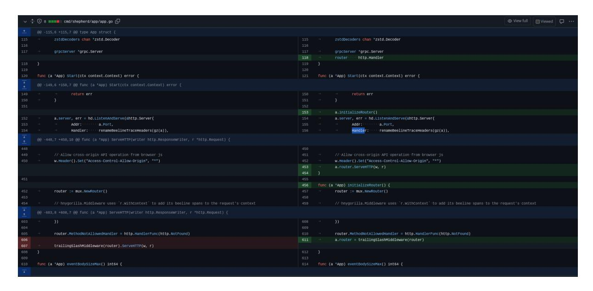

# Observability Engineering

**Achieving Production Excellence** 


# Honeycomb


# See everything. Solve anything.

Honeycomb is the only observability platform you need.

Get all your data in one unified platform with limitless possibilities.


# *[OceanofPDF.com](https://oceanofpdf.com/)*

# Observability Engineering

SECOND EDITION

Achieving Production Excellence

With Early Release ebooks, you get books in their earliest form—the authors' raw and unedited content as they write—so you can take advantage of these technologies long before the official release of these titles.

Charity Majors, Liz Fong-Jones, and George Miranda


*[OceanofPDF.com](https://oceanofpdf.com/)*

# Observability Engineering

by Charity Majors , Liz Fong-Jones , and George Miranda

Copyright © 2025 Hound Technology, Inc.. All rights reserved.

Printed in the United States of America.

Published by O'Reilly Media, Inc., 1005 Gravenstein Highway North, Sebastopol, CA 95472.

O'Reilly books may be purchased for educational, business, or sales promotional use. Online editions are also available for most titles ([http://oreilly.com](http://oreilly.com/)). For more information, contact our corporate/institutional sales department: 800-998-9938 or *corporate@oreilly.com*.

Acquisitions Editor: John Devins

Development Editor: Rita Fernando

Production Editor: Jonathon Owen

Interior Designer: David Futato

Cover Designer: Karen Montgomery

Illustrator: Kate Dullea

March 2026: Second Edition

# Revision History for the Early Release

2025-05-16: First Release

See <http://oreilly.com/catalog/errata.csp?isbn=9781098179922> for release details.

The O'Reilly logo is a registered trademark of O'Reilly Media, Inc. Observability Engineering, the cover image, and related trade dress are trademarks of O'Reilly Media, Inc.

The views expressed in this work are those of the authors and do not represent the publisher's views. While the publisher and the authors have used good faith efforts to ensure that the information and instructions contained in this work are accurate, the publisher and the authors disclaim all responsibility for errors or omissions, including without limitation responsibility for damages resulting from the use of or reliance on this work. Use of the information and instructions contained in this work is at your own risk. If any code samples or other technology this work contains or describes is subject to open source licenses or the intellectual property rights of others, it is your responsibility to ensure that your use thereof complies with such licenses and/or rights.

This work is part of a collaboration between O'Reilly and [Honeycomb](https://www.honeycomb.io/get-a-demo&utm_source=oreillyebook&utm_medium=referral&utm_campaign=whyc). See our [statement of editorial independence](https://oreil.ly/editorial-independence).

978-1-098-17992-2

[LSI]

*[OceanofPDF.com](https://oceanofpdf.com/)*

# Brief Table of Contents (*Not Yet Final*)

Part 1: The Path to Observability

Chapter 1: What Is Observability? (available)

*Chapter 2: Lessons from Scaling without Observability* (unavailable)

*Chapter 3: How Observability Relates to DevOps, SRE, and Cloud Native* (unavailable)

Part 2: Fundamentals of Observability

*Chapter 4: Structured Events Are the Building Blocks of Observability* (unavailable)

*Chapter 5: Stitching Events into Traces* (unavailable)

*Chapter 6: Instrumentation with OpenTelemetry* (unavailable)

*Chapter 7: Analyzing Events to Achieve Observability* (unavailable)

*Chapter 8: Supporting Monitoring Infrastructure in Observability 2.0* (unavailable)

Part 3: Observability for Teams

*Chapter 9: Applying Observability Practices in Your Team* (unavailable)

*Chapter 10: Observability-Driven Development* (unavailable)

*Chapter 11: Using Service-Level Objectives for Reliability* (unavailable)

*Chapter 12: Acting on and Debugging SLO-Based Alerts* (unavailable)

*Chapter 13: Observability and the Software Supply Chain* (unavailable)

*Chapter 14: Automating Observability* (unavailable)

Part 4: Observability at Scale

*Chapter 15: Build Versus Buy and Return on Investment* (unavailable)

*Chapter 16: Efficient Data Storage* (unavailable)

*Chapter 17: Cheap and Accurate Enough: Sampling* (unavailable)

*Chapter 18: Telemetry Management with Pipelines* (unavailable)

Chapter 19: Performance Engineering (available)

Part 5: Applying Observability Culture

*Chapter 20: The Business Case for Observability* (unavailable)

*Chapter 21: Observability's Stakeholders and Allies* (unavailable)

Chapter 22: AI Observability (available)

*Chapter 23: Observability for the Frontend* (unavailable)

*Chapter 24: Observability at the Line of Code Level* (unavailable)

*Chapter 25: An Observability Maturity Model* (unavailable)

*Chapter 26: Where to Go from Here* (unavailable)

*[OceanofPDF.com](https://oceanofpdf.com/)*

# Chapter 1. What Is Observability?

### **A NOTE FOR EARLY RELEASE READERS**

With Early Release ebooks, you get books in their earliest form—the authors' raw and unedited content as they write—so you can take advantage of these technologies long before the official release of these titles.

This will be the 1st chapter of the final book.

If you'd like to be actively involved in reviewing and commenting on this draft, please reach out to the editor at [rfernando@oreilly.com.](mailto:rfernando@oreilly.com)

In the field of software development, the subject of observability has garnered significant interest and experts repeatedly cite it as a hot new topic. Inevitably, as things seem to go when a hot new topic sees a surging level of interest in adoption, its complex ideas become all too ripe for oversimplification or appropriation. These misunderstandings then warrant a deeper look at the many nuances encapsulated by that simple topical label. This chapter looks at the mathematical origins of the term "observability" and examines how software development practitioners have adapted it to describe and improve characteristics of production software systems.

We also look at why the adaptation of observability for use in production software systems is necessary. Traditional practices for debugging the internal state of software applications were designed for legacy systems that were much simpler than those we typically manage today. As systems architecture, infrastructure platforms, and user expectations have continued to evolve, the tools we use to reason about those components have mostly not. By and large, the debugging practices developed decades ago with nascent monitoring tools are still the same as those used by a surprisingly large share of engineering teams today—even though the systems they manage are infinitely more complex. Now practiced by a growing portion of engineering teams, observability is a concept born out of sheer necessity, when traditional tools and debugging methods simply were not up to the task of quickly finding deeply hidden and elusive problems.

This chapter will help you understand what "observability" means, how to determine if a software system is observable, why observability is necessary, and how newer techniques in observability are used to find problems in ways that are not possible with older approaches.

# The Mathematical Definition of Observability

The term "observability" was coined by engineer Rudolf E. Kálmán in 1960. It has since grown to mean many different things in different

disciplines. Let's explore the landscape before turning to our own definition for modern software systems.

<span id="page-13-0"></span>In his 1960 paper, Kálmán introduced a characterization he called *observability* to describe mathematical control systems. In [control theory,](https://w.wiki/4wHw) observability is defined as a measure of how well internal states of a [system](https://w.wiki/55Pc) can be inferred from knowledge of its external outputs. **[1](#page-36-0)**

This definition of observability would have you study observability and controllability as mathematical duals, along with sensors, linear algebra equations, and formal methods. This traditional definition of observability is the realm of mechanical engineers and those who manage physical systems with a specific end state in mind.

If you're looking for a mathematical and process engineering oriented textbook, you've come to the wrong place. Those books exist, and any mechanical engineer or control systems engineer will inform you (usually passionately and at great length) that observability has a formal meaning in traditional systems engineering terminology. However, when that same concept is adapted for use with squishier virtual software systems, it opens up a radically different way of interacting with and understanding the code you write.

# Applying Observability to Software Systems

Kálmán's definition of observability can be applied to modern software systems. When adapting the concept of observability to software, we must also layer additional considerations that are specific to the software engineering domain. Since the first edition of this book was published, the concept of software observability has continuously evolved. Therefore, we must also augment our own considerations.

In the first edition, we classified observability as a new breed of tooling, focusing on new debugging capabilities enabled by rethinking the data storage and analysis mechanisms. However, that view is ultimately limited because it overemphasizes process and tooling rather than outcomes. While tooling, of course, plays a role in enabling the observability of your software system, it's less useful to limit the scope of observability to classifying tools, or to imply that more traditional tools afforded no observability whatsoever.

A more encompassing view is that observability is a property of your software systems. Similar to performance or availability, the level of observability within your software system is a distinct dimension when considering its dependability. Software dependability is gauged by several factors and it is typically stated as existing along a spectrum ranging from

low to high. Similarly, observability can therefore be gauged along a spectrum and its rating can be influenced by several factors, including technological or social step changes.

First, let's start by examining characteristics of software dependability. Then, we'll consider how the property of observability can be measured.

### **Properties of software dependability**

In today's world of digital services, software dependability is a paramount concern to both businesses and consumers. Computer systems fail all the time, with software and the underlying systems it runs on malfunctioning for a seemingly never ending amalgamation of reasons. Yet somehow, as an industry, software developers and operators are expected to ensure those failures don't impact customers. When those impacts do occur, customer experience suffers and that leads to an erosion of trust in the underlying software from both consumers and the business. The goal of ensuring software dependability is to maintain its trustworthiness.

Software dependability can't be quantified numerically. There's no such thing as a *dependability score of 9*, or a grading: *you scored a B+ for dependability this quarter*. Some components, like availability, often get measured with nines, e.g. uptime that is 99.9%, 99.99%, or 99.999% available. While you can measure seconds of availability, that metric tells you nothing about trustworthiness. Nines don't matter if users aren't happy. Luckily, there's a well established path for measuring software dependability along several axes. In 1994, J.C. Laprie proposed a framework for considering software system dependability by measuring its different, but complementary, properties. Together, those properties describe its overall dependability. Back then, Laprie defined the properties of dependability as: **[2](#page-37-0)**

```
Availability
   readiness for usage
Reliability
   continuity of service delivery
Safety
   no catastrophic consequences on the environment
Security
   no unauthorized disclosure of information
Integrity
   no improper alterations of information
Maintainability
```

aptitude to undergo repairs and evolution

Laprie further cited techniques for building dependable systems as a combination of methods classed into:

*Fault prevention*

preventing the introduction or occurrence of faults

*Fault tolerance*

providing capable service functions despite active faults

*Fault removal*

reducing the presence (number, seriousness) of faults

*Fault forecasting*

estimating the present number or the future incidences

In considering dependability, Laprie identifies system functions, behavior, and structure in terms of both software and hardware systems as an environment, and the humans interacting with it as users. He defined software systems as inherently sociotechnical, and that analysis provides a solid foundation to gauge dependability. However, we must build upon it and iterate as systems have evolved. In modern systems, we believe the defined properties for dependability must also include:

*Observability*

ability to understand or debug any given system state

As we'll see, the evolving landscape of dependable systems necessitates this change. Observability in a dependable system also encompasses techniques that are a combination of the aforementioned methods.

# **Observability is a property of dependable software**

In the mid-90's, Laprie's framework was a sufficiently comprehensive set of properties to consider software dependability. In traditional systems, rudimentary monitoring typically sufficed as a technique to ensure software reliability and availability. Monolithic systems were predictable and the chaotic availability effects encountered in production were pretty much binary: the site was either up, or it was down (sometimes, if you were unlucky, it had a third state: inexplicably slow). Monitoring is pretty good at detecting whether a service is up, or down, or performing below some specified threshold. Disruptions in reliability were relatively easy to detect and engineering teams responded with break-fix work to restore availability.

In the modern cloud era, fault prevention and fault tolerance are baked in at the infrastructure layer, often abstracted and invisible to engineers who run software atop these systems. Monoliths were decomposed into microservices, or intertwined with cloud provider infrastructure and software-as-a-service (IaaS and SaaS) offerings in order to increase both

reliability and delivery speed. These evolutions ushered in a plethora of innovations. They also meant that, now, we operate software in an era where every system is distributed by default.

With that shift came several second-order effects (which we'll explore further throughout this book). The most prominent of those effects on dependability was a radical shift in how we think about availability. The binary simplicity of service availability as up or down shifted to complex availability heuristics to represent any number of possible partial failure states or degraded availability. The previously rare and unlucky third state, inexplicable slowness (with no "smoking gun" to be found in any individual component) is now the most common failure state that most engineering teams encounter in production.

In the cloud era of distributed-by-default systems, there are multitudes of primary reasons and countless permutations of secondary contributing factors behind any given inexplicably slow service request. Monitoring systems that worked well for alerting against and troubleshooting previously encountered known failures shifted to being woefully inadequate in a distributed world, where unknown failures that had never been previously encountered (and may never be encountered again) were the new type of prevalent problem.

Why are *only some* service requests inexplicably slow and not others? A partial list of reasons could include something like:

- Somewhere, in a file you didn't know about, there exists a default configuration set to retrieve stored objects from us-east-1, meaning that any users outside of North America experience significantly increased latency compared to those on the East Coast of the United States.
- A partially degraded load balancer service means one-hundredth of user requests see increased latency as a side effect of performing several retries before failing over to another instance and succeeding. Availability is still 100%, but your users are unhappy because transactions are slow.
- Your globally distributed application shifted away from a relatively simple (and potentially disruptive) deployment scheme toward a more robust progressive delivery pattern. Multiple app versions are running in production and only the new one, which is only running on some instances, is seeing degraded performance.
- Your application now has critical infrastructure components being run by other teams at other companies abstracted behind an API, where they may not even be accessible to you, the developer. You have no idea if the performance you are seeing in those components is normal or even expected behavior.

Simple monitoring systems measure aggregate system state and tell you whether your system is mostly up or down. More sophisticated monitoring might even help you see *where* there's a problem: you might be able to see that a subset of requests are exceptionally slow. But monitoring systems

can't tell you *why that's happening*. You need to know all three of these things in order to resolve issues in production.

Software dependability must include considerations for how quickly faults are detected, how quickly its operators can triage and correctly identify its sources, and how effectively they can reason about why those faults are occuring—regardless of how impactful that fault is to the overall state of the system. In other words, you must be able to do these things at any level in the system: from overall aggregate performance, down to the level of individual transactions, and anywhere in between.

How well can the internal state of a software system be inferred from knowledge of its external outputs? That seems like a seemingly simple question to answer, but as you begin to ask that of increasingly granular components, you will likely start seeing significant differences emerge that affect detection, triage, and reasoning about internal states based on the available outputs. Observability of a software system is a measure of how well these things can be done at any level. Let's explore what that means in practice.

# How Observable Is Your Software?

Dependability properties of software like reliability, security, or maintainability aren't quantified numerically and neither is observability. We might be able to quantify some parts of detection, triage, and reasoning about internal system states. But a better place to start is to consider qualitative ways to gauge your software system's observability.

Fault detection is a relatively straightforward qualitative concern: do you know an issue is occurring in your systems before your customers are reporting it? Unfortunately, if you've ever managed a modern cloud-based application, you likely know that it's all too common for traditional monitoring systems to miss critical issues. Your customer support team may see a sharp uptick in customer complaints and get your attention, only for you to check the monitoring system and see that everything looks normal. Does that situation sound familiar to you? If so, the first axis of considering observability, fault detection, is relatively easy to gauge.

Correctly triaging the source of an issue can vary, depending on the complexity of your architecture. The more interservice dependencies exist in your architecture, the harder it will be to determine where an issue may be originating. In low observability systems, this often manifests as alert storms: a failure in one underlying system occurs and dozens or hundreds of alerts may be triggered in others. More sophisticated monitoring systems may attempt to correlate or collapse those alerts into a more meaningful signal (with varying degrees of success), but that still places the onus of investigating multiple anomaly sources on the responding engineer. When a failure occurs within a critical dependency in your stack, do you know exactly where to look? Or do you have to check multiple sources, tools, and

dive deep into each so that you can sleuth your way to determining where the cascade of failures even began?

Understanding *why* any given issue is occurring is often the hardest measure for a team to discern. Once you've located the correct source (or sources) of issues, next you must determine why they're occurring. This is often difficult for teams to discern objectively because some senior engineers are seemingly able to quickly diagnose an issue, while more junior engineers struggle given the same data. The key to objectively discerning your team's ability to do this is to ask *how* those diagnoses were made. Is the diagnosis being inferred via a sense of intuition developed by extensive experience with a given system? To quote *Star Trek's* Montgomery Scott when diagnosing the starship *Enterprise*, "I could tell you the speed that we were traveling by the feel of the deck plates." While that's commendable for Mr. Scott, a more equitable environment would be for the current warp speed to be displayed where anyone can readily see it as needed. Can any engineer, regardless of experience, quickly diagnose complex issues by making inferences based on the data made available from your system's external outputs? Or does a correct diagnosis require deep levels of experience and maybe even a sixth sense?

If you have experience debugging software in production, you can ask yourself the questions above to get a qualitative sense of how much observability your system has. Dependability properties are often expressed in ranges like high, medium, or low. Similarly, expressing observability in

these same terms is a good place to start. We'll explore these nuances further throughout the book. For now, if you're still unsure, let's look at other qualitative measures.

In a software system with a high degree of observability you would be able to do the following:

- Understand the inner workings of your application
- Understand any system state your application may have gotten itself into, even new ones you have never seen before and couldn't have predicted
- Understand the inner workings and system state solely by observing and interrogating with external tools
- Understand the internal state *without* shipping any new custom code to handle it (because that implies you needed prior knowledge to explain it)

A good litmus test for determining whether those conditions are true is to ask yourself the following questions:

- Can you continually answer open-ended questions about the inner workings of your applications to explain any anomalies, without hitting investigative dead ends (i.e., the issue might be in a certain group of things, but you can't break it down any further to confirm)?
- Can you understand what any particular user of your software may be experiencing at any given time?

- Can you quickly see any cross-section of system performance you care about, from top-level aggregate views, down to the single and exact user requests that may be contributing to any slowness (and anywhere in between)?
- Can you compare any arbitrary groups of user requests in ways that let you correctly identify which attributes are commonly shared by all users who are experiencing unexpected behavior in your application?
- Once you do find suspicious attributes within one individual user request, can you search across all user requests to identify similar behavioral patterns to confirm or rule out your suspicions?
- Can you identify which system user is generating the most load (and therefore slowing application performance the most), as well as the 2nd, 3rd, or 100th most load-generating users?
- Can you identify which of those most-load-generating users only recently started impacting performance?
- If the 142nd slowest user complained about performance speed, can you isolate their requests to understand why exactly things are slow for that specific user?
- If users complain about timeouts happening, but your graphs show that the 99th, 99.9th, even 99.99th percentile requests are fast, can you find the hidden timeouts?
- Can you answer questions like the preceding ones without first needing to predict that you might need to ask them someday (and therefore set up specific monitors in advance to aggregate the necessary data)?

- Can you answer questions like these about your applications even if you have never seen or debugged this particular issue before?
- Can you get answers to questions like the preceding ones quickly, so that you can iteratively ask a new question, and another, and another, until you get to the correct source of issues, without losing your train of thought (which typically means getting answers within seconds instead of minutes)?
- Can you answer questions like the preceding ones even if that particular issue has never happened before?
- Do the results of your debugging investigations often surprise you by revealing new, perplexing, and bizarre findings, or do you generally find only the issues you suspected that you might find?
- Can you quickly (within minutes) isolate any fault in your system, no matter how complex, deeply buried, or hidden within your stack?

In contrast, software systems with lower levels of observability are ones where the aforementioned conditions aren't possible, or are only partially true. Typically, those software systems also rely on more traditional monitoring techniques. Therefore, we have to ask the question: is there a difference between observability and monitoring? Or does that even matter in a time when those two terms are seemingly interchangeable?

# Are monitoring and observability one and the same?

Before proceeding, we need to address another spectrum of considerations: the level of functionality that is present in the market of "observability tools." The marketing departments of some software-as-a-service (SaaS) observability tool vendors have insisted that "observability" has no special meaning whatsoever—that it is simply another synonym indistinguishable from "monitoring." It's unclear exactly why we need another synonym for monitoring in those cases. Other vendors insist that "observability" goes well beyond monitoring because it means using logs, metrics, and traces for monitoring (and they just happen to have additional tools to sell you for each). It's hard to decide what's worse about this state of affairs: its redundancy or its epistemic confusion.

In fairness, we—the authors of this book—are also vendors in the observability space. However, this book is not created to sell you on our tools. We wrote this book to explain how a technological step change in debugging techniques led to a new way of understanding our systems—one that led to adapting Kálmán's concept for software.

Yet, here we are. Walk around any expo hall of any software conference you might attend, and you'll see dozens of vendors all offering you some type of observability solution. Where did all the monitoring tools go? Are they all just observability tools now?

Initially, in the first edition of this book, we held steadfast to definitions of "observability" and classifications of tooling. When it comes to terminology in the software industry, observability has since become ubiquitous and it is seemingly marketed everywhere. Can observability be increased by gluing together ever more disparate tools with marketing? Perhaps, ever so slightly. Although, in practice, there are often diminishing returns introduced by the cognitive overhead of doing so. Rather, let's judge observability on the outcomes enabled by the underlying technology we decide to use.

You can apply the concepts in this book, regardless of your tool choices, to practice building production software systems with a high degree of observability. You don't have to adopt one specific tool to get observability in your software systems. *Rather, we believe that improving observability requires evolving the way we think about gathering the data needed to debug effectively.* We believe that, as an industry, it is time to evolve the practices we use to manage modern software systems.

Considering observability as a dependability property of your software systems is the first step. If you accept that definition, then any tool can be judged on how well it helps you enable a high degree of observability.

# Why A High Degree of Observability Matters Now

Now that we're on the same page about how to gauge observability based on its outcomes, let's talk about why this shift in approach matters now. In short, traditional approaches to managing software systems in production had been falling drastically short. Back when it was just called "monitoring," our software systems had a low degree of observability and approaches to operations were fundamentally reactive. That approach had served the industry well in the past, but modern systems demanded a better methodology.

For the past two or three decades, the space between hardware and its human operators had been mostly regulated by a set of tools and conventions with low observability. Practitioners had, by and large, inherited this set of tools and conventions and accepted it as the best approach for understanding that squishy virtual space between the physical and their code. Back then, it was the best we had. So we accepted the approach despite the knowledge that, in many cases, its inherent limitations had taken us hostage late into many sleepless nights of troubleshooting. Many of us still granted that approach feelings of trust, and maybe even affection, because it was the best we knew.

Focusing on predefined metrics and thresholds to ensure system health made operations reactive. Deviations from those thresholds would trigger alerts and responders could then inspect the change in behavior. That approach conditioned teams to investigate only when the system crossed specified thresholds. The reactivity provided only a limited view of system state. Software developers would squint at the systems. They would try, in vain, to size them up and to predict all the myriad ways they could possibly fail. Then they would watch for those known failure modes. They'd set performance thresholds and arbitrarily pronounce them "good" or "bad." Then they'd deploy a small robot army to check and recheck those thresholds on their behalf. Those findings would be collected into dashboards. They'd then organize themselves around those robots into teams, rotations, and escalations. When those robots would tell them that performance is bad, they'd alert themselves. Then, over time, they tend to those arbitrary thresholds like gardeners: pruning, tweaking, and fussing over the noisy signals they'd grown.

For decades, that's how developers and operators had done it. It was the de facto approach for so long that it had become mostly invisible. As an industry, we didn't generally question whether we *should* do that, but *how*. It served us well for those decades. But that practice was grounded in many unspoken assumptions about systems (which we'll detail in the next chapter). As the systems continued to evolve—as they became more abstract and more complex, and as their underlying components began to matter less and less—those assumptions became less true. As developers

and operators continue to adopt modern approaches to deploying software systems (SaaS dependencies, container orchestration platforms, distributed systems, etc.), the cracks in those assumptions become more evident.

More people, therefore, found themselves slamming into the wall of inherent limitations and realizing that traditional approaches simply did not work for the new modern world. Those practices were catastrophically ineffective for understanding their new systems. They realized they needed better tools and more ways to understand their systems. And it's about then that we started to enter the world of using multiple types of debugging tools (like logs, metrics, and traces) to better understand those systems. In other words, the software industry realized that we needed a higher degree of observability in our systems.

# Technological Step Changes in Observability

As we sought to better understand our systems with different types of tooling, an interesting pattern emerged. Software engineers began to use multiple types of tools, each with segmented views of the system, to understand what was happening in different parts of their stack. They would continue to use metrics-based monitoring to establish performance thresholds that triggered alerts. But now, rather than starting by individually inspecting discrete servers, they aggregated logs into a logging tool so they

could search for clues across a fleet of machines. Some teams even utilized distributed tracing to see discrete events in a system chained together so they could better comprehend complete end-to-end transactions.

These approaches indeed raised the level of observability that our systems once had. However, that gain came with the cost of increased cognitive overhead. Using these various tools meant having data about your system strewn across multiple locations. Next, you had to reconnect those dots to get a complete picture of what happened. Gathering debugging data meant having one data store for logs, another for metrics, and yet another for tracing. In fact, this divided grouping of logs, metrics, and traces are sometimes referred to as the "three pillars" of observability. These divisions make historical sense when you consider that the pillars were created at different times and evolved along different paths. Once upon a time, it made sense for these tools to be separate entities. However, that separation placed the onus of correlating between them on the end user.

Software developers and operators often had to jump between tools, maintaining a shared context in their brains. Some system telemetry types, like metrics, aggregate several transactions across a span of time. Ensuring that a more granular bit of telemetry, like a distributed trace, is representative of a condition that occurred during that same interval requires a bit of manual correlation. Perhaps you found an error in a log file. Does it matter? Did that error even occur during the time range that triggered the alert you're investigating? Go back to the alert tool to check.

Newer and more sophisticated tools have applied machine learning, generative AI, or appended a flurry of tags to system telemetry in an attempt to remove the burden of manual correlation from the end user. However, the same problem remains: making correlations between these different data types living in different data stores is error-prone and inefficient. Once you reach a certain level of architectural complexity, that inefficiency presents a stark inoperability challenge.

Why do we break views of the same single system into so many different data types and then try to reconcile them later? As a matter of historical constraints, we had to, once upon a time. But what if we rethink that approach? What if, instead, we captured all of the telemetry data that was useful when debugging and saved it as the same data type, then unified everything into the same data store?

What sparked the revolution of "observability" was using a unified data store to gather all external outputs from your software. Unifying external system outputs obviated the need for artificial correlations between different data types. That change was so disruptive and enabled such drastic changes in outcomes that we needed the first edition of this book to lay out how and why it was a critical enabler of the qualitative functionality previously detailed. It presented a technical and social step change in the type of dependability we, as an industry, could ensure in software systems (and one we'll continue to explore throughout this edition of the book).

A step change is a significant and often dramatic shift that leads to a new paradigm or way of doing things, creating a noticeable leap forward in capabilities or efficiency. The change on the other side of that step introduces incompatibilities with prior ways of doing things. If we used semantic versioning to talk about observability, it'd be like talking about observability 1.0 vs. 2.0. However, using versioning as a framing for observability outcomes is a fundamentally flawed approach and we kind of hate it (even though, for some time, that's how we authors of this book referred to it). Inevitably, that framing will lead marketing departments to make declarations about how their new feature change enables observability 3.0, then 4.0, then 5.0 and beyond! It will be reminiscent of the great razor blade count wars in the early 2000's: an escalating arms race that broke out in the world of men's shaving when after decades of razors with only one blade, then many years with only two, next came three, then four, then seven! Let's not open the door to observability 7.0.

That said, there needs to be some distinction to denote when a technological change introduces a new paradigm. For the remainder of this book, we'll denote the change enabled by unifying a telemetry data store by referring to earlier stage observability models as "multiple pillars" vs. later stage models that we'll refer to as "unified." . As of this edition of the book, this is the only paradigm shifting innovation we've seen in the industry. In fact, we're delighted to see that a new wave of observability vendors adopt this change as a default while they begin to design new tools for tomorrow.

In a future world, perhaps there will be an innovation that isn't just a third observability "razor blade," but one that also introduces an additional step change (see: Chapter X, Updated Predictions for Observability). At that time, we (or others) may unpack that change into its own textbook that details how practices must adapt and evolve to move the software industry forward—we'll be eager to read it.

For now, we'll use the remainder of this book to detail how unifying telemetry data enables the highest degree of observability you can have in today's software applications.

# Conclusion

Although the term observability has been defined for decades, its application to software systems was a new adaptation that brought with it several new considerations and characteristics. For software systems, observability is a property of dependability that measures your ability to understand or debug any given system state. Similar to availability and reliability, observability is a property that isn't measured numerically but can be considered in degrees, such as low or high, based on a collective set of considerations—which will be detailed further throughout this book.

Compared to their simpler early counterparts, modern systems have introduced such additional complexity that failures are harder than ever to predict, detect, and troubleshoot. To mitigate that complexity, engineering teams increasingly rely on tools that provide a high degree of observability. Traditionally, debugging production software systems has been done with different tools that each maintain separate datastores. Using one tool to examine logs, another for metrics, and yet another for traces (often referred to as the "three pillars" of observability) makes sense when you consider the historical roots which evolved these practices. However, the multiple pillars approach typically offers a relatively low degree of observability into software systems.

Unifying telemetry into a common datastore creates a technological and social step change that enables a high degree of observability by default. Unified observability solves the fundamental data correlation issues that plague the multiple pillars approach. It also enables several second order effects that make it possible to understand or debug any system state, regardless of its complexity. This book will unpack the technical requirements necessary for unified observability and examine the sociotechnical outcomes enabled by that shift. Next, we'll start by further comparing the low observability approach of using multiple pillars to the high observability approach of unified data.

<span id="page-36-0"></span>Rudolf E. Kálmán, ["On the General Theory of Control Systems",](https://oreil.ly/u7BM4) *IFAC Proceedings Volumes* 1, no. 1 (August 1960): 491–502. **[1](#page-13-0)**

<span id="page-37-0"></span> Laprie, JC. (1995). Dependability — Its Attributes, Impairments and Means. In: Randell, B., Laprie, JC., Kopetz, H., Littlewood, B. (eds) Predictably Dependable Computing Systems. ESPRIT Basic Research Series. Springer, Berlin, Heidelberg. *[https://doi.org/10.1007/978-3-642-79789-7\\_1](https://doi.org/10.1007/978-3-642-79789-7_1)* **[2](#page-16-0)**

*[OceanofPDF.com](https://oceanofpdf.com/)*

# Chapter 2. Performance Engineering with Observability

### **A NOTE FOR EARLY RELEASE READERS**

With Early Release ebooks, you get books in their earliest form—the authors' raw and unedited content as they write—so you can take advantage of these technologies long before the official release of these titles.

This will be the 19th chapter of the final book.

If you'd like to be actively involved in reviewing and commenting on this draft, please reach out to the editor at [rfernando@oreilly.com.](mailto:rfernando@oreilly.com)

You've previously read about the application of observability to reliability and debugging use cases. In this chapter, you'll learn what the discipline of performance engineering is and how it overlaps with observability, highlighting complementary tools that can help with both use cases.

# The Case for Performance Engineering

Imagine you had a mystery bug that was silently adding latency to every request in your services. That was the situation our team found ourselves in, and the catalyst for our performance engineering journey.

In December 2021, the Honeycomb engineering team was surprised to find a discrepancy between the request latency for our ingest endpoint as measured by the load balancer logs and the auto-instrumentation spans in our application traces. The effect was most pronounced for POST requests to our ingest service endpoint that ingested single wide events rather than larger batches. Somehow, time was going missing, and requests that would take tenths of a millisecond to complete on the server side were showing up in the load balancer as single digit milliseconds.

Larger requests to our batch endpoint also showed the same discrepancy of single digit millisecond variation between the data sources, but the difference was less noticeable as a proportion of the request time since batches vary in size and can take tens to hundreds of milliseconds. Outside the visibility of our instrumentation for traditional observability, something was slowing down *every* request.

Absent any specific ideas for what could be amiss, and to rule out the possibility the tracing overhead itself was the problem, we used the Go programming language's built-in support for performance profiling to search for clues. We expose the net/http/pprof endpoint on our pods, so it was a matter of running the go tool pprof utility as a one-off to obtain a flame graph ([Figure](#page-40-0) 2-1).

<span id="page-40-0"></span>

Figure 2-1. A go pprof flame graph showing an unusual amount of time spent in regexp.Compile within mux.newRouteRegexp, taking similar CPU time relative to the ServeHTTP endpoint code.

Manually reaching for separate tooling outside of our own always-on tracing was an impediment to the investigation, but we were able to identify the problem based on where the CPU was spinning for excess cycles. The regexp.Compile path shouldn't have been consuming 17% of all CPU in the process and bogging down requests. Under normal operation, we'd have expected regular expressions to be compiled only once upon startup and reused after that. Why were we re-initializing the http router mux and reparsing its configuration over and over?

A dive into the code confirmed that the HTTP router was being discarded after each request rather than being reused as a singleton. The fix to the slow performance impacting our customers was just 5 lines of code

([Figure](#page-41-0) 2-2). And we could not have caught the problem with tracing alone, as the tracing hook is called by the mux router *after* it has already been instantiated, for each request once it has already been matched to a route.

<span id="page-41-0"></span>

Figure 2-2. The entire GitHub pull request for the bug fix

This investigation prompted us to spread knowledge of performance engineering across our team. Our performance journey was similar to the shift that we have espoused earlier in this book from reactive to proactive debugging, and from single points of failure to team-wide expertise in observability. Performance engineering and cost control shares many goals with observability, and ideally benefits from using shared tooling.

For a very long time, performance engineers have used disjoint and disparate tooling when compared with operations teams or software engineering teams. What we've been trying to both achieve has been observability, but the tooling has constrained us into inspecting different layers of the stack and at different granularity. In an ideal world, unified observability will provide useful functionality to all facets of software delivery and optimization, regardless of whether they are investigating individual assembly instructions or the end to end user journey. It is time for our disciplines to come together, and to focus on empowering *every* engineer to own their code and systems in production.

While we can't cover performance engineering in full detail, and must focus only on the overlaps with distributed systems observability, Brendan Gregg's seminal works *BPF Performance Tools: Linux Systems and Application Observability* and *Systems Performance: Enterprise and the Cloud* are a resource for those who choose to further explore the discipline.

# Building a Performance Engineering Practice

Performance engineering addresses two critical business needs: lowering costs to aid the bottom line, and speeding up customer experiences. While it certainly can be a fun academic exercise to hyper-optimize a specific function, real impact comes only from moving the needle on tangible metrics. For any given experiment, you should first gather baseline data on performance and cost in advance of running the test. Are you working on the right part of your codebase to have the largest possible impact? And can you quantify any future improvement you might make, whether to latency,

data size, dollars, or effective tons of CO2 emission? Thinking more broadly about a performance engineering function, dedicated headcount only may make sense if given the correct mandate and with appropriate scope.

In many cases, where the cloud bill is small, it may simply be the case that investment in performance engineering previously was not worth it relative to the salaries of the engineers required to optimize vs to build new features or maintain reliability. Similar to considerations on payoff of time spent automating versus [how much time the automation will save](https://xkcd.com/1205/), I would caution developers to avoid premature optimization where the salary and opportunity cost outweighs the cost or customer performance gain. However, failing to implement any guardrails can lead to waste and excessive expenditure or customer-facing latency creeping up. And collectively, we are wasting a significant amount of resources and potentially worsening the climate crisis. Therefore, knowing how to employ performance engineering is still valuable, even if you decide that now is not yet the time to invest in doing it.

For us, the investment was worth it because of our relatively high cloud bill relative to our headcount, and the fact that we operate a software as a service startup where gross margins and other engineering-influenced business metrics directly affect our viability as a company. Having intentionally built a culture of observability-driven development meant that our developers embraced performance engineering relatively quickly.

Like observability-driven-development, performance engineering requires identifying the most impactful possible changes, adding instrumentation, making the change, and then inspecting the results in production. The team already had a sense of curiosity and ownership, but was stymied by the adhoc nature of the siloed tooling that we had employed in our initial forays into performance engineering. We needed to improve the usability of the tooling we made available to our development teams, and make our practice continuous rather than one-off. We also sought out to not build a separate individual repository of knowledge or a dedicated performance engineering team.

# Optimizing cost without modifying code

### **Infrastructure purchasing models**

One of the most important factors impacting the overall cost of your infrastructure is the type of compute platform you use. Even before choosing specific instance types, you must first choose a product based on its developer ergonomics and economic model. We don't mean choosing between an m4.large versus an r5.xlarge, although we'll discuss that topic later in this chapter. There are six models for obtaining compute capacity:

Capital expenditure (building your own datacenter, e.g. Oxide Computer)

- Reserved capacity (AWS Savings Plans, Azure Savings Plan, Google Committed/Sustained Use Discount)
- Persistent, defined capacity (AWS EC2, Azure VMs, Google Compute Engine)
- Interruptible, defined capacity (AWS Spot, Azure Spot, Google Preemptible)
- Persistent, elastic capacity (AWS Fargate, Azure Container Apps, Google Cloud Run)
- Interruptible & flexible, for short requests (AWS Lambda, Azure Functions, Google Cloud Functions)

Each of these methods of procuring infrastructure has benefits and drawbacks in money, customer experience, and the developer time required to care for them. With a Function-as-a-Service (FaaS) approach like Lambda or Azure Functions, you achieve perfect utilization, only paying when your software is actively running. You need not worry about the software system-level dependencies or underlying hardware. As a tradeoff, you pay a higher unit cost for each CPU-second (or CPU-millisecond, if your provider supports granular billing) since the cloud provider is assuming the risk of capacity management and being unable to sell all of their capacity pool. And some requests may take longer to serve if the cloud provider needs to allocate and boot up new capacity for your workload.

Running entire virtual machines (VMs) instead of using serverless means you can keep your processes active, persist data to a cache or maintain

connections to dependencies, making requests return a lot faster. However, you're paying for that server time while you're not using it and you need to make sure you can scale up within time if you get more requests than you expected. And if you're using self-hosted bare metal rather than VMs, your cost per CPU-hour will be much lower but you have to make the capital outlay for the hardware and assume responsibility for provisioning and availability.

Then there are the models lying somewhat between, for instance purchasing reserved capacity, or using a blended serverless compute engine that abstracts away the underlying VMs but prices for the CPU consumed by each task rather than for the duration of each executed request. When you're using a virtual machine (VM) based infrastructure, you can also achieve significant performance and cost optimisations by using a container orchestration approach such as Kubernetes to pack multiple applications into a single VM. However, the conversation about containerization is partially orthogonal to the compute model; serverless functions can operate with raw binaries, supplying their own operating system and container, and it is possible to run Kubernetes, OpenShift, Elastic Container Service, or another container orchestrator on top of any type of underlying compute ranging from bare metal to Fargate.

Which should you choose? Well, that's dependent on how your system scales, and also how your consumers use that application. Ultimately, you're going to want a mix of different capabilities to make it work

optimally. For instance, you may want to run your database servers in the VM model, managed through Amazon Relational Database Service or Google Cloud SQL. Your user-facing frontends might run via serverless, and you might assign batch or streaming worker pools via Fargate or Cloud Run. The choice of platform is not a fixed, one-time decision. Over the longer term optimizing the cost of compute requires using observability data to your load profile, and deciding when to change even if there is some operational work required when migrating between compute models. And the options are not all-or-nothing; a hybrid of approaches may make sense.

If you have a very spiky workload, you may still want to try Lambda as a compute layer, however, this could result in a lot of cost (or persistent cold starts / refused connections) if you get a spike that's unexpectedly large. If, however, the time of executing your lambda directly correlates to your revenue, this may be fine. Observability for the serverless case is relatively straightforward since the duration of trace spans straightforwardly converts to the total price (in fact, you can calculate additive measures such as "request cost" and graph those dimensions directly in your tool of choice!)

Observability plays a key role in gathering the relevant data for deciding when it is time to migrate onto an additional compute platform or retire an existing one. Concurrent execution counts from either provider-exported metrics or derived from the number of concurrent trace spans allows you to determine how much serverless concurrency to provision with your cloud provider. Utilization metrics allow you to determine when a sustained

workload should be shifted towards a more server-ful or sustained use model. Just be mindful of the human cost of managing and operating towards the physical end of wrangling real servers.

### **Fleet-wide optimization**

Once you have nailed down what compute model(s) you are using, the next step is making that compute cost as little as possible. There are four broad techniques to try: squeezing, optimizing, and migrating architectures. An architecture switch is a complex effort with correspondingly huge potential payoffs, but there are many smaller such experiments and projects we undertake on an ongoing basis at Honeycomb to optimize our costs and improve the performance our customers see.

Assuming you have set Service Level Objectives (see chapter NN) and have a healthy culture of chaos engineering, the first step is to see how few machines you actually need to still achieve those SLOs. Reduce task counts, reduce CPU and memory allocations per task, and set auto-scaling targets to higher target utilization with the ultimate goal of shutting down VMs. While in the past standard practice was to run Intel architecture based instances with hyperthreading or simultaneous multi-threading (SMT) at 40% utilization, and Arm instances or those with SMT disabled at 70%-80%, that recommendation may no longer hold for the kinds of cores you are using. Test until latency actually begins to degrade. Your observability data will come in handy, especially given that degradation

may impact a small tail of complex but crucial requests rather than the overall system.

Always test against the most recent generation of hardware that your vendor offers. As this book is meant to go several years between revisions, any specific recommendations we might make would rapidly become out of date. After taking away instances and shrinking underutilized instances, checking the appropriate ratios of CPU to memory to storage may help you save money. Most cloud providers charge a premium for higher-RAM configurations, as well as charging for use of their managed durable block storage product (e.g. Amazon Elastic Block Store). For I/O bound workloads, you may benefit from directly using NVMe drives attached to instances (e.g. AWS -d suffix and i- prefix instances, or Azure L-series instances) instead of using durable block storage for data volumes.

<span id="page-49-0"></span>Fleet-wide profiling (profiling discussed later in this chapter) also comes in handy in terms of identifying code bottlenecks. For now, we'll note that those bottlenecks are not in your own application code, but instead in operating system libraries, the kernel, or common shared library code. If you can identify and solve a performance issue impacting multiple workloads, rather than just one workload, it may be well worth it. While saving 1% off of 1% of your workload is likely not worth spending more than a few minutes of engineering time, if that 1% generalizes across all of your workloads, it could be a meaningful amount of money. For more on this, see for instance the paper by Ren, Tune, et al: *Google-Wide Profiling* . **[1](#page-65-0)**

Another potential avenue to make large-scale performance and cost gains is via re-compiling your binaries to run on a more efficient CPU architecture designed for the cloud. We've previously written on the Honeycomb blog about our [switch to the arm64 architecture](https://www.honeycomb.io/blog/present-future-arm-aws-graviton-honeycomb) using AWS Graviton instances. Microsoft offers Cobalt Arm instances, and Google offers Axion Arm instances. All of these are worthwhile competitors to their equivalentgeneration Intel and AMD competition, but do require you to potentially reconfigure or recompile your workloads.

Today, there are [many](https://github.com/aws/aws-graviton-getting-started/blob/main/transition-guide.md) [guides](https://learn.arm.com/migration/) for [carrying out](https://aws.amazon.com/blogs/compute/migrating-aws-lambda-functions-to-arm-based-aws-graviton2-processors/) an arm64 migration, but the basics are to switch over container or operating system base images to the corresponding architecture, then test that your container or binary build pipeline still works using the new architecture and new base images. You'll then need to test deploying the new architecture, sending it representative traffic, and then load testing to determine how it performs relative to your original configuration. Remember, because most Intel/AMD instances use SMT and Arm does not, you may find that it is safer to run your arm64 instances more saturated since you will not be contending against your own workload. Always test to breakage/saturation to see the true performance and packing gains and not the superficial results!

### **Cost-optimizing Kubernetes**

If your workload uses Kubernetes, the tricks mentioned in the previous section can help you make the most efficient choices about your underlying architecture and sizing. Kubernetes also allows you to make more efficient use of machines by packing multiple workloads onto the same hosts, ensuring that a misshapen workload that consumes a high amount of CPU but low RAM can be paired with one that consumes little CPU but maintains a lot of state in RAM, better utilizing the capacity without stranding any.

The first trick to deploy with Kubernetes, since it has the concept of fault tolerance and automatic task migration, is to embrace infrastructure flexibility. If your code doesn't keep large amounts of local state and can tolerate periodic migration between instances with a lame duck period of approximately 2 minutes, you may find interruptible instances to be a good fit for your workload. With the Karpenter plugin for Kubernetes (or using ordinary scaling groups), you can benefit from instance flexibility on the spot or interruptible instance market. Just make sure you use the relevant Node Termination Handler plugin to move workloads out of the way gracefully before the nodes are terminated!

Measuring the impact of your changes works with your current observability tooling. You don't need any special tooling other than running the OpenTelemetry Collector on each node (as a daemonset) in order to understand and optimize the efficiency of your Kubernetes clusters. Installing the OpenTelemetry Collector with the kubeletstats receiver and k8sattributes processor is a power tool for understanding the health and behavior of your cluster.

The visualization layer is the most key when looking at Kubernetes cluster data. There can be a wide variance in the saturation and utilization of each pod and each node as a whole, so percentiles will often be misleading. Heatmaps are a preferable mechanism of looking at how your nodes are doing and whether you are "clipping" 100% saturation and at risk of requests being blocked on access to the CPU, slowing throughput and delaying responses to users.


An easy opportunity for optimization is to remove excess boot volume size. Disk space is most commonly used to store logs, but if logs are being exported to your favorite observability tool or to cold storage, you do not need to persist very many on disk. Also consider whether instance NVMe storage may be more appropriate than managed remote data volumes.

How can you identify the biggest opportunities for cost savings on Kubernetes? Plotting the sum of all CPU and memory used by each service name or daemonset name can allow you to find the largest consumers of CPU and memory to then examine the tracing and profiling data. After all, when engineering time is scarce, you're better off solving the problems with the largest impact first; saving 1% of 10% is better than saving 5% of 1%!

The Kubernetes metrics that will be your biggest friends are the pod cpu utilization and pod memory usage values.


In addition to seeing which services are consuming the most actual resources, you may find it helpful to view which services have *reserved* the most resources, and whether any of the resources are going unused. Some underutilization is an expected part of the slack present in any robust

system, especially given the consequences of an OOM or cascading failure. However, excessive allocations of RAM or CPU may be starving other processes on the machine of resources they could benefit from and may cause your cluster to become larger than it needs to be.

When provisioning a Kubernetes cluster, don't forget about the reasons you adopted Kubernetes. If one or two workloads predominate in your cluster, you may want to consider sizing to allow for optimal bin-packing of combinations of the most common workloads' pods. It may not show as underutilization of an individual pod or service to have capacity lying fallow on a given machine, but if a given machine has 32 cores, and you have pods that require 20 cores each, then 11 to 12 out of the 32 cores will be potentially wasted once daemonsets are accounted for, because you cannot fit two 20-core pods on the same machine, and daemonsets should take up a maximum of 1 vCPU in total. There may be other smaller jobs that can fill the cracks, but if your 20-vCPU job is the primary workload you run, inevitably you'll be spinning up machines just to create capacity for that workload. It's better in that case to up-size to 64-core machines so 3x 20 vCPU jobs will fit on one machine, or to run fewer, smaller tasks eg 15 vCPU per pod, to allow better bin-packing.

### **Observing the cost profile**

It's important to consider that there are multiple dimensions to the cost profile of your compute layer. It's not simply "time", since the different machines and instance sizes also have an impact on price which is where we can use performance engineering to optimise beyond just "make it faster".

Making your executions faster will almost always be the quickest, and most visible way to make your compute cheaper. Whether that's optimising a Lambda's execution time, so you're charged less, or whether that's optimising your API hosted in a container so you can run fewer of them and handle the same number of requests, it's generally the easiest way,. The question is, how do you do that, and ensure that you're not adversely affecting the user experience?

Ingesting your cloud bill into your observability tooling can help identify opportunities for improvement, focusing on the greatest sources of spend first, and drilling down into what common tags or attributes those share in common.

However, also considering whether giving an instance more/faster memory, more/faster network, might actually make the execution happen faster too.

### **Introducing CPU profiling tools**

How, exactly, did we get the insight into where our code was slow in the original example at the start of the chapter? pprof is the name of the specific tooling the Go programming language offers, but the generic technique is

called profiling. Profiling allows for determining how much time programs are spending in each function, line of code, and even assembly instruction. The key insight behind profiling is that we can interrupt a program at any point with operating system signals, and retrieve the previously running program counter (the assembly instruction currently being executed) and the stack frames above it. A lightweight interrupt handler can record the stack info to a ring buffer, and we can periodically read the ring buffer to populate maps with counts of how often a given program counter was observed, with what parents. Given a binary with appropriate symbol tables, we can symbolize the program counter to lines of code and function names. Sampling every millisecond might be overkill and introduce too much overhead, but sampling every ten milliseconds might give a picture to the nearest 10ms which assembly instructions and lines of code are the most likely to crop up. Over time, a statistical picture of a program approximates reality; similar to sampling of distributed traces, while one single sample might not be representative of much, a thousand or a million recorded datapoints give us a pretty accurate picture of what percentage of time is spent in each function, or assembly instruction.

We're big fans of distributed tracing, but it is not the correct tool for every job. Profiling enables us to get granular detail, instead of having to create a span for each and every function call within a service, let alone line of code.

### **Setting up and interpreting profiling data**

Profiling Go binaries as a one-off is astonishingly batteries-included, thanks to features of the Go runtime. There's a built-in HTTP handler you can enable on your application (but remember to set the HTTP server listening on a different port that is not Internet visible). Then, `curl` the endpoint while the behavior you're looking for is manifest and save to `\$profile`, wait a minute, and then you'll have a file that you can feed to `go tool pprof \$profile` (I recommend running with `-http :8080` for a friendlier web UI); you'll also want to supply the original source code directories to get line level detail, the original binary corresponding to the running server in order to get assembly level detail. You can also use `-profilecpu` with `go test bench` in order to write profiles for your canned benchmarks.

In other languages, you'll need to consult runtime documentation; in the worst case, you might need to use the `perf` tools bundled with your Linux kernel, or use eBPF.

What do we do with the results of profiles?

In either case, the initial view you'll see might look like a listing of source code with statistically estimated numbers of milliseconds attached. Or you might see a distributed acyclic graph rendering with a number of boxes representing functions and their total time, lines representing calls from function to function, and line weights representing seconds spent via in that specific path in the call tree. Both of these can be a little bit obtuse to work with, so instead we recommend another approach.

If you took the advice to run `go tool pprof` with its web frontend, you can open up the visualization menu and choose flame graph instead. Flame graphs are a more intuitive way to work with the data. Width represents the total amount of time spent in a function and its children, stacking of one function beneath another represents a child function call, and individual icicles or flames represent collections of full stack traces sharing the same functions in order in the stack frames.

This allows us to visualize for glanceability two things that are not obvious when looking at raw source dumps or the full DAG: namely, what's the most expensive part of my code, is it my code or is it the libraries I'm calling, and how much is attributable to one function itself versus its children.

The best targets to optimize are those functions that are called *often* with medium sized running time (think: the library function that is called from 10 different places, and constitutes a significant chunk of the running time of each callsite), or those that are often found close to the root of the flame with little time spent in their children.

### **Scaling out profile collection and analysis**

While it's handy to catch something misbehaving in staging, or in a unit test or benchmark, problems rarely manifest in the real world while we're looking, and by the time we're alerted, they may have already disappeared. We need our systems to give us the telemetry continuously for us to interrogate later, so that we don't need to catch them in the act. This is the whole reason why we have observability, right?

Fortunately, you can either run profiling continuously with agents that hook into the runtime, or continuously scrape the profiling HTTP endpoints on your applications. The data volume is manageable because it's highly redundant - while each minute-long profile segment might be 5MB in size, 2 hours of data is not going to be 120x as expensive. The same function calls and even lines of assembly repeat often and the data compresses nicely.

This is the value proposition behind continuous profiling tools such as Grafana Pyroscope, Polar Signals, and Blackfire. They handle the lift of both the agent and of the collection and visualization pipeline so that you can get answers when you need them. That way, you'll not be trying to remember which debug endpoint to curl, or how to run the pprof debugging command at 2am. We're believers in running less software at Honeycomb, and this is one wheel we were glad to not have to reinvent. With OpenTelemetry offering a common profiling agent and encoding of

profiling data as of this writing, the vendor-neutral future of the profiling observability signal has never looked brighter.

# Using the correct observability signals

Engineers tend to prematurely optimize: we will jump into optimising SQL queries, or look for loops that could be trimmed with early exits, however, without knowing that these are actually the biggest impact on your code, it's essentially educated guesswork. For seasoned engineers, for engineers that have spent time in that ecosystem or that domain, this can actually be very effective but how do we give all engineers this capability?

To some degree, profiling requires you to already know you are interested in a very specific portion of your system. Therefore, it is a tool that is best used in conjunction with a tool like tracing. Using tracing, both from analytics perspective and from a waterfall view perspective, allows you to be able to validate hypotheses quickly.

In our view, tracing gives you a bird's eye view and allows you to navigate the system as a whole. High-cardinality data analysis enabled by the unified observability model enables you to explore individual fields and their values to understand outliers and weird behavior. Analyzing hundreds of millions of traces can give you astonishing insight into what real customers are experiencing in the system. But sometimes, you really need to grab the

microscope to look at the rings (lines) of the tree (code) rather than look at the forest of microservices as a whole. Profiling is that tool.

First, you might begin an investigation by asking:

- "Is this endpoint normally slow"
- "Is this database query slow only when it's called for this API endpoint?"
- "When this endpoint is slow, is it always this database call causing it"

Armed with this information, you can establish before, and after, your change whether you're targeting the right area of the system to make the biggest impact.

# **Blending performance engineering and observability**

What if you didn't have to make the tradeoff between request-level but outer-function-level granularity for tracing and inner-function-level but only process-wide granularity for profiling? When profiles are indexed at the level of individual seconds of data, or are tied to individual trace spans, *magic* happens. You can understand both what was slow, for whom, and *why/how* all at the same time instead of guessing.

It's premature optimization to write the very most efficient, inscrutable code everywhere. But having the visibility post-facto to know what actually is being called in a tight loop and needs to be ratcheted down enables you to

optimize just in the right places, with an explanation as to why you're doing it. I admit feeling skeptical about the "day 2+" value of profiling. Wouldn't we just squish the "obvious" bugs and then stop finding value? Well, that's not true. You're always adding new services or changing them, creating new bugs along the way.

The golden example of this discovery for us at Honeycomb was finding that we were serializing from protobuf to JSON a very complex query containing nested derived columns on behalf of a user. And then invoking Lambda hundreds of thousands of times, doing the serialization each time. On a single retriever merge node that was already running very hot from coordinating other queries. While our Lambda functions are massively parallel at mapping across millions of files on S3, the retrievers coordinating Lambda have finite resources.

User-specific problem. Tickling sub-optimal behavior. Slowing down their own query latency, as well as everyone else's query latency. Profiling enabled us to figure out what was actually happening, not just which user and what phase of execution. We were able to cache the serialization of the JSON.

A further optimization revealed itself by examining that user's query traffic alone: the user's query which took so long to encode was also slow running on Lambda because it contained so many distinct abstract syntax tree (AST) nodes. We could reduce the amount of time it took the function to actually run on the Lambda side as well by making a change in our query language.


The customer was using an if { } else { if { } else { if { } else { if { } else { if { … } else { … } } } } } } pattern, which we could simplify by offering a switch statement. Once we transformed away the complexity of the query and refactored the customer's query to use the new syntax, execution was dramatically faster.

This behavior would never have turned up inside of our traces, as we simply cannot afford to trace each function called in the processing of each record in the inner loop. But profiling on a high-cardinality, per-customer basis showed us what was wrong and how to fix it.

# Conclusion

Like the practice of observability, performance engineering is not a one and done activity; instead it is a scale with diminishing returns towards the very top end, and large gains at the beginning, and must be continuously reinforced. Not every change will be a 30% off the top savings; it requires continuous iteration over time rather than one-off efforts to be successful. The core loop is measure to find potential improvement, do the improvement, measure the effects, repeat.

By late 2024, when we were reviewing options and faced the choice of what continuous profiling tooling to employ, it no longer was just one singular engineer that wanted a say in the requirements, but instead half a dozen different teams at Honeycomb that each saw benefit from being able to proactively investigate performance.

And our finance and engineering teams were collaborating on cost tooling leveraging data from our AWS bill and from our application and kubernetes cluster telemetry in order to model and predict future costs (and to be able to bake predicted future optimization into our cost modelling).

Hopefully, you have learned in this chapter how to use observability principles and tooling to make performance engineering more accessible to people without previous experience. Share your lessons with others and make it an enduring practice within your own organization.

<span id="page-65-0"></span> Gang Ren, Eric Tune, Tipp Moseley, Yixin Shi, Silvius Rus, & Robert Hundt (2010). Google-Wide Profiling: A Continuous Profiling Infrastructure for Data Centers. IEEE Micro, 65-79.

**[1](#page-49-0)**

*[OceanofPDF.com](https://oceanofpdf.com/)*

# Chapter 3. AI Observability

### **A NOTE FOR EARLY RELEASE READERS**

With Early Release ebooks, you get books in their earliest form—the authors' raw and unedited content as they write—so you can take advantage of these technologies long before the official release of these titles.

This will be the 22nd chapter of the final book.

If you'd like to be actively involved in reviewing and commenting on this draft, please reach out to the editor at [rfernando@oreilly.com.](mailto:rfernando@oreilly.com)

Artificial intelligence (AI) has revolutionized numerous industries, enabling organizations to accomplish tasks and solve complex problems with unprecedented efficiency. In particular, large language models (LLMs) have emerged as powerful tools, demonstrating exceptional language-processing capabilities and fueling a surge in their adoption across a wide range of applications. As organizations eagerly embrace the potential of LLMs, the need to understand their behavior in production and improve their reliability becomes apparent. From chatbots and language translation to content generation and data analysis, LLMs are being adopted by companies of all sizes and across all industries.

While the initial excitement surrounding LLMs often centers on accessing their remarkable capabilities with only a small up-front investment, it is crucial to acknowledge that most of the work comes after an LLM has been integrated into an application. In other words, making LLMs more reliable for your particular use case is where the real work lies. By introducing open-ended inputs in a product, organizations expose themselves to user behavior they've likely never seen before (and cannot possibly predict). A lot of applications of LLMs leverage the inherent creativity in LLMgenerated responses, but this also introduces nondeterministic behavior, meaning that the same inputs don't always yield the same outputs. And yet, end users generally expect a degree of predictability when they use LLMs. This may seem a conundrum, but it is in fact solvable and the topic we will explore in this chapter.

This chapter dives into the realm of observability for LLMs. It examines why observability matters for modern AI, and proposes a methodology for tracking a small but valuable amount of data in production, and then using that data to power further iteration for improved reliability. It also elaborates on the roles and responsibilities of different teams in a world where product features undergo a cyclical workflow of monitoring telemetry, using snapshots of that telemetry to improve features, then monitoring telemetry from those improvements, and so on.

The details and guidance in this chapter come from the real-world experiences of several organizations that applied observability practices to their products that use LLMs. In particular, several instances are drawn directly from Honeycomb's product Query Assistant, showing how Honeycomb was able to apply these practices to bring the feature out of experimentation and turn it into a core product offering.

# Sidebar: Quick Primer on Prompt Engineering

Throughout this chapter, we'll look at fundamental concepts needed to unpack observability and reliability practices when working with LLMs. *Prompt engineering* (also called *prompting*) is a set of methods for telling an LLM to steer its outputs toward a desired result without changing the model. These methods of communication are primarily one or more textual inputs that may contain instructions, data, user inputs, example outputs, and more. By using prompt engineering rather than training a model from scratch, or fine-tuning an existing model, you can achieve a wide range of behaviors through a simple AI call.

```
For example, let's say you want to use an LLM to 
        You are an AI that turns natural language
The table you are querying is: <table_name>
The columns in this table are: <column_list>
```

```
Given user input, the table, and its columns, pro
Input: Get all posts
select * from blog_posts
Input: Get posts from Alice
select * from blog_posts where author = 'Alice'
Input: <user_input>
```

Note that the preceding prompt example is illustrative only. A real prompt for translating natural language into SQL would likely be much more sophisticated, maybe even having many smaller pieces assembled programmatically based on the kinds of things to parameterize. Many techniques are involved in prompt engineering, and all have different tradeoffs that you'll need to evaluate.

The use of prompts provides a flexible approach to influencing generalpurpose LLMs' behavior and output, making it possible to tailor the generated text to specific tasks, styles, or domains. However, prompt engineering can be a subtle and nuanced process. Even slight modifications to the prompts can yield dramatic differences in the outputs produced by the model. The choice of wording, phrasing, or context within the prompt can significantly impact the generated responses. Prompt engineering requires a

rigorous approach to experimentation and interaction, covered in more detail later in this chapter.

# Why Observability Matters for LLMs

LLMs represent a step change in the capability and accessibility of machine learning (ML) models for organizations. Every product has problems to solve for its users where there is no single solution but rather a set of solutions lying on some spectrum of "correct" or "right." Traditionally, companies turned to AI to solve these problems, but at great cost. Now, much of that cost has evaporated, and any product-engineering team—even if they have no experience with ML—can solve problems using LLMs by issuing prompts through a simple API.

However, the very things that make LLMs so useful also give rise to the biggest challenges. End users expect powerful capabilities with reliable behavior, but steering an LLM to reliability for all possible inputs is challenging. Furthermore, the tools that product engineers traditionally lean on for improving reliability—step-by-step debugging and unit testing aren't feasible with LLMs.

LLMs introduce reliability and predictability challenges that can seem scary when released to production. They are opaque—that is, you can't debug them like you can a single-threaded client application—that produce

nondeterministic outputs based on natural language inputs. Let's unpack that a bit.

Natural language inputs are broad. Very broad. A natural language such as English or Japanese is infinitely more expressive than any programming language, query language, or user interface (UI). What this means is that users of applications with natural language inputs will do things you cannot hope to predict. Yes, there will likely be patterns of similar inputs that users will input for specific reasons, and you can account for those. But there is an extremely long tail of inputs your users will create, and users expect those inputs to be handled well.

On the other end of things, an LLM is a nondeterministic and opaque system, in many cases completely un-debuggable in the traditional sense. You can't load debug symbols and step through each phase of execution with an LLM like you can with most software. Unless you're an ML researcher by profession, chances are you don't have any way to explain why an LLM emits a particular output for a given input. Yes, there are some controls you can place on it to affect the randomness of outputs—namely, the *temperature* and *top\_p sampling* parameters—but they don't guarantee [repeatability of outputs. And when you combine this with an excessively](https://community.openai.com/t/a-question-on-determinism/8185) broad class of inputs like natural language, you're left with a system that's incredibly powerful but very difficult to understand and guide into good behavior.

Finally, attempting to de-risk a product launch through early access programs or limited user testing can introduce bias and create a false sense of security. Early access programs and user testing often fail to capture the full range of user behavior and potential edge cases that arise in real-world usage with a wide range of users. More importantly, when gauging ambiguous criteria like user experience (UX), they suffer greatly from selection bias and the biases introduced by asking users to use the product in particular ways. Effectively working around these problems requires significant time and money. Couple this with widespread organizational tendencies to always report successful results from expensive time investments, and you'll be left with a sense of security that comes crashing down when you truly go live. Instead, it's better to embrace a "ship to learn" mentality and release features earlier, but you need a way to systematically "learn" from what was shipped.

Put differently, you should be aware of the following things when building with LLMs:

- Failure will happen—it's a question of *when*, not *if.*
- Users will do things you can't possibly predict.
- You will ship a "bug fix" that breaks something else.
- You can't write unit tests for LLMs (or practice test-driven development).
- Early access programs won't really help you.

What's interesting is that these properties aren't unique to LLMs, but LLMs make these problems more apparent. Modern applications that deal with orders of magnitude more complexity than they did a decade ago all exhibit these same behaviors. To deal with that reality, engineering teams have turned to observability as a better way to debug, monitor, and use data from production to inform product improvements. By collecting relevant information about their applications, from within their application code, and systematically analyzing and monitoring this data, teams can wrangle modern systems. This principle can apply equally to products that use modern AI systems.

As systems get more complex, with nondeterministic outputs and emergent properties, the only way to understand them is by instrumenting the code and observing how users use it as it runs in production. LLMs are simply on the far side of a spectrum that has been elongating and becoming ever more unpredictable and unknowable for years. Observability—both as a practice and as a set of tools—tames that complexity and allows you to systematically understand and improve your applications.

Using observability to improve the reliability of LLM-based applications is one part of solving these challenges. Observability is how you understand the impact of a change in the real world, beyond simple test environments, where systems exude nondeterministic behaviors. The other part of building for reliability with LLMs comes from combining effective evaluations (or,

evals) with observability. Evals are your tool for materially iterating on a prompt, model, RAG pipeline, or more.

# Using Evals for LLM Reliability

[Evaluations](https://hamel.dev/blog/posts/evals/) (often called evals) are the foundation of the process of making LLMs more reliable. At a high level, an eval is a singular test, and evals are a set of tests. Much like in traditional software, an eval expects outputs given specific inputs. Evals can be layered to test different kinds of things at different levels of components.

However, unlike traditional software testing, evals are often *fuzzy* in their expectations. Fuzziness is a framework for handling imprecise or uncertain information. It allows for partial truths, where a statement can be partially true or false, rather than just true or false. This is often used in applications like fuzzy search, where results are returned even if the search term isn't an exact match. When testing with evals, this seemingly small difference has profound impacts.

Evals come in two primary categories:

### *Deterministic outputs*

These are just tests, and can be created and run much like any other software test. An example would be ensuring that any LLM response does not include foul language or some other text that can be trivially checked.

### *Fuzzy outputs*

These examine if a given response is "good" for a given input, where the exact characteristics of "good" are driven by a collection of factors. Many possible responses can be "good" for an input, and since you can't know up front which exact responses you'll get from an LLM, you need a different way to measure their outputs.

It is this second category that makes evals difficult, yet utterly essential to making LLMs useful: tests that validate that LLM outputs don't contain things like foul language are helpful, but do nothing to improve the actual quality of responses. And as we'll discuss later, evals – and the data that drives them – weld together beautifully with observability practices.

### **Evals broken down**

As mentioned earlier, evals are similar in many respects to traditional software tests. They do, however, have some key differences in how they're made up, initially assembled, and modified over time.

Evals have three major components:

*Data*

This component has two types: (1) Golden data, which is a handcreated or annotated set of data explicitly designed to represent important representative inputs to a system and their desired outputs. These are hand-created and hand-maintained, and teams typically spend a lot of time deciding how each case represents a class or category of inputs and desired outputs. (2) Larger datasets, either generated via LLM (based on golden data) or a snapshot curated from production behavior, to provide a sense of actual feature behavior at large.

### *Task function*

The actual operation(s) your application performs with an LLM, prompt, etc. Given an input, this produces an output you can transform or present to a user directly.

### *Scoring function*

An operation that, given an input and output pair, determines if the output "passes" or "fails". The definition of pass or fail can range from a unit test assertion or a complex, domain-specific set of checks that, in aggregate, determine a pass or failure.

An *eval system* is the collection of tools a team uses to assemble and run their evals. These may include data viewers and annotators, prompt management tools, and more.

Much like traditional software tests, evals can be run manually or automatically. They are often run in two phases: one for the golden data, and another for the larger data set. When run, inputs are passed to the task function – which involves an LLM call – and the output of the task function is measured by the scoring function. After all evals are run, there is usually an aggregate metric indicating a pass rate. Evals are often run on some interval.

The goal of evals is *not* to have a 100% pass rate, unlike traditional software tests. In fact, it is usually a sign that you don't have enough representative inputs if you're regularly passing all of your evals.

Finally, evals are often run as the basis for *experiments*. Let's say a model provider came out with a new LLM that's supposed to be better than the previous one. Evals let you measure the performance of the new model for your use case, and you can compare a run of evals against that new model against the current baseline you have. You can also use evals to measure prompt engineering experiments, or different approaches to retrieval in a RAG pipeline. As mentioned earlier, evals are the foundation of the process of making LLMs more reliable, and once you have them, you can make wonders happen.

### **Why evals are a foundation to rein in LLM**

### **unreliability**

Once it reaches beyond the scale of an initial prototype, the most fundamental aspects of how software works are determined by a certain baseline of testing. Without enough representative tests that validate that a given component correctly implements required functionality, software becomes a house of cards that eventually tumbles down. This dynamic is just as true when considering LLMs.

You do not need to write your first evaluation before you hook up an LLM to your product and build your features that use it. In fact, a proof of concept that implements basic functionality end to end is essential to creating evaluations because it lets you assemble your first set of golden data. Once you have enough hand-annotated or hand-created ideal responses to several kinds of inputs, eval-driven development is a critical process of iteration. As you notice that your feature performs poorly on certain expected input/output pairs, you can iterate on your feature. As you uncover more kinds of inputs that can enter the LLM, you can update your evals to incorporate these kinds of inputs.

Eventually, with enough internal iteration, your feature should be good enough to push to production. The exact appropriate time to push to production can be difficult to judge, and there's a serious limit to the kinds of inputs you can expect an LLM feature will receive before you need to get actual end-users interacting with your application. These evals are referred

to as being "good enough for production". Critically, when you have an established eval system, you already have a testbed to reproduce behaviors – both good and bad – from inputs that you couldn't expect up front.

It's also worth clarifying that, while this book espouses the criticality of observability as a property of software reliability, testing is still a critical foundation that all software requires. While this book – and this chapter – are not particularly concerned with how to write effective tests nor provide the exhaustive guidebook for writing LLM evals, it must be reiterated: Observability does not replace adequate testing, and robust testing does not replace the need for quality observability. These are two practices that coexist and operate in concert with one another. The same is true for Evals and LLMs.

# **Building evals that are good enough for production**

Bootstrapping evals and making them "good enough" to be able to release a feature using LLMs can be challenging. What is going to be the shape of the eval? What data will be used? Where should a team start? These are all important questions that can seem daunting.

Typically, a team will first build a prototype of a feature using an LLM and "vibe check" that outputs seem reasonable. This "vibe check" might seem imprecise, but it's actually quite important! If a team carves out a narrow

problem and it appears that their feature can solve that problem, they now have the basis to start building evals. What comes next is the mechanical and often laborious process of building out evals and widening the scope of the task for an LLM as they iterate on evals.

Recall that an eval has golden data that acts as representative classes of inputs and desired outputs to an LLM. The first task is to get some initial data. You must think critically about two things to start:

- What kinds of inputs will your users provide? Can you categorize them a bit and come up with a handful per category?
- What kind of data are you pulling in alongside the user input? If you are doing RAG, are there some examples of data that would be used for a given user input?

This data will be your golden data. Spend time annotating it with what the *ideal* response should be for a given piece of contextual data and user input. Aim for a diverse and representative sample, but don't worry about being exhaustive. This process should take a few days to a week at most to build. You may need to do a lot of copy-paste into a spreadsheet or other document to get this kind of data you need. It's fine, not everyone has perfect data pipelines built for the purpose of making good evals.

Now that you have your task function and golden data, you can start to think about a scoring function. It's good to start small here. If you need to generate a JSON object, can you parse that JSON into the exact structure that your application demands? If a particular piece of data must be in a response for it to be correct, can you validate that this data is contained in the response? You don't need to go all-in on making sure your evals cover every facet of what makes for a good response from an LLM. This is a point that you must naturally iterate with over time, especially as you push your feature into production.

Once you have your initial data, the task function, and a scoring function, you officially have an eval! At this point, all you have to do is iterate on this eval to improve its pass rate. And if you get 100% success, that's a sign that you need more data. You should now feed your golden data into an LLM to generate a synthetic dataset with many more kinds of inputs that should be *similar* to your golden data, but not necessarily the same.

With your set of initial evals, you now have a basis to iterate. Improving your prompting or using a different model will likely impact your scores on your evals. You should eventually reach a pass rate that is acceptable to you (50% or higher), but not near-100%, to where you should move your feature into production. Although your evals should be good, they are still limited, and you will soon be surprised at how differently your users actually use your feature.

Now that you have an initial framework for testing our LLM based applications for reliability, the rest comes from understanding how users actually use your application in production. This is where the role of observability comes into play.

# Designing Your Telemetry

To achieve good observability for your LLMs in production, you need to design and gather good telemetry that represents the work being done with LLMs. This section covers considerations for instrumenting your LLMbased applications in order to achieve a high degree of observability and, as you'll see later, also use the gathered data to create better evals.

First, to gather an appropriate level of telemetry from your LLM-based applications, make sure you have an SDK initialized in your codebase and have requests and responses instrumented, using either an instrumentation library or automatic instrumentation. The telemetry you'll need to gather depends on how your product uses LLMs. The following broad categories of LLM implementation considerations provide a guideline for how to design your telemetry.

### **Simple LLM Call with a Static Prompt**

Some prompts are mostly static. That is, they might include user input and some additional info, but inputs are largely the same each time. For these cases, it is recommended that you instrument a distributed trace with just three spans:

- The overall tracking span for all operations. This is important because it's the span you'll usually query for later on. It represents the end-to-end user experience of your feature that uses an LLM.
- A child span of the overall tracking span that tracks the call to an LLM (this can be done with automatic instrumentation).
- A child span of the overall tracking span that tracks any parsing or validation of outputs you do on LLM outputs.

For many applications, these three trace spans will suffice for your observability needs.

### **Retrieval Augmented Generation**

Retrieval Augmented Generation (RAG) is an extremely common pattern for applications using LLMs. The idea is that you store [vector embeddings](https://www.pinecone.io/learn/vector-embeddings/) of a knowledge base or other data, create a vector embedding for a user's input, use matrix math to pull out the subset of the knowledge base that's relevant to the user's input, and pass only that subset to an LLM. RAG is an essential part of many products or features that use LLMs. One of the most common use cases is as follows:

- 1. Calculate embedding vectors for pieces of data in your application, either up front or as a cron job.
- 2. Store those embeddings somewhere, either in a vector database, a Redis cache, or an in-memory index of some kind (such as [FAISS](https://faiss.ai/)).

- 3. When a user makes a request, calculate an embedding of their input.
- 4. Use a similarity function such as [cosine similarity](https://platform.openai.com/docs/guides/embeddings/which-distance-function-should-i-use) to calculate which pieces of data are the most relevant to the user's input.
- 5. Include only the relevant subset of data into a prompt rather than the full data (which may be too large to fit into an LLM API call).

You'll need more spans in your telemetry to track what's going on when using embeddings:

- The overall tracking span for all operations. This is important because it's the span you'll usually query for later on. It represents the end-to-end user experience of your feature that uses an LLM.
- A child span of the overall tracking span that represents the call to calculate an embedding vector for user input.
- A call to your system that stores vector embeddings that selects a relevant subset of data based on the user input vector embedding. Critically, it should include some information about which subset was chosen, for example, the names of each document selected from a knowledge base.
- A child span of the overall tracking span that tracks the call to an LLM (this can be done with automatic instrumentation).
- A child span of the overall tracking span that tracks any parsing or validation of outputs you do on LLM outputs.

Additionally, you may wish to monitor a cron job that calculates and updates embeddings for the data you're working with. This is likely a separate trace in a separate system, but if it's worth monitoring to you, then you'll need at least one span that tracks calls to the embedding model.

### **Agents or Chained LLM Calls**

Several use cases for LLMs involve chaining calls or agents. In these cases, the telemetry you design isn't fundamentally different from that for the other use cases. However, you'll want to ensure that you're doing two additional things:

- Create a parent span that tracks every step or iteration of an agent or LLM call chain.
- Create a child span that deals with LLM inputs and outputs, is named according to each step or iteration any time you do so, and ensure that it correctly logs the specific inputs and outputs for that step.

Instrumenting an agent or LLM chain isn't difficult, but be wary of unbounded execution. When an agent or chain can take a varying number of steps, your traces don't have a fixed number of spans.

### **Application Errors**

OpenTelemetry captures errors from automatic instrumentation, but it doesn't automatically capture errors from your own application. To do that, you'll also need to handle your own errors and attach them to the relevant span they occur within. This is a standard practice for any manual instrumentation process with OpenTelemetry, and your language SDK will provide the necessary APIs to do this.

### **Dynamic Prompts**

If the act of assembling user input and a prompt is an involved process, you may also want to track that operation as a separate span. Although it's not usually a time-consuming process to build a span dynamically, you may have complex logic that determines how pieces of a prompt are assembled at runtime, and spans are how you capture information about that complex logic. The criteria for this decision-making process should be captured in a span; this then lets you isolate any interesting behavior based on how a prompt is generated.

### **Cost Tracking**

When using LLMs, cost tracking is important, but it's usually not critical. If you're using an external service such as OpenAI, you pay for each API call you make. Because of that, you'll want to monitor your cost. OpenAI and

other vendors offer a way to track usage on a daily or monthly basis, which is enough for most organizations. However, if you desire or need more precise calculations, you can track cost at a more granular level. The way to do this is by counting *tokens* and keeping track of your total cost on a dashboard.

For LLMs, *tokens* are an encoded representation of input and output text. When you pass input text to an LLM, that text is encoded into a list of "tokens" that represent the text in an efficient way. When the LLM responds, it does so by emitting one token at a time, which is then decoded before a response is sent (or stream-decoded when a response is streamed). Most vendors, like OpenAI, charge based on the number of tokens passed as input and the number of tokens output by the LLM you use. Therefore, you can easily calculate your total cost based on these token counts and the price per token.

However, it's important to know that cost is rarely a primary concern. Most LLMs are quite inexpensive to use today, and they'll likely just get cheaper over time as they become more efficient and face external pressures from competition. Additionally, to protect their infrastructure, vendors apply rate limiting, and these rate limits place boundaries on usage that are extremely economical. Your cloud vendor bill is likely to be significantly higher than your LLM vendor bill. You can also apply rate limiting to your own application that uses an LLM, which, when combined with easily calculated cost and vendor rate limits, can make estimating your monthly bill very easy.

### **Inputs and Outputs**

Because LLMs and generative AI are nondeterministic and opaque systems with unbounded variations on inputs they can receive, getting good observability into these systems is all about systematically collecting telemetry for inputs and outputs. Specifically, there are five major things to track:

- User inputs
- LLM output
- Value(s) of data after parsing/validation of LLM outputs, if there is no error
- Any error, whether from LLM output or parsing/validation of the LLM output
- User feedback, such as thumbs-up/down responses, if relevant

This assumes you have a way to track user feedback in your telemetry. It's not a requirement, but it does help your observability and promptengineering efforts significantly, so you should invest in it if you can.

### **Parsed and/or Validated LLM Outputs**

As a brief aside, it's critically important to parse and/or validate LLM outputs if you can. For most applications, you'll want an LLM to output something in a particular structure or output pieces of data that you can parse out and assemble yourself afterward. There are several reasons to do this.

First and foremost, LLM outputs should be considered *untrusted inputs to your system*. In particular, *prompt injection attacks* are a common way for malicious actors to try to exfiltrate data, manipulate outputs for other users, or reprogram a part of your application to do all kinds of bad things. Although there is no complete solution for prompt injection attacks, there are ways to mitigate their ability to impact your systems. One such way is to parse output of an LLM into a particular kind of structure that you can validate before you pass it to another component in your application or show to users.

Second, forcing an LLM to output in a particular way and then parsing that output allows you to use LLMs for all kinds of applications, not just basic chatbots. Parsing these outputs allows you to validate them against a set of rules, which is critical to using those outputs in another part of an application or displaying them to users.

Additionally, there are prompt-engineering techniques that involve having an LLM output pieces of an answer that you manually assemble into the complete answer later. This is often advantageous because it reduces the complexity of a task for the LLM. It also allows the LLM to be more accurate due to not having to keep track of the relationships between the pieces of text it generates. If you use a technique like this, you must parse outputs from the response.

For example, with Honeycomb's Query Assistant feature, LLMs are used to convert natural language into a Honeycomb query object. This object follows a particular structure, and pieces of the object have particular rules for their structure—otherwise, the query object is considered invalid. The LLM produces these objects, which are then later parsed and validated. One of the major benefits of this parsing and validation is that when it does fail, it can produce specific—and often correctable—errors, allowing for a set of "fixups" to the data returned by the LLM. This programmatic correcting of LLM outputs can actually yield impressive results, which I'll elaborate on later.

Finally, not all outputs can be parsed into some structured form that lends itself well to validation through a set of rules. The accuracy of an output may depend exclusively on its interpretation by an end user. There is less direct benefit to parsing and validating responses in these cases.

### **LLM Outputs and Final Outputs**

When collecting telemetry, you should capture both LLM outputs and final outputs. When you parse and validate LLM outputs, the final output (assuming there's no error) is often in a different format from what the LLM initially responds with. Furthermore, especially when combined with other data, the result that a user sees may have no resemblance to what the LLM produced. Not only is this fine, but it's often expected for a robust feature that uses LLMs. However, it means you need to capture both data the LLM outputs and your final outputs in your telemetry.

You need the LLM output because you need to know how an LLM responds to your prompt that includes user input. Without this information, it's impossible to improve your prompt through prompt engineering. This holds true whether you are using a fine-tuned model or a foundational model directly. Additionally, as I'll elaborate later, this data is essential for creating an accurate evaluation system that lets development teams rapidly iterate on prompts with reasonable assurance that they won't regress behavior when they deploy new changes.

While the LLM output provides insights into the model's response, it is equally important to track the actual output that is presented (in some form) to a user after any parsing or validation steps. If you have a user feedback system, it is these outputs that users will judge. Tracking what's closest to

what they interact with is crucial to understanding the entire journey of a request that involves LLMs.

### **Standard Errors**

Tracking errors—whether they arise from a network error, a timeout, the LLM itself, or the parsing and validation process—is crucial for understanding what kinds of user inputs can lead to errors. It practically goes without saying, but a feature that causes users to experience errors all the time is a bad feature. The only way you can know which errors users experience the most is to track all possible errors related to a call to an LLM and what you do with its outputs. Additionally, as you'll see later, you can often correct an LLM output directly if it fails a parsing/validation step but you can't know how often that occurs unless you track the error associated with that parsing/validation step in your telemetry.

This isn't an exhaustive list of all possible telemetry types you should collect when working with LLM-based applications in production. But these use cases are a good start. Remember that the ability to collect wide events means you can arbitrarily attach as much context as you need to better assist with debugging, when needed. Working with LLMs necessitates designing telemetry to capture deep contextual information about each user interaction that could otherwise be easily lost. Now that we've walked through considerations on the types of telemetry to collect,

let's look at how that's used to improve the reliability of LLM-based applications in production.

# Analyzing Telemetry for AI Applications

Presuming you followed the aforementioned guidance, you'd have rich context about user inputs, LLM outputs, validation/parsing outputs, and the many types of errors that could happen in any given transaction. Now, you can start analyzing your telemetry to understand how it behaves in production.

First, using an observability tool, you could write a query that groups requests by errors and by frequency. As you'd probably expect, this query would show which errors are the most common, and you could use the output as a prioritized list of which issues to fix first.

However, that analysis is much more effective when you can group by many different data points. Instead of just analyzing errors, with the telemetry you've gathered, you could gain a much better big-picture view of the system. Consider the data gathered: errors, the input that the user gave, the output of the LLM, and, if it exists, the output of parsing/validation. When only grouping by a single dimension, like errors, you are able to answer a single question. In this example, it would be:

Which errors are most common? With a [multidimensional](https://www.honeycomb.io/getting-started/understanding-high-cardinality-role-observability) grouping, you could answer a much wider and more nuanced set of questions, such as:

- Are users repeatedly entering the same inputs when they get an error or something they don't like?
- What commonalities exist in user inputs for the same error?
- Are there any similarities between LLM outputs that lead to the same parsing/validation error?
- Do identical user inputs result in different errors?

Analyzing your telemetry across multiple dimensions is generally a useful aspect of applications with a high degree of observability. For LLM-based applications, that type of analysis lets you pull apart and investigate all aspects of user and system behavior so that you may feed that information back into your development lifecycle. This section examines useful aspects of observability when working with generative AI.

# **Tracking Latency and Errors for API Calls to LLMs**

It's critical to distinguish between the latency and errors in API calls to LLMs and the entire set of operations that involve an LLM. Unfortunately, at the time of this writing, the resources that LLMs run on are in high demand, and you may find your requests rate limited heavily, timed out, or experiencing an error due to unavailable resources. These are problems that you can't control, so you should ensure you can easily separate these concerns from those that you can control. That said, there are some factors that contribute toward the latency and errors you can experience with API calls to LLMs:

- How many API calls are you making per user request? Are you generating a vector embedding for each user input prior to calling an LLM?
- How many API calls do you make per minute?
- On average, how many tokens are you passing to an LLM for each request? On average, how many tokens are you receiving per request?
- How often are your requests rate limited?
- When considering the overall latency that users experience, how much of it is due to an API call to an LLM?

These questions may not always be actionable, but they're critical to understanding the overall behavior of your product. They can also be used to evaluate LLM APIs and vendors, allowing you to quantify how well they can service your requests.

### **Monitoring Service-Level Objectives**

Service-level objectives ([SLOs](https://sre.google/workbook/implementing-slos/)) are a way to measure data (such as requests to OpenAI) and pass it through a function (called a *service-level indicator*, or SLI) that returns true or false. You then define the rate at which the SLI

should return true over a span of time. Behind the scenes, a budget for failure is established, and you can define alerts that progressively notify you when a budget gets close to—or exceeds—its limit. SLOs allow teams to act on behavior proactively and quantify improvements they make over time.

The two fundamental SLIs to track when establishing SLOs for systems involving LLMs are latency and error rates. There are other SLOs worth creating, and having an SLO that maps to an overall business objective is ideal, but latency and errors are often a good starting point to get adequate coverage for how LLM-powered features behave in production.

### **Latency SLOs**

*Latency* refers to the time it takes for a user to receive a result after initiating a request. In particular, it's critical to track latency for the entire lifecycle of user interactivity with a feature using LLMs. This includes the entirety of the process: the time it takes to gather input, build up or gather the prompt to an LLM, make additional API calls (such as that to fetch a vector embedding), make the call to an LLM, and parse/validate results.

A latency SLO is centered around a number that represents the highest acceptable latency for the entire operation. You'll most certainly want to change this number over time, but you can build a first initial value by measuring how long (on average) it takes when in development.

For example, a feature that translates user input into a query language may take about 3 seconds to get a response and parse it. A good SLI would then return true for requests that take 3 seconds or less and false when latency is greater than 3 seconds.

Next, a window of time needs to be set in addition to a rate at which this SLI should succeed. As a rule of thumb, a 95% success rate over 7 days is a good latency SLO for these kinds of requests.

Let's take an example: if your system makes 1,000 calls to the LLM API in a week, you expect no more than 50 of these calls (5%) to exceed the 2 second latency threshold. If more than 50 calls surpass this threshold, it indicates you're not meeting your SLO, and corrective action should be taken. Corrective action should start by looking at the inputs, outputs, and errors of requests mentioned earlier. It may be that there's nothing apparent that can be done. In that case, the best course of action is to adjust the SLO to better reflect reality in production.

### **Error Rate SLOs**

The second SLO to monitor is that of error rates, which should include any error encountered during the process, whether originating from an API call or your own parsing/validation of LLM results.

An SLI for an error rate is very simple: if the overall operation contains an error, it fails. Otherwise, it succeeds.

Similarly to the latency SLO, the initial success rate will need to be established during development, before releasing the feature to production. If your internal testing shows that you get a successful response 3 out of 4 times, then your success rate for your SLI should be 75%.

The error threshold should be calculated similarly to the latency SLO, aiming to meet it a certain percentage of the time over a 7-day period. For instance, out of 1,000 calls made to the LLM API, you expect at least 750 to succeed. If fewer than 750 calls are successful, you're not meeting your SLO.

The great thing about an error rate SLO is that it's one of the measures that you have the most control over. As I elaborate later, one of the most impactful ways to improve the success rate of your feature using SLOs is to correct a "mostly correct" output from an LLM when it's considered correctable. For example, Honeycomb was able to improve the reliability rate of its Query Assistant feature from 75% to 96% in large part due to systematically tracking errors and programmatically correcting LLM outputs as they were parsed.

### **SLO Monitoring and Alerting**

Alerts on SLOs for LLMs should be non-urgent. They exist to *inform,* so that a team can plan a corrective action, rather than to cause a team to halt everything and fix a problem. It's recommended to send these alerts to a messaging channel, such as one in Slack or Microsoft Teams, and never trigger an alert on platforms like PagerDuty. Unlike LLM SLO alerts, paging alerts should [always be directly actionable](https://sre.google/workbook/alerting-on-slos/).

When an alert is triggered, it means that the budget for failed SLIs will likely expire before the configured window of time. That's usually a sign that it's time to plan corrective action, using practices described earlier to analyze user inputs, outputs, and errors.

If no alert is ever triggered, then the SLI is probably too broad and should be adjusted. In the case of latency, maybe you need a lower latency threshold. Or perhaps your success rate should be increased for an error rate SLO. Although it's not normal to fire an alert for every configured time window, you want to iterate on your SLOs over time so that they're truly matching the representative behavior that your users are experiencing, not just "looking good" 100% of the time.

SLOs are not about striving for perfection. They exist to distill the user experience down to its most essential pieces and capture intended and representative behavior.

You'll notice that these concerns are very similar to what you need to ensure dependability for any application in production, not just those based on LLMs. Indeed, observability practices are the same across application types when working in production. However, there's one very important aspect of ensuring reliability that is unlocked by capturing the type of data we've covered so far: using real production data to improve the quality of your LLM-based applications.

# Feeding Observability Data Back into Development

So far, we've considered one half of the observability equation by examining how to collect and analyze telemetry from your applications. The other half of observability involves using telemetry to inform how to improve your products that are live in production. Especially because LLMs aren't debuggable—not in the traditional sense at least—the only way you can know what's worth improving is by looking at real data from your users. When you have enough data from real-world usage, you can notice patterns where your product is falling short of user expectations—and then iterate.

But how do you do that? How much data is enough? What data should be "fed" back into development? What do you try to focus on first? How do you "unit test" your product when it's using an LLM, which is a

nondeterministic and opaque system? This section addresses these questions.

# **Usage Data from Production Is Essential for Iteration**

Using production data as a basis for iteration may sound like a fancy concept, but it requires little more than an observability tool and the ability to look at the results of a query against that data. Recall that with multidimensional queries, you can answer a wide variety of nuanced questions. In order to see the concept of iterating via production data, you can structure a query to find requests where the following is true: an error exists, the input that the user gave, the output of the LLM, and, if it exists, the output of parsing/validation.

You can examine one request, or thousands. The main thing you'll need to figure out is how much data to look at. Unfortunately, there isn't a single answer here, because it depends on two factors:

- How many users are using your LLM-powered product or feature (that is, what's the volume of data)?
- The diversity of the data you have—in other words, how varied are the inputs people are passing in?

As you might imagine, if you have very little product usage, or usage is primarily coming from one user, then you may not have *representative* data. That doesn't necessarily make the data bad, but it usually means you'll need to give the feature some time to accumulate enough telemetry that you have something representative.

Determining representativeness for user interactions is difficult. First of all, the data needs to be varied enough to be an accurate sampling of how users interact with your feature. You also need enough data that covers some edge cases of those different kinds of interactions. Luckily, telemetry gathered for observability has all the information you need!

As a rule of thumb, if you have more than 10 users and over 100 uses per day, then your telemetry is likely representative enough to give you confidence in the impact of prompt changes and be worth acting on. The reason you'd want even more users and unique usages is that if you have enough, you can slice your data into different categories and isolate your prompting work to address acute issues rather than overall issues. But if you can't do that at the outset, don't worry about it. All you need to do with an observability tool is look at groupings of four things: error, user input, LLM output, and parsing/validation output. Observability tools let you group results by frequency in these fields, so you can start with one of them and look for patterns.

### **Intervening on Correctable Errors**

In many products, LLMs are used to produce outputs that follow a particular structure rather than open-ended text. When the structure output by an LLM isn't correct, you have the option to intervene directly on that error.

Although the root of most problems in a product using LLMs has to do with prompting, you can make a surprising number of improvements without prompt engineering. Good prompt engineering is time-consuming and challenging, and if you can manually correct an LLM output without reaching for prompt engineering, it's often very effective to do so.

An example of this is Honeycomb's Query Assistant feature. When released, it produced an error of some kind about 25% of the time. As mentioned earlier, we tracked this with SLOs, so we could quantify exactly how impactful any change we made to the feature would be over time. This high rate of errors is quite common for LLM-powered features at the outset. When Honeycomb developers looked at some of the most common errors, they found that many were parsing/validation errors—the response that OpenAI gave back was a JSON object whose structure couldn't pass validation checks. For example, consider the following JSON object:

```
{
 "calculations":[
```

```
 {"op":"COUNT", "column":"exception.message"}
 ],
 "filters":[
 {"column":"exception.message","op":"exists"},
 {"column":"parent_name","op":"exists"}
 ],
 "breakdowns":[
 "exception.message","parent_name"
 ],
 "orders":[
 {"op":"COUNT","order":"descending"}
 ]
}
```

In the Query Assistant feature, the object attempts to represent a query for "exception count by caller," a common scenario that users use Honeycomb for. However, it's subtly incorrect. The structure that represents a COUNT operator is wrong, because COUNT doesn't take a column as input. A correct response would not have included the column:

```
{
 "calculations":[
 {"op":"COUNT"}
 ],
 "filters":[
 {"column":"exception.message","op":"exists"},
```

```
 {"column":"parent_name","op":"exists"}
 ],
 "breakdowns":[
 "exception.message","parent_name"
 ],
 "orders":[
 {"op":"COUNT","order":"descending"}
 ]
}
```

In this example, the first object is mostly correct. In fact, programmatically removing the column field from the COUNT calculation object not only makes the query object fully valid, but the resulting response from this postprocessing is an ideal query to generate given the input. And so instead of failing validation and creating no result for the user, Honeycomb decided to intervene on this kind of error by correcting the structure programmatically so it passes the validation check.

As a result of analyzing outputs like this and issuing only these kinds of manual corrections, the error rate in Query Assistant dropped from 25% to about 14%. Later, improvements to a prompt brought the error rate to less than 1% (excluding timeouts or other uncontrollable errors).

Intervening on correctable errors is generally simple. When you group four things in telemetry—error, user input, LLM output, and parsing/validation output—you'll likely find a lot of errors coming from parsing/validation

checks. If you have good error messages, you can then look at where this error is emitted and see if you can manually correct an output so that it can pass validation. When you do this systematically, you'll not only have a host of fixes, but thanks to having LLM outputs to inspect, you'll also have perfect test cases to write and verify that your corrections actually work! Although these tests won't verify that a particular user input always yields a correct final output, they will verify that a correctable LLM output can indeed be corrected.

Despite being a great source of quick wins for correctness, correcting LLM outputs manually is not sufficient for building a truly reliable and useful product. The underlying reason that correctable errors exist in the first place is a prompt that doesn't yield correct responses from the LLM in the first place. Furthermore, if you have a system with open-ended outputs with free-form text, this practice may not even apply to you. All paths eventually lead toward improving your prompt and/or fine-tuning an LLM.

# Using Evals and Observability Together

Earlier, we introduced evals as a foundation for LLM reliability. In this section, I'll elaborate on how to build "good enough" evals to bring an LLM integration into production.

This point is critical: "good enough" evals is a target you should aim for at first, not "exhaustive" or "fully comprehensive". There are significant diminishing returns to spending a lot of time perfecting your evals compared to getting your software into production and in the hands of real users. Only by real-world usage will you truly learn the behavior of LLMs for your use case, and only with data from their usage will you be able to iterate towards the right behavior at large.

### **Feeding Observability Data Back into Your Evals**

Once your evals are good enough to give you some confidence to go to production, you need to go to production. In earlier sections, I talked about how you can instrument your application so that you get good quality data when in production, and this is when that work will pay off.

The counting of groups of Inputs, Outputs, and Errors forms the basis of your feature behavior analysis. This represents the real behavior of your feature in the hands of users, and likely represents some classes of use cases you didn't account for! Using your observability tool of choice, curate a view of this production data alongside any other relevant metadata you have available that informs the interaction – user ID, user feedback response (if exists), etc. – and export it. Make sure these represent classes of inputs and both desired and undesired outputs.

Next, it's time to crack open, view, and annotate the exported production data.

First, you'll want to take a sample of the production data and update your golden data set.

- 1. Is a given user input something you want to have in your golden data? The answer should probably be yes, as there should be at least one user input and prompt combination that represents a use case you care about.
  - a. For the kind of input you want to preserve in your golden data, is there an output you consider ideal? Great, this is a new line of data to add to your golden data set.
  - b. Is a given output either incorrect or arguably okay but not ideal? Hand-craft what the ideal output *should* be. Add this to your golden data.
- 2. Repeat step 1 for several samples of data until you have a handful of additions to your golden data set.
- 3. Look through your existing golden data set and decide if you'd like to remove something since it's not representative of user behavior.

Next, it's time to update your larger evaluation dataset with the rest of your production data. If you are following a pattern like [LLM as Judge](https://hamel.dev/blog/posts/llm-judge/) then you will likely want to tune your judgment process a bit *first*, because new data from production is *real* data, whereas larger test sets are typically *synthetic*. Synthetic data is not necessarily worse quality – it can often be better – but

you'll want to be careful not to treat real examples of inputs as identical to synthetic ones. You may also find that your judgment process works just fine with new additions from production.

# **Use Evals and Observability, not Evals or Observability**

If you have evals that are good enough for production, and then production data being fed back into your evals, you have officially entered the virtuous cycle of improving LLMs for your product. Congratulations!

What remains now is the boring, arduous work of:

- Experimenting with different prompts, retrieval steps for RAG, new models, etc.
- Evaluating the effectiveness of these changes in your eval system
- Promoting these experiments to production to see how they behave with real usage
- Using production data to better inform and understand how to run more experiments in the future

Eventually, you'll reach a point where the LLM-powered features you've built do their job, and you can probably move on to the next thing to work on.

# **Public benchmarks and generic metrics aren't very helpful**

LLM providers test against public benchmarks to gauge the effectiveness of the models they release into the world. While public benchmarks are helpful for LLM providers and gauging a general sense of broad capabilities, these benchmarks often mean practically nothing for your *use* of an LLM for a specific business goal.

Consider one of the previous examples, using an LLM to provide a textbased interface for SQL querying. There are benchmarks that test effectiveness of LLMs at important components such as grounding a response in the data schema. There are others that validate the output of an LLM is runnable against a given table. These are good benchmarks for a general-purpose text-to-SQL tool. However, they say nothing about if the resulting queries are actually *helpful* for the specific use case you might have for your users. For example, the query might use columns that exist in the schema, but were the *best* columns selected for the goal an end-user had? Answering this question requires the specifics of your business domain and are not captured by a public benchmark.

Similarly, you've likely heard of out-of-the-box metric dashboards for LLM apps that score things like "helpfulness, tone, truthfulness, bias, conciseness, toxicity", etc. While these metrics are not inherently *bad*, they can be misleading because they can report high scores for your application,

but say absolutely nothing about how helpful your application actually is for your users.

The one out-of-the-box-*ish* metric you might want to consider is known as "grounding in facts". Most RAG-based applications today seek to derive a result from a subset of a larger set of data. This data often represents a "ground truth", and it's important to make sure that an LLM produces results that are grounded in this data. While it will take some work and iteration to set up how to measure this metric, you can combine some wellknown measurement techniques to get a sense for how well a response stays grounded in the data you know you'd like a response to be sourced from. While this still doesn't say anything about if the response is actually *good*, it offers more depth that the out-of-the-box metrics.

There is no "easy button" to press. For teams to be successful with LLMs, they must invest in their own evals that are specific to their business and customer workflows.

# Observability Is a Team Sport

Observability for LLMs is a team sport. That's because *observability itself* is a team sport. Executives, product managers, customer success teams, SREs, software engineers building services, and even more roles are direct stakeholders in general software observability.

When considering products that use LLMs, new stakeholders enter the picture: AI engineers, ML engineers, and data scientists. Each person in these roles has different particular concerns that require good observability – for example, ML engineers will often care about visibility into user behaviors and how those behaviors perform with online evals – but each role has an important part to play in the overall observability of a system using LLMs.

When considering how to improve the use of LLMs in production, several areas of concern become important:

- How to instrument your application so it emits the telemetry you need
- How to analyze telemetry with intent to improve a feature
- How to monitor telemetry so you know your changes are working
- How to deal with end-user feedback
- How users expect to be able to use your feature that is powered by LLMs
- When your data will be representative
- How to "clean" and classify data effectively for an evaluation
- How to set up the necessary "pipelines" of production data to continuously improve evaluation systems
- How to set up developer tools and infrastructure to aid with promptengineering efforts, prompt lifecycle management, and systematic validation of prompt changes against an evaluation system.

For small enough systems, all of this can be done with just a few people. But the larger the product surface area and the more features using LLMs, the more people with different roles must be involved.

Some changes in responsibilities for existing roles may also be in order. Software engineers may need to concern themselves with issues of data quality, representativeness, and working with probabilistic systems. ML engineers may need to spend more time learning about user interactions and intended product behavior. Product managers may need to brush up on Python and Jupyter Notebook so they can participate in prompt-engineering experiments. LLMs are a transformational technology, not just for products but for the roles people play in an organization.

A common theme across many organizations is that LLMs force people at all levels to understand how their users interact with their products. LLMs not only fundamentally change existing products, but they also allow entirely new categories of products and capabilities to exist. These introduce new modalities for user interaction, and it's impossible to succeed without understanding those interactions and what users expect from them.

To reiterate: you don't need to go and hire a bunch of people with different job titles when you are using an LLM in production. But there's no free lunch for your organization. People must adapt to take on responsibilities that are not traditionally associated with the roles they were hired forotherwise, your organization just won't be effective with LLMs in the long term.

# Conclusion

Observability tools and practices are an essential part of modern software development. The need for them ramps up significantly when building products that use LLMs. By virtue of being nondeterministic, undebuggable, opaque systems, LLMs are uniquely challenging to make reliable, and they call for a different approach to development and iteration. Teams that practice observability today will likely find that their existing tools and playbooks crossover fairly well into making LLMs in production more reliable. Further, tools in use by AI & ML teams, such as evals, benefit greatly from using observability data to refine their models. However, they may encounter new challenges in bringing that data back into development for core prompt engineering and/or model fine-tuning work.

In the future, you can expect innovation on the tools front:

- Automatic instrumentation for LLMs
- Better tools to manage prompt engineering lifecycles
- Better tools to pull data from production into development

- Observability tools that specialize, to varying extents, in the previous points
- Better tools to make fine-tuning LLMs easier
- Turnkey evaluation frameworks to make evaluation systems easier to build and run

Although innovation will result in better tools and practices, it's unlikely that a single tool or practice will solve all the problems involved in making LLMs more reliable. Because of that, it's valuable to adopt a more general approach to making software more reliable and apply it to LLMs. Software observability is that approach.

*[OceanofPDF.com](https://oceanofpdf.com/)*