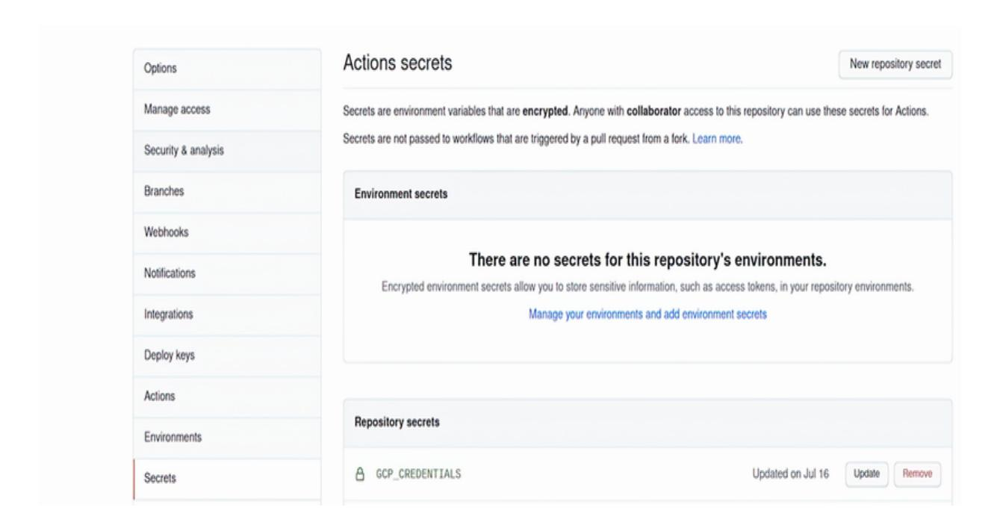

# *inside front cover*


**Product development life cycle—providing a feedback loop from product delivery back to the software development process**

*[OceanofPDF.com](https://oceanofpdf.com/)*


# *Shipping Go*

**Develop, deliver, discuss, design, and go again**

## **Joel Holmes**

To comment go to [liveBook](https://livebook.manning.com/#!/book/shipping-go/discussion)


**Manning**

**Shelter Island**

For more information on this and other Manning titles go to [www.manning.com](https://www.manning.com/)

## *[OceanofPDF.com](https://oceanofpdf.com/)*

### **Copyright**

For online information and ordering of these and other Manning books, please visit [www.manning.com](https://www.manning.com/). The publisher offers discounts on these books when ordered in quantity.

For more information, please contact

Special Sales Department Manning Publications Co. 20 Baldwin Road PO Box 761 Shelter Island, NY 11964

Email: [orders@manning.com](mailto:orders@manning.com)

**©2023 by Manning Publications Co. All rights reserved.**

No part of this publication may be reproduced, stored in a retrieval system, or transmitted, in any form or by means electronic, mechanical, photocopying, or otherwise, without prior written permission of the publisher.

Many of the designations used by manufacturers and sellers to distinguish their products are claimed as trademarks. Where those designations appear in the book, and Manning Publications was aware of a trademark claim, the designations have been printed in initial caps or all caps.

♾ Recognizing the importance of preserving what has been written, it is Manning's policy to have the books we publish printed on acidfree paper, and we exert our best efforts to that end. Recognizing also our responsibility to conserve the resources of our planet, Manning books are printed on paper that is at least 15 percent recycled and processed without the use of elemental chlorine.


Manning Publications Co. 20 Baldwin Road Technical PO Box 761 Shelter Island, NY 11964

Development editor: Becky Whitney

Technical development editor: Arthur Zubarev

Review editor: Adriana Sabo

Production editor: Andy Marinkovich

Copy editor: Michele Mitchell

Proofreader: Melody Dolab

Technical proofreader: Alex Rios

Typesetter and cover designer: Marija Tudor

ISBN: 9781617299506

*[OceanofPDF.com](https://oceanofpdf.com/)*

# *dedication*

*To my wife, Chelsea,*

*who encourages me to follow my dreams;*

*and to my sons, Eli and Abel,*

*for whom all of my dreams exist.*

*[OceanofPDF.com](https://oceanofpdf.com/)*

# <span id="page-7-0"></span>*contents*

### *[Front matter](#page-7-0)*

[preface](#page-12-0)

[acknowledgments](#page-14-0)

[about this book](#page-16-0)

[about the author](#page-19-0)

[about the cover illustration](#page-20-0)

## **Part 1. [Startup](#page-22-0)**

### *1 [Delivering value](#page-23-0)*

- 1.1 [Simple concepts](#page-24-0)
- 1.2 [Small pieces](#page-29-0)

*[Continuous](#page-32-0)*

*[Process](#page-33-0)*

*[Quality](#page-34-0)*

*[Delivery](#page-35-0)*

### 1.3 [Building your product](#page-37-0)

*[Initial setup](#page-38-0)*

*[Basic validation](#page-38-1)*

*[Zero-cost deployment](#page-39-0)*

*[Code confidence](#page-39-1)*

*[Integrations](#page-40-0)*

*[Portability](#page-40-1)*

*[Adaptability](#page-41-0)*

*[User acceptance](#page-41-1)*

*[Scaled product](#page-42-0)*

*[End to end](#page-42-1)*

## 1.4 [Feedback loop](#page-43-0)

### *2 [Introducing continuous integration](#page-45-0)*

- 2.1 [Where to start?](#page-47-0)
- 2.2 [A greenfield project](#page-49-0)
- 2.3 [The assembly line](#page-52-0)
- 2.4 [Warehouses](#page-58-0)
- 2.5 [Material](#page-64-0)

### *3 [Introducing continuous testing](#page-69-0)*

- 3.1 [What to test](#page-70-0)
- 3.2 [Writing unit tests](#page-74-0)
- 3.3 [Refactor, refactor, refactor](#page-78-0)
- 3.4 [Testing pyramid](#page-88-0)
- 3.5 [System testing](#page-91-0)
- 3.6 [Adding it to the pipeline](#page-100-0)
- 3.7 [Code coverage](#page-103-0)

## *4 [Introducing continuous deployment](#page-111-0)*

- 4.1 [Delivery](#page-112-0)
- 4.2 [Developers as operators](#page-116-0)
- 4.3 [Setting up a deployment account](#page-119-0)
- 4.4 [As you like it](#page-124-0)
- 4.5 [Function as a Service \(FaaS\)](#page-128-0)
- 4.6 [Platform as a Service](#page-133-0)

## **Part 2. [Scaling](#page-139-0)**

### *5 [Code quality enforcement](#page-140-0)*

5.1 [Reviewing code](#page-141-0)

| Keep it small |  |  |
|---------------|--|--|
|               |  |  |

*[Keep an open mind](#page-145-0)*

*[Keep it moving](#page-146-0)*

*[Keep it interesting](#page-147-0)*

*[Keep it the same](#page-148-0)*

- 5.2 [Constraints on development](#page-149-0)
- 5.3 [Standardizing our code through format and lint checks](#page-151-0)
- 5.4 [Static code analysis](#page-156-0)
- 5.5 [Code documentation](#page-163-0)
- 5.6 [Git hooks](#page-165-0)
- 5.7 [Flow](#page-167-0)

### *6 [Testing frameworks, mocking, and dependencies](#page-171-0)*

- 6.1 [Dependency inversion principle](#page-172-0)
- 6.2 [Defining an interface](#page-173-0)
- 6.3 [Dependency injection](#page-178-0)
- 6.4 [Testing stubs](#page-183-0)
- 6.5 [Mocking](#page-188-0)

*[Setting up our test suite](#page-190-0) [Using our mocks in test](#page-192-0)*

- 6.6 [Fake](#page-199-0)
- 6.7 [Just the base of the pyramid](#page-205-0)

### *7 [Containerized deployment](#page-209-0)*

- 7.1 [What is a container?](#page-211-0)
- 7.2 [What is a Buildpack?](#page-214-0)
- 7.3 [Let's build a container](#page-216-0)
- 7.4 [Adding a container build to your pipeline](#page-217-0)
- 7.5 [Deploying to a container runtime](#page-220-0)

- 7.6 [Writing your own image](#page-223-0)
- 7.7 [Local environment organization](#page-227-0)
- 7.8 [Containers, containers everywhere](#page-230-0)

## **Part 3. [Going public](#page-232-0)**

## *[8 Configuration management and stable releases](#page-233-0)*

- 8.1 [Configuration](#page-235-0)
- 8.2 [Advanced configuration](#page-237-0)

*[Environmental variables](#page-239-0)*

*[File](#page-240-0)*

*[Flag](#page-242-0)*

### 8.3 [Hiding features](#page-244-0)

*[Updating the port](#page-246-0)*

*[External client](#page-248-0)*

- 8.4 [Semantic versioning](#page-249-0)
- 8.5 [Change log](#page-255-0)
- 8.6 [Accountability and handling failure](#page-257-0)

### *9 [Integration testing](#page-262-0)*

- 9.1 [Phasing out the old](#page-263-0)
- 9.2 [Behavior-driven design](#page-265-0)
- 9.3 [Writing BDD tests in Go](#page-267-0)
- 9.4 [Adding a database](#page-274-0)
- 9.5 [Releasing](#page-281-0)

## *10 [Advanced deployment](#page-288-0)*

- 10.1 [Not quite IaaS](#page-290-0)
- 10.2 [Your first cluster](#page-292-0)
- 10.3 [Building blocks](#page-293-0)

- 10.4 [Scaling and health status](#page-296-0)
- 10.5 [Automatically deploying](#page-299-0)
- 10.6 [Deploying Redis using Helm](#page-301-0)
- 10.7 [Updating deployment configuration](#page-302-0)

### *11 [The loop](#page-307-0)*

- 11.1 [Startup](#page-308-0)
- 11.2 [Acceleration](#page-310-0)
- 11.3 [Cruising](#page-311-0)
- 11.4 [Elements of development](#page-314-0)

*[Process](#page-315-0)*

*[Testing](#page-318-0)*

*[Delivering](#page-321-0)*

- 11.5 [The OODA loop](#page-324-0)
- 11.6 [Conclusion](#page-326-0)

*[Appendix A. Using Kotlin](#page-328-0)*

*[Appendix B. Using Python](#page-341-0)*

*[Appendix C. Using JavaScript](#page-353-0)*

*[Appendix D. Using Terraform](#page-365-0)*

*[index](#page-372-0)*

*[OceanofPDF.com](https://oceanofpdf.com/)*

# *front matter*

# <span id="page-12-0"></span>*preface*

I've been thinking for a very long time about writing this book. At the beginning of my software engineering career, I could not have cared less about processes and procedures for getting things done. It all seemed so boring. But given some inspiration from my managers, I started diving into API development, Agile processes, unit testing, continuous delivery, and integration, and I soon found myself drowning in resources, guides, and conference talks.

It wasn't until I read *The Phoenix Project* by Gene Kim, George Spafford, and Kevin Behr that it all clicked. Here was a story about a company struggling to develop and ship quality software products. Where was this book when I started out?! I paired *The Phoenix Project* with *The Pragmatic Programmer,* by Andy Hunt and Dave Thomas, and felt like I had gained a brand-new perspective on my career.

Like all young idealists, I annoyed my colleagues with my newfound knowledge and sense of superiority, only to be brought back to earth by others who showed me where we had already implemented some of the concepts I learned. I interviewed coworkers and those who'd worked in the industry for many years and then used this information, along with books by Martin Fowler and Kent Beck, to help me understand areas where my company could improve.

Soon, I sent write-ups and documents to my bosses and made suggestions during meetings--but there were too many ideas and too little time. Frustrated at my lack of progress internally and with a mountain of research material and sample code piling up, I decided to move onward in my career journey.

It took me landing three additional positions to put many of these ideas into practice and experiment with others. As you'll find out in this book, we developers need to not only deliver on ideas but also reflect on how we can make them better. I found this theme of the continuous feedback loop throughout all the books I read about writing, testing, and deploying software but never all in one book with examples. When Manning approached me to write this book, it was originally about a completely different topic, and then, over the course of various forms of feedback by editors, reviewers, early purchasers, and industry professionals, we arrived at the book you are now reading. The embodiment of the process described in this book went into making the book (deployments and CI were even used). Even the title was changed several times to nail down the one that best describes what the book is about!

You'll find that I've structured the book in a way that mirrors the complexity that arises with growth. Startups and preliminary projects need to be fast and light to find their market, whereas in the later stages, they need to consider code, architecture, and testing more broadly and at scale, so I focus on describing easy and inexpensive solutions at the beginning and introduce more advanced and complex solutions at the end. I also hope you see that the material I present here is modular. Languages, platforms, and deployment patterns don't matter. What does matter is building a process. To emphasize this, I use many languages and deployment patterns throughout the book.

I chose Go as the primary language because it is what I write code in daily. But I've worked in many languages, and many concepts described in this book are language agnostic, so we've selected a few other popular languages as examples in the appendices. Additionally, at the end of the book, I discuss a split in patterns in the industry, using infrastructure as code, as compared to containerbased deployment strategies.

In the spirit of *The Phoenix Projec*t (and its inspiration, *The Goal*, by Eliyahu Goldratt), this book is told in a semi-narrative format. My hope here is to have you, the reader, draw on your own experiences and struggles so that you can compare it to the ones I'm writing about. Did you encounter the same problem? How did you fix it? Would this strategy have helped? Or could it be adapted to help in the future?

This book does not have to end when you close it.

# <span id="page-14-0"></span>*acknowledgments*

When I started writing this book, I didn't realize how many people would be involved. First and foremost, I would like to thank my wife, Chelsea, who supported me in this endeavor and all the other endeavors I've participated in. It wasn't the best plan on paper to start a new job and write a book with two children to manage, but she helped me stick with it and push the book over the finish line.

I'd also like to thank my two sons, Eli and Abel, who inspire and challenge me in all the best ways. Their curiosity and interest forced me to think about concepts that seemed self-explanatory and to find

a way of explaining them, which is, in a technical sense, what most programming books try to do for people!

This book could not have been written without the immense support of Manning's publishing team. Thank you, Andy Waldron, for working with me on finding a theme (and the right title!) for this book, which I am truly proud to have written. Thank you also to Aliénor Latour, who advised me on the technical aspects of the content and on the overall tone and direction of the book.

As a reviewer of many Manning books myself, I especially appreciate all those who provided feedback in the book reviews. To Alain Lompo, Alex Harrington, Alex Lucas, Amit Lamba, Arun Saha, Bhagvan Kommadi, Borko Đurković, Camal Cakar, Clifford Thurber, Diego Stamigni, Eldon Alameda, Jorge Ezequiel Bo, Katia Patkin, Kent Spillner, Laud Bentil, Manoj Reddy, Marleny Núñez Alba, Mattia Di Gangi, Michele Di Pede, Mihaela Barbu, Muneeb Shaikh, Nathan B Crocker, Philippe Vialatte, Roman Zhuzha, Ryan Quinn, Sergio Britos Arévalo, Sudeep Batra, Tiklu Ganguly, Tymoteusz Wolodzko, and Walter Alexander Mata López, your suggestions helped make this a better book. And I appreciate those who purchased this book early via MEAP and provided feedback and support.

I am very grateful for all the help, guidance, patience, and laughs that Becky Whitney provided. She was an amazing guide throughout the entire writing process and eased my mind about many of my decisions. Writing this book would have been overwhelming to me without her guidance and, instead, it was a well-organized journey.

To Thoro.ai for giving me the freedom and encouragement to write this book.

To Frank, who took me under his wing and received talks, papers, and a repository of experience in return.

To Mike L., who discussed process and improvement first thing in the morning with me to come up with ideas for this book.

To John M. and Verone, who gave me my first job and encouraged me to grow.

To my parents, who encouraged me to grow and reach for new goals.

To my high school English teachers, who encouraged my writing and helped me establish my voice.

To Otto, who, with every walk we took, led me one step closer to the end of this book.

# <span id="page-16-0"></span>*about this book*

*Shipping Go* is intended to walk you through building a product. Experimenting and hacking will require process and automation to help turn an idea into something other people use. Placing this book into a single category is difficult because it intentionally moves you into areas of testing and infrastructure along with creating process and automation. You'll find yourself moving between Development, QA, and Ops worlds in developing an experimental project. Putting all these elements together is an automated pipeline that provides a feedback cycle that we enhance as we progress throughout.

# *Who should read this book?*

This book, which is intended for anyone who has a solid grasp on any programming language, was conceived and written as the first book you should read after you've learned Go, JavaScript, Python, or whatever other fun language you're excited to build something in. Given this knowledge, you will be given a crash course in the software development process, continuous integration and deployment, and various infrastructure elements. This book was written using examples in a particular language and cloud infrastructure that is transferable to other languages, as demonstrated in the appendices.

Managers and architects may find the concepts useful to help design teams around new projects. These concepts can be slowly introduced to existing development environments as well as new ones. Considering the advancements in both languages and architecture, you may fear that the book content will become outdated, yet the concepts should project forward toward new languages and infrastructure elements. What is written here is only a subset of what can be done but should serve as a solid foundation for you and your team to build on.

# *How this book is organized: A roadmap*

This book is organized into three parts, consisting of a chapter apiece on process, testing, and infrastructure that progress in complexity in each part. This way, you can hop into the book at the pertinent chapter or part related to your area of expertise (or lack thereof). Each concept should be transferable to other languages and pieces of infrastructure. In the appendices, you will find examples of the same pipeline in other languages.

# *About the code*

The code is basic-level Go code with the CI engine using GitHub actions. These actions use YAML as the primary language, which is easily transferable to other systems, though the libraries will be different. I chose (for no particular reason) Google Cloud as the cloud host throughout this book; you can swap it out with similar products in other cloud offerings. Additionally, I chose the route of container-based deployments rather than standing up individual servers as a matter of preference, as many greenfield projects tend to move in this direction. However, appendix D provides some basic infrastructure examples.

This book contains many examples of source code both in numbered listings and inline with normal text. In both cases, source code is formatted in a fixed-width font like this to separate it from ordinary text. Sometimes code is also **in bold** to highlight code that has changed from previous steps in the chapter, such as when a new feature adds to an existing line of code.

In many cases, the original source code has been reformatted; we've added line breaks and reworked indentation to accommodate the available page space in the book. In rare cases, even this was not enough, and listings include line-continuation markers (➥). Additionally, comments in the source code have often been removed from the listings when the code is described in the text. Code annotations accompany many of the listings, highlighting important concepts.

You can get executable snippets of code from the liveBook (online) [version of this book at https://livebook.manning.com/book/shipping-](https://livebook.manning.com/book/shipping-go) [go. The complete code for the examples in the book is available for](https://livebook.manning.com/book/shipping-go) download from the Manning website at www.manning.com and from GitHub at [https://github.com/holmes89/hello-api.](https://github.com/holmes89/hello-api)

# *liveBook discussion forum*

Purchase of *Shipping Go* includes free access to liveBook, Manning's online reading platform. Using liveBook's exclusive discussion features, you can attach comments to the book globally or to specific sections or paragraphs. It's a snap to make notes for yourself, ask and answer technical questions, and receive help from the author and other users. To access the forum, go to [https://livebook.manning.com/book/shipping-go/discussion.](https://livebook.manning.com/book/shipping-go/discussion) You can also learn more about Manning's forums and the rules of conduct at [https://livebook.manning.com/discussion.](https://livebook.manning.com/discussion)

Manning's commitment to our readers is to provide a venue where a meaningful dialogue between individual readers and between readers and the author can take place. It is not a commitment to any specific amount of participation on the part of the author, whose contribution to the forum remains voluntary (and unpaid). We suggest you try asking the author some challenging questions lest their interest stray! The forum and the archives of previous discussions will be accessible from the publisher's website for as long as the book is in print.

# <span id="page-19-0"></span>*about the author*


**Joel Holmes** is a software developer who has focused on building cloud-native applications. He has worked at several startups and has helped to architect, design, and develop new products and services to help those companies develop and grow. Along the way, he has been able to help establish tools and processes that have helped development and increased quality. He lives in Pittsburgh with his family and currently works at Thoro.ai building cloud applications in the growing robotics industry.

The technical editor on this book is **Aliénor Latour**, a Golang tech lead focused on quality and simplicity in her team's software, and an advocate for diversity in development roles. Outside of work hours, she travels Europe for Scottish dance events, knits, sews skirts with pockets, and reads about linguistics and sociology.

# <span id="page-20-0"></span>*about the cover illustration*

The figure on the cover of *Shipping Go* is captioned "Femme de Martavan en Sirie," or "Woman of Martavan in Syria," taken from a collection by Jacques Grasset de Saint-Sauveur, published in 1797. Each illustration is finely drawn and colored by hand.

In those days, it was easy to identify where people lived and what their trade or station in life was just by their dress. Manning celebrates the inventiveness and initiative of the computer business with book covers based on the rich diversity of regional culture centuries ago, brought back to life by pictures from collections such as this one.

*[OceanofPDF.com](https://oceanofpdf.com/)*

# <span id="page-22-0"></span>*Part 1. Startup*

The beginning of a new project is extremely exciting and at times a bit daunting. You aren't encumbered by old code or bugs, but you are starting from scratch on an idea that you aren't sure will work. You don't know if the market will like it or if it will stand up to high loads of traffic. You definitely don't want to paint yourself into a corner too quickly, nor do you want to make things so broad that it becomes impossible to reason about. This is the difference between having a narrow, unstable base and an expansive, cumbersome base.

The goal is to be flexible at this stage. Build your product so that it can change and grow comfortably for both you and your team. In this section, we discuss how to start a project with documentation and a plan in chapter 2. We establish a simple and flexible way of writing tests in chapter 3 early on to help find bugs quickly. We release a product to production that will cost nothing until it is heavily used in chapter 4. Throughout this process, we build tools that automate a good portion of the process of moving your code through testing and delivery.

*[OceanofPDF.com](https://oceanofpdf.com/)*

# <span id="page-23-0"></span>*1 Delivering value*

## **This chapter covers**

- Using small chunks of work to increase workflow
- Establishing feedback loops for product and process improvement
- Outlining phases of product growth and development
- Iterating between various feedback cycles

What you will find in this book has been gathered from past practices in Agile software development, lean startup ideals, and DevOps culture. This book is intended for those who want to take the language they've learned and build something with it. You know how to write code, and you want to ship it. The concepts and processes taught here should be agnostic to the technology or language you use, but I provide concrete examples using Go and GitHub Actions. By using their terminology, you should be able to easily adapt what I write here to Python and GitLab or JavaScript and CircleCI, but in this book, we will ship Go code.

The book follows a semi-narrative format wherein I put you in the shoes of a developer at a company that wants to rapidly develop an enhanced product. While this project is simple, the intention is to give you an idea of the process of developing a product. Many of these elements are drawn in part from my personal experiences and hindsight. This pattern may also not fit your company's culture or process, but hopefully you can find some elements that help your team move forward. The focus here is the process and mentality rather than the technology.

Finally, each section is broken down so that you deliver a product at the end. Each chapter will build off of the existing chapters, but you can stop at any point if you are satisfied with the process. Each section brings your product to scale in different ways, such as by expanding teams or higher resource utilization. We explore integration with legacy systems and different deployment options based on cost.

# <span id="page-24-0"></span>*1.1 Simple concepts*

<span id="page-24-1"></span>This book brings together concepts and processes from across various industries to help with the quick creation of quality software. Some of these concepts predate the development of computers and the software development industry. Over the past few decades, software companies have looked to other industries to help them build products more efficiently to meet the demands of their customers. What they found were processes that created fast feedback from their customers. Based on that feedback, they were able to adapt their product. Adapting their products allowed them to grow into the Googles, Apples, and Facebooks of today, yet they are rooted in the assembly lines of the industrial revolution and the lean manufacturing techniques created in Japan.

Let's assume you are reading this book so that you can build a product. You have some idea that you think will change your company (or the world), and you want to see if it works. Is this what customers want? Does this help your company? It is hard to know. Projects may get started and eventually fail. They may pivot or change or just be left to the scrap heap of experience. If a project is almost predestined to change or be thrown out, then how much effort should you put in?

It's curious to think of putting in the least amount of effort as possible into something. It can seem lazy or uninspired. Instead, consider being told you need to build a device that takes someone from one location to another in the fastest way possible. With no additional details, you could spend years creating and designing an airplane only to find out your customer needs to travel 10 miles. Compare the two development processes in figure 1.1.

In software, this happens all of the time. Companies pivot. They start small and evolve. They fail. They make millions. How do they do it? It comes from a notion of developing three key features: people, process, and product. People drive organizations and product development. A process helps us underline how the work should be done. Finally, the product opens us up to feedback from our customers. Once you've established your process, you can automate it as much as possible. This allows your team of people to sit at one end and a product to be delivered at the other end.


**Figure 1.1 Talk with customers to get an accurate idea of which product to build them.**

<span id="page-26-0"></span>Your team will develop features or make changes that your customer wants. These changes will then be delivered to your customers, who in turn will create a discussion about the product or feature. This will trigger a design step, which will start the whole thing over. I like to refer to this loop as the *four Ds*: develop, deliver, discuss, and design. This is a feedback loop and becomes a key part of our *value stream*, as seen in figure 1.2.


**Figure 1.2 Develop, deliver, discuss, design loop**

The value stream is exactly as it sounds, the flow of work that creates value within the company. This means establishing a relationship with your customers and building a product that you think will be valuable to them. Yet your investment should be as small as possible until you

can learn what your customer wants. How do you reduce your investment costs? Through automation. When your source code is committed, it should be treated as a raw resource, and the manufactured product should be delivered at the end.

We can look to another profession for the answers. Industrial engineers have been dealing with how to deliver products for a long time. We can look at innovations such as the assembly line, which showed us the benefits of automated handoffs between workstations. We can look at lean manufacturing techniques to help us understand the importance of reducing work in progress and just-in-time delivery to reduce waste. The technology world has watched and adopted many of these principles to help design and build delivery pipelines, which automate the flow of work from a single idea to a feature in your application. These ideas and features are created when a customer asks for them just in time for development rather than by guessing the customer's desires and spending time and money upfront developing something that may not be what they want. This pipeline can be seen in figure 1.3, wherein a raw resource goes in one end, a product is shipped, and customer feedback is given to design a new feature. This cycle is pivotal to the success of companies and is a concept we will explore throughout this book.


**Figure 1.3 Code is moved along a pipeline where it is analyzed, built, and then shipped as a library to a device or a server.**

<span id="page-29-1"></span>We can see that the code goes through a series of automated steps to verify quality before a product is built and shipped to the end customer. This can be through a library package that is used in another project, a device out in the field for an update, or a server running in the cloud. All move along with little to no human interaction, making the timeline dependable between when the code is written and when the customer gets to use the product.

# <span id="page-29-0"></span>*1.2 Small pieces*

<span id="page-29-2"></span>A key theme you will find in this book is creating small, iterative steps to invite feedback into your process. So, as we build our product, we

will take small, iterative steps so that you can see how a product grows. You may find the steps in section 1 too simple for your needs and choose to skip them. Or you may find that you only need up to the end of part 2 to take your product to market.

Imagine you have spent three weeks developing a feature that hasn't been looked at or tested by anyone. How long do you think it will take for someone to test all of the different pieces of your feature? How many bugs do you think they'll find? How quickly can you turn around on those bugs? How much change has accrued while you developed this feature?

<span id="page-30-2"></span><span id="page-30-1"></span><span id="page-30-0"></span>Creating small pieces of work allows us to decrease our work in progress (WIP) and speed up delivery. In Eliyah Goldratt's book *The Goal* (Routledge, 2014), the author points out that WIP ties up revenue. You invest time and money in something that is not getting to the customer. This is a loss of value until it is delivered. Creating smaller amounts of work ties up less revenue in your value stream, so we will focus on smaller chunks of work to deliver value early and often.

While each chapter is important to building a complete pipeline, in the end you will find that your pipeline will be different because each product and company is different. What stays the same is the process. Ideas go in, code gets written, and products ship out. Figure 1.4 demonstrates this loop.


**Figure 1.4 Product development goes through a life cycle that starts with raw materials and results in a product that customers provide feedback on, resulting in improvements and changes to the product.**

Collaboration becomes key in this step because you are tearing down the walls between different groups. It used to be that tribes existed in companies that were constantly at war with each other. Testers blamed developers for poor-quality code. Developers blamed operations for slow deployments. Operations blamed testers for the number of deployments that happened because of missed bugs. This is unhealthy and harmful to our customers, so instead of putting up walls, we tear them down, put lines of communication between them, and collaborate on building a tool that takes in ideas and delivers value.

<span id="page-32-3"></span>You will be given a holistic view of product development so that you can turn your ideas into products. What does this view look like from a distance? What steps do we need to build our pipeline? Let's take a look.

## <span id="page-32-0"></span>*1.2.1 Continuous*

<span id="page-32-2"></span><span id="page-32-1"></span>There are so many continuous things: continuous integration, continuous testing, continuous delivery, continuous improvement. What do they all have in common? They are . . . continuous—a cycle, a full rotation, a circle. All of these "continuous" things tell us that they all need to connect at the beginning. Toyota incorporated this model to build its famous Toyota Production System (TPS). The company is constantly evaluating each phase of its development process, from the way the assembly line runs, to manual assembly, to experimentation. Each phase has a feedback cycle where any employee can seek ways of improving the company.

From a development perspective, being continuous allows you to write code without much concern about doing a lot of manual work after that. If a pipeline is assembled correctly, checking in a piece of code should trigger a list of automated processes that will give you feedback about the code. It may fail a quality assessment or not compile, but the developer is notified and can fix it, creating a loop. If the deployment was successful, the developer can move on to the next task, continuing the process of improvement.

This book is written in a way that tries to follow this pattern. The TPS has many steps and hits a very broad market, so it would be too theoretical for this book. What we will do instead is break it down into three broad categories: process, quality, and delivery.

Each phase can be simple or complicated depending on your needs and where you are in your product development. What is provided is not a prescription but guidelines to help you implement these various techniques.

## <span id="page-33-0"></span>*1.2.2 Process*

<span id="page-33-1"></span>Humans are still an essential element of software engineering. They come up with designs. They write the code. They verify the results. But humans aren't needed for everything. In fact, the more you can invest in less human time, the greater benefits you will get from your team.

This isn't to say that you automate away your development team. Instead, consider this: Would you rather spend an hour deploying an application or developing a new feature? We adopt an approach that is found in TPS: "automation with a human touch." This means we try to automate as much as possible, which increases how efficiently we work. But this is not a black box or a set of corporate commands. Instead, the developers create and add the necessary tools to help them in their development.

What does this look like? Well, it becomes a set of documents, scripts, and tools that help make development go quickly. What format should my code be in? Use a formatter tool. How do I create a new feature? Use a code generator. How can we improve our deployment process? Use a pipeline.

<span id="page-33-2"></span>This process is going to be fragile at first but will evolve into something essential to your team. You will find that the flow of work through your company will become easier and you will be able to meet demands quickly and efficiently.

## <span id="page-34-0"></span>*1.2.3 Quality*

<span id="page-34-2"></span>*Quality* is a tricky word and the basis for some philosophical discussion. Robert Pirsig, in his book *Zen and the Art of Motorcycle Maintenance* (Mariner Books, 2005), put it this way:

<span id="page-34-3"></span><span id="page-34-1"></span>*"Quality . . . you know what it is, yet you don't know what it is. But that's selfcontradictory. But some things are better than others, that is, they have more quality. But when you try to say what the quality is, apart from the things that have it, it all goes poof! There's nothing to talk about. But if you can't say what Quality is, how do you know what it is, or how do you know that it even exists? If no one knows what it is, then for all practical purposes it doesn't exist at all. But for all practical purposes it really does exist."*

So when people say "delivering a quality product," what does that mean? For our purposes, we'll say that first and foremost *quality does not mean perfect*. No code or product will ever be perfect. Quality, therefore, becomes an approximation of perfection.

Perfection can be approximated by putting additional quality measurements into your development process. What you, your team, and your company must do is determine your definition of quality for your customers. Your code may be beautiful, but in most cases, it gets compiled and is never seen by a customer. If that beautiful code has bugs, is it quality code? Or if you have code that works and has worked for years but is difficult to read or debug, is that quality code?

Our quality checks will mostly be through various types of test code. Different patterns and strategies will be used to ensure that our product is functioning as expected by the developer and the

customer. This step reduces waste in our system, which occurs through rework (bugs) and delays (missed requirements). We use tests in a variety of ways to give ourselves confidence that our product works before we ship it. This will not address everything we need for quality code. Things such as code clarity and maintainability also help with the quality of our code and will be additional steps we add. In the end, though, it is the writers and maintainers of the code who are the stewards of quality.

## <span id="page-35-0"></span>*1.2.4 Delivery*

<span id="page-35-3"></span>Delivery is the last step needed before we can loop back to the beginning. This is where the value comes into our pipeline. After the code has been written and pushed, we validate what we wrote by how our customers react to it. Changes may be requested, or the user may be satisfied or dissatisfied. This feedback loop only happens once a product is delivered.

<span id="page-35-2"></span><span id="page-35-1"></span>Delivery is the act of shipping an artifact. An *artifact* can be a version of a library, an executable binary, a container image, or something else that can be used by another person. Artifacts can be delivered privately and publicly. In some cases, a company will build what's called a *release candidate*, which is a product that is almost ready to be given out to the general public. This candidate can be run through another set of automated tests to check for performance problems (load testing), usability problems (UI testing), or if it even works (smoke testing). The manual tests can be run to explore the product, get a stamp of approval, and be released to the public, as shown in figure 1.5.


**Figure 1.5 Code is built into an executable file or wrapped in a universal runtime, such as a container.**

<span id="page-36-1"></span><span id="page-36-0"></span>The process of making an artifact run is known as a *deployment*. In some cases, this can range from installing an application on a server, setting up a new function on a serverless environment, running a new container on a container-run engine, or simply doing an over-the-air update to the customer's machine (e.g., operating system updates). It is at this point that we begin to see the full value in what we have built, as shown in figure 1.6.


**Figure 1.6 The output is shipped to a customer as a library onto an embedded device or a server.**

<span id="page-37-1"></span>Throughout this process, we continue to learn what customers want and need and how they use the product, which provides information back to our development team. If an application doesn't start, we know we broke something that needs to be repaired. If it falls over when too many people use it, we know something needs to be changed. If only a small set of users finds the feature unhelpful or not of value, we may need to go back to the drawing board.

# <span id="page-37-0"></span>*1.3 Building your product*

<span id="page-37-2"></span>What happens in the product development cycle is very similar to the scientific method. You have a hypothesis, and you do experiments to

see if your hypothesis is correct. Sometimes you may need to change the parameters of your experiments or explore a different direction. Products can be similar. Your idea (hypothesis) may not meet the market needs, so you make a change (experiment) and ultimately find if it is successful. In either case, you learn something.

As part of building your product, there will be various stages. As you progress, each part can become more complicated and will outline the mature stages of a product.

# <span id="page-38-0"></span>*1.3.1 Initial setup*

<span id="page-38-2"></span>What goes into starting a new project? Is it just a great idea, or is it more? When you are starting a project, as we do in chapter 2, you need to gather information about what the system is supposed to do and how you expect it to work. As you progress, you need instructions and scripts to set up the project for others. When working in an organization or on a larger project, you will not be the only one doing the work. Someone at some point will want to contribute, and it's easier to document the steps now than worry about it later.

<span id="page-38-3"></span>Documentation and scripts will help you scale team members and contributors. Building a basic pipeline also becomes important at the onset because retrofitting one can often be tricky. In this section, we start down our path toward industrial programming instead of hacking. There is a time and place for both types of programming, but in this instance, we worry about building a product and not vetting an idea. Once we've established some basic installation and a process, we will add to it as we go.

## <span id="page-38-1"></span>*1.3.2 Basic validation*

<span id="page-39-3"></span>Validating that your code works as expected is another step along the path to developing a great product. Teams often push items like testing toward the bottom of their priority lists because they feel their product is too volatile at the beginning, but tests are more than just security blankets for developers. Instead, they tell developers about the business rules they are writing and steer the product toward their intended goal. These guard rails can help developers in the long term, and establishing them as basic validation in a pipeline helps accelerate the growth of a product and gives autonomy to developers by documenting the business expectations through code. We explore this process in chapter 3 by setting up a basic unit testing process.

# <span id="page-39-0"></span>*1.3.3 Zero-cost deployment*

<span id="page-39-2"></span>Without shipping, you have a product that sits on a shelf. Deployment is taking your product and putting it out there on a server so that someone can use it. Yet when you look at all of the options, there are tons of things to consider. The biggest of these is cost. That is why there is such a large focus on low-cost technologies to get products deployed.

Starting in chapter 4, we will walk through various options that are free and scale with your company as your user base grows. I like to call this "zero cost" because early on, it should not cost you anything to run a product to get market validation. To do this, we will explore serverless technologies such as deployed functions and hosted platforms.

# <span id="page-39-1"></span>*1.3.4 Code confidence*

<span id="page-40-4"></span>The standardization of work is a core tenant of industrialized production. In the same way, developers have created techniques to standardize how software is written. As a team grows, coding standards and formatting will become important. By using these techniques, we can catch bugs earlier and continue to check the quality of the product automatically before it even gets tested.

Additionally, in chapter 5, we will explore a code review process and see how this can aid in creating a quality product and how it can be used as a teaching mechanism for team members. We will also use documentation to help our team understand the code we write and work toward creating code that is easy to understand.

# <span id="page-40-0"></span>*1.3.5 Integrations*

<span id="page-40-2"></span>Systems rarely work in a vacuum. They either interact with a database, a file system, or another application. This is known as integration, which becomes a critical part of testing our systems. In chapter 6, we will explore different techniques for testing integrations with other systems. We will interact with simple stubbed systems as well as more advanced mocking techniques. To do this, we will need to create a layer that allows us to invert the dependencies so that we develop against an abstraction instead of a concrete system. In doing this, we will give ourselves higher flexibility.

# <span id="page-40-1"></span>*1.3.6 Portability*

<span id="page-40-3"></span>"It worked on my machine" is a trope that occurs often in software development circles. You spend months creating a system, and you know all of the ins and outs of it. Suddenly, someone else wants to

run it and it won't work. They follow your setup, but you missed a dependency. You developed it on Linux, but they are using Windows.

How do we resolve this? In chapter 7, we will explore abstraction tools that help us with virtualization and packaging our product so that it can run on a universal runtime. This will be done using Buildpacks and containers. Ultimately, we will integrate this into a system that is portable for everyone, including our various cloud deployment options.

# <span id="page-41-0"></span>*1.3.7 Adaptability*

<span id="page-41-2"></span>As you ship your product, you will find yourself building incomplete features or turning features off. Typically, companies create a separate product to test before releasing it to a customer "once it is stable," but this has been found to reduce teams' productivity and can often cause delays in shipping. Instead, the industry has moved toward changing the way our applications work through the use of configuration. By configuring our applications, as we will do in chapter 8, we can change the functionality without changing the code itself. This means that experimental features can be tested by setting a variable or changing an endpoint by changing a flag. Configuration means you can adapt your applications so that they can move as quickly as you do.

## <span id="page-41-1"></span>*1.3.8 User acceptance*

<span id="page-41-3"></span>Simple tests are great at testing how functions and methods work within your application. They help you hone in on the technical aspects but do little to tie your work to what the user wants. A user may want an API that expects a specific format or a business rule

that has specific expectations. In this instance, our testing shifts from technical to something a little more "squishy." In chapter 9, we explore other techniques. We are not interested in how it is done but rather whether we are meeting the specifications set out for us. "If my balance is less than the amount to withdrawal, then I should get an error" is an example of a specification we would want to test.

# <span id="page-42-0"></span>*1.3.9 Scaled product*

<span id="page-42-3"></span>Using various abstractions in our deployment environments will help us build a customer base. Over time, these abstractions will cost you and your company either money or performance, so you start ripping apart these abstractions, which requires more technical expertise about the servers and systems you are building, for a reduced cost and the ability to scale servers as you see fit. In chapter 10, we will explore creating and delivering products on visualized server instances and how to maintain these products through code.

# <span id="page-42-1"></span>*1.3.10 End to end*

<span id="page-42-2"></span>The final step in any product, once it has reached a critical mass, is to test it for quality. By this point, we will have created several ways of testing quality through testing and linting. But as the product rolls to production, we will want to assert what the customer will experience. Often this is done through a quality assurance team, but we want to automate as much of this as possible so that our team can explore more nuanced bugs or search for areas of improvement. In chapter 11, we will add our final capstone to our pipeline, which will give us a sense of whether our entire system works as expected from the stance of a customer. We focus on pushing the quality checks

throughout the system, but we should, in the end, have a final check to see if everything works as a whole. Since this is an expensive operation (in terms of time and upkeep), we save it for last, as it is often the last piece to be implemented once a product has matured. In chapter 11, we will demonstrate some tests to allow your team to explore other areas of improvement.

# <span id="page-43-0"></span>*1.4 Feedback loop*

<span id="page-43-2"></span>I guess it's easy to ask what the point of all of this is. The answer is simply to allow you to create fast and tight feedback loops throughout the growth of your product, team, and company. These principles are also easily transferable to other businesses and projects.

<span id="page-43-1"></span>*Agility* is a term thrown around a lot in software development, and it aims to capture the idea of being nimble and quick to change direction. Yet I feel that this is an inadequate term because it can often feel like you are playing a game of dodgeball trying to deflect or dodge feedback rather than embrace it. Instead, our development process should be like driving a race car where you need to make split-second decisions to keep moving toward the finish line. As we move through this book, I hope you can find some guidance for your project and your team on how to move forward and win the race.

## *Summary*

- Product development is a process that constantly changes.
- Focusing on feedback loops will help guide areas of improvement.
- Automation is key to establishing faster feedback loops.

### *[OceanofPDF.com](https://oceanofpdf.com/)*

# <span id="page-45-0"></span>*2 Introducing continuous integration*

## **This chapter covers**

- Documenting requirements in your source code
- Establishing a central code repository as the starting point for your pipeline
- Automating the steps needed to build your product by using a continuous integration system
- Creating a basic application to start development

It's Monday, and you've been drinking your morning coffee and scrolling through emails when you see an invitation to a meeting titled "Kickoff." You check the time and realize you are going to be late. Grabbing your laptop, you run to the conference room and see just one person sitting there, a product manager. As you close the door and walk to a seat, they say, "Glad you could make it; sorry about the last-minute invite, but we need to get something built this week. Our company would like to explore creating a new hello translation service that is cheaper and faster than our legacy system. In the future, we want to expand beyond just translating 'hello,' but our system will not scale. The conversation has been going on too long at this point, and I want to prove to them we can get something done quickly and still meet their targets. Do you think we can do it?"

A new service to replicate the functionality of an old service in less than a week, with better performance and at a cheaper cost? Sure, why not? What do you have to lose?

"What I want is for you to do this in pieces and write it so that we can get feedback quickly. Also, I want to demo this tomorrow from a live server. It doesn't need to be perfect; it just needs to show what we were able to do in a day. I also want it so that we can have others join you once this demo is over. And we need to be sure it works as we expect and that we can prove why it does."

As they're talking, you quickly open a terminal and type mkdir hello-api && touch hello-api/README.md. You open your README.md file and write the code in the following listing.

## **Listing 2.1 README.md**

```
# Hello API
## Release Milestones
### V0 (1 day)
- [ ] Onboarding Documentation
- [ ] Simple API response (hello world!)
- [ ] Unit tests
- [ ] Running somewhere other than the dev machine
### V1 (7 days)
- [ ] Create translation endpoint
- [ ] Store translations in short-term storage
- [ ] Call existing service for translation
- [ ] Move towards long-term storage
```

"Great, once you are done, let me know, and we can chat about the next steps. I appreciate you doing this. I think it will be great for us to show our company how rapid product development can work and make us a success."

You leave the room with your laptop and go get some more coffee. When you get back to your desk, you look at the time: 9:15. It's time to start coding.

## <span id="page-47-0"></span>*2.1 Where to start?*

<span id="page-47-1"></span>Beginning a project based on an idea can be a little overwhelming. What language do you write it in? How should it be structured? What are the various use cases?

Interestingly, none of that matters. If you are asked to create something in a day, you will go with the language you are most comfortable with. You will write the code in the simplest way possible. You will never know all of the use cases, so it is best to just get something in the hands of the customers. With this project, you have the benefit of knowing some business requirements because there is a legacy system, but in most cases, you will never know.

As you start, it is a great idea to create a document to write down your setup process, milestones, testing process, and so forth. You already started the documentation in your meeting when you started a README.md. Most developers will open this file first, and it is a great way of communicating asynchronously. The README file is not a new concept and has been a fixture of software development for decades. Its purpose is to give the user relevant information to configure, install, run, or use a piece of software. What goes into your README depends on your team, but often it will hold the following:

- Instructions on how to run the software
- Configurations in your environment to run the software
- Known dependencies
- Troubleshooting information
- Common use cases and examples of using the software
- Software milestones

Figure 2.1 shows how a document acts as a map for new team members.


**Figure 2.1 The README document is a pointer to all other documents within your product. This will help enhance the developers' understanding of how to contribute, run, build, or debug your product.**

You have already added one of these items from the list: software milestones. Now you want to add a description of what the software does, what it needs, and how to start working on it. The README has now become a lab notebook in which you tell others what you are doing and how to replicate the experiment. It should also have a thesis or a purpose that tells the reader what this product does. If you

find it hard to write a thesis, you may not have a great idea of what you are building. Let's write this out:

```
# Hello API
```

This is an improved version of the current hello-api we use in production. It will use less memory and be cheaper to run in production, and it will scale, expand to additional words, and be more stable:

```
## Dependencies
- Go version 1.18
## Setup
## Release Milestones
...
```

<span id="page-49-1"></span>Great! You've used this to make your first decision. Choosing Go was natural for you because it is a fun, newer language you've been using in your spare time. It will be a great way to introduce this to your company and has a reputation for using little memory, being scalable, and being stable. Notice that you left Setup blank. This is intentional. This is a living document that should be updated when infrastructure changes are implemented. This will help us throughout the chapter by guiding us to the logical step that we should take next.

# <span id="page-49-0"></span>*2.2 A greenfield project*

<span id="page-49-2"></span>For this book, we use a Unix-based development environment. Why? Because most of the deployment services we will use are Linux based. Windows even has this neat feature available to run Ubuntu Linux inside Windows. Between Linux and Windows, we have a

pretty large share of users. macOS will work for most things, so we need to indicate when it won't. This is very important to note, so we should probably add this to our README.md file:

```
...
## Setup
...
```

Development expects to run in a Unix-like system. If you are running Windows, please consider following these directions (<http://mng.bz/VpQr>).

Now we need to install Go. It would be easy to simply paste a link to a download and tell users to follow the instructions. However, you might be on version 1.7.2 and the next person on 1.7.3, and the person after that on a different version. Soon everyone is on a different version, which seems benign but could become a problem when you're helping a colleague solve a problem, because it works on your machine and not theirs.

It's at times like this when we want to use standardized tools to help create repeatable tasks. To do this, we will create a Makefile—a standard in the developing world, which can become very complex. Our Makefile will just house some small commands that we can reference in the documentation and aid us in development. Open a new Makefile in your code editor, and add the code in the following listing.

### **Listing 2.2 Makefile**

GO\_VERSION :=1.18

.PHONY: install-go init-go ❶

```
setup: install-go init-go ❷
#TODO add MacOS support
install-go: ❸
 wget "https://golang.org/dl/go$(GO_VERSION).linux-amd64.tar.gz"
 sudo tar -C /usr/local -xzf go$(GO_VERSION).linux-amd64.tar.gz
 rm go$(GO_VERSION).linux-amd64.tar.gz
init-go: ❹
 echo 'export PATH=$$PATH:/usr/local/go/bin' >> $${HOME}/.bashrc
 echo 'export PATH=$$PATH:$${HOME}/go/bin' >> $${HOME}/.bashrc
```

- ❶ .PHONY is used to define some of our methods in advance so that we can use them in the setup phase.
- ❷ Runs commands to install Go and setup environment
- ❸ Downloads a specific version of Go and installs it
- ❹ Adds Go location to your local environment

## **Alternatives**

The following code is in Make because it is used fairly often by the DevOps community and developers:

- TaskFile[https://taskfile.dev/] - Modern Make alternative using YAML

**NOTE** If you are not using Bash as your shell, you will have to modify these steps to add Go to your system path.

<span id="page-51-0"></span>Notice the TODO comment here. This is okay. Remember that we are trying to move fast but also be helpful. What is important is to document what is missing so that others will know when they join your codebase. TODO items are a great way for people to start contributing! Add the code in the following listing to your README.

## **Listing 2.3 README.md**

```
...
## Setup
### Install Go ❶
`sudo make setup`
### Upgrade Go ❶
`sudo make install-go`
...
```

❶ macOS is not supported by this Makefile yet.

<span id="page-52-2"></span>By using standardization and documentation, you establish a guide on how to work on this product. This is almost like pulling out a set of building instructions for a table from Ikea. Anyone who picks it up should be able to follow the directions and have a running application. Standardizing our system allows others to contribute. Given our tools and our documentation, the next step in the evolution of product development is automation. For factories, this came in the form of the assembly line. For software, it came from the continuous integration pipeline.

# <span id="page-52-0"></span>*2.3 The assembly line*

<span id="page-52-1"></span>Once producers were able to standardize the way they did their work in their homes, they started moving to centralized factories. These factories still had each worker sitting at their workbench assembling items by themselves. One worker's job may have been to cut the leather for a shoe and then deliver the stack of cut pieces to another worker, who attached it to a bottom piece, and so on. Today, assembly lines are much different. Some people stand and do repetitive tasks, but with the advent of more advanced automation, these stations have become more skilled and nuanced, requiring

special training and knowledge, much like today's software developers.

In software, we can imagine this as a developer sitting at their machine, writing code, compiling it, and then deploying it. While many people produce code this way, it does not scale well. Artisans will produce custom furniture, and in the same way, many programmers will sit at home hacking away at a project on their own. But this isn't industrial development. These are solo projects. Most companies do not need artisanal software; they need predictability and reliability.

What is needed is a way of automating the flow of items through a factory so that workers aren't doing everything themselves or spending time handing things off. In factories, this was called the assembly line; in software development, it is called a *continuous integration pipeline*.

A continuous integration pipeline, or CI system, is just an application that moves code along a set of predefined processes. A CI system can be as simple as copying a file to a different location to as complicated as handling multiple deployments and quality checks. In this book, we will move from the former to the latter using GitHub Actions. Table 2.1 outlines some of the most common CI systems.

<span id="page-53-1"></span><span id="page-53-0"></span>**Table 2.1 Continuous integration servers have also evolved over the years and often have a cloud-based hosting solution so you don't need to run them yourself.**

| Continuous<br>integration system | Year | Hosted service |
|----------------------------------|------|----------------|
| Azure DevOps                     | 2005 | Yes            |
| TeamCity                         | 2006 | Yes            |
| Circle CI                        | 2011 | Yes            |
| Jenkins                          | 2011 | No             |
| Travis CI                        | 2012 | Yes            |
| GitLab                           | 2014 | Yes            |
| GitHub Actions                   | 2020 | Yes            |

GitHub Actions is a fairly new technology to help create integration pipelines for developers' source code. It uses a special YAML file to help us define the various stages that we want our code to go through, when to run the stages, and what to do if something doesn't work. The pipeline is broken down into a set of jobs. Each job can have a series of steps involved and can depend on other jobs. Each step can either run a command directly on the underlying system (bash commands, scripts, etc.) or use libraries to help do repetitive tasks (set up Go, check out code, etc.). When you look at some definitions, you will see things like actions/setup-go@v2, which means we will use the GithubAction command to set up our Go environment with the proper version.

<span id="page-54-0"></span>Additionally, we want to understand the first pipeline we are building. At first, all we want to do is create a binary and upload it as an artifact to our GitHub repository. You should see the following steps:

- 1. Set up Go.
- 2. Check out the code.
- 3. Build a binary.
- 4. Copy the file to the upload directory.

### 5. Upload the artifact to GitHub.

To show how simple it is, we will create our pipeline now before we have written any code. In your terminal, type mkdir -p .github/workflows && touch .github/workflows/pipeline.yml,

and open the file. In it, we will add the code in the following listing.

## **Listing 2.4 pipeline.yml**

```
name: CI Checks
on:
 push:
 branches: ❶
 - main
jobs: ❷
 build:
 name: Build App
 runs-on: ubuntu-latest ❸
 steps:
 - name: Set up Go 1.x ❹
 uses: actions/setup-go@v2
 with:
 go-version: ^1.18
 - name: Check out code into the Go module directory ❺
 uses: actions/checkout@v2
 - name: Build
 run: make build ❻
 - name: Copy Files ❼
 run: |
 mkdir artifacts
 cp api artifacts/.
 - name: Archive ❽
 uses: actions/upload-artifact@v2
 with:
 name: api ❾
 path: artifacts
```

- ❶ We will only run this CI process when a change is made to the main branch.
- ❷ These are the various stages that are run in our pipeline.
- ❸ Run this on a Linux-based machine.
- ❹ Ensures that our image has Go 1.18 or higher
- ❺ Pulls code from a local repository
- ❻ Tells our build command to build a binary
- ❼ Copies the resulting binary to a directory to upload
- ❽ Creates an archive to be attached to the workflow with the binary
- ❾ Names the binary directory something you will be able to identify it with

Hopefully, some of you will have caught that we have a new make target listed. Here, we are standardizing our build using make build. Why? Well, Go allows us to configure our builds using flags and various other features, and we want to make sure that we have it standardized. For now, we will use the simple Go build, but in future chapters, we will have alternative configurations that we will want to use. Let's add our build command to our Makefile using the code in the following listing.

## **Listing 2.5 \.gitignore**

```
GO_VERSION := 1.18
setup:
 ...
build:
 go build -o api cmd/main.go ❶
```

❶ The build command will compile the main application into a binary named api.

You may be wondering where the code is built. Trust me, we'll get there. For now, you can see how we can tie in the standardized build system to our assembly line. Our developers can use the same commands that we use on the assembly line to ensure they work locally but will be triggered automatically on our pipeline. If we need

to change the process, it can then be reflected across both local and production environments.

**NOTE** You changed a process. Did you update the documentation?

The assembly line is often mistaken as an invention of Henry Ford. However, the concept of an assembly line goes back decades before Ford's use of it on his famous Model T. Clothing, machines, bicycles, and boats were all applications of the concept of moving pieces between divided pieces of labor as far back as the industrial revolution. Automated tracks of materials would move around assembly or unit production. You can compare the two in figure 2.2.


**Figure 2.2 Assembly lines have evolved over the years in what they can do. Automation enhances the worker's ability to create higher-quality products more efficiently.**

Henry Ford didn't even create the *automated* assembly line. What he is famous for is his application of the assembly line by creating core principles that efficiently delivered his product from start to finish.

His principles were simple:

- Place the tools and people in the order of operation.
- Optimize the flow for each station of work.

Automate the line to move the product being assembled.

These principles boil down to grouping tools and workers: create a system that is easy to assemble and requires pieces to move automatically from each stage. Today, assembly lines are more sophisticated and have higher levels of automation, but the principles remain the same: make your tools easy to use, use the tools efficiently, and automate the flow to the next step.

<span id="page-58-2"></span>We have just created our assembly line, moving our artisan development into industrial development. What we need to do now is find a way of moving materials into factories and moving products out.

## <span id="page-58-0"></span>*2.4 Warehouses*

<span id="page-58-1"></span>I live in Pittsburgh, the Steel City. It got that name because of the large steel industry that was built here in the late 1800s. Throughout the outskirts of the city today, you will still see functioning steel mills and abandoned ones. What caused the steel industry to be so big here? Was it the climate? The population? The technology? No. The success was its proximity to the materials needed to create steel and its proximity to the distribution networks of the time. Coal, iron, and limestone would come down from the mountains surrounding the city and nearby areas into the factories. The factories would then produce steel and ship it out on the railroad or on barges down one of the rivers.

<span id="page-58-4"></span><span id="page-58-3"></span>The *proximity of resources* and *distribution networks* are essential to modern production as well. Instead of relying on the location of natural resources, now companies will build warehouses to store their materials until they can get around to processing them. When a product is completed, it then goes to another warehouse until it is needed by a customer. These warehouses also go by another, more generic name: repositories.

*Repositories* are locations to store things. In software, we have code repositories that store our code. As with manufacturing, we want our source code to have close proximity to our factory to make product development more efficient. In our case, we want our software code to be close to our pipeline code as it gets assembled. Code repositories come in many shapes and sizes, but we will use Git for our code repository hosted on GitHub.

We will build a project to use throughout the book. The source code can be found at<https://github.com/holmes89/hello-api>. In each chapter, we add new tasks and procedures to our repository to show how we can test, build, and deploy multiple products from a single repository.

First, if you haven't already signed up for a GitHub Account, go to <https://github.com/join> and then<http://mng.bz/xdxq>(SSH access to your account).

Then navigate to the upper right-hand corner, click the plus sign, and select New Repository. Then you will be on a setup page. Pick a name and add a description if you'd like. Follow the setup in figure 2.3.


**Figure 2.3 Provide a name, and create a .gitignore file using a Go template.**

Then click Create Repository. Congratulations! You've created a repo. Please make sure that you have Git installed (<http://mng.bz/AlXE>). Then we will configure our local directory to use this repository. In your directory, run the following code:

```
git init
git remote add origin git@github.com:holmes89/hello-api.git
```

We now can store our code in a central location, and our actions will produce a binary that is also shared here with others. This repository is essential for the growth of our product. Once we share our code, others can start contributing and sharing as well. Our code is the material used by our system to build, test, and ship our products.

This means that our product code, testing code, and infrastructure code all reside in the same repository, where they can be processed and used to ship the product. Not only does our product code get checked for quality, but so does our test code and infrastructure code. We will see this as we move throughout this book. It is visualized in figure 2.4, where you see that material that is used for a product is shipped to a single assembly, and a product is then shipped.


**Figure 2.4 In manufacturing, materials are delivered from a repository of raw resources and are then assembled into a finished product, which is delivered to a customer.**

The repository will need to hold everything that goes into making our product. This includes product code, deployment code, infrastructure definitions, testing plans, auto-

mated testing frameworks, and so forth. This may seem radical to some people, but it is core to the idea of continuous integration. This is the single source of truth for how to build our product and creates a sense of ownership for everyone working on it. You may find that a project may require more than one repository or rely on external systems. These fall into different patterns of development and deployment. We focus on a single project repository in this instance to keep our work simple and organized. What we want is code going in and a product going out, as illustrated in figure 2.5.


**Figure 2.5 Similar to the manufacturing process, we can assemble our source code into a product through an integration layer to then be shipped to a customer.**

With a single repository, you can solve a lot of organizational problems. For example, by having your test code in the same repository as your product code, you can have your assembly line easily run integration tests after a build before the artifact is deployed. Otherwise, a trigger may need to happen on the testing repository to start tests after the build has been completed. Or you may find that you have a chicken or egg problem when it comes to releasing a new feature or schema change. As I mentioned before, this will need to be based on how you and your team want to structure it.

Some items may not be required to check into your repository. Specifically, things like compiled binaries and external libraries aren't typically checked in but are scraps left over from your development

that you don't want to add to the repository. To handle this, we can create a special file called .gitignore. Create one, open it, and add the following:

```
# Binaries for programs and plugins
*.exe
*.exe~
*.dll
*.so
*.dylib
# Test binary, built with `go test -c`
*.test
# Output of the go coverage tool, specifically when used with LiteIDE
*.out
# Dependency directories (remove the comment below to include it)
# vendor/
api ❶
```

❶ We do not want to save the binary to our source control.

This should prevent us from adding these files to our repository so that it stays clean. You may not need all of these files, but they are standard files you wouldn't want to check into your repository.

<span id="page-64-1"></span>We now have standardization with a Makefile, documentation in a README, process in the form of a pipeline, storage in the form of a repository, and shipping in the form of a release. All we are missing is the material to produce our product.

## <span id="page-64-0"></span>*2.5 Material*

<span id="page-64-2"></span>Where is the code? Why haven't we written a single line of Go yet? Why are we going through all of this setup before we even have a product?

These are good questions, and to be honest, it does seem a little backward to be putting in all of this work to build a pipeline and document it without anyone else working on the project and no code written. This was intentional, though, to prove a point. Our process should be agnostic of the code we have written. I chose Go for this book for a variety of reasons, but you may be a JavaScript or Python developer, and these principles still apply. We can imagine that our project changes from a hello-service to a good-bye-service, and all of the work we did will not change. The code does not matter!

To demonstrate this magic, let's write our code. Type mkdir cmd && touch cmd/main.go, open the file, and add the code in the following listing.

### **Listing 2.6 main.go**

```
package main
import (
 "encoding/json"
 "log"
 "net/http"
)
func main() {
 addr := ":8080" ❶
 mux := http.NewServeMux()
 mux.HandleFunc("/hello",
 func(w http.ResponseWriter, r *http.Request) { ❷
 enc := json.NewEncoder(w)
 w.Header().
 Set("Content-Type",
 "application/json; charset=utf-8") ❸
 resp := Resp{
 Language: "English",
 Translation: "Hello",
 }
 if err := enc.Encode(resp); err != nil {
```

```
 panic("unable to encode response", err)
 }
 })
 log.Printf("listening on %s\n", addr) ❹
 log.Fatal(http.ListenAndServe(addr, mux)) ❺
}
type Resp struct { ❻
 Language string `json:"language"`
 Translation string `json:"translation"`
}
```

- ❶ Hardcoding system port; for now, we will be able to configure it in the future.
- ❷ Creates a single handler, for now, to meet the minimum requirements of our system
- ❸ Sets the default header type since this will be a REST API
- ❹ Additional logging information for the server port; this information is often helpful for running multiple servers on a single machine.
- ❺ Runs the server
- ❻ Common structure to store translation information

We will use the internal HTTP mux library and Gorilla Mux in this book, but there are other options as well:

- <span id="page-66-0"></span>Gin
- kit
- beego

Let's also package our code so that others will know which libraries it depends on. To do this, we will initialize a Go module. For more [information on Go modules, please visit https://go.dev/blog/using-go](https://go.dev/blog/using-go-modules)modules.

Type make build and then ./api, and see your server run. Test it by running it in a separate terminal:

```
curl localhost:8080/hello
{"language":"English","translation":"Hello"}
```

Just like magic. Now, for my next trick, we will let our pipeline produce a binary. In your terminal type

```
git add .
git commit -am "Initial creation"
git push origin main
```

<span id="page-67-0"></span>Navigate to GitHub, click on the Actions tab, and see your pipeline run. Hopefully, everything turns green. Click on the run, and you will see a binary called api. Download it and run it, and you will see that it works the same as the local instance. You can play around with the code and change the output to see the pipeline run and deliver new binaries.

This code is pretty dumb, but this is intentional. Think about the level of effort put in and what this opens up for others. If a coworker is waiting on this to work to build a UI, they don't need the fully developed system to start integrating. Or, if we aren't sure exactly what our customer wants quite yet, we can just get this out there for a demo. It's not perfect, but it works. And this is the essence of continuous integration and deployment: small slices of work that can keep you moving forward. Now that we have the basic code written, we need to put it on the conveyor belt for assembly and delivery.

We can now deliver a product for someone to use as we go back and improve the code we wrote. Breaking down tasks into small pieces is essential to creating a high-quality product that meets customers' demands. It also reduces the risk of introducing more code and features than what we need or can support.

Our project manager wanted a demo by tomorrow to show that this will work, and you have just done that. It isn't dynamic, and that's okay. That is a complexity we will add along the way, but it will be easy now that we have an automated way to do it.

<span id="page-68-0"></span>You look at your clock and realize that it is time for lunch. You stand up and see the head of the QA department walking right toward your desk. Your eyes lock, and they wave, yelling, "Hey, do you have a quick minute?" You nod and sit back down.

## *Summary*

- The code repository is the start of your pipeline where all code lives.
- Use scripts and tools to make environments uniform for all developers and systems.
- Document everything in your code base to make developers productive from day one.
- Automate all tasks associated with your code.

*[OceanofPDF.com](https://oceanofpdf.com/)*

# <span id="page-69-0"></span>*3 Introducing continuous testing*

## **This chapter covers**

- Creating a process of writing tests as you write code
- Establishing testing boundaries for sections of code
- Creating a quality gate using tests in our pipeline
- Using code coverage as a guide for refactoring and testing

The head of QA comes by your desk and grabs the chair next to you. They look a little frustrated, which makes sense because the QA team has been under immense pressure to get a new release out the door. It always seems like they are hammered with a ton of bugs, problems, and misinterpreted features. The development and QA teams always seem to be butting heads instead of working together to solve problems. The QA team feels that they are the gateway of a quality project, while development feels that QA gets in the way. Developers keep releasing buggy code and are engaged in a sadistic version of Whack-a-Mole with bugs. This relationship is so strained that it is unhealthy. When you saw QA coming toward your desk, you knew that this wasn't going to be an easy conversation.

"Look, I'm sure you know that we are underwater at this point with the weekend release coming up. But I just got word that you are writing a new project to replace our existing translation service. We've been debugging that product for years, and at this point it is stable, so I'm not sure I'm comfortable replacing it. Yet our PM insists that this is something we need to do to grow as a company. I know you are still in the early stages of development, but I want there to be some sort of assurance that this product will work and that my team won't have

to spend hours finding the same bugs we encountered years ago. Our time shouldn't be wasted dealing with these little bugs. We need to be focusing on our product being the best possible one for the customer. Do you understand?"

You nod your head and take some notes. No one likes to write bad software. No one feels good after they are blamed for a bug. No one likes to create more work for anyone else. QA stands for quality assurance, but this is a misnomer. A single person or group will never be able to assure quality, so having a special team be responsible for quality seems dubious. Quality should be the focus of everyone in the company, and various groups should test the product in different ways to make sure it's the best product you can release. You decide to sketch this out and explain your plan to the head of QA.

"What you are proposing is moving testing closer to the source code and using it as a way of documenting various test cases," the QA lead comments. "I know we have some unit tests in other areas, but they don't ever seem to catch the bugs we need. Our problem is that these tests seem to be written after the code, and they don't meet our business requirements. They are also never run, so we don't use them. It would be nice if we could have these tests run before anyone needs to test them. Do you think that's something you would be able to do?"

Sure, why not? You take some notes, find the bugs and feature requests for the old system, and get to work.

## <span id="page-70-0"></span>*3.1 What to test*

<span id="page-71-0"></span>Where do you start? This is a great question, especially if you are somewhat new to development. Programming books will show you the language, and many will go as far as to show you the modern testing frameworks or libraries, but they won't show you how to write tests. They also won't show you what to test. Determining what to test and how to test it is a skill that develops over time and is something for which your team should have set standards.

For example, the head of QA is concerned about repeated bugs and wasted time. Developers are also concerned about bugs because they waste time. QA has been trained to think about various use cases, while developers have a clearer understanding of how the system works. When you are given a task to develop, it doesn't hurt to sketch out some use cases and test cases ahead of time. Once this list has been written, bounce it off of someone to see if you missed anything. Let's look at our code in the following listing.

## **Listing 3.1 Main.go**

```
package main
import (
 "encoding/json"
 "fmt"
 "log"
 "net/http"
)
func main() {
 addr := ":8080"
 mux := http.NewServeMux()
 mux.HandleFunc("/hello",
 func(w http.ResponseWriter, r *http.Request) {
 enc := json.NewEncoder(w)
 w.Header().
 Set("Content-Type",
 "application/json; charset=utf-8")
```

```
 resp := Resp{
 Language: "English",
 Translation: "Hello",
 }
 if err := enc.Encode(resp); err != nil {
 panic("unable to encode response")
 }
 })
 log.Printf("listening on %s\n", addr)
 log.Fatal(http.ListenAndServe(addr, mux))
}
type Resp struct {
 Language string `json:"language"`
 Translation string `json:"translation"`
}
```

What was our code supposed to do? Translate a given word into another language. Does our code do that? No. Remember, we did a minimal amount of work in the last chapter to get our pipeline working. Now we are going to focus on what the business or customers want from our code. If we look at our current implementation, we'll notice that there are three parts: the translation service, the translation handler, and the server. The service may be the least clear because it is the hardcoded value in the Resp struct. But in the future, this will be the core piece of our product and will not be hardcoded. The handler will be in charge of taking the requests and converting them so that they can be passed to the service and return the results. The server will then run the handler to tie the whole thing together.

<span id="page-72-1"></span><span id="page-72-0"></span>The best way to start testing is to break our work into easily testable units. These are called *systems under test*, or SUT. The SUT has a clear boundary on what you are testing and should be treated as a *black box*, meaning that you are mostly testing the inputs and

asserting the outputs are correct. We will break our SUTs into the following categories: service, handler, and server.

Right now, our code is one giant main method that makes it difficult to test, so let's break it down. First, let's tackle the service that houses all of our business logic. Remember that our service is a translation service, so the main business functions could be defined as taking a word plus a language and returning the translated word. The definition would look something like this:

```
func Translate(word string, language string) string
```

### Let's create the file:

```
mkdir translation
touch translation/translator.go
```

<span id="page-73-0"></span>Great; this gives us something to start with. Let's create a package called translation. In it, we will create a file called translator.go. Open translator.go, and add the code in the following listing.

## **Listing 3.2 translator.go**

```
package translation ❶
func Translate(word string, language string) string {
 return "" ❷
}
```

- ❶ A new package is created for translations.
- ❷ Defines the minimum response for tests

Now that we've established our initial package, we need to come up with an idea of what we should be testing. We have established the least amount of code needed to write a test. Let's now take a moment and think about what would need to be tested. Sometimes a great primer for writing tests can be to follow a given-when-then format. This format is derived from behavior-driven development and gives us a general format for how we want to structure our tests. For example, "Given a word when it is to be translated into English should then return the word."

Here, we have broken down the business need. Let's write out some more to complete our unit testing list:

- Given a word when it is to be translated into English should then return the word.
- Given a capitalized word or language when translating should then return the same answer as an uncapitalized word or language.
- Given a word or language with extra spaces when translating should then return the same answer as a word or language without spaces.
- Give a word or language when translating that is not supported should then return an empty string.

<span id="page-74-1"></span>Here is where you can involve your testers or team. Send them this list to make sure you didn't miss anything and that it meets the business requirements. Remember, this is just a starting point. You may find that this list expands as you write more tests. This list is crucial in writing solid and consistent tests that help instill confidence in your code.

# <span id="page-74-0"></span>*3.2 Writing unit tests*

<span id="page-75-1"></span>We have our approved list of tests; now we can start writing them. For that, we will use Go's built-in testing library and focus on writing the least amount of code possible to satisfy that test. Let's do that using our first item on the list. Open your test file, and add the code in the following listing.

## **Listing 3.3 translator\_test.go**

```
package translation_test ❶
import (
 "testing"
 "github.com/holmes89/hello-api/translation"
)
func TestTranslate(t *testing.T) {
 // Arrange ❷
 word := "hello"
 language := "english"
 // Act
 res := translation.Translate(word, language) ❸
 // Assert
 if res != "hello" { ❹
 t.Errorf(`expected "hello" but received "%s"`, res) ❺
 }
}
```

- ❶ Uses a separate package to provide black box testing
- ❷ Adds all variables to be used in tests for clearer organization
- ❸ Calls the function to be tested and captures the result
- ❹ Checks the expected value
- ❺ Provides clear error responses for easier debugging of tests

<span id="page-75-0"></span>Here is our first test. You will notice a few interesting things about this code. The first is the Arrange, Act, Assert pattern that we have established. Do you notice how they translate from the Given, When, Then sentences from our business needs list? This is to help us focus on what we are testing and point back to a list of testable items. We'll incorporate this back into the tests shortly so that the cases that we have covered are more clear.

<span id="page-76-3"></span><span id="page-76-1"></span><span id="page-76-0"></span>You will also notice the use of the *black box* testing approach. This refers to code packages in which tests cannot see inside the code to see how it works. This allows us to write tests that assert behavior and not implementation. Remember that the system under test should be tested on its inputs and outputs and not how it works internally. This also requires you to think of an appropriate *interface*, or exposed definition for your application and code. The unit you are developing is an abstraction for others to use. Writing good tests helps drive a good interface. Having a good interface is important because once an interface is exposed, you will need to support it in the future, and it will become hard to change.

<span id="page-76-2"></span>Run all of your tests by typing the Go test command go test ./.... You should see a failure. Now we need to fix it. Again, we will try to write the least amount of code possible to satisfy this test. We can handle that in our code by just returning the word, as in the following listing.

## **Listing 3.4 translator.go**

```
package translation
func Translate(word string, language string) string {
 return word ❶
}
```

❶ Provides the minimum effort in fixing the test

<span id="page-76-5"></span><span id="page-76-4"></span>After running this test, you will see that it passes! This is what in *testdriven development* is called the *red, green, refactor*. First, the test

fails the first expectation, giving you a red error; then you fix the test, which makes it go green; then you add to the test or change the underlying code to make it simpler, which is refactoring. This limits the amount of work you are doing for the given feature.

<span id="page-77-2"></span><span id="page-77-0"></span>Test-driven development is a design practice that many developers follow and was popularized by Kent Beck. In his book, *Test-Driven Development By Example* (Addison-Wesley Professional, 2002), Beck outlines a pattern of writing a failing test, making it pass, and then changing the code to make it fail again by taking an item off of the test list that we wrote earlier.

Why not just write all of the tests at once and be done with them? This is a great question and one that we should consider in a larger context. Test-driven development is a development pattern. It influences how you do something. By following this pattern, you are forcing developers to think through the code they are writing in the context of the requirements. It moves the development stage to a secondary operation by forcing the developer to first consider the requirements, prove that the requirements are satisfied, and then actually implement them.

To think of this another way, you can view each test as an experiment you wish to do to *prove* that your code works. In the scientific method, there are three main steps you complete: question, test, and results. With your test code, you can wonder what the result of input *x* should be based on the expected business logic. Testing will call the method, and the results will be asserted in your code.

<span id="page-77-1"></span>A developer, Ian Cooper, put it another way when he advocated for developers to be "duct tape programmers." With a basic test and interface defined, the developers should just move forward and make it work. Then they can use tests to help refine their implementation, revisit it, and be confident that it works as expected. This drive helps developers meet the requirements without over-engineering a solution. Code is supposed to be dynamic, not static, so developers should be revisiting their code, refactoring it to be better, and constantly improving.

<span id="page-78-3"></span><span id="page-78-2"></span>We've now satisfied this test. To verify it, run your go test ./... command again, and see things passing. Now let's add some more languages.

# <span id="page-78-0"></span>*3.3 Refactor, refactor, refactor*

<span id="page-78-1"></span>For our demo, we want to support some other languages. Let's add German and Finnish to our requirements, and while we are at it, we can cross off one of our test cases:

- Given a word when it is to be translated into English should then return the word.
- Given a capitalized word or language when translating should then return the same answer as an uncapitalized word or language.
- Given a word or language with extra spaces when translating should then return the same answer as a word or language without spaces.
- Given a word or language when translating that is not supported should then return an empty string.
- Given the word *hello* when translating should then be translated into "hallo" and "hei" for languages German and Finnish.

We crossed off the first item because we have a satisfied test case. This does not mean that this test will never fail. It will fail eventually, but we have in place a test to protect us from having the business case missed.

**NOTE** If you find yourself changing a test instead of changing the implementation, you should consider the business effect of the change. Tests align with business requirements.

Let's add some language support. We will update our tests to include the code in the following listing.

### **Listing 3.5 translator\_test.go**

```
package translate_test
import (
 "testing"
 "github.com/holmes89/hello-api/translation"
)
func TestTranslate(t *testing.T) {
 res := translation.Translate("hello", "english") ❶
 if res != "hello" {
 t.Errorf(`expected "hello" but recieved "%s"`, res)
 }
 res = translation.Translate("hello", "german") ❷
 if res != "hallo" {
 t.Errorf(`expected "hallo" but recieved "%s"`, res)
 }
 res = translation.Translate("hello", "finnish") ❸
 if res != "hei" {
 t.Errorf(`expected "hei" but received "%s"`, res)
 }
 res = translation.Translate("hello", "dutch") ❹
 if res != "" {
 t.Errorf(`expected "" but received "%s"`, res)
 }
}
```

- ❶ Tests to see if translation works for English
- ❷ Tests to see if translation works for German
- ❸ Tests to see if translation works for Finnish
- ❹ Tests to see that Dutch returns an empty string

Run it, and see that the test fails.

That means that we have different features to add to our service. Switch back to our translator.go file, and modify it so that we can handle these new test cases. Again, our tests are helping to drive the functionality of our code. Here we see that we are supporting translations in both German and Finnish but not Dutch, and that if a translation is not found, we return an empty string.

<span id="page-80-0"></span>In this case, we are not just testing the "happy path" but also a negative one. Asserting the behavior of positive results is important, but more often than not, errors or edge cases are going to occur. *Edge cases* are rare or extreme conditions that can happen on a system and that you aren't expecting. An example of this is inputting strange characters as input or very large or small numbers. Here we can say that we need to handle the case when we don't have a translation for a language. The following listing outlines what the code would look like.

## **Listing 3.6 translator.go**

```
package translation
func Translate(word string, language string) string {
 switch language { ❶
 case "english":
 return "hello"
 case "finnish":
 return "hei"
 case "german":
 return "hallo"
```

```
 default:
 return "" ❷
 }
}
```

- ❶ Checks the language being passed and returns the translated word
- ❷ If unknown, returns an empty string

You should be able to see your test pass now. This cycle can continue for a long time. In some cases, you can head off some of the minor things right away. Keep in mind that you shouldn't leap too far ahead in your development at the risk of over-design. Try to anticipate some different use cases, as we will see in the next section. For now, we have established a pattern for working on this function.

Can you see some other edge cases in our code? Did we capture them on our list?

Tests will also need to be refactored to help make things clearer and easy to expand. I'm sure some of you who are familiar with writing software cringed a little at the repetitive code in our tests. We can alter our structure slightly to make it easier to add tests through the use of table tests. The following listing provides an example of how we can refactor our tests to be concise.

## **Listing 3.7 translator\_test.go**

```
package translation_test
import (
 "testing"
 "github.com/holmes89/hello-api/translation"
)
func TestTranslate(t *testing.T) {
 // Arrange
 tt := []struct { ❶
```

```
 Word string
 Language string
 Translation string
 }{
 { ❷
 Word: "hello",
 Language: "english",
 Translation: "hello",
 },
 {
 Word: "hello",
 Language: "german",
 Translation: "hallo",
 },
 {
 Word: "hello",
 Language: "finnish",
 Translation: "hei",
 },
 {
 Word: "hello",
 Language: "dutch",
 Translation: "",
 },
 }
 for _, test := range tt { ❸
 // Act
 res := translation.Translate(test.Word, test.Language) ❹
 // Assert
 if res != test.Translation { ❺
 t.Errorf(
 `expected "%s" to be "%s" from "%s" but received "%s"`,
 test.Word, test.Language, test.Translation, res)
 }
 }
}
```

- ❶ Creates an array of anonymous structs containing all test cases
- ❷ Each case houses input and output results for tests.
- ❸ Iterates over sets of test cases
- ❹ Runs the test and captures the results
- ❺ Checks results and responds with proper errors

This pattern of testing is common in Go and other languages because it puts all of your test scenarios in one place and again pushes for a cleaner interface to our test code.

Now our assertion area is very small and is no longer repeated, and our tests are organized in such a way that we can quickly add more results. Run your tests to make sure the refactoring worked. Everything should pass. Now let's add a case that we may have not been expecting. Remember that our system is supposed to just handle "hello" for the time being. What happens if we input a word other than "hello"? Let's see what happens when we add the code in the following listing.

## **Listing 3.8 translator\_test.go**

```
package translate_test
import (
 "testing"
 "translation"
 "github.com/holmes89/hello-api/translation"
)
func TestTranslate(t *testing.T) {
 tt := []struct{
 Word string
 Language string
 Translation string
 }{
...
 { ❶
 Word: "bye",
 Language: "dutch",
 Translation: "",
 },
 }
...
}
```

❶ Negative case of an untranslatable word and unsupported language

Run your test. It passes. Was this what you were expecting? Did you cover all of the other cases? Remember earlier when I asked about other edge cases? This is where you need to put on your user hat and not your developer hat to start seeing where your code can go wrong. Often, we rely on other team members to find these cases (often in QA), but if it has reached that point in testing, then you are wasting valuable cycles and potentially sending out bugs in your code.

**NOTE** The closer the quality checks are to the implementation, the less chance there is for rework, which translates into higher levels of work in progress, which translates to lost money.

Alan Perlis, a famous computer scientist, once said, "A software system can best be designed if the testing is interlaced with the designing instead of being used after the design." This sums up why we are focusing on unit tests at the moment. Unit tests can be integrated into our development process to create leaner and more well-defined code. The corresponding tests will help guard us against making business-level logic changes that would affect the system. This does not mean that more tests are better. What is needed are quality tests that assert functionality and not fragile tests that fail constantly.

Now that we can start thinking more from a user perspective, we can focus on adding more edge cases to our unit tests to ensure that things are working as expected. Let's add another test (see the following code listing).

### **Listing 3.9 translator\_test.go**

```
import (
 "testing"
 "translation"
 "github.com/holmes89/hello-api/translation"
)
func TestTranslate(t *testing.T) {
 // Arrange
 tt := []struct{
 Word string
 Language string
 Translation string
 }{
...
 { ❶
 Word: "bye",
 Language: "german",
 Translation: "",
 },
 }
...
}
```

❶ Negative case of an untranslatable word with a supported language

Run your test. Now you should see a failure! We get "hallo" back when we are looking for an empty string since we are only translating "hello." How can we solve this? Go to our service again and add the code in the following listing.

## <span id="page-85-0"></span>**Listing 3.10 translator.go**

```
package translation
func Translate(word string, language string) string {
 if word != "hello" { ❶
 return ""
 }
 switch language {
 case "english":
 return "hello"
 case "finnish":
 return "hei"
 case "german":
 return "hallo"
```

```
 default:
 return ""
 }
}
```

#### ❶ Adds check for supported word

Run your test again; now it passes! There is one final case we should possibly consider at this point. All too often developers will forget about input sanitation, or the process of making input uniform. This can range from white space being used, to negative numbers, invalid parameters, and uppercase or lowercase letters, just to name a few. How robust would our service be right now if we were to add uppercase letters? Let's find out by adding the code in the following listing.

### **Listing 3.11 translator\_test.go**

```
package translate_test
import (
 "testing"
 "github.com/holmes89/hello-api/translation"
)
func TestTranslate(t *testing.T) {
 // Arrange
 tt := []struct{
 Word string
 Language string
 Translation string
 }{
...
 {
 Word: "hello",
 Language: "German", ❶
 Translation: "hallo",
 },
 {
 Word: "Hello", ❷
 Language: "german",
 Translation: "hallo",
 },
 {
```

```
 Word: "hello ", ❸
 Language: "german",
 Translation: "hallo",
 },
 }
...
}
```

- ❶ Edge case of capitalized language
- ❷ Edge case of the capitalized word
- ❸ Edge case of space in word

I know I said one final case, but here are three different test cases! Can you guess what the fixes need to be?

Often it is the job of the service to implement "input sanitation" to ensure that the service is durable and flexible enough to handle most incoming messages. This is often a favorite verification technique that many QA members will attempt to do as soon as you create a service or a web page and should be handled at various levels just in case. In this instance, we can add a method that cleans the input for both the language and the word, using the code in the following listing.

## <span id="page-87-0"></span>**Listing 3.12 translator.go**

```
package translation
import "strings"
func Translate(word string, language string) string {
 word = sanitizeInput(word) ❶
 language = sanitizeInput(language) ❷
 if word != "hello" {
 return ""
 }
 switch language {
 case "english":
 return "hello"
 case "finnish":
```

```
 return "hei"
 case "german":
 return "hallo"
 default:
 return ""
 }
}
func sanitizeInput(w string) string { ❸
 w = strings.ToLower(w)
 return strings.TrimSpace(w)
}
```

- ❶ Sanitizes incoming word
- ❷ Sanitizes incoming language
- ❸ Creates a function to sanitize input

<span id="page-88-1"></span>Tests should pass now, but this is just the tip of the iceberg. We still have a lot of additional testing to do. We've only tackled the service layer, and it is still pretty fragile. Now we need to examine how the values get to the service in the first place, and this is through our handler.

# <span id="page-88-0"></span>*3.4 Testing pyramid*

<span id="page-88-2"></span>Earlier we identified three distinct pieces of our system to be tested: service, handler, and server. Each portion can be tested in different ways. Broadly, these tests are separated into two categories:

<span id="page-88-3"></span>*Unit-level tests*—Small, contained tests that run portions of code in isolation. These can be viewed as testing individual boards and screws that are building a bridge. If one is rotten or rusted, you don't want to use it. In isolation, these tests become easier to write and manage and are the foundation of any automated test platform.

<span id="page-89-1"></span>*System-level tests*—Require interactions between various code segments or systems. This category envelops a large number of testing types and practices that become complicated to manage and therefore become less reliable or more expensive (in time and resources) to run.

<span id="page-89-0"></span>Figure 3.1 demonstrates this difference.


**Figure 3.1 Testing is broken down into individual units, which are tested in isolation, and systems, which test how things work in integrated environments.**

Unit tests are the fastest tests to run and should encompass all of the building blocks (or units) of our system. In figure 3.2, we can see testing as a pyramid wherein the unit tests form the base because of

the number of tests. If the unit tests do not pass, we should not move up the testing pyramid to more extensive tests. This saves us time, as unit tests should be fast to run, easy to understand, and simple to debug. As we move up the pyramid, we see *integration* tests that verify the functionality between units of work, often including the integration with an external dependency such as a database. Finally, you have a layer of testing that verifies the system as a whole or tests it from end to end to see that the system works completely as expected. Additional types of end-to-end testing are available, such as *load testing*, which tests how the system functions with a large number of users. The inverted pyramid in figure 3.2 is an unstable pattern, while the regular pyramid supports itself.


**Figure 3.2 End-to-end tests are smaller at the top because they are more expensive and not as dependable. They should be supported by larger suites of integration and unit tests. Each layer should run on its own. Start with unit tests and progress up the pyramid in different phases.**

Moving up the pyramid on the left, each layer becomes smaller. This is because as we move up, the ability to run these tests become more expensive because they may require dependencies or more resources. They may also not be consistent in how they run, and therefore the results may not be *deterministic*, or predictable. If we were to flip the pyramid into a "snow cone" on the right, we can imagine the world we would be in. End-to-end tests constantly change because of the ever-evolving nature of our application. If we spend so much time expanding that level of testing, we will have an immense amount of rework with no ability to verify if the underlying modules are working. If a failure occurs, you untangle all of the inner workings of the system to verify the results, whereas if you have an extensive unit test suite, you can verify bugs or changes at the module level.

<span id="page-91-2"></span>You will find where you will need to expand or contract to test based on your team's needs. We have already established unit tests at the service level, establishing our base. Now we want to expand it to include some other automated tests to ensure our system works as expected.

# <span id="page-91-0"></span>*3.5 System testing*

<span id="page-91-1"></span>Now that we've established a separate service for translation, we can call this service with a REST handler. In Go and many programming languages or frameworks, the implementation of the HTTP protocol is agnostic to the output: HTML, plain text, GraphQL syntax, and almost anything that can be returned. We try to organize our Handler files by the type of response they send. In this case, we send a REST API response.

<span id="page-92-2"></span><span id="page-92-1"></span>REST stands for *Representational State Transfer*, which is a generic name for a generic style of API writing. Though most will associate it with JSON (JavaScript Object Notation), it can also be used with files or the XML format. The design is extremely flexible using the basic HTTP calls (POST, PUT, DELETE, etc.) and using HTTP headers to send the information to the user to help decode the information. For right now, we will use JSON for our format.

To do this, we create a new package called handlers/rest. In it, we will create a file called translate.go:

```
mkdir -p handlers/rest
touch handlers/rest/translate.go
touch handlers/rest/translate_test.go
```

<span id="page-92-0"></span>For now, we know that our service only handles a single word, "hello," so we are only going to support that request; otherwise, we will return a "not found," or 404 error. By default, the translation will be English unless the user passes ?language= parameter. Let's use the code in the following listing to build an empty handler to get our tests started.

## **Listing 3.13 translator.go**

```
package rest ❶
import (
 "encoding/json"
 "net/http"
)
type Resp struct { ❷
 Language string `json:"language"`
 Translation string `json:"translation"`
}
func TranslateHandler(w http.ResponseWriter, r *http.Request) {
 enc := json.NewEncoder(w)
 w.Header().Set("Content-Type", "application/json; charset=utf-8")
```

```
 resp := Resp{ ❸
 Language: "English",
 Translation: "Hello",
 }
 if err := enc.Encode(resp); err != nil {
 panic("unable to encode response")
 }
}
```

- ❶ New rest package for API work
- ❷ Builds a struct to house the response structure
- ❸ Hardcoded response for initial work

<span id="page-93-1"></span><span id="page-93-0"></span>I'm sure you realize that this is the content from our main function. However, we will replace this with the actual business logic shortly. This process allows us to iterate and test as we go. We have also pulled our handler out of the main function so that it can be easily tested. Like our unit test, we want to test just an individual portion of the code, but unlike our unit test, we depend on an external part of the same system to test. A change in the translate library would affect this test, so it is not considered a unit test but a system test. In future chapters, we will refactor this to work in isolation, but for now, we'll have it integrate directly with the service (see the following listing).

### **Listing 3.14 translator\_test.go**

```
package rest_test ❶
import (
 "encoding/json"
 "net/http"
 "net/http/httptest"
 "testing"
 "github.com/holmes89/hello-api/handlers/rest" ❷
)
func TestTranslateAPI(t *testing.T) {
```

```
 // Arrange
 rr := httptest.NewRecorder() ❸
 req, _ := http.NewRequest("GET", "/hello", nil) ❹
 handler := http.HandlerFunc(rest.TranslateHandler) ❺
 // Act
 handler.ServeHTTP(rr, req) ❻
 // Assert
 if rr.Code != http.StatusOK { ❼
 t.Errorf(`expected status 200 but received %d`, rr.Code)
 }
 var resp rest.Resp
 json.Unmarshal(rr.Body.Bytes(), &resp) ❽
 if resp.Language != "english" {
 t.Errorf(`expected language "english" but received %s`,
 resp.Language)
 }
 if resp.Translation != "hello" {
 t.Errorf(`expected Translation "hello" but received %s`,
 resp.Translation)
 }
}
```

- ❶ Creates a new testing package to use black box testing
- ❷ Imports a rest package for testing
- ❸ Creates an HTTP recorder that will be used for assertion
- ❹ Creates a new request against a given endpoint with no body content
- ❺ Registers a handler to test against
- ❻ Serves the content to pass through the handler for a response based on the request
- ❼ Checks the status code from the response
- ❽ Decodes the body of the response into a struct to be asserted

Run the tests, and you should get a failure! This is because we are not using the service to lowercase our messages. Let's change our handler to now use the service instead of the hardcoded values we wrote. We will find that our tests in the handler and the service will be "tightly coupled," meaning that changes in one affect the other and

that the series of tests will look similar. But remember what we are testing here is not the logic of the service but rather the handling and transformation of the request and response process.

You will also notice that we are not only asserting the body of the response message but also the status code. HTTP status codes help convey additional information to the end user by telling them what happened at a system level. 200 OK is one of the most common and tells us that everything went fine. Table 3.1 lists common codes to use to help send messages.

<span id="page-95-2"></span>**Table 3.1 Common HTTP messages that most APIs utilize**

<span id="page-95-7"></span><span id="page-95-5"></span><span id="page-95-1"></span><span id="page-95-0"></span>

| Code | Message                  | Common Uses                                       |
|------|--------------------------|---------------------------------------------------|
| 200  | OK                       | Everything went as expected.                      |
| 201  | Created                  | New entity was added to the system.               |
| 401  | Unauthorized             | Missing credentials.                              |
| 403  | Forbidden                | Not allowed to access to endpoint or<br>resource. |
| 404  | Not Found                | Cannot find resource or endpoint.                 |
| 500  | Internal Server<br>Error | System failed for some unknown<br>reason.         |
| 503  | Service<br>Unavailable   | System isn't working and is known.                |

<span id="page-95-6"></span><span id="page-95-4"></span><span id="page-95-3"></span>In general, these codes are broken into several broader categories, as spelled out in table 3.2.

**Table 3.2 General grouping of HTTP messages**

| Code | Type          | Common Uses                                             |
|------|---------------|---------------------------------------------------------|
| 1xx  | Informational | Information about the system.                           |
| 2xx  | Successful    | Everything went as expected.                            |
| 3xx  | Redirect      | Something has moved and needs to<br>change the request. |
| 4xx  | Client error  | Client has something wrong.                             |
| 5xx  | Server error  | Server failed to process request.                       |

Our response code should reflect the type of message we are returning. The proper message in the body of our response should provide the necessary information. We do this by adding the code in the following listing.

## **Listing 3.15 translator.go**

```
const defaultLanguage = "english"
func TranslateHandler(w http.ResponseWriter, r *http.Request) {
 enc := json.NewEncoder(w)
 w.Header().Set("Content-Type", "application/json; charset=utf-8") ❶
 language := defaultLanguage ❷
 word := strings.ReplaceAll(r.URL.Path, "/", "") ❸
 translation := translation.Translate(language, word) ❹
 resp := Resp{
 Language: language,
 Translation: translation,
 }
 if err := enc.Encode(resp); err != nil {
 panic("unable to encode response")
 }
}
```

- ❶ Sets the header for the content type to be a JSON specification
- ❷ Default language to English for now
- ❸ Gets word from the URL path
- ❹ Translates the word

We will now add some additional functionality. But, as before, let's restructure these tests to be table tests so that we can rapidly refactor what we are writing. We'll rewrite it using the code in the following listing.

### **Listing 3.16 translator\_test.go**

```
func TestTranslateAPI(t *testing.T) {
 tt := []struct { ❶
 Endpoint string
 StatusCode int
 ExpectedLanguage string
 ExpectedTranslation string
 }{
 {
 Endpoint: "/hello",
 StatusCode: http.StatusOK,
 ExpectedLanguage: "english",
 ExpectedTranslation: "hello",
 },
 {
 Endpoint: "/hello?language=german",
 StatusCode: http.StatusOK,
 ExpectedLanguage: "german",
 ExpectedTranslation: "hallo",
 },
 }
 handler := http.HandlerFunc(rest.TranslateHandler) ❷
 for _, test := range tt { ❸
 rr := httptest.NewRecorder()
 req, _ := http.NewRequest("GET", test.Endpoint, nil)
 handler.ServeHTTP(rr, req)
 if rr.Code != test.StatusCode {
 t.Errorf(`expected status %d but received %d`,
 test.StatusCode, rr.Code)
 }
 var resp rest.Resp
 json.Unmarshal(rr.Body.Bytes(), &resp)
 if resp.Language != test.ExpectedLanguage {
 t.Errorf(`expected language "%s" but received %s`,
 test.ExpectedLanguage, resp.Language)
```

```
 }
 if resp.Translation != test.ExpectedTranslation {
 t.Errorf(`expected Translation "%s" but received %s`,
 test.ExpectedTranslation, resp.Translation)
 }
 }
}
```

- ❶ Defines test cases to be an endpoint, status, translation, and language
- ❷ Registers Handler
- ❸ Iterates through all test scenarios

Run your tests, and you'll see a new failure. Let's fix the test (see the following code listing).

### **Listing 3.17 translator.go**

```
func TranslateHandler(w http.ResponseWriter, r *http.Request) {
 enc := json.NewEncoder(w)
 w.Header().Set("Content-Type", "application/json; charset=utf-8")
 language := r.URL.Query().Get("language") ❶
 if language == "" {
 language = defaultLanguage
 }
 word := strings.ReplaceAll(r.URL.Path, "/", "")
 translation := translation.Translate(word, language)
 resp := Resp{
 Language: language,
 Translation: translation,
 }
 if err := enc.Encode(resp); err != nil {
 panic("unable to encode response")
 }
}
```

❶ Retrieves language from query parameters

Run your tests, and add one more case, where if a translation is missing, the response should be 404 Not Found with no values. Let's add it (see the following listing).

## **Listing 3.18 translator\_test.go**

```
func TestTranslateAPI(t *testing.T) {
 tt := []struct{
 Endpoint string
 StatusCode int
 ExpectedLanguage string
 ExpectedTranslation string
 }{
 {
 Endpoint: "/hello",
 StatusCode: 200,
 ExpectedLanguage: "english",
 ExpectedTranslation: "hello",
 },
 {
 Endpoint: "/hello?language=german",
 StatusCode: 200,
 ExpectedLanguage: "german",
 ExpectedTranslation: "hallo",
 },
 {
 Endpoint: "/hello?language=dutch", ❶
 StatusCode: http.StatusNotFound,
 ExpectedLanguage: "",
 ExpectedTranslation: "",
 },
 }
 ...
}
```

❶ On a missing language or translation, we should get a 404 error code.

See the failures, and fix the code (see the following listing).

### **Listing 3.19 translator.go**

```
func TranslateHandler(w http.ResponseWriter, r *http.Request) {
 enc := json.NewEncoder(w)
 w.Header().Set("Content-Type", "application/json; charset=utf-8")
 language := r.URL.Query().Get("language")
 if language == "" {
 language = "english"
 }
 word := strings.ReplaceAll(r.URL.Path, "/", "")
 translation := translation.Translate(word, language)
```

```
 if translation == "" {
 language = ""
 w.WriteHeader(http.StatusNotFound)
 return
 }
 resp := Resp{
 Language: language,
 Translation: translation,
 }
 if err := enc.Encode(resp); err != nil {
 panic("unable to encode response")
 }
}
```

<span id="page-100-2"></span>We should have success!

# <span id="page-100-0"></span>*3.6 Adding it to the pipeline*

<span id="page-100-1"></span>Now that we've refactored our services, we should update our function and add the tests to the pipeline. First, let's update our main.go file to use our new handler and service (see the following listing).

## **Listing 3.20 main.go**

```
package main
import (
 "log"
 "net/http"
)
func main() {
 addr := ":8080" ❶
 mux := http.NewServeMux()
 mux.HandleFunc("/hello", rest.TranslateHandler) ❷
 log.Printf("listening on %s\n", addr) ❸
```

```
 log.Fatal(http.ListenAndServe(addr, mux)) ❹
}
```

- ❶ Sets the port to listen on
- ❷ Registers the translation Handler
- ❸ Logs the listening port
- ❹ Runs the server and logs if it fails

Ah, that looks so much cleaner! We have successfully pulled out a good portion of our application into smaller pieces that can be tested on their own, making the system easier to reason about. We've spent all of this time writing these tests so that we can use them to help verify functionality when we check our code. Once we add this to our pipeline it will be just like the build step in that it protects us from pushing broken changes out, yet testing becomes our first "gate" in the system.

<span id="page-101-0"></span>A *quality gate* is a term used in industrial engineering in which a product is checked for quality before various stages along the assembly line. You want to protect each stage from wasting time. In our little program, the build step runs fairly quickly, but on larger, more complicated systems, build times can take much longer, so we want to make sure we don't waste time trying to build something that is broken or shipping code that doesn't work as intended.

Suppose that you are planning on cooking a meal. You mix a bunch of ingredients for a recipe to get to a step and realize that the main ingredient has gone bad. Now you either need to run to the store quickly or scrap the whole thing, wasting either time or money. But if you had checked the quality of all of the ingredients ahead of time, you would have been able to save yourself some trouble.

We will structure our pipeline to do the same. By adding a testing step before the build step, we can make sure that our code is running before we build. Most CI systems allow you to create a dependency graph between various steps in order to chain these steps together to save time and effort on the system as a whole. We will extend this in the future to add additional guards, builds, and deployments that can be run in parallel.

For now, let's add the test check to the pipeline from the code in the following listing.

### **Listing 3.21 pipeline.yml**

```
name: CI Checks
on:
 push:
 branches: ❶
 - main
jobs:
 test:
 name: Test Application
 runs-on: ubuntu-latest ❷
 steps:
 - name: Set up Go 1.x ❸
 uses: actions/setup-go@v2
 with:
 go-version: ^1.18
 - name: Check out code into the Go module directory ❹
 uses: actions/checkout@v2
 - name: Downloads
 run: go get -t ./...
 - name: Run Test
 run: go test ./... ❺
 build:
 name: Build App
 runs-on: ubuntu-latest
 needs: test ❻
 steps:
 - name: Set up Go 1.x
 uses: actions/setup-go@v2
```

```
 with:
 go-version: ^1.18
 ...
```

- ❶ Only runs on the main branch
- ❷ Defines base operating system
- ❸ Sets up the Go environment
- ❹ Checks out the code
- ❺ Runs tests
- ❻ Waits for tests to pass before moving onto the build step

<span id="page-103-2"></span>Commit your changes, and push your branch! Go to your repository, and watch the tests run. Now you can see the results.

## <span id="page-103-0"></span>*3.7 Code coverage*

<span id="page-103-1"></span>Writing tests to see if the code works is helpful. We added several tests to poke and prod various parts of our system and added functionality as we went. But did we get it all? Do we need to test *everything*?

Many languages, including Go, provide the ability to see the "code coverage" of your tests, which means they will highlight a percentage of the code that has been tested and highlight areas that may have been missed. As your code grows, you will have branches of logic that you may need to test or additional error conditions that may occur, and it is always helpful to make sure you can extend the testing so you hit all of the areas you need. Let's see how much we have already tested:

```
go test ./... -cover
```

Figure 3.3 shows the coverage.

### **Figure 3.3 Output reflects the coverage of lines in a package.**

You should see a chart showing all of the tested files and the coverage amounts, along with a total at the bottom. The percentage tells us that we haven't hit all of our code and should perhaps consider adding more testing. You may be wondering how much coverage is needed. Over time, your code coverage should increase due to the addition of more tests. This ensures that you are improving your system over time. This can mean writing more tests in areas that are lacking or even deleting unused code.

Code coverage can be a hot topic in some development groups. Some people say you need to cover every line of code and test every possible way a portion of code can be executed to ensure the highest quality. While this is a worthwhile endeavor, it won't mean that your code is working as intended. Attempting to reach total code coverage can lead to poorly written tests that are difficult to maintain over time. Often arbitrary goals like this, while well intended, lead toward blocking the overall goal of the company: delivering a product.

What we want to do is enforce a certain level of testing, say 80%, and we also want to provide our developers an easy way to see if there are any branches or areas they are missing that they can easily add tests to. We will add some tools to our Makefile to make this easier.

Go has a built-in tool that allows you to output a coverage profile and then use tools that help you manipulate it so that you can see the

coverage and generate a report. First, let's open our Makefile and add the code in the following listing.

### **Listing 3.22 Makefile**

```
test:
 go test ./... -coverprofile=coverage.out ❶
coverage:
 go tool cover -func coverage.out | grep "total:" | \
 awk '{print ((int($$3) > 80) != 1) }' ❷
```

- ❶ Generates the output coverage from the test
- ❷ Uses the code coverage tool to find the total line count and check the value to make sure it meets coverage expectations

<span id="page-105-0"></span>This script will help ensure that the coverage profile is created instead of just running go test. Remember, we want to provide the same tools to our developers that the pipeline will use to help keep the two in sync. The second line provides a bit of "Unix magic" that pipes the results from the coverage tool into a grep command to look for the total and then checks the result to make sure it is higher than our minimum testing threshold. The result of this will return an error code if the condition does not pass, meaning that our pipeline will fail.

Now we can use this same coverage profile to generate a coverage report, which we will add as an artifact to our pipeline. It will help guide our current and future testing efforts to see where we are lacking. This can also help leaders on the team determine if they should do a testing day where developers take a day to clean up code and add tests. We'll discuss more activities like this in later chapters, but what you should understand now is that communication is key to building a successful team. Reports that come from the pipeline are great in helping steer the overall developer experience and product development as time goes on.

**NOTE** Communication is key to building a successful team.

To generate a report, we will add another tool to the Makefile:

```
report:
 go tool cover -html=coverage.out -o cover.xhtml
```

In the report in figure 3.4, you will see lines that you have been able to test and those that have been missed. Do you see any areas that we could have tested? Can we refactor our code so that it is easier to get to these missing sections? Try it yourself to see if you can get to a higher level, and time yourself to see how long that takes and if it helps to solve a possible bug.

**Figure 3.4 Lines are highlighted in green if the test code has covered that code, while lines in red have not. If you are unable to differentiate the color, please note that the error section is the only untested area of the code.**

These output files should be stored locally and should not be checked into our source control. Open your .gitignore, and add the following:

```
coverage.out
cover.xhtml
```

Now we can update our CI code to run a coverage check and upload a report. Your team could do some additional steps post-processing to allow for publishing these results to a team dashboard or a Slack post for others to see easily, but for now, we will allow it to be downloaded along with the binary (see the following listing).

### **Listing 3.23 pipeline.yml**

```
name: CI Checks
on:
 push:
 branches:
 - main
jobs:
 test:
 name: Test Application
 runs-on: ubuntu-latest
 steps:
 - name: Set up Go 1.x
 uses: actions/setup-go@v2
 with:
 go-version: ^1.18
 - name: Check out code into the Go module directory
 uses: actions/checkout@v2
 - name: Run Test
 run: make test ❶
 - name: Coverage Check
 run: make coverage ❷
 - name: Generate Report
 run: make report ❸
 - name: Copy Files
 run: |
 mkdir reports
 cp cover.xhtml reports/.
 - name: Archive ❹
 uses: actions/upload-artifact@v2
 with:
 name: reports
 path: reports
```

- ❶ Uses the test make command
- ❷ Checks coverage for the tests
- ❸ Generates a report based on coverage
- ❹ Uploads reports to an archive

We have now successfully added the first check on our system. Testing can seem cumbersome at first to some, and others may need convincing of its benefits, but it is an easy way to make sure you are moving forward with quality code. In the future, you will find a test that saves you from making a mistake. Even while writing this book, I've found that the tests that I've written have fixed bugs in my sample code. Stopping to think and work through the problems at hand helps you become a better developer as well.

Testing is a very sensitive area for some development teams. Some members will have a higher level of passion for it than others. It becomes important that you and your team establish the testing patterns and practices you'd like to accomplish and standardize them if possible. Testing should not become dogmatic, nor should it hinder the development of your product. It is a tool to tell your company and your customers that you are meeting their expectations.

<span id="page-109-0"></span>You look up and see people leaving the office. It's the end of the day, and you've committed and pushed your code. When you navigate to the repository, you see a nice little green check mark, and you smile. In a day, you've written a proof of concept with tests to go along with it. Tomorrow you will need to find a way to get it live before your demo at noon. Luckily, you have a plan in mind.

## *Summary*

- Automated testing helps validate that the system works as expected.
- Unit tests are small, independently run tests that focus on a small portion of code.
- System tests integrate into multiple modules that assert the overall behavior of the system.
- Focus on testing the interface to the code and not the code itself.
- Strive for high test coverage, but it's okay for it to be less than 100%.

*[OceanofPDF.com](https://oceanofpdf.com/)*

# <span id="page-111-0"></span>*4 Introducing continuous deployment*

## **This chapter covers**

- Differentiating between delivery and deployment
- Delivering an application to an artifact repository
- Deploying an application to a hosted service
- Using health checks to verify your application is running

You get to work early. After dropping your stuff off at your desk, you migrate to the coffee machine. As you arrive, you see a group of operations people talking. You'd like to say this is a coincidence, but it's not. You know that the operations team gets in early and that this is the best time to talk to them.

Greeting them, you casually mention the demo you have been working on. Someone groans: "I can't see how they can expect us to keep doing this. We just don't have the resources to keep funding and running these little projects. We have a backlog of work to be done: new projects, deployments, system upgrades, and performance tuning. On top of that, we are constantly being pulled off because of emergencies. I'm not blaming you, but it's just a nightmare sometimes."

It is a nightmare sometimes. You remember completing a feature just a couple of months ago and waiting for it to be deployed. It took over a week for the scheduled release, and the deployment failed because someone else's configuration change broke the system. What transpired was a whole-day event with people going through all of the changes trying to figure out what broke. The gap between creating

the code and the deployment of it was too great and caused so many problems.

"What I'd like to do is have developers own more of the deployment piece. We set up the process and approved services and they own the deployments themselves. We would help update and maintain the machines while they focus on the deployments and problems surrounding them. If we could use some of these new services that don't require us to maintain a server, it would be ideal. But honestly, I don't know what this model would look like and if anyone would go for it. In the long run, it would save us money and time."

That's exactly what you were hoping someone would say. Give the power to the developer. Run the service without the server overhead. Iterate quickly and deliver often. You mention that you could include it as part of your demo.

"Really?" the operations person says, "You'd add that scope to your project for us? That would be great, and I'd love to hear about what you find and what options we could have."

Taking this as permission, you pour your coffee and head back to your desk.

## <span id="page-112-0"></span>*4.1 Delivery*

<span id="page-112-1"></span>The first thing you realize is that you want to get this into the hands of other people eventually. Yesterday it was the QA team who were interested, and tomorrow it may be the entire development team. You need to put the compiled product out there for others to easily consume. You need to deliver.

**NOTE** See chapter 2 for a list of pipeline tools to use like Jenkins, GitLab, and CircleCI.

To do this, we can attach a binary to our pipeline, just like we did with the code coverage report in the last chapter. Let's open up our pipeline.yml file and add the code in the following listing.

## <span id="page-113-0"></span>**Listing 4.1 pipeline.yml**

```
name: CI Checks
on:
 push:
 branches:
 - main
jobs:
 test:
 ....
 deliver: ❶
 name: Release
 needs: build
 runs-on: ubuntu-latest
 steps:
 - name: Checkout code
 uses: actions/checkout@v2
 - name: Download binary ❷
 uses: actions/download-artifact@v2
 with:
 name: api
 - name: Create Release
 id: create_release
 uses: actions/create-release@v1
 env:
 GITHUB_TOKEN: ${{ secrets.GITHUB_TOKEN }} ❸
 with:
 tag_name: ${{ github.ref }} ❹
 release_name: Release ${{ github.ref }} ❺
 body: |
 Still in experimentation phase
 draft: true ❻
 prerelease: true ❼
 - name: Upload Release Binary
 uses: actions/upload-release-asset@v1
 env:
```

```
 GITHUB_TOKEN:
 ${{ secrets.GITHUB_TOKEN }}
 with:
 upload_url:
 ${{ steps.create_release.outputs.upload_url }} ❽
 asset_path: api
 asset_name: api
 asset_content_type: application/octet-stream ❾
```

- ❶ Creates a new step in our pipeline called deliver
- ❷ Downloads the binary from our build step
- ❸ GitHub Actions provides an internal token for authorization to update your repository.
- ❹ Tags the release using the changed reference that triggered the build. Now it is just changing to the main branch that will be used later for other deployment triggers. This is a property that is passed to us from the GitHub Action environment.
- ❺ Names the release using the same mechanism as in the previous step
- ❻ This is not a finalized release, so we mark it as a draft so that it is not viewable by customers.
- ❼ Similarly, we aren't finalized, so we mark this as a pre-release.
- ❽ Uploads the binary file to the release URL created in a previous step
- ❾ The content type is a binary, so we need to define this as an octet stream so that it can be recognized by GitHub.

We can now push our change to our pipeline and watch it run. Once complete, you should see a new release on the Releases tab on your repository, as shown in figure 4.1.


**Figure 4.1 The page contains all the information we need right now, along with a downloadable binary.**

There you have it! You are delivering a product right away, but this isn't the end of our pipeline. The reason we are focused on just publishing our product is that it is the simplest form of *delivery* providing a product for someone to use, but that doesn't necessarily mean deployment, which is making the product run. *Deployment* is the final step in a process in which you run and use your product as a service. Not all products get deployed, but all should be delivered. A library is a common product that is not deployed but delivered. Deployments can also get complicated (as we will see) based on their run location. Building and running new servers or software upgrades are additional forms of deployment. In this chapter, we will tackle both.

The only way to know if a product is viable in a marketplace is to get it out there. Once people start using your product, you receive feedback on what they want, what they like, and what they don't like. This feedback drives the development of your product. Thus far,

<span id="page-116-3"></span>we've written what is known as a *minimal viable product*, or MVP. Though our example is simple, you should be able to see that what you first write doesn't need to be perfect. In fact, it will never be perfect. Many companies wait too long to get feedback on what they are building because they don't put themselves out there fast enough.

Feedback can be in the form of a single person who has a vision, a group of pilot users, investors, or the general public. Getting your product out isn't the only thing you need to worry about. You must also focus on how fast you can get your product released. This is what we've been building toward. Our pipeline will help transform our code into a product and release it. It is this last step that we still need to finish, but once we have done so, we can start iterating on our process to make a better product.

<span id="page-116-2"></span>It might seem strange that we are already releasing something this early in the book, but this is the essence of what we are trying to do. Like our product, our pipeline will never be perfect. You and your team need to revise and enhance your pipeline just as you do your product. Manufacturers go through a similar process of not only creating and enhancing the products they make but also increasing the efficiency with which they produce them.

## <span id="page-116-0"></span>*4.2 Developers as operators*

<span id="page-116-1"></span>To some of you, this process may seem odd. Why am I doing the deployment when I have an entire operations team to handle it? This is a good question. Many companies will structure their teams to be focused on particular areas in which they are specialists. While this allows individuals to focus on being experts in specific areas, it often puts up barriers between teams. This can put teams at odds with one another and prevent positive collaboration. The collaboration breaks down because it becomes easier to play a blame game instead of taking the time to understand the problems and working together toward a solution.

Take the following scenario: A tester finds a bug with an incorrect date on a report and files a ticket assigned to a developer. The developer looks at the bug and writes, "This works fine on my machine; the server must not be configured for the correct time zone" and attaches a screenshot. The ticket then gets punted to the operations team, and they just reassign the ticket with the comment "Server is configured properly; will not complete." There the ticket sits for weeks while everyone thinks it isn't their problem.

Who is the victim here? QA? Developers? Operations? Wrong. It's the customer.

When we don't work as a team, we don't understand each other's roles. When we don't understand each other's roles, we don't think of solutions that can help them and ultimately the customer.

In the early days of NASA's space program, there was a realization that mission control was having problems troubleshooting and understanding the technologies they were developing and using. This was all new to everyone because no one had been in space at that time. Gene Kranz, then a procedures officer (he later became the flight director during Apollo 13), realized there was a disconnect and that engineers needed to become operators. Engineers built the systems; they understood them technically but never actually used them as part of a larger system. Operators, on the other hand, did not need to understand the inner workings of the device; they just needed to know how to make it run and what problems it could create.

Today we can look at the same process as asking our software engineers to become operators. This is known as DevOps, which combines software development and IT operations. As Gene Kranz found during the early days of NASA, systems can become complicated very quickly, and there is a loss of knowledge between each line of communication. In space missions, if someone didn't know what caused a blinking red light, the results could have been catastrophic.

DevOps has taken over the industry in so many ways, but often it becomes a misnomer and ends up being operations. Real DevOps comes when a developer has the opportunity to deploy and manage products in production, while operations teams can make changes to code for either deployments or problems with the product. It's a portmanteau for a reason. The teams become blended. In fact, if I had it my way, I would call it DevOpQas and include the testing as part of all of this.

We have already done some DevOps work in our project, but I find that it's good to take a quick aside to tell you why it is important. As a developer, you can have insight into how your code works; as an operations member, you have insight into how it should run. There will be operations members who have a better understanding of how a project should be deployed, and they can guide you through the solution or provide examples or modules for you to use. There will be developers who will be able to help enhance and build deployments and pipelines to make their products run efficiently.

<span id="page-118-0"></span>To build effective products, you need to find a way to work as a team. Understanding is the key to success, and that success will make your customers happy.

# <span id="page-119-0"></span>*4.3 Setting up a deployment account*

<span id="page-119-1"></span>A notification appears in your email. It reads, "Thanks for looking into deploying your project on your own. I have elevated your account on our Google Cloud account for you to experiment with. For your demo, I would suggest looking into some of their 'as a service' products. Try a few out and let me know what you think. We can talk later."

Great! You now have the power to deploy things in production. Use this power wisely!

This is exciting because you've been reading up on various products and ways of deploying them. However, before you can get started, you need to create an account and set up a deployment key. To create the account, we will need to navigate to <https://cloud.google.com/free>. Click on Get Started for the link. After your account is set up, we will create a deployment key by using a service account.

<span id="page-119-2"></span>**NOTE** We will use Google's Cloud Platform (GCP) for all of the deployments we do here. GCP offers a great free tier that allots a credit for their products, and many of their products run for free under a specific load. We can use GCP to develop and deploy our product without incurring any upfront costs. The principles we adopt here are easily transferable to other platforms such as Amazon Web Services (AWS) and Microsoft Azure.

To do this, go to the right-hand hamburger menu, find APIs & Services, and select Credentials, as shown in figure 4.2.


**Figure 4.2 Find the Credentials page.**

Once on this page, click the Create Credentials button at the top, and select Service Account.

**NOTE** A service account is extremely important to have whenever you are building a product on an external system. Your account houses things like credit cards and other personal identifying information and typically has full access to the full range of products on a given platform. It is also locked with specific permissions and privileges that will not compromise your account if for some reason a person outside of your organization gains access to it. The service account setup will look like figure 4.3.


**Figure 4.3 Create a new service account.**

Here, you will choose a name that you feel is appropriate. You should create a service account for a specific product you are building or a specific service you are utilizing. In this case, we will focus on the product itself and call it hello-api.

Next, we will be prompted to select specific roles for a service account. We will add additional permissions in the future, but for now, use the search prompt that appears to select the following roles:

- *App Engine admin*—Provides administrator functions for App Engine, such as deleting and calling endpoints
- *App Engine deployer*—Permits deployment of App Engine applications
- *Cloud build editor*—Allows the user to edit cloud functions
- *Cloud functions admin*—Allows the user to create and destroy cloud functions
- *Cloud functions developer*—Allows the creation and editing of cloud functions

*Storage admin*—Allows files to be stored

Select products from figure 4.4.


**Figure 4.4 Each product will be used for different permissions for different products.**

Once all of these are selected, click Continue, and then click Done. Click on your newly created user, and then select Keys at the top.

Click Add Key → Create New Key, select JSON, and download the file. This is a credentials file that we can then add to our GitHub account as a secret for deployments. Keep it safe somewhere. Figure 4.5 shows an example key setup.


**Figure 4.5 Create a new key for deployment.**

In the meantime, open a tab, navigate to your GitHub repository, and select Settings → Secrets. There, create a new secret called GCP\_CREDENTIALS. Add the contents of your JSON file to this and save it. Now we can add our function to the pipeline as shown in figure 4.6.



**Figure 4.6 Add the contents of the key to a secret in GitHub.**

<span id="page-124-2"></span>Now we are ready to create a deployment for any product we want to run our application. But which do we choose?

## <span id="page-124-0"></span>*4.4 As you like it*

<span id="page-124-4"></span><span id="page-124-3"></span><span id="page-124-1"></span>Gone are the days when most of us worried about setting up a physical server. AWS launched its compute platform in 2006, and it revolutionized how companies run and maintain their servers. Servers were then virtualized and controlled by a set of unique API commands that allowed for the easy creation and destruction of server instances and provided a great abstraction, known as Infrastructure as a Service (IaaS), for developers to work with. The following year, in 2007, a company called Heroku made the job even easier for developers to get their products deployed. They created what is known as Platform as a Service (PaaS). This platform provided abstractions that allowed developers to quickly create and

iterate on their applications. Between these two companies, we have seen a revolution in serverless applications and cloud computing.

Today, other products are labeled "as a service." Each service provides a different layer of abstraction to a developer as it is needed. Abstractions are helpful because they hide certain details about the underlying system from the user. This abstraction comes at two costs. First is the financial cost of using the abstraction because often the higher the abstraction, the higher the overall cost. Over time, if a product takes off, it may become more affordable to start using other services that are cheaper but rely more on developers to maintain them. The second cost is the inability to access certain features hidden by the abstraction. For example, in a Function as a Service, the user is not able to use system libraries to do things such as image processing or video splitting. As with everything, this comes with various trade-offs and is something you and your company will need to decide on. As you can see in figure 4.7, all of these services run on servers, but what you need to worry about varies based on the abstraction. Moving from right to left, your cost often becomes time, while moving from left to right, the cost becomes money.


**Figure 4.7 Each type of "as a service" product provides various levels of abstraction that you as the customer interact with and provide releasable items based on this abstraction. Below the abstraction are various elements of servers that in the past have been the responsibilities of entire teams to maintain.**

The way you develop your code also changes when moving in different directions. Moving to the right provides a lot of abstraction and therefore focuses on a single function that can be run. Moving to the left allows you to utilize more system-level functions such as storage and operating system calls. Table 4.1 outlines the various services.

### **Table 4.1 "As a service" applications**

<span id="page-127-3"></span><span id="page-127-0"></span>

| Abbreviation | Service                        | Products                                            |
|--------------|--------------------------------|-----------------------------------------------------|
| IaaS         | Infrastructure as<br>a Service | AWS EC2, Google Compute                             |
| CaaS         | Container as a<br>Service      | AWS ECS, Google Cloud Run                           |
| PaaS         | Platform as a<br>Service       | Heroku, Google App Engine, AWS<br>Elastic Beanstalk |
| FaaS         | Function as a<br>Service       | AWS Lambda, Google Cloud functions                  |

<span id="page-127-4"></span><span id="page-127-2"></span>To create an effective demonstration for your company, you must first outline the cost decisions for what you are doing and show how flexible your product can be in each of these environments as time progresses. An operations member suggested picking one, but you think, "Why not pick two for the demonstration?" The first deployment type will demonstrate rapid development at a low cost through a Function as a Service (FaaS), and the second will demonstrate a scalable application service through a Platform as a Service (PaaS). Most companies will move from right to left in figure 4.7 until they find the one that fits them best. We will use this approach throughout the book so that we can pull back various layers of abstraction.

<span id="page-127-5"></span><span id="page-127-1"></span>First, let's create a serverless application due to its low-cost usage. A *serverless* application is another name for a FaaS application because it has a single entry point that is the function, and the developer doesn't need to know or understand anything about the platform or runtime. This abstraction buys your team time as they will not need to focus on doing security updates to systems or library upgrades for a container. Nor do they need to pay for idle time on the system. Most cloud solutions will charge you by the hour to have a service run. FaaS instead focuses on the number of invocations your function encounters. This allows you and your team to experiment

with your product while it is in development and incurs little to no costs.

# <span id="page-128-0"></span>*4.5 Function as a Service (FaaS)*

<span id="page-128-1"></span>Unfortunately, there is no universal way to create FaaS applications across different platforms. You define a package and function to run a command from, and that is what is built and deployed on GCP. Go uses a standard http.Handler, so there will be little to change for our product. However, GCP will look only in a designated root folder and will not handle functions in sub-packages.

Open a new faas.go file in the root of your project, and put in the code in the following listing.

## **Listing 4.2 Adding a proxy handler to move our calls**

```
package faas
import (
 "net/http"
 "github.com/holmes89/hello-api/handlers/rest"
)
func Translate(w http.ResponseWriter, r *http.Request) {
 rest.TranslateHandler(w, r)
}
```

You can always use an http.Mux here to reroute multiple calls in the future through a single function.

That's all we need to do to get our function working. Now we can create a deployment step to our pipeline. Open your pipeline.yml file, and add the deployment step (see the following listing).

### **Listing 4.3 pipeline.yml**

```
jobs:
...
 deploy-function:
 name: Deploy FaaS
 runs-on: ubuntu-latest
 needs: test
 if: ${{ github.event_name == 'push' && github.ref == 'refs/heads/main' }}
 steps:
 - name: Check out code into the Go module directory
 uses: actions/checkout@v2
 with:
 fetch-depth: 0
 - name: Deploy function
 id: deploy
 uses: google-github-actions/deploy-cloud-functions@main
 with:
 name: translate ❶
 entry_point: Translate ❷
 runtime: go116
 credentials: ${{ secrets.gcp_credentials }} ❸
 - id: test
 run: curl "${{ steps.deploy.outputs.url }}/hello" ❹
```

- ❶ Gives the function a name to reference
- ❷ Gives the name of the function to call
- ❸ Uses the secret that is registered for the service account to conduct the deployment
- ❹ Tests the call to see if it works

When tests pass, the deployment step will occur. From the output from your deployment, you should see an endpoint. Before you can call it, you will need to update the permissions to allow public access to this endpoint. Navigate to your Google Cloud console and search for "functions." You should see your newly created function, as shown in figure 4.8.


**Figure 4.8 Edit the permissions on the function.**

**NOTE** You may need to enable the Cloud functions: <http://mng.bz/KlOZ>.

Click Add Member, type "allUsers," and give it the Cloud function invoker role. It will give you a prompt telling you that this will make your function public, as seen in figure 4.9.


**Figure 4.9 Make your function open to the public.**

Press the confirmation in the prompt, open up a browser, and type in the URL found in the pipeline output with /translate/hello? language=german. You should see the response come back! Change the language. What do you see? Play around with different inputs and see what you can do to make it work (or cause it to break!).

When your trial runs out, you may incur some costs for running these various applications. To prevent this, remove the applications when you are done with this book.

To underline the power of what we just did, let's modify our code by supporting a new language. Open your translate.go file, and add a translation for French using the code in the following listing.

### **Listing 4.4 translate.go**

```
func Translate(word string, language string) string {
 word = sanitizeInput(word)
 language = sanitizeInput(language)
 if word != "hello" {
 return ""
 }
 switch language {
 case "english":
 return "hello"
 case "finnish":
 return "hei"
 case "german":
 return "hallo"
 case "french": ❶
 return "bonjour"
 default:
 return ""
 }
}
```

❶ New line to check to see if your CI works

Don't forget to add the test! (See the following listing.)

## <span id="page-132-0"></span>**Listing 4.5 translator\_test.go**

```
func TestTranslate(t *testing.T) {
 // Arrange
 tt := []struct {
 Word string
 Language string
 Translation string
 }{
 ...
 {
 Word: "hello",
 Language: "french",
 Translation: "bonjour",
 },
 }
 ...
}
```

<span id="page-133-1"></span>Commit and push your changes. Wait for the deployment to be done, and try making your call again, but this time with the language as French. This is a quick iteration with fast delivery and feedback to meet the needs of your customers. You are now continuously delivering a product at a minimum cost with the ability to learn and grow. At some point, you may find that your demand is growing, and you will need to scale to meet that demand. Or you may find that your product isn't meeting expectations and you need to pivot. Using a serverless pattern, you only pay for what you use, so the risk is minimized.

## <span id="page-133-0"></span>*4.6 Platform as a Service*

<span id="page-133-2"></span>The benefits of FaaS are that they provide enough abstraction to make it fast and easy to develop and deploy an application. This abstraction comes at a cost of both financial expense and control. In general, you will find that the fewer abstractions you have, the cheaper it will be to run your applications, to a certain point. There is an expensive operating cost to trying to host your own servers and infrastructure for a product that hasn't been tested. Alternatively, you pay a premium for Amazon or Google to handle this for you. Eventually, you will need to shift if your product becomes popular. Now we will move from FaaS to PaaS.

PaaS allows you to hand over your source code, and then the platform will identify, build, and run your application for you. In 2007, Heroku become one of the first PaaS available, and it revolutionized the way people develop and deploy programs. Their platform provided an abstraction that was built on top of AWS cloud computing, which provided customers the benefit of developing an application without worrying about provisioning or paying for servers. This paved the way for other offerings from Amazon and Google to provide similar abstractions as offerings to their customers.

<span id="page-134-0"></span>For many standalone services, it becomes important to check whether the application is running and healthy. Typically, this service can be used to great effect if there are dependencies involved, such as a database connection. Using a *health check* endpoint will tell the running platform that the service is working and ready. Otherwise, the platform may try restarting the application or mark the deployment as failed. Before we start moving our application to a PaaS, let's add a health check endpoint. We don't have any external dependencies, so we will use the code in the following listing to write a simple handler in the handlers/health.go file.

## **Listing 4.6 health.go**

```
package handlers
import (
 "encoding/json"
 "net/http"
)
func HealthCheck(w http.ResponseWriter, r *http.Request) {
 enc := json.NewEncoder(w)
 w.Header().Set("Content-Type", "application/json; charset=utf-8")
 resp := map[string]string{"status": "up"} ❶
 if err := enc.Encode(resp); err != nil {
 panic("unable to encode response")
 }
}
```

❶ We just hardcode a response now because we don't need to check the connection to any service. In the future, we could add more details here about the status of specific dependencies.

Now that we have this endpoint, we need to make some slight modifications to our main.go file.

## **Listing 4.7 main.go**

```
func main() {
 addr := fmt.Sprintf(":%s", os.Getenv("PORT"))
 if addr == ":" {
 addr = ":8080"
 }
 mux := http.NewServeMux()
 mux.HandleFunc("/translate/hello", rest.TranslateHandler)
 mux.HandleFunc("/health", handlers.HealthCheck) ❶
 log.Printf("listening on %s\n", addr)
 log.Fatal(http.ListenAndServe(addr, mux))
}
```

❶ We add the health check to the /health endpoint to ensure we can call it.

Now that our application has a health check, let's deploy it to a PaaS.

Why didn't we add the health check to the FaaS? As a function, typically we don't expect it to have a long-running state. Instead, it is invoked and shut down. In some platforms, these functions stay running for a short period to reduce warm-up, which is the process of starting the application. Having a health check is typically something that is needed for a long-running service to know if it should be shut down or restarted.

It wasn't long after Heroku provided a PaaS that Google responded with Google App Engine. Originally focused on Java and Python applications, it now supports a wide variety of languages, including Go. App Engine will use your source code and run it in a *sandboxed* or isolated runtime to prevent your application from affecting other applications. This form of virtualization and abstraction ensures that your application will be safe and secure while providing an easy way of developing and deploying a scalable application. Google worries

about whether the platform is running, as well as about upgrading servers and installing libraries, so you don't have to. This is the power of using a PaaS; it gives you control of a full application without worrying about the underlying runtime. Deploying to App Engine is as easy as deploying a Cloud function, with one addition: we need to provide an app.yaml in the root project folder file to describe the deployment. Let's create one at the root of our project using the code in the following listing.

## **Listing 4.8 app.yaml**

```
runtime: go116
main: ./cmd
liveness_check:
 path: "/health"
 check_interval_sec: 30
 timeout_sec: 4
 failure_threshold: 2
 success_threshold: 2
readiness_check:
 path: "/health"
 check_interval_sec: 5
 timeout_sec: 4
 failure_threshold: 2
 success_threshold: 2
 app_start_timeout_sec: 300
```

This is all Google needs to start our application and make sure things are running. To deploy this, we need to add a step to our pipeline. Instead of replacing the function, we deploy both. Below the function step, add the code in the following listing to our pipeline.

### **Listing 4.9 pipeline.yml**

```
name: CI Checks
on:
 push:
 branches:
 - main
```

```
jobs:
...
 deploy-paas:
 name: Deploy PaaS
 runs-on: ubuntu-latest
 needs: test
 steps:
 - name: Check out code into the Go module directory
 uses: actions/checkout@v2
 with:
 fetch-depth: 0
 - name: Deploy App
 id: deploy
 uses: google-github-actions/deploy-appengine@main
 with:
 credentials: ${{ secrets.gcp_credentials }}
 - id: test
 run: curl "${{ steps.deploy.outputs.url }}/translate/hello"
```

That's it! Now we can push our changes and call the endpoint that is output from the deployment. From here, we can grow and get feedback from our customers. This feedback will feed more growth and steer our application into something useful. The seamlessness we have between writing code and seeing it in production helps bolster the productivity and engagement of developers. No longer does it take hours or days to see the work; instead, it is there in a matter of minutes. Moving forward, we will enhance our pipeline to have better development practices, reduce bugs, and have more advanced deployments, but for now, we can reflect on how powerful and easy it is to build a pipeline.

<span id="page-137-0"></span>You commit your changes and push them to your repository. At that moment you look up and see the PM walking toward you quickly. "Hey," they say, "are you ready for the demo?"

# *Summary*

- Deliver the product with a description of what is changing to help customers adapt and use your product.
- Always deliver and deploy to receive customer feedback.
- A health check endpoint is an easy way of communicating the status of a deployed product.
- Each type of deployment has various levels of abstraction to help a developer quickly release products.
- FaaS helps create simple, easy-to-manage applications at a higher cost in the long run.
- PaaS helps give you a more complete server to run your application on, but with easy deployment options.

*[OceanofPDF.com](https://oceanofpdf.com/)*

# <span id="page-139-0"></span>*Part 2. Scaling*

In part 1, we established a pipeline, testing procedure, and deployment, so in part 2, we can focus on hardening our process to reduce bugs and continue to deliver to our customer. We should get some feedback about how the product is being used and adopted and use this information to focus on adding more features and improving our performance.

At this point, your team will grow, and you will all need to get on the same page. Standardization and code quality checks will help avoid wasting developers' time by verifying that the code works before it is even run, and that is what we will work on in chapter 5. In chapter 6, we will see that testing becomes more important as we move toward a more modular system with our code and its organization. Finally, in chapter 7, we will make our application portable and accessible to other developers by packaging it in a universal way.

*[OceanofPDF.com](https://oceanofpdf.com/)*

# <span id="page-140-0"></span>*5 Code quality enforcement*

## **This chapter covers**

- Standardizing our code's format by using formatting tools and linters
- Reducing bugs and vulnerabilities in our code by introducing static code analysis tools
- Automating quality checks before pushing code to a repository
- Organizing our code and documenting it for clearer usage and reuse
- Creating a culture of learning through code reviews

"As you can see, we can structure our projects in a way that empowers our developers to deliver quickly, efficiently, and with quality, while lowering costs. We have written and deployed a new version of our translation application in a day with flexible deployment options along with automated quality checks."

Your project manager is smiling from ear to ear as they say this and sit back down. Your demo went really well. Without going into the nitty-gritty details, you were able to demonstrate your new application and even push a live change during the demo to show the quick turnaround you can achieve. Your CTO looked intrigued but not convinced.

"What you have demonstrated looks promising, but I'm not convinced this will scale. We have a bunch of other developers, an entire QA team, and an operations team that all need work. I need to see a plan that shows me how we can spread this throughout the organization. I

need to see how you can integrate with existing systems, teams, and developers before I consider doing this company wide. Can we meet on Friday to have these questions answered?"

You nod your head. It all makes sense to you since developers don't often work in a vacuum. Plus, this is an iterative process, and you just got a bunch of great feedback.

"Great!" says your project manager, "I'll get us something on the books. Please make sure you have a plan, documents, and another demo ready for Friday. You hit this one out of the park. Let's see if you can do it again."

## <span id="page-141-0"></span>*5.1 Reviewing code*

<span id="page-141-1"></span>Thus far, you've worked in a vacuum—just you and your code. This isn't how software is usually made. Instead, most projects are a collaborative effort among several people. Over time this group of people becomes a team. As a team, they create sets of rules to operate by, learn from each other, and help improve each other. But how do we do this?

We have already introduced this tool: the repository. Not only does a repository store your code, but we can place it in a holding pattern until someone else allows it to be incorporated. Imagine again that our repository is a warehouse. When a shipment of goods comes in, someone needs to sign for it. If the boxes are damaged or missing, there is a trail back to the person who accepted the goods. There is a sense of accountability.

<span id="page-142-0"></span>In the same way, we want to have our team sign off on whatever we are introducing to the code repository. To do this, we use a mechanism called a *pull request*, which is a review process of code against a repository. This will protect the source code and educate others about the changes you are making. Let's add this protection to our repository now.

To do this, we need to navigate to our repository. Click Settings → Branches. Here you will see a section called "Branch Protection Rules" where you will see a form on which you input the name of the branch you want to protect and the specific rules associated with it. Fill it in as in figure 5.1: add the branch you are protecting and what needs to be done to protect this branch. This will protect the main branch from direct commits (unless you are an admin) and will prevent merges until you have one review and checks have passed.


### **Figure 5.1 Setting up branch protection in GitHub Repo**

You should notice that we have also selected that checks should pass before merging. We already have some checks in place with our unit tests, and we will add these checks throughout the chapter (and book) to help aid our reviews and protect the developer's time. But for now, let us focus on the branch protection we just introduced. At this point, no one (other than an admin) will be able to commit directly to your main branch. Instead, they must submit a pull request for others

to view. This means that any changes require approval from one other person as a way of tracking accountability throughout the product. If a bug is introduced, it is no longer a single individual's mistake but that of the whole team since they didn't catch it in a review.

Code reviews seem to be a slow and cumbersome process when you are just trying to get work done. But I can assure you that they are not. They provide an excellent way of teaching others and informing your team about what you are changing. Even while working alone on a project, I find myself creating pull requests for *myself*. This helps me review what has changed and can help me identify bugs and problems. This is like reviewing a paper you've written and finding mistakes and glaring problems that you missed in the initial draft. What makes for an effective review, and what do you look for?

# <span id="page-144-0"></span>*5.1.1 Keep it small*

<span id="page-144-1"></span>Limit reviews to 300 lines of code (including test code). Why? Because we as humans have a short attention span. Even if you can read a novel all day or a technical journal on a lunch break, you may not be able to handle a large review. A review is more like reading a recipe than a book. Long, drawn-out, complex recipes are prone to failure because you may miss a step. Here, you may miss a line of code or a small bug. While this might be caught by some tools we'll introduce later, it could still slip through. Having a smaller review lets us focus on the task, merge quickly, and merge often, as we talked about in chapter 1, using trunk-based development.

<span id="page-144-2"></span>Small reviews are not a hard-and-fast rule but something your team will have to learn to do. This first comes from understanding how to

break tasks down into small chunks to allow your code reviews to be smaller. A 2,000-line change could be broken into 10 reviews of about 200. While this may seem excessive, you will likely find that your team can focus more on the small changes and point out problems. Also, it may not be just one person doing the development at one time, as demonstrated in chapter 1 with the task breakdown between API and UI work.

# <span id="page-145-0"></span>*5.1.2 Keep an open mind*

<span id="page-145-1"></span>Code reviews are a team-building exercise and should be treated as such. They are not personal attacks or challenges to you as a developer. Nor are they a way to embarrass other developers. They are opportunities for you to learn and teach.

The author Stephen King says that the first step to becoming a good writer is to become an active reader. I believe that the same holds for developers. To become a better developer, you need to read more code. As a team, this allows more senior developers to show younger developers different techniques and ways to write code and solve problems. For younger developers, it becomes a way to show senior developers new techniques and solutions to problems. I personally love code reviews. I think it's a fantastic way to build and work with a team.

Treat code reviews as a philosophical discussion with friends rather than a political one. There are no hard-and-fast rules in development, but there are always areas in which to learn from others as in a philosophical discussion. Once it becomes personal, it becomes more difficult for others to learn, and often someone will start putting up their guard or being defensive and cease to learn instead of seeing

the other side. To this day, I do not know how something as innocent as a code review can become such a sore spot for teams, but they often do. Here are some tips for how I think you can avoid this:

- 1. Treat others as you want to be treated.
- 2. Check your ego at the door.
- 3. Don't waste others' time with bad code.
- 4. Learn from feedback, and try not to repeat mistakes.
- 5. Take discussions offline instead of going back and forth in comments.
- 6. Keep an open mind as to what others are doing.
- 7. Make sure it works.

This list comes from experience with my past teams; 99% of the problems can be solved by communication, and the other 1% can be solved by process. Use code reviews as a way of connecting and building a team, not as a way of making yourself look better or others look bad.

## <span id="page-146-0"></span>*5.1.3 Keep it moving*

<span id="page-146-2"></span><span id="page-146-1"></span>Reviews should be a priority because they are considered *work in progress* (WIP). As you've learned in earlier chapters, WIP is money stuck in the pipeline. Let's do some math. If a developer makes \$100,000 a year, every hour of development amounts to about \$50 worth of work. As that code sits in a review state, we do not receive any money from that work. I'm sure you are thinking, "If I'm reviewing code, I'm not writing code, and that is wasted time and money." If you spend time writing code while the code sits in the review, you

increase the WIP and do not deliver the value. Soon a mass of reviews are in progress and nothing is completed.

It may also seem that switching tasks between writing code and reviewing code can be costly because you can forget where you are and what you were doing. The answer to this problem is learning to work reviews into your daily routine. Associate the task with something. When you find yourself with a fresh cup of coffee, do your reviews. I'd sit down every morning with my coffee, do my reviews, and then start my day. Once it was time for a second cup (or the ultimate conclusion of the beverage drinking occurred), I would do more reviews. We always find time for the things we want to do but rarely try to do things we don't want to do. We grow frustrated that no one reviews our code, but we don't take the time to review theirs.

**NOTE** Build the time in and make sure others know that you are waiting on a review (politely).

Remind others that time stuck in review is time away from delivering to a customer.

# <span id="page-147-0"></span>*5.1.4 Keep it interesting*

<span id="page-147-1"></span>Code review after code review can become dull, so it is important to keep things interesting. Talk with your team to see how things can change and improve in your review process. Go through your review, and ask questions or make comments. This is a great way of getting feedback from others. Have challenges to see who can eliminate the most code through a refactor or who can find a new way to write a unit test.

This seems dumb, but it helps with team morale. Like anything, it keeps people coming back for more. I once worked with a group that required a funny GIF as part of the pull request submission process, and reviewers not only needed to review the code but rate the GIF. Again, this helps build team morale, and while it seems like it is contrived or a waste of time, the cohesiveness of the team grows, and team members become more productive.

# <span id="page-148-0"></span>*5.1.5 Keep it the same*

<span id="page-148-3"></span><span id="page-148-1"></span>While experimenting is fun and keeps people engaged, it is also important to establish some standards. GitHub allows for *pull request templates*, which allow you to create a standard format for a pull request, including a checklist. The checklist is a great way to remind others of what they need to do before submitting the request. To do this, open your source code, create a new directory called .github, and add a file called PULL\_REQUEST\_TEMPLATE.md. The next listing shows an example template that can help with a pull request.

<span id="page-148-2"></span>

### **Listing 5.1 PULL\_REQUEST\_TEMPLATE.md**

```
### Description
Please explain the changes you made here.
### Associated Task
Please list closed, fixed, or resolved issues here with a # and the number.
### Checklist
- [ ] Code compiles correctly
- [ ] Added tests that fail without the change (if possible)
- [ ] All tests passing
- [ ] Extended the documentation
```

Here, you have asked what was done and what sort of documentation you have for the work, as well as for a list of things that should be done before submitting.

<span id="page-149-2"></span>When working as a team on the code review process, you should do regular check-ins about what is working and not working. In doing this, you can start to refine the process. There are still things you can do to automate the process and teach others. We'll see how to make it so the human doesn't have to bear all of the load of the review but work together with the machines to help guide and teach.

# <span id="page-149-0"></span>*5.2 Constraints on development*

<span id="page-149-1"></span>There is an infamous scene from the famous show *I Love Lucy* where the main character Lucy and her friend Ethel work on an assembly line and it all goes wrong. Lucy and Ethel are working at a chocolate factory putting chocolates from the assembly line into wrappers. In the beginning, the two can keep pace with the flow of chocolates moving by them, but an unfortunate incident happens that causes them to fall behind. Panicking, the two go to comedic lengths to stem the flow of chocolates. To the public, this is an unfortunate and hilarious exposition of what can happen if workers fall behind on an assembly line. Industrial engineers watching this clip see only one thing: a constraint. A *constraint* is also known as a bottleneck. It is the location in an assembly line that determines the throughput of the factory.

In his novel *The Goal*, Eliyahu Goldratt outlines what is known as the "theory of constraints," in which he states that optimizations in any system that are not constraints are pointless. In our *I Love Lucy* example, enhancing the speed at which the chocolates are made is pointless if Lucy and Ethel cannot wrap them in time. This is demonstrated in figure 5.2. If A (Lucy) produces four items per minute and B (Ethel) can only process one item per minute, we will start overproducing items. Soon, excess inventory will begin to pile up, and the total throughput of our entire system will only equal one item per minute.


**Figure 5.2 Step B can only process one item from step A. Work will eventually build up in front of B, and any enhancements to A or C will not help with the throughput.**

<span id="page-150-0"></span>According to Goldratt, the focus of any company should be on trying to increase the throughput of the constraint and protecting its time from being wasted at that stage. This is known as *elevating the constraint*. There are several ways of elevating a constraint. In our *I Love Lucy* example, Lucy and Ethel may not have had a problem if additional workers helped them or if they had a machine that allowed them to wrap 10 times the number of chocolates. In another scenario, let's imagine Lucy and Ethel could keep a decent pace and were able to wrap 100 chocolates an hour, but 10% of them were defective for some reason. Their throughput would have gone down to 90 chocolates an hour. Once we've identified our constraint, we can find new ways of making it productive and protect it so that we have higher throughput.

Software development also has constraints. Almost the entire process is automated by a computer, which means that the slowest part of our pipeline is the developer. The actual thinking and development of features should be what determines the throughput of our pipeline. Code generation and reviews take time and are not

automated tasks; therefore, time should be protected. A simple solution could be to add more workers. Adding more team members could mean more people writing code, but it gets complicated. As a team grows, a larger number of communication lines are required to maintain relationships and collaborate. Typically, most companies follow the *two-pizza rule*, in which a team should have no more people than can be fed by two pizzas. Any larger and you start seeing diminishing returns on team productivity.

<span id="page-151-3"></span>**NOTE** Fred Brooks famously said that adding more people to a project doesn't speed up delivery time, just as "nine women cannot make a baby in one month."

<span id="page-151-2"></span>If adding more people isn't the solution, we need to make sure we protect their time. We can measure throughput for a company by measuring features and counting bugs as rework or work with defects. We can then focus on elevating our constraint by making it easy to develop code and catch bugs before they happen. This can be done by making our code easy to read, write, and fix and providing a mechanism for learning and teaching other developers about what we write. In this chapter, we check the quality of our code before we merge it and use this quality check as a way of learning and improving our system.

# <span id="page-151-0"></span>*5.3 Standardizing our code through format and lint checks*

<span id="page-151-1"></span>It is common on assembly lines for the various stations to be standardized so that workers don't have to waste energy or time trying to determine which pieces go where. If we look back at Lucy and Ethel, we could only imagine how far behind they could have gotten if they needed to determine which wrapper color went on various pieces of chocolate. Instead, all of the wrappers and chocolates were standardized to help with the flow so that Lucy and Ethel could wrap them as quickly as they could.

Standardization then becomes an important element in helping with the flow through our development pipeline. As we outlined in chapter 2, standardizing the way we set up our environments and workstations is important to the overall developer experience, but that standardization needs to be extended. If we consider wrappers and chocolates as part of the materials flowing through Lucy's chocolate factory, we need to consider how we can standardize our materials through our pipeline. But how do you standardize code?

<span id="page-152-1"></span><span id="page-152-0"></span>**NOTE** It is important to distinguish here between industrial programming versus personal projects. *Industrial programming* means that others will be working with you on a product that others will consume. Here, standardization becomes important so that everyone is on the same page. *Personal projects* don't need this level of rigor if you are just experimenting with something. If a personal project becomes an industrial product, it is always best to consider rewriting it with these principles in place.

Each piece of code written must serve some special or individual purpose; otherwise, it wouldn't be written. You won't have the same unique chunks of code delivered by each of your developers. What can be standardized is the way the code looks and feels, its documentation, established patterns for pieces of code, and tests. Standardization then becomes a process of coming up with a general code style and deciding how to enforce that style so that when others look at your code, it is indistinguishable from that of code written by

<span id="page-153-1"></span>another teammate. This is typically done through a *style guide*, wherein the group establishes a set of rules about the format of their code. In general, this can be as simple (or controversial) as using tabs versus spaces, keeping brackets on the same line or the next line, spaces between functions, and many more. This will vary between languages and teams.

In addition to formatting rules, Go provides a guide for writing idiomatic Go code, which many linters will try to enforce. We will discuss linters later, but the following article also provides reasoning for the various format decisions that were made when writing the Go language: [https://golang.org/doc/effective\\_go](https://golang.org/doc/effective_go).

Go, however, has its own style, so this becomes a nonproblem. The running joke is "Nobody likes Go format, everyone loves Go format," meaning that there is most likely something that people don't like about some aspect of the Go formatting tool, but everyone likes the fact that a standard formatter exists and no one needs to worry about it. It is simple to use and built in. Go to your project directory, and type

```
go fmt ./...
```

<span id="page-153-0"></span>You may see something change, or you may not. Go will move brackets to the same line as the function declaration, replace spaces with tabs, consolidate spaces between functions, and so much more. The point is that, as a developer, you should worry about things other than the format of your code. Additional tools are out there for other languages, such as JavaScript's prettier package and Python's autopep8. But it is one thing to have formatting standards and another to enforce their usage.

We need to do two things to help our developer: first, automate the process; second, enforce it. Let's start on the second portion so that we can see it in action and then automate it.

To enforce these rules, we should have already set some limitations on the main branch. We will set our pipeline to enforce checks before the merge button is allowed to be pushed.

Currently, our CI system only runs on changes to the main branch, so we will need to update the pipeline.yml file to run on pull requests. Open that file, and add the code in the following listing.

### **Listing 5.2 pipeline.yml**

```
name: CI Checks
on:
 pull_request: ❶
 branches:
 - main
 push:
 branches:
 - main
...
 deploy-function:
 name: Deploy FaaS
 runs-on: ubuntu-latest
 needs: test
 if: ${{github.event_name=='push' && github.ref == 'refs/heads/main'}} ❷
 steps:
...
 deploy-paas:
 name: Deploy PaaS
 runs-on: ubuntu-latest
 needs: test
 if: ${{github.event_name=='push' && github.ref == 'refs/heads/main'}} ❷
 steps:
...
```

- ❶ Runs on pull requests to main
- ❷ Only runs deployments on pushes to the main branch, not pull requests

Additionally, we want to add a new check to see if formatting occurred before merging, so we will add a step to our pipeline. We will add this command to our Makefile (see the following listing).

### **Listing 5.3 Makefile**

```
...
report:
 go tool cover -html=coverage.out -o cover.xhtml
check-format:
 test -z $$(go fmt ./...) ❶
```

❶ This will check the results of running the format command to see if there were any changes. If so, it returns a failing value.

Now we can update our pipeline to run this step, as in the following listing.

### **Listing 5.4 pipeline.yml**

```
jobs:
 test:
 needs:
 - format-check ❶
 name: Test Application
...
 format-check:
 name: Check formatting
 runs-on: ubuntu-latest
 steps:
 - name: Set up Go 1.x
 uses: actions/setup-go@v2
 with:
 go-version: ^1.18
 - name: Check out code into the Go module directory
 uses: actions/checkout@v2
 - name: Run Format Check
 run: make check-format ❷
```

- ❶ Since formatting is less expensive than running tests, let's save time by checking the format first.
- ❷ Calls our check format command from the Makefile to see the results

<span id="page-156-1"></span>Now create a branch called task/quality-check-enforcementformatting, and commit your changes. Push the new branch, and create a pull request. Watch as the CI pipeline runs to make sure all of your changes work. Did it fail? If so, look into the failure. If it passes, feel free to try to make it fail by messing up the formatting and pushing again. Once everything is working, merge it. Congratulations! You have added a guard to your main branch. In fact, we've added two: formatting and testing now both need to pass in order to merge to main. This also relieves our team from needing to ask people to format. Next, we need to help our team by automatically finding bad code and security flaws that can't be found by linting but by another tool called static code analysis.

# <span id="page-156-0"></span>*5.4 Static code analysis*

<span id="page-156-3"></span>Software is used to automate a formerly manual task. While humans are essential to reviews, they can make mistakes. Luckily, many bad coding practices and anti-patterns can be automatically recognized by software called *static code analysis* tools. These tools comb through your code looking for known patterns that are often related to bugs or security vulnerabilities. Some can be used to enforce good programming practices like documentation and spelling. Adding static code analysis tools to your pipeline can help reduce bugs and protect reviewers from wasting their time on "bad code."

<span id="page-156-2"></span>To do this, we will use two tools. One is a tool built into Go, and the other is a community-supported tool that provides an extensive array of libraries to support additional checks. Let's first start with Go's internal command go vet, which is great for providing fast results about bugs in your code. Let's run it now to see if there are any problems. To do this, type

```
go vet ./...
```

The three dots, like in testing, tell the program to run the vet tool across all packages. Hopefully, you should see nothing as part of the results. Open cmd/main.go, and change one line (see the following code listing).

### **Listing 5.5 main.go**

```
...
func main() {
 addr := fmt.Sprintf(":%s", os.Getenv("PORT"), "error") ❶
 if addr == ":" {
 addr = ":8080"
 }
 ...
}
```

❶ Adding an extra variable can cause this line to fail.

<span id="page-157-0"></span>Now run the go vet command, and you should see an error. The vet tool checks your source code and finds that you have a format command that has more variables than expected. This is great because it will catch a potential bug. We should add this to our pipeline so that we can do the checks. Once again, running this is much faster than running tests (or will be in the future), so we should add it before we test, but we can also run it after format checking. Let's update our pipeline to run these checks using the code in the following listing.

### **Listing 5.6 pipeline.yml**

```
vet:
 name: Check formatting
 runs-on: ubuntu-latest
 steps:
 - name: Set up Go 1.x
 uses: actions/setup-go@v2
```

```
 with:
 go-version: ^1.18
 - name: Check out code into the Go module directory
 uses: actions/checkout@v2
 ...
 - name: Vet
 run: go vet ./... ❶
```

❶ Runs built-in Go tool for checking code

This will now run before we run our tests and after we check the formatting. This is great because it gives us a pipeline through which we can test the code quality and give specific feedback to our developers if something fails. We can think of this as various sieves through which we filter stones. Bigger holes allow larger rocks through, but as we progressively decrease the size, the smaller the stones become and the more easily you can see the individual stones. In the end, you are left with the different sizes of stones that you want.

<span id="page-158-1"></span><span id="page-158-0"></span>In the same way, our code will move through, providing us with easyto-digest errors and improvements to make until we are left with a product that is ready to review. The pipeline approach works well for targeting and pointing out the various problems but can also result in longer lead time. *Lead time* refers to the time between the start and stop of a process from the moment an issue or feature is raised and gets delivered to the customer. The time between each of these steps is known as *cycle time*. If a cycle time is a subset of the overall lead time, we can focus on optimizing our cycle times to reduce the overall lead time to our customer. In figure 5.3, you can see that the overall lead time between a customer's request to delivery should be reduced to meet their needs. To do that, we can consider reducing the cycle times of each step in our pipeline.


## **Figure 5.3 Overall lead time is the time from the creation of the task to its delivery to a customer.**

We can imagine that our pipeline could run multiple stages at the same time, such as linting, vetting, and testing. This becomes computationally expensive because you are running machines or processes in parallel, but you get your results faster and can see all problems that have occurred. This is another spot in which your team will need to determine how you want to run your pipeline. In this

example, we will run a hybrid of parallel and sequential steps in our pipeline.

**NOTE** GolangCI Lint is an aggregate linting tool that allows developers to select from a myriad of linters.

go vet is a great starting place for statically checking our code, but it doesn't need to stop there. A tool called golangci-lint can be installed on your machine and used as a pipeline step. GolangCI-Lint allows you to select from numerous linting and static-checking libraries to help extend your quality assessments. The full list is available on the libraries page, but we will use a few here to get started. By default, it will run several checks that will look for unused code, ineffective variable assignments, missing error checks, and much more. In addition, we will add a check for security. To do this, we need to create a new file called .golangci.yml. Create it in the root directory, and add the code in the following listing.

### <span id="page-160-0"></span>**Listing 5.7 golangci.yml**

```
linters:
 enable:
 - gosec ❶
output: ❷
 format: colored-line-number
 # print lines of code with issue, default is true
 print-issued-lines: false
 # print linter name in the end of issue text, default is true
 print-linter-name: true
```

- ❶ Adds linter to the file
- ❷ Customizes the output format of the linter

The linter we are using will automatically look for this configuration file when it runs within this project.

Code security is an often overlooked step in static code analysis, but a crucial one. Security checks can allow for things such as which randomization libraries and functions to use as well as what kind of hashing you may need. Your code may not use these things, but one day you may find (if you have your linter on) that you need to. Now that we have a broad understanding of what this tool can do, let's add it to our pipeline (see the following code listing).

### **Listing 5.8 pipeline.yml**

```
jobs:
 test:
 needs:
 - format-check
 - lint ❶
 name: Test Application
 lint:
 name: Lint
 runs-on: ubuntu-latest
 steps:
 - uses: actions/checkout@v2
 - name: Lint
 uses: golangci/golangci-lint-action@v2 ❷
```

- ❶ Adds a lint check as a dependency
- ❷ Adds a lint action to pipeline

Create a branch called task/add-static-check, commit your code, and create a pull request. What do you see? It should error! Why? Well, it looks like we are missing an error check on a function. If we had only seen this earlier, we could have saved ourselves some time. Let's remedy this by adding the installation and static check to our Makefile using the code in the following listing.

## **Listing 5.9 pipeline.yml**

```
setup: install-go init-go install-lint
...
install-lint: ❶
 sudo curl -sSfL \
 https://raw.githubusercontent.com/golangci/golangci-lint/master/install.sh\
 | sh -s -- -b $$(go env GOPATH)/bin v1.41.1
static-check:
 golangci-lint run
```

❶ Grabs the content from the linter locally

Great, now we can run make lint locally and get the same errors. Fix the line by adding the code in the following listing.

## **Listing 5.10 Makefile**

```
func TestTranslateAPI(t *testing.T) {
...
 for _, test := range tt {
 ...
 _ = json.Unmarshal(rr.Body.Bytes(), &resp) ❶
 }
}
```

❶ This needs to capture the error message even though we are not using it.

<span id="page-162-0"></span>Commit your changes and push. Now everything should be green, and you can merge. This simple step will save you from several bugs and problems along the way. Situations like missing error checks can hide underlying problems that occurred while the system is running. Ineffective assignments are another common problem, wherein a variable is set but never used, which could lead to a bug. These tools add mild overhead but save you in the long run. Take the time as a team to evaluate and use them as you see fit, and let them evolve with your team.

## <span id="page-163-0"></span>*5.5 Code documentation*

<span id="page-163-1"></span>Writing code should be like telling a story. You start with an idea and then define the structure. Most developers will not start writing code by first writing comments. They will most likely write a function just once and hopefully never need to come back to it. More frequently, someone will need to use the function or package for some reason or another, and it is the developer's job to tell the story of what the function does so that others don't need to dive into the code to figure it out. This comes down to making sure the title of the story is clear and the description is sound.

Because this is my first venture into writing, I can say that writing can be difficult. But I have found coming up with what to write on a function comment much more challenging. You need to first come up with a good name for the function that is helpful to people. This needs to be something that makes sense, like Translate and TranslateFile instead of T and TFile. Alternatively, you don't need to tell a story with a name like

TranslatesFileWithCaseInsensitiveAndUnixBasedHomeDir. Instead, you would put in the comments how someone should expect the function to work. We've avoided package-level and function-level comments until now.

Go has built into it the capabilities of hosting a documentation server, wherein the library will parse your source code looking for comments above package declarations and above functions to create documentation. However, anything in the include directory will be skipped because it cannot be used in a dependency.

<span id="page-164-1"></span><span id="page-164-0"></span>Since we don't have the documentation, we should remedy that. However, we also want to make sure that after we go through this exercise, no one follows us by not commenting on their code. This is known as a *scout philosophy*, in which you "leave it better than you found it." To do this, let's add a new *static code analysis* tool to check the comments. We will use a checker that requires comments on all exported functions and packages. Additionally, we will add a spellcheck and ensure that all comments end in a period. Open .golangci-lint.yml, and add the code in the following listing.

## **Listing 5.11 \golangci-lint.yml**

```
linters:
 enable:
 - gosec
 - godot ❶
 - misspell
 - stylecheck
linters-settings: ❷
 stylecheck:
 # Select the Go version to target. The default is '1.13'.
 go: "1.18"
 checks: ["all","ST1*"]
issues:
 exclude-use-default: false ❸
output:
 format: colored-line-number
 # print lines of code with issue, default is true
 print-issued-lines: false
 # print linter name in the end of issue text, default is true
 print-linter-name: true
```

- ❶ Adds linters to check comments and style
- ❷ Settings for linter where we want to capture stylistic problems
- ❸ Some of these lint errors are hidden by GolangCI-Lint, so we want to disable that.

Style checks will ensure that our comments are required and that we follow some other standards for comment writing. godot and misspell will make sure that our strings and comments are well punctuated and spelled correctly. Once you've added this file, run make static-check and see the results. Fix the code by adding comments that you feel are appropriate. Push your changes and merge. Remember, comments should explain what the function does, not how it does it. For example, the function Translate would have a comment such as "Translate will take a given word and language and will return the translation if available; otherwise, it will return an empty string."

# <span id="page-165-1"></span><span id="page-165-0"></span>*5.6 Git hooks*

<span id="page-165-2"></span>We've protected our main branch, added quality checks, and then added various requirements on the main branch. We now need to focus on localizing the changes to our development environment. As a general rule, it is important to localize changes to your pipeline so that your developers can easily reproduce them locally. If you find that verifying changes locally becomes a problem, you should consider changing your pipeline. Localized functions allow developers to ensure their code should work before pushing it to a pull request. Imagine trying to guess if your code will pass before creating a pull request. This would create delays and problems along the way. For the most part, we have already automated a lot of the functions our pipeline has done, but we failed to ensure that developers are using them locally.

The policy will only get you so far. Often a developer will write some code in earnest, push it, create a pull request, and move on only to

find in a few hours that the pull request failed for one reason or another. Similarly, when seeing a new pull request, developers will flock to review and approve it only to find that there are errors that prevent it from being merged. This wastes time for the developer, reviewer, and the CI pipeline. Moving these checks as close as possible to the source will help move the process along.

<span id="page-166-1"></span><span id="page-166-0"></span>Git has a beautiful feature called *hooks* that ties into various functions supported by Git. A hook will run when a specific function is executed, either before or after. In our case, we want to create a *precommit hook* that will run before we commit our changes. This hook will verify that our code is properly formatted and that the static code analysis runs as expected. We need to ensure that these functions are installed for everyone, and they therefore should be part of our setup. First, we must create the script, which is just a simple shell script. Create a file called scripts/hooks/pre-commit, and add the code in the following listing.

## **Listing 5.12 pre-commit**

```
#!/bin/sh
STAGED_GO_FILES=$(git diff --cached --name-only -- '*.go') ❶
if [[ $STAGED_GO_FILES == "" ]]; then ❷
 echo "no go files updated"
else
 for file in $STAGED_GO_FILES; do
 go fmt $file ❸
 git add $file
 done
fi
golang-ci run ❹
```

- ❶ Grabs all Go files
- ❷ If there aren't any, print the message.
- ❸ Runs format on all files and adds the file to the commit

#### ❹ Runs lint check

Now we will create a script that adds this to our .git/hooks directory as part of initialization (see the following listing). Once there, it will run before any branch push, so be aware of error messages!

## **Listing 5.13 Makefile**

```
setup: install-go init-go copy-hooks
...
copy-hooks:
 chmod +x scripts/hooks/* ❶
 cp -r scripts/hooks .git/.
```

❶ Creates a script and copies files

<span id="page-167-2"></span>Problems should now be caught in a local environment as a team tries to use these hooks to ensure that basic tasks are being completed, but be aware of the time cost of these functions. Notice that we did not add the test stage to the pre-push. This is because tests take a longer time to run as opposed to static checks. Try to find a happy medium. Make sure things don't take too long and interrupt the development flow. You and your team may find that these hooks are more obtrusive than helpful, in which case you should discuss their usage and function with your team.

## <span id="page-167-0"></span>*5.7 Flow*

<span id="page-167-1"></span>A psychologist named Mihaly Csikszentmihalyi studied the way people work and how it relates to happiness and creativity. He believed that people enjoy what they do if they can establish a sense of *flow* or state of concentration and absorption in the task at hand. This is also known as "being in the zone." If you play sports or an instrument, I'm sure you've found yourself in a state of flow. You can

see the next play, anticipate the next note, or become absorbed in what you are doing at the moment.

Csikszentmihalyi discovered that this pattern can be reflected in work as well, as long as it engages the worker in some way. Developers find this flow when writing code. Some of the most innovative and efficient code can come from an engaged development team. What can cause problems, though, is the interruption of flow, such as by these:

- Meeting overload
- Broken builds and tests
- Local development problems
- Heisenbugs, bugs that are inconsistently reproducible
- Coworkers popping in to talk or ask a question

Why does this matter? Because the flow of your team members is important. Making things easier will help to create a better flow for them. What we want to focus on is the flow that goes from an idea to implementation. The fewer disruptions we have at this stage, the better. This flow comes from the person doing the work, and anything that interrupts the flow interrupts their ability to be successful.

On the other hand, loose quality enforcement can lead to interruptions in the form of bugs and errors. There is no formula for what works best with teams. If you are a team of senior-level developers, you may require fewer guardrails. If you are a team of less experienced developers, you may find you need more. The key here is to communicate. Talk to each other regularly. Refine and enhance.

Overall, this chapter has been about helping your team work together. I realize that this is a challenging and unique area, as every team will be different, so you will notice that I have repeated a similar line time and again: do what works best for your team. We have built a pipeline, and we are adding to it. With each addition comes more complexity, but this complexity can often help teams as they grow and evolve. Most of these steps and protections will help your team in the long run. It may be by catching bugs or errors, but in some cases, it will keep people on their toes.

Parents often use timers as a way of communicating that it is time to leave rather than telling their kids it's time to go. This helps because the parent and the child have agreed that the timer is the thing that determines when it is time to go and not a seemingly arbitrary announcement from the parent. The timer is the communication tool. In the same way, team members will respond better to a program telling them to comment on their code rather than a team member because both have agreed on a single tool to keep them in check.

<span id="page-169-0"></span>"Hey, do you have a minute?" Startled, you look up and see your project manager with someone you've never met before. "I want to introduce you to Yvonne, an intern who is going to help you meet the demo on Friday. She doesn't have a bunch of experience, but I'm sure you can help her get up to speed fairly quickly." Any help is welcome, especially now that you've standardized your work.

## *Summary*

- Code quality checks can reduce bugs and standardize work.
- Formatting can standardize a workspace and make it easier for newcomers to onboard.

- Static code analysis will check your code for known anti-patterns and ask you to fix them.
- Moving quality checks to the front of the pipeline can reduce wait time and catch bugs before deployment.
- Constantly review and improve your development process to ensure the flow of the developer's work.

*[OceanofPDF.com](https://oceanofpdf.com/)*

# <span id="page-171-0"></span>*6 Testing frameworks, mocking, and dependencies*

## **This chapter covers**

- Isolating code from external dependencies by using interfaces
- Injecting dependencies into services to create composable portions of code
- Constructing suites of tests to reduce boilerplate setup and teardown for tests
- Stubbing and mocking dependencies to create isolated tests that are reliable
- Simulating calls to an external service to test the logic of a client service

"So you want to sit with me and tell me what to code? Won't that be a waste of your time?" You've just given the intern permission to access the repository and sat down next to her at her desk. You explain that she should download the repository and follow the directions on the README, and you will sit there to answer any questions. After making some minor notes on where to expand the documentation, you move on to coding. The intern will add some new functionality to the system and write the code while you explain what to write.

This process of "pair programming" is a great technique to bring people on board and explain the code base. It also is a great teambuilding activity. One person can write the tests while the other implements the solution. In this case, you will write the test and

explain what it does, and it will then be the intern's job to implement it with you there to guide her and provide pointers and input. Before you can do this, though, you need to define what you're going to build, so you pull up an editor and write the code in the following listing in your translate.go handler.

## **Listing 6.1 translate.go**

```
type Translator interface {
 Translate(word string, language string) string ❶
}
```

❶ Extracting our method into an interface allows us flexibility in the implementation.

"You want me to implement this interface in a new service? Why? Everything seems to work fine now. What will an interface do to help?" You smile; it's always fun to teach.

# <span id="page-172-0"></span>*6.1 Dependency inversion principle*

<span id="page-172-1"></span>"Depend on abstractions, not concretions." This is the *dependency inversion principle*. This is a design principle that is found in software development. It is a fairly simple concept that helps developers create clean and focused code. Instead of using an implemented class or function directly, we depend on the abstraction.

The best way that I can explain this concept is to imagine a scenario where electrical plugs didn't exist. How hard would it be if you had to directly wire your lamp or TV to your home's electrical system? I'm sure you would think twice before you rearranged your furniture. Instead, we created plugs and outlets. We don't care about the wiring in our house, the circuit breaker (unless one is flipped), the

line to the house, the transformer, or where the electricity comes from. It just simply works for us. If your lamp breaks tomorrow, it can be replaced, and you don't need to worry about putting in a new outlet. The plug should just fit.

<span id="page-173-1"></span>This is what is known as an *interface*, an abstraction that allows someone to easily use something more complex behind the scenes. We talked about abstractions in chapter 4 and how they can be helpful in software development. It's no surprise that developers want to help abstract some of their code for others to use. Similarly, they want to be able to improve and change things without causing major refactors or problems. This is where interfaces come in. In software development, an interface defines the functions of a given struct or class. Once a struct has all of the request functions, it satisfies the interface and can be used in the place of another service that also satisfies the interface. Just like the lamps, we can change out pieces of code that help us grow and improve.

Some developers will forgo the creation of interfaces and instead create portions of code that are tightly coupled and intertwined. This makes it hard for us to test effectively and enhance our code in the future. We need to modularize our code so we can do a better job of testing it, which can be done through the use of interfaces.

# <span id="page-173-0"></span>*6.2 Defining an interface*

<span id="page-173-2"></span>Interfaces are also called *protocols*, which help define boundaries between systems and provide a way to communicate between those boundaries. Protocols and interfaces create a definition of how to communicate through established structures or patterns. Just like different outlet faces on an electrical socket can tell us what sort of

electricity is on the other side, an interface will tell our user how to use a service by defining method definitions (as seen in figure 6.1).


**Figure 6.1 Various interfaces are designed to abstract the delivery of electricity.**

This allows our developers to write their code toward an interface definition rather than a concrete implementation, allowing us to make changes that don't affect the entire system. This is important as we develop because we may find that we need to slowly replace portions of our code while still supporting backward compatibility or testing features that are not ready for wide consumption. Later in this chapter, we will do this, but let's start with the simple example in the following listing.

## **Listing 6.2 example.go**

```
package main
import "fmt"
type Greeter interface { ❶
 Greet() string
}
type spanishGreeter struct {}
func (g *spanishGreeter) Greet() string { ❷
 return "hola"
```

```
}
type englishGreeter struct {}
func (g *englishGreeter) Greet() string { ❸
 return "hello"
}
func printGreeting(greeter Greeter) { ❹
 fmt.Println(greeter.Greet())
}
func main() {
 printGreeting(&spanishGreeter{})
 printGreeting(&englishGreeter{})
}
```

- ❶ The interface defines a method that a struct needs to have to satisfy the interface.
- ❷ The spanishGreeter struct adds the method and therefore satisfies the interface.
- ❸ In the same way, the englishGreeter also satisfies the interface.
- ❹ A generic method can then be written that uses the interface as input.

We created two structures that satisfy the same interface. This allows us to abstract the parameters of the function to take the interface and swap between the two structures. This can be seen in figure 6.2 where we have a service using an interface to hide the underlying implementation. Though this is a trivial example, we will see it be more powerful in the future as we customize our application. What we can see now is that we can implement any number of structs to satisfy this interface without changing the caller. Though I have never encoun-tered this scenario, imagine using an interface for a backend datastore. With an interface, you could satisfy the interface using Postgres, RedisDB, MongoDB, or any number of technologies and not have to change your code. This rarely happens but prevents you from locking into a given implementation.


**Figure 6.2 Interfaces allow us to swap between different services that satisfy the interface without changing our logic in the consuming service.**

Why does this matter? By making use of interfaces, we can also simplify how we test our code. Let's look at our handler function as an example. Right now, it is dependent on the service struct for translations. If we were to change the underlying implementation of services, we would hope that this wouldn't affect our handler. But when we think about it, our handler should work independently of the underlying service. All the handler cares about is the output translation and nothing else, so we want to add an abstraction within the handler to make it easier to test (see the following code listing).

### **Listing 6.3 translate.go**

```
type Translator interface {
 Translate(word string, language string) string ❶
}
```

❶ Extracting our method into an interface allows us flexibility in the implementation.

You may wonder why we are defining this interface here and not somewhere else. The handler is the consumer of the interface and therefore defines the functionality it needs following the dependency inversion principle we discussed earlier. We define the interface we

<span id="page-177-0"></span>want and then create the implementation that satisfies this interface type. Go uses something called *duck typing* to help map an interface to its implementation. The term *duck typing* is a type system wherein the object needs to satisfy certain behaviors. It comes from a *duck test*: "If it walks like a duck and quacks like a duck, then it must be a duck." The handler can define what it expects from a structure through the use of an interface and ignore the underlying implementation. This means our implementation can come from anywhere, and a single implementation can satisfy many interfaces. As developers, we want to split our interfaces into small chunks known as *interface segregation* to help them be more composable and reusable. Go's standard library has a wonderful example of this (see the following listing).

<span id="page-177-1"></span>

### **Listing 6.4 io.go**

```
type Reader interface { ❶
 Read(p []byte) (n int, err error)
}
type Writer interface { ❷
 Write(p []byte) (n int, err error)
}
type ReadWriter interface { ❸
 Reader
 Writer
}
```

- ❶ The reader interface only has one method to satisfy . . .
- ❷ . . . and so does the writer interface.
- ❸ A composite interface can then be created from each of these interfaces.

<span id="page-177-2"></span>A service may only want to implement Reader or Writer or both. You can treat interfaces like Legos that you assemble so that you can use what you need and nothing more. This is all well and good, <span id="page-178-1"></span>but how do we use this composability? We create a structure that fulfills the interface and injects it into a consuming struct. This is known as *dependency injection*.

# <span id="page-178-0"></span>*6.3 Dependency injection*

<span id="page-178-2"></span>I've always imagined dependency injection as putting a different engine in a different car. Many car bodies share the same engine, and many car bodies support different engines. For example, the 2022 Toyota Camry allows you the option to have a four-cylinder, sixcylinder, or four-cylinder hybrid engine all in the same type of car, in the same way that hybrid engines can also be used on other vehicles. This is a streamlined way for companies to reuse designs while giving their users the variety that they need.

**NOTE** We are going to wire these dependencies by hand, but there are tools out there that will do it for you. These include Wire, Fx, and Kit.

In the same way, we can build our code to use different services and elements while not affecting our current implementation. Code changes. Ideas change. Features get added. What is important is that these changes should not require an entire rearchitecting or rebuilding of our system. Instead, we should be able to define how the service should work in abstract terms and then satisfy them with concrete implemen-tations so they are not *tightly coupled*, wherein a change in one service requires a change in another service. Instead, a change in a given service shouldn't affect the underlying functionality of another service. In the previous section, we talked about the merits of writing an interface. You can view your interface as a way of standardizing how a service will work. With this standard

in place, you can then make changes as you need. You can attach the larger engine, the smaller engine, or the hybrid without doing a major overhaul. Let's see how this works. We've already written our interface for translation, and now we need to make the handler use it and the service satisfy it. Open your translate.go file, and add the code in the following listing.

## **Listing 6.5 translate.go**

```
// TranslateHandler will translate calls for caller.
type TranslateHandler struct {
 service Translator ❶
}
// NewTranslateHandler will create a new instance of the handler using a
// translation service.
func NewTranslateHandler(service Translator) *TranslateHandler{ ❷
 return &TranslateHandler{
 service: service,
 }
}
...
// TranslateHandler will take a given request with a path value of the
// word to be translated and a query parameter of the
// language to translate to.
func (t *TranslateHandler) \
 TranslateHandler(w http.ResponseWriter, r *http.Request) { ❸
...
 translation := t.service.Translate(word, language) ❹
...
}
```

- ❶ Our handler now becomes a struct that depends on an interface to satisfy the translations.
- ❷ We create a convenience method to create the instance so that you don't miss out on any dependencies.
- ❸ Changes the method to be attached to our struct
- ❹ Replaces our translation method with the interface

We've created a struct that holds our interface and allows us to call it in our handler function. Let's now update our service to satisfy the interface so we can still use it and get our system building again. Open translator.go, and add the code in the following listing.

## **Listing 6.6 translate.go**

```
// StaticService has data that does not change.
type StaticService struct{} ❶
// NewStaticService creates new instance of a service that uses static data.
func NewStaticService() *StaticService { ❷
 return &StaticService{}
}
// Translate a given word to a the passed in language.
func (s *StaticService) Translate(word string, language string) string { ❸
...
}
```

- ❶ Creates a new struct to attach our existing function to
- ❷ Creates a method to instantiate this struct
- ❸ Attaches the function to the struct and satisfies the interface needed by the handler

Now comes the dependency injection. As the name implies, we will inject the dependent services into the handler struct. Open main.go, and add the code in the following listing.

## **Listing 6.7 main.go**

```
func main() {
...
 mux := http.NewServeMux()
 translationService := translation.NewStaticService() ❶
 translateHandler := rest.NewTranslateHandler(translationService) ❷
 mux.HandleFunc("/translate/hello", translateHandler.TranslateHandler) ❸
...
}
```

- ❶ Creates the new static service
- ❷ Creates a new handler with the service as a dependency
- ❸ Registers the function with the mux

As you can see, we create the service we need and pass it to our handler, which registers the translation function call. We now have control over what service the handler can use. We will take advantage of this later as we expand our services. Our FaaS will also fail now that we've made the change to the handler. See if you can fix it yourself.

<span id="page-181-0"></span>What is interesting is that during this exercise you can witness how difficult it is to make small changes when your services become *tightly coupled*. We can see here that making our changes to our handler and service has broken several pieces of our code, including our tests. Right now, our code base isn't that big, so imagine what would have happened on a larger project!

Now we need to fix our tests. Let's do the minimum to fix this, and then we'll improve our tests to take advantage of the changes we've made. Open translate \_test.go, and add the code in the following listing.

## **Listing 6.8 translate\_test.go**

```
func TestTranslateAPI(t *testing.T) {
...
 underTest := rest.NewTranslateHandler(translation.NewStaticService()) ❶
 handler := http.HandlerFunc(underTest.TranslateHandler) ❷
...
}
```

- ❶ Updates the tests to create the new handler
- ❷ Registers the handler for the test

Implement the changes to translator\_test.go (see the following listing).

### **Listing 6.9 translate\_test.go**

```
func TestTranslate(t *testing.T) {
...
 underTest := translation.NewStaticService() ❶
 for _, test := range tt {
 // Act
 res := underTest.Translate(test.Word, test.Language) ❷
...
 }
}
```

- ❶ Creates a new static service to test against
- ❷ Uses this for getting the results for the different test cases

<span id="page-182-0"></span>You'll notice that I used a variable called underTest in both of these files. This is a nice pattern to follow because it allows you to explicitly see what you are testing. Now we should be able to see all of our tests run without a problem. Commit your changes and push your branch.

Why did we go through all of the trouble of refactoring to not have anything change functionally?

The first reason is to underline the importance of creating interfaces early in development instead of doing it later. You can see the difficulty and pain of making these changes after the fact instead of planning them out before. I did this as a lesson. I remember as a junior developer being assigned the task of creating interfaces for all of the services in our system. It was tedious. It was painful. Worst of all, the interfaces were sloppy.

<span id="page-183-4"></span><span id="page-183-3"></span><span id="page-183-1"></span>Sloppy interfaces are the ones that do too much and have too many parameters. They are too broad and difficult to reason about. They have *low cohesion* or *coincidental cohesion* because they are grouped arbitrarily and with little thought given to their function. Alternatively, if we were to think about our service at the onset, we could build something with *high cohesion* or *functional cohesion* and group them in a well-defined set of tasks. Functional programmers often tout the superiority of their languages because most functions will eventually fall into small, highly cohesive functions. But the same can be true of any language if you give it enough time and thought. See table 6.1.

**Table 6.1 Cohesion is used to define how well a structure or class is defined.**

| High cohesion | Clearly defined purpose and method<br>definitions                   |
|---------------|---------------------------------------------------------------------|
| Low cohesion  | Broad responsibilities that are often all<br>in one class or struct |

<span id="page-183-6"></span><span id="page-183-5"></span><span id="page-183-2"></span>An easy example of this is a class named Validation versus a class named UserRegistrationValidation. In the first case, you have a class that houses too many functions for all types of validation within your system, whereas the second provides a more focused validation of a specific step in a business process. The second reason for putting you through all of this is so we can decouple our tests and make them more atomic, or independent, which in the long run, will give us stability and speed up our development. Let's take a look at what that will look like.

# <span id="page-183-0"></span>*6.4 Testing stubs*

<span id="page-184-1"></span>With dependency injection, we give ourselves some control over a service that we didn't have before. In chapter 3, we introduced the concept of black box testing: we can't see inside the method or structure we are testing and must test it externally. As our applications become more complex, the service we are writing tests for may become more difficult to reason about. Dependency injection allows us to constrain and isolate various parts of the underlying code we are trying to test. This is known as *scientific control* within experiments to help minimize the effects of the *independent variable* or the thing you are trying to test. In our current implementation of the handler, we cannot control how the underlying translation service will work, so we cannot control our tests.

<span id="page-184-0"></span>Here is an example. Currently, in our handler tests, we expect /translate/hello?language=dutch to return a 404 message. If we implement the Dutch translation in our underlying service, our test will break! This means that our handler tests are coupled with the underlying service, which is not what we want to test. Instead, we want to understand what will trigger the responses expected from the handler itself. If a result comes back as valid, we want to return a 200, which is the HTTP code for success, along with the corresponding value. If it is not found, a 404 error code will be returned.

But now that we can inject our own dependency, we can create our own service specifically for testing. This is known as a stub. Stubs are very simple implementations of any structure (service, repository, utility) that can be used in testing as well as in systems under development. A stub mostly lacks complicated logic and returns hardcoded values. This allows us to test the service with known expectations of the underlying stubbed service.

**NOTE** Stubs can be great placeholders while code is under development. In chapter 2, we talked about splitting up work among team members to get the smallest delivered code possible. This can be accomplished by looking at your code as layers and stubbing the underlying dependencies as you move forward. In this example, you would stub the service that feeds the code to the handler and solely focus on the handler. Once the handler is delivered, consuming applications can start the often painful integration process earlier while you continue to build out the business logic.

To see this in action, let's update our test code as in the following listing.

## **Listing 6.10 translate\_test.go**

```
type stubbedService struct{} ❶
func (s *stubbedService) Translate(word string, language string) string { ❷
 if word == "foo" { ❸
 return "bar"
 }
 return ""
}
func TestTranslateAPI(t *testing.T) {
 tt := []struct {
 Endpoint string
 StatusCode int
 ExpectedLanguage string
 ExpectedTranslation string
 }{
 {
 Endpoint: "/translate/foo",
 StatusCode: 200,
 ExpectedLanguage: "english",
 ExpectedTranslation: "bar",
 },
 {
 Endpoint: "/translate/foo?language=german",
 StatusCode: 200,
```

```
 ExpectedLanguage: "german",
 ExpectedTranslation: "bar",
 },
 {
 Endpoint: "/translate/baz",
 StatusCode: 404,
 ExpectedLanguage: "",
 ExpectedTranslation: "",
 },
 }
 h := rest.NewTranslateHandler(&stubbedService{}) ❹
 handler := http.HandlerFunc(h.TranslateHandler)
 ...
}
```

- ❶ Creates an empty struct to satisfy your interface
- ❷ Satisfies the interface expected by the handler
- ❸ Creates a simple method within the interface to test against
- ❹ Injects the stubbed service for testing

You'll notice that some things are different here. Mostly, we changed the test to focus on the results that come back from our service instead of trying to push the logic through to the service. What we want to test is this:

- That the default language is English if no language is passed
- That if a language is passed, the language is returned
- That if a word that is not translated, we expect a 404 and empty values

I personally like to make clear to the developer that they are test values, thus the use of foo, bar, and baz. This helps people realize that we are working with fake data instead of real data and focuses their attention on the actual logic. This will run well, but it lacks some fidelity. Specifically, we are missing the actual values passed to the service itself. Right now, we have a bug in our code that was left

there intentionally. In our testing chapter, we talked about building services that are robust and that handle the standardization of input. While we built utilities to support this on the service, we failed to pay attention to this on the handler. We can make a call like in the following listing.

## **Listing 6.11 translate\_test.go**

```
func TestTranslateAPI(t *testing.T) {
 tt := []struct {
 Endpoint string
 StatusCode int
 ExpectedLanguage string
 ExpectedTranslation string
 }{
 ...
 {
 Endpoint: "/translate/foo?language=GerMan", ❶
 StatusCode: 200,
 ExpectedLanguage: "german", ❷
 ExpectedTranslation: "bar",
 },
 }
 ....
}
```

- ❶ Input here shows inconsistent capitalization from what we are expecting on the service.
- ❷ The expectation is that the results should be lowercase.

Our test would fail. We want to make sure that the language is lowercase when we return the value. This way, the results are always standard and our consumers can develop against it properly. We want to not only verify that the returned value is lowercase but also make sure we are passing the lowercase version to our service. How do we do that?

We could add the logic to our stub to do the verification, but this becomes complicated. Instead, we can focus on using something that gives us more control around the testing logic by using a mock.

<span id="page-188-2"></span>Before we get to mocking, let's circle back to what we are trying to achieve. We are not testing dependencies within our application; instead, we are testing how part of our application works *with* the dependencies. This distinction has to be clear because we want each piece to be independently testable and verifiable. Therefore, when you find that a portion of your code depends on an external library or service, you should consider how it will be incorporated into your testing strategy.

# <span id="page-188-0"></span>*6.5 Mocking*

<span id="page-188-1"></span>In baseball, batters typically warm up with a pitching machine. This machine stands in for a person to help the batter practice their swing. In practice, the batter may face a live player who throws them the ball. This person isn't a pitcher but is someone who can give the batter just enough variation that makes it *higher fidelity* by making it more realistic. Finally, during the game, the hitter will encounter a real pitcher, and hopefully they are ready.

In testing we want to exercise our code in the same way. In the previous section we talked about stubs, which act as a placeholder for a service but with expected results. These stubs don't do very much, and you may find that you are adding strange logic code in your stub to make your tests work as expected. Before you go down that path you should consider mocking.

*Mocking* is like a stub but with more detail. With mocks you create a similar object, but you can attach methods that allow you to assert if certain methods were called and with what values. It can change functionality per test so that you can test error handling and strange values. Overall, it provides you with a deeper insight into how your function works and how you can test every edge case.

To help demonstrate this we will first add a feature to our system and then test it with a mock. If we cannot find the result in our database, we will call an external service using a client to fetch the result from the old system. To do this, we will first create an interface so that we can interchange them when we are ready to release the feature. Let's see what this service looks like:

```
touch translation/remote_translator.go
```

Next, add the code in the following listing.

## <span id="page-189-0"></span>**Listing 6.12 remote\_translator.go**

```
package translation
var _ rest.Translator = &RemoteService{} ❶
// RemoteService will allow for external calls to existing service for 
➥translations.
type RemoteService struct {
 client HelloClient ❷
}
// HelloClient will call external service.
type HelloClient interface { ❸
 Translate(word, language string) (string, error)
}
// NewRemoteService creates a new implementation of RemoteService.
func NewRemoteService(client HelloClient) *RemoteService {
 return &RemoteService{client: client}
```

```
}
// Translate will take a given word and try to find the result using the client.
func (s *RemoteService) Translate(word string, language string) string {
 resp, _ := s.client.Translate(word, language) ❹
 return resp
}
```

- ❶ Verifies that the struct we are building satisfies the interface. This will cause a compiletime error if not satisfied.
- ❷ Uses a new interface for making calls to external API
- ❸ Creates an interface for the client that calls and translates
- ❹ Uses the client to make external calls

Notice that we've added a new interface called HelloClient. Right now, all we have the service do is call the client and return the results. This will be the basis for our test. With mocking, you will find out that a lot of boilerplate occurs, so it is easier to organize our tests in test suites or groupings of tests that have a similar setup and tear down functionality. This means that we can establish our mock and test against it in various ways without conflicting setups or strange side effects.

# <span id="page-190-0"></span>*6.5.1 Setting up our test suite*

<span id="page-190-1"></span>Luckily, there is a great testing tool kit called testify that will handle both suites and mocking. This library provides suites, assertion helpers, and mocks to help us with our testing. To use this, we will import our first external library:

```
go get -u github.com/stretchr/testify
```

**NOTE** GoMock is a popular alternative to Testify's mock tool. It has a mechanism for generating specific mocks for your interfaces.

Now let's create our test file and set up our suite:

```
touch translation/remote_translator_test.go
```

Next, add the code in the following listing.

## <span id="page-191-0"></span>**Listing 6.13 remote\_translator\_test.go**

```
package translation_test
import (
 "context"
 "errors"
 "testing"
 "github.com/stretchr/testify/mock"
 "github.com/stretchr/testify/suite"
 "github.com/holmes89/hello-api/translation"
)
func TestRemoteServiceTestSuite(t *testing.T) { ❶
 suite.Run(t, new(RemoteServiceTestSuite))
}
type RemoteServiceTestSuite struct { ❷
 suite.Suite ❸
 client *MockHelloClient
 underTest *translation.RemoteService
}
func (suite *RemoteServiceTestSuite) SetupTest() { ❹
 suite.client = new(MockHelloClient)
 suite.underTest = translation.NewRemoteService(suite.client)
}
type MockHelloClient struct { ❺
 mock.Mock ❻
}
func (m *MockHelloClient) Translate(word, language string) (string, error) { ❼
 args := m.Called(word, language) ❽
 return args.String(0), args.Error(1) ❾
}
```

- ❶ Go's testing framework expects tests to start with the word Test and have the (t \*testing.T) method. This will be used to trigger our suite.
- ❷ Builds a suite that houses whatever dependencies we need to run our tests
- ❸ Extends the Suite struct to use default methods
- ❹ SetupTest will run before each test. Here, we initialize the mocked client and the service to test.
- ❺ Creates a Mock struct to satisfy the interface
- ❻ Extends Mock to use methods to track calls
- ❼ Satisfies the interface for the Mock
- ❽ Asserts that the values were called with the expected values
- ❾ Returns the values from the mock

<span id="page-192-5"></span><span id="page-192-4"></span><span id="page-192-1"></span>We have wrapped our traditional testing mechanism from the testing library in a struct that extends a Suite struct. With this structure, testify can use the SetupTest function to run before we run any tests. We then use the Mock structure to extend the functionality we will need to verify and manipulate the test so that we can try various edge cases. Testify allows you to use various setup and teardown commands to help reduce duplication of code, and in the case of mocks, reset their values.

<span id="page-192-2"></span>We will explore some additional setup and teardowns in the next section, but for now, you can see how we are organizing our suite so that we can focus on the actual tests.

# <span id="page-192-0"></span>*6.5.2 Using our mocks in test*

<span id="page-192-3"></span>We have written a service that calls a remote endpoint for a value and returns it to the user. This obviously isn't what we want long term, but we'll let the tests drive the writing of this service. First, let's get our tests written (see the following listing), and then we will work on enhancing our service.

## **Listing 6.14 remote\_translator\_test.go**

```
package translation_test
...
func (suite *RemoteServiceTestSuite) TestTranslate() {
 // Arrange
 suite.client.On("Translate", "foo", "bar").Return("baz", nil) ❶
 // Act
 res := suite.underTest.Translate("foo", "bar")
 // Assert
 suite.Equal(res, "baz") ❷
 suite.client.AssertExpectations(suite.T()) ❸
}
```

- ❶ Tells the mock what to expect as input and what to return
- ❷ Suites have assertion libraries that act as convenience methods in testing. Here, we check if the values are equal.
- ❸ Asserts the calls were made on the mock

Now run your tests, and see if they pass. This gives us more control over the dependency to verify that the service was called along with asserting the values by which the service was called. This is powerful because all too often, bugs can happen because a service may expect values to come in a certain format that the calling service may have forgotten or missed. Mocks provide a way for us to verify the values as part of the setup (see the following listing).

### **Listing 6.15 remote\_translator\_test.go**

```
package translation_test
...
func (suite *RemoteServiceTestSuite) TestTranslate_CaseSensitive() {
 // Arrange
 suite.client.On("Translate", "foo", "bar").Return("baz", nil) ❶
 // Act
```

```
 res := suite.underTest.Translate("Foo", "bar") ❷
 // Assert
 suite.Equal(res, "baz")
 suite.client.AssertExpectations(suite.T())
}
```

- ❶ This is the same expectation we had before from our mock. We will try to see if our method passes the expected input to the service it's calling.
- ❷ Here, we change the input so that the test will fail.

Run this, and you should see a failure. It says it expected the input to be foo, not Foo. Here, the mock verifies the expectations we set earlier. Now we need to change our function to reflect this requirement (see the following listing).

## **Listing 6.16 remote\_translator.go**

```
package translation
import (
 "strings"
)
...
// Translate will take a given word and try to find the result using the client.
func (s *RemoteService) Translate(word string, language string) string {
 word = strings.ToLower(word)
 language = strings.ToLower(language) ❶
 resp, _ := s.client.Translate(word, language)
 return resp
}
```

❶ Lowercases the input so that your tests pass

Now your tests should pass. Not only can we use a mock to verify the input, but it allows us to control the output. Here, we can add a simple test with minimal changes to see what happens if we get an error (see the following listing)

## **Listing 6.17 remote\_translator\_test.go**

```
package translation_test
...
func (suite *RemoteServiceTestSuite) TestTranslate_Error() {
 // Arrange
 suite.client.On("Translate", "foo", "bar").Return("baz", 
 ➥ errors.New("failure")) ❶
 // Act
 res := suite.underTest.Translate("foo", "bar")
 // Assert
 suite.Equal(res, "") ❷
 suite.client.AssertExpectations(suite.T())
}
```

- ❶ Now we return an error to see how we handle it.
- ❷ We should not get an answer back.

Ah, we aren't handling the error in our service! Let's fix that using the code in the following listing.

## **Listing 6.18 remote\_translator.go**

```
package translation
import (
 "strings"
 "log"
)
...
// Translate will take a given word and try to find the result using the client.
func (s *RemoteService) Translate(word string, language string) string {
 word = strings.ToLower(word)
 language = strings.ToLower(language)
 resp, err := s.client.Translate(word, language)
 if err != nil { ❶
 log.Println(err)
 return ""
 }
 return resp
}
```

❶ Handles the error

Now we can verify how we handle this error. See how we could easily extend the test without changing how our mock is created? Stubs don't provide this level of control by default and need to have special programming to handle these types of cases. Instead, our mock provides us with the ability to inject errors and verify inputs without needing to change the underlying implementation.

**NOTE** Why even test the error? It may seem pointless in this example, but it can be helpful in most cases. Errors happen constantly in code, and business rules need to be associated with each type of error. Here, we just log the error and return an empty string. Our test verifies that no matter what, we should return an empty string in the case of a failed translation.

The final feature we want to add to our service is a cache. Most times, when calling an external or remote service, it is important to save the values to reduce the number of calls. This makes your service faster because it doesn't require waiting on a response from a server; it also makes it dependable, and in some cases, it saves you money. We want to verify that if we make the call with the same value, it only happens once. Our mock can keep track of this for us (see the following listing).

## **Listing 6.19 remote\_translator\_test.go**

```
package translation_test
...
func (suite *RemoteServiceTestSuite) TestTranslate_Cache() {
 // Arrange
 suite.client.On("Translate", "foo", "bar").Return("baz", nil).Times(1) ❶
 // Act
 res1 := suite.underTest.Translate("foo", "bar")
 res2 := suite.underTest.Translate("Foo", "bar") ❷
```

```
 // Assert
 suite.Equal(res1, "baz")
 suite.Equal(res2, "baz")
 suite.client.AssertExpectations(suite.T())
}
```

- ❶ Asserts that this command was only run once
- ❷ Makes the call twice to test the cache. Notice that we are using capitalization so we know that our business logic should lowercase the value before looking in the cache.

You should see a failure when you run your test. Let's fix this by using an in-memory map in the next listing.

## **Listing 6.20 remote\_translator.go**

```
package translation
import (
 "fmt"
 "log"
 "strings"
 "github.com/holmes89/hello-api/handlers/rest"
)
// RemoteService will allow for external calls to existing service 
➥ for translations.
type RemoteService struct {
 client HelloClient
 cache map[string]string ❶
}
...
// NewRemoteService creates a new implementation of RemoteService.
func NewRemoteService(client HelloClient) *RemoteService {
 return &RemoteService{
 client: client,
 cache: make(map[string]string), ❷
 }
}
// Translate will take a given word and try to find the result using the client.
func (s *RemoteService) Translate(word string, language string) string {
 word = strings.ToLower(word)
 language = strings.ToLower(language)
```

```
 key := fmt.Sprintf("%s:%s", word, language) ❸
 tr, ok := s.cache[key] ❹
 if ok { ❺
 return tr
 }
 resp, err := s.client.Translate(word, language) ❻
 if err != nil {
 log.Println(err)
 return ""
 }
 s.cache[key] = resp ❼
 return resp
}
```

- ❶ Uses an in-memory map for a cache
- ❷ Creates the map as part of initialization
- ❸ Creates a key for your map to store the translation
- ❹ Checks the cache for the key
- ❺ If the value was found, returns it
- ❻ Makes the translation call
- ❼ Stores the value in the cache

<span id="page-198-0"></span>Perfect! Now run your tests and see that they all pass. Mocks can be a powerful tool for testing, but be warned that they can become complicated and your tests can become hard to follow. This is where as a team you will need to focus on the *compatibility* or easy assembly of services and functions and the relationship between them. If a test becomes burdened with a bunch of mocks, the service may need to be broken up. If a mock needs to be changed constantly because of a changing interface, you may need to rethink your abstraction. Mocks aren't the silver bullet for testing; they're just one tool to help you test your code in isolation and enhance your unit testing.

# <span id="page-199-0"></span>*6.6 Fake*

<span id="page-199-5"></span><span id="page-199-2"></span>Finally, we will add one more set of unit tests for a client that calls an external API. Here, we come up against a different type of interface testing, this time with an API that we don't control. Like our other interfaces tests, we can establish a *contract* or definition of what this API should look like and use a fake to simulate it.

<span id="page-199-4"></span>**WARNING** We don't have control over the other API, just our own, and if something were to change on the other API, we could end up with failures. This fake is simulating an *external dependency*, or a system outside our control, and therefore should be monitored and heavily logged in case failures such as outages occur. Advanced system patterns such as Circuit Breakers should be used, but they are outside the context of this book. I suggest *Cloud Native Patterns* (Manning, 2019) by Cornelia Davis.

<span id="page-199-3"></span><span id="page-199-1"></span>A *fake* is an object, struct, or service with limited capabilities. So far, we have described stubs and mocks in the context of testing. We will use the term *fake* as a definition of an object that stands in for an external service. Fakes provide this last category of tools to help us verify the base units of our code before we start moving toward integrating with external integration.

Go provides the ability to create a test server to call against, which makes our testing easier. We will use a fake HTTP server to build our fake to test a client we create. Let's set up our suite before we get into the details of the implementation. First, create the files using and then add the code in the following listing.

<span id="page-200-0"></span>

### **Listing 6.21 client\_test.go**

```
package translation_test
import (
 "encoding/json"
 "io"
 "io/ioutil"
 "net/http"
 "net/http/httptest"
 "testing"
 "github.com/stretchr/testify/mock"
 "github.com/stretchr/testify/suite"
)
func TestHelloClientSuite(t *testing.T) {
 suite.Run(t, new(HelloClientSuite))
}
type HelloClientSuite struct {
 suite.Suite
 mockServerService *MockService
 server *httptest.Server ❶
 underTest translation.HelloClient ❷
}
type MockService struct {
 mock.Mock
}
func (m *MockService) Translate(word, language string) (string, error) { ❸
 args := m.Called(word, language)
 return args.String(0), args.Error(1)
}
```

- ❶ Use a test server to run against
- ❷ We are going to be testing the interface defined here.
- ❸ Similar mock to the ones we've seen before to help us inject values into the handler

To set up our client test, we will need to create a handler that captures the message to test what the client passes (see the

### **Listing 6.22 client\_test.go**

```
func (suite *HelloClientSuite) SetupSuite() { ❶
 suite.mockServerService = new(MockService)
 handler := func(w http.ResponseWriter, r *http.Request) {
 b, _ := ioutil.ReadAll(r.Body)
 defer r.Body.Close()
 var m map[string]interface{}
 _ = json.Unmarshal(b, &m)
 word := m["word"].(string)
 language := m["language"].(string)
 resp, err := suite.mockServerService.Translate(word, language) ❷
 if err != nil {
 http.Error(w, "error", 500)
 }
 if resp == "" {
 http.Error(w, "missing", 404)
 }
 w.Header().Set("Content-Type", "application/json")
 _, _ = io.WriteString(w, resp)
 }
 mux := http.NewServeMux()
 mux.HandleFunc("/", handler)
 suite.server = httptest.NewServer(mux) ❸
}
func (suite *HelloClientSuite) TearDownSuite() {
 suite.server.Close() ❹
}
```

- ❶ SetupSuite is used because we don't want to create a new server for each test, just this group of tests.
- ❷ Use the mock to get information and then handle the response using the correct error codes.
- ❸ Start the test server.
- ❹ Shut down the server at the end of the suite.

**NOTE** We are setting up a database within the context of our test. Alternatively, you can use tools such as WireMock, which is

language agnostic.

We are setting up a fake server with an HTTP handler that uses a mock so that we can test how the client handles various message types. Specifically, we want to see what happens when an error occurs, the result cannot be found, or a good result is found. The actual test cases will need to be written out once we've built the client, but you can see here how the setup of our suite will drive that design from the start. Let's use the code in the following listing to write our client and then write our tests.

## **Listing 6.23 client.go**

```
package translation
import(
 "errors"
 "log"
 "encoding/json"
 "io/ioutil"
 "net/http"
)
var _ HelloClient = &APIClient{} ❶
type APIClient struct {
 endpoint string ❷
}
// NewHelloClient creates instance of client with a given endpoint
func NewHelloClient(endpoint string) *APIClient {
 return &APIClient{
 endpoint: endpoint,
 }
}
// Translate will call external client for translation.
func (c *APIClient) Translate(word, language string) (string, error) {
req := map[string]interface{}{
 "word": word,
 "language": language,
 }
 b, err := json.Marshal(req)
```

```
 if err != nil {
 return "", errors.New("unable to encode msg")
 }
 resp, err := http.Post(c.endpoint, "application/json", 
 ➥ bytes.NewBuffer(b)) ❸
 if err != nil {
 log.Println(err)
 return "", errors.New("call to api failed")
 }
 if resp.StatusCode == http.StatusNotFound { ❹
 return "", nil
 }
 if resp.StatusCode == http.StatusInternalServerError {
 return "", errors.New("error in api")
 }
 b, _ = ioutil.ReadAll(resp.Body)
 defer resp.Body.Close()
 var m map[string]interface{} ❺
 if err := json.Unmarshal(b, &m); err != nil {
 return "", errors.New("unable to decode message")
 }
 return m["translation"].(string), nil
}
```

- ❶ Types check to make sure it fulfills the interface
- ❷ Stores the passed-in endpoint to call
- ❸ Makes the external call to the server
- ❹ Checks the status codes to properly handle the response
- ❺ Uses a generic struct to get values from the JSON

Now the client will make the call to a server based on the provided endpoint and handle the results, giving the calling service the translated text. As you can see, we have plenty of paths to go down for tests, and most of them are failure cases. We will go through a few cases, but I'll let you finish up the others. Since we have almost everything already set up, the last thing we need to do before writing our tests is add our new client to the test suite (see the following listing).

```
func (suite *HelloClientSuite) SetupSuite() {
 ...
 suite.underTest = translation.NewHelloClient(suite.server.URL) ❶
}
```

❶ Creates the client in the suite and passes the unique server URL to it

Now we can start writing some tests. We can use the mock the same way we did in our other tests to manipulate the output of our fake server. First, we will take the happy path rather than two failure cases (see the following listing).

### **Listing 6.25 client\_test.go**

```
func (suite *HelloClientSuite) TestCall() {
 // Arrange
 suite.mockServerService.On("Translate", "foo", "bar").Return(`{
 ➥ "translation":"baz"}`, nil) ❶
 // Act
 resp, err := suite.underTest.Translate("foo", "bar")
 // Assert
 suite.NoError(err) ❷
 suite.Equal(resp, "baz")
}
func (suite *HelloClientSuite) TestCall_APIError() {
 // Arrange
 suite.mockServerService.On("Translate", "foo", "bar").Return("", 
➥ errors.New("this is a test")) ❸
 // Act
 resp, err := suite.underTest.Translate("foo", "bar")
 // Assert
 suite.EqualError(err, "error in api") ❹
 suite.Equal(resp, "")
}
func (suite *HelloClientSuite) TestCall_InvalidJSON() {
 // Arrange
 suite.mockServerService.On("Translate", "foo", "bar").Return(`invalid 
 ➥ json`, nil) ❺
```

```
 // Act
 resp, err := suite.underTest.Translate("foo", "bar")
 // Assert
 suite.EqualError(err, "unable to decode message")
 suite.Equal(resp, "")
}
```

- ❶ Makes the system return valid JSON
- ❷ Checks to see that there wasn't an error
- ❸ Returns an error to test the error status
- ❹ Checks the returned error value to make sure the right error was passed
- ❺ Makes the system fail by sending the wrong content

<span id="page-205-2"></span>Can you add tests for bad input and not found responses?

# <span id="page-205-0"></span>*6.7 Just the base of the pyramid*

<span id="page-205-1"></span>In chapter 3, we talked about how unit tests provide us with the base we need for the rest of our tests. In that chapter, our tests were fairly simple, but as you can see, once other functions and systems get involved, they become more complicated. This dependency can be avoided by creating abstractions, but those abstractions need to be tested in a realistic way. It is up to you to find this out and explore ways of keeping your services as simple as possible. If your test code becomes complicated, it might cause you to pause and look at your code to see if it can be simplified and refactored. See table 6.2.

**Table 6.2 Comparing stubs, mocks, and fakes**

<span id="page-206-3"></span><span id="page-206-2"></span><span id="page-206-1"></span>

| Type | Pros                                                          | Cons                                 |
|------|---------------------------------------------------------------|--------------------------------------|
| Stub | Easy to create<br>and manipulate                              | Verification can become complicated. |
| Mock | Records<br>interactions for<br>later verification             | More complex setup and teardown.     |
| Fake | Higher-fidelity<br>interactions with<br>a simulated<br>system | Complicated to write and maintain.   |

<span id="page-206-0"></span>Our introduction to stubs, mocks, and fakes gives you tools to help you write better tests. Be aware that these tools should not preempt good design. When writing code, you will sometimes find that you have a ton of mocks floating around or that your fake becomes too complicated. These are canaries in your coal mine, and these should raise some flags about your implementation. Maybe your code needs to be broken up. Maybe you need to rethink your design. In any case, you need to watch and think about how you are testing and writing your code. Tests provide an excellent mirror to what you are doing. Complicated structs are hard to write tests for and therefore are more prone to errors. Cracks in the foundation of your testing pyramid, as seen in figure 6.3, will lead to a decrease in confidence about your code, so take your time to think about what you are writing and how you are structuring your tests and your code.


**Figure 6.3 We have now covered the base of our pyramid using these techniques.**

We find ourselves slowly crawling up the pyramid and still have the middle and top layers to add to our system to help us establish some confidence in what we are building. But these tests are going to become even more complicated to manage and less dependable, and therefore will require a different part of our pipeline. The theme I'm trying to establish in this book is this notion of starting from a place of simplicity and moving toward the complex. Complexity should be avoided if at all possible but is sometimes unavoidable as a trade-off. You alone will be able to determine when it is time to move toward complexity based either on features or the size of your team. Working together, you and your team will figure out the best way to build, test, and run your application.

<span id="page-207-0"></span>"Wow, that was neat. I didn't realize I would be contributing something so important on my first day." You smile. It is really nice to see someone learn something new and help them understand how

your system works. A few more pair programming sessions like this and the intern will be ready to teach the next person who comes on board. So far, she's been able to contribute both test code and feature code. Now it's time to teach her the infrastructure.

# *Summary*

- Interfaces can be used to define the communication between services and act as an abstraction to isolate your code.
- Services that satisfy an interface can then be passed into a service as a dependency allowing you to inject the code you want to support the service.
- Suites allow you to set up and tear down tests and groups of tests in a uniform way.
- Stubs are lightweight structures that can help you test a service without external dependencies in a simple way.
- Mocks add more dimensions to your tests by allowing you to verify calls and their content.
- Fakes can be used in conjunction with mocks and stubs to stand in completely for another service.

*[OceanofPDF.com](https://oceanofpdf.com/)*

# <span id="page-209-0"></span>*7 Containerized deployment*

## **This chapter covers**

- Building a standardized way of deploying applications across multiple machines
- Using Buildpacks to build optimized containers for hosted infrastructure
- Customizing a deployment using a Dockerfile
- Deploying containers to hosted environments
- Organizing containers for local development

"Listen, I understand that this project is now gaining some traction, but we need to be able to integrate with it as soon as we can. The old service is at the center of everything we do, so you will need to give us documentation on how to run what you already have," says Carol. You are just sitting down with your lunch when she sits down at the same table. Carol has been the team lead over at the mobile application team for several years now. She runs a tight ship and doesn't like surprises—like to one your PM put you in charge of developing. You smile and say you'll get her team something by the end of the day. Something simple that they won't have to do anything crazy to use.

"It would be nice if it's the exact system you are using in production and can be used locally." This is important. Having a system work the same on your machine as it does in production is huge. Of course, you could point her team to the binary you publish on your repository, but your binaries are compiled for Linux, not for macOS

or Windows, which the mobile app team uses. You need something more universal.

What can you do? How can you deliver a product in a way that runs uniformly in any environment? How can you ensure that it runs efficiently and is secure? The answer is containers.

If you look at some trucks driving down the highway, you will see a large metal cargo container on the back. These are the same containers you see at shipping docks in harbors and on the backs of trains. They are all the same ISO containers that adhere to ISO standard 668:2020 and have the dimensions of 8 feet wide, 20 or 40 feet long, and 8 feet 6 inches high. This standardization allows items to be transported easily by all of these different vehicles, as demonstrated in figure 7.1.


**Figure 7.1 Container vessels have a flat surface that allows for many containers to be moved at once.**

Prior to the invention of these containers, ships, trucks, and trains had *break bulk cargo* or essentially loosely bound, nonstandard containers such as barrels and boxes. Trying to find space for such items became a complicated puzzle and required extra manual labor to move items from one vehicle to another. The transition to containers made it so that shipping products were standardized in a way that made the transportation of goods easy and efficient.

Shipping software today can often feel like break bulk cargo if you consider the state of the operating systems and computer architectures. Suppose we want to write code that supports Linux, macOS, and Windows but also runs on 32-bit or 64-bit Intel or ARM architectures. How many binaries would we need to ship? If we take three operating systems and four architectures, we would have 12 different binaries that would need to be built and run for that specific machine. This becomes the same problem of irregular barrels and boxes that the shipping industry had and often falls victim to the meme "it works on my machine." As mentioned before, we want uniformity in the items we build and the products we ship.

How can we solve this problem? The same way the shipping industry did: containers.

# <span id="page-211-0"></span>*7.1 What is a container?*

<span id="page-211-1"></span>To better understand how a container works, we need a brief overview of how an operating system works. An operating system's job is to manage various resources within the physical machine. This includes storing information in memory or on a hard disk or deciding which programs to execute. A *container* is a self-contained operating system that is *virtualized*, meaning it runs on a machine that doesn't

<span id="page-212-2"></span><span id="page-212-0"></span>use a physical machine directly. This *virtual machine* works with the underlying operating system to run various applications. Container runtimes are virtual machines that work with the host operating system to share the same *kernel*, or the service that chooses which applications run. These abstraction layers give us the ability to hide the underlying implementation layers, as seen in figure 7.2.


**Figure 7.2 Applications work with an operating system within the container, which interacts with the container runtime. The runtime then runs as a process within the host operating system like any other application.**

**NOTE** In this book, we use one of the more popular container tools: Docker. Alternatively, you can use Podman, which is gaining popularity.

<span id="page-212-1"></span>What does this mean for you? When we create a container, we create a standardized format to run on a given runtime. Containers are built from *images* or snapshots of what our system should look like. You can think of this as being sort of like a template or a saved file that gets loaded and runs on the system. A single image can be used to create many containers. These images are defined and built for a given runtime, much like our application binaries, but the runtime allows our container to run anywhere that implements this

specification. Currently, the most common runtime for most developers is Docker, so much so that Docker and containers are often used interchangeably (like calling a tissue a Kleenex), but there are many different implementations of the container specification.

You may be thinking, "What does this mean for you?" Well, as you can imagine, as your company grows, you may not all be using Go. Python or JavaScript may be introduced. Or you may have dependencies like databases and queuing systems. All of these pieces require configuration and setup. If you are working in Go, you may not want to have to go through the hassle of installing Python to integrate with another team's product. You don't want your developers taking precious time trying to install or update to the latest version of Postgres. Instead, you can rely on Docker to help manage, maintain, and run all of these dependencies. This frees you up to focus on your development.

<span id="page-213-1"></span><span id="page-213-0"></span>Because Docker is a common runtime for containers, many developers will have it installed on their machines to help them run their applications and application dependencies uniformly. But as you move away from your host machine and want to ship your container to a hosted environment, you may find that there are other ways of optimizing and building your containers to have them run more efficiently in that environment. There is a joke that the "cloud" is just someone else's machine. This joke, though, is true. It is all just some other machine somewhere else, and with many different cloud providers building and implementing their hardware and custom runtimes, it can sometimes be better to build images optimized for their runtimes. This can be done by using their base images or allowing them to help build the images for you, which is known as *Buildpacks*.

# <span id="page-214-0"></span>*7.2 What is a Buildpack?*

<span id="page-214-1"></span>In chapter 4, we deployed our application using a PaaS framework in Google Cloud. In both of those deployments, we did not need to focus on how those applications were being run or where they were running; they were abstracted. We can imagine, though, how all of this works. At the very base of everything are physical machines running the code, but there are layers of virtualization and abstraction. You, as the developer, do not need to worry about things like security patches and kernel upgrades; just focus on your code. There is some hidden magic that determines what code you are running and how to deploy it, and suddenly it works.

The cloud is just someone else's computer.

Buildpacks work in a very similar way and are inextricably linked with how many PaaS work under the hood. In fact, this technology was first developed by Heroku in 2011 and has been used by various other companies such as Pivotal and Google to help run their PaaS. The concepts are simple: you provide the code, and they'll build the image. Under the hood, PaaS are building their custom images based on the libraries and dependencies that their platforms need to make the code run as efficiently as possible and deploy them as containers in their hosting environment. This gives you resilience and substantial uptime, and they can get the most out of their hardware by running isolated, secure, and maintainable applications.

If you are building an application, Buildpacks will give you a lot of features that will make your application more robust, such as advanced caching, multiprocessing, language detection, and much more. The recent Buildpacks game-changer is the notion of *Cloud*

<span id="page-215-2"></span>*Native Buildpacks* which allows you, as the developer, to take advantage of the PaaS-like ecosystem of building an application with the portability of using containers.

What goes on inside of a Buildpack? When triggering a Buildpack, it goes through two stages: detection and builds. When triggering a build, the Buildpack analyzes your source code to first determine if it can recognize the source code and build the container; this is known as the detection stage. In our case, it will look for Go files or a .mod file. If we were building a Javascript application, it would look for a package .json file, or if a Java application, it would look for a pom.xml file.

<span id="page-215-0"></span>When entering the building stage, the Buildpack will determine what the runtime should be, how the library should be built, the installation of dependencies, and the compilation and running of the application itself. It does this through the use of a *builder*, which is an image specifically used for creating the application based on the detection done in the previous step. The building and running of an image are done through a *stack*, which combines the build and run environments.

<span id="page-215-3"></span>Docker is just one container runtime. There are many other container runtimes out there that aren't as popular.

<span id="page-215-1"></span>All of this can allow different groups to create a process for identifying and building applications specific to their runtimes and environments. This means that Google, Amazon, Heroku, and Microsoft can build their own container runtimes that are optimized for their hardware, and you can tap into that performance by using their Buildpack. Let's try it with Google.

# <span id="page-216-0"></span>*7.3 Let's build a container*

<span id="page-216-1"></span>To start, we will use a Buildpack to build and run our container locally. Then we will use the same process to deploy the container to production. Following that, we will work on building our own container using our own definition and deploy that as well. This way, you will know how to build and maintain your own containerized deployment and local development. First, we must install our container runtime, in this case, Docker.

Docker has three different installation types depending on your operating system, so it will be best if you follow the directions for the one that best suits you. Directions can be found at [https://docs.docker.com/get-docker/.](https://docs.docker.com/get-docker/) This will give us our container runtime. Now we need to create a container. To do this, we will use a Buildpack and install pack, which is a tool built and maintained by Cloud Native Buildpacks. It can be installed by following the directions at [https://buildpacks.io/docs/tools/pack/.](https://buildpacks.io/docs/tools/pack/)

<span id="page-216-2"></span>pack will help us choose and build our application into a container using a defined Buildpack. To demonstrate this, let's see what pack suggests we use to build our application. Type pack builder suggest and see what options come up:

```
Google: gcr.io/buildpacks/builder:v1 Ubuntu 18 base image
 with buildpacks for .NET, Go, Java, Node.js, and Python
Heroku: heroku/buildpacks:18 Base builder for 
 Heroku-18 stack, based on ubuntu:18.04 base image
Heroku: heroku/buildpacks:20 Base builder for 
 Heroku-20 stack, based on ubuntu:20.04 base image
Paketo Buildpacks: paketobuildpacks/builder:base Ubuntu bionic base image
 with buildpacks for Java, .NET Core, NodeJS, Go, Python, Ruby, NGINX and
 Procfile
Paketo Buildpacks: paketobuildpacks/builder:full Ubuntu bionic base image
 with buildpacks for Java, .NET Core, NodeJS, Go, Python, PHP, Ruby,
```

```
 Apache HTTPD, NGINX and Procfile
Paketo Buildpacks: paketobuildpacks/builder:tiny Tiny base image (bionic 
 build image, distroless-like run image) with buildpacks for Java Native 
 Image and Go
```

Notice that these packs are not focused on a specific language but rather provide a broad foundation for multiple languages. You may also notice that these languages are those that are supported for FaaS and PaaS offerings on Google. This is because underneath, our FaaS and PaaS are running within a container using a Buildpack. Now let's build our application by typing the following:

```
pack build hello-api --builder gcr.io/buildpacks/builder:v1
```

<span id="page-217-3"></span>Let's look at what it did. The builder identifies that our application is a Go project from our module file and looks for a main package to run. Some configurations can be done if you have more than one main function. Each Buildpack will have its own configuration. To see how our container runs, type

```
docker run hello-api
```

<span id="page-217-2"></span>You should see your server run. Call your translation endpoint and see that your application is running in a nice, neat, portable package. Now that you can build a container, let's publish it so that others can use it.

# <span id="page-217-0"></span>*7.4 Adding a container build to your pipeline*

<span id="page-217-1"></span>Now we want to make this an artifact available through our releases, just like we did with our binary. Why do we want a container if we already have the binary? Remember what containers are: a

universal runtime for your application independent of the underlying operating system. Since our other development teams want to use our application, we can simply share a container with them so that they don't need to worry about dependencies, libraries, or runtimes. This way, they don't need to have any underlying knowledge of Go or even of how to start our application and instead can run the container like they would any other application. They don't even need to build our container; we can provide it for them in a *registry*.

<span id="page-218-3"></span><span id="page-218-2"></span><span id="page-218-1"></span><span id="page-218-0"></span>A *container registry* is just a storage area for images that are created for a container. The default registry on Docker is hub .docker.com, in which you can find all sorts of images to use. Each item in the registry can be pulled to run or be used as a *base* image for other images to be built from. Like Legos, images can be stacked on top of each other to build products. The image from which a container starts is known as the *base*. Figure 7.3 shows how this could work.


**Figure 7.3 Layers of containers**

At the bottom, you have an image such as an operating system. This layer can then be the base for another layer, such as a language. Then you can use that layer for building your application. These layers can add up over time and become complex, but they all get stored in this registry. When you run a container, more often than

not, you want to pull it from a registry rather than build it on your own. Registries can act as private places for you and others to store and run your containers. In this chapter, we will publish our application to two repositories: one for public consumption and one for us to run in Google Cloud. Since we can now build our container using a Buildpack, we can publish the container to a registry.

To publish our container, we want to add it to our pipeline so that it is continuously delivered. Open your pipeline.yml, and add a container build section using the code in the following listing.

## <span id="page-219-0"></span>**Listing 7.1 pipeline.yml**

```
containerize-buildpack:
 name: Build Container buildpack
 runs-on: ubuntu-latest
 needs: test ❶
 steps:
 - name: Check out code into the Go module directory
 uses: actions/checkout@v2
 - name: Install Pack
 run: (curl -sSL "https://github.com/buildpacks/pack/releases/download/
 v0.21.1/pack-v0.21.1-linux.tgz" | sudo tar -C /usr/local/bin/ 
 --no-same-owner -xzv pack) ❷
 - name: Build
 run: pack build gcr.io/${{ secrets.GCP_PROJECT_ID }}/hello-api:latest 
 --builder gcr.io/buildpacks/builder:v1 ❸
 - name: Set up Cloud SDK
 uses: google-github-actions/setup-gcloud@master
 with:
 project_id: ${{ secrets.GCP_PROJECT_ID }}
 service_account_key: ${{ secrets.gcp_credentials }}
 export_default_credentials: true
 - name: Configure Docker
 run: gcloud auth configure-docker --quiet ❹
 - name: Push Docker image to GCP
 run: docker push gcr.io/${{ secrets.GCP_PROJECT_ID }}/hello-api:latest ❺
 - name: Log in to the GHCR
 uses: docker/login-action@master ❻
 with:
 registry: ${{ env.REGISTRY }}
 username: ${{ github.actor }}
```

```
 password: ${{ secrets.GITHUB_TOKEN }}
 - name: Tag for Github ❼
 run: docker image tag gcr.io/${{ secrets.GCP_PROJECT_ID }}/hello-api
 :latest ${{ env.REGISTRY }}/${{ env.IMAGE_NAME }}:latest
 - name: Push Docker image to GHCR ❽
 run: docker push ${{ env.REGISTRY }}/${{ env.IMAGE_NAME }}:latest
```

- ❶ Only builds our container after the source code has passed unit tests
- ❷ Installs Pack through curl for our build stage
- ❸ Uses the pack command to build our container targeted for GCP
- ❹ Configures Docker to use GCP for the container registry
- ❺ Pushes the container to GCP registry
- ❻ Logs into GitHub Container Registry
- ❼ Retags the image for GitHub
- ❽ Pushes the new tag to GitHub Container Registry

If you commit and push your changes, you should see a container now listed on your artifacts page. To test this, we can simply do the following:

```
docker run ghcr.io/holmes89/hello-api:latest
```

<span id="page-220-1"></span>Now that you've automatically built and pushed your containers, we need to run them. To do this, we will use a container runtime.

# <span id="page-220-0"></span>*7.5 Deploying to a container runtime*

<span id="page-220-2"></span>We've created a container using a Buildpack. We've published the container to the Google Container Registry. Now let's deploy our container. What advantage does using a container runtime provide? Why did we go through all of this?

For the first time in this book, we have a point of inflection between how an application is run in the cloud and how it runs on our

machine. Our container now runs in a universal runtime. This is the closest we can get to an abstraction that we can run locally the same way it's run in the cloud. This is a powerful tool because it solves the problem of "it runs on my machine" and "I'm struggling with this framework." This is why containers are such a popular solution in today's development process.

A famous (or infamous) container orchestration tool is Kubernetes, which gives developers tools to deploy applications built on containers within a resilient, clustered environment. It's a big, complicated, and powerful tool. Kubernetes is beyond the scope of this book, but I mention it here because it is the foundation of some other container runtimes that we will use. These containers are underneath the hood of products such as Google Cloud Run and FaaS; you can't see the container, but it's there. Google runs your container for you using Kubernetes in an isolated process, but you don't need to worry about maintaining the cluster, writing deployments, and setting up incoming requests. Instead, you follow a pattern and deploy the container, and Google takes care of the rest.

In figure 7.4. we can see that we continue to move toward less abstraction and more control over our deployment process. We can now define the container and have it run in a universal runtime. We will use Google Cloud Run, but we could just as easily ship this product onto AWS ECS or a Kubernetes cluster.


## **Figure 7.4 We are now using our container as our shippable product.**

<span id="page-222-0"></span>Now we can set up a container deployment just as easily as all of the other deployments we've completed thus far. We just need to open our pipeline.yml and add the code in the following listing.

### **Listing 7.2 pipeline.yml**

```
deploy-container:
 name: Deploy Container buildpack
 runs-on: ubuntu-latest
 needs: containerize-buildpack
 if: ${{ github.event_name == 'push' && github.ref == 'refs/heads/main' }}
 steps:
 - name: Deploy to CaaS
 id: deploy
 uses: google-github-actions/deploy-cloudrun@main
 with:
 service: translate ❶
 image: gcr.io/${{ secrets.GCP_PROJECT_ID }}/hello-api:latest ❷
```

```
 credentials: ${{ secrets.gcp_credentials }}
 - id: test ❸
 run: curl "${{ steps.deploy.outputs.url }}/hello"
```

- ❶ This is the name of the service you are deploying.
- ❷ The path to the image you are deploying
- ❸ Validates that the endpoint works

# <span id="page-223-0"></span>*7.6 Writing your own image*

<span id="page-223-1"></span>What if you don't want all of the extra stuff that's in the Buildpack container? Remember, the Buildpack is structured to run well in the containerized environment with underlying libraries, configurations, and services to all help your products run well in their runtime. But with these libraries comes some additional overhead, in this case, space. For a deployed environment, this may not be a big deal, but what if we wanted to make it smaller or debug information?

Why smaller? For a development team, it may make sense to have smaller images floating around or a special development image for debugging purposes. In either case, we can't rely on the Buildpack abstraction to do this for us, so we will need to define our Dockerfile to build them.

The beautiful thing about Go is that it compiles into a binary and in most cases does not rely on external libraries to run. This means that you can make a binary and put it on the smallest base image possible. A *base image* is the starting place from which our container is built. If you look through different container definitions, you will find images for Ubuntu, Debian, Windows, and so forth. These images are built and maintained by teams that install security patches, upgrades, libraries, and in some cases applications. This way, you

can run something like Postgres without installing it on your machine, or use a base image for Go so that you don't need to install Go. Let's see how this works by creating a Dockerfile. Type touch Dockerfile in the root of your directory. The following listing shows the result.

## **Listing 7.3 Dockerfile** FROM golang:1.18 AS deps ❶ WORKDIR /hello-api ❷ ADD \*.mod \*.sum ./ RUN go mod download ❸ FROM deps as dev ❹ ADD . . ❺ EXPOSE 8080 RUN CGO\_ENABLED=0 GOOS=linux go build -ldflags "-w -X main.docker=true" \ -o api cmd/main.go ❻ CMD ["/hello-api/api"] FROM scratch as prod ❼ WORKDIR / EXPOSE 8080 COPY --from=dev /hello-api/api / ❽ CMD ["/api"]

- ❶ Uses the base image of the most recent version of Go
- ❷ Creates a working directory to store source code
- ❸ Only copies module files and downloads dependencies. Putting this in its own step allows for caching and faster future builds.
- ❹ Creates a new stage of the build to use caching ability
- ❺ Adds remaining source code
- ❻ Builds the binary with flags for container optimization. We do not utilize this build flag, but the compiler will.
- ❼ Uses base scratch image for the smallest image possible
- ❽ Copies the binary over from the dev stage

We can then build our image by typing docker build -t helloapi:min . and for our dev image docker build -t helloapi:dev --target dev .. Now that both images are built, let's compare how large they are! We can simply type docker images, and you'll see your three image definitions, their tags, their size, and when they were built:

| hello-api | dev    | 78b80879b282 | 4 minutes ago | 962MB  |
|-----------|--------|--------------|---------------|--------|
| hello-api | min    | 64d767be4d62 | 4 minutes ago | 4.74MB |
| hello-api | latest | a6052d265459 | 41 years ago  | 129MB  |

<span id="page-225-0"></span>Wow! Our dev image is obviously the largest, but our min image is 3% the size of the Buildpack image! Why is that? Earlier we talked about how containers work. Each image is based on another image. Each time a new container is built, a layer gets added to your image. You can see this when you pull images as part of this build. Beneath all of those layers is the very base image that all images come from, as you can see in figure 7.5. It is called scratch and is completely empty, so your application needs to be self-contained—just like our Go binary! That means we can copy our binary over to the scratch image, and it will interact with the runtime to run, just like any other container but without the bloat. This way, you don't have to worry about outdated libraries or security patches. However, you can't debug because there isn't a command line. It's a trade-off, but it can be extremely useful to ship around to other users.


**Figure 7.5 Containers use layers to help construct the image. The more layers you have, the larger your image becomes, and the more security vulnerabilities arise.**

Now let's add these containers to our pipeline and publish them to our registry using the code in the following listing.

### <span id="page-226-0"></span>**Listing 7.4 pipeline.yml**

```
containerize:
 name: Build Containers
 runs-on: ubuntu-latest
 needs: test
 steps:
 - name: Check out code into the Go module directory
 uses: actions/checkout@v2
 - name: Build Min
 run: docker build -t ${{ env.REGISTRY }}/${{ env.IMAGE_NAME }}:min . ❶
 - name: Build Dev
 run: docker build -t ${{ env.REGISTRY }}/${{ env.IMAGE_NAME }}:dev 
 ➥ --target=dev . ❷
 - name: Log in to the GHCR
 uses: docker/login-action@master ❸
 with:
 registry: ${{ env.REGISTRY }}
 username: ${{ github.actor }}
 password: ${{ secrets.GITHUB_TOKEN }}
 - name: Push Docker min image to GHCR ❹
 run: docker push ${{ env.REGISTRY }}/${{ env.IMAGE_NAME }}:min
 - name: Push Docker dev image to GHCR ❺
 run: docker push ${{ env.REGISTRY }}/${{ env.IMAGE_NAME }}:dev
```

❶ Builds the min image and tags it

- ❷ Builds the dev image using dev as the target for the build
- ❸ Logs in to GitHub Container Registry
- ❹ Pushes the min image to the registry
- ❺ Pushes the dev image to the registry

<span id="page-227-1"></span>When your code is pushed, you should now see that you have three different containers. This can become extremely helpful when we start tagging our product for stable releases. These can be considered our latest builds for the time being and are used to test new features that may not be stable. Now that we are shipping our containers, we can integrate them into our development process, and others can as well.

# <span id="page-227-0"></span>*7.7 Local environment organization*

<span id="page-227-2"></span>You have a containerized service. You are shipping it for other developers to use. But your development is becoming dependent on other services as well. Is there something containers can do to help you in your development and shipping?

<span id="page-227-3"></span>As you start down the path of using containers in your development environment, you will find that things such as environmental variables, port numbers, and runtime args can get a little clunky. You will find that you are going back to restarting a container and forgetting how it was configured. Or you may find that running a full integration of your application requires more than one container. This is where tools like docker-compose can help. docker-compose is a tool for running and organizing multiple containers. By writing a simple YAML file, you will be able to build and run containers in a simple, universal environment. As has been emphasized throughout this book, it is important to have simple-to-use tools to help

developers. The compose file will even integrate into our CI pipeline by organizing our build parameters.

To begin, let's install Docker Compose. If you are using Mac or Windows, you are in luck! It is already installed as part of your Docker Desktop installation. If you are on Linux, you will need to follow the simple install here:

<https://docs.docker.com/compose/install/>

Once you have it installed, you will find a list of commands to use by typing docker-compose. Here, you will see options to build, create, and run services or commands. Compose requires the presence of a docker-compose.yml file to work. It will progressively look into parent directories until a suitable file is found. This YAML file is specially structured to give every service a unique name to reference, along with the image name, parameters, and many other options to help developers configure their containers to start. The names used in the file can also act as DNS entries for an internally run network that docker-compose builds, allowing services to reference each other if need be. We will explore this in upcoming chapters. For now, we will make a basic file to create our containers. Create and open docker-compose.yml in the root directory of your project, and add the code in the following listing.

## <span id="page-228-0"></span>**Listing 7.5 docker-compose.yml**

```
version: "3.8"
services:
 api-min: ❶
 profiles: ['prod'] ❷
 image: ghcr.io/holmes89/hello-api:min ❸
 port: 8080:8080
 build: .
 api-dev: ❹
```

 profiles: ['dev'] ❺ image: ghcr.io/holmes89/hello-api:dev ❻ port: 8080:8080 build: context: . target: dev ❼

- ❶ Specifies the name of the service for internal use
- ❷ Labels the service as part of the prod group for targeted deployments and builds
- ❸ The image you wish to use for this service
- ❹ Separates the dev service target for debugging purposes
- ❺ Labels the service as part of the dev group for additional testing features
- ❻ The image you wish to use for this service
- ❼ Specifies the target if you are using this for building your Docker image

We can see that we have defined both of our builds in dockercompose, which allows us to simply type docker-compose build api-min to build our min file. Try it out! Additionally, we have added the concept of profiles, which will help as our application grows. Try docker-compose --profile prod up to see the min file start. Try this with your dev profile too.

<span id="page-229-1"></span>This will become important once we add dependencies and advanced testing, but for now, we will use this for shipping. We can now update our pipeline to reference our compose file rather than bake our configuration into the build command directly. This will save us time and energy as we move along in our development.

<span id="page-229-0"></span>Now that we have successfully deployed a tool to help us build our application and run it, we are poised to expand our capabilities. We can slowly and efficiently start building our application with its dependencies for easy local development. We can ensure that our services work the same on our machine as they do in our deployed environment because we are using the same artifact. Our compose

file can act as a loose definition of our infrastructure that we can eventually evolve to suit our needs and act just like our production environment. This loose coupling of services allows us to focus on our code instead of trying to focus on the infrastructure.

# <span id="page-230-0"></span>*7.8 Containers, containers everywhere*

<span id="page-230-1"></span>Containers are popular, and I'm sure you can see why. Portability and simplicity were game changers in the development world. Now entire operating systems can be shipped with products inside of them with minimal setup on the user end. Entire infrastructures and systems are built using containers. They run as cloud applications, build systems, and even robots. This is the peak of software development, right?

Not really. The gains we have with containers are certainly helpful for developers and with the developer experience but are sometimes unnecessary. As we saw in previous chapters, sometimes software can be written to be a simple function that does everything you need. Or you can have a simple application that is hosted on a shared platform. Containers may lie underneath the surface of many of these technologies, but developers may not need to use them. Building and maintaining containers means that you are responsible for things like upgrades, security patches, and how to best build your application. This can create complexity in its own right.

There is no silver bullet in technology, so always be wary of people who preach otherwise. Consider the technical cost of running and building containers before adopting them. The portability of the product is the most important aspect. If you find that you are struggling with a container, you may be using it wrong. Remember

that there are trade-offs to everything. You need to consider them before adopting a technology. In this case, a container may not be the best solution for instances of high-performing applications because you are running a virtual machine. Containers can be great for running tests in a clean environment, but the tests shouldn't be reliant on the container to run tests locally.

But, as we will see in the upcoming chapters, containers have their place in the development cycle and can help us be more productive. As always, work with your team, and find what works best for you.

# *Summary*

- Containers provide an abstraction with the local operating system to help create a universal runtime for applications.
- Buildpacks focus on creating containers that run efficiently on managed platforms.
- Use container runtimes to use your container locally as well as in a production environment.

*[OceanofPDF.com](https://oceanofpdf.com/)*

# <span id="page-232-0"></span>*Part 3. Going public*

If you've made it this far, you may find that your team and customer base have grown to a point that you are swamped with feature requests and a more complicated product. This is a good problem to have! It means that not only are you are writing new features for customers, but you have a large enough team to explore how to configure your system to experiment with your customers' experience.

To do this, in chapter 8, we will look at configuring our application to change without changing its code. We will use this configuration to help us focus on writing tests based on feature requests running against an entire system instead of the modular pieces of code in chapter 9. Then we'll move our application to a larger production ecosystem in chapter 10 using containers. Chapter 11 is a summary of all you have learned.

*[OceanofPDF.com](https://oceanofpdf.com/)*

# <span id="page-233-0"></span>*8 Configuration management and stable releases*

## **This chapter covers**

- Creating configuration management to change application functions
- Exploring different options for configuration management
- Hiding new or incomplete features with configuration feature flags
- Communicating software changes through release notes and versioning

"I just can't see how we can safely roll this out while we are still testing or how we can easily cut over to the new system once we are comfortable," the QA lead says during a kickoff meeting. "I mean, we've been happy with the automated testing, and it has caught a few bugs already, but we can't sign off on releasing this into the wild yet."

"We can't just have this sitting around, though. We need to be able to show that this rewrite is worth it. We have shown that we can make changes quickly and release often, but we need some real traffic to see how this is going to hold up, and the only way we can do that is if we start letting our customers use it." Your project manager is beyond exasperated at this point. You've just gone through an entire rollout plan meeting, and once again, it feels like QA is stopping any sort of progress.

But as you sit there, you have to feel that QA has a point. We aren't sure how this will operate under different loads, and we aren't sure how this will work in our entire ecosystem. You mention this, but when you get a sideways glare from your project manager, you start to propose a solution rather than point out a problem.

You mention that the new system relies on the old system for translations we don't currently have in the database. You also mention that the current storage device for your system is just an inmemory key-value store—definitely something you need to change if you want this to be in production.

"Exactly my point: there are just too many changes that need to happen before we can even start testing it and sign off on it in production," someone from QA interjects.

You patiently correct them. "No, we will continue to release but will slowly cut people over once we are sure things are working as expected. Similarly, you will only ship one binary, but it will be able to change based on various settings."

"We need to list what we want to start integrating with in order to go live." Your project manager stands up, grabs a marker, and writes the following:

- Change API port.
- Add ability to change client endpoint for legacy systems.
- Turn off client calls.
- Add a database for long-term storage.

"Do you think you can get this done in a week? We need to get this rolling soon," your project manager says. You nod; using

configuration management, you can build a system that you can use to turn various features on and off.

# <span id="page-235-0"></span>*8.1 Configuration*

<span id="page-235-1"></span>All programs deal with two things: input and output. Programs take in data and emit data. Some will simply print "Hello World!" (that's the output). Some will only read log messages and store them in a database (that's input). But you can imagine providing input to an application to make it change its functionality.

Take, for instance, an application that is a counter. It may look something like the code in the following listing.

### **Listing 8.1 main.go**

```
package main
import (
 "bufio"
 "fmt"
 "os"
)
func main() {
 fmt.Println("Welcome to advanced counter. Press Enter to increment value.")
 reader := bufio.NewReader(os.Stdin)
 count := 0
 for {
 fmt.Printf("Count is: %d\n", count)
 _, _ = reader.ReadString('\n')
 count++
 }
}
```

This is simple enough, but instead of having the counter increment by one, maybe we want it to increment by two, so we change the line count++ to count = count + 2. Great! But now you want to

increment by 100. I hope you can see where we are going here. This is not scalable or transferable to other use cases. What if we could use just one piece of code to do this and not need to recompile it each time? We would provide input to the application when it started, which would affect its output. This input to change the functionality is known as a *configuration*. To configure this application, we will use what is known as an *environmental variable*: a variable stored in your terminal session. We will explore other configuration techniques in the following sections.

<span id="page-236-0"></span>To allow configuration, we would use something like the code in the following listing.

## **Listing 8.2 main.go**

```
package main
import (
 "bufio"
 "fmt"
 "os"
 "strconv"
)
func main() {
 fmt.Println("Welcome to advanced counter. Press Enter to increment value.")
 reader := bufio.NewReader(os.Stdin)
 count := 0
 inc, err := strconv.Atoi(os.Getenv("INC"))
 if err != nil {
 fmt.Println("invalid incrementor, defaulting to 1")
 inc = 1
 }
 for {
 fmt.Printf("Count is: %d\n", count)
 _, _ = reader.ReadString('\n')
 count += inc
 }
}
```

If you run this code, you will see the warning message, but if you were to run something like INC=2 go run counter.go, you would see the values increment by two. This seems simple but is extremely valuable, especially for things like

- Database connection information
- Password salts
- Client endpoints
- Log levels

**NOTE** We will build our tools for configuration management. However, you can use the popular Viper library to manage configuration that way.

<span id="page-237-3"></span>How can we add configuration to our API? Can we manage the configuration in different ways?

# <span id="page-237-0"></span>*8.2 Advanced configuration*

<span id="page-237-2"></span>For our application, we will look at adjusting our application functionality by loading various configurations. First, let's identify the features we want to be modified:

- Custom port number
- Storage type (database, in memory)
- Storage connection information (if a database)
- <span id="page-237-1"></span>External client endpoint (if none, do not call)

Let's define this as a struct we can pass around in our application. Create a new package called config, and in it, create a file called

core.go. In that, we will define a struct as in the following listing.

### **Listing 8.3 core.go**

```
type Configuration struct {
 Port string `json:"port"` ❶
 DefaultLanguage string `json:"default_language"`
 LegacyEndpoint string `json:"legacy_endpoint"` ❷
 DatabaseType string `json:"database_type"` ❸
 DatabaseURL string `json:"database_url"` ❹
}
```

- ❶ Stores the port as a string, but we will validate that it is in the proper format later.
- ❷ This is the endpoint for our client to call and can be injected if it is not an empty string.
- ❸ Actively passes in the database type for future enhancements
- ❹ This is similar to the legacy endpoint in that if it is empty, we will use the in-memory database.

Notice we put JSON text decorators on the struct. This is because we are going to load our configuration in three different ways:

- With environmental variables
- With files
- With flags

Typically, these are the three most common ways to configure an application. There are other ways as well, but we'll focus mainly on these. By defining a core structure around our configuration, we can create a common function that will allow us to go through these steps to configure our system. First, we load whatever variables we can through the environment, then override them from a JSON file, and finally rely on flags to load information into our application.

Let's write out our load function to work in this way. To start, we can come up with a set of values to start with, which we will call

defaultConfiguration. Our default configuration can look like the following listing.

## **Listing 8.4 core.go**

```
var defaultConfiguration = Configuration{
 Port: ":8080", ❶
 DefaultLanguage: "english",
}
```

❶ Creates a basic structure with just the port number as default

Given this default state, we can add various ways of changing the configuration.

# <span id="page-239-0"></span>*8.2.1 Environmental variables*

<span id="page-239-1"></span>Environmental variables are stored in a user session in the system. These values can be hardcoded or passed into an application by prepending the command with the variable. This is an easy way to inject values into a system before it starts and can be used dynamically if your system calls the environmental variable repeatedly. We will add a method to the configuration struct to load the variables from the environment and then return them to the calling method using the code in the following listing.

## **Listing 8.5 core.go**

```
package config
import "os"
...
// LoadFromEnv will load configuration solely from the environment
func (c *Configuration) LoadFromEnv() {
 if lang := os.Getenv("DEFAULT_LANGUAGE"); lang != "" { ❶
 c.DefaultLanguage = lang
```

```
 }
 if port := os.Getenv("PORT"); port != "" {
 c.Port = port
 }
}
```

❶ Inline checks if the language is set in the ENV and then updates the structs variable.

<span id="page-240-2"></span><span id="page-240-1"></span>We are checking for two variables, DEFAULT\_LANGUAGE and PORT. If they are set, we override the configuration settings; otherwise, we use the defaults. We also introduce a helper method because people often want to forgo the colon in the port definition, so we will create a method to make sure it's there and is a valid number (see the following listing).

### **Listing 8.6 core.go**

```
package config
import "os"
...
// ParsePort will check to see if the port is in the proper format and a number
func (c *Configuration) ParsePort() {
 if c.Port[0] != ':' { ❶
 c.Port = ":" + c.Port
 }
 if _, err := strconv.Atoi(string(c.Port[1:])); err != nil { ❷
 fmt.Printf("invalid port %s", c.Port)
 c.Port = defaultConfiguration.Port ❸
 }
}
```

- ❶ Prepends a colon if it is not present
- ❷ Verifies that the value of the string is an integer
- ❸ If it is not, reverts to the default port

# <span id="page-240-0"></span>*8.2.2 File*

<span id="page-241-0"></span>While environmental variables provide an easy way of loading configurations, there is still a more portable way: by using a file. JSON or YAML files are common ways of storing and loading configuration within a system and allow for portability between environments. The common configuration file can be modified for your local environment and your production environment without changing the underlying code. We add a new flag to allow us to pass in a configuration file explicitly and create a new function to parse the file and load variables. Let's first create a new function to load a configuration file through JSON using the code in the following listing.

### **Listing 8.7 core.go**

```
import (
 "encoding/json"
 "errors"
 "io/ioutil"
 "log"
 "os"
 "strconv"
)
...
// LoadFromJSON will read a JSON file and update the configuration based 
➥ on the file.
func (c *Configuration) LoadFromJSON(path string) error {
 log.Printf("loading configuration from file: %s\n", path)
 b, err := ioutil.ReadFile(path) ❶
 if err != nil {
 log.Printf("unable to load file: %s\n", err.Error())
 return errors.New("unable to load configuration")
 }
 if err := json.Unmarshal(b, c); err != nil { ❷
 log.Printf("unable to parse file: %s\n", err.Error())
 return errors.New("unable to load configuration")
 }
 // Verify required fields
 if c.Port == "" { ❸
 log.Printf("empty port, reverting to default")
```

```
 c.Port = defaultConfiguration.Port
 }
 if c.DefaultLanguage == "" {
 log.Printf("empty language, reverting to default")
 c.DefaultLanguage = defaultConfiguration.DefaultLanguage
 }
 return nil
}
```

- ❶ Reads the contents of the file from the path
- ❷ Parses the content into the struct
- ❸ Unmarshalling the JSON will not overwrite existing values if they are not present, but we want to validate for invalid settings.

# <span id="page-242-0"></span>*8.2.3 Flag*

<span id="page-242-1"></span>There are times when a user may want to inject variables more explicitly. This is useful when you switch environments, because environmental variables can be stored in a session using export DEFAULT\_LANGUAGE=Finnish and will not need to prepend the command with the variable setting. Using flags is a common way of passing in variables to servers at runtime. More often than not, you've used flags in other areas when starting an application. Any time you've done ./foo -h, you've passed an h flag to the service, indicating you want help with that application. We will add a flag to set the port, which is a common feature most servers provide.

To do this, we will create a LoadConfiguration function that will tie all of our configuration pieces together (see the following listing). We will layer our configuration, so pay attention to which variables may be overwritten. In our configuration function, we will have the following order of operations:

1. Use the default configuration.

- 2. Load a file if provided.
- 3. Use environmental variables.
- 4. Use flags.

### **Listing 8.8 core.go**

```
import (
 "encoding/json"
 "errors"
 "flag"
 "io/ioutil"
 "log"
 "os"
 "strconv"
)
...
//LoadConfiguration will provide cycle through flags, files, and finally 
➥ env variables to load configuration.
func LoadConfiguration() Configuration {
 cfgfileFlag := flag.String("config_file", "", "load configurations from 
 a file") ❶
 portFlag := flag.String("port", "", "set port")
 flag.Parse() ❷
 cfg := defaultConfiguration
 if cfgfileFlag != nil && *cfgfileFlag != "" { ❸
 if err := cfg.LoadFromJSON(*cfgfileFlag); err != nil {
 log.Printf("unable to load configuration from json: %s, using 
 default values", *cfgfileFlag)
 }
 }
 cfg.LoadFromEnv() ❹
 if portFlag != nil && *portFlag != "" { ❺
 cfg.Port = *portFlag
 }
 cfg.ParsePort() ❻
 return cfg
}
```

❶ Adds flag and description of flag

- ❷ Processes flags
- ❸ Checks to see if a file is passed in
- ❹ Loads environmental variables
- ❺ Checks to see if the port value is set and not empty
- ❻ Parses our port to make sure it's valid

<span id="page-244-1"></span>We have built a system that allows you to change the functionality without changing the code itself. You can imagine larger files with more configurations available to hide features that are under development or change functionality without needing to rebuild. This is a powerful tool that can be used by your team to help build a robust product.

# <span id="page-244-0"></span>*8.3 Hiding features*

<span id="page-244-2"></span>Next time you are in your car, look at the steering wheel and the dashboard. Do you notice any pieces of plastic that look as though a button could go there? These are known as *blanks* and are for different types of car packages. This means that the same steering wheel or console can be made for all types of cars, but only specific cars will have buttons for those features, as shown in figure 8.1. An example is a button for managing heated seats. If you bought a basic car, this would be blank, but if you bought the luxury package, it would be there.


**Figure 8.1 Plastic fills expansion slots in various vehicle models.**

This is a form of feature flagging, wherein you can build something the same way but adapt to which features are available to customers. This practice can be used to hide features from users who haven't paid for them (free versus paid tier), features that are still under development, or features you want to roll out to only a few customers for testing.

Now that you've built the ability to change your configuration, let's update our code to use it. Here, we will explore modifying our application as well as modifying our service. In it, you will also find how this will relate to and be used with our dependency injection. To start, we will adjust our port number, and then we'll move on to updating our client and storage code.

# <span id="page-246-0"></span>*8.3.1 Updating the port*

<span id="page-246-2"></span><span id="page-246-1"></span>Since we have built our configuration struct, we now need to load it in our main method. To do this, we will simply call our LoadConfiguration method. Once we have the configuration, we can start using it in constructing our main function in our main binary, and not our function for simplicity. That being said, all of the configuration changes we explore can also be attached to our function or whatever application we are writing. Let's see what updating our port number in our cmd/main.go file looks like in the following listing.

### **Listing 8.9 core.go**

```
import (
 "log"
 "net/http"
 "github.com/holmes89/hello-api/config"
 "github.com/holmes89/hello-api/handlers"
 "github.com/holmes89/hello-api/handlers/rest"
 "github.com/holmes89/hello-api/translation"
)
func main() {
 cfg := config.LoadConfiguration() ❶
 addr := cfg.Port ❷
....
 log.Printf("listening on %s\n", addr)
 log.Fatal(http.ListenAndServe(addr, mux))
}
```

- ❶ Loads our configuration
- ❷ Replaces the hardcoded string with the configuration port

Now let's test these different configuration changes. First, create a configuration JSON file called config.json. It should look like this:

```
{
 "port": 8079
}
```

Notice that we are missing some fields. This is okay since we handle the default values as part of the loading of the file. Let's run through some different tests to see our configuration in action:

```
go run cmd/main.go --config_file config.json
2022/03/31 14:19:44 loading configuration from file: config.json
2022/03/31 14:19:44 listening on :8079
```

<span id="page-247-2"></span>Great! Now let's test our ENV var, which can be set in several ways on Unix-like systems. One way is to use the export variable, which is then stored in the session. The alternative way is to set the variable before the command. Here is an example:

```
PORT=8081 go run cmd/main.go --config_file config.json
2022/03/31 14:21:59 loading configuration from file: config.json
2022/03/31 14:21:59 listening on :8081
```

<span id="page-247-1"></span>Notice how the ENV variable is now taking precedence over the config file. Finally, we can test the port flag:

```
PORT=8081 go run cmd/main.go --config_file config.json --port 8082
2022/03/31 14:23:36 loading configuration from file: config.json
2022/03/31 14:23:36 listening on :8082
```

<span id="page-247-0"></span>All three ways of configuring our system are working. At this point, we can move on to using our configuration to change our connections to external services.

# <span id="page-248-0"></span>*8.3.2 External client*

<span id="page-248-1"></span>In chapter 6, we explored dependency injection and interfaces. In that chapter, we built a static client and remote client. Here, we will decide which client to load based on whether the client URL is set in our configuration. To do this, let's again open our cmd/main.go file and add the code in the following listing.

### **Listing 8.10 main.go**

```
func main() {
 cfg := config.LoadConfiguration()
...
 var translationService rest.Translator ❶
 translationService = translation.NewStaticService() ❷
 if cfg.LegacyEndpoint != "" {
 log.Printf("creating external translation 
 ➥ client: %s", cfg.LegacyEndpoint)
 client := translation.NewHelloClient(cfg.LegacyEndpoint) ❸
 translationService = translation.NewRemoteService(client) ❹
 }
 translateHandler := rest.NewTranslateHandler(translationService) ❺
}
```

- ❶ Creates a variable that is of the type of the interface to pass into the handler
- ❷ By default, creates the static service
- ❸ If the legacy endpoint is set, creates a new client
- ❹ Inserts that client into the creation of a remote service
- ❺ Injects the service into the handler

You should see that we are using our interface to help load the client we want and pass it into our handler. Again, we can change the environmental variables to affect the client endpoint. Setting it will

allow you to call an external service. In this case, if we pass in the URL http://hello-api.joelholmes.dev and call the endpoint, we should hopefully see it respond with a valid response.

We still have some different features to build out, such as a persistent storage backend (e.g., a database), but we'll handle them in the next chapter. We also did not incorporate the default language into our handler. I'm going to leave that up to the reader to handle.

Now we have something we can pass off to our QA folks to test while we move forward with our development. We can continuously deploy our application with minor bug fixes and changes without affecting the overall system. Testing can now occur in parallel with development, and only after we feel that everything is working as planned can we release it. But now we are facing a new potential problem. With bugs being fixed and features being developed, how can we know what version of our software we are testing or releasing? How can we communicate this to our users and team members?

# <span id="page-249-1"></span><span id="page-249-0"></span>*8.4 Semantic versioning*

<span id="page-249-2"></span>To communicate with others what software version they are using, we will use two tools: versioning and a change log. Every time you update the software, you should notice that a special indicator is given about the software version being installed. The most common way of doing this is called *semantic versioning*. Figure 8.2 shows an example.


**Figure 8.2 iPhone software version**

Now that we are releasing a product, it is important to indicate to users which version they should be using. Often, developers like to be on the bleeding edge of releases because some new features and problems have been fixed. However, this means you are on the bleeding edge of bugs as well. Software versioning solves this problem.

<span id="page-250-0"></span>These releases often look like v1.2.3, 1.2.3-e5ad2, or 1.2.3-alpha. This is to indicate some information about the stability of the software along with the compatibility of the changes. Releases with a partial hash (e5ad2 above) or a Greek letter (alpha, beta, etc.) are often known as *developer builds*, which indicate they are not quite ready for everyone to use. A released software version typically has a structure like the one shown in figure 8.3.


**Figure 8.3 Semantic versioning helps distinguish between large, possibly breaking, changes and minor fixes. The usage of this is up to the discretion of the team and should be communicated to consumers of products, as they may be dependent on certain features.**

<span id="page-251-1"></span>As you can see, things such as "major" and "minor" changes are very subjective. The most important thing to focus on is breaking functionality. If an endpoint is removed or a method call is redefined, that is most likely a change in the major version, while a bug fix or feature may be a minor or patch fix.

Git tags are a great way of communicating these kinds of changes and a way for us to integrate them into our release strategy. We want to constantly integrate but may not be ready to always release to the public, so we add special rules to our build process if a tag is pushed versus when we push small changes. In later chapters, we will construct a deployment process that supports the latest development build and a release to our production system.

<span id="page-251-0"></span>Some APIs provide what is known as an /info endpoint to help communicate the product version to the developers and the users. An /info endpoint is extremely helpful when someone is trying to see if a release was successful or where a bug may have been introduced. Let's add one to our application. In the handlers directory, create an info.go file (see the following listing).

## **Listing 8.11 info.go**

```
package handlers
import (
 "encoding/json"
 "net/http"
)
var ( ❶
 tag string
 hash string
 date string
)
func Info(w http.ResponseWriter, r *http.Request) {
 enc := json.NewEncoder(w)
 w.Header().Set("Content-Type", "application/json; charset=utf-8")
 resp := map[string]string{ ❷
 "tag": tag,
 "hash": hash,
 "date": date,
 }
 if err := enc.Encode(resp); err != nil {
 panic("unable to encode response")
 }
}
```

- ❶ These are variables that will be set through the compilation process. We want these values to be linked to the binary instead of read through an environment variable because it should be associated with the binary itself.
- ❷ Maps the values to the response

<span id="page-252-0"></span>Let's add this handler to the main.go file (see the following listing).

## **Listing 8.12 main.go**

```
func main() {
 ...
 mux.HandleFunc("/health", handlers.HealthCheck)
 mux.HandleFunc("/info", handlers.Info) ❶
 log.Printf("listening on %s\n", addr)
```

```
 log.Fatal(http.ListenAndServe(addr, mux))
}
```

❶ Just like the health check, we need to add this handler to our service, but this time at the info endpoint.

Now we need to pass values to these variables through our build command. The information we are passing is the most recent tag information, the hash, and the build date. This can help us determine the exact change that occurred based on the hash and the general time since it has been released based on the build date. To populate these fields, we need to update our build process. Open your Makefile, and edit the build command to add some additional flags (see the following listing).

### <span id="page-253-0"></span>**Listing 8.13 Makefile**

```
GO_VERSION := 1.18.5
TAG := $(shell git describe --abbrev=0 --tags --always) ❶
HASH := $(shell git rev-parse HEAD) ❷
DATE := $(shell date +%Y-%m-%d.%H:%M:%S) ❸
LDFLAGS := -w -X github.com/holmes89/hello-api/handlers.hash=$(HASH) 
 -X github.com/holmes89/hello-api/handlers.tag=$(TAG) 
 -X github.com/holmes89/hello-api/handlers.date=$(DATE) ❹
....
build:
 go build -ldflags "$(LDFLAGS)" -o api main.go ❺
```

- ❶ We use the git command to get the most recent tag version from our repo and store it as a variable.
- ❷ We use the git command to get the most recent hash from our repo and store it as a variable.
- ❸ We use the shell to grab the current timestamp of the build to help us determine how long it's been since a deployment.

- ❹ We combine all of these values into build flags that target variables in the handler package we defined so that they are embedded in the binary.
- ❺ Adding the ldflags adds the build flags we want to the go build command.

Type make build, run your application using ./api, and call the /info endpoint by using the following:

```
curl localhost:8080/info
```

You should see the results come back with the information populated. Since we made the change to the build command in the Makefile, we don't need to make any changes to our pipeline to support this feature. What we do want to do is create a release only if our repository is tagged. Open your pipeline file again, and add a special rule to only do a release when we push a tag, as in the following listing.

## **Listing 8.14 pipeline.yml**

```
name: CI Checks
on:
 push:
 branches:
 - main
 tags: ❶
 - v*
jobs:
 ...
 deliver:
 name: Release
 needs: build
 runs-on: ubuntu-latest
 if: github.event_name == 'push' && contains(github.ref, 'refs/tags/') ❷
 steps:
```

- ❶ We want to run our build on tags as well as pushes to the main branch.
- ❷ Only run this step if it is being tagged.

# <span id="page-255-0"></span>*8.5 Change log*

Now that we are capturing various versions, we should have a better description of the changes between the release. We can automate this process by using a tool that will look at the commit messages we make and add them to the body of the release. This is great because it forces us to remember that the messages we write will be read by others. We will enhance this in future chapters, but let's get the basics in place now. We need to edit the deliver section of our pipeline (see the following listing).

### **Listing 8.15 pipeline.yml**

```
name: CI Checks
on:
 push:
 branches:
 - main
 tags:
 - v*
jobs:
 ...
 deliver:
 name: Release
 needs: build
 runs-on: ubuntu-latest
 if: github.event_name == 'push' && contains(github.ref, 'refs/tags/')
 steps:
 - name: Checkout code
 uses: actions/checkout@v2
 - name: Download binary
 uses: actions/download-artifact@v2
 with:
 name: api
 - name: Changelog ❶
 uses: scottbrenner/generate-changelog-action@master
 id: Changelog
 - name: Create Release
 id: create_release
 uses: actions/create-release@v1
```

```
 env:
 GITHUB_TOKEN: ${{ secrets.GITHUB_TOKEN }}
 with:
 tag_name: ${{ github.ref }}
 release_name: Release ${{ github.ref }}
 body: | ❷
 ${{ steps.Changelog.outputs.changelog }}
 draft: false ❸
 prerelease: false
 - name: Upload Release Binary
 uses: actions/upload-release-asset@v1
 env:
 GITHUB_TOKEN: ${{ secrets.GITHUB_TOKEN }}
 with:
 upload_url: ${{ steps.create_release.outputs.upload_url }}
 asset_path: api
 asset_name: api
 asset_content_type: application/octet-stream
```

- ❶ Uses this library to automatically create a Changelog to append to the release
- ❷ Adds the output of the library to the body of the release
- ❸ Makes these releases official by resetting the draft to false and release to false

Commit your changes and push them. Then we will tag our release with the v0.0.1 release:

```
git add .
git commit -m "created info endpoint"
git push
git tag "v0.0.1"
git push origin v0.0.1
```

Check your releases now, and you can see v0.0.1 has been released! Download the file, and test to see if your info endpoint works. Now go to your deployment, and call the info endpoint. What do you see? Hopefully, you can see the version as well as some other information required to identify the build.

When you look at the release, there should be a description that reflects the commit messages you've been writing. This becomes another location for accountability on the part of you and your teammates. Just as comments such as "updated text" aren't very helpful to developers, they also will not be helpful to your customers. Instead, you should consider putting a process in place of having effective comments that outline the changes you've done. A good example of this is "Corrected the spelling error on the About Page" or "Created new stub API endpoint for Issue #43" where Issue #43 refers to some internal ticketing system.

<span id="page-257-1"></span>By automating this process, you help build accountability and thoughtfulness into your work. The main goal of a team is to find a way to work together and communicate effectively. Through this process, your team will gain a level of resilience and independence to help them feel empowered to solve existing problems and handle new ones that arise. This does not happen overnight but is a culture you need to help create.

# <span id="page-257-0"></span>*8.6 Accountability and handling failure*

<span id="page-257-2"></span>Mistakes are going to happen. They happen to every person and every team. Companies will often see a mistake as a failure in process or people and will add additional constraints and extend deployment timelines to be sure there aren't any bugs or problems. Teams will be created to ensure the quality of a product before it is shipped, often leading to longer and longer lead times (deployment timelines).

But let's consider the alternative. What if we accepted a failuretolerant culture, that mistakes are going to happen no matter what we do? How does our culture change? Who finds the problems, and who solves them? How quickly can we fix them, and how can we learn from our mistakes?

This mindset is what Kent Beck often refers to as "bravery" in his various programming books. He describes putting processes in places such as automated testing, code standardization, pair programming, and many more to allow for fast development practices that rely on "brave" developers to be able to confront problems that may arise. Toyota has a similar process where anyone on an assembly line has the opportunity to stop all production by pulling what is called the "andon cord." This simple process halts the line and triggers a light to indicate where the problem is located. Then everyone will swarm to that spot to see what the problem is, solve the problem, and learn.

<span id="page-258-1"></span><span id="page-258-0"></span>This process of learning from a problem allows the organization as a whole to think about mitigating problems in the future and participating in the feedback cycle established within its culture. This is known as a *generative culture*, where the organization prioritizes improvement in capacity, quality, and innovation. How does this compare to the risk-averse culture described before? Surely everyone means well in extending timelines and adding special teams to ensure quality. If we compare the generative culture to a *bureaucratic culture*, we see small differences. Where generative organizations investigate failure, bureaucratic organizations look for who caused the problem. Generative cultures provide freedom to their employees to make and improve the company and its processes, while bureaucratic cultures restrict responsibilities and silo groups from helping each other improve.

Ron Westrum studied various organizations and created this typology model. His findings were that generative cultures can mitigate risks and increase organizational safety. In the development world, this means fewer bugs and major outages happening in production. If a problem occurs, the organization will learn from it and find ways to make sure it doesn't happen again without restricting others' abilities to contribute. In table 10.1, you can see a breakdown of the two distinct types of company cultures.

**Table 8.1 Types of company cultures**

| Bureaucratic                                          | Generative                          |
|-------------------------------------------------------|-------------------------------------|
| Information may be ignored.                           | Information is actively sought.     |
| Messengers are tolerated.                             | Messengers are trained.             |
| Responsibilities are<br>compartmentalized.            | Responsibilities are shared.        |
| Bridging between teams is allowed but<br>discouraged. | Bridging between teams is rewarded. |
| Organization is just and merciful.                    | Failure causes inquiry.             |
| New ideas create problems.                            | New ideas are encouraged.           |

What does this mean for our development team?

As an organization, you need to create a generative culture for your developers that gives them the ability to move fast but learn from mistakes. Give a voice to everyone in the organization to express concerns, and try to solve problems as they arise. Do "blameless postmortem" meetings to help find the root cause and invest in improving your process. Everyone should have a voice about technical problems as well as team dynamics and improvements.

Since we are building tools and pipelines to move our code from implementation to running in production, we can use our pipeline to add more checks, guards, and analysis to our code before it goes to production. We can focus on making deployments so seamless that we can patch bugs quickly and efficiently as they happen or provide the ability to roll back our changes by reverting our code and redeploying a previous version.

The final and most important step is the visibility of problems as they occur. When a build or deployment fails, it becomes the responsibility of everyone on the team to not point fingers. This should be done through some alert system (email, Slack message, throwing a rubber chicken). The team should be able to solve the problem and resolve the build and deployment process before any additional work is done. Once the problem is resolved, work can continue. What is important is that just like at Toyota, everyone learns from the experience and thinks of ways to improve the system.

If you have the capacity on your team, having someone monitor and gather metrics about your process and system can create a great feedback mechanism for finding areas to improve. Situations like flaky tests, long build times, frequent build failures, and dependency timeouts can be the result of poorly written tests, a slow build server, a bad development environment, and the need for artifact caching. But you will not know that these problems are there or how they should be prioritized if you aren't gathering metrics and talking to your team.

As you type away in your editor, you hear the ding of your email. You stop, open it, and read the following from the QA team, "I saw you

just released an update of the software that integrates with our existing API. The document says I can test this locally, and I assume it's not running in production. This is pretty great! Any chance you can start implementing something similar with a database? It would be great to start moving in that direction with the product. Thanks!"

<span id="page-261-0"></span>You smile. It looks like you've convinced them you can develop hidden features without affecting your system. Time to start planning the database.

# *Summary*

- Configuration allows you to modify an application's function without changing its code.
- Configuration combined with dependency injection can allow you to hide incomplete or untested features.
- Semantic versioning communicates the scale of changes to a system.
- Change logs provide a synopsis of the work that has been completed.
- Generative cultures allow for growth and change within an organization.

*[OceanofPDF.com](https://oceanofpdf.com/)*

# <span id="page-262-0"></span>*9 Integration testing*

## **This chapter covers**

- Converting user requirements to descriptive tests
- Writing tests that follow a behavior-driven design pattern
- Integrating external dependencies into tests using containers

You are sitting in the conference room with your project manager, a QA lead, an Ops lead, and the CEO. The project manager stands at the front of the room and starts the presentation.

"It's called a strangler application. The name 'strangler application' comes from the strangler fig tree, which builds itself around a host tree until the host tree dies. As sad as it sounds, we want to eventually sunset our old application. We feel our application has been tested enough to start rolling it out to a select group of customers. The new service will start out depending on the old service like it does today, but over time, we can gradually phase the old one out once we are satisfied that we haven't missed anything."

You look around the room and notice everyone nodding their heads.

"This seems to mitigate some of our risks because we can always switch back to the old service if we have any problems," the QA lead adds.

"Exactly. We have built a system for writing flexible software that can be responsive to our needs. What are the final pieces we are missing?" your project manager adds, looking around the room.

The Ops lead chimes in, "A database with all of the translations will be needed if we want to shut down the old system."

Someone from QA adds, "Additional testing around that would be helpful. Can we automate that?"

A few weeks ago, you would have never expected that, but now you have established some credibility around automated testing. Your team is buying into this new development process, and it's showing.

You walk up to the board and write

- Convert client calls to database calls.
- Migrate old data.
- Establish integration tests that meet feature requirements.

"Looks like we have a plan. Great work, everyone," the CTO says as they stand up and walk out of the room. That is your cue to get started.

# <span id="page-263-0"></span>*9.1 Phasing out the old*

<span id="page-263-1"></span>Strangler applications are great at converting old code into new code a little bit at a time. We already started the process of creating a link between the old system and the new system when we created the external client back in chapter 6. If you remember, we call the external system if we do not have the value in a cache. Our interface looks like this:

```
type Translator interface {
 Translate(word string, language string) string
}
```

Up to this point, we've built a framework of flexibility. This allows us to slowly phase out the old application by using our configuration management along with dependency injection to change how the new system interacts with the old system. First, we need to choose a database to store our data. Once we are convinced everything is working as expected, we will remove the external client and hopefully shut the old system down.

To manage this, we will overload our configuration to have a database connection. If we see this connection, we will override the external client. We will need to add some values to our configuration (see the following listing).

## **Listing 9.1 core.go**

```
type Configuration struct {
 Port string `json:"port"`
 DefaultLanguage string `json:"default_language"`
 LegacyEndpoint string `json:"legacy_endpoint"`
 DatabaseURL string `json:"database_url"` ❶
 DatabasePort string `json:"database_port"` ❷
}
```

- ❶ Adds Database URL for connection
- ❷ Adds port in case the standard port is not in use

To create all of this, we should consider how to verify that our changes are working, so we will write some integration tests that test the system as a whole. Thus far, we've mostly focused on basic unit tests and have simulated external integrations. Instead of simulating these integrations, we should also create a set of tests to verify these interactions. The most common integration point is often between an application and a database. Now we want to move our system over to connect to a database instead of calling the external

client, but we want to have the flexibility to turn the client call on and off.

<span id="page-265-3"></span>First, we will focus on creating a new connection that matches our existing interface. Then, based on our configuration, we will make an external service call, a database call, or a hybrid that makes an external call only if the value is not present in the database. Before we do anything, we should write some tests to validate the existing functionality, and then integrate the database and verify that it works. These tests will validate the user's experience rather than the overall functionality of a module of code, so we will take a slightly different approach than what we did before.

# <span id="page-265-0"></span>*9.2 Behavior-driven design*

<span id="page-265-4"></span><span id="page-265-2"></span><span id="page-265-1"></span>In chapter 3, we talked about test-driven development (TDD), which helped us focus on how a unit of code was intended to function. This meant that we could focus on providing the proper inputs to get the expected outputs. We spent time verifying that portions of the system were called by mocking them, and it required a little bit of our technical knowledge to understand how everything should work. We can take this same format and abstract it a bit more. Imagine that your project manager, CEO, or even your customers wrote the tests and that you wrote the implementation. This is exactly what *behavior-driven design* is supposed to do. We start looking at things at a macroscopic level and then look at a larger picture of how the product or feature will be used. Instead of focusing on Arranging our tests, Acting on our function, and Asserting our values (remember the three As from chapter 3), we instead focus on a Given, When, Then structure that can be written in clearer text and tested against.

The following listing provides an example that we can use for our application.

### **Listing 9.2 app.feature**


- ❶ The feature is the deliverable item.
- ❷ The scenario is how the feature is used.
- ❸ Given, When, Then describes what happens.

This domain-specific language (DSL) is known as Gherkin and is used to allow nontechnical people to write requirements that can be converted automatically into tests. Once in your testing framework, these requirements become your validation criteria or assertions in our Arrange, Act, Assert pattern. What's great about this is that you are validating against requirements that someone else wrote or that can be referred to as part of your development process. No longer can a project manager say you didn't meet the requirements if they wrote the descriptions and all of the tests passed!

**NOTE** We are focused on running our BDD tests using a Go runner; however, you can write more comprehensive integration suites using Selenium or Cypress.

What is special about the Gherkin language is that multiple libraries can use it. Each one of these features can be tied to specific unit tests or used to test user interfaces. The point is that our project managers can start writing code for us in this special language, and

we can then use it to verify that a feature is complete through multiple means. For example, let's assume we are creating a UI with our API. We can use this same feature file to write our Go backend tests, JavaScript UI tests, and automated QA end-to-end tests. As long as the feature is there but the tests are not implemented, our build will fail. This is intentional because the requirements of our system have changed.

<span id="page-267-3"></span><span id="page-267-1"></span>Taking this feature request, we can plug it into our testing pipeline; however, we will not test individual packages but instead test the main package, which runs the whole application. At a high level, we can verify that we meet the expectations of our users. We will use this feature definition to drive our tests. To do this, we will use a library called Godog, which falls under the Cucumber project, the top open-source project for BDD. Cucumber has written other libraries for other languages that support Gherkin as well.

# <span id="page-267-0"></span>*9.3 Writing BDD tests in Go*

<span id="page-267-2"></span>To start, we will set up our BDD testing by writing our feature definitions and tests. We will set up our tests and write them, but the expectation is that they will fail. Once they are written, we will work on fixing them by attaching our database. By the end of the chapter, we will be able to verify that our services work entirely as expected.

The first thing we need to do is install a new tool called Godog. To do this, let's first add an entry to our Makefile (see the following listing).

## **Listing 9.3 Makefile**

```
setup: install-go init-go install-lint install-godog
...
```

```
install-godog:
 go install github.com/cucumber/godog/cmd/godog@latest ❶
```

❶ Installs the Godog binary

Next, run the installation to verify that it works. We should be able to copy our feature to a directory to test. Godog has many different ways to run tests, but for now, we will rely on the default behavior, which is to look for feature files in a local directory called features. Since we will test the API binary, we will create that directory in the cmd directory.

Once you've created the cmd/features directory and copied over our app .feature, we can navigate to the cmd directory and type godog run. You should see a snippet of generated code like in the following listing.

## <span id="page-268-0"></span>**Listing 9.4 console**

```
func iTranslateItTo(arg1 string) error { ❶
 return godog.ErrPending
}
func theResponseShouldBe(arg1 string) error {
 return godog.ErrPending ❷
}
func theWord(arg1 string) error {
 return godog.ErrPending
}
func InitializeScenario(ctx *godog.ScenarioContext) { ❸
 ctx.Step(`^I translate it to "([^"]*)"$`, iTranslateItTo) ❹
 ctx.Step(`^the response should be "([^"]*)"$`, theResponseShouldBe)
 ctx.Step(`^the word "([^"]*)"$`, theWord)
}
```

- ❶ Our text is converted into functions with similar names capturing particular input.
- ❷ Until implemented, we can use this special error type.

- ❸ Tests enter here to set up and run each scenario step.
- ❹ Each step has a special capture group that provides input to the appropriate function.

Obviously, this code is incomplete but gives us a basis to start. Copy the text, and create a new file called main\_test.go in that directory. We will also create a struct to help capture some of the input we need for our tests. The code will look like the following listing.

## **Listing 9.5 main\_test.go**

```
package main ❶
import (
 "github.com/cucumber/godog" ❷
)
type apiFeature struct {} ❸
func (api *apiFeature) iTranslateItTo(arg1 string) error {
 return godog.ErrPending
}
func (api *apiFeature) theResponseShouldBe(arg1 string) error {
 return godog.ErrPending
}
func (api *apiFeature) theWord(arg1 string) error {
 return godog.ErrPending
}
func InitializeScenario(ctx *godog.ScenarioContext) {
 api := &apiFeature{}
 ctx.Step(`^I translate it to "([^"]*)"$`, api.iTranslateItTo) ❹
 ctx.Step(`^the response should be "([^"]*)"$`, api.theResponseShouldBe)
 ctx.Step(`^the word "([^"]*)"$`, api.theWord)
}
```

- ❶ We use the main package so that we can reference the methods inside to start the application.
- ❷ Use the Godog library to help set up the tests.
- ❸ This struct will help store information throughout the tests.

❹ Functions are now within the context of our feature struct.

Our test is set up, but we are unable to access and run our main function, so we want to create the ability to start a server the same way main() does. This is typically done by creating a function that houses the logic of the application creation and having the main function call it. We will refactor our main.go file to match this pattern (see the following listing).

## **Listing 9.6 main.go**

```
package main
import (
 "log"
 "net/http"
 "github.com/holmes89/hello-api/config"
 "github.com/holmes89/hello-api/handlers"
 "github.com/holmes89/hello-api/handlers/rest"
 "github.com/holmes89/hello-api/translation"
)
func main() {
 cfg := config.LoadConfiguration()
 addr := cfg.Port
 mux := API(cfg) ❶
 log.Printf("listening on %s\n", addr)
 log.Fatal(http.ListenAndServe(addr, mux))
}
func API(cfg config.Configuration) *http.ServeMux { ❷
 mux := http.NewServeMux()
 var translationService rest.Translator
 translationService = translation.NewStaticService()
 if cfg.LegacyEndpoint != "" {
 log.Printf("creating external translation client: %s", cfg.LegacyEndpoint)
 client := translation.NewHelloClient(cfg.LegacyEndpoint)
```

```
 translationService = translation.NewRemoteService(client)
 }
 translateHandler := rest.NewTranslateHandler(translationService)
 mux.HandleFunc("/translate/hello", translateHandler.TranslateHandler)
 mux.HandleFunc("/health", handlers.HealthCheck)
 return mux ❸
}
```

- ❶ The main function just runs the server now instead of configuring the service's HTTP and service endpoints.
- ❷ This function will assemble the service and HTTP endpoints to be passed to the server.
- ❸ The mux router is returned to be attached to an HTTP server.

You should be able to start your application and have it still work. Now we can wire our Godog tests. To verify our results, we will call our API and parse the results. While Go has the capability of calling HTTP endpoints, we'll use a library to help us make the code a little easier to read. To do this, install go get github.com/goresty/resty/v2. Resty helps make writing API calls a little clearer. For example, if we wanted to call our API using Resty, it would look something like the following listing.

### **Listing 9.7 Resty example**

```
resp, err := resty.New().R(). ❶
 SetHeader("Content-Type", "application/json"). ❷
 SetQueryParams(map[string]string{ ❸
 "language": "german",
 }).
 Get("http://localhost:8080/translate/hello") ❹
```

- ❶ Creates a new request
- ❷ Sets the header to be JSON
- ❸ Sets query Params for language to German
- ❹ Calls the endpoint using GET

We need the input for this call in order to verify our tests. Remember earlier when we looked at the methods Godog generated for us? They have string inputs that we can set in a feature test structure. Let's add the code in the following listing to our struct.

### **Listing 9.8 main\_test.go**

```
type apiFeature struct {
 client *resty.Client ❶
 server *httptest.Server ❷
 word string ❸
 language string ❹
}
```

- ❶ Shared client for tests
- ❷ Creates a test server to avoid port conflicts
- ❸ The word being used
- ❹ The language being translated to

Now we can store the values in the various steps (see the following listing).

### **Listing 9.9 main\_test.go**

```
func (api *apiFeature) iTranslateItTo(arg1 string) error {
 api.language = arg1 ❶
 return nil
}
func (api *apiFeature) theWord(arg1 string) error {
 api.word = arg1
 return nil
}
```

❶ Saves the values to the struct

Let's initialize our feature struct using the code in the following listing to have a server start up and shut down for each scenario.

### **Listing 9.10 main\_test.go**

```
func InitializeScenario(ctx *godog.ScenarioContext) {
 client := resty.New() ❶
 api := &apiFeature{ ❷
 client: client,
 }
 ctx.Before(func(ctx context.Context, sc *godog.Scenario) 
 (context.Context, error) { ❸
 cfg := config.Configuration{}
 cfg.LoadFromEnv() ❹
 mux := API(cfg) ❺
 server := httptest.NewServer(mux) ❻
 api.server = server
 return ctx, nil
 })
 ctx.After(func(ctx context.Context, sc *godog.Scenario, err error) 
 (context.Context, error) {
 api.server.Close() ❼
 return ctx, nil
 })
 ctx.Step(`^I translate it to "([^"]*)"$`, api.iTranslateItTo)
 ctx.Step(`^the response should be "([^"]*)"$`, api.theResponseShouldBe)
 ctx.Step(`^the word "([^"]*)"$`, api.theWord)
}
```

- ❶ Creates a shared client
- ❷ Creates a new feature struct for sharing
- ❸ Uses before and after hooks to manage the server
- ❹ Loads the config from Env (could also use default)
- ❺ Creates the same mux as the main function
- ❻ Creates the test server
- ❼ Closes the server after the scenario

<span id="page-273-0"></span>Finally, we can test the call. We will do this in the theResponseShouldBe function. In it, we assemble the API call and verify the results as in the following listing.

### **Listing 9.11 main\_test.go**

```
func (api *apiFeature) theResponseShouldBe(arg1 string) error {
 url := fmt.Sprintf("%s/translate/%s", api.server.URL, api.word) ❶
 resp, err := api.client.R().
 SetHeader("Content-Type", "application/json").
 SetQueryParams(map[string]string{
 "language": api.language, ❷
 }).
 SetResult(&rest.Resp{}). ❸
 Get(url)
 if err != nil {
 return err
 }
 res := resp.Result().(*rest.Resp)
 if res.Translation != arg1 { ❹
 return fmt.Errorf("translation should be set to %s", arg1)
 }
 return nil
}
```

- ❶ Creates the URL to call based on the word
- ❷ Sets the language to translate
- ❸ Captures the result in a known struct
- ❹ Verifies the word

<span id="page-274-1"></span>And there we have it! Type godog run again, and see what the results are. Now create another scenario for another language if you want! Does it work? Next, let's add our requirements for the database.

# <span id="page-274-0"></span>*9.4 Adding a database*

<span id="page-275-1"></span>To start, we'll add a new requirement that requires us to move outside of our static data set and instead uses an external database. This same set of tests could have been used for connecting to our external service. Imagine for a minute that the QA team is writing all of these requirements against the old system originally. Then you move them to the new project as you start your strangler application. You will know when you've reached a level of parity when all of the tests pass. Once we've flipped a configuration to use the database, we can once again verify that everything is ready to be deployed (see the following listing).

### **Listing 9.12 app.feature**

```
Feature: Translation Service
 Users should be able to submit a word to translate words within the application
 Scenario: Translation
 Given the word "hello"
 When I translate it to "german"
 Then the response should be "Hallo"
 Scenario: Translation
 Given the word "hello"
 When I translate it to "bulgarian"
 Then the response should be "Здравейте"
```

If we run our tests now, we should see a failure. Think back to chapter 3 and remember our fail, pass, fail pattern. This means our project manager or someone else can monitor our progress on a feature as we develop it. Reports can be generated to show the coverage and progress toward completing all scenarios within a given feature and can be dubbed *feature complete*.

<span id="page-275-0"></span>It's also extremely important to note that this set of app features can be tested on both a backend API and a frontend screen. The

completeness of a feature can be verified by a series of integration tests, not just a single one!

As for our feature, we can imagine a larger collection of translations that we need to verify. Our current solution of keeping all our translations in a switch statement in code is not scalable, nor does it allow us to add or remove languages without restarting the service, so we will add a database to our system. Databases are specialized data storage applications that do a much better job of managing and handling our various pieces of data. We will then test the integration between our service and the external dependency, which in this case is a database.

There are many database options, but we will use the extremely simple (yet powerful) key-value store called Redis, which is very lightweight and will work very similarly to the caching mechanism we implemented earlier. We'll break down this work into development and then testing. We need to have a way to establish a connection before we can set up our tests. Remember, all we need is a service that implements our Translator interface, and we can drop it right into our existing handler.

<span id="page-276-0"></span>First, let's add Redis to our infrastructure. Remember in chapter 7 when we introduced docker-compose to help us build our containers? We will use the same technology to manage our dependencies. Let's add Redis as a dependency to our dockercompose.yml file, as in the following listing.

## **Listing 9.13 docker-compose.yml**

version: "3.8" services:

...

```
 database: ❶
 image: redis:latest ❷
 ports:
 - '6379:6379' ❸
 volumes:
 - "./data/:/data/" ❹
```

- ❶ Creates a new service called database
- ❷ Uses the latest Redis container definition
- ❸ Exposes the Redis port for use by the API
- ❹ Mounts the database backup for testing use

If you run docker-compose up -d database and then type docker exec -it database redis-cli, you should see a prompt appear. If you type ping, you should get a pong response. Congratulations! You've just started a database!

<span id="page-277-0"></span>Let's create a connection. We already updated our configuration to handle the connection string to the database. Now we'll create a new file in the translation package. We'll call it database.go. The first thing we do is create a function that returns a connection struct. We'll use this struct to implement the Translator interface. We'll create just enough code to be able to start writing our tests. Let's write the code in the following listing.

### **Listing 9.14 database.go**

```
package translation
import (
 "context"
 "fmt"
 "github.com/go-redis/redis/v9"
 "github.com/holmes89/hello-api/config"
 "github.com/holmes89/hello-api/handlers/rest"
)
```

```
var _ rest.Translator = &Database{} ❶
type Database struct {
 conn *redis.Client
}
func NewDatabaseService(cfg config.Configuration) *Database { ❷
 rdb := redis.NewClient(&redis.Options{
 Addr: fmt.Sprintf("%s:%s", cfg.DatabaseURL, cfg.DatabasePort),
 Password: "", // no password set
 DB: 0, // use default DB
 })
 return &Database{
 conn: rdb,
 }
}
func (s *Database) Close() error { ❸
 return s.conn.Close()
}
func (s *Database) Translate(word string, language string) string {
 return "" ❹
}
```

- ❶ This is a type verification so that we know our service satisfies the interface.
- ❷ Returns a new connection struct using database configuration
- ❸ A close function is needed to clean up a connection.
- ❹ Just do the minimal amount of work to get started.

Now we can create our integration tests. Thanks to our operations team, we were able to get a backup of the production database, so as part of our tests, we will load the backed-up database into a Docker container and run our service against it. This will simulate, as closely as possible, a production environment to test. Let's create the setup for our suite (see the following listing).

### **Listing 9.15 main\_test.go**

```
var (
 pool *dockertest.Pool
 database *dockertest.Resource
```

```
)
func InitializeTestSuite(sc *godog.TestSuiteContext) { ❶
 var err error
 sc.BeforeSuite(func() {
 pool, err = dockertest.NewPool("") ❷
 if err != nil {
 panic(fmt.Sprintf("unable to create connection pool %s", err))
 }
 wd, err := os.Getwd()
 if err != nil {
 panic(fmt.Sprintf("unable to get working directory %s", err))
 }
 mount := fmt.Sprintf("%s/data/:/data/", filepath.Dir(wd)) ❸
 redis, err := pool.RunWithOptions(&dockertest.RunOptions{ ❹
 Repository: "redis",
 Mounts: []string{mount},
 })
 if err != nil {
 panic(fmt.Sprintf("unable to create container: %s", err))
 }
 if err := redis.Expire(600); err != nil {
 panic("unable to set expiration on container")
 } //Destroy container if it takes too long
 database = redis
 })
 sc.AfterSuite(func() {
 database.Close() ❺
 })
}
```

- ❶ This will run before each suite, which differs from the setup that runs on each scenario.
- ❷ Creates a new docker connection pool
- ❸ Mounts the database backup
- ❹ Runs the docker container
- ❺ Shuts down the container when finished

Now we need to update our scenario setup as well (see the following listing).

## **Listing 9.16 main\_test.go**

```
func InitializeScenario(ctx *godog.ScenarioContext) {
...
 ctx.Before(func(ctx context.Context, sc *godog.Scenario) (context.Context,
error) {
 cfg := config.Configuration{}
 cfg.LoadFromEnv()
 cfg.DatabaseURL = "localhost" ❶
 cfg.DatabasePort = database.Port("6379") ❷
 mux := API(cfg)
 server := httptest.NewServer(mux)
 api.server = server
 return ctx, nil
 })
...
}
```

- ❶ Sets the database to connect to Docker on your machine
- ❷ The Docker library randomly creates a port to connect to.

Finally, we edit our main file to use the new URL from the database we just started (see the following code listing).

### **Listing 9.17 main.go**

```
if cfg.DatabaseURL != "" { ❶
 db := translation.NewDatabaseService(cfg)
 translationService = db
 }
```

❶ If the database is set, we use this as our service through dependency injection.

Now we can run our tests and see them fail. Great! Let's update our implementation code to retrieve files. According to the documentation, the translated values are stored in a format of

<span id="page-281-3"></span>language:word, where all word variables are in English, so our logic becomes fairly simple, as in the following listing.

## **Listing 9.18 database.go**

```
func (s *Database) Translate(word string, language string) string {
 out := s.conn.Get(context.Background(), fmt.Sprintf("%s:%s", 
 word, language)) ❶
 return out.Val() ❷
}
```

- ❶ Queries the database by constructing the key from the word and language
- ❷ Returns the string value

Run our tests again, and you should see them pass!

**NOTE** Hopefully, some of you were wondering why we didn't create tests specifically to test the database instead of relying on the integration tests. This is because it was out of the scope for this chapter, but it is a great exercise. You can use the same database setup as earlier or look into some other in-memory database testing solutions.

<span id="page-281-2"></span>Can you think of other tests that could be added? Or other features that we perhaps didn't cover?

# <span id="page-281-0"></span>*9.5 Releasing*

<span id="page-281-1"></span>Let's look at our testing pyramid (figure 9.1).


**Figure 9.1 End-to-end tests are smaller at the top because they are more expensive and not as dependable. They should be supported by larger suites of integration and unit tests. Each layer should run on its own, starting with unit tests and progressing up the pyramid in different phases.**

We have covered all tiers of the pyramid, starting with our unit tests from chapter 3, our acceptance tests from chapter 6, and now our integration tests from this chapter. Does this mean we're done? No, not even close. This is when you and your team need to start monitoring how much coverage you have and how long these tests take. Ideally, you don't want your test suites to run more than 5–10 minutes for them to be effective. Integration tests can be separated into various groups for speed. For example, a subset of tests can run against the core features, while a longer suite could be used for all regressions (old problems). This group of tests is often referred to as *functional testing*, or tests that verify the specifications of the application. Table 9.1 gives a brief overview of these different types.

**Table 9.1 Types of functional tests**

| Type            | Description                                                                               | Answers the<br>question               |
|-----------------|-------------------------------------------------------------------------------------------|---------------------------------------|
| Smoke test      | Preliminary test to check for basic<br>functionality                                      | Does it turn on?                      |
| Sanity test     | Validates high-level calculations such<br>as aggregations or mathematical<br>calculations | Is the count of<br>items correct?     |
| Regression test | Verifies that previously reported bugs<br>have been addressed                             | Did this used to<br>work?             |
| Usability test  | Evaluates customer interactions with<br>the product                                       | How do people<br>use this<br>feature? |

When would it be appropriate to run these tests in our chain? In the previous chapter, we discussed releases: we want to release only when our code is stable, so we want to use these tests as a way of knowing that everything is stable to release. In theory, all of our unit tests and acceptance tests should support our integration tests, so there shouldn't be any surprises when we tag or release. Yet we want one final guard against releasing broken code, so we will add an integration testing phase in our build (see the following code listing) that will happen only after a release has been made but before it is pushed to production.

## **Listing 9.19 ci.yaml**

```
smoke-test:
 name: Smoke Test Application
 needs:
 - test
 runs-on: ubuntu-latest
 steps:
 - name: Set up Go 1.x
 uses: actions/setup-go@v2
```

```
 with:
 go-version: ^1.18
 - name: Check out code into the Go module directory
 uses: actions/checkout@v2
 - name: Install Godog
 run: go install github.com/cucumber/godog/cmd/godog@latest ❶
 - name: Run Smoke Tests
 run: |
 go get ./...
 godog run --tags=smoke-test
 build:
 name: Build App
 runs-on: ubuntu-latest #
 needs: smoke-test ❷
 steps:
 ...
 containerize-buildpack:
 name: Build Container buildpack
 runs-on: ubuntu-latest #
 needs: smoke-test ❸
```

- ❶ Installs Godog and runs your smoke tests
- ❷ Builds the application only after the smoke tests succeed
- ❸ Builds the container only after the smoke tests succeed

<span id="page-284-1"></span>We decide to put the feature tests after the unit tests. This allows us to move up the testing tree before we start to build. The way we constructed our integration tests means we can get insight if our system works when it starts up. In the days of hand-soldered circuit boards, this was known as a *smoke test* because if it smoked when it was plugged in, there was a problem. Today's smoke tests verify that a system starts and has basic functionality. Therefore, our integration tests can be our smoke tests as well.

<span id="page-284-0"></span>Often, labels are given to certain tests to denote if they are part of a smoke test or a larger *regression test* suite. These can correspond to the functional testing types. We can possibly run additional checks after our smoke tests run. A smoke test failure will stop the pipeline, but a regression suite may be a flag for someone to verify that

something has changed. This becomes an automated QA system that can allow QA members to spend most of their time exploring the system to find additional bugs. In the next listing, let's adjust our scenarios to use labels and update one last flag to our CI for smoke tests.

## **Listing 9.20 api.feature**

```
Feature: Translate API
 Users should be able to submit a word to translate
 @smoke-test
 Scenario: Translation
 Given the word "hello"
 When I translate it to "german"
 Then the response should be "Hallo"
 @smoke-test
 Scenario: Translation unknown
 Given the word "goodbye"
 When I translate it to "german"
 Then the response should be ""
 @smoke-test
 Scenario: Translation Bulgarian
 Given the word "hello"
 When I translate it to "bulgarian"
 Then the response should be "Здравейте"
 @regression-test ❶
 Scenario: Translation Czech
 Given the word "hello"
 When I translate it to "Czech"
 Then the response should be "Ahoj"
```

❶ A separate test type to be run

Edit our CI to run only the smoke tests first and then a second step to test regressions (see the following listing).

### **Listing 9.21 ci.yaml**

```
smoke-test:
...
 run: |
 go get ./...
```

```
 godog run --tags=smoke-test
 regression-test: ❶
 name: Regression Test Application
 needs:
 - test
 runs-on: ubuntu-latest
 steps:
 - name: Set up Go 1.x
 uses: actions/setup-go@v2
 with:
 go-version: ^1.18
 - name: Check out code into the Go module directory
 uses: actions/checkout@v2
 - name: Install Godog
 run: go install github.com/cucumber/godog/cmd/godog@latest
 - name: Run Smoke Tests
 run: |
 go get ./...
 godog run --tags=regression-test ❷
```

- ❶ Establishes a longer or more comprehensive test suite to run periodically
- ❷ Specifies the regression suite

<span id="page-286-0"></span>As you see your pipeline turn green, the QA manager walks by. Now is a great time to show them what you've been able to accomplish. You show the different feature tests and explain how we can take all of the requirements they want and put them in the various test suites. Upon seeing the green scenarios, they smile, the first time you've seen them do so.

# *Summary*

- Using behavior-driven development helps the whole team establish requirements.
- Gherkin provides a universal language to write behavior-driven tests that can be implemented by different teams.
- External dependencies for integration tests can be provided by using containers to replicate real-world services.

Tags can be used to help focus test suites and shorten the overall runtime of tests.

*[OceanofPDF.com](https://oceanofpdf.com/)*

# <span id="page-288-0"></span>*10 Advanced deployment*

## **This chapter covers**

- Creating a Kubernetes cluster
- Deploying an API in Kubernetes
- Deploying a database using Helm
- Configuring your API to use the database

"If you look at these charts, you can see that our new service has actually helped drive more traffic to our services. Our mobile application team was able to whip together a quick application using some of the same techniques adopted for the translation service. This application has had wide adoption and is trending in all app stores. However, since the translation service is still running as an on-demand service, we find that it is more expensive than running dedicated servers, so we are left with two options: use a dedicated container orchestrator like Kubernetes or build dedicated virtual machines to run the service."

Everyone looks at the graphs the DevOps lead is showing. There are some nods of an agreement, but the CTO finally speaks up.

"I thought the whole point was to move away from dedicated services and toward a 'serverless' approach. Won't this reduce our delivery to market? Are there alternatives?"

The DevOps lead advances the slide and says, "We have a longerterm goal of moving toward a container orchestration framework like Kubernetes. This is because we may not get 100% utilization out of

<span id="page-289-0"></span>a dedicated virtual machine to handle more applications on the same level or resources. We are working with various teams to start implementing container creation for their products so that we can host all of them on a Kubernetes, or K8S, cluster. However, none of us have worked with Kubernetes before, so there could be a bit of a learning curve. The alternative is to create custom images and deploy them to virtual machines. We call this the *classic deployment* process. It is error-prone right now because we have little process around it. However, we've learned from this process that having as much as possible in the repository helps with productivity overall, so we will adopt 'infrastructure as code' on some of our older services to help us maintain our infrastructure more clearly. Unfortunately, we don't have anyone with experience in this area and are swamped, so we may rely a bit on the development team to get things started. Would that be okay?"

You smile and nod. The fact that these initiatives and ideologies are now starting to spread to other teams shows tremendous improvement overall by the company. Working on a more robust deployment process for the entire company can seem a little daunting, but it will be well worth the value.

"In an attempt to not seem too trendy, I think it's worthwhile to do a research spike on both. Do you think you can get me some estimates of the level of work for the Kubernetes cluster first? If we can move the entire company in that direction, I think it will make sense for us financially, but we need to make sure it won't monopolize developer time. We can then experiment with the infrastructure as code at a later date."

# <span id="page-290-0"></span>*10.1 Not quite IaaS*

<span id="page-290-5"></span><span id="page-290-3"></span><span id="page-290-2"></span>We have come to a crossroads in our deployment progression. Remember that we are treating various abstractions with our deployments and using them as a service. In previous infrastructure chapters, we explored using a function as a service (FaaS), wherein a small, lightweight, on-demand application runs only when requested. We then moved to a platform as a service (PaaS), wherein we simply hand over our binary, and a server is magically created around it. Our last deployment used containers as a service (CaaS), wherein a container is built and run, giving us exposure to an underlying virtualized environment for more system-level integrations.

<span id="page-290-4"></span><span id="page-290-1"></span>At this point, if you find that we need fewer abstractions and even more control, we can go one of two different ways. One is to go on a full Infrastructure as a Service (IaaS) route by building and running our physical infrastructure using virtual machines and load balancers to direct traffic to our application. The other way is to set up, run, and manage a container orchestration tool such as Kubernetes. In this chapter, we choose the latter because it is trendy due to its varied development toolset and developer-friendly interfaces. Appendix D briefly outlines the alternative for those who may want to take the true IaaS route. Instead, we are going to be in the middle of the IaaS and CaaS stacks shown in figure 10.1.


**Figure 10.1 We are now using our container as our shippable product.**

Kubernetes is not quite IaaS. It lives somewhere between the CaaS and IaaS realms. This is because Kubernetes handles much of the underlying infrastructure through abstractions. Features like node scaling and load balancing are all created and maintained by the Kubernetes cluster. As the developer, you are only concerned with defining the types of resources you want and submitting them to the cluster to then run. This building of resources in an abstract way is the core of IaaS. Tools like Terraform are used to maintain and build actual infrastructure, just like Kubernetes.

<span id="page-291-0"></span>Instead of servers and load balancers, Kubernetes works with deployments and services. These abstractions allow Kubernetes to shift workloads across different server instances based on the load

on the server. Kubernetes reduces a lot of the maintenance and management around your applications because it handles tasks such as load balancing, service restarts, and so on. Because of this, Kubernetes has become a very popular option for many teams that have scaled from on-demand to dedicated services for optimal uptime.

# <span id="page-292-0"></span>*10.2 Your first cluster*

<span id="page-292-1"></span>We need to first create a cluster (see the following listing). Instead of installing Kubernetes locally, we will rely on GCP to create one for us. To do this, we will use the GCP tool.

## **Listing 10.1 Creating a cluster**

```
gcloud container clusters create \
--zone=us-central1-a ❶
gcloud services enable \
 containerregistry.googleapis.com container.googleapis.com ❷
gcloud components install gke-gcloud-auth-plugin ❸
gcloud container clusters get-credentials hell-cluster --zone=us-central1-a ❹
```

- ❶ Creates the cluster in a given zone
- ❷ Enables registry access for your containers
- ❸ Installs the authentication plugin
- ❹ Retrieves credentials for your cluster to be used in kubectl

**NOTE** If you don't want to go through the hassle of setting up a cluster in the cloud, there are plenty of local tools, such as Minikube and KinD.

And you should have access to your nodes. That's it. Google makes it very simple for you. If you wish to use another cloud provider, there may be additional steps. Now you are ready to deploy.

<span id="page-293-2"></span>For a full list of regions and zones that are closer to where you live, visit [http://mng.bz/91Ro.](http://mng.bz/91Ro)

# <span id="page-293-0"></span>*10.3 Building blocks*

<span id="page-293-1"></span>You can find countless books, talks, and blog posts about Kubernetes and all of its building blocks, so I will not go into it here. We need to worry about two things: deployments and services. *Deployments* run a container or group of containers (*pods*) that scale (replica sets), which is exactly what GCP's Cloud Run did for us in chapter 7. A *service* creates an endpoint that directs calls to our deployment. This essentially acts as a load balancer that can distribute calls equally among multiple server instances.

Let me explain each of these two core elements in more detail. A deployment can be thought of as a wrapper around two lower entity definitions for Kubernetes. Pods are groups of containers (a play on the Docker Whale; a group of whales is a pod). If you want more than one copy of your pod to run, wrap it in a *replica set*, which runs multiple instances of your pod. Finally, a deployment wraps the scaling in health checks and definitions to call the pod.

<span id="page-293-4"></span>A service acts like a router to your application. It can be as simple as a forwarding port to your underlying application, similar to a DNS lookup that a browser does when loading a website or as complicated as a load balancer with specific rules for how to route calls for A/B testing or feature testing.

<span id="page-293-3"></span>Both of these definitions lack a lot of detail, which should suffice for what we are trying to accomplish. However, I encourage you to look <span id="page-294-0"></span>at Marko Luksa's *Kubernetes in Action* (Manning, 2017) for more details.

Let's start by creating our deployment. First, we need to create a new directory called k8s in your root directory and a directory beneath it for the service called hello-api. Here, we will create a new file called deployment.yml. In it, we need to write our deployment definition. The key is to have one instance of our container running. Luckily, we have a container image uploaded that we can use. The code in the following listing shows the deployment definition, which will be /k8s/hello-api/deployment.yml.

## **Listing 10.2 deployment.yml**

```
apiVersion: apps/v1
kind: Deployment ❶
metadata:
 name: hello-api ❷
spec:
 replicas: ❸
 selector:
 matchLabels:
 app: hello-api
 template:
 metadata:
 labels:
 app: hello-api
 spec:
 containers:
 - name: hello-api
 imagePullPolicy: Always
 image: gcr.io/PROJECT_NAME/hello-api:latest
 ports:
 - containerPort: 8080 ❹
 name: hello-api-svc ❺
```

- ❶ The type of Kubernetes object we are creating
- ❷ The name of the deployment
- ❸ The number of pods to run

- ❹ This port matches what the container is listening on.
- ❺ How to reach this application

Now we apply our deployment using kubectl. If it is not installed, you can do so by following the instructions on <https://kubernetes.io/docs/tasks/tools/>. Once installed, you simply need to run kubectl apply -f k8s, and all files in that directory will be applied. If we type kubectl get pods, we should now see our running API pod.

Now let's set up the service in /k8s/hello-api/service.yml. Our service is very simple, as it just needs to open a port to point to our deployment, as shown in the following listing.

## **Listing 10.3 service.yml**

```
apiVersion: v1
kind: Service ❶
metadata:
 name: hello-api
spec:
 selector:
 app: hello-api
 type: LoadBalancer ❷
 ports:
 - port: 80
 protocol: TCP
 targetPort: 8080 ❸
```

- ❶ The Service type will route incoming requests to deployments.
- ❷ The Load Balancer will utilize underlying cloud infrastructure to route messages to your deployment.
- ❸ Maps to the port the deployment depends on

<span id="page-295-0"></span>Now we can call apply and see our service show up. We can test it by calling the endpoint provided at kubectl describe service hello-api.

# <span id="page-296-0"></span>*10.4 Scaling and health status*

<span id="page-296-1"></span>A service critical to any system should have some sort of redundancy. In software, you want your customers to avoid any downtime and be able to meet the demands that people are asking on your system. This is known as *scaling*: the system can grow to meet the demands put upon it by distributing the requests among several running services. In doing so, you reduce the chances of a system running out of memory or having long responses. There are two types of scaling: vertical and horizontal. *Vertical scaling* allows you to add more power to a machine to handle the increased load. *Horizontal scaling* allows you to create additional instances of servers to handle the load. In this section, we will focus on scaling horizontally for our deployments.

<span id="page-296-2"></span>We haven't had to worry too much about scaling up to this point because the system we are deploying the application on has handled all of our scaling. If you were to make 1 million requests against our FaaS, PaaS, or CaaS services we put up, you would see that they have multiple running instances to handle the load. Meanwhile, our Kubernetes deployment would not be able to scale at this point because we haven't given it the proper settings to do so. We will only focus on manual scaling and health checks here, but books like *Kubernetes in Action* can show you other methods.

<span id="page-296-4"></span><span id="page-296-3"></span>Again, we do not want outage time, so we need to allow Kubernetes to know when a deployment is ready so that it can shut down the old deployment. This is known as a *rolling deployment*. To do this, we tap into the health check endpoints we added in chapter 4. Here, we will add liveness (Is the service running?) and readiness (Is it ready to receive requests?) checks. Both will let Kubernetes know that our

pod is ready. To do this, we need to modify our deployment file by adding the code in the following listing.

### **Listing 10.4 deployment.yml**

```
apiVersion: apps/v1
kind: Deployment
metadata:
 name: hello-api
spec:
 replicas: 1
 selector:
 matchLabels:
 app: hello-api
 template:
 metadata:
 labels:
 app: hello-api
 spec:
 containers:
 - name: hello-api
 imagePullPolicy: Always
 image: gcr.io/PROJECT_NAME/hello-api:latest
 ports:
 - containerPort: 8080
 name: hello-api-svc
 livenessProbe:
 httpGet:
 path: /health ❶
 port: 8080
 initialDelaySeconds: 3
 periodSeconds: 3
 readinessProbe:
 httpGet:
 path: /health
 port: 8080
 initialDelaySeconds: 3
 periodSeconds: 3
```

❶ This call will check every 3 seconds to see if it is returning a 200 response.

The liveness probe will check to see if the container is up and running, while the readiness probe will start directing traffic to the pod. In this instance, we will use the health endpoint. Here, we determine if the system is ready by checking if the HTTP server

responds. If not, the pod will be shut down and a new one will start in its place.

In this instance, our liveness probe and readiness probe are the same. This, however, is not always the case. Let's say, for example, that you had two processes running in your pod, an API and a cache. Caches can sometimes be *warmed* or preloaded with data. In this case, the liveness probe would be healthy, but the pod would only be ready to accept messages after the cache was warmed. Think of it as starting your car versus putting it into gear. If either of the checks takes longer than expected, the pod will be deleted and a new one created to start the process over.

With the liveness and readiness probes in place, we can now scale the service by adding replicas. To do this, we just need to edit one line, as shown in the following listing.

## **Listing 10.5 deployment.yml**

```
apiVersion: apps/v1
kind: Deployment
metadata:
 name: hello-api
spec:
 replicas: 3 ❶
 selector:
 matchLabels:
 app: hello-api
 template:
 metadata:
 labels:
 app: hello-api
 spec:
 containers:
 - name: hello-api
 imagePullPolicy: Always
 image: gcr.io/PROJECT_NAME/hello-api:latest
 ports:
...
```

#### ❶ Increases the number of instances to 3

<span id="page-299-2"></span>This will create three separate pods for this service. Commit these changes. We will be able to see how all this works after we create automatic deployments. But at the moment, Kubernetes gives us the control to add and remove advanced deployment practices with a few lines of code. In the past, this configuration would have been difficult to maintain and monitor because you would have been dealing with physical machines, load balancers, and monitoring tools. Instead, Kubernetes provides all of this for you so that you can get started on deploying. Because it is all code, it becomes much easier for us to update our deployments.

# <span id="page-299-0"></span>*10.5 Automatically deploying*

<span id="page-299-1"></span>In the past, we deployed our code when we merged to main. This gave our customers the bleeding edge of our development each time we merged our pull requests. However, in chapter 8, we introduced the concept of tags, which allow us to mark a deployment as stable. With this stability, we can easily track what code has been deployed and what fixes and features we can target for future releases. Once this cadence is established, we can easily estimate the time it takes to deliver new releases to our customers.

<span id="page-299-3"></span>All of this is to say is that tagging your products and codebases is extremely important. It also meshes well with our containerized releases because containers also use release tags. Our deployment code has a reference to a latest tag, which loosely translates to "I don't care what version it is; I want the newest." We feel like we have moved past this point (maybe this would be a good setup for a development environment!) and now want to tag, so we should

create a container build process that pushes a new tagged version of our container when our code is tagged. We will use the same tagging strategy we discussed in chapter 8, but this will also be based on what your team decides. Let's modify our code to do that, as in the following listing.

## **Listing 10.6 pipeline**

```
containerize-buildpack:
 name: Build Container buildpack
 runs-on: ubuntu-latest #
 needs: smoke-test 
 if: github.event_name == 'push' && contains(github.ref, 'refs/tags/')
 steps:
 ...
```

### Let's try it out:

```
git tag v0.0.1
git push origin v0.0.1
```

You should see a new container tagged and pushed to GCP. Now that we can tag our containers, we need to have a process of updating our deployment. There are two rules of thought with managing these types of deployments: automated or retroactive. In the automated world, you create a process that runs apply whenever a file is changed in the K8s directory. This means that you change the code, and the pipeline keeps track of the cluster credentials and state. This is a great place to get to, but until those processes are clearly defined and working efficiently, many will update their repo with the applied changes retroactively. This is typically done by putting a PR up with the changes and waiting for approval. Once it's approved, you apply the code and then merge.

We now have a CD process in place using Kubernetes. We aren't running our production-level system. To do that, we need our database and configuration.

# <span id="page-301-0"></span>*10.6 Deploying Redis using Helm*

<span id="page-301-1"></span>Many platforms like Kubernetes that use infrastructure as code allow additional tools and abstractions to extend it or be built on top of it. In this case, Kubernetes works well with a tool called Helm. Helm is like a package manager but for your Kubernetes cluster. It will use a similar deployment mechanism known as a Helm Chart to deploy applications. Helm charts are used mostly for out-of-the-box functionality in production but can be tweaked to suit your needs.

In this instance, we will use Helm to deploy Redis for our cluster, but first we need to install Helm. To do so, follow the instructions at <https://helm.sh/docs/intro/install/>.

I'm hoping that you have been wondering where our Makefile was for this section. We need it now to help us manage our deployments. First, we will create the Helm deployment and then the steps to deploy our app. Helm allows us to configure our deployments by passing specific settings as we apply the chart. These settings are often things like scaling or security values. In our case, we want our Redis database to be secure by using a password. To do that, we edit our Makefile so that we can have a deployment command with some configurations (see the following listing).

## **Listing 10.7 Makefile**

install-redis:

```
 helm install redis-cluster bitnami/redis --set password=$$(
 ➥ tr -dc A-Za-z0-9 </dev/urandom | head -c 13 ; echo '') ❷
deploy:
 kubectl apply -f k8s
```

- ❶ Uses a specialized Kubernetes deployment of Redis
- ❷ Generates a random password to use

Run make install-k8s-redis, and we should be able to watch the new pods come online. The database is now running, so we can configure our system to run against it. For that, we need to create a configuration map.

# <span id="page-302-0"></span>*10.7 Updating deployment configuration*

<span id="page-302-2"></span>In chapter 8, we went through the work of making our application change its functionality through configuration. Now we can use this same mechanism using Kubernetes. Since Kubernetes clusters do not consist of a single machine, we can't simply set environmental variables on each system, nor can we add a configuration file to the individual server.

<span id="page-302-3"></span><span id="page-302-1"></span>Instead, Kubernetes treats this as a resource, just like a deployment or service. We can create and reference a *configuration map*, which defines a set of similarly used configuration values that decouple our environmental variables from the consuming container. This means we will have a configuration map for our service to consume. Since we are now in production, we should also consider updating our Redis server by using a special configuration type called a *secret*. First, let's make our map.

Configuration maps are just like any other Kubernetes resource in that we can create them using a file. Let's create a new config.yml file under the k8s/hello-api directory. In it, we will add the code in the following listing.

## **Listing 10.8 config.yml**

apiVersion: v1 kind: ConfigMap metadata:

name: hello-api

data:

database\_url: "redis-cluster" ❶

❶ Sets ENV vars in the config map

Apply it by typing kubectl apply -f k8s/hello-api/config.yml, and you should see a notification that a new resource was created.

Before we attach the configuration to our service, we should also create a secret for our Redis server. Secrets are a little different than configuration maps in that you don't want to store them as files on our system because of a security risk, nor do you want to make them easily visible within our cluster.

**NOTE** While Kubernetes has a special field called a secret, it does not mean this is encrypted or secure, only that it is obfuscated from the end user. A robust production system should consider a secret manager like Vault.

Secrets are mostly used for things like usernames and passwords. They don't need to be like your email or bank login that you need to remember. Instead, as we saw earlier, we can provide a random string to be the password, and Kubernetes will manage it for us. When we created our Redis deployment, a password was provided.

We don't need it; we can just reference it in the same way as a configuration map. To put these values in our deployment, we need to set some environmental variables. Let's open that and add the code in the following listing.

## **Listing 10.9 deployment.yml**

```
apiVersion: apps/v1
kind: Deployment
metadata:
 name: hello-api
spec:
 replicas: 1
 selector:
 matchLabels:
 app: hello-api
 template:
 metadata:
 name: hello-api
 labels:
 app: hello-api
 spec:
 containers:
 - name: hello-api
 imagePullPolicy: Never
 image: holmes89/hello-api:v0.3
 ports:
 - containerPort: 8080
 name: hello-api-svc
 env:
 - name: DATABASE_URL ❶
 valueFrom:
 configMapKeyRef:
 name: hello-api
 key: database_url
 - name: DATABASE_PASSWORD ❷
 valueFrom:
 secretKeyRef:
 name: redis-cluster
 key: redis-password
 optional: false
```

- ❶ Sets DB URL from the configuration map
- ❷ Sets Password from the Helm secret

These values should match the values we had in our application configuration when we run this locally. The configuration values get loaded into the containers as they start. To see this work now, we can simply reapply our deployment using kubectl apply -f k8s. Once it is running, we can verify the results by querying against the database by trying a query in a different language:

curl <url>:80/translate/hello?language=arabic

Hopefully, you see the proper translation!

<span id="page-305-0"></span>It's now Friday, two weeks since you started this whole project, and less than a day from the Kubernetes kickoff meeting. You sit down and draft a quick email to the team telling them your status and drafting your findings in a design document to help the team move forward. Smiling, you reflect on how far your company has come. You've helped create a culture of experimentation while maintaining standards and easing development. Everyone seems pleased, but you know it will not be perfect. Things will need to change, new applications will need to be developed, and hopefully you will be able to help.

# *Summary*

- Kubernetes clusters abstract deployments across multiple servers managed by your team.
- Deployments create groups of containers called pods that can scale depending on demand or required availability.
- Services route calls to deployments.

Secrets and configuration files can be used to populate environmental variables for application configuration.

*[OceanofPDF.com](https://oceanofpdf.com/)*

# <span id="page-307-0"></span>*11 The loop*

## **This chapter covers**

- Outlining the phases of startups and projects
- Working through extensions to core areas of improvement

"I honestly didn't think we would be able to pull this off. It is amazing what we've been able to change in just the past few weeks," the project manager says, beaming. "We are going to move all of our projects to this style of development. If we are lucky, we can start experimenting with smaller projects and faster release cycles. The cost of updating software is so much lighter now. We've also reduced our server costs by deploying small applications as functions and then migrating them to our Kubernetes cluster."

You can't help but smile too. The project manager still hasn't seen the future payout of this pattern. When automation came to textile creation, it changed a 100% manual job into a 2% manual job. The long-term effects were more jobs in textile manufacturing and more products for everyday consumers. By automating 98% of the workflow, your company will now be able to produce more products and tools to help your company grow.

The funny thing about this story is that it won't have an end. You may end up building a new product again. You may move up to managing a team of developers. You may end up leaving your company for another or go out on your own. What is important is that it starts over. This last chapter is called "The loop" because, if you remember from chapter 1, you will need to go back and design after you deliver. This

happens for systems and processes as well. Each time a new project starts, you should consider what could have been better the last time or other ideas you want to explore. As this book comes to a close, we'll review each stage or part (startup, acceleration, cruising) that the book was broken down into as well as each element in that stage (process, test, deliver) and decide what to look for in the future.

## <span id="page-308-0"></span>*11.1 Startup*

<span id="page-308-1"></span>It is obviously the goal for any project to be delivered early and under budget. This doesn't always happen, but when creating a new product or proof of concept, anything goes. We want to establish some processes and quality checks and not worry too much about scaling.

This is why we focused on development setup, unit tests, and serverless functions in the first section of this book. Getting developers on board will be the most important task. It's like organizing a worksite. If you have a clear outline of where things are and where they are going, you will spend less time giving direction and focus more on the development itself. In terms of where things were, we established a central repository and mechanism for moving code through our organization. This automated some of the work that our team needed to do and freed them up to focus on the code. Having this established early on is essential because it frees up developers to do other work. However, you should consider how often this task will need to be done before automating it. If you find yourself stopping your work more than once a week to do the same task, consider automating it.

Your software will change over time, but no more so than at the beginning of development. This is why simple tests that verify core functionality are a worthwhile investment rather than having end-toend coverage right at the start. While some will scoff at accruing technical debt so early on in a project, I feel that if a project pivots or closes, it will be considered lost time. The trick is to recognize the turning point when a project is here to stay and tests should be improved. A good rule is to consider where you find bugs early on. If you find bugs or waste time with errors, maybe you should consider adding tests. Once you've crossed this horizon, a larger code cleanup plan should be considered. This can be a code cleanup blitz: everyone takes a section of code and adds tests and documentation.

Deployment should also be cheap and easy, which is why we selected FaaS and PaaS at the beginning. FaaS is more than capable of running your entire startup forever. You may find that you never need to switch from a FaaS because of how they scale and how your organization is structured. But at some point, you may find that it is cheaper to change to another deployment type. Or you may find that the functions aren't scaling the way you want. In either case, you need to keep an eye on usage and metrics around these functions. All major cloud-hosting platforms provide this sort of insight and allow you to set alerts. Consider discussing what sort of alerts you want to have and coming up with a migration plan, if necessary. You will be happy you considered this and have a plan early on instead of doing a fire drill in the middle of the night on a Saturday.

<span id="page-309-0"></span>The startup phase of application development is the equivalent of trailblazing. You may find you've walked in the wrong direction. You may find that you are heading in the right direction but haven't walked far enough. You may find that you shouldn't even be in this area at all.

In all of these cases, it doesn't make sense to set down roots quite yet. Something temporary like a tent would suffice, so consider this phase the tent phase. You need to be mobile and temporary, not established. Once you feel the pain of the lack of durability, consider moving on to the next phase.

# <span id="page-310-0"></span>*11.2 Acceleration*

<span id="page-310-1"></span>Once you are sure your product is here to stay, the next phase of development kicks in. This is the acceleration stage: you start to build rapidly. You're done blazing trails and have found a great place for a home base. You not only need to grow fast but grow in the right direction. That is why we focused on taking what we've built in the startup phase and expanding it. Now we put up walls and a roof on our tent and consider how the town will grow.

In this phase, we focused more on standardization and documentation. In building a home or an office, certain contractor standards are used. Boards are measured in feet or meters. Screws have a particular head type. Concrete needs certain proportions to set properly. We did the same with our linting and vetting procedures. We also wanted to establish better documentation to outline where our code is and how it is used. This is the equivalent of blueprints and schematics for our system.

We also focused on structuring our application to be modular. When you still need to be flexible within a constrained space, the last thing you need is a large and rigid item to maneuver. Having a modular system allows you to conform to the space in an easier way. Consider the difference between moving a couch and three chairs around a sitting room. Which is easier? In the same way, we structured our

code to inject certain dependencies through the use of interfaces and tested them using mocked and stubbed tests. This way, each modular piece was tested independently, meaning we don't need to rewrite our tests unless the functionality changes in that one module.

We then took this new code and put it into a portable runtime using containers. First, Buildpacks were used to build optimized containers for Google's container runtime. Then we created our containers for developer use cases. Being able to ship our code around like this shows how teams may need to interact and share across different application boundaries. Having the ability to run and document dependencies in this way can alleviate integration problems in the future. Also consider the implications this can have on your ability to test your applications. QA departments or groups can create temporary deployments to run automated test scripts without affecting your production deployment.

<span id="page-311-1"></span>Acceleration is used to describe this phase because it's important to not stop. You've figured out where to build, and now you need to expand. There is a certain speed that an object needs to reach to rid itself of the pull of gravity. This can only happen if you continue to accelerate. This is a compounding force, not just a static one. As you accelerate, you gain more and more speed, but it is harder and harder to get to that edge until, finally, you've escaped.

# <span id="page-311-0"></span>*11.3 Cruising*

<span id="page-311-2"></span>Once you've escaped the pull of gravity, you no longer need to accelerate. Instead, you can cruise and explore. This does not mean that you're done. You've made it. You've gotten to a point where you

can have the freedom to improve and explore. Course corrections will be needed, and mistakes will still happen.

When we got to this point, we were able to focus on making our applications flexible and stable. We can change the way our applications run based on the variables we put in. This functionality can be extended to move beyond adding default values or endpoints for database connections. Instead, you can use it to hide features that have not been completed. There are even ways to remotely manage these settings, meaning that you can simply flip a switch on a digital dashboard, and all of a sudden, your application will run differently.

<span id="page-312-2"></span><span id="page-312-1"></span>Managing this flexibility is what makes your company succeed. After escaping the gravity of starting, you can now explore the vast reaches of your business. This becomes the key part of your success. In *The Lean Startup* (Currency, 2011), Eric Reise talks about the need to be flexible in a startup to find what the customer wants and do nothing more than that. This has been our guiding light throughout the book: keep it simple and keep changing. This helps us create the underlying tools necessary to deliver quickly and efficiently while continuing to improve. Once we are cruising, we can start building the process around how we develop features. We can use the behavior-driven development skills we learned in chapter 9 to help guide and focus our development. We can then start considering other forms of testing such as *exploratory testing*, wherein a team tries to break our system by generating tons of load or putting special characters into input fields. This can then be automated via usersimulated testing frameworks like Selenium or Cypress.

<span id="page-312-0"></span>Hopefully, all of this leads you to find that you need to adjust your infrastructure. You'll know when you've reached this point when someone comes to you, says that your cloud bill is too high, and asks if there is something you can do about it. This will most likely come before anything else. This is because you are paying for the abstraction to have AWS or Google run your application for you. It's a convenience fee. Once at this point, you need to focus on infrastructure; only then does it make sense to look at cool tools like Kubernetes. This is not a hard-and-fast rule, but focus on simple rather than complex. If you don't have the team to support infrastructure like Kubernetes, you shouldn't worry about it. Focus on developing a product that you can show, and then worry about optimizing how and where it runs.

I say all of this from experience. I've been working in startups for around a decade and have seen how teams grow and where mistakes are made. All too often, developers and managers want to reach for a new and shiny technology or tool to get a job done when they don't need to. A former manager of mine once said, "People want to grab for a new tool all of the time but don't know how to use it. The old beat-up tools are old and beat up for a reason—it's because they work." This isn't to say that you shouldn't keep an eye on the new and shiny. In fact, you will need to incorporate them to keep growing and to keep up, as well as to keep your developers engaged. The skill lies in determining which tools to use and how to use them. As a team, you should discuss, plan, and research before starting down that path and think about supporting what you make for the future.

Here is an example of wasting time on something shiny from my recent past. I was working on an application that was very similar to applications I have built before. A message came in with some metric data, and I needed to normalize it to be displayed on various dashboards. I decided that I wanted to make this system totally event

based and that all communication throughout the service would be asynchronous, so I built a complex system around a tool I've had my eyes on for a year or so. I was excited and happy with what I built until I wasn't. I soon realized that I had built something more complex than what was needed, and while it would scale, it did not need to scale in the way I thought it would. Then I realized that the library I was using became deprecated within two weeks of development, and suddenly the timeline to refactor what I had just written was moved up.

The lesson is that I built something shiny and new for me, not for the customer. I over-designed and over-developed, and then I had to face the consequences of rebuilding what I had just built. This came from a lack of planning and discipline on my end. It's important to find a way to make sure that doesn't happen in the future. What was the mitigating tactic I came up with so this sort of problem doesn't happen again? I started writing design documents and placing them in a folder in my repo so that people can review designs before the work is done and referred to them to see how the system was built. These are known as RFCs, and they are very helpful in allowing teams to think about and discuss designs before they develop.

<span id="page-314-2"></span>These are just some things you will experience as your project or product grows through the various stages. Let's now look at the various elements of each stage and discuss how you can go beyond what we covered in process, testing, and delivering.

## <span id="page-314-0"></span>*11.4 Elements of development*

<span id="page-314-1"></span>When we started this book, I mentioned that what I present is not new —at least not new to the industry. The hope is that I provide a

handbook to get you and your business started. Software development didn't click until I started reading comparisons between software development and manufacturing.

I can imagine my various coworkers at my startup all fulfilling different roles. Wearing hard hats and uniforms, I can see my manager directing a fellow developer on a forklift while my project manager moves folders with various orders from different stations. Meanwhile, a QA team member is checking boxes on their clipboard, making note of the slightest imperfection. Finally, our Ops team comes by, loads it up on a truck, and ships it out of the building.

That was exactly how the teams were divided, and that's exactly how work flowed through our system. It took a lot of work for us to figure out how to work together, build good relationships, and establish trust. A few months before we were purchased, I came up with a plan to present how to streamline this work. The result was a pipeline similar to this book to help automate the process of taking an idea and making it real with a few clicks of a mouse.

When perusing the research for this idea, I found that some great books described CI/CD pipelines, testing methodologies, and code standardization practices but didn't put them together with examples. When I looked at the books, I organized them into process, testing, and delivery.

## <span id="page-315-0"></span>*11.4.1 Process*

<span id="page-315-1"></span>Working on a team is hard, whether your team members are your best friends or complete strangers. Everyone does things differently, and it's up to you to figure out how to get along and make things

together. Waste can cause problems in teams. When you waste someone's time with an incomplete feature, sloppy code, or an obvious bug, it can quickly escalate from annoying to disrespectful. Once disrespect for a coworker has set in, it becomes difficult for a team to mesh and collaborate.

Processes save time. By establishing standards and practices, you reduce the amount of waste produced by saving people's time and interactions. If a program can tell you that your code looks bad, that saves someone else the effort of telling you, and you will receive fast, concise feedback. Yet these simple but effective tools are often overlooked. The simple pipeline that we created at the beginning established our process, and we added to it throughout the book. Establishing a process of verifying, testing, and deploying automatically reduces the time wasted in handing off and getting to production. This pipeline is illustrated in figure 11.1.


**Figure 11.1 Our process of moving code through our pipeline**

<span id="page-317-0"></span>You should also have a process for your process. While this seems cyclical, it is helpful. Periodically evaluating how you are building and delivering your product will help you improve. This is known as *continuous improvement* (a different CI than the continuous integration we did earlier). Toyota realized that when they were able to increase their productivity, their employees were not at full capacity, meaning they could do additional work because their jobs had become simpler, so Toyota asked their employees to use this extra time to improve their process: to see where they were inefficient or falling short. This isn't done by picking some arbitrary area that you feel needs improvement. The employee and manager need metrics, evaluations, and designs before your improvement becomes part of a process.

What does this mean for your team? Ensure that you and your teammates are at full capacity and that you are allowing yourself some time to find areas of improvement. Setting up metrics around delivery time, build time, and response time can all be used to improve your application and your process. Think of how you want to use testing and how your pipeline is working. What are the ergonomics of your development environment? Is it hard to set up, or does it require someone else to get it working? Is your computer crashing if you don't run things a particular way? Does it make sense to develop another way?

<span id="page-318-1"></span>Always be thinking of improving not only your software but also the way you develop software. One way of doing that is through targeted and appropriate testing.

## <span id="page-318-0"></span>*11.4.2 Testing*

<span id="page-318-2"></span>Testing in startups is such a tricky thing to get right. Your code is changing so much and so often that your tests can sometimes get in the way of what you are developing. You spend all of your time writing tests for a given piece of code that changes within a week. Why should you spend time testing when it can go away in an instant?

Let me ask you this: How do you know if a particular piece of code will stay or go? You don't. While I've been on the end of deleting or rewriting my tests more often than I can remember, I can distinctly remember projects where we had zero test coverage and paid a penalty for it in the long run. We soon encountered so many bugs in production that the time would have been better spent writing the test code in the first place.

What should you do? Should you just not write tests until it's painful? Absolutely not! This will decrease your productivity and increase your overall lead time. To solve this problem, we need to think about testing throughout the process, not just at one particular stage. The overall trend of the book was to move from simple to complex. In the same way, your tests should evolve to become more complex and robust by checking various portions of the code in different ways. This saves you and the rest of your team time.

But how much should you test, and what should you test? The answer is to start simply with basic unit tests around deterministic sections of code. These are your typical algorithmic functions that calculate balances or error rates. You give it a set of data, and the same answer kicks out each time. This is done by using the basic unit tests and the mocking techniques we talked about in chapters 4 and 7. Chapter 10 explored integration-level testing against larger services. We didn't get to a full-system, end-to-end, UI-to-API-level testing. All of this should reflect what we see in our testing pyramid (figure 11.2).


**Figure 11.2 The testing pyramid focuses on building a foundation of unit tests.**

By starting with the smaller chunks of work and building up, we build a solid foundation for testing. If you do anything, do automated unit tests. These are the foundation of your quality assessment of your product. Keep these quality checks as close to the code as possible in all cases, but specifically for the unit tests. If you find that your unit tests are breaking or getting in the way, you need to reconsider your testing process. Writing good unit tests is an art as much as it is a science. You find what to test and what not to test. Test-driven development, as mentioned in chapter 4, is extremely helpful in helping us whittle down tests to their core elements.

You may find that your approach to testing is fine but that you are constantly changing them. This is an indication of thrashing in other places. Do you have a grasp of the code you are writing? Are others writing quality tests? Are you getting the correct requirements? Is the project clearly defined? If any of these questions are answered "no," you should have a team meeting.

Testing brings to light more than just bugs in your code. It helps you find bugs in your process. As an example, I've worked for several companies that have had very complicated setups for writing tests. Entire test databases need to be loaded, certain software needs to be installed or running, and scripts need to run to set up your test environment. While these by themselves are not dangerous, they lead to frustration among team members because they struggle with the setup rather than writing the test. When you find that team members don't want to write tests or test locally due to local development environments, you have a bug in your process.

The eventual goal in all of this automated testing is the goal of any sort of automation: freeing others up to do more creative work. If you can build automated tests suites at all levels, your team will start to be able to explore areas of improvement such as these:

- Performance of different functions or systems
- Usability of the product
- Rare or extreme edge cases (before customers identify them)
- User workflow improvements

<span id="page-321-1"></span>There are many other areas of improvement. The point is that testing is an essential part of creating a feedback loop that is only going to help your company grow. The only way to find out if it works as expected is to release it to the public.

# <span id="page-321-0"></span>*11.4.3 Delivering*

<span id="page-322-0"></span>Options for delivering your products shift more quickly than sand dunes. Not too long ago, companies installed their own servers and hardware. Then it became the cloud with all of these virtualized servers. At the time, there were few options for cloud computing, but now there are many, and many more come out each month. Like electricity, computing is becoming a utility that is accessible to anyone with a computer and a credit card. Because of the vast expansion of cloud technologies, tools have been built to sit on top of this vast system of computational utilities. Platforms like Kubernetes and serverless frameworks are all operating within the context of abstracted computational resources (see figure 11.3).


**Figure 11.3 We focused on various \*aaS products, but as time goes on, there may be other abstracted computational resources.**

But we cannot expect the changes to stop there. While other concepts of process and testing will have small improvements and changes over time, the general principles will stay the same. How you deliver your product will change significantly in the future. We are already seeing trends in moving computational resources onto CDN networks, which were originally used for caching web pages. Now they can run lightweight APIs and computations on the "edge" of the network.

All of this is to say that in a few years, chapters 4, 7, and 10 may refer to outdated technology in the cloud world. In fact, I guarantee they will. But this doesn't mean that this book will become outdated. Like the other concepts, some core pieces are essential. First and foremost, your pipeline falls squarely in the realm of delivery. We started the book by talking about automated delivery and its importance. We also discussed the fact that delivery can mean multiple things depending on the technology. We focused on cloud technologies because they are a simple way to start. But delivery can happen in IoT devices by pushing software updates or just downloadable binaries or packages for people to install. Your pipeline should be able to take the code you write and deliver an artifact, pure and simple.

The delivery of cloud products will change, but those rules will also remain the same: start with the easiest and cheapest until you know more about how your product is used. In journalism, they tell you to follow the five Ws of investigation to get to the bottom of a story, and those apply here as well:

- *Who* will be using your product?
- *What* are they doing with your product?

- *Where* are people using the product?
- *When* are people using it the most?
- *Why* are people using your product?

All of these items are essential for delivering what a customer needs and wants. The questions almost seem repetitive in that sense, right? When you deliver your product, you need to find ways of investigating these areas. For example, if you find that most of your users are in Europe and not the United States, you should consider deploying in a cloud region in Europe until you can scale to multiple deployment zones. Only with metrics can you find these things out.

<span id="page-324-2"></span>This was a core piece that I was not able to cover in the book, but it is essential. Metric gathering helps you determine where to take your product. It answers the investigation questions and helps you justify future work to your employer and team. Moving forward, it will be up to you to determine how to evolve your delivery and product over time.

# <span id="page-324-0"></span>*11.5 The OODA loop*

<span id="page-324-1"></span>In the early 1960s, Colonel John Boyd developed a military strategy called the OODA loop:

- *Observe*—Collect data.
- *Orient*—Analyze the data.
- *Decide*—Determine the course of action based on your analysis of the data.
- *Act*—Act on what was decided.

The process repeats, which puts you back in the observation stage (figure 11.4).


**Figure 11.4 The OODA loop**

I hope you can see the parallels with what we were able to accomplish in this book. The project manager observed the cost and maintenance of the old system. In orienting themselves with the data, they decided that a new service should be built at a lower cost. Then they acted by starting this project.

## Then it looped!

You *observed* how the old system was built. Having been *oriented* in the current development process, you were able to decide that the lowest cost method is to write a simple API run through a FaaS for low cost and maintenance. You *acted* by creating a CI process that delivers this simple function.

## It looped again!

You observed that your FaaS was a successful proof of concept. The analysis determined that the process would not scale to other teams.

You decided to increase testing and create a portable application for other teams to use.

### Then it looped again!

Driven by the success of your containerized product, management observed that others should do the same. To do this, we required increased levels of process and testing and needed to create a containerized deployment environment. We decided to add configuration management and integration testing to our process and create a Kubernetes cluster.

### And the loop will continue!

<span id="page-326-1"></span>When you think of your product development as a loop instead of a long line, you'll find that your development mindset changes. Just like a loop, products don't end. Instead, they evolve. Yes, just like all evolution, you will have products that go extinct, but evolution is full of victors and losers; that's just the way it is. It is those who cannot adapt that die. Instead, focus on how your product can adapt by observing, orienting, deciding, and acting.

## <span id="page-326-0"></span>*11.6 Conclusion*

I recently had lunch with a former manager of mine. We were discussing his role and how things had changed. "I don't get to do much development anymore, and I don't have any engineers report directly to me, so I don't see much code. But what I can't seem to get away from is our pipeline. I'm constantly checking and trying to improve it. I'm not sure why I can't leave it alone."

It made sense to me. He was now at a point where the details of the code were not important. What was important was the delivery and then shipping it to customers. He didn't need to know how a test was written or what language the product was written in. All he needed to see was that a certain standard was established and a process was being used. Beyond that, he needed to trust the rest of the team to do their jobs.

The journey up to this point has paralleled my career, along with that of many others. I started this book by saying that there wasn't anything new in these pages, and I hope you recognized some patterns or processes listed here. The success of a project lies outside the control of the developer or the company. The only thing you can do is make sure you deliver. Delivering a quality product that can quickly adapt to the market and your customer needs is within your control. All you need is to build the tools to deliver, assemble a team around them, and explore.

# *Summary*

- A product is a journey, not a destination.
- Pipelines help manage processes within a team without micromanaging.
- Change is inevitable, so you need to find a way to orient yourself within that change.

*[OceanofPDF.com](https://oceanofpdf.com/)*

# <span id="page-328-0"></span>*Appendix A. Using Kotlin*

Throughout the book, I have mentioned that software development and code maintenance patterns are not limited to a single language or technology, so the following sections will quickly demonstrate how to introduce these same processes using three popular languages, Kotlin, JavaScript, and Python, and present an alternate deployment option using tools from HashiCorp. To start, we'll look into Kotlin, a language built on the JVM and growing in popularity as it matures.

Kotlin has the benefit of being built on top of existing technologies in Java, which means that the tools and patterns are fairly mature. We will build a new CI pipeline using Kotlin-specific tools, but the steps will remain mostly the same in our Makefile. To start, we will build our hello-api again using Kotlin and Redis.

# *A.1 Frameworks*

<span id="page-328-1"></span>Frameworks both aid and hinder development teams. Sometimes a framework will help you launch your product quickly, but over time, you may find that you struggle against it, losing your momentum. Taking the time to research available frameworks and reassessing the ones you are using are very important. Look for these features:

- Ease of use
- Documentation quality
- Viability

All three are very important. You don't want to use a framework that is obscure and no longer supported because bugs and vulnerabilities may arise, and you will not be able to fix them. At the same time, you don't want to adopt a framework that doesn't support the technology you want to use. In the Java development world, an up-and-coming framework called Quarkus fits all these criteria. Luckily, this framework can be used with Kotlin and was built to run in containerbased ecosystems. Developed and supported by Red Hat, Quarkus provides many drivers and out-of-the-box tools to help rapidly build and test APIs. To set it up, follow these steps:

- Install Java [\(http://mng.bz/e1mz\)](http://mng.bz/e1mz).
- Go to code.quarkus.io.
- Name the group com.manning and the artifact hello-api.
- Keep the Build Tool as Maven, Java Version 17.
- In the filters section, add Kotlin, RESTEasy Reactive Kotlin Serialization, and Redis Client.
- Click Generate your application, and open your project.

**NOTE** Spring is a big player in Java/Kotlin frameworks and has excellent documentation in both Java and Kotlin.

<span id="page-329-1"></span>Once these steps are complete, we can unzip our project and get started.

# *A.2 Coding*

<span id="page-329-0"></span>Quarkus gives us a lot without us needing to do anything. Like many modern JVM-based frameworks, Quarkus makes extensive use of annotations to take care of most of the wiring. This can be extremely helpful but also a mystery when it comes time for debugging. We first create four files in our com/manning/hello-api package. First is the

<span id="page-330-0"></span>main function, which we will call TranslationResource.kt. This will be our entry point for translations, as shown in the following listing.

### **Listing A.1 TranslationResource.kt**

```
package com.manning.hello-api
import javax.inject.Inject
import javax.ws.rs.GET
import javax.ws.rs.Path
import javax.ws.rs.PathParam
import javax.ws.rs.Produces
import javax.ws.rs.QueryParam
import javax.ws.rs.core.MediaType
@Path("/translate") ❶
class TranslationResource {
 @Inject ❷
 private lateinit var service: ITranslationService
 @GET ❸
 @Path("/{word}") ❹
 @Produces(MediaType.APPLICATION_JSON)
 fun translate(
 @PathParam("word") word: String,
 @QueryParam("language") language: String?
 ) = service.translate(language, word) ❺
}
```

- ❶ Base path for the request
- ❷ Dependency injection of translation service
- ❸ REST GET method
- ❹ Subpath for request
- ❺ Call service based on path and query params

When our application starts, Quarkus will look for all of our paths and add them to the main controller, just like we did manually in Go. There is nothing special about this code other than that we mount an interface as our service to handle the translation. This interface will act as a barrier behind the actual Redis implementation, just like we

did in Go. That interface is defined in ITranslationService.kt as in the following listing.

## **Listing A.2 ITranslationResource.kt**

```
package com.manning.hello-api
interface ITranslationService {
 fun translate(language: String?, word: String): Translation? ❶
}
```

❶ Defines interface method that returns optional translation object

Pretty simple, right? It's almost exactly the same as our Go interface. We optionally return a Translation type. This is defined in a separate Translation.kt file which will replicate our Translation struct from Go (see the following listing).

## **Listing A.3 TranslationResource.kt**

```
package com.manning.hello-api
data class Translation( ❶
 val language: String?,
 val translation: String?
)
```

❶ Creates a data class or DTO for messages

Finally, we can get to the Redis connection. Here, we have a bit more code (see the next listing) and the actual retrieval from Redis itself.

### **Listing A.4 RedisTranslationService.kt**

```
package com.manning.hello-api
import io.quarkus.redis.datasource.RedisDataSource
import org.eclipse.microprofile.config.inject.ConfigProperty
```

```
import javax.enterprise.context.ApplicationScoped
import javax.inject.Inject
@ApplicationScoped
class RedisTranslationService : ITranslationService {
 @Inject
 private lateinit var redisAPI: RedisDataSource ❶
 @ConfigProperty(name = "default.language")
 var defaultLanguage: String? = "english" ❷
 override fun translate(language: String?, word: String): Translation? {
 val commands = redisAPI?.string(String::class.java)
 val lang = language?.lowercase() ?: defaultLanguage
 val key = "$word:$lang"
 val translation = commands?.get(key) ❸
 return if (translation == null) {
 null
 } else {
 Translation(language = lang, translation = translation)
 }
 }
}
```

- ❶ Injects Redis client
- ❷ Sets default language from config
- ❸ Gets translation from Redis

In order for Redis to connect, we need to provide some properties that it can grab to connect. These values can be overridden, just like in Go, by passing in environmental variables. By default, we want to use localhost, so we will fill out our

resources/application.properties file like this.

### **Listing A.5 application.properties**

```
quarkus.redis.hosts=redis://localhost:6379 ❶
quarkus.redis.client-type=standalone
quarkus.datasource.jdbc=false
default.language=english
```

❶ Default property of where to connect to Redis

<span id="page-333-1"></span>Now that we have the code, let's introduce how we build and run it. Then we will use this for testing. Finally, we'll wrap this all in a pipeline.

# *A.3 Maven*

<span id="page-333-2"></span>Maven is a build tool under the Apache project that allows Java developers to manage their project dependencies (like our go.mod file) as well as incorporate different build and testing scripts (like our Makefile). Other build tools such as Gradle can be used to fulfill similar tasks. In this section, we will focus on using Maven. Maven projects are managed by using a pom.xml file, which you will find at the root of the setup project you downloaded along with an mvnw script. This script is a wrapper around basic Maven tooling so that developers don't need to worry about environment-specific variables (e.g., their operating system and base Maven file).

<span id="page-333-3"></span><span id="page-333-0"></span>We will use Maven to build, run, and test our code. First, let's run what we've written. Make sure you have your Redis database running, and then type in ./mvnw compile quarkus:dev in a terminal window. You'll see a bunch of files being downloaded and then compiled, and finally you'll see a message that says the server is listening. At this point, try your trusty curl commands from previous chapters to test it.

Now that we have an understanding of how Maven looks, we will use it for running our unit tests.

# *A.4 Testing*

<span id="page-334-0"></span>For our testing example, we will jump right into integration tests because they give us a sense of how tests are written in Kotlin, and integration tests typically are more involved at setup and teardown. This will give us a great overview while providing a jumping-off place to fill in the rest of the testing pyramid. For our test, we again use a container for the database and a library called RestAssured, which will give us a nice REST testing framework for verification. To get started, create a file called TranslationTest.kt in the test folder (see the following listing).

## **Listing A.6 TranslationTest.kt**

```
package com.manning.hello-api
import io.quarkus.test.common.QuarkusTestResource
import io.quarkus.test.junit.QuarkusTest
import io.restassured.RestAssured.given
import org.hamcrest.CoreMatchers.equalTo
import org.junit.jupiter.api.Test
@QuarkusTestResource(RedisTestContainer::class) ❶
@QuarkusTest ❷
class TranslationTest {
 @Test
 fun testHelloEndpoint() {
 given()
 .`when`().get("/translate/hello")
 .then()
 .statusCode(200)
 .body("translation", equalTo("Hello"))
 .body("language", equalTo("english"))
 }
 @Test
 fun testHelloEndpointGerman() {
 given() ❸
 .`when`().get("/translate/hello?language=GERMAN")
 .then()
```

```
 .statusCode(200)
 .body("translation", equalTo("Hallo"))
 .body("language", equalTo("german"))
 }
}
```

- ❶ Depends on a container
- ❷ Tells the build tool that this is a test
- ❸ Tests the request using fluent assertion

The tests should seem familiar from earlier in the book. Now we need to create another file that tells our testing plugin that this particular test is an integration test. To do that, we simply create a file with the content in the following listing.

## **Listing A.7 TranslationTest.kt**

```
package com.manning.hello-api
import io.quarkus.test.junit.QuarkusIntegrationTest
@QuarkusIntegrationTest ❶
class TranslationIT : TranslationTest()
```

❶ Defines this test suite as an integration test

That's it! Finally, we need our database container to run our tests against. To do this, we add a dependency to our pom.xml file. There, under dependencies, you will add the lines in the following listing.

## **Listing A.8 pom.xml**

```
<dependency>
 <groupId>org.testcontainers</groupId>
 <artifactId>testcontainers</artifactId>
 <version>1.17.3</version>
 <scope>test</scope>
 </dependency>
```

Then we create a file called RedisTestContainer.kt and add the code in the following listing.

## **Listing A.9 RedisTestContainer.kt**

```
package com.manning.hello-api
import io.quarkus.test.common.QuarkusTestResourceLifecycleManager
import org.testcontainers.containers.BindMode
import org.testcontainers.containers.GenericContainer
import org.testcontainers.utility.DockerImageName
class RedisTestContainer : QuarkusTestResourceLifecycleManager {
 private val redisContainer = GenericContainer(DockerImageName.parse(
 ➥"redis:latest")) ❶
 .withExposedPorts(6379)
 .withClasspathResourceMapping("data", "/data", BindMode.READ_ONLY)
 override fun start(): MutableMap<String, String> { ❷
 println("STARTING redis ")
 redisContainer.start()
 println("redis://${redisContainer.getHost()}:${
 ➥redisContainer.getMappedPort(6379)}")
 return mutableMapOf(Pair("quarkus.redis.hosts", "redis://${
 ➥redisContainer.getHost()}:${
 ➥redisContainer.getMappedPort(6379)}"))
 }
 override fun stop() {
 println("STOPPING redis")
 redisContainer.stop()
 }
}
```

- ❶ Creates a redis container with the mounted data directory
- ❷ Establishes a command map for retrieving messages

<span id="page-336-0"></span>That's it! To test, run ./mvnw clean test, and you will see your test run successfully!

# *A.5 Linting and the initial pipeline*

<span id="page-337-1"></span><span id="page-337-0"></span>For linting, we use an open source tool called ktlint, which is written and maintained by Pinterest as an open source project. It supports both a downloadable, standalone app as well as a Maven plugin. Here, we will use the prebuilt binary to make installation a little more straightforward. We often make linting the first step of our pipeline because it is the simplest and often the fastest step to run. Let's create our pipeline up to build and deploy, which we will finalize in the next section.

Create a new workflow file in .github/workflows/pipeline.yml using the code in the following listing.

### **Listing A.10 pipeline.kt**

```
name: Kotlin Checks
on:
 push:
 branches:
 - main
env:
 REGISTRY: ghcr.io
 IMAGE_NAME: ${{ github.repository }}
jobs:
 format-check:
 name: Check formatting
 runs-on: ubuntu-latest
 steps:
 - uses: actions/checkout@v3
 - uses: actions/setup-java@v3 ❶
 with:
 distribution: 'temurin'
 java-version: '17'
 cache: 'maven'
 - name: Download Ktlint ❷
 run: curl -sSLO https://github.com/pinterest/ktlint/releases/
 ➥download/0.47.1/ktlint && chmod a+x ktlint
 - name: Lint
 run: ./ktlint
 test:
 name: Test Application
```

```
 needs:
 - format-check
 runs-on: ubuntu-latest
 steps:
 - uses: actions/checkout@v3
 - uses: actions/setup-java@v3
 with:
 distribution: 'temurin'
 java-version: '17'
 cache: 'maven'
 - name: Run Test
 run: ./mvnw clean test ❸
```

- ❶ Defines the Java version
- ❷ Installs and runs ktlint
- ❸ Deletes all old files and runs tests

<span id="page-338-1"></span>If you commit your changes and push them, you should see the tests run and the lint pass!

# *A.6 Containerizing*

<span id="page-338-0"></span>The final step is putting this application into a container. To do this, we use another neat Quarkus trick. In recent years, specialized compilers have been developed to allow Java code to be compiled into native system code. This allows your containers and packages to be smaller in size and to run faster. Additionally, you no longer need to be as concerned about JVM security patches and updates; instead, you only need to worry about the OS's security problems. Quarkus has taken this technology and added it to the build system for Quarkus apps. Quarkus even provides you with the Maven steps and Docker container to use, so right away we can add the last job to our pipeline and verify that it works (see the following listing).

## **Listing A.11 pipeline.kt**

```
name: Kotlin Checks
jobs:
...
 containerize:
 name: Build and Push Container
 runs-on: ubuntu-latest #
 needs: test
 steps:
 - uses: actions/checkout@v3
 - uses: actions/setup-java@v3
 with:
 distribution: 'temurin'
 java-version: '17'
 cache: 'maven'
 - name: Build
 run: ./mvnw package -Pnative -Dquarkus.native.container-build=true ❶
 - name: Build Container
 run: docker build -f src/main/docker/Dockerfile.jvm -t
 ➥gcr.io/${{ secrets.GCP_PROJECT_ID }}/hello-api:kotlin-latest ❷
 - name: Set up Cloud SDK
 uses: google-github-actions/setup-gcloud@main
 with:
 project_id: ${{ secrets.GCP_PROJECT_ID }}
 service_account_key: ${{ secrets.gcp_credentials }}
 export_default_credentials: true
 - name: Configure Docker
 run: gcloud auth configure-docker --quiet
 - name: Push Docker image
 run: docker push gcr.io/${{ secrets.GCP_PROJECT_ID }}/hello-api:
 ➥kotlin-latest
 - name: Log in to the GHCR
 uses: docker/login-action@master
 with:
 registry: ${{ env.REGISTRY }}
 username: ${{ github.actor }}
 password: ${{ secrets.GITHUB_TOKEN }}
 - name: Tag for Github
 run: docker image tag gcr.io/${{ secrets.GCP_PROJECT_ID }}/hello-api:
 ➥kotlin-latest ${{ env.REGISTRY }}/${{ env.IMAGE_NAME }}:
 ➥kotlin-latest
 - name: Push Docker image to GCP
 run: docker push ${{ env.REGISTRY }}/${{ env.IMAGE_NAME }}:
 ➥kotlin-latest ❸
```

- ❶ Builds a native Java binary
- ❷ Uses an internal Dockerfile to build a container
- ❸ Pushes the container to the registry

Once you've pushed this last change, download your container or deploy it to your Kubernetes cluster to see how it works!

Kotlin and Quarkus are both relatively new in the world of Javabased languages and frameworks. This makes them poised to meet the challenges of current software development. While this chapter just touches the surface, I encourage you to dig deeper and experiment more because JVM languages are not going away, and you may find a lot of work in helping migrate and improve Java applications in the future.

*[OceanofPDF.com](https://oceanofpdf.com/)*

# <span id="page-341-0"></span>*Appendix B. Using Python*

In this appendix, we will build an API and pipeline with Pythonspecific tools using Python 3.8 with pip installed. Please ensure that you have it installed ([https://www.python.org/downloads/\)](https://www.python.org/downloads/).

# *B.1 Poetry*

<span id="page-341-3"></span>Before we build our project, we need to create a repeatable environment to work in. Python follows a common practice of sharing libraries among several projects. Languages like C, Java, and even Go use a central repository of libraries that are downloaded and stored locally on your machine. The problem with this process is that if you are not keeping track of the versions, the next person who sets up their development environment may have different versions of libraries, which can introduce new issues or break current functionality. Most of these languages, therefore, store the version of the library so that the environment can be set up almost identically.

<span id="page-341-4"></span><span id="page-341-2"></span><span id="page-341-1"></span>With Go, we have the go.mod file which will allow Go to redownload all dependencies for a given module. Python provides us with a very basic option called the virtual environment which allows developers to act like they are running on a fresh installation of Python with no additional libraries. Any subsequent libraries are installed using a tool called pip. After they are installed, you can create a requirements document. This is created by the pip freeze command which outputs all libraries installed. If we want something more explicit in our application dependency, it will require us to use a separate tool called Poetry to handle libraries, installation, and building.

First, we need to install Poetry by running this command:

```
curl -sSL https://install.python-poetry.org | python3 -
```

Then we create a new project by typing the command:

```
poetry new hello-api
```

Simple as that! Now let's write our API.

# *B.2 Coding*

<span id="page-342-1"></span><span id="page-342-0"></span>We will use a combination of tools to host our API. The framework that will create the handlers is called FastAPI, a relatively new routing library that is, well, fast. It will run on a uvicorn server. As before, our backend will require a Redis database, so we need those dependencies as well. To add those libraries to our project, we simply type this:

```
poetry add fastapi \
uvicorn redis
```

The libraries will be installed, and your pyproject.toml will be updated for these dependencies. Now we can create our application. Create a new file in the hello\_api directory called app.py, and add the code in the following listing.

## **Listing B.1 app.py**

```
from fastapi import FastAPI, Depends
import hello_api.deps as deps
from hello_api.repo import RepositoryInterface
app = FastAPI() ❶
repo = deps.redis_client ❷
@app.get("/translate/{word}")
def translation(
 word: str, language: str = "english", repo: RepositoryInterface =
 ➥Depends(repo)
): ❸
 resp = repo.translate(language, word)
 return {"language": language.lower(), "translation": resp}
```

- ❶ Creates a base handler
- ❷ Loads the redis client
- ❸ Injects the Redis client into the handler

This handler should look familiar. Here, we create the app, a set of dependencies, and a route to translate the word. Our translation function requires an interface and a dependency to fulfill the interface, so let's create those. First, we create the interface in a file called repo.py with the code in the following listing.

### **Listing B.2 repo.py**

```
class RepositoryInterface: ❶
 def translate(self, language: str, word: str) -> str:
 """translates word into given language"""
 pass
```

❶ Establishes an interface that can be duck typed

While we name this an interface, it technically isn't because Python doesn't have explicit interface types. This is a simple way to leverage Python's duck-typing system, just like we did in Go. This interface is

more like an abstract class in which the methods are not supposed to be implemented, only defined. All we need to do is implement the interface in our redis.py with the code in the following listing.

### **Listing B.3 repo.py**

```
import redis
import os
from hello_api.repo import RepositoryInterface
class RedisRepository(RepositoryInterface): ❶
 host: str = os.environ.get("DB_HOST", "localhost")
 port: str = os.environ.get("DB_PORT", "6379")
 default_language: str = os.environ.get("DEFAULT_LANGUAGE", "english")
 def __init__(self, client=None) -> None: ❷
 if client is None:
 self.client = redis.Redis(host=self.host, port=self.port)
 else:
 self.client = client
 def translate(self, language: str, word: str) -> str: ❸
 """translates word into given language"""
 lang = language.lower() if language is not None else
 ➥self.default_language
 key = f"{word.lower()}:{lang}"
 return self.client.get(key)
```

- ❶ Implements the interface
- ❷ Instantiates the client or sets an optional client variable
- ❸ Satisfies the interface

Here, you can see that we extend the interface and implement its methods. We can create our connection and handle the requests. The last step is to leverage FastApi's dependency injection tool by creating a file called deps.py, which will house functions to fetch the required dependency to run the service with the code in the following listing.

## **Listing B.4 deps.py**

```
from hello_api.repo import RepositoryInterface
from hello_api.redis import RedisRepository
def redis_client() -> RepositoryInterface: ❶
 return RedisRepository()
```

❶ Required for FastAPI dependency injection

To run your application, type

```
uvicorn hello_api.app:app
```

<span id="page-345-0"></span>and you should be in business! Now let's add our checks.

# *B.3 Testing*

<span id="page-345-2"></span><span id="page-345-1"></span>We will use a different approach to testing our Python application than what we did in the Go chapters. Instead of using a Redis container to simulate the database connection, we will instead use an in-memory Redis replacement called redislite. We will use dependency injection to replace the actual connection, and everything should be the same. We need to add two testing libraries for our tests to work by running the following commands:

```
poetry add redislite \
requests
```

Create a directory called tests, and add the code in the following listing.

## **Listing B.5 test\_hello\_api.py**

```
from hello_api.app import app, repo
from fastapi.testclient import TestClient
from redislite import Redis
from hello_api.repo import RepositoryInterface
from hello_api.redis import RedisRepository
import unittest
class AppIntegrationTest(unittest.TestCase):
 def redis_client(self) -> RepositoryInterface: ❶
 self.fake_redis = Redis()
 self.fake_redis.set("hello:german", "Hallo")
 self.fake_redis.set("hello:english", "Hello")
 return RedisRepository(client=self.fake_redis)
 def setUp(self): ❷
 self.repo = self.redis_client()
 self.client = TestClient(app)
 app.dependency_overrides[repo] = self.redis_client ❸
 def test_english_translation(self):
 response = self.client.get("/translate/hello")
 assert response.status_code == 200
 assert response.json() == {"language": "english", "translation":
 ➥"Hello"}
 def test_german_translation(self):
 response = self.client.get("/translate/hello?language=GERMAN")
 assert response.status_code == 200
 assert response.json() == {"language": "german", "translation":
 ➥"Hallo"}
```

- ❶ Internal function to create a mock redis client
- ❷ Sets up the test
- ❸ Overrides the dependency function with an internal function

<span id="page-346-0"></span>Now we should be able to verify that our tests work. To do this, we will use a tool to help us keep our tests and formatting standardized.

# *B.4 Nox*

<span id="page-347-0"></span>Nox is an open source tool that allows you to organize and standardize your testing and linting scripts. To use this tool, you must install Nox globally, so open a new terminal window, and type the following commands:

```
pip install --user --upgrade nox
```

Next, we create a noxfile.py file at the root of the project. We then add the options in the next listing to the file.

### **Listing B.6 noxfile.py**

```
import nox
nox.options.sessions = "lint", "tests" ❶
locations = "hello_api", "tests", "noxfile.py" ❷
@nox.session
def tests(session):
 session.run("poetry", "install", external=True) ❸
 session.run("pytest")
@nox.session
def lint(session):
 args = session.posargs or locations
 session.install("flake8", "flake8-black")
 session.run("flake8", *args)
```

- ❶ Jobs that can be completed
- ❷ Files the jobs can be completed on
- ❸ Runs the command

That's it! Notice that Nox uses flake8 as our linter. We want to configure it a bit, and to do this, we need to create a .flake8 file and add the code in the following listing.

## **Listing B.7 \.flake8**

```
[flake8]
select = E123,W456 ❶
max-line-length = 88 ❷
```

- ❶ Defines rules for linting
- ❷ Sets the max line width

Nox will take care of the rest for us. To lint and test, we need to run the following commands:

```
nox -rs lint
nox -rs tests
```

<span id="page-348-1"></span>You will see the script run through each of these stages with the proper output. We have the linting and testing incorporated, which are the last steps before the pipeline defines the container it should run in.

# *B.5 Defining the container*

<span id="page-348-0"></span>Packaging scripting languages are a bit different than packaging compiled languages. In our Go and Kotlin examples, we built the application and were left with a file that we could distribute and copy around. In languages such as Python and JavaScript, it becomes more important to set up the environment correctly for the scripts to run; otherwise, they will fail on startup or in the middle of a request. This is why we chose a package and dependency manager like Poetry. It will manage all of this for us. Let's define our container, as in the next listing.

## **Listing B.8 Dockerfile**

```
FROM python:3.10.7-slim-bullseye as base
ENV PYTHONFAULTHANDLER=1 \ ❶
 PYTHONHASHSEED=random \
 PYTHONUNBUFFERED=1
WORKDIR /app
FROM base as builder
ENV PIP_DEFAULT_TIMEOUT=100 \
 PIP_DISABLE_PIP_VERSION_CHECK=1 \
 PIP_NO_CACHE_DIR=1 \
 POETRY_VERSION=1.1.15
RUN pip install "poetry==$POETRY_VERSION" ❷
COPY pyproject.toml poetry.lock ./
RUN poetry config virtualenvs.create false \
 && poetry install
COPY hello_api hello_api
ENV PORT 8080
EXPOSE 8080
CMD ["uvicorn","hello_api.app:app","--port","8080","--host","0.0.0.0"] ❸
```

- ❶ Production-level environmental variables for container
- ❷ Installs poetry
- ❸ Runs server

<span id="page-349-0"></span>We have our Dockerfile and can move on to our pipeline.

# *B.6 Creating the pipeline*

<span id="page-349-1"></span>This pipeline will lint, test, and build the container. To get started, create a new workflow file in .github/workflows/pipeline.yml and add the following code. First we will set up Nox to run our linter (see the following listing).

### **Listing B.9 pipeline.yml**

```
name: Python Checks
on:
 push:
 branches:
 - main
env:
 REGISTRY: ghcr.io
 IMAGE_NAME: ${{ github.repository }}
jobs:
 format-check:
 name: Check formatting
 runs-on: ubuntu-latest
 steps:
 - uses: actions/checkout@v3
 - uses: actions/setup-python@v4
 with:
 python-version: '3.10'
 - run: pip install --user --upgrade nox ❶
 - name: Run Check Lint
 run: nox -rs lint ❷
```

- ❶ Installs Nox
- ❷ Runs Nox lint

Then, in the next listing, we will use Nox to run our tests.

## **Listing B.10 pipeline.yml**

```
name: Python Checks
...
jobs:
...
 test:
 name: Test
 runs-on: ubuntu-latest
 needs: format-check
 steps:
 - uses: actions/checkout@v3
 - uses: actions/setup-python@v4
 with:
 python-version: '3.10'
 - run: pip install --user --upgrade nox
```

```
 - name: Run Tests
 run: nox -rs tests ❶
```

❶ Uses Nox to run tests

Finally, we will build and ship our container in the following listing.

## **Listing B.11 .pipeline.yml**

```
name: Python Checks
...
jobs:
...
 containerize:
 name: Build and Push Container
 runs-on: ubuntu-latest #
 needs: test
 steps:
 - uses: actions/checkout@v3
 - name: Build Container
 run: docker build -t gcr.io/${{ secrets.GCP_PROJECT_ID }}/hello-
 ➥api:python-latest . ❶
 - name: Set up Cloud SDK
 uses: google-github-actions/setup-gcloud@main
 with:
 project_id: ${{ secrets.GCP_PROJECT_ID }}
 service_account_key: ${{ secrets.gcp_credentials }}
 export_default_credentials: true
 - name: Configure Docker
 run: gcloud auth configure-docker --quiet
 - name: Push Docker image
 run: docker push gcr.io/${{ secrets.GCP_PROJECT_ID }}/hello-
 ➥api:python-latest
 - name: Log in to the GHCR
 uses: docker/login-action@master
 with:
 registry: ${{ env.REGISTRY }}
 username: ${{ github.actor }}
 password: ${{ secrets.GITHUB_TOKEN }}
 - name: Tag for Github
 run: docker image tag gcr.io/${{ secrets.GCP_PROJECT_ID }}/hello-
 ➥api:python-latest ${{ env.REGISTRY }}/${{ env.IMAGE_NAME }}:
 ➥python-latest
 - name: Push Docker image to GCP
 run: docker push ${{ env.REGISTRY }}/${{ env.IMAGE_NAME }}:python-
 ➥latest
```

#### ❶ Builds a Docker image

<span id="page-352-0"></span>Due to how large the Python ecosystem is, at this point there may be a bunch of other ways to create and deploy your Python application. The point is that tools and processes can be put in place to protect your code and reduce bugs. This is especially important for languages like Python because they trade type safety and compile time errors for flexibility, allowing for rapid development.

*[OceanofPDF.com](https://oceanofpdf.com/)*

# <span id="page-353-0"></span>*Appendix C. Using JavaScript*

Node.js is a JavaScript runtime that allows developers to write applications to run outside of the web browser. This has led to the growth of JavaScript libraries, helping developers write backend services. We can use tools to connect to databases and create APIs. Let's get started.

# *C.1 Node Package Manager*

<span id="page-353-1"></span>NPM, or the Node Package Manager, is the central build and dependency management tool we'll use for our API. We will use the Express library. First, make sure you have Node installed from [https://nodejs.org/en/download/;](https://nodejs.org/en/download/) then install the Express Generator application:

```
npm install express-generator -g
express hello-api
```

Once the code has been generated, edit the package.json file using the code in the following listing.

## **Listing C.1 package.json**

```
{
 "name": "hello-api", ❶
 "version": "0.0.1",
 "description": "Simple api",
 "private": true,
 "jest": { ❷
 "testEnvironment": "node"
 },
 "scripts": { ❸
 "test": "jest --config jest.config.js",
```

```
 "start": "node ./bin/www",
 "format": "prettier --single-quote --write --use-tabs .",
 "check-format": "prettier --single-quote --use-tabs --check .",
 "lint": "eslint \"**/*.js\" --max-warnings 0 --ignore-pattern
 ➥node_modules/"
 },
 "author": "Joel Holmes",
 "license": "MIT",
 "dependencies": { ❹
 "debug": "^4.3.4",
 "express": "^4.18.1",
 "morgan": "^1.10.0",
 "redis": "^4.3.0"
 },
 "devDependencies": { ❺
 "eslint": "^8.23.0",
 "eslint-plugin-jest": "^27.0.1",
 "jest": "^29.0.0",
 "prettier": "^2.7.1",
 "supertest": "^6.2.4",
 "testcontainers": "^8.13.1"
 }
}
```

- ❶ The name of the package
- ❷ Jest configuration settings
- ❸ NPM has a built-in execution mechanism to run scripts based on locally installed packages.
- ❹ Libraries required to run the application
- ❺ Libraries to test or develop the application

<span id="page-354-0"></span>The package.json file houses all of the dependencies and scripts needed to test, build, and run our application. After making these changes, type npm install to add all of these dependencies to our project. We have set up the basic structure and can now start coding.

# *C.2 Coding*

<span id="page-355-0"></span>You'll notice that Express generated a lot of files for you. The main one is app.js. This is your entry route to your API. Open it, and replace it with the code in the following listing.

## **Listing C.2 app.js**

```
let express = require('express'); ❶
let logger = require('morgan');
let translateRouter = require('./routes/translation'); ❷
const { Repository } = require('./repository/translation'); ❸
class App {
 app = express();
 repo = undefined;
 constructor(host, port) { ❹
 this.app.use(logger('dev'));
 this.app.use(express.json());
 this.app.use(express.urlencoded({ extended: false }));
 this.repo = new Repository(host, port);
 this.app.get('/translate/:word', translateRouter(this.repo));
 }
 async close() {
 return this.repo.close();
 }
}
module.exports = { App }; ❺
```

- ❶ Imports express framework
- ❷ Imports translation handler
- ❸ Imports repository
- ❹ Constructs application class
- ❺ Exports the app to be used by the running application

Hopefully, you notice the difference between the generated code and what you wrote. We use the object-oriented paradigm of JavaScript to help us with future unit testing.

We have a router and repository to define. Let's define the router first. Create a directory called routes. This will house our translation.js file and will be the location of any other routes or groups of routes that you want to define. Create the file, and add the code in the following listing.

## **Listing C.3 translation.js**

```
const translation = (translationService) => { ❶
 return async (req, res) => {
 let language = req.query.language || 'english'; ❷
 const resp = await translationService.translate(language,
 ➥ req.params.word);
 resp ❸
 ? res.json({ language: language.toLowerCase(), translation:
 ➥ resp })
 : res.status(404).send('Missing translation');
 };
};
module.exports = translation;
```

- ❶ Functional definition for handler
- ❷ If a query parameter is not passed, default to English.
- ❸ If a response is given, return it; otherwise, it returns 404.

As you can see, this function requires the translation service to be passed to the function. This is different from what we do in other languages with dependency injection and stronger type checks. Instead, we pass the function in to handle the business logic. Alternatively, we could have created a class, as we did with the main app.

**NOTE** We are organizing our files by function and not by domain, meaning we place all routes in a directory and all repository methods in each directory. An alternate way is to have a translation directory with a repo.js and a route.js file.

Now we need to define the translation repository. Create a directory called repository and a file called translation.js, and add the code in the following listing.

## **Listing C.4 translation.js**

```
const redis = require('redis');
class Repository {
 constructor(host, port) {
 this.host = host ? host : process.env.DB_HOST || 'localhost';
 this.port = port ? port : process.env.DB_PORT || '6379';
 this.defaultLanguage = process.env.DEFAULT_LANGUAGE || 'english';
 const connectionURL = `redis://${this.host}:${this.port}`;
 console.log(`connecting to ${connectionURL}`);
 this.client = redis.createClient({ url: connectionURL });
 this.client.on('connect', () => { ❶
 console.log('connected to redis');
 });
 this.client.on('error', (err) => console.log('client error',
 ➥ err)); ❷
 this.client.connect();
 }
 async translate(language, word) {
 const lang = language ❸
 ? language.toLowerCase()
 : this.defaultLanguage.toLowerCase();
 const key = `${word.toLowerCase()}:${lang}`;
 const val = await this.client.get(key);
 return val;
 }
 async close() {
 this.client.quit();
 }
}
module.exports = { Repository };
```

- ❶ Adds logging when the database is connected
- ❷ Adds logging for errors
- ❸ Checks for language; if not specified, uses the default

<span id="page-358-0"></span>Here, we build a connection to the Redis database and a function to retrieve the translation. To test this, open a terminal window and type npm start. We have a functioning API; let's test it.

# *C.3 Testing*

<span id="page-358-2"></span><span id="page-358-1"></span>We will jump right into an integration test using the testing framework Jest and a container library called testcontainers, which will provide us with a Redis database. Before we write our tests, we want to create a configuration file for our test framework Jest. Create a jest.config.js file, and add the following code:

```
module.exports = {
 testTimeout: 30000,
};
```

This will give our container time to start before our tests. Now we can write our integration test using the code in the following listing.

## **Listing C.5 app.test.js**

```
const { GenericContainer } = require('testcontainers');
const { App } = require('./app');
const request = require('supertest');
let container;
let app;
let api;
beforeAll(async () => { ❶
 container = await new GenericContainer('redis')
 .withExposedPorts(6379)
 .withCopyFileToContainer('./data/dump.rdb', '/data/dump.rdb')
 .start();
 const port = container.getMappedPort(6379);
 const host = container.getHost();
 api = new App(host, port); ❷
 app = api.app;
```

```
});
afterAll(async () => {
 await api.close();
 await container.stop();
});
describe('Translate', () => {
 test('hello translation in english to be hello', async () => { ❸
 const response = await request(app).get('/translate/hello');
 expect(response.body).toEqual({
 translation: 'Hello',
 language: 'english',
 });
 expect(response.statusCode).toBe(200);
 return response;
 });
 test('hello translation in german to be hallo', async () => {
 const response = await request(app).get(
 ➥'/translate/hello?language=GERMAN');
 expect(response.body).toEqual({ translation: 'Hallo', language:
 ➥'german' });
 expect(response.statusCode).toBe(200);
 return response;
 });
});
```

- ❶ Sets up tests by starting a container
- ❷ Passes values to construct the app
- ❸ Writes a test to call the endpoint

<span id="page-359-1"></span>Now run npm test to see your tests pass.

# *C.4 Linting*

<span id="page-359-0"></span>Our next step is to check formatting and static code analysis. We will use Prettier and ESLint to help us with these steps. In the package .json code, we added scripts for running these libraries for formatting, checking format, and linting. To run these, simply type the following commands:

```
npm run format
npm run check-format
```

For linting, we need to create a configuration file for our linter (see the next listing).

## **Listing C.6 \.eslintrc.json**

```
{
 "env": { ❶
 "node": true,
 "commonjs": true,
 "es2021": true
 },
 "extends": "eslint:recommended",
 "overrides": [ ❷
 {
 "files": ["**/*.test.js"],
 "env": {
 "jest": true
 },
 "plugins": ["jest"],
 "rules": {
 "jest/no-disabled-tests": "warn",
 "jest/no-focused-tests": "error",
 "jest/no-identical-title": "error",
 "jest/prefer-to-have-length": "warn",
 "jest/valid-expect": "error"
 }
 }
 ],
 "parserOptions": {
 "ecmaVersion": "latest"
 },
 "rules": { ❸
 "indent": ["error", "tab"],
 "linebreak-style": ["error", "unix"],
 "quotes": ["error", "single"],
 "semi": ["error", "always"]
 }
}
```

- ❶ Defines the environment
- ❷ Passes in Jest formatting rules

❸ Defines additional formatting rules

Now you can run the lint step by typing

```
npm run lint
```

<span id="page-361-1"></span>It was pretty simple to incorporate these steps right into our script. This shows the power of having a single tool that can fulfill multiple areas of our pipeline. The final step before we assemble our pipeline is to define the container.

# *C.5 Defining the container*

<span id="page-361-0"></span>Much like the Python container we made in appendix B, JavaScript requires an environment to be set up for the scripts to run. NPM is installed as part of the base image so that we can run the install process for our dependencies and run the main app. The following listing shows our container definition.

## **Listing C.7 Dockerfile**

```
FROM node:17 ❶
# Create app directory
WORKDIR /usr/src/app
# Install app dependencies
COPY package*.json ./
RUN npm ci --only=production ❷
# Bundle app source
COPY . ./
ENV PORT 8080
ENV NODE_ENV production
EXPOSE 8080
CMD [ "node", "./bin/www" ] ❸
```

- ❶ Base image
- ❷ Cleans and installs dependent packages required for production
- ❸ Runs using a wrapper script provided by Express

<span id="page-362-0"></span>Finally, we can build our pipeline.

# *C.6 Building the pipeline*

This pipeline is similar to those in the other chapters in that it will have linting, testing, and container steps, as shown in the following listing.

### **Listing C.8 pipeline.yml**

```
name: JavaScript Checks
on:
 push:
 branches:
 - main
env:
 REGISTRY: ghcr.io
 IMAGE_NAME: ${{ github.repository }}
jobs:
 format-check:
 name: Check formatting
 runs-on: ubuntu-latest
 steps:
 - uses: actions/checkout@v3
 - uses: actions/setup-node@v3
 with:
 node-version: 17
 - run: npm ci ❶
 - name: Run Check Format
 run: npm run check-format ❷
 - name: Run Check Lint
 run: npm run lint ❸
```

- ❶ Cleans and installs dependencies
- ❷ Runs format check

#### ❸ Runs lint

First we will do a simple clean, install, and format checking before we move on to our integration tests (see the following listing).

## **Listing C.9 pipeline.yml**

```
name: JavaScript Checks
...
jobs:
...
 test:
 name: Test
 runs-on: ubuntu-latest
 needs: format-check
 steps:
 - uses: actions/checkout@v3
 - uses: actions/setup-node@v3
 with:
 node-version: 17
 - run: npm ci
 - name: Test
 run: npm run test ❶
```

❶ Runs tests using npm script

When the integration tests have completed, we can finally build our container to ship (see the next listing).

## **Listing C.10 pipeline.yml**

```
name: JavaScript Checks
...
jobs:
...
 containerize:
 name: Build and Push Container
 runs-on: ubuntu-latest #
 needs: test
 steps:
 - uses: actions/checkout@v3
 - name: Build Container
 run: docker build -t gcr.io/${{ secrets.GCP_PROJECT_ID }}/hello-api:
 ➥javascript-latest . ❶
```

```
 - name: Set up Cloud SDK
 uses: google-github-actions/setup-gcloud@main
 with:
 project_id: ${{ secrets.GCP_PROJECT_ID }}
 service_account_key: ${{ secrets.gcp_credentials }}
 export_default_credentials: true
 - name: Configure Docker
 run: gcloud auth configure-docker --quiet
 - name: Push Docker image
 run: docker push gcr.io/${{ secrets.GCP_PROJECT_ID }}/hello-api:
 ➥javascript-latest
 - name: Log in to the GHCR
 uses: docker/login-action@master
 with:
 registry: ${{ env.REGISTRY }}
 username: ${{ github.actor }}
 password: ${{ secrets.GITHUB_TOKEN }}
 - name: Tag for Github
 run: docker image tag gcr.io/${{ secrets.GCP_PROJECT_ID }}/hello-api:
 ➥javascript-latest ${{ env.REGISTRY }}/${{ env.IMAGE_NAME }}:
 ➥javascript-latest
 - name: Push Docker image to GCP
 run: docker push ${{ env.REGISTRY }}/${{ env.IMAGE_NAME }}:
 ➥javascript-latest
```

❶ Builds a container

*[OceanofPDF.com](https://oceanofpdf.com/)*

# <span id="page-365-0"></span>*Appendix D. Using Terraform*

Infrastructure as code is not a new concept, but over the years, the tools have changed from scripts and images that are on physical hardware your company owns to tools built to work in the cloud. Kubernetes and serverless platforms have taken the spotlight off of other tools that help build infrastructure within these various cloud environments. There are trade-offs and benefits to all different types of deployments. In this appendix, examples are provided for one last tool to give you a broad overview of the deployment landscape.

# *D.1 Building the image*

<span id="page-365-1"></span>My first job was with the IT department in high school. While working there, I was able to assist in unboxing and wiring the computer labs. After all the computers were unboxed and plugged in, I would turn them all on, rapidly tapping on keys to enable network mode. Within a few minutes, I would see an installer start to run, and within the hour, we had 20 identical machines. Every week I would repeat this magic with amazement.

The amazement hasn't worn off. Today we need to do the same task in the cloud with our applications. Instead of unboxing physical servers, we push our images to ephemeral ones. When you create a server in the cloud, it is a virtual machine on a larger server cluster. It can go down and start right back up on a completely different box in a completely different part of the building it's in.

<span id="page-365-2"></span>To build the image, we will use Packer (<https://www.packer.io/>), a tool by HashiCorp that builds server images based on the specifications

provided. Then we will create a Packer image definition with the code in the following listing.

### **Listing D.1 hello-api.pkr.hcl**

```
variable "project_id" { ❶
 type = string
}
variable "git_sha" {
 type = string
 default = "UNKNOWN"
}
source "googlecompute" "hello-api" { ❷
 project_id = ${var.project_id}
 source_image_family = "ubuntu-2204-lts"
 image_name = "hello-api-${var.git_sha}" ❸
 ssh_username = "packer"
 zone = "us-central1-a"
}
build { ❹
 sources = [sources.googlecompute.hello]
 provisioner "file" {
 destination = "/home/ubuntu/hello-api"
 source = "api"
 }
 post-processor "manifest" {
 output = "manifest.json"
 strip_path = true
 custom_data = {
 sha = "${var.git_sha}"
 }
 }
}
```

- ❶ Input variables needed for the build
- ❷ The base image we will be building from
- ❸ The name of the image we are going to create
- ❹ Special builder that copies our binary over to the image

<span id="page-367-2"></span>This will build an image with the name of the commit that was merged. Next, we need to adjust our account to be able to deploy images. Run the commands in the following listing.

### **Listing D.2 hello-api.pkr.hcl**

```
gcloud projects add-iam-policy-binding YOUR_GCP_PROJECT \
 --member=serviceAccount:GITHUB_SERVICE_ACCOUNT_NAME@YOUR_GCP_PROJECT.
 ➥iam.gserviceaccount.com \
 --role=roles/compute.instanceAdmin.v1
gcloud projects add-iam-policy-binding YOUR_GCP_PROJECT \
 --member=serviceAccount:GITHUB_SERVICE_ACCOUNT_NAME@YOUR_GCP_PROJECT.
 ➥iam.gserviceaccount.com \
 --role=roles/iam.serviceAccountUser
gcloud projects add-iam-policy-binding YOUR_GCP_PROJECT \
 --member=serviceAccount:GITHUB_SERVICE_ACCOUNT_NAME@YOUR_GCP_PROJECT.
 ➥iam.gserviceaccount.com \
 --role=roles/iap.tunnelResourceAccessor
```

<span id="page-367-0"></span>This will allow our GitHub pipeline to use Packer to build the image. Next, we will write the server to run the image.

# *D.2 Deploying the image*

<span id="page-367-1"></span>To define our infrastructure, we use Terraform ([https://www.terraform.io/\)](https://www.terraform.io/), another HashiCorp tool. Terraform provides a language to define servers, load balancers, databases, and more. It also keeps track of the state of your infrastructure, which will be important when you need to change or delete a service. We need to install Terraform locally so that we can set up a few necessary pieces. To begin, create a directory called infra and then a sub-directory called global. In these, we will add the code in the following listing to a main.tf file.

## **Listing D.3 main.tf**

```
resource "google_storage_bucket" "default" { ❶
 name = "hello-api-bucket-tfstate"
 force_destroy = false
 location = "US"
 storage_class = "STANDARD"
 versioning {
 enabled = true
 }
}
```

❶ Defines a state bucket to store our current infrastructure values

Then run terraform apply and confirm. This bucket will hold the state of our entire system so that we can make changes. If this file were to be stored on a laptop, no one else could make changes. If the file were lost, you would lose the state of your infrastructure and would need to modify it by hand.

Next, we will define the server and variables needed to deploy. Create a directory called infra/server, and add the code in the following listing.

## **Listing D.4 main.tf**

```
terraform { ❶
 backend "gcs" {
 bucket = "hello-api-bucket-tfstate
 prefix = "terraform/state"
 }
}
resource "google_compute_instance" "hello_api" { ❷
 name = "hello-api"
 machine_type = "f1-micro"
 zone = "us-east1-a"
 boot_disk {
 initialize_params {
 image = ${var.image_name} ❸
```

```
 }
 }
 lifecycle {
 create_before_destroy = true
 }
 metadata_startup_script = "sudo chmod +x /home/ubuntu/hello-api && sudo
 ➥/home/ubuntu/hello-api" ❹
}
resource "google_compute_firewall" "hello_api" { ❺
 name = "hello-api-firewall"
 network = "default"
 allow {
 protocol = "tcp"
 ports = ["8080"]
 }
 source_ranges = ["0.0.0.0/0"]
}
output "public_dns" { ❻
 value = google_compute_instance.hello_api.public_dns
}
```

- ❶ Defines the backend we will use and the state file
- ❷ Creates the server instance
- ❸ Inputs the image name
- ❹ The script that runs when the server starts
- ❺ Creates a hole in the firewall to access the service
- ❻ Output endpoint to call the API

<span id="page-369-0"></span>Now we can create our pipeline.

# *D.3 Creating the pipeline*

<span id="page-369-1"></span>Our pipeline will compile our binary, package it with Packer, and then create a server. Upon any commit, the server will redeploy (see the next listing).

## **Listing D.5 pipeline.yml**

```
name: Terraform Depoyment
on:
 push:
 branches:
 - main
jobs:
 build-image:
 name: Build image
 runs-on: ubuntu-latest
 steps:
 - name: Set up Go 1.x #
 uses: actions/setup-go@v2
 with:
 go-version: ^1.18
 - name: Check out code into the Go module directory #
 uses: actions/checkout@v2
 - name: Build
 run: make build #
 - name: Build Artifact
 uses: hashicorp/packer-github-actions@master
 with:
 command: build
 arguments: "-color=false -on-error=abort"
 target: packer.pkr.hcl
 working_directory: infrastructure/packer
 env:
 PACKER_LOG: 1
 PKR_VAR_git_sha: $(git rev-parse --short "$GITHUB_SHA")
 PKR_VAR_project_id: ${{ secrets.GCP_PROJECT_ID }}
 deploy-server:
 name: Deploy Server
 runs-on: ubuntu-latest
 steps:
 - uses: hashicorp/setup-terraform@v2
 - name: Init
 run: terraform init
 - run: export TF_VAR_image_name=hello-api-$(git rev-parse --short
 ➥"$GITHUB_SHA")
 - name: install
 run: terraform apply -auto-approve
```

<span id="page-370-0"></span>Infrastructure can get complicated, and this pipeline only shows a simple way of creating a continuous deployment. It differs from chapter 10 because this infrastructure code is automatically

deployed instead of being integrated manually. In the output of the pipeline, you find the endpoint you need to call the service.

*[OceanofPDF.com](https://oceanofpdf.com/)*

# <span id="page-372-0"></span>*index*

## **Symbols** [?language= parameter 44](#page-92-0) [/info endpoint 144](#page-251-0), [146](#page-251-1) **A** [adaptability 13](#page-41-2) [agility 14](#page-43-1) [api binary 28](#page-67-0) [Arrange, Act, Assert pattern 33](#page-75-0) [artifacts 10](#page-35-1) **B** [base images 122,](#page-218-0) [125](#page-223-1) – [127](#page-227-1) BDD (behavior-driven design) [overview of 153](#page-265-1) – [154](#page-267-1) [writing tests for 154](#page-267-2) – [159](#page-274-1) [Beck, Kent 34](#page-77-0) [behavior 33](#page-76-0) [behavior-driven design 153](#page-265-2) [black box testing 32](#page-72-0) – [33](#page-76-1) [build command 145](#page-253-0) – [146](#page-251-1) [builder 121](#page-215-0) [Buildpacks 120](#page-213-0) – [121](#page-215-1) [bureaucratic culture 148](#page-258-0) **C** [CaaS \(Container as a Service\) 65](#page-127-0), [168](#page-290-1) [change logs 146](#page-251-1) – [148](#page-257-1) CI (continuous integration) [code repositories 23](#page-58-1) – [26](#page-64-1) [pipeline 19](#page-52-1) – [23](#page-58-2) [starting development 16](#page-47-1) – [18](#page-49-1) [writing code 26](#page-64-2) – [28](#page-68-0) [CIS \(Continuous Integration Systems\) 20](#page-53-0) [classic deployment process 168](#page-289-0) [Cloud Native Buildpacks 120](#page-215-2) *[Cloud Native Patterns](#page-199-1)* (Davis) 110

[code coverage 51](#page-103-1) – [55](#page-109-0)

```
coincidental cohesion 100
config package 136
configuration files 138 – 139
configuration management
  accountability and handling failure 148 – 150
  advanced configuration 136 – 140
  configuration files 138 – 139
  environmental variables 137 – 138
  flags 139 – 140
  change log 146 – 148
  hiding features 140 – 143
  external client 142 – 143
  updating ports 141 – 142
  overview of 134 – 136
  semantic versioning 143 – 146
configuration map 175
configuration struct 137
console example 155
constraints 80 – 81
container registry 122
containerized deployment
  base images 125 – 127
  Buildpacks, defined 120 – 121
  containers 119 – 120, 129
  local environment organization 127 – 129
containers 129
  adding to pipeline 122 – 123
  building 121 – 122
  defined 119 – 120
  deploying to a container runtime 124 – 125
  JavaScript 215 – 216
  Kotlin 200
  Python 206 – 207
continuous deployment
  as a service applications 64 – 65
  deployment account setup 60 – 64
  developers as operators 59 – 60
  Function as a Service 65 – 68
  Platform as a Service 69 – 71
  product delivery 57 – 59
continuous improvement 184
```

```
continuous integration. See CI
continuous testing
 adding tests to pipeline 49 – 51
 code coverage 51 – 55
 refactoring 35 – 41
 system testing 43 – 49
 systems under test 30 – 33
 testing pyramid 41 – 43
 unit testing 33 – 35
contract 110
Cooper, Ian 34
Created message 46
curl commands 196
cycle time 86
D
Davis, Cornelia 110
DEFAULT_LANGUAGE variable 137
deliver section, of pipeline 146
delivery 57 – 59
dependency injection 97 – 100
dependency inversion principle 94
deployment 10
 containerized
  adding containers to pipeline 122 – 123
  base images 125 – 127
  building containers 121 – 122
  Buildpacks, defined 120 – 121
  containers 129
  containers, defined 119 – 120
  deploying to a container runtime 124 – 125
  local environment organization 127 – 129
 continuous
  as a service applications 64 – 65
  deployment account setup 60 – 64
  developers as operators 59 – 60
  Function as a Service 65 – 68
  Platform as a Service 69 – 71
  product delivery 57 – 59
 Kubernetes
  automatically deploying 174
```

```
building blocks 170 – 171
  creating clusters 169 – 170
  deploying Redis using Helm 175
  overview of 168 – 169
  scaling and health status 171 – 173
  updating deployment configuration 175 – 177
 zero-cost 12
deployment account setup 60 – 64
dev profile 128
developer builds 144
developers as operators 59 – 60
distribution networks 23
docker-compose tool 127
docker-compose.yml example 128
documentation 88 – 90
duck typing 96
E
edge cases 36
ENV variable 142
environmental variables 135, 137
exploratory testing 181
export variable 142
external dependency 110
F
FaaS (Function as a Service) 65, 168
fakes
 comparing stubs and mocks to 114 – 115
 overview of 110 – 114
 pros and cons of 114
feature complete 159
feature hiding 140 – 143
 external client 142 – 143
 updating ports 141 – 142
feedback loops 14
flags 139 – 140
flow 91 – 92
Forbidden message 46
format checks 81 – 84
four D's 5
```

```
Function as a Service (FaaS) 65 – 68, 168
functional cohesion 100
functional tests 163 – 166
G
GCP (Google's Cloud Platform) 61
generative culture 148
Git hooks 90 – 91
GitHub Actions 20
GithubAction command 21
go test ./... command 34 – 35
go vet command 84 – 85
Goal, The (Goldratt) 7, 80
golangci-lint tool 87
Goldratt, Eliyah 7, 80
Google's Cloud Platform (GCP) 61
greenfield project 18 – 19
grep command 52
H
h flag 139
health check endpoint 69
health status 171 – 173
Helm, deploying Redis using 175
high cohesion 100
hooks 90
horizontal scaling 172
HTTP Messages 46
hub.docker.com registry 122
I
IaaS (Infrastructure as a Service) 64 – 65, 168
images
  base images 125 – 127
  Terraform
  building 218 – 219
  deploying 220 – 221
independent variable 100
industrial programming 82
Infrastructure as a Service (IaaS) 64 – 65, 168
initial setup 11 – 12
integration
```

```
continuous
  code repositories 23 – 26
  pipeline 19 – 23
  starting development 16 – 18
  writing code 26 – 28
  overview of 12 – 13
integration testing
  adding databases 159 – 163
  behavior-driven design
  overview of 153 – 154
  writing tests for 154 – 159
  converting old code into new code 152 – 153
  functional tests 163 – 166
interface segregation 96
interfaces 33, 94 – 97
Internal Server Error 46
J
JavaScript
  building pipeline 216 – 217
  coding 211 – 213
  defining containers 215 – 216
  linting 214 – 215
  Node Package Manager 210 – 211
  testing 213 – 214
JSON (JavaScript Object Notation) 43
K
kernel 119
Kotlin
  coding 194 – 196
  containerizing 200
  frameworks 193 – 194
  linting and initial pipeline 199 – 200
  Maven 196
  testing 196 – 198
ktlint tool 199
Kubernetes
  automatically deploying 174
  building blocks 170 – 171
  creating clusters 169 – 170
```

```
deploying Redis using Helm 175
 overview of 168 – 169
 scaling and health status 171 – 173
 updating deployment configuration 175 – 177
Kubernetes in Action (Luksa) 170, 172
L
latest tag 174
lead time 86
Lean Startup, The (Reise) 181
linting
 JavaScript 214 – 215
 Kotlin 199 – 200
 standardizing code 81 – 84
load testing 42
LoadConfiguration function/method 139, 141
local environment organization 127 – 129
low cohesion 100
Luksa, Marko 170
M
main function 44
main package 122, 154
main.go example 145
Maven 196
Mock structure 105
mocking 103 – 110
 comparing stubs and fakes to 114 – 115
 pros and cons of mocks 114
 setting up test suite 104 – 106
 using mocks in tests 106 – 110
mux library 27
mvnw script 196
MVP (minimal viable product) 59
N
Not Found message 46
Nox 205 – 206
NPM (Node Package Manager) 210 – 211
O
```

[OK message 46](#page-95-5)

```
OODA loop 187 – 188
over-the-air update 10
P
PaaS (Platform as a Service) 64 – 65, 69 – 71, 168
pack tool 121
personal projects 82
pip freeze command 202
pip tool 202
pipeline.yml example 57, 123, 125, 127
Pirsing, Robert 9
Poetry 202
PORT variable 137
portability 13
pre-commit hook 90
prettier package, JavaScript 82
protocols 95
proximity of resources 23
pull request 76, 79
PULL_REQUEST_TEMPLATE.md 80
Python
 coding 203 – 204
 creating pipeline 207 – 209
 defining containers 206 – 207
 Nox 205 – 206
 Poetry 202
 testing 204 – 205
Q
quality 9, 14
quality enforcement
 code documentation 88 – 90
 constraints 80 – 81
 effective code reviews 76 – 80
  keeping things interesting 79
  keeping things moving 79
  limiting reviews 77 – 78
  open mind 78
  standardization 79 – 80
 flow 91 – 92
```

[Git hooks 90](#page-165-2) – [91](#page-167-2)

```
quality testing and assurance 14
  standardizing code through format and lint checks 81 – 84
  static code analysis 84 – 88
quality gates 50
R
red, green, refactor 34
Redis, deploying using Helm 175
redislite in-memory Redis replacement 204
refactoring 35 – 41
registries 122
regression test suite 165
Reise, Eric 181
release candidates 10
remote_translator_test.go 105 – 110
remote_translator.go 104
replica set 170
repositories 23 – 26
Resp struct 31
REST (Representational State Transfer) 43
rolling deployment 172
S
scaling 13, 171 – 173
scientific control 100
scout philosophy 89
scratch image 126
secret configuration type 176
semantic versioning 143 – 146
serverless application 65
Service Unavailable message 46
SetupTest function 105
smoke tests 165
snapshots 119
software development elements 182 – 187
  delivering 186 – 187
  process 183 – 184
  testing 184 – 186
software development pipeline
  adding containers to 122 – 123
  adding tests to 49 – 51
```

```
continuous 8
  delivery 9 – 11
  process 8 – 9
  quality 9
software development stages 11 – 14
  acceleration 180 – 181
  adaptability 13
  code standardization and review 12
  code validation 12
  cruising 181 – 182
  initial setup 11 – 12
  integration 12 – 13
  portability 13
  quality testing and assurance 14
  scaling 13
  startup 179 – 180
  user acceptance 13
  zero-cost deployment 12
stacks 121
standardization 12
  effective code reviews 79 – 80
  through format and lint checks 81 – 84
static code analysis 84 – 89
stubs 114
  comparing mocks and fakes to 114 – 115
  pros and cons of 114
  testing 100 – 103
style guides 82
Suite struct 105
SUT (systems under test) 30 – 33
system testing 43 – 49
system-level tests 42
T
TDD (test-driven development) 34, 153
Terraform
  building images 218 – 219
  creating pipeline 221 – 222
  deploying images 220 – 221
Test-Driven Development By Example (Beck) 34
testcontainers library 213
```

```
testing 184 – 186
  continuous
  adding tests to pipeline 49 – 51
  code coverage 51 – 55
  refactoring 35 – 41
  system testing 43 – 49
  systems under test 30 – 33
  testing pyramid 41 – 43
  unit testing 33 – 35
  defining interfaces 95 – 97
  dependency injection 97 – 100
  dependency inversion principle 94
  fakes 110 – 114
  integration
  adding databases 159 – 163
  behavior-driven design 153 – 159
  converting old code into new code 152 – 153
  functional tests 163 – 166
  JavaScript 213 – 214
  Kotlin 196 – 198
  mocking 103 – 110
  setting up test suite 104 – 106
  using mocks in tests 106 – 110
  Python 204 – 205
  quality testing and assurance 14
  testing stubs 100 – 103
testing pyramid
  comparing stubs, mocks, and fakes 114 – 115
  functional tests 163 – 166
  overview of 41 – 43
theory of constraints 80
theResponseShouldBe function 158
tightly coupled services 99
TODO items 19
TPS (Toyota Production System) 8
translate library 44
translation package 32, 160
TranslationResource.kt main function 194
Translator interface 160
translator_test.go example 68
translator.go example 39, 41
```

#### [two-pizza rule 81](#page-151-3)

## **U** [Unauthorized message 46](#page-95-7) [underTest variable 100](#page-182-0) [unit testing 33](#page-75-1) – [35](#page-78-2) [unit-level tests 42](#page-88-3) [user acceptance 13](#page-41-3) [UserRegistrationValidation class 100](#page-183-5) [uvicorn server 203](#page-342-1) **V** [validation 12](#page-39-3) [Validation class 100](#page-183-6) value stream [basic concepts 4](#page-24-1) – [7](#page-29-1) [feedback loops 14](#page-43-2) product development pipeline [continuous 8](#page-32-1) [delivery 9](#page-35-3) – [11](#page-37-1) [process 8](#page-33-1) – [9](#page-33-2) [quality 9](#page-34-2) [product development stages 11](#page-37-2) – [14](#page-42-2) [adaptability 13](#page-41-2) [code standardization and review 12](#page-40-4) [code validation 12](#page-39-3) [initial setup 11](#page-38-2) – [12](#page-38-3) [integration 12](#page-40-2) – [13](#page-40-2) [portability 13](#page-40-3) [quality testing and assurance 14](#page-42-2) [scaling 13](#page-42-3) [user acceptance 13](#page-41-3) [zero-cost deployment 12](#page-39-2) [small, iterative steps 7](#page-29-2) – [8](#page-32-3) [vertical scaling 172](#page-296-1) [virtual environment 202](#page-341-4) [virtual machine 119](#page-212-2) **W** [WIP \(work in progress\) 7,](#page-30-2) [79](#page-146-2)

[word variables 163](#page-281-3)

*[Zen and the Art of Motorcycle Maintenance](#page-34-3)* (Pirsing) 9 [zero-cost deployment 12](#page-39-2)

*[OceanofPDF.com](https://oceanofpdf.com/)*

# *inside back cover*


**Software development pipeline—automate the movement of code through various checks and ultimately deliver a product to the customer**

*[OceanofPDF.com](https://oceanofpdf.com/)*