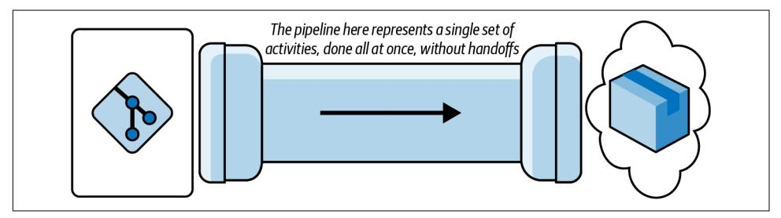
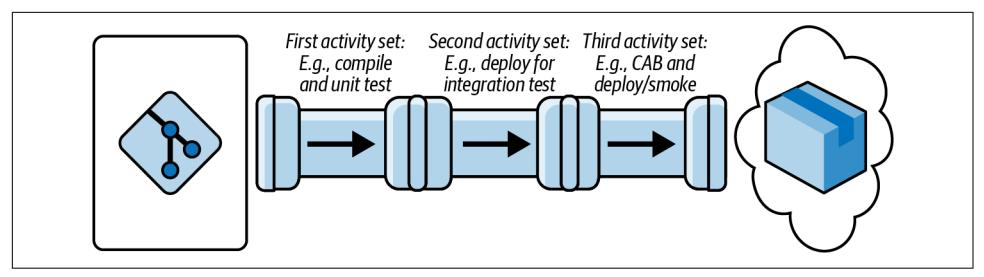
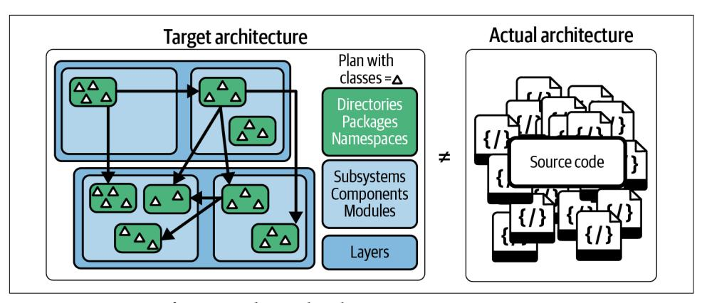
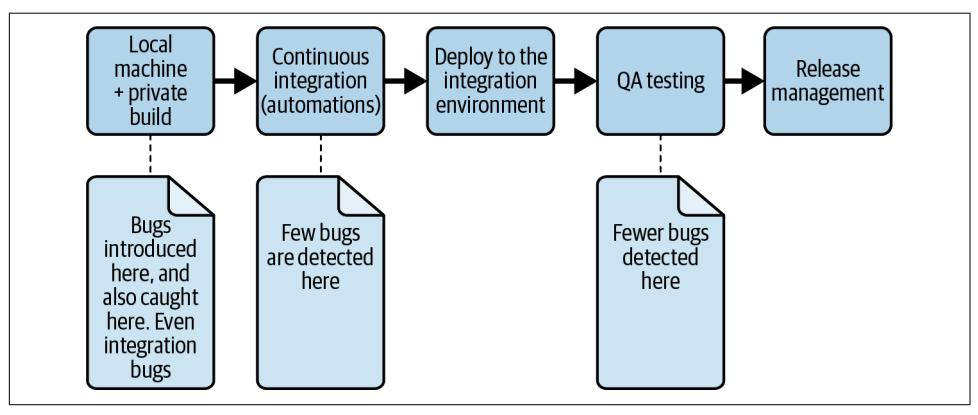
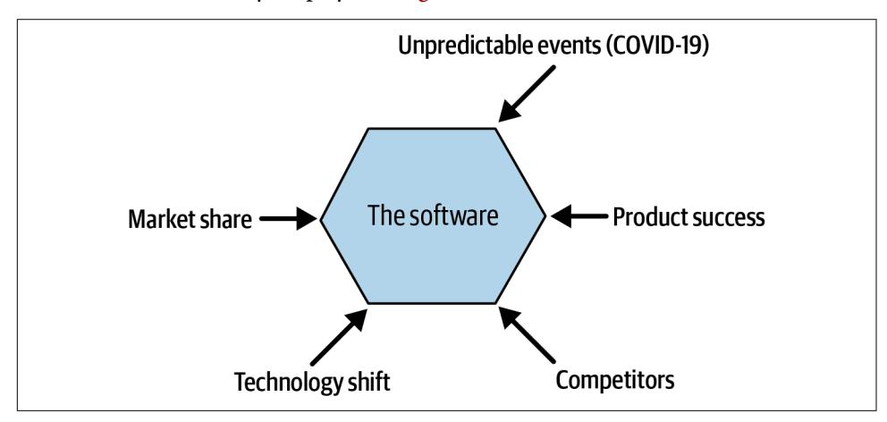
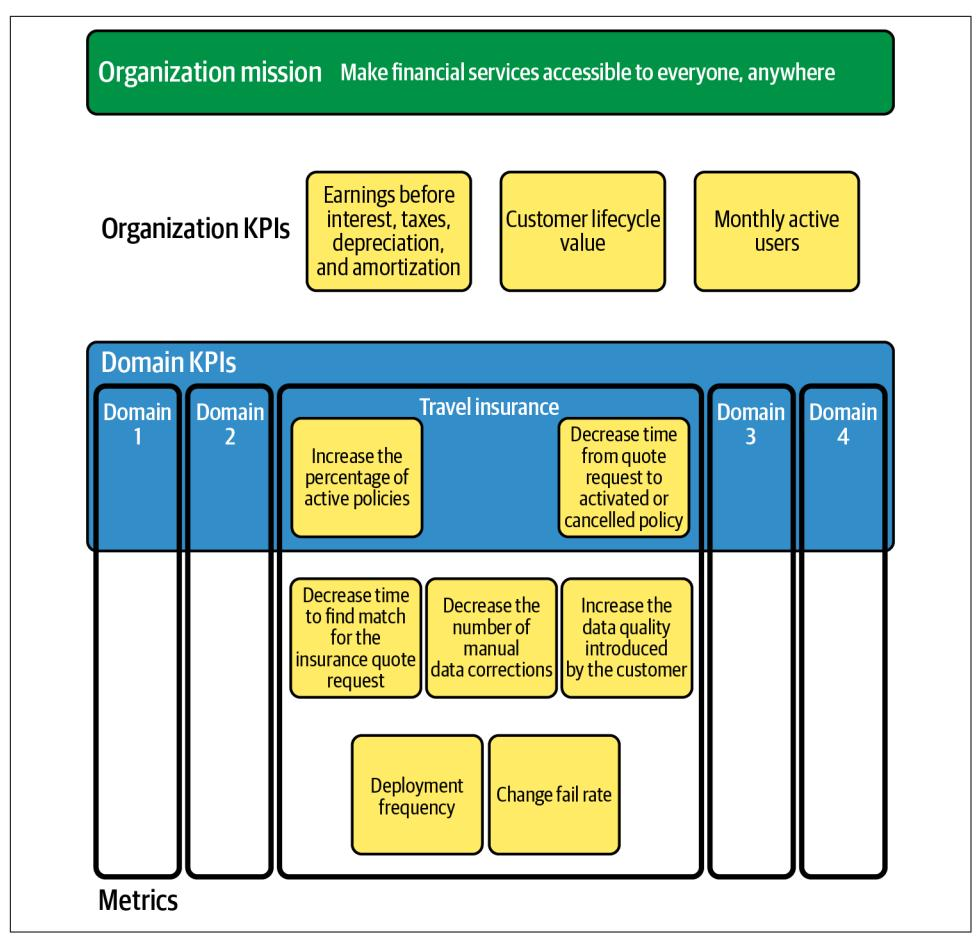
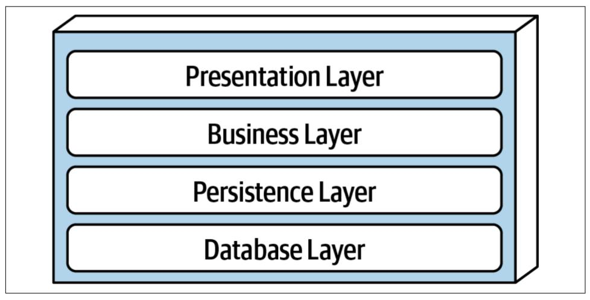
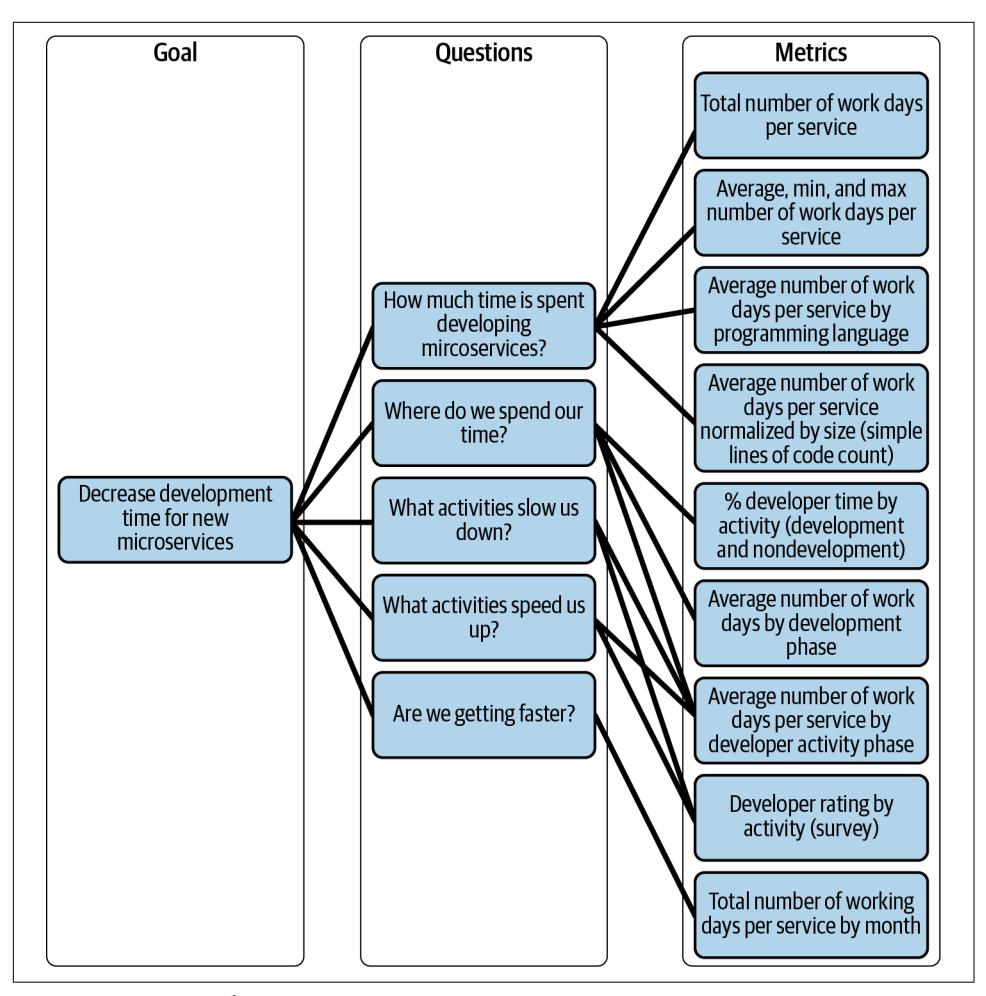
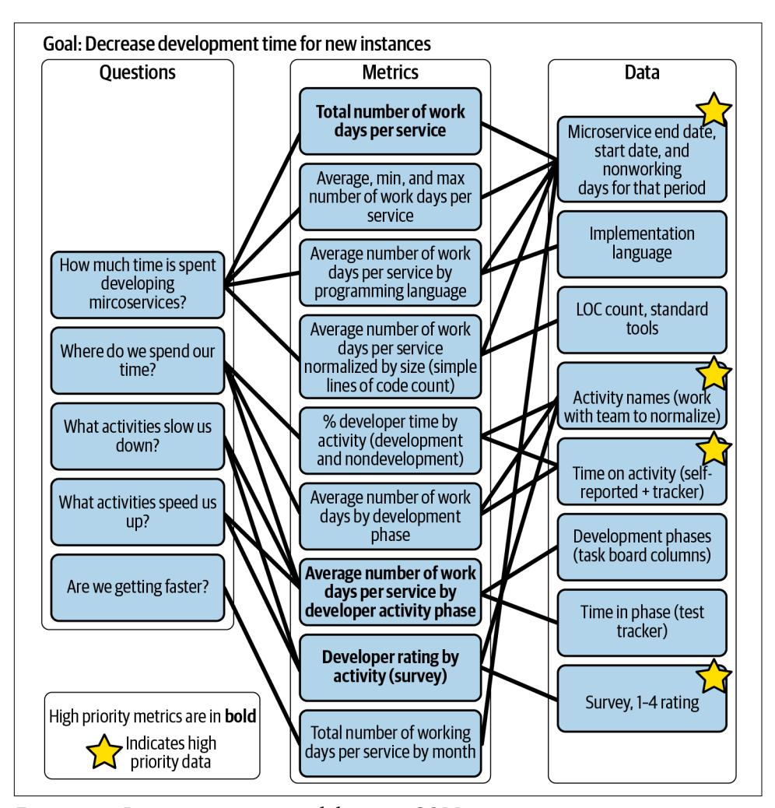

# O'REILLY®

# Software Architecture Metrics

Case Studies to Improve the Quality of Your Architecture


Christian Ciceri, Dave Farley, Neal Ford, Andrew Harmel-Law, Michael Keeling, Carola Lilienthal, João Rosa, Alexander von Zitzewitz, Rene Weiss & Eoin Woods


## Software Architecture Metrics

Software architecture metrics play a key role in keeping software projects maintainable and ensuring high-quality architecture, as well as warning of dangerous accumulations of architectural and technical debt. In this practical book, leading hands-on software architects Christian Ciceri, Dave Farley, Neal Ford, Andrew Harmel-Law, Michael Keeling, Carola Lilienthal, João Rosa, Alexander von Zitzewitz, Rene Weiss, and Eoin Woods share case studies to introduce metrics every software architect should know.

This isn't a book about theory. It's more about practice and implementation, based on real-world experience and written for software architects and developers. This book shares key software architecture metrics to help you set the right KPIs and measure the results. You'll learn more about decision and measurement effectiveness.

## Learn how to:

- Measure how well your software architecture is meeting your goals
- Choose the right metrics to track (and skip the ones you don't need)
- Improve observability, testability, and deployability
- Prioritize software architecture projects
- · Build insightful and relevant dashboards

**Christian Ciceri** is a software architect and cofounder at Apiumhub.

Dave Farley is a thought-leader in the field of continuous delivery, DevOps, and software development.

**Neal Ford** is a director, software architect, and meme wrangler at Thoughtworks.

**Andrew Harmel-Law** is a tech principal at Thoughtworks.

**Dr. Carola Lilienthal** is managing director of Workplace Solutions GmbH.

**Michael Keeling** is an experienced software architect, agile practitioner, and programmer.

João Rosa is an independent consultant focused on organization development, and coauthor of the book *Visual Collaboration Tools*.

Alexander von Zitzewitz is a founder of hello2morrow

Rene Weiss is a CTO at Finabro.

Eoin Woods is CTO at Endava.

SOFTWARE ARCHITECTURE

US \$65.99 CAN \$82.99 ISBN: 978-1-098-11223-3


Twitter: @oreillymedia linkedin.com/company/oreilly-media youtube.com/oreillymedia

# **Software Architecture Metrics**

*Case Studies to Improve the Quality of Your Architecture*

*Christian Ciceri, Dave Farley, Neal Ford, Andrew Harmel-Law, Michael Keeling, Carola Lilienthal, João Rosa, Alexander von Zitzewitz, Rene Weiss, and Eoin Woods*


## **Software Architecture Metrics**

by Christian Ciceri, Dave Farley, Neal Ford, Andrew Harmel-Law, Michael Keeling, Carola Lilienthal, João Rosa, Alexander von Zitzewitz, Rene Weiss, and Eoin Woods

Copyright © 2022 Apiumhub S.L. All rights reserved.

Printed in the United States of America.

Published by O'Reilly Media, Inc., 1005 Gravenstein Highway North, Sebastopol, CA 95472.

O'Reilly books may be purchased for educational, business, or sales promotional use. Online editions are also available for most titles (*<http://oreilly.com>*). For more information, contact our corporate/institutional sales department: 800-998-9938 or *corporate@oreilly.com*.

**Acquisitions Editor:** Melissa Duffield **Development Editor:** Sarah Grey **Production Editor:** Katherine Tozer

**Copyeditor:** nSight, Inc. **Proofreader:** Sonia Saruba **Indexer:** Sue Klefstad **Interior Designer:** David Futato **Cover Designer:** Karen Montgomery

**Illustrator:** Kate Dullea

May 2022: First Edition

## **Revision History for the First Edition**

2022-05-18: First Release 2023-11-17: Second Release

See *<http://oreilly.com/catalog/errata.csp?isbn=9781098112233>* for release details.

The O'Reilly logo is a registered trademark of O'Reilly Media, Inc. *Software Architecture Metrics*, the cover image, and related trade dress are trademarks of O'Reilly Media, Inc.

The views expressed in this work are those of the authors and do not represent the publisher's views. While the publisher and the authors have used good faith efforts to ensure that the information and instructions contained in this work are accurate, the publisher and the authors disclaim all responsibility for errors or omissions, including without limitation responsibility for damages resulting from the use of or reliance on this work. Use of the information and instructions contained in this work is at your own risk. If any code samples or other technology this work contains or describes is subject to open source licenses or the intellectual property rights of others, it is your responsibility to ensure that your use thereof complies with such licenses and/or rights.

# **Table of Contents**

|     | Preface                                                                                                                                                                                                                                                                                                                                                                                                                                                                                                    | vii                                                                                                      |
|-----|------------------------------------------------------------------------------------------------------------------------------------------------------------------------------------------------------------------------------------------------------------------------------------------------------------------------------------------------------------------------------------------------------------------------------------------------------------------------------------------------------------|----------------------------------------------------------------------------------------------------------|
| 1.  | Four Key Metrics Unleashed.                                                                                                                                                                                                                                                                                                                                                                                                                                                                                | 1                                                                                                        |
|     | Definition and Instrumentation                                                                                                                                                                                                                                                                                                                                                                                                                                                                             | 2                                                                                                        |
|     | Refactoring Your Mental Model                                                                                                                                                                                                                                                                                                                                                                                                                                                                              | 3                                                                                                        |
|     | Pipelines as Your First Port of Call                                                                                                                                                                                                                                                                                                                                                                                                                                                                       | 4                                                                                                        |
|     | Locating Your Instrumentation Points                                                                                                                                                                                                                                                                                                                                                                                                                                                                       | 6                                                                                                        |
|     | Capture and Calculation                                                                                                                                                                                                                                                                                                                                                                                                                                                                                    | 10                                                                                                       |
|     | Display and Understanding                                                                                                                                                                                                                                                                                                                                                                                                                                                                                  | 12                                                                                                       |
|     | Target Audience                                                                                                                                                                                                                                                                                                                                                                                                                                                                                            | 13                                                                                                       |
|     | Visualization                                                                                                                                                                                                                                                                                                                                                                                                                                                                                              | 13                                                                                                       |
|     | Front Page                                                                                                                                                                                                                                                                                                                                                                                                                                                                                                 | 17                                                                                                       |
|     | Discussions and Understanding                                                                                                                                                                                                                                                                                                                                                                                                                                                                              | 18                                                                                                       |
|     | Ownership and Improvement                                                                                                                                                                                                                                                                                                                                                                                                                                                                                  | 18                                                                                                       |
|     | Conclusion                                                                                                                                                                                                                                                                                                                                                                                                                                                                                                 | 19                                                                                                       |
| 2.  | The Fitness Function Testing Pyramid: An Analogy for Architectural Tests and Metrics...                                                                                                                                                                                                                                                                                                                                                                                                                    | 21                                                                                                       |
|     | Fitness Functions and Metrics                                                                                                                                                                                                                                                                                                                                                                                                                                                                              | 21                                                                                                       |
|     | Fitness Functions: Test Coverage                                                                                                                                                                                                                                                                                                                                                                                                                                                                           | 23                                                                                                       |
|     | Fitness Functions: Integration Tests with Network Latency                                                                                                                                                                                                                                                                                                                                                                                                                                                  | 24                                                                                                       |
|     | Introduction to Fitness Function Categories                                                                                                                                                                                                                                                                                                                                                                                                                                                                | 25                                                                                                       |
|     | Mandatory Fitness Function Categories                                                                                                                                                                                                                                                                                                                                                                                                                                                                      | 25                                                                                                       |
|     | Optional Fitness Function Categories                                                                                                                                                                                                                                                                                                                                                                                                                                                                       | 28                                                                                                       |
|     | Fitness Function Categories: Catalog Overview                                                                                                                                                                                                                                                                                                                                                                                                                                                              | 30                                                                                                       |
|     | The Testing Pyramid                                                                                                                                                                                                                                                                                                                                                                                                                                                                                        | 30                                                                                                       |
|     | The Fitness Function Testing Pyramid                                                                                                                                                                                                                                                                                                                                                                                                                                                                       | 32                                                                                                       |
|     | The Top Layer                                                                                                                                                                                                                                                                                                                                                                                                                                                                                              | 33                                                                                                       |
|     | The Middle Layer                                                                                                                                                                                                                                                                                                                                                                                                                                                                                           | 34                                                                                                       |
|     |                                                                                                                                                                                                                                                                                                                                                                                                                                                                                                            |                                                                                                          |
|     | The Bottom Layer<br>Examples and Their Full Categorization<br>Fully Categorizing Top-Layer Examples<br>Developing Your Fitness Functions and Metrics<br>Conclusion                                                                                                                                                                                                                                                                                                                                         | 34<br>35<br>37<br>39<br>41                                                                               |
| 3.  | Evolutionary Architecture: Guiding Architecture with Testability and Deployability..<br>The Importance of Learning and Discovery<br>The Tools of Sustainable Change<br>Testability: Creating High-Quality Systems<br>Deployability: Scaling Development of Our Systems<br>Conclusion                                                                                                                                                                                                                       | 43<br>44<br>44<br>45<br>47<br>47                                                                         |
| 4.  | Improve Your Architecture with the Modularity Maturity Index..<br>Technical Debt<br>Origination of Technical Debt<br>Assessment with the MMI<br>Modularity<br>Hierarchy<br>Pattern Consistency<br>Calculating the MMI<br>Architecture Review to Determine the MMI<br>Conclusion                                                                                                                                                                                                                            | 49<br>49<br>50<br>52<br>53<br>54<br>56<br>57<br>61<br>63                                                 |
| 5.  | Private Builds and Metrics: Tools for Surviving DevOps Transitions..<br>Key Terms<br>CI/CD<br>DevOps<br>The "Ownership Shift"<br>Empowering the Local Environment Again<br>The Private Build<br>Case Study: The Unstable Trunk<br>Bug A1<br>Bug A2<br>Bug A3<br>Bug A4<br>Case Study: The Blocked Consultant<br>Metrics<br>Time to Feedback<br>Inevitable Integration Issues in the Deployed Application per Iteration<br>Time Spent Restoring Trunk Stability per Iteration<br>The Cost of Private Builds | 65<br>66<br>66<br>67<br>68<br>69<br>70<br>72<br>72<br>73<br>73<br>73<br>74<br>75<br>76<br>76<br>77<br>78 |
|     | Metrics in Practice                                                                                                                                                                                                                                                                                                                                                                                                                                                                                        | 78                                                                                                       |
|     | High Time to Feedback, High Evitable Integration Issues,                                                                                                                                                                                                                                                                                                                                                                                                                                                   |                                                                                                          |
|     | Low Time to Trunk Stability                                                                                                                                                                                                                                                                                                                                                                                                                                                                                | 78                                                                                                       |
|     | Low Time to Feedback, High Evitable Integration Issues,                                                                                                                                                                                                                                                                                                                                                                                                                                                    |                                                                                                          |
|     | Low Time to Trunk Stability                                                                                                                                                                                                                                                                                                                                                                                                                                                                                | 79                                                                                                       |
|     | High Time to Feedback, Low Evitable Integration Issues,                                                                                                                                                                                                                                                                                                                                                                                                                                                    |                                                                                                          |
|     | Low Time to Trunk Stability                                                                                                                                                                                                                                                                                                                                                                                                                                                                                | 79                                                                                                       |
|     | Low Evitable Integration Issues and High Time to Trunk Stability                                                                                                                                                                                                                                                                                                                                                                                                                                           | 79                                                                                                       |
|     | Conclusion                                                                                                                                                                                                                                                                                                                                                                                                                                                                                                 | 80                                                                                                       |
| 6.  | Scaling an Organization: The Central Role of Software Architecture.                                                                                                                                                                                                                                                                                                                                                                                                                                        | 81                                                                                                       |
|     | YourFinFreedom Breaks the Monolith                                                                                                                                                                                                                                                                                                                                                                                                                                                                         | 83                                                                                                       |
|     | Implementing a Distributed Big Ball of Mud                                                                                                                                                                                                                                                                                                                                                                                                                                                                 | 85                                                                                                       |
|     | Seeking Direction                                                                                                                                                                                                                                                                                                                                                                                                                                                                                          | 87                                                                                                       |
|     | From Best Effort to Intentional Effort                                                                                                                                                                                                                                                                                                                                                                                                                                                                     | 88                                                                                                       |
|     | Increasing Software Architecture Intentionality, Guided by Metrics                                                                                                                                                                                                                                                                                                                                                                                                                                         | 91                                                                                                       |
|     | Managing Expectations with Communication                                                                                                                                                                                                                                                                                                                                                                                                                                                                   | 99                                                                                                       |
|     | Learning and Evolving the Architecture                                                                                                                                                                                                                                                                                                                                                                                                                                                                     | 102                                                                                                      |
|     | And What About Anna?                                                                                                                                                                                                                                                                                                                                                                                                                                                                                       | 104                                                                                                      |
|     | Conclusion                                                                                                                                                                                                                                                                                                                                                                                                                                                                                                 | 104                                                                                                      |
| 7.  | The Role of Measurement in Software Architecture.                                                                                                                                                                                                                                                                                                                                                                                                                                                          | 105                                                                                                      |
|     | Adding Measurement to Software Architecture                                                                                                                                                                                                                                                                                                                                                                                                                                                                | 106                                                                                                      |
|     | Measurement Approaches                                                                                                                                                                                                                                                                                                                                                                                                                                                                                     | 108                                                                                                      |
|     | Runtime Measurement of Applications and Infrastructure                                                                                                                                                                                                                                                                                                                                                                                                                                                     | 108                                                                                                      |
|     | Software Analysis                                                                                                                                                                                                                                                                                                                                                                                                                                                                                          | 109                                                                                                      |
|     | Design Analysis                                                                                                                                                                                                                                                                                                                                                                                                                                                                                            | 109                                                                                                      |
|     | Estimates and Models                                                                                                                                                                                                                                                                                                                                                                                                                                                                                       | 109                                                                                                      |
|     | Fitness Functions                                                                                                                                                                                                                                                                                                                                                                                                                                                                                          | 110                                                                                                      |
|     | Measuring System Qualities                                                                                                                                                                                                                                                                                                                                                                                                                                                                                 | 110                                                                                                      |
|     | Performance                                                                                                                                                                                                                                                                                                                                                                                                                                                                                                | 111                                                                                                      |
|     | Scalability                                                                                                                                                                                                                                                                                                                                                                                                                                                                                                | 113                                                                                                      |
|     | Availability                                                                                                                                                                                                                                                                                                                                                                                                                                                                                               | 114                                                                                                      |
|     | Security                                                                                                                                                                                                                                                                                                                                                                                                                                                                                                   | 116                                                                                                      |
|     | Getting Started                                                                                                                                                                                                                                                                                                                                                                                                                                                                                            | 118                                                                                                      |
|     | Hypothetical Case Study                                                                                                                                                                                                                                                                                                                                                                                                                                                                                    | 119                                                                                                      |
|     | Pitfalls                                                                                                                                                                                                                                                                                                                                                                                                                                                                                                   | 121                                                                                                      |
|     | Conclusion                                                                                                                                                                                                                                                                                                                                                                                                                                                                                                 | 123                                                                                                      |
| 8.  | Progressing from Metrics to Engineering.                                                                                                                                                                                                                                                                                                                                                                                                                                                                   | 125                                                                                                      |
|     | The Path to Fitness Functions                                                                                                                                                                                                                                                                                                                                                                                                                                                                              | 125                                                                                                      |
|     | From Metrics to Engineering                                                                                                                                                                                                                                                                                                                                                                                                                                                                                | 127                                                                                                      |
|     | Automation Operationalizes Metrics                                                                                                                                                                                                                                                                                                                                                                                                                                                                         | 130                                                                                                      |
|     | Case Study: Coupling                                                                                                                                                                                                                                                                                                                                                                                                                                                                                       | 132                                                                                                      |
|     | Case Study: Zero-Day Security Check                                                                                                                                                                                                                                                                                                                                                                                                                                                                        | 136                                                                                                      |
|     | Case Study: Fidelity Fitness Functions                                                                                                                                                                                                                                                                                                                                                                                                                                                                     | 138                                                                                                      |
|     | Conclusion                                                                                                                                                                                                                                                                                                                                                                                                                                                                                                 | 141                                                                                                      |
| 9.  | Using Software Metrics to Ensure Maintainability                                                                                                                                                                                                                                                                                                                                                                                                                                                           | 143                                                                                                      |
|     | The Case for Using Metrics                                                                                                                                                                                                                                                                                                                                                                                                                                                                                 | 143                                                                                                      |
|     | Entropy Kills Software                                                                                                                                                                                                                                                                                                                                                                                                                                                                                     | 144                                                                                                      |
|     | The Toxicity of Cyclic Dependencies                                                                                                                                                                                                                                                                                                                                                                                                                                                                        | 146                                                                                                      |
|     | How Metrics Can Help                                                                                                                                                                                                                                                                                                                                                                                                                                                                                       | 147                                                                                                      |
|     | Why Are Metrics Not More Widely Used?                                                                                                                                                                                                                                                                                                                                                                                                                                                                      | 148                                                                                                      |
|     | Tools to Gather Metrics                                                                                                                                                                                                                                                                                                                                                                                                                                                                                    | 149                                                                                                      |
|     | Useful Metrics                                                                                                                                                                                                                                                                                                                                                                                                                                                                                             | 150                                                                                                      |
|     | Metrics to Measure Coupling and Structural Erosion                                                                                                                                                                                                                                                                                                                                                                                                                                                         | 150                                                                                                      |
|     | Metrics to Measure Size and Complexity                                                                                                                                                                                                                                                                                                                                                                                                                                                                     | 160                                                                                                      |
|     | Change History Metrics                                                                                                                                                                                                                                                                                                                                                                                                                                                                                     | 162                                                                                                      |
|     | Other Useful Metrics                                                                                                                                                                                                                                                                                                                                                                                                                                                                                       | 163                                                                                                      |
|     | Architectural Fitness Functions                                                                                                                                                                                                                                                                                                                                                                                                                                                                            | 165                                                                                                      |
|     | How to Track Metrics over Time                                                                                                                                                                                                                                                                                                                                                                                                                                                                             | 167                                                                                                      |
|     | A Few Golden Rules for Better Software                                                                                                                                                                                                                                                                                                                                                                                                                                                                     | 168                                                                                                      |
|     | Conclusion                                                                                                                                                                                                                                                                                                                                                                                                                                                                                                 | 169                                                                                                      |
| 10. | Measure the Unknown with the Goal-Question-Metric Approach                                                                                                                                                                                                                                                                                                                                                                                                                                                 | 171                                                                                                      |
|     | The Goal-Question-Metric Approach                                                                                                                                                                                                                                                                                                                                                                                                                                                                          | 172                                                                                                      |
|     | Create a GQM Tree                                                                                                                                                                                                                                                                                                                                                                                                                                                                                          | 172                                                                                                      |
|     | Prioritize Metrics and Devise a Data Collection Strategy                                                                                                                                                                                                                                                                                                                                                                                                                                                   | 174                                                                                                      |
|     | Case Study: The Team That Learned to See the Future                                                                                                                                                                                                                                                                                                                                                                                                                                                        | 177                                                                                                      |
|     | System Context                                                                                                                                                                                                                                                                                                                                                                                                                                                                                             | 177                                                                                                      |
|     | Incident #1: Too Many Requests to the Foo Service                                                                                                                                                                                                                                                                                                                                                                                                                                                          | 179                                                                                                      |
|     | Incident #2: Seeing the Future                                                                                                                                                                                                                                                                                                                                                                                                                                                                             | 181                                                                                                      |
|     | Reflection                                                                                                                                                                                                                                                                                                                                                                                                                                                                                                 | 182                                                                                                      |
|     | Run a GQM Workshop                                                                                                                                                                                                                                                                                                                                                                                                                                                                                         | 182                                                                                                      |
|     | Workshop Summary                                                                                                                                                                                                                                                                                                                                                                                                                                                                                           | 182                                                                                                      |
|     | Workshop Steps                                                                                                                                                                                                                                                                                                                                                                                                                                                                                             | 184                                                                                                      |
|     | Facilitation Guidelines and Hints                                                                                                                                                                                                                                                                                                                                                                                                                                                                          | 185                                                                                                      |
|     | Conclusion                                                                                                                                                                                                                                                                                                                                                                                                                                                                                                 | 186                                                                                                      |
|     | Index                                                                                                                                                                                                                                                                                                                                                                                                                                                                                                      | 189                                                                                                      |

# **Preface**

<span id="page-8-0"></span>Software architecture metrics are used to measure the maintainability and architec‐ tural quality of a software project, and to provide warnings early in the process about any dangerous accumulations of architectural or technical debt. In this book, 10 leading hands-on practitioners (Christian Ciceri, David Farley, Neal Ford, Andrew Harmel-Law, Michael Keeling, Carola Lilienthal, João Rosa, Alexander von Zitzewitz, Rene Weiss, and Eoin Woods) introduce key software architecture metrics that every software architect should know. The architects in this group have all published renowned software architecture articles and books, regularly participate in interna‐ tional events, and give practical workshops.

We all strive to balance theory and practice. This book, however, is not about theory; it's about practice and implementation, about what has already been tried and has worked, with valuable experiences and case studies. We focus not only on improv‐ ing the quality of architecture but on associating objective metrics with business outcomes in ways that account for your own situation and the trade-offs involved.

We conducted a survey and found that there is strong demand for software architec‐ ture metrics resources, yet very few are available. We hope this contribution will make a difference and help you set the right KPIs and measure the results accurately and insightfully.

We are grateful to the Global Software Architecture Summit, which reunited us and gave us the idea of writing a software architecture metrics book together. All of the book's chapters and case studies are as different as the authors themselves: we made a point of using examples from different industries and challenges so that every reader can find a solution or an inspiration.

# <span id="page-9-0"></span>**What Will You Learn?**

By the end of this book you'll understand how to:

- Measure how well your software architecture is meeting goals
- Guide your architecture toward testability and deployability
- Prioritize software architecture work
- Create predictability from observability
- Identify key KPIs for your software project
- Build and automate a metrics dashboard
- Analyze and measure the success of your project or process
- Build goal-driven software architecture

# **Who This Book Is For**

This book is written by and for software architects. If you're eager to explore suc‐ cessful case studies and learn more about decision and measurement effectiveness, whether you work in-house for a software development company or as an independ‐ ent consultant, this book is for you.

The 10 authors, all experienced practitioners, share their advice and wisdom, present‐ ing diverse viewpoints and ideas. As you work on different projects, you might find some chapters more relevant to your work than others. You might use this book on a regular basis, or you might use it once to set the KPIs and then come back to it later to teach and inspire new team members.

Having the right software architecture metrics and tools can make architecture checking much faster and less costly. It can allow you to run checks throughout the life of a software project, starting right at the beginning. Metrics also help you evaluate your software architecture at each sprint to make sure it's not drifting toward becoming impossible to maintain. They can also help you compare architectures to pick the one that best fits your project's requirements.

# **Conventions Used in This Book**

The following typographical conventions are used in this book:

*Italic*

Indicates new terms, URLs, email addresses, filenames, and file extensions.

<span id="page-10-0"></span>

#### Constant width

Used for program listings, as well as within paragraphs to refer to program elements such as variable or function names, databases, data types, environment variables, statements, and keywords.

# **O'Reilly Online Learning**


For more than 40 years, *[O'Reilly Media](https://oreilly.com)* has provided technol‐ ogy and business training, knowledge, and insight to help companies succeed.

Our unique network of experts and innovators share their knowledge and expertise through books, articles, and our online learning platform. O'Reilly's online learning platform gives you on-demand access to live training courses, in-depth learning paths, interactive coding environments, and a vast collection of text and video from O'Reilly and 200+ other publishers. For more information, visit *<https://oreilly.com>*.

# **How to Contact Us**

Please address comments and questions concerning this book to the publisher:

O'Reilly Media, Inc. 1005 Gravenstein Highway North Sebastopol, CA 95472 800-998-9938 (in the United States or Canada) 707-829-0515 (international or local) 707-829-0104 (fax)

We have a web page for this book, where we list errata, examples, and any additional information. You can access this page at *<https://oreil.ly/software-architecture-metrics>*.

Email *[bookquestions@oreilly.com](mailto:bookquestions@oreilly.com)* to comment or ask technical questions about this book.

For news and information about our books and courses, visit *<https://oreilly.com>*.

Find us on LinkedIn: *<https://linkedin.com/company/oreilly-media>*.

Follow us on Twitter: *<https://twitter.com/oreillymedia>*.

Watch us on YouTube: *<https://www.youtube.com/oreillymedia>*.

# **Acknowledgments**

This book wouldn't be possible without the contribution of the authors, O'Reilly editors, and Apiumhub, who gathered all of us together. We would like to say an additional thank you to:

- Apiumhub CMO Ekaterina Novoseltseva, who managed the process of writing this book and publishing it with O'Reilly and also wrote the introduction
- O'Reilly Senior Acquisitions Editor Melissa Duffield, who took care of us and made our experience with O'Reilly smooth and pleasant
- O'Reilly Developmental Editor Sarah Grey, who structured our content and made it easily readable
- O'Reilly Production team: Katherine Tozer, Adam Lawrence, Steve Fenton, Greg‐ ory Hyman, and Kristen Brown, who copyedited and distributed the book

# **Christian Ciceri**

I would like to say thank you to Ekaterina Novoseltseva and [Apiumhub](https://apiumhub.com) for giving me the chance to write this book, which was always in my dreams. [Global Software](https://gsas.io) [Architecture Summit](https://gsas.io) for meeting all these software architects, who push me forward and who generate interesting discussions. [VYou app,](https://www.vyou-app.com/en) for making me innovate and implement new software architecture metrics. And additional thanks goes to my cat, who is always there for me, supporting me in any situation.

# **Dave Farley**

Thanks to the folks at Apiumhub and O'Reilly for herding the cats and organizing me, and everyone else, to make this book possible.

# **Neal Ford**

Thanks to Ekaterina and the others at Apiumhub for doing the cat-herding required to make this a reality. Thanks to my employer Thoughtworks and all its employees, who always surprise me with their level of passion and engagement in the technology world. And last and always, thanks to my wife Candy for putting up with all this writing, which takes me away from her and our kittens-becoming-cats.

# **Andrew Harmel-Law**

Thank you to my wife and children for putting up with me and to my coworkers at Thoughtworks for inspiring me and letting me take this approach to its logical conclusion.

The claims made in this chapter might have been half theoretical had I not had the chance to put this all into practice at an organization that really got and trusted me. [Open GI,](https://opengi.co.uk) a specialized SaaS provider for the insurance industry in the UK and Ireland, was that client, and thank you to everyone whom I worked with there. My codeveloper/coconspirator Pete Hunter deserves a special mention. He grokked what we were doing immediately, championed it unrelentingly, improved it relentlessly (as we paired on this every step of the way), and taught me so much about how we could make it work.

Thanks finally to Ekaterina and Apiumhub for asking me to be involved, chasing me up, and answering all my stupid questions.

# **Michael Keeling**

My sincere thanks go out to Anastas Stoyanovsky, Colin Dean, George Fairbanks, Joe Runde, and Ricky Kotermanski, who all helped review early chapter drafts. Addition‐ ally, thank you to all my colleagues, both current and former, with whom I've had the privilege to work. Experience reports like the ones in this book can only be written by teams that take risks and try out new ideas. Never stop seeking out ways to become even more awesome than you already are!

Marie, my queen, thank you for helping me find the time to work on writing projects like this one. To Owen, thank you. To Finn, saaanoot!

# **Carola Lilienthal**

My thanks go to all the many great scientists and computer scientists I have had the privilege to work with in my professional life. Many are my colleagues in my company, WPS (Workplace Solutions), or those I meet at conferences and get to learn from in lectures and discussions. I also thank my family, who always encourage and support me when a book or an article needs to be written.

# **João Rosa**

None of my projects would be possible without the support of my wife, Kary. You and our beautiful little one are the center of my life. Thanks! A special thanks to Xebia for supporting me in this journey. Sharing knowledge is in our DNA. I also would like to acknowledge our technical reviewers, namely Ruth Malan, Anna Shipman, Steve Pereira, and Nick Tune; Apiumhub, for challenging me to write a chapter; and Fai Fung, Thijs Wesselink, and Kenny Baas-Schwegler for reviewing an early version of the chapter draft. Last note, for all of you who are not mentioned here: my memory is terrible, and I can't recall all your names. Somehow you have influenced my career, and I'm grateful for it.

# **Alexander von Zitzewitz**

I want to thank my wife Charmaine, my sons, and the great team at hello2morrow for always having my back and supporting my projects with wisdom, good advice, and a lot of patience. Without their continuous support, my work on this book and other achievements in life would not have been possible.

# **Rene Weiss**

This is a very special happening for me, as this is my first contribution to a book. I had the chance to work with many people who inspired me along my career. I want to introduce two of them here, as they had a major impact on how I actually think about software architecture. These two are Stefan Toth and Stefan Zörner from embarc (Germany), who are great software architects, trainers, and coaches. While I worked with them I was introduced to the idea of evolutionary architectures, and this "seed" finally led to the ideas shared in this book chapter. If you have the chance to meet them at a conference or get your hands on one of their books (at the moment only in German), I would highly recommend that.

Finally, I want to thank my girlfriend and partner Anna. She always supported my shifts and ideas in my professional career, and I wouldn't be where I am today, without her. Thank you.

# **Eoin Woods**

I'd like to thank my family for their continual support of all of my time-consuming professional projects. I also want to thank Chris Cooper-Bland and Nick Rozanski for their extensive and insightful review of early versions of my chapter, which allowed me to improve it significantly. Our technical reviewers and the excellent team at O'Reilly have made a huge contribution to the quality of the book, so thank you to all of you too. Finally, thank you to my colleagues at Endava who create such a collegiate place to work and yet continually challenge me to be "the best that I can be."

# <span id="page-14-0"></span>**Four Key Metrics Unleashed**

### *Andrew Harmel-Law*

You'd be forgiven for thinking that Dr. Nicole Forsgren, Jez Humble, and Gene Kim's groundbreaking book *Accelerate* (IT Revolution Press, 2018) is both the first and last word on how to transform your software delivery performance, all measured by the simple yet powerful four key metrics.

Having based my transformation work around many of their book's recommenda‐ tions, I certainly have no issue with any of its content. But rather than removing the need for anything in even greater detail, I think the book should be discussed and analyzed further to enable the sharing of experiences and the gathering of a community of people practicing architecture who want to improve. I hope that this chapter will contribute to such a discussion.

I have seen, when used in the way described later in the chapter, that the four key metrics—deployment frequency, lead time for changes, change failure rate, and time to restore service—lead to a flowering of learning and allow teams to understand the need for a high-quality, loosely coupled, deliverable, testable, observable, and maintainable architecture. Deployed effectively, the four key metrics can allow you as an architect to loosen your grip on the tiller. Instead of dictating and controlling, you can use the four key metrics to generate conversations with team members and stimulate desire to improve overall software architecture beyond yourself. You can gradually move toward a more testable, coherent and cohesive, modular, faulttolerant and cloud native, runnable, and observable architecture.

In the sections that follow, I'll show to get your four key metrics up and running, as well as (more importantly) how you and your software teams can best use the metrics to focus your continuous improvement efforts and track progress. My focus is on the practical aspects of visualizing the mental model of the four key metrics, sourcing the

**1**

<span id="page-15-0"></span>required three raw data points, then calculating and displaying the four metrics. But don't worry: I'll also discuss the benefits of architecture that runs in production.

# **Definition and Instrumentation**

*Paradigms are the sources of systems. From them, from shared social agreements about the nature of reality, come system goals and information flows, feedbacks, stocks, flows and everything else about systems.*

—Donella Meadows, *Thinking in Systems: A Primer*<sup>1</sup>

The mental model that underpins *Accelerate* gives rise to the four key metrics. I begin here because this mental model is essential to keep in mind as you read this chapter. In its simplest form, the model is a pipeline (or "flow") of activities that starts whenever a developer pushes their code changes to version control, and ends when these changes are absorbed into the running system that the teams are working on, delivering a running service to its users. You can see this mental model in Figure 1-1.


*Figure 1-1. The fundamental mental model behind the four key metrics*

For clarity, let's visualize what the four key metrics measure within this model:

#### *Deployment frequency*

The number of individual changes that make their way out of the end of the pipe over time. These changes might consist of "deployment units": code, config, or a combination of both, including, for example, a new feature or a bug fix.

#### *Lead time for changes*

The time a developer's completed code/config changes take to make their way through the pipeline and out the other end.

Taken together, this first pair measures *development throughput*. This should not be confused with *lean cycle time* or *lead time*, which includes time to write the code,

<sup>1</sup> Donella Meadows, *Thinking in Systems: A Primer*, ed. Diana Wright (Chelsea Green Publishing, 2008), p. 162.

<span id="page-16-0"></span>sometimes the clock even starting when the product manager first comes up with the idea for their new feature.

#### *Change failure rate*

The proportion of changes coming out the pipe that cause a failure in our running service. (The specifics of what defines a "failure" will be covered shortly. For now, just think of failure as something that stops users of your service from getting their tasks done.)

#### *Time to restore service*

How long it takes, after the service experiences a failure, to become aware of it and deliver the fix that restores the service to users.<sup>2</sup>

Taken together, this second pair gives an indication of *service stability*.

The power of these four key metrics is in their combination. If you improve an element of development throughput but degrade service stability in the process, then you're improving in an unbalanced way and will fail to realize long-term sustainable benefits. The fundamental point is that you keep an eye on all of the four key metrics. Transformations that realize predictable, long-term value are ones that deliver posi‐ tive impact *across the board.*

Now that we are clear on where our metrics come from, we can complicate matters by mapping the generic mental model onto your actual delivery process. I'll spend the next section showing how to perform this "mental refactoring."

# **Refactoring Your Mental Model**

Defining each metric *for your circumstances* is essential. As you have most likely guessed, the first two metrics are underpinned by what happens in your CI pipelines, and the second pair require tracking service outages and restoration.

Consider scope carefully as you perform this mental refactoring. Are you looking at all changes for all pieces of software across your organization? Or are you considering those in your program of work alone? Are you including infrastructure changes or just observing those for software and services? All these possibilities are fine, but remember: *the scope you consider must be the same for each of the four metrics.* If you include infrastructure changes in your lead time and deployment frequency, include outages induced by infrastructure changes, too.

<sup>2</sup> This need not be a code fix. We're thinking about service restoration here, so something like an automatic failover is perfectly fine to stop the clock ticking.

# <span id="page-17-0"></span>**Pipelines as Your First Port of Call**

Which pipelines should you be considering? The ones you need are those that listen for code and config changes in a source repository within your target scope, perform various actions as a consequence (such as compilation, automated testing, and packaging), and deploy the results into your production environment. You don't want to include CI-implemented tasks for things like database backups.

If you only have one code repository served by one end-to-end pipeline (e.g., a monolith stored in a monorepo and deployed directly, and in a single set of activities, to production), then your job here is easy. The model for this is shown in Figure 1-2.



*Figure 1-2. The simplest source-control/pipeline/deployment model you'll find*

Unfortunately, while this is exactly the same as our fundamental mental model, I've rarely seen this in reality. We'll most likely have to perform a much broader refactoring of the mental model to reach one that represents your circumstances.

The next easiest to measure and our first significant mental refactor is a collection of these end-to-end pipelines, one per artifact or repository (for example, one per microservice), each of which does all its own work and, again, ends in production ([Figure 1-3](#page-18-0)). If you're using Azure DevOps, for example, it's simple to create these.<sup>3</sup>

<sup>3</sup> In fact, it's the model Microsoft wants you to adopt.

<span id="page-18-0"></span>

*Figure 1-3. The "multiple end-to-end pipelines model" is ideal for microservices*

These first two pipeline shapes are most likely *similar* to what you have, but I'm going to guess that your version of this picture will be slightly more complicated and require one more refactor to be split into a series of subpipelines ([Figure 1-4](#page-19-0)). Let's consider an example that shows three of these subpipelines, which fit end-to-end to deliver a change to production.

Perhaps the first subpipeline listens for pushes to the repo and undertakes compila‐ tion, packaging, and unit and component testing, then publishes to a binary artifact repository. Maybe this is followed by a second, independent subpipeline that deploys this newly published artifact to one or more environments for testing. Possibly a third subpipeline, triggered by something like a CAB process,<sup>4</sup> finally deploys the change to production.

<sup>4</sup> CAB stands for "change-advisory board." The most famous example is the group that meets regularly to approve releases of code and config in the classic book *[The Phoenix Project](https://oreil.ly/b5609)* (IT Revolution Press, 2018), by Gene Kim, Kevin Behr, and George Spafford.

<span id="page-19-0"></span>

*Figure 1-4. The "pipeline made of multiple subpipelines" model, which I encounter frequently*

Hopefully you've identified your circumstances. But if not, there is a fourth major variety of pipeline, which our final mental-refactoring step will get us to: the multi‐ stage fan-in, shown in Figure 1-5. Here we typically find individual subpipelines for the first stage, one per repository, which then "fan in" to a shared subpipeline or set of subpipelines that take the change the rest of the way to production.


*Figure 1-5. The multistage "fan-in pipeline" model*

# **Locating Your Instrumentation Points**

As well as having four metrics, we have four instrumentation points. Let's now move to locating them in our mental model, whatever form yours takes. We've focused on pipelines so far because they typically provide two of those points: a commit time‐ stamp and a deployment timestamp. The third and fourth instrumentation points come from the timestamps created when a service degradation is detected and when it is marked as "resolved." We can now discuss each in detail.

#### **Commit timestamp**

Subtleties inevitably arise here when you consider teams' work practices. Are they branching by feature? Are they doing pull requests? Do they have a mix of differ‐ ent practices? Ideally (as the authors of *Accelerate* suggest), your clock starts tick‐ ing whenever any developer change-set is considered complete and is committed,

<span id="page-20-0"></span>wherever that might be. If the teams are doing this, beware: this holding of changes on branches not only extends feedback cycles but also adds both overhead and infrastructure requirements to your effort. (I'll cover those in the next section.)

Because of this complexity, some choose to use the triggering of a pipeline from a merge to main as a proxy trigger point or commit timestamp. I understand that this might sound like admitting defeat in the face of suboptimal practice,<sup>5</sup> but if you choose a proxy trigger, I know you will have a guilty conscience (because you know you're not following standard best practice). Whether we include the extra wait time or not, the metrics will lead to many other benefits for you even if you give yourself a break and start your early sampling when the code hits main. If and when these proxies do turn out to be the source of significant delivery suboptimization, *Accelerate* has recommendations for you (such as trunk-based development and pair programming),<sup>6</sup> which play into your commit timestamp by making the time a change hits main as the time you want to start the timer. By then, you'll have begun to see the benefits of the metrics and want to improve your capture of them.

#### **Deployment timestamp**

With the commit time out of the way, you'll be pleased to hear that the "stop" of the clock is far simpler: it's when the pipeline doing the final deployment to production completes. Doesn't this give those who do manual smoke testing *after the fact* a break? Yes, but again I'll leave this to your conscience, and if you really want to include this final activity, you can always put a manual checkpoint at the end of your pipelines, which the QA (or whoever checks deployments) presses once they are satisfied that the deployment was successful.

#### **Complexities arising from multistage and fan-in pipelines**

Given these two data sources, you can calculate the information we need from our pipelines, and that is *total time to run*: the elapsed time between clock start and clock stop. If you have one of the simpler pipeline scenarios we discussed earlier, the ones that do not fan in, then this is relatively easy. Those with one or more end-to-end pipelines have it easiest of all.<sup>7</sup>

<sup>5</sup> Especially if you have long-lived branches or never-ending pull requests, but I bet you're aware of those anyway, and they're not difficult to quantify in isolation either.

<sup>6</sup> See [the documentation](https://oreil.ly/L5cs0) for all you'd ever want to know about trunk-based development. See [Extreme Pro‐](https://oreil.ly/pGAfY) [gramming](https://oreil.ly/pGAfY) for the original definition of pair programming.

<sup>7</sup> If this makes you think that having multiple independent pipelines—one per artifact—is a good idea, congrat‐ ulations: you've reminded yourself of one of the key tenets of microservices—independent deployability. If this makes you pine for the monolith, then remember the other benefits microservices bring, some of which we'll get to at the end of this chapter.

If you are unlucky and have multiple subpipelines (as we saw in [Figure 1-4](#page-19-0)), then you'll need to perform additional data collection to the change set(s) that were included in a "start" timestamp and in the "deploy" to production. Given this data, you can do some processing to calculate the total time to run for each individual change.

If you run a fan-in design (shown in [Figure 1-5\)](#page-19-0), this processing will likely be more involved. Why? As you'll see in Figure 1-6, you'll need a way of knowing where the change-deployment number 264 originated (Repo A, Repo B, or Repo C) so you can get the "start" timestamp for the change. If your deployment aggregates a number of changes, then you will need to trace each back individually to get its "start" time.


*Figure 1-6. Locating your data collection points in the "fan-in pipeline" model variant*

Clearly, in all cases, no matter how complicated your pipelines, you only want to count builds that deploy service updates to users. Make sure you only measure these.<sup>8</sup>

There's one final point to make about data capture from pipelines before we move on, and that is which pipeline runs to count? Again, *Accelerate* isn't explicit on this point, but you only care about the runs that succeed. If a build starts but fails at the compilation step, it will skew your lead times in an artificially positive direction because you will have just added a really quick build in the mix. If you want to game things (and the biggest benefit of the four key metrics is that they're not gameable, at least not to my knowledge), then you just submit lots of builds you know will break, ideally, *really* quickly.

<sup>8</sup> The question sometimes arises, "What about infra builds?" I've seen those included in "four key metrics" calculations, but I wouldn't get upset if they weren't included. As for pipelines triggered by time rather than change? Don't count them. They won't result in a deployment because nothing has changed.

<span id="page-22-0"></span>

#### **Monitoring for service failures**

While it is relatively simple to be accurate about measurements around our pipelines, the third and final source of raw information is far more open to interpretation.

The difficulties arise in defining "a failure in production." If there is a failure but no one spots it, was it even really there? Whenever I have used the four key metrics, I have answered this in the negative. I define "failures in production" as anything that makes a consumer of the service unable, or even disinclined, to stick around to complete the job they were attempting to perform. Cosmetic defects don't count as service failures, but a "working system" so slow as to cause uncharacteristic user dropout clearly is experiencing a service failure. There is an element of judgment in this, and that's fine: pick a definition that makes you comfortable and be honest with yourself as you stick to it.

You now need to record service failures, which are our third and final instrumen‐ tation point, typically by means of a "change failure" ticket. The opening of this ticket gives you a start time data point for another clock; closing it gives you the corresponding end time. This start and end time, plus the number of tickets, are all the remaining data points you will need. A ticket should be closed when service is restored. This might not correspond to the root cause of the failure being addressed; that's fine. We're talking about service stability. Rolling back so you're online and serving customers is acceptable here.<sup>9</sup>

But what if you're not in production? First, haven't you tried to start moving to continuous deployment yet? You really ought to. But second, this option isn't avail‐ able to everyone. It's suboptimal, but you can still use the four key metrics in these circumstances. To do so, you need to define your "highest environment": the shared one closest to production into which all teams are delivering. It's probably called SIT (for system integration), pre-prod, or staging. The key thing is that when you accept your changes, you believe there is no more work required to take your changes on the final step to production.

Given all these considerations, you need to treat this "highest environment" just like you would production. Treat testers and collaborating teams as your "users." They get to define service failures. Treat the test failures as seriously as you would real failures. It's not perfect to pretend this environment is production, but it's better than nothing.

<sup>9</sup> Again, some will point out that the opening time of a ticket is not the same as the time when the service failure first strikes. Correct. Perhaps you want to tie your monitoring to the creation of these tickets to get around this. If you have the means, congratulations: you are probably in the "fine-tuning" end of four key metrics adoption. Most, at least when they start out, can only dream of this accuracy, and so, given that, it will suffice if you start with manual tickets.

# <span id="page-23-0"></span>**Capture and Calculation**

*Systems modelers say that we change paradigms by building a model of the system, which takes us outside the system and forces us to see the whole.*

—Donella Meadows, *Thinking in Systems*<sup>10</sup>

Now that you have your definitions, you can start capturing and calculating. While it's desirable to automate this capture process, it's perfectly acceptable to do it man‐ ually.<sup>11</sup> In fact, every time I've rolled out the four key metrics, this is where I've started, and frequently not only for our initial baseline. You'll understand in a few paragraphs why it's fine to capture and calculate manually.

Capturing metrics can be a simple or complex task, depending on the nature of your pipelines. Regardless, the four key metrics will be calculated using four sets of data arising from the four instrumentation points: successful change deployment counts, total times to run the pipeline(s) for each change, counts of change failure tickets, and the length of time change failure tickets are open. These captured data sets alone are not enough to get your metrics; you still need to calculate, so let's look at each of these in turn:

#### *Deployment frequency*

This is a frequency, not a count, and therefore you need the total number of successful deployments *within a given time period* (I've found that a day works well). If you have multiple pipelines, whether you fan-in or not, you'll want to sum the number of deployments from them all.

With this data, recorded and summed on a daily basis (remember to include the "zero" sums for days with no deploys), it's simple to get to your first headline metric. Working with the latest daily figure or the figure from the last 24 hours will (in my experience) suffer from too much fluctuation. It works best to display the mean over a longer time period, such as the last 31 days.

#### *Lead time for changes*

This is the elapsed time *for any single change that triggers the start.* This can fluctuate, so don't just report the most recent figure from the latest deployment. If you have multiple (including fan-in) pipelines, this fluctuation will be far greater, because some builds run a *lot* faster than others due to blocking. You want something a bit more stable that reflects the general state of affairs, as opposed to the latest outlier. Consequently, I usually take each individual lead time measurement and calculate the mean of all of them over the course of a day.

<sup>10</sup> Meadows, p. 163.

<sup>11</sup> Make sure you're honest with yourself: collect all the builds you ought to and don't cherry-pick. Try to be as accurate as possible in your figures, too, and if you guess, estimate your degree of accuracy.

<span id="page-24-0"></span>The figure to report is the mean of all the lead time measurements over the last 31 days.<sup>12</sup>

#### *Change failure rate*

This is the proportion of change failure tickets resolved, specifically the number of deployments that gave rise to failures as a fraction of the total number of deployments over the same period. For example, if you had 36 deployments in a day, and within the same day you resolved 2 change failures, that would mean your change failure rate for that day was 2/36, or 5.55555556%.

To get to your reported metric, look at this rate over the same time period: the previous 31 days. That means you sum the number of restored failures over the last 31 days, then divide that by the total number of deployments over the same period.

You'll notice that there is a leap of faith here. We're assuming that the failures are distinct *and* that a single failure is caused by a single deployment. Why? Because in my experience it's just too hard to tie failures back to individual builds, and in the vast majority of incidents, these two assumptions hold, at least enough to make them worth the loss in fidelity. If you're in a position to be smarter about this, congratulations!

The sharp-eyed will also note that we're only talking about *resolved* failures. Why are we not including failures that are still open? Because we want consistency across all four of our metrics and because time to restore service can only consider resolved failures.<sup>13</sup> If we can't count unresolved failures for one thing, we don't want to count them for the other. But never fear: we still have the data on open failures, and we don't hide this, as you'll see in the sections that follow.

#### *Time to restore service*

This is the time a change failure ticket takes to go from being created to being closed. The authors of *Accelerate* call this *mean time to restore service*, though in earlier *State of DevOps* reports, it was just *time to restore*, and in the *[METRICS.md](https://oreil.ly/VlSgn)* file for the *Four Keys* project from Google, it's *median time to restore*. I've used both *mean* and *median*; the former is sensitive to outliers, and sometimes that's exactly what you want to see as you learn.

Both mean and median are easy to calculate from your change failure tickets' time-to-resolution data. Either way, you want to select your inputs across a data range. I usually end up using the last 120 days. Take all the failure resolution

<sup>12</sup> Remember! You can't average an average without introducing issues, so it's best to avoid it. We do daily totals so we can have a nice, pretty graph behind our metrics, which we'll get to later.

<sup>13</sup> Because unresolved failures, sadly, don't have "resolved" timestamps.

<span id="page-25-0"></span>times that fell within that period, calculate their mean, and report it for this metric.

This has the potential for another leap of faith: when you raise change failures manually, it's possible to skew these figures by delaying ticket opening beyond the immediate point of discovery. In all honesty, even if people have the best of intentions, skewing will happen. Yet you'll still get good enough data to keep an eye on things and drive improvements.

However you capture your data that feeds into these calculations, make sure it all happens out in the open. First, encourage development teams to read up on the four key metrics. There should be nothing secret about your effort.

Second, make all your raw data and calculations available, as well as the calculated headline figures. This becomes important later.

Third, ensure that the definitions you have specifically applied to each metric, and how you are treating those definitions, are available *alongside the data itself*. This transparency will deepen understanding and heighten engagement.<sup>14</sup>

Pay attention to this question of access (access to data, calculations, and visualiza‐ tions), because if your four key metrics aren't shared with everyone, then you are missing out on their greatest strength.

# **Display and Understanding**

*[So] how do you change paradigms?...You keep pointing at the anomalies and failures in the old paradigm. You keep speaking and acting, loudly and with assurance, from the new one.*

—Donella Meadows, *Thinking in Systems*<sup>15</sup>

Whenever I've deployed the four key metrics, I've typically started with a *minimal viable dashboard* (MVD),<sup>16</sup> which is a grand name for a wiki page with the following:

- The current calculated values of each of the four key metrics
- The definitions of each metric, and the time periods across which we calculate them
- The historical values of the data

I also flag the data sources so everyone can engage with them.

<sup>14</sup> It might even get you a few bug reports on your calculations if you have them wrong—some of my best learnings around the four key metrics have come in this way.

<sup>15</sup> Meadows, p. 163.

<sup>16</sup> Props to Matthew Skelton and Manuel Pais for their "minimal viable platform" idea, which inspired this.

# <span id="page-26-0"></span>**Target Audience**

Metrics, like all statistics, tell a story, and stories have audiences. Who is the target audience for the four key metrics? Primarily, the teams delivering the software, the people who will actually make the changes if they want to see the metrics improve.

You therefore want to ensure that wherever and however you choose to display things, it needs to be in a place that is *primarily* readily accessible to these individuals and groups. The "readily" is important. It needs to be trivially easy to see the metrics and to drill down into them and find out more, typically, those data points that are specific to the services they own.

There are other audiences for the four key metrics, but these are secondary. One secondary audience might be senior management or executive management. It is fine for them to see the metrics, but the metrics need to be rolled up and read-only. If executive management wants to know more detail, then they will come down to the teams to obtain it, and that is exactly what you want to happen.

Ideally, the moment you have your MVD up, you can start work on automating collection and calculation. As I write this, there are various options. Perhaps you will end up using [Four Keys](https://oreil.ly/BPRaw) from Google, [Metrik](https://oreil.ly/1EDTb) from Thoughtworks, or various extensions for platforms, such as [Azure DevOps](https://oreil.ly/vMSBR). I've not used any of them, and while I am certain all are fit for our purpose, I'll share the benefits of my experience hand-rolling one in the hope it will help you evaluate whether you want to use something off the shelf or invest in the time and effort to make something bespoke.

# **Visualization**

One home-baked effort resulted in the most fully featured dashboard I've ever worked with. It was constructed with Microsoft PowerBI (because the client was all in with Azure DevOps). After a bunch of wrestling with dates and times, we captured our raw data, made our calculations, and set about creating our graphs and other visual display elements.

#### **Deployment frequency**

For this data, we chose a bar graph [\(Figure 1-7](#page-27-0)) with dates on the x-axis and the number of deploys on the y-axis. Each bar represents that day's total, and we pulled key stats into summary figures.

<span id="page-27-0"></span>

*Figure 1-7. Deployment frequency; the bottom right box indicates a "DORA Elite" (DevOps Research and Assessment) level of software delivery performance*

Average deployments per day shows the deployment frequency key metric, and we highlighted in our key metrics in green to indicate "Elite" on the Accelerate Elite-Low software delivery performance scale.<sup>17</sup> For additional transparency, we showed deploys for the current day and the total number of deploys over the period graphed (31 days). Finally, we plotted the mean, 95th, and overall data trends as dotted lines on the graph.

#### **Lead time for changes**

The bar graph in [Figure 1-8](#page-28-0) shows our lead time for changes data, again with dates on the x-axis and now with the *mean* of lead time for the given day in the bars along the y-axis.

<sup>17</sup> See Figures [2-2](#page-44-0) and [2-3](#page-46-0) in *Accelerate*, as well as more up-to-date tables in the latest DORA *[State of DevOps](https://oreil.ly/IetZp)* [report](https://oreil.ly/IetZp).

<span id="page-28-0"></span>

*Figure 1-8. Lead time for changes; the bottom right box indicates a "DORA High" level of software delivery performance on the Accelerate rating scale*

As before, we highlighted the key metric for the screen, which here was a mean of the lead time over the period shown, and highlighted in our key metrics to indicate "Low" on the Elite-Low performance scale. We also found it useful to highlight our longest individual lead time (see the box on the bottom left).<sup>18</sup>

We realized we kept asking, "Did we do a lot of deploys on that day?" Rather than add more trend lines, we shadow-plotted the number of deploys (in light gray) alongside the lead times.

#### **Change failure rate**

[Figure 1-9](#page-29-0) shows yet another bar graph for change failure rate, but this metric presents quite differently. As you can see from the y-axis, we typically had either zero failures or a single failure within a given 24-hour period.<sup>19</sup> It was thus *very clear* when we had problems.

<sup>18</sup> We had a blocked build. It's not difficult to spot. We also used the word "average" rather than "mean" to make it more approachable.

<span id="page-29-0"></span>

*Figure 1-9. Change failure rate; the bottom right box indicates a "DORA Elite" level of software delivery performance on the Accelerate rating scale*

Everything on top of this is context. Coplotting the number of deploys lets us quickly answer the question, "Was this perhaps due to a lot of deployment activity that day?"

Finally, as usual at the bottom, you can see our key metric: the number of failures as a percentage of the total deploys in the time period. Accompanying this yet again are some other important stats: the number of active failures and the total number of deploys in the time period shown.

#### **Time to restore service**

The presentation of the final metric, time to restore service, is the one we spent most time getting comfortable with—but once we understood and stabilized our deployment frequency and lead times, this metric became our primary focus.<sup>20</sup> Yet again, we have a time-series bar graph ([Figure 1-10\)](#page-30-0), but now with values plotted over a longer timescale than the others (120 days, for better context) so that we could

<sup>19</sup> Sometimes we saw multiple failures, but this was very unusual.

<sup>20</sup> From experience, I'm willing to wager that this will become your focus too.

<span id="page-30-0"></span>compare how we were improving against a metric that ought to have a great deal fewer data points. Again, we coplotted the lead time for changes to give some context.


*Figure 1-10. Time to restore service; the bottom left box indicates zero open change fail‐ ures—not a DORA metric, but important to know—and the bottom right box indicates a "DORA High" level of software delivery performance*

Finally, as usual at the bottom right, you can see our key metric: the median of all times to restore for restored failures within the given period. Accompanying this are other key stats: the number of active failures and the total number of restored failures in the time period shown.

# **Front Page**

We weren't done. Our PowerBI report also had a "Four Key Metrics" front page, which comprised the key metric numbers from each individual statistics page as well as the graphs of deployment frequency and lead time. The goal was to give people an idea of the stats *in real time*, rapidly and accurately. As our focus changed, we might have promoted other graphs.

As I've suggested, we're now in a position to unlock the real power of the four key metrics. Giving the teams access to, and ensuring they understand, these metrics, as <span id="page-31-0"></span>well as the model and system that underpin them, is of utmost importance if you are to reap their real benefits. That's what allows them to discuss, understand, own, and improve the software you deliver.

# **Discussions and Understanding**

*There's nothing physical or expensive or even slow in the process of paradigm change. In a single individual it can happen in a millisecond. All it takes is a click in the mind, a falling of scales from the eyes, a new way of seeing.*

—Donella Meadows, *Thinking in Systems*<sup>21</sup>

How did we end up with these visualizations, extra details, and specific time periods? We iterated, making additions and improvements as required.

Every week we collectively discussed upcoming spikes and architectural decision records (ADRs)<sup>22</sup> and looked at the four key metrics. Early on, the conversations were about what each metric meant. Subsequent weeks' discussions centered on why the numbers were where they lay (e.g., if the numbers were too high or too low, if data was missing, etc.), then on how to improve them. Slowly but surely, team members got used to the four key metrics mental model. Allowing teams to self-serve their data in real time and to view only the data from their pipelines (both of which were made easy by the PowerBI dashboards) helped immensely. So did adding trend lines, which we shortly followed up with the ability to see timescales longer than the default 31 days.

I was amazed at the value of these focused, enlightened, and cross-functional discus‐ sions. As an architect, these problems and issues would previously have fallen to me alone to spot, understand, analyze, and remedy. Now, the teams were initiating and driving solutions themselves.

# **Ownership and Improvement**

Whenever teams begin taking ownership, I've witnessed, again and again, the follow‐ ing. First come the easiest requests, the ones to modernize processes and ways of working: "Can we change the cadence of releases?" Next, teams begin to care more about quality: "Let's pull tests left" and "Let's add more automation."<sup>23</sup> Then come the requests to change the team makeup: "Can we move to cross-functional (or stream-aligned) teams?"

<sup>21</sup> Meadows, p. 163.

<sup>22</sup> The term ADR was first conceived by Michael Nygard.

<sup>23</sup> Much to the delight of QAs and operations. I've frequently seen QAs use the four key metrics to drive change as much as I have as an architect.

<span id="page-32-0"></span>There are always trade-offs, failures, and lessons to learn, but *the change will drive itself.* You'll find yourself modifying and adapting your focus and solutions as you increase focus on and better understand the benefits of *end-to-end* views.

All of these changes rapidly end up in one place: they reveal architectural problems. Perhaps these problems are there in the designs on the whiteboard. Perhaps the whiteboard was fine, but the implementation that ended up in production wasn't. Either way, you have things you need to solve. Some of these things include coupling that isn't as loose as you thought; domain boundaries that aren't quite as crisp as they initially appeared; frameworks that get in the way of teams instead of helping them; modules and infrastructure that are perhaps not as easy to test as you had hoped; or microservices that, when running with real traffic, are impossible to observe. These are problems that you, as the responsible architect, would typically have to deal with.

# **Conclusion**

Now you face a choice. You could continue to go it alone, keep your hands on the tiller, and steer the architectural ship to the best of your ability, alone in command. Or you could take advantage of this flowering within your teams. You could take your hands off the tiller, maybe gradually at first, and use the conversations and motivation the four key metrics unlock to slowly move toward your shared goal: more testable, decoupled, fault-tolerant, cloud native, runnable, and observable architecture.

That's what places the four key metrics among the most valuable architectural metrics out there. I hope you'll use them, along with your partners, to codeliver the best architecture you've ever seen.

# <span id="page-34-0"></span>**The Fitness Function Testing Pyramid: An Analogy for Architectural Tests and Metrics**

*Rene Weiss*

Fitness functions, a concept borrowed from evolutionary computing, are a concise method that can also be used to define software system metrics. This chapter will show you how fitness functions can help you define metrics tailored to your system and use them to improve your system's architecture, whether you're currently build‐ ing a new system or improving an existing one. Combining fitness functions and metrics with the testing pyramid concept can help you define, prioritize, and balance your metrics and enables you to measure progress toward your objective.

# **Fitness Functions and Metrics**

In their book *Building Evolutionary Architectures*, Neal Ford, Rebecca Parsons, and Patrick Kua define a fitness function as "an objective function used to summarize how close a prospective design solution is to achieving the set aims."<sup>1</sup> Such a function usually outputs a discrete value, which is the metric you're trying to achieve or improve. To know whether you've reached your goal, you need a test or verification mechanism that measures the desired metric. Ideally, you'll want this to be automa‐ ted, but that's not a requirement for fitness functions!

I like the notion of using fitness functions to create target metrics, since they are very flexible. You can also use fitness functions to describe and integrate typical metrics

<sup>1</sup> Ford, Parsons, and Kua, *Building Evolutionary Architectures* (O'Reilly, 2017), [Chapter 1.](https://oreil.ly/tWGOM)

<span id="page-35-0"></span>(such as code coverage or code structure metrics like cyclomatic complexity),<sup>2</sup> but their openness lets you tailor architectural metrics to your system and context.

The concept map in Figure 2-1 illustrates the relation between a fitness function and a target metric. The fitness function defines the target metric and describes the relevant context, which I call the *fitness function context*. This may include additional information about the environment, definitions, and limitations that influence the testing; I'll break these up into certain categories and describe them in more detail later.


*Figure 2-1. Fitness function concept map*

The *architectural test* produces the target metric. Often, such tests also directly verify that the created metric is above (or below) a certain threshold. Usually, these tests are automated and executed as part of continuous integration (CI) workflows. Some can be even run and verified continuously without a specific trigger. I use the terms *architectural tests* and *architectural verification* to explicitly distinguish them from functional tests. For example, a functional test might see whether it can properly create a new customer in the system; an architectural test might instead see whether it can create 10 customers while also achieving an architectural or qualitative goal. For example, the architectural test in this scenario creates a metric for how fast these 10 customers were created and verifies if that was within 10 milliseconds.

The fitness function, its context, and the actual target metric are strongly interlinked. We define all three at *design time*. The architectural test is created afterward and is not part of the definition of the fitness function and its metric.

If the architectural test is automated, which I highly recommend, after its implemen‐ tation, the metric will be created automatically. You may need to change something in the system or architecture, evaluate new tools and frameworks, and be creative on the "engineering" side while implementing the test. This is all done after you define

<sup>2</sup> Cyclomatic complexity is a widely used code metric that is usually derived using static code analysis tools. It was developed by Thomas J. McCabe in 1976. A high value indicates that the code is difficult to understand and may be difficult to change.

<span id="page-36-0"></span>the goal and metric. How and when to define the fitness function and implement an architectural test is part of ["Developing Your Fitness Functions and Metrics" on](#page-52-0) [page 39.](#page-52-0)

In a nutshell, the fitness function acts as your definition of "good." Let's look at some examples.

# **Fitness Functions: Test Coverage**

In this hypothetical system, it is crucial that we keep unit test coverage above a threshold of 90%.<sup>3</sup> The target for automated integration tests is above 50% line coverage. Let's see how it looks to describe these two goals as fitness functions with context (Examples 2-1 and 2-2).

```
Example 2-1. A fitness function
Unit Test Coverage > 0.9; 
Execute on each CI Build; Fail when below target coverage
Example 2-2. A fitness function
Integration Test Coverage > 0.5; 
Execute on each nightly integration test build; 
Fail when below target coverage
```

As you can see from these simple examples, the fitness function defines a target metric to be met (the test coverage), a context (the kind of tests to execute and when to execute) that is relevant for the metric, and additional contextual information needed to automatically verify the metric.

The actual implementation (such as measuring the code covered during the test execution, as described in Example 2-1; or setting up a specific test environment, performing the tests, and verifying the outcome, as for Example 2-2) is part of implementing the architectural test.

<sup>3</sup> *Test coverage* is a term in software development to measure the degree of how much source code is covered by a certain set of tests. For instance, it is very common to measure the lines of code ("line coverage") that have been touched ("tested") while automated tests are executed. There are also other ways to measure (such as branch coverage), but I am sticking with line coverage for the simple explanation: if a program with 100 lines of code has test coverage of 80%, 80 lines of this code have been touched by the test execution.

# <span id="page-37-0"></span>**Fitness Functions: Integration Tests with Network Latency**

The system you are testing is integrating with a third-party system using a REST/ JSON API. If that API is slow or unresponsive, the stability and performance of your own system will decrease, so you want to verify that your system handles such events properly and performs as expected. Here's what the fitness function might look like (Example 2-3).

#### *Example 2-3. A fitness function*

Integration test errors = 0% (when network latency is 10s for third-party API call); Execute on each nightly integration test build; Fail when integration test fails

In this example, the parts of the fitness function might not be as obvious as in the first two examples. The metric to be met is the 0% test errors (no errors), given the context to simulate a 10-second network latency for our third-party API calls while executing the integration.

The actual test implementation is responsible for setting up the environment, simu‐ lating a network latency of 10 seconds for the third-party API call, executing the integration test build nightly, and then failing on any error raised by those integration tests.

A variation of Example 2-3 is to combine the same context with an additional metric, such as the overall throughput of our system, while having a network latency of 10 seconds, thereby testing that a certain fallback mechanism is working properly (Example 2-4).

#### *Example 2-4. A fitness function*

Integration test errors = 0% (when network latency is 10s for third-party API call); Execute on each nightly integration test build; Fail when integration test fails; Fail when test execution duration is > 10 minutes (standard execution time, without network latency is below 5 minutes)

For this variation, I added an additional metric: a certain performance target should also be met. Provided that the context is again specifying a 10-second network latency, we verify that our system's fallback mechanism works and the whole system still performs within a certain time frame (a maximum of double the execution compared to standard network latency).

# <span id="page-38-0"></span>**Introduction to Fitness Function Categories**

Fitness functions stretch across many categories (I also like to call these *dimensions* and will use both terms in the chapter synonymously). For me, these dimensions should guide developers in defining the most useful fitness functions for their soft‐ ware systems. Fitness functions always exist across a combination of the dimensions presented here; note, however, that not all random combinations of these categories are possible or meaningful.

Ford, Parsons, and Kua provide a very good descriptive list of these categories, most of which I will reuse here. I also extend their list with additional ones that I consider important.

It is a good idea to use these dimensions as guidance and input to consider all relevant aspects when you create and define a fitness function and the target metric, and when you subsequently implement the final test that creates and verifies the target metric. You can use the dimensions as a catalog where you pick and choose the right combination for your system and context (later I'll give a brief overview). As always in software development, only use the categories that provide concrete information, direction, and meaning to the team or teams working with them.

Next, we'll look at six categories I consider mandatory, followed by four I consider optional.

# **Mandatory Fitness Function Categories**

The following six categories are mandatory to me, as using these categories always makes sense for software development endeavors. Hence, if you don't think about them during the development of the fitness function, the metric and its test would lead to a nonideal definition that is missing some important aspect of a fitness function definition.

#### **Is the feedback atomic or holistic?**

How much of the system is involved while being tested to create the metric? In the real world, this category is more of a continuum than a binary, but for ease of understanding, we'll look at the ends of that continuum as two distinct categories.

*Atomic* fitness functions verify only partial or limited aspects of the system. Thus, a positive verification doesn't necessarily provide feedback on the whole system's per‐ formance—just that limited part of the system. Typical examples include executing static code analysis, such as measuring cyclomatic complexity as an indication of maintainability, or measuring unit test coverage as an indication of maintainability and testability.

<span id="page-39-0"></span>*Holistic* fitness functions, on the other hand, provide broader feedback. Positive verification from a holistic fitness function means that a large part of the system is performing as expected and that end users can use the system as intended. Holistic functions tend to be harder to build and maintain.

#### **What triggers test execution?**

In addition to executing tests manually, you usually develop tests to execute automat‐ ically by a certain trigger, such as a CI workflow that is executed by a developer's action or a scheduled test run (e.g., nightly). Continual fitness functions, by contrast, are evaluated continuously, independent of development activities (such as constant verification of metrics and their thresholds). Continual feedback is usually linked to real-world measurements performed in production environments and the evaluation of metrics that are gathered while the system is running. Fitness functions that are in the continual category are also often in the technical area of system monitoring (tools); for example, monitoring the response time of a certain service could be such a fitness function.

#### **Where is the test executed?**

Is the test in question being executed in a test system or in production? Another option is to run the tests within a continuous integration/continuous delivery (CI/CD) pipeline (for instance, measuring unit test code coverage directly on a host of the CI/CD system). The function may be evaluated in a test system (such as performance or load tests). In some cases, tests can even be derived directly from the production system. These classifications may overlap: for example, if a performance test is running in a test environment and a CI/CD pipeline initiates test execution. This category determines where the test is executed, whether you need additional hardware, and if the test will affect a running production system.

#### **Metric type**

The metric type is a rather obvious one to consider. What kind of value does the architectural test produce? Is it just a true/false statement ("all tests are green"), or is a numeric value being produced? Additionally, you should consider if the metric being produced will be stored and visualized in a time series, where the time series is providing the valuable output.

#### **Automated versus manual**

It may be useful to execute some tests manually. This is usually the case when automating them would require too much effort, would cost too much, or would just not be feasible to do so. For example, a test for legal requirements could be expressed <span id="page-40-0"></span>as a fitness function, but it would not be meaningful to automate it.<sup>4</sup> Generally, though, software architects like to automate things so we can run tests as easily and often as possible.

#### **Quality attribute requirements**

For me, the most important category is defining the *quality attributes* (also known as the quality attribute *requirements* or *quality goals*) for a software system*.* In gen‐ eral, there are three key drivers when developing a software architecture: functional requirements, quality attributes, and constraints. Quality goals define how well some‐ thing has to work. They outline how well the functional requirements of the overall product have to work together, and they state additional qualitative requirements to the system (such as how easy it is to adapt a certain part of the system). Quality goals are therefore very important in the development of software architectures, according to Bass, Clements, and Kazman.<sup>5</sup>

International Organization for Standardization (ISO) norm 25010 provides an exam‐ ple catalog of quality attributes. It lists eight main characteristics of product quality and then breaks them down into more specific subattributes (see Table 2-1).

| Attribute              | Subattribute                    |
|------------------------|---------------------------------|
| Functional suitability | Functional completeness         |
|                        | Functional correctness          |
|                        | Functional appropriateness      |
| Performance efficiency | Time-behavior                   |
|                        | Resource utilization            |
|                        | Capacity                        |
| Compatibility          | Coexistence                     |
|                        | Interoperability                |
| Usability              | Appropriateness recognizability |
|                        | Learnability                    |
|                        | Operability                     |
|                        | User error protection           |
|                        | User interface aesthetics       |
|                        | Accessibility                   |

<sup>4</sup> Ford, Parsons, and Kua, *Building Evolutionary Architectures*.

<sup>5</sup> Len Bass, Paul Clements, and Rick Kazman, *Software Architecture in Practice*, 3rd ed. (Westford, MA: Addison-Wesley, 2015), p. 64.

<span id="page-41-0"></span>

| Attribute       | Subattribute    |
|-----------------|-----------------|
| Reliability     | Maturity        |
|                 | Availability    |
|                 | Fault tolerance |
|                 | Recoverability  |
| Security        | Confidentiality |
|                 | Integrity       |
|                 | Nonrepudiation  |
|                 | Accountability  |
|                 | Authenticity    |
| Maintainability | Modularity      |
|                 | Reusability     |
|                 | Analyzability   |
|                 | Modifiability   |
|                 | Testability     |
| Portability     | Adaptability    |
|                 | Installability  |
|                 | Replaceability  |

[a](#page-40-0) ISO/IEC 25010, ISO 25000, accessed March 28, 2022, *https://oreil.ly/Q3yst*.

The ISO norm is not the only way to categorize software quality characteristics; [Hewlett-Packard developed another system called FURPS](https://oreil.ly/hAWgp) (for functionality, usability, reliability, performance, and supportability). Throughout this chapter, however, I will use the ISO attributes.

Whatever template, catalog, or norm you use when discussing quality goals with stakeholders, remember that quality goals are one of the main drivers for the devel‐ opment of a system's architecture, so they should also be a main driver when we put in an effort to define fitness functions and metrics.

It only makes sense to spend time and effort on the attributes that have a big impact on your overall goals. Thus, in ["Developing Your Fitness Functions and Metrics"](#page-52-0) on [page 39](#page-52-0), aligning quality goals with key stakeholders and defining them is the first step in the creation of relevant fitness functions and their metrics.

# **Optional Fitness Function Categories**

The following categories can provide additional guidance and may be relevant to you and your context. I consider them optional as they are not relevant all the time. Several are linked to the sorts of additional communication and documentation requirements generally only seen in larger endeavors.

<span id="page-42-0"></span>

#### **Is the fitness function temporary or permanent?**

If the use and validity of a fitness function are limited by design, you can explicitly mark the function as temporary; other fitness functions are categorized as perma‐ nent. "Permanent" here means that the function is not designed with a specific end date in mind, not that it will last "forever": the function can be changed or abandoned like all other things in software development.

A dedicated and longer-lasting change or refactoring activity is a good example of a temporary fitness function. While the refactoring is ongoing, the temporary fitness function and metric are there to provide additional help. Once that work is finished, they will be retired.

#### **Is the fitness function static or dynamic?**

A *static* fitness function, or more precisely the metric of a static fitness function, has a static definition of the target metric. The verification is then performed against this static metric. You have seen such a fitness function, for instance in Examples [2-1](#page-36-0) and [2-2,](#page-36-0) where we checked if the code coverage is always above a certain static value.

A *dynamic* fitness function, on the other hand, defines a target metric to be within a certain range in relation to another value. For instance, you could define a target range for the response time in relation to the number of users currently active in the system. In this example, you could define a target response time range between 50 and 100 milliseconds in relation to online users in the range of 10,000 to 100,000 users.

For such a dynamic definition, it is more complicated to create an (automated) test. But this definition can also adapt to real-world use cases better than a static definition and therefore may provide a more valuable output, depending on your use case.

#### **Who is the target audience?**

The target audience for your fitness function and metrics may include software developers, operations, and product managers, as well as other stakeholders. Defining your audience is useful in large environments with additional documentation and communication needs. Knowing the target audience in advance can be important in deciding how and where to visualize the output and provide access to it.

#### **Where will your function and metric be applied?**

If you have a large system or multiple systems, it may be necessary to constrain the validity and execution of a fitness function and its metric to only a single system, subsystem, or service. This usually also comes hand in hand with additional docu‐ mentation and communication needs, which exist in larger software-development endeavors. Alternatively, you may want to constrain a given fitness function to a

<span id="page-43-0"></span>certain technology within a system or subsystem, such as requiring one type of code coverage for frontends written in JavaScript and a different type for backends written in Java.

# **Fitness Function Categories: Catalog Overview**

Finally, Tables 2-2 and 2-3 provide a concise overview of the categories and their possible values, as a reference for when you are creating your first fitness functions.

*Table 2-2. Mandatory fitness function categories*

| Category               | Possible values                                                                                                                               |
|------------------------|-----------------------------------------------------------------------------------------------------------------------------------------------|
| Breadth of feedback    | Atomic or holistic                                                                                                                            |
| Test execution trigger | Triggered or continuous                                                                                                                       |
| Execution location     | CI/CD, test environment, production system, etc.                                                                                              |
| Metric type            | True/false, discrete value, time series/historical values                                                                                     |
| Automation             | Automated or manual                                                                                                                           |
| Quality attribute      | ISO attributes: functional suitability, performance efficiency, compatibility, usability, reliability, security, maintainability, portability |

*Table 2-3. Optional fitness function categories*

| Category               | Possible values                                                                                                                |
|------------------------|--------------------------------------------------------------------------------------------------------------------------------|
| Temporary or permanent | Temporary or permanent                                                                                                         |
| Static or dynamic      | Static or dynamic                                                                                                              |
| Target audience        | Specified by you; for example, developers and product owners                                                                   |
| Applicability          | Specified by you; for example, certain technologies (JavaScript only) or certain areas of your system (service A or service B) |

Now that you have a sense of our categories, let's apply them to the testing pyramid framework.

# **The Testing Pyramid**

The testing pyramid is a widely known and accepted concept used to classify different kinds of automated functional tests into three layers.<sup>6</sup> Martin Fowler describes it as "a way of thinking about how different kinds of automated tests should be used to create a balanced portfolio."<sup>7</sup> *Balanced*, in this context, means a portfolio of automated functional tests that balances execution time and running and maintenance costs

<sup>6</sup> See, for example, Ashley Davis, *Bootstrapping Microservices with Docker, Kubernetes, and Terraform* (Manning, 2021); Lisa Crispin and Janet Gregory, *Agile Testing: A Practical Guide for Testers and Agile Team* (Addison-Wesley, 2008); and Martin Fowler, "TestPyramid," *[MartinFowler.com](http://MartinFowler.com)*, May 1, 2012, *https://oreil.ly/9o1DV*.

<sup>7</sup> Fowler, "TestPyramid."

<span id="page-44-0"></span>with the confidence that automated tests provide. Usually, the more tests you have, the more confidence you should gain that the application is working as expected. But this usually comes with the downside of higher running and maintenance costs for those tests.

Figure 2-2 shows a basic testing pyramid with three layers. Each layer provides a different quality of feedback.


*Figure 2-2. Testing pyramid*

#### *Base layer*

The base layer is made up of the easiest tests we do: unit tests. If a unit test fails, it is very clear where the problem is located: it must be within the unit being tested. The real-world use case, where this unit could cause problems and an end user would notice an erroneous behavior, is often not easily derived when a unit test fails.

#### *Middle layer*

The middle layer describes service and integration tests. (Sometimes component and API tests are placed here, too.)

#### *Top layer*

At the top are end-to-end (E2E) tests, often directly executed through the user interface (UI) layer of an application. If these tests fail, it's easy to see how real-world use cases would be negatively impacted; however, it may be harder to track down the component causing the error, because at this level a lot of components are working together.

<span id="page-45-0"></span>The tests at the bottom of the pyramid are usually fast to execute and easy and cheap to maintain and run. The further up you go in the pyramid, the slower the tests are to execute and the more costly they are to develop and maintain. Therefore, it is crucial to balance the number of tests across the three layers to achieve the best outcome of having a maintainable set of tests that create the highest possible confidence that the system is doing what it is supposed to do.

Of course, this is a model you can use to determine where to put testing and automation efforts, but this idealized model is not always right. For example, it could be necessary to use a lot of integration tests in the middle layer; for a different system that does not have a user interface, there might be no tests in the top layer.

Before I look at how to adapt this pyramid structure to categorize fitness functions, let's dive quickly into some categories that help in defining fitness functions.

# **The Fitness Function Testing Pyramid**

The concept of the *fitness function testing pyramid* is closely related to the concept of the functional testing pyramid. I have adapted the main concept for fitness functions and architectural metrics to reuse in architectural tests for balance (this idea is similarly important in architectural verification).

The statistician George Box once wrote that "all models are wrong," but added that "still some are useful."<sup>8</sup> I hope the model presented here belongs to the useful category.

As with the functional pyramid, the easiest and cheapest tests are at the pyramid's base, more advanced tests are in the middle, and the most complicated tests that should provide the "best" real-world feedback are at the top of the fitness function testing pyramid.

Fitness functions are always created across multiple categories, which I presented in the previous section. While all of the mandatory categories are relevant to describe a useful fitness function, only a few categories are relevant for the classifications in the fitness function testing pyramid's layer. Thus, I encourage you to use the fitness function test pyramid concept to create a balanced set of architectural tests that balance execution time and running and maintenance costs with the confidence that these (mostly automated) architectural tests provide.

I would consider the execution (fast versus slow) only in some environments as a relevant factor for the classification of the layer in the fitness function testing pyramid. The two most relevant categories to classify the fitness function and its

<sup>8</sup> George E. P. Box, "Science and Statistics," *Journal of the American Statistical Association* 71, no. 356 (Decem‐ ber 1976): 791–799.

<span id="page-46-0"></span>test implementation into one of the pyramid's layers are breadth of feedback (atomic versus holistic) and execution trigger, as shown in Figure 2-3. 9

Only holistic fitness functions appear in the top layer of the pyramid. As for execu‐ tion, continuously running tests and verifications are harder to achieve, especially for holistic feedback. Thus, these categories interact to determine what appears in each layer.


*Figure 2-3. Categories influencing fitness function testing pyramid layer*

# **The Top Layer**

The top-layer tests are holistic and give the most sophisticated feedback on the health of the system and its functionality for end users. Therefore, these metrics and verifications are closest to real-world use cases.

However, they are usually the hardest and costliest tests to build and maintain. They are also more likely to have nondeterministic behavior in some circumstances, since a lot of components are involved and they test a broad part of the system. We are actively striving for holistic feedback on the whole system but must also account for unanticipated errors that are harder to isolate.

<sup>9</sup> Ford, Parsons, and Kua call these two categories a natural "mash-up," as these two are closely related when it comes to the definition of real-world fitness functions, metrics, and tests; of course, other categories might have an influence, but this is very much dependent on the specific use case. For reference, these two were also proposed as natural "mash-ups" by Ford, Parsons, and Kua.

<span id="page-47-0"></span>To summarize, top-level tests are complex to build and maintain, and the problems they uncover are sometimes hard to track down to the root cause. Thus we opt for only a few "good" ones, as we try to balance effort and output (fewer tests belong at the top of the pyramid).

As an example of a top-level holistic test: for an online shop, one could constantly measure key indicators like checkout rate per minute, revenue per minute, or logins per minute, if they fall into an expected range that is defined as a target corridor. A deviation could highlight an underlying technical problem that needs to be addressed (or was potentially introduced by the latest deployment). The top level also includes *chaos engineering*, <sup>10</sup> the practice of introducing errors in production environments to test the system's resilience while measuring the overall health and readiness of the system to end users.

# **The Middle Layer**

The middle layer, as [Figure 2-3](#page-46-0) shows, consists of triggered holistic or continuous atomic fitness functions. These fitness functions give broad feedback on the whole system's health but do not run constantly; they are triggered by a dedicated develop‐ ment action.

A triggered holistic metric might be one that is tested, executed, and evaluated as part of an integration test build or by utilizing a test system or stage within an automated deployment pipeline. An integration test run that uses multiple test cases can also provide solid feedback on the whole system's performance, transactional behavior, or resilience by simulating the failure of other system parts or of third-party systems. The fitness function Examples [2-3](#page-37-0) and [2-4](#page-37-0) could be considered as tests in the middle layer.

A simple, atomic fitness function that is evaluated continuously in the production system would also belong in this layer: for example, live monitoring and measure‐ ment of atomic values like transaction duration or end user performance (such as browser load times of web applications).

# **The Bottom Layer**

The bottom of our fitness function testing pyramid contains "triggered atomic" fitness functions. They are usually easy and cheap to implement and run. Because of their simplicity, these are often well established and already integrated within a CI/CD pipeline. These form the base of our efforts to define useful metrics. This layer

<sup>10</sup> See, for example, ["Principles of Chaos Engineering"](https://principlesofchaos.org) and Netflix's [Chaos Monkey](https://oreil.ly/4i0Z1) for more on chaos engineer‐ ing.

<span id="page-48-0"></span>might include code coverage metrics, static code analysis like cyclomatic complexity, or simple performance tests.

I recommend building a broad base for your bottom layer and then using a balanced approach along the upper layers. It is possible to use fitness functions without creat‐ ing any top-layer tests (or even middle-layer tests!). Similarly, there may even be cases where you need to turn the pyramid upside down, with a lot of continual holistic measures and only a few in the triggered atomic category. This is always heavily dependent on the context and goals, but usually I recommend following the shape of the pyramid, with the most tests in the bottom and fewer tests in the layers above.

However, the analogy breaks down when we think about how many tests one should have in the base. Usually no one thinks about limiting the number of unit tests if they provide value for this granularity. For the fitness function testing pyramid base, in contrast, I would not recommend creating as many tests as possible, since they all create additional overhead.

# **Examples and Their Full Categorization**

Now that you have seen the breadth of the fitness function possibilities, let's reuse two of the previous examples and derive their corresponding categories to bring the theoretical introduction to life.

We previously defined a first version of the fitness function to test for unit test coverage in [Example 2-1](#page-36-0).

Here is a breakdown of the fitness function into its categories:

- Breadth of feedback: atomic
  - Unit test coverage only gives us limited feedback on the function of the whole system.
- Execution trigger: triggered
- Execution location: CI/CD
  - Execution is triggered on each push to the source control system, and will execute the unit tests and measure the unit test coverage.
- Metric type: a specific value (> 90%)
- Automated
  - The fitness function will be evaluated automatically.

- Quality attribute requirement: maintainability
  - With this fitness function, we pursue the goal of keeping our system main‐ tainable at certain levels; we treat good test coverage as an indicator that the system can be maintained (adapted, changed, improved) more easily.
- Static or dynamic: static

The categorization for [Example 2-2](#page-36-0) (integration test coverage) is the same. The fitness function would be in the pyramid's bottom layer.

We previously defined a first version of the fitness function to test specific functional‐ ity in case of network latency ([Example 2-3\)](#page-37-0).

Here is a breakdown of the fitness function into its categories:

- Breadth of feedback: atomic/holistic
  - This is harder to classify if it qualifies for a holistic fitness function; it mainly depends on the tests being executed and the importance of the third-party system to our system.

If the third-party system is used in many use cases of our system, it could be classified as a holistic fitness function; otherwise, I would rather classify it as atomic.

- Execution trigger: triggered
- Execution location: CI/CD and test environment
  - Execution is triggered nightly within the CI workflow, but the tests are being performed on the test environment.
- Metric type: 0/1 (if all tests passed)
  - We could also argue that we are interested in the positivity rate of all tests, but as we require all tests to pass, it is a 0 or 1 decision.
- Automated
  - The fitness function will be evaluated automatically and run nightly.
- Quality attribute requirement: reliability
  - With this fitness function, we pursue the goal to keep the system's reliability high, even in case of a slow-responding third-party interface.
- Static or dynamic: static

<span id="page-50-0"></span>Here is a breakdown of [Example 2-4](#page-37-0) into its categories:

*Breadth of feedback (atomic or holistic): Could be either*

Whether this particular fitness function is better categorized as atomic or holistic mainly depends on the tests being executed, the importance of the third-party system to our system, and the overall performance of the system. If your system uses the third-party system for several use cases, it affects the performance of the whole system, so you could classify it as a holistic fitness function.

*Execution trigger and location: Triggered, and CI/CD and test environment* Execution is triggered nightly within the CI workflow, but the tests are being performed on the test environment.

#### *Metric type: Two types*

The first type, if it passes all tests, is 0/1. You could also argue that you are interested in the positivity rates of all tests, but since all tests are required to pass, it is a 0 or 1 decision. The second is a specific value for the performance measurement: in this case, faster than 10 minutes.

#### *Automated: Yes*

The fitness function will be evaluated automatically and run nightly.

#### *Quality attribute requirements: Reliability, performance efficiency*

With this fitness function, we pursue the goal of keeping the system's reliability high and its performance at an adequate level, even in case of a slow-responding third-party interface.

#### *Static or dynamic: Static*

This is a static function, as the two metrics are statically defined here as the target values are not dependent on another fitness function outcome

As mentioned before, I would place Examples [2-3](#page-37-0) and [2-4](#page-37-0) in the middle layer of the fitness function testing pyramid.

# **Fully Categorizing Top-Layer Examples**

Here you find the full definition of two top-layer fitness function examples. The more complex Examples [2-5](#page-51-0) and [2-6](#page-51-0) display the full categorization of fitness functions, which are at or close to the top in the fitness function testing pyramid.

<span id="page-51-0"></span>

#### *Example 2-5. A fitness function (online shop)<sup>11</sup>*

Measure revenue per minute throughout the day. Fail when revenue per minute, based on current time, is out of the corridor provided by the following table:

```
Time frame of day Min revenue (per min)
01:00 AM – 05:00 AM € 200
05:01 AM – 07:00 AM € 400
07:01 AM – 09:00 AM € 600
09:01 AM – 11:30 AM € 900
11:31 AM – 01:30 PM € 1100
01:31 PM – 05:30 PM € 950
05:31 PM – 07:30 PM € 1500
07:31 PM – 09:00 PM € 750
09:01 PM – 00:59 AM € 300
```

Let's break the fitness function in Example 2-5 down into its categories:

#### *Breadth of feedback (atomic or holistic): Holistic*

The measure is a direct measurement of the whole system's performance.

#### *Execution trigger and location: Continual, production environment*

The evaluation of the fitness function is done continually in the production environment.

#### *Metric type: Discrete value*

The value is revenue. This needs verification if the value is above the threshold.

#### *Automated: Yes*

The fitness function will be evaluated automatically.

#### *Quality attribute requirement: Multiple*

Includes reliability, performance efficiency, usability, and more. As we measure the whole system, the examples show direct verification of several quality attributes.

#### *Static or dynamic: Dynamic*

The fitness function would be in the pyramid's top layer.

#### *Example 2-6. A fitness function (online shop reliability)<sup>12</sup>*

Deploy the new release to our production system (at night, 01:00 AM). While the release is rolled out, constantly perform the regression test set containing the 5 main end user use cases (login, put item to cart,

<sup>11</sup> This is a very simplified table that is just in the example above; a real-world version would have a more fine-grained structure or more complicated connection between time and expected revenue.

<span id="page-52-0"></span>remove item from cart, view cart, checkout). The system performs all actions and responds within 100ms. Fail when test case fails; Fail when system doesn't perform actions and respond < 100ms

Let's break the fitness function in [Example 2-6](#page-51-0) down into its categories:

*Breadth of feedback (atomic or holistic): Holistic*

The measure is a direct measurement of the whole system during deployment, not of all online nodes.

*Execution trigger and location: Triggered, production environment*

The evaluation of the fitness function is done using a discrete trigger (nightly at 01:00 AM) in the production environment.

*Metric type: Two types*

The first type is a discrete value (performance), with verification if the value is above the threshold.

The second value is 0/1: the system is available during deployments, and tests don't fail.

*Automated: Yes*

The fitness function will be evaluated automatically.

*Quality attribute requirements: Multiple*

Includes reliability and performance efficiency.

*Static or dynamic: Static*

This fitness function would be in the pyramid's top layer.

As you can see from the examples, the categorization of real-world examples is not always a black-and-white decision for each category. But this is also not the goal for the categories. The categories or dimensions should be used as a catalog of important aspects of fitness functions and their metrics first. The second goal is that they assist software architects in identifying areas currently not covered, helping them decide where additional efforts may be needed.

# **Developing Your Fitness Functions and Metrics**

Let's look at how I develop fitness functions and continue the ongoing and iterative efforts once an initial set is implemented. For me, the main starting point for all activities related to software architecture work are the system's quality goals. This

<sup>12</sup> This is a reliability test that verifies that the system is operational while a rolling update is performed. The tests verify that the system provides zero downtime during deployments; additionally, it may show that if a node is down for any reason, the whole system is responsive and performs as expected.

<span id="page-53-0"></span>is also the starting activity I recommend when you work on fitness functions and metrics for your system.

If you haven't aligned on the main quality goals with the system's stakeholders, this is a good opportunity to start doing so. Start by collecting the relevant quality goals and create a shared vision of the quality goals that is agreed upon by all stakeholders of your system.

Ford, Parsons, and Kua argue that "Teams should identify fitness functions as part of their initial understanding of the overall architecture concerns that their design must support. They should also identify their system fitness function early to help determine the sort of change that they want to support."<sup>13</sup> While in general I support this idea, it is hard to identify all fitness functions right from the beginning, just as it is hard to know all your requirements when you start. I recommend starting off small and easy and then learning while you implement the system. Use these learnings to improve, change, or add new fitness functions and metrics as needed. Start with relevant tests in the bottom layer of the pyramid.

The following process, which I would fully integrate into an iterative development process like Scrum, could help you define your first fitness functions and implement architectural tests:

- 1. Work with key stakeholders to identify the most important quality attributes, set architectural goals, and document them.
  - Using goals avoids the pitfall of creating fitness functions and automated tests that don't add value to your system. I have often seen people automate tests not aimed at key quality goals that added little to no value, just because it was easy. Focusing on the main architectural goals provides a sense of purpose.
- 2. Formulate first drafts of fitness functions and their target metrics.

Think about the dimensions that are important to you. Put the draft versions in a list that is shared with the whole team (you could also use your backlog). Document the categories you already anticipate are relevant.

Why a shared list or backlog? Defining the right fitness functions and creating an automated test that produces the target metric involves some effort. With the backlog, you can collect your ideas until you are ready to implement them.

Documenting categories for each fitness function draft can also be useful later to select fitness functions in new areas, such as relevant quality goals of your system you haven't covered so far, or to balance your testing portfolio by adding tests from a different layer.

<sup>13</sup> Ford, Parsons, and Kua, "Chapter 2: Fitness Functions," *Building Evolutionary Architectures*.

<span id="page-54-0"></span>3. Prioritize and select fitness functions that are important, helpful, and feasible to test for at the moment.

Consider areas and dimensions not covered by some tests, as well as the pyramid layers. Do you already have a balanced portfolio of architectural tests and met‐ rics? If you are doing this process for the first time, start with something simple from the bottom of the pyramid.

4. Finalize any unfinished fitness function definitions among your selections.

Keep the full definition and its classification in the pyramid's layer. During the next iteration of the process, this provides a valuable overview of the areas you've already covered.

5. Develop an automated test that can produce the metric.

Ideally, you want to verify these tests often. Depending on the type of fitness function and its definition, you should usually also confirm that the test directly verifies that target metric. I highly recommend automating it by default; only a few very specific metrics should be created and verified manually.

6. Visualize the results.

Use a dashboard or another form of visualization to share your results with the whole team and, when needed, with relevant stakeholders.

7. Iterate regularly as needed.

Perhaps some tests' output is unreliable, a certain kind of metric is not useful anymore, or the maintenance efforts are too high. Decommission tests and fitness functions that don't provide enough value or are just not needed anymore.

Change existing fitness functions and metrics as needed, too; for example, you can make existing metrics stricter to reflect improvements in the system, or less strict if they are not as relevant to your overall system goals.

# **Conclusion**

Testing your system arbitrarily can lead you to lose focus on what's most important: overall quality in relevant areas such as performance, security, and modifiability. You should begin with a solid foundation of architectural tests that are relatively easy to build and which you can develop and extend as needed. Using fitness functions as a method to create metrics tailored to your system allows for customization, and following the process I've described here helps to reduce unneeded overhead. The fitness function test pyramid provides an additional layer to classify your tests and balance out your efforts. The metrics are the final objective: they are the unbiased measures that keep a team focused on the aligned goals of the software system.

# <span id="page-56-0"></span>Evolutionary Architecture: Guiding Architecture with Testability and Deployability

Dave Farley

Software architecture is both important and ephemeral. It can determine important characteristics of systems, such as their scalability, performance, and resilience, for example. It is ephemeral in that it is often vague and subjective in how we judge these qualities.

Architectural descriptions and documents best function like tourist maps for the systems we, as architects, build. They allow us to navigate the space without being too precise or specific about the details—which are likely to change. Learning more about our users' and customers' needs and demands can change our view of where on the scale the architectural properties of our systems need to sit.

If you work with software architecture, you might be wondering: if I start out with a simple system, how do I cope when demand grows rapidly? What if demand doesn't grow? How do I deal with growing demands for performance, security, and extensive uptime? How do I maintain my system as a habitable space that evolves easily to meet new or unforeseen demands? How can I keep the doors open to unanticipated change, yet avoid hampering the development process with overelaborate future-proofing?

This chapter makes the case that the answer is a defensive approach: software architects need to design and learn techniques to manage the complexity of the systems they create.

# <span id="page-57-0"></span>**The Importance of Learning and Discovery**

Complex systems never spring fully formed from the minds of their creators; they are the output of a process of incremental progression and learning. Software devel‐ opment is always an exercise in learning and discovery. What this means is that if you want to do a good job, you need to stop trying to imagine that you should, or even could, foresee how your system will be used and will evolve over time.

In the real world, the systems we build are part of complex adaptive systems that encompass developers, users, and customers, as well as their environments and organizational contexts. This reality calls for a more dynamic, almost organic approach to architecture and design, one that allows you to learn as you go and adapt your software to ever-changing perceptions of what it does and how.

You need to be able to begin work even when you don't have all of the answers. You also need to protect and sustain your ability to make changes as your learning deepens. You need, then, to keep your options open.

# **The Tools of Sustainable Change**

What sorts of architectural choices allow you to keep your options open? There are five attributes of software design that help achieve a sustainable, evolutionary approach. They are:

#### *Modularity*

Dividing systems into parts that can change without forcing change in other parts.

#### *Cohesion*

Keeping parts of the code that change together close together in the code.

#### *Separation of concerns*

Ensuring that each part of the code and system is focused on solving one problem.

#### *Abstraction/information hiding*

Creating "seams" in systems allows the consumption of behaviors without need‐ ing to understand how other parts of the system work.

#### *Coupling*

The degree to which separate parts of the system need to change together.

These attributes are universally true for information in general, not just software. They say nothing about how systems work or the nature of any given technology.

Whatever a system does and whatever the technology it employs, if it is modular and cohesive, if it separates concerns effectively, if it uses good abstraction to delineate <span id="page-58-0"></span>one part of the system from another, and if it manages coupling between different parts of the system appropriately, then it will be easier to work on, easier to change, more understandable, and more testable than a similar system that doesn't score as well in these attributes.

Taking this evolutionary approach to design and architecture and building in this way means that as you learn more, it will be easier to adapt your system to the new things that you learn.

For example, what if you find that your system would be more efficient with a graph database than with a relational one? If you chose early on to separate the core of your domain logic from the issues of persisting its results, this will be easier to change. Such a system exhibits a good separation of concerns, better modularity, cohesion, and decent abstraction. You could imagine unplugging your RDBMS-backed reposi‐ tory and replacing it with a GraphDB repository with relative ease. If, however, your core domain and persistence are conflated, it will be very hard to even think of making such a move.

# **Testability: Creating High-Quality Systems**

How can you incorporate these five attributes of quality in the systems you create? The traditional answer is "it depends." It depends on the team or individual creating the code, particularly their skill, experience, and commitment.

If the people involved lack the skill, then however hard they try, they won't create a high-quality result. If they lack experience, even if skilled at some aspects of the problem, they will miss some ideas or more subtle aspects, like the leakiness of abstractions or the different kinds of coupling that can compromise the development of a complex system. If they are not sufficiently motivated to do their best work, then however skilled or experienced, the result could be poor.

But there is something else, too. You need to know that your software works, and that means testing it to verify that the system does what it is supposed to do. Even more important, you need the freedom to change the system safely and confidently. If you write code or systems and don't test them, then you should probably step away from the keyboard and think again. "Write-only development" never produces a quality result for anything beyond trivial, throwaway code.

If you need to test, then the only debate is: manual or automated? Manual testing is slow, inefficient, expensive, and unreliable; automated testing is by far the more efficient approach and tends to lead to higher quality. So how can you make testing your code as easy as possible? What makes code *testable*?

To test something in a system, you'll need access to the relevant parts of that system. Those components should be in a well-defined state, ready for evaluation. You will <span id="page-59-0"></span>invoke some behavior of the system, then capture the system's responses so you can evaluate them and determine if they match your expectations.

So what characteristics of your system will facilitate this? It would be great if you could focus on only the behavior of the system. Systems that are modular will be easier to test than systems that are not.

Focusing on the behavior, focusing on the module before us, then, we'd like it to be easy to set up for the test. That is going to be difficult if the module you're testing is not cohesive and is tightly coupled to other modules. Software that is cohesive and loosely coupled is also easier to test.

To establish the system in some precise state, you need to take control of the vari‐ ables, and so limit its complexity in the context of our evaluation. Good separation of concerns allows you to focus on the behavior you're interested in rather than a collection of behaviors that complicate the picture.

Finally, if your tests are somewhat decoupled from the code you're testing, then the code can change without forcing you to change the tests. That means that the most testable code is also nicely abstracted and hides implementation detail from the test. This, too, makes the test easier to set up because the lines of abstraction in our design form boundaries to which we can test and therefore limit the scope and complexity of our tests.

So the attributes of testable code are the same attributes we value in code that is easy to work on and change. That's interesting!

If you want to design your code to be testable, the easiest and best way is to use the tests to guide the code's design. If you treat testability as a valuable architectural property and organize your work to build testing into the development and design process so your systems are always testable, then you will amplify the quality of your design.

Designing for testability amplifies developers' talent and results in systems that embody the five attributes far better than relying on their skill, experience, and commitment alone.

Building for testability, in sum, gives you the freedom, as time progresses, to modify your systems as need demands.

# <span id="page-60-0"></span>**Deployability: Scaling Development of Our Systems**

Testability is a tool that we can use to drive a more effective engineering process that results in better architected systems. It works at a variety of different scales, but there is another tool that operates at a more systemic level: *deployability*.

The approach to software development that I am most closely associated with is called *continuous delivery*. In continuous delivery, we work to ensure that our soft‐ ware is always in a releasable state. This is determined by mechanisms called *deploy‐ ment pipelines*. A deployment pipeline automates much of our release process and represents a definitive evaluation of the releasability of our system. If the deployment pipeline passes all of its evaluations, the software is, by definition, safe to release, and everything that determines the software's releasability is within the scope of the deployment pipeline.

If the deployment pipeline defines releasability, then its scope is "from commit to releasable outcome." If a release candidate successfully transits the pipeline, it is fit for release *with no more work to do*. If, at the conclusion of the pipeline, you need to test those components or subsystems more broadly with other parts, then your pipeline doesn't determine "releasability" in any way that makes sense.

To achieve high quality, you need definitive evaluations of the system. That means looking at precisely the changes that will, if successful, be deployed into production. Moreover, to increase the reliability of those evaluations, you need to increase their *determinism*. So your aim is to evaluate exactly the code that will make it into production and to ensure that code is as deterministic in its behavior as possible. If you can achieve that, any testing you do will produce the same result every time you run it for that version of the code.

This means that there are some limits to what makes sense as the scope of a deploy‐ ment pipeline; *the correct scope for a deployment pipeline is always an independently deployable unit of software*. This could be an individual microservice or a whole enterprise system, but deployability is the only definitive scope of evaluation.

# **Conclusion**

When developers think about software architecture, we often think about other important properties of the system, like security, scalability, and resilience. Ultimately, though, the degree to which each of these ideas matters is a function of the business in which the system and its developers operate and of the level of maturity of the system as a whole.

If you focus too much on scalability and resilience and only ever get three users, then all that work was wasted effort. If you focus on security for general use, but the software never gets used beyond the walled garden of your company's intranet, that,

too, is wasted effort. It amounts to overengineering your system design to meet future needs that may or may not arise.

If, by contrast, you adopt an engineering-led approach to problem-solving and an evolutionary approach to architecture and design, you can begin development sooner, and better adapt the system to meet the needs in front of you. This is a much better strategy.

Structuring your work around testability and deployability helps you keep your options open as the system evolves. If your system is modular, abstracted, and generally well-factored, when you need enhanced security, it will be easier to add. When your code needs to be more resilient, you can implement chaos testing and see how to make it so.

At a more technical level, the drive for better testability and deployability (particu‐ larly testability) encourages engineers to design systems that separate essential and accidental complexity more effectively. This in turn keeps your options more open for changes, even quite radical changes, in other architectural properties of the sys‐ tem. This approach enhances your ability to create high-quality, innovative software architecture.

# <span id="page-62-0"></span>**Improve Your Architecture with the Modularity Maturity Index**

*Dr. Carola Lilienthal*

In the last 20 years, a lot of time and money has gone into software systems that have been implemented in modern programming languages such as Java, C#, PHP, etc. The focus in the development projects was often on the quick implementation of features and not on the quality of the software architecture. This practice has led to an increasing amount of technical debt—unnecessary complexity that costs extra money in maintenance—accumulating over time. Today, these systems have to be called legacy systems because their maintenance and expansion is expensive, tedious, and unstable.

This chapter discusses how to measure the amount of technical debt in a software system with the modularity maturity index (MMI). The MMI of a codebase or the different applications in an IT landscape gives management and teams a guideline for deciding which software systems need to be refactored, which should be replaced, and which you don't need to worry about. The goal is to find out which technical debt should be resolved so that the architecture becomes sustainable and maintenance less expensive.

# **Technical Debt**

The term *technical debt* was coined by Ward Cunningham in 1992: "Technical debt arises when consciously or unconsciously wrong or suboptimal technical decisions are made. These wrong or suboptimal decisions lead to additional work at a later

<span id="page-63-0"></span>point in time, which makes maintenance and expansion more expensive."<sup>1</sup> At the time of the bad decision, you start to accumulate technical debt that needs to be paid off with interest if you don't want to end up overindebted.

In this section, I'll list two types of technical debt, focusing on the technical debt that can be found through an architectural review:

#### *Implementation debt*

The source code contains so-called code smells, such as long methods and empty catch blocks. Implementation debt can now be found in the source code in a largely automated manner using a variety of tools. Every development team should gradually resolve this debt in their daily work without the extra budget being required.

#### *Design and architecture debt*

The design of the classes, packages, subsystems, layers, and modules, and the dependencies among them are inconsistent and complex and do not match the planned architecture. This debt cannot be determined by simply counting and measuring, and it requires extensive architecture review, which is presented in ["Architecture Review to Determine the MMI" on page 61.](#page-74-0)

Other problem areas that can also be seen as the debt of software projects, such as missing documentation, poor test coverage, poor usability, or inadequate hardware, are left out here because they don't belong to the category of technical debt.

# **Origination of Technical Debt**

Let's look at the origination and effect of technical debt. If a high-quality architecture was designed at the beginning of a software development project, then one can assume that the software system can be maintained easily at the beginning. In this initial stage, the software system is in the corridor of low technical debt with the same maintenance effort, as you'll see in [Figure 4-1.](#page-64-0)

If the system is expanded more and more during maintenance and to integrate changes, technical debt inevitably arises (indicated by the upward-pointing arrows in [Figure 4-1\)](#page-64-0). Software development is a constant learning process where the first throw of a solution is rarely the final one. The revision of the architecture (archi‐ tecture improvement, shown with downward-pointing arrows) must be carried out at regular intervals. This creates a constant sequence of maintenance/change and architecture improvement.

<sup>1</sup> Ward Cunningham, "The WyCash Portfolio Management System: Experience Report," OOPSLA '92, Vancou‐ ver, BC, 1992.

<span id="page-64-0"></span>

*Figure 4-1. Origination and effect of technical debt*

If a team can follow a constant sequence of expansion and architecture improvement permanently, the system will remain in the corridor of low and stable maintenance costs. Unfortunately, this aspect of architecture improvement has only really become a reality for many budget managers in recent years—too late for most systems that started in the early 2000s.

If the development team is not allowed to continuously reduce the technical debt, architectural erosion will inevitably set in over time, as shown by the ascending arrows that leave the corridor of low and stable maintenance costs in Figure 4-1. This process is called *architecture erosion*. Once technical debt has been piled up, maintaining and changing the software becomes more and more expensive, and consequential errors more and more difficult to understand, to the point where every change becomes a painful effort. Figure 4-1 makes this slow decay clear by the fact that the upward-pointing arrows keep getting shorter. With increasing debt, less and less functionality can be implemented per unit of time.

There are two ways to get out of this technical debt dilemma:

#### *Refactoring*

You can refactor the legacy system from the inside out and thus increase the speed of development and stability again. On this usually arduous path, the system must be brought back step-by-step into the corridor of low and stable maintenance costs (see descending arrows marked "Refactoring" in Figure 4-1).

#### *Replacing*

Or you can replace the legacy system with another software that has less technical debt (see the circle in Figure 4-1).

<span id="page-65-0"></span>Of course, it could be that there was no capable team on site at the beginning of the development. In this case, technical debt is taken up right at the start of development and continuously increased. One can say this about such software systems: they grew up under poor conditions. Neither the software developers nor the management will enjoy a system in such a state in the long term.

Such a view of technical debt is understandable and comprehensible for most budget managers. Nobody wants to pile up technical debt and slowly get bogged down with developments until every adjustment becomes an incalculable cost screw. The aspect that continuous work is required in order to keep the technical debt low over the entire service life of the software can also be conveyed well. Most non-IT people are now well aware of the problem, but how can you actually assess the debt in a software system?

# **Assessment with the MMI**

My doctoral thesis on architecture and cognitive science, as well as the results from more than three hundred architectural assessments, made it possible for me and my team to create a uniform evaluation scheme, named the MMI, to compare the technical debt accumulated in the architecture of various systems.

Cognitive science shows us that during evolution, the human brain has acquired some impressive mechanisms that help us deal with complex structures, such as organization of regimes, layout of towns and countries, genealogical relationships, and so forth. Software systems are unquestionably complex structures as well because of their size and the number of elements they contain. In my doctoral thesis, I related findings from cognitive psychology about three mechanisms our brains use to deal with complexity (chunking, building hierarchies, and building schemata) in impor‐ tant architecture and design principles in computer science (modularity, hierarchy, and pattern consistency). In this chapter, I can only provide abbreviated explanations of these relationships. The full details, especially on cognitive psychology, can be found in my book,<sup>2</sup> which grew out of my doctoral thesis.

These principles have the outstanding property that they favor mechanisms in our brain for dealing with complex structures. Architectures and designs that follow these principles are perceived by people as uniform and understandable, making them easier to maintain and expand. Therefore, these principles must be used in software systems so that maintenance and expansion can be carried out quickly and without many errors. The goal is that we can continue to develop our software systems with changing development teams for a long time while maintaining the same quality and speed in development.

<sup>2</sup> Carola Lilienthal, "Sustainable Software Architecture" (doctoral thesis, *Dpunkt.verlag*, 2019).

# <span id="page-66-0"></span>**Modularity**

In software development, *modularity* is a principle introduced by David Parnas in the 1970s. Parnas argued that a module should contain only one design decision (encap‐ sulation) and that the data structure for this design decision should be encapsulated in the module locality.<sup>3</sup>

In modern programming languages, modules are units within a software system, such as classes, components, or layers. Our brain loves to reason about systems on various levels of units to achieve capacity gain in our memory. The crucial point here is that our brain benefits from these units only if the details can be represented as a coherent unit that forms something meaningful. Program units that combine arbitrary, unrelated elements are therefore not meaningful and will not be accepted by our brain. Thus, a modular system with coherent and meaningful program units will have low technical debt and low unnecessary complexity.

Whether the program units represent coherent and meaningful elements in a soft‐ ware architecture can only be assessed qualitatively. This qualitative assessment is supported by various measurements and examinations:

#### *Cohesion through coupling*

Units should contain subunits that belong together, which means that their cohe‐ sion with each other should be high and their coupling to the outside should be low. For example, if the submodules of a module have higher coupling with other modules than with their "sisters and brothers," then their cohesion with one another is low and the modularity is not well done. Unlike cohesion, coupling is measurable.

#### *Names*

If the program units of a system are modular, you should be able to answer the following question for each unit: what is its task? The key point here is that the program unit really has one task and not several. A good clue for unclear responsibilities is the names of the units, which should describe their tasks. If the name is vague, it should be looked at. Unfortunately, this is not measurable.

#### *Well-balanced proportions*

Modular program units that are on one level, such as layers, components, pack‐ ages, classes, and methods, should have well-balanced proportions. Here it is worth examining the very large program units to determine whether they are candidates for decomposition. An extreme example can be seen in [Figure 4-2.](#page-67-0) In the left diagram, you can see the sizes of a system's nine build units in a

<sup>3</sup> David Parnas, "On the Criteria to be Used in Decomposing Systems into Modules," *Communications of the ACM* 15, no. 12 (1972): 1053–1058.

<span id="page-67-0"></span>pie chart: the team told us that the build units reflect the planned modules of the system. One build unit represents the largest part of the pie chart, which is 950.860 lines of code (LOC). The other eight build units add up to only 84.808 LOC, which is extremely unbalanced. On the right side of Figure 4-2, you can see the architecture of the system with the nine build units as squares and the relationships between the build units as arcs. The part of the system called "Monolith" is the big one from the pie chart. It is using the eight small build units, which we call "Satellite X" here. The dark shade of the Monolith's square compared to the light shade of the satellites indicates, just like the pie chart, that this is where most of the source code is located. This system's modularity is not well-balanced. This indicator is measurable.


*Figure 4-2. Extreme proportions*

You can carry out similar evaluations at all levels to check the modularity of a system. The influence of each point on the calculation of the MMI follows the explanation of hierarchies and pattern consistency.

# **Hierarchy**

Hierarchies play an important role in perceiving and understanding complex struc‐ tures and in storing knowledge. People can absorb knowledge well, reproduce it, and find their way around it if it is in hierarchical structures. The formation of hierarchies is supported in programming languages in *contain-being relationships*: classes are in packages, packages in turn are in packages and, finally, in projects or build artifacts. These hierarchies fit our cognitive mechanisms.

Unlike the contain-being relationship, *use and inherit relationships* can be used in a way that does not create hierarchies: we can link any classes and interfaces in a source codebase using use and/or inherit relationships. In this way, we create intertwined structures that are in no way hierarchical. In our discipline, we then speak of class cycles, package cycles, cycles between modules, and upward relationships between the layers of an architecture. In my architecture reviews, I see the whole range, from very few cyclical structures to large cyclical monsters.

Figure 4-3 shows a class cycle of 242 classes. Each rectangle represents a class, and the lines between them represent their relationships. This cycle is distributed over 18 directories, and they all need each other to carry out their tasks.


*Figure 4-3. A cycle with 242 classes*

The system from which the cycle in Figure 4-3 originates has a total of 479 classes. So here, over half of all classes (242) need each other, directly or indirectly. In addition, this cycle has a strong concentration in the center and few satellites. There is no natural possibility of breaking this cycle down but a whole lot of work in redesigning these classes. It is much better to make sure from the beginning that such large cycles do not occur. Fortunately, most systems have smaller and less concentrated cycles that can be broken down with a few refactorings.

[Figure 4-4](#page-69-0) shows a nonhierarchical structure on the architectural level. Four technical layers of a small application system (80,000 LOC)—App, Services, Entities, and Util lie on top of each other and use each other, as intended, mainly from top to bottom (downward-pointing arrows on the left). Some back references (upward-pointing arrows on the right) have crept in between the layers, which lead to cycles between the layers and thus architectural violations.

<span id="page-69-0"></span>

*Figure 4-4. Cycles at the architecture level*

The violations in this layered architecture are caused by only 16 classes and were easy to resolve. Again, for these types of cycles or violations of layering, the sooner you find and refactor them, the better.

The good news is that cycles are easy to measure at all levels, and thus the hierarchy of a system can be checked precisely. The influence of each point on the calculation of the MMI follows the explanation of pattern consistency.

# **Pattern Consistency**

The most efficient mechanism that humans use to structure complex relationships are schemas. A schema summarizes the typical properties of similar things or con‐ nections as an abstraction. For example, if you are informed that a person is a teacher, then on the abstract level your schema contains different assumptions and ideas about the associated activity: teachers are employed at a school, they do not have an eight-hour working day, and they must correct class tests. Specifically, you will remember your own teachers, whom you have stored as prototypes of the teacher schema.

If you have a schema for a context in your life, you can understand and process questions and problems much more quickly than you could without a schema. For example, the design patterns that are widely used in software development use the strength of the human brain to work with schemas. If developers have already worked with a design pattern and created a schema from it, they can more quickly recognize and understand program texts and structures that use this design pattern.

The use of schemas provides us in our daily lives with decisive speed advantages for understanding complex structures. This is also why patterns found their way into software development years ago. For developers and architects, it is important that patterns exist, that they can be found in the source code, and that they are used consistently. Therefore, consistently applied patterns help us deal with the complexity of source code.

<span id="page-70-0"></span>Figure 4-5 shows, on the left side, a diagram that a team developed to record their design patterns in a tool that allows them to collect classes of one pattern into a layer. On the right, the source code is divided into these design patterns, and you can see a lot of arcs on the left side of the axis, which are going downward so they fit the diagram. The arcs on the left side of the axis go downward and the arcs on the right go against the layering upward. A few arcs on the right side of the axis go against the layering from bottom to top. This is typical; design patterns form hierarchical structures. The design patterns are well implemented in this system because there are mainly left-side arcs (relationships from top to bottom) and very few right-side arcs (relationships from bottom to top, against the direction given by the patterns).


*Figure 4-5. Pattern at class level = pattern language*

Examining the patterns in the source code is usually the most exciting part of an architecture review. Here you have to grasp the level at which the development team is really working. The classes that implement the individual patterns are often distributed across the packages or directories. By modeling the pattern shown in Fig‐ ure 4-5 on the right, this level of the architecture can be made visible and analyzable.

Pattern consistency cannot be measured directly like hierarchies can, but in the next section, we will compile some measurements that are used to evaluate pattern consistency in the MMI.

# **Calculating the MMI**

The MMI is calculated from various criteria and metrics with which we try to map the three principles of modularity, hierarchies, and pattern consistency. In the overall calculation of the MMI, the three principles are included with a percentage and have different criteria that are calculated for them using the instructions in [Table 4-1.](#page-71-0) Modularity has the strongest influence on the MMI, with 45%, because modularity <span id="page-71-0"></span>is also the basis for hierarchy and for pattern consistency. That is also why the MMI carries that name.<sup>4</sup>

The criteria in Table 4-1 can be determined with metrics tools, architecture analysis tools, or the reviewer's judgment (see the "Determined by" column). There are a number of metrics tools to measure exact values, but for MMI comparability, the implementation of each metric used in the particular tool must be considered. The reviewer's judgment cannot be measured but is at the discretion of the reviewer. The architecture analysis tools are measurable but depend heavily on the reviewer's insights.

To evaluate these nonmeasurable criteria in my workplace, reviewers depend on discussions with the developers and architects. This takes place in on-site or remote workshops. We also discuss the system from various architectural perspectives, with the help of an architecture analysis tool.<sup>5</sup> To ensure the greatest possible compatibility, we always carry out reviews in pairs and then discuss the results in a larger group of architecture reviewers.

*Table 4-1. Modularity maturity index*

| Category                           | Subcategory                                             | Criteria                                                                                             | Determined by                  |
|------------------------------------|---------------------------------------------------------|------------------------------------------------------------------------------------------------------|--------------------------------|
| 1. Modularity<br>(45%)             |                                                         |                                                                                                      |                                |
|                                    | 1.1. Domain and<br>technical<br>modularization<br>(25%) |                                                                                                      |                                |
|                                    |                                                         | 1.1.1. Allocation of the source code to domain modules in % of<br>the total source code              | Architecture analysis<br>tools |
|                                    |                                                         | 1.1.2. Allocation of the source code to the technical layers in %<br>of the total source code        | Architecture analysis<br>tools |
|                                    |                                                         | 1.1.3. Size relationships of the domain modules [(LoC max/LoC<br>min)/number]                        | Metrics tools                  |
|                                    |                                                         | 1.1.4. Size relationships of the technical layers [(LoC max/LoC<br>min)/number]                      | Metrics tools                  |
|                                    |                                                         | 1.1.5. Domain modules, technical layers, packages, classes have<br>clear responsibilities            | Reviewers                      |
|                                    |                                                         | 1.1.6. Mapping of the technical layers and domain modules<br>through packages/namespaces or projects | Reviewers                      |
|                                    | 1.2. Internal<br>Interfaces (10%)                       |                                                                                                      |                                |
| Category                           | Subcategory                                             | Criteria                                                                                             | Determined by                  |
|                                    |                                                         | 1.2.1. Domain or technical modules have interfaces (% violations)                                    | Architecture analysis tools    |
|                                    |                                                         | 1.2.2. Mapping of the internal interfaces through packages/<br>namespaces or projects                | Reviewers                      |
|                                    | 1.3. Proportions<br>(10%)                               |                                                                                                      |                                |
|                                    |                                                         | 1.3.1. % of the source code in large classes                                                         | Metrics tools                  |
|                                    |                                                         | 1.3.2. % of the source code in large methods                                                         | Metrics tools                  |
|                                    |                                                         | 1.3.3. % of the classes in large packages                                                            | Metrics tools                  |
|                                    |                                                         | 1.3.4. % of the methods of the system with a high cyclomatic<br>complexity                           | Metrics tools                  |
| 2. Hierarchy<br>(30%)              |                                                         |                                                                                                      |                                |
|                                    | 2.1. Technical and<br>domain layering<br>(15%)          |                                                                                                      |                                |
|                                    |                                                         | 2.1.1. Number of architecture violations in the technical layering<br>(%)                            | Architecture analysis<br>tools |
|                                    |                                                         | 2.1.2. Number of architecture violations in the layering of the<br>domain modules (%)                | Architecture analysis<br>tools |
|                                    | 2.2. Class and<br>package cycles<br>(15%)               |                                                                                                      |                                |
|                                    |                                                         | 2.2.1. Number of classes in cycles (%)                                                               | Metrics tools                  |
|                                    |                                                         | 2.2.2. Number of packages in cycles (%)                                                              | Metrics tools                  |
|                                    |                                                         | 2.2.3. Number of classes per cycle                                                                   | Metrics tools                  |
|                                    |                                                         | 2.2.4. Number of packages per cycle                                                                  | Metrics tools                  |
| 3. Pattern<br>consistency<br>(25%) |                                                         |                                                                                                      |                                |
|                                    |                                                         | 3.1. Allocation of the source code to the pattern in % of the<br>total source code                   | Architecture analysis<br>tools |
|                                    |                                                         | 3.2. Relationships of the patterns are cycle-free (% violations)                                     | Architecture analysis<br>tools |
|                                    |                                                         | 3.3. Explicit mapping of the patterns (via class names,<br>inheritance, or annotations)              | Reviewers                      |
|                                    |                                                         | 3.4. Separation of domain and technical source code (DDD,<br>Quasar, Hexagonal)                      | Reviewers                      |

<sup>4</sup> Lilienthal, "Sustainable Software Architecture."

<sup>5</sup> In my own analysis I use Sotograph, Sonargraph, Lattix, Structure101, and TeamScale.

The MMI is calculated by determining a number between 0 and 10 for each criterion using Table 4-2. The resulting numbers per section are added up and divided by the number of criteria in question from [Table 4-1](#page-71-0). The result is recorded in the MMI with the percentage of the respective principle so that a number between 0 and 10 can be determined.

*Table 4-2. Detailed calculation instruction for the MMI*

| Sect. | 0       | 1      | 2      | 3      | 4      | 5       | 6      | 7      | 8      | 9      | 10       |
|-------|---------|--------|--------|--------|--------|---------|--------|--------|--------|--------|----------|
| 1.1.1 | <=54%   | >54%   | >58%   | >62%   | >66%   | >70%    | >74%   | >78%   | >82%   | >86%   | >90%     |
| 1.1.2 | <=75%   | >75%   | >77.5% | >80%   | >82.5% | >85%    | >87.5% | >90%   | >92.5% | >95%   | >97.5%   |
| 1.1.3 | >=7.5   | <7.5   | <5     | <3.5   | <2.5   | <2      | <1.5   | <1.1   | <0.85  | <0.65  | <0.5     |
| 1.1.4 | >=16.5  | <16.5  | <11    | <7.5   | <5     | <3.5    | <2.5   | <2     | <1.5   | <1.1   | <0.85    |
| 1.1.5 | No      |        |        |        |        | partial |        |        |        |        | Yes, all |
| 1.1.6 | No      |        |        |        |        | partial |        |        |        |        | Yes      |
| 1.2.1 | >=6.5%  | <6.5%  | <4%    | <2.5%  | <1.5%  | <1%     | <0.65% | <0.4%  | <0.25% | <0.15% | <0.1%    |
| 1.2.2 | No      |        |        |        |        | partial |        |        |        |        | Yes      |
| 1.3.1 | >=23%   | <23%   | <18%   | <13.5% | <10.5% | <8%     | <6%    | <4.75% | <3.5%  | <2.75% | <2%      |
| 1.3.2 | >=23%   | <23%   | <18%   | <13.5% | <10.5% | <8%     | <6%    | <4.75% | <3.5%  | <2.75% | <2%      |
| 1.3.3 | >=23%   | <23%   | <18%   | <13.5% | <10.5% | <8%     | <6%    | <4.75% | <3.5%  | <2.75% | <2%      |
| 1.3.4 | >=3.6%  | <3.6%  | <2.6%  | <1.9%  | <1.4%  | <1%     | <0.75% | <0.5%  | <0.4%  | <0.3%  | <0.2%    |
| 2.1.1 | >=6.5%  | <6.5%  | <4%    | <2.5%  | <1.5%  | <1%     | <0.65% | <0.4%  | <0.25% | <0.15% | <0.1%    |
| 2.1.2 | >=14%   | <14%   | <9.6%  | <6.5%  | <4.5%  | <3.2%   | <2.25% | <1.5%  | <1.1%  | <0.75% | <0.5%    |
| 2.2.1 | >=25%   | <25%   | <22.5% | <20%   | <17.5% | <15%    | <12.5% | <10%   | <7.5%  | <5%    | <2.5%    |
| 2.2.2 | >=50%   | <50%   | <45%   | <40%   | <35%   | <30%    | <25%   | <20%   | <15%   | <10%   | <5%      |
| 2.2.3 | >=106   | <106   | <82    | <62    | <48    | <37     | <29    | <22    | <17    | <13    | <10      |
| 2.2.4 | >=37    | <37    | <30    | <24    | <19    | <15     | <12    | <10    | <8     | <6     | <5       |
| 3.1   | <=54.5% | >54.5% | >59%   | >63.5% | >68%   | >72.5%  | >77%   | >81.5% | >86%   | >90.5% | >95%     |
| 3.2   | >=7.5%  | <7.5%  | <5%    | <3.5%  | <2.5%  | <2%     | <1.5%  | <1.1%  | <0.85% | <0.65% | <0.5%    |
| 3.3   | No      |        |        |        |        | partial |        |        |        |        | Yes      |
| 3.4   | No      |        |        |        |        | partial |        |        |        |        | Yes      |

[Figure 4-6](#page-74-0) shows a selection of 18 software systems that we assessed over a period of 5 years (x-axis). For each system, the size is shown in lines of code (size of the point) and the MMI on a scale from 0 to 10 (y-axis).

If a system is rated between 8 and 10, the share of technical debt is low. The system is in the corridor low and stable maintenance and costs (from [Figure 4-1](#page-64-0)). Systems in [Figure 4-6](#page-74-0) with a rating between 4 and 8 have already collected quite a bit of technical debt. Corresponding refactorings are necessary here to improve the quality. Systems below mark 4 can only be maintained and expanded with a great deal of effort (see the [Figure 4-1](#page-64-0) corridor with high and unpredictable maintenance costs). With <span id="page-74-0"></span>these systems, it must be carefully weighed whether it is worth upgrading through refactoring or whether the system should be replaced.


*Figure 4-6. The MMI for different systems*

# **Architecture Review to Determine the MMI**

Most development teams can instantly enumerate a list of design and architectural debts for the system they are developing. This list is a good starting point for analyzing technical debt. To get to the bottom of the design and architecture debts, an architecture analysis is recommended. An architecture analysis can be used to check to what extent the planned target architecture has been implemented in the source code (see [Figure 4-7\)](#page-75-0) that represents the actual architecture. The target architecture is the plan for the architecture that exists on paper or in the mind of the architect and developer. Several good tools are available today for such target-to-actual compari‐ sons, including Lattix, Sotograph/SotoArc, Sonargraph, Structure101, and TeamScale.

As a rule, the actual architecture in the source code differs from the planned target architecture. There are many reasons for this. Deviations often occur unnoticed because development environments only provide a local insight into the source code that is currently being processed and do not provide an overview. A lack of knowl‐ edge about the architecture in the development team also leads to this effect. In other cases, the deviations between the target and the actual architecture are deliberately entered into because the team is under time pressure and needs a quick solution. The necessary refactoring will then be postponed indefinitely.

<span id="page-75-0"></span>

*Figure 4-7. Review of target and actual architecture*

[Figure 4-8](#page-76-0) shows the sequence of an architecture analysis to identify technical debts. An architecture analysis is carried out by a reviewer together with the architects and developers of the system in a workshop. At the beginning of the workshop, the system's source code is parsed with the analysis tool (1), and the actual architecture is recorded. The target architecture is now modeled on the actual architecture so that the target and actual can be compared (2).

Technical debts become visible, and the reviewer, together with the development team, searches for simple solutions on how the actual architecture can be adjusted to the target architecture by refactoring (3). Or the reviewer and development team discover in the discussion that the solution chosen in the source code is better than the original plan.

Sometimes, however, neither the target architecture nor the deviating actual archi‐ tecture is the best solution, and the reviewer and development team have to work together to design a new target image for the architecture. In the course of such an architecture review, the reviewer and the development team collect technical debt and possible refactorings (4). Finally, we look at different metrics (5) to find more technical debt, such as large classes, too-strong coupling, cycles, and so on.

<span id="page-76-0"></span>

*Figure 4-8. Architecture review for determining the MMI*

# **Conclusion**

The MMI determines the extent of technical debt in a legacy system. Depending on the result in the areas of modularity, hierarchy, and pattern consistency, the need for refactoring or a possible replacement of the system can be determined. If the result is less than 4, it must be considered whether it makes sense to replace the system with a different system that is burdened with less technical debt. If the system is between 4 and 8, renewing is usually cheaper than replacing. In this case, the team should work with the reviewer to define and prioritize refactorings that reduce the technical debt. Step by step, these refactorings must be planned into the maintenance or expansion of the system, and the results must be checked regularly. In this way, a system can be gradually transferred to the area of "constant effort for maintenance."

A system with an MMI of over 8 is a great pleasure for the reviewers. As a rule, we notice that the team and its architects have done a good job and are proud of their architecture. In such a case, we are very happy to be able to rate the work positively with the MMI.

# <span id="page-78-0"></span>**Private Builds and Metrics: Tools for Surviving DevOps Transitions**

#### *Christian Ciceri*

Many people think of software architecture as a craft, but I understand it more as a science. Scientists tend to measure things as a basis for further reasoning. Even when you can't get precise numbers, mathematical approaches to software architecture depend on measurable quantities, like metrics and indicators. Sometimes such approaches depend on which metrics make sense and which do not in a given situation. How can you make sure that your KPIs are providing the information your organization needs to make decisions about how to invest time and effort?

Getting to great metrics requires a well-assembled system and a whole lot of work. But the truth is, you might not be working with a well-assembled system, or perhaps your organization has yet to put in the effort it takes to get all the way to fantastic metrics based on DevOps best practices. DevOps is a cultural shift; it's easy to misunderstand the concept, and companies don't always commit to adopting best practices fully. Even when that's the goal, learning and implementing best practices is a process that takes time. Reality is not always a best-case scenario, and standard metrics do not always reflect the real problem.

So what can you do when you'd like to implement best practices but your organiza‐ tion isn't there yet? In those less-than-ideal situations, I think it's still useful and important to have a set of practices and metrics that can help you "survive" the transition and keep on being productive. That is what this chapter is about.

<span id="page-79-0"></span>I'll show you some case studies of real projects conducted in real conditions—and make a case for using private builds and metrics to get you through. You'll see how metrics and private builds can help when you're dealing with:

- A disconnect between the DevOps and QA teams
- Unproductive feedback loops
- Overreliance on automation without real understanding
- Loss of a sense of ownership over validations and automation

As a consultant, I've seen these and other "antipatterns" over and over. They're not ideal, but they certainly aren't unusual. This chapter presents metrics that can help teams in similar situations prioritize their needs and draw a roadmap for improving the development process without too much pain.

# **Key Terms**

The rise of the Agile movement, and particularly eXtreme programming (XP), shif‐ ted the focus of the development world to automation. The idea behind it, clearly explained in 2011 by Martin Fowler,<sup>1</sup> is that activities that "hurt" (that is, take a lot of time or effort) should be done as often as possible in order to get more feedback and practice and to break up the work into smaller chunks. Such activities should be considered candidates for automation.<sup>2</sup>

# **CI/CD**

Fowler additionally argued, in 2006, in favor of continuous integration (CI), which he defines as a development *practice*: "Continuous Integration is a software develop‐ ment practice where members of a team integrate their work frequently. [U]sually each person integrates at least daily—leading to multiple integrations per day. Each integration is verified by an automated build (including test) to detect integration errors as quickly as possible."<sup>3</sup>

Fowler goes on to discuss the CI methodology as a set of practices, one of which is automation. Automation also *supports* daily development activity. The key point here, as I'll discuss later in this chapter, is to avoid breaking this shared build/code line.

The concept of continuous integration has been extended to include continuous delivery (CD), often referred to together as CI/CD.<sup>4</sup> CI is intended to be only the *first*

<sup>1</sup> Martin Fowler, ["FrequencyReducesDifficulty,"](https://oreil.ly/ANGbE) *[MartinFowler.com](http://MartinFowler.com)*, July 28, 2011.

<sup>2</sup> Automation is not just about those activities, of course, but they are a good indicator from which to start.

<sup>3</sup> Martin Fowler, ["Continuous Integration,"](https://oreil.ly/BYuRW) *[MartinFowler.com](http://MartinFowler.com)*, May 1, 2006.

<span id="page-80-0"></span>part of the process, usually involving just the development team. Software delivery is a complex process involving stakeholders and other technical teams (such as ops and QA). CD brings them all together on the rails of automation. Even so, automation only *supports* the processes.

It's important to be clear about how CI/CD works here, so that you can follow along with the case studies, so allow me to dive into a bit more detail. Because modern software is usually divided into components, the later stages in a delivery pipeline usually involve running complex interaction tests to validate that nothing is broken. These validations are run either automatically or manually. In both cases, the later you detect a defect, the more expensive fixing it is likely to be. The edge case is when end users report a defect in production. When this happens, the support team gets involved: the defect has to be reported and maybe classified, and a fix is planned based on the urgency of the issue.

When a defect isn't found until production, it can damage the organization's reputa‐ tion. End users may be disappointed by the flawed functionality, especially if it brings serious consequences for them or their businesses. The whole process of dealing with a defect this late in the process is inefficient compared to the other edge case—finding and fixing the defect early on, in the local development environment, before it is even checked in on the shared mainline.

# **DevOps**

*DevOps* is a portmanteau of "development and ops cooperation," coined in 2009 by Patrick Debois and popularized as a Twitter hashtag. The idea is to remove the tradi‐ tional "siloed" isolation between the two worlds of developers and operations/system administrators. It is also an extension of the Agile concept of reducing the time between the introduction of a problem and its discovery.

Some of the main ideas of DevOps include:

#### *Process*

SysAdmins and the operations team should be fully integrated into the develop‐ ment team. CI/CD holds that code should always be maintained in a deliverable state.

#### *Tools*

The team accountable for the deliverable state of the application is also responsi‐ ble for choosing the tools that fit the job. This means that developers and ops decide on and share the whole toolchain.

<sup>4</sup> In CI/CD, CD can mean either [continuous delivery or continuous deployment.](https://oreil.ly/URy9a) Here, CD is intended to mean *continuous delivery*. You can learn more about the differences between the two concepts [on Fowler's blog](https://oreil.ly/8Isic).

<span id="page-81-0"></span>

#### *Culture*

The ops and development teams' ways of working must be consistent. For instance, the ops part also needs to be put in a version control system, just as code (check out *infrastructure as code* and all the surrounding concepts). Automation from the development team, like automated tests or "private builds," have to be put in a broader context by automating environments, deployments, and runtime introspections.

Culture is the biggest change DevOps has introduced to the software industry. This way of working means that both devs and ops must cross the borders of their disciplines: developers have to learn about the environment in which the software is executed and be able to detect and fix problems in automations and system scripts. Ops and SysAdmins need to understand how the code is written, the architecture of the solution, and even the critical spots. They should be able to write a unit test and also to debug code. They should "own" supportability, asking the dev team for applying logging and introspection policies.

In sum, the principal focus of DevOps is a *culture* from which tools and automations should follow.

# **The "Ownership Shift"**

In an ideal situation, teams own all their pipelines and a DevOps culture is fully in place. There are no silos to impede communication, and teams build and run their own code.

However, there are often significant gaps between the DevOps ideal and its actual implementation. In many organizations, DevOps is no longer about the culture—it's not uncommon to see people use the term to mean something more like "modern SysAdmin." Job listings for "modern SysAdmin" roles require operations skills, such as automation tools and system scripting, but rarely demand such solid knowledge in the development field. Those who work in such roles spend so much time building and maintaining automations that the term "DevOps" often becomes the name of a structured automations team with its own ticketing workflow. Meanwhile, the devel‐ opment team barely knows where and how deployments are done. They're separated from the automations workflow, yet validations are delegated to them. The QA team, too, operates separately. This just brings silos back, reintroducing the "environment mismatch" between the local development environment and the production one. I call this antipattern *ownership shift*.

# <span id="page-82-0"></span>**Empowering the Local Environment Again**

Martin Fowler's phrasing of an important CI practice gets quoted quite a lot: "Fix broken builds immediately."<sup>5</sup> Good advice, in an ideal DevOps world. But one con‐ sequence of the ownership shift is that the development team no longer owns the mechanics of the build pipeline. Indeed, Fowler's principle makes several assump‐ tions, none of which are automatically given in a less-than-ideal DevOps culture. For instance, it assumes that:

- The only way to break builds is by introducing changes into the codebase—that is, into the source code of the application as committed into the trunk (or the development mainline in the version control system), as opposed to the scripted infrastructure; thus, you can fix the build just by changing the codebase.
- Team members know how to debug a build problem autonomously and have the necessary access and permissions to fix a build problem.

These assumptions are rarely respected in the realities I'm discussing here. When the build is broken and the reason is not apparent in the codebase, the development team has little or no control over automation. They might give the problem to the "DevOps team," which reacts to the ticket based on their own schedule and priorities. The delivery process is blocked, and the separate QA department has no way to review the latest version. Thus, the software is left undeliverable.

The conceptual mistake here is conceiving the CI/CD pipeline (Figure 5-1), or the shifted automation in general, as being at the core of the validation process. Thanks to the ownership shift, if you delegate all validations to automations alone, it's likely that you will incur all those inefficiencies and risks I just listed.


*Figure 5-1. The CI/CD pipeline*

<sup>5</sup> Fowler, "Continuous Integration," *https://oreil.ly/WXFrv*.

<span id="page-83-0"></span>Automation is a necessary step in making validation a cheap and repeatable process. It is *not* meant to be external to the development process. What I propose is to move the focus of validation to where problems are introduced: the local development environment. (By *local*, I mean the environment in which changes are normally introduced—not necessarily the developer's machine, even if that is a common and convenient choice.)

# **The Private Build**

In their book *Continuous Integration*, authors Paul M. Duvall, Steve Matyas, and Andrew Glover introduce the concept of the "private build." They argue that "To prevent broken builds, developers should emulate an integration build on their local workstation IDE after completing their unit tests."<sup>6</sup> Continuing, they note, "This build allows you to integrate your new working software with the working software from all the other developers, obtaining the changes from the version control repository and successfully building locally with the recent changes. Thus, the code each devel‐ oper commits has contributed to the greater good, with code that is less likely to fail on the integration build server."<sup>7</sup>

Private builds *are intended to be automated*, but are less common now that automa‐ tions are owned by the "DevOps team," which has its own environment and schedule. This is because there are normally no shared integration test scripts that can be easily run in the local machine.

Even with the help of technologies like containers and easily standardized build tools, automation is hard, because every platform still has its own specific issues. For example:

- The dataset on which to execute the integration testing has to be carefully chosen, possibly in continuous communication with the QA department.
- The data control mechanism has not yet been effectively standardized.
- Database migrations, when present, have to be run automatically inside the build process, often in different ways than their corresponding production mechanisms.
- Applications are often componentized, like in modern microservices architec‐ ture. Components require complex communication channels, like message brokers.

<sup>6</sup> Paul M. Duvall, Steve Matyas, and Andrew Glover, *Continuous Integration: Improving Software Quality and Reducing Risk* (Addison-Wesley, 2007), p. 42.

<sup>7</sup> Duvall, Matyas, and Glover, *Continuous Integration*, p. 42.

<span id="page-84-0"></span>• Some tests, like E2E tests, are hard to write and execute on a local machine (and can result in a clear "ownership shift" toward QA teams).

These are just a few reasons why completely automated private builds are often challenging, but the concept is still valuable. It's important to remember the *goal* of private builds: to prevent problems from entering the common codebase, the trunk, or further validation steps (automatic or manual). (See Figure 5-2 for a visualization of starting the CI/CD pipeline with a private build.)



*Figure 5-2. The CI/CD pipeline, starting with a private build*

If some steps of a private build can't be automated, you'll have to execute those steps manually, at least temporarily. (I'm not saying that's the best way, but manual is better than nothing!) Automated or not, private builds are still a necessary step in the software development lifecycle.

Private builds can be executed *locally* in the development machine or some dedicated infrastructure, such as a dedicated cloud environment. The development environ‐ ment might not be a physical machine or even a full operating system. A *convenient* local environment is one under the full control of the developer—often the develo‐ per's machine—so that they can validate changes quickly and easily.

The important thing to remember about private builds, though, is that they are *private.*<sup>8</sup> That is, they are executed in a dedicated environment before changes enter the shared mainline. The point is to avoid publishing changes that could break the shared build or the trunk in general.

<sup>8</sup> I don't use the word *personal* instead of *private*, even though it could be clarifying, just because personal by definition refers to just one person, while you may be applying pair or mob programming. Anyway, it could be argued that private builds could be called personal builds whenever we think of the personal environment as the one from which the code is being published to the shared mainline.

# <span id="page-85-0"></span>**Case Study: The Unstable Trunk**

Company A has what it calls a multidisciplinary team, but the company's Agile practice hasn't matured yet, so the team isn't multidisciplinary in the Agile sense. This team works in iterations of variable length, and its members represent separate frontend, backend, database administration (DBA), DevOps, and QA teams.

A member of the QA team reports that every time they get to test the latest version, the software is broken. What's more, they say, it takes a long time to introduce fixes into new software versions. The team decides to do a root-cause analysis, reviewing all processes of every subteam. They create a table to capture the most important aspects of the QA member's complaint, shown in Table 5-1.

*Table 5-1. Bug analysis*

| Bug | Component                     | Avoidable?         | Easily<br>automatable? | Caused by?                                              |
|-----|-------------------------------|--------------------|------------------------|---------------------------------------------------------|
| A1  | Frontend                      | No                 | No                     | An unchecked, undefined value coming from the<br>server |
| A2  | Backend                       | Yes (missing test) | Yes                    | Not fitting data type into the API                      |
| A3  | Integration with real<br>data | No                 | Yes                    | Real data format as a corner case                       |
| A4  | Integration                   | No                 | No                     | A backward compatibility issue                          |

The team decides to focus on what they call *inevitable bugs*: those that could not have been avoided.

# **Bug A1**

The team discovers that bug A1 was checked in (published to the trunk) without being caught because the frontend developer tested their code against a "stable" backend API on their local machine. This is a reasonable way to avoid running into changes in the API, and, anyway, the frontend developer doesn't know exactly how to manage the backend API and test data. However, if they had been running the latest version of the backend API before checking in, they would have detected the problem easily.

The team decides to teach its frontend, DBA, and DevOps members how to manage the *whole* backend environment on their local machines, including managing and validating updates (receiving and integrating other team members' code changes from the current trunk, similar to a Git pull). The learners complain that the local environment is complex to manage—not having reference data and a local database running is a hassle, they say. While the frontend team finds some creative ways to reduce the frustration, there are still complaints about backend bugs and API stability.

# <span id="page-86-0"></span>**Bug A2**

It turns out that the backend team has no automated tests to check API con‐ tracts. Their development cycle is normally oriented toward test-driven development (TDD): they write unit and integration tests, compile them, run them, and check that everything is good. They then confidently check in their code. The backend team members point out there's no time or room in this stage of the project to introduce API contract tests. They argue that testing the frontend and backend components locally would facilitate bug detection, since the manual use cases involved would be limited and easy to run.

They ask the frontend team to show them how to set up the frontend environment on a local machine. They promise to run private builds using shared manual test cases in order to ensure API stability, at least until there is room for further automation.

# **Bug A3**

By now, the frontend and backend people have settled on a way to test the application at every update manually in the local environment, with the new version of the test data. Soon, however, they start complaining about the test data's stability, and report frequent confusing and apparently erratic bugs. They have to spend time in difficult debugging to finally understand that new, buggy data has been introduced.

They ask the DBA to set up a local environment and run the manual test suite locally before checking it in, as a manual private build. The DBAs run the test at every data change, before and after pulling changes from the repository. When they find data incompatibilities, the DBA and backend developers communicate separately. The backend members write an integration test exposing the incompatibility, then fix it. When they check in the data and the fixes, the trunk remains stable.

# **Bug A4**

With manual private builds in place, *all* team members begin catching integration bugs. The QA member instead dedicates their efforts to functional checking and managing application versions. The deployments are much more stable now and the required fixes sensibly fewer. It still takes a long time to test fixes, though, because automations are still uncontrolled. The QA member decides to ask DevOps to improve the deployment time. Meanwhile, they ask the rest of the team for a local development environment, so they can continue doing functional validation even when no final deployed version is in place. The local environment also helps them understand possible problems more deeply and report issues more precisely. With control of a local environment, the QA member has more room for proactive activities and can start to write automations for E2E tests.

The team updates their bug analysis table [\(Table 5-2](#page-87-0)) to show the results.

<span id="page-87-0"></span>*Table 5-2. Transformed bug analysis*

| Bug | Component                  | Avoidable by private build? | Easily automatable? | Caused by?                                   |
|-----|----------------------------|-----------------------------|---------------------|----------------------------------------------|
| A1  | Frontend                   | Yes                         | In progress         | Unchecked undefined value coming from server |
| A2  | Backend                    | Yes                         | Yes                 | Not fitting data type into the API           |
| A3  | Integration with real data | Yes                         | Yes                 | Real data format as a corner case            |
| A4  | Integration                | Yes                         | No                  | Backward compatibility issue                 |

As shown, a variety of issues are introduced into the system periodically. You can reduce their number by running private builds locally before merging to the main branch, making sure the uploaded code does not destabilize the trunk. No matter the team you are in, based on my experience, it is more efficient to run your own build to ensure that at least your part of the feature works and doesn't break the whole.

# **Case Study: The Blocked Consultant**

A consultancy company is working with Company B, a big established software com‐ pany that is embracing new methodologies and making a push toward automation. Company B's internal DevOps team is automating the delivery pipeline, which is complex and still under construction.

Developers from the consultancy company start delivering features, but the automa‐ tions they rely on to deploy the testing environment are unstable. Often, when they check in, the resulting test deployment does not work. Plus, they have no means to debug possible integration problems.

In discussion with Company B's team, the consultants discover several issues, includ‐ ing the following:

- The test data has changed.
- The mechanism for executing database migrations is temporarily off.
- The container in which the backend is running is continuously restarting, proba‐ bly because of a system problem.
- Some component that other components depend upon is temporarily powered off because of a migration to another cloud system.

In the first development iteration, the team can deliver barely any functional incre‐ ment, because discovering and managing these issues has slowed them down so much. In the second iteration, they formally ask for a dedicated testing environment.

As usual, the request is accepted, but fulfilling it is interfering with the separated DevOps team's schedule. They estimate two weeks to build the new environment, <span id="page-88-0"></span>blaming internal bureaucracy. The development team, meanwhile, doesn't know how to unblock themselves. They start to deliver features based only on unit/integration testing.

After the consultancy company delivers the first iteration, internal stakeholders at Company B complain about its features, specifically about missing edge cases. There are also some critical bugs affecting integration with other services. The development team (a mix of consultants and Company B employees) is using component/contract API testing to prevent those issues, but the internal DevOps team is too busy to integrate them into the pipeline.

During the second iteration, API tests are written but have not yet been executed into the pipeline. The process is still inefficient in terms of delivery speed and quality, but nothing changes; even the fixes come with little guarantee. The development team decides to do an overall analysis to discover the real problems and study possible solutions.

Since the reality of Company B is unlikely to change quickly, they need a stopgap solution. They agree that API tests are not being run and are thus left unmaintained. They decide to start *manually* executing all API tests *before and after* every update on their local machine.

This decision is about not relying on uncontrolled automation, and it brings them back to their local environment: the private build. Again, they promise themselves that they'll automate the tests' execution soon, but for now they rely on the *process* instead. Still, integration bugs and functional edge cases are out of scope.

Now convinced that a private build is the best road, the team decides to apply the same principle to the rest of their validations. The problem is that the application relies on consuming external services. They decide to build *fake replicas* of the external services they can't rely upon so they can test the application reliably.

In the third iteration, the development team checks all their interventions locally, independent of Company B's internal automations. They get faster, their fixes are more effective, and they can spend their time automating validations instead of managing blockers.

In conclusion, this team achieved velocity and reliability by restoring their focus on validations on the local development environment.

# **Metrics**

In these two case studies, the teams reacted to problems by empowering their local environments. They accepted many compromises, like spending time on manual testing, which they could have argued was "not their responsibility." They evaluated the situation *implicitly*—based on metrics.

<span id="page-89-0"></span>You know that metrics can be used qualitatively or quantitatively. Metrics can also be direct or indirect in approaching their targets. In this section, I propose some metrics to consider when evaluating your development flow.

# **Time to Feedback**

*Units: Qualitative Type: Indirect*

*Measures: Cost and time to market*

Time to Feedback is a metric that measures the amount of time and effort required to receive feedback on a new feature implementation. It is considered qualitative mainly because quantifying it would depend on the specific situation. In fact, there are situations in which the feedback simply takes too long (slow automations), while in other cases the problem is finding the right person to receive formal feedback.

There are different kinds of functional feedback. Feedback might be focused on integration issues or on purely functional validations. It can come from stakeholders, API consumers, and end users. As a rule of thumb, the development team should prioritize the feedback, such as on integration and QA, that blocks their own activity.

Time to Feedback is an indirect metric. It can warn about a problem but can't provide deeper insight on its root cause. A long functional feedback cycle means that there's something wrong in the process but does not indicate what exactly the problem is.

At Company A in our first case study, the QA member who looked for integration feedback became overwhelmed by receiving avoidable issues. The team was at the time unable to receive quicker feedback on its work, which led to the trunk instability. In the case study on Company B, the feedback cycle was totally delegated, which interfered with everyday work.

# **Evitable Integration Issues in the Deployed Application per Iteration**

*Units: Quantitative Type: Indirect*

*Measures: Internal quality control process*

This metric counts the evitable, or avoidable, issues found in each iteration of the deployed software—those that could easily be detected during a private build with automatic or manual validation. A low or decreasing number indicates a more mature process, with more success in catching integration bugs before the application gets deployed.

<span id="page-90-0"></span>The more classical metric is number of bugs found in QA, but the difference here is the threshold for classifying the issue: the fact that they could easily have been avoided by previous validation. In general, a private build should not be thought of as a perfect and perfectly complete validation.

A good rule is to accept checks on API contract tests, as well as on happy-path tests on functional areas that are globally important (such as login) or have been affected by changes. This metric is indirect because it requires an analysis of whether it affects a specific part of the team or the team as a whole.

# **Time Spent Restoring Trunk Stability per Iteration**

*Unit: Quantitative Type: Direct*

*Measures: The stability of the codebase and the team's capacity to maintain it*

*Trunk stability* here means the stable (or reasonably working) state of the codebase mainline. When the trunk is unstable, often an update (Git pull) is breaking some functionality of the application in the local environment.

This metric measures the debugging time spent fixing issues that have been checked into the trunk and are found when running a private build after an update in the local machine. It also includes time spent fixing issues that break existing features. You can ensure trunk stability by preventing defects from entering the trunk, or restore trunk stability by continuously fixing them. This metric aims to measure the effort it takes to *restore* stability.

This is a *direct* metric because it measures time (and thus cost) spent on activities that do not introduce features. In contrast to other metrics, like total debugging time or number of bugs, it specifically measures the effectiveness of regression in the local private build. Unlike metrics about regression bugs in general, it takes into account the time spent stabilizing the trunk during development.

The results of this metric may indicate a lack of discipline in executing local private builds, which can happen if the local development environment is not standardized or if the developers do not fully understand it. They could also indicate a lack of automation in testing, which is, under the circumstances we describe, very much expected.

Finally, trunk stability has a huge, direct impact on the amount of effort it takes to achieve stable versions and releases. At the end of the day, trunk stability is one of the things that enable continuously deployable software.

# <span id="page-91-0"></span>**The Cost of Private Builds**

Developers' very first objection to re-empowering the local environment in validation is its toll on their productivity and check-in frequency, since it requires them to spend more time taking care of the local environment.

That's a reasonable argument. However, my point here is that the effort involved in executing private builds is *still* far less than the cost of continuous trunk stabilization, QA round-trips, and ticket management. That is because, as extensively documented, the longer it takes from the time a defect is introduced to the time it is detected, the more exponentially the cost of fixing it rises. Furthermore, manual integration validations should be *temporary*. The whole team should quickly commit to automat‐ ing activities that they find themselves doing repeatedly during the private build. The (temporary) manual testing phase should be close to simple and targeted "smoke testing," and should be optimized to be kept as cheap and easy as possible.

# **Metrics in Practice**

The final section of this chapter offers a few examples of how to interpret the metrics proposed in the previous section.

### **High Time to Feedback, High Evitable Integration Issues, Low Time to Trunk Stability**

This is the most common of the combinations in this section. Using the Time to Feedback metric in coordination with Evitable Integration Issues often suggests a possible root cause. Indeed, high measures for Evitable Integration Issues would support the hypothesis that the feedback lifecycle is high because most vali‐ dations are shifted to automations and QA. The low value for Time for Trunk Stability correlates with the high value for Evitable Integration Issues, proba‐ bly indicating that bugs are being checked into the trunk without being detected in the local environment.

To confirm or rule out this hypothesis, you might:

- Analyze the "evitability" of the reported integration issue, for instance during retrospective meetings.
- Make sure that everyone in the team can run full tests on the local environment.
- Have the team share a series of minimal functional tests to be run (manually or automatically) before check-in.
- Ask the team to be disciplined in running private builds.
- Iterate.

### <span id="page-92-0"></span>**Low Time to Feedback, High Evitable Integration Issues, Low Time to Trunk Stability**

Time to Feedback is a qualitative metric, so sometimes it is biased. A high measure for Evitable Integration Issues would support this hypothesis. If that is the case, the situation is the same as the previous one.

This situation can also occur if the QA team members are highly efficient at handling a large workload, covering the inefficiency of the rest of the team's local validations. In this case, ask for more discipline from the rest of the team.

### **High Time to Feedback, Low Evitable Integration Issues, Low Time to Trunk Stability**

Because Time to Feedback is an indirect metric, a further analysis is required. The low values of the other two metrics may suggest two quite opposite situations.

The first would be an unsatisfactory general QA process, where bugs are found very late in the delivery process. That could be due to an inefficient overall detection process, slow or nonexistent automations, or both. To rule out this hypothesis, you'll need to look at other metrics, like customer satisfaction and the number of bugs introduced per iteration.

The second possible situation is that you have high trunk stability and proper pro‐ cesses in place, but bureaucracy, the DevOps team's schedule, and an overwhelmed QA team are all contributing to delays in automation and QA feedback. Approach this case by quickly eliminating barriers among the development, DevOps, and QA teams, since the development team is already highly efficient in preserving trunk stability.

# **Low Evitable Integration Issues and High Time to Trunk Stability**

This situation often occurs when lots of bugs are checked into the trunk but don't show up in the integration/QA environment. It could be that some team members are spending a lot of time fixing bugs, while others are less disciplined and proactive in running private builds. If you find such a significant imbalance in the team's efforts to keep the trunk stable, use the team's internal retrospective process to address it.

You may be wondering why this combination doesn't mention Time to Feedback. If the value for Time to Feedback is high, analyze the situation as you analyzed inefficiencies in the delivery process in the previous paragraph.

# <span id="page-93-0"></span>**Conclusion**

In the imperfect world we live in, software organizations do not always have all the best practices in place. There are many reasons: perhaps there are misunderstandings about how to implement them. The process of adopting them may be incomplete. Or perhaps it's just not a high priority in the organization.

This chapter has focused specifically on circumstances in which the DevOps culture, taken as a best practice, is not well integrated into the development team. That has a negative impact on team productivity and, ultimately, on quality assurance. In such cases, it's important to compensate for the inefficiencies and risks caused by separating the automation and development teams.

Many teams fail in adapting new methodologies or best practices because they try to change something they don't know isn't working. Only when you understand the situation can you apply improvements and get results.

The point of studying the metrics in this chapter is to *detect* if there's a problem with ownership shift and to *selectively* act on the weak spots in the process. While software architecture normally measures a system's "static" or "runtime" properties, this chapter's metrics focus on the *process* of building software (as opposed to design or measurement processes). Trying to assess the architectural properties of a system that is regularly broken may lead you to the wrong conclusions. This is why trunk stability control should be a priority in software development.

Private builds are a crucial tool for "surviving" the process of adopting a better way of organizing the team's integration while maintaining decent efficiency and quality. Private builds minimize the chances of committing bugs and defects into the version control system, only to find them later, with greater inefficiency, costs, and risks. This is especially true for bugs related to integrating different software components.

Running private builds is itself a well-known best practice, but it becomes critical when automations and validations are disconnected from the development team. Empowering the local environment again shifts the responsibility of delivering work‐ ing software back to the development team. Running private builds locally and paying close attention to the metrics allows for a faster delivery cycle, a cheaper devel‐ opment process, and better software quality—even under suboptimal circumstances.

# <span id="page-94-0"></span>**Scaling an Organization: The Central Role of Software Architecture**

*João Rosa*

I'm a student of sociotechnical systems and complexity theory. Although I'm a soft‐ ware engineer at heart, I love the challenges that arise from the intersection of people, technology, and underlying processes: *sociotechnical systems*. Being able to contribute and have a positive impact on the systems of which I'm a part is what makes me get out of bed every day. I believe that chief technology officers (CTOs) and chief product and technology officers (CPTOs) should understand and contribute to their sociotechnical systems, enabling the people and teams around them to excel in their areas of expertise.

I've distilled my software architecture practices by serving in different roles, including software engineer, manager, software architect, consultant, and CTO. I specialize in digital companies that make a difference in people's lives. More specifically, I mainly work with scale-ups, organizations that have proven their products are accepted in a market and are looking to scale to multiple markets or start new products. I'm writing this chapter with my "CTO goggles" on, speaking from a strategy implemen‐ tation viewpoint so that I can connect the concepts of software architecture and metrics—that is, how to measure your progress toward your goals—to the rest of the organizations they affect. This holistic approach is intended to offer a coherent experience across the organization, where employees understand the decisions and are supported by an always changing software architecture (spoiler alert: no, architec‐ ture is not static). I hope my chapter serves as inspiration, since it details a fictional journey in which "Anna," a composite character, connects software architecture with metrics. It is not my intention to provide a blueprint, since every context is unique, but rather an approach that you can use to distill metrics and connect them to your own software architecture decisions.

<span id="page-95-0"></span>*Imagine a senior software engineer, Anna, who recently joined the Product Engineering department of a fintech scale-up we'll call YourFinFreedom. The Product Engineering department wants to move faster and deliver better quality to customers. Anna feels that she fits in at the company and her skills are appreciated.*

*YourFinFreedom's goal is to leverage the European Union's recent [open-banking legisla‐](https://oreil.ly/0FJKr) [tion](https://oreil.ly/0FJKr) (known as Second Payment Services Directive, or PSD2) to create a service that allows people to benefit from the best rates for their financial services. The company is located in Belgium and has a customer base there and in the Netherlands and Luxembourg. They want to expand to the rest of the European Union, so their strategy is to offer their service in the biggest European countries, including France, Germany, and Italy. At the moment, the YourFinFreedom service is experiencing issues with availability, causing complaints from end users. These issues are an effect of the success of the company.*

*This means the service needs to be more resilient than it is now, interact with more financial providers, and scale up to meet the forecasted demand—while also improving the product features and increasing the speed at which it delivers value.*

Several business forces are at play here, and all of them influence YourFinFreedom's software architecture. Of course, this is a simplified story; each context is unique, and different forces are always at play (see Figure 6-1).



*Figure 6-1. Examples of business forces that affect software architecture*

Throughout my career, I have observed that software architecture usually reflects two dimensions: the company's organizational structure and how people communicate within that structure. The former is explicit and can (usually) be found in the company's organizational chart. The latter is implicit, and people are often unaware of its effects on their work, particularly on software architecture. When the software architecture is not intentional and not guided toward the challenges that it's supposed

<span id="page-96-0"></span>to solve, it will mimic how people (that is, teams and departments) are organized and communicate. This phenomenon is called Conway's Law, after Mel Conway, who researched the phenomenon. In a 1968 paper titled "How Do Committees Invent?" Conway writes that "organizations which design systems (in the broad sense used here) are constrained to produce designs which are copies of the communication structures of these organizations."<sup>1</sup>

# **YourFinFreedom Breaks the Monolith**

*Keisha, the head of the Product Engineering department, decides that the best way to move faster and deliver better quality is to have a microservices architecture. The exist‐ ing architecture is a monolith that has grown over the years with different features and financial providers' integrations. As the department transitions to this new architectural style, it will scale up from 3 to 10 teams, with each team working on its own area. Keisha is confident that this approach will enable the scaling they'll need to enter large new European markets.*

*After a few months working on the architectural transition, Anna feels that the new microservices architecture does not fit the company's business needs and that the project might be costing the company some market opportunities. She raises this question with her boss Keisha, but Keisha is keen on continuing with this plan and convinces Anna to go along with it.*

Let's focus on two common scenarios that I have observed in many scale-ups ([Fig‐](#page-97-0) [ure 6-2](#page-97-0)): first, we'll look at breaking up a monolith, then we'll look at making sense of a web of microservices.

Monolith and microservices architectures are different architectural styles, where teams make trade-offs between having a central architecture (monolith) versus a dis‐ tributed one (microservices). This choice has implications for software architecture, since it affects how teams aggregate the business logic that is vital for the product or service.

<sup>1</sup> Melvin E. Conway, "How Do Committees Invent?" *Datamation* (April 1968): 31, *https://oreil.ly/qFpIM*.

<span id="page-97-0"></span>

*Figure 6-2. Common challenges of monoliths and microservices*

Any of these architectures can be sound, if implemented correctly. However, based on different factors ranging from business forces to technology hype, it is common for a monolith to drift into becoming what architects call a *big ball of mud*, and for microservices to drift into becoming a *distributed big ball of mud* (Figure 6-3).


*Figure 6-3. This two-dimensional chart visualizes the two architectural styles and their chaotic counterparts*

<span id="page-98-0"></span>The term big ball of mud was coined in 1999 by Brian Foote and Joseph Yoder; they introduce it as a "haphazardly structured, sprawling, sloppy, duct-tape and bailing wire, spaghetti code jungle."<sup>2</sup> On the other end of the spectrum, the distributed big ball of mud has the same characteristics plus a new one: it is distributed over the network, adding more complexity to the equation. Let me illustrate with two examples and their consequences.

When an organization has a monolith architecture and wants to bring new features to market faster, it hires more people to staff the product engineering teams. These people and teams begin to try different solutions on top of the existing centralized architecture, introducing *accidental complexity* into the system and creating a big ball of mud. Accidental complexity can be understood as complexity introduced into the system in the form of a dependency, some poorly documented or untested code, or an unstructured software design. These usually occur when a product engineering team has trouble coping with different business forces. Accidental complexity has ripple effects that affect the software's maintainability, operationalibility, and changeability, and in the end makes it harder for an organization to bring new features to the market quickly, as Frederick Brooks has noted.<sup>3</sup>

On the distributed big ball of mud side of the spectrum, you have people and teams trying to make sense of a web of microservices. These systems are usually overengi‐ neered for the business problems they're intended to solve, to the point where the *cognitive load* necessary to understand a business transaction exceeds the capacity of the human brain. Matthew Skelton and Manuel Pais define a person's cognitive load as the "limit on how much information they can hold in their brains at any given moment. The same happens for any one team by simply adding up all the team members' cognitive capacities."<sup>4</sup>

# **Implementing a Distributed Big Ball of Mud**

*One year later, YourFinFreedom has a plethora of different microservices, including the remains of the monolith, all managed by 10 product engineering teams. However, the new architecture hasn't delivered on the promise of moving faster and delivering better quality to customers. The teams are not achieving their expected potential, and there are constant issues with the flagship product.*

<sup>2</sup> Brian Foote and Joseph Yoder, ["Big Ball of Mud,"](https://oreil.ly/REEoZ) *The Laputan Press*, June 26, 1999.

<sup>3</sup> Frederick P. Brooks Jr., *The Mythical Man-Month: Essays on Software Engineering, Anniversary Edition* (Addison-Wesley, 1995).

<sup>4</sup> Matthew Skelton and Manuel Pais, *Team Topologies* (IT Revolution Press, 2019), p. 11.

<span id="page-99-0"></span>*Anna decides to have a discussion with Keisha and the rest of the product engineer‐ ing management team, explaining the day-to-day hurdles the teams are facing. These include the following:*

- *The teams must do release orchestration between the microservices to bring a feature in a specific area to production.*
- *There are overlaps in functionality between the different microservices, making it hard for teams to take ownership.*
- *The teams are not as productive as they could be; Anna notes that the department's priorities are constantly shifting, resulting in a lot of abandoned work.*
- *Constant issues with the product have damaged morale and demotivated employees.*
- *The team members don't understand the direction of the product and how they can contribute to it.*

*Anna presents a potential solution: implementing metrics and clear boundaries in the architecture could give the product engineering teams the direction they need and at the same time allow the software architecture to evolve, matching the company's ambitions of expansion.*

*The managers are pleased with Anna's candid presentation and proposed solution. They've all suspected that the move to microservices isn't delivering upon its promises, and now they realize they didn't weigh the trade-offs properly before beginning. Keisha decides to challenge Anna: given her skills in engineering and leadership, she says, she is considering promoting Anna to a new Solutions Architect position within the department. In this new role, Anna would enable the product engineering teams' archi‐ tectural efforts and act as a steward to promote coherence across the company's technical landscape. Keisha invites Anna to consider the promotion.*

*After a few days, Anna accepts Keisha's offer, with one condition: she wants full permis‐ sion to interact with all parts of the company in order to understand their challenges. Keisha agrees, and Anna feels supported. A new chapter in her career begins!*

Anna's department is feeling the pain of a distributed big ball of mud. The hurdles depicted in her store reflect the accidental complexity of the architecture.

YourFinFreedom intended to move between architectural styles, from a monolith to microservices, depicted as line 1 in [Figure 6-4](#page-100-0). However, without a clear direction guided by metrics, they've ended up following line 2, which has led them to a distributed big ball of mud. How can Anna start leading things back onto the right path?

<span id="page-100-0"></span>

*Figure 6-4. Accidental complexity when moving from a monolith to microservices*

# **Seeking Direction**

*Anna's promotion to Solutions Architect is announced, and she sets to work. To better understand the company's direction, she begins holding conversations with people out‐ side her department in all sorts of business functions. She wants to see her colleagues' day-to-day challenges and how they relate to the big picture of the software that her department creates and maintains.*

*In one such conversation, she learns that YourFinFreedom has recently tuned its com‐ pany KPIs to be better aligned with its mission: "Making financial services accessible to everyone, anywhere." From the company's general updates, Anna also knows that the C-suite steers activities based on earnings before interest, taxes, depreciation, and amor‐ tization (EBITDA) and customer lifecycle value. She's intrigued by the organization's new KPI, monthly active users (MAU), which measures how many users interact with the company's services and/or products in a month. This KPI creates a feedback cycle from all initiatives (marketing, sales, product features) to engage customers. Anna starts to wonder: how is this connected to software architecture?*

Software exists to solve complex problems within a specific context. As you just read, Anna discovers that YourFinFreedom has an important KPI next to the financial KPIs at the organizational level [\(Figure 6-5\)](#page-101-0). In real life, some version of an MAU KPI is widely used by social media companies, as well as companies that have a mobile-first approach to the market. With the context of a scale-up, MAU allows a company to <span id="page-101-0"></span>steer growth using capabilities such as marketing, sales, customer contact center, or the features in the product or service.


*Figure 6-5. YourFinFreedom's organizational mission and KPIs*

An organization's software architecture needs to be connected to its mission and KPIs. If the KPIs are not well-defined or people don't understand them, the software architecture is at odds with the KPIs. This is a prime example of Conway's Law, illustrating how communication affects the software architecture. Software architec‐ ture exists to create boundaries between the responsibilities of different software components and define their interactions. It should respect the current constraints of the organization and the surrounding environment (technology, people, regulations, the market, and so forth) and at the same time enable the business to be agile.

# **From Best Effort to Intentional Effort**

*In reflecting on stakeholders' requests and the product's current architecture state, Anna notices a pattern. Everyone is working on a "best-effort" basis, trying to fulfill all requests for software to the best of their abilities. She realizes that an important quality of software architecture is missing in the teams: their decisions should be intentional.*

*Anna reaches out to different software communities to learn how others are tackling similar issues. She learns about EventStorming, a "flexible workshop format for collabo‐ rative exploration of complex business domains"<sup>5</sup> used widely in the Domain-Driven Design community to visualize processes and reason about boundaries and metrics. EventStorming, she learns, starts by giving a big picture of the context across different areas of responsibility, then asking experts from different domains to share how they operate. She decides to give it a try and learns how to facilitate a workshop.*

*Anna gathers people from different areas across the organization for a Big Picture EventStorming workshop session.<sup>6</sup> The group maps the business process as it currently*

<sup>5</sup> "EventStorming," accessed May 11, 2022, *https://www.eventstorming.com*.

*stands. They focus on the flow and order of business events and create boundaries to show where the type of work changes or a process ends. Their output visualizes that flow, along with emergent domains and their boundaries.*

*Anna's workshop produces an output similar to that in Figure 6-6. The group visualizes pivotal domain events (the small squares) between the emergent domains. Understand‐ ing the purpose for which you are creating software (and software architecture) is paramount, so Anna's first step is to have the group identify the business logic of each area.*


*Figure 6-6. A Big Picture EventStorming output with emergent domains<sup>7</sup>*

*With the help of the software engineers in the workshop, the group maps the current software components onto their Big Picture EventStorming output ([Figure 6-7](#page-103-0)). As they work, it becomes evident that there is a mismatch between the process and the imple‐ mentation—which explains why the software architecture has drifted into a distributed big ball of mud. They also map the ownership of those components, and at that point Anna confirms her suspicions about where the teams' high cognitive load is coming from.*

*Mapping the current software components (microservices, monoliths, or anything in between) on top of emerging domains lets the group assess the current state of affairs and understand why it's so difficult for YourFinFreedom to evolve its architecture. They can see the software components on top of the emergent domains, together with the ownership of those components (for simplicity, only Team A's ownership is shown in [Figure 6-7\)](#page-103-0). With this in place, they can reason about the teams' cognitive load. Anna understands that owning different software components spread across the landscape is a challenge for any team: they'll need knowledge from different domains to understand the purpose of building and architecting the software.*

<sup>6</sup> For an exhaustive description of the EventStorming process, which is beyond the scope of this chapter, see Alberto Brandolini, ["Discovering Bounded Contexts with EventStorming,"](https://leanpub.com/ddd_first_15_years) in *Domain-Driven Design: The First 15 Years* (Leanpub, 2020), pp. 37–53. To learn more about this and other visual collaboration techniques, see Kenny Baas-Schwegler and João Rosa, eds., *[Visual Collaboration Tools](https://leanpub.com/visualcollaborationtools)* (Leanpub, 2020), which covers the techniques as well as practitioners' field stories.

<sup>7</sup> Source credit: Brandolini, "Discovering Bounded Contexts with EventStorming."

<span id="page-103-0"></span>

*Figure 6-7. Mapping the current software components and their (simplified) ownership onto emerging bounded contexts in a Big Picture EventStorming workshop*

*The workshop generates many insights and allows the group to discuss how YourFinFree‐ dom is organized to create value for customers. People involved in business operations now understand the current architecture and the constraints around it; the people involved in creating and maintaining software now understand the details of business operations and how the software enables them.*

*Anna wants to take one last step before closing the workshop: mapping the KPIs of the domains, tapping into the collected knowledge in the room (Figure 6-8). The group happily does so, with domain experts articulating why certain KPIs are relevant for their domains. They share more knowledge that previously existed only implicitly in the organization. Everyone is happy with the outcome of the workshop and amazed by the amount of information it provided in a short time.*


*Figure 6-8. Mapping domain KPIs in a Big Picture EventStorming workshop*

Big Picture EventStorming allows organizations to enhance their original notation and capture information that is needed for a specific context or case. It can unlock significant knowledge and reflection about the current state of the system and the relevance of a KPI or a metric. Mapping the KPIs and metrics and discussing their purpose can unlock powerful conversations at all levels of the organization.

For example, I can share an experience with a customer whose software interfaces between tax authorities and harbors. This company's Big Picture EventStorming session included people from different business functions, from customer support

<span id="page-104-0"></span>staff to tax lawyers. Together they visualized the flow of work within the context of the company, including their own interactions. When the customer-support domain expert explained how customer support agents sometimes correct tax documents with the context of a vessel transaction, the tax lawyer warned that this conflicted with local law. Catching this allowed the company to correct the software, avoiding what could have been serious financial and legal consequences. The group also used the opportunity to reflect on how to improve the customer support workflow and what KPIs would be needed to validate the proposed improvements. The team that created and maintained the software for that domain was thrilled with these insights, which allowed them to prioritize the backlog. They were busy updating the software to handle new Brexit rules covering how the EU and UK interface, so it was an especially crucial moment for these insights to arise.

I believe that software architecture should be intentional. In order to be intentional, we need to visualize the flow of work and how we use software to achieve goals. Coordinating the organizational mission with its KPIs allows the company to shape its software architecture by balancing the trade-offs involved.

# **Increasing Software Architecture Intentionality, Guided by Metrics**

*After the workshop, Anna feels that she is on the right track—but she can't move forward with only a "helicopter" view of each process. The workshop highlighted some hotspots, as well as some mismatches between the processes and the software architecture. Anna decides to take her map one level deeper. She wants to map one operational value stream within one of the domains, with a detailed view of the KPIs, the hotspots, and every step in the operational value stream. With this information, she can work with the product engineering teams to craft a plan to improve the software architecture and align it with the organizational KPIs.*

*Anna organizes a new workshop, this time using Process Modeling EventStorming. In this workshop, participants will dive into the details of an operational value stream in the Travel Insurance domain, which they decide to call "request travel insurance quote."*<sup>8</sup>

Increasing the intentionality of software architecture using these two processes helps people understand not only the whole but also the parts. This is what I call *enticing knowledge*, where we visualize the current processes and map the constraints. Most organizations don't have detailed diagrams of their processes (or if they do, they're usually out-of-date). Using visual collaboration techniques such as EventStorming, it is possible to visualize the collective knowledge in everyone's heads.

<sup>8</sup> An illustration of moving from Big Picture EventStorming to Process Modeling EventStorming, focusing on one operational value stream, is [available online](https://oreil.ly/Vc4y5).

<span id="page-105-0"></span>*Before making decisions about the current software architecture, Anna asks the group to add the key KPIs for the operational value stream. Different people turn out to have different definitions of the KPIs! Anna uses the opportunity to create convergence within the group and sharpen the KPI definitions. When they realize that this will help align business operations and product engineering, there's a feeling of accomplishment among the group.*

*Taking a step deeper, Anna asks the group to map the current hotspots in the Process Modeling EventStorming. Her goal is to understand the struggles in the day-to-day work of the different colleagues and how the current solutions enable or constrain the people who use it. She becomes aware of the challenges, and a detailed view on the mismatch between the software architecture and the operational value stream under analysis. Last but not least, it is visible how YourFinFreedom delivers value to its customers and how it makes revenue. In the "request travel insurance quote," YourFinFreedom receives a fee for every travel insurance policy that it is activated on and tries to maximize the number of activated policies. From a customer point of view, the process should be as seamless as possible, offering the best price and insurance coverage for the travel insurance policy.*

Mapping the KPIs in a Process Modeling EventStorming workshop gives details about what is most important in the operational value stream and how the organiza‐ tion has decided to measure the value.<sup>9</sup> The value can be to the customer and/or to the organization. With this level of detail, I recommend asking: "Where does the company make money?" It is critical to understand the business model when you are creating software, and the software architecture should facilitate value creation.

Taking the time to understand the KPIs and sharpen their definitions is crucial. Those conversations can take time, so you might need more than one session. Anna's story might not be your story, and early in my career I learned the hard way not to take information for granted and not to avoid asking challenging questions. One heuristic I use is *slower is faster.* In this context, it means that the time we invested in deeply understanding the KPIs—and thus the environment in which the software needs to work—will pay off when we create the software architecture.

The same thinking applies to hotspots. What are the current challenges for people using the system? Analyzing hotspots can also lead to understanding where the *waste* is. The Lean method, in particular as used in the Toyota Production System, defines waste as "the ideal conditions for making things are created when machines, facilities, and people work together to add value without generating any waste."<sup>10</sup> Waste is related to the efficiency of a process and will manifest in the value that is delivered to the customer. Nawras Shkmot writes that the Toyota production system identifies eight types of waste, as shown in [Figure 6-9.](#page-106-0)

<sup>9</sup> An illustration of Process Modeling EventStorming output with KPIs and hotspots is [available online.](https://oreil.ly/IIVUI)

<sup>10</sup> "Toyota Production System," Toyota, accessed March 30, 2022, *https://oreil.ly/pLnAp*.

<span id="page-106-0"></span>

*Figure 6-9. Eight types of waste<sup>11</sup>*

The details of Lean are beyond the scope of this chapter. However, I strongly recom‐ mend using the Lean principles as one of your lenses to generate intentionality when weighing the trade-offs of an architectural decision. It can guide where you place the architectural boundaries, enabling the company's mission and supporting its goals.

*Next, Anna leads a domain decomposition exercise. The group discusses the outcome and goals of the Travel Insurance domain, then breaks down the goals to see how KPIs can translate into metrics ([Figure 6-10](#page-107-0)). Everyone gets a clear picture of how their work is interrelated, and the product engineering team understands what's important for this domain. This gives Anna the final piece of the puzzle. Now she can start guiding the improvement of the software architecture.*

<sup>11</sup> Nawras Skhmot, "The 8 Wastes of Lean," *The Lean Way*, August 5, 2017, *https://oreil.ly/vCCY5*.

<span id="page-107-0"></span>

*Figure 6-10. Travel Insurance domain decomposition, from outcome to metrics*

Decomposing information about a domain, from outcomes to goals and metrics, pro‐ vides more details about its purpose and intentions. The goals and metrics change, at different ranges, along with the software architecture over time. As the architecture changes, the metrics are likely to change more often; the goals will change more slowly. Business forces play an important role here, too. Metrics are closer to the software architecture than goals, but the goals provide guidance.

You can also implement metrics as *fitness functions*, a term introduced in *Building Evolutionary Architectures*. According to the authors, an architecture fitness function "provides an objective integrity assessment of some architectural characteristic(s)."<sup>12</sup>

*With all the information at hand, Anna and the product engineering team responsible for the Travel Insurance domain start to craft a plan. They reason about the central customer information microservice, which they realize is not actually "micro" at all. The central customer information service holds all customer information, including financial services used. The architectures of the central customer information and the travel insurance policy services are entangled. Although a separate product engineering team is responsible for the central customer information service, release orchestration depends on the central customer information service.*

<sup>12</sup> Neal Ford, Rebecca Parsons, and Patrick Kua, "Chapter 2: Fitness Functions," *Building Evolutionary Architec‐ tures*. See Chapters [2](#page-34-0) and [8](#page-138-0) to learn more about fitness functions.

<span id="page-108-0"></span>*The group plans a series of experiments. They want to answer three questions:*

- *Can a self-contained service manage travel insurance policies?*
- *What is the effort required to move the dependencies on the central customer information service to the travel insurance policy service within the scope of the Travel Insurance domain?*
- *What is the effort required to move travel insurance policy information from the central customer information service to the travel insurance policy service?*

*The team details the first experiment as a series of steps to validate the outcome. They plan to create a self-contained service that holds customers' travel insurance policies. This service will be a proxy for the current central customer information service. New travel insurance quote requests will be stored in both the travel insurance policy and central customer information services. The goal is to prove that the travel insurance policy service can reliably store the information.*

*If all the experiments are successful, the team intends to make the travel insurance policy service the single source of truth of the Travel Insurance domain, removing the dependency on the central customer information service. Together with the information distilled during the workshops, the team decides to add extra metrics. They selected the deployment frequency and the change fail rate as metrics to guide the changes in the architecture and prove the direction of the architecture. The hypothesis is that creating the travel insurance policy service and moving the travel insurance logic of the central customer information service will: (1) increase the deployment frequency and (2) decrease the change fail rate, both on the central customer information service. Also, the hypothesis contains a redefinition of the boundaries in the software architecture, which should favor the autonomy of the product engineering team managing it.*

*To connect all of the information, Anna uses a KPI Value Tree to visualize the link among organizational KPIs, domain KPIs, and supporting metrics. For the first time in her career at YourFinFreedom, she has a complete overview of the company, from mission to product engineering initiatives.*

The KPI Value Tree in [Figure 6-11](#page-109-0) has three levels. The first level consists of organi‐ zational KPIs, the second is domain KPIs, and the third is metrics. As you can see, the organizational KPIs are broad and measure the health of the company. Most of the time they are connected to financial results, such as EBITDA and customer lifetime value, but sometimes they also include end-user-focused metrics, such as monthly active users. At this level, the KPIs are *lagging indicators*: we can use them to look to the past and see whether our actions resulted in the intended outcome.

<span id="page-109-0"></span>

*Figure 6-11. The YourFinFreedom KPI Value Tree, after the first batch of workshops*

The second level has a narrower focus on the Travel Insurance domain. Its KPIs are about increasing the percentage of activated policies and decreasing the time from request for quote to policy activated or policy canceled. These KPIs are also lagging indicators.

The third level contains metrics. The metrics can be lagging indicators, but they are also *leading indicators*: strong predictors that the intended action will result in the expected outcome. In this example, the lagging indicators are decreasing the time to find a match for the insurance quote request, decreasing the number of manual data corrections, and increasing the data quality introduced by the customer. The leading indicators are deployment frequency and change fail rate.

<span id="page-110-0"></span>A KPI Value Tree is a snapshot in time. Since in business, as in life, change is the only constant, the KPI Value Tree needs to evolve along with ongoing discussion of how useful the KPIs and metrics are. It's important, especially on a product engineering team, to discuss them continually and adjust them as needed.

When a company scales up, the business forces around it shift—and so does the technology involved. All of these changes inevitably affect its software architecture. At every step of the journey, it is necessary to create solutions based on data (such as from KPIs and metrics) to match the current constraints (technology, people, regulations, the market, and so forth).

As Goodhart's Law states, "When a measure becomes a target, it ceases to be a good measure."<sup>13</sup> Remember, *KPIs and metrics should be guides and enablers, not targets*; they're not meant to dictate behavior! In my experience, if people start to say things like "We are not achieving KPI X or metric Z," it's a good indication that the KPI is being used as a target. If you need a target, that's fine: call it what it is, but don't use terms like *KPI* or *metric*.

In this respect, software architects can learn from the site reliability engineering com‐ munity, which works with service-level agreements (SLAs). SLAs are the expected level of service from a particular service or vendor, stated in a legal contract. When that level is not met, there are consequences, usually financial, for the supplier. If your team supports software that has an SLA, then it makes perfect sense for your team to have targets. In those situations, it is useful to visualize the KPIs, metrics, *and* targets and think about how they are connected.

*Accelerate* (IT Revolution Press, 2018), by Dr. Nicole Forsgren, Jez Humble, and Gene Kim, has greatly influenced the whole realm of software architecture and software engineering. In particular, the four software delivery and operational performance metrics it puts forward [\(Figure 6-12](#page-111-0)) are widely used: *lead time*, *deployment fre‐ quency*, *change fail rate*, and *mean time to restore*. These metrics are leading indicators of velocity and stability. The authors' research shows that these four technical metrics are common in high-performing teams. However, each team operates in its own context, and there are other relevant metrics that product engineering teams can and should use.

<sup>13</sup> ["Goodhart's law,"](https://oreil.ly/ny7Qs) *Wikipedia*, last updated March 8, 2022.

<span id="page-111-0"></span>

*Figure 6-12. DORA metrics, copyright DORA/Google*

I also recommend using the *mean time to discover* metric, when proper observability practices and tools are in place. Mean time to discover is the average time between when an IT incident occurs and when someone discovers it.

Given that product engineering teams operate in a sociotechnical system, I have other go-to metrics. The first is *throughput*, which can serve as a baseline of a product engineering team's capability to deliver batches of work. It has its roots in the Lean community and was adopted by the DevOps community as a way to aid continuous improvement. My second go-to metric is *employee Net Promoter Score*®, which measures employee happiness and can drive higher employee retention rates.

While I often use the metrics mentioned above, no metric is appropriate for all use cases. I'm not suggesting that you thoughtlessly use all of these metrics! This book shares a variety of experiences with and approaches to software architecture and metrics to help you think about what can or should apply to your own organization. Last but not least, comparing teams' performance using these metrics is counterpro‐ ductive, since each team will have knowledge domains, skill set level, technology, and other contextual factors.

A couple of years ago, I was part of a DevOps transformation in an enterprise that wanted to increase the transparency of its software development lifecycle. I was coaching a department that developed mobile applications for retail banking. The company was using the four software delivery and operational performance metrics from DORA—so far, so good. However, some people argued that we should use thresholds and classify teams across the whole organization in terms of their "performance." I use the word "performance" in quotes because the teams operated in

<span id="page-112-0"></span>radically different contexts. As you might imagine, this organization had all types of technology, from mainframes to serverless in the cloud and everything in between. I explained that metrics are context dependent, and there is more to it than just observing the DORA metrics.

In the software industry, it's generally accepted that you should increase your deployment frequency. The benefits to doing so include decreasing costs, fear, and uncertainty, and increasing standardization, predictability, and automation. However, with mobile apps, multiple deployments will trigger update notifications for the application, annoying customers and decreasing the company's Net Promoter Score®. This department invested in the capability to deploy anytime. They decided to use a *deployment ring* approach, with three rings (alpha, beta, and production), and to automatically deploy every change to the alpha channel—a capability that fit their context. That's the power of holistically connecting KPIs and metrics.

Connecting KPIs and metrics can be an expensive exercise in terms of time and people's commitment. In Anna's story, the KPI Value Tree started with her, since she works in a scale-up where the lines of communication among senior management, architecture, and engineering are short. Using an artifact like a KPI Value Tree is a long-lasting and shared approach that requires alignment between the different functions in the organization, as well as buy-in from senior management (since the KPI Value Tree is connected to the organizational KPIs). Having clear ownership and a process that fits the organization's context and culture will increase the chances that the KPI Value Tree will have a lasting positive effect.

# **Managing Expectations with Communication**

*Anna knows that the product engineering team's capacity to deliver features to the Travel Insurance domain will decrease during the experiment. Anna meets with Keisha, sharing the outcomes of the workshops, the KPI Value Tree, and the product engineering team's plan. She details the consequences and what she wants to learn: how to use the leverage points in the architecture to decrease the current complexity. Keisha supports the plan and commits to backing Anna in sharing the message with stakeholders. Managing expectations is important, she explains to Anna, so their communication should be clear about the foreseeable consequences, the intended outcome, and how it will contribute to YourFinFreedom's goal of being a major player across the European Union.*

*The stakeholders appreciate the honesty and clarity of Anna's message, and agree that the product engineering team should run the experiments and share the results to provide insights to other domains and solve common pain points. Anna agrees to keep everyone in the loop.*

<span id="page-113-0"></span>*The product engineering team runs the experiments, taking the travel insurance policy service live and replacing the central customer information service for the Travel Insur‐ ance domain. The experiments are successful—the metrics prove it. The boundaries of the old software architecture are misplaced, and redefining them in the Travel Insurance domain means that its services don't need to use release orchestration. The stakeholders are pleased with the results and with the cadence of communication, and they support Anna when she proposes using the same approach for other domains in the organiza‐ tion. She begins using the same methods to help product engineering teams set similar experiments in other domains, with the goal of creating a software architecture with clear boundaries.*

*Meanwhile, as YourFinFreedom grows and the Travel Insurance domain's KPIs improve, the domain's leaders realize that the current metrics, while stable and handling current needs, might not be adequate anymore. The insurance analysts, pointing to the metric "Decrease the time to find a match for the insurance quote request," forecast a need to hire more people for travel insurance quote positions, scaling the number linearly as YourFinFreedom's market share increases. However, this will affect the EBITDA. The domain's leaders meet with Anna to discuss the possibility of reducing the manual work needed to create a travel insurance quote. Anna proposes updating the software architecture to do so, and they discuss which metrics would best support those changes. They decide to replace the metric "Decrease the time to find a match for the insurance quote request" with "Increase the first accepted travel insurance quote from the options provided by the insurance analyst"* [\(Figure 6-13\)](#page-114-0).

*Anna works with the product engineering team to design the architectural changes. They introduce a service that ingests and processes the information customers provided, queries the insurance partners, and generates a few options for quotes. It is a decisionsupport system for the insurance analysts, which will save the time they now spend browsing the insurance partners' systems.*

For a KPI Value Tree to be useful, it must be well maintained. As business forces change, the software architecture must change to accommodate it. It is a fractal pattern. And when changes arrive, it is crucial to question the usefulness of the KPIs and metrics. In Anna's story, the product engineering team successfully clarifies and stabilizes the boundaries of their domain, which enables the domain to evolve. Anna acts as a bridge between the different functions in the Travel Insurance domain. However, you might have a different operating model, and that is totally fine—again, *your context matters*.

<span id="page-114-0"></span>

*Figure 6-13. YourFinFreedom's KPI Value Tree after the change in Travel Insurance domain metrics*

The learning here is that the natural evolution of software architecture should be guided by metrics. When that's the case, the people involved in creating and main‐ taining software can make their changes more intentional, even when those changes are highly experimental. It is healthy to innovate, and clear boundaries make that possible by respecting that some parts of the architecture benefit from stability, while others benefit from experimentation.

One more personal story about the evolution of metrics: I worked as a technical team lead in an ecommerce organization that was moving its systems to the cloud. The team was part of the restocking domain and responsible for generating product restocking proposals for buyers. The restocking domain's overall goal was to maxi‐ mize product availability while decreasing the time products spent in the warehouse. <span id="page-115-0"></span>A product restocking proposal is a decision support system for the buyers about buying the required stock based on the selling forecast; it includes information about suppliers and pricing.

As part of the cloud transition, all systems needed proper observability. We instru‐ mented the API of a service that calculated the best supplier (including quantity) for a product restocking proposal. The service encapsulated all the logic of selecting a supplier (there were very specific rules, some of them with legal consequences). The API-level instrumentation had metrics measuring the success rate of calls, and we noticed that there were a relatively high number of failed calls. Digging further, we composed a metric that related the failed calls to the product under restocking. Our business analyst dug further and found out that those products were at their end of life, no longer supplied but not yet retired from the system. When the metrics were adjusted to incorporate this information, API errors decreased to virtually zero and end-to-end process time improved drastically. It took fewer products to run the restocking process, and there were fewer API errors. Reasoning about how metrics were connected to the domain's goals and constraints helped my team create metrics that improved the system. While this required time and domain knowledge, it had long-term positive effects on the system.

# **Learning and Evolving the Architecture**

*As Anna works with other domains, three different patterns become clear. First, the software architecture is not aligned with the domain boundaries, similar to what she dis‐ covered with the Travel Insurance domain. Second, the domain boundaries are incorrect, leading to accidental complexity in the architecture. Third, the cognitive load on some of the product engineering teams is high, since they own software components that either cross domain boundaries or are part of different operational value streams.*

*One example of the second pattern is the central customer information service: holding all information for all financial domains requires managing different behaviors for all of the different financial domain models, which creates complexity. Anna observes the third pattern with the team that owns services for the Customer Onboarding and Billing domain. Because those processes are very distinctive and unrelated, the team couldn't focus on a single problem space.*

*In her meeting with Keisha, Anna presents her ideas to tackle these challenges. First, she proposes they do something similar to what they did with the Travel Insurance domain: break the central customer information service down to the proper financial domains and create new services for Identity Management and Account Management domain information. She also proposes they rethink the ownership of software components to limit the product engineering teams' cognitive load while they stabilize the domain boundaries, carefully explaining the consequences for the product engineers to make sure* <span id="page-116-0"></span>*that Keisha is aware of the implications. Keisha is impressed with Anna's impact in the department: her thinking has helped YourFinFreedom get sharper and more focused.*

So what's the moral of the story? *Use the metrics that fit your context*. Remember, too, that *the trends of a metric are sometimes more important than the metric itself*.

For example, trends in mean time to discover are an interesting proxy for whether people are learning from the past. Imagine that, over time, the mean time to discover increases. There are two potential challenges here. First, the software architecture is increasing in complexity due to business forces; second, as complexity increases, cognitive load also increases, with a negative effect on employee engagement. Com‐ bining the mean time to discover metric with the change fail rate metric can help you discover the weak points in the software architecture. What's more, combining the change fail rate metric with an employee Net Promoter Score® can help managers' support staff. This naive example illustrates how software architecture decisions can affect people, teams, and the social fabric of a company.

Software architecture is a continuous process; as we produce new artifacts and use them in production, the landscape changes and the organization evolves. What was valid in the past is not necessarily still valid today. In our fictional example, Anna's company embraces a journey of redefining the domain boundaries and consequently the boundaries of the software architecture.

When a change like this happens, it is crucial to manage everyone's expectations. As described in the story, the insights generated led to changes in the ownership of the software components. That has an impact on teams, with trade-offs and consequences on both the technical and social levels. It's important to be explicit about that with everyone involved, or else people lose focus, get frustrated, and even leave the company.

Software architecture, metrics, and KPIs should support the evolution of the organi‐ zation. Organizational leaders need to realize that software architecture doesn't exist in isolation as a technical implementation for their strategy. Quite the opposite, in fact: software architecture enables the company to realize its strategy.

I believe that we need a new generation of software architects trained to do much more than group patterns between technical components. They'll need to know how to facilitate workshops, understand group dynamics, and contribute to the overall business strategy. Understanding the implications of technical decisions on the social fabric will help them create sound architectures to which people will be happy to contribute. Everyone benefits.

# <span id="page-117-0"></span>**And What About Anna?**

*Two and a half years after her long journey began, Anna sits in the company cafeteria, drinking fruit tea and reading her email. She comes across an invitation: she's being asked to share her story in a keynote speech to a software architecture conference. She reflects on her success: the organization is beating its targets, with business growing more than expected. The company's leaders are talking about putting their new sociotechnical architecture skills to use by exploring other business lines. Anna decides to title her speech "Sociotechnical Architecture: Beyond Software Architecture." Can you imagine what she will share?*

# **Conclusion**

Software architecture and metrics are exciting topics. I have tried to share my experi‐ ences via Anna's story in this chapter. As technology people, we tend to focus on the ins and outs of technology and over-architect and over-engineer our solutions. This is one way that accidental complexity manifests in software architecture. There are consequences in the organization's social fabric, since a mismatch in expectations can lead to frustrations (at minimum). In recent years, I observed more awareness at the C-level of sociotechnical architecture and tried to be more intentional when making technological decisions.

It is vital to have a software architecture that fits the business and size of the organi‐ zation. It's a journey, and the software architecture will evolve as the organization evolves. As such, it is paramount to work across the different functions of the organization to understand the flow and value creation; by doing so, you can create metrics that are relevant to the software architecture and, at the same time, support the business. Anna resorted to visual collaboration techniques to align different functions, generating the insights that product engineering teams transformed into a strategic plan for YourFinFreedom. Their software architecture evolved and created a feedback cycle, which allowed them to reason about the validity of metrics. These collaboration techniques are not one-time activities; you should make a constant effort to keep everyone aligned.

Context matters, and finding the right metrics is a step in the journey. Copying what other organizations use doesn't work because the contexts are different. Discovering the metrics that fit your organization is an investment of intentionality that pays off as the organization evolves.

Metrics trends are crucial and can reveal signals beyond the technical landscape. They are closely linked to sociotechnical architecture because, in the end, it's humans who design, build, and maintain software. I sincerely believe that a new generation of software architects is on the rise with the skills to meet these sociotechnical challenges.

# <span id="page-118-0"></span>**The Role of Measurement in Software Architecture**

#### *Eoin Woods*

There are many definitions of *software architecture*, but in practice, most architectur‐ ally significant decisions are related to achieving qualities in the system that satisfy stakeholders, including performance, resilience, and security. Architects often refer to these as quality attributes or nonfunctional qualities.

These important, complex decisions are often difficult to make because they involve significant trade-offs between different qualities. For example, prioritizing resilience may mean reducing performance. Stakeholders often struggle to know what quality attributes they need.

The way architects used to address these complications was to do a lot of "up-front" design and thinking to try to tease out their requirements, consider different tradeoffs, make key architectural decisions, and validate them. Today, however, we need to move a lot faster and adapt to change more effectively than this style allows.

A number of approaches, such as continuous delivery,<sup>1</sup> RCDA,<sup>2</sup> and continuous architecture,<sup>3</sup> attempt to make architecture activities happen less up front and more right through the delivery lifecycle. This allows teams to make important decisions later, when more information is available, and support changes that emerge as the system is created.

<sup>1</sup> See Jez Humble and David Farley, *Continuous Delivery* (Addison-Wesley, 2010).

<sup>2</sup> See Eltjo R. Poort and Hans van Vliet, "RCDA: Architecting as a Risk- and Cost Management Discipline," *Journal of Systems and Software* 85 (2012): 1995–2013.

<sup>3</sup> See Murat Erder, Pierre Purer, and Eoin Woods, *Continuous Architecture in Practice* (Addison-Wesley, 2021).

<span id="page-119-0"></span>The difficulty with continuous architecture and related approaches is knowing if you have done enough architecture work and whether you are spending your time on the most important things to maximize the benefit of the work. There is always more to do than you have time for, so you need to be able to choose your tasks wisely—and know when to stop and move on to the next problem.

Measurement is the solution. By measuring a system's qualities at a specific point in time rather than using your instincts or following a rigid architecture "method," you can see where you are. And by measuring them over time, you can see trends and work out where you are headed by how those qualities are evolving. Using measurement in this way can guide your architecture activities and maximize their value.

In the rest of this chapter, I will discuss how to integrate measurement into software architecture, and introduce general approaches for measuring and estimating quality properties, as well as some specific approaches for key qualities. I'll then show you how to get started, and discuss some common pitfalls.

# **Adding Measurement to Software Architecture**

Software architecture has historically gone something like this: define what needs to be built, design it, build it, and then start measuring it. This sounds like "waterfall" delivery, but even teams that deliver very iteratively (using Agile or other approaches) often defer measurement until late in the delivery lifecycle, well after software has reached the operational environment.

Today, we know we need a *continuous* process of define-design-build-deploy, and we know we need to start measuring early and do it continuously. The relationship between measurement and software architecture is illustrated by the simple diagram in Figure 7-1.


*Figure 7-1. Measurement in the architecture cycle*

<span id="page-120-0"></span>Extracting measurements from the delivery pipeline and any environments where your software is deployed should be a continuous and frequent process. These meas‐ urements inform your work, allow you to prioritize your attention, and result in architectural decisions. You'll change the system based on those decisions, then use more measurements to reveal whether those decisions were effective or not. And so the cycle continues.

You will notice that [Figure 7-1](#page-119-0) refers to *artifact measurements*, measurements we can make from the artifacts generated by the delivery process, such as documents and code. It also mentions *operational measurements*, which are measurements of the system running in its operational environment, such as response time and disk usage. It is useful to consider when each can be performed and what insights they can provide. Figure 7-2 shows some examples of measurements classified along two axes: artifact/operational and external/internal measurements.


*Figure 7-2. Types of measurement*

*External measurements* are visible to, or have a direct effect on, people outside the system's delivery and operational teams. *Internal measurements* are visible to, or have a direct effect on, the delivery and operational teams. Measuring these at different points in the delivery cycle provides different types of insight. Let's look at each quadrant in turn:

#### *External artifact measurements*

Measuring compliance with a standard or set of guidelines through design docu‐ mentation is probably the weakest type of measurement, as it is judgment based, but it has the great advantage that it can be done very early in the delivery cycle, as design ideas are emerging. External artifact measurements are useful for build‐ ing stakeholders' confidence that the system will exhibit a certain characteristic, such as GDPR compliance, or align with some specific best-practice standard.

<span id="page-121-0"></span>

#### *Internal artifact measurements*

Measurements such as code complexity, module coupling, and number of data‐ base schema elements are very tangible and accurate, as well as generally fairly quick and inexpensive. They are useful indicators of quality attributes like main‐ tainability and extensibility, and are primarily of interest to the development and operations teams. The disadvantage of these measurements is that you need to have completed the artifacts concerned (typically the code) before you can measure them.

#### *External operational measurements*

These measurements are operational characteristics of the system that affect peo‐ ple outside the development and operations team. Many of the classical qualityattribute measurements, such as response time, throughput, time to recover from failure, and number of failures per month, fall into this category. Like internal operational measurements, these cannot be measured before the system is opera‐ tional, but they have the advantage of capturing the experience that some of the most important stakeholders—users—are likely to see.

#### *Internal operational measurements*

These measure operational characteristics of the system visible to the develop‐ ment and operations teams, such as memory usage or rate of database index growth compared to data growth. These measurements also require a fully operational system but provide a valuable reality check of how it is performing internally and from the users' perspective. The measurements are often useful for predicting future problems in the system.

At different points in the delivery lifecycle, different types of measurement will be relevant, but over time you'll use them all.

# **Measurement Approaches**

It's important to have reliable and cost-effective ways to make measurements. This section reviews some of the options.

# **Runtime Measurement of Applications and Infrastructure**

As Cindy Sridharan observes in *Distributed Systems Observability* (O'Reilly, 2018), the three general types of measurement mechanisms available today are logs, traces, and metrics. *Logs* provide us with sequences of timestamped event records to show what happened within a technology component over time. *Traces* extend this idea with collections of directly related events that record an end-to-end cross-component scenario within the software, such as request handling. *Metrics* are direct numerical measurements of system characteristics over a time period, such as the CPU usage of <span id="page-122-0"></span>a virtual machine or the storage size of an image store. We can collect logs, traces, and metrics from both the system infrastructure and the application itself.

It is normally simpler to access logs, traces, and metrics from the infrastructure because most infrastructure environments, such as public cloud platforms, have sophisticated and fully featured information-collection systems that can provide all three without much work. Application logs, traces, and metrics often require more work because you have to implement them yourself, either directly or by reusing a measurement mechanism, such as an application performance management (APM) tool. However, application measurements are context specific, which can provide a lot of insight into the characteristics stakeholders really care about (such as business metrics, like revenue generated, rather than purely technical measures).

# **Software Analysis**

As the old saying goes, "The code doesn't lie." Once written, code can be a rich source of measurement. Static code analysis is a highly developed field with a wide range of powerful tools; however, it is limited to measuring the presence of common programming mistakes and structural code characteristics (such as complexity or coupling). This doesn't help you assess many architectural qualities other than main‐ tainability and extensibility. That said, for estimating qualities like security, code analysis measurements, such as the number of security vulnerabilities found, can be a useful proxy measurement.

# **Design Analysis**

As I mentioned earlier, the obvious problem with code analysis is that you can't use it until the code is written, so it is a source of retrospective rather than predictive meas‐ urements. Capturing some aspects of your design before implementation makes it possible to use design analysis to create predictive measurements, such as compliance with standards, or likely architectural qualities, such as scalability. I don't recommend producing old-fashioned, detailed design documents, which are out-of-date as soon as they are completed, but capturing some minimal but accurate representation of your design before implementation can allow insightful estimations of likely system characteristics to guide your work.

# **Estimates and Models**

Using models and estimates to create predictive measurements can guide architecture work early in the delivery cycle, before much code has been written.

You can use the results of your own previous experience, measurements of other similar systems, and published benchmarks or test results to create mathematical models, usually in a spreadsheet. These models try to capture the essential relation‐ ships between operational parameters (such as database size, request volume, request <span id="page-123-0"></span>types, number of servers, and memory size) and the quality attribute values that result from those parameters.

There are a few problems with this sort of predictive measurement. First, it works best for architectural qualities that can be easily represented numerically, such as scalability and performance. It is more difficult to use for qualities like security. For anything apart from the simplest systems, it can also be difficult (and expensive) to create a model simple enough to understand that produces reliable results. Validating the predictive power of such models is also difficult until the system is built, at which point you can simply measure it. Make sure you are creating something that is truly useful.

# **Fitness Functions**

Neil Ford, Rebecca Parsons, and Patrick Kua have proposed the "fitness function" for quality attribute measurement in their book *Building Evolutionary Architectures* (O'Reilly, 2017). Rather than being a new mechanism for making measurements, a *fitness function* is a mechanism for using measurements to monitor a system's quality attributes and ensure that they stay within an acceptable range. See [Chapter 2](#page-34-0) and [Chapter 8](#page-138-0) of this book for more about fitness functions.

A fitness function defines an acceptable value or set of values for one or more quality attributes, as well as how to check that the system is exhibiting at least that value of the quality attributes of interest. Ideally the fitness function should be implemented as an automated process, but many useful ones can't be automated, so manual fitness functions, such as a spreadsheet calculation, can still be valuable. To take a simple example, if you know that all requests of a particular type should be handled within 100 ms, then you can create an automated fitness function in the operational environ‐ ment that monitors the request times and alerts us if they start taking too long.

Fitness functions don't make it any easier to make quality attribute measurements. You'll still need to use the techniques outlined in this section. But they *can* help you use your measurements to guide and focus your architectural work.

# **Measuring System Qualities**

The general techniques outlined in the previous section can be applied to a range of system qualities, but each of the important qualities has its own characteristics when it comes to measurement. In this section, we will delve a little deeper into the specifics of measuring some important system qualities.

# <span id="page-124-0"></span>**Performance**

By *performance* I mean how quickly our system can process a specified piece of workload (such as responding to a web request, processing an API call, processing an event message, or completing a batch job). Performance is generally measured using external and operational measurements and is one of the easier quality attributes to measure, as it can be directly measured numerically, both in test and operation, and can also be estimated to some extent via a model.

The two typical ways to measure performance are *latency*, which is the time it takes to complete the piece of work, and *throughput*, which is how many instances of a particular type of workload the system can complete in a set time. For example, if processing inbound event messages, the latency is how long it takes to process a single message, while the throughput is how many messages a single processor can process in a minute. The two measures should be inversely proportional.

It is important not to confuse performance with *scalability* (see the next section), which is how well the system can respond to an increase in workload, but the two are closely related, and performance degradation is often a symptom of a scalability problem.

The two main determinants of performance are how much work has to be done (such as to process an inbound event message) and how efficiently that work can be done (such as whether database access uses an index).

#### **Considerations when measuring performance**

The key measure of performance is response time, which you can measure directly from a test environment or an operational environment, using test software (such as [Gatling](https://gatling.io) for APIs and web interfaces) to create a synthetic test workload, or by building logging into your system to allow retrospective log analysis. A single meas‐ urement is rarely useful, as performance will vary between requests, so measure the distribution of response times for a set of requests, characterizing it using its mean, median, and standard distribution.

Once you have a characterization of the performance for a particular type of work‐ load, you can compare this to the corresponding requirement and, based on the magnitude of the difference, decide whether it needs architectural attention or not.

Performance also has a cost trade-off: it is often possible to "buy" better runtime resources to improve performance (more memory, faster CPU, faster storage), but this will be more expensive.

Finally, as mentioned earlier, consider estimating, rather than directly measuring, performance using a quantitative model (typically in a spreadsheet). These can be tricky to calibrate to ensure good predictive power, but before an aspect of a system <span id="page-125-0"></span>can be directly measured, such estimates can provide some insight into its expected performance.

#### **Common problems when measuring performance**

Some common problems to be aware of when measuring performance include:

#### *Testing versus reality*

In many situations, it can be difficult to create a test environment for a perfor‐ mance measurement that behaves the same way as the operational environment. The challenges include creating realistic stored data, predicting likely workload patterns, having exactly the same environment resource and configuration, and so on. If you are unsure how representative the test environment is, you can't be sure how useful its measurements are.

#### *Models versus reality*

Even more complex is knowing the predictive power, and thus usefulness, of a performance model compared to the real system. This means that you should always test as early as possible to calibrate and validate your models. Be cautious about relying on them too much.

#### *Generating workload*

Even if you know what sort of workload you want to generate, generating a high-fidelity, repeatable, and useful workload is a complex task in itself. This is especially true for complex business domains where the workload requires particular request or batch patterns to interact with particular data patterns.

#### *Intermittent phenomena*

Distributed systems behave in complex and sometimes unexpected ways, result‐ ing in intermittent performance phenomena that can be difficult to reproduce. While it's tempting to ignore them, seize these intermittent occurrences as oppor‐ tunities to investigate and learn more. You may well find something that needs architectural attention.

#### *Missing logging*

Many applications are built without much consideration of logging for perfor‐ mance measurement. Consider this early in development to avoid needing to do a large amount of retrospective work later.

#### *Overwhelming logging*

The opposite problem is too much logging. Performing a massive amount of logging (much of it often superfluous) can produce so much data that it is difficult to process to create reliable measurements. A clear strategy for logging and a configurable logging mechanism can help to avoid this situation.

# <span id="page-126-0"></span>**Scalability**

Scalability is closely related to performance but is concerned with how the system responds to increasing workload. The two qualities are closely linked because the first indicator of a scalability problem is usually performance degradation, and both are affected by the efficiency of the system implementation.

The key concern of scalability is how the system's workload capacity varies in response to the resources available to it (such as CPU, memory, storage, and network capacity). Ideally, a system should scale linearly, so that adding 50% more resources allows it to process 50% more workload. In practice, though, this is rarely achieved.

Scalability is a multifaceted concern and can be considered from a range of perspec‐ tives, including request processing capacity, batch throughput, data storage capacity, and organizational (people and process) capacity, all of which can affect the system's ability to process increasing workloads.

#### **Considerations when measuring scalability**

Scalability is also quite amenable to numerical measurement, practical testing, and numerical modeling; it is not very difficult to characterize through measurement, although there are always some complications.

The key measurement of scalability is how much workload the system can process at an acceptable level of performance, given a specific level of resources. For example, for a given configuration, you could measure the number of requests that the system can process in 5 seconds, with an average response time of 0.5 seconds and 95% of the requests having a response time better than 2 seconds. Then you could increase the system resources in steps (by, say, 20% at a time), measure the throughput again, and use the ratios between the values to characterize the system's scalability with respect to the resources increased for that workload.

As with performance, cost is a factor. You can also estimate the resource cost (for hardware or cloud usage, for example) of achieving a given workload capacity and as workload increases.

Measuring storage and its cost is also an opportunity to measure how effective your architecture is. The measurement here is fairly simple: the amount of storage required to meet specific requirements (such as indexing to support performance or data retention to support regulation) and the cost of that storage.

The operational aspects of the system also provide opportunities to evaluate scala‐ bility. One important measurement, for example, might be the number of people required to support the system for particular levels of workload (such as business operations staff needed to handle exceptions, or system operations staff needed to perform routine operational tasks).

<span id="page-127-0"></span>When you identify a set of measurements to gauge these factors of scalability, you characterize the system's capacity with respect to these requirements for particular levels of resources. Comparing capacity at different resource levels helps you under‐ stand its scalability characteristics in a way that is meaningful for stakeholders. This allows you to assess whether scalability is acceptable or needs architectural attention. Over time, it can also help you understand if scalability is getting better or worse.

#### **Common problems when measuring scalability**

Many of the common problems mentioned in the performance section also apply to scalability. A few additional complexities are:

#### *Unpredictable bottlenecks*

It is very common, when investigating scalability in complex distributed systems, to find totally unexpected bottlenecks. Until you discover and address them, these bottlenecks can greatly reduce the validity and usefulness of your scalability measurements. Do as much exploratory testing as possible of the system's scala‐ bility characteristics to learn how best to create useful scalability measurements.

#### *Unpredictable nonlinear behavior*

A related problem is unexpected nonlinear scalability behavior, such as when the system cannot handle nearly as much additional workload as expected, even as runtime resources are increased. Such behaviors make measurements less valuable unless we know where they are occurring. It's nearly always a good idea to invest the time to avoid this when designing the system and to perform exploratory testing to learn more about it.

#### *Combining resources*

For some sorts of workloads, adding more capacity simply involves adding a single kind of computational resource (such as adding more CPU capacity to gain more computationally intensive throughput). However, most workloads need a mix of resources (for example, scaling a database normally needs memory as well as CPU and probably disk I/O). Take this into account in your scalability measurements. For example, you might want a measurement that relates the CPU and memory required for web request processing.

# **Availability**

*Availability* is the measure of how much of a specified time period a system's services were available for use. It can be affected by both planned unavailability (such as system maintenance) and unplanned availability (failures).

<span id="page-128-0"></span>

#### **Considerations when measuring availability**

The classic availability metric that has been used for characterizing is mean time between failures (MTBF), which measures how often the system suffers a failure (reli‐ ability). The other aspect of availability is how long it takes to recover from a failure, usually termed mean time to recover (MTTR). John Allspaw famously observed in 2010 that the time taken to recover from an incident is often more important than how often incidents occur,<sup>4</sup> bringing this metric a lot more attention.

An advantage of considering MTTR is that you can design for it, estimate it, and test it while building the system, whereas MTBF can only be estimated after a significant number of failures have occurred. It is often difficult to find reasonable parameters for estimating MTBF. A practical approach is to model and test likely or actual MTTR as you develop the system, use these values and a rough estimate of MTBF to estimate availability, and then refine with real measurements once you have them.

Another aspect of availability is accounting for potential data loss. This involves trading off against other goals, including MTTR. For this, you'll use the metrics recovery point objective (RPO) and recovery time objective (RTO). RPO defines the amount of data you are prepared to lose (normally measured in time or transactions, like "10 minutes of updates" or "100 transactions"). RTO defines the length of time you are prepared to wait for the data to be available after a failure. Of course, RTO affects MTTR, but it is different. For example, a system may be able to recover services with only part of its data available, creating a longer RTO than MTTR. RPO and RTO are usually inversely related. If you can accept an RPO of infinity (that is, you can lose all the data), you can usually achieve an RTO of close to zero—whereas, if every single byte is valuable, RTO may be considerably longer.

You can model and test both RPO and RTO during development and then measure the real values after any operational incidents.

#### **Common problems when measuring availability**

Let's look at some issues that often arise when measuring availability:

#### *Measuring MTBF*

While we can design a system to meet MTTR, RPO, and RTO goals, estimate them via quantitative models, and measure them via tests, MTBF is harder to deal with. You can only really estimate it via reliability models (which are not very useful for estimating software failures), or in operation, when real failures occur (the very situations we are all trying to avoid). The only way to really address this is to collect failure information from other systems that you have

<sup>4</sup> John Allspaw, "MTTR Is More Important Than MTBF (for Most Types of F)," *Kitchen Soap*, November 7, 2010, *https://oreil.ly/NFLYz*.

<span id="page-129-0"></span>access to—probably in the same organization—and use them as a proxy for MTBF values until you have some of your own hard-won data.

#### *Varying failure modes*

As mentioned, measures like MTTR and RPO are quite conceptually simple for measuring a single, atomic software component. The problem is that real systems have many components that can fail in creative ways. This means that for any real system, you'll need to consider a set of MTTR, MTBF, RPO, and RTO measurements and then combine them in some way to get the macro view. This is specific to your environment, and my advice is to think carefully about how the metrics for different parts of your system combine to form a set for the entire system.

#### *The tyranny of "the nines"*

Traditionally, the software industry has focused on a single availability metric for systems: *availability percentage*. This is typically measured as a number of "nines": for example, 99.99%, or "4 nines," would equal 1 minute per week of unavailabil‐ ity. The problem is that this view of availability is too simplistic. Factors such as the mode and timing of a failure have a big effect on its impact, which this meas‐ urement does not consider. In addition, the high availability percentages often demanded (such as "5 nines"—99.999%, or 1 second per day of unavailability) are so close to 100% as to be fairly meaningless. Be wary of requirements stated in terms of "nines." Instead, use failure scenarios to understand the business need, and work out how to estimate and measure the critical availability metrics of each part of your system.

# **Security**

Security is a complex and multifaceted quality that surfaces in many places, including infrastructure, application software, and the human processes around our systems. It is both critically important and very difficult to measure. One subtle mistake can lie dormant until someone finds the vulnerability that it creates and decides to exploit it; suddenly you have a high-impact security problem.

However, you can measure some aspects of security to better understand your current situation and where to focus your architectural attention.

#### **Considerations when measuring security**

The obvious measure of security is how many security incidents the system suffers. But don't wait for an incident to assess security! You can perform proxy measure‐ ments continually throughout development and operation of the system. These include:

<span id="page-130-0"></span>

#### *Static code analysis*

This identifies the number of potential security vulnerabilities in the code.

#### *Dynamic analysis*

Automated penetration testing (also called dynamic analysis) as well as manual penetration testing will find and count vulnerabilities in a system deployed in test or operational environments.

#### *Infrastructure scanning*

Infrastructure scanning tests reveal potential vulnerabilities in the infrastructure platform (again, in test or operational environments).

We can weight these measurements by risk, including their likelihood and the poten‐ tial impact if they occur, and use them in aggregated values as a proxy measure of security. Of course, this means measuring the results of testing processes rather than the actual security of the system. But proxy measures like this are the best way we know to measure security and judge whether it's getting better or worse.

#### **Common problems when measuring security**

Some things to be aware of when measuring security are:

#### *Environment consistency*

If you're testing security in test environments as well as operational ones, make sure to configure them identically (or, at least, as close to identically as possible) to avoid inconsistent results.

#### *Security identities*

It's generally a bad idea to use the same security identities (for users, certificates, and so on) in test and operational environments. You might not be able to achieve this specific type of cross-environment consistency, so be aware of that when analyzing security test results.

#### *False positives*

Many security tools, particularly those for static scanning, can produce a high rate of false positive findings. It's best not to include these in security measure‐ ments because they can distort the results and make the situation look worse than it really is.

#### *Adjusting for risk*

Not all potential security problems are of the same severity, but it can be difficult to know how to weight them for their risk level (which, again, includes both likelihood and impact). There isn't an easy answer to this; consult experts, and your judgment will improve with experience.

<span id="page-131-0"></span>

#### *Knowing when to stop*

It is difficult to know when enough testing is enough, since you can't prove the absence of something (like security). This problem is particularly difficult given the potentially severe impact of a security failure and the difficulty of knowing where potential security problems are. The solution is to apply expert judgment, based on good data and derived from a systematic and consistent approach.

# **Getting Started**

I hope I have convinced you of the importance of incorporating measurement into your delivery cycle and using the results to assess and guide your software architec‐ ture work. The next step is to apply it on your own projects, so where should you start?

Unfortunately, I don't have a single definitive answer for you, because it really does depend on your environment, your priorities, and the characteristics of your system. The advice I would give someone working on a mature enterprise Java system with many years of operation already behind it would be different from the suggestions I would make to a fintech cloud-native start-up racing to get its first operational services to critical mass.

However, I can offer some generally useful guidance as you start to work out how to apply measurements to your project:

#### *Start small*

It's always tempting to start by collecting lots of data and measuring everything that can be easily measured. This looks like a lot of progress, but it takes a lot of time and effort, and few useful measurements are likely to emerge. It is better to identify some specific things that will enable action, and start with these to demonstrate real progress early.

#### *Measure something that matters*

It is only important to measure things that can help you gain insight and guide your work. The *easy* place to start is with something easy to measure. The *right* place to start is to identify measurements that will have a real impact on your work and find a way to make them. This will help to demonstrate the value of measurement early in the process.

#### *Act on what you measure*

Having gained some insight through measurement, make sure you visibly use that insight to drive action, such as prioritizing which quality attributes to work on next. This, too, will help to demonstrate the value of measurement.

<span id="page-132-0"></span>

#### *Start early*

As I noted earlier, it's long been common to leave measurement until quite late in the process, when systems have been running in production for a while. I hope I have convinced you that by using a range of measurement types, you can start much earlier than this and gain value throughout the delivery lifecycle. Make time to incorporate measurement from the start of the process.

#### *Make measurement visible*

For measurement to be valued and prioritized, people in positions of influence need to understand what measurements are being performed and what effect it is having. So don't keep it to yourself! Report your measurement activities regularly and make the outputs visible in your project environment. This helps everyone benefit from your measurement work and understand its value, and it may inspire others to join in and start measuring what matters to them.

#### *Make measurement continuous*

I encourage you to integrate measurement into the regular cadence of your delivery cycle so that, when people build each part of your system, they are thinking about what measurements would be useful and how to build in the right mechanisms.

If you can follow these guidelines, they will allow you to incorporate measurement into your architecture work in a practical and incremental way and to get value from it as early as possible.

# **Hypothetical Case Study**

Let's examine a fictional example based on real-life experiences to see how introduc‐ ing measurement to a project goes in practice.

Our example system is a new "citizen engagement platform" called Civis, for a local government body in a community of 120,000 people. This organization wants to create a single, unified digital interface for citizens to access information, make requests of local government departments, and apply for services.

As the developers of this platform, we're not sure which services will be popular. We plan to start small, offering a few key services at first, but will need to move quickly to add new services (and perhaps remove existing ones), depending on what citizens find useful. We also don't really know how many users will engage with it. So we have a lot of unknowns. We will need to use an exploratory and incremental approach to building the platform.

The platform will use proven technology: a set of Java services running in containers on a public cloud platform, using a managed relational database service from the cloud provider (and possibly other cloud services in the future). We'll put the services behind an API gateway and create a web interface, an Android mobile app, and an iOS mobile app.

As we start to design the platform, we realize that the size of the database will be important for a number of reasons, including cost, performance, and flexibility. We create a simple spreadsheet model to estimate the number of tables, the number of rows we expect in each significant database table, and the amount of database storage we expect to need under different usage scenarios. (We'll keep this spreadsheet to use again later.) These internal artifact measurements and estimates are our first set of measurements. Their purpose is to help us understand whether we need to optimize the database design at this stage.

As we start to build the platform, we know that we need to keep an eye on code quality and maintainability. After all, this platform may need to change a lot in the future. So we implement a static analysis tool and use it to create a code complexity measurement in our delivery pipeline. We wrap this in a fitness function (which at this stage is just a simple Python script to break the build if the complexity gets too high), which we call from an action in our pipeline. This internal artifact measurement indicates when we need to spend some time refactoring or rethinking our architectural structure.

As this is a public-facing system with some sensitive information in it, we decide to start measuring security. We're not ready for penetration testing yet, but we can do some static security analysis, so we add this to the pipeline. We derive an aggregated "vulnerabilities" metric, which we store each time the pipeline runs, to see the trend of vulnerabilities being introduced as the code changes. This internal artifact meas‐ urement acts as a proxy for security awareness and will alert us to areas of the code where we need to spend more time on security. We don't add an automated fitness function for this measurement just yet, because we think this metric will be unstable for a while.

Availability and performance are key operational concerns, so we want to start meas‐ uring them in key usage scenarios as early as we can.

We create a set of response time measurements and wrap them into a performance metric with an automated set of tests that we can run in our continuous integration environment. We will monitor trends for this metric. We also wrap it in an automa‐ ted fitness function to alert us if it falls outside acceptable bounds. This external operational measure alerts us when we need to review performance at a system level to make sure that the architecture is still capable of meeting our performance requirements. We'll also use these tests in the operational environment soon.

We write some recovery time tests so that we can start estimating how long recovery from different failures would take and thus our system's expected availability. This combination of internal and external operational measurements will alert us when

<span id="page-134-0"></span>we need to review our recovery approach and redesign it if needed. We create a spreadsheet model as a kind of manual fitness function to help us with this.

Once we start running code in production, we immediately want to start measuring it. Finally, our initial code is being used for real! We do normal usage measurements via our mobile apps and web requests, but also start monitoring the size of our database and the number of items in each major table, plotting these trends and comparing them to the estimation spreadsheet we created at the start. We use this internal operational measurement to estimate how our database may grow and where we may need to focus attention on optimizing its storage size.

Over time, the production environment does have occasional failures, so we manually record statistics for the times between failures and recovery times. We calculate the system's real availability and report it back in near-real time to our stakeholders (including area residents). This external operational measurement alerts us if we need to focus on availability proactively, before it becomes a crisis.

As the development of the platform continues, we continue adding, and in some cases removing, measurements as part of our delivery cycle. This is how we know whether our system is meeting its key quality attribute requirements, whether our architecture is effective, and where to focus our attention for the greatest impact.

Thus we have used measurement from the beginning to improve the effectiveness of our software architecture work. We started in a simple way, early in the project, and then added more measurements along the way to guide us in focusing our time and attention.

While this is a totally fictional example, it reflects my general experience of applying measurement in software architecture work. Perhaps it will spark some ideas of how you might apply measurement to your own projects.

# **Pitfalls**

In this section, I briefly summarize common mistakes and problems in applying measurement. Being aware of these pitfalls will help you to avoid them in your work:

*Focusing on mechanisms rather than measurements*

Designing and implementing measurement mechanisms can be a complex and absorbing task, and there is a danger of getting lost in the details of implemen‐ tation rather than focusing on the measurements themselves. This results in impressive measurement infrastructure but relatively few useful measurements. Start small, with the simplest mechanisms that you can, and add complexity later, once the measurement work is providing value.

#### *Choosing measurements based on what is easy to measure*

Some things are difficult to measure, and there is an understandable tendency to start measuring things that are easy to measure, like code size and response times. It is certainly worth doing some straightforward measurements early in the process to get some results quickly, but to have much impact, you'll need to measure what is most important for the system—even if it is difficult.

#### *Focusing on technical over business measurements*

It is nearly always easier to measure something technical (like recovery time of a database) than something business-related (like total revenue per hour). If you concentrate only on technical measurement, though, business stakeholders are unlikely to ever understand or value the measurement work. To make sure you are prioritizing the right things, consider all stakeholders' viewpoints. Think about business domain measurements as well as purely technical ones.

#### *Not taking action*

It is easy to make good measurements, identify how to prioritize the work, and then do nothing. There are always crises to attend to. However, if measurement is going to be valuable, you need a way to use its results. Prioritize the actions that result from your findings. One way of achieving this is to include a percentage of time in each sprint for *optimization work* or acting on the findings of your measurement work.

#### *Prioritizing accuracy over usefulness*

As trained engineers and scientists, we tend to have a strong desire to refine our measurements for accuracy. This is a good instinct, but there is usually a point at which further accuracy is not going to improve your decisions. Remember to watch out for that point to avoid wasting time and effort.

#### *Measuring too much*

A related point is knowing how much measurement to do. Today's sophisticated platforms enable a huge amount of measurement at an acceptable cost. Part of starting small, over time, is preventing your measurement work from becoming a monster that generates huge amounts of data—and dozens of measurements of limited value. As time goes on, review your measurements and continually ask whether they are all still useful or if some can be switched off.

Avoiding these common pitfalls will increase the chances of making your measure‐ ment work valuable and sustainable.

# <span id="page-136-0"></span>**Conclusion**

This chapter has explored why measurement is a crucial component of software architecture work. You've learned that:

- Measuring our system's quality attributes is one of the few ways to tell if our architecture work is effective.
- Measurement allows us to understand where we need to focus more architectural attention and so helps us to prioritize our work and make hard but rational choices between different kinds of architecture work.
- Measurement also forces us to find ways of making our quality attributes meas‐ urable and to be specific about our requirements. (Sometimes it clearly reveals where this isn't possible.) That specificity helps produce quality attribute require‐ ments and improve communication with stakeholders.

Once you understand the quality attributes your system needs to achieve, you can identify mechanisms that can provide measures of those characteristics and design specific implementations accordingly.

As you learned earlier, there are different types of measurement. Some focus on the system itself, some focus on the artifacts involved in building the system, some measure externally visible aspects of quality attributes, and some measure internal aspects of the system. As you identify the measurements you want to make, classify them to understand the value (and limitations) of each.

Once your measurement mechanisms are in place, you can then start feeding the measurements into your continuous architecture cycle and comparing with the requirements (via fitness functions where possible). This feedback loop highlights areas of the system that fall short of the requirements and need architectural atten‐ tion. Using measurement in this way will empower you to clearly explain the value of different types of architecture work and give you confidence that you are working on the most important and beneficial things.

# <span id="page-138-0"></span>**Progressing from Metrics to Engineering**

*Neal Ford*

I took a circuitous route through university, sampling many different majors along the way. For several years, I diligently pursued an educational path toward mechani‐ cal engineering. I achieved my two-year degree in physics and started in the course‐ work at a major engineering university nearby. After a year, I decided to switch over to computer science (the classes I enjoyed rather than endured) and leave the physical engineering world forever.

However, I spent enough time studying the subject to admire the difference between the basic mathematics of physics and how it morphed to become the real-world disci‐ pline of mechanical engineering. Math forms the measurement, but until engineers figured out exactly how that math reflects the real world, they couldn't use that knowledge to build things.

Architects and developers have the same relationship with metrics that engineers have with physics: the metric forms the measure, but evaluating that measure within a useful context transforms metrics into engineering practices. Architects and develop‐ ers have been using metrics to validate parts of architecture for decades, but often in an ad hoc way. What we need is a consistent approach to utilizing metrics that supports engineering. While software engineering is nowhere nearly as far along as physical engineering, we are learning how to convert measurements into engineering practices.

# **The Path to Fitness Functions**

In *Building Evolutionary Architectures*, which I coauthored with Patrick Kua and Rebecca Parsons, we defined the concept of an architecture fitness function. Rebecca Parsons had experience in designing genetic algorithms, which are algorithms that produce a result, then mutate themselves, produce another result, and so on until

<span id="page-139-0"></span>some termination occurs. For example, one mutation technique is known as roulette mutation: if an algorithm uses one or more constant values, this mutation chooses a new value randomly, as if from a roulette wheel.

When designing such an algorithm, the creator may want to influence the mutation. For example, perhaps they noticed that lower or negative values produce more desir‐ able outcomes. Designers therefore use a mechanism called a *fitness function*, an objective function that helps determine a design's suitability.

In *Building Evolutionary Architectures*, we mashed up the concept of software archi‐ tecture governance and fitness functions to define architecture fitness functions: "An architecture fitness function is any mechanism that provides objective evaluation criteria for architecture characteristics(s)."<sup>1</sup>

There are several notable terms in this definition. Let's look at them in reverse order of appearance:

#### *Architecture characteristic(s)*

Architects can split the structural part of design into *domain* and *architecture characteristics*. The *domain* is the motivation for writing the software, the prob‐ lem domain. *Architecture characteristics* (also known as nonfunctional require‐ ments, cross-cutting requirements, systems quality attributes, and others) are the nondomain design considerations: performance, scalability, elasticity, availability, and many others. Fitness functions primarily concern architecture characteristics because we already have mature tools for testing the domain: unit, functional, user acceptance testing, etc. However, up until now, the validation of architecture characteristics was ad hoc, split among build-time checks, production monitors, forensic logging, and a host of other tools. Fitness functions unify those vali‐ dations under a single umbrella—things that were always related (validating architecture characteristics) but not treated uniformly.

#### *Objective evaluation criteria*

Many different definitions exist for architecture characteristics, and the industry has never been successful in defining a standard list because of the pace of change in the software development ecosystem. For example, performance measures for web applications aren't suitable for mobile applications—as the ecosystem changes, the types of things we measure change. However, regardless of what the architectural characteristic is, architects must be able to objectively measure it to validate it.

Some architecture characteristics are too encompassing, such as *reliability*, which could include availability, data integrity, and many others. These are known as *composite architecture characteristics*, composed of other objectively measurable

<sup>1</sup> Ford, Parsons, and Kua, ["Chapter 2:](#page-34-0) Fitness Functions," in *Building Evolutionary Architectures*.

<span id="page-140-0"></span>values. Thus, if an architect cannot determine how to measure something, per‐ haps it is a composite and subject to further decomposition.

#### *Any mechanism*

Developers are accustomed to having single testing tools for their given platform. For example, for the Java platform, a number of testing frameworks exist, tied to the platform. However, architecture spans beyond a single platform, and encompasses many different kinds of behaviors. Thus, architects and developers must use a variety of tools to implement fitness functions for a project: testing libraries, performance monitors, chaos engineering, and so on.

Architects must broaden their view of what constitutes validation, moving beyond the testing tools used by the domain, as illustrated in Figure 8-1.


*Figure 8-1. Fitness functions encompass a variety of tools and mechanisms*

As Figure 8-1 shows, fitness functions overlap with unit testing. Both use code-level metrics within unit tests and dedicated libraries, metrics evaluation tools such as [SonarQube](https://www.sonarqube.org), monitors for operational architecture characteristics, holistic stresstesting frameworks such as Netflix's [Simian Army](https://oreil.ly/08qk4), and many others.

*Fitness functions* is a consistent term for the variety of ways architects validate the parts of the architecture, but only with automation does this practice become engineering.

# **From Metrics to Engineering**

How do metrics become fitness functions? This happens via regular application, preferring automated execution upon every code change, modeled after unit and other types of domain testing.

Many teams use tools, like the aforementioned SonarQube, wired into their build to create dashboards and other measurements of code quality. In fact, this book is full of outstanding candidates for architecture validation. However, if the team doesn't take the additional step of running the metrics regularly, with objective thresholds established, then the gathered metrics become evidence after the fact rather than a proactive force.

<span id="page-141-0"></span>Here is an example: a component cycle check. This is a common code-level metric, which is applicable across pretty much all platforms. Consider the three components in Figure 8-2.


*Figure 8-2. Three components involved in a cyclic relationship*

The cyclic dependency shown in Figure 8-2 is considered an antipattern because it presents difficulties when a developer tries to reuse one of the components—each of the entangled components must also come along. Thus, in general, architects want to keep the number of cycles low. However, the universe is actively fighting the architect's desire to prevent this problem via convenience tools. What happens when a developer references a class whose namespace/package they haven't referenced yet in a modern IDE? It pops up an autoimport dialog to automatically import the necessary package.

Developers are so accustomed to this affordance that they swat it away as a reflex action, never actually paying attention. Most of the time, autoimporting is a great convenience, which doesn't cause any problems. However, once in a while, it creates a component cycle—how do architects prevent this?

Consider the set of packages illustrated in [Figure 8-3](#page-142-0).

<span id="page-142-0"></span>

*Figure 8-3. Cycles manifested as Java packages*

[ArchUnit](https://www.archunit.org) is a testing tool inspired by (and using some of the facilities of) JUnit, but used to test various architecture features, including validations to check for cycles within a particular scope, as illustrated in Example 8-1.

*Example 8-1. ArchUnit includes the ability to detect component cycles*

```
public class CycleTest {
 @Test
 public void test_for_cycles() {
 slices().
 matching("com.myapp.(*)..").
 should().beFreeOfCycles()
}
```

The test in Example 8-1 is a common metric used in a wide variety of tools—how does it transform into engineering? By continual application via automation, as shown in [Figure 8-4](#page-143-0).

<span id="page-143-0"></span>

*Figure 8-4. Adding fitness functions to continuous integration/deployment pipelines*

As illustrated in Figure 8-4, fitness functions go alongside already existing validation mechanisms on projects such as unit, functional, and user acceptance testing. The constant execution of fitness functions ensures that architects catch governance viola‐ tions as quickly as possible.

# **Automation Operationalizes Metrics**

In the early 1990s, Kent Beck led a group of developers who uncovered one of the driving forces of software engineering advances in the ensuing three decades. He and a group of forward-looking developers worked on the C3 project. The team members were well versed in the current trends in software development processes, but were unimpressed: it seemed that none of the processes that were popular at the time yielded any kind of consistent success. Thus, Kent started the ideas of *eXtreme programming* (XP): based on past experience, the team took things they knew worked well and did them in the most extreme way. For example, their collective experience was that projects that have higher test coverage tended to have higher-quality code.

<span id="page-144-0"></span>They created *test-driven development*, which guarantees that all code is tested because the tests precede the code.

One of their key observations revolved around integration. At that time, common practice was that most software projects featured an integration phase. Developers were expected to code in isolation for weeks or months at a time, then merge their changes in an integration phase of the project. In fact, many version-control tools popular at that time (such as ClearCase) forced this isolation at the developer level. This practice was based on the many manufacturing metaphors often applied to soft‐ ware. The XP developers noted a correlation from past projects that more frequent integration led to fewer issues, which led them to create *continuous integration*: every developer commits to the main line of development at least once a day.

What continuous integration, and many of the other XP practices, illustrates is the power of automation and incremental change. Teams that use continuous integration not only spend less time performing merge tasks regularly, but they spend less time *overall*. When teams use continuous integration, merge conflicts arise and are resolved as quickly as they appear, at least once a day. When projects use a final integration phase instead, they allow the combinatorial mass of merge conflicts to grow into a ball of mud, which they must untangle at the end of the project.

Automation isn't important only for integration but is an optimizing force for engi‐ neering. Before continuous integration, teams required developers to spend time performing a manual task (integration and merging) over and over; continuous integration (and its associated cadence) automated most of that pain away.

We relearned the benefits of automation in the early 2000s, during the DevOps revolution. Teams ran around the operations center installing operating systems and applying patches and other manual tasks, allowing important problems to fall through the cracks. With the advent of automated machine provisioning via tools such as Puppet and Chef, teams can automate infrastructure and enforce consistency.

In *Building Evolutionary Architectures*, we observed the same phenomenon: architects were attempting to perform governance checks via code reviews, architecture review boards, and other manual, bureaucratic processes. By tying fitness functions to con‐ tinuous integration, architects can convert metrics and other governance checks into a regularly applied integrity validation.

The cycle fitness function in [Example 8-1](#page-142-0) exemplifies the advantage of automating governance. How would an architect prevent component cycles otherwise? Code reviews and other manual validations require intervention and delay the governance check. Putting an automated fitness function test in place prevents damaging code from ever entering the code repository, without requiring superhuman diligence on the part of architects.

# <span id="page-145-0"></span>**Case Study: Coupling**

Developers should search for platform-specific fitness function frameworks, but shouldn't despair if a specific tool doesn't exist. Here is an example around a struc‐ tural metrics test, first using an existing tool, then building one when necessary.

Internal component structure is one common aspect of architecture that benefits from governance that teams can check via metrics. Consider the common architec‐ ture style of the layered architecture, illustrated in Figure 8-5.



*Figure 8-5. Traditional layered-architecture-style topology*

An architect designs the layered style shown in Figure 8-5 to ensure separation of concerns. However, once an architect designs this architecture, how can they ensure that development teams will implement it correctly? Teams might be ignorant of the importance of isolation, or perhaps an architect works in an organization where asking for forgiveness is preferable to asking for permission.

In either case, architects can ensure that their designs are implemented correctly by defining structure tests for this topology using ArchUnit. Consider the package structure illustrated in [Figure 8-6.](#page-146-0)

An architect can define governance rules to preserve the architectural structure shown in [Figure 8-6](#page-146-0) via a unit test, including the following from the ArchUnit framework.

<span id="page-146-0"></span>

*Figure 8-6. Package structure illustrating a layered architecture*

Using the code in Example 8-2, an architect can craft an English-like unit test using the Hamcrest matchers included in ArchUnit to define the layer relationships, precluding undesirable coupling.

*Example 8-2. ArchUnit unit test to validate a layered architecture*

```
 layeredArchitecture()
 .layer("Controller").definedBy("..controller..")
 .layer("Service").definedBy("..service..")
 .layer("Persistence").definedBy("..persistence..")
 .whereLayer("Controller").mayNotBeAccessedByAnyLayer()
 .whereLayer("Service").mayNotBeAccessedByAnyLayer("Controller")
 .whereLayer("Persistence").mayNotBeAccessedByAnyLayer("Service")
```

<span id="page-147-0"></span>Using a tool such as ArchUnit is extremely convenient—but only available to teams on the Java platform, and only for compile-time validation. A similar tool, [NetArchT‐](https://oreil.ly/CUako) [est,](https://oreil.ly/CUako) is available for the .NET platform. But what about different platforms? More importantly, what about the same kind of validation for distributed architectures such as microservices?

Often, architecture solutions require hand rolling. Most architectures aren't generic but rather a hodgepodge combination of good/bad, old/new, and chosen/imposed tools, as well as frameworks, packages, and so on. However, by using standard tools, architects can build simple fitness functions that serve the same purpose.

For example, consider the microservices topology illustrated in Figure 8-7.


*Figure 8-7. Orchestrated workflow in a microservices architecture*

In Figure 8-7, the leftmost service acts as an orchestrator, coordinating workflows across the three domain services on the right. As an architect, I want to ensure that the domain services don't interact with each other—only the orchestrator.

While this problem is similar to the layer topology problem shown in [Figure 8-6,](#page-146-0) no single tool exists to govern it because building such a tool would be nearly <span id="page-148-0"></span>impossible, given the possible variations among distributed architectures. This is a great example of a necessary tool that architects must cobble together themselves, using the capabilities available for their mix of technologies.

An architect can implement a fitness function to validate orchestrator communica‐ tion, as shown in Example 8-3 in pseudocode.

*Example 8-3. Fitness function in pseudocode to validate allowable orchestrator communication*

```
def ensure_domain_services_communicate_only_with_orchestrator
 list_of_services = List.new()
 .add("orchestrator")
 .add("order placement")
 .add("payment")
 .add("inventory")
 list_of_services.each { |service|
 service.import_logsFor(24.hours)
 calls_from(service).each { |call|
 unless call.destination.equals("orchestrator") 
 raise FitnessFunctionFailure.new()
 }
 }
end
```

In Example 8-3, the architect defines the list of services and the desired communica‐ tion rules. However, unlike in the case of ArchUnit, no framework exists to validate those rules for your specific architecture. Thus, the architect must write code to discover the necessary information to construct a validation. In this example, we assume that each service offers logging for each of the service calls it makes within a particular time snapshot. The body of the fitness function loads the last 24 hours of logs for each service, then parses each to determine call destination. If the destination differs from the rules, the code raises an exception to indicate failure.

Architects can implement the fitness function shown in Example 8-3 in a variety of ways. For example, if the team used monitors rather than forensic logging, the fitness function would be wired into the real-time information about service calls, and the fitness function would utilize event handlers to investigate and trigger alerts upon incorrect calls.

It is important for architects to not despair if they cannot immediately find a readymade tool to download to implement a fitness function. Many of the tools present in the modern development ecosystem allow small ad hoc fitness functions to glue together their output.

# <span id="page-149-0"></span>**Case Study: Zero-Day Security Check**

Architects generally think of metrics as low-level evaluations of code, based on the numerous extant examples. However, when combined with fitness functions, the scope can be as broad as an organization needs.

On September 7, 2017, Equifax, a major credit scoring agency in the US, announced that a data breach had occurred. The problem was traced to a hacking exploit of the popular Struts web framework in the Java ecosystem (Apache Struts vCVE-2017-5638). The Apache Foundation had issued a statement announcing the vulnerability and released a patch back on March 7, 2017. The Department of Homeland Security had then contacted Equifax and similar companies the next day warning them of this problem, and they ran scans on March 15, 2017, that found most of the affected systems…*most* of them. As a result, the critical patch wasn't applied to many older systems until July 29, 2017, when Equifax's security experts identified the hacking behavior that led to the data breach that eventually happened in September 2017.

Imagine an alternative world where every project (even if it's idle) has a deployment pipeline, and the security team has a "slot" in each team's deployment pipeline where they can deploy fitness functions, as illustrated in [Figure 8-8](#page-150-0).

Most of the time, the security stage shown in [Figure 8-8](#page-150-0) will perform mundane checks for safeguards like preventing developers from storing passwords in databases and similar regular governance chores. However, when a zero-day exploit appears, having the same mechanism in place allows the security team to insert a test in every project that checks for a certain framework and version number, and kick off a build for the project. If it finds the dangerous version, it fails the build and notifies the security team. If the architects at Equifax had all projects still utilizing a deploy‐ ment pipeline, even those not under active development, it would enable automated governance. Teams configure deployment pipelines to awaken for any change to the ecosystem: code, database schema, deployment configuration, and fitness functions. This allows enterprises to universally automate important governance tasks with a scope much broader than people normally think about for metrics.

Fitness functions provide many benefits for architects, not the least of which is the chance to do some coding again! One of architects' universal complaints is that they don't get to code much anymore—but fitness functions are often code. By building an executable specification of the architecture, which anyone can validate anytime by running the project's build, architects must understand the system and its ongoing evolution well, which overlaps with the core goal of keeping up with the code of the project as it grows.

<span id="page-150-0"></span>

*Figure 8-8. A deployment pipeline that includes a stage for security governance*

# <span id="page-151-0"></span>**Case Study: Fidelity Fitness Functions**

A *fidelity fitness function*, which allows teams to compare old and new, illustrates the power of combining metrics with engineering practices. A common conundrum facing many real-world architects is, "How can I replace this old system with a new one, yet make sure the new system produces the same results as the old?" In other words, how can an architect guarantee fidelity between two implementations? The answer is a fidelity fitness function.

One last case study, "Move Fast and Fix Things,"<sup>2</sup> which comes from the GitHub engineering blog, ties together many aspects of the definition of evolutionary archi‐ tecture. This case study also pokes a hole in the common argument that aggressive Agile engineering practices such as continuous deployment increase risk to an unac‐ ceptable degree. Actually, reality shows that teams that use these engineering practi‐ ces find ways to mitigate that risk.

GitHub is quite an aggressive engineering organization. It uses continuous deploy‐ ment—as developers make changes in their codebase, those changes proceed through a deployment pipeline and, if there are no errors, go into production. GitHub aver‐ ages 60 deployments per day but also operates at such a scale that edge cases appear almost instantly.

As the blog post describes, the problem GitHub attacked concerned merging, which in the past had been performed via executing a shell script that utilized commandline Git to merge files. While this works flawlessly, it doesn't scale particularly well. Its replacement to improve performance is the subject of the blog post.

The team built new in-memory merge functionality and performed testing on the behavior to ensure that it performed correctly. However, at some point, they had to deploy it to production, which is the scary part: what happens if it breaks something? Bad enough if the merge code fails, but what happens if some previously unknown coupling point exists in the old merge code that will cause more catastrophic failure? This is the fear that keeps many teams from embracing modern techniques.

What the GitHub team did (and they made it open source for everyone's benefit) was create the tool [Scientist](https://oreil.ly/0AF3j), which allows teams to safely perform experiments within their architecture without exposing users to bugs.

The Scientist tool allows developers to create experiments, each with two clauses: use and try. The use clause contains the old code they are replacing, and the try clause includes the new behavior. For the merge experiment, the experiment is encapsulated within the create\_merge\_commit method, shown in [Example 8-4.](#page-152-0)

<sup>2</sup> Vicent Martí, "Move Fast and Fix Things," GitHub blog, December 15, 2015, *https://oreil.ly/JXuEu*.

<span id="page-152-0"></span>

#### *Example 8-4. The commit method, including the science block*

```
def create_merge_commit(author, base, head, options = {})
 commit_message = options[:commit_message] || "Merge #{head} into #{base}"
 now = Time.current
 science "create_merge_commit" do |e|
 e.context :base => base.to_s, :head => head.to_s, :repo => repository.nwo
 e.use { create_merge_commit_git(author, now, base, head, commit_message) }
 e.try { create_merge_commit_rugged(author, now, base, head, 
 commit_message) }
 end
end
```

In Example 8-4, the science block acts as the dispatcher for the two clauses use and try. For each call, the use clause always executes, and that output is always returned to the user. Thus, the user never realizes they are part of an experiment. The architect also configures the framework to determine how often to also execute the try block—in the merge experiment, it ran for 1% of requests. When both use and try execute, the framework:

- Randomizes the order of use and try to prevent timing anomalies
- Compares the results for both calls for fidelity
- Swallows but records any exceptions raised by the try block
- Publishes the results to a dashboard, shown in Figure 8-9


*Figure 8-9. Dashboard showing the results for the merge experiment for a few hours*

<span id="page-153-0"></span>The dashboard in [Figure 8-9](#page-152-0) shows that GitHub performed just over two thousand merges at 02:20. However, because GitHub operates at such a scale, the errors don't readily appear in this view. Figure 8-10 shows just the errors during the same time period.


*Figure 8-10. The errors during the same time period as the graph in [Figure 8-9](#page-152-0)*

As Figure 8-10 shows, bugs existed in their new code. However, because of the scien‐ tist framework, users don't see these errors. Instead, developers fix the problem and redeploy—remember, continuous deployment continued for both this experiment and other code during this time period.

One of the goals of the experiment was improved performance, and we can see success in the graph in [Figure 8-11.](#page-154-0)

GitHub architects ran this experiment for four days until they had 24 hours with no mismatches or slow cases, at which time they removed the old merge code and left the new code in place. Over the course of those four days, they conducted more than 10 million experiments, giving them high confidence that the new code operated correctly.

Scientist is a fidelity fitness function, implemented using feature toggles and perfor‐ mance metrics. This approach shows how the synergy between engineering and metrics can yield project superpowers.

<span id="page-154-0"></span>

*Figure 8-11. Performance metrics during the scientist-supervised experiment*

# **Conclusion**

However powerful fitness functions are, architects should avoid overusing them. Architects should not form a cabal and retreat to an ivory tower to build an impos‐ sibly complex, interlocking set of fitness functions that merely frustrate developers and teams. Instead, fitness functions are a way for architects to build an executable checklist of *important*, but not *urgent*, principles on software projects. Many projects drown in urgency, allowing some important principles to slip by the side. This is the frequent cause of technical debt: "We know this is bad, but we'll come back to fix it later"…and later never comes. By codifying rules about code quality, structure, and other safeguards against decay into fitness functions that run continually, architects build a quality checklist that developers can't skip.

Atul Gawande's excellent book *A Checklist Manifesto* (Metropolitan Books, 2009) highlights how professionals like surgeons, airline pilots, and others commonly use checklists as part of their jobs (sometimes by force of law). It isn't because they don't know their jobs or are particularly forgetful—it's that when professionals perform the same task over and over, it becomes easy to fool themselves when it's acciden‐ tally skipped, and checklists prevent that. Fitness functions represent a checklist of important principles defined by architects and run as part of the build to make sure developers don't accidentally (or purposefully, because of external forces like schedule pressure) skip them.

The marriage of metrics (along with a number of other validation techniques) and engineering allows new levels and capabilities in architecture governance, furthering software development's journey from being an arcane craft toward being a proper engineering discipline.

# <span id="page-156-0"></span>**Using Software Metrics to Ensure Maintainability**

#### *Alexander von Zitzewitz*

In this chapter I will introduce a couple of interesting software metrics that can be used for project governance. They measure aspects like code coupling, architectural erosion, code complexity, and design quality. Used in the right way, they can play an important role in keeping maintainability high, lowering overall development and maintenance costs, and mitigating project risks. Tracking metrics on a regular basis will allow you to detect harmful trends early and fix issues while they are still easy to fix.

# **The Case for Using Metrics**

Every industry that creates complex products should use metrics to ensure quality and usability. Modern manufacturing would be unthinkable without stringent quality measurements. In this regard, the software industry is clearly lagging behind other industries, although it would particularly benefit from using such an approach.

The best way to use metrics is setting up a *metrics-based feedback loop* (see [Fig‐](#page-157-0) [ure 9-1\)](#page-157-0). Using metrics-based feedback loops guarantees that products meet a meas‐ urable standard of quality. Not only does this improve overall quality, but it also improves the software's maintainability and therefore boosts the productivity of every developer working on the project. Better maintainability makes code easier to read and understand, which also means that developers spend less time reading code and more time improving or adding code.

<span id="page-157-0"></span>

*Figure 9-1. Metrics-based feedback loop*

Figure 9-1 shows a metrics-based feedback loop. In such a loop, you first define quantifiable goals that can be measured using a set of metrics. Then you work on the implementation of your product while continuously verifying that you are actually meeting your goal. If you miss your goal, you improve your implementation until it meets your goal again and then continue with your work.

When working on legacy software systems, it may be very hard to apply your standard set of metric goals, simply because those goals were not there when the system was first implemented. That usually translates into finding a lot of metric violations. In such cases, it makes sense to start with a more lenient set of goals that can be achieved with reasonable effort. Otherwise, developers will be overwhelmed by a flood of issues, which might have a negative effect on morale. Once those goals are achieved, you can tighten the screws, making your goals a bit stricter to ensure continuous improvement of your legacy codebase. Of course, that's only useful if your legacy system is still valuable to your operation and in development. Improving metrics for a static codebase is pretty useless.

# **Entropy Kills Software**

Your biggest enemy when developing nontrivial software systems is *entropy*, also known as *structural erosion*. The end state of structural erosion is well-known to most software developers as the dreaded "big ball of mud": a synonym for a badly tangled codebase that has lost all architectural cohesion. This term describes a system that is highly coupled and has a lot of undesirable dependencies between parts of the system that should otherwise be unrelated. A typical symptom is that a change in one part of the system can break something in a completely unrelated part.

Another symptom is lots of cyclic dependencies, resulting in large cycle groups ([Figure 9-2\)](#page-158-0). Software metrics are really good at measuring entropy, which makes them the ideal tool to mitigate this problem.

<span id="page-158-0"></span>

*Figure 9-2. Cycle groups visualization*

Figure 9-2 illustrates the concept of a cycle group. The nodes in the graph can be source files, namespaces, packages, or any other part of a software system. The arrows represent dependencies between those elements. In the example, we have two cycle groups, highlighted in different shades of gray. The white nodes are not participating in any cyclic dependency.

What we can observe by analyzing open source systems is that those cycle groups start growing continuously once they reach a certain size. The Apache Cassandra project is a good example of this phenomenon. In version 2, it already had a cycle group consisting of about 450 Java files. With version 3, that cycle group grew to more than 900 elements, and with version 4, it reached more than 1,300 elements. I like to refer to those large cycle groups as "code cancer": they grow and eat up larger and larger chunks of your codebase. In Cassandra version 4, the tumor even metastasized by adding two new groups of 143 and 31 elements. Now, about 75% of all elements are involved in large cycle groups.

On the package level, things are even worse. Out of 113 Java packages, 102 are involved in a single big cycle group [\(Figure 9-3\)](#page-159-0). Since packages or namespaces are ideal for expressing architectural grouping and intent, it is even more important to keep the dependencies between them cycle free.

<span id="page-159-0"></span>

*Figure 9-3. A package cycle group with 102 elements in Apache Cassandra (rendered by Sonargraph)*

# **The Toxicity of Cyclic Dependencies**

Why are cyclic dependencies a bad thing? After all, Cassandra seems to be doing just fine. Well, first of all, cyclic dependencies make it impossible to test sections of code in isolation. It also makes it harder for new developers to understand the code, because a randomly picked source file could literally depend on almost everything else, directly or indirectly.

Another problem with tight coupling is the inability to isolate and replace certain functionalities without requiring risky global changes that would take a lot of time. Modularization becomes impossible. You could say that the developers minimized the architecture diagram of Cassandra to a single box labeled "Cassandra." While that diagram is easy to read, it does not reveal anything about the inner structure of the software.

The good news is that it is possible to break all cyclic dependencies. For example, you can apply the "dependency inversion principle" first described by Robert C. Martin and explained in his book *Agile Software Development, Principles, Patterns, and Practices* (Pearson, 2002), among other places. Using this principle, you can invert a dependency in a cycle group by introducing an interface, which will usually break the cycle. There are several other techniques for breaking cycles, such as lifting the cyclic dependency into a higher-level class that depends on the elements involved in the cycle and frees them of the need to depend directly on each other. You could also demote the cycle to a lower-level class that handles the communication between the cyclic elements. Or you could just move certain functionality between classes to break a cycle.

<span id="page-160-0"></span>In other words, there is no good excuse for letting code cancer grow out of control. Avoiding large cycle groups will make your code better. It will be easier to test, understand, and maintain, not to mention reuse.

# **How Metrics Can Help**

To avoid structural erosion, you could use metrics to analyze the dependency struc‐ ture of your code. For example, one metric you could use is the number of elements in your biggest source file cycle group. By defining a threshold of, say, five, you will get a warning as soon as a cycle group has six or more elements. You might even decide that exceeding this threshold would break your build. Then you can change your code to break the cycle group, or at least make sure that it has fewer than six elements, fix the warning, and make your build green again. Since the number of cyclic elements is still very small, such a fix would be easy and quick to implement.

Of course, it would be even better to completely avoid cyclic dependencies, but I am trying to be pragmatic here. Small cycle groups within a single namespace or package don't do a lot of harm, as long as you stop them from growing into monster cycle groups. It's also worth noting that every cycle can be broken, for example by applying Robert C. Martin's [dependency inversion principle](https://oreil.ly/erUlO), which adds interfaces to invert the direction of dependencies (shown in Figure 9-4). This inversion is very useful for breaking cycles. There are a few more techniques to break cycles, but they are outside the scope of this chapter.


*Figure 9-4. Using the dependency inversion principle to break a cycle*

Just limiting the size of cycle groups can ensure that your software never ends up as a big ball of mud. In my longtime experience, more than 80% of nontrivial software systems with more than 100,000 lines of code end up as big balls of mud. You can easily confirm this by just analyzing a bunch of randomly picked open source systems. If your system can avoid this fate, it is already doing better than 80% of all

<span id="page-161-0"></span>systems with similar size and complexity. I would call that low-hanging fruit—easy to pick when you start on a new development project.

There are successful projects out there that have avoided the trap of structural erosion by living by similar rules. A popular and famous example is the Spring framework, which is well structured and architected and has a very limited number of small cycle groups.

Now, if you agree that limiting cyclic dependencies is a good idea, you might ask how to do that. The short answer is that you absolutely need tools. [Sonargraph-Explorer,](https://oreil.ly/VVVCR) for example, will give you the option to break up your build based on cycle group sizes and is absolutely free for any use.<sup>1</sup>

# **Why Are Metrics Not More Widely Used?**

Having just made the case for the usefulness of metrics, it is hard to understand why metric-based feedback loops are so rarely used in the software industry. When I give talks on the subject and ask who is using metrics, at most one or two people in an audience of one hundred will raise their hands. I believe there are several important reasons for that:

- Many developers and architects don't know a lot about metrics or how to use them. Even if you studied computer science, software metrics are rarely part of the curriculum or at best are treated as a side topic. If you don't have an academic background, it's even less likely that you've formally learned about metrics.
- To make use of metrics, you need tools to gather them for you. This is still a niche area for software tools. While there are great tools available for that purpose (like Sonargraph-Explorer), they are not widely known and only cover mainstream languages like Java or C#.
- Most metrics require context and a certain level of expertise to be used effectively. If you just focus on one or two metric-based rules and pick the wrong metrics for them, you will not really improve your codebase; in fact, you might be harming it. In such cases, simply training your developers to satisfy the metric can result in superficial improvements.
- Using too many metric rules may just annoy your developers and slow your progress without adding benefits. I believe the sweet spot is around five or six metrics-based rules. Any additional rules will result in diminishing returns.
- Since so many organizations are already struggling with incapacitating levels of technical debt, there is often little capacity left for process improvements.

<sup>1</sup> Unfortunately, as of early 2022, Sonargraph-Explorer only supported Java, C#, and Python. For other lan‐ guages, you might be forced to write a tool yourself or rely on a commercial solution.

<span id="page-162-0"></span>• Metrics-based rules are only useful if a rule violation triggers an action. So, to succeed, you need automation here, which again requires time to implement.

At the end of the chapter, I will propose a consistent set of rules that will greatly improve the technical quality of any project that follows them.

# **Tools to Gather Metrics**

Before we dive into the details of different metrics, let's get the tool question out of the way. After all, those metrics need to be collected somehow, and in most cases you don't want to do that manually. Of course, you could try to write your own tools to collect metrics, but that is almost always a bad idea if a tool is already available. Furthermore, writing your own tool will always cost more than buying a commercial solution, especially when you think about long-term maintenance. What happens if new features are added to a language? Your tool will need to keep up. Also, gathering the more advanced metrics described in this chapter would require you to build a complete dependency model of the whole application. To do that, you basically have to implement the parsing and dependency-resolution stages of a compiler, which is hard, time-consuming, and risky. You're better off investing that time in improving your code and your development process. Table 9-1 shows a sample list of popular tools for gathering metrics

*Table 9-1. A sampling of popular tools for gathering metrics and some of their key capabilities*

| Tool                   | Capabilities                                                                                                                                                                                                              |
|------------------------|---------------------------------------------------------------------------------------------------------------------------------------------------------------------------------------------------------------------------|
| Understand             | Commercial, supports many languages; mostly size and complexity metrics                                                                                                                                                   |
| NDepend                | Commercial, supports .Net; mostly size and complexity metrics                                                                                                                                                             |
| Source monitor         | Free, supports C++, C, C#, VB.NET, Java, Delphi, Visual Basic (VB6), and HTML; only size and complexity<br>metrics                                                                                                        |
| SonarQube              | Free for some languages, commercial version has more features; mostly size and complexity metrics                                                                                                                         |
| Sonargraph<br>Explorer | Free for Java, C#, and Python; complete set of metrics including coupling, cycles, size, and complexity<br>metrics; the commercial version, Sonargraph-Architect, also supports change history metrics (Git) and<br>C/C++ |

Some tools are free, and all of the commercial tools provide free evaluations, so I recommend that you try them out and go with the one you like the most. One important evaluation criterion to look for is the ability to check metric thresholds in your automated build. Automation is really a critical success factor here.

# <span id="page-163-0"></span>**Useful Metrics**

Now let's look at some useful categories of metrics. I'll start with metrics to measure coupling and structural erosion, since this aspect is the most critical one to keep software maintainable in the long run. Then I'll have a look at size and complexity metrics. Next are change history metrics. Last, I discuss a few metrics that fit in neither category.

# **Metrics to Measure Coupling and Structural Erosion**

The following metrics measure coupling and structural erosion.

#### **Average component dependency, propagation cost, and related metrics**

Average component dependency (ACD) was first described by John Lakos in *Large Scale C++ Design (*Addison-Wesley, 1996). This metric tells you how many elements a randomly selected element out of a dependency graph would depend on, directly or indirectly on average (including itself). To understand this metric, let's look at the dependency graph in Figure 9-5.


*Figure 9-5. A dependency graph with Depends Upon metric values*

Lakos calls these boxes *components*. In C/C++, a component consists of a source file and its associated header file; in other languages, like Java, components are usually single-source files.

The arrows depict directed dependencies, while the numbers represent the Depends Upon metric value for the given box. For example, the boxes at the bottom only depend on themselves, so their Depends Upon value is 1. The right middle component only depends on the component beneath it, so it gets a value of 2. The left middle component gets a value of 4 because it depends on the right middle element, both elements on the bottom, and itself. The top-level components depend on everything on level one and two and also on themselves, therefore they show a value of 5. Another way to explain the numbers is to count the number of nodes reachable and <span id="page-164-0"></span>add one to this number. In graph theory, the set of nodes that can be reached from a given node is called its *closure*.

If you add up all the values in the boxes you come up with a sum called Cumulative Component Dependency (CCD), which in this case is 18. Now divide it by the number of boxes, and you get the ACD—in this case, 18 divided by 6 (the number of nodes) results in 3. The minimum value for ACD is always 1, which would describe a system without any dependencies. The maximum value is equal to the number of nodes; in our example, that would be 6.

The Depends Upon metric has a counterpart called Used From. Figure 9-6 shows the same graph with Used From metric values.


*Figure 9-6. The same graph with Used From metric values*

Used From tells you the number of nodes that have a direct or indirect connection to the selected node. If you add up the Used From and Depends Upon values, you will always come up with the same number. This must be true, because each metric just looks at one of the two ends of a directed dependency.

If you divide the Depends Upon metric by the total number of nodes for each node, you get a new node metric called Fan Out. For example, the Fan Out value of the top left node would be 1/6. If you do the same for Used From, you get Fan In. The average Fan In equals the average Fan Out, which also equals the propagation cost metric, as you will learn later in this chapter.

Interestingly, adding up all Fan Out values will give you the same value as ACD. Dividing this value by the number of nodes again will give you average Fan Out, aka propagation cost. For the graph in Figure 9-6, the propagation cost is 0.5, or 50%.

These are base-level metrics used to compute higher-level metrics. They can also be useful for detecting components with a lot of incoming or outgoing dependencies.

When would you use ACD and what do you need to consider when using it? It's one of the first numbers I look at when doing an assessment. It gives me a pretty good

<span id="page-165-0"></span>idea how tightly coupled a system is. Of course, it needs to be put into relation with the total number of components in a system. A value of 100 for a system with 1,000 components is acceptable, while the same value would be devastating for a system with only 100 components.

The metric Propagation Cost (PC) 2 tells you how tightly coupled a system is. High percentages mean high coupling.

You can also calculate PC by dividing the ACD once more by the number of nodes (mathematically, this is identical to calculating the average Fan In or average Fan Out). That basically normalizes ACD to a value that can be more easily compared. In the example, that value would be 3/6, or 50%. In other words, every time you touch something in this example, an average 50% of all components could be affected by the change. For a larger system, that would be a very bad value; for small examples like this one, this value is not useful.

What is important to understand about PC is that you can also define it as the CCD divided by the number of components (*n*) squared. ACD = CCD/*n*, therefore PC = CCD /*n* 2 . So, if the number of your components doubles, the system's CCD would have to grow by a factor of 4 to keep PC at the same value. You always want to minimize this metric, but if it goes down because your system adds more components, this is not necessarily good news. In a larger system (with 500 or more components), we usually see PC decline if the number of components grows, even if coupling is very high. This happens because you need to really introduce a lot of extra coupling to let CCD grow with the square number of components.

With these caveats out of the way, here is how you should use PC:

- If your system is small (*n* < 500), higher PC values are less concerning.
- For midsized systems (500 <= *n* < 5,000), PC values over 20% are concerning, while values over 50% point to serious issues with large cycle groups.
- If your system is huge (*n* >= 5,000), even a value of 10% is already quite concerning.

It becomes easier to judge the impact of a PC reading if you look at ACD at the same time. If PC is 10% in a system with 5,000 components, that system's ACD would be 500. This is definitely concerning, because every change might affect an average of 500 components.

<sup>2</sup> First described by Carliss Baldwin, John Rusnak, and Alan MacCormack in "Exploring the Structure of Complex Software Designs: An Empirical Study of Open Source and Proprietary Code," *Management Science* 52, no. 7 (2006): 1015–1030.

<span id="page-166-0"></span>

#### **Cyclicity and relative cyclicity**

Usually, high values of ACD and PC indicate the presence of large cycle groups in the dependency graph of the analyzed system. To be certain, you can make use of metrics specifically designed to look at cyclic dependencies. Earlier in this chapter, I mentioned a simple but useful metric: the number of elements in the biggest cycle group of your system. This value can be computed for any kind of element, but usually is most useful on the level of components and namespaces/packages.

The size of the biggest cycle group is also one of the numbers I look at first when analyzing a system. For components in a well-designed system, this value should be 5 or fewer. Sometimes bigger cycle groups can be tolerated if there is a good technical reason for their existence, or if they come from a part of the codebase that is hardly ever changed.

In any case, component cycles should never span over more than one namespace or package. For namespace/package cycle groups, I always recommend a zero-tolerance policy. That is, your system should never have cyclic dependencies between namespa‐ ces or packages.

Another useful metric is Relative Cyclicity, which is usually computed per mod‐ ule and for the whole system. It is based on a metric called Cyclicity, which is defined as the square of the number of elements in a cycle group. A cycle group of 5 elements would have a Cyclicity of 25. Now you can add up the Cyclicity of all cycle groups for a module or the whole system, take the square root of that value, and divide it by the number of elements in your system or module:

$$relative Cyclicity = 100 * \frac{\sqrt{sumOfCyclicity}}{n}$$

This metric can be quite useful. To demonstrate this, let's do a little thought experi‐ ment. Assume we have a system with 100 components and that all of them are involved in a single large cycle group of 100 elements. The Cyclicity of the cycle group would be 100<sup>2</sup> , or 10,000. The formula would evaluate to 1, which means 100% Relative Cyclicity. That is the worst possible value; our system has the worst possible cyclic dependency.

Now let's assume that instead of one large cycle group, we have 50 small cycle groups of 2 elements each. In that case, the Cyclicity of a single cycle would be 2<sup>2</sup> = 4, and the sum of Cyclicity for the system would be 50 \* 4 = 200. The formula would evaluate to:

$$100 * \frac{\sqrt{200}}{100} = 14.14$$

<span id="page-167-0"></span>or 14.14%. That is a much better value, although still every single component is involved in a cyclic dependency. When it comes to cycle groups, smaller is always better, because smaller cycle groups are much easier to break.

#### **Structural debt index**

While relative cyclicity is pretty good for judging how badly your system is affected by cyclic dependencies, it has one flaw: it does not tell you in any way how hard it would be to break up the cycles it detects. To better understand that problem, let's embark on another thought experiment.

Visualize a simple system with 10 source files. The first file depends on the second, the second on the third, and so on, until we reach the tenth file, which depends on the first. This creates a simple cycle group of 10 elements, so all files are involved in a cycle. This system's relative cyclicity would be 100%. But this particular cycle group can be easily broken by cutting or inverting just a single dependency. Therefore, it would be easy to bring the system's relative cyclicity down to zero.

Of course, things could be a lot worse. Let's look at the other extreme. Again, you have a system with 10 source files, but now every single file has a bidirectional cyclic dependency with every other file, resulting in 90 dependencies (9 + 8 + 7 + ... + 1) \* 2. Here, too, relative cyclicity would be 100%, but this time you would have to break or invert at least 45 dependencies to break all cyclic dependencies: quite a bit more effort than in the first example.

This is why I developed the metric Structural Debt Index (SDI). This metric lets a graph algorithm run over a cycle group to detect a minimal breakup set, resulting in a list of dependencies that need to be broken. Now, if you look at dependencies between source files, they can actually consist of many usage relationships. For example, if class A calls three different methods of class B, the dependency would consist of three usages (or *parser dependencies*). You are using the number of usages as a weight for the links to help the algorithm give preference to cutting links with lower weights. Then you'll calculate SDI like this:

```
SDI = 10 * number o f Links To Cut + Σ weigℎt O f Links To Cut
```

For the first example (10 components in a simple cycle), you would only have to cut one link. Assuming that link has a weight of 1, the SDI value of that system would be 11 (10 \* 1 + 1).

<span id="page-168-0"></span>You now multiply the number of links to cut with a constant, because for each link, somebody has to figure out how to break this dependency (for example, by inverting it using the dependency inversion principle). Then, of course, each usage might also create some additional effort. The idea of this metric is to be at least roughly proportional to the work required to break a cycle group. It is calculated for each cycle group and then accumulated up to the module and system level. Tools like Sonargraph-Architect use components of this metric to rank cycle groups by how easy it would be to fix them.

The best way to use the SDI metric is together with relative cyclicity. Your goal should be to keep it as close to zero as possible. If it grows continuously, that is a symptom of code cancer developing in your system.

#### **Maintainability level**

In this section I will discuss my journey to create a new metric to measure code maintainability and proper design: the holy grail of software metrics. I did this work together with a customer, who provided me with a variety of larger projects to test it on. The values for this metric would more or less conform with the developer's own judgment of the maintainability of their software system. We decided to track that metric in our nightly builds and use it like a canary in a coal mine: if the values deteriorate, it is time for a refactoring. We also planned to use it to compare the health of all the software systems within an organization and to make decisions about whether it would be cheaper to rewrite a piece of software from scratch or refactor it.

When we set out on this journey, we had already looked at several metrics to measure coupling and cyclic dependencies. The idea of this new experimental metric was to condense those into a single metric that could be used as a fitness function to measure good design in projects.

By "good design," I mean a design that uses horizontal layering as well as a vertical separation (or siloing) of functional components. Cutting a software system into its functional aspects is what I call *verticalization*. [Figure 9-7](#page-169-0) shows this.

<span id="page-169-0"></span>

*Figure 9-7. A good vertical design*

The functional components sit within their own silos and their dependencies are not cyclic; there is a clear hierarchy between the silos. You could also describe this as ver‐ tical layering, or as microservices within a monolith. To be clear: dependency man‐ agement is crucial for any architecture style. If you aim for microservices, just make sure to consider dependencies between microservices as a more heavyweight form of dependency, because they all rely on some form of interprocess communication. Communication between microservices always has much higher latency compared to function calls within a process and requires a much bigger focus on error handling. What happens if the target service is not available or if there are network problems?

Unfortunately, many software systems fail at verticalization. The main reason is that there is nobody to force you to organize your code into silos. Since it is hard to do this the right way, the boundaries between the silos blur, and functionality that should reside in a single silo is spread out over several. That promotes the creation of cyclic dependencies between the silos, and from there, maintainability goes down the drain at an ever-increasing rate.

Now, how can you measure verticalization? First, you must create a levelized depend‐ ency graph of the system's components. But your dependency graph can only be properly levelized if you do not have cyclic dependencies between components. So as a first step, you will combine all cyclic groups into single nodes.

In the system shown in [Figure 9-8,](#page-170-0) nodes F, G, and H form a cycle group, so you'll combine them into a single logical node called FGH. That gives you three levels. The <span id="page-170-0"></span>bottom level only has incoming dependencies, and the top layer only has outgoing dependencies. For the sake of maintainability, you want as many components as possible to have no incoming dependencies, because they can be changed without affecting other parts of the system. You also want the remaining components to influence as few components as possible in the layers above them.


*Figure 9-8. A levelized dependency graph with a cycle group condensed into a single node (FGH)*

Node A in our example influences only nodes E, I, and J (directly and indirectly). Node B, on the other hand, influences everything in level 2 and level 3, except E and I. The cycle group FGH obviously has a negative impact on that. So you could say that A contributes more to maintainability than B, because it has a lower probability of breaking something in the layers above it. For each logical node, you can compute a contributing value, *c*<sup>i</sup> , to a new metric estimating maintainability:

$$c_i = \frac{size(i) * \left(1 - \frac{inf(i)}{numberOfComponentsInHigherLevels(i)}\right)}{n}$$

Here, *n* is the total number of components, *size(i)* is the number of components in the logical node (its value is only greater than 1 for logical nodes created out of cycle groups), and *inf(i)* is the number of components influenced by *c*<sup>i</sup> .

As an example, let's compute this formula for node A:

$$c_A = \frac{1*\left(1 - \frac{3}{8}\right)}{12}$$

This results in ~0.052. Adding up *c*<sup>i</sup> for all nodes gives the first version of the new metric, which we'll call Maintainability Level (ML):

$$ML_1 = 100 * \sum_{i=1}^k c_i$$

Here, *k* is the number of logical nodes, which is smaller than *n* if there are cyclic dependencies between components in your system. In this example, *k* would be 10, while *n* would be 12. You multiply by 100 to get a percentage value. The higher the ML value, the better the maintainability.

For the example in [Figure 9-8](#page-170-0), the ML value would be 53 divided by 96 = 55%. Since we are talking about a very small system with only 12 compilation units, that value is not a big problem. Further down, I will improve the metric to consider the fact that small systems tend to produce relatively bad values. We saw the same problem with Propagation Cost. Due to the small number of elements in a small system, average coupling is always higher. The importance of decoupling increases with system size.

Since every system will have dependencies, it is impossible to reach 100% unless none of the components in your system have incoming dependencies. But all the nodes on the topmost level will contribute their maximum *c*<sup>i</sup> value to the metric. The contributions of nodes on lower levels will shrink the more nodes they influence on higher levels. Cycle groups increase the number of nodes influenced on higher levels for all members and therefore tend to influence the metric negatively.

We know that cyclic dependencies have a negative influence on maintainability, especially if the cycle group contains a larger number of nodes. In our first version of ML, we realized that we would not see that negative influence if the node created by the cycle group was on the topmost level. Therefore, we added a penalty for cycle groups with more than five nodes:

$$penalty(i) = \begin{cases} \frac{5}{size(i)}, & \text{if } size(i) > 5\\ 1, & \text{otherwise} \end{cases}$$

In this case, a penalty value of 1 means no penalty. Values less than 1 lower the contributing value of a logical node. For example, if you have a cycle group with 100 nodes, it will only contribute 5% of its original contribution value. The second version of ML (ML<sup>2</sup> ) considers the penalty:

$$ML_2 = 100 * \sum_{i=1}^{k} c_i * penalty(i)$$

<span id="page-172-0"></span>This metric works quite well. When we run it on well-designed systems, we get values over 90. For systems with no recognizable architecture, like Apache Cassandra, we get a value in the 20s.

When I tested this metric on my customer's projects, I made two more observations that required adjustments. First, it did not work very well for small modules with less than 100 components. Those often produced relatively low ML values, because a small number of components increases relative coupling naturally without negatively affecting maintainability.

Second was a client Java project whose developers considered it to have bad main‐ tainability. Yet the metric showed a value in the high 90s. On closer inspection, we saw that the project did indeed have a good and almost cycle-free component structure, but the package structure was a total mess. Almost all the packages in the most critical module were in a single cycle group. This usually happens when there is no clear strategy for assigning classes to packages. That makes it difficult for developers to find classes.

The first issue could be solved by adding a sliding minimum value for ML, if the module or system to be analyzed has less than 100 components:

$$ML_3 = \begin{cases} (100 - n) + \frac{n}{100} * ML_2, & \text{if } n < 100 \\ ML_2, & \text{otherwise} \end{cases}$$

Here, *n* is again the number of components. The variant can be justified by arguing that small systems are easier to maintain in the first place. So, with the sliding mini‐ mum value, a system with 40 components can never have a value below 60. If you enter the value for ML<sup>2</sup> for the example from [Figure 9-8](#page-170-0) (55%) into this formula, you get a value of 94.6%. This value seems much more appropriate than the 55% if you consider the fact that small systems like this one do not create a high maintainability burden.

The second issue is harder to solve. Here, we decided to calculate an alternative value based on Relative Cyclicity computed for package/namespace dependencies, or RCp:

$$ML_{alt} = 100 * \left(1 - \frac{\sqrt{sumOfPackageCyclicity}}{n_p}\right)$$

ML is calculated for each module of the system. Then we compute the weighted average (by number of components in the module) for all the larger modules in the system. To decide which modules are weighted, we sort them by decreasing size and add each module to the weighted average, until either 75% of all components have <span id="page-173-0"></span>been added to the weighted average or the module contains at least 100 components. The reasoning for this is that the action usually happens in the larger, more complex modules. Small modules are not difficult to maintain and have little influence on the overall maintainability of a system.

For good maintainability, both the component structure and the package/namespace structure must be well designed. If one or both suffer from bad design or structural erosion, maintainability will decrease too.

Sonargraph (including the free version, Sonargraph-Explorer) is currently the only tool computing this experimental metric. If you are curious how your code would fare, I recommend [obtaining the free Explorer license](http://www.hello2morrow.com) and running it for your system.

Our work on ML was inspired by a paper about another promising metric called Decoupling Level (DL).<sup>3</sup> DL is based on the research work of Ran Mo, Yuangfang Cai, Rick Kazman, Lu Xiao, and Qiong Feng, from Drexel University and the University of Hawaii. Unfortunately, part of the algorithm computing DL is protected by a patent, so we cannot replicate this metric in our tools at the time of this writing. It would be interesting to compare the two metrics on a range of different projects.

# **Metrics to Measure Size and Complexity**

The next category of useful metrics measures code size and complexity. Limiting complexity is important when you want to keep your code maintainable. Developers spend most of their time reading code, and complex code makes that a lot harder. It is therefore a good idea to use complexity thresholds to avoid overly complex code.

#### **Size metrics**

Let's begin with some simple size metrics. The most well-known size metric is proba‐ bly Lines of Code (LoC) per file. LoC counts every line that contains actual code and skips empty lines and comment lines. Total Lines counts every single line, including empty lines and comment lines. You can also count comment lines, but here it already gets a bit tricky. Often source files have a header comment at the beginning of the file that just contains copyright information. These header comments are not commenting on the code and should be excluded from comment lines.

In a sense you can already use LoC as a complexity metric. Chances are that if your source file has 5,000 LoC, it is complex. I highly recommend limiting the size of source files to around 800 LoC. If a file gets bigger than that, consider breaking it up into smaller files. The thresholds on size and complexity metrics will mostly be soft

<sup>3</sup> Ran Mo et al., ["Decoupling Level: A New Metric for Architectural Maintenance Complexity,"](https://oreil.ly/3zsqS) ICSE '16, May 14–22, 2016, Austin, TX.

<span id="page-174-0"></span>thresholds, though there always will be some justified exceptions (just make sure that exceptions don't get out of hand).

A good metric to measure the size of functions and methods is Number of State ments. The name should already give away how the metric works, as it just counts the statements in a method. It is always a good idea to keep functions and methods reasonably short, so by limiting the Number of Statements in functions or methods, you can keep your code readable and maintainable. I recommend a threshold of 100 statements per function/method.

#### **Cyclomatic complexity**

The Cyclomatic Complexity metric was originally developed by Thomas McCabe in 1976. It computes the number of different possible execution paths through a method or function, which is also a floor for the number of test cases needed to achieve 100% test coverage. The original definition was based on a flow graph and the number of nodes and edges in that graph. But its computation can be simplified by starting with a minimum value of 1 and then adding one for each loop statement or conditional statement. For switches, we add the number of cases. High Cyclomatic Complexity values tend to correlate with highly complex and hard-to-read functions or methods.

This metric is well researched, and we know that error rates increase quickly for all values above 24. I recommend a threshold of 15, to stay on the safe side.

There are several variants of this metric. Modified Cyclomatic Complexity adds just 1 to the value per switch statement, since switch statements tend to raise the metric quite a bit without adding extra complexity. Extended Cyclomatic Complexity also adds one per logical && and || expressions, since the compiler short-circuiting those expressions acts like an extra conditional statement.

It also makes sense to aggregate values up to the level of classes, packages/namespa‐ ces, and modules. That metric is called Average Cyclomatic Complexity and should be based on the weighted average of the Cyclomatic Complexity metric.

The Number of Statements metric is usually used as the weight for the average. Using a weighted average will make sure that many small methods, like setters and getters, do not dilute the complexity of long methods too much.

#### **Indentation debt**

Another good way to measure complexity is to look at maximum code indentation levels in functions and methods. The deeper the indentation, the more complex the method. This metric works surprisingly well for spotting complex code. You can also easily aggregate this metric up to the class or source file level by using a weighted average of all the functions/methods in a class or source file. Like with Average

<span id="page-175-0"></span>Cyclomatic Complexity, the average should be weighted by Number of Statements. I recommend a threshold of 4 for the maximum indentation level.

# **Change History Metrics**

As Adam Tornhill points out in his excellent book *Your Code as a Crime Scene* (Prag‐ matic Bookshelf, 2015), your version-control system is a treasure trove of valuable data that you can mine to figure out which of your files change frequently, how many people have knowledge about certain sections of your code, how much code was changed in a given time frame, and much more. This is valuable because it helps you to find hotspots in your code that might be excellent candidates for refactoring.

#### **Change frequency**

It is interesting to know how often a given source file changes in a given time frame, since frequent changes can pinpoint instabilities in software design. This is answered by the metric Number of Changes (d), where d is the time frame in number of days. For example, Number of Changes (30) answers how often a file was changed in the last 30 days.

#### **Code churn**

Code Churn (d) answers the question of how many lines were added to or removed from a given file in a given time frame, where again d is the time frame in number of days. You could also derive the metric Code Churn (d) from this metric by dividing the Code Churn (d) metric by the number of lines in a file. Let's assume that Code Churn Rate (90) gives you a value of 2 that can be interpreted as "this file has been rewritten twice in the last 90 days." This metric gives more context than just counting the number of changes because it counts the actual number of lines that have been changed. This can also be used to pinpoint instabilities in software design.

#### **Number of authors**

The metric Number of Authors (d) tells you how many different people have com‐ mitted changes to a given file in a given time frame. That is quite interesting because it helps you to uncover knowledge monopolies. For example, all files that have a value of 1 for Number of Authors (365) are the files where only one person committed changes within the last year. Chances are that this person is the only one with knowledge about this file. That could pose a risk for your company if that person decides to leave.

#### **Using version-control metrics to find good candidates for refactoring**

As I noted in the beginning of this chapter, most projects suffer from structural erosion in one form or another. One symptom of structural erosion is that changes

<span id="page-176-0"></span>often break things in seemingly unrelated places. Chances are that such problems are introduced in complex files that change frequently. You have a good chance to improve the situation by looking for those hotspots and think about how to reduce the complexity by refactoring the code. Often, it turns out that those hotspots are also "bottleneck classes," or classes with a lot of incoming and outgoing dependencies.

Innovative visualizations can simplify this task considerably. The "software city" visualization of Apache Cassandra in Figure 9-9 uses a 3D visualization to show several metrics at the same time.


*Figure 9-9. A software city rendered by Sonargraph-Architect*

Each building in the software city represents a source file. The source files are grouped together by module and package or namespace. The footprint area of a building is proportional to the file size in Lines of Code. The height of each building is derived from the file's average complexity; the shade is determined by its change frequency in the last 90 days. For example, tall dark buildings would be good candidates for refactoring. Look at the darker building on the left side of Figure 9-9. It is not very high, but it is the third largest file by Lines of Code—which is relatively easy to see from the visualization. The darker color indicates frequent changes. It turns out that the file in question contains the class StorageManager, obviously an important class for a non-SQL database.

The cool thing with this kind of visualization is that you can combine arbitrary pairs of metrics here: for example, the heights of buildings could correspond to the number of incoming dependencies, while the color is determined by complexity. This allows you to perform sophisticated analytics with very little effort.

# **Other Useful Metrics**

There are two more metrics that I have found useful but fall outside the categories of coupling and complexity metrics.

#### **Component rank**

The Component Rank metric is based on Google's Page Rank metric. Page Rank is designed to find popular pages on the internet, while Component Rank uses the same algorithm to find "popular" classes in your system. The Page Rank algorithm first

<span id="page-177-0"></span>picks a random page. Then, with a configurable probability (the default is 80%), it follows a random outgoing link to another page. For the final page, the algorithm stops and increases a counter. Its goal is to calculate for each page the probability that it will be the final page. This is done by running the algorithm repeatedly until the probability numbers for each page stabilize.

The same algorithm can be applied to classes or source files. Instead of links, you use outgoing dependencies. Now, you might ask yourself: why would that be useful information? Well, assume you are new to a project and have to take over a complex module to add new functionality to it. You have never seen the code before. Where do you start reading it? A good idea would be to start with the classes with the highest Component Rank. Since many other classes reference them, you will likely have to understand them first.

Figure 9-10 calculates the probability that each node in the graph will be the final node in a visiting session where you start at a random node and then (with 80% probability) follow a random link and (with a probability of 20%) end the session.


*Figure 9-10. A visualization of Google's Page Rank algorithm<sup>4</sup>*

#### **LCOM4**

LCOM stands for Lack of Cohesion of Methods, while the number indicates the fourth version of this metric. The purpose of this metric is to figure out if a class violates the [single-responsibility principle.](https://oreil.ly/Uq3A3) It does this by creating a dependency graph between all the methods in the class (except constructors, overridden, or static methods) and all fields in the class (except static fields). The value of the metric is the

<sup>4</sup> "PageRank," *Wikipedia*, last updated April 9, 2022, *https://oreil.ly/vrdFb*.

<span id="page-178-0"></span>number of subgraphs (called *connected components*) without any connection between them. In an ideal world, this value would be 1 for all classes. If the value is bigger than 1, you could easily split the class into several smaller classes.

In Figure 9-11, there are two connected components in the class, one consisting of *x*, *f*, and *g*, and one consisting of *h* and *y*. This means we can easily split this class into two different classes, one consisting of *f*, *g*, and *x*, the other consisting of *h* and *y*.

*Figure 9-11. Example class with an LCOM4 value of 2*

As a caveat, you should know that this metric often fails when a class calls or accesses methods or fields from a superclass. It does not work well in class hierarchies. On the other hand, if a class is not part of a complex hierarchy, this metric works quite well in finding classes that do too many things at the same time and therefore violate the single-responsibility principle.

# **Architectural Fitness Functions**

Architectural fitness functions were first introduced in the book *Building Evolution‐ ary Architectures* by Neal Ford, Rebecca Parsons, and Patrick Kua. They define an architectural fitness function as one that "provides an objective integrity assessment of some architectural characteristic(s)."<sup>5</sup> (See Chapters [2](#page-34-0) and [8](#page-138-0) of this book.)

<sup>5</sup> Neal Ford, Rebecca Parsons, and Patrick Kua, "Chapter 2: Fitness Functions," in *Building Evolutionary Architectures*.

<span id="page-179-0"></span>Architectural characteristics, also known as "-ilities," are the goals you would like to achieve with your architecture, such as stability, scalability, maintainability, and agility. Fitness functions measure how well your architecture achieves one or more of those characteristics. For example, you could use production data like the number of simultaneous users and average response time to measure scalability, or you could use Relative Cyclicity and Maintainability Level to measure maintainability of your code.

One of the most important tasks of a software architect is to make trade-offs. You cannot have all the desirable characteristics in the same software system without increasing complexity to an unmanageable level. Therefore, you must prioritize your desired characteristics so that they best reflect your business goals without adding unnecessary complexity. To make things worse, some of those characteristics cannot be met at the same time. For example, maximum performance and maximum secu‐ rity are opposing goals, since security requires encryption and encryption uses a lot of CPU power. You must find the right balance between the two.

In the end, I recommend prioritizing at most three characteristics plus maintainabil‐ ity. There are very few use cases where maintainability is not important. Measure each of those characteristics using an appropriate fitness function.

You can use some of the metrics discussed in this chapter as fitness functions to measure maintainability, which includes comprehensibility, such as:

- Maintainability Level with a threshold of 75% or more
- Relative Cyclicity on the package/namespace and component level, with a threshold of 4% or less for components, 0% for packages/namespaces
- Structural Debt Index for components with a threshold in the low 100s

You can use complexity metrics to figure out what percentage of your source files are considered to be complex. For example, you could define as complex every file with average indentation over 3, or average complexity over 10, or size over 800 Lines of Code. Then you could add up the complex files' Lines of Code and compare them to the total number of Lines of Code in the system. You might decide that you don't want more than 10% of your code to be complex.

As you can see, metrics can be a powerful tool when used in the right way. You can use your knowledge about metrics and combine several of them into a useful fitness function. Checking your fitness functions in your CI build, and breaking the build if your fitness function goals are violated, is a powerful way to ensure that your system will never end up as the dreaded big ball of mud.

# <span id="page-180-0"></span>**How to Track Metrics over Time**

To implement a metric-based feedback loop, you need to be able to track metrics over time. The best way to do that is to gather metrics once a day in an automated build and feed them into a tool that keeps track of them.

Once you have that trend data, you can render it as a chart. Figure 9-12, for example, shows how much the metric Lines of Code grew in the last 90 days. I recommend tracking all your fitness functions, mixed in with some coupling and size metrics. Having charts of key metrics allows you to detect harmful trends early so that you can react before things get too bad. Of course, you can do the same thing by imposing some hard thresholds on your fitness functions, but it is often useful to be able to see how metrics change over time. (A hard threshold will break the build if violated. A soft threshold, on the other hand, only issues a warning when violated.)


*Figure 9-12. A metric trend chart rendered by Sonargraph-Enterprise*

You have a few tooling options, some of which are free. [SonarQube](http://sonarqube.org) is free for some languages but has a limited choice of metrics. Additional metrics are available with the Sonargraph SonarQube plug-in. You can use [Jenkins](http://jenkins.io) with Sonargraph-Explorer (free); it offers a good choice of metrics but limited charts. Sonargraph-Enterprise comes with the commercial team-license for Sonargraph. It has a good choice of metrics and flexible, customizable charts. Finally, of course, it is not too hard to build your own solution, as long as you have a good data source.

# <span id="page-181-0"></span>**A Few Golden Rules for Better Software**

I will now share with you my golden rules for stopping structural erosion in its tracks and ensuring a modular, maintainable design for your software. If you start a new project, adopt these rules from the beginning and your software will be better than 90% of all other projects of similar size and complexity. If you start on an existing codebase, the first goal is to stop the bleeding—that is, make sure things are not getting worse. Then you can set monthly or quarterly goals to reduce the number of violations by a few percentage points. Over time, this will add up and significantly improve the maintainability and comprehensibility of the codebase.

Now here are my recommended rules:

- Have a formal and enforceable architectural model that defines the different parts of your software and the allowed dependencies between them. This rule is basically a logical conclusion of the need to control and minimize coupling, as I've discussed in depth. Having such a model gives more context to the developer and clarifies the architectural design of a system in an enforceable way.
- Avoid circular dependencies on the namespace/package level.
- Limit circular dependency on the level of source files/classes. Any cycle group with more than five elements has a good chance to turn into code cancer and grow further until it becomes very difficult to untangle the mess. If you can, avoid even small cycle groups.
- Avoid code duplications (programming by copy and paste). I have not men‐ tioned this before because this chapter is focused on metrics, but copy-and-paste programming is a classical [code smell](https://oreil.ly/xUtfn). Sometimes, duplicating code can be used to break cycles that are otherwise hard to break, but I would consider that a rare edge case.
- Limit the size of source files to 800 LoC (as a soft threshold).
- Limit maximum indentation to 4 and Modified Cyclomatic Complexity to 15 (as soft thresholds).

All of these rules can be implemented using what you've learned here. The best way to implement them is a tool-based approach where you automatically verify the rules in your CI build. It is also a good idea to implement those rules across the organization, so that all developers become familiar with them. Doing that would practically guarantee better maintainability, better code quality, and therefore much improved developer productivity. I have worked with several clients implementing such a rule-based approach and can confirm that it produces pretty impressive improvements over time.

# <span id="page-182-0"></span>**Conclusion**

You've learned some useful metrics in this chapter, as well as the concept of a metrics-based feedback loop. And you now know that structural technical debt (or architectural debt) can really harm the productivity of development teams.

By now, it should be clear that metrics are a powerful tool that can help you discover harmful trends early enough to guarantee that your software project never ends up as a big ball of mud. Of course, you will need to use tools for that, some of which are even available for free. If you are not ready to use metrics on a wider scale yet, I highly recommend focusing on avoiding or at least limiting cyclic dependencies in your codebase. That by itself will stop the worst side effects of structural erosion and make it easier to adopt stricter rules further down the road.

# <span id="page-184-0"></span>**Measure the Unknown with the Goal-Question-Metric Approach**

#### *Michael Keeling*

In software, as in life, the most important things are often the most challenging to measure. How much technical debt is in the system, and where should you invest? How well does the architecture, as implemented, satisfy the most important quality attributes? How is the team's design maturity progressing? For big questions like these, it's easy to venture a guess based on gut feelings, which can be biased and unreliable. It's far better to use data. When I need to define metrics for gnarly, difficult-to-answer problems like these, I turn to the goal-question-metric (GQM) approach.

The GQM approach is an analysis technique [proposed by Victor Basili and David](https://oreil.ly/SMvwj) [Weiss](https://oreil.ly/SMvwj) to help teams figure out how to measure and evaluate tough problems in software development.<sup>1</sup> The technique is easy to learn and straightforward to apply. It can be used alone or as part of a collaborative workshop. Discovering the right metrics to evaluate a difficult problem still requires creativity and analytical thinking, but GQM provides just enough structure to nudge teams toward better outcomes.

In this chapter, you will learn how to use the GQM approach and facilitate a collab‐ orative workshop with GQM at its heart. You'll also see a case study about how a software development team used GQM to evaluate and improve gaps in their architecture. By the end of this chapter, you will know everything you need to apply GQM with your team.

<sup>1</sup> V. R. Basili and D. M. Weiss, "A Methodology for Collecting Valid Software Engineering Data," in *IEEE Transactions on Software Engineering* SE-10, no. 6 (Nov. 1984): 728–738, doi: 10.1109/TSE.1984.5010301.

# <span id="page-185-0"></span>**The Goal-Question-Metric Approach**

The core assumption behind GQM is simple: to measure something well, you must understand why you're measuring it. Understanding the *why*—the goals you want to accomplish and the questions you'll need to answer to evaluate progress—gives you the power to identify and select the best metrics for the job. Teams that understand the *why* behind the metrics are more likely to use and trust those metrics to guide future decisions. GQM helps us transform goals from mushy statements about our desires into quantifiable and verifiable models.

The GQM model is hierarchical. If you imagine it as a tree, the goal is at the root. From the goal, the tree branches out to questions, then branches again to the metrics used to answer those questions. The leaves are the data used to compute the metrics. In this way, GQM creates traceability: you can trace a path from any individual leaf (the data being collected) back to the root (the purpose for collecting the data in the first place).

# **Create a GQM Tree**

In GQM, the *goal* is a simple statement that describes something you want to under‐ stand and measure. An ideal goal statement describes the purpose, the object to be measured, the issue or topic of interest, and the point of view from which you are considering the goal.

Here are a few examples of goals that focus on software architecture concerns:

- Improve system availability from the users' point of view.
- Decrease the development time for new microservices from the product manag‐ ers' viewpoint.
- Reduce technical debt in the architecture from the perspective of software developers.
- Reduce the number of bugs being released into production.
- Detect more problems in production before our users do.
- Improve the machine learning model's accuracy from the users' viewpoint.
- Make better design decisions in the architecture from the development team's perspective.

Providing the goal up front is essential to the process. The goal establishes the conceptual direction by focusing attention on a particular set of measures. The goal can focus on any object of interest, including elements of the architecture, software development processes, technical experiments, design artifacts, or even teams and <span id="page-186-0"></span>organizations. Defining the object to be assessed aligns what is to be measured with why you need to measure it.

The goal is often revised throughout the analysis, as your understanding of what you're measuring improves. Even an imperfect goal statement that captures only the essence of what needs to be measured is useful.

Once you define your goal, you can ask *questions* to explore and characterize it. Questions should be operationally focused and help you evaluate your progress against the goal: are you getting closer or farther away?

Great questions can illuminate problems and potential next steps for fixing those problems. Asking good questions requires a curious mind. You must be willing to temporarily let go of what is practical and ask the questions that need to be asked, even if you are unsure how to answer them now.

Here are some example questions that might help evaluate the goal of improving system availability from the users' point of view:

- What is our current availability?
- Which components or services have the best availability? The worst?
- Which components or services go down the most?
- Why do components or services become unavailable?
- How long is a typical outage?
- When do outages happen?

To answer each question, you'll define one or more *metrics*. Metrics can take many forms, including simple rubrics, Boolean values (yes/no, true/false), statistical infer‐ ences, and equations of varying complexity. Any metric you plan to use will even‐ tually need a clear and precise definition. Each metric is linked with at least one question. The same metric can sometimes be used to answer multiple questions. You might need multiple metrics to answer a single question.

Putting it all together, you can create a GQM tree like the one shown in [Figure 10-1](#page-187-0).

One of the things I like about this method is how the name says it all: it's just three steps. Identify a *goal*. Enumerate *questions* to evaluate the goal. Define *metrics* that help you answer the questions.

Well, the name *almost* says it all. After defining metrics, you must decide how to collect the data necessary to compute them.

<span id="page-187-0"></span>

*Figure 10-1. Example GQM tree*

# **Prioritize Metrics and Devise a Data Collection Strategy**

It's not enough to simply know how you *could* measure the goal. You must also plan for how you *will* measure it. If you did a good job brainstorming questions and metrics, your GQM tree should have a few branches. In practice, not all metrics provide a strong signal; some metrics will be impractical or costly to compute. Before deciding how to collect data, it's a good idea to prune your GQM tree a bit.

It's best to focus on metrics that provide a strong signal and are inexpensive to compute. Identify key metrics that provide the strongest signals first. Next, look for any metrics that can be used to answer multiple questions. If some questions are answered by multiple metrics, think carefully about whether all the metrics

are necessary. Keep in mind that it is useful to include both positive and negative metrics—metrics that indicate success and metrics that indicate failing—to keep you honest.

Next, consider the data required to compute the metrics. If you haven't already defined a metric precisely, do so now. Extend the GQM tree (as shown in Figure 10-2) to visualize where the data will be used. The more metrics a piece of data helps compute, the more valuable that data is. [Figure 10-3](#page-189-0) shows an extended GQM tree that connects data with metrics. Data that feeds high-value metrics and is inexpensive to collect should be your top priority.


*Figure 10-2. Key metrics provide strong signals and can be used to answer multiple questions*

<span id="page-189-0"></span>

*Figure 10-3. Prioritizing metrics and data in a GQM tree.*

Data can come from many sources, depending on what you're measuring. You might need to instrument your code to record necessary data. Data about development processes or methods might come from surveys or be harvested from task databases. Data *about* code can be gleaned from source code repositories or extracted using static-analysis tools. For short, quick experiments, it is sometimes easiest and cheap‐ est to collect data manually for a few days. What's important is that you know where you will get the data necessary to compute your metrics.

<span id="page-190-0"></span>At this point, you have enough information to create a concrete plan for collecting data and computing your metrics. Depending on the goal, it may not be necessary to compute all metrics or answer all questions. Decide what work you need to do, such as recording and collecting data, computing metrics, and building dashboards. Share the plan with the team and any other stakeholders, and then put your plan into action.

# **Case Study: The Team That Learned to See the Future**

Now that you understand the fundamental ideas behind the GQM approach, let's explore a concrete case study to show how you can use it in practice.

In this case study, you will read the story of a pair of service disruptions one develop‐ ment team faced. During their postmortem analysis of the first incident, the team used GQM to identify metrics that would have allowed them to learn about the incident sooner. They responded by improving operational visibility and making important changes to the architecture. Nine months later, those metrics were put to the test when a similar problem occurred. This time, thanks to the changes they'd made, the team learned about the problem before users did and easily transformed what would have been a major outage into a brief inconvenience.

# **System Context**

The system in this case study relies on third-party services for certain data operations. Some of those third-party services impose API rate limits. The architecture uses queues to ensure data is eventually processed by the third-party services and to manage request volume to those services. The technologies are less important to this story than the architectural patterns are. [Figure 10-4](#page-191-0) shows a context diagram of the relevant parts of the architecture.

In this system, an important third-party service I'll call the Foo Service (not its real name) imposes an API request limit defined in a licensing agreement. When the number of requests made to the Foo Service exceeds the threshold defined in the licensing agreement, the Foo Service rejects requests and returns a "rate limit excee‐ ded" response. Subsequent requests will continue to be rejected until the calculated rate falls below the agreed threshold. Both hourly and daily rate limits are imposed. There are also limits on the size of requests and the total compute load used by the Foo Service.

<span id="page-191-0"></span>

*Figure 10-4. System context diagram*

Asynchronous work queues are an important part of the architecture. In addition to managing interactions with third-party services, such as the Foo Service, they drive workflows and manage other data analysis. When a queue becomes too large, internal users can be negatively impacted. The queues are designed to be resilient, for example, by retrying requests to third-party services for certain kinds of request failures. When there is a temporary disruption, then the system eventually reaches a correct and consistent state, as long as the queues and workers remain operational. Self-correction is an important system property, especially in the case of the Foo Service, since it is easy to exceed rate limits, but the limits reset quickly.

# <span id="page-192-0"></span>**Incident #1: Too Many Requests to the Foo Service**

In the wee hours one Monday morning, the Foo Service began rejecting requests due to the API rate limit being exceeded. Since the Foo Service's rate limit is a shared budget for the whole software system, this affected multiple components simultaneously. Within a few hours, the time each job remained in the work queue for processing had increased dramatically, and users were feeling the impact.

The team soon identified the problem. Every weekend, a large batch of data is uploa‐ ded to the Foo Service so that it is available for internal users on Monday morning. A failure in a storage solution, combined with a bug in that batch operation, created a situation in which the batch operation aggressively retried API requests to the Foo Service, eventually exceeding the rate limit. Stopping the runaway batch operation allowed the system to slowly recover. Once the team repaired the storage solution, the batch operation finished successfully.

During the postmortem for this incident, the development team decided that fixing the bug in the batch operation was an obvious and important action item. They questioned: could they have found out about the problem communicating with the Foo Service sooner? Would it be possible to see a potential incident approaching and fix it before users are affected? To answer these questions, the team turned to GQM.

### **What does failure look like?**

Had the team been alerted to the problem sooner, they might have been able to respond sooner and avoid affecting users. The team needed to figure out how to identify potential failure scenarios better so they could respond to potential outages sooner.

Their goal was simple: discover problems involving the Foo Service earlier and mitigate or resolve them before those problems negatively affect users. Ideally, users should think the engineering team is made up of omnipotent magicians who can see the future.

With this goal in mind, the team brainstormed questions and metrics that would help them achieve the goal—always a messy process. Questions and metrics churned and evolved as they gained a deeper understanding of what it really meant to anticipate failures with the Foo Service. They used a shared document to collect questions, iterating and riffing on ideas for about half an hour.

[Table 10-1](#page-193-0) summarizes what the team discovered.

<span id="page-193-0"></span>*Table 10-1. Metric brainstorming summary document*

| Goal: Discover problems using the Foo Service so the engineering team can mitigate or resolve them before they affect users. |                                                                                             |
|------------------------------------------------------------------------------------------------------------------------------|---------------------------------------------------------------------------------------------|
| Questions                                                                                                                    | Metrics                                                                                     |
| What is the current Foo Service API usage?                                                                                   | API usage as reported by the Foo Service                                                    |
| How close are we to exceeding the Foo Service rate limit?                                                                    | Remaining API calls (total quota available—reported usage)                                  |
|                                                                                                                              | % API quota remaining for all components (reported usage/total quota)                       |
|                                                                                                                              | % API quota remaining for each component (component tracked usage/component-assigned quota) |
| Is the Foo Service having a problem, or are we having a problem connecting to the Foo Service?                               | Heartbeat is successful (Boolean metric, with an error tolerance to deal with blips)        |
|                                                                                                                              | Synthetic traffic is synced to the Foo service as expected (Boolean metric)                 |
|                                                                                                                              | % timeout request over a 15-minute window                                                   |
|                                                                                                                              | % authentication error request over a 15-minute window                                      |
| Are jobs working as expected?                                                                                                | Count of total requests                                                                     |
|                                                                                                                              | Count of normal, error, and timeout response                                                |
|                                                                                                                              | % error response over a 15-minute window                                                    |
| Are we keeping up with the request load?                                                                                     | Job queue depth (count of pending and in-progress jobs)                                     |
|                                                                                                                              | Average queue depth over time                                                               |
|                                                                                                                              | Average, p99, p95 job processing time                                                       |
|                                                                                                                              | Average job throughput (count of jobs/time)                                                 |

Now that the team understood what metrics they needed to discover problems in the Foo Service, they turned their attention to collecting data. At this point, they discovered a few flaws in the architecture. First, data was only recorded when the sys‐ tem was under load. Second, responsibility for handling failures and retries was not clearly assigned in the architecture. Third, teammates were unsure how to respond to problems.

### **Operational visibility and architectural improvements**

The first problem was directly related to how the system was instrumented to collect data. Without traffic, no requests would go to the Foo Service. With no requests, it would be impossible to know whether the Foo Service was working as expected or not. While no harm would be caused if the Foo Service went down when nobody needed it, the team wanted to have the option to inform users about potential issues ahead of time. Obviously, the team wouldn't be able to fix the Foo Service, but they could use this information to anticipate other potential system failures that were under their control.

<span id="page-194-0"></span>To plug this data collection hole, the team introduced a new heartbeat component into the architecture to check the Foo Service's availability. Luckily, the Foo Service offers a metering API so customers can check their current API usage and confirm that the Foo Service is accessible. Extra information provided by the metering API made it easier to manage the overall API budget.

Next, the team clarified the architecture design by assigning responsibility for han‐ dling failures to the work queue instead of the jobs. The previous design had left this decision open. As a result, some jobs had attempted to retry failed requests to the Foo Service, which further exacerbated the incident's impact.

During the downtime incident, jobs that attempted their own recovery actions ran longer. These jobs inevitably would fail and enter the queue again to be retried later, which only increased queue congestion. As a result, the number of requests sent to the Foo Service increased tremendously over time. In the worst cases, some jobs had made 5 failed attempts against the Foo Service and were retried 10 times before permanently failing, resulting in 50 total API requests! The team decided that jobs should fail fast, then captured an *architecture decision record* (ADR) to describe this decision.

With metrics in hand, the team had the building blocks necessary to form a clear action plan. They added alerts so they could monitor the identified metrics in pro‐ duction automatically. For each metric, they built runbooks so everyone would know what to do in response to a potential issue. Each runbook referenced the metrics to make it easier to diagnose problems and eliminate false positives. They also created tools and added diagnostic APIs to assist in recovery efforts.

# **Incident #2: Seeing the Future**

Some members of the team questioned whether all this work was necessary: after all, they'd addressed the root cause. About nine months later, they found out just how invaluable their metrics and architectural changes were.

In the wee hours one Friday morning, a Foo Service developer deployed a configura‐ tion change that caused a complete system outage. For the next 14 hours, the Foo Service was wholly unavailable.

This time, the team was ready. They received an alert based on one of the identified metrics within 10 minutes of the Foo Service becoming globally unavailable. Thanks to their new diagnostic APIs, they quickly confirmed that the problem was in the Foo Service and not something they could control. They disabled a few alarms and monitored metrics to double-check that job failures were being retried using exponential backoff, as described in the ADR. Everything worked according to plan.

Shortly after the start of the workday, before a single user noticed a problem, the team sent out an email informing internal users about the issue. What would have <span id="page-195-0"></span>been a critical, priority-zero issue nine months before was now a barely noteworthy event (at least for this team!). When the Foo Service came back online, the system self-corrected as designed, and the team monitored the system metrics as everything went back to normal over the next few hours.

# **Reflection**

In this case study, you saw how one team used the GQM approach to inform system design changes that helped them more effectively respond to a major system outage. The metrics the team identified during that process became a key part of their opera‐ tional visibility and incident response strategy. Additionally, thinking specifically about metrics and the data required to compute those metrics exposed gaps in the architecture. They added a new component to collect necessary data and clarified the architectural responsibility for retries.

Many incident postmortems expose weaknesses in operational visibility and response strategies. As you've seen, GQM can be used not only to highlight these weaknesses but to show the path toward a better software system.

# **Run a GQM Workshop**

GQM is a fantastic tool for analyzing tough problems alone or in small groups. It can also be used as a structured, collaborative workshop that allows stakeholders of varying backgrounds to contribute.<sup>2</sup> In this section, you'll learn the basics of running a GQM workshop.

# **Workshop Summary**

The goal of the workshop is to build consensus and shared ownership over metrics and data to be computed and collected for a particular purpose. By the end of the workshop, all participants should understand why particular metrics are necessary and how those metrics will be calculated.

#### **Benefits**

This workshop builds confidence in metrics and data collection plans by emphasizing stakeholder goals as the basis for measurement. Inviting stakeholder participation creates stronger buy-in for the eventual metrics and data collection plan and can lead to more thorough analysis.

<sup>2</sup> See my book *Design It! From Programmer to Software Architect* (Pragmatic Bookshelf, 2017).

The workshop itself is a chance to demonstrate the use of structured analysis to the group. Participants who have a positive experience often find opportunities to apply GQM in other situations.

#### **Participants**

Both technical and nontechnical stakeholders may participate in the workshop. Depending on the goal, nontechnical stakeholders may be *required*. For example, if the workshop will explore a goal focused on a particular business process, a subject-matter expert should participate. Likewise, if the goal will pertain to a product launch, then product management, marketing, design, and sales stakeholders should participate. At least one software developer should always participate.

This workshop works best in small groups of two to five people, but you can facilitate it with larger groups using breakout sessions. Don't forget, GQM is also a great analysis technique to use by yourself!

#### **Preparation and materials**

Before the workshop, create a draft goal statement to be used to start the workshop. Knowing the goal to be explored also helps decide whether the right participants are invited.

If you and the workshop participants are on-site, all you need is a large whiteboard and whiteboard markers. Sticky notes are optional but can be used for brainstorming questions and metrics.

For a distributed, remote workshop, a virtual whiteboard (such as Miro) is preferable, but any shared document that all participants can edit (such as Google Docs or Dropbox Paper) can also work. In a pinch, simple screensharing can also work, but this makes it more difficult for stakeholders to participate.

#### **Outcomes**

By the end of the workshop, you should have:

- A goal phrase accepted by all stakeholders
- A list of questions that characterize the goal
- A prioritized list of metrics, with references to the questions they help answer
- Metrics definitions (formal or informal)
- A list of data necessary to compute the metrics

# <span id="page-197-0"></span>**Workshop Steps**

The following are general steps you can use to run the workshop:

- 1. Start by introducing the workshop and sharing ground rules. For example, "Today we're going to work together to define metrics needed to assess the upcoming product launch. Remember to please treat each other with kindness, consideration, and respect throughout the workshop."
- 2. Write down the goal statement so everyone can see it. If using a physical white‐ board, leave plenty of space to add questions and metrics.
- 3. Invite participants to provide questions: "What questions would you need to answer to know whether we've met this goal?" Gather questions until you run out of time or the group stalls.
- 4. Pick a question and invite the group to brainstorm metrics that would answer it. Capture metrics so everyone can see them. Draw a line from the metric to all questions that metric can answer. Remember, this is brainstorming. Encourage participants to get creative and not worry yet about how to compute the metric or collect the data. Continue to gather metrics until you run out of time or the group stalls.
- 5. Once every question has at least one metric, go back to the goal and perform a sanity check. Do these metrics help evaluate this goal? Does the goal need to be rephrased? Are there new goals that should also be considered? Refine the goal statement if necessary.
- 6. Identify the data needed to compute each metric. It may also be necessary to define metrics more precisely.
- 7. Prioritize the metrics. There are several ways to do this. Common approaches include identifying "must-have" metrics, looking for "big bang for the buck" metrics that answer more than one question, dot voting, and sorting by value/ effort. (You only need one prioritization technique.)
- 8. Open the floor for final reflection and observations. Were there any surprises? Is there consensus about the most important metrics? Are there metrics that look problematic or costly?
- 9. After the workshop, record the outcomes and share them with all participants. As homework, if necessary, prepare a report that describes the group's findings.

# <span id="page-198-0"></span>**Facilitation Guidelines and Hints**

Here are some guidelines and hints for facilitating the workshop:

- When generating questions and metrics, participants can use sticky notes for brainstorming, one question per note. Once the brainstorming has concluded, ask a participant to read the sticky notes out loud. Cluster them and remove duplicates before moving on.
- Identifying metrics can be tricky! If the group seems stuck, encourage "out-ofthe-box" thinking by saying something like, "Let's not worry yet about how we'll get the data. Once we know what metrics we need, we can figure out how to compute them."
- Look for opportunities to reuse metrics or data. Metrics can be used to answer multiple questions, and the same data might compute multiple metrics.
- For system-focused questions, the architecture will likely influence your ability to collect data. Someone knowledgeable about the architecture should participate in the workshop to help assess the cost of data collection.
- Don't forget to take a picture of the GQM tree! This is a quick and easy way to share the essence of the GQM analysis.

### **Example**

You've already seen a few examples of GQM trees, goals, questions, and metrics throughout this chapter. [Figure 10-5](#page-199-0) shows the GQM tree created during a colocated GQM workshop. The goal of this workshop was to identify analytics that could be used to flag records for fraud investigation. Notice that that GQM tree at this stage was fairly messy!

After the workshop, the facilitator prepared a written summary that precisely defined the metrics discussed. Stakeholders prioritized the metrics in a follow-up meeting. In this case, data collection and metrics computation were key system requirements that fed directly into the architecture design and project scope.

<span id="page-199-0"></span>

*Figure 10-5. Example of a GQM tree captured on a whiteboard during a GQM workshop*

# **Conclusion**

In my first job after university, I joined a talented team responsible for assessing a complex, distributed, real-time, safety-critical system. We collected and used a ton of metrics during that assessment. Our team leader had a saying: "A metric by itself can only tell you something is wrong. It can't tell you what to do about it." GQM provides the necessary context for deciphering metrics in practice.

As a software architect, I am often in the best position to help teams measure what matters most to them, especially in situations when they know the least about what needs to be measured. From one week to the next, I might find myself contributing to strategic planning, crafting objectives and key results (OKRs), preparing for a product launch, assessing a software component's quality, deciding what to do about technical debt, or helping teams design and measure a system architecture that achieves particular quality attributes.

GQM is a go-to method in my toolbox. It's useful as an analysis tool by itself, a coach‐ ing tool for teams, and a workshop tool to create alignment among stakeholders. Whether the intent is to document metrics or simply to facilitate a discussion about measurement and data collection, GQM can help. Start with the goal. Ask questions that allow you to assess the goal. Brainstorm metrics that allow you to answer those questions.

It's easy to discover good metrics for things you understand deeply, but the most useful metrics help you measure things you don't yet fully understand. Of course, the things we don't understand are also the most difficult to measure. GQM can help you navigate these murky waters.

# **Index**

<span id="page-202-0"></span>

| Symbols                                                                         | term definitions, 126                                                          |
|---------------------------------------------------------------------------------|--------------------------------------------------------------------------------|
| 4 instrumentation points (see four instrumen- tation points)                    | architectural tests in fitness functions, 22                                   |
| 4 key metrics (see four key metrics)                                            | metric type, 26                                                                |
| 4 nines, 116                                                                    | automation operationalizing metrics, 130                                       |
| 5 key attributes of software design, 44                                         | case studies                                                                   |
| testability and, 46                                                             | coupling, 132-135                                                              |
| 5 nines, 116                                                                    | fidelity fitness functions, 138                                                |
|                                                                                 | zero-day security check, 136                                                   |
| A                                                                               | governance, 165-166                                                            |
| abstraction or information hiding, 44                                           | implemented via variety of tools, 127                                          |
| testability, 46                                                                 | metrics becoming fitness functions, 127-130                                    |
| Accelerate (Forsgren, Humble, and Kim)                                          | component cycle check, 128                                                     |
| about discussion of, 1                                                          | architecture review to determine MMI, 61-62                                    |
| mental model underpinning book, 2                                               | ArchUnit tool, 129                                                             |
| four metrics, 97                                                                | case study: coupling, 132                                                      |
| accidental complexity, 85, 86                                                   | artifact measurements, 107                                                     |
| ADRs (architectural decision records), 18                                       | audience targeted by metrics, 13                                               |
| Agile movement and automation, 66                                               | fitness functions, 29                                                          |
| Agile Software Development, Principles, Pat- terns, and Practices (Martin), 146 | automation                                                                     |
| Apache Cassandra project cycle groups, 145                                      | activities that "hurt", 66                                                     |
| Maintainability Level value, 159                                                | CI methodology, 66, 70                                                         |
| Sonargraph-Architect visualization, 163                                         | continuous delivery of CI/CD, 67                                               |
| application runtime measurement, 109                                            | local environment empowered, 69                                                |
| application performance management (APM), 109                                   | data collection, 13                                                            |
| architectural decision records (ADRs), 18                                       | fitness functions for measurement, 110                                         |
| architecture characteristics, 126, 166 (see also quality attributes)            | metrics to engineering, 129                                                    |
| composite architecture characteristics, 126                                     | automation operationalizing metrics,                                           |
| architecture fitness functions, 125-127 about, 126, 165                         | 130                                                                            |
| checklists, 141                                                                 | private builds, 70                                                             |
|                                                                                 | DevOps culture, 68                                                             |
|                                                                                 | testing, 45                                                                    |
|                                                                                 | availability                                                                   |
|                                                                                 | about, 97, 114                                                                 |
|                                                                                 | availability percentage, 116                                                   |
| measurement of, 114-116                                                         | evolution of metrics, 101                                                      |
| common problems when measuring, 115                                             | (see also scaling an organization)                                             |
| considerations when measuring, 115                                              | goal-question-metric approach, 177-182                                         |
| Average Component Dependency (ACD), 150                                         | measurement, 119-121                                                           |
| Average Cyclomatic Complexity, 161                                              | private builds                                                                 |
| Azure DevOps (Microsoft)                                                        | blocked consultant, 74                                                         |
| automation of data collection, 13                                               | unstable trunk, 72-74                                                          |
| collection of end-to-end pipelines, 4                                           | scaling an organization (see scaling an organization)                          |
| home-baked visualization, 13-18                                                 |                                                                                |
|                                                                                 | change failure rate                                                            |
| B                                                                               | about, 3                                                                       |
| Basili, Victor, 171                                                             | four key metrics, 1, 3                                                         |
| Bass, Len, 27                                                                   | service outages and restorations, 3                                            |
| Beck, Kent, 130                                                                 | service stability, 3                                                           |
| Behr, Kevin, 5                                                                  | capture and calculation, 11                                                    |
| big ball of mud, 84                                                             | case study, 95-97                                                              |
| distributed big ball of mud, 84                                                 | displaying on dashboard, 15                                                    |
| EventStorming to avoid, 88-91                                                   | change frequency for source files, 162                                         |
| implementing, 85                                                                | change-advisory board (CAB) process, 5                                         |
|                                                                                 | chaos engineering, 34                                                          |
| governance enemy, 144, 147                                                      | A Checklist Manifesto (Gawande), 141                                           |
| Big Picture EventStorming, 88-91<br>Bootstrapping Microservices with Docker,    | CI/CD (continuous integration/continuous                                       |
|                                                                                 | delivery), 66                                                                  |
| Kubernetes, and Terraform (Davis), 30                                           | tests in delivery pipeline, 67                                                 |
| Box, George, 32                                                                 | Ciceri, Christian, vii                                                         |
| Brooks, Frederick P., Jr., 85                                                   | Clements, Paul, 27                                                             |
| bugs                                                                            | code cancer, 145                                                               |
| case study: blocked consultant, 74                                              | dependency inversion principle, 146                                            |
| number of bugs found in QA metric, 77<br>build broken, fix immediately, 69      | Code Churn Rate, 162                                                           |
| Building Evolutionary Architectures (Ford,                                      | code complexity metric, 22                                                     |
| Parsons, and Kua)                                                               | cognitive load, 85                                                             |
| architecture fitness functions, 125, 126,<br>165-166                            | cohesion, 44                                                                   |
| automation operationalizing metrics, 131                                        | modularity, 53                                                                 |
| fitness functions and metrics, 21, 40, 94                                       | testability, 46                                                                |
| fitness function categories, 25                                                 | commit timestamp, 6                                                            |
| testing pyramid, 33                                                             | communication                                                                  |
| quality attribute measurement, 110                                              | discussions on four key metrics, 18                                            |
|                                                                                 | EventStorming, 88-91                                                           |
|                                                                                 | metrics guiding, 91-99                                                         |
|                                                                                 | expectation management, 99, 103                                                |
| C                                                                               | software architecture reflecting, 82                                           |
| CAB (change-advisory board) process, 5                                          | complexity                                                                     |
| cancer of the code, 145                                                         | accidental complexity, 85, 86                                                  |
| dependency inversion principle, 146                                             | cognitive load, 103                                                            |
| case studies                                                                    | Cyclomatic Complexity metric, 161                                              |
| architecture fitness functions                                                  | indentation debt metric, 161                                                   |
| coupling, 132-135                                                               | Lines of Code metric, 160                                                      |
| fidelity fitness functions, 138-140                                             | software city visualization, 163                                               |
| zero-day security check, 136                                                    | prioritizing to avoid, 166                                                     |
| Big Picture EventStorming information, 90                                       |                                                                                |
| component cycle check, 128                                                      | dependency inversion principle, 146                                            |
| Component Rank metric, 163                                                      | metrics helping, 147, 153                                                      |
| composite architecture characteristics, 126                                     | useful metrics, 150-160                                                        |
| context, 98                                                                     | Sonargraph-Explorer tool, 148                                                  |
| application runtime measurements, 109                                           | toxicity of, 146                                                               |
| fitness functions, 22                                                           | Cyclicity metric, 153                                                          |
| metrics are context-dependent, 103                                              | Cyclomatic Complexity metric, 22, 161                                          |
| trend sometimes more important, 103                                             |                                                                                |
| schemas, 56                                                                     | D                                                                              |
| continual feedback, 26                                                          | Davis, Ashley, 30                                                              |
| continuous architecture, 105                                                    | Debois, Patrick, 67                                                            |
| measurement for, 106                                                            | Decoupling Level (DL) metric, 160                                              |
| adding measurement, 106-108                                                     | dependencies (see cyclic dependencies)                                         |
| continuous delivery (CD), 47                                                    | dependency inversion principle, 146                                            |
| CI/CD, 66                                                                       | Depends Upon metric, 150                                                       |
| tests in delivery pipeline, 67                                                  | deployability, 47                                                              |
| continuous architecture, 105                                                    | deployment frequency metric                                                    |
| continuous delivery versus continuous                                           | about, 2                                                                       |
| deployment, 67                                                                  | CI pipelines, 3                                                                |
| continuous deployment by GitHub, 138                                            | development throughput, 2                                                      |
| continuous integration (CI)                                                     | four key metrics, 1, 3                                                         |
| CI/CD, 66                                                                       | capture and calculation, 10                                                    |
| development practice per Fowler, 66                                             | case study, 95-97                                                              |
| eXtreme programming, 131                                                        | deployment ring, 99                                                            |
| Continuous Integration (Duvall, Matyas, and                                     | displaying on dashboard, 13                                                    |
| Glover), 70                                                                     | pros and cons, 99                                                              |
| Conway's Law, 83                                                                | deployment pipelines, 47                                                       |
| example, 88                                                                     | scope for, 47                                                                  |
| Conway, Mel, 83                                                                 | deployment ring, 99                                                            |
| coupling                                                                        | deployment timestamp, 7                                                        |
| about, 44                                                                       | design analysis for runtime measurement, 109                                   |
| case study, 132-135                                                             | design and architecture debt, 50                                               |
| cyclic dependencies, 128, 144                                                   | determinism, 47                                                                |
| Apache Cassandra project, 145                                                   | development flow metrics, 75-78, 80                                            |
| cycle groups, 144                                                               | interpreting, 78                                                               |
| dependency inversion principle, 146                                             | development throughput, 2                                                      |
| toxicity of, 146                                                                | DevOps transition survival                                                     |
| metrics helping, 147, 153                                                       | about, 65                                                                      |
| useful metrics, 150-160                                                         | DevOps definition, 67                                                          |
| modularity, 53                                                                  | automation                                                                     |
| Sonargraph-Explorer tool, 148                                                   | activities that "hurt", 66                                                     |
| testability, 46                                                                 | CI methodology, 66                                                             |
| culture of DevOps, 68                                                           | continuous delivery, 67                                                        |
| Cumulative Component Dependency (CCD),                                          | DevOps culture, 68                                                             |
| 151                                                                             | private builds, 70                                                             |
| Cunningham, Ward, 49                                                            | case studies                                                                   |
| cyclic dependencies, 128, 144                                                   | private builds: blocked consultant, 74                                         |
| cycle groups, 144                                                               | private builds: unstable trunk, 72-74                                          |
| Apache Cassandra project, 145                                                   | key terms                                                                      |
| CI/CD, 66                                                                       | coupling, 132-135                                                              |
| DevOps, 67                                                                      | fidelity fitness functions, 138-140                                            |
| metrics for development flow, 75-78, 80                                         | zero-day security check, 136                                                   |
| interpreting, 78                                                                | metrics becoming fitness functions, 127-130                                    |
| ownership shift, 68                                                             | component cycle check, 128                                                     |
| local environment empowered, 69                                                 | Equifax data breach case study, 136                                            |
| private builds                                                                  | EventStorming                                                                  |
| about, 70, 80                                                                   | Big Picture EventStorming, 88-91                                               |
| about DevOps, 68                                                                | enticing knowledge, 91                                                         |
| about DevOps transitions, 65                                                    | KPIs for operational value stream, 92                                          |
| automation, 70                                                                  | metrics guiding, 91-99                                                         |
| goal of, 71                                                                     | Process Modeling EventStorming, 91-99                                          |
| private (personal), 71                                                          | mapping KPIs in, 92                                                            |
| silos, 67                                                                       | expectation management, 99, 103                                                |
| ownership, 68                                                                   | Extended Cyclomatic Complexity, 161                                            |
| ownership of build pipeline, 69                                                 | external measurements, 107                                                     |
| discussions on four key metrics, 18                                             | eXtreme programming (XP) automation, 66                                        |
| displaying metrics                                                              | operationalizing metrics, 130                                                  |
| EventStorming, 88-91                                                            |                                                                                |
| home-baked visualization                                                        | F                                                                              |
| about, 13                                                                       |                                                                                |
| change failure rate, 15                                                         | Farley, David, vii                                                             |
| deployment frequency, 13                                                        | feedback                                                                       |
| front page, 17                                                                  | metrics-based feedback loops, 143                                              |
| lead time for changes, 14                                                       | tracking metrics over time, 167                                                |
| time to restore service, 16                                                     | why not more widely used, 148                                                  |
| software city visualization, 163                                                | Time to Feedback metric, 76                                                    |
| target audience, 13                                                             | fidelity fitness functions, 138                                                |
| fitness functions, 29                                                           | case study, 138-140                                                            |
| wiki page, 12                                                                   | Scientist tool, 138-140                                                        |
| distributed big ball of mud, 84                                                 | file change frequency metrics, 162                                             |
| EventStorming to avoid, 88-91                                                   | fitness functions                                                              |
| implementing, 85                                                                | about, 21, 110                                                                 |
| Distributed Systems Observability (Sridharan),                                  | checklists, 141                                                                |
| 108                                                                             | definition, 21                                                                 |
| domain versus architecture characteristics, 126                                 | architecture fitness functions, 125-127                                        |
| DORA State of DevOps reports, 14                                                | (see also architecture fitness functions)                                      |
| Duvall, Paul M., 70                                                             | atomic fitness functions, 25                                                   |
|                                                                                 | case study, 94                                                                 |
| E                                                                               | categories or dimensions                                                       |
| employee Net Promoter Score®, 98                                                | about, 25                                                                      |
| end-to-end (E2E) tests in testing pyramid, 31                                   | examples, 35-37                                                                |
| engineering from metrics                                                        | examples categorizing top layer, 38-39                                         |
| about, 125                                                                      | mandatory, 25-28, 30                                                           |
| architecture fitness functions, 125-127                                         | optional, 28-30                                                                |
| implemented via variety of tools, 127                                           | context of fitness function, 22                                                |
| term definitions, 126                                                           | continual fitness functions, 26                                                |
| automation operationalizing metrics, 130                                        | developing, 39                                                                 |
| case studies                                                                    | examples, 35-37                                                                |
|                                                                                 | examples categorizing top layer, 38-39                                         |
| fidelity fitness functions                                                      | lead time for changes, 10                                                      |
| case study, 138-140                                                             | time to restore service, 11                                                    |
| Scientist tool, 138-140                                                         | transparency importance, 12                                                    |
| holistic fitness functions, 25                                                  | case study, 95-97                                                              |
| top layer of testing pyramid, 33                                                | circumstances defining metrics, 3                                              |
| integration tests with network latency, 24                                      | development throughput, 2                                                      |
| metrics and fitness functions, 21-23                                            | total time to run, 7                                                           |
| architectural test producing target met-                                        | discussions and understanding, 18                                              |
| ric, 22, 26                                                                     | displaying and understanding                                                   |
| dynamic fitness functions, 29                                                   | deployment frequency, 13                                                       |
| fitness function defines "good", 23                                             | home-baked visualization, 13-18                                                |
| static fitness functions, 29                                                    | lead time for changes, 14                                                      |
| quality attributes, 27-28                                                       | target audience, 13, 29                                                        |
| FURPS categorization, 28                                                        | wiki page, 12                                                                  |
| ISO norm 25010 categorization, 27-28                                            | high-performing teams incorporating, 97                                        |
| runtime measurement, 110                                                        | instrumentation points, 6                                                      |
| test coverage, 23                                                               | commit timestamp, 6                                                            |
| testing pyramid, 30-35                                                          | deployment timestamp, 7                                                        |
| five key attributes of software design, 44                                      | service failure resolved timestamp, 9                                          |
| testability and, 46                                                             | service failure timestamp, 9                                                   |
| five nines, 116                                                                 | ownership and improvement, 18                                                  |
| Foote, Brian, 85                                                                | pipelines, 4-6                                                                 |
| Ford, Neal, vii, 21, 25, 33, 40, 94, 110, 125, 165                              | total time to run, 7                                                           |
| Forsgren, Nicole, 1, 97                                                         | service stability, 3                                                           |
| four instrumentation points                                                     | service failure resolved timestamp, 9                                          |
| about, 6                                                                        | service failure timestamp, 9                                                   |
| capture and calculation                                                         | Four Keys project (Google)                                                     |
| about, 10                                                                       | automating data collection, 13                                                 |
| change failure rate, 11                                                         | median time to restore, 11                                                     |
| deployment frequency, 10                                                        | METRICS.md file, 11                                                            |
| lead time for changes, 10                                                       | four metrics (see four key metrics)                                            |
| time to restore service, 11                                                     | four nines, 116                                                                |
| commit timestamp, 6                                                             | Fowler, Martin                                                                 |
| deployment timestamp, 7                                                         | activities that "hurt", 66                                                     |
| service failure resolved timestamp, 9                                           | continuous integration, 66                                                     |
| service failure timestamp, 9                                                    | continuous delivery versus continuous                                          |
| four key metrics                                                                | deployment, 67                                                                 |
| about, 1, 3, 97                                                                 | testing pyramid, 30                                                            |
| CI pipelines versus services, 3                                                 | "fix broken builds immediately", 69                                            |
| about the four metrics                                                          | functional requirements and quality attributes,                                |
| change failure rate, 3                                                          | 27                                                                             |
| deployment frequency, 2                                                         | FURPS quality attribute categorization, 28                                     |
| lead time for changes, 2                                                        |                                                                                |
| time to restore service, 3                                                      | G                                                                              |
| capture and calculation                                                         | Gatling test software, 111                                                     |
| about, 10                                                                       | Gawande, Atul, 141                                                             |
| automating, 13                                                                  | genetic algorithms, 125                                                        |
| change failure rate, 11                                                         | architecture fitness functions, 126                                            |
| deployment frequency, 10                                                        | (see also architecture fitness functions)                                      |
| GitHub fidelity fitness function case study,                                    | I                                                                              |
| 138-140                                                                         | implementation debt, 50                                                        |
| Scientist tool, 138-140                                                         | indentation debt metric, 161                                                   |
| Global Software Architecture Summit, vii                                        | infrastructure runtime measurement, 109                                        |
| goal-question-metric (GQM) approach                                             | instrumentation points (see four instrumentation points)                       |
| about, 171, 186                                                                 |                                                                                |
| core assumption, 172                                                            | integration of code after isolation, 131                                       |
| case study: seeing the future, 177-182                                          | internal measurements, 107                                                     |
| how to                                                                          | ISO (International Organization for Standardization) quality attributes, 27-28 |
| creating GQM tree, 172-173                                                      |                                                                                |
| prioritizing metrics, 174-176                                                   |                                                                                |
| strategy for collecting, 177                                                    | J                                                                              |
| running a GQM workshop                                                          |                                                                                |
| about, 182                                                                      | Jenkins with Sonargraph-Explorer, 167                                          |
| facilitation guidelines, 185                                                    |                                                                                |
| steps involved, 184                                                             | K                                                                              |
| Goodhart's Law, 97                                                              | Kazman, Rick, 27                                                               |
| Google Four Keys project (see Four Keys project)                                | Keeling, Michael, vii                                                          |
|                                                                                 | key attributes of software design (see five key attributes of software design) |
| Google Page Rank metric, 163                                                    | key metrics (see four key metrics)                                             |
| governance                                                                      | Kim, Gene, 1, 5, 97                                                            |
| architecture fitness functions, 165-166                                         | KPIs related to software architecture, 87, 90                                  |
| golden rules, 168                                                               | deployment strategy via, 99                                                    |
| metrics helping, 147                                                            | EventStorming, 92                                                              |
| Maintainability Level, 155-160                                                  | metrics guiding, 91-99                                                         |
| Sonargraph-Explorer tool, 148, 160                                              | KPI value tree, 95, 99                                                         |
| tools for collecting metrics, 149                                               | maintenance, 100                                                               |
| metrics needed, 143-148                                                         | metrics guiding evolution, 99-102                                              |
| big ball of mud, 144, 147                                                       | Kua, Patrick, 21, 25, 33, 40, 94, 110, 125, 165                                |
| cycle groups, 144                                                               |                                                                                |
| dependency inversion principle, 146                                             | L                                                                              |
| toxicity of cyclic dependencies, 146                                            | Lack of Cohesion of Methods (LCOM) 4 metric, 164                               |
| metrics: why not more widely used, 148                                          | Lakos, John, 150                                                               |
| tracking metrics over time, 167                                                 | Large Scale C++ Design (Lakos), 150                                            |
| useful metrics                                                                  | latency metric, 111                                                            |
| Component Rank metric, 163                                                      | LCOM (Lack of Cohesion of Methods) 4 metric, 164                               |
| coupling and structural erosion, 150-160                                        | lead time for changes metric                                                   |
| file change history, 162                                                        | about, 2                                                                       |
| LCOM 4 metric, 164                                                              | CI pipelines, 3                                                                |
| Maintainability Level, 155-160                                                  | development throughput, 2                                                      |
| size and complexity, 160-162                                                    | four key metrics, 1, 3, 97                                                     |
|                                                                                 | capture and calculation, 10                                                    |
| H                                                                               | displaying on dashboard, 14                                                    |
| Harmel-Law, Andrew, vii                                                         | legacy systems                                                                 |
| hierarchy                                                                       | metrics-based feedback loop, 144                                               |
| assessing technical debt, 54-56                                                 | refactoring a legacy system, 51                                                |
| contain-being relationships, 54                                                 |                                                                                |
| user and inherit relationships, 54                                              |                                                                                |
| Humble, Jez, 1, 97                                                              |                                                                                |
| technical debt, 49-52                                                           | getting started, 118                                                           |
| (see also technical debt)                                                       | pitfalls, 121                                                                  |
| Lilienthal, Carola, vii                                                         | system quality measurement                                                     |
| "Sustainable Software Architecture", 52                                         | availability, 114-116                                                          |
| Lines of Code (LoC) metric, 160                                                 | performance, 111-112                                                           |
| software city visualization, 163                                                | scalability, 113-114                                                           |
| logs                                                                            | security, 116                                                                  |
| performance measurement, 112                                                    | types of measurement, 107                                                      |
| runtime measurement, 108                                                        | metrics                                                                        |
|                                                                                 | context-dependent, 98                                                          |
| M                                                                               | development flow, 75-78, 80                                                    |
| maintainability                                                                 | engineering supported by, 125                                                  |
| architecture fitness functions, 165-166                                         | (see also metrics to engineering)                                              |
| golden rules, 168                                                               | fitness functions and, 21-23                                                   |
| metrics helping, 147                                                            | (see also fitness functions)                                                   |
| Maintainability Level, 155-160                                                  | four key metrics, 1, 3                                                         |
| Sonargraph-Explorer tool, 148, 160                                              | (see also four key metrics)                                                    |
| tools for collecting metrics, 149                                               | goal-question-metric approach, 171                                             |
| metrics needed, 143-148                                                         | (see also goal-question-metric)                                                |
| big ball of mud, 144, 147                                                       | governance, 143-148                                                            |
| cycle groups, 144                                                               | (see also governance)                                                          |
| dependency inversion principle, 146                                             | measure becoming a target, 97                                                  |
| toxicity of cyclic dependencies, 146                                            | metrics-based feedback loops, 143                                              |
| metrics: why not more widely used, 148                                          | runtime measurement, 108                                                       |
| tracking metrics over time, 167                                                 | target audience for story, 13, 29                                              |
| useful metrics                                                                  | (see also displaying metrics)                                                  |
| Component Rank metric, 163                                                      | tools for collecting, 149                                                      |
| coupling and structural erosion, 150-160                                        | trend sometimes more important, 103                                            |
| file change history, 162                                                        | metrics to engineering                                                         |
| LCOM 4 metric, 164                                                              | about, 125                                                                     |
| Maintainability Level, 155-160                                                  | architecture fitness functions, 125-127                                        |
| size and complexity, 160-162                                                    | implemented via variety of tools, 127                                          |
| Maintainability Level (ML), 155-160                                             | term definitions, 126                                                          |
| Martin, Robert C., 146                                                          | automation operationalizing metrics, 130                                       |
| Matyas, Steve, 70                                                               | case studies                                                                   |
| McCabe, Thomas J., 22, 161                                                      | coupling, 132-135                                                              |
| mean time between failures (MTBF), 115                                          | fidelity fitness functions, 138-140                                            |
| measuring, 115                                                                  | zero-day security check, 136                                                   |
| mean time to discover (IT incident), 98                                         | metrics becoming fitness functions, 127-130                                    |
| trends sometimes more important, 103                                            | component cycle check, 128                                                     |
| mean time to recover (MTTR), 115                                                | Metrik (Thoughtworks), 13                                                      |
| mean time to restore service (see time to                                       | microservices from monolith, 83-85                                             |
| restore service)                                                                | distributed big ball of mud, 84                                                |
| measurement in software architecture                                            | metrics for distributed architecture, 86                                       |
| about continuous architecture, 105                                              | Microsoft                                                                      |
| measurement for, 106                                                            | Azure DevOps                                                                   |
| adding measurement, 106-108                                                     | automation of data collection, 13                                              |
| approaches to measurement, 108                                                  | collection of end-to-end pipelines, 4                                          |
| case study, 119-121                                                             | home-baked visualization, 13-18                                                |
| PowerBI for visualization of four key metrics,                                  | 0                                                                              |
| rics, 13-18                                                                     | objective evaluation criteria, 126                                             |
| minimal viable dashboard (MVD), 12                                              | online book material, ix                                                       |
| automating data capture and calculation, 13                                     | open-banking legislation (EU), 82                                              |
| mission of company and software architecture,                                   | operational measurements, 107                                                  |
| 88                                                                              |                                                                                |
| MMI (see modularity maturity index)                                             | P                                                                              |
| Modified Cyclomatic Complexity, 161                                             |                                                                                |
| modularity                                                                      | Page Rank metric, 163                                                          |
| about, 44, 53                                                                   | pair programming, 7                                                            |
| assessing technical debt, 53                                                    | Pais, Manuel, 12, 85                                                           |
| modularity in calculating MMI, 57                                               | Parnas, David, 53                                                              |
| modules, 53                                                                     | Parsons, Rebecca, 21, 25, 33, 40, 94, 110, 125,                                |
| cyclic dependencies and, 146                                                    | 165                                                                            |
| testability, 46                                                                 | patterns in source code, 56                                                    |
| modularity maturity index (MMI)                                                 | performance                                                                    |
| about, 49, 52                                                                   | about, 111                                                                     |
| assessing technical debt                                                        | measurement of, 111-112                                                        |
| about, 52                                                                       | common problems measuring, 112                                                 |
| architecture review for MMI, 61-62                                              | considerations when measuring, 111                                             |
| calculating the MMI, 57-61                                                      | scalability versus, 111, 113                                                   |
| hierarchy, 54-56                                                                | The Phoenix Project (Kim, Behr, and Spafford),<br>5                            |
| modularity, 53, 57                                                              | pipelines                                                                      |
| pattern consistency, 56                                                         | about types of, 4-6                                                            |
| technical debt, 49                                                              | commit timestamp, 6                                                            |
| origination of, 50                                                              | deployment pipelines, 47                                                       |
| resolving, 51                                                                   | scope for, 47                                                                  |
| modules, 53                                                                     | deployment timestamp, 7                                                        |
| monolith to microservices, 83-85                                                | DevOps and silos, 68                                                           |
| big ball of mud, 84                                                             | build pipeline ownership, 69                                                   |
| implementing distributed big ball of mud,                                       | tests in delivery pipeline, 67                                                 |
| 85                                                                              | total time to run, 7                                                           |
| metrics for distributed architecture, 86                                        | platform for citizen engagement measurement                                    |
| monthly active users (MAU), 87                                                  | case study, 119-121                                                            |
| mutations in genetic algorithms, 125                                            | PowerBI (Microsoft) for visualization of four                                  |
| MVD (see minimal viable dashboard)                                              | key metrics, 13-18                                                             |
|                                                                                 | private builds                                                                 |
| N                                                                               | about, 70, 80                                                                  |
| NDepend tool, 149                                                               | goal of, 71                                                                    |
| Net Promoter Score® for employees, 98                                           | about DevOps, 68                                                               |
| NetArchTest tool, 134                                                           | about DevOps transitions, 65                                                   |
| nonfunctional qualities, 105                                                    | automation, 70                                                                 |
| (see also quality attributes)                                                   | DevOps culture, 68                                                             |
| Number of Authors metric, 162                                                   | case studies                                                                   |
| Number of Changes metric, 162                                                   | blocked consultant, 74                                                         |
| Number of Statements metric, 161                                                | unstable trunk, 72-74                                                          |
| Nygard, Michael, 18                                                             | private (personal), 71                                                         |
|                                                                                 | Process Modeling EventStorming, 91-99                                          |
|                                                                                 | Propagation Cost metric, 152                                                   |
| Q                                                                               | metrics guiding, 91-99                                                         |
| QA number of bugs found metric, 77                                              | Processing Modeling EventStorming,                                             |
| quality attributes, 27-28                                                       | 91-99                                                                          |
| architecture fitness functions, 126, 166                                        | forces at play on software architecture, 82                                    |
| composite architecture characteristics,                                         | KPI value tree, 95, 99, 100                                                    |
| 126                                                                             | KPIs related to software architecture, 87                                      |
| five key attributes of software design, 44                                      | 90                                                                             |
| FURPS categorization, 28                                                        | metrics guiding, 91-99                                                         |
| ISO norm 25010 categorization, 27-28                                            | reflecting organization and communica- tion, 82                                |
| software architecture definition, 105                                           | intentional effort, 88-91                                                      |
| fitness functions for measurement, 110                                          | metrics guiding, 91-99                                                         |
|                                                                                 | metrics guiding evolution of software architecture, 99-102                     |
| R                                                                               | metrics guiding evolution of software architecture, 99-102                     |
| recovery point objective (RPO), 115                                             | evolution of metrics case study, 101                                           |
| recovery time objective (RTO), 115                                              | learning and evolving the architecture,                                        |
| refactoring a legacy system, 51                                                 | 102-103                                                                        |
| Relative Cyclicity metric, 153                                                  | schemas, 56                                                                    |
| releasability, 47                                                               | Scientist tool (GitHub), 138-140                                               |
| reliability, 126                                                                | Second Payment Services Directive (EU), 82                                     |
| response time performance measurement, 111                                      | security                                                                       |
| Rosa, João, vii                                                                 | case study: zero-day security check, 136                                       |
| roulette mutation in genetic algorithms, 125                                    | measurement of, 116                                                            |
| runtime measurement of applications and                                         | common problems when measuring, 117                                            |
| infrastructure, 108                                                             | considerations when measuring, 116                                             |
|                                                                                 | separation of concerns, 44                                                     |
| S                                                                               | testability, 46                                                                |
| scalability                                                                     | service stability, 3                                                           |
| about, 113                                                                      | service failure timestamp, 9                                                   |
| case study: scaling an organization (see scal-                                  | service failure resolved timestamp, 9                                          |
| ing an organization)                                                            | Simian Army tool, 127                                                          |
| GitHub merge function, 138                                                      | Single Responsibility Principle, 164                                           |
| measurement of, 113-114                                                         | size metrics, 160                                                              |
| common problems measuring, 114                                                  | Skelton, Matthew, 12, 85                                                       |
| considerations when measuring, 113                                              | sociotechnical systems, 81                                                     |
| performance versus, 111, 113                                                    | product engineering teams in, 98                                               |
| scaling an organization                                                         | software analysis for runtime measurement,                                     |
| about sociotechnical systems, 81                                                | 109                                                                            |
| expectation management, 99, 103                                                 | software architecture                                                          |
| product engineering teams, 98                                                   | about, 43                                                                      |
| breaking the monolith, 83-85                                                    | about software architecture metrics, vii, viii                                 |
| implementing a distributed big ball of mud, 85                                  | (see also software architecture metrics)                                       |
| metrics for the distributed architecture,                                       | boundaries between components, 88                                              |
| 86                                                                              | deployability, 47                                                              |
| context-dependency of metrics, 98, 103                                          | DevOps transition (see DevOps transition survival)                             |
| trend sometimes more important, 103                                             | five key attributes, 44                                                        |
| EventStorming, 88-91                                                            | learning and discovery, 44                                                     |
| KPIs for operational value stream, 92                                           | organizational forces at play, 82                                              |
|                                                                                 |                                                                                |
| reflecting organization and communication, 82                                   | fitness functions, 29                                                          |
| software city visualization, 163                                                | technical debt                                                                 |
| technical debt, 49                                                              | about, 49                                                                      |
| (see also modularity maturity index)                                            | design and architecture debt, 50                                               |
| testability, 45                                                                 | implementation debt, 50                                                        |
| designing software for, 46                                                      | about modularity maturity index, 49, 52                                        |
| determinism, 47                                                                 | assessing with modularity maturity index                                       |
| manual versus automated, 45                                                     | about, 52                                                                      |
| Software Architecture in Practice (Bass, Clements, and Kazman), 27              | architecture review for MMI, 61-62                                             |
| software architecture metrics                                                   | calculating the MMI, 57-61                                                     |
| about, vii, viii                                                                | hierarchy, 54-56                                                               |
| about software architecture, 43                                                 | modularity, 53, 57                                                             |
| (see also software architecture)                                                | pattern consistency, 56                                                        |
| adding measurement, 106-108                                                     | origination of, 50                                                             |
| (see also measurement in software architecture)                                 | resolving, 51                                                                  |
| four instrumentation points, 6                                                  | test coverage definition, 23                                                   |
| (see also instrumentation points)                                               | test-driven development (TDD)                                                  |
| four key metrics, 1                                                             | case study: unstable trunk, 73                                                 |
| (see also four key metrics)                                                     | eXtreme programming, 131                                                       |
| functional requirements, quality attributes,                                    | testability                                                                    |
| constraints, 27, 28                                                             | about, 45                                                                      |
| guiding evolution of software architecture,                                     | cyclic dependencies and, 146                                                   |
| 99-102                                                                          | designing software for, 46                                                     |
| Sonargraph-Architect, 163                                                       | determinism, 47                                                                |
| Sonargraph-Enterprise tool, 167                                                 | manual versus automated, 45                                                    |
| team license, 167                                                               | testing automated via private builds, 68                                       |
| Sonargraph-Explorer tool, 148, 149, 160                                         | testing pyramid, 30-32                                                         |
| Jenkins, 167                                                                    | fitness function testing pyramid, 32-35                                        |
| SonarQube plug-in, 167                                                          | Thoughtworks Metrik, 13                                                        |
| SonarQube tool, 127, 149, 167                                                   | throughput metric, 111                                                         |
| source code patterns, 56                                                        | work delivery capability, 98                                                   |
| source file change frequency, 162                                               | Time to Feedback metric, 76                                                    |
| Source monitor tool, 149                                                        | time to restore service metric                                                 |
| Spafford, George, 5                                                             | about, 3                                                                       |
| Sridharan, Cindy, 108                                                           | four key metrics, 1, 3, 97                                                     |
| structural debt index (SDI), 154                                                | service outages and restorations, 3                                            |
| structural erosion, 144                                                         | service stability, 3                                                           |
| candidates for refactoring, 162                                                 | capture and calculation, 11                                                    |
| golden rules for stopping, 168                                                  | displaying on dashboard, 16                                                    |
| metrics helping avoid, 147                                                      | timestamp instrumentation points                                               |
| useful metrics, 150-160                                                         | commit timestamp, 6                                                            |
| "Sustainable Software Architecture" (Lilienthal), 52                            | deployment timestamp, 7                                                        |
| T                                                                               | service failure resolved timestamp, 9                                          |
| target audience of metrics, 13                                                  | service failure timestamp, 9                                                   |
|                                                                                 | Tornhill, Adam, 162                                                            |
|                                                                                 | Total Lines metric, 160                                                        |
|                                                                                 | total time to run metric, 7                                                    |
|                                                                                 | traces, 108                                                                    |
|                                                                                 | trends sometimes more important, 103                                           |

trunk stability, [77](#page-90-0) unstable trunk case study, [72](#page-85-0)-[74](#page-87-0) trunk-based development, [7](#page-20-0) **U** Understand tool, [149](#page-162-0) unit tests in testing pyramid, [31](#page-44-0) Used From metric, [151](#page-164-0) **V** version-control system for file change metrics, [162](#page-175-0) candidates for refactoring, [162](#page-175-0) visualizing metrics (see displaying metrics) von Zitzewitz, Alexander, [vii](#page-8-0) **W** web page for book, [ix](#page-10-0) Weiss, David, [171](#page-184-0) Weiss, Rene, [vii](#page-8-0) wiki page to display metrics, [12](#page-25-0) Woods, Eoin, [vii](#page-8-0) **Y** Yoder, Joseph, [85](#page-98-0) Your Code as a Crime Scene (Tornhill), [162](#page-175-0)

verticalization, [155](#page-168-0)

# **About the Authors**

**Christian Ciceri** is a software architect and cofounder at [Apiumhub,](https://apiumhub.com) a software development company known for software architecture excellence. He is also head of software architecture at [VYou](https://www.vyou-app.com/en), a customer identity and access management solution app, and head of moderators for the [Global Software Architecture Summit.](https://gsas.io) He began his professional career with a specific interest in object-oriented design issues, with deep studies in code-level and architectural-level design patterns and techniques. He is a former practitioner of Agile methodologies, particularly eXtreme programming, with experience in practices like TDD, continuous integration, build pipelines, and evolutionary design.

He has always aimed for widespread technological knowledge; that's why he has been exploring a huge range of technologies and architectural styles, including Java, .NET, dynamic languages, pure scripting languages, native C++ application development, classical layering, domain-centric, classical SOA, and enterprise service buses. In his own words: "A software architect should create a working ecosystem that allows teams to have scalable, predictable, and cheaper production."

**Dave Farley** is a pioneer of continuous delivery and thought leader and expert practitioner in CD, DevOps, TDD, and software development in general.

Dave has been a programmer, software engineer, systems architect, and leader of successful teams for many years during the early days of modern computing, tak‐ ing those fundamental principles of how computers and software work and shap‐ ing ground-breaking, innovative approaches that have changed how we approach modern software development. Dave has challenged conventional thinking and led teams to build world-class software.

Dave is coauthor of the Jolt-award winning book *Continuous Delivery*, is a popular conference speaker, and runs a successful, growing YouTube channel on the topic of software engineering. Dave built one of the world's fastest financial exchanges, is a pioneer of BDD, the author of the new best seller *Modern Software Engineering* (Addison-Wesley, 2021) and coauthor of *The Reactive Manifesto*, and a winner of the Duke's Choice Award for open source software with the LMAX Disruptor.

Dave is passionate about helping development teams around the world improve the design, quality, and reliability of their software by sharing his expertise through his consultancy, YouTube channel, and training courses.

**Neal Ford** is director, software architect, and meme wrangler at Thoughtworks, a global IT consultancy with an exclusive focus on end-to-end software development and delivery. Before joining Thoughtworks, Neal was the chief technology officer at the DSW Group Ltd., a nationally recognized training and development firm.

Neal has a degree in computer science from Georgia State University, specializing in languages and compilers, and a minor in mathematics, specializing in statistical analysis. He is also the designer and developer of applications, instructional materials, magazine articles, and video presentations. In addition, he is the author of nine books and counting, not including contributions like this one. His primary consulting focus is the design and construction of large-scale enterprise applications. Neal is an internationally acclaimed speaker, having spoken at over 1,000 developer conferences worldwide for 15+ years. If you have an insatiable curiosity about Neal, visit his website at [nealford.com.](https://nealford.com) He welcomes feedback at *[nford@thoughtworks.com](mailto:nford@thoughtworks.com)*.

**Andrew Harmel-Law** is a highly enthusiastic, self-starting, and responsible tech prin‐ cipal at Thoughtworks. Andrew specializes in Java/JVM technologies, Agile delivery, build tools and automation, and domain-driven design. He is experienced across the software development lifecycle and in many sectors, including government, banking, and ecommerce. What motivates him is the production of large-scale software solu‐ tions, fulfilling complex client requirements. He understands that people, tooling, architecture, and process all have key roles to play in achieving this. Andrew enjoys sharing his experience as much as possible. This sharing is not only seen in his formal consulting engagements but also informally through mentoring, blog posts, conferences (speaking and organizing), and open sourcing his code. You can reach him via Twitter [\(@al94781\)](https://oreil.ly/PkpdE), where he loves to chat about all things software and comics.

**Michael Keeling** is a software engineer at Kiavi and the author of *Design It! From Programmer to Software Architect*. Prior to Kiavi, he worked at IBM on the Watson Discovery Service and has experience with a variety of software systems, including service-oriented architectures, enterprise search systems, and even combat systems. Michael is an award-winning speaker and regularly participates in the architecture and Agile communities. He holds a master's in software engineering from Carnegie Mellon University and a BS in computer science from the College of William and Mary. His current research interests include software design methods, patterns, and human factors of software engineering. You can reach him via Twitter ([@michaelkeeling\)](https://oreil.ly/QhdyQ) or his website, *https://www.neverletdown.net*.

**Dr. Carola Lilienthal** is a senior software architect and managing director at WPS (Workplace Solutions) and loves to design well-structured, long-lived software sys‐ tems. Since 2003, she and her teams have been using domain-driven design (DDD) to achieve this goal. DDD and sustainable software architectures are the topics of her many conference talks, including at the O'Reilly Software Architecture Conference. She condensed her experience in her own book *Sustainable Software Architecture* (Rocky Nook, 2019) and in book *Domain-Driven Design Distilled* by Vaughn Vernon (Addison-Wesley, 2016), which she translated into German.

**João Rosa** is an [independent consultant](https://joaorosa.consulting) focused on organization development. He supports organizations bridging the gap between strategy and execution. As part of his consultancy practice, he acts as a strategic advisor to executives and senior managers and takes on interim positions, such as CTO or CPTO. He loves to share knowledge and hosts the *Software [Crafts Podcast](https://oreil.ly/3BPYl)*, where he interviews people from the software industry, starting with a heuristic or pattern. With his good friend Kenny Baas-Schwegler ([@kenny\\_baas](https://oreil.ly/W3FIR)), he curated the book *[Visual Collaboration](https://leanpub.com/visualcollaborationtools) [Tools](https://leanpub.com/visualcollaborationtools)*, which collects field stories from practitioners around the world. Revenue from that book goes to [initiatives in tech](https://oreil.ly/PkqWZ) that promote inclusion and diversity. João is also a public speaker and trainer, and you can find more information on [his website.](https://joaorosa.io)

**Alexander von Zitzewitz** is cofounder and director of hello2morrow, the company behind [Sonargraph,](https://oreil.ly/apldy) a powerful static code analyzer. He is also a well-known confer‐ ence speaker, trainer, and consultant focusing on software architecture and software metrics. Alexander has been writing software or managing development teams since the 1980s. He believes that following a few rules regarding architecture and metrics can dramatically improve the outcome of any software project. Recently he developed some [new software metrics](https://oreil.ly/QACxH) that are meant to detect structural software decay in early stages. He moved from Germany to the US in 2008. His hobbies include hiking, strategy games, and jazz music. Alexander has a degree in computer science from Technische Universität, Munich, Germany.

**Rene Weiss** is a CTO at Finabro. He has been supporting Agile software development endeavors in a variety of settings and industries for more than 13 years, in roles that include software developer, software architect, project manager, Scrum Master, product owner, and head of software development. He is a trainer for software architecture seminars and coaches teams in various software architecture topics. When Rene is not working with clients, he writes and speaks about (evolutionary) software architectures and how to evolve architectures with fitness function. He is a speaker at many international conferences, including the O'Reilly Software Architec‐ ture Conference.

**Eoin Woods** is CTO at Endava, where he guides technical strategy, oversees capability development, and directs investment in emerging technologies. Eoin is a widely published author in both the research and industrial communities and coauthor of the books *Software Systems Architecture* (Addison-Wesley, 2011) and *Continuous Architecture in Practice* (Addison-Wesley, 2021). In 2018, the Software Engineering Institute at Carnegie Mellon University honored him with the Linda Northrup Award for Software Architecture. He is a regular conference speaker and an active member of the London software engineering community. His main technical interests are software architecture, DevOps, software security, and software energy efficiency.

# **Colophon**

The animals on the cover of *Software Architecture Metrics* are mountain treeshrews (*Tupaia montana*), also known as tupaia. These treeshrews are plentiful in their native mountainous forests of the island Borneo and not found elsewhere.

Mountain treeshrews live in social groups, possibly dominated by two males. They forage for arthropods, such as spiders and crustaceans, and fruits. The IUCN found the mountain treeshrew population to be stable in 2016 and have rated the species as Least Concern. Many of the animals on O'Reilly's covers are endangered; all of them are important to the world.

The cover illustration is by Karen Montgomery, based on an antique line engraving from *Le Jardin Des Plantes*. The cover fonts are Gilroy Semibold and Guardian Sans. The text font is Adobe Minion Pro; the heading font is Adobe Myriad Condensed; and the code font is Dalton Maag's Ubuntu Mono.

# **Learn from experts. Become one yourself.**

Books | Live online courses Instant answers | Virtual events Videos | Interactive learning

Get started at oreilly.com.