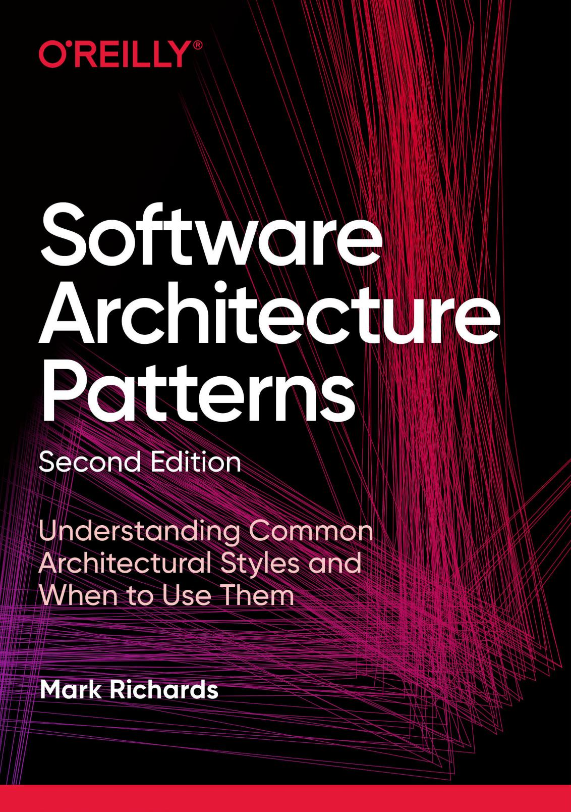
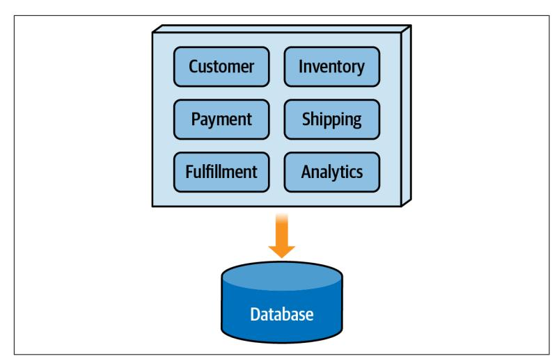
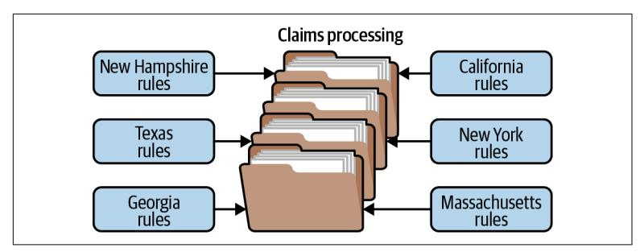

REPORT

# Software Architecture Patterns

Understanding Common Architectural Styles and When to Use Them

Mark Richards

# **Software Architecture Patterns**

by Mark Richards

Copyright © 2022 O'Reilly Media, Inc. All rights reserved.

Printed in the United States of America.

Published by O'Reilly Media, Inc., 1005 Gravenstein Highway North, Sebastopol, CA 95472.

O'Reilly books may be purchased for educational, business, or sales promotional use. Online editions are also available for most titles (*<http://oreilly.com>*). For more information, contact our corporate/institutional sales department: 800-998-9938 or *corporate@oreilly.com*.

**Acquisitions Editor:** Melissa Duffield **Development Editor:** Shira Evans **Production Editor:** Kristen Brown

**Copyeditor:** Sonia Saruba

**Interior Designer:** David Futato **Cover Designer:** Randy Comer **Illustrator:** Rob Romano

February 2015: First Edition July 2022: Second Edition

#### **Revision History for the Second Edition**

2022-07-29: First Release

The O'Reilly logo is a registered trademark of O'Reilly Media, Inc. *Software Architec‐ ture Patterns*, the cover image, and related trade dress are trademarks of O'Reilly Media, Inc.

While the publisher and the author have used good faith efforts to ensure that the information and instructions contained in this work are accurate, the publisher and the author disclaim all responsibility for errors or omissions, including without limitation responsibility for damages resulting from the use of or reliance on this work. Use of the information and instructions contained in this work is at your own risk. If any code samples or other technology this work contains or describes is subject to open source licenses or the intellectual property rights of others, it is your responsibility to ensure that your use thereof complies with such licenses and/or rights.

# **Table of Contents**

| 1. | Introduction 1                        |    |
|----|---------------------------------------|----|
| 2. | Architectural Structures and Styles 5 |    |
|    | Architecture Classification           | 5  |
|    | Architecture Partitioning             | 9  |
| 3. | Layered Architecture 15               |    |
|    | Description                           | 15 |
|    | Key Concepts                          | 17 |
|    | Examples                              | 20 |
|    | Considerations and Analysis           | 21 |
| 4. | Microkernel Architecture              | 25 |
|    | Topology                              | 25 |
|    | Examples                              | 27 |
|    | Considerations and Analysis           | 29 |
| 5. | Event-Driven Architecture             | 33 |
|    | Topology                              | 33 |
|    | Example Architecture                  | 35 |
|    | Event-Driven Versus Message-Driven    | 37 |
|    | Considerations and Analysis           | 38 |
| 6. | Microservices Architecture 43         |    |
|    | Basic Topology                        | 43 |
|    | What Is a Microservice?               | 45 |
|    | Bounded Context                       | 45 |

|    | Unique Features             | 47 |
|----|-----------------------------|----|
|    | Examples and Use Cases      | 48 |
|    | Considerations and Analysis | 49 |
| 7. | Space-Based Architecture 55 |    |
|    | Topology and Components     | 56 |
|    | Examples                    | 60 |
|    | Considerations and Analysis | 61 |
| A. | Style Analysis Summary      | 65 |

# **Introduction**

It's all too common for developers to start coding an application without a formal architecture in place. This practice usually results in ill-defined components, creating what is commonly referred to as a *big ball of mud*. These architectures are generally tightly cou‐ pled, brittle, difficult to change, and lack a clear vision or direction. It's also very difficult to determine the architectural characteristics of applications lacking a well-defined architectural style. Does the architecture scale? What are the performance characteristics of the application? How easy is it to change the application or add new features? How responsive is the architecture?

Architecture styles help define the basic characteristics and behavior of an application. Some architecture styles naturally lend themselves toward highly scalable systems, whereas other architecture styles naturally lend themselves toward applications that allow develop‐ ers to respond quickly to change. Knowing the characteristics, strengths, and weaknesses of each architecture style is necessary to choose the one that meets your specific business needs and goals.

A lot has happened in software architecture since 2015 when the first edition of this report was published. Both microservices and event-driven architecture have gained in popularity, and develop‐ ers and architects have found new techniques, tools, and ways of designing and implementing these architecture styles. Also, the widespread use of domain-driven design has led to a better under‐ standing of how architectures are structurally partitioned, and how that partitioning can impact the design and implementation of a system. The second edition of the report addresses both of these advances.

The second edition also includes other significant enhancements, along with more information about the intersection of architecture and data, and an expanded analysis section at the end of each chap‐ ter. These new sections provide you with better guidelines for when to use (and not to use) each architecture presented in this report.

Another change you'll notice in the second edition is the use of the term *architecture style* rather than *architecture pattern* for the architectures described in this report. This distinction helps alleviate some of the confusion surrounding the differences between, say, event-driven architecture—an architecture style—and something like CQRS (Command Query Responsibility Segregation), which is an architecture pattern.

An *architecture style*, such as the ones presented in this report, describe the macro structure of a system. *Architecture patterns*, on the other hand, describe reusable structural building block patterns that can be used *within* each of the architecture styles to solve a par‐ ticular problem. Take, for example, the well known CQRS pattern, which describes the structural separation between read and write operations to a database or eventing system (for example, separate services and databases for read operations and write operations). This architecture pattern could be applied to any of the architecture styles described in this report to optimize database queries and updates.

Architecture patterns, in turn, differ from *design patterns* (such as the Builder design pattern) in that an architecture pattern impacts the *structural* aspect of a system, whereas a design pattern impacts how the *source code* is designed. For example, you can use the Builder design pattern as a way to implement the CQRS architecture pattern, and then use the CQRS pattern as a building block within a microservices architecture. [Figure 1-1](#page-7-0) shows this hierarchical rela‐ tionship among the three terms and how they interrelate with each other to build software systems.

*Figure 1-1. Architecture styles can be composed of architecture pat‐ terns, which in turn can be composed of design patterns*

Design patterns and architecture patterns are typically combined to form a complete solution. Architecture styles act in the same way they can also be combined when building software solutions to form a complete solution. Hybrid architecture styles are common in the real world because not every architecture style can solve every busi‐ ness problem. Common architecture style hybrids include eventdriven microservices (events between microservices), space-based microservices (processing units implemented as microservices), and even an event-driven microkernel architecture (events between the core system and remote plug-in components). Although forming hybrids is a common practice, it is vital to understand individ‐ ual architecture styles and their corresponding strengths and weak‐ nesses before combining them.

The goal of this updated second edition report remains the same as the first edition: to help senior developers and architects understand some of the more common architecture styles, how they work, when to use them, and when not to use them. This will help to not only expand your knowledge of architecture, but will also help you make the right architecture choice for your systems.

# **Architectural Structures and Styles**

Architecture styles allow you to use existing and well-known struc‐ tures that support certain architectural characteristics (also known as nonfunctional quality attributes, system quality attributes, or "-ilities"). They not only provide you with a head start on defining an architecture for a given system, but they also facilitate communi‐ cation among developers, architects, quality assurance testers, oper‐ ations experts, and even in some cases, business stakeholders.

# **Architecture Classification**

Architecture styles are classified as belonging to one of two main architectural structures: *monolithic* (single deployment unit) and *distributed* (multiple deployment units, usually consisting of serv‐ ices). This classification is important to understand because as a group, distributed architectures support much different architecture characteristics than monolithic ones. Knowing which classification of architecture to use is the first step in selecting the right architec‐ ture for your business problem.

#### **Monolithic Architectures**

Monolithic architecture styles (as illustrated in [Figure 2-1](#page-10-0)) are gen‐ erally much simpler than distributed ones, and as such are easier to design and implement. These single deployment unit applications are fairly inexpensive from an overall cost standpoint. Furthermore, most applications architected using a monolithic architecture style

can be developed and deployed much more quickly than distributed ones.

*Figure 2-1. Monolithic architectures are single deployment units*

While cost and simplicity are the main strong points of a monolithic architecture, operational characteristics such as scalability, fault tol‐ erance, and elasticity are its weak points. A fatal error (such as an out of memory condition) in a monolithic architecture causes *all* of the functionality to fail. Furthermore, mean time to recovery (MTTR) and mean time to start (MTTS) are usually measured in minutes, meaning that once a failure does occur, it takes a long time for the application to start back up. These long startup times also impact scalability and elasticity. While scalability can sometimes be achieved through load balancing multiple instances of the applica‐ tion, the *entire* application functionality must scale, even if only a small portion of the overall application needs to scale. This is not only inefficient, but unnecessarily costly as well.

Examples of monolithic architecture styles include the layered architecture (described in [Chapter 3\)](#page-19-0), the modular monolith, the pipeline architecture, and the microkernel architecture (described in [Chapter 4](#page-29-0)).

### **Distributed Architectures**

As the name suggests, distributed architectures consist of multiple deployment units that work together to perform some sort of cohe‐ sive business function. In today's world, most distributed architec‐ tures consist of services, although each distributed architecture style has its own unique formal name for a service. Figure 2-2 illustrates a typical distributed architecture.

*Figure 2-2. Distributed architectures consist of multiple deployment units*

The superpowers of distributed architectures usually fall within operational characteristics—things like scalability, elasticity, fault tolerance, and in some cases, performance. Scalability in these architecture styles is typically at the individual service level, as is elasticity. Hence, MTTS and MTTR are much smaller than with a monolithic application, measured usually in seconds (and in some cases milliseconds) rather than minutes.

Distributed architectures are well suited for supporting high levels of fault tolerance. If one service fails, in many cases other services can continue to service requests as if no fault happened. Services that do fail can recover very quickly—so quickly that at times an end user sometimes doesn't even know the service had a fatal error.

Agility (the ability to respond quickly to change) is often another superpower of distributed architectures. Because application func‐ tionality is divided into separately deployed units of software, it is easier to locate and apply a change, the testing scope is reduced to only the service that is impacted, and deployment risk is sig‐ nificantly reduced because only the service impacted is typically deployed.

Unfortunately, with all those good features come some bad features as well. Distributed architectures are plagued with what are known as the [fallacies of distributed computing,](https://oreil.ly/7g83B) a set of eight things we believe to be true about networks and distributed computing, but are in fact false. Things like "the network is reliable," "bandwidth is infinite," and "latency is zero" all make distributed architectures not only hard to keep deterministic, but also hard to make completely reliable. Networks do fail, bandwidth is not infinite, and latency is not zero. These things are as real today as they were back in the late '90s when they were coined.

In addition to the eight fallacies of distributed computing, other difficulties arise with distributed architectures. Distributed transac‐ tions, eventual consistency, workflow management, error handling, data synchronization, contract management, and a host of other complexities are all part of the world of distributed architecture. To top it off, all this complexity usually means much more cost from an overall initial implementation and ongoing maintenance cost than monolithic architectures. Suddenly, all of those great superpowers don't sound so great anymore when you consider all the trade-offs of distributed architectures.

Examples of distributed architectures include event-driven archi‐ tecture (described in [Chapter 5](#page-37-0)), the ever-popular microservices architecture (described in [Chapter 6\)](#page-47-0), service-based architec‐ ture, service-oriented architecture, and space-based architecture (described in [Chapter 7\)](#page-59-0).

#### **Which One Should I Choose?**

When choosing between a monolithic versus a distributed architec‐ ture, one question to first ask yourself is if the system you are creating has different sets of architecture characteristics that must be supported. In other words, does the *entire* system need to scale and support high availability, or only parts of the system? Systems

that contain multiple sets of different architecture characteristics generally call for a distributed architecture. A good example of this is customer-facing functionality requiring support for scalability, responsiveness, availability, and agility, and an administrative or backend processing functionality that doesn't need any of those characteristics.

Simple systems or websites usually warrant the simpler and more cost-effective monolithic architecture style, whereas more complex systems that perform multiple business functions usually warrant more complex distributed architectures. Similarly, the "need for speed," the need for high volumes of scalability, and the need for high fault tolerance are all characteristics that lend themselves toward distributed architectures.

# **Architecture Partitioning**

Besides being classified as either monolithic or distributed, architec‐ tures can also be classified by the way the overall structure of the system is partitioned. Architectures, whether they are monolithic or distributed, can be either *technically* partitioned or *domain* par‐ titioned. The following sections describe the differences between these partitioning structures and why it's important to understand them.

#### **Technical Partitioning**

Technically partitioned architectures have the components of the system organized by *technical usage*. The classic example of a techni‐ cally partitioned architecture is the layered (n-tiered) architecture style (see [Chapter 3\)](#page-19-0). In this architecture style, components are organized by technical layers; for example, presentation components that have to do with the user interface, business layer components that have to do with business rules and core processing, persistence layer components that interact with the database, and the database layer containing the data for the system.

Notice in [Figure 2-3](#page-14-0) that the components of any given domain are spread across all of these technical layers. For example, the *customer* domain functionality resides in the presentation layer as customer screens, the business layer as customer logic, the presentation layer as customer queries, and the database layer as customer tables. Manifested as namespaces, these components would be organized

as follows: app.presentation.customer, app.business.customer, app.persistence.customer, and so on. Notice how the second node in the namespace specifies the technical layering, and that the customer node is spread across those layers.

*Figure 2-3. In a technically partitioned architecture, components are grouped by their technical usage*

Technically partitioned architectures are useful if a majority of your changes are isolated to a specific technical area in the application. For example, if you are constantly changing the look and feel of your user interface without changing the corresponding business rules, change is isolated to only one part of the architecture (in this case, the presentation layer). Similarly, if your business rules are constantly changing but there is no impact to the data layer or presentation layer, changes are isolated to the business layer of the architecture with no impact to other parts of the system.

However, imagine implementing a new requirement to add an expiration data to items for customer wish lists in a technically partitioned architecture. This type of change is considered a *domain-based* change (not a technical usage one), and impacts *all* of the layers of the architecture. To implement this change, you would need to add a new column to the wish list table in the database layer, change the corresponding SQL in the persistence layer, add the corresponding business rules to components in the business layer, change the contracts between the business and presentation layer,

and finally change the screens in the presentation layer. Depending on the size of the system and the team structure, this simple change might involve the coordination of three to four different teams.

Examples of technically partitioned architectures include the lay‐ ered architecture [\(Chapter 3](#page-19-0)), microkernel architecture [\(Chapter 4\)](#page-29-0), pipeline architecture, event-driven architecture [\(Chapter 5\)](#page-37-0), and space-based architecture [\(Chapter 7](#page-59-0)). Microkernel architecture is particularly interesting in that it's the only architecture style that can be either technically partitioned *or* domain partitioned depending on how the plug-in components are used. For example, when the plug-in components are used as adapters or special configuration settings, it would be considered technically partitioned.

#### **Domain Partitioning**

Unlike technically partitioned architectures, components in domain partitioned architectures are organized by *domain areas*, not tech‐ nical usage. This means that all of the functionality (presentation, business logic, and persistence logic) is grouped together for each domain and subdomain area in separate areas of the application. For domain partitioned architectures, components might be manifested through a namespace structure such as app.customer, app.ship ping, app.payment, and so on. Notice that the second node rep‐ resents the *domain* rather than a technical layer. As a matter of fact, domains can be further organized into technical layering if so desired, which might take the form app.customer.presentation, app.customer.business, and so on. Notice that even though the customer domain logic may be organized by technical usage, the primary structure (represented as the second node of the name‐ space) is still partitioned by domain. [Figure 2-4](#page-16-0) shows a typical example of a domain partitioned architecture.

Domain partitioned architectures have grown in popularity over the years in part due to the increased use and acceptance of [domain](https://oreil.ly/vBRXu)[driven design,](https://oreil.ly/vBRXu) a software modeling and analysis technique coined by Eric Evans. Domain-driven design places an emphasis on the design of a *domain* rather than on complex workflows and technical components. This approach allows teams to collaborate closely with domain experts and focus on one key part of the system, thus devel‐ oping software that closely resembles that domain functionality.

*Figure 2-4. In a domain partitioned architecture, components are grouped by domain area*

The clear advantage of domain partitioning within an architecture is that changes to a particular domain or subdomain are self-contained within a specific area of the system, allowing teams to pinpoint exactly the area of the system that requires the change.

Coming back to our implementation of expiration data for a cus‐ tomer's wish list items, with domain partitioning the changes in code are isolated to only one small part of the system, making this type of change much more effective than with technical partitioning. Here, for example, changes would be isolated to the namespace starting with app.customer.wishlist, meaning that presentation logic, business logic, and persistence logic are all within the same area of the system. Maintenance is easier, testing is easier, and deployment is much less risky when these types of changes are done.

Examples of domain partitioned architectures include the microker‐ nel architecture [\(Chapter 4](#page-29-0)), microservices architecture [\(Chapter 6\)](#page-47-0), modular monolith architecture, and service-based architecture. As indicated earlier, microkernel architecture can be either technically partitioned or domain partitioned. If the plug-in components are used to extend the application by adding functionality, then it would be considered a domain partitioned architecture.

### **Which One Should I Choose?**

The choice between a technically partitioned architecture and a domain partitioned architecture is an important one. The overall structure of the architecture must be aligned not only with the team structure, but also with the nature of the types of changes expected in the system in order to be successful and effective.

Technically partitioned architectures (whether monolithic or dis‐ tributed) are well suited when your overall team structure is organ‐ ized by those same technical usage areas. For example, if your development teams are organized as teams of user interface devel‐ opers, backend developers, and database developers, technically partitioned architectures would be a good fit because the team struc‐ ture matches the technical layers of the architecture. Technically partitioned architectures are also a natural fit when most of your expected changes are aligned with technical layers (for example, multiple user interfaces, changes to the look and feel of the system, swapping out one database for another, and so on).

If you are embarking on a new system and using a domain-driven design approach, then you should in turn consider a domain par‐ titioned architecture. Also, domain partitioned architectures are a great fit if your teams are organized into cross-functional teams with specialization—in other words, single teams that are aligned with specific domain functionality and contain user interface developers, backend developers, and database developers all on the same physi‐ cal team.

Domain partitioned architectures are also a good choice when you expect most of your changes to be *domain* scoped rather than tech‐ nical usage scoped. This allows for much better agility (the ability to respond quickly to change) than with technically partitioned architectures. However, be careful when choosing a domain parti‐ tioned architecture if you have lots of changes to technical usage layers. For example, swapping out one database type for another or changing the entire user interface framework would be a difficult and time-consuming task in a domain partitioned architecture.

# **Layered Architecture**

The most common architecture style is the layered architecture, otherwise known as the n-tier architecture. This style is the de facto standard for most applications because it aligns with traditional IT team structures where teams are organized by technical domains (such as presentation teams, backend development teams, database teams, and so on). Because it is so widely known by most archi‐ tects, designers, and developers, the layered architecture is a natural choice for most business application development efforts. However, like all architecture styles, it has its strengths and weaknesses and is not always suitable for some systems.

# **Description**

Components within the layered architecture style are organized into horizontal layers, each performing a specific role within the application (such as presentation logic, business logic, persistence logic, and so on). Although the number of layers may vary, most layered architectures consist of four standard layers: presentation, business, persistence, and database (see [Figure 3-1\)](#page-20-0). In some cases, the business layer and persistence layer are combined into a single business layer, particularly when the persistence logic (such as SQL) is embedded within the business layer components. Thus, smaller applications may have only three layers, whereas larger and more complex business applications may contain five or more layers.

*Figure 3-1. The layered architecture style is a technically partitioned architecture*

Each layer of the layered architecture style has a specific role and responsibility within the application. For example, a presentation layer is responsible for handling all user interface and browser communication logic, whereas a business layer is responsible for executing specific business rules associated with the request. Each layer in the architecture forms an abstraction around the work that needs to be done to satisfy a particular business request. For example, the presentation layer doesn't need to know about *how* to get customer data; it only needs to display that information on a screen in a particular format. Similarly, the business layer doesn't need to be concerned about how to format customer data for display on a screen or even where the customer data is coming from; it only needs to get the data from the persistence layer, perform business logic against the data (e.g., calculate values or aggregate data), and pass that information up to the presentation layer.

Layers are usually manifested through a namespace, package struc‐ ture, or directory structure (depending on the implementation lan‐ guage used). For example, customer functionality in a business layer might be represented as app.business.customer, whereas in the presentation layer, customer logic would be represented as app .presentation.customer. In this example, the second node of the namespace represents the layer, whereas the third node represents the domain component. Notice, that the third node of the name‐ space (customer) is duplicated for all of the layers—this is indicative of a technically partitioned architecture, where the domain is spread across all layers of the architecture.

One of the powerful features of the layered architecture style is the *separation of concerns* among components. Components within a specific layer deal only with logic that pertains to that layer. For example, components in the presentation layer deal only with pre‐ sentation logic, whereas components residing in the business layer deal only with business logic. This type of component classification makes it easy to build effective roles and responsibility models into your architecture, and makes it easy to develop, test, govern, and maintain applications using this architecture style when welldefined component interfaces and contracts are used between layers.

# **Key Concepts**

In this architecture style, layers can be either open or closed. Notice in [Figure 3-2](#page-22-0) that each layer in the architecture is marked as being *closed*. A closed layer means that as a request moves from layer to layer, it *must* go through the layer right below it to get to the next layer below that one. For example, a request originating from the presentation layer must first go through the business layer and then to the persistence layer before finally hitting the database layer.

So why not allow the presentation layer direct access to either the persistence layer or database layer? After all, direct database access from the presentation layer is much faster than going through a bunch of unnecessary layers just to retrieve or save database infor‐ mation. The answer to this question lies in a key concept known as *layers of isolation*.

The layers of isolation concept means that changes made in one layer of the architecture generally don't impact or affect components in other layers: the change is isolated to the components within that layer, and possibly another associated layer (such as a persistence layer containing SQL). If you allow the presentation layer direct access to the persistence layer, then changes made to SQL within the persistence layer would impact both the business layer *and* the presentation layer, thereby producing a very tightly coupled applica‐ tion with lots of interdependencies between components. This type

of architecture then becomes brittle and very hard and expensive to change.

*Figure 3-2. With closed layers, the request must pass through that layer*

The layers of isolation concept also means that each layer is inde‐ pendent of the other layers, thereby having little or no knowledge of the inner workings of other layers in the architecture. To under‐ stand the power and importance of this concept, consider a large refactoring effort to convert the presentation framework from the angular.js framework to the react.js framework. Assuming that the contracts (e.g., model) used between the presentation layer and the business layer remain the same, the business layer is not affected by the refactoring and remains completely independent of the type of user interface framework used by the presentation layer. The same is true with the persistence layer: if designed correctly, replacing a relational database with a NoSQL database should only impact the persistence layer, not the presentation or business layer.

While closed layers facilitate layers of isolation and therefore help isolate change within the architecture, there are times when it makes sense for certain layers to be open. For example, suppose you want to add a shared services layer to an architecture containing common service functionality accessed by components within the business layer (e.g., data and string utility classes or auditing and logging classes). Creating a services layer is usually a good idea in this case

because architecturally it restricts access to the shared services to the business layer (and not the presentation layer). Without a separate layer, there is nothing that architecturally restricts the presentation layer from accessing these common services, making it difficult to govern this access restriction.

In the shared services layer example, this layer would likely reside *below* the business layer to indicate that components in this services layer are not accessible from the presentation layer. However, this presents a problem in that the business layer shouldn't be required to go through the services layer to get to the persistence layer. This is an age-old problem with the layered architecture, and is solved by creating open layers within the architecture.

As illustrated in Figure 3-3, the services layer in this case should be marked as *open*, meaning requests are allowed to bypass this layer and go directly to the layer below it. In the following example, since the services layer is open, the business layer is allowed to bypass it and go directly to the persistence layer, which makes perfect sense.

*Figure 3-3. With open layers, the request can bypass the layer below it*

Leveraging the concept of open and closed layers helps define the relationship between architecture layers and request flows, and pro‐ vides designers and developers with the necessary information to understand the various layer access restrictions within the architec‐ ture. Failure to document or properly communicate which layers in the architecture are open and closed (and why) usually results in tightly coupled and brittle architectures that are very difficult to test, maintain, and deploy.

# **Examples**

To illustrate how the layered architecture works, consider a request from a business user to retrieve customer information for a particu‐ lar individual, as illustrated in Figure 3-4. Notice the arrows show the request flowing down to the database to retrieve the customer data, and the response flowing back up to the screen to display the data.

*Figure 3-4. An example of the layered architecture*

In this example, the customer information consists of both customer data and order data (orders placed by the customer). Here, the *cus‐ tomer screen* is responsible for accepting the request and displaying the customer information. It does not know where the data is, how it is retrieved, or how many database tables must be queried to get the data.

Once the customer screen receives a request to get customer infor‐ mation for a particular individual, it then forwards that request to the *customer delegate* module in the presentation layer. This module is responsible for knowing which modules in the business layer can process that request, and also how to get to that module and what data it needs (the contract). The *customer object* in the business layer is responsible for aggregating all of the information needed by the business request (in this case to get customer information).

Next, the *customer object* module invokes the *customer DAO* (data access object) module in the persistence layer to get customer data, and the *order DAO* module to get order information. These modules in turn execute SQL statements to retrieve the corresponding data and pass it back up to the customer object in the business layer. Once the customer object receives the data, it aggregates the data and passes that information back up to the customer delegate, which then passes that data to the customer screen to be presented to the user.

# **Considerations and Analysis**

The layered architecture is a well-understood and general-purpose architecture style, making it a good starting point for most applica‐ tions, particularly when you are not sure what architecture style is best suited for your application. However, there are a couple of things to consider from an architecture standpoint before choosing this style.

The first thing to watch out for is what is known as the *architec‐ ture sinkhole anti-pattern*. This anti-pattern describes the situation where requests flow through multiple layers of the architecture as simple pass-through processing with little or no logic performed within each layer. For example, assume that the presentation layer responds to a request from the user to retrieve customer data. The presentation layer passes the request to the business layer, which simply passes the request to the persistence layer, which then makes a simple SQL call to the database layer to retrieve the customer data. The data is then passed all the way back up the stack with no additional processing or logic to aggregate, calculate, or transform the data.

Every layered architecture will have at least some scenarios that fall into the architecture sinkhole anti-pattern. The key, however, is to analyze the percentage of requests that fall into this category. The 80-20 rule is usually a good practice to follow to determine whether or not you are experiencing the architecture sinkhole anti-pattern. It's typical to have around 20 percent of the requests as simple pass-through processing and 80 percent of the requests having some business logic associated with them. However, if you find that this ratio is reversed and a majority of your requests are simple passthrough processing, you might want to consider making some of the architecture layers open, keeping in mind that while it will be faster, it will be more difficult to control change due to the lack of layer isolation.

The layered architecture is still just as viable today as it was in the old days when it was first introduced. While more modern analysis and design approaches such as domain-driven design have given developers and architects a way to think about a problem from a domain perspective rather than a technical one, there are still times when technically partitioned architectures (such as the layered architecture) are more suitable.

### **When to Consider This Style**

The layered architecture is good to consider if the project or initia‐ tive has significant budget or time constraints. Because the layered architecture is generally considered a monolithic architecture style, it does not have the complexities of a distributed architecture in terms of remote access, contract management, and the complica‐ tions resulting from the fallacies of distributed computing described in the previous chapter. Also, most developers and architects are familiar with the layered architecture, making it easier to under‐ stand and implement.

Another reason to consider the layered architecture is when a majority of your changes are isolated to specific layers within the application. For example, changes isolated to only business rules that don't impact the user interface, changes involving only the user interface look-and-feel, migration to a new user interface frame‐ work, and even migration to a new type of database are all isolated to a specific layer in the architecture, making it easier to isolate the components impacted by the change.

Because the layered architecture is a technically partitioned archi‐ tecture, it's a good fit if the team structure is also technically partitioned. In other words, if your overall team structure is organ‐ ized as teams of presentation (UI) developers, backend developers, shared services teams, database teams, and so on, this aligns well to the overall partitioning of this architecture style (presentation layer, business layer, persistence layer, and so on). This alignment is known as [Conway's Law.](https://oreil.ly/UC512)

#### **When Not to Consider This Style**

While there are good reasons to consider the layered architecture as described in the prior section, unfortunately there are even more reasons not to consider the layered architecture.

The first reason not to consider the layered architecture is if you have high *operational concerns* for your application—things like scalability, elasticity, fault tolerance, and performance. Because lay‐ ered architectures lend themselves toward a monolithic architecture, applications built using this architecture style are generally difficult to scale. While the layered architecture can sometimes scale by split‐ ting the layers into separate physical deployments and/or creating separate instances of the application in multiple virtual machines, it becomes very expensive and inefficient because 100% of the applica‐ tion functionality must scale. In addition, the layered architecture is not very fault-tolerant—a fatal crash in any part of the application brings down the entire application functionality.

Another reason to avoid the layered architecture is when a major‐ ity of your changes are at a *domain level* rather than a technical one. Suppose you are tasked with adding an expiration date to the customer's "My Movie List" within a movie streaming application (movies a customer has queued up to watch later). This new feature would first require a change to the database schema, then a change to the SQL in the persistence layer, then a change to the business rules and contracts in the business layer (such as how long before expiration, what to do when a movie in your list expires, and so on), and finally a change to the presentation layer to display the expiration date beside each movie in the list.

In analyzing this relatively simple change to the "My Movie List" functionality, notice how *every* layer of the architecture is impacted and requires change. In large systems with technically partitioned

teams, this might even involve the coordination of multiple teams (the UI team, backend team, database team, and so on) to make this change. This not only impacts overall agility (the ability to respond quickly to change), but also impacts the overall time and effort involved in making this change.

Lastly, if your overall team structure is organized by cross-functional domain-based teams (single teams that have UI, backend, and database expertise focused on a particular domain within the appli‐ cation), the layered architecture is not a good fit because the tech‐ nically partitioned architecture structure is not aligned with the domain partitioned team structure.

#### **Architecture Characteristics**

The chart illustrated in Figure 3-5 summarizes the overall capabili‐ ties (architecture characteristics) of the layered architecture in terms of star ratings. One star means the architecture characteristic is not well supported, whereas five stars means it's well suited for that particular architecture characteristic.

| Characteristic    | Star rating |
|-------------------|-------------|
| Partitioning type | Technical   |
| Overall cost      | \$          |
| Agility           | ☆           |
| Simplicity        | ☆☆☆☆☆       |
| Scalability       | ☆           |
| Fault tolerance   | ☆           |
| Performance       | ☆☆☆         |
| Extensibility     | ☆           |

*Figure 3-5. Architecture characteristics star ratings for the layered architecture*

# **Microkernel Architecture**

The microkernel architecture style is a flexible and extensible archi‐ tecture that allows a developer or end user to easily add additional functionality and features to an existing application in the form of extensions, or "plug-ins," without impacting the core functionality of the system. For this reason, the microkernel architecture is some‐ times referred to as a "plug-in architecture" (another common name for this architecture style). This architecture style is a natural fit for product-based applications (ones that are packaged and made avail‐ able for download in versions as a typical third-party product), but is also common for custom internal business applications. In fact, many operating systems implement the microkernel architecture style, hence the origin of this style's name.

# **Topology**

The microkernel architecture style consists of two types of architec‐ ture components: a *core system* and *plug-in modules*. Application logic is divided between independent plug-in modules and the basic core system, providing extensibility, flexibility, and isolation of application features and custom processing logic. [Figure 4-1](#page-30-0) illus‐ trates the basic topology of the microkernel architecture style.

The core system of this architecture style can vary significantly in terms of the functionality it provides. Traditionally, the core system contains only the minimal functionality required to make the sys‐ tem operational (such as the case with older IDEs such as Eclipse), but it can also be more full featured (such as with web browsers

like Chrome). In either case, the functionality in the core system can then be extended through the use of separate plug-in modules.

*Figure 4-1. Microkernel architecture style*

Plug-in modules are standalone, independent components that con‐ tain specialized processing, additional features, adapter logic, or custom code that is meant to enhance or extend the core system to provide additional business capabilities. Generally, plug-in mod‐ ules should be independent of other plug-in modules and not be dependent on other plug-ins to function. It's also important in this architecture style to keep communication between plug-ins to a minimum to avoid confusing dependency issues.

The core system needs to know which plug-in modules are available and how to get to them. One common way of implementing this is through a plug-in registry. The registry contains information about each plug-in module, including its name, contract details, and remote access protocol details (depending on how the plug-in is connected to the core system). For example, a plug-in for tax software that flags items as a high risk for triggering an audit might have a registry entry that contains the name of the service (Audi‐ tChecker), the contract details (input data and output data), and the contract format (XML). In cases where the contracts and access protocol are standard within the system, the registry might only contain the name of the plug-in module and an interface name for how to invoke that plug-in.

Plug-in modules can be connected to the core system in a variety of ways. Traditionally, plug-ins are implemented as separate libraries or modules (such as JAR and DLL files) connected in a point-to-point fashion (such as a method call via an interface). These separate modules can then be managed through frameworks such as OSGi

(Open Service Gateway Initiative), Java Modularity, Jigsaw, Penrose, and Prism or .NET environments. When plug-ins are deployed in this manner, the overall deployment model is that of a monolithic (single deployment) architecture. Techniques such as dropping a file in a particular directory and restarting the application are com‐ mon for the microkernel architecture when using point-to-point plug-ins. Some applications using the previously listed frameworks can also support runtime plug-in capabilities for adding or changing plug-ins without having to restart the core system.

Alternatively, plug-ins can also be implemented as part of a single consolidated codebase, manifested simply through a namespace or package structure. For example, a plug-in that might perform an assessment of a specific electronic device (such as an iPhone 12) for an electronics recycling application might have the namespace app.plugin.assessment.iphone12. Notice that the second node of this namespace specifies that this code is a plug-in, specifically for the assessment of an iPhone 12 device. In this manner, the code in the plug-in is separate from the code in the core system.

Plug-in modules can also be implemented as remote services, and accessed through REST or messaging interfaces from the core sys‐ tem. In this case, the microkernel architecture would be consid‐ ered a distributed architecture. All requests would still need to go through the core system to reach the plug-in modules, but this type of configuration allows for easier runtime deployment of the plug-in components, and possibly better internal scalability and responsive‐ ness if multiple plug-ins need to be invoked for a single business request.

# **Examples**

A classic example of the microkernel architecture is the Eclipse IDE. Downloading the basic Eclipse product provides you little more than a fancy editor. However, once you start adding plug-ins, it becomes a highly customizable and useful product for software development. Internet browsers are another common example using the microkernel architecture: viewers and other plug-ins add addi‐ tional capabilities that are not otherwise found in the basic browser (the core system). As a matter of fact, many of the developer and deployment pipeline tools and products such as PMD, Jira, Jenkins, and so on are implemented using microkernel architecture.

The examples are endless for product-based software, but what about the use of the microkernel architecture for small and large business applications? The microkernel architecture applies to these situations as well. Tax software, electronics recycling, and even insurance applications can benefit from this architecture style.

To illustrate this point, consider claims processing in a typical insur‐ ance company (filing a claim for an accident, fire, natural disaster, and so on). This software functionality is typically very complicated. Each jurisdiction (for example, a state in the United States) has different rules and regulations for what is and isn't allowed in an insurance claim. For example, some jurisdictions allow for a free windshield replacement if your windshield is damaged by a rock, whereas other jurisdictions do not. This creates an almost infinite set of conditions for a standard claims process.

Not surprisingly, most insurance claims applications leverage large and complex rules engines to handle much of this complexity. How‐ ever, these rules engines can grow into a complex big ball of mud where changing one rule impacts other rules, or requires an army of analysts, developers, and testers just to make a simple rule change. Using the microkernel architecture style can mitigate many of these issues.

For example, the stack of folders you see in [Figure 4-2](#page-33-0) represents the core system for claims processing. It contains the basic business logic required by the insurance company to process a claim (which doesn't change often), but contains no custom jurisdiction process‐ ing. Rather, plug-in modules contain the specific rules for each jurisdiction. Here, the plug-in modules can be implemented using custom source code or separate rules engine instances. Regardless of the implementation, the key point is that jurisdiction-specific rules and processing are separate from the core claims system and can be added, removed, and changed with little or no effect on the rest of the core system or other plug-in modules.

*Figure 4-2. Microkernel architecture example of processing an insurance claim*

# **Considerations and Analysis**

The microkernel architecture style is very flexible and can vary greatly in granularity. This style can describe the overarching archi‐ tecture of a system, or it can be embedded and used as part of another architecture style. For example, a particular event processor, domain service, or even a microservice can be implemented using the microkernel architecture style, even though other services are implemented in other ways.

This architecture style provides great support for evolutionary design and incremental development. You can produce a minimal core system that provides some of the primary functionality of a sys‐ tem, and as the system evolves incrementally, you can add features and functionality without having to make significant changes to the core system.

Depending on how this architecture style is implemented and used, it can be considered as either a technically partitioned architecture or a domain partitioned one. For example, using plug-ins to provide adapter functionality or specific configurations would make it a technically partitioned architecture, whereas using plug-ins to pro‐ vide additional extensions or additional functionality would make it more of a domain partitioned architecture.

#### **When to Consider This Style**

The microkernel architecture style is good to consider as a starting point for a product-based application or custom application that will have planned extensions. In particular, it is a good choice for products where you will be releasing additional features over time or you want control over which users get which features.

Microkernel architecture is also a good choice for applications or products that have multiple configurations based on a particular cli‐ ent environment or deployment model. Plug-in modules can specify different configurations and features specific to any particular envi‐ ronment. For example, an application that can be deployed on any cloud environment might have a different set of plug-ins that act as adapters to fit the specific services of that particular cloud vendor, whereas the core system contains the primary functionality and remains completely agnostic as to the actual cloud environment.

As with the layered architecture style, the microkernel architecture style is relatively simple and cost-effective, and is a good choice if you have tight budget and time constraints.

#### **When Not to Consider This Style**

All requests must go through the core system, regardless of whether the plug-ins are remote or point-to-point invocations. Because of this, the core system acts as the main bottleneck to this architecture, and is not well suited for highly scalable and elastic systems. Simi‐ larly, overall fault tolerance is not good in this architecture style, again due to the need for the core system as an entry point.

One of the goals of the microkernel architecture is to reduce change in the core system and push extended functionality and code volatil‐ ity out to the plug-in modules, which are more self-contained and easier to test and change. Therefore, if you find that most of your changes are within the core system and you are not leveraging the power of plug-ins to contain additional functionality, this is likely not a good architecture match for the problem you are trying to solve.

#### **Architecture Characteristics**

The chart illustrated in Figure 4-3 summarizes the overall capabili‐ ties (architecture characteristics) of the microkernel architecture in terms of star ratings. One star means the architecture characteristic is not well supported, whereas five stars means it's well suited for that particular architecture characteristic.

| Characteristic    | Star rating         |
|-------------------|---------------------|
| Partitioning type | Technical or domain |
| Overall cost      | \$                  |
| Agility           | ☆☆☆                 |
| Simplicity        | ☆☆☆☆                |
| Scalability       | ☆                   |
| Fault tolerance   | ☆                   |
| Performance       | ☆☆☆                 |
| Extensibility     | ☆☆☆                 |

*Figure 4-3. Architecture characteristics star ratings for the microkernel architecture*

# **Event-Driven Architecture**

The event-driven architecture style has significantly gained in popu‐ larity and use over recent years, so much so that even the way we think about it has changed. This high adoption rate isn't overly surprising given some of the hard problems event-driven archi‐ tecture solves, such as complex nondeterministic workflows and highly reactive and responsive systems. Furthermore, new techni‐ ques, tools, frameworks, and cloud-based services have made eventdriven architecture more accessible and feasible than ever before, and many teams are turning to event-driven architecture to solve their complex business problems.

# **Topology**

Event-driven architecture is an architecture style that relies on asyn‐ chronous processing using highly decoupled event processors that trigger events and correspondingly respond to events happening in the system. Most event-driven architectures consist of the following architectural components: an *event processor*, an *initiative event*, a *processing event*, and an *event channel*. These components and their relationships are illustrated in [Figure 5-1.](#page-38-0)

*Figure 5-1. The main components of event-driven architecture*

An *event processor* (today usually called a *service*) is the main deployment unit in event-driven architecture. It can vary in gran‐ ularity from a single-purpose function (such as validating an order) to a large, complex process (such as executing or settling a finan‐ cial trade). Event processors can trigger asynchronous events, and respond to asynchronous events being triggered. In most cases, an event processor does both.

An *initiating event* usually comes from outside the main system and kicks off some sort of asynchronous workflow or process. Examples of initiating events are placing an order, buying some Apple stock, bidding on a particular item in an auction, filing an insurance claim for an accident, and so on. In most cases, initiating events are received by only one service that then starts the chain of events to process the initiating event, but this doesn't have to be the case. For example, placing a bid on an item in an online auction (an initiating event) may be picked up by a Bid Capture service as well as a Bid Tracker service.

A *processing event* (today usually referred to as a *derived event*) is generated when the state of some service changes and that service advertises to the rest of the system what that state change was. The relationship between an initiating event and a processing event is one-to-many—a single initiating event typically spawns many differ‐ ent internal processing events. For example, through the course of

a workflow, a Place Order initiating event may result in an Order Placed processing event, a Payment Applied processing event, a Inventory Updated processing event, and so on. Notice how an initiating event is usually in noun-verb format, whereas a processing event is usually in verb-noun format.

The *event channel* is the physical messaging artifact (such as a queue or topic) that is used to store triggered events and deliver those trig‐ gered events to a service that responds to those events. In most cases initiating events use a point-to-point channel using queues or mes‐ saging services, whereas processing events generally use publish-and subscribe channels using topics or notification services.

# **Example Architecture**

To see how all of these components work together in a complete event-driven architecture, consider the example illustrated in [Fig‐](#page-40-0) [ure 5-2](#page-40-0) where a customer wants to order a copy of *Fundamentals of Software Architecture* by Mark Richards and Neal Ford (O'Reilly). In this case, the initiating event would be Place Order. This initiating event is received by the Order Placement service, which then places the order for the book. The Order Placement service in turn adver‐ tises what it did to the rest of the system through a Order Placed processing event.

Notice in this example that when the Order Placement service trig‐ gers the Order Placed event, it doesn't know which other services (if any) respond to this event. This illustrates the highly decoupled, nondeterministic nature of event-driven architecture.

Continuing with the example, notice in [Figure 5-2](#page-40-0) that three dif‐ ferent services respond to the Order Placed event: the Payment service, the Inventory Management service, and the Notification service. These services perform their corresponding business func‐ tions, and in turn advertise what they did to the rest of the system through other processing events.

*Figure 5-2. Processing a book order using event-driven architecture*

One thing in particular to notice about this example is how the Noti fication service advertises what it did by generating a Notified Customer processing event, but no other service cares about or responds to this event. So why then trigger an event that no one cares about? The answer is *architectural extensibility*. By triggering an event, the Notification service provides a hook that future services can respond to (such as a notification tracking service), without having to make any other modifications to the system. Thus, a good rule of thumb with event-driven architecture is to always have services advertise their state changes (what action they took), regardless if other services respond to that event. If no other services care about the event, then the event simply disappears from the topic (or is saved for future processing, depending on the mes‐ saging technology used).

# **Event-Driven Versus Message-Driven**

Is there a difference between an event-driven system and a messagedriven system? It turns out there is, and although subtle, it's an important difference to know and understand. Event-driven systems process *events*, whereas message-driven systems process *messages*.

The first difference has to do with the context of what you are sending to the rest of the system. An *event* is telling others about a state change or something you did. Examples of an event include things like "I just placed an order," or "I just submitted a bid for an item." A *message*, on the other hand, is a command or request to a specific service. Examples of a message include things like "apply a payment to this order," "ship this item to this address," or "give me the customer's email address." Notice the difference here—with an event, the service triggering the event has no idea which services (or how many) will respond, whereas a message is usually directed to a single known service (for example, Payment).

Another difference between an event and a message is the owner‐ ship of the event channel. With events, the sender owns the event channel, whereas with messages, the receiver owns the channel. This ownership becomes more significant when you consider the *contract* of the event or message. Consider the example in Figure 5-3 where the Order Placement service is sending out a Order Placed event that is responded to by the Payment service. In this case, the sender (Order Placement) owns both the event channel and the contract. In other words, contract changes would be initiated by the Order Placement service, and the Payment service and all other services responding to that event would have to conform and adapt to these changes.

*Figure 5-3. With events, the sender owns the event channel and contract*

However, with *messages* in a message-driven system, it's exactly the opposite—the receiver owns the message channel. As illustrated in Figure 5-4, the Order Placement service is *telling* the Payment service to apply the payment in the form of a command. In this case, the Payment service owns the message channel (queue) as well as the message contract. Notice that with message-based processing, the Order Placement service would need to conform to contract changes initiated by the Payment service.

*Figure 5-4. With messages, the receiver owns the message channel and contract*

The type of event channel artifact is also a distinguishing fac‐ tor between event-driven systems and message-driven systems. Typically, event-driven systems use publish-and-subscribe messag‐ ing using topics or notification services when triggering events, whereas message-driven systems typically use point-to-point mes‐ saging using queues or messaging services when sending messages. That's not to say event-driven systems can't use point-to-point mes‐ saging—in some cases point-to-point messaging is necessary to retrieve specific information from another service or to control the order or timing of events in a system.

# **Considerations and Analysis**

Because of the asynchronous and decoupled nature of event-driven architecture, it excels in areas of fault tolerance, scalability, and high performance. It also provides for excellent extensibility when adding additional features and functionality. However, while these charac‐ teristics are very attractive, especially for today's complex systems, there are plenty of reasons not to use event-driven architecture. The following two sections outline the reasons to consider event-driven architecture, and more importantly, when to be cautious about using it.

#### **When to Consider This Style**

Simply put, event-driven architecture is the architecture of choice for systems that require high performance, high scalability, and high levels of fault tolerance. However, there are other reasons to con‐ sider this architecture style beyond these architecture characteristic superpowers.

If the nature of your business processing is reacting to things that are happening in and around the system (rather than responding to a user request), then this is a good architecture style to consider. Lis‐ ten to your business stakeholders—are they using words like "event," "triggers," and "react to something happening"? If so, then there's a good chance your business problem matches this architecture style. Also, ask yourself—am I responding to a user request, or reacting to something the user did? These are great questions to qualify whether the business problem matches this architecture style.

Event-driven architecture is also a good choice when you have complex, nondeterministic workflows that are difficult to model. For decades developers have been building complex decision trees trying to outline every possible outcome of a complex workflow, only to continually fail at this fool's errand. Systems such as these are sometimes classified as CEP (complex event processing), something that is managed natively in event-driven architecture.

#### **When Not to Consider This Style**

You should not consider this architecture style if most of your processing is *request based*. Request-based processing is the typical situation where a user is requesting data from the database (such as a customer profile) or doing basic CRUD operations (create, read, update, delete) on entities in the system. Furthermore, if most of your processing requires synchronous processing where the user must wait for processing to be complete for a particular request, event-driven architecture is likely not the right architecture style for you.

Because all processing is eventually consistent in event-driven archi‐ tecture, this is not a good architecture style for business problems that require high levels of data consistency. There is little or no guarantee of when processing will occur in an event-driven architec‐ ture, so if you are expecting certain data to be there at a certain time, look elsewhere for an architecture style, like service-based, that helps preserve data consistency.

Another reason to walk away from event-driven architecture and consider a different architecture style is when you need control over the workflow and timing of events. Both of these are extremely difficult to manage when doing asynchronous event processing. For example, imagine the nightmare of coordinating the following scenario: Event A and Event B must complete processing before Event C can be triggered, and Event D and Event E must wait for Event C to finish, but Event D *must* start processing before Event E. Good luck managing that mess—you're better off using orchestra‐ ted service-oriented architecture or orchestrated microservices for that type of complex coordination.

Error handling is another complexity that causes teams to shy away from event-driven architecture. Because there is usually no central workflow orchestrator or controller in event-driven architecture, when errors occur in a service, it's up to that service to try to repair the error. Furthermore, because everything is asynchronous, other actions may have occurred in the workflow for that event. For example, suppose an Order Placement service triggers an Order Placed event for a book that a customer ordered. The Notification service, Payment service, and Inventory service all respond to the event at the same time. However, suppose the Notification and Payment services both respond and complete their processing, but the Inventory service throws an error because there are no more books left when the event is received. Now what? The customer has already been notified and their credit card has been charged, but there are no more books left to ship to the customer. Should payment be reversed? Should another notification be sent to the customer? Should processing just wait until there's more inventory? And which service performs all this error handling logic? Error handing is indeed one of the more complex aspects of event-driven architecture.

### **Architecture Characteristics**

The chart illustrated in Figure 5-5 summarizes the overall capabil‐ ities (architecture characteristics) of event-driven architecture in terms of star ratings. One star means the architecture characteristic is not well supported, whereas five stars means it's well suited for that particular architecture characteristic.

| Characteristic    | Star rating |
|-------------------|-------------|
| Partitioning type | Technical   |
| Overall cost      | \$ \$ \$ \$ |
| Agility           | ☆☆☆☆        |
| Simplicity        | ☆           |
| Scalability       | ☆☆☆☆☆       |
| Fault tolerance   | ☆☆☆☆☆       |
| Performance       | ☆☆☆☆☆       |
| Extensibility     | ☆☆☆☆☆       |

*Figure 5-5. Architecture characteristics star ratings for event-driven architecture*

# **Microservices Architecture**

Perhaps the biggest change in architecture since 2012 is the intro‐ duction of microservices. This trend-setting architecture style took the world by storm, similar to what service-oriented architecture (SOA) did back in 2006. Over the years we've learned a lot about this revolutionary (and evolutionary) architecture style and how it addresses many of the complex problems we face in developing soft‐ ware solutions. New tools, techniques, frameworks, and platforms have come about over the years that make microservices easier to design, implement, and manage. That said, microservices is perhaps one of the most complicated architecture styles to get right.

# **Basic Topology**

The microservices architecture style is an ecosystem made up of single-purpose, separately deployed services that are accessed typ‐ ically through an API gateway. Client requests originating from either a user interface (usually a microfrontend) or an external request invoke well-defined endpoints in an API gateway, which then forwards the user request to separately deployed services. Each service in turn accesses its own data, or makes requests to other services to access data the service doesn't own. The basic topology for the microservices architecture style is illustrated in [Figure 6-1](#page-48-0).

*Figure 6-1. The basic topology of the microservices architecture style*

Notice that although Figure 6-1 shows each service associated with a separate database, this does not have to be the case (and usually isn't). Rather, each service owns its own collection of tables, usually in the form of a schema that can be housed in a single highly avail‐ able database or a single database devoted to a particular domain. The key concept to understand here is that only the service owning the tables can access and update that data. If other services need access to that data, they must ask the owning microservice for that information rather than accessing the tables directly. The reason‐ ing behind this data ownership approach is described in detail in ["Bounded Context" on page 45.](#page-49-0)

The primary job of the API gateway in microservices is to hide the location and implementation of the corresponding services that correspond to the API gateway endpoints. However, the API gate‐ way can also perform cross-cutting infrastructure-related functions, such as security, metrics gathering, request-ID generation, and so on. Notice that unlike the enterprise service bus (ESB) in serviceoriented architecture, the API gateway in microservices does not contain any business logic, nor does it perform any orchestration or

mediation. This is critical within microservices in order to preserve what is known as a *bounded context* (detailed further in a moment).

# **What Is a Microservice?**

A *microservice* is defined as a single-purpose, separately deployed unit of software that does one thing really, really well. In fact, this is where the term "microservices" gets its name—not from the phys‐ ical size of the service (such as the number of classes), but rather from what it does. Because microservices are meant to represent single-purpose functions, they are generally fine-grained. However, this doesn't always have to be the case. Suppose a developer creates a service consisting of 312 class files. Would you still consider that service to be a microservice? In this example, the service actually does only one thing really well—send emails to customers. Each of the 300+ different emails that could be sent to a customer is repre‐ sented as a separate class file, hence the large number of classes. However, because it does one thing really well (send an email to a customer), this would in fact be consisted a microservice. This example illustrates the point that its not about the *size* of the service, but rather what the service does.

Because microservices tend to be single-purpose functions, it's not uncommon to have hundreds to even thousands of separately deployed microservices in any given ecosystem or application con‐ text. The sheer number of separate services is what makes microser‐ vices so unique. Microservices can be deployed as containerized services (such as Docker) or as serverless functions.

# **Bounded Context**

As mentioned earlier, each service typically owns its own data, meaning that the tables belonging to a particular service are only accessed by that service. For example, a Wishlist service might own its corresponding wishlist tables. If other services need wish list data, those services would have to ask the Wishlist service for that information rather than accessing the wishlist tables directly.

This concept is known as a *bounded context*, a term coined by Eric Evans in his book *Domain-Driven Design* (Addison-Wesley). Within the scope of microservices, this means that all of the source code representing some domain or subdomain (such as a wish list for a customer), along with the corresponding data structures and data, are all encapsulated as one unit, as illustrated in Figure 6-2.

*Figure 6-2. A bounded context includes the source code and corre‐ sponding data for a given domain or subdomain*

This concept is critical for microservices. As a matter of fact, microservices as an architecture style wouldn't exist without the notion of a bounded context. To illustrate this point, imagine 250 microservices all accessing the same set of tables in a monolithic database. Suppose you make a structural change (such as dropping a column or table) that 120 of those services access. This change would require the coordination of modifying, testing, and deploying 120 separate services at the same time, along with the database change. This is a scenario that is simply not feasible.

Within microservices, the bounded context not only facilitates architectural agility (the ability to respond quickly to change), but also manages change control within a microservices ecosystem. With the bounded context, only the service that owns the data needs to change when structural data changes happen. As shown in [Figure 6-3](#page-51-0), other services requiring access to data within another bounded context must ask for the data through a separate contract. This contract is usually a different representation than that of the physical database structure of the data, thereby usually not requiring a change to other services or the contracts.

*Figure 6-3. The bounded context usually isolates changes to just the service owning the data*

# **Unique Features**

Microservices stands apart from all other architecture styles. The three things that make the microservices architecture style so unique are distributed data, operational automation, and organiza‐ tional change.

Microservices is the only architecture style that *requires* data to be broken up and distributed across separate services. The reason for this need is the sheer number of services usually found within a typical microservices architecture. Without aligning services with their corresponding data within a strict bounded context, it simply wouldn't be feasible to make structural changes to the underlying application data. Because other architecture styles don't specify the fine-grained, single-purpose nature of a service as microservices does, those other architecture styles can usually get by with a single monolithic database.

Although the practice of associating a service with its corresponding data in a bounded context is one of the main goals of microservices, rarely in the real world of business applications does this completely happen. While a majority of services may be able to own their own data, in many cases it's sometimes necessary to share data between two or more services. Use cases for sharing data between a handful of services (two to six) range from table coupling, foreign key constraints, triggers between tables, and materialized views, to performance optimizations for data access, to shared ownership of tables between services. When data is shared between services, the bounded context is extended to include all of the shared tables as well as all of the services that access that data.

Operational automation is another unique feature that separates microservices from all other architecture styles, again due to the sheer number of microservices in a typical ecosystem. It is not humanly possible to manage the parallel testing, deployment, and monitoring of several hundred to several thousand separately deployed units of software. For this reason, containerization is usu‐ ally required, along with service orchestration and management platforms such as Kubernetes. This also leads to the requirement of DevOps for microservices (rather than something that's "nice to have"). Because of the large number of services, it's not feasible to "hand off " services to separate testing teams and release engi‐ neers. Rather, teams own services *and* the corresponding testing and release of those services.

This leads to the third thing that distinguishes microservices from all other architecture styles—organizational change. Microservices is the only architecture style that *requires* development teams to be organized into domain areas of cross-functional teams with spe‐ cialization (a single development team consisting of user interface, backend, and database developers). This in turn requires the iden‐ tification of service owners (usually architects) within a particular domain. Testers and release engineers, as well as DBAs (database administrators), are also usually aligned with specific domain areas so that they are part of the same virtual team as the developers. In this manner, these "virtual teams" test and release their own services.

# **Examples and Use Cases**

Applications that are well suited for the microservices architecture style include those that consist of separate and distinct functions within a business workflow. A classic example of this is a standard retail-based order entry system. Placing an order, applying a pay‐ ment, notifying a customer, managing inventory, fulfilling the order, shipping the order, tracking the order, sending out surveys, and data analytics are all separate and distinct functions that work well as separately deployed microservices.

Another interesting use case for microservices is that of business intelligence and analytics reporting. Each report, query, data feed, or data analytics can be developed as a separate microservice, all accessing data within a data lake or data warehouse. Although with the reporting use case there isn't a strict bounded context with the data, this still works as microservices because the underlying schema structure of a data lake or data warehouse rarely encounters break‐ ing changes. Rather, older schemas are deprecated and new ones are created to replace them, helping manage the change control issues usually found with typical microservices architectures operating on transactional data.

# **Considerations and Analysis**

While microservices is very popular and powerful, it is also perhaps the hardest architecture style to get right. Service granularity (the size of a service) is one of the first hard parts of microservices most teams encounter. Single responsibility principle is unfortunately highly subjective, making it difficult to gain consensus on the granu‐ larity of a service. For example, is a notification service that sends out emails and SMS texts single purpose, or is notifying a customer via email single purpose? Other factors, such as code volatility, fault tolerance, scalability and throughput, and access control, are more objective ways of justifying service granularity.

Another hard part of the microservices architecture style is how services should communicate with each other. Should they use asyn‐ chronous communication or synchronous communication? Should you use orchestration for your workflows between services using an orchestration service to act as a mediator, or choreography where services directly talk to one another? Each of these communication choices has numerous trade-offs, making it even more difficult to answer these questions.

Data is yet another hard part of microservices. If a Wishlist ser‐ vice needs product information from the Product Catalog service, should it ask for the data through inter-service communication via REST, cache the data it needs using an in-memory data grid, expand the wishlist table schema to include the necessary product data it needs, or simply share the product catalog data? Again, these choices all have trade-offs, making it difficult to choose the most appropriate option.

There are many more hard parts about microservices, including distributed transaction management, contracts, code reuse techni‐ ques, migration patterns, and so on. Fortunately, all of these hard parts and their corresponding trade-offs are addressed in detail in the book *Software Architecture: The Hard Parts* by Neal Ford et al. (O'Reilly).

#### **When to Consider This Style**

One of the first considerations in choosing microservices is to take a detailed look at your application functionality. Is it feasible to break apart your application functionality into dozens or hundreds of separate and distinct pieces of functionality that are independent from each other? If so, then this is a good architecture to consider as this is exactly the shape of microservices.

Applications that require high levels of agility (the ability to respond quickly to change) are well suited for the microservices architec‐ ture style. From a maintainability standpoint, the bounded context ensures that subdomain functionality and its corresponding data are bound together, making it easy to locate and make coding changes. Testing is easier because the testing scope is usually reduced to a single-purpose service, and as such it's easier to achieve full regres‐ sion testing. Deployment risk is significantly reduced because what is usually deployed is only a single service. In most cases this can be done through a hot deploy in the middle of the day as opposed to big-bang deployments over a weekend.

Microservices is also a good architecture style to consider if you have high fault tolerance and high scalability needs. Scalability and fault tolerance are both at the *function* level in microservices, and because mean time to start (MTTS) and mean time to recovery (MTTR) are so low (usually measured in hundreds of milliseconds), microservices is also good for elastic systems.

You should also consider microservices if you have plans for lots of extensibility in your existing architecture. Adding functionality in microservices is sometimes simply a matter of creating a service, wrapping it in a container, creating an API endpoint, and deploying that service. I like to call this technique "drop-in" functionality. In other words, if you need to add additional features or functionality to your system, just create a service and drop it into your ecosystem.

Sounds easy, right? Well, in theory it is, but there are lots of reasons not to use microservices, which are outlined in the next section.

#### **When Not to Consider This Style**

While microservices has lots of benefits and superpowers, there are definitely reasons to avoid this architecture style and consider others instead. The first of these considerations is the nature of your work‐ flows. Microservices is all about single-purpose, separately deployed pieces of software that collectively make up an application. However, if you find that all of that separately deployed functionality needs to be tied together with complex workflows and lots of inter-service communication or orchestration, then this is not an architecture you should consider.

Perhaps one of the biggest factors for *not* considering microservices relates to data. If your data is tightly coupled and monolithic in nature (meaning it's not feasible to break apart your data into several dozen to several hundred separate schemas or databases), then run away in the opposite direction of microservices. By tightly coupled, I mean the data is so interrelated with the functionality that while you can break apart the functionality of an application into multiple deployment units, those separate deployment units all need access to the same data. Furthermore, data can be highly coupled in the form of foreign key constraints, triggers, views, and even stored procedures (yes, believe it or not, they still exist in the real world). If your data is too tightly coupled together, consider something like service-based architecture instead of microservices.

Despite what some articles and blogs say, microservices is perhaps the most complex architecture style that exists today. Consequently, it is also very expensive. Licensing fees for platforms, products, frameworks, and databases all rise exponentially based on the large number of services in a typical microservices ecosystem. Therefore, if you have tight cost and time constraints, avoid this architecture style and select a hybrid such as service-based architecture.

Interestingly enough, most microservices architectures do not lend themselves well to high-performance or highly responsive systems. While this may sound surprising, it's because in reality, microservices do in fact tend to communicate with each other to access data and perform additional business functions. Because the communication between services is remote, three types of latency occur: network latency, security latency, and data latency.

Network latency is the amount of time it takes packets of informa‐ tion to reach the target service over the network. Depending on the type of remote access protocol you are using and the physical distance between services, this can range anywhere from 30 ms to 300 ms or more.

Security latency is the amount of time it takes to authenticate or authorize the request to the remote endpoint. Depending on the level of security and access control on the remote service endpoint, this latency can range anywhere from a few milliseconds to 300 ms or more.

Data latency impacts the performance aspects of microservices the most. Data latency is the amount of time it takes for other services to query data on your behalf that you don't own. For example, sup‐ pose the Wishlist service needs to access the product descriptions, and communicates with the Product Catalog service to request the data. The Product Catalog service, upon receiving the request, must make an *additional* database call to retrieve the product descriptions. This is something that doesn't happen when data is shared in monolithic databases, where a single database call using an inner or outer join is the only thing required to access multiple types of data.

#### **Architecture Characteristics**

The chart illustrated in [Figure 6-4](#page-57-0) summarizes the overall capabil‐ ities (architecture characteristics) of microservices architecture in terms of star ratings. One star means the architecture characteristic is not well supported, whereas five stars means it's well suited for that particular architecture characteristic.

| Characteristic    | Star rating       |
|-------------------|-------------------|
| Partitioning type | Domain            |
| Overall cost      | \$ \$ \$ \$ \$ \$ |
| Agility           | ☆☆☆☆☆             |
| Simplicity        | ☆                 |
| Scalability       | ☆☆☆☆☆             |
| Fault tolerance   | ☆☆☆☆☆             |
| Performance       | ☆☆                |
| Extensibility     | ☆☆☆☆☆             |

*Figure 6-4. Architecture characteristics star ratings for microservices architecture*

# **Space-Based Architecture**

Most web-based business applications follow the same general request flow: a request from a web browser is received by a web server, then an application server, then finally a database server. While this type of request flow works great for a small number of users, bottlenecks start appearing as the user load increases, first at the web server, then at the application server, and finally at the database.

The usual response to bottlenecks based on an increase in user load is to scale out the web servers. This is relatively easy and inex‐ pensive, and sometimes works to address some bottleneck issues. However, in most cases of high user load, scaling out the web servers just moves the bottleneck down to the application servers. Scaling application servers can be more complex and expensive than web servers, and usually just moves the bottleneck down to the database, which is even more difficult and expensive to scale. Even if you can scale the database, what you eventually end up with is a triangleshaped topology shown in [Figure 7-1,](#page-60-0) with the widest part of the triangle being the web servers (easiest to scale) and the smallest part being the database (hardest to scale).

*Figure 7-1. The database is usually the ultimate bottleneck for highly scalable systems*

In any high-volume application with an extremely large concurrent user load, the database will usually be the final limiting factor in how many transactions you can process concurrently. While various caching technologies and database scaling and sharding products help to address these issues, the fact remains that scaling out an application for extreme loads is a very difficult proposition when it comes to the database.

The space-based architecture style is specifically designed to address and solve these sorts of high scalability and concurrency issues. It is also a useful architecture style for applications that have variable and unpredictable concurrent user volumes (known as elastic systems). Solving extreme and variable scalability needs is exactly what spacebased architecture is all about.

# **Topology and Components**

The space-based architecture style addresses the limitations of appli‐ cation scaling by removing the database from the transactional pro‐ cessing of the system—hence the name *space-based* architecture. This style gets its name from the computer science term *tuple space,*

the concept of multiple parallel processors with shared memory. High scalability is achieved by removing the database constraint and replacing the database with replicated in-memory data grids during transactional processing. Application data is kept in memory and replicated among all the active processing units, and synchron‐ ized with a background database asynchronously using data pumps (more on that in the following section).

Processing units can be dynamically started up and shut down as user load increases and decreases, thereby addressing variable scala‐ bility. Because there is no database involved in the transactional pro‐ cessing of the system, the database bottleneck is therefore removed, providing near-infinite scalability within the application. Figure 7-2 illustrates the topology of the space-based architecture style.

*Figure 7-2. The space-based architecture style*

Services in this architecture style are formally referred to as *pro‐ cessing units*. A processing unit (illustrated in [Figure 7-3\)](#page-62-0) con‐ tains the business functionality and varies in granularity from a single-purpose function to the entire application functional‐ ity. Each processing unit includes business logic, an in-memory data grid containing transactional data, and optionally, web-based components. Processing units may also communicate with each other directly or through the processing grid of the virtualized mid‐ dleware (described in the following section).

*Figure 7-3. The processing unit contains the application functionality and an in-memory data grid*

The complexity associated with this architecture style is managed through what is called *virtualized middleware*. This middleware manages such things as request and session management, data syn‐ chronization, communication and orchestration between processing units, and the dynamic tearing down and starting up of processing units to manage elasticity and user load. The four main architecture components contained in the virtualized middleware are the mes‐ saging grid, the data grid, the processing grid, and the deployment manager.

The *messaging grid* manages input request and session information. When a request comes into the virtualized middleware component, the messaging grid component determines which active processing units are available to receive the request and forwards the request to one of them. The complexity of the messaging grid can range from a simple round-robin algorithm to a more complex next-available algorithm that keeps track of which request is being processed by which processing unit. Typically, the messaging grid is implemented through a traditional web server.

The *data grid* component is perhaps the most important and crucial component in this style. The data grid interacts with the data-replication engine in each processing unit to manage the data replication between processing units when data updates occur. Since the messaging grid can forward a request to any of the processing units available, it is essential that each processing unit contains *exactly* the same data in its in-memory data grid as other processing units. The data grid is typically implemented through caching prod‐ ucts such as [Hazelcast](https://hazelcast.com), [Apache Ignite](https://ignite.apache.org), and [Oracle Coherence](https://www.oracle.com/java/coherence), which manage the synchronization and replication of the data grids. This synchronization typically occurs asynchronously behind the scenes as updates occur in the in-memory data grids.

An additional element of the data grid is a *data pump* that asyn‐ chronously sends the updates to a database. A data pump can be implemented in a number of ways, but is typically managed through persistent queues using messaging or streaming. Components called *data writers* asynchronously listen for these updates, and in turn, update the database. Data writers can be implemented in a number of ways, varying in granularity from application-level custom data writers or data hubs to dedicated data writers for each processing unit type.

In the event of a cold start due to a system crash or a deploy‐ ment, *data readers* are used, leveraging a reverse data pump to retrieve data from the database and pump the data to a processing unit. However, once at least one processing unit having the same in-memory data grid is populated, additional processing units can be started and populated without having to retrieve the data from the database. [Figure 7-4](#page-64-0) illustrates the data grid containing the inmemory data grids, data pumps, data writers, and data readers.

The *processing grid* component of the virtualized middleware is an optional component that manages distributed processing for requests that require coordination or orchestration between pro‐ cessing unit types. Orchestration between multiple processing units can be coordinated through the processing grid, or directly between processing units in a choreographed fashion.

*Figure 7-4. The data grid contains the in-memory data grid, data pumps, and data writers*

Finally, the *deployment manager* component manages the dynamic startup and shutdown of processing units based on load conditions. This component continually monitors response times and user loads, starts up new processing units when the load increases, and shuts down processing units when the load decreases. It is a critical component to achieving variable scalability needs within an applica‐ tion, and is usually implemented through container orchestration products such as [Kubernetes](https://kubernetes.io).

# **Examples**

Space-based architecture is a very complicated and specialized architecture style, and is primarily used for high-volume, highly elastic systems that require very fast performance.

One example of the use of space-based architecture is a concert tick‐ eting system. Imagine what happens when your favorite rock band announces an opening show and tickets go on sale. Concurrency goes from a few dozen people to tens of thousands of people within a matter of seconds, with everyone wanting those same great seats

you want. Continuously reading and writing to a database simply isn't feasible with this kind of elastic system at such a high scale and performance.

Another example of the kind of elastic systems that benefit from space-based architecture is online auction and bidding systems. In most cases, sellers have no idea how many people will be bidding, and bidding always gets fast and furious toward the end of the bidding process, significantly increasing the number of concurrent requests. Once the bidding ends, requests go back down to a min‐ imum, and the whole process repeats again as bidding nears the end—another good example of an elastic system.

High-volume social media sites are another good example where space-based architecture is a good fit. How do you process hundreds of thousands (or even millions) of posts, likes, dislikes, and respon‐ ses within a span of a few seconds? Clearly the database gets in the way of this sort of volume (regardless of elastic behavior), and removing the database from the transactional processing, as spacebased architecture does, and eventually persisting the data is one possible solution to this complex problem.

# **Considerations and Analysis**

Space-based architecture is a complex and expensive style to imple‐ ment. As such, it's not suitable as a general-purpose architecture like the others reviewed in this report. Rather, it's meant for spe‐ cific situations such as high scalability, high elasticity, and high performance.

A unique feature of space-based architecture is its deployment model. The entire architecture can be solely cloud based, solely on premises (on prem), or split between the two. This latter deploy‐ ment model is particularly effective for cloud-based data synchroni‐ zation where your main transactional processing is in the cloud, but your data must remain on prem. In this model, the data writers and data readers typically reside on prem alongside the database, and asynchronous data pumps send data to the data writers from the cloud-based processing units.

Space-based architecture is considered a technically partitioned architecture because domain functionality is spread across numer‐ ous technical artifacts, including the processing units, in-memory data grids, data pumps, data writers, and data readers. A domainbased change (particularly one involving a change to data) usually impacts all of these artifacts.

### **When to Consider This Style**

This architecture style is a great fit for those situations where you have very high concurrent scalability or elasticity requirements. Pro‐ cessing tens of thousands of concurrent requests (or more) becomes a big challenge when a database is involved, and this architecture style removes the database from the scalability equation, providing for near-infinite scalability.

Another use case to consider for this architecture style is those systems that require very high performance and responsiveness. Because this architecture style relies on in-memory caching, data update and retrieval are usually measured in nanoseconds, which provides the most responsive and high performance architecture out of all the architecture styles reviewed in this report.

#### **When Not to Consider This Style**

Even if you have high scalability and elasticity needs, this archi‐ tecture may not be something you should consider if you have large data volumes for your transactional processing. Because all transactional data is stored in memory, the overall size of your data becomes a limiting factor for space-based architecture. Imagine trying to take a 45-terabyte relational database and trying to fit that in memory!

Due to the technical complexity of this architecture style, it is not a good fit if you have tight budget and time constraints. Furthermore, achieving very high user loads in a test environment is both expen‐ sive and time consuming, making it difficult to test the scalability aspects of the application. Because of this, overall agility (the ability to respond quickly to change) is fairly low in this architecture style.

Because space-based architecture is always eventually consistent, it may take a lot of time before updates made in the in-memory data grids reach the database. As such, space-based architecture should not be considered for those systems that require high levels of data consistency between data sources.

### **Architecture Characteristics**

The chart illustrated in Figure 7-5 summarizes the overall capa‐ bilities (architecture characteristics) of space-based architecture in terms of star ratings. One star means the architecture characteristic is not well supported, whereas five stars means it's well suited for that particular architecture characteristic.

| Characteristic    | Star rating    |
|-------------------|----------------|
| Partitioning type | Technical      |
| Overall cost      | \$ \$ \$ \$ \$ |
| Agility           | ☆☆             |
| Simplicity        | ☆              |
| Scalability       | ☆☆☆☆☆          |
| Fault tolerance   | ☆☆☆☆           |
| Performance       | ☆☆☆☆☆          |
| Extensibility     | ☆☆☆            |

*Figure 7-5. Architecture characteristics star ratings for space-based architecture*

# **Style Analysis Summary**

[Figure A-1](#page-70-0) summarizes the architecture characteristics scoring for each of the architecture styles described in this report. One dot means that the architecture characteristic is not well supported by the architecture style, whereas five dots means it's well supported by that style.

This summary will help you determine which style might be best for your situation. For example, if your primary architectural concern is scalability, you can look across this chart and see that the eventdriven style, microservices style, and space-based style are probably good architecture style choices. Similarly, if you choose the layered architecture style for your application, you can refer to the chart to see that deployment, performance, and scalability might be risk areas in your architecture.

While this chart and report will help guide you in choosing the right style, there is much more to consider when choosing an architecture style. You must analyze all aspects of your environment, including infrastructure support, developer skill set, project budget, project deadlines, and application size, to name a few. Choosing the right architecture style is critical, because once an architecture is in place, it is very hard (and expensive) to change.

|                 | Layered | Microkernel | Event-driven | Microservices | Space-based |
|-----------------|---------|-------------|--------------|---------------|-------------|
| Partitioning    | T       | D/T         | T            | D             | T           |
| Overall cost    | \$      | \$          | \$\$\$       | \$\$\$\$\$    | \$\$\$\$\$  |
| Agility         | •       | •••         | •••          | ••••••        | •••••       |
| Simplicity      | ••••••  | ••••••      | •            | •             | •           |
| Scalability     | •       | •           | ••••••       | ••••••        | ••••••      |
| Fault tolerance | •       | •           | ••••••       | ••••••        | ••••        |
| Performance     | •••     | •••         | ••••••       | •••••         | ••••••      |
| Extensibility   | •       | •••         | ••••••       | ••••••        | ••••        |

*Figure A-1. Architecture styles rating summary*

#### **About the Author**

**Mark Richards** is an experienced, hands-on software architect involved in the architecture, design, and implementation of microservices architectures, service-oriented architectures, and dis‐ tributed systems in a variety of technologies. He has been in the software industry since 1983 and has significant experience and expertise in application, integration, and enterprise architecture. Mark is the founder of [DeveloperToArchitect.com,](https://www.developertoarchitect.com) a free website devoted to helping developers in the journey to becoming a software architect.

In addition to hands-on consulting and training, Mark has auth‐ ored numerous technical books and videos, including the two lat‐ est books he coauthored, *Fundamentals of Software Architecture* (O'Reilly) and *Software Architecture: The Hard Parts* (O'Reilly). Mark has spoken at hundreds of conferences and user groups around the world on a variety of enterprise-related technical topics. When he is not working, Mark can usually be found hiking in the White Mountains or along the Appalachian Trail.

### **Learn from experts. [Become one yourself.](https://oreilly.com)**

Books | Live online courses Instant Answers | Virtual events Videos | Interactive learning

Get started at oreilly.com.