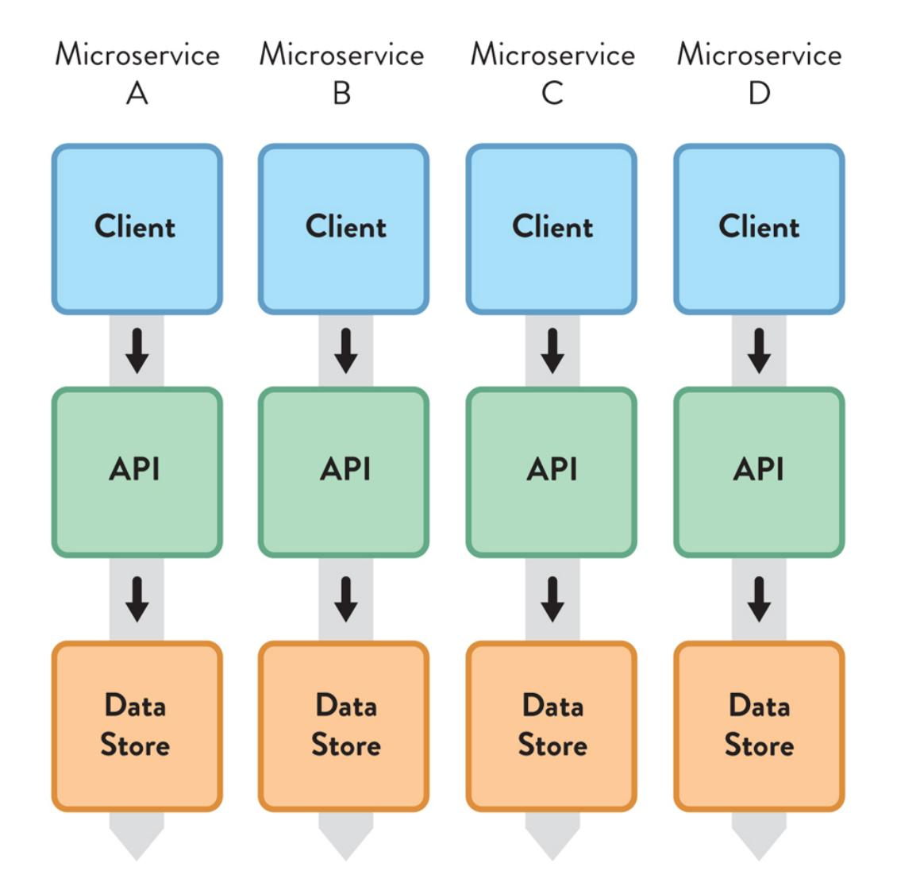
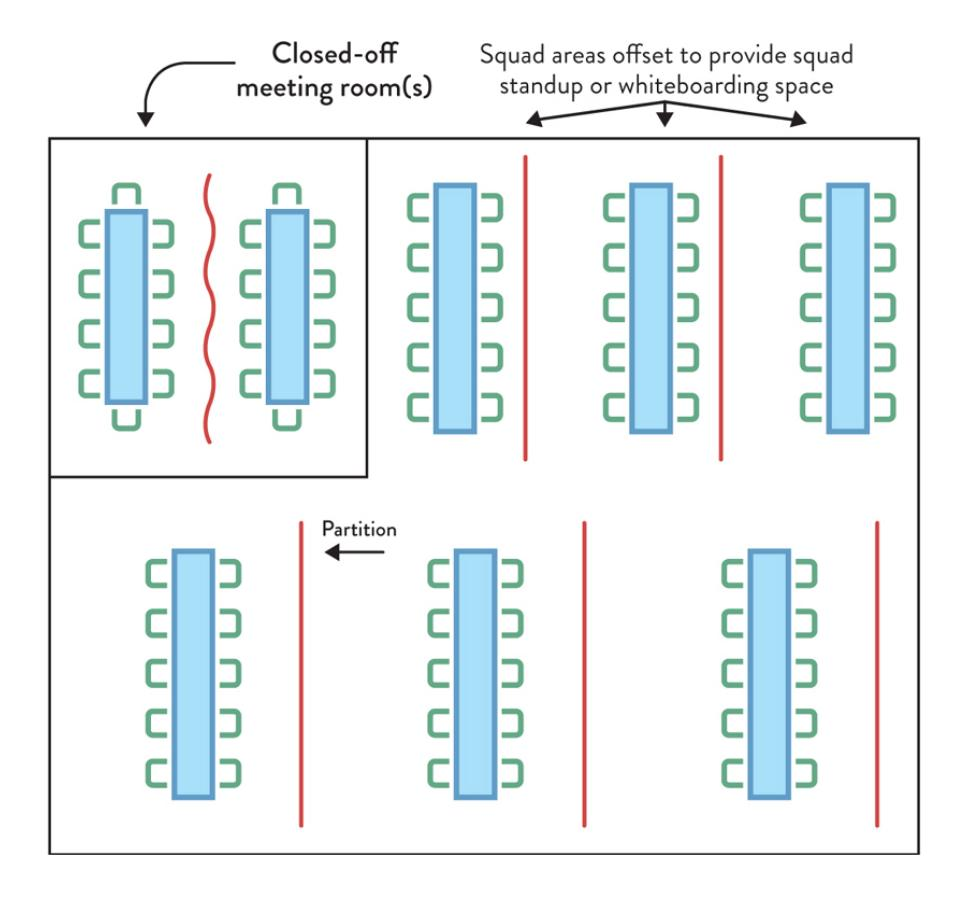
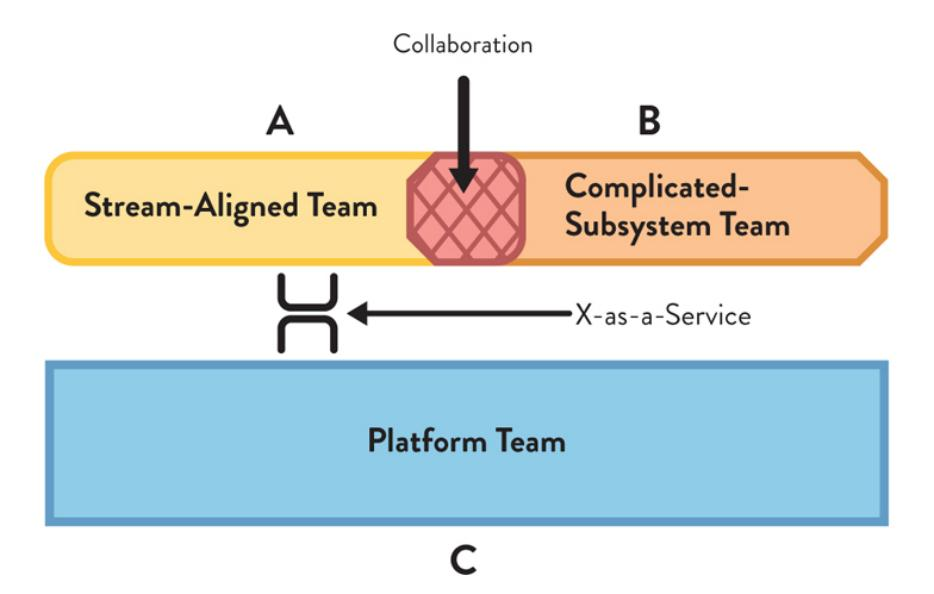

# TEAM

# TOPOLOGIES

SECOND EDITION

ORGANIZING
BUSINESS AND
TECHNOLOGY
FOR FAST FLOW
OF VALUE

Foreword by RUTH MALAN

MATTHEW SKELTON and MANUEL PAIS


# TEAM TOPOLOGIES SECOND EDITION

# ORGANIZING BUSINESS AND TECHNOLOGY FOR FAST FLOW OF VALUE

# MATTHEW SKELTON and MANUEL PAIS

Foreword by Ruth Malan

IT Revolution
Portland, Oregon


Second Edition Copyright © 2025 by Matthew Skelton and Manuel Pais First Edition Copyright © 2019 For information about permission to reproduce selections from this book, write to Permissions, IT Revolution Press, LLC, 25 NW 23rd Pl, Suite 6314, Portland, OR 97210.

> Second Edition Printed in the United States of America 30 29 28 27 26 25 1 2 3 4 5 6 7 8 9 10

Cover and book design by Devon Smith

Library of Congress Control Number: 2025940729

Second Edition Paperback: 9781966280002 Second Edition ebook: 9781966280019 Audiobook download: 9781942788843

For information about special discounts for bulk purchases, or for information on booking authors for an event, please visit our website at [ITRevolution.com.](http://itrevolution.com/)

TEAM TOPOLOGIES, SECOND EDITION


To my wife, Suzy Beck—for all your support and inspiration.

To Katie, my life partner and family stronghold—thanks for your tireless love and support.

To Dan and Ben, daily sources of warmth—hopefully this book can help you understand what Daddy does for a living.

# CONTENTS

[Figures](#page-9-0) & Tables

Note on the Second [Edition](#page-12-0)

[Foreword](#page-15-0) to the Second Edition by Matthew Skelton & Manuel Pais

[Foreword](#page-27-0) to the First Edition by Ruth Malan

[Preface](#page-30-0)

#### [PART](#page-38-0) I TEAMS AS THE MEANS OF [DELIVERY](#page-38-0)

Chapter 1: e [Problem](#page-41-0) with Org Charts

Chapter 2: [Conway's](#page-56-0) Law and Why It Matters

Chapter 3: [Team-First](#page-76-0) inking

#### [PART](#page-111-0) II TEAM [TOPOLOGIES](#page-111-0) THAT WORK FOR FLOW

Chapter 4: Static Team [Topologies](#page-114-0)

Chapter 5: e Four [Fundamental](#page-137-0) Team Topologies

Chapter 6: Choose Team-First [Boundaries](#page-178-0)

#### [PART](#page-199-0) III EVOLVING TEAM [INTERACTIONS FOR INNOVATION](#page-199-0) AND RAPID DELIVERY

Chapter 7: Team [Interaction](#page-202-0) Modes

Chapter 8: Evolve Team Structures with [Organizational](#page-229-0) Sensing

Conclusion: e [Next-Generation](#page-259-0) Digital Operating Model

#### [APPENDIX](#page-272-0) CASE [STUDIES](#page-272-0)

[Afterword](#page-340-0)

[References](#page-346-0)

[Notes](#page-360-0)

[Index](#page-365-0) [Acknowledgments](#page-385-0) About the [Authors](#page-387-0)

# <span id="page-9-0"></span>FIGURES & TABLES

#### FIGURES

- 0.1: Value Stream [Grouping](#page-14-0)
- 0.2: e Four Team Types and ree [Interaction](#page-34-0) Modes
- 1.1: Org Chart with Actual Lines of [Communication](#page-44-0)
- 1.2: [Obstacles](#page-54-0) to Fast Flow
- 2.1: [Four Teams](#page-61-0) Working on a Software System
- 2.2: Software Architecture from Four-Team [Organization](#page-62-0)
- 2.3: [Microservices](#page-64-0) Architecture with Independent Services and Data Stores
- 2.4: Team Design [for Microservices](#page-65-0) Architecture with Independent Services and Data Stores
- 2.5: Inter-Team [Communication](#page-70-0)
- 3.1: Scaling Teams Using [Dunbar's](#page-80-0) Number
- 3.2: No More than One [Complicated](#page-93-0) or Complex Domain per Team
- 3.3: Typical vs. Team-First Software Subsystem [Boundaries](#page-95-0)
- 3.4: Office [Layout](#page-103-0) at CDL
- 4.1: [Organization](#page-118-0) not Optimized for Flow of Change
- 4.2: [Organization](#page-119-0) Optimized for Flow of Change
- 4.3: [Relationship](#page-127-0) between SRE Team and Application Team
- 4.4: Influence of Size and [Engineering](#page-130-0) Discipline on Team Interaction Patterns
- 5.1: e [Four Fundamental](#page-138-0) Team Topologies
- 5.2: Platform Composed of Several [Fundamental](#page-159-0) Team Topologies
- 5.3: Traditional [Infrastructure](#page-170-0) Team Organization
- 5.4: [Support](#page-174-0) Teams Aligned to Stream of Change
- 6.1: Mobile, Cloud, and IoT [Technology](#page-196-0) Fracture Plane Scenario

- 7.1: Collaboration vs. [X-as-a-Service](#page-204-0)
- 7.2: e ree Essential Team [Interaction](#page-206-0) Modes
- 7.3: Team [Interaction](#page-206-1) Modes Scenario
- 7.4: [X-as-a-Service](#page-211-0) Team Interaction Mode
- 7.5: Primary Interaction Modes for the [Four Fundamental](#page-219-0) Team Topologies
- 7.6: Team [Interaction](#page-221-0) Modes at IBM around 2014
- 8.1: [Collaboration](#page-233-0) between Cloud and Embedded Teams
- 8.2: System Build and Platform Build Team at [TransUnion](#page-235-0)
- 8.3: System Build and Platform Build Team [Collaboration](#page-235-1) at TransUnion
- 8.4: System Build and Platform Build Teams Merged at [TransUnion](#page-236-0)
- 8.5: System Build and Platform Build Teams Merged Back Into Dev and Ops at [TransUnion](#page-236-1)
- 8.6: Evolution of Team [Topologies](#page-238-0)
- 8.7: Evolution of Team [Topologies](#page-239-0) in an Enterprise
- 8.8: Example of a ["Platform](#page-250-0) Wrapper"
- 8.9: [New-Service](#page-256-0) and "Business as Usual" (BAU) Teams
- 8.10: [Side-by-Side](#page-257-0) New Service and BAU Teams
  - 9.1: Core Ideas of Team [Topologies](#page-261-0)
  - A.1: Original Team [Organization](#page-298-0) at KFC
- A.2: Reconfigured Team [Organization](#page-299-0) at KFC
- A.3: [ree-Month](#page-306-0) Cognitive Load Assessment
- A.4: Expanded [Collaboration](#page-320-0) Scope
- A.5: [Conceptualization](#page-327-0) of the Generic Enterprise-Level Building Blocks
- A.6: Adidas Digital Platform Teams Engage in Different Interaction Modes at [Different](#page-336-0) Times

#### TABLES

- 7.1: Advantages and [Disadvantages](#page-210-0) of Collaboration Mode
- 7.2: Advantages and [Disadvantages](#page-213-0) of X-as-a-Service Mode

- 7.3: Advantages and [Disadvantages](#page-215-0) of Facilitating Mode
- 7.4: Team Interaction Modes of the [Fundamental](#page-220-0) Team Topologies

#### <span id="page-12-1"></span><span id="page-12-0"></span>NOTE

#### on the Second Edition

one of the most important concepts in *Team Topologies* (and in related approaches) is the idea of a "fractal organization"—self-similar patterns at multiple "zoom levels." This idea is present in the first edition of the book in numerous places (e.g., page 93: "several inner platform teams"; page 96: "logical platform"; page 168: "outer platform and inner platform"). Unfortunately, by referring to a platform as a type of team, we caused some inadvertent confusion. A platform is a grouping of teams providing a coherent capability or set of services to other teams.

In an organization larger than about forty to fifty people, an internal platform will typically need more than one eight-person team to provide the necessary services—a grouping of teams is needed. In the case of an internal platform, we're now calling this a platform grouping. This means that where the phrase "platform team" is used in the book, it could refer to one of two things: 1) A single team of some kind working inside a platform, or 2) a grouping of multiple teams working on a platform.

If a team is working inside a platform, it's important for the team to know the platform's nature and mission. Most of the advice in Chapter 5 relates to such a situation. However, it's vital to understand that most platforms will need more than one such team, and a "platform grouping" is a good way to refer to that collection of teams. This means that the four team types could really be three team types plus a special "platform grouping" of teams (or a team of teams). But we'll still refer to them as the four team types. Just keep in mind that the platform team can be a single team or a grouping of teams.

In the second edition, we've updated [Figure](#page-138-0) 5.1 (a diagram of the team types on page 80) to show the platform grouping with dotted lines to indicate it's not a team type in the sense of a single team of around eight people, but instead a kind of "container" for one or more teams. With the fractal nature of organizations and internal platforms in particular, the types of teams working inside a platform are the same types of teams as outside a platform: stream-aligned, enabling, complicated subsystem, and other (inner) platform teams or groupings.

<span id="page-13-0"></span>For any platform grouping, we can "zoom in" and see the same types of teams and groupings used as in the updated [Figure](#page-159-0) 5.2 (on page 96). Conversely, we can "zoom out" of a platform grouping and visualize the blue box as the platform itself. is zooming back-and-forth between different levels is vital for understanding how Team Topologies platforms work.

#### Value Stream Grouping

It's also valuable to take the "grouping" idea further and generalize it to a grouping of value stream activities, using what we've started to call a "value stream grouping." (See the Telenet case study in the [Appendix](#page-324-0) on page 229 for a similar approach with their internal and external customercentric tribes).

<span id="page-14-0"></span>

Figure 0.1: Value Stream Grouping

In a future book, we expect to expand this idea further, but the key point is that a grouping brings multiple teams together into a common mission, and inside the grouping, there are different team types and groupings. In this scheme, it's clear that a platform grouping is merely a special kind of value stream grouping that provides services to other teams or other groupings.

—Matthew Skelton & Manuel Pais, 2025

#### <span id="page-15-0"></span>**FOREWORD**

#### to the Second Edition

What was essentially an aspiration back in 2019—that the ideas and patterns in the first edition of *Team Topologies* could help make work more humane while increasing organizational and financial effectiveness—turned into a reality. More and more organizations adopting *Team Topologies* reported not just faster flow but significant positive shifts in employee engagement and employee satisfaction. These improvements attest to the inherent humanity of the principles underpinning *Team Topologies*.

The Norwegian company Capra Consulting intentionally applied *Team Topologies* to their whole organization (including sales, operations, recruitment, and even the leadership group). Their goals were to increase employees' engagement and strategic decision-making, as well as to increase autonomy and flexibility in teams. Other companies like Yassir specifically tracked employee satisfaction, with an impressive 230% increase in just a couple of years.\*

<span id="page-15-2"></span><span id="page-15-1"></span>Countless organizations have benefited from the shared vocabulary around organizational challenges and potential steps toward better flow brought by *Team Topologies*. But it hasn't stopped there. There is a growing ecosystem of enthusiasts and advocates, as well as worldwide events such as the Fast Flow Conf, besides many talks and articles referencing the ideas in *Team Topologies*. This growth, however, wouldn't have been possible if the ideas had not resulted in clear business results and across a range of industries. EBSCO, for example, reported 26% faster

feature delivery and over \$9 million in cost savings. KFC's digital sales increased threefold.

<span id="page-16-1"></span>In the [Appendix](#page-272-0) of this second edition, we wanted to bring to light some of these amazing transformation stories that have unfolded in the five years since the first edition was published. Most successful transformations we've witnessed have been driven by business needs and the pressure to stay competitive. However, large re-orgs with loosely defined goals around improved efficiency or adopting industry "best practices" tend to fall short or fizzle out over time. We've seen several Team Topologies adoptions happen just for the sake of adoption, with varying degrees of success depending on whether the underlying principles of fast flow were truly understood. Organizations "blinded" by a static view of the four team types and three team interaction modes tend to overlook or minimize the importance of an evolutionary approach, as described in [Part](#page-199-0) 3.

Team types and interaction modes are just useful patterns—building blocks if you will—in the larger picture of true team-first empowerment (as described in [Part](#page-38-0) 1) and evolving organizational operating models to support the business strategy while being mindful of human constraints, like trust boundaries and cognitive load in knowledge-intensive work (as described in [Part](#page-111-0) 2).

It's important to understand this is an ever-evolving approach, not a short-term, bounded change program. It might require an initial period of more intensive change to "start up the engine," but the car never stops. It needs constant course correcting to move at a fast pace. ere's no autopilot for organizational change. As Ismail Chaib says, "Org design is like a martial art; you have to keep practicing to stay sharp."

<span id="page-16-0"></span>is constantly evolving, long-term view does not imply one must adopt all of the Team Topologies ideas, patterns, and practices, however. at would be like saying you must use all the primary colors to create a painting masterpiece. [‡](#page-26-2)

We have seen examples in not-for-profit domains where strong financial and even political constraints acted as forcing functions for the critical adoption of ideas from Team Topologies. Kodea, an NGO with an agile mindset that promotes technological inclusion for underrepresented groups in Latin America, has been seeking to scale its social impact while maintaining budget efficiency. [§](#page-26-3) Team Topologies made sense to them as a way to improve flow and team autonomy, which led them to selectively adopt patterns from the book based on real operational challenges.

<span id="page-17-0"></span>As they began evolving toward more cross-functional, stream-aligned teams tied to their social initiatives (e.g., teacher training in computer science, digital empowerment for women, and reskilling of workers), they quickly identified a major bottleneck in communications and branding. is had traditionally been the responsibility of a dedicated team, due to the required expertise, which made it difficult to respond promptly to the various demands from the stream teams.

Although they lacked the budget to create dedicated platform teams, Kodea explored the platform pattern as a way to differentiate low-risk needs (e.g., presentations about the NGO to local audiences), which the stream teams could develop themselves using a self-service platform composed of templates, brand assets, and design guidelines. is freed up the communications and marketing team to focus on higher-impact or higher-risk needs, such as presentations to public authorities or international bodies, or the preparation of strategic funding proposals.

is kind of thinking highlights the evolutionary approach to team design and interactions that is a key tenet of Team Topologies. It also shows that stream alignment, as well as enabling and platform patterns, can be applied outside of technology and be instilled from early stages, even when the organization lacks the capacity to establish dedicated teams neatly matching the team types.

In a tech startup of thirty people, "enabling" might mean senior practitioners consistently pairing with and mentoring junior team

members. A well-maintained and used knowledge-sharing wiki with clear owners who harvest good practices and team insights into practical and easy-to-understand guidance (e.g., how to diagnose complicated production issues or the rationale behind a given technology or architecture choice) ticks the "platform" pattern. Setting in motion these patterns eases the transition to dedicated teams during later growth phases. It should become clearer to see when the impact of a senior practitioner's expertise multiplies in a dedicated enabling or platform team instead of continuing to split their time (and attention) between delivery work in a stream-aligned team and mentoring new hires.

<span id="page-18-1"></span>Susanne Kaiser and Nina Siessegger talked about this exact situation at the Fast Flow Conf 2025 in the Netherlands. [1](#page-360-1) Pirate Ship, a growing tech company, realized that their stream-aligned teams's attention was being diverted as they tried to take care of technical components shared with other teams. "Are our product teams spending enough time focused on our end customers's needs?" is a good heuristic to think about the right time to form platform teams. Or, when platform teams are already in place, push internal services with growing complexity being provided by stream-aligned teams into an adequate platform offering/team instead.

By discovering the needs of internal customers (i.e., other teams), Pirate Ship was able to identify good candidates for platform services based on the potential to accelerate the flow of changes for the Pirate Ship product teams. In our experience, this level of "platform maturity" is still fairly uncommon, even in much larger organizations. Too often, the "platform" is seen as a single entity where shared services of different nature are put together and handled by large teams with diverging responsibilities, rather than a grouping of small-ish teams clearly aligned to a stream or service of value to clearly identified and understood internal customers. [¶](#page-26-4)

<span id="page-18-2"></span><span id="page-18-0"></span>is naïve view of platforms gets exacerbated in enterprise settings when we not only need to consider internal platform streams of value but

also multiple platforms for multiple sets of users across multiple business domains. NAV, the Norwegian Labour and Welfare Administration, took a sensible platform approach to support the 100+ teams working on digital services for their 2.5 million citizens: "We have a small number of coherent internal platforms [an application platform, a data platform, and a design system/platform], not a cumbersome single platform." [2](#page-360-2)

<span id="page-19-1"></span>In large organizations, moving away from a "single platform that does it all" anti-pattern requires finding a sensible balance between too many internal platforms (likely increasing the cognitive load on the teams trying to use them as they need to understand different interfaces and usage patterns) and too few internal platforms (serving very different user personas and often leading to artificially imposed consistency for services that are totally unrelated). Adidas's digital platform, for example, is really a logical, high-level grouping of multiple platforms and services, each with its dedicated teams, not an actual single "monolith" with a large number of disparate responsibilities. [\\*\\*](#page-26-5)

<span id="page-19-0"></span>Effectively, a mature platform approach in large organizations needs to be both fractal (where a "platform team" is really an alias for a "stream team aligned to an internal platform service inside a platform grouping," which likely consumes other platforms to keep its own cognitive load under control) and dynamic (growing and evolving platform groupings, services, and teams as the needs and strategy of the business change).

<span id="page-19-2"></span>In a similar way, the "enabling pattern" can gain different forms based on organization size but also on the extent of the capability gaps that the enabling work aims to address. Often, platform teams are easier to "buy" from a senior management perspective, as they will build actual services to help the stream-aligned teams deliver value to end customers faster, with reduced cognitive load. But those platform teams often need to (or should) do enabling work in order to onboard new teams to the platform. More importantly, to help them understand the platform domains, whether that's infrastructure, design, or some business capabilities.

at is absolutely fine. Understanding the context and the underlying principles of enabling work (such as multiplying impact via growing capabilities in others rather than hoarding expertise in a small group of people or teams) wins over dedicated enabling teams for the sake of enabling teams. For instance, we've talked with organizations such as KFC, [†](#page-26-6) † [Booking.com](http://booking.com/), IKEA, and others where Agile coaches and communities of practice effectively act as enablers, detecting common gaps across teams, fostering the necessary learning and facilitation to upskill them. Sometimes this acts as a starting point to show the value of enabling type work and eventually dedicated enabling teams.

<span id="page-20-0"></span>Now, if a medium to large organization is very new to some organizational capability that is going to be fundamental to stay competitive in the long run (think of generative AI in 2025, data science during late 2010s, or mobile development during the early 2010s), then a more involved enabling approach will be required. It might start as just a couple of teams of experts in that field bringing knowledge into the organization (e.g., assessing new AI coding assistants or creating the first machine learning models or a first mobile app). It's reasonable to do so for a period of time, but eventually scaling such capabilities to the entire organization will require adjusting organizational structures (at least if we want to keep fast flow without massive expertise bottlenecks).

<span id="page-20-1"></span>Take the example of [bol.com,](http://bol.com/) a leading online retailer in e Netherlands, scaling their data science capabilities so that product teams could make data-driven customer recommendations, complex forecasting, and much more. [3](#page-360-3) ey realized a few dedicated data science teams could not cope with the overall demand across the organization, so they created a central data science department. e mission, however, was not to centralize all the data science work. It was to grow that capability in the product teams via a mix of: 1) a long-lived, "structural" enabling team of data science leads, listening and sensing for team and organizational needs; and 2) data scientists and engineers working in temporary enabling

teams to help upskill the product teams. Eventually, platform teams around data science were created as well, but the enabling teams continued to have an important role in surfacing new challenges, facilitating emerging practices in the industry, and helping inform and coevolve data platforms based on real input from product teams.

Another example of prioritizing the patterns and ideas from Team Topologies that match business needs comes from the State Treasury of the State of Rio de Janeiro in Brazil (SEFAZ-RJ), which provides over 250 citizen services (underpinned by more than sixty internal systems) for 17 million inhabitants, while implementing one of the most complex fiscal systems in the world. [‡‡](#page-26-7)

<span id="page-21-0"></span>In 2020, the IT department was mostly organized around technical component teams aligned to internal processes. Because many key citizen user journeys (e.g., tax refunds) and registered companies (e.g., closing down the company) typically spanned across multiple internal business areas, the end result was a maze of dependencies translated into infrequent and risky deliveries.

e accelerating pace of regulatory changes forced the agency to look for a new approach, partially based on the ideas from Team Topologies around socio-technical alignment and fast flow with parallel streamaligned teams that work on real user needs. One particularly successful example was the "Easy Tax" system, which used to be quite slow and difficult to use. e problem was not the technical system or the user journeys it supported, but rather the diffused ownership across multiple business areas, which trickled down to helpless technical teams trying to maintain and evolve the system without clear prioritization or ownership.

By applying an inverse Conway's maneuver (as described in [Chapter 2](#page-56-0)) not just at the team level but at the organizational level (a new business area focusing on taxpayer citizen services was created, which took ownership of the "Easy Tax" system and others), they were able to achieve tax refunds for citizens in twenty-four hours (versus multiple months)

and drastically reduce the number of taxpayer complaints to ombudsman about the agency. Over time, more systems and business areas were brought together in a similar fashion, shifting to a more value-stream oriented organization.

e notion that organizational structure alone will fundamentally improve the delivery of business value has led to many failed reorganizations. A naïve view of Team Topologies as an "ideal" operating model misses the need for continuous organizational evolution and the underlying principles necessary for success.

Underpinning the (more visible) patterns described in this book, like the team types or the team interaction modes, are principles such as:

- <span id="page-22-0"></span>• A fundamental focus on the flow of (actual) value to customers via incremental delivery.
- Supporting multiple flows of value with the parallelization of value streams via ongoing curation of boundaries and removal of blocking dependencies.
- Increasing teams' agency and decision-making capabilities (with adequate guardrails and boundaries), which in turn requires increased trust levels across the organization.
- Leveraging dynamic interactions (between teams but also departments, value streams, etc.) to sense and correct breakdowns in the flow of information, knowledge, and skills.
- Understanding and respecting cognitive load limits on individuals and teams.
- Regular sharing and adoption of practices and solutions with/from other teams, treating this social learning as an active, deliberate approach: what can be called "active knowledge diffusion" across the organization.

A regular misunderstanding we noticed after the original publication of the book was people assuming fast flow means fast delivery, from idea inception all the way to customer's hands. While that "left to right" acceleration is necessary to be able to make changes, experiment, and course correct quickly. Ultimately, it's the value to the customer that is truly important. Which in turn means we need to be able to validate and measure whether customers are accruing value from using our services or products…and if not, then why?

As Piotr Kacała put it: "Flow is how quickly work moves from idea to customer value without getting stuck in organizational bottlenecks. Structure only matters if it helps ideas become reality faster." [4](#page-360-4)

<span id="page-23-0"></span>Teams far removed from interactions with actual customers will have a hard time empathizing with their needs and frustrations. Realistically, in large organizations, removing some layers of indirection between direct customer support and product-focused teams and putting in place structured communication channels and regular feedback will go a long way toward faster flow of value to customers.

Another common misunderstanding we've seen relates to team cognitive load limits and how to deal with them. A misguided view would see the load as a bucket that we fill with water, and once it's full, the team should never be asked to learn new things or take on new responsibilities. A river analogy is more on point. You don't want an overflow causing disaster, but the river level is expected to change over time. Also, our goal should not be to always lower the level; otherwise, we end up with no flow!

<span id="page-23-1"></span>A more helpful and dynamic view on team cognitive load sees a temporary increase in cognitive load as a "necessary evil" that teams might need as long as there's a clear objective. at could mean increased service ownership (e.g., by taking on adjacent responsibilities that used to sit outside the team's realm), improved productivity (e.g., integrating AI in the team's workflows), or modernizing a software system (e.g., using better tools and frameworks).

What we must avoid ia continuously increasing the team's cognitive load by demanding more ownership without adequate guidance and support, piling on responsibilities and expecting everything else to stay the same, or standing still while the number of tools, services, frameworks, and processes the team must handle proliferates without adequate platforms to handle some of that complexity.

Cognitive load theory (CLT) applied to the team dimension (as described in [Chapter 3](#page-76-0)) has provided thousands of organizations with a useful model to understand the nature of team cognitive load and dig into many of the underlying issues. However, because there is no clean "split" between intrinsic, extrinsic, and germane types of cognitive load, we run the risk of overlooking drivers of team cognitive load that are not as visible or overinvest in solutions that address consequences rather than the causes of excessive cognitive load on teams.

<span id="page-24-1"></span>To address these issues, we worked with Dr. Laura Weis, an expert in organizational psychology, to devise a scientific model for systematically assessing cognitive load in knowledge-intensive teams at large (not restricted to teams working in technology). [5](#page-360-5) We found more than twenty drivers of team cognitive load arranged into four clusters: team characteristics, work practices and processes, task characteristics, and work environments and tools. Surprisingly (or maybe not), people answering the model's survey for the first time often convey that the questions alone made them realize how many factors that can impact their cognitive load were not even on their radar.

<span id="page-24-2"></span><span id="page-24-0"></span>is systematic approach allows looking at team cognitive load trends and evolution over time (at the team, group, and even organizational level). e case study from Creditas highlights how this data-driven approach help them make sense of recurring cognitive load challenges across teams, make better informed decisions on how to address them, and finally evaluate if the changes made actually helped improve the overall cognitive health and performance of the teams. [§§](#page-26-8)

<span id="page-25-0"></span>As George Box said in his 1976 paper "Science and Statistics" (later made famous by W. Edwards Deming): "all models are wrong, but some are useful." [6](#page-360-6) Contextual awareness, together with useful modelling, is key in understanding and driving change when it comes to team cognitive load. Both internal events (e.g., a re-org or a change in team responsibilities or composition) and external shifts in the industry (e.g., introducing AIassisted workflows and agents) will contribute to variations in team cognitive load drivers. e goal is to have more accurate sensors of what's happening in the teams and the organization in order to increase the odds of making the right organizational decisions.

<span id="page-25-1"></span>Interestingly, since the first edition of this book, research by the originator of CLT, John Sweller, (and others) has expanded from CLT at an individual level into "collaborative cognitive load theory" [7](#page-360-7) within the scope of learning activities in groups. is focus on groups reflects a wider and growing industry-wide recognition that the team is the smallest useful unit of value delivery.

To finish, we wanted to acknowledge how Team Topologies is just one of multiple approaches and ways of working we need to onboard to achieve more humane and effective organizations, focused on the fast flow of value to customers but also increased employee engagement and satisfaction. We have been delighted to see the rise of new approaches that share a similar humanistic view and work well together with Team Topologies, including Jon Smart and coauthors's Sooner Safer Happier, Heidi Helfand's Dynamic Reteaming, and Zhamak Dehghani's "data mesh" concept.

<span id="page-25-2"></span>ere is potential for exponential value to organizations combining related approaches for fast flow. Susanne Kaiser, for example, has talked and written extensively about evolving adaptive systems with "Architecture for Flow," seamlessly bringing together Team Topologies, Wardley Maps, and domain-driven design. [8](#page-360-8)

<span id="page-26-9"></span>Of course, at the time of this writing, the artificial intelligence "revolution" is challenging many assumptions about individual, team, and organizational capabilities. It's rewarding to see people like Roberta Lingnau [9](#page-360-9) and others rely on the ideas from Team Topologies in order to successfully make sense of and adapt to these new challenges.

—Matthew Skelton & Manuel Pais, 2025

<span id="page-26-0"></span>[<sup>\\*</sup>](#page-15-1) You can read the full case studies in the [Appendix.](#page-272-0)

<span id="page-26-1"></span>[<sup>†</sup>](#page-15-2) See more at [TeamTopologies.com/examples](http://teamtopologies.com/examples).

<span id="page-26-2"></span>[<sup>‡</sup>](#page-16-0) Case in point: Picasso's grey-scale Guernica masterpiece.

<span id="page-26-3"></span>[<sup>§</sup>](#page-17-0) See more at [TeamTopologies.com/kodea.](http://teamtopologies.com/kodea)

<span id="page-26-4"></span>[<sup>¶</sup>](#page-18-0) See the "platform grouping" key concept in the Note on the Second Edition for more details on what this approach looks like.

<span id="page-26-5"></span>[<sup>\\*\\*</sup>](#page-19-0) Read the full case study in the [Appendix](#page-272-0).

<span id="page-26-6"></span>[<sup>††</sup>](#page-20-0) Read the full case study in the [Appendix.](#page-272-0)

<span id="page-26-7"></span>[<sup>‡‡</sup>](#page-21-0) See more at [TeamTopologies.com/sefazrj](http://teamtopologies.com/sefazrj).

<span id="page-26-8"></span>[<sup>§§</sup>](#page-24-0) Read the full case study in the [Appendix.](#page-272-0)

#### <span id="page-27-0"></span>**FOREWORD**

#### to the First Edition

Keeping our systems small and simple is a worthy goal, yet it is also one that most successful systems defy. Lehman's laws of software evolution, and, in particular, continuing growth, captures the evolutionary pressure to add capabilities as systems are used and new demands or opportunities are perceived. Being able to cope with, and even harness, this increasing complexity raises the importance of dual design arenas: the design of systems and the design of the organization that creates and evolves systems. We have a considerable body of work focused on the former; that is, on systems and software design and architecture, including an ever growing number of books on domain driven design and software architecture. *Team Topologies* addresses the design of the software development organization, with Conway's law in view.

The basic thesis [....] is that organizations which design systems [....] are constrained to produce designs which are copies of the communication structures of these organizations. We have seen that this fact has important implications for the management of system design. Primarily, we have found a criterion for the structuring of design organizations: a design effort should be organized according to the need for communication.<sup>1</sup>

<span id="page-27-1"></span>The above quote from the conclusion of Mel Conway's classic paper on organizational design for software development is a most fitting beginning

to this book. Team Topologies describes organizational patterns for team structure and modes of interaction, taking the force that the organization exerts on the system as a driving design concern.

As the complexity of the system increases, so, generally, do the cognitive demands on the organization building and evolving it. Managing cognitive load through teams with clear responsibilities and boundaries is a distinguishing focus of team design in the Team Topologies approach. To achieve duly scoped, bounded responsibilities, natural—and relatively independent—system (sub)structure is sought to align teams to. is takes Conway's law into account and leverages it to help maintain cohesive structures with clear boundaries and loose coupling (known as the reverse Conway maneuver, and described herein).

<span id="page-28-0"></span>If this was the extent of it, Team Topologies would be a useful elaboration of Conway's paper, setting it in the current context. Of course, Team Topologies is even more than that. Notably, it identifies four team patterns, describing their outcomes, form, and the forces they address and are shaped by. Stream-aligned teams are the primary team form. ese are teams that are optimized for flow, with all they need to effect continuous delivery of value and be fully responsive to the associated feedback cycles. is means that system design seeks not just loose coupling but a decomposition that supports flow and lowers dependencies and coordination needs between stream-aligned teams. Complicatedsubsystem and platform teams reduce load for stream-aligned teams, where the latter are internal customers of the former's subsystem or platform capabilities (supporting all phases of development, delivery, and operations for multiple stream teams). Enabling teams likewise serve other teams, but they are service providers, helping stream-aligned teams learn new techniques, investigate new technologies, and so forth, allowing stream-aligned teams to retain focus while growing effectiveness.

Matthew Skelton and Manuel Pais have brought their considerable experience to bear, describing what these various team forms need to be successful, but also highlighting variations in context, identifying the

design implications thereof, and indicating anti-patterns to avoid. ey also, with great generosity, weave in insights from and offer pointers to related work. is, along with a set of case studies, further textures the book.

Team Topologies informs and enriches our understanding of organizational architecture, via the nuanced presentation of these key structural patterns, interaction modes or dynamics, and considerations for evolution. And, due to its clarity and focus, it serves as a pragmatic guide whether forming teams and enabling them to meet their challenges or helping existing teams become more effective at responsive value delivery.

> —Ruth Malan, Architecture Consultant at Bredemeyer Consulting

#### <span id="page-30-0"></span>**PREFACE**

[Modern] organisational design...is about designing for collaborative technologies, for the voice of the customer.

—Naomi Stanford, Guide to Organization Design

Teams are always works in progress, but they are also your best shot at delivering value continuously and sustainably by aligning them with the business. Ideally, teams should be long lived and autonomous, with engaged team members. However, teams don't live in isolation. They need to understand how and when to interact with each other. And these team interactions need to evolve over time to support the distinct phases of discovery and execution that products and technology go through during their lifetimes. In short, organizations not only need to strive for autonomous teams, they also need to continuously think about and evolve themselves in order to deliver value quickly to customers.

This book offers a practical, step-by-step, adaptive model for organizational design that we have used and seen work across businesses at varying levels of maturity: Team Topologies.

However, Team Topologies is not a universal formula for building and running software systems successfully. There are teams and organizations who succeed with organizational dynamics very different from those described and recommended here (particularly in organizations with excellent culture and best practices already in place).

Team Topologies is meant to provide clear patterns that are straightforward for many different teams and organizations to follow and interpret, not to dictate to outstanding players how to perform. We like to think of Team Topologies as a set of music parts for an orchestra or big band, not the melody for a top jazz trumpeter. Printed music for a large musical ensemble helps the group to succeed but does not dictate every aspect of performance; lots of detail is left for the ensemble to interpret to suit the occasion, venue, or mix of players. Likewise, there is huge value in agreeing to a coherent vocabulary and way of working together across teams to achieve good software delivery.

e Team Topologies approach helps organizations that are struggling to find a way to optimize their team structure, or for those that are not yet aware of the impact team design can have on good business outcomes and software systems in particular. Team Topologies helps organizations succeed more quickly and more continuously than before.

is book is for anyone who cares about the effectiveness of the delivery and operations of software systems: C-level leaders (including CTOs/CIOs, CEOs, CFOs, and so on) managers, heads of department, software architects and systems architects, and anyone else involved in building or running software systems who wants or needs to make the delivery and running of those systems more effective.

#### <span id="page-31-0"></span>How We Came to Write This Book

In 2013, while introducing DevOps and Continuous Delivery at a company in the UK, Matthew devised the original DevOps Topologies patterns (and anti-patterns) in a blog post titled "What Team Structure Is Right for DevOps to Flourish?" [1](#page-360-11) At the time, the company he was consulting with was struggling to adopt modern approaches to software delivery, and the

early topology patterns Matthew created provided the company a way to explore different options.

Manuel interviewed Matthew at the QCon London software development conference back in 2015, where Matthew was speaking on Conway's law and the early DevOps Topology patterns. e resulting article, "How Different Team Topologies Influence DevOps Culture," was published by InfoQ and translated into several languages. [2](#page-360-12) Later that year, Manuel helped to expand the DevOps Topology patterns and there were contributions from the community.

<span id="page-32-0"></span>Since then, the use of DevOps Topology patterns has exploded. ey have been referenced over and over again in talks, articles, and conversations. ey have helped organizations of all sizes and from varying industries around the world to think about the relationships between teams and how their interactions influence both organizational culture and software architecture.

Over time, we realized that the original DevOps Topologies presented a static view of team interrelationships that, while useful for initial discussions, was quite limited in scope. rough our combined experience with training and consulting organizations from across the world, we discovered that some teams work better relatively isolated or autonomous, while other teams work better with strong collaboration. We asked ourselves why, and we kept evolving our ideas based on feedback from our clients.

Eventually, this led to the Team Topologies as you see them presented in this book: a dynamic and evolving approach to organizational design based on real scenarios from across different geographies and industries.

#### How to Use This Book

Team Topologies is meant to be a functional book. It is our intention to provide content that is interactive and delivers as much learning as we are able to fit within these pages. To help with that, we have made some design choices that will help you navigate this book.

First, the book is organized in three parts:

[Part](#page-38-0) I of the book explores Conway's law, the way organizational interrelationships constrain the design of systems we build, and how we can use this tendency to our advantage. We then define what we mean by teams and look at some practical constraints that affect effective teamwork.

In [Part](#page-111-0) II, we investigate a set of static team patterns that have been proven in the industry and the implications of choosing one pattern over another with Conway's law and organizational context in mind. is section should help you think about team topologies that are broadly suitable for your organizational context. is part also provides some guidance in deciding how to align teams to areas of the system, taking into account Conway's law and fundamental team topologies.

Finally, in [Part](#page-199-0) III, we deal with ways to evolve the organization design to provide powerful capabilities for innovation and rapid delivery in response to a quickly changing operating context. We explain how to use the Team Topologies approach to create a sensing organization that responds to the market and user demands, and accounts for the implications this has for hiring and skills.

Each part opens with a breakdown of key takeaways from each of the chapters. roughout the chapters, we have included figures and callouts to highlight information we think is helpful to know and/or reference. We also provide easy-to-recognize scenarios, case studies, and explicit recommendations for different situations along the way.

Finally, the shapes, colors, and patterns found within many of the figures also have consistent meaning throughout much of the book. Here is the key:

<span id="page-34-0"></span>

Figure 0.2: e Four Team Types and ree Interaction Modes

<span id="page-34-1"></span>For the fullest understanding, you should read the book from cover to cover, as the subject matter builds up chapter by chapter. However, we have written the material so that each section is fairly independent.

In that spirit, here are some scenarios with corresponding ways to read the book that might match with your current situation:

- I need more clarity about different team types and which team types are effective.
  - Review [Chapter 1](#page-41-0) (overview), then [Chapter 4](#page-114-0) (static topologies), then [Chapter 5](#page-137-0) (fundamental topologies).
- I need to split up a large, monolithic software system.
  - Review [Chapter 6](#page-178-0) (boundaries) and then [Chapter 3](#page-76-0) (the team).
- I need to improve the architecture of the software system.

- Review [Chapter 2](#page-56-0) (Conway's law), then [Chapter 4](#page-114-0) (static topologies), then [Chapter 6](#page-178-0) (boundaries).
- I need to improve the effectiveness of software development teams.
  - Review [Chapter 3](#page-76-0) (the team), then [Chapter 6](#page-178-0) (boundaries), then [Chapter 5](#page-137-0) (fundamental topologies).
- <span id="page-35-0"></span>• I need to improve morale and effectiveness within teams.
  - Review [Chapter 3](#page-76-0) (the team) and then [Chapter 5](#page-137-0) (fundamental topologies).
- I need to understand where to invest effort to help with projected growth.
  - Review [Chapter 1](#page-41-0) (overview), then [Chapter 5](#page-137-0) (fundamental topologies), then [Chapter 8](#page-229-0) (topology evolution).
- I need to understand how to evolve team topologies to meet changing business needs.
  - Review [Chapter 7](#page-202-0) (dynamic aspects) and then [Chapter 8](#page-229-0) (topology evolution and organizational sensing).

# Key Influences that Informed this Book

In addition to our own experience, this book is strongly influenced by several related approaches and sets of thinking. First, we assume that an organization is a sociotechnical system or ecosystem that is shaped by the interaction of individuals and the teams within it; in other words, that an organization is the interaction between people and technology. In this aspect, the book fits with ideas from the fields of: cybernetics (especially the use of the organization as a "sensing mechanism," which goes back as far as 1948, when Norbert Wiener's book Cybernetics: Or Control and Communication in the Animal and the Machine was first published), systems thinking (particularly the work of W. Edwards Deming), and

approaches such as the Cynefin framework for assessing domain complexity (described by Dave Snowden and Mary Boone in their 2007 Harvard Business Review paper titled "A Leader's Framework for Decision Making"), and adaptive structuration theory (a term coined by Gerardine DeSanctis and Marshall Scott Poole in their Organization Science article, "Capturing the Complexity in Advanced Technology Use: Adaptive Structuration eory," where they emphasized that the impact of technology is not a given, as it depends on how groups and organizations perceive it).

Second, we assume that "the team" is something that behaves differently from a mere collection of individuals, and that the team should be nurtured and supported in its evolution and operation. In this respect, we draw on ideas from Bruce Tuckman (who proposed the four-stages model—forming, storming, norming, performing—for team development in his 1965 paper "Developmental Sequence in Small Groups"), Russ Forrester and Allan Drexler (who explored team-based organization performance in their 1999 paper "A Model for Team-Based Organization Performance"), Pamela Knight (who found evidence that storming takes place throughout the entire lifetime of a team in her 2007 paper "Acquisition Community Team Dynamics: e Tuckman Model vs. the DAU Model"), Patrick Lencioni (who explores common interaction issues in his seminal book e Five Dysfunctions of <sup>a</sup> Team: <sup>A</sup> Leadership Fable), and similar team-focused theories and research.

<span id="page-36-0"></span>ird, we assume that Conway's law (or a variant of it) is a strong driver of software product shape and that organizations would benefit from explicitly addressing the implications of this law. In this regard, we draw on writing and ideas from Mel Conway; from software architecture consultant and team organization design award-winner Ruth Malan; from oughtWorks technical director and one of the "reverse Conway maneuver" proponents James Lewis; and from similar authors and practitioners.

Finally, we draw on numerous sources that describe practical successes developing and running software systems at scale, including organizations such as Adidas, Auto Trader, Ericsson, Netflix, Spotify, TransUnion, and others. e size and speed of these organizations has made it possible for them to see tangible gains from changes in organization structure and team interaction over the space of several months to a few years.

As you travel through this book, we hope you get inspired to challenge how you think about teams, their structures, and how they function.

# <span id="page-38-0"></span>PART I Teams As the Means of Delivery

# KEY TAKEAWAYS

#### CHAPTER 1

- Conway's law suggests major gains from designing software architectures and team interactions together, since they are similar forces.
- Team Topologies clarifies team purpose and responsibilities, increasing the effectiveness of their interrelationships.
- Team Topologies takes a humanistic approach to building software systems while setting up organizations for strategic adaptability.

#### CHAPTER 2

- Organizations are constrained to produce designs that reflect communication paths.
- e design of the organization constrains the "solution search space," limiting possible software designs.
- Requiring everyone to communicate with everyone else is a recipe for a mess.
- Choose software architectures that encourage team-scoped flow.
- Limiting communication paths to well-defined team interactions produces modular, decoupled systems.

#### CHAPTER 3

- e team is the most effective means of software delivery, not individuals.
- Limit the size of multi-team groupings within the organization based on Dunbar's number.

- Restrict team responsibilities to match the maximum team cognitive load.
- Establish clear boundaries of responsibility for teams.
- Change the team working environment to help teams succeed.

# <span id="page-41-1"></span><span id="page-41-0"></span>1 The Problem with Org Charts

Organizations should be viewed as complex and adaptive organisms rather than mechanistic and linear systems.

—**Naomi Stanford**, Guide to Organisation Design

Technology workers are in a constant state of action: creating and updating systems at an unbelievable rate, and combining different types of technology to create a compelling user experience. Mobile applications; cloud-based services; web applications; and embedded, wearable, or industrial IoT devices all need to interoperate effectively to achieve the desired business outcomes.

Today, these systems affect nearly every aspect of people's day-to-day lives in ways that are increasingly profound. If software is poorly designed —or more importantly, if there is a mismatch in the interaction of the software, the provider, and the customer—people will be adversely affected. They can be stranded long distances from home if a taxi-hailing application fails. They may be unable to pay rent if the software or processes for internet banking fail. They may even see their life in danger if a medical device fails. Never before has explicit sociotechnical design been so important.

Building and running these highly complex, interconnected software systems is a team activity, requiring the combined efforts of people with different skills across different platforms. In addition, modern IT organizations must deliver and operate software systems rapidly and

<span id="page-42-1"></span>safely, while simultaneously growing and adapting to changes and pressures in the business or regulatory environment. Businesses can no longer choose between optimizing for stability and optimizing for speed.

But despite these risks and demands, many organizations are still organizing their people and teams in ways that are counterproductive to modern software development and operations. Organizations that rely too heavily on org charts and matrixes to split and control work often fail to create the necessary conditions to embrace innovation while still delivering at a fast pace. In order to succeed at that, organizations need stable teams and effective team patterns and interactions. ey need to invest in empowered, skilled teams as the foundation for agility and adaptability. To stay alive in ever more competitive markets, organizations need teams and people who are able to sense when context changes and evolve accordingly.

e good news is that it is possible to be fast and safe with the right mindset and with tools that emphasize adaptability as well as repeatability, while putting teams and people at the center. As Mark Schwartz and co-authors put it in their 2016 paper inking Environments, "the organizational structure must coordinate accountabilities to support the goals of delivering high-quality, impactful software." [1](#page-360-13)

<span id="page-42-0"></span>As members of the technology teams managing these interfaces, we must shift our thinking from treating teams as collections of interchangeable individuals that will succeed as long as they follow the "right" process and use the "right" tools, to treating people and technology as a single human/computer carbon/silicon sociotechnical ecosystem. At the same time, we need to ensure that teams are intrinsically motivated and are given a real chance of doing their best work within such a system.

is chapter will introduce Team Topologies as an adaptive model for technology organization design allowing businesses to achieve speed and stability. But first, let's look at how real communication structures in most

organizations are often quite distinct from what the org chart tells us, and what the implications of that are.

#### Communication Structures of an Organization

Most organizations want or are required to have a single view of their teams and people called the "org chart." is chart depicts the teams, departments, units, and other organizational entities, as well as how they relate to each other. It usually shows hierarchical lines of reporting, which imply lines of communication running "up and down" the organization.

<span id="page-43-0"></span>e org chart does have its uses in the context of building software systems, specifically around regulatory and legal compliance. However, in a highly collaborative context filled with uncertainty over outcomes, relying on the org chart as a principal mechanism of splitting the work to be done leads to unrealistic expectations. We need to rely instead on decoupled, long-lived teams that can collaborate effectively to meet the challenge of balancing speed and safety.

e problem with taking the org chart at face value is that we end up trying to architect people as if they were software, neatly keeping their communication within the accepted lines. But people don't restrict their communications only to those connected lines on the chart. We reach out to whomever we depend on to get work done. We bend the rules when required to achieve our goals. at's why actual communication lines look quite different from the org chart, as shown in [Figure](#page-44-0) 1.1 (see page 6).

<span id="page-44-0"></span>

Figure 1.1: Org Chart with Actual Lines of Communication

In practice, people communicate laterally or "horizontally" with people from other reporting lines in order to get work done. is creativity and problem solving needs to be nurtured for the benefit of the organization, not restricted to optimize for top-down/bottom-up communication and reporting.

#### Org Chart Thinking Is the Problem

Traditional org charts don't help us understand what the actual patterns of communication in our organization are, as illustrated in [Figure](#page-44-0) 1.1. Instead, organizations need to develop more realistic pictures of the expected and actual communication happening between individuals and teams. e gaps will help inform what types of systems are a better fit for the organization.

Furthermore, decisions based on org-chart structure tend to optimize for only part of the organization, ignoring upstream and downstream effects. Local optimizations help the teams directly involved, but they don't necessarily help improve the overall delivery of value to customers. eir impact might be negligible if there are larger bottlenecks in the stream of work. For example, having teams adopting cloud and infrastructure-as-code can reduce the time to provision new infrastructure from weeks or months to minutes or hours. But if every change requires deployment (to production) approval from a board that meets once a week, then delivery speed will remain weekly at best.

Systems thinking focuses on optimizing for the whole, looking at the overall flow of work, identifying what the largest bottleneck is today, and eliminating it. en repeat. Team Topologies focuses on how to set up dynamic team structures and interaction modes that can help teams adapt quickly to new conditions, and achieve fast and safe software delivery. is might not be your largest bottleneck today, but eventually, you will face the issue of rigid team structures with poor communication and/or inadequate processes, slowing down delivery.

<span id="page-45-0"></span>inking of the org chart as a faithful representation of how work gets done and how teams interact with each other leads to ineffective decisions

around allocation of work and responsibilities. Much like a software architecture document gets outdated as soon as the actual software development starts, an org chart is always out of sync with reality.

Naturally, we are by no means the first to acknowledge the imbalance between formal organization structures and the way work actually gets done. Geary Rummler and Alan Brache's book Improving Performance: How to Manage the White Space on the Organization Chart set the stage for continuous business process improvement and management. e recent focus (at least within IT) on product and team centricity, as illustrated by Mik Kersten's book on moving from Project to Product, is another major milestone. We like to think that Team Topologies is another piece of this puzzle—in particular, having clear and fluid team structures, responsibilities, and interaction modes.

#### Beyond the Org Chart

So if org charts are not an accurate representation of organizational structures, what is? Niels Pflaeging, author of Organize for Complexity, identifies not one but three different organizational structures in every organization: [2](#page-360-14)

- <span id="page-46-0"></span>1. Formal structure (the org chart)—facilitates compliance
- 2. Informal structure—the "realm of influence" between individuals
- 3. Value creation structure—how work actually gets done based on inter-personal and inter-team reputation

<span id="page-46-1"></span>Pflaeging suggests that the key to successful knowledge work organizations is in the interactions between the informal structure and the value creation structure (that is, the interactions between people and teams). [3](#page-360-15) Other authors have proposed similar characterizations, such as

Frédéric Laloux in Reinventing Organizations or Brian Robertson's Holacracy approach. [4](#page-360-16)

<span id="page-47-0"></span>e Team Topologies approach acknowledges the importance of informal and value creation structures as defined by Pflaeging. By empowering teams, and treating them as fundamental building blocks, individuals inside those teams move closer together to act as a team rather than just a group of people. On the other hand, by explicitly agreeing on interaction modes with other teams, expectations on behaviors become clearer and inter-team trust grows.

<span id="page-47-1"></span>Over the last several decades, there have been many new approaches to organizing businesses, but usually the new design remains a static view of the organization that does not take into consideration the real behaviors and structures that emerge after reorganization. For instance, the "matrix management" approach that started in the 1990s—and became quite popular over the next couple of decades—tried to address the inherent complexity of highly uncertain, highly skilled work by having individuals report to both business and functional managers. Despite a clearer focus on business value compared to a purely functional organization of teams, this is still a static view of the world that becomes outdated as the business and technology domains quickly evolve.

For workers, re-orgs, like introducing matrix management, can bring a lot of fear and worry. Often, it's seen as a time and effort drain that is more likely to set the business back rather than move it forward. And once the next technological or methodological revolution hits, the business undertakes yet another re-org, breaking down established forms of communication and splitting up teams that were just starting to get their mojo.

It is increasingly clear that relying on a single, static organizational structure, like the org chart or matrix management, is untenable for effective outcomes with modern software systems. Instead of a single structure, what is needed is a model that is adaptable to the current

situation—one that takes into consideration how teams grow and interact with each other. Team Topologies provides the (r)evolutionary approach required to keep teams, processes, and technology aligned for all kinds of organizations.

<span id="page-48-0"></span>The Team Topologies approach adds the dynamic and sensing aspects required for technology organizations that are missing from traditional organization design.

In her excellent 2015 book, Guide to Organisation Design: Creating High-Performing and Adaptable Enterprises, Naomi Stanford lists five rules of

thumb for designing organizations: [5](#page-360-17)

- 1. Design when there is a compelling reason.
- 2. Develop options for deciding on a design.
- 3. Choose the right time to design.
- 4. Look for clues that things are out of alignment.
- 5. Stay alert to the future.

As we continue to move through this book, we will explore how to address these five heuristics for organization design.

#### <span id="page-48-1"></span>Team Topologies: A New Way of Thinking about Teams

e Team Topologies approach brings new thinking around effective team structures for enterprise software delivery. It provides a consistent, actionable guide for evolving team design to continuously cope with technology, people, and business changes, covering size, shape, placement, responsibilities, boundaries, and interaction of teams building and running modern software systems.

Team Topologies provides four fundamental team types—streamaligned, platform, enabling, and complicated-subsystem—and three core team interaction modes—collaboration, X-as-a-Service, and facilitating. Together with awareness of Conway's law, team cognitive load, and how to become a sensing organization, Team Topologies results in an effective and humanistic approach to building and running software systems.

In particular, it looks at ways in which different team topologies can evolve with technological and organizational maturity. Periods of technical and product discovery typically require a highly collaborative environment (with overlapping team boundaries) to succeed. But keeping the same structures when discovery is over (established technologies and product) can lead to wasted effort and misunderstandings.

By emphasizing an adaptive model for organization design and actively prioritizing the interrelationship of teams, the Team Topologies approach provides a key technology-agnostic mechanism for modern softwareintensive enterprises to sense when a change in strategy is required (either from a business or technology viewpoint). e end goal is to help teams produce software that aligns with customer needs and is easier to build, run, and own.

Team Topologies also emphasizes a humanistic approach to designing and building software systems. It sees the team as an indivisible element of software delivery and acknowledges that teams have a finite cognitive capacity that needs to be respected. Together with the dynamic team design solidly grounded on Conway's law, Team Topologies becomes a strategic tool for solution discovery.

#### The Revival of Conway's Law

We've mentioned the importance of Conway's law as a driver for team design and evolution. But what is this law exactly?

<span id="page-50-4"></span>In 1968, the computer systems researcher Mel Conway published a paper in *Datamation* called "How Do Committees Invent?" in which he explored the relationship between organizational structure and the resulting design of systems. The article is full of sparkling insights, some of which we cover later in this chapter, but this is the phrase that became known as *Conway's law*: "Organizations which design systems...are constrained to produce designs which are copies of the communication structures of these organizations."

<span id="page-50-2"></span><span id="page-50-1"></span><span id="page-50-0"></span>Conway based his observation on organizations building early electronic computer systems. In his words, this "law" indicates the strong correlation between an organization's real communication paths (the value creation structures mentioned by Pflaeging) and the resulting software architecture, 7 or what author Allan Kelly calls the "homomorphic force." This homomorphic force tends to make things the same shape between the software architecture and team structures. In other words, building software requires an understanding of communication across teams in order to realistically consider what kind of software architectures are feasible. If the desired theoretical system architecture does not fit the organizational model, then one of the two will need to change.

Eric Raymond stated this in a humorous way in his book *The New Hacker's Dictionary:* "If you have four groups working on a compiler, you'll get a 4-pass compiler." 9

<span id="page-50-3"></span>Since 1968, it has become increasingly clear that Conway's law continues to apply to all software built. Those of us who have built software systems that had to comply with an "architecture blueprint" can surely remember having times when it felt like we were fighting against the architecture rather than it helping steer our work in the right direction. Well, that's Conway's law in action.

A sort of "revival" of Conway's law took place around 2015, when microservices architectures were on the rise. In particular, James Lewis, Technical Director at Thoughtworks, and others came up with the idea of

applying an "inverse Conway maneuver" (or reverse Conway maneuver), whereby an organization focuses on organizing team structures to match the architecture they want the system to exhibit rather than expecting teams to follow a mandated architecture design. [10](#page-360-22)

<span id="page-51-1"></span>Team structures must match the required software architecture or risk producing unintended designs.

<span id="page-51-0"></span>e key takeaway here is that thinking of software architecture as a standalone concept that can be designed in isolation and then implemented by any group of teams is fundamentally wrong. is gap between architecture and team structures is visible across all types of architectures, from client-server to SOA and even microservices. Specifically, that is why monoliths need to be broken down (in particular, any indivisible software part that exceeds the cognitive capacity of any one team) while keeping a team focus, a topic we will discuss in depth in [Chapter 6](#page-178-0).

#### Cognitive Load and Bottlenecks

When we talk about cognitive load, it's easy to understand that any one person has a limit on how much information they can hold in their brains at any given moment. e same happens for any one team by simply adding up all the team members' cognitive capacities.

However, we hardly ever discuss cognitive load when assigning responsibilities or software parts to a given team. Perhaps because it's hard to quantify both the available capacity and what the cognitive load will be. Or perhaps because the team is expected to adapt to what it's being asked to do, no questions asked.

When cognitive load isn't considered, teams are spread thin trying to cover an excessive amount of responsibilities and domains. Such a team

lacks bandwidth to pursue mastery of their trade and struggles with the costs of switching contexts.

Miguel Antunes, R&D Principle Software Engineer at OutSystems, a low-code platform vendor, relayed an example of this very challenge. eir Engineering Productivity team at OutSystems was five years old. e team's mission was to help product teams run their builds efficiently, maintain infrastructure, and improve test execution. e team kept growing and took on extra responsibilities around continuous integration (CI), continuous delivery (CD), and infrastructure automation.

Victims of their own success, sprint planning for the now eightperson-strong team was a mix and match of requests across their stack of responsibilities. Prioritization was hard, and the frequent context switching even throughout a single sprint led to a dip in people's motivation. is is not surprising if we consider Dan Pink's three elements of intrinsic motivation: autonomy (quashed by constant juggling of requests and priorities from multiple teams), mastery ("jack of all trades, master of none"), and purpose (too many domains of responsibility). [11](#page-360-23)

<span id="page-52-1"></span><span id="page-52-0"></span>While the team in this industry example was providing internal services to development teams, the effect is the same for teams working on software for external customers. e number of services and components for which a product team is responsible (in other words, the demand on the team) typically keeps growing over time. However, the development of new services is often planned as if the team had full-time availability and zero cognitive load to start with. is neglect is problematic because the team is still required to fix and enhance existing services. Ultimately, the team becomes a delivery bottleneck, as their cognitive capacity has been largely exceeded, leading to delays, quality issues, and often, a decrease in team members' motivation.

We need to put the team first, advocating for restricting their cognitive loads. Explicitly thinking about cognitive load can be a powerful tool for

deciding on team size, assigning responsibilities, and establishing boundaries with other teams. (We will cover this in detail in [Chapter 3.](#page-76-0))

Overall, the Team Topologies approach advocates for organization design that optimizes for flow of change and feedback from running systems. is requires restricting cognitive load on teams and explicitly designing the intercommunications between them to help produce the software-systems architecture that we need (based on Conway's law).

#### Summary: Rethink Team Structures, Purpose, and Interactions

Developing and operating software effectively for modern, interconnected systems and services requires organizations to consider many different dimensions. Historically, most organizations have seen software development as a kind of manufacturing to be completed by separate individuals arranged into functional specialties, with large projects planned up front and with little consideration for sociotechnical dynamics. is led to the prevailing problems depicted in [Figure](#page-54-0) 1.2 on page 12.

<span id="page-54-0"></span>

Figure 1.2: Obstacles to Fast Flow

e Agile, Lean IT, and DevOps movements helped demonstrate the enormous value of smaller, more autonomous teams that were aligned to the flow of business, developing and releasing in small, iterative cycles, and course correcting based on feedback from users. Lean IT and DevOps also encouraged big strides in telemetry and metrics tooling for both systems and teams, helping people building and running software to make proactive, early decisions based on past trends, rather than simply responding to incidents and problems as they arose.

However, traditional organizations have often been limited in their ability to fully reap the benefits of Agile, Lean IT, and DevOps due to their

organizational models. It's no surprise that there is a strong focus on the more immediate automation and tooling adoption, while cultural and organizational changes are haphazardly addressed. e latter changes are much harder to visualize, let alone to measure their effectiveness. Yet having the right team structure, approach, and interaction in place, and understanding their need to evolve over time is a key differentiator for success in the long run.

In particular, traditional org charts are out of sync with this new reality of frequent (re)shaping of teams for collaborative knowledge work in environments filled with uncertainty and novelty. Instead, we need to take advantage of Conway's law (organizational design prevails over software architecture design), cognitive load restrictions, and a team-first approach in order to design teams with clear purposes and promote team interactions that prioritize flow of software delivery and strategic adaptability.

e goal of Team Topologies is to give you the approach and mental tools to enable your organization to adapt and dynamically find the places and timing when collaboration is needed, as well as when it is best to focus on execution and reduce communication overhead.

#### <span id="page-55-0"></span>NOTE

We found a fascinating example of strategic and collaborative interaction in a totally different field when researching for this book. It turns out that grouper fish and moray eels, seemingly unrelated species (silos, anyone?), explicitly collaborate (via signals) to hunt down smaller fishes that hide in crevices. The eel sneaks into the crevices and scares off smaller fish, which are then forced to come out and become easy prey for the grouper. Read on to find out how to enable the groupers and eels in your organization to join forces for better flow and business outcomes!

# <span id="page-56-1"></span><span id="page-56-0"></span>Conway's Law and Why It Matters

[Conway's law] creates an imperative to keep asking: "Is there a better design that is not available to us because of our organization?"

—**Mel Conway**, Toward Simplifying Application Development, in a Dozen Lessons

n Chapter 1, we discussed why organizations need to consider team organization as an integral factor to success. We also discussed the underpinning ideas and principles that help us understand how teams work within an organization. We introduced some key concepts that we will begin to build on throughout the book. In the remaining chapters of Part I, we will discuss in more detail what Conway's law reveals about teams, organization structure, and software architecture; then we will dig into what a team-first approach means. The goal in Part I is to give you the foundational principles for organization and team design that you will need to understand as you consider team topologies, starting with Conway's law.

#### **Understanding and Using Conway's Law**

Conway's law is critical to understanding the forces at play when organizing teams amidst the long-lasting, unattended impact they can

have on our software systems as the latter have become larger and more interconnected than ever before. But you might wonder if a law from 1968 about software architecture has stood the test of time.

<span id="page-57-0"></span>We've come a long way after all: microservices, the cloud, containers, serverless. In our experience, such novelties can help teams improve locally, but the larger the organization, the harder it becomes to reap the full benefits. e way teams are set up and interact is often based on past projects and/or legacy technologies (reflecting the latest org-chart design, which might be years old, if not decades).

If you've ever worked for a large organization, you have likely encountered examples of monolithic shared databases powering an entire business. ere were, of course, valid historical reasons for the predominance of monolithic databases (such as the rise in specialism of people and teams on technical stack layers) up until DevOps and microservices gained traction. Factors such as project orientation, cost cutting via outsourcing, or junior teams without sufficient experience have contributed to the perpetuation of this (now recognizable) anti-pattern. Monolithic databases couple the applications that depend on them and become magnets for small-business logic changes at the database level (more on this in [Chapter 6](#page-178-0)). Yet, to avoid them, organizations need not only good architectural practices but also actual team structures and composition that align with this new way of thinking.

Sportswear company Adidas went through an interesting transformation where they explicitly looked at Conway's law as a driver for organization design. As Fernando Cornago, Senior Director of Platform Engineering, and Markus Rautert, Vice President of Platform Engineering and Architecture, explained their IT department went from being seen as a cost center, with a single vendor providing most of the software (requiring frequent hand-offs) and only a few in-house engineers (doing more managing than engineering), to a product-oriented team organization. Adidas invested 80% of its engineering resources to creating in-house software delivery capabilities via cross-functional teams aligned with

business needs. e other 20% were dedicated to a central-platform team taking care of engineering platforms and technical evolution, as well as consulting and onboarding new professionals. Adidas was able to increase release frequency of their digital products sixty-fold, while positively impacting software quality as well. [1](#page-361-0)

<span id="page-58-0"></span>Besides empirical experience, there's also an increasing body of research that generally confirms the tendencies outlined by Conway. Alan MacCormack and colleagues at Harvard Business School undertook studies of various open-source and closed-source software products and found "strong evidence to support the hypothesis that a product's architecture tends to mirror the structure of the organization in which it is developed." [2](#page-361-1)

<span id="page-58-4"></span><span id="page-58-2"></span><span id="page-58-1"></span>Studies in other industries, such as vehicle manufacturing and aircraft engine design, also corroborate this idea. [3](#page-361-2) In fact, there has been enough industry research undertaken to show that the homomorphic force identified by Conway's law applies broadly.

<span id="page-58-3"></span>is quote from Ruth Malan provides what could be seen as the modern version of Conway's law: "If the architecture of the system and the architecture of the organization are at odds, the architecture of the organization wins." [4](#page-361-3) Malan reminds us that the organization is constrained to produce designs that match or mimic the real, on-theground communication structure of the organization. is has significant strategic implications for any organization designing and building software systems, whether in-house or via suppliers.

In particular, an organization that is arranged in functional silos (where teams specialize in a particular function, such as QA, DBA, or security) is unlikely to ever produce software systems that are wellarchitected for end-to-end flow. Similarly, an organization that is arranged primarily around sales channels for different geographic regions is unlikely to produce effective software architecture that provides multiple different software services to all global regions.

Why are organizations unlikely to discover or sustain certain architectures? Conway provides some clues in his 1968 article: "Given any [particular] team organization, there is a class of design alternatives which cannot be effectively pursued by such an organization because the necessary communication paths do not exist." [5](#page-361-4)

<span id="page-59-0"></span>Communication paths (along formal reporting lines or not) within an organization effectively restrict the kinds of solutions that the organization can devise. But we can use this to our strategic advantage. If we want to discourage certain kinds of designs—perhaps those that are too focused on technical internals—we can reshape the organization to avoid this. Similarly, if we want our organization to discover and adopt certain designs—perhaps those more amenable to flow—then we can reshape the organization to help make that happen. ere is, of course, no guarantee that the organization will find and use the designs we want, but at least by shaping the communication paths, we are making it more likely.

Organization design using Conway's law becomes a key strategic activity that can greatly accelerate the discovery of effective software designs and help avoid those less effective. (In [Chapter 8,](#page-229-0) we go into more detail on how to evolve an organization strategically with Conway's law in mind.)

## <span id="page-59-1"></span>The Reverse Conway Maneuver

To increase an organization's chances of building effective software systems optimized for flow, a reverse Conway maneuver (or inverse Conway maneuver) can be undertaken to reconfigure the team intercommunications before the software is finished. Although you might get initial pushback, with sufficient willpower from management and awareness from teams this approach can and does work.

e reverse Conway maneuver gained traction in the technology world around 2015 and has been applied in many organizations since. Accelerate: e Science of Dev Ops by Nicole Forsgren, PhD, Jez Humble, and Gene Kim supports the importance of this strategy for highperforming organizations:

Our research lends support to what is sometimes called the "inverse Conway maneuver," which states that organizations should evolve their team and organizational structure to achieve the desired architecture. e goal is for your architecture to support the ability of teams to get their work done—from design through to deployment —without requiring high-bandwidth communication between teams. [6](#page-361-5)

<span id="page-60-0"></span>Remember the monolithic database anti-pattern we mentioned earlier? We've seen extreme cases where, because there were no stable teams and all changes were made via temporary projects (mostly outsourced), applications became deeply coupled at the database level (shared data and procedures). is later impeded adoption of commodity systems for certain parts of the business since the latter could not be decoupled from the rest of the business logic. Instead of freeing up inhouse engineers to work on differentiating features that meet evolving customer needs, accruing technical debt like this curtails an organization's ability to move faster and make a difference against competitors.

So, how can the reverse Conway maneuver help steer team organization to obtain the desired software architecture?

Let's look at a deliberate simplification of Conway's law in an organization building software to illustrate the ideas and forces at work. Let's say that four independent teams, each comprised of front-end and back-end developers, work on different parts of a system and then hand

over to a database administrator (DBA) for database changes. e flow of changes may look conceptually like the diagram in [Figure](#page-61-0) 2.1.

<span id="page-61-0"></span>

Figure 2.1: Four Teams Working on a Software System

<span id="page-61-1"></span>Four separate teams consisting of front-end and back-end developers work on a software system. Front-end devs communicate only with back-end devs, who communicate with a single DBA for the database changes.

According to Conway's law, the software architecture that naturally emerges from such a team design would have separate front-end and backend [components](#page-62-0) for each team, and a single, shared core database (Figure 2.2, see page 20).

<span id="page-62-0"></span>

Figure 2.2: Software Architecture from Four-Team Organization

<span id="page-62-1"></span>Four separate applications, each with a separate user interface (UI) and a back-end application tier that communicate with a single shared database. is reflects and matches the team communication architecture from [Figure](#page-61-0) 2.1; the diagram has simply been rotated ninety degrees.

In other words, the use of a shared DBA team is likely to drive the emergence of a single shared database; and the use of separate front-end and back-end developers is likely to drive a separation between UI and app tiers, due to the nature of the communication taking place. If this single

shared database and four, two-tier apps is the software architecture we want, then all is well.

However, if we do not want a single shared database, we have a problem. e homomorphic force identified by Conway's law is exerting a strong pull on the "natural" software architecture to emerge from the current organization design and communication paths.

For example, let's say that we want to use a microservices architecture for some new cloud-based software systems, where each separate service is independent and has its own data store [\(Figure](#page-64-0) 2.3, see page 21).

<span id="page-64-0"></span>

Figure 2.3: Microservices Architecture with Independent Services and Data Stores A microservices-based architecture with four separate services, each with its own data store, API layer, and front-end client.

<span id="page-64-1"></span>By applying the reverse Conway maneuver, we can design our teams to "match" the required software architecture by having separate developers for the client applications and the API, and a database developer within the team rather than separate from it [\(Figure](#page-65-0) 2.4, see page 22).

<span id="page-65-0"></span>

<span id="page-65-1"></span>Figure 2.4: Team Design for Microservices Architecture with Independent Services and Data Stores

An organization design that anticipates the homomorphic force behind Conway's law to help produce a software architecture with four independent microservices. (Again, this is basically the diagram in [Figure](#page-64-0) 2.3 rotated ninety degrees.)

According to Conway's law, this team design will most "naturally" produce the desired software architecture. If we want our data store to be aligned with the business domain, then we need to avoid having a single "fan-in" database person or team (perhaps by adding a data capability within the application-development team).

# Software Architectures that Encourage Team-Scoped Flow

Conway's law tells us that we need to understand what software architecture is needed before we organize our teams, otherwise the communication paths and incentives in the organization will end up dictating the software architecture. As Michael Nygard says: "Team assignments are the first draft of the architecture." [7](#page-361-6)

<span id="page-66-0"></span>For a safe, rapid flow of changes, we need to consider team-scoped flow and design the software architecture to fit it. e fundamental means of delivery is the team (see more in [Chapter 3\)](#page-76-0), so the system architecture needs to enable and encourage fast flow within each team. ankfully, in practice, this means that we can follow proven software-architecture good practices:

- Loose coupling—components do not hold strong dependencies on other components
- High cohesion—components have clearly bounded responsibilities, and their internal elements are strongly related
- Clear and appropriate version compatibility
- Clear and appropriate cross-team testing

<span id="page-66-2"></span>At a conceptual level, software architectures should resemble the flows of change they enable; instead of a series of interconnected components, we should be designing flows on top of an underlying platform (we will cover platforms in [Chapter 5\)](#page-137-0).

<span id="page-66-1"></span>By keeping things team sized, we help to achieve what MacCormack and colleagues call "an 'architecture for participation' that promotes ease of understanding by limiting module size, and ease of contribution by minimizing the propagation of design changes." [8](#page-361-7) In other words, we need

a team-first software architecture that maximizes people's ability to work with it.

Keeping things decoupled and team-scoped should be a key, ongoing organization test because, as John Roberts says in e Modern Firm, "real gains in performance can often be achieved by adopting designs that adhere to [a] disaggregated model." [9](#page-361-8) ese performance gains are partly due to the increased rate of flow of change and partly due to the organization's ability to change the architecture to suit new contexts.

<span id="page-67-0"></span>Don Reinertsen, author of e Principles of Product Development Flow, says "we can also exploit architecture as an enabler of rapid changes. We do this by partitioning our architecture to gracefully absorb change." [10](#page-361-9) Architecture thus becomes an enabler, not a hindrance, but only if we take a team-first approach informed by Conway's law.

# <span id="page-67-1"></span>Organization Design Requires Technical Expertise

If we accept that the self-similar force (between architecture and team organization) described by Conway is real, then we also need to accept that anyone who makes decisions about the shape and placement of engineering teams is strongly influencing the software systems architecture. ere is a logical implication of Conway's law here, in the words of Ruth Malan: "if we have managers deciding...which services will be built, by which teams, we implicitly have managers deciding on the system architecture." [11](#page-361-10)

<span id="page-67-2"></span>How much awareness does the HR department have about software systems? Does the group of department leaders deciding how to allocate budget across teams know of the likely effects of their choices on the viability of the software architecture?

<span id="page-68-2"></span>Given that there is increasing evidence for the homomorphism behind Conway's law, it is very ineffective (perhaps irresponsible) for organizations that build software systems to decide on the shape, responsibilities, and boundaries of teams without input from technical leaders.

Organization design and software design are, in practice, two sides of the same coin, and both need to be undertaken by the same informed group of people. Allan Kelly's view of a software architect's role expands further on this idea:

More than ever I believe that someone who claims to be an Architect needs both technical and social skills, they need to understand people and work within the social framework. ey also need a remit that is broader than pure technology—they need to have a say in organizational structures and personnel issues, i.e. they need to be a manager too. [12](#page-361-11)

<span id="page-68-0"></span>Fundamentally, we need to involve technical people in organization design because they understand key software design concepts, such as APIs and interfaces, abstraction, encapsulation, and so on. Naomi Stanford puts it like this: "departments and divisions, systems, and business processes...can be designed independently as long as interfaces and boundaries with the wider organization form part of the design." [13](#page-361-12)

# <span id="page-68-1"></span>Restrict Unnecessary Communication

One key implication of Conway's law is that not all communication and collaboration is good. us it is important to define "team interfaces" to set expectations around what kind of work requires strong collaboration

and what doesn't. Many organizations assume that more communication is always better, but this is not really the case.

What we need is focused communication between specific teams. We need to look for unexpected communication and address the cause; as Manuel Sosa and colleagues found in their 2004 research into aircraft manufacturing, "managers should focus their efforts on understanding the causes of unaddressed design interfaces...and unpredicted team interactions...across modular systems." [14](#page-361-13)

<span id="page-69-0"></span>Mike Cohn, one of the originators of the Scrum product-development approach, asks these questions to assess the health of inter-team communication within an organization: "Does the structure minimize the number of communication paths between teams?...Does the structure encourage teams to communicate who wouldn't otherwise do so? [15](#page-361-14)

<span id="page-69-3"></span><span id="page-69-1"></span>Here, Cohn is addressing the need to ensure that if, logically, two teams shouldn't need to communicate based on the software architecture design, then something must be wrong if the teams are communicating. Is the API not good enough? Is the platform not suitable? Is a component missing? If we can achieve low-bandwidth communication—or even zerobandwidth communication—between teams and still build and release software in a safe, effective, rapid way, then we should. is is visualized in [16](#page-361-15)

<span id="page-69-2"></span>[Figure](#page-70-0) 2.5, which is based on Henrik Kniberg's "Real Life Agile Scaling."

<span id="page-70-0"></span>

Figure 2.5: Inter-Team Communication

Communication within teams is high bandwidth. Communication between two "paired" teams can be mid bandwidth. Communication between most teams should be low bandwidth.

A simple way to restrict communication is to move two teams to different parts of the office, different floors, or even different buildings. If the teams are virtual or mostly communicate over a chat messenger tool, the volume and patterns of the team-to-team communications can help identify communications that do not match the interactions expected for the software architecture.

<span id="page-70-1"></span>Similarly, if a large team regularly deals with two separate areas of the system, it can be useful to split this team into two smaller teams dedicated to each part, although only if it's the same team members who work on

different systems. If the whole team works on more than one part of the system by design (for example, a newer service and an older component), keep the team together. (See [Chapter 8](#page-229-0) for more on patterns for long-term "continuity of care" for older software systems.)

Sometimes, two or more teams may feel the need to communicate on software purely because the code for their parts of the system is in the same version-control repository or is even part of the same application or service, whereas logically, it should be separate. In these cases, we need to use "fracture plane" patterns (which will be discussed in [Chapter 6](#page-178-0)) to split up the software into smaller chunks that can live in separate repositories.

#### Everyone Does Not Need to Communicate with Everyone

With open-plan offices and, particularly, with ubiquitous, instant communication via chat tools, anyone can communicate with anyone else. In this situation, one can accidentally fall into a pattern of communication and interaction where everyone needs to communicate with everyone else (putting the onus on the consumer to distill what is relevant) in order to get work done. From the viewpoint of Conway's law, this will drive unintended consequences for the software systems, especially a lack of modularity between subsystems.

If the organization has an expectation that "everyone should see every message in the chat" or "everyone needs to attend the massive standup meetings" or "everyone needs to be present in meetings" to approve decisions, then we have an organization design problem. Conway's law suggests that this kind of many-to-many communication will tend to produce monolithic, tangled, highly coupled, interdependent systems that do not support fast flow. More communication is not necessarily a good thing.

# Beware: Naive Uses of Conway's Law

ere is a danger of misinterpreting Conway's law and creating a set of teams that appear to map well to the required architecture but, in fact, work strongly against fast flow. Furthermore, the relationship between cross-team tools and communication is often missed or ignored, but such tooling can be a powerful driver of self-similar design. In this section, we identify some potential pitfalls resulting from the naive application of Conway's law.

#### <span id="page-72-0"></span>Tool Choices Drive Communication Patterns

e way in which teams use software communication tools can have a strong influence on communication patterns between teams. A common problem in organizations struggling to build and run modern software systems is a mismatch between the responsibility boundaries for teams or departments and those for tools. Sometimes an organization has multiple tools when a single one would suffice (providing a common, shared view). Other times, a single tool is used and problems arise because teams need separate ones.

As we've seen, Conway's law tells us that an organization is constrained to produce designs that are copies of its communication structures. We therefore need to be mindful of the effect of shared tools on the way teams interact. If we want teams to collaborate, then shared tools make sense. If we need a clear responsibility boundary between teams, then separate tools (or separate instances of the same tool) may be best.

Let's say we need a software development team to work closely with the IT operations team; having separate ticketing or incident-management tools for the two teams will likely result in poor inter-team communication. To help these teams collaborate and communicate, we should choose a tool that can meet the needs of both groups. Similarly,

having a special "production only" tool that is limited to teams with security access to production should be avoided. If that tool interacts with or measures the software being built, then the restricted access to the tool is likely to drive a communication gap between teams with access and teams without. e tool can help or hinder communication flow and, therefore, the effective interaction of teams.

#### TIP

#### Make information visible while keeping security in place.

<span id="page-73-0"></span>Log-aggregation tools provide a simple solution for application teams that need to consult production logs (for debugging purposes, for instance) but do not have access to production environments. Such tools ship all the logs to an external location, where they get processed and indexed together (and anonymized if need be), making it faster to search and correlate events than individual logs. Teams get access to the information they need while production security controls remain intact (other than ensuring logs are being transferred in a secure fashion).

However, when responsibility boundaries between two teams do not overlap (when the teams have very distinct roles without much need to collaborate), we will not get much value from insisting on the same incident-tracking tool or even the same monitoring tool for the two teams, particularly if one of the teams is outside the organization providing a service.

In summary, don't select a single tool for the whole organization without considering team inter-relationships first. Have separate tools for independent teams, and use shared tools for collaborative teams.

#### Many Different Component Teams

Some organizations have naively used Conway's law to create many different component teams focused on building small parts of systems. Component teams—better called complicated-subsystem teams (see

[Chapter 5](#page-137-0))—are occasionally needed but only for exceptional cases, where very detailed expertise is required. Generally speaking, we need to optimize for fast flow, so stream-aligned teams are preferred. We will cover these aspects more in [Chapter 5.](#page-137-0)

#### Repeated Reorganizations that Create Fiefdoms or Reduce Headcount

e underlying aim of many "reorganizations" in the past was to reduce staff or create fiefdoms of power for managers and leaders. When we change the organization structure to accommodate Conway's law, we are aiming to improve the space (context, constraints, etc.) in which organizations search for solutions with software systems. ese two approaches are mutually exclusive. With software and "product" companies, structure should anticipate product architecture. Combined with a team-first approach, regular reorganizations for management reasons should become a thing of the past.

To put this in the strongest way, regular reorganizations for the sake of management convenience or reducing headcount actively destroy the ability of organizations to build and operate software systems effectively. Reorganizations that ignore Conway's law, team cognitive load, and related dynamics risk acting like open heart surgery performed by a child: highly destructive.

# <span id="page-74-0"></span>Summary: Conway's Law Is Critical for Efficient Team Design in Tech

Conway's law tells us that an organization's structure and the actual communication paths between teams persevere in the resulting architecture of the systems built. ey void the attempts of designing software as a separate activity from the design of the teams themselves.

e effects of this simple law are far reaching. On one hand, the organization's design limits the number of possible solutions for a given system's architecture. On the other hand, the speed of software delivery is strongly affected by how many team dependencies the organization design instills.

Fast flow requires restricting communication between teams. Team collaboration is important for gray areas of development, where discovery and expertise is needed to make progress. But in areas where execution prevails—not discovery—communication becomes an unnecessary overhead.

One key approach to achieving the software architecture (and associated benefits like speed of delivery or time to recover from failure) is to apply the reverse Conway maneuver: designing teams to match the desired architecture. We provided a simple example where an organization could avoid a monolithic database by embedding database skills in the application team, so that they had sufficient autonomy to maintain a separate data store (perhaps relying on a centralized DBA team for recommendations on database design or synchronization with other databases).

In short, by considering the impact of Conway's law when designing software architectures and/or reorganizing team structures, you will be able to take advantage of the homomorphic force at play, which converges the software architecture and the team design.

# <span id="page-76-3"></span><span id="page-76-0"></span>3 Team-First Thinking

Disbanding high-performing teams is worse than vandalism: it is corporate psychopathy.

<span id="page-76-1"></span>—Allan Kelly, Project Myopia

Experts in organizational behavior have known for decades that modern complex systems require effective team performance: in particular, Driskell and Salas found that teams working as a cohesive unit perform far better than collections of individuals for knowledge-rich, problem-solving tasks that require high amounts of information. Even previously hierarchical organizations such as the US Army have adopted the team as the fundamental unit of operation. In the bestselling book *Team of Teams*, retired US Army General Stanley McChrystal notes that the best-performing teams "accomplish remarkable feats not simply because of the individual qualifications of their members but because *those members coalesce into a single organism*." (italics added)

<span id="page-76-2"></span>In software development specifically, the speed, frequency, complexity, and diversity of changes needed for modern software-rich systems means that teams are essential. Relying on individuals to comprehend and effectively deal with the volume and nature of information required to build and evolve modern software is not sustainable. In fact, research by Google on their own teams found that who is on the team matters less than the team dynamics; and that when it comes to measuring

performance, teams matter more than individuals. [3](#page-361-18) We must, therefore, start with the team for effective software delivery. ere are multiple aspects to consider and nurture: team size, team lifespan, team relationships, and team cognition.

#### <span id="page-77-4"></span><span id="page-77-0"></span>Use Small, Long-Lived Teams as the Standard

In this book, "team" has a very specific meaning. By team, we mean a stable grouping of five to nine people who work toward a shared goal as a unit. We consider the team to be the smallest entity of delivery within the organization. erefore, an organization should never assign work to individuals; only to teams. In all aspects of software design, delivery, and operation, we start with the team.

<span id="page-77-1"></span>In most organizations, an effective team has a maximum size of around seven to nine people. Amazon, for instance, is known for limiting the size of its software teams to those that can be fed by two pizzas. [4](#page-361-19) is limit, recommended by popular frameworks such as Scrum, derives from evolutionary limits on group recognition and trust known as Dunbar's number (after anthropologist Robin Dunbar). Dunbar found 150 to be the limit of the number of people one person can maintin stable social relationships with. [5](#page-361-20) From those, only around fifteen people can be known and trusted closely. [6](#page-361-21)

<span id="page-77-3"></span><span id="page-77-2"></span>Allowing teams to grow beyond the magic seven-to-nine size imperils the viability of the software being built by that team, because trust will begin to break down and unsuitable decisions might ensue. Organizations need to maximize trust between people on a team, and that means limiting the number of team members.

When delivering changes rapidly, it is important to ensure that high trust is explicitly valued and designed for. High trust is what enables a team to innovate and experiment. If trust is missing or reduced due to a larger group of people, speed and safety of delivery will suffer.

#### NOTE

#### High-trust organizations may sustain larger teams.

There are exceptions to the seven-to-nine rule, but these are rare. If an organization has engendered a very strong culture of trust, mutual respect, and acceptance of failure, teams might work at up to around fifteen people. However, in our experience, very few organizations fit this criteria.

#### <span id="page-78-1"></span><span id="page-78-0"></span>Smaller Size Fosters Trust

e limit on team size and Dunbar's number extends to groupings of teams, departments, streams of work, lines of business, and so on. In addition to Dunbar's number, anthropological research shows that the type and depth of relationship we can have with people has clear limits: [7](#page-361-22)

- Around five people—limit of people with whom we can hold close personal relationships and working memory
- Around fifteen people—limit of people with whom we can experience deep trust
- Around fifty people—limit of people with whom we can have mutual trust
- Around 150 people—limit of people whose capabilities we can remember

Some researchers have identified possible limits to effective social relationships at around 500 and 1,500 (there is roughly a three times

multiplier at work here). The key point is that—whether we like it or not—there are natural restrictions on the size of effective groupings within any organization. As the size of a group increases, the dynamics and behaviors between group members will be subtly or radically different, and patterns and rules that worked at a smaller scale will probably fail to work at a larger scale.

Teams need trust to operate effectively, but if the size of a group grows too large for the necessary level of trust, that group can no longer be as effective as it was when it was a smaller unit. Within an organization building and running software systems, it is therefore important to consciously limit the size of team groupings to Dunbar's number to help achieve predictable behavior and interactions from those teams:

- A single team: around five to eight people (based on industry experience)
  - . In high-trust organizations: no more than fifteen people
- Families ("tribes"): groupings of teams of no more than fifty people
  - In high-trust organizations: groupings of no more than 150 people
- Divisions/streams/profit & loss (P&L) lines: groupings of no more than 150 or 500 people

<span id="page-79-1"></span><span id="page-79-0"></span>Organizations can be composed from Dunbar-compatible groupings of these sizes; when one of the limits is reached, the need to split off another unit as a semi-independent grouping arises. We can visualize this "scaling by Dunbar" as concentric circles of increasingly larger or smaller groups (see Figure 3.1, based on the "onion" concept from James Lewis<sup>8</sup>):

<span id="page-80-0"></span>

Figure 3.1: Scaling Teams Using Dunbar's Number

Organizational groupings should follow Dunbar's number, beginning with around five people (or eight for software teams), then increasing to around fifteen people, then fifty, then 150, then 500, and so on.

<span id="page-80-1"></span>In the context of products and services enabled by software systems, the limits exposed by Dunbar's number mean that the number of people in different business lines or streams of work should also explicitly be limited when the number of people in a department exceeds fifty (or 150, or 500), the internal and external dynamics with other groupings will change. is,

in turn, means that the software architecture needs to be realigned with the new team groupings so that teams can continue to own the architecture effectively. is is an example of what we like to call "team first architecture," which requires a substantially new way of thinking for many organizations; but companies like Amazon (with its "two-pizza" rule) have proven it can be a highly successful and scalable approach. [9](#page-361-24)

#### TIP

#### Team-first software architecture is driven by Dunbar's number.

Expect to change the architecture of software systems to fit with the limits on human interactions set by Dunbar's number. Approaches like microservices can help if applied with a team-first perspective.

# <span id="page-81-0"></span>Work Flows to Long-Lived Teams

Teams take time to form and be effective. Typically, a team can take from two weeks to three months or more to become a cohesive unit. When (or if) a team reaches that special state, it can be many times more effective than individuals alone. If it takes three months for a team to become highly effective, we need to provide stability around and within the team to allow them to reach that level.

<span id="page-81-1"></span>ere is little value in reassigning people to different teams after a sixmonth project where the team has just begun to perform well. As Fred Brooks points out in his classic book e Mythical Man-Month, adding new people to a team doesn't immediately increase its capacity (this became known as Brooks's law). [10](#page-361-25) In fact, it quite possibly reduces capacity during an initial stage. ere's a ramp-up period necessary to bring people up to speed, but the communication lines inside the team also increase significantly with every new member. Not only that, but there is an emotional adaptation required both from new and old team members in order to understand and accommodate each other's points of view and

work habits (the "storming" stage of Tuckman's team-development model). [11](#page-361-26)

<span id="page-82-0"></span>e best approach to team lifespans is to keep the team stable and "flow the work to the team," as Allan Kelly says in his 2018 book Project Myopia. [12](#page-361-27) Teams should be stable but not static, changing only occasionally and when necessary.

<span id="page-82-4"></span><span id="page-82-1"></span>In high-trust organizations, people may change teams once a year without major detrimental effects on team performance. For example, at cloud software specialist Pivotal, "an engineer would switch teams about every 9 to 12 months." [13](#page-361-28) In typical organizations with lower levels of trust, people should remain in the same team for longer (perhaps eighteen months or two years), and the team should be given coaching to improve and sustain team cohesion.

#### <span id="page-82-2"></span>NOTE

#### Beyond the Tuckman Teal Performance Model

The Tuckman model describes how teams perform in four stages:

- 1. Forming: assembling for the first time
- 2. Storming: working through initial differences in personality and ways of working
- 3. Norming: evolving standard ways of working together
- 4. Performing: reaching a state of high effectiveness

However, in recent years, research by people like Pamela Knight has found that this model is not quite accurate, and that storming actually takes place continually throughout the life of the team. [14](#page-361-29) Organizations should continually nurture team dynamics to maintain high performance.

#### <span id="page-82-3"></span>The Team Owns the Software

With small, long-lived teams in place, we can begin to improve the ownership of software. Team ownership helps to provide the vital

<span id="page-83-0"></span>"continuity of care" that modern systems need in order to retain their operability and stay fit for purpose. Team ownership also enables a team to think in multiple "horizons"—from exploration stages to exploitation and execution—to better care for software and its viability. As Jez Humble, Joanne Molesky, and Barry O'Reilly put it in their book Lean Enterprise, [15](#page-362-0) Horizon 1 covers the immediate future with products and services that will deliver results the same year; Horizon 2 covers the next few periods, with an expanding reach of the products and services; and Horizon 3 covers many months ahead, where experimentation is needed to assess market fit and suitability of new services, products, and features.

<span id="page-83-1"></span>e danger of allowing multiple teams to change the same system or subsystem is that no one owns either the changes made or the resulting mess. However, when a single team owns the system or subsystem, and the team has the autonomy to plan their own work, then that team can make sensible decisions about short-term fixes with the knowledge that they will be removing any dirty fixes in the next few weeks. Awareness of and ownership over these different time horizons helps a team care for the code more effectively.

Every part of the software system needs to be owned by exactly one team. is means there should be no shared ownership of components, libraries, or code. Teams may use shared services at runtime, but every running service, application, or subsystem is owned by only one team. Outside teams may submit pull requests or suggestions for change to the owning team, but they cannot make changes themselves. e owning team may even trust another team so much that they grant them access to the code for a period of time, but only the original team retains ownership.

Note that team ownership of code should not be a territorial thing. e team takes responsibility for the code and cares for it, but individual team members should not feel like the code is theirs to the exclusion of others. Instead, teams should view themselves as stewards or caretakers as opposed to private owners. ink of code as gardening, not policing.

#### Team Members Need a Team-First Mindset

e team should be the fundamental means of delivery rather than the individual. If we follow this team-first approach, we need to ensure that the people within our teams also have (or develop) a team-first mindset. is may be unfamiliar to some people, but with the right coaching and time to learn, many people adapt.

For teams to work, team members should put the needs of the team above their own. ey should:

- Arrive for stand-ups and meetings on time.
- Keep discussions and investigations on track.
- Encourage a focus on team goals.
- Help unblock other team members before starting on new work.
- Mentor new or less experienced team members.
- Avoid "winning" arguments and, instead, agree to explore options.

However, even with coaching, some people are unsuitable to work on teams or are unwilling to put team needs above their own. Such people can destroy teamwork and, in extreme cases, destroy teams. ese people are "team toxic" and need to be removed before damage is done. ere is a good amount of research in this area. For example, one study found that "collectively oriented team members were more likely to attend to the task inputs of other team members and to improve their performance during team interaction than egocentric team members." [16](#page-362-1)

# <span id="page-84-1"></span><span id="page-84-0"></span>Embrace Diversity in Teams

In the context of rapidly changing requirements and technologies, teams must continuously find novel and creative ways to address the challenges placed upon them and to communicate effectively with other teams. Recent research in both civilian and military contexts strongly suggests

that teams with members of diverse backgrounds tend to produce more creative solutions more rapidly and tend to be better at empathizing with other teams' needs. [17](#page-362-2)

<span id="page-85-0"></span>is diverse mix of people also appears to foster better results, as team members make fewer assumptions about the context and needs of their software users. Tom DeMarco and Timothy Lister, authors of the influential book Peopleware, observe that "a little bit of heterogeneity can be an enormous aid to create a jelled team." [18](#page-362-3) In the context of discovering new possibilities, having a variety of viewpoints and experiences helps teams traverse the landscape of solutions much more rapidly. As Naomi Stanford, author of Guide to Organisation Design, puts it: "people and organizations benefit from a diverse workforce where differences spark positive energy." [19](#page-362-4)

# <span id="page-85-3"></span><span id="page-85-2"></span><span id="page-85-1"></span>Reward the Whole Team, Not Individuals

W. Edwards Deming, author of Out of the Crisis and a pivotal figure in the Lean manufacturing movement, identified one of his key fourteen points for management as "abolishment of the annual or merit rating and of management by objective." [20](#page-362-5) Looking to reward individual performance in modern organizations tends to drive poor results and damages staff behavior. One particularly insidious usage of individual bonuses is when companies use it to leverage their end-of-year profitability. Outstanding individual efforts might receive limited or no bonuses because of a crisis year. is increases the misalignment between the individual's merits and the bonus they actually receive, leading to frustration and demotivation.

<span id="page-85-4"></span>With a team-first approach, the whole team is rewarded for their combined effort. One of the defining features of work at technology company Nokia during its hugely successful years in the 1990s and 2000s was: "Pay differences across the organization were muted. Bonuses were

small and typically paid on a team basis and on overall company performance, not individually." [21](#page-362-6)

<span id="page-86-0"></span>e same can be applied to training budgets. With a team-first approach, the whole team rather than each individual gets a single training budget. If the team wants to send the same person to six or seven conferences during the year because they are so good at reporting back to the team, that should be the team's decision.

# Good Boundaries Minimize Cognitive Load

Having established the team as the fundamental means of delivery, organizations also need to ensure that the cognitive load on a team is not too high. A team working with software systems that require too high of a cognitive load cannot effectively own or safely evolve the software. In this section, we will identify ways in which the cognitive load on teams can be detected and limited in order to safely promote fast flow of change.

# Restrict Team Responsibilities to Match Team Cognitive Load

One of the least acknowledged factors that increases friction in modern software delivery is the ever-increasing size and complexity of code bases that teams have to work with. is creates an unbounded cognitive load on teams.

Cognitive load also applies to teams that do less coding and more execution of tasks, like a traditional operations or infrastructure team. ey can also suffer from excessive cognitive load in terms of domains of responsibility, number of applications they need to operate, and tools they need to manage.

With a team-first approach, the team's responsibilities are matched to the cognitive load that the team can handle. e positive ripple effect of

this can change how teams are designed and how they interact with each other across an organization.

For software-delivery teams, a team-first approach to cognitive load means limiting the size of the software system that a team is expected to work with; that is, organizations should not allow a software subsystem to grow beyond the cognitive load of the team responsible for the software. is has strong and quite radical implications for the shape and architecture of software systems, as we shall see later in the book.

Cognitive load was characterized in 1988 by psychologist John Sweller as "the total amount of mental effort being used in the working memory." [22](#page-362-7) Sweller defines three different kinds of cognitive load:

- <span id="page-87-1"></span><span id="page-87-0"></span>• Intrinsic cognitive load—relates to aspects of the task fundamental to the problem space (e.g., "What is the structure of a Java class?" "How do I create a new method?")
- Extraneous cognitive load—relates to the environment in which the task is being done (e.g., "How do I deploy this component again?" "How do I configure this service?")
- Germane cognitive load—relates to aspects of the task that need special attention for learning or high performance (e.g., "How should this service interact with the ABC service?")

For example, the intrinsic cognitive load for a web application developer could be the knowledge of the computer language being used (on top of the fundamentals of programming), the extraneous cognitive load might be details of the commands needed to instantiate a dynamic testing environment (which needs multiple hard-to-remember console commands), and the germane cognitive load could be the specific aspects of the business domain that the application developer is programming (such as an invoicing system or a video-processing algorithm). Jo Pearce's

work on cognitive load in the context of software development provides numerous additional examples. [23](#page-362-8)

<span id="page-88-0"></span>Broadly speaking, for effective delivery and operations of modern software systems, organizations should attempt to minimize intrinsic cognitive load (through training, good choice of technologies, hiring, pair programming, etc.) and eliminate extraneous cognitive load altogether (boring or superfluous tasks or commands that add little value to retain in the working memory and can often be automated away), leaving more space for germane cognitive load (which is where the "value add" thinking lies).

As we have seen earlier in this chapter, there is an effective maximum size of seven to nine members for a team building and running software systems (see [Figure](#page-80-0) 3.1 on page 34), so it follows that there is a maximum amount of cognitive load that a certain team can deal with. Many organizations do not consider the cognitive load on teams when assigning responsibility for parts of a software system, instead assuming that by adding more teams to the problem, the cognitive load will be shared across the teams. Instead, the teams will suffer from similar communication and interaction strains as mentioned in Brooks's law.

If we stress the team by giving it responsibility for part of the system that is beyond its cognitive load capacity, it ceases to act like a highperforming unit and starts to behave like a loosely associated group of individuals, each trying to accomplish their individual tasks without the space to consider if those are in the team's best interest.

<span id="page-88-2"></span><span id="page-88-1"></span>Limiting the cognitive load for a team means limiting the size of the subsystem or area on which the team works, a tactic suggested by Driskell and colleagues in their research paper: "For those settings in which effective teamwork is critical, it may be necessary to structure the task to make it less demanding (i.e., by delegating subtasks), so that attention can be maintained on essential task and teamwork cues. [24](#page-362-9)

At the same time, the team needs the space to continuously try to reduce the amount of intrinsic and extraneous load they currently have to deal with (via training, practice, automation, and any other useful techniques).

# Measure the Cognitive Load Using Relative Domain Complexity

A simple and quick way to assess cognitive load is to ask the team, in a non-judgmental way: "Do you feel like you're effective and able to respond in a timely fashion to the work you are asked to do?"

While not an accurate measure, the answer will help gauge whether teams are feeling overloaded. If the answer is clearly negative, organizations can apply some heuristics to understand if and why cognitive load is too high. If it is, the organization needs to take the necessary steps to reduce cognitive load, thus ensuring that the team is able to be effective and proactive again. Incidentally, this will increase motivational levels within the team as members see more value and purpose in their work.

Trying to determine the cognitive load of software using simple measures such as lines of code, number of modules, classes, or methods is misguided. Computer researcher Graylin Jay and colleagues found in 2009 that some programming languages are more verbose than others (and after the emergence of microservices, polyglot systems became increasingly more common), and teams using more abstractions and reusing code will have smaller but not necessarily simpler code bases. [25](#page-362-10)

<span id="page-89-0"></span>When measuring cognitive load, what we really care about is the domain complexity—how complex is the problem that we're trying to solve with software? A domain is a more largely applicable concept than software size. For example, running and evolving a tool chain to support continuous delivery typically requires a fair amount of tool integration and testing. Some automation code will be needed, but orders of magnitude

less than the code needed for building a customer-facing application. Domains help us think across the board and use common heuristics.

<span id="page-90-0"></span>While there is no formula for cognitive load, we can assess the number and relative complexity (internal to the organization) of domains for which a given team is responsible. e Engineering Productivity team at OutSystems that we mentioned in [Chapter 1](#page-41-0) realized that the different domains they were responsible for (build and continuous integration, continuous delivery, test automation, and infrastructure automation) had caused them to become overloaded. e team was constantly faced with too much work and context switching prevailed, with tasks coming in from different product areas simultaneously. ere was a general sense in the team that they lacked sufficient domain knowledge, but they had no time to invest in acquiring it. In fact, most of their cognitive load was extraneous, leaving very little capacity for value-add intrinsic or germane cognitive load.

e team made a bold decision to split into microteams, each responsible for a single domain/product area: IDE productivity, platformserver productivity, and infrastructure automation. e two productivity microteams were aligned (and colocated) with the respective product areas (IDE and platform server). Changes that overlapped domains were infrequent; therefore, the previous single-team model was optimizing for the exceptions rather than the rule. With the new structure, the teams collaborated closely (even creating temporary microteams when necessary) on cross-domain issues that required a period of solution discovery but not as a permanent structure.

After only a few months, the results were above their best expectations. Motivation went up as each microteam could now focus on mastering a single domain (plus they didn't have a lead anymore, empowering team decisions). e mission for each team was clear, with less context switching and frequent intra-team communication (thanks to a single shared purpose rather than a collection of purposes). Overall, the

flow and quality of the work (in terms of fitness of the solutions for product teams) increased significantly.

#### Limit the Number and Type of Domains per Team

To be clear, there is no final answer for "Is this the right number and type of domain for this team?" Domains are not static and neither is the team's cognitive capacity. But the reasoning around relative domain complexity can help shape teams' responsibilities and boundaries. When in doubt about the complexity of a domain, always prioritize how the responsible team feels about it. Downplaying the complexity (e.g., "ere are plenty of tools for continuous delivery—it's not difficult.") in order to "fit in" more domains with a single team will only lead to failure.

<span id="page-91-0"></span>To get started, identify distinct domains that each team has to deal with, and classify these domains into simple (most of the work has a clear path of action), complicated (changes need to be analyzed and might require a few iterations on the solution to get it right), or complex (solutions require a lot of experimentation and discovery). You should fine tune the resulting classification by comparing pairs of domains across teams: How does domain A stack against domain B? Do they have similar complexity or is one clearly more complex than the other? Does the current domain classification reflect that?

e first heuristic is to assign each domain to a single team. If a domain is too large for a team, instead of splitting responsibilities of a single domain to multiple teams, first split the domain into subdomains and then assign each new subdomain to a single team. (See [Chapter 6](#page-178-0) for more help on how to break down large domains.)

e second heuristic is that a single team (considering the golden seven-to-nine team size) should be able to accommodate two to three "simple" domains. Because such domains are quite procedural, the cost of context switching between domains is more bearable, as responses are more mechanical. In this context, a simple domain for a team might be an

older software system that has only minor, occasional, straightforward changes. However, there is a risk here of diminishing team members' motivation due to the more routine nature of their work.

e third heuristic is that a team responsible for a complex domain should not have any more domains assigned to them—not even a simple one. is is due to the cost of disrupting the flow of work (solving complex problems takes time and focus) and prioritization (there will be a tendency to resolve the simple, predictable problems as soon as they come in, causing further delays in the resolution of complex problems, which are often the most important for the business).

e last heuristic is to avoid a single team responsible for two complicated domains. is might seem feasible with a larger team of eight or nine people, but in practice, the team will behave as two subteams (one for each domain), yet everyone will be expected to know about both domains, which increases cognitive load and cost of coordination. Instead, it's best to split the team into two separate teams of five people (by recruiting one or two more team members), so they can each be more focused and autonomous. (See [Figure](#page-93-0) 3.2 on page 44.)

#### **BEFORE**


#### AFTER -


#### Figure 3.2: No More than One Complicated or Complex Domain per Team

Before: a larger team is spread thin across four domains (two complicated and two complex) and struggles to perform well. Intra-team morale is negatively affected, with frequent context switches and individual disengagement. After: with multiple smaller teams each focusing on a single domain, motivation rises and the team delivers faster and more predictably. Low bandwidth inter-team collaboration allows solving occasional issues affecting two or more domains.

<span id="page-94-0"></span>As always, these are only recommendations, not a definitive path to success. Use these guidelines as a starting point from which to adapt as your organization evolves and learns. Always remember that, in the end, even if the allocation of domains seems to make sense, if the teams doing the work are still feeling overwhelmed, stress builds up and morale weakens, leading to poor results.

#### Match Software Boundary Size to Team Cognitive Load

To keep software delivery teams effective and able to own and evolve parts of the software systems, we need to take a team-first approach to the size of software subsystems and the placement of boundaries. Instead of designing a system in the abstract, we need to design the system and its software boundaries to fit the available cognitive load within delivery teams.

<span id="page-94-1"></span>Instead of choosing between a monolithic architecture or a microservices architecture, design the software to fit the maximum team cognitive load. Only then can we hope to achieve sustainable, safe, rapid software delivery. is team-first approach to software boundaries leads to favoring certain styles of software architecture, such as small, decoupled services. We can visualize this team-first approach to software subsystem boundaries in [Figure](#page-95-0) 3.3 (see page 45).

<span id="page-95-0"></span>

Figure 3.3: Typical vs. Team-First Software Subsystem Boundaries

On the left, we see typical software subsystem boundaries, with different parts of systems or products assigned to a mix of multiple teams, single teams, and individuals. On the right, we see the Team Topologies' team-first approach to software subsystem boundaries, with every part of the system being team sized and owned by one team.

To increase the size of a software subsystem or domain for which a team is responsible, tune the ecosystem in which the team works in order to maximize the cognitive capacity of the team (by reducing the intrinsic and extraneous types of load):

- Provide a team-first working environment (physical or virtual). (You'll see more later in this chapter).
- Minimize team distractions during the workweek by limiting meetings, reducing emails, assigning a dedicated team or person to support queries, and so forth.
- Change the management style by communicating goals and outcomes rather than obsessing over the "how," what McChrystal calls "Eyes On, Hands Off" in Team of Teams. [26](#page-362-11)
- <span id="page-96-0"></span>• Increase the quality of developer experience (DevEx) for other teams using your team's code and APIs through good documentation, consistency, good UX, and other DevEx practices.
- Use a platform that is explicitly designed to reduce cognitive load for teams building software on top of it.

By actively reducing extraneous mental overheads for teams and team members through these and similar approaches, organizations can give teams more cognitive space to take on more challenging parts of the software systems. Conversely, if an organization does not have team-first office space, good management practices, and especially a team-first platform, then the size of software subsystems that teams can take on will be smaller. A larger number of smaller parts requires more teams to work on them, costing more. Taking a team-first approach to software subsystem boundaries by designing for cognitive load means happier teams and (eventually) lower costs.

<span id="page-96-1"></span>Albert Bertilsson, Solution Team Lead, and Gustaf Nilsson Kotte, Web Developer, felt the weight of a continuously increasing cognitive load on

the mobile team they were leading at IKEA back in 2017. As they relayed to us, in the previous year, the team kept growing as a result of successful delivery of multiple projects in a short period of time and across multiple markets.

is high-performing team kept adding more and more responsibilities on their shoulders, as the number of software products they maintained kept increasing. Eventually, they started to run into problems due to some work streams preventing the releases of others. Despite understandable pushback from the team, Bertilsson and Kotte managed to convince team members that they really had two products in the same codebase and needed to split the team in two, following Conway's law. An interesting bit to retain here is that this was a high-performing team with all the intrinsic motivators (autonomy, mastery, and purpose), yet they were still feeling the pains of cognitive overload.

A further benefit of taking a team-first approach to software boundaries is that the team tends to easily develop a shared mental model of the software being worked on. Research has shown that the similarity of team mental models is a good predictor of team performance, meaning fewer mistakes, more coherent code, and more rapid delivery of outcomes. [27](#page-362-12) As we begin to optimize more and more for the team, the benefits begin to compound in a positive way.

<span id="page-97-0"></span>TIP

"Minimize cognitive load for others" is one of the most useful heuristics for good software development.

#### Design "Team APIs" and Facilitate Team Interactions

Now that we see the team as the fundamental means of delivery, we can begin to design other things around the team. In this section, we explore concepts such as the team API and well-defined team interactions as ways to produce a coherent, dynamic network of cleanly communicating teams.

#### <span id="page-98-0"></span>Define "Team APIs" that Include Code, Documentation, and User Experience

With stable, long-lived teams that own specific bits of the software systems, we can begin to build a stable team API: an API surrounding each team. An API (application programming interface) is a description and specification for how to interact programmatically with software, so we extend this idea to entire interactions with the team. e team API includes:

- Code: runtime endpoints, libraries, clients, UI, etc. produced by the team
- Versioning: how the team communicates changes to its code and services (e.g., using semantic versioning [SemVer] as a "team promise" not to break things)
- Wiki and documentation: especially how-to guides for the software owned by the team
- Practices and principles: the team's preferred ways of working
- Communication: the team's approach to remote communication tools, such as chat tools and video conferencing
- Work information: what the team is working on now, what's coming next, and overall priorities in the short to medium term
- Other: anything else that other teams need to use to interact with the team

e team API should explicitly consider usability by other teams: Will other teams find it easy and straightforward to interact with us, or will it be difficult and confusing? How easy will it be for a new team to get on board with our code and working practices? How do we respond to pull requests and other suggestions from other teams? Is our team backlog and product roadmap easily visible and understandable by other teams?

For effective team-first ownership of software, teams need to continuously define, advertise, test, and evolve their team API to ensure that it is fit for purpose for the consumers of that API: other teams. In Dynamic Reteaming (by Heidi Helfand), Evan Wiley, Director of Program Management at Pivotal Cloud Foundry (PCF), a major enterprise Platform-as-a-Service (PaaS) provider, describes how more than fifty teams are seen at PCF:

<span id="page-99-2"></span>We really try to maintain as much contract based, API-based separation of concerns between teams [emphasis added] as we can. We try not to share code bases between teams. All the git repos for a particular team's feature are wholly owned by that team and if another team is going to make an addition or change to that code base, they'll either do it with a pull request or through cross-team pairing, where we would kind of send one half of a pair over to the dependency holding team and one half of that team's pair back to the upstream team to work on that feature. [28](#page-362-13)

<span id="page-99-0"></span>An even more stringent team API approach is taken at cloud vendor AWS, where CEO Jeff Bezos insisted on almost paranoid levels of separation between teams. For example, each team at AWS must assume that "every [other team] becomes a potential DOS [denial of service] attacker requiring service levels, quotas, and throttling." [29](#page-362-14)

<span id="page-99-1"></span>Many of the behaviors and patterns that make a good team API also make for a good platform and good team interactions in general. (See

[Chapter 5](#page-137-0) for more details about what makes a good platform, and [Chapter 7](#page-202-0) for details about promise theory, a team-based approach to cooperation in sociotechnical systems.)

# Facilitate Team Interactions for Trust, Awareness, and Learning

It is important to provide time, space, and money to enable and encourage people from different teams with similar skills and expertise to come together to learn from each other and to develop their professional competencies.

By explicitly setting aside time and space for teams and people to intercommunicate and learn, organizations can make learning and trust building part of the rhythm that facilitates effective team interactions. Two critical ways this can help teams build trust and awareness and learn new things are: (1) a consciously designed physical and virtual environment; and (2) time away from desks at guilds, communities of practice (a group of people who regularly get together on a voluntary basis to collectively learn and share knowledge about a domain of interest, internal tech conferences, etc.).

Because this team interaction is outside the everyday building and running of the main software systems, Conway's law plays a much less obvious role, and a freer cross-association between teams can take place. Crucially, teams that have a chance to rehearse their team interactions in these contexts tend to find it easier to interact with other teams when building and running software systems, as found in the groundbreaking research by Robert Axelrod and author Mark Burgess. [30](#page-362-15)

# <span id="page-100-1"></span><span id="page-100-0"></span>Explicitly Design the Physical and Virtual Environments to Help Team Interactions

Consciously designed physical and virtual environments are necessary for teams to learn and build trust. However, different people need different environments at different times to be productive. Some tasks (e.g., implementing and testing a complicated algorithm) might require full concentration and low levels of noise. Other tasks require a very collaborative approach (e.g., defining user stories and acceptance criteria). People who work all day with headphones on are seen as anti-social, and their behavior does not promote interaction and collaboration; but it could well be that the office environment is generally noisy and these people require a quiet environment to be effective.

Neither individual cubicles nor fully open-plan seating is generally suitable for teams: we need something better. Teams need the ability to collaborate frequently, internally and only occasionally externally (with other teams). is balance is hard to achieve both in an open-plan layout (no dedicated work area for the team) and in an individual-workspaces layout (time together needs to be planned ahead of time and meeting rooms are often scarce). Spotify recognized this early on in their growth and arranged their office space to support both needs. [31](#page-362-16) Back in 2012, Henrik Kniberg and Anders Ivarsson—then working at Spotify—talked about how "squads in a tribe are all physically in the same office, normally right next to each other, and the lounge areas nearby promote collaboration between the squads." [32](#page-362-17)

<span id="page-101-1"></span><span id="page-101-0"></span>Office design for effective software delivery should accommodate all of the following modes of work: focused individual work, collaborative intrateam work, and collaborative inter-team work.

Having workspaces that clearly indicate the type of work going on also helps reduce disturbance and unnecessary interruptions.

#### CASE STUDY: TEAM-FOCUSED OFFICE SPACE AT CDL

Michael Lambert, Head of Development, CDL

#### Andy Rubio, Development Team Leader, CDL

CDL is <sup>a</sup> UK-based company that is <sup>a</sup> market leader in the highly competitive retail-insurance sector.

<span id="page-102-0"></span>Here at CDL, our Agile journey has seen us evolve in many ways. One aspect many people are interested in is how we organize the working environment for our teams. From the start, we have always had the luxury of being able to colocate our Agile teams. After moving to new offices and then quickly outgrowing them, we moved many of our development project teams back to our old headquarters, which gave us multiple small project rooms where a development team could set up home. We liked the space and ownership this brought, but crossteam communication and visibility of other teams was less optimal. When our new home, "e Codeworks," was built, we thought long and hard about what the layout of the development areas should be.

We visualized everything, so lots of magnetic whiteboards [were] essential. We liked the team space our old building gave us, but we needed less isolation of teams, and we had the usual physical numbers and space constraints. If teams did not have enough space or only had small cubical clusters or tight horseshoe arrangements, then availability of meeting rooms for team ceremonies would become a big problem. Ideally, we wanted both: team space for the team to get their stuff done and openness for the teams to collaborate and share.

What we came up with was a "benched bay" approach, with one long bench for each team, and each bench was flanked by whiteboard partitions. Where a team butted up to an end wall, we painted it with smart-surface paint so we could draw on it (see [Figure](#page-103-0) 3.4 on page 52).

<span id="page-103-0"></span>

Figure 3.4: Office Layout at CDL

<span id="page-103-1"></span>e size and growth of teams is also an important factor in design. Some teams may be smaller while others may need to grow fast. e bench arrangement allowed for easy growth, especially if you haven't got supporting legs and pedestals in the way. Small teams could spread out while growing teams could squeeze up a bit. Of course, there is a limit on this. When the team is too big, we split it into two smaller teams, each taking functionally half of the backlog to make their own. e beauty of this is each team takes the culture of the old team with them, and they will diverge and grow themselves over time; but you can (with luck!) skip the "storming" and "norming" phases of starting a team from scratch. We deliberately have differing sizes of bays, where an extra table or two can be accommodated.

Initially, team benches were set centrally and symmetrically between the dividing whiteboard partitions, but we soon realized

that an asymmetrical arrangement worked much better, where the bench was closer to one partition. is provided more space on one side to gather the team yet still allowed the opposite whiteboards to be used effectively.

We used what we had learned from this arrangement when it came to fitting out the top floor for our new digital teams. Our original partitions were expensive, heavyweight structures that could only be moved at some expense. For the new digital space, we opted for lots of large, portable, but still substantial, whiteboards. Teams could now reposition and make breaks as they organized themselves.

is design is by no means perfect. All spaces are compromised in one way or another. We get things wrong, but we continue to learn and adapt. One such experiment was to remove the small glass partitions running down the center of the team benches. Another was to have height-adjustable sections on the ends of each set of benches for standing or for people who needed extra legroom.

As the case study from CDL shows, the physical work environment has a significant effect on the ability of teams to interact in useful ways. Successful organizations make sure to spend time and money achieving a good physical environment for their staff.

<span id="page-104-1"></span><span id="page-104-0"></span>For example, the bank ING Netherlands explicitly redesigned its office space as part of a major organizational change around 2015 to align teams to value streams. [33](#page-362-18) At ING, several stream-aligned "squads" working on similar products and services within a stream form a "tribe." Each tribe has a separate area within the office, including multiple team-sized spaces, one for each squad. e thought-out design of the office layout means that people from other squads or tribes can easily recognize aspects of other teams' work (such as kanban boards, WIP limits, status radiators, and so on) and rapidly learn new approaches. Some organizations have taken this

even further, aligning entire floors of their office space to separate business streams, promoting high flow and easier collaboration within a stream.

Jeremy Brown from Red Hat Open Innovation Labs told us how they had everything on wheels (even plants!) in order to frequently reconfigure their physical environment for different types of work, and for teams to emerge and evolve their own space. [34](#page-362-19) In their 2012 book Make Space, Scott Doorley and Scott Witthoft present many other creative ideas for arranging physical space in ways that ignite creativity and useful team interactions. [35](#page-362-20)

#### <span id="page-105-1"></span><span id="page-105-0"></span>CASE STUDY: STREAM-ALIGNED OFFICE LAYOUT FOR FLOW-BASED COLLABORATION AT AUTO TRADER

Dave Whyte, Operations Engineering Lead, Auto Trader Andy Humphrey, Head of Customer Operations, Auto Trader

Back in 2013, as we started to move from a print-based business with many different offices around the country to a 100% digital business, we began to look at ways we could improve collaboration and optimize for the flow of work. We reorganized from fifteen offices into three, with our main office in Manchester, UK, on only two floors. e working environment was created to be as open plan as possible, with all senior managers sitting with their teams and no private offices. is made it much easier for people to communicate with each other, and we finally started bridging the gap between "the business" and IT.

Our new offices were built for collaboration, from the way the desks could be laid out to the limits on the number of monitor screens that one person could have at their desk (to avoid people "hiding" behind screens). Over the past few years, we have

experimented with different office layouts and seating plans to help the right teams communicate and to promote flow:

- Organizing technical and non-technical teams on the same floors and in the same areas: is helped break down barriers between departments that shared the same goals and customers. e equipment given to sales, product, service, and technology became more aligned so that we could share tools more widely and work in the same way (e.g., all our sales and service colleagues have laptops; you don't have to be a rock star developer to get a MacBook anymore).
- Clear-desk policy: We provided lockers for personal belongings and encouraged people to move around the office and sit where they needed to be that day in order to add value and not be limited to sitting at the same desk in the same team.
- Technology restrictions: e desks were designed with single monitors so that people could see those sitting opposite them and interact more freely. It was common for some technical staff to have two or three monitors, so this was not popular; but it's an interesting example of becoming a digital organization by actually restricting the use of some technology in order to meet the goal of being more collaborative. e desks even had recessed legs, creating a bench effect, so that people could move between them without snagging [their] legs—helping pairing and sitting with other people.
- Writable walls: To encourage more informal, creative conversations, the walls were made writable so that people could draw as they discussed, whether they were in a corridor or next to a car. Most meeting rooms were made of glass so that people could see who was in there and work out if they needed to be in there too. We also created more informal meeting spaces—

- sofas, soft chairs, etc.—so that people could sit down for a chat with a colleague without needing to plan a meeting room in advance.
- Event spaces: We also have event spaces designed into all our buildings, so we can get together as a company and even invite our local community by hosting events and meetups that help us get to know and work with people outside our organization.

<span id="page-107-0"></span>We now have all the people in a certain business division sitting together. For example, private advertising is one of our business areas, handling vehicle sales by private individuals, and everyone involved in this stream of business sits on the same floor: marketing people, sales people, developers, testers, product managers, and so on. is means that everyone in the same business stream can "feel the pain" together and all decisions are more jointly owned. We have found that you start seeing things from other people's viewpoints when you sit with them.

Our office layout is quite deliberately designed to help flow and specific collaboration. We based our teams loosely on the model from Spotify, so we have squads of around eight people that build specific parts of a system, and collections of squads known as tribes. Each squad has its own team area located close to other squad areas from the same tribe. is enables squads from the same tribe to talk easily to each other—collaborating on similar parts of the system—while being physically separated from other tribes by walls and floors.

is layout helps teams focus on their business stream area, minimizing the need to talk with teams from other business areas to get their day-to-day work done. We bring teams together for crosstribe learning by holding regular guild learning sessions and evening meetups.

e virtual environment is increasingly important as many organizations adopt a remote-first policy. e virtual environment comprises digital spaces such as a wiki, internal and external blogs and organization websites, chat tools, work tracking systems, and so forth. Effective remote work goes beyond having the necessary tools; teams need to agree on ground rules around working hours, response times, video conferencing, tone of communication, and other practical aspects that, if underestimated, can make or break a distributed team, even when all the right tools are available. In their 2013 book Remote: Office Not Required, Jason Fried and David Heinemeir Hansson go through how to address these and many other important aspects for remote teams. [36](#page-362-21)

From an efficient-communication perspective, the virtual environment should be easy to navigate, guiding people to the right answer quickly. In particular, chat tools should have channel names or space names that are easy to predict and search for, with prefixes to group chats:

```
#deploy-pre-production
...
#practices-engineering
#practices-testing
...
#support-environments
#support-logging
#support-onboarding
...
#team-vesuvius
#team-kilimanjaro
#team-krakatoa
```

In a virtual environment, it can be useful to use naming conventions in usernames to make it easy for people to identify who's in a particular team, especially if that team is a central X-as-a-Service team, providing a

platform or component (more on this in [Chapter 5](#page-137-0)). Instead of simply "Jai Kale" as the display name within the chat tool and wiki, use something like "[Platform] Jai Kale" to identify that Jai Kale is in the platform team.

#### Warning: Engineering Practices Are Foundational

At the end of the day, technology teams need to invest in proven team practices like continuous delivery, test-first development, and a focus on software operability and releasability. Without them, all the effort invested in a team-first approach to work and flow will be greatly undermined or at least underachieved.

Continuous delivery practices support hypothesis-driven development and automation, operability practices provide early and ongoing operational checks and discovery, testability practices and test-first development enhance the design and fitness for purpose of solutions, and releasability practices ensure delivery pipelines are treated as a first-grade product. All of them are critical for fast flow and require an ongoing effort by all engineering teams.

#### <span id="page-109-0"></span>Summary: Limit Teams' Cognitive Load and Facilitate Team Interactions to Go Faster

In a fast-changing and challenging context, teams are more effective than groups of individuals. Successful organizations—from the US military to corporations large and small—treat the team as the fundamental means of getting work done. Teams are generally small, stable, and long lived, allowing team members the time and space to develop their working patterns and team dynamics.

Importantly, due to limits on team size (Dunbar's number), there is an effective upper limit on the cognitive load that a single team can bear. is strongly suggests a limit on the size of the software systems and complexity of domains that any team should work with. e team needs to own the system or subsystems they are responsible for. Teams working on multiple code bases lack ownership and, especially, the mental space to understand and keep the corresponding systems healthy.

e team-first approach provides opportunities for many kinds of people to thrive in an organization. Instead of needing a thick skin or resilience in order to survive in an organization that atomizes individuals, people in a team-first organization have the space and support to develop their skills and practices within the context of a team.

Crucially, because communication between individuals is deemphasized in favor of communication between teams for day-to-day work, the organization supports a wide range of communication preferences, from those people who communicate best one to one to those who like large group conversations. Furthermore, the effect of previously destructive individuals is curtailed. is humanistic approach is a huge benefit of choosing teams first.

# <span id="page-111-0"></span>PART II Team Topologies that Work for Flow

# KEY TAKEAWAYS

#### CHAPTER 4

- Ad-hoc or constantly changing team design slows down software delivery.
- ere is no one single definitive team topology, but several inadequate topologies for any one organization.
- Technical and cultural maturity, org scale, and engineering discipline are critical aspects when considering which topology to adopt.
- In particular, the feature team/product team pattern is powerful but only works with a supportive surrounding environment.
- Splitting a team's responsibilities can help break down silos and empower other teams.

#### CHAPTER 5

- e four fundamental Team Topologies simplify modern software team interactions.
- Mapping common industry team types to the fundamental topologies sets organizations up for success, removing gray areas of ownership and overloaded/underloaded teams.
- e main topology is (business) stream-aligned; all other topologies support this type.
- e other topologies are enabling, complicated subsystems, and platform.
- e topologies are often "fractal" (self-similar) at large scale: teams of teams.

#### CHAPTER 6

- Choose software boundaries using a team-first approach.
- Beware of hidden monoliths and coupling in the software delivery chain.
- Use software boundaries defined by business domain bounded contexts.
- Consider alternative software boundaries when necessary and suitable.

# <span id="page-114-1"></span><span id="page-114-0"></span>4 Static Team Topologies

Instead of structuring teams according to technical know-how or activities, organize teams according to business domain areas.

—**Jutta Eckstein,** "Feature Teams—Distributed and Dispersed," in *Agility Across Time and Space* 

In Part I, we saw the strong pull that Conway's law exercises on system architecture by mirroring team structures and communication paths in the final product design. We also highlighted that efficient software delivery requires a team-first approach that relies on long-lived autonomous teams achieving fast flow. Part II will focus on how we put these two ideas together in a way that maximizes flow yet respects the cognitive limits of teams.

In Chapter 4, we start with the need to intentionally design teams, and to understand that good and bad team patterns are a factor of many aspects, like org size, maturity, and software scale. Today, the prevailing way to set up or reorganize teams is ad hoc, focused on immediate needs rather than the ability to adapt in the long run.

In order to be as effective as possible, we need to *consciously* design our teams rather than merely allow them to form accidentally or haphazardly. We call these consciously designed team structures team topologies, a term that acknowledges that teams should be deliberately

"placed" into organizations while also referring to the boundary of responsibility of each team.

In this chapter, we'll take a look at examples of static team topologies —that is team structures and interactions that fit a specific organization's context at a given point in time. In particular, we will draw from the catalog of DevOps Topologies, which makes for a good, approachable starting point for many organizations.

<span id="page-115-0"></span>But first, let's look at a couple of common anti-patterns that result from ad hoc team design.

#### Team Anti-Patterns

As we've seen so far, the way in which people are organized into teams for building and operating software systems has a strong effect on the nature of the resulting systems, following Conway's law.

When organizations do not explicitly think about team structures and patterns of interaction, they encounter unexpected difficulties building and running software systems. In our work with clients, we've seen the occurrence of two particular anti-patterns for team formation across organizations of different sizes.

e first anti-pattern is ad hoc team design. is includes teams that have grown too large and been broken up as the communication overhead starts taking a toll, teams created to take care of all COTS software or all middleware, or a DBA team created after a software crash in production due to poor database handling. Of course, all of these situations should trigger some action, but without considering the broader context of the interrelationships between teams, what seems like a natural solution might slow down delivery and eat away at the autonomy of teams.

e other common anti-pattern is shuffling team members. is leads to extremely volatile team assembled on a project basis and disassembled immediately afterward, perhaps leaving one or two engineers behind to

handle the "hardening" and maintenance phases of the application(s). While there is a sense of higher flexibility and a perceived ability to respond faster to deadlines, the cost of forming new teams and switching context repeatedly gets overlooked (or is unconsciously factored in the project estimates). A computer will perform the same whether it is placed in Room A or Room B, but an engineer placed on Team A may perform very differently than if placed on Team B.

Organizations must design teams intentionally by asking these questions: Given our skills, constraints, cultural and engineering maturity, desired software architecture, and business goals, which team topology will help us deliver results faster and safer? How can we reduce or avoid handovers between teams in the main flow of change? Where should the boundaries be in the software system in order to preserve system viability and encourage rapid flow? How can our teams align to that?

#### <span id="page-116-1"></span>Design for Flow of Change

Organizations that build and run large-scale software systems are turning to organization designs that emphasize the flow of change from concept to working software—what we might call "low friction" software delivery. Older organizational models—with functional silos between different departments, heavy use of outsourcing, and repeated hand-offs between teams—do not provide the safety at speed or the organizational feedback mechanisms necessary for the ongoing evolution of business services needed to respond to customer and market conditions on a daily basis. As Naomi Stanford points out, "an organization has a better chance of success if it is reflectively designed." [1](#page-362-22)

<span id="page-116-0"></span>Spotify provides a good example of explicit organizational design to improve the effectiveness of software delivery and operations, as described by Henrik Kniberg and Anders Ivarsson in their 2012 blog post,

<span id="page-117-0"></span>"Scaling Agile @ Spotify." [2](#page-362-23) Known as "e Spotify Model," technical staff at Spotify are arranged into small, autonomous, cross-functional squads, each with a long-term mission and comprised of around five to nine people. Several squads that work on similar areas are collected into a tribe, a sort of affinity grouping of squads. e squads within a tribe are familiar with the work of other squads and coordinate inside the tribe.

Engineers within a tribe with similar skills and competencies share practices through a chapter. So, for example, all the testers across six squads in a tribe could be part of a testers chapter. Line management also happens via chapters, but the line manager (the chapter lead) is also part of the day-to-day work of a squad, not an aloof manager. Spotify also uses a more diffuse "guild," akin to a community of practice, that can include people from across multiple tribes, chapters, and squads. "Chapters and guilds...[are] the glue that keeps the company together, [providing] economies of scale without sacrificing too much autonomy." [3](#page-362-24)

<span id="page-117-1"></span>Many organizations have mistakenly copied the Spotify model without understanding the underlying purpose, culture, dynamics, or trajectory of the Spotify team arrangements. As Kniberg and Ivarsson clearly state in their post: "We didn't invent this model. Spotify is (like any good Agile company) evolving fast. is article is only a snapshot of our current way of working—a journey in progress, not a journey completed." [4](#page-362-25)

It is essential that organizations take into account more than a static placement of people when looking at the design of team interactions.

#### <span id="page-117-3"></span><span id="page-117-2"></span>Shape Team Intercommunication to Enable Flow and Sensing

Many organizations have significant flaws in the way their teams interact as part of building and running software systems. Specifically, such organizations seem to assume that software delivery is a one-way process, leading from specification to design, from design to coding, from coding to

testing and releasing, and from releasing to business as usual (BAU) operation (see [Figure](#page-118-0) 4.1).

<span id="page-118-0"></span>

Figure 4.1: Organization not Optimized for Flow of Change

Traditional flow of change in an organization not optimized for flow, with a series of groups owning different activities and handing over the work to the next team. No information flows back from the live systems into teams building the software.

is linear, stepwise sequence of changes—usually with separate functional silo divisions for each stage—(as seen in [Figure](#page-118-0) 4.1)—is completely incompatible with the speed of change and complexity of modern software systems. e assumption that the software-development process has little or nothing to learn from how the software runs in the live environment is fundamentally flawed. On the contrary, organizations that expose software-development teams to the software running in the live environment tend to address user-visible and operational problems much more rapidly compared to their siloed competitors (see [Figure](#page-119-0) 4.2 on page 65).

<span id="page-119-0"></span>

<span id="page-119-2"></span><span id="page-119-1"></span>Figure 4.2: Organization Optimized for Flow of Change

Organizations set up for fast flow avoid hand-offs by keeping work within the stream-aligned team, and they ensure that the rich set of operational information flows back into the team.

In Accelerate, Nicole Forsgren, Jez Humble, and Gene Kim collected data on the software-development practices of hundreds of organizations around the world, which led them to conclude that "we must...ensure delivery teams are cross-functional, with all the skills necessary to design, develop, test, deploy, and operate the system on the same team." [5](#page-362-26) Organizations that value information feedback from live (production) systems can not only improve their software more rapidly but also develop a heightened responsiveness to customers and users.

is superior "sensing" ability comes from treating frontline staff and teams as highly valuable sources of signals about the market and environment in which the organization is operating.

When we apply this kind of sensing not only at the edges of the organization but also inside the organization—between teams—we can provide a radically enhanced strategic capability for rapidly discovering deficiencies in platforms, services, and interfaces, enabling us to address these problems early and thereby improve the effectiveness of IT as a whole. (We will look further at this organizational sensing in [Part](#page-199-0) III.)

#### DevOps and the DevOps Topologies

is kind of organizational sensing "nirvana," with cross-functional teams that build, test, and operate their own software, was an unfamiliar concept to most organizations back in 2009. By then, the classic anti-pattern in team design and interactions of completely separating responsibilities between development and operations teams (among others) was prevalent, with software releases being thrown over the "fence" or "wall" and communication mostly accomplished through tickets. In the DevOps world, this became known as the "wall of confusion."

<span id="page-120-0"></span>e DevOps movement emerged around 2009 due to this growing friction between Dev and Ops, highlighted by an increased pressure on operations teams to deploy more often as Agile became more mainstream. e problem was that many organizations adopting Agile were not explicitly addressing the gap between software delivery speed and operations teams' capacity to provide resources or deploy updates. e misalignment between teams became more and more evident, leading to poor behaviors and lack of focus on the flow of work.

A key contribution of DevOps was to raise awareness of the problems lingering in how teams interacted (or not) across the delivery chain, causing delays, rework, failures, and a lack of understanding and empathy toward other teams. It also became clear that such issues were not only happening between application development and operations teams but in interactions with many other teams involved in software delivery, like QA, InfoSec, networking, and more.

Even though many people see DevOps as fundamentally addressing technological aspects of automation and tooling, only organizations that also address fundamental misalignments between teams are able to achieve the full potential benefits from adopting DevOps.

#### DevOps Topologies

e DevOps Topologies catalog, originally created by Matthew Skelton in 2013 and later expanded by Manuel Pais, is an online collection of team design and interactions patterns and anti-patterns that work well for kickstarting conversations around team responsibilities, interfaces, and collaboration between technology teams. [6](#page-362-27) Crucially, successful patterns are strongly dependent on contextual aspects, like organization and product size, engineering maturity, and shared goals.

<span id="page-121-0"></span>e topologies became an effective reference of team structures for enterprise software delivery; however, they were never meant to be static structures, but rather a depiction of a moment in time influenced by multiple factors, like the type of products delivered, technical leadership, and operational experience. e implicit idea was that teams should evolve and morph over time.

is chapter presents some of the patterns in the DevOps Topologies catalog to help illustrate the thinking around choosing team structures with organization context and needs in mind. It is not intended to be a deep dive into the DevOps Topologies that are available online; instead, it is a helpful introduction to team design for technology teams applied to DevOps. e rest of the book will focus on the broader context of business and technology teams at large, beyond DevOps.

<span id="page-121-1"></span>e DevOps Topologies reflect two key ideas: (1) ere is no one-size fits-all approach to structuring teams for DevOps success. e suitability and effectiveness of any given topology depends on the organization's context. (2) ere are several topologies known to be detrimental (antipatterns) to DevOps success, as they overlook or go against core tenets of DevOps. In short, there is no "right" topology, but several "bad" topologies for any one organization.

#### Successful Team Patterns

An inadequate choice of topology doesn't necessarily mean that the desired outcomes aren't good. It's often the case that a given topology doesn't yield those outcomes because there is a focus on the new team structure but not enough consideration about the surrounding teams and structures. e success of different types of teams does not depend solely on team members's skills and experience; it also depends on (perhaps most importantly) the surrounding environment, teams, and interactions.

#### Feature Teams Require High-Engineering Maturity and Trust

Let's take the example of feature teams. We consider a feature team to be a cross-functional, cross-component team that can take a customer facing feature from idea all the way to production, making them available to customers and, ideally, monitoring its usage and performance. Are these a pattern or an anti-pattern? As you might have guessed by now, it depends.

A cross-functional feature team can bring high value to an organization by delivering cross-component, customer-centric features much faster than multiple component teams making their own changes and synchronizing into a single release. But this can only happen when the feature team is self-sufficient, meaning they are able to deliver features into production without waiting for other teams.

e feature team typically needs to touch multiple code bases, which might be owned by different component teams. If the team does not have a high degree of engineering maturity, they might take shortcuts, such as not automating tests for new user workflows or not following the "boyscout rule" (leaving the code better than they found it). Over time, this leads to a breakdown of trust between teams as technical debt increases and slows down delivery speed.

<span id="page-122-0"></span>A lack of ownership over shared code may result from the cumulative effects of several teams working on the same codebase unless inter-team discipline is high.

<span id="page-123-0"></span>Around 2015, Ericsson moved to a DevOps approach to building and running software for emerging telecom business areas, such as "Software-Defined Networking" or "Network Functions Virtualization." [7](#page-362-28) Teams in this space became responsible for developing and supporting their software in production.

Some of Ericsson's large-scale projects, comprised of multiple subsystems, require teams working across multiple sites. Each team is composed of five to nine members, and a single subsystem might be developed by multiple teams. However, teams must include all the core capabilities/roles to develop and maintain their own features in a largely independent fashion. Occasionally, very large features are worked on simultaneously by a few colocated teams, acting as a single, larger feature team.

However, while inter-team communication and dependencies were greatly reduced with teams working on intra-subsystem features, someone still had to keep oversight of the system as a whole and ensure subsystems integrated and interacted according to the desired user experience, performance, and reliability. erefore, specific roles were created, such as system architects, system owners, or integration leads. Crucially, people in these roles work across the entire project/organization sort of like "communication conduits," with direct and frequent interaction with feature teams. ey support them on cross-subsystem concerns (such as interfaces and integration) to allow them to maintain a regular feature delivery cadence.

#### Product Teams Need a Support System

Product teams (identical in purpose and characteristics to a feature team but owning the entire set of features for one or more products) still depend on infrastructure, platform, test environments, build systems, and delivery pipelines (and more) for their work to become available to end users. ey might have full control over some of these dependencies, but

they will likely need help with others due to the natural cognitive and expertise limits of a team (as explained in [Chapter 3\)](#page-76-0).

<span id="page-124-1"></span>e key for the team to remain autonomous is for external dependencies to be non-blocking, meaning that new features don't sit idle, waiting for something to happen beyond the control of the team. For example, it's extremely difficult to ensure that a separate QA team will be available to evaluate a new feature exactly when the product team finishes it. Teams have different workloads, priorities, and problems; and generally, there's too much uncertainty in building and running software systems for a pre-defined schedule to succeed in coordinating multiple teams on the same stream of work. Insisting on this approach inevitably leads to wait times and delays.

Non-blocking dependencies often take the form of self-service capabilities (e.g., around provisioning test environments, creating deployment pipelines, monitoring, etc.) developed and maintained by other teams. ese can be consumed independently by the product teams when they need them.

For example, Microsoft has been using product teams since the 1980s. With the availability of Azure as an IaaS and PaaS solution for Microsoft products and services, teams within Microsoft are able to consume infrastructure and platform features "as a service." is allows teams to significantly increase delivery speed. In particular, the teams building the Visual Studio product have undergone a radical transformation from a desktop-first, multi-month delivery cycle, to a cloud-first, daily/weekly delivery cycle. [8](#page-362-29)

<span id="page-124-0"></span>Creating product teams without a compatible support system, consisting of easy-to-consume services (preferably via a platform-oriented approach) and readily available expertise for tasks that the team is unfamiliar with, creates more bottlenecks. Product teams end up frequently waiting on "hard dependencies" to functional teams (such as infrastructure, networking, QA). ere is increased friction as product

teams are pressured to deliver faster, but they are part of a system that does not support the necessary levels of autonomy.

#### Cloud Teams Don't Create Application Infrastructure

Cloud teams that are, for the most part, a rebranding of traditional infrastructure teams will fail to take advantage of the speed and scalability that the cloud offers. If the cloud team simply mimics the current behaviors and infrastructure processes, the organization will incur the same delays and bottlenecks for software delivery as before.

Product teams need autonomy to provision their own environments and resources in the cloud, creating new images and templates where necessary. e cloud team might still own the provisioning process ensuring that the necessary controls, policies, and auditing are in place (especially in highly regulated industries)—but their focus should be in providing high-quality self-services that match both the needs of product teams and the need for adequate risk and compliance management.

<span id="page-125-0"></span>In other words, there needs to be a split between the responsibility of designing the cloud infrastructure process (by the cloud team) and the actual provisioning and updates to application resources (by the product teams).

#### SRE Makes Sense at Scale

Site Reliability Engineering is an approach to the operation and improvement of software applications pioneered by Google to deal with their global, multi-million-user systems. If adopted in full, SRE is significantly different from IT operations of the past, due to its focus on the "error budget" (namely defining what is an acceptable amount of downtime) and the ability of SRE teams to push back on poor software.

People on SRE teams need excellent coding skills and—crucially—a strong drive (and bandwidth) to automate repetitive Ops tasks using code, thereby continually reducing toil. Ben Treynor, Vice President of

Engineering at Google, said that SRE is "what happens when you ask a software engineer to design an operations function." [9](#page-362-30)

e SRE model sets up a healthy and productive interaction between the development and SRE teams by using service-level objectives (SLOs) and error budgets to balance the speed of new features with whatever work is needed to make the software reliable.

#### <span id="page-126-0"></span>TIP

#### SRE teams are not essential; they are optional.

<span id="page-126-1"></span>That's right: not every development team at Google uses SRE. "Downscale the SRE support if your project is shrinking in scale, and finally let your development team own the SRE work if the scale doesn't require SRE support," said Jaana B. Dogan, SRE at Google. [10](#page-362-31)

e SRE approach is a highly dynamic approach to building and running large-scale software systems. e SRE team has several different interactions with application development teams at different times, depending on various factors: how many users the software application has, how reliable the software is, how available the software needs to be from a product perspective, etc. [Figure](#page-127-0) 4.3 illustrates this.

<span id="page-127-0"></span>

Figure 4.3: Relationship between SRE Team and Application Team

e relationship between an SRE team and an application-development team changes at different points of the software's life and even month by month. Initially (#1 in [Figure](#page-127-0) 4.3), the application development team alone builds and runs the software in production until the scale merits SRE help. During a second stage (#2 in [Figure](#page-127-0) 4.3), as the application usage increases, SRE provides

SRE teams have a strong relationship with one or more applicationdevelopment team, a kind of affinity. In this respect, we can see the SRE model as a special kind of streamaligned team.

guidance (represented in green) to the application development team on how to make the application work better at global scale. Later, SRE becomes fully involved by running and supporting the application (but still collaborating with the application team) when the scale merits it (#3 in [Figure](#page-127-0) 4.3). At this point, the product owner for the application must decide a suitable service-level objective with a corresponding error budget.

If at some point (#4 in [Figure](#page-127-0) 4.3) the application becomes too difficult to support due to lack of operability, or if the application usage drops off, the application team takes on operational responsibility again. If the application's operability improves sufficiently (to meet the error budget) and application usage also increases, the relationship might go back to stage #3.

<span id="page-128-1"></span>e dynamic interaction between SRE and application-development teams is part of what makes the SRE approach work so well for Google and similar organizations: it recognizes that building and running software systems is a sociotechnical activity, not an assembly line in a factory.

<span id="page-128-0"></span>e SRE model is not an easy option, however. Dave Rensin, Director of Customer Reliability Engineering at Google Cloud, says "achieving Google-class operational rigor requires a sustained commitment on your part." [11](#page-362-32) SRE is a dynamic balance between a commitment to operability from the application-development team and expertise from the SRE team. Without a high degree of engineering discipline and commitment from management, this fine balance in SRE can easily degrade into a traditional "us and them" silo that leads to repeated service outages and mistrust between teams.

#### Considerations When Choosing a Topology

An organization's context influences the successful setup of certain types of teams, as is apparent from the many team-structure examples we just provided. Next, we will outline different factors to take into account when selecting a topology.

#### Technical and Cultural Maturity

Organizations at different stages of technical and cultural maturity will find different team structures to be effective. For example, by 2013, both

Amazon and Netflix had a well-established strategy, using cross-functional teams with end-to-end responsibility for the services they provided to the rest of the organization. [12](#page-362-33)

<span id="page-129-0"></span>Meanwhile, traditional organizations adopting Agile—moving to smaller batches of delivery—often lacked the mature engineering practices required to keep a sustainable pace over time (such as automated testing, deployment, or monitoring). ey could benefit from a temporary DevOps team with battle-tested engineers to bring in expertise and, more importantly, bring teams together by collaborating on shared practices and tools.

However, without a clear mission and expiration date for such a DevOps team, it's easy to cross the thin line between this pattern and the corresponding anti-pattern of yet another silo (DevOps team) with compartmentalized knowledge (such as configuration management, monitoring, deployment strategies, and others) in the organization.

<span id="page-129-1"></span>On the other hand, for a large enterprise where successful DevOps adoption across the board requires both top-down and bottom-up alignment, it makes sense to invest in a team of DevOps evangelists that raise awareness and are vocal about initial achievements in other parts of the organization.

#### Organization Size, Software Scale, and Engineering Maturity

As we've seen, choosing a good team topology is highly dependent on the situational context of the organization and teams within it. At the very least, organization size (or software scale) and engineering maturity should influence which topologies are chosen in a DevOps context, as shown in [Figure](#page-130-0) 4.4.

<span id="page-130-0"></span>

Figure 4.4: Influence of Size and Engineering Maturity on Choice of Topologies Organization size (or software scale) and engineering discipline influence the effectiveness of team interaction patterns.

<span id="page-130-1"></span>Low maturity organizations will need time to acquire the engineering and product development capabilities required for autonomous end-toend teams. Meanwhile, more specialized teams (development, operations, security, and others) are an acceptable trade-off, as long as they collaborate closely to minimize wait times and quickly address issues. For a moderate scale of organization or software, patterns that emphasize close collaboration between teams at speed work well. As the size of the organization or software scale increases, focusing on providing the underlying infrastructure or platform as a service brings important benefits in terms of user-facing service reliability and the ability to meet customer expectations. If the organization has a high level of engineering

maturity and discipline, then the SRE model described earlier may be effective at scale as well.

#### Splitting Responsibilities to Break Down Silos

Sometimes we can remove or lessen dependencies on specific teams by breaking down their set of responsibilities and empowering other teams to take some of them on. For example, a pattern increasingly adopted in many organizations over the past few years has been to separate the activities of database development (DB Dev) from database administration (DBA).

e activities of DB Dev and DBA had often been joined in a functional silo of the database team, but the need for more rapid flow of change, coupled with a reduction in the use of shared databases, makes it more effective to split these roles. In practice, the DBA role typically becomes part of a platform, whether internally run or as part of a cloud provider's Database-as-a-Service offering. (See [Chapter 5](#page-137-0) for more details about platforms.)

All the examples we mentioned so far highlight the importance of thinking about teams' capabilities (or lack thereof) and how that causes dependencies between teams. Instead of simply replicating teams or adding more people when workload increases, it's important to think about which dependencies between teams we should remove and which we should explicitly accept, because we see more benefits than disadvantages. (See [Chapter 5](#page-137-0) and [Chapter 7](#page-202-0) for more details about the relationships between teams.)

#### Dependencies and Wait Times between Teams

To achieve teams that have well-defined responsibilities, can work independently, and are optimized for flow, it is essential to detect and track dependencies and wait times between teams. In Making Work Visible, Dominica DeGrandis recommends the use of a Physical

Dependency Matrix or "dependency tags" on kanban cards to identify and track dependencies, and infer the communication needed to make these dependencies work well: "Visualizing important cross-team information helps communicate across teams." [13](#page-362-34)

<span id="page-132-0"></span>In their 2012 paper, "A Taxonomy of Dependencies in Agile Software Development," Diane Strode and Sid Huff propose three different categories of dependency: knowledge, task, and resource dependencies. [14](#page-363-0) Such a taxonomy can help pinpoint dependencies between teams and the potential constraints to the flow of work ahead of time.

<span id="page-132-2"></span>Whichever tool is used, it is important to track the number of dependencies per area, and to establish thresholds and alerts that are meaningful for a particular situation. e number of dependencies should not be allowed to increase unchecked. Instead, such an increase should trigger adjustments in the team design and dependencies.

#### <span id="page-132-1"></span>TIP

#### Detect and track interdependencies.

Spotify relies on a simple spreadsheet to detect and track interdependencies between squads and tribes. It highlights whether a dependency is on a squad within the same tribe (acceptable) or in a different tribe (potentially a warning that team design or work assignment is wrong). The tool also tracks how soon the dependency will impact the flow of the depending team.

#### Using DevOps Topologies to Evolve the Organization

So far we've addressed multiple aspects that impact the effectiveness of certain topologies at a given point in time. But organizations, teams, and strategies change over time, either via an intentional course of action (e.g.,

DevOps dojos to improve teams' cultural and engineering maturity) or due to changes in markets and technology.

While many organizations looked at the DevOps Topologies catalog for "snapshot" advice on effective team structures, some went a couple of steps further by thinking of an evolutionary path, from a topology that makes the most sense in today's context to an end goal that matches expected changes in organizational capabilities and constraints.

What follows are a couple of industry examples of DevOps transformations strongly influenced by evolving DevOps Topologies over time to adapt to new contexts.

<span id="page-133-1"></span>Pulak Agrawal, Continuous Delivery Architect, and Jonathan Hammant, UKI DevOps Lead, told us firsthand how they've used the DevOps Topologies patterns to evolve organizations Accenture consults for—in particular, at a healthcare client they started with a DevOps team back in April 2017. ey soon realized they had fallen into an anti-pattern because the tooling expertise brought in by the DevOps team ended up in a silo.

In January 2018, they evolved their team structures in order to bring development, operations, and the DevOps tooling team closer together. Pulak described to us how this took place:

<span id="page-133-0"></span>We delivered an Infrastructure as Code (IaC) project on our client's Azure infrastructure, automatically installing, configuring, and operating an enterprise document management product. We utilized an "Ops as Infrastructure-as-a-Service" pattern for this project. is included early involvement from the Ops team who were checking in operational code and developers who focused on non-functional production requirements from day one. Individuals from the siloed tooling team from the earlier stage were present to help support the infrastructure while this happened. [15](#page-363-1)

A third stage of evolution aimed to build on their earlier success and fully transition the DevOps team from an execution role to an evangelizing one, so that development and operations teams would become self-sufficient and collaborate around automation of the required steps. Pulak explained:

e [DevOps] team is now evolving into a "DevOps Evangelists team" pattern, working with the client to educate and enable the individual project teams, so they make themselves obsolete along the way. ey will automate the development and operations steps, implement monitoring and alerting solutions. ey will then look to make development and operations own the automation and execution of it themselves. [16](#page-363-2)

<span id="page-134-0"></span>In [Part](#page-199-0) III of the book, we will look in more detail at the evolution of team topologies in a broader context, beyond DevOps.

#### CASE STUDY: EVOLUTION OF TEAM TOPOLOGIES AT TRANSUNION ([PART](#page-38-0) 1)

#### Ian Watson, Head of DevOps, TransUnion

<span id="page-134-1"></span>TransUnion (formerly Callcredit) is the UK's second largest credit reference agency (CRA), with international offices in Spain, the US, Dubai, and Lithuania. ey provide expert services for managing consumer data for businesses across every sector around the world, helping businesses and consumers make more informed, confident decisions.

Ian Watson, Head of DevOps at TransUnion from 2015 to 2018, recalls how the DevOps Topologies helped them guide their growth over time.

In 2014, our technology group within TransUnion began a major expansion to meet growing demand for software-based analytical solutions. We knew that in order to scale effectively, we had to consider the interrelationships between different technology teams. We turned to the DevOps Topologies patterns to help us plan out our digital transformation. We wanted to bring development (Dev) and operations (Ops) closer together but avoid a separate "DevOps team." Instead, we adopted a hybrid model, with two temporary DevOps teams collaborating to help bring Dev and Ops together over time.

We realized that our DevOps journey at TransUnion needed to be based on the evolution of team relationships, not a static reconfiguration. e DevOps Topologies patterns helped us to reason about how our digital transformation would happen and accelerated our adoption of cloud technologies and automation approaches. e patterns helped us avoid some pitfalls, like a separate DevOps team, and helped define team responsibilities more effectively. We've been able to scale our technology division significantly over the past four years, with great results.

#### Summary: Adopt and Evolve Team Topologies that Match Your Current Context

Setting up new team structures and responsibilities reactively, triggered by the need to scale a product, adopt new technologies, or respond to new market demands, can help in the present moment but often fails to achieve the speed and efficiency of well thought-out topologies.

Because those decisions are often made on an individual team basis, they lack consideration for important organization-wide factors, like technical and cultural maturity, organization size, scale of the software, engineering disciple, or inter-team dependencies. e result is team

structures optimized for problems that are temporary or limited in scope, rather than adaptive to new problems over time.

<span id="page-136-0"></span>e "DevOps team" anti-pattern is a quintessential example. On paper, it makes sense to bring automation and tooling experts in house to accelerate the delivery and operations of our software. However, this team can quickly become a hard dependency for application teams if the DevOps team is being asked to execute steps on the delivery path of every application, rather than helping to design and build self-service capabilities that application teams can rely on autonomously.

It is critical to explicitly consider the different aspects at play and adopt topologies that work given the organizational context (which tends to evolve slowly), rather than adapting those that solve a particular problem or need in a given moment in time.

In particular, within a DevOps context the DevOps Topologies can help shed some light on which topologies work well for which contexts. Forward- thinking organizations take a multi-stage approach to their team design, understanding that what works best today might not necessarily be the case in a few years, or even months from now.

# <span id="page-137-1"></span><span id="page-137-0"></span>The Four Fundamental Team Topologies

The architecture of the system gets cemented in the forms of the teams that develop it.

-Ruth Malan, "Conway's Law"

n many organizations, there is a variety of team types and there are even teams taking on multiple roles (e.g., an infrastructure and tooling team). This sprawl makes it hard for everyone to visualize the full organizational landscape: Do we have the right teams in place? Are we lacking capabilities in some areas that are not being addressed by any team? Does it look like teams have the necessary balance between autonomy and support by other teams?

Answering these questions becomes simpler if we reduce the number of team variations to four fundamental team topologies:

- Stream-aligned team
- Enabling team
- · Complicated-subsystem team
- Platform team

When used with care, these are the only four team topologies needed to build and run modern software systems. When combined with effective

software boundaries (as presented in [Chapter 6\)](#page-178-0) and team interactions (as presented in [Chapter 7](#page-202-0)), the restriction of these four team types acts as a powerful template for effective organization design (see [Figure](#page-138-0) 5.1 on page 80).

<span id="page-138-0"></span>

Figure 5.1: e Four Fundamental Team Topologies

<span id="page-138-2"></span>In the updated version of this figure for the second edition, we have renamed Platform team as Platform grouping and added a dotted line around the rectangle to show that it is a grouping of multiple teams, unlike the other three team types.

<span id="page-138-1"></span>e four fundamental team topologies—stream aligned, enabling, complicated subsystem, and platform—should act as "magnets" for all team types. All teams should move toward one of these four magnetic poles; that is, we should prefer these types, and aim to adopt the purpose, role, responsibility, and interaction behavior of these fundamental types for every team in our organization. Simplifying the types of teams to just these four helps to reduce ambiguity within the organization. As was identified by Jiao Luo and colleagues in research published in 2018, reduced ambiguity around organizational roles is a key part of success in modern organization design. [1](#page-363-3)

A large or mid-sized organization is likely to have one or more teams of each fundamental topology; multiple stream-aligned teams are the starting point (as we will see in this chapter), but an organization may also have several platform teams, a few enabling teams for different purposes (perhaps one addressing CI/CD and a second addressing infrastructure or architecture), and, if strictly necessary, one or two complicated-subsystem teams.

#### NOTE

#### Where is the Ops team? Where is the support team?

<span id="page-139-0"></span>There is no "Ops" team or "support" team in the fundamental topologies, and this is deliberate. The long-lived teams building the systems are very close to the live operation of the systems they are building. There is no "handover" to a separate Ops or support team; even with the SRE pattern (see [Chapter](#page-114-0) 4), the teams are closely aligned. Stream-aligned teams follow good software-delivery practices (like continuous delivery and operability), and they are responsible for live operation, even if very little code is being written. In effect, Ops and support are largely aligned to streams. (We will go into how successful organizations manage support activities in the context of rapid, safe flow of change later in this chapter.)

Now let's go into more detail on each of the four fundamental team topologies.

#### Stream-Aligned Teams

A "stream" is the continuous flow of work aligned to a business domain or organizational capability. Continuous flow requires clarity of purpose and responsibility so that multiple teams can coexist, each with their own flow of work.

A stream-aligned team is a team aligned to a single, valuable stream of work; this might be a single product or service, a single set of features, a

single user journey, or a single user persona. Further, the team is empowered to build and deliver customer or user value as quickly, safely, and independently as possible, without requiring hand-offs to other teams to perform parts of the work.

e stream-aligned team is the primary team type in an organization, and the purpose of the other fundamental team topologies is to reduce the burden on the stream-aligned teams. As we see later in this chapter, the mission of an enabling team, for instance, is to help stream-aligned teams acquire missing capabilities, taking on the effort of research and trials, and setting up successful practices. e mission of a platform team is to reduce the cognitive load of stream-aligned teams by off-loading lower level detailed knowledge (e.g., provisioning, monitoring, or deployment), providing easy-to-consume services around them.

<span id="page-140-1"></span>Because a stream-aligned team works on the full spectrum of delivery, they are, by necessity, closer to the customer and able to quickly incorporate feedback from customers while monitoring their software in production. Such a team can react to system problems in near real-time, steering the work as needed. In the words of Don Reinertsen: "In product development, we can change direction more quickly when we have a small team of highly skilled people instead of a large team." [2](#page-363-4)

<span id="page-140-0"></span>Different streams can coexist in an organization: specific customer streams, business-area streams, geography streams, product streams, user-persona streams, or even compliance streams (in highly regulated industries). (See [Chapter 6](#page-178-0) for details on how to organize work along these different types of streams.) A stream can even take the form of a microenterprise within a large firm, with an independent focus and purpose (e.g., innovating on products that do not exist yet). Whichever kind of stream of changes a stream-aligned team is aligned to, that team is funded in a long-term, sustainable manner as part of a portfolio or program of work, not as a fleeting project.

In a modern software organization, we expect most teams to be stream aligned. e flow of work is clear, and each stream has a steady, expectable flow of work for the stream-aligned team to prioritize.

is stands in stark contrast to traditional work allocation, whereby either a large request by a single customer or a set of smaller requests by multiple customers get translated into a project. Once the project is approved and funded, several teams will potentially get involved (e.g., front-end, back-end, and DBA teams) and be required to fit the new work into their existing backlog.

#### CASE STUDY: STRICTLY INDEPENDENT SERVICE TEAMS AT AMAZON

<span id="page-141-0"></span>As far back as 2002, Amazon adopted a team topology that used highly independent teams. is was a deliberate mandate from CEO Jeff Bezos to ensure that each service or application in the Amazon estate was truly independent—acknowledging Conway's law—and ensured that the teams would be independent as well. [3](#page-363-5) Amazon is also known for limiting the size of its software teams to those that can be fed by two pizzas, in order to increase accountability and maximize speed of delivery and discovery. [4](#page-363-6)

<span id="page-141-1"></span>Around 2002, Jeff Bezos' sent a mandate to the Amazon engineering division that set out very specific rules for team organization: [5](#page-363-7)

- <span id="page-141-2"></span>• Each team is fully responsible for developing and operating its own service (whereby a service can be seen as one or more features of [Amazon.com](http://amazon.com/) or AWS products).
- <span id="page-141-3"></span>• Each service is provided through an API, either for internal or external consumption; teams do not interfere or make any

assumptions on other teams' services architecture or technology.

In line with the principle "you build it, you run it" popularized by Werner Vogels, CTO of Amazon, "service teams" (as they're called internally) must be cross-functional and include all the required capabilities to manage, specify, design, develop, test, and operate their services (including infrastructure provisioning and client support). ese capabilities are not necessarily mapped to individuals; the team as a whole must provide them. Each individual has a primary area of expertise, but their contributions are not limited to it.

ere is very little coordination required between service teams, leading to a highly distributed and heterogeneous stack of microservices. Interestingly, there is an exception for testing, as software development engineers in testing (SDETs) work across the whole organization, looking to promote good testing practices and tools across teams (but each team has the day-to-day testing role embedded). ey also ensure a smooth cross-service, cross-device, cross-geography user experience. e SDET role provides the kind of valuable input provided by people in a productivity or tooling team, facilitating and encouraging good practices across teams.

e Amazon two-pizza-team model is an example of stream-aligned teams: the teams are substantially independent, have ownership over their services, and have responsibility for the runtime success of the software they write. e fact that Amazon has been using this model for over seventeen years shows how effective it can be to align teams to independent streams of change.

# Capabilities within a Stream-Aligned Team

Generally speaking, each stream-aligned team will require a set of capabilities in order to progress work from its initial (requirements) exploration stages to production. ese capabilities include (but are not restricted to):

- Application security
- Commercial and operational viability analysis
- <span id="page-143-0"></span>• Design and architecture
- Development and coding
- Infrastructure and operability
- Metrics and monitoring
- Product management and ownership
- Testing and quality assurance
- User experience (UX)

It's critical not to assume each capability maps to an individual role in the team; that would mean teams would have to include at least nine members to match the list above. Instead, we're talking about being able, as a team, to understand and act upon the above capabilities. is might mean having a mix of generalists and a few specialists. Having only specialized roles would lead to a bottleneck every time a piece of work depended on a specialist who might be currently busy.

#### NOTE

Site Reliability Engineering (SRE) teams, pioneered by Google, are really a special kind of stream-aligned team in the sense that they are responsible for the reliability of large-scale applications running in production. SRE teams interact primarily with one or more stream-aligned teams responsible for developing applications, and the flow of software change is very much aligned to a stream.

#### Why Stream-Aligned Team, Not "Product" or "Feature" Team?

In the past, many software-delivery frameworks used the terms "product team" or "feature team" to refer to teams with a remit to deliver valuable end-to-end software increments, but these days there are many reasons why talking about streams makes more sense than talking about products or features. Aligning a team's purpose with a stream helps to reinforce a focus on flow at the organization level—a stream should flow unimpeded.

<span id="page-144-1"></span>With the advent of IoT, embedded devices everywhere, and holistic approaches to service management, the end-to-end user experience looks different. Customers interact not just with a discrete piece of software but with a range of products and devices that all run different kinds of software, from mobile to embedded to voice-led controls. Customers also interact with brands via multiple channels (in person, social media, website, phone), expecting consistent responses and interfaces. In the book Designing Delivery, Jeff Sussna talks about the need for teams to include "continuous design" capabilities to meet these challenges: with continuous design we "treat ideas such as service, feedback, failure, and learning as first-class concepts," and the best way to enable this is with a stream-oriented view of change with an emphasis on flow. [6](#page-363-8)

<span id="page-144-0"></span>In this multi-channel, highly connected context, a "product" can mean very different things, making it hard to understand what the

responsibilities of a "product team" are. For instance, in manufacturing companies, the product might be a fixed-life physical device built by an engineering team for a number of years and then disbanded as the product is superseded.

Not only is the term "stream aligned" more suited to a wider range of situations than either "product" or "feature," but "stream aligned" also incorporates and helps to emphasize a sense of flow (because a stream flows). Finally, not all software situations need products or features (especially those focused on providing public services), but all software situations benefit from alignment to flow.

# Expected Behaviors

As we've seen, the mission of stream-aligned teams is to ensure the smooth flow of work for a given stream, often related to a business domain area but not always.

What kind of behaviors and outcomes do we expect to see in an effective stream-aligned team?

- A stream-aligned team aims to produce a steady flow of feature delivery.
- A stream-aligned team is quick to course correct based on feedback from the latest changes.
- A stream-aligned team uses an experimental approach to product evolution, expecting to constantly learn and adapt.
- A stream-aligned team has minimal (ideally zero) hand-offs of work to other teams.
- A stream-aligned team is evaluated on the sustainable flow of change it produces (together with some supporting technical and teamhealth metrics).
- <span id="page-145-0"></span>• A stream-aligned team must have time and space to address code quality changes (sometimes called "tech debt") to ensure that

changing the code remains safe and easy to do.

- A stream-aligned team proactively and regularly reaches out to the supporting fundamental-topologies teams (complicated subsystem, enabling, and platform).
- Members of a stream-aligned team feel they have achieved or are in the path to achieving "autonomy, mastery, and purpose," the three key components of engaged knowledge workers, according to Daniel Pink. [7](#page-363-9)

<span id="page-146-0"></span>(We will provide a more detailed view of how stream-aligned teams relate to the platform in [Chapter 8](#page-229-0).)

# Enabling Teams

In the book Accelerate, Forsgren, Humble, and Kim tell us that highperforming teams are continuously improving their capabilities in order to stay ahead. But how can a stream-aligned team with end-to-end ownership find the space for researching, reading about, learning, and practicing new skills? Stream-aligned teams are also under constant pressure to deliver and respond to change quickly.

An enabling team is composed of specialists in a given technical (or product) domain, and they help bridge this capability gap. Such teams cross-cut to the stream-aligned teams and have the required bandwidth to research, try out options, and make informed suggestions on adequate tooling, practices, frameworks, and any of the ecosystem choices around the application stack. is allows the stream-aligned team the time to acquire and evolve capabilities without having to invest the associated effort (in our experience, such efforts and their impact on the rest of the team also tend to be dramatically underestimated by ten- to fifteen-fold).

Enabling teams have a strongly collaborative nature; they thrive to understand the problems and shortcomings of stream-aligned teams in order to provide effective guidance. Jutta Eckstein calls them "Technical Consulting Teams," [8](#page-363-10) a definition that maps well to what we'd expect a consulting team to provide (guidance, not execution), whether internal or external to the organization.

<span id="page-147-2"></span><span id="page-147-0"></span>Enabling teams actively avoid becoming "ivory towers" of knowledge, dictating technical choices for other teams to follow, while helping teams to understand and comply with organization-wide technology constraints. is is akin to the idea of "servant leadership" but applied to team interactions rather than individuals. e end goal of an enabling team is to increase the autonomy of stream-aligned teams by growing their capabilities with a focus on their problems first, not the solutions per se. If an enabling team does its job well, the team that it is helping should no longer need the help from the enabling team after a few weeks or months; there should not be a permanent dependency on an enabling team.

#### TIP

<span id="page-147-1"></span>Use these heuristics from Robert Greenleaf to guide the behavior and drive of the enabling team: "Do those served grow as persons? Do they, while being served, become healthier, wiser, freer, more autonomous?" [9](#page-363-11)

A single enabling team might map to any of the stream-aligned team capabilities we listed in the previous section (user experience, architecture, testing, and so on), but often they are focused on more specific areas, such as build engineering, continuous delivery, deployments, or test automation for particular client technology (e.g., desktop, mobile, web). For example, the enabling team might set up a walking skeleton of a deployment pipeline or a basic test framework combining automation tools and some initial scenarios and examples.

Knowledge transfer between an enabling and a stream-aligned team can take shape on a temporary basis (when a stream-aligned team adopts a new technology, like containerization, for instance) or on a long-term basis (for continuously improving aspects, such as faster builds or faster test execution). Pairing can be quite effective for some types of practices, such as defining Infrastructure-as-Code.

# Expected Behaviors

As we've seen, the mission of enabling teams is to help stream-aligned teams acquire missing capabilities, usually around a specific technical or product management area.

What kind of behaviors and outcomes do we expect to see in an effective enabling team?

- <span id="page-148-0"></span>• An enabling team proactively seeks to understand the needs of stream-aligned teams, establishing regular checkpoints and jointly agreeing when more collaboration is needed.
- An enabling team stays ahead of the curve in keeping abreast of new approaches, tooling, and practices in their area of expertise, well before an actual need is expected from stream-aligned teams. In the past, this has been the mission of architecture or innovation teams, but the focus on enabling other teams creates a better dynamic.
- An enabling team acts as a messenger of both good news (e.g., "ere's a new UI automation framework that can reduce our custom test code by 50%.") and bad news (e.g., "Javascript framework X, which we're using extensively, is no longer actively maintained."). is helps with management of the technology life cycle.
- Occasionally, the enabling team might act as a proxy for external (or internal) services that are currently too difficult for stream-aligned teams to use directly.

• An enabling team promotes learning not only inside the enabling team but across stream-aligned teams, acting as a curator that facilitates appropriate knowledge sharing inside the organization (supporting what Tom DeMarco and Tim Lister call a "key learning function." [10](#page-363-12)

#### <span id="page-149-0"></span>CASE STUDY: ENGINEERING ENABLEMENT TEAM WITHIN A LARGE LEGAL ORGANIZATION

#### Robin Weston, Engineering Leader, BCG Digital Ventures

In 2017, I led a year-long consulting engagement with a newlyformed engineering enablement team within a large legal organization. e organization's software development capability was spread among multiple global teams.

e engineering enablement team was formed in response to a number of painful symptoms being felt throughout the organization, such as including long feature lead times, coupled release cycles for separate systems, low team morale, siloed technical knowledge, and (most fundamentally) the organization losing ground to competitors due to the inability to keep up an innovative pace of change.

e enablement team consisted of a number of people with strong skills and awareness across software engineering disciplines (application development, build and release, testing, etc.). Crucially, rather than just bringing in new technology and tools, we focused on sharing good practices and educating teams. Introducing new build and deployment tooling without tackling the underlying culture and development teams' skills can actually do more harm than good. We devised and published a "team charter" that we committed to and shared openly throughout the organization:

Our high-level goal is to enable teams to deliver features faster and with higher quality. We have an initial eight weeks to improve the following metrics:

- Time taken per successful deployment
- Absolute number of successful deployments per day
- Time taken to fix a failing deployment
- Time from code commit to deployment (cycle time)

Trying to fix engineering issues by mandating them from above is doomed to failure, as you really need buy-in from the folks working at the coalface. e enablement team itself was intentionally formed from a mix of external consultants and developers taken from the existing teams. To help launch the team and its mission, we ran an organization-wide workshop, inviting representatives from all global development teams.

I felt strongly that an engineering enablement team should plan for its own extinction from the very first day to avoid other teams becoming dependent. We broadcasted all the work that we were doing with the aim that all other teams would become self-sufficient. To this end, we ran mob programming sessions, recorded demos, and invited every team to our showcases. We estimated that a quarter of our team's time was spent actually implementing solutions; the rest was sharing knowledge.

After the first eight weeks, we saw the following results from our key metrics:

- 72% decrease in deployment lead time
- 700% increase in deployment pipeline runs per day
- <span id="page-150-0"></span>• Deployment pipeline run duration decreased 98% (from ten hours down to fifteen minutes!)

• Failing build fixed within twenty-three hours on average (previously there had never been a green build!)

Although the absolute numbers themselves weren't that impressive, the fact that we could demonstrate clear progress was a great confidence boost and gave us the trust within the organization to push for more wide-reaching changes to attack other pain points.

---

e primary purpose of an enabling team is to help stream-aligned teams deliver working software in a sustainable, responsible way. Enabling teams do not exist to fix problems that arise from poor practices, poor prioritization choices, or poor code quality within stream-aligned teams. Stream-aligned teams should expect to work with enabling teams only for short periods of time (weeks or months) in order to increase their capabilities around a new technology, concept, or approach. After the new skills and understanding have been embedded in the stream-aligned team, the enabling team will stop daily interaction with the stream-aligned team, switching their focus to a different team.

#### Enabling Team versus Communities of Practice (CoP)

<span id="page-151-0"></span>Both enabling teams and communities of practice (CoP) can help to increase awareness and capabilities within other teams. e members of an enabling team work on enabling activities full-time, whereas a CoP is a more diffuse grouping of interested individuals from across several teams, with an aim to share practices and improve working methods on a weekly (or monthly) basis. In her book Building Successful Communities of Practice, Emily Webber says "Communities of practice create the right environment for social learning, experiential learning, and a rounded curriculum, leading to accelerated learning for members." [11](#page-363-13)

Enabling teams and CoP can co-exist because they have slightly different purposes and dynamics: an enabling team is a small, long-lived group of specialists focused on building awareness and capability for a single team (or a small number of teams) at any one point in time, whereas a CoP usually seeks to have more widespread effects, diffusing knowledge across many teams. Of course, several enabling teams can also have their own "enabling-teams community of practice!"

# <span id="page-152-0"></span>Complicated-Subsystem Teams

A complicated-subsystem team is responsible for building and maintaining a part of the system that depends heavily on specialist knowledge, to the extent that most team members must be specialists in that area of knowledge in order to understand and make changes to the subsystem.

e goal of this team is to reduce the cognitive load of stream-aligned teams working on systems that include or use the complicated subsystem. e team handles the subsystem complexity via specific capabilities and expertise that are typically hard to find or grow. We can't expect to embed the necessary specialists in all the stream-aligned teams that make use of the subsystem; it would not be feasible, cost-effective, or in line with the stream-aligned team's goals.

Examples of complicated subsystems might include a video processing codec, a mathematical model, a real-time trade reconciliation algorithm, a transaction reporting system for financial services, or a face-recognition engine.

e critical difference between a traditional component team (created when a subsystem is identified as being or expected to be shared by multiple systems) and a complicated-subsystem team is that the complicated-subsystem team is created only when a subsystem needs mostly specialized knowledge. e decision is driven by team cognitive load, not by a perceived opportunity to share the component.

Consequently, we expect to have only a few complicated-subsystem teams in a Team Topologies–driven organization when compared to the number of component teams in a traditional structure. (Later in this chapter, we'll look at how to map traditional component teams to one of the fundamental topologies supporting stream-aligned teams.)

#### Expected Behaviors

As we've seen, the mission of complicated-subsystem teams is to off-load work from stream-aligned teams on particularly complicated subsystems that need to be developed by a group of specialists.

What kind of behaviors and outcomes do we expect to see in an effective complicated-subsystem team?

- <span id="page-153-0"></span>• A complicated-subsystem team is mindful of the current stage of development of the subsystem and acts accordingly: high collaboration with stream-aligned teams during early exploration and development phases; reduced interaction and focus on the subsystem interface and feature evolution and usage during later stages, when the subsystem has stabilized.
- With a complicated-subsystem team, delivery speed and quality for the subsystem is clearly higher than if/when the subsystem was being developed by a stream-aligned team (before the decision to split).
- e complicated-subsystem team correctly prioritizes and delivers upcoming work respecting the needs of the stream-aligned teams that use the complicated subsystem.

#### Platform Teams

e purpose of a platform team is to enable stream-aligned teams to deliver work with substantial autonomy. e stream-aligned team

maintains full ownership of building, running, and fixing their application in production. e platform team provides internal services to reduce the cognitive load that would be required from stream-aligned teams to develop these underlying services.

is definition of "platform" is aligned with Evan Bottcher's definition of a digital platform:

A digital platform is a foundation of self-service APIs, tools, services, knowledge and support which are arranged as a compelling internal product. Autonomous delivery teams can make use of the platform to deliver product features at a higher pace, with reduced coordination. [12](#page-363-14)

<span id="page-154-0"></span>is approach has been successfully adopted in many internet-era organizations. e platform team's knowledge is best made available via self-service capabilities via a web portal and/or programmable API (as opposed to lengthy instruction manuals) that the stream-aligned teams can easily consume. "Ease of use" is fundamental for platform adoption and reflects the fact that platform teams must treat the services they offer as products that are reliable, usable, and fit for purpose, regardless of if they are consumed by internal or external customers. Jutta Eckstein has a suitable recommendation: "Technical-service teams should always regard themselves as pure service providers for the domain teams." [13](#page-363-15)

<span id="page-154-1"></span>Peter Neumark, former platform engineer at Prezi, stresses the need for alignment of purpose between the platform team and the streamaligned teams they support: "A platform team's value can be measured by the value of the services they provide to product teams." [14](#page-363-16)

<span id="page-154-3"></span><span id="page-154-2"></span>In practice, platform teams are expected to focus on providing a smaller number of services of acceptable quality rather than a large number of services with many resilience and quality problems. ere will always be a need to balance the effort invested with quality. As with

commercial products, the platform can provide different levels of service. If all the stream-aligned teams ask for "premium level" services (e.g., zero downtime of the service, auto scaling, self-recovery in case of failure), then it will likely become impossible for the platform team to cope with demand.

#### TIP

<span id="page-155-0"></span>Don Reinertsen recommends using internal pricing (for infrastructure and services) to regulate demand, helping to avoid everyone asking for premium level. [15](#page-363-17) An example could be tracking cloud-infrastructure costs by team or service.

ere is a wide range of boundaries for what a platform can be. A thick platform might consist of the combination of several inner platform teams providing a myriad of services. A thin platform could simply be a layer on top of a vendor-provided solution. (Later in this chapter, we expand on what constitutes a good platform.)

Platform examples at a lower level of the stack could range from provisioning a new server instance to providing tools for access management and security enforcement. A stream-aligned team can then decide to use these patterns without fearing a lack of in-depth skills or effort available to acquire them.

#### NOTE

Common platforms we find abstract away infrastructure, networking, and other cross-cutting capabilities at a lower level of the stack. This is a great first step but, as explained later in this chapter, a platform can refer to a higher level of abstraction.

#### <span id="page-155-1"></span>Expected Behaviors

As we've seen, the mission for a platform team is to provide the underlying internal services required by stream-aligned teams to deliver higher level services or functionalities, thus reducing their cognitive load.

What kind of behaviors and outcomes do we expect to see in an effective platform team?

- A platform team uses strong collaboration with stream-aligned teams to understand their needs.
- A platform team relies on fast prototyping techniques and involves stream-aligned team members for fast feedback on what works and what does not.
- A platform team has a strong focus on usability and reliability for their services (treating the platform as a product), and regularly assesses if the services are still fit for purpose and usable.
- A platform team leads by example: using the services they provide internally (when applicable), partnering with stream-aligned teams and enabling teams, and consuming lower level platforms (owned by other platform teams) whenever possible.
- A platform team understands that adoption of internal new services, like new technologies, is not immediate, but instead evolves along an adoption curve.

#### CASE STUDY: SKY BETTING & GAMING—PLATFORM FEATURE TEAMS ([PART](#page-38-0) 1)

#### Michael Maibaum, Chief Architect, Sky Betting & Gaming

Sky Betting & Gaming is <sup>a</sup> British-based gambling company owned by e Stars Group, with headquarters in Leeds, West Yorkshire, and offices in Sheffield, London, Guernsey, Rome, and Germany. Founded in 1999, the company has been <sup>a</sup> major force for innovation in the

online betting and gaming industry. From around 2009, the company began investing heavily in in-house technical expertise in order to drive rapid innovation, effective delivery, and 24/7 operations.

<span id="page-157-0"></span>Since I joined the company in 2012, Sky Betting & Gaming (SB&G) has been a place of almost constant, rapid change. To begin with, technology at SB&G was an infrastructure focused function, focused on hosting applications developed by third parties. In 2009, after a period of relatively slow growth, the business decided it needed to be able to move faster and have more control.

Our in-house software delivery has always taken an Agile approach; as it grew, we went through a number of organizational changes, moving from a small number of scrum teams to many squads in tribes and sub-tribes. Early in that process, we started incorporating DevOps into the way we worked. We started with specific goals in mind and a distinct "seed" team—for example, improving build and release tools, because while we were successfully being "Agile" in our software development, we realized we were having problems delivering it to live efficiently and reliably. Later, we used DevOps practices as a core part of squads, and eventually we evolved dedicated reliability teams, combined with operations people being embedded in the delivery teams.

During this time of rapid growth, we needed to solve the problem of configuration management, and to make our services more reliable and to help provide the tools needed to maintain a disaster recovery (DR) environment in sync with production systems. Drawing from the lessons of how we started our DevOps journey, we created a platform evolution team drawn from a mixture of software and infrastructure backgrounds. e platform evolution team's first priority was implementing a configuration management system using the well-known tool Chef—working to "Chef all the things,"

working through the backlog of existing systems, and trying to support the rollout of new or changed services.

Soon after this, we started learning some lessons pretty quickly. e initial implementation of Chef at SB&G was the product of a centralized function with a specific goal (help fix DR), battling to keep up with a period of rapid change and expansion. It became clear that this organizational origin had resulted in a design approach that became a significant constraint. We had a large Chef environment and a significant set of tools built up around it for platform control that lots of people used. Soon they started tripping over each other problems with shared dependencies, differing priorities, difficulties upgrading—all the usual problems of coupled systems shared between many teams.

(Continued in [Chapter](#page-229-0) 8)

#### <span id="page-158-1"></span><span id="page-158-0"></span>Compose the Platform from Groups of Other Fundamental Teams

In large organizations, a platform will need more than one team to build and run it (and in some cases, separate streams may each have their own platform). In these situations, a platform is composed of groups of other fundamental team types: stream aligned, enabling, complicated subsystem, and platform. Yes: the platform is itself built on a platform (see more on this later in this chapter). However, the streams to which platform teams align are different from the streams for teams building the main (revenue-generating or customer-facing) products and services. In a platform, the streams relate to services and products within the platform, which could be things like logging and monitoring services, APIs for creating test environments, facilities for querying resource usage, and so on. From the viewpoint of the product owner of the platform, there are clear internal streams of value within the platform to which streamaligned teams align to help them deliver value to the customers of the platform: the teams that use the platform (see more on this later in this chapter). We can see these inner topologies in [Figure](#page-159-0) 5.2 on page 96.

<span id="page-159-0"></span>

Figure 5.2: Platform Composed of Several Fundamental Team Topologies

In a large organization, the platform is composed of several other fundamental team topologies: stream-aligned Dev teams, complicated-subsystem teams, and a lower-level platform. In the updated version of this figure for the second edition, we have renamed Platform team as Platform grouping and added a dotted line around the rectangle to show that it is a grouping of multiple teams.

<span id="page-159-1"></span>In effect, this creates nested or "fractal" teams within the platform what we like to call inner topologies. As James Womak and Daniel Jones put it, "a product-line manager overseeing an entire product may work with a number of value-stream managers at lower levels taking responsibility for different courses of the value stream." [16](#page-363-18) We simply apply

the recommendations and guidelines for the various fundamental team topologies within the platform boundary.

From the viewpoint of the Dev teams, the platform is a single entity that provides them with a service that they simply consume via an API: machine or container provisioning, network configuration, etc. However, inside the platform team there are several distinct teams (dealing with network, environments, metrics, etc.) that themselves collaborate with or provide a service to other platform teams.

is "nested" approach is similar to the "layered Ops" approach outlined by veteran technologist James Urquhart, based on his experience at Sun Microsystems and Cisco. In the layered approach, one team provides the base infrastructure hardware (physical and virtual) and a second team focuses on running supporting services on top of the base infrastructure. [17](#page-363-19) (See [Chapter 8](#page-229-0) for a more detailed view of this multiteam platform approach.)

#### <span id="page-160-0"></span>CASE STUDY: EVOLVING HIGHLY RESPONSIVE IT OPERATIONS AT AUTO TRADER

Dave Whyte, Operations Engineering Lead, Auto Trader Andy Humphrey, Head of Customer Operations, Auto Trader

Auto Trader is the UK's largest digital automotive marketplace. It aims to improve the process of buying and selling vehicles in the UK by continually evolving the ecosystem to provide <sup>a</sup> better experience for consumers, retailers, and manufacturers alike. Auto Trader is <sup>a</sup> 100% digital business. Starting life as <sup>a</sup> local classified magazine in 1977, it has grown and evolved alongside its customers. In 2013, it successfully completed the transition from <sup>a</sup> print title and became <sup>a</sup> fully digital marketplace. Auto Trader listed on the London Stock Exchange in March 2015 and is now <sup>a</sup> member of the FTSE 250 Index.

Moving from a print-oriented organization to a 100% digital business required huge changes within Auto Trader. Back in 2013, the organization was very siloed and not joined up, with "the business" in London and "IT" in Manchester, nearly two hundred miles away. IT work was done with big projects—usually with contractors, not permanent staff—and organizational reporting lines caused big problems and mistrust. Developers would leave a project on the day of go-live, which destroyed the sense of operational responsibility and continuity of care for the software systems.

To make things worse, before 2013 new software-development projects were financed with capital expenditure (CapEx) but the IT operations activities were treated as operational expenditure (OpEx,) which produced a sharp divide between teams building things and teams running things. Software development (Dev) time was booked 90% to CapEx; effectively, they were told, "You must build new things." ey could not work on fixes or things that were right for the customer. Dev was working to serve the "boss" of product management rather than users of the services. We knew we had to change this.

So in 2013, we moved everyone to OpEx. Now everyone is simply doing the work needed to make the company money. With our OpExonly model, everyone is closer to the customer because we are not thinking about "building new stuff for the product manager" but meeting the needs of users. In fact, OpEx is a deliberate enabling constraint for us: we have a stable workforce of around eight hundred people, and we have no plans to grow hugely. is stable set of people helps with the continuity of care for our software applications and services.

As part of the move to 100% digital, we moved to long-lived, multi-disciplined squads with the responsibility of an end-to-end customer journey. We based the model loosely on the ideas from Spotify but made these work for our context. We also created a special continuous-delivery (CD) team to help other teams adopt CD practices, like automated deployment pipelines, test automation, rich monitoring, and automated environment provisioning. Within three months, we had fully automated deployment for the first application, and then we started on the next application. As this enabling team got more of an understanding of what needed to be done, we realized that it made sense to turn this team into a kind of platformdevelopment team (which we called Infrastructure Engineering).

<span id="page-162-0"></span>Fast-forward to 2018, and the remit of Infrastructure Engineering is to build and evolve a platform that takes the pain away from Dev teams, allowing them to take control of their products and services, including operational aspects of their products. Within the platform area, we have several different squads, some focused on new product development for platform features (using standard Agile software development techniques like TDD [test-driven development], retrospectives, and product owners), and some focused on day-to-day operational activities. We don't have any "DevOps" people; instead, we have experienced operations engineers who do in-depth analysis of live service problems. is means that our focus in the infrastructure area is on the flow of work for Dev teams and how application and infrastructure changes affect customers.

e platform enables squads to focus not only on visible product features but also the invisible operational concerns that are essential to a modern digital offering like Auto Trader. e platform gives product squads the time to care about operability. Interestingly, unlike other organizations, we have never embedded Ops people in Dev squads. Instead, we have an Ops "squad buddy" for each Dev

squad, a person from Ops who regularly works with specific Dev squads, attending their standups and providing the "glue" between Dev and Ops.

Since 2013, we have had no concept of an IT department within Auto Trader: product and technology are the same department, the same big team. We have taken the Lean thinking approaches of process design and flow into other areas of the organization, so we now have accounts and sales departments using kanban boards with WIP limits. e sales department even does blameless post-incident reviews for missed sales opportunities!

# Avoid Team Silos in the Flow of Change

Generally speaking, teams composed only of people with a single functional expertise should be avoided if we want to deliver software rapidly and safely. Traditionally, many organizations created islands, or "silos," of functional expertise by grouping the staff, such as:

- Testing or "quality assurance" (QA)
- Database administration (DBA)
- <span id="page-163-0"></span>• User experience (UX)
- Architecture
- Data processing (such as ETL)

For years, many organizations used a dedicated "operations" team to manage all aspects of the live or production systems, preventing flow of changes with an explicit hand-off from teams building software coupled with delays accepting the changes. is model also works poorly for safe and rapid flow of change; instead, we combine stream-aligned teams that

support and operate software in production together with platform teams that provide the underlying "substrate" for stream-aligned teams.

Organizations that optimize for a safe and rapid flow of change tend to use mixed-discipline or cross-functional teams aligned to the flow of change—what we call stream-aligned teams. Sometimes a particular area is so complicated that a dedicated complicated-subsystem team is needed (see earlier in this chapter). But such teams never sit in the flow of change; instead, they provide services to stream-aligned teams. Work is never handed off to another team for a later stage in the flow.

#### TIP

#### Keeping things simple with cross-functional teams.

The use of cross-functional, stream-aligned teams has a very useful side effect. Precisely because stream-aligned teams are composed of people with various skills, there is a strong drive to find the simplest, most userfriendly solution in any given situation. Solutions that require deep expertise in one area are likely to lose against simpler, easier-to-comprehend solutions that work for all members of the stream-aligned team.

# <span id="page-164-0"></span>A Good Platform Is "Just Big Enough"

A well-designed and well-run platform using what Henrik Kniberg calls "customer-driven platform teams" [18](#page-363-20) can be a significant "force multiplier" for software delivery within organizations, but care needs to be taken to ensure that the platform always serves the needs of consuming applications and services, not the other way round.

<span id="page-164-1"></span>A good platform provides standards, templates, APIs, and well-proven best practices for Dev teams to use to innovate rapidly and effectively. A good platform should make it easy for Dev teams to do the right things in the right way for the organization; this applies to all kinds of product development, not just those involving software. Too often, a platform is

left to former system administrators to build and run without using welldefined software development techniques (Agile practices, TDD, continuous delivery, product management, etc.); or it receives so little funding and attention from the organization that it never helps other teams, only hinders them.

#### The Thinnest Viable Platform

e simplest platform is purely a list on a wiki page of underlying components or services used by consuming software. If those underlying components and services always work reliably, then there is no need for a full-time platform team. However, as the underlying substrate becomes more complicated—even if all components and services are still outsourced—a platform team can provide a valuable management abstraction over the details of the platform, dealing with the coordination of new and deprecated APIs and components. If an organization needs to build custom solutions and integrations into the platform to meet the needs of Dev teams, then the activities of the platform team increase in scope further.

In all cases, we should aim for a thinnest viable platform (TVP) and avoid letting the platform dominate the discourse. As Allan Kelly says, "software developers love building platforms and, without strong product management input, will create a bigger platform than needed." [19](#page-363-21) A TVP is a careful balance between keeping the platform small and ensuring that the platform is helping to accelerate and simplify software delivery for teams building on the platform.

# <span id="page-165-0"></span>Cognitive Load Reduction and Accelerated Product Development

Consider the successful, well-liked software technology platforms of the past few decades: the IBM 8086 processor, the Linux and Windows

operating systems, Borland Delphi, the Java Virtual Machine, the .Net Framework, Pivotal Cloud Foundry, Microsoft Azure, and (recently) the IoT platform balena.io and container platform Kubernetes. ese platforms have all generally succeeded in reducing the complexity of the underlying systems while exposing enough functionality to be useful to teams building on the platform. is drive to "simplify the developer's life" (as Conway puts it) [20](#page-363-22) and reduce cognitive load (see [Chapter 3](#page-76-0)) is an essential aspect of a good platform.

<span id="page-166-3"></span><span id="page-166-0"></span>By aiming to reduce cognitive load on Dev teams, a good platform helps Dev teams focus on the germane (differentiating) aspects of a problem, increasing personal and team-level flow, and enabling the whole team to be more effective. As Kenichi Shibata of global publishing company Conde Nast International says, "e most important part of the platform is that it is built for developers." [21](#page-363-23)

# <span id="page-166-1"></span>Compelling, Consistent, Well-Chosen Constraints

To avoid the too-common trap of building a platform disconnected from the needs of teams, it is essential to ensure that the platform teams have a focus on user experience (UX) and particularly developer experience (DevEx). is means that as the platform increases in size, expect to add UX capabilities to the platform teams. Shibata says: "Developers will sometimes have frustrations....ere should be a way to give feedback to platform developers and how the platform is doing in general. Without this, the platform lives in isolation with the rest of the company. Adoption will be strenuous at best." [22](#page-363-24)

<span id="page-166-2"></span>An attention to good UX/DevEx will make the platform compelling to use, and the platform will feel consistent in the way the APIs and features work. How-to guides and other documentation will be comprehensive (but not verbose), up to date, and focused on achieving specific tasks, not documenting every last corner and niche of the platform.

e platform attempts to "get out of the way" of Dev teams, enabling them to build what they need with few pre-conceptions about how teams need to do that. A good test for DevEx is how easy it is to onboard a new Developer to the platform.

#### Built On an Underlying Platform

Every software application and every software service is built on a platform. Often the platform is implicit or hidden, or perhaps not noticed much by the team that builds the software, but the platform is still there. As the philosophical expression goes: it's turtles all the way down.

In a software context, this metaphor means that each platform is itself built on another platform, even if the underlying platform is hidden or implied. If the underlying or lower-level platform is not well defined or stable, the upper platform will itself be unstable, and unable to provide the firm foundation needed to accelerate software delivery within the rest of the organization. If the underlying platform has operational quirks or performance problems, the platform team group will need to build insulation abstractions and workarounds for the operational problems, and/or advertise the potential problems to Dev teams and make it easy for them to avoid hitting the problems. is corresponds with the multi-layer viable-systems model (VSM) described by Stafford Beer in the classic book Brain of the Firm. [23](#page-363-25)

#### <span id="page-167-1"></span><span id="page-167-0"></span>TIP

To help clarify the platform layers in use in your organization, draw the platform layers on a large diagram. This will help to explain to internal platform teams and to teams that use that platform exactly what the platform provides and what it depends on.

#### Manage as a Live Product or Service

e platform has users (Dev teams) and clearly defined active hours of operation (whenever Dev teams are using it). e users will come to depend on the reliability of the platform and will need an understanding of when new features will appear and when old features will be retired. erefore, in order to help the Dev team users to be as effective as possible, we need to: (1) treat the platform as a live/production system, with any downtime planned and managed, and (2) use software-productmanagement and service-management techniques.

When we treat the platform as a live or production system, we need to undertake all the normal activities and practices that we would with any other live system: define the hours of operation, define the response time for incidents and support, ensure we have an on-call rota to support the platform, manage incidents and unplanned downtime with suitable communication channels (such as service status pages), and so on. Naturally, as the platform grows, it can be useful to reconsider exactly what is needed from the teams within the organization and what can actually be provided externally, thereby reducing the need for an everincreasing operational-support burden on the platform teams: "the platform team's main clientele is the product teams," as Kenichi Shibata says. [24](#page-363-26)

<span id="page-168-1"></span><span id="page-168-0"></span>So, how do we manage a live software system with well-defined users and hours of operation? By using software-product-management techniques. e platform, therefore, needs a roadmap curated by productmanagement practitioners, possibly co-created but at least influenced by the needs of users (Dev teams). e platform team will almost certainly be working with user personas for the users (such as Samir the Web Developer, Jennifer the Tester, Mani the Product Owner, Jack the Service Experience Engineer, and so on). e user personas will help the platform team to empathize with the needs, frustrations, and goals of typical users of the platform. Members of the platform teams will engage with

customers (Dev teams and others) regularly to understand what they need.

Crucially, the evolution of the platform "product" is not simply driven by feature requests from Dev teams; instead, it is curated and carefully shaped to meet their needs in the longer term. Feature usage is tracked with metrics and used to shape conversations about prioritization. A platform is not just a collection of features that Dev teams happened to ask for at specific points in the past, but a holistic, well-crafted, consistent thing that takes into account the direction of technology change in the industry as a whole and the changing needs of the organization. A good platform will also serve to reduce the need for security and audit teams to spend time with the Dev team.

# Convert Common Team Types to the Fundamental Team Topologies

Many organizations would benefit from increasing the clarity around the definition and purpose of their teams. In fact, we think that most organizations would see major gains in effectiveness by mapping each of their teams to one of the four fundamental topologies; that is, identify which of the four fundamental topologies would represent the best way of working for each team, and then change that team's remit to adopt the purpose and behavior patterns of that topology.

# Move to Mostly Stream-Aligned Teams for Longevity and Flexibility

Most teams in a flow-optimized organization should be long-lived, multidisciplined, stream-aligned teams. ese teams take ownership of discrete slices of functionality or certain user outcomes, building strong and lasting relationships with business representatives and other delivery

teams. Stream-aligned teams can expect to have cognitive load matched to their capabilities through the support and help they get from enabling teams, platform teams, and complicated-subsystem teams.

#### <span id="page-170-1"></span>Infrastructure Teams to Platform Teams

Traditionally, many infrastructure teams were responsible for all aspects of the live/production infrastructure, including any changes to applications deployed on that infrastructure, as shown in [Figure](#page-170-0) 5.3:

<span id="page-170-0"></span>

Figure 5.3: Traditional Infrastructure Team Organization

Many traditional infrastructure teams (on the right) blocked flow by being responsible for all changes to production infrastructure, including application changes, frequently gated by ITIL change processes. Work from Dev teams (on the left) was handed over to infrastructure or Ops teams for deployment, preventing flow.

Converting an infrastructure team into a platform team enables rapid, safe flow of change both within the platform and—crucially—within stream-aligned teams.

e change from infrastructure team to platform team is not simple or straightforward, because a platform is managed as a product using proven software development techniques that may be quite unfamiliar to infrastructure people. But as the examples elsewhere in this chapter show, it's an approach that works well.

#### <span id="page-171-0"></span>Component Teams to Platform or Other Team Types

Existing teams based on a technology component should either be dissolved, with the work going into stream-aligned teams or converted into another team type: as part of the platform (if the component is a lower-level "platform" component), to an enabling team (if the component is easy enough for stream-aligned teams to work with), or to a complicated-subsystem team (if the subsystem really is needed and really is too complicated for stream-aligned teams to work with). In any case, the team should adopt the corresponding team behaviors and interaction modes.

#### TIP

For organizations that are successful at delivering software rapidly and safely, most teams are stream aligned, with only around one in seven to one in ten teams not stream aligned. That is, based on what successful organizations report, the ratio of stream-aligned teams to other kinds of teams should be between about 6:1 and 9:1.

For example, database-administrator (DBA) teams can often be converted to enabling teams if they stop doing work at the softwareapplication level and focus on spreading awareness of database performance, monitoring, etc. to stream-aligned teams. Some organizations have had success converting a DBA team into part of the platform, providing a specialized service around database performance, configuration, availability, and so forth, but the DBA team is no longer responsible for schema changes or application-level database concerns.

Likewise, "middleware" teams can also be converted to platform teams if they make those parts of the system easier to use for stream-aligned teams, reducing cognitive load for developers by customizing, simplifying, or wrapping the middleware into easy-to-consume self-serve services aligned to the key organization goals.

#### Tooling Teams to Enabling Teams or Part of the Platform

A tooling team can easily turn into a siloed tool maintenance team over time if the initial mandate for the team is not specific enough or not time bounded. Besides the emotional attachment to the tool chain, team members' technical skills can become outdated and their effort wasted in minor improvements led by inertia rather than by real needs.

Tooling teams are typically better run either as enabling teams—with a short-lived and highly focused remit—or as part of the platform (with a clear, well-informed roadmap).

#### <span id="page-172-0"></span>Converting Support Teams

Traditionally, many organizations used a single cross-service team to support applications and services in the live/production environments. When speed of change and system complexity were low, this model enabled organizations to optimize costs around the number and skills of people in the support team.

However, with rapid and constant change to software systems, successful organizations are now looking again at the composition and placement of support teams to aid the flow of change rapidly and safely. e model for IT support that consistently seems to work best has two aspects: (1) support teams aligned to the stream of changes, and (2) dynamic cross-team activity to resolve live service incidents.

In this model, if dedicated support teams are needed, they are aligned to the stream of change, alongside a team or squad building the software systems. e team with a focus on support sits within the family or tribe of teams that are aligned to the same stream of change. In this context, the team providing support tends to evolve a greater awareness for the experience of the user of the whole service, adding end-to-end synthetic transaction monitoring, particularly in situations where IT and software are only a minor aspect. In fact, some organizations rename such teams "service-experience teams" to take account of the fact that the end-to-end user experience may involve much more than just IT systems, as shown in [Figure](#page-174-0) 5.4 (see page 107).

<span id="page-174-0"></span>

Figure 5.4: Support Teams Aligned to Stream of Change

e new model for support teams: aligned to the flow of change, usually paired with one or more stream-aligned Dev teams. Incidents are handled with dynamic "swarming."

When an incident occurs with the live production systems, the support teams initially attempt to resolve the problem within stream areas alone. If the problem is entirely within stream, there is no need for any other team to get involved. If necessary, other stream-aligned support teams are brought in to help diagnose the problem; and if the incident affects many

teams, a dynamic "swarm" or "incident squad" of support specialists is formed from the various support teams to triage the problem and restore service as rapidly as possible. As service-management specialist Jon Hall explains, there are additional benefits too: the "inclusion of inexperienced frontline support staff in these swarms gives exposure to knowledge that would otherwise only start to be gained after eventual promotion to more specialist teams." [25](#page-363-27)

<span id="page-175-0"></span>ese two different views of support have two important effects: (1) By keeping support teams aligned to streams, we help to keep the streams as independent as possible (as they should be) by creating a strong incentive to design the systems for each stream to be independent at runtime. Effectively, we avoid a Conway's law effect of "monolithization" in the production environment, which otherwise tends to occur with a single team responsible for supporting all production systems. (2) We also rapidly share knowledge of newly discovered limitations and flaws in the software systems, enabling support teams in each stream to feedback learning quickly into teams building the systems.

#### NOTE

Organizations with a need to interact with users directly over the telephone or in person still maintain a call center or service desk, but conceptually, the service desk sits off to one side of the systems (away from the flow of change and flow of information from live systems), allowing information around live-running systems to flow back into the stream-aligned teams.

#### <span id="page-175-1"></span>Converting Architecture and Architects

e most effective pattern for an architecture team is as a part-time enabling team (if one is needed at all). e team being part-time is important: it emphasizes that many decisions should be taken by

implementing teams rather than left to the architecture team. Some organizations compose a virtual team from members of other teams. is virtual team meets regularly to discuss and evolve the architecture aspects of the systems. is is akin to the chapter or guild terminology used by Spotify (see [Chapter 4\)](#page-114-0).

Crucially, for effective modern software development, the architecture team should support the other teams, helping them to be as effective as possible, rather than imposing designs or technology choices on other teams. As Forsgren, Humble, and Kim put it in Accelerate, "Architects should collaborate closely with their users—the engineers who build and operate the systems through which the organization achieves its mission —to help them achieve better outcomes and provide them the tools and technologies that will enable these outcomes." [26](#page-363-28)

A crucial role of a part-time, architecture-focused enabling team is to discover effective APIs between teams and shape the team-to-team interactions with Conway's law in mind. (We cover this aspect of architecture more in [Chapter 7.](#page-202-0))

# <span id="page-176-0"></span>Summary: Use Loosely Coupled, Modular Groups of Four Specific Team Types

Many organizations struggling with rapid, sustainable software delivery have a wide range of different types of teams, each with different (usually poorly defined) responsibilities. To avoid this problem, restrict teams to just four fundamental types—stream aligned, enabling, complicated subsystem, and platform. is focuses the organization on team interaction patterns that are known to promote flow at both personal and organizational levels.

Organizations developing and running non-trivial software systems today need to optimize their teams for a safe and rapid flow of change

<span id="page-177-0"></span>strongly informed by how live production systems work (or fail). is means that the majority of teams need to be loosely coupled, aligned to the flow of change (the "stream"), and capable of delivering a useful increment in the product, service, or user experience for which they are responsible.

Helping stream-aligned teams achieve this high rate of flow are enabling teams (which identify impediments and cross-team challenges, and simplify the adoption of new approaches), complicated-subsystem teams (if needed, to bring deep specialist expertise to specific parts of the system), and platform teams (which provide the underlying "substrate" on which stream-aligned teams can build and support software products and services with minimal friction).

is standardization on the types and responsibilities of teams building and running software systems helps to increase flow by ensuring that most teams are stream aligned, with supporting capabilities and skills provided by enabling, complicated-subsystem, and platform teams.

In turn, the platform itself is run as a product or service, with wellestablished software-product-management techniques used to prioritize work, regular interaction with customers of the platform (mostly streamaligned teams), and a strong focus on UX and DevEx. e platform itself may be composed of internal stream-aligned teams, enabling teams, complicated-subsystem teams, and even lower-level platform teams, using the same team types and interactions that are used by the teams consuming the platform.

e focus on empowering stream-aligned teams to achieve fast flow helps to drive decisions at all levels of the organization and provides the overarching mission for all teams.

#### <span id="page-178-1"></span><span id="page-178-0"></span>6 Choose Team-First Boundaries

When code doesn't work...the problem starts in how teams are organized and [how] people interact.

—**Eric Evans,** Domain-Driven Design

The low is difficult to achieve when each team depends on a complicated web of interactions with many other teams. For a fast flow of change to software systems, we need to remove hand-offs and align most teams to the main streams of change within the organization. However, many organizations experience huge problems with the responsibility boundaries assigned to teams. Typically, little thought is given to the viability of the boundaries for teams, resulting in a lack of ownership, disengagement, and a glacially slow rate of delivery.

In this chapter, we define and explore ways of finding suitable boundaries within and across software systems that enable teams to own and evolve their part of the system effectively and sustainably in ways that encourage flow. These techniques apply equally well to monolithic software and to software that is already more loosely coupled. Crucially, these boundaries are "team sized": we align software and system boundaries to the capabilities of a single team, which immediately makes ownership and sustainable evolution of the software much more feasible.

By carefully exploring and validating the boundaries of responsibility between teams—and using techniques like domain-driven design and fracture planes—we align the software architecture to the problem

<span id="page-179-1"></span>domain, increasing the flow of changes and providing the organization with the capability to evolve the sociotechnical system more rapidly and effectively.

# A Team-First Approach to Software Responsibilities and Boundaries

Many problems in delivering software come from accidentally unclear boundaries between different teams and their responsibilities. is is often shadowed by a software architecture with high coupling between its different parts (even if on paper the architecture was supposed to be highly modular and extensible), as Conway's law tells us. Such a system is commonly called a "monolith."

e research published in Accelerate demonstrates that tightly coupled architectures negatively influence the capacity of having autonomous teams with clear responsibilities. e authors also mention architectural approaches that help decouple such architectures: "Architectural approaches that enable this strategy [of supporting teams' full ownership from design through to deployment] include the use of bounded contexts and APIs as a way to decouple large domains into smaller, more loosely coupled units." [1](#page-363-29)

<span id="page-179-0"></span>But when we want to move from a monolithic software system to more loosely coupled services, we must also consider how the new architecture will affect the teams involved. We need to take into account their cognitive capacity, their location, and their interest in the new services.

Without taking into account the team angle, we risk splitting the monolith in the wrong places or even creating a complex system of interdependent services. is is known as a "distributed monolith" and results in teams lacking autonomy over their services, as almost all changes require updates to other services. Examples like Amazon's service

teams [\(Chapter 4](#page-114-0)) show that we need to think and guide team interactions to achieve the desired service independence.

# Hidden Monoliths and Coupling

ere are many kinds of monolithic software, some of which are hard to detect at first. For example, many organizations have taken the time and effort to split up an application monolith into smaller services only to produce a monolithic release further down the deployment pipeline, wasting an opportunity to move faster and safer. We need to be fully aware of what kinds of monoliths we're working with before we start making changes.

#### <span id="page-180-0"></span>Application Monolith

An application monolith is a single, large application with many dependencies and responsibilities that possibly exposes many services and/or different user journeys. Such applications are typically deployed as a unit, often causing headaches for users (the application is not available during deployment) and operators (unexpected issues because the production environment is a moving target; even if we tested the monolith in an environment similar to production, it has surely drifted since then).

#### Joined-at-the-Database Monolith

A joined-at-the-database monolith is composed of several applications or services, all coupled to the same database schema, making them difficult to change, test, and deploy separately. is monolith often results from the organization viewing the database, not the services, as the core business engine. It's common to find that one or more databaseadministration (DBA) teams were put in place to not only maintain the

database but also coordinate changes to the database—a task they are often understaffed for—and they become a large bottleneck to delivery.

#### Monolithic Builds (Rebuild Everything)

A monolithic build uses one gigantic continuous-integration (CI) build to get a new version of a component. Application monoliths lead to monolithic builds, but even with smaller services, it's possible that the build scripts set out to build the entire codebase instead of using standard dependency-management mechanisms between components (such as packages or containers).

# Monolithic (Coupled) Releases

A monolithic release is a set of smaller components bundled together into a "release." When components or services can be built independently in CI but are only able to test in a shared static environment without service mocks, people end up bringing into that same environment all the latest versions of the components. ey proceed to deploy the whole set of components as one, as this gives them confidence that what they tested is what will run in production. Sometimes this approach is also the result of having a separate QA team responsible for testing the different components (batching multiple service changes makes sense from the perspective of a QA team with limited capacity).

# <span id="page-181-0"></span>Monolithic Model (Single View of the World)

A monolithic model is software that attempts to force a single domain language and representation (format) across many different contexts. While it may make sense to favor this kind of consistency in small organizations (and only if the teams explicitly agree this is a good idea), this approach can inadvertently start imposing constraints on the

architecture and implementation as soon as an organization reaches more than a handful of teams and/or domains.

# Monolithic Thinking (Standardization)

Monolithic thinking is "one size fits all" thinking for teams that leads to unnecessary restrictions on technology and implementation approaches between teams. Standardizing everything in order to minimize variation simplifies management oversight of engineering teams, but it comes at a high premium. Good engineers are able and keen to learn new techniques and technologies. Removing teams' freedom to choose by enforcing a single technology stack and/or tooling strongly harms their ability to use the right tool for the job and reduces (or sometimes kills) their motivation. In Accelerate, the authors mention how their research indicates that enforcing standardization upon teams actually reduces learning and experimentation, leading to poorer solution choices. [2](#page-363-30)

#### <span id="page-182-0"></span>Monolithic Workplace (Open-Plan Office)

A monolithic workplace is a single office-layout pattern for all teams and individuals in the same geographic location—typically isolated individual work spaces (cubicles) or an open-plan layout without explicit barriers between people's desks.

<span id="page-182-1"></span>e idea that offices should have a standardized layout is prevalent. While it might simplify the work of the building contractor, it can have a recurring negative effect on individuals and teams. Furthermore, the common belief that open-plan offices increase collaboration has been disputed by a field study that found that in two organizations that adopted open offices "the volume of face-to-face interaction decreased significantly (approximately 70%)...with an associated increase in electronic interaction." [3](#page-363-31) In our experience, this happens when there's a misunderstanding that what is needed is colocation of purpose, not just

colocation of bodies. (See [Chapter 2](#page-56-0) for more ideas about team-first officespace layouts, and [Chapter 7](#page-202-0) for different team-interaction modes.)

#### <span id="page-183-0"></span>Software Boundaries or "Fracture Planes"

Although each kind of monolith brings certain disadvantages, there are also dangers to be aware of when splitting up software between teams. Splitting software can reduce the consistency between different parts of the software and can lead to accidental data duplication across multiple subsystems. e user experience (UX) across multiple parts of the software can be degraded if we're not careful to achieve a coherent UX, and additional complexity can be introduced if we split software into a more distributed system.

First, we must understand what a fracture plane is. A fracture plane is a natural seam in the software system that allows the system to be split easily into two or more parts. is splitting of software is particularly useful with monolithic software. e word monolith itself comes from Greek, meaning "single stone." Traditional stonemasons hit stones at particular angles to split the rocks in clean segments, taking advantage of their natural fracture planes. We can look for similar fracture planes in software to find the natural split points that lead to software boundaries.

It is usually best to try to align software boundaries with the different business domain areas. A monolith is problematic enough from a technical standpoint (particularly, the way it slows down the delivery of value over time as building, testing, and fixing issues takes increasingly more time). If that monolith is also powering multiple business domain areas, it becomes a recipe for disaster, affecting prioritization, flow of work, and user experience.

However, there are multiple other possible fracture planes for software, not only business domain areas. We can and should break down a monolith by combining different types of fracture planes.

#### <span id="page-184-0"></span>**Fracture Plane: Business Domain Bounded Context**

Most of our fracture planes (software responsibility boundaries) should map to business-domain bounded contexts. A *bounded context* is a unit for partitioning a larger domain (or system) model into smaller parts, each of which represents an internally consistent business domain area (the term was introduced in the book *Domain-Driven Design* by Eric Evans<sup>4</sup>).

Martin Fowler explains how a bounded context must have an internally consistent model of the domain area:

<span id="page-184-3"></span><span id="page-184-1"></span>DDD [domain-driven design] is about designing software based on models of the underlying domain. A model acts as a ubiquitous language to help communication between software developers and domain experts. It also acts as the conceptual foundation for the design of the software itself—how it's broken down into objects or functions. To be effective, a model needs to be unified—that is, to be internally consistent so that there are no contradictions within it.<sup>5</sup>

In the book *Designing Autonomous Teams and Services*, DDD experts Nick Tune and Scott Millett give an example of an online music-streaming service with three subdomains that align well to business areas: media discovery (finding new music), media delivery (streaming to listeners), and licensing (rights management, royalty payments, etc.).<sup>6</sup>

<span id="page-184-2"></span>Identifying bounded contexts requires a fair amount of business knowledge and technical expertise, so it's normal to make mistakes initially. But that should not deter you from improving and adapting as you understand your context better, even if that involves some kind of recurring "cost" of service redesign. There is often some level of semantic coupling in our design whereby, in the words of Michael Nygard, "a concept may appear to be atomic just because we have a single word to cover it. Look hard enough and you will find seams where you can fracture

<span id="page-185-0"></span>that concept." [7](#page-364-1) In other words, a piecemeal type of evolution is expected when breaking down systems by bounded context.

Other advantages of applying DDD include focusing on core complexity and opportunities within a bounded context for a given business domain, exploring models via collaboration between business experts (because there are now smaller domains to think about), building software that expresses these models explicitly, and having both business owners and technologists speaking an ubiquitous language within a bounded context.

In summary, the business domain fracture plane aligns technology with business and reduces mismatches in terminology and "lost in translation" issues, improving the flow of changes and reducing rework.

#### Fracture Plane: Regulatory Compliance

In highly regulated industries, like finance or healthcare, regulatory requirements can often provide hard borders for software. ey often require organizations to adopt specific mechanisms for auditing, documenting, testing, and deploying software that falls within the scope of those regulations, be it credit card payments, transaction reporting, and so on.

<span id="page-185-1"></span>On one hand, it's a good idea to minimize the amount of variation in those processes across different systems. For example, having different release/delivery processes depending on the type of system and changes being made. But ensuring such processes, including manual approvals or activities, are always mapped in the delivery pipeline and having appropriate access controls to the pipeline gives traceability of changes across all systems while covering most auditing requirements.

On the other hand, following strict requirements should not be forced on areas of the system that are not as critical. Splitting off subsystems or flows within the monolith that are in the scope of regulations is a natural fracture plane.

For instance, the Payment Card Industry Data Security Standard (PCI DSS) establishes a set of rules around requesting and storing credit card data. Compliance with PCI DSS should fall on a dedicated subsystem for card data management, but these requirements should not apply to an entire monolith that happens to include payment functionality. Splitting along the regulatory-compliance fracture plane simplifies auditing and compliance, as well as reduces the blast radius of regulatory oversight.

Finally, there's an aspect of team composition and interaction at play here as well, especially in larger organizations. With a single, larger team responsible for the monolith, it's typical that people from compliance and/or legal teams participate only occasionally in planning and prioritization sessions, where the scope of the work does not justify fulltime team membership for those stakeholders. When the subsystem gets split off, it suddenly makes more sense to have a smaller but compliancefocused team, including business owners from compliance and/or legal areas.

# Fracture Plane: Change Cadence

Another natural fracture plane is where different parts of the system need to change at different frequencies. With a monolith, every piece moves at the speed of the slowest part. If new reporting features are only needed and released on a quarterly basis, then it will likely become very hard, if not impossible, to release other types of features more frequently than that, as the codebase is in flux and not ready for production. Changes get lumped together, and the speed of delivery gets seriously affected.

Splitting off the parts of the system that typically change at different speeds allows them to change more quickly. e business needs now drive the speed of change, rather than the monolith imposing a fixed speed for all.

<span id="page-186-0"></span>Fracture Plane: Team Location

Teams distributed geographically and across different time zones are obviously not colocated. But even teams with members working in the same office building on different floors or in different physical spaces can be considered geographically separate.

Within distributed teams, communication is limited since they must explicitly request a physical or virtual space and time to communicate across locations. e remaining (unplanned) intra-team communication (which can be as high as 80%) happens within the physical boundaries of each of the team's partitions.

Working across different time zones aggravates these communication delays and introduces bottlenecks when manual approvals or code reviews are needed from people in different time zones with little working-time overlap. Heidi Helfand stresses the issues with distinct time zones in her book Dynamic Reteaming:

If you must have remote workers, you will need to do extra work to foster the collaboration within the team and between the teams in order to build the community. You should try to have the same time zone versus different time zones; otherwise, people won't want to meet with each other because it cuts into their personal time at home. [8](#page-364-2)

<span id="page-187-0"></span>We'd argue that for a team to communicate efficiently, the options are between full colocation (all team members sharing the same physical space) or a true remote-first approach (explicitly restricting communication to agreed channels—such as messaging and collaboration apps—that everyone on the team has access to and consults regularly). When neither of these options is feasible (full colocation or remote first), then it's better to split off the monolith into separate subsystems for teams in different locations. In this way, an organization can leverage

Conway's law and align the system architecture with the communication constraints in real life.

#### <span id="page-188-0"></span>Fracture Plane: Risk

Different risk profiles might coexist within a large monolith. Taking more risk means accepting a higher probability of system or outcome failure in favor of getting changes into the hands of customers faster. As a side note, having true continuous-delivery capabilities in place with a loosely coupled system architecture (not a monolith) actually decreases the risk of deploying small changes very frequently.

ere are multiple types of risks (usually mapped to business appetite for change) that can suggest fracture planes. Regulatory compliance is a specific type of risk, which we addressed earlier. Other examples include marketing-driven changes with a higher risk profile (focusing on customer acquisition) versus lower risk profile changes to revenue-generating transactional features (focusing on customer retention).

e number of users might also drive acceptable risk. For instance, a multi-tier SaaS product might have millions of users in its free tier and only a few hundred customers in the paying tiers. Changes to popular features in the free tier might fall into a higher risk profile, as any major failure could mean losing millions of potential paying customers. Changes to paid-only features might actually sustain less risk if the speed and personalization of support for those few hundred customers makes up for occasional failures. For similar reasons, internal systems in an organization can typically handle higher risk profiles (although that doesn't mean they shouldn't be treated as a regular product, even if they're for internal use only).

Splitting off subsystems with clearly different risk profiles allows mapping the technology changes to business appetite or regulatory needs. It also allows each subsystem to evolve its own risk profile over time,

adopting practices like continuous delivery that allow increasing speed of change without incurring more risk.

#### Fracture Plane: Performance Isolation

In particular types of systems, differentiating levels of performance might be beneficial. Of course, performance should always be a concern for every system; and it should be analyzed, tested, and optimized where possible.

However, parts of applications subject to peaks of demand at a large scale (like yearly tax submissions on the last day), require a level of scaling and failover optimization not necessary for the rest of the system.

Splitting off such a subsystem based on particular performance demands helps to ensure it can scale autonomously, increasing performance and reducing cost. A full tax-return application could then, for example, be composed of a tax submission and validation subsystem that is performance critical and can handle millions of submissions in a short time period. Other subsystems such as tax simulation, processing, and payment can live with less critical performance.

# <span id="page-189-0"></span>Fracture Plane: Technology

Technology is often (historically) the only type of boundary used when splitting up teams. Consider how common it is to have separate teams for front end, back end, data tier, etc.

However, these common kinds of technology-driven splits typically introduce more constraints and reduce flow of work rather than improve it. at is because the separate teams are less autonomous, as product dependencies remain while each team has less visibility on the work as a whole, and inter-team communication paths are slower than intra-team.

ere are situations where splitting off a subsystem based on technology can be effective, particularly for systems integrating older or less automatable technology. Flow can be considerably slower when changes involving such older technology are required, either because more

manual tests must be run or difficulties are expecting implementing changes due to poor documentation and lack of an open, supportive community of users (a given for modern tech stacks). Finally, the ecosystem of tools (IDEs, build tools, testing tools, etc.) around such technology tends to behave and feel very different from modern ecosystems, increasing the cognitive load on team members that need to switch between these very different technologies. Splitting the team responsibilities along technology lines in these cases can help teams to own and evolve software effectively.

When deciding whether to split along technology fracture planes, first investigate whether alternative approaches could help increase the pace of change in older tech, as that would remove constraints and benefit the business (while allowing a monolith split along more valuable fracture planes, like business-aligned bounded contexts). For example, in his book DevOps for the Modern Enterprise, Mirco Hering explains how to apply good coding and version-control practices when dealing with proprietary COTS products. [9](#page-364-3)

#### <span id="page-190-0"></span>Fracture Plane: User Personas

As systems grow and expand their feature sets, their customer base (internal or external) also grows and diversifies. Some groups of users will rely on a given subset of features to get their jobs done, while other groups will require another subset. In products with tiered pricing, the subset is built in by design (higher paying customers have access to more features than lower or non-paying customers). In other systems, admin users have access to more options and controls than regular users; or simply, more experienced users make more use of certain features (like keyboard shortcuts) than novice users. us, it makes sense to split off subsystems for user personas in these types of situations.

<span id="page-190-1"></span>e effort required to remove dependencies or coupling between features is compensated with a sharper focus on customers' needs and

experience using the system, which should result in higher customer satisfaction and improve the organization's bottom line. In fact, such a structure can also improve the speed and quality of customer support—it becomes easier to map issues to a given subsystem and team. Teams responsible for subsystems aligned with enterprise personas might want to ensure there is always availability to deal with (enterprise) support issues as smoothly as possible.

# Natural "Fracture Planes" for Your Specific Organization or Technologies

Sometimes other natural or available team-first fracture planes for assigning work can be identified. e litmus test for the applicability of a fracture plane: Does the resulting architecture support more autonomous teams (less dependent teams) with reduced cognitive load (less disparate responsibilities)?

Of course, achieving such results often requires some initial experimentation and fine tuning. It is unlikely to guarantee a specific end result without actually giving it a fair try first. A simple heuristic that can help guide assessment of your system and team boundaries is simply to ask: Could we, as a team, effectively consume or provide this subsystem as a service? If the answer is yes, then the subsystem is a good candidate for splitting off and assigning to a team to own and evolve.

#### FINDING GOOD SOFTWARE BOUNDARIES AT POPPULO

Stephanie Sheehan, VP of Operations at Poppulo Damien Daly, Director of Engineering at Poppulo

Poppulo enables organizations to plan, target, publish, and measure the impact of their communications across multiple digital channels,

all in one place. Over four years from 2012 we trebled in size, opened offices in the US, and grew an extensive customer portfolio of the world's greatest brands, including Nestlé, Experian, LinkedIn, Honda, and Rolls-Royce. As of 2019, the Poppulo platform is used by more than 15 million employees in more than a hundred countries. Getting to this point we have had to scale from a single development team to eight product teams, one SRE team, and an infra-team in the space of three years.

Back in 2015, we expected significant growth in our customer base and in the size of our engineering staff, so we wanted to make sure that we split up the monolith in a way that helped the new teams to be largely independent and autonomous. As we hired more engineers, the architecture and practices which worked for a single team were not going to scale. We put DevOps and continuous delivery practices at the center of our design choices and started transitioning to a microservices-type architecture from our existing (successful) monolithic system.

We began by adopting a stronger focus on "the team" as the means to get work done. Previously we sometimes had bottlenecks around individuals, but by taking a team approach and adopting practices like pairing (and later, mobbing) we began to see better flow of work as team members helped each other to complete tasks. We then began instrumenting our code and adding telemetry so that we had visibility of how the code actually worked in production. Together with end-to-end deployment pipelines, the improved logging and metrics allowed teams to understand the code better and start to take ownership.

e Poppulo products help organizations to communicate electronically with large numbers of people, so our business domains are centered around concepts like people, content, events, email, mobile, and analytics. We knew from reading and watching conference talks the importance of giving aligned autonomy to

delivery teams through clean separation of domains. We therefore spent some time assessing how independent each domain really was and playing though scenarios on whiteboards before splitting the software along these domain boundaries. We were keen to ensure that we were not too adversely affected by Conway's law, so making sure that we had effective domain separation was crucial.

We value collaboration and autonomy in our work, so we organized ourselves into "matrix product teams," cross functional teams who sit together and completely own an area of the product. Our product teams are typically made up of four developers, one production manager, one QA, and one UX/UI designer. Our teams speak directly to customers and stakeholders: they shadow support calls; they design, build, and measure the impact of their solutions; and they are accountable for the quality of the solutions they deliver.

<span id="page-193-0"></span>We use some techniques from DDD, particularly event storming, to understand and model the domains in our business context. At a more technical level, we use Pact for contract testing services and inter-team communication. Pact has really helped us to adopt a clear, defined approach to testing services, setting expectations across all teams about how to test and interact with other teams.

Most of our delivery teams are aligned to business domain bounded contexts such as email, calendar, people, surveys, and so on. We also have a few parts of the system that align to regulatory boundaries (particularly ISO 27001 for information security management) and to the need for cross-domain reporting of feature usage. ese areas are handled by either a small specialist team or through collaboration across several teams.

We also have a team that helps to provide consistent user experience (UX) across all parts of the software. e UX team acts as internal consultants across all the delivery teams, enabling them to adopt good UX practices quickly. We run an SRE capability for dealing with the high volume of traffic and enhancing operability.

Taking the time to understand our business domains and split our monolithic software up to match the domains has helped us to scale our engineering division from sixteen people to seventy people since 2015. Investing in telemetry and a good operational focus has helped the teams understand the software they are building. By adopting cross-functional product teams with what we call "aligned autonomy" we have seen good ownership of software services within teams, which in turn enables us to have a fast flow of change while minimizing downtime.

# Real-World Example: Manufacturing

When we talked about technology as a fracture plane, we stressed how this should be applied sparsely and mostly for older technology that feels and behaves considerably different from modern software stacks. Inevitably, you will find exceptions. e difficulty is understanding when an exception is valid and when an easy way to make quick progress ultimately limits effectiveness.

To illustrate, let's look at a scenario that we found at a rather large manufacturing client we worked for. is large manufacturing company produces physical devices for consumers. All the devices are equipped with IoT capabilities, including remote control from a mobile app and remote software updates via the cloud. Devices are controlled from both the cloud (via scheduled activity) and by interactive user control (using the mobile app). All activity logs and product data are sent to the cloud, where they are processed, filtered, and stored.

<span id="page-194-0"></span>It would be extremely challenging for a stream-aligned team to own this entire end-to-end user experience—mobile app, cloud processing, and embedded software for the device—given the size and cognitive-load limitations highlighted early in the book. Making end-to-end changes

across three very different tech stacks (embedded, cloud, and mobile) requires a skill mix that is hard to find, and the associated cognitive load and context switching would be untenable. At best, changes would be suboptimal in technical and architectural terms; at worst, they would be fragile, lead to steadily increasing technical debt, and possibly provide a poor user experience for customers overall.

Instead, by accepting the technical limitations of the system, teams could be organized along the natural technology boundaries (an embedded team, a cloud team, and possibly, a mobile team). e gap between these technologies (in terms of skills and speed of deployment) imposes a different pace of change for each, which is the key driver for separate teams.

ere are two main options in this case (see [Figure](#page-196-0) 6.1 on page 124): (1) Treat the cloud software as the platform and the mobile and embedded IoT software as clients/consumers of the platform. is will work well if the rate or ease of change of the consuming apps is at least as rapid as changes in the cloud platform. (2) Treat the embedded IoT devices as a platform and make the cloud and mobile apps clients/consumers of this platform. Either model can work, but in each, the team behaving as a platform will need to adopt platform-like approaches.

<span id="page-196-0"></span>


Figure 6.1: Mobile, Cloud, and IoT Technology Fracture Plane Scenario

With three very disparate technologies (mobile, cloud, and IoT), an organization must decide on an approach to fracture planes that makes sense based on the cognitive load and the change cadence in each area.

is approach will require regular coordination between teams for features that impact two or more technology areas. Changes might need to be scheduled to the cloud platform's APIs before a new software version

can be deployed to the embedded devices. is coordination, however, should also serve to establish common ways of working between the teams (e.g., semantic versioning, logging approaches, API-first development).

Over time, these shared practices and knowledge might enable a future restructure of team boundaries, as the pace of change becomes more similar across technologies.

# Summary: Choose Software Boundaries to Match Team Cognitive Load

When optimizing for flow, stream-aligned teams should be responsible for a single domain. is is a challenge when domains are hidden in monolithic systems that include many different responsibilities and are mostly driven by technology choices, providing functionalities across multiple areas of business.

We need to look for natural ways to break down the system (fracture planes) that allow the resulting parts to evolve as independently as possible. Consequently, teams assigned to those parts will experience more autonomy and ownership over them.

<span id="page-197-0"></span>Looking to align subsystem boundaries with (mostly independent) segments of the business is a great approach, and the domain-driven design methodology supports that approach nicely. But we need to beware and sense for other fracture planes, such as change cadence, risk, regulatory compliance, and so on. Often, a combination of fracture planes will be required.

Finally, we need to be aware of different types of monoliths impeding flow and causing unnecessary dependencies between teams. While we typically think of system architecture as a monolith, there are other, more subtle ways in which coupling creeps in, even when the system architecture is already modular (for example, shared databases, coupled

builds and/or releases, and more). As Amy Phillips puts it, "If you have microservices but you wait and do end-to-end testing of a combination of them before a release, what you have is a distributed monolith." [10](#page-364-4)

<span id="page-198-0"></span>When considering subsystem boundaries, the main aim should be to find software fracture planes that align to business domain bounded contexts, because most of these bounded contexts will map to streams of change that are natural for the organization. is, in turn, means that business-domain boundaries can be aligned to stream-aligned teams, helping to focus on flow across the organization.

Fracture planes can be chosen around specific challenges (e.g., technology, regulation, performance, geographic location of staff, user personas) to help avoid hand-offs between teams and promote flow.

In all cases, it is essential to make software segments team sized so that teams can effectively own and evolve their software in a sustainable way.

# <span id="page-199-0"></span>PART III Evolving Team Interactions for Innovation and Rapid Delivery

# KEY TAKEAWAYS

#### CHAPTER 7

- Choose specific team interaction modes to enhance software delivery.
- Choose between three team interaction modes—collaboration, Xas-a-Service, and facilitating—to help teams provide and evolve services to other teams.
- Collaboration can be a powerful driver for innovation but can also reduce flow.
- X-as-a-Service can help other teams deliver quickly but only if the boundary is suitable.
- Facilitating helps to avoid cross-team challenges and detects problems.

#### CHAPTER 8

- Use different team topologies simultaneously for strategic advantage.
- Change team topologies and team interactions to accelerate adoption of new approaches.
- Differentiate between explore, exploit, sustain, retire phases using team topologies.
- Expect multiple simultaneous team topologies to meet different needs.
- Recognize triggers for organization change.
- Treat operations as high-fidelity sensory input for self-steering.

#### CONCLUSION

- Combine a team-first approach with Conway's law, the four fundamental topologies, team interaction modes, topology evolution, and organizational sensing.
- Get started: begin with the team, identify streams, identify the TVP, identify capability gaps, and practice team interactions.

#### <span id="page-202-1"></span><span id="page-202-0"></span>7 Team Interaction Modes

Technologies and organizations should be redesigned to intermittently isolate people from each other's work for best collective performance in solving complex problems.

—Ethan Bernstein, Jesse Shore, and David Lazer, "How Intermittent Breaks in Interaction Improve Collective Intelligence"

n Part II, we saw how combinations of the four fundamental team topologies—stream aligned, enabling, complicated subsystem, and platform—provide a clear pattern for software delivery with fast flow. However, simply arranging teams into patterns is not enough for high effectiveness; it is also necessary to identify how these teams interact and when to change the teams and their interactions.

Part III will look at how the evolution of team interactions can become a strategic advantage for organizations building software systems. Through a combination of well-defined team interaction patterns and clear heuristics for evolving team topologies, organizations can use team interactions as a sensing mechanism for innovation and self-steering toward better customer or user outcomes.

So far, we have seen several static (point-in-time) team topologies that work well for different scenarios, along with some guidelines for choosing sensible team boundaries. However, it is not sufficient to simply choose a team boundary a single time and expect no further changes; instead,

organizations must anticipate the need for evolution of team patterns to meet business, organizational, market, technological, and personnel needs.

<span id="page-203-0"></span>As teams gain more experience in one area, new technology becomes available, or the organization expands and contracts in size, the dynamics between teams and economics (particularly the economies of scale) change, and the choice of team topologies can help facilitate that change. In some cases, the same two teams might need to collaborate closely at some point in time but be independent six or nine months later in order to achieve the most effective software delivery outcomes. e team topologies used should adapt and evolve to meet emerging challenges, while still retaining the key team-focused and architectural considerations encountered in [Part](#page-38-0) I.

In this chapter, we explore three core team interaction modes that simplify and clarify the essential interactions needed between teams building software systems: collaboration, X-as-a-Service, and facilitating. ese team interaction modes define expectations and behavior patterns for all teams in the organization, simplifying team interactions and acting as a way to detect misaligned boundaries.

We will also explore some essential team interaction modes that should guide choice of evolution for team topologies. e dynamics behind team interaction modes act as the foundation for choosing team topologies effectively. Crucially, using a well-defined set of team interaction patterns avoids the ambiguity present in many team-software relationships, thereby producing more coherent subsystem boundaries and APIs.

#### Well-Defined Interactions Are Key to Effective Teams

In many organizations, poorly defined team interactions and responsibilities are a source of friction and ineffectiveness. A team may have been told it is autonomous and self-organizing, but team members find they have to interact with many other teams in order to complete their work; and this feels frustrating. Another team may have responsibility for providing an API or service, but they don't really have the experience to do this effectively.

When considering the relationship between any teams, a key decision is whether to collaborate with another team to achieve an objective or to treat the other team as providing a service (see [Figure](#page-204-0) 7.1 on page 133).is choice between collaboration or consuming a service can be made at many different levels within the organization: consuming infrastructure as a service (from AWS, Azure, or Google Cloud, for instance), collaborating on logging and metrics, relying on a complicatedsubsystem team to build a complex audio-processing codec, or working together on application deployment. What must be avoided is the need for all teams to communicate with all other teams in order to achieve their ends; just as a jazz band coordinates the music it plays, we should expect to carefully curate the communication that takes place within an organization.

<span id="page-204-0"></span>

<span id="page-204-1"></span>Figure 7.1: Collaboration vs. X-as-a-Service

Collaboration means explicitly working together on defined areas. X-as-a-Service means one team consumes something "as a service" from another team.

#### NOTE

#### Intermittent collaboration gives the best results.

<span id="page-205-0"></span>Researchers recently devised an ingenious experiment to assess the effectiveness of team-based solutions to complex problems. Bernstein and colleagues found that "groups whose members interacted only intermittently...had an average quality of solution that was nearly identical to those groups that interacted constantly, yet they preserved enough variation to find some of the best solutions too." [1](#page-364-5) Intermittent collaboration found better solutions than constant interaction.

#### The Three Essential Team Interaction Modes

To understand how and when to adapt the Team Topologies model for software systems, we need to define and understand three essential ways in which teams can and should interact, taking into account team-first dynamics and Conway's law:

- Collaboration: working closely together with another team
- X-as-a-Service: consuming or providing something with minimal collaboration
- <span id="page-205-1"></span>• Facilitating: helping (or being helped by) another team to clear impediments

A combination of all three team interaction modes is likely needed for most medium-sized and large enterprises (and these modes are useful to introduce at smaller organizations sooner than many people expect). In addition, one team might use two different interaction modes for two different teams with which it works. We represent these different interaction modes graphically using the patterns in [Figure](#page-206-0) 7.2:

<span id="page-206-0"></span>

Figure 7.2: e ree Team Interaction Modes

Collaboration mode is shown with diagonal cross-hatching, X-as-a-Service mode is shown with brackets, and facilitating is shown with dots.

For example, let's say Team A is a stream-aligned team working on software for managing personal finances. ey may use the collaboration mode to interact with Team B on new cloud-monitoring tooling, and use the X-as-a-Service mode to interact with Team C, which provides the platform on which the software runs (see [Figure](#page-206-1) 7.3 on page 135).

<span id="page-206-1"></span>

Figure 7.3: Team Interaction Modes Scenario

<span id="page-206-2"></span>Stream-aligned Team A collaborates with complicated-subsystem Team B (shown with crosshatching) while also consuming the platform provided by Team C, using the X-as-a-Service mode (shown with brackets).

Formalizing the ways in which teams should interact when building software systems helps to more easily assess the effectiveness of many aspects of software delivery by more explicitly defining interfaces between

teams; in turn, it is expected (from Conway's law) that these interfaces will be reflected in the software systems being built. Mike Rother, considering the huge success of the Japanese manufacturer Toyota, wrote: "e roots of Toyota's success lie not in its organizational structures but in developing capability and habits in its people." [2](#page-364-6)

<span id="page-207-0"></span>Interaction modes should become team habits. By expecting and helping to achieve these kinds of team interactions, teams experience increased clarity of purpose, improved team engagement, and reduced frustration with other teams. Limiting team interaction in this way also deliberately addresses the homomorphic aspects of building systems that follow from Conway's law (see [Chapter 2\)](#page-56-0). Teams should ask: "What kind of interaction should we have with this other team? Should we be collaborating closely with the other team? Should we be expecting or providing a service? Or should we be expecting or providing facilitation?"

#### TIP

A key part of the Team Topologies approach is in the choice between two teams collaborating and one team consuming something "as a service" from another team.

# <span id="page-207-1"></span>Collaboration: Driver of Innovation and Rapid Discovery but Boundary Blurring

e collaboration team mode is suitable where a high degree of adaptability or discovery is needed, particularly when exploring new technologies or techniques. e collaboration interaction mode is good for rapid discovery of new things, because it avoids costly hand-offs between teams. For instance, perhaps there is significant innovation in a space that spans the expertise of two existing teams, Team A and Team B, such as cloud-based sensor management (combining cloud technologies and sensor technologies) or secure local networking with wearable devices

(combining networking knowledge and expertise from the clothing industry). The collaborative mode requires good alignment and a high appetite and ability for working together between teams.

During early phases of new systems development, and during periods where there is a need to quickly discover new information, technology limitations, and suitable practices, the collaboration mode is highly valuable. This

Collaboration: working closely together with another team

is because team topologies that use collaboration can rapidly uncover new ways of working and unexpected behaviors of technologies.

This collaboration occurs between groups with different skill sets in order to bring together the combined knowledge and experience of many people to solve challenging problems. Collaboration leads to new insights into how technologies work, with learning brought back into other teams (this corresponds to the "divergent thinking" approaches of Dr. Kyung Hee Kim and Robert A. Pierce<sup>3</sup>).

<span id="page-208-0"></span>There are two useful ways to visualize teams interacting using the collaboration mode. The first is to visualize two teams with distinct expertise and responsibilities working together on a small set of things. In this first collaboration interaction, the two teams substantially retain their responsibility and expertise for their natural area of focus, and work together on a specific subset of activities and details.

The second visualization of collaboration mode identifies that the nature of working together between teams can be almost total: although there were originally two teams with different skills and expertise, now there is effectively a single team pooling expertise and responsibilities. (Care must be taken to not let the number of people exceed Dunbar's trust boundary of fifteen).

In both cases—with a small defined overlap, and with a full overlap of focus and responsibilities—the two teams must take on joint responsibility for the overall outcomes of their collaboration, because the

act of collaborating creates a blurring of responsibility boundaries. Without joint responsibility, there is a danger of loss of trust if something goes wrong.

When a team is in the context of discovery or rapid learning that extends beyond the expertise of one team, it should be expected for that team to collaborate closely with another team with different skills. However, the cognitive load of ongoing collaboration can be much higher than working purely inside the team's "natural" area. is means the communication overhead is going to be higher, possibly resulting in the apparent reduction of team effectiveness when viewed as a single team. Instead, the investment in higher effectiveness is being made in the ensemble of the two teams through rapid discovery of new practices. is, in turn, means that when two teams are interacting using the collaboration mode, there should be a high value gained from working together due to the high cost of collaboration; the reward needs to be tangible. ere should also be little or no friction between teams, as any friction will make collaboration difficult.

<span id="page-209-0"></span>Furthermore, Conway's law tells us that with the discovery and rapid learning that comes from the collaboration mode, the responsibilities and architecture of the software will tend to be more blended together. If clear, well-defined interfaces to services or systems between two teams is needed, then using the collaboration mode for extended periods is not likely to be the best choice. Short-term or light-touch occasional collaboration to establish or refine the interfaces is fine, but a need for ongoing collaboration suggests incorrect domain boundaries and/or team responsibilities, or the incorrect mix of skills within a team.

Table 7.1: Advantages and Disadvantages of Collaboration Mode

<span id="page-210-0"></span>

| Advantages                                            | Disadvantages                                                                                                                                                                                    |
|-------------------------------------------------------|--------------------------------------------------------------------------------------------------------------------------------------------------------------------------------------------------|
| • Rapid innovation and discovery<br>• Fewer hand-offs | • Wide, shared responsibility for each team<br>• More detail/context needed between teams, leading to higher cognitive load<br>• Possible reduced output during collaboration compared to before |

Constraint: A team should use collaboration mode with, at most, one other team at a time. A team should not use collaboration with more than one team at the same time.

Typical Uses: Stream-aligned teams working with complicated-subsystem teams; streamaligned teams working with platform teams; complicated-subsystem teams working with platform teams

# X-as-a-Service: Clear Responsibilities with Predictable Delivery but Needs Good Product Management

<span id="page-210-1"></span>e X-as-a-Service team interaction mode is suited to situations where there is a need for one or more teams to use a code library, component, API, or platform that "just works" without much effort, where a component or aspect of the system can be effectively provided "as a service" by a distinct team or group of teams.

During later phases of systems development and periods where predictable delivery is needed (rather than discovery of new approaches), the X-as-a-Service model works best. In this model, teams can rely on

X-as-a-Service: consuming or providing something with minimal collaboration

certain aspects of their technology landscape being provided as a service by other teams (internal or external), allowing the team to focus on delivering their work.

e challenging aspects of the service will already have been discovered by a previous "divergent" approach using close collaboration, leaving the most effective solution to be run as a service. Relying on something "as a service" requires excellent work from the XaaS team(s)—not easy to achieve—but results in the delivery team having to understand less about non-core aspects of their work, allowing them to deliver more quickly (this corresponds to the "divergent thinking" approaches of Dr. Kyung Hee Kim and Robert A .Pierce).

With X-as-a-Service, there is great clarity about who owns what: one team consumes something that the other team provides. Less context is needed by each team compared to working in collaboration mode, so the cognitive load on each side can be "lower than." By design, innovation across the boundary happens more slowly than with collaboration, precisely because X-as-a-Service has a nice, clean API that has defined the service well. We can see this relationship in [Figure](#page-211-0) 7.4.

<span id="page-211-0"></span>

Figure 7.4: X-as-a-Service Team Interaction Mode

In this case, the team on the left is providing something "as a service" to the team on the right (perhaps an API, some developer tooling, or even an entire platform).

For a component or aspect of a system to be provided effectively as a service, not only must the responsibility boundary make sense in the context of the business or technical domain, but the team providing the service will also be required to be adept at understanding the needs of the teams that consume its service and managing their aspect of the system

using service-management principles (through the use of versioning, product management, and so forth).

In the X-as-a-Service team interaction mode, the two interacting teams have little need for day-to-day collaboration in order to use or provide the component/API/feature as a service. is is an explicit benefit of the X-asa-Service model: if the aspect being provided needs little interaction from the consuming team, then—almost by definition—it is highly fit for purpose, and is helping the consuming team to do their work effectively. is means that for the X-as-a-Service model, there should be a high value gained from some teams being able to ignore low-level details of the service that they consume from another team, allowing them to move quickly without needing to be concerned with implementation details.

#### NOTE

The X-as-a-Service model works well only if the service boundary is well chosen and well implemented, with a good service-management practice from the team providing the service.

For something to be provided as a service—whether a component, an API, a testing tool, or an entire delivery platform—the team responsible must have a strong sense of responsibility toward both the consumers and the viability of the thing they are providing. ey must make the developer experience (DevEx) highly compelling. e service they provide should be straightforward to use, test, deploy, and/or debug; and the documentation on how to use it should be clear, well-written, and up to date. Furthermore, the service they provide must be managed in a way that keeps it viable over time: requests for new features from consuming teams are considered but not built just because a team has asked for them. Instead, the purpose and remit of the thing is evolved with the best interest of all consumers in mind, with enhancements carefully scheduled and planned in consultation with other teams.

Even a simple code library for, say, low-level XML transformations will benefit from applying product-management and DevEx principles. e team that builds and supports the XML library should think about versioning and backwards compatibility, a communicated roadmap for retiring the older versions of the library, helping consumers of the library move to newer versions, and so on. For anything larger than a code library, the need for these X-as-a-Service approaches is even greater.

<span id="page-213-1"></span>Table 7.2: Advantages and Disadvantages of X-as-a-Service Mode

<span id="page-213-0"></span>

| Advantages                                                                                                                                 | Disadvantages                                                                                                  |
|--------------------------------------------------------------------------------------------------------------------------------------------|----------------------------------------------------------------------------------------------------------------|
| • Clarity of ownership with clear responsibility boundaries<br>• Reduced detail/context needed between teams, so cognitive load is limited | • Slower innovation of the boundary or API<br>• Danger of reduced flow if the boundary or API is not effective |

Constraint: A team should expect to use the X-as-a-Service interaction with many other teams simultaneously, whether consuming or providing a service.

Typical Uses: Stream-aligned teams, complicated-subsystem, and platform teams consuming Platform-as-a-Service from a platform team; stream-aligned teams and complicated-subsystem teams consuming a component or library as a service from a complicated-subsystem team.

# Facilitating: Sense and Reduce Gaps in Capabilities

e facilitating team interaction mode is suited to situations where one or more teams would benefit from the active help of another team facilitating (or coaching) some aspect of their work. e facilitating interaction mode is the main operating mode of an enabling team (see [Chapter 5](#page-137-0)) and provides support and capabilities to many other teams, helping to enhance the productivity and effectiveness of these teams. e remit of the team undertaking the facilitation is to enable the other team(s) to be more effective, learn more quickly, understand a new technology better, and discover and remove common problems or impediments across the teams.

e facilitating team can also help to discover gaps or inconsistencies in existing components and services used by other teams.

Teams that interact using the facilitating mode typically work across many other teams, detecting and reducing cross-team problems and helping to inform the direction and capabilities of things like code libraries, APIs,

Facilitating: helping (or being helped by) another team to clear impediments

and platforms provided as a service by other teams or organizations.

<span id="page-214-0"></span>A team with a facilitating remit does not take part in building the main software systems, supporting components, or platform but, instead, focuses on the quality of interactions between other teams building and running the software. For example, a team facilitating the effectiveness of three stream-aligned teams (see [Chapter 5\)](#page-137-0) might find that the logging service provided by the platform is quite difficult to configure: all three teams find it difficult to use. e team helping the three teams can then facilitate some improvements to the logging service from the platform.

Because only one of the two teams in a facilitation team interaction is building the main software systems, the effects of Conway's law have already been anticipated: the team doing the facilitating helps to define and clarify the communication between other teams based on the system desired architecture.

Table 7.3: Advantages and Disadvantages of Facilitation Mode

<span id="page-215-0"></span>

| Advantages                                                                                                                                | Disadvantages                                                                                                                                                       |
|-------------------------------------------------------------------------------------------------------------------------------------------|---------------------------------------------------------------------------------------------------------------------------------------------------------------------|
| Unblocking of stream-aligned teams to increase flow Detection of gaps and misaligned capabilities or features in components and platforms | Requires experienced staff to not work on “building” or “running” things The interaction may be unfamiliar or strange to one or both teams involved in facilitation |

Constraint: A team should expect to use the facilitating interaction mode with a small number of other teams simultaneously, whether consuming or providing the facilitation.

Typical Uses: An enabling team helping a stream-aligned, complicated-subsystem, or platform team; or a stream-aligned, complicated-subsystem, or platform team helping a stream-aligned team.

#### Team Behaviors for Each Interaction Mode

Each team-interaction mode works best with a corresponding set of team behaviors. ese team behaviors can be thought of as "styles" of behavior, rather like a concert band adopting different styles of musical performance to suit the context: jazz, swing, orchestral film score, and so on. e band (or team) is made up of the same people, but the style they adopt as a group changes depending on the kind of effect they need to have. is also holds for situations where the band (team) needs to perform together with another group, such as a quartet or choir: the performance style of the band changes to enable the two combined groups to succeed in their performance.

<span id="page-215-1"></span>Just as a concert band changes its performance style to suit the needs of the music it is playing and the other groups it is performing with, a team following the Team Topologies approach to software delivery should adopt different "styles" of team behavior depending on which other team or teams it is interacting with.

<span id="page-216-0"></span>Leading technologist James Urquhart, writing about team intercommunication with Conway's law in mind, describes the need for "a communication backchannel that avoids much of the politics, bandwidth constraints, and simple inefficiency of human-to-human communication." [4](#page-364-8) is is exactly the kind of outcome this chapter's welldefined team interactions should provide. Furthermore, behavioral studies suggest that humans work best with others when we can predict their behavior. As humans, we can build trust by providing consistent experiences for others in the organization. Clear roles and responsibility boundaries help this by defining expected behavior and avoiding what some refer to as "invisible electric fences." [5](#page-364-9)

#### <span id="page-216-1"></span>TIP

#### Promise theory as a way to design systems for team interaction.

Promise theory—devised by technologist and researcher Mark Burgess explains how and why it is preferable to construct inter-team relationships in terms of promises rather than in terms of commands and enforceable contracts. For example, by adhering to the meaning of the major/minor/patch/build numbering indicated by semantic versioning (SemVer), the team promises not to break software that depends on their code. [6](#page-364-10)

# <span id="page-216-2"></span>Team Behaviors for Collaboration Mode: "High Interaction and Mutual Respect"

<span id="page-216-3"></span>Teams interacting using the collaboration mode should expect to have high interaction and mutual respect with the collaborating team. is typically means that team members should expect activities to take much longer than they might expect as the "boundary spanning" aspects of collaboration discover and solve previously unknown problems. Rewarding one team for the work of the other team can help to align behaviorswhat Don Reinertsen, author of Principles of Product Development Flow, calls the "Principle of Overlapping Measurement." [7](#page-364-11)

#### <span id="page-217-0"></span>TIP

#### How to train for collaboration mode.

Some training or coaching in basic collaboration skills such as pair programming, mob programming, and whiteboard sketching—together with specific training around boundary-spanning collaboration—can be valuable for teams interacting using collaboration mode.

## Team Behaviors for X-as-a-Service Mode: "Emphasize the User Experience"

Teams interacting using the X-as-a-Service mode should expect to emphasize the user experience of the thing being provided as a service. For example, if a platform team is providing a set of dynamic cloud testing environments for a stream-aligned team to use, both the platform team and the stream-aligned team should emphasize the experience of interacting with the environments: what the API feels like, how easy it is to see the resources being used, how compelling the features are to use, etc. Clearly, the functionality of the platform is also important, but in order to drive the best and most fruitful interaction between teams, a focus on the experience of using the platform is essential.

#### TIP

#### How to train for X-as-a-Service mode.

Some training or coaching in core user-experience (UX) and developerexperience (DevEx) practices can be valuable for teams interacting using Xas-a-Service mode.

# Team Behaviors for Facilitating Mode: "Help and Be Helped"

Teams interacting using the facilitating mode should expect to help and be helped. Let's say that a stream-aligned team is being helped by an enabling team to adopt new practices. People in the stream-aligned team need to be open to being helped by the enabling team; they need to have an open mind to new approaches and be aware that the enabling team has probably seen some better approaches.

#### <span id="page-218-0"></span>TIP

#### How to train for facilitating mode.

Some training or coaching in how to facilitate or how to be helped by another team can be valuable for teams interacting using facilitating mode.

# Choosing Suitable Team Interaction Modes

Each of the four fundamental team topologies—stream aligned, enabling, complicated subsystem, and platform—have certain characteristic behaviors that make them work well in an organizational context. Sometimes, a team may need to adopt a different mode of interaction with other teams (either temporarily or on a permanent basis) in order to improve outcomes.

Each fundamental team topology is likely to encounter different interaction modes. Aligning team interactions to these three modes helps ensure that the teams are operating as effectively as possible for their current organizational purpose. [Figure](#page-219-0) 7.5 (see page 145) shows the primary interaction modes for each of the four fundamental team topologies.

<span id="page-219-0"></span>

Figure 7.5: Primary Interaction Modes for the Four Fundamental Team Topologies

<span id="page-219-1"></span>Stream-aligned teams use X-as-a-Service or collaboration; enabling teams use facilitation; complicated-subsystem teams use X-as-a-Service; platform teams use X-as-a-Service for teams that consume the platform.

e typical and occasional team interaction modes of the fundamental team topologies can be mapped to the essential team interaction modes as shown in [Table](#page-220-0) 7.4.

Table 7.4: Team interaction modes of the fundamental team topologies

<span id="page-220-0"></span>

|                       | Collaboration | X-as-a-Service | Facilitating |
|-----------------------|---------------|----------------|--------------|
| Stream-aligned        | Typical       | Typical        | Occasional   |
| Enabling              | Occasional    | Typical        | Typical      |
| Complicated-subsystem | Occasional    | Typical        |              |
| Platform              | Occasional    | Typical        |              |

[Table](#page-220-0) 7.4 provides a useful reminder of how different teams can expect to interact with other teams in the organization. For example, a streamaligned team can typically expect to interact with other teams using either collaboration or X-as-a-Service, whereas a platform team mostly expects to interact using X-as-a-Service. is gives some further hints for the kinds of interpersonal skills likely to be needed for each type of team: platform teams will need strong product- and service-management expertise, whereas enabling teams will need people with strong mentoring and facilitating experience.

# <span id="page-220-1"></span>Choosing Basic Team Organization

With an understanding of the team interaction modes, we can choose an initial organization design that is likely to help produce the software architecture required. Expectations should be set with coworkers that the interaction modes and team structures will need to change at least a little as the organization "senses" whether the boundaries chosen are in fact the best boundaries.

CASE STUDY: TEAM INTERACTION DIVERSITY AT IBM AROUND 2014

#### Eric Minick, Program Director for Continuous Delivery, IBM

Since 2013, Eric Minick has led the introduction and dissemination of new practices across the worldwide IBM technical teams.

When I joined IBM in 2013, the enterprise software industry was going through some significant changes brought about by cloud technologies and ubiquitous automation. Part of my role at the time was to help bring then-new DevOps and Agile practices to 40,000 developers in several dozen locations (on six continents). ere were many different kinds of team interactions happening, and so, to help encourage a shift to the newer ways of working, we had an "advocates" team (see [Figure](#page-221-0) 7.6).

<span id="page-221-0"></span>

Figure 7.6: Team Interaction Modes at IBM around 2014

Team interaction modes at IBM around 2014, with a team of "DevOps advocates" coordinating and facilitating learning and team changes.

<span id="page-221-1"></span>e advocates team included a handful of full-time people and some part-timers. It gathered successful patterns from various teams around the world to encourage and educate others, helping the ideas to diffuse through the organization at IBM. Its approach included formal training for teams and their executives. Meanwhile, there was

a drumbeat of content like internal webinars that would draw an audience of thousands of technologists.

e advocates team probably doesn't fit neatly as a team topology because we saw ourselves as a temporary team that should not be needed in a few years' time, or as I said on Twitter at the time: e goal for a "DevOps Team" should be to put itself out of business by enabling the rest of the org.

# Use the Reverse Conway Maneuver with Collaboration and Facilitating Interactions

When we undertake a reverse Conway maneuver (see [Chapter 2\)](#page-56-0), the homomorphic pull of self-similarity that Conway's law identifies is anticipated: the organization is set up to match the communication paths needed in the software and systems architecture. However, a new architecture cannot be expected to emerge as soon as a new team structure has been devised and implemented. Precisely due to the forces behind Conway's law, the existing software architecture will initially "push back" against the new team structures.

To help make the new organizational structure work—and to sense whether the new responsibility boundaries are actually correct—the reverse Conway maneuver should be used with temporary but explicit collaboration modes between the teams building the software, along with one or more enabling teams (and possibly other teams) acting in a facilitating mode. By using temporary, explicit collaboration across the new boundaries and by using a high degree of facilitating for the streamaligned and complicated-subsystem teams, any problems with the new responsibility boundaries can be quickly identified, giving the team the opportunity to adjust the design earlier, before too much has been built.

e team responsibilities for software subsystems during the collaboration phase may need to be back to front to begin with so that the

<span id="page-223-2"></span>team ownership can be effective long term. For example, let's say that a large software monolith needs to be split into separate segments (aligned to streams, components, or new aspects of a platform). Teams that "logically" own a higher-level component may need to work on the lower layer (platform) for a period of time in order to split out that code, especially if they wrote the too-coupled code in the first place. As the collaboration period progresses, the team that logically owns the lower layer can take on more responsibility from the original team until the new team takes full ownership of the lower layer.

# Discover Effective APIs between Teams by Deliberate Evolution of Team Topologies

As we saw in [Chapter 5](#page-137-0), a dedicated architecture team is usually an antipattern to be avoided. However, a small group of software and systems architects can be hugely effective within an organization when the remit of architecture is to discover, adjust, and reshape the interactions between teams, and therefore, the architecture of the system.

<span id="page-223-0"></span>is is because with Conway's law in force within a system-building organization, the architecture of the organization is the architecture of the system. Or, as Ruth Malan puts it, "[t]he organizational divides are going to drive the true seams in the system." [8](#page-364-12) Allan Kelly—longtime advocate of using the reverse Conway maneuver to shape teams, says: "someone who claims to be an Architect needs both technical and social skills....ey also need a remit that is broader than pure technology—they need to have a say in business strategies, organizational structures, and personnel issues, i.e., they need to be a manager too." [9](#page-364-13)

<span id="page-223-1"></span>e architect should be thinking: "Which team interaction modes are appropriate for these two teams? What kind of communication do we need between these two parts of the system, between these two teams?" e architect in an organization following the Team Topologies approach is

therefore the designer of team APIs that anticipate the intended software architecture.

Effectively, instead of trying to rely entirely on individuals within teams to perform boundary spanning (which can be stressful and needs both good social and technical skills), use people skilled in API design to design the APIs between teams within the organization.

# Choose Team Interaction Modes to Reduce Uncertainty and Enhance Flow

e different team interaction modes have different characteristics, making them suitable for different kinds of activities or goals. In this section, we identify which team interactions modes to use in different circumstances.

#### <span id="page-224-0"></span>Use the Collaboration Mode to Discover Viable X-asa-Service Interactions

e X-as-a-Service interaction mode can be highly effective in helping software-delivery teams achieve fast flow. However, as with any service, if the service boundaries are not well drawn and the service attempts to provide either too much or too little without enough flexibility, the X-as-a-Service interaction will not be effective; the service will not meet the needs of consuming teams.

To address the problem of poorly drawn service boundaries, the collaboration team interaction mode can be used to help redraw service boundaries in a new place, either contracting or expanding the remit of the service (or adding more flexibility) in order to make the service more suitable for consuming teams. In fact, ongoing, lightweight collaboration interactions at service boundaries should be expected to make sure that all services are as effective as they can be. We want "just enough"

collaboration at the service boundaries to adjust the scope of the service to meet the needs of consuming and providing teams.

If an organization is trying to establish a new X-as-a-Service interaction, the same pattern applies: collaborate closely to establish viable "as a service" boundaries and then continue with lightweight collaboration to validate that the boundaries are effective.

e collaboration team interaction mode can be used to drive the rate of innovation of both application and platform/infrastructure, which is particularly useful for new and emerging products or service offerings.

#### TIP

Collaborate on potentially ambiguous interfaces until the interfaces are proven stable and functional.

# <span id="page-225-0"></span>Change the Team Interaction Mode Temporarily to Help a Team Grow Experience and Empathy

<span id="page-225-2"></span>If the current mode of interaction between teams has been in place for some time and possibly needs some revitalization, changing the interaction mode temporarily can help team members refresh and grow their experience, and increase empathy for the other team. Evan Wiley of Pivotal describes how, for a team with a dependency on another team, "those teams may arrange to swap pairs, and somebody might go from one team to another team for a few days or a week to get the feature done." [10](#page-364-14) As Heidi Helfand puts it, "when you deliberately plan out the [team changes] in your organization, you provide new learning opportunities for people." [11](#page-364-15)

<span id="page-225-1"></span>It is vitally important that the changes are deliberate (and probably also temporary) with the full consent, understanding, and enthusiasm of the people involved. Dynamic Reteaming by Heidi Helfand provides many useful recommendations for making team changes as smooth as possible.

# Use Awkwardness in Team Interactions to Sense Missing Capabilities and Misplaced Boundaries

e patterns of team interactions can be used to detect and respond to problems with the design of the system, potentially anticipating software problems before the code reaches production.

Let's consider two examples:

- 1. A stream-aligned team that should be consuming a calculation component "as a service" from a complicated-subsystem team is spending significant amounts of time on instant messenger and in person talking to the complicated-subsystem team to try to use the component.
- 2. A platform team expects to be collaborating closely with a streamaligned team in order to assess a new technology approach but is getting little interaction from the other team.

In the first case, we know that the X-as-a-Service interaction should be low friction and should need only occasional or limited communication. If the stream-aligned team is spending many hours trying to use a component, this is a signal that something is amiss: Is the component boundary in the right place? Is the component API well specified? Is the component easy enough to use? Does the complicated-subsystem team have a missing capability within the team, such as UX or DevEx?

<span id="page-226-0"></span>In the second example, the platform team is expecting significant communication with the stream-aligned team, because they are supposed to be using the collaboration interaction mode to discover new technology solutions together. In this case, the absence of inter-team communication is a sign that something is wrong in the stream-aligned team: Do they understand the value of adopting the collaboration mode at this point? Do they have enough skills to undertake this collaboration, or is another team

better suited? Is the boundary that the teams are trying to bridge too ambitious?

As Don Reinertsen says, "We need to be alert for the white space between the roles, gaps that nobody feels responsible for." [12](#page-364-16)

#### <span id="page-227-0"></span>TIP

Techniques from domain-driven design (DDD) such as event storming and context mapping can help accelerate awareness of appropriate boundaries. See [Chapter](#page-178-0) 6 for more details on DDD.

#### Summary: Three Well-Defined Team Interaction Modes

An effective, modern organization building and running software is a product of the interactions between teams. Yet many organizations fail to define what good team interactions look like, resulting in confusion, annoyance, and ineffectiveness. Simply defining a set of teams with responsibility boundaries is not enough to produce an effective sociotechnical system; it is also necessary to define sensible and effective interactions between teams.

In this chapter, we've seen how three core team interaction modes provide the clarity needed for all team interactions within the organization:

- Collaboration: two teams work closely together for a defined period to discover new patterns, approaches, and limitations. Responsibility is shared and boundaries blurred, but problems are solved rapidly and the organization learns quickly.
- X-as-a-Service: one team consumes something (such as a service or an API) provided "as a service" from another team. Responsibilities are

clearly delineated and—if the boundary is effective—the consuming team can deliver rapidly. e team providing the service seeks to make their service as easy to consume as possible.

• Facilitating: one team helps another team to learn or adopt new approaches for a defined period of time. e team providing the facilitation aims to make the other team self-sufficient as soon as possible, while the team receiving the facilitation has an open-minded attitude to learning.

<span id="page-228-0"></span>e combination of well-defined team types and well-defined team interactions provides a clear and powerful way to promote team-based organizational effectiveness, avoiding the ambiguities and conflicts that many organizations experience.

# <span id="page-229-1"></span><span id="page-229-0"></span>Evolve Team Structures with Organizational Sensing

The design...is almost never the best possible, [so] the prevailing system concept may need to change. Therefore, flexibility of organization is important to effective design.

—**Mel Conway**, "How Do Committees Invent?"

Modern organizations face huge challenges in responding to rapid changes in regulatory and market conditions, customer and user demands, rapidly-moving trends, and powerful shifts in technology capabilities. A successful modern organization needs to be able to shape-shift to deal with these changing circumstances by designing for adaptability. Therefore, when designing modern organizations for building and running software systems, the most important thing is not the shape of the organization itself but the decision rules and heuristics used to adapt and change the organization as new challenges arise; that is, we need to design the design rules, not just the organization.

This chapter covers a set of design rules for modern, software-powered organizations, taking into account the true implications of Conway's law, team-first decision-making, and the four fundamental team topologies described in Chapter 5.

#### How Much Collaboration Is Right for Each Team Interaction?

<span id="page-230-1"></span>As we saw in [Chapter 7,](#page-202-0) the two primary interaction modes for teams are collaboration, where two teams with different skills come together to work on something, and X-as-a-Service, where one team provides and one team consumes, and there doesn't need to be very much collaboration at all. It's important to recognize that neither mode is better or worse than the other; they simply are useful for different kinds of work.

Collaboration is good for rapid discovery and avoiding hand-offs and delays, but the downside is a higher level of cognitive load. Each side of the collaboration needs to understand more about the other side, so the team members have to retain more in their heads. However, this "collaboration tax" is worth it if the organization wants to innovate very rapidly.

By contrast, with X-as-a-Service there is great clarity about which team owns what. ere is also less mental context needed for each team, so the cognitive load on each side of the relationship is lower. It's likely that as a whole, the teams innovate more slowly with X-as-a-Service than collaboration, precisely because their interaction is mediated and defined by a clean API that has locked down the interaction possibilities. X-as-a-Service is best for situations where predictable delivery is more important than rapid discovery.

is approach is backed by recent research into high-performing organizations presented in Accelerate:

<span id="page-230-0"></span>In teams which score highly on architectural capabilities [which directly lead to higher performance], little communication is required between delivery teams to get their work done, and the architecture of the system is designed to enable teams to test, deploy, and change their systems without dependencies on other teams. In other words, architecture and teams are loosely coupled." [1](#page-364-17)

#### Restrict any ongoing collaboration between teams to explicit valuable activity.

Collaboration is expensive. Unnecessary collaboration is particularly expensive, especially as it can mask or hide deficiencies in underlying platforms or capabilities. Any ongoing collaboration activity must, therefore, be justified as valuable discovery, valuable capability building, or valuable deficiency-filling activity.

<span id="page-231-1"></span>To reach the level of a high-performing organization, it is important to decide how much collaboration is appropriate for each team-to-team interaction. Should Team A simply be able to consume services from Team B with little effort? If they should but cannot yet, should Team A collaborate with Team B for a short time (ree weeks? ree months?) in order to better define the API for Team B and enable Team A to consume it "as a service"? Exactly what should the teams collaborate on, bearing in mind that the collaboration will likely tend to blur the boundaries of each part of the system between Team A and Team B?

#### CASE STUDY: ADOPTION OF KUBERNETES TO DRIVE ORGANIZATIONAL CHANGE AT USWITCH

#### Paul Ingles, Head of Engineering, uSwitch

Paul Ingles, at consumer-rating service uSwitch, describes how, after many years of slowly increasing complexity, they realized that Dev teams were having to understand too much of the underlying technology stack to be properly effective.

<span id="page-231-0"></span>What was needed was a platform abstraction that minimized Dev team cognitive load. [2](#page-364-18) ey adopted a new cloud infrastructure abstraction (called Kubernetes) in order to help with this shift: "We

didn't change our organization because we wanted to use Kubernetes; we used Kubernetes because we wanted to change our organization." [3](#page-364-19)

<span id="page-232-0"></span>is deliberate use of a change in team interaction to force a beneficial change in delivery capability is the essence of strong, strategic technology leadership.

#### Accelerate Learning and Adoption of New Practices

Deliberately changing the interaction mode of two teams to collaboration can be a powerful organizational enabler for rapid learning and adoption of new practices and approaches. If one team has significant experience in a valuable set of practices—such as test automation—from which the second team would benefit, then bringing the two teams together in collaboration mode for a few months can not only help to improve and define the API between the teams but also produce a step change in the capability of the second team. is "deliberate collaboration" is particularly useful where two groups have very different prior experience due to the prevailing practices around their respective technologies.

<span id="page-232-1"></span>Consider (as shown in [Figure](#page-233-0) 8.1) a team that is adept at building cloud-based software and is building some cloud-hosted metric collection and analytics software that receives data from a fleet of IoT devices running embedded software. Bringing this team together to collaborate closely with a team of embedded software specialists—whose experience is much more low level—would not only help both teams to better understand the challenges across this embedded/cloud technology divide but also bring benefits around test automation.

<span id="page-233-0"></span>

Figure 8.1: Collaboration between Cloud and Embedded Teams

Two teams ("cloud" and "embedded") collaborate to share practices and increase awareness. e results will include heightened awareness of the options for future team interactions: (1) treat the cloud software as a platform for the embedded team to use, (2) treat the embedded devices as a platform for the cloud team to use, or (3) continue with close collaboration.

<span id="page-233-1"></span>e cloud team probably treats test environments as ephemeral and dynamic, and can help the embedded team take a more nimble approach to testing. In return, the embedded team can help the cloud team understand the memory and processing restrictions of the embedded IoT devices and tailor their code and protocols to better suit the limited hardware.

is collaboration period will also help the organization assess whether the cloud software or the embedded devices can and should be treated as a platform (in the sense used in this book) with the corresponding behaviors from the platform-providing team. e alternative is, of course, for the teams to continue to collaborate, possibly with an enabling team providing some mediation. As the collaboration continues, the teams may realize that their respective change cadences are increasingly aligning, in which case they may decide to form a "paired" set of teams, both stream aligned.

#### CASE STUDY: EVOLUTION OF TEAM TOPOLOGIES AT TRANSUNION ([PART](#page-111-0) 2)

#### Dave Hotchkiss, Platform Build Manager, TransUnion

(Continued from [Chapter](#page-114-0) 4)

At the start of our transformation in 2014, we realized that the development (Dev) and operations (Ops) groups were separated by a large gap. We knew that a separate team of evangelists could help bring Dev and Ops closer together; but in our case, we decided to use two teams, because the gap was so wide.

From the Dev group we created a system-build (SB) team, and from the Ops group we created a platform-build (PB) team. We then focused on getting SB and PB collaborating closely, which was a simpler problem to solve initially than getting all the Dev and Ops teams to collaborate (see [Figure](#page-235-0) 8.2 on page 158).

<span id="page-235-0"></span>

Figure 8.2: System-Build and Platform-Build Team at TransUnion

A team from Dev (SB) and a team from Ops (PB) exploring close interactions.

We drew out a timeline of the team evolution, inspired by the DevOps Team Topologies patterns. We expected to need to focus on awareness or operability within Dev teams to begin with, so our initial team evolution had the SB team collaborating closely with the Dev teams and the PB team. is really helped improve things, like deployment automation, metrics, logging, and other operational aspects (see [Figure](#page-235-1) 8.3 on page 158).

<span id="page-235-1"></span>

Figure 8.3: System-Build and Platform-Build Team Collaboration at TransUnion e two teams, SB and PB, collaborating closely.

<span id="page-235-2"></span>Back in 2014, we expected to have evolved the SB and PB teams to a nice enabling team within twelve months. As it happened, this transition took quite a bit longer than we initially thought (three years longer!) as we started to move our services to Azure; but by

early 2018, we had made this work (see [Figure](#page-236-0) 8.4 on page 158). e benefits to the business were really clear: safer, more regular production changes, fewer deployment mistakes, and better traceability of changes (essential in the highly regulated financial sector in which TransUnion operates).

<span id="page-236-0"></span>

Figure 8.4: System-Build and Platform-Build Teams Merged at TransUnion e SB and PB teams merged, helping to bring Dev and Ops together.

By late 2018, we had gone even further, finally merging the SB team back into the Dev teams and PB into the Ops teams, bringing higher levels of operational awareness and accountability, and leaving Ops to manage the underlying platform, with some strategic infrastructure running in Azure Cloud (see [Figure](#page-236-1) 8.5).

<span id="page-236-1"></span>

Figure 8.5: System-Build and Platform-Build Teams Merged Back into Dev and Ops at TransUnion

e SB and PB teams merged back into Dev and Ops, providing Platform-as-a-Service.

Our early realization that this should be an evolution of teams was really important for our success. People knew that things would take some time, and the clear but changing responsibility boundaries helped people to understand their part in the process.

#### <span id="page-237-1"></span>Constant Evolution of Team Topologies

Collaboration is costly but good for discovery of new approaches, and X-asa-Service is good for predictable delivery; so teams can be set up to match the needs of each area of the software system and each team. But what happens when the requirements or operating context changes?

Interaction modes of different teams should be expected to change regularly, depending on what the teams need to achieve. If a team needs to explore part of the technology stack or part of the logical domain model currently handled by another team, then they should agree to use collaboration mode for a specific period of time. If a team needs to increase its delivery predictability following successful discovery of new approaches with another team, then it should move away from collaboration mode toward X-as-a-Service to help define the API between the teams.

<span id="page-237-0"></span>In this way, teams should expect to adopt different interaction modes for periods of time depending on what they need to achieve. Of course, Conway's law tells us that during the discovery and rapid learning taking place as part of collaboration mode, the responsibilities and architecture of the software is likely to be more "blended together" compared to when the teams are interacting using X-as-a-Service. By anticipating this fuzziness, some awkward team interactions ("the API is not well designed" and so forth) can be avoided by tightening up the API as the team moves to X-asa-Service.

e evolution of team topologies from close collaboration to limited collaboration to X-as-a-Service can be visualized in [Figure](#page-238-0) 8.6 (see page 160).

<span id="page-238-0"></span>

Figure 8.6: Evolution of Team Topologies

e evolution of Team Topologies from close collaboration to limited collaboration (discovery) through to X-as-a-Service for established, predictable delivery.

Initial close collaboration evolves into more limited collaboration on a smaller number of things as the technology and product is better understood through discovery, and it further evolves into X-as-a-Service once the product or service boundary is more established.

In a larger enterprise, this "discover to establish" pattern is expected to happen all the time with different teams at different stages of development. ere should be multiple discovery activities happening simultaneously, with other teams taking advantage of well-defined APIs to be able to consume things as a service, as shown in [Figure](#page-239-0) 8.7 (see page 160).

<span id="page-239-0"></span>

Figure 8.7: Evolution of Team Topologies in an Enterprise

Team 1 continues to collaborate with a platform team, discovering new patterns and ways of using new technologies. is discovery activity eventually enables Team 2 to adopt an X-as-a-Service relationship with the platform team. Later, Teams 3 and beyond adopt a later version of the platform, using it as a service without having to collaborate closely with the platform team.

In some organizations, teams may operate on a permanent basis with many teams using collaboration, especially if the rate of innovation is very high. Other organizations may have a tendency toward mostly X-as-a-Service interactions, because they have a well-defined problem space and mostly need to execute on well-understood business problems. e key point here is that teams need different interaction modes depending on what they need to achieve.

Ultimately, by expecting and encouraging team interactions to move between collaboration and X-as-a-Service for specific reasons, organizations can achieve agility.

Keeping the interrelations between teams in the organization well defined and dynamic provides the foundation for what Jeff Sussna calls a

"continuous design capability" for external and internal contexts. [4](#page-364-20) is dynamic reshaping provides a key strategic capability. John Kotter, expert in organizational change, says: "I think of [strategy] as an ongoing process of 'searching, doing, learning, and modifying'....e more the organization exercises its strategy skills, the more adept it becomes at dealing with a hyper-competitive environment." [5](#page-364-21)

#### <span id="page-240-2"></span><span id="page-240-1"></span><span id="page-240-0"></span>TIP

Evolve different team topologies for different parts of the organization at different times to match the team purpose and context.

We have seen that team interactions should explicitly evolve over time, depending on what the teams are doing. In a discovery phase, some degree of collaboration is expected, but close collaboration often doesn't scale across the organization. e aim should be to try to establish a welldefined and capable platform that many teams can simply use as a service.

Organizations should aim to move from discovery activities to establish predictable delivery over time as new commodity services and platforms become available. e implication for organizations is that the experience of people in different teams within the organization will differ depending on the kind of thing they're working on at that point in time. Not all teams will interact with other teams in the same way, and that is what we want.

Different topologies and different team interactions for different parts of an organization need to evolve at different times based on what they are doing and what they are trying to achieve. e organization must ask itself: "Are we trying to discover things? And how rapidly do we need to discover them?" ere might be times when there is a need to colocate people—at the same desks or simply on the same floor in the same building—to produce the kind of proximity that encourages the right amount of collaboration. At other times, teams might move to separate

floors or even separate buildings in order to help enforce an API boundary; a slight distance in terms of [communication](#page-76-0) can help do that (see Chapter 3 for more details on office layouts).

e team topologies within an organization change slowly over several months, not every day or every week. Over a few months, change should be encouraged in the team interaction modes, and a corresponding change should be expected in the software architecture.

#### CASE STUDY: SKY BETTING & GAMING—PLATFORM FEATURE TEAMS ([PART](#page-111-0) 2)

Michael Maibaum, Chief Architect, Sky Betting & Gaming

(Continued from [Chapter](#page-137-0) 5)

Platform Evolution had reached a tipping point, and we had a choice to make: we could dissolve the team and make each of the now relatively large product teams responsible for their own configuration management, or we could try and figure out how to support those teams more effectively—to enable them to accelerate delivery with high quality and reliability.

We decided that the Platform Evolution team had to change, becoming a product team with services and support capabilities, in order to think and design the things they were working on as services to be consumed by other teams. In short, the team had to focus on features that drive value to the business.

Platform Evolution became Platform Services and began to work with a very different worldview. eir mission was to provide services designed to support other teams with features and capabilities driven by their customers. In other words, Platform Services became a product-driven team.

Alongside the work to break down our Chef monolith, Platform Services developed a number of customer-focused services, providing centralized value-add services to teams, including AWS integrations, build and test environments, logging platforms, and much more. In each case, Platform Services took a fundamental capability that teams needed (and could, in theory, build for themselves) and provided a managed service equivalent. Platform Services took the time to provide bespoke adaptations that delivery teams needed to make the standard tool more valuable and easier to use in the SB&G environment; and in doing so, saved the business the overhead of repeating those solutions in many teams around the business.

rough this period, Platform Evolution/Services were most closely aligned with the in-house software teams. It was often a point of debate and contention on the appropriate boundaries of responsibility, particularly between our infrastructure team and Platform Services. Platform Services was building things like firewall and load-balancer automation, tools to support our increasing usage of AWS, secrets management and PKI, but it was often struggling with the organizational boundaries between it and the infrastructure team. e question arose of how much should infrastructure be responsible for in the "platform layer"? And—slightly more delicately —were they organized in a way to support products?

<span id="page-242-0"></span>Once this conversation started, it became clear that it overlapped with conversations within our infrastructure team about how they should be organized. Infrastructure was the last significant function in the business with a clear delivery/operations split in the team, and there was an appetite to try something different. Infrastructure reorganized around products and services; smaller teams owned the end-to-end life cycle of a coherent set of related things, with a drive to make them better for their customers around the business. As part of that transformation, it also became obvious where Platform

Services fit best—not as one team between infrastructure and the rest of technology but as part of the infrastructure function.

Some services—like load balancer and firewall automation found a more natural home in one of our networking-related squads, while some remained in the two Platform Services squads: Platform Engineering and Delivery Engineering. We seeded automation engineers into infrastructure squads around services that had never had that capability, and developed an infrastructure product function to support the team's engagement with the wider business.

We now have infrastructure-platform feature teams, just like we have customer-facing product feature teams; and while the change hasn't been simple or without its challenges, it's clear from the level of engagement, sense of ownership, and reduced friction with other areas of the business that the change has been transformative. From the other areas of the business, it's now clear who to talk to and what that team is doing and why, when it often wasn't before, because it was all just "infrastructure."

#### Combining Team Topologies for Greater Effectiveness

At any one time, different teams within an organization will have different interaction and collaboration needs. Different kinds of team topologies should be expected to be seen simultaneously. Some degree of collaboration between teams is expected, but collaboration often doesn't scale across the organization; and consuming things as a service is often more effective as the number of teams increases.

<span id="page-243-0"></span>For example, perhaps we have four stream-aligned teams building different parts of the software system. One of the teams may be in collaboration mode with the platform team, undertaking some discovery

work on new logging technology, while the other three teams are simply consuming the platform in X-as-a-Service mode.

Superimposed on the same diagram, the interactions might look like this: e first stream-aligned team has a collaboration interaction with the platform team—the teams collaborate on new technology approaches and learn new techniques rapidly. e stream-aligned team is supported by a enabling team. e other three stream-aligned teams treat the platform as a service and are also supported by the enabling team. ese different interactions are present to reflect the nature of the work being undertaken by the stream-aligned teams and the kind of interactions present in the software they are building.

In this example, there are three different kinds of team interactions happening simultaneously: the stream-aligned teams are experiencing a facilitating interaction with the enabling team, and three of the four stream-aligned teams expect an X-as-a-Service interaction with the platform, leaving one stream-aligned team to undertake the discovery work with the platform team via a collaboration interaction.

Because the interaction modes are clear and explicit, and because these are mapped to well-defined purposes, people on different teams within the organization understand why they interact in different ways with other teams. is helps to increase engagement within teams and to enable teams to use any friction from the interactions as signals to detect a range of problems. We explore some of these signals in the next section.

#### Triggers for Evolution of Team Topologies

Using the advice from [Chapter 5](#page-137-0), it is fairly straightforward to map an organization's structure to the four fundamental team topologies at a specific point in time, but it's often difficult to have the required organizational self-awareness to detect when it's time to evolve the team structure. ere are some situations that act as triggers to redesign team

topologies within the organization. Learning to recognize these will help an organization continue to adapt and evolve with its needs.

#### Trigger: Software Has Grown Too Large for One Team

#### Symptoms

- A startup company grows beyond fifteen people (Dunbar's number).
- <span id="page-245-0"></span>• Other teams spend lots of time waiting on a single team to undertake changes.
- Changes to certain components or workflows in the system routinely get assigned to the same people, even when they're already busy or away.
- Team members complain about lack of system documentation.

#### Context

Successful software products tend to grow larger and larger as more features get added and more customers adopt the product. While initially it is possible that everyone in the product team has a fairly broad understanding of the codebase, that becomes increasingly more difficult over time.

is can lead to an (often unspoken) specialization within the team regarding different components of the system. Requests that require changes to a specific component or workflow routinely get assigned to the same team member(s), because they will be able to deliver faster than other team members.

is reinforcing cycle of specialization is a local optimization ("get this request delivered quickly") that can negatively affect the team's overall flow of work when planning gets dictated by "who knows what" rather than "what's the highest priority work we need to do now." is level of specialization introduces bottlenecks in delivery (as storied in e Phoenix

Project and explained in e DevOps Handbook). e routine aspect can also negatively affect individual motivation.

Another aspect at play occurs when the team no longer holds a holistic view of the system; thus, it loses the self-awareness to realize when the system has become too large. While there is some correlation between system size in terms of lines of code or features, it is the limit on cognitive capacity to handle changes to the system in an effective way that is most of concern here.

#### Trigger: Delivery Cadence Is Becoming Slower

#### Symptoms

- Team members qualitatively feel it takes longer to release changes than it used to.
- Team velocity or throughput metrics show a clear downward variation compared to one year ago. (ere is always some variation, so make sure it's not accidental.)
- <span id="page-246-0"></span>• Team members complain that the delivery process used to be simpler, with fewer steps.
- Work in progress keeps increasing, with many changes waiting for another team's action.

#### Context

A long-lived, high-performing product team should be able to steadily improve their delivery cadence as they find ways to work more efficiently together and remove bottlenecks in delivery. However, a pre-requisite for these teams to flourish is to grant them autonomy over the entire life cycle of the product. is means no hard dependencies on external teams, such as waiting for another team to create new infrastructure. Being able to

self-serve new infrastructure via an internal platform is a soft dependency (assuming the provisioning self-service is maintained by a platform team).

is level of autonomy is difficult to achieve in many organizations. In fact, it's common to see the opposite: reducing autonomy by introducing new hard dependencies between teams. It could be an attempt at increasing test coverage by creating a quality assurance (QA) team to centralize testing of all the products and, theoretically, allocate work to testers more efficiently. While such a goal is laudable, this team design introduces a "functional silo" (QA), whereby all teams delivering software will need to wait on the QA team to be available to test their updates.

e emergence of DevOps highlighted the divide between development and operations teams in the 2010s, but it's the same problem—to a greater or lesser extent—for all other silos that intervene in the product delivery life cycle.

Note that it's also possible that delivery has slowed down because of accrued technical debt. In this scenario, the complexity of the codebase might reach a state where even small changes are costly and frequently cause regressions. at means deliveries take much longer to develop and stabilize than when the codebase was initially created.

#### Trigger: Multiple Business Services Rely On a Large Set of Underlying Services

#### Symptoms

- Stream-aligned teams have limited visibility of end-to-end flow within their service area.
- It becomes difficult to achieve a smooth and rapid flow of change due to the number and complexity of subsystem integrations.
- Attempts to "reuse" an existing set of services and subsystems becomes more and more challenging.

#### Context

<span id="page-248-0"></span>In some highly regulated industry sectors, such as finance, insurance, legal, and government, several different high-level business services may rely on a large set of separate underlying services, APIs, or subsystems. For example, an insurance company may need to conduct lengthy physical checks on factory machinery in order to provide an updated insurance quote; or a bank may need to await delivery of proof-of-address documents before opening a new bank account. e lower-level systems on which these higher-level business services rely might provide specialist payment mechanisms, data cleansing, identity verification, background legal checks, and so forth, each of which needs multiple teams working on it to evolve and sustain the service. Business process management (BPM) perhaps augmented with machine learning (ML)—can help to automate some of the work in these cases; but engaged, aware teams still need to configure and test the BPM workflow scenarios. Some of these services and subsystems may be built and provided in house, but others may be provided by external suppliers.

In order to deliver useful business value, the higher-level streams need to integrate with many lower-level services (the realm of enterprise service management). If the streams have to integrate separately with each underlying service, it can be challenging to assess the effectiveness of flow and to diagnose errors in long-running processes that may have some human-decision input. For example, the underlying services may not expose tracking mechanisms or may each have a separate way to identify transactions.

e solution to these kinds of multi-service integration problems is twofold: (1) "Platformize" the lower-level services and APIs with a thin "platform wrapper" that provides a consistent developer experience (DevEx) for stream-aligned teams with things like request-tracking correlation IDs, health-check endpoints, test harnesses, service-level objectives, and diagnostic APIs. is "outer platform" is built on a still

lower-level platform, but that remains hidden from stream-aligned teams. (2) Use stream-aligned teams for each high-level business service responsible for operational telemetry and fault diagnosis: building and evolving "just enough" telemetry integration and diagnostic capabilities to be able to detect where problems occur. Being in control of telemetry and diagnostics enables the stream-aligned teams to trace and improve the flow of change in their stream (see [Figure](#page-250-0) 8.8 on page 168).

Figure 8.8: Example of a "Platform Wrapper"

<span id="page-250-0"></span>Increase flow predictability in higher-level business services (streams) through the use of a "platform wrapper" to "platformize" the lower-level services and APIs, allowing the streams to treat all their dependencies as a single platform with a holistic roadmap and consistent DevEx. e streams also have rich telemetry to track flow and resource usage of the platform.

As part of the rich telemetry around each higher-level business service, the stream-aligned team builds and owns: (1) a lightweight digital-service "wrapper" that provides consistent logging time stamps, consistency in correlation IDs, request/response identification and logging, etc. when calling different underlying services and APIs in the platform; (2) logging,

metrics, and dashboarding for the digital-service wrapper, allowing all "stream side" coordination to be tracked and traced (even if the "platform side" aspects are variable in their visibility initially).

<span id="page-251-0"></span>To support a sustained and predictable flow in the higher-level business services, the platform wrapper must improve the DevEx around the platform services—consistency and standards around logging, metrics, dashboards, correlation IDs, etc.—so that greater traceability is possible from within the digital-service wrapper built by stream-aligned teams.

#### Self Steer Design and Development

Historically, many organizations have treated "develop" and "operate" as two distinct phases of software delivery, with very little interaction and certainly almost no feedback from operate to develop. Modern software delivery must take a completely different approach: the operation of the software should act as and provide valuable signals to the development activities. By treating operations as rich, sensory input to development, a cybernetic feedback system is set up that enables the organization to self steer.

#### Treat Teams and Team Interactions as Senses and Signals

With well-defined, stable teams taking effective ownership of different parts of the software systems and interacting using well-defined communication patterns, organizations can begin to activate a powerful strategic capability: organizational sensing.

Organizational sensing uses teams and their internal and external communication as the "senses" of the organization (sight, sound, touch, smell, taste)—what Peter Drucker calls "synthetic sense organs for the

<span id="page-252-0"></span>outside." [6](#page-364-22) Without stable, well-defined neural communication pathways, no living organism can effectively sense anything. To sense things (and make sense of things), organisms need defined, reliable communication pathways. Similarly, with well-defined and stable communication pathways between teams, organizations can detect signals from across the organization and outside it, becoming something like an organism.

Many organizations—those with unstable and ill-defined teams, relying on key individuals and (often) suppressing the voices of large numbers of staff—are effectively "senseless" in both meanings of the word: they cannot sense their environmental situation, and what they do makes no sense. When speed of change was measured in months or years (as in the past), organizations could manage with very slow and limited environmental sensing; however, in today's network-connected world, high-fidelity sensing is crucial for organizational survival, just as an animal or other organism needs senses to survive in a competitive, dynamic natural environment.

<span id="page-252-2"></span>Not only do organizations need to sense things with high fidelity, they also need to respond rapidly. Organisms generally have separate specialized organs for sensing (eyes, ears, etc.) and responding to input (limbs, body, etc.). e kinds of signals that different teams will be able to detect will differ depending on what the team does and how close it is to external customers, internal customers, other teams, and so on, but each team will be capable of providing sensory input to the organization and responding to the information by adjusting their team interaction patterns.

<span id="page-252-1"></span>ankfully, to help us with this task of what Naomi Stanford calls "environmental scanning," [7](#page-364-23) we have modern digital tools. Rich telemetry from digital metrics and logging helps teams achieve a real-time view of the health and performance of their software systems; and lightweight, network-connected devices (IoT and 4IR) provide regular sensor data from many thousands of physical locations.

So, what kinds of things should an organization sense? ese questions can help an organization discover the answer:

- Have we misunderstood how users need/want to behave?
- Do we need to change team-interaction modes to enhance how the organization is working?
- Should we still be building thing X in house? Should we be renting it from an external provider?
- Is the close collaboration between Team A and Team B still effective? Should we move toward an X-as-a-Service model?
- Is the flow of work for Team C as smooth as it could be? What hampers flow?
- Does the platform for teams D, E, F, and G provide everything those teams need? Is an enabling team needed for a period of time?
- Are the promises between these two teams still valid and achievable? What needs to change to make the promises more realistic?

#### <span id="page-253-0"></span>IT Operations as High-Value Sensory Input to Development

<span id="page-253-1"></span>Moving quickly relies on sensory feedback about the environment. To sustain a fast flow of software changes, organizations must invest in organizational sensing and cybernetic control. A key aspect of this sensory feedback is the use of IT operations teams as high-fidelity sensory input for development teams, requiring joined-up communications between teams running systems (Ops) and teams building systems (Dev). Sadly, many organizations prevent themselves from moving quickly and safely. As Sriram Narayan says, "Project sponsors looking to reduce cost opt for a different team of lower-cost people for maintenance work. is is false economy. It hurts the larger business outcome and reduces IT agility." [8](#page-364-24)

Instead of trying to optimize for lowest cost in so-called "maintenance" work, it is essential that organizations use signals from maintenance work as input to software-development activities. In the e DevOps Handbook, Gene Kim and colleagues define e ree Ways of DevOps for modern, high-performing organizations: [9](#page-364-25)

- <span id="page-254-0"></span>1. Systems thinking: optimize for fast flow across the whole organization, not just in small parts
- 2. Feedback loops: Development informed and guided by Operations
- 3. Culture of continual experimentation and learning: sensing and feedback for every team interaction

e second and third ways rely on strong communication pathways between Ops and Dev. As we saw in [Chapter 5](#page-137-0), one of the simplest ways to ensure a continual flow of high-fidelity information from Ops to Dev is to have Ops and Dev on the same team, or at least aligned to the same stream of change as a stream-aligned pair of teams, with swarming for operational incidents. For organizations that have yet to move to this model or have a separate operations group, it is vital that communication paths are established and nurtured between Ops and Dev. is provides high-fidelity information about operational aspects, such as operability, reliability, usability, securability, and so forth, to enable Dev teams to course correct and navigate toward software designs that reduce operational overheads and improve reliability.

<span id="page-254-1"></span>Treating Ops as an input to Dev requires a radical rethinking of the roles of these often-separate groups. Jeff Sussna, author of Designing Delivery, puts it like this: "Businesses normally treat operations as an output of design.... In order to empathize, though, one must be able to hear. In order to hear, one needs input from operations. Operations thus becomes an input to design." [10](#page-364-26)

As Jeff implies, the aim here is to empathize with the various groups of users of the software and services we are building. By developing greater empathy for users, we can improve the kinds of interactions we have with them, enhancing their experiences and better meeting their needs.

<span id="page-255-1"></span>Increasingly, software is less of a "product for" and more of an "ongoing conversation with" users. To make this ongoing conversation effective and successful, organizations need a "continuity of care" for its software. e team that designs and builds the software needs to be involved in its running and operational aspects in order to be able to build it effectively in the first place. e team providing this "design and run" continuity of care also needs to have some responsibility for the commercial viability of the software service; otherwise, decisions will be made in a vacuum separate from financial reality.

<span id="page-255-0"></span>How can we encourage teams to continue to care about the software long after they have finished coding a feature? One of the most important changes to improve the continuity of care is to avoid "maintenance" or "business as usual" (BAU) teams whose remit is simply to maintain existing software. Sriram Narayan, author of Agile IT Organization Design, says "separate maintenance teams and matrix organizations...work against responsiveness." [11](#page-364-27) By separating the maintenance work from the initial design work, the feedback loop from Ops to Dev is broken, and any influence that operating that software may have on the design of the software is lost (see [Figure](#page-256-0) 8.9).

<span id="page-256-0"></span>

Figure 8.9: New-Service and "Business as Usual" (BAU) Teams

Having separate teams for "new stuff" and BAU tends to prevent learning, improvements and ability to self-steer. It is a non-cybernetic approach.

<span id="page-256-1"></span>Having separate teams for new-stuff and BAU also tends to prevent learning between these two groups. e new-service team gets to implement new technologies and approaches but without any ability to see whether these approaches are effective. e new approaches may be damaging, but the new-service team has little incentive to care, as only the BAU team will feel the pain of these poor choices. Furthermore, the BAU team typically has little chance to apply newer telemetry techniques to existing software, leaving them blind to the signals potentially available to indicate customer happiness or unhappiness.

Instead, it is much more effective to have one team responsible for new services and BAU of an existing system side by side. is helps the team to increase the quality of signals from the older system by retro-fitting telemetry from the newer system and increasing the organization's ability to sense its environment and self steer (see [Figure](#page-257-0) 8.10).

<span id="page-257-0"></span>

Figure 8.10: Side-by-Side New Service and BAU Teams

A cybernetic approach to maintaining older systems has a single stream-aligned team (or pair of teams) developing and running the new service and the older systems, enabling the team to retro-fit newer telemetry to the older system and increase the fidelity of the sensing from both systems.

In effect, each stream-aligned team should expect to look after one or more older systems in addition to the newer systems they are building and running. is helps them learn about a wider range of user and system behaviors, and avoid repeating mistakes made in earlier systems.

To generate and receive high-fidelity information from frontline, operational systems, highly skilled, highly aware people are needed. is means that—contrary to how many IT operations teams were staffed in the past—people in IT operations need to be able to recognize and triage problems quickly and accurately, providing accurate, useful information to their colleagues who are focused on building new features. Instead of the IT-operations service desk being staffed with the most junior people, it should be staffed with some of the most experienced engineers in the organization, either exclusively or in tandem with some of the more junior members.

#### <span id="page-257-1"></span>Summary: Evolving Team Topologies

e rapid pace of change in technology, markets, customer and user demands, and regulatory requirements means successful organizations need to expect to adapt and evolve their organization structure on a regular basis. However, organizations that build and run software systems need to ensure that their team interactions optimize for flow, Conway's law, and a team-first approach (including team cognitive load). By deploying the four fundamental team topologies with the three core team interaction modes, organizations gain crucial clarity of purpose for their teams on an ongoing basis. Teams understand how, when, and why they need to collaborate with other teams; how, when, and why they should be consuming or providing something "as a service"; and how, when, and why they should provide or seek facilitation with another team. us, an organization should expect to see different kinds of interactions between different kinds of teams at any given time as the organization responds to new challenges.

e combination of well-defined teams and well-defined interaction modes provides a powerful and flexible organizational capability for structural adaptation to changing external and internal conditions, enabling the organization to "sense" its environment, modify its activities, and focus to fit.

#### <span id="page-259-0"></span>**CONCLUSION**

# The Next-Generation Digital Operating Model

A second effect on performance of creating small, empowered units is to increase the likely speed of adaptation to new information.

—John Roberts, The Modern Firm

Software delivery in most organizations has been plagued by problems for many years—problems that new technology promises to solve but rarely (or never) does. These problems include disengaged teams, too many recurring surprises with changes in technology and markets, pushing against Conway's law, software that has grown too big for teams, a confusing array of organization design options and delivery frameworks, teams pulled in many different directions, painful reorganizations every few years, and poor flow of change. Not every organization has all of these problems, but most have some and many have almost all, despite repeated attempts to avoid them. So, what is the cause of these ongoing problems?

The reason so many organizations experience so many problems with software delivery is because most organizations have an unhelpful model of what software development is really about. An obsession with "feature

delivery" ignores the human-related and team-related dynamics inherent in modern software, leading to a lack of engagement from staff, especially when the cognitive load is exceeded.

<span id="page-260-0"></span>e real implications of Conway's law are almost completely ignored by most organizations, leading to, at best, happy accidents with architectural choices and, at worst, significant ongoing friction as the organization spends time and effort "fighting" the homomorphic force. Similarly, many organizations are unaware of how a poorly chosen "reorg" can destroy an organization's strategic capability for innovation and sustainable software delivery.

ere is an often bewildering range of team models and scaled delivery frameworks with apparently very little to distinguish them. Furthermore, the behavior patterns of teams are rarely specified, leaving teams without clear guidelines for effective interaction with other teams, resulting in either too-tight inter-team coupling or a kind of isolationist autonomy that doesn't really scale.

Team Topologies helps to address all these points by setting forth a team-first approach to software delivery predicated on four fundamental team types, three team interaction patterns, and ways of using difficulties in delivery that empower the organization to sense its surroundings. In effect, Team Topologies presents a well-defined way for teams to interact and interrelate that helps to make the resulting software architecture clearer and more sustainable, turning inter-team problems into valuable signals for the self-steering organization. is is summarized in [Figure](#page-261-0) 9.1:

<span id="page-261-0"></span>

Figure 9.1: Core Ideas of Team Topologies

#### Four Team Types and Three Interaction Modes

Building and running a software system can be achieved using only four team types. Other team types can be actively harmful to an organization.

<span id="page-261-1"></span>e four fundamental Team Topologies are:

- Stream aligned: a team aligned to the main flow of business change, with cross-functional skills mix and the ability to deliver significant increments without waiting on another team.
- Platform: a team that works on the underlying platform supporting stream-aligned teams in delivery. e platform simplifies otherwise complex technology and reduces cognitive load for teams that use it.
- Enabling: a team that assists other teams in adopting and modifying software as part of a transition or learning period.

• Complicated subsystem: a team with a special remit for a subsystem that is too complicated to be dealt with by a normal stream-aligned team or platform team. Optional and only used when really necessary.

e combination of these specific team types is all that's needed for effective software delivery with fast flow. However, the interaction modes between these four fundamental team topologies are vitally important to understanding and nurturing effective software delivery:

- Collaboration mode: two teams work together on a shared goal, particularly during discovery of new technology or approaches. e overhead is valuable due to the rapid pace of learning.
- X-as-a-Service mode: one team consumes something provided by another team (such as an API, a tool, or a full software product). Collaboration is minimal.
- Facilitating mode: one team (usually an enabling team) facilitates another team in learning or adopting a new approach.

Team interactions outside these three core interaction modes are wasteful and indicative of poorly chosen team responsibility boundaries and poorly understood team purposes.

# Team-First Thinking: Cognitive Load, Team API, Team-Sized Architecture

To increase the clarity of purpose and define the boundary of responsibility of teams, choose a fundamental team type and an interaction mode. Team Topologies takes this "team first" approach several

<span id="page-263-1"></span>steps further by introducing some additional team-related guidelines that have strong outcomes for sustainable software delivery.

e Team Topologies approach treats the team as the fundamental means of delivery, where a team is not simply a collection of individuals with the same manager but an entity with its own learning, goals, mission, and reasonable autonomy. A team learns and delivers together because when this happens, the results far outperform mere collections of individuals. e team considers not just its code as part of its external "API" but also its documentation, onboarding processes, interactions with other teams in person and via chat tools, and anything else that other teams need in order to interact with its members.

To avoid software becoming ever larger and eventually overwhelming a team, the size of subsystems (or components) are limited to that manageable by a single team. Specifically, exceeding the maximum cognitive load that a team can deal with as a team is avoided, ensuring that the whole team is comfortable with the complexity and mental overheads. is "team-sized architecture" focuses on people first, and is a more sustainable and humane approach to software architecture than either monolithic or microservices architectures, both of which focus on the technology first.

# Strategic Application of Conway's Law

<span id="page-263-0"></span>Back in 1968, Mel Conway offered superb insight into the relationship between the communication structure of the organization and the resulting system designs, and it has become a powerful enabler (and constraint) for today's software-rich organizations: "Research which leads to techniques permitting more efficient communication among designers will play an extremely important role in the technology of system management." [1](#page-364-28)

In today's context and terminology, the word "designers" can be replaced with "software teams." In other words, restructuring teams and facilitating (or potentially deliberately limiting) communication between teams has a much better chance of building systems that work well in production and feel natural to evolve over time. e corollary here is that increased collaboration is not always the same as increased communication. at is, if we know we need to be able to deploy different parts of the system independently, with a short lead time, and we decide to use small, decoupled services in order to do so, we need to make our teams similarly small and decoupled, with clear boundaries of responsibility.

<span id="page-264-0"></span>Even performance-oriented organizations might be hindering the adoption of effective technologies and practices due to their team organization. For instance, large, up-front designs by software architects are doomed to fail unless the designs align with the way in which the teams communicate.

Approaches to building and operating cloud software such as microservices accommodate the need for human-sized chunks of functionality alongside enhanced deployability. Teams have a greater chance of innovating and supporting a system if they can understand the constituent parts and feel a sense of ownership over the code, rather than being treated like workers on an assembly line. e use of approaches like promise theory (see [Chapter 7](#page-202-0)) can help teams increase their day-to-day practical ownership of code and APIs. Organizations that develop and operate their own software systems must, therefore, set up their organizations radically differently from how it was done in the past. Team structures must match the required software architecture or risk producing unintended designs.

# Evolve Organization Design for Adaptability and Sensing

Not only do organizations need to consider team structure at a single point in time, but team structures and communication pathways need to evolve with technological and organizational maturity. Periods of technical and product discovery typically require a highly collaborative environment (with fading team boundaries) to succeed. But keeping the same structures when discovery is done (established technologies and product) can lead to wasted effort and misunderstandings. In particular, organizations should expect teams to collaborate to discover new patterns and execution models, then push these down into the platform and supporting tooling.

Team Topologies is not static but capable of and expected to change as the situation changes. Multiple factors come into play when deciding which of the fundamental team topologies and interaction modes best fit the needs of the organization at a given point in time.

#### Team Topologies Alone Are Not Sufficient for IT Effectiveness

e Team Topologies approach to software systems represents a major step forward for many organizations around the world, providing insights into how and why different team combinations and interactions work and when to use them, along with practical advice and patterns to follow in specific circumstances.

However, Team Topologies alone will not produce an effective software-delivery and operations organization. Beyond the structures and dynamics suggested in this book, important additional ingredients of success include:

- A healthy organizational culture: an environment that supports the professional development of individuals and teams—one in which people feel empowered and safe to speak out about problems, and the organization expects to learn continuously.
- Good engineering practices: test-first design and development of all aspects of the systems, a focus on continuous delivery and operability practices, pairing and mobbing for code review, avoiding the search for a single "root cause" for incidents, designing for testability, and so on.
- Healthy funding and financial practices: avoiding the pernicious effects of a CapEx/OpEx split between different parts of the IT organization (or at least mitigating the worst aspects of this by estimating CapEx/OpEx through sampling the work), avoiding project-driven deadlines and large-batch budgeting wherever possible, and allocating training budgets to teams or groups rather than individuals.
- Clarity of business vision: the executive or leadership provides a clear, non-conflicting vision and direction for the rest of the organization, with horizons at human-relevant timescales (such as three months, six months, twelve months) and clear reasoning behind the priorities, so people in the organization can understand how and why these were chosen.

You can think of it like elements needed for creating and maintaining a garden: the Team Topologies approach acts like the instructions for placing the flowers and plants, along with patterns for pruning and training; whereas the cultural, engineering, and financial elements are like the soil, water, and fertilizer that helps the plants grow healthily.

Unhealthy cultures, poor engineering practices, and negative financial influences all act as poisons or growth inhibitors in this garden. Software cannot be expected to grow and thrive—even with excellent patterns for

pruning and planting provided by Team Topologies—if the environmental conditions are hostile.

<span id="page-267-0"></span>A lack of clarity in business vision is akin to asking a horticulture team to "create a garden" without any indication of the purpose of the garden. Should we grow fruit or vegetables? Should we aim for colorful flowers all year round or just in summer? Is the garden to be used for meditation or for another purpose? Likewise, clarity of purpose and vision in an organization helps to set the context for everyone in the organization to act in ways that address that purpose.

# Next Steps: How to Get Started with Team Topologies

#### 1: Start with the Team

First, as an organization ask yourself: What does the team need in order to:

- Act and operate as an effective team?
- Own part of the software effectively?
- Focus on meeting the needs of users?
- Reduce unnecessary cognitive load?
- Consume and provide software and information to other teams?

Answering these questions honestly should lead to team-first approaches to office space, developer tooling, usability of platforms, realistic subsystem/domain splitting, team-friendly architecture, rich telemetry, and so forth.

Having started with the team, you can address other important aspects of fast flow for modern software: alignment to streams, the

platform, and additional capabilities to support and enhance the work of teams.

#### 2: Identify Suitable Streams of Change

Each organization needs to choose a set of change streams that act as "pipes" down which the most important changes flow. ese streams are the main focus for flow within the organization, and all other work within the organization takes place to help flow within these streams (directly or indirectly). Exactly what is chosen for the streams depends very much on the nature of the organization, but some typical streams might be:

- Citizen-oriented tasks for government online services: applying for a passport, paying taxes, or registering for a set of healthcare options (task-oriented streams).
- Business banking products: online money management, automation of bank transactions, invoicing clients (role-oriented streams).
- Online ticket purchasing: searching for tickets, purchasing tickets, managing "My Account" and refunds (activity streams).
- <span id="page-268-0"></span>• Regional products: European market, North American market, Asian market, etc. (geographical streams).
- Market segment: consumer, small and medium business, enterprise, large corporate (user-type streams).

Stream-aligned teams should be aligned to the streams you identify. ese high-level streams should match the "change pressure" from the core of your organization. If there is no clear or obvious set of change streams, then it is usually beneficial to identify these before going further.

#### 3: Identify a Thinnest Viable Platform (TVP)

After you have identified the most relevant streams for your organization, identify the services needed to support a reliable, swift flow of change in those streams. In practice, these services will form the platform on which the streams depend, but as we noted in [Chapter 5](#page-137-0), a platform does not have to be a huge, expensive investment. On the contrary, a platform can be "just big enough" to meet the flow needs for the streams: anything from a set of documentation on a wiki that helps teams use the underlying services to a full, in-house, custom-technology solution built to meet the specialist needs of the stream-aligned teams.

Naturally, the platform will evolve over time as the technology ecosystem evolves. e platform teams may start off needing to build a custom solution for, say, infrastructure provisioning, but a few years later, may discard that work in favor of a newly available, open-source or cloudprovider solution that fits better with industry trends.

Remember: technology is only ever a part of the platform; roadmaps, guided evolution, clear documentation, a concern for DevEx, and appropriate encapsulation of underlying complexity are all key parts of an effective delivery platform for stream-aligned teams.

# 4: Identify Capability Gaps in Team Coaching, Mentoring, Service Management, and Documentation

<span id="page-269-0"></span>Having a team-first approach based around core streams of change enabled by a platform is a great place for an organization to start; however, the capabilities and skills needed to make this setup work are more varied and less common than many organizations expect. As we have seen in previous chapters (especially [Chapter 5](#page-137-0) and [Chapter 7](#page-202-0)), you need to ensure that your teams are populated not just with technologists focused on code or computer systems but also with people who have other skills. In particular, you need people who understand and practice:

- Team coaching
- Mentoring (especially of senior staff)
- Service management (for all kinds of teams and areas, not just for production systems)
- Well-written documentation
- Process improvement

ese kinds of capabilities help teams within the organization to continually improve their practices, communicate, and interact with other teams, which, in turn, helps the whole organization to safely increase the rate of change flow. No serious sports team would consider not employing coaches and trainers, and no serious organization should be without coaches and trainers either.

#### 5: Share and Practice Different Interaction Modes and Explain Principles behind New Ways of Working

Many people have never really experienced a team-first way of working, so it will feel strange to them. Take the time to explain and demonstrate the team-interaction modes. Explain why some teams are closer together and some teams are further apart. Explain the basics of Conway's law, and how the conscious design of teams and intercommunications can help improve the software architecture of the systems being built by restricting the solution search space and saving time and effort for everyone.

<span id="page-270-0"></span>We have deliberately omitted details of how to undertake large-scale transformations in an organization. For excellent patterns of organizational change, see the work of Mary Lynn Manns and Linda Rising. [2](#page-364-29)

Emphasize the humanistic aspects of Team Topologies: the focus on the team, the explicit limits on cognitive load, the reduction in noise and interruptions due to team-first office space, and a limit on free-for-all

communications. Identify the focus on fast flow of change for the core business streams, supported by a "thinnest viable platform" and related teams and coaching.

Above all, share how the Team Topologies approach makes for better outcomes for humans, software systems, and the organization itself.

# <span id="page-272-1"></span><span id="page-272-0"></span>APPENDIX

# Case Studies

#### EBSCO

#### A DATA-DRIVEN APPROACH TO FAST FLOW

By Nicole Casellini (VP Lean Enterprise Office), Scott Cummings (SVP Office of CIO), Steve Whitaker (Principal Enterprise Architect), and Matthew Skelton (CEO at Conflux). Further details: [teamtopologies.com/ebsco.](http://teamtopologies.com/ebsco)

# The Challenge: Outgrowing Traditional Structures

After seven years of success with the Scaled Agile Framework (SAFe), EBSCO Information Services, a leading provider of research databases, found itself at a crossroads. e company's growth had created increasingly complex challenges that their existing Agile Release Train (ART) structure struggled to address. Teams were fragmented across multiple solutions without end-to-end ownership. Dependencies multiplied, cognitive load increased, and delivery speed slowed—all threatening EBSCO's ability to deliver consistent value to customers.

"Our teams were drowning in dependencies," explains Nicole Casellini, VP of the Lean Enterprise Office at EBSCO. "We had parts of solutions owned by different teams rather than teams owning complete solutions, creating handoffs that slowed everything down."

is organizational friction manifested in concrete challenges:

- Teams lacked end-to-end ownership of value streams.
- Alignment across teams became increasingly difficult to maintain.

- Excessive work-in-progress complicated delivery.
- High cognitive load affected both productivity and team morale.

EBSCO recognized that incremental improvements wouldn't solve these structural issues. ey needed a fundamental rethinking of how teams were organized around value delivery.

# <span id="page-273-0"></span>The Journey: From Discovery to Transformation

EBSCO partnered with Conflux, led by Team Topologies coauthor Matthew Skelton, to reimagine their organizational design. e transformation began with discovery sessions mapping team structures and value streams to establish a clear baseline.

Rather than jumping to solutions, Conflux guided EBSCO through a methodical diagnostic process using an early version of Independent Service Heuristics (ISH). is approach helped identify natural boundaries for team alignment based on value streams rather than technical architecture.

"Conflux's approach to breaking down development work across teams into digestible concepts is really well done," notes Carl Grifalconi, VP of Agile Development at EBSCO. "It's challenging to smoothly incorporate change into such a complex and interdependent set of architecture and functionality that we have at EBSCO, but we have seen real benefits."

A crucial early insight was EBSCO's readiness for change. Despite being a large organization with decades of established processes, EBSCO demonstrated characteristics of what organizational theorist Ron Westrum calls a "generative culture," where information flows freely, failures lead to inquiry rather than blame, and risks are shared. As Skelton observed, "If you're a pathological organization, then this stuff isn't going to work. You need to be at least moving in the direction of generative."

#### From Ownership to Stewardship: A Fundamental Shift

e transformation centered on a crucial mindset shift: moving from simple "ownership" of services to ongoing "stewardship." Traditional ownership models often create territorial behaviors, while stewardship emphasizes continuous care and evolution of services to meet changing customer needs.

"e fundamental thing about stewardship is that it needs to evolve over time for better value flow," explains Skelton. "In essence, every service or app should be fully stewarded end-to-end by a single team, with capacity for that team to learn and the service to evolve."

is shift wasn't merely semantic—it represented a profound change in how teams related to their work and to each other. For EBSCO, establishing clear responsibilities for services and applications became essential to the transformation journey.

#### <span id="page-274-0"></span>Implementation: A Two-Phase Approach

EBSCO implemented its transformation through a structured, data-driven approach in two distinct phases:

#### Phase 1: Domain Definition and Alignment

e first phase focused on redefining organizational boundaries around value streams:

- 1. Enterprise Capabilities: EBSCO defined the fundamental capabilities needed for value delivery.
- 2. Domain Alignment: ese capabilities were aligned into Enterprise Domains.
- 3. Resource Mapping: Components were mapped to logical applications within domains.

4. Team Alignment: Current teams were mapped to the appropriate domains.

Enterprise domains emerged through capability affinity grouping, each operating as a distinct business unit with a single business owner driving strategic direction. During this phase, the concept of platform teams evolved significantly, moving from seeing platforms as collections of technologies to viewing them as curated experiences for engineers and value consumers. is shift meant thinking about the experience first and technology second, creating platform services that actually reduced cognitive load rather than adding complexity.

#### Phase 2: Flow Optimization and Ownership Streamlining

With domains established, EBSCO turned its focus to optimizing flow and streamlining stewardship:

- 1. Aligning on component ownership and refactoring needs.
- 2. Prioritizing optimization work across multiple program increments.
- 3. Generating domain/ART canvases highlighting missions and success measures.
- 4. Updating systems to enable investment area reporting.

<span id="page-275-0"></span>As platform teams matured, they adopted what might be called a "restaurant menu approach," offering a set menu of services rather than creating custom solutions for every request. ese deliberate constraints became liberating, allowing teams to execute and innovate more quickly within clear boundaries.

#### Measuring Success: Concrete Benefits

e transformation delivered substantial and measurable improvements:

- Feature cycle time decreased by 26% over a two-year period.
- Overall blockers were reduced by 52%.
- Dependency-related blockers were decreased by 45%.
- Priority 1 and 2 enterprise incidents were reduced by 76%.
- \$9.1 million in savings with a two-year ROI of 62%.
- Payback on investment in just 1.2 years.
- 197 additional features delivered that wouldn't have been possible under the previous structure.

ese metrics translated into tangible business impact, as one EBSCO customer reported, "We've seen a dramatic improvement in EBSCO's delivery consistency over the past year. What stands out most is that EBSCO is now consistently meeting their promised deadlines and delivering exactly what they commit to."

# Beyond Metrics: Organizational Benefits

While the quantitative results were impressive, the qualitative improvements were equally significant:

- Technical clarity: Platform boundaries and responsibilities became clearer, enhancing technical autonomy and eliminating redundant domains.
- Team effectiveness: Teams completed work more efficiently with reduced blockers, increased capacity, and decreased cognitive load.

Craig Spara, Senior Software Engineer at EBSCO, highlighted a key benefit, "Becoming a full-stack development team has benefited my team in so many ways; by removing the predecessor dependency a UI feature has on the API, allowing us to work on API and UI features in tandem which can reduce completion of both features to a single PI; avoiding user story level dependencies on other teams."

Even skeptics were convinced by the results. Mike Gunning, SVP of Development at EBSCO, admitted, "At first I was skeptical that reorganizing the teams would have any significant benefit. However, once the Team Topologies work had been completed, my development managers reported that they felt they had much less cognitive load and there was an increase in their job satisfaction."

# An Unexpected Benefit: Application Inventory

A critical byproduct of the transformation was EBSCO's first comprehensive application inventory, establishing clear connections between business capabilities, applications, IT components, and responsible teams.

Scott Cummings, SVP Office of CIO at EBSCO, emphasized its importance, "I can't emphasize enough the value of the application inventory. We're being asked to drastically reduce the amount that running the business costs. You can't do that if you don't have an application inventory." is inventory created a foundation for application rationalization—a strategic initiative with substantial future cost-saving potential beyond the immediate improvements in delivery flow.

## A Repeatable Playbook for Organizational Flow

Perhaps most valuable was the creation of a repeatable approach for ongoing organizational improvement. As Nicole Casellini notes, "One key takeaway is that we now have the tools to develop and maintain a consistent approach. We learned a lot about how we organize our teams and our general value stream, so if we need to reorganize or redesign into new enterprise capabilities or a new platform play, we have the playbook."

#### Key Principles for Large-Scale Transformation

For organizations facing similar challenges, EBSCO's journey highlights five key principles for implementing Team Topologies at scale:

- 1. Empowering teams via technology: Creating an environment where teams can deliver value autonomously with appropriate support.
- 2. Ongoing stewardship over project completion: Moving from "build and move on" to continuous care and evolution of services.
- 3. Sociotechnical systems thinking: Recognizing that effective delivery requires alignment of human and technical elements.
- 4. Fast flow through clear boundaries: Enabling rapid delivery by defining team interfaces that reduce coordination overhead.
- <span id="page-278-0"></span>5. Cognitive load management: Ensuring teams can effectively maintain and evolve their services without becoming overwhelmed.

As Steve Whitaker from EBSCO reflected, "As a result of all of this work, we have a better understanding of our own systems. In order to achieve this, we had to do a lot of mapping that didn't previously exist, and we'll continue to reap benefits from that understanding for quite some time."

EBSCO's experience demonstrates that Team Topologies principles don't just solve immediate delivery problems—they transform how organizations think about and deliver value, creating a more effective environment where teams can innovate and excel.

#### COMMENTARY

Manuel: Understanding the limitations of SAFe (or any other framework for that matter) was key to continuous improvement at EBSCO. They put in the work to truly understand their value streams and how they break down to the team level. This has put them in a great position to improve the present and, more importantly, adapt to the future. We see the same challenge that EBSCO faced in enterprises across all industries: scattered applications and coupled business domains trickling down into teams' (lack of) ability to deliver regular value to their customers. I also found it insightful how they specifically tracked dependencies and other blockers to flow.

Matthew: The success story from EBSCO is notable for several reasons. The authors show the value of moving beyond large-scale frameworks toward more adaptable approaches like Team Topologies, with significant business results. However, they also show the importance of capturing metrics in the first place to help prove a better approach. Having worked directly with EBSCO in the early stages of their transformation work, I can attest to the vital importance of a healthy organizational culture in enabling this success to happen.

# <span id="page-279-0"></span>GOVTECH SINGAPORE DRIVING PUBLIC SECTOR DIGITAL TRANSFORMATION

By Kevin KB NG (Senior Director Product and Engineering), Hunter Nield (Distinguished Engineer), and Chia Hsiao Ming (Director). Further details: [teamtopologies.com/sggovtech.](http://teamtopologies.com/sggovtech)

#### The Challenge: Transforming Government for a Digital Future

e Government Technology Agency of Singapore (GovTech Singapore) embarked on an ambitious journey to drive digital transformation across the public sector, serving a population of over 6 million people. As the technological backbone of Singapore's visionary Smart Nation initiative initially launched in 2014 as a mission "to build better, meaningful, and

<span id="page-280-0"></span>fulfilled lives for our people, enabled by technology" and refreshed in 2024 "to build a thriving digital future for all." [\\*](#page-339-0) GovTech Singapore faced the complex challenge of creating digital-first capabilities across a wide range of government agencies.

"e Smart Nation initiative is a leading example worldwide of nationstate initiatives to harness digital technology to improve outcomes for citizens and society," notes Kevin NG, Senior Director, Core Engineering Products, GovTech Singapore. "We needed strong core platforms to support this vital work."

Despite early progress, GovTech Singapore encountered significant headwinds:

- Cultural inertia persisted across government agencies.
- Demonstrating value to political leaders proved challenging.
- Rapid technological innovation outpaced organizational adoption.
- Agencies adopted new technologies at varying rates.
- Central tools weren't mandated, requiring clear value demonstration.

ese challenges highlighted the critical importance of understanding team interactions and dependencies.

#### The Journey: Building Platforms and Enabling Teams

A government mandate to adopt cloud technologies catalyzed the creation of a central platform team at GovTech Singapore to administer the Government on Commercial Cloud (GCC). is strategic initiative aimed to enable development teams across the government through a platformcentric approach, incorporating concepts from team organization frameworks such as Team Topologies's platform team principles.

<span id="page-280-1"></span>e Singapore Government Tech Stack (SGTS) was developed in parallel, standardizing and refreshing baseline technology. By the end of 2023, over 70% of eligible workloads had been migrated to the cloud—a

testament to the platform team's effectiveness in providing essential underlying services while reducing cognitive load for other development teams within the government.

To address ongoing challenges and unlock greater value, GovTech Singapore identified several strategic focus areas, including a stronger emphasis on measuring and improving developer experience (DevEx). is highlighted the importance of empowered, efficient development teams in delivering solutions that better serve businesses and citizens.

#### A Data-Driven Approach: Embracing the SPACE Framework

To better measure developer productivity, GovTech Singapore shifted toward the SPACE framework, a move reflecting the evidence-based approach championed by Accelerate coauthor Dr. Nicole Forsgren, who also codeveloped the SPACE framework.

e SPACE framework offers a comprehensive approach to evaluating developer effectiveness and satisfaction across five key dimensions:

- 1. Satisfaction and well-being: focusing on developer happiness, fulfillment, and growth opportunities.
- 2. Performance: measuring how well the software meets its intended function.
- 3. Activity: examining the volume and frequency of work.
- 4. Communication and collaboration: evaluating the quality and efficiency of communication within and between teams.
- 5. Efficiency and flow: highlighting teams's ability to progress smoothly with minimal interruptions.

is holistic approach to understanding developer productivity considers not just output but also the overall experience of engineers. Alongside SPACE, GovTech Singapore incorporated DORA metricsfocusing on key DevOps performance indicators—and experimented with custom metrics like pipeline freshness (e.g., how recently has a pipeline deployed to live) to better reflect public sector priorities like cost savings and citizen value.

In implementing the SPACE and DORA frameworks, GovTech Singapore drew insights from team organization models including concepts from Team Topologies. e frameworks helped GovTech Singapore to think more strategically about how team structure, interaction, and boundaries could drive faster flow, reduce cognitive load, and support the adoption of DevOps an engineering best practices.

# <span id="page-282-0"></span>The "Inside-Out" Approach: Validating Before Scaling

To drive flow-centric change, GovTech Singapore employed an "inside-out" approach that aligns with Team Topologies principles: the organization prioritized enhancing its own internal capabilities, standards, and practices before scaling these improvements across the wider public sector.

"It's about eating our own dog food," explains Hunter NIELD, Distinguished Engineer at GovTech Singapore. "We first apply the principles and technologies we advocate internally to validate their effectiveness and build expertise before rolling them out to other agencies."

is strategic approach unfolded in several key phases:

- Breaking inertia: addressing cultural resistance by uplifting people beyond basic cloud skills into DevOps practices and fostering technology teams and communities.
- Transforming central services into a platform engineering team: Creating a streamlined, self-service platform that provides a stable foundation for other teams.

- Upskilling the ecosystem: Implementing forward deployed teams (FDTs) that embed within agencies to transfer knowledge and capabilities.
- Exploring AI as a platform assistant: Investigating how AI can enhance development processes and further reduce cognitive load.

# Forward Deployed Teams: Enabling Transformation at the Edge

e concept of forward deployed teams (FDTs) became central to GovTech Singapore's strategy for enabling digital transformation. FDTs function explicitly as enabling teams in the Team Topologies model, deploying engineering capability and excellence to uplift technical skills and practices within government agencies.

Initially focused on data science and AI adoption, the FDT model evolved to encompass broader technology transfer. ese teams embed within agencies to demonstrate best practices, inculcate specific mindsets, and align agencies with desired tools. Crucially, FDTs are not permanently embedded—they transfer knowledge and capability, eventually disengaging as the agency becomes more self-sufficient.

<span id="page-283-0"></span>"We strategically select partner agencies for FDT engagements," notes CHIA Hsiao Ming, Director, Core Engineering Products, GovTech Singapore. "We often focus on impactful agencies or those with a readiness to improve, maximizing impact, and generating successful case studies."

e feedback loop is also critical, with FDTs bringing insights from agency engagements back to the central platform teams, informing the continuous improvement of internal tools and services—a dynamic essential for platform team success in the Team Topologies model.

#### Building a Robust Platform Engineering Foundation

e central platform engineering team's focus on automation and selfservice directly supports the goal of reducing cognitive load on other teams—a core tenet of effective platform teams in Team Topologies. is shift involves:

- Extensive automation aligned with reformed security policies.
- Strong emphasis on self-service capabilities for development teams.
- Streamlining the GovTech Singapore platform to make it easier to access and use.

is internal transformation serves as a model for the wider government, with the platform engineering team establishing high standards and validating practices before rolling them out to agencies.

#### Standardization and the "Golden Path"

To streamline the development ecosystem, GovTech Singapore implemented a "golden path" concept, standardizing preferred tools and practices to make adoption convenient and cost-effective. While the golden path is not mandated, teams that choose alternatives would need to justify them, and those alternative could involve additional integration efforts.

"is strategy aims for emergent standardization," explains Hunter NIELD. "e value proposition of the golden path naturally leads to widespread adoption." Initially focusing on internal teams within core engineering, the goal is to expand this standardization to government digital products and eventually influence adoption across government agencies—a way for the platform team to guide consuming teams toward efficient and supported technologies.

#### <span id="page-284-0"></span>Measuring Success: Value and Impact

A key focus for GovTech Singapore is measuring and demonstrating the value of their initiatives—an outcome-oriented approach advocated by Team Topologies. While adoption rates of central platforms are important metrics, ultimate success is measured by:

- Reduction in time to market for citizen-centric services.
- Overall cost savings for the government.
- Improved developer productivity and satisfaction.

GovTech Singapore actively collects data to build case studies showcasing the tangible benefits of adopting their platforms and practices, including potential reductions in infrastructure costs and improvements in development productivity.

#### The Future Landscape: Continuous Learning and AI Acceleration

Looking ahead, GovTech Singapore envisions a future where government platforms are streamlined for easier access, driving collaboration across government and fostering a culture of continuous learning. AI is seen as a crucial accelerator to raise engineering capabilities, assisting with code analysis, knowledge gaps, and task automation. "We aim to further connect our platform offerings to citizen-centric value, making that link more explicit," notes CHIA Hsiao Ming. "is is an ongoing journey, with plans for future evaluations to track progress and adapt strategies."

#### Key Principles for Public Sector Digital Transformation

GovTech Singapore's journey highlights several key principles for implementing Team Topologies in the public sector:

- Platform teams as foundations: Building robust, self-service platforms that reduce cognitive load for service teams.
- Enabling teams at the edge: Using forward deployed teams to transfer capabilities and foster autonomy.
- Inside-out validation: Testing and refining approaches internally before scaling.
- Developer experience focus: Prioritizing DevEx to drive productivity and satisfaction.
- <span id="page-286-0"></span>• Golden paths over mandates: Creating compelling defaults rather than enforcing standards.

#### Conclusion: Team Topologies as a Transformation Enabler

GovTech Singapore's journey as part of the Smart Nation initiative underscores a strategic commitment to digital transformation by modernizing infrastructure, empowering development teams, and nurturing a data-driven culture. e organization's success demonstrates how Team Topologies principles can be effectively applied in complex public sector environments to drive meaningful change.

By strategically adopting cloud technologies, building robust platform engineering capabilities, embracing frameworks like SPACE, and actively deploying expertise through forward deployed teams, GovTech Singapore established a strong foundation for enhanced digital services. e ongoing emphasis on upskilling, community building, and demonstrating tangible value will be critical for sustaining momentum and realizing the vision of a continuously learning and innovative public sector.

As Kevin NG summarizes, "e implicit and explicit application of Team Topologies principles and practices has been a key enabler of our success, fostering effective team structures and interactions that drive efficiency and value delivery for Singapore's citizens."

#### COMMENTARY

Matthew: Many of the nuances and ideas in the first edition of Team Topologies were based on my own experience working in the government sector in the UK, and we've worked with many different governments around the world since then. However, I think the example from GovTech Singapore really stands out as a leading initiative for empowering citizens with digital technology, especially the use of "forward deployment" enabling teams. It's wonderful to see the Team Topologies patterns being used to drive such a large program of transformation, and we expect this success story to be a template for other governments to follow in the coming years.

<span id="page-287-1"></span>Manuel: It's great to see a government agency adopt enabling and platform patterns with a clear understanding of the path to success. Aiming for high impact while carefully applying changes in a localized setting first, validating and learning before scaling to more agencies. Demonstrating the value of the changes both quantitatively (via SPACE metrics) and qualitatively (via success stories) is key for sustainable success. Finally, the FDTs coevolving the central platforms based on agencies' feedback highlights GovTech Singapore's maturity and what we started calling "structural enabling team" (or function) [†](#page-339-1) for the Singapore government.

# <span id="page-287-0"></span>ING NETHERLANDS HOW TEAM TOPOLOGIES BOOSTED AGILITY

By Paul Wolhoff (Agile Transformation Consultant) and Jan Rijkhoff (Agile Transformation Consultant). Further details: [teamtopologies.com/ing](http://teamtopologies.com/ing).

# The Challenge: Evolving Agile for Strategic Impact

ING, a leading European bank with over 60,000 employees serving nearly 40 million customers across more than 100 countries, has been on an agile journey for over a decade. Despite establishing mature agile practices, ING Netherlands identified critical challenges that limited their strategic impact:

- A tendency toward incremental innovation at the expense of more significant, long-term value creation.
- Insufficient alignment between product teams' work and overarching organizational goals.
- e need to transition from output-focused delivery to outcomedriven product thinking.
- Complexity in coordinating across a large, distributed organization.

"Despite our established agile practices, we recognized key challenges that needed to be addressed to maximize our impact," explains an ING transformation leader. "We needed to move beyond small iterations and create stronger alignment with our strategic vision."

#### <span id="page-288-0"></span>The Journey: From DevOps to Product-Centric Organization

ING's Agile transformation began in 2010, making it one of the first major banks to adopt these practices. e journey unfolded in several key phases:

- 1. 2010: IT-Focused DevOps: Initially concentrating on the IT side, ING established a DevOps organization by integrating development and operations into small, experimental teams.
- 2. 2015: BizDevOps Integration: A more comprehensive transformation brought together the business, software development, and IT operations ("BizDevOps") into squads organized within tribes, with clearly defined roles and responsibilities.
- 3. 2020: Global Expansion: ING further expanded its Agile practices across various entities, including Germany, Belgium, Spain, and Romania, demonstrating a commitment to a unified way of working.
- 4. 2022–2023: Team Topologies Implementation: Toward the end of 2022, ING began optimizing team flow and fast delivery, particularly

within their IT4IT department, drawing inspiration from Team Topologies.

e introduction of the "Horizon 28" vision by ING Netherlands's new CEO, Peter Jacobs, in 2023 provided a crucial catalyst for revitalizing ING's way of working. is strategic direction demanded clearer cascading of objectives and a renewed focus on how individual teams and products contributed to the overall organizational strategy.

#### Implementing Team Topologies: Restructuring for Flow

e principles outlined in Team Topologies significantly influenced ING's approach to structuring and organizing teams for optimal flow and fast delivery. Key applications included:

- Understanding team types and boundaries: Team Topologies helped ING better appreciate the crucial role of architecture within product development and recognize the necessity of different team types.
- Enabling teams at multiple levels: ING employs a small, global "ways of working" enabling team (around five people) dedicated to sharing knowledge and best practices across the organization. is team operates with an enabling perspective, focusing on empowering local teams rather than imposing rigid standards.
- <span id="page-289-0"></span>• Scaling through temporary embedment: To facilitate scalability and knowledge transfer, the global enabling team temporarily embeds local individuals during the enablement of specific entities, fostering self-sufficiency.
- Specialized enabling teams: ING recognized the need for enabling teams in multiple places within the organization, providing specialized expertise to product teams and helping them deliver value effectively.

"Team Topologies has been instrumental in our efforts to define digital products and organize tribes around them," notes an ING leader. "We've ensured that architecture is considered from the outset, creating clearer boundaries and more focused teams."

# From Output to Outcome: Embracing Product Thinking

A central pillar of ING's transformation is the deliberate move toward product thinking. is involves ensuring that each digital product has:

- A clear strategy aligned with the overall ING strategy.
- A defined vision and long-term value proposition.
- Explicit connections to strategic organizational goals.

ING shifted terminology from "epics" to "innovations" to foster different discussions focused on outcomes and impact rather than just outputs. Teams now articulate how each innovation affects the tribe's objectives and key results (OKRs), which link directly to organizational strategic goals. Furthermore, ING distinguishes between deployment and release.

While teams continue to deploy regularly and utilize practices like A/B testing, a "major release" represents a significant event—a change in customer-facing behavior, capability, or functionality that warrants marketing and communication. is approach allows ING to "tell bigger, more impactful stories about our accomplishments."

### Platform Teams and Product Managers: Reducing Cognitive Load

ING places significant emphasis on the productization of internal digital products, creating platforms that are easily consumable by other teams

within the organization. is involves:

- <span id="page-291-0"></span>• Defining clear product goals, features, and roadmaps.
- Ensuring discoverability through a central "marketplace" with consistent naming conventions.
- Developing well-documented platforms with transparent funding models that can be adopted and tested rapidly.

"Our vision is to achieve a state where internal products function like external cloud services," explains an ING product leader. "is focus on consumable products reduces cognitive load on primary teams and accelerates innovation."

e identification of platform products involves collaboration between architecture, business, and IT representatives, considering logical application architecture and defining digital products around it. Platform evolution follows an organic path:

- 1. Platforms might emerge at an area or tribe level based on identified commonalities.
- 2. As platforms demonstrate broader applicability, they may evolve to a higher organizational level.
- 3. Some platforms with universal application potential become global resources.

e role of product managers is being elevated as a critical profession, particularly for platform products. Platform product managers define strategy, understand internal consumer needs, and ensure platform contribution to overall organizational objectives. ey manage internal stakeholders and exhibit different behaviors as their products are consumed by multiple tribes.

# Integrating Architecture: Early Involvement for Strategic Alignment

Recognizing the importance of a sound technical foundation, ING actively involves architecture in defining digital products. By bringing architecture, business, design, and IT representatives together, they ensure that:

- Architectural considerations are integrated early in the product life cycle.
- Defined digital products align with the target architecture.
- Technical decisions support long-term strategic goals.

<span id="page-292-0"></span>is elevated role for architecture provides a cohesive and sustainable technology landscape, reducing the need for costly refactoring and improving overall system design.

#### Leadership Commitment: The Driving Force

e active and visible support of ING Netherlands's CEO, Peter Jacobs, has been a significant factor in driving the agile transformation. His clear vision, effective storytelling, and direct involvement in initiatives like productization have provided crucial momentum and clarity.

"Leadership commitment has been instrumental in setting the strategic direction and fostering a culture that embraces the necessary changes," notes a transformation lead. "Our CEO's engagement demonstrates the strategic importance of this work to the entire organization."

# Measuring Progress: The Performance Cockpit

To ensure the agile transformation drives the desired impact and aligns with the Horizon 28 strategy, ING implemented a "performance cockpit," a tool to measure progress across several key dimensions:

- Product maturity: Assessing digital products based on productization metrics through both self-assessment by product managers and value consumer perspectives.
- Team performance: Incorporating metrics aligned with the book Accelerate and DORA frameworks to gauge delivery performance.
- Backlog health: Monitoring the state and quality of product backlogs.

e dashboards provide leadership with an overall perspective on maturity and performance levels (categorized as elite, top, medium, and low) across different business areas. Importantly, these metrics aren't used as strict KPIs but to fuel conversations, dialogue, and the sharing of best practices across teams.

#### Results and Path Forward

While ING's transformation is ongoing, the bank has already seen significant improvements in collaboration, strategic alignment, and product-focused delivery. e emphasis on enabling and platform teams, coupled with metrics that drive meaningful conversations, positions ING to further mature its agile practices.

<span id="page-293-0"></span>"Connecting all the dots and achieving full alignment takes time and effort," acknowledges an ING leader. "But our commitment from leadership and structured approach indicates a strong trajectory toward a more agile and impactful future."

Next steps include:

- Further refining productization efforts.
- Empowering platform product managers.
- Embedding the performance cockpit to drive continuous improvement.
- Strengthening alignment between team activities and strategic goals.

# Key Takeaways: Lessons from ING's Transformation

- 1. Agile as continuous evolution: ING's decade-long journey demonstrates that Agile transformation is not a one-time event but requires ongoing adaptation and refinement.
- 2. Strategic application of Team Topologies: Team Topologies provided a valuable framework for structuring teams, particularly in understanding team types and the importance of enabling teams at multiple organizational levels.
- 3. Shifting from output to outcome: ING's move toward productcentric thinking, emphasizing long-term value and strategic alignment, transformed how teams approached their work.
- 4. Platform productization reduces cognitive load: e focus on creating consumable internal products with clear documentation and ease of use significantly reduced complexity for product teams.
- 5. Measurement drives improvement: ING's performance cockpit demonstrates how metrics can facilitate meaningful conversations and knowledge sharing across the organization when used as conversation starters rather than strict performance indicators.

As one ING leader summarizes: "Our journey shows that applying Team Topologies principles within a large, established financial institution is not only possible but transformative when combined with strong leadership, clear strategic direction, and a commitment to continuous improvement."

#### <span id="page-295-0"></span>COMMENTARY

Matthew: ING Netherlands has been a leading example in IT change initiatives for many years, and it's great to see this continuing with their wholehearted adoption of Team Topologies. What's particularly evident is the technology-aware leadership from the executive: not ignoring tech (as some execs do), but understanding it enough to work effectively with the tech to shape the organization. By using flow as the primary organizing principle together with a product-centric approach, ING Netherlands has laid out a clear benchmark by which other banks and large organizations can follow.

Manuel: A textbook example of "being agile" and not just "doing agile," ING's commitment to course correcting and evolving continuously is remarkable. I've been fortunate to witness their "distributed enabling model" that promotes adoption of new approaches based on needs, not mandates. While it may take longer to spread across the organization, the "stickiness" factor is much higher. Similarly, allowing internal platforms to emerge at the tribe level and only broadening their usage across the organization after ensuring their applicability is a fresh take that more organizations should follow to avoid the "fully centralized" platform dependency trap.

#### KFC:

# PEOPLE-FIRST APPROACH TO DRIVING DIGITAL TRANSFORMATION

By Benjamin Richards (Systems Coach). Further details: [teamtopologies.com/kfc](http://teamtopologies.com/kfc).

#### The Challenge: Pivoting to Digital in a Fast Food Restaurant Giant

KFC United Kingdom & Ireland (UK&I), part of Yum! Brands, faced the critical challenge of pivoting toward digital sales to remain competitive in the rapidly evolving quick-service restaurant (QSR) industry. In 2019, the company recognized that its existing organizational structure and ways of working were insufficient to support this strategic shift.

KFC's initial digital team was relatively small and relied heavily on external development partners. eir remit spanned mobile app development, the company website, in-store kiosks, and delivery services —all critical touchpoints for customer experience. However, several structural issues limited their effectiveness:

- Project-centric approach: New initiatives required careful mobilization, creating delays and inefficiencies.
- Resource constraints: Key personnel became bottlenecks due to partial utilization across multiple projects.
- Organizational silos: Digital, Marketing, Operations, and Technology functions often worked in isolation.
- Knowledge fragmentation: Critical expertise, data, and insights were scattered across different teams.

e COVID-19 pandemic dramatically accelerated these challenges, drastically changing consumer habits and increasing the importance of delivery services. is external pressure necessitated a rapid re-evaluation of KFC UK&I's internal technology arrangements.

"Our fractured value streams led to disjointed workflows, inefficiencies, and duplication of effort, resulting in slow delivery cycles," explains a KFC digital leader. "Inter-team dependencies meant teams were frequently reliant on others to complete work before they could progress, creating significant bottlenecks."

#### Objectives: Restructuring for Flow and Value Delivery

KFC UK&I identified four primary objectives to implement Team Topologies:

1. Re-evaluating team boundaries: Enhancing performance by reassessing roles and responsibilities to optimize teams for

- ownership, autonomy, and end-to-end accountability.
- 2. Optimizing team structure: Ensuring teams were organized to deliver customer value by aligning with value streams rather than technical components.
- <span id="page-297-0"></span>3. Enhancing collaboration: Breaking down silos to foster an environment where teams could work together seamlessly.
- 4. Building strong business-technology relationships: Reinforcing endto-end value delivery through greater collaboration and overall alignment.

Two key triggers for change emerged as the transformation began:

- 1. Reducing cognitive load: Identifying areas where mental workload could be minimized, creating an environment promoting sustainable productivity and innovation.
- 2. Improving flow and adaptability: Removing bottlenecks, reducing dependencies, and fostering a culture of continuous improvement.

#### The Transformation: From Components to Value Streams

KFC UK&I's transformation journey began in 2018 with a small "t" transformation within their digital business unit. By 2020, the pandemic had highlighted the urgent need for digital solutions offering a frictionless experience across all channels.

e implementation approach was strategic and deliberate. e organization began by changing the team working structure, followed by broader organizational changes after six to nine months. Leadership played a crucial role, with the CTO and senior leaders actively advocating for changes and providing necessary support. A fundamental shift occurred in the team structure, moving from a component-based topology to a value stream-oriented approach:

#### Initial State (Component Teams):

- Teams organized by channel (mobile, web, kiosk).
- Numerous dependencies between teams, amplified by an overreliance on external development partners.
- Unclear ownership of end-to-end customer journeys.
- Inefficiencies and coordination challenges.
- Teams had to navigate complex handoffs to obtain necessary insights, resulting in decision-making delays and frequent rework due to incomplete information.

<span id="page-298-0"></span>

<span id="page-298-1"></span>Figure A.1: Original Team Organization at KFC Digital UK&I

Teams had to synchronize work frequently. For example, a change to an existing basket service (Work Item A) required coordination across five different teams.

#### Transformed State (Value Stream Teams):

- Teams aligned to specific value streams: Acquisition & Retention, Basket & Checkout, Payment & Fulfillment, Kiosk, Menu Platform
- Reduced dependencies between teams.
- Clearer ownership of end-to-end value delivery.

<span id="page-299-0"></span>• Improved coordination and fewer handoffs.


Figure A.2: Reconfigured Team Organization at KFC Digital UK&I After the transformation, a strong reduction in dependencies was achieved.

To bridge gaps between teams and break down silos, KFC UK&I implemented supporting structures:

- Chapters: Bringing together people with the same skill sets across different teams to consolidate best practices, drive new standards, and support professional development.
- Guilds: Cross-functional communities focused on shared interests, allowing teams to collaborate on common challenges and improve ways of working.

#### Results: Dramatic Digital Growth and Organizational Resilience

Over a three-year period (2021–2024), the transformation yielded impressive results:

- Increased digital sales: Digital ordering has reshaped the channel mix, with kiosk usage tripling and app sales growing ~15x.
- Enhanced team efficiency: Improved workflows and reduced blocking dependencies (29% across all value streams) led to more sustainable value creation.
- Organizational alignment: Clearer team roles and well-defined interaction patterns fostered greater agility, resilience, and collaboration.
- Increased flow: teams delivered value more quickly and with greater consistency, resulting in a 33% reduction in cycle time, from nine to six days on average.
- Stable, long-lived teams: Clearer ownership and accountability enabled teams to develop deep expertise, fostering purpose and stability.
- Clearer business-technology alignment: Shared goals improved communication, decision-making, and strategic execution.

"Our digital transformation journey has fundamentally changed how we deliver value to our customers," reflects a KFC digital executive. "By restructuring our teams around value streams rather than components, we've not only significantly increased our digital sales but created a more resilient and adaptive organization."

At the time of writing, KFC UK&I is extending these Team Topologies practices to the data and analytics domain, continuing their journey of digital and organizational transformation.

# <span id="page-300-0"></span>Key Takeaways: Lessons from KFC's Transformation

1. Value stream alignment drives results: Organizing teams around customer value streams rather than technical components dramatically reduced dependencies and accelerated delivery.

- 2. Cognitive load matters: Identifying and addressing areas of excessive mental workload created an environment promoting sustainable productivity and innovation.
- 3. Supporting structures enhance collaboration: Chapters and guilds provided mechanisms for knowledge sharing and cross-team collaboration without creating additional dependencies.
- 4. Leadership commitment is essential: Active advocacy and support from the CTO and senior leaders provided the momentum and resources needed for successful transformation.
- 5. Evolutionary approach works: Starting with team structures before organizational changes allowed KFC to test and refine its approach before broader implementation.

KFC UK&I's experience demonstrates that Team Topologies principles can drive significant organizational improvement even in traditional fast food restaurant businesses. By restructuring teams, reducing cognitive load, and fostering a team-first culture, they increased digital sales and built a more resilient organization prepared for future challenges.

#### COMMENTARY

Matthew: The KFC story shows the importance of addressing multiple aspects simultaneously: flow-aware leadership, reshaping teams and work for the fast flow of value, addressing team cognitive load, and helping teams learn and share through the use of guilds and communities. The business results speak for themselves, with a significant increase in sales and greater resilience, which are essential outcomes for any retail business.

<span id="page-301-0"></span>Manuel: It's uncommon to see organizations move from teams organized around technical components (and channels) to a value stream alignment with such a quick turnaround like KFC did. The reduction in blocking dependencies, planning needs (to synchronize work across multiple teams), and rework (decisions being made without adequate context) not only accelerated value delivery but also team ownership and accountability for results.

#### CREDITAS:

# MANAGING TEAM COGNITIVE LOAD FOR A FAST FLOW OF VALUE

By Aleix Morgadas (former Head of Engineering) and Juliana Chahoud (former VP of Engineering). Further details: [teamtopologies.com/creditas.](http://teamtopologies.com/creditas)

# The Challenge: Scaling Product Development in a Fast-Growing Fintech

Creditas, a Brazilian fintech founded in 2012, operates a digital platform providing secured loans with low interest rates. By 2022, the company had grown to over 3,000 employees and was serving a broad range of consumer loan products through both B2C and B2B2C models.

In 2020, Creditas launched an ambitious multi-product initiative to offer a single credit card that connected multiple existing and new products, helping clients access better loans. e goal was to rapidly verify product-market fit for these initiatives, but the company quickly encountered significant organizational and technical challenges:

- A single Payments Team was responsible for multiple strategic bets (credit card, employee benefits, and digital account with PIX).
- Business pressure led to accumulating product and technical debt.
- External service dependencies forced custom-building many system components.
- An overly complicated microservices architecture effectively created a "distributed monolith."
- Lack of mobile development skills necessitated hiring an external consultancy.

"We wanted to provide a coherent experience to access all our products through a single application and unique credit card," explains a Creditas product leader. "Our engineering strategy focused on building what was necessary and externalizing as much as possible, which proved to be much harder than expected."

When new leadership reorganized the initiative into three product teams (Digital Account, Employee Benefits, and Credit Card) forming a tribe, the complexity of the architecture and dependencies between teams only made matters worse.

"New business initiatives were built on top of existing products before their product-market fit could be validated," notes a Creditas engineering leader. "Ongoing investment and ever-increasing expectations created a sunk cost bias, leading to delays, burnout, rework, stress, individual heroics, and unpredictable results."

#### Identifying Cognitive Load: The Key to Unlocking Flow

Facing these mounting challenges, Creditas leadership decided to approach the tribe's challenges from an engineering and flow perspective. ey discovered that all three teams had high collaboration needs on both product and technical sides, with constant coordination required for production deployments. e teams were effectively highly coupled. rough conversations and a short survey, Creditas identified several key drivers of team cognitive load:

- Lack of team alignment: Teams had unclear or constantly changing missions, with poorly defined scope that limited agency.
- Ineffective team interactions: Constant coordination reduced productivity and increased delivery times.
- Leadership overload: e leadership team itself was struggling with cognitive load, including lack of solution alignment, team alignment,

and role overload.

"Looking at the full picture of discovery and delivery processes inside the Payments tribe, we realized there was strong coupling not just between the product teams themselves, but also with the payments leadership team," explains a transformation leader. "e entire tribe was reliant on endless handovers and constant synchronization."

e decision to assess leadership cognitive load proved crucial. It avoided common but ineffective approaches like changing processes, reorganizing the tribe, or laying off employees instead of addressing the actual problems.

# <span id="page-304-0"></span>The Transformation: Removing Handovers and Empowering Teams

Creditas hypothesized that removing handoffs between teams would increase autonomy and ownership while decreasing coordination needs. is would require:

- 1. Teams becoming full-stack to handle end-to-end delivery.
- 2. Product backlogs evolving through close collaboration between teams and leadership.
- 3. Clear alignment on team missions and responsibility boundaries.

However, empowering teams proved challenging. Shortly after announcing the new direction, Creditas found that team cognitive load wasn't decreasing—it was simply shifting to new drivers:

- Lack of role clarity: People didn't know exactly what was expected in their new roles.
- Ineffective processes: Outdated processes decreased team morale and increased frustration.

• High task complexity: End-to-end responsibilities increased work complexity for team members.

"We learned to expect [that] team cognitive load might intensify before you are able to address it," notes a Creditas leader. "Failing to assess cognitive load and make a focused plan based on the resulting data would have prevented the initiative from succeeding."

To address these new challenges, Creditas set up two enabling teams, based on the concepts from Team Topologies:

- 1. Lean Inception Enabling Team: Focused on training and facilitating collaboration between leadership and product teams on the problem-solution space.
- 2. Mobile Enabling Team: Focused on upskilling developers on mobile development to reduce task complexity.

After two months, cognitive load assessments (what later became Teamperature, a tool developed by Aleix and the Team Topologies team) showed significant improvement across all three drivers. Teams successfully released a product to production, felt ownership of the code and product backlog, and developers helped each other gain full-stack skills.

#### <span id="page-305-0"></span>Platform Team: Addressing Technical Bottlenecks

ree months into the transformation, a follow-up cognitive load assessment revealed new challenges. Task complexity and contextual complexity were again driving high team cognitive load, but for different reasons.

<span id="page-306-0"></span>

Figure A.3: ree-Month Cognitive Load Assessment

"After talking to the teams, we found these issues were driven by technical bottlenecks that existed all along but were now highlighted due to the faster pace of delivery," explains an engineering leader. "Legacy shared microservices around accounts and transactions that nobody really owned were extremely error-prone and lacked resiliency."

ese services communicated with unstable external systems, which made diagnosing customer-facing problems extremely challenging and time-consuming. Creditas decided to invest in a platform team within the tribe with a clear mission: "[to] enable Payments tribe teams to deliver faster by providing reliable X-as-a-Service for the main and critical use cases regarding account management and transactions."

Key people from existing stream-aligned teams who understood the context and were familiar with the code joined the platform team. Creditas also provided training on Team Topologies principles like:

- <span id="page-306-1"></span>• Understanding internal customers.
- Continuously improving the platform as a product.
- Focusing on the thinnest viable platform that addresses user needs.

• Prioritizing usability and developer experience over feature bloat.

"We wanted to make sure we didn't create a platform that nobody uses —or worse, one that everyone uses but adds more cognitive load," notes a platform team leader. e platform team delivered meaningful increments and gained trust within one month. After two months, Creditas saw a considerable reduction in customer-facing issues and an increase in accounts and transactions-related feature delivery.

# Results: From Stalled to High-Performing

Adopting Team Topologies principles transformed the Payments tribe from struggling to deliver to a set of high-performing teams shipping product increments weekly. By focusing on the human aspects of the challenge through team cognitive load, Creditas was able to:

- Spot friction areas and have focused conversations for meaningful decisions.
- Achieve end-to-end value flow with stream-aligned teams before establishing platform teams.
- Allocate enabling work to reduce cognitive load for both streamaligned and platform teams.
- Measure improvements over time with objective metrics.
- Create a shared language to address areas needing improvement.

"After a while, Team Topologies and managing team cognitive load became part of our product-engineering culture," reflects a Creditas executive. "We started scaling these principles within the whole Creditas organization, helping not just our tribe but the business units around us, enabling healthier teams while achieving fast flow of value."

#### Key Takeaways: Lessons from Creditas' Transformation

- 1. Assess cognitive load before reorganizing: Understanding the human side of team challenges provides crucial insights that technical or structural approaches might miss.
- <span id="page-308-0"></span>2. Leadership cognitive load matters: Leaders experiencing high cognitive load struggle to support team transformation effectively.
- 3. Enabling teams accelerate transformation: Targeted enabling teams can address specific skill gaps and process issues that impede progress.
- 4. Cognitive load shifts during change: Expect cognitive load to shift and potentially increase temporarily during transformation before improving.
- 5. Platform teams address technical bottlenecks: Once stream-aligned teams achieve flow, targeted platform teams can further accelerate delivery by reducing cognitive load related to complex infrastructure.

Creditas' experience demonstrates that applying Team Topologies principles with a focus on cognitive load can transform organizational performance even in complex, fast-growing environments with significant technical debt.

#### COMMENTARY

Matthew: The Creditas story is a superb example of why a combined focus on flow and team cognitive load helps to make organizations more effective and more humane (which is the core Team Topologies mission). On the one hand, looking for and removing flow bottlenecks helps to reshape the work itself, shifting perspectives away from managing dependencies towards multiple independent value flows. On the other hand, the attention to team cognitive load opens up the space for more realistic workloads and increased staff engagement, resulting in greater ownership and accountability.

Manuel: Creditas has shown a high level of maturity in their usage of team cognitive load (TCL) assessments to drive meaningful change. The first step was understanding TCL is constantly evolving due to changes in context, ways of working, market changes, and external events, to name but a few factors. Then, by combining regular analysis of TCL drivers with contextual discussions with teams, Creditas was able to quickly accelerate delivery while improving teams' ownership and engagement (without waste). Many companies jump into reorgs—for example creating new platforms—with loosely defined improvement goals and little to no data on whether those will really address the main bottlenecks to flow. Another key differentiator for Creditas was assessing the leadership team's cognitive load, a frequent bottleneck in itself due to decision-making overload and difficulties in prioritization.

# <span id="page-309-0"></span>YASSIR: TRANSFORMING A SUPER APP

By Ismail Chaib (former Head of Product & Technology). Further details: [teamtopologies.com/yassir.](http://teamtopologies.com/yassir)

# The Challenge: Scaling a Super App in the Maghreb Region

Yassir, the leading super app in the Maghreb region, faced the daunting challenge of scaling its organization to match its explosive business

growth. Beginning in 2017 as Algeria's pioneering ride-hailing app, the company quickly expanded into food delivery by 2019 and then embarked on an ambitious journey to create a unified "Super App" (adding financial services for digital payments) following a \$30 million Series A funding round in 2021.

With 8 million customers and a marketplace of over 150,000 commercial partners across 45 cities in Algeria, Morocco, and Tunisia (and recent expansions into Sub-Saharan Africa), Yassir needed organizational structures that could support its rapid expansion and diversification of services.

e existing organizational structure proved insufficient for this new phase of growth. With approximately fifty engineers organized into eight teams, an initial audit highlighted four critical issues:

- Communication bottlenecks: Teams working in silos created coordination challenges, with even simple feature releases requiring multiple team involvement.
- Unclear ownership: Teams organized around projects and historical leaders led to overlapping responsibilities.
- Misaligned goals: Teams often had conflicting objectives, delivering outputs that didn't always align with business priorities.
- Declining team morale: Engineers felt disempowered, and turnover rates began to rise.

<span id="page-310-0"></span>"As we scaled, our teams were struggling to collaborate effectively," explains a Yassir engineering leader. "Our previous structure might have worked when we had a single app and small team, but it became a significant liability as we grew and diversified our offerings."

# Objectives: Creating a Resilient and Scalable Organization

Yassir embarked on a transformation journey with organizational design as a critical lever for success. eir primary objectives included:

- 1. Improving delivery speed: Reducing cycle time from months to weeks.
- 2. Enhancing service reliability: Decreasing incidents and mean time to recovery.
- 3. Scaling the engineering organization: Growing from 50 to 400+ engineers while maintaining productivity.
- 4. Boosting team morale: Creating an environment where engineers felt empowered and engaged.

e company recognized that adopting Team Topologies principles could help address these challenges by providing:

- Clear team structures aligned to business domains.
- Reduced cognitive load through purposeful team design.
- A common language for organizational design discussions.
- Patterns for effective inter-team collaboration.

#### The Transformation: Introducing Team Topologies at Yassir

Yassir introduced three fundamental layers of change:

#### 1. Aligning Teams to Value Streams

e first major shift involved restructuring teams around specific business domains and customer personas (as an example, the mobility domain now includes a customer experience team as well as a driver experience team) rather than technical specializations. is transition away from siloed back-end and front-end teams toward a stream-aligned team structure was guided by principles Yassir called "SAUCE":

- <span id="page-312-0"></span>• Small: Reducing team sizes from up to twenty people to an average of nine people.
- AUdience focused: Designing each team for a specific customer persona.
- Cross-functional: Structuring teams to include all skills necessary to deliver value independently, eliminating dependencies on other teams where possible.
- Enabled: Empowering teams to own their scope and make decisions with minimal external constraints. Each team has OKRs tracked and reviewed every four months.

"ese principles were codified into a policy for team creation," notes a Yassir organizational leader. "is provided managers with a structured approach when establishing new teams which balances scaling efficiently and maintaining a cohesive, collaborative culture across teams."

#### 2. Establishing a Platform Team

Yassir centralized infrastructure management and developer experience, enabling other teams to access infrastructure as a self-service. is platform team approach reduced cognitive load on stream-aligned teams, allowing them to focus on delivering customer value rather than managing infrastructure complexities.

#### 3. Introducing Enabling Teams

e company formed an Agile Coaching team to guide others in embedding agility and embracing new ways of working, operating as an enabling team. One of the most challenging aspects was implementing the facilitating interaction mode due to pushback from some teams with high ownership. However, significant education efforts helped ensure successful adoption.

ese structural changes helped Yassir slash cycle time, reduce cognitive load, empower greater autonomy, and foster healthier inter-team relationships. Importantly, Team Topologies provided a shared vocabulary to articulate both pain points and possibilities.

#### Evolution: Adapting to Super App Complexities

As Yassir experienced exponential growth, new complexities emerged. e Super App, a mobile platform (and team) designed to deliver an integrated customer experience across multiple distinct services, required pulling updates from more than ten teams every two weeks. is made delivery unpredictable and painful at times. Coordinating across teams with distinct objectives proved challenging, ownership became fuzzy, and synchronization issues led to delays.

In 2023, Yassir adopted an evolutionary approach to organizational structure, building on the Team Topologies foundation. rough multiple iterations, each following a four-month cycle of testing, measuring impact, and learning, they introduced five key changes:

- 1. e Super App team evolved from mostly an integration team into a stream-aligned team focused on business metrics: customer acquisition and lifetime value, and upselling.
- 2. Created a new "Shared Services" domain as a centralized platform for common services like authentication and communication.
- 3. Moved QA engineers directly into stream-aligned teams, making quality an integrated responsibility rather than an external function.
- 4. Introduced a "Product Quality Specialist" enabling team to provide expertise on testing and risk mitigation practices.
- 5. Added an engineering enabling team to support architecture modernization efforts.

6. Revamped the release process to accommodate a multi-team mobile delivery model.

"Our evolutionary approach allowed us to iterate on our team structure as we learned," explains a Yassir leader. "Rather than trying to design the perfect organization upfront, we made incremental improvements based on real-world feedback and measurements."

#### Results: Remarkable Improvements in Performance and Satisfaction

Since embracing Team Topologies, Yassir has seen remarkable improvements across multiple dimensions:

- 140% increase in deployment frequency.
- 30% fewer incidents.
- 80% decrease in mean time to recovery.
- <span id="page-314-0"></span>• 70% decrease in our mobile app crash rate.
- 230% increase in employee satisfaction.

ese impressive metrics reflect profound organizational improvements. In just three years, Yassir has seen its customer base grow from 3 million to 8 million users, expanded from 50 engineers to 400 across 30 countries, and secured almost \$150 million in funding.

## Ongoing Journey: Continuing to Evolve

Yassir's journey with Team Topologies continues to evolve, with recent initiatives including:

• Splitting the super app team into a stream-aligned team and a platform team that provides reusable tools to address common app

- integration issues.
- Strengthening platform groups around AI services for product recommendation and fraud detection, to further reduce cognitive load on stream-aligned teams.
- Adding a security enabling team for infra, application, and corporate security.
- Creating new value-stream aligned teams as the business continues to expand.
- And, shifting toward business platformization, a platform ecosystem where any stakeholder can build value on top. Inter-team and interorg interactions are key here.

# Key Takeaways: Lessons from Yassir's Transformation

- 1. Team structure drives performance: Deliberately designing teams around value streams dramatically improved delivery speed and quality.
- 2. Evolutionary approach works best: Embracing an evolutionary approach to organizational change allowed Yassir to continuously adapt to shifting business needs.
- <span id="page-315-0"></span>3. Common language matters: Team Topologies provided a shared vocabulary that helped articulate both the pain points and the art of possible in organizational design.
- 4. Minimizing dependencies in a Super App architecture: Ensuring that mobile teams with multiple dependencies can deliver efficiently and on time.
- 5. Platform and enabling teams reduce cognitive load: Streamlining workflows and upskilling stream-aligned teams allowed them to focus on delivering customer value.

As one Yassir leader summarizes: "Team Topologies provided us with guiding principles, best practices, and a common language for team design and collaboration. By embracing this approach, we've accelerated delivery times, improved product quality, and fostered stronger team cohesion and morale—all while scaling our organization at an unprecedented rate."

#### COMMENTARY

Matthew: The Yassir story demonstrates the power and value of Team Topologies patterns: improved scaling, improved technical results, improved business performance, and improved staff wellbeing. This combination of "more effective and more humane" is exactly why Manuel and I wrote the book back in 2019, so it's wonderful to see this become a reality for Yassir.

Manuel: I was fascinated by Yassir's success story and especially their continuous learning approach to organizational change. Mistakes were made and corrected. Enabling and platform teams were introduced as needed, not because of an ideal operating model on paper. And the evolution of the "super app" team from a mobile integration focus to a business focus illustrates how a customer-centric view is extremely valuable even in complex technical environments. Organizing to solve (external or internal) customer problems is the goal (as it should be).

#### <span id="page-316-0"></span>CAPRA CONSULTING:

# IMPLEMENTING TEAM TOPOLOGIES FOR ORGANIZATIONAL GROWTH

By erese Engen (Organisational Developer), Stein-Otto Svorstøl (COO), Julie Eldøy (Consultant), Gustav Dyngseth (former consultant), Sondre Brekke (former consultant), Aslak Ege (former CEO). Further details: [teamtopologies.com/capra](http://teamtopologies.com/capra),

#### Operating Context: The Threat to Our Core Values

Capra Consulting, a Norwegian IT consultancy founded in 2005, grew from thirty-six employees in 2014 to about one hundred in 2023—a 166%

increase over nine years. Our core value that every employee should have a voice became increasingly difficult to maintain with this growth. Simultaneously, the COVID-19 pandemic created challenges for team building and communication as remote work became the norm. We needed to investigate new ways to organize ourselves to maintain psychological safety while efficiently working as a team.

# Initial Challenges

We initially organized Capra as a traditional hierarchy with a top management group led by the CEO. e management roles reflected individual accountability for functions such as HR, recruitment, sales, practices (competence development), and delivery.

Over time, the management team realized we no longer functioned as a team with joint decision-making, shared goal-setting, or collaborative problem-solving. Managers ran their responsibilities separately, and management meetings became mere updates rather than forums for communal decision-making.

is structure resulted in significant waste and increased cognitive burden, with up to 20% of the team's time spent on unnecessary work. e management team became a bottleneck for decision-making, as ownership and accountability were centralized. Additionally, we realized our organizational structure wouldn't scale effectively without introducing either additional departments or a middle-management layer—both of which would increase the distance between employees and decisionmaking.

#### <span id="page-317-0"></span>What We Were Trying to Achieve

To address these challenges, we developed two primary objectives:

• Enable more employees to participate in running the company, leading to both increased employee engagement and better decisionmaking.

• Increase autonomy and flexibility so the company could become more robust and respond to change faster.

#### What We Did

Rather than introducing a new hierarchical level, we sought to transform into a network-centric organization. Having advocated for self-driven teams and outcome-oriented work processes with our clients, we wanted to apply these same values to our own company.

#### Toward a Network-Centric Organization

We needed a shared mindset and language to discuss organizational design effectively. Team Topologies aligned perfectly with our endeavors, building upon concepts from Accelerate by Dr. Nicole Forsgren, Jez Humble, and Gene Kim. e book provided a framework for reasoning about team organization that could be applied across various contexts.

#### Team for Designing the New Organization

In May 2020, we established "Team New Organizational Model" to design and implement our network organizational structure. Using our newfound vocabulary from Team Topologies, the team embarked on an iterative process to:

- 1. Gather information about roles and responsibilities in the org.
- 2. Systematize this information into value streams that keep Capra running.
- 3. Create a map with proposed teams and responsibilities.
- 4. Present the suggested organizational design to employees for feedback.
- 5. Repeat steps 1 through 4 until the team organization made sense to more than just ourselves.

#### Team Blueprint

<span id="page-319-0"></span>To support new team formation, we created a workshop to guide teams through their initial stages. Every team needed a clear purpose aligned with Capra's broader strategic direction. After defining goals, teams would self-organize to achieve objectives with available resources. We developed a visual representation of the Capra team life cycle from idea inception to mission conclusion. e process includes:

- ideation phase (when a team member identifies a need)
- team formation
- working through forming, storming, and norming phases
- cecoming fully operational
- disbanding upon mission completion and informing other teams

#### Dissolving the Management Team

In September 2020, we took the bold step of dissolving the management team without a clear plan for reassigning responsibilities. is new void acted as a forcing function that compelled us to reevaluate our team composition and distribution of responsibilities. Without a centralized management team, the need for distributed decision-making and collaborative problem-solving became paramount.

A clear example was the 2023 budgeting process. Team Finances and Team Strategy, both acting as platform teams, encouraged all other teams to plan for their own budget. Many teams set overly ambitious goals and the overall company budget required substantial revisions. is was stressful for many teams but normal for the former management group members. e need for a more collaborative interaction, especially between Team Strategy and other teams, became apparent. e initial transactional approach of simply providing teams with the overall strategy and goals to plan their budget was insufficient. Over time, as teams

became more experienced in budgeting, the need for collaboration was reduced considerably.

<span id="page-320-0"></span>

Figure A.4: Expanded Collaboration Scope

#### <span id="page-320-1"></span>Organizational Evolution

Our organizational structure has continuously evolved to meet changing needs. We create new teams when individuals recognize a need and disband obsolete ones when their purposes become less relevant. Each employee has the autonomy to propose and establish a team.

Examples of this evolution include:

- e Operations team, which initially handled day-to-day operational tasks, was eventually disbanded as these tasks became more efficiently managed by other teams.
- Recruitment evolved from a department into specialized teams for Junior Recruitment and Senior Onboarding, with configurations changing as needed.
- New teams like Security and Platform/DevEx were created to build competences.

# How Team Topologies Helped

#### Value Streams and Team APIs

Team Topologies emphasizes identifying key value streams within a company. At Capra, we identified three streams:

- 1. Recruiting colleagues
- 2. Building competency
- 3. Selling and delivering services

Additionally, Team Topologies introduced the concept of team APIs to clarify team responsibilities and interactions. Teams established rules and routines for communication, such as standardized Slack channels and automated reminders for important activities.

#### Results From Our Implementation

#### Increased Employee Engagement and Better Decision-Making

e reorganization led to higher employee engagement (the opposite is common in reorgs), measured by Officevibe to have improved from 8.2 to 8.4 while significantly growing the company. Qualitative questionnaires indicated that increased participation led to greater productivity, easier launches of new initiatives, and a stronger sense of belonging.

<span id="page-321-0"></span>Establishing multiple autonomous teams created strategic opportunities for employees to build additional skills beyond typical IT consulting assignments, including business strategy and finance, team leadership, workshop facilitation, strategy development, budgeting, and marketing.

#### Increased Autonomy and Flexibility

Employees reported high levels of individual and team autonomy. Teams needing to grow could simply publish recruitment needs on Slack, removing obstacles and reducing "time to hire."

#### Additional Positive Effects

e increased number of smaller, more intimate social arenas boosted feelings of belonging and common purpose which are particularly difficult for consultancies to foster. We also observed increased psychological safety, as greater participation naturally led to more voices being heard.

#### Challenges Faced with the New Organizational Model

#### Cognitive Load

Familiarizing teams with their organizational contexts, roles, and responsibilities took considerable time. e introduction of new vocabulary and concepts required people to familiarize themselves with Team Topologies. Activities like workshops and documentation creation took time away from primary tasks, increasing pressure and cognitive load.

#### Unclear Responsibilities

As teams proliferated, touchpoints multiplied, leading to questions about responsibility boundaries such as "Is this our responsibility or yours?" or "Has another team already solved this?" We initially failed to prioritize clear documentation of each team's purpose, capabilities, and communication priorities (team APIs), resulting in overlapping or unclear responsibilities.

#### Lack of Vision and Continuity

<span id="page-322-0"></span>Teams initially operated without designated leaders, resulting in slower response times, less productive meetings, and challenges in setting longterm visions. Most teams eventually appointed rotating team leaders to address these issues.

#### Team Life Cycle Management

It took nearly a year for the first team to disband, as we lacked established procedures for teams to reflect on whether they still had relevant purposes. Questions remained about who could suggest a team should disband and how that process should work.

#### Conclusion

Capra Consulting's reorganization successfully addressed communication and decision-making challenges related to growth. Drawing inspiration from Team Topologies, we implemented a network-oriented structure prioritizing employee engagement, autonomy, and flexibility. We achieved our goals of increasing employee engagement, improving decision quality, and enhancing responsiveness. Adopting Team Topologies practices and principles led to a more effective and inclusive organizational structure, supporting Capra's growth to one hundred employees and positioning us for future success.

Although the implementation process had challenges, such as timeconsuming team familiarization and communication issues, the positive outcomes outweighed these difficulties. e network-oriented structure not only improved employee participation and decision-making but also created a more adaptable organization capable of responding quickly to market changes.

#### COMMENTARY

Matthew: The outstanding approach of "leadership-as-a-service" (LaaS) adopted by Capra (drawing directly on Team Topologies patterns) is both inspiring and practical. I now use the LaaS patterns in consulting with my clients, and always cite Capra as an example to emulate. What's also exciting about the Capra/LaaS story is the way that the Team Topologies patterns and ideas can be applied outside of their technology origins: because Team Topologies fundamentally focuses on fast flow and team cognitive load for all kinds of knowledge work, the people at Capra were able to apply the patterns to the knowledge-work involved in leadership and running an entire organization.

<span id="page-324-1"></span>Manuel: I had the pleasure of following Capra's journey from an early stage. Their open, inclusive, and reflective approach to organizational evolution is truly inspirational. The realization that the management team had become a cognitive bottleneck hoarding decision-making was a critical tipping point. Distributing ownership and accountability with leadership acting in a supporting role was the natural consequence. I also love the focus on driving autonomy with adequate team interactions, as in the decentralized budgeting example.

# <span id="page-324-0"></span>TELENET: ORGANIZATION-WIDE BUSINESS AGILITY IN TELECOMS

By Barbara Arnst (VP Agility & Transformation) and João Rosa (Independent Consultant and Team Topologies Valued Practitioner). Further details: [teamtopologies.com/telenet](http://teamtopologies.com/telenet).

Telenet offers a full range of products and services through a multi-brand strategy, employs around 3,300 people, and operates in a regulated environment. e company underwent a strategic split between its NetCo (physical assets) and ServCo (service) organizations. is case study focuses on ServCo, which is responsible for product development and commercialization in a dynamic, competitive market—an area that particularly benefits from an operating model based on fast flow principles.

# The Spotify Model Increased Transparency but Limited Business Agility

Telenet's 2019 Agile implementation brought clear benefits: increased transparency across former silos and a shift to developing products in smaller increments using design thinking and MVPs (minimum viable product). However, the model also surfaced structural frictions that hampered business agility. Dependencies between "autonomous" squads and tribes created bottlenecks when multiple teams needed to synchronize to release features. Over time, coordination costs increased exponentially, resulting in higher cognitive load for teams.

By 2021, Telenet was strengthening its ambition to become a truly digital and data-first company. From a consumer's perspective, Telenet began shifting toward an always-on business model, offering personalized touch points across the customer journey and seamlessly connecting physical and digital worlds.

## <span id="page-325-0"></span>Moving Beyond Agile to Address Fast Flow and Team Cognitive Load

e lack of flow in Telenet's existing operating model was largely caused by business capabilities being spread across organizational boundaries. When differences in priorities, approaches, or solutions arose, they typically required C-level resolution, resulting in slow decision-making. Recognizing this, Telenet's executive group envisioned a shift to a network-based organization guided by common principles.

In October 2021, the firm engaged with the authors of Team Topologies, who ran group workshops around fast flow and team boundaries. ese sessions laid the foundation for Telenet's future model by providing a fresh perspective on dependencies, cognitive load, team responsibilities, and organizational capabilities.

# Using Wardley Maps, Domain-Driven Design, and Team Topologies to Devise a New Fast-Flow Operating Model

To start the journey, Telenet set up a small task force of senior executives and one external consultant to investigate how Team Topologies and Domain-Driven Design (DDD) principles could be holistically applied.

Using EventStorming and visual collaboration techniques, the team mapped the current software architecture across different value streams. rough these visualizations, they developed Wardley Maps and identified key business capabilities and their implementation across the organization.

It became clear that domain boundaries were set around tasks and functional specializations rather than business capabilities. e ecommerce area alone involved nine teams, each responsible for just part of the value flow, with multiple handoffs between teams.

As the task force looked toward solutions, they developed organizational building blocks based on the principles of fast flow, team cognitive load, and continuous learning:

- Customer Tribe Archetype: A team of teams organized around a single customer mission with clearly defined accountabilities and outputs, empowered with all means necessary to achieve their mission.
- <span id="page-326-0"></span>• Platform Tribe Archetype: A team of teams organized to design, build, and manage a common platform used by internal customers, allowing customer tribes to be autonomous and productive.
- Enterprise Tribe Archetype: Tribes that drove horizontal collaboration and alignment across business and platform tribes, helping orchestrate funding and alignment of the company's strategic backlog.

#### Modular Organization Architecture with Empowered, Autonomous Tribes

e task force identified around five customer domains, fifteen supporting technology platforms, and five enterprise tribes. ese generic archetypes accounted for all customer journey outputs but remained agnostic in terms of customer segments, brands, and platforms.

<span id="page-327-0"></span>

<span id="page-327-1"></span>Figure A.5: Conceptualization of the Generic Enterprise-Level Building Blocks

A core design principle was empowering tribes with all the capabilities needed to execute their mission, including business, IT development, and operations. e modular architecture based on tribe patterns allowed Telenet to split, add, or merge tribes depending on evolving strategic goals without redesigning the entire enterprise architecture.

# Making It Real: Fast Flow of Value, Team Cognitive Load, and Dunbar's Number

After defining the enterprise-level blueprint, tribe leaders began designing their team-of-teams structures, involving the broader community actually doing the work. e three principal tenets of Team Topologies remained core: fast flow of value, team cognitive load, and Dunbar's number (which postulates each person can only maintain about 150 stable social relationships). e key difference from the earlier Spotify-inspired approach was that tribes were now designed to encapsulate core business capabilities, rather than having these dispersed across the organization.

e Billing Experience Tribe, for example, owns all systems and applications necessary for billing activities. It doesn't just run billing systems—teams within it also define and optimize the billing experience and identify innovations in the broader billing space. is tribe comprises around 150 employees across fifteen different teams, with stream-aligned and platform teams following Team Topologies patterns.

# Think Holistically for Whole-Organization Change

Telenet's new operating model covered the entire organization, not just software development. From the start, the task force explored how team archetypes and flow-based design could apply in non-software contexts like HR or Finance. e key to true business agility at Telenet was the careful combination of several practices and principles:

- Using team types and interaction modes from Team Topologies with core principles of fast flow, limiting cognitive load, and considering group trust boundaries.
- Aligning teams and tribes to business domains using DDD principles.
- Using an internal task force to establish operating principles for empowering teams.

• Extending these principles beyond IT/engineering to all employees and partners.

<span id="page-329-0"></span>As CEO John Porter emphasizes, the new model can adapt rapidly as requirements change: "Our tribes and teams are equipped to keep sensing the health of their team boundaries and to fluidly adapt where their context requires it. Empowering the entire organization to do just that, in a safe way, is a key principle of the transformation approach."

#### COMMENTARY

Manuel: Leadership at Telenet truly embedded the key tenets of Team Topologies in their operating model. They went beyond the original ideas when applying value stream, platform, and enabling patterns at the tribe level. The fractal, multi-layered view of the organization (zooming in and out between domains, tribes, and teams) together with an org-wide (beyond IT) focus on fast flow led to true business agility. At Telenet, org structures and enterprise architecture serve strategic goals, rather than constrain them.

Matthew: The Telenet story is a beacon for all other forward-thinking organizations. With support from a visionary CEO, and highly capable practitioners working together in enabling teams, the entire organization was transformed using principles and patterns from Team Topologies and related approaches (such as Sooner Safer Happier, DDD, or Wardley maps). Reimagining key organizational capabilities like finance, HR, etc., as services —and balancing delivery with end-to-end operational responsibility—helped leaders to see things differently and adopt a sociotechnical mindset. Truly inspirational.

#### TRADE ME:

# BUILDING A THINNEST VIABLE PLATFORM TO REDUCE DEVELOPER COGNITIVE LOAD

<span id="page-330-0"></span>Trade Me, founded in 1999, is New Zealand's largest marketplace and classifieds site with approximately 700,000 unique users across web and mobile apps. In 2019, Trade Me aligned its business units with the value streams the company wanted to invest in: Consumer & Marketplace, Classifieds, and Technology, with approximately 180 people in engineering-related roles. Having squads aligned to specific value streams allowed teams to work independently most of the time, with interactions mainly happening through the X-as-a-Service mode.

# The Need for TVP: When Code Changes Became Slow and Complicated

Trade Me's tech stack traditionally comprised a few large monolithic applications. Several paradigm shifts spurred the need to build outside their monolith, including the advent of big data, machine learning, and AI; a focus on experimentation; and the need to respond to customer needs faster. Making changes to their monolith was costly and difficult.

#### Moving to a Hybrid Microservices and Monolith Architecture

In 2022, Trade Me started adopting a hybrid architecture, which allowed teams to deliver value more quickly and frequently. However, this change had unintended consequences: various applications and services using different technologies increased the cognitive load on developers, who spent considerable time running those services in production.

ese conditions highlighted the need for a platform approach: Instead of having numerous varying services, wouldn't it be great to have one platform that satisfies the needs of most teams in our organization? While exploring this problem, Trade Me's technical leadership found that the thinnest viable platform (TVP) concept from Team Topologies answered their question.

# Trade Me's TVP: Implementation Approach

Trade Me's first step toward a TVP was creating a vision: "Building the future of Trade Me faster, safer, and easier, together." ey established clear guiding principles:

- Platform: TVP principles define their approach to building future platforms and services, abstracting away infrastructure complexity and reducing cognitive load.
- Product: TVP follows a platform-as-a-product mindset, with developers on stream-aligned teams as customers. Success measures include Time to First "Hello World" (TTFHW) and reducing developers' cognitive load.
- <span id="page-331-0"></span>• Just big enough: TVP provides the minimum requirements expected from production systems, keeping the platform simple to reduce cognitive load.
- Open contribution model: While a dedicated team builds and maintains TVP, it's open to contribution from everyone, built from specific team needs rather than a "build it and they will come" approach.
- Opinionated but sensible: TVP's technical governance is strict about implementation but allows teams to tweak for specific use cases.
- Golden path to production: TVP provides Trade Me's golden path to production-ready applications with automated guardrails.
- Opting out: A team can decide not to use TVP, as long as they complete a production-readiness checklist. is allows for innovation in the stream-aligned teams when necessary (which may evolve into future features of the TVP).

Trade Me created a user story map to determine the right value slice for the first release of its TVP, focusing on the "thinnest" part of TVP and creating personas to help with this process.

# How Team Topologies Helped

Team Topologies demonstrated effective methods for articulating different team needs and purposes. Focusing on decreasing developers' cognitive load was a shift in thinking, moving from outputs to outcomes.

#### Lessons Learned

- Tell a Compelling Story: It's important to tell a story about the value provided so everyone can support the change. Senior leadership support was key to success.
- Abstracting Away Complexity: Trade Me carefully considered how much developers needed to know about TVP's inner workings, continuously monitoring what to abstract away versus what required training.
- Making it Easy to Upgrade: ey moved much of the logic from templates into versioned libraries, treating changes like third-party dependencies rather than requiring manual copying and pasting.

#### What's Next

<span id="page-332-0"></span>When they began their TVP journey, Trade Me focused on time to "Hello World" as a success measure, decreasing this from three weeks to one day. eir focus has shifted to measuring what version of TVP services are running while continuing to decrease cognitive load. Trade Me continues maintaining and improving its TVP, building a front-end TVP template and path-to-production elements to complete the end-to-end development stack.

#### COMMENTARY

Manuel: The Trade Me example shows how a clear set of platform principles helps guide internal platforms' decisions but also sets clear expectations for the teams consuming that platform. One highlight was how streamaligned teams have the agency to contribute to the platform but also pioneer new approaches outside the platform, when justified. This is key to move away from the "it's the platform's responsibility, not ours" paralysis trap. Also the trade-off analysis of what to abstract in the platform (to immediately reduce cognitive load) vs when to enable teams (temporarily increasing their cognitive load) so they can better understand the platform services. Trade Me understood many critical nuances for internal platform success.

Matthew: I love how the people at Trade Me really internalized the meaning and intent of the thinnest viable platform (TVP), especially the dual focus on improving flow and reducing team cognitive load via a curated and carefullychosen set of sensible options. Having such a clear mission for an internal platform is a vital aspect of success with Team Topologies and fast flow in general.

#### ADIDAS:

# TRANSFORMING THROUGH TEAM TOPOLOGIES AND PLATFORM ENGINEERING

Adapted from presentations at the DevOps Enterprise Summit and Enterprise Technology Leadership Summit. Further details: [teamtopologies.com/adidas.](http://teamtopologies.com/adidas)

Adidas, a global leader in sporting goods with over €20 billion in annual revenue and approximately 60,000 employees worldwide, embarked on a significant digital transformation journey beginning in the mid-2010s. is case study explores how Adidas implemented principles from Team Topologies to further drive this transformation in the early 2020s, focusing particularly on their platform engineering initiatives and team organization patterns.

# <span id="page-334-0"></span>Background: From Outsourcing to Internal Engineering

Prior to their transformation, Adidas's internal software engineering capabilities were severely limited. As Fernando Cornago, who later became VP of Platform Engineering, explained at the time: "Our internal software engineer capability [gap] was not because we didn't have anyone that knows how to develop, it's because we didn't as a company value the capability enough."

e IT department functioned primarily as a demand and project management operation, heavily reliant on a single software vendor. is model resulted in slow delivery times, lack of ownership, quality challenges, and isolation for the few internal developers. Recognizing these limitations, Adidas made the strategic decision to internalize engineering capabilities. By 2018, they had grown their internal engineering team to over 150 people. is internalization aimed to improve speed, reduce costs, and enhance digital product quality.

# The Genesis of Platform Engineering

Adidas's journey toward platform engineering began with the recognition that to embrace DevOps practices and accelerate delivery, they needed foundational self-service capabilities. he creation of the platform team stemmed from what Adidas executives described as "a group of rebels who were bravely seeking to create a better way of working." ese efforts culminated in a pivotal pitch to the CIO, leading to the formation of the platform engineering group.

Critically, the platform was seen as a digital product itself that underpinned all the customer-facing digital experiences. "Platform products should take care of their customers the same way and apply all the practices that the rest of the products are applying," Cornago said.

e platform eventually provided essential capabilities for cloud native engineering such as compute resources on Kubernetes, data streaming and APIs, CI/CD pipelines, testing frameworks, and observability tools. ese foundational services allowed the product teams to rapidly build and deploy new features and enhancements for the Adidas website and mobile apps. Other platforms exist at adidas along with the digital platform such as enterprise platforms (for SAP, Salesforce, Microsoft) and the data and analytics platform (supporting advanced analytics, big data, and enterprise reporting).

# Implementing Team Topologies Principles

Adidas's platform engineering journey inherently aligned with Team Topologies's core principles:

#### <span id="page-335-0"></span>1. Platform Teams Empowering Stream-Aligned Teams

e primary goal of Adidas's platform engineering team was to provide self-service platforms for various product teams. Fernando Cornago described the platform team as "at the same time a platform team providing self-service platforms to our engineers and an enablement team."

is approach allowed product teams to "go as deep as possible" without being blocked by infrastructure concerns. e platform abstracted away underlying infrastructure complexities, enabling stream-aligned teams to focus on delivering value to end users.

#### 2. Adopting the Core Interaction Modes

e platform group actively engages with other teams through both enabling and collaborating interaction modes. ey help teams learn good practices and effectively utilize the platform through consulting, training, onboarding, and co-creation. And, of course, existing stable services are consumed by onboarded teams with an "as-a-Service" interaction mode.

e key to success lies in the combination of tools, guidelines and best practices with an enabling approach. (See [Figure](#page-336-0) A.6.) New engineers joining Adidas would build an end-to-end application within two days as part of their onboarding process, fostering a strong community and ensuring teams felt part of the platform's evolution.

<span id="page-336-0"></span>

Figure A.6: Adidas Digital Platform Teams Engage in Different Interaction Modes at Different Times

#### 3. Self-Service as a Cornerstone

e concept of on-demand self-service was central to Adidas's platform strategy. e goal was to have platforms that could be "run up and down on automation, command line interface, SDK API." is included extensive use of Kubernetes clusters that could scale based on demand.

#### 4. Organizing for Speed and Efficiency

As VP of Enterprise Architecture, Daniel Eichten mentioned Adidas drew inspiration from "the fantastic Team Topologies book" to categorize IT systems and inform their approach to team organization. ey aimed to decentralize critical capabilities for speed while centralizing others for efficiency, always considering the "cognitive load that a team can handle."

#### Effort Allocation: Balancing Development and Outreach

Adidas deliberately allocated their platform team's efforts to ensure both platform robustness and effective adoption. Fernando Cornago outlined a "rule" for platform teams effort allocation: 50% on platform advisory and community (consulting/working with users). And 50% on platform evolution (improving the platform services). is 50/50 split highlighted the understanding that a successful platform requires not only continuous development but also active engagement with the teams it serves.

# <span id="page-337-0"></span>Results and Business Impact

e adoption of Team Topologies principles and platform engineering practices led to significant business outcomes:

- 1. Accelerated Delivery: Deploying frequency increased from every six weeks on average to multiple times per day if needed, and a new app can go live in two days rather than six months in the past.
- 2. Revenue Growth: Platform build services freed up about 4% of mobile teams' capacity which was used to work on actual features. Revenue grew by 515% in nine months.
- 3. Cost Reduction: Centralizing 75 common data services led to half a million euros of yearly savings. is was achieved by a team of seven people.

<span id="page-338-0"></span>4. Pandemic Resilience: When COVID-19 hit, the platform-centric approach proved invaluable as e-commerce became their "almost single open store." Despite a 20% budget cut in technology, Adidas experienced the "biggest growth in our history" in direct-toconsumer digital sales, with a 53% revenue increase.

#### Conclusion

Adidas's case study demonstrates the power of implementing Team Topologies principles through platform engineering and team empowerment. By shifting from an outsourced model to building strong internal engineering capabilities and embracing self-service platforms, enabling interactions, business-driven metrics, and a collaborative culture, Adidas created a resilient, scalable, and agile digital organization. eir journey shows that a well-defined platform strategy coupled with thoughtful team organization and interaction patterns is critical for sustained success in modern enterprises. Even in challenging times such as the COVID-19 pandemic, this approach allowed Adidas to not just survive but thrive in a rapidly evolving digital market.

#### COMMENTARY

Manuel: I see the Adidas platform journey as a blueprint for platform engineering at scale. Yes, it's about technical excellence but it's also about aligning the platform roadmap and ways of working to the business goals. I have yet to see an articulation of the ROI of platform engineering for the business as sharp as Adidas's. Striking a balance between economies of scale with centralized platform services and delegating ownership to product teams (without overloading them) for better localized decisions is difficult and requires real buy-in into the principles of fast flow.

Matthew: Adidas shows the value and importance of developing strong internal capabilities for digital product delivery and operation. But what stands out is how Adidas recognizes and expects a "social ecosystem" approach, dedicating about 50% of the time and effort of people in internal platforms towards detecting problems, championing good approaches, and advocating for better ways of working, not just building more technology.

<span id="page-339-0"></span>[<sup>\\*</sup>](#page-280-0) "Our Smart Nation Vision," accessed June 2025, <https://www.smartnation.gov.sg/vision/>.

<span id="page-339-1"></span>[<sup>†</sup>](#page-287-0) See a similar intent at [bol.com](http://bol.com/) with a structural enabling department that deployed temporary data science enabling teams to address specific challenges of the product teams: [www.youtube.com/watch?v=NJJym\\_t83zQ.](http://www.youtube.com/watch?v=NJJym_t83zQ)

#### <span id="page-340-0"></span>**AFTERWORD**

Significant shift in how organizations approach structure and purpose. Our core message—that clearly articulated intent and purpose are essential for success with agility at speed—has resonated across industries far beyond our original expectations. Just as a cheetah hunting its prey or a race car driver navigating the track requires clear direction to adapt to unexpected obstacles, organizations operating in rapidly changing environments need well-defined missions to navigate effectively. *Team Topologies* highlights the problem that many organizations lack clearly articulated and understood purpose and intent.

This growing emphasis on purposeful organizations has emerged across all sectors—public, private, and non-profit—and in all geographies. We're proud to have contributed to making workplaces more effective and humane through *Team Topologies* principles and practices. Adjacent practices such as domain-driven design, Wardley mapping, value stream mapping, and techniques we developed ourselves, such as Independent Service Heuristics,\* User Needs Mapping, † and Team Interaction Modeling, †—have all helped organizations explore and agree on intent and purpose at multiple levels.

#### <span id="page-340-3"></span><span id="page-340-2"></span><span id="page-340-1"></span>**Cognitive Load as a Design Principle**

One of the most significant developments since the first edition has been the growing appreciation for considering mental or cognitive load in the

design and operation of systems of work. In a world where the pace of technology change is rapid and relentless—combined with geopolitical shifts linked to changing resource dynamics and the likelihood of repeated global disruptions like pandemics—we believe it is both vital and practical to center human mental load in organizational design.

Cognitive load considerations inform every aspect of effective team dynamics. When teams become overwhelmed, quality suffers, innovation stalls, and risks increase. By optimizing cognitive load within well-defined team boundaries, organizations create environments where teams can fully focus on their specific domain, leading to deeper expertise, more innovative solutions, and ultimately better outcomes.

## Expanding Beyond Technology

Since 2019, we've worked with many industry sectors and contexts that are substantially outside our original areas of expertise in IT and software, including:

- Research and development for global pharmaceutical giants.
- Case management for fee earners and other legal professionals in global law firms.
- HR and people management.
- Hospital healthcare, especially emergency care.

In all of these contexts, bounded cognitive load has proven central to achieving success with safe, rapid, and compliant outcomes, and we expect this pattern to continue.

As mentioned earlier, when cognitive load considerations are paired with fast flow, a powerful yet simple heuristic emerges that provides executive managers and practitioners with useful guidance on strategic

and tactical decision-making that maintains organizational health at all levels.

# From Efficient Machines to Flourishing Ecosystems

It's become increasingly clear that organizing for fast flow yields significant benefits in agility, purpose, and health outcomes for both the organization and individuals. Reducing unnecessary coupling encourages a focus on purpose, especially when combined with a true X-as-a-Service which we now characterize as forward-deployed capabilities consumed as an existing software service without any delays back and forth, negotiation, or handoffs. Design for fast flow opens up "economies of empowerment," where teams are empowered to innovate and drive business value even in very large enterprises.

e challenge in this space will be for organizations to avoid the temptation to achieve efficiency savings by centralization or deduplication rather than supporting a flourishing internal ecosystem of aligned providers. is ecosystem thrives not through rigid planning and deadlines, but through community-sharing events and active knowledge diffusion. e necessary shift of viewing organizations as "efficient machines" to "fruitful ecosystems" is particularly challenging for leaders with traditional training (such as MBAs) that emphasizes mechanistic rather than organic organizational models.

## Technology for Human Potential

Organizations that wholeheartedly adopt Team Topologies are experiencing improvements across a range of measures, including staff

well-being, business outcomes, increased agility, the ability to address novel and emerging opportunities and threats, and much more.

As we look toward the future, we see two diverging paths for technological evolution. One path leads toward automated systems that aim to replace human judgment and encode existing biases, potentially deepening societal inequalities. e alternative—and the one we advocate —is using technology to augment human capabilities, enabling people to fulfill their potential with technology in a supporting role.

Writing in 2025, it seems likely that artificial intelligence (AI) in some form will significantly disrupt existing knowledge work through a combination of automated software code generation, automation of processes and workflows, and significant reduction of the cost and time for product experiments. A key consideration for people designing AIaugmented organizations will therefore be how to trust groups of AI agents to execute autonomously. Team Topologies points the way here. By considering how groups of humans are trusted to execute autonomously, we can get a sense of how groups of AI agents can be trusted: clear domain boundaries, constrained operating context (think small language models, not large models), explainable decisions, clear audit trails and attestation data, high-fidelity operational telemetry like event-based logging, and a sense of stewardship of a given service or area, with clear responsibility for fixing mistakes or incidents. If the history of DevOps since 2008 has taught us anything, it's that it is vital to avoid handoffs from one group to another; the same will be true for groups of AI agents.

However, even if AI replaces significant human efforts, the role of human teams will not disappear. If anything, the role of humans will become even more important: defining the mission and success criteria of AI agent fleets and overseeing their successful operation using tools (as yet) to be invented. Given that teams of around eight people seem to be the best size for high trust with a plentiful breadth of capability, we expect to continue to see teams of humans interacting and shaping organizational outcomes for many years to come.

Zooming out to a larger scale, we expect the use of Team Topologies for whole-organization transformation to continue. Ever more organizations will use the Team Topologies principles to shape their operating models dynamically, moving beyond the traditional "target operating model—TOM" to something more adaptable and continuously changing, as enabled by Team Topologies.

In fact, in 2025 we have started to see Team Topologies being used to run not just entire organizations but even groups and portfolios of organizations. We know of groups of companies in the USA and Europe where the Team Topologies principles and patterns have been applied to an entire group of five or six companies, with some companies acting as platforms, some acting as enabling groups, and some acting as streamaligned groups, and together delivering outsized outcomes via the Team Topologies patterns.

We are also seeing private equity (PE) and venture studio groups use the Team Topologies patterns across an entire portfolio of companies. e PE group or venture studio provides core capabilities "as a service" to the group or studio companies: sales, marketing, tech strategy, HR/people, legal, Go To Market, etc. We expect this trend to continue to increase as more PE groups and venture studios realize the value of using Team Topologies patterns and active knowledge diffusion to simplify execution and harness innovation at speed and scale.

We also believe that nation-states will adopt the "government as a platform" approach used in several forward-thinking countries. e case study example in this book from GovTech Singapore is a vision of the future for all states that want to empower citizens to thrive and innovate. It's clear that Team Topologies provides a powerful and compelling focusing lens for governments to use when shaping digital services at scale, and we look forward to continuing to assist governments across the world (so far including Australia, Brazil, Canada, Germany, New Zealand, Norway, Singapore, the United Kingdom, and the United States) in improving citizen services via Team Topologies approaches.

As we prepare for our next book, we urge readers to apply and extend the principles from Team Topologies to create more humane and effective environments where humans are empowered by technology rather than replaced by it. e most successful organizations of the future will be those that recognize that technology should serve human potential, not constrain it.

—Matthew and Manuel

<span id="page-345-0"></span>[<sup>\\*</sup>](#page-340-1) Learn more at [https://teamtopologies.com/ish.](https://teamtopologies.com/ish)

<span id="page-345-1"></span>[<sup>†</sup>](#page-340-2) Learn more at [https://teamtopologies.com/unm.](https://teamtopologies.com/unm)

<span id="page-345-2"></span>[<sup>‡</sup>](#page-340-3) Learn more at [http://teamtopologies.com/tim.](http://teamtopologies.com/tim)

# <span id="page-346-0"></span>REFERENCES

- Ackoff, Russell L. Re-Creating the Corporation: <sup>A</sup> Design of Organizations for the 21st Century. Oxford: Oxford University Press, 1999.
- Ackoff, Russell L., Herbert J. Addison, and Sally Bibb. Management F-Laws: How Organizations Really Work. United Kingdom, Triarchy Press, 2007.
- Adams, Paul. "Scaling Product Teams: How to Build and Structure for Hypergrowth." Inside Intercom (blog). January 28, 2015. <https://www.intercom.com/blog/how-we-build-software/>.
- Adkins, Lyssa. Coaching Agile Teams: <sup>A</sup> Companion for ScrumMasters, Agile Coaches, and Project Managers in Transition. Upper Saddle River, NJ: Addison-Wesley Professional, 2010.
- Allen, omas J. Managing the Flow of Technology. Cambridge, MA: MIT Press, 1984.
- Allspaw, John. "Blameless PostMortems and a Just Culture." Code as Craft (blog), May 22, 2012. <https://codeascraft.com/2012/05/22/blameless-postmortems/>.
- Almeida, iago. "DevOps Lessons Learned at Microsoft Engineering." InfoQ, May 22, 2016. [https://www.infoq.com/articles/devops-lessons-microsoft.](https://www.infoq.com/articles/devops-lessons-microsoft)
- Ancona, Deborah Gladstein, and David F. Caldwell. "Demography and Design: Predictors of New Product Team Performance." Organization Science 3 no. 3 (1992): 321–341. <https://doi.org/10.1287/orsc.3.3.321>.
- Axelrod, Robert A. Complexity of Cooperation: Agent-Based Models of Competition and Collaboration. Princeton, NJ: Princeton University Press, 1997.
- Bauernberger, Joachim. "DevOps in Telecoms—Is It Possible?" Telecom Tech News, October 1, 2014. <http://www.telecomstechnews.com/news/2014/oct/01/devops-telecoms-it-possible/>.
- Beal, Helen. "e Industry Just Can't Decide about DevOps Teams." InfoQ, October 26, 2017. <https://www.infoq.com/news/2017/10/devops-teams-good-or-bad>.
- Beer, Stafford. Brain of the Firm, 2nd edition. Chichester, UK: John Wiley & Sons, 1995.
- Bennett, Drake. "e Dunbar Number, From the Guru of Social Networks." [Bloomberg.com](http://bloomberg.com/), January 11, 2013. [http://www.bloomberg.com/news/articles/2013-01-10/the-dunbar-number](http://www.bloomberg.com/news/articles/2013-01-10/the-dunbar-number-from-the-guru-of-social-networks)from-the-guru-of-social-networks.
- Bernstein, Ethan, John Bunch, Niko Canner, and Michael Lee. "Beyond the Holacracy Hype." Harvard Business Review, July 1, 2016. <https://hbr.org/2016/07/beyond-the-holacracy-hype>.
- Bernstein, Ethan, Jesse Shore, and David Lazer. "How Intermittent Breaks in Interaction Improve Collective Intelligence." Proceedings of the National Academy of Sciences 115 no. 35 (August, 2018): 8734–8739. <https://doi.org/10.1073/pnas.1802407115>.
- Bernstein, Ethan S., and Stephen Turban. "e Impact of the 'Open' Workspace on Human Collaboration." Philosophical Transactions of the Royal Society <sup>B</sup> 373 no. 1753 (2018). <https://doi.org/10.1098/rstb.2017.0239>.

- Betz, Charles. Managing Digital: Concepts and Practices. e Open Group, 2018.
- Beyer, Betsy, Jennifer Petoff, Chris Jones, and Niall Richard Murphy (eds). Site Reliability Engineering: How Google Runs Production Systems. Sebastopol, CA: O'Reilly, 2016.
- Blalock, Micah. "Of Mustard Seeds and Microservices." Credera (blog), May 6, 2015. <https://www.credera.com/blog/technology-insights/java/mustard-seeds-microservices/>.
- Bosch, Jan. "On the Development of Software Product-Family Components." In Software Product Lines, edited by Robert L. Nord, 146–164. Berlin: Springer, 2004.
- Bottcher, Evan. "What I Talk About When I Talk About Platforms." [MartinFowler.com](http://martinfowler.com/) (blog), March 5, 2018. <https://martinfowler.com/articles/talk-about-platforms.html>.
- Box, George E. P. "Science and Statistics," Journal of the American Statistical Association 71, no. 356 (1976): 791–99, [https://www.jstor.org/stable/2286841.](https://www.jstor.org/stable/2286841)
- Brandolini, Alberto. "Strategic Domain Driven Design with Context Mapping." InfoQ, November 25, 2009. <https://www.infoq.com/articles/ddd-contextmapping>.
- Bright, Peter. "How Microsoft Dragged Its Development Practices into the 21st Century." Ars Technica, August 6, 2014. https://arstechnica.com/information-technology/2014/08/how[microsoft-dragged-its-development-practices-into-the-21st-century/.](https://arstechnica.com/information-technology/2014/08/how-microsoft-dragged-its-development-practices-into-the-21st-century/)
- Brooks, Fred. e Mythical Man-Month: Essays on Software Engineering. Boston, MA: Addison-Wesley, 1995.
- Brown, Simon. "Are You a Software Architect?" InfoQ, February 9, 2010. <https://www.infoq.com/articles/brown-are-you-a-software-architect>.
- Bryson, Brandon. "Architects Should Code: e Architect's Misconception." InfoQ, August 6, 2015. <https://www.infoq.com/articles/architects-should-code-bryson>.
- Burgess, Mark. inking in Promises: Designing Systems for Cooperation. Sebastopol, CA: O'Reilly Media, 2015.
- Busch, Bente Lønnquist, "How e Internal Technology Platform Creates Value at NAV Team Topologies- Organizing for Fast Flow of Value," [TeamTopologies.com,](http://teamtopologies.com/) June 18, 2024, [https://teamtopologies.com/industry-examples/how-the-internal-technology-platform](https://teamtopologies.com/industry-examples/how-the-internal-technology-platform-creates-value-at-nav)creates-value-at-nav.
- Carayon, Pascale. "Human Factors of Complex Sociotechnical Systems." Applied Ergonomics, Special Issue: Meeting Diversity in Ergonomics 37 no. 4 (2006): 525–535. [https://doi.org/10.1016/j.apergo.2006.04.011.](https://doi.org/10.1016/j.apergo.2006.04.011)
- Casella, Karen. "Improving Team Productivity by Reducing Context Switching | LinkedIn." LinkedIn Pulse, October 26, 2016. https://www.linkedin.com/pulse/improving-team[productivity-reducing-context-karen-casella/.](https://www.linkedin.com/pulse/improving-team-productivity-reducing-context-karen-casella/)
- Chaudhary, Mukesh. "Working with Component Teams: How to Navigate the Complexity- Scrum Alliance." [ScrumAlliance.org,](http://scrumalliance.org/) September 5, 2012. <https://www.scrumalliance.org/community/member-articles/301>.
- Cherns, Albert. "e Principles of Sociotechnical Design." Human Relations 29 no. 8 (1976): 783– 792. <https://doi.org/10.1177/001872677602900806>.
- Clegg, Chris W. "Sociotechnical Principles for System Design." Applied Ergonomics 31 no. 5 (2000): 463–477. [https://doi.org/10.1016/S0003-6870\(00\)00009-0.](https://doi.org/10.1016/S0003-6870(00)00009-0)

- Cockcroft, Adrian. "Goto Berlin—Migrating to Microservices (Fast Delivery)." Presented at the GOTO Berlin conference, Berlin, November 15, 2014. <http://www.slideshare.net/adriancockcroft/goto-berlin>.
- Cohn, Mike. "Nine Questions To Assess Scrum Team Structure." Mountain Goat Software (blog), March 9, 2010. [https://www.mountaingoatsoftware.com/blog/nine-questions-to-assess-team](https://www.mountaingoatsoftware.com/blog/nine-questions-to-assess-team-structure)structure.
- Conway, Melvin E. "How Do Committees Invent? Design Organization Criteria." Datamation, 1968.
- Conway, Mel. "Toward Simplifying Application Development, in a Dozen Lessons," [MelConway.com](http://melconway.com/), January 3, 2017. [http://melconway.com/Home/pdf/simplify.pdf.](http://melconway.com/Home/pdf/simplify.pdf)
- Cooley, Faith. "Organizational Design for Effective Software Development." SlideShare, posted by Dev9Com, November 12, 2014. [http://www.slideshare.net/Dev9Com/organizational-design](http://www.slideshare.net/Dev9Com/organizational-design-for-effective-software-development)for-effective-software-development.
- Coplien, James O., and Neil Harrison. Organizational Patterns of Agile Software Development. Upper Saddle River, NJ: Pearson Prentice Hall, 2005.
- Cottmeyer, Mike. "ings to Consider When Structuring Your Agile Enterprise." LeadingAgile (blog), February 5, 2014. <https://www.leadingagile.com/2014/02/structure-agile-enterprise/>.
- Coutu, Diane. "Why Teams Don't Work." Harvard Business Review, May 1, 2009. <https://hbr.org/2009/05/why-teams-dont-work>.
- Crawford, Jason. "Amazon's 'Two-Pizza Teams': e Ultimate Divisional Organization." [JasonCrawford.org](http://jasoncrawford.org/) (blog), July 30, 2013. [http://blog.jasoncrawford.org/two-pizza-teams.](http://blog.jasoncrawford.org/two-pizza-teams)
- Cunningham, Ward. "Understand the High Cost of Technical Debt by Ward Cunningham DZone Agile." [Dzone.com](http://dzone.com/), August 24, 2013. [https://dzone.com/articles/understand-high-cost](https://dzone.com/articles/understand-high-cost-technical)technical.
- Cusumano, Michael A. Microsoft Secrets: How the World's Most Powerful Software Company Creates Technology, Shapes Markets and Manages People, 1st Touchstone edition. New York: Simon and Schuster, 1988.
- Cutler, John. "12 Signs You're Working in a Feature Factory." Hacker Noon, November 17, 2016. <https://hackernoon.com/12-signs-youre-working-in-a-feature-factory-44a5b938d6a2>.
- Davies, Rachel, and Liz Sedley. Agile Coaching. Raleigh, NC: Pragmatic Bookshelf, 2009.
- DeGrandis, Dominica. Making Work Visible: Exposing Time eft to Optimize Workflow. Portland, OR: IT Revolution Press, 2017.
- DeMarco, Tom, and Timothy Lister. Peopleware: Productive Projects and Teams, 2nd revised edition. New York, NY: Dorset, 1999.
- Deming, W. Edwards. Out of the Crisis. Cambridge, MA: MIT Press, 1986.
- DeSanctis, Gerardine, and Marshall Scott Poole. "Capturing the Complexity in Advanced Technology Use: Adaptive Structuration eory." Organization Science <sup>5</sup> no. 2 (May 1994): 121–147.
- Dogan, Jaana B. "e SRE Model." Medium, July 31, 2017. [https://medium.com/@rakyll/the-sre](https://medium.com/@rakyll/the-sre-model-6e19376ef986)model-6e19376ef986.
- Doorley, Scott, and Scott Witthoft. Make Space: How to Set the Stage for Create Collaboration. Hoboken, NJ: John Wiley & Sons, 2012.

- Driskell, James E., and Eduardo Salas. "Collective Behavior and Team Performance." Human Factors 34 no. 3 (1992): 277–288. [https://doi.org/10.1177/001872089203400303.](https://doi.org/10.1177/001872089203400303)
- Driskell, James E., Eduardo Salas, and Joan Johnston. "Does Stress Lead to a Loss of Team Perspective?" Group Dynamics: eory, Research, and Practice 3, no. 4 (1999): 291–302.
- Drucker, Peter. e Daily Drucker: <sup>366</sup> Days of Insight and Motivation for Getting the Right ings Done. New York: HarperCollins, 2018.
- Dunbar, R. I. M. "Neocortex Size as a Constraint on Group Size in Primates." Journal of Human Evolution 22, no. 6 (1992): 469–493. [https://doi.org/10.1016/0047-2484\(92\)90081-J.](https://doi.org/10.1016/0047-2484(92)90081-J)
- Dunbar, Professor Robin. How Many Friends Does One Person Need?: Dunbar's Number and Other Evolutionary Quirks. London: Faber & Faber, 2010.
- Eckstein, Jutta. Agile Development in the Large: Diving into the Deep. New York: Dorset, 2004.
- Eckstein, Jutta. "Architecture in Large Scale Agile Development." In Agile Methods. Large-Scale Development, Refactoring, Testing, and Estimation, edited by Torgeir Dingsøyr, Nils Brede Moe, Roberto Tonelli, Steve Counsell, Cigdem Gencel, and Kai Petersen. Switzerland, Springer International Publishing, 2014.
- Edmondson, Amy. "Psychological Safety and Learning Behavior in Work Teams." Administrative Science Quarterly 44 no. 2 (1999): 350–383. [https://doi.org/10.2307/2666999.](https://doi.org/10.2307/2666999)
- Edmondson, Amy C. Managing the Risk of Learning: Psychological Safety in Work Teams. In International Handbook of Organization Teamwork and Cooperative Working, edited by Michael A. West, Dean Tjosvold, and Ken G. Smith. Hoboken, NJ: Wiley & Sons, 2003.
- Edwards, Damon. "What is DevOps?" [Dev2Ops.org](http://dev2ops.org/), February 23, 2010. [http://dev2ops.org/2010/02/what-is-devops.](http://dev2ops.org/2010/02/what-is-devops)
- e Essential Elements of Enterprise PaaS. Palo Alto, CA: Pivotal, 2015. <https://content.pivotal.io/white-papers/the-essential-elements-of-enterprise-paas>.
- Evans, Eric. Domain-Driven Design: Tackling Complexity in the Heart of Software. Boston, MA: Addison Wesley, 2003.
- Evans, William. "e Need for Speed: Enabling DevOps through Enterprise Architecture | #DOES16." SlideShare, posted by William Evans, November 2, 2016. [https://www.slideshare.net/willevans/the-need-for-speed-enabling-devops-through-enterprise](https://www.slideshare.net/willevans/the-need-for-speed-enabling-devops-through-enterprise-architecture)architecture.
- Fan, Xiaocong, Po-Chun Chen, and John Yen. "Learning HMM-Based Cognitive Load Models for Supporting Human-Agent Teamwork." Cognitive Systems Research 11, no. 1 (2010): 108–119.
- FastFlowConf, "Optimising for a Fast Flow of Value With Architecture for Flow Susanne Kaiser," YouTube video, posted on September 17, 2024, [https://www.youtube.com/watch?](https://www.youtube.com/watch?v=rr6Ala3Mmgs) v=rr6Ala3Mmgs.
- FastFlowConf, "Team Topologies in Practice: A Journey of Re-Teaming UsingArchitecture for Flow," April 3, 2025, <https://www.youtube.com/watch?v=Mm0ctgk-uIM>.
- Feathers, Michael. Working Effectively with Legacy Code. Upper Saddle River, NJ: Prentice Hall, 2004.
- Forrester, Russ, and Allan B. Drexler. "A Model for Team-Based Organization Performance." e Academy of Management Executive 13 no. 3 (1999), 36–49.

- Forsgren, PhD, Nicole, Jez Humble, and Gene Kim. Accelerate: e Science of Lean Software and Devops: Building and Scaling High Performing Technology Organizations. Portland, Oregon: IT Revolution Press, 2018.
- Fowler, Martin. "Bliki: BoundedContext." [MartinFowler.com](http://martinfowler.com/) (blog), January 15, 2014. <https://martinfowler.com/bliki/BoundedContext.html>.
- Fowler, Martin. "Bliki: MicroservicePrerequisites." [MartinFowler.com](http://martinfowler.com/) (blog), August 28, 2014. [https://martinfowler.com/bliki/MicroservicePrerequisites.html.](https://martinfowler.com/bliki/MicroservicePrerequisites.html)
- Fried, Jason, and David Heinemeir Hansson. Remote: Office Not Required. NY: Crown Business, 2013.
- Gothelf, Jeff, and Josh Seiden. Sense and Respond: How Successful Organizations Listen to Customers and Create New Products Continuously. Boston, Massachusetts: Harvard Business Review Press, 2017.
- Greenleaf, Robert K. e Servant as Leader, Revised Edition. Atlanta, GA: e Greenleaf Center for Servant Leadership, 2015.
- "Guide: Understand Team Effectiveness." re:Work website, <https://rework.withgoogle.com/en/guides/understanding-team-effectiveness>.
- Hall, Jon. "ITSM, DevOps, and Why ree-Tier Support Should Be Replaced with Swarming." Medium, December 17, 2016. https://medium.com/@JonHall\_/itsm-devops-and-why-the[three-tier-structure-must-be-replaced-with-swarming-91e76ba22304.](https://medium.com/@JonHall_/itsm-devops-and-why-the-three-tier-structure-must-be-replaced-with-swarming-91e76ba22304)
- Hastie, Shane. "An Interview with Sam Guckenheimer on Microsoft's Journey to Cloud Cadence." InfoQ, October 17, 2014. [https://www.infoq.com/articles/agile2014-guckenheimer.](https://www.infoq.com/articles/agile2014-guckenheimer)
- HBS Communications. "Collaborate on Complex Problems, but Only Intermittently." Harvard Gazette (blog), August 15, 2018. https://news.harvard.edu/gazette/story/2018/08/collaborate[on-complex-problems-but-only-intermittently/.](https://news.harvard.edu/gazette/story/2018/08/collaborate-on-complex-problems-but-only-intermittently/)
- Helfand, Heidi Shetzer. Dynamic Reteaming: e Art and Wisdom of Changing Teams. Heidi Helfand, 2018.
- Hoff, Todd. "Amazon Architecture." High Scalability (blog), September 18, 2007. [http://highscalability.com/blog/2007/9/18/amazon-architecture.html.](http://highscalability.com/blog/2007/9/18/amazon-architecture.html)
- Holliday, Ben. "A 'Service-Oriented' Approach to Organisation Design." FutureGov (blog), September 25, 2018. [https://medium.com/we-are-futuregov/a-service-oriented-approach-to](https://medium.com/we-are-futuregov/a-service-oriented-approach-to-organisation-design-1e075be7f578)organisation-design-1e075be7f578.
- Hoskins, Drew. "What Is It like to Be Part of the Infrastructure Team at Facebook?" Quora, last updated February 15, 2015. [https://www.quora.com/What-is-it-like-to-be-part-of-the-](https://www.quora.com/What-is-it-like-to-be-part-of-the-Infrastructure-team-at-Facebook)Infrastructure-team-at-Facebook.
- Humble, Jez. "ere's No Such ing as a 'Devops Team'." Continuous Delivery (blog), October 19, 2012. <https://continuousdelivery.com/2012/10/theres-no-such-thing-as-a-devops-team/>.
- Humble, Jez, and David Farley. Continuous Delivery: Reliable Software Releases through Build, Test, and Deployment Automation. Upper Saddle River, NJ: Addison-Wesley, 2010.
- Humble, Jez, Joanne Molesky, and Barry O'Reilly. Lean Enterprise: How High Performance Organizations Innovate at Scale. Sebastopol, CA: O'Reilly Media, 2015.

- Ilgen, Daniel R., and John R. Hollenbeck. 'Effective Team Performance under Stress and Normal Conditions: An Experimental Paradigm, eory and Data for Studying Team Decision Making in Hierarchical Teams with Distributed Expertise'. DTIC Document, 1993. <https://apps.dtic.mil/sti/tr/pdf/ADA284683.pdf>.
- Ingles, Paul. "Convergence to Kubernetes." Paul Ingles (blog), June 18, 2018. [https://pingles.medium.com/convergence-to-kubernetes-137ffa7ea2bc.](https://pingles.medium.com/convergence-to-kubernetes-137ffa7ea2bc)
- innolution. n.d. "Feature Team Definition | Innolution." Accessed October 14, 2018. <https://innolution.com/resources/glossary/feature-team>
- "DevOps Over Coffee—Adidas." YouTube video, 32:03, posted by IT Revolution, July 3, 2018. <https://www.youtube.com/watch?v=oOjdXeGp44E&feature=youtu.be&t=1071>.
- Jang, Sujin. "Cultural Brokerage and Creative Performance in Multicultural Teams." Organization Science 28 no. 6 (2017): 993–1009. [https://doi.org/10.1287/orsc.2017.1162.](https://doi.org/10.1287/orsc.2017.1162)
- Jay, Graylin, Joanne Hale, Randy Smith, David Hale, Nicholas Kraft, and Charles Ward. "Cyclomatic Complexity and Lines of Code: Empirical Evidence of a Stable Linear Relationship." Journal of Software Engineering & Applications 2 (January): 137–143. [https://doi.org/10.4236/jsea.2009.23020.](https://doi.org/10.4236/jsea.2009.23020)
- John, Wolfgang. "DevOps for Service Providers—Next Generation Tools." Ericsson Research Blog. December 7, 2015. [https://www.ericsson.com/research-blog/cloud/devops-for-service](https://www.ericsson.com/research-blog/cloud/devops-for-service-providers-next-generation-tools/)providers-next-generation-tools/.
- Johnston, Joan H., Stephen M. Fiore, Carol Paris, and C. A. P. Smith. "Application of Cognitive Load eory to Developing a Measure of Team Decision Efficiency." Military Psychology 3 (2003). <https://www.tandfonline.com/doi/abs/10.1037/h0094967>.
- Kacała, Piotr. "Team Topologies: How to Structure Teams Using Nine Principles and Six Core Patterns for Better Value — Team Topologies- Organizing for Fast Flow of Value," [TeamTopologies.com](http://teamtopologies.com/), April 10, 2025, https://teamtopologies.com/news-blogs[newsletters/2025/3/6/team-topologies-how-to-structure-your-teams.](https://teamtopologies.com/news-blogs-newsletters/2025/3/6/team-topologies-how-to-structure-your-teams)
- Karlgaard, Rich, and Michael S. Malone. Team Genius: e New Science of High-Performing Organizations. New York, NY: HarperBusiness, 2015.
- Kelly, Allan. Business Patterns for Software Developers. Chichester, UK: John Wiley & Sons, 2012.
- Kelly, Allan. "Conway's Law v. Software Architecture." [Dzone.com](http://dzone.com/) (blog), March 14, 2013. <https://dzone.com/articles/conways-law-v-software>.
- Kelly, Allan. "Conway's Law & Continuous Delivery." SlideShare, posted by Allen Kelly, April 9, 2014, [https://www.slideshare.net/allankellynet/conways-law-continuous-delivery.](https://www.slideshare.net/allankellynet/conways-law-continuous-delivery)
- Kelly, Allan. "No Projects—Beyond Projects." InfoQ, December 5, 2014. [https://www.infoq.com/articles/kelly-beyond-projects.](https://www.infoq.com/articles/kelly-beyond-projects)
- Kelly, Allan. Project Myopia: Why Projects Damage Software #NoProjects. Allan Kelly: 2018.
- Kelly, Allan. "Return to Conway's Law." Allan Kelly Associates (blog), January 17, 2006. [https://www.allankellyassociates.co.uk/archives/1169/return-to-conways-law/.](https://www.allankellyassociates.co.uk/archives/1169/return-to-conways-law/)
- Kersten, Mik. Project to Product: How to Survive and rive in the Age of Digital Disruption with the Flow Framework. Portland, OR: IT Revolution Press, 2018.

- Kim, Gene, Jez Humble, Patrick Debois, and John Willis. e DevOps Handbook: How to Create World-Class Agility, Reliability, and Security in Technology Organizations. Portland, OR: IT Revolution Press, 2016.
- Kim, Dr. Kyung Hee, and Robert A. Pierce. "Convergent Versus Divergent inking." In Encyclopedia of Creativity, Invention, Innovation and Entrepreneurship, edited by Elias G. Carayannis, 245–250. New York: Springer, 2013.
- Kirschner, Paul A., John Sweller, Femke Kirschner, and Jimmy Zambrano R. "From Cognitive Load eory to Collaborative Cognitive Load eory." Intern. J. Comput.-Support. Collab. Learn. Vol. 13–233, April 25, 2018. [https://doi.org/10.1007/s11412-018-9277-y.](https://doi.org/10.1007/s11412-018-9277-y)
- Kitagawa, Justin. "Platforms at Twilio: Unlocking Developer Effectiveness." InfoQ, October 18, 2018. <https://www.infoq.com/presentations/twilio-devops>
- Kitson, Jon. "Squad Health Checks." Sky Betting & Gaming Technology (blog), February 1, 2017. [https://www.youtube.com/watch?v=aqMd321M23Y.](https://www.youtube.com/watch?v=aqMd321M23Y)
- Kniberg, Henrik, and Anders Ivarsson. "Scaling Agile @ Spotify with Tribes, Squads, Chapters & Guilds." Crisp's Blog. October 2012. https://blog.crisp.se/wp[content/uploads/2012/11/SpotifyScaling.pdf.](https://blog.crisp.se/wp-content/uploads/2012/11/SpotifyScaling.pdf)
- Kniberg, Henrik. "Real-Life Agile Scaling." Presented at the Agile Tour Bangkok, ailand, November 21, 2015. [http://blog.crisp.se/wp-content/uploads/2015/11/Real-life-agile](http://blog.crisp.se/wp-content/uploads/2015/11/Real-life-agile-scaling.pdf)scaling.pdf.
- Kniberg, Henrik. "Squad Health Check Model—Visualizing What to Improve." Spotify Labs (blog), September 16, 2014. <https://labs.spotify.com/2014/09/16/squad-health-check-model/>
- Knight, Pamela. "Acquisition Community Team Dynamics: e Tuckman Model vs. the DAU Model." Proceedings from the 4th Annual Acquisition Research Symposium of the Naval Postgraduate School (2007). [https://apps.dtic.mil/sti/citations/ADA493549](https://apps.dtic.mil/dtic/tr/fulltext/u2/a493549.pdf).
- Kotter, John P. "Accelerate!" Harvard Business Review, November 1, 2012. <https://hbr.org/2012/11/accelerate>.
- Kramer, Staci D. "e Biggest ing Amazon Got Right: e Platform." Gigaom, October 12, 2011. [https://web.archive.org/web/20181031013506/https://gigaom.com/2011/10/12/419-the](https://web.archive.org/web/20181031013506/https://gigaom.com/2011/10/12/419-the-biggest-thing-amazon-got-right-the-platform/)biggest-thing-amazon-got-right-the-platform/.
- Laloux, Frédéric. Reinventing Organizations: An Illustrated Invitation to Join the Conversation on Next-Stage Organizations. Oxford, UK: Nelson Parker, 2016.
- Lane, Kim. "e Secret to Amazon's Success—Internal APIs." API Evangelist (blog), January 12, 2012. [http://apievangelist.com/2012/01/12/the-secret-to-amazons-success-internal-apis/.](http://apievangelist.com/2012/01/12/the-secret-to-amazons-success-internal-apis/)
- Larman, Craig, and Bas Vodde. "Choose Feature Teams over Component Teams for Agility." InfoQ, July 15, 2008. <https://www.infoq.com/articles/scaling-lean-agile-feature-teams>.
- Larman, Craig, and Bas Vodde. Large-Scale Scrum: More with LeSS. Upper Saddle River, NJ: Addison-Wesley Professional, 2016.
- Leffingwell, Dean. "Feature Teams vs. Component Teams (Continued)." Scaling Software Agility (blog), May 2, 2011. [https://scalingsoftwareagility.wordpress.com/2011/05/02/feature-teams](https://scalingsoftwareagility.wordpress.com/2011/05/02/feature-teams-vs-component-teams-continued/)vs-component-teams-continued/.

- Leffingwell, Dean. "Organizing at Scale: Feature Teams vs. Component Teams Part 3." Scaling Software Agility (blog), July 22, 2009. [https://scalingsoftwareagility.wordpress.com/2009/07/22/organizing-agile-at-scale-feature](https://scalingsoftwareagility.wordpress.com/2009/07/22/organizing-agile-at-scale-feature-teams-versus-component-teams-part-3/)teams-versus-component-teams-part-3/.
- Leffingwell, Dean. Scaling Software Agility: Best Practices for Large Enterprises. Upper Saddle River, NJ: Addison-Wesley Professional, 2007.
- Lencioni, Patrick M. e Five Dysfunctions of <sup>a</sup> Team: <sup>A</sup> Leadership Fable. San Francisco, CA: John Wiley & Sons, 2002.
- Leveson, Nancy G. Engineering <sup>a</sup> Safer World: Systems inking Applied to Safety. Cambridge, MA: MIT Press, 2017.
- Levina, Natalia, and Emmanuelle Vaast. "e Emergence of Boundary Spanning Competence in Practice: Implications for Information Systems' Implementation and Use." MIS Quarterly 29 no. 2 (June 2005): 335–363. [https://papers.ssrn.com/abstract=1276022.](https://papers.ssrn.com/abstract=1276022)
- Lewis, James. "Microservices and the Inverse Conway Manoeuvre—James Lewis." YouTube video, 57:57, posted by NDC Conferences, February 16, 2017. [https://www.youtube.com/watch?](https://www.youtube.com/watch?v=uamh7xppO3E) v=uamh7xppO3E.
- Lim, Beng-Chong, and Katherine J. Klein. "Team Mental Models and Team Performance: A Field Study of the Effects of Team Mental Model Similarity and Accuracy." Journal of Organizational Behavior 27, no. 4 (June 1, 2006): 403–418. <https://doi.org/10.1002/job.387>.
- Linders, Ben. "Scaling Teams to Grow Effective Organizations." InfoQ, August 11, 2016. <https://www.infoq.com/news/2016/08/scaling-teams>.
- Long, Josh. "GARY (Go Ahead, Repeat Yourself)." Tweet @starbuxman, May 25, 2016. <https://twitter.com/starbuxman/status/735550836147814400>.
- Lowe, Steven A. "How to Use Event Storming to Achieve Domain-Driven Design." TechBeacon, October 15, 2015. [https://techbeacon.com/introduction-event-storming-easy-way-achieve](https://techbeacon.com/introduction-event-storming-easy-way-achieve-domain-driven-design)domain-driven-design.
- Luo, Jiao, Andrew H. Van de Ven, Runtian Jing, and Yuan Jiang. "Transitioning from a Hierarchical Product Organization to an Open Platform Organization: A Chinese Case Study." Journal of Organization Design 7 (January): 1. <https://doi.org/10.1186/s41469-017-0026-x>.
- MacCormack, Alan, John Rusnak, and Carliss Y. Baldwin. "Exploring the Structure of Complex Software Designs: An Empirical Study of Open Source and Proprietary Code." Management Science 52, no. 7 (2006): 1015–1030. [https://doi.org/10.1287/mnsc.1060.0552.](https://doi.org/10.1287/mnsc.1060.0552)
- MacCormack, Alan, Carliss Y. Baldwin, and John Rusnak. "Exploring the Duality Between Product and Organizational Architectures: A Test of the 'Mirroring' Hypothesis." Research Policy 41, no. 8 (October 2012): 1309–1024. [http://www.hbs.edu/faculty/Pages/item.aspx?num=43260.](http://www.hbs.edu/faculty/Pages/item.aspx?num=43260)
- Malan, Ruth. "Conway's Law." [TraceintheSand.com](http://traceinthesand.com/) (blog), February 13, 2008. [https://eavoices.com/2008/02/13/conways-law/.](https://eavoices.com/2008/02/13/conways-law/)
- Manns, Mary Lynn, and Linda Rising, Fearless Change: Patterns for Introducing New Ideas. Boston, MA: Addison Wesley, 2004.
- Marshall, Bob. "A Team Is Not a Group of People Who Work Together. A Team Is a Group of People Who Each Put the Team before emselves." Tweet, @flowchainsensei, October 29, 2018.

- <https://twitter.com/flowchainsensei/status/1056838136574152704>.
- McChrystal, General Stanley, David Silverman, Tantum Collins, and Chris Fussell. Team of Teams: New Rules of Engagement for <sup>a</sup> Complex World. New York, NY: Portfolio Penguin, 2015.
- Meadows, Donella. Leverage Points: Places to Intervene in <sup>a</sup> System. Hartland, VT: Sustainability Institute, 1999. [http://donellameadows.org/wp-content/userfiles/Leverage\\_Points.pdf.](http://donellameadows.org/wp-content/userfiles/Leverage_Points.pdf)
- "Microservices: Organizing Large Teams for Rapid Delivery." SlideShare, posted by Pivotal, August 10, 2016. [https://www.slideshare.net/Pivotal/microservices-organizing-large-teams-for-rapid](https://www.slideshare.net/Pivotal/microservices-organizing-large-teams-for-rapid-delivery)delivery.
- Mihaljov, Timo. "Having a Dedicated DevOps Person Who Does All the DevOpsing Is like Having a Dedicated Collaboration Person Who Does All the Collaborating." Tweet. @noidi. April 14, 2017. [https://twitter.com/noidi/status/852879869998501889.](https://twitter.com/noidi/status/852879869998501889)
- Miller, G. A. "e Magical Number Seven, Plus or Minus Two: Some Limits on Our Capacity for Processing Information." Psychological Review 63 no. 2 (1956): 81–97.
- Minick, Eric. "e Goal for a 'DevOps Team' Should Be to Put Itself out of Business by Enabling the Rest of the Org." Tweet, @ericminick, October 8, 2014. [https://twitter.com/ericminick/status/517335119330172930.](https://twitter.com/ericminick/status/517335119330172930)
- Minick, Eric, and Curtis Yanko. "Creating a DevOps Team at Isn't Evil." SlideShare, posted by IBM Urban Code Products, March 5, 2015. [http://www.slideshare.net/Urbancode/creating-a-devops](http://www.slideshare.net/Urbancode/creating-a-devops-team-that-isnt-evil)team-that-isnt-evil.
- Mole, David. "Drive: How We Used Daniel Pink's Work to Create a Happier, More Productive Work Place." InfoQ, September 10, 2015. [https://www.infoq.com/articles/drive-productive](https://www.infoq.com/articles/drive-productive-workplace)workplace.
- Morgan-Smith, Victoria, and Matthew Skelton. Internal Tech Conferences. Leeds, UK: Conflux Digital, 2019.
- Morris, Kief. Infrastructure as Code: Managing Servers in the Cloud. Sebastopol, CA: O'Reilly Media, 2016.
- Munns, Chris. "Chris Munns, DevOps @ Amazon: Microservices, 2 Pizza Teams, & 50 Million Deploys per Year." [SlideShare.net](http://slideshare.net/), posted by TriNimbus, May 6, 2016. [http://www.slideshare.net/TriNimbus/chris-munns-devops-amazon-microservices-2-pizza](http://www.slideshare.net/TriNimbus/chris-munns-devops-amazon-microservices-2-pizza-teams-50-million-deploys-a-year)teams-50-million-deploys-a-year.
- Murphy, Niall. "What is 'Site Reliability Engineering'?" [SRE.Google.com](http://sre.google.com/), [https://landing.google.com/sre/interview/ben-treynor.html.](https://landing.google.com/sre/interview/ben-treynor.html)
- Murphy, Niall and Ben Treynor. "What is 'Site Reliability Engineering'?" [Landing.Google.com](http://landing.google.com/) (blog), accessed March 21, 2019. [https://landing.google.com/sre/interview/ben-treynor.html.](https://landing.google.com/sre/interview/ben-treynor.html)
- Narayan, Sriram. Agile IT Organization Design: For Digital Transformation and Continuous Delivery. New York: Addison-Wesley Professional, 2015.
- Neumark, Peter. "DevOps & Product Teams—Win or Fail?" InfoQ, June 29, 2015. <https://www.infoq.com/articles/devops-product-teams>.
- Netflix Technology Blog. "Full Cycle Developers at Netflix—Operate What You Build." [Medium.com](http://medium.com/), May 17, 2018, [https://medium.com/netflix-techblog/full-cycle-developers-at-netflix](https://medium.com/netflix-techblog/full-cycle-developers-at-netflix-a08c31f83249)a08c31f83249.

- Netflix Technology Blog. "e Netflix Simian Army." Netflix TechBlog, July 19, 2011. <https://medium.com/netflix-techblog/the-netflix-simian-army-16e57fbab116>.
- Newman, Sam. Building Microservices: Design Fine-Grained Systems. Sebastopol, CA: O'Reilly Media, 2015.
- Newman, Sam. "Demystifying Conway's Law." oughtWorks (blog) June 30, 2014. [https://www.thoughtworks.com/insights/blog/demystifying-conways-law.](https://www.thoughtworks.com/insights/blog/demystifying-conways-law)
- Nygard, Michael. "e Perils of Semantic Coupling—Wide Awake Developers." [MichaelNygard.com](http://michaelnygard.com/) (blog), April 29, 2015. [http://michaelnygard.com/blog/2015/04/the-perils-of-semantic](http://michaelnygard.com/blog/2015/04/the-perils-of-semantic-coupling/)coupling/.
- Nygard, Michael T. Release It! Design and Deploy Production-Ready Software, 2nd edition. Raleigh, North Carolina: O'Reilly, 2018.
- O'Connor, Debra L., and Tristan E. Johnson. "Understanding Team Cognition in Performance Improvement Teams: A Meta-Analysis of Change in Shared Mental Models." Proceedings of the Second International Conference on Concept Mapping (2006). <https://pdfs.semanticscholar.org/4106/3eb1567e630a35b4f33f281a6bb9d193ddf5.pdf>.
- O'Dell, Chris. "You Build It, You Run It (Why Developers Should Also Be on Call)." Skelton [atcher.com](http://thatcher.com/) (blog), October 18, 2017. [https://skeltonthatcher.com/blog/build-run](https://skeltonthatcher.com/blog/build-run-developers-also-call/)developers-also-call/.
- Overeem, Barry. "How I Used the Spotify Squad Health Check Model—Barry Overeem—e Liberators." [BarryOvereem.com](http://barryovereem.com/) (blog), August 7, 2015. http://www.barryovereem.com/how-i[used-the-spotify-squad-health-check-model/.](http://www.barryovereem.com/how-i-used-the-spotify-squad-health-check-model/)
- Pais, Manuel. "Damon Edwards: DevOps is an Enterprise Concern" InfoQ, May 31, 2014. [https://www.infoq.com/interviews/interview-damon-edwards-qcon-2014.](https://www.infoq.com/interviews/interview-damon-edwards-qcon-2014)
- Pais, Manuel. "Prezi's CTO on How to Remain a Lean Startup after 4 Years." InfoQ, October 5, 2012. [https://www.infoq.com/news/2012/10/Prezi-lean-startup.](https://www.infoq.com/news/2012/10/Prezi-lean-startup)
- Pais, Manuel, and Matthew Skelton. "e Divisive Effect of Separate Issue Tracking Tools." InfoQ, March 22, 2017. [https://www.infoq.com/articles/issue-tracking-tools.](https://www.infoq.com/articles/issue-tracking-tools)
- Pais, Manuel, and Matthew Skelton. "Why and How to Test Logging." InfoQ, October 29, 2016. [https://www.infoq.com/articles/why-test-logging.](https://www.infoq.com/articles/why-test-logging)
- Pearce, Jo. "Day 3: Managing Cognitive Load for Team Learning." <sup>12</sup> Devs of Xmas (blog), December 28, 2015. [http://12devsofxmas.co.uk/2015/12/day-3-managing-cognitive-load-for](http://12devsofxmas.co.uk/2015/12/day-3-managing-cognitive-load-for-team-learning/)team-learning/.
- Pearce, Jo. "Hacking Your Head : Managing Information Overload (Extended)." SlideShare, posted by Jo Pearce, April 29, 2016. https://www.slideshare.net/JoPearce5/hacking-your-head[managing-information-overload-extended.](https://www.slideshare.net/JoPearce5/hacking-your-head-managing-information-overload-extended)
- Perri, Melissa. Escaping the Build Trap: How Effective Product Management Creates Real Value. Sebastopol, CA: O'Reilly, 2018.
- Pflaeging, Niels. Organize for Complexity: How to Get Life Back Into Work to Build the High-Performance Organization, 1st edition. Germany: BetaCodex Publishing, 2014.
- Pflaeging, Niels. "Org Physics: e 3 Faces of Every Company." Niels Pflaeging (blog), March 6, 2017. [https://medium.com/@NielsPflaeging/org-physics-the-3-faces-of-every-company-](https://medium.com/@NielsPflaeging/org-physics-the-3-faces-of-every-company-df16025f65f8)

- [df16025f65f8.](https://medium.com/@NielsPflaeging/org-physics-the-3-faces-of-every-company-df16025f65f8)
- Phillips, Amy. "Testing Observability." InfoQ, April 5, 2018. [https://www.infoq.com/presentations/observability-testing.](https://www.infoq.com/presentations/observability-testing)
- Pink, Daniel. Drive: e Surprising Truth About What Motivates Us. New York: Riverhead Books, 2009.
- Raymond, Eric. e New Hacker's Dictionary, 3rd Edition. Boston, MA: MIT Press, 1996.
- Reed, J. Paul. "Blameless Postmortems Don't Work. Be Blame-Aware but Don't Go Negative." TechBeacon, March 22, 2016. [https://techbeacon.com/blameless-postmortems-dont-work](https://techbeacon.com/blameless-postmortems-dont-work-heres-what-does)heres-what-does.
- Reinertsen, Donald. e Principles of Product Development Flow: Second Generation Lean Product Development. Redondo Beach, CA: Celeritas Publishing, 2009.
- Rensin, Dave. "Introducing Google Customer Reliability Engineering." Google Cloud Blog, October 10, 2016. [https://cloud.google.com/blog/products/gcp/introducing-a-new-era-of-customer](https://cloud.google.com/blog/products/gcp/introducing-a-new-era-of-customer-support-google-customer-reliability-engineering/)support-google-customer-reliability-engineering/.
- Roberts, John. e Modern Firm: Organizational Design for Performance and Growth. Oxford: Oxford University Press, 2007.
- Robertson, Brian J. Holacracy: e New Management System for <sup>a</sup> Rapidly Changing World. NY: Henry Holt, 2015.
- Rock, David, and Heidi Grant. Why Diverse Teams Are Smarter. Cambridge, MA: Harvard Business Review, 2016.
- Rother, Mike. Toyota Kata: Managing People for Improvement, Adaptiveness and Superior Results. New York: McGraw-Hill Education, 2009.
- Rozovsky, Julia. "Re:Work—e Five Keys to a Successful Google Team." re:Work (blog), November 17, 2015. <https://www.squidtree.com/references/R15>.
- Rubin, Kenneth S. Essential Scrum: <sup>A</sup> Practical Guide to the Most Popular Agile Process. Upper Saddle River, NJ: Addison Wesley, 2012.
- Rummler, Geary, and Alan Brache. Improving Performance: How to Manage the White Space on the Organization Chart, 3rd edition. San Francisco, CA: Jossey-Bass, 2013.
- Salas, Eduardo, and Stephen M. Fiore, eds. Team Cognition: Understanding the Factors at Drive Process and Performance. Washington, DC: American Psychological Association, 2004.
- Scholtes, Ingo, Pavlin Mavrodiev, and Frank Schweitzer. "From Aristotle to Ringelmann: A Large-Scale Analysis of Team Productivity and Coordination in Open Source Software Projects." Empirical Software Engineering 21 no. 2 (2016): 642–683. [https://doi.org/10.1007/s10664-](https://doi.org/10.1007/s10664-015-9406-4) 015-9406-4.
- Schotkamp, Tom, and Martin Danoesastro. "HR's Pioneering Role in Agile at ING." BCG (blog), June 1, 2018. [https://www.bcg.com/en-gb/publications/2018/human-resources-pioneering](https://www.bcg.com/en-gb/publications/2018/human-resources-pioneering-role-agile-ing.aspx)role-agile-ing.aspx.
- Schwartz, Mark, Jason Cox, Jonathan Snyder, Mark Rendell, Chivas Nambiar, and Mustafa Kapadia. inking Environments: Evaluating Organization Models for DevOps to Accelerate. Portland, OR: IT Revolution Press, 2016.

- Seiter, Courtney. "We've Changed Our Product Team Structure 4 Times: Here's Where We Are Today." Buffer (blog), October 20, 2015. <https://open.buffer.com/product-team-evolution/>.
- Shibata, Kenichi. "How to Build a Platform Team Now! e Secrets to Successful Engineering." Hacker Noon (blog), September 29, 2018. https://hackernoon.com/how-to-build-a-platform[team-now-the-secrets-to-successful-engineering-8a9b6a4d2c8.](https://hackernoon.com/how-to-build-a-platform-team-now-the-secrets-to-successful-engineering-8a9b6a4d2c8)
- Simenon, Stefan, and Wiebe de Roos. "Transforming CI/CD at ABN AMRO to Accelerate Software Delivery and Improve Security." SlideShare, posted by [DevOps.com](http://devops.com/), March 27, 2018. [https://www.slideshare.net/DevOpsWebinars/transforming-cicd-at-abn-amro-to-accelerate](https://www.slideshare.net/DevOpsWebinars/transforming-cicd-at-abn-amro-to-accelerate-software-delivery-and-improve-security)software-delivery-and-improve-security.
- Sinha, Harsh. "Harsh Sinha on Building Culture at TransferWise." InfoQ, February 19, 2018. [https://www.infoq.com/podcasts/Harsh-Sinha-transferwise-building-culture.](https://www.infoq.com/podcasts/Harsh-Sinha-transferwise-building-culture)
- Skelton, Matthew. "How Different Team Topologies Influence DevOps Culture." InfoQ, September 2, 2015. <https://www.infoq.com/articles/devops-team-topologies>.
- Skelton, Matthew. "How to Find the Right DevOps Tools for Your Team." TechBeacon, 2018. [https://web.archive.org/web/20180318153215/https://techbeacon.com/how-find-right](https://web.archive.org/web/20180318153215/https://techbeacon.com/how-find-right-devops-tools-your-team)devops-tools-your-team.
- Skelton, Matthew. "Icebreaker for Agile Retrospectives—Empathy Snap." [MatthewSkelton.net](http://matthewskelton.net/) (blog), November 15, 2012. [http://empathysnap.com/.](http://empathysnap.com/)
- Skelton, Matthew. Tech Talks for Beginners. Leeds, UK: Conflux Digital, 2018.
- Skelton, Matthew. "What Team Structure Is Right for DevOps to Flourish?" [MatthewSkelton.net](http://matthewskelton.net/) (blog), October 22, 2013. [https://blog.matthewskelton.net/2013/10/22/what-team-structure](https://blog.matthewskelton.net/2013/10/22/what-team-structure-is-right-for-devops-to-flourish/)is-right-for-devops-to-flourish/.
- Skelton, Matthew. "Your Team's API Includes:- Code: REST Endpoints, Libraries, Clients, UI, Etc.— Wiki / Docs—Especially 'How To' Guides—Your Approach to Team Chat Tools (Slack /Hipchat) —Anything Else Which Other Teams Need to Use to Interact with Your Team It's Not Just about Code. #DevEx." Tweet, @matthewpskelton, July 25, 2018. [https://twitter.com/matthewpskelton/status/1022111880423395329.](https://twitter.com/matthewpskelton/status/1022111880423395329)
- Skelton, Matthew, and Rob atcher. Team Guide to Software Operability. Leeds, UK: Conflux Books, 2016.
- Skulmowski, Alexander, and Rey, Günter Daniel. "Measuring Cognitive Load in Embodied Learning Settings." Frontiers in Psychology 8 (August 2, 2017). <https://doi.org/10.3389/fpsyg.2017.01191>.
- Smith, Steve, and Matthew Skelton, eds. Build Quality In. Leeds, UK: Conflux Digital, 2015.
- Snowden, Dave. "e Rule of 5, 15 & 150." Cognitive Edge (blog), December 10, 2006. [https://smartpei.typepad.com/robert\\_patersons\\_weblog/2006/12/great\\_to\\_find\\_m.html](https://smartpei.typepad.com/robert_patersons_weblog/2006/12/great_to_find_m.html).
- Sosa, Manuel E., Steven D. Eppinger, and Craig M. Rowles. "e Misalignment of Product Architecture and Organizational Structure in Complex Product Development." Management Science 50 no. 12 (December 2004): 1674–1689.
- Stanford, Naomi. Guide to Organisation Design: Creating High-Performing and Adaptable Enterprises (Economist Books), 2nd Edition. London: Economist Books, 2015.

- Stompff, Guido. "Facilitating Team Cognition: How Designers Mirror What NPD Teams Do." ResearchGate, September 2012. [https://www.researchgate.net/publication/254831689\\_Facilitating\\_Team\\_Cognition\\_How\\_des](https://www.researchgate.net/publication/254831689_Facilitating_Team_Cognition_How_designers_mirror_what_NPD_teams_do) igners\_mirror\_what\_NPD\_teams\_do.
- Strode, Diane E., Sid L. Huff, Beverley Hope, and Sebastian Link. "Coordination in Co-Located Agile Software Development Projects." Journal of Systems and Software, Special Issue: Agile Development 85, no. 6 (June 1, 2012): 1222–38. [https://doi.org/10.1016/j.jss.2012.02.017.](https://doi.org/10.1016/j.jss.2012.02.017)
- Sussna, Jeff. Designing Delivery: Rethinking IT in the Digital Service Economy. Sebastopol, CA: O'Reilly Media, 2015.
- Sweller, John. "Cognitive Load During Problem Solving: Effects on Learning." Cognitive Science 12 no. 2 (1988): 257–285.
- Sweller, John. "Cognitive Load eory, Learning Difficulty, and Instructional Design." Learning and Instruction 4 (1994): 295–312.
- "System Team." Scaled Agile Framework website, last updated October 5, 2018. [https://www.scaledagileframework.com/system-team/.](https://www.scaledagileframework.com/system-team/)
- Team Topologies, "Effective Enabling Teams Case Study [Bol.com,](http://bol.com/)" YouTube video, posted on May 8, 2024, [https://www.youtube.com/watch?v=NJJym\\_t83zQ.](https://www.youtube.com/watch?v=NJJym_t83zQ)
- Team Topologies, "How e Internal Technology Platform Creates Value at NAV Team Topologies - Organizing for Fast Flow of Value," Team Topologies website, June 18, 2024. [https://teamtopologies.com/industry-examples/how-the-internal-technology-platform](https://teamtopologies.com/industry-examples/how-the-internal-technology-platform-creates-value-at-nav)creates-value-at-nav.
- Team Topologies, "Stream of Teams, Episode 6 | Scaling an AI Platform at CI&T With Team Topologies," YouTube video, February 28, 2025. [https://www.youtube.com/live/Y\\_4c1JX3GDY](https://www.youtube.com/live/Y_4c1JX3GDY).
- Tuckman, Bruce W. "Developmental Sequence in Small Groups." Psychological Bulletin 63 no. 6 (1965): 384–399. <https://doi.org/10.1037/h0022100>.
- Tune, Nick. "Domain-Driven Architecture Diagrams." Nick Tune's Tech Strategy Blog, August 15, 2015. [https://medium.com/nick-tune-tech-strategy-blog/domain-driven-architecture](https://medium.com/nick-tune-tech-strategy-blog/domain-driven-architecture-diagrams-139a75acb578)diagrams-139a75acb578.
- Tune, Nick, and Scott Millett. Designing Autonomous Teams and Services. Sebastopol, CA: O'Reilly Media, 2017.
- Urquhart, James. "Communications and Conway's Law." Digital Anatomy (blog), September 28, 2016. <https://medium.com/digital-anatomy/communications-and-conways-law-6a1a9deae32>.
- Urquhart, James. "IT Operations in a Cloudy World." CNET, September 15, 2010. [https://www.cnet.com/news/it-operations-in-a-cloudy-world/.](https://www.cnet.com/news/it-operations-in-a-cloudy-world/)
- Wardley, Simon. "An Introduction to Wardley 'Value Chain' Mapping." CIO UK, March 19, 2015. <https://www.cio.com/article/196094/an-introduction-to-wardley-value-chain-mapping.html>.
- Wastell, Katherine. "What We Mean When We Talk about Service Design at the Co-Op." Co-Op Digital Blog, October 25, 2018. https://digitalblog.coop.co.uk/2018/10/25/what-we-mean[when-we-talk-about-service-design-at-the-co-op/.](https://digitalblog.coop.co.uk/2018/10/25/what-we-mean-when-we-talk-about-service-design-at-the-co-op/)
- Webber, Emily. Building Successful Communities of Practice. San Francisco, CA: Blurb, 2018.

- Weinberg, Gerald M. An Introduction to General Systems inking, 25th Silver Anniversary Edition. New York: Dorset, 2001.
- Weis, PhD, Laura, "Teamperature's Scientific Model Teamperature," [Teamperature.com,](http://teamperature.com/) accessed May 14, 2025, <https://www.teamperature.com/resources/scientific-model>.
- Wiener, Norbert. Cybernetics: Or Control and Communication in the Animal and the Machine, 2nd edition. Cambridge, Mass: MIT Press, 1961.
- Westrum, R. 2004. "A Typology of Organisational Cultures." Quality & Safety in Health Care 13 Suppl. 2 (1961): ii22–27. <https://doi.org/10.1136/qshc.2003.009522>.
- "What Team Structure is Right for DevOps to Flourish?" [DevOpsTopologies.com,](http://devopstopologies.com/) accessed March 21, 2019. [http://web.devopstopologies.com.](http://web.devopstopologies.com/)
- Wiley, Evan. "Scaling XP rough Self-Similarity at Pivotal Cloud Foundry." Agile Alliance (blog), July 28, 2018. [https://www.agilealliance.org/resources/experience-reports/scaling-xp-through](https://www.agilealliance.org/resources/experience-reports/scaling-xp-through-self-similarity-at-pivotal-cloud-foundry/)self-similarity-at-pivotal-cloud-foundry/.
- Womack, James P., and Daniel T. Jones. Lean inking: Banish Waste and Create Wealth In Your Corporation. NY: Simon & Schuster/Free Press, 2003.
- Zambrano Jimmy R., Paul A. Kirschner, and Femke Kirschner, "How Cognitive Load eory Can Be Applied to Collaborative Learning," in Routledge eBooks, 2019, 30–39, [https://doi.org/10.4324/9780429283895-3.](https://doi.org/10.4324/9780429283895-3)
- Zambonelli, Franco. "Toward Sociotechnical Urban Superorganisms." Computer, 2012. [http://spartan.ac.brocku.ca/~tkennedy/COMM/Zambonelli2012.pdf.](http://spartan.ac.brocku.ca/~tkennedy/COMM/Zambonelli2012.pdf)

# <span id="page-360-0"></span>NOTES

#### Foreword to the Second Edition

- <span id="page-360-1"></span>[1.](#page-18-1) FastFlowConf, "Team Topologies in Practice."
- <span id="page-360-2"></span>[2.](#page-19-1) Team Topologies, "How e Internal Technology Platform Creates Value at NAV."
- <span id="page-360-3"></span>[3.](#page-20-1) Team Topologies, "Effective Enabling Teams - Case Study - [Bol.com](http://bol.com/)."
- <span id="page-360-4"></span>[4.](#page-23-0) Kacała, "Team Topologies: How to Structure Teams Using Nine Principles..."
- <span id="page-360-5"></span>[5.](#page-24-1) Weis, "Teamperature's Scientific Model - Teamperature."
- <span id="page-360-6"></span>[6.](#page-25-0) Box, "Science and Statistics."
- <span id="page-360-7"></span>[7.](#page-25-1) Zambrano et al., "How Cognitive Load eory Can Be Applied to Collaborative Learning"; Kirschner et al., "From Cognitive Load eory to Collaborative Cognitive Load eory."
- <span id="page-360-8"></span>[8.](#page-25-2) FastFlowConf, "Optimising for a Fast Flow of Value With Architecture for Flow."
- <span id="page-360-9"></span>[9.](#page-26-9) Team Topologies, "Stream of Teams, Episode 6."

#### Foreword to the First Edition

<span id="page-360-10"></span>[1.](#page-27-1) Conway, "How Do Committees Invent?"

#### Preface

- <span id="page-360-11"></span>[1.](#page-31-0) Skelton, "What Team Structure Is Right for DevOps to Flourish?"
- <span id="page-360-12"></span>[2.](#page-32-0) Skelton, "How Different Team Topologies Influence DevOps Culture."

- <span id="page-360-13"></span>[1.](#page-42-0) Schwartz et al., inking Environments, 21.
- <span id="page-360-14"></span>[2.](#page-46-0) Pflaeging, Organize for Complexity, 34–41.
- <span id="page-360-15"></span>[3.](#page-46-1) Pflaeging, Organize for Complexity.
- <span id="page-360-16"></span>[4.](#page-47-0) Laloux, Reinventing Organizations; Robertson, Holacracy.
- <span id="page-360-17"></span>[5.](#page-48-0) Stanford, Guide to Organisation Design, 14–16.
- <span id="page-360-18"></span>[6.](#page-50-0) Conway, "How do Committees Invent?, 31.
- <span id="page-360-19"></span>[7.](#page-50-1) Conway, "How do Committees Invent?"; Kelly, "Conway's Law & Continuous Delivery."
- <span id="page-360-20"></span>[8.](#page-50-2) Kelly, "Conway's Law v. Software Architecture."
- <span id="page-360-21"></span>[9.](#page-50-3) Raymond, e New Hacker's Dictionary, 124.
- <span id="page-360-22"></span>[10.](#page-51-0) Lewis, "Microservices and the Inverse Conway."
- <span id="page-360-23"></span>[11.](#page-52-0) Pink, Drive, 49.

- <span id="page-361-0"></span>[1.](#page-58-0) "DevOps Over Coffee – Adidas;" Fernando Cornago, personal email communication with the authors, March 2019.
- <span id="page-361-1"></span>[2.](#page-58-1) MacCormack et al., "Exploring the Structure of Complex Software Designs," 1015–1030; MacCormack et al., "Exploring the Duality Between Product and Organizational Architectures," 1309–1024.
- <span id="page-361-2"></span>[3.](#page-58-2) Sosa et al., "e Misalignment of Product Architecture and Organizational Structure in Complex Product Development," 1674–1689.
- <span id="page-361-3"></span>[4.](#page-58-3) Malan, "Conway's Law."
- <span id="page-361-4"></span>[5.](#page-59-0) Conway, "How do Committees Invent?" 28.
- <span id="page-361-5"></span>[6.](#page-60-0) Forsgren et al., Accelerate, 63.
- <span id="page-361-6"></span>[7.](#page-66-0) Nygard, Release It!, 4.
- <span id="page-361-7"></span>[8.](#page-66-1) MacCormack et al., "Exploring the Structure of Complex Software Designs."
- <span id="page-361-8"></span>[9.](#page-67-0) Roberts, e Modern Firm, 190.
- <span id="page-361-9"></span>[10.](#page-67-1) Reinertsen, e Principles of Product Development Flow, 257.
- <span id="page-361-10"></span>[11.](#page-67-2) Malan, "Conway's Law."
- <span id="page-361-11"></span>[12.](#page-68-0) Kelly, "Return to Conway's Law."
- <span id="page-361-12"></span>[13.](#page-68-1) Stanford, Guide to Organisation Design, 4.
- <span id="page-361-13"></span>[14.](#page-69-0) Sosa et al., "e Misalignment of Product Architecture."
- <span id="page-361-14"></span>[15.](#page-69-1) Cohn, "Nine Questions to Assess Scrum Team Structure."
- <span id="page-361-15"></span>[16.](#page-69-2) Kniberg, "Real-Life Agile Scaling."

- <span id="page-361-16"></span>[1.](#page-76-1) Driskell and Salas, "Collective Behavior and Team Performance," 277–288.
- <span id="page-361-17"></span>[2.](#page-76-2) McChrystal et al., Team of Teams, 94.
- <span id="page-361-18"></span>[3.](#page-77-0) Rozovsky, "Re:Work—e Five Keys to a Successful Google Team."
- <span id="page-361-19"></span>[4.](#page-77-1) Crawford, At opening quotes. "Amazon's 'Two-Pizza Teams.'"
- <span id="page-361-20"></span>[5.](#page-77-2) Dunbar, "Neocortex Size as a Constraint on Group Size in Primates," 469–493.
- <span id="page-361-21"></span>[6.](#page-77-3) Snowden, "e Rule of 5, 15 & 150;" Dunbar, How Many Friends Does One Person Need?; Bennett, "e Dunbar Number, From the Guru of Social Networks;" Burgess, inking in Promises, 87.
- <span id="page-361-22"></span>[7.](#page-78-0) Snowden, "e Rule of 5, 15 & 150;" Karlgaard and Malone, Team Genius, 201–205.
- <span id="page-361-23"></span>[8.](#page-79-0) Lewis, "Microservices and the Inverse Conway Manoeuvre."
- <span id="page-361-24"></span>[9.](#page-81-0) Munns, "Chris Munns, DevOps @ Amazon."
- <span id="page-361-25"></span>[10.](#page-81-1) Brooks, e Mythical Man-Month.
- <span id="page-361-26"></span>[11.](#page-82-0) Tuckman, "Developmental Sequence in Small Groups," 384–399.
- <span id="page-361-27"></span>[12.](#page-82-1) Kelly, Project Myopia, 72.
- <span id="page-361-28"></span>[13.](#page-82-2) Helfand, Dynamic Reteaming, 123.
- <span id="page-361-29"></span>[14.](#page-82-3) Knight, "Acquisition Community Team Dynamics."

- <span id="page-362-0"></span>[15.](#page-83-0) Humble et al., Lean Enterprise, 37.
- <span id="page-362-1"></span>[16.](#page-84-0) Driskell and Salas, "Collective Behavior and Team Performance;" Rock and Grant, Why Diverse Teams Are Smarter.
- <span id="page-362-2"></span>[17.](#page-85-0) Jang, "Cultural Brokerage and Creative Performance in Multicultural Teams," 993–1009; Carayon, "Human Factors of Complex Sociotechnical Systems," 525–535.
- <span id="page-362-3"></span>[18.](#page-85-1) DeMarco and Lister, Peopleware, 156.
- <span id="page-362-4"></span>[19.](#page-85-2) Stanford, Guide to Organisation Design, 287.
- <span id="page-362-5"></span>[20.](#page-85-3) Deming, Out of the Crisis, 22.
- <span id="page-362-6"></span>[21.](#page-86-0) Roberts, e Modern Firm, 277.
- <span id="page-362-7"></span>[22.](#page-87-0) Sweller, "Cognitive Load During Problem Solving: Effects on Learning," 257–285.
- <span id="page-362-8"></span>[23.](#page-88-0) Pearce, "Day 3: Managing Cognitive Load for Team Learning;" Pearce, "Hacking Your Head."
- <span id="page-362-9"></span>[24.](#page-88-1) Driskell et al., "Does Stress Lead to a Loss of Team Perspective," 300.
- <span id="page-362-10"></span>[25.](#page-89-0) Jay et al., "Cyclomatic Complexity and Lines of Code," 137–143.
- <span id="page-362-11"></span>[26.](#page-96-0) MacChrystal et al., Team of Teams, 94.
- <span id="page-362-12"></span>[27.](#page-97-0) Lim and Klein, "Team Mental Models and Team Performance," 403–418.
- <span id="page-362-13"></span>[28.](#page-99-0) Evan Wiley, as quoted in Helfand, Dynamic Reteaming, 121.
- <span id="page-362-14"></span>[29.](#page-99-1) Jeff Bezos, as quoted in Lane, "e Secret to Amazon's Success."
- <span id="page-362-15"></span>[30.](#page-100-0) Axelrod, Complexity of Cooperation; Burgess, inking in Promises, 73.
- <span id="page-362-16"></span>[31.](#page-101-0) Kniberg and Ivarsson, "Scaling Agile @ Spotify."
- <span id="page-362-17"></span>[32.](#page-101-1) Kniberg and Ivarsson, "Scaling Agile @ Spotify."
- <span id="page-362-18"></span>[33.](#page-104-0) Forsgren et al., Accelerate, 181.
- <span id="page-362-19"></span>[34.](#page-105-0) Jeremy Brown, personal communication with the authors, March 2019.
- <span id="page-362-20"></span>[35.](#page-105-1) Doorley and Witthoft, Make Space, 16.
- <span id="page-362-21"></span>[36.](#page-108-0) Fried and Hansson, Remote, 91.

- <span id="page-362-22"></span>[1.](#page-116-0) Stanford, Guide to Organisation Design, 3.
- <span id="page-362-23"></span>[2.](#page-117-0) Kniberg and Ivarsson, "Scaling Agile @ Spotify."
- <span id="page-362-24"></span>[3.](#page-117-1) Kniberg and Ivarsson, "Scaling Agile @ Spotify."
- <span id="page-362-25"></span>[4.](#page-117-2) Kniberg and Ivarsson, "Scaling Agile @ Spotify."
- <span id="page-362-26"></span>[5.](#page-119-1) Forsgren et al., Accelerate, 63.
- <span id="page-362-27"></span>[6.](#page-121-0) Skelton, "What Team Structure Is Right for DevOps to Flourish?"
- <span id="page-362-28"></span>[7.](#page-123-0) John, "DevOps for Service Providers—Next Generation Tools."
- <span id="page-362-29"></span>[8.](#page-124-0) Hastie, "An Interview with Sam Guckenheimer on Microsoft's Journey to Cloud Cadence."
- <span id="page-362-30"></span>[9.](#page-126-0) Ben Treynor, as quoted in Niall Murphy, "What is 'Site Reliability Engineering'?"
- <span id="page-362-31"></span>[10.](#page-126-1) Dogan, "e SRE Model."
- <span id="page-362-32"></span>[11.](#page-128-0) Rensin, "Introducing Google Customer Reliability Engineering."
- <span id="page-362-33"></span>[12.](#page-129-0) Netflix Technology Blog, "Full Cycle Developers at Netflix—Operate What You Build."
- <span id="page-362-34"></span>[13.](#page-132-0) DeGrandis, Making Work Visible, 82.

- <span id="page-363-0"></span>[14.](#page-132-1) Strode and Huff, "A Taxonomy of Dependencies in Agile Software Development."
- <span id="page-363-1"></span>[15.](#page-133-0) Pulak Agrawal, personal communication with the authors, March 2019.
- <span id="page-363-2"></span>[16.](#page-134-0) Pulak Agrawal, personal communication with the authors, March 2019.

- <span id="page-363-3"></span>[1.](#page-138-1) Luo et al., "Transitioning from a Hierarchical Product Organization to an Open Platform Organization."
- <span id="page-363-4"></span>[2.](#page-140-0) Reinertsen, e Principles of Product Development Flow, 265.
- <span id="page-363-5"></span>[3.](#page-141-0) Lane, "e Secret to Amazon's Success—Internal APIs;" Hoff, "Amazon Architecture."
- <span id="page-363-6"></span>[4.](#page-141-1) Crawford, "Amazon's 'Two-Pizza Teams;'" Munns, "Chris Munns, DevOps @ Amazon."
- <span id="page-363-7"></span>[5.](#page-141-2) Kramer, "e Biggest ing Amazon Got Right."
- <span id="page-363-8"></span>[6.](#page-144-0) Sussna, Designing Delivery, 148.
- <span id="page-363-9"></span>[7.](#page-146-0) Pink, Drive, 49.
- <span id="page-363-10"></span>[8.](#page-147-0) Eckstein, "Architecture in Large Scale Agile Development," 21–29.
- <span id="page-363-11"></span>[9.](#page-147-1) Robert Greenleaf, e Servant as Leader.
- <span id="page-363-12"></span>[10.](#page-149-0) DeMarco and Lister, Peopleware, 212.
- <span id="page-363-13"></span>[11.](#page-151-0) Webber, Building Successful Communities of Practice, 11.
- <span id="page-363-14"></span>[12.](#page-154-0) Bottcher, "What I Talk About When I Talk About Platforms."
- <span id="page-363-15"></span>[13.](#page-154-1) Eckstein, Agile Development in the Large, 53.
- <span id="page-363-16"></span>[14.](#page-154-2) Neumark, "DevOps & Product Teams—Win or Fail?"
- <span id="page-363-17"></span>[15.](#page-155-0) Reinertsen, e Principles of Product Development Flow, 292.
- <span id="page-363-18"></span>[16.](#page-159-1) Womack and Jones, Lean inking.
- <span id="page-363-19"></span>[17.](#page-160-0) Urquhart, "IT Operations in a Cloudy World."
- <span id="page-363-20"></span>[18.](#page-164-0) Kniberg, "Real-Life Agile Scaling."
- <span id="page-363-21"></span>[19.](#page-165-0) Kelly, Business Patterns for Software Developers, 88–89.
- <span id="page-363-22"></span>[20.](#page-166-0) Conway, "Toward Simplifying Application Development, in a Dozen Lessons."
- <span id="page-363-23"></span>[21.](#page-166-1) Shibata, "How to Build a Platform Team Now!"
- <span id="page-363-24"></span>[22.](#page-166-2) Shibata, "How to Build a Platform Team Now!"
- <span id="page-363-25"></span>[23.](#page-167-0) Beer, Brain of the Firm, 238.
- <span id="page-363-26"></span>[24.](#page-168-0) Shibata, "How to Build a Platform Team Now!"
- <span id="page-363-27"></span>[25.](#page-175-0) Hall, "ITSM, DevOps, and Why ree-Tier Support Should Be Replaced with Swarming."
- <span id="page-363-28"></span>[26.](#page-176-0) Forsgren et al., Accelerate, 68.

- <span id="page-363-29"></span>[1.](#page-179-0) Forsgren et al., Accelerate, 63.
- <span id="page-363-30"></span>[2.](#page-182-0) Forsgren et al., Accelerate, 66
- <span id="page-363-31"></span>[3.](#page-182-1) Bernstein and Turban, "e Impact of the 'Open' Workspace on Human Collaboration."
- <span id="page-363-32"></span>[4.](#page-184-0) Evans, Domain-Driven Design.
- <span id="page-363-33"></span>[5.](#page-184-1) Fowler, "Bliki: BoundedContext."

- <span id="page-364-0"></span>[6.](#page-184-2) Tune and Millett, Designing Autonomous Teams and Services, 38.
- <span id="page-364-1"></span>[7.](#page-185-0) Nygard, "e Perils of Semantic Coupling."
- <span id="page-364-2"></span>[8.](#page-187-0) Helfand, Dynamic Reteaming, 203.
- <span id="page-364-3"></span>[9.](#page-190-0) Hering, DevOps for the Modern Enterprise, 45.
- <span id="page-364-4"></span>[10.](#page-198-0) Phillips, "Testing Observability."

- <span id="page-364-5"></span>[1.](#page-205-0) Bernstein et al., "How Intermittent Breaks in Interaction Improve Collective Intelligence," 8734–8739.
- <span id="page-364-6"></span>[2.](#page-207-0) Rother, Toyota Kata, 236.
- <span id="page-364-7"></span>[3.](#page-208-0) Kim and Pierce, "Convergent Versus Divergent inking," 245–250.
- <span id="page-364-8"></span>[4.](#page-216-0) Urquhart, "Communications and Conway's Law."
- <span id="page-364-9"></span>[5.](#page-216-1) Betz, Managing Digital, 253.
- <span id="page-364-10"></span>[6.](#page-216-2) Burgess, inking in Promises, 105.
- <span id="page-364-11"></span>[7.](#page-217-0) Reinertsen, e Principles of Product Development Flow, 233.
- <span id="page-364-12"></span>[8.](#page-223-0) Malan, "Conway's Law."
- <span id="page-364-13"></span>[9.](#page-223-1) Kelly, "Return to Conway's Law."
- <span id="page-364-14"></span>[10.](#page-225-0) Helfand, Dynamic Reteaming, 121; Wiley, as quoted in Helfand, Dynamic Reteaming, 121.
- <span id="page-364-15"></span>[11.](#page-225-1) Helfand, Dynamic Reteaming, 13.
- <span id="page-364-16"></span>[12.](#page-227-0) Reinertsen, e Principles of Product Development Flow, 254.

#### Chapter 8

- <span id="page-364-17"></span>[1.](#page-230-0) Forsgren et al., Accelerate, 63.
- <span id="page-364-18"></span>[2.](#page-231-0) Ingles, "Convergence to Kubernetes."
- <span id="page-364-19"></span>[3.](#page-232-0) Ingles, "Convergence to Kubernetes,"
- <span id="page-364-20"></span>[4.](#page-240-0) Sussna, Designing Delivery, 61.
- <span id="page-364-21"></span>[5.](#page-240-1) Kotter, "Accelerate!"
- <span id="page-364-22"></span>[6.](#page-252-0) Drucker, e Daily Drucker, 291.
- <span id="page-364-23"></span>[7.](#page-252-1) Stanford, Guide to Organisation Design, 17.
- <span id="page-364-24"></span>[8.](#page-253-0) Narayan, Agile IT Organization Design, 65.
- <span id="page-364-25"></span>[9.](#page-254-0) Kim et al., e DevOps Handbook, 11.
- <span id="page-364-26"></span>[10.](#page-254-1) Sussna, Designing Delivery, 58.
- <span id="page-364-27"></span>[11.](#page-255-0) Narayan, Agile IT Organization Design, 31.

#### Conclusion

- <span id="page-364-28"></span>[1.](#page-263-0) Conway, "How do Committees Invent?" 31.
- <span id="page-364-29"></span>[2.](#page-270-0) Manns and Rising, Fearless Change.

# <span id="page-365-0"></span>INDEX

```
A
Accelerate: e Science of Dev Ops (Forsgren, Humble, & Kim), 18, 64, 86, 112, 114, 154, 194, 203,
    224
Accenture, 75–76
"Acquisition Community Team Dynamics: e Tuckman Model vs. the DAU Model" (Knight), xxviii
ad hoc team design, 62
adaptive structuration theory, xxvii
Adidas, xiv, xxviii, 16, 236–240
adoption of new practices, 155–159
Agile IT Organization Design (Narayan), 173
Agrawal, Pulak, 75–76
Amazon, 32, 35, 82–83, 112
anti-patterns, 62
Antunes, Miguel, 11
APIs
  effective, 148
  team, 47–56, 226, 227
application monolith, 113
Auto Trader, 53–55, 97–99
awkward team interactions, 150–151
AWS, 49
Axelrod, Robert, 49
Azure, 69, 101
B
Balena.io, 101
basic team organization, 146–148
BCG Digital Ventures, 88–90
Beer, Stafford, 103
benched bay approach, 51
Bertilsson, Albert, 47
Bezos, Jeff, 49, 82–83
Boone, Mary, xxvii
Borland Delphi, 101
```

```
Bottcher, Evan, 92
bottlenecks, xii, xv, xvii, 5, 11–12, 214
boundaries, 39–47
  domain limitations, 42–45
  misplaced, 150–151
  relative domain complexity, 41–42
  responsibility restriction, 39–41
  software boundary size, 45–47
  team-first, 111–126
bounded context, 115–116
Brain of the Firm (Beer), 103
Brooks, Fred, 35
Brooks's law, 40
Brown, Jeremy, 53
Burgess, Mark, 49, 142
business as usual teams, 173–174
business domain bounded context, 115–116
business process management, 169
C
capabilities
  missing, 150–151
  self-service, 69
capability gaps, 184–185
Capra Consulting, 223–229
"Capturing the Complexity in Advanced Technology Use: Adaptive Structuration eory"
    (DeSanctis and Poole), xxvii
case studies
  Adidas, 236–240
  complicated-subsystems teams, 94–95, 97–99
  Creditas, 211–217
  DevOps Topologies, 75–77
  EBSCO, 187–192
  enabling teams, 88–90, 193, 195, 197, 200–201, 213, 216, 219–222
  fracture planes, 121–125
  GovTech Singapore, 193–199
  ING Netherlands, 199–205
  KFC, 205–211
  organizational sensing, 154–155, 157–159, 162–164
  software boundaries, 121–125
```

```
static topologies, 75–77
  stream-aligned teams, 82–83, 214–216, 218–222, 235–236, 228
  team APIs, 50–52, 53–55, 226–227
  team interaction modes, 146–147, 195, 219, 238–239
  team types, 82–83, 88–90
  team-first boundaries, 121–125
Case Studies cont.
  team-first thinking, 50–52, 53–55
  Telenet, 229–233
  Trade Me, 233–236
  Yassir, 217–222
CDL, 50–52
change cadence, 117
cloud teams, 69–70
cognitive load, xii, xiv–xviii, xix, 11–12, 39–47, 187, 189–192, 194–197, 201–202, 204, 207, 210,
    211–219, 221, 222, 227–236, 238
  domain identification, 43
  domain limitations, 42–45
  ecosystem tuning, 46
  extraneous, 40
  "Eyes On, Hands Off," 46
  germane, 40
  heuristics for domain assignment, 43
  intrinsic, 40
  relative domain complexity, 41–42
  responsibility restriction, 39–41
  software boundary size, 45–47
  team, xviii, xix
  types of, xviii, 39–40
Cohn, Mike, 24
collaboration mode, 9, 133, 135–137, 153–155
  and evolution of team topologies, 159–161
  and reverse Conway maneuver, 147–148
  right amount of collaboration, 153–154
  team behaviors for, 142–143
  and viable X-as-a-service interactions, 149
commodity systems, 18
communication
  bottlenecks, 217
```

```
focused, 24–26
  inter-team, 25–26, 27, 194, 226
  paths, 17
  structures, 4–8
  tool choice and, 27
  unnecessary, 24–26
communities of practice vs. enabling teams, 90
compatible support systems, 69
complicated-subsystems teams, 9, 28, 91–92
  case study, 94–95, 97–99
  expected behaviors, 94
  platform composition, 96–97
component teams, 28, 105–106
continuous delivery (CD), 11
continuous integration (CI), 11
converting teams
  component teams to platform teams, 105–106
  converting architecture and architects, 109
  converting common to fundamental team topologies, 104–109
  infrastructure teams to platform teams, 105
  stream-aligned teams, 104
  support teams, 107–109
  tooling teams to enabling teams, 106–107
Conway, Mel, 9–10
Conway maneuver, inverse, 10, 18
Conway maneuver, reverse, xxii, 10, 18–21, 147–148
Conway's law, xxii, 9–11, 15–29, 180–181
  commodity systems, 18
  communication paths, 17
  complicated-subsystems teams, 28
  component teams, 28
  cross-team testing, 23
  database administrator team, 18–19
  focused communication, 24–26
  high cohesion, 22
  homomorphic force, 19–20
  inter-team communication, 25–26, 27
  inverse Conway maneuver, 10, 18
  log-aggregation tools, 27–28
```

```
loose coupling, 22
  modern version of, 17
  monolithic shared databases, 16
  naive uses of, 26–28
  organization design, 16–17, 23–24
  reorganizations, 28
  reverse Conway maneuver, xxii, 10, 18–21, 147–148
  software architecture as flows of change, 23
  team assignments, 22
  team-scoped flow, 21–23
  tool choice and communication, 27
  understanding and using, 15–17
  unnecessary communication, 24–26
  version compatibility, 22
Cornago, Fernando, 16, 237–240
coupled releases, 113
Creditas, 211–217
credit reference agencies, 76–77
cross-team testing, 23
Cybernetics: Or Control and Communication in the Animal and the Machine (Wiener), xxvii
D
Daly, Damien, 121–123
database administrator team, 18–19
DeMarco, Tom, 38
Deming, W. Edwards, xix, 38
dependencies, 74–75
DeSanctis, Gerardine, xxvii
Designing Autonomous Teams and Services (Tune & Millett), 116
Designing Delivery (Sussna), 85, 172
"Developmental Sequence in Small Groups" (Tuckman), xxvii
DevOps for the Modern Enterprise (Hering), 120
e DevOps Handbook (Kim), 166, 172
DevOps Topologies, 75–77
  case study, 75–77
  catalog, 66
  credit reference agencies, 76–77
  healthcare organizations, 75–76
DevOps Topologies catalog, 66
divergent thinking, 136, 138
```

```
diversity, 38
domain assignment, heuristics for, 43
domain complexity, xxvii, 187
domain identification, 43
domain limitations, 42–45
Domain-Driven Design (Evans), 115
Domain Driven Design (DDD), 111, 115–116, 123, 230, 232–233
Doorley, Scott, 53
DORA, 194
Drexler, Allan, xxvii
Drucker, Peter, 170
Dunbar, Robin, 32
Dunbar's number, 32, 232
Dynamic Reteaming (Helfand), xix, 48, 118, 150
E
Ebsco, 187–192
Eckstein, Jutta, 86, 92
ecosystem tuning, 46
enabling teams, 9, 86–90, 106–107
  case study, 88–90, 193, 195, 197, 200–201, 213, 216, 219–222
  vs. communities of practice, 90
  expected behaviors, 87–88
engineering maturity, 73–74
environment design, 50
environmental scanning, 171
Ericsson, 68
Evans, Eric, 115
evolution triggers, 162–164, 165–170
  delivery cadence slowing down, 166–167
  multiple business services relying on one large set of underlying services, 167–169
  software too large for one team, 165–166
expected behaviors
  complicated-subsystems teams, 94
  enabling teams, 87–88
  stream-aligned teams, 85–86
"Eyes On, Hands Off," 46
F
facilitating mode, 9, 134, 140–144
```

```
and reverse Conway maneuver, 147–148
  team behaviors for, 143–144
feature teams, 67–68
e Five Dysfunctions of a Team: A Leadership Fable (Lencioni), xxviii
flow, enhancing, 148–151
flow of change, 12, 63–64, 187
focused communication, 24–26
Forrester, Russ, xxvii
Forsgren, Nicole, 18, 64, 86, 194, 224
forward deployment team (FDT), 195–196
four team types, 178–179
Fowler, Martin, 115–116
fracture planes, 115–123
  business domain bounded context, 115–116
  case study, 121–125
  change cadence, 117
  natural, 121
  performance isolation, 119
  regulatory compliance, 116–117
  risk, 118–119
  team location, 118
  technology, 120
  user personas, 120–121
Fried, Jason, 55
G
generative culture, 188
germane, xviii, 40
Google, 70
Google Cloud, 72
GovTech Singapore, 193–198
group chat prefixes, 55–56
Guide to Organisation Design (Stanford), 38
guilds, 49
H
Hansson, David Heinemeir, 55
Harvard Business School, 16
healthcare organizations, 75–76
Helfand, Heidi, xix, 48, 118, 150
```

```
Hering, Mirco, 120
heuristics for domain assignment, 43
hidden monoliths, 112–114
high cohesion, 22
high-trust organizations, 32
homomorphic force, 10, 19–20
Horizons, 36
Hotchkiss, Dave, 157–159
"How Do Committees Invent?" (Conway), 9–10
Humble, Jez, 18, 36, 64, 86, 224
Humphrey, Andy, 53–55, 97–99
I
IBM, 146–147
IBM 8086 processor, 101
Ikea, 47
influences for book, xxvii
infrastructure automation, 11
infrastructure teams, 105
ING Netherlands, 53, 199–205
Ingles, Paul, 155
interaction mode key, xxvi
interaction modes, 179, 185
intermittent collaboration, 133
Internet of ings (IoT), 84, 101, 123–125, 156–157, 171
inter-team communication, 25–26, 27
Ivarsson, Anders, 50
J
Java Virtual Machine, 101
Jay, Graylin, 41
joined-at-the-database monolith, 113
K
Kelly, Allan, 10, 24, 35, 101, 148
Kim, Gene, 18, 64, 86, 172, 224
Kim, Kyung Hee, 136, 138
KFC UK&I, 205–211
Kniberg, Henrik, 25, 50, 100
Knight, Pamela, xxvii, 36
```

```
Kotte, Gustaf Nilsson, 47
Kotter, John, 161
L
Lambert, Michael, 50–52
"A Leader's Framework for Decision Making" (Snowden and Boone), xxvii
Lean Enterprise (Humble, Molesky, & O'Reilly), 36
Lencioni, Patrick, xxviii
Lewis, James, xxviii, 10, 34
Linux, 101
Lister, Timothy, 38
log-aggregation tools, 27–28
loose coupling, 22
Luo, Jiao, 80
M
MacCormack, Alan, 16
Maibaum, Michael, 94–95, 162–164
Make Space (Doorley & Witthoft), 53
Malan, Ruth, xxviii, 17, 23, 148
McChrystal, Stanley, 31, 46
Microsoft, 69
Millett, Scott, 116
Minick, Eric, 146–147
misplaced boundaries, 150–151
missing capabilities, 150–151
"A Model for Team-Based Organization Performance" (Forrester and Drexler), xxvii
e Modern Firm (Roberts), 23
Molesky, Joanne, 36
monolithic model, 114
monolithic rebuilds, 113
monolithic release, 113
monolithic shared databases, 16
monolithic thinking, 114
monolithic workplace, 114
monoliths, 112–114, 234
  application, 113
  hidden, 112–114
  joined-at-the-database, 113
multi-layer viable-systems model, 103
```

#### N Narayan, Sriram, [172,](#page-253-1) [173](#page-255-1) .Net Framework, [101](#page-164-1) Neumark, Peter, [92](#page-153-0)–[93](#page-154-3) e New Hacker's Dictionary (Raymond), [10](#page-50-4) new practices, adoption of, [155](#page-231-1)[–159](#page-235-2) Nokia, [38–](#page-84-1)[39](#page-85-4) non-blocking dependencies, [68–](#page-122-0)[69](#page-124-1) Nygard, Michael, [22,](#page-65-1) [116](#page-184-3) O onion concept, [34](#page-79-1) open-plan office, [114](#page-181-0) Ops team, [80](#page-138-2)–[81](#page-139-0) O'Reilly, Barry, [36](#page-82-4) org chart thinking, [3](#page-41-1)[–14](#page-55-0) bottlenecks, [11](#page-51-1)[–12](#page-52-1) cognitive load, [11–](#page-51-1)[12](#page-52-1) collaboration mode, [9](#page-48-1) communication structures, [4](#page-42-1)[–8](#page-47-1) complicated-subsystem teams, [9](#page-48-1) Conway's law, [9–](#page-48-1)[11](#page-51-1) enabling teams, [9](#page-48-1) facilitating mode, [9](#page-48-1) platform teams, [9](#page-48-1) problems with, [5–](#page-43-0)[7](#page-45-0) stream-aligned teams, [9](#page-48-1) team interaction modes, [9](#page-48-1) Team Topologies model, [9](#page-48-1) team types, [9](#page-48-1) thinking beyond, [7–](#page-45-0)[8](#page-47-1) X-as-a-Service mode, [9](#page-48-1) organization design, [16](#page-57-0)[–17](#page-58-4), [23–](#page-66-2)[24](#page-68-2) organization design evolution, [181](#page-264-0) organization size, [73](#page-129-1)[–74](#page-130-1) organizational sensing, [64](#page-117-3)–[65,](#page-119-2) [153](#page-229-1)[–175](#page-257-1) adoption of new practices, [155–](#page-231-1)[159](#page-235-2)

business as usual teams, [173–](#page-255-1)[174](#page-256-1)

```
business process management, 169
  case study, 154–155, 157–159, 162–164
  collaboration mode, 153–155, 159–161
  environmental scanning, 171
  evolution triggers, 165–170
  rapid learning, 155–159
  self-steering design and development, 170–174
  team topologies combination, 164–165
  team topologies evolution, 159–164, 165–170
  X-as-a-Service mode, 153–154, 161
Out of the Crisis (Deming), 38
OutSystems, 11, 42
P
Pais, Manuel, 66
Payment Card Industry Data Security Standard (PCI DSS), 117
Pearce, Jo, 40
Peopleware (DeMarco & Lister), 38
performance isolation, 119
e Phoenix Project, 166
Pierce, Robert A., 136, 138
Pink, Dan, 11
Pivotal, 149–150
Pivotal Cloud Foundry (PCF), 48–49, 101
platform composition, 96–99
platform group, ix, x, xiv, 80, 96, 221
platform teams, ix–xxii, 9, 92–96, 105–106, 189, 193–197, 201–204, 208, 214–216, 219, 222, 225,
    231
platforms, ix–xviii, 100–104, 189, 193, 195–199, 201–202, 204, 208, 211, 215, 219–222, 231
  boundaries, 190
  cognitive load reduction, 101–102, 204, 222
  constraints, 102
  engineering, 236–240
  managed as a live product or service, 103–104
  multi-layer viable-systems model, 103
  product development acceleration, 101–102
  thinnest viable, 101, 184, 215, 233–236
  underlying, 102–103
Poole, Marshall Scott, xxvii
Poppulo, 121–123
```

```
Prezi, 92–93
principle of overlapping measurement, 143
e Principles of Product Development Flow (Reinertsen), 23, 143
product teams, 68–69
Project Myopia (Kelly), 35
promise theory, 142
R
rapid learning, 155–159
Rautert, Markus, 16
Raymond, Eric, 10
"Real Life Agile Scaling" (Kniberg), 25
rebuild everything, 113
Red Hat Open Innovation Labs, 53
regulatory compliance, 116–117
Reinertsen, Don, 23, 143
relative domain complexity, 41–42
Remote: Office Not Required (Fried & Hansson), 55
Rensin, Dave, 72
reorganizations, 28
responsibilities, splitting, 74
responsibility restriction, 39–41
risk, 118–119
Roberts, John, 23
Rother, Mike, 134
Rubio, Andy, 50–52
S
Schwartz, Mark, 4
self-service capabilities, 69
self-steering design and development, 170–174
Sheehan, Stephanie, 121–123
shuffling team members, 62
silo reduction, 74
single view of the world, 114
site reliability engineering (SRE), 70–72
Skelton, Matthew, 66
Sky Betting & Gaming, 94–95, 162–164
Snowden, Dave, xxvii
software architecture as flows of change, 23
```

```
software boundaries, 115–123
  business domain bounded context, 115–116
  case study, 121–125
  change cadence, 117
  natural, 121
  performance isolation, 119
  regulatory compliance, 116–117
  risk, 118–119
  team location, 118
  technology, 120
  user personas, 120–121
software boundary size, 45–47
software ownership, 36–37
software scale, 73–74
Sosa, Manuel, 24
SPACE framework, 194
Spotify, 49, 50, 75
squads, 50, 75
standardization, 114
Stanford, Naomi, 24, 38, 171
static topologies, 61–78
  ad hoc team design, 62
  anti-patterns, 62
  case study, 75–77
  cloud teams, 69–70
  compatible support systems, 69
  credit reference agencies, 76–77
  dependencies, 74–75
  DevOps, 65–67
  DevOps Topologies, 66–67, 75–77
  engineering maturity, 73–74
  feature teams, 67–68
  flow of change, designing for, 63–64
  healthcare organizations, 75–76
  non-blocking dependencies, 68–69
  organization size, 73–74
  organizational sensing, 64–65
  product teams, 68–69
  self-service capabilities, 69
```

```
shuffling team members, 62
  silo reduction, 74
  site reliability engineering, 70–72
  software scale, 73–74
  splitting responsibilities, 74
  team intercommunication, 64–65
  team patterns, successful, 67–72
  technical and cultural maturity, 72–73
  topology choice considerations, 72–75
  wait time between teams, 74–75
stream-aligned teams, 9, 81–86, 104
  capabilities within, 83–84
  case study, 82–83
  expected behaviors, 85–86
streams of change, suitable, 183–184
support teams, 80–81, 107–109
Sussna, Jeff, 85, 161, 172
Sweller, John, 39–40
T
team APIs, 47–56, 226, 227
  benched bay approach, 51
  case study, 50–52, 53–55, 226, 227
  defined, 48
  environment design, 50
  group chat prefixes, 55–56
  guilds, 49
  squads, 50
  team interactions, 49
  virtual environment design, 53–56
  workspace design, 50–56
team assignments, 22
team behaviors, 141–144
team habits, 134–135
team interaction modes, 9, 131–152
  awkward team interactions, 150–151
  basic team organization, 146–148
  case study, 146–147
  choosing suitable, 143–145
  collaboration mode, 133, 135–137, 142–143, 147–148, 149
```

```
effective APIs, 148
  enhancing flow, 148–151
  facilitating mode, 134, 140–144, 147–148
  intermittent collaboration, 133
  misplaced boundaries, 150–151
  missing capabilities, 150–151
  principle of overlapping measurement, 143
  promise theory, 142
  reducing uncertainty, 148–151
  reverse Conway maneuver, 147–148
  team behaviors for, 141–144
  team habits, 134–135
  temporary changes to, 149–150
  well-defined team interactions, 132–133
  X-as-a-Service mode, 133, 137–140, 143, 149
team interactions, 49, 132–133
team intercommunication, 64–65
team lifespans, 35–36
team location, 118
Team of Teams (McChrystal), 31, 46
team patterns, successful, 67–72
  cloud teams, 69–70
  compatible support systems, 69
  feature teams, 67–68
  non-blocking dependencies, 68–69
  product teams, 68–69
  self-service capabilities, 69
  site reliability engineering, 70–72
team silos, 99–100
team size, 32
team topologies
  capability gaps, 184–185
  combining, 164–165
  component teams to platform teams, 105–106
  converting architecture and architects, 109
  converting common to fundamental team topologies, 104–109
  Conway's law, 15–29, 180–181
  evolving, 159–170
  four fundamental. See team types
```

```
four team types, 178–179
  how to get started with, 183–185
  infrastructure teams to platform teams, 105
  interaction modes, sharing and practicing, 185
  org chart thinking, 3–14
  organization design evolution, 181
  organizational sensing, 153–175
  static, 61–78
  stream-aligned teams, 104
  suitable streams of change, 183–184
  support teams, 107–109
  team interaction modes, 131–152
  team types, 79–110
  team-first boundaries, 111–126
  team-first thinking, 31–57, 179–180
  thinnest viable platform, 184
  three interaction modes, 179
  tooling teams to enabling teams, 106–107
team topologies combination, 164–165
team topologies evolution, 159–170
  adopting different interaction modes, 159–162
  case study, 162–164
  combining team topologies, 164–165
  delivery cadence slowing down, 166–167
  evolution triggers, 165–170
  multiple business services relying on one large set of underlying services, 167–170
  software too large for one team, 165–166
Team Topologies model, 9
team types, 9, 79–110
  case study, 82–83, 88–90
  complicated-subsystems teams, 91–92
  converting common to fundamental team topologies, 104–109
  enabling teams, 86–90
  enabling teams vs. communities of practice, 90
  four, 178–179
  key, xxvii
  Ops team, 80–81
  platform composition, 96–99
  platform teams, 92–96
```

```
platforms, 100–104
  stream-aligned teams, 81–86
  support team, 80–81
  team silos, 99–100
team-first boundaries, 111–126
  application monolith, 113
  business domain bounded context, 115–116
  case study, 121–125
  change cadence, 117
  coupled releases, 113
  distributed monolith, 112
  fracture planes, 115–123
  hidden monoliths, 112–114
  joined-at-the-database monolith, 113
  in manufacturing, 123–125
  monolithic model, 114
  monolithic rebuilds, 113
  monolithic releases, 113
  monolithic thinking, 114
  monolithic workplace, 114
  open-plan office, 114
  performance isolation, 119
  rebuild everything, 113
  regulatory compliance, 116–117
  risk, 118–119
  single view of the world, 114
  software boundaries, 115–123
  standardization, 114
  team location, 118
  technology, 120
  user personas, 120–121
team-first mindset, 37–38
team-first software architecture, 35
team-first thinking, 31–57, 179–180
  benched bay approach, 51
  boundaries, 39–47
  case study, 50–52, 53–55
  cognitive load, 39–47
  diversity, 38
```

```
domain identification, 43
  domain limitations, 42–45
  Dunbar's number, 32
  ecosystem tuning, 46
  environment design, 50
  extraneous, 40
  "Eyes On, Hands Off," 46
  germane, 40
  group chat prefixes, 55–56
  guilds, 49
  heuristics for domain assignment, 43
  high-trust organizations, 32
  horizons, 36
  intrinsic, 40
  onion concept, 34
  relative domain complexity, 41–42
  responsibility restriction, 39–41
  small long-lived teams, 32–39
  software boundary size, 45–47
  software ownership, 36–37
  squads, 50
  team APIs, 47–56
  team definition, 32
  team interactions, 49
  team lifespans, 35–36
  team size, 32
  team-first mindset, 37–38
  team-first software architecture, 35
  trust and team size, 33–35
  Tuckman Teal Performance Model, 36
  types of, 39–40
  virtual environment design, 53–56
  workspace design, 50–56
teams, small long-lived, 32–39
  diversity, 38
  Dunbar's number, 32
teams, small long-lived cont.
  high-trust organizations, 32
  horizons, 36
```

```
onion concept, 34
  software ownership, 36–37
  team definition, 32
  team lifespans, 35–36
  team size, 32
  team-first mindset, 37–38
  team-first software architecture, 35
  trust and team size, 33–35
  Tuckman Teal Performance Model, 36
team-scoped flow, 21–23
technical and cultural maturity, 72–73
"Technical Consulting Teams," 86
technology for team-first boundaries, 120
Telenet, 233
inking Environments, 4
thinnest viable platform (TVP), 101, 184, 215, 233–236
oughtworks, 10
tool choice and communication, 27
tooling teams, 106–107
topology choice considerations, 72–75
  dependencies, 74–75
  engineering maturity, 73–74
  organization size, 73–74
  silo reduction, 74
  software scale, 73–74
  splitting responsibilities, 74
  technical and cultural maturity, 72–73
  topology choice considerations, 72–75
  wait time between teams, 74–75
Toyota, 134
Trade Me, 233–236
TransUnion, 76–77, 157–159
Treynor, Ben, 70
tribes, 75
trust and team size, 33–35
Tuckman, Bruce, xxvii
Tuckman Teal Performance Model, 36
Tune, Nick, 116
```

```
uncertainty, reducing, 148–151
unnecessary communication, 24–26
user personas, 120–121
uSwitch, 155
V
version compatibility, 22
virtual environment design, 53–56
Vogels, Werner, 83
W
wait time between teams, 74–75
Wardley Maps, 230
Watson, Ian, 76–77
Weston, Robin, 88–90
Westrum, Ron, 188
Whyte, Dave, 53–55, 97–99
Wiener, Norbert, xxvii
Wiley, Evan, 48–49, 149–150
Windows, 101
Witthoft, Scott, 53
workspace design, 50–56
X
X-as-a-Service mode, 9, 133, 137–140
  and collaboration mode, 149, 153–154
  and delivery predictability, 160–161
  and evolution of team topologies, 159–161
  team behaviors for, 143
Y
Yassir, 217–222
```

#### <span id="page-385-0"></span>**ACKNOWLEDGMENTS**

Writing a book is a collaborative task involving many people without whom the finished book wouldn't be possible. We'd like to thank the peer reviewers of the first edition for taking the time to give detailed feedback on the book: Charles T. Betz, Jeremy Brown, Joanne Molesky, Nick Tune, and Ruth Malan. We also want to thank the authors and originators of our case studies and industry examples: Albert Bertilsson, Anders Ivarsson, Andy Humphrey, Andy Rubio, Damien Daly, Dave Hotchkiss, Dave Whyte, Eric Minick, Fernando Cornago, Gustaf Nilsson Kotte, Henrik Kniberg, Ian Watson, Markus Rautert, Michael Lambert, Michael Maibaum, Miguel Antunes, Paul Ingles, Pulak Agrawal, Robin Weston, Stephanie Sheehan, and Wolfgang John.

We'd like to thank everyone who contributed to the original DevOps Topologies patterns, especially James Betteley, Jamie Buchanan, John Clapham, Kevin Hinde, and Matt Franz. A special thanks goes to John Cutler for a passionate outsider's view of the Team Topologies approach, and to Gareth Rushgrove for helping to expand the audience for the original DevOps Topologies patterns. We also want to thank our colleague Jovile Bartkeviciute at Conflux for her tireless research.

The team at IT Revolution Press has been amazing, especially Anna Noak, Lean Brown, and the other editors and designers—we've really valued their advice, support, and infectious enthusiasm. We're grateful to Gene Kim for inviting us to speak at DevOps Enterprise Summit in London in 2017, which helped us to realize the value of the emerging Team Topologies ideas.

Finally, we'd like to thank the people whose ideas, talks, and writing inspired us to become interested in the fascinating relationship between

teams and software in the first place, and helped to make this book a reality: Allan Kelly, Andy Longshaw, Charles T. Betz, Donella Meadows, James Lewis, Gene Kim, Mel Conway, Mirco Hering, Rachel Laycock, Ruth Malan, and Randy Shoup.

#### Acknowlegments to the Second Edition

We would like to thank everyone who has been with us in this journey to make work more humane and effective since the first edition was published. Starting with the authors of the case studies in the [Appendix](#page-272-0) as well as those on our website, who generously contributed their time to share their story. We also want to thank all the people who helped edit and review these case studies, namely João Rosa, Eduardo da Silva, Erica Engelen, and Richard Bown.

e success of Team Topologies wouldn't have been possible without the active sharing and building upon the initial concepts starting with our small group of Team Topologies Valued Practitioners but also our Team Topologies Advocates community, and everyone else who supported us along the way. We're also grateful to all the organizers of the Fast Flow Conf which has helped cement an inclusive and welcoming community of people around fast flow.

Finally, we want to thank all of the Team Topologies partners worldwide that share our mission, together with members of the Advisory Board for Team Topologies who give their time and experience to help the mission succeed. And a special thank you to those people who have been actively involved "behind the scenes" for their unwavering commitment and passion: Ana Ciobotaru, Anca Trusca, Carolyn Berry, Luke McManus, Oana Leonte, Rich Allen, and Val Yonchev.

# <span id="page-387-0"></span>ABOUT THE AUTHORS


Matthew Skelton is one of the foremost leaders in modern organizational dynamics for fast flow, drawing on Team Topologies, Adapt Together™, and related practices to support organizations with transformation towards a sustainable fast flow of value and true business agility via holistic innovation. Coauthor of the award-winning and ground-breaking book Team Topologies, Founder and CEO/CTO at Conflux, and director of core

operations at the non-profit Team Topologies, Matthew brings a humane approach to organizational effectiveness. Learn more at [matthewskelton.com](http://matthewskelton.com/).


Manuel Pais is on a mission to both make work more humane and businesses more valuable to customers. Manuel delivers motivational keynotes and practical masterclasses on the principles and practices for fast flow that resonate across the organization, from Clevel executives to the teams on the ground. He has also helped several Fortune 500 companies pave the path for accelerated value delivery via strategic & organizational assessments. On the product side,

Manuel has led the creation and evolution of the Team Topologies Academy providing online, worldwide access to the latest insights around

fast flow, and Teamperature, the industry leading model for assessing and managing team cognitive load. Learn more at [manuelpais.com.](http://manuelpais.com/)