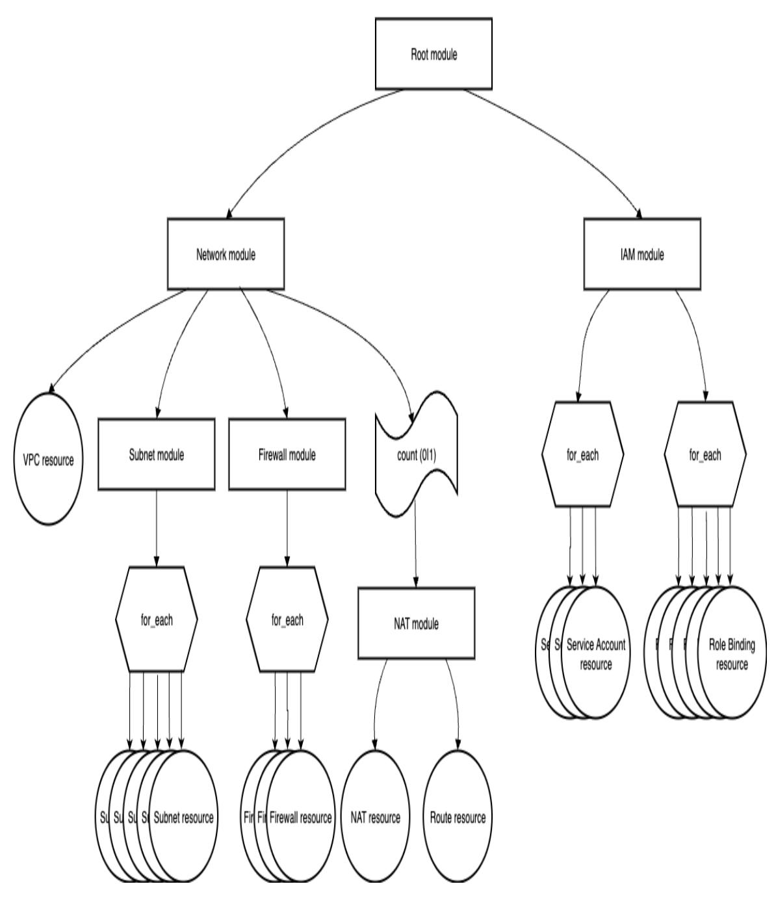
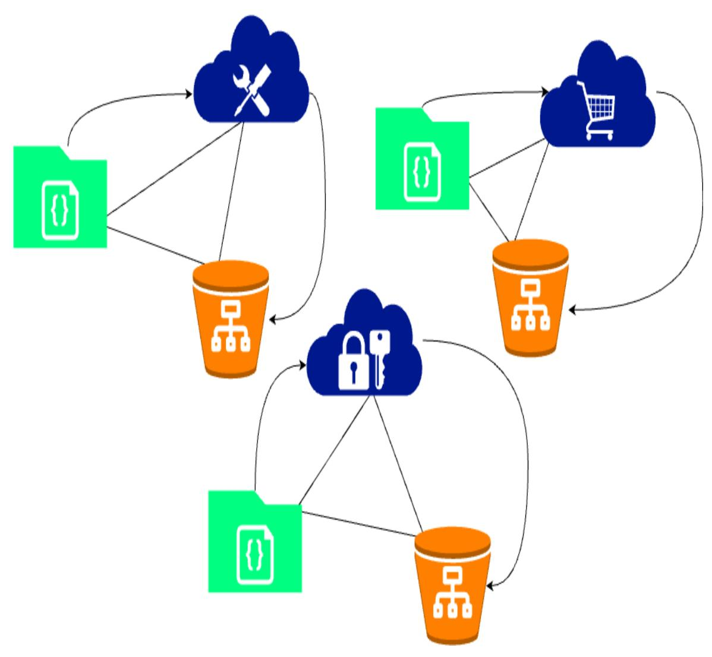
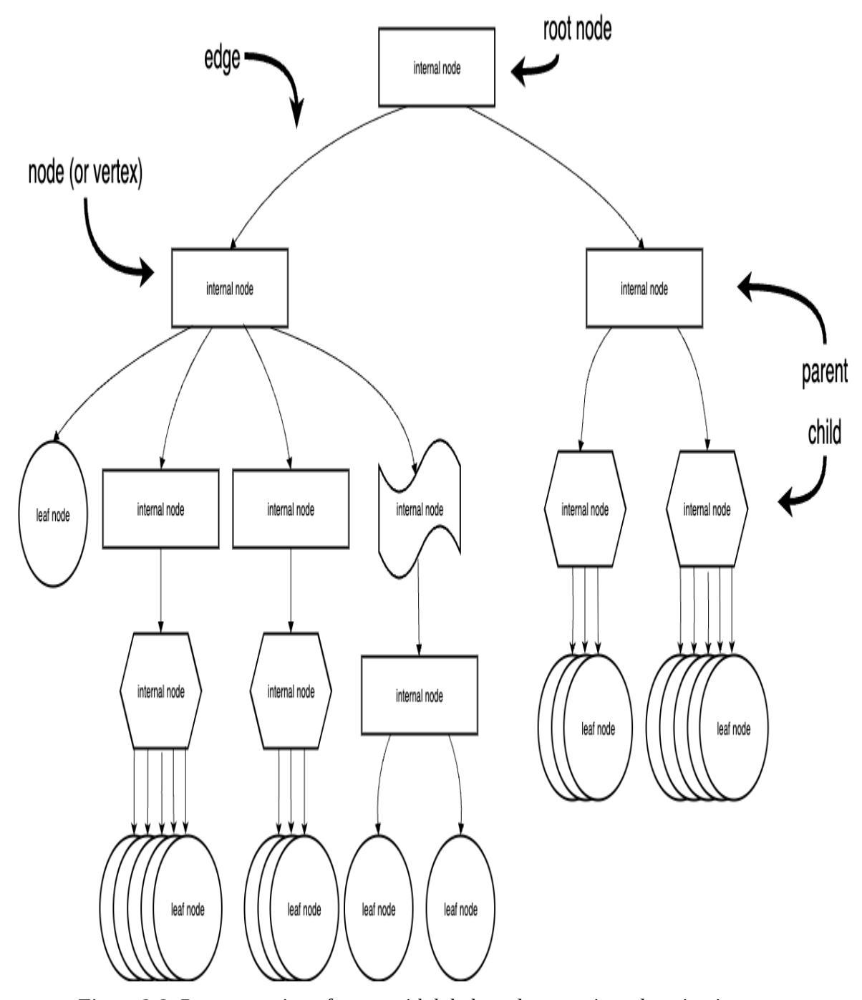
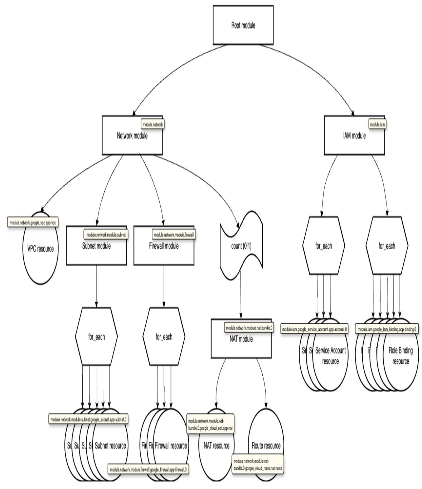
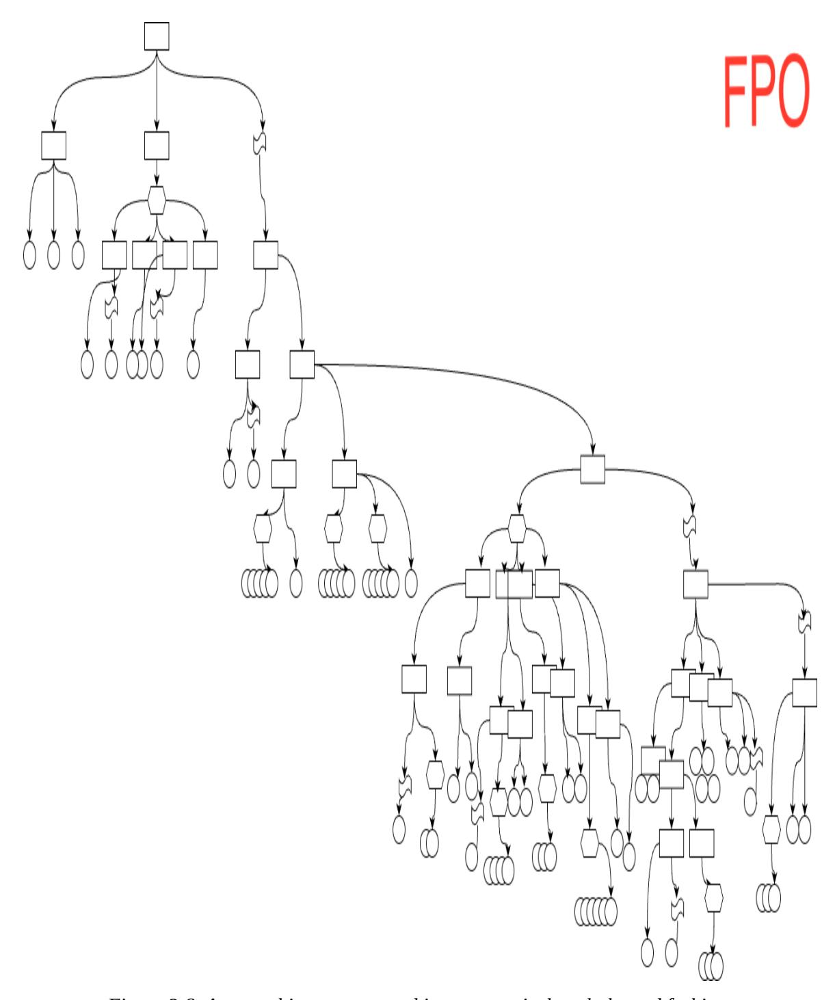
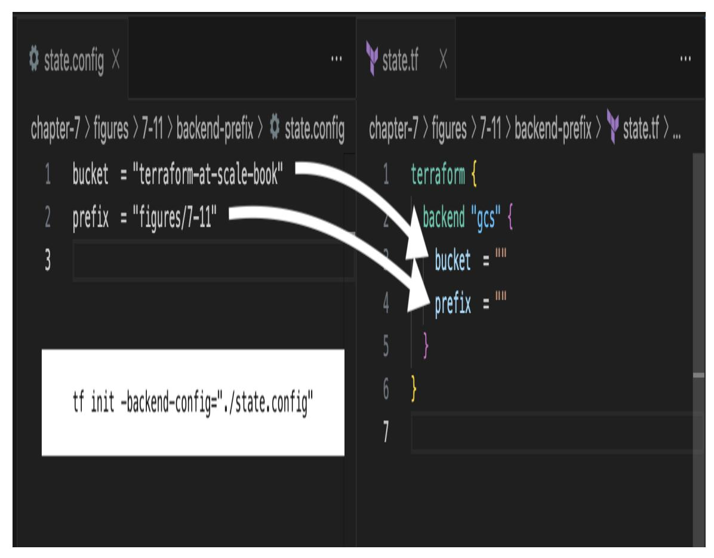
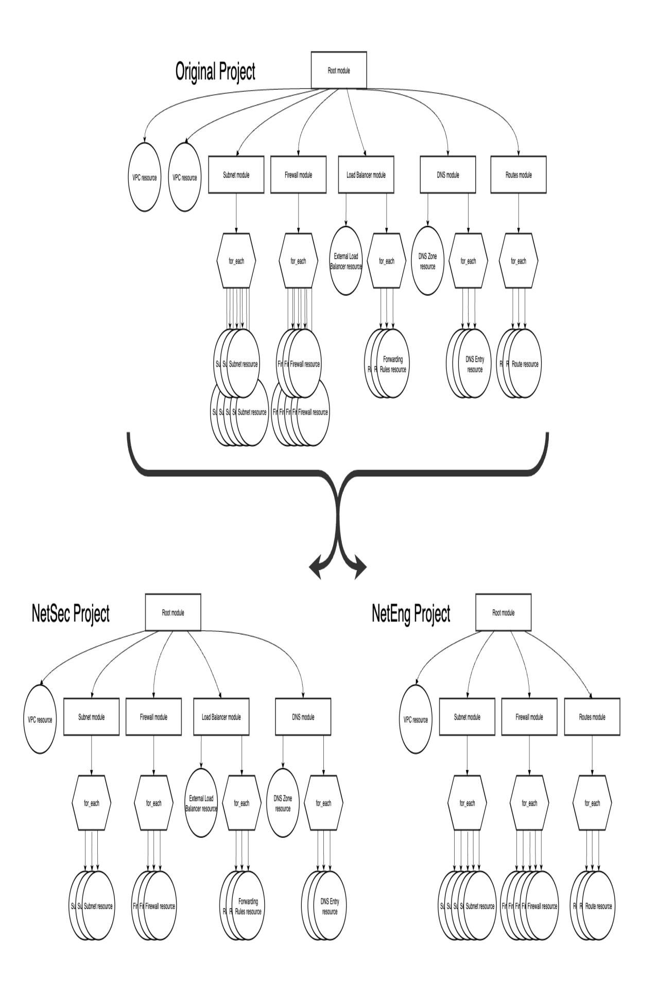
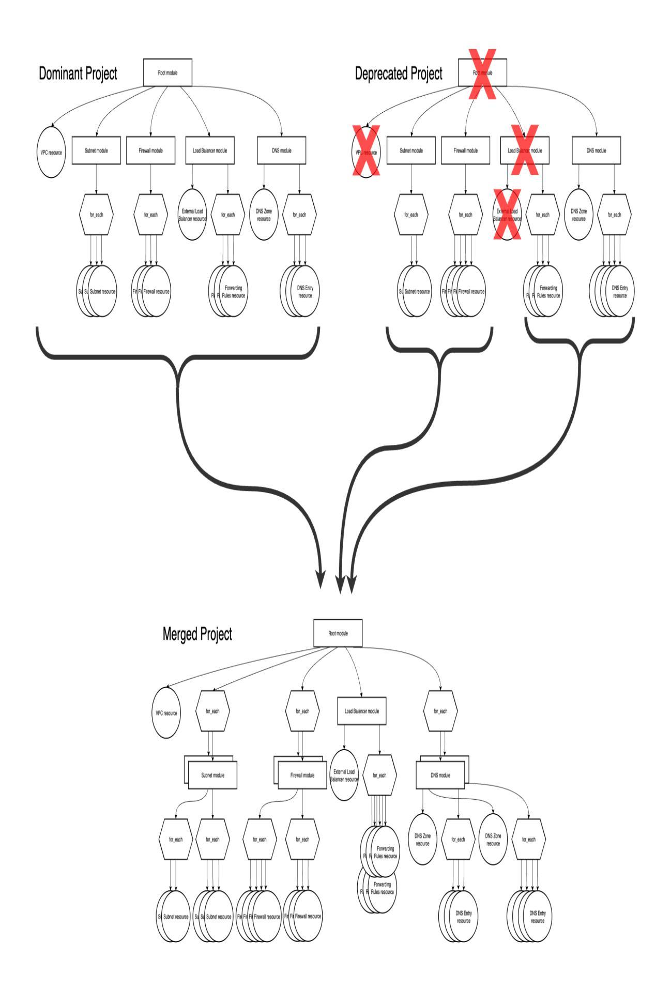
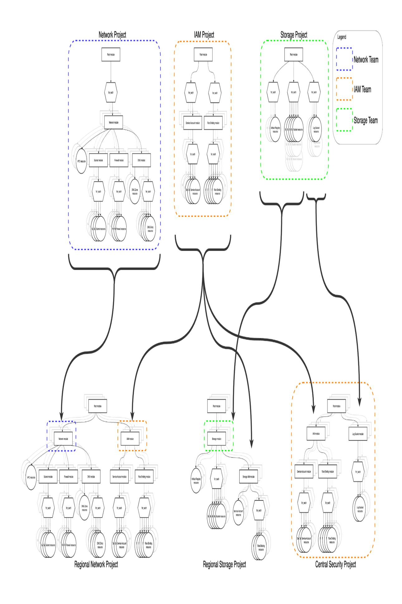

# Terraform at Scale

Patterns, Practices, and Pitfalls of Enterprise Terraform and OpenTofu Development


Robert Glenn

# **Terraform at Scale**

Patterns, Practices, and Pitfalls of Enterprise Terraform and OpenTofu Development

With Early Release ebooks, you get books in their earliest form—the author's raw and unedited content as they write—so you can take advantage of these technologies long before the official release of these titles.

# **Robert Glenn**


# **Terraform at Scale**

by Robert Glenn

Copyright © 2026 Robert Glenn. All rights reserved.

Published by O'Reilly Media, Inc., 141 Stony Circle, Suite 195, Santa Rosa, CA 95401.

O'Reilly books may be purchased for educational, business, or sales promotional use. Online editions are also available for most titles ([https://oreilly.com](https://oreilly.com/)). For more information, contact our corporate/institutional sales department: 800-998-9938 or *corporate@oreilly.com*.

Acquisitions Editor: Megan Laddusaw

Development Editor: Corbin Collins

Production Editor: Aleeya Rahman

Cover Designer: Karen Montgomery

Interior Designer: David Futato

Interior Illustrator: Kate Dullea

July 2026: First Edition

# **Revision History for the Early Release**

2025-08-22: First Release

See <https://oreilly.com/catalog/errata.csp?isbn=9798341649712> for release details.

The O'Reilly logo is a registered trademark of O'Reilly Media, Inc. *Terraform at Scale*, the cover image, and related trade dress are trademarks of O'Reilly Media, Inc.

The views expressed in this work are those of the author and do not represent the publisher's views. While the publisher and the author have used good faith efforts to ensure that the information and instructions contained in this work are accurate, the publisher and the author disclaim all responsibility for errors or omissions, including without limitation responsibility for damages resulting from the use of or reliance on this work. Use of the information and instructions contained in this work is at your own risk. If any code samples or other technology this work contains or describes is subject to open source licenses or the intellectual property rights of others, it is your responsibility to ensure that your use thereof complies with such licenses and/or rights.

979-8-341-64966-8

# **Brief Table of Contents (***Not Yet Final***)**

# **Part 1**

*Chapter 1 Terrible Terraform (unavailable)*

*Chapter 2 Terraform Anti-Patterns (unavailable)*

Chapter 3 Effective Use of Logic (available)

*Chapter 4 Built-In Fields: Reference Attributes, Variables, Local Values, and Outputs (unavailable)*

# **Part 2 Terraform Project Organization**

*Chapter 5 Tightly Coupled Projects (unavailable)*

*Chapter 6 Developing Remote Modules (unavailable)*

Chapter 7 Balancing State Size with Cardinality (available)

*Chapter 8 Everything Is Production (unavailable)*

# **Part 3 Operations at Scale**

*Chapter 9 Automating Enterprise Scale (unavailable)*

*Chapter 10 Self-Service (unavailable)*

*Chapter 11 Evolving Projects Into Enterprise (unavailable)*

*Chapter 12 Dealing with Organization Structures and Policy Constraints (unavailable)*

*Chapter 13 Validating Terraform Configuration (unavailable)*

*Chapter 14 Getting Unstuck (unavailable)*

*Chapter 15 Last Thoughts (unavailable)*

# <span id="page-5-0"></span>**Chapter 1. Effective Use of Logic**

# **A NOTE FOR EARLY RELEASE READERS**

With Early Release ebooks, you get books in their earliest form—the author's raw and unedited content as they write—so you can take advantage of these technologies long before the official release of these titles.

This will be the 3rd chapter of the final book. Please note that the GitHub repo will be made active later on.

If you'd like to be actively involved in reviewing and commenting on this draft, please reach out to the editor at ccollins@oreilly.com.

TF is a platform that abstracts the APIs of service providers and other platforms. Although the Hashicorp Configuration Language (HCL), the language in which TF code is written, is primarily a configuration language, there are logic expressions available in HCL allowing developers to introduce inferences and abstractions, improving the flexibility (or general accessibility) of a solution, without introducing repetitive code or requiring deep technical knowledge on behalf of a module's consumer. However, there is a well established tendency to see all the world's problems as a collection of nails once one has mastered the hammer, and this can lead a team into a quagmire of configuration as all complexity is shoved into HCL, regardless of the means. At the same time, a draconian adherence to a set of traditional, sacrosanct HCL expressions can force teams into developing unreasonably large and repetitive codebase or into splitting a team's overall state into a vast wilderness of TF state trees.

In this chapter, you will get an overview of the logical operations and expressions available in HCL, effective use thereof, and other ways to incorporate programmatic logic and functionality into TF solutions. By the end of the chapter, you will be comfortable with the safe application of the most useful HCL expressions and operations, as well as the effective use of ancillary or 3rd-party components to ensure a balance among the logic internal to, operating upon, and entirely external to the TF codebase. You will also be able to evaluate the risks associated with particular applications of specific logic and to determine how to improve risky portions of your codebase.

# **Logic and TF**

Hashicorp Configuration Language (HCL) supports a wide variety of common expressions and operators. However, as mentioned, HCL is primarily a configuration language meant for establishing, tracking, and configuring cloud and platform resources and for creating templates thereof. Because of this, there are certain logic elements in HCL that may manifest or behave in unexpected ways.

For example, the functions in HCL are operated in a functional programming style, which is esoteric and, if constructed haphazardly, can be overly convoluted. This is especially acute given the vast majority of engineers who find themselves writing TF modules are often much more comfortable with an object oriented (Java, JavaScript), procedural (C), or scripted (Bash/PowerShell) paradigm.

A common approach to this is to actually retreat: to remove as much logic from the HCL code as possible, and implement any logic in ancillary operations (leveraging the paradigm of choice). This leads to further problems as logic is peppered throughout pipeline configurations and Dockerfiles, or implemented by a complex web of manually driven procedures.

# **Terraform Functions and Expressions**

One of the most significant features of the functional programming paradigm is how it stores the results of a calculation: specifically that it doesn't, by default. Rather than requiring the result of every logical statement to have some way to reference it, statements can be combined such that the execution result of one is immediately treated as the input value of another, and otherwise forgotten. This means the inner statement's results are not preserved beyond the execution of the outer statement, in theory reducing its impact to memory utilization. However, this benefit to memory utilization comes at the expense of code readability and reasoning.

That being said, because HCL is also a configuration language, it must preserve certain values as they are assigned to the resource{} and module{} block argument fields. It also introduces other internal objects, such as the local object defined by the locals{} block, which can preserve arbitrary values, as needed. The general recommendation is to preserve the results of certain functions within this local object, in order to reference them later on.

If you are familiar with functional languages like Lisp/Scheme/etc. or Haskell, it shouldn't be too foreign of a concept to reason through function calls in Terraform. If you are more familiar with the much more limited approach of many object oriented languages to "lambda functions" (whereby pure functions are passed as arguments to specialized methods of collection types that iterate over the collection, sequentially calling said function on each iteration), the nesting behavior of inline function chaining in the functional programming paradigm may be both awkward and difficult to reason through.

The general guidance is to externalize as much of the more complex logic, and thus reduce or minimize the use of HCL functions. However, if you do find yourself working in a TF codebase that heavily leverages functions for calculating values assigned to resource arguments, it is recommended to pick up a book on the subject (there are some famous ones that are worth reading even simply for pleasure).

# **Automated Logic Outside of TF**

TF will most likely be embedded in your automation tool's DSL, even if it amounts to yaml and free text bash scripts. This unlocks the breadth of tools (or lack thereof) available to the execution context. In many popular platforms, these execution contexts are already containerized and even allow for custom container images to be leveraged for a job's execution. This opens a world of possibilities to incorporate tools other than TF to perform operations on inputs and outputs.

# **NOTE**

This may get messy if you are leveraging inline sed/awk commands or pipes in conjunction with the TF commands within the context of a shell.

Instead, consider using a friendlier scripting language like Python or JavaScript if you have a lot of fancy logic to expand, mask, or enrich any inputs or interpret any outputs with code. Such code can be tested and stepped through with a debugger in ways TF cannot. This logic can be executed beforehand, generating or preconfiguring a TF project's input variable assignments, or afterward, interpreting and translating the output values of a tf apply command. It can even be expanded to drive the execution of TF commands using the Cloud Development Kit (CDK) and related tooling, which, with a serviceable user interface, could achieve a fully self-service and/or event-driven solution, reducing the need for fully custom automation engineering.

# **Manual Processes**

Before a rich service portfolio can be constructed, there will very likely be countless manual procedures required to operate the various projects that make up a full enterprise TF ecosystem. These might involve managing TF project dependencies (i.e. copying the output values of one module and pasting it into the input variable assignments of another), calculating input

values or interpreting output values, or remediating issues and problematic incidents.

Manual processes have their place, especially in early exploratory work, before robust operation software has been developed. Especially when the provider has convenient configuration wizards that walk a user through configuration, manual configuration can be useful to learn what all components a typical solution may encompass, allowing you to then render those components in HCL code. The challenge here is to ensure you are capturing all the (sometimes many) components that are also configured in the background when certain resources are created this way: e.g. the boot disk that conveniently gets created along with a compute resource, which are tracked as unique and distinct resources in most cloud providers. System access logs can be very helpful in diagnosing this.

Because of the interconnectedness of cloud resources, and because it rarely makes sense to put all configuration of your organization's cloud infrastructure in the same project (e.g. repository and TF state), there will surely be dependencies across projects. This will sometimes include cascading changes (i.e. a change in one project precipitates a required change in another project) and these cascading changes may be time consuming and complex to fully automate away. In the end, certain manual processes due to project dependencies will likely stay manual. More on project dependencies in [Chapter 2](#page-52-0).

The main problem with manual processes is they can be highly error prone. One typo or out of order option in the CLI command, and suddenly you're getting drastically different results than you expect. The cloud provider consoles are rather effective at putting up guardrails, keeping users from making overtly inappropriate or outright disallowed operations and configurations, but just because you can do something doesn't mean you should do it. Almost worse than getting an error when you know what you're doing is getting a working solution through blindly making selections in a configuration wizard. Unless you have a photographic memory (or permission to read the system access logs and are prepared to

recreate the steps), it may be cavalier to believe a repeat occurrence of successful operation be any more than coincidental.

The other problem is they scale very poorly, more or less linearly up to muscle memory related speed improvements, and arguably the worst out of most available methods. Depending on the provider, adding a permission to 100 groups, 1 by 1 in a cloud provider's web console, takes 100x the time it takes to configure 1 group. Doing it in the command line may be much faster, especially if you are skillful with shell scripting, but if you aren't hard coding the values and instead are building some kind of templating system and say storing it in a shared location for reuse, you're basically doing simplified infrastructure as code. Why reinvent the wheel? If you need to do something once or rarely (and you don't have a "wildcard job" as described in [Chapter 2\)](#page-52-0), it may be appropriate to do this manually, but if you're doing it often and repetitively, it only makes sense to encode the procedure in some way.

# **NOTE**

There may be corporate or legal policies that dictate certain manual operations. For example, it is typical in some industries to require releases to production be initiated by a designated release manager, so that there is assumed responsibility and liability by someone with ostensibly sufficient experience and discernment. In such cases, you can integrate countless validation and reporting measures over endless efforts to make it "fool proof", thereby effectively reducing the level of acumen such a role requires to interpreting a dashboard and pressing one of two buttons: accept or reject. However, doing so undermines the spirit of the policy it is intended to support, effectively to the same degree as automating it (with perfectly implemented best practices) would. Sometimes the only way to implement a fully automated solution is to first modify the applicable policies. That this is easier said than done may not be lost on anyone.

As your systems mature, you should begin to encode most if not all manual processes into programmatic procedures that may be triggered at will or automatically in response to a particular event. Deciding which procedures to encode first is most likely neither trivial nor deterministic. Most likely, there will be manual procedures that are considered computationally simple to perform, some that arise more commonly than others, and some that are more time-consuming (requiring many person-hours) or time-sensitive (risk of issue directly related to time taken to perform) than others. Certainly, any procedures that fall into all three of these categories (e.g. regular, protracted, and tedious) would be primary candidates to encode, followed by those in the intersection of any two. Beyond that, it is up to you and your organization to decide the relative importance of each of these dimensions and to determine the order in which manual operations are codified. Do you close out all procedures in a general order along a particular dimension, or do you take a tiered approach across all dimensions, closing out e.g. the easiest tier across all before moving to the next easiest tier? Your answers will be unique to your organization, its policies, and the availability (and saturation) of technical skills.

# **The "Messy Middle"**

When TF is first adopted, there may only be one or a few teams working with it, meaning that variation in structure and convention is also likely to remain low due to the collective nature of development. As operations advance, however, it is highly probable that many more teams become responsible for various parts of the overall codebase, inviting much more variation. While it may seem simple enough to document or templatize successful patterns and keep the IaC masterminds centralized, producing perfect modules that enable more and more capabilities in a safe and effective way, it is very likely that pioneering techniques or competencies will be born from the teams developing the most complex solutions, likely far abstracted from such a central unit of command.

As you've seen, and with any software development, there are numerous (if not innumerable) ways to accomplish a particular goal. Oftentimes there is a balance between "optimized" code and shipped code asked of us (after all the perfect is the enemy of the good), with a heavy emphasis on the former from folks with influence on staffing considerations (who knew Voltaire was a product owner?). But excessive variety is confusing and can even lead to misuse, especially with similar (but distinct and with unique

behavior/implications) TF expressions or features; e.g. misunderstanding the usage of count and extending it beyond the {0|1} conditional expression format, or mixing up the effective use of local values and variable default values. There's nothing wrong with getting something working, but over time it is important to establish sensible standards and patterns for incorporating logic into your TF projects, and to find appropriate ways to refactor deviations wherever they have cropped up and to identify and address them before they become canon.

The way you go about refactoring is of personal preference (or mandated by policy); you and I may approach refactoring a particular bit of code in different, and more or less equally valid (assuming our results are equivalent, which isn't always guaranteed) ways. The means is not typically the problem; the problem is usually in actually getting around to refactoring. Refactoring working code (even with a few bugs) is not typically a priority, as the benefits are hard (and the costs are fairly straightforward) to measure; however, no one wants to wade through a mire of spaghetti code during a wide impact P1 incident. Clean up sprints, improve what you touch policies, and refactor bounties can be effective ways to pay down technical debt like deviations from established standards. Whatever the method, it needs to be understood and agreed upon by everyone in the relevant department, with material commitment by all responsible parties, lest other agendas crop up and derail such efforts.

# **Things to Avoid**

In your pursuit of working code, you may introduce certain risky behavior that degrades maintainability or even breaks the idempotent nature of TF. The following is a review of certain such techniques that are commonly encountered. Typically when these are introduced, it is done with a noble intent, but with a lack of awareness or care. One or a few of these may be found in any project, even ones that directly support workloads representing a great deal of your company's revenue generation. Most likely, even canonically problematic practices, such as using count outside of conditional logic, won't require massive efforts to fix (although some fixes

may require a great deal of care and courage). The problem is their potential to congregate and become patterns that can hide unusual and mysterious issues possibly with indeterminate behavior. The following are common issues that are easy to avoid if you know what to look for.

# **Inline Logic**

TF supports the use of logic directly as the assignment for a field, with the logic evaluated at runtime as a computed value that must adhere to (or may be interpreted as) the accepted data type of the field. This is especially common for using string interpolation to construct unique values e.g. for name, description, or resource tag fields. As we'll see later in the chapter, string interpolation can be a great way to reduce input variable footprint by reusing common parts, but doing this inline, especially excessively, is likely to result in mystifying puzzles of text.

Worse is the overuse of inline logic on e.g. collections. It's common, and perhaps acceptable, to see inline logic for for\_each expressions, but outside of this, it should be considered bad practice to include for/in expressions in other inline contexts. These expressions are already hard to read, and they are not easy to debug, especially if multiple variables are referenced in the same expression.

Instead of inline logic, a better practice is to place logic in the local values. While these can't necessarily be evaluated any better than inline statements, they can be decomposed and identified for clear indication of how or where to reference. We'll see more of this below in the section on Clean TF.

# **NOTE**

The order of evaluation of the TF state overall can depend on resources referenced in logical expressions. Evaluation of an expression during a tf apply is delayed until all of its referenced resources are computed. This is explored further in *[Chapter 2](#page-52-0)*.

# **Implicit Type Conversion**

While string interpolation may be appropriate in many cases to construct new strings from smaller substrings, relying upon implicit type conversion is generally regarded as sloppy at best and potentially issue prone at worst. An example of this is using a string value in a numeric field, e.g. isolating a portion of an ID that reads 'myinstance\_m32\_d120', and extracting the values '32' and '120' to use directly in the fields that determine the sizes of memory and disk, respectively, of a compute resource.

Aside from the maintainability and cosmetic aspects, the main problem with interpreted type conversion is when it doesn't actually evaluate to the proper type, e.g. when a string that should contain a decimal number actually includes alphanumeric characters. These types of issues may not be caught by TF during a plan, directly, and may only become obvious when it fails to apply. A much better approach is to use the built in type conversion functions. We'll explore these in a subsequent section.

# **Expressions**

TF supports many recognizable expressions including logical operators, conditional expressions, and iterators. Many of these behave in the very way you would expect from any programming language. Others have quirky nuances, especially in syntax, that beg additional attention in order to fully comprehend. In this section, we will review the most common expressions and their safe (and in some cases, where illustrative, unsafe) practice.

# **Arithmetic and Logical Operators**

The logical operators available in TF generally follow the order of arithmetic operations, followed by inequalities/equalities, and finally boolean operators. While these operators generally work the way you might expect, not all of them may be wholly appropriate to include in the majority of TF configurations. Below we will go into detail on a few choice selections. Here we list the operators in the order they are evaluated, and make general observations about their use:

- *Element Negation:* The symbols ! and (multiplication by -1) should be reserved for flipping an output value read from one resource or module that is to be passed into another resource{} or module{} block
- *Magnitude and Modulo:* The \*, /, and % (modulo operator) symbols are useful for converting between magnitudes of values or for the uniform spreading of resources
- *Addition/Subtraction:* The symbols + and (subtraction) should most like be used sparingly, only to account for computed or welldefined offsets
- *Inequality Checks:* The symbols >, >=, <, and <= are to be used wherever they are necessary in logic expressions
- *Equality Checks:* The symbols == and != are also to be used wherever they are necessary in logic expressions
- *Logical 'And':* The symbol && is also to be used wherever it is necessary in logic expressions
- *Logical 'Or':* The symbol || is also to be used wherever it is necessary in logic expressions

In addition to negating the output values of e.g. remote modules, it may also be deemed appropriate to introduce negation operators as part of a structure or style standard. For example, in cases where a ternary conditional expression is used to test a boolean input variable in the context of a count statement to optionally include a resource{} block, a standard may be imposed to always have a consistent order of the values 1 and 0 (which indicate the resource should or shouldn't be created, respectively), possibly forcing a negated value if the resource is to be created only in the case the variable is false, as shown in [Example 1-1](#page-15-0), below.

<span id="page-15-0"></span>*Example 1-1. Creating a resource only when a boolean value is false*

```
name = var.http_firewall_name
 network = var.vpc_network
 allow {
   protocol = "tcp"
   ports = ["80"]
 }
}
resource "google_compute_firewall" https-fw {
 count = !(var.http_only) ? 1 : 0
 name = var.https_firewall_name
 network = var.vpc_network
 allow {
   protocol = "tcp"
   ports = ["443"]
 }
}
```

The multiplication and division operators are helpful for converting between magnitudes (or other well defined scaling constants) of fields, e.g. megabyte to gigabyte, etc. As mentioned, the modulo operator may be useful for uniformly spreading components across a set of regions, subnets, etc. An example of this can be found in [Example 1-2,](#page-16-0) below.

<span id="page-16-0"></span>*Example 1-2. Uniformly spreading compute instances across three regions*

```
data "google_compute_regions" available {
}
locals {
 three_supported_regions =
slice(data.google_compute_regions.available.names, 0, 3)
}
resource "google_compute_instance" vm-instances {
 for_each = { for idx, vm in var.vm_instance :
   vm.name => merge(vm, { index = idx })
 name = each.value.name
 machine_type = each.value.machine_type
 zone = local.three_supported_regions[each.value.index % 3]
 …
}
```

# **The for Expression**

As alluded to in the opening section, certain logic in HCL may be expressed with less familiar patterns. One such element is the for expression. While easily identified, and generally understandable in simple, isolated instances, combining multiple such expressions can be especially difficult to read and reason through.

As its name suggests, the for expression (along with its companion reserved word, in) is the HCL equivalent of the traditional "for loop". However, the for expression, is only the iterator for manipulating the configuration metadata (e.g. variables, resource, data, and module outputs, local values, etc.), not the configuration elements such as a resource or module block (iteration over these elements is implemented using the for\_each and count meta-arguments). It is used to dissect and marshal data for the configuration elements to consume as field and attribute values.

The for expression can iterate over any collection type. However, there are differences in how elements are referenced from the collection in the iteration statement depending on the type of collection iterated over. All collections in a for expression expose up to two temporary symbols to use as the current element's reference in the expression's predicate. For all collection types, if a single symbol is used, it will always contain the value of the current element. Also for all types, the inclusion of a second symbol causes it to be the symbol associated with the current element's value, with the first symbol repurposed to expose the index (list, tuple, and set type collections) or the current element's key (map and object type collections).

# **TIP**

It is highly recommended to establish and publish internal guidelines for use of these temporary symbols, both in when one or two temporary symbols should be used (to promote consistency and to avoid confusion or mistakes) and in how they are to be named (since this is up to the code author, and e.g. for map types, can be as simple as 'k' and 'v', or so expressive as to describe what the key represents and the entity type or purpose of the value).

In addition to the uncommon syntax already presented, the for expression also requires a special bracket syntax surrounding the statement to denote the expected output type of either a list (surrounded by []) or a map (surrounded by {}). The former expects the result of each iteration to be some primitive or custom type, and places them in memory as a list. The latter requires a mapping from some primitive type to any other type (primitive or custom).

# **TIP**

While they may often be thought of as interchangeable (and indeed either syntax can be easily modified to produce the other result type), there are distinct use cases for the list and map versions of the for expression. Certainly, a particular collection type may be expected as the input type of e.g. a resource or module field, but there are plenty of other uses that are often subjective and the choice seems arbitrary. Nonetheless, there are good, objective reasons for selecting one over the other: it is recommended to use for expressions to output map collections when constructing the input for for\_each statements and to output list collections when constructing the value of module outputs. The former ensures a consistent order in which resulting resources are constructed (this is explored further in the subsequent section on the for\_each meta-argument), whereas the latter often provides a more readable (and theoretically more compressed) format of the data.

As suggested, the for expression and the for\_each meta-argument are commonly found together. This may lead to a (perhaps unconscious) belief that the two must be packaged together: e.g. having the kneejerk reaction that "a for expression must be part of a for\_each statement, and vice versa". However, also as suggested, they address separate components within TF, and are thus distinct, with one having no requirement to include the other.

As evidence of this, see [Example 1-3](#page-19-0) below, depicting valid statements for both for and for\_each in the same resource, but leveraged exclusively from each other.

<span id="page-19-0"></span>

# *Example 1-3. Using for and for\_each in exclusive situation*

```
variable "config_map" {
  type = map(object({
    firewall_name = string
    network_name = string
  }))
}
variable "port_data" {
  type = list(object({
    protocol = string
    port = string
  }))
}
resource "google_compute_firewall" fws {
  for_each = var.config_map
  name = each.value.firewall_name
  network = each.value.network_name
  allow {
    protocol = "tcp"
    ports = [
      for item in var.port_data : item.port if item.protocol ==
"tcp"
    ]
  }
}
```

Although it may be very common to find for expressions directly inline within e.g. a resource block as the value of a for\_each statement, it is perhaps cleanest to put them all in a locals block. This way, the results of the expressions can be given meaningful names that describe their contents and intended use.

It is also recommended not to nest for expressions, but to instead break into individual lines. This is also established through the use of locals: you can create a named local variable for each for expression. The result of each expression could then be used in outputs for better traceability when desired. This is much easier to maintain than wrapping up all the looping logic into one compound expression that's both hard to reason through and of which it is impossible to step through the inner workings.

# **The if Clause**

We've already seen examples of how TF/HCL implements common programming language functionality in unfamiliar ways. In particular, conditional expressions, as we'll see later on, are handled using the ternary (?, :) syntax. While there is an if keyword/reserved word, it is not meant to be used, as it is in other languages, to bifurcate the path of instructions, creating distinct sequences of actions. Instead, an if clause may be included as the final part of the predicate/result of a for expression to filter the resulting collection: when iterating over an input collection that contains differentiated elements, it's often the case that only some of the elements are relevant; the if clause filters the output to only those elements for which the if clause resolves to true.

This might be used e.g. in the case of a list of virtual machines that optionally have an attached disk, where the module creates both instances and disks: the module can first create a collection of disk resources for only those virtual machines that need them, and these can be optionally referenced later when creating the virtual machines, as presented in [Example 1-4](#page-21-0), below.

```
resource "google_compute_disk" attached-disks {
  for_each = {
    for key, vm in var.vm_inputs : key => vm
    if vm.has_attached_disk
  }
  …
}
```

Depending on the complexity of the information that is being iterated over, there may be multiple ways you would like to filter it. To extend the above example, there may be some other subset of the virtual machines that e.g. require a second network interface. This second collection may intersect with the first, but generally, there is no relationship between the two. As such, filtering the collections would include distinct if clauses. Again, it is recommended to include this logic in locals blocks rather than placing them inline as much as possible. This allows you to use suggestive names to advertise their uniqueness and intended use, as depicted in [Example 1-5](#page-21-1), below.

<span id="page-21-1"></span>*Example 1-5. Using different if clauses to filter the same collection in different ways*

```
locals {
  vms_with_attached_disks = {
    for key, vm in var.vm_inputs : key => vm
    if vm.has_attached_disk
  }
  vms_needing_second_nic = {
    for key, vm in var.vm_inputs : key => vm
    if vm.has_second_nic
  }
}
```

# **Ternary Conditional Expressions**

As mentioned above, conditional expressions are primarily included in the form of the ternary conditional expression. This is the same ternary expression found in many other programming languages and behaves in

effectively the same way, with the same general format as described in [Example 1-6](#page-22-0), below.

<span id="page-22-0"></span>*Example 1-6. General format of ternary conditional expressions in HCL*

```
BOOLEAN_STATEMENT ? IF_TRUE_RESULT : IF_FALSE_RESULT
```

Just as in other programming languages, HCL conditionals may be used in a number of different scenarios, to various degrees of usefulness. One of the most effective uses is perhaps also obvious: to test a boolean value, and to conditionally produce one of two distinct values. This is the typical construction used in other programming languages. Ternary conditional expressions are also useful in conjunction with the count meta-argument in order to construct conditional configuration blocks (e.g. a resource, data, or module block, or even e.g. dynamic blocks). They are also found in string directives, discussed in greater detail in a later section.

Another fairly common use of the ternary conditional expression is to provide a guaranteed default value (oftentimes the identity element of the type: e.g. 0, '', [], {}, etc.) in the case where an expression might otherwise result in error. For example, suppose you are setting the value of a field that expects a number type, and want to base this value on the length of a list value that is produced as part of an output value read from another resource or module, but this output value may not exist for whatever reason (see the [Example 1-7](#page-22-1), below). In this way, we can first test for a null value, and provide a result of 0, avoiding an error.

<span id="page-22-1"></span>*Example 1-7. Using ternary conditional expressions to provide protection against nulls*

```
numberField = module.remote-module.complex_output.possibly_null ?
length(module.remote-module.complex_output.possibly_null) : 0
```

This latter construct is effective for many cases, but its excessive use may expose an unwillingness to introduce more appropriate validation patterns or to provide better governance around nullable/empty values. Earlier versions of TF didn't include all the patterns it has today, such as variable

validation and nullable fields, the try() and can() functions, or the optional modifier. Unfortunately, a significant number of companies haven't seemed to have fully progressed beyond these earlier versions (either literally or developmentally/culturally), and while this pattern is rather syntactically expensive and unsightly, it still appears regularly.

# **String Interpolation and Directives**

Generating field values is some of the most common logic found in TF configuration. The most effective (and least problematic) field generation is string building via interpolation or map building over lists of input or output. In the former scenario, it is introduced to simplify the input fields of component blocks (i.e. resources or modules), allowing for a greater number of fields to be constructed from fewer variables to be set by operators. This might be common for an organization that requires standardization around naming conventions and resource tagging (e.g. for cost attribution and/or as the subject of a network configuration) such as a repeated application or business codename that must appear as part of the standardized name of several managed resources, in their network and resource tags, or in the descriptions thereof.

String interpolation is great for constructing longer, more complex strings from smaller ones. This is useful for several common resource fields e.g. resource descriptions, custom names and IDs, and custom outputs. Perhaps the most acceptable use of string interpolation is to clean up or directly manipulate the outputs of resources or 3rd-party remote modules as it is not always immediately possible to address otherwise. Because these can become difficult to read, especially when e.g. multiple variables are combined with hardcoded text to construct a single input value, it may be most appropriate to construct these in the locals block.

If inline string interpolation is allowed, it is recommended to establish a standard for use. E.g. it may be deemed appropriate to allow these in resource ID and name fields that are part of a block that includes the for\_each meta-argument, rather than requiring these strings to be fully constructed in the locals block (as part of a for/in expression there), as shown in [Example 1-8](#page-24-0), below.

<span id="page-24-0"></span>*Example 1-8. Using inline string interpolation for certain fields as part of a standard*

```
variable "vms_map" {
 type = map(object({
   app_id = string
   zone = string
   type = string
   …
 }))
}
resource "google_compute_instance" vms-collection {
 for_each = var.vms_map
 name = "vm-${each.value.app_id}-${each.value.machine_type}"
 description = "${each.value.type} vm for app ${each.value.app_id}"
 zone = each.value.zone
 machine_type = each.value.machine_type
 …
}
```

The alternative to this would be to fully compute all the fields within the list in the locals{} block, before passing it to the for\_each. While this is arguably more complex, it does lend itself better to more intricate constructions of e.g. string interpolation without compromising the readability of the resource{} block itself, as shown in [Figure 1-1,](#page-25-0) below.

```
chapter-3 > figures > 3-2 > ₩ main.tf > ...
       locals {
        augmented_vms_map = {
        for vm in var. vms_map : vm => merge(
             νm,
                          = "vm-${vm.app_id}-${slice(vm.machine_type, 0, 2)}-${slice(vm.zone, 0, 6)}"
               name
              description = "Dedicated ${vm.machine_type} vm for app ${vm.app_id}"
       resource "google_compute_instance" vms-collection {
        for_each = local.augmented_vms_map
        name
                     = each.value.name
        description = each.value.description
                     = each.value.zone
        zone
        machine_type = each.value.machine_type
        network_interface {
          network = each.value.network
        boot_disk {
          initialize_params {
             image = each.value.image
 33
```

*Figure 1-1. Including all string interpolation in locals{} block to keep configuration tidy.*

String directives are more complex templating formats, allowing for conditional logic to be embedded directly into a string's construction. They can be especially useful in custom, log-oriented outputs for resources or modules with optional or binary features (or in lengthy resource descriptions of the same), thereby allowing only the variable portion to be computed, and avoiding any repetition of the common portions.

Directives should be used very sparingly, given there are often other, more readable ways to implement conditional logic, e.g. by using the ternary expression. They may be most useful the more similar the resulting strings of sufficient length can be. E.g. short, very different resulting strings, e.g. 'yes' and 'no' should be implemented using the typical ternary expression rather than a string directive, as shown in [Example 1-10](#page-27-0), below. Even for very long, highly similar resulting strings, it will often be more clear to compute the variable portion as a separate local value and include it with string interpolation.

*Example 1-9. Depiction of a string directive and an alternative rendering using only interpolation*

```
locals {
 high = "better than 50/50"
 low = "worse than 50/50"
 with_directive = "The answer is %{ if var.random > 0.5 }${ local.high
}%{ else }${ local.low }%{ endif }"
}
# Note the length of the template, making it difficult to comprehend
locals {
 high_or_low = var.random > 0.5 ? "better than 50/50" : "worse than
50/50"
 no_directive = "The answer is ${local.high_or_low}"
}
# This is simpler and more readable in most cases
```

There is the ability to introduce whitespace stripping with directives using the ~ marker, which might not be well handled by another method. There may also be sound rationale to introduce directives or the Heredoc syntax in the case of "workflow driven IaC automation" (in which some ticketing system passes in the parameters that were input into a web form by a user or other automated system). However, I would strongly recommend cleansing the textual variable inputs before one feeds them to Terraform with a more commonly used tool (as described in the section above on externalized logic, in this case e.g. sed/awk, Jinja, etc.).

There is support for multi-line strings using a Heredoc syntax, this would certainly be an improvement over including newline characters in some other string construction such as string interpolation. This often is included as inline instructions, e.g. shell scripts, to be executed by a remote process or resource. However, this is probably better served by a remotely stored script file fetched before the TF command is executed and referenced in the code via the path.module, path.root, path.cwd, or terraform.workspace values.

# **Splat Expressions**

Splat Expressions are intended as shorthand for certain common collection expression constructions that would otherwise require the construction longform for/in expressions to e.g. extract a specific field from each item in a collection of TF components (e.g. a list of resources or data sources), as shown in Example 3-10, below.

<span id="page-27-0"></span>

# *Example 1-10. Splat expression and equivalent for expression*

```
resource "google_compute_instance" gce-vms {
  for_each = var.vm_configs
  …
}
…
output "vm_boot_disk_sources_splat" {
  value = google_compute_instance.gce-vms[*].boot_disk.source
}
# Clean, single line of code; requires some familiarity
```

…

```
output "vm_boot_disk_sources_for" {
  value = [
    for vm in google_compute_instance.gce-vms : vm.boot_disk.source
  ]
}
# Somewhat longer to write due to extra syntax; possibly more accessible
```

Splat expressions are very appropriate in the definition of output values intended for direct consumption by other modules or systems. In this way, a single expression can map a list of created resources to e.g. a list of their IDs, which may be necessary as an input to a dependent module. E.g. one module creates a collection of subnets and another module creates a collection of managed Kubernetes clusters, one per subnet: the latter module could be constructed to create a cluster attached to a supplied subnet name, with a for\_each expression used to loop over them; rather than also needing to loop through the list of resources in order to construct the list of IDs, create a new output for the former with the list of IDs printed out. See [Figure 1-2](#page-29-0) below.

*Figure 1-2. Depicts the use of the splat operator in the output of a module, which may be used to assign the input argument for another module.*

Alternatively, splat expressions may be included in output definitions intended for convenient interpretation and reference by human users. This could be useful for recording lists of specific resource information (e.g. the list of compute resource instance IDs that was created by the script) into a spreadsheet or other document for reporting or tracking purposes.

# **NOTE**

The splat operator has no way of filtering out elements. In any such situation, an if clause as part of a for expression is likely to be the best solution, as discussed previously.

# **Functional Terraform**

As described in the introductory sections, the functions in TF follow the functional programming paradigm, which may be somewhat unfamiliar to those coming from a background in systems administration or are trained in object oriented programming. For someone most comfortable in a shell environment, each function can be thought of as a terminal/shell command, with support for inline subcommands that get evaluated first and provide their results as e.g. values assigned to an option of the outer command.

For those more familiar with the object oriented paradigm, especially those that support "method chaining" allowing the results of one method to be passed to the input of a subsequent method, each function can be thought of as a method, and rather than chaining, the functions are nested such that the results of an inner function becomes the value used by the outer function.

In this section, you'll be presented with effective use of several HCL functions, including where each may be most appropriately found.

# **Effective Use of String Functions**

HCL has a number of familiar functions that operate on strings, including to match according to various criteria, create substrings, and to operate on the constituent characters.

The substr() function is very commonly used in conjunction with string interpolations to ensure strings assigned to specific resource fields will adhere to maximum length guidelines imposed by a particular platform or policy. Ideally, strings are constructed in a fully deterministic way. This may be achievable for any such interpolation strictly using root module

inputs, assuming variable validation condition expressions are implemented (as shown in *Chapter 2* on variable construction): variables simply get set to right-sized string's component elements, so there is no chance for values that are too long. This requires a well-defined standard and significant encoded overhead, the alternative to which is extremely disciplined teams and individuals. However, when constructing input strings based on the output values of other resources and modules, the inclusion of substr() may be appropriate, as shown in [Example 1-11:](#page-31-0)

<span id="page-31-0"></span>*Example 1-11. Using* length() *and* substr() *to cap the length of interpolated strings*

```
locals {
  first_item = substr(data.google_compute_machine_types.example , 0, 8)
  second_item = substr(data.google_compute_zones.available.names[0], 0,
10)
  final_string = "vm-${local.first_item}-${local.second_item}"
}
```

The strcontains(), startswith(), and endswith() functions produces a boolean result based on the presence of a substring. This has a clear, but limited, benefit, and may often be better served through some other attribute; a contrived example might be to detect the presence of a specific codename as part of a resource's name attribute that is meant to indicate its purpose. A better option would be to use a more self-contained indicator like a resource tag that can encode this information in a more directly applicable fashion.

The related regex()/regexall() functions each return a list of matching substrings. These allow for richer matching, but are unlikely to be directly actionable, requiring additional expressions to make use of the outputs. This may be better served by abstracting the logic with externalized tooling and passing in additional input variables, or by again leveraging a separate, more specific resource attribute or module output.

Between the two, regexall() is far more consistent and less errorprone, always resulting in a list, even if no matches are found (in this case, it returns an empty list, []. By contrast, the regex() function actually returns a list as one of its possible output types, in addition to a string (when only a single result is found) and a map (when provided named capture groups as part of the pattern). This former behavior (possibly returning a single string) requires additional logic to properly handle the output of the regex() function, further supporting the use of an alternative method, where available. The latter behavior (passing in named capture groups as part of the regex pattern) provides highly expressive pattern matching, but this is also supported by the regexall() function (which would produce a list of maps).

However, there should be a great deal of skepticism applied to any use of the regex() or regexall() functions, as there are very likely to be better ways to make the decisions or construct the values in question.

Ideally, the strings the code is operating upon are clean enough to use directly. The behavior of the chomp(), trim(), and various trim\*() functions (used to remove e.g. newlines, whitespace, and arbitrary characters from the beginning or end of a string) in HCL are cumbersome to test as a unit and very likely do not perform any better than other common tools, external to TF. Then again, there's something to be said for "defense in depth" (or "cleanliness in depth"?), so even the use of external tools to clean up text input does not necessarily preclude the use of these functions. The point is other tools may be more reliable than Terraform for cleaning up strings (especially if only one tool is to be relied upon).

It is most likely best to avoid complex string manipulation like nesting split(), replace(), join(), etc., except perhaps in cases in which one must manipulate output values to make proper use of them. Because HCL functions are purely functional (rather than e.g. object oriented), chaining commands can make for less readable code making it difficult to reason

through. Instead, include these functions in (possibly multiple) local values to allow for expressive names.

# **Effective Use of Collection Functions**

HCL has several functions that operate on collection types. Many of these behave more or less the way their analogous functions/methods would in other programming languages, so the behavior itself is not especially noteworthy. Instead, it is the rationale behind their inclusion that is worth considering. Some functions are very useful in many situations, especially as projects become more and more complex. Others are only useful in very specific corner cases. Still others should be considered ill advised, unless there is truly no other solution available.

The most useful collection functions are those used to combine, decompose, or otherwise reorganize a collection or set of collections, possibly casting it from one collection type to another. These are often used to format various values so they may be properly consumed by a particular resource or module field. For example, the concat() and merge() functions can be used to combine list-like collections and map-like collections, respectively, which may be useful for combining configuration from multiple sources: e.g. combining a list of configuration from an outer module with a list of required configuration in an inner module's local values as shown in [Example 1-12](#page-33-0), below.

<span id="page-33-0"></span>

# *Example 1-12. Using* concat() *to combine two lists*

```
list_1 = [0, 1, 2, 3]
list_2 = ['a', 'b', 'c']
big_list = concat(list_1, list_2, ['inline', 'list'])
# produces [0, 1, 2, 3, 'a', 'b', 'c', 'inline', 'list']
```

The latter function, merge(), has the additional effect of allowing the overriding, or masking, of values by ordering them such that the most accurate values appear last in the list. [Example 1-13,](#page-34-0) below, shows an example of this. A similar effect can be achieved for lists by wrapping the result of concat() with a call to the distinct() function, which will

produce a set type, which is treated exactly like a list type except that it must have distinct elements.

<span id="page-34-0"></span>

# *Example 1-13. Using* merge() *to override required field defaults*

```
locals {
  vm_config_default = {'vm_type': 'n1-standard-1', 'disk_size_gb': 20}
  vm_config_final = concat(local.vm_config_default, var.vm_override_map)
}
```

Another useful set of functions include the keys() and values() functions, which each produce a list of the respective elements in a collection, each in lexicographical order of the *keys* providing consistency in order between the two. For the opposite direction, combining list-like types to produce a collection type, HCL includes the ziplist() function, which takes a pair of equal-length lists, one of keys (technically it's a set, for keys) and one of values, and matches them up in the order in which they appear. These functions can be especially useful for succinctly converting a map into a list, and vice versa, for various purposes, including to shape output values for better interpretation or to reorganize the collection for use by a resource or remote module. The related function matchkeys() may be used along with the keys() and values() functions to e.g. create a shorthand way of generating a subset of the values of a map object, but there may be more accessible ways to accomplish the same using a for expression with an if clause, as shown in [Example 1-15,](#page-35-0) below.

*Example 1-14. Using* matchkeys() *to filter a supplied map's keys, and the equivalent for expression rendering*

```
locals {
 filter_keys = [ "app_name" , "region" ]
 vals = values(var.config_map)
 keys = keys(var.config_map)
 using_matchkeys = matchkeys(local.vals, local.keys, local.filter_keys)
}
# Arguably less syntax; perhaps requires elevated proficiency
locals {
 filter_keys = [ "app_name" , "region" ]
 using_for = [
```

```
for ikey, ival in var.config_map : ival
    if contains(local.filter_keys, ikey)
  ]
}
# More syntax; perhaps easier to comprehend
```

Another group of functions that may be used to reorganize data specifically consume or produce set type collections and operate like their corresponding mathematical concepts in set theory. In very specific cases, these might be able to greatly simplify certain logic, especially when collecting and organizing the output values of other modules. The setintersection() and setunion() behave in the way their names suggest, with the former producing a set of the common elements between multiple input lists, and the latter producing a set including all elements found in any of the input lists. The setsubtract() function takes two sets and performs the "relative complement" of them, which is a fancy way to say that it removes from the first set any element also found in the second set. As shown on the TF documentation, the setunion() and setsubtract() functions can be combined to return the "symmetric difference" of two sets, which are the elements that appear in one, but not in both, sets. The setproduct() function will take multiple sets and compute their "Cartesian product", with every value from each set combined with every value from every other set, as shown in Example 3- 15, below. Again, this would certainly reduce the logic necessary to accomplish this another way, but this should only appear in very limited scenarios e.g. where one set of resources must be created for every combination of two other sets of resources, like subnets for a set of VPCs and a set of available regions.

<span id="page-35-0"></span>*Example 1-15. Using the* setproduct() *function to compute the Cartesian product of 3 input lists*

```
locals {
 vpc_names = ['vpc-dev', 'vpc-test', 'vpc-prod']
 subnet_regions = ['us-west1', 'us-east1', 'us-central1']
 zones = ['trust', 'non-trust']
 to_create = setproduct(local.vpc_names, local.subnet_regions,
local.zones)
```

```
}
# to_create produces the following:
# [
# ['vpc-dev', 'us-west1', 'trust'],
# ['vpc-dev', 'us-west1', 'non-trust'],
# ['vpc-dev', 'us-east1', 'trust'],
# ['vpc-dev', 'us-east1', 'non-trust'],
# ['vpc-dev', 'us-central1', 'trust'],
# ['vpc-dev', 'us-central1', 'non-trust'],
# ['vpc-test', 'us-west1', 'trust'],
# ['vpc-test', 'us-west1', 'non-trust'],
# ['vpc-test', 'us-east1', 'trust'],
# ['vpc-test', 'us-east1', 'non-trust'],
# ['vpc-test', 'us-central1', 'trust'],
# ['vpc-test', 'us-central1', 'non-trust'],
# ['vpc-prod', 'us-west1', 'trust'],
# ['vpc-prod', 'us-west1', 'non-trust'],
# ['vpc-prod', 'us-east1', 'trust'],
# ['vpc-prod', 'us-east1', 'non-trust'],
# ['vpc-prod', 'us-central1', 'trust'],
# ['vpc-prod', 'us-central1', 'non-trust']
# ]
```

The transpose() function flips a specific type of map, those whose values are lists of strings, producing another map with lists of strings as its values, such that all the elements of the original lists become a unique set of keys for the produced map, and the original keys appear as strings in the new value lists under each of the keys that they originally had in their associated list. While this obviously has fairly niche usefulness, it does come in handy in certain use cases. For example, suppose you use a 3rdparty remote module to iteratively generate network components, such as VPCs and subnetworks, and suppose this module includes the list regions in which it creates subnets as an output value. (Assuming there is variation to these regions) you might find it valuable to transpose the values and keys to get a map such that the keys are regions, and the values are the list of VPCs that support that region, as shown in [Example 1-16](#page-36-0), below.

<span id="page-36-0"></span>*Example 1-16. Using the* transpose() *function to flip a map's keys with its values*

```
locals {
  regions_per_vpc = { for vpc in module.networks : vpc.name =>
```

```
vpc.regions }
 vpcs_by_region = transpose(local.regions_per_vpc)
}
# regions_per_vpc:
# {
# "vpc-123": ["us-central1", "us-west1"],
# "vpc-456": ["us-central1", "us-east1"],
# "vpc-789": ["us-east1", "us-west1"]
# }
#
# vpcs_by_region:
# {
# "us-central1": ["vpc-123", "vpc-456"],
# "us-east1": ["vpc-456", "vpc-789"],
# "us-west1": ["vpc-123", "vpc-789"]
# }
```

Certain additional functions may help to clean up e.g. the result of another function or a module's output values. E.g the compact() function takes a list of strings and returns a copy of the list with the empty strings and nulls removed. This might be useful in combination with a splat expression or other iteration result, in order to e.g. filter down to the nonempty entries of an optional attribute; this might be part of an organization standard as opposed to e.g. using a for expression with an if clause as described in that section. The flatten() function can clean up a nested list e.g. generated by some other function. This may be useful for collecting information about similar resources that are grouped in different ways (e.g. region, workload, etc.), creating a single list.

The sort() function will take a list of strings and return a copy of the list sorted lexicographically. This can help to clean up the result of a for expression or another collection function. The reverse() function will produce a copy of a list in the reverse index order, which may be used in conjunction with sort() to produce a list of strings sorted in reverselexicographical order. These would likely be most useful for output values of root modules intended for easy interpretation by human operators or read by other services.

Yet another set of functions retrieve individual items from a collection. The element() and lookup() functions may provide somewhat safer

alternatives to the bracket notation method of selecting elements in e.g. a list or map, respectively. The element() function has the additional feature of "wrapping around" if the index requested exceeds the length of the list, providing a modulus indexing mechanism; this could be useful for uniformly spreading resources across e.g. a set of regions, projects, subnets, or other resources. The lookup() function includes a default value which can protect against the case where a particular key isn't found in a map; this shouldn't be necessary in most cases, and may be most useful in dealing with inconsistencies in other modules' output values. The index() function takes a list and a value and returns the first index in the list the value appears; however, this will produce an error if the value is not found. It is also highly unlikely that the utility this provides cannot be done in a more appropriate fashion or context.

There are several functions that test the values of a collection. For example, alltrue() returns true only if all the elements are true or "true" or if the collection is empty and anytrue() returns true if any of the elements are true or "true" and false otherwise or if the collection is empty. Another similar function, contains() returns true if a supplied list, tuple, or set contains the second argument as an element. These functions may be most useful in conjunction with other functions and expressions in order to construct aggregate indicators to be exposed as a module's output values.

There are plenty of other functions with seriously suspect usefulness. For example, the range() function can create a series of numbers; this has limited applicability, most of which can be solved in a more direct way, and which, if truly required, could probably be generated in a more prescriptive way. The purpose of the chunklist(), coalesce(), coalescelist(), one(), and slice() functions are all likely better served by externalized logic, or by constructing the overall project logic in a more consistent and deterministic way. The most obvious exception to this is when reading from service provider managed data sources such as available cloud regions or availability zones; using the slice() function enables a limit to the number of elements.

The recurring theme here is that there is certainly a great deal of functionality supported in TF/HCL, but not all of it is strictly necessary, especially when other platforms, services, and software is available.

That is not to say the use of the latter collection of functions above is necessarily dangerous or problematic, and indeed there may be no other valid way to accomplish a certain task in very corner cases (and there are sure to be corner cases in almost every sufficiently complex TF ecosystem).

The point is more that any use of such functions should be scrutinized for alternative methods, and heavily documented and spread in awareness, before accepting its inclusion into your infrastructure project.

# **The length() Function**

Just like in many other languages, HCL exposes a length() function that can be used on strings or collection types. This behaves how you would expect: for strings, it returns the number of characters; for collections, it returns the number of value entries (which can be thought of as the number of indexes for lists or keys for maps and objects).

For strings, the length() function should be largely unnecessary in most cases, outside of variable validation condition expressions. As shown in *Chapter 2* on variable construction, the length() function may be used to enforce the length of an individual input variable, which may be necessary for ensuring strings are properly sized. Similarly, as mentioned in the section on string functions, substr() can be used to ensure a maximum limit to a string's length. However, length() can be used to enforce a *minimum* limit on string length, even outside of condition expressions, if this is a necessary constraint that you cannot guarantee you will meet another way (e.g. if the string is coming from a resource's attribute or a 3rd-party module's output value).

For collections, length() may be appropriate for the purpose of constructing aggregate metrics exposed as a module's output values. E.g. if your module constructs a variable number of resources, it may be helpful to include the latest number of provisioned resources, according to the current codebase / TF state, as an output both as a convenience for any consuming modules or platforms, and to present a convenient way to interpret the results as a human operator (assuming the values are output by the root module, which may require them to be passed from one module's output value to another; this will be explored further in *Chapter 6* on module development). An example of this may be found below in [Example 1-17.](#page-40-0)

<span id="page-40-0"></span>*Example 1-17. Using the* length() *function in an* output{} *block for convenient indicators*

```
output "vms_count" {
 description = "Count of vms created by this module"
 value = length(google_compute_instance.vms-list)
}
```

Introducing more complex logic based on length is perhaps as ill-advised, avoidable, and awkward (it also seems to be fairly rare). A somewhat contrived (and arguably inappropriate) example of this may be to trigger a quota increase request when a certain threshold of inputs or resources is reached. This may be an effective way to enhance flexibility especially in the case where a codebase is shared among multiple teams (perhaps using unique tfvars files, as discussed in detail in *[Chapter 2](#page-52-0)* on TF state). However, there are other ways to detect and react to this (e.g. as a subsequent step in the automation job or as a separate workload that gets triggered and asynchronously approved) which may be more traceable and have a greater degree of governance.

# **Effective Use of Encoding and Hash/Crypto Functions**

HCL includes a number of encoding, hashing, and cryptographic functions. While these may have similar behavior or produce similar results, they should be used only for their intended purpose according to the specific use case.

There are several encoding and decoding functions available in HCL, including functions to decode/encode into base64, properly encoded URLs, and to decode/encode various file encodings (e.g. json, yaml, and csv). The best use of the base64encode(), base64zip(), and textencodebase64() functions may be in order to compress certain information (perhaps e.g. for archival purpose) or to generate certain hash IDs that are based on strings.

# **NOTE**

It is always important to note that encoding is not encryption. Nothing that is encoded into base64 is secure in any way.

The hash functions, e.g. uuid, uuid5 may be best used for coming up with hashes or IDs that are unique and not based on anything like file contents. There are also several other hashing functions available in HCL, including various sha and md5 functions, and the bycrpt() function. These might be used as a file's signature and computed in order to validate a remotely fetched file.

Finally, there is the cryptographic function, rsadecrypt(), which will decrypt an RSA-encrypted ciphertext, returning the corresponding cleartext. Unfortunately, there is no corresponding function for encrypting a string. Any encryption should be done outside of TF (which suggests that any decryption should be done external to TF, as well).

# **Effective Use of Filesystem Functions**

There are two types of filesystem functions in HCL, those that actually access the filesystem, such as file(), fileexists(), and templatefile(), and those that simply help to format filepath-related strings, such as dirname(), pathexpand(), basename(). The former operate on files that exist (and are available) on the same local filesystem as what TF is running against.

# **NOTE**

The functions that access the filesystem require the files on which they operate to exist on the filesystem in which TF is executed "before [TF] takes any actions" according to the documentation.

These might be used in order to pass shell scripts to compute resources for startup/restart functionality. Ideally, any such scripts are assigned in some kind of template or configured in an image, rather than initiated separately on individual resources.

There are very likely more appropriate mechanisms for most of the utility provided by these filesystem functions. As suggested, generating e.g. instance templates or machine images is typically more fitting than configuring individual compute instances; however, there are plenty of tools and services that are specifically designed to manage such components.

Additionally, generating such templates or machine images probably has a different lifecycle than the compute instances that leverage them, so managing them in another tool or mechanism is unlikely to cause technical friction.

Another example where the filesystem functions might be considered, but where other solutions are likely to be more suitable, is in managing updates to resources in a secret manager. Sensitive data (which ostensibly any data stored as secrets qualifies as) should never be stored anywhere it isn't strictly needed (including the environment from which TF commands are executed), just like it should never appear in log output, so there should never be a sensitive file from which to read. As we will discuss in [Chapter 2,](#page-52-0) a one-off operation such as this is generally outside the purview of TF, anyway, as it violates the idempotent nature of TF and can cause undesirable behavior if necessary files are missing at the time a plan is applied.

# **Effective Use of Type Conversion & Safety Functions**

As we've seen, HCL implements implicit type conversion, and will do its best to interpret a field's value as the field's configured type. However, this may have unexpected behavior if e.g. the value is coming from a 3rd-party service or tool (or a junior team member) that includes characters not supported by the field's specified type so that there's no obvious conversion available. As such, HCL additionally includes a number of functions for testing and casting between types.

Perhaps the most basic such function is the type() function. This returns the type of the input, from the HCL/TF perspective and can be used to test for a value's type before it is passed along to the resource or module for which it is intended. In most cases, this should be unnecessary: the values assigned to a module's variables or that come out of a remote module's outputs should be well known and generally should not change. As we will discuss further in *Chapter 6* on developing remote modules, rather than changing the type of a module's variable or output value, it is better to introduce a new variable or output with the desired type, potentially formally deprecating the variable or output if it is no longer needed or supported.

In cases where you cannot control the type of a value, such as output values of a 3rd-party, it may indeed be appropriate (or at least most pragmatic) to cast one value to another. For converting from a number or a boolean to a string value, HCL exposes the tostring() function. While this adds syntax it's more than sugar as it advertises the intent to convert type. It also will throw an error if it receives anything other than a primitive type value (one of type string, number, or bool) and null, which means it provides better validation than simple type conversion.

# **NOTE**

It is also possible to use the string interpolation method for converting from numeric or boolean values to strings. However, tostring() is arguably a far more expressive and readable method, and it is consistent with other recommended conversion approaches.

Likewise, for converting from a string to a numeric value, HCL provides the similar tonumber() function. Just as before, this will throw an error if it receives a value that isn't a string-encoded decimal, null, or itself a number. Another option is to use the parseint() function, which also takes a string and converts it to a numeric value, but be aware that this function also requires the base to be passed in (e.g. 10 for decimal). Because of this, it can also process other number systems like binary and hexadecimal.

For converting from a string to a boolean, the tobool() function only accepts the exact strings "true" and "false". If this is found within a longer string, it may require additional logic to first isolate, and then cast to lowercase, the specific portion. Unfortunately, sometimes boolean values are output as a string by the cloud service provider (or the TF provider that operates it), making this explicit type conversion a good way to identify and handle such behavior.

# **TIP**

Note that none of these methods work for converting between boolean and numeric values. The safest way to convert between a boolean and the numeric representation is to use a ternary expression: e.g. numType = boolVal ? 1 : 0 and boolType = numVal == 1 ? 1 : 0.

HCL also exposes "type conversion" functions for collection types: tolist(), tomap(), or toset(). The former two are really only intended to fully marshal the data to a consistent type. They inherently use implicit type conversion to make the values all of the same type. The latter function, toset() (in addition to implicitly normalizing the values as it does with other collection types), takes a list-like value and coalesces duplicate values. Neither tolist() nor toset() preserves order. The latter may be most useful in everyday use as a way to prepare the output from a remote module, in order to e.g. pass the resulting value to a for\_each meta-attribute statement, as shown in [Example 1-18](#page-45-0), below.

```
resource "google_storage_bucket" regional-log-bucket {
  for_each = toset(module.network.subnets[*].region)
  location = upper(each.value)
  …
}
```

A final type conversion function is ephemeralasnull(), which will force an ephemeral value to be null. Frankly, this (and the ephemeral keyword in general, which should only be used for temporary elements that are not intended to be recorded in the TF state, which conflicts with the idempotent nature of TF) should have limited use in most cases. This will be explored further in Chapter 4 on other built-in fields.

Additional type-related functions are can() and try(), the former of which we have reviewed in *Chapter 2* on variable validation. They operate in much the same way but have different use cases: they both take expressions, other functions, or any other logical phrase that may be problematic (i.e. throw an error); however, the former returns a boolean value, with true indicating no errors would be thrown; the latter allows for a default return value in the case where the expression would throw an error.

The can() function is one of the rare places where the TF documentation provides solid guidance: it "is intended only for simple tests in variable validation rules". Outside of this, the docs recommend that you "prefer to use [the try() function]". This is solid advice. Especially, given how useful the try() function is.

One of the best uses of the try() function is for filling in missing data (or incompatible signal data, e.g. "NULL" or something supplied by a platform, service, or another tool) with default type values (e.g. "" for string, 0 for numbers, [] for lists, {} for maps, etc.), which may be necessary for consumption by a TF or CSP process.

The try() function can also be used to handle a value that "might be provided in two different forms", but this should not be necessary in most cases. If you have any influence over how the values are constructed (e.g.

it's developed by an internal team or you are able to set it yourself as a variable assignment), you should very well do your best to ensure the values are a single, specific value. If the value comes from a 3rd-party remote module, hopefully the 3rd party entity is following good module development practices (you will see more of this in *Chapter 6* on remote module development).

A last piece of solid advice provided by the TF docs is that, although complex expressions may successfully be evaluated, they "recommend using [try()] only with simple attribute references and [in conjunction with] type conversion functions" such as tostring(), tobool(), etc. Instead of placing a more complex expression within the try() function, place the try() function only around the specific portion of the expression, as shown in [Example 1-19,](#page-46-0) below.

<span id="page-46-0"></span>*Example 1-19. Comparing unsafe and safe uses of* try()

```
try(tostring(local.raw_value.name), null)
# This might not always be safe
tostring(try(local.raw_value.name, null))
# This is much safer
```

# **Effective Use of Sensitive Value Functions**

As we saw in *Chapter 2* on variable construction, variables may be designated as sensitive in order to prevent TF from printing its value in the log output of TF commands like plan or apply (there is a similar designation for outputs, which you will explore in *Chapter 4*). Additionally, HCL provides a collection of functions that work with sensitive values, including a sensitive() function to designate a particular value in the same way, a nonsensitive() function to remove the designation, and an issensitive() function to test if a value has the sensitive designation. Also as referenced in *Chapter 2*, ideally you aren't generating sensitive values in HCL. Moreover, alternative methods to passing in sensitive information as variables should be considered, such as only leveraging platform and infrastructure components that you can configure to read

sensitive data directly from a secret management system. However, this may not always be feasible if more appropriate tools and services are not yet available.

The TF documentation for sensitive() recommends to prefer the variable and output arguments, when possible. Indeed, setting a value to sensitive() after it's been initialized gives little guarantee to it being treated with sensitivity prior to the function call. If you want to suppress any chance a value gets printed to a console output, any consuming modules most provide a variable marked sensitive, and any module producing any such values in outputs must likewise mark them as sensitive. As such, the sensitive() function should ideally never be necessary. However, it may be the best you can do if the developers of a 3rd-party remote module are slow (or loath) to introduce the sensitive argument (and it's determined to be too costly, or legally disadvantageous, to fork—and implement and maintain—yourself).

The opposite function, nonsensitive(), is arguably more useful even assuming all modules effectively account for the sensitive argument on all relevant variables and outputs. Indeed, as mentioned in the TF docs, indiscriminate use of the nonsensitive() function suggests a severe misapplication, possibly exposing sensitive data in plaintext log output. However, as presented in the TF documentation for the nonsensitive() function, it may be used in situations where "you've derived a new value from a sensitive value in a way that eliminates the sensitive portions of the value". Valid (yet contrived) examples might include decomposing a string that only has a sensitive value as a component element, and the resulting substring is both nonsensitive and valuable to have printed e.g. in the output of tf apply or tf plan commands.

Finally, the issensitive() function validates whether a value is designated as being sensitive, returning the boolean true if so and false if not. While the use of this function has no chance of exposing any sensitive data, directly, the motives for including it should be explored; as we've discussed in detail, any generation of sensitive data should ideally be done outside of TF, and otherwise, the sensitive nature of any values should be

established in the variable or output value definition blocks. Perhaps the only valid (yet also highly contrived) case where this might be seen is where a remote module is both volatile in how variables and output values are established and restrictive in the way it implements exposed versions. In this way, it may not be guaranteed that a particular value is known to be treated with sensitivity within the module. While this sounds excessively unlikely, it may be one of those problems born out of an illusion of success and safety and that you don't realize you have until it is too late (the list of such possible problems is infinite). Along with the other sensitivity functions, use the issensitive() function sparingly and with great scrutiny.

# **Effective Use of Other Functions (Numeric, IP Network, and Date/Time)**

The numeric functions, abs(), ceil(), floor(), log(), pow(), and signum(), are all effective in handling their respective mathematical operations. These may be appropriate for converting between one representation, or magnitude, of a value, passing it from the output value of one module or resource into the attributes of another. However, any such calculations may be better computed in a mechanism external to TF.

The collection related numeric functions, max() and min(), also are effective in handling their respective operations, and take a variable number of number arguments. As suggested by the TF documentation, a list of numbers may be evaluated with max() or min() by expanding the list with the ... operator. Once again, any such comparisons may be better computed externally.

The parseint() function produces an integer representation of the supplied input string that is encoded in a specified number base (between 2 and 62 inclusive). This can be useful for reformatting e.g. a hexadecimal or binary value that is gathered from a resource attribute or module output, and needed as an argument for another resource{}/module{} block.

The cidrhost() function returns an IP address within a supplied CIDR encoded as a string according to an offset value corresponding to the host's index within the network. This might be used to prescribe a configured host's IP, especially in cases where the CSP or platform exposed by the TF provider would otherwise assign IP addresses in a way that e.g. violates your organization's policies. The cidrnetmask() function will convert a range of IP addresses encoded in CIDR format into the mask address format. This would likely be most useful for converting a CIDR exposed as, say, an output value by one module and passed into another module{} or resource{} block that requires the mask address format.

The related cidrsubnet() and cidrsubnets() functions both take a CIDR block as input and computes a specific sub-range (or set of ranges) within the block according to other supplied inputs. This might be used to automatically break down a large CIDR block (perhaps assigned to, or designated for, an entire VPC, collection of projects, or super-region) and spreading the resulting subranges among a known number of subnets. Most likely this should be calculated and tracked externally by a network architect or team, and CIDR ranges explicitly passed in (perhaps read from a structured file e.g. csv). However, in cases of replicating highly standardized network topologies or infrastructure reselling, the cidrsubnet() and cidrsubnets() functions may be highly effective for constructing networks with uniform cardinality and size designed to be assigned in a factory pattern.

The formatdate() function is useful for formatting 3rd-party, systemgenerated, or CSP-provided timestamp values, converting them into different time formats. This might be especially useful for passing a timestamp output from one system to another system that expects a different format. It is also may be used to effectively format a timestamp exposed in a root module that is intended to be interpreted by human operators.

The time functions exposed by HCL are plantimestamp(), timeadd(), timecmp(), and timestamp(). The last function, timestamp(), will generate a timestamp value at the instant it is encountered in the evaluation

of an apply action (it cannot be predictably evaluated in a tf plan), and may be used in conjunction with the timeadd() (which adds a duration value to a timestamp in RFC 3339 format) and timecmp() (which compares two such timestamps formatted a la RFC 3339) functions in the context of a postcondition's condition expression within a lifecycle{} block to evaluate e.g. when a policy or certificate's expiration date is impending (or passed). Because the function returns a different value each time it is invoked, it is generally advised to also include the ignore\_changes meta-argument to keep it from affecting a resource's lifecycle. Similar to timestamp(), the plantimestamp() function is intended to evaluate the time during a plan activity and may be computed as part of the expression assigned to an assert's condition argument within a check{} block to likewise evaluate e.g. an expiration date or other impending deadline. However (as will be asserted again elsewhere in this book), due to the system's goal of idempotence, it is generally recommended to handle the management of security certificates, temporary access policies, and other time-limited data (especially sensitive such data), outside of TF.

# **Summary**

You now know what operators, expressions, and functions are available in TF, which ones to leverage in various scenarios, and which of them should be avoided (or eventually replaced) in normal HCL code construction for TF development. You can also recognize which operations are appropriate to encode into your TF projects, and which should be externalized using other tools, services, or custom software. You've seen several examples of potentially problematic configuration with corresponding examples of safer, more effective approaches.

In this chapter, you learned the following about the various operators, expressions, and functions:

General guidance on when, where, and why to implement logic in TF projects

- Which concepts or constructs to avoid in TF development
- The order of mathematical operators and their relative usefulness
- Expressions for iterating through collection values, and filtering out unnecessary elements
- Implementing conditional logic using the ternary expression
- How to implement string interpolation and when to use directives for implementing effective string templates
- The many various functions available in HCL and their valid and successful use

# <span id="page-52-0"></span>**Chapter 2. Optimizing State**

# **A NOTE FOR EARLY RELEASE READERS**

With Early Release ebooks, you get books in their earliest form—the author's raw and unedited content as they write—so you can take advantage of these technologies long before the official release of these titles.

This will be the 7th chapter of the final book. Please note that the GitHub repo will be made active later on.

If you'd like to be actively involved in reviewing and commenting on this draft, please reach out to the editor at ccollins@oreilly.com.

Early on, the natural inclination is just to get as many things encoded and automated, orienting the codebase around the architecture, possibly into existing resource or responsibility domains, without thinking specifically about how TF works. Most likely, a sufficiently thought out separation of concerns, even without strong TF exposure, will be serviceable for large swathes of effort, establishing the vast majority of your infrastructure and running without problems for months and years.

As your TF ecosystem grows and evolves, you may begin to experience challenges with some of the behind-the-scenes operations TF makes to stay consistent. In particular, you may begin to notice unfortunate couplings across your codebase, recurrent incidents of inconsistencies between TF state and the running instances, TF operations that seem to take longer than they should, or all of the above. In this chapter, we will review various concepts, challenges, and approaches regarding the TF state and how to converge toward their optimal organization.

# **State Concepts and Definitions**

The TF state represents the "memory" for TF, preserving what it knows in terms of where and how a resource is configured. There are several components and concepts that make up and support the TF state. Understanding these makes it easier to discuss practices for successful operation of TF. In this section, we'll present and describe these items.

# **State Backend**

Each state has a location where it's stored called the **state backend**. This can be a local file location, a cloud storage bucket, or various other managed storage services. What's important to note is that this is the source of truth for a TF state, and it is preserved at the time of the last tf apply operation.

The state backend is configured by a hardcoded backend field as part of the provider configuration block, which means that without additional logic, a repository is 1-1 with a state backend. Later in this chapter we'll explore ways to make a single codebase support multiple states by varying the backend field.

# **State Object**

The **state object**, or **state tree**, is a tree-like relationship construct stored in a JSON structure that represents the state of the instantiated services at the time of a tf apply operation. The JSON file itself is stored in the state backend location.

# **NOTE**

Actually, the state tree could technically be considered a directed acyclic graph (DAG), but for the purposes of considering how the states are traversed (and how they are stored in memory) it is essentially treated as a tree, but with specific rules about how it may be ordered.

This state object can be thought of as the memory for TF. It records what resources TF observed and configured (including data references and new or removed resources) when it performed the most recent tf apply operation. It reflects a point in time snapshot of the operational state of the resources that are mentioned in the codebase upon which the operation was applied. See [Figure 2-1,](#page-54-0) below.

<span id="page-54-0"></span>

*Figure 2-1. Example state object, depicted as a tree.*

Because it only records what was configured through a tf apply operation, the TF state object will have no awareness of any other resources you may have (even if they too are configured with TF but are codified in a separate codebase). Moreover, because it only records this at time of execution, it does not alone constitute a "source of truth" for *any* of your cloud resources (even those in the codebase under operation), at least not for very long: only immediately upon a successful tf apply can you be sure a state object reflects reality in near absolute certainty.

# **State Triplet**

As alluded to, the state object creates a 3-way relationship along with the codebase upon which a tf apply is executed and the actual running resource instances. Throughout this section and the remainder of the book we refer to this relationship or the combination itself as the **state triplet**. Typically, the relationship goes as follows: the code itself is read and applied using a tf apply; the resources get instantiated, and configured according to the code; finally, the success of this operation causes TF to create the state object which gets stored in the state backend, as depicted in [Figure 2-2,](#page-56-0) below.

<span id="page-56-0"></span>

*Figure 2-2. Illustration of multiple state triplets for separate TF states e.g. security controls (IAM), platform services, and commercial workloads.*

# **NOTE**

This means changing the backend (and successfully running an apply) effectively moves the TF state.

# **A Quick Vocabulary Lesson in Graph Theory**

We've already asserted, without many details, that state objects are also valid trees, in the mathematical sense, which means they are also graphs (or networks). Without going too deep, it is illustrative to discuss the TF state

object in the terms of graph or network theory. In its simplest conceptualization, every graph or network is a collection of two things: some set of discrete entities and peer-to-peer relationships, thereof. In the parlance of e.g. graph theory, such a discrete entity is referred to as a "vertex" or "node" and a relationship is called an "edge" (or sometimes "link"). In evaluating any two random nodes in a graph, it is most appropriate to consider their relationship in terms of degrees of separation or the shortest sequence of nodes and edges that separate them (which is referred to as a "path").

This "shortest paths problem" is, in fact, a deceptively hard problem in general (it's considered NP-complete) since there is no upfront restriction on how many other nodes a particular node can connect to over an edge (obviously, up to the number of other nodes in the system), so it's very possible to have two distinct paths between distinct nodes; when this happens, we call the combination of paths a "cycle". However, trees, as the mathematical construct, are special types of graphs: those with no cycles. This means, between any two nodes there is exactly one path.

Alongside this defining aspect of trees, it is very common to impose additional considerations and relationship constructs. The most important of these is the concept of a "root node" around which the rest of the tree is oriented. This is especially useful in depicting hierarchies or ancestries. The root node is considered the "top" (or bottom) of the tree, and each of the nodes it is connected to over an edge is described as its "child" node (thus the root node would be each of these child nodes' "parent" node). Nodes that have a "parent" node, but have no "children" nodes are referred to as "leaf" nodes. Finally, nodes that do have children are considered "internal" nodes (note that the root node is a special type of internal node: one without a parent).

In terms of TF, we would map data sources and resources to the leaf nodes and the modules to the internal nodes (including the root node, more information in the Root Module section, below). See [Figure 2-3](#page-58-0) below for the previous example labeled and annotated with the components of a tree.

<span id="page-58-0"></span>

*Figure 2-3. Representation of a tree with labels and annotations denoting its parts.*

# **NOTE**

It's also worth noting that any valid JSON (JavaScript Object Notation) object can be considered as a tree (cycles are disallowed); YAML can also be depicted in this way. Conversely, every tree can be encoded as a JSON or YAML.

# **State Address**

The location of a particular node in a mathematical tree construct is most commonly addressed as a progressive path from the root node. As described above, any tree can be encoded as a JSON object, and indeed this is the approach TF takes in determining how to identify a particular module or resource for its own records (i.e. the TF state object). Starting with the named identifier of the root node, every resource can be found by traversing the ancestry path. Because the TF state object is encoded as a JSON, we can use dot notation to travel from one node to a child node successively until we reach the node in question, as depicted in [Figure 2-4](#page-60-0), below.

<span id="page-60-0"></span>

*Figure 2-4. State addresses for resources and modules.*

# **State Replication**

Using the same codebase with a different backend field (and ostensibly different inputs) to introduce additional reusability and domain separation/isolation within a particular service area. This can be especially effective in the case of reselling standardized cloud infrastructure or developing department/customer-specific infrastructure.

# **Importing State**

The TF CLI provides some functionality to manually manipulate the TF state object, including ways to import existing resource instances. This can be effective in the case where a resource is configured manually, but a decision has been made to preserve it in the organization's IaC. In this case, perhaps it was determined a highly specialized resource configuration should be prototyped, manually, but not too much later the "prototype" becomes a "pilot solution" that begins to provide measurable value and that suddenly no one wants to clobber just to "do it the right way".

Enter tf import. You can encode the resource into your codebase and import the resource (without modifying it) into your TF state object using the addressing scheme as described earlier.

It is highly recommended to evaluate the configuration that gets incorporated into the codebase by running a `tf plan` to validate this state address, as shown in **Figure 2-5**, below.

```
Terraform will perform the following actions:
  # google_compute_subnetwork.tas-7-5-snets["snet-03-terraform-at-scale-7-5"] will be created
  + resource "google_compute_subnetwork" "tas-7-5-snets" {
     + creation_timestamp
                                  = (known after apply)
     + enable_flow_logs
                                 = (known after apply)
     + external_ipv6_prefix
                                 = (known after apply)
     + fingerprint
                                  = (known after apply)
                                 = (known after apply)
     gateway_address
     + id
                                  = (known after apply)
     + internal_ipv6_prefix
                                  = (known after apply)
     + ip_cidr_range
                                  = "10.0.2.0/24"
     + ipv6_cidr_range
                                 = (known after apply)
     + ipv6_gce_endpoint
                                 = (known after apply)
                                  = "snet-03-terraform-at-scale-7-5"
     + name
                                  = "projects/terraform-at-scale-book/global/networks/vpc-terraform-at-scale-7-5"
      + network
     + private_ip_google_access = (known after apply)
     + private_ipv6_google_access = (known after apply)
                                  = "terraform-at-scale-book"
     + project
                                 = (known after apply)
     + purpose
     + region
                                 = "us-east1"
                                  = (known after apply)
     + self link
     + stack_type
                                  = (known after apply)
                                  = (known after apply)
     + state
     + subnetwork_id
                                  = (known after apply)
                                                  robertglenn@Mac import % tf import 'google_compute_subnetwork.tas-7-5-snets["snet-03-terraform-at-scale-7-5"]' terraform
                                                   -at-scale-book/us-east1/snet-03-terraform-at-scale-7-5
     + secondary_ip_range (known after apply)
                                                  google_compute_subnetwork.tas-7-5-snets["snet-03-terraform-at-scale-7-5"]; Importing from ID "terraform-at-scale-book/us
                                                   -east1/snet-03-terraform-at-scale-7-5"...
                                                   google_compute_subnetwork.tas-7-5-snets["snet-03-terraform-at-scale-7-5"]: Import prepared!
Plan: 1 to add, 0 to change, 0 to destroy.
                                                    Prepared google_compute_subnetwork for import
                                                  google_compute_subnetwork.tas-7-5-snets["snet-03-terraform-at-scale-7-5"]: Refreshing state... [id=projects/terraform-at
                                                   -scale-book/regions/us-east1/subnetworks/snet-03-terraform-at-scale-7-5]
                                                   Import successful!
                                                  The resources that were imported are shown above. These resources are now in
                                                  your Terraform state and will henceforth be managed by Terraform.
                                                  robertglenn@Mac import %
```

*Figure 2-5. Shows an existing resource that TF would attempt to create, and instead the operation to import the resource into the TF state.*

It can also be used in combination with other TF CLI state operations to reorganize or refactor existing IaC, moving it from one codebase (or location in the state object) to another, as we'll explore later on.

# **NOTE**

This only establishes the second leg of our state triplet. Any subsequent tf apply will read from the encoded specification, so the resource must first be reflected (at the same level in the hierarchy and with all the non-default fields that were configured in the new instance) in the codebase, or the operation will remove it.

# **TIP**

Operations like tf import are extremely sensitive. It is highly recommended (if not imperative) that you as an operator ensure the result of a tf plan matches your expectation (i.e. it's reporting only necessary and expected changes). With a tf import and a matching resource definition, there should be no change reported from a tf plan.

# **State Trimming & Propagation**

In addition to importing state configuration, TF also provides functionality to remove portions of a state object using the tf state rm operation. Typically, one should reserve this for extreme cases, and instead drive all resource removals from the codebase itself, as this is often the easiest way to align the elements of the state triplet.

However, there is one scenario in which this can be the best way to preserve running instances: in the case of refactoring a codebase so that it breaks it down into multiple states. This may be useful especially in cases where resources in a state object (or their respective lifecycle needs) are sufficiently unrelated.

# **NOTE**

It's important to note that the tf state rm operation does not remove the running resources, it simply removes it from the TF state object. The resource will be unaffected. Because of this, a subsequent tf apply on an unaltered codebase will expect to recreate the instance and reinsert the state into the state object. If the instance created by the resource is still present, this operation may fail altogether, if it would result in a duplicate resource that is impossibly similar to the old one.

# **TIP**

Because of the above, it is highly advised to complete all the operations across the state triplet: removing the portion of the TF state object, removing the code (or moving it to another repo or part of the codebase), and destroying the running instances (if necessary) all in the same sitting.

# **Drift**

TF is generally idempotent, meaning the same code should produce the same outcome, no matter how many times it is run. Also, TF runs when you tell it to. Even if it's running on a cron, it'll only check on the schedule, and be accurate to that point in time. It won't automatically detect changes you make in other contexts such as the platform's CLI, UI, or API, or applied to a different TF state.

Thus, unless all updates to the platform are made through TF (or the TF/provider version is not kept well enough up-to-date), there's a possibility of the dreaded configuration drift. When the drift is detected, TF will tell you how it will attempt to correct the drift, which oftentimes just means undoing the detected change. Sometimes, however, the configuration drift forces a resource to be recreated, which destroys the resource.

# **Atomic States**

Unless additional overhead is deliberately constructed ("a priori" as the academics might say), each TF state is completely ignorant/agnostic of

every other state. Thus, each tf apply results in exactly one state object. If we consider a tf apply execution to be associated with exactly one pipeline/job (or map to the parlance of your choosing), then we can consider every pipeline to be completely ignorant/agnostic (again, a priori) of every other pipeline.

Moreover, and perhaps more importantly, under normal conditions one TF state won't detect changes you make in other contexts that don't directly affect the encoded resources. Even changes to similar resources (e.g. a manually created VM that appears in the same project/account as the encoded VMs) via the platform's CLI, browser console, API, or another TF state will remain undetected.

Thus, each state tree can be thought of as atomic. Any connections between TF states would need to be implemented outside of the confines of the state triplet: the TF state object stored in the designated backend, the TF codebase, and the configured cloud resources.

# **NOTE**

It is certainly possible to encode a resource in two locations and import the instantiated resources into two distinct TF states; however, I would seriously challenge the rationale for doing so beyond a temporary (and cumbersome) unavoidability (i.e. a "necessary evil" or more often a "prescribed-by-superiors evil") or a contrived oddity.

# **Root Module**

Because the TF state object is represented as a tree, it has a tree shape with the applied module in the surrounding code repository as its "root node" (as described in the framework described above). We will refer to this module (the one you run the tf apply against) as the root module.

# **State Do's and Don't's**

The state object is one of the three elements in the state triplet, and managing the state object is important in order to keep the state triplet consistent. The way in which one approaches the state object can have a major impact on the integrity and maintainability of the project. Because it's not as visible as the code or the running resources, the state object may be overlooked until it becomes a problem.

In this section we will present some state do's and (many) state don't's to guide practitioners toward effective approaches and procedures away from potentially troublesome practices.

# **State Don't's**

We'll begin with state don't's, and then show how to mitigate them with the state do's. I find it is more impactful to begin with the problematic practices, especially because many practitioners will relate to both how they can crop up and how time consuming and risky they can be to resolve. Some of these arise from common misconceptions, out of an uncontrolled evolution of a project, and yet others are essentially improper workarounds due to a lack of sound software practices.

# **One-off Operations**

TF does not lend itself well to operations that must be run once and only once, or those that are expected to be fire-and-forget. The very nature of TF is to support the consistency of the instantiated resources that make up your IaC Ecosystem. Many one-off operations may be more appropriately performed directly with the underlying platform API request or CLI command.

Under typical use, the entire state under execution is checked any time tf plan is run. TF does support a -target option, which can be used to apply incremental changes and could conceivably be leveraged for "one-off operations" (maybe rolling some key or incrementing a stored object version). However, the use of this feature should likely be reserved for

emergency situations. It is highly recommended you build policies and governance around its use.

Using TF for one-off operations, especially within a larger, idempotentlyconsistent state, typically includes the cost of additional operational overhead in the former of encoded guardrails—e.g. building abstractions around the -target option to enable the update of individual resources within a TF state object, and implementing the use of highly controlled, temporarily elevated access controls, for additional control over when it is leveraged. While these are generally recommended to introduce as capabilities for use in emergency scenarios, especially for sufficiently large, wide-reaching organizations, they are fairly costly to develop and they are rarely foolproof.

Ideally, even things like state manipulation is done in a highly controlled and automated fashion. However, especially early on the development of your TF, it may be deemed appropriate to make some concessions in the name of quick issue resolution.

That being said, incorporating one-off operations into normal TF operation is highly discouraged. The more you deliberately violate the idempotent nature of TF, the more overhead you must engage in and support. This goes beyond "using a hammer to screw in a nail" this is like using a screwdriver to pry apart a hammer, and using the hammer bits to screw in a nail (i.e. you already have the tools you need to address the policy: whatever software that was written to wrap around and operate TF in this non-standard way can be repurposed to leverage e.g. APIs, CLIs, or SDKs directly).

# **TIP**

A good practice is to introduce a "wildcard" job that allows any one of a specified set of TF operations, and with the flexibility to allow for a wide range of flags and freetext in order to enable certain operations that would otherwise be performed manually. An example of this approach is provided later in the chapter.

Consider using a whitelist for the operations and a blacklist for the command flags.

# **Abusing The** -target **Option**

As referenced earlier, the -target option allows the execution of write operations to be focused on an individual resource (or all the resources managed by a particular module block), rather than the entire TF state object / relevant codebase. Also as alluded to, its use is probably best relegated to emergency corrective situations where you must quickly push a vital change, e.g. a security patch, but a specific resource (often not even in the patch) is currently misconfigured/drifted from the TF state object and is effectively breaking the state; rather than resolving this discrepancy, you instead choose (or are ordered) to essentially ignore it, for now, and to force the update through by using -target to bypass the full TF state object check against the complete collection of running resources

It is strongly discouraged to include the -target option directly into normal infrastructure operations e.g. deployment pipeline execution or "self-service" platforms. Use the -target option at your own risk and with heightened caution. Overuse may indicate systemic issues that should be addressed more holistically, e.g. by refactoring portions of the codebase to enhance its robustness or to isolate the lifecycles of problematic and highly critical resources. It is also recommended to enforce procedural/access policies preventing the regular use of the -target option.

# **Tightly-Coupled States**

Two states can become tightly-coupled when there is a high degree of dependency between them. A contrived example might be one state

including iterative VPC and firewall configurations and another state containing the corresponding subnetwork configurations, as depicted in [Figure 2-6,](#page-71-0) below. Whenever a new VPC is added, it will need subnetworks, implying changes to both states in a specific order. If a VPC is removed or modified, it may incur changes to the respective subnetworks, again implying changes to both states in a specific order. If these states are established by codebases owned by different teams, this requires a heightened level of coordination between them whenever such a change is made. Even when they are both controlled by the same team, this relationship can cause frustration if other changes to the project containing firewall rules must wait for updates to the VPC project (as well as the subsequent changes to the subnetwork project) before proceeding. We will refer to such a sequence, in which a tf apply in one project (the "upstream") requires a non-trivial tf apply in another project (the "downstream"), as a cascading change.

```
₩ main.tf ×
                                                                           ₩ main.tf ×
chapter-7 > figures > 7-7 > tightly-coupled-upstream > ₩ main.tf > ...
                                                                            chapter-7 > figures > 7-7 > tightly-coupled-downstream > ₩ main.tf > ...
                                                                                   resource "google_compute_subnetwork" tas-7-7-snet-01 {
       resource "google_compute_network" "tas-7-7-vpc" {
          for_each = var.vpc_names
                                                                                       for_each = { for vpc in var.vpc_info : vpc.network_id => vpc }
                                                                                                    = each.value.snet1.subnet_name
                                  = each.value
                                                                                       name
          auto_create_subnetworks = false
                                                                                       ip_cidr_range = each.value.snet1.subnet_cidr
                                                                                                    = each.value.snet1.subnet_region
                                                                                       region
                                                                                                    = each.value.network_id
                                                                                       network
       resource "google_compute_firewall" tas-7-7-fw-allow-http {
          for_each = google_compute_network.tas-7-7-vpc[*].id
                                                                                   resource "google_compute_subnetwork" tas-7-7-snet-02 {
                        = "${var.fw_http_name} for VPC ${each.value}"
                                                                                       for_each = { for vpc in var.vpc_info : vpc.network_id => vpc }
           name
           network
                        = each.value
                                                                                                    = each.value.snet2.subnet_name
                                                                                       name
                                                                                       ip_cidr_range = each.value.snet2.subnet_cidr
           allow {
               protocol = "tcp"
                                                                                                    = each.value.snet2.subnet_region
                                                                                       region
               ports = ["80", "443"]
                                                                                                    = each.value.network_id
                                                                                       network
                                                                                   resource "google_compute_subnetwork" tas-7-7-snet-03 {
       resource "google_compute_firewall" tas-7-7-fw-deny-icmp {
                                                                                       for_each = { for vpc in var.vpc_info : vpc.network_id => vpc }
          for_each = google_compute_network.tas-7-7-vpc[*].id
                                                                                                    = each.value.snet3.subnet_name
                                                                                       name
                        = "${var.fw_icmp_name} for VPC ${each.value}"
                                                                                       ip_cidr_range = each.value.snet3.subnet_cidr
           name
           network
                        = each.value
                                                                                       region
                                                                                                    = each.value.snet3.subnet_region
                                                                                                    = each.value.network_id
                                                                                       network
           deny {
               protocol = "icmp"
                                                                             28
 31
```

*Figure 2-6. Example of two projects with one directly dependent on the other such that updates in the upstream project incur changes to the downstream project.*

This can be especially problematic if the projects are mutually interdependent, i.e. they have dependencies going both directions: where one project relies on resources in another which itself relies on resources from the first project. This can happen as projects evolve and more and different resources are introduced. To extend the case above, let's say later on, custom routing rules were added to the project controlling the subnets with the rationale being they were more related to the connectivity and less related to security. Then, even later, some routing rules were introduced that relied on specific firewall configuration. Suddenly, both projects rely upon each other. Here, a cascading change can even make a cycle, where the first project must actually be changed twice: first to make the initial update (subnetwork), then to update the downstream project in response (firewalls), then to again update the first project (routes).

# **Lopsided State**

It's almost impossible (and certainly more trouble than it's worth at the margin) to construct perfectly balanced state objects. However, there are some clear practices to avoid that greatly increase the chances of excessively unbalanced states.

The first practice to avoid (and probably the easiest to follow and enforce) is mixing module and resource blocks in the same root or remote module. We have seen this in more detail in a prior chapter. For the purpose of this discussion, this automatically creates imbalance, as the resources represent a leaf node (and thus its depth ends) while the resources under its sibling module nodes have a strictly greater depth.

The next practice to avoid is mixing module types (see prior chapter for module types). If one module bundles complementary resources that interconnect and behave as a unit (e.g. a compute instance, a boot disk, and a network interface), and another module bundles disparate resources (or even other modules) as e.g. an onboarding package (e.g. a set of IAM controls, a bucket for application logs, and a dedicated subnetwork), these

should not be invoked within the same module. This is a lot harder to enforce especially if the modules are remote and developed by a 3rd-party.

The final practice to avoid is including collection nodes (modules and resources treated with the for\_each meta argument) and non-collection nodes in the same code module. Like the first practice, this automatically creates an imbalance within the code module. This is also hard to enforce in the presence of 3rd-party code modules.

# **TIP**

It's often best to avoid using the for\_each meta argument outside of a root code module, altogether. There are some clear exceptions to this (e.g. a single subnet bundled with a static set of standard firewall rules). The point is to not introduce this mixing without good reason. This is covered in more detail in the chapter on module construction.

# **NOTE**

Sometimes, the only way to truly achieve the desired degree of balance (especially of depth) would be by introducing code modules that simply wrap one of the offending modules, but this is not advised. Most likely, a more appropriate approach is to split up the module, possibly into multiple states (and projects/repos).

# **"Too Many Cooks"**

For better or worse, multiple teams working in (sometimes loose) coordination on a single IaC Ecosystem is fairly standard. This might happen over time, as individuals move from team to team, or are promoted into new roles, and bring with them skills and tribal knowledge that might be tapped in cases of emergency or out of convenience. Or the phenomenon can occur suddenly as teams experience department-wide reorganizations, and responsibilities are shuffled amongst new teams and individuals.

When a single repository is developed by multiple teams, it can very quickly cause friction with the presence of any locked or broken states. These are in turn at an increased potential, as multiple teams can compound the likelihood to include dissimilar resources with independent lifecycles. Extremely distanced teams or team members can exacerbate these problems, especially if one team or individual can impede (or outright block) the other project contributors. Issues can be further magnified if the resources within such a project have widely divergent degrees of exposure (e.g. number of end users impacted), severity (e.g. sensitivity of the data a resource contains or processes), or frequency (e.g. a well-worn remediation path vs. a "novel" problem) as this can result in equally divergent levels of commitment one applies to the issue's resolution.

In the former example above, a better way might be to require a formalized Knowledge Transfer (KT) and documentation activity before a team member is approved to move roles or teams. This can be followed by a strict deprecation period and a set end-of-access date (e.g. utilizing an available auto-expiration feature in the IAM platform). Thereafter, any actions taken on behalf of this former team member (after all, emergencies don't just go away, and sometimes it is necessary to invoke an "all hands on deck" approach to issue resolution) may be governed using temporarily granted access controls.

In the latter example, it is highly recommended to schedule and implement a formalized refactor activity, whereby a small group of individuals (drawn from the relevant teams) conducts a series of steps to encode, validate, and execute the reorganization of resources into projects and TF state objects that may be fully served by a single team. Later in the chapter, we will see an example process for implementing this latter recommendation.

# **ClickOps**

An emergent phenomenon is most commonly referred to as ClickOps: resources are created manually to fully configure and ensure a working solution, and then tagged, named, or labeled to signify readiness for the resource to be incorporated into the IaC ecosystem as code. This can be problematic especially if anything that is modified manually may be undone by the next TF apply. It also doesn't scale well, as any useful operations

must be replicated manually if they are ever needed to be taken again. ClickOps is the antithesis of Infrastructure as Code (IaC), with none of the benefits or mitigated risks, and it doesn't mix well with IaC, either: there's a compounding effect whereby mixing IaC and ClickOps results in an amount of effort greater than the sum of its individual efforts, as there is undue repetition, unwanted reversion, and blocking actions as operations drive towards convergence.

Finally, ClickOps presents a poor security posture. Most typically, it puts an unnecessarily high level of personal responsibility on individual "specialists" with the relevant access. Or, in the case of extreme separation of duties, it requires complex coordination among multiple such individuals. In either case, there is a great deal of risk placed on a few team members' physical and mental health (and general desire to stay employed) that can only be mitigated by spreading the responsibility, thereby undermining whatever compliance measures that influenced the "specialist" policy in the first place.

# **NOTE**

While ClickOps is wildly inefficient, especially in contrast to well architected solutions, it can bridge the gap in the case of inexperience, unfamiliarity, or under-coordination (e.g. or perhaps "severe asynchronicity").

# **TIP**

Perhaps a more economical use case would be to reserve this approach for rapid prototyping or proof of architecture via the ClickOps activities, after which a full IaC ecosystem architecture can be designed and scaled in TF.

# **State Do's**

Now that we've seen the don't's, it should be easy to understand the do's and their rationale. The do's are presented as more theoretical than the don't's, partially because there are many ways to achieve the

recommendations here, and any prescriptive path would likely have its own drawbacks or superceding approaches. However, being aware of them, even theoretically, and using them as north stars can help architects and teams avoid missteps: by implementing these practices, engineers can avoid all of the don't's.

# **Balanced States**

As previously stated, the TF object is represented as a tree structure in JSON with the root module (as defined above) as its root node. It is recommended to develop the code in a way that keeps the tree representing the TF object reasonably balanced: e.g. with approximately the same volume of child nodes under each branch of each node, with no depth more than 2logx(n) (with x as the average of the child branches across all nodes), and a difference between shortest and longest depth at most logx(n).

# **NOTE**

This is an example, and while it allows a lot of wiggle room, it's not exactly trivial to achieve, as projects get more and more complex and modular.

We will see how we can develop for balance in a later section.

# **Environment-aligned State Objects**

One of the most common ways to effectively separate state is by environment: production, integration, staging, etc. There are many ways to implement this, and once a path is selected, it can be difficult (and costly) to change direction. It's recommended to implement some kind of environment graduation process whereby some set of core components are configured so that updates can be introduced first in an environment that is not meant for your production workloads. We'll see an example of this later on in this chapter.

# **NOTE**

Really, from the point of view of an operations or infrastructure specialist, all (or a vast majority) of your infrastructure is "production", as it is live and has active users (i.e. the application developers). However, there is a strong and reasonable desire to vet significant changes (e.g. new resource types or features thereof) outside of your applications' production environments.

# **TIP**

It's recommended to drive most of the environmental differences with a combination of versioned remote modules (so we can control when and where a new resource or feature is enabled) and the input variables (to provide the necessary changes in size, enumeration, and other environment-specific configuration). We'll see an example of this later in the chapter.

Regarding ephemeral environments, there are two typical scenarios: those with long-running backends (where the environment is ephemeral but where its state is stored is persistent), and those whose backends are also ephemeral (i.e. that they are effectively abandoned once the environment is torn down). The major difference is that the former supports only one ephemeral environment at a time, whereas the latter supports any number. This becomes a tradeoff between control and flexibility. A compromise might be to give each application team (or an appropriate grouping thereof) one fixed ephemeral environment, with the expectation that they will clean up after themselves.

Implementing the guidance in the preceding tip will enable greater control over creating and destroying entire environments.

# **Clean Up Unused States**

This could have been presented as a don't as in "Don't leave unused states lying around". As we've seen in other sections, and as we will see later on in the chapter, there are times when resources in a particular state (or the

entire state itself) must be transferred, removed, or otherwise rearranged. This may introduce new state backends and possibly render existing ones as obsolete. Sometimes these now obsolete states persist even if all the resources are removed or relocated as TF will still make a record of the empty object as its state and store it at the configured backend.

Many organizations have policies around archiving or otherwise preserving nearly everything. Such a policy highlights the value of cleaning up state objects: keeping around state files with non-empty objects that no longer reflect reality can confuse anyone who happens to review them in an audit scenario (the only scenario in which such an archival policy is actually fully implemented). Making sure all state files reflect empty state objects is the best way to show any would-be auditors that your resources are kept clean and fully tracked.

# **Domain-aligned Code Modules**

It is not recommended to keep all of the TF code for an entire global conglomerate in a single state object. On the flip side, it's more of an art than a science to construct code modules that don't:

- 1. Overlap in some way (e.g. they both configure resources of the same type somewhere in their state object
- 2. Create cascading dependencies as described in the section on tightly-coupled states, above

There is a noticeable lack of "best practices" for TF. There are a few resources that each seem very incomplete. Even together provide spotty coverage of features and concepts. At first this may seem like a failure of either the tools' developers or the community writ large, but as you progress in your journey with TF you'll realize that the flexibility of TF is seemingly both a gift and a curse: it is extremely expressive and can be constructed in so many different ways that are valid and viable (and each bringing their respective benefits and drawbacks) that it becomes difficult not only to choose an approach, but also to stick to it indefinitely.

It can also feel arbitrary to make "improvements" in the name of codebase optimization, state balance, or method alignment. Many times it is only after a serious issue arises (e.g. gridlocked state) that state and project organization is even considered, which is often too late to prevent costly issues.

Because of this, if you determine you do need multiple projects (and their respective state(s)), it is best to keep their dependencies to a minimum (and eliminate or otherwise mitigate any mutual dependency loops), ideally with the upstream project changing at a slower rate than the downstream. This way, any cascading changes are also minimized, allowing more controlled (or even atomic) changes.

Ideally, resources within the same technical domain should be grouped together, where appropriate, as much as possible. For example, all the network related components for a particular workload, platform, or [department may be configured in the same module, as depicted in Figure 2-](#page-80-0) 7, below.

```
main.tf
chapter-7 > figures > 7-8 > domain-alignment > 

       resource "google_compute_network" tas-7-8-vpc {
           project = "terraform-at-scale-book"
                   = "vpc-terraform-at-scale-7-8"
           name
       resource "google_compute_subnetwork" tas-7-8-snet {
                         = "terraform-at-scale-book"
           project
                         = "subnetwork-terraform-at-scale-7-8"
           name
           ip_cidr_range = "10.0.0.0/24"
                        = "us-central1"
 11
           region
 12
                         = google_compute_network.tas-7-8-vpc.id
           network
 13
       }
 14
 15
       resource "google_compute_firewall" "tas-7-8-fw" {
           project = "terraform-at-scale-book"
                   = "firewall-terraform-at-scale-7-8"
           name
           network = google_compute_network.tas-7-8-vpc.self_link
           allow {
               protocol = "icmp"
 21
 22
 23
 24
           allow {
 25
               protocol = "tcp"
                        = ["80", "443"]
               ports
 29
```

*Figure 2-7. Several resources within the Networking domain grouped within a single TF module.*

# **Lifecycle-aligned Code Modules**

Lifecycle-aligned code modules are similar to their domain-aligned counterparts, except they group resources that might be updated in the same (or highly related) lifecycle. An example might be the resources supporting a standardized tech stack that updates in tandem. Whenever one component needs to be updated, the others are likely to need updating as well. Constructing the project that can be reused for the stack allows both bundled maintenance and separation of concerns.

# **Common State Problems**

Before you can optimize your TF state, it's worth discussing the various problems that can crop up organically. By describing these common issues, you will understand their gravity without having to experience them during an emergency.

We will also describe common causes of each issue as well as mitigation techniques, both preventative and corrective.

# **NOTE**

Not all of these are easy to avoid, even with this information.

# **Locked States**

For backends that support a state lock, the lock file is the mechanism that protects TF from attempting to make multiple concurrent attempts at writing to state. Especially in the case of automated builds, it can prevent unintended actions. Unfortunately, it also prevents intentional actions, potentially requiring otherwise automated jobs to be manually restarted, if the job fails due to the occurrence of a state lock. Ideally, the state is sized, organized, and operated in such a way that each write action (e.g. the

execution of a tf apply) completes before any subsequent write action is attempted (or even planned).

In addition to normal state locking behavior, there may be certain practices that unintentionally introduce or preserve a state lock. For example, aborting the execution of a write operation, e.g. a tf apply command, may prevent the state lock from being removed (perhaps among other, less straightforward issues). This may require manual intervention or additional controls to safely address.

Typically, unlocking a state involves, at a minimum, deleting the actual state lock file in the backend location. Additionally, it may require the reconciliation of the state triplet members: the TF state, the codebase, and the live, running (or paused, etc.) resources. Any such remediation activities should be done with utmost awareness and care; a seemingly simple, but incomplete, fix may turn a nuisance into a crisis scenario.

# **"Broken" States**

Perhaps worse than a *locked state* is a *broken state*. A *broken state* occurs when TF discovers the *state object* does not reflect reality, and either reports a plan that makes a number of unexpected changes or fails altogether with an error message. It can also arise with mismanaged resource and module referencing or stale TF or provider versions. In any case, a *broken state* causes confusion and impedes further development until the state is reconciled (or the deltas are ignored and simply bashed away upon the next tf apply). On the extreme (but by no means rare) end, a broken state requires field triage surgery, with an intrepid professional making momentous segmentations of the *state tree*.

There are possibly uncountable paths to a *broken state*. Here is a short list of common missteps:

Misusing for\_each and count expressions – Only use the count expression to provision a resource/module conditionally. Use for\_each sparingly and never use a generated map whose

keys are determined by an ordering/sequencing function. These were discussed in greater detail in *[Chapter 1](#page-5-0)* on *Logic in TF*.

- ClickOps development undoing changes applied with IaC (and vice versa).
- A data resource (perhaps indirectly) references a managed resource elsewhere in the *state tree*. The non-deterministic data resource is then referenced in another managed resource for a field that forces the replacement of the resource each time tf apply is executed (for some resources, such a temporary toggle of existence may be largely imperceptible to the system or any users, but it should generally be avoided, nonetheless).
- Version constraints are introduced and not kept up to date as the TF CLI version is advanced per organizational policy, resulting in a version mismatch.

In terms of resolution, it is almost always on a case by case basis. However, in many cases, the resolution involves first analyzing all the relevant resources as they appear or are recorded in each of the state triplet components: the resource's entry recorded in the latest TF state object, the corresponding encoded configuration you are attempting to apply, and the resource's status as reported in the cloud provider's web interface. This way, any discrepancies can be identified and addressed, as needed (i.e. by correcting one or more of the state triplet components).

# **Gridlocked States**

A gridlocked state is when the state is such that any subsequent tf apply operation will fail, regardless of the state of the codebase (whether the codebase has been modified since the last run or not). This is rare, but it can occur if the resource instance was modified in some way that cannot be resolved cleanly with a code change.

One way this can occur is if an unsuccessful tf apply cannot fully undo an operation. A contrived example might be tf apply that fails to

configure one resource, while it successfully creates a resource that is designated as protected by the cloud service provider: the failed resources causes TF to attempt to rollback its updates, but the protected resource refuses to be cleaned up given the protection. Suddenly, any new tf apply (even those that correct the failure with the one resource) now fails because the protected resource already exists. The only options are to remove the resource another way (ideally, not manually), or to remove the code that configures the protected resource to at least move past the gridlock.

# **NOTE**

Note that this latter approach leaves an *untracked* resource. It is possible to later import the resource into the state as we've seen before.

# **Bloated States**

When the *state tree* has grown so large that it takes too much time and resources, it may begin to cause severe slowdowns to a tf plan or tf apply. Even with enough resources, the running time can be prohibitive in the case of a typical development team collaborating to rapidly construct a single state. Suddenly teams are met with artificial barriers to introducing their latest solutions, or far worse, a much-needed security patch. Avoiding state bloat is addressed further in the next post.

# **NOTE**

The blast radius of a broken or locked state is the entire state tree. Therefore, it is recommended to keep state trees as self-contained as possible, without creating monolithic monstrosities that take the whole company to a standstill when a wrench makes its way into the works. All resources managed by a single state share a single lifecycle. Consider using a domain-driven approach to chunk states to a reasonable size and level of atomicity as described before.

Without providing benchmarks or other evidence, it should be fairly reasonable to assume that big states take longer to traverse than small states (assuming e.g. similar resource types are targeted in proportion, equivalent compute and networking capacities are leveraged, and all other things "equal" from an Occam's razor perspective.). Logically, we also want a high ratio of leaf nodes to state nodes (or e.g. a high ration of resource blocks to module blocks) so we're spending memory and state data efficiently on running resources rather than on structural metadata. Thus, in theory, breadth is preferred to depth, as cardinality in breadth always results in a more favorable ratio, whereas greater cardinality in depth always results in a less favorable ratio. To be fair, this isn't necessarily the most critical place to optimize. If an abstraction makes your code more manageable (from any conceivable metric, including accessibility to future maintainers/operators), don't lament the extra requisite memory.

Perhaps unintuitively, this balance can also affect code volume as separate states may introduce data blocks in the case where one state's resources reference a resource maintained by the other state. These references are very useful to ensure the dependencies exist, but they also duplicate (at least) every relevant code change. When the data references are hot, or change often, this can be cumbersome. Data blocks will be discussed further in a subsequent post around validation in TF as they are typically evaluated during the execution of a tf plan, allowing anyone with read access to validate the existence of referenced resources.

On the other hand, the over-presence of DAGs in multiple places along a state hierarchy implies either a bloated state or too deep of a nesting and would be better served with separating the different module references into distinct state trees. The balance between many hot data references and a bloated state is certainly a key (albeit more qualitative) indicator of IaC maintainability.

The worst case scenario with bloated states is one that takes an extraordinary amount of time to complete the tf plan operation, and only one thing ever really needs to be updated. Let's say all your hundreds of DNS entries and thousands of Firewall rules for the non-production digital

assets of a massive multinational conglomerate are configured in the same codebase, but the network architects were extremely clever in the network design and the only change that ever needs to be made is a handful of new DNS records, which may be requested to be created or destroyed at will by application teams in non-production environments. Despite only a few actual changes, the entire state needs to be checked against what is in the codebase and what is configured in the cloud. It may not be noticeable to the end-user engineers, but it's clearly something that wastes the compute resources of your software delivery lifecycle apparatus.

# **Too Many States**

The opposite of 'too large' of a state object is 'too many states' to manage. This can happen in a number of situations but they all typically fall into the two categories (or, most likely, a combination thereof): separating by service type, and separating by product/service offering. The former might see a separation between the virtual machine instances and their respective firewall rules, creating, at a minimum, an intrinsic coupling between tangentially related projects. The latter might overfit to a particular technology stack, causing a deviation from standard project structures. In practice, these challenges intertwine, creating even more frustrating results: suddenly, you're supporting countless exceptional behavior across what is supposed to be a set of standard configurations.

If you find yourself tracking your states using a spreadsheet (or wishing you had one), you may be suffering from too many states. It's recommended to consider the states in terms of lifecycle and domain, to determine which, if any, can be stitched together into a larger state. Even if two states essentially share a lifecycle, their codebase might be structured in a way that does not lend well to tying them together, especially if either codebase is already servicing multiple states. The best way to address the "too many states" problem is to try to avoid it using the techniques mentioned above *before* it occurs.

# **Unbalanced States**

While there is nothing inherently wrong with a *state tree* that is lopsided or jagged, I would suggest that uneven distributions of resource definitions increase the overall complexity of troubleshooting. The longer the state hierarchy, the more places that may require attention when resolving a bug. Typically, a new variable definition at a *leaf node* requires analogous definitions at *ancestor nodes*. This creates a cascading effect up the *state hierarchy*, oftentimes all the way to the *root*. Sometimes it's not possible to avoid some unevenness, but having a high ratio of *nesting cardinality* to *node cardinality* along a longest *node ancestry* (e.g. a giant module with a high degree of child submodules somewhere buried down a module chain) is more typical of haphazard detachment rather than mindful abstraction. [Figure 2-8](#page-88-0) below is an example of an excessively unbalanced state tree.

<span id="page-88-0"></span>

*Figure 2-8. A state object constructed in an excessively unbalanced fashion.*

A more measurable outcome of an uneven *state tree* is a severely uneven distribution of activity throughout the tree. Even in well-balanced state trees, some nodes may see more activity than others; this is neither problematic nor especially interesting on its own. However, when a tree has a few resources that change often/regularly with many resources that change rarely/irregularly, it can suggest an unnatural coupling of the constituent resources. Certainly, including unrelated resources into the same *state tree* can be especially irksome with *locked* or *broken states*, when the offending *state node* is unrelated to the intended resource changes.

# **Never-Clean States**

TF has several interfaces for generic operations, allowing uncountable architecture structures and chains of events in a deployment procedure. Unfortunately, not all of these can be effectively tracked by TF, especially if they are recorded in any way into the state objects. E.g. if you were to use a data source to retrieve a non-deterministic value that is used for the field of a resource, it's possible to break the idempotent nature of TF, and even applys that should be no-ops have to be computed, leading to what TF believes to be valid changes.

A fairly common scenario is when a resource field has an overloaded format, but that the provisioner only interprets one way. Normally, this just actually causes a no-op operation, but if modifying the field causes replacement, it will first destroy the resource each time before it gets to the replacement portion. An easy fix for this is to construct the preferred format of the field so that it matches in the state object, and the tf plan doesn't report any changes.

# **Building for Enhanced Maintainability and Balance**

Ultimately, the goal is to make software changes quickly, safely, and with confidence. This means not blocking one project because of an issue in another. It's not having to make changes in almost every project in order to introduce (or tear down) an entire software stack for a specific product/service. It's not having to engage more than one team in a "responsible/accountable" capacity.

This goal is not as easy as it sounds, especially at enterprise scale, but it's also not impossible. In this section, we will review common approaches that can help avoid the problems discussed earlier that lead to an imbalance across the various aforementioned dimensions. We will then describe common scenarios that may arise (and for some of which there is essentially no way to avoid) and how to work forward toward a new position of balance.

# **Common Approaches**

There are a number of approaches we've discussed so far that are effectively "don't do X" or "try to do Y". While this guidance is certainly sound and its generic nature is indicative of the number of solutions and techniques that can produce valid, maintainable, and effective codebases, it isn't exactly the most satisfying or actionable. Rather than being implemented directly, the guidance first must be interpreted and then mapped to a particular organization and infrastructure before it can be developed as code.

In this section, we will discuss a few tactical approaches that can be incorporated directly. It is still up to you (and your architects, etc.) to determine when to introduce these approaches, if at all. Not every approach necessarily needs to be introduced in every code repository, and in fact there may be sound reasons (or compliance policies that dictate) to *not* incorporate an approach that would be theoretically advantageous. At the very least, these should illustrate a philosophical perspective to balancing TF ecosystems and codebases.

# **Approach 1: Backend Key Variation**

Very often, the same resource or module configuration needs to be applied multiple times, with slight variation in e.g. naming or other identificationrelated fields. Multiple similar environments for a single workload may be configured this way: this way each environment has the same shape, keeping parallel copies of the same architecture, possibly for various testing or software integration purposes. Alternatively/additionally, you may want

to share the same, standardized configuration across multiple workloads, thereby reducing the variation and complexity of your infrastructure as more workloads and teams are onboarded into the TF ecosystem.

In this case, it is generally not necessary nor desirable to include all such configurations into the same tf state object. In the case of multiple environments, it is beneficial to have the state objects exclusive in case one needs to be reset. In the other example, of a standardized configuration shared by multiple products and teams, it is often desirable to keep the state objects separate and allow for each workload's infrastructure to have its own software delivery lifecycle.

The question then becomes how to use the same codebase with multiple state objects. Luckily, there is no direct relationship between a particular repository and a state backend. As you've already seen, each state object has a unique backend (which is populated after the most recent tf apply operation), and thus to introduce multiple, distinct state objects, we must introduce multiple, distinct state backends. In this way a single repository may service multiple states.

Fortunately, the backend configuration fields may be partially configured and then passed in at execution time using the -backend-config option. Suppose you use a GCS Cloud Storage bucket as your backend for your TF state objects. In this approach, the prefix field (this would be equivalent to e.g. the key field in AWS or Azure) is partially configured by including either a default or an empty value. Then, in the execution of a tf init operation (or equivalent), the updated values designating a valid and unique bucket location are passed in. This can be done either by setting the fields individually (i.e. via -backend-config="KEY=VALUE"), or by targeting a configuration file (i.e. via -backend-config=PATH, as depicted in [Figure 2-9,](#page-92-0) below), and can be designed to guarantee that the copy of the configuration that TF will use during the tf plan operation is distinct. In this way, each execution against different backend keys/prefixes will result in distinct and exclusive state objects, providing the desired separation across e.g. environment or workload.

<span id="page-92-0"></span>

*Figure 2-9. Depicts setting partial backend configuration and passing in the values from a config file at time of* tf init *execution.*

# **TIP**

In order to provide increased governance and protection of the TF state objects stored in remote backend locations, it is highly recommended to leverage an external location (or even a secure data store, such as Hashicorp Vault) to store backend configurations. In which case the file must be downloaded to the local disk before running the tf init command.

# **Approach 2: Specifying Distinct Variable Files**

In varying the state backend, you are likely looking to intentionally create distinct backends. While there are use cases or combinations of resources in which these states can be successfully constructed from the exact same inputs and codebase, in most cases you will want to provide distinct

variables for the different TF states you are managing. This is especially true if any components would clash (e.g. network ranges, resource IDs, storage bucket names, etc.), and thus applying more than one copy of the same configuration would be rejected by the cloud service provider.

Luckily, TF provides multiple ways to provide input values, with a welldefined precedence among them. If you are using the enterprise Terraform UI or a custom built automation solution (e.g. using the -var flag) you can use e.g. the platform's variables to set custom input variables. These can be pre-configured with default values, and then overridden in the platform's user interface as needed.

Another common approach is to introduce multiple .tfvars files, e.g. one for each TF state as constructed through the various methods described above (e.g. by environment, domain, or lifecycle). These might be named in ways that signify the application, department, domain, or workload to which the TF state object pertains, or they may be nested in subdirectories whose path expresses such designations.

In all cases it can also be effective to have a common tfvars file for common input values along with the state-unique tfvars. These might be common, non-sensitive, variables such as a department code, standard cloud region, or project/subscription ID. Generally, depending on how these files are named (and in certain cases, how they are invoked) the variable assignments in a common file would be subject to being overridden by other applications of .tfvars files later in the precedence or by invocations of the -var option.

Given the precedence of inputs and context of the TF command, consider structuring your input values in a way that coincides with this precedence. E.g.:

- *Environment variables:* these are the first to be checked, so they are the most vulnerable to change; it is advised to use this sparingly, perhaps only for necessary variables that have no default value, and that would be only significant to the team configuring the TF automation
- *The* tf.tfvars *file:* this is a generic file that gets automatically read if present in the directory in which the TF command is run; it may be most appropriate for common configurations as described above
- *Any* \*.auto.tfvars *files:* these are applied in lexical order, meaning you have to construct their names in the correct order of precedence, again in the directory in which the TF command is run; this can be a great way to introduce an automatically applied configuration that is by design intended to override any previously assigned variable values; however, it is ill-advised to use multiple such .auto.tfvars files in a single directory, at it complicates the order in which variables are assigned; this might be most appropriate in the case where there are exactly two available configuration files in the directory within which the TF operation was run: the tf.tfvars file for default variable assignments and a e.g. overrides.auto.tfvars file for variable assignment value overrides
- Any -var and -var-file options: these are applied in the order they appear in the TF command (or in the order they appear in the HCP Terraform workspace); this gives developers of the automated configuration scripts (or workspace runs) the most control over the precedence with which configuration files are read; as such, utilizing these options can produce

highly expressive and structured layering of variable files and assignments; however, they also introduce complexity into the structure of the TF command, which is difficult (if it's even at all possible) to validate (perform e.g. static code analysis); it is recommended to use -var-file whenever there are other .tfvars files (not .auto.tfvars) that need to be applied, in any case where the variables files are stored in a directory other than the one in which the TF operation is run from, or really in any configurations that require more than two variable files; it is recommended to include any use of -var after all uses of var-file, giving them the highest precedence among variable assignment mechanisms

It is not recommended to mix the use of \*.auto.tfvars files with the use of the -var-file options. There are no doubt countless configurations that are perfectly safe and reasonable, but any such configuration is left as an exercise to the reader and are in no way endorsed by the content in this section.

There may be an inclination to impose a pre-commit hook to disallow changes to certain configuration (.tfvars or .tfvars.json) files and to include another check in the automation script that runs the TF operations. This seems especially attractive in the case of default configuration files that theoretically should not be changed (perhaps as part of a configuration factory pattern whereby a configuration is copied and configured as part of an automated onboarding process). Unfortunately, imposing such "protection" on one configuration file does not prevent it to be superseded by another configuration file that appears later in the precedence.

A possible (though not perfect) alternative solution could be to encode any extremely important and immutable variable assignments as local values in a designated local values only file (e.g. a static-locals.tf), and then to put the aforementioned file protections on this file. Because duplicate local values are rejected by TF, there would be no way to override or modify these values without one explicitly working around or undoing

these file protections. See *Chapter 4* on *Other Built-In Fields* such as Local Values for more information.

# **NOTE**

TF allows for both the .tfvars (a simplified encoding for assigning values to variables developed by Hashicorp) or .tfvars.json (JSON-encoded) constructions for assigning variables. While it is technically possible to include both encodings, and take advantage of additional layers of precedence, it is most certainly a more convoluted solution than it is worthwhile. Choose either encoding and stick with it.

Suppose you are developing a solution in which standardized cloud configurations are effectively resold internally as part of a "self service" infrastructure platform. There are some configurations that must remain static, some that must be common across all workloads but that may change over time, others that enable optional (but still standardized) portions of the configuration, and many more that are expected to be the full purview of the application team for which the infrastructure was requested.

One possible valid configuration might have the static configurations encoded as local values (rather than variables) in a static-locals.tf file with user-configured file protections as described previously; those that must be common across all workloads, but that may change over time, may be stored in a terraform.tfvars file in the root directory; those that govern the optional components in an optional.tfvars variable file located at a workload-specific subdirectory path; and those that are fully workload-specific in a workload.tfvars variable file also located at a workload-specific subdirectory path. Then, as part of the command that plans and/or applies a TF configuration, include -varfile=./path/to/workload/optional.tfvars -var-

file=./path/to/workload/workload.tfvars at the end, as depicted in [Figure 2-10,](#page-97-0) below.

```
EXPLORER

▼ static-locals.tf ×

                        chapter-7 > figures > 7-12 > common-tfvars > 

TERRAFORM-AT-SCALE
                          1 # This file is protected with e.g. pre-commit git hooks to generally disallow
∨ chapter-7
                              # modification

√ figures

                               # Values here should be named with the _static postfix
  > 7-5
  > 7-6
                               locals {
  > 7-7
                                   private_access_static = true
                                   routing_mode_static = "REGIONAL"
  ∨ 7-8/domain-alig...
   main.tf
                          9
   > 7-9
                        y terraform.tfvars ×
   > 7-11
  ∨ 7-12 / common-tf...
                        chapter-7 > figures > 7-12 > common-tfvars > 

▼ terraform.tfvars > ...
                          1 # Modifications to this file are allowed, but must be tracked against a
   ∨ app-config
                               # specific task

∨ app-1

                              # Variables here should be named with the _common postfix
     y optional.tfvars
     workload.tfvars
                               network_project_id_common = "terraform-at-scale-book-7-12"
     ∨ app-2
                               network_mtu = 8896
     y optional.tfvars
     🚩 workload.tfvars 💙 optional.tfvars 🗡
     > app-3
                        chapter-7 > figures > 7-12 > common-tfvars > app-config > app-1 > ♥ optional.tfvars > ...
   ז main.tf
                              # Preferred location to track the modification of optional variables (those
   y static-locals.tf
                               # with default values set and named with the _optional postfix)
   terraform.tfvars
                               subnet_count_optional = 3
   yariables.tf
                               subnet_logging_optional = false
  ∨ 7-13 / module-ver...
   main.tf
                        workload.tfvars X
  > 7-14
                        chapter-7 > figures > 7-12 > common-tfvars > app-config > app-1 > ₩ workload.tfvars > ...
  > 7-16
                               # Preferred location to set the values of workload-specific required variables
 (i) README.md
                               # Disallows the inclusion of variables named with the _restricted postfix
.gitignore
(i) README.md
                               workload_name = "app-001"
                               allowed_ports = ["80", "443"]
OUTLINE
 PROBLEMS
                          DEBUG CONSOLE
               OUTPUT
                                               TERMINAL
                                                            PORTS
  % tf plan -var-file=./app-config/app-1/optional.tfvars -var-file=./app-config/app-1/workload.tfvars
```

*Figure 2-10. Depiction of multiple variable files to allow for complex layering of variable assignment.*

# **Approach 3: Graduated Environment Configuration**

Sometimes, there is a policy, written or otherwise, of taking a graduated approach to any software release process, including infrastructure as code, such that the infrastructure for each environment would be applied at different stages of the release process: e.g. the Integration stage of the IaC automation maintains the infrastructure for the Development environment of application workloads, the Staging stage maintains the Test environment, and the Deploy stage maintains the Production environment.

# **NOTE**

It's worth reiterating: all of your infrastructure should be treated as "production" in terms of the quality with which it is developed and the security measures taken to protect it.

The most common problem that may be encountered almost immediately with this approach is when an experimental feature is introduced in a lower environment, say Development, but before it can be fully evaluated, a different change (perhaps required for security purposes) must be expeditiously applied to all environments. The experimental feature must be removed before the required changes can be introduced (or they can be commented out, but this will elevate the comments to all stage branches, which is very likely not desired).

Really, this approach is perhaps most appropriate when piloting new services or features that are only enabled in "sandbox" environments that exist outside of an application lifecycle stage, such as an experimental testbed. The new capability can be introduced to the testbed, and duplicates of production workloads can be staged on it both to ensure stability or to pilot new application features that utilize the new capability.

This could be governed by a protected main branch that applies the infrastructure for the lifecycle environments, and the ability to create feature branches that can be deployed to a sandbox copy of the infrastructure with the new capability enabled, perhaps as a webhook that is triggered by the source control system upon opening a pull/merge request. Then, feature branches of application workloads can be deployed to the test bed. This way, there is nothing impeding patch activities to either the application workloads or the cloud infrastructure responsible for hosting application workloads in any environment supporting the software delivery lifecycle.

# **Approach 4: Versioned Environment Modules**

Many times, the true motive behind imposing a graduated approach to infrastructure as code is the goal of improving maintainability and reducing redundant configuration by way of using the same configuration for multiple environments, while also allowing for elevated control over when the configuration is applied. E.g. the ability to fully validate an infrastructure configuration (even a patch) before it is applied to the environment hosting the production application workloads. This goal is both understandable and noble, but it is not exactly straightforward.

Simply putting all the configuration in a single code repository, with distinct .tfvars files containing the environment specific configurations, and applying the .tfvars file corresponding to the lifecycle stage, again requires a very linear procedure to the release of changes. This runs into the same risk mentioned above, whereby a change must be backed out before a patch can be fast tracked through the stages.

A cleaner approach would be to leverage remote modules and module versioning. In such an approach, the entire environment is configured in one module (the remote module), but it is applied through a single module's source reference in a separate root module, as depicted in [Figure 2-11](#page-100-0), below.

*Figure 2-11. A wrapper module (e.g. at the TF state root module) that references a versioned remote module hosted in the Terraform module registry, passing through the variable values.*

While this doesn't fully resolve the risk of having to leapfrog a more experimental capability with a patch, it at least simplifies the activity of applying such a patch throughout your cloud infrastructure to a single line of code (the module's version).

# **Approach 5: "Wildcard Jobs"**

As discussed earlier in this chapter, there are certain operations that may only be appropriate in very limited situations such as those that directly manipulate the state object that acts as the memory for TF. These are

usually so unique and surgical in nature that they don't lend themselves well to the rigidity of typical automation procedures.

A successful approach would be to develop "wildcard jobs" that allow for the flexibility necessary to fully operate a TF project without ever having to type into a shell yourself. Such a job can be constructed so that it supports a variety of operations, allows for a wide range of flags, and even supports portions of free text to e.g. assign flag values.

In most automation platforms, users can be permitted to operate particular jobs through the assignment of role-based or attribute-based access controls (RBAC/ABAC) within the platform, which is a good way to protect the wildcard job from misuse. An extreme (but extremely effective) version of this might first require obtaining a temporary role or attribute through some request process.

Depending on how your total ecosystem's infrastructure is organized (and how access to your automation platform is scoped), it might be possible to provide such wildcard jobs associated with various points throughout the ecosystem and controlled via RBAC/ABAC. This can enable a particular team to address an issue they are experiencing using highly dangerous TF operations without the chance of affecting any other infrastructure.

# **NOTE**

One major value to wildcard jobs is that you can have it record the operations in the same way that it records its other processes. This ensures consistent and complete tracking of all TF operations; especially important for the operations discussed here which can have severe implications and should be recorded accurately and transparently. While we are purely discussing the use of TF commands that modify the TF state object, the concept of wildcard jobs is not in any way confined to TF state and can certainly be extended to many other areas. Before doing so, however, consider the following guidance that considers the use of wildcard jobs for interacting with the cloud service provider (either directly through e.g. gcloud, awscli, or az CLIs, or indirectly through TF CLI).

Most typically, the automation platform has its own identity (or a collection of identities) that it uses to authenticate itself with the cloud service provider and with which it is permitted to perform actions through IAM policies (e.g. a "service account" in GCP, or an "IAM role" in AWS and Azure). Generally, this is the desired behavior, as the automation platform is expected to operate autonomously (hence the designation; it is best practice to enforce developers to use unique and accurate identifiers when committing a change to a source repository and for this information to be displayed in the console logs along with the commit ID hash), and therefore should be identified as the operator in e.g. the cloud provider's system access logs. However, for the case of wildcard jobs, it is highly recommended to not only require special (preferably temporary) permissions to execute the job, but it is recommended to identify the human operator, rather than the automation's identity (service account / role), in all actions. Otherwise, the operation of this job is effectively anonymous as recorded in the cloud system access logs.

This means that any cloud IAM permissions necessary to perform the operations on the cloud resources must be extended to this human operator. If supported, leveraging impersonation may be effective, whereby a human operator's identity acts as though it is the automation platform's identity, and this is recorded in the system access logs for audit and tracing purposes. If impersonation is not available (or if it is disallowed), it is again strongly encouraged to extend these permissions only temporarily, with some way to revoke or automatically expire them after an appropriate length window.

Additionally, it's important to remember that, because TF requires access to a valid set of code against which to operate commands it is issued (e.g. located in the directory in which the TF command is executed, or identified via -chdir option, etc.), you should always construct the wildcard jobs to freshly pull down / clone some source repository as an initial step on each execution of a job. In addition to generally being able to operate against a particular TF state object, this also allows for certain other approaches (which may even be necessary for operation of a project): specifically the Backend Key Variation approach, leveraging a string replacement solution to swap in the desired TF state backend location key for the placeholder text. The wildcard job can be constructed to first modify the backend configuration using e.g. sed or awk before running the desired TF command. Note that this feature requires the backend key/prefix be exposed as an editable (or selectable) field in the wildcard job.

# **Common Scenarios**

Probably the toughest part of any TF ecosystem is when changes need to be made for one reason or another. Every organization that utilizes TF to maintain its infrastructure should expect to see changes in how the TF code, and its corresponding states, is constructed. Many of these events are impossible to avoid (at least technologically or logistically) and others are simply natural occurrences in the lifespan of a normal ecosystem.

# **TIP**

In each of the suggested approaches provided in the following scenarios, it is recommended that any TF command (e.g. tf plan, tf import, tf state rm, etc.) be run in a wildcard job as described above. In absence of such a capability, the utmost care must be taken in executing these commands.

It is also strongly recommended that all steps be done in as narrow a window as possible without recklessly rushing or skipping any steps, or compromising the validation of a step's success. Certainly do not leave for the weekend before you complete any of the following procedures!

# **Scenario 1: Organizational Scaling**

One such scenario many organizations find themselves in over time is an expansion of the technology department, with teams growing, splitting, and replicating in order to support the growth of technology solutions offered to customers. Very often, this implies an evolution of responsibilities across the various teams. This means a team may become responsible for portions of a particular TF project (and more importantly, it means other teams are supposed to be restricted from modifying said portions). The most effective way to impose such distinction of responsibility begins with separating the configuration into separate locations (e.g. distinct repositories) within the codebase.

Perhaps you started at a series-A startup a few years ago that had one big cross-functional development team, and at the time the decision was to combine the configuration for all the cloud network resources into a single repository and maintained in the same automation pipeline (thereby creating a single comprehensive TF state object). At the time, it made so much sense: the engineering department was only a dozen folks each comfortable taking on any software task. While the architecture was effectively defined by the CTO and VP of Engineering, everyone on the team was responsible for maintaining all parts of the network. Splitting it up into separate projects would have been arbitrary and would only have introduced unnecessary complexity: now instead of a single project to maintain, the same team has

to juggle two that together make up the components for which they are responsible.

Now, years later, the company has expanded by multiple magnitudes and reoriented its software development team makeup. Separate teams have been constructed that together manage networking components: one, the Network Security (NetSec) team, is responsible for the perimeter of the cloud components, configuring external facing load balancers and DNS zones, baseline DENY firewall rules, and any other organization-level network controls exposed by the cloud service provider (e.g. GCP's VPC service controls); the other, the Network Engineering (NetEng) team, is responsible for all internal networking configuration, including internal networking components such as firewall rules, routes, or subnets, for individual application teams. The NetSec team wants direct (and sole) control over the configuration for which they are responsible. The Network Engineering team has taken the approach of allowing some components to be further configured (or even overridden) by application teams. This implies the codebase is now divided into at least two (and potentially many more) TF projects; a one-to-many transformation.

In order to achieve this as effectively as possible, we will want to avoid dependencies between the projects, especially the core NetSec project and the NetEng project(s). This means both the NetSec and the NetEng projects may have the same types of resources represented: e.g. each could have its own sets of VPCs, subnets, firewall rules, and DNS records. Meanwhile, while we want to allow for application team-specific configuration, we also want to avoid too many contributors with different agendas. This means we'll likely want to maintain a single, centralized set of configuration, and provide a means for individual application teams to include their configuration in a standard and structured way. [Figure 2-12](#page-106-0) below depicts the split into NetSec and NetEng projects.



*Figure 2-12. Depicts the described organization's network infrastructure before and after splitting into two projects (to be maintained moving forward by distinct teams).*

Most likely, the evolution described happens over time (very possibly in a "trial and error" approach). However, if it were to somehow need to be implemented in a "big bang" format, it could unfold in the following way (application team specific configuration not included):

- 1. *Create new repository:* This will house the code for the Network Engineering team
- 2. *Copy over the code:* Cut/paste the Network Engineering configuration into the new repository
- 3. *Discover imports:* Run a tf plan in the new repository (for the Network Engineering team), to confirm where to import all resources
- 4. *Run imports:* Using the addresses reported in the previous step, import each resource, one by one, using the tf import command
- 5. *Confirm imports:* Run another tf plan to confirm the tf import commands succeeded; no changes should be reported if the imports were successful
- 6. *Discover removals:* Run a tf plan in the repurposed repository (which will now be owned by the NetSec team), to confirm which resources to remove
- 7. *Run removals:* Run tf state rm on each resource reported in the previous step (or, if you find that you are removing all the resources under a particular module, simply use tf state rm to remove the entire module and all its constituent resources)
- 8. *Confirm removal:* Run another tf plan to confirm the tf state rm commands succeeded in the repurposed repository; no changes should be reported if the removals were successful

# **Scenario 2: Reducing Duplication**

Despite your best efforts, you may find that, as the TF code evolves over time, various instances of working configuration are copied and pasted for various reasons, even into the same repository. This duplication of code may have been done purposefully and with salient rationale, or it may have been introduced by blind mimicry. One or a few appearances of this may be a tolerated nuisance, but bad behavior has a tendency to propagate and just a few occurrences can quickly turn into several and then into multitudes.

Suppose you are charged with refactoring your department's networking components that have, over time, recorded in what has become a massive flat TF file with dozens of repeated copies of interrelated subnet, firewall, and network route configuration blocks. Each repetition follows a standard baseline pattern (with some variability in the number of e.g. firewall rules) and is associated with a typical workload. The goal is to first develop a module that can manage these resources as a bundle for each workload, as shown in [Figure 2-13](#page-109-0) below, and then to split the TF state object into dozens of workload-oriented TF state objects, so that each can have a unique lifecycle.

```
₩ main.tf ×
                                                                               main.tf X
chapter-7 > figures > 7-16 > reducing-duplication-before > \(\forall \) main.tf > ...
                                                                                chapter-7 > figures > 7-16 > reducing-duplication-after > ₩ main.tf > ...
  7 resource "google_compute_subnetwork" tas-7-16-snet-01 {
                                                                                       resource "google_compute_network" "tas-7-16-vpc" {
                          = var.snet_01_name
           name
                                                                                                                  = "vpc-terraform-at-scale-7-16"
           ip_cidr_range = var.snet_01_cidr
                                                                                         auto_create_subnetworks = false
                          = var.snet_01_region
           region
                          = google_compute_network.tas-7-16-vpc.id
           network
                                                                                       resource "google_compute_subnetwork" tas-7-16-snet-01 {
                                                                                           for_each = { for snet in var.snet_configs : snet.name => snet }_
       resource "google_compute_subnetwork" tas-7-16-snet-02 {
                          = var.snet_02_name
                                                                                                          = each.value.name
                                                                                           name
           ip_cidr_range = var.snet_02_cidr
                                                                                           ip_cidr_range = each.value.cidr
           region
                          = var.snet_02_region
                                                                                                         = each.value.region
                                                                                           region
           network
                         = google_compute_network.tas-7-16-vpc.id
                                                                                                         = google_compute_network.tas-7-16-vpc.id
                                                                                           network
                                                                                 15
       resource "google_compute_subnetwork" tas-7-16-snet-03 {
                          = var.snet_03_name
           name

▼ variables.tf ×

▼ variables.tf ×

                                                                                chapter-7 \gt figures \gt 7-16 \gt reducing-duplication-after \gt \checkmark variables.tf \gt ...
chapter-7 > figures > 7-16 > reducing-duplication-before > \ variables.tf > ...
      variable "snet_01_name" {
                                                                                       variable "snet_configs" {
           description = "Subnet name."
                                                                                           description = "A list of subnet information."
           type
                       = string
                                                                                           type
                                                                                               name = string
                                                                                               cidr = string
       variable "snet_01_cidr" {
                                                                                                region = string
           description = "Subnet CIDR as a string."
           type
                                                                                 10
      variable "snet_01_region" {
           description = "Subnet region in GCP."
           type
 17 variable "snet_02_name" {
```

*Figure 2-13. Side-by-side comparison of an example codebase before and after the refactoring of repeated resource blocks.*

Again, the goal is also to seamlessly preserve all running workloads, leaving all existing resources up and running and leaving no existing resources untracked. In the following procedure, the TF state object is dissected, emptying out all of the resources from the state and importing them into several new TF state objects, but the code repository is preserved (although heavily refactored):

- 1. *Create local module:* Create a new subdirectory in the repository to host the configuration for a "network-bundle" module
- 2. *Copy/paste a collection of resources:* Copy over all the configuration blocks for a particular representative workload
- 3. *Refactor module for flexibility:* Refactor any repetitions of the same resource block type into a single block that leverages the for\_each meta argument (do the same with any dynamic blocks), and refactor any singular optional resource blocks to leverage the conditional form of the count meta argument
- 4. *Include module variable definitions:* Expose all the fields that vary between workloads (the unique field values in the original construction of the code) as variables in the module; assuming the original construction of the code already included these variables (albeit repeated, along with the resource blocks that utilize them), it may be effective to copy over (and refactor) the variables for the workload from Step 2 (refactoring may see a set of individual "string" variables be re-encoded as a single variable typified as a "list" of strings)
- 5. *Construct outputs:* Include all resources in outputs from the module, so they may be reported by certain TF commands
- 6. *Refactor root variable definitions:* Reduce the input variable definitions for the root module to exactly those in the local module

- 7. *Refactor root variable assignment:* Create a distinct .tfvars file for each workload, and place all of the relevant values for a particular workload in the corresponding file, refactoring the names and structure of the data to match the new variable structure
- 8. *Refactor root module:* Replace the repeated collections of resource blocks with a single module block, referencing the new local module as its source; ensure that the module variables are properly wired from root module to the new local module
- 9. *Introduce backend key variation:* Refactor the backend block to include a partial configuration for the key/prefix field
- 10. *Discover "from" addresses:* Run a tf plan on one of the new .tfvars and against the original backend and record the state addresses of all resources that would reportedly be removed (or replaced)
- 11. *Discover "to" addresses:* Run a tf plan command against all of the new .tfvars (and against the corresponding backend key/prefix) to determine the state addresses to which the resources should be imported within the new TF state objects
- 12. *Import resource info:* Using the addresses reported in the previous step, import each resource, one by one, with the tf import command (again against the corresponding backend key/prefix)
- 13. *Confirm imports:* Run another tf plan command against each state backend configuration to confirm the tf import commands succeeded; no changes should be reported if the imports were successful
- 14. *Run removals:* Run tf state rm on each resource reported earlier (or, if you are so bold and also daring, simply use tf state rm \$(terraform state list) against each of the old TF state objects to remove the entire root module and all resources)

15. *Confirm removals:* Run another set of tf plan commands to confirm the tf state rm commands succeeded; no changes should be reported if the removals were successful

# **TIP**

It is always a good idea to first run a tf state rm with the -dry-run option to preview the changes the command will attempt to make.

# **Scenario 3: Merger/Acquisition**

A merger or acquisition can happen at any time to pretty much any company. While there is generally a great deal of time before deals are complete and activities have advanced to the point of needing to worry about integrating the two former companies' codebases and infrastructure, it will very likely eventually come to pass that keeping the two separate is deemed untenable (especially if they are using the same cloud service provider). After all the political jockeying concludes, and all components within a particular are designated for consolidation, it's very likely that one of the now redundant engineering teams (the ones that maintained these components) becomes the dominant, and eventually singular, team for that domain.

In a perfect world, none of the resources would need to be recreated. Because the resources are almost certainly associated with different accounts, there are two options to choose from: to consolidate the resources into one of the accounts (the dominant one), recreating the ones from the other account, or to construct a second provider configuration block in the receiving/dominant project to manage the resources from the other account (this was explored previously in *Chapter 4* on *Other Built-In Fields and Features*).

In the former option, there will be a need for at least some resources to move, consolidate, or otherwise be modified. This might be in the form of combining codebases and TF state objects for certain network components like subnetworks and firewall rules. This may manifest as a many-to-one procedure for codebase and TF state within a particular domain space. Depending on the type of cloud service, it may be possible to establish an equivalent, parallel resource configuration in the receiving account and to perform an atomic cutover operation that minimizes service disruption and avoids downtime.

# **TIP**

Depending on the cloud service provider, it may be possible to leave certain other components in place, and to e.g. peer internal networks, which may further serve to minimize disruptions and downtime of this type of solution.

In terms of the latter option, we will still integrate the codebases and TF states in question, but we will ensure each of the existing resources is preserved in its respective cloud provider. As asserted before, this will require a second provider configuration block in the receiving project to manage the other account. In the following procedure, assume you are part of the dominant team as described above and are responsible for incorporating the code and resources from a deprecated team into your existing codebase and TF state:

- 1. *Specify provider for current:* In all the resources and modules already present in the dominant project's root module, include the provider or providers configuration to target the dominant account
- 2. *Copy over the code:* Copy/paste the relevant configuration into the receiving/dominant repository, exactly as it is in the deprecated source root module
- 3. *Specify provider for incoming:* In all the incoming resources and modules now present in the root module, include the provider or providers configuration to target the incoming account
- 4. *Discover imports:* Run a tf plan in the receiving/dominant repository, to confirm where to import all resources

- 5. *Run imports:* Using the addresses reported in the previous step, import each resource, one by one, using the tf import command
- 6. *Confirm imports:* Run another tf plan to confirm the tf import commands succeeded; no changes should be reported if the imports were successful
- 7. *Discover removals:* Run a tf plan -destroy in the deprecated repository, to confirm which resources to remove
- 8. *Run removals:* Run tf state rm on each resource reported in the previous step (or for the bold, use tf state rm \$(terraform state list) to remove the entire root module and all resources, as described before)
- 9. *Confirm removal:* Run another tf plan to confirm the tf state rm commands succeeded; no changes should be reported if the removals were successful

[Figure 2-14](#page-115-0) below is an example of the TF state tree resulting from the previous procedure.



*Figure 2-14. Example result of merging two projects within the same domain, e.g. in the case of a merger or acquisition.*

# **NOTE**

The option described above doesn't ensure that the resulting TF state object is balanced.

# **Scenario 4: Organizational Change Management**

Another almost inevitable event that happens at any sufficiently large organization is the dreaded "reorg". There are many causes of this, some more legitimate than others, but many bring along policy considerations such as new responsibilities. As we saw before, we can relocate portions of the codebase and TF state. This may be useful in order to redistribute the resources among repositories aligned to the new organization structure.

Suppose your massive multinational organization has invested heavily into a domain-oriented approach with centralized teams managing the vast majority of network components, security controls, and storage components. Your leadership had to choose between the unsavory choices of A) stretching this team across continents/schedules to provide round-theclock vigilance and B) having to call people up on nights and weekends, compromising peace of mind and also likely budget. You may lament the choice they made but you also likely do not covet the responsibility of having to make such a decision. In the end, it seems to work, even if it has some rough edges and the occasional messy incident.

Now suppose the engineering leadership has chosen to reorient the department to more closely resemble the work on "team topologies" with a few distinct domain-oriented platform teams supporting a catalog of capabilities intended to service several similarly composed application workload development teams, with a standard practice for facilitating the latter's use of the platform. Rather than a centralized team managing, say, all the firewall rules across the globe (with all the unwanted implications, as described), a (perhaps still centralized) lean team of the top network

engineers will develop services that one or a few integration specialists present to and support more regionally-oriented individuals of more average skillset who consume and make use of them.

As with Scenario 1, our outcome may be multiple new (or repurposed) repositories with distinct configuration encodings and segmented by one or more of the dimensions we saw earlier. However, this is likely a many-tomany transformation, with the resources initially structured and grouped one way across a collection of repositories and redistributed in new groups according to the new structural considerations, as depicted in [Figure 2-15,](#page-118-0) below. Although it is not as simple as cleaving (or teasing out portions of) a single project into multiple pieces, if we want to preserve all of the existing resources as is, we can take a very similar approach to that from Scenario 1, the difference being we would consider all the existing/input TF state objects as a whole, running whichever of the TF operations (e.g. tf plan) on each of them in sequence, rather than considering each one separately. This means the operator of this approach must be permitted to edit or administer all of the existing/input repositories, resources, and TF states.



*Figure 2-15. Refactoring multiple projects to better match the new organization structure. Greyed out components represent resources replicated to other regions.*

# **TIP**

It is once again highly recommended that this be an individual (or a very small team) with temporary permissions and who is performing all actions through "wildcard jobs" as described earlier.

Because this activity may be more prescribed and predefined, it has a higher likelihood to need to be implemented in a "big bang" format. Similar to the steps described in Scenario 1, the following is a viable approach. In this procedure, however, assume the decision was made to reorganize all of the code among completely new repositories / projects, and create (and populate) completely new TF state objects recorded in new backend locations. Assume also a policy requiring the "old" repositories be archived, and the old TF state objects be cleaned up (i.e. every resource is tracked by one and only one TF state object):

- 1. *Create new repositories:* These will house the reorganized code
- 2. *Copy over the code:* Copy/paste the configuration into the new repositories, refactoring as necessary to ensure proper syntax and analogous result (i.e. all the equivalent configurations are present, up to the state addresses; see tip below for more commentary and guidance)
- 3. *Construct New Modules:* (Optional) Construct new modules that combine the redistributed resources as appropriate
- 4. *Discover imports:* Run a tf plan in each of the new repositories, to confirm where to import the resources
- 5. *Run imports:* Using the addresses reported in the previous step, import each resource, one by one, using the tf import command; do this across all new repositories

- 6. *Confirm imports:* Run another tf plan across the new repositories to confirm the tf import commands succeeded; no changes should be reported if the imports were successful
- 7. *Discover removals:* Run the tf plan commands in each of the old repositories, to confirm which resources to remove from the old TF state objects
- 8. *Run removals:* Run tf state rm on each resource reported in the previous step (or again, use tf state rm \$(terraform state list) to remove the entire root module and all resources)
- 9. *Confirm removal:* Run another series of tf plan commands to confirm the tf state rm commands succeeded; in this case, because we preserved the previous organization of the TF code and simply copied over the configuration into the new repositories, all resources should be reported here if the removals were successful

# **TIP**

When copying over the code into the new repositories (step 2, above), it may not be appropriate or possible to preserve the state address of each resource in the new state objects. E.g. there may be a desire to bundle (or rebundle) certain resources when developing the new modules (optional step 3, above). It is highly recommended to track and record the mapping between the "from" TF state addresses and the "to" TF state addresses, e.g. in an internally shared spreadsheet. This can ensure no components become untracked when making the transition.

# **Summary**

You now can identify inefficient, improper, or otherwise problematic behavior and structure regarding state objects. As your organization's needs and makeup evolves and your codebase and TF ecosystem works to catch up with it, you can foresee the possible issues that may arise and introduce necessary measures to ensure a viable path toward balance and efficiency. Even in cases where it may be deemed infeasible to make valuable changes,

the impact can be fully articulated to decision makers both in terms of the cost to change and the cost of inaction.

In this chapter, you learned the following about optimizing TF state:

- Concepts such as the state backend and state object, and how they effectively comprise TF's memory
- How to remove, import, or transport all or portions of a TF state object
- What TF doesn't work well with, such as one-off operations and "ClickOps"
- Issues such as tightly coupled states and unbalanced states
- General recommendations such as keeping state operations atomic and cleaning up untracked resources or unused state objects
- Organizational recommendations around how to align your codebase in an approach that follows Conway's law
- Common problems that may be familiar such as consistently locked or broken states, massive, inefficient state objects, and states that break TF idempotence
- Common approaches to guide you toward effective maintenance of an enterprise TF ecosystem
- Common scenarios that many teams will encounter over time and how to rebalance TF state objects in their wake