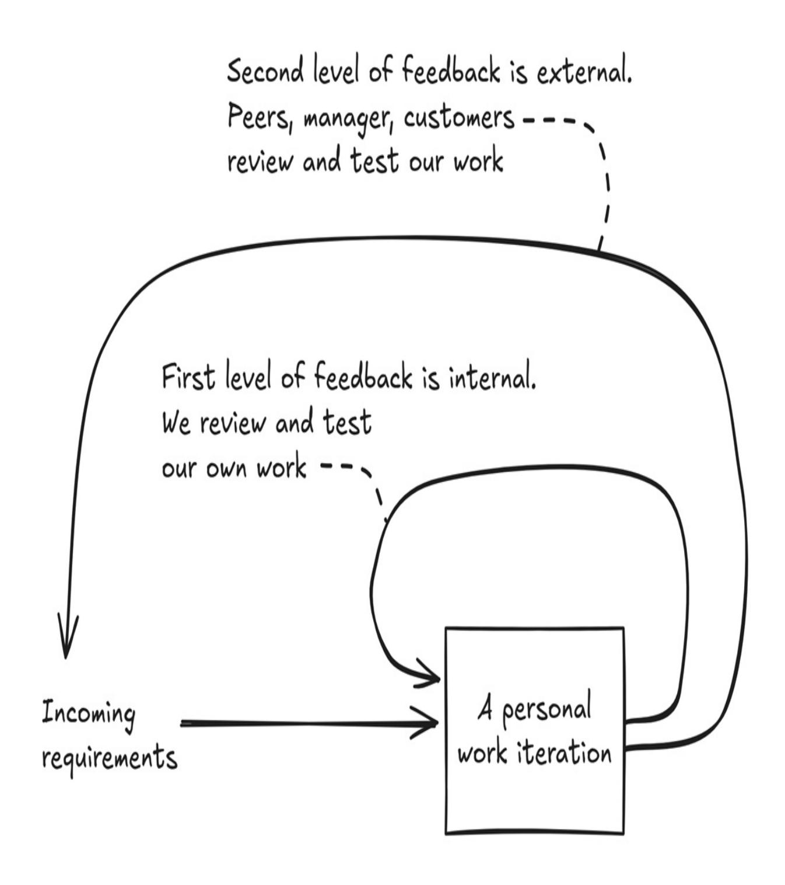
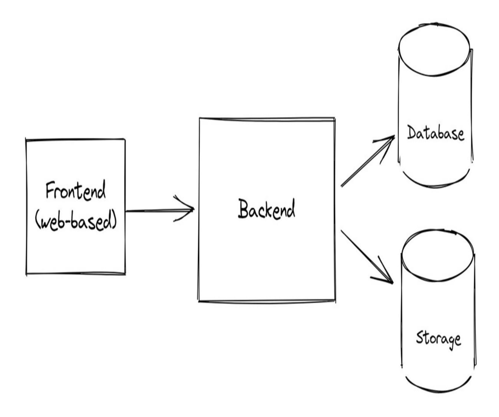

Feedback-Driven Developer

Ashley Davis


# **The Feedback-Driven Developer**

- 1. [welcome](#page-3-0)
- 2. [1\\_Working\\_and\\_valuable:\\_Gearing\\_your\\_process\\_for\\_continuous\\_feedb](#page-5-0)ack
- 3. [2\\_From\\_little\\_things,\\_big\\_things\\_grow:\\_Building\\_the\\_Photosphere\\_bac](#page-39-0)kend
- 4. [3\\_The\\_other\\_side\\_of\\_the\\_equation:\\_Building\\_the\\_Photosphere\\_frontend](#page-88-0)
- 5. [4\\_The\\_twisted\\_path\\_of\\_development:\\_Figuring\\_out\\_what\\_to\\_build\\_and](#page-135-0)\_how\_to\_build\_it

# <span id="page-3-0"></span>**welcome**

Thank you for joining the MEAP for *The Feedback-Driven Developer*. This is a book about delivering code quickly, but it's not about coding fast. It's about maximising the value in what we are delivering, culling the wasted time, and ensuring what we do deliver is working and reliable. If you take on board the principles in this book and make them habitual, even if you are new to this industry, you will be able to deliver more value more quickly than many senior developers.

I believe that a system for continuous feedback is at the core of an effective development process. That's because we use feedback to understand everything about what we are doing. Is it valuable? We need feedback. Does it still serve its purpose? More feedback. Does the code work? Again feedback. Am I going about it in the right way? Is it worth automating this thing? Feedback, feedback and more feedback. Feedback is at the core of understanding the why and how of what we are building and allows us to make constant course corrections to hone in on valuable software.

To get the most from this book you should already have some basic development skills. That is, you should have progressed at least slightly beyond the tutorial stages and need something that will take you deeper into the heart of real software development skills. Or maybe you are technically more experienced, but still need a helping hand to fine tune your development process for more valuable and better-quality output. The book's examples are in JavaScript (and some TypeScript), but the code is simple, and if you have experience with other languages you won't have much difficulty understanding it.

Together we'll build a somewhat complex application, but we'll build it in a series of simple and understandable steps - just enough for you to see that any complex application is nothing more than simple steps joined together. Because that's how good software development actually works: incrementally building and evolving something complex through a sequence of small and well-tested iterations with plenty of opportunity in between for

feedback.

But it isn't the software we are building that is the point; that's just a vehicle for exploring the techniques I'm going to teach you that will make software development more achievable: not exactly easy, but also not as hard as you might think. You just need to internalize the formula for breaking complexity up into simple pieces.

While I was ranking up as a software developer the learning presented in this book was passed from senior to junior through unofficial mentoring: working together to build software, learning from each other during development, and becoming better by constantly observing the working habits of those around us. It's taken over 28 years for this knowledge to filter through my brain and my work and arrive now in the form you are about to read.

Together we'll build the habits you need for ongoing success as a software developer.

Please feel free to share your questions and comments in the liveBook Discussion forum.

—Ashley Davis

#### **In this book**

[welcome](#page-3-0) 1 Working and valuable: Gearing your process for [continuous](#page-5-0) feedback 2 From little things, big things grow: Building the [Photosphere](#page-39-0) backend 3 The other side of the equation: Building the [Photosphere](#page-88-0) frontend 4 The twisted path of [development:](#page-135-0) Figuring out what to build and how to build it

# <span id="page-5-0"></span>**1 Working and valuable: Gearing your process for continuous feedback**

# **In this chapter, you will learn**

- A philosophy for effective software development
- Why feedback matters when building software
- About the example application we'll be building in this book

This is a book about delivering software at a rapid pace. But it isn't just about being a fast coder. By itself being able to write code quickly is not a worthy goal. It's not even a useful goal.

*As a software developer you must be able to produce working and valuable code in a reasonable time frame.*

If you can't write code that works, or if you can't write code that's valuable, there's little point being able to write code quickly. The real trick to moving at a rapid pace is to focus on the aspects of development that help you build your code the right way and indeed to make sure that it is the right code.

When we create broken code (it's so easy to do) we stifle our future progress.

When we write the wrong code, the work we have done is ultimately wasted (which so often happens).

How do we deliver working and valuable code as quickly as possible? You might have guessed already that the main answer is feedback. We need fast, almost immediate feedback, and we need it frequently. This book will help you build an effective development process to create working and valuable code, quickly. But we can't do that without building a solid foundation for fast and continuous feedback.

# **1.1 A software developer's journey**

Adopting a feedback-driven approach to creating software helps you achieve your goal of becoming a better developer, indeed a faster developer, one who consistently delivers working and valuable code, but we'll do that in the right way.

Well, in truth, there is no right way to do this. We are all different and there are as many different ways to do software development as there are developers.

We each learn in our own unique way and there simply is no one size fits all solution. Software development is too complicated for that and relies too much on situation, context, judgment and experience. The thing that makes you a good software developer might very well be different to the thing that works for someone else.

One thing I know for sure is that goals alone aren't enough to achieve anything. Goals can't be fulfilled without having the habits to back them up. Your habits will define you. Create good habits and you will become a consistently good developer. Create bad habits and … well, you get the idea.

You already have the goal of improving yourself as a developer, but you still need some help creating the habits that push you toward that goal. Through this book you will learn practices that will help you achieve your goals of delivering better and more useful software more quickly.

This book is for working developers who already know the basics of a programming language and are looking for pathways to a higher level of skill.

To get the most of this book you should be able to:

- Read and understand simple JavaScript or TypeScript code examples
- Use the command line to create and change directories, run commands, etc.
- Use a text editor or IDE such as Notepad++ or Visual Studio Code

It will also help if you know the basics of using Git, but it's not completely necessary because I'll explain the commands we will use along the way.

If you don't know JavaScript or TypeScript you can still read this book, but you may need to put in extra effort to make sure you understand the code examples.

We will start with a lightweight theory of effective software development. Very quickly, though, we dispense with theory and get into the actual practice of software development supported by constant feedback. Together we will build an application and you will spend most of the book experiencing the development process.

In this chapter we start with a theory of effective software development. After chapter one though we dispense with theory and get into the actual practice of software development supported by constant feedback. Together we will build an application and you will spend most of the book experiencing the development process.

#### Generally, our goals are these:

- Create a rapid, but sustainable, pace of development
- Improve our probability of producing working code
- Increase the value of the code we write
- Improve our development cadence: the rate at which we produce working and valuable code.
- Use constant feedback to assess our work and make course corrections towards more effective development and a better product.

This book is accompanied by many working code examples for you to follow along with and a complete non-trivial example application called Photosphere (scroll down to figure 1.7 to see how it will eventually look).

This doesn't work without you trying it for yourself. Only by following along with the coding (starting in Chapter 2) can you really experience it. Then you must apply what you learn to your own development process. Take what works for you, adapt what you can and discard the rest. That's a winning system that leads you to becoming a more seasoned software developer.

# **1.2 The fastest way to write code**

Before we really get into it, I have a question for you:

*What's the fastest way to write code?*

Think about this question as you read this chapter. I'll give you my answer soon. It might surprise you!

Producing reams of code quickly isn't necessarily productive:

- When the code produced is unreliable and causes problems, it's counter productive.
- When the code doesn't meet the needs of the customer, your effort has been partially, and sometimes completely, wasted.

Of course, being able to write code quickly is part of it. As a professional developer it's best if you can type quickly and without looking at the keyboard. Ongoing effort to master your programming language is time well spent. Being able to "think in code" really does help, but that takes a lot of practice and experience.

You should be pleased to realize that coding quickly is nowhere near the full story of effective software development. Your code also has to work. It has to be reliable. But most importantly your code has to be valuable. If you know how to produce working and valuable code, even slowly, you will already be able to outperform many other developers.

A good development process encourages these virtues for our code:

- Working
- Reliable
- Valuable

The key to building these virtues into our development practice is *feedback*:

- How do we know if our code works? We test it. That's feedback.
- How do we know if our code is valuable and reliable? We ask our

- customer. Or better yet, we watch our customers using our product. Again that's feedback.
- Is our development process effective at producing working, reliable and valuable code? Assessing this during development is another type of feedback.

Many times in this book I will mention *our customer*. I believe that a *customer-focused* approach to software development is one of the best ways to ensure that we are committed to building the right thing in the right way whatever that happens to mean for our given situation.

For many of you reading this, *customer* might sound like the wrong term to use. So please mentally swap *customer* with whatever term you feel is the most appropriate proxy for you, for example:

- Your boss, lead developer, project/product manager, department head If you have no direct access to customers of your product you'll need to identify the relevant proxy to your customer.
- Your colleagues If you are a developer providing code and tools for your colleagues to use, then they are your customer!

Building good feedback loops into our development process is the best way to make constant course corrections to hone in on better code, better product and better process.

# **1.3 Foundations of an effective development process**

We can't have a good development process without a good foundation.

These are the principles on which we will build our development process:

- Minimizing time to feedback
- Balancing value against cost
- Minimizing wasted time

# **1.3.1 Minimizing time to feedback**

We must create a streamlined process for creating and testing our code and we'll see examples of this in coming chapters. The faster we can see our code working the sooner we can test it from the point of view of the customer. We must reduce the time it takes to go from adding or editing code to getting feedback. Prioritizing fast feedback is the most reliable way to create a development process that can operate at a rapid pace.

We must look at our process with a critical eye. Our process should consist of techniques, tools and practices that support, empower and scale us. Elements of our process that slow us down or reduce our capacity should be jettisoned.

We aim to deliver working code at a fast pace in regular intervals, but we also need to make sure our process is sustainable. If we burn out, that's a huge derailment of our productivity. We need a routine that includes periods of rest so that we can maintain a rapid pace indefinitely.

**Figure 1.1 Minimizing the distance to getting feedback makes for a fast paced development cycle.**


Minimizing the distance between making a change and seeing the effect will turbo charge your development process

### **1.3.2 Balancing value vs cost**

As developers we aim to deliver a flow of useful code for our employer, our organization or our customer.

We should prioritize our work based on its value to our customers or users of our software. By value I simply mean solutions to problems for which other people or businesses are willing to pay and thus keep our business alive. For bigger companies value is often defined by our managers or product owners. For those of us working for smaller companies or startups we might be lucky enough to have access to our customers and be able to directly see the value we are providing to them.

Balancing values vs cost helps to ensure that we are always working on the most valuable code that we could be working on right now. How do we know the value? We need to ask the customer, or better yet show them, and seek feedback.

But it's not just the value of the code we need to consider; we must also balance the value of the code against the cost to build it.

We should prioritize our work not just by how much it is worth, but also by how much we estimate it will cost to build. So code that is slightly valuable and takes a day to deliver can be a higher priority than code that is extremely valuable and takes a month to deliver.

**Figure 1.2 The trade off between value and cost**


Development is a balancing act that requires not only thinking about how to code something, but also understanding the value of our code and how it fits into our team, our company and our product.

One big problem is that we often don't know how much something costs to build until we are building it. So we need a process with spaces for feedback that allows us to continuously re-estimate, re-evaluate and reprioritize our work.

# **1.3.3 Minimizing wasted time**

Software developers are masters of wasting time. Of course, we don't do it on purpose, but the nature of the game is that there are an infinite variety of distractions vying to derail our productivity and we spend too much time on things that aren't very important.

You have probably experienced some of these yourself:

- We automate things that don't need to be automated;
- We adopt tools and processes that slow us down;
- We regularly create bugs that take a lot of time to find and fix;
- We waste time on code and features that ultimately will be used infrequently and sometimes not at all;
- And finally, we often burn time trying to get that last ounce of unnecessary perfection from our code.

To open ourselves to a more effective process, we should start with some honesty. Before we can reduce or eliminate the things that slow us down, we need to recognize and identify them. We should train ourselves to be wary of any task that consumes time, but is not necessary or not valuable.

Allowing space for feedback is essential to recognise wasted time. Once identified, waste should be ruthlessly eliminated from our development process. This is fundamental to our performance as a developer.

# **1.4 A philosophy for effective development**

To create an effective development process, we need a guiding philosophy.

This is the philosophy that we'll embrace in this book:

- Build software through iterations
- Embed thinking in your process
- Keep your code working
- Manage complexity, avoid complications
- Know when to cut corners
- Actively seek feedback

# **1.4.1 Build software through iterations**

Did you ever have the experience where you were coding for hours (or longer) and then when you tested your code, you found that it just didn't work?

Or even worse: it did (kind of) work, except it had a bunch of hidden bugs that were then, rather embarrassingly, found by your users?

Coding for a long time before testing and getting feedback is a terrible idea. The reality is that software doesn't get created like that. A simple truth of software development is that nothing gets created all at once. Successful development is usually done through a series of increments, assembling the product piece-by-piece through an iterative and evolutionary process, getting feedback at each and every stage.

*Software development is done through iterations.*

By iterations I mean that we take a big complex task (like building a software product) and we break it down into smaller and more easily managed pieces. This divide and conquer approach to development makes the whole job more attainable because we can see the milestones along the path. It also means we can test our code and get feedback bit by bit instead of doing big bang testing at the end (that usually doesn't work out so well). As we progress through development we can then continuously assess how we are doing and make course corrections as necessary.

Iterations help us to set a rapid pace. They are the beating drum that keeps us rolling forward. It's how we make incremental progress toward a larger goal.

By the way, the iterations I'm talking about here could be personal work iterations or they could be team-based iterations, sometimes called sprints. In this book we are mostly talking about coding at the individual level, but most of this also applies at the team level. The important point is that any big task should be broken down and tackled through a series of iterations - allowing many opportunities to seek feedback.

**Figure 1.3 Iterations provide many opportunities to get feedback and reassess**

| Trying to complete a big coding task in one shot is very difficult | "Iterations" are the key that unlocks software development |
|--------------------------------------------------------------------|------------------------------------------------------------|
|--------------------------------------------------------------------|------------------------------------------------------------|

Big task or feature

| Breaks between iterations offer opportunities for feedback | Instead break a big task into many smaller and simpler pieces that can each be completed independently |
|------------------------------------------------------------|--------------------------------------------------------------------------------------------------------|
|------------------------------------------------------------|--------------------------------------------------------------------------------------------------------|

#### **How it helps**

Breaking up complex work into small pieces allows regular incremental progress towards completion and provides many opportunities for feedback.

### **1.4.2 Embed thinking in your process**

Diving into coding before thinking is often a big mistake. Even though you

probably know this already, it is still tempting to get straight into coding without doing any planning. This "code first, think later" way of working is prone to errors. The challenge we face is finding ways to break this cycle and intersperse thinking and planning in between sessions of coding. Thinking through what we want to achieve, what to do next and how to do it, what we have just done and how well it worked - this is a kind of self-reflective feedback that helps us build a more effective process - without having to consult with anyone else.

*Put regular breaks for thinking between bursts of coding.*

It doesn't really matter what technique we use to create our iterations so long as it gives us time for a block of intense work followed by a break, which is then repeated. The spaces between blocks of work give us time to think. Thinking is important, because it helps us determine when we are moving in the wrong direction and wasting our time. Iterations provide natural gaps in which we can review and plan our work and continuously reassess. We don't always want or need to be moving at a breakneck speed. It's important that we have times where we can slow down to think about what we are doing.

You can build your process of iterations however you like and in a way that's suited to your company, your project and the stability of your requirements. If your current requirements are very stable (well understood, well estimated, unlikely to require a re-evaluation of value or delivery cost) then the duration could be as much as an entire day per personal work iteration. More likely, though, you'll at least want to break your day around lunch time, giving you two iterations. Possibly more sensible is to have at least four iterations per day, giving time for a morning and afternoon break and a lunch break.

If you suffer from very unstable requirements (as I have, working at various startups) where the value of any task or feature is uncertain and the cost of delivery is also uncertain, it can be useful to reduce the size of your personal iterations to give more opportunities for thinking, gathering feedback and reassessing the plan. For my own personal work iterations I like to use the Pomodoro Technique. As illustrated in Figure 1.4 it gives us a cycle of iterations that are each 25 minutes long and have short breaks between them. The start of each Pomodoro is a natural time to rethink what we are doing. Pomodoro is the Italian word for tomato and the Pomodoro Technique is

named after the ubiquitous tomato shaped kitchen timer. If you dislike 25 minute iterations, change it to what makes you comfortable (say 50 minutes work, 10 minutes break). You should tailor your personal work iterations to fit your needs.

**Figure 1.4 The Pomodoro technique provides spaces for thinking and rest**


Having thinking and rest embedded in our process gives us the best chance of making the best decisions whilst maintaining rapid bursts of coding activity. Regular breaks make our process sustainable, giving us the energy we need to make it through our working day.

Some have said that they can't do personal work iterations like this because it stops them achieving a flow state (see sidebar below). Whilst flow state can be very satisfying, it's not always as productive as you might think. When requirements are very stable, yes, getting into a flow state for a day or a half day can help you make great progress. However, when requirements are unstable, getting into a flow state runs the risk of us running as fast as possible in the wrong direction without any opportunity to reassess. The best

case scenario is that we are very productive while in flow state. The worst case scenario is that we waste a lot of time before we realise we are going the wrong way. The good news is that with some training (time spent practicing personal work iterations) we'll find it much easier to quickly go into and out of a flow state. I have been practicing 25 minute iterations for many years now and I find it particularly easy to go into flow state on demand, leave flow state (if distracted by something external or at the end of an iteration) and then return to flow state as required. I'm actually writing this chapter in a 25 minute interval right now and writing about flow state made me realise I was actually just in that state!

Frequent re-evaluation supported by iterations allows us to be more dynamic and able to quickly change direction the moment we see a better option. This is especially useful, because sometimes clarity only appears when we are part way through a coding task. There may come a point where you re-estimate the current task to be more difficult than originally estimated, subsequently de-prioritizing it in favor of other tasks that are now higher priority because they are easier to deliver.

#### **How it helps**

Thinking while working keeps you heading in the best direction and avoids wasted time spent moving in the wrong direction.

#### **Learn more**

Search for "Pomodoro Technique" and "Timeboxing".

#### **Flow state**

Flow is the state of being in the zone where we are fully immersed in what we are doing, to the point where we no longer notice the passing of time. Flow can be very satisfying and it can result in much productive work.

But flow state can also be dangerous. If our work is heading in the wrong direction and we enter flow, it will likely be many hours before we realize the work we are doing is a waste of time.

# **1.4.3 Keep your code working**

Many developers spend much of their time debugging broken or badly behaving code. To some extent, debugging is always going to be necessary and it's a useful skill for us to develop. But there are many times when the problems that require debugging can be avoided.

This boils down to what is essentially my most sacred rule of software development: *Keep your code working.*

*Every commit to version control (aka Git) - at least to the best of our ability should be working code. Of course, we'll make mistakes and sometimes we'll commit broken code - but we shouldn't be knowingly committing broken code unless there are some mitigating circumstances that justify otherwise (e.g. we are committing a fix for one extremely urgent bug that we know will cause another bug that must be solved later).*

It is so important and so fundamental for me to keep my code working, that I sometimes think everyone should already know it, yet I still see other developers working on changes or refactoring without so much as a hint of testing. Why are they surprised to later find that their code doesn't work?

*Don't tolerate broken code.*

Figure 1.5 shows efficient development in action. While working on new or updated features we take our code through a series of changes. The key milestone at each point is that we have working code. Development is taking our code through a succession of changes, repeatedly going from working state to working state.

We do not tolerate broken code. Whenever it is detected - through continuous testing and feedback - we fix it and immediately return our code to a working state.

**Figure 1.5 The process of development is taking your code through a series of changes from working state to working state**


Of course it's not as simple as it sounds. Our code often comes out broken. In fact, I'd say that the natural state of code is actually a state of being broken (not that code is natural in any way; I'm just trying to make a point).

It's almost impossible for anyone to write working code without testing it. That's because there's so many more ways for code to be in a broken state than there are for it to accidentally be in a working state. We must therefore cause code to be in a working state on purpose. It takes continuous effort and discipline to maintain our code in a working state.

*The natural state of code is to be broken - only testing (feedback) can show that our code is working.*

That's not to say that code breaks by itself. If code works and you don't

touch it, then it isn't just going to break by itself. It's only when adding new code or editing existing code that we risk breaking it. It also doesn't mean that code that seems to work now won't be found to be broken in the future. Any code can have latent issues waiting to be discovered.

The key to quickly creating working code is to work in short iterations, getting fast feedback and fixing broken code immediately. The faster we can go from making a code change, however small, to seeing it work (or not work), the more quickly we can develop working code. Through this book, especially in chapters 2, 3 and 4, we'll create a development pipeline with almost immediate feedback. We'll also cover many practical ways to avoid broken code.

#### **How it helps**

Keep your code working at all times and avoid wasted time spent on unnecessary debugging.

### **1.4.4 Manage complexity, avoid complication**

Have you ever felt overwhelmed by the complexity of your codebase? Or maybe thought that it has grown so complicated that it's out of control? Did you know that there is a difference between complexity and complication?

The inescapable destiny of modern software development is complexity. Applications are getting bigger; business requirements are growing and customers are more demanding. The knock-on effect is that our software products are becoming ever more complex.

Our products have an increasing number of moving parts with exponentially growing interactions: that's the nature of complexity. As developers we must find ways of dealing with complexity before it can bring our pace of development to a crawl and stunt our ability to get fast feedback.

*Complexity can't be avoided, but we can manage it through our tools, techniques and process.*

Fortunately, we have many ways to tackle complexity while coding,

#### including:

- Creating abstractions;
- Componentizing our code;
- Using common conventions, patterns and terminology; and
- Employing tools and processes to help us scale our development process.

Complication, on the other hand, is quite different from complexity. While complexity is a fact of life, complications are usually unnecessary, but they also conspire to slow us down.

A truth that can be difficult to see is that we can create complex products (products with many interacting parts) that are built from simple, not complicated, parts. Building complex products from simple parts is an ongoing theme in this book.

*Strive for simplicity while coding: prefer simple code and solutions over complicated ones.*

*Avoid complicated tools, techniques and processes.*

There are many benefits to writing simple code. To start, it is easier to understand. This is great when other people (or maybe your future self) have to work with your code. But the most substantial benefit of simple code is that simple code is easy to test, and code that is easy to test is easier to *keep working*.

One way that code gets complicated is through optimization. So don't be too quick to optimize your code. Personally, I aim for good performance code, the best that I can achieve quickly anyway, but only when it doesn't sacrifice simplicity. There's a good reason Donald Knuth said that premature optimization is the root of all evil. Unnecessary optimizations, those that can't be justified or measured, waste our time and complicate our code for no good reason.

Another way that code gets complicated is by over engineering, also known as future proofing your code. Experienced developers recognize when they

are doing this, because so often in the past they have overly-complicated their code, making it flexible enough to handle situations that never actually occurred. They later find they are bogged down by this code that was unnecessarily designed to handle situations that never happened.

It's very liberating to understand that you should be coding for now and not so much for later, but like anything in software development it's a balancing act that relies on our judgment and our experience (and sometimes a bit of luck, because we won't always get it right!).

*The natural state of code is to be overly complicated.*

It's important to note that writing simple code isn't exactly easy. By default, our code seems to come out complicated and convoluted. It can take substantial effort (it gets easier with practice, though) to write our code to be as simple as it can be, but still do the job it needs to do.

Throughout this book we'll talk about ways to actively manage complexity. We'll see how to write simpler, less complicated, code. We'll learn how to let good design emerge naturally through continuous refactoring supported by good testing.

#### **How it helps**

Avoid time wasted on unnecessarily complex and complicated code. Complexity can be managed. Complications should be avoided.

### **1.4.5 Know when to cut corners**

Getting to a solution quickly, artfully avoiding wrong turns and dead ends, is tricky to get right, but if you understand where shortcuts are ok, you can create a much quicker route to the finish line.

I'm talking about things like this:

Does your code really need to be perfect? (Who even gets to decide what perfect means?) Ok and useful is preferable to almost perfect and not yet published.

- Do you need automated testing? Often startups can't afford this level of investment in their code. (We'll talk about the tradeoffs of automated testing in Chapter 5.)
- Can you circumvent your company's usual traditions, process and conventions to demonstrate a groundbreaking new feature quickly? (Possibly in a testbed application, which we'll see in Chapter 4).

*Perfection is the enemy of productivity.*

Learn where the acceptable boundaries are in your organization. When you know what you can and can't get away with, you will find faster ways to deliver your code. Of course if cutting corners generates technical debt, that is to say if it causes problems that we might have to fix later, I'd recommend keeping a list so we can remember to prioritize and fix them later on. We'll talk more about this in chapter 2.

#### **How it helps**

Understand where it's ok to cut corners (and still keep your job). This gets you to the finish line faster and more directly.

### **1.4.6 Actively seek feedback**

It's not enough to just let feedback come to us. We need to purposefully construct our development process to create frequent opportunities for feedback.

We can build a habit of asking questions (to ourselves, colleagues, managers, customers, etc.) that elicit feedback. Asking questions creates the right conditions for feedback to emerge. Questions like:

- Will my ideas and design for the feature/code I'm planning work? What's the cheapest way to get feedback before investing more time?
- Do my latest code changes work as intended? What tests can I run to prove that my code still works?
- Will the customer find value in this new feature? How can I measure the value to the customer?

The first two bullet points above are the easiest and we'll see lots of examples in the coming chapters. Answers to questions like in the third bullet point above aren't usually easy (it depends on the particular customer!). But it's still worth asking this question, because any attempt at thinking it through, understanding it, measuring it and getting some kind of answer that we can refine in the future means we are least heading in a non-random direction.

#### **How it helps**

Feedback helps us build the understanding we need to make course corrections in the direction of better outcomes.

# **1.5 The fastest way to write code - the answer**

Now the answer you've all been waiting for… drum roll please.

*What's the fastest way to write code?*

It's simple. Just don't write the code!

That sounds crazy I know, but if we could use a crystal ball to figure out which of our code is destined for the trash heap, we could simply not write that code in the first place and save ourselves a lot of time.

The fastest code we can write is the code that we preemptively eliminate because we realize early that we don't even need it. A sad fact of software development is the ultimate feedback we get when a feature or sadly even sometimes an entire product has been cut. So much of the code we write is destined to go unused.

The main problem is that code is expensive. Code is costly to create. Code is costly to maintain. Code creates baggage that can slow us down and that we must bear going into the future.

Here's a less crazy way to look at it:

*Choose carefully the code that you decide to write.*

As developers and humans we have limited capacity, so we must be cautious about where we invest our time! Actively deciding which code not to write is just as important as deciding what code to write. We should be writing code with the most obvious value and be wary of writing code that has an unknown value.

I asked this question—"What's the fastest way to write code?"—because I hoped to make you think and because it highlights something important about prioritization. Thinking about where you can deliver the most value, thinking about the best place to invest your time - encouraging thought experiments like these are a kind of mental feedback that can put you on track to more effective software development.

# **1.6 Feedback-driven development**

An effective development process is one that is frequently guided by feedback. You can see in figure 1.6 the two levels of feedback we are dealing with. The first is at the internal or personal level where we repeatedly complete personal work iterations followed by self-review: testing our code, doing thought experiments and reviewing our own code for mistakes. The insight gained from this feedback allows us to see our mistakes more quickly and plot a better course forward. This is our tightest feedback loop and it directly influences the moment-to-moment direction of software development during our working day. This feedback loop operates at a fast pace, quickly giving results that feed back into our work. Considering feedback at this level and taking corrective action has the biggest potential to reshape our personal development process to be more effective. We'll see examples of this type of feedback in the coming chapters.

The second level of feedback is at the external level, what you might think of as team-based feedback. This is where we submit our work for evaluation and review to our manager, colleagues (for peer-reviews) and ultimately to our customer who will use the product and features we create. This level of feedback is necessary but it is much slower-paced. It can take hours, if not days, to get feedback this way. If you are relying on this level of feedback to improve your personal development process you will find that improvements will come very slowly if they come at all.

An important point I'd like to make is that if you are waiting for feedback from others to know where to head next, you will necessarily be moving at a slow pace. Whilst we do need team-based feedback and it's an important part of our jobs to meet the needs or our colleagues, business and customers, there are many ways we can create our own internal feedback loops for selfcorrection that are going to be, by their nature, much faster to have an effect than reaching out for external help. That's not to say external help is bad; like I said it's always going to be necessary and often external feedback will reveal things for which we have a blind spot. It's just that reaching for external feedback is slow and so whatever way we can predict or preempt external feedback and create our own feedback is going to be a way in which we can excel at our work.

**Figure 1.6 The two levels of feedback and where they fit with the personal work iteration**



Both types of feedback loop allows us to adjust our direction and make course correction to our plan

Effective software development isn't just about coding quickly, it's about producing code that is:

- Working: Code that is not working is at best not useful, at worst counterproductive.
- Reliable: Code that is not reliable wastes time and frustrates consumers.
- Valuable: Code that is not valuable will not be used. Time spent creating it was wasted.

To produce code with these virtues requires a development process with solid foundations:

- Minimizing time to feedback: Getting feedback quickly is at the core of producing working and reliable code at a rapid pace.
- Balancing value against cost: We should prioritize our work not just by the value to the customer, but also by the cost to deliver it.
- Minimizing wasted time: Recognize when a particular task, technique or process is ultimately not contributing and ruthlessly eliminate it.

To achieve our goals we'll create a development process guided by this philosophy:

- Develop software through iterations.
- Embed thinking in your process.
- Keep our code working.
- Manage complexity, avoid complications.
- Keep our code simple.
- Know when to cut corners.
- Actively seek feedback.

Through this book we'll create an effective development process that implements our philosophy of development supported by continuous feedback so we can rapidly deliver software that is working, valuable and reliable.

# **1.7 Can't AI just do it all for me?**

I started writing this book before ChatGPT became mainstream, so much of the book was written before AI support became a big part of my development process. Since ChatGPT became mainstream, it, Copilot and now Claude feature regularly in my day to day work.

Unfortunately, quite often the code produced by the AIs is simply broken. This is because our current AIs aren't really that smart, they have no notion of what it means to write *working code* and they certainly don't have the ability to test the code that they write for us. So we are left to test and fix the broken code that AIs create for us. So at this present point, the ability to create working and reliable code is still a necessary skill for developers. Not to mention the debugging skills we need to identify and fix problems in the code the AI has given us.

However I can see a time in the near future when AIs will have the ability to test the code that they create and assure us that the code works. I predict that this will be the next big leap forward for the AIs that are supporting developers. But still, what does *working code* even mean? How will future improved AIs understand our definition of working code? How will they know what the code is supposed to do? Us humans will still have to know enough about what working code looks like and what it looks like within our domain. We'll also need sufficient communication skills to be able to accurately describe to the AI what we expect. Understanding what *working code* means and what's required by our domain is still a set of skills that developers need now and will continue to need in the future.

There's one big thing that's lacking from AIs that it seems like they'll never be able to do. AIs aren't going to be able to identify the value in what we do (at least I don't see it coming anytime soon). We simply shouldn't want an AI to take responsibility for what's important to us, our team mates, our businesses or our customers. That is the kind of thing that we should decide. It's also the kind of thing we should be able to change our mind on as new information comes in. So understanding how to prioritize what we do by its value will continue to be an important skill.

So what's changed with AI? Honestly not a lot. My work seems to move more quickly now that I'm not manually running around on the internet doing research. My trusty AI does a lot of that for me now and is very good at

putting together a starting point in code much more quickly than I could have done. And the advanced auto completion I now have in my IDE (VS Code + Copilot) makes creating and editing code move so much more quickly (except when Copilot occasionally adds a really subtle bug that I then have to debug for hours). So even though our new AI tools are amazing and can really improve our productivity (and occasionally severely hinder our productivity), they don't change the fundamental skills that we as humans need to produce code that is working, reliable and valuable. Indeed, building working feedback loops and getting fast feedback is just as important as ever.

# **1.8 The example app: Photosphere**

While this first chapter has been theoretical, the rest of the book is mostly practical, with some theory interspersed. Here's a taste of what's coming up.

You can follow along with the coding and together we'll build a fullstack application while applying the philosophy of rapid development. There'll be plenty of simple examples, but we are also working towards a non-trivial example application called Photosphere. You can see how it will eventually look in figure 1.6. A live demo is available here:

https://photosphere-100k.codecapers.com.au/

**Figure 1.7 How Photosphere eventually looks**


Photosphere is a photo gallery and backup tool. Initially we'll be able to upload photos through a web portal and then browse them in the gallery. Toward the end of the book, we'll explore building desktop and mobile

applications from a shared codebase.

Through building Photosphere we'll learn the techniques, habits and attitude we need to create a fast pace of development.

# **1.9 Book overview**

Chapter 1 has laid the theoretical groundwork for effective development through continuous feedback. In the coming chapters we'll implement our philosophy, create our development process and actually build the Photosphere application.

In chapters 2 and 3 we create a simple monolithic version of Photosphere as shown in figure 1.7. We'll use this as a vehicle through which to explain the foundations of an effective development process.

**Figure 1.8 The Photosphere example application: the simple monolithic version**



In chapter 4 we'll explore the planning and prototyping that led to the development of Photosphere.

In chapter 5 we'll talk about testing and look at the test driven development (TDD) that created Photosphere's gallery layout algorithm.

In chapter 6 we'll talk about how to choose the right solutions to problems through the development process.

In chapter 7 we'll learn how to be more effective at debugging and problem solving.

In chapter 8 we'll take our first steps beyond fullstack and extend Photosphere with a desktop application implemented with Electron and a mobile application implemented with Capacitor. All frontends will share the same backend as illustrated in figure 1.8.

In Chapter 9 we'll wind up with a review, what an effective process looks like and how to scale yourself and your team.

**Figure 1.9 The Photosphere example application: beyond fullstack - now supporting desktop and mobile frontends**


# **1.10 Summary**

- Continuous feedback is the foundation for delivering code that is working, reliable and valuable at a rapid pace.
- The virtues we aspire to for our code:
  - Working: Code that is not working is at best not useful, at worst

- counterproductive.
- Reliable: Code that is not reliable wastes time and frustrates consumers.
- Valuable: Code that is not valuable will not be used. Time spent creating it was wasted.
- The principles of effective development:
  - Minimizing time to feedback: Getting feedback quickly is at the core of rapid development
  - Balancing value against cost: We should prioritize our work not just by the value to the customer, but also by the cost to deliver it
  - Minimizing wasted time: Understand what we are doing that is ultimately not contributing and ruthlessly eliminate it
- Our philosophy for effective development:
  - Successful software development is done through iterations, including gaps for rest and thinking
  - Embed thinking in your process to help avoid wasted time heading in the wrong direction.
  - The number one rule of development: Keep your code working.
  - Modern applications tend towards complexity, but complexity can be managed.
  - Keep your code simple; try to avoid complications.
  - Cut corners where possible, but only when it's ok to do that.
- As developers we only have limited capacity, yet the amount of software to build is potentially limitless, so we should choose carefully where to invest our capacity.
- Photosphere is the application we are building through this book to demonstrate a fast development process with continuous feedback.

# <span id="page-39-0"></span>**2 From little things, big things grow: Building the Photosphere backend**

### **In this chapter, you will learn**

- Starting a new project
- Making progress and taking feedback through small and simple steps
- Using live reload to minimize the distance between coding and feedback
- Building and testing a REST API with Node.js and JavaScript
- Reviewing and committing your code with Git

How do we start a new project? How do we continue a current project?

Starting a project or just trying to figure out what to do next means asking this question:

*What's the next simplest thing I can do to move forward?*

We are working towards a complex application and the journey there might be difficult, but each step along the way should be simple. We make progress in development by breaking a larger, more complex job into small increments of work and taking feedback along the way. But we can't always know ahead of time what those steps will be. So for each step forward we must start with this question: *what's the simplest next thing we can do to continue making progress?*

In this chapter we build the Photosphere monolithic backend through small chunks of work, giving many opportunities to gather feedback and reassess what we are doing. Our main goal is code that is working, reliable and valuable. So after each iteration of coding we will be testing our changes to keep our code working (section 1.7.3), reviewing our work and capturing our working code into version control. Strap in, coding is imminent.

# **2.1 Getting the code and seeing the result of this chapter**

While reading this chapter you can follow along with the coding yourself or you can simply get the code from GitHub to see the end result of this chapter:

https://github.com/Rapid-Fullstack-Development/photosphere-monolithicbackend

#### **NOTE TO MEAP READERS**

The current code is named for the previous name of this book and is yet to be brought up to date, which will be done prior to publication. Please feel free to comment on the code and what can be done to improve it.

To get the code for this chapter and run it locally, use these commands:

```
git clone https://github.com/Rapid-Fullstack-Development/photosphere-monolithic-backend.git
cd photosphere-monolithic-backend
npm install
npm run start:dev
```

If you install the VS Code extension "VS Code REST Client" you can open the file backend.http in VS Code and then invoke the various endpoints in the backend. Through this chapter we'll walk through creating and testing this REST API.

Figure 2.1 shows the layout of the backend project we are building in this chapter.

**Figure 2.1 Layout of the Photosphere backend that we are developing in chapter 2**


# **2.2 The beating drum of development**

The coding loop is at the heart of our development process. It's how we fit fast and continuous feedback into our personal development process. It's how we produce working and valuable code, piecing it together - bit by bit - into a

complex application.

In this chapter we will cement into habit this routine for coding:

- 1. Identify and think through the next smallest step forward.
- 2. Write or edit the code to cover the small step forward.
- 3. Get feedback: Test the code and make it work.
- 4. More feedback: Conduct self-review. Then commit our code changes and repeat the cycle.

The process of coding is depicted in figure 2.2.

**Figure 2.2 The coding loop is the beating heart of our development process**


Often, when testing our code, the feedback we get is negative. We change our code and then discover that it no longer works in the way we expected. The natural state of code is to be broken (section 1.7.3) so all too often the changes we make to our code will cause problems that we must then find and fix. When we know something is broken, the general rule is that we should fix the problem before moving on with more coding. This means we need a loop within our coding loop:

- 3.1. Detect broken code
- 3.2. Find the issue (sometimes very difficult!)
- 3.3 Fix the issue (often easy, assuming we can find the problem)

The extended coding loop is depicted in figure 2.3.

**Figure 2.3 The loop within the loop: finding that our code doesn't work and fixing it**

Most of the time our code comes out broken in some way 3.1 Code doesn't Wrote code work 3.2 Find 3. Test the issue your code Our code is 3.3 Fix Self-review and usually born the issue commit broken and it takes some effort to find and fix the problem

# **2.3 Think before coding**

Diving into coding without doing any planning is a mistake. This chapter isn't about planning, but we will see a few ways to promote the right kind of thinking during development (embed thinking in your process, section 1.7.2).

We'll talk about planning in chapter 4; for now let's assume I have done planning and I have a path mapped out for us. You can see in figure 2.4 the HTTP endpoints we need in our REST API and how they relate to the frontend and the database.

**Figure 2.4 The endpoints that we will implement for the Photosphere REST API**


# **2.4 Bootstrapping the backend**

So where do we begin? Let's create a new directory for our project:

mkdir photosphere-backend

Or on Windows:

md photosphere-backend

From now on, with Windows, please just assume using md instead of mkdir.

Navigate into the new directory:

cd photosphere-backend

Create a new Node.js project:

```
npm init -y
```

The -y flag means we don't have to answer any questions. It gives us an empty package.json file for our new Node.js project that has some default values. The package.json file contains metadata and tracks dependencies for our Node.js project.

Open the directory in VS Code, then take a look around the project:

code .

We can test our project configuration using the traditional starting point for any application: Hello world! Create a src directory, then an index.js file under that. Print "Hello world" as shown in listing 2.1. It's as good a starting point as any.

**Listing 2.1 (src/index.js): The traditional simplest starting point: Hello world**

```
console.log(`Hello world`); #A
```

#### **Why put files under a src directory?**

It's a way of separating our source code files from other files, like files for configuration or testing.

Our project, although trivial, is actually runnable now. Try it out:

```
node src/index.js
```

**Note:**

On Windows you might need to replace the forward slash with a backslash.

If it works as planned you should see "Hello world" printed to your terminal.

#### **Why is the file called index.js?**

It's simply a convention. You can call this anything you want, but it's commonly named index.js, main.js, server.js or something like that.

Instead of running our script directly under Node.js we'd really like to use the npm start command that is the convention among Node.js developers. To achieve this we implement the *start script* in package.json shown in listing 2.2.

**Listing 2.2 (package.json): The package.json file for our fledgling Node.js project**

```
{
  "name": "photosphere-backend", #A
  "version": "1.0.0",
  "description": "",
  "main": "src/index.js", #B
  "scripts": {
    "start": "node src/index.js" #C
  },
  --snip--
}
```

Now we can run our Node.js application in the conventional manner without caring about the name of the main file or other such details. Try it yourself:

```
npm start
```

Following established convention like npm start is good because:

- We automatically know how to make use of other Node.js projects (when they follow the convention).
- It's a helping hand to other developers who might use our project (including our future-self after we have forgotten how it works!).
- We are following the principle of least surprise for users of our project.

We have taken a first step in initiating our project. Now let's create our code repository where we'll capture the code we create during development:

```
git init
```

When we commit code using Git, we do it in two steps. First, we stage the files we have added or changed:

```
git add .
```

Second, we commit our staged files:

```
git commit -m "A simple starting point for the
    ↪ Photosphere backend."
```

This is the first commit for our new project and these commands (git add and git commit) are the ones we'll use throughout this book to capture and preserve our working code. I won't show you these commands again, so just assume I'm using them in the future whenever I say "commit our code" or something similar.

Browse the code created in this section.

**Isn't it too early to commit our code?**

Project setup is necessary work towards our goal and it deserves its own commit.

Besides, we have to start our code repository somewhere!

#### **Pushing to GitHub**

At this point you might want to create a code repository on GitHub and then use git push every few commits to back up your code to GitHub. You can make your code repo private if you'd prefer others not to see it.

# **2.5 Live reload for fast feedback**

A key to creating a rapid pace for our development is to minimize the

distance between coding and getting feedback. For us this means making code changes and (almost instantly) being able to see the results so we can test our code. The fastest way to get continuous feedback is to have our code automatically reload while we are working on it to quickly see the results (working or broken?) for the code we are testing. The live reload feedback loop we'll be using from here on in is shown in figure 2.5.

**Figure 2.5 Minimizing the distance between coding and getting feedback is key to creating a rapid pace of development**


Before we do any real coding, let's integrate live reload into our application so it will reload automatically while we are coding and thus deliver to us *fast feedback*.

Install Nodemon in our project:

```
npm install --save-dev nodemon
```

The --save-dev flag saves Nodemon as a so-called *dev dependency*. We only need live reload during development; we don't need it when this code goes to production, and saving it as dev dependency will exclude it from production. You can see in listing 2.3 how dev dependencies are tracked in the file package.json.

During development we'll use Nodemon to run our code instead of Node:

```
npx nodemon src/index.js
```

#### **Nodemon**

Nodemon can be used like a drop-in replacement for Node, except it automatically reruns our code whenever we save our code. So, we can run our application once and watch it automatically restart itself as we are merrily coding away.

#### **NPX**

Npx comes with Node.js. We use it to run commands from locally installed packages. Before npx we used to have to install packages globally (which gets kind of messy) to run them from the terminal.

Our application automatically reloads when we save code. You really need to try it out to believe how cool it is: change "Hello world" to "Hello computer!", then save the file and see what happens. Have at least two terminals open at the same time: one for running your application with live reload, the other for committing your code and running other commands.

In section 2.5 we used npm start to start our application. This is what I

usually like to call *production mode* because it simulates how we would run our application *in production*. What we need now is a way to run our application in *development mode* with live reload enabled.

Listing 2.3 contains a start:dev script that does just this.

#### **What on earth is production?**

This is industry jargon that means our application is running in a customerfacing environment, somewhere that our customers can access it.

In development is when the application is running on a developer's computer and they are actively changing it.

In production is when the application has been deployed to the production environment.

**Listing 2.3 (package.json): The package.json file upgraded with live reload support.**

```
{
  --snip--
  "scripts": {
    "start": "node src/index.js",
    "start:dev": "nodemon src/index.js", #A
  },
  --snip--
  "devDependencies": {
    "nodemon": "^2.0.16" #B
  }
}
```

During development we can now run our application more conveniently:

```
npm run start:dev
```

We are still configuring an empty project, but we can test it and be sure that it works by invoking both npm start and npm run start:dev, then checking the output for both and verifying that live reload works in development mode.

We are now ready for our second commit! At this point let me introduce two

new Git commands we can use to review our work before we commit the changes to Git.

First, we get the overall status of the changes to the repo:

git status

Second, we check the differences file by file:

git diff

These two commands are a great way to get feedback about the code changes we have just made and to review those changes to look for problems or things that don't fit well. Try them out for yourself. We'll use them frequently during development to conduct self-review, search for mistakes in our work and generate our own feedback.

If you are following along, you will notice at this point the node\_modules directory in the output of git status. Aha, our self-review has discovered something that shouldn't be committed! The node\_modules directory is where our project dependencies are installed and this directory should not be included in our code repository. To fix this we create the .gitignore file shown in listing 2.4 that excludes node\_modules from Git.

**Listing 2.4 (.gitignore): The .gitignore file that excludes our node\_modules directory from version control.**

node\_modules #A

Try git status again and you'll see that node\_modules doesn't register now. Files and folders that we add to .gitignore are ignored by Git! Review again, then commit using git add and git commit.

Our project is configured and we are ready to get into the coding. We have a place to start writing code (index.js). We have scripts to run our application in development and production. We have live reload in development for fast feedback.

Browse the code created in this section.

#### **Make your own conventions!**

The name start:dev is my own personal convention!

Having your own conventions across projects makes it quicker to change between them. We don't have to remember how one project varies from another; we use our common conventions to smooth out the differences.

#### **Only commit code and files that you can't afford to lose!**

Don't commit any generated, compiled or downloaded files to version control. It is unnecessary to keep those kinds of files.

They will bloat your code repo and make it more expensive to clone.

# **2.6 The world's simplest web server**

So, what's the next step? We are building a REST API so we need some kind of web server. Again, the question we must ask when approaching each new iteration of coding is:

*What's the next simplest thing I can do next to advance towards my goal?*

We can't leap to a fully-formed complex application. The safe way to proceed is through simple steps with many opportunities to gather feedback, learn about what we are building and make course corrections along the way. The next simplest step is to create, literally, the "Hello world" of web servers. This happens to be easy, because we can use the Hello world example from the Express.js documentation. You can see it in listing 2.5.

To run this code, we must first have installed Express:

```
npm install express
```

#### **Listing 2.5 (src/index.js): Implementing a "hello world" web server using Express**

```
const express = require('express'); #A
const app = express(); #B
const port = 3000; #C
```

```
app.get('/', (req, res) => { #D
  res.send('Hello World!'); #E
});
app.listen(port, () => { #F
  console.log(`Server listening on port ${port}`); #G
});
```

Listing 2.6 shows the updated package.json file after adding Express to the project. You can now see how production dependencies are separated from dev dependencies.

#### **Listing 2.6 (package.json): The updated package.json file after adding Express**

```
{
  --snip--
  "devDependencies": { #A
    "nodemon": "^2.0.16"
  },
  "dependencies": { #B
    "express": "^5.0.0-beta.1" #C
  }
}
```

This is simple code copied from the Express.js documentation, but it's still worth testing to be sure it works. Start the application:

```
npm run start:dev
```

Then point your web browser at http://localhost:3000/. All going well, you should see "Hello world". Self-review the code change using git status and git diff and then commit it.

Browse the code created in this section.

#### **Warning**

The web server fails to start if you already have something running on port 3000. You'll have to stop the other web server or change this project to use a different port number.

# **2.7 Uploading an asset**

Again, for each step forward, we ask ourselves:

*What's the next simplest thing I can do to move forward?*

We need a way to upload assets, like photos and later videos, to our backend. We could jump directly to using a database or cloud storage, but that would be a big and complicated leap forward. Instead, we'll start with the much more simplistic HTTP POST endpoint that you can see in listing 2.7. This endpoint accepts an uploaded asset and saves it, quite simply, to the local file system.

Saving to the local file system isn't a production ready technique. This is our first encounter with technical debt (see sidebar below), a piece of not-ideal or incomplete code, a short cut that we took that we'll probably have to correct later. Technical debt is not good or bad, it just is. We can use technical debt to take shortcuts to the finish line for the next iteration, but we should keep a *tech debt list* to record the mounting debt so we can pay it back later before it overwhelms the project (we'll talk more about managing tech debt in chapter 9). So saving assets to the local file system is just a temporary measure - a stepping stone that helps us quickly make some forward progress towards our goals without adding too much complexity all at once.

At this point we can also remove the "Hello world" endpoint from earlier; that was also a temporary stepping stone and we no longer need it. We are keeping our code-base clean by removing code that has served its purpose and is no longer necessary.

Here we will use Node.js streams to *pipe* the incoming request to a local file. I rarely use Node.js streams; I honestly think they are a bit too complicated (many will disagree with that!). Sometimes though, streams make for a concise and performant solution to a problem, like what you can see in listing 2.7.

The code in listing 2.7 relies on having an uploads subdirectory. If that directory doesn't exist an exception will be thrown when saving assets. For our code to function correctly, we must first create this directory:

```
mkdir uploads
```

To make this directory appear in the Git repo we add a file placeholder.txt which we'll commit soon. It's only purpose is to make the uploads directory exist when someone else (possibly our future self) clones a fresh copy of this repo in the future.

Ok, are we ready to commit yet? No, we have written this code but we haven't tested it yet, so we have no idea if it's going to work. Our code is not yet *commit-worthy*.

**Listing 2.7 (src/index.js): A HTTP POST route handler for uploading an asset**

```
const fs = require("fs");
const path = require("path");
--snip--
app.post("/asset", (req, res) => { #A
  const fileName = req.headers["file-name"]; #B
  const localFileName = path.join(__dirname,
    ↪ "../uploads", fileName);
  const fileWriteStream =
    ↪ fs.createWriteStream(localFileName);
  req.pipe(fileWriteStream) #C
    .on("error", err => {
      console.error(`Error writing ${localFileName}`);
      console.error(err); res.sendStatus(500);
    })
    .on("finish", () => {
      console.log(`Done writing ${localFileName}`); res.sendStatus(200);
    });
});
--snip--
```

#### **Avoid complicated code!**

Simpler code makes for easier understanding and easier testing.

Often, I simply avoid complicated code like Node.js streams, but sometimes,

like in listing 2.7, the benefits outweigh the costs.

Whatever design patterns, techniques or libraries you use, be sure they pull their own weight!

#### **Technical debt**

Often while coding we'll create technical debt (TD)—loose ends and outstanding work that we should keep track of so that we fix them later.

TD is not necessarily a bad thing. Like financial debt it can be useful, but most of the time, if our product continues to enjoy success, we will have to pay it back. However, if our product is not successful (or maybe a particular feature of it), then we can also just declare bankruptcy - effectively putting that code in the bin without fixing the TD it contains.

Don't be afraid to cut corners and accrue TD. Sometimes you won't even have to pay it back. If you are prototyping and it doesn't work out, throw it in the bin and avoid the TD. We'll talk more about prototyping in chapter 4.

Accumulating TD is no excuse for broken code. Our code should work even though it contains TD.

Like all our coding, when we work on fixing TD, we should prioritize it by value and focus on fixing issues with the highest payoff.

# **2.8 Testing a REST API**

While coding we ask: what's the simplest next step? We can ask a similar question whenever we are looking for feedback:

*What's the simplest way to get feedback?*

Or more specifically, when it comes to getting feedback about whether our code works or not:

*What's the simplest way to test this code?*

So how can we test the code we just wrote?

- Not automated testing—that's a big investment and we aren't geared up for it yet. We'll save that for chapter 5.
- Not by creating a frontend. That's certainly a possibility, but we aren't creating a frontend for Photosphere until the next chapter.

If this was a HTTP GET request then we could test it in a web browser, like we did for the Hello world web server earlier in section 2.7. But the code we added in listing 2.7 is a HTTP POST endpoint and we can't just load that up in our browser for testing.

We could use tools like Postman or Insomnia that you might have already heard of. Instead, we'll test our code using a plugin called REST Client that we install in VS Code. I prefer REST Client because it's simple (no signup required, nothing to configure) and because it means I can do testing without having to leave the comfort of VS Code. REST Client is a convenient way to run "HTTP request scripts" to exercise code and test our backend. The plugin is available from the VS Code marketplace:

https://marketplace.visualstudio.com/items?itemName=humao.rest-client

Listing 2.8 shows our first HTTP request script added to a file called backend.http (the file extension indicating it's a script for REST Client). We place this file in our project under a *test* directory. Also in this directory we add a test asset called Placeholder.png (but you can call it anything you like). Placing test code under a test subdirectory and separating it from production code is a conventional way to structure our project and a great way to get instant feedback on the purpose of any given code file. You can and should come up with your own personal conventions and have conventions in your team for names of files and directories that make it easier for you to understand project layout at a glance. Just don't get too pedantic about it. Anything that becomes an OCD will hurt more than it helps.

Now open backend.http in VS Code and click "Send request" (shown in figure 2.6). This triggers the route handler and uploads the test asset to our backend.

#### **backend**

POST http://localhost:3000/asset #A

Content-Type: image/png #B File-Name: Placeholder.png #C

< ./Placeholder.png #D

We added a HTTP route handler to upload an asset. We tested our code by invoking it from a HTTP request script. As always, if feedback from our testing shows that our code doesn't work on the first go, it's not a problem. We should find any issues and fix them before we move forward. That's the process of getting to *working code*.

It's time again to self-review for more feedback and then commit our code. Habitual self-review is the best way to save yourself from committing embarrassing mistakes.

**Figure 2.6 Uploading an asset using a HTTP request script through VS Code REST Client**

# by VS Code REST Client

| backend.http M ×                                                    |                                                          |
|---------------------------------------------------------------------|----------------------------------------------------------|
| test > backend.http > Click to send the HTTP request to the backend |                                                          |
| 1                                                                   | ###                                                      |
| 2                                                                   | # Uploads an asset. The route and HTTP method            |
| 3                                                                   | #                                                        |
| 4                                                                   | to invoke                                                |
|                                                                     | Send Request                                             |
|                                                                     | POST http://localhost:3000/asset Headers attached        |
| 5                                                                   | to the request                                           |
| 6                                                                   | Content-Type: image/png                                  |
| 7                                                                   | File-Name: Placeholder.png                               |
| 8                                                                   | The body of the request                                  |
| 9                                                                   | <./test/Placeholder.png the asset to upload              |
| 10                                                                  |                                                          |
| Response(73ms) × The response                                       |                                                          |
|                                                                     | from the                                                 |
|                                                                     | HTTP request                                             |
| 1                                                                   | HTTP/1.1 200 OK                                          |
| 2                                                                   | X-Powered-By: Express                                    |
| 3                                                                   | Content-Type: text/plain; charset=utf-8                  |
| 4                                                                   | Content-Length: 2 The status code                        |
| 5                                                                   | ETag: W/"2-n009QiTIwXgNtWtBJezz8kv3SLc" for the response |
| 6                                                                   | Date: Wed, 19 Oct 2022 06:06:26 GMT                      |
| 7                                                                   | Connection: close Details and headers                    |
| 8                                                                   | in the response                                          |
| 9                                                                   | OK The body of the                                       |
| response                                                            |                                                          |

If you are following along, be sure to invoke git status and git diff for yourself and take feedback. Note the code changes you have made. Do you understand the code? Can you spot any problems? If you spot problems, now is your chance to fix them before you commit.

Well, actually there is a problem. Did you see it? While testing we uploaded our test asset (Placeholder.png) and a copy of the asset was saved under the uploads directory. It's ok to have one copy of this test asset under the test directory—we need that for testing in the first place—but we don't want to commit any "uploaded" assets that have been copied into the uploads directory.

You can imagine that in the future, after much testing, this directory will contain numerous uploads. These files are just for testing and have no right to be added to version control. We fix this by adding the contents of the uploads directory to the .gitignore file.

All problems resolved, now we commit. Congratulations! This is the first real commit for the Photosphere project, the first application feature we have added!

Browse the code created in the last two sections.

# **2.9 Retrieving an asset**

It's not enough just to upload an asset; we must also be able to get it back! Our next simple step seems obvious: we'll create a HTTP GET route to retrieve a previously uploaded asset.

This time, though, we'll flip the order of coding and testing to create our test script first (see listing 2.9) before we code up the route handler (see listing 2.10).

Thinking about testing before coding forces us to think more carefully about what we are doing. This is one way to *embed thinking in our process* (section 1.7.2). Finding ways like this to preemptively cause feedback to happen helps us hit closer to the bullseye and avoid time wasted on unnecessary work. If you know anything about test driven development (TDD) you might already recognize the benefits of putting testing before coding. We'll officially explore TDD in chapter 5.

**Listing 2.9 (test/backend.http): A HTTP GET request script that retrieves an asset from the backend**

```
--snip--
GET http://localhost:3000/asset?fileName=Placeholder.png #A
```

**Listing 2.10 (src/index.js): A HTTP GET route handler for retrieving an asset**

```
--snip--
app.get("/asset", (req, res) => { #A
  const fileName = req.query.fileName;
  const localFileName = path.join(__dirname,
      ↪ "../uploads", fileName);
    res.writeHead(200, {
      "Content-Type": "image/png", #B
    }
  );
  const fileReadStream =
    ↪ fs.createReadStream(localFileName);
  fileReadStream.pipe(res); #C
});
--snip--
```

Note in listing 2.10 the hard coded content-type is another instance of tech debt. In this case, ideally, we would store metadata like an asset's contenttype in our database, but we don't have a database yet, so the simplest thing we can do is to hard code it. But don't worry, this is only temporary - we can make note of it in our *tech debt* list and correct it soon.

You know the drill. We test our code, self-review and commit!

Browse the code created in this section.

**Think about testing before writing code**

Thinking about your testing before coding helps us write code that is more easily testable. Code that is easier to test is easier to keep working.

Coding with the outcome already in mind helps us get closer to the mark, spending less time on rework.

# **2.10 Improving our test script**

Let's make a small change to our HTTP request script to improve its design. You can see the result in listing 2.11. We factor out a base\_url variable so that we don't have to repeat this for each new script that we add. You might recognise this as a simplistic form of refactoring, something we'll talk more about in the next chapter.

**Listing 2.11 (test/backend.http): The refactored HTTP request script**

```
@base_url = http://localhost:3000 #A
###
# Uploads an asset.
#
POST {{base_url}}/asset #B
Content-Type: image/png
< ./Placeholder.png #C
###
# Retrieves an asset.
#
GET {{base_url}}/asset?fileName=Placeholder.png #D
```

This is a small change that will pay off as our REST API grows larger. We can also easily retarget our request script at a different web server or a different port number, which will be useful when we come to testing our backend running in production.

When making any changes, especially when refactoring, we must follow the same rules as any other code change. Keep the code change small, then test it thoroughly before our self-review and committing the change.

# **2.11 Configuring the backend**

Before we add a database to our application, let's learn an important way that we can configure our backend. There are various aspects of our backend that we'd like to be able to control from the outside. As a first example let's add code that allows us to configure the port on which our web server is listening.

### **2.11.1 Reading the port number from an environment variable**

Currently the port number is hardcoded to 3000. If we wanted to change that we'd have to go into the code and modify it. But the port number is something we'll probably want to be able to change later. For example, we can't run multiple things on the same port on our development machine, so we might need to be able to change the port easily. Also, often when we go to production we'd like to be able to choose a value for the port that might be different depending on our production environment.

What we'll do then is input the port number to our backend through an environment variable that we'll name PORT. The name is all upper case because environment variables are conventionally written out like that. In Node.js we can read environment variables through process.env as you can see in listing 2.12.

**Listing 2.12 (src/index.js): Reading the port number from the PORT environment variable**

```
--snip--
const PORT = process.env.PORT; #A
if (!PORT) {
  throw new Error(`Set environment variable PORT.`); #B
}
async function main() {
  --snip--
  app.listen(PORT, () => { #C
    console.log(`Example app listening on port ${PORT}`);
```

```
});
}
--snip--
```

Now when we run our backend it reads the port number from that PORT environment variable. However, if we forget to set the environment variable the code in listing 2.12 throws an error that aborts the program. This is a kind of direct feedback that I really can't do without. You won't ever forget to set this variable when it comes time to deploy your application in production. Having a clear and direct error message makes it easy to see what we are missing and saves time because we won't have to debug it or go digging around in the code to find the answer. It's also worth documenting configuration like this the README for the project.

#### **Error handling**

How we handle our errors is very important, because we'll end up spending a lot of time in the future chasing down errors like forgetting to set the PORT environment variable. If we can make our errors easy to understand and simple to action we'll save ourselves a lot of time. We'll talk more about error handling and problem solving in chapter 7.

### **2.11.2 Setting the environment variable manually**

To avoid the error mentioned in the previous section we must now set the PORT environment variable before we start our backend. We can do that on MacOS and Linux like this:

```
export PORT=3000
```

Or under Windows like this:

```
set PORT=3000
```

For this change to be recognised we must stop (Ctrl-C) and then restart our backend:

```
npm run start:dev
```

To test this we can try changing the port number to another number, say 4000. Then we can update base\_url in test/backend.http to use the new port number and try making some HTTP requests against the backend listening on the new port number. If our new code is working correctly, it means we can now set the port to whatever number we like.

### **2.11.3 Setting the environment variable automatically**

Now that we are setting PORT via an environment variable (and later other environment variables for different settings), it's painful to remember to set the environment variable whenever we start a new session of development. Of course, it's not so bad, because if we do forget, the error message we added in listing 2.12 quickly lets us know the problem and how to fix it.

But it's still a drag setting these environment variables, especially because most of the time, at least during development, we are just going to set it to port 3000 anyway. So we'll make a change to our start:dev script in package.json to set the PORT environment variable automatically. To do that in a cross-platform way (so it works the same way across Windows, MacOS and Linux) we install cross-env in our project:

```
npm install --save-dev cross-env
```

We can use cross-env during development to pass environment variables into our application. This works cross-platform, hence the name cross-env. You can see how we use it in listing 2.13 to automatically set the PORT environment variable as an input to our backend. Attention to details like this makes it easier for us and our colleagues to get started with a new project the first time we have cloned the code repository.

**Listing 2.13 (package.json): Using cross-env to automatically set the PORT environment variable**

```
{
  --snip--
  "scripts": {
    "start": "node src/index.js",
    "start:dev":
      ↪ "cross-env PORT=3000 #A
      ↪ nodemon src/index.js" #B
```

```
},
  --snip--
  "devDependencies": {
    "cross-env": "^7.0.3", #C
    "nodemon": "^2.0.16"
  },
  --snip--
}
```

So now, when we are starting our backend in development mode we don't have to remember to set the PORT environment variable, we just have to remember to use the start:dev script:

```
npm run start:dev #A
```

Note that although we use cross-env to automatically set the PORT environment variable for the start:dev script, we don't do the same for the regular start script. That's because the start script is designed for use in production, where we'd like to force the PORT environment variable to be set so that we can be sure it will never be forgotten. Debugging something like this running in production is more difficult than debugging it when it is running on our local computer, so we'd prefer that it *not* be automatic in the production case. If we forget it in production we want to be able to look at the logs for the backend and immediately see the error message informing us that we must set the PORT environment variable.

So, if we'd like to run the backend locally in production mode we must set the PORT environment variable manually:

```
export PORT=3000 #A
npm start #B
```

We'll see in chapter 9 how to use environment variables like PORT to configure our backend when we have it running in production. Test, selfreview and commit!

Browse the code created in this section.

# **2.12 Adding a database**

Now that we can upload and retrieve an asset, it's time to add a database. Photosphere needs a database to store the metadata for uploaded assets. Earlier, in listing 2.10, we hard coded the content-type for our asset. Back then we didn't have a place to store that, but now we'll maneuver our code into a position so that we can fix it and remove the hard coded content type.

# **2.12.1 Instant database: just add water**

How do we get a database? Traditionally we'd download and install it. Or we might instantiate one in a Docker container. We can still do that, but it takes time and effort. To be a fast developer we should make smart choices with our tooling. Let's save time and install an instant MongoDB database for development:

```
npm install --save-dev insta-mongo
```

We'll install concurrently, a tool for running multiple processes in parallel, and it will allow us to run our dev database and our backend at the same time:

```
npm install --save-dev concurrently
```

Listing 2.14 shows the updated package.json file with some new dev dependencies and some new scripts to start our application and dev database in tandem.

**Listing 2.14 (package.json): The package.json file with new scripts to run an "instant" development database**

```
{
  --snip--
  "scripts": {
    "start": "node src/index.js",
    "start:dev":
      ↪ "concurrently #A
      ↪ \"npm run start-db\"
      ↪ \"npm run start-with-dev-db\"",
    "start-db":
      ↪ "insta-mongo --db-port=7001 --rest-port=7000", #B
    "start-with-dev-db":
      ↪ "cross-env
      ↪ PORT=3000
```

```
↪ DB_CONNECTION_STRING=mongodb://localhost:7001 #C
      ↪ nodemon src/index.js" #D
  },
  --snip--
  "devDependencies": {
      "concurrently": "^7.2.2", #E
      "insta-mongo": "^0.0.6", #F
    --snip--
  },
  --snip--
}
```

So, what's going on here? Our new script start-db starts our development database using insta-mongo:

```
insta-mongo --db-port=7001 --rest-port=7000 #A
```

This downloads and starts a MongoDB database on port 7001 with a REST API for loading test data (so called *database fixtures*) at port 7000.

We also have a new script start-with-dev-db to start our application and pass in a "connection string" for the database through an environment variable:

```
cross-env
  ↪ PORT=3000
  ↪ DB_CONNECTION_STRING=mongodb://localhost:7001 #A
  ↪ nodemon src/index.js #B
```

Finally we have an updated start:dev script that uses concurrently to start both the development database and our application at the same time:

```
concurrently #A
  ↪ \"npm run start-db\" #B
  ↪ \"npm run start-with-dev-db\" #C
```

Test this yourself with npm run start:dev. Does the database start up? Is it functional? We might test that we can access the database with a database viewer like Studio3T or the Mongo shell (it's useful for debugging to have one of these installed).

We can test if our application is receiving the connection string by logging it. Try adding the following line of code to the top of src/index.js:

console.log(process.env.DB\_CONNECTION\_STRING);

Just don't commit the logging coding, it doesn't belong in version control, so please remove it before you commit. You know what to do now. Self-review and commit.

Browse the code created in this section.

**Made a mistake in your commit?**

Simply correct the mistake and amend your commit. Just try to do it before you push code, otherwise things get messy.

### **2.12.2 Changes for asynchronous setup**

I'm now thinking ahead about how to connect our backend to our shiny new dev database. Where does the new code fit? How does it fit?

I'm actually constantly doing such thought experiments and mental simulations just before coding. This is another form of *embedding thinking in our process* (section 1.7.2) that generates pre-emptive feedback that can help prevent mistakes before we even write a line of code.

The new code will be asynchronous and so I want to use JavaScript's async/await feature (making async coding fun again!). So what we need is an async function that can contain the code we are about to add. Our web server will soon depend on the database—we'll satisfy HTTP requests with data from the database—so we'll need to slot the new code in right before the web server is started.

Problem is, the code we have right now in src/index.js doesn't easily support slotting in this new asynchronous code (at least not before *top-level await* is available in Node.js). What can we do about it? In listing 2.15 we refactor our code and wrap up our web server into an async main function (you might be able to tell that I'm a recovering C programmer). This provides the "async scaffolding" we'll need to slot in our database connection code.

```
const express = require("express");
const path = require("path");
const fs = require("fs");
async function main() { #A
  --snip--
}
main()
  .catch(err => { #B
    console.error(`Something went wrong.`);
    console.error(err); #C
    process.exit(1);
  });
```

As always, our usual process still applies. We test that our still code works after the refactor; we self-review, looking for problems; and finally we commit our code.

But wait, why did we bother with a separate commit for such a simple code change? Why don't we just keep coding and implement the code that we know is coming up next? The change we just made has a single logical purpose ("preparation for adding async database code") and it has resulted in working code (because we tested it thoroughly) so it's definitely worthwhile to commit this change.

Fact is, this change is simple right now, but if we layer another change on top (let alone two or three more changes), it becomes more complicated. We like to think we know what's coming up next, but who knows, our next increment of coding could become a gigantic mess.

Wouldn't you prefer that we commit this code now, when we know it's working and we can guarantee a simple change? Piling up changes without committing builds up unnecessary and avoidable complications (see *avoid complications* in section 1.7.4). Commit your code whenever it is working and whenever you have a useful iteration worth of forward progress.

Browse the code created in this section.

# **2.12.3 Connecting to the database**

Before we can add our database connection code, we must add the mongodb package:

```
npm install mongodb
```

In listing 2.16 the call to client.connect uses the await keyword. This is possible because we already added the async keyword to our main function in the previous section.

Also in listing 2.16 the DB\_CONNECTION\_STRING environment variable comes into play, configured to connect our application to the dev database. In production, eventually we'll pass in a different value for DB\_CONNECTION\_STRING to connect the application to a production database that will be hosted in the cloud.

**Listing 2.16 (src/index.js): Connecting our backend to the database server**

```
--snip--
const { MongoClient } = require('mongodb'); #A
async function main() {
  const dbName = "photosphere"; #B
  const DB_CONNECTION_STRING =
    ↪ process.env.DB_CONNECTION_STRING; #C
  if (DB_CONNECTION_STRING === undefined) {
    throw new Error( #D
      `Set the env var: DB_CONNECTION_STRING`
    );
  }
  const client = new MongoClient(DB_CONNECTION_STRING);
  await client.connect(); #E
  const db = client.db(dbName); #F
  const assetCollections = db.collection("assets"); #G
  --snip--
}
```

This is another small code change, but we must still test! What's the simplest way to test this new code? Honestly, we can just run it and given that our error handler will display any errors that occur, if we don't see any errors, we can assume the database connection was successful. We might be more explicit though by adding some more console logging to test the database connection:

```
const assetCollections = db.collection("assets");
const assets = await assetCollections.find().toArray(); #A
console.log("Connected to database:"); #B
console.log(assets); #C
```

Seeing the logging we can be confident the connection worked. We are retrieving our collection of assets and printing it. But, hang on a moment, we haven't added a database record yet, let alone a collection or even created the database yet!

What we see when we run this code is an empty array printed to our terminal, indicating that we don't have any data yet. With MongoDB, it is not an error to query a database or collection that doesn't exist, it simply returns an empty array for the data and we can use that as explicit confirmation that we have a connection to our (currently empty) database server.

Don't commit that logging code. Debugging or testing code like this often makes for unnecessary clutter, making our code more difficult to understand. If we forget to remove debugging code, it's no problem, because we can catch problems like that during our self-review prior to committing our code.

Browse the code created in this section.

#### **Debugging with console.log**

console.log is your best friend for debugging and getting feedback on your code. You can pass pretty much anything into it and see what that thing is.

If you want to drill deep into the details of an object, try this:

console.log(JSON.stringify(anObject, null, 2));

We'll talk more about debugging in chapter 7.

# **2.12.4 Revising our test script**

With our application connected to the database we can now rework our REST API to use the database. Before writing the code let's consider what's required and update our test scripts accordingly.

We'll assign a unique id to each asset on upload. To retrieve the asset, we will then request it using that assigned id. Recall in listings 2.7 and 2.10 we used the file name to store and retrieve the asset. Changing over to a unique id will mean that a user will be able to upload different assets from different devices that have the same file name. The updated test script is in listing 2.17 and it demonstrates a very useful feature of VS Code REST Client.

After the first request we extract the assetId from the response and save it in a variable named upload\_asset\_id. In the second script we use the stored id to retrieve the exact same asset. We can link together request scripts using variables to create dependencies between the scripts.

**Listing 2.17 (test/backend.http): HTTP request scripts are updated to use a database ID for each asset**

```
@base_url = http://localhost:3000
###
# @name upload_asset
#
# Uploads an asset.
#
POST {{base_url}}/asset
Content-Type: image/png
< ./Placeholder.png #A
@upload_asset_id =
  ↪ {{upload_asset.response.body.assetId}} #B
###
# Retrieves the asset just uploaded.
#
GET {{base_url}}/asset?id={{upload_asset_id}} #C
```

### **2.12.5 Storing asset details in the database**

Listing 2.18 allocates an id for the uploaded asset and stores its metadata in

the database. In the future we'll be adding additional metadata such as the original file name of the image and its width and height.

**Listing 2.18 (src/index.js): Saving the details of the uploaded asset to the database**

```
const { MongoClient, ObjectId } = require('mongodb');
--snip--
app.post("/asset", async (req, res) => {
  const assetId = new ObjectId(); #A
  const contentType = req.headers["content-type"];
  const localFileName = path.join(__dirname,
    ↪ "../uploads", assetId.toString());
  await streamToStorage(localFileName, req); #B
  await assetCollections.insertOne({ #C
    _id: assetId,
    contentType: contentType,
    src: `/asset?id=${assetId}`,
    thumb: `/asset?id=${assetId}`,
  });
  res.json({
    assetId: assetId, #D
  });
});
```

Notice how the original Node.js streaming code has been refactored into a new function streamToStorage shown in listing 2.19. At this point, we have wrapped the Node.js stream into a promise to make it async/await compatible and therefore it's a bit easier for us to integrate into our async route handler. Often it's not a good idea to cram a refactor like this into a feature update. The more changes we make in one go, the greater the chance we have of breaking our code and the harder it will be to test it. But this new code is so much in flux at the moment that it hardly matters. We'll talk more about when and how to do safe refactoring in the next chapter.

**Listing 2.19 (src/index.js): A helper function to write a stream to local file storage**

```
function streamToStorage(localFileName, inputStream) {
  return new Promise((resolve, reject) => { #A
    const fileWriteStream =
      ↪ fs.createWriteStream(localFileName);
```

```
inputStream.pipe(fileWriteStream) #B
      .on("error", err => {
        reject(err); #C
      })
      .on("finish", () => {
        resolve(); #D
      });
  });
}
```

Listing 2.20 shows the updated route handler to retrieve an asset. We query the database to find the asset and extract the content-type to include in the HTTP response.

The content-type is no longer hardcoded, removing the loose end from listing 2.10. Returning the correct content-type is important for the frontend in the next chapter, but it also means we can now upload other types of assets (images and videos) to our REST API.

**Listing 2.20 (src/index.js): Retrieving the details of an asset from the database**

```
--snip--
app.get("/asset", async (req, res) => {
  const assetId = req.query.id;
  const localFileName = path.join(__dirname,
    ↪ "../uploads", assetId);
  const asset = await assetCollections.findOne({ #A
    _id: new ObjectId(assetId)
  });
  res.writeHead(200, {
    "Content-Type": asset.contentType, #B
  });
  const fileReadStream =
    ↪ fs.createReadStream(localFileName);
  fileReadStream.pipe(res); #C
});
--snip--
```

You know the routine. We test our code, fix any issues we find, do our selfreview and then commit.

This begs the question, why did we implement changes to our upload and

retrieval route handlers in one single commit? Why not do this in two smaller commits? To me this feels like it should have been one single commit, because converting our code to use the database feels like a single logical step. If we did the first part (upload an asset) separately that would have essentially left the second part (retrieving an asset) broken: we can't retrieve an asset by file name if it's been uploaded with a unique id.

To make sure our code continues to be consistent, the change over to using the database makes the most sense to me as a single commit, but it's totally OK if you have your own thoughts on that. There are no right solutions here, although most of the time we really are aiming for smaller commits. But that shouldn't come at the expense of working and consistent code. Each change we make to our code should work (to the best of our knowledge) in its entirety and be logically consistent, even when sometimes that makes for a bigger commit.

Browse the code created in the last two sections.

#### **Why don't we store uploaded files in the database?**

This is arguable, but I believe that files with variable size don't belong in the database. Indeed, most databases aren't geared for file storage. Can you imagine how much a 10GB video file is going to affect your database?

Storing files in the local file system, like we are doing here, isn't a production-worthy technique either, but for now though let's just add it to our "technical debt" list. In the near future we'll store these files in cloud storage, but we'll save that for chapter 6.

# **2.13 Retrieving a list of assets**

We are close to finishing the first working version of the Photosphere backend! But we still need a route handler so we can retrieve a list of all the assets that we have uploaded to the backend. As we have been doing, we think about testing before coding and create the new request script that you can see in listing 2.21. Adding the route handler itself turns out to be simple: executing a database query to find all assets, which is shown in listing 2.22.

#### **Listing 2.21 (test/backend.http): HTTP request script to check that we can retrieve the list of assets**

```
@base_url = http://localhost:3000
--snip--
###
# Retrieve all assets.
#
GET {{base_url}}/assets #A
```

#### **Listing 2.22 (src/index.js): HTTP get route handler for retrieving the list of assets**

```
--snip--
app.get("/assets", async (req, res) => {
  const assets =
    ↪ await assetCollections.find().toArray(); #A
  res.json({
    asset: assets, #B
  });
});
```

We know what to do now: Test our code, self-review looking for problems, then we commit our code.

Browse the code created in this section.

#### **No pagination!**

You may have noticed that listing 2.22 returns a list of assets with no pagination.

The problem with this is that one day when we have a huge number of assets uploaded our backend will hit a memory limit and crash while this route handler is executing!

This is a timebomb waiting to go off in production, probably at the worst possible time. For now, it's another example of "technical debt" and in chapter 6 we'll deal with it properly.

# **2.14 The most important way to improve as a developer**

If we test our code to make sure it works, we should self-review our code to make sure we understand it. Understanding the changes we have made for each commit and actively hunting for problems in the code *is the best way to continuously learn and improve as a developer*. I don't say this lightly. Habitual self-review bakes the most important feedback loop (at least the most important one at the level of personal improvement) into our development process.

We can do self-review either using the Git commands git status and git diff or by using a good Git GUI (see the sidebar for some options). These commands tell us exactly what has changed in our project and we can use them to review our work: reading our code changes, focusing on the differences, thinking it through and explaining our work to the rubber duck. You might be surprised just how many issues you'll catch by reviewing your own work after you develop a habit of self-review, performed before each and every commit.

For every change we are making to our code we should ask questions like these:

- What does this change do? (Try reading it out loud or in your mind.)
- Why did I need to make this change? (If it's not necessary, consider reverting it or stashing it for later.)
- Can I see any problems here that I didn't find during testing? (Some more testing could be a good idea.)
- What effects might this change have on the rest of the code base and the users of it? (Knock on effects from code changes can be hard to predict, but we can get better at it by doing self-review.)

When doing your own code review, it might help to pretend you are looking at someone else's code. Inspect the code as if you don't already know it. Ask the other developer (really just yourself) *how* and *why*, and then try to answer as if it were someone else reviewing your code. Try to catch yourself out trying to commit problems. You will thank yourself for this for each

embarrassing or potentially harmful bug you discover before someone else discovers it for you.

Self-review is also a great opportunity for us to consciously write a great commit message. We aim to provide a short readable summary of what the code change does and its purpose.

Does it sound extreme to review our own work for every commit? I hope not. Self-review is the best way to:

- Understand the code we are committing (this is very important);
- Prevent committing any obvious issues or bugs; and
- Reflect on our process and our work and grow as a developer.

Does your team do peer-review? That's a great practice for any team and it also generates valuable feedback, but it's not a replacement for self-review. You can and should still do self-review even when your team also does peerreview. In fact, doing a self-review before requesting a peer-review is a sign of respect to your colleagues. Their time is valuable and we don't want to waste it on trivial problems that we could easily catch for ourselves during self-review. Self-review creates a positive self-reinforcing feedback loop that improves our capability as a developer much more quickly than if we weren't doing it.

#### **Talking to the rubber duck**

Rubber ducking is a method of debugging code by explaining how it works to someone else. The effectiveness comes from the realization of the solution while you are making the explanation, which means you could be talking to a real person, a rubber duck (traditionally sitting on your computer) or these days even AI. It's the act of explanation that usually causes the solution to pop into your head, not whether a real person is listening or not.

#### **Use a Git GUI**

It's important that you learn Git basics from the command line. But when you are comfortable with that, don't be afraid to use a GUI like Fork or SourceGit. It can be more convenient and faster than using Git from the

command line.

Using a GUI, it's much easier to spot problems during our pre-commit selfreview.

# **2.15 Put working code in the bank**

Through this chapter we have immersed ourselves in the habit of making small and simple code changes, repeatedly getting feedback from frequent sessions of testing, and accumulating each increment or working code into our Git repository.

Complex applications don't come into existence all at once (see section 1.7.1). The reliable way to get there is through a series of small steps, incrementally evolving our way, bit by bit, towards complexity (remember complexity isn't bad, only unnecessary complication is bad, section 1.7.4). Each trip around the coding cycle *puts working code in the bank* and it is this accumulation of working code that paves the way to a complex, yet reliable, software product.

**Figure 2.7 Accumulating working code in version control (aka Git)**


# **2.16 Our work is not done**

We have built a basic, but functioning backend for Photosphere. We have tested it using VS Code REST Client and we have a REST API to upload and retrieve assets. Along the way we created some technical debt: loose ends and problems we might have to address later. In the coming chapters we'll address the problems we added to our tech debt list.

The process you have witnessed in this chapter is an idealized representation of the development process. I've used it to teach important practices and habits. These are the foundations of effective development that help us get through each day with a modicum of sanity and, dare I say it, *whilst enjoying our work*.

Personally, I love coding, though in real life it can be so much messier and more difficult. It's important that we develop good habits so that we can fall back on them in tough times and maintain some level of control over the complex and messy nature of development, especially at those times when we are working through difficult problems or on a difficult codebase.

# **2.17 Continue your learning**

We glossed over a lot in this chapter, but it's not my intention to teach you how to code or even to teach you any of these tools or technologies in particular - there are so many places for you to learn that stuff. What's more difficult to find is help on building the habits and foundation for effective development. That's why I'm teaching this, and I hope it helps you accelerate your own experience as a developer.

Need to learn more about any of this? Please check chapter 1 for some resources on learning JavaScript. Following are some resources that you might like to explore further:

- The Express.js web site and docs (esp. the getting started guide):
  - http://expressjs.com/
- The Node.js web site and doc:
  - https://nodejs.org/en/

- The MongoDB Node.js docs (esp. the quick start):
  - https://www.mongodb.com/docs/drivers/node/current/
- The W3 schools guide to MongoDB and Node.js:
  - https://www.w3schools.com/nodejs/nodejs\_mongodb.asp
- The Insta-mongo docs:
  - https://www.npmjs.com/package/insta-mongo
- The Git web page and docs:
  - https://git-scm.com/

Also, if you haven't already, don't forget to try running the code from this chapter and do some experimentation for yourself. The best way to learn is by doing. You can find the code on GitHub: https://github.com/Rapid-Fullstack-Development/photosphere-monolithic-backend

# **2.18 Summary**

- While coding, we should frequently ask ourselves this question to determine the next best step to move toward our goals:
  - What's the next simplest step?
- We can ask a similar question when it comes to testing and getting feedback:
  - What's the simplest way to get feedback? and;
  - What's the simplest way I can test this code?
- The routine at the heart of software development, our coding loop, is:
  - Identify and think through the next smallest step forward
  - Implement the code for that step
  - Get feedback: Test the code and make it work
  - More feedback: Self-review our code changes
  - Commit our code changes, then repeat the cycle
- Using conventions (like npm start and index.js as our main file) cuts down the amount of things we need to remember, reducing our cognitive load during development.
- Building a habit of coding through small and well-tested changes is the surefire route to building a complex, yet reliable, software product
- Thinking about testing before coding helps us plan our code before we write it and hit the target closer to the mark. This is a prelude to test driven development, covered in chapter 4.

- We use Nodemon to implement live reload for our Node.js project to get fast and automatic feedback while coding.
- One of the keys to effective development is to minimize the distance between making a change and seeing the result.
- Doing a self-review before each commit using git status and git diff prevents many issues and embarrassing mistakes from making it into the permanent record.
- We use version control (aka Git) to capture code that we have tested, frequently putting working code in the bank and progressively building a complex application through small and simple steps.
- Express is the de facto standard framework for building a web server or REST API on Node.js and makes the job significantly easier.
- MongoDB is an easy to use database that we can use to record data for our backend.
- insta-mongo provides an "instant" development database without having to install any additional software.
- VS Code REST Client is a fantastic tool for testing our REST API.
- We can use environment variables to configure our backend.

# <span id="page-88-0"></span>**3 The other side of the equation: Building the Photosphere frontend**

# **In this chapter, you will learn**

- Refactoring to improve the design of our code
- Building a frontend with React and Parcel
- Creating multiple pages using React Router
- Connecting to the backend and uploading files with Axios

In the midst of the messy and complicated process of development, how do we produce code that is clean, simple and elegant?

An answer can be found in the practice known as *refactoring*. The surefire way to create clean and maintainable code is by adopting a practice of *continuously refactoring* our code *while we are developing it*. To this end, we need a development process that supports refactoring in a way that is both safe and sustainable.

*Refactoring allows elegant design to emerge naturally through the ongoing evolution of our code.*

Like any coding, refactoring is driven by feedback (sometimes selfgenerated, sometimes from our peers). We are constantly assessing our code and asking questions like this:

- Is it as simple as it can be?
- Is it easy enough to add new features?
- Are our code modules loosely coupled and sharing as little information as possible?
- Are there code smells we'd like to fix? (A *code smell* is an intuition that something isn't quite right or could be better).

Again we will be working in small personal iterations. Incrementally

evaluating our code and identifying the gap between how it is and how we want it to be. Then making small changes, small refactors, testing it thoroughly, followed up by our habitual self-review, then committing to Git and *putting working code in the bank* (section 2.15)*.*

In this chapter we build the Photosphere frontend, a web-based user interface that allows our users to interact with the Photosphere backend that we built in the previous chapter. We have already seen some examples of refactoring to improve the structure of our code in the last chapter; in this chapter we'll see more examples and we'll learn more on the theory behind refactoring.

Figure 3.1 shows how the Photosphere frontend looks by the end of this chapter.

**Figure 3.1The Photosphere frontend at the end of this chapter**


# **3.1 Getting the code and seeing the result of this chapter**

While reading this chapter you can follow along with the coding yourself or you can simply get the code from GitHub to see the end result of this chapter.

First, you need the backend code (which you might already have from the last chapter): https://github.com/Rapid-Fullstack-Development/photospheremonolithic-backend

Then, you need the frontend code that we are developing in this chapter: https://github.com/Rapid-Fullstack-Development/photosphere-frontend

#### **NOTE TO MEAP READERS**

The current code is named for the previous name of this book and is yet to be brought up to date, which will be done prior to publication. Please feel free to comment on the code and what can be done to improve it.

To run both the backend and frontend you'll need to open two terminals.

In the first terminal, get the code and run the backend (developed last chapter) using these commands:

```
git clone https://github.com/Rapid-Fullstack-Development/photosphere-monolithic-backend.git
cd photosphere-monolithic-backend
npm install
npm run start:dev
```

In the second terminal, get the code and run the frontend (that we are developing in this chapter) using these commands:

```
git clone https://github.com/Rapid-Fullstack-Development/photosphere-frontend
cd photosphere-frontend
npm install
npm start
```

If Photosphere has started successfully, you should be able to open a web

browser, navigate to http://localhost:1234 and see the Photosphere UI. Change to the Uploads page and upload a photo. Change back to the Gallery page and you should see that photo in the gallery.

Figure 3.2 shows the layout of the frontend project we are building in this chapter.

**Figure 3.2 The Photosphere frontend project structure**


# **3.2 Continuous refactoring**

Martin Fowler (author of the classic book Refactoring) defines refactoring as *a technique for improving the design of existing code without changing its behavior*. That last bit (*without changing its behavior*) is quite important.

The primary rule of refactoring is:

Another way to put this: Our code should do the same thing and have the same output both before and after we have applied a refactoring.

Effectively, want we want is to have separate "modes" of development:

- 1. Adding features (improving our product); or
- 2. Refactoring our code (improving its design).

Ideally, these two modes don't overlap! They can be interspersed—for example: add a feature, commit, do a refactor, commit, add a feature, and so on. But these activities should not usually be done at the same time. Keeping them separate means that refactoring can be done without causing significant behavior changes. This makes testing easier and thus it's easier to *keep our code working* (see section 1.7.3).

Of course, it's not always easy (or possible) to keep refactoring completely separate from normal coding, so don't judge yourself too harshly when sometimes you sneak in a tiny refactor when it directly allows you to make your current change ready for commit. Sometimes the risk is worth it. We just need to be aware of the problems that can be caused by refactoring.

The process of refactoring goes something like this:

- 1. Identify a gap between the existing code and where we'd like it to be.
- 2. Make a small code change to help bridge the gap.
- 3. Get feedback: Test the changed code, be sure there are no behavior or output changes, and fix problems as they are discovered.
- 4. More feedback: Conduct self-review. Then commit our code change and repeat the cycle.

The refactoring process is depicted in figure 3.3.

If you are thinking figure 3.3 looks suspiciously like figure 2.2 from the previous chapter, then you are right. In fact refactoring is nothing more than normal coding; it's just that we do it for different reasons. What that means is that, like normal coding, refactoring is done in a sequence of small steps with copious amounts of testing, self-review to catch problems and then capturing our working code in version control (i.e., Git). Feedback (how do I want this code to look?) is at the heart of refactoring.

Refactoring is a continuous and ongoing process that's important for the health of our code and our ability to move quickly in the future. Through refactoring we simplify our code, which helps to reduce complexity (see manage complexity, section 1.8.4). I believe that refactoring is a part of any developer's job and that it's best done repeatedly through our working day in small (and easily testable) amounts. Don't save up refactoring to do in batches that would be more difficult, much more dangerous and much harder to justify.

**Figure 3.3 The continuous process of refactoring**


# **3.3 Everything you already learned still applies**

Everything you have learned coding the backend in the previous chapter also applies to coding the frontend in this chapter. We'll be coding in small and well-tested increments, using live reload for fast feedback and banking working code in version control (Git).

In this chapter again we'll continue to do regular self-review and commits, but you already know how that works so I won't belabor the point any more. But please take it for granted that we are still working that way. We are still doing coding in a tight loop with frequent testing, self-reviews and commits.

# **3.4 Getting to the starting line**

Just getting to the starting point of working on the Photosphere frontend was quite a bit of work. Before coding the frontend, the code that I present to you in this chapter, I covered a lot of ground, but in this chapter we'll just skip all that and jump directly to building the frontend.

### **3.4.1 Planning and prototyping**

So, what exactly are we skipping? Before coding the Photosphere frontend I did multiple iterations of planning, thinking and prototyping to learn, understand and answer questions, like *how on earth do I create a photo gallery?* With some good feedback from my questions, I then set myself to test driven development (TDD) to create the photo gallery layout component. Don't worry, though: you haven't missed anything because we'll cover all of that good stuff through chapters 4 and 5.

I readily admit we are taking a huge leap here and it might seem that some sort of magic is involved. Let me reassure you though that in subsequent chapters we'll pull back the curtain to show there is no magic leading to this chapter, simply a sequence of small steps of coding, experimentation and lots of feedback.

For now, just know that we already have a photo gallery component to integrate into our user interface. It has been tested, works well and is ready to display a gallery of photos.

#### **Software components**

"A component" is a piece of software or user interface that we can reuse in different contexts by passing in different parameters (or props as they are called in React).

### **3.4.2 Choice of toolset**

What's the first thing when creating a new frontend? Choose a framework? Choose a CSS styling library? This might seem weird, but these decisions aren't really that important. Often, you will already know which framework you want to use.

Here's my advice: use the framework that you like; that you know; and that you have already had success with. Or alternatively, the framework that you have to use because that's what your manager wants. It doesn't really matter what you use—they are all pretty good.

And regarding styling; that just isn't important yet. Our focus in this chapter is on functionality and we won't care much how it looks. Although, we will return to styling in chapter 4 to make Photosphere look a bit more beautiful.

For this book I have chosen to build on React and bundle the web page using the Parcel bundler. I chose React because that's what I like, that's what I know and that's what I have had success with in the past.

#### **React**

React is often referred to as a "framework", but in their own words on the React website they call it a JavaScript code library.

Indeed React is a smaller part of what might normally be considered a frontend framework. It must often be coupled with other libraries (like React Router, we'll see soon) to build a web application.

I didn't choose React because it's the best or the most popular (I do like React, even though I am getting a little tired of its complexity and may soon experiment with some newer options). I chose React because I know React and because somehow, *it fits my personality* and feels right for me. If you were building Photosphere (and writing this book), you might instead choose Vue, Svelte, Angular or some other framework and your choice would be equally as valid. They are all good frameworks.

Parcel is good for this book because it is simple and requires no configuration. Webpack would have been a good alternative and is more commonly used than Parcel, but Webpack is a whole other level of complication for no additional benefit, so I just couldn't justify it.

#### **Parcel**

Parcel is a zero configuration bundler for packaging the code and assets for our web page.

Parcel has built in support for all sorts of nice things we can use to help us develop our web application. For example, using modern JavaScript syntax like the export and import keywords, which Parcel compiles down to an older dialect of JavaScript that is runnable in most web browsers.

This chapter isn't supposed to be a React tutorial and I'm not teaching you React. If you are familiar with frontend development you should be able to follow along and get the gist of the code examples. If you are new to frontend development you might first want to read the React quick start guide and the React tutorial from the React website.

### **3.4.3 A frontend template**

A great place to start a frontend like this is with a template project. Before I started coding this frontend I could foresee multiple rounds of prototyping, so creating a simple template to use as a starting point saved a lot of time as I quickly moved through a bunch of small projects to experiment, test ideas and gather feedback.

Creating the template wasn't difficult. I followed the Parcel getting started

guide and then added React according to Parcel's React guide. There is so much more that Parcel can do! If you spend some time in their docs you will get an idea how far you can push it.

You can find my React + Parcel template on GitHub if you'd like to explore this starting point for yourself; it's small and you won't have much trouble understanding how it fits together.

# **3.5 Bootstrapping the Photosphere frontend**

We start our new frontend project by making a copy of the template:

```
cp -r react-parcel-template photosphere-frontend
```

Then change directory into the new project:

```
cd photosphere-frontend
```

We'd like to start a new Git repository, so let's delete the existing .git folder (inherited from the template repo), initialize a new repository and commit the template code:

```
rm -rf .git
git init git
add .
git commit -m "First commit from template."
```

We have officially created the Photosphere frontend code repository. Now, we customize the template, updating the metadata in package.json, and set the title in the HTML file. This is a commit on its own.

You might notice that I've already added a readme file to the project at this very early stage. I will often get a readme in place very early that shows how to use a project, even though I haven't implemented anything/everything yet.

Does that seem strange? For me it's a way of documenting how I want this project to pan out. I like to think of it as *documentation driven development*. Writing documentation up front (or even just scribbling on a napkin) is a very useful method for planning out what you want for your project. It's a

preemptive way to think about what we are doing, a way to create thoughtexperiments and imagine building our project. Writing documentation before doing any work creates mental feedback that can help us spot mistakes in our strategy well before we start coding.

After customizing the template, we add the code for the gallery component that I developed separately before writing this chapter. I'm being rather handwavey about that right now, but I promise we'll learn more about how the gallery component was developed in chapters 4 and 5.

### **3.5.1 First run!**

After cloning the template project and customizing it, we now have a nascent frontend and are ready to start adding features that are specific to Photosphere. But first we should check that what we are starting with actually works! When starting out it is good to know that we have working code as a baseline.

Install dependencies for the project, then start the Parcel dev server:

```
npm install
npm start
```

The dev server prints the URL of our local web server in the terminal (usually this defaults to http://localhost:1234). Click the link in the terminal to open the web page in your web browser.

All going well, you should see "Hello computer!" printed on the web page.

#### **Dev server**

A dev server is a web server that we use locally on our computer during development.

Let's be sure there are no errors. Find the menu in your web browser and open the DevTools.

If you are using Chrome, as I am, you can open DevTools with the F12

hotkey on Windows/Linux or Cmd+Opt+I on MacOS. Find the Console tab (we'll see a screenshot later in the chapter). Here we can see logging and errors from our frontend JavaScript code.

Always be on the hunt for errors. We don't want to build on shaky foundations. So fix errors as you see them and don't tolerate broken code (keep your code working, section 1.8.3). We'll learn more about using the DevTools in chapter 7.

At this point you should try making a small change to the code to satisfy yourself that live reload is working. Open the project in VS Code:

code .

Then open app.jsx (the home of the App component) and change the message from "Hello computer" to something else. Save the file and notice that the web page displayed in your web browser updates automatically without having to restart our dev server. This is what live reload does; we can make code changes and the result is automatically displayed without requiring any action on our part (besides starting the dev server in the first place).

The Parcel dev server has automatic support for live reload, causing our web browser to automatically refresh itself as we change our code (HTML, CSS or JavaScript) and giving us the "fast feedback" so vital to rapid development (see section 2.6).

### **3.5.2 First build!**

We don't make use of this in the current chapter, but you might like to try building the frontend:

npm run build

Parcel's build command combines our code and assets into a bundle. Try it yourself and inspect the *static web page* that is generated under the dist subdirectory. We have built a web page that can be served by practically any ole' web server; that'll be useful when we come to deploying our frontend to production in chapter 6.

If you do build the static web page, note that you shouldn't add the dist directory to version control. There's no need to commit easily generated files to our code repository. However, included in the frontend template is a .gitignore file (we first created one of these in section 2.6) that excludes the dist directory so we won't accidentally commit it.

#### **Static vs dynamic web pages**

A static web page is one that is delivered from a web server to a user's web browser exactly as it is stored on the server. However, its content is only static from the perspective of the backend. Once the web page reaches the frontend, its JavaScript code will execute and typically retrieve content to be rendered on the client-side into the frontend.

A dynamic web page, on the other hand, is one whose content is rendered into the page before it leaves the backend, meaning that the frontend generally doesn't need to use JavaScript to render content, although it may still use JavaScript to make the page interactive.

# **3.6 Connecting to the Photosphere backend**

We will now jump directly to connecting our frontend to our backend. First, let's note how the frontend, which we build to a static web page, is actually independent from the backend, as illustrated in figure 3.4. The web server and the backend are separate and the frontend is decoupled from the backend. This is a modern *single page application* (SPA) structure for a web application that packs multiple logical pages in a single physical HTML page. It is quite different to a traditional *multi-page application* (MPA) structure that can deliver multiple physical HTML pages to the web browsers, each of which is generated *and* served by the backend and is thus tightly coupled to the backend.

There are several advantages to having a static web page as a frontend that's independent from the backend:

We can more easily test either side of the equation by mocking the other side (we don't cover mocking in this book, but it's a useful practice that

- can help us test our code more easily);
- The frontend and backend can be developed independently, possibly by different teams; and
- We can have multiple frontends using the one backend. You'll see this in action in chapter 8 where we'll have three different frontends sharing the one backend!

#### **SPAs vs MPAs**

There are also good reasons why you might want to build a traditional MPA that is rendered entirely by the backend (for a start, it can be simpler than building an SPA). Just because we are using a modern SPA in this book, please don't assume that means SPAs have superseded traditional MPAs. That's just not true!

We should think of both SPAs and MPAs as tools in our toolbox, each one having its own pros and cons. So when considering the structure of a new application, don't immediately discount using an MPA in favour of using an SPA, because an MPA could well be the best structure for your project.

**Figure 3.4 The Photosphere frontend connects to the Photosphere backend**


### **3.6.1 Start the backend**

Let's start up the Photosphere backend we created in chapter 2. If you don't already have it, clone a local copy now:

```
git clone https://github.com/Rapid-Fullstack-Development/photosphere-monolithic-backend.git
```

Then change into the directory and install dependencies:

```
cd photosphere-monolithic-backend
npm install
```

Now start the backend in development mode:

```
npm run start:dev
```

The backend is automatically available on http://localhost:3000. As noted in chapter 2 (section 2.13), when starting our backend in development mode we also get an instant development database. While that start:dev script is running we have a MongoDB database server running on port 7001. If you have a database viewer like MongoDB Compass or the Mongo shell installed, you might like to test that you can connect to the database on that port.

When we stop the start:dev script (by hitting Ctrl-C in the terminal) we also stop our development database. It's gone in a puff of smoke, including any data we added to it. We can restart our backend to nuke our database and start afresh.

You can also connect the backend to a permanent database, if you prefer, by modifying the setup in package.json. That's beyond the scope of this chapter, but we'll talk more about a production MongoDB setup in chapter 6.

### **3.6.2 Upload test assets**

Our frontend needs to request a list of photos from the backend to display in the photo gallery. But before that can work, we need some photos uploaded to our backend. We don't have a user interface for uploading yet, but we can interact with the backend using VS Code REST Client. Since chapter 2, I've upgraded the backend's REST Client script so that we can upload some more realistic tests assets to our backend.

Open the backend project in VS Code, open test/backend.http and click *Send Request* for each of the three test assets. You can see the first request in figure 3.5. After that, to be sure the assets were uploaded, send the HTTP GET request to retrieve all assets like in figure 3.6. You should see the three test assets listed in the response.

**Figure 3.5 Uploading test assets to the backend with VS Code REST Client**

```
≡ backend.http ×
test > ≡ backend.http > ...
  8
                                            Uploads the first
      Send Request
                                            test asset to the
      POST :{{base url}}/asset
      Content-Type: image/jpeg
                                            backend
      File-Name: ./test-assets/1.jpeg
 11
      Width: 4160
                                            The response from
 12
 13
      Height: 6240
                                            the backend shows
 14
                                            the unique ID
      <../test-assets/1.jpeg
 15
                                            created for the
 16
 17
      ###
                                            uploaded photo
 18
  Response(104ms) X
  1 HTTP/1.1 200 OK
  2 X-Powered-By: Express
  3 Access-Control-Allow-Origin: *
  4 Content-Type: application/json; charset=utf-8
  5 Content-Length: 38
  6 ETag: W/"26-dCDAMcOk85sYUkjACBrC431kqQI"
      Date: Wed, 19 Oct 2022 06:26:07 GMT
      Connection: close
  9
 10 \{
 11 "assetId": "634f987f2285561e8552b628"
 12
```

**Figure 3.6 Checking that the test assets were uploaded**

```
≡ backend.http ×
test > ≡ backend.http > [ø] base_url
 41
      ###
 42
      # Retrieve an asset.
 43
 44
      Send Request
      GET {{base_url}}/asset?id={{upload_asset_id}}
 45
 46
 47
      ###
                                          Click "Send Request" to issue the
      # Retrieve all assets.
 48
                                          HTTP request to the backend
 49
 50
                                          and retrieve the list of photos
      Send Request
      GET {{base_url}}/assets
Response(30ms) X
 10 V {
                                                       The response shows
 11 ∨
                                                       the list of photos that
 12 V
                                                       have been uploaded to
            "_id": "634f987f2285561e8552b628",
 13
            "origFileName": "./test-assets/1.jpeg",
                                                       the backend
 14
            "contentType": "image/jpeg",
 15
            "src": "/asset?id=634f987f2285561e8552b628",
 16
            "thumb": "/asset?id=634f987f2285561e8552b628",
 17
            "width": 4160,
 18
            "height": 6240
 19
         },
 20
 21 V
            " id": "634f98c82285561e8552b629",
 22
            "origFileName": "./test-assets/2.jpeg",
 23
```

### **3.6.3 The frontend requests assets**

With our backend online and test assets uploaded, now we can add code to the frontend to request the list of assets from the backend. For this we'll use the well known Axios library.

First we install Axios in our frontend project:

npm install axios

#### **Axios**

Axios is the defacto standard HTTP request library for JavaScript, making it significantly easier to make REST API requests from the browser.

Axios works in both the browser and under Node.js. This is nice because we only have to learn one thing that we can use across the stack.

Technically we don't need Axios either in Node.js or frontend code, but Axios is still useful because it is easier and more elegant than the lower level and more complicated APIs for making requests (see avoid complications, in section 1.8.4).

Now start the frontend (if not already running from before):

npm start

#### **Parcel automatically installs polyfills**

You might notice while using Parcel that it automatically installs packages that are needed by other packages to make them work in the browser. For example when we run npm start after installing Axios the buffer package is automatically installed.

The buffer package is an example of a polyfill; in this case it provides the buffer library that Axios normally depends on from Node.js. This library doesn't normally exist in the browser, but Parcel is smart enough to

automatically install it for us so that we can happily make use of Axios.

Now we can use Axios to make a HTTP GET request to the backend to retrieve the list of assets, which you can see in listing 3.1. In this simple step we have simply written the code to request the list of assets from the backend and then logged the retrieved data to the console. You can see the result in figure 3.7.

At this stage, we are writing our code directly into the App component. Notice how we aren't preemptively trying to force structure on this code or push it down to any sub-component. This probably isn't the right place for this code to live, but I'm not concerned with that just yet, because that kind of thing can be fixed later with refactoring. Later being the time when a better organization for our code has become more obvious.

**Listing 3.1 (src/app.jsx): The frontend requests the list of assets from the backend**

```
import React, { useEffect } from "react";
import axios from "axios"; #A
export function App() {
  useEffect(() => { #B
    axios.get(`http://localhost:3000/assets`) #C
      .then(response => {
        console.log(response.data); #D
      })
      .catch(error => {
        console.log(`Error retrieving assets:`); #E
        console.log(error);
      });
  }, []);
  return (
    <h1>Hello computer!</h1> #F
  );
}
```

The function useEffect in listing 3.1 is an example of using React hooks that's the way we implement side effects in our React code. This one in particular allows us to run logic when a UI component is first mounted into the browser's DOM.

I said it in chapter 2 and I'd like to say it again here: console.log is your best friend for debugging. You can pass pretty much anything into it and to see what that thing is.

It's surprising how quickly you can find errors just by making them visible.

**Figure 3.7 Logging to the dev console to check that the list of assets was successfully retrieved from the backend**


We aren't trying to render anything yet in the web page, because that's one step too far. Breaking your coding down into small and simple steps is a part of the skill of making fast progress. When a simple step goes wrong, there is much less ground to cover to fix the problem and so it takes you less time to solve it.

The result: frequent iteration results in a series of small steps. Because each step is small we get incremental feedback more quickly. Also because a step is small, there is less space for problems to hide and our code is easier to test. Simple steps can often be faster to work through than bigger steps. Because bigger steps create more space for problems to breed and those problems interact and become exponentially more complicated to figure out. The bigger the steps the more problems, and the more problems the more complicated they are to fix.

Don't be afraid to take bigger steps when you feel comfortable doing that; just be aware of the problems it can cause you and know that when something does go wrong you can always back up to get out of trouble (see section 3.10.1 toward the end of this chapter) and then start moving forward again with smaller and more careful steps.

Browse the code created in this section.

### **3.6.4 The photo gallery renders assets**

After retrieving the list of assets into our frontend we can now pass it through to the photo gallery. In listing 3.2 we add the assets to the *state* for the App component, which causes the component to update and display those photos in the gallery.

We are using the variable BASE\_URL to specify *which* backend the frontend should connect to. Of course we only have one backend at the moment, the one we are running on our computer for development, but in the not too distant future we'll also have a production backend running somewhere in the cloud.

We pulled the URL out to a variable because we must use the same URL for

two purposes: we use it in the HTTP request (via Axios) and also pass it to the gallery component as a prop, so the gallery can retrieve the thumbnail for each photo.

**Listing 3.2 (src/app.jsx): Passing the list of photos to the photo gallery**

```
import React, { useEffect, useState } from "react";
import axios from "axios";
import { Gallery } from "./lib/gallery";
const BASE_URL = `http://localhost:3000`; #A
export function App() {
  const [items, setItems] = useState([]); #B
  useEffect(() => {
    axios.get(`${BASE_URL}/assets`) #C
      .then(response => {
        setItems(response.data.assets); #D
      })
      .catch(error => {
        console.log(`Error retrieving assets:`);
        console.log(error);
      });
  }, []);
  return (
    <Gallery
      items={items} #E
      baseUrl={BASE_URL} #F
    />
  );
}
```

How can we test this change? We test it visually. Just look at the web page and make sure that the three test assets we uploaded earlier to our backend are now visible in the frontend. We should also check the DevTools console to make sure there are no errors. Using our eyeballs to carefully check for problems is one of our best tools for getting feedback.

#### Browse the code created in this section.

The value that is returned from the render function in listing 3.2 is syntax that might be new to you. This is called JSX or JavaScript Syntax Extension.

JSX is a way to create templated HTML from JavaScript code in a way that looks something like plain ole' HTML. JSX is translated into pure JavaScript code that is executed in the browser.

Try building the static web page (npm run build) and inspect the generated JavaScript code under the dist directory (you might have to run a code formatter for it to be readable).

Checking out the generated code is an interesting learning experience and peels back the curtain so we can see there is no magic, only layers upon layers of software obscuring the reality that lies beneath.

# **3.7 Configuring the frontend**

Ok, so it wasn't much fun adding that ugly hardcoded URL in the previous section. Let's refactor to configure our frontend and connect it to whichever backend we'd care to point it at. We'll then be able to connect our frontend to either the development backend (running locally) or production frontend (running in the cloud).

There are actually many reasons why we might want to configure our frontend, and just like we did for our backend (see section 2.11) we'll use environment variables to configure our frontend. Using environment variables in a web page might seem like it shouldn't work, but thankfully Parcel takes care of it for us.

### **3.7.1 Environment variables in a web page!**

A small and simple change is the best way to do a refactor. That makes it easier to test that our code still works afterward. So instead of hard coding the value for BASE\_URL we can instead pull it from an environment variable as shown in listing 3.3. Parcel makes it possible to use environment variables in our web page just like we do in Node.js.

In listing 3.3 we are throwing an error when the environment variable has not

been set. This is a reminder to ourselves that we must set the environment variable for our frontend to work. We could easily forget to set it, but the error message ensures we won't waste time trying to solve a problem when we already have the solution.

Also in listing 3.3 we are logging the value of BASE\_URL to the console. This is not something that needs to be committed (even though I committed it so that you could see it). We can use this console log as direct and unequivocal verification that the value for BASE\_URL has been set successfully and that our code still works after the refactor.

**Listing 3.3 (src/app.jsx): Refactored BASE\_URL to an environment variable**

```
--snip--
const BASE_URL = process.env.BASE_URL; #A
if (!BASE_URL) {
  throw new Error( #B
    `Set BASE_URL environment variable.`
  );
}
console.log(`Expecting backend at ${BASE_URL}.`); #C
--snip--
```

### **3.7.2 Setting the environment variable manually**

Before we run our frontend now we must set the BASE\_URL environment variable to the point to our development backend.

We can do that on MacOS and Linux like this:

```
export BASE_URL=http://localhost:3000
Or under Windows like this:
```

```
set BASE_URL=http://localhost:3000
```

For this change to be recognised we need to stop (Ctrl-C) and restart our dev server:

```
npm start
```

To test this we can refresh the web page and verify the console log from the previous section. We can also check that the gallery is still rendering the same photos as before.

What we have now is the ability to connect the frontend to a backend running in a different location just by changing the BASE\_URL environment variable. So later, we might have a production backend available at api.photosphere.com (for instance, this doesn't actually exist) and we can connect our frontend to it like this:

```
export BASE_URL=https://api.photosphere.com
```

But we haven't deployed to production yet; we'll talk more about that in chapter 6.

# **3.7.3 Setting the environment variable automatically**

Just like in section 2.11 from the previous chapter, we can use cross-env to set our environment variables. It's painful to have to set these manually during development, especially since they'll almost always be set to the same value while we are developing and testing our code locally.

Last chapter we installed cross-env into our backend project, but now we must install it into our frontend project:

```
npm install --save-dev cross-env
```

Listing 3.4 shows an update to the scripts in package.json to set BASE\_URL automatically for local development. Note that we also set BASE\_URL when building the static web page. In chapter 6 when we come to production deployment, we'll set this to the real URL for our production backend.

**Listing 3.4 (package.json): Automatically setting the environment variable using crossenv**

```
{
  "name": "photosphere-frontend",
  --snip--
```

```
"scripts": {
    "start": "cross-env
      ↪ BASE_URL=http://localhost:3000 #A
      ↪ parcel", #B
    "build": "cross-env
      ↪ BASE_URL=http://localhost:3000 #C
      ↪ parcel build", #D
    --snip--
  },
  --snip--
  "devDependencies": {
    --snip--
    "cross-env": "^7.0.3", #E
    --snip--
  },
  --snip--
}
```

Browse the code created in this section.

**Why do this refactor when we don't even need it yet?**

We aren't going to production just yet, so why did we need to do this refactor just now? Well, in this case I happen to know that we definitely need this as soon as we hit production (which is not that far off!). The longer we postpone a change like this, the more code we'll have to change over, so it's sensible to make a change like this early.

But we should be careful we don't go too far. When refactoring it's so easy to overstep the line between just enough and too much. The result of that is called \*over-engineering\*. The real problem with trying to "future proof" our code is that often the future we plan for never happens so we pay the complexity tax for something we ain't gonna need (see YAGNI).

Struggling to decide on a particular refactor? If there's any doubt, there's little harm in waiting. Hold off until the need is fully revealed, postponing your decision to the last responsible moment.

# **3.8 Adding multiple "pages"**

Photosphere wouldn't be very useful if we could only view photos in the

gallery. Users need a way to upload their photos in the first place. So we must now refactor to have two *pages* in this web application: one page for the gallery and the other to upload photos. To implement this we'll use *clientside routing* so our user can switch between the pages in our web application.

#### **Client side routing**

Client-side routing is a technique where we allow our user to change between "pages" that are embedded within our single-page application (SPA). Our application will render different pages depending on the URL they have visited.

A single-page application (SPA) is a single web page that contains multiple embedded "pages"

# **3.8.1 Moving the gallery to its own "page"**

Before we can add a new page to our application we must make room for it in the App component. Up until now we've been writing code directly in our App component, and this has made perfect sense until now. Moving forward, though, we need a different structure in the App component to allow switching between different pages.

The code that is currently in the App component really belongs in its own "gallery page". So let's do some refactoring and *push* the current code in the App component *down* to a new component called GalleryPage. This is an easy change: we simply save app.js as pages/ gallery.tsx and then rename App to GalleryPage as you can see in listing 3.5.

**Listing 3.5 (src/pages/gallery.jsx): The App component pushed down to become the "gallery page"**

```
--snip--
export function GalleryPage() {
  --snip-- #A
}
```

We have pushed the "gallery page" down into the pages subdirectory and

called the file gallery.tsx.

A logical organization helps us tame complexity, making it easier to understand and navigate our project structure.

But don't worry too much or too soon about good project structure. As you learn more about what good organization means for your particular project you can refactor it bit by bit, letting good structure emerge through continuous refactoring.

But don't push your project organization too far! Just enough organization is good enough. If we over organize our project we can make it unnecessarily complicated. If you feel like you have made things more complicated than is warranted, backtrack a certain distance and put things back the way they were. Effective development is a constant balancing act between not enough and too much.

After creating the GalleryPage component we can now drastically simplify the App component, shown in listing 3.6. At the end of this refactoring the one and only job of the App component is to render the gallery page.

**Listing 3.6 (src/app.jsx): The App component now simply renders the gallery page**

```
import React from "react";
import { GalleryPage } from "./pages/gallery";
export function App() {
  return (
    <GalleryPage /> #A
  );
}
```

This is a small step of refactoring which makes it easy to test our code, get feedback, and verify that our code still works the same as it did before. We can now commit this change before moving on. We are paving the way for the addition of more pages and this was a good refactor because we haven't changed the behavior of our code.

Browse the code created in this section.

#### **Top down coding**

This is what I like to call top down coding. We start our coding at the top, the App component in this case. When code at a particular level starts getting too complicated or serving too many purposes, we can lighten the load by pushing parts of it down to the next layer of the component tree (creating new components as necessary).

We have just done that for the App component, pushing code down to the gallery page. Later, we might do the same for the gallery page itself. When enough code has accumulated there we'll push some down to even lower levels (again creating new components as necessary).

This top down approach, pushing code down from the top, often produces simpler code than working from the bottom up. When we are too eager to create components it leads to code that is overly componentized. When we over-engineer our code we have engineered it to the point of being counterproductive, making it more difficult to work with.

### **3.8.2 Introducing React Router**

After creating space to grow in the App component we can now add a new page. We implement client-side routing with the well-known React Router:

npm install react-router-dom

#### **React Router**

React Router is a popular library for client-side routing in React. We can use it to create a single page application (SPA). That is multiple pages embedded within one single HTML page.

We can now start adding routes to the App component that render each particular "page" depending on the current URL that has been visited in the web browser. In listing 3.7 we have added our first route for the gallery page.

**Listing 3.7 (src/app.jsx): React Router is introduced and a route created for the gallery (home page)**

```
import React from "react";
import { BrowserRouter, Route, Routes } from "react-router-dom";
import { GalleryPage } from "./pages/gallery";
export function App() {
  return (
    <BrowserRouter>
      <Routes>
        <Route #A
          path="/"
          element={<GalleryPage />}
          />
        </Routes>
    </BrowserRouter>
  );
}
```

How do we test this? Simply viewing the page gives us the feedback we need. Confirm that everything still works. Also check the DevTools console for errors. We should fix any problems we notice before we commit this code change.

Browse the code created in this section.

### **3.8.3 Adding a stub for the upload page**

With the new routing structure in the App component, we can add the new upload page. The first step is to create a stub for the page, which you can see in listing 3.8. Then we update the router in the App component in listing 3.9. We have added an empty page; so far so good, but not very exciting. We are doing this in simple steps, first wiring up the new page (simple) before filling out its contents (a bit more complicated, but we'll break that into simple steps as well).

**Listing 3.8 (src/pages/upload.jsx): A stub (placeholder) for the upload page**

```
import React from "react";
export function UploadPage() {
  return (
    <div>
      Placeholder for the upload page. #A
```

```
</div>
  );
}
```

#### **Listing 3.9 (src/app.jsx): Adding a route for the new upload page**

```
import React from "react";
import { BrowserRouter, Route, Routes } from "react-router-dom";
import { GalleryPage } from "./pages/gallery";
import { UploadPage } from "./pages/upload";
export function App() {
  return (
    <BrowserRouter>
      <Routes>
        <Route path="/" element={<GalleryPage />} />
        <Route #A
          path="/upload"
          element={<UploadPage />}
          />
      </Routes>
    </BrowserRouter>
  );
}
```

At this stage, we have a web application with two pages, even though the upload page is practically empty. To test the new page we can manually type the /upload route into the address bar of the web browser to view the upload page and then look in the web page to see the message that is rendered from listing 3.8.

Browse the code created in this section.

# **3.8.4 Adding a simple menu to change pages**

At this point, it's useful to add a simple navigation bar to our web application to easily change between pages. We aren't covering this in any detail, but please feel free to take a look at the updated src/app.jsx and the simple styling I've added for the navbar in src/styles.css. We'll look at styling again in chapter 4.

Browse the code created in this section.

# **3.9 Finishing the upload page**

We have an upload page, but it doesn't do anything yet. Let's work through a series of small changes to implement the upload page so the user can upload their photos.

### **3.9.1 Handling the onChange event on the input element**

Again there is no need to take big steps. We don't want to go far without taking feedback. So we take small steps and at each step we can test our changes and take some time to understand the code we are adding, how it works and why we need it.

We add the HTML input element to our upload page that you can see in listing 3.10. We've set the type attribute to file and the multiple attribute to true. This allows the user to select multiple files to upload at once.

We also set the accept field for the user to only upload images. This isn't a surefire way to stop a user uploading other types of files so we must still guard against accidental or malicious usage in the backend. But this does help steer the user in the right direction.

In listing 3.10 we are handling the onChange event and simply logging the event object. Inspecting the output in the DevTools console, we can learn a lot about the event object and what it contains.

**Listing 3.10 (src/pages/upload.jsx): Adding a simple event handler to the input element and logging the event object**

```
import React from "react";
export function UploadPage() {
  return (
    <div>
      <p>Click the button and choose files to upload</p>
        <input #A
          type="file" multiple={true} #B
          accept="image/*" #C
          onChange={event => { #D
            console.log(event); #E
```

```
}}
            />
    </div>
  );
}
```

You'll see many fields under the event object. One of them is the target of the event. Let's drill down to that:

```
console.log(event.target); #A
```

Inspect the output again and you'll be able to pick out the list of files that the user has selected for upload. Let's drill down even further:

```
console.log(event.target.files); #A
```

By drilling down with console.log we can explore the data and APIs that are available to us. Let's take this one step further. We can tell from the DevTools console that event.target.files is an array (or at least some collection that is iterable).

So, let's loop over files and log each item:

```
for (const file of event.target.files) { #A
  console.log(file); #B
}
```

You can and should experiment with your code as you work to better understand it. Self-generated feedback is easy to come by, if you are looking for it. We are feeling our way forward step by step, using the DevTools console to guide us.

Browse the code created in this section.

# **3.9.2 Adding a named event handler**

The next step is to push our event handler into a named function, which you can see in listing 3.11. This is a good way to organize our code and not accumulate too much code directly in the render function. We give the new function the name onUploadFiles so that later we can instantly recognise its responsibility. Meaningful names help us more quickly recognise the purpose of our code, usually long after we have forgotten why we wrote the code in the first place.

**Listing 3.11 (src/pages/upload.jsx): Pushing the event handler down into a named function**

```
import React from "react";
export function UploadPage() {
  function onUploadFiles(files) { #A
    console.log(files); #B
  };
  return (
    <div>
      <p>Click the button and choose files to upload</p>
      <input
        type="file"
        multiple={true}
        accept="image/*"
        onChange={event => {
          onUploadFiles(event.target.files); #C
        }}
        />
    </div>
  );
}
```

Browse the code created in this section.

### **3.9.3 Uploading local assets**

Now it's time to get the real assets uploaded. Again, we'll use Axios, this time to make the HTTP POST request that you can see in listing 3.12. We upload the file as the body of the HTTP request.

**Listing 3.12 (src/pages/upload.jsx): Uploading assets to the backend**

```
import React from "react";
import axios from "axios";
const BASE_URL = process.env.BASE_URL;
```

```
export function UploadPage() {
  async function onUploadFiles(files) {
    for (const file of files) {
      await axios.post(`${BASE_URL}/asset`, #A
        file, {
          headers: { #B
            "file-name": file.name, #C
            "content-type": file.type, #D
          },
        }
      );
    }
  };
  --snip--
}
```

In listing 3.12 we have added the async keyword to the event handler so we can use async/ await for the HTTP request.

This is another relatively small step, but even though we've taken the shortcut of having a hard coded width and height, we now actually have our files being uploaded to the backend. I encourage you to try it out and upload a photo or two for yourself.

First though, stop and restart the backend to reset the development database. Starting a new test run with an empty database makes it absolutely clear whether our upload has worked or not (because either the uploaded asset will be there or nothing will be there).

Now go to the upload page and select some images to upload. After that, switch back to the gallery to see them. The gallery won't look 100% correct, because we hard coded the resolution to 255x255, which causes some minor problems for the gallery's layout algorithm, but you should be able to see any photos that you upload.

Browse the code created in this section.

# **3.10 Refactoring is coding**

All things considered, refactoring is just coding, although with the special purpose of improving the design of our code.

Because refactoring is just coding, everything you have learned about coding still applies to refactoring:

- Refactoring is driven by feedback: at each iteration, measuring (just in your mind) the gap between the code that you have and the code that you want;
- Work through a series of small and well-tested changes (build software through iterations, see section 1.7.1);
- Testing is still very important; your code wants to be broken (keep your code working, see section 1.7.3) and broken code is a common, often certain, outcome of refactoring;
- Make small commits to version control (Git), putting working code in the bank (see section 2.15); and
- The value from refactoring should outweigh the cost of doing it (and don't forget to include testing in this equation!) (see section 1.6.2)

Above all, do refactoring for a good reason. Refactoring is an investment in your code and it must be worth the effort. Don't do refactoring:

- To make your code prettier (it's just not worthwhile);
- To make your code more elegant (although that's often a nice side effect);
- For fun (but I do enjoy refactoring, is that weird?);

Through refactoring, try to make your code simpler, more understandable, easier to read and easier to test. These are the positive side effects that can come from refactoring, but they aren't the main reason. The main purpose of refactoring is making it easier to add the next feature. It's that simple.

When we avoid refactoring, longer term, the design of our code, through repeated changes, becomes progressively more brittle and less flexible. Our code becomes more difficult to update, upgrade and maintain, ultimately bringing our pace of development to a crawl. Refactoring is a necessary part of an effective development process.

But refactoring can also be very dangerous, so please be careful. Some developers even claim a hatred of refactoring, but what I think they really hate is the broken code that refactoring so often produces. Before refactoring, justify (even just to yourself) why you are doing it.

Ask yourself questions like this:

- What's the value I get from this refactoring? and;
- Is there something higher value or higher priority I should be doing instead?

Because refactoring can cause problems, it's best supported by automated testing which we'll see in chapter 5. In addition, it can be much safer to refactor in a statically typed language like TypeScript (coming up in chapters 6 and 7).

### **3.10.1 Your get out of jail free card**

There's no denying it. Refactoring can be very difficult, especially when we have broken our code in some terrible way. We can easily get into a mess, especially when attempting too much refactoring at once.

When that happens, here is your *get out of jail free card*:

```
git reset --hard
```

Doing a Git reset nukes the working copy of your code, so you can give up and return to the previous *working* commit. I say *working* because that's the process we are following. We only commit code we are sure is working. Git reset will cause us to lose any local code changes we have made (both the working copy and anything that is staged), so please be careful with it. But because we only make small commits supported by frequent feedback (you are following the process now, right?), that means we can do a Git reset at any time without losing much code. And because we are not adding features while refactoring (you got that, right?), at any time when refactoring we can simply give up and abandon our work without losing anything important.

The ability to quickly reset and back out of a difficult situation makes it easy

for us to try experimental changes without fear. That's a powerful technique in your development arsenal.

# **3.11 Our work is never done**

In this chapter we created the first version of the Photosphere frontend, but it's really only the beginning and there's so much still to be done. It would be cool if we could upload other media assets like video and audio. We haven't even added pagination yet! This chapter would easily be doubled or tripled with everything that I would like to add. But don't worry; we'll revisit all these ideas and features in the coming chapters.

If you are running Photosphere now and wondering why it doesn't quite look like figure 3.11, that's because I manually tweaked the *target row height* in the gallery component and I uploaded 100 photos. I wanted to make a nice screenshot to show you.

Just like our coding in chapter 2, chapter 3 has continued being an idealized representation of the development process. I structured the flow of development to make it fit this chapter and to highlight how small changes with continuous feedback improves our development process. Real development is much messier than this, but it is still driven by constant feedback. The techniques you are learning here will help you coax forth some order from the usual chaos of development.

# **3.12 Continue your learning**

This chapter has been a complete whirlwind and we skipped so much. Here's some resources for you to learn more about the technologies presented in this chapter.

- The React web page is the best place to start learning React (especially their getting started guide and tutorial):
  - https://reactjs.org/
- React Router has its own documentation and tutorial that's very good:
  - https://reactrouter.com/en/main

- https://reactrouter.com/en/main/start/tutorial
- Parcel has documentation that's fairly easy to follow to create your own web page:
  - https://parceljs.org/
- To learn more about event handling:
  - https://developer.mozilla.org/en-US/docs/Learn/JavaScript/Building\_blocks/Events
  - https://reactjs.org/docs/handling-events.html
  - https://reactjs.org/docs/events.html
- You can learn more about the Chrome DevTools here:
  - https://developer.chrome.com/docs/devtools/
- Martin Fowler's classic book is still a great reference on refactoring if you want to get into the nitty gritty of it:
  - https://martinfowler.com/books/refactoring.html

Also, if you haven't already, don't forget to try running the code from this chapter and some experimentation for yourself, you can find it on GitHub here: https://github.com/Rapid-Fullstack-Development/photosphere-frontend

# **3.13 Summary**

- Refactoring improves the design of our code and helps bring forth an elegant design.
- When refactoring we should strive to make no behavioral changes to our code. This makes it easier to test our code and keep it working, after refactoring.
- We follow the same development process for the frontend as we did for the backend, so we continue to use everything we learned previously.
- Refactoring is just like normal coding and so again everything we already learned can be applied:
  - Work through a series of small and well-tested steps;
  - Create frequent opportunities to generate feedback;
  - Capture working code in version control (Git); and
  - The value from making a change must outweigh the cost of making the change.
- Coding through a series of small changes, taking the time to test and understand each step, feeling our way forward using console.log to

- visualize the behavior of our code and the data: this is a very safe way to do coding and refactoring and it helps us build confidence in our coding ability.
- Top down coding involves starting coding in one function, class or component. Then as the code becomes more complicated we push parts of it down to create new functions, classes and components. Thus we are refactoring to create a better organization for code in the midst of the development process.
- Single-page applications (SPAs) are frontends that can be independent of backends, and have multiple advantages:
  - It is easier to test either side of the equation, by mocking the other;
  - Frontend and backend can be developed independently; and
  - We can have multiple frontends (web, mobile and desktop) using the one backend.
- Although not covered in this book, traditional multi-page applications (MPAs) are not obsolete and are worth considering because they can indeed be simpler to build and maintain than SPAs, but it depends on your use case.
- React is a JavaScript library for building user interfaces.
- Parcel is a web page bundler that builds our assets (HTML, CSS and JavaScript) into a static web page that can be served up by any ole' web server.
- React Router is a popular library for client-side routing in React. We use it to create a single-page application (SPA) with multiple pages embedded within one HTML page.
- Axios is the de facto standard JavaScript library for making HTTP requests. Axios works in both the frontend and the backend, which means that's just one thing you need to remember for making HTTP requests across the stack.
- The DevTools in your web browser are an essential tool for understanding your code during frontend development. In particular, we use DevTools to check for logging and error messages. We'll learn how to use DevTools for debugging in chapter 7.
- Parcel allows us to use environment variables as a means to configure our frontend.

# <span id="page-135-0"></span>**4 The twisted path of development: Figuring out what to build and how to build it**

# **In this chapter, you will learn**

- Continuous planning to cover the rocky ground of software development
- Figuring out the questions we must answer to plan our product
- Deciding what should and should not be included in our product
- Answering product questions through prototyping

When you read chapters 2 and 3, it might have seemed that there was some kind of magic at work. I *simply* got started with the coding for Photosphere like I already knew what I was doing with it!

Well, in fact, I didn't *just know* where I was heading with it. Instead I had already put in a lot of effort into planning it and in this chapter we pull back the curtains to reveal the magic that happened before (and during) the coding of Photosphere.

You will see that there is no magic (sorry for the spoiler). Just a sequence of (usually) logical steps forward. Many of those steps were small, especially during the production coding we have seen in chapters 2 and 3. However, many other steps have been much larger, notably when I was prototyping (figure 4.1), which we will see in this chapter.

Planning and executing a software project, indeed being a software developer, means we must follow a twisted and tumultuous path (hence the name of this chapter), taking in feedback along the way so that that we can figure out *what it is* that we are building, but not only that: we must also learn *how to build it*.

One important source of feedback is generated from the questions we ask

ourselves and our customers before and during software development. The path we must follow involves asking many questions, getting feedback, and incrementally integrating the resulting knowledge into our overall plan. What are we building? Why are we building it? What is the value that we bring to our customers? How will they use it? What problems are they likely to encounter? These types of questions can be asked about the software as a whole, or about each feature we are adding, and they can be asked routinely between the iterations in the development process. I believe that much of the wasted time in the software industry comes from answering these questions incorrectly. In this chapter you'll see how the understanding created through prototyping answers questions about Photosphere. And how through the experience of prototyping we learn *how to build* Photosphere.

**Figure 4.1 A styling prototype for Photosphere. This is a non-functional mockup that helps us understand what this application is supposed to be.**


# **4.1 Continuous planning**

What is a plan? Why is it useful? A plan is a tool to help us meet our goals. That's all, nothing more or nothing less. A plan doesn't allow us to control the future and it's not a statement about what is going to happen in the future. It is simply a way to express our intentions for the future: what we'd like to happen (but rarely does because reality gets in the way). It can guide and coordinate our actions in the present and helps us create a future we'd like to see.

But we can't know ahead of time how things will change or what we'll discover. We don't yet know what in our current thinking is wrong and in what ways it will have to change.

So we need a process that allows for frequent feedback to feed into *continuous planning*. We must be able to regularly revisit, reassess and adjust our plan to be sure we are still heading in a good direction considering *what we have since learned* about our customers and our product.

# **4.1.1 Start at the end**

So where do we start with planning? It's simple, we start at the end. We should focus on what we'll deliver and work backwards from there.

*Start your planning at the end. Understanding to what end you are aiming is the goal of planning.*

Working backwards from delivery helps us *minimize wasted time* (section 1.3.3) on activities that don't benefit our customer.

But what if the target at which we are aiming is wrong? Don't worry. Our early vision of our product will most certainly be wrong in some way. Most software projects start out heading in the wrong direction. That doesn't matter because we'll be constantly reevaluating, and feedback we receive tells us when to make course corrections along the way. We usually must figure out what we are building while we are building it. That's why we must embed

thinking in our process (section 1.4.2).

We can't know at the start exactly what we are creating. But we have to start somewhere, so we must start development with imperfect knowledge. But to make any kind of progress, we need something to aim for, even if that something is just a starting point.

In truth, we aren't trying to plan the entire product. To get results we must set a target that is much closer than that. For example, we might only be looking at the result of the first few team-based iterations (e.g. sprints) or some kind of minimal viable product (or *MVP*) as we would say in the startup world. What is the minimum *thing* that we can deliver to our customer that is valuable to them?

If we aim too big, like for a product delivery that is 3 years out, instead of say 3 months out, we'll most likely never achieve that - it's just too far out to plan. It's ok to be thinking that far out (having a vision or dream of the future), but we have to know that our plans will change so much by then that the thing we end up creating will be very different to what we originally envisioned. This is certainly true for me with Photosphere as you'll see in the final chapter of this book.

So it's better to anchor our immediate plans to something much more short term, something we can deliver in a relatively short time frame, something that is tangible and, most importantly, something that is *valuable*.

**Figure 4.2 When planning, start with your goal in mind and work backward from there.**

Start your planning by identifing what "delivery" of the software looks like.


Then work backwards to figure out what is the simplest most straightforward series of steps to arrive at your end goal

Locking onto what we can deliver soon but is on the path to a bigger vision is a key part of delivering results quickly. It means we can work backwards, to figure out the shortest, simplest and fastest sequence of steps leading to delivery of the first valuable *increment* of our software (figure 4.2). Such extreme focus helps us filter out any wasteful activities that are not on a direct line to delivering our product.

### **4.1.2 What does the product look like?**

If we start at the end (the ending being the first minimal thing we can deliver) and work backwards from there, that begs the question: what does the end look like? Understanding our customer and the product they need is itself a process of discovery and feedback that takes time and effort.

There are many ways to figure out what our product looks like and how it will be valuable to our customers. Of course we should speak to our customers and try to deeply understand what they want. And it helps immensely if we can observe our customers going about their business to see *how* they work - this can be more powerful than just *asking* them what they want.

Of course software users are notoriously wrong about what they want. Many software systems have been built to customer requirements only to find out that *it* wasn't really what they wanted after all, and upon seeing it the customers ask for changes. Huge amounts of time have been wasted, multiyear journeys in the creation of software, only to discover way down the track that the users of the software didn't really understand what they wanted in the first place, or worse and depressingly *common*, that the developer misunderstood what the users wanted and delivered something different.

How do we get anywhere near the right product when customers don't know what they want and even then developers can easily misinterpret that?

#### **TIP**

For customers to truly understand what they want, and for developers to truly understand what they must deliver, we must be able to show the customer

what they are getting.

The only way (that I have seen) for software development to work smoothly is to show the customer what the product is *going* to look like. We then take feedback and do more planning to realign the product with needs of the customer who, alongside us the developer, is learning what they want. This is why *agile* is so popular in the software industry. It tries to put software in the hands of the customer as early as possible, and then iterate on it, so that we can hone in on the right product.

But before we even start coding, we need an idea of what kind of thing we are aiming our development process at. To understand the customer's business or domain, it can be useful to *model* their business using something like Domain Driven Design (DDD). If that sounds interesting see the book *Domain Driven Design* by Eric Evan, or for those in a hurry search for *Domain Driven Design Quickly* by Abel Avram and Floyd Marinescu; the PDF can be downloaded for free.

After modeling the business, we can create sketches, mockups or nonfunctional prototypes of the product. This gives some solidity to our thinking and helps us come to a common understanding with our customers.

As we develop our own mental model of the product we can start to write up the plans for its development. I say *start to write up*, because the planning process actually never ends; it continues throughout development. Initially, we are aiming at our first release (or MVP), but after that we'll continue adding features to it, growing the software to make it more valuable to our customers. Each new feature, each additional iteration of development must also be planned.

### **4.1.3 Planning for the plan to change**

Plans can't account for everything that's going to happen in the future or everything that we are going to discover. So hold onto your plan lightly—it will have to evolve to cope with the changing circumstances and remain relevant. Having a rigid plan and being unwilling to change it is a recipe for failure.

*Plan for your plan to change. It's going to change whether you like it or not.*

How much will our plan need to change? Well, that depends on how far the plan is from reality. It depends on our market, the needs of our customer, the speed that our competitors are moving and, of course, how wrong our plan was in the first place.

This famous quote comes to mind:

*No plan survives contact with the enemy*.

*- Helmuth von Moltke the Elder, 1880*

Is the customer our enemy? Is competition our enemy? No, I'm not trying to imply that. Allow me reformulate that quote:

*No plan survives contact with reality*.

*- Ashley Davis, just now*

A plan is really just a thought experiment based on our best mental model of the world and what we are trying to achieve. Even in the best of circumstances, our understanding and reality are sure to be out of alignment. When we discover that our plan doesn't match reality, it's our plan that has to change - because we have very limited control over the world (e.g. what our customers want and what our competitors are doing).

You might be wondering, if plans get out of date so quickly, why have one in the first place? Well, without planning we'd be operating only in a reactive capacity, always on the backfoot, reacting to the events unfolding around us. Through planning we can attempt to proactively tackle the future on our own terms. It can't ever be perfect, but at least we can try.

### **4.1.4 Crossing rocky terrain**

Creating a software product can be like rock climbing (figure 4.3). When climbing a mountain there are many different paths we could choose. Some of them will put us in a good place. Others will leave us in a bad place. Often we'll come across an obstruction that wasn't visible when planning our route, that's why we need constant feedback, to reassess and revise our plan during the journey.

**Figure 4.3 Climbing a mountain is analogous to building a software product. We must plan a route with imperfect knowledge. To counter that we'll have to change our plan during the journey to match the reality that we uncover along the way.**


Of course, this is an analogy - usually you can't get injured or be killed by a failed software project like you can with mountaineering. Well, at least the developer is safe; there are certainly software projects that have such serious implications for the users.

Why is software like this? It's because software development is so complex that we can't foresee every problem (or solution) that's going to come up along the way. We will run into problems that we could never have thought

of. Please don't be dismayed; this is quite normal for software development!

If you can learn to love the journey of solving problem after problem, you'll love software development. It's a journey that is never a straight line. Getting feedback and making continuous course corrections is an essential part of software development, just like it is in rock climbing (figure 4.4).

**Figure 4.4 Just like when rock climbing, success in software development comes through making many small course corrections along the route.**


### **4.1.5 Software is infinite**

Just be careful you don't go overboard with the course corrections! Bouncing back and forth between changing goals and requirements can amount to a

never ending cycle of software development. If you try to deliver the world, it's fairly certain that you'll never achieve that.

I like to say that *software is infinite*, meaning that development can go on forever without getting much of a result unless you can draw the line somewhere. We must prioritize what we are doing and nail down an achievable goal or two somewhere along the line or else we'll never deliver anything.

#### **TIP**

Set limits (aka short-term goals) on your software development. Without constraints and limits, software development will go on forever without achieving much of anything.

This is why team-based iterations (e.g. sprints) are so important. They allow pegging concrete outcomes to the end of finite periods of time. Setting shortterm limitations for our development creates brief periods of stability in a world that is otherwise constantly in flux (figure 4.5).

**Figure 4.5 Breaking our development into iterations allows us spaces between work in which we can think and re-evaluate our plans. Each iteration offers its own potential to have intermediate goals that can be fulfilled on the way to our larger goals.**


Iterations allow natural spaces in which we can review what we have been doing and reassess where we are heading. They allow us to incrementally consolidate our understanding of our customer and our product and figure out what it is that we are *actually* building (*embed thinking in your process*, section 1.4.2).

### **4.1.6 Create a roadmap**

How should we document our plan? That depends on who you need to share it with. If it's a personal plan just for yourself then bullet points in a text file will be just fine. There's no need to overdo it.

If it's a plan for your team, you might like to invest in some software for tracking the milestones and tasks. When planning for your team, please make sure the entire team is involved. The more brains the better, and getting your team invested in the plan is the best way of getting them to buy into it.

I'm a big fan of creating a roadmap that helps me communicate a project plan with others. Nothing too fancy. Just list the major milestones, important

features, stretch goals and whatever external deadlines there are (e.g. you want to demo at a conference or maybe you have an external audit booked in). This gives a high-level overview of our project, allowing us to see progress towards larger goals. Just be sure to update your roadmap as things change along the way.

# **4.2 Exploring the space of possibilities**

Earlier, when I compared software development to climbing a mountain I was keeping things simple. The real truth is that there are many mountains you *could* climb - there are many variations on your product that you *could* build (figure 4.6).

**Figure 4.6 There are actually many possibilities for different versions of our product with different combinations of features. Choosing which mountain to climb (which product to actually build) is a critical choice we make while developing software.**


This is where prototyping is useful. Prototyping is a process of exploration that can help us create a stable vision for our product. If we don't have a stable vision, a goal we are aiming for, it will be difficult to assess our progress towards it.

*Our product lives in a large space of potential products. We can only find the right feature set, the right version of our product by exploring the space of possibilities.*

For example, there are many different ways that Photosphere could look, many different feature sets that I could implement (illustrated in figure 4.7). Which version of Photosphere is the right one? To help me figure that out I built a series of prototypes to understand what it would do, what it would look like and, most importantly, *how I would build it*. Prototyping helped answer numerous questions, but not only that: prototyping exposed additional questions that I didn't even know at the start.

**Figure 4.7 In the space of all possible features, there are many different** *potential* **versions of Photosphere. But which one has the most valuable feature set balanced against the shortest possible time to deliver the software?**


Features

### **4.2.1 The learning cycle**

Planning a product is an ongoing cycle of research, prototyping and learning, shown in figure 4.8. This process is all about asking and answering questions, all in the name of understanding our customer and our product. The only important outcome from planning and prototyping is the learning. At this stage, any code we write to test our ideas is just a means to an end to that learning.

**Figure 4.8 The learning cycle - developing a plan by answering questions through research and prototyping.**


Good planning is all about the questions you ask, the answers that come up and the new questions that are exposed. Ask the right questions, and you'll make a good plan. Ask the wrong questions or come up with the wrong answers and things that you don't know can blindside you later.

Don't worry too much though: even experienced developers make mistakes. Getting it wrong and recovering from that is part of the ongoing selfcorrecting process of iterative and evolutionary software development.

### **4.2.2 User-based planning**

If planning is all about the questions, how do we come up with those questions?

One way is to think about what the user wants from the software. Even better, talk to potential users or customers to find out what they want. Observe how they go about their job (if it relates to the software) or how they use their existing software.

What is the most effective and intuitive way for users to interact with your software? This can start as a thought experiment, but to make it real we can use mockups and prototypes, testing the water, to find out what our users really need.

From this you can start to build a prioritized list of features or user stories (short, simple descriptions of how users will interact with the application). Simply start with a bulleted list in a text file; this doesn't need to be fancy. We should organize this list by *value to the user*, so you might need their help to prioritize your list. You probably can't implement all the features, but prioritization can help you understand which features are the most important and should make it into the first release (or MVP).

In the case of Photosphere I myself am the user. Well, I'm making Photosphere for use by myself, my family and my friends. There's not much I need from it. Here's an example of the highest value user stories that I came up with:

- As a user I want to:
  - Backup all my photos to the cloud.
  - Automatically find all photos on all my devices.
  - Be able to search for photos that have been uploaded.

It's a small list, but I already suspect that some of these features will be much more difficult to implement than others.

Creating a list like this leads to many questions that I can add to my list of questions. Here are some examples that immediately popped into my mind when thinking about Photosphere:

- How do I upload a photo to my backend?
- Where do I store the photos?
- How will I view the photos that have been uploaded?
- How do I automatically find photos on my devices (my Windows laptop, my mobile phone, etc.)?
- How can I implement a search feature ?

Thinking through these questions leads to even more questions, such as:

- How can I make a "photo gallery" that will be used to view uploaded photos?
- How will I store metadata for photos?
- Where will I host my backend?
- Can I write code that works on all my devices?

### **4.2.3 Risk-based planning**

Another way to come up with questions to guide our planning is to look at the risks we are facing. What do we lose if something goes wrong with our software? Will it be reputation damage? (We risk losing customers.) Will there be financial damage? (We risk losing money.)

Again, start with a simple bulleted list in a text file. List the problems that could happen, why the outcome is bad and the kind of damage it could cause. We can prioritize this list by the severity of the damage that is caused. For each risk in our list we ask the question: *How do I mitigate against this risk?*

Here is the biggest risk I came up with for Photosphere and how I intend to mitigate against it:

*A user's photos that were uploaded to the cloud are leaked to the public.*

- Why is it a problem?
  - No one wants their personal photos getting leaked.
- What damage does it cause?
  - If Photosphere becomes a commercial venture (serving the public), this could result in loss of trust and a loss of customers.
- How do we mitigate the risk?
  - Photos should be encrypted with a per-user encryption key.
  - Encryption keys should be stored separately from the uploaded photos

Understanding the risks relating to our software generates more questions (e.g. How do I protect my customers' data? What happens if the data is leaked?). We must think carefully about how to address each risk. The amount of time that we invest thinking and dealing with each risk depends on the severity of the damage that can result from it. If the damage is negligible or easy to recover from, we shouldn't spend much time on it. If the damage is significant, we must invest more time dealing with that risk.

### **4.2.4 Finding answers**

Armed with a list of questions, we must now seek answers. It can take significant time to answer all the questions we have. But we don't actually have to pause the development process to answer all our questions (we can deal with them during development). Still, it is wise to know how we will tackle the highest-priority questions before we start developing our product (or before we start developing a particular feature - after our product is already released).

As we consider our list of questions, we'll find that for some we already have the answer - we might have tackled this kind of thing before, so we have the virtue of past experience. In these cases we can write down what we know already. It's important that we keep track of our answers - when we are

solving complex problems, we can't expect to remember everything and it's good to have a record that we can refer back to later.

For the many questions where we don't immediately know the answer, we'll have to consider each carefully. This means at a minimum doing research using AI or searching for answers on the Internet, filtering the results, and consolidating and refining the information that makes sense and is useful.

Often, though, research won't cut through the problem well enough. And in these cases nothing beats prototyping, creating a series of smallish code examples that allow us to experiment directly, helping us triangulate the answers we are seeking. This is also where AI can help because that's a lowinvestment way to create code to answer questions. Since we won't use the code in production, we won't care if it's good or bad quality.

### **4.2.5 Eating the frog**

Which questions should we tackle first? Generally we should work through them in prioritized order, focusing first on the questions relating to the features with the most value or the risks that can result in the worst damage. But scanning through our list of questions, some will probably stand out to you as being potentially very difficult or very time consuming to achieve. These are the kind of things that could completely derail our project. We should put some kind of mark against these questions to receive special attention - especially if they are pivotal to the success of our product.

Have you heard the quote about eating the frog?

*If it's your job to eat a frog, it's best to do it first thing in the morning. And If it's your job to eat two frogs, it's best to eat the biggest one first.*

*- Mark Twain*

This isn't really about eating frogs. What it means is that you should always start your day by doing the hardest thing first. It makes the rest of your day seem easy in comparison. I think this idea of doing the most difficult thing first can also work when planning our project. We can focus our early research and prototyping efforts on the questions we marked as difficult or

the risks we marked as potentially catastrophic. It's best to know early if the things we want to do are indeed feasible, especially if they can make or break our project.

With Photosphere, I was able to immediately answer many of the questions based on my past experience. I know how to build a backend, I know how to upload files to it, I know how to store files in cloud storage, etc. But there were two things that seemed like they might be rather difficult:

- 1. How do I make a photo gallery to view uploaded photos? How achievable/feasible is it for me to create this? (This might require more than trivial HTML + CSS, but how difficult will it be?)
- 2. How do I automatically find and upload files from all my devices—for example, my laptop and my mobile phone? (From past experience I believe it could be very difficult to write cross-platform JavaScript that does this.)

Both of these questions are crucial to Photosphere. Either can make or break the entire project. Failing to find a solution undermines the very foundation of what I'm planning for Photosphere. In the remainder of this chapter we will examine some of the prototypes I created to understand how to build the photo gallery. To learn about how I was able to scan all my devices for photos, you must wait until chapter 8.

# **4.2.6 Throw-away coding**

Prototyping is the act of writing experimental code only for research purposes. Prototype code serves a single purpose: to find answers to our questions. When prototyping (as opposed to writing production code) we are writing *throw-away code* - code that we intend to discard later.

Here is the cardinal rule of prototyping:

*Don't invest more effort in the code for your prototype than is absolutely necessary.*

It's the feedback we get from prototyping that is important, not the code that it produces. Answering our questions and improving our understanding of the product is *the only goal*. Be sure to keep your prototype simple and lightweight. Don't become attached to the code.

There's no need to invest more in prototype code beyond getting answers to our questions. When prototyping, putting effort into clean and well-structured code is a waste of time. Don't worry too much about taking small steps and doing frequent commits - although you can still fall back on that process if it helps you get through a difficult problem while prototyping. Don't worry too much about making sure your code is fully tested; this particular code won't be used by anyone else. On the other hand, you might want to save your prototype code for later, to use as a reference, so the code should be somewhat readable and easy to run (but don't go overboard with it).

Writing prototype code is one area where AI has had a massive impact. It's easy to generate code now to test ideas and answer questions. We don't have to care about the quality of the code that the AI produces. As long as the generated code answers a question - or maybe that it leads to a better question - it doesn't matter if the code is terrible or if it doesn't work 100%.

#### **TIP**

The outcome of prototyping is learning and experience, not code. The code we create while prototyping doesn't matter; aim to throw it away and take only the knowledge forward into production coding.

Put simply: Don't invest in code that won't be going into production. As soon as our questions are answered we must put down tools and stop working on our prototype. The most important thing is the knowledge that is generated, so please take care to write up the answers, alongside any notes that will be useful later when it comes time to write production code.

### **4.2.7 Dropping the baggage**

Even when you already have an established product, you can still use prototyping to test the water when planning how to move forward with additional features.

There are two ways to proceed:

- 1. Create a new small project (or series of small projects) for prototyping.
- 2. Make a copy of your existing product and do your experimentation on top of it.

Usually, the best way to do prototyping is to create a new project for it (you might want to have a template project handy, like my React+Parcel template that I used extensively while prototyping the Photosphere frontend). By using a small and lightweight project for prototyping, instead of trying to pile it on top of our existing product, we are dropping all the baggage of our existing product. In a new and simple project we are not held hostage by a large codebase. Rather, we have set ourselves free to experiment and move easily in any direction with nothing to slow us down.

Sometimes, though, we must do our prototyping with our existing product for example, if we need to experiment on top of an existing feature. Even if we must do this, it can still be worthwhile doing it as a throw-away prototype. We can do this by making a separate copy, clone or branch of our large codebase for prototyping, knowing that we'll never merge the changes we make back into the production codebase. We thus set ourselves free to hack this code in order to experiment freely and answer the questions in our list. You may also want to cut back your product if you can, stripping out the parts of it that we don't need, if that is possible, and reducing the baggage that will likely slow you down. What we want is to be able to run experiments with less cost. We want to get the feedback that informs our future plans, but without paying so much for it.

#### **TIP**

A major concern while prototyping is to reduce the cost of experimentation. When we work on a smaller and lightweight project (dropping the baggage of our established product) we are clearing the way for fast-paced experimentation to more quickly hone in on the answers we are seeking.

Using a small project that is isolated from our normal product clears the way for us to make rapid progress and fast experimentation, free from the baggage of the bigger product, not to mention free of the rules and regulations that come with production coding. Don't get me wrong, though: the ultimate aim is to add code to production, but we will do that only when we know what we

are doing. Using an isolated project helps us figure that out before we work on production code.

When our prototyping is done, we simply throw away the code we have written and keep the knowledge that we obtained. However, this is more metaphorical than reality; in reality we can save a copy of the prototype code somewhere for safekeeping so we can reference it later. In the right circumstances we might even want to salvage the code from the prototype and prepare it for production use - but that should only happen when the code created really is too good to throw away. If we don't throw it away, be prepared to spend a lot of time making it production-ready. Because we didn't invest in the code more than necessary, it's likely going to be terrible code. So throwing it away and starting again with everything we know is usually the best way forward.

After prototyping, after learning and answering questions, we can then take our knowledge back to our existing product. We can return to writing production code, but informed by our prototyping experience. This is the time to care about our code, because it's the production code that is important and has a future, not the prototype code. We can resume our usual step by-step and careful development process. But we are getting ahead of ourselves—in this chapter we are still planning. Let's now look at some of the prototyping that paved the way for Photosphere.

# **4.3 Prototyping Photosphere**

To answer my questions for Photosphere I created a series of prototypes. Most of this coding was live streamed (link at the end of the chapter). I wrote the code for all these prototypes the old-fashioned way and it took significant time. If I was doing this again now I'd be using AI to create most of the code for these prototypes and it would save me a lot of time. Figure 4.9 shows a selection of the most interesting and useful prototypes leading up to building the Photosphere frontend that we covered in chapter 3.

**Figure 4.9 The sequence of prototypes leading to Photosphere**


My prototyping started with this important question:

*How do I build a photo gallery to view uploaded photos?*

# **4.3.1 Random gallery generator**

Before we can prototype a photo gallery we need to source a bunch of data that we can use to populate that photo gallery. You can consider this small project as *preparation for prototyping* rather than prototyping itself. I created a small program to generate the data for a random photo gallery. It uses the Unsplash REST API (a service for getting stock images) and creates a JSON data file with a random selection of photos. You can see a snippet of the JSON data in listing 4.1.

**Listing 4.1 (gallery.json): JSON data file with randomly selected images to display in our photo gallery**

```
[
  {
    --snip--
    "thumb": "https://images.unsplash.com/...", #A
    "width": 4016,
    "height": 5273, #B
    "mimeType": "image/jpeg" #C
  },
  {
    --snip--
    "thumb": "https://images.unsplash.com/...",
```

```
"width": 5603,
    "height": 3735,
    "mimeType": "image/jpeg"
  },
  --snip--
}
```

The Unsplash API makes it easy to retrieve a random selection of photos. As you can see in listing 4.2 I use the Axios code library to make requests to Unsplash, then transform the data to my requirements and finally write the data to a local JSON file.

**Listing 4.2 Code that generates the random gallery data file**

```
const axios = require("axios");
const fs = require("fs/promises");
const baseUrl =
  ↪ "https://api.unsplash.com/photos/random"; #A
const key = "<your-unsplash-api-key>"; #B
const numImages = 30; #C
async function main() {
  const url =
    ↪ `${baseUrl}?count=${numImages}&client_id=${key}`; #D
  const { data } = await axios.get(url); #E
  const gallery = []; #F
  for (const image of data) {
    gallery.push({ #G
      full: image.urls.full,
      medium: image.urls.regular,
      thumb: image.urls.thumb,
      width: image.width,
      height: image.height,
      description: image.description || undefined,
      mimeType: "image/jpeg",
    });
  }
  const jsonData = JSON.stringify(gallery, null, 4); #H
  await fs.writeFile("./gallery.json", jsonData); #I
}
main()
  .catch(err => {
    console.error(`An error occurred:`); console.error(err);
```

Here is the complete code for the random gallery generator:

https://github.com/Rapid-Fullstack-Development/random-gallery-generator

# **4.3.2 Simplest possible photo gallery**

Once armed with some good test data I was ready to tackle my first question relating to the photo gallery.

*Question: Can I make a nice looking photo gallery using only HTML and CSS?*

My aim was to quickly build the world's simplest photo gallery, to test the water and figure out what I could achieve without having to resort to custom JavaScript layout code. You can see the entire result in listing 4.3.

**Listing 4.3 (src/app.jsx): Code for the simplest possible gallery using CSS**

```
const gallery = require("./gallery.json"); #A
export function App() {
  return (
    <div
      style={{
        display: "flex", #B
        flexDirection: "row",
        flexWrap: "wrap",
      }}
      >
      {gallery.map(image => {
        return (
          
        );
      })}
    </div>
  );
```

Note how the gallery data is imported directly into the JavaScript code from the JSON data file. This is a really nice technique to use when prototyping. It gives quick and easy access to our test data.

You can see the result in figure 4.10. But there's a problem! Notice the jagged edge on the right hand side. The photos don't line up nicely. Of course, I could make all the photos a uniform width and then they could be made to line up nicely. But I don't want it to look like that; I want all the photos to be displayed with their correct aspect ratio, so no matter how small the photo is displayed its width will be correct relative to its height.

**Figure 4.10 The simplest possible photo gallery. Notice the jagged right-hand edge where the photos don't line up smoothly.**


Conclusion: *I can't make the photo gallery the way I want it using just HTML + CSS*.

Here is the complete code for the simplest photo gallery:

https://github.com/Rapid-Fullstack-Development/prototype-simplest-photogallery

# **4.3.3 An open source photo gallery?**

Using an existing code library for the photo gallery could save me a lot of time, so I thought it was worth investigating before sinking time into coding my own layout algorithm.

*Question: Is there an open source photo gallery that can do the job?*

I experimented with a number of photo gallery code libraries for React and you can see the code for one in listing 4.4. This was actually a pretty reasonable choice, but it wasn't without its problems.

**Listing 4.4 (src/app.js): Using an open source code library for our photo gallery**

```
import Gallery from "react-photo-gallery"; #A
let gallery = require("./gallery.json"); #B
gallery = gallery.map(item => {
  return { #C
    src: item.urls.thumb,
    width: item.width,
    height: item.height,
  };
});
export function App() {
  return (
    <Gallery #D
      photos={gallery}
      targetRowHeight={40}
      />
  );
}
```

There were some problems with the documentation and it was kind of difficult to get started with react-photo-gallery. I had to do some digging in their code to figure out how to use it. That wasn't a great start, but by itself that doesn't mean much and it seemed like a nice starting point for Photosphere's photo gallery.

However, I found some bizarre behavior when trying to set the *target row height*. What was worse, though, was its weird behavior displaying a single photo. It enlarged the photo to take up the entire page! It just didn't look right, at least not for the look that I wanted. Instead, I wanted a single photo to be the same size (roughly) as any other photo would be.

Although the code for this prototype didn't achieve the result I was hoping for, the prototype itself was a resounding success because it helped me refine my vision for Photosphere.

Conclusion: *I'm not comfortable delegating the core user experience of Photosphere to an open source code library*.

So I decided not to use an open source code library, but working through the prototype led to extremely useful information. Reading the docs for reactphoto-gallery I found these amazing resources:

- http://blog.vjeux.com/2014/image/google-plus-layout-find-bestbreaks.html
- https://medium.com/google-design/google-photos-45b714dfbed1

Not only that, but reading the code for react-photo-gallery inspired me to create my own custom layout algorithm. Someone had solved this problem already, just not in the way that I wanted it solved. So I decided to learn from them, but take it forward with my own implementation.

Here is the complete code for the prototype that uses react-photo-gallery:

https://github.com/Rapid-Fullstack-Development/prototype-react-photogallery

### **4.3.4 Custom gallery layout**

The gallery layout is a core part of the Photosphere user interface and I didn't want to leave this to someone else's implementation. I wanted to be able to customize the code to my own ends.

I strongly felt like I needed to write my own custom gallery layout code. This is a tough decision to take because I didn't know how hard it would be or how long it might take. I didn't assume that I could just start writing production code. There were still too many questions up in the air, so I continued my prototyping.

Question: *Can I write a custom photo gallery layout algorithm? How feasible is this? Can I do it in a reasonable amount of time?*

With inspiration from the code in react-photo-gallery, I hacked together something as quickly as I could (remember this is prototype code, not production code). Really my only objective was to get it looking like the rowbased layout from react-photo-gallery, but what I really wanted was for it to be able display single images the way I wanted and to smoothly line up the right-hand edge of the photos.

You can see my reproduction of the layout algorithm in listing 4.5. We are still using the test data here, but now I have added some JavaScript code that divides up all the images into rows based on *how many* images can fit in a row.

This code is the longest prototype yet, but notice how it's all in the one file. It's all jammed up into the app component! I have not put an ounce of effort into componentizing this code, trying to make it reusable or trying to make it well-structured. This is prototyping and any time spent on making our code *nice* is simply wasted time.

The code in listing 4.5 implements the basic row layout algorithm, but it doesn't yet fix the problem with jagged right-hand edge. This is just a stepping stone.

```
Listing 4.5 (src/app.js): Using a custom layout algorithm
```

```
const gallery = require("./gallery.json"); #A
```

```
export function App() {
  const rows = [];
  let curRow = { #B
    items: [],
  };
  rows.push(curRow); #C
  const targetRowHeight = 200;
  const galleryWidth = 600; #D
  let curRowWidth = 0; #E
  for (const item of gallery) {
    const aspectRatio = item.width / item.height;
    const computedWidth = targetRowHeight * aspectRatio;
    const newRowWidth = curRowWidth + computedWidth; #F
    if (curRowWidth > 0
      && newRowWidth > galleryWidth) {
        curRow = { #G
          items: [],
        };
        rows.push(curRow); #H
        curRowWidth = 0; #I
    }
    curRow.items.push(item); #J
    curRowWidth = newRowWidth; #K
  }
  return (
    <div #L
      style={{
        width: `${galleryWidth}px`, #M
        border: "solid green 1px", #N
      }}
      >
      {rows.map((row, rowIndex) => { #O
        return (
          <div #P
            key={rowIndex}
            style={{
              display: "flex",
              flexDirection: "row",
              height: `${targetRowHeight}px`,
           }}
          >
```

```
{row.items.map(item => { #Q
            return (
               
            );
          })}
        </div>
      );
    })}
    </div>
  );
}
```

While coding my prototype, I must be careful that I don't invest too much time in it. I keep reminding myself that I don't actually need to solve the whole problem here. I only need to do as much coding as I need to show that in principle this problem is solvable. I simply need to know *how* I might fix any remaining problems when it comes time to write production code. Once I have the answers I need I *can* stop coding (at least, stop working on this prototype) and move forward with the knowledge I have gained (and noted down for later review, of course).

Listing 4.6 is the next step and it completes this prototype. It shows, using an awful hardcoded array of row heights, that if only I can now individually increase the height of each row, I can then expand each row to fill the gaps and get rid of the jagged edge.

**Listing 4.6 (src/app.js): Faking out row heights to see if controlling row height smooths out the jaggies on the right-hand side**

```
--snip--
export function App() {
  const rows = [];
  const targetRowHeight = 200;
  const galleryWidth = 600;
  let curRowWidth = 0;
  --snip--
```

```
const rowHeights = [ #A
    targetRowHeight + 20,
    --snip--
    targetRowHeight + 200,
  ];
  return (
    <div
      style={{
        width: `${galleryWidth}px`,
        border: "solid green 1px",
      }}
      >
      {rows.map((row, rowIndex) => {
        return (
          <div
            key={rowIndex}
            style={{
              display: "flex",
              flexDirection: "row",
              height: `${rowHeights[rowIndex] #B
                ↪ || targetRowHeight}px`, #C
            }}
            >
            --snip--
          </div>
        );
      })}
    </div>
  );
}
```

I didn't need to go so far as to compute each individual row height in my algorithm (something I'll do later with the production implementation of this code) to know that this approach was going to work - instead I worked through each row empirically, hardcoding different numbers until I found a result I was happy with. Sure, this is ugly code and this set of numbers only works for this particular set of photos. But I could imagine how this algorithm can later be made to automatically compute the set of numbers depending on the list of photos that is being viewed. Once this understanding was installed in my brain, I dropped the code like a hot potato. I didn't try to refactor it or make it elegant. It's only a prototype and the code doesn't matter.

I was essentially able to *see the future.* So even though listing 4.6 is a massive hack, I was able to visualize how the code will look in its final production form (you'll see where I go with this next in chapter 5). You can see the result of this prototype in figure 4.11. Notice the smooth right-hand edge of the photo gallery.

**Figure 4.11 The custom gallery layout prototype. Notice how the images are aligned nicely on the right hand side. No more jagged edge!**


*Conclusion: Creating a custom layout algorithm for the photo gallery is entirely feasible (thanks muchly to those who have followed this path before me). I've convinced myself that this technique will work out ok in production code.*

Here is the complete code for the custom gallery layout prototype:

https://github.com/Rapid-Fullstack-Development/prototype-custom-gallerylayout

### **4.3.5 A non-functional mockup**

This last prototype that I'll present to you actually comes much later than the others. After creating the *custom layout* prototype shown in the previous section, I then proceeded to do test driven development to create my React gallery component (we'll cover that in the next chapter). So when we started in chapter 3 building the Photosphere frontend I had already created a gallery component we could depend on.

In chapter 3 we focused on adding functionality to the frontend at the expense of nice styling. Making a web page look great is important… but not as important as providing valuable features. Having finished the basic frontend shown in chapter 3, I then wanted to make it look nicer and I was wondering about the best way to do that. Realistically, I could put this off until much later - I could literally complete the coding of Photosphere before applying styling to make it look beautiful. But so much of the construction of the frontend can depend on the styling and CSS framework that I choose and I'm ready to make a decision on that now.

### *Questions:*

- *How will I make Photosphere look beautiful?*
- *Which CSS framework is a good fit for my needs?*
- *Can I make it work well on both computer and mobile?*

So which CSS framework should I go with? I did think about this for some time. In the past I've personally had good results from Ant Design and

Blueprint. I heard good things about Chakra. I also had a play with the latest Bootstrap and Bulma, both of which look great.

I already knew that whatever I used, I was going to combine it with Tailwind. Tailwind usually works well with other CSS frameworks and I love the style of atomic CSS that Tailwind embodies.

Because I use Tailwind and atomic CSS, does that mean I can no longer use regular old CSS styles? Not at all. I use atomic CSS for speed of development, but sometimes I also like to create custom CSS classes when I can't quickly get the desired result from Tailwind. I have no problem with mixing and matching these techniques to get the best of both worlds (some of you will be rolling your eyes right now).

In the end, I chose to use just Tailwind by itself. I decided not to use any other CSS framework like Ant Design or Blueprint. Before making this decision I actually did some prototyping with various CSS frameworks to see which one I liked best and every time I felt like I was adding complications to my frontend at the same time as compromising my future freedom. Once you get locked into a particular framework it can be very difficult to extract yourself from it later. This doesn't matter while prototyping, but it does matter for production coding.

While creating this prototype I was using Google Photos for inspiration and trying to replicate the styles I found there. Adding any other CSS framework seemed like it was taking me away from the style that I wanted and it was easier to replicate the using Tailwind and plain ole' CSS classes. I felt better afterward because making the Photosphere frontend mockup dependent just on CSS classes (that's all Tailwind really is) makes it much simpler and easier to understand.

Listing 4.7 shows a snippet of the HTML that implements a navbar using Tailwind (and some custom CSS) for styling. If you have any experience with Tailwind you should immediately recognise some of the CSS classes that I've used.

**Listing 4.7 (src/app.jsx): A snippet of the styling prototype for the Photosphere frontend, showing the navbar**

```
<div id="navbar">
  <div className="flex flex-row items-center
    ↪ pl-6 pt-3 pb-2">
    <button #A
      onClick={() => {
        this.setState({
          sidebarOpen: !this.state.sidebarOpen
        });
      }}
      >
      <i className="fa-solid fa-bars"></i>
    </button>
    <h1 className="ml-10">Photosphere</h1>
    <button #B
      className="ml-auto mr-3"
      to="/search"
      onClick={event => {
        this.setState({
          openSearch: true,
        });
      }}
      >
      <div className="flex flex-row items-center">
        <i className="w-5 text-center
          ↪ fa-solid fa-search"></i>
        <div className="hidden sm:block ml-2" >
          Search
        </div>
      </div>
    </button>
    <NavLink #C
      className="mr-3" to="/cloud" >
      <div className="flex flex-row items-center">
        <i className="w-5 text-center
          ↪ fa-solid fa-cloud"></i>
        <div className="hidden sm:block ml-2" >
          Cloud
        </div>
      </div>
    </NavLink>
    --snip--
  </div>
  --snip--
</div>
```

Note that this is still just a prototype. In fact, we can call it a *non-functional mockup* - it doesn't actually work! It simply looks like it works. For this prototype, we haven't invested any time on real functionality. It's a fake version of Photosphere - designed to look how the final frontend *might* look, except that I was able to code this prototype much more quickly.

Why is that important? Because this is an experiment to help me figure out what Photosphere will look like and ultimately what it is going to be. If I had customers for Photosphere, I would now show them this mockup and we would use it as a conversational piece to help align our understanding of what this product will become.

The code in this prototype is a complete mess and I make no apology for that. Almost everything (navbar, sidebar, photo modal) is jammed up in the app component! I haven't attempted to componentize anything, I haven't tried to make anything reusable - with the exception of the gallery component, because I had already created that. Regardless, this has been a useful and rewarding exercise.

See figures 4.12 through 4.14 for some screenshots of the Photosphere styling prototype.

**Figure 4.12 The Photosphere styling prototype on a mobile device.**


**Figure 4.13 Photosphere's pop out left-hand menu**

# Photosphere


- Q Search
- Cloud
- Local
- 1 Upload
- ☆ Favorites
- Collections
- ☐ Trash
- Learn more


| Figure<br>4.14<br>Clicking<br>on<br>a<br>photo<br>in<br>the | gallery<br>brings<br>up<br>a | modal<br>to<br>display<br>the<br>photo | fullscreen |
|-------------------------------------------------------------|------------------------------|----------------------------------------|------------|
|                                                             |                              |                                        |            |
|                                                             |                              |                                        |            |
|                                                             |                              |                                        |            |
|                                                             |                              |                                        |            |
|                                                             |                              |                                        |            |
|                                                             |                              |                                        |            |
|                                                             |                              |                                        |            |
|                                                             |                              |                                        |            |
|                                                             |                              |                                        |            |
|                                                             |                              |                                        |            |
|                                                             |                              |                                        |            |
|                                                             |                              |                                        |            |
|                                                             |                              |                                        |            |
|                                                             |                              |                                        |            |
|                                                             |                              |                                        |            |
|                                                             |                              |                                        |            |


#### *Conclusion:*

*I'm happy with the look I've created for the Photosphere frontend.*

*I've decided to use only Tailwind and no other CSS framework. This will help keep the code simpler as it only depends on CSS styles and no other code library. Because of this I'll have some freedom to restyle in the future without having to go through a massive refactor to change CSS frameworks.*

*I've learned how to create a popout sidebar, a sticky navbar and a fullscreen modal. This experience and knowledge will serve me well in the future when I style the real Photosphere frontend.*

*I've made sure at each step of the way that what I created works well on computer and on mobile.*

Here is the complete code for the Photosphere styling prototype: https://github.com/Rapid-Fullstack-Development/prototype-styling

# **4.4 Throwing out the rule book**

Prototyping helps guide planning by building our understanding of our product and our customer. Planning is a process of asking and answering questions. Sometimes we can do that just through research, but many other times we'll need to write some code, prototyping and creating mockups, in order to know what we are building, why we are building it and *really* who we are building it for.

Getting to know our customer is a crucial part of the exercise and demonstrating our prototypes is a key conversation starter that helps us find the questions we need to answer in order to really know what we are doing.

As I worked through the prototypes in this chapter I didn't invest effort making the code well structured or elegant. The code for the prototype is not important. We only care that we can run it, we can demonstrate it, and it answers some questions and promotes a useful conversation with our customers. We didn't care about automated testing. We didn't care about

handling all our errors. Our aim was to quickly create examples and mockups, just for the purpose of building our understanding.

**TIP.**

When prototyping, throw out your coding rule book. It will only slow you down. No amount of good code or good coding practices is going to help you have a good conversation with your customer. Prototype code is code that will be thrown away, save the good coding practices for production code.

Prototyping is all about speed - learning and answering questions quickly. We do this at the expense of good development practices, we can save those for when we are working on production code.

If you hadn't realized it, these are two different *modes* of coding. When prototyping we have a very different mindset to when we are working on production code.

With prototyping there is no future for the code, so there's no need to *invest* in it. That's very different to production coding, where we hope to create code that is valuable for a very long time. Knowing what mode you are in allows you to understand what *corners it is acceptable to cut* (section 1.4.5).

You can see the prototyping of Photosphere unfold in real time through the following playlist on YouTube. Many of the videos about the Photosphere frontend show prototyping in action:

https://www.youtube.com/playlist? list=PLQrB0\_KjTmHgIsiYYOzAUnH2aA5MtOewI

# **4.5 Summary**

Continuous planning is conducted throughout the development process. We can't plan for everything and we can't control what happens in the future. When our plans meet with reality it is our plans that must change, because we can't change the world. We should plan for our plan to change and we should constantly reassess it and make course corrections

- during development.
- When planning we start from what we want to deliver and work backwards for there. We must decide what is the simplest, most streamlined series of tasks that leads to useful software.
- But don't try to plan the entire project (although it's ok to have a wishlist and dreams for the future). Instead we should stake our plans to something much more tangible, say the first release (in a few months) or minimum viable product (MVP), the smallest increment of functionality that's valuable for our customer.
- A plan is a mental model of our intentions for the future. We feed the model by posing questions about our product and our customer. We follow up by finding answers. Good answers often pose new questions, creating a feedback loop that I like to call *the learning cycle*.
- One way to come up with questions is through user-based planning, talking to the customer or observing their behavior and processes.
- Another way to come up with questions is through risk-based planning, understanding the risks we face for our product and figuring out how to mitigate against them.
- We can explore the space of possibilities for our product and answer questions through research, thought experiments and prototyping whilst building our understanding of our product and our customer.
- We should tackle the most difficult questions first, especially those that are crucial to the project. We need to understand what's feasible and what's not.
- When prototyping we throw out the coding rule book. The code we write during prototyping is not important; only the learning that comes out of it is important. Don't invest more effort than is necessary in the code. We must stop coding on our prototype once we have answered the questions we set out to answer.
- When prototyping we should prefer to use a small and simple project instead of our existing codebase, thus dropping the associated baggage so our prototyping process can be lightweight and fast paced.
- Sketches, mockups and non-function prototypes are valuable tools for communication with customers and help us figure out if we are on the right track to providing for their needs.