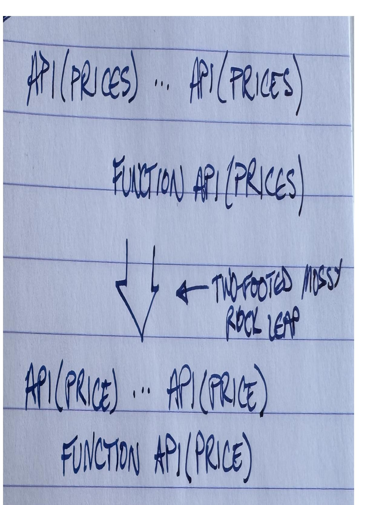
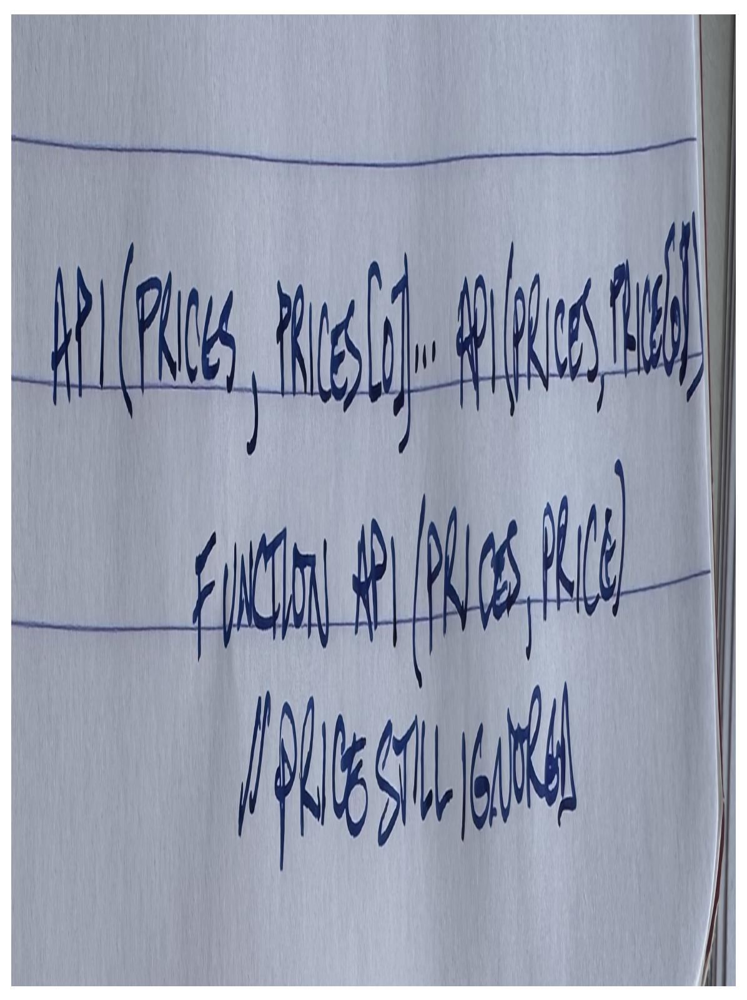
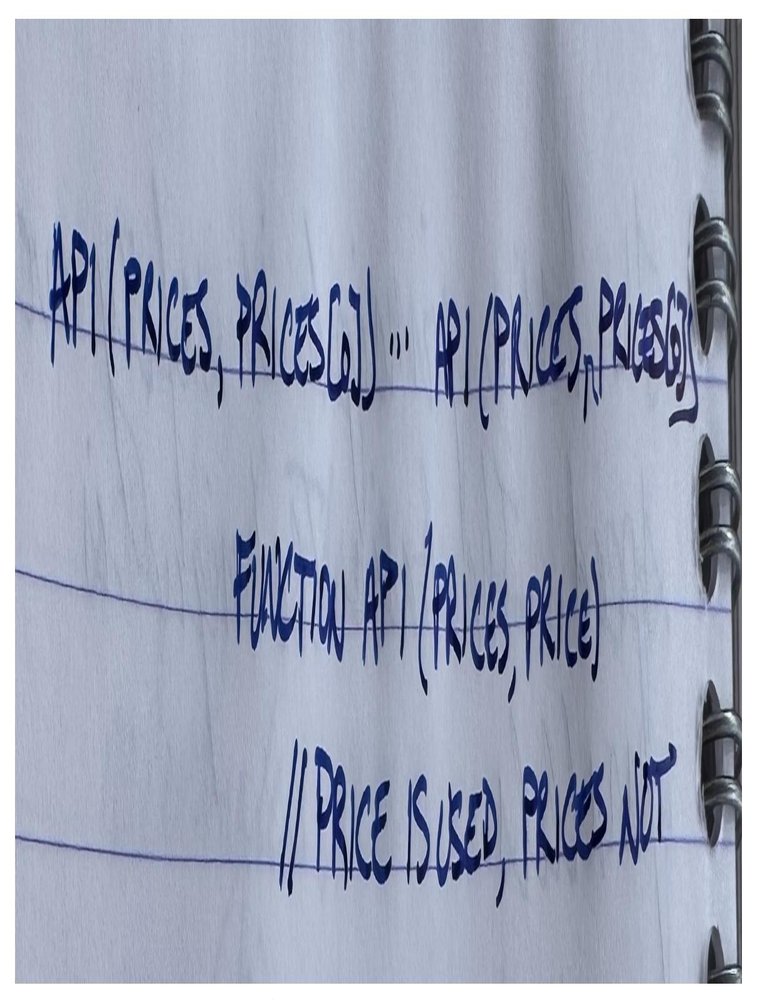
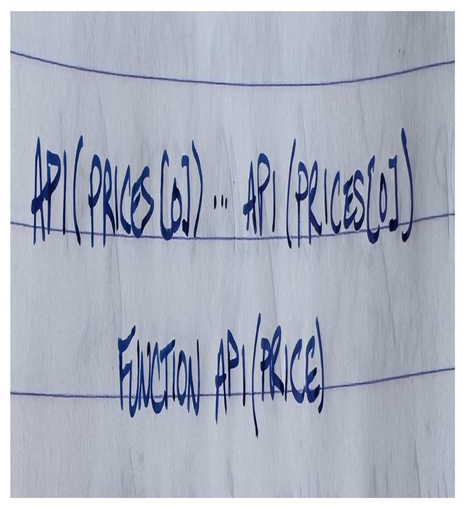
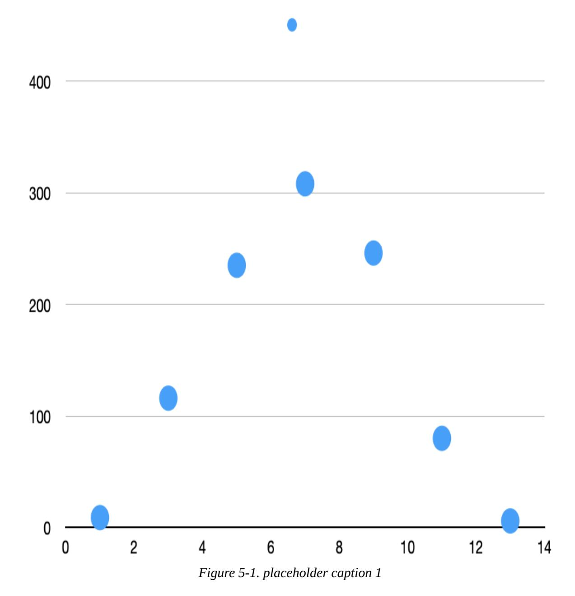
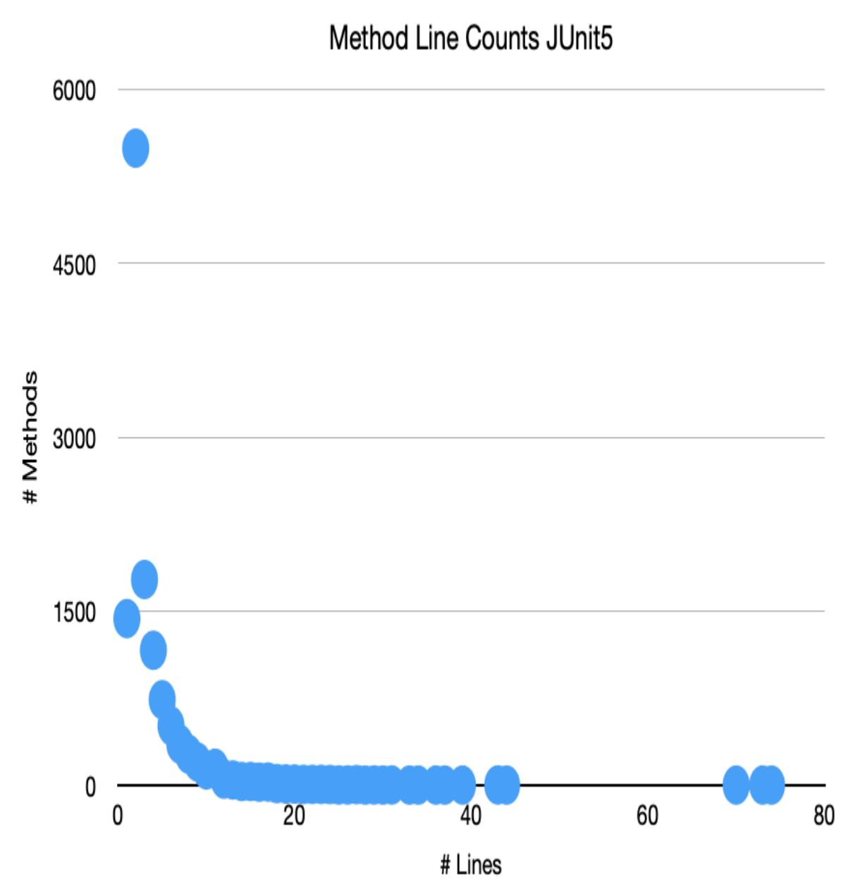
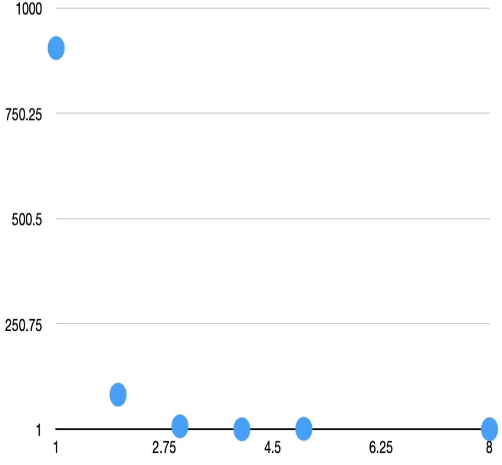
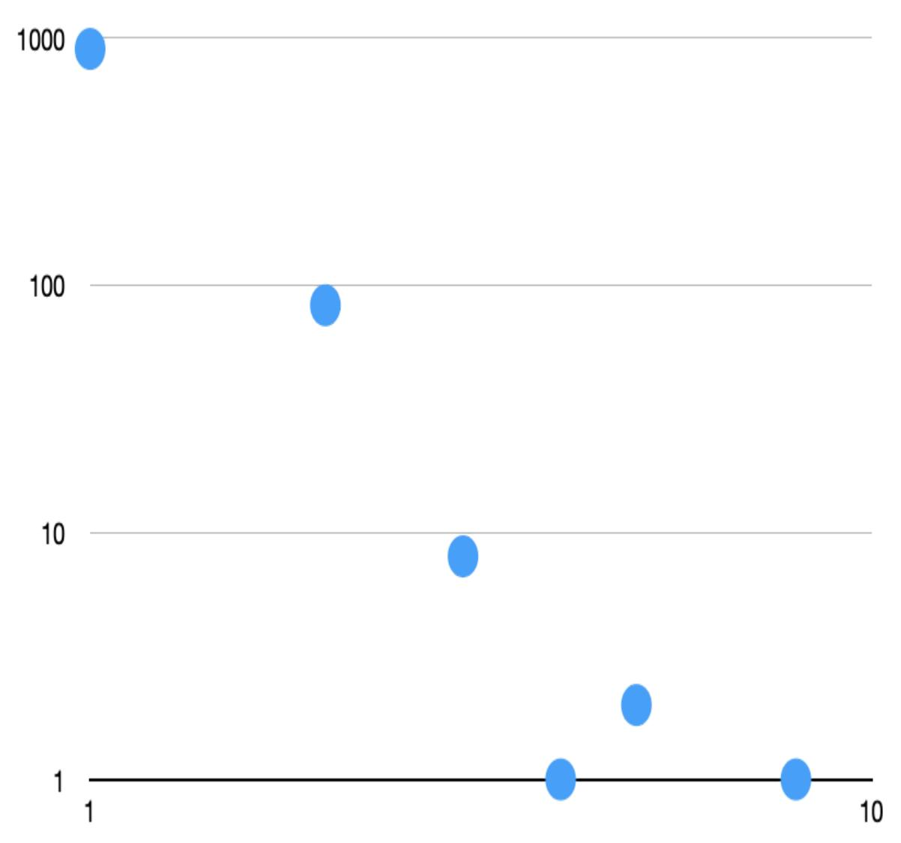
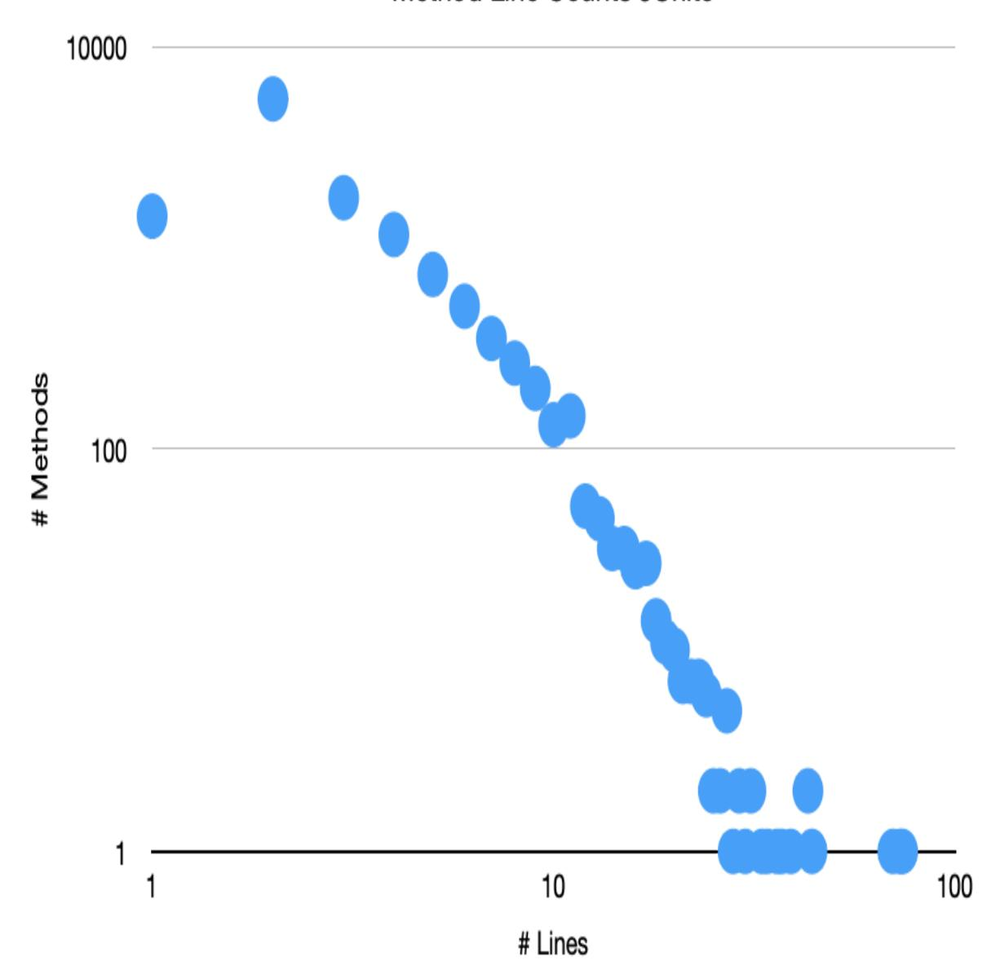

O'REILLY®

# Early Release Tidy Together

RAW & UNEDITED


# **Tidy Together**

#### FIRST EDITION

# A Team Exercise in Empirical Software Design

With Early Release ebooks, you get books in their earliest form—the author's raw and unedited content as they write—so you can take advantage of these technologies long before the official release of these titles.

### **Kent Beck**


#### **Tidy Together?**

by Kent Beck

Copyright © 2026 Kent Beck. All rights reserved.

Printed in the United States of America.

Published by O'Reilly Media, Inc., 1005 Gravenstein Highway North, Sebastopol, CA 95472.

O'Reilly books may be purchased for educational, business, or sales promotional use. Online editions are also available for most titles ([http://oreilly.com](http://oreilly.com/)). For more information, contact our corporate/institutional sales department: 800-998-9938 or *corporate@oreilly.com*.

Acquisitions Editor: Louise Corrigan

Development Editor: Michele Cronin

Production Editor: Christopher Faucher

Interior Designer: David Futato

Cover Designer: Karen Montgomery

September 2025: First Edition

#### **Revision History for the Early Release**

2025-08-13: First Release

See <http://oreilly.com/catalog/errata.csp?isbn=9781098178765> for release details.

The O'Reilly logo is a registered trademark of O'Reilly Media, Inc. *Tidy Together?*, the cover image, and related trade dress are trademarks of O'Reilly Media, Inc.

The views expressed in this work are those of the author and do not represent the publisher's views. While the publisher and the author have used good faith efforts to ensure that the information and instructions contained in this work are accurate, the publisher and the author disclaim all responsibility for errors or omissions, including without limitation responsibility for damages resulting from the use of or reliance on this work. Use of the information and instructions contained in this work is at your own risk. If any code samples or other technology this work contains or describes is subject to open source licenses or the intellectual property rights of others, it is your responsibility to ensure that your use thereof complies with such licenses and/or rights.

978-1-098-17870-3

# **Brief Table of Contents (***Not Yet Final***)**

### Preface [AVAILABLE]

```
Part I: Refactorings [AVAILABLE]
```

Chapter 1: One Principle, One Technique [AVAILABLE]

Chapter 2: Parameters Object [AVAILABLE]

*Chapter 3: Fields Object [UNAVAILABLE]*

*Chapter 4: Collection Mutation Methods [UNAVAILABLE]*

*Chapter 5: Boolean Parameter to Switches [UNAVAILABLE]*

*Chapter 6: Boolean in Constructor <--> Subclasses [UNAVAILABLE]*

*Chapter 7: Common Parameter <--> Constructor Parameter + Field [UNAVAILABLE]*

*Chapter 8: Constructor [UNAVAILABLE]*

*Chapter 9: Function Call <--> Event [UNAVAILABLE]*

*Chapter 10: Move [UNAVAILABLE]*

*Chapter 11: Literal <--> Constant [UNAVAILABLE]*

*Chapter 12: Extract/Inline Function [UNAVAILABLE]*

*Chapter 13: Increase/Decrease Visibility/Scope [UNAVAILABLE]*

*Chapter 14: Static <--> Instance [UNAVAILABLE]*

*Chapter 15: Global and Local State [UNAVAILABLE]*

*Chapter 16: Narrow Widen Parameter [UNAVAILABLE]*

Part II: Management [AVAILABLE]

Chapter 17: Authority & Responsibility [AVAILABLE]

Chapter 18: "Good" Design [AVAILABLE]

*Chapter 19: Make It Run, Make It Right, Make It Fast [UNAVAILABLE]*

*Chapter 20: Mixing Design & Features [UNAVAILABLE]*

*Chapter 21: Structure Folks & Feature Folks [UNAVAILABLE]*

*Chapter 22: Trough of Despair [UNAVAILABLE]*

*Chapter 23: Interface & Implementation Hats [UNAVAILABLE]*

*Chapter 24: Push vs Pull [UNAVAILABLE]*

*Chapter 25: Ownership Models [UNAVAILABLE]*

*Chapter 26: Long-running Changes [UNAVAILABLE]*

Part III: Theory [AVAILABLE]

Chapter 27: Power Laws [AVAILABLE]

*Chapter 28: Meaningless Mean [UNAVAILABLE]*

*Chapter 29: Emergent Design [UNAVAILABLE]*

Chapter 30: Features & Options Revisited [AVAILABLE]

*Chapter 31: Survival, Cash Flow, and Options [UNAVAILABLE]*

*Chapter 32: Options [UNAVAILABLE]*

*Chapter 33: More Options [UNAVAILABLE]*

*Chapter 34: Preferential Attachment [UNAVAILABLE]*

*Chapter 35: Symmetry [UNAVAILABLE]*

### *Part IV: Conclusion [UNAVAILABLE]* About the Author [AVAILABLE]

# **Preface**

#### **A NOTE FOR EARLY RELEASE READERS**

With Early Release ebooks, you get books in their earliest form—the author's raw and unedited content as they write—so you can take advantage of these technologies long before the official release of these titles.

This will be the Preface of the final book. Please note that the GitHub repo will be made active later on.

If you'd like to be actively involved in reviewing and commenting on this draft, please reach out to the editor at *mcronin@oreilly.com*.

How do teams grow software together, despite differing goals, differing perspectives, and different incentives?

In *Tidy First?* I focused on you the programmer—your relationship with your code, your willingness to invest a few minutes making your work easier before diving into the hard stuff. That book was about moments of design, small acts of care that accumulate into better software and a better day at work.

*Tidy Together* expands the circle. Now we're talking about teams, about the delicate dance of multiple people changing the same system without stepping on each other's toes. The stakes are higher here because software design is an exercise in human relationships. Let me say that again because it's the foundation of everything that follows: if your software is beautiful according to every aesthetic criterion you can imagine, but your team can't stand working together, you've failed as a designer.

I've seen it happen. Brilliant technical decisions that poison relationships. Elegant architectures that become weapons in power struggles. Perfect abstractions that nobody understands or wants to maintain. The software

might be gorgeous, but the people who have to live with it every day are miserable. That's not success—that's self-indulgence disguised as craft.

# **Software Is Grown, Not Assembled**

I was shocked when the first words of *Tidy First?* coming out of my fingers were, "Software design is an exercise in human relationships". I thought I was going to focus on technical factors—coupling, cohesion, complexity partitioning. Instead I dove into caring for ones-self as a programmer. After all, if you can't care for yourself you can't care for others.

The one startling sentence of this book is a bit more technical—the idea that explains much of our disagreement with other software design advice—is this: software is grown, not assembled.

Most design advice assumes you can specify what you want, build it, and ship it. Like constructing a bridge or manufacturing a car. You plan extensively up front because changes later are expensive. You optimize for predictability because deviations from the plan cost money.

Software isn't like that. Software responds to its environment. It adapts to new requirements, new constraints, new opportunities. The most successful software systems are the ones that can evolve gracefully, that can incorporate changes without breaking what came before. They're grown iteratively, shaped by use, pruned and tended like a garden.

This organic metaphor changes everything. In a factory, you want identical parts performing identical functions. In a garden, you want healthy growth patterns that can respond to changing seasons. In software development, you want teams that can learn together, designs that can accommodate surprise, and practices that compound rather than merely accumulate.

When you accept that software is grown, not assembled, you stop trying to get the design "right" up front and start trying to get it "growable." You invest in the soil—tests, tooling, team dynamics—as much as in the plants themselves. You tend the system continuously rather than building it once.

### **How This Book Differs**

*Tidy First?* gave you techniques you could apply immediately, by yourself, in the next fifteen minutes of your workday. The refactorings in this book may require coordination. They span multiple classes, multiple modules. They affect multiple people's work. Some require explicit negotiation about priorities and tradeoffs.

Where *Tidy First?* focused on the cognitive load of individual programmers, *Tidy Together* focuses on the social dynamics of teams. How do you propose a significant structural change without threatening your colleagues? How do you maintain momentum on features while investing in architecture? How do you build consensus around design decisions when smart people reasonably disagree?

The economics are different too. When you tidy by yourself, the costs and benefits accrue mostly to you. When you tidy together, you're asking others to pay costs today for benefits they might not see until later. That requires a different kind of conversation, a different kind of trust.

### **Structure of This Book**

Following the pattern from *Tidy First?*, we start with the concrete and work toward the abstract:

**Part I: Refactorings** presents techniques for changing code structure at the next scale up from tidyings. Each refactoring includes not just the mechanical steps, but guidance on when to apply it, how to sequence the work, and how to maintain safety when the changes span multiple pull requests.

**Part II: Management** addresses the human challenges of design work at team scale. How do you decide when to invest in structure versus rushing to ship features? One of the big surprises to many readers of *Tidy First?* was optionality—the idea that design creates economic value by increasing

options. The options in *Tidy First?* were tiny. The options created by the refactorings here begin to show up on the radar of non-programmers.

How do you maintain relationships when some people want to refactor and others just want to implement? How do you create space for design improvement without losing momentum on product development?

**Part III: Theory** digs into the forces that make collaborative design work. Why do power laws govern software complexity? What does it mean for software systems to survive or die? How do you evaluate design decisions when the information you need doesn't exist? This isn't abstract mathematical theory—it's the conceptual framework that helps you make better judgments when the cookbook doesn't have an answer.

### **How I Came to Write These Books**

Twenty years ago, I promised to bring Ed Yourdon and Larry Constantine's insights about software design to a modern audience. *Structured Design* was revolutionary when it appeared in 1979, but the examples with paper tape and magnetic tape were showing their age. The principles, though coupling, cohesion, the relationship between structure and cost—those were eternal.

I made several false starts. Each time I tried to tackle all of software design in one book, and each time I discovered the topic was impossibly large. Eventually I realized I needed to slice the problem differently.

*Tidy First?* addressed the moment of individual decision-making: "I need to change this code, and it's messy. What should I do?" That question came up constantly in what I had drafted, so I pulled it out and wrote a whole book around it.

*Tidy Together* addresses the next layer: "We need to change this system, and it's becoming unwieldy. How do we improve it without disrupting everything else we're trying to accomplish?" This is where design becomes social, where technical decisions bump up against human dynamics.

The third book in this series will address the relationship between people who build software and people who use it—business stakeholders, customers, the broader organization. That's where design becomes political, where the consequences of our technical choices ripple out into the world.

### **My Hope for You**

I want you to experience the deep satisfaction of working on a system that improves over time, with colleagues who trust each other enough to make bold changes. I want you to feel the compounding effect of small, careful improvements accumulating into large capabilities. I want you to see how attention to design relationships parallels and enables attention to human relationships.

Most of all, I want you to understand that we're not just writing code we're growing systems that will outlive our involvement with them, systems that will need to adapt to futures we can't imagine. The choices we make about structure, about process, about how we work together, shape not just what we build but who we become in the building.

Software design is an exercise in human relationships. Let's exercise together.

# **Part I. Refactorings**

### **A NOTE FOR EARLY RELEASE READERS**

With Early Release ebooks, you get books in their earliest form—the author's raw and unedited content as they write—so you can take advantage of these technologies long before the official release of these titles.

This will be Part I of the final book. Please note that the GitHub repo will be made active later on.

If you'd like to be actively involved in reviewing and commenting on this draft, please reach out to the editor at *mcronin@oreilly.com*.

As with *Tidy First?* we begin this book with things you can do to change the structure of your code. I work from specific to general so that's how I'll write (jump to section 2 if you want to manage your current design changes better or section 3 if you want to start with theory).

Empirical Software Design occurs as the composition or sequencing of small design changes. The motto is "large changes in small, safe steps". What follows is a catalog of those steps at the scale of code that spans multiple people on a team.

In *Tidy First?* I refused to call the design "moves" I introduced "refactorings". Instead I used the diminutive "tidyings". I changed vocabulary because the word "refactoring" has drifted so far from its original definition & had so much negative emotion glued to it that I wanted some distance.

I give up. The design changes you are about to read are refactorings, plain & simple. There's no other word for them. Going back to Bill Opdyke's

thesis (*<http://www.laputan.org/pub/papers/opdyke-thesis.pdf>*), that's what this scale of design transformation have been called.

Refactorings change the structure of the system rather than improve it. Each refactoring is reversible. Each can be applied in either direction—extract a function or inline a function. Depending on what you are trying to accomplish, one direction or the other will apply.

In a desperate attempt not to have my words misused, here is my definition of a refactoring: \* A change to the structure of the system, \* Which will (eventually) make changing the behavior of the system easier, \* But that preserves the observable behavior of the system for now.

There's a difference between "refactoring" and "a refactoring". A refactoring is a single, atomic change to the structure. Refactoring the verb means to apply one or more refactorings in sequence to accomplish a larger change to the structure of the system.

I hear these stories all the time--"We spent all this time refactoring & everything broke". That's *not* refactoring. If you compose a series of behavior-preserving transformations, the result will be behavior-preserving. The problem is that it can be hard to get from structure A to structure B solely by composing behavior-preserving transformations. Boo hoo.

Do I ever cheat & just edit some text for a while? Reluctantly, yes. But that's by far the exception. Stretch yourself. *Only* use the refactorings in this section to get from the current structure to your desired structure. But I'm getting ahead of ourselves—this is material for the second section.

With that, here are the refactorings. TODO list the refactorings when I'm done

# **Chapter 1. One Principle, One Technique**

#### **A NOTE FOR EARLY RELEASE READERS**

With Early Release ebooks, you get books in their earliest form—the author's raw and unedited content as they write—so you can take advantage of these technologies long before the official release of these titles.

This will be the 1st chapter of the final book. Please note that the GitHub repo will be made active later on.

If you'd like to be actively involved in reviewing and commenting on this draft, please reach out to the editor at *mcronin@oreilly.com*.

I promised you a bag full of design techniques to reduce coupling, increase cohesion, clear spotty skin, & reduce puffiness. Well, those first two anyway. I'll get to those techniques in just a second but first I have to provide the absolute minimum of background. Which, it turns out, is not nothing. Even with Tidy First? read & understood, these design changes require some prerequisites before they make sense.

The alternative to the principle & the technique in this chapter is to go from one design directly to another. If you can do that, safely & efficiently & socially responsibly, well, then do that. But when something goes wrong, you're going to wish for the principle & the technique in this chapter. Good news is, with version control, you can revert & start over. Not the socially responsible part. When that ship sails, it sails. But at least the "not breaking things" part.

### **The Safety Principle**

The fundamental principle of Empirical Software Design is that when there is a tradeoff between safety & efficiency, always choose safety. In the early stage of a product, design doesn't matter as much. It's when a product, & the team attending it, get big that better designs really are noticeably better.

Don't do sloppy or deliberately bad design just because you are working on a prototype. But also don't avoid icky design if that gets a prototype to the "generates feedback" stage.

When design improvements become valuable & leveraged, the cost of delay has usually dropped enough that a little slower won't be a lot more expensive. Hence the bias for the Safety Principle towards safety at (nearly any) cost.

We are trying to avoid infrequent, giant costs by applying the Safety Principle (a topic we'll explore at length in the Theory section). The challenge is that someone can come along & say, "I can do that faster if I skip all those intermediate steps," & they'll almost be right. Almost. The cleverer they are & the more careful they are, the longer they can preserve the illusion that hopping two-footed from rock to wet, slick, moss-covered rock is the quickest way across the river. And then comes that day when nothing could possibly break & it does anyway (programs are unforgiving in that way—they don't care about the strength of our convictions).

When a purely-structural change turns out to have behavioral consequences, the costs start piling up:

- Debugging costs
- Remediation costs
- Social costs

Remember, software design is an exercise in human relationships. Nothing strains a relationship like imposing costs on someone else, interrupting their perfectly good work because you made a mistake, asking them to sacrifice time, energy, & opportunity to your mistake.

The Safety Principle safeguards our time & more importantly the social cohesion of our team. The "extra" steps (which I'm about to describe) are the insurance premiums we pay to ensure we can keep moving forward together.

### **The Parallels Technique**

We implement the Safety Principle through the technique of Parallels—the old design & the new design will temporarily co-exist (the same technique supports architectural evolution discussed in book 3). The design was *this* & we want it to be *that*, so we will add *that* before removing *this*. Add the new before removing the old.

For example, we have an API that takes a collection as an argument. Suspicion followed by analysis shows us that this collection only ever has a single element. We want the API to change to accept a scalar argument instead of a collection. We will need to change a bunch of callers of the API & the definition of the API itself [\(Figure](#page-18-0) 1-1).



*Figure 1-1. Changing Type In Callers & Implementation At The Same Time*

How can we make this change safer? The Parallels Technique tells us to add the new before removing the old. The first step is to add a parameter to the API & all callers ([Figure](#page-20-0) 1-2). The value of the parameter doesn't have to be correct yet. The first step is complete. We can push this code to production with (nearly) zero chance of error (more nearly zero if we used an automated tool to add the parameter).

<span id="page-20-0"></span>

*Figure 1-2. Add Parameter With Null Value*

One option is to go through the callers and make sure they all pass the right value [\(Figure](#page-22-0) 1-3). Again, this is deployable code. We're not done with our design change but that's okay, there will always be design changes in flight.

<span id="page-22-0"></span>

*Figure 1-3. Change Null Value To Real Value*

Once we know the value of price is correct we can change the implementation of the API [\(Figure](#page-23-0) 1-4).

<span id="page-23-0"></span>

*Figure 1-4. Use New Parameter*

When prices is no longer referenced in the implementation, then we can delete it from the declaration & all the callers ([Figure](#page-24-0) 1-5).

<span id="page-24-0"></span>

*Figure 1-5. Delete Old Parameter*

(Once we've done this there is likely further tidying possible in both the callers & the implementation.)

And there we have it! We've gone from the old design to the new design in teensy, tiny, safe steps. Each step is deployable (if deployments are cheap

enough). Could we have done it in one two-footed leap? Probably. But why risk a leap when the social cohesion of the team is at stake? Why risk it when we might be interrupted mid-design-change by something genuinely more important, and risk throwing away our half-completed work? Better to put one foot on the new rock while keeping the other on the old, then gradually shifting our weight.

What about if you simply can't figure out a way to apply the Parallels Technique? Then you either live without changing the structure or you change the structure in a leap. Development is full of tradeoffs. Every time I've thought a leap was absolutely necessary, though, I have reflected afterwards, often discovering a new twist on the Parallels Technique that would have gotten me from old to new in small, safe steps.

The importance of the Parallels Technique will come up frequently when we discuss refactorings, frequently enough that I had to pull it up front. In fact, we'll see it when we discuss extracting & inlining functions in the next chapter.

(Bonus homework—at the step where we started passing the correct value in the new parameter we could instead have started using the new parameter in the implementation. Try it both ways.)

# **Chapter 2. Parameters Object**

#### **A NOTE FOR EARLY RELEASE READERS**

With Early Release ebooks, you get books in their earliest form—the author's raw and unedited content as they write—so you can take advantage of these technologies long before the official release of these titles.

This will be the 2nd chapter of the final book. Please note that the GitHub repo will be made active later on.

If you'd like to be actively involved in reviewing and commenting on this draft, please reach out to the editor at *mcronin@oreilly.com*.

### **Pattern**

You see the same set of parameters passed through multiple levels of the call graph or you see them passed together in several different places in the code base. [TODO is there something about when to apply the pattern? Like just before you add yet another layer where you pass x & y, or just before you change the parameter cluster for the nth time?]

### **Forward**

Group the parameters into a single object. Give the fields of the object the names (& types, if applicable) of the parameters.

Make the Parameters Object immutable. The last thing you want is some stupid aliasing error to change the behavior of the system behind your back.

### **Example**

Pass x & y separately or pass a Point?

```
foo(width, height) // invocation
function foo(x, y) ...
```

Using the Parallels Technique, we first add the new Parameters Object class:

```
class Point
 x, y
```

Then add a formal parameter & null actual parameters:

```
foo(width, height, null)
function foo(x, y, p)
```

Now create & pass the equivalent Point:

```
foo(width, height, new Point(width, height))
```

Now use the Point instead of x & y:

```
function foo(x, y, p)
 // replace x with p.x
```

Now delete the now-unused parameter:

```
foo(height, new Point(width, height))
function foo(y, p)
```

(Note that this is a funky state for the code to be in. We probably wouldn't want to stop here, even though the code works just fine.)

Eliminate y the same way:

```
foo(width, new Point(width, height))
```

```
function foo(y, p)
 // replace y with p.y
```

And now that it's no longer used, delete y:

```
foo(new Point(width, height))
function foo(p)
```

### **Discussion**

The Parameters object must be allocated at the top of the call graph. If this becomes a performance bottleneck, there's plenty of time to fix it later. Make it run, make it right, make it fast.

Do you introduce the Parameters Object from the top of the call graph to the bottom or bottom to top? I've done both, but my bias is towards top down. You create the Parameters Object in one place, then use it in more & more places.

Parameters Objects also illustrate symmetry. The same cluster of parameters appears, symmetrically, in several parts of the code. By coalescing them into an object, we communicate that symmetry to readers.

What if you have parameter lists that are almost the same? I'd just hold off. Almost symmetrical means not symmetrical. There'll be time later if the lists become (or you make them) identical. It's fine to Reorder Parameters to make parameters lists or parts of parameter lists identical. [TODO: Reorder Parameters]

# **Coupling & Cohesion**

The Parameters Object makes parameter lists more cohesive. If we have code like: foo(x, y, theta) and we add a parameter to it, we'll be adding an element to a list of 3. If we instead add a parameter to: foo(p, theta) Then a larger percentage of the element changes. More cohesion.

Parameters Objects can also de-couple changes. No longer are all the functions coupled with respect to changes in the list of related parameters. Change the Parameters Object & where it is allocated & leave the rest of the functions alone.

Parameters Objects can also be a Hinge for change. By introducing an object protocol-compatible with the Parameters Object but with a different implementation, we may be able to easily change the behavior of the system without touching most of the code.

### **Inverse**

Let's say you have a Parameters Object but it's now only used in one place, the object has no behavior, & it's only passed once. Inline that sucker. Every element in the design carries a cost. If you had something in your backpack that you never used, you'd take it out, even if it's small & light. No value, no carry. Same with designs.

A design error I've seen is for a parameter list get long so a map is added at the end called something like "params". This map gradually grows, gets passed down further & further in the call graph, & becomes a source of ugly coupling. Especially when someone clever decides to change the state in the map mid-computation. What values must go in that map? Hard to say. Which are optional? Or only used for part of the computation? Hard to say.

Make the mess obvious. Inline that map. If the parameter list wants to be long for the moment, let it be as long as it wants to be. If you see clusters of parameters but they are in all different orders, reorder them so they match [TODO should this be a tidying or a refactoring?]. When the symmetry becomes clear, re-extract a real Parameters Object with an easilyunderstood constructor.

### **Subsequent refactorings**

You may have an opportunity to Move Code To Data if you have expressions that only use data in the Parameters Object.

# **Part II. Management**

### **A NOTE FOR EARLY RELEASE READERS**

With Early Release ebooks, you get books in their earliest form—the author's raw and unedited content as they write—so you can take advantage of these technologies long before the official release of these titles.

This will be Part II chapter of the final book. Please note that the GitHub repo will be made active later on.

If you'd like to be actively involved in reviewing and commenting on this draft, please reach out to the editor at *mcronin@oreilly.com*.

In *Tidy First?* we explored managing tidyings—those small, safe design changes you make on your own. The challenges there were mostly personal: When do you start? When do you stop? How do you maintain rhythm between tidying and implementing features?

Now we face a more complex challenge. The refactorings in Part I of this book operate at a different scale. They take longer—hours, days, sometimes weeks rather than minutes. They touch more code, affecting multiple files, multiple classes, sometimes multiple systems. Most importantly, they affect other people.

When you extract a helper function, you're making a decision that mostly impacts your own future self. When you introduce a parameter object that gets passed through six layers of the call stack, you're making a decision that impacts everyone who works with that code. When you move from direct function calls to events, you're changing how the entire team thinks about system interactions.

The fundamental challenge hasn't changed: we still need to balance investing in structure with implementing features. But now we have to maintain that balance while bringing other people along. Software design is an exercise in human relationships, and at this scale, those relationships become central to success.

### **Same Principles, Different Scale**

The core principles from *Tidy First?* still apply. We still work in small, safe steps—just many more small, but slightly larger, steps. We still separate structure changes from behavior changes. We still prefer reversible decisions when possible.

The Safety Principle becomes even more important. When a tidying goes wrong, you fix it yourself. When a refactoring goes wrong, you've potentially blocked your teammates' work. The social cost of mistakes rises dramatically. Loss of trust compounds the cost of a broken build.

The timing decisions become more complex. "Tidy first?" was a question you could answer in the moment. "Refactor first? Refactor after?" requires coordination, communication, and collective judgment. You can't just decide to introduce a parameter object and start implementing it. You need to consider:

- How long will this take?
- Who will be affected?
- What features will be delayed?
- How will we handle the transition period?
- What if we get interrupted midway through?

### **The Collaboration Challenge**

The biggest difference is that you're no longer working alone. Every refactoring decision now touches other people's work, other people's mental models, other people's deadlines. You have to:

- Communicate your intentions clearly
- Build consensus around direction
- Coordinate timing with feature development
- Manage expectations about temporary complexity
- Handle disagreements constructively

This doesn't mean you need unanimous agreement before making any change. Empirical software design doesn't rely on unanimity—it relies on coherence. While everyone has their own perspective on the design, we exert consistent effort to bring those perspectives together.

# **Maintaining Balance**

The features and options tension becomes more visible at this scale. When you spend an hour tidying, it's easy to justify the time investment. When you spend a week refactoring, everyone can see the opportunity cost. Features that could have been implemented. Bugs that could have been fixed. Revenue that could have been earned.

But the options value is also more visible. A good refactoring doesn't just make one feature easier to implement—it makes whole classes of features easier. The parameter object doesn't just help with the current change; it creates flexibility for future changes we haven't even imagined yet.

Your job is to help your team see both sides of this equation. Show them the cost of the current design and the value of the improved design. Help them understand that this isn't just about making the code "pretty"—it's about making future work faster, safer, and more predictable.

### **The Rhythm at Scale**

In *Tidy First?*, we talked about the rhythm of tidying—minutes to an hour of structural work, then back to behavioral work. At the scale of refactoring, the rhythm is different. You might spend days on structural work, but you still need to maintain the balance.

This is where the techniques in this section become crucial. You learn to:

- Initiate refactorings gradually
- Sustain progress while delivering features
- Finish cleanly without disrupting the team
- Sometimes abandon changes that aren't working out

The key is never disappearing into a design cave for weeks at a time. Even large refactorings happen through a series of small, safe steps that keep the system working and the team moving forward together.

# **What's Coming**

In the chapters that follow, we'll explore how to manage these larger design changes responsibly. We'll talk about authority and responsibility, about different types of designers, about the inevitable tensions between structure and features. We'll see how to make refactoring a normal part of development rather than a special event that disrupts everything else.

The goal isn't to eliminate these tensions—they're inherent to software development. The goal is to navigate them artfully, maintaining the relationships that make great software possible while steadily improving the structure that enables future greatness.

Remember, we're not just changing code. We're changing how people think about the code, how they work with it, how they extend it. That's both the challenge and the opportunity of tidying together.

# **Chapter 3. Authority & Responsibility**

#### **A NOTE FOR EARLY RELEASE READERS**

With Early Release ebooks, you get books in their earliest form—the author's raw and unedited content as they write—so you can take advantage of these technologies long before the official release of these titles.

This will be chapter 17 of the final book. Please note that the GitHub repo will be made active later on.

If you'd like to be actively involved in reviewing and commenting on this draft, please reach out to the editor at *mcronin@oreilly.com*.

A few years ago I saw a popular open-source project in need (in my opinion) of some design love. I proceeded to nibble, nibble, nibble away at giant chunks of tangled responsibilities, trying to isolate *this* stuff *here* from *that* stuff *there*. After a month or so I could see progress. The future shape of the software was coming into focus.

Then I got ahead of ourselves. I made some changes that made the design worse (see also The Trough of Despair). I knew where I was going, but the rest of the developers didn't. The next day almost all of my changes had been undone. I didn't even bother to try to figure out who did it. I just gave up. Never contributed again.

Software design is an exercise in human relationships. That's the One Startling Sentence of this whole book series. You've just read a catalog of techniques to improve your designs, but if you improve those designs & spoil relationships with your fellow developers, you would have been better off not making the changes in the first place.

"Human relationships" is a scary phrase for me. I don't have a natural understanding of people, social settings, or team dynamics. The good news is that I don't have to have a natural understanding. There are a few timeless principles encouraging constructive relationships. When I stick to those principles I do okay.

I'll describe those principles in the context of software design. I'm sure Marcus Aurelius said it better, but he didn't know how to refactor, so it's useful to reiterate them here. Also, be aware that folks try to hijack these principles for their own ends. I'm aware of that. Some folks avoid words like "responsibility" & "accountability" because these words are so often misused. I'm noting that but ignoring it for the moment.

### **Power Differentials**

We don't all have the same power in our organizations. Sometimes power is formal, like when a manager can promote or fire someone reporting to them. Sometimes power is less formal, more social, like when your opinion of me carries greater weight than my opinion of you. Sometimes power is situational, like when you know more about the technical details of an API than I do.

We can't erase power differentials, but we can try to reduce their potential negative consequences. That's what I mean by "software design is an exercise in human relationships"--how can we make the most collective progress together in the presence of these differentials?

What relationships, across these power differentials, set us up for accomplishing the most together while growing, individually & as a team?

### **Responsibility**

The first characteristic of productive relationships is responsibility. Responsibility is the flow of consequences, both good & bad. If I say, "I'm responsible for the quality of this software," that means that if something

goes wrong I will experience the consequences. If I'm a programmer, I'll fix the error. If I'm a manager, I'll stay late coordinating repairs. If I'm a customer service agent, I'll field the angry customer calls.

Responsibility encourages relationships by making it safe for the less powerful person to contribute more to the collective enterprise. If I'm the more powerful person in an interaction & I harvest the positive consequences while dumping the negative consequences on you, then you (naturally) have to protect yourself instead of contributing.

Responsibility manifests in software design because the changes we make impose consequences on other people. If I decide that the order of two parameters should be switched, then all current callers need to be changed. All future callers need to use the new order too, a consequence for everyone who knows how to use the current signature.

Part of software design is less coupling & more cohesion, yes, but also accepting responsibility for the human & business consequences along the way. That is, if you want to work effectively on software that requires more than one programmer.

# **Authority**

A second characteristic of productive relationships is authority. Authority is the power to make changes.

people try to make authority legible

how does clear authority

Damn it, authority isn't a characteristic of productive relationships.

# **Chapter 4. "Good" Design**

#### **A NOTE FOR EARLY RELEASE READERS**

With Early Release ebooks, you get books in their earliest form—the author's raw and unedited content as they write—so you can take advantage of these technologies long before the official release of these titles.

This will be chapter 18 of the final book. Please note that the GitHub repo will be made active later on.

If you'd like to be actively involved in reviewing and commenting on this draft, please reach out to the editor at *mcronin@oreilly.com*.

What do we mean when we say a design is "good"? Good for whom? Good for what purpose(s)?

After all, you're reading the second book in a series intending to help you improve your designs, and we haven't even talked about what we mean by "improve", except tangentially.

### **"Good"**

A design is good if it supports implementing the next feature with a minimum of extra effort. Each feature carries intrinsic complexity. You're just going to have to write a certain number of if's & while's before the feature will pass its tests (or polymorphic messages in object languages).

Each design also imposes accidental complexity on each feature, the set of all the other changes you need to make before the feature can be deployed. Design improvement reduces the cost of this extrinsic complexity.

### **Cost**

We can't just evaluate the fitness of a design at a point in time. We care about the cost of the behavior changes plus the cost of structure changes into the future. "Our primary objective is *minimum-cost* systems," say Yourdon & Constantine, the patron saints of software design. They mean the cost over time.

### **Value**

In *Tidy First?* we extended the objective of system development to optimizing value, but value is tricky. Value isn't just revenue minus cost.

Costs are complicated-- - The cost of operating the system. - The cost of future behavior changes (features). - The cost of future structure changes. - Discounting all these costs to the present day (net present value). - Evaluating all of the above in a fog of uncertainty about what future features we will want & what we will learn about improving the structure.

Revenue is also complicated-- - The (unknown) effect of (unknown) future features on revenue. - Again discounted because of net present value. - In a foggy competitive marketplace.

Optionality adds value to systems. Given 2 systems with equivalent cash flows, we'd pay more for the system that had more options for future change than for the one with fewer. Empirical software design increases optionality, creating value even before we see dollars in accounts.

The final element of value is survival. All those future cashflows make no difference if the system doesn't survive long enough to realize them. A key evolution in my thinking since writing *Tidy First?* is a deeper understanding of the importance of survival. The chapter on Survival goes deeper into this element of the economics of software & how software design influences system mortality.

### **People**

Good for whom? The dollars, after all, are there to serve the people, not the people to serve the dollars. If software design is an exercise in human relationships, which humans are we talking about?

In *Tidy Together?* we are primarily interested in relationships between people who are changing the system. But even these folks are no monolith-- - Experienced developers focused on future features. - Experienced developers focused on structure. (Used to be called "architects".) - Newer developers learning their craft, both features, structure, & social obligations.

- "Visiting" developers who need changes to the system without necessarily sticking around to live with the consequences of their changes.

The same design can be good for some of these constituencies & bad for others. Choosing the audience & adapting to their skills, worldview, & incentives is also part of design.

### **Heuristics: The Four Rules**

Given all the complexity & uncertainty of evaluating a design, how can you decide whether one proposed design is better or worse than another? In *Extreme Programming*, one of the practices was "Simple Design". By "simple", I meant at the time that we didn't add design elements on speculation. I now wish I'd used a different word, as you're about to see.

Someone asked, "But what do you mean by *simple*?" I wrote the following in Ward's Wiki (*<https://wiki.c2.com/?XpSimplicityRules>*) in response:

A design for a system is "simple" in the degree it follows this prioritized list of rules: 1. The Working Rule. The system works. If a new design state breaks the system, it's bad. Bad is not simple. Bad is complicated. (It astonishes me how many designers neglect this.) 2. The Communication Rule. The system expresses all the concepts of interest to readers. Change a design so it's easier to understand, you've made it simpler. (See, "simple" isn't the right word.) 3. The Duplication Rule. The system contains no

duplication. (I'd soften this today—duplication is coupling but sometimes eliminating it costs more than carrying it along for the moment.) 4. The Backpack Rule. Given the above properties, the system contains the fewest possible elements & relationships.

Evaluating proposed changes with the above rules, you'll tend to end up with structure changes that increase the value of the system in spite of all the uncertainties about the future.

It's not enough to rely solely on these rules. Don't justify straining relationships with your fellow changes by reference to these rules. "I was just eliminating duplication." "Yeah, but now I can't read my code." Design fail.

# **Summary**

We have a system. We want to change its behavior. That change seems harder than necessary. Here's an optional structure change. Should we tidy together before we implement the behavior change? We'll talk more about this decision in the next chapter on timing.

# **Part III. Theory**

### **A NOTE FOR EARLY RELEASE READERS**

With Early Release ebooks, you get books in their earliest form—the author's raw and unedited content as they write—so you can take advantage of these technologies long before the official release of these titles.

This will be Part III of the final book. Please note that the GitHub repo will be made active later on.

If you'd like to be actively involved in reviewing and commenting on this draft, please reach out to the editor at *mcronin@oreilly.com*.

In *Tidy First?*, I introduced you to the theoretical foundations of software design. We explored how software creates value through both behavior (what it does) and structure (how it's organized). We saw how coupling drives cost through Constantine's Equivalence: cost(software) ≈ cost(change) ≈ cost(big changes) ≈ coupling. We discovered that structure changes are generally reversible while behavior changes often aren't, which fundamentally changes how we approach them.

Most importantly, we grappled with the economic tensions at the heart of software design. Time value of money pushes us toward features now. Optionality pulls us toward structure that enables future features. Every "tidy first?" decision sits at this intersection.

To work deeper, though, we need to think deeper.

## **Why More Theory?**

You might be thinking, "I've got coupling and cohesion. I understand options. I can balance features and structure. What more do I need?"

Here's what I've learned since writing Tidy First?: the simple models that work at the scale of tidying—minutes to hours, changes that affect mainly you—start to break down when we scale up. When changes take days or weeks, when they affect whole teams, when they shape system architecture, new phenomena emerge.

It's like the difference between walking and flying. When you're walking, you can ignore air resistance. When you're flying, aerodynamics dominates everything. The same forces are present at both scales, but their relative importance shifts dramatically.

Software design at scale has its own aerodynamics, and that's what we need to understand next.

### **The Limits of Linear Thinking**

In *Tidy First?*, I presented a relatively linear model. Structure enables behavior changes. Coupling increases cost. Cohesion reduces coupling. Time value and optionality create opposing forces. These are all true, but they're not the whole truth.

What I didn't emphasize enough is that software development is dominated by power laws, not normal distributions. This isn't a minor detail—it changes everything:

- Most changes are tiny, but the few large changes dominate the total cost.
- Most coupling is manageable, but the few highly-coupled areas dominate system complexity.
- Most design decisions are local, but the few decisions (and not necessarily the ones you expect) dominate the system's evolution.

Our intuitions, trained on bell curves and averages, lead us astray. The "typical" change doesn't matter nearly as much as the exceptional one. The average function size tells us almost nothing useful.

### **From Individual to Collective**

The theory in Tidy First? focused on individual decision-making. When should I tidy? How much? According to which principles? These questions matter, but they're not sufficient when we're tidying together.

At the scale of teams and systems, new forces emerge:

- Emergent Structure: Certain designs naturally attract more of the same patterns. Understanding this helps us work with the grain of the system rather than against it.
- Option Interactions: In Tidy First?, I treated options as mostly independent. In reality, they combine and interfere in surprising ways. A bundle of options isn't just the sum of individual options.
- Social Coupling: We focused on technical coupling, but human relationships create their own coupling patterns. Who knows what? Who trusts whom? These invisible connections shape our design choices as much as any technical constraint.
- Survival Dynamics: I mentioned that all the future cash flows mean nothing if the system doesn't survive. Now we need to understand what threatens survival and how design decisions affect mortality.

### **Building Your Intuition**

Theory serves two purposes. First, it helps you handle the cases that don't fit the patterns—and at the scale of refactoring and architecture, those cases multiply. When the standard refactorings don't apply, when your

organization's dynamics don't match the textbook, theory gives you principles to navigate by.

Second, theory advances practice. Every refactoring started as someone's experiment. Every architectural pattern began with someone thinking, "What if we organized it this way instead?" (This is *the* magical designer question, about which much more in the next book.) The better we understand the forces at play, the better equipped we are to discover new practices that create value.

### **What's Ahead**

In the chapters that follow, we'll explore:

- Power Laws: Why software is weird, and what to do about it
- Coupling Dynamics: How coupling propagates, compounds, and occasionally collapses
- Options Theory: The surprising mathematics of flexibility, including why slicing creates more value than you think
- Emergent Design: How systems want to grow, and how to guide that growth productively
- Economic Forces: The deeper patterns of software economics, including the critical but overlooked dimension of survival

Each concept builds on what you learned in Tidy First?, but reveals new layers of complexity and opportunity.

### **A Different Kind of Thinking**

Fair warning: some of this gets abstract. We're going to use mathematics, economics, even a bit of philosophy. But I promise to keep it grounded. Every concept here has changed how I write code, how I work with teams, how I think about software value.

The goal isn't to make you a theoretician. It's to give you better tools for thinking about the complex, human, economic reality of software development. When you face a difficult design decision, when you need to convince skeptical teammates, when you're trying to balance competing forces, these concepts will help you see more clearly.

Software design is an exercise in human relationships. Theory helps us understand the deep patterns that shape those relationships. It reveals why some teams thrive while others struggle, why some codebases stay healthy while others decay, why some companies create lasting value while others flame out.

Ready to see how deep the rabbit hole goes? Let's find out.

# **Chapter 5. Power Laws**

#### **A NOTE FOR EARLY RELEASE READERS**

With Early Release ebooks, you get books in their earliest form—the author's raw and unedited content as they write—so you can take advantage of these technologies long before the official release of these titles.

This will be chapter 27 of the final book. Please note that the GitHub repo will be made active later on.

If you'd like to be actively involved in reviewing and commenting on this draft, please reach out to the editor at *mcronin@oreilly.com*.

You're an empirical software designer. You see a really long function. What's your reaction? Is it a problem? Is it perfectly normal?

Or maybe it's a really big object. With lots of fields. Or a file with lots of lines. Problem? Unusual? Perfectly normal?

I spent 25 years gaining the intuition that I'm about to explain, most of that figuring out why these great big "outliers" happen. Hint: they aren't outliers.

In what follows I'll be explaining in terms of folk statistics. That is, a real stastician will have many critiques of what I'm about to say, but that's fine. I'm pointing out one big distinction empirical designers need to make & I'm basing it loosely on statistics.

The distinction is this: does more attract more? If it does we need to act one way. If more doesn't attract more then we can act another way. But mixing up which is which is confusing & ineffective.

### **Code**

todo: picture of a Galton Table

When I was a kid I would stand for hours in front of the Galton Table at the Seattle Science Center. I'd watch the balls trickle down. Early in the cycle, one of the "outliers" might spring to an early lead, but when all the balls had been dropped the familiar bell-shaped curve had more or less appeared.

We're geeks. Let's render this in code. We want to simulate how long functions should be. Someone said, "7 lines, plus or minus 2". What does that look like:

```
const samples = [];
for (let i = 0; i < 1000; i++) {
 let sample = 7;
 for (let j = 0; j < 6; j++) {
 // I'm so tempted to use a ternary here...you're welcome
 if (Math.random() < 0.5) {
 sample--;
 } else {
 sample++;
 }
 }
 samples.push(sample);
}
```

Now we count how much of each sample we have:

```
const counts = samples.reduce((all, each) => {
 all[each] = (all[each] || 0) + 1;
 return all;
}, {});
```

And out comes our simulated data:

```
{ '1': 9, '3': 116, '5': 235, '7': 308, '9': 246, '11': 80, '13':
6 }
```

In pictures, for those of us so inclined <<[normal>>:



This is exactly a Galton Table. Every function starts at 7. Then we add or subtract a line, leaving us with half 6s & half 8s. The next round leaves us with half 7s & a quarter each 5s & 9s. And so on.

### **Data**

So we have a model in our minds that functions are generally some size & they go up & down a little from there. If we see a tiny function, well, that's kind of odd. If we see a great long method, well, somebody must have messed up for that to happen.

How does this model match the functions in a real project? Here's the line counts of the methods in JUnit5 ([Figure](#page-51-0) 5-2).

<span id="page-51-0"></span>

*Figure 5-2. placeholder caption for junit line counts*

That doesn't look anything like the distribution generated by our simulated Galton Table. What's going on?

The mistake is in our model that methods are about a certain size, plus or minus. What if we start with a different model? What if we assume that:

- All methods start small
- We add the next line to a random method
- But, the bigger the method, the more likely the next line will attach

In other words, the big get bigger. How do we generate that distribution in JavaScript?

```
const samples = [];
const initial_size = 0.1;
const growth_rate = 0.1;
for (let i = 0; i < 1000; i++) {
 let size = initial_size;
 let sample = 1;
 while (Math.random() < size) {
 size += (1.0 - size) * growth_rate;
 sample++;
 if (size > 0.99999) break;
 }
 samples.push(sample);
}
```

What does the data look like now?

```
{ '1': 905, '2': 83, '3': 8, '4': 1, '5': 2, '8': 1 }
```

Lots of little "methods", a few really big ones ([Figure](#page-53-0) 5-3).

<span id="page-53-0"></span>

*Figure 5-3. placeholder caption for power law*

### **Log-Log**

Now we come to the magic trick. I spent a long time staring at data with this kind of distribution, trying to make it look like a normal distribution with, well, a few giant outliers & some kind of "normal" size that seems too small. What's the average? What's an outlier look like? When should I take action based on deviation?

No amount of squinting will answer these questions. We're looking at a different kind of distribution.

Here's what happens, though, when we change the axes to logarithmic instead of linear [\(Figure](#page-54-0) 5-4):

<span id="page-54-0"></span>

*Figure 5-4. placeholder caption for log generated*

Our fat-tailed distribution becomes a straight line! No longer does it look like a really skewed normal-ish distribution. It makes perfect sense taken on its own terms.

How about that JUnit method length data? ([Figure](#page-55-0) 5-5).

<span id="page-55-0"></span>

*Figure 5-5. placeholder caption for junit log log*

Again that straight line appears.

# **Chapter 6. Features & Options Revisited**

### **A NOTE FOR EARLY RELEASE READERS**

With Early Release ebooks, you get books in their earliest form—the author's raw and unedited content as they write—so you can take advantage of these technologies long before the official release of these titles.

This will be chapter 30 of the final book. Please note that the GitHub repo will be made active later on.

If you'd like to be actively involved in reviewing and commenting on this draft, please reach out to the editor at *mcronin@oreilly.com*.

In *Tidy First?* we explored how software creates value in two fundamental ways:

- Features—what it does today
- Options—what all it could do tomorrow.

Features deliver immediate value through behavior—calculating payroll, processing orders, sending notifications, reducing usage. Options preserve our ability to adapt, to respond to the unexpected, to seize opportunities we can't yet imagine.

At the time, I focused on the economic tension between these two sources of value. Time value of money pulls us toward features now, options later. But options become more valuable in uncertain environments, and software development is nothing if not uncertain. The question, "Tidy first?" sits right at this intersection of competing forces.

What I didn't immediately understand was how to visualize this relationship. How do you think about the balance between features and options over time? How do you see ahead to the patterns that lead to success or disaster?

### **The Visualization Challenge**

For years I tried to draw this relationship using time as one of the axes. Features over time. Options over time. The cumulative investment in each. But these graphs never felt right. They obscured more than they revealed.

Then I remembered Edward Tufte's trick of abandoning time as an axis. Time isn't the fundamental relationship here—the fundamental relationship is between features and options. So I tried something different. Features on the horizontal axis, options on the vertical axis.

Each point represents a moment in the life of a software system, showing how many features it has and how much capacity it retains for future change. At first we have lots of options & no features.

Implementing a feature inevitably reduces options, if for no other reason than we have to keep that feature working.

Pleased with the improvement in features & without awareness of the value of options, we're tempted to just implement the next feature & the next.

Eventually we approach no remaining options. Either we milk the current system for all its remaining dollars or we start a big rewrite. (The rewrite is complicated by pent up demand for features.)

Such projects are among the most challenging software projects to pull off successfully because of the many competing constraints.

(At the risk of dating this book, AI-based coding genies are currently prone to exactly this error.)

### **Two Paths, Two Destinies**

I call the above trajectory an error because we have an alternative. Well, at least we have an alternative once we've read this book series. What does empirical software design offer?

The empirical approach follows a different path. We alternate. We can't avoid burning options while implementing features. We shouldn't waste options—my 2 books The Smalltalk Best Practice Patterns & Implementation Patterns cover this in detail. But it's going to happen.

After we add a feature, we invest in options.

Notice that the new state is directly above the previous state? When we design, when we change structure, when we add options, that's all we do. Remember structure & behavior diffs from Tidy First? This is what a sequence of those diffs look like visualized in this way.

Another feature, more options, another feature, more options.

This alternating rhythm is what we've been building toward throughout both books. Tidy first, then implement the feature. Or implement the feature, then tidy after. Sometimes batch the tidying for later. But always, always maintain the balance.

The empirical approach requires awareness. When you're in a featureadding phase, it's tempting to just keep going. "We're on a roll! Let's just get this next feature in." But each additional feature without corresponding options investment pushes you toward that flat line on the bottom of the graph.

When you're in an options-investing phase, there's pressure from the other direction. "When are we going to ship something users can see?" Options feel abstract, theoretical. Features feel real. But they are both forms of value. I'm trying to help you learn rhythm & balance between the two.

### **Reading the Graph**

Once you can see your project's position on this graph, certain decisions become clearer. If you're far toward the bottom with few options remaining, any significant new feature is probably a mistake. Better to invest in options first, give yourself room to maneuver.

If you're high on the options axis but light on features, you might be overengineering. Are all those options you invested in actually options? Theory without practice is sterile. Features teach you what options you actually need.

The sweet spot isn't a fixed point—it's a dynamic balance. Sometimes you move more horizontally, sometimes more vertically. But you never stay in any one direction too long.

### **The Missing Dimension**

Features and options capture much of the economic reality of software development. Balancing investment in both is crucial to the long-term success of a software product. But as I've worked with this model, I've realized there's a third dimension we haven't adequately addressed: survival. We'll explore survival in the next chapter.

### **About the Author**

**Kent Beck** is a programmer, creator of Extreme Programming, pioneer of software patterns, coauthor of JUnit, rediscoverer of Test-Driven Development, and observer of 3X: Explore/Expand/Extract. Beck is also alphabetically the first signatory of the Agile Manifesto. He lives in San Francisco, California, and he is Chief Scientist at Mechanical Orchard, teaching skills to help geeks feel safe in the world.

Readers can connect with or follow him via:

- Facebook: *<https://www.facebook.com/kentlbeck>*
- Twitter: *<https://twitter.com/KentBeck>*
- LinkedIn: *[https://www.linkedin.com/in/kentbeck](https://www.linkedin.com/in/kentbeck/)*
- Medium: *[https://medium.com/@kentbeck\\_7670](https://medium.com/@kentbeck_7670)*
- Website: *[https://www.kentbeck.com](https://www.kentbeck.com/)*