# **ULTIMATE**


# **AWS CDK**

for Infrastructure Automation

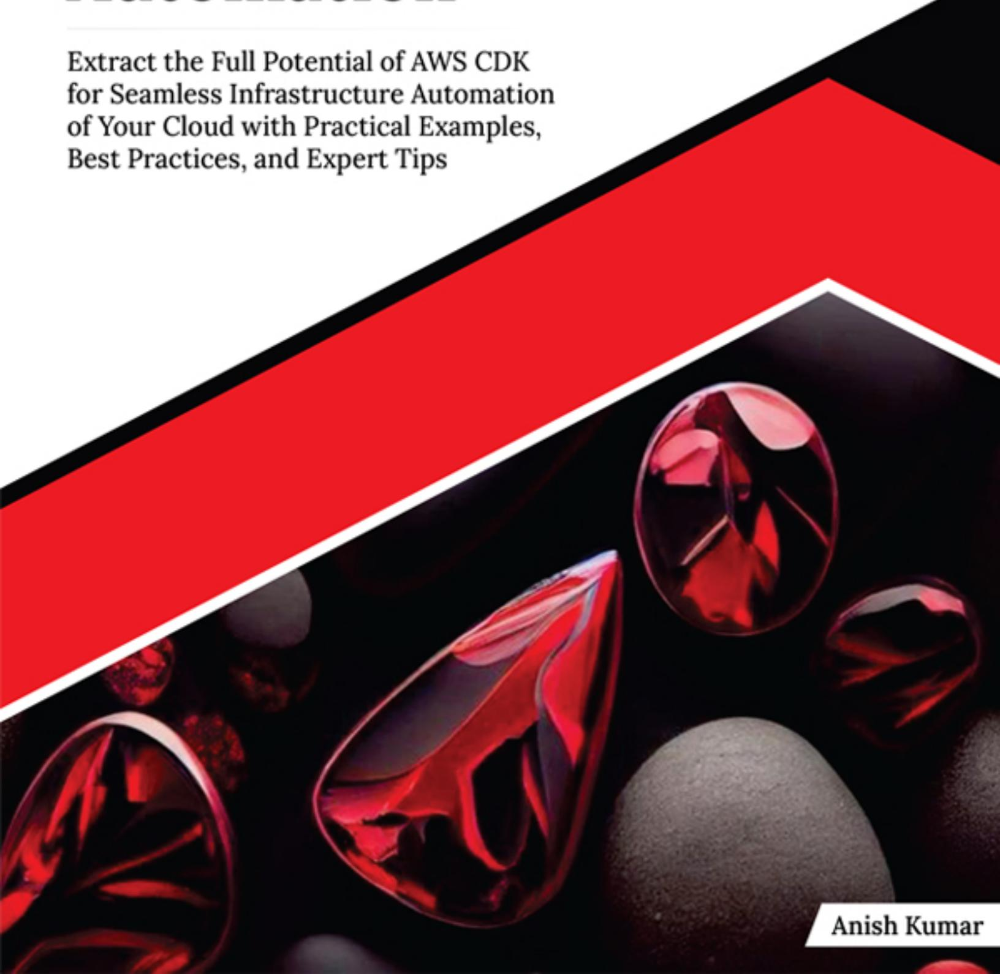


**for Infrastructure**
**Automation**

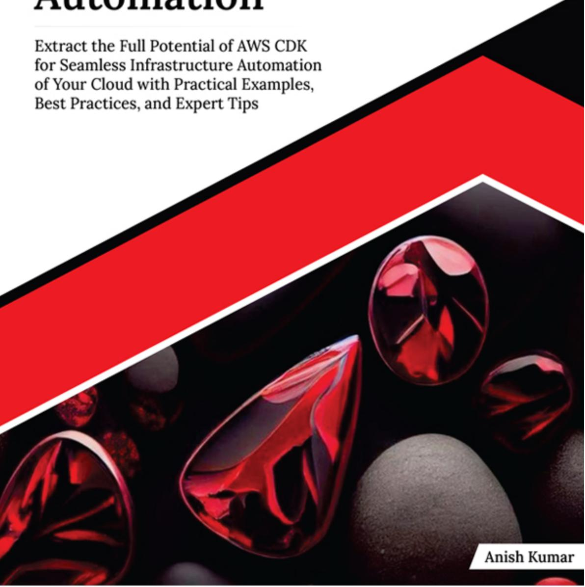

# **Ultimate AWS CDK for Infrastructure Automation**

*Extract the Full Potential of AWS CDK for Seamless Infrastructure Automation of Your Cloud with Practical Examples, Best Practices, and Expert Tips*

### **Anish Kumar**

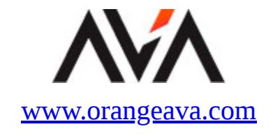

#### Copyright © 2025 Orange Education Pvt Ltd, AVA ®

All rights reserved. No part of this book may be reproduced, stored in a retrieval system, or transmitted in any form or by any means, without the prior written permission of the publisher, except in the case of brief quotations embedded in critical articles or reviews.

Every effort has been made in the preparation of this book to ensure the accuracy of the information presented. However, the information contained in this book is sold without warranty, either express or implied. Neither the author nor **Orange Education Pvt Ltd** or its dealers and distributors, will be held liable for any damages caused or alleged to have been caused directly or indirectly by this book.

**Orange Education Pvt Ltd** has endeavored to provide trademark information about all of the companies and products mentioned in this book by the appropriate use of capital. However, **Orange Education Pvt Ltd** cannot guarantee the accuracy of this information. The use of general descriptive names, registered names, trademarks, service marks, etc. in this publication does not imply, even in the absence of a specific statement, that such names are exempt from the relevant protective laws and regulations and therefore free for general use.

**First Published:** January 2025

**Published by:** Orange Education Pvt Ltd, AVA ® **Address:** 9, Daryaganj, Delhi, 110002, India

275 New North Road Islington Suite 1314 London,

N1 7AA, United Kingdom

**ISBN (PBK):** 978-93-48107-50-3 **ISBN (E-BOOK):** 978-93-48107-62-6

**Scan the QR code to explore our entire catalogue**


[www.orangeava.com](http://www.orangeava.com/)

## **About the Author**

**Anish Kumar** is a seasoned DevOps and Cloud Engineering expert with over six years of professional experience. He specializes in AWS cloud services and modern DevOps practices. With 13 AWS certifications spanning associate, professional, and specialty levels, along with Kubernetes certifications (CKA, CKAD, CKS), he has a profound understanding of infrastructure automation, container orchestration, and security.

Anish holds a degree in Information Technology, graduating with distinction from the University of Pune, India. His career journey has seen him excel in roles such as Senior DevOps Engineer, Cloud Engineer, and Cloud Architect at renowned organizations such as Dare International, Ohme, and Amazon Web Services. Across these roles, he has successfully led more than ten large-scale projects, ranging from cloud migrations and infrastructure design to advanced CI/CD pipelines, consistently improving scalability and operational efficiency.

With a robust track record of transforming traditional IT systems into agile cloud solutions, Anish is passionate about sharing his knowledge. As the author of *Mastering Terraform for the Associate Certification Exam* and this book on AWS CDK, he aims to empower both aspiring and experienced professionals with actionable insights and best practices in cloud and DevOps.

Anish's technical acumen, coupled with his dedication to innovation, exemplifies his mission to push the boundaries of what is possible in cloud architecture and infrastructure automation.

## **Technical Review Partner**

**Thinknyx ®** Technologies is a team of experienced professionals with years of experience in Information Technology. Their expertise spans software development, IT infrastructure mangement, cloud solutions, automation, container management, web and app development, security, and professional services. Recognized as a reputable brand, Thinknyx ® Technologies provides IT consulting and comprehensive training in both information technology and soft skills. Additionally, they offer talent acquisition and recruitment solutions to diverse organizations worldwide.

**Mr. Kulbhushan Mayer** , the Co-Founder of Thinknyx ® Technologies, is a certified expert in DevOps, SRE, Cloud, and Containerisation, with over 17 years of IT experience. He has expertise in technologies such as Public/Private Cloud, Containers, Automation tools, Continuous Integration/Deployment/Delivery tools, Monitoring and Logging tools, and more. Mr. Mayer is passionate about sharing his technical expertise with a global audience through various forums, conferences, webinars, blogs, and LinkedIn. Additionally, he has reviewed multiple books on Automation, DevOps, DevTools, and related topics for different vendors.

## **Acknowledgements**

There are a few people I would like to thank for their unwavering support and encouragement throughout the writing of *Ultimate AWS CDK for Infrastructure Automation.*

First and foremost, I want to express my heartfelt gratitude to my fiancée, Vanshita, whose love and patience carried me through this journey. She stood by me, even when I spent countless hours writing this book instead of spending time with her.

I am also deeply thankful to my brother, Manish, and my friends Shivam, Nikhil, Priyanka, Bhavin, and Juhi, who constantly motivated and inspired me to turn this dream into reality.

A special thanks to the platforms, courses, and companies that played a significant role in shaping my understanding of AWS CDK. I am grateful to the Udemy and YouTube courses that helped me master the nuances of this tool. I also want to acknowledge Amazon Web Services and Ohme, where I had the privilege of applying these skills in real-world scenarios.

Finally, I am incredibly appreciative of the publishing team who guided me patiently through every step of this process. As this is my first book, their expertise and encouragement were invaluable, and I couldn't have done it without them.

Thank you all for being part of this incredible journey.

## **Preface**

In an era where cloud computing and infrastructure automation have become the backbone of modern technology, mastering the tools that drive efficiency and scalability is critical for professionals. This book, *Ultimate AWS CDK for Infrastructure Automation,* serves as a comprehensive resource for anyone looking to harness the full potential of AWS Cloud Development Kit (CDK) to streamline infrastructure management.

This book explores a multitude of facets around AWS CDK and its role in infrastructure as code (IaC). By emphasizing the benefits of DevOps automation, it highlights how infrastructure automation fosters collaboration, enhances agility, and simplifies complex deployments. It introduces readers to the transformative power of IaC in modern development and how AWS CDK distinguishes itself as a tool for creating scalable, robust infrastructure through code.

Taking a practical approach, this guide is structured to cater to beginners and seasoned professionals alike. From foundational concepts to advanced implementations, the book dives deep into AWS CDK's functionality and offers a blend of theoretical knowledge and real-world examples. The content spans setting up your first CDK application, managing multi-stack projects, orchestrating CI/CD pipelines, and exploring advanced design patterns. Real-world use cases and customer stories provide invaluable insights into leveraging AWS CDK in diverse scenarios.

The book is divided into ten chapters to ensure a gradual yet comprehensive understanding:

**Chapter [1. Introduction to AWS CDK and DevOps Automation:](#page-27-0)** Learn the principles of DevOps automation, the significance of IaC, and how AWS CDK compares with other tools in the space.

**Chapter [2. Getting Started with AWS CDK:](#page-51-0)** Set up your environment, create your first application, and understand the internal workings of AWS CDK.

**Chapter [3. Key Concepts of CDK:](#page-77-0)** Delve into core concepts like apps, stacks, constructs, and the use of environments, identifiers, and parameters.

**Chapter [4. Building a Multi-Stack CDK Project:](#page-120-0)** Explore strategies for establishing foundation networks, referencing resources across stacks, and designing frontend, application, and backend infrastructures.

**Chapter [5. Orchestrating CDK Pipelines:](#page-161-0)** Master CI/CD principles, design robust pipelines, and manage multi-environment deployments with ease.

**Chapter 6. Securing Your [CDK Applications:](#page-193-0)** Learn best practices for managing permissions, crafting IAM policies, and enhancing security with tools like cdk-nag.

**Chapter [7. Testing and Debugging CDK Applications:](#page-214-0)** Explore testing essentials, debugging techniques, and how to analyze CDK logs effectively.

**Chapter [8. Advanced Constructs and Design Patterns:](#page-243-0)** Understand how to develop reusable constructs, leverage high-level constructs, and create custom constructs tailored to specific needs.

**Chapter [9. Best Practices and Expert Techniques:](#page-264-0)** Discover strategies for code organization, reusability, cost optimization, performance tuning, and using custom resources.

**Chapter [10. Real-World Case Studies and Examples:](#page-289-0)** Gain insights from practical examples like S3 event notifications and ECS applications, along with customer stories from industry leaders.

This book provides a clear roadmap for leveraging AWS CDK to its fullest potential, offering expert insights and actionable techniques to automate infrastructure in the cloud. Whether you are new to IaC or looking to enhance your expertise in AWS CDK, this guide promises to be an indispensable resource in your journey toward infrastructure automation mastery.

## **Downloading the code bundles and colored images**

Please follow the link or scan the QR code to download the *Code Bundles and Images* of the book:

**https://github.com/ava-orange[education/Ultimate-AWS-CDK-for-](https://github.com/ava-orange-education/Ultimate-AWS-CDK-for-Infrastructure-Automation)Infrastructure-Automation**


The code bundles and images of the book are also hosted on *<https://rebrand.ly/f7fd21>*


In case there's an update to the code, it will be updated on the existing GitHub repository.

## **Errata**

We take immense pride in our work at **Orange Education Pvt Ltd** and follow best practices to ensure the accuracy of our content to provide an indulging reading experience to our subscribers. Our readers are our mirrors, and we use their inputs to reflect and improve upon human errors, if any, that may have occurred during the publishing processes involved. To let us maintain the quality and help us reach out to any readers who might be having difficulties due to any unforeseen errors, please write to us at :

#### **[errata@orangeava.com](mailto:errata@orangeava.com)**

Your support, suggestions, and feedback are highly appreciated.

### **DID YOU KNOW**

Did you know that Orange Education Pvt Ltd offers eBook versions of every book published, with PDF and ePub files available? You can upgrade to the eBook version at **[www.orangeava.com](http://www.orangeava.com/)** and as a print book customer, you are entitled to a discount on the eBook copy. Get in touch with us at: **[info@orangeava.com](mailto:info@orangeava.com)** for more details.

At **[www.orangeava.com](http://www.orangeava.com/)** , you can also read a collection of free technical articles, sign up for a range of free newsletters, and receive exclusive discounts and offers on AVA ® Books and eBooks.

### **PIRACY**

If you come across any illegal copies of our works in any form on the internet, we would be grateful if you would provide us with the location address or website name. Please contact us at **[info@orangeava.com](mailto:info@orangeava.com)** with a link to the material.

## **ARE YOU INTERESTED IN AUTHORING WITH US?**

If there is a topic that you have expertise in, and you are interested in either writing or contributing to a book, please write to us at **[business@orangeava.com](mailto:business@orangeava.com)** . We are on a journey to help developers and tech professionals to gain insights on the present technological advancements and innovations happening across the globe and build a community that believes Knowledge is best acquired by sharing and learning with others. Please reach out to us to learn what our audience demands and how you can be part of this educational reform. We also welcome ideas from tech experts and help them build learning and development content for their domains.

### **REVIEWS**

Please leave a review. Once you have read and used this book, why not leave a review on the site that you purchased it from? Potential readers

can then see and use your unbiased opinion to make purchase decisions. We at Orange Education would love to know what you think about our products, and our authors can learn from your feedback. Thank you! For more information about Orange Education, please visit **[www.orangeava.com](http://www.orangeava.com/)** .

## **Table of Contents**

<span id="page-13-16"></span><span id="page-13-15"></span><span id="page-13-14"></span><span id="page-13-13"></span><span id="page-13-12"></span><span id="page-13-11"></span><span id="page-13-10"></span><span id="page-13-9"></span><span id="page-13-8"></span><span id="page-13-7"></span><span id="page-13-6"></span><span id="page-13-5"></span><span id="page-13-4"></span><span id="page-13-3"></span><span id="page-13-2"></span><span id="page-13-1"></span><span id="page-13-0"></span>

| 1. Introduction to AWS CDK and DevOps Automation       |
|--------------------------------------------------------|
| Introduction                                           |
| Structure                                              |
| Embracing DevOps Automation                            |
| Introduction to DevOps Automation                      |
| Benefits of DevOps Automation                          |
| Key Practices in DevOps Automation                     |
| Understanding Infrastructure as Code (IaC)             |
| Introduction to Infrastructure as Code                 |
| Definition and Concept of Infrastructure as Code       |
| History and Evolution of Infrastructure as Code        |
| The Role of IaC in DevOps                              |
| The Advantages of IaC in Modern Development            |
| An Overview of AWS CDK                                 |
| Understanding AWS CDK                                  |
| Definition and Purpose                                 |
| History and Evolution                                  |
| Benefits of Using AWS CDK                              |
| Simplified Infrastructure Management                   |
| Infrastructure as Code (IaC) with High-Level Languages |
| Code Reusability and Modularity.                       |
| Integration with AWS Services                          |
| Improved Developer Productivity.                       |
| Comparing AWS CDK with Other IaC Tools                 |
| Overview of AWS CloudFormation                         |
| Defining AWS CloudFormation                            |
| Key Features and Capabilities                          |
| Overview of Terraform                                  |
| Defining Terraform                                     |
| Key Features and Capabilities                          |
| Overview of Pulumi                                     |
| Defining Pulumi                                        |

<span id="page-13-32"></span><span id="page-13-31"></span><span id="page-13-30"></span><span id="page-13-29"></span><span id="page-13-28"></span><span id="page-13-27"></span><span id="page-13-26"></span><span id="page-13-25"></span><span id="page-13-24"></span><span id="page-13-23"></span><span id="page-13-22"></span><span id="page-13-21"></span><span id="page-13-20"></span><span id="page-13-19"></span><span id="page-13-18"></span><span id="page-13-17"></span>*[Key Features and Capabilities](#page-45-2)*

```
AWS CDK versus AWS CloudFormation
      Code-Based versus Template-Based IaC
      Integration with AWS Services
      Use Cases and Best Practices
      AWS CDK versus Terraform
      AWS Specific versus Multi-Cloud Support
      Language Flexibility and Domain Specific Language (DSL)
      Resource Provisioning and State Management
      AWS CDK versus Pulumi
      Language Support and Flexibility
      Community and Ecosystem
   Conclusion
2. Getting Started with AWS CDK
   Introduction
   Structure
   Prerequisites and Technical Requirements
      Required Knowledge
      Basic AWS Concepts
      Familiarity with Infrastructure as Code (IaC)
      Basic Programming Knowledge
      Software Requirements
      AWS Account Setup
      Install AWS CLI
          Windows
          Linux
          MacOS
      Node and npm Installation
          Windows
          Linux
          MacOS
      TypeScript Installation
   Setting Up Your Development Environment
      Installing AWS CDK Toolkit
      Configuring AWS CLI
      Creating IAM User
      Setting Up AWS Credentials
```

<span id="page-15-36"></span><span id="page-15-35"></span><span id="page-15-34"></span><span id="page-15-33"></span><span id="page-15-32"></span><span id="page-15-31"></span><span id="page-15-30"></span><span id="page-15-29"></span><span id="page-15-28"></span><span id="page-15-27"></span><span id="page-15-26"></span><span id="page-15-25"></span><span id="page-15-24"></span><span id="page-15-23"></span><span id="page-15-22"></span><span id="page-15-21"></span><span id="page-15-20"></span><span id="page-15-19"></span><span id="page-15-18"></span><span id="page-15-17"></span><span id="page-15-16"></span><span id="page-15-15"></span><span id="page-15-14"></span><span id="page-15-13"></span><span id="page-15-12"></span><span id="page-15-11"></span><span id="page-15-10"></span><span id="page-15-9"></span><span id="page-15-8"></span><span id="page-15-7"></span><span id="page-15-6"></span><span id="page-15-5"></span><span id="page-15-4"></span><span id="page-15-3"></span><span id="page-15-2"></span><span id="page-15-1"></span><span id="page-15-0"></span>

| Setting Up Your IDE                        |
|--------------------------------------------|
| Creating Your First CDK Application        |
| Initializing a CDK Project                 |
| Create a New Project                       |
| Project Structure Overview                 |
| Writing Your First CDK Stack               |
| Understanding Stack Code                   |
| Defining Resources in Your Stack           |
| Deploying Your CDK Stack                   |
| Synthesizing Your Stack                    |
| Deploying to AWS                           |
| Verifying the Deployment                   |
| How CDK Operates Under the Hood            |
| CDK Constructs and Stacks                  |
| CDK App Lifecycle                          |
| Synthesis Phase                            |
| Deployment Phase                           |
| Translating CDK to CloudFormation          |
| CDK to CloudFormation Mapping              |
| Viewing Generated CloudFormation Templates |
| Bootstrapping Your CDK Project             |
| Bootstrapping                              |
| When and Why to Bootstrap                  |
| Running the Bootstrap Command              |
| Analyzing the Bootstrap Stack              |
| Customizing Bootstrap Resources            |
| Customizing S3 Bucket and IAM Role         |
| Advanced Bootstrap Configurations          |
| Navigating the CDK CLI                     |
| Overview of CDK CLI Commands               |
| Common CDK CLI Commands                    |
| Synthesizing Your App                      |
| Analyzing the Synthesized Output           |
| Deploying Stacks                           |
| Monitoring the Deployment Process          |
| Destroying Stacks                          |
| Cleaning Up Resources                      |

<span id="page-16-16"></span><span id="page-16-15"></span><span id="page-16-14"></span><span id="page-16-13"></span><span id="page-16-12"></span><span id="page-16-11"></span><span id="page-16-10"></span><span id="page-16-9"></span><span id="page-16-8"></span><span id="page-16-7"></span><span id="page-16-6"></span><span id="page-16-5"></span><span id="page-16-4"></span><span id="page-16-3"></span><span id="page-16-2"></span><span id="page-16-1"></span><span id="page-16-0"></span>*[Listing and Diffing Stacks](#page-73-4) [Running](#page-74-0) cdk ls [Running](#page-74-1) cdk diff [Working with Context Variables](#page-74-2) [Managing and Troubleshooting Context Variables](#page-75-0)* [Conclusion](#page-75-1) **[3. Key Concepts of CDK](#page-77-0)** [Introduction](#page-77-1) [Structure](#page-77-2) [Breaking Down Projects](#page-78-0) *[Structuring Your CDK Project](#page-78-1) [Project Directory Layout](#page-79-0) [Common Project Components](#page-80-0) [Defining Project Requirements](#page-81-0) [Gathering Infrastructure Requirements](#page-81-1) [Translating Requirements into CDK Constructs](#page-82-0) [Project Best Practices](#page-85-0) [Organizing Code for Maintainability](#page-85-1) [Using Version Control with CDK](#page-86-0)* [Understanding Apps, Stacks, and Constructs](#page-87-0) *[Defining CDK Constructs](#page-88-0) [Basic Constructs: Nodes and Trees](#page-88-1) [Understanding AWS CDK Construct Levels](#page-90-0) [Level 1 \(L1\) Constructs: CloudFormation Resource Constructs](#page-90-1) [Level 2 \(L2\) Constructs: AWS Service Constructs](#page-91-0) [Level 3 \(L3\) Constructs: Patterns](#page-92-0) [Construct Scopes and Boundaries](#page-92-1) [Creating and Using Stacks](#page-94-0) [Stack Fundamentals](#page-94-1) [Managing Cross-Stack References](#page-95-0) [Working with CDK Apps](#page-97-0) [App Composition and Deployment](#page-97-1) [Multi-Stack Apps](#page-98-0)* [Exploring Environments in AWS CDK](#page-99-0)

<span id="page-16-34"></span><span id="page-16-33"></span><span id="page-16-32"></span><span id="page-16-31"></span><span id="page-16-30"></span><span id="page-16-29"></span><span id="page-16-28"></span><span id="page-16-27"></span><span id="page-16-26"></span><span id="page-16-25"></span><span id="page-16-24"></span><span id="page-16-23"></span><span id="page-16-22"></span><span id="page-16-21"></span><span id="page-16-20"></span><span id="page-16-19"></span><span id="page-16-18"></span><span id="page-16-17"></span>*[Defining Environments](#page-99-1)*

<span id="page-16-35"></span>*[Overview of AWS Environments](#page-100-0)*

<span id="page-17-0"></span>

| Configuring Environment Variables in CDK                                                         |  |
|--------------------------------------------------------------------------------------------------|--|
|                                                                                                  |  |
| Grouping Security Rules Based on Roles                                                           |  |
| Implementing Network Access Control Lists (NACLs) for Additional<br>Security.                    |  |
| Configuring Route Tables                                                                         |  |
| Setting Up Routing Strategies                                                                    |  |
| Handling Inter-Subnet Traffic                                                                    |  |
| Referencing Resources Across Stacks                                                              |  |
| Understanding CDK's Cross-Stack References                                                       |  |
| CDK's Approach to Sharing Resources                                                              |  |
| Limitations and Best Practices                                                                   |  |
| Deploying Stacks in Sequence                                                                     |  |
| Best Practices for Managing Dependencies                                                         |  |
| Using AWS SSM Parameter Store for Cross-Stack Communication                                      |  |
| Storing and Retrieving Parameters Across Stacks                                                  |  |
| Best Practices for SSM Parameter Store                                                           |  |
| Setting Up Frontend Infrastructure                                                               |  |
| Creating S3 Buckets for Static Content                                                           |  |
| Bucket Configurations (Versioning, Lifecycle Policies).                                          |  |
| Setting Up Bucket Policies for Public Access                                                     |  |
| Setting Up CloudFront for Content Distribution                                                   |  |
| Configuring Origins and Behaviors                                                                |  |
| Associating SSL/TLS Certificates with Your CloudFront Distribution                               |  |
| Best Practices for CloudFront Configuration                                                      |  |
| Configuring Route 53 for DNS Management                                                          |  |
| Setting Up a Custom Domain with Route 53                                                         |  |
| Best Practices for Route 53 Configuration                                                        |  |
| Configuring the Application Layer                                                                |  |
| Deploying APIs with Amazon API Gateway                                                           |  |
| REST API                                                                                         |  |
| HTTP API                                                                                         |  |
| Deciding Between EC2 and Lambda                                                                  |  |
| Key Factors Influencing the Choice                                                               |  |
| Use Cases and Scenarios                                                                          |  |
| Setting Up EC2 Instances with Auto Scaling and Load Balancers                                    |  |
| Provisioning EC2 Instances with CDK                                                              |  |
| Configuring Auto Scaling Groups (ASG).                                                           |  |
| Implementing Elastic Load Balancers (ELB)                                                        |  |
| Architecting Serverless Solutions with Lambda                                                    |  |
| Integrating Lambda with API Gateway.                                                             |  |
| Managing Lambda Scaling and Concurrency.                                                         |  |
| Comparing Costs and Performance: EC2 versus Lambda                                               |  |
| Architecting Backend Infrastructure                                                              |  |
| Choosing Between RDS and DynamoDB                                                                |  |
| Managing Relational Databases with Amazon RDS                                                    |  |
| Implementing Multi-AZ and Read Replicas for RDS                                                  |  |
| Configuring RDS Security, Backup, and Monitoring                                                 |  |
| Implementing NoSQL Databases with DynamoDB                                                       |  |
| Handling Large-Scale Data with DynamoDB's Partition Key Desigr                                   |  |
| Implementing DynamoDB Streams for Event- Driven Architectures                                    |  |
| Cost Optimization Strategies for DynamoDB                                                        |  |
| Caching with Amazon ElastiCache                                                                  |  |
| Managing Cache Cluster Scaling and Maintenance                                                   |  |
| Best Practices for Multi-Stack CDK Projects                                                      |  |
| Managing Configurations and Environment Variables                                                |  |
| Using .env Files, SSM Parameters, or Secrets Manager                                             |  |
| Applying Infrastructure as Code (IaC) Patterns                                                   |  |
| DRY Principles in CDK                                                                            |  |
| Reusable Constructs and Abstract Classes                                                         |  |
| Handling State and Outputs Between Stacks                                                        |  |
| Strategies for Managing Application State Across Stacks                                          |  |
| Implementing a Deployment Strategy.                                                              |  |
| Blue-Green Deployment                                                                            |  |
| Canary Deployment                                                                                |  |
| Rolling Deployment                                                                               |  |
| Conclusion                                                                                       |  |
| Orchestrating CDK Pipelines                                                                      |  |
| Introduction                                                                                     |  |
| Structure                                                                                        |  |
| Key Components of CI/CD                                                                          |  |
| Benefits of CI/CD                                                                                |  |
| CI/CD in Cloud Environments                                                                      |  |
| Advantages of CI/CD Pipelines in Cloud-Native Applications                                       |  |
| Role of AWS in CI/CD Automation                                                                  |  |
| Pipeline Stages and Workflow                                                                     |  |
| Stages of a CI/CD Pipeline                                                                       |  |
| Error Handling and Rollbacks                                                                     |  |
| Strategies for Handling Failures at Different Stages                                             |  |
| Implementing Rollbacks in Case of Deployment Failures                                            |  |
| Pipeline Triggers and Notifications                                                              |  |
| Setting Up Triggers                                                                              |  |
| Integrating Notifications for Status Updates                                                     |  |
| Designing a Standard CI/CD Pipeline                                                              |  |
| Using AWS CodePipeline with CDK                                                                  |  |
| Overview of AWS CodePipeline and Integration with AWS CDK                                        |  |
| Defining a Basic CI/CD Pipeline with AWS CodePipeline                                            |  |
| Defining Sources                                                                                 |  |
| Integrating Build and Test Stages                                                                |  |
| Defining Build Stages with AWS CodeBuild and CDK                                                 |  |
| Setting Up Unit Tests and Integration Tests with Automated Testing                               |  |
| Frameworks                                                                                       |  |
| Deployment Stage                                                                                 |  |
| Managing Multiple Environments in CI/CD                                                          |  |
| Handling Multiple Environments (Dev, Staging, Production)                                        |  |
| Structuring Pipelines to Support Different Environments                                          |  |
| Managing Environment-Specific Variables                                                          |  |
| Deploying to Isolated AWS Accounts                                                               |  |
| Managing Separate AWS Accounts for Different Environments                                        |  |
| Cross-Account Role Assumption in AWS for Deployment                                              |  |
| Challenges in Multi-Environment Deployments                                                      |  |
| Managing Consistency Across Environments                                                         |  |
| Dealing with Drift Between Environments<br>Extending Pipelines for Multi-Environment Deployments |  |
| Managing Region-Specific Resources and Configuration                                             |  |
| Handling Complex Deployment Scenarios                                                            |  |
| Deploying Microservices Across Multiple Environments                                             |  |
| Orchestrating Dependencies Between Services in Different                                         |  |
| Environments                                                                                     |  |
| Blue/Green and Canary Deployments                                                                |  |
| Incorporating Advanced Deployment Strategies into Pipelines                                      |  |
| Managing Risk with Canary and Phased Rollouts                                                    |  |
| Testing and Verification in Multi-Environment Pipelines                                          |  |
| Incorporating Automated Smoke and Performance Testing for                                        |  |
| Different Environments                                                                           |  |
| Ensuring Quality and Reliability Across Environments                                             |  |
| Creating Self-Mutating Pipelines                                                                 |  |
| Understanding Self-Mutating Pipelines                                                            |  |
| Process to Self-Update CDK Pipelines During a Deployment                                         |  |
| Creating a Self-Mutating Pipeline in AWS CDK                                                     |  |
| Setting Up a Self-Updating Pipeline                                                              |  |
| Best Practices for Handling Self-Mutations Safely.                                               |  |
| Detecting and Managing Pipeline Changes                                                          |  |
| Detecting Changes in the Pipeline Code                                                           |  |
| Strategies for Avoiding Infinite Mutation Loops                                                  |  |
| Benefits and Limitations of Self-Mutating Pipelines                                              |  |
| Advantages of Reduced Manual Intervention                                                        |  |
| Potential Pitfalls                                                                               |  |
| Conclusion                                                                                       |  |

<span id="page-17-1"></span>*[Deploying to Multiple Environments](#page-102-0)*

<span id="page-17-2"></span>*[Setting Up Stage-Specific Configurations](#page-102-1)*

#### <span id="page-17-3"></span>[Managing Identifiers and Parameters in AWS CDK](#page-104-0)

<span id="page-17-4"></span>*[Working with Resource Identifiers](#page-104-1)*

<span id="page-17-5"></span>*[Automatic Naming and Logical IDs](#page-104-2)*

<span id="page-17-6"></span>*[Custom Naming Conventions](#page-105-0)*

<span id="page-17-7"></span>*[Using CDK Parameters](#page-106-0)*

<span id="page-17-8"></span>*[Defining and Passing Parameters](#page-106-1)*

<span id="page-17-9"></span>*[Best Practices for Parameter Management](#page-107-0)*

<span id="page-17-10"></span>*[Leveraging Context Variables](#page-108-0)*

<span id="page-17-11"></span>*[Using Context to Influence Deployments](#page-108-1)*

<span id="page-17-12"></span>*[Managing Context Across Environments](#page-109-0)*

<span id="page-17-13"></span>*[Best Practices for Context Management](#page-110-0)*

#### <span id="page-17-14"></span>[Handling Assets and Feature Flags in AWS CDK](#page-110-1)

<span id="page-17-15"></span>*[Working with Assets in CDK](#page-111-0)*

<span id="page-17-16"></span>*[Managing Asset Bundles and Files](#page-111-1)*

<span id="page-17-17"></span>*[Asset Deployment and Access in AWS](#page-112-0)*

<span id="page-17-18"></span>*[Feature Flags in CDK](#page-113-0)*

<span id="page-17-19"></span>*[Understanding Feature Flags](#page-114-0)*

<span id="page-17-20"></span>*[Managing Feature Flags in CDK Projects](#page-114-1)*

<span id="page-17-21"></span>*[Best Practices for CDK Asset Management](#page-115-0)*

<span id="page-17-22"></span>*[Security Aspects of Asset Management](#page-115-1)*

<span id="page-17-23"></span>*[Enhancing Asset Deployments](#page-116-0)*

<span id="page-17-24"></span>[Conclusion](#page-118-0)

#### <span id="page-17-25"></span>**[4. Building a Multi-Stack CDK Project](#page-120-0)**

<span id="page-17-26"></span>[Introduction](#page-120-1)

<span id="page-17-27"></span>[Structure](#page-121-0)

<span id="page-17-28"></span>[Establishing a Foundation Network](#page-122-0)

<span id="page-17-29"></span>*[Designing a Virtual Private Cloud \(VPC\)](#page-122-1)*

<span id="page-17-30"></span>*[CIDR Block Planning](#page-122-2)*

<span id="page-17-31"></span>*[Subnet Architecture: Public, Private, and Isolated Subnets](#page-124-0)*

<span id="page-17-32"></span>*[Best Practices for Subnet Design](#page-124-1)*

<span id="page-17-33"></span>*[Configuring NAT Gateways and Internet Gateways](#page-125-0)*

<span id="page-17-34"></span>*[Managing Network Security with Security Groups and NACLs](#page-126-0)*

<span id="page-17-35"></span>*[Security Group Inbound and Outbound Rules](#page-126-1)*

<span id="page-18-35"></span><span id="page-18-34"></span><span id="page-18-33"></span><span id="page-18-32"></span><span id="page-18-31"></span><span id="page-18-30"></span><span id="page-18-29"></span><span id="page-18-28"></span><span id="page-18-27"></span><span id="page-18-26"></span><span id="page-18-25"></span><span id="page-18-24"></span><span id="page-18-23"></span><span id="page-18-22"></span><span id="page-18-21"></span><span id="page-18-20"></span><span id="page-18-19"></span><span id="page-18-18"></span><span id="page-18-17"></span><span id="page-18-16"></span><span id="page-18-15"></span><span id="page-18-14"></span><span id="page-18-13"></span><span id="page-18-12"></span><span id="page-18-11"></span><span id="page-18-10"></span><span id="page-18-9"></span><span id="page-18-8"></span><span id="page-18-7"></span><span id="page-18-6"></span><span id="page-18-5"></span><span id="page-18-4"></span><span id="page-18-3"></span><span id="page-18-2"></span><span id="page-18-1"></span><span id="page-18-0"></span>

<span id="page-19-14"></span><span id="page-19-13"></span><span id="page-19-12"></span><span id="page-19-11"></span><span id="page-19-10"></span><span id="page-19-9"></span><span id="page-19-8"></span><span id="page-19-7"></span><span id="page-19-6"></span><span id="page-19-5"></span><span id="page-19-4"></span><span id="page-19-3"></span><span id="page-19-2"></span><span id="page-19-1"></span><span id="page-19-0"></span>

#### <span id="page-19-29"></span><span id="page-19-28"></span><span id="page-19-27"></span><span id="page-19-26"></span><span id="page-19-25"></span><span id="page-19-24"></span><span id="page-19-23"></span><span id="page-19-22"></span><span id="page-19-21"></span><span id="page-19-20"></span><span id="page-19-19"></span><span id="page-19-18"></span><span id="page-19-17"></span><span id="page-19-16"></span><span id="page-19-15"></span>**[5. Orchestrating CDK Pipelines](#page-161-0)**

<span id="page-19-31"></span><span id="page-19-30"></span>[Introduction to CI/CD Principles](#page-163-0)

<span id="page-19-32"></span>*[Overview of CI/CD](#page-163-1)*

<span id="page-19-33"></span>*[Overview of Continuous Integration and Continuous](#page-163-2)*

*Delivery/Deployment*

<span id="page-19-34"></span>*[Importance of Automating the Software Release Process](#page-164-0)*

<span id="page-20-35"></span><span id="page-20-34"></span><span id="page-20-33"></span><span id="page-20-32"></span><span id="page-20-31"></span><span id="page-20-30"></span><span id="page-20-29"></span><span id="page-20-28"></span><span id="page-20-27"></span><span id="page-20-26"></span><span id="page-20-25"></span><span id="page-20-24"></span><span id="page-20-23"></span><span id="page-20-22"></span><span id="page-20-21"></span><span id="page-20-20"></span><span id="page-20-19"></span><span id="page-20-18"></span><span id="page-20-17"></span><span id="page-20-16"></span><span id="page-20-15"></span><span id="page-20-14"></span><span id="page-20-13"></span><span id="page-20-12"></span><span id="page-20-11"></span><span id="page-20-10"></span><span id="page-20-9"></span><span id="page-20-8"></span><span id="page-20-7"></span><span id="page-20-6"></span><span id="page-20-5"></span><span id="page-20-4"></span><span id="page-20-3"></span><span id="page-20-2"></span><span id="page-20-1"></span><span id="page-20-0"></span>

<span id="page-21-9"></span><span id="page-21-8"></span><span id="page-21-7"></span><span id="page-21-6"></span><span id="page-21-5"></span><span id="page-21-4"></span><span id="page-21-3"></span><span id="page-21-2"></span><span id="page-21-1"></span><span id="page-21-0"></span>

#### <span id="page-21-20"></span><span id="page-21-19"></span><span id="page-21-18"></span><span id="page-21-17"></span><span id="page-21-16"></span><span id="page-21-15"></span><span id="page-21-14"></span><span id="page-21-13"></span><span id="page-21-12"></span><span id="page-21-11"></span><span id="page-21-10"></span>**[6. Securing Your CDK Applications](#page-193-0)**

<span id="page-21-21"></span>[Introduction](#page-193-1)

<span id="page-21-22"></span>[Structure](#page-193-2)

<span id="page-21-23"></span>[Managing CDK Deployment Permissions](#page-194-0)

<span id="page-21-24"></span>*[Understanding the Principle of Least Privilege](#page-194-1)*

<span id="page-21-25"></span>*[Restricting Developer Access to Sensitive Resources](#page-195-0)*

<span id="page-21-26"></span>*[Leveraging CDK Bootstrap Permissions](#page-196-0)*

<span id="page-21-27"></span>*[Securing CI/CD Pipelines for CDK Deployments](#page-197-0)*

<span id="page-21-28"></span>*[Cross-Account Deployment Security](#page-198-0)*

<span id="page-21-29"></span>[Utilizing CDK Contexts for Security](#page-199-0)

<span id="page-21-30"></span>*[Introduction to CDK Contexts](#page-199-1)*

<span id="page-21-31"></span>*[Encrypting Sensitive Data in CDK Contexts](#page-200-0)*

<span id="page-21-32"></span>*[Ensuring Context Consistency Across Environments](#page-201-0)*

<span id="page-21-33"></span>*[Automating Secure Context Values with AWS Secrets Manager](#page-202-0)*

<span id="page-22-0"></span>

#### <span id="page-22-1"></span>[Crafting IAM Policies and Identifying Roles](#page-204-0)

<span id="page-22-2"></span>*[Writing Secure IAM Policies in CDK](#page-204-1)*

<span id="page-22-3"></span>*[Leveraging CDK Policy Constructs for Efficiency](#page-205-0)*

<span id="page-22-4"></span>*[Fine-Tuning Resource-Based Permissions](#page-206-0)*

<span id="page-22-5"></span>*[Implementing Least Privilege IAM Roles](#page-206-1)*

<span id="page-22-6"></span>*[Automating Role Identification and Assignment](#page-207-0)*

<span id="page-22-7"></span>*[Advanced Conditional IAM Policies](#page-207-1)*

#### <span id="page-22-8"></span>[Enhancing Security with](#page-208-0) cdk-nag

<span id="page-22-9"></span>*[Introduction to](#page-209-0) cdk-nag*

<span id="page-22-10"></span>*Applying cdk-nag [Rules to Your CDK Applications](#page-209-1)*

<span id="page-22-11"></span>*[Customizing](#page-210-0) cdk-nag*

<span id="page-22-12"></span>*[Analyzing and Resolving](#page-211-0) cdk-nag Warnings and Errors*

<span id="page-22-13"></span>*[Continuous Security Auditing with](#page-212-0) cdk-nag*

<span id="page-22-14"></span>[Conclusion](#page-213-0)

#### <span id="page-22-15"></span>**[7. Testing and Debugging CDK Applications](#page-214-0)**

<span id="page-22-16"></span>[Introduction](#page-214-1)

<span id="page-22-17"></span>[Structure](#page-214-2)

#### <span id="page-22-18"></span>[The Essentials of Testing in CDK](#page-215-0)

<span id="page-22-19"></span>*[Importance of Testing Infrastructure as Code \(IaC\)](#page-216-0)*

<span id="page-22-20"></span>*[Common Pitfalls of Untested CDK Applications](#page-216-1)*

<span id="page-22-21"></span>*[Continuous Integration for Infrastructure Code](#page-217-0)*

<span id="page-22-22"></span>*[Core CDK Testing Concepts](#page-217-1)*

<span id="page-22-23"></span>*[Unit Tests versus Integration Tests in CDK](#page-217-2)*

<span id="page-22-24"></span>*[Mocking Resources in CDK](#page-217-3)*

<span id="page-22-25"></span>*[Testing Environment versus Production Environment](#page-218-0)*

<span id="page-22-26"></span>*[Tools for Testing CDK Applications](#page-218-1)*

<span id="page-22-27"></span>*[Built-in Tools and Frameworks](#page-218-2)*

<span id="page-22-28"></span>*[External Tools: AWS SAM and Jest](#page-219-0)*

<span id="page-22-29"></span>*[CI/CD Pipeline Integration](#page-219-1)*

#### <span id="page-22-30"></span>[Exploring Various Testing Methods](#page-220-0)

<span id="page-22-31"></span>*[Unit Testing CDK Constructs](#page-220-1)*

<span id="page-22-32"></span>*[Overview of Unit Testing in CDK](#page-220-2)*

<span id="page-22-33"></span>*[Writing Unit Tests for CDK Constructs](#page-221-0)*

<span id="page-22-34"></span>*Using the [@aws-cdk/assertions](#page-221-1) Library*

<span id="page-22-35"></span>*[Snapshot Testing](#page-222-0)*

<span id="page-23-36"></span><span id="page-23-35"></span><span id="page-23-34"></span><span id="page-23-33"></span><span id="page-23-32"></span><span id="page-23-31"></span><span id="page-23-30"></span><span id="page-23-29"></span><span id="page-23-28"></span><span id="page-23-27"></span><span id="page-23-26"></span><span id="page-23-25"></span><span id="page-23-24"></span><span id="page-23-23"></span><span id="page-23-22"></span><span id="page-23-21"></span><span id="page-23-20"></span><span id="page-23-19"></span><span id="page-23-18"></span><span id="page-23-17"></span><span id="page-23-16"></span><span id="page-23-15"></span><span id="page-23-14"></span><span id="page-23-13"></span><span id="page-23-12"></span><span id="page-23-11"></span><span id="page-23-10"></span><span id="page-23-9"></span><span id="page-23-8"></span><span id="page-23-7"></span><span id="page-23-6"></span><span id="page-23-5"></span><span id="page-23-4"></span><span id="page-23-3"></span><span id="page-23-2"></span><span id="page-23-1"></span><span id="page-23-0"></span>

| Benefits of Snapshot Testing in CDK                            |
|----------------------------------------------------------------|
| Managing and Updating Snapshots                                |
| End-to-End (E2E) Testing                                       |
| Simulating Real-World Scenarios                                |
| Mocking AWS Services                                           |
| Integrating with Tools: LocalStack for Testing                 |
| Executing CDK Tests                                            |
| Running Unit Tests Locally                                     |
| Running Tests Using Mocha                                      |
| Automating Tests in CI/CD Pipelines                            |
| Running Tests in Cloud Environments                            |
| Handling Test Failures and Reporting                           |
| Parallelizing and Optimizing Tests                             |
| Reducing Testing Time                                          |
| Optimization Strategies for Large Applications                 |
| Analyzing and Reviewing CDK Logs                               |
| Understanding CDK Application Logs                             |
| CloudFormation Logs versus Custom Resource Logs                |
| Accessing and Analyzing Logs                                   |
| Log Filtering and Analysis Techniques                          |
| Setting Up Custom Log Groups                                   |
| Identifying and Resolving Issues from Logs                     |
| Troubleshooting Deployment and Runtime Errors                  |
| Debugging Techniques for CDK Applications                      |
| Debugging CloudFormation Stack Failures                        |
| Troubleshooting Strategies                                     |
| Using Rollback Information to Fix Issues                       |
| CDK Debugging Tools and Techniques                             |
| Using Verbose Mode in CDK Deployments                          |
| Debugging with AWS CloudFormation Designer                     |
| Debugging Complex Dependency Chains                            |
| Techniques for Resolving Cross-Stack Dependencies              |
| Handling Circular Dependencies                                 |
| Best Practices for Debugging CDK Applications                  |
| Utilizing Logging Effectively During Debugging                 |
| Building Resilience into CDK Applications for Easier Debugging |
| Conclusion                                                     |

<span id="page-24-0"></span>

|  | 8. Advanced Constructs and Design Patterns |  |  |
|--|--------------------------------------------|--|--|
|  |                                            |  |  |

<span id="page-24-1"></span>[Introduction](#page-243-1)

<span id="page-24-2"></span>[Structure](#page-243-2)

<span id="page-24-3"></span>[Developing Reusable Constructs](#page-244-0)

<span id="page-24-4"></span>*[Introduction to Reusable Constructs](#page-244-1)*

<span id="page-24-5"></span>*[Principles of Construct Design](#page-245-0)*

<span id="page-24-6"></span>*[Versioning and Best Practices for Reusability](#page-247-0)*

<span id="page-24-7"></span>*[Publishing Constructs to a Shared Library](#page-247-1)*

<span id="page-24-8"></span>*[Managing Dependencies in Constructs](#page-248-0)*

<span id="page-24-9"></span>[Leveraging High-Level Constructs](#page-249-0)

<span id="page-24-10"></span>*[Overview of High-Level Constructs \(L2 and L3 Constructs\)](#page-249-1)*

<span id="page-24-11"></span>*[Understanding Patterns](#page-250-0)*

<span id="page-24-12"></span>*[Composing Complex Applications with High-Level Constructs](#page-251-0)*

<span id="page-24-13"></span>*[Security and Compliance Considerations in High-Level Constructs](#page-253-0)*

<span id="page-24-14"></span>*[Extending High-Level Constructs](#page-254-0)*

<span id="page-24-15"></span>[Crafting Custom Constructs](#page-255-0)

<span id="page-24-16"></span>*[When to Build Custom Constructs](#page-256-0)*

<span id="page-24-17"></span>*[Building Your First Custom Construct](#page-256-1)*

<span id="page-24-18"></span>*[Testing and Validating Custom Constructs](#page-258-0)*

<span id="page-24-19"></span>*[Unit Testing with Jest](#page-258-1)*

<span id="page-24-20"></span>*[Integration Testing](#page-259-0)*

<span id="page-24-21"></span>*[Publishing Custom Constructs for Community Use](#page-259-1)*

<span id="page-24-22"></span>*[Integrating Custom Constructs with CI/CD Pipelines](#page-260-0)*

<span id="page-24-23"></span>[Conclusion](#page-262-0)

#### <span id="page-24-24"></span>**[9. Best Practices and Expert Techniques](#page-264-0)**

<span id="page-24-25"></span>[Introduction](#page-264-1)

<span id="page-24-26"></span>[Structure](#page-264-2)

<span id="page-24-27"></span>[Organizing Your Codebase Effectively](#page-265-0)

<span id="page-24-28"></span>*[Structuring Projects for Large Teams](#page-265-1)*

<span id="page-24-29"></span>*[Separating Stacks and Stages](#page-266-0)*

<span id="page-24-30"></span>*[Modularizing Constructs for Scalability](#page-266-1)*

<span id="page-24-31"></span>*[Benefits of Modularization](#page-267-0)*

<span id="page-24-32"></span>*[Using Environment Variables and Context](#page-267-1)*

<span id="page-24-33"></span>*[Environment Variables](#page-267-2)*

<span id="page-24-34"></span>*[CDK Context](#page-268-0)*

<span id="page-24-35"></span>[Enhancing Reusability and Modularity](#page-268-1)

<span id="page-25-16"></span><span id="page-25-15"></span><span id="page-25-14"></span><span id="page-25-13"></span><span id="page-25-12"></span><span id="page-25-11"></span><span id="page-25-10"></span><span id="page-25-9"></span><span id="page-25-8"></span><span id="page-25-7"></span><span id="page-25-6"></span><span id="page-25-5"></span><span id="page-25-4"></span><span id="page-25-3"></span><span id="page-25-2"></span><span id="page-25-1"></span><span id="page-25-0"></span>

| Abstracting Infrastructure into Constructs                |
|-----------------------------------------------------------|
| Benefits of Abstracting Infrastructure                    |
| Sharing Constructs Across Teams                           |
| Benefits of Sharing Constructs                            |
| Managing Dependencies between Constructs                  |
| Version Control for Reusable Constructs                   |
| Creating and Using Custom Resources                       |
| Use Cases for Custom Resources                            |
| Building Custom Resources with AWS Lambda                 |
| Best Practices for Managing the Custom Resource Lifecycle |
| Security Considerations for Custom Resources              |
| Using Aspects and Tokens                                  |
| Common Use Cases for Aspects                              |
| Common Pitfalls with Tokens                               |
| Best Practices for Handling Tokens                        |
| Best Practices for Tagging                                |
| Importance of Tagging in CDK                              |
| Tagging Strategies Across Stacks                          |
| Automating Tag Enforcement                                |
| Tagging for Security and Compliance                       |
| Strategies for Cost Optimization                          |
| Cost-Aware Infrastructure Design                          |
| Optimizing Storage Costs                                  |
| Monitoring and Reducing Idle Resources                    |
| Using Reserved Instances and Savings Plans                |
| Techniques for Performance Tuning                         |
| Improving Network Performance                             |
| Optimizing Lambda Performance                             |
| Database Performance Optimization                         |
| Monitoring and Benchmarking CDK Applications              |
| Conclusion                                                |

#### <span id="page-25-31"></span><span id="page-25-30"></span><span id="page-25-29"></span><span id="page-25-28"></span><span id="page-25-27"></span><span id="page-25-26"></span><span id="page-25-25"></span><span id="page-25-24"></span><span id="page-25-23"></span><span id="page-25-22"></span><span id="page-25-21"></span><span id="page-25-20"></span><span id="page-25-19"></span><span id="page-25-18"></span><span id="page-25-17"></span>**[10. Real-World Case Studies and Examples](#page-289-0)**

<span id="page-25-32"></span>[Introduction](#page-289-1)

<span id="page-25-33"></span>[Structure](#page-289-2)

<span id="page-25-34"></span>[S3 Event Notification](#page-290-0)

<span id="page-25-35"></span>*[Setting Up S3 Bucket Event Triggers with CDK](#page-290-1)*

<span id="page-26-16"></span><span id="page-26-15"></span><span id="page-26-14"></span><span id="page-26-13"></span><span id="page-26-12"></span><span id="page-26-11"></span><span id="page-26-10"></span><span id="page-26-9"></span><span id="page-26-8"></span><span id="page-26-7"></span><span id="page-26-6"></span><span id="page-26-5"></span><span id="page-26-4"></span><span id="page-26-3"></span><span id="page-26-2"></span><span id="page-26-1"></span><span id="page-26-0"></span>*[Integrating S3 Events with AWS Lambda](#page-291-0) [Error Handling and Retries in S3 Event Workflows](#page-293-0) [Scaling and Monitoring](#page-293-1) [Bringing it all Together](#page-294-0)* [ECS Application](#page-295-0) *[Building an ECS Cluster Using CDK](#page-296-0) [Autoscaling ECS Tasks Based on Load](#page-298-0) [Using Fargate versus EC2 for ECS](#page-299-0) [Logging and Monitoring ECS Applications](#page-300-0) [Bringing it all Together](#page-301-0)* [Customer Stories](#page-302-0) *[GoDaddy's Journey with AWS CDK](#page-302-1) [Business Challenges](#page-302-2) [Solution with AWS CDK](#page-302-3) [Business Outcomes](#page-303-0) [Key Highlights](#page-303-1) [Liberty Mutual Insurance's Use of AWS CDK](#page-304-0) [Business Challenges](#page-304-1) [Solution with AWS CDK](#page-304-2) [Business Outcomes](#page-305-0) [Key Highlights](#page-305-1) [Deepwatch's Journey with AWS CDK](#page-306-0) [Business Challenges](#page-306-1) [Solution with AWS CDK](#page-306-2) [Business Outcomes](#page-307-0) [Key Highlights](#page-307-1) [Culture Amp's Use of AWS CDK](#page-308-0) [Business Challenges](#page-308-1) [Solution with AWS CDK](#page-309-0) [Business Outcomes](#page-309-1) [Key Highlights](#page-310-0)* [Conclusion](#page-311-0)

#### <span id="page-26-32"></span><span id="page-26-31"></span><span id="page-26-30"></span><span id="page-26-29"></span><span id="page-26-28"></span><span id="page-26-27"></span><span id="page-26-26"></span><span id="page-26-25"></span><span id="page-26-24"></span><span id="page-26-23"></span><span id="page-26-22"></span><span id="page-26-21"></span><span id="page-26-20"></span><span id="page-26-19"></span><span id="page-26-18"></span><span id="page-26-17"></span>**[Index](#page-312-0)**

## **C [HAPTER](#page-13-0) 1**

## <span id="page-27-0"></span>**[Introduction](#page-13-0) to AWS CDK and DevOps Automation**

### <span id="page-27-1"></span>**[Introduction](#page-13-1)**

As cloud computing becomes integral to modern enterprises, the need for efficient, automated infrastructure deployment has never been more crucial. This chapter explores the foundational concepts of DevOps and Infrastructure as Code (IaC), highlighting their roles in enhancing efficiency, consistency, and collaboration in software development and operations.

AWS CDK stands out as a versatile and powerful tool that allows developers to define cloud infrastructure using familiar programming languages. This approach not only bridges the gap between development and operations teams but also integrates seamlessly into existing development workflows, promoting a more agile and streamlined process. By providing an introduction to AWS CDK and its capabilities, this chapter aims to equip readers with the foundational knowledge necessary to leverage this tool for robust and scalable infrastructure automation.

Throughout this chapter, we will explore the broader context of DevOps automation, the principles and benefits of IaC, and how AWS CDK fits into this landscape. Additionally, we will provide a comparative overview of AWS CDK against other IaC tools, helping readers understand its unique advantages and potential use cases. By the end of this chapter, readers will have a solid grounding in the concepts that underpin AWS CDK and the value it can bring to their cloud infrastructure projects.

### <span id="page-27-3"></span><span id="page-27-2"></span>**[Structure](#page-13-2)**

In this chapter, we will discuss the following topics:

Embracing DevOps Automation

- Introduction to DevOps Automation
- Benefits of DevOps Automation
- Key Practices in DevOps Automation
- Understanding Infrastructure as Code (IaC)
  - Introduction to Infrastructure as Code
- The Advantages of IaC in Modern Development
- An Overview of AWS CDK
  - Understanding AWS CDK
  - Benefits of Using AWS CDK
- Comparing AWS CDK with Other IaC Tools
  - Overview of AWS CloudFormation
  - Overview of Terraform
  - Overview of Pulumi
  - AWS CDK versus AWS CloudFormation
  - AWS CDK versus Terraform
  - AWS CDK versus Pulumi

### <span id="page-28-0"></span>**Embracing DevOps [Automation](#page-13-3)**

In this section, we will explore the integration of automated processes within DevOps to enhance efficiency and consistency in software development and operations. This topic delves into the foundational concepts, advantages, and essential practices that drive successful automation in DevOps environments.

### <span id="page-28-1"></span>**[Introduction](#page-13-4) to DevOps Automation**

DevOps Automation is an integral part of the DevOps philosophy, which aims to streamline and automate all processes involved in software development and operations. The primary goal is to reduce manual intervention, eliminate bottlenecks, and improve the overall efficiency of the software delivery lifecycle. DevOps Automation encompasses a wide range of practices, tools, and technologies designed to automate tasks such

as code integration, testing, deployment, infrastructure provisioning, and monitoring.

<span id="page-29-1"></span>At its core, DevOps Automation facilitates continuous integration and continuous delivery (CI/CD), allowing teams to deliver software updates more frequently and reliably. By automating routine tasks, teams can focus on innovation and improving product quality, rather than getting bogged down by repetitive manual work. Automation also ensures consistency and repeatability, which are crucial for maintaining high standards in software quality and system reliability.

#### <span id="page-29-0"></span>**[Benefits of DevOps Automation](#page-13-5)**

Let us discuss the benefits of DevOps Automation:

- **Speed and Efficiency:** Automation accelerates the software delivery process by eliminating manual steps. Automated CI/CD pipelines enable faster build, test, and deployment cycles, reducing the time to market for new features and updates. For example, companies like Netflix and Amazon deploy code changes thousands of times a day, leveraging DevOps Automation to maintain high release frequencies.
- **Consistency and Reliability:** Automated processes are consistent and repeatable, reducing the risk of human error. This consistency ensures that software builds, tests, and deployments are executed in the same manner every time, leading to more reliable outcomes. For instance, automated testing frameworks ensure that code is thoroughly tested before deployment, catching bugs early in the development process.
- **Scalability:** DevOps Automation enables organizations to scale their operations efficiently. Automated infrastructure provisioning and configuration management allow companies to quickly scale up or down based on demand. Cloud platforms including AWS, Azure, and Google Cloud offer tools for automating infrastructure at scale, such as AWS CloudFormation, Terraform, and AWS CDK.
- **Improved Collaboration:** Automation fosters a culture of collaboration by providing a common set of tools and processes that all team members can use. This shared environment facilitates communication and coordination, helping to break down silos between development, operations, and other stakeholders. Tools like Jenkins,

- GitLab CI, TeamCity, and CircleCI integrate seamlessly with version control systems, allowing for smooth collaboration across the software development lifecycle.
- **Cost Savings:** By automating repetitive and manual tasks, organizations can reduce labour costs and optimize resource usage. Automation also helps in identifying inefficiencies and bottlenecks in the process, enabling teams to optimize workflows and reduce waste. For example, automated scaling of cloud resources ensures that companies only pay for the infrastructure they need, avoiding overprovisioning and under-utilization.

#### <span id="page-30-1"></span><span id="page-30-0"></span>**[Key Practices in DevOps Automation](#page-13-6)**

Let us discuss the key practices in DevOps Automation:

- **Continuous Integration (CI):** Continuous Integration is the practice of merging code changes from multiple developers into a shared repository several times a day. Each integration triggers an automated build and test process, ensuring that code changes do not introduce new errors. CI tools such as Jenkins, Travis CI, and GitLab CI facilitate this process by providing automation and integration with version control systems.
- **Continuous Delivery (CD) and Continuous Deployment:** Continuous Delivery extends CI by automating the process of preparing code for release to production. This includes automated testing, packaging, and deployment to staging environments. Continuous Deployment takes this a step further by automatically deploying every change that passes the testing phase directly to production. Tools like Spinnaker and Octopus Deploy are commonly used for implementing CD pipelines.
- **Infrastructure as Code (IaC):** IaC is a practice where infrastructure is provisioned and managed using code, rather than through manual processes. This approach enables teams to define infrastructure configurations in files that can be version-controlled and automated. Tools including Terraform, AWS CloudFormation, AWS CDK, and Ansible allow teams to describe infrastructure in a declarative

language, making it easy to replicate environments and ensure consistency.

- **Automated Testing:** Automated testing is crucial for ensuring the quality of software releases. It includes unit tests, integration tests, end-to-end tests, and performance tests, all of which can be run automatically as part of the CI/CD pipeline. Tools like Selenium, JUnit, and Postman are widely used for automating tests at various stages of the development lifecycle.
- **Monitoring and Logging:** Continuous monitoring and logging are essential for maintaining the health and performance of applications in production. Automated monitoring tools such as Prometheus, Grafana, and New Relic provide real-time insights into system performance, while logging tools like ELK Stack (Elasticsearch, Logstash, Kibana) help in tracking and analyzing logs for troubleshooting and analysis.

DevOps Automation is a critical enabler of modern software development and operations, offering numerous benefits in terms of speed, efficiency, reliability, and scalability. By adopting best practices and leveraging the right tools, organizations can fully embrace DevOps Automation, paving the way for continuous innovation and improvement. As technology continues to evolve, the future of DevOps Automation promises even greater possibilities, transforming the way we develop, deploy, and manage software.

### <span id="page-31-0"></span>**[Understanding](#page-13-7) Infrastructure as Code (IaC)**

In this section, we will delve into the principles and practices of managing and provisioning computing infrastructure through machine-readable scripts, promoting efficiency and consistency. It covers the foundational aspects, historical development, and the significant role IaC plays in modern DevOps practices.

### <span id="page-31-1"></span>**Introduction to [Infrastructure](#page-13-8) as Code**

This sub-topic provides a comprehensive overview of IaC, explaining its definition and core concepts. It traces the history and evolution of IaC,

highlighting its transformative impact on the automation and scalability of infrastructure management within DevOps environments.

#### <span id="page-32-0"></span>**[Definition and Concept of Infrastructure as Code](#page-13-9)**

Infrastructure as Code (IaC) is a key DevOps practice that involves managing and provisioning computing infrastructure through machinereadable definition files, rather than through physical hardware configuration or interactive configuration tools. It allows operations teams to describe infrastructure in high-level descriptive language or code, enabling automated and consistent provisioning, and management of resources. IaC fundamentally transforms infrastructure management from a manual, error-prone process into a streamlined, automated, and repeatable one.

IaC abstracts infrastructure components such as servers, storage, and networking into code. This code can be stored in version control systems, enabling practices such as code review, automated testing, and continuous integration. IaC can be implemented using various tools and frameworks, such as AWS CloudFormation, Terraform, and AWS CDK, each offering different features and advantages.

#### <span id="page-32-1"></span>**[History and Evolution of Infrastructure as Code](#page-13-10)**

The concept of IaC emerged from the need to manage complex, large-scale infrastructures efficiently and consistently. In the early days of computing, infrastructure management was entirely manual, requiring administrators to physically configure hardware and software. As computing environments grew in scale and complexity, manual processes became increasingly untenable.

<span id="page-32-2"></span>In the 2000s, configuration management tools like Puppet and Chef introduced automation to infrastructure management, allowing administrators to define system configurations in code. This was the beginning of IaC, enabling consistent deployment across multiple environments. The advent of cloud computing further accelerated the adoption of IaC, as it required scalable and flexible infrastructure management solutions.

Cloud providers including AWS, Azure, and Google Cloud introduced native IaC tools such as AWS CloudFormation, Azure Resource Manager, and Google Cloud Deployment Manager. These tools enabled users to describe their entire infrastructure stack in code, facilitating automated and consistent deployment. The development of open-source tools such as Terraform further democratized IaC, providing a platform-agnostic solution for infrastructure management.

### <span id="page-33-0"></span>**[The Role of IaC in DevOps](#page-13-11)**

IaC plays a critical role in the DevOps paradigm by bridging the gap between development and operations teams. It aligns infrastructure management with software development practices, enabling a more agile and collaborative workflow. Key contributions of IaC to DevOps include:

- **Speed and Efficiency:** IaC enables rapid provisioning and scaling of infrastructure, supporting faster deployment cycles.
- **Consistency and Reliability:** By describing infrastructure in code, IaC ensures that environments are consistent and free from configuration drift.
- **Version Control and Traceability:** Infrastructure definitions can be version-controlled, allowing teams to track changes, perform code reviews, and roll back to previous configurations if needed.
- **Collaboration and Communication:** IaC fosters collaboration between developers and operations teams by providing a common language and toolset for managing infrastructure.

### <span id="page-33-1"></span>**The Advantages of IaC in Modern [Development](#page-13-12)**

Infrastructure as Code (IaC) has revolutionized the way organizations manage and deploy their IT infrastructure. By transforming infrastructure management into a programmable and automated process, IaC enables organizations to achieve greater consistency, speed, and efficiency in their operations. This approach aligns closely with DevOps principles, fostering a culture of collaboration and continuous improvement. In this discussion, we will delve into the key advantages of IaC in DevOps, including its

impact on consistency, scalability, cost management, security, reliability, and more.

#### **Consistency and Standardization**

- <span id="page-34-0"></span>**Elimination of Configuration Drift** : Configuration drift occurs when the configuration of an infrastructure environment deviates from its intended state over time, often due to manual updates or interventions. IaC eliminates this issue by treating infrastructure configuration as code, ensuring that all environments are built from the same codebase. This consistency is crucial for maintaining system stability and reliability, as it prevents discrepancies that could lead to unpredictable behavior or failures.
- **Uniform Environments across Development, Testing, and Production** : IaC enables the creation of uniform environments across development, testing, and production. This uniformity ensures that applications behave consistently in different stages of the development lifecycle. For example, developers can replicate a production environment in a staging area to accurately test new features and fixes, minimizing the risk of issues when these changes are deployed to production.

#### **Speed and Efficiency**

- **Rapid Provisioning and Deployment of Infrastructure** : One of the most significant benefits of IaC is the ability to provision and deploy infrastructure rapidly. Traditional infrastructure provisioning often involves manual processes that are timeconsuming and prone to error. IaC automates these processes, allowing organizations to deploy complex environments in minutes rather than days or weeks. This rapid provisioning is particularly valuable in dynamic and fast-paced environments, such as startups or digital businesses, where time to market is critical.
- **Accelerated Development and Deployment Cycles** : IaC accelerates development and deployment cycles by enabling continuous integration and continuous deployment (CI/CD) practices. Automated pipelines can be set up to test and deploy

infrastructure changes alongside application code. This integration ensures that infrastructure changes are thoroughly tested before deployment, reducing the risk of failures and speeding up the release process. Organizations like Netflix and Amazon use IaC to deploy thousands of updates daily, maintaining high release frequencies without sacrificing quality.

#### **Scalability and Flexibility**

- **Automated Scaling of Infrastructure** : IaC provides the tools necessary for automated scaling of infrastructure, allowing organizations to quickly adjust resources based on demand. For instance, during peak traffic periods, additional servers can be provisioned automatically, and then decommissioned when demand subsides. This capability is particularly useful for applications with variable workloads, such as e-commerce sites during sales events or online streaming services during popular releases.
- <span id="page-35-0"></span>**Handling Dynamic Workloads Efficiently** : Dynamic workloads require a flexible and responsive infrastructure. IaC enables organizations to define infrastructure configurations that can dynamically adapt to changing conditions. This flexibility allows for optimized resource utilization, ensuring that applications have the necessary resources to perform well without over-provisioning and incurring unnecessary costs.

#### **Improved Collaboration and Communication**

- **Shared Codebases and Version Control** : IaC leverages version control systems (VCS) like Git to manage infrastructure code. This practice enables teams to work from a shared codebase, improving collaboration and communication. Changes to the infrastructure can be tracked, reviewed, and audited just like application code. Teams can use branching and merging strategies to manage different versions and environments, ensuring a clear and organized workflow.
- **Enhanced Team Collaboration through Code Reviews and Pull Requests** : Code reviews and pull requests are standard practices in software development, and IaC extends these

practices to infrastructure management. By reviewing infrastructure code changes, teams can ensure that best practices are followed, security concerns are addressed, and potential issues are caught early. This collaborative approach also fosters knowledge sharing and cross-functional understanding, as developers and operations teams work together on infrastructurerelated tasks.

#### **Cost Management and Optimization**

- **Cost-Effective Resource Utilization** : IaC helps organizations manage costs by optimizing resource utilization. Automated provisioning and scaling ensure that resources are allocated efficiently, avoiding the common pitfalls of over-provisioning or under-utilization. For example, cloud-based environments can be dynamically adjusted to match actual usage, leading to significant cost savings.
- **Automated Resource Management and Cleanup** : IaC can automate the management and cleanup of resources, preventing the accumulation of unused or idle resources. For instance, temporary environments for testing or development can be automatically decommissioned after use, reducing costs associated with maintaining unnecessary infrastructure. This automated management also helps in enforcing policies and governance, ensuring compliance with budgetary and operational constraints.

#### **Enhanced Security and Compliance**

- **Automated Security Configurations** : IaC allows organizations to automate the enforcement of security policies and configurations. By defining security settings in code, such as firewall rules, IAM policies, and encryption standards, IaC ensures that these configurations are consistently applied across all environments. This automation reduces the risk of security vulnerabilities caused by human error or oversight.
- <span id="page-36-0"></span>**Ensuring Secure Defaults and Configurations** : IaC can implement secure defaults, ensuring that infrastructure is configured with security best practices from the outset. For

- example, default settings can enforce the use of secure communication protocols, strong encryption, and restricted access controls. This proactive approach to security helps in mitigating potential threats and vulnerabilities.
- **Integration with Security Tools and Practices** : IaC integrates seamlessly with security tools and practices, such as static analysis, vulnerability scanning, and compliance checks. By incorporating these tools into the CI/CD pipeline, organizations can detect and address security issues early in the development process. This integration supports a DevSecOps approach, where security is an integral part of the software development lifecycle.

#### **Compliance and Auditability**

- **Maintaining Compliance Standards through Code** : IaC enables organizations to define and enforce compliance standards through code. Regulatory requirements, such as GDPR or HIPAA, can be translated into infrastructure configurations, ensuring that environments are consistently compliant. This approach simplifies the process of maintaining and demonstrating compliance across multiple regions and jurisdictions.
- **Easier Audits and Reporting** : The use of IaC facilitates easier audits and reporting. Since infrastructure configurations are stored as code and version-controlled, organizations can provide auditors with clear and detailed records of infrastructure changes, configurations, and access controls. This transparency enhances the audit process and provides assurance that compliance standards are being met.

#### **Reliability and Stability**

**Idempotency and Reproducibility** : Idempotency and reproducibility are fundamental principles of IaC, ensuring that infrastructure deployments are consistent and predictable. Idempotency means that applying the same configuration multiple times results in the same state, eliminating variability caused by repeated operations. Reproducibility ensures that environments can be consistently recreated, regardless of external factors, providing a stable and reliable infrastructure.

**Reducing Human Errors in Infrastructure Management** : IaC reduces the potential for human error by automating manual processes and standardizing configurations. This automation minimizes the risk of misconfigurations, inconsistent environments, and other issues that can arise from manual intervention. As a result, organizations can achieve a higher level of reliability and stability in their infrastructure.

#### **Disaster Recovery and Backup**

- <span id="page-38-0"></span>**Automated Backup and Recovery Solutions** : IaC enables the automation of backup and recovery processes, ensuring that critical data and configurations are regularly backed up and can be restored quickly in the event of a disaster. Automated backup solutions can be integrated into the infrastructure code, ensuring that backup policies are consistently applied and maintained.
- **Faster Disaster Recovery Processes** : In the event of a disaster, IaC can significantly speed up the recovery process. Since the entire infrastructure is defined as code, it can be quickly redeployed in a different region or environment, minimizing downtime and service disruption. This capability is particularly valuable for organizations that require high availability and resilience.

#### **Version Control and Change Management**

- **Infrastructure as Code in Version Control Systems** : IaC is typically managed using version control systems like Git, which provides a robust framework for tracking changes, managing versions, and collaborating on infrastructure code. This practice ensures that all changes to the infrastructure are documented, reviewed, and approved before being applied.
- **Change Management and Tracking** : IaC provides a comprehensive framework for change management and tracking. By storing infrastructure definitions in version control, organizations can track historical changes, understand the rationale behind modifications, and revert to previous configurations if needed. This traceability is crucial for

debugging, auditing, and maintaining a clear history of infrastructure evolution.

#### **Automation and Continuous Integration/Continuous Deployment (CI/CD)**

- **Integrating IaC with CI/CD Pipelines** : IaC integrates seamlessly with CI/CD pipelines, enabling automated testing and deployment of infrastructure changes. This integration ensures that infrastructure updates are thoroughly tested before being deployed, reducing the risk of failures and ensuring consistent environments across development, testing, and production.
- **Automated Testing and Deployment of Infrastructure** : CI/CD pipelines automate the testing and deployment of infrastructure changes, ensuring that new configurations are validated before being applied to production environments. This automation reduces the time and effort required to manage infrastructure changes, while also minimizing the risk of errors and outages.

#### **Enhanced Testing Capabilities**

- <span id="page-39-1"></span>**Automated Unit and Integration Testing for Infrastructure** : IaC enables automated testing of infrastructure components, including unit tests for individual modules and integration tests for complex deployments. These tests validate that infrastructure configurations work as intended and meet specified requirements, reducing the risk of issues during deployment.
- **Simulated Environment Testing** : Simulated environment testing involves creating isolated test environments that mimic production conditions. IaC allows teams to quickly set up these environments, enabling thorough testing of infrastructure changes before they are applied to live systems. This testing helps identify potential issues and ensures that deployments will not disrupt production services.

### <span id="page-39-0"></span>**An [Overview](#page-13-13) of AWS CDK**

In this section, we will explore the AWS Cloud Development Kit (CDK), a framework that allows developers to define cloud infrastructure using

familiar programming languages. It provides insights into the CDK's purpose, evolution, and the numerous benefits it offers for managing and deploying AWS resources.

### <span id="page-40-0"></span>**[Understanding](#page-13-14) AWS CDK**

This sub-topic introduces AWS CDK, explaining its definition and primary purpose in simplifying cloud infrastructure setup. It also covers the history and development of the CDK, showcasing its growth and adoption in the cloud ecosystem.

#### <span id="page-40-1"></span>**[Definition and Purpose](#page-13-15)**

The AWS Cloud Development Kit (AWS CDK) is an open-source software development framework designed to define cloud infrastructure in code and provision it through AWS CloudFormation. Unlike traditional Infrastructure as Code (IaC) tools that use JSON or YAML, AWS CDK allows developers to use familiar high-level programming languages such as TypeScript, JavaScript, Python, Java, Go, and C#. This approach makes it easier to define cloud resources in a more expressive and programmatically rich way.

The primary purpose of AWS CDK is to enable developers to build and manage their AWS infrastructure using the full power of programming languages. This capability includes leveraging loops, conditions, functions, and more, providing a level of abstraction that simplifies the complexities of cloud infrastructure management. AWS CDK compiles the high-level code into CloudFormation templates, which are then used to deploy the resources.

#### <span id="page-40-2"></span>**[History and Evolution](#page-13-16)**

<span id="page-40-3"></span>AWS CDK was officially released by Amazon Web Services in July 2019. It emerged from the need to simplify cloud infrastructure management, which had traditionally been handled through AWS CloudFormation using JSON or YAML templates. While powerful, these templates can become cumbersome and difficult to manage, especially for complex architectures.

The idea behind AWS CDK was to abstract the raw template syntax into a more developer-friendly form. By using familiar programming languages, AWS CDK allows for more dynamic and flexible infrastructure definitions.

Since its release, AWS CDK has evolved to support a wide range of AWS services and features, becoming a popular choice for developers looking to streamline their cloud infrastructure management.

### <span id="page-41-0"></span>**[Benefits](#page-13-17) of Using AWS CDK**

This sub-topic outlines the advantages of AWS CDK, such as simplifying infrastructure management, enabling Infrastructure as Code with high-level languages, promoting code reusability and modularity, integrating seamlessly with AWS services, and enhancing developer productivity.

#### <span id="page-41-1"></span>**[Simplified Infrastructure Management](#page-13-18)**

AWS CDK simplifies infrastructure management by allowing developers to define resources using high-level programming languages. This approach abstracts the complexities of raw CloudFormation templates, providing a more intuitive and manageable way to define infrastructure. Developers can use familiar language features such as loops, conditions, and functions to create and manage AWS resources, making the entire process more accessible and less error-prone.

For example, instead of manually writing JSON or YAML to define an S3 bucket, a developer can use AWS CDK with a few lines of TypeScript or Python code. This not only reduces the likelihood of errors but also speeds up the development process.

#### <span id="page-41-2"></span>**[Infrastructure as Code \(IaC\) with High-Level Languages](#page-13-19)**

AWS CDK embraces the principles of Infrastructure as Code (IaC) while leveraging high-level programming languages. This combination offers several advantages, including:

- **Expressiveness:** High-level languages are more expressive than declarative templates, allowing for more complex logic and dynamic configurations.
- **Maintainability:** Code written in high-level languages is generally easier to read, maintain, and refactor.
- **Tooling and IDE Support:** Developers can use their favorite development environments and tools, including IDEs with syntax

highlighting, autocompletion, and debugging capabilities.

<span id="page-42-3"></span>By using languages like TypeScript or Python, developers can define infrastructure in a more natural and familiar way, which enhances productivity and reduces the learning curve.

#### <span id="page-42-0"></span>**[Code Reusability and Modularity](#page-13-20)**

One of the key benefits of AWS CDK is the ability to encapsulate infrastructure patterns into reusable constructs. Developers can create custom constructs that represent common patterns or configurations in their organization and reuse them across multiple projects. This modularity not only saves time but also ensures consistency in how resources are configured and deployed.

For example, a team might create a construct for a standard three-tier web application architecture, including an ALB, EC2 instances, and an RDS database. This construct can then be used across different projects, ensuring that best practices are consistently applied.

#### <span id="page-42-1"></span>**[Integration with AWS Services](#page-13-21)**

AWS CDK is designed to work seamlessly with AWS services. It supports a wide range of AWS resources, including compute, storage, networking, databases, machine learning, and more. This deep integration allows developers to take full advantage of AWS's capabilities, using CDK to define, provision, and manage resources across multiple services.

Moreover, AWS CDK keeps pace with the rapid evolution of AWS services. As new features and services are introduced, CDK updates ensure that developers can access these capabilities through their preferred programming language, without waiting for CloudFormation to catch up.

#### <span id="page-42-2"></span>**[Improved Developer Productivity](#page-13-22)**

AWS CDK significantly improves developer productivity by reducing the time and effort required to manage infrastructure. Developers can quickly prototype and iterate on infrastructure changes using familiar tools and workflows. The use of high-level languages, along with features like live reloading and integrated testing, allows for rapid development and validation of infrastructure configurations.

For example, a developer can use the AWS CDK CLI to deploy infrastructure changes and immediately see the results, without manually navigating through the AWS Management Console. This streamlined workflow accelerates the development process and enables faster feedback loops.

<span id="page-43-3"></span>AWS CDK offers a powerful, flexible, and developer-friendly approach to managing AWS infrastructure. By leveraging high-level programming languages, it simplifies the complexities of infrastructure as code, enhances reusability and modularity, integrates seamlessly with AWS services, and significantly boosts developer productivity. As organizations increasingly adopt cloud-native architectures and DevOps practices, AWS CDK stands out as a valuable tool for modern infrastructure management.

### <span id="page-43-0"></span>**[Comparing](#page-13-23) AWS CDK with Other IaC Tools**

Infrastructure as Code (IaC) has become a cornerstone of modern cloud infrastructure management, enabling developers to provision and manage resources programmatically. In this section, we will explore and compare AWS CloudFormation, Terraform, and Pulumi with AWS CDK. Each tool offers unique features and approaches to IaC, catering to different needs and preferences.

### <span id="page-43-1"></span>**Overview of AWS [CloudFormation](#page-13-24)**

This section provides a comprehensive look at AWS CloudFormation, a service that helps model and set up Amazon Web Services resources using templates. It delves into the core functionalities and features that make CloudFormation a vital tool for infrastructure management and automation.

#### <span id="page-43-2"></span>**[Defining AWS CloudFormation](#page-13-25)**

AWS CloudFormation is a service provided by Amazon Web Services (AWS) that allows users to model, provision, and manage AWS resources using templates. It enables infrastructure automation by defining resources in JSON or YAML files, which describe the desired state of the cloud infrastructure. CloudFormation automates the deployment and management of these resources, making it easier to replicate and scale environments.

#### <span id="page-44-0"></span>**[Key Features and Capabilities](#page-13-26)**

The following are the key features and capabilities of AWS CloudFormation:

- **Template-Driven Infrastructure:** CloudFormation templates define the infrastructure and dependencies in a declarative manner. These templates can include resources such as EC2 instances, S3 buckets, RDS databases, and more.
- <span id="page-44-4"></span>**Stacks and Stack Sets:** Resources defined in a CloudFormation template are organized into stacks. A stack represents a single unit of deployment and management. Stack sets allow for the deployment of stacks across multiple AWS accounts and regions.
- **Drift Detection and Management:** CloudFormation offers drift detection to identify discrepancies between the deployed resources and the template-defined configuration.
- **Change Sets:** Before applying changes, CloudFormation can generate a change set, which provides a preview of the changes that will be made to the resources.

### <span id="page-44-1"></span>**Overview of [Terraform](#page-13-27)**

This topic examines Terraform, an open-source infrastructure as code tool that allows users to define and provision infrastructure using a declarative configuration language. It highlights the essential features and capabilities that make Terraform a powerful and flexible tool for managing cloud and on-premises resources.

### <span id="page-44-2"></span>**[Defining Terraform](#page-13-28)**

Terraform is an open-source IaC tool developed by HashiCorp that allows users to define and provision infrastructure across multiple cloud providers. Unlike CloudFormation, which is AWS-specific, Terraform supports a wide range of cloud platforms, including AWS, Azure, Google Cloud, and others. Terraform uses its own declarative language, HashiCorp Configuration Language (HCL), to describe the desired state of the infrastructure.

#### <span id="page-44-3"></span>**[Key Features and Capabilities](#page-13-29)**

The following are the key features and capabilities of Terraform:

- **Provider-Agnosticism:** Terraform's core strength is its support for multiple cloud providers and services. This allows users to manage resources across different platforms with a single configuration language.
- **State Management:** Terraform maintains a state file that keeps track of the resources it manages. This state file helps Terraform understand the current state of the infrastructure and apply changes in an idempotent manner.
- **Modules and Reusability:** Terraform encourages the use of modules, which are reusable components that can be shared and versioned. This modular approach promotes best practices and consistency.
- **Execution Plans:** Before applying changes, Terraform generates an execution plan that outlines the steps it will take to reach the desired state. This plan helps users review and understand the impact of changes before applying them.

### <span id="page-45-3"></span><span id="page-45-0"></span>**[Overview](#page-13-30) of Pulumi**

This topic explores Pulumi, a modern infrastructure as code platform that enables developers to use familiar programming languages to define and manage cloud infrastructure. It covers the core features and capabilities that set Pulumi apart in the realm of infrastructure automation and management.

#### <span id="page-45-1"></span>**[Defining Pulumi](#page-13-31)**

Pulumi is an open-source IaC platform that allows users to define and manage cloud infrastructure using general-purpose programming languages such as JavaScript, TypeScript, Python, Go, and C#. Pulumi offers a codecentric approach to IaC, enabling developers to leverage existing programming knowledge and tooling to manage infrastructure.

#### <span id="page-45-2"></span>**[Key Features and Capabilities](#page-13-32)**

The following are the key features and capabilities of Pulumi:

- **Language Support:** Pulumi supports multiple programming languages, providing flexibility and allowing developers to use the languages they are most comfortable with.
- **State Management:** Like Terraform, Pulumi manages the state of the infrastructure, keeping track of resources and their configurations.
- **Cross-Cloud Support:** Pulumi supports multiple cloud providers, including AWS, Azure, Google Cloud, and more, making it suitable for multi-cloud deployments.
- **Rich Ecosystem:** Pulumi integrates with a wide range of tools and services, including CI/CD pipelines, monitoring tools, and identity providers.

### <span id="page-46-0"></span>**AWS CDK versus AWS [CloudFormation](#page-14-0)**

This section compares AWS Cloud Development Kit (CDK) and AWS CloudFormation, highlighting the differences between code-based and template-based Infrastructure as Code (IaC) approaches. It examines their integration with AWS services, as well as their respective use cases and best practices.

#### <span id="page-46-1"></span>**[Code-Based versus Template-Based IaC](#page-14-1)**

AWS CDK and AWS CloudFormation differ fundamentally in how they define infrastructure. AWS CloudFormation uses a template-based approach with JSON or YAML, requiring users to specify infrastructure in a declarative manner. While powerful, this method can be verbose and less flexible.

<span id="page-46-3"></span>In contrast, AWS CDK is code-based, allowing infrastructure to be defined using high-level programming languages. This approach offers greater flexibility, enabling the use of loops, conditionals, and functions to dynamically configure resources. For example, with AWS CDK, a developer can use a loop to create multiple S3 buckets with different configurations, a task that would require repetitive manual entries in CloudFormation templates.

#### <span id="page-46-2"></span>**[Integration with AWS Services](#page-14-2)**

Both AWS CDK and AWS CloudFormation are deeply integrated with AWS services. However, AWS CDK often provides a more developer-friendly interface for working with these services. It offers high-level constructs that simplify the creation and management of resources, encapsulating best practices and common configurations.

#### <span id="page-47-0"></span>**[Use Cases and Best Practices](#page-14-3)**

AWS CDK is ideal for developers who prefer using code to manage infrastructure, especially those who are already familiar with programming languages supported by CDK. It is also well-suited for complex projects that can benefit from the flexibility and modularity of code.

AWS CloudFormation, on the other hand, is more suitable for environments where a more traditional, declarative approach is preferred. It is also advantageous for teams that need detailed control over every aspect of resource configuration without additional abstractions.

### <span id="page-47-1"></span>**AWS CDK versus [Terraform](#page-14-4)**

This section compares AWS Cloud Development Kit (CDK) and Terraform, focusing on the distinctions between AWS-specific and multi-cloud support. It also discusses the flexibility of programming languages versus domainspecific languages (DSL), as well as the differences in resource provisioning and state management.

#### <span id="page-47-2"></span>**[AWS Specific versus Multi-Cloud Support](#page-14-5)**

A key difference between AWS CDK and Terraform is their focus on cloud providers. AWS CDK is designed specifically for AWS, providing deep integration and leveraging AWS's full feature set. This specialization makes it an excellent choice for AWS-centric environments, where leveraging the latest AWS features is a priority.

<span id="page-47-3"></span>Terraform, however, is provider-agnostic and supports multiple cloud platforms. This makes it suitable for organizations with multi-cloud strategies or those looking to avoid vendor lock-in. While this broad support is advantageous, it can also mean that Terraform may not expose every AWS-specific feature as comprehensively as AWS CDK.

#### <span id="page-48-0"></span>**[Language Flexibility and Domain Specific Language \(DSL\)](#page-14-6)**

AWS CDK allows developers to use general-purpose programming languages, which provides a more expressive and flexible approach to defining infrastructure. Developers can use familiar language constructs and development tools, which can improve productivity and maintainability.

Terraform uses HashiCorp Configuration Language (HCL), a domainspecific language that is designed for readability and simplicity. While HCL is easy to learn and use, it lacks the full expressive power of generalpurpose languages. However, Terraform's use of a single DSL across multiple providers simplifies cross-cloud infrastructure management.

#### <span id="page-48-1"></span>**[Resource Provisioning and State Management](#page-14-7)**

Both AWS CDK and Terraform provide robust state management. AWS CDK leverages AWS CloudFormation to manage the state of resources, ensuring that deployments are consistent and idempotent. Terraform maintains a state file that tracks the current state of the infrastructure, enabling it to determine the necessary changes to reach the desired state.

Terraform's state management is particularly powerful in multi-cloud scenarios, as it provides a single source of truth for infrastructure across different providers. AWS CDK, being AWS-centric, is deeply integrated with AWS's ecosystem, providing seamless state management for AWS resources.

### <span id="page-48-2"></span>**AWS CDK versus [Pulumi](#page-14-8)**

This section compares AWS Cloud Development Kit (CDK) and Pulumi, focusing on the differences in language support and flexibility. It also examines the community and ecosystem surrounding each tool to highlight their unique strengths and adoption.

### <span id="page-48-3"></span>**[Language Support and Flexibility](#page-14-9)**

Both AWS CDK and Pulumi support defining infrastructure using generalpurpose programming languages, which allows for expressive and dynamic configurations. However, Pulumi offers broader language support, including JavaScript, TypeScript, Python, Go, and C#. AWS CDK, while

also supporting multiple languages, is primarily focused on TypeScript, JavaScript, Python, Java, and C#.

Pulumi's broader language support can be beneficial for teams with diverse language expertise, allowing them to use the language they are most comfortable with. AWS CDK, while supporting fewer languages, offers deep integration with AWS services, providing a richer experience for AWS users.

#### <span id="page-49-0"></span>**[Community and Ecosystem](#page-14-10)**

AWS CDK benefits from being an official AWS product, with strong backing from AWS's resources and ecosystem. It integrates seamlessly with AWS services and benefits from AWS's extensive documentation, support, and community.

Pulumi, as an open-source project, has a growing community and a wide range of integrations with various cloud providers and services. It offers a platform-agnostic approach, making it attractive for multi-cloud and hybrid cloud scenarios.

AWS CDK, AWS CloudFormation, Terraform, and Pulumi each offer unique advantages and cater to different use cases. AWS CDK is ideal for AWS-centric environments, offering a developer-friendly, code-based approach with deep integration into AWS services. AWS CloudFormation provides a traditional, template-based approach with detailed control over resource configurations. Terraform shines in multi-cloud scenarios, offering a unified language and state management across providers. Pulumi offers the flexibility of using general-purpose programming languages with a broad range of cloud providers, making it versatile.

### <span id="page-49-1"></span>**[Conclusion](#page-14-11)**

The journey through AWS CDK and its role in infrastructure management starts with DevOps automation, emphasizing the collaboration between development and operations teams for faster and more reliable software delivery. DevOps relies on automation to enable continuous integration and continuous delivery (CI/CD), reducing manual intervention and accelerating deployment cycles.

Infrastructure as Code (IaC) transforms infrastructure management by enabling provisioning and management through code, ensuring consistency and repeatability. Tools such as AWS CloudFormation, Terraform, and Pulumi facilitate this shift, aligning infrastructure management with the agile nature of software development, improving operational efficiency, and reducing time to market.

The benefits of IaC in DevOps include consistency and standardization, which eliminate configuration drift and ensure uniform environments. IaC enhances speed and efficiency by enabling rapid infrastructure provisioning and deployment, and supports scalability and flexibility by automating resource management and optimizing costs.

AWS Cloud Development Kit (AWS CDK) allows infrastructure to be defined using high-level programming languages, simplifying management with constructs that encapsulate AWS resources. The key concepts of AWS CDK, such as constructs, stacks, and apps, streamline the infrastructure lifecycle, encourage best practices, and reduce configuration errors.

Comparing AWS CDK with tools such as AWS CloudFormation, Terraform, and Pulumi, AWS CDK offers greater flexibility and deep integration with AWS services. While Terraform supports multi-cloud strategies, and Pulumi offers broader language support, AWS CDK remains preferred for AWS-centric environments due to its native support and unmatched capabilities within the AWS ecosystem.

In the next chapter, we will delve into the foundational aspects of AWS CDK, including setup requirements, environment configuration, and the process of creating your first CDK application.

## **C [HAPTER](#page-14-12) 2**

## <span id="page-51-0"></span>**[Getting](#page-14-12) Started with AWS CDK**

### <span id="page-51-1"></span>**[Introduction](#page-14-13)**

Embarking on the journey of mastering AWS Cloud Development Kit (CDK) requires a solid foundation, which this chapter aims to build. We will begin by outlining the prerequisites and technical requirements necessary to get started, ensuring you have all the essential tools and knowledge at your disposal. This includes a basic understanding of AWS services, familiarity with programming languages such as TypeScript, Python, JavaScript, C#, or Java, and a configured AWS account ready for deployment. Establishing these prerequisites will set you up for a smooth and productive experience with AWS CDK.

Next, we will delve into setting up your development environment, a critical step for any successful project. We will guide you through the installation of Node.js, the AWS CDK toolkit, and other vital tools to create an efficient and streamlined development setup. Following this, you will create your first CDK application, providing hands-on experience with initializing a new project, defining your initial infrastructure, and deploying it to AWS. This practical approach will solidify your understanding of the core concepts and operations of CDK.

To deepen your comprehension, we will explore how AWS CDK operates under the hood, shedding light on the architecture and lifecycle of a CDK application. This section will demystify the process by which CDK translates high-level constructs into AWS CloudFormation templates. Additionally, we will introduce you to the CDK Command Line Interface (CLI), a powerful tool that simplifies the management and deployment of your CDK applications. We will conclude the chapter with a recap and summary, reinforcing the key points and ensuring you are well-prepared to advance to more complex topics in your AWS CDK journey.

### <span id="page-52-4"></span><span id="page-52-0"></span>**[Structure](#page-14-14)**

In this chapter, we will discuss the following topics:

- Prerequisites and Technical Requirements
- Setting Up Your Development Environment
- Creating Your First CDK Application
- How CDK Operates Under the Hood
- Bootstrapping Your CDK Project
- Navigating the CDK CLI

### <span id="page-52-1"></span>**Prerequisites and Technical [Requirements](#page-14-15)**

This section covers essential knowledge such as basic AWS concepts, familiarity with Infrastructure as Code (IaC), and basic programming skills, as well as necessary software installations including AWS CLI, Node.js, and TypeScript.

### <span id="page-52-2"></span>**Required [Knowledge](#page-14-16)**

To effectively leverage AWS CDK for infrastructure automation, it is essential to have a foundational understanding in the following areas:

#### <span id="page-52-3"></span>**[Basic AWS Concepts](#page-14-17)**

Amazon Web Services (AWS) is a comprehensive cloud platform that offers various services for computing, storage, networking, and more. A good grasp of the following AWS services will help you understand and utilize AWS CDK effectively:

- **Simple Storage Service (S3)** : Scalable storage for data and applications. AWS CDK uses S3 bucket to store synthesized CloudFormation templates.
- **Identity and Access Management (IAM)** : Securely manage access to AWS services and resources. AWS CDK uses IAM permission to manage AWS resources on your behalf.

**CloudFormation** : A service for modelling and setting up AWS resources using JSON or YAML templates. AWS CDK utilizes CloudFormation behind the scenes to manage AWS resources in your account.

Understanding these services' roles and functionalities within the AWS ecosystem will allow you to design and implement efficient and effective cloud solutions using AWS CDK.

#### <span id="page-53-2"></span><span id="page-53-0"></span>**[Familiarity with Infrastructure as Code \(IaC\)](#page-14-18)**

Infrastructure as Code (IaC) is a key concept in modern cloud computing. It involves managing and provisioning computing infrastructure through machine-readable scripts, rather than through physical hardware configuration or interactive configuration tools. Key benefits of IaC include:

- **Consistency** : Ensures the same configurations are applied each time infrastructure is deployed.
- **Version Control** : Enables tracking changes over time, facilitating rollback and collaborative development.
- **Automation** : Allows for automated deployment and management, reducing human error and increasing efficiency.

Familiarity with IaC principles and tools like AWS CloudFormation will be beneficial as you start using AWS CDK, which builds on these concepts by allowing infrastructure definition through programming languages.

#### <span id="page-53-1"></span>**[Basic Programming Knowledge](#page-14-19)**

AWS CDK supports multiple programming languages, including TypeScript, JavaScript, Python, C#, Go, and Java. To effectively write and understand CDK code, you should have:

- **Basic Programming Skills** : Understanding variables, loops, conditionals, and functions.
- **Object-Oriented Programming (OOP)** : Familiarity with classes and objects will help as CDK constructs are often implemented as classes.

Proficiency in TypeScript or Python is particularly advantageous, as these languages are widely used within the AWS CDK community. In this book, we will exclusively use TypeScript for infrastructure development with AWS CDK.

### <span id="page-54-0"></span>**Software [Requirements](#page-14-20)**

Setting up your development environment involves installing several key software tools. Here is a step-by-step guide to ensure you have everything you need.

#### <span id="page-54-1"></span>**[AWS Account Setup](#page-14-21)**

Firstly, an AWS account is required to deploy and manage your infrastructure. If you do not already have an account, follow these steps to create one:

- 1. Visit the AWS Website: https://aws.amazon.com/resources/createaccount/
- <span id="page-54-2"></span>2. Click **Create an AWS Account**
- 3. Enter Account Details:
  - a. **Email Address** : Provide a valid email address that will be associated with your AWS account.
  - b. **Password** : Choose a strong password and confirm it.
  - c. **AWS Account Name** : Enter a meaningful account name.
- 4. Check your email for a verification code from AWS, and enter this code on the AWS registration page for email verification.
- 5. Provide Contact Information:
  - a. **Full Name** : Enter your full name.
  - b. **Phone Number** : Enter a valid phone number.
  - c. **Country/Region** : Select your country or region.
  - d. **Address** : Provide your address details.
- 6. Choose a support plan that fits your needs. AWS offers several support plans, including Basic (free), Developer, Business, and Enterprise.

- 7. Provide valid credit card information. AWS requires a credit card for billing purposes, even if you plan to use free-tier services.
- 8. Complete the identity verification process, which may include receiving a text message or phone call with a verification code.
- 9. Review your details and agree to the AWS Customer Agreement. Then, click the **Create Account** and **Continue** button.
- 10. After your account is created, sign in using the email address and password you provided. These credentials are root user credentials.

By following these steps, you will successfully create an AWS account, enabling you to deploy and manage your infrastructure on the AWS cloud platform.

#### <span id="page-55-0"></span>**[Install AWS CLI](#page-14-22)**

The AWS Command Line Interface (CLI) is a unified tool to manage AWS services. We will discuss the installation steps for major operating systems (Windows, and MacOS).

#### <span id="page-55-1"></span>**[Windows](#page-14-23)**

- 1. Download and run the AWS CLI MSI installer for Windows (64-bit): <https://awscli.amazonaws.com/AWSCLIV2.msi>
- <span id="page-55-3"></span>2. To confirm the installation, run the following command in command prompt:

aws version

#### <span id="page-55-2"></span>**[Linux](#page-14-24)**

1. Download the installation file:

```
curl "https://awscli.amazonaws.com/awscli-exe-linux-
x86_64.zip" -o "awscliv2.zip"
```

2. Unzip the downloaded installer file:

```
unzip awscliv2.zip
```

3. Run the installer file using the following command:

```
sudo ./aws/install
```

4. Confirm the installation of AWS CLI:

```
aws --version
```

#### <span id="page-56-0"></span>**[MacOS](#page-14-25)**

1. Download the installation file:

```
curl "https://awscli.amazonaws.com/AWSCLIV2.pkg" -o
"AWSCLIV2.pkg"
```

2. Run the installer file using the following command:

```
sudo installer -pkg ./AWSCLIV2.pkg -target /
```

3. Confirm the installation of AWS CLI:

```
aws --version
```

#### <span id="page-56-1"></span>**[Node and npm Installation](#page-14-26)**

Node.js is a JavaScript runtime required for AWS CDK, and npm is its package manager. We will discuss the installation steps for major operating systems (Windows, Linux, and MacOS).

#### <span id="page-56-2"></span>**[Windows](#page-14-27)**

- 1. Download the nodejs installer from the nodejs official website: <https://nodejs.org/en>
- 2. Run the **.exe** installer file.
- 3. To verify the installation of nodejs and npm, run the following commands:

```
node -v
npm -v
```

#### <span id="page-56-4"></span><span id="page-56-3"></span>**[Linux](#page-14-28)**

1. Download the installer file:

```
curl -fsSL https://deb.nodesource.com/setup_16.x | sudo -E
bash
```

2. Run the installer file:

```
sudo apt-get install -y nodejs
```

3. To verify the installation of nodejs and npm, run the following commands:

```
node -v
npm -v
```

#### <span id="page-57-0"></span>**[MacOS](#page-14-29)**

- 1. Download the nodejs installer from the nodejs official website: <https://nodejs.org/en>
- 2. Run the **.pkg** installer file.
- 3. To verify the installation of nodejs and npm, run the following commands:

```
node -v
npm -v
```

### <span id="page-57-1"></span>**[TypeScript Installation](#page-14-30)**

TypeScript is a strongly-typed language that builds on JavaScript. We will be using TypeScript for infrastructure provision using AWS CDK. To install TypeScript using npm:

1. Run the following command to install typescript:

```
npm install -g typescript
```

2. Verify typescript installation

```
tsc -v
```

With these prerequisites and technical requirements met, you will be equipped with the necessary knowledge and tools to start building and managing your infrastructure using AWS CDK. In the next sections, we will guide you through setting up your development environment and creating your first CDK application.

### <span id="page-57-2"></span>**Setting Up Your Development [Environment](#page-14-31)**

Setting up a robust development environment is essential for efficiently using AWS CDK. This section will guide you through installing the AWS

<span id="page-58-3"></span>CDK Toolkit, configuring the AWS CLI, and setting up your Integrated Development Environment (IDE) with the necessary plugins and extensions.

### <span id="page-58-0"></span>**[Installing](#page-14-32) AWS CDK Toolkit**

The AWS CDK Toolkit provides the command line interface (CLI) for CDK.

1. npm command to install AWS CDK toolkit:

```
npm install -g aws-cdk
```

2. Verify the installation

cdk --version

### <span id="page-58-1"></span>**[Configuring](#page-14-33) AWS CLI**

CDK uses AWS CLI permissions to manage resources in AWS accounts. Therefore, configuring proper AWS CLI permissions is crucial for AWS CDK operations.

#### <span id="page-58-2"></span>**[Creating IAM User](#page-14-34)**

AWS recommends not using root user permissions for day-to-day tasks. Therefore, we will create an IAM user for AWS CDK and use the credentials of this user to configure AWS CLI permissions. Follow these steps to create an IAM user:

- 1. Sign in to AWS console using root user credentials: <https://aws.amazon.com/console/>
- 2. Navigate to the IAM dashboard by typing "IAM" in the search bar and selecting the IAM service from the list.
- 3. In the IAM dashboard, click "Users" in the left navigation pane. Click the "Create user" button.
- 4. Enter a user name for the new IAM user, you can call it "cdk-user" and click "Next".
- 5. On the "Set permissions" page, choose "Attach policies directly" and select the policy called "AdministratorAccess" and click "Next".

- 6. On the "Review and create" page, review the user name and permission and click Create user button to create the user.
- 7. Open the IAM user "cdk-user" details page, navigate to "Security credentials" tab.
- 8. Under the "Access keys", click "Create access key" button.
- <span id="page-59-2"></span>9. Choose the use case as "Command Line Interface (CLI)", provide confirmation and click "Next".
- 10. Provide the "Description tag value" and click "Create access key" to generate keys.
- 11. On the "Retrieve access keys" page, click "Download .csv file" to download the access keys. Ensure you download the access keys before navigating away from this page, as you will not be able to download them later.

#### <span id="page-59-0"></span>**[Setting Up AWS Credentials](#page-14-35)**

Refer to the following steps to configure credentials for AWS CLI:

- 1. To setup credentials, run the following command:
  - aws configure
- 2. You will have to provide following information:
  - a. AWS Access Key ID
  - b. AWS Secret Access Key
  - c. Default Region Name
  - d. Default Output Format

You can find the access key and secret key in the .csv file downloaded in the previous section. The default region name represents the AWS region (for example, us-east-1) that the AWS CLI will use if not explicitly specified when running a CLI command. The JSON output format is recommended because it returns results in a structured format, making them more readable.

#### <span id="page-59-1"></span>**[Setting Up Your IDE](#page-15-0)**

Choosing the right IDE can significantly enhance your development productivity with AWS CDK. Here are some recommendations and configurations:

#### **Recommended IDEs:**

- **Visual Studio Code (VSCode)** : A lightweight, open-source IDE with robust extensions.
- **IntelliJ IDEA** : A powerful IDE with extensive language support and plugins.

#### **Installing Necessary Plugins and Extensions**

- <span id="page-60-0"></span>1. **For Visual Studio Code (VSCode)** :
  - a. Install the AWS Toolkit Extension:
    - i. Open the Extensions view ( *Ctrl+Shift+X* ).
    - ii. Search for AWS Toolkit and click **Install** .
  - b. Install TypeScript and JavaScript Language Features:
    - i. These should be included by default, but ensure they are enabled in the Extensions view.

#### 2. **For IntelliJ IDEA** :

- a. Install the AWS Toolkit Plugin:
  - i. Go to **File** > **Settings** > **Plugins** .
  - ii. Search for AWS Toolkit and click **Install** .
- b. Install TypeScript Community Edition Plugin:
  - i. Go to **File** > **Settings** > **Plugins** .
  - ii. Search for TypeScript and click **Install** .

By following these steps, you will set up a development environment that is well-integrated with AWS CDK, enabling efficient and effective infrastructure automation. With the AWS CDK Toolkit installed, AWS CLI configured, and your IDE set up, you are now ready to create your first CDK application, which we will cover in the next section.

### <span id="page-61-0"></span>**Creating Your First CDK [Application](#page-15-1)**

Creating your first AWS CDK application involves several steps, from initializing a new project to writing and deploying your first stack. This topic will walk you through each of these steps in detail.

### <span id="page-61-1"></span>**[Initializing](#page-15-2) a CDK Project**

To get started with AWS CDK, you need to initialize a new CDK project.

#### <span id="page-61-2"></span>**[Create a New Project](#page-15-3)**

Follow the ensuing steps to create a new CDK project:

Open your terminal and create a new directory for your project **:**

```
mkdir my-first-cdk-app
cd my-first-cdk-app
```

Initialize a new CDK project for Typescript:

```
cdk init app --language typescript
```

#### <span id="page-61-4"></span><span id="page-61-3"></span>**[Project Structure Overview](#page-15-4)**

After the project initialization, the directory structure will appear as shown in the following figure:

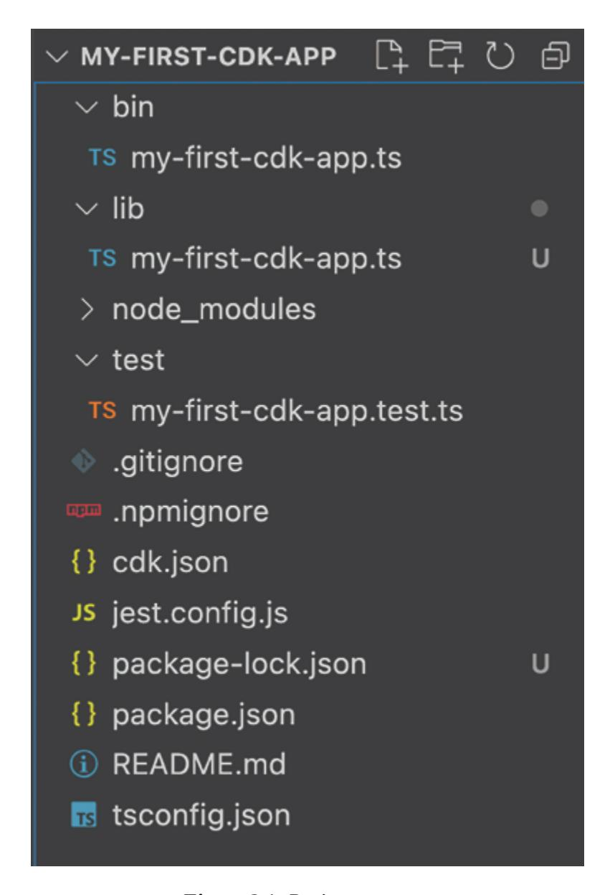

*Figure 2.1: Project structure*

Let us discuss the significance of each file and folder listed above:

- **bin/** : Contains the entry point of the CDK application, where the app is initialized (for example, my-first-cdk-app.ts).
- **cdk.json** : Configuration file for defining how the CDK app should be executed.
- **.git/** : Directory for Git version control, tracking changes to the project.

- **.gitignore** : Specifies files and directories to be excluded from version control.
- **jest.config.js** : Configuration file for setting up Jest, the testing framework used in the project.
- **lib/** : Holds the main stack definitions and constructs for the CDK app (for example, my-first-cdk-app.ts).
- **node\_modules/** : Contains all the npm dependencies required for the project.
- **.npmignore** : Specifies files to be excluded when publishing the project as an npm package.
- **package.json** : Defines project metadata and manages dependencies, scripts, and configurations.
- <span id="page-63-2"></span>**package-lock.json** : Locks the versions of dependencies installed via npm to ensure consistent builds.
- **README.md** : Provides an overview and documentation of the CDK project.
- **test/** : Contains test files (for example, my-first-cdk-app.test.ts) to validate the functionality of the CDK app.
- **tsconfig.json** : Configuration file for TypeScript, defining the compiler options and project structure.

Each of these files and directories plays a crucial role in organizing, configuring, and managing your AWS CDK project, ensuring a smooth development and deployment process.

### <span id="page-63-0"></span>**[Writing](#page-15-5) Your First CDK Stack**

This section guides you through creating and configuring your initial AWS infrastructure using CDK, with insights into understanding stack code and defining essential resources

### <span id="page-63-1"></span>**[Understanding Stack Code](#page-15-6)**

The default stack code in the **lib/my-first-cdk-stack.ts** file will appear as shown here:

```
import * as cdk from 'aws-cdk-lib';
```

```
import { Construct } from 'constructs';
export class MyFirstCdkAppStack extends cdk.Stack {
 constructor(scope: Construct, id: string, props?:
 cdk.StackProps) {
  super(scope, id, props);
 }
}
```

Let us dive into the code to understand the significance of each line:

- **import \* as cdk from 'aws-cdk-lib';**  This line imports the entire AWS CDK library ( **aws-cdk-lib** ) and assigns it to the alias cdk. By using the \* as syntax, the code imports all the exported members (classes, functions, constants, and more) from the **aws-cdklib** module. These members can then be accessed through the **cdk** alias.
- **import { Construct } from 'constructs';**  This line imports the Construct class from the constructs library. The Construct class is a fundamental building block in CDK applications. It represents a cloud component and acts as a container for defining AWS resources. The Construct class is used to define the scope in which resources are created.
- **export class MyFirstCdkAppStack extends cdk.Stack**  This line defines a new class named **MyFirstCdkAppStack** that extends the Stack class from the AWS CDK library.
  - **export** : Makes the **MyFirstCdkAppStack** class available for import in other files or modules.
  - **class TestCdkStack extends cdk.Stack** : The **MyFirstCdkAppStack** class inherits from **cdk.Stack** , which means it takes on the properties and methods of the Stack class. A Stack is a collection of AWS resources that you want to manage as a single unit.
- **constructor(scope: Construct, id: string, props?: cdk.StackProps)** - This line defines the constructor for the **MyFirstCdkAppStack** class.

- **scope: Construct** : The scope parameter represents the parent construct. It defines the context in which this stack is created, typically a CDK app or another construct.
- **id: string** : The id parameter is a unique identifier for this stack. It is used to differentiate between different stacks within the same scope.
- **props?: cdk.StackProps** : The props parameter is optional and can be used to pass additional properties to the stack, such as environment settings, tags, and more. **cdk.StackProps** is an interface that defines these properties.
- **super(scope, id, props);**  This line calls the constructor of the parent Stack class, initializing the **MyFirstCdkAppStack** with the provided parameters.
  - **super(scope, id, props)** : The super keyword calls the constructor of the cdk.Stack class, passing the scope, id, and props parameters to it. This is necessary to ensure that the base class (Stack) is properly initialized with the provided values.

#### <span id="page-65-0"></span>**[Defining Resources in Your Stack](#page-15-7)**

Let us define a simple stack that includes an S3 bucket:

- 1. Open the **lib/my-first-cdk-app-stack.ts** file **.**
- 2. Replace its contents with the following code **:**

```
import * as cdk from 'aws-cdk-lib';
import { Construct } from 'constructs';
import * as s3 from 'aws-cdk-lib/aws-s3';
export class MyFirstCdkAppStack extends cdk.Stack {
 constructor(scope: Construct, id: string, props?:
 cdk.StackProps) {
  super(scope, id, props);
  // Define an S3 bucket
  new s3.Bucket(this, 'MyFirstBucket', {
   versioned: true
  });
 }
```

This code defines a stack that includes a versioned S3 bucket.

### <span id="page-66-0"></span>**[Deploying](#page-15-8) Your CDK Stack**

This section covers the essential steps of synthesizing your stack, deploying it to AWS, and verifying the successful deployment of your infrastructure.

### <span id="page-66-1"></span>**[Synthesizing Your Stack](#page-15-9)**

Before deploying, you need to synthesize your stack. Synthesizing generates a CloudFormation template from your CDK code. If you are using CDK for the first time, you must bootstrap the CDK environment before the synthesis process. We will discuss bootstrapping in the following section.

Bootstrap the environment:

```
cdk bootstrap
```

Synthesize the CDK code:

```
cdk synth
```

The aforementioned command will generate the CloudFormation template.

#### <span id="page-66-2"></span>**[Deploying to AWS](#page-15-10)**

Deploy CDK code using the following command:

```
cdk deploy
```

If this command returns a green check mark in the output, it indicates that the deployment was successful.

### <span id="page-66-3"></span>**[Verifying the Deployment](#page-15-11)**

To verify the deployment:

- 1. Go to the AWS Management Console.
- 2. Navigate to the S3 service.
- 3. Find the S3 bucket named **my-first-cdk-app-stackmyfirstbucket-xxxxxxxx .**

You should see the S3 bucket created by your CDK stack. This verifies that your deployment was successful.

<span id="page-67-4"></span>With these steps, you have successfully set up your development environment, created your first CDK project, written your first CDK stack, and deployed it to AWS. This foundational knowledge will enable you to build more complex infrastructure using AWS CDK in subsequent chapters.

### <span id="page-67-0"></span>**How CDK [Operates](#page-15-12) Under the Hood**

Understanding the underlying mechanisms of AWS CDK will enhance your ability to leverage its full potential for infrastructure automation. This section covers the foundational concepts of CDK constructs and stacks, the lifecycle of a CDK application, the translation from CDK to CloudFormation, and the CDK context.

### <span id="page-67-1"></span>**CDK [Constructs](#page-15-13) and Stacks**

This topic provides an overview of CDK constructs and stack concepts.

- **Constructs** : In AWS CDK, a construct is the basic building block. Constructs are programmable abstractions that encapsulate one or more AWS resources and their configuration. They are reusable, composable, and can be nested to create higher-level abstractions.
- **Stacks** : A stack is a collection of AWS resources that you manage as a single unit. In AWS CDK, stacks are represented by the **cdk.Stack** class. Each stack is associated with a CloudFormation stack and is used to deploy resources defined by constructs.

### <span id="page-67-2"></span>**CDK App [Lifecycle](#page-15-14)**

The lifecycle of a CDK application consists of two main phases: synthesis and deployment.

#### <span id="page-67-3"></span>**[Synthesis Phase](#page-15-15)**

During the synthesis phase, CDK constructs are translated into a CloudFormation template. The **cdk synth** command initiates this process, generating a JSON or YAML file that describes the infrastructure.

#### <span id="page-68-0"></span>**[Deployment Phase](#page-15-16)**

In the deployment phase, the synthesized CloudFormation template is deployed to AWS. The **cdk deploy** command handles this process, creating and managing the necessary AWS resources.

### <span id="page-68-1"></span>**Translating CDK to [CloudFormation](#page-15-17)**

This section explores how CDK constructs maps to CloudFormation resources and how to view the generated CloudFormation templates.

### <span id="page-68-2"></span>**[CDK to CloudFormation Mapping](#page-15-18)**

AWS CDK abstracts CloudFormation through constructs, but ultimately, the CDK application generates CloudFormation templates. Each construct translates to one or more CloudFormation resources, encapsulating resource definitions and configurations.

**Example** : An S3 bucket in CDK translates to an **AWS::S3::Bucket** resource in CloudFormation.

#### <span id="page-68-3"></span>**[Viewing Generated CloudFormation Templates](#page-15-19)**

To view the CloudFormation template generated by CDK:

- Run the **cdk synth** command **:**
  - cdk synth
- The synthesized template is printed to the terminal or saved in the **cdk.out** directory.
- Example output snippet:

```
Resources:
 MyFirstBucket:
  Type: AWS::S3::Bucket
  Properties:
   VersioningConfiguration:
    Status: Enabled
```

Understanding these core aspects of AWS CDK will provide you with a solid foundation to build upon as you delve deeper into the framework. By comprehending how constructs and stacks operate, the lifecycle of CDK

applications, the translation to CloudFormation, and the role of context, you will be well-equipped to create sophisticated and scalable infrastructure solutions.

### <span id="page-69-4"></span><span id="page-69-0"></span>**[Bootstrapping](#page-15-20) Your CDK Project**

Bootstrapping is a crucial step in setting up your AWS CDK environment, as it ensures that all necessary resources are in place before deploying your first CDK stack. This section will cover the purpose of bootstrapping, how to run the bootstrap command, and how to customize bootstrap resources to fit your project needs.

### <span id="page-69-1"></span>**[Bootstrapping](#page-15-21)**

Bootstrapping is the process of creating the initial resources that CDK requires to deploy your stacks. These resources typically include an S3 bucket for storing assets and an IAM role that CDK uses to execute deployments. The purpose of bootstrapping is to ensure that your AWS account is prepared to handle CDK deployments.

#### <span id="page-69-2"></span>**[When and Why to Bootstrap](#page-15-22)**

You need to bootstrap your AWS environment before deploying any CDK stacks if:

- You are deploying to an AWS account for the first time.
- You are using CDK features that require assets, such as Lambda functions or Docker images.
- You want to ensure consistent configurations across multiple accounts or regions.

Bootstrapping is generally a one-time setup per account and region, but it can be rerun if you need to update or customize the bootstrap resources.

### <span id="page-69-3"></span>**Running the Bootstrap [Command](#page-15-23)**

To bootstrap your AWS environment, follow these steps:

Open your terminal **.**

Run the bootstrap command **:**

cdk bootstrap aws://ACCOUNT-NUMBER/REGION

Replace **ACCOUNT-NUMBER** with your AWS account number and **REGION** with the AWS region you are using. If the CDK environment is bootstrapped without specifying a region and account, CDK will use the default account number and region defined in the AWS CLI credentials.

#### <span id="page-70-0"></span>**[Analyzing the Bootstrap Stack](#page-15-24)**

After running the bootstrap command, AWS CDK creates a CloudFormation stack named **CDKToolkit** . This stack includes the necessary resources for CDK deployments:

- **S3 Bucket** : Stores assets such as Lambda deployment packages, Docker images, and other files.
- **IAM Roles** : Grant necessary permissions for deployment actions.

To analyze the bootstrap stack:

- 1. Go to the AWS CloudFormation console **.**
- 2. Find the stack named **CDKToolkit .**
- <span id="page-70-3"></span>3. Inspect the resources created by this stack **,** such as the S3 bucket and IAM roles **.**

### <span id="page-70-1"></span>**[Customizing](#page-15-25) Bootstrap Resources**

While the default bootstrap resources work for most scenarios, you might need to customize them to meet specific requirements.

#### <span id="page-70-2"></span>**[Customizing S3 Bucket and IAM Role](#page-15-26)**

You can customize the S3 bucket and IAM roles used by the bootstrap process by using the **--bootstrap-bucket-name** and **--bootstrap-rolename** options. Refer to the following example:

```
cdk bootstrap --bootstrap-bucket-name my-custom-bucket --
bootstrap-role-name my-custom-role aws://123456789012/us-west-
2
```

This command will create or use the specified S3 bucket and IAM role instead of the default ones.

#### <span id="page-71-0"></span>**[Advanced Bootstrap Configurations](#page-15-27)**

For advanced customizations, you can modify the bootstrap template used by CDK. This allows you to change or add resources according to your needs.

- 1. Generate the default bootstrap template: cdk bootstrap --show-template > bootstrap-template.yaml
- 2. Edit the **bootstrap-template.yaml** file to include your customizations. For example, you might want to add encryption settings to the S3 bucket or attach additional policies to the IAM roles.
- 3. Deploy the customized template using the AWS CloudFormation console or CLI:

```
aws cloudformation deploy --template-file bootstrap-
template.yaml --stack-name CDKToolkit --capabilities
CAPABILITY_NAMED_IAM
```

By customizing the bootstrap resources, you can tailor the CDK environment to your specific security and operational requirements.

Bootstrapping is a vital step in preparing your AWS environment for CDK deployments. It ensures that all necessary resources, such as S3 buckets and IAM roles, are in place and configured correctly. By following the step-bystep guide to run the bootstrap command and analyzing the bootstrap stack, you can understand the resources created and their roles in the deployment process. Additionally, customizing bootstrap resources allows you to align the CDK environment with your organization's security and operational standards, ensuring a robust and tailored setup for your infrastructure automation needs.

### <span id="page-71-2"></span><span id="page-71-1"></span>**[Navigating](#page-15-28) the CDK CLI**

The AWS CDK Command Line Interface (CLI) is a powerful tool for managing your CDK applications. This section provides a detailed

overview of the most common CDK CLI commands, their usage, and how to effectively use them to manage your infrastructure.

### <span id="page-72-0"></span>**Overview of CDK CLI [Commands](#page-15-29)**

This section provides a summary of essential commands used to interact with and manage AWS CDK applications.

#### <span id="page-72-1"></span>**[Common CDK CLI Commands](#page-15-30)**

Refer to some of the most commonly used CDK CLI commands here:

- **cdk init :** Initializes a new CDK project.
- **cdk synth :** Synthesizes the CDK app into a CloudFormation template.
- **cdk deploy :** Deploys the CDK app to your AWS account.
- **cdk destroy :** Destroys the deployed stacks.
- **cdk ls :** Lists all the stacks in your app.
- **cdk diff :** Compares the deployed stack with the current state.
- **cdk context :** Manages context values.

### <span id="page-72-2"></span>**[Synthesizing](#page-15-31) Your App**

The **cdk synth** command generates a CloudFormation template from your CDK app. This template represents the infrastructure defined in your CDK code. Synth command:

cdk synth

#### <span id="page-72-3"></span>**[Analyzing the Synthesized Output](#page-15-32)**

The output of the **cdk synth** command is a JSON or YAML CloudFormation template. You can analyze this template to understand the resources that will be created or modified. Example output:

#### Resources:

MyFirstBucket:

Type: AWS::S3::Bucket

Properties:

VersioningConfiguration:

Status: Enabled

### <span id="page-73-0"></span>**[Deploying](#page-15-33) Stacks**

The **cdk deploy** command deploys your CDK stacks to AWS. This command takes the synthesized CloudFormation template and applies it to your AWS account. Deploy command:

cdk deploy

### <span id="page-73-1"></span>**[Monitoring the Deployment Process](#page-15-34)**

During deployment, the CDK CLI provides real-time feedback on the deployment process, including the status of each resource being created or updated. Example output:

MyFirstCdkAppStack: deploying…

[0%] start: Publishing 1234567890abcdef0123456789abcdef [100%] success: Published 1234567890abcdef0123456789abcdef MyFirstCdkAppStack: creating CloudFormation changeset…

√ MyFirstCdkAppStack

### <span id="page-73-2"></span>**[Destroying](#page-15-35) Stacks**

The **cdk destroy** command deletes the specified stacks from your AWS account, ensuring that all associated resources are cleaned up. Destroy command:

cdk destroy

### <span id="page-73-3"></span>**[Cleaning Up Resources](#page-15-36)**

After running **cdk destroy** , confirm that all resources associated with the stack have been deleted. This command provides feedback on the destruction process. Example output:

Are you sure you want to delete: MyFirstCdkAppStack (y/n)?

### <span id="page-73-4"></span>**[Listing](#page-16-0) and Diffing Stacks**

This section explains the commands used to list and compare differences between the actual code and the deployed infrastructure.

#### <span id="page-74-0"></span>**[Running](#page-16-1) cdk ls**

The **cdk ls** command lists all stacks in your CDK app, helping you quickly identify which stacks are defined.

1. ls command:

cdk ls

2. Example output:

MyFirstCdkAppStack

#### <span id="page-74-1"></span>**[Running](#page-16-2) cdk diff**

The **cdk diff** command compares the deployed stack with the current local state, showing any changes that will be applied during the next deployment.

1. diff command:

cdk diff

2. Example output:

```
Stack MyFirstCdkAppStack
Resources
[~] AWS::S3::Bucket MyFirstBucket MyFirstBucket12345678
 ├── [~] VersioningConfiguration
 │ └── [~] .Status:
 │ ├── "Enabled"
 │ └── "Suspended"
```

This output shows the changes between the deployed and local state.

### <span id="page-74-2"></span>**Working with Context [Variables](#page-16-3)**

Context variables store environment-specific values required during synthesis. Use the **cdk context** command to manage these values.

Setting a context value **:**

```
cdk context --set key value
Getting a context value :
cdk context --get key
Resetting a context value :
cdk context --reset key
Example command:
cdk context --set vpcId vpc-12345678
```

#### <span id="page-75-0"></span>**[Managing and Troubleshooting Context Variables](#page-16-4)**

Context variables are stored in the **cdk.context.json** file. Ensure this file is properly managed to avoid inconsistencies. Example **cdk.context.json** file:

```
{
 "context": {
  "vpcId": "vpc-12345678"
 }
}
```

To troubleshoot context issues, check for missing or incorrect values in this file and use the **cdk context** commands to correct them.

By mastering these CDK CLI commands, you can efficiently manage your AWS infrastructure, from synthesizing and deploying stacks to destroying and diffing them. Understanding how to work with context variables further enhances your ability to customize and troubleshoot your CDK projects.

### <span id="page-75-1"></span>**[Conclusion](#page-16-5)**

In this chapter, we have covered the essential steps and concepts for leveraging AWS CDK in infrastructure automation. We began by discussing the prerequisites, including a solid understanding of basic AWS concepts, Infrastructure as Code (IaC) principles, and programming skills, followed by setting up your development environment with the necessary tools such as AWS CLI, Node.js, and TypeScript.

We then moved on to the practical aspects of creating your first CDK application, guiding you through initializing a CDK project, writing and

deploying your first stack, and understanding key commands like **cdk synth** and **cdk deploy** . This section emphasized the importance of CDK constructs and how they translate into CloudFormation templates, providing a hands-on introduction to CDK's core functionality.

Finally, we explored the deeper workings of CDK, including the lifecycle of a CDK application, the synthesis and deployment phases, and the role of CDK context in managing environment-specific information. We also reviewed the CDK CLI's most commonly used commands, equipping you with the foundational knowledge needed to effectively build and manage AWS infrastructure using CDK. This chapter sets the stage for more advanced topics and deeper exploration of CDK's capabilities.

In the next chapter, we will learn the essential concepts of AWS CDK such as projects, apps, stacks, and constructs, providing a solid understanding of how to structure and manage infrastructure as code effectively.

## **C [HAPTER](#page-16-6) 3**

## **Key [Concepts](#page-16-6) of CDK**

### <span id="page-77-1"></span><span id="page-77-0"></span>**[Introduction](#page-16-7)**

This chapter starts by breaking down how to structure CDK projects into manageable components, helping you maintain an organized and scalable codebase as complexity grows. We will discuss essential CDK components such as stacks, constructs, and resources while exploring best practices for organizing your code. Next, we will dive into key concepts including apps, stacks, and constructs—the core building blocks of CDK. We will learn how constructs form the fundamental units, how stacks organize them, and how apps bring everything together for deployment. Advanced topics such as cross-stack references and multi-stack application management are also covered.

The chapter then focuses on environments and resources, detailing how to configure and deploy infrastructure across multiple AWS environments. We will explore stage-specific setups and strategies for seamless continuous deployment. Additionally, we will address resource management, emphasizing correct creation and ordering to avoid deployment issues. The chapter concludes with advanced techniques for managing identifiers and parameters, covering topics like resource naming, custom naming conventions, and flexible infrastructure definitions. By the end, we will be equipped with foundational knowledge to design, organize, and manage cloud infrastructure confidently using AWS CDK.

### <span id="page-77-2"></span>**[Structure](#page-16-8)**

In this chapter, we will discuss the following topics:

- Breaking Down Projects
  - Structuring Your CDK Project
  - Defining Project Requirements

- Project Best Practices
- Understanding Apps, Stacks, and Constructs
  - Defining CDK Constructs
  - Creating and Using Stacks
  - Working with CDK Apps
- <span id="page-78-2"></span>Exploring Environments in AWS CDK
  - Defining Environments
  - Deploying to Multiple Environments
- Managing Identifiers and Parameters in AWS CDK
  - Working with Resource Identifiers
  - Using CDK Parameters
  - Leveraging Context Variables
- Handling Assets and Feature Flags in AWS CDK
  - Working with Assets in CDK
  - Feature Flags in CDK
  - Best Practices for CDK Asset Management

### <span id="page-78-0"></span>**[Breaking](#page-16-9) Down Projects**

In this section, we will focus on how to structure a CDK project, define its requirements, and adhere to best practices to ensure the project remains scalable, maintainable, and easy to collaborate on. We will explore the nuances of project structure, the translation of infrastructure requirements into CDK constructs, and the implementation of best practices to streamline development and deployment.

### <span id="page-78-1"></span>**[Structuring](#page-16-10) Your CDK Project**

The foundation of any successful AWS CDK project lies in its structure. A well-organized project structure not only makes the codebase easier to navigate but also facilitates collaboration, testing, and maintenance. This section breaks down the essential elements of structuring a CDK project,

starting with the project directory layout and moving on to the common components that make up a typical CDK project.

#### <span id="page-79-0"></span>**[Project Directory Layout](#page-16-11)**

A typical CDK project directory should be organized in a way that reflects the modular nature of infrastructure as code (IaC). Following is a recommended directory layout for a CDK project, along with explanations of each component:

```
my-cdk-project/
|----bin/
| |----my-cdk-stack.ts
|----lib/
| |----my-cdk-stack.ts
| |----networking/
| |----vpc-construct.ts
|----test/
| |----my-cdk-stack.test.ts
|----cdk.json
|----jest.config.js
|----package.json
|----README.md
|----ts.config.json
```

- <span id="page-79-1"></span>**bin/** : This directory contains the entry point for the CDK application. The **my-cdk-stack.ts** file is where the application itself is defined. It is the file that AWS CDK executes to generate the CloudFormation templates. In this file, you instantiate the stacks and pass any required parameters.
- **lib/** : This is where the bulk of your infrastructure code resides. Each AWS resource or group of related resources should be encapsulated in its own construct within this directory. For example, **my-cdk-stack.ts** might define a stack, and within the networking/subdirectory, **vpcconstruct.ts** could define a VPC (Virtual Private Cloud) construct. Organizing resources into separate files and directories promotes reusability and clarity.
- **test/** : Testing is a critical part of any CDK project. The **test/** directory contains unit tests that validate the constructs defined in the

**lib/** directory. These tests ensure that the infrastructure behaves as expected and helps catch errors early in the development process. For instance, **my-cdk-stack.test.ts** might contain tests that validate the presence of a VPC or that specific security groups are configured correctly.

- **cdk.json** : This file contains configuration settings for your CDK project, such as the context and environment variables. It defines how the CDK toolkit should behave and what parameters should be used during the deployment process.
- **jest.config.js** : This is the configuration file for the Jest testing framework. CDK uses Jest by default to run tests, and this file specifies the testing environment, test match patterns, and other settings.
- **package.json** : This file lists the dependencies required by your CDK project and contains scripts for building, testing, and deploying your project. It is essential for managing Node.js packages that your CDK project depends on.
- **README.md** : This is the documentation file where you describe your project, how to set it up, and how to deploy it. It is a good practice to include a clear and concise README to help others understand and contribute to your project.
- **tsconfig.json** : This file contains TypeScript compiler options. This file configures how TypeScript compiles the code, specifying options like the target ECMAScript version and module resolution strategy.

#### <span id="page-80-0"></span>**[Common Project Components](#page-16-12)**

AWS CDK projects typically consist of several key components, each playing a critical role in the overall architecture and deployment process. Understanding these components is essential for effectively managing a CDK project.

**Constructs** : Constructs are the basic building blocks of CDK applications. They encapsulate AWS resources, such as S3 buckets, VPCs, and Lambda functions, in reusable classes. Constructs can be simple, representing a single resource, or complex, representing a complete system of multiple resources. For example, a VPC construct

- might include multiple subnets, route tables, and security groups, all encapsulated within a single class.
- **Stacks** : Stacks represent a collection of AWS resources that CDK deploys together as a single unit. Each stack corresponds to an AWS CloudFormation stack, and CDK uses stacks to manage the lifecycle of related resources. For instance, you might have a networking stack that includes a VPC, subnets, and routing configurations, and a separate application stack that includes EC2 instances, load balancers, and databases.
- **App** : The CDK app is the entry point for defining one or more stacks. It ties together the various stacks and orchestrates their deployment. The app is defined in the **bin/** directory and is responsible for creating instances of the stacks and passing necessary parameters. When you run **cdk deploy** , the app synthesizes the CloudFormation templates for all the stacks and initiates their deployment.
- **Context** : Context in CDK is used to pass environment-specific configurations or values into the app. Context values can be defined in the **cdk.json** file or passed as command-line arguments during deployment. This allows you to customize the behavior of your CDK app based on the environment it's being deployed to (for example, development, staging, and production).
- **Environment Configuration** : CDK allows you to specify the environment (AWS account and region) where the stack will be deployed. This can be done within the app or stack definition. By specifying different environments, you can deploy the same stack configuration to multiple AWS accounts or regions, which is particularly useful for multi-region or multi-account architectures.

### <span id="page-81-0"></span>**Defining Project [Requirements](#page-16-13)**

Defining clear and precise project requirements is a crucial step in any CDK project. This section focuses on how to gather and document infrastructure requirements and then translate those requirements into CDK constructs.

#### <span id="page-81-2"></span><span id="page-81-1"></span>**[Gathering Infrastructure Requirements](#page-16-14)**

Before writing any code, it is important to gather all the necessary infrastructure requirements. This involves understanding the business needs, compliance requirements, and operational considerations that will guide the architecture of your AWS resources.

- **Stakeholder Interviews** : Engage with stakeholders to understand the functional and non-functional requirements. Functional requirements might include the need for a scalable web application, while nonfunctional requirements could involve security, performance, and compliance considerations.
- **Architecture Diagrams** : Create architecture diagrams that visually represent the desired infrastructure. Tools like AWS Architecture Icons can be used to map out the architecture, including all the necessary AWS services and how they interact with each other. For example, a typical architecture diagram might include a VPC, multiple subnets, a load balancer, EC2 instances, and an RDS database.
- **Documentation** : Document the requirements in detail. This documentation should include a list of required AWS services, configurations, and any specific policies or standards that must be adhered to. For instance, the documentation might specify the need for encryption at rest for all storage services or the requirement to deploy resources across multiple availability zones for high availability.

#### <span id="page-82-0"></span>**[Translating Requirements into CDK Constructs](#page-16-15)**

Once the requirements are clearly defined, the next step is to translate them into CDK constructs. This involves mapping each requirement to one or more AWS services and implementing them using CDK.

**VPC Setup** : If the requirements specify that the application should be hosted in a secure, isolated environment, you would start by defining a VPC construct. This might include public and private subnets, route tables, and NAT gateways, all defined within a **VpcConstruct** class in your CDK project.

```
import * as ec2 from 'aws-cdk-lib/aws-ec2';
import { Construct } from 'constructs';
export class VpcConstruct extends Construct {
 public readonly vpc: ec2.Vpc;
```

```
constructor(scope: Construct, id: string) {
  super(scope, id);
  this.vpc = new ec2.Vpc(this, 'MyVpc', {
    maxAzs: 2,
    natGateways: 1,
  });
 }
}
```

**Security Groups** : If security requirements specify that only certain traffic should be allowed, you would define security groups with specific inbound and outbound rules. For instance, you might create a security group that allows inbound HTTP and HTTPS traffic on port 80 and 443 and restricts all other traffic.

```
import * as ec2 from 'aws-cdk-lib/aws-ec2';
import { Construct } from 'constructs';
export class SecurityGroupConstruct extends Construct {
 public readonly securityGroup: ec2.SecurityGroup;
 constructor(scope: Construct, id: string, vpc: ec2.Vpc) {
  super(scope, id);
  this.securityGroup = new ec2.SecurityGroup(this,
   'MySecurityGroup', {
   vpc,
   allowAllOutbound: true,
  });
  this.securityGroup.addIngressRule(ec2.Peer.anyIpv4(),
  ec2.Port.tcp(80), 'Allow HTTP traffic');
  this.securityGroup.addIngressRule(ec2.Peer.anyIpv4(),
  ec2.Port.tcp(443), 'Allow HTTPS traffic');
 }
}
```

**IAM Roles and Policies** : For requirements involving access control, IAM roles and policies would be defined. For instance, if the application needs to interact with an S3 bucket, an IAM role with the necessary permissions would be created and attached to the resources that require it.

```
import * as iam from 'aws-cdk-lib/aws-iam';
import { Construct } from 'constructs';
```

```
export class IamConstruct extends Construct {
 public readonly role: iam.Role;
 constructor(scope: Construct, id: string) {
  super(scope, id);
  this.role = new iam.Role(this, 'MyRole', {
   assumedBy: new iam.ServicePrincipal('ec2.amazonaws.com'),
  });
  this.role.addToPolicy(new iam.PolicyStatement({
   effect: iam.Effect.ALLOW,
   actions: ['s3:GetObject'],
   resources: ['arn:aws:s3:::mybucket/*'],
  }));
 }
}
```

<span id="page-84-0"></span>**Database Configuration** : If the application requires a database, the requirements will guide the selection of the appropriate AWS database service (for example, RDS, DynamoDB). CDK constructs for these services can be defined with specific configurations, such as instance size, storage type, and backup retention policies.

```
import * as rds from 'aws-cdk-lib/aws-rds';
import { Construct } from 'constructs';
import { Vpc } from 'aws-cdk-lib/aws-ec2';
export class DatabaseConstruct extends Construct {
 public readonly database: rds.DatabaseInstance;
 constructor(scope: Construct, id: string, vpc: Vpc) {
  super(scope, id);
  this.database = new rds.DatabaseInstance(this, 'MyDatabase',
  {
   engine: rds.DatabaseInstanceEngine.postgres({
     version: rds.PostgresEngineVersion.VER_13_4,
   }),
   vpc,
   instanceType: ec2.InstanceType.of(ec2.InstanceClass.T3,
   ec2.InstanceSize.MICRO),
   allocatedStorage: 20,
   storageEncrypted: true,
   backupRetention: cdk.Duration.days(7),
```

```
});
 }
}
```

By systematically translating the infrastructure requirements into CDK constructs, you ensure that all necessary resources are created, configured, and managed in a consistent and repeatable manner.

### <span id="page-85-0"></span>**Project Best [Practices](#page-16-16)**

In any software development project, adhering to best practices is crucial for ensuring that the codebase remains maintainable, scalable, and easy to collaborate on. This section outlines best practices for organizing code in CDK projects and effectively using version control.

#### <span id="page-85-1"></span>**[Organizing Code for Maintainability](#page-16-17)**

Organizing your CDK codebase effectively is key to maintaining a clean, scalable, and easily understandable project. Here are some best practices to follow:

- <span id="page-85-2"></span>**Modularization** : Break down your infrastructure into small, reusable constructs. Each construct should encapsulate a single responsibility, such as networking, security, or storage. This modular approach makes the code easier to test, reuse, and maintain. For example, instead of defining all AWS resources in a single stack file, you can create separate construct classes for the VPC, security groups, databases, among others, and compose them in the stack.
- **Naming Conventions** : Use consistent and descriptive naming conventions for constructs, variables, and files. This makes the codebase easier to navigate and understand. For example, instead of naming a file main.ts, name it as *networking-stack.ts* to clearly indicate its purpose.
- **Environment-Specific Configurations** : Use environment variables and context to manage environment-specific configurations. This allows you to deploy the same infrastructure to different environments (for example, development, staging, and production) with minimal changes to the codebase. For example, you might use context to specify different instance types for EC2 instances in different environments.

- **Error Handling** : Implement error handling within your CDK constructs to manage exceptions and provide meaningful error messages. This is particularly important when dealing with dynamic configurations or external dependencies. For instance, if a construct depends on an external resource that may not always be available, handle the potential error gracefully and provide a clear message.
- **Documentation** : Keep your code well-documented. Use comments to explain the purpose of complex constructs, configurations, and decisions. Additionally, maintain up-to-date README files and architecture diagrams to help new team members understand the project quickly.

#### <span id="page-86-0"></span>**[Using Version Control with CDK](#page-16-18)**

Version control is a critical component of any software development project, and CDK projects are no exception. Proper use of version control systems (VCS) like Git helps track changes, manage contributions, and ensure the integrity of the codebase.

- **Branching Strategy** : Adopt a branching strategy that suits your development workflow. Common strategies include Git Flow, GitHub Flow, and trunk-based development. For CDK projects, it is often useful to have separate branches for development, staging, and production environments.
- **Pull Requests and Code Reviews** : Use pull requests to propose changes to the codebase. This allows for peer review, which can catch potential issues before they are merged into the main branch. Code reviews are particularly important in CDK projects to ensure that infrastructure changes are safe, efficient, and adhere to best practices.
- <span id="page-86-1"></span>**Versioning of Infrastructure** : As infrastructure evolves, it is important to version your CDK stacks and constructs. This can be achieved by tagging releases in Git and maintaining a change log. Versioning helps track the history of changes to your infrastructure and allows you to roll back to previous versions if necessary.
- **Automated Testing** : Integrate automated testing into your version control workflow. Use CI/CD pipelines to automatically run tests on new commits and pull requests. For CDK projects, this might include

- running unit tests on constructs, linting TypeScript code, and even deploying to a test environment to validate changes.
- **Infrastructure as Code (IaC) Drift Detection** : Implement drift detection mechanisms to identify and reconcile differences between the infrastructure defined in your CDK project and the actual deployed infrastructure. AWS Config and CloudFormation Drift Detection can be used to monitor and alert on drift, ensuring that the deployed infrastructure remains consistent with the codebase.

### <span id="page-87-0"></span>**[Understanding](#page-16-19) Apps, Stacks, and Constructs**

<span id="page-87-1"></span>In this section, we will delve deep into these core components, explaining how they interact with each other and how to utilize them effectively in your CDK projects. By the end of this section, you will have a thorough understanding of how to define and use constructs, create and manage stacks, and work with CDK apps to deploy complex cloud infrastructures. The following architecture diagram explains the core components of AWS CDK:

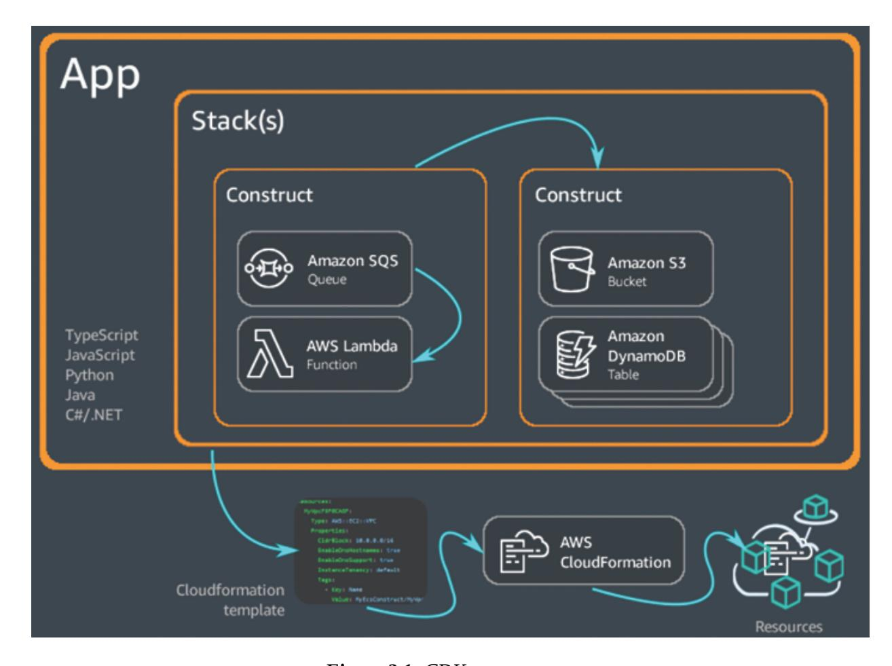

*Figure 3.1: CDK components*

### <span id="page-88-0"></span>**Defining CDK [Constructs](#page-16-20)**

Constructs are the fundamental building blocks of AWS CDK. They encapsulate cloud resources, such as EC2 instances, S3 buckets, or entire VPCs, into reusable and composable components. Constructs enable developers to define cloud infrastructure in a modular and organized manner, promoting reusability, maintainability, and scalability.

#### <span id="page-88-1"></span>**[Basic Constructs: Nodes and Trees](#page-16-21)**

At the core of CDK is the concept of constructs, which are represented as nodes in a construct tree. The tree structure allows constructs to be organized hierarchically, reflecting the relationships and dependencies between different parts of your infrastructure.

**Construct Tree** : The construct tree is a hierarchical structure that represents the relationships between constructs in your CDK application. Each

construct is a node in the tree, and child constructs are nested within their parent constructs. This tree structure is central to how CDK organizes and synthesizes resources.

<span id="page-89-0"></span>For example, consider a simple application with a VPC and a security group. The VPC might be the parent construct, and the security group would be a child construct within it. The construct tree would look something like this:

```
App
|----MyVpcConstruct
| |----MySecurityGroupConstruct
```

The **App** is the root of the construct tree.

In this structure:

The **MyVpcConstruct** is a child of the App and the parent of **MySecurityGroupConstruct** .

**Nodes** : Each construct in the CDK is represented by a node in the construct tree. Nodes are the fundamental units of the construct tree, and they hold references to the resources or configurations they encapsulate. Nodes also contain metadata, such as the construct's path and its ID within the tree.

Nodes in a construct tree can be accessed and manipulated using methods provided by the **constructs.Node** class. For example, you can traverse the construct tree to retrieve specific constructs, inspect their properties, or apply transformations.

```
import * as cdk from 'aws-cdk-lib';
import { Construct } from 'constructs';
import * as ec2 from 'aws-cdk-lib/aws-ec2';
class MyVpcConstruct extends Construct {
  public readonly vpc: ec2.Vpc;
  constructor(scope: Construct, id: string) {
     super(scope, id);
     this.vpc = new ec2.Vpc(this, 'MyVpc', {
      maxAzs: 2
     });
  }
}
class MyApp extends cdk.App {
```

```
constructor() {
     super();
     const vpcConstruct = new MyVpcConstruct(this,
     'VpcConstruct');
     console.log(vpcConstruct.node.path); // Output:
     MyApp/VpcConstruct
  }
}
```

In this example, the **MyVpcConstruct** is a node in the construct tree, and its path can be accessed using the **node.path** property.

#### <span id="page-90-2"></span><span id="page-90-0"></span>**[Understanding AWS CDK Construct Levels](#page-16-22)**

Constructs are reusable cloud components encapsulating configuration details. Constructs are categorized into three levels of abstraction: *Level 1 (L1), Level 2 (L2),* and *Level 3 (L3* **)** . Each level offers a different degree of abstraction and convenience, catering to various developer needs.

#### <span id="page-90-1"></span>**[Level 1 \(L1\) Constructs: CloudFormation Resource Constructs](#page-16-23)**

L1 constructs are low-level constructs that directly represent all resources available in AWS CloudFormation. Each L1 construct corresponds one-toone with a CloudFormation resource, providing access to all configuration options available in CloudFormation. L1 constructs have the following characteristics:

- **Direct Mapping:** Each L1 construct maps directly to a CloudFormation resource, maintaining the same properties and behaviors.
- **Comprehensive Coverage:** Since they mirror CloudFormation, they cover all AWS services and features supported by CloudFormation.
- **Verbatim Property Names:** Property names and structures are identical to those in CloudFormation, often leading to verbose configurations.

```
import * as cdk from 'aws-cdk-lib';
import { CfnBucket } from 'aws-cdk-lib/aws-s3';
class L1BucketStack extends cdk.Stack {
```

```
constructor(scope: cdk.App, id: string, props?:
 cdk.StackProps) {
  super(scope, id, props);
  new CfnBucket(this, 'MyL1Bucket', {
   bucketName: 'my-l1-bucket'
  });
 }
}
```

#### <span id="page-91-0"></span>**[Level 2 \(L2\) Constructs: AWS Service Constructs](#page-16-24)**

L2 constructs provide higher-level abstractions over AWS resources, encapsulating common patterns and best practices. They simplify resource creation by offering sensible defaults and more intuitive interfaces. L2 constructs have the following characteristics:

- **Simplified APIs:** Provide user-friendly APIs that abstract away the complexities of underlying CloudFormation resources.
- <span id="page-91-1"></span>**Best Practices:** Incorporate AWS best practices, such as secure defaults and optimized configurations.
- **Composable:** Designed to be composed together, allowing for more complex architectures.

```
import * as cdk from 'aws-cdk-lib';
import { Bucket, BucketEncryption } from 'aws-cdk-lib/aws-
s3';
class L2BucketStack extends cdk.Stack {
 constructor(scope: cdk.App, id: string, props?:
 cdk.StackProps) {
  super(scope, id, props);
  new Bucket(this, 'MyL2Bucket', {
   bucketName: 'my-l2-bucket',
   versioned: true,
   encryption: BucketEncryption.S3_MANAGED,
   publicReadAccess: false
  });
 }
}
```

#### <span id="page-92-0"></span>**[Level 3 \(L3\) Constructs: Patterns](#page-16-25)**

L3 constructs, also known as patterns, are high-level abstractions that encapsulate multiple AWS resources and configurations to address specific use cases or architectural patterns. They aim to minimize the effort required to implement common scenarios. L3 constructs have the following characteristics:

- **Opinionated Configurations:** Provide out-of-the-box solutions for common patterns, with predefined configurations.
- **Complex Compositions:** Combine multiple L2 constructs to form a cohesive solution.
- **Reduced Configuration Overhead:** Require minimal setup, often needing just essential parameters.

```
import * as cdk from 'aws-cdk-lib';
import { LambdaRestApi } from 'aws-cdk-lib/aws-apigateway';
import { Runtime, Code } from 'aws-cdk-lib/aws-lambda';
import * as path from 'path';
class L3ApiStack extends cdk.Stack {
 constructor(scope: cdk.App, id: string, props?:
 cdk.StackProps) {
  super(scope, id, props);
  const api = new LambdaRestApi(this, 'MyL3Api', {
   handler: new lambda.Function(this, 'MyFunction', {
    runtime: Runtime.NODEJS_14_X,
    handler: 'index.handler',
    code: Code.fromAsset(path.join(__dirname, 'lambda')),
   }),
   proxy: true
  });
 }
}
```

#### <span id="page-92-1"></span>**[Construct Scopes and Boundaries](#page-16-26)**

Understanding scopes and boundaries is crucial for effectively managing constructs and ensuring that resources are organized logically within your CDK application.

- **Scope** : A construct's scope determines its position in the construct tree and influences the behavior of resource creation, naming conventions, and access to shared resources. For example, when you define an S3 bucket construct within a VPC construct, the VPC construct acts as the scope for the S3 bucket. The bucket inherits the configurations and environment from the VPC construct, such as network configurations and security settings.
- **Boundaries** : Boundaries in CDK define the limits within which resources are managed and isolated. Constructs are designed with boundaries in mind to ensure that resources within one construct do not interfere with resources in another. Construct boundaries are established by creating separate classes or modules for different parts of the infrastructure. For instance, you might have separate constructs for networking, security, and compute resources, each with its own boundaries. This approach promotes modularity and helps manage complexity.

```
import * as cdk from 'aws-cdk-lib';
import { Construct } from 'constructs';
import * as s3 from 'aws-cdk-lib/aws-s3';
class StorageConstruct extends Construct {
 public readonly bucket: s3.Bucket;
 constructor(scope: Construct, id: string) {
  super(scope, id);
  this.bucket = new s3.Bucket(this, 'MyBucket', {
   versioned: true,
  });
 }
}
class MyApp extends cdk.App {
 constructor() {
  super();
  const storageConstruct = new StorageConstruct(this,
  'StorageConstruct');
 }
}
```

<span id="page-94-2"></span>In this example, the **StorageConstruct** defines a boundary for the S3 bucket, isolating it from other resources that might be defined elsewhere in the application.

### <span id="page-94-0"></span>**[Creating](#page-16-27) and Using Stacks**

Stacks in AWS CDK represent collections of AWS resources that are deployed together as a single unit. Understanding how to create and manage stacks is key to organizing your infrastructure and controlling its deployment lifecycle.

#### <span id="page-94-1"></span>**[Stack Fundamentals](#page-16-28)**

Stacks are the primary deployment units in AWS CDK. Each stack corresponds to a CloudFormation stack and encapsulates a group of related resources. CDK manages the lifecycle of these resources through the stack, ensuring that they are created, updated, or deleted in a controlled and predictable manner.

**Definition:** A stack is defined by extending the **cdk.Stack** class and adding constructs to it. Each stack can be independently deployed, making it possible to modularize the infrastructure and deploy only the parts that have changed.

```
import * as cdk from 'aws-cdk-lib';
import { Construct } from 'constructs';
import * as s3 from 'aws-cdk-lib/aws-s3';
class MyStack extends cdk.Stack {
  constructor(scope: Construct, id: string, props?:
  cdk.StackProps) {
     super(scope, id, props);
     new s3.Bucket(this, 'MyBucket', {
      versioned: true,
     });
  }
}
class MyApp extends cdk.App {
  constructor() {
     super();
```

```
new MyStack(this, 'MyFirstStack');
  }
}
```

<span id="page-95-1"></span>In this example, **MyStack** defines a stack that contains an S3 bucket. The stack is then instantiated and deployed as part of the **MyApp** .

**Properties** : Stacks can be configured with properties that control their behavior, such as the AWS region, account, and environment. These properties are passed through the **StackProps** interface and can be used to customize the stack's deployment.

**Dependencies:** In complex applications, you may need to define dependencies between stacks to ensure that resources are created in the correct order. CDK allows you to specify stack dependencies using the **addDependency** method.

```
import * as cdk from 'aws-cdk-lib';
class StackA extends cdk.Stack {
  constructor(scope: cdk.App, id: string) {
     super(scope, id);
     // Define resources for StackA
  }
}
class StackB extends cdk.Stack {
  constructor(scope: cdk.App, id: string) {
     super(scope, id);
     // Define resources for StackB
  }
}
const app = new cdk.App();
const stackA = new StackA(app, 'StackA');
const stackB = new StackB(app, 'StackB');
stackB.addDependency(stackA);
```

In this example, **StackB** depends on **StackA** , ensuring that resources in **StackA** are deployed before those in **StackB** .

#### <span id="page-95-0"></span>**[Managing Cross-Stack References](#page-16-29)**

Cross-stack references allow resources from one stack to be used in another stack. This is useful when you need to share resources, such as VPCs, security groups, or IAM roles, across different parts of your infrastructure.

**Exporting and Importing Values** : In CDK, you can export values from one stack and import them into another using the export and **Fn.importValue** methods. This enables you to create loosely coupled stacks that share common resources.

```
import * as cdk from 'aws-cdk-lib';
import { Construct } from 'constructs';
import * as s3 from 'aws-cdk-lib/aws-s3';
import * as ec2 from 'aws-cdk-lib/aws-ec2';
class NetworkingStack extends cdk.Stack {
  public readonly vpc: ec2.Vpc;
  constructor(scope: Construct, id: string, props?:
  cdk.StackProps) {
     super(scope, id, props);
     this.vpc = new ec2.Vpc(this, 'MyVpc', {
      maxAzs: 3
     });
     // Export the VPC ID
     new cdk.CfnOutput(this, 'VpcId', {
      value: this.vpc.vpcId,
      exportName: 'VpcId'
     });
  }
}
class StorageStack extends cdk.Stack {
  constructor(scope: Construct, id: string, props?:
  cdk.StackProps) {
     super(scope, id, props);
     // Import the VPC ID from the NetworkingStack
     const vpcId = cdk.Fn.importValue('VpcId');
     const vpc = ec2.Vpc.fromLookup(this, 'ImportedVpc', {
     vpcId });
     new s3.Bucket(this, 'MyBucket', {
      removalPolicy: cdk.RemovalPolicy.DESTROY,
```

```
});
  }
}
const app = new cdk.App();
const networkingStack = new NetworkingStack(app,
'NetworkingStack');
const storageStack = new StorageStack(app, 'StorageStack');
storageStack.addDependency(networkingStack);
```

In this example, **StorageStack** imports the VPC ID exported by **NetworkingStack** , allowing it to use the same VPC.

### <span id="page-97-0"></span>**[Working](#page-16-30) with CDK Apps**

A CDK app is the entry point for defining and deploying infrastructure. It serves as the container for one or more stacks and orchestrates the deployment process.

#### <span id="page-97-1"></span>**[App Composition and Deployment](#page-16-31)**

In this section, we will understand how to compose and deploy CDK apps that is a key to managing complex infrastructures that span multiple environments and services.

**App Composition** : A CDK app is composed of one or more stacks that define the infrastructure. These stacks can be organized into different files or modules, allowing for a clean and modular codebase. The **cdk.App** class is used to instantiate and configure the app, including setting up environmentspecific properties and initializing stacks.

```
import * as cdk from 'aws-cdk-lib';
import { Construct } from 'constructs';
class MyApp extends cdk.App {
  constructor() {
     super();
     // Initialize multiple stacks
     new StackA(this, 'StackA');
     new StackB(this, 'StackB');
  }
}
```

```
const app = new MyApp();
```

In this example, **MyApp** initializes two stacks, **StackA** and **StackB** , within a single CDK app.

**Deployment Process** : Deploying a CDK app involves synthesizing the CloudFormation templates for each stack and then deploying them to the AWS environment. CDK provides the **cdk deploy** command to handle this process, which automatically detects changes, manages stack updates, and rolls back in case of errors.

### <span id="page-98-0"></span>**[Multi-Stack Apps](#page-16-32)**

As your infrastructure grows, you may need to manage complex applications that span multiple stacks. Handling this complexity requires careful planning and organization to ensure that the infrastructure remains maintainable and scalable.

Organizing multi-stack apps involves grouping related stacks together and defining clear boundaries between them. For example, you might have separate stacks for networking, compute, and storage, each responsible for a specific aspect of the infrastructure.

```
import * as cdk from 'aws-cdk-lib';
import { Construct } from 'constructs';
class NetworkingStack extends cdk.Stack {
  constructor(scope: Construct, id: string, props?:
  cdk.StackProps) {
     super(scope, id, props);
     // Define networking resources
  }
}
class ComputeStack extends cdk.Stack {
  constructor(scope: Construct, id: string, props?:
  cdk.StackProps) {
     super(scope, id, props);
     // Define compute resources
  }
}
class MyApp extends cdk.App {
```

```
constructor() {
     super();
     // Initialize stacks
     const networkingStack = new NetworkingStack(this,
     'NetworkingStack');
     const computeStack = new ComputeStack(this,
     'ComputeStack');
     computeStack.addDependency(networkingStack);
  }
}
```

In this example, **NetworkingStack** and **ComputeStack** are part of a multistack app, with a dependency ensuring that networking resources are created before compute resources.

Understanding apps, stacks, and constructs is fundamental to mastering AWS CDK. Constructs serve as the building blocks of your infrastructure, stacks group related resources, and apps orchestrate the deployment of these stacks. By mastering these concepts, you can effectively design, organize, and deploy complex cloud infrastructures using CDK. This chapter provides the knowledge needed to create modular, maintainable, and scalable CDK projects, enabling you to manage even the most complex cloud environments with confidence.

### <span id="page-99-0"></span>**Exploring [Environments](#page-16-33) in AWS CDK**

The AWS Cloud Development Kit (CDK) allows developers to define cloud infrastructure using familiar programming languages. To manage cloud infrastructure efficiently, it is important to understand how to define environments, deploy to multiple environments, and manage resources within AWS CDK. This section covers these essential concepts and provides practical examples, best practices, and diagrams to illustrate how to use AWS CDK effectively.

### <span id="page-99-1"></span>**Defining [Environments](#page-16-34)**

<span id="page-99-2"></span>AWS environments represent different stages of your application's lifecycle, such as development, staging, and production. Managing environments

effectively ensures that your infrastructure behaves correctly across different stages, enabling you to isolate changes and deploy them confidently.

#### <span id="page-100-0"></span>**[Overview of AWS Environments](#page-16-35)**

AWS environments are separate deployments of your application that run in different AWS accounts or regions. They are often used to distinguish between different stages of the software development lifecycle:

- **Development Environment** : A sandbox environment where developers can test and experiment with new features without affecting production. It is typically isolated to prevent unintended changes from reaching production.
- **Staging Environment** : A pre-production environment that mimics the production environment as closely as possible. It is used for final testing before deployment to production.
- **Production Environment** : The live environment where the application is used by end-users. It should be carefully managed and protected to ensure stability and performance.

In AWS CDK, environments are defined by specifying the AWS account and region where the stack will be deployed. This is typically done using the env property in the stack definition.

```
import * as cdk from 'aws-cdk-lib';
class MyStack extends cdk.Stack {
  constructor(scope: cdk.App, id: string, props?:
  cdk.StackProps) {
     super(scope, id, props);
     // Define resources here
  }
}
const app = new cdk.App();
new MyStack(app, 'MyDevStack', {
  env: { account: '123456789012', region: 'us-west-2' }
});
new MyStack(app, 'MyProdStack', {
  env: { account: '123456789012', region: 'us-east-1' }
```

```
});
```

In this example, two stacks are defined for different environments: **MyDevStack** for the development environment and **MyProdStack** for the production environment. Each stack is deployed to a different AWS region, reflecting the environment's configuration.

#### <span id="page-101-0"></span>**[Configuring Environment Variables in CDK](#page-17-0)**

Environment variables play a critical role in configuring your application's behavior based on the environment it is running in. AWS CDK allows you to set and manage environment variables that can be used within your application or passed to deployed resources, such as AWS Lambda functions.

**Setting Environment Variables** : Environment variables can be configured directly within the CDK application or passed from the system environment. They are typically used to store sensitive information (like API keys) or to adjust settings between environments.

```
import * as cdk from 'aws-cdk-lib';
import * as lambda from 'aws-cdk-lib/aws-lambda';
class MyLambdaStack extends cdk.Stack {
  constructor(scope: cdk.App, id: string, props?:
  cdk.StackProps) {
     super(scope, id, props);
     new lambda.Function(this, 'MyLambdaFunction', {
      runtime: lambda.Runtime.NODEJS_14_X,
      handler: 'index.handler',
      code: lambda.Code.fromAsset('lambda'),
      environment: {
       STAGE: process.env.STAGE || 'dev',
       API_KEY: process.env.API_KEY || 'default-api-key',
      },
     });
  }
}
```

In this example, the *STAGE* and *API\_KEY* environment variables are passed to a Lambda function, allowing the function's behavior to change based on

the deployment environment.

**Managing Environment Variables** : It is recommended to manage environment variables using tools such as AWS Secrets Manager, AWS Systems Manager Parameter Store, or CI/CD pipeline configuration to keep sensitive information secure and organized.

### <span id="page-102-0"></span>**Deploying to Multiple [Environments](#page-17-1)**

Deploying applications to multiple environments is a common practice in cloud development. AWS CDK provides mechanisms to manage stagespecific configurations and automate deployments across environments.

#### <span id="page-102-1"></span>**[Setting Up Stage-Specific Configurations](#page-17-2)**

Stage-specific configurations allow you to tailor your infrastructure settings to different environments. This includes changing resource properties, enabling or disabling certain features, or using different parameter values based on the environment.

```
import * as cdk from 'aws-cdk-lib';
import * as s3 from 'aws-cdk-lib/aws-s3';
class MyStack extends cdk.Stack {
  constructor(scope: cdk.App, id: string, props?:
  cdk.StackProps) {
     super(scope, id, props);
     new s3.Bucket(this, 'MyBucket', {
      versioned: process.env.STAGE === 'prod', // Enable
      versioning only in production
      removalPolicy: process.env.STAGE === 'prod' ?
      cdk.RemovalPolicy.RETAIN : cdk.RemovalPolicy.DESTROY,
     });
  }
}
const app = new cdk.App();
new MyStack(app, 'DevStack', {
  env: { account: '123456789012', region: 'us-west-2' },
});
```

```
new MyStack(app, 'ProdStack', {
  env: { account: '123456789012', region: 'us-east-1' },
});
```

In this example, versioning is enabled for the S3 bucket only in the production environment, and the removal policy is set to retain the bucket on deletion in production but destroy it in development.

**Using Context Variables** : CDK also supports context variables, which can be used to manage environment-specific configurations in a more structured way. Context variables can be passed via the **cdk.json** file or directly from the command line.

```
// cdk.json
{
 "context": {
  "stage": "prod",
  "bucketName": "my-production-bucket"
 }
}
import * as cdk from 'aws-cdk-lib';
import * as s3 from 'aws-cdk-lib/aws-s3';
class MyStack extends cdk.Stack {
  constructor(scope: cdk.App, id: string, props?:
  cdk.StackProps) {
     super(scope, id, props);
     const stage = this.node.tryGetContext('stage');
     const bucketName = this.node.tryGetContext('bucketName');
     new s3.Bucket(this, 'MyBucket', {
      bucketName: bucketName,
      versioned: stage === 'prod',
     });
  }
}
```

In this example, context variables are used to configure the bucket's name and versioning based on the deployment stage.

Managing environments and resources effectively is key to successfully deploying and operating cloud infrastructure using AWS CDK. By understanding how to define environments, deploy to multiple environments,

manage resources, and handle resource dependencies, developers can build scalable, maintainable, and secure cloud applications.

### <span id="page-104-0"></span>**Managing Identifiers and [Parameters](#page-17-3) in AWS CDK**

Managing identifiers and parameters is a crucial aspect of AWS Cloud Development Kit (CDK) projects. These elements help ensure that resources are named correctly, configured appropriately for different environments, and controlled with parameters to allow flexibility. This section explores how to manage resource identifiers, use parameters effectively, and leverage context variables in AWS CDK.

### <span id="page-104-1"></span>**Working with Resource [Identifiers](#page-17-4)**

Resource identifiers are fundamental in AWS CDK as they determine how resources are named and referenced within your cloud infrastructure. Understanding how to work with these identifiers is essential for maintaining clarity, consistency, and avoiding potential conflicts.

#### <span id="page-104-2"></span>**[Automatic Naming and Logical IDs](#page-17-5)**

In AWS CDK, resources are automatically assigned unique identifiers known as Logical IDs. These IDs are used internally by CloudFormation to manage resources. By default, AWS CDK generates these Logical IDs based on the resource's construct path within the stack.

```
import * as cdk from 'aws-cdk-lib';
import * as s3 from 'aws-cdk-lib/aws-s3';
class MyStack extends cdk.Stack {
  constructor(scope: cdk.App, id: string, props?:
  cdk.StackProps) {
     super(scope, id, props);
     // Define an S3 bucket
     new s3.Bucket(this, 'MyBucket', {
      versioned: true,
     });
  }
```

In this example, the **MyBucket** resource is assigned a Logical ID based on its path within the stack. If you inspect the synthesized CloudFormation template, you will see a Logical ID similar to **MyBucketD3F2F16F** , where **D3F2F16F** is a hash based on the construct path.

**Automatic Naming** : CDK also assigns physical names to resources, such as the name of an S3 bucket or a DynamoDB table. These names can be automatically generated or explicitly defined by the developer. When left to default, CDK appends a unique suffix to ensure there are no naming conflicts across different environments.

```
new s3.Bucket(this, 'MyBucket', {
  bucketName: 'my-bucket-' + this.account,
  versioned: true,
});
```

In this example, the S3 bucket's name includes the account ID to ensure uniqueness, which is especially useful when deploying the same stack to multiple environments.

#### <span id="page-105-0"></span>**[Custom Naming Conventions](#page-17-6)**

While AWS CDK can automatically generate names for resources, you may want to apply custom naming conventions to ensure consistency and readability across your infrastructure. Custom names can be particularly important in environments with strict naming policies or where resource names need to convey specific information.

```
import * as dynamodb from 'aws-cdk-lib/aws-dynamodb';
new dynamodb.Table(this, 'MyTable', {
  tableName: 'MyApp-UserTable',
  partitionKey: { name: 'UserID', type:
  dynamodb.AttributeType.STRING },
});
```

<span id="page-105-1"></span>In this example, the DynamoDB table is given a custom name **MyApp-UserTable** , which follows a convention that might include the application name and the resource type.

#### **Considerations for Custom Naming:**

- **Uniqueness** : Ensure that custom names are unique within the AWS account and region to avoid deployment failures.
- **Length Limits** : Be aware of the length limits for resource names, as AWS imposes constraints depending on the resource type.
- **Environment Indicators** : Include environment indicators (for example, -dev, -prod) in the name to differentiate resources across environments.

**Handling Conflicts with Custom Naming** : When using custom names, there is a risk of conflicts, especially when deploying to multiple environments. To mitigate this, you can use context variables or environment-specific suffixes to adjust names dynamically based on the deployment environment.

### <span id="page-106-0"></span>**Using CDK [Parameters](#page-17-7)**

Parameters in AWS CDK are a powerful tool for injecting configuration values into your stacks at deployment time. They allow you to customize stack behavior without modifying the code, making your infrastructure more flexible and reusable.

#### <span id="page-106-1"></span>**[Defining and Passing Parameters](#page-17-8)**

Parameters in CDK are similar to CloudFormation parameters and are used to pass values to your stack during deployment. These parameters can be defined in your CDK code and then passed via the AWS Management Console, AWS CLI, or programmatically.

```
import * as cdk from 'aws-cdk-lib';
import * as ec2 from 'aws-cdk-lib/aws-ec2';
class MyStack extends cdk.Stack {
  constructor(scope: cdk.App, id: string, props?:
  cdk.StackProps) {
     super(scope, id, props);
     // Define a parameter for the VPC CIDR
     const vpcCidr = new cdk.CfnParameter(this, 'VpcCidr', {
      type: 'String',
      default: '10.0.0.0/16',
      description: 'The CIDR block for the VPC',
```

```
});
     // Use the parameter value in a VPC
     new ec2.Vpc(this, 'MyVpc', {
      cidr: vpcCidr.valueAsString,
     });
  }
}
```

<span id="page-107-1"></span>In this example, the **VpcCidr** parameter is defined and used to configure the CIDR block of a VPC. During deployment, you can override the default value by passing a different CIDR block.

**Passing Parameters:** Parameters can be passed via the AWS CLI using the following command as well as through AWS management console when launching the stack using synthesized template generated by CDK.

```
cdk deploy --parameters VpcCidr=192.168.0.0/16
```

#### <span id="page-107-0"></span>**[Best Practices for Parameter Management](#page-17-9)**

Effective parameter management is essential for maintaining a flexible and secure CDK project. Here are some best practices:

- **Use Parameters for Environment-Specific Configurations** : Parameters are ideal for setting values that vary across environments, such as VPC CIDRs, instance types, or S3 bucket names.
- **Limit the Number of Parameters** : Overuse of parameters can make your stack difficult to manage and deploy. Use context variables or default values to reduce the number of parameters needed.
- **Secure Sensitive Data** : For sensitive data such as API keys or passwords, consider using AWS Secrets Manager or SSM Parameter Store instead of passing them directly as parameters. You can reference these values securely within your CDK code.
- **Document Parameter Usage** : Clearly document each parameter's purpose and expected values to make the stack easier to use and maintain.

```
import * as secretsmanager from 'aws-cdk-lib/aws-
secretsmanager';
const dbPassword =
secretsmanager.Secret.fromSecretNameV2(this, 'DBPassword',
```

```
'my-db-password');
new rds.DatabaseInstance(this, 'MyDatabase', {
 engine: rds.DatabaseInstanceEngine.POSTGRES,
 credentials: rds.Credentials.fromSecret(dbPassword),
 vpc,
});
```

In this example, the database password is securely retrieved from AWS Secrets Manager, ensuring that sensitive data is not exposed.

### <span id="page-108-0"></span>**[Leveraging](#page-17-10) Context Variables**

Context variables in AWS CDK allow you to manage environment-specific configurations dynamically. Unlike parameters, which are provided at deployment time, context variables are evaluated at synthesis time, making them useful for setting values based on the environment where the stack is deployed.

#### <span id="page-108-1"></span>**[Using Context to Influence Deployments](#page-17-11)**

Context variables can be defined in the **cdk.json** file, passed via the command line, or set programmatically within your CDK code. They provide a flexible way to adjust stack behavior based on the environment or other factors.

**Defining Context Variables:** Context variables can be defined in the **cdk.json** file, which is located in the root of your CDK project.

```
{
 "context": {
  "env": "prod",
  "instanceType": "t3.micro"
 }
}
```

**Using Context Variables in CDK:** We can use context variables to influence the resource creation. We will use the aforementioned context variables **env** and **instanceType** in the following example:

```
import * as cdk from 'aws-cdk-lib';
import * as ec2 from 'aws-cdk-lib/aws-ec2';
```

```
class MyStack extends cdk.Stack {
  constructor(scope: cdk.App, id: string, props?:
  cdk.StackProps) {
     super(scope, id, props);
     const instanceType =
     this.node.tryGetContext('instanceType') || 't2.micro';
     new ec2.Instance(this, 'MyInstance', {
      instanceType: new ec2.InstanceType(instanceType),
      machineImage: new ec2.AmazonLinuxImage(),
      vpc,
     });
  }
}
const app = new cdk.App();
app.node.setContext('env', 'prod');
new MyStack(app, 'MyStack');
```

#### <span id="page-109-0"></span>**[Managing Context Across Environments](#page-17-12)**

When deploying to multiple environments, managing context variables effectively is crucial to ensure that each environment is configured correctly. AWS CDK provides several methods to manage context variables across environments:

- **Environment-Specific Context Files** : You can create environmentspecific context files (for example, **cdk.dev.json** , **cdk.prod.json** ) and load them based on the target environment.
- <span id="page-109-1"></span>**Command-Line Overrides** : Use command-line options to override context variables for specific deployments:

```
cdk deploy --context env=prod --context
instanceType=t3.large
```

**Programmatic Context Management** : Context variables can be set programmatically within your CDK app:

```
app.node.setContext('env', 'prod');
```

#### **Example of Environment-Specific Context Management:**

In this example, the stack selection is based on the env context variable, allowing for different stacks to be deployed depending on the environment.

```
const environment = app.node.tryGetContext('env');
if (environment === 'prod') {
  new MyProductionStack(app, 'ProdStack');
} else {
  new MyDevelopmentStack(app, 'DevStack');
}
```

#### <span id="page-110-0"></span>**[Best Practices for Context Management](#page-17-13)**

Following are key best practices for effective context management:

- **Consistent Naming** : Use consistent naming conventions for context variables to avoid confusion.
- **Version Control** : Include context files in version control to maintain a record of environment-specific configurations.
- **Environment Isolation** : Isolate context variables for different environments to prevent accidental cross-environment contamination.

Managing identifiers, parameters, and context variables in AWS CDK is essential for building flexible, maintainable, and scalable cloud infrastructure. By understanding how to work with resource identifiers, effectively use parameters, and leverage context variables, you can create CDK projects that adapt to different environments, follow best practices, and meet the needs of your organization. The examples provided in this chapter illustrate practical applications of these concepts, enabling you to apply them in your own CDK projects.

### <span id="page-110-1"></span>**[Handling](#page-17-14) Assets and Feature Flags in AWS CDK**

<span id="page-110-2"></span>AWS Cloud Development Kit (CDK) provides powerful tools for managing assets and feature flags, which are essential for deploying and maintaining scalable, secure, and flexible infrastructure. Assets in CDK refer to external files, such as Lambda function code, Docker images, or static website content, that need to be included in your deployment. Feature flags, on the other hand, allow you to enable or disable specific features or configurations in your infrastructure, providing a way to manage changes dynamically. In

this section, we will dive deep into managing assets, understanding and utilizing feature flags, and best practices to ensure secure and efficient asset management in your AWS CDK projects.

### <span id="page-111-0"></span>**[Working](#page-17-15) with Assets in CDK**

Assets in AWS CDK represent the files or directories that need to be included in the cloud environment. This could include anything from Lambda function code to Docker images or even static files for a website hosted on S3.

#### <span id="page-111-1"></span>**[Managing Asset Bundles and Files](#page-17-16)**

When working with AWS CDK, managing assets effectively is crucial for ensuring that your application and infrastructure deploy smoothly. CDK provides several ways to handle asset bundling, packaging, and deployment.

**Bundling Assets:** In AWS CDK, assets can be bundled before deployment to ensure they meet the necessary requirements, such as being in a specific format or compressed to save space. For example, if you are deploying a Lambda function written in TypeScript, you would need to compile the TypeScript files to JavaScript and bundle them with the necessary dependencies.

```
import * as lambda from 'aws-cdk-lib/aws-lambda';
import * as path from 'path';
const myFunction = new lambda.Function(this, 'MyFunction', {
  runtime: lambda.Runtime.NODEJS_14_X,
  handler: 'index.handler',
  code: lambda.Code.fromAsset(path.join(__dirname, 'lambda-
  fn'), {
     bundling: {
      image: lambda.Runtime.NODEJS_14_X.bundlingImage,
      command: [
        'bash', '-c', 'npm install && npm run build'
      ],
     },
  }),
});
```

In the aforementioned example, a Lambda function is created with a bundling option that enables transpiling and packaging of the code prior to deployment. The bundling process includes executing **npm install** and **npm run build** , ensuring that the Lambda function is fully prepared for execution.

<span id="page-112-1"></span>**Managing Large Files:** When dealing with sizable assets like media files or Docker images, the CDK efficiently handles them by uploading the files to S3 or ECR (Elastic Container Registry). During deployment, CDK automatically provisions a unique S3 bucket or ECR repository to securely store and manage these assets.

```
import * as ecs from 'aws-cdk-lib/aws-ecs';
import * as path from 'path';
const myTaskDefinition = new ecs.FargateTaskDefinition(this,
'TaskDef');
const container = myTaskDefinition.addContainer('MyContainer',
{
  image: ecs.ContainerImage.fromAsset(path.join(__dirname,
  'docker')),
  memoryLimitMiB: 512, // Optional: Define memory limit
  cpu: 256, // Optional: Define CPU units
});
```

In the aforementioned example, a Docker image is built from a local directory and utilized in an ECS Fargate task. The CDK streamlines the workflow by automatically building the image, pushing it to ECR, and incorporating it into the ECS task definition.

#### <span id="page-112-0"></span>**[Asset Deployment and Access in AWS](#page-17-17)**

After assets are bundled and packaged, the next step is to deploy and integrate them within AWS. The CDK streamlines this process by automating asset deployment and offering easy access and referencing within your infrastructure.

**Asset Deployment:** During stack deployment, assets are uploaded to an S3 bucket or ECR repository. The CDK assigns unique identifiers to each asset, preventing conflicts and ensuring that your infrastructure consistently points to the correct asset version.

```
import * as s3 from 'aws-cdk-lib/aws-s3';
import * as s3deploy from 'aws-cdk-lib/aws-s3-deployment';
const bucket = new s3.Bucket(this, 'MyBucket');
new s3deploy.BucketDeployment(this, 'DeployWebsite', {
  sources: [s3deploy.Source.asset('./website')],
  destinationBucket: bucket,
});
```

In the aforementioned example, a static website is deployed to an S3 bucket using the **s3deploy.BucketDeployment** construct, which uploads the contents of the **./website** directory. The CDK automatically manages the bucket creation, asset uploads, and the required permissions for accessing these files.

**Accessing Deployed Assets:** After deployment, assets can be accessed through the appropriate AWS services. For instance, a Lambda function created with CDK can retrieve files from an S3 bucket, or an ECS service can utilize a Docker image stored in ECR.

```
import * as s3 from 'aws-cdk-lib/aws-s3';
import * as lambda from 'aws-cdk-lib/aws-lambda';
const bucket = new s3.Bucket(this, 'MyBucket');
const myFunction = new lambda.Function(this, 'MyFunction', {
  runtime: lambda.Runtime.NODEJS_14_X,
  handler: 'index.handler',
  code: lambda.Code.fromBucket(bucket, 'path/to/code.zip'),
});
```

In this setup, a Lambda function is set up to utilize code stored within an S3 bucket. By using the **code.fromBucket** method, you can define the specific bucket and key where the Lambda function's code is stored, simplifying the process of managing and deploying code resources.

### <span id="page-113-0"></span>**[Feature](#page-17-18) Flags in CDK**

Feature flags provide a dynamic way to control how your application or infrastructure behaves. In AWS CDK, they allow you to switch specific features or configurations on or off without needing to redeploy the entire stack, offering a more adaptable and controlled deployment process.

#### <span id="page-114-0"></span>**[Understanding Feature Flags](#page-17-19)**

Feature flags enable the conditional activation or deactivation of features within your application or infrastructure. These flags can be turned on or off depending on certain factors, such as the environment (for example, development or production) or specific deployment needs.

```
const enableNewFeature =
this.node.tryGetContext('enableNewFeature');
if (enableNewFeature === true) { // Comparing to boolean true
directly
  new SomeNewFeatureConstruct(this, 'NewFeature');
} else {
  this.node.addWarning('New Feature is disabled'); // CDK
  warning method
}
```

In this scenario, the feature flag **enableNewFeature** is utilized to decide if a new feature should be deployed. During runtime, the context variable is evaluated, and depending on its value, the new feature is either implemented or omitted.

#### <span id="page-114-1"></span>**[Managing Feature Flags in CDK Projects](#page-17-20)**

<span id="page-114-2"></span>Effectively managing feature flags in CDK requires defining, configuring, and utilizing them throughout your project. You can control feature flags using context variables, configuration files, or environment variables, allowing for seamless toggling of features across various environments.

**Defining and Implementing Feature Flags:** Feature flags can be established in the **cdk.json** file or provided as context variables during deployment.

```
{
 "context": {
  "enableNewFeature": "true"
 }
}
```

**Using the CLI to Pass Feature Flags** : Feature flags can be supplied through the CLI during deployment, offering a convenient method to toggle features on or off without altering the codebase.

```
cdk deploy --context enableNewFeature=true
```

**Implementing Feature Flags in Code:** Feature flags are commonly utilized in the code to selectively enable or disable particular resources or configurations.

```
const enableMonitoring =
this.node.tryGetContext('enableMonitoring');
// Convert the string to a boolean
if (enableMonitoring === 'true') {
  new MonitoringStack(this, 'MonitoringStack');
}
```

In the aforementioned example, the monitoring stack will be deployed only if the **enableMonitoring** flag is set to true.

### <span id="page-115-0"></span>**Best Practices for CDK Asset [Management](#page-17-21)**

Effective asset management is essential for maintaining secure, scalable, and efficient infrastructure. This section covers best practices for handling assets in AWS CDK, highlighting security considerations and strategies to optimize asset deployments.

#### <span id="page-115-1"></span>**[Security Aspects of Asset Management](#page-17-22)**

Security is a critical factor in managing assets within AWS CDK. It is vital to ensure that assets are securely stored, accessed solely by authorized users, and managed in line with best practices to maintain a secure infrastructure.

**Secure Storage of Assets:** When deploying assets, they should be kept in secure environments such as encrypted S3 buckets or private ECR repositories. AWS CDK offers built-in features to encrypt assets and handle access controls effectively.

```
import * as s3 from 'aws-cdk-lib/aws-s3';
const bucket = new s3.Bucket(this, 'MySecureBucket', {
  encryption: s3.BucketEncryption.S3_MANAGED,
  blockPublicAccess: s3.BlockPublicAccess.BLOCK_ALL,
});
```

In the aforementioned example, an S3 bucket is configured with S3 managed encryption and public access restrictions to secure asset storage.

**Managing Access Permissions:** It is important to restrict access to the deployed assets to authorized users or resources only. AWS CDK enables you to implement detailed access controls through IAM policies, ensuring secure access to your assets.

```
import * as iam from 'aws-cdk-lib/aws-iam';
// Create an IAM Role for Lambda execution
const role = new iam.Role(this, 'LambdaExecutionRole', {
  assumedBy: new iam.ServicePrincipal('lambda.amazonaws.com'),
  managedPolicies: [
     iam.ManagedPolicy.fromAwsManagedPolicyName('service-
     role/AWSLambdaBasicExecutionRole')
  ]
});
// Grant the Lambda role read access to the S3 bucket
bucket.grantRead(role);
```

In the aforementioned example, a Lambda execution role is provided with read permissions for the S3 bucket. This setup guarantees that only the Lambda function associated with this role can access the assets within the bucket.

#### <span id="page-116-0"></span>**[Enhancing Asset Deployments](#page-17-23)**

Optimizing asset deployments is essential for cutting costs, boosting performance, and ensuring scalable infrastructure. CDK offers various strategies for refining asset deployments.

**Selecting Optimal Storage Solutions:** Utilize the most suitable storage options for your assets. For instance, use S3 for static files and ECR for Docker images, ensuring each asset is stored in the most effective and economical service.

```
import * as ecr from 'aws-cdk-lib/aws-ecr';
// Create an ECR repository with a lifecycle policy
const repository = new ecr.Repository(this, 'MyRepository', {
  lifecycleRules: [{ maxImageCount: 10 }]
});
```

In the aforementioned example, an ECR repository is set up with a lifecycle rule that keeps only the most recent 10 images, thereby optimizing storage

use and managing costs effectively.

**Automating Asset Deployment:** Automate the asset deployment process to maintain consistency and minimize the risk of errors. CDK enables full automation of the workflow, from bundling assets to deployment, ensuring assets are deployed accurately and efficiently.

```
import * as cdk from 'aws-cdk-lib';
import * as codepipeline from 'aws-cdk-lib/aws-codepipeline';
import * as codepipeline_actions from 'aws-cdk-lib/aws-
codepipeline-actions';
import * as codebuild from 'aws-cdk-lib/aws-codebuild'; //
Import CodeBuild if you're using it
// Define an output artifact for the source stage
const sourceOutput = new codepipeline.Artifact();
// Define a CodeBuild project (you need to create this before
using it)
const buildProject = new codebuild.Project(this,
'BuildProject', {
 // CodeBuild project properties here
});
const pipeline = new codepipeline.Pipeline(this, 'Pipeline', {
  stages: [
     {
      stageName: 'Source',
      actions: [
       new codepipeline_actions.GitHubSourceAction({
         actionName: 'GitHub_Source',
         owner: 'my-owner',
         repo: 'my-repo',
         branch: 'main',
         oauthToken: cdk.SecretValue.secretsManager('github-
         token'),
         output: sourceOutput,
       }),
      ],
     },
     {
```

```
stageName: 'Build',
      actions: [
        new codepipeline_actions.CodeBuildAction({
         actionName: 'Build',
         project: buildProject,
         input: sourceOutput,
        }),
      ],
     },
  ],
});
```

<span id="page-118-1"></span>In the aforementioned example, a CodePipeline is configured to automate the deployment of assets directly from a GitHub repository, ensuring consistent and reliable deployment.

Managing assets and feature flags in AWS CDK is essential for effective cloud infrastructure management. By mastering asset bundling, deployment, and management, and utilizing feature flags to control deployment behavior, you can build scalable, secure, and adaptable infrastructure. The best practices discussed in this chapter offer a strong foundation for handling assets and feature flags in your CDK projects, helping ensure that your deployments remain efficient, secure, and responsive to evolving needs.

### <span id="page-118-0"></span>**[Conclusion](#page-17-24)**

In this chapter, we explored the foundational concepts of AWS CDK, focusing on how to effectively structure CDK projects and manage infrastructure as code. We began by discussing strategies for organizing project directories, defining requirements, and translating them into CDK constructs. These principles set the stage for creating maintainable and scalable infrastructure code. We also examined the key elements of CDK applications—constructs, stacks, and apps—emphasizing their role in modular and hierarchical infrastructure design. Understanding these concepts is crucial for building scalable, reusable, and well-organized infrastructure.

We also covered the management of AWS environments and resources, including deploying to multiple environments with stage-specific configurations and continuous deployment. Additionally, we discussed best

practices for handling identifiers, parameters, and assets within CDK projects, focusing on naming conventions, parameter management, and asset handling. These practices ensure robust and secure deployments across various scenarios. Overall, this chapter provides a solid foundation for effective CDK usage and prepares you for more advanced infrastructure management techniques.

In the next chapter, you will focus on building complex multi-stack projects with AWS CDK, covering network setup, cross-stack resource management, and deploying frontend and backend infrastructure.

## **C [HAPTER](#page-17-25) 4**

## <span id="page-120-0"></span>**Building a [Multi-Stack](#page-17-25) CDK Project**

### <span id="page-120-1"></span>**[Introduction](#page-17-26)**

As your AWS infrastructure grows in complexity, organizing your resources to scale in size and manageability becomes crucial. This chapter explores creating a multi-stack project using the AWS Cloud Development Kit (CDK). Multi-stack projects allow you to decouple components of your architecture, making it easier to manage, deploy, and scale distinct infrastructure layers while adhering to best practices such as separation of concerns and modularization. By logically grouping resources—such as networks, compute, and storage—you gain the flexibility to update and deploy them independently, avoiding the pitfalls of monolithic infrastructure. We will begin by laying the groundwork for a robust and secure network using foundational elements like Virtual Private Clouds (VPCs), subnets, and route tables. We will learn to design and implement a networking stack that serves as the backbone for other infrastructure components. From there, we will delve into effectively referencing resources across stacks, a critical skill when working with dependent resources in a multi-stack setup. Additionally, we will explore setting up frontend infrastructure, provisioning compute resources, configuring autoscaling, load balancing, and deployment strategies, all while maintaining decoupled yet interconnected stacks.

The chapter also covers backend infrastructure, focusing on designing scalable and resilient architectures that incorporate APIs, databases, and caching solutions. By understanding the nuances of choosing between DynamoDB and RDS for data storage and implementing caching layers using services such as Redis or ElastiCache, we will be equipped to architect, deploy, and manage a multi-stack CDK project that aligns with best practices for infrastructure automation. By the end of this chapter, we will be empowered to confidently scale our infrastructure, whether building a small-scale application or a complex distributed system.

### <span id="page-121-0"></span>**[Structure](#page-17-27)**

In this chapter, we will discuss the following topics:

- Establishing a Foundation Network
  - Designing a Virtual Private Cloud (VPC)
  - Managing Network Security with Security Groups and NACLs
  - Configuring Route Tables
- Referencing Resources Across Stacks
  - Understanding CDK's Cross-Stack References
  - Using AWS SSM Parameter Store for Cross-Stack Communication
- Setting Up Frontend Infrastructure
  - Creating S3 Buckets for Static Content
  - Setting Up CloudFront for Content Distribution
  - Configuring Route 53 for DNS Management
- Configuring Application layer
  - Deploying APIs with Amazon API Gateway
  - Deciding Between EC2 and Lambda
  - Setting Up EC2 Instances with Auto Scaling and Load Balancers
  - Architecting Serverless Solutions with Lambda
  - Comparing Costs and Performance: EC2 versus Lambda
- Architecting Backend Infrastructure
  - Choosing Between RDS and DynamoDB
  - Managing Relational Databases with Amazon RDS
  - Implementing NoSQL Databases with DynamoDB
  - Caching with Amazon ElastiCache
- Best Practices for Multi-Stack CDK Projects
  - Managing Configurations and Environment Variables
  - Applying Infrastructure as Code (IaC) Patterns

- Handling State and Outputs Between Stacks
- <span id="page-122-3"></span>Implementing a Deployment Strategy

### <span id="page-122-0"></span>**[Establishing](#page-17-28) a Foundation Network**

When designing an AWS infrastructure for a production environment, establishing a robust and scalable foundation is critical. The network layer is the cornerstone of your architecture, influencing performance, security, and the ability to scale. This section covers designing a Virtual Private Cloud (VPC) using AWS CDK, ensuring secure and efficient communication within your infrastructure. We will explore CIDR block planning, subnet architecture, security management with Security Groups and Network ACLs (NACLs), and configuring routing strategies, all while adhering to AWS best practices. The following diagram illustrates the basic network architecture for a 3-tier system:

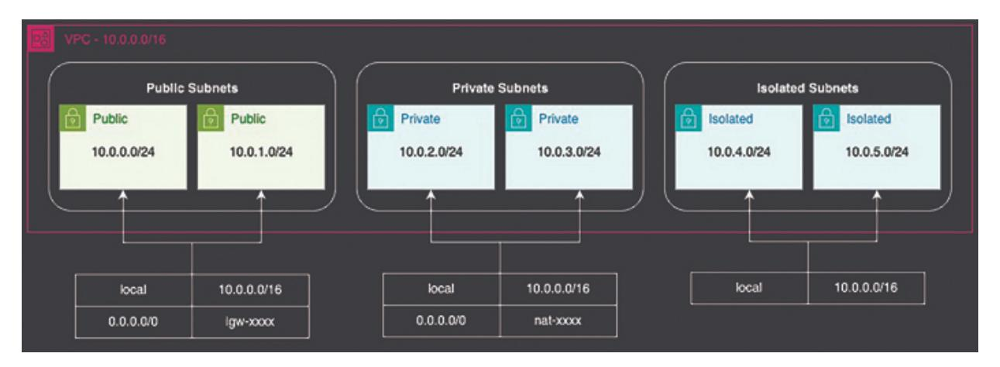

*Figure 4.1: Network architecture*

### <span id="page-122-1"></span>**[Designing](#page-17-29) a Virtual Private Cloud (VPC)**

The VPC is the foundation of your network infrastructure on AWS, providing an isolated network where you can launch resources. Designing a well-structured VPC is the first step toward a reliable and scalable architecture.

### <span id="page-122-2"></span>**[CIDR Block Planning](#page-17-30)**

CIDR (Classless Inter-Domain Routing) block planning is the process of determining the IP address range for your VPC. A VPC's CIDR block

determines the range of IP addresses available for subnets, instances, and other resources. AWS recommends using private IP ranges, such as:

- **10.0.0.0/8** (16,777,216 IPs)
- **172.16.0.0/12** (1,048,576 IPs)
- **192.168.0.0/16** (65,536 IPs)

When planning your CIDR block, consider the following best practices:

- **Plan for Future Growth** : Allocate a larger CIDR block than you initially need. For example, use 10.0.0.0/16 instead of 10.0.0.0/24.
- **Avoid Overlapping IPs** : Ensure there are no conflicts if you plan to connect your VPC with other networks, like on-premises environments.
- <span id="page-123-0"></span>**Segment Subnets Logically** : Plan subnets based on application layers, security zones (for example, public, private, isolated), and availability.

The following CDK code demonstrates creating a VPC with CIDR block planning:

```
import * as cdk from 'aws-cdk-lib';
import { Vpc } from 'aws-cdk-lib/aws-ec2';
export class NetworkStack extends cdk.Stack {
 constructor(scope: cdk.App, id: string, props?:
 cdk.StackProps) {
  super(scope, id, props);
  // Create a VPC with a /16 CIDR block
  const vpc = new Vpc(this, 'MyVPC', {
   ipAddresses: ec2.IpAddresses.cidr('10.0.0.0/16'),
   maxAzs: 2, // Use 2 Availability Zones for high
   availability
   subnetConfiguration: [
     {
      cidrMask: 24,
      name: 'Public',
      subnetType: cdk.aws_ec2.SubnetType.PUBLIC,
     },
     {
      cidrMask: 24,
```

```
name: 'Private',
      subnetType: cdk.aws_ec2.SubnetType.PRIVATE_WITH_EGRESS,
     },
     {
      cidrMask: 28,
      name: 'Isolated',
      subnetType: cdk.aws_ec2.SubnetType.PRIVATE_ISOLATED,
     }
    ],
  });
 }
}
```

This code creates a VPC with a *10.0.0.0/16* CIDR block, allowing for multiple subnets and plenty of room for future expansion. The subnets are distributed across three Availability Zones (AZs) for high availability.

#### <span id="page-124-0"></span>**[Subnet Architecture: Public, Private, and Isolated Subnets](#page-17-31)**

Subnet architecture involves dividing your VPC into smaller networks (subnets) to host different types of resources. Each subnet is associated with a specific CIDR block and can be classified as public, private, or isolated:

- <span id="page-124-2"></span>**Public Subnets** : These subnets have a route to the internet through an Internet Gateway (IGW). Resources like load balancers and bastion hosts are typically placed here.
- **Private Subnets** : Private subnets contain resources that do not need direct internet access, such as application servers. Outbound internet traffic is routed through a NAT Gateway.
- **Isolated Subnets** : These subnets have no direct route to the internet, making them ideal for sensitive resources like databases.

#### <span id="page-124-1"></span>**[Best Practices for Subnet Design](#page-17-32)**

Best practices for subnet design include:

**Segment by Purpose** : Group subnets based on functionality (for example, frontend, backend) and security requirements.

**Deploy Across Multiple AZs** : Distribute subnets across at least two or more Availability Zones for redundancy and fault tolerance.

The earlier CDK example includes the creation of public, private, and isolated subnets within the VPC.

#### <span id="page-125-0"></span>**[Configuring NAT Gateways and Internet Gateways](#page-17-33)**

To connect your subnets to the internet, you need Internet Gateways (IGWs) and NAT Gateways:

- **Internet Gateway (IGW)** : Provides internet access for resources in public subnets.
- **NAT Gateway** : Allows instances in private subnets to access the internet without exposing them to inbound traffic.

When deploying NAT Gateways, consider these best practices:

- **Redundancy** : Deploy NAT Gateways in multiple AZs to prevent single points of failure.
- **Cost Optimization** : Use one NAT Gateway per AZ, as they can be expensive. Place resources strategically to minimize the number of NAT Gateways required.

CDK automatically configures IGWs and NAT Gateways based on the subnet type:

```
import * as ec2 from 'aws-cdk-lib/aws-ec2';
// Example VPC with multiple NAT Gateways for redundancy
const vpc = new ec2.Vpc(this, 'MyVPC', {
 ipAddresses: ec2.IpAddresses.cidr('10.0.0.0/16'),
 natGateways: 2, // Deploy NAT Gateways in multiple AZs
 maxAzs: 2,
 subnetConfiguration: [
  {
   name: 'Public',
   subnetType: ec2.SubnetType.PUBLIC,
   cidrMask: 24,
  },
  {
```

```
name: 'Private',
    subnetType: ec2.SubnetType.PRIVATE_WITH_EGRESS,
    cidrMask: 24,
  },
  {
    name: 'Isolated',
    subnetType: ec2.SubnetType.PRIVATE_ISOLATED,
    cidrMask: 28,
  }
 ]
});
```

In this example, an Internet Gateway is automatically configured for public subnets to enable internet traffic routing. Additionally, two NAT Gateways, one in each public subnet, are created to facilitate outbound internet access from private subnets.

### <span id="page-126-0"></span>**[Managing](#page-17-34) Network Security with Security Groups and NACLs**

Security within a VPC involves controlling both inbound and outbound traffic using Security Groups and Network Access Control Lists (NACLs).

#### <span id="page-126-1"></span>**[Security Group Inbound and Outbound Rules](#page-17-35)**

Security Groups are stateful firewalls that manage traffic at the instance level. Inbound and outbound rules define allowed traffic:

- **Inbound Rules** : Control incoming traffic to resources.
- **Outbound Rules** : Control outgoing traffic from resources.

Best practices include:

- **Principle of Least Privilege** : Only open necessary ports and IP ranges.
- **Segmentation by Role** : Create Security Groups for specific application layers (for example, web servers and databases) for better control and monitoring.

```
import * as ec2 from 'aws-cdk-lib/aws-ec2';
```

```
const securityGroup = new ec2.SecurityGroup(this,
'WebServerSG', {
 vpc,
 allowAllOutbound: true, // Allow all outbound traffic by
 default
 description: 'Security group for web servers',
 securityGroupName: 'WebServerSG',
});
// Allow HTTP and SSH inbound traffic
securityGroup.addIngressRule(ec2.Peer.anyIpv4(),
ec2.Port.tcp(80), 'Allow HTTP traffic');
securityGroup.addIngressRule(ec2.Peer.anyIpv4(),
ec2.Port.tcp(22), 'Allow SSH access');
```

#### <span id="page-127-0"></span>**[Grouping Security Rules Based on Roles](#page-18-0)**

Organizing Security Groups based on the role of the resources improves security and manageability. For instance, you can create separate Security Groups for load balancer, web servers and databases:

```
const albSG = new ec2.SecurityGroup(this, 'LoadBalancerSG', {
vpc });
const appSG = new ec2.SecurityGroup(this, 'AppServerSG', { vpc
});
const dbSG = new ec2.SecurityGroup(this, 'DbServerSG', { vpc
});
//Allow access to Load Balancer from anywhere
albSG.addIngressRule(ec2.Peer.anyIpv4(), ec2.Port.tcp(80),
'Allow HTTP traffic from the internet');
// Allow only the Load Balancer to access the web server
appSG.addIngressRule(albSG, ec2.Port.tcp(80), 'Allow HTTP
traffic from load balancer');
// Allow only the application server to access the database
dbSG.addIngressRule(appSG, ec2.Port.tcp(3306), 'Allow MySQL
traffic from app servers');
```

This setup enforces a strict access policy, allowing only the load balancer to communicate with the web server, while the application layer is permitted to

interact with the database.

### <span id="page-128-0"></span>**[Implementing Network Access Control Lists \(NACLs\) for](#page-18-1) Additional Security**

<span id="page-128-2"></span>NACLs provide an additional layer of security at the subnet level. Unlike Security Groups, NACLs are stateless, requiring rules for both inbound and outbound traffic. Key best practices include:

- **Use NACLs for Subnet-Level Security** : Implement NACLs to block traffic based on IP or port, complementing Security Groups.
- **Deny by Default** : NACLs should default to denying traffic unless explicitly allowed.

```
const nacl = new ec2.NetworkAcl(this, 'PublicSubnetNACL', {
 vpc,
 subnetSelection: { subnets: vpc.publicSubnets },
});
// Allow inbound HTTP traffic
nacl.addEntry('AllowInboundHTTP', {
 cidr: ec2.AclCidr.anyIpv4(),
 ruleNumber: 100,
 traffic: ec2.AclTraffic.tcpPort(80),
 direction: ec2.TrafficDirection.INGRESS,
 ruleAction: ec2.Action.ALLOW,
});
// Deny all other inbound traffic
nacl.addEntry('DenyAllInbound', {
 cidr: ec2.AclCidr.anyIpv4(),
 ruleNumber: 200,
 traffic: ec2.AclTraffic.allTraffic(),
 direction: ec2.TrafficDirection.INGRESS,
 ruleAction: ec2.Action.DENY,
});
```

### <span id="page-128-1"></span>**[Configuring](#page-18-2) Route Tables**

Route tables control traffic flow within and outside your VPC. Proper configuration is essential for both inter-subnet communication and internet access.

#### <span id="page-129-0"></span>**[Setting Up Routing Strategies](#page-18-3)**

Route tables determine where network traffic is directed. For example, public subnets need a route to the Internet Gateway (IGW) for outbound traffic, while private subnets use NAT Gateways.

```
const publicRouteTable1 = vpc.publicSubnets[0].routeTable;
// Add a route to the internet
new ec2.CfnRoute(this, 'InternetRoute', {
 routeTableId: publicRouteTable1.routeTableId,
 destinationCidrBlock: '0.0.0.0/0',
 gatewayId: vpc.internetGatewayId,
});
```

#### <span id="page-129-2"></span><span id="page-129-1"></span>**[Handling Inter-Subnet Traffic](#page-18-4)**

To facilitate traffic between subnets within the VPC, ensure that routing allows for east-west traffic:

```
const privateRouteTable = vpc.privateSubnets[0].routeTable;
const targetNetworkInterface = new
ec2.CfnNetworkInterface(this, 'TargetInterface', { subnetId:
vpc.privateSubnets[1].subnetId, });
new ec2.CfnRoute(this, 'InterSubnetTraffic', {
 routeTableId: privateRouteTable.routeTableId,
 destinationCidrBlock: '10.0.0.0/16',
 networkInterfaceId: targetNetworkInterface.attrId
});
```

Building a secure and scalable network foundation is essential when constructing a multi-stack CDK project. By carefully designing the VPC, organizing subnets, managing security with Security Groups and NACLs, and configuring routing, you create an infrastructure that can efficiently support your workloads. The CDK code examples provided demonstrate how to apply these best practices, enabling you to confidently design and implement a robust network layer in your AWS environment.

### <span id="page-130-0"></span>**[Referencing](#page-18-5) Resources Across Stacks**

As your infrastructure scales, it is crucial to organize and manage resources across multiple stacks. In AWS CDK, you can define various stacks within a project, each responsible for a specific aspect of your infrastructure, such as networking, compute resources, or application layers. However, managing dependencies and sharing resources across stacks introduces new challenges. In this section, we will explore effective methods for referencing resources between stacks and utilizing AWS Systems Manager (SSM) Parameter Store for cross-stack communication. We have previously discussed importing and exporting resources and managing stack dependencies in the earlier chapters.

### <span id="page-130-1"></span>**[Understanding](#page-18-6) CDK's Cross-Stack References**

AWS CDK simplifies cross-stack references, allowing you to share resources including VPCs, security groups, and Lambda functions between stacks. However, it is essential to understand how CDK manages these references and the best practices for maintaining a scalable and modular architecture.

#### <span id="page-130-3"></span><span id="page-130-2"></span>**[CDK's Approach to Sharing Resources](#page-18-7)**

In CDK, sharing resources across stacks typically involves exporting and importing:

- **Exporting Outputs** : Resources are exported from one stack as outputs.
- **Importing in Another Stack** : Another stack can import the resource using these outputs.

CDK abstracts much of this complexity, allowing you to use references directly in your code.

```
// Stack 1: NetworkStack - defines the VPC
export class NetworkStack extends cdk.Stack {
 public readonly vpc: ec2.Vpc;
 constructor(scope: cdk.Construct, id: string, props?:
 cdk.StackProps) {
  super(scope, id, props);
```

```
this.vpc = new ec2.Vpc(this, 'MyVpc', {
   cidr: '10.0.0.0/16',
   maxAzs: 3,
  });
 }
}
// Stack 2: ComputeStack - uses the VPC from NetworkStack
export class ComputeStack extends cdk.Stack {
 constructor(scope: cdk.Construct, id: string, props:
 cdk.StackProps, vpc: ec2.Vpc) {
  super(scope, id, props);
  const instance = new ec2.Instance(this, 'MyInstance', {
   vpc,
   instanceType: new ec2.InstanceType('t3.micro'),
   machineImage: new ec2.AmazonLinuxImage(),
  });
 }
}
```

In this example, the **NetworkStack** defines a VPC that is then passed as a parameter to the **ComputeStack** , allowing both stacks to work together seamlessly.

#### <span id="page-131-0"></span>**[Limitations and Best Practices](#page-18-8)**

While CDK's cross-stack references are powerful, they come with limitations and considerations:

- <span id="page-131-1"></span>**Circular Dependencies** : Avoid creating circular dependencies between stacks. For example, Stack A depends on Stack B, and Stack B depends on Stack A. CDK will detect and prevent such scenarios.
- **Granular Stack Boundaries** : Design stack boundaries based on logical components (for example, networking, compute, and storage). This modular approach makes it easier to manage dependencies and updates.
- **Minimize Cross-Stack Dependencies** : Where possible, limit crossstack dependencies to critical shared resources, reducing complexity and potential deployment issues.

#### <span id="page-132-0"></span>**[Deploying Stacks in Sequence](#page-18-9)**

When managing multiple stacks, deploying them in the correct sequence is essential. While **addDependency** enforces this at the stack level, consider using CDK Pipelines for automated multi-stack deployments. Pipelines can manage complex workflows, ensuring each stack is deployed in the right order with rollback mechanisms in place.

For example, you can define a CDK Pipeline that deploys your stacks sequentially:

```
import * as cdkp from 'aws-cdk-lib/pipelines';
const pipeline = new cdkp.CodePipeline(this, 'Pipeline', {
 pipelineName: 'MyAppPipeline',
 synth: new cdkp.ShellStep('Synth', {
  input: cdkp.CodePipelineSource.gitHub('my/repo', 'main'),
  commands: ['npm ci', 'npm run build', 'npx cdk synth'],
 }),
});
// Add stages to deploy stacks in sequence
pipeline.addStage(new NetworkStack(app, 'NetworkStage'));
pipeline.addStage(new ComputeStack(app, 'ComputeStage'));
```

This setup ensures that the **NetworkStage** is deployed before **ComputeStage** , simplifying management across environments.

#### <span id="page-132-1"></span>**[Best Practices for Managing Dependencies](#page-18-10)**

You should consider the following best practices when managing stack dependencies:

- **Define Logical Boundaries** : Group related resources into logical stacks, making it easier to manage dependencies.
- **Minimize Cross-Stack Dependencies** : Keep cross-stack dependencies to a minimum by consolidating shared resources in foundational stacks.
- <span id="page-132-2"></span>**Use Pipelines for Orchestration** : CDK Pipelines offer a powerful way to manage multi-stack deployments with automated rollbacks and approvals.

### <span id="page-133-0"></span>**Using AWS SSM Parameter Store for Cross-Stack [Communication](#page-18-11)**

In some scenarios, exporting resources through CfnOutput may not be the best approach. AWS Systems Manager (SSM) Parameter Store provides a scalable alternative for cross-stack communication.

### <span id="page-133-1"></span>**[Storing and Retrieving Parameters Across Stacks](#page-18-12)**

You can store values such as VPC IDs, database credentials, or configuration details in SSM Parameter Store, allowing different stacks to access them.

CDK snippet to store a parameter:

```
import * as ssm from 'aws-cdk-lib/aws-ssm';
export class NetworkStack extends cdk.Stack {
 public readonly vpc: ec2.Vpc;
 constructor(scope: cdk.Construct, id: string, props?:
 cdk.StackProps) {
   super(scope, id, props);
   const vpc = new ec2.Vpc(this, 'MyVpc', { /* VPC configuration
   */ });
   // Store the VPC ID in SSM Parameter Store
   new ssm.StringParameter(this, 'VpcIdParameter', {
    parameterName: '/myapp/vpc-id',
    stringValue: vpc.vpcId,
   });
 }
}
In another stack, you can retrieve the parameter:
import * as ssm from 'aws-cdk-lib/aws-ssm';
export class ComputeStack extends cdk.Stack {
 constructor(scope: cdk.Construct, id: string, props?:
 cdk.StackProps) {
   super(scope, id, props);
   // Retrieve the VPC ID from SSM Parameter Store
```

```
const vpcId =
  ssm.StringParameter.valueForStringParameter(this,
   '/myapp/vpc-id');
  const vpc = ec2.Vpc.fromLookup(this, 'ImportedVpc', { vpcId
  });
  // Use the VPC for EC2 instances or other resources
  const instance = new ec2.Instance(this, 'MyInstance', {
   vpc,
   instanceType: new ec2.InstanceType('t3.micro'),
   machineImage: new ec2.AmazonLinuxImage(),
  });
 }
}
```

#### <span id="page-134-0"></span>**[Best Practices for SSM Parameter Store](#page-18-13)**

Refer to the following best practices for using SSM parameter store for cross stack reference:

- **Use Consistent Naming Conventions** : Adopt a consistent naming convention for parameters (for example, /project/environment/resource-type).
- **Secure Sensitive Information** : Store sensitive data including database passwords, using **SecureString** parameters with encryption.
- **Parameter Versioning** : Leverage SSM's parameter versioning for managing updates and rollbacks.

Managing resources across multiple stacks in a CDK project requires careful planning and best practices. By understanding CDK's cross-stack references, exporting and importing resources efficiently, handling stack dependencies, and using SSM Parameter Store, you can build scalable and maintainable infrastructure. The provided CDK code examples demonstrate how to apply these principles, enabling you to confidently manage cross-stack interactions in your AWS environment.

### <span id="page-134-1"></span>**Setting Up Frontend [Infrastructure](#page-18-14)**

Frontend infrastructure in AWS typically involves hosting static content, distributing it globally for better performance, and securing it for crossorigin access. AWS CDK makes it easy to set up robust, scalable, and secure frontend environments using Route 53, S3, and CloudFront. In this section, we will explore best practices and provide CDK code examples for setting up frontend infrastructure. The following architecture will be developed in this section for the frontend:

<span id="page-135-2"></span>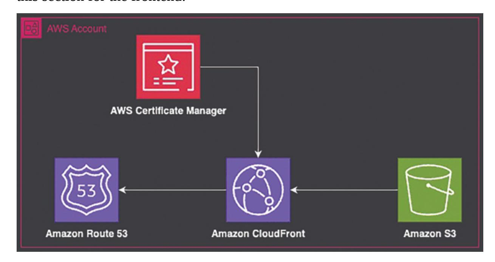

*Figure 4.2: Frontend architecture*

### <span id="page-135-0"></span>**[Creating](#page-18-15) S3 Buckets for Static Content**

Amazon S3 is a key component for hosting static websites. It offers high durability, scalability, and easy integration with other AWS services.

#### <span id="page-135-1"></span>**[Bucket Configurations \(Versioning, Lifecycle Policies\)](#page-18-16)**

Enabling versioning is essential for managing updates to your static content. With versioning, you can easily recover from accidental overwrites or deletions. Additionally, lifecycle policies help optimize costs by automatically removing outdated content from your S3 buckets.

```
import * as s3 from 'aws-cdk-lib/aws-s3';
export class FrontendBucketStack extends cdk.Stack {
 public readonly bucket: s3.Bucket;
```

```
constructor(scope: cdk.App, id: string, props?:
 cdk.StackProps) {
  super(scope, id, props);
  // Create an S3 bucket with versioning and lifecycle rules
  Const bucket = new s3.Bucket(this, 'FrontendBucket', {
   versioned: true, // Enable versioning
   lifecycleRules: [
     {
      id: 'MoveOldVersionsToGlacier',
      noncurrentVersionTransitions: [
       {
         storageClass: s3.StorageClass.GLACIER, // Archive old
         versions to Glacier
         transitionAfter: cdk.Duration.days(90),
       },
      ],
      noncurrentVersionExpiration: cdk.Duration.days(365), //
      Delete old versions after a year
     },
   ],
  });
 }
}
```

### <span id="page-136-1"></span><span id="page-136-0"></span>**[Setting Up Bucket Policies for Public Access](#page-18-17)**

If you are hosting a static website, you will need to configure the bucket for public access. However, allowing public access requires careful consideration, especially regarding security.

Refer to the following example to set up a bucket policy for public access while restricting operations like deleting objects:

```
// Add a bucket policy for public read access
bucket.addToResourcePolicy(new iam.PolicyStatement({
 actions: ['s3:GetObject'],
 resources: [`${this.bucket.bucketArn}/*`], // Allow public
 access to all objects
 principals: [new iam.AnyPrincipal()], // Open to all users
```

```
}));
```

To prevent unauthorized deletions or changes, you can limit access to only the necessary actions and users:

```
this.bucket.addToResourcePolicy(new iam.PolicyStatement({
 actions: ['s3:DeleteObject'],
 resources: [`${this.bucket.bucketArn}/*`],
 principals: [new iam.AccountPrincipal(this.account)], //
 Restrict to your account
 effect: iam.Effect.DENY,
}));
```

### <span id="page-137-0"></span>**Setting Up CloudFront for Content [Distribution](#page-18-18)**

Amazon CloudFront is a global content delivery network (CDN) that speeds up the distribution of your static content by caching it at edge locations closer to your users. When paired with S3, it can significantly improve load times and availability.

#### <span id="page-137-1"></span>**[Configuring Origins and Behaviors](#page-18-19)**

A key aspect of configuring CloudFront involves setting up origins and behaviors. The origin, such as an S3 bucket, is where CloudFront retrieves content, while behaviors define how CloudFront processes and responds to requests.

```
import * as cloudfront from 'aws-cdk-lib/aws-cloudfront';
import * as cloudfront_origins from 'aws-cdk-lib/aws-
cloudfront-origins';
export class FrontendDistributionStack extends cdk.Stack {
 constructor(scope: cdk.App, id: string, props?:
 cdk.StackProps) {
  super(scope, id, props);
  // Create a CloudFront distribution with an S3 bucket origin
  const distribution = new cloudfront.Distribution(this,
   'FrontendDistribution', {
   defaultBehavior: {
     origin: new cloudfront_origins.S3Origin(this.bucket),
```

```
viewerProtocolPolicy:
     cloudfront.ViewerProtocolPolicy.REDIRECT_TO_HTTPS, //
     Redirect HTTP to HTTPS
     cachePolicy: cloudfront.CachePolicy.CACHING_OPTIMIZED, //
     Use optimized caching for static content
   },
  });
 }
}
```

### <span id="page-138-0"></span>**[Associating SSL/TLS Certificates with Your CloudFront](#page-18-20) Distribution**

For security and SEO reasons, it is important to serve your frontend content over HTTPS. CloudFront supports custom SSL/TLS certificates via AWS Certificate Manager (ACM). Follow these steps to set the integration:

- 1. Request a Certificate in ACM, typically for a domain like [www.example.com](http://www.example.com/) .
- 2. Associate the Certificate with your CloudFront distribution.

```
import * as certificatemanager from 'aws-cdk-lib/aws-
certificatemanager';
// Request or import an existing certificate
const certificate =
certificatemanager.Certificate.fromCertificateArn(this,
'Certificate', 'arn:aws:acm:region:account-
id:certificate/certificate-id');
// Associate the certificate with CloudFront
const distribution = new cloudfront.Distribution(this,
'FrontendDistribution', {
 defaultBehavior: {
  origin: new cloudfront_origins.S3Origin(this.bucket),
  viewerProtocolPolicy:
  cloudfront.ViewerProtocolPolicy.REDIRECT_TO_HTTPS,
 },
 domainNames: ['www.example.com'], // Your domain
 certificate, // Associate the certificate
```

#### <span id="page-139-0"></span>**[Best Practices for CloudFront Configuration](#page-18-21)**

Following are the best practices for configuring CloudFront:

- **Enable HTTPS** : Always serve content over HTTPS to protect user data and improve SEO.
- **Optimize Caching** : Use optimized cache policies for static content such as HTML, CSS, and JavaScript.
- **Configure Error Pages** : Customize error responses (like 404 and 500 errors) to improve user experience.

### <span id="page-139-1"></span>**Configuring Route 53 for DNS [Management](#page-18-22)**

In this section, we will delve deeper into how to use Amazon Route 53 to manage DNS routing for your frontend infrastructure. When deploying web applications with CloudFront, associating a custom domain with your distribution is essential for creating a professional and user-friendly experience.

### <span id="page-139-2"></span>**[Setting Up a Custom Domain with Route 53](#page-18-23)**

Amazon Route 53 is a scalable DNS web service that allows you to register domain names, manage DNS records, and route traffic to various AWS services such as CloudFront, S3, and more. To integrate Route 53 with your CloudFront distribution, you must perform the following actions:

- **Create or Import a Hosted Zone** : A hosted zone represents a DNS namespace, such as yourdomain.com, where you can manage DNS records.
- **Create an Alias Record** : An alias record is a special type of Route 53 record that points directly to AWS resources such as CloudFront distributions, S3 buckets, or load balancers. Alias records provide the benefit of being highly optimized for routing traffic to AWS services.

```
import * as route53 from 'aws-cdk-lib/aws-route53';
import * as targets from 'aws-cdk-lib/aws-route53-targets';
import * as cloudfront from 'aws-cdk-lib/aws-cloudfront';
```

```
import * as cloudfront_origins from 'aws-cdk-lib/aws-
cloudfront-origins';
// Define your CloudFront distribution
const distribution = new cloudfront.Distribution(this,
'FrontendDistribution', {
   defaultBehavior: {
    origin: new cloudfront_origins.S3Origin(this.bucket),
    viewerProtocolPolicy:
    cloudfront.ViewerProtocolPolicy.REDIRECT_TO_HTTPS, //
    Redirect HTTP to HTTPS
    cachePolicy: cloudfront.CachePolicy.CACHING_OPTIMIZED,
    // Use optimized caching for static content
   },
  });
// create hosted zone
const hostedZone = new route53.HostedZone(this,
'HostedZone', {
 zoneName: 'example.com',
});
// Create an A record pointing to the CloudFront
distribution
new route53.ARecord(this, 'AliasRecord', {
 zone: hostedZone,
 target: route53.RecordTarget.fromAlias(new
 targets.CloudFrontTarget(distribution)),
 recordName: 'www', // This creates "www.yourdomain.com"
});
```

This setup ensures that traffic to *[www.example.com](http://www.example.com/)* is served by your CloudFront distribution, which in turn pulls content from your S3 bucket (or any other origin you have configured).

#### <span id="page-140-0"></span>**[Best Practices for Route 53 Configuration](#page-18-24)**

When setting up Route 53 for your frontend infrastructure, consider the following best practices:

- **Use Alias Records for CloudFront Distributions** : Alias records are more efficient and cost-effective for routing to CloudFront. They provide benefits like no charge for queries and automatic scaling.
- **Set Up Health Checks (if applicable)** : Route 53 can monitor the health of your endpoints using health checks. If you have multiple origins (for example, different CloudFront distributions, API gateways, and more), health checks can help reroute traffic to healthy endpoints in case of failure.
- **Use Weighted or Latency-Based Routing** : For more complex scenarios, such as multi-region deployments or canary releases, you can use weighted or latency-based routing policies:
  - **Weighted Routing** : Distribute traffic across multiple resources based on specified weights.
  - **Latency-Based Routing** : Route traffic to the resource that provides the lowest latency.
- **Enable DNSSEC for Domain Security** : If you require higher levels of security, consider enabling DNSSEC (Domain Name System Security Extensions) for your hosted zone. DNSSEC adds an extra layer of protection to your domain against certain types of attacks.

Setting up frontend infrastructure with AWS CDK involves more than just deploying an S3 bucket. It requires careful planning around bucket configurations and content distribution. By following best practices for S3 bucket policies and CloudFront configurations, you can build a scalable, secure, and performant frontend architecture. The provided CDK code examples demonstrate how to implement these patterns, ensuring your frontend infrastructure is both efficient and reliable.

### <span id="page-141-0"></span>**[Configuring](#page-18-25) the Application Layer**

In this section, we will dive deep into configuring the application layer in a multi-stack AWS CDK project. The application layer is responsible for handling business logic and processing client requests. We will cover setting up APIs, deploying compute resources (EC2 and Lambda), scaling strategies, and cost-performance comparisons. The following architecture will be developed in this section for the Application layer:

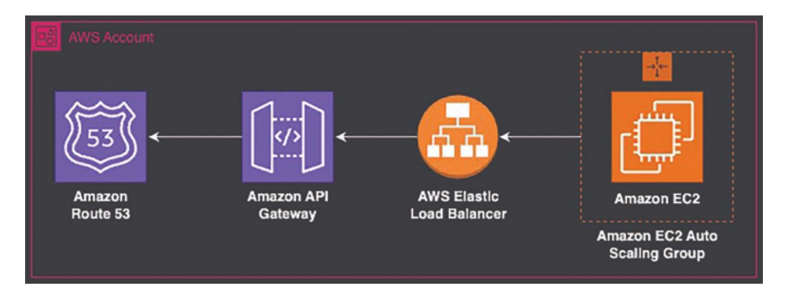

*Figure 4.3: Application layer*

### <span id="page-142-2"></span><span id="page-142-0"></span>**[Deploying](#page-18-26) APIs with Amazon API Gateway**

API Gateway is a powerful service for creating and managing APIs in AWS. It supports both REST and HTTP APIs, allowing you to handle requests in a scalable and secure manner. With AWS CDK, you can define and deploy API Gateway resources programmatically.

#### <span id="page-142-1"></span>**[REST](#page-18-27) API**

REST APIs in API Gateway offer extensive features such as granular request/response control, custom authorizers, and integrations with various AWS services, making them ideal for complex, enterprise-level applications with advanced security and customization needs. You can configure REST API using AWS CDK as mentioned here:

```
import * as cdk from 'aws-cdk-lib';
import * as apigateway from 'aws-cdk-lib/aws-apigateway';
export class ApiGatewayStack extends cdk.Stack {
 constructor(scope: cdk.App, id: string) {
  super(scope, id);
  const api = new apigateway.RestApi(this, 'MyApi', {
   restApiName: 'My Service',
   description: 'This service handles my business logic.',
  });
  const resource = api.root.addResource('items');
```

```
resource.addMethod('GET'); // GET /items
 }
}
```

#### <span id="page-143-0"></span>**[HTTPAPI](#page-18-28)**

HTTP APIs are designed for performance and cost-efficiency, providing a simplified, low-latency option for building APIs with basic routing and integrations, ideal for microservices, serverless apps, and simpler use cases. You can configure HTTP API using AWS CDK as mentioned here:

```
import * as apigatewayv2 from 'aws-cdk-lib/aws-apigatewayv2';
import * as integrations from 'aws-cdk-lib/aws-apigatewayv2-
integrations';
const httpApi = new apigatewayv2.HttpApi(this, 'HttpApi', {
 apiName: 'MyHttpApi',
 description: 'An HTTP API for my service.',
});
```

### <span id="page-143-1"></span>**[Deciding](#page-18-29) Between EC2 and Lambda**

Choosing between EC2 and Lambda for your application depends on various factors such as cost, scalability, and control.

#### <span id="page-143-2"></span>**[Key Factors Influencing the Choice](#page-18-30)**

Here are some key considerations when choosing between EC2 and Lambda:

- **Compute Model** : EC2 provides more control over the underlying server, while Lambda is serverless and abstracts the infrastructure.
- **Scalability** : Lambda scales automatically based on demand, while EC2 requires manual setup of Auto Scaling groups.
- **Cost** : Lambda is cost-effective for short-running tasks, while EC2 is suitable for long-running workloads.

#### <span id="page-143-3"></span>**[Use Cases and Scenarios](#page-18-31)**

Here are some use cases and scenarios for EC2 and Lambda:

- **Lambda** : Event-driven architectures, microservices, and lightweight applications.
- **EC2** : Applications requiring fine-grained control over the environment, high compute capacity, or custom networking.

### <span id="page-144-0"></span>**Setting Up EC2 Instances with Auto Scaling and Load [Balancers](#page-18-32)**

When choosing EC2, it is important to automate the provisioning, scaling, and load balancing to ensure high availability and performance.

### <span id="page-144-1"></span>**[Provisioning EC2 Instances with CDK](#page-18-33)**

The following CDK code provisions a t3.micro EC2 instance within the specified VPC:

```
import * as ec2 from 'aws-cdk-lib/aws-ec2';
const vpc = new ec2.Vpc(this, "vpc")
// Use the imported VPC in your resources
new ec2.Instance(this, 'MyInstance', {
 vpc,
   instanceType: ec2.InstanceType.of(ec2.InstanceClass.T3,
   ec2.InstanceSize.MICRO),
   machineImage: ec2.MachineImage.latestAmazonLinux2(),
});
```

#### <span id="page-144-3"></span><span id="page-144-2"></span>**[Configuring Auto Scaling Groups \(ASG\)](#page-18-34)**

To manage traffic surges effectively, configure an Auto Scaling Group to automatically scale resources up or down as needed.

```
import * as asg from 'aws-cdk-lib/aws-autoscaling'
const vpc = new ec2.Vpc(this, "vpc")
  // Use the imported VPC in your resources
  const autoscalinggroup = new asg.AutoScalingGroup(this,
   'ASG', {
     vpc,
     instanceType: ec2.InstanceType.of(ec2.InstanceClass.T3,
     ec2.InstanceSize.MICRO),
```

```
machineImage: ec2.MachineImage.latestAmazonLinux2(),
 minCapacity: 1,
 maxCapacity: 5,
});
```

#### <span id="page-145-0"></span>**[Implementing Elastic Load Balancers \(ELB\)](#page-18-35)**

AWS Elastic Load Balancing (ELB) distributes incoming application traffic across multiple targets, improving fault tolerance and availability while ensuring optimal performance.

```
import * as elbv2 from 'aws-cdk-lib/aws-
elasticloadbalancingv2';
const lb = new elbv2.ApplicationLoadBalancer(this, 'LB', {
 vpc,
 internetFacing: true,
});
const listener = lb.addListener('Listener', {
 port: 80,
 open: true,
});
listener.addTargets('Targets', {
 port: 80,
 targets: [asg],
 healthCheck: { path: '/' },
});
```

### <span id="page-145-1"></span>**[Architecting](#page-19-0) Serverless Solutions with Lambda**

Lambda functions offer a fully managed, serverless compute solution for running code in response to events.

```
import * as lambda from 'aws-cdk-lib/aws-lambda';
  const helloWorld = new lambda.Function(this,
   'HelloWorldFunction', {
     runtime: lambda.Runtime.PYTHON_3_9, // Specify Python
     runtime
     handler: 'index.handler', // Define the handler method
     code: lambda.Code.fromInline(`
```

```
def handler(event, context):
  print("Hello, World")
  return "Hello, World"
  `), // Inline Python code
  });
```

#### <span id="page-146-0"></span>**[Integrating Lambda with API Gateway](#page-19-1)**

You can link Lambda functions with API Gateway using the following CDK code:

```
const lambdaIntegration = new
apigateway.LambdaIntegration(helloWorld);
api.root.addMethod('GET', lambdaIntegration);
```

### <span id="page-146-1"></span>**[Managing Lambda Scaling and Concurrency](#page-19-2)**

You can configure the **reservedConcurrentExecutions** attribute to limit the concurrent requests.

```
import * as lambda from 'aws-cdk-lib/aws-lambda';
  const helloWorld = new lambda.Function(this,
   'HelloWorldFunction', {
     runtime: lambda.Runtime.PYTHON_3_9, // Specify Python
     runtime
     handler: 'index.handler', // Define the handler method
 reservedConcurrentExecutions: 10,
     code: lambda.Code.fromInline(`
def handler(event, context):
  print("Hello, World")
  return "Hello, World"
  `), // Inline Python code
  });
```

### <span id="page-146-2"></span>**Comparing Costs and [Performance:](#page-19-3) EC2 versus Lambda**

When choosing between EC2 and Lambda, it is essential to weigh the cost and performance trade-offs — Lambda's pay-per-request model is suited for

unpredictable workloads, while EC2 offers consistent performance and costeffectiveness for sustained high-compute needs.

#### **Cost Analysis**

- <span id="page-147-1"></span>**Lambda** : Pay-per-request model. Ideal for workloads with unpredictable traffic and low resource usage.
- **EC2** : Hourly billing. More cost-effective for constant, highcompute workloads.

#### **Performance Considerations**

- **Lambda** : Cold starts can introduce latency. Suitable for burst workloads.
- **EC2** : No cold starts, with more consistent performance, but requires manual scaling.

The choice between EC2 and Lambda hinges on your application's requirements for control, scalability, cost, and performance. By integrating these compute resources with API Gateway and load balancers using CDK, you can create a flexible and scalable application layer. The examples provided serve as a foundation for architecting robust infrastructure tailored to your specific needs.

### <span id="page-147-0"></span>**Architecting Backend [Infrastructure](#page-19-4)**

This section focuses on architecting a robust backend infrastructure using AWS services like RDS, DynamoDB, and ElastiCache. Each of these services plays a vital role in building scalable, high-performance applications. We will explore key considerations for choosing between relational and NoSQL databases, as well as best practices for integrating caching layers. The following architecture will be developed in this section for the backend:

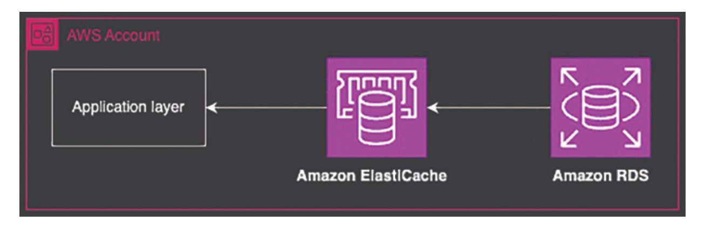

*Figure 4.4: Backend architecture*

### <span id="page-148-0"></span>**Choosing Between RDS and [DynamoDB](#page-19-5)**

Choosing the right database depends on your application's needs, such as whether it is transactional or non-transactional, and how it handles data at scale.

- <span id="page-148-1"></span>**Use Cases for RDS versus DynamoDB: Transactional versus Non-Transactional Workloads**
  - **RDS (Relational Database Service):** Best suited for transactional workloads with complex relationships and operations that require ACID compliance. Use cases include e-commerce platforms, financial systems, and content management systems.
  - **DynamoDB (NoSQL Database):** Ideal for non-transactional, high-scale workloads such as session management, gaming leaderboards, and IoT applications. DynamoDB is designed for low-latency reads/writes at any scale.
- **Cost, Performance, and Scalability Considerations**
  - **RDS:** Costs are determined by the instance type, storage, and additional features such as Multi-AZ deployments. Performance scales vertically with more powerful instances or horizontally using read replicas.
  - **DynamoDB:** Costs are based on read/write capacity units, and it scales horizontally automatically. DynamoDB's performance is optimized for high throughput and low latency, but can become expensive at very high scales.

#### **Integrating RDS or DynamoDB with Other AWS Services**

- **RDS:** Integrates well with Lambda for event-driven operations, S3 for backups, and IAM for security.
- **DynamoDB:** Commonly integrated with Lambda for event-driven architectures, DynamoDB Streams for change data capture, and S3 for archival storage.

### <span id="page-149-0"></span>**Managing [Relational](#page-19-6) Databases with Amazon RDS**

RDS simplifies database management by handling backups, patching, and scaling. In this section, we will explore how to set up RDS instances using CDK, and configure high availability and monitoring.

```
import * as rds from 'aws-cdk-lib/aws-rds';
import * as ec2 from 'aws-cdk-lib/aws-ec2';
const vpc = new ec2.Vpc(this, 'Vpc');
const dbInstance = new rds.DatabaseInstance(this,
'RdsInstance', {
 engine: rds.DatabaseInstanceEngine.postgres({
  version: rds.PostgresEngineVersion.VER_14_2,
 }),
 vpc,
 allocatedStorage: 100,
 instanceType:
 ec2.InstanceType.of(ec2.InstanceClass.BURSTABLE3,
 ec2.InstanceSize.MICRO),
 storageEncrypted: true,
 backupRetention: cdk.Duration.days(7),
 deletionProtection: false,
 publiclyAccessible: false,
 vpcSubnets: {
  subnetType: ec2.SubnetType.PRIVATE_WITH_EGRESS,
 },
});
```

<span id="page-149-1"></span>**[Implementing Multi-AZ and Read Replicas for RDS](#page-19-7)**

Multi-AZ deployments improve availability by automatically failing over to a standby instance in another Availability Zone. Read replicas improve read performance by distributing load across multiple read-only instances.

```
const dbInstance1 = new rds.DatabaseInstance(this,
'RdsInstance', {
engine: rds.DatabaseInstanceEngine.mysql({
 version: rds.MysqlEngineVersion.VER_8_0_28,
}),
vpc,
multiAz: true,
allocatedStorage: 100,
autoMinorVersionUpgrade: true,
});
// Create a read replica
const readReplica = new rds.DatabaseInstanceReadReplica(this,
'ReadReplica', {
sourceDatabaseInstance: dbInstance1,
vpc,
instanceType: ec2.InstanceType.of(ec2.InstanceClass.T3,
ec2.InstanceSize.MICRO),
});
```

### <span id="page-150-0"></span>**[Configuring RDS Security, Backup, and Monitoring](#page-19-8)**

RDS integrates with CloudWatch for monitoring metrics such as CPU usage, connections, and IOPS. Automated backups can be configured for point-intime recovery.

```
const dbInstance = new rds.DatabaseInstance(this,
'RdsInstance', {
 engine: rds.DatabaseInstanceEngine.mysql({ version:
 rds.MysqlEngineVersion.VER_8_0_28 }),
 vpc,
 instanceType:
 ec2.InstanceType.of(ec2.InstanceClass.BURSTABLE3,
 ec2.InstanceSize.SMALL),
 backupRetention: cdk.Duration.days(7),
```

```
monitoringInterval: cdk.Duration.minutes(1), // Enable
 enhanced monitoring
 cloudwatchLogsExports: ['error', 'general', 'slowquery'],
});
```

### <span id="page-151-0"></span>**[Implementing](#page-19-9) NoSQL Databases with DynamoDB**

DynamoDB is a fully managed NoSQL database that scales horizontally, offering high performance and availability. Let us explore how to deploy DynamoDB tables using CDK and optimize them for large-scale applications.

A simple DynamoDB table definition in CDK looks like this:

```
import * as dynamodb from 'aws-cdk-lib/aws-dynamodb';
const table = new dynamodb.Table(this, 'MyTable', {
 partitionKey: { name: 'id', type:
 dynamodb.AttributeType.STRING },
 billingMode: dynamodb.BillingMode.PAY_PER_REQUEST, // On-
 demand mode
 removalPolicy: cdk.RemovalPolicy.DESTROY,
});
```

### <span id="page-151-1"></span>**[Handling Large-Scale Data with DynamoDB's Partition Key](#page-19-10) Design**

The partition key design directly impacts how data is distributed across partitions. Best practices include choosing a partition key with high cardinality to avoid *"hot partitions."*

```
const table = new dynamodb.Table(this, 'MyCompositeKeyTable', {
 partitionKey: { name: 'userId', type:
 dynamodb.AttributeType.STRING },
 sortKey: { name: 'timestamp', type:
 dynamodb.AttributeType.NUMBER },
});
```

### <span id="page-151-2"></span>**[Implementing DynamoDB Streams for Event-Driven](#page-19-11) Architectures**

DynamoDB Streams enable event-driven processing of data changes. You can trigger a Lambda function when an item is created, updated, or deleted.

```
const table = new dynamodb.Table(this, 'MyTable', {
 partitionKey: { name: 'id', type:
 dynamodb.AttributeType.STRING },
 stream: dynamodb.StreamViewType.NEW_AND_OLD_IMAGES, // Set the
 stream configuration here
 billingMode: dynamodb.BillingMode.PAY_PER_REQUEST,
});
```

#### <span id="page-152-2"></span><span id="page-152-0"></span>**[Cost Optimization Strategies for DynamoDB](#page-19-12)**

DynamoDB offers two billing modes: **Provisioned** and **On-Demand** . For workloads with unpredictable traffic, on-demand mode is cost-effective. For consistent workloads, provisioned mode with auto-scaling is better.

### <span id="page-152-1"></span>**Caching with Amazon [ElastiCache](#page-19-13)**

Caching is crucial for reducing latency and improving the performance of your application. ElastiCache provides fully managed Redis and Memcached clusters.

```
import * as ec2 from 'aws-cdk-lib/aws-ec2';
import * as elasticache from 'aws-cdk-lib/aws-elasticache';
const vpc = new ec2.Vpc(this, 'Vpc');
// Allow inbound traffic on Redis default port (6379) from
within the VPC
securityGroup.addIngressRule(
 ec2.Peer.ipv4(vpc.vpcCidrBlock),
 ec2.Port.tcp(6379),
 'Allow inbound traffic on port 6379 from within the VPC'
);
// Create a subnet group for Redis
const subnetGroup = new elasticache.CfnSubnetGroup(this,
'RedisSubnetGroup', {
 description: 'Subnet group for Redis',
 subnetIds: vpc.selectSubnets({ subnetType:
 ec2.SubnetType.PRIVATE_WITH_EGRESS }).subnetIds,
```

```
});
// Create the Redis cluster
const redisCluster = new elasticache.CfnCacheCluster(this,
'RedisCluster', {
 engine: 'redis',
 cacheNodeType: 'cache.t3.micro',
 numCacheNodes: 1,
 clusterName: 'my-redis-cluster',
 vpcSecurityGroupIds: [securityGroup.securityGroupId], //
 Reference to the security group
 cacheSubnetGroupName: subnetGroup.ref, // Reference to the
 subnet group
});
```

#### <span id="page-153-2"></span><span id="page-153-0"></span>**[Managing Cache Cluster Scaling and Maintenance](#page-19-14)**

ElastiCache supports automatic scaling based on demand. You can also set up maintenance windows for patching and updates.

```
const redisCluster = new elasticache.CfnCacheCluster(this,
'RedisCluster', {
     engine: 'redis',
     cacheNodeType: 'cache.t3.micro',
     numCacheNodes: 1,
     preferredMaintenanceWindow: 'sun:05:00-sun:09:00', //
     Weekly maintenance window
});
```

In this section, we explored how to design a backend architecture using AWS services such as RDS, DynamoDB, and ElastiCache. Each service has its strengths, and choosing the right one depends on your application's requirements. The examples provided demonstrate how to deploy and manage these resources using CDK, ensuring scalability, performance, and cost efficiency. As you continue to architect backend solutions, consider the trade-offs between consistency, availability, and latency to create a balanced infrastructure.

### <span id="page-153-1"></span>**Best Practices for [Multi-Stack](#page-19-15) CDK Projects**

Building complex infrastructure using the AWS Cloud Development Kit (CDK) often involves managing multiple stacks. A multi-stack project helps in organizing and separating concerns, which increases maintainability and scalability. However, with multiple stacks, managing configurations, state, deployment strategies, and infrastructure patterns becomes crucial. In this section, we will dive into best practices for multi-stack CDK projects, covering configurations, environment variables, DRY (Don't Repeat Yourself) principles, handling state, and deployment strategies including Blue-Green and Canary deployments.

### <span id="page-154-0"></span>**Managing [Configurations](#page-19-16) and Environment Variables**

Configurations and environment variables are essential for dynamic and environment-specific deployments. In a multi-stack CDK project, managing these configurations efficiently across stacks ensures consistent behavior and reduces errors.

#### <span id="page-154-2"></span><span id="page-154-1"></span>**Using .env [Files, SSM Parameters, or Secrets Manager](#page-19-17)**

**.env Files** : Environment variables are often stored in **.env** files in local development environments. For CDK projects, you can use the **dotenv** package to load variables and pass them to your CDK stacks.

Example of using *.env* in a CDK project:

```
Install dotenv :
npm install dotenv
```

Create a **.env** file: VPC\_CIDR=10.0.0.0/16

Load the environment variables in your CDK code:

```
import * as dotenv from 'dotenv';
dotenv.config();
const vpcCidr = process.env.VPC_CIDR || '10.0.0.0/16';
const vpc = new ec2.Vpc(this, 'Vpc', {
 cidr: vpcCidr,
});
```

**SSM Parameter Store** : AWS Systems Manager (SSM) Parameter Store is a secure and scalable way to store configuration data and secrets. You can retrieve these parameters directly in your CDK stacks.

#### **Storing a parameter** :

```
aws ssm put-parameter --name "/myapp/vpc-cidr" --value
"10.0.0.0/16" --type String
```

#### **Using SSM in CDK:**

```
import * as ssm from 'aws-cdk-lib/aws-ssm';
const vpcCidr =
ssm.StringParameter.valueForStringParameter(this, '/myapp/vpc-
cidr');
const vpc = new ec2.Vpc(this, 'Vpc', {
 cidr: vpcCidr,
});
```

**Secrets Manager** : For sensitive data such as API keys or database credentials, use AWS Secrets Manager. Secrets are encrypted and can be rotated automatically.

#### **Using Secrets Manager in CDK:**

```
import * as secretsmanager from 'aws-cdk-lib/aws-
secretsmanager';
const dbPassword = secretsmanager.Secret.fromSecretNameV2(this,
'DBPassword', 'mydbpassword').secretValue;
```

### <span id="page-155-2"></span><span id="page-155-0"></span>**Applying [Infrastructure](#page-19-18) as Code (IaC) Patterns**

Applying Infrastructure as Code (IaC) principles is key to building maintainable, reusable, and scalable infrastructure. In CDK, you should adhere to the DRY principle, leverage reusable constructs, and apply best practices for abstraction.

#### <span id="page-155-1"></span>**[DRY Principles in CDK](#page-19-19)**

The DRY (Don't Repeat Yourself) principle encourages reusing code and avoiding redundancy. In CDK, this can be achieved by creating reusable constructs or abstract classes.

```
import * as cdk from 'aws-cdk-lib';
import * as ec2 from 'aws-cdk-lib/aws-ec2';
export interface VpcConstructProps {
 readonly : string;
}
export class VpcConstruct extends cdk.Construct {
 public readonly vpc: ec2.Vpc;
 constructor(scope: cdk.Construct, id: string, props:
 VpcConstructProps) {
  super(scope, id);
  this.vpc = new ec2.Vpc(this, 'Vpc', {
   ipAddresses: ec2.IpAddresses.cidr(props.cidr),
   maxAzs: 3,
   subnetConfiguration: [
     {
      name: 'Public',
      subnetType: ec2.SubnetType.PUBLIC,
     },
     {
      name: 'Private',
      subnetType: ec2.SubnetType.PRIVATE_WITH_NAT,
     },
   ],
  });
 }
}
```

<span id="page-156-1"></span>By creating a reusable construct like **VpcConstruct** , you can easily instantiate it across different stacks, promoting code reuse.

#### <span id="page-156-0"></span>**[Reusable Constructs and Abstract Classes](#page-19-20)**

Encapsulate commonly used infrastructure components into constructs that can be reused across multiple stacks.

For example, you might create a base stack that other stacks can extend:

```
import * as cdk from 'aws-cdk-lib';
export abstract class BaseStack extends cdk.Stack {
```

```
constructor(scope: cdk.App, id: string, props?:
 cdk.StackProps) {
  super(scope, id, props);
  // Common setup logic, e.g., logging, monitoring
 }
}
// Example of extending the base stack
export class MyServiceStack extends BaseStack {
 constructor(scope: cdk.App, id: string, props?:
 cdk.StackProps) {
  super(scope, id, props);
  // Service-specific resources
 }
}
```

This pattern allows you to maintain shared configurations and settings while extending functionality in derived stacks.

### <span id="page-157-0"></span>**[Handling](#page-19-21) State and Outputs Between Stacks**

In a multi-stack CDK project, managing state and outputs between stacks is a common challenge. CDK provides mechanisms to share resources, outputs, and parameters across stacks.

#### <span id="page-157-1"></span>**[Strategies for Managing Application State Across Stacks](#page-19-22)**

There are several strategies to manage cross-stack state:

**Cross-Stack References** : CDK allows you to directly reference resources from one stack in another. However, this tightly couples stacks.

```
const vpc = new VpcStack(app, 'VpcStack');
const ecsStack = new EcsStack(app, 'EcsStack', {
 vpc: vpc.vpc,
});
```

**Using CfnOutput for Cross-Stack Communication** : You can export values from one stack using **CfnOutput** and import them into another stack.

### In the producing stack: new cdk.CfnOutput(this, 'VpcId', { value: vpc.vpcId, exportName: 'VpcId', }); In the consuming stack: const vpcId = cdk.Fn.importValue('VpcId'); const vpc = ec2.Vpc.fromLookup(this, 'ImportedVpc', { vpcId });

**Using SSM Parameter Store for Cross-Stack Communication** : Store values in SSM Parameter Store and retrieve them in different stacks.

```
In the first stack:
```

```
new ssm.StringParameter(this, 'VpcIdParam', {
 parameterName: '/myapp/vpc-id',
 stringValue: vpc.vpcId,
});
In another stack:
const vpcId =
ssm.StringParameter.valueForStringParameter(this,
 '/myapp/vpc-id');
const vpc = ec2.Vpc.fromLookup(this, 'ImportedVpc', { vpcId
});
```

These methods are particularly useful in complex projects where stacks need to remain loosely coupled.

### <span id="page-158-0"></span>**[Implementing](#page-19-23) a Deployment Strategy**

When deploying updates to your infrastructure or applications, it is essential to have a strategy that minimizes downtime and risks. Two common strategies are Blue-Green and Canary deployments.

### <span id="page-158-1"></span>**[Blue-Green Deployment](#page-19-24)**

Blue/Green Deployment is a strategy designed to minimize downtime and mitigate risk during application updates. It involves maintaining two

<span id="page-159-3"></span>separate environments: the Blue environment, which is the current production, and the Green environment, where the new version of the application is deployed. Once the Green environment is fully tested and validated, traffic is switched from Blue to Green, typically using a load balancer or DNS change. This approach provides a seamless transition with zero downtime and a quick rollback option if issues arise, as the old environment remains intact until the new version is confirmed stable.

#### <span id="page-159-0"></span>**[Canary Deployment](#page-19-25)**

Canary Deployment is a deployment strategy that releases a new application version to a small, controlled subset of users before a full-scale rollout. This approach allows developers to monitor the performance and stability of the new version in a real-world setting with minimal impact on the broader user base. By gradually increasing the number of users exposed to the new version, teams can detect and address issues early, ensuring a smoother transition and reducing the potential impact of unforeseen problems on the entire user base.

#### <span id="page-159-1"></span>**[Rolling Deployment](#page-19-26)**

Rolling Deployment is a strategy that updates an application incrementally by replacing old instances with new ones in a controlled fashion. This method involves gradually deploying the new version to a subset of instances while keeping the rest running the old version. The update progresses in batches, ensuring that only a portion of the application is affected at any given time. This approach helps maintain application availability and performance throughout the deployment process, reducing the risk of widespread disruption and allowing for real-time monitoring and adjustments.

Managing multi-stack CDK projects requires careful consideration of configurations, IaC patterns, state management, and deployment strategies. By applying best practices such as DRY principles, using parameter stores for cross-stack communication, and implementing reliable deployment strategies, you can build scalable and maintainable infrastructure.

### <span id="page-159-2"></span>**[Conclusion](#page-19-27)**

In this chapter, we explored the critical aspects of building a multi-stack CDK project, starting from establishing a foundational network to deploying and managing compute resources, backend infrastructure, and adhering to best practices. By carefully designing the foundational components, such as VPCs, subnets, and network security configurations, you can create a secure and scalable base for any cloud infrastructure. The chapter highlighted how crucial it is to plan network topology thoughtfully and ensure efficient resource management across multiple stacks.

Managing cross-stack references and dependencies is a common challenge in multi-stack CDK projects. This chapter provided practical solutions, including CDK's cross-stack references, **CfnOutput** , and the SSM Parameter Store, which help decouple stacks while still allowing for the secure sharing of essential data. Properly managing dependencies and state between stacks is vital to ensure smooth deployments and consistent behavior across environments, especially as your project scales.

As your infrastructure grows, setting up frontend and backend services, such as S3, CloudFront, API Gateway, and caching solutions, becomes increasingly important. This chapter offered detailed guidance on provisioning and configuring these resources using CDK, ensuring that performance, security, and cost-efficiency are maintained. By using IaC patterns like DRY principles and reusable constructs, you can reduce redundancy, enhance maintainability, and standardize best practices across your stacks.

Finally, the chapter emphasized the importance of robust deployment strategies, including Blue-Green and Canary deployments, for multi-stack projects. These strategies help minimize downtime and mitigate risks during updates, ensuring a smooth transition and better user experience. By incorporating these best practices into your CDK projects, you can build flexible, scalable, and well-architected cloud solutions that stand the test of time.

In the next chapter, we will understand Continuous Integration and Continuous Delivery (CI/CD) pipelines with AWS CDK, from setting up stages and workflows to extending and optimizing deployment processes.

## **C [HAPTER](#page-19-28) 5**

## **[Orchestrating](#page-19-28) CDK Pipelines**

### <span id="page-161-1"></span><span id="page-161-0"></span>**[Introduction](#page-19-29)**

In this chapter, we will dive into the core principles and practical techniques needed to design and implement robust CI/CD pipelines using AWS CDK. CI/CD pipelines are critical in automating software delivery, ensuring rapid and reliable deployment of code changes. We will begin with an overview of CI/CD concepts, explaining how continuous integration and continuous delivery/deployment help streamline software releases, reduce manual intervention, and enhance productivity. We will learn about the essential components that make up a CI/CD pipeline, including source control management, automated testing, and deployment automation. By understanding the benefits and challenges of implementing CI/CD in cloud environments, we will gain a solid foundation for leveraging AWS services in pipeline automation.

As we progress through the chapter, we will explore the stages and workflows of a standard CI/CD pipeline, such as the source, build, test, and deploy stages, all while integrating best practices for error handling, notifications, and rollbacks. We will learn how to design pipelines with AWS CodePipeline and CDK, integrating various stages such as source control, build, test, and deployment actions across multiple environments. We will also cover advanced deployment strategies such as blue/green and canary deployments, handling multi-region deployments, and managing complex deployment scenarios in large-scale, multi-environment applications. By the end of this chapter, we will be well-equipped to build scalable, automated CI/CD pipelines tailored to your application's needs using the AWS CDK framework.

### <span id="page-161-2"></span>**[Structure](#page-19-30)**

In this chapter, we will discuss the following topics:

- Introduction to CI/CD Principles
  - Overview of CI/CD
  - Key Components of CI/CD
  - Benefits of CI/CD
  - CI/CD in Cloud Environments
- <span id="page-162-0"></span>Pipeline Stages and Workflow
  - Stages of a CI/CD Pipeline
  - Workflow of a Typical Pipeline
  - Error Handling and Rollbacks
  - Pipeline Triggers and Notifications
- Designing a Standard CI/CD Pipeline
  - Using AWS CodePipeline with CDK
  - Defining Sources
  - Integrating Build and Test Stages
  - Deployment Stage
- Managing Multiple Environments in CI/CD
  - Handling Multiple Environments (Dev, Staging, Production)
  - Deploying to Isolated AWS Accounts
  - Challenges in Multi-Environment Deployments
- Extending Pipelines for Multi-Environment Deployments
  - Managing Region-Specific Resources and Configuration
  - Handling Complex Deployment Scenarios
  - Blue/Green and Canary Deployments
  - Testing and Verification in Multi-Environment Pipelines
- Creating Self-Mutating Pipelines
  - Understanding Self-Mutating Pipelines
  - Creating a Self-Mutating Pipeline in AWS CDK
  - Detecting and Managing Pipeline Changes

### <span id="page-163-0"></span>**[Introduction](#page-19-31) to CI/CD Principles**

In today's fast-paced software development landscape, delivering highquality software rapidly and reliably is critical. Continuous Integration and Continuous Delivery/Deployment (CI/CD) practices have emerged as the cornerstone of modern software engineering, enabling teams to automate and streamline their development workflows. This section provides an in-depth look at CI/CD principles, breaking down its components and benefits while highlighting how CI/CD fits perfectly in cloud-native environments.

### <span id="page-163-3"></span><span id="page-163-1"></span>**[Overview](#page-19-32) of CI/CD**

CI/CD is a set of practices that automate and streamline software development, focusing on continuous integration, delivery, and deployment for faster, reliable releases.

### <span id="page-163-2"></span>**[Overview of Continuous Integration and Continuous](#page-19-33) Delivery/Deployment**

CI/CD represents the automated process of integrating, testing, and deploying code in a software development project. *Continuous Integration* (CI) is the practice where developers regularly merge their code changes into a shared repository. Each integration is automatically tested, ensuring that code changes do not introduce errors or regressions. *Continuous Delivery* (CD) extends CI by automating the deployment of the tested code to a staging environment. *Continuous Deployment* , on the other hand, takes it a step further, automatically deploying the code to production as soon as it passes all tests, ensuring that the software is always in a deployable state. CI/CD minimizes the risk of integrating new changes, reduces manual effort, and accelerates the feedback loop. This allows development teams to confidently release features, fixes, and updates to users faster and more frequently.

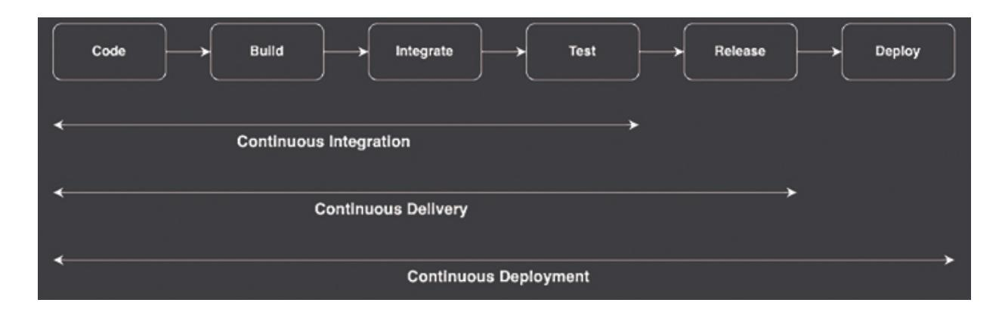

*Figure 5.1: Continuous Integration and Continuous Delivery/Deployment*

#### <span id="page-164-0"></span>**[Importance of Automating the Software Release Process](#page-19-34)**

The traditional software release process involves numerous manual steps, often leading to errors, delays, and inconsistencies. Automating the release process through CI/CD addresses these challenges by enforcing repeatable, reliable, and efficient workflows. Automation not only reduces human error but also ensures that every code change is subjected to rigorous, standardized testing and deployment procedures. This leads to greater consistency and stability in production environments.

<span id="page-164-2"></span>By removing bottlenecks and manual intervention, CI/CD allows developers to focus on building features rather than managing deployments. Automation also improves collaboration across teams, enhances transparency in the release process, and enables continuous improvement as changes are deployed, tested, and monitored rapidly.

### <span id="page-164-1"></span>**Key [Components](#page-20-0) of CI/CD**

To effectively implement CI/CD, several core components must be in place. These components work together to build, test, and deploy applications in an automated and controlled manner. The key components of CI/CD are as follows:

**Source Control Management:** Source control is the foundation of CI/CD, providing version control and collaboration capabilities. Tools such as Git allow developers to track code changes, manage branches, and collaborate efficiently across teams. A well-structured source control system is key to enabling CI, as it acts as the single source of truth for all code changes. CI pipelines are typically triggered by events

- such as code pushes, pull requests, or branch merges, making source control an integral part of the CI/CD process.
- **Build Automation:** Build automation is the process of compiling source code into executable artifacts. This stage involves tasks such as dependency management, code compilation, and packaging, all of which must be automated for consistent and error-free builds. In CI/CD pipelines, automated build tools such as AWS CodeBuild, Jenkins, or other CI platforms take care of compiling the code whenever changes are committed. Automating the build process ensures that every code change is consistently packaged, ready for testing and deployment.
- **Automated Testing:** Testing is a critical stage in any CI/CD pipeline. Automated testing ensures that new code changes do not introduce bugs or break existing functionality. Automated tests are typically categorized into unit tests, integration tests, and end-to-end tests. These tests are triggered automatically during the CI process, providing immediate feedback on code quality. The goal is to catch issues early in the development cycle, reducing the cost and effort of fixing bugs later in production. Tools such as JUnit, PyTest, or custom test suites integrated with CI pipelines help validate code quality at every stage.
- **Deployment Automation:** The final step in a CI/CD pipeline is deployment, which involves releasing the tested code to different environments such as staging, production, or any other specified deployment targets. Automating deployments eliminates manual errors and ensures that each deployment follows a consistent and predictable process. Deployment automation is achieved using tools such as AWS CodePipeline, AWS Lambda, or AWS ECS integrated with CDK, allowing seamless deployment across cloud environments. Automated deployments also support advanced strategies such as blue/green deployments, canary releases, and rollback mechanisms, reducing the risk of failures during releases.

### <span id="page-165-1"></span><span id="page-165-0"></span>**[Benefits](#page-20-1) of CI/CD**

Implementing CI/CD offers significant advantages that directly impact both development speed and software quality. Some key benefits include:

- **Faster Delivery of Features:** CI/CD accelerates the development cycle by enabling teams to deliver new features, enhancements, and fixes rapidly. Automated testing and deployments shorten the feedback loop, allowing developers to identify and address issues sooner. This speed ensures that users receive updates more frequently and reliably.
- **Reduced Manual Intervention:** Automation is at the heart of CI/CD, minimizing the need for manual steps across the integration, testing, and deployment phases. This not only reduces the risk of human error but also frees up developers and operations teams to focus on highervalue tasks instead of repetitive manual work.
- **Early Detection of Bugs and Issues:** By integrating automated testing at every stage, CI/CD helps catch bugs and issues early in the development process. The earlier a bug is identified, the easier and cheaper it is to fix. Continuous testing ensures that code changes are validated immediately, preventing the introduction of defects into production.
- **Increased Developer Productivity:** CI/CD pipelines enhance productivity by removing friction from the development workflow. Developers can focus on writing code, confident that the pipeline will handle integration, testing, and deployment automatically. This streamlined workflow encourages more frequent code commits and faster iteration, leading to higher overall productivity.

### <span id="page-166-0"></span>**CI/CD in Cloud [Environments](#page-20-2)**

As cloud computing becomes the default choice for many organizations, CI/CD pipelines have evolved to take full advantage of cloud-native architectures. Cloud environments offer unique benefits for CI/CD automation, including scalability, flexibility, and integration with cloudnative services.

#### <span id="page-166-1"></span>**[Advantages of CI/CD Pipelines in Cloud-Native Applications](#page-20-3)**

<span id="page-166-2"></span>Cloud-native applications are designed to be scalable, resilient, and easy to update. CI/CD pipelines fit naturally into this model, providing the automation needed to manage frequent deployments and updates. The cloud's elasticity allows CI/CD pipelines to scale on demand, whether for

handling large build tasks, running extensive test suites, or deploying across multiple regions. Moreover, cloud platforms like AWS provide managed CI/CD services that simplify pipeline setup, reduce maintenance overhead, and offer built-in integrations with other cloud services.

#### <span id="page-167-0"></span>**[Role of AWS in CI/CD Automation](#page-20-4)**

AWS offers a comprehensive suite of tools and services tailored for CI/CD automation, making it easier to build, test, and deploy applications in the cloud. AWS CodePipeline, CodeBuild, CodeDeploy, and CodeCommit provide managed CI/CD solutions that seamlessly integrate with other AWS services. By combining these tools with AWS CDK, you can define and manage your entire CI/CD pipeline as code, ensuring consistency and repeatability across deployments. AWS also offers additional capabilities such as cross-account deployments, automated rollbacks, and monitoring, making it a powerful platform for orchestrating CI/CD pipelines at scale.

This introduction sets the stage for understanding the essential components of CI/CD and their role in cloud-native applications, especially when leveraging AWS services. The subsequent sections will build upon these concepts, diving deeper into designing and implementing CI/CD pipelines using the AWS CDK.

### <span id="page-167-1"></span>**Pipeline Stages and [Workflow](#page-20-5)**

In any CI/CD pipeline, a well-defined workflow is critical to ensure that code changes are smoothly integrated, tested, and deployed. A CI/CD pipeline consists of a series of interconnected stages, each designed to perform specific actions such as building code, running tests, and deploying the application. This section delves into the different stages of a CI/CD pipeline, outlining how code flows through these stages and the best practices for managing dependencies, error handling, rollbacks, triggers, and notifications. By the end of this section, you will have a thorough understanding of how to structure and manage a robust pipeline using the AWS CDK.

### <span id="page-167-2"></span>**Stages of a CI/CD [Pipeline](#page-20-6)**

A typical CI/CD pipeline is composed of four key stages: Source, Build, Test, and Deploy. Each stage has distinct responsibilities and plays a crucial role in the automated software delivery process.

- <span id="page-168-0"></span>**Source Stage - Triggering the Pipeline When Code Changes Occur:** The Source stage is where the pipeline is triggered. It typically listens for events in a source control system, such as Git, and starts the pipeline whenever changes are detected. For example, the pipeline might be triggered by a commit to the main branch, a pull request, or a tag creation. In a cloud-native environment such as AWS, this is often implemented using AWS CodeCommit, GitHub, or Bitbucket integrated with AWS CodePipeline. Defining the right trigger conditions is essential for controlling when and how often the pipeline runs, ensuring that only relevant changes initiate the pipeline.
- **Build Stage Compiling and Packaging the Code:** Once the pipeline is triggered, the code moves to the Build stage, where it is compiled and packaged into deployable artifacts. In this stage, tasks such as code compilation, dependency resolution, and artifact creation take place. For example, a Java project may use Maven or Gradle to package code into a JAR file, while a Node.js project might use npm or Yarn to generate build artifacts. AWS CodeBuild is often used to define and execute the build tasks in a scalable and managed environment. The Build stage ensures that the code is ready for testing and deployment by producing reliable and consistent outputs.
- **Test Stage Running Automated Tests:** The Test stage is crucial for maintaining code quality. Automated tests, including unit tests, integration tests, and sometimes end-to-end tests, are run during this stage. The goal is to validate the functionality, performance, and security of the code before it moves to the deployment phase. Testing frameworks such as JUnit, PyTest, or Jest are typically integrated into this stage, with results automatically reported to the pipeline. Automated testing helps catch bugs early, reducing the risk of introducing defects into production. With tools such as AWS CodeBuild or other CI/CD platforms, you can automate test execution, ensuring that every code change is thoroughly validated.
- **Deploy Stage Releasing the Application to Various Environments:** In the Deploy stage, the application is released to one or more

environments such as development, staging, or production. The deployment can vary from simple tasks such as copying files to an S3 bucket to more complex processes like deploying a containerized application to ECS or Lambda functions. AWS CodeDeploy, coupled with CDK, can be used to automate the deployment process across different AWS services. This stage often includes strategies such as blue/green deployments, canary releases, or rolling updates to minimize downtime and reduce the impact of deployment errors. By defining environment-specific configurations and using automated deployment tools, this stage ensures that applications are consistently and reliably released.

### <span id="page-169-0"></span>**Error Handling and [Rollbacks](#page-20-7)**

CI/CD pipelines are designed to automate workflows, but errors can still occur at different stages. Effective error handling and rollback strategies are essential to mitigate risks and ensure that failures do not propagate to production.

#### <span id="page-169-3"></span><span id="page-169-1"></span>**[Strategies for Handling Failures at Different Stages](#page-20-8)**

Failures can occur at any stage of the pipeline—during the build, testing, or deployment phases. A well-designed pipeline should include mechanisms to detect and manage these failures. For instance, automated test failures should prevent code from progressing to the deployment stage, and alerts should be triggered to notify the development team. In the deployment phase, strategies like automated health checks and pre-deployment validations can be used to catch issues before they impact users. AWS CodePipeline and CDK support conditional steps, allowing you to define failure handling procedures, such as skipping stages, retrying failed steps, or rolling back changes automatically.

#### <span id="page-169-2"></span>**[Implementing Rollbacks in Case of Deployment Failures](#page-20-9)**

Rollbacks are critical when a deployment fails in production or a critical environment. Implementing rollbacks involves reverting to a previous stable version of the application or infrastructure. Techniques such as blue/green deployments or canary releases allow you to safely rollback by directing traffic back to the previous version if issues are detected. AWS CodeDeploy

offers built-in rollback capabilities, automatically reverting changes if deployment health checks fail. By integrating rollback strategies into your pipeline, you can reduce downtime and ensure that production environments remain stable even in the face of deployment failures.

### <span id="page-170-0"></span>**Pipeline Triggers and [Notifications](#page-20-10)**

Triggers and notifications play a crucial role in orchestrating and monitoring CI/CD pipelines. Triggers determine when a pipeline runs, while notifications keep stakeholders informed about the pipeline's status.

#### <span id="page-170-1"></span>**[Setting Up Triggers](#page-20-11)**

Pipeline triggers are typically configured based on events such as code pushes, pull requests, or scheduled intervals. For instance, a pipeline might be triggered automatically whenever a developer pushes code to the main branch, or when a pull request is created. Scheduled triggers can be used for routine tasks such as nightly builds or scheduled deployments. In AWS CDK, triggers can be easily defined using CodePipeline integrations, allowing for flexible control over when and how the pipeline is executed. By defining appropriate triggers, you can ensure that the pipeline runs efficiently and only when necessary, avoiding unnecessary builds and deployments.

### <span id="page-170-2"></span>**[Integrating Notifications for Status Updates](#page-20-12)**

<span id="page-170-3"></span>Notifications are essential for keeping teams informed about pipeline progress, failures, and successes. Integrating notifications ensures that developers are immediately alerted when issues arise, allowing them to respond quickly. AWS CodePipeline integrates with Amazon SNS, enabling notifications to be sent via email, SMS, or messaging platforms such as Slack. By setting up notifications for key events, such as build failures or successful deployments, you can enhance visibility and maintain proactive communication across your team. Automated notifications also provide detailed insights into pipeline health, helping teams continuously improve their CI/CD processes.

This detailed exploration of pipeline stages and workflows provides a comprehensive understanding of how CI/CD pipelines operate, from source

code triggers to deployment. By mastering these concepts, you will be equipped to design efficient, scalable, and resilient CI/CD pipelines using AWS CDK, ensuring that your applications are reliably built, tested, and deployed across multiple environments.

### <span id="page-171-0"></span>**[Designing](#page-20-13) a Standard CI/CD Pipeline**

Designing a CI/CD pipeline that is both reliable and scalable is fundamental to automating your software delivery process. In this section, we will explore how to build a standard CI/CD pipeline using AWS CodePipeline and AWS CDK. We will dive into the details of integrating source control systems, defining build and test stages, and deploying applications using various deployment strategies. Practical CDK examples will be provided to illustrate each concept, making it easier for you to implement these best practices in your own environments.

### <span id="page-171-1"></span>**Using AWS [CodePipeline](#page-20-14) with CDK**

In this section, we will learn how to leverage AWS CodePipeline with AWS CDK to define and implement automated CI/CD pipelines for seamless application deployment.

#### <span id="page-171-2"></span>**[Overview of AWS CodePipeline and Integration with AWS CDK](#page-20-15)**

AWS CodePipeline is a fully managed service that automates the build, test, and deploy stages of your release process. It is highly customizable and integrates seamlessly with other AWS services, including CodeBuild, CodeDeploy, Lambda, and more. AWS CDK (Cloud Development Kit) allows you to define your infrastructure and CI/CD pipelines as code using familiar programming languages such as TypeScript, Python, or JavaScript. By using CDK to define your CodePipeline, you can create modular, reusable pipeline components, version-control your pipeline configurations, and automate updates to the pipeline itself.

<span id="page-171-3"></span>The integration between CodePipeline and CDK is achieved through highlevel constructs provided by CDK. These constructs simplify the process of defining pipelines, stages, and actions, enabling you to design sophisticated pipelines with minimal code. Following is an example of how to define a basic CodePipeline using CDK:

```
import * as cdk from 'aws-cdk-lib';
import { CodePipeline, CodePipelineSource, ShellStep } from
'aws-cdk-lib/pipelines';
export class MyPipelineStack extends cdk.Stack {
 constructor(scope: cdk.App, id: string, props?:
 cdk.StackProps) {
  super(scope, id, props);
  const pipeline = new CodePipeline(this, 'Pipeline', {
   pipelineName: 'MyApplicationPipeline',
   synth: new ShellStep('Synth', {
     input: CodePipelineSource.gitHub('my-org/my-repo',
     'main'), // Replace with your GitHub repo
     commands: ['npm install', 'npm run build', 'npx cdk
     synth']
   })
  });
 }
}
```

In this example, the **CodePipeline** construct is used to define a pipeline that fetches code from a GitHub repository and runs synthesis commands to prepare the CDK app. This basic setup can be extended by adding more stages for build, test, and deployment.

#### <span id="page-172-0"></span>**[Defining a Basic CI/CD Pipeline with AWS CodePipeline](#page-20-16)**

A standard CI/CD pipeline in CodePipeline typically consists of source, build, test, and deploy stages. Defining these stages with CDK involves creating and configuring each stage as a separate step in the pipeline. Here is a more detailed example of a pipeline with additional stages:

```
import * as codebuild from 'aws-cdk-lib/aws-codebuild';
import * as codepipeline from 'aws-cdk-lib/aws-codepipeline';
import * as codepipeline_actions from 'aws-cdk-lib/aws-
codepipeline-actions';
import { Stack, StackProps } from 'aws-cdk-lib';
import * as cdk from 'aws-cdk-lib';
import { Construct } from 'constructs';
```

```
export class MyPipelineStack extends Stack {
 constructor(scope: Construct, id: string, props?: StackProps)
 {
  super(scope, id, props);
  // Define the pipeline
  const pipeline = new codepipeline.Pipeline(this,
   'MyPipeline', {
   pipelineName: 'MyAdvancedPipeline',
  });
  // Source stage
  const sourceOutput = new codepipeline.Artifact();
  pipeline.addStage({
   stageName: 'Source',
   actions: [
     new codepipeline_actions.GitHubSourceAction({
      actionName: 'GitHub_Source',
      owner: 'my-org',
      repo: 'my-repo',
      branch: 'main',
      oauthToken: cdk.SecretValue.secretsManager('github-
      token'),
      output: sourceOutput,
     }),
   ],
  });
  // Build stage
  const buildProject = new codebuild.PipelineProject(this,
   'BuildProject', {
   buildSpec:
   codebuild.BuildSpec.fromSourceFilename('buildspec.yml'),
  });
  pipeline.addStage({
   stageName: 'Build',
   actions: [
     new codepipeline_actions.CodeBuildAction({
      actionName: 'CodeBuild',
      project: buildProject,
```

```
input: sourceOutput,
     }),
    ],
  });
  // Further stages can be added here…
 }
}
```

This example demonstrates how to add a source stage (pulling from GitHub) and a build stage (using CodeBuild) in CodePipeline. You can extend this pipeline by adding test and deploy stages based on your requirements.

### <span id="page-174-2"></span><span id="page-174-0"></span>**[Defining](#page-20-17) Sources**

A critical aspect of CI/CD pipelines is defining the sources that trigger the pipeline. The most common sources are version control systems such as GitHub, AWS CodeCommit, and Bitbucket. AWS CodePipeline integrates with multiple source control repositories. In CDK, the **CodePipelineSource** class or actions like **GitHubSourceAction** allow you to specify the repository, branch, and authentication details. For example, integrating with GitHub can be done as follows:

```
const sourceAction = new
codepipeline_actions.GitHubSourceAction({
 actionName: 'GitHub_Source',
 owner: 'my-org',
 repo: 'my-repo',
 branch: 'main',
 oauthToken: cdk.SecretValue.secretsManager('github-token'),
 output: sourceOutput,
});
```

You can similarly configure actions for AWS CodeCommit or Bitbucket by using respective classes such as **CodeCommitSourceAction** or **BitBucketSourceAction** .

### <span id="page-174-1"></span>**[Integrating](#page-20-18) Build and Test Stages**

After defining the source, the next critical stages are build and test. These stages ensure that the code is compiled, packaged, and validated before it is

#### <span id="page-175-0"></span>**[Defining Build Stages with AWS CodeBuild and CDK](#page-20-19)**

CodeBuild is a fully managed build service that compiles source code, runs tests, and produces artifacts. In CDK, the **PipelineProject** construct is used to define build projects, and **CodeBuildAction** integrates them into your pipeline.

```
const buildAction = new codepipeline_actions.CodeBuildAction({
 actionName: 'Build',
 project: new codebuild.PipelineProject(this, 'BuildProject', {
  buildSpec: codebuild.BuildSpec.fromObject({
   version: '0.2',
   phases: {
     install: {
      commands: ['npm install'],
     },
     build: {
      commands: ['npm run build'],
     },
   },
   artifacts: {
     files: ['**/*'], 'base-directory': 'dist',
   },
  }),
 }),
 input: sourceOutput,
});
```

<span id="page-175-2"></span>In this setup, the build project uses a build specification (buildspec) that defines the commands to install dependencies and build the application.

### <span id="page-175-1"></span>**[Setting Up Unit Tests and Integration Tests with Automated](#page-20-20) Testing Frameworks**

Testing is a core part of the CI process. Automated testing frameworks such as JUnit, Mocha, or PyTest can be integrated into the pipeline by defining test commands in the **buildspec** file:

```
phases:
 build:
  commands:
   - npm test # Running unit tests
   - npm run integration-test # Running integration tests
```

These tests are automatically executed as part of the build stage, ensuring that the code is validated before it moves to deployment.

### <span id="page-176-0"></span>**[Deployment](#page-20-21) Stage**

The final stage involves deploying the validated code to various environments, whether for testing, staging, or production. Depending on your application, deployment can involve multiple services such as S3 for static websites, Lambda for serverless applications, or ECS/EC2 for containerized or traditional workloads. In CDK, deployment actions are defined using constructs such as **S3DeployAction** , **LambdaInvokeAction** , or **EcsDeployAction** .

```
pipeline.addStage({
 stageName: 'Deploy',
 actions: [
  new codepipeline_actions.S3DeployAction({
    actionName: 'S3_Deploy',
    bucket: deployBucket,
    input: buildOutput,
  }),
 ],
});
```

<span id="page-176-2"></span>By carefully designing your CI/CD pipeline using AWS CodePipeline and CDK, you can automate the entire software delivery process, from code commits to production deployments. The examples provided illustrate how to integrate various services and best practices to create a resilient, flexible, and scalable pipeline tailored to your application's needs.

### <span id="page-176-1"></span>**Managing Multiple [Environments](#page-20-22) in CI/CD**

When building applications in a cloud-native environment, handling multiple environments such as Development (Dev), Staging, and Production

is a common requirement. Each environment often needs distinct configurations, isolated resources, and specific deployment strategies. In this section, we will explore how to design and manage multi-environment CI/CD pipelines using AWS CDK, with examples that demonstrate how to implement environment-specific pipelines, handle cross-account deployments, and address challenges related to environment consistency.

### <span id="page-177-0"></span>**Handling Multiple [Environments](#page-20-23) (Dev, Staging, Production)**

In this section, you will learn how to structure pipelines and manage environment-specific variables to efficiently handle multiple environments, including Dev, Staging, and Production.

#### <span id="page-177-1"></span>**[Structuring Pipelines to Support Different Environments](#page-20-24)**

A well-structured CI/CD pipeline should account for multiple environments to ensure smooth transitions from development to production. In AWS CDK, this can be achieved by defining separate stages for each environment within a single pipeline or by creating individual pipelines for each environment. Here is an example of how to structure a pipeline that deploys to multiple environments:

```
const pipeline = new CodePipeline(this, 'Pipeline', {
 pipelineName: 'MultiEnvPipeline',
 synth: new ShellStep('Synth', {
  input: CodePipelineSource.gitHub('my-org/my-repo', 'main'),
  commands: ['npm install', 'npm run build', 'npx cdk synth']
 })
});
const devStage = pipeline.addStage(new MyApplicationStage(this,
'Dev', {
 env: { account: '123456789012', region: 'us-east-1' }
}));
const prodStage = pipeline.addStage(new
MyApplicationStage(this, 'Production', {
 env: { account: '123456789014', region: 'us-east-1' }
}));
```

In this example, different stages (Dev and Production) are defined within a single pipeline, with each stage pointing to different AWS accounts and regions. This setup allows the pipeline to deploy code across environments while maintaining separation.

#### <span id="page-178-2"></span><span id="page-178-0"></span>**[Managing Environment-Specific Variables](#page-20-25)**

Each environment typically requires specific configurations, such as database connection strings, API endpoints, and secret keys. These values can be managed using AWS Systems Manager Parameter Store, AWS Secrets Manager, or environment variables passed through CDK. Using the CDK **Stage** construct, you can inject environment-specific variables:

```
class MyApplicationStage extends Stage {
 constructor(scope: Construct, id: string, props?: StageProps)
 {
  super(scope, id, props);
  new MyApplicationStack(this, 'AppStack', {
   environmentName: id, // Pass environment-specific variables
   databaseUrl:
   ssm.StringParameter.valueForStringParameter(this, `/my-
   app/${id}/database-url`),
   apiKey: secretsmanager.Secret.fromSecretNameV2(this,
    'ApiKeySecret', `/${id}/api-key`), // Ensure the method is
   correct for your CDK version
  });
 }
}
```

In this setup, secrets and configuration values are retrieved from Parameter Store or Secrets Manager based on the environment name (for example, Dev, Staging, Production), ensuring that each environment is configured correctly.

### <span id="page-178-1"></span>**[Deploying](#page-20-26) to Isolated AWS Accounts**

For organizations that manage separate AWS accounts for different environments (for example, Dev, Staging, Production), cross-account deployment is necessary. Deploying to isolated accounts enhances security

and compliance, ensuring that failures or security incidents in one environment do not affect others.

#### <span id="page-179-0"></span>**[Managing Separate AWS Accounts for Different Environments](#page-20-27)**

CDK supports deploying to multiple AWS accounts by specifying different environments using the env property. You can configure the deployment account and region in your CDK stacks, ensuring that resources are provisioned in the appropriate accounts:

```
const devEnv = { account: '123456789012', region: 'us-east-1'
};
const prodEnv = { account: '123456789014', region: 'us-east-1'
};
new MyApplicationStack(app, 'DevStack', { env: devEnv });
new MyApplicationStack(app, 'ProdStack', { env: prodEnv });
```

This approach enables strict isolation of resources between environments, enhancing security and compliance.

#### <span id="page-179-1"></span>**[Cross-Account Role Assumption in AWS for Deployment](#page-20-28)**

To deploy resources across multiple AWS accounts, the deploying account (example, the one executing the pipeline) must assume a role in the target account. This role assumption can be handled using IAM roles and CDK's cross-account deployment capabilities. For example, the following snippet demonstrates how to assume a cross-account role during deployment:

```
import * as iam from 'aws-cdk-lib/aws-iam';
// Use this role in your deployment stage
const deployRole = new iam.Role(this, 'CrossAccountDeployRole',
{
 assumedBy: new iam.AccountPrincipal('123456789012'), //
 Account ID of the pipeline
 roleName: 'MyCrossAccountRole', // Ensure this name is unique
 within the account
 managedPolicies:
 [iam.ManagedPolicy.fromAwsManagedPolicyName('AdministratorAcce
 ss')],
});
```

The deployment role in the target account grants permissions for creating and managing resources, allowing seamless cross-account deployment.

### <span id="page-180-0"></span>**Challenges in [Multi-Environment](#page-20-29) Deployments**

Managing multiple environments introduces several challenges, including maintaining consistency across environments and preventing configuration drift.

#### <span id="page-180-3"></span><span id="page-180-1"></span>**[Managing Consistency Across Environments](#page-20-30)**

Consistency issues can arise if environments are not kept in sync. To avoid discrepancies, use CDK's reusable constructs and maintain a common codebase for all environments while injecting environment-specific parameters. CDK's environment context (via the *env* property) allows you to dynamically configure resources per environment.

Another approach is to use tools such as AWS Config and CDK's built-in validation mechanisms to ensure consistency.

#### <span id="page-180-2"></span>**[Dealing with Drift Between Environments](#page-20-31)**

Configuration drift occurs when manual changes are made to environments, leading to inconsistencies. CDK provides mechanisms to detect drift through stack outputs and validation checks. Additionally, implementing a strict CI/CD pipeline where all changes are automated reduces the risk of drift.

For cross-account or multi-environment setups, regular audits and automated drift detection tools (for example, AWS Config Rules, Drift Detection in CloudFormation) can help maintain alignment across environments.

By carefully managing multiple environments within your CI/CD pipeline, you can ensure a streamlined deployment process that supports development, staging, and production stages. Whether deploying across isolated AWS accounts, handling environment-specific configurations, or promoting code automatically between environments, the practices covered here offer a comprehensive approach to managing multi-environment CI/CD pipelines using AWS CDK.

### <span id="page-181-0"></span>**Extending Pipelines for [Multi-Environment](#page-20-32) Deployments**

As cloud-native applications grow in complexity, deploying across multiple environments and regions becomes critical for both scaling and availability. This section delves into extending AWS CDK pipelines to handle complex deployment scenarios, including cross-region deployments, microservice orchestration, and advanced deployment strategies such as blue/green and canary releases. It also discusses implementing robust testing and verification processes to maintain quality and reliability in multienvironment pipelines.

### <span id="page-181-1"></span>**Managing [Region-Specific](#page-20-33) Resources and Configuration**

<span id="page-181-2"></span>When deploying across multiple regions, you often need to account for region-specific resources such as VPCs, S3 buckets, or Lambda functions. These resources can vary in configuration due to compliance, latency, or availability requirements. With CDK, you can manage region-specific configurations using environment variables or parameters:

```
class MyApplicationStage extends Stage {
 constructor(scope: Construct, id: string, props?: StageProps)
 {
  super(scope, id, props);
  const s3BucketName = id === 'USEast1' ? 'my-app-us-east-1' :
   'my-app-eu-west-1';
  const vpcId = id === 'USEast1' ? 'vpc-123abc' : 'vpc-456def';
  new MyApplicationStack(this, 'AppStack', {
   regionConfig: {
     s3BucketName: s3BucketName,
     vpcId: vpcId,
   },
  });
 }
}
```

In this example, the **regionConfig** parameter changes based on the region, ensuring that region-specific configurations are applied consistently.

### <span id="page-182-0"></span>**Handling Complex [Deployment](#page-20-34) Scenarios**

In this section, we will explore strategies for handling complex deployment scenarios, including deploying microservices across multiple environments and orchestrating dependencies between services in different environments.

#### <span id="page-182-1"></span>**[Deploying Microservices Across Multiple Environments](#page-20-35)**

Microservices architectures often involve deploying independent services that communicate across different environments and regions. Managing these deployments requires a strategy that allows for isolated updates while ensuring that services remain interconnected. With CDK, you can define and deploy microservices as individual stacks, each representing a service within the architecture.

```
const pipeline = new CodePipeline(this,
'MicroservicesPipeline', {
 synth: new ShellStep('Synth', {
  input: CodePipelineSource.gitHub('my-org/my-repo', 'main'),
  commands: ['npm install', 'npm run build', 'npx cdk synth']
 })
});
// Add microservices to the pipeline
const authServiceStage = new AuthServiceStage(this,
'AuthService', {
 env: { account: '123456789012', region: 'us-east-1' }
});
const orderServiceStage = new OrderServiceStage(this,
'OrderService', {
 env: { account: '123456789012', region: 'us-east-1' }
});
pipeline.addStage(authServiceStage);
pipeline.addStage(orderServiceStage);
```

In this example, each microservice (for example, **AuthService** and **OrderService** ) is deployed in its own stage. This allows you to

independently update and scale each service while maintaining inter-service communication.

### <span id="page-183-0"></span>**[Orchestrating Dependencies Between Services in Different](#page-21-0) Environments**

In complex deployments, services may have dependencies on each other, requiring careful orchestration of deployment order and communication. For example, a new version of a microservice may depend on changes in another service. CDK pipelines can manage these dependencies using stage sequencing and actions that ensure proper deployment order.

```
const authServiceStage = pipeline.addStage(new
AuthServiceStage(this, 'AuthService', {
 env: { account: '123456789012', region: 'us-east-1' }
}));
const orderServiceStage = pipeline.addStage(new
OrderServiceStage(this, 'OrderService', {
 env: { account: '123456789012', region: 'us-east-1' }
}));
orderServiceStage.addPre(authServiceStage); // Ensure
AuthService is deployed before OrderService
```

This sequencing ensures that the **OrderService** only deploys once the **AuthService** is successfully updated, maintaining service integrity.

### <span id="page-183-1"></span>**Blue/Green and Canary [Deployments](#page-21-1)**

In this section, you will learn how to implement Blue/Green and Canary deployments to incorporate advanced deployment strategies into pipelines, effectively managing risk through canary and phased rollouts.

#### <span id="page-183-3"></span><span id="page-183-2"></span>**[Incorporating Advanced Deployment Strategies into Pipelines](#page-21-2)**

Advanced deployment strategies such as blue/green and canary deployments help reduce the risk of introducing changes by gradually shifting traffic from the current version to a new version. AWS CDK supports these strategies using the CodeDeploy construct. For a blue/green deployment in Lambda, you can use the following configuration:

```
const deploymentGroup = new
codedeploy.LambdaDeploymentGroup(this, 'BlueGreenDeployment', {
 alias: lambdaAlias,
 deploymentConfig:
 codedeploy.LambdaDeploymentConfig.CANARY_10PERCENT_5MINUTES,
});
```

This setup shifts 10% of traffic every 5 minutes, providing a phased approach to rolling out new versions. If issues arise, traffic can quickly be reverted to the previous version, minimizing user impact.

#### <span id="page-184-0"></span>**[Managing Risk with Canary and Phased Rollouts](#page-21-3)**

Canary deployments allow you to introduce a small percentage of traffic to a new version and monitor it before full rollout. This can be particularly useful for mission-critical applications where downtime is unacceptable.

```
const ecsService = new
ecsPatterns.ApplicationLoadBalancedFargateService(this,
'EcsService', {
 cluster,
 taskDefinition,
});
const ecsApplication = new codedeploy.EcsApplication(this,
'EcsApplication');
const ecsDeploymentGroup = new
codedeploy.EcsDeploymentGroup(this, 'CanaryDeployment', {
 service: ecsService.service,
 deploymentConfig:
 codedeploy.EcsDeploymentConfig.CANARY_10PERCENT_15MINUTES,
 application: ecsApplication,
 loadBalancer: ecsService.loadBalancer,
 targetGroups: [ecsService.targetGroup],
});
```

With this setup, 10% of traffic is routed to the new ECS task every 15 minutes, allowing ample time for validation before scaling up.

### <span id="page-185-2"></span><span id="page-185-0"></span>**Testing and Verification in [Multi-Environment](#page-21-4) Pipelines**

In this section, we will explore strategies for incorporating automated smoke and performance testing in multi-environment pipelines to ensure quality and reliability across different environments.

### <span id="page-185-1"></span>**[Incorporating Automated Smoke and Performance Testing for](#page-21-5) Different Environments**

Ensuring that applications perform as expected across environments requires rigorous testing. Automated smoke tests (basic checks to verify key functionality) and performance tests (measuring application response under load) are crucial.

```
const smokeTestProject = new codebuild.PipelineProject(this,
'SmokeTests', {
 buildSpec: codebuild.BuildSpec.fromObject({
  version: '0.2',
  phases: {
   install: { commands: ['npm install'] },
   build: { commands: ['npm run smoke-test'] }
  }
 }),
});
pipeline.addStage({
 stageName: 'Test',
 actions: [
  new codepipeline_actions.CodeBuildAction({
   actionName: 'SmokeTests',
   project: smokeTestProject,
   input: sourceOutput, // Ensure sourceOutput is correctly
   defined earlier in your pipeline
  }),
 ],
});
```

This configuration runs smoke tests as part of the pipeline, validating core functionality before promoting the code to higher environments.

#### <span id="page-186-0"></span>**[Ensuring Quality and Reliability Across Environments](#page-21-6)**

In addition to smoke and performance tests, comprehensive integration and end-to-end tests can be incorporated into the pipeline. These tests validate interactions between services and ensure that deployments across environments do not introduce regressions.

```
const e2eTestProject = new codebuild.PipelineProject(this,
'E2ETests', {
 buildSpec: codebuild.BuildSpec.fromSourceFilename('e2e-
 test.yml'),
});
pipeline.addStage({
 stageName: 'Staging',
 actions: [
  new codepipeline_actions.CodeBuildAction({
   actionName: 'E2ETests',
   project: e2eTestProject,
   input: sourceOutput, // Ensure this is defined earlier in
   your pipeline
  }),
 ],
});
```

These tests provide confidence that the deployment is production-ready, catching potential issues early in the pipeline.

Extending pipelines for multi-environment deployments requires careful consideration of cross-region deployments, complex service orchestration, advanced deployment strategies, and thorough testing. By leveraging AWS CDK's capabilities, you can design pipelines that are resilient, scalable, and capable of handling the complexities of modern cloud-native applications. The examples provided demonstrate how to apply these principles, ensuring that your deployments are both robust and flexible.

### <span id="page-186-1"></span>**Creating [Self-Mutating](#page-21-7) Pipelines**

In modern DevOps practices, automation is crucial not only for code deployment but also for the infrastructure that manages these deployments. A significant evolution in continuous delivery is the concept of self-mutating

pipelines, where a CI/CD pipeline is capable of automatically updating itself as changes are made to its configuration. This section explores how AWS CDK facilitates self-mutating pipelines, providing examples and best practices to manage these automated updates while avoiding potential pitfalls.

### <span id="page-187-0"></span>**[Understanding](#page-21-8) Self-Mutating Pipelines**

A self-mutating pipeline is an advanced concept in which the pipeline can modify and redeploy itself whenever changes are made to its underlying infrastructure or logic. Essentially, the pipeline is both the source of the deployment and the entity that updates itself. For example, if a developer adds a new stage to the pipeline (such as a new testing phase), the pipeline should automatically update to include this new stage without manual intervention.

<span id="page-187-2"></span>In AWS CDK, this concept is implemented using a mechanism where the pipeline redeploys itself whenever changes to the pipeline code are detected. This allows the pipeline to evolve as application needs change, ensuring that the deployment process remains synchronized with the latest infrastructure definitions.

### <span id="page-187-1"></span>**[Process to Self-Update CDK Pipelines During a Deployment](#page-21-9)**

In CDK, self-mutating pipelines are designed using the **cdk-pipelines** module. The idea is straightforward: during each run, the pipeline checks if any part of itself has changed. If changes are detected, it triggers a rebuild of its own stack, effectively *"mutating"* itself. Here is an overview of how selfmutation works:

- 1. **Pipeline Synth Stage** : The pipeline first synthesizes its current state, generating the CloudFormation templates.
- 2. **Self-Update Stage** : If changes to the pipeline's infrastructure are detected, the self-update stage is triggered, redeploying the pipeline with the new configurations.
- 3. **Rerun of the Updated Pipeline** : After the pipeline is updated, it restarts with the new stages and configurations.

This approach eliminates the need for manual updates to the pipeline, ensuring continuous delivery processes adapt as infrastructure or deployment logic evolves.

### <span id="page-188-0"></span>**Creating a [Self-Mutating](#page-21-10) Pipeline in AWS CDK**

In this section, we will learn how to set up a self-mutating pipeline in AWS CDK, with a focus on best practices for safely managing self-updating deployments.

#### <span id="page-188-1"></span>**[Setting Up a Self-Updating Pipeline](#page-21-11)**

Setting up a self-mutating pipeline using CDK is straightforward, thanks to the Pipeline construct in the **@aws-cdk/pipelines** module. This construct supports self-mutation out of the box.

```
import * as cdk from 'aws-cdk-lib';
import { CodePipeline, ShellStep, CodePipelineSource } from
'aws-cdk-lib/pipelines'; // Add CodePipelineSource import
class MyPipelineStack extends cdk.Stack {
 constructor(scope: cdk.App, id: string, props?:
 cdk.StackProps) {
  super(scope, id, props);
  const pipeline = new CodePipeline(this, 'Pipeline', {
   pipelineName: 'SelfMutatingPipeline',
   synth: new ShellStep('Synth', {
     input: CodePipelineSource.gitHub('my-org/my-repo',
     'main'), // Ensure CodePipelineSource is imported
     commands: ['npm install', 'npm run build', 'npx cdk
     synth'],
   }),
  });
  // Add application stages
  const deployStage = pipeline.addStage(new
  MyApplicationStage(this, 'DeployStage'));
 }
}
```

In this example, the **CodePipeline** construct automatically enables selfmutation. Whenever changes are detected in the pipeline configuration (for example, new stages or changes to existing stages), the pipeline updates itself before proceeding with the deployment process.

#### <span id="page-189-0"></span>**[Best Practices for Handling Self-Mutations Safely](#page-21-12)**

While self-mutating pipelines offer great flexibility, they also come with challenges. It is essential to follow best practices to avoid issues like infinite mutation loops, where the pipeline continuously updates itself due to minor changes that do not require full redeployment. Here are some best practices for managing self-mutating pipelines:

- **Use Granular Stages** : Break down your pipeline into well-defined stages to limit the scope of self-mutations. This ensures that only necessary parts of the pipeline are updated.
- **Monitor Pipeline Changes** : Implement monitoring and alerts to track when and why self-mutations occur. This helps in identifying unexpected updates that could lead to issues.
- **Use Conditional Logic** : In some cases, use conditions in your CDK code to control when self-mutation should occur, preventing unnecessary updates.

### <span id="page-189-1"></span>**Detecting and [Managing](#page-21-13) Pipeline Changes**

In this section, we will learn how to detect and manage changes in pipeline code, including strategies to apply updates while preventing infinite mutation loops.

### <span id="page-189-2"></span>**[Detecting Changes in the Pipeline Code](#page-21-14)**

<span id="page-189-3"></span>One of the key aspects of self-mutating pipelines is the ability to detect changes to the pipeline's structure or configuration and apply those changes automatically. In CDK, this is achieved during the synthesis phase, where the CDK toolkit compares the generated CloudFormation templates against the current state. For instance, if a new stage is added to the pipeline, the pipeline will detect this change during synthesis and update its own stack:

```
const newStage = new MyApplicationStage(this, 'NewStage');
```

pipeline.addStage(newStage);

When the pipeline is next triggered, it will recognize this new stage and incorporate it into its deployment workflow.

#### <span id="page-190-0"></span>**Strategies for [Avoiding Infinite Mutation Loops](#page-21-15)**

Infinite mutation loops occur when a pipeline continually detects changes and triggers updates, leading to repeated redeployment. To avoid this issue:

- **Use Explicit Versioning** : Tie pipeline changes to specific versions of your code or infrastructure configurations, ensuring that only relevant updates trigger mutations.
- **Limit Changes to Critical Stages** : Restrict self-mutations to critical stages like build or deployment, avoiding unnecessary updates in less impactful stages like notifications.

Using these strategies reduces the risk of your pipeline endlessly updating itself and ensures smooth operations.

### <span id="page-190-1"></span>**Benefits and Limitations of [Self-Mutating](#page-21-16) Pipelines**

In this section, we will explore the benefits of reduced manual intervention with self-mutating pipelines, along with potential pitfalls and strategies to manage them effectively.

#### <span id="page-190-2"></span>**[Advantages of Reduced Manual Intervention](#page-21-17)**

The primary benefit of self-mutating pipelines is the reduced need for manual intervention. As the pipeline evolves alongside your application, developers don't need to manually update pipeline configurations each time there is a change. This leads to:

- **Increased Agility** : Developers can focus on feature development rather than pipeline maintenance.
- **Consistency** : Changes to the pipeline are applied uniformly across environments, reducing discrepancies.
- <span id="page-190-3"></span>**Continuous Improvement** : As new stages or improvements are added, the pipeline adapts automatically, ensuring that best practices

are continuously implemented.

#### <span id="page-191-0"></span>**[Potential Pitfalls](#page-21-18)**

Despite the benefits, self-mutating pipelines can introduce some challenges, including:

- **Complex Debugging** : If a pipeline continually updates itself due to minor changes, identifying the root cause of issues can become difficult.
- **Version Drift** : In cases where different environments have pipelines that mutate independently, version drift can occur, leading to inconsistencies across deployments.
- **Overhead** : Self-mutation introduces additional pipeline runs, potentially increasing execution time and resource costs.

Creating self-mutating pipelines with AWS CDK offers a dynamic and flexible way to manage evolving CI/CD processes. By understanding how self-mutation works and following best practices, you can leverage this powerful feature to create pipelines that adapt automatically as your application and infrastructure evolve. The provided examples and guidelines should help you design pipelines that are both resilient and maintainable, allowing you to fully realize the benefits of automated infrastructure management in your DevOps workflows.

### <span id="page-191-1"></span>**[Conclusion](#page-21-19)**

In this chapter, we explored how to orchestrate CDK pipelines to build scalable, automated, and resilient CI/CD systems in the cloud. Beginning with foundational CI/CD principles, we delved into the core stages and workflows that define a typical pipeline, setting the stage for understanding how to build, manage, and extend these pipelines using AWS CDK. By progressively advancing through topics such as multi-environment deployments and complex cross-region scenarios, the chapter provided a comprehensive guide to handling real-world challenges in cloud-native CI/CD processes. Additionally, the discussion on self-mutating pipelines highlighted how automation can be further enhanced by enabling pipelines to evolve independently as infrastructure changes, showcasing the true power of infrastructure as code (IaC).

Through detailed examples and best practices, the chapter emphasized how CDK's flexibility allows for the creation of sophisticated deployment strategies tailored to modern development needs. From setting up automated testing and integrating with multiple source control systems to managing cross-account deployments and incorporating blue/green or canary strategies, the chapter offered actionable insights into optimizing CI/CD workflows. By mastering these techniques, readers are now equipped to design, implement, and scale pipelines that are not only efficient but also adaptive, ensuring seamless deployments across diverse cloud environments. This holistic approach to CDK pipelines lays the foundation for robust, automated infrastructure that accelerates the delivery of high-quality applications in today's fast-paced cloud ecosystems.

In the next chapter, we will discuss essential strategies to enhance the security of your AWS CDK applications, from identity management to resource policies.

## **C [HAPTER](#page-21-20) 6**

## <span id="page-193-0"></span>**Securing Your CDK [Applications](#page-21-20)**

### <span id="page-193-1"></span>**[Introduction](#page-21-21)**

Securing your AWS CDK applications is crucial to building resilient, trustworthy, and compliant cloud environments. In this chapter, we will dive deep into various strategies and best practices for fortifying your infrastructure as code (IaC) deployments. Starting with the principle of least privilege, we will explore how to manage CDK deployment permissions effectively, ensuring that access to resources is restricted to only what is necessary. We will cover securing CI/CD pipelines, cross-account deployment, and how to leverage the CDK bootstrap process to minimize risk. By the end of this section, we will have a strong understanding of how to establish and maintain secure permissions within your AWS environments.

Beyond permissions, we will explore the utilization of CDK contexts to safeguard configurations and sensitive data across multiple environments. We will examine how to encrypt context values, ensure consistency across deployments, and automate secure context management using AWS services such as Secrets Manager. Additionally, we will guide you through crafting secure IAM policies with CDK, fine-tuning resource-based permissions, and employing advanced conditional policies. Finally, we will introduce cdk-nag, a powerful tool for automatically auditing your CDK stacks, and show you how to integrate continuous security checks into your development pipeline. By mastering these topics, we will be well-equipped to secure your CDK applications against a wide range of potential threats.

### <span id="page-193-2"></span>**[Structure](#page-21-22)**

In this chapter, we will discuss the following topics:

- Managing CDK Deployment Permissions
- Utilizing CDK Contexts for Security

- Crafting IAM Policies and Identifying Roles
- Enhancing Security with **cdk-nag**

### <span id="page-194-2"></span><span id="page-194-0"></span>**Managing CDK [Deployment](#page-21-23) Permissions**

Securing your AWS CDK deployments is fundamental to maintaining a robust cloud infrastructure. The first step in achieving this is by properly managing permissions throughout the deployment process. This involves understanding the principle of least privilege, restricting access to sensitive resources, leveraging CDK bootstrap permissions, securing CI/CD pipelines, and addressing cross-account deployment security. This section provides an in-depth exploration of these concepts, along with practical examples and code snippets to help you implement them effectively.

### <span id="page-194-1"></span>**[Understanding](#page-21-24) the Principle of Least Privilege**

The principle of least privilege (PoLP) is a security concept that dictates users and processes should have the minimum level of access necessary to perform their duties. In the context of AWS CDK deployments, this means ensuring that your deployment processes and the IAM roles they utilize only have access to the specific resources they need—nothing more, nothing less.

When you adhere to PoLP, you reduce the attack surface and limit the potential damage in the event of a security breach. For example, if a developer is working on a specific Lambda function, their permissions should be restricted to that function and any directly related resources, such as its associated CloudWatch Logs or S3 bucket for input data.

```
import * as cdk from 'aws-cdk-lib';
import * as iam from 'aws-cdk-lib/aws-iam';
import * as lambda from 'aws-cdk-lib/aws-lambda';
export class LeastPrivilegeStack extends cdk.Stack {
 constructor(scope: cdk.App, id: string) {
  super(scope, id);
  // Define the Lambda function
  const myFunction = new lambda.Function(this, 'MyFunction', {
   runtime: lambda.Runtime.NODEJS_14_X,
```

```
handler: 'index.handler',
   code: lambda.Code.fromAsset('lambda'),
  });
  // Define the IAM Role for the Lambda function
  const myRole = new iam.Role(this, 'MyFunctionRole', {
   assumedBy: new
   iam.ServicePrincipal('lambda.amazonaws.com'),
  });
  // Attach the policy to the IAM Role
  myRole.addToPolicy(new iam.PolicyStatement({
   actions: ['s3:GetObject'],
   resources: ['arn:aws:s3:::my-bucket/*'],
  }));
  // Assign the role to the Lambda function
  myFunction.role = myRole;
 }
}
```

<span id="page-195-1"></span>In this example, the Lambda function is granted only the specific permission to get objects from a designated S3 bucket, aligning with the principle of least privilege.

## <span id="page-195-0"></span>**[Restricting](#page-21-25) Developer Access to Sensitive Resources**

Restricting developer access to sensitive resources is a critical step in safeguarding your AWS environment. While developers need access to resources for development and debugging, unrestricted access can lead to accidental or malicious exposure of critical infrastructure.

IAM roles and policies are fundamental in enforcing these restrictions. You should create separate roles for different types of users—administrators, developers, and CI/CD systems—and assign permissions based on the minimum requirements for each role.

```
const developerRole = new iam.Role(this, 'DeveloperRole', {
```

```
assumedBy: new
 iam.ArnPrincipal('arn:aws:iam::123456789012:user/DeveloperUse
 r'),
});
developerRole.addToPolicy(new iam.PolicyStatement({
 actions: [
   's3:ListBucket',
   's3:GetObject',
   'lambda:InvokeFunction'
 ],
 resources: [
   'arn:aws:s3:::my-public-bucket/*',
   'arn:aws:lambda:us-west-2:123456789012:function:MyFunction'
 ],
}));
```

In this policy, developers are granted read-only access to specific S3 buckets and the ability to invoke a Lambda function, but they are restricted from performing actions such as S3 object deletion or function modification.

### <span id="page-196-1"></span><span id="page-196-0"></span>**Leveraging CDK Bootstrap [Permissions](#page-21-26)**

The CDK bootstrap process involves creating resources in your AWS environment that the CDK needs to perform deployments, such as an S3 bucket for storing deployment assets and an IAM role for executing the deployment. Managing the permissions associated with the bootstrap stack is crucial, as these permissions define what actions CDK can perform during deployments.

By customizing the bootstrap stack, you can enforce strict permission controls, limiting the actions the deployment process can take and the resources it can affect.

To customize the permissions of the CDK bootstrap stack, you can provide your own IAM role definitions in a **cdk.json** file or when running the bootstrap command:

```
cdk bootstrap --cloudformation-execution-policies
arn:aws:iam::aws:policy/AdministratorAccess
```

However, for more granular control, it is recommended to create custom IAM roles with specific permissions and reference them in your CDK application:

```
const bootstrapRole = new iam.Role(this, 'BootstrapRole', {
 assumedBy: new
 iam.ServicePrincipal('cloudformation.amazonaws.com'),
});
bootstrapRole.addManagedPolicy(
 iam.ManagedPolicy.fromAwsManagedPolicyName('AdministratorAcce
 ss')
);
```

Here, you can adjust the permissions based on your security requirements, ensuring that the bootstrap role only has the necessary access.

### <span id="page-197-0"></span>**Securing CI/CD Pipelines for CDK [Deployments](#page-21-27)**

CI/CD pipelines are essential for automating deployments, but they can also be a security risk if not properly managed. Ensuring that your CI/CD systems have only the necessary permissions to deploy your CDK applications is crucial to maintaining a secure environment.

```
const pipelineRole = new iam.Role(this, 'PipelineRole', {
 assumedBy: new
 iam.ServicePrincipal('codepipeline.amazonaws.com'),
});
pipelineRole.addToPolicy(new iam.PolicyStatement({
 actions: [
   'cloudformation:CreateStack',
   'cloudformation:UpdateStack',
   's3:GetObject',
   's3:PutObject'
 ],
 resources: [
   'arn:aws:cloudformation:us-west-2:123456789012:stack/*',
   'arn:aws:s3:::my-artifacts-bucket/*'
 ],
}));
```

This pipeline role is configured to perform only the actions necessary for creating and updating CloudFormation stacks and interacting with the S3 bucket that stores build artifacts. Limiting permissions in this way reduces the potential attack surface.

### <span id="page-198-0"></span>**[Cross-Account](#page-21-28) Deployment Security**

Deploying CDK applications across multiple AWS accounts is common in large organizations, but it introduces additional security challenges. Properly configuring IAM roles and permissions to enable secure crossaccount deployments is vital.

```
const deploymentRole = new iam.Role(this,
'CrossAccountDeploymentRole', {
 assumedBy: new iam.AccountPrincipal('123456789012'), //
 Source account ID
 roleName: 'DeploymentRole',
});
deploymentRole.addToPolicy(new iam.PolicyStatement({
 actions: [
   'cloudformation:CreateStack',
   'cloudformation:UpdateStack',
   's3:GetObject',
 ],
 resources: [
   'arn:aws:cloudformation:us-west-2:987654321098:stack/*',
   'arn:aws:s3:::target-account-bucket/*'
 ],
}));
```

In this scenario, the source account is granted permission to assume a role in the target account, enabling secure deployment across accounts. The role's permissions are limited to actions needed for stack creation and S3 interaction, adhering to the principle of least privilege.

<span id="page-198-1"></span>By understanding and implementing these practices, you can ensure that your AWS CDK deployments are secure, with permissions tightly controlled to minimize risks. Whether you are managing developer access, customizing bootstrap permissions, securing CI/CD pipelines, or handling

cross-account deployments, these strategies will help you build and maintain a secure cloud environment.

### <span id="page-199-0"></span>**Utilizing CDK [Contexts](#page-21-29) for Security**

AWS CDK contexts provide a flexible way to manage and customize your application's configurations across different environments and deployment scenarios. Contexts in CDK act as key-value pairs that can be set globally, at the stack level, or provided at runtime. This section delves into the use of CDK contexts to enhance the security of your infrastructure, focusing on best practices for handling sensitive data, ensuring consistency across environments, and leveraging AWS services for automating secure context management. We will also explore special considerations for managing contexts in multi-account and multi-region architectures.

### <span id="page-199-1"></span>**[Introduction](#page-21-30) to CDK Contexts**

We briefly touched on CDK context in *Chapter 2, Getting Started with AWS CDK* [. In this section, we will explore it in greater depth. CDK contexts are](#page-51-0) a powerful feature that allow you to inject configuration data into your CDK applications. This data can be used to customize your stacks based on the environment they are deployed in, or to manage configurations that are dependent on external factors, such as regional settings or account-specific information.

Contexts are set using the **cdk.json** file, through the command line, or programmatically within your code. They are especially useful for maintaining consistent configurations across different environments (for example, development, staging, and production) or for tailoring deployments based on regional or account-specific requirements.

You can set context values in your **cdk.json** file like this:

```
{
 "context": {
  "envType": "production",
  "region": "us-west-2",
  "apiUrl": "https://api.example.com"
 }
}
```

In your CDK application, these values can be accessed using the **this.node.tryGetContext** method:

```
export class MyAppStack extends cdk.Stack {
 constructor(scope: cdk.App, id: string, props?:
 cdk.StackProps) {
  super(scope, id, props);
  const envType = this.node.tryGetContext('envType');
  const apiUrl = this.node.tryGetContext('apiUrl');
  // Use context values in your stack resources
  new ssm.StringParameter(this, 'ApiUrlParameter', {
   parameterName: `/config/${envType}/apiUrl`,
   stringValue: apiUrl,
  });
 }
}
```

<span id="page-200-1"></span>This approach allows you to dynamically adjust stack configurations based on context, enhancing flexibility and security.

### <span id="page-200-0"></span>**[Encrypting](#page-21-31) Sensitive Data in CDK Contexts**

When dealing with sensitive data such as API keys, database credentials, or other secrets, it is crucial to handle this information securely within your CDK contexts. Storing sensitive data in plaintext within your **cdk.json** file or passing it directly through the command line can expose it to unauthorized access.

#### **Best Practices for Securing Sensitive Data:**

- **Avoid Storing Sensitive Data in Contexts:** Instead of storing sensitive data in the **cdk.json** file, use AWS Secrets Manager or AWS Systems Manager Parameter Store to securely manage and retrieve these values.
- **Use Environment Variables:** For local development, consider using environment variables to pass sensitive data to your CDK application.
- **Encrypt Data at Rest:** Ensure that any context data stored in S3, DynamoDB, or other persistent storage is encrypted using AWS Key Management Service (KMS).

#### **Using Secrets Manager to Secure Sensitive Data:**

```
import * as secretsmanager from 'aws-cdk-lib/aws-
secretsmanager';
import * as ssm from 'aws-cdk-lib/aws-ssm';
export class MySecureStack extends cdk.Stack {
 constructor(scope: cdk.App, id: string, props?:
 cdk.StackProps) {
  super(scope, id, props);
  // Retrieve the secret from Secrets Manager
  const secret = secretsmanager.Secret.fromSecretNameV2(this,
   'MyApiSecret', 'prod/api-secret');
  // Store the secret in SSM Parameter Store
  new ssm.StringParameter(this, 'ApiSecretParameter', {
   parameterName: '/config/production/apiSecret',
   stringValue: secret.secretValue.unsafeUnwrap(), // Convert
   SecretValue to a string
  });
 }
}
```

<span id="page-201-1"></span>In this example, the API secret is securely stored in AWS Secrets Manager and retrieved in the CDK stack, avoiding exposure in context files or the command line.

## <span id="page-201-0"></span>**Ensuring Context Consistency Across [Environments](#page-21-32)**

Maintaining consistency in your context values across different environments is crucial to ensuring that your deployments behave as expected. Discrepancies in context values can lead to misconfigurations, security vulnerabilities, or operational failures.

#### **Strategies for Ensuring Consistency:**

**Centralized Context Management:** Use a centralized configuration management tool or service to enforce consistent context values across all environments.

- **Versioning Contexts:** Implement a versioning scheme for context files or configurations to ensure that the correct version is applied during deployments.
- **Environment-Specific Context Files:** Create environment-specific context files (for example, **cdk.dev.json** , **cdk.prod.json** ) to manage context values specific to each environment.

#### **Using Environment-Specific Context Files:**

```
cdk deploy --context-file cdk.prod.json
```

This command deploys your stack using the context values defined in **cdk.prod.json** *,* ensuring that the correct configuration is applied for production.

## <span id="page-202-0"></span>**[Automating](#page-21-33) Secure Context Values with AWS Secrets Manager**

Automating the retrieval of secure context values can greatly enhance the security and efficiency of your CDK deployments. AWS Secrets Manager and AWS Systems Manager Parameter Store are ideal for this purpose, as they allow you to securely store and manage sensitive data, and retrieve it programmatically within your CDK applications.

```
import * as secretsmanager from 'aws-cdk-lib/aws-
secretsmanager';
import * as rds from 'aws-cdk-lib/aws-rds';
import * as cdk from 'aws-cdk-lib';
export class MyAutoSecureStack extends cdk.Stack {
 constructor(scope: cdk.App, id: string, props?:
 cdk.StackProps) {
  super(scope, id, props);
  // Retrieve an existing secret from Secrets Manager
  const secret = secretsmanager.Secret.fromSecretNameV2(this,
   'MyDbSecret', 'prod/db-secret');
  // Automatically retrieve and use the secret in an RDS
  resource
  new rds.DatabaseInstance(this, 'MyDatabase', {
```

```
engine: rds.DatabaseInstanceEngine.postgres({
     version: rds.PostgresEngineVersion.VER_13_3
   }),
   credentials: rds.Credentials.fromSecret(secret),
   // other necessary database properties like instance type,
   VPC, etc.
  });
 }
}
```

This example demonstrates how to use Secrets Manager to securely retrieve and use a database secret in an RDS instance, automating the process and ensuring that sensitive data is never exposed in plaintext.

## <span id="page-203-0"></span>**Handling Context in [Multi-Account](#page-22-0) and Multi-Region Architectures**

When working with multi-account and multi-region architectures, managing contexts becomes more complex. You need to ensure that context values are securely and consistently propagated across all accounts and regions, while taking into account specific regional constraints or accountlevel configurations. Take note of the following considerations:

- **Cross-Account Access:** Use AWS IAM roles and policies to securely share context values between accounts, ensuring that only authorized accounts have access.
- **Regional Variability:** Consider regional variations in context values, such as different endpoints, resource IDs, or compliance requirements.
- <span id="page-203-1"></span>**Multi-Account Pipelines:** Implement secure cross-account CI/CD pipelines that can deploy context-sensitive configurations across multiple regions or accounts.

#### **Handling Multi-Region Contexts:**

```
const region = this.node.tryGetContext('region') ||
process.env.CDK_DEFAULT_REGION;
new s3.Bucket(this, 'MyRegionalBucket', {
 bucketName: `my-bucket-${region}`,
```

```
removalPolicy: cdk.RemovalPolicy.DESTROY,
 autoDeleteObjects: true,
 encryption: s3.BucketEncryption.S3_MANAGED,
});
```

In this example, the S3 bucket is named dynamically based on the region, ensuring that the correct regional context is applied.

By utilizing CDK contexts effectively, you can manage configurations securely across different environments, automate the retrieval of sensitive data, and handle the complexities of multi-account and multi-region deployments. Whether you are encrypting sensitive data, ensuring consistency across environments, or automating context management with AWS services, these practices will help you build secure and scalable CDK applications.

### <span id="page-204-0"></span>**Crafting IAM Policies and [Identifying](#page-22-1) Roles**

In AWS CDK, Identity and Access Management (IAM) policies and roles are central to controlling access to AWS resources. Crafting secure and efficient IAM policies is crucial to maintaining the principle of least privilege, ensuring that users and services have only the necessary permissions to perform their tasks. This section will guide you through the process of writing secure IAM policies, leveraging CDK constructs to streamline policy management, and implementing advanced permission strategies.

### <span id="page-204-1"></span>**[Writing](#page-22-2) Secure IAM Policies in CDK**

Writing secure IAM policies involves defining permissions with the right level of granularity to minimize potential risks. A well-crafted policy should provide the exact permissions needed, no more and no less. AWS CDK allows you to define IAM policies programmatically using the **PolicyStatement** construct. Consider the following best practices for crafting secure IAM policies:

<span id="page-204-2"></span>**Principle of Least Privilege:** Start with no permissions and gradually add only those that are absolutely necessary. Avoid wildcard (\*) permissions unless absolutely required.

- **Granular Actions:** Specify actions as granularly as possible. Instead of using broad actions such as s3:\*, specify only the actions needed, such as **s3:GetObject** or **s3:PutObject** .
- **Resource Constraints:** Restrict permissions to specific resources rather than using wildcard resources (\*).

#### **Crafting a Secure S3 Policy:**

```
import * as iam from 'aws-cdk-lib/aws-iam';
const myPolicy = new iam.PolicyStatement({
 actions: ['s3:GetObject', 's3:PutObject'],
 resources: ['arn:aws:s3:::my-bucket/*'],
 effect: iam.Effect.ALLOW,
});
```

In this example, the policy allows **GetObject** and **PutObject** actions on a specific S3 bucket, adhering to the principle of least privilege by avoiding broad permissions.

### <span id="page-205-0"></span>**[Leveraging](#page-22-3) CDK Policy Constructs for Efficiency**

AWS CDK provides several constructs to help manage IAM policies and roles efficiently, including **PolicyStatement** , **Role** , and **ManagedPolicy** . These constructs simplify the process of defining and associating policies with roles and resources. Following are some key CDK Constructs for IAM:

- **PolicyStatement :** Represents an individual policy statement, specifying actions, resources, and conditions.
- **Role :** Defines an IAM role, which can assume permissions defined by attached policies.
- **ManagedPolicy :** Represents a reusable set of permissions that can be attached to multiple IAM roles.

#### **Creating a Role with Managed Policies:**

```
const myRole = new iam.Role(this, 'MyRole', {
 assumedBy: new iam.ServicePrincipal('lambda.amazonaws.com'),
});
```

```
myRole.addManagedPolicy(iam.ManagedPolicy.fromAwsManagedPolicy
Name('service-role/AWSLambdaBasicExecutionRole'));
myRole.addToPolicy(new iam.PolicyStatement({
 actions: ['dynamodb:Query'],
 resources: ['arn:aws:dynamodb:us-west-
 2:123456789012:table/MyTable'],
}));
```

<span id="page-206-2"></span>In this example, a role is created for a Lambda function, and it is granted both a managed policy (for basic Lambda execution) and a custom policy statement (for querying a specific DynamoDB table).

### <span id="page-206-0"></span>**Fine-Tuning [Resource-Based](#page-22-4) Permissions**

Resource-based policies allow you to define permissions directly on AWS resources such as S3 buckets, SNS topics, or Lambda functions. This is particularly useful for granting cross-account access or defining more granular control over resource access.

```
const bucket = new s3.Bucket(this, 'MyBucket', {
 bucketName: 'my-secure-bucket',
});
bucket.addToResourcePolicy(new iam.PolicyStatement({
 actions: ['s3:GetObject'],
 resources: [`${bucket.bucketArn}/*`],
 principals: [new iam.AccountPrincipal('123456789012')],
}));
```

In this example, an S3 bucket policy is fine-tuned to allow the **GetObject** action only to a specific account, ensuring that access is tightly controlled.

### <span id="page-206-1"></span>**[Implementing](#page-22-5) Least Privilege IAM Roles**

Creating IAM roles that adhere to the principle of least privilege is essential to minimizing the risk of over-permissioned roles. This involves defining roles with the minimal set of permissions required for the tasks they are designed to perform.

#### **Implementing a Least Privilege Role for Lambda:**

```
const lambdaRole = new iam.Role(this, 'LambdaExecutionRole', {
```

```
assumedBy: new iam.ServicePrincipal('lambda.amazonaws.com'),
 inlinePolicies: {
   'LambdaDynamoDBPolicy': new iam.PolicyDocument({
   statements: [new iam.PolicyStatement({
     actions: ['dynamodb:GetItem', 'dynamodb:PutItem'],
     resources: ['arn:aws:dynamodb:us-west-
     2:123456789012:table/MyTable'],
   })],
  }),
 },
});
```

<span id="page-207-2"></span>This role is designed for a Lambda function, granting it only the necessary permissions to get and put items in a specific DynamoDB table.

### <span id="page-207-0"></span>**Automating Role [Identification](#page-22-6) and Assignment**

In complex environments with multiple AWS services interacting across various accounts and regions, automating role identification and assignment can greatly enhance both security and efficiency. AWS CDK allows you to dynamically assign roles to resources based on conditions or parameters.

```
const environment = this.node.tryGetContext('environment');
const role = new iam.Role(this, 'EnvSpecificRole', {
 assumedBy: new iam.ServicePrincipal('ec2.amazonaws.com'),
 managedPolicies: [
  iam.ManagedPolicy.fromAwsManagedPolicyName(environment ===
   'production'
   ? 'AmazonS3FullAccess'
   : 'AmazonS3ReadOnlyAccess')
 ],
});
```

In this example, the role is automatically assigned different permissions based on the deployment environment (for example, full S3 access in production and read-only in development).

### <span id="page-207-1"></span>**Advanced [Conditional](#page-22-7) IAM Policies**

Advanced IAM policies can include conditions that control access based on factors such as time, IP address, or the presence of specific tags. These conditions can help enforce context-based policies, providing additional layers of security.

#### **Creating a Time-Based Access Policy:**

```
const timeBasedPolicy = new iam.PolicyStatement({
 actions: ['ec2:StartInstances', 'ec2:StopInstances'],
 resources: ['*'],
 conditions: {
   'DateGreaterThan': { 'aws:CurrentTime': '2024-09-
  01T00:00:00Z' },
   'DateLessThan': { 'aws:CurrentTime': '2024-09-30T23:59:59Z'
  },
 },
});
const ec2Role = new iam.Role(this, 'EC2TimeBasedRole', {
 assumedBy: new iam.ServicePrincipal('ec2.amazonaws.com'),
 inlinePolicies: {
   'TimeBasedAccess': new iam.PolicyDocument({
   statements: [timeBasedPolicy],
  }),
 },
});
```

<span id="page-208-1"></span>This policy allows EC2 instances to be started or stopped only during a specified date range, enforcing time-based access control.

Crafting IAM policies and identifying roles in AWS CDK requires a balance between granting sufficient permissions for functionality and restricting access to minimize security risks. By leveraging CDK's policy constructs, fine-tuning resource-based permissions, and implementing least privilege principles, you can create robust, secure IAM policies tailored to your application's needs. Automating role identification and using advanced conditional policies further enhances your ability to manage access dynamically and securely.

### <span id="page-208-0"></span>**[Enhancing](#page-22-8) Security with cdk-nag**

As your AWS CDK applications grow in complexity, maintaining consistent security practices becomes increasingly challenging. The **cdk-nag** tool is a valuable resource for automating security audits in your CDK stacks, helping you identify potential security issues early in the development process. This section will explore how to integrate **cdk-nag** into your CDK projects, customize its rules to suit your security needs, and continuously monitor your applications for compliance with AWS best practices.

### <span id="page-209-0"></span>**[Introduction](#page-22-9) to cdk-nag**

**cdk-nag** is an open-source tool designed to automatically audit AWS CDK stacks against a set of predefined security rules. These rules are based on AWS best practices and common security benchmarks, such as the AWS Well-Architected Framework. By integrating **cdk-nag** into your CDK workflow, you can detect security vulnerabilities in your infrastructure code before deployment, ensuring your applications adhere to industry standards. Following are some key features of **cdk-nag** :

- **Automated Audits: cdk-nag** automatically inspects your CDK stacks and flags resources that do not comply with best practices.
- **Customizable Rules:** You can tailor **cdk-nag** rules to match your specific security requirements.
- **Actionable Feedback:** The tool provides detailed warnings and errors, allowing you to address security issues directly within your code.

For example, a typical **cdk-nag** rule might check whether S3 buckets are encrypted by default, ensuring that data at rest is protected.

## <span id="page-209-2"></span><span id="page-209-1"></span>**Applying cdk-nag Rules to Your CDK [Applications](#page-22-10)**

To start using **cdk-nag** in your CDK projects, you need to integrate it into your stack definitions. This process involves installing the **cdk-nag** module, applying the rules to your stacks, and interpreting the feedback provided by the tool. Following is the step-by-step guide to apply **cdk-nag** :

1. **Install cdk-nag :** Begin by installing **cdk-nag** as a dependency in your CDK project:

```
npm install aws-cdk-lib @aws-cdk/aws-cdk-nag
```

2. **Import cdk-nag in Your Stack:** In your CDK stack, import the necessary **cdk-nag** components:

```
import { Aspects } from 'aws-cdk-lib';
import { AwsSolutionsChecks } from 'aws-cdk-nag';
```

3. **Apply cdk-nag to Your Stack:** Apply the **cdk-nag** rules to your stack by adding the AwsSolutionsChecks aspect:

```
Aspects.of(this).add(new AwsSolutionsChecks({ verbose:
true }));
```

The **AwsSolutionsChecks** aspect includes a comprehensive set of rules based on the AWS-provided architectures. The **verbose: true** option provides detailed output, helping you understand any issues that may arise.

4. **Deploy and Review Warnings/Errors:** After applying **cdk-nag** , deploy your stack:

```
cdk deploy
```

Review any warnings or errors reported by **cdk-nag** during the deployment. These messages will indicate areas where your stack does not meet AWS security best practices.

### <span id="page-210-0"></span>**[Customizing](#page-22-11) cdk-nag**

While the default **cdk-nag** rules provide a solid foundation, you may need to customize these rules to address specific security requirements unique to your organization or application. **cdk-nag** allows you to enable, disable, or modify rules based on your needs. Following are the steps for customizing **cdk-nag** rules:

1. **Disable Specific Rules:** If a particular rule does not apply to your use case, you can disable it:

```
Aspects.of(this).add(new AwsSolutionsChecks({
 verbose: true,
 reports: ['AwsSolutions-S1'],
```

```
}));
```

<span id="page-211-1"></span>This example disables the AwsSolutions-S1 rule, which checks for server-side encryption in S3 buckets.

2. **Create Custom Rules:** You can also define custom rules by extending the **NagRule** class:

```
import { NagRule } from 'aws-cdk-nag';
class CustomEncryptionRule extends NagRule {
 public visit(node: IConstruct): void {
  // Custom logic to check for encryption
 }
}
```

Aspects.of(this).add(new CustomEncryptionRule());

In this example, **CustomEncryptionRule** could enforce encryption standards across various resources in your stack.

## <span id="page-211-0"></span>**[Analyzing](#page-22-12) and Resolving cdk-nag Warnings and Errors**

Once **cdk-nag** is integrated into your CDK workflow, it will begin flagging potential security issues as warnings or errors. Analyzing and resolving these alerts is crucial to maintaining a secure and compliant infrastructure. Following are some common **cdk-nag** issues and resolutions:

#### **Unencrypted S3 Buckets:**

- **Issue:** AwsSolutions-S1: The S3 Bucket does not have serverside encryption enabled.
- **Resolution:**

```
const bucket = new s3.Bucket(this, 'MyBucket', {
 encryption: s3.BucketEncryption.S3_MANAGED,
});
```

#### **Publicly Accessible EC2 Instances:**

- **Issue:** AwsSolutions-EC2: The EC2 instance is publicly accessible.
- **Resolution:**

```
const instance = new ec2.Instance(this, 'MyInstance',
{
 vpc,
 securityGroup: mySecurityGroup,
 publicIp: false, // Disable public IP
});
```

<span id="page-212-1"></span>By addressing these warnings and errors, you can ensure that your CDK stacks comply with security best practices before they are deployed.

### <span id="page-212-0"></span>**[Continuous](#page-22-13) Security Auditing with cdk-nag**

Security is an ongoing process, not a one-time effort. Integrating **cdk-nag** into your continuous integration/continuous deployment (CI/CD) pipeline allows you to automate security checks and enforce best practices throughout the development lifecycle. Following are some considerations for integrating **cdk-nag** into a CI/CD pipeline:

**Add cdk-nag Checks in Your Pipeline:** If you are using AWS CodePipeline, Jenkins, or another CI/CD tool, include a step that runs **cdk-nag** as part of your build or deployment process:

```
npm run cdk synth
npm run cdk deploy
```

**Fail Builds on Critical Warnings:** Configure your pipeline to fail if **cdk-nag** detects critical security issues:

```
if [ "$(npm run cdk deploy)" ]; then
 echo "Deployment failed due to security issues detected
 by cdk-nag";
 exit 1;
fi
```

**Automated Notifications:** Set up automated notifications (for example, via SNS, Slack) to alert your team when **cdk-nag** detects issues. This allows for prompt resolution and ensures that security is prioritized throughout the development process.

By integrating cdk-nag into your CI/CD pipeline, you create a robust system for continuous security auditing, ensuring that your CDK applications remain secure as they evolve.

**cdk-nag** is a powerful tool that enhances the security of your AWS CDK applications by automating the audit process and ensuring compliance with best practices. By integrating **cdk-nag** into your development workflow, customizing its rules to fit your specific needs, and using it for continuous auditing, you can maintain a strong security posture for your infrastructure. This not only helps in adhering to AWS well-architected framework but also mitigates potential security risks before they reach production.

### <span id="page-213-0"></span>**[Conclusion](#page-22-14)**

Securing your AWS CDK applications is a multifaceted endeavor that requires careful management of permissions, strategic use of CDK contexts, precise crafting of IAM policies, and continuous security auditing. By following the principles of least privilege, you can ensure that both deployment permissions and developer access are tightly controlled, reducing the risk of unauthorized access. Leveraging CDK contexts and tools like AWS Secrets Manager enables you to handle sensitive data securely across multiple environments and accounts, maintaining consistency and compliance. The careful crafting of IAM policies, with a focus on scope and granularity, ensures that your resources are protected with the right level of access control, avoiding over-permissioning that can lead to security vulnerabilities.

Integrating **cdk-nag** into your workflow further enhances your security efforts by automating the audit process, allowing you to detect and resolve potential security issues early in the development lifecycle. By customizing **cdk-nag** rules and incorporating them into your CI/CD pipeline, you establish a robust, continuous security monitoring system that evolves with your application. This holistic approach not only fortifies your infrastructure against threats but also ensures that your AWS CDK applications align with best practices, delivering secure and reliable solutions in the cloud.

In the next chapter, we will explore testing methodologies and strategies for debugging AWS CDK applications, ensuring robustness and reliability in your infrastructure deployments.

## **C [HAPTER](#page-22-15) 7**

## <span id="page-214-0"></span>**Testing and Debugging CDK [Applications](#page-22-15)**

### <span id="page-214-1"></span>**[Introduction](#page-22-16)**

As cloud infrastructure becomes more complex, ensuring the reliability and correctness of your infrastructure code is paramount. In AWS Cloud Development Kit (CDK), the ability to define and manage infrastructure using familiar programming languages introduces new opportunities to integrate testing directly into the development lifecycle. Testing in CDK allows developers to verify that their constructs behave as expected before deployment, ensuring that potential issues are caught early. Whether through unit tests, snapshot tests, or end-to-end testing, a well-tested infrastructure codebase can save time, reduce downtime, and build confidence in the stability of cloud environments.

Debugging is equally crucial in the lifecycle of a CDK application. When deployments fail or unexpected behavior occurs, a systematic approach to debugging can help identify the root cause quickly. CDK provides powerful tools to assist in this process, such as detailed logs, CloudFormation stack error reporting, and various debugging utilities. In this chapter, we will explore the essentials of testing CDK applications, discuss different testing methods, and dive into debugging techniques that streamline troubleshooting. By mastering these practices, you will be equipped to build resilient and error-free cloud applications.

### <span id="page-214-2"></span>**[Structure](#page-22-17)**

In this chapter, we will discuss the following topics:

- The Essentials of Testing in CDK
  - Importance of Testing Infrastructure as Code (IaC)

- <span id="page-215-1"></span>Core CDK Testing Concepts
- Tools for Testing CDK Applications
- Exploring Various Testing Methods
  - Unit Testing CDK Constructs
  - Snapshot Testing
  - End-to-End (E2E) Testing
  - Mocking AWS Services
- Executing CDK Tests
  - Running Unit Tests Locally
  - Automating Tests in CI/CD Pipelines
  - Parallelizing and Optimizing Tests
- Analyzing and Reviewing CDK Logs
  - Understanding CDK Application Logs
  - Accessing and Analyzing Logs
  - Identifying and Resolving Issues from Logs
- Debugging Techniques for CDK Applications
  - Debugging CloudFormation Stack Failures
  - CDK Debugging Tools and Techniques
  - Debugging Complex Dependency Chains
  - Best Practices for Debugging CDK Applications

### <span id="page-215-0"></span>**The [Essentials](#page-22-18) of Testing in CDK**

Testing plays a fundamental role in any software development process, and when it comes to Infrastructure as Code (IaC), its importance cannot be overstated. AWS CDK allows developers to define cloud infrastructure using familiar programming languages, which opens up opportunities for deeper integration of testing methodologies. This section delves into the core concepts and practices essential for testing CDK applications, explaining why testing is critical, the differences between various testing

methods, and the tools available for automating and improving the testing process.

## <span id="page-216-0"></span>**Importance of Testing [Infrastructure](#page-22-19) as Code (IaC)**

<span id="page-216-2"></span>Infrastructure as Code enables developers to define and manage cloud resources programmatically, often with thousands of lines of code representing complex configurations. Without rigorous testing, changes in one part of the infrastructure can lead to unintended consequences, such as service downtime or security vulnerabilities.

In CDK, infrastructure is defined using familiar languages such as TypeScript, Python, or Java, allowing for seamless integration of unit testing and other automated test practices. Testing ensures that your infrastructure works as expected before deployment, reduces the risk of errors, and makes future changes safer and more predictable.

#### <span id="page-216-1"></span>**[Common Pitfalls of Untested CDK Applications](#page-22-20)**

Applications that lack proper testing are prone to various issues mentioned as follows:

- **Undetected Misconfigurations** : Incorrectly configured resources might not be noticed until deployment or runtime, leading to downtime or failures.
- **Unexpected Costs** : Misconfiguring services such as EC2 or RDS can incur high costs if resources are over-provisioned or left running.
- **Security Risks** : Resources that lack proper access controls (for example, open S3 buckets) can expose sensitive data to the public.

For example, an incorrectly configured IAM policy that inadvertently grants broader permissions than intended. Without testing, this can lead to a significant security breach.

```
const policy = new iam.PolicyStatement({
 actions: ['s3:*'], // Allows all actions on S3
 resources: ['*'], // Grants access to all resources
});
```

With proper testing, such mistakes can be caught before they are deployed, ensuring infrastructure integrity.

#### <span id="page-217-0"></span>**[Continuous Integration for Infrastructure Code](#page-22-21)**

Testing should be automated and integrated into your Continuous Integration (CI) pipeline. By running tests automatically whenever code is pushed or merged, teams can catch errors early. This helps prevent faulty code from reaching production and ensures consistency across the development cycle.

Tools such as AWS CodeBuild or Jenkins can be set up to run tests whenever a pull request is created or changes are made to the infrastructure code. Combining this with automatic deployments ensures that only welltested code reaches production.

### <span id="page-217-1"></span>**Core CDK Testing [Concepts](#page-22-22)**

<span id="page-217-4"></span>This section explores foundational testing strategies for AWS CDK applications, including the differences between unit and integration tests, effective mocking of resources, and managing test environments versus production settings.

### <span id="page-217-2"></span>**[Unit Tests versus Integration Tests in CDK](#page-22-23)**

In CDK, unit testing focuses on individual constructs, verifying that resources are configured correctly. Unit tests do not interact with actual AWS resources, making them fast and isolated. For example, in a unit test, you can verify that a DynamoDB table is created with the right configuration without deploying it.

In contrast, integration tests involve creating actual resources in an AWS environment and verifying their behavior. These tests ensure that all parts of the system work together but are slower and more resource-intensive.

#### <span id="page-217-3"></span>**[Mocking Resources in CDK](#page-22-24)**

Mocking is a common technique used to simulate AWS resources in tests without actually creating them. CDK's **@aws-cdk/assertions** library

allows you to mock resources and validate their configurations, making unit tests faster and more efficient.

For instance, instead of creating an S3 bucket in your test environment, you can mock and verify its properties:

```
test('S3 bucket has versioning enabled', () => {
 const app = new cdk.App();
 const stack = new MyStack(app, 'TestStack');
 const template = Template.fromStack(stack);
 template.hasResourceProperties('AWS::S3::Bucket', {
  VersioningConfiguration: {
   Status: 'Enabled'
  }
 });
});
```

#### <span id="page-218-0"></span>**[Testing Environment versus Production Environment](#page-22-25)**

It is important to differentiate between the testing environment and the production environment. Running tests in a local or isolated environment helps detect issues before deployment, but these environments may not perfectly replicate production. Testing in an isolated AWS account or using sandbox environments is a good practice to ensure that tests reflect realworld conditions.

For example, using services such as AWS Organizations, you can set up multiple AWS accounts—one for testing and another for production ensuring that the two environments don't overlap while maintaining a similar configuration.

### <span id="page-218-3"></span><span id="page-218-1"></span>**Tools for Testing CDK [Applications](#page-22-26)**

This section covers essential built-in and external tools, including AWS SAM and Jest, as well as techniques for integrating these tools into CI/CD pipelines to streamline testing processes.

#### <span id="page-218-2"></span>**[Built-in Tools and Frameworks](#page-22-27)**

AWS CDK comes with built-in tools that simplify testing. The *@awscdk/assertions* library, as demonstrated earlier, helps you verify that the CloudFormation templates generated by your CDK app contain the expected resources and configurations. Additionally, CDK provides tools such as **cdk synth** and **cdk diff** to preview the infrastructure changes before deployment.

### <span id="page-219-0"></span>**[External Tools: AWS SAM and Jest](#page-22-28)**

While CDK provides foundational testing capabilities, external tools such as AWS Serverless Application Model (SAM) and Jest are invaluable for more complex testing workflows. AWS SAM allows you to locally test serverless applications defined in CDK by simulating API Gateway, Lambda, and other services.

Jest, a popular JavaScript testing framework, is often used alongside CDK for writing unit tests. Its integration with *@aws-cdk/assertions* provide a rich testing experience, supporting snapshot testing and mock assertions.

### <span id="page-219-1"></span>**[CI/CD Pipeline Integration](#page-22-29)**

Automating tests within a CI/CD pipeline ensures that your CDK application is always tested when changes are made. Tools such as AWS CodePipeline, Jenkins, or GitHub Actions can trigger tests after each code commit or pull request. Following is an example of GitHub Actions workflow that runs Jest tests on every push:

```
name: CDK Test
on:
 push:
  branches:
   - main
jobs:
 test:
  runs-on: ubuntu-latest
  steps:
  - uses: actions/checkout@v2
  - name: Set up Node.js
   uses: actions/setup-node@v2
```

with:

node-version: '14'

- run: npm install - run: npm test

<span id="page-220-3"></span>This automated approach ensures that any issues are caught early, making the development process smoother and more reliable.

By mastering these essential concepts of testing in CDK, you can improve the quality and reliability of your infrastructure code. Whether through automated unit tests or integration with CI/CD pipelines, testing ensures that your CDK application works as intended, reducing risk and enhancing stability.

### <span id="page-220-0"></span>**[Exploring](#page-22-30) Various Testing Methods**

In AWS CDK, there are multiple methods available to test the infrastructure code, each serving a distinct purpose in the development lifecycle. This section focuses on different testing strategies, from unit tests that validate individual constructs, to snapshot testing, end-to-end (E2E) testing, and mocking AWS services. Understanding and applying these methods ensures that your infrastructure behaves as expected in both isolated and integrated environments, helping you catch issues early and improve overall code quality.

### <span id="page-220-1"></span>**Unit Testing CDK [Constructs](#page-22-31)**

This section delves into the fundamentals of unit testing in AWS CDK, including writing tests for constructs and utilizing the *@aws-cdk/assertions* library to validate infrastructure behavior.

#### <span id="page-220-2"></span>**[Overview of Unit Testing in CDK](#page-22-32)**

Unit testing in CDK involves testing the behavior and configuration of individual constructs without deploying them to AWS. This method ensures that your constructs (for example, VPCs, S3 buckets, and DynamoDB tables) are properly configured before they are deployed. Unit tests are quick, cost-effective, and can be run frequently during the development cycle, making them an essential part of building robust CDK applications.

#### <span id="page-221-0"></span>**[Writing Unit Tests for CDK Constructs](#page-22-33)**

To write a unit test in CDK, you typically define a stack in your test file, instantiate the construct you want to test, and then verify its properties. Jest is often used in conjunction with CDK for writing these unit tests, as it offers a flexible and powerful testing framework. Following is a simple unit test for verifying that an S3 bucket is created with versioning enabled:

```
import * as cdk from 'aws-cdk-lib';
import { Template } from 'aws-cdk-lib/assertions';
import { MyStack } from '../lib/my-stack';
test('S3 Bucket Created with Versioning Enabled', () => {
 const app = new cdk.App();
 const stack = new MyStack(app, 'TestStack');
 // Extract the generated CloudFormation template
 const template = Template.fromStack(stack);
 // Assert that the bucket has versioning enabled
 template.hasResourceProperties('AWS::S3::Bucket', {
  VersioningConfiguration: {
   Status: 'Enabled',
  },
 });
});
```

This test creates an instance of the stack and uses the **@aws-cdk/assertions** library to verify that an S3 bucket has the expected configuration with versioning enabled.

#### <span id="page-221-1"></span>**Using the [@aws-cdk/assertions](#page-22-34) Library**

The **@aws-cdk/assertions** library simplifies writing unit tests by providing utilities to inspect the CloudFormation template that CDK generates. It allows you to assert that specific resources are present and have the expected properties. This library is crucial for validating that your infrastructure code behaves as intended without the need for AWS deployment.

In the previous example, **hasResourceProperties()** is used to check the properties of the S3 bucket. Other useful functions include:

- **resourceCountIs()** : Verifies the number of a specific resource type in the template.
- **findResources()** : Finds resources of a specific type and checks their properties.

### <span id="page-222-0"></span>**[Snapshot](#page-22-35) Testing**

Snapshot testing involves capturing the output of your CDK app (usually the CloudFormation template) and comparing it against a previously saved snapshot. If any changes occur in the generated template, the test will fail, prompting you to review and either update or reject the changes. This is particularly useful for tracking unintended changes to your infrastructure configuration.

#### <span id="page-222-3"></span><span id="page-222-1"></span>**[Benefits of Snapshot Testing in CDK](#page-23-0)**

Snapshot testing helps in maintaining consistency by ensuring that changes to infrastructure are intentional. It provides a safeguard against unexpected modifications in the CloudFormation templates that can arise from code changes. By capturing the entire infrastructure as a snapshot, you can verify that no unintended updates are made to your resources. For example, a snapshot test for a Lambda function:

```
test('Snapshot Test for Lambda Stack', () => {
 const app = new cdk.App();
 const stack = new MyLambdaStack(app, 'LambdaStack');
 // Create a snapshot of the stack's CloudFormation template
 const template = Template.fromStack(stack);
 // Snapshot the template for future comparisons
 expect(template).toMatchSnapshot();
});
```

#### <span id="page-222-2"></span>**[Managing and Updating Snapshots](#page-23-1)**

Snapshots should be committed to your version control system (for example, Git) along with your tests. When your CDK code changes and generates a different CloudFormation template, you will need to update the

snapshot if the changes are intentional. This can be done by running Jest with the **--updateSnapshot** flag:

```
jest --updateSnapshot
```

Be mindful of updating snapshots only when the changes are expected and reviewed to avoid overlooking unintended modifications.

### <span id="page-223-0"></span>**[End-to-End](#page-23-2) (E2E) Testing**

End-to-End (E2E) testing involves deploying the entire infrastructure in a test environment and validating that all components interact correctly. This testing method is crucial for simulating real-world scenarios and ensuring that different services (for example, API Gateway, Lambda, and DynamoDB) work together as expected.

Setting up an E2E testing environment typically requires creating a separate AWS account or a dedicated environment where tests can run without affecting production systems. AWS CloudFormation stacks or AWS CDK apps are deployed in this environment, and test cases are executed against the running infrastructure.

#### <span id="page-223-1"></span>**[Simulating Real-World Scenarios](#page-23-3)**

<span id="page-223-3"></span>In E2E testing, you simulate real-world interactions between various AWS resources. For example, testing a REST API built using API Gateway and Lambda involves sending HTTP requests and verifying the responses. Following is an example of simulating a real-world interaction by invoking a Lambda function through API Gateway:

```
curl -X POST https://api-id.execute-
api.region.amazonaws.com/prod/my-resource \
 -H 'Content-Type: application/json' \
 -d '{"key":"value"}'
```

You can verify that the response is as expected and ensure that the Lambda function interacts correctly with other resources including DynamoDB.

### <span id="page-223-2"></span>**[Mocking](#page-23-4) AWS Services**

Mocking AWS services allows you to simulate AWS resource behavior without actually creating them. This technique is particularly useful in unit

and integration tests, where you want to isolate parts of your system and avoid deploying resources to AWS.

For instance, you can mock DynamoDB tables or S3 buckets in tests using libraries such as **jest-mock-aws-s3** or **aws-sdk-mock** *,* which intercept calls to AWS services and return predefined responses. Following is an example of mocking DynamoDB in a test:

```
import { mockClient } from 'aws-sdk-client-mock';
import { DynamoDBClient, PutItemCommand } from '@aws-
sdk/client-dynamodb';
import { MyLambdaFunction } from '../lib/my-lambda-function';
const dynamoMock = mockClient(DynamoDBClient);
test('Lambda writes to DynamoDB', async () => {
 dynamoMock.on(PutItemCommand).resolves({});
 const result = await MyLambdaFunction.handler({ /* event data
 */ });
 expect(dynamoMock).toHaveReceivedCommandWith(PutItemCommand,
 {
  TableName: 'MyTable',
  Item: {
   PK: { S: '123' },
   Data: { S: 'Sample data' },
  },
 });
});
```

In this example, the **mockClient** from the **aws-sdk-client-mock** package is used to mock DynamoDB's **PutItemCommand** so that no real call is made to the AWS service during testing.

### <span id="page-224-1"></span><span id="page-224-0"></span>**[Integrating with Tools: LocalStack for](#page-23-5) Testing**

LocalStack is a popular tool that simulates AWS services locally, providing a real AWS-like environment for testing without incurring costs. You can use LocalStack to run E2E tests or integration tests by deploying your CDK application locally and interacting with local versions of services such as Lambda, S3, and DynamoDB. Following is an example of starting LocalStack with Docker and testing an S3 interaction:

```
docker run --rm -it -p 4566:4566 localstack/localstack
```

After running LocalStack, you can deploy your CDK app and run tests against the local S3 service.

By exploring and leveraging these various testing methods—unit testing, snapshot testing, E2E testing, and mocking—you can create a comprehensive testing strategy for your CDK applications. Each method offers unique advantages, and combining them ensures that your infrastructure code is reliable, resilient, and production-ready.

### <span id="page-225-0"></span>**[Executing](#page-23-6) CDK Tests**

Executing tests is a crucial step in maintaining a reliable and stable infrastructure codebase. Whether running tests locally during development or automating them within a CI/CD pipeline, efficient test execution ensures that errors are caught early and fixed quickly. This section covers how to run unit tests locally, integrate tests into CI/CD pipelines, and optimize test execution through parallelization and other strategies.

### <span id="page-225-1"></span>**[Running](#page-23-7) Unit Tests Locally**

Running unit tests locally is the first line of defense in ensuring that your AWS CDK constructs behave as expected. By setting up a local testing environment, you can quickly iterate on your CDK code and catch issues early in the development cycle. To get started, you need a testing framework such as Jest or Mocha, and a project configuration that supports running tests.

Following is an example setup using Jest for an AWS CDK project:

Install Jest and required dependencies **:**

```
npm install --save-dev jest @aws-cdk/assertions
@types/jest ts-jest
```

Configure Jest in your **package.json** :

```
{
 "scripts": {
  "test": "jest"
 },
```

```
"jest": {
  "preset": "ts-jest",
  "testEnvironment": "node"
 }
}
```

Write a simple test to ensure the infrastructure is set up correctly:

```
import * as cdk from 'aws-cdk-lib';
import { Template } from 'aws-cdk-lib/assertions';
import { MyStack } from '../lib/my-stack';
test('S3 Bucket Created', () => {
 const app = new cdk.App();
 const stack = new MyStack(app, 'TestStack');
 const template = Template.fromStack(stack);
 template.hasResourceProperties('AWS::S3::Bucket', {
  BucketName: 'my-bucket'
 });
});
```

### <span id="page-226-0"></span>**[Running Tests Using Mocha](#page-23-8)**

While Jest is the most commonly used testing framework for CDK due to its rich feature set and easy integration with **@aws-cdk/assertions** , other frameworks such as Mocha can also be used. Mocha provides more flexibility but requires more configuration compared to Jest.

To use Mocha, install the necessary dependencies:

```
npm install --save-dev mocha chai ts-node
Next, set up Mocha in your package.json :
{
  "scripts": {
   "test": "mocha -r ts-node/register test/**/*.ts"
  }
}
```

In both cases, the goal is to run your tests locally, enabling you to verify that the constructs behave as expected without deploying anything to AWS.

### <span id="page-227-0"></span>**[Automating](#page-23-9) Tests in CI/CD Pipelines**

Automating tests as part of your CI/CD pipeline is key to ensuring continuous delivery of stable and reliable infrastructure code. The following are best practices for integrating AWS CDK tests into CI/CD workflows:

- <span id="page-227-2"></span>**Run Tests on Every Pull Request or Commit** : This ensures that any changes are tested automatically before merging to the main branch.
- **Use Dedicated Testing Environments** : Isolating testing environments from production reduces the risk of impacting production resources and ensures consistent results.
- **Automate Feedback Loops** : Integrating testing into a CI/CD pipeline allows developers to receive fast feedback when tests fail, reducing the time to detect and fix issues.

For example, a GitHub Actions workflow for running tests on every push might look like this:

```
name: CDK Tests
on:
 push:
  branches:
   - main
jobs:
 test:
  runs-on: ubuntu-latest
  steps:
   - uses: actions/checkout@v2
   - name: Set up Node.js
     uses: actions/setup-node@v2
     with:
      node-version: '14.x'
   - run: npm ci # Use 'npm ci' instead of 'npm install' for
   clean installs
   - run: npm test
```

#### <span id="page-227-1"></span>**[Running Tests in Cloud Environments](#page-23-10)**

In some cases, tests might require resources that can only be accessed in the cloud (for example, integration tests with actual AWS services). For such scenarios, you can configure your CI/CD pipeline to run tests in the cloud. AWS CodeBuild or third-party CI services such as CircleCI or Jenkins can be set up to deploy a temporary testing stack, run tests, and then tear down the stack.

For example, you can integrate CodeBuild into your AWS CodePipeline to automate running tests after a change is pushed:

```
version: 0.2
phases:
 install:
  commands:
    - npm install
 build:
  commands:
    - npm test
```

#### <span id="page-228-2"></span><span id="page-228-0"></span>**[Handling Test Failures and Reporting](#page-23-11)**

Test failures in CI/CD pipelines should trigger immediate alerts to developers. Tools such as GitHub Actions, Jenkins, and CircleCI provide detailed logs for debugging failed tests. To enhance visibility, it is a good practice to integrate test reporting tools like **jest-junit** to generate test result reports that can be easily parsed by CI platforms. To enable test reporting in Jest, add the following configuration to your **package.json** :

```
"jest": {
 "reporters": [
  "default",
  ["jest-junit", { "outputDirectory": "./test-results" }]
 ]
}
```

This generates an XML file that can be used by CI platforms to display test results.

### <span id="page-228-1"></span>**[Parallelizing](#page-23-12) and Optimizing Tests**

As your AWS CDK application grows, the number of tests will also increase, leading to longer test execution times. Parallelizing tests can significantly reduce the time required for test runs by executing multiple tests concurrently. Jest supports parallel test execution out-of-the-box, taking advantage of multi-core CPUs. You can configure Jest to run tests in parallel by setting the **maxWorkers** option:

```
"jest": {
 "maxWorkers": "50%"
}
```

This instructs Jest to use half of the available CPU cores for running tests. The higher the number of available cores, the more tests can be run simultaneously, reducing the total testing time.

#### <span id="page-229-0"></span>**[Reducing Testing Time](#page-23-13)**

There are several ways to optimize testing time beyond just parallelization:

- **Test Filtering** : Only run tests that are affected by recent code changes. Tools like Jest's **--onlyChanged** flag help achieve this by running tests related to the files that were modified.
- <span id="page-229-2"></span>**Selective Deployments** : For integration and E2E tests, avoid deploying the entire stack for each test. Instead, test individual resources or smaller sub-stacks. For example, if only the Lambda function has changed, you can update and test just the Lambda function rather than redeploying the entire infrastructure.

To run only tests related to the latest changes with Jest, you can use the following command:

```
jest --onlyChanged
```

#### <span id="page-229-1"></span>**[Optimization Strategies for Large Applications](#page-23-14)**

For larger CDK applications with hundreds or thousands of tests, additional strategies can help optimize performance:

**Test Sharding** : Split tests across multiple machines or containers to distribute the workload evenly. Many CI/CD platforms support test

sharding, which allows tests to be executed in parallel across different environments.

**Test Caching** : Cache test results for unmodified files to avoid rerunning tests unnecessarily. Jest provides built-in caching that stores test results and reuses them when appropriate.

In CI environments, you can enable caching by configuring Jest like this:

```
"jest": {
 "cacheDirectory": "/path/to/cache"
}
```

Additionally, some CI services including GitHub Actions or CircleCI provide built-in caching mechanisms that can be leveraged to cache dependencies and test results. For example, using cache in GitHub Actions:

```
- name: Cache node modules
 uses: actions/cache@v2
 with:
  path: node_modules
  key: ${{ runner.os }}-node-${{ hashFiles('package-
  lock.json') }}
  restore-keys: |
   ${{ runner.os }}-node-
```

By adopting these parallelization and optimization strategies, you can significantly speed up test execution, making it easier to maintain fast feedback loops as your CDK application scales.

<span id="page-230-1"></span>By effectively running tests locally, integrating them into CI/CD pipelines, and optimizing test execution through parallelization, you can ensure that your CDK application remains robust and scalable. Testing early, frequently, and efficiently helps catch issues before they become problems in production, reducing downtime and increasing the reliability of your infrastructure.

### <span id="page-230-0"></span>**Analyzing and [Reviewing](#page-23-15) CDK Logs**

Logs play a crucial role in the development, deployment, and debugging of AWS CDK applications. They provide visibility into the behavior of your infrastructure and the status of your application during different phaseswhether it is the CloudFormation deployment or runtime execution of resources like Lambda functions. In this section, we will delve into the types of logs generated by CDK applications, techniques for accessing and analyzing these logs, and how to identify and resolve issues based on log outputs.

### <span id="page-231-0"></span>**[Understanding](#page-23-16) CDK Application Logs**

CDK applications typically generate multiple types of logs, each providing different levels of insight into your infrastructure:

- **CloudFormation Logs** : These logs record the status of stack creation, updates, or deletion. They provide details about the resource creation process, including the order in which resources are deployed and any issues that arise during deployment.
- **Custom Resource Logs** : Custom resources in CDK, such as Lambdabacked custom resources, often generate their own logs in AWS CloudWatch. These logs provide information about the execution of custom logic during the stack deployment.
- **Service-Specific Logs** : Individual AWS services, including AWS Lambda, API Gateway, or EC2, generate their own logs. For instance, Lambda functions automatically send execution logs to CloudWatch, which can be useful for tracking errors, performance issues, or usage patterns.

Understanding these different types of logs is essential for effectively monitoring and debugging CDK applications, as each serves a different purpose in your application lifecycle.

#### <span id="page-231-1"></span>**[CloudFormation Logs versus Custom Resource Logs](#page-23-17)**

<span id="page-231-2"></span>**CloudFormation Logs** are automatically generated when you deploy or update a stack. They help track the creation and configuration of resources, allowing you to troubleshoot deployment issues. These logs can be accessed from the AWS CloudFormation console, where you can view the stack events to identify which resource failed and why. Following is an example of stack events in CloudFormation:

12:45:01

PM CREATE\_IN\_PROGRESS AWS::S3::Bucket MyS3Bucket

12:45:05 PM CREATE\_COMPLETE

AWS::S3::Bucket MyS3Bucket

12:45:15 PM CREATE\_FAILED AWS::IAM::Role LambdaExecutionRole

- **Custom Resource Logs** are produced by resources that require custom logic, often implemented through Lambda functions. These logs are essential when debugging the execution of custom resources during stack operations. Since the custom logic is defined in the Lambda function, the logs are found in AWS CloudWatch under the Lambda function's log group. Following is an example of a log entry for a Lambda-backed custom resource:
  - 2023-09-06T12:30:45.000Z INFO Custom resource invocation received, executing Lambda function.
  - 2023-09-06T12:30:46.123Z ERROR Resource creation failed: AccessDeniedException

### <span id="page-232-0"></span>**Accessing and [Analyzing](#page-23-18) Logs**

AWS CloudWatch is the primary service used for collecting, monitoring, and analyzing log data from AWS services. CDK-generated logs (from CloudFormation, Lambda, and other resources) are sent to CloudWatch by default, making it a central hub for analyzing application behavior and identifying issues. In order to access logs in CloudWatch:

- 1. Navigate to the **CloudWatch Console** .
- 2. Select **Logs** from the sidebar.
- 3. You will see a list of log groups, typically named based on the service (for example, **/aws/lambda/my-lambda-function or /aws/cloudformation/stacks** ).
- 4. Click a log group to view individual log streams, which represent a chronological sequence of log events.

You can use CloudWatch Logs Insights to run queries and search through logs more efficiently.

#### <span id="page-233-0"></span>**[Log Filtering and Analysis Techniques](#page-23-19)**

To effectively analyze logs, especially for large applications with extensive logging, you can apply filters and run queries using CloudWatch Logs Insights. Filtering allows you to focus on specific logs, such as error messages or specific resource IDs, reducing the time it takes to identify issues. Following is a basic query to filter out error messages from Lambda logs:

```
fields @timestamp, @message
| filter @message like /ERROR/
| sort @timestamp desc
| limit 20
```

This query filters log entries containing the term ERROR, orders them by timestamp, and limits the output to the 20 most recent errors.

Other useful filters include:

- **Resource-Based Filters** : Filter logs based on the resource type (for example, S3 and Lambda).
- **Time-Based Filters** : Narrow down logs to specific time ranges when issues occurred.
- **Keyword-Based Filters** : Search for specific keywords such as " **AccessDenied** ", " **Timeout** ", or " **Throttle** " to quickly locate problematic log entries.

#### <span id="page-233-1"></span>**[Setting Up Custom Log Groups](#page-23-20)**

In some cases, you may want to set up custom log groups for specific resources or applications to better organize and manage your logs. This is particularly useful if you are creating custom resources or need detailed logging for a specific application component.

To create a custom log group using AWS CDK, you can define it in your stack:

```
import * as cdk from 'aws-cdk-lib';
import * as logs from 'aws-cdk-lib/aws-logs';
import { Construct } from 'constructs'; // Import 'Construct'
from the correct module
export class MyStack extends cdk.Stack {
```

```
constructor(scope: Construct, id: string, props?:
 cdk.StackProps) {
  super(scope, id, props);
  // Create a custom log group
  new logs.LogGroup(this, 'MyCustomLogGroup', {
   logGroupName: '/custom/log-group',
   retention: logs.RetentionDays.ONE_WEEK
  });
 }
}
```

<span id="page-234-1"></span>This code snippet creates a custom log group in CloudWatch, with logs retained for one week.

### <span id="page-234-0"></span>**[Identifying](#page-23-21) and Resolving Issues from Logs**

Logs can contain various errors that indicate issues with your CDK application. Some of the most common errors include:

**AccessDeniedException** : This error occurs when a resource or action is denied due to insufficient IAM permissions. You can resolve it by ensuring that the necessary IAM policies are attached to the relevant roles. Example error:

```
AccessDeniedException: User:
arn:aws:sts::123456789012:assumed-role/ExampleRole is not
authorized to perform: s3:PutObject on resource:
arn:aws:s3:::my-bucket
To fix this, you might need to add the s3:PutObject permission to the
role:
myRole.addToPolicy(new iam.PolicyStatement({
 actions: ['s3:PutObject'],
 resources: ['arn:aws:s3:::my-bucket/*'],
}));
```

**TimeoutException** : This occurs when resources such as Lambda functions or API Gateway time out during execution. Increasing the timeout settings for these services or optimizing your code to run

faster can help resolve this issue. Example log entry for Lambda timeout:

Task timed out after 3.00 seconds

To fix, increase the timeout for the Lambda function:

myLambdaFunction.addTimeout(cdk.Duration.seconds(10));

**ResourceLimitExceededException** : If a CDK application attempts to create more resources than allowed by AWS service limits, this error will appear in the logs. To resolve this, you may need to request a service limit increase or adjust the resources being provisioned.

#### <span id="page-235-0"></span>**[Troubleshooting Deployment and Runtime Errors](#page-23-22)**

Logs provide invaluable insights into both deployment and runtime issues in your CDK application. Deployment issues typically arise from errors in CloudFormation (for example, misconfigured resources or dependencies), while runtime errors are usually tied to the behavior of services, such as Lambda or API Gateway, during execution.

When troubleshooting, always start with the **CloudFormation stack events** to identify any errors or failed resource creations. If the deployment was successful, move on to **service-specific logs** (for example, Lambda execution logs in CloudWatch) to diagnose runtime problems.

<span id="page-235-1"></span>Following is a basic troubleshooting process:

- **Check CloudFormation Logs** for deployment issues, such as missing permissions or circular dependencies.
- **Review Lambda or API Gateway Logs** for runtime issues, such as timeouts or service misconfigurations.
- **Use CloudWatch Logs Insights** to filter and search for specific errors or events during execution.
- **Address the root cause** by updating the CDK code, adding missing permissions, or adjusting resource configurations.

By understanding how to access, analyze, and troubleshoot CDK application logs, you can effectively monitor your infrastructure and resolve issues quickly. Logs offer detailed insights into both the deployment and

runtime phases, enabling you to ensure that your CDK applications remain robust and error-free.

### <span id="page-236-0"></span>**Debugging Techniques for CDK [Applications](#page-23-23)**

Effective debugging is essential for maintaining and optimizing the health of AWS CDK applications. Debugging CDK applications can range from resolving CloudFormation stack failures to analyzing complex dependency chains. This section explores common debugging techniques, leveraging CDK's built-in tools, and strategies for handling more advanced debugging challenges, while highlighting best practices for ensuring that debugging is a smoother process.

### <span id="page-236-1"></span>**Debugging [CloudFormation](#page-23-24) Stack Failures**

CloudFormation stack failures occur when AWS is unable to create or update resources defined in a CDK stack. Some of the most common reasons include:

- **IAM Permission Errors** : Missing or incorrectly configured IAM roles and permissions often lead to failures when creating resources such as S3 buckets or Lambda functions.
- **Resource Quotas and Limits** : AWS enforces certain service limits (for example, maximum number of EC2 instances), and exceeding these limits can cause stack failures.
- **Circular Dependencies** : Dependencies between resources that reference each other can result in stack creation failure.
- **Parameter Validation Errors** : Incorrect values passed to resources can fail the validation checks that AWS services perform during stack creation.

#### <span id="page-236-3"></span><span id="page-236-2"></span>**[Troubleshooting Strategies](#page-23-25)**

**Examine CloudFormation Events** : When a stack fails, review the **CloudFormation Stack Events** to determine which resource failed and why. In the AWS CloudFormation console, navigate to the "

**Events** " tab of the stack and look for errors. Following is an example stack event:

```
12:45:10
PM CREATE_FAILED AWS::S3::Bucket MyS3Bucket Access
Denied to create S3 Bucket
```

**Use the AWS CLI for More Details** : Use the AWS CLI to describe the stack failure in more detail.

```
aws cloudformation describe-stack-events --stack-name
MyStack
```

**Check IAM Policies** : If the issue is related to permissions, make sure that the roles used by CDK resources have the required policies. For instance, a Lambda function might need S3 read/write access:

```
myLambdaFunction.addToRolePolicy(new iam.PolicyStatement({
 actions: ['s3:GetObject', 's3:PutObject'],
 resources: ['arn:aws:s3:::my-bucket/*'],
}));
```

**Review CloudFormation Limits** : Ensure that your stack is not exceeding AWS service limits (for example, the number of EC2 instances). If necessary, request a limit increase from AWS.

#### <span id="page-237-0"></span>**[Using Rollback Information to Fix Issues](#page-23-26)**

When a CloudFormation stack fails, AWS automatically rolls back any resources it created. You can disable automatic rollbacks for more granular debugging:

```
aws cloudformation create-stack --stack-name MyStack --
disable-rollback
```

This option prevents CloudFormation from deleting resources when a failure occurs, allowing you to inspect the state of partially created resources and debug more effectively.

### <span id="page-237-1"></span>**CDK Debugging Tools and [Techniques](#page-23-27)**

CDK provides built-in commands such as **cdk diff** and **cdk synth** that are invaluable for debugging.

**cdk diff** : This command shows the differences between the resources in the current stack and those that are currently deployed in the cloud. It helps you understand what changes will be applied before deployment and catch issues early. For example:

```
cdk diff MyStack
Expected output:
```

Stack MyStack IAM Role Changes

- Policy change: s3:ListBucket

**cdk synth** : This command generates and outputs the CloudFormation template that will be deployed. Reviewing the raw CloudFormation output can help you catch issues with the CDK code before deploying it. For example:

cdk synth MyStack

### <span id="page-238-0"></span>**[Using Verbose Mode in CDK Deployments](#page-23-28)**

To gain deeper insights into what happens during the deployment, you can enable verbose logging. This provides detailed information about the resources being deployed and any errors encountered. To deploy in verbose mode, use the **--verbose** flag:

```
cdk deploy MyStack --verbose
```

This outputs detailed logs about the resources being created, updated, or deleted, which can help identify the cause of failures during the deployment process.

#### <span id="page-238-1"></span>**[Debugging with AWS CloudFormation Designer](#page-23-29)**

CloudFormation Designer provides a graphical interface to visualize and design your stacks. It can also be used as a debugging tool to understand complex resource relationships and identify potential issues, such as circular dependencies. By loading the CloudFormation template (generated using **cdk synth** ), you can inspect how resources are connected and make adjustments as needed.

## <span id="page-238-2"></span>**Debugging Complex [Dependency](#page-23-30) Chains**

Complex dependency errors arise when resources have interdependencies, such as one resource requiring the prior existence of another before its own creation can proceed. These errors often manifest as deployment failures, particularly in large applications with multiple stacks or cross-stack dependencies.

For example, a stack might fail if a Lambda function references an S3 bucket that has not been created yet. To avoid this, make use of CDK's **resource dependencies** feature to explicitly define the order of resource creation:

```
myLambdaFunction.node.addDependency(myBucket);
```

This ensures that **myBucket** is created before the Lambda function is deployed.

#### <span id="page-239-0"></span>**[Techniques for Resolving Cross-Stack Dependencies](#page-23-31)**

When working with multiple CDK stacks, managing cross-stack dependencies is crucial. You can share resources between stacks using exports and imports:

```
// In Stack A, export the resource
const bucket = new s3.Bucket(this, 'MyBucket');
new cdk.CfnOutput(this, 'BucketOutput', { value:
bucket.bucketName });
// In Stack B, import the resource
const importedBucket = s3.Bucket.fromBucketName(this,
'ImportedBucket', Fn.importValue('BucketOutput'));
```

This pattern helps decouple stack dependencies and ensures that resources are referenced correctly across stacks.

#### <span id="page-239-1"></span>**[Handling Circular Dependencies](#page-23-32)**

Circular dependencies occur when two or more resources depend on each other, creating a loop that CloudFormation cannot resolve. To handle these issues:

**Refactor the Resources** : Break the dependency loop by refactoring resources so that they don't reference each other directly.

**Use cdk.CfnResource** : For more advanced scenarios, use the lowerlevel **CfnResource** to manually manage resource dependencies.

### <span id="page-240-0"></span>**Best Practices for Debugging CDK [Applications](#page-23-33)**

A key part of debugging is having reproducible test environments that mimic production. This allows you to catch bugs in testing before they reach production. Using tools such as AWS Cloud Development Kit (CDK) to create identical environments across stages (dev, staging, and prod) helps in replicating issues seen in production.

To create environments dynamically, use context variables and environment-specific parameters:

```
const environment = this.node.tryGetContext('environment') ||
'dev';
new s3.Bucket(this, `MyBucket-${environment}`);
```

### <span id="page-240-1"></span>**[Utilizing Logging Effectively During Debugging](#page-23-34)**

Logging is crucial for gaining insight into the behavior of your application. Ensure that resources like Lambda functions have proper logging in place:

```
const myFunction = new lambda.Function(this, 'MyFunction', {
 runtime: lambda.Runtime.NODEJS_18_X,
 handler: 'index.handler',
 code: lambda.Code.fromAsset('lambda'),
 logRetention: logs.RetentionDays.ONE_WEEK,
});
```

<span id="page-240-3"></span>Additionally, use **CloudWatch Log Insights** to query logs for specific error messages or patterns, making it easier to identify the root cause of issues.

### <span id="page-240-2"></span>**[Building Resilience into CDK Applications for Easier](#page-23-35) Debugging**

Building resilience into your CDK applications ensures they are easier to debug when issues arise. Best practices include:

**Use Retries and Backoffs** : When interacting with external services, use retries with exponential backoff to handle transient failures

gracefully.

- **Monitor and Alert on Critical Resources** : Use CloudWatch alarms to automatically notify you of critical issues, such as failed deployments or Lambda timeouts.
- **Test-Driven Development (TDD)** : Write tests before deploying infrastructure to ensure that any failures are caught early in the development process.

For example, adding a retry mechanism to a Lambda function:

```
const task = new sfnTasks.LambdaInvoke(this, 'Invoke Lambda',
{
 lambdaFunction: myFunction,
});
task.addRetry({
 maxAttempts: 3,
 interval: cdk.Duration.seconds(5),
});
```

By utilizing these debugging tools and techniques, you can efficiently troubleshoot AWS CDK applications, resolve common issues, and ensure that your infrastructure remains resilient and stable. Debugging is an ongoing process, but with the right strategies and practices, you can significantly reduce downtime and improve the reliability of your deployments.

### <span id="page-241-0"></span>**[Conclusion](#page-23-36)**

In this chapter, we explored the essential practices for testing and debugging AWS CDK applications, ensuring the reliability and robustness of your infrastructure as code. From understanding the importance of testing CDK applications to learning how to effectively utilize various testing methods—such as unit tests, snapshot testing, and end-to-end testing —it is clear that proactive validation is crucial for maintaining operational efficiency. Tools such as the **@aws-cdk/assertions** library, AWS SAM, and mocking frameworks help ensure that your infrastructure behaves as expected, while continuous integration pipelines automate this process to catch issues early. Furthermore, executing CDK tests locally or within

CI/CD pipelines, optimizing test performance, and running parallel tests, all contribute to creating a smooth and reliable development experience.

In addition to testing, debugging plays a pivotal role in maintaining infrastructure stability. CloudFormation stack failures, complex dependency chains, and runtime errors can be daunting, but by leveraging tools such as **cdk diff** , **cdk synth** , and CloudFormation logs, developers can quickly identify and resolve issues. Whether accessing logs via AWS CloudWatch, analyzing dependency errors, or building resilience through best practices like reproducible environments and robust logging, these techniques provide the insight necessary for troubleshooting and maintaining smooth deployments. By applying the methods outlined in this chapter, you can optimize your development workflow and ensure that your CDK applications remain reliable, scalable, and easy to maintain.

In the next chapter, we will dive into advanced CDK constructs and patterns, including reusable components, higher-level constructs, and custom solutions tailored to specific application requirements.

## **C [HAPTER](#page-24-0) 8**

## <span id="page-243-0"></span>**Advanced [Constructs](#page-24-0) and Design Patterns**

### <span id="page-243-1"></span>**[Introduction](#page-24-1)**

In the evolving world of cloud infrastructure, efficiency, scalability, and reusability are key to managing complex systems. AWS CDK offers powerful tools to help developers create robust infrastructure by leveraging constructs—logical building blocks that encapsulate AWS resources. This chapter delves into the advanced use of constructs, focusing on how they can be designed and reused across projects to minimize code duplication and promote best practices. As teams scale, reusable constructs become vital for maintaining consistency and reducing the time spent on repetitive configuration tasks.

This chapter also explores high-level constructs provided by AWS CDK, which abstract away much of the complexity of resource creation, allowing you to focus on the broader architecture. For those looking to go even further, we will cover how to craft custom constructs that fit specific project needs, empowering you to extend AWS CDK beyond its out-of-the-box functionality. By mastering these advanced techniques, you will be able to design infrastructure that is not only flexible but also tailored to meet the specific demands of your environment.

### <span id="page-243-2"></span>**[Structure](#page-24-2)**

In this chapter, we will discuss the following topics:

- Developing Reusable Constructs
  - Introduction to Reusable Constructs
  - Principles of Construct Design
  - Versioning and Best Practices for Reusability

- Publishing Constructs to a Shared Library
- Managing Dependencies in Constructs
- <span id="page-244-2"></span>Leveraging High-Level Constructs
  - Overview of High-Level Constructs (L2 and L3 Constructs)
  - Understanding Patterns
  - Composing Complex Applications with High-Level Constructs
  - Security and Compliance Considerations in High-Level Constructs
  - Extending High-Level Constructs
- Crafting Custom Constructs
  - When to Build Custom Constructs
  - Building Your First Custom Construct
  - Testing and Validating Custom Constructs
  - Publishing Custom Constructs for Community Use
  - Integrating Custom Constructs with CI/CD Pipelines

### <span id="page-244-0"></span>**[Developing](#page-24-3) Reusable Constructs**

As organizations scale their AWS Cloud infrastructure, the ability to manage and standardize the deployment of resources becomes a critical task. AWS CDK enables developers to encapsulate AWS resources into reusable constructs, which can be shared, extended, and maintained across multiple projects. This section will focus on how to develop reusable constructs by covering essential design principles, versioning strategies, best practices for reuse, and guidelines for publishing and managing dependencies in constructs. By mastering these techniques, you will be equipped to create efficient, scalable, and maintainable infrastructure using CDK.

### <span id="page-244-1"></span>**[Introduction](#page-24-4) to Reusable Constructs**

Reusable constructs in AWS CDK are logical building blocks that bundle together AWS resources and configuration logic into one reusable component. These constructs can be shared across multiple projects,

promoting consistency, improving productivity, and minimizing repetitive code.

For example, let us say you need an Amazon S3 bucket with default security settings for several applications. Instead of repeatedly configuring S3 buckets in each application stack, you can create a reusable construct to encapsulate that logic. This construct will define the S3 bucket with specific settings and can be reused across various applications without needing to manually define the resources each time.

```
import * as s3 from 'aws-cdk-lib/aws-s3';
import { Construct } from 'constructs';
export class ReusableBucket extends Construct {
 public readonly bucket: s3.Bucket;
 constructor(scope: Construct, id: string) {
  super(scope, id);
  // Create an S3 bucket with default properties
  this.bucket = new s3.Bucket(this, 'MyReusableBucket', {
   versioned: true,
   removalPolicy: s3.RemovalPolicy.DESTROY,
   autoDeleteObjects: true
  });
 }
}
```

By using this reusable construct, you eliminate redundancy and ensure that every S3 bucket in your organization follows the same best practices.

## <span id="page-245-0"></span>**Principles of [Construct](#page-24-5) Design**

To create high-quality, reusable constructs, it is essential to follow certain design principles that ensure scalability, maintainability, and ease of use.

**Encapsulation:** Encapsulation means wrapping the resource configuration and behavior into a single construct, exposing only the necessary interfaces. This allows users to leverage the construct without needing to understand its internal complexity.

- **Abstraction:** Abstract the implementation details, exposing only the parameters and methods necessary to the users of the construct. The goal is to simplify the complexity of managing AWS resources while still allowing for customization when needed.
- **Modularity:** Break down large, complex constructs into smaller, modular ones. This promotes better reuse and separation of concerns. For example, if a construct manages multiple resources such as S3, Lambda, and API Gateway, it is better to separate them into smaller constructs to maintain clarity and reusability.

Here is an example of modular design, where an API Gateway and Lambda are split into different reusable constructs:

```
import * as lambda from 'aws-cdk-lib/aws-lambda';
import * as apigateway from 'aws-cdk-lib/aws-apigateway';
export class ReusableLambda extends Construct {
 public readonly handler: lambda.Function;
 constructor(scope: Construct, id: string, props:
 lambda.FunctionProps) {
  super(scope, id);
  this.handler = new lambda.Function(this, 'LambdaHandler',
  props);
 }
}
export class ReusableApiGateway extends Construct {
 constructor(scope: Construct, id: string, handler:
 lambda.Function) {
  super(scope, id);
  const api = new apigateway.LambdaRestApi(this, 'ApiGateway',
  {
   handler,
  });
 }
}
```

### <span id="page-247-0"></span>**Versioning and Best Practices for [Reusability](#page-24-6)**

Versioning plays a critical role in maintaining reusable constructs as your organization or project evolves. Proper versioning allows you to release updates, fix bugs, and introduce new features without breaking backward compatibility for projects that depend on older versions.

Here are some guidelines for managing versioning in reusable constructs:

- **Semantic Versioning:** Follow semantic versioning (for example, 1.0.0 where the format is MAJOR.MINOR.PATCH). Increment the major version for breaking changes, minor version for backward-compatible improvements, and patch version for bug fixes.
- **Changelog:** Maintain a changelog to document the changes made in each version. This helps developers understand what has changed and decide whether to upgrade.
- **Deprecation Warnings:** When introducing breaking changes, consider offering deprecation warnings in earlier versions to provide developers time to migrate.

An example of versioning a reusable construct using NPM might look like this:

```
{
 "name": "my-reusable-construct",
 "version": "1.0.0",
 "main": "lib/index.js",
 "dependencies": {
  "aws-cdk-lib": "^2.0.0"
 }
}
```

### <span id="page-247-2"></span><span id="page-247-1"></span>**Publishing [Constructs](#page-24-7) to a Shared Library**

Once you have created reusable constructs, sharing them with your team or the community can greatly accelerate the adoption of best practices. AWS CDK constructs can be packaged and published to popular package managers such as NPM (for JavaScript/TypeScript), PyPI (for Python), or Maven (for Java).

Here are the steps to publish a construct to NPM:

- 1. **Package the Construct:** Ensure that the construct is properly structured, with the necessary package metadata (for example, **package.json** for NPM).
- 2. **Run Tests:** Before publishing, ensure that you have written and executed unit tests to validate your construct's behavior.
- 3. **Login to NPM:** Use the following command to authenticate your NPM account:

```
npm login
```

4. **Publish the Package:** Once authenticated, publish the package using the following command:

```
npm publish
```

By publishing your construct, you allow other developers to easily integrate it into their projects using a simple package install command:

```
npm install my-reusable-construct
```

### <span id="page-248-0"></span>**Managing [Dependencies](#page-24-8) in Constructs**

Reusable constructs often rely on third-party libraries, such as AWS SDKs or utility packages. Managing these dependencies is important to avoid version conflicts and maintain compatibility across different projects.

To manage dependencies within a reusable construct:

- 1. **Pin Dependency Versions:** Avoid loose versioning (for example, "aws-cdk-lib": "\*"). Instead, specify an exact version or a range that is tested and known to work.
- 2. **Peer Dependencies:** Use peer dependencies when your construct expects to use a dependency already installed in the parent project (such as *aws-cdk-lib* ).
- <span id="page-248-1"></span>3. **Minimal Dependencies:** Include only the dependencies that are absolutely necessary. Avoid bloating your construct with libraries that may not be needed by other projects.

In **package.json** , peer dependencies might look like this:

```
{
```

```
"peerDependencies": {
  "aws-cdk-lib": "^2.0.0"
 }
}
```

Developing reusable constructs in AWS CDK is a powerful technique for scaling infrastructure development. By following key design principles such as encapsulation, abstraction, and modularity, you can create constructs that are easy to maintain and extend. Proper versioning and best practices ensure that constructs can evolve over time without breaking existing implementations. Additionally, sharing constructs through package managers helps promote the adoption of standard infrastructure components across teams and projects. Ultimately, mastering reusable constructs enables you to design more efficient, consistent, and scalable cloud architectures.

### <span id="page-249-0"></span>**[Leveraging](#page-24-9) High-Level Constructs**

AWS CDK provides developers with multiple levels of constructs to define cloud infrastructure. While low-level (L1) constructs directly map to AWS CloudFormation resources, high-level constructs (L2 and L3) abstract these into more user-friendly, reusable components. High-level constructs can significantly reduce the complexity of building infrastructure, particularly for more sophisticated applications.

In this section, we will explore the concept of high-level constructs, examine key AWS Solutions Constructs, and discuss how they help in composing complex applications. Additionally, we will cover security and compliance considerations as well as strategies to extend high-level constructs to meet unique requirements.

## <span id="page-249-1"></span>**Overview of High-Level Constructs (L2 and L3 [Constructs\)](#page-24-10)**

High-level constructs (L2 and L3) in AWS CDK abstract away the granular CloudFormation resources into easy-to-configure components. These constructs offer logical defaults while allowing the flexibility to override configurations when necessary.

- L2 Constructs encapsulate AWS services into easier-to-use building blocks. For example, an L2 construct for an S3 bucket provides methods for common tasks like enabling versioning or setting access policies without needing to configure every CloudFormation property.
- <span id="page-250-1"></span>L3 Constructs combine multiple L2 constructs into opinionated patterns that help developers implement common infrastructure solutions. These are typically even higher-level abstractions that follow best practices. A variety of pre-built constructs, developed by engineers, can be found at [https://constructs.dev/ .](https://constructs.dev/)

#### **Example of L2 Construct for S3 Bucket :**

```
import * as s3 from 'aws-cdk-lib/aws-s3';
import { Stack, StackProps } from 'aws-cdk-lib';
import { Construct } from 'constructs';
export class MyS3BucketStack extends Stack {
 constructor(scope: Construct, id: string, props?: StackProps)
 {
  super(scope, id, props);
  // Define an L2 S3 bucket construct
  const bucket = new s3.Bucket(this, 'MyBucket', {
   versioned: true, // Enable versioning
   removalPolicy: s3.RemovalPolicy.DESTROY // Automatically
   destroy on stack deletion
  });
 }
}
```

In the preceding example, the S3 bucket is configured with versioning and a removal policy, demonstrating how an L2 construct simplifies resource configuration.

### <span id="page-250-0"></span>**[Understanding](#page-24-11) Patterns**

Patterns are L3 constructs specifically designed to implement best practices for common architecture patterns. These constructs are pre-built, battletested combinations of AWS services that make it easier to deploy complex architectures.

These constructs help developers rapidly implement infrastructure that adheres to AWS-recommended practices for availability, scalability, security, and performance.

#### **Example of pattern (L3) for Lambda and API Gateway:**

```
import { LambdaRestApi } from 'aws-cdk-lib/aws-apigateway';
import { Function, Runtime, Code } from 'aws-cdk-lib/aws-
lambda';
import { Stack, StackProps } from 'aws-cdk-lib';
import { Construct } from 'constructs';
export class LambdaApiStack extends Stack {
 constructor(scope: Construct, id: string, props?: StackProps)
 {
  super(scope, id, props);
  // Define a Lambda function
  const myFunction = new Function(this, 'MyFunction', {
   runtime: Runtime.NODEJS_18_X,
   handler: 'index.handler',
   code: Code.fromAsset('lambda')
  });
  // Define a REST API Gateway connected to the Lambda
  function
  new LambdaRestApi(this, 'MyLambdaApi', {
   handler: myFunction
  });
 }
}
```

<span id="page-251-1"></span>This example shows how easy it is to create an architecture with a Lambda function and an API Gateway using AWS Solutions Constructs. With just a few lines of code, you get an entire REST API backed by a Lambda function.

## <span id="page-251-0"></span>**Composing Complex [Applications](#page-24-12) with High-Level Constructs**

As your applications grow in complexity, combining multiple L2 and L3 constructs becomes essential. High-level constructs allow you to compose intricate cloud infrastructures while keeping the codebase manageable.

#### **Example of combining S3, Lambda, and DynamoDB Constructs:**

```
import { Bucket } from 'aws-cdk-lib/aws-s3';
import { Table, AttributeType } from 'aws-cdk-lib/aws-
dynamodb';
import { Function, Runtime, Code } from 'aws-cdk-lib/aws-
lambda';
import { LambdaRestApi } from 'aws-cdk-lib/aws-apigateway';
import { Stack, StackProps } from 'aws-cdk-lib';
import { Construct } from 'constructs';
export class ComplexAppStack extends Stack {
 constructor(scope: Construct, id: string, props?: StackProps)
 {
  super(scope, id, props);
  // Define an S3 bucket
  const bucket = new Bucket(this, 'MyAppBucket', {
   versioned: true
  });
  // Define a DynamoDB table
  const table = new Table(this, 'MyAppTable', {
   partitionKey: { name: 'id', type: AttributeType.STRING }
  });
  // Define a Lambda function
  const myFunction = new Function(this, 'MyFunction', {
   runtime: Runtime.NODEJS_18_X,
   handler: 'index.handler',
   code: Code.fromAsset('lambda'),
   environment: {
     BUCKET_NAME: bucket.bucketName,
     TABLE_NAME: table.tableName
   }
  });
```

```
// Grant necessary permissions
  bucket.grantReadWrite(myFunction);
  table.grantReadWriteData(myFunction);
  // Define an API Gateway linked to the Lambda function
  new LambdaRestApi(this, 'MyLambdaApi', {
   handler: myFunction
  });
 }
}
```

In this example, we combine S3, DynamoDB, and Lambda constructs to create a complex application. Permissions are granted to the Lambda function to interact with the S3 bucket and DynamoDB table, demonstrating how high-level constructs can be orchestrated to build more sophisticated applications.

## <span id="page-253-0"></span>**Security and Compliance [Considerations](#page-24-13) in High-Level Constructs**

AWS CDK high-level constructs often include built-in security configurations by default. For instance, L2 constructs such as S3 and DynamoDB include options for server-side encryption, logging, and access controls. L3 constructs such as patterns go further by embedding security best practices.

When dealing with sensitive workloads or meeting compliance requirements (for example, HIPAA, GDPR), it is essential to ensure that high-level constructs are configured accordingly. For example, enabling encryption, enforcing IAM policies, or using VPC endpoints for isolated network communication.

#### **Example of enforcing security with S3 and Lambda :**

```
import * as kms from 'aws-cdk-lib/aws-kms';
import * as s3 from 'aws-cdk-lib/aws-s3';
import * as lambda from 'aws-cdk-lib/aws-lambda';
import { Stack, StackProps } from 'aws-cdk-lib';
import { Construct } from 'constructs';
export class SecureAppStack extends Stack {
```

```
constructor(scope: Construct, id: string, props?: StackProps)
 {
  super(scope, id, props);
  // Create a KMS key for encryption
  const kmsKey = new kms.Key(this, 'MyKMSKey');
  // Define an encrypted S3 bucket
  const bucket = new s3.Bucket(this, 'SecureBucket', {
   encryption: s3.BucketEncryption.KMS,
   encryptionKey: kmsKey
  });
  // Define a Lambda function with access to the KMS-encrypted
  bucket
  const myFunction = new lambda.Function(this,
   'SecureFunction', {
   runtime: lambda.Runtime.NODEJS_18_X,
   handler: 'index.handler',
   code: lambda.Code.fromAsset('lambda'),
   environment: {
     BUCKET_NAME: bucket.bucketName
   }
  });
  bucket.grantReadWrite(myFunction);
 }
}
```

In the aforementioned example, we are using AWS KMS to encrypt an S3 bucket, ensuring that sensitive data is stored securely. The Lambda function is configured to interact with the encrypted bucket, demonstrating how security is embedded into high-level constructs.

### <span id="page-254-0"></span>**Extending [High-Level](#page-24-14) Constructs**

While high-level constructs are powerful, there are times when they need to be extended to suit specific application requirements. You can achieve this by subclassing existing constructs or composing them in unique ways to meet your needs.

#### **Example of extending a High-Level S3 Construct:**

```
import * as s3 from 'aws-cdk-lib/aws-s3';
import * as cdk from 'aws-cdk-lib';
import { Construct } from 'constructs';
export class CustomS3Bucket extends s3.Bucket {
 constructor(scope: Construct, id: string) {
  super(scope, id, {
   versioned: true,
   removalPolicy: s3.RemovalPolicy.RETAIN // Customized
   removal policy
  });
  // Additional custom logic
  this.addLifecycleRule({
   id: 'ExpireOldVersions',
   enabled: true,
   noncurrentVersionExpiration: cdk.Duration.days(30)
  });
 }
}
```

In this example, we extend the basic S3 bucket by adding a lifecycle rule for expiring old object versions. This illustrates how high-level constructs can be customized to handle unique needs.

High-level constructs in AWS CDK simplify the process of building cloud infrastructure by abstracting complex configurations into reusable components. They help developers compose sophisticated applications, implement security best practices, and maintain compliance with regulations. Furthermore, by extending and customizing these constructs, you can tailor infrastructure solutions to fit specific requirements, enhancing both productivity and flexibility.

### <span id="page-255-0"></span>**Crafting Custom [Constructs](#page-24-15)**

While AWS CDK provides a rich library of pre-built constructs, there are scenarios where you need to build custom constructs to meet specific application requirements. Custom constructs allow you to encapsulate

reusable patterns, tailor configurations, and provide greater flexibility in infrastructure management.

This section delves into when and why you should consider building custom constructs, how to design and implement them, methods for testing and validating their functionality, and best practices for sharing these constructs with the CDK community. Additionally, we will explore how custom constructs can be integrated into CI/CD pipelines for streamlined development and deployment.

### <span id="page-256-0"></span>**When to Build Custom [Constructs](#page-24-16)**

Custom constructs are most useful in the following scenarios:

- **Complex Business Logic** : When your infrastructure setup requires complex logic that is not adequately addressed by existing L2 or L3 constructs.
- <span id="page-256-2"></span>**Reusability** : If you find yourself duplicating configurations across multiple applications, encapsulating those into a custom construct can enhance maintainability.
- **Customization Needs** : While high-level constructs simplify infrastructure, they may not always provide the exact customization options you need.
- **Team-Specific Requirements** : Organizations often have specific security, compliance, or performance guidelines. A custom construct can enforce these best practices across all infrastructure deployments.

For example, consider an application that requires a custom VPC configuration, including multiple subnets with specific CIDR ranges and advanced routing options that are not supported by L2 VPC constructs. Instead of manually configuring each aspect in different stacks, creating a custom VPC construct allows for consistency and reusability.

### <span id="page-256-1"></span>**Building Your First Custom [Construct](#page-24-17)**

To illustrate the process of building a custom construct, let us walk through the design and implementation of a simple custom construct that provisions

an S3 bucket with encryption and a corresponding Lambda function that logs events to this bucket.

#### **Step 1: Define the Custom Construct Class**

Create a new class that extends *Construct* . This class will define the resources you want to include within the construct.

```
import * as s3 from 'aws-cdk-lib/aws-s3';
import * as lambda from 'aws-cdk-lib/aws-lambda';
import { Construct } from 'constructs';
export interface CustomS3LambdaProps {
 readonly bucketName: string;
}
export class CustomS3Lambda extends Construct {
 constructor(scope: Construct, id: string, props:
 CustomS3LambdaProps) {
  super(scope, id);
  // Create an S3 bucket with encryption
  const bucket = new s3.Bucket(this, 'MyCustomBucket', {
   bucketName: props.bucketName,
   encryption: s3.BucketEncryption.S3_MANAGED
  });
  // Create a Lambda function
  const fn = new lambda.Function(this, 'MyCustomFunction', {
   runtime: lambda.Runtime.NODEJS_18_X,
   handler: 'index.handler',
   code: lambda.Code.fromAsset('lambda'),
   environment: {
     BUCKET_NAME: bucket.bucketName
   }
  });
  // Grant Lambda function access to the bucket
  bucket.grantReadWrite(fn);
 }
}
```

In this example, the **CustomS3Lambda** class encapsulates the creation of an encrypted S3 bucket and a Lambda function with appropriate permissions. The constructor accepts properties to make the construct more flexible, such as allowing the bucket name to be passed in.

#### **Step 2: Use the Custom Construct in a Stack**

After defining the custom construct, you can now use it in your CDK application like any other construct:

```
import { Stack, StackProps } from 'aws-cdk-lib';
import { Construct } from 'constructs';
import { CustomS3Lambda } from './custom-s3-lambda';
export class MyCustomStack extends Stack {
 constructor(scope: Construct, id: string, props?: StackProps)
 {
  super(scope, id, props);
  // Instantiate the custom construct
  new CustomS3Lambda(this, 'MyCustomConstruct', {
   bucketName: 'my-custom-bucket'
  });
 }
}
```

With this approach, we can easily reuse the **CustomS3Lambda** construct across different stacks or even across multiple CDK applications.

### <span id="page-258-0"></span>**Testing and Validating Custom [Constructs](#page-24-18)**

Testing is crucial for ensuring the correctness of custom constructs. AWS CDK supports both unit and integration testing to validate that custom constructs behave as expected.

#### <span id="page-258-1"></span>**[Unit Testing with Jest](#page-24-19)**

Unit tests in CDK focus on ensuring that your construct correctly synthesizes to the expected CloudFormation resources.

```
import { Template } from 'aws-cdk-lib/assertions';
import { App } from 'aws-cdk-lib';
import { MyCustomStack } from '../lib/my-custom-stack';
```

```
test('S3 Bucket and Lambda Function Created', () => {
 const app = new App();
 const stack = new MyCustomStack(app, 'TestStack');
 const template = Template.fromStack(stack);
 // Check if an S3 bucket is created
 template.hasResourceProperties('AWS::S3::Bucket', {
  BucketName: 'my-custom-bucket'
 });
 // Check if a Lambda function is created
 template.hasResourceProperties('AWS::Lambda::Function', {
  Handler: 'index.handler',
  Runtime: 'nodejs14.x'
 });
});
```

In this example, we use the **Template** object from CDK's assertions library to test if our custom stack creates the appropriate resources, including an S3 bucket with the specified name and a Lambda function with the correct runtime.

#### <span id="page-259-0"></span>**[Integration Testing](#page-24-20)**

For more complex constructs, integration testing ensures that the resources interact correctly in a real AWS environment. You can use tools such as AWS CloudFormation StackSets or CDK Pipelines to provision a test environment and verify behavior.

## <span id="page-259-1"></span>**Publishing Custom Constructs for [Community](#page-24-21) Use**

After building a useful custom construct, you may want to share it with the broader AWS CDK community. The CDK construct library provides a platform for this, allowing developers to publish constructs to the public NPM registry. Following are some best practices for publishing:

<span id="page-259-2"></span>**Documentation** : Provide clear and concise documentation explaining the purpose of your construct, how to use it, and examples.

- **Versioning** : Use semantic versioning to make it easy for users to track changes and upgrades.
- **Code Quality** : Ensure that your construct follows best practices for code quality, including linting, testing, and security checks.
- **Licensing** : Add an appropriate open-source license to your construct to allow others to contribute or use it in their own projects.

#### **Example of packaging your Construct:**

```
{
 "name": "my-custom-construct",
 "version": "1.0.0",
 "description": "A custom construct for creating S3 and Lambda
 resources",
 "main": "lib/index.js",
 "scripts": {
  "build": "tsc",
  "test": "jest"
 },
 "dependencies": {
  "aws-cdk-lib": "^2.0.0",
  "constructs": "^10.0.0"
 },
 "devDependencies": {
  "aws-cdk": "^2.0.0",
  "@types/jest": "^27.0.0",
  "jest": "^27.0.0",
  "typescript": "^4.3.0"
 }
}
```

By creating a **package.json** file like this, you can package your construct and publish it to NPM, making it accessible to other developers.

## <span id="page-260-0"></span>**[Integrating](#page-24-22) Custom Constructs with CI/CD Pipelines**

Once you have built and tested your custom construct, integrating it into a CI/CD pipeline is the next step to ensure that the construct is continuously tested and validated with each new deployment.

CI/CD pipelines such as AWS CodePipeline or Jenkins can automate the testing, packaging, and publishing of your custom construct, ensuring rapid feedback and seamless updates.

#### **Example of AWS CodePipeline for Custom Constructs:**

```
import * as codepipeline from 'aws-cdk-lib/aws-codepipeline';
import * as codepipeline_actions from 'aws-cdk-lib/aws-
codepipeline-actions';
import * as codebuild from 'aws-cdk-lib/aws-codebuild';
import * as cdk from 'aws-cdk-lib';
import { Stack, StackProps } from 'aws-cdk-lib';
import { Construct } from 'constructs';
export class CustomConstructPipeline extends Stack {
 constructor(scope: Construct, id: string, props?: StackProps)
 {
  super(scope, id, props);
  const sourceOutput = new codepipeline.Artifact();
  const pipeline = new codepipeline.Pipeline(this,
   'CustomConstructPipeline', {
   pipelineName: 'CustomConstructCI',
   stages: [
     {
      stageName: 'Source',
      actions: [
       new codepipeline_actions.GitHubSourceAction({
         actionName: 'GitHub_Source',
         output: sourceOutput,
         oauthToken: cdk.SecretValue.secretsManager('my-github-
         token'), // More secure token retrieval
         owner: 'my-github-username',
         repo: 'my-custom-construct-repo',
         branch: 'main'
       })
```

```
]
     },
     {
      stageName: 'Build',
      actions: [
        new codepipeline_actions.CodeBuildAction({
         actionName: 'CodeBuild',
         project: new codebuild.PipelineProject(this,
         'BuildProject'),
         input: sourceOutput
        })
      ]
     }
    ]
  });
 }
}
```

<span id="page-262-1"></span>This example illustrates how to set up an AWS CodePipeline that automatically triggers builds and tests for your custom construct repository whenever changes are made. This ensures that your construct remains stable and functional across multiple iterations.

Building custom constructs in AWS CDK provides a powerful way to encapsulate reusable infrastructure patterns while maintaining flexibility. Whether you are addressing complex business logic, enforcing best practices, or sharing constructs with the community, custom constructs enable you to tailor AWS infrastructure to your specific needs. By following proper design, testing, and publishing practices, you can ensure your custom constructs are reliable, maintainable, and reusable, enabling teams to streamline infrastructure automation and promote consistency across AWS environments.

### <span id="page-262-0"></span>**[Conclusion](#page-24-23)**

In this chapter, we explored the core aspects of developing and utilizing constructs in AWS CDK to create scalable, maintainable, and flexible infrastructure. Starting with reusable constructs, we examined how encapsulation and modularity can greatly enhance the efficiency of CDK

applications, making them more adaptable across projects. Key practices such as versioning, dependency management, and the process of publishing constructs to shared libraries ensure that your constructs are both reusable and maintainable over time, while fostering collaboration within the development community.

We then transitioned to high-level constructs, where the power of abstraction simplifies the orchestration of complex infrastructure setups. High-level constructs, including L2 and L3 constructs, bring AWS services together in more accessible ways, enabling rapid development of secure, compliant, and customized cloud environments. The final section on custom constructs provided a comprehensive guide to crafting your own constructs when pre-existing solutions don't meet your unique needs, and highlighted the importance of integrating these custom solutions into CI/CD workflows for continuous testing and deployment. Together, these techniques and patterns form a robust toolkit for any developer working with AWS CDK.

In the next chapter, we will discuss best practices for organizing CDK projects, optimizing performance, and managing costs effectively, ensuring scalability and efficiency in your cloud deployments.

## **C [HAPTER](#page-24-24) 9**

## <span id="page-264-0"></span>**Best Practices and Expert [Techniques](#page-24-24)**

### <span id="page-264-1"></span>**[Introduction](#page-24-25)**

As you advance in your AWS CDK journey, mastering effective strategies for managing cloud infrastructure becomes increasingly important. This chapter focuses on practical techniques that help you organize and streamline your CDK applications, especially when working with large teams or complex environments. We will learn how to structure our codebase efficiently, modularize constructs for scalability, and manage stacks and stages for different environments. Additionally, the chapter covers the use of environment variables and CDK context, providing flexibility and adaptability across deployments.

Beyond code organization, the chapter emphasizes enhancing reusability and performance optimization. We will discover how to abstract infrastructure into reusable constructs, share them across teams, and manage dependencies effectively. Advanced topics such as creating custom resources, applying tagging strategies for security and compliance, and implementing cost-optimization techniques will equip readers with the skills to build highly efficient, secure, and cost-aware infrastructure. The performance-tuning techniques included will ensure your CDK applications are not only scalable but also highly performant, from networking to database management.

### <span id="page-264-2"></span>**[Structure](#page-24-26)**

In this chapter, we will discuss the following topics:

- Organizing Your Codebase Effectively
- Enhancing Reusability and Modularity
- Creating and Using Custom Resources
- Using Aspects and Tokens

- Best Practices for Tagging
- Strategies for Cost Optimization
- Techniques for Performance Tuning

### <span id="page-265-0"></span>**[Organizing](#page-24-27) Your Codebase Effectively**

As AWS CDK (Cloud Development Kit) projects grow in scale and complexity, effective codebase organization becomes increasingly important, especially when working in larger teams or managing multiple environments. This section outlines best practices for structuring CDK projects to enhance scalability, maintainability, and collaboration.

### <span id="page-265-1"></span>**[Structuring](#page-24-28) Projects for Large Teams**

When multiple developers collaborate on the same CDK project, a clear and standardized folder structure is essential for maintaining clarity and preventing conflicts. It helps teams work in parallel, reduces confusion, and keeps the codebase clean as the project evolves.

The key to managing large CDK projects is breaking down components into logical groups. Following is a typical project structure:

```
my-cdk-project/
│
├── bin/
│ └── app.ts # Entry point for CDK application
│
├── lib/
│ ├── networking.ts # Stack for network infrastructure
│ ├── database.ts # Stack for database infrastructure
│ ├── compute.ts # Stack for EC2/Lambda infrastructure
│ └── common/ # Reusable constructs and utilities
│ └── s3-bucket.ts
│
├── test/ # Unit tests and integration tests
│ └── app.test.ts
│
├── cdk.json # CDK configuration file
```

```
├── package.json # Project dependencies and scripts
├── tsconfig.json # TypeScript configuration (if using
TypeScript)
└── README.md # Project documentation
```

### <span id="page-266-0"></span>**[Separating](#page-24-29) Stacks and Stages**

When building infrastructure for different environments (development, staging, production), it is crucial to separate concerns by using multiple stacks and stages. This separation ensures each environment is managed independently and prevents unintentional changes in production when deploying changes to development. Following are some best practices for stacks and stages:

- <span id="page-266-2"></span>**Using Multiple Stacks:** Stacks in CDK represent logical groupings of resources. By breaking down your infrastructure into multiple stacks, you create a more modular architecture that is easier to scale and manage.
- **Stages for Different Environments:** CDK supports the concept of stages, which allow you to define different environments (development, staging, and production) with varying configurations. A Stage in CDK represents a complete, isolated deployment environment, including one or more stacks. By defining stages, you ensure that each environment can have specific configurations, accounts, and regions without duplicating code. This approach enhances flexibility, allowing smooth updates to non-production environments while protecting production.

### <span id="page-266-1"></span>**[Modularizing](#page-24-30) Constructs for Scalability**

As your CDK project grows, modularizing infrastructure components into reusable constructs becomes essential for scalability. Constructs in CDK are the basic building blocks for creating AWS resources, and organizing these constructs into reusable modules promotes code reuse and maintainability.

You should consider creating reusable constructs. For example, if you frequently create S3 buckets with certain configurations, you can

encapsulate this logic into a custom construct that can be reused across multiple stacks or applications.

By abstracting common infrastructure patterns into constructs, you can dramatically reduce code duplication and improve maintainability across projects.

#### <span id="page-267-0"></span>**[Benefits of Modularization](#page-24-31)**

Following are some benefits of modularization:

- **Reusability** : Modular constructs can be reused across multiple applications or stacks, promoting consistency.
- **Maintainability** : Isolated constructs make it easier to manage and update specific infrastructure components without affecting the entire application.
- **Scalability** : As your project grows, you can add new modules or constructs to handle additional services without disrupting existing code.

### <span id="page-267-1"></span>**Using [Environment](#page-24-32) Variables and Context**

<span id="page-267-3"></span>CDK allows the use of environment variables and context values to dynamically adjust configurations during deployment. This flexibility enables CDK applications to behave differently in various environments without hardcoding environment-specific values.

#### <span id="page-267-2"></span>**[Environment Variables](#page-24-33)**

Environment variables can be used to inject environment-specific values, such as region, account ID, or specific resource names, at runtime. For example, you might want to adjust the bucket name based on the current environment:

```
const environment = process.env.ENVIRONMENT || 'development';
new s3.Bucket(this, 'MyBucket', {
 bucketName: `my-app-bucket-${environment}`,
});
```

By setting the **ENVIRONMENT** variable when deploying, you can customize the resource configuration without modifying the codebase.

#### <span id="page-268-0"></span>**[CDK Context](#page-24-34)**

CDK context values can be defined in the **cdk.json** file or passed through the command line, allowing you to provide environment-specific settings without changing the code. Using context provides flexibility for deploying the same stack in different environments with minimal code changes.

By adopting these strategies—structuring projects effectively, separating stacks and stages, modularizing constructs, and leveraging environment variables and context—you can build scalable, flexible, and maintainable AWS CDK applications. These practices promote collaboration in large teams and ensure that your CDK projects can grow and evolve smoothly over time.

### <span id="page-268-1"></span>**Enhancing Reusability and [Modularity](#page-24-35)**

As your AWS CDK applications grow, ensuring reusability and modularity is key to maintaining an efficient and scalable infrastructure codebase. Reusability allows you to abstract commonly used infrastructure components into constructs, while modularity ensures that these constructs can be easily maintained and scaled as part of different projects or teams. This section covers key techniques and best practices to enhance reusability and modularity, focusing on abstracting infrastructure into reusable constructs, sharing constructs across teams, managing dependencies, and implementing version control.

### <span id="page-268-2"></span>**Abstracting [Infrastructure](#page-25-0) into Constructs**

<span id="page-268-3"></span>One of the most powerful features of AWS CDK is its ability to abstract infrastructure configurations into reusable constructs. Constructs are the fundamental building blocks in CDK, representing higher-level abstractions that encapsulate the details of AWS resources. By abstracting repetitive infrastructure components into constructs, you create reusable classes that can be easily instantiated across multiple projects.

Consider a scenario where you need to provision an S3 bucket with specific configurations for multiple applications. Instead of duplicating the S3 bucket code in each application, you can create a reusable construct:

```
import * as cdk from 'aws-cdk-lib';
import * as s3 from 'aws-cdk-lib/aws-s3';
export class CustomS3Bucket extends cdk.Construct {
 public readonly bucket: s3.Bucket;
 constructor(scope: cdk.Construct, id: string, versioned:
 boolean) {
 super(scope, id);
 this.bucket = new s3.Bucket(this, 'MyBucket', {
  versioned: versioned,
  removalPolicy: cdk.RemovalPolicy.DESTROY,
 });
 }
}
```

This custom construct encapsulates the creation of an S3 bucket with optional versioning. Now, any application requiring an S3 bucket can reuse this construct:

```
const myBucket = new CustomS3Bucket(this, 'BucketForApp',
true);
```

By creating reusable constructs, you reduce duplication, simplify maintenance, and ensure consistency across your infrastructure.

#### <span id="page-269-0"></span>**[Benefits of Abstracting Infrastructure](#page-25-1)**

Following are some benefits of abstracting infrastructure:

- **Consistency** : Ensure the same configurations are applied across projects without repeating code.
- **Reduced Errors** : Fewer chances of introducing errors since the infrastructure logic is centrally managed.
- **Maintainability** : Changes to infrastructure can be updated in one place and applied everywhere.

### <span id="page-270-0"></span>**Sharing [Constructs](#page-25-2) Across Teams**

<span id="page-270-3"></span>As CDK applications expand across different teams within an organization, sharing reusable constructs becomes essential. This reduces the duplication of effort, promotes best practices, and ensures that teams can quickly adopt pre-built components. Following are some well-known ways of sharing constructs:

- **Publishing Constructs for Internal Use:** To facilitate sharing, custom constructs can be published as private packages within your organization's package management system (for example, npm or PyPI). Once published, teams can consume the construct by adding it as a dependency in their CDK projects.
- **Sharing Constructs with the Community:** In addition to internal sharing, CDK constructs can be published to the broader community via the AWS Construct Hub or npm. This allows other developers to leverage your constructs and contribute improvements.

#### <span id="page-270-1"></span>**[Benefits of Sharing Constructs](#page-25-3)**

These are some benefits of sharing constructs:

- **Collaboration** : Facilitates collaboration across teams, encouraging the reuse of tested infrastructure components.
- **Faster Development** : Teams can focus on their core projects while reusing shared components for common infrastructure tasks.
- **Standardization** : Promotes standard practices and reduces inconsistencies across the organization's infrastructure.

### <span id="page-270-2"></span>**Managing [Dependencies](#page-25-4) between Constructs**

As CDK projects scale, managing dependencies between different constructs becomes critical. Constructs often depend on each other, and ensuring that these dependencies are handled correctly is essential to avoid race conditions or resource misconfigurations.

#### **Handling Inter-Construct Dependencies:**

CDK provides a built-in way to manage dependencies between constructs using the **cdk.Dependencies** class. For example, if a Lambda function

depends on an S3 bucket being created first, you can enforce this order:

```
import * as cdk from 'aws-cdk-lib';
import * as s3 from 'aws-cdk-lib/aws-s3';
import * as lambda from 'aws-cdk-lib/aws-lambda';
const myBucket = new s3.Bucket(this, 'MyBucket');
const myLambda = new lambda.Function(this, 'MyLambda', {
 code: lambda.Code.fromAsset('lambda'),
 handler: 'index.handler',
 runtime: lambda.Runtime.NODEJS_14_X,
});
// Ensure the Lambda function depends on the S3 bucket
myLambda.node.addDependency(myBucket);
```

<span id="page-271-1"></span>This ensures that the S3 bucket is created before the Lambda function. Properly managing these dependencies prevents resource conflicts and ensures reliable infrastructure deployments.

#### **Managing Cross-Stack Dependencies:**

If constructs exist in different stacks, CDK allows exporting resources from one stack and importing them into another. This cross-stack dependency management ensures that resources can be shared while maintaining clean separation of responsibilities across stacks.

### <span id="page-271-0"></span>**Version Control for Reusable [Constructs](#page-25-5)**

When building reusable constructs, especially those shared across multiple teams or projects, version control becomes critical. Managing versions ensures that updates are applied consistently and that breaking changes do not disrupt ongoing projects.

#### **Versioning Constructs:**

The most common approach to versioning reusable constructs is to use semantic versioning (SemVer), where versions are incremented based on backward compatibility:

**Major Version** : Incremented for breaking changes that are incompatible with previous versions.

- **Minor Version** : Incremented for new features that are backwardcompatible.
- **Patch Version** : Incremented for bug fixes that are backwardcompatible.

#### **Maintaining Backward Compatibility:**

To ensure backward compatibility, consider implementing feature toggles or maintaining legacy versions of constructs. For example, if a new feature requires a different configuration for an S3 bucket, maintain the old configuration alongside the new one:

```
constructor(scope: cdk.Construct, id: string, props: {
versioned?: boolean }) {
 super(scope, id);
 if (props.versioned) {
  this.bucket = new s3.Bucket(this, 'VersionedBucket', {
  versioned: true });
 } else {
  this.bucket = new s3.Bucket(this, 'StandardBucket');
 }
}
```

<span id="page-272-1"></span>By abstracting infrastructure into reusable constructs, sharing constructs across teams, managing inter-construct dependencies, and versioning reusable constructs, you can enhance both reusability and modularity in AWS CDK projects. These practices streamline development, promote consistency, and simplify scaling, making it easier to manage complex infrastructure deployments across multiple teams and environments.

### <span id="page-272-0"></span>**Creating and Using Custom [Resources](#page-25-6)**

AWS CDK offers a wide range of AWS services as constructs, but there may be cases where a specific functionality or service is not directly supported by CDK. In these situations, custom resources come into play. Custom resources allow developers to extend the capabilities of AWS CDK by executing custom logic, often powered by AWS Lambda, to provision and manage resources that go beyond the native scope of CDK. In this section, we will explore when and why to use custom resources, how to

create them using AWS Lambda, best practices for managing their lifecycle, and critical security considerations.

### <span id="page-273-0"></span>**Use Cases for Custom [Resources](#page-25-7)**

Custom resources in AWS CDK are ideal when the existing CDK constructs don't meet the requirements or when dealing with third-party services or unsupported AWS functionality. For example, if a service does not have native support in CDK (such as specialized configurations of certain AWS services or interaction with external APIs), a custom resource can be used to execute custom provisioning logic at deployment time. Following are some use-cases of custom resources:

- **Unsupported Services or Configurations** : If you need to configure or provision AWS services that are not directly supported by CDK, such as a new service or a niche feature, a custom resource can bridge the gap.
- **Third-Party Integrations** : Custom resources are often used to interact with third-party services or systems. For instance, integrating with an external SaaS API to provision accounts or resources during stack deployment.
- **Complex Infrastructure Setup** : Some infrastructure setups may require steps that are not handled natively by CDK. A custom resource can perform tasks such as making API calls, fetching data from a database, or updating external systems.

### <span id="page-273-2"></span><span id="page-273-1"></span>**Building Custom [Resources](#page-25-8) with AWS Lambda**

AWS Lambda is commonly used to back custom resources because of its ability to execute arbitrary code. To build a Lambda-based custom resource, you define a Lambda function that implements custom logic and invoke it as part of your CDK stack. Following is a step by step guide to create lambda-based custom resource:

**Define the Lambda Function** : First, you create a Lambda function that will execute the logic you want. For example, the function might make an HTTP API call, create a resource not natively supported in CDK, or manage a resource's lifecycle (create, update, delete).

```
const customLambda = new lambda.Function(this,
'CustomLambdaFunction', {
 runtime: lambda.Runtime.NODEJS_18_X,
 code: lambda.Code.fromAsset('lambda'), // Path to your
 Lambda code
 handler: 'index.handler',
});
```

**Set Up the Custom Resource** : AWS CDK uses a **CustomResource** construct that interacts with the Lambda function. The **CustomResource** sends event details (such as the creation or deletion of the stack) to the Lambda function for handling.

```
const myCustomResource = new cdk.CustomResource(this,
'MyCustomResource', {
 serviceToken: customLambda.functionArn,
 properties: {
  Param1: 'Value1',
  Param2: 'Value2',
 },
});
```

**Handle Custom Resource Lifecycle in Lambda** : The Lambda function needs to handle the resource lifecycle events (Create, Update, and Delete). Based on the event, you can write logic for provisioning or cleaning up resources.

```
exports.handler = async function(event) {
 const requestType = event.RequestType;
 if (requestType === 'Create') {
  // Perform resource creation logic
 } else if (requestType === 'Update') {
  // Handle update logic
 } else if (requestType === 'Delete') {
  // Handle deletion logic
 }
 return {
  PhysicalResourceId: 'custom-resource-id',
  Data: { OutputKey: 'OutputValue' }
 };
```

#### <span id="page-275-2"></span><span id="page-275-0"></span>**[Best Practices for Managing the Custom Resource Lifecycle](#page-25-9)**

Following are some best practices for managing custom resource lifecycle:

- **Idempotency** : Ensure that your Lambda function is idempotent. Whether the resource is created, updated, or deleted, repeated calls should not result in errors or inconsistencies. For example, if an S3 bucket already exists, the function should gracefully handle it and not attempt to recreate the bucket.
- **Error Handling and Logging** : Proper error handling and logging are essential for troubleshooting issues with custom resources. Ensure that the Lambda function logs key events, and use mechanisms such as AWS CloudWatch for monitoring.
- **Graceful Cleanup** : When deleting a stack, custom resources must handle the cleanup of any resources they have created. This might involve making API calls to delete resources, revoke access keys, or shut down services.
- **Physical Resource ID** : Each custom resource should return a unique *PhysicalResourceId* to ensure proper tracking by AWS CloudFormation. This ID is critical for updates and deletions.

### <span id="page-275-1"></span>**Security [Considerations](#page-25-10) for Custom Resources**

Security is a critical aspect when creating custom resources, especially since they often interact with AWS services and external systems. Ensuring that the custom resources operate with the least privilege and secure data handling is essential. Following are some key security practices for custom resources:

- **Use Least Privilege for Lambda Execution Role** : The Lambda function backing your custom resource should follow the principle of least privilege. Grant the Lambda only the permissions necessary to perform its tasks.
- **Environment Variables and Secrets** : If the Lambda function needs to interact with external services or APIs that require credentials, store

these securely using AWS Secrets Manager or AWS Systems Manager Parameter Store, rather than hardcoding them in the function.

- <span id="page-276-2"></span>**Data Encryption** : When custom resources handle sensitive data, ensure that any data passed between services or stored temporarily is encrypted. Use AWS KMS for encryption at rest and ensure HTTPS is used for all external communication.
- **Monitoring and Auditing** : Set up monitoring using AWS CloudWatch and audit logs to track the activity of your custom resource. This is especially important when custom resources handle critical infrastructure.

Custom resources are a powerful way to extend AWS CDK's capabilities and handle specialized infrastructure needs. Whether you are building new resources that CDK does not support or integrating with third-party services, custom resources offer flexibility and control. However, it is crucial to handle their lifecycle, dependencies, and security with care to avoid potential issues and ensure the reliability of your infrastructure automation.

### <span id="page-276-0"></span>**Using [Aspects](#page-25-11) and Tokens**

In AWS CDK, **Aspects** and **Tokens** are powerful tools that enable greater flexibility and control in managing your infrastructure-as-code (IaC) deployments. Aspects are particularly useful for enforcing best practices and adding cross-cutting concerns across your infrastructure. Tokens, on the other hand, provide a dynamic way of resolving values, such as environment-specific settings or resource identifiers, during the synthesis phase. This section will explore common use cases, and best practices for handling potential issues.

### <span id="page-276-3"></span><span id="page-276-1"></span>**[Common](#page-25-12) Use Cases for Aspects**

Aspects allows you to apply common modifications to a collection of constructs in a CDK application. They operate similarly to middleware, allowing you to add behavior such as tagging resources or enforcing security policies. Aspects provide a flexible way to cross-cut and modify

constructs without directly altering their definitions. Following are some use cases of aspects:

- **Security Hardening:** Aspects are often used to apply security best practices across resources. For example, you might want to ensure that all S3 buckets have encryption enabled, or that security groups adhere to strict ingress and egress rules.
- **Tagging Enforcement:** Enforcing tagging policies is another common use case for aspects. Organizations can ensure consistent tagging for cost management, compliance, or resource tracking by using an aspect to add specific tags to all resources.
- **Compliance Checks:** You can also use aspects to audit resources for compliance with organizational policies. For example, an aspect could ensure that all EC2 instances have monitoring enabled, or that databases are set up with the required backup configurations.

### <span id="page-277-0"></span>**[Common](#page-25-13) Pitfalls with Tokens**

Tokens represent values that are not known until synthesis time. Tokens are placeholders that CDK resolves dynamically during the synthesis phase of a CloudFormation template. This allows developers to define constructs that use values, such as resource IDs or outputs from other constructs, which are only available at deployment time. Following are some pitfalls of tokens:

- **Unresolved Values During Runtime** : One of the most frequent issues developers encounter is trying to use a token value in a context where it's expected to be a fully resolved value, such as a string. Since tokens represent placeholders, attempting to use them before they are resolved can cause errors.
- **Debugging Token Resolution Issues** : If a token is not resolving correctly, you can use the resolve function to inspect how CDK is interpreting your tokens.

### <span id="page-277-1"></span>**Best Practices for [Handling](#page-25-14) Tokens**

Following are some best practices for handling tokens:

- **Minimize Token Usage Where Possible** : While tokens are a powerful tool, it is best to avoid overusing them. Wherever possible, provide explicit values during the construct definition phase to minimize the number of tokens in your application.
- **Check for Circular Dependencies** : Ensure that tokens don't introduce circular dependencies between resources. This can occur if one resource depends on a token from another resource, which in turn depends on the first resource.

By leveraging aspects and tokens effectively, you can build more modular, reusable, and scalable AWS CDK applications, while also ensuring that best practices are consistently enforced across your infrastructure.

### <span id="page-278-0"></span>**Best [Practices](#page-25-15) for Tagging**

Tagging resources in AWS is a crucial practice for organizations seeking to manage their infrastructure effectively. In the AWS CDK, tags can help with resource organization, cost management, security, and compliance. When working with AWS CDK, implementing a consistent tagging strategy becomes even more essential, especially when managing multiple stacks or large-scale environments. This section explores the importance of tagging in AWS CDK applications, strategies for applying consistent tags across stacks, automating tag enforcement, and using tags for security and compliance purposes.

### <span id="page-278-1"></span>**[Importance](#page-25-16) of Tagging in CDK**

Tagging refers to assigning key-value pairs to AWS resources. These tags serve as metadata that can be used for various purposes, such as organizing resources, managing costs, improving security, and ensuring compliance with policies.

**Cost Management** : Tags can be used to track resource usage by cost centers, departments, projects, or environments. For example, tagging all resources in a stack with Project: MyApp enables easy cost attribution to that specific project. AWS Cost Explorer and billing reports can filter resources by tags, allowing teams to manage expenses more effectively.

- **Organization** : Tags help categorize resources by attributes such as environment (Production, Staging, and Development), department (Finance and Marketing), or ownership (Team A and Team B). This helps in quickly identifying and managing related resources in large environments.
- **Compliance** : In regulated industries, tags can help ensure resources are compliant with security and auditing policies. For example, you can apply a Compliance: True tag to all resources that must adhere to strict security standards, enabling easier compliance checks and audits.

By enforcing proper tagging across CDK stacks, you can improve visibility, accountability, and management of AWS resources in both small and largescale environments.

### <span id="page-279-0"></span>**Tagging [Strategies](#page-25-17) Across Stacks**

When working with AWS CDK, it is important to implement a consistent tagging strategy across your infrastructure, especially when deploying multiple stacks or environments. A uniform approach ensures all resources can be managed and tracked systematically.

**Consistent Tags Across Multiple Stacks:** In a multi-stack CDK application, you should apply a common set of tags across all stacks to ensure consistency. For example, applying the Project, Environment, and CostCenter tags across all stacks helps maintain uniformity.

CDK provides a global tagging mechanism through the Tags class, which makes it easy to apply tags at the stack level:

```
import { Tags } from 'aws-cdk-lib/core';
const myApp = new App();
const devStack = new Stack(myApp, 'DevStack');
const prodStack = new Stack(myApp, 'ProdStack');
// Apply tags globally to all resources in both stacks
Tags.of(myApp).add('Environment', 'Development');
Tags.of(prodStack).add('Environment', 'Production');
Tags.of(devStack).add('CostCenter', '1234');
```

In this example, the tags Environment and **CostCenter** are applied to resources in both the **DevStack** and **ProdStack** , ensuring consistency across environments.

**Hierarchical Tagging** : In larger organizations, you may have a hierarchical tagging strategy, where certain tags apply to all resources, and others are specific to individual stacks. For example, a Department tag could apply to all resources, while an Environment tag might vary between development, staging, and production.

### <span id="page-280-0"></span>**Automating Tag [Enforcement](#page-25-18)**

Enforcing consistent tags across all resources manually can be error-prone and inefficient, especially in large infrastructures. CDK provides a powerful mechanism to automate tag enforcement using Aspects. Following are some methods to enforce tagging:

- **Using Aspects for Tag Enforcement** : Aspects in CDK allow you to apply cross-cutting concerns across multiple resources. You can create an aspect to enforce a set of tags on all resources within a stack or across multiple stacks.
- **Custom Tag Policies** : You can extend this strategy to implement more complex tagging policies, such as enforcing specific tag formats or applying different tags based on the type of resource (for example, adding different tags for compute and storage resources).

### <span id="page-280-1"></span>**Tagging for Security and [Compliance](#page-25-19)**

Tagging can play a crucial role in enhancing security and ensuring compliance, especially in regulated industries where strict access controls and audit trails are necessary.

**Access Control** : You can use tags to control access to resources by applying resource-based policies. For example, you can create an IAM policy that allows or denies access to specific resources based on their tags.

```
{
 "Version": "2012-10-17",
```

```
"Statement": [
  {
   "Effect": "Allow",
   "Action": "s3:ListBucket",
   "Resource": "*",
   "Condition": {
    "StringEquals": {
      "aws:ResourceTag/Environment": "Production"
    }
   }
  }
 ]
}
```

<span id="page-281-0"></span>In this example, only resources tagged with Environment: Production are accessible by the user or group that has this policy attached. This helps ensure that resources in different environments are segregated and protected according to their intended use.

- **Compliance in Regulated Environments** : In regulated industries, tagging can be used to mark resources that need to adhere to strict compliance requirements. For example, tagging all sensitive resources with Compliance: True helps create a clear audit trail and ensures that only compliant resources are subject to specific security controls.
- **Automating Compliance Checks** : You can automate compliance checks by using AWS Config rules or AWS Lambda functions that scan resources for the presence of required tags. This can be combined with aspects in CDK to ensure that compliance tags are applied consistently.

Effective tagging in AWS CDK is not just about organization and cost management; it is also critical for security, compliance, and scaling best practices across environments. By leveraging aspects for automated tag enforcement, implementing consistent tagging strategies, and applying tags for security and compliance, you can maintain a well-organized and secure cloud environment. When done correctly, tagging can help streamline management, simplify auditing, and improve overall governance in your AWS infrastructure.

### <span id="page-282-0"></span>**Strategies for Cost [Optimization](#page-25-20)**

Cost optimization is a crucial aspect of infrastructure management in the cloud, especially for organizations aiming to maximize the value of their resources while minimizing unnecessary expenditure. AWS offers several built-in mechanisms to optimize costs, and when combined with AWS CDK, developers can create automated, cost-efficient infrastructure solutions. This section covers strategies for cost-aware infrastructure design, optimizing storage, monitoring idle resources, and leveraging reserved instances and savings plans through CDK.

### <span id="page-282-1"></span>**Cost-Aware [Infrastructure](#page-25-21) Design**

Designing cost-efficient infrastructure requires a deep understanding of the trade-offs between performance, availability, and cost. In AWS CDK, developers can employ a variety of strategies to ensure they are optimizing resources for both scalability and cost-effectiveness.

- <span id="page-282-2"></span>**Right-Sizing Resources** : One of the most effective ways to reduce costs is by selecting the appropriate resource size for workloads. Overprovisioning instances or storage leads to unnecessary costs, while under-provisioning can affect performance. AWS CDK makes it easy to right-size resources programmatically by allowing configuration options such as instance types, memory allocation, and storage capacity.
- **Auto-Scaling** : AWS Auto Scaling helps optimize costs by dynamically adjusting resource capacity based on demand. In CDK, auto-scaling can be easily implemented for EC2 instances, ECS tasks, and more. For instance, EC2 Auto Scaling ensures that you only pay for the compute capacity you utilize, while scaling down when demand is low.
- **Instance Type Selection** : Choosing the right instance type is essential for balancing cost and performance. AWS provides various instance families optimized for specific use cases (for example, computeoptimized, memory-optimized, and storage-optimized). CDK allows you to define and adjust instance types based on workload requirements.

### <span id="page-283-0"></span>**[Optimizing](#page-25-22) Storage Costs**

Storage costs can quickly accumulate, especially when dealing with large volumes of data. Optimizing storage configurations for services such as S3, EBS, and databases can lead to significant cost reductions.

- **S3 Storage Optimization** : AWS S3 offers different storage classes, such as **STANDARD** , **INTELLIGENT\_TIERING** , **GLACIER** , and **GLACIER DEEP ARCHIVE** . You can use these storage classes to optimize costs based on access patterns. For instance, frequently accessed data can be stored in **STANDARD** , while infrequently accessed data can be moved to **GLACIER** for long-term archival.
- **EBS Volume Optimization** : AWS Elastic Block Store (EBS) allows you to optimize costs by selecting appropriate volume types (for example, gp2, gp3, sc1, st1). For instance, general-purpose SSD (gp3) provides a balance of price and performance, while sc1 (cold HDD) is suited for workloads that require low-cost, infrequent access.

### <span id="page-283-1"></span>**[Monitoring](#page-25-23) and Reducing Idle Resources**

Idle resources, such as EC2 instances or unused storage, can result in significant waste and increased costs. Implementing monitoring and alerts to identify these resources is essential for cost optimization.

- <span id="page-283-3"></span>**Monitoring Idle Resources** : AWS CDK integrates with monitoring services such as CloudWatch to track idle resources and alert you when resources are under-utilized. For example, setting up CloudWatch alarms for low CPU utilization can help identify idle EC2 instances that should be terminated or scaled down.
- **Automated Resource Cleanup** : AWS Lambda functions can be used to automate the cleanup of idle or unused resources. By integrating Lambda with CDK, you can set up scheduled tasks to automatically remove unused resources such as Elastic IPs, unattached EBS volumes, or idle EC2 instances.

### <span id="page-283-2"></span>**Using Reserved [Instances](#page-25-24) and Savings Plans**

**Reserved Instances (RIs)** and **Savings Plans** are excellent mechanisms for reducing long-term costs by committing to use specific AWS services at discounted rates. CDK allows you to automate the purchase and management of RIs and Savings Plans as part of your infrastructure deployment.

- **Reserved Instances** : RIs provide significant cost savings compared to on-demand pricing when you commit to using specific instance types for a one- or three-year term. CDK can help automate the purchasing of RIs by pre-configuring instance types and regions based on expected workloads.
- **Savings Plans** : Savings Plans offer flexible pricing for EC2, Lambda, and Fargate services based on usage over a one- or three-year period. CDK can automate the selection of Savings Plans based on predicted usage patterns, ensuring long-term cost savings for a broader range of services.

Cost optimization is an ongoing process, but with AWS CDK, many of these strategies can be automated, ensuring that your infrastructure remains cost-efficient while scaling with your needs. By right-sizing resources, optimizing storage, monitoring idle resources, and leveraging reserved instances and savings plans, you can significantly reduce AWS costs. These best practices help build a financially sustainable cloud infrastructure, ensuring cost-efficiency without sacrificing performance.

### <span id="page-284-0"></span>**Techniques for [Performance](#page-25-25) Tuning**

Optimizing performance is critical when deploying and maintaining cloud infrastructure, as it ensures that applications run efficiently, scale effectively, and meet user expectations. AWS CDK offers various features that allow developers to fine-tune performance across the network, compute, database, and monitoring layers. In this section, we will explore techniques for improving network performance, optimizing Lambda functions, tuning databases, and leveraging AWS monitoring tools to benchmark and troubleshoot CDK applications.

### <span id="page-284-2"></span><span id="page-284-1"></span>**Improving Network [Performance](#page-25-26)**

Efficient network design is a key factor in ensuring low latency and high availability. AWS CDK provides tools to optimize Virtual Private Cloud (VPC) configurations, load balancers, and direct connections to improve network performance.

- **Optimizing VPC Design** : A well-architected VPC design helps reduce latency and improve network traffic management. When using AWS CDK, you can define a custom VPC with multiple subnets (private and public) across different availability zones to ensure resilience and optimized traffic flow. Additionally, configuring the appropriate network access controls (security groups, NACLs) helps secure your infrastructure without introducing performance bottlenecks.
- **Using Load Balancers** : Load balancers are essential for distributing traffic across multiple resources to avoid overloading any single instance. In AWS CDK, you can easily deploy an Application Load Balancer (ALB) or Network Load Balancer (NLB) to manage incoming requests efficiently.
- **Direct Connect and PrivateLink** : For hybrid cloud setups or when high-speed, low-latency connections are required between onpremises and AWS, Direct Connect can be used to bypass the public internet. AWS PrivateLink can also be used to access services securely and with low latency across VPCs.

### <span id="page-285-0"></span>**Optimizing Lambda [Performance](#page-25-27)**

AWS Lambda is a powerful tool for building serverless applications, but its performance can be affected by cold starts and inefficient execution. With CDK, you can fine-tune Lambda functions to minimize latency and improve execution times.

**Minimizing Cold Start Delays** : Cold starts occur when Lambda spins up a new execution environment, which can cause delays in the first invocation. To reduce cold starts, it is recommended to use smaller function packages, avoid complex dependencies, and increase memory allocation. AWS Lambda also provides a feature called Provisioned Concurrency, which keeps functions warm and ready to execute, reducing cold start latency.

**Improving Execution Performance** : Lambda performance can be further optimized by tuning memory and timeout settings. By increasing the memory allocation, you not only give the function more resources but also increase the CPU available to it, which can speed up execution.

### <span id="page-286-0"></span>**Database Performance [Optimization](#page-25-28)**

Databases play a critical role in application performance, and tuning them is essential for handling large-scale traffic and ensuring fast query times. AWS CDK makes it easy to configure performance-enhancing settings for Amazon RDS, DynamoDB, and Aurora databases.

- <span id="page-286-2"></span>**Tuning RDS Performance** : RDS performance can be optimized by selecting the right instance types, using read replicas, and implementing automatic backups. With CDK, you can define these configurations during resource creation to ensure optimal performance from the start.
- **Optimizing DynamoDB and Aurora** : DynamoDB's on-demand scaling feature ensures that you only pay for the throughput consumed, but for high-performance applications, provisioned capacity with auto-scaling can provide better predictability. Similarly, for Aurora, fine-tuning cluster configurations, using read replicas, and enabling query caching can significantly improve performance.

### <span id="page-286-1"></span>**Monitoring and [Benchmarking](#page-25-29) CDK Applications**

Monitoring and benchmarking applications are critical steps in ensuring that performance optimizations are effective. AWS offers powerful monitoring tools such as CloudWatch and X-Ray, which can be integrated into CDK applications to track performance metrics, set up alerts, and troubleshoot performance bottlenecks.

**CloudWatch for Performance Monitoring** : AWS CloudWatch allows you to collect and track metrics, create alarms, and automatically react to changes in your infrastructure. CDK provides a seamless way to integrate CloudWatch into your infrastructure,

- allowing you to monitor key performance indicators such as CPU utilization, memory usage, and network latency.
- **X-Ray for Tracing and Troubleshooting** : AWS X-Ray provides deeper insights into application performance by tracing requests as they travel through your application. By integrating X-Ray with CDK applications, you can gain visibility into the latencies and errors occurring in different parts of your system, allowing for quicker troubleshooting.

By leveraging AWS CDK's capabilities for network optimization, Lambda performance tuning, database configuration, and monitoring, you can ensure your infrastructure runs at peak performance. Implementing these techniques allows for scalable, high-performance cloud architectures that meet both business and technical requirements.

### <span id="page-287-0"></span>**[Conclusion](#page-25-30)**

In this chapter, we explored a wide range of best practices and expert techniques that are critical for mastering AWS CDK in real-world infrastructure automation. Beginning with effective codebase organization, we delved into strategies for structuring projects, separating stacks, and modularizing constructs, all essential for scalable and maintainable CDK applications. Enhancing reusability and modularity through abstracting infrastructure, managing dependencies, and sharing constructs were also highlighted as vital components for boosting collaboration and long-term efficiency within teams. In addition, we covered how custom resources can be built and maintained to extend CDK's capabilities, particularly when managing lifecycle complexities and ensuring security.

As we advanced through performance and cost optimization strategies, we saw the importance of tagging for compliance and management, as well as techniques for tuning network, compute, and database resources for maximum efficiency. By leveraging aspects for tagging enforcement and utilizing cost-saving tools such as reserved instances and savings plans, you can ensure that your infrastructure is both compliant and cost-effective. Finally, the importance of monitoring and benchmarking through AWS services such as CloudWatch and X-Ray emphasized the need for ongoing performance tuning, ensuring that applications operate efficiently at scale.

Together, these best practices equip you with the skills to optimize your CDK applications for performance, scalability, security, and cost-efficiency. In the next chapter, we will explore real-world case studies and examples to illustrate practical applications and lessons learned.

## **C [HAPTER](#page-25-31) 10**

## <span id="page-289-0"></span>**[Real-World](#page-25-31) Case Studies and Examples**

### <span id="page-289-1"></span>**[Introduction](#page-25-32)**

This chapter provides an in-depth exploration of how AWS CDK can be used to solve real-world infrastructure challenges, bringing theory into practice through concrete examples and case studies. The content is structured to cover diverse use cases, beginning with S3 Event Notification workflows. Here, readers will learn how to set up S3 bucket event triggers using CDK, integrate these events with AWS Lambda for processing, and implement effective error-handling and retry strategies. Best practices for scaling and monitoring these event-driven solutions will also be discussed, providing a full understanding of how to leverage S3 events to create resilient and scalable architectures.

The chapter also delves into building and managing ECS applications using AWS CDK, offering a detailed guide to defining ECS clusters, services, and tasks. Autoscaling strategies, a comparison between AWS Fargate and EC2 for running ECS tasks, and best practices for logging and monitoring are discussed to provide a comprehensive understanding of container orchestration. Finally, real-life customer stories illustrate how AWS CDK has been used to improve operational efficiency, reduce costs, and manage multi-account setups effectively, helping companies overcome infrastructure challenges through automation. These examples demonstrate the practical power of AWS CDK in driving cloud adoption and streamlining complex cloud infrastructures.

### <span id="page-289-2"></span>**[Structure](#page-25-33)**

In this chapter, we will discuss the following topics:

S3 Event Notification

- ECS Application
- Customer Stories

### <span id="page-290-2"></span><span id="page-290-0"></span>**S3 Event [Notification](#page-25-34)**

This section explores how to use AWS CDK to build a real-world solution where we trigger specific actions whenever files are uploaded to an S3 bucket. We will use S3 event notifications to kick off a series of tasks. This will involve creating an S3 bucket and integrating it with AWS Lambda to handle the events. We will also ensure error handling is in place and discuss how to scale and monitor the solution effectively. In this section, we will create S3 bucket and Lambda function for S3 event notification:

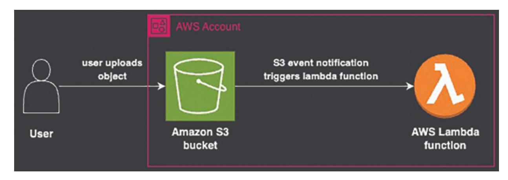

*Figure 10.1: S3 event notification*

### <span id="page-290-1"></span>**Setting Up S3 Bucket Event [Triggers](#page-25-35) with CDK**

To get started, we will create an S3 bucket that triggers a Lambda function whenever a new object is uploaded.

```
import * as cdk from 'aws-cdk-lib';
import { Bucket } from 'aws-cdk-lib/aws-s3';
import { Function, Runtime, Code } from 'aws-cdk-lib/aws-
lambda';
import { S3EventSource } from 'aws-cdk-lib/aws-lambda-event-
sources';
import { Construct } from 'constructs';
export class S3EventNotificationStack extends cdk.Stack {
```

```
constructor(scope: Construct, id: string, props?:
 cdk.StackProps) {
  super(scope, id, props);
  // Create an S3 bucket
  const bucket = new Bucket(this, 'UploadBucket', {
   versioned: true,
  });
  // Create a Lambda function to process the uploaded files
  const processFileLambda = new Function(this,
   'ProcessFileLambda', {
   runtime: Runtime.NODEJS_20_0,
   handler: 'index.handler',
   code: Code.fromAsset('lambda'),
   environment: {
     BUCKET_NAME: bucket.bucketName,
   },
  });
  // Add S3 Event Source to trigger the Lambda function
  processFileLambda.addEventSource(
   new S3EventSource(bucket, {
     events: ['s3:ObjectCreated:*'],
   })
  );
  // Grant bucket permissions to Lambda
  bucket.grantReadWrite(processFileLambda);
 }
}
```

In this example:

- 1. **Bucket:** We create an S3 bucket named **UploadBucket** .
- 2. **Lambda Function:** The Lambda function named **ProcessFileLambda** is triggered when a new object is created in the bucket. The Lambda function has read/write permissions on the bucket.

### <span id="page-291-0"></span>**[Integrating](#page-26-0) S3 Events with AWS Lambda**

The Lambda function created in the previous section will serve as the core processing logic for any new file uploaded. For demonstration purposes, we will have it extract metadata from image files and store the metadata back in the S3 bucket.

```
const AWS = require('aws-sdk');
const s3 = new AWS.S3();
exports.handler = async (event) => {
  const bucketName = process.env.BUCKET_NAME;
  for (const record of event.Records) {
     const key = record.s3.object.key;
     try {
      const metadata = {
       filename: key,
       timestamp: new Date().toISOString(),
      };
      // Write metadata to the bucket
      await s3.putObject({
       Bucket: bucketName,
       Key: `metadata/${key}.json`,
       Body: JSON.stringify(metadata),
       ContentType: "application/json"
      }).promise();
      console.log(`Metadata stored for file: ${key}`);
     } catch (error) {
      console.error(`Error processing file ${key}:`, error);
      throw error;
     }
  }
};
```

<span id="page-292-1"></span>In this example:

- 1. The function extracts metadata such as the filename and upload timestamp.
- 2. It then stores the metadata in a metadata folder within the same bucket.

### <span id="page-293-0"></span>**Error Handling and Retries in S3 Event [Workflows](#page-26-1)**

Error handling is crucial for production workloads. We will enhance the Lambda function to add better error handling and retry mechanisms. We will use an SQS Dead-Letter Queue (DLQ) to capture any failed invocations so that the data is not lost.

```
import * as sqs from 'aws-cdk-lib/aws-sqs';
import { SqsDestination } from 'aws-cdk-lib/aws-lambda-
destinations';
// Create Dead-Letter Queue
const deadLetterQueue = new sqs.Queue(this, 'DLQ');
// Add DLQ to Lambda function
const processFileLambda = new Function(this,
'ProcessFileLambda', {
 runtime: Runtime.NODEJS_18_X,
 handler: 'index.handler',
 code: Code.fromAsset('lambda'),
 environment: {
  BUCKET_NAME: bucket.bucketName,
 },
 deadLetterQueue,
 retryAttempts: 3, // Retry up to three times before moving to
 DLQ
});
```

In this example:

- 1. **DLQ:** An SQS queue is configured as a dead-letter queue for the Lambda function to capture failed events.
- 2. **Retry Mechanism:** The Lambda function is set to retry three times before moving the event to the DLQ.

### <span id="page-293-1"></span>**Scaling and [Monitoring](#page-26-2)**

To ensure our architecture can handle different scales and monitor its health, we will add metrics and alarms using Amazon CloudWatch.

```
import * as cloudwatch from 'aws-cdk-lib/aws-cloudwatch';
// Create a metric for Lambda invocations
const lambdaInvocationMetric =
processFileLambda.metric('Invocations');
// Create an alarm to monitor if Lambda invocations exceed a
certain threshold
new cloudwatch.Alarm(this, 'HighLambdaInvocationAlarm', {
 metric: lambdaInvocationMetric,
 threshold: 100,
 evaluationPeriods: 1,
 alarmDescription: 'Alarm if Lambda invocations exceed 100
 within a minute',
});
```

In this example:

- 1. **CloudWatch Metrics:** We create a metric to monitor the number of Lambda function invocations.
- 2. **CloudWatch Alarm:** If the number of invocations exceeds 100 within one minute, the CloudWatch alarm will notify us, ensuring that we are aware of any unusual activity.

#### <span id="page-294-0"></span>**[Bringing it all Together](#page-26-3)**

With the components configured above, our solution performs the following tasks:

- 1. **Event Trigger:** Whenever a new file is uploaded to the **UploadBucket** , an S3 event notification triggers the Lambda function.
- 2. **Processing:** The Lambda function processes the uploaded file, extracts metadata, and stores it back in the bucket.
- 3. **Error Handling:** If the Lambda function fails, the event is retried up to three times. After that, it is moved to the DLQ for manual intervention.
- 4. **Scaling and Monitoring:** CloudWatch metrics and alarms are set to monitor the performance of the Lambda function and to alert when the number of invocations exceeds a specified threshold.

This workflow demonstrates how you can use AWS CDK to build an automated, scalable, and resilient event-driven architecture based on S3 and

Lambda, suitable for real-world applications. The error handling and monitoring components provide the reliability and observability necessary for production deployments.

### <span id="page-295-0"></span>**ECS [Application](#page-26-4)**

In this section, we will build a complete solution for deploying an application to Amazon Elastic Container Service (ECS) using AWS CDK. We will walk through creating an ECS cluster, configuring autoscaling based on load, choosing between Fargate and EC2 launch types, and integrating logging and monitoring. The final solution will demonstrate how to handle real-world scenarios, including managing scaling and monitoring application health in production environments. In this section, we will create an ECS on Fargate application that will balance traffic using Application Load Balancer:

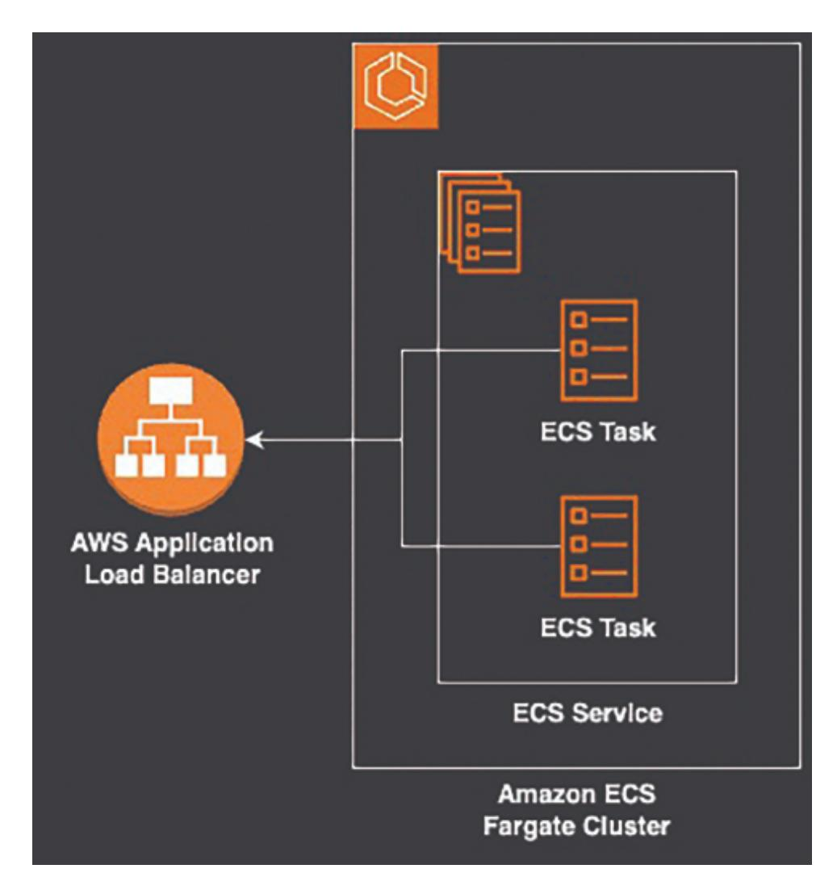

*Figure 10.2: ECS application*

### <span id="page-296-1"></span><span id="page-296-0"></span>**[Building](#page-26-5) an ECS Cluster Using CDK**

The first step is to create an ECS cluster using AWS CDK. We will define an ECS cluster, create a task definition, and deploy a service.

```
import * as cdk from 'aws-cdk-lib';
import { Vpc } from 'aws-cdk-lib/aws-ec2';
import { Cluster, ContainerImage, FargateTaskDefinition,
FargateService } from 'aws-cdk-lib/aws-ecs';
import { ApplicationLoadBalancer, ApplicationProtocol,
ApplicationTargetGroup } from 'aws-cdk-lib/aws-
elasticloadbalancingv2';
import { Construct } from 'constructs';
```

```
export class EcsApplicationStack extends cdk.Stack {
 constructor(scope: Construct, id: string, props?:
 cdk.StackProps) {
  super(scope, id, props);
  // Create a VPC for the ECS cluster
  const vpc = new Vpc(this, 'Vpc', { maxAzs: 3 });
  // Create an ECS Cluster
  const cluster = new Cluster(this, 'EcsCluster', { vpc });
  // Create a Fargate task definition
  const taskDefinition = new FargateTaskDefinition(this,
   'FargateTaskDef');
  // Add a container to the task definition
  taskDefinition.addContainer('AppContainer', {
   image: ContainerImage.fromRegistry('amazon/amazon-ecs-
   sample'), // Example container image
   memoryLimitMiB: 512,
   cpu: 256,
   logging: new AwsLogDriver({
     streamPrefix: 'ecs-app',
   }),
  });
  // Create a Fargate Service
  const service = new FargateService(this, 'FargateService', {
   cluster,
   taskDefinition,
   desiredCount: 2,
  });
  // Create an Application Load Balancer (ALB) to distribute
  traffic
  const loadBalancer = new ApplicationLoadBalancer(this, 'ALB',
  {
   vpc,
   internetFacing: true,
  });
```

```
// Add listener to the load balancer
  const listener = loadBalancer.addListener('Listener', {
   port: 80,
   open: true,
  });
  // Create a target group and add the service as a target
  listener.addTargets('ECS', {
   port: 80,
   targets: [service],
  });
  // Output the Load Balancer URL
  new cdk.CfnOutput(this, 'LoadBalancerURL', {
   value: loadBalancer.loadBalancerDnsName,
  });
 }
}
```

In this example:

- 1. **VPC and ECS Cluster:** We create a new VPC and an ECS cluster within that VPC.
- 2. **Fargate Task Definition:** The task definition is configured with a container that runs a sample application.
- 3. **Fargate Service:** We create a Fargate service with two running tasks.
- 4. **Application Load Balancer:** A load balancer is configured to distribute traffic to the ECS service.

### <span id="page-298-0"></span>**[Autoscaling](#page-26-6) ECS Tasks Based on Load**

Next, we will add autoscaling to our ECS service to ensure it can automatically adjust to the load. We will use the ECS service's built-in autoscaling capabilities and demonstrate how to add policies for scaling based on CPU utilization.

```
import { ScalableTaskCount } from 'aws-cdk-lib/aws-
applicationautoscaling';
// Configure autoscaling for ECS service
```

```
const scalableTarget = service.autoScaleTaskCount({
 minCapacity: 2,
 maxCapacity: 10,
});
// Add scaling policy based on CPU utilization
scalableTarget.scaleOnCpuUtilization('CpuScaling', {
 targetUtilizationPercent: 70,
});
```

In this example:

- 1. **Auto Scaling Target:** We configure autoscaling for the ECS service, setting a minimum of 2 tasks and a maximum of 10.
- 2. **CPU-Based Scaling Policy:** The scaling policy increases or decreases the number of running tasks to keep CPU utilization at approximately 70%.

### <span id="page-299-0"></span>**Using [Fargate](#page-26-7) versus EC2 for ECS**

A key decision for running applications on ECS is choosing between Fargate and EC2 launch types. In this section, we will discuss the differences and demonstrate how to switch from Fargate to EC2. Following are the tradeoffs between Fargate and EC2:

- **Fargate:** Fully managed, serverless container compute. You don't need to provision or manage servers, but it may be more expensive for longrunning services with low scaling requirements.
- **EC2 Launch Type:** Provides more control over the underlying infrastructure. Suitable for applications with specific hardware needs or cost requirements.

```
import { Ec2Service, Ec2TaskDefinition } from 'aws-cdk-
lib/aws-ecs';
import { InstanceType } from 'aws-cdk-lib/aws-ec2';
// Create an EC2 task definition
const ec2TaskDefinition = new Ec2TaskDefinition(this,
'EC2TaskDef');
// Add a container to the task definition
ec2TaskDefinition.addContainer('AppContainer', {
```

```
image: ContainerImage.fromRegistry('amazon/amazon-ecs-
 sample'),
 memoryLimitMiB: 512,
 cpu: 256,
 logging: new AwsLogDriver({
  streamPrefix: 'ecs-app',
 }),
});
// Create an EC2 Service using the task definition
const ec2Service = new Ec2Service(this, 'EC2Service', {
 cluster,
 taskDefinition: ec2TaskDefinition,
 desiredCount: 2,
 instanceType: new InstanceType('t2.micro'),
});
```

<span id="page-300-1"></span>In this example, we switch from Fargate to EC2 by creating an Ec2TaskDefinition and an Ec2Service. This gives us more control over instance types and infrastructure configuration.

### <span id="page-300-0"></span>**Logging and Monitoring ECS [Applications](#page-26-8)**

To manage and troubleshoot ECS applications effectively, it is important to have proper logging and monitoring in place. We will use Amazon CloudWatch to monitor our ECS cluster and container performance.

```
import { LogGroup, RetentionDays } from 'aws-cdk-lib/aws-logs';
import { Alarm, Metric } from 'aws-cdk-lib/aws-cloudwatch';
// Create a CloudWatch Log Group for ECS application
const logGroup = new LogGroup(this, 'ECSLogGroup', {
 logGroupName: '/ecs/app',
 retention: RetentionDays.ONE_WEEK,
});
// CloudWatch Alarm for High CPU Utilization
const cpuAlarm = new Alarm(this, 'CpuAlarm', {
 metric: new Metric({
  namespace: 'AWS/ECS',
  metricName: 'CPUUtilization',
```

```
dimensionsMap: {
   ClusterName: cluster.clusterName,
  },
  statistic: 'Average',
  period: cdk.Duration.minutes(1),
 }),
 threshold: 80,
 evaluationPeriods: 2,
 alarmDescription: 'Alarm if CPU utilization exceeds 80% for
 two minutes',
});
```

In this example:

- 1. **CloudWatch Log Group:** We create a log group for capturing logs from the ECS application.
- <span id="page-301-1"></span>2. **CloudWatch Alarm:** A CloudWatch alarm is configured to trigger if the average CPU utilization exceeds 80% for more than two minutes.

### <span id="page-301-0"></span>**[Bringing](#page-26-9) it all Together**

In this section, we built a complete solution for deploying an application using ECS, covering aspects such as autoscaling, choosing the right launch type, and monitoring.

- 1. **Cluster Setup and Deployment:** We first built an ECS cluster and deployed a containerized service using AWS CDK. We also integrated it with an Application Load Balancer for load distribution.
- 2. **Autoscaling:** Autoscaling policies were applied to handle variable load, ensuring optimal performance.
- 3. **Launch Type Decisions:** We explored the differences between using Fargate and EC2, providing flexibility in selecting the most suitable compute model based on the requirements.
- 4. **Logging and Monitoring:** Finally, we integrated CloudWatch for logging and monitoring, ensuring the application's health can be tracked and any issues can be addressed promptly.

This flow demonstrates how to use AWS CDK to create and manage an ECS-based application that is scalable, efficient, and easy to monitorcovering essential aspects of deploying production-ready container applications on AWS.

### <span id="page-302-0"></span>**[Customer](#page-26-10) Stories**

In this section, we will explore real-world examples of how companies such as GoDaddy, Liberty Mutual Insurance, Deepwatch, and Culture Amp have successfully leveraged AWS CDK for infrastructure automation. These stories provide insights into their unique challenges and the impactful solutions they implemented.

### <span id="page-302-1"></span>**[GoDaddy's](#page-26-11) Journey with AWS CDK**

GoDaddy, a leading domain registrar and web hosting company, faced challenges in scaling infrastructure and improving developer efficiency. To address these issues, they adopted the AWS Cloud Development Kit (CDK) to automate the provisioning of cloud resources and streamline development processes.

#### <span id="page-302-2"></span>**[Business Challenges](#page-26-12)**

<span id="page-302-4"></span>GoDaddy's development teams needed faster provisioning times and increased automation to meet customer demands efficiently. They were using AWS CloudFormation for infrastructure as code (IaC), but the process was sometimes cumbersome, especially for developers unfamiliar with JSON or YAML. As the demand for rapid feature releases grew, GoDaddy recognized the need for a solution that allowed engineers to work with a programming language they were already familiar with, reducing the learning curve and accelerating development.

#### <span id="page-302-3"></span>**[Solution with AWS CDK](#page-26-13)**

GoDaddy implemented AWS CDK as a part of their cloud infrastructure strategy. By leveraging CDK, developers could use TypeScript, a language they were comfortable with, to define cloud infrastructure, making the development process more intuitive and efficient. This adoption led to faster, more consistent deployments across different teams, improving productivity and reducing errors related to manual configuration.

With AWS CDK, GoDaddy implemented reusable infrastructure constructs, which allowed teams to deploy standard configurations with minimal effort. The pilot included nine engineering teams, and they quickly saw the benefits of using a higher-level, flexible tool for defining and managing infrastructure. CDK's abstraction and simplified programming model helped developers focus on building features rather than spending time on boilerplate code and configuration details.

#### <span id="page-303-0"></span>**[Business Outcomes](#page-26-14)**

The use of AWS CDK resulted in substantial improvements in developer productivity and infrastructure consistency. The automation provided by CDK reduced the overall time to market for new products and features, allowing GoDaddy to respond to customer needs more rapidly. Additionally, using CDK helped maintain security standards across teams, as infrastructure configurations could easily be audited and versioned.

The flexibility of AWS CDK, combined with GoDaddy's focus on agility and speed, created an environment where developers had the freedom to innovate without compromising on security or consistency. This transformation ultimately supported GoDaddy's goal of enhancing customer experiences and maintaining competitive advantage in a fast-paced industry.

#### <span id="page-303-1"></span>**[Key Highlights](#page-26-15)**

Following are some key highlights of their achievement with AWS CDK:

- **Improved Developer Velocity** : Reduced learning curve for developers by using familiar programming languages for IaC.
- **Enhanced Automation** : Consistent, automated deployments with reusable constructs.
- <span id="page-303-2"></span>**Scalable Infrastructure** : Enabled rapid scaling of resources as business demands evolved.
- **Security and Compliance** : Maintained high security standards through consistent, versioned infrastructure definitions.

By adopting AWS CDK, GoDaddy set the foundation for more efficient and agile infrastructure management, resulting in faster product releases and an

improved developer experience, ultimately benefiting their customers and business growth.

### <span id="page-304-0"></span>**Liberty Mutual [Insurance's](#page-26-16) Use of AWS CDK**

Liberty Mutual Insurance adopted AWS Cloud Development Kit (CDK) to drive innovation and streamline infrastructure management. The company aimed to empower developers to use familiar programming languages to define and manage cloud infrastructure, minimizing reliance on traditional JSON/YAML templates. AWS CDK enabled the creation of a serverless software accelerator, allowing developers to rapidly deploy serverless patterns through reusable constructs.

#### <span id="page-304-1"></span>**[Business Challenges](#page-26-17)**

Liberty Mutual's primary challenge was to reduce development complexity and improve infrastructure provisioning efficiency. Using AWS CloudFormation alone created difficulties, particularly for developers unfamiliar with IaC templates in JSON/YAML. This complexity slowed down development cycles, onboarding of new developers, and infrastructure consistency across teams. The company needed a solution that made infrastructure management more accessible to developers while maintaining quality and security.

### <span id="page-304-2"></span>**[Solution with AWS CDK](#page-26-18)**

To address these challenges, Liberty Mutual adopted AWS CDK to shift towards a serverless-first mindset. The CDK enabled developers to define cloud infrastructure using programming languages such as TypeScript and Python, which they were already familiar with. This significantly lowered the learning curve, allowing new developers to onboard quickly without spending extensive time on learning IaC syntax.

With AWS CDK, Liberty Mutual provided easy-to-use templates that automated the deployment of serverless applications. Developers could use standardized and reusable constructs, ensuring consistency across all deployments. The reusable components improved the speed of deployment and also helped enforce best practices, making infrastructure more secure and reliable.

<span id="page-305-2"></span>Moreover, shared infrastructure libraries created with CDK provided a consistent way for different teams to build and maintain serverless architectures. This streamlined the process, allowing developers to focus on delivering business value rather than handling repetitive infrastructure configurations.

#### <span id="page-305-0"></span>**[Business Outcomes](#page-26-19)**

The adoption of AWS CDK transformed Liberty Mutual's approach to managing cloud infrastructure. The ability to quickly define serverless stacks reduced deployment times, leading to faster iterations, feature releases, and quicker responses to customer needs. AWS CDK's automation also minimized the manual burden of managing infrastructure, which resulted in increased development speed and reduced costs by optimizing resource usage.

The shift to a more agile, serverless-first infrastructure, supported by reusable constructs, empowered Liberty Mutual's developers to innovate freely without being hindered by infrastructure complexities. This transformation resulted in higher productivity, more consistent infrastructure, and better overall application quality.

#### <span id="page-305-1"></span>**[Key Highlights](#page-26-20)**

Following are some key highlights of their achievement with AWS CDK:

- **Reduced Complexity** : Using familiar programming languages such as TypeScript and Python, AWS CDK simplified infrastructure provisioning, reducing the learning curve for developers.
- **Improved Developer Productivity** : Developers were able to focus on building features rather than handling manual infrastructure configuration, leading to faster development cycles.
- **Standardized Deployment** : Reusable infrastructure constructs provided a consistent, secure, and repeatable way to deploy serverless patterns across multiple teams.
- **Reduced Deployment Times** : Automation with AWS CDK decreased the time required for infrastructure deployment, enabling faster iterations and releases.

**Security and Reliability** : By enforcing best practices through shared infrastructure templates, AWS CDK ensured secure and reliable deployments throughout the organization.

With AWS CDK, Liberty Mutual successfully adopted a more efficient, agile infrastructure model, ultimately supporting better business outcomes through improved developer experience and faster delivery of applications.

### <span id="page-306-0"></span>**[Deepwatch's](#page-26-21) Journey with AWS CDK**

<span id="page-306-3"></span>Deepwatch, a leading managed detection and response (MDR) service provider, adopted AWS Cloud Development Kit (CDK) to enhance their infrastructure management. AWS CDK enabled Deepwatch to simplify infrastructure provisioning while maintaining stringent security requirements, accelerating their infrastructure as code (IaC) adoption process.

#### <span id="page-306-1"></span>**[Business Challenges](#page-26-22)**

Deepwatch faced the challenge of provisioning complex infrastructure patterns efficiently and securely. They needed to integrate infrastructure management seamlessly into their continuous integration/continuous deployment (CI/CD) pipeline, ensuring faster iterations without compromising security standards. Traditional Infrastructure as Code (IaC) methods using JSON/YAML templates were cumbersome and inefficient, slowing down their time to market.

#### <span id="page-306-2"></span>**[Solution with AWS CDK](#page-26-23)**

To address these challenges, Deepwatch turned to AWS CDK, which allowed their developers to use familiar programming languages such as Python to manage infrastructure. By using AWS CDK, Deepwatch could abstract away the complexity of JSON/YAML templates and focus on writing reusable infrastructure components in code. These constructs could then be used across different teams, ensuring a consistent infrastructure setup.

With CDK, Deepwatch was able to create complex infrastructure patterns as reusable templates, integrating these templates into their CI/CD pipelines. This provided a standardized way to automate infrastructure management

while improving agility. AWS CDK constructs enabled rapid iteration, making infrastructure management simpler and aligning it with Deepwatch's security and compliance standards.

Deepwatch utilized CDK to define secure network architectures, load balancing, auto-scaling configurations, and data storage, enabling their teams to provision infrastructure in a fraction of the time it used to take. Additionally, the reusable constructs made onboarding new developers easier, as they no longer needed to learn the intricacies of infrastructure syntax but could work with familiar programming paradigms.

#### <span id="page-307-0"></span>**[Business Outcomes](#page-26-24)**

By adopting AWS CDK, Deepwatch achieved a 60% increase in efficiency for infrastructure provisioning. The reusable CDK constructs allowed for quicker iterations and improved collaboration among development, operations, and security teams. Integrating infrastructure provisioning into the CI/CD pipeline meant that developers could focus on writing application code, while infrastructure was seamlessly handled in the background, leading to increased productivity and faster delivery times.

<span id="page-307-2"></span>AWS CDK also enabled Deepwatch to enforce best practices, leading to more consistent and secure deployments. The ability to use familiar programming languages made it easier for new team members to contribute, reducing onboarding time and accelerating project timelines.

The success of CDK in provisioning their backend infrastructure has prompted Deepwatch to plan a full migration of their Infrastructure as Code (IaC) suite to AWS CDK, with the goal of improving efficiency even further, fostering innovation, and accelerating their product development cycles.

### <span id="page-307-1"></span>**[Key Highlights](#page-26-25)**

Following are some key highlights of their achievement with AWS CDK:

- **60% Increase in Infrastructure Efficiency** : Infrastructure provisioning became 60% faster due to the automation and reuse of constructs provided by AWS CDK.
- **CI/CD Integration** : AWS CDK enabled seamless integration of infrastructure provisioning into their CI/CD pipelines, streamlining operations.

- **Enhanced Team Collaboration** : The adoption of AWS CDK allowed for improved collaboration between development, security, and operations teams by creating standardized infrastructure components.
- **Reduced Onboarding Time** : Familiar programming languages such as Python simplified the onboarding process, allowing new team members to contribute more quickly.
- **Reusable Constructs** : The creation of reusable infrastructure templates ensured consistency, security, and rapid deployments across multiple projects.

By using AWS CDK, Deepwatch successfully addressed their need for efficient, secure, and integrated infrastructure management, ultimately improving productivity and enabling faster delivery of their managed security solutions.

### <span id="page-308-0"></span>**[Culture](#page-26-26) Amp's Use of AWS CDK**

Culture Amp, a leading employee engagement platform, adopted AWS Cloud Development Kit (CDK) to modernize their infrastructure. They moved from a single-region, monolithic EC2-based application to a more dynamic, multi-region architecture that used Amazon ECS, AWS Fargate, DynamoDB, and RDS. AWS CDK allowed them to scale their infrastructure seamlessly while promoting innovation and improving developer productivity.

#### <span id="page-308-1"></span>**[Business Challenges](#page-26-27)**

<span id="page-308-2"></span>Culture Amp faced challenges related to the manual, time-consuming provisioning of AWS resources. They wanted their engineers to be able to use AWS services effectively without needing extensive expertise in AWS CloudFormation or manually managing infrastructure configurations. Their legacy infrastructure was also limiting the scalability and agility needed for their growing customer base.

With an increase in the need for rapid, cloud-native deployments, Culture Amp recognized the necessity of adopting a microservices-based architecture to improve resilience, scalability, and feature delivery. However, the complexity involved in managing such a migration required a robust Infrastructure as Code (IaC) solution that could be used by developers who

were more familiar with writing application code rather than cloud infrastructure.

#### <span id="page-309-0"></span>**[Solution with AWS CDK](#page-26-28)**

To address these challenges, Culture Amp adopted AWS CDK, which enabled their engineers to leverage pre-approved, reusable constructs to build infrastructure using familiar programming languages such as TypeScript and Python. This drastically simplified the process of managing and provisioning resources.

AWS CDK's high-level abstractions enabled Culture Amp to automate infrastructure provisioning for a wide range of services, including Amazon ECS for container orchestration, AWS Fargate for serverless container management, and DynamoDB for backend storage. Engineers could quickly spin up complete environments by selecting from pre-defined infrastructure patterns, which reduced the manual effort involved in creating, maintaining, and scaling their microservices.

CDK's flexibility allowed Culture Amp to create " *guardrails* " to ensure that every deployed resource adhered to company-wide best practices regarding security, reliability, and performance. These predefined templates helped in standardizing deployments across teams, avoiding misconfigurations, and enhancing security compliance. By integrating CDK into their CI/CD pipelines, Culture Amp made infrastructure provisioning an integral part of the development workflow, ensuring that new features could be tested and deployed with minimal friction.

#### <span id="page-309-1"></span>**[Business Outcomes](#page-26-29)**

By leveraging AWS CDK, Culture Amp significantly improved deployment efficiency and accelerated their move towards a cloud-native architecture. Previously, deploying new environments or services could take up to six weeks, largely due to the cumbersome manual provisioning process. With CDK, this timeline was drastically reduced to just a few hours, thereby enhancing agility and enabling rapid iteration for new features.

AWS CDK also helped reduce the learning curve for developers, as they could use familiar programming languages instead of requiring them to learn CloudFormation syntax. This empowered engineers to contribute directly to

<span id="page-310-1"></span>infrastructure management, leading to an overall improvement in productivity and reduced dependency on dedicated infrastructure teams.

The use of reusable CDK constructs allowed for greater consistency in deployments, which reduced errors and ensured that security and operational best practices were applied uniformly across the entire infrastructure. This consistent approach provided a more reliable, secure, and high-quality infrastructure environment, which was crucial for Culture Amp's expanding customer base and the growing complexity of their platform.

Culture Amp's adoption of AWS CDK also improved their ability to scale. As customer demands increased, the team could easily replicate infrastructure across multiple AWS regions, providing improved availability and redundancy. The efficiency gained through CDK allowed the company to focus more on building features and expanding their offerings rather than managing infrastructure, ultimately driving business growth.

#### <span id="page-310-0"></span>**[Key Highlights](#page-26-30)**

Following are some key highlights of their achievement with AWS CDK:

- **Accelerated Deployment Times** : Transitioned from a deployment timeline of up to six weeks to just a few hours, enabling faster time-tomarket for new features.
- **Familiar Programming Languages** : Engineers could use TypeScript and Python, reducing the learning curve and increasing productivity, as developers didn't have to learn CloudFormation syntax.
- **Reusable Constructs** : AWS CDK constructs were used to create reusable infrastructure patterns, ensuring that best practices were consistently followed across teams and reducing the likelihood of misconfigurations.
- **Integrated CI/CD Pipelines** : AWS CDK facilitated seamless integration into CI/CD workflows, enabling automatic provisioning of infrastructure as part of the development process.
- **Improved Scalability and Availability** : Enabled a multi-region deployment setup with ECS, Fargate, and DynamoDB, supporting better availability and redundancy for their applications.
- **Standardized Infrastructure** : The use of guardrails and standardized templates ensured consistent application of security and reliability best

practices, enhancing overall infrastructure quality.

The adoption of AWS CDK allowed Culture Amp to fully embrace a cloudnative, scalable, and secure infrastructure model. By automating and simplifying infrastructure provisioning, Culture Amp's engineering teams could focus on innovation, thereby providing a better product and experience for their customers.

### <span id="page-311-0"></span>**[Conclusion](#page-26-31)**

In this chapter, we delved into two powerful use cases of AWS CDK: S3 Event Notification and ECS Application. By exploring how to set up event triggers in S3, integrate Lambda for event processing, handle errors, and scale event-driven architectures, we demonstrated the versatility of S3 for automation. Additionally, the ECS Application deep dive showcased the process of building clusters, leveraging autoscaling, comparing Fargate and EC2, and implementing monitoring best practices. Together, these examples highlight the efficiency and scalability that AWS CDK brings to modern infrastructure management.

The exploration of AWS CDK in this chapter demonstrates its transformative potential for cloud infrastructure automation and innovation. Through the various case studies of companies such as GoDaddy, Liberty Mutual, Deepwatch, and Culture Amp, we understood how AWS CDK helps organizations of all sizes tackle complex cloud challenges by empowering their development teams. The ability to define infrastructure using familiar programming languages significantly reduces the barrier to entry for developers, enhancing productivity and ensuring faster deployments. Each of these companies leveraged reusable constructs, automated infrastructure provisioning, and integrated security best practices to achieve efficiency, scalability, and cost savings.

### **Index**

#### <span id="page-312-0"></span>A

```
Abstracting Infrastructure 201, 202
Abstracting Infrastructure, benefits
  consistency 202
  errors, reducing 202
  maintainability 202
Amazon Route 53 93
Amazon Route 53, best practices <u>94</u>
Amazon Route 53, setting up 93, 94
Amazon S3, points
  Bucker, configuring 90
  policies/public access, preventing 91
Amazon Web Service (AWS) 22
API Gateway 96
API Gateway, resources
  HTTP API 96
  REST API 96
Aspects, use cases
  checks, compliance 208
  Enforcement, tagging 208
  security, hardening 208
Asset Management 73
Asset Management, aspects <u>73</u>, <u>74</u>
Asset Management, enhancing 74 - 76
Automating Tests, points
  cloud environment 168
  test failures, handling <u>169</u>
AWS Accounts, challenges
  consistency, managing 128
  drift, dealing 128
AWS Accounts, deploying
  Environment, separating <u>127</u>
  role, assumption <u>127</u>
AWS CDK 11
AWS CDK, advantages
  expressiveness 12
  IDE, supporting 12
  maintainability 12
AWS CDK, architecture 11
AWS CDK/AWS CloudFormation, comparing 16
AWS CDK, benefits
  AWS Services, integrating 13
  code reusability/modularity 13
```

```
developer productivity, improving 13
 infrastructure management, simplifying 12
AWS CDK Business, outcomes 229
AWS CDK, evolution 11
AWS CDK, key areas
 Amazon Web Service (AWS) 22
 Infrastructure as Code (IaC) 23
 program, languages 23
AWS CDK, key highlights
 automation, enhancing 229
 developer velocity, improving 229
 scalable, infrastructure 230
 security, compliance 230
AWS CDK, mechanisms
 Constructs 34
 Stacks 34
AWS CDK, phases
 Deployment 34
 Synthesis 34
AWS CDK/Pulumi, comparing 18
AWS CDK, significance 30 , 31
AWS CDK, steps
 deploying 33
 initializing 29
 insights, configuring 31
AWS CDK/Terraform, comparing 17
AWS CDK Toolkit, installing 27
AWS CDK, tools
 AWS CloudFormation 14
 Pulumi 16
 Terraform 15
AWS CDK, use cases 17
AWS CLI, operations
 AWS Credential, setting up 28
 IAM User, configuring 27
 IDE, setting up 28 , 29
AWS CLI, system
 Linux 25
 MacOS 25
 Windows 24
AWS CloudFormation 14
AWS CloudFormation, architecture 14
AWS CloudFormation/IaC, comparing 16
AWS CloudFormation, integrating 17
AWS CloudFormation, key features
 Drift Detection, managing 15
 sets, changing 15
 Stack Sets, optimizing 14
 Template-Driven, infrastructure 14
AWS CodePipeline 120 , 121
```

| AWS CodePipeline, configuring 121, 122                                             |
|------------------------------------------------------------------------------------|
| AWS Environments 60, 61                                                            |
| AWS Environments, deploying 62 - 64                                                |
| AWS Environments, stages                                                           |
| developer 61                                                                       |
| production 61                                                                      |
| staging 61                                                                         |
| AWS Environments Variables, configuring 62                                         |
| AWS Lambda 215                                                                     |
| AWS, services                                                                      |
| CloudFormation 22                                                                  |
| Identity Access Management (IAM) 22                                                |
| Simple Storage Service (S3) 22                                                     |
| AWS, setup 23, 24                                                                  |
| B                                                                                  |
| Backend Infrastructure 100                                                         |
| Backend Infrastructure, points                                                     |
| Caching 104                                                                        |
| DynamoDB 103                                                                       |
| ElastiCache 105                                                                    |
| RDS 100                                                                            |
| Bootstrapping 35                                                                   |
| Bootstrapping, analyzing 36                                                        |
| Bootstrapping, architecture 36                                                     |
| Bootstrapping, importance 36                                                       |
| Bootstrapping, scenarios                                                           |
| CDK, configuring 37                                                                |
| S3 Bucket, customizing 37                                                          |
| Bootstrapping, steps 36                                                            |
| C                                                                                  |
| CDK Application 171                                                                |
| CDK Application, issues 174                                                        |
| CDK Application, logs                                                              |
| CloudFormation 171                                                                 |
| Custom Resource 171                                                                |
| Service-Specific 171                                                               |
| CDK Application, practices<br>build, resilience 179                                |
| logging 178                                                                        |
| CDK Applications, benchmarking 216                                                 |
| CDK Apps 58                                                                        |
| CDK Assets, static<br>bundles/files, managing 70, 71<br>identifiers, preventing 71 |
| CDK CLI 38<br>CDK CLI commands 38                                                  |

```
CDK Contexts 144
CDK Contexts, architecture 144 , 145
CDK Contexts Data, encrypting 145 , 146
CDK Contexts With AWS, automating 146 , 147
CDK Debug, commands
 cdk diff 176
 cdk synth 177
cdk deploy 39
CDK Deployment 140
CDK Deployment, concepts
 CDK Boots, leveraging 142
 CI/CD Pipelines, securing 142 , 143
 Cross-Account Deployment 143
 Principle of Least Privilege (PoLP) 140 , 141
 Sensitive Resources, restricting 141
cdk destroy 39
cdk destroy, optimizing 39
cdk ls 40
cdk ls, configuring 40
cdk-nag 152
cdk-nag, architecture 152
cdk-nag, auditing 155
cdk-nag, customizing 153
cdk-nag, features
 actionable, feedback 152
 automate, audits 152
 rules, customizing 152
cdk-nag, optimizing 153
cdk-nag, resolving 154
CDK Project 43
CDK Project, architecture
 architecture, diagrams 46
 documentation 46
 stakeholder, interviews 46
CDK Project, best practices
 Documentation 49
 Environment-Specific, configuring 49
 Error, handling 49
 Modularization 49
 Name, conventions 49
CDK Project, components
 App 45
 constructs 45
 Context 45
 Environment, configuring 45
 Stack 45
CDK Project, directory 43 , 44
CDK Project, translating 46 - 48
cdk synth 38
cdk synth, analyzing 38
```

```
CDK Testing 158
CDK Testing, core concepts
 mocking 160
 production environment, configuring 160
 Unit/Integration, tests 160
CDK Testing, importance 158 , 159
CDK Testing, issues
 cost, unexpecting 159
 misconfigurations, undetecting 159
 security, risks 159
CDK Testing, methods
 End-to-End (E2E) Testing 164
 Mocking AWS, services 165
 Snapshot Testing 163
 Unit Testing 162
CDK Testing, tools
 AWS SAM/Jest 161
 built-in 161
 CI/CD Pipeline, integrating 161 , 162
CI/CD 113
CI/CD, advantages 116
CI/CD, architecture 114
CI/CD, components
 automate, testing 115
 build, automation 115
 deployment, automation 115
 source control, managing 115
CI/CD, deploying 124
CI/CD, features
 bugs/issues, detecting 116
 developer, productivity 116
 faster, delivery 116
 manual intervention 116
CI/CD, importance 114 , 115
CI/CD, role 117
CI/CD Rollbacks, implementing 119
CI/CD, stages
 build 118
 deploy 118
 source 117
 test 118
CI/CD Strategies, handling 119
CIDR 79
Circular Dependencies, issues 178
CloudFormation Designer, debugging 177
CloudFormation Logs 171
CloudFormation, mapping 35
CloudFormation Stack, reasons
 circular, dependencies 175
 IAM Permission, errors 175
```

```
parameter, validation 175
  Resource, quotas 175
CloudFormation Templates, generating 35
CloudFront 91
CloudFront, configuring 92
CloudFront, practices
  caching 93
  error pages, configuring 93
  HTTPS, enabling 93
CloudFront With SSL/TLS, associating 92
Cloud-Native 125
Cloud-Native Variables, managing 126
CloudWatch, filters
  Keyword-Based 173
  Resource-Based 173
  Time-Based 173
CodeBuild 123
Command Line Interface (CLI) 24
Constructs 51
Constructs, boundaries 55
Constructs, concepts
  Nodes 52
  Tree 51
Constructs, degree
  Level 1 (L1) 53
  Level 2 (L2) 53
  Level 3 (L3) 54
Constructs, scope 55
Context Variables 67
Context Variables, analyzing 40
Context Variables, best practices
  consistent, naming 69
  environment, isolating 69
  version, controlling 69
Context Variables, synthesis
  across environment, managing 68 , 69
  influence, deploying 68
Cost Optimization 212
Cost Optimization, resources
  auto-scaling 213
  instance type, selecting 213
  right-size 213
Cross-Stack 57 , 58 , 85
Cross-Stack, dependencies 178
Cross-Stack, deploying 87
Cross-Stack, limitations
  circular, dependencies 87
  dependencies, minimizing 87
  Granular, boundaries 87
Cross-Stack, resources 86
```

| Culture Amp 233                                                                                                                     |               |
|-------------------------------------------------------------------------------------------------------------------------------------|---------------|
| Culture Amp, challenges 233                                                                                                         |               |
| Culture Amp, key highlights 235                                                                                                     |               |
| Culture Amp, outcomes 234                                                                                                           |               |
| Custom Constructs 191                                                                                                               |               |
| Custom Constructs, best practices<br>code, quality 195<br>Documentation 195<br>licensing 195<br>versioning 195                      |               |
| Custom Constructs, building 192, 193                                                                                                |               |
| Custom Constructs, scenarios<br>complex business logic 191<br>customization 192<br>reusability 192<br>Team-Specific, compliance 192 |               |
| Custom Constructs, validating 193                                                                                                   |               |
| Custom Constructs With CI/CD, integrating 195 - 197                                                                                 |               |
| Custom Log, setting up 173                                                                                                          |               |
| Custom Name, considering<br>environment, indicators 66<br>length, limit 66<br>uniqueness 66                                         |               |
| Custom Resource Logs 172                                                                                                            |               |
| Custom Resources 205                                                                                                                |               |
| Custom Resources, best practices<br>Error, handling 207<br>graceful, cleanup 207<br>Idempotency 207<br>Resource ID 207              |               |
| Custom Resources Security, practices 207, 208                                                                                       |               |
| Custom Resources, steps 206                                                                                                         |               |
| Custom Resources, use cases 205                                                                                                     |               |
| Custom Resources With Lambda, optimizing 206                                                                                        |               |
| <b>D</b>                                                                                                                            |               |
| Database Performance, optimizing 215                                                                                                |               |
| Deepwatch 231                                                                                                                       |               |
| Deepwatch, challenges 232                                                                                                           |               |
| Deepwatch, key highlights 233                                                                                                       |               |
| Deepwatch, outcomes 232                                                                                                             |               |
| Deployment, strategy<br>Blue-Green 109<br>Canary 110<br>Rolling 110                                                                 |               |
| DevOps Automation 2, 3                                                                                                              |               |
| DevOps Automation, benefits<br>collaboration, improving 3                                                                           |               |
| reliability, consistency                                                                                                            | 3             |
| scalability                                                                                                                         | 3             |
| speed, efficiency                                                                                                                   | 3             |
| DevOps Automation, practices<br>automate, testing                                                                                   | 4             |
| Continuous Delivery/Deployment                                                                                                      | 4             |
| Continuous Integration (CI)                                                                                                         | 4             |
| Infrastructure as Code (IaC)                                                                                                        | 4             |
| monitor, logging                                                                                                                    | 4             |
| DRY                                                                                                                                 | 107, 108      |
| DynamoDB                                                                                                                            | 103           |
| DynamoDB, fundamentals<br>cost, optimizing                                                                                          | 104           |
| Event Driven, implementing                                                                                                          | 103           |
| Large-Scale Data, handling                                                                                                          | 103           |
| <b>E</b>                                                                                                                            |               |
| E2E Testing, scenarios                                                                                                              | 164, 165      |
| EC2 Lambda                                                                                                                          | 97            |
| EC2/Lambda, comparing                                                                                                               | 99            |
| EC2 Lambda, key factors<br>compute model                                                                                            | 97            |
| cost                                                                                                                                | 97            |
| scalability                                                                                                                         | 97            |
| EC2 Lambda, services<br>Auto Scaling Groups (ASG)                                                                                   | 98            |
| CDK, provisioning                                                                                                                   | 97            |
| Elastic Load Balancers (ELB)                                                                                                        | 98            |
| EC2 Lambda, setting up<br>API Gateway, integrating                                                                                  | 99            |
| concurrency, managing                                                                                                               | 99            |
| EC2 Lambda, use cases                                                                                                               | 97            |
| ECS Application, concepts<br>autoscale, tasks                                                                                       | 225           |
| Cluster/CDK, building<br>log, monitoring                                                                                            | 224, 225, 227 |
| resources, deploying                                                                                                                | 228           |
| ECS/EC2, comparing                                                                                                                  | 226, 227      |
| Effective Debugging                                                                                                                 | 175           |
| End-to-End (E2E) Testing                                                                                                            | 164           |
| Enforce Tagging                                                                                                                     | 211           |
| Ensuring Consistency                                                                                                                | 146           |
| Ensuring Consistency, strategies<br>Centralize Context<br>Environment-Specific                                                      | 146           |
| Version Contexts<br>Executing Tests                                                                                                 | 146, 166      |
| Executing Tests, strategies                                                                                                         |               |

```
Parallelize/Optimize Test 169
  Unit Tests 166
F
Feature Flags 72
Feature Flags, architecture 72
Feature Flags With CDK, managing 72
Frontend Infrastructure 89
Frontend Infrastructure, architecture
  Amazon Route 53 93
  Amazon S3 90
  CloudFront 91
G
GoDaddy 228
GoDaddy, challenges 228
GoDaddy, optimizing 228
H
Handling Tokens, practices 209
High-Level Constructs 186
High-Level Constructs, architecture 186
High-Level Constructs, composing 188 , 189
High-Level Constructs, extending 190 , 191
High-Level Constructs, patterns 187 , 188
High-Level Constructs Security, compliance 189 , 190
I
IaC, advantages
  auditability, compliance 9
  CI/CD, automating 10
  collaboration/communication, improving 8
  cost, managing 8
  Disaster Recovery, backup 9
  reliability/stability 9
  scalability/flexibility 7
  security compliance, enhancing 8
  speed, efficiency 7
  standardization, consistency 6
  test capabilities, enhancing 11
  version control, managing 10
IaC, benefits
  automation 23
  consistency 23
  version, controlling 23
IaC, history 5
```

| IaC, role<br>collaboration, communicating 6<br>reliability, consistency 6<br>speed, efficiency 6<br>traceability/version, controlling 6<br>IAM Policies 148<br>IAM Policies, strategies<br>CDK, leveraging 149<br>conditional, crafting 151<br>Fine-tune, resource 150<br>Least Privilege, implementing 150<br>permissions, considering 148<br>Role Identification, automating 151<br>IGWs, best practices<br>cost, optimizing 81<br>redundancy 81<br>IGWs, types<br>Internet Gateway 81<br>NAT Gateway 81<br>Infrastructure as Code (IaC) 5, 23                                                                                                           |
|------------------------------------------------------------------------------------------------------------------------------------------------------------------------------------------------------------------------------------------------------------------------------------------------------------------------------------------------------------------------------------------------------------------------------------------------------------------------------------------------------------------------------------------------------------------------------------------------------------------------------------------------------------|
| L                                                                                                                                                                                                                                                                                                                                                                                                                                                                                                                                                                                                                                                          |
| L1, characteristics<br>coverage, comprehensive 53<br>direct, mapping 53<br>verbatim, property 53<br>L2, characteristics<br>APIs, simplifying 53<br>AWS, configuring 54<br>composable 54<br>L3, characteristics<br>complex, compositions 54<br>opinionated, configuring 54<br>overhead, configuring 54<br>Liberty Mutual Insurance 230<br>Liberty Mutual Insurance, challenges 230<br>Liberty Mutual Insurance, highlights<br>complexity, reducing 231<br>deployment times, reducing 231<br>developer productivity, improving 231<br>infrastructure, deploying 231<br>security, reliability 231<br>Liberty Mutual Insurance, outcomes 231<br>LocalStack 166 |
| M                                                                                                                                                                                                                                                                                                                                                                                                                                                                                                                                                                                                                                                          |
| Modularization 200                                                                                                                                                                                                                                                                                                                                                                                                                                                                                                                                                                                                                                         |

Modularization, benefits

```
maintainability 200
  reusability 200
  scalability 200
Multi-Environment, fundamentals
  Blue/Green, implementing 130
  canary/phase rollouts, managing 131
  Deployment Scenarios, handling 129 , 130
  quality, ensuring 132
  Region Resources, managing 128
  smoke/performance, testing 132
Multi-Region Architectures 147
Multi-Region Architectures, note
  cross-account, access 147
  multi-account, pipelines 148
  regional, variability 147
Multi-Stack CDK, practices
  Environment, managing 105 , 106
  IaC, optimizing 107
  State/Outputs, handling 108
MyBucket 65
N
NACLs, aspects
  outbound security, implementing 83
  security group 82
  security rules, optimizing 83
Node.js 25
Node.js, systems
  Linux 26
  MacOS 26
  Windows 25
O
Optimize Testing, strategies
  test, caching 170
  Test, sharding 170
Optimize Testing, ways
  selective, deploying 169
  test, filtering 169
P
Parameter Management 66 , 67
Parameter Management, best practices 67
Parameters 64
Parameters, resources
  Custom Name 65 , 66
  Logical IDs, managing 64
```

| Performance Tuning 214<br>Performance Tuning, factors<br>load balancers, using 215<br>PrivateLink 215<br>VPC Design, optimizing 215<br>Pipeline Triggers Notification, integrating 119<br>Pipeline Triggers, setting up 119<br>Pitfalls With Tokens, optimizing 209<br>Pulumi 16<br>Pulumi, architecture 16<br>Pulumi, capabilities<br>cross-cloud, supporting 16<br>language, supporting 16<br>rich ecosystems 16<br>state, managing 16 |
|------------------------------------------------------------------------------------------------------------------------------------------------------------------------------------------------------------------------------------------------------------------------------------------------------------------------------------------------------------------------------------------------------------------------------------------|
| R                                                                                                                                                                                                                                                                                                                                                                                                                                        |
| RDS 101<br>RDS, points<br>CloudWatch, configuring 102<br>Multi-AZ/Replicas, implementing 102<br>Reserved Instances (RIs) 214                                                                                                                                                                                                                                                                                                             |
| Resources Across Stacks 85                                                                                                                                                                                                                                                                                                                                                                                                               |
| Resources Across Stacks, practices 87                                                                                                                                                                                                                                                                                                                                                                                                    |
| Reusable Constructs 182, 183                                                                                                                                                                                                                                                                                                                                                                                                             |
| Reusable Constructs, dependencies                                                                                                                                                                                                                                                                                                                                                                                                        |
| Minimal 185                                                                                                                                                                                                                                                                                                                                                                                                                              |
| Peer 185                                                                                                                                                                                                                                                                                                                                                                                                                                 |
| Pin 185                                                                                                                                                                                                                                                                                                                                                                                                                                  |
| Reusable Constructs, guidelines                                                                                                                                                                                                                                                                                                                                                                                                          |
| changelog 184                                                                                                                                                                                                                                                                                                                                                                                                                            |
| deprecation, warning 184                                                                                                                                                                                                                                                                                                                                                                                                                 |
| semantic, versioning 184                                                                                                                                                                                                                                                                                                                                                                                                                 |
| Reusable Constructs, principles                                                                                                                                                                                                                                                                                                                                                                                                          |
| Abstraction 183                                                                                                                                                                                                                                                                                                                                                                                                                          |
| Encapsulation 183                                                                                                                                                                                                                                                                                                                                                                                                                        |
| Modularity 183                                                                                                                                                                                                                                                                                                                                                                                                                           |
| Reusable Constructs, steps                                                                                                                                                                                                                                                                                                                                                                                                               |
| NPM, login 185                                                                                                                                                                                                                                                                                                                                                                                                                           |
| package, constructing 185                                                                                                                                                                                                                                                                                                                                                                                                                |
| package, publish 185                                                                                                                                                                                                                                                                                                                                                                                                                     |
| run, tests 185                                                                                                                                                                                                                                                                                                                                                                                                                           |
| Reusable Constructs Version, controlling 204                                                                                                                                                                                                                                                                                                                                                                                             |
| Route Tables 84                                                                                                                                                                                                                                                                                                                                                                                                                          |
| Route Tables, setting up 84                                                                                                                                                                                                                                                                                                                                                                                                              |
| Route Tables Traffic, handling 85                                                                                                                                                                                                                                                                                                                                                                                                        |

```
S3 Bucket 219
S3 Bucket Error, handling 221
S3 Bucket, monitoring 222
S3 Bucket, setting up 219 , 220
S3 Bucket With Lambda, integrating 220 , 221
Self-Mutating Code, detecting 136
Self-Mutating Pipelines 133
Self-Mutating Pipelines, advantages
  agility, increasing 136
  consistency 136
  Continuous, improving 137
Self-Mutating Pipelines, architecture 133
Self-Mutating Pipelines, benefits
  complex, debugging 137
  drift, version 137
  overhead 137
Self-Mutating Pipelines, practices
  conditional logic, uses 135
  granular stage 135
  monitor pipeline, implementing 135
Self-Mutating Pipelines, process
  rerun, updating 134
  self-upgrade 134
  synth stage 134
Self-Mutating Pipelines, setting up 134 , 135
Self-Mutating Pipelines, strategies 136
Sharing Constructs 202 , 203
Sharing Constructs, benefits
  collaboration 203
  faster, developing 203
  standardization 203
Snapshot Testing 163
Snapshot Testing, benefits 164
Snapshot Testing, managing 164
Sources 123
SSM, best practices 89
SSM With Parameters, retrieving 88
Stack 56 , 57
Stack, dependencies 57
Stack, properties 57
Storage Costs, optimizing 213
Subnet Architecture 80
Subnet Architecture, types
  Isolated 81
  Private 81
  Public 81
Subnet Design, practices
  AZs, deploying 81
  segment, purpose 81
Systems Manager (SSM) 88
```

#### **T**

| Tagging 209                                         |
|-----------------------------------------------------|
| Tagging, purpose                                    |
| compliance 210                                      |
| cost management 210                                 |
| organization 210                                    |
| Tagging Security, compliance 211, 212               |
| Tagging, strategies                                 |
| consistent tags 210                                 |
| hierarchical 211                                    |
| Terraform 15                                        |
| Terraform, architecture 15                          |
| Terraform, capabilities                             |
| modules, reusability 15                             |
| plans, executing 15                                 |
| Provider-Agnosticism 15                             |
| state, managing 15                                  |
| Testing 124                                         |
| Troubleshoot 174                                    |
| Troubleshoot, process 175                           |
| Troubleshoot, strategies 176                        |
| TypeScript 26                                       |
| U                                                   |
| Unit Testing 162                                    |
| Unit Testing, architecture 162                      |
| Unit Testing, configuring 162, 163                  |
| V                                                   |
| Version control 49                                  |
| Version control, components<br>automate, testing 50 |
| IaC Drift, detecting 50                             |
| infrastructure, versioning 50                       |
| Pull Request/Code, reviewing 49                     |
| strategy, branching 49                              |
| Virtual Private Cloud (VPC) 79                      |
| VPC, steps<br>CIDR 79, 80                           |
| Internet Gateways (IGWs) 81                         |
| Subnet Architecture 80                              |