# THORSTEN BALL

# WRITING A COMPILER IN GO


### Writing A Compiler In Go

Thorsten Ball

# Contents

| Acknowledgments                                            | 3                                      |     |
|------------------------------------------------------------|----------------------------------------|-----|
| Introduction                                               | 4                                      |     |
| Evolving Monkey                                            | 5                                      |     |
| The Past and Present                                       | 6                                      |     |
| The Future                                                 | 7                                      |     |
| Use This Book                                              | 8                                      |     |
| <b>1 Compilers &amp; Virtual Machines</b>                  | <b>10</b>                              |     |
| Compilers                                                  | 11                                     |     |
| Virtual and Real Machines                                  | 14                                     |     |
| Real Machines                                              | 14                                     |     |
| What Is a Virtual Machine?                                 | 19                                     |     |
| Why Build One?                                             | 21                                     |     |
| Bytecode                                                   | 23                                     |     |
| What We're Going to Do, or: the Duality of VM and Compiler | 24                                     |     |
| <b>2 Hello Bytecode!</b>                                   | <b>26</b>                              |     |
| First Instructions                                         | 27                                     |     |
| Starting With Bytes                                        | 28                                     |     |
| The Smallest Compiler                                      | 32                                     |     |
| Bytecode, Disassemble!                                     | 37                                     |     |
| Back to the Task at Hand                                   | 41                                     |     |
| Powering On the Machine                                    | 43                                     |     |
| Adding on the Stack                                        | 49                                     |     |
| Hooking up the REPL                                        | 54                                     |     |
| <b>3 Compiling Expressions</b>                             | <b>57</b>                              |     |
| Cleaning Up the Stack                                      | 57                                     |     |
| Infix Expressions                                          | 61                                     |     |
| Booleans                                                   | 68                                     |     |
| Comparison Operators                                       | 69                                     |     |
| Prefix Expressions                                         | 76                                     |     |
| <b>4 Conditionals</b>                                      | <b>82</b>                              |     |
| Jumps                                                      | 82                                     |     |
| Compiling Conditionals                                     | 87                                     |     |
| Executing Jumps                                            | 99                                     |     |
| Welcome Back, Null!                                        | 102                                    |     |
| 5 Kooning Treat of Mo                                      | 116                                    |     |
|                                                            | The Plan                               | 111 |
|                                                            | Compiling Bindings                     | 112 |
|                                                            | Introducing: the Symbol Table          | 114 |
|                                                            | Using Symbols in the Compiler          | 117 |
|                                                            | Adding Globals to the VM               | 120 |
| 6                                                          | String, Array and Hash                 | 125 |
|                                                            | String                                 | 128 |
|                                                            | Array                                  | 130 |
|                                                            | Hash                                   | 134 |
|                                                            | Adding the index operator              | 140 |
| 7                                                          | Functions                              | 146 |
|                                                            | Dipping Our Toes: a Simple Function    | 146 |
|                                                            | Representing Functions                 | 146 |
|                                                            | Opcodes to Execute Functions           | 148 |
|                                                            | Compiling Function Literals            | 156 |
|                                                            | Compiling Function Calls               | 163 |
|                                                            | Functions in the VM                    | 166 |
|                                                            | A Little Bonus                         | 173 |
|                                                            | Local Bindings                         | 176 |
|                                                            | Opcodes for Local Bindings             | 177 |
|                                                            | Compiling Locals                       | 186 |
|                                                            | Implementing Local Bindings in the VM  | 191 |
|                                                            | Arguments                              | 199 |
|                                                            | Compiling Calls With Arguments         | 200 |
|                                                            | Resolving References to Arguments      | 205 |
|                                                            | Arguments in the VM                    | 207 |
| 8                                                          | Built-in Functions                     | 216 |
|                                                            | Making the Change Easy                 | 217 |
|                                                            | Making the Change: the Plan            | 222 |
|                                                            | A New Scope for Built-in Functions     | 224 |
|                                                            | Executing built-in functions           | 227 |
| 9                                                          | Closures                               | 233 |
|                                                            | The Problem                            | 234 |
|                                                            | The Plan                               | 237 |
|                                                            | Everything's a closure                 | 238 |
|                                                            | Compiling and resolving free variables | 246 |
|                                                            | Creating real closures at run time     | 257 |
|                                                            | Recursive Closures                     | 261 |
| 10                                                         | Taking Time                            | 273 |
|                                                            | Resources                              |     |
|                                                            | Feedback                               |     |
|                                                            | Changelog                              |     |

# <span id="page-5-0"></span>Acknowledgments

I started writing this book one month after my daughter was born and finished shortly after her first birthday. Or, in other words: this book wouldn't exist without the help of my wife. While our baby grew into the wonderful girl she is now and rightfully demanded the attention she deserves, my wife always created time and room for me to write. I couldn't have written this book without her steady support and unwavering faith in me. Thank you!

Thanks to Christian for supporting me from the start again with an open ear and encouragement. Thanks to Ricardo for providing invaluable, in-depth feedback and expertise. Thanks to Yoji for his diligence and attention to detail. Thanks to all the other beta-readers for helping to make this book better!

# <span id="page-6-0"></span>Introduction

It might not be the most polite thing to do, but let's start with a lie: the prequel to this book, *Writing An Interpreter In Go*, was much more successful than I ever imagined it would be. Yes, that's a lie. Of course, I *imagined* its success. The name on the top of bestseller lists, me showered with praise and admiration, invited to fancy events, strangers walking up to me in the street, wanting to get their copy signed – who wouldn't imagine that when writing a book about a programming language called Monkey? But, now, in all seriousness, the truth: I really didn't *expect* the book to be as successful as it was.

Sure, I had a feeling that some people might enjoy it. Mainly because it's the book I myself wanted to read, but couldn't find. And on my fruitless search I saw other people looking for the exact same thing: a book about interpreters that is easy to understand, doesn't take shortcuts and puts runnable and tested code front and center. If I could write a book like that, I thought, there might just be a chance that others would enjoy it, too.

But enough about my imagination, here's what actually happened: readers really enjoyed what I wrote. They not only bought and read the book, but sent me emails to thank me for writing it. They wrote blog posts about how much they enjoyed it. They shared it on social networks and upvoted it. They played around with the code, tweaked it, extended it and shared it on GitHub. They even helped to fix errors in it. Imagine that! They sent me fixes for my mistakes, all the while saying sorry for finding them. Apparently, they couldn't imagine how thankful I was for every suggestion and correction.

Then, after reading one email in which a reader asked for *more*, something in me clicked. What lived in the back of my mind as an idea turned into an obligation: I have to write the second part. Note that I didn't just write "*a* second part", but "*the* second part". That's because the first book was born out of a compromise.

When I set out to write *Writing An Interpreter In Go* the idea was not to follow it up with a sequel, but to only write a single book. That changed, though, when I realized that the final book would be too long. I never wanted to write something that scares people off with its size. And even if I did, completing the book would probably take so long that I would have most likely given up long before.

That led me to a compromise. Instead of writing about building a tree-walking interpreter and turning it into a virtual machine, I would *only* write about the tree-walking part. That turned into *Writing An Interpreter In Go* and what you're reading now is the sequel I have always wanted to write.

But what exactly does sequel mean here? By now you know that this book doesn't start with "Decades after the events in the first book, in another galaxy, where the name Monkey has no meaning…" No, this book is meant to seamlessly connect to its predecessor. It's the same approach, the same programming language, the same tools and the codebase that we left at the end of the first book.

The idea is simple: we pick up where we left off and continue our work on Monkey. This is not only a successor to the previous book, but also a sequel to Monkey, the next step in its evolution. Before we can see what that looks like, though, we need look back, to refresh our memory of Monkey.

<span id="page-7-0"></span>

### Evolving Monkey

<span id="page-7-1"></span>

### The Past and Present

In *Writing An Interpreter In Go* we built an interpreter for the programming language Monkey. Monkey was invented with one purpose in mind: to be built from scratch in *Writing An Interpreter In Go* and by its readers. Its only official implementation is contained in *Writing An Interpreter In Go*, although many unofficial ones, built by readers in a variety of languages, are floating around the internet.

In case you forgot what Monkey looks like, here is a small snippet that tries to cram as much of Monkey's features into as few lines as possible:

```
let name = "Monkey";
let age = 1;
let inspirations = ["Scheme", "Lisp", "JavaScript", "Clojure"];
let book = {
  "title": "Writing A Compiler In Go",
  "author": "Thorsten Ball",
  "prequel": "Writing An Interpreter In Go"
};
let printBookName = fn(book) {
    let title = book["title"];
    let author = book["author"];
    puts(author + " - " + title);
};
printBookName(book);
// => prints: "Thorsten Ball - Writing A Compiler In Go"
let fibonacci = fn(x) {
  if (x == 0) {
    0
  } else {
    if (x == 1) {
      return 1;
    } else {
      fibonacci(x - 1) + fibonacci(x - 2);
    }
  }
};
let map = fn(arr, f) {
  let iter = fn(arr, accumulated) {
    if (len(arr) == 0) {
      accumulated
    } else {
      iter(rest(arr), push(accumulated, f(first(arr))));
    }
  };
```

```
iter(arr, []);
};
let numbers = [1, 1 + 1, 4 - 1, 2 * 2, 2 + 3, 12 / 2];
map(numbers, fibonacci);
// => returns: [1, 1, 2, 3, 5, 8]
```

Translated into a list of features, we can say that Monkey supports:

- integers
- booleans
- strings
- arrays
- hashes
- prefix-, infix- and index operators
- conditionals
- global and local bindings
- first-class functions
- return statements
- closures

Quite a list, huh? And we built all of these into our Monkey interpreter ourselves and – most importantly! – we built them from scratch, without the use of any third-party tools or libraries.

We started out by building the lexer that turns strings entered into the REPL into tokens. The lexer is defined in the lexer package and the tokens it generates can be found in the token package.

After that, we built the parser, a top-down recursive-descent parser (often called a Pratt parser) that turns the tokens into an abstract syntax tree, which is abbreviated to AST. The nodes of the AST are defined in the ast package and the parser itself can be found in the parser package.

After it went through the parser, a Monkey program is then represented in memory as a tree and the next step is to evaluate it. In order to do that we built an evaluator. That's another name for a function called Eval, defined in the evaluator package. Eval recursively walks down the AST and evaluates it, using the object system we defined in the object package to produce values. It would, for example, turn an AST node representing 1 + 2 into an object.Integer{Value: 3}. With that, the life cycle of Monkey code would be complete and the result printed to the REPL.

This chain of transformations – from strings to tokens, from tokens to a tree and from a tree to object.Object – is visible from start to end in the main loop of the Monkey REPL we built:

```
// repl/repl.go
package repl
func Start(in io.Reader, out io.Writer) {
    scanner := bufio.NewScanner(in)
    env := object.NewEnvironment()
    for {
        fmt.Fprintf(out, PROMPT)
        scanned := scanner.Scan()
        if !scanned {
            return
        }
        line := scanner.Text()
```

```
l := lexer.New(line)
        p := parser.New(l)
        program := p.ParseProgram()
        if len(p.Errors()) != 0 {
            printParserErrors(out, p.Errors())
            continue
        }
        evaluated := evaluator.Eval(program, env)
        if evaluated != nil {
            io.WriteString(out, evaluated.Inspect())
            io.WriteString(out, "\n")
        }
    }
}
```

That's where we left Monkey at the end of the previous book.

And then, half a year later, the *The Lost Chapter: A Macro System For Monkey* resurfaced and told readers how to get Monkey to program itself with macros. In this book, though, *The Lost Chapter* and its macro system won't make an appearance. In fact, it's as if the *The Lost Chapter* was never found and we're back at the end of *Writing An Interpreter In Go*. That's good, though, because we did a [great job implementing our interpreter.](https://interpreterbook.com/lost)

Monkey worked exactly like we wanted it to and its implementation was easy to understand and to extend. So one question naturally arises at the beginning of this second book: why change any of it? Why not leave Monkey as is?

Because we're here to learn and Monkey still has a lot to teach us. One of the goals of *Writing An Interpreter In Go* was to learn more about the implementation of the programming languages we're working with on a daily basis. And we did. A lot of these "real world" languages did start out with implementations really similar to Monkey's. And what we learned by building Monkey helps us to understand the fundamentals of their implementation and their origins.

But languages grow and mature. In the face of production workloads and an increased demand for performance and language features, the implementation and architecture of a language often change. One side effect of these changes is that the implementation loses its similarity to Monkey, which wasn't built with performance and production usage in mind at all.

This gap between fully-grown languages and Monkey is one of the biggest drawbacks of our Monkey implementation: its architecture is as removed from the architecture of actual realworld languages as a soapbox car is from a Formula 1 car. It has four wheels and a seat, sure, it can help to learn the fundamentals of steering, yes, but the fact that it's missing an engine is hard to ignore.

In this book we're going to reduce this gap between Monkey and *real* languages. We'll put something real under the hood of our Monkey soapbox car.

### The Future

We're going to turn our tree-walking and on-the-fly-evaluating interpreter into a bytecode compiler and a virtual machine that executes the bytecode.

<span id="page-9-0"></span>That's not only immensely fun to build but also one of the most common interpreter architectures out there. Ruby, Lua, Python, Perl, Guile, different JavaScript implementations and many more programming languages are built this way. Even the mighty Java Virtual Machine

interprets bytecode. Bytecode compilers and virtual machines are everywhere – and for good reason.

Besides providing a new layer of abstraction – the bytecode that's passed from the compiler to the virtual machine – that makes the system more modular, the main appeal of this architecture lies in its performance. Bytecode interpreters are fast.

Want numbers? At the end of this book we'll have an implementation of Monkey that's three times faster than its predecessor from the first book:

```
$ ./monkey-fibonacci -engine=eval
engine=eval, result=9227465, duration=27.204277379s
$ ./monkey-fibonacci -engine=vm
engine=vm, result=9227465, duration=8.876222455s
```

Yes, three times faster – without low-level tweaking or extensive optimizations. Sound good? Ready to write some code? Perfect. Let's get the practicalities out of the way and we can start.

### Use This Book

<span id="page-10-0"></span>Like the first one, this book comes with only a tiny number of instructions: you best read it from start to finish and you'll get the most out of it if you follow along by reading, typing out and playing around with the presented code. That's it.

These books are *practical* books. They are about writing code and building something. If you want to immerse yourself in the theory of programming-language construction you're better off by choosing one of the canonical textbooks. That's not to say that you won't learn anything here, no. I'll try my best to guide you along and explain what everything is and how the pieces fit together. It just won't be as academic as a textbook on compilers. But that's exactly how I intend it to be.

This book, just like its predecessor, comes with a folder called code. If your copy of the book came without it, you can download it here:

#### https://compilerbook.com/wacig\_code\_1.2.zip

In this folder you'll find subfolders for each of the chapters in which we write code. Each contains the codebase as it stands at the end of the corresponding chapter, which can be helpful [if you get stuck while following along.](https://compilerbook.com/wacig_code_1.2.zip)

The subfolder 00, however, is special and also what differentiates this book from the first one: we don't start with a clean slate, but build upon the codebase of the previous book. It doesn't correspond to a chapter of *this* book, but contains the complete codebase as we left it at the end of the previous one. That also means it doesn't include the macro system from *The Lost Chapter*, but if you're a fan of the macros, it shouldn't be too hard to keep the macro-expansion step around.

The code contained in these folders is the focus of this book. I try to show most of it, but sometimes I'll only refer to something located in the codebase, without actually showing it. Why? Most of the time because it's a repetition of something we've seen before and showing it would take up too much space.

So much about the content of the code folder. Now, let's talk about tools because I have some good news: you don't need many. In fact, a text editor and an installation of the Go programming language should be enough. Which version of Go? At least **Go 1.10**, because that's what I'm using at the time of writing and because we will use a tiny number of features that were only introduced in Go 1.8 and 1.9.

If you're *not* using **Go >=1.13**, then I also recommend using direnv to work with the code folder. *direnv* can change the environment of your shell according to an .envrc file. Whenever you cd into a folder, *direnv* checks whether the folder contains an .envrc file and executes it. Each subfolder in code contains such an .envrc file that sets the GOPATH correctly for this subfolder. That allows us to just cd into a subfolder and execute [the co](http://direnv.net/)de really easily.

But if you *are* on **Go >=1.13** you shouldn't need to set a GOPATH, since the code folders contain go.mod files, making them work with the go command out of the box.

And that's all there is to say about the practicalities of this book. Read it, code along and, most importantly, have fun.

## <span id="page-12-0"></span>Chapter 1

# Compilers & Virtual Machines

For most programmers the word "compiler" has an intimidating ring to it. And even if you're not intimidated by it, you can't deny that compilers and what they do is surrounded by an air of mystery and amazement. They produce machine code seemingly nobody mortal can read or write. They do magic optimizations that *somehow* make code run faster. They can take a long time to run – minutes or even tens of minutes. If the rumours are true they sometimes even run for hours. If it takes *that* long, what they're doing must be extraordinary.

Speaking of rumours: it's said that compilers are incredibly huge and incredibly complex. In fact, they can often be found listed among the most complex software projects to ever exist – with the claims backed up by numbers. Here's a taste: the LLVM & Clang projects currently consist of around 3 million lines of code. The GNU Compiler Collection, GCC, is even bigger. 15 million lines of code.

There are not a lot of people that look at these numbers, open their text editor and say "you know what? Let's build one!" They certainly do not evoke the sense that one could write a compiler in an afternoon.

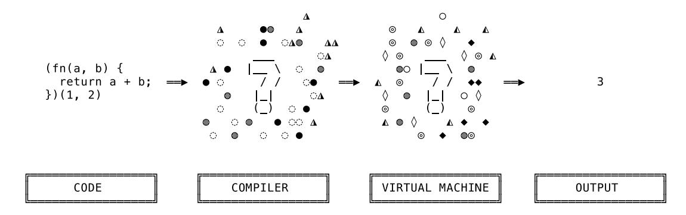

Virtual machines, too, are largely understood to be mystical creatures, roaming through the dark lower layers of software development, seldom seen in light and even less understood. They, too, attract their fair share of rumours and speculations. Some say that virtual machines have something to do with compilers. Others insist that their programming language is, in fact, such a virtual machine. Another group claims that virtual machines allow them to run an operating system inside another operating system.

It doesn't help that all of it is true.

But here's the thing. At their core, compilers and virtual machines are ideas – patterns – just like "interpreter" or "web server" are ideas that can have multiple implementations, ranging from tiny to massive. Being intimidated by them after looking at a project like GCC makes as much sense as giving up on building a website after looking at GitHub.

Sure, it's not a small task to build a compiler for a virtual machine. But it's also not as insurmountable as reputation suggests. And once we have a better understanding of these core ideas, of what a compiler and a virtual machine essentially are, you'll see that you can, in fact, build a compiler in an afternoon.

The first step towards that is finding out what "compiling" means.

### Compilers

<span id="page-13-0"></span>If I'd ask you to name a compiler, you'd probably and without missing a beat would give me a name like GCC, or Clang, or the Go compiler. In any case, it would most certainly be a compiler for a programming language. Chances are that it's a compiler that produces executables. I would, too, because that's just what we associate with the word "compiler".

But compilers come in all shapes and sizes and compile all kinds of things, not just programming languages, including regular expressions, database queries and even HTML templates. I bet you use one or two compilers every day without even realizing it. That's because the definition of "compiler" itself is actually quite loose, much more so than one would expect. Here is Wikipedia's version:

A compiler is computer software that transforms computer code written in one programming language (the source language) into another computer langua[ge \(the](https://en.wikipedia.org/wiki/Compiler) [ta](https://en.wikipedia.org/wiki/Compiler)rget language). Compilers are a type of translator that support digital devices, primarily computers. The name compiler is primarily used for programs that translate source code from a high-level programming language to a lower level language (e.g., assembly language, object code, or machine code) to create an executable program.

Compilers are translators. That's vague. And a compiler that translates high-level languages to produce executables is just one special type of compiler? Sounds counter-intuitive, doesn't it? You'd think that producing executables *is just what a compiler does*: that's what GCC does, that's what Clang does, that's what the Go compiler does. Shouldn't that be the first line of the definition? How can this be non-essential?

The solution to this riddle is another one: what's an executable if not source code in a language the computer can natively understand? Hence, "compiling to native code" is the same as compiling to machine code. Yes, really, producing executables is just one variation of "translating source code".

You see, compilers are fundamentally about translation, because translation is how they *implement a programming language*.

Let's make sense of that sentence by taking a step back here. Programming means giving instructions to a computer. We, the programmers, write these instructions in programming languages the computer can understand. There is no point in using any other language. Now, *implementing* a programming language means making the computer understand it. There are two ways to do that: either interpret the language for the computer on-the-fly or translate it into another language, one the computer already understands.

It's exactly like we, as humans, can help a friend understand a language she doesn't speak. We can either listen, translate in our head and repeat the translation to her, or we can write the translation down so she can read and understand it herself. We can either act as an interpreter or as a compiler.

This might sound like interpreters and compilers are opposites. But while their approach is different, they share a lot of things in their construction. They both have a frontend that reads in source code written in the source language and turns it into a data structure. In both, compiler and interpreter, this frontend is usually made up of a lexer and a parser that together generate a syntax tree. So here, in the front part, they have a lot of similarities. After that, when they both traverse the AST, that's when their paths diverge.

Since we already built an interpreter we know what it does when traversing the AST: it evaluates it. That is, it executes the instructions encoded in the tree. If a node in the tree represents the source language's statement puts("Hello World!"), then the interpreter would print "Hello World!" when evaluating the node.

A compiler, on the other hand, wouldn't print anything. Instead, it would generate source code in another language, called the target language. The source code would contain the target language's equivalent of the source language's puts("Hello World!"). The resulting code could then be executed by the computer and "Hello World!" would appear on the screen.

This is where things get really interesting. In which target language does the compiler generate source code? Which language does the computer understand? And how does the compiler generate code in this language? As text, or in a binary format? In a file, or in memory? But much more importantly: what exactly does it generate in this target language? What if the target language doesn't have an equivalent of puts? What should the compiler generate instead?

Generally speaking, we have to give the same answer to every one of these questions. Software development's number one answer, the only hard, capital-T Truth in programming: "it depends."

Sorry to let you down there, but the answers to these questions depend on a multitude of variables and requirements: the source language, the architecture of the machine that executes the target language, how the output is going to be used (is it executed directly? compiled again? interpreted?), how fast the output needs to run, how fast the compiler itself needs to run, how big the generated source code can be, how much memory the compiler is allowed to use, how much memory the resulting program can use, and how…

The variety between compilers is so high that we can't make a lot of universal statements about their architecture. That being said, we can ignore the details for a minute now and sketch out the architecture of something like the archetype of a compiler:

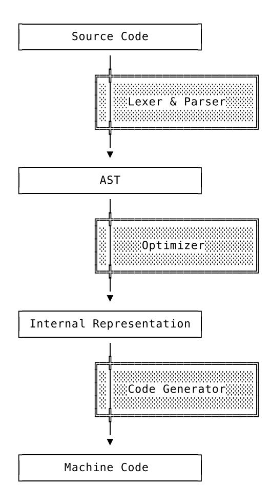

This shows the life cycle of source code that's being translated to machine code. Here's what happens.

First, the source code is tokenized and parsed by the lexer and the parser. We're familiar with this part from our interpreter. It's called the frontend. The source code is turned from text into an AST.

After that a component called the "optimizer" (or sometimes also called "compiler" – I know, I know, …) might translate the AST into another internal representation (IR). This additional IR might just be another syntax tree, or maybe a binary format, or even a textual format. The reasons for this additional translation into another IR are manifold, but the major one is that the IR might lend itself better to optimizations and translation into the target language than the AST would.

This new IR then goes through an optimization phase: dead code is eliminated, simple arithmetic is pre-calculated, code that doesn't need to be in the body of a loop is moved out of it, … A ton of possible optimizations exists.

Finally, the code generator, also called the backend, generates the code in the target language. This is where the compilation happens. Here's where the code hits the file system, so to say. After that, we can execute the result and see the computer perform what we instructed it to in the original source code.

This is how the *simplest* compilers work. And even here a thousand variations are possible. For example, the optimizer could do multiple "passes" over the IR, meaning that it traverses the IR multiple times and each time does a different optimization: removing dead code in one pass, inlining function calls in another one, for example. Or maybe the compiler doesn't do

optimizations on the IR at all, but only on the source code in the target language. Or only on the AST, or on both. Or it doesn't do any optimizations ever. Or maybe it doesn't even have another IR besides the AST. And maybe it doesn't output machine code, but assembly language, or another high-level language. Or it has multiple backends that can generate machine code for multiple architectures. It all depends on the specific use case.

And then again, a compiler doesn't even have to be a tool you run on the command line, that reads in source code and outputs code in a file, like gcc or go. It can just as well be a single function that takes in an AST and returns a string. That's also a compiler. A compiler can be written in a few hundred lines of code or have millions of them.

But underlying all of these lines of code is the fundamental idea of translation. Compilers take in source code in one language and generate source code in another one. The rest – again – "depends", with the majority on the target language. What the target language is capable of and by which machine it can be executed shapes the design of a compiler like nothing else.

Now, what if we didn't have to *choose* a target language, but could invent our own? And what if we don't leave it at that and also dream up the machine that executes this language?

### Virtual and Real Machines

<span id="page-16-0"></span>You probably associate "virtual machine" with software like VMWare or Virtualbox. These are programs that emulate a computer, including a disk drive, hard drive, graphics card, etc. They allow you to, for example, run a different operating system inside this emulated computer. Yes, these are virtual machines. But that's not what we're here to talk about. That's the *other* type of virtual machine.

What we are going to talk about (and later build) are virtual machines that are used to implement programming languages. Sometimes they consist of just a few functions, other times they make up a few modules and on occasion they're a collection of classes and objects. It's hard to pin their shape down. But that doesn't matter. What's important is this: they don't emulate an existing machine. They *are* the machine.

The "virtual" is due to the fact they only exist in software, not in hardware, and are thus purely abstract constructs. The "machine" describes their behaviour. These software constructs act like a machine. And not just any machine, no. They mimic the behaviour of their hardware equivalent: computers.

That means, in order to understand and build a virtual machine, we need to learn how a real machine works.

### Real Machines

"So, how does a computer work?"

<span id="page-16-1"></span>What might sound like an intimidating question can actually be answered in five minutes and with a piece of paper. I don't know how fast you can read and I'm certain I can't show you what I draw on a scrap of paper, but let me try anyway.

Nearly every computer in your life is built according to the Von Neumann architecture, which describes a way to build a fully-functioning computer with a surprisingly tiny number of parts.

In Von Neumann's model a computer has two central parts: a processing unit, which contains an arithmetic logic unit (ALU) and multiple processor reg[isters, and a control unit w](https://en.wikipedia.org/wiki/Von_Neumann_architecture)ith an instruction register and a program counter. Together they're called the central processing unit,

often shortened to CPU. Besides that, the computer also contains memory (RAM), mass storage (think: hard drive) and input/output devices (keyboard and display).

CPU, memory, mass storage and I/O. Here's a rough sketch of such a computer:

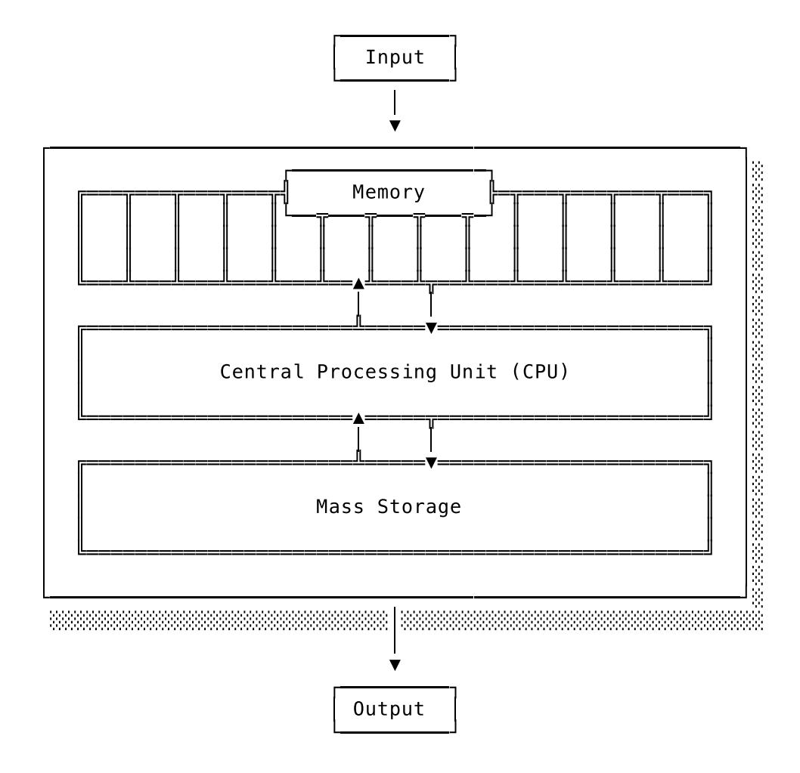

As soon as the computer is turned on, the CPU:

- 1. **Fetches an instruction from memory**. The program counter tells the CPU where in memory it can find the next instruction.
- 2. **Decodes the instruction**. To identify which operation should be executed.
- 3. **Executes the instruction**. This can mean either modifying the contents of its registers, or transferring data from the registers to memory, or moving data around in memory, or generating output, or reading input…

… and then *goto 1* again.

These three steps are called the **fetch-decode-execute cycle**, or instruction cycle. Yes, that's the cycle known from sentences like "the clock speed of a computer is expressed in cycles per second, e.g. 500 MHz" or "we're wasting CPU cycles here".

That was a brief and easy to understand description of how a computer works. But we can make it even easier for us. In this book we don't care about mass storage components and only tangentially about the I/O mechanisms. What we're interested in is the interplay between CPU and memory. That means we can make that our focus and safely ignore hard drives and displays.

We start our investigation with this question: how does the CPU address different parts of memory? Or, in other words: how does the CPU know where to store and retrieve things that are located in memory?

We're given a first hint by how the CPU fetches instructions. The program counter, a part of the CPU, keeps track of where to fetch the next instruction. And "counter" is to be taken quite literally here: the computer simply uses numbers to address different parts of memory. Yes, numbers.

At this point I'm tempted to write "just think of memory as a huge array", but I'm scared of someone hitting me over the head with a heavy, leather-bound tome called "Things about memory that are *absolutely and without any doubt not like an array, you doofus*", so I won't. But, yes, just like we, as programmers, use numbers as indexes to access single elements in an array, the CPU uses numbers as addresses when accessing data in memory.

Instead of "array elements" computer memory is segmented into "words". Now what's a "word"? It's the smallest addressable region of memory. It's the base unit when accessing memory. The size of a word varies and depends on the CPU type among other things. In the computers you and I use, however, 32 and 64 bits word sizes are the standard.

Let's say we have a fictional computer with a word size of 8 bi[ts and 13](https://en.wikipedia.org/wiki/Word_(computer_architecture)) bytes of memory. One word in memory can hold one ASCII character and if we store the string Hello, World! to memory it looks like this:

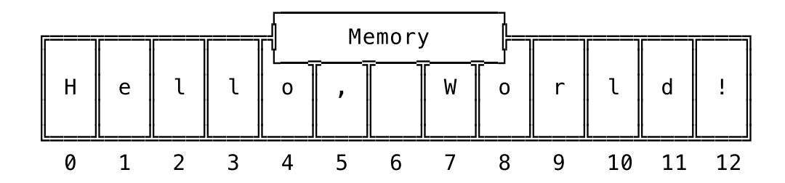

The letter "H" has the memory address 0, "e" has 1, the first "l" has 2, "W" has 7 and so on. We could access every single letter of the string Hello, World! by using the memory addresses 0 to 12. "Hey CPU, fetch the word at memory address 4" would result in the CPU fetching the letter "o". Straightforward, right? I know what you're thinking right now and, yes, if we take such a number – a memory address – and save it to another place in memory, we create a pointer.

That's the *basic* idea behind addressing data in memory and how the CPU knows where to fetch and store data. As always, though, the real world is a mess.

As I already mentioned, the size of a word differs between different computers. Sometimes it's 8 bits, sometimes 16, 24, 32, or 64 bits. Sometimes the word size used by the CPU is independent of the address size. And if that's not enough to deal with: some computers do something entirely different and use byte-addressing instead of the just described word-addressing.

And if you're using word-addressing and want to address a single byte (which is not that uncommon) you not only have to deal with different word sizes but also work with offsets. That in turn is expensive and [has to be optimiz](https://en.wikipedia.org/wiki/Byte_addressing)ed.

On top of that: the idea that we can simply tell the CPU where to store and retrieve data in memory is something like a fairytale. It's correct on a conceptual level and helpful when learning, but memory access today is abstracted away and sits behind layers and layers of security and performance optimizations. Memory is not the wild west anymore – we can't just go around and access any memory location we want. Security rules and a mechanism called virtual memory try their best to stop that from happening.

Let me stop right here, though, before we take a huge detour and end up talking about the inner workings of virtual memory. That's not why we're here. What you can take from this excursion is that there's more to memory access today than passing a number to the CPU. Not only are there security rules in place, but in the last few decades of computing emerged a set of less strict conventions around the use of memory.

One novel aspect of the Von Neumann architecture was that a computer's memory contains not only data, but also *programs*, which are the CPU instructions that make up a program. To our programmer ears the idea of mixing data and code sounds like a recipe for tears. And to the ears of programmers a few generations ago, it probably sounded like that, too. Because what they did was to establish conventions around the use of memory that stopped that from happening.

While programs are stored in the same memory as any other data, they're most often not stored in the same locations. Specific areas of memory are used to store specific things. That's not only by convention, but also dictated by the operating system, the CPU and the rest of the computer architecture.

"Dumb" data, as in "the contents of a text file" or "the response of a HTTP request", goes in one region of memory. The instructions that make up a program are stored and accessed in another region, where the CPU can easily fetch them. Another region holds the static data that's used by a program and yet another region is empty and uninitialized, but reserved so that it can be used by a program once it's running. The instructions belonging to the operating system kernel have their own special region in memory.

By the way: while programs and "dumb data" may reside in different memory locations, again, the important thing here is that they *are* both stored in the same memory. Saying "data and programs are both stored in memory" makes it sound as if they're distinct, when in fact programs – made up of instructions – are just data too. Instructions only become instructions once the CPU fetches them from memory, decodes them, and finds out that they are, in fact, proper instructions and then executes them. If the CPU attempts to decode data that's not a valid instruction, well, then the consequences will depend on how the CPU was designed. It could trigger an event and give the program a chance to recover or it could just stop.

For us, the most interesting thing about this is one particular memory region. It's the memory region that holds the stack. Yes, *the* stack. Drum roll, fanfare, spot light, deep voice: *The Stack*. You might have heard of him. "Stack overflow" is probably his most famous work, followed by the less popular but equally respected "stack trace".

So, what is it? It's a region in memory where data is managed in a last-in-first-out (LIFO) manner. The data in it grows and shrinks, you push elements on to the stack and later pop them off. Just like the stack data structure. But unlike this generic data structure, *the stack* is focused on one purpose: it's used to implement the *call stack*.

Yes, let's stop right there; it *is* confusing. "Stack", "the stack", "stack data structure", "call stack" – not really self-explanatory, is it? It doesn't help that these names are often used interchangeably and thrown around and mixed toge[ther. But,](https://en.wikipedia.org/wiki/Call_stack) thankfully, if we are careful with the names and pay attention to the "why" behind them, things become much clearer. So let's try this again and do this step by step.

We have a memory region where the CPU accesses and stores data in a LIFO manner. It does this in order to implement a specialized version of *a stack*, called *a call stack*.

Why does it need *a call stack*? Because the CPU (or maybe: the programmer that wants the CPU to work as intended) needs to keep track of certain information in order to execute a program. The *call stack* helps with that. What information? First and foremost: which function is currently being executed and which instruction to execute next, once the current function is fully executed. This piece of information, which instruction to fetch after the current function, is called the *return address*. It's where the CPU *returns to* after executing the current function. Without this the CPU would just increment the program counter and execute the instruction at the next higher address in memory. And that might be the absolute opposite of what should happen. Instructions are not laid out in memory in the order of execution, next to each other. Imagine what would happen if all the return statements in your Go code would vanish – *that*'s why the CPU needs to keep track of the return addresses. The *call stack* also helps to save execution-relevant data that's local to functions: the arguments of the function call and the local variables only used in the function.

The return address, arguments and local variables – we could theoretically save this information in any other accessible part of memory, in any way we see fit. But, as it turns out, using *a stack* for this is perfect, because function calls are often nested. When entering a function, the data is pushed on to the stack. And while executing the current function, there is no need to access the local data of the outer, calling function. It's enough to just access the top part of the stack, so to say. And once the current function returns, the local data is simply popped off – there's no need for it anymore. That leaves us with the local data of the outer function on the top of the stack. Neat, right?

So that's why we need the *call stack* and why it's implemented as *a stack*. The only question now is: why the notorious name? Why is it *the Stack* and not just "well, I guess, yeah, it's a stack, huh"? Because using this region of memory to implement *a call stack* is a convention so strongly held and widespread that by now it's been cast into hardware. Certain CPUs support instructions solely for pushing and popping things on the stack. Every program that's running on them makes use of *this memory region* in *this way* to implement *this mechanism*. There is no way around it. That's why it's *the stack* and not just any stack.

But keep in mind that the concept of *a call stack* is just that, a concept. It's not bound to a specific implementation with a specific memory region. One could implement a call stack in any other place in memory – but without hardware or operating-system support then. In fact, that's what we're going to do. We're going to implement our own call stack, a virtual call stack. But before we do that and switch over from the physical to the virtual, we need to look at one more concept to be fully prepared.

Now that you know how *the stack* works, you can imagine how often the CPU needs to access this region of memory while executing a program. It's a lot. That means that the speed with which the CPU can access memory puts a limit on how fast it can execute programs. And while memory access *is* fast (a CPU can access main memory around a million times while you blink an eye) it's not instant and still has a cost.

That's why computers have another place where they can store data: processor registers. Registers are part of the CPU and accessing them is *much* faster than accessing the main memory. Naturally, one might ask, why not store everything in registers? Because there are only a few of them and they can't hold as much data as main memory, typically only one word per register. A CPU of the x86-64 architecture, for example, has 16 general purpose registers, each holding 64 bits of data.

Registers are used to store data that's small but frequently accessed. The memory address pointing to the top of *the stack*, for example, is commonly stored in a register – "commonly" being an understatement here. This specific usage of a register is so prevalent that most CPUs

have a single, designated register just for storing this pointer, the so called *stack pointer*. The operands and the results of certain CPU instructions may also be stored in registers. If a CPU would need to add two numbers, both of them would be stored in registers and the result of the addition would end up in one too. That's not all, though. There are many more use cases for registers. Here's another one: if there's a large piece of data frequently being accessed in a program it makes sense to store the address of it to a register so it can be accessed by the CPU really fast. The most important one for us, though, is the *stack pointer*. We'll meet that one again soon.

And now… take a deep breath, lean back and relax, because: that's it! Now that we've mentioned registers and know what a stack pointer is, we've covered everything we need to know about how real machines work. It's time for us to go abstract, from the physical to the virtual.

<span id="page-21-0"></span>

### What Is a Virtual Machine?

Let me get straight to the point: a virtual machine is a computer built with software. It's a software entity that mimics how a computer works. I'll admit, "software entity" doesn't say much, but I used this phrase on purpose, to drive home one point: a virtual machine can be anything. A function, a struct, an object, a module, or even a whole program. What matters is what it does.

A virtual machine has a run loop that goes through the fetch-decode-execute cycle, just like a computer. It has a program counter; it fetches instructions; it decodes and executes them. It also has a stack, just like a real computer. Sometimes it has a call stack and sometimes even registers. All built in software.

Let me put code where my mouth is. Here is a virtual machine in 50 lines of JavaScript:

```
let virtualMachine = function(program) {
  let programCounter = 0;
  let stack = [];
  let stackPointer = 0;
  while (programCounter < program.length) {
    let currentInstruction = program[programCounter];
    switch (currentInstruction) {
      case PUSH:
        stack[stackPointer] = program[programCounter+1];
        stackPointer++;
        programCounter++;
        break;
      case ADD:
        right = stack[stackPointer-1]
        stackPointer--;
        left = stack[stackPointer-1]
        stackPointer--;
        stack[stackPointer] = left + right;
        stackPointer++;
        break;
      case MINUS:
        right = stack[stackPointer-1]
        stackPointer--;
        left = stack[stackPointer-1]
```

```
stackPointer--;
        stack[stackPointer] = left - right;
        stackPointer++;
        break;
    }
    programCounter++;
  }
  console.log("stacktop: ", stack[stackPointer-1]);
}
```

It has a programCounter, it has a stack and a stackPointer. It has a run loop that executes as long as there are instructions in the program left to execute. It fetches the current instruction pointed to by the programCounter, decodes it and executes it. One iteration of this loop is one "cycle" of this virtual machine.

We can build a program for it and execute it like this:

```
let program = [
  PUSH, 3,
  PUSH, 4,
  ADD,
  PUSH, 5,
  MINUS
];
virtualMachine(program);
```

Can you already recognize the expression encoded in these instructions? It's this:

```
(3 + 4) - 5
```

If you didn't, that's fine. You'll be able to soon enough. The program is not that hard to read once you get used to doing arithmetic on a stack: first PUSH 3 and 4, then ADD the two topmost elements by popping them off the stack, adding them and pushing the result back on to the stack; finally, PUSH 5 to get the 5 on to the stack, then MINUS it with the second element from the top and leave the result on to the stack.

The result that ends up on top of the virtualMachine's stack is printed once the machine finishes its run loop:

```
$ node virtual_machine.js
stacktop: 2
```

Boom.

Now, while that's an actual working virtual machine, it's also a rather simple one. As you can imagine, it's not a showcase for what the whole spectrum of virtual-machine implementations is capable of and looks like. You can write a virtual machine in around 50 lines of code, like we just did, but also in 50 thousand lines or more. And going from *here* to *there* means making all kinds of choices regarding functionality and performance.

One of the most significant design decisions is whether the machine will be a *stack machine* or a *register machine*. It's so significant that virtual machines are grouped based on this architectural choice, just like programming languages are sorted into "compiled" or "interpreted" buckets. The difference between a stack and a register machine is – put in the most simple terms – whether the machine uses a stack to do its computations (like we did in our example above) or

registers (virtual ones!). The debate's still open on what's the better (read: faster) choice, since it's mostly about trade-offs and which ones you're prepared to make.

A stack machine and a matching compiler are said to be easier to build. The machine needs fewer parts and the instructions it executes are simpler, since they "only" make use of *the stack*. The problem is that you need to execute a lot of instructions, because you need to push and pop everything on and off the stack in order to get anything done. This puts a limit on how far one can take the cardinal rule of performance optimization: instead of trying to do a lot faster, first try to do less.

Building a register machine is more work, because the registers are *an addition*; it still has a stack. It's not as prominent as in a stack machine, but it's still necessary to implement a call stack. The advantage of a register machine is that its instructions can make use of the registers and are thus much denser compared to their stack counterparts. Instead of putting things on the stack, pushing and popping them to get them in the correct order, instructions can refer to the registers directly. Generally speaking, a program needs less instructions on a register machine than on a stack machine. That in turn results in better performance. But then again, writing the compiler that produces such dense instructions takes more effort. As I said: it's about making trade-offs.

Besides this main architectural choice there's a myriad of other decisions that go into building a virtual machine. There are the big questions regarding how to use memory and how to represent values internally (a topic which we already touched upon when we built the Monkey object system for our evaluator). But then there are seemingly tiny things that turn out to be endless, twisted rabbit holes you can get lost in. Let's take a peek into one.

In our example above we used a switch statement do the *dispatching* in the run loop of our machine. *Dispatching* in a virtual machine means selecting an implementation for an instruction before executing it. In our switch statement the implementation of these instructions can be found right next to the case, inline. In case MINUS we subtract two values, in case ADD we add them, and so on. That's dispatching. And while a switch statement looks like the obvious and *only* choice it's far from that.

A switch statement is just the opening of the rabbit hole. And when you're looking for maximum performance, you have to go in all the way. In there, you'll find dispatching done with jump tables, with computed GOTO statements, with indirect and direct threaded code. Because, believe it or not, with a sufficient number of case branches (a few hundred or more) a switch might be the slowest of these solutions. The goal is to reduce the overhead of dispatching so much that from a performance perspective the fetch-decode part of a fetch-decode-ex[ecute](https://github.com/Shopify/go-lua/blob/88a6f168eee0ba102d7d20c5281056a5dd3d7550/vm.go#L306) [cycle d](https://github.com/Shopify/go-lua/blob/88a6f168eee0ba102d7d20c5281056a5dd3d7550/vm.go#L306)isapp[ears. That should give you a t](https://eli.thegreenplace.net/2012/07/12/computed-goto-for-efficient-dispatch-tables)aste of [how deep the rabbit holes are.](https://www.complang.tuwien.ac.at/forth/threaded-code.html)

We now have a rough overview of what a virtual machine is and what goes into building one. Don't worry if you're still missing some details. Since we're going to build our own, we're going to revisit a lot of the topics, ideas and, yes, the rabbit holes.

### Why Build One?

<span id="page-23-0"></span>Let's put what we just learned into perspective. *Why* would you build a virtual machine to implement a programming language? I have to admit that this is the question I've carried around with me the longest. Even after I had built a few tiny virtual machines and had read through the source code of larger ones, I still asked myself: why?

When we implement a programming language we want it to be universal. It should be able to execute all possible programs and not just – as one example of many – functions we built into it. Universal computation is what we're after and computers offer a solid model for it. If we construct a programming language based on that model, it's going to have the same computational capabilities as the computer. It's also one of the fastest ways to execute programs.

But if executing programs like a computer is the best and fastest way, why not, you know, just let the computer execute the programs? Portability. We could write a compiler for our programming language that allows us to execute the translated programs natively on a computer. These programs would be really fast. But we would also have to write a new compiler for every computer architecture we want to run our programs on. That's a lot of work. Instead, we can translate our programs into instructions for a virtual machine. And the virtual machine itself runs on as many architectures as its implementation language. In the case of the Go programming language that's *pretty* portable.

And there's another reason for implementing a programming language with a virtual machine, which I think is the most fascinating one. It's this: virtual machines are domain specific. That's what makes them different from their non-virtual counterparts. Computers offer us a universal solution to all of our computational needs and are decidedly *not* domain specific. And that's okay, that's exactly what we need from a computer on which we want to run all sorts of programs. But what if we don't need a machine to be *that* universal? What if we only need a subset of the features a computer has to offer to its programmers?

As programmers we know that no feature comes without cost. Increased complexity and degraded performance are just two of the prices we regularly pay for them. Computers today have a lot of features. A CPU of the x86-64 family supports between 900 and 4000 instructions, depending on how you count them. That includes at least six different ways to do a bitwise XOR on two operands. This is handy and what makes computers so versatile. But it's not free. The versatility has a cost, just like every other feature. Think back to the switch statement in our tiny VM and take a second to ponder the performance implica[tions of adding 3997 more](https://stefanheule.com/blog/how-many-x86-64-instructions-are-there-anyway/) case [branches. If you're not sure wh](https://stefanheule.com/blog/how-many-x86-64-instructions-are-there-anyway/)ether it will actually be slower, ask yourself how easy it is to maintain the code or to program for this VM. The good news is that we can turn this around. If we get rid of the features we don't need, we can go faster. Less complexity, less maintenance, less mass. This is where virtual machines come into play.

A virtual machine is like a custom-built computer. It has custom parts and a custom machine language. It's tuned to a single programming language. All the unneeded features are stripped off and what's left is highly specialized. Since you don't need to be as universal as a generalpurpose computer, you can focus. You can concentrate your efforts into making this highlyspecialized and custom-made machine work as best and go as fast as possible. This – the specialization, the domain specificity – is as important as getting rid of the unneeded mass.

Why this is so important becomes even clearer when we take a look at the instructions a virtual machine executes, something which we steered clear of up until now. Remember what we fed our tiny virtual machine? Here it is again:

```
let program = [
  PUSH, 3,
  PUSH, 4,
  ADD,
  PUSH, 5,
  MINUS
];
virtualMachine(program);
```

Now, what *is* that? What's PUSH, what's ADD, what's MINUS? Here are their definitions:

```
const PUSH = 'PUSH';
```

```
const ADD = 'ADD';
const MINUS = 'MINUS';
```

PUSH, ADD and MINUS are just constants referring to strings. There's no magic sauce. What a letdown. Boo! The silver lining of this revelation is that these definitions are as toy like and for illustration purposes only as the rest of the VM. They don't answer the larger, more interesting question looming here: what *exactly* do virtual machines execute?

<span id="page-25-0"></span>

### Bytecode

Virtual machines execute bytecode. Like the machine code that computers execute, bytecode is made up of instructions that tell the machine what to do. Push this, pop that, add these, call this function. It's called bytecode because the opcodes contained in each instruction are one byte in size.

An "opcode" is the "operator" part of an instruction, sometimes also called "op". The PUSH we've seen earlier is such an opcode, except that in our toy example it was a multi-byte string and not just one byte. In a proper implementation PUSH would just be the name that refers to an opcode, which itself is one byte wide. These names, like PUSH or POP, are called mnemonics. They help us programmers remember and talk about opcodes.

The operands (also called arguments or parameters) to these opcodes are also contained in the bytecode. They're placed alongside each other, with the operands following the opcodes. The operands, though, aren't necessarily one byte wide. For example, if an operand is an integer and greater than 255, it would take multiple bytes to represent it. Some opcodes have multiple operands, some just one and some don't have any at all. Whether the bytecode is designed for a register or a stack machine has a huge influence here.

You can imagine bytecode as a sequence of opcodes and operands, laid out in memory next to each other:

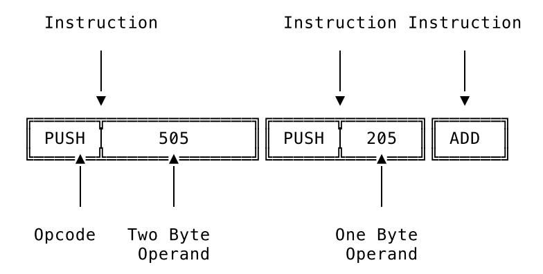

This helps to illustrate the general idea, but bytecode is a binary format and not nearly as readable. Meaning that you can't read it like a text file. The mnemonics, like PUSH, don't show up in the actual bytecode. They are replaced by the opcodes they refer to, and those are just numbers – bytes. Which numbers exactly is up to the person defining the bytecode. The PUSH mnemonic might stand for the number 0 and POP might refer to the number 23.

The operands are also encoded and, again, it depends on its value into how many bytes. In case an operand needs multiple bytes to be accurately represented, the order in which it's encoded plays a big role. There are two possible orders, called *little endian* and *big endian*. Little endian means that the *least* significant byte of the original data comes first and is stored in the lowest memory address. Big endian is the opposite: the *most* significant byte comes first.

If we, as bytecode designers, were to declare that PUSH refers to 1, ADD to 2 and integers are stored in big endian, we could encode the example from above and lay it out in memory like this:

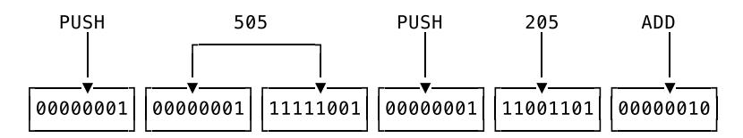

What we just did – taking a human-readable representation of bytecode and turning it into binary data – is done by programs called assemblers. You've probably heard of them in the context of non-virtual machine code. Same thing here. Assembly language is the readable version of the bytecode, containing mnemonics and readable operands, and an assembler turns it into binary bytecode. The reverse, transforming the binary representation into a readable representation, is done by disassemblers.

Alright! So much for the purely technical aspects of bytecode. Any further exploration would get too specific too fast. Bytecode formats are just too diverse and specialized to allow us to make more general statements here. Just like the virtual machine that executes it, bytecode is created with a very specific goal in mind.

Bytecode is a domain-specific language for a domain-specific machine. It's the bespoke machine language for the custom-built virtual machine. That's where its power lies. Instead of being universal and supporting every conceivable use case, bytecode can be specialized. It only has to support the features needed by the source language, the language being compiled to bytecode.

And not only that. On top of only allowing a narrow set of instructions, it can contain domainspecific instructions that only make sense in the context of the domain-specific virtual machine. The bytecode for the Java Virtual Machine (JVM), for example, contains these instructions: invokeinterface to invoke an interface method, getstatic to get a static field of a class, new to create a new object of the specified class. Ruby's bytecode has the putself instruction to load self on the stack, send to send a message to an object, putobject to load any object on to the stack. And Lua's bytecode has dedicated instructions for accessing and manipulating tables and tuples. You won't find any of that in the instruction set of a general-purpose x86-64 CPU.

This ability to specialize by using a custom bytecode format is one of the biggest reasons for building a virtual machine in the first place. Not only do compilation, maintenance and debugging get easier but the resulting code is also denser, because it takes less instructions to express something. That in turn makes the code faster to execute.

Now, if all that talk about custom virtual machines, tailor-made machine code, hand-built compilers didn't wet your appetite, this is your last chance to turn around. We're about to get our hands dirty.

<span id="page-26-0"></span>

### What We're Going to Do, or: the Duality of VM and Compiler

Building a virtual machine and a matching compiler requires us first to solve a variation of the chicken-and-egg problem: which one do we build first? The compiler, that outputs bytecode for a machine that doesn't exist yet? Or the virtual machine, that no one produces any code for?

Here's the answer I choose for this book: we are going to build both – at the same time.

Building one completely before the other (and it doesn't matter which one) is frustrating. It's hard to understand what's going on and what is the purpose of what you're doing. If you're building the compiler and defining the bytecode first, it's tough to make sense of why things are the way they are without knowing how the virtual machine will later execute it. Building the virtual machine before the compiler comes with its own challenges, because the bytecode needs to be defined first. That's hard to do without closely looking at the source-language constructs the bytecode aims to represent, which means you're going to spell out the compiler anyway.

Of course, if you already have experience with building one or the other, you know where you want to end up and can thus choose either option. For us, though, the goal is to learn how to build both from the ground up.

That's why we're going to start small. We're going to build a tiny virtual machine that only supports a tiny number of instructions and a matching tiny compiler that only knows how to output these instructions. That allows us to immediately see why we're building what we're building and how all the pieces fit together. We'll also have a running system right from the start. That gives us fast feedback cycles and allows us to tune, experiment and gradually build up our virtual machine and compiler. It also makes the whole journey a lot of fun.

Now you know what the plan is. And you also know enough about compilers and virtual machines that we don't get lost along the way. Let's get to it.

## <span id="page-28-0"></span>Chapter 2

# Hello Bytecode!

Our goal for this chapter is to compile and execute this Monkey expression:

1 + 2

That doesn't sound like an ambitious goal, but in order to reach it, we will have to learn many new things and build up a lot of the infrastructure we're going to use in the upcoming chapters. And by choosing the simple expression 1 + 2 we won't be distracted by the Monkey code itself and how it should work. We can concentrate on our compiler and virtual machine.

At the end of this chapter we want to be able to:

- take the Monkey expression 1 + 2
- tokenize and parse it using our existing lexer, token and parser packages
- take the resulting AST, whose nodes are defined in our ast package
- pass it to the newly-built compiler, which compiles it to bytecode
- take the bytecode and hand it over to the also newly-built virtual machine which will execute it
- make sure that the virtual machine turned it into 3.

The 1 + 2 expression will travel through all the major parts of our new interpreter:

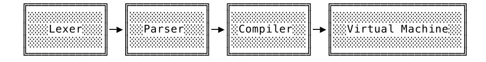

In terms of data structures, you can see that there will be quite a few transformations until we end up with the 3 as our result:


Since we'll be using a lot of the packages we built in the previous book, we can already handle everything up to the AST. After that we're entering unchartered territory. We need to define bytecode instructions, build a compiler and construct a virtual machine – just to turn 1 + 2 into 3. Sounds daunting? Worry not, we'll do this step by step and build from the ground up, as always, and start with the bytecode.

<span id="page-29-0"></span>

### First Instructions

As I mentioned in the previous chapter, the architecture of the virtual machine is the singlebiggest influence on what the bytecode looks like. That means we need to decide what type of machine we're going to build before we can start to specify bytecode.

So without further ado, let's pull back the curtain: we're going to build a **stack machine**! Why? Because stack machines are far easier to understand and to build for beginners than register machines. Less concepts, less moving parts. And all the performance considerations – *is a register machine faster?* – do not play a huge role for us. Our priorities are learning and understanding.

Later on we'll see more of the implications this decision has, but the immediate and most practical one is that we now have to do stack arithmetic. That means, in order to reach our declared goal of compiling and executing the Monkey expression 1 + 2, we have to translate it to bytecode instructions that make use of a stack. The stack is where a stack machine does its work – we can't just tell it to add two numbers, without making use of the stack.

Thankfully, we saw a similar example before and already know how to do arithmetic with a stack. We first get the operands 1 and 2 on to the stack and then tell the VM: "add these!". This "add these!" instruction should then cause the VM to take the two topmost elements from the stack, add them together and push the result back on to the stack. Here's what stack should look like before and after the instruction:

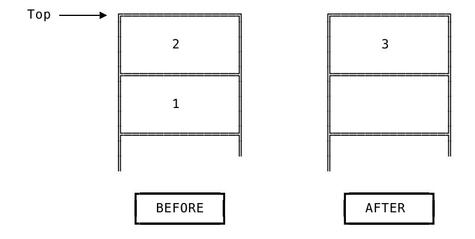

So in order to fully implement this we need to tell the VM:

- Push 1 on to the stack
- Push 2 on to the stack
- Add the two topmost elements together

We need to create three instructions. As programmers, though, we know that we only need to define two separate instruction types, since pushing 2 on to the stack should be the same as pushing 1, except that the "argument" is different. So, two instruction types in total: one for pushing something on to the stack and one for adding things that are already on the stack.

We'll implement both in the same way. First we define their opcodes and how they are encoded in bytecode. Then we extend the compiler so it can produce these instructions. As soon as the compiler knows how to do that, we can create the VM that decodes and executes them. And we start with the instructions that tell the VM to push something on to the stack.

<span id="page-30-0"></span>

### Starting With Bytes

Here we are. We need to define our first bytecode instruction. How do we do that? Well, since creating definitions while programming is not much more than telling the computer what we know, let's ask ourselves: what do we know about bytecode?

We know that it's made up of instructions. And we also know that the instructions themselves are a series of bytes and a single instruction consists of an opcode and an optional number of operands. An opcode is exactly one byte wide, has an arbitrary but unique value and is the first byte in the instruction. Looks like we know quite a lot and the best thing is, that this is precise enough to be turned into code – literally.

As our first official practical act of coding in this book, we create a new package, called code, where we start to define our Monkey bytecode format:

```
// code/code.go
package code
type Instructions []byte
type Opcode byte
```

Instructions is a slice of bytes and an Opcode is a byte. Perfect, they match our descriptions in prose pretty well. But there are two definitions missing here.

The first one is Instruction – singular. Why didn't we define it here as []byte? Because it's far more handy to pass around and work with a []byte and treat it *implicitly* as an instruction than to encode this definition in Go's type system. You'll see soon enough how often we're going to use []byte and how cumbersome type assertions and type casting from and to an Instruction type would be there.

The other missing definition is one for Bytecode. There should at least be some definition of bytecode that tells us it's made up of instructions, right? The reason for its absence is we'd run into a nasty import-cycle if we were to define Bytecode here in the code package. But it won't be missing for too long. Once we get to the compiler, we'll define it there – in the compiler's package.

Now that we have definitions for Opcode and Instructions, we can define our first opcode, the one that tells the VM to push something on the stack. And here's a surprise: the opcode won't have "push" in its name. In fact, it won't be solely about pushing things. Allow me to explain.

We said earlier that when we compile the Monkey expression 1 + 2, we want to generate three different instructions; two of which tell the VM to push 1 and 2 on to the stack. A first instinct might tell us to implement these by defining a "push"-instruction with an integer as its operand with the idea being that the VM then takes the integer operand and pushes it on to the stack. And for integers that would work fine, because we could easily encode them and put them directly into the bytecode. But what if later on we wanted to push other things contained in Monkey code? String literals, for example. Putting those into the bytecode is also possible, true, since it's just made of bytes after all, but it would also be a lot of bloat and would sooner or later become unwieldy.

That's where the idea of *constants* come into play. In this context, "constant" is short for "constant expression" and refers to expressions whose value doesn't change, is *constant*, and can be determined at *compile time*:

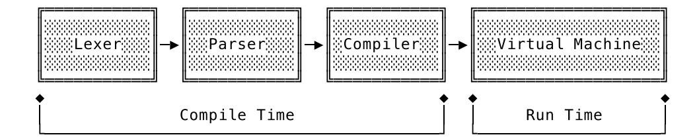

That means we don't need to run the program to know what these expressions evaluate to. A compiler can find them in the code and store the value they evaluate to. After that, it can reference the constants in the instructions it generates, instead of embedding the values directly in them. And while "reference" sounds like a special data type, it's far easier than that. A plain integer does the job just fine and can serve as an index into a data structure that holds all constants, often called a constant pool.

And that's exactly what our compiler is going to do. When we come across an integer literal (a constant expression) while compiling, we'll evaluate it and keep track of resulting \*object.Integer by storing it in memory and assigning it a number. In the bytecode instructions we'll refer to the \*object.Integer by this number. After we're done compiling and pass the instructions to the VM for execution, we'll also hand over all the constants we've found by putting them in a data structure – our constant pool – where the number that has been assigned to each constant can be used as an index to retrieve it.

Back to our first opcode. It's called OpConstant and it has one operand: the number we previously assigned to the constant. When the VM executes OpConstant it retrieves the constant using the operand as an index and pushes it on to the stack. Here's out first opcode definition:

```
// code/code.go
// [...]
const (
    OpConstant Opcode = iota
)
```

While this looks exactly like the meager three lines of code that they are, this addition is the groundwork for all future Opcode definitions. Each definition will have an Op prefix and the value it refers to will be determined by iota. We let iota generate increasing byte values for us, because we just don't care about the actual values our opcodes represent. They only need to be distinct from each other and fit in one byte. iota makes sure of that for us.

What's missing from this definition is the part that says OpConstant has one operand. There's no technical reason for writing this down, since we could share this piece of knowledge implicitly between compiler and VM. For debugging and testing purposes, though, it's handy being able to lookup how many operands an opcode has and what its human-readable name is. In order to achieve that, we'll add proper definitions and some tooling to the code package:

```
// code/code.go
import "fmt"
type Definition struct {
   Name string
   OperandWidths []int
}
```

```
var definitions = map[Opcode]*Definition{
    OpConstant: {"OpConstant", []int{2}},
}
func Lookup(op byte) (*Definition, error) {
    def, ok := definitions[Opcode(op)]
    if !ok {
        return nil, fmt.Errorf("opcode %d undefined", op)
    }
    return def, nil
}
```

The Definition for an Opcode has two fields: Name and OperandWidths. Name helps to make an Opcode readable and OperandWidths contains the number of bytes each operand takes up.

The definition for OpConstant says that its only operand is two bytes wide, which makes it an uint16 and limits its maximum value to 65535. If we include 0 the number of representable values is then 65536. That should be enough for us, because I don't think we're going to reference more than 65536 constants in our Monkey programs. And using an uint16 instead of, say, an uint32, helps to keep the resulting instructions smaller, because there are less unused bytes.

With this definition in place we can now create our first bytecode instruction. Without any operands involved that would be as simple as adding an Opcode to an Instructions slice. But in the case of OpConstant we need to correctly encode the two-byte operand.

For that we'll now create a function that allows us to easily create a single bytecode instruction that's made up of an Opcode and an optional number of operands. We'll call it Make, which gives us the pretty great identifier code.Make in other packages.

And here's what we've been waiting for, the first test of this book, showing what we want Make to do:

```
// code/code_test.go
package code
import "testing"
func TestMake(t *testing.T) {
    tests := []struct {
        op Opcode
        operands []int
        expected []byte
    }{
        {OpConstant, []int{65534}, []byte{byte(OpConstant), 255, 254}},
    }
    for _, tt := range tests {
        instruction := Make(tt.op, tt.operands...)
        if len(instruction) != len(tt.expected) {
            t.Errorf("instruction has wrong length. want=%d, got=%d",
                len(tt.expected), len(instruction))
        }
        for i, b := range tt.expected {
            if instruction[i] != tt.expected[i] {
                t.Errorf("wrong byte at pos %d. want=%d, got=%d",
```

```
i, b, instruction[i])
              }
         }
    }
}
```

Don't be put off by tests only containing one test case. We'll extend it later on when we add more Opcodes to our code vocabulary.

For now, we only pass OpConstant and the operand 65534 to Make. We then expect to get back a []byte holding three bytes. Of these three, the first one has to be the opcode, OpConstant, and the other two should be the big-endian encoding of 65534. That's also why we used 65534 and not the maximum value 65535: this way we can check that the most significant byte comes first. 65534 will be encoded in big endian as the byte sequence 0xFF 0xFE and 65535 would be encoded as 0xFF 0xFF – hard to recognize an order.

Since Make doesn't exist yet, the test does not fail, but fails to compile, so here's the first version of Make:

```
// code/code.go
import (
    "encoding/binary"
    "fmt"
)
func Make(op Opcode, operands ...int) []byte {
    def, ok := definitions[op]
    if !ok {
        return []byte{}
    }
    instructionLen := 1
    for _, w := range def.OperandWidths {
        instructionLen += w
    }
    instruction := make([]byte, instructionLen)
    instruction[0] = byte(op)
    offset := 1
    for i, o := range operands {
        width := def.OperandWidths[i]
        switch width {
        case 2:
            binary.BigEndian.PutUint16(instruction[offset:], uint16(o))
        }
        offset += width
    }
    return instruction
}
```

And that's how you make bytecode.

The first thing we're doing here is to find out how long the resulting instruction is going to be. That allows us to allocate a byte slice with the proper length. Note that we don't use the Lookup function to get to the definition, which gives us a much more usable function signature for Make in the tests later on. By circumventing Lookup and not having to return possible errors, we can use Make to easily build up bytecode instructions without having to check for errors after every call. The risk of producing empty byte slices by using an unknown opcode is one we're willing to take, since we're on the producing side here and know what we're doing when creating instructions.

As soon as we have the final value of instructionLen, we allocate the instruction []byte and add the Opcode as its first byte – by casting it into one. Then comes the tricky part: we iterate over the defined OperandWidths, take the matching element from operands and put it in the instruction. We do that by using a switch statement with a different method for each operand, depending on how wide the operand is.

As we define additional Opcodes, we soon have to extend this switch statement. For now, we only make sure that a two-byte operand is encoded in big endian. And while it's not hard to do that by hand, we use binary.BigEndian.PutUint16 from the standard library for this, with the benefit of having the name of the encoding immediately visible.

After encoding the operand, we increment offset by its width and the next iteration of the loop. Since the OpConstant opcode in our test case has only one operand, the loop performs only one iteration before Make returns instruction.

And, would you look at that, our fist test is compiling and passing:

```
$ go test ./code
ok monkey/code 0.007s
```

We successfully turned OpConstant and the operand 65534 into three bytes. That means we created our first bytecode instruction!

<span id="page-34-0"></span>

### The Smallest Compiler

Now that we have a toolbox called code, we can start working on the compiler. Since we want a system that works from end to end as soon as possible, and not a system that can only be turned on once it's feature-complete, our goal in this section is to build the smallest possible compiler. It should only do one thing for now: produce two OpConstant instructions that later cause the VM to correctly load the integers 1 and 2 on to the stack.

In order to achieve that, this minimal compiler has to do the following: traverse the AST we pass in, find the \*ast.IntegerLiteral nodes, evaluate them by turning them into \*object.Integer objects, add the objects to the constant pool, and finally emit OpConstant instructions that reference the constants in said pool.

Sounds good? Perfect! Let's start by defining Compiler and its interface in a new compiler package:

```
// compiler/compiler.go
package compiler
import (
    "monkey/ast"
    "monkey/code"
    "monkey/object"
)
type Compiler struct {
    instructions code.Instructions
    constants []object.Object
}
```

```
func New() *Compiler {
    return &Compiler{
        instructions: code.Instructions{},
        constants: []object.Object{},
    }
}
func (c *Compiler) Compile(node ast.Node) error {
    return nil
}
func (c *Compiler) Bytecode() *Bytecode {
    return &Bytecode{
        Instructions: c.instructions,
        Constants: c.constants,
    }
}
type Bytecode struct {
    Instructions code.Instructions
    Constants []object.Object
}
```

It really is minimal, isn't it? The Compiler is a small struct with only two fields: instructions and constants. Both are internal fields and will later be modified by the Compile method. instructions will hold the generated bytecode and constants is a slice that serves as our constant pool.

But I bet the thing that caught your eye immediately is the definition we've been looking for earlier, in the code package: Bytecode! There it is and it doesn't need a lot of explanation. It contains the Instructions the compiler generated and the Constants the compiler evaluated.

Bytecode is what we'll pass to the VM and make assertions about in our compiler tests. Speaking of which, the Compile method is empty and we're now going to write our first compiler test that tells us what it should do.

```
// compiler/compiler_test.go
package compiler
import (
   "monkey/code"
   "testing"
)
type compilerTestCase struct {
   input string
   expectedConstants []interface{}
   expectedInstructions []code.Instructions
}
func TestIntegerArithmetic(t *testing.T) {
   tests := []compilerTestCase{
       {
           input: "1 + 2",
           expectedConstants: []interface{}{1, 2},
           expectedInstructions: []code.Instructions{
```

```
code.Make(code.OpConstant, 0),
                code.Make(code.OpConstant, 1),
            },
        },
    }
    runCompilerTests(t, tests)
}
func runCompilerTests(t *testing.T, tests []compilerTestCase) {
    t.Helper()
    for _, tt := range tests {
        program := parse(tt.input)
        compiler := New()
        err := compiler.Compile(program)
        if err != nil {
            t.Fatalf("compiler error: %s", err)
        }
        bytecode := compiler.Bytecode()
        err = testInstructions(tt.expectedInstructions, bytecode.Instructions)
        if err != nil {
            t.Fatalf("testInstructions failed: %s", err)
        }
        err = testConstants(t, tt.expectedConstants, bytecode.Constants)
        if err != nil {
            t.Fatalf("testConstants failed: %s", err)
        }
    }
}
```

What's happening here doesn't take long to explain: we take Monkey code as input, we parse it, produce an AST, hand it to the compiler and then make assertions about the bytecode the compiler produced.

We do that by constructing a compilerTestCase in which we define the input, which constants we expect in the constant pool and which instructions we expect the compiler to generate. Then we hand the tests slice with the compilerTestCases to runCompilerTests to run them.

That's a slightly different approach to constructing tests compared to the first book. The reason for that is Go 1.9, which introduced the wonderful t.Helper method. t.Helper, which we call in runCompilerTests, allows us to remove duplicated logic in test functions by defining test helpers. Think of it as inlining runCompilerTests into TestIntegerArithmetic. That in turn allows to abstract away the common behaviour shared by every compiler test we're going to write, which greatly reduces the noise in every test function and the page count of this book.

Now, let's talk about the helpers used in runCompilerTests.

The parse function contains some of the things we built in the first book: the lexer and the parser. We hand it a string and get back an AST:

```
// compiler/compiler_test.go
import (
    "monkey/ast"
```

```
"monkey/code"
    "monkey/lexer"
    "monkey/parser"
    "testing"
)
func parse(input string) *ast.Program {
    l := lexer.New(input)
    p := parser.New(l)
    return p.ParseProgram()
}
```

That's the prelude. The main part of runCompilerTests revolves around the two fields of the Bytecode the compiler produced. First, we want to make sure that the bytecode.Instructions are correct. For that we have the testInstructions helper function:

```
// compiler/compiler_test.go
   import (
       "fmt"
       // [...]
   )
   func testInstructions(
       expected []code.Instructions,
       actual code.Instructions,
   ) error {
       concatted := concatInstructions(expected)
       if len(actual) != len(concatted) {
           return fmt.Errorf("wrong instructions length.\nwant=%q\ngot =%q",
               concatted, actual)
       }
       for i, ins := range concatted {
           if actual[i] != ins {
               return fmt.Errorf("wrong instruction at %d.\nwant=%q\ngot =%q",
                   i, concatted, actual)
           }
       }
       return nil
   }
As you can see, it uses another helper called concatInstructions:
   // compiler/compiler_test.go
   func concatInstructions(s []code.Instructions) code.Instructions {
       out := code.Instructions{}
       for _, ins := range s {
           out = append(out, ins...)
       }
       return out
   }
```

We need concatInstructions because the expectedInstructions field in compilerTestCase is

not just a slice of bytes, but a slice of *slices* of bytes. And that's because we use code.Make to generate the expectedInstructions, which produces a []byte. So in order to compare the expectedInstructions with the actual instructions, we need to turn the slice of slices into a flattened slice by concatenating the instructions.

The other helper used by runCompilerTests is testConstants, which resembles a lot of the test helpers we used in our evaluator package back in the first book:

```
// compiler/compiler_test.go
import (
    // [...]
    "monkey/object"
    // [...]
)
func testConstants(
    t *testing.T,
    expected []interface{},
    actual []object.Object,
) error {
    if len(expected) != len(actual) {
        return fmt.Errorf("wrong number of constants. got=%d, want=%d",
            len(actual), len(expected))
    }
    for i, constant := range expected {
        switch constant := constant.(type) {
        case int:
            err := testIntegerObject(int64(constant), actual[i])
            if err != nil {
                return fmt.Errorf("constant %d - testIntegerObject failed: %s",
                     i, err)
            }
        }
    }
    return nil
}
```

There's a lot of noise here, but what's happening here is not complicated. testConstants iterates through the expected constants and compares them with the actual constants the compiler produced. The switch statement is a sign of things to come. We will extend it with new case branches as soon as we expect more than integers to end up in the constant pool. For now it only uses one other helper, testIntegerObject, which is a nearly-identical replica of the testIntegerObject we used in our evaluator tests:

```
// compiler/compiler_test.go
func testIntegerObject(expected int64, actual object.Object) error {
    result, ok := actual.(*object.Integer)
    if !ok {
        return fmt.Errorf("object is not Integer. got=%T (%+v)",
            actual, actual)
    }
    if result.Value != expected {
        return fmt.Errorf("object has wrong value. got=%d, want=%d",
```

```
result.Value, expected)
    }
    return nil
}
```

That's all there is to TestIntegerArithmetic. The test itself is not complex, but establishes how we will write compiler tests in the future by bringing with it a lot of different test helpers. It looks like a lot of code for such a small test, but I promise you that we'll get a lot of mileage out of this test setup.

Now, how does the test itself do? Well, not so good:

```
$ go test ./compiler
--- FAIL: TestIntegerArithmetic (0.00s)
 compiler_test.go:31: testInstructions failed: wrong instructions length.
  want="\x00\x00\x00\x00\x00\x01"
  got =""
FAIL
FAIL monkey/compiler 0.008s
```

But considering that we didn't write any code for the compiler yet, except defining its interface, that's not so bad, is it? What's bad though is the output:

```
want="\x00\x00\x00\x00\x00\x01"
```

No one looks at that and goes "Ah, I see…" I know that you're anxious to get that compiler running and humming, but I can't let this unreadable gibberish stand. I mean, it's correct, those *are* the bytes we want, printed in hexadecimal, but it's just not helpful. And believe me, soon enough this output would drive us nuts. So before we start filling out the compiler's Compile() method, we're going to invest in our developer happiness and teach our code.Instructions how to properly print themselves.

<span id="page-39-0"></span>

### Bytecode, Disassemble!

You can teach types to print themselves in Go by giving them a String() method. That also holds true for bytecode instructions. It's pretty easy to do, actually, but, as you already know, we wouldn't print anything without writing a test for it, right?

```
// code/code_test.go
func TestInstructionsString(t *testing.T) {
    instructions := []Instructions{
        Make(OpConstant, 1),
        Make(OpConstant, 2),
        Make(OpConstant, 65535),
    }
    expected := `0000 OpConstant 1
0003 OpConstant 2
0006 OpConstant 65535
    concatted := Instructions{}
    for _, ins := range instructions {
        concatted = append(concatted, ins...)
    }
    if concatted.String() != expected {
```

```
t.Errorf("instructions wrongly formatted.\nwant=%q\ngot=%q",
            expected, concatted.String())
    }
}
```

That's what we expect from the to-be-implemented Instructions.String method: nicelyformatted multi-line output that tells us everything we need to know. There's a counter at the start of each line, telling us which bytes we're looking at, there are the opcodes in their human-readable form, and then there are the decoded operands. A lot more pleasant to look at than \x00\x00\x00\x00\x00\x01, right? We could also name the method MiniDisassembler instead of String because that's what it is.

The test won't compile, because the String method is undefined. So here's the first piece of code we need to add:

```
// code/code.go
func (ins Instructions) String() string {
    return ""
}
```

Correct, we return a blank string. Why? Because that gives the compiler something to chew on and us the ability to run tests again:

```
$ go test ./code
--- FAIL: TestInstructionsString (0.00s)
 code_test.go:49: instructions wrongly formatted.
  want="0000 OpConstant 1\n0003 OpConstant 2\n0006 OpConstant 65535\n"
  got=""
FAIL
FAIL monkey/code 0.008s
```

Perfect, it fails. That's a lot more useful to us than an undefined: String compiler error that stops us from running the tests, because we now need to write *another* test and run it.

This other test is for a function that will be the heart of Instructions.String. Its name is ReadOperands and here's what we want it to do:

```
// code/code_test.go
```

```
func TestReadOperands(t *testing.T) {
    tests := []struct {
        op Opcode
        operands []int
        bytesRead int
    }{
        {OpConstant, []int{65535}, 2},
    }
    for _, tt := range tests {
        instruction := Make(tt.op, tt.operands...)
        def, err := Lookup(byte(tt.op))
        if err != nil {
            t.Fatalf("definition not found: %q\n", err)
        }
        operandsRead, n := ReadOperands(def, instruction[1:])
        if n != tt.bytesRead {
            t.Fatalf("n wrong. want=%d, got=%d", tt.bytesRead, n)
```

```
}
        for i, want := range tt.operands {
            if operandsRead[i] != want {
                t.Errorf("operand wrong. want=%d, got=%d", want, operandsRead[i])
            }
        }
    }
}
```

As you can see, ReadOperands is supposed to be Make's counterpart. Whereas Make encodes the operands of a bytecode instruction, it's the job of ReadOperands to decode them.

In TestReadOperands we Make a fully-encoded instruction and pass its definition to ReadOperands, along with the subslice of the instruction containing the operands. ReadOperands should then return the decoded operands and tell us how many bytes it read to do that. As you can probably imagine by now, we're going to extend the tests table as soon as we have more opcodes and different instruction types.

The test fails because ReadOperands is not defined:

```
$ go test ./code
# monkey/code
code/code_test.go:71:22: undefined: ReadOperands
FAIL monkey/code [build failed]
```

In order to get it to pass we have to implement a ReadOperands function that reverses everything Make did:

```
// code/code.go
func ReadOperands(def *Definition, ins Instructions) ([]int, int) {
    operands := make([]int, len(def.OperandWidths))
    offset := 0
    for i, width := range def.OperandWidths {
        switch width {
        case 2:
            operands[i] = int(ReadUint16(ins[offset:]))
        }
        offset += width
    }
    return operands, offset
}
func ReadUint16(ins Instructions) uint16 {
    return binary.BigEndian.Uint16(ins)
}
```

Just like in Make, we use the \*Definition of an opcode to find out how wide the operands are and allocate a slice with enough space to hold them. We then go through the Instructions slice and read in and convert as many bytes as defined in the definition. And again: the switch statement will be extended soon.

Let me explain why ReadUint16 is a separate, public function. In Make we did the encoding of operands to bytes inline. Here, though, we want to expose the function so it can be used directly by the VM, allowing us to skip the definition lookup required by ReadOperands.

We now have one less failing test and can start to unwind and go back to the failing tests that brought us here. The first one is TestInstructionString, which is still chewing on the blank string:

```
$ go test ./code
--- FAIL: TestInstructionsString (0.00s)
 code_test.go:49: instructions wrongly formatted.
  want="0000 OpConstant 1\n0003 OpConstant 2\n0006 OpConstant 65535\n"
  got=""
FAIL
FAIL monkey/code 0.008s
```

Now that we have ReadOperands, we can get rid of the blank string and properly print instructions:

```
// code/code.go
import (
    "bytes"
    // [...]
)
func (ins Instructions) String() string {
    var out bytes.Buffer
    i := 0
    for i < len(ins) {
        def, err := Lookup(ins[i])
        if err != nil {
            fmt.Fprintf(&out, "ERROR: %s\n", err)
            continue
        }
        operands, read := ReadOperands(def, ins[i+1:])
        fmt.Fprintf(&out, "%04d %s\n", i, ins.fmtInstruction(def, operands))
        i += 1 + read
    }
    return out.String()
}
func (ins Instructions) fmtInstruction(def *Definition, operands []int) string {
    operandCount := len(def.OperandWidths)
    if len(operands) != operandCount {
        return fmt.Sprintf("ERROR: operand len %d does not match defined %d\n",
            len(operands), operandCount)
    }
    switch operandCount {
    case 1:
        return fmt.Sprintf("%s %d", def.Name, operands[0])
    }
    return fmt.Sprintf("ERROR: unhandled operandCount for %s\n", def.Name)
}
```

I don't think I have to explain to you how this works because we've seen variations of this going-through-a-byte-slice mechanism a few times now. The rest is string formatting. But here's something worth looking at:

```
$ go test ./code
ok monkey/code 0.008s
```

The tests in the code package now pass. Our mini-disassembler works. We can unwind even further and rerun the failing compiler test that kicked off this ride through the code package:

```
$ go test ./compiler
--- FAIL: TestIntegerArithmetic (0.00s)
 compiler_test.go:31: testInstructions failed: wrong instructions length.
  want="0000 OpConstant 0\n0003 OpConstant 1\n"
  got =""
FAIL
FAIL monkey/compiler 0.008s
```

Isn't that beautiful? Alright, granted, beautiful may be a tad too much, but it sure isn't the eyesore that was want="\x00\x00\x00\x00\x00\x01".

We just leveled up. With such debuggable output, working on our compiler went from "fumbling in the dark" to "here, let me get that for you".

<span id="page-43-0"></span>

### Back to the Task at Hand

Let's take inventory. We have a lexer, a parser, the dotted outline of a compiler and a failing test that tells us that we need to generate two bytecode instructions. In our toolbox are the definition of an opcode and its operand, the Make function that lets us create bytecode instructions, our object system that we can use to pass Monkey values around, and readable and stunning Instructions.

And here's a reminder of what our compiler needs to do: walk the AST recursively, find \*ast.IntegerLiterals, evaluate them and turn them into \*object.Integers, add those to the constants field, and add OpConstant instructions to its internal instructions slice.

Can you say "walk in the park"?

Let's start by walking the AST. That's something we already did in the Eval function we wrote in the previous book and there is no reason to change the approach. Here is how we get to our \*ast.IntegerLiterals:

```
// compiler/compiler.go
func (c *Compiler) Compile(node ast.Node) error {
    switch node := node.(type) {
    case *ast.Program:
        for _, s := range node.Statements {
            err := c.Compile(s)
            if err != nil {
                return err
            }
        }
    case *ast.ExpressionStatement:
        err := c.Compile(node.Expression)
        if err != nil {
            return err
        }
```

```
case *ast.InfixExpression:
        err := c.Compile(node.Left)
        if err != nil {
            return err
        }
        err = c.Compile(node.Right)
        if err != nil {
            return err
        }
    case *ast.IntegerLiteral:
  // TODO: What now?!
    }
    return nil
}
```

We first go through all the node.Statements in our \*ast.Program and call c.Compile with each of them. That gets us one level deeper in the AST, where we find an \*ast.ExpressionStatement. That's what represents the 1 + 2 in our test. We then compile the node.Expression of that \*ast.ExpressionStatement and end up with an \*ast.InfixExpression of which we have to compile the node.Left and the node.Right sides.

So far, so recursive. But the TODO is right, what do we do with the \*ast.IntegerLiterals?

We need to evaluate them. That's safe to do, remember, because literals are constant expressions and their value does not change. A 2 will always evaluate to 2. And even though "evaluate" sounds sophisticated, it means creating an \*object.Integer:

```
// compiler/compiler.go
func (c *Compiler) Compile(node ast.Node) error {
    switch node := node.(type) {
    // [...]
    case *ast.IntegerLiteral:
        integer := &object.Integer{Value: node.Value}
    // [...]
    }
    // [...]
}
```

Okay, so now we have the result of the evaluation – integer – at hand and can add it to our constant pool. To do that, we'll add another helper to our compiler, called addConstant:

```
// compiler/compiler.go
func (c *Compiler) addConstant(obj object.Object) int {
    c.constants = append(c.constants, obj)
    return len(c.constants) - 1
}
```

We append the obj to the end of the compilers constants slice and give it its very own identifier by returning its index in the constants slice. This identifier will now be used as the operand for the OpConstant instruction that should cause the VM to load this constant from the constants

pool on to the stack.

We're now able to add constants and to remember their identifier; time to emit a first instruction. Don't be put off by the term: "emit" is compiler-speak for "generate" and "output". It translates to: generate an instruction and add it to the results, either by printing it, writing it to a file or by adding it to a collection in memory. We're going to do the last one:

```
// compiler/compiler.go
func (c *Compiler) emit(op code.Opcode, operands ...int) int {
    ins := code.Make(op, operands...)
    pos := c.addInstruction(ins)
    return pos
}
func (c *Compiler) addInstruction(ins []byte) int {
    posNewInstruction := len(c.instructions)
    c.instructions = append(c.instructions, ins...)
    return posNewInstruction
}
```

I'm sure that you understand all of it but I want you to make a mental note of the fact that emit returns the starting position of the just-emitted instruction. Add to this note that we'll use the return value later on when we need to *go back* in c.instructions and modify it…

In the Compile method we can now use addConstant and emit to make one delicate change:

```
// compiler/compiler.go
func (c *Compiler) Compile(node ast.Node) error {
    switch node := node.(type) {
    // [...]
    case *ast.IntegerLiteral:
        integer := &object.Integer{Value: node.Value}
        c.emit(code.OpConstant, c.addConstant(integer))
    // [...]
    }
    // [...]
}
```

One new line, emitting the OpConstant instruction. It's enough:

```
$ go test ./compiler
ok monkey/compiler 0.008s
```

It's strange that it says ok here, because we just turned the status of our first compiler test from FAIL to woah-what-?-we-did-it-!-we-have-a-compiler-!.

<span id="page-45-0"></span>

### Powering On the Machine

Let's do another inventory check. Here's where we stand. We have one opcode defined, OpConstant. We have a tiny compiler that knows how to walk an AST and emit such an OpConstant instruction. Our tiny compiler also knows how to evaluate constant integer literal expressions and how to add them to its constant pool. And the compiler's interface allows us to pass around the result of the compilation, including the emitted instructions and the constant pool.

While the instruction set of our bytecode may currently only be able to express "push this constant on to the stack" and not "do something with it", it's enough for us to get to work on our VM. Yes, really, it's time for us to build our machine.

The goal for this section is to build up a VM that we can initialize with the Bytecode produced by the compiler, start and have it fetch, decode, and execute OpConstant instructions. The result of all that should be numbers being pushed on to the VM's stack.

Sounds like a test? Well, it's not hard to turn it into one. But before we can do that, we need to prepare by doing something unorthodox. We'll now copy and paste our parse and testIntegerObject test helpers from our compiler tests to a new vm\_test.go file:

```
// vm/vm_test.go
package vm
import (
    "fmt"
    "monkey/ast"
    "monkey/lexer"
    "monkey/object"
    "monkey/parser"
)
func parse(input string) *ast.Program {
    l := lexer.New(input)
    p := parser.New(l)
    return p.ParseProgram()
}
func testIntegerObject(expected int64, actual object.Object) error {
    result, ok := actual.(*object.Integer)
    if !ok {
        return fmt.Errorf("object is not Integer. got=%T (%+v)",
            actual, actual)
    }
    if result.Value != expected {
        return fmt.Errorf("object has wrong value. got=%d, want=%d",
            result.Value, expected)
    }
    return nil
}
```

Yes, *yes*, I hear you, duplication is bad, you're right. But for now, the duplication is the most affordable solution while being easy to understand. It also won't fall on our feet – trust me, I've read this book before.

Then we lay the groundwork for all future VM tests by copying the approach of the compiler tests and making it easy to define and run new test cases with the help of t.Helper:

```
// vm/vm_test.go
import (
    // [...]
    "monkey/compiler"
    // [...]
    "testing"
```

```
)
type vmTestCase struct {
    input string
    expected interface{}
}
func runVmTests(t *testing.T, tests []vmTestCase) {
    t.Helper()
    for _, tt := range tests {
        program := parse(tt.input)
        comp := compiler.New()
        err := comp.Compile(program)
        if err != nil {
            t.Fatalf("compiler error: %s", err)
        }
        vm := New(comp.Bytecode())
        err = vm.Run()
        if err != nil {
            t.Fatalf("vm error: %s", err)
        }
        stackElem := vm.StackTop()
        testExpectedObject(t, tt.expected, stackElem)
    }
}
func testExpectedObject(
    t *testing.T,
    expected interface{},
    actual object.Object,
) {
    t.Helper()
    switch expected := expected.(type) {
    case int:
        err := testIntegerObject(int64(expected), actual)
        if err != nil {
            t.Errorf("testIntegerObject failed: %s", err)
        }
    }
}
```

The runVmTests function takes care of setting up and running each vmTestCase: lex and parse the input, take the AST, pass it to the compiler, check the compiler for errors and then hand the \*compiler.Bytecode over to the New function.

The New function should return a new instance of the virtual machine, assigned to vm. This is where we get to the heart of each test case. We start the vm with a call to vm.Run and after making sure it ran without an error, we use a method called StackTop to get the object that's left sitting on top of the VM's stack. We then pass that to testExpectedObject to make sure that this object matches what we expected in the vmTestCase.expected field.

Whew! Quite a lot of preparation and setup. But, trust me, this is going to make it so easy to

write VM tests in the future. I mean, take a look at this, our first test:

```
// vm/vm_test.go
func TestIntegerArithmetic(t *testing.T) {
    tests := []vmTestCase{
        {"1", 1},
        {"2", 2},
        {"1 + 2", 2}, // FIXME
    }
    runVmTests(t, tests)
}
```

Isn't that wonderful? No noise, no boilerplate. We just write down the Monkey code and what we expect to end up on the stack when the VM executes it.

Please note that we do *not* expect 3 but 2 to be sitting on top of the stack after compiling and executing 1 + 2. Sounds wrong, right? Well, it *is* wrong. At the end of this chapter executing 1 + 2 should, of course, result in 3. But right now we only have OpConstant defined, which makes the only thing we can test and implement the pushing of constants on the stack. And in this test case, the 2 is the second integer to be pushed, so that's what we're going to test.

The other two test cases, with only the integers 1 and 2 as their input, are sanity checks. They do not test separate functionality. Pushing a sole integer on to the stack is included in, well, pushing two of them. But these test cases do not have a huge cost and don't take up a lot of space, so I added them to explicitly make sure that a single integer literal in an expression statement ends with an integer being pushed on to the stack.

Currently, though, nothing's pushed because we haven't defined VM yet. But we can do that now, since we already know which parts VM needs to have: instructions, constants and a stack.

```
// vm/vm.go
package vm
import (
    "monkey/code"
    "monkey/compiler"
    "monkey/object"
)
const StackSize = 2048
type VM struct {
    constants []object.Object
    instructions code.Instructions
    stack []object.Object
    sp int // Always points to the next value. Top of stack is stack[sp-1]
}
func New(bytecode *compiler.Bytecode) *VM {
    return &VM{
        instructions: bytecode.Instructions,
        constants: bytecode.Constants,
        stack: make([]object.Object, StackSize),
        sp: 0,
```

```
}
}
```

Our virtual machine is a struct with four fields. It holds the constants and instructions generated by the compiler and has a stack. Rather simple for something with such a grand name, isn't it?

The stack is preallocated to have a StackSize number of elements, which should be enough for us. sp is the stackpointer, which we'll increment or decrement to grow or shrink the stack, instead of modifying the stack slice itself.

Here's the convention we'll use for stack and sp: sp will always point to the *next* free slot in the stack. If there's one element on the stack, located at index 0, the value of sp would be 1 and to access the element we'd use stack[sp-1]. A new element would be stored at stack[sp], before sp is incremented.

Knowing this, we define the StackTop method we use in our VM tests:

```
// vm/vm.go
func (vm *VM) StackTop() object.Object {
    if vm.sp == 0 {
        return nil
    }
    return vm.stack[vm.sp-1]
}
```

Now the only thing that's keeping us from running the tests is the missing Run method of the VM:

```
$ go test ./vm
# monkey/vm
vm/vm_test.go:41:11: vm.Run undefined (type *VM has no field or method Run)
FAIL monkey/vm [build failed]
```

The Run method is what turns the VM into a virtual machine. It contains its heartbeat, the main loop, the fetch-decode-execute cycle:

```
// vm/vm.go
func (vm *VM) Run() error {
    for ip := 0; ip < len(vm.instructions); ip++ {
        op := code.Opcode(vm.instructions[ip])
        switch op {
        }
    }
    return nil
}
```

That's the first part of the cycle, the "fetch". We iterate through vm.instructions by incrementing the instruction pointer, ip, and fetch the current instruction by directly accessing vm.instructions. Then we turn the byte into an Opcode. It's important that we do not use code.Lookup here to get from a byte to an Opcode. That would be far too slow. It costs time to move the byte around, lookup the opcode's definition, return it and take it apart.

I know that this doesn't sound like my usual chant of "we're here to learn, not to build the fastest thing ever", but we're in *the* hot path here; everything we can get rid of, we should throw out. Using code.Lookup here would be like putting a sleep statement in the loop. And in contrast to a generic method that wants to lookup an opcode (like our mini-disassembler in Instructions.String) we have to encode our knowledge about the instructions into the VM's Run method anyway. We can't just delegate the execution away and treat every instruction the same.

Alas, fast as it may be, the "fetch" part alone is not enough:

```
$ go test ./vm
--- FAIL: TestIntegerArithmetic (0.00s)
 vm_test.go:20: testIntegerObject failed:\
   object is not Integer. got=<nil> (<nil>)
 vm_test.go:20: testIntegerObject failed:\
   object is not Integer. got=<nil> (<nil>)
 vm_test.go:20: testIntegerObject failed:\
   object is not Integer. got=<nil> (<nil>)
FAIL
FAIL monkey/vm 0.006s
```

Time to "decode" and "execute". Decoding means adding a new case branch and decoding the operands of the instruction:

```
// vm/vm.go
func (vm *VM) Run() error {
    // [...]
        switch op {
        case code.OpConstant:
            constIndex := code.ReadUint16(vm.instructions[ip+1:])
            ip += 2
        }
    // [...]
}
```

With the code.ReadUint16 function we decode the operands in the bytecode, starting with the byte positioned right after the opcode, at ip+1. And we use code.ReadUint16 and not code.ReadOperands for the same reason we don't use code.Lookup when fetching the instruction: speed.

After decoding the operands, we must be careful to increment ip by the correct amount – the number of bytes we read to decode the operands. The result is that the next iteration of the loop starts with ip pointing to an opcode instead of an operand.

We still can't run the tests, because the compiler now tells us to use the declared but unused constIndex. We better do that, by adding the "execute" part of our VM cycle:

```
// vm/vm.go
import (
    "fmt"
    // [...]
)
func (vm *VM) Run() error {
    // [...]
        switch op {
        case code.OpConstant:
            constIndex := code.ReadUint16(vm.instructions[ip+1:])
            ip += 2
```

```
err := vm.push(vm.constants[constIndex])
            if err != nil {
                 return err
            }
        }
    // [...]
}
func (vm *VM) push(o object.Object) error {
    if vm.sp >= StackSize {
        return fmt.Errorf("stack overflow")
    }
    vm.stack[vm.sp] = o
    vm.sp++
    return nil
}
```

We use constIndex to get to the constant in vm.constants and then push it on to the stack. The succinctly named vm.push method that takes care of checking the stack size, adding the object and incrementing the stackpointer, sp.

Our virtual machine has come to life:

```
$ go test ./vm
ok monkey/vm 0.007s
```

That means we have successfully defined our own bytecode format, built a compiler that translates a subset of Monkey into this bytecode format and created a virtual machine that executes the bytecode. Again, ok is rather somber – itstimetodance would be more appropriate.

We've also built a lot of infrastructure and tools to compile and execute these two OpConstant instruction. And at the moment that might feel excessive, but believe me, it's going to pay off. We can already see the benefits when we add another opcode now.

<span id="page-51-0"></span>

### Adding on the Stack

At the beginning of this chapter we set out to compile and execute the Monkey expression 1 + 2. Now we're nearly there. All that's left to do is to actually add the integers we've pushed on to the stack. For that, we need a new opcode.

The new opcode is called OpAdd and tells the VM to pop the two topmost elements off the stack, add them together and push the result back on to the stack. In contrast to OpConstant, it doesn't have any operands. It's simply one byte, a single opcode:

```
// code/code.go
const (
    OpConstant Opcode = iota
    OpAdd
)
var definitions = map[Opcode]*Definition{
    OpConstant: {"OpConstant", []int{2}},
    OpAdd: {"OpAdd", []int{}},
}
```

Right next to OpConstant we add the new definition of OpAdd. There's nothing remarkable here, except that the OperandWidths field in the \*Definition holds an empty slice to signify that OpAdd doesn't have any operands. And that's only remarkable in how unremarkable it is. But we still need to make sure that our tooling can handle an opcode without any operands. First on the list is Make:

```
// code/code_test.go
func TestMake(t *testing.T) {
    tests := []struct {
        op Opcode
        operands []int
        expected []byte
    }{
        // [...]
        {OpAdd, []int{}, []byte{byte(OpAdd)}},
    }
    // [...]
}
```

One new test case to make sure that Make knows how to encode a single Opcode into a byte slice. And guess what? It already does:

```
$ go test ./code
ok monkey/code 0.006s
```

That means we can now use Make to test whether the Instructions.String method can also handle OpAdd. We change the test input and the expectation to include it:

```
// code/code_test.go
func TestInstructionsString(t *testing.T) {
    instructions := []Instructions{
        Make(OpAdd),
        Make(OpConstant, 2),
        Make(OpConstant, 65535),
    }
    expected := `0000 OpAdd
0001 OpConstant 2
0004 OpConstant 65535
    // [...]
}
```

But, we didn't get so lucky this time, the test fails:

```
$ go test ./code
--- FAIL: TestInstructionsString (0.00s)
 code_test.go:51: instructions wrongly formatted.
  want="0000 OpAdd\n0001 OpConstant 2\n0004 OpConstant 65535\n"
  got="0000 ERROR: unhandled operandCount for OpAdd\n\n\
    0001 OpConstant 2\n0004 OpConstant 65535\n"
FAIL
FAIL monkey/code 0.007s
```

The error message points in the right direction, though. We need to extend the switch statement in the Instructions.fmtInstruction method to handle opcodes with no operands:

```
// code/code.go
```

```
func (ins Instructions) fmtInstruction(def *Definition, operands []int) string {
    // [...]
    switch operandCount {
    case 0:
        return def.Name
    case 1:
        return fmt.Sprintf("%s %d", def.Name, operands[0])
    }
    return fmt.Sprintf("ERROR: unhandled operandCount for %s\n", def.Name)
}
```

That turns our tests from red to green again:

```
$ go test ./code
ok monkey/code 0.006s
```

And since OpAdd doesn't have any operands, we don't need to change ReadOperands, which means we're done with updating our tools. OpAdd is now fully defined and ready to be used in our compiler.

Now, think back to our first compiler test, TestIntegerArithmetic. We asserted that the Monkey expression 1 + 2 should result in two OpConstant instructions. That was wrong back then and it's still wrong. But we set out to build the smallest possible compiler that only does one thing, pushing integers on to the stack, so that was okay. Now we want to add those numbers, which means it's time to fix the test by adding the missing OpAdd instruction:

```
// compiler/compiler_test.go
func TestIntegerArithmetic(t *testing.T) {
    tests := []compilerTestCase{
        {
            input: "1 + 2",
            expectedConstants: []interface{}{1, 2},
            expectedInstructions: []code.Instructions{
                code.Make(code.OpConstant, 0),
                code.Make(code.OpConstant, 1),
                code.Make(code.OpAdd),
            },
        },
    }
    // [...]
}
```

expectedInstructions is now correct. Two OpConstant instructions to push the two constants on to the stack and then an OpAdd instruction that should cause the VM to add them together.

Since we only updated our tools but not yet the compiler, the test now tells us which instruction we're not emitting:

```
$ go test ./compiler
--- FAIL: TestIntegerArithmetic (0.00s)
 compiler_test.go:26: testInstructions failed: wrong instructions length.
  want="0000 OpConstant 0\n0003 OpConstant 1\n0006 OpAdd\n"
  got ="0000 OpConstant 0\n0003 OpConstant 1\n"
FAIL
FAIL monkey/compiler 0.007s
```

It's my unwavering opinion that the Instructions.String method is worth its bytes in gold.

This failing test now tells us – nicely formatted and readable! – that we need to emit an OpAdd instruction. And since we already came across an \*ast.InfixExpression in the compiler's Compile method, we know where to do that:

```
// compiler/compiler.go
import (
    "fmt"
    // [...]
)
func (c *Compiler) Compile(node ast.Node) error {
    switch node := node.(type) {
    // [...]
    case *ast.InfixExpression:
        err := c.Compile(node.Left)
        if err != nil {
            return err
        }
        err = c.Compile(node.Right)
        if err != nil {
            return err
        }
        switch node.Operator {
        case "+":
            c.emit(code.OpAdd)
        default:
            return fmt.Errorf("unknown operator %s", node.Operator)
        }
    // [...]
    }
    // [...]
}
```

In the new switch statement we check the Operator field of the \*ast.InfixExpression node. In case we have a + at hand (which we do in our test) we c.emit an OpAdd instruction. Then, to be safe, we add a default branch that returns an error in case we don't know how to compile a specific infix operator. And yes, you guessed it, we're going to add more case branches later on.

And that's it. Our compiler is now able to emit OpAdd instructions:

```
$ go test ./compiler
ok monkey/compiler 0.006s
```

This starts to feel like a winning streak. And now, instead of going on any detour, we move directly to the VM and implement OpAdd there too.

The best part about that is that we don't have to write a new test – we just have to fix our old one. Because in the vm package we also wrote a "wrong" test before. Remember our assertion about 1 + 2 leaving 2 on the stack? We need to change that:

```
// vm/vm_test.go
```

```
func TestIntegerArithmetic(t *testing.T) {
    tests := []vmTestCase{
        // [...]
        {"1 + 2", 3},
    }
    runVmTests(t, tests)
}
```

Now we expect a 3 instead of a 2. But that alone makes the test fail:

```
$ go test ./vm
--- FAIL: TestIntegerArithmetic (0.00s)
 vm_test.go:20: testIntegerObject failed:\
   object has wrong value. got=2, want=3
FAIL
FAIL monkey/vm 0.007s
```

We now have to actually do something with the integers we pushed on to the stack, which means we've finally arrived at stack arithmetic. And what's the first thing we need to do to add two numbers together? Exactly, pop the operands off the stack. To help with that, we add another helper to VM:

```
// vm/vm.go
func (vm *VM) pop() object.Object {
    o := vm.stack[vm.sp-1]
    vm.sp--
    return o
}
```

We first take the element from the top of the stack, located at vm.sp-1, and put it on the side. Then we decrement vm.sp, allowing the location of element that was just popped off being overwritten eventually.

In order to use this new pop method we first need to add the "decode" part for the new OpAdd instruction. But since that's not really worth mentioning on its own, here it is with the first part of the "execute":

```
// vm/vm.go
func (vm *VM) Run() error {
    // [...]
        switch op {
        // [...]
        case code.OpAdd:
            right := vm.pop()
            left := vm.pop()
            leftValue := left.(*object.Integer).Value
            rightValue := right.(*object.Integer).Value
        }
    // [...]
}
```

Extending the "decode" part of the run-loop means adding the new case code.OpAdd. After that, we're ready to implement the operation itself, the "execute". In this case we start by popping the operands off the stack and unwrapping their values into leftValue and rightValue. It looks innocent enough, but here is where subtle bugs can creep in. We implicitly assume that the right operand of the infix operator is the last one to be pushed on to the stack. In the case of + the order of the operands doesn't matter, so the implicitness is not an immediate problem. But there are other operators where the wrong order of the operands can cause wrong results. And I'm not talking about some exotic operator here – minus also needs its operand to be in the correct order.

That was just the start of the implementation of OpAdd and the VM test is still failing, so let's finish it with one elegant addition:

```
// vm/vm.go
func (vm *VM) Run() error {
    // [...]
        switch op {
        // [...]
        case code.OpAdd:
            right := vm.pop()
            left := vm.pop()
            leftValue := left.(*object.Integer).Value
            rightValue := right.(*object.Integer).Value
            result := leftValue + rightValue
            vm.push(&object.Integer{Value: result})
        // [...]
        }
    // [...]
}
```

Here's what the two added lines are doing: add leftValue and rightValue together, turn the result into an \*object.Integer and push that on to the stack. And here's what that amounts to:

```
$ go test ./vm
ok monkey/vm 0.006s
```

Passing tests! We did it: we achieved the goal of this chapter and successfully compiled and executed the Monkey expression 1 + 2.

We can lean back now, take a big breath, relax and ponder how it feels to write a compiler and a virtual machine. I bet it wasn't as hard as you thought it would be. Granted, our compiler and the VM are not what you'd call "feature rich". But we're not done yet – far from that – and we've built important infrastructure that's essential to both the compiler and the VM. We can be proud of ourselves.

<span id="page-56-0"></span>

### Hooking up the REPL

Before we move on, we can hook up the compiler and the VM to our REPL. That allows us to get instant feedback when we want to experiment with Monkey. All that takes is to remove the evaluator and the environment setup from our REPL's Start function and replace it with the calls to the compiler and the VM we already know from our tests:

```
// repl/repl.go
import (
```

```
"bufio"
    "fmt"
    "io"
    "monkey/compiler"
    "monkey/lexer"
    "monkey/parser"
    "monkey/vm"
)
func Start(in io.Reader, out io.Writer) {
    scanner := bufio.NewScanner(in)
    for {
        fmt.Fprintf(out, PROMPT)
        scanned := scanner.Scan()
        if !scanned {
            return
        }
        line := scanner.Text()
        l := lexer.New(line)
        p := parser.New(l)
        program := p.ParseProgram()
        if len(p.Errors()) != 0 {
            printParserErrors(out, p.Errors())
            continue
        }
        comp := compiler.New()
        err := comp.Compile(program)
        if err != nil {
            fmt.Fprintf(out, "Woops! Compilation failed:\n %s\n", err)
            continue
        }
        machine := vm.New(comp.Bytecode())
        err = machine.Run()
        if err != nil {
            fmt.Fprintf(out, "Woops! Executing bytecode failed:\n %s\n", err)
            continue
        }
        stackTop := machine.StackTop()
        io.WriteString(out, stackTop.Inspect())
        io.WriteString(out, "\n")
    }
}
```

First we tokenize the input, then we parse it, then we compile and execute the program. We also replace the previous printing of Eval's return value with printing the object that sits on top of the VM's stack.

Now we can start up the REPL and see our compiler and VM work behind the scenes:

```
$ go build -o monkey . && ./monkey
Hello mrnugget! This is the Monkey programming language!
Feel free to type in commands
>> 1
```

```
1
>> 1 + 2
3
>> 1 + 2 + 3
6
>> 1000 + 555
1555
```

Beautiful. But, of course, it all comes crashing down as soon as we want to do more than add two numbers together:

```
>> 99 - 1
Woops! Compilation failed:
 unknown operator -
>> 80 / 2
Woops! Compilation failed:
 unknown operator /
```

We still have work to do. Let's get to it.

## <span id="page-59-0"></span>Chapter 3

# Compiling Expressions

In the previous two chapters we learned a lot of new and strange things, built a tiny compiler, a virtual machine and defined bytecode instructions. In this one, we'll use our newfound knowledge of bytecode compilation and execution, and combine it with what we know from the first book to add support for all the infix and prefix operators Monkey supports.

That not only allows us to familiarize ourselves with our codebase and further extend its infrastructure but to also catch our breath. Besides, we have some cleaning up to do before we can move on. The thing most in need of a scrub? Our stack.

<span id="page-59-1"></span>

### Cleaning Up the Stack

In their current state, the only thing our compiler and our VM are capable of is adding two numbers. Give them the expression 1 + 2 and our VM will correctly put 3 on its stack. That's exactly what we want, but there's one issue lurking in the shadows: the 3 stays on the stack and will stay there for all eternity if we don't do something about it.

The problem is not with the expression 1 + 2 itself, but rather where it occurs. It's part of an *expression statement*. As a quick refresher, we have three types of statements in Monkey: let statements, return statements and expression statements. Whereas the first two explicitly reuse the value their child-expression nodes produce, expression statements merely wrap expressions so they can occur on their own. The value they produce is not reused, by definition. But now our problem is that we *do* reuse it, because we involuntarily keep it on the stack.

Take a look at the following Monkey program:

- 1;
- 2;
- 3;

That's three separate expression statements. And you know what ends up on the stack? Not just the value produced last, 3, but everything: 1, 2 and 3. If we have a Monkey program consisting of lots of expression statements we could fill up the stack by accident. That's not good.

In order to fix that, we need to do two things. First, we need to define a new opcode that tells the VM to pop the topmost element off the stack. Second, we need to emit this opcode after every expression statement.

We start with the definition of the opcode, the aptly name OpPop:

```
// code/code.go
const (
    // [...]
    OpPop
)
var definitions = map[Opcode]*Definition{
    // [...]
    OpPop: {"OpPop", []int{}},
}
```

OpPop doesn't have any operands, just like OpAdd. Its only job is to tell the VM to pop the topmost element off the stack and for that it doesn't need an operand.

Now we need to use this new opcode to clean the stack after every expression statement. Thankfully, it's easy to assert this new behaviour in our test suite, since we don't have a lot of compiler tests yet, which is also why I thought it wise to introduce OpPop now instead of two chapters down the road. We only need to change our single test case in TestIntegerArithmetic:

```
// compiler/compiler_test.go
func TestIntegerArithmetic(t *testing.T) {
    tests := []compilerTestCase{
        {
            input: "1 + 2",
            expectedConstants: []interface{}{1, 2},
            expectedInstructions: []code.Instructions{
                code.Make(code.OpConstant, 0),
                code.Make(code.OpConstant, 1),
                code.Make(code.OpAdd),
                code.Make(code.OpPop),
            },
        },
    }
    runCompilerTests(t, tests)
}
```

The only change here is the new line containing the code.Make(code.OpPop) call. We assert that the compiled expression statement should be followed by an OpPop instruction. The desired behaviour can be made even clearer by adding another test with multiple expression statements:

```
// compiler/compiler_test.go
func TestIntegerArithmetic(t *testing.T) {
    tests := []compilerTestCase{
        // [...]
        {
            input: "1; 2",
            expectedConstants: []interface{}{1, 2},
            expectedInstructions: []code.Instructions{
                code.Make(code.OpConstant, 0),
                code.Make(code.OpPop),
                code.Make(code.OpConstant, 1),
                code.Make(code.OpPop),
            },
```

```
},
    }
    runCompilerTests(t, tests)
}
```

Please note the ; that separates the 1 from the 2. Both integer literals are separate expression statements and after each statement an OpPop instruction should be emitted. That's not what currently happens. Instead we tell our VM to fill up its stack by loading constants on to it:

```
$ go test ./compiler
--- FAIL: TestIntegerArithmetic (0.00s)
 compiler_test.go:37: testInstructions failed: wrong instructions length.
  want="0000 OpConstant 0\n0003 OpConstant 1\n0006 OpAdd\n0007 OpPop\n"
  got ="0000 OpConstant 0\n0003 OpConstant 1\n0006 OpAdd\n"
FAIL
FAIL monkey/compiler 0.007s
```

But here comes the good part. In order to fix this and properly clean the stack, all we need to do is to add a single call to c.emit to our compiler:

```
// compiler/compiler.go
func (c *Compiler) Compile(node ast.Node) error {
    switch node := node.(type) {
    // [...]
    case *ast.ExpressionStatement:
        err := c.Compile(node.Expression)
        if err != nil {
            return err
        }
        c.emit(code.OpPop)
    // [...]
    }
    // [...]
}
```

After compiling the node.Expression of an \*ast.ExpressionStatement we emit an OpPop. That's all it takes:

```
$ go test ./compiler
ok monkey/compiler 0.006s
```

Okay, that's not *all* it takes. We still have some work left to do, because now we need to tell our VM how to handle this OpPop instruction, which would also be a tiny addition if it weren't for our tests.

In our VM tests we used vm.StackTop to make sure that our VM put the correct things on to its stack, but with OpPop in play we can't do that anymore. Now, what want to assert is that "this should have been on the stack, right before you popped it off, dear VM". In order to do that, we add a test-only method to our VM and get rid of StackTop:

```
// vm/vm.go
func (vm *VM) LastPoppedStackElem() object.Object {
    return vm.stack[vm.sp]
}
```

As per our convention vm.sp always points to the *next free* slot in vm.stack. This is where a new element would be pushed. But since we only pop elements off the stack by decrementing vm.sp (without explicitly setting them to nil), this is also where we can find the elements that were previously on top of the stack. With LastPoppedStackElem, we can change our VM tests to make sure OpPop is actually handled correctly:

```
// vm/vm_test.go
func runVmTests(t *testing.T, tests []vmTestCase) {
    t.Helper()
    for _, tt := range tests {
        // [...]
        stackElem := vm.LastPoppedStackElem()
        testExpectedObject(t, tt.expected, stackElem)
    }
}
```

We changed the call from vm.StackTop to vm.LastPoppedStackElem. It's enough to break our tests:

```
$ go test ./vm
--- FAIL: TestIntegerArithmetic (0.00s)
 vm_test.go:20: testIntegerObject failed:\
   object is not Integer. got=<nil> (<nil>)
 vm_test.go:20: testIntegerObject failed:\
   object is not Integer. got=<nil> (<nil>)
 vm_test.go:20: testIntegerObject failed:\
   object has wrong value. got=2, want=3
FAIL
FAIL monkey/vm 0.007s
```

In order to get them to pass again, we need to tell our VM to keep its stack clean and tidy:

```
// vm/vm.go
func (vm *VM) Run() error {
    // [...]
        switch op {
        // [...]
        case code.OpPop:
             vm.pop()
        }
    // [...]
}
```

With that, stack hygiene is restored:

```
$ go test ./vm
ok monkey/vm 0.006s
```

But we also need to fix our REPL, where we still use StackTop, by replacing it with LastPoppedStackElem:

```
// repl/repl.go
func Start(in io.Reader, out io.Writer) {
```

```
// [...]
    for {
        // [...]
        lastPopped := machine.LastPoppedStackElem()
        io.WriteString(out, lastPopped.Inspect())
        io.WriteString(out, "\n")
    }
}
```

Perfect! That means we can move on and safely do more arithmetic on the stack without the stack slowly blowing up in our face.

<span id="page-63-0"></span>

### Infix Expressions

Monkey supports eight infix operators and four of them are being used for arithmetic: +, -, \* and /. We've already added support for + with the OpAdd opcode. Now we need to add three more. And since all three of them work the same way in regards to their use of operands and the stack, we'll add them together.

The first step is to add the Opcode definitions to the code package:

```
// code/code.go
const (
    // [...]
    OpSub
    OpMul
    OpDiv
)
var definitions = map[Opcode]*Definition{
    // [...]
    OpSub: {"OpSub", []int{}},
    OpMul: {"OpMul", []int{}},
    OpDiv: {"OpDiv", []int{}},
}
```

OpSub stands for the -, OpMul for the \* and OpDiv for the / infix operator. With these opcodes defined, we can use them in our compiler tests to make sure the compiler knows how to output them:

```
// compiler/compiler_test.go
func TestIntegerArithmetic(t *testing.T) {
    tests := []compilerTestCase{
        // [...]
        {
            input: "1 - 2",
            expectedConstants: []interface{}{1, 2},
            expectedInstructions: []code.Instructions{
                code.Make(code.OpConstant, 0),
                code.Make(code.OpConstant, 1),
                code.Make(code.OpSub),
                code.Make(code.OpPop),
```

```
},
        },
        {
            input: "1 * 2",
            expectedConstants: []interface{}{1, 2},
            expectedInstructions: []code.Instructions{
                code.Make(code.OpConstant, 0),
                code.Make(code.OpConstant, 1),
                code.Make(code.OpMul),
                code.Make(code.OpPop),
            },
        },
        {
            input: "2 / 1",
            expectedConstants: []interface{}{2, 1},
            expectedInstructions: []code.Instructions{
                code.Make(code.OpConstant, 0),
                code.Make(code.OpConstant, 1),
                code.Make(code.OpDiv),
                code.Make(code.OpPop),
            },
        },
    }
    runCompilerTests(t, tests)
}
```

Hopefully the only thing that gives you pause here is the last test case, where I changed the order of the operands. Other than that, these are boringly similar to our previous test case for 1 + 2, except for the operator itself and the expected opcode. But, alas, similarity is not something a compiler understands natively:

```
$ go test ./compiler
--- FAIL: TestIntegerArithmetic (0.00s)
 compiler_test.go:67: compiler error: unknown operator -
FAIL
FAIL monkey/compiler 0.006s
```

What we need to change is the switch statement in our compiler's Compile method that checks node.Operator:

```
// compiler/compiler.go
func (c *Compiler) Compile(node ast.Node) error {
    switch node := node.(type) {
    // [...]
    case *ast.InfixExpression:
        // [...]
        switch node.Operator {
        case "+":
            c.emit(code.OpAdd)
        case "-":
            c.emit(code.OpSub)
        case "*":
            c.emit(code.OpMul)
        case "/":
            c.emit(code.OpDiv)
```

```
default:
             return fmt.Errorf("unknown operator %s", node.Operator)
        }
    // [...]
    }
    // [...]
}
```

Only six lines in this snippet are new: the case branches for "-", "\*" and "/". And they make the tests pass:

```
$ go test ./compiler
ok monkey/compiler 0.006s
```

Alright, the compiler now outputs three more opcodes. Our VM must now step up to this challenge. And here too, the first thing to do is add test cases:

```
// vm/vm_test.go
func TestIntegerArithmetic(t *testing.T) {
    tests := []vmTestCase{
        // [...]
        {"1 - 2", -1},
        {"1 * 2", 2},
        {"4 / 2", 2},
        {"50 / 2 * 2 + 10 - 5", 55},
        {"5 + 5 + 5 + 5 - 10", 10},
        {"2 * 2 * 2 * 2 * 2", 32},
        {"5 * 2 + 10", 20},
        {"5 + 2 * 10", 25},
        {"5 * (2 + 10)", 60},
    }
    runVmTests(t, tests)
}
```

Some might say that this is excessive, going overboard. But what I want to show you here is the power of stack arithmetic. We not only have the three test cases necessary to make sure the OpSub, OpMul and OpDiv opcodes are recognized by the VM, but there's also a series of test cases that mix the infix operators, playing with their varying levels of precedence and manipulating them by hand with added parentheses. For now, they all fail, which is not the point I wanted to make:

```
$ go test ./vm
--- FAIL: TestIntegerArithmetic (0.00s)
 vm_test.go:30: testIntegerObject failed: object has wrong value.\
   got=2, want=-1
 vm_test.go:30: testIntegerObject failed: object has wrong value.\
   got=5, want=55
 vm_test.go:30: testIntegerObject failed: object has wrong value.\
   got=2, want=32
 vm_test.go:30: testIntegerObject failed: object has wrong value.\
   got=12, want=20
 vm_test.go:30: testIntegerObject failed: object has wrong value.\
   got=12, want=25
 vm_test.go:30: testIntegerObject failed: object has wrong value.\
   got=12, want=60
```

```
FAIL
FAIL monkey/vm 0.007s
```

My point is how minimal the required changes are to make all of them pass. First, we replace the existing case code.OpAdd in our VM with this:

```
// vm/vm.go
func (vm *VM) Run() error {
    // [...]
        switch op {
        // [...]
        case code.OpAdd, code.OpSub, code.OpMul, code.OpDiv:
            err := vm.executeBinaryOperation(op)
            if err != nil {
                 return err
            }
        }
    // [...]
}
```

Everything that has to with binary operations is now neatly tucked away behind the executeBinaryOperation method:

```
// vm/vm.go
func (vm *VM) executeBinaryOperation(op code.Opcode) error {
    right := vm.pop()
    left := vm.pop()
    leftType := left.Type()
    rightType := right.Type()
    if leftType == object.INTEGER_OBJ && rightType == object.INTEGER_OBJ {
        return vm.executeBinaryIntegerOperation(op, left, right)
    }
    return fmt.Errorf("unsupported types for binary operation: %s %s",
        leftType, rightType)
}
```

It doesn't do much more than type assertions and possibly producing an error and delegates most of the work to executeBinaryIntegerOperation:

```
// vm/vm.go
func (vm *VM) executeBinaryIntegerOperation(
    op code.Opcode,
    left, right object.Object,
) error {
    leftValue := left.(*object.Integer).Value
    rightValue := right.(*object.Integer).Value
    var result int64
    switch op {
    case code.OpAdd:
        result = leftValue + rightValue
```

```
case code.OpSub:
        result = leftValue - rightValue
    case code.OpMul:
        result = leftValue * rightValue
    case code.OpDiv:
        result = leftValue / rightValue
    default:
        return fmt.Errorf("unknown integer operator: %d", op)
    }
    return vm.push(&object.Integer{Value: result})
}
```

Here is where we finally unwrap the integers contained in the left and right operands and produce a result according to the op. There shouldn't be any surprises here, because this method has a really similar counterpart in the evaluator package we built in the first book.

Here's the result of adding these two methods:

```
$ go test ./vm
ok monkey/vm 0.010s
```

Addition, subtraction, multiplication, division – they all work. As a single operations, combined, grouped by parentheses; all we do is pop operands off the stack and push the result back. Stack arithmetic – pretty neat.

<span id="page-67-0"></span>

### Booleans

These four operators we added comprise only a subset of the operators available in Monkey. There are also the comparison operators ==, !=, >, < and the two prefix operators ! and -. Our next goal is to implement all of them and that includes teaching our Monkey VM about another Monkey data type: booleans. Without booleans we couldn't represent the results of these operators (well, except for the - prefix), but booleans also exist as literal expressions in Monkey:

```
true;
false;
```

We're going to start by adding support for these two literals. That way we already have our boolean data type in place when we add the operators.

So what does a boolean literal do? Well, in our evaluator a boolean literal evaluates to the boolean value it designates: true or false. Now we're working with a compiler and a VM, so we have to adjust our expectations a little bit. Instead of boolean literals *evaluating* to boolean values, we now want them to cause the VM to load the boolean values on to the stack.

That's pretty close to what integer literals do and those are compiled to OpConstant instructions. We *could* treat true and false as constants too, but that would be a waste, not only of bytecode but also of compiler and VM resources. Instead, we'll now define two new opcodes that directly tell the VM to push an \*object.Boolean on to the stack:

```
// code/code.go
const (
    // [...]
    OpTrue
    OpFalse
```

```
)
var definitions = map[Opcode]*Definition{
    // [...]
    OpTrue: {"OpTrue", []int{}},
    OpFalse: {"OpFalse", []int{}},
}
```

Granted, I didn't waste a lot of creativity on the naming of these two. But what they do should be clear nonetheless. Both opcodes have no operands and simply tell the VM "push true or false on to the stack".

We can now use that to create a compiler test in which we make sure that the boolean literals true and false are translated to OpTrue and OpFalse instructions:

```
// compiler/compiler_test.go
func TestBooleanExpressions(t *testing.T) {
   tests := []compilerTestCase{
       {
           input: "true",
           expectedConstants: []interface{}{},
           expectedInstructions: []code.Instructions{
               code.Make(code.OpTrue),
               code.Make(code.OpPop),
           },
       },
       {
           input: "false",
           expectedConstants: []interface{}{},
           expectedInstructions: []code.Instructions{
               code.Make(code.OpFalse),
               code.Make(code.OpPop),
           },
       },
   }
   runCompilerTests(t, tests)
}
```

This is our second compiler test and has the same structure as the first one. The tests slice will be extended once we implement the comparison operators.

Both test cases fail, because the compiler only knows that it should emit an OpPop after expression statements:

```
$ go test ./compiler
--- FAIL: TestBooleanExpressions (0.00s)
 compiler_test.go:90: testInstructions failed: wrong instructions length.
  want="0000 OpTrue\n0001 OpPop\n"
  got ="0000 OpPop\n"
FAIL
FAIL monkey/compiler 0.009s
```

In order to emit OpTrue or OpFalse instructions we need to add a new case branch for \*ast.Boolean to the compiler's Compile method:

```
// compiler/compiler.go
```

```
func (c *Compiler) Compile(node ast.Node) error {
    switch node := node.(type) {
    // [...]
    case *ast.Boolean:
        if node.Value {
            c.emit(code.OpTrue)
        } else {
            c.emit(code.OpFalse)
        }
    // [...]
    }
    // [...]
}
$ go test ./compiler
```

Yep, that did it, alright:

```
ok monkey/compiler 0.008s
```

The next step is to tell the VM about true and false. And just like in the compiler package we now create a second test function:

```
// vm/vm_test.go
func TestBooleanExpressions(t *testing.T) {
    tests := []vmTestCase{
        {"true", true},
        {"false", false},
    }
    runVmTests(t, tests)
}
```

This test function is very similar to the first one, TestIntegerArithmetic. But since we now have a bool as our expectation here, we need to update the testExpectedObject function used by runVmTests and provide it with a new helper function called testBooleanObject:

```
// vm/vm_test.go
func testExpectedObject(
    t *testing.T,
    expected interface{},
    actual object.Object,
) {
    t.Helper()
    switch expected := expected.(type) {
    // [...]
    case bool:
        err := testBooleanObject(bool(expected), actual)
        if err != nil {
            t.Errorf("testBooleanObject failed: %s", err)
        }
    }
}
```

```
func testBooleanObject(expected bool, actual object.Object) error {
    result, ok := actual.(*object.Boolean)
    if !ok {
        return fmt.Errorf("object is not Boolean. got=%T (%+v)",
            actual, actual)
    }
    if result.Value != expected {
        return fmt.Errorf("object has wrong value. got=%t, want=%t",
            result.Value, expected)
    }
    return nil
}
```

testBooleanObject is testIntegerObject's counterpart and not the most fascinating of functions, but we'll get a lot of use out of it, that's for sure. What *is* noteworthy is that our VM tests now blow up:

```
$ go test ./vm
--- FAIL: TestBooleanExpressions (0.00s)
panic: runtime error: index out of range [recovered]
 panic: runtime error: index out of range
goroutine 19 [running]:
testing.tRunner.func1(0xc4200ba1e0)
 /usr/local/go/src/testing/testing.go:742 +0x29d
panic(0x1116f20, 0x11eefc0)
 /usr/local/go/src/runtime/panic.go:502 +0x229
monkey/vm.(*VM).pop(...)
 /Users/mrnugget/code/02/src/monkey/vm/vm.go:74
monkey/vm.(*VM).Run(0xc420050ed8, 0x800, 0x800)
 /Users/mrnugget/code/02/src/monkey/vm/vm.go:49 +0x16f
monkey/vm.runVmTests(0xc4200ba1e0, 0xc420079f58, 0x2, 0x2)
 /Users/mrnugget/code/02/src/monkey/vm/vm_test.go:60 +0x35a
monkey/vm.TestBooleanExpressions(0xc4200ba1e0)
 /Users/mrnugget/code/02/src/monkey/vm/vm_test.go:39 +0xa0
testing.tRunner(0xc4200ba1e0, 0x11476d0)
 /usr/local/go/src/testing/testing.go:777 +0xd0
created by testing.(*T).Run
 /usr/local/go/src/testing/testing.go:824 +0x2e0
FAIL monkey/vm 0.011s
```

It blows up because we're so tidy and issue an OpPop after every expression statement to keep the stack clean. And when we try to pop something off the stack without first putting something on it, we get an index out of range panic.

The first step towards fixing this is to tell our VM about true and false and defining global True and False instances of them:

```
// vm/vm.go
var True = &object.Boolean{Value: true}
var False = &object.Boolean{Value: false}
```

The reasons for reusing global instances of the \*object.Booleans are the same as in our evaluator package. First, these are immutable, unique values. true will always be true and false will always be false. Treating them as such by defining them as global variables is an absolute no-brainer in terms of performance. Why create new \*object.Booleans with the same value if we can just reference these two? The second reason is that this makes comparisons in Monkey, like true == true, easier to implement and perform, because we can just compare two pointers without having to unwrap the value they're pointing at.

Of course, defining True and False does not magically make the tests pass. We also need to push them on to the stack when instructed to do so. For that we extend the main loop of our VM:

```
// vm/vm.go
func (vm *VM) Run() error {
    // [...]
        switch op {
        // [...]
        case code.OpTrue:
             err := vm.push(True)
             if err != nil {
                 return err
             }
        case code.OpFalse:
             err := vm.push(False)
             if err != nil {
                 return err
             }
        }
    // [...]
}
```

Not much to explain here: we push the globals True and False on to the stack. That means that we *are* actually pushing something on to the stack before trying to clean it up again, which means our tests don't blow up anymore:

```
$ go test ./vm
ok monkey/vm 0.007s
```

Alright! Boolean literals work and our VM now knows about True and False. Now we can start to implement the comparison operators, because now we can put their results on to the stack.

<span id="page-71-0"></span>

### Comparison Operators

The four comparison operators in Monkey are: ==, !=, > and <. We will now add support for all four of them by adding three (!) new opcode definitions and supporting them in the compiler and the VM. Here they are:

```
// code/code.go
const (
    // [...]
    OpEqual
    OpNotEqual
    OpGreaterThan
)
var definitions = map[Opcode]*Definition{
```

```
// [...]
   OpEqual: {"OpEqual", []int{}},
   OpNotEqual: {"OpNotEqual", []int{}},
   OpGreaterThan: {"OpGreaterThan", []int{}},
}
```

They do not have operands and instead do their work by comparing the two topmost elements on the stack. They tell the VM to pop them off and push the result back on. Just like the opcodes for arithmetic operations.

You might be wondering why there is no opcode for <. If we have OpGreaterThan, shouldn't we have an OpLessThan, too? That's a valid question, because we *could* add OpLessThan and that would be fine, but I want to show something that's possible with compilation and not with interpretation: reordering of code.

The expression 3 < 5 can be reordered to 5 > 3 without changing its result. And because it can be reordered, that's what our compiler is going to do. It will take every less-than expression and reorder it to emit the greater-than version instead. That way we keep the instruction set small, the loop of our VM tighter and learn about the things we can do with compilation.

Here are new test cases for the existing TestBooleanExpressions function that express this:

```
// compiler/compiler_test.go
```

```
func TestBooleanExpressions(t *testing.T) {
   tests := []compilerTestCase{
       // [...]
       {
           input: "1 > 2",
           expectedConstants: []interface{}{1, 2},
           expectedInstructions: []code.Instructions{
               code.Make(code.OpConstant, 0),
               code.Make(code.OpConstant, 1),
               code.Make(code.OpGreaterThan),
               code.Make(code.OpPop),
           },
       },
       {
           input: "1 < 2",
           expectedConstants: []interface{}{2, 1},
           expectedInstructions: []code.Instructions{
               code.Make(code.OpConstant, 0),
               code.Make(code.OpConstant, 1),
               code.Make(code.OpGreaterThan),
               code.Make(code.OpPop),
           },
       },
       {
           input: "1 == 2",
           expectedConstants: []interface{}{1, 2},
           expectedInstructions: []code.Instructions{
               code.Make(code.OpConstant, 0),
               code.Make(code.OpConstant, 1),
               code.Make(code.OpEqual),
               code.Make(code.OpPop),
           },
       },
       {
```

```
input: "1 != 2",
           expectedConstants: []interface{}{1, 2},
           expectedInstructions: []code.Instructions{
               code.Make(code.OpConstant, 0),
               code.Make(code.OpConstant, 1),
               code.Make(code.OpNotEqual),
               code.Make(code.OpPop),
           },
       },
       {
           input: "true == false",
           expectedConstants: []interface{}{},
           expectedInstructions: []code.Instructions{
               code.Make(code.OpTrue),
               code.Make(code.OpFalse),
               code.Make(code.OpEqual),
               code.Make(code.OpPop),
           },
       },
       {
           input: "true != false",
           expectedConstants: []interface{}{},
           expectedInstructions: []code.Instructions{
               code.Make(code.OpTrue),
               code.Make(code.OpFalse),
               code.Make(code.OpNotEqual),
               code.Make(code.OpPop),
           },
       },
   }
   runCompilerTests(t, tests)
}
```

What we want from our compiler is to emit two instructions to get the operands of the infix operators on to the stack and then one instruction with the correct comparison opcode. Pay attention to the expected constants in the 1 < 2 test case: their order is reversed, because the opcode is the same as in the test case before, OpGreaterThan.

Running the tests shows us that the compiler is still clueless about these new operators and opcodes:

```
$ go test ./compiler
--- FAIL: TestBooleanExpressions (0.00s)
 compiler_test.go:150: compiler error: unknown operator >
FAIL
FAIL monkey/compiler 0.007s
```

What we have to do is to extend the case \*ast.InfixExpression branch in our Compile method, where we already emit the other infix operator opcodes:

```
// compiler/compiler.go
func (c *Compiler) Compile(node ast.Node) error {
    switch node := node.(type) {
    // [...]
    case *ast.InfixExpression:
        // [...]
```

```
switch node.Operator {
        case "+":
            c.emit(code.OpAdd)
        case "-":
            c.emit(code.OpSub)
        case "*":
            c.emit(code.OpMul)
        case "/":
            c.emit(code.OpDiv)
        case ">":
            c.emit(code.OpGreaterThan)
        case "==":
            c.emit(code.OpEqual)
        case "!=":
            c.emit(code.OpNotEqual)
        default:
            return fmt.Errorf("unknown operator %s", node.Operator)
        }
    // [...]
    }
    // [...]
}
```

What's new are the case branches for the comparison operators and they're pretty much selfexplanatory. Support for the < operator is still missing, though:

```
$ go test ./compiler
--- FAIL: TestBooleanExpressions (0.00s)
 compiler_test.go:150: compiler error: unknown operator <
FAIL
FAIL monkey/compiler 0.006s
```

Since this the operator for which we want to reorder the operands, its implementation is an addition right at the beginning of the case branch for \*ast.InfixExpression:

```
// compiler/compiler.go
func (c *Compiler) Compile(node ast.Node) error {
    switch node := node.(type) {
    // [...]
    case *ast.InfixExpression:
        if node.Operator == "<" {
            err := c.Compile(node.Right)
            if err != nil {
                return err
            }
            err = c.Compile(node.Left)
            if err != nil {
                return err
            }
            c.emit(code.OpGreaterThan)
            return nil
        }
```

```
err := c.Compile(node.Left)
        if err != nil {
             return err
        }
        // [...]
    // [...]
    }
    // [...]
}
```

What we did here is to turn < into a special case. We turn the order around and first compile node.Right and *then* node.Left in case the operator is <. After that we emit the OpGreaterThan opcode. We changed a less-than comparison into a greater-than comparison – while compiling. And it works:

```
$ go test ./compiler
ok monkey/compiler 0.007s
```

The goal is, of course, that it looks to VM as if there is no such thing as a < operator. All the VM should worry about are OpGreaterThan instructions. And now that we are sure our compiler only emits those, we can turn to our VM tests:

```
// vm/vm_test.go
func TestBooleanExpressions(t *testing.T) {
    tests := []vmTestCase{
        // [...]
        {"1 < 2", true},
        {"1 > 2", false},
        {"1 < 1", false},
        {"1 > 1", false},
        {"1 == 1", true},
        {"1 != 1", false},
        {"1 == 2", false},
        {"1 != 2", true},
        {"true == true", true},
        {"false == false", true},
        {"true == false", false},
        {"true != false", true},
        {"false != true", true},
        {"(1 < 2) == true", true},
        {"(1 < 2) == false", false},
        {"(1 > 2) == true", false},
        {"(1 > 2) == false", true},
    }
    runVmTests(t, tests)
}
```

Yes, I went totally overboard here. But aren't these test cases neat? I guess that's what great tooling and infrastructure does for you: reduce the cost of adding new tests and, thus, features. Anyway, as neat as they may be, they fail:

```
$ go test ./vm
--- FAIL: TestBooleanExpressions (0.00s)
 vm_test.go:57: testBooleanObject failed: object is not Boolean.\
   got=*object.Integer (&{Value:1})
```

```
vm_test.go:57: testBooleanObject failed: object is not Boolean.\
   got=*object.Integer (&{Value:2})
 vm_test.go:57: testBooleanObject failed: object is not Boolean.\
   got=*object.Integer (&{Value:1})
 vm_test.go:57: testBooleanObject failed: object is not Boolean.\
   got=*object.Integer (&{Value:1})
 vm_test.go:57: testBooleanObject failed: object is not Boolean.\
   got=*object.Integer (&{Value:1})
 vm_test.go:57: testBooleanObject failed: object is not Boolean.\
   got=*object.Integer (&{Value:1})
 vm_test.go:57: testBooleanObject failed: object is not Boolean.\
   got=*object.Integer (&{Value:2})
 vm_test.go:57: testBooleanObject failed: object is not Boolean.\
   got=*object.Integer (&{Value:2})
 vm_test.go:57: testBooleanObject failed: object has wrong value.\
   got=false, want=true
 vm_test.go:57: testBooleanObject failed: object has wrong value.\
   got=false, want=true
 vm_test.go:57: testBooleanObject failed: object has wrong value.\
   got=true, want=false
 vm_test.go:57: testBooleanObject failed: object has wrong value.\
   got=false, want=true
FAIL
FAIL monkey/vm 0.008s
```

You and I know we're on a roll here and that it doesn't take much to make all of these error messages disappear. First, we add a new case branch to our VM's Run method, so it handles the new comparison opcodes:

```
// vm/vm.go
func (vm *VM) Run() error {
    // [...]
        switch op {
        // [...]
        case code.OpEqual, code.OpNotEqual, code.OpGreaterThan:
            err := vm.executeComparison(op)
            if err != nil {
                 return err
            }
        // [...]
        }
    // [...]
}
```

The executionComparison method looks pretty similar to the previously added executeBinaryOperation:

```
// vm/vm.go
func (vm *VM) executeComparison(op code.Opcode) error {
    right := vm.pop()
    left := vm.pop()
    if left.Type() == object.INTEGER_OBJ && right.Type() == object.INTEGER_OBJ {
        return vm.executeIntegerComparison(op, left, right)
    }
```

```
switch op {
    case code.OpEqual:
        return vm.push(nativeBoolToBooleanObject(right == left))
    case code.OpNotEqual:
        return vm.push(nativeBoolToBooleanObject(right != left))
    default:
        return fmt.Errorf("unknown operator: %d (%s %s)",
            op, left.Type(), right.Type())
    }
}
```

First we pop the two operands off the stack and check their types. If they're both integers, we'll defer to executeIntegerComparison. If not, we use nativeBoolToBooleanObject to turn the Go bools into Monkey \*object.Booleans and push the result back on to the stack.

The recipe for this method is simple: pop the operands off the stack, compare them, push the result back on to the stack. We can find the second half of that again in executeIntegerComparison:

```
// vm/vm.go
func (vm *VM) executeIntegerComparison(
    op code.Opcode,
    left, right object.Object,
) error {
    leftValue := left.(*object.Integer).Value
    rightValue := right.(*object.Integer).Value
    switch op {
    case code.OpEqual:
        return vm.push(nativeBoolToBooleanObject(rightValue == leftValue))
    case code.OpNotEqual:
        return vm.push(nativeBoolToBooleanObject(rightValue != leftValue))
    case code.OpGreaterThan:
        return vm.push(nativeBoolToBooleanObject(leftValue > rightValue))
    default:
        return fmt.Errorf("unknown operator: %d", op)
    }
}
```

In this method we do not need to pop off anything anymore, but can go straight to unwrapping the integer values contained in left and right. And then, again, we compare the operands and turn the resulting bool into True or False. If you're excited to learn how *that* is done, I'm sorry, it's really rather simple. Here is nativeBoolToBooleanObject:

```
// vm/vm.go
func nativeBoolToBooleanObject(input bool) *object.Boolean {
    if input {
        return True
    }
    return False
}
```

In total, that's three new methods: executeComparison, executeIntegerComparison and nativeBoolToBooleanObject. And that's all it takes for the tests to pass:

```
$ go test ./vm
ok monkey/vm 0.008s
```

I told you, we're on a roll here.

<span id="page-78-0"></span>

### Prefix Expressions

Monkey supports the two prefix operators - and !. The first one negates integers and the second one booleans. Adding support for them to our compiler and VM means nearly the same as for the previous operators: define the necessary opcodes, emit them in the compiler and handle them in the VM. The difference is that this time we have to do even *less*, because the prefix operators only have *one* operand on the stack, instead of two.

Here are the two opcode definitions that translate to - and !:

```
// code/code.go
const (
    // [...]
    OpMinus
    OpBang
)
var definitions = map[Opcode]*Definition{
    // [...]
    OpMinus: {"OpMinus", []int{}},
    OpBang: {"OpBang", []int{}},
}
```

I don't think I have to tell you which one's which.

Next, we need to emit them in the compiler, which means we need to add compiler tests. Here it becomes clear that - is an integer operator and ! negates booleans, because we won't put them together in their own test function. Instead we add test cases for them to the respective test functions that already exist. Here is the test case for OpMinus in TestIntegerArithmetic:

```
// compiler/compiler_test.go
func TestIntegerArithmetic(t *testing.T) {
    tests := []compilerTestCase{
        // [...]
        {
            input: "-1",
            expectedConstants: []interface{}{1},
            expectedInstructions: []code.Instructions{
                code.Make(code.OpConstant, 0),
                code.Make(code.OpMinus),
                code.Make(code.OpPop),
            },
        },
    }
    runCompilerTests(t, tests)
}
```

And here is the test case for OpBang in TestBooleanExpressions:

```
// compiler/compiler_test.go
func TestBooleanExpressions(t *testing.T) {
    tests := []compilerTestCase{
        // [...]
```

```
{
               input: "!true",
               expectedConstants: []interface{}{},
               expectedInstructions: []code.Instructions{
                   code.Make(code.OpTrue),
                   code.Make(code.OpBang),
                   code.Make(code.OpPop),
               },
           },
       }
       runCompilerTests(t, tests)
   }
Now we have two failing test functions:
   $ go test ./compiler
   --- FAIL: TestIntegerArithmetic (0.00s)
    compiler_test.go:76: testInstructions failed: wrong instructions length.
     want="0000 OpConstant 0\n0003 OpMinus\n0004 OpPop\n"
     got ="0000 OpPop\n"
   --- FAIL: TestBooleanExpressions (0.00s)
    compiler_test.go:168: testInstructions failed: wrong instructions length.
     want="0000 OpTrue\n0001 OpBang\n0002 OpPop\n"
     got ="0000 OpPop\n"
   FAIL
   FAIL monkey/compiler 0.008s
```

The failing assertions tell us that we're missing two instructions. One to load the operand (OpConstant or OpTrue) and one for the prefix operator (OpMinus or OpBang).

Since we already know how to turn integer literals into OpConstant instructions and also how to emit OpTrue (and OpFalse for that matter), it's irritating that this is not what's happening in the TestIntegerArithmetic test. There is no OpConstant and no OpTrue in the output. Why?

When we take a closer look at the compiler, however, the cause is easy to spot: in the Compile method we don't handle \*ast.PrefixExpression nodes yet, we skip over them and that means we never compile the integer and boolean literals. Here's what we need to change:

```
// compiler/compiler.go
func (c *Compiler) Compile(node ast.Node) error {
    switch node := node.(type) {
    // [...]
    case *ast.PrefixExpression:
        err := c.Compile(node.Right)
        if err != nil {
            return err
        }
        switch node.Operator {
        case "!":
            c.emit(code.OpBang)
        case "-":
            c.emit(code.OpMinus)
        default:
            return fmt.Errorf("unknown operator %s", node.Operator)
        }
```

```
// [...]
    }
    // [...]
}
```

With that we walk the AST down one level further and first compile the node.Right branch of the \*ast.PrefixExpression node. That results in the operand of the expression being compiled to either an OpTrue or an OpConstant instruction. That's the first of the two missing instructions.

And we also need to emit the opcode for the operator itself. For that we make use of our trusted friend the switch statement and either generate a OpBang or a OpMinus instruction, depending on the node.Operator at hand.

And now we have passing tests:

```
$ go test ./compiler
ok monkey/compiler 0.008s
```

Another milestone reached! By now you know where we're headed next: the tests of our VM. Here, just like in our compiler tests, we add test cases to the existing TestIntegerArithmetic and TestBooleanExpressions functions:

```
// vm/vm_test.go
func TestIntegerArithmetic(t *testing.T) {
    tests := []vmTestCase{
        // [...]
        {"-5", -5},
        {"-10", -10},
        {"-50 + 100 + -50", 0},
        {"(5 + 10 * 2 + 15 / 3) * 2 + -10", 50},
    }
    runVmTests(t, tests)
}
func TestBooleanExpressions(t *testing.T) {
    tests := []vmTestCase{
        // [...]
        {"!true", false},
        {"!false", true},
        {"!5", false},
        {"!!true", true},
        {"!!false", false},
        {"!!5", true},
    }
    runVmTests(t, tests)
}
```

That's a lot of new test cases for our VM to chew on, ranging from "tiny" to "completely overboard", like the test case that exercises every integer operator we have. But these test cases are neat, they're cheap, I love them and they blow up spectacularly:

```
$ go test ./vm
--- FAIL: TestIntegerArithmetic (0.00s)
 vm_test.go:34: testIntegerObject failed: object has wrong value.\
   got=5, want=-5
```

```
vm_test.go:34: testIntegerObject failed: object has wrong value.\
   got=10, want=-10
 vm_test.go:34: testIntegerObject failed: object has wrong value.\
   got=200, want=0
 vm_test.go:34: testIntegerObject failed: object has wrong value.\
   got=70, want=50
--- FAIL: TestBooleanExpressions (0.00s)
 vm_test.go:66: testBooleanObject failed: object has wrong value.\
   got=true, want=false
 vm_test.go:66: testBooleanObject failed: object has wrong value.\
   got=false, want=true
 vm_test.go:66: testBooleanObject failed: object is not Boolean.\
   got=*object.Integer (&{Value:5})
 vm_test.go:66: testBooleanObject failed: object is not Boolean.\
   got=*object.Integer (&{Value:5})
FAIL
FAIL monkey/vm 0.009s
```

We're pros, though. Spectacular test failures don't give us pause. We don't blink an eye and know what to do. First, we tackle the OpBang instructions and add the missing case branch to our VM's main loop:

```
// vm/vm.go
func (vm *VM) Run() error {
    // [...]
        switch op {
        // [...]
        case code.OpBang:
            err := vm.executeBangOperator()
            if err != nil {
                 return err
            }
        // [...]
        }
    // [...]
}
func (vm *VM) executeBangOperator() error {
    operand := vm.pop()
    switch operand {
    case True:
        return vm.push(False)
    case False:
        return vm.push(True)
    default:
        return vm.push(False)
    }
}
```

In executeBangOperator we pop the operand off the stack and negate its value by treating everything other than False as truthy. The case True branch is not necessary – technically speaking – but I think it makes sense to keep it around if only for documentation's sake, because this method is now our VM's implementation of Monkey's concept of truthiness.

That fixes four test cases, but an equal number is still failing in TestIntegerArithmetic:

```
$ go test ./vm
--- FAIL: TestIntegerArithmetic (0.00s)
 vm_test.go:34: testIntegerObject failed: object has wrong value.\
   got=5, want=-5
 vm_test.go:34: testIntegerObject failed: object has wrong value.\
   got=10, want=-10
 vm_test.go:34: testIntegerObject failed: object has wrong value.\
   got=200, want=0
 vm_test.go:34: testIntegerObject failed: object has wrong value.\
   got=70, want=50
FAIL
FAIL monkey/vm 0.007s
```

We now have to mirror what we did for OpBang and booleans and add a case branch for OpMinus to the VM's Run method:

```
// vm/vm.go
   func (vm *VM) Run() error {
       // [...]
           switch op {
           // [...]
           case code.OpMinus:
               err := vm.executeMinusOperator()
               if err != nil {
                   return err
               }
           // [...]
           }
       // [...]
   }
   func (vm *VM) executeMinusOperator() error {
       operand := vm.pop()
       if operand.Type() != object.INTEGER_OBJ {
           return fmt.Errorf("unsupported type for negation: %s", operand.Type())
       }
       value := operand.(*object.Integer).Value
       return vm.push(&object.Integer{Value: -value})
   }
I'll spare you the explanation and present to you:
   $ go test ./vm
   ok monkey/vm 0.008s
That means we're done. We successfully added all of Monkey's prefix and infix operators!
   $ go build -o monkey . && ./monkey
   Hello mrnugget! This is the Monkey programming language!
   Feel free to type in commands
   >> (10 + 50 + -5 - 5 * 2 / 2) < (100 - 35)
   true
   >> !!true == false
   false
```

By now you are quite familiar with the definition of new opcodes and the interaction between compiler and VM. Maybe you're even bored by the zero-operand instructions we're emitting, anxious to get to the good stuff. Well, I've got good news.

## <span id="page-84-0"></span>Chapter 4

# Conditionals

The previous chapter was rather mechanic in that once we knew how to add one operator to our Monkey implementation, we could follow the same recipe for the others. In this chapter, though, we're going to take it up a notch.

We need to answer a very concrete question: how do we get our VM to execute different bytecode instructions based on a condition? As we'll see, there's a number of small puzzles hiding behind this question and solving them is great fun, especially once we get down to the nitty-gritty. Before we do that, though, we have to answer this question without writing any code.

So let's give this question a little bit of context and frame it. Monkey's conditionals look like this:

```
if (5 > 3) {
  everythingsFine();
} else {
  lawsOfUniverseBroken();
}
```

If the condition 5 > 3 evaluates to a truthy value, the first branch is executed. That's the branch containing everythingsFine(). If the condition is not truthy, the else branch, containing lawsOfUniverseBroken(), is executed. The first branch is called the "consequence" and the else branch is called the "alternative" of a conditional.

In order to provide a blueprint for a possible implementation of conditionals and to refreshen your memory, let me go over the implementation of conditionals in *Writing An Interpreter In Go* real quick.

When we come across an \*ast.IfExpression in the evaluator package's Eval function, we evaluate its Condition and check the result with the isTruthy function. In case the value *is* truthy, we Eval the Consequence of the \*ast.IfExpression. If it's not truthy *and* the \*ast.IfExpression has an Alternative, we Eval that instead. But if we don't have an Alternative, we return an \*object.Null.

All in all, implementing conditionals took us only around 50 lines of code. And the reason why it was so easy to implement was that we had the AST nodes on our hands. We could decide which side of the \*ast.IfExpression to evaluate, because we had both available to us in the evaluator.

That's not the case anymore. Instead of walking down the AST and executing it at the same time, we now turn the AST into bytecode and *flatten* it. "Flatten" because bytecode is a sequence of instructions and there are no child nodes we can choose to walk down or not. That brings us back to the hidden main question of this chapter and another problem we have to solve: how do we represent conditionals in bytecode?

Let's say we have the following Monkey code:

```
if (5 > 2) {
  30 + 20
} else {
  50 - 25
}
```

We already know how to represent the condition 5 > 2 in bytecode, because we implemented that in the last chapter:


We also know how to represent the consequence, 30 + 20:

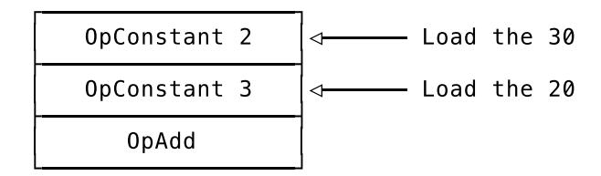

Representing the alternative, the 50 - 25, is just a variation of that:

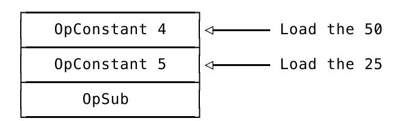

But how do we tell the machine to either execute the one part or the other part, *depending on the result of the OpGreaterThan instruction*?

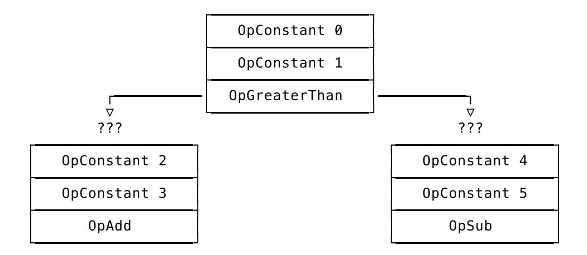

If we were to take these instructions and pass them to the VM as a flat sequence, what would happen? The VM would execute all of them, one after the other, happily incrementing its instruction pointer, fetching, decoding and executing, without a care in the world, no decisions or branches in sight. And that's exactly what we *don't* want!

What we want is for the VM to *either* execute the OpAdd instruction *or* the OpSub instruction. But since we *do* pass bytecode around as a flat sequence of instructions, how do we do that? Well, if we reorder our graph of instructions so that it represents a flat sequence of instructions, the question becomes this: what do we fill in the blanks here?

| OpConstant 0  |
|---------------|
| OpConstant 1  |
| OpGreaterThan |
| ???           |
| OpConstant 2  |
| OpConstant 3  |
| OpAdd         |
| ???           |
| OpConstant 4  |
| OpConstant 5  |
| OpSub         |

We need to put *something* in the blanks so that based on the result of the OpGreaterThan instruction the VM either ignores the instructions of the consequence or the instructions making up the alternative. It should skip them. Or instead of "skip", should we maybe say "jump over"?

<span id="page-87-0"></span>

### Jumps

Jumps are instructions that tell machines to jump to other instructions. They're used to implement branching (conditionals) in machine code, giving them the name "branch instructions". And with "machine code" I mean the code that computers execute but also the bytecode virtual machines run on. Translated into the technical terms of our VM: jumps are instructions that tell the VM to change its instruction pointer to a certain value. Here's how that works.

Let's say – hypothetically speaking – that we had two jump opcodes and called them JUMP\_IF\_NOT\_TRUE and JUMP\_NO\_MATTER\_WHAT. We could use them to fill in the blanks in our graph from above like this:

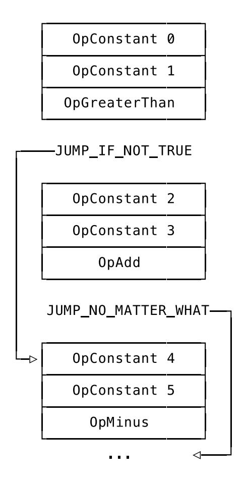

When the VM executes these instructions sequentially, top to bottom here, it would first execute the instructions making up the condition, ending with the OpGreaterThan instruction. That results in a boolean sitting on the stack. Just as we defined and implemented it in the previous chapter.

The next instruction, JUMP\_IF\_NOT\_TRUE, would tell the VM to jump to the OpConstant 4 instruction, *but only if* the boolean on the stack is *not* true. If that's the case, the VM would *jump over* the consequence and right to the "else" part of the conditional, the alternative. And in case the boolean on the stack *is* true, the JUMP\_IF\_NOT\_TRUE would have no effect and the VM would execute the consequence part of the conditional. It would increment its instruction pointer and start to fetch, decode and execute the next instruction – OpConstant 2, the start of the consequence.

Here's where it gets interesting. After executing the consequence of the conditional – the three instructions that end with OpAdd – the VM would then come across the aptly named JUMP\_NO\_MATTER\_WHAT. This instruction comes without any attached condition and tells the VM to directly jump to the first instruction *after* the alternative of the conditional, skipping it entirely.

That ends our little thought experiment and gives us a clear result: if we had two opcodes like these we could implement conditionals. But still, a last question remains: how would we represent the arrows? How do we tell the VM where to jump to?

Well, why not use numbers? Jumps are instructions that tell the VM to change the value of its instruction pointer and the arrows in the diagram above are nothing more than potential values for the instruction pointer. They can be represented as numbers, contained in the jump instructions as operands and their value being the index of the instruction the VM should jump to. That value is called an offset. Used like this, with the jump target being the index of an instruction, it's an absolute offset. Relative offsets also exist: they're relative to the position of the jump instruction itself and denote not *where exactly* to jump to, but *how far* to jump.

If we replace the arrows with offsets and give each instructions a unique index that's independent of its byte size (for illustration purposes), the diagram looks like this:

| 0000 | OpConstant 0             |
|------|--------------------------|
| 0001 | OpConstant 1             |
| 0002 | OpGreaterThan            |
| 0003 | JUMP_IF_NOT_TRUE 0008    |
| 0004 | OpConstant 2             |
| 0005 | OpConstant 3             |
| 0006 | OpAdd                    |
| 0007 | JUMP_NO_MATTER_WHAT 0011 |
| 0008 | OpConstant 4             |
| 0009 | OpConstant 5             |
| 0010 | OpMinus                  |

The operand of JUMP\_IF\_NOT\_TRUE is now 0008. That's the index of the OpConstant 4 instruction to which the VM should jump in case the condition is not true. The operand of JUMP\_NO\_MATTER\_WHAT is 0011, which is the index of the instruction following the whole conditional.

And *that's* how we're going to implement conditionals! We'll define two jump opcodes: one comes with a condition ("jump only if not true") and one does not ("just jump"). They'll both have one operand, the index of the instruction where the VM should jump to.

So that's our goal. Question is: how do we get there?

<span id="page-89-0"></span>

### Compiling Conditionals

The hard part of emitting jump instructions is not choosing the right opcode. It's the operands that make it challenging.

Say we're in our compiler's recursive Compile method, having just called Compile again, passing in the .Condition field of an \*ast.IfExpression. The condition has been successfully compiled and we've emitted the translated instructions. Now we want to emit the jump instruction that tells the VM to skip to the consequence of the conditional if the value on the stack is not truthy.

Which operand do we give this jump instruction? Where do we tell the VM to jump to? We don't know *yet*. Since we haven't compiled the consequence or the alternative branch yet, we don't how many instructions we're going to emit, which means we don't know how many instructions we have to jump over. *That's* the challenge.

I have to admit that solving this is a lot of fun. And a great part of the fun comes from the fact that it's pretty easy to write a test and tell the compiler exactly what's expected – because we're pretty sure about that part – and then make your way there step by step.

But we can only make assertions once we defined our new opcodes, so we'll do that now. One for a jump and another one for a conditional jump.

```
// code/code.go
const (
    // [...]
    OpJumpNotTruthy
    OpJump
)
var definitions = map[Opcode]*Definition{
    // [...]
    OpJumpNotTruthy: {"OpJumpNotTruthy", []int{2}},
    OpJump: {"OpJump", []int{2}},
}
```

I'm pretty sure you can tell which one's which. OpJumpNotTruthy will tell the VM to only jump if the value on top of the stack is not Monkey truthy, *i.e.*, not false nor null. Its single operand is the offset of the instruction the VM should jump to. OpJump will tell the VM to just "jump there", with "there" being its operand, also an offset of an instruction.

The operand of both opcodes is 16-bit wide. That's the same width as the operand of OpConstant has, which means we don't have to extend our tooling in the code package to support it.

We're now ready to write a first test. And we'll start slow and only try to handle a conditional without an else part first. Here's what we want the compiler to emit when we provide it a single-branch conditional:

```
// compiler/compiler_test.go
func TestConditionals(t *testing.T) {
    tests := []compilerTestCase{
        {
            input: `
            if (true) { 10 }; 3333;
            `,
            expectedConstants: []interface{}{10, 3333},
```

```
expectedInstructions: []code.Instructions{
                 // 0000
                 code.Make(code.OpTrue),
                 // 0001
                 code.Make(code.OpJumpNotTruthy, 7),
                 // 0004
                 code.Make(code.OpConstant, 0),
                 // 0007
                 code.Make(code.OpPop),
                 // 0008
                 code.Make(code.OpConstant, 1),
                 // 0011
                 code.Make(code.OpPop),
            },
        },
    }
    runCompilerTests(t, tests)
}
```

Once parsed, the input turns into an \*ast.IfExpression with a Condition and a Consequence. The Condition is the boolean literal true and the Consequence is the integer literal 10. Both are intentionally simple Monkey expressions, because in this test case we do not care about the expressions themselves. What we care about are the jump instructions the compiler emits and that they have correct operands.

That's why I annotated the expectedInstructions with comments that show the offset of the instructions generated by code.Make. We won't need these comments later on, but for now, they help us writing out the expected jump instructions, especially since the offsets of the instructions we want to jump to are based on the number of bytes each instruction takes up. An OpPop instruction is one byte wide, for example, but an OpConstant instruction takes up three bytes.

The first instruction we expect the compiler to emit is an OpTrue instruction to tell the VM to push vm.True on to the stack. That's the Condition. Then it should emit an OpJumpNotTruthy instruction that causes the VM to jump over the Consequence, with the Consequence being the OpConstant instruction that loads the integer 10 on to the stack.

But where does the first OpPop instruction (offset 0007) come from? It's not part of the Consequence, no. It's there because conditionals in Monkey are expressions – if (true) { 10 } evaluates to 10 – and stand-alone expressions whose value is unused are wrapped in an \*ast.ExpressionStatement. And those we compile with an appended OpPop instruction in order to clear the VM's stack. The first OpPop is thus the first instruction *after* the whole conditional, which makes its offset the location where OpJumpNotTruthy needs to jump to in order to skip the consequence.

So now you might be wondering what the 3333; is doing in the Monkey code. It serves as a point of reference. It's not strictly required, but in order to make sure that our jump offsets are correct it helps to have one expression in the code which we can easily find among the resulting instructions and use as a signpost that tells us where we *shouldn't* jump to. Of course, the OpConstant 1 instruction that loads 3333 is also followed by an OpPop instruction, since it's an expression statement.

Quite the long explanation for one test. Here's how much the compiler understands of it:

```
$ go test ./compiler
--- FAIL: TestConditionals (0.00s)
```

```
compiler_test.go:195: testInstructions failed: wrong instructions length.
  want="0000 OpTrue\n0001 OpJumpNotTruthy 7\n0004 OpConstant 0\n0007 OpPop\
    \n0008 OpConstant 1\n0011 OpPop\n"
  got ="0000 OpPop\n0001 OpConstant 0\n0004 OpPop\n"
FAIL
FAIL monkey/compiler 0.008s
```

Neither the condition nor the consequence of the conditional are compiled. In fact, the whole \*ast.IfExpression is skipped by the compiler. We can fix the first issue, the condition not being compiled, by extending the compiler's Compile method like this:

```
// compiler/compiler.go
func (c *Compiler) Compile(node ast.Node) error {
    switch node := node.(type) {
    // [...]
    case *ast.IfExpression:
        err := c.Compile(node.Condition)
        if err != nil {
            return err
        }
    // [...]
    }
    // [...]
}
```

With this change, the compiler now knows about \*ast.IfExpression and emits the instructions that represent node.Condition. And even though the consequence and the conditional jump over it are still missing, we get four out of six instructions right:

```
$ go test ./compiler
--- FAIL: TestConditionals (0.00s)
 compiler_test.go:195: testInstructions failed: wrong instructions length.
  want="0000 OpTrue\n0001 OpJumpNotTruthy 7\n0004 OpConstant 0\n0007 OpPop\n\
    0008 OpConstant 1\n0011 OpPop\n"
  got ="0000 OpTrue\n0001 OpPop\n0002 OpConstant 0\n0005 OpPop\n"
FAIL
FAIL monkey/compiler 0.009s
```

The OpTrue instruction is there, as are the last three: the OpPop following the \*ast.IfExpression, the OpConstant to load the 3333 and the OpPop following that, all in the correct order. All that's left to do now is emit the OpJumpNotTruthy instruction and the instructions to represent the node.Consequence.

With "all that's left to do now" I, of course, mean: "this is where it gets hairy". The challenge now is to emit an OpJumpNotTruthy instruction with an offset pointing *right after* the instructions of the node.Consequence – before compiling the node.Consequence.

Which offset do we use when we don't even know how far we have to jump yet? The answer is a rather pragmatic "let's just put garbage in there and fix it later". You chuckle, but I'm serious. Let's use a bogus offset and worry about fixing it later:

```
// compiler/compiler.go
func (c *Compiler) Compile(node ast.Node) error {
    switch node := node.(type) {
```

```
// [...]
    case *ast.IfExpression:
        err := c.Compile(node.Condition)
        if err != nil {
            return err
        }
        // Emit an `OpJumpNotTruthy` with a bogus value
        c.emit(code.OpJumpNotTruthy, 9999)
        err = c.Compile(node.Consequence)
        if err != nil {
            return err
        }
    // [...]
    }
    // [...]
}
```

Even though most programmers already squint their eyes and instinctively know that something fishy is going on when they see a 9999 in code, an inline code comment here helps making the intention clear. Because here we really do want to emit an OpJumpNotTruthy instruction with a garbage offset and then compile the node.Consequence. Again, the 9999 is not what will end up in the VM and we'll later take care of it. But for now, it should get us a lot more correct instructions in our test.

But, no, we only get one more right and that's the OpJumpNotTruthy instruction itself:

```
$ go test ./compiler
--- FAIL: TestConditionals (0.00s)
 compiler_test.go:195: testInstructions failed: wrong instructions length.
  want="0000 OpTrue\n0001 OpJumpNotTruthy 7\n0004 OpConstant 0\n0007 OpPop\n\
    0008 OpConstant 1\n0011 OpPop\n"
  got ="0000 OpTrue\n0001 OpJumpNotTruthy 9999\n0004 OpPop\n\
    0005 OpConstant 0\n0008 OpPop\n"
FAIL
FAIL monkey/compiler 0.008s
```

While we have the OpJumpNotTruthy 9999 instruction, we're apparently not yet compiling the Consequence.

That's because it's an \*ast.BlockStatement, which our compiler doesn't know about yet. In order to get it compiled, we need to extend the Compile method by another case branch:

```
// compiler/compiler.go
func (c *Compiler) Compile(node ast.Node) error {
    switch node := node.(type) {
    // [...]
    case *ast.BlockStatement:
        for _, s := range node.Statements {
            err := c.Compile(s)
            if err != nil {
                return err
            }
```

```
}
     // [...]
     }
     // [...]
}
```

That's exactly the same snippet of code we already have in the case branch for \*ast.Program. And it works:

```
$ go test ./compiler
--- FAIL: TestConditionals (0.00s)
 compiler_test.go:195: testInstructions failed: wrong instructions length.
  want="0000 OpTrue\n0001 OpJumpNotTruthy 7\n0004 OpConstant 0\n\
    0007 OpPop\n0008 OpConstant 1\n0011 OpPop\n"
  got ="0000 OpTrue\n0001 OpJumpNotTruthy 9999\n0004 OpConstant 0\n\
    0007 OpPop\n0008 OpPop\n0009 OpConstant 1\n0012 OpPop\n"
FAIL
FAIL monkey/compiler 0.010s
```

We're getting closer. But, besides the bogus 9999 offset, which we didn't expect to magically disappear, there's a new issue visible in the output, a far more subtle one. It's possible that you missed it, so let me point you to it: there is an additional OpPop instruction generated by the compiler, at position 0007. Its origin is the compilation of node.Consequence – an expression statement.

We need to get rid of this OpPop, because we do want the consequence and the alternative of a conditional to leave a value on the stack. Otherwise, we couldn't do this:

```
let result = if (5 > 3) { 5 } else { 3 };
```

That's valid Monkey code and it won't work if we emit an OpPop after the last expression statement in the node.Consequence. The value produced by the consequence would be popped off the stack, the expression wouldn't evaluate to anything, and the let statement would end up without a value on the right side of its =.

What makes fixing this tricky is that we only want to get rid of the *last* OpPop instruction in the node.Consequence. Say we had Monkey code like this:

```
if (true) {
  3;
  2;
  1;
}
```

What we want here is the 3 and the 2 to be popped off the stack, but the 1 should be kept around so the whole conditional evaluates to 1. So before we tackle our main challenge of giving the OpJumpNotTruthy a *real* offset, here's the plan for getting rid of the additional OpPop instruction.

We first change the compiler to keep track of the last two instructions we emitted, including their opcode and the position they were emitted to. For that, we need a new type and two more fields on the compiler:

```
// compiler/compiler.go
type EmittedInstruction struct {
    Opcode code.Opcode
    Position int
}
```

```
type Compiler struct {
    // [...]
    lastInstruction EmittedInstruction
    previousInstruction EmittedInstruction
}
func New() *Compiler {
    return &Compiler{
        // [...]
        lastInstruction: EmittedInstruction{},
        previousInstruction: EmittedInstruction{},
    }
}
```

lastInstruction is the very last instruction we emitted and previousInstruction is the one before that. We'll see why we need to keep track of both in a moment. For now, we change the compiler's emit method to populate both fields:

```
// compiler/compiler.go
func (c *Compiler) emit(op code.Opcode, operands ...int) int {
    ins := code.Make(op, operands...)
    pos := c.addInstruction(ins)
    c.setLastInstruction(op, pos)
    return pos
}
func (c *Compiler) setLastInstruction(op code.Opcode, pos int) {
    previous := c.lastInstruction
    last := EmittedInstruction{Opcode: op, Position: pos}
    c.previousInstruction = previous
    c.lastInstruction = last
}
```

With this in place, we can check opcode of the last emitted instruction in a type-safe way, without having to cast from and to bytes. And that's exactly what we're going to do. After compiling the node.Consequence of the \*ast.IfExpression we check whether the last instruction we emitted was an OpPop instruction and if so, we remove it:

```
// compiler/compiler.go
func (c *Compiler) Compile(node ast.Node) error {
    switch node := node.(type) {
    // [...]
    case *ast.IfExpression:
        // [...]
        c.emit(code.OpJumpNotTruthy, 9999)
        err = c.Compile(node.Consequence)
        if err != nil {
            return err
        }
```

```
if c.lastInstructionIsPop() {
             c.removeLastPop()
        }
    // [...]
    }
    // [...]
}
```

This uses two helpers, lastInstructionIsPop The two helpers involved are tiny:

```
// compiler/compiler.go
func (c *Compiler) lastInstructionIsPop() bool {
    return c.lastInstruction.Opcode == code.OpPop
}
func (c *Compiler) removeLastPop() {
    c.instructions = c.instructions[:c.lastInstruction.Position]
    c.lastInstruction = c.previousInstruction
}
```

lastInstructionIsPop checks whether the opcode of the last instruction is OpPop and removeLastPop shortens c.instruction to cut off the last instruction. After that, it sets c.lastInstruction to c.previousInstruction. And that's why we need to keep track of both of them, so c.lastInstruction doesn't go out of sync once we cut off the last OpPop instruction.

```
$ go test ./compiler
--- FAIL: TestConditionals (0.00s)
 compiler_test.go:195: testInstructions failed: wrong instruction at 2.
  want="0000 OpTrue\n0001 OpJumpNotTruthy 7\n0004 OpConstant 0\n\
    0007 OpPop\n 0008 OpConstant 1\n0011 OpPop\n"
  got ="0000 OpTrue\n0001 OpJumpNotTruthy 9999\n0004 OpConstant 0\n\
    0007 OpPop\n 0008 OpConstant 1\n0011 OpPop\n"
FAIL
FAIL monkey/compiler 0.008s
```

Now we have the correct number of instructions and the right opcodes. The only thing that still makes our test fail is the hideous 9999. Time to get rid of it.

The way we took care of the superfluous OpPop instruction points us into the right direction by making one thing clear: the instructions we emit are not set in stone, we can *change* them.

Instead of removing our c.emit(code.OpJumpNotTruthy, 9999) call, we'll leave it exactly as it is. We won't even change the 9999. Instead, we'll use Position field of the c.lastInstruction again. That allows us to go back to the OpJumpNotTruthy instruction we emitted and change the 9999 into the real operand. And when do we do that? That's the kicker, the beautiful bit. We'll modify the operand of the OpJumpNotTruthy *after* we compiled the node.Consequence. At that point, we'll know how far the VM has to jump and have the correct offset with which to replace the 9999.

This is called back-patching and common in compiler's such as ours, that only traverse the AST once and are thus called single-pass compilers. More advanced compilers might leave the target of the jump instructions empty until they know how far to jump and then do a second pass over the AST (or another IR) and fill in the targets.

Summarized: we'll keep on emitting the 9999, while remembering where we put it. Once we know where we need to jump to, we'll go back to the 9999 and change it to the correct offset. You'll be surprised by how little code is needed to pull that off.

The first thing we need is a tiny method to replace an instruction at an arbitrary offset in the instructions slice:

```
// compiler/compiler.go
func (c *Compiler) replaceInstruction(pos int, newInstruction []byte) {
    for i := 0; i < len(newInstruction); i++ {
        c.instructions[pos+i] = newInstruction[i]
    }
}
```

We'll use replaceInstruction in another method that allows us to replace the operand of an instruction:

```
// compiler/compiler.go
func (c *Compiler) changeOperand(opPos int, operand int) {
    op := code.Opcode(c.instructions[opPos])
    newInstruction := code.Make(op, operand)
    c.replaceInstruction(opPos, newInstruction)
}
```

Instead of really changing the operand itself (which can get messy with multi-byte operands), the changeOperand method recreates the instructions with the new operand and uses replaceInstruction to swap the old instruction for the new one – including the operand.

The underlying assumption here is that we only replace instructions of the same type, with the same non-variable length. If that assumption no longer holds, we'd have to tread far more carefully here and update c.lastInstruction and c.previousInstruction accordingly. You can see how another IR that's type-safe and independent of the byte-size of encoded instructions comes in handy once the compiler and the instructions it emits grow more complex.

Our solution, though, still fits our needs and all in all is not a lot of code. Two tiny methods, replaceInstruction and changeOperand, and all that's left to do is to use them, which is not much more code either:

```
// compiler/compiler.go
func (c *Compiler) Compile(node ast.Node) error {
    switch node := node.(type) {
    // [...]
    case *ast.IfExpression:
        err := c.Compile(node.Condition)
        if err != nil {
            return err
        }
        // Emit an `OpJumpNotTruthy` with a bogus value
        jumpNotTruthyPos := c.emit(code.OpJumpNotTruthy, 9999)
        err = c.Compile(node.Consequence)
        if err != nil {
            return err
        }
```

```
if c.lastInstructionIsPop() {
            c.removeLastPop()
        }
        afterConsequencePos := len(c.instructions)
        c.changeOperand(jumpNotTruthyPos, afterConsequencePos)
    // [...]
    }
    // [...]
}
```

The first change is saving the return value of c.emit to jumpNotTruthyPos. That's the position at which we can find the OpJumpNotTruthy instruction later on. "Later on" means right after the check for and possible removal of a OpPop instruction. After that, len(c.instructions) gives us the offset of the next-to-be-emitted instruction, which is where we want to jump to in case we don't execute the Consequence of the conditional because the value on top of the stack is not truthy. That's why we save it to afterConsequencePos, to give it a telling name.

After that, we use the new changeOperand method to get rid of the 9999 operand of the OpJumpNotTruthy instruction, which is located at jumpNotTruthyPos, and replace it with the correct afterConsequencePos.

Did you keep count? If not, I want you to know that the necessary changes add up to three lines. One changed, two added. That's all:

```
$ go test ./compiler
ok monkey/compiler 0.008s
```

Our compiler now correctly compiles a conditional! The caveat is that it only knows how to compile the *consequence*. It doesn't know how to compile a conditional with both a consequence *and* an alternative else-branch.

But we do and we also know how to write tests:

```
// compiler/compiler_test.go
func TestConditionals(t *testing.T) {
    tests := []compilerTestCase{
        // [...]
        {
            input: `
            if (true) { 10 } else { 20 }; 3333;
            `,
            expectedConstants: []interface{}{10, 20, 3333},
            expectedInstructions: []code.Instructions{
                // 0000
                code.Make(code.OpTrue),
                // 0001
                code.Make(code.OpJumpNotTruthy, 10),
                // 0004
                code.Make(code.OpConstant, 0),
                // 0007
                code.Make(code.OpJump, 13),
                // 0010
                code.Make(code.OpConstant, 1),
                // 0013
                code.Make(code.OpPop),
```

```
// 0014
                 code.Make(code.OpConstant, 2),
                 // 0017
                 code.Make(code.OpPop),
             },
        },
    }
    runCompilerTests(t, tests)
}
```

This is similar to the previous test case in TestConditionals, except that the input now contains not only the consequence of the conditional, but also the alternative: else { 20 }.

The expectedInstructions make clear what we want the bytecode to look like, with the first part being the same as in the previous test case: the condition is compiled to OpTrue and is followed by the OpJumpNotTruthy instruction that instructs the VM to *jump over* the compiled consequence.

Then, things start to differ. As the next opcode, we expect an OpJump, the opcode for an unconditional jump instruction. It has to be there because if condition is truthy the VM should only execute the consequence and *not* the alternative. To stop that from happening the OpJump instruction tells the VM to jump over the alternative.

The OpJump should then be followed by instructions that make up the alternative. In our test case, that's the OpConstant instruction that loads 20 on to the stack.

Then we're back on familiar ground. An OpPop is there to pop the value produced by the conditional off the stack and the loading of the bogus 3333 gives us guidance.

I know that it's not easy to wrap ones head around these jumps, so I hope that this illustration makes it clearer which instruction belongs to which part of the conditional and how the jumps tie them all together:

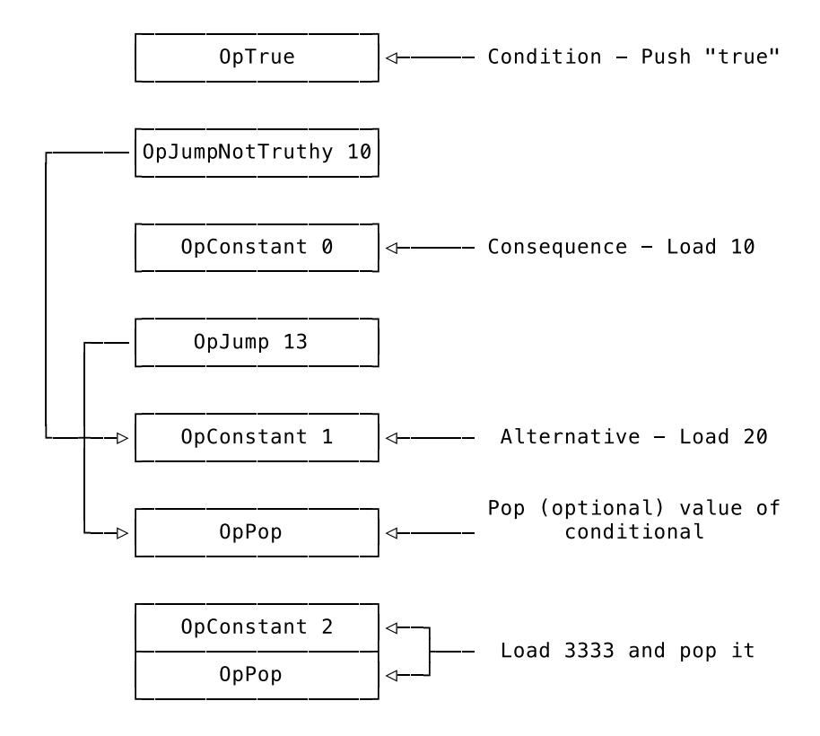

If that doesn't help, I'm sure trying to run and fixing the failing test will, because its output tells us what we're still missing:

```
$ go test ./compiler
--- FAIL: TestConditionals (0.00s)
 compiler_test.go:220: testInstructions failed: wrong instructions length.
  want="0000 OpTrue\n0001 OpJumpNotTruthy 10\n0004 OpConstant 0\n\
    0007 OpJump 13\n0010 OpConstant 1\n\
    0013 OpPop\n0014 OpConstant 2\n0017 OpPop\n"
  got ="0000 OpTrue\n0001 OpJumpNotTruthy 7\n0004 OpConstant 0\n\
    0007 OpPop\n0008 OpConstant 1\n0011 OpPop\n"
FAIL
FAIL monkey/compiler 0.007s
```

What we have here is the condition, then the OpPop following the whole conditional and the pushing and popping of the 3333. What's missing is the OpJump at the end of the consequence and the instructions representing the alternative. The good news is that we already have all the tools at hand. We just need to move things around a tiny bit and compile the alternative.

The first step, though, is to wrap our patching of the OpJumpNotTruthy instruction in a condition itself:

```
// compiler/compiler.go
func (c *Compiler) Compile(node ast.Node) error {
    switch node := node.(type) {
    // [...]
    case *ast.IfExpression:
        // [...]
        if node.Alternative == nil {
            afterConsequencePos := len(c.instructions)
            c.changeOperand(jumpNotTruthyPos, afterConsequencePos)
        }
    // [...]
    }
    // [...]
}
```

Preceding this node.Alternative == nil check is the compilation of node.Consequence and what this added block translates to is this: only if we have no node.Alternative can we jump to *here*, the current position in c.instructions.

But if we do have an node.Alternative we need to emit an OpJump that becomes part of the consequence and over which the OpJumpNotTruthy also has to jump:

```
// compiler/compiler.go
func (c *Compiler) Compile(node ast.Node) error {
    switch node := node.(type) {
    // [...]
    case *ast.IfExpression:
        // [...]
        if node.Alternative == nil {
```

```
afterConsequencePos := len(c.instructions)
            c.changeOperand(jumpNotTruthyPos, afterConsequencePos)
        } else {
            // Emit an `OpJump` with a bogus value
            c.emit(code.OpJump, 9999)
            afterConsequencePos := len(c.instructions)
            c.changeOperand(jumpNotTruthyPos, afterConsequencePos)
        }
    // [...]
    }
    // [...]
}
```

Don't worry about the duplication, we'll take care of that later on. What's important right now is to make the intention as clear as possible.

The OpJump instruction also has a placeholder operand. That means we have to patch it later, but right now it allows us to change the operand of the OpJumpNotTruthy instruction to the desired value: the position of the instruction right after the consequence *and* the OpJump instruction.

And why that is the correct operand should be clear by now: the OpJump should skip over the "else"-branch of the conditional in case the condition was truthy. It's part of the consequence, so to say. And if the condition is not truthy and we need to execute the "else"-branch, we need to use OpJumpNotTruthy to jump *after* the consequence, which is after the OpJump.

The tests tell us that we're on the right track:

```
$ go test ./compiler
--- FAIL: TestConditionals (0.00s)
 compiler_test.go:220: testInstructions failed: wrong instructions length.
  want="0000 OpTrue\n0001 OpJumpNotTruthy 10\n0004 OpConstant 0\n\
    0007 OpJump 13\n0010 OpConstant 1\n\
    0013 OpPop\n0014 OpConstant 2\n0017 OpPop\n"
  got ="0000 OpTrue\n0001 OpJumpNotTruthy 10\n0004 OpConstant 0\n\
    0007 OpJump 9999\n\
    0010 OpPop\n0011 OpConstant 1\n0014 OpPop\n"
FAIL
FAIL monkey/compiler 0.008s
```

The operand of OpJumpNotTruthy is correct, OpJump is in the correct place, only its operand is wrong and the whole alternative is missing. We now have to repeat what we previously did for the consequence:

```
// compiler/compiler.go
func (c *Compiler) Compile(node ast.Node) error {
    switch node := node.(type) {
    // [...]
    case *ast.IfExpression:
        // [...]
        if node.Alternative == nil {
            afterConsequencePos := len(c.instructions)
            c.changeOperand(jumpNotTruthyPos, afterConsequencePos)
        } else {
```

```
// Emit an `OpJump` with a bogus value
            jumpPos := c.emit(code.OpJump, 9999)
            afterConsequencePos := len(c.instructions)
            c.changeOperand(jumpNotTruthyPos, afterConsequencePos)
            err := c.Compile(node.Alternative)
            if err != nil {
                return err
            }
            if c.lastInstructionIsPop() {
                c.removeLastPop()
            }
            afterAlternativePos := len(c.instructions)
            c.changeOperand(jumpPos, afterAlternativePos)
        }
    // [...]
    }
    // [...]
}
```

We first save the position of the OpJump instruction to jumpPos so that we can later come back and change its operand. Then we patch the operand of the previously emitted OpJumpNotTruthy instruction, located at jumpNotTruthyPos, making it jump *right after* the just emitted OpJump.

After that, we compile node.Alternative. Here, too, we have to c.removeLastPop() if there is one. Finally, we change the operand of the OpJump instruction to the offset of the next-to-be-emitted instruction, which will be located right after the alternative.

Or, in the words of our test suite:

```
$ go test ./compiler
ok monkey/compiler 0.009s
```

Again, take the ok with a grain of salt. It should say: "Yes! Yes! Yes! We're compiling conditionals to jump instructions!"

We're over the hump now. It is time to teach our VM how to execute jumps, and that's far easier than emitting them.

<span id="page-101-0"></span>

### Executing Jumps

Before we wrote the compiler tests for conditionals, we really had to think through what we want them to say and what we want the compiler to do. That's not the case now, when writing the same tests for the VM. We already know how conditionals in Monkey are supposed to work and can cleanly express that in test cases and assertions:

```
// vm/vm_test.go
func TestConditionals(t *testing.T) {
    tests := []vmTestCase{
        {"if (true) { 10 }", 10},
        {"if (true) { 10 } else { 20 }", 10},
        {"if (false) { 10 } else { 20 } ", 20},
```

```
{"if (1) { 10 }", 10},
        {"if (1 < 2) { 10 }", 10},
        {"if (1 < 2) { 10 } else { 20 }", 10},
        {"if (1 > 2) { 10 } else { 20 }", 20},
    }
    runVmTests(t, tests)
}
```

Half of these test cases would've been enough. But they're easy to write, expressive, neat and cost us basically nothing! It also doesn't hurt us to be abundantly clear about what we want.

We test whether boolean expressions are correctly evaluated by the VM according to Monkey's "truthy" standards and that the correct branch of the conditional is taken. Since conditionals are expressions that produce values, they allow us to infer which branch was executed by testing for the produced value of the whole conditional.

As neat as the tests are, the error message they produce is nasty:

```
$ go test ./vm
--- FAIL: TestConditionals (0.00s)
panic: runtime error: index out of range [recovered]
 panic: runtime error: index out of range
goroutine 20 [running]:
testing.tRunner.func1(0xc4200bc2d0)
 /usr/local/go/src/testing/testing.go:742 +0x29d
panic(0x11190e0, 0x11f1fd0)
 /usr/local/go/src/runtime/panic.go:502 +0x229
monkey/vm.(*VM).Run(0xc420050e38, 0x800, 0x800)
 /Users/mrnugget/code/04/src/monkey/vm/vm.go:46 +0x30c
monkey/vm.runVmTests(0xc4200bc2d0, 0xc420079eb8, 0x7, 0x7)
 /Users/mrnugget/code/04/src/monkey/vm/vm_test.go:101 +0x35a
monkey/vm.TestConditionals(0xc4200bc2d0)
 /Users/mrnugget/code/04/src/monkey/vm/vm_test.go:80 +0x114
testing.tRunner(0xc4200bc2d0, 0x1149b40)
 /usr/local/go/src/testing/testing.go:777 +0xd0
created by testing.(*T).Run
 /usr/local/go/src/testing/testing.go:824 +0x2e0
FAIL monkey/vm 0.011s
```

Ugh. Not even an error, but a panic.

Before you dive into the code, though, and try to figure out where the error originates, let me explain: the VM is tripping over the bytecode because it contains opcodes it doesn't know how to decode. That in itself shouldn't be a problem, because unknown opcodes are skipped, but not necessarily their operands. Operands are just integers, remember, and might have the same value as an encoded opcode, which might lead the VM to treat them as such. That's wrong, of course. It's time we introduce our VM to our jump instructions.

We'll start with OpJump, because it's the most straightforward jump instruction we have. It has one 16 bit operand that's the offset of the instruction the VM should jump to. That's all we need to know to implement it:

```
// vm/vm.go
func (vm *VM) Run() error {
    // [...]
        switch op {
```

```
// [...]
        case code.OpJump:
            pos := int(code.ReadUint16(vm.instructions[ip+1:]))
            ip = pos - 1
        // [...]
        }
    // [...]
}
```

We use code.ReadUint16 to decode the operand located right after the opcode. That's step 1. Step 2 is to set the instruction pointer, ip, to the target of our jump. Here's where we come across one interesting implementation detail: since we're in a loop that increments ip with each iteration we need to set ip to the offset right before the one we want. That lets the loop do its work and ip gets set to the value we want in the next cycle.

Solely implementing OpJump doesn't buy us much though, since it's OpJumpNotTruthy that's integral to the implementation of conditionals. But while adding a case branch for code.OpJumpNotTruthy does take slightly more code, it's not much more complicated:

```
// vm/vm.go
func (vm *VM) Run() error {
    for ip := 0; ip < len(vm.instructions); ip++ {
        op := code.Opcode(vm.instructions[ip])
        switch op {
        // [...]
        case code.OpJumpNotTruthy:
            pos := int(code.ReadUint16(vm.instructions[ip+1:]))
            ip += 2
            condition := vm.pop()
            if !isTruthy(condition) {
                ip = pos - 1
            }
        // [...]
        }
    }
    // [...]
}
func isTruthy(obj object.Object) bool {
    switch obj := obj.(type) {
    case *object.Boolean:
        return obj.Value
    default:
        return true
    }
}
```

We again use code.ReadUint16 to read in and decode the operand. After that we manually

increase ip by two so we correctly skip over the two bytes of the operand in the next cycle. That's not a new – we've already done that when executing OpConstant instructions.

What's new is the rest. We pop off the topmost stack element and check if it's truthy with the helper function isTruthy. If it's *not* truthy, we jump, which means that we set ip to the index of the instruction right before the target, letting the for-loop do its work.

If the value *is* truthy we do nothing and start another iteration of the main loop. The result is that we're executing the consequence of the conditional, which is made up of the instructions right after the OpJumpNotTruthy instruction.

And now, open a drumroll.wav of your choice in your favorite audio player, pour your preferred beverage, hit play and watch this:

```
$ go test ./vm
ok monkey/vm 0.009s
```

We did it. Yes, we did it! Our bytecode compiler and VM are now able to compile and execute Monkey conditionals!

```
$ go build -o monkey . && ./monkey
Hello mrnugget! This is the Monkey programming language!
Feel free to type in commands
>> if (10 > 5) { 10; } else { 12; }
10
>> if (5 > 10) { 10; } else { 12; }
12
>>
```

This is the point where we went from "well, this is toy, isn't it?" to "oh wow, we're getting somewhere!". Stack arithmetic is one thing, but jump instructions are another. We're in the big leagues now. Except…

```
>> if (false) { 10; }
panic: runtime error: index out of range
goroutine 1 [running]:
monkey/vm.(*VM).pop(...)
 /Users/mrnugget/code/04/src/monkey/vm/vm.go:117
monkey/vm.(*VM).Run(0xc42005be48, 0x800, 0x800)
 /Users/mrnugget/code/04/src/monkey/vm/vm.go:60 +0x40e
monkey/repl.Start(0x10f1080, 0xc42000e010, 0x10f10a0, 0xc42000e018)
 /Users/mrnugget/code/04/src/monkey/repl/repl.go:43 +0x47a
main.main()
 /Users/mrnugget/code/04/src/monkey/main.go:18 +0x107
```

We forgot something.

### Welcome Back, Null!

At the start of this chapter we looked back at our implementation of conditionals in *Writing An Interpreter In Go*, and now we have implemented the majority of its behaviour. But there's one thing we're still missing: what happens when the condition of a conditional is *not* truthy but the conditional itself has no alternative? In the previous book the answer to this question was \*object.Null, Monkey's null value.

That makes sense, because conditionals are expressions and expressions, by definition, produce values. So what does an expression that produced nothing evaluate to? Null. Wait, let me try that again, only this time imagine a *big organ sound* in the background, *crows flying overhead*, *screeching*, *thunder*: They… *lightning strikes*… evaluate to … *sirens* … null.

Look, null and I, we're not the best of friends. I'm not really sure what to think of it, whether it's good or bad. It's the cause of many curses but I do understand that there are languages in which some things evaluate to nothing and that "nothing" has to be represented somehow. In Monkey, conditionals with a false condition and no alternative are one of these things, and "nothing" is represented by \*object.Null. Long story short: it's time we introduce \*object.Null to our compiler and VM and make this type of conditional work properly.

The first thing we need is a definition of \*object.Null in our VM. Since its value is constant, we can define it as a global variable, just like our previous global definitions of vm.True and vm.False:

```
// vm/vm.go
var Null = &object.Null{}
```

This is also similar to vm.True and vm.False in that it saves us a lot of work when comparing Monkey objects. We can simply check if an object.Object is \*object.Null by checking whether it's equal to vm.Null. We do not have to unwrap it and take a look at its value.

The reason why we first defined vm.Null, before writing any compiler tests – our usual course of action – is that this time we want do write a VM test first. And that's because the VM tests allow us to express what we want so succinctly:

```
// vm/vm_test.go
func TestConditionals(t *testing.T) {
    tests := []vmTestCase{
        // [...]
        {"if (1 > 2) { 10 }", Null},
        {"if (false) { 10 }", Null},
    }
    runVmTests(t, tests)
}
func testExpectedObject(
    t *testing.T,
    expected interface{},
    actual object.Object,
) {
    t.Helper()
    switch expected := expected.(type) {
    // [...]
    case *object.Null:
        if actual != Null {
            t.Errorf("object is not Null: %T (%+v)", actual, actual)
        }
    }
}
```

Here we have two new test cases for our existing TestConditionals function in which the condition is not Monkey truthy to force the evaluation of the alternative. But since there is none, we expect Null to end up on the stack. To test that properly, we extend the testExpectedObject with a new case branch for \*object.Null.

Neatly expressed, isn't it? Well, the error message isn't:

```
$ go test ./vm
--- FAIL: TestConditionals (0.00s)
panic: runtime error: index out of range [recovered]
 panic: runtime error: index out of range
goroutine 7 [running]:
testing.tRunner.func1(0xc4200a82d0)
 /usr/local/go/src/testing/testing.go:742 +0x29d
panic(0x1119420, 0x11f1fe0)
 /usr/local/go/src/runtime/panic.go:502 +0x229
monkey/vm.(*VM).pop(...)
 /Users/mrnugget/code/04/src/monkey/vm/vm.go:121
monkey/vm.(*VM).Run(0xc420054df8, 0x800, 0x800)
 /Users/mrnugget/code/04/src/monkey/vm/vm.go:53 +0x418
monkey/vm.runVmTests(0xc4200a82d0, 0xc420073e78, 0x9, 0x9)
 /Users/mrnugget/code/04/src/monkey/vm/vm_test.go:103 +0x35a
monkey/vm.TestConditionals(0xc4200a82d0)
 /Users/mrnugget/code/04/src/monkey/vm/vm_test.go:82 +0x149
testing.tRunner(0xc4200a82d0, 0x1149f40)
 /usr/local/go/src/testing/testing.go:777 +0xd0
created by testing.(*T).Run
 /usr/local/go/src/testing/testing.go:824 +0x2e0
FAIL monkey/vm 0.012s
```

The cause for this panic are the OpPop instructions we emit after the conditionals. Since they produced no value, the VM crashes trying to pop something off the stack. Time to change that, time to put vm.Null on to the stack.

We're going to do two things to pull that off. First, we're going to define an opcode that tells the VM to put vm.Null on the stack. Then we're going to modify the compiler to insert an alternative when a conditional doesn't have one. And the only thing this alternative branch will contain is the new opcode that pushes vm.Null on to the stack.

We define the opcode first so we can use it in our updated compiler tests:

```
// code/code.go
const (
    // [...]
    OpNull
)
var definitions = map[Opcode]*Definition{
    // [...]
    OpNull: {"OpNull", []int{}},
}
```

That's also similar to the boolean counterparts, OpTrue and OpFalse. OpNull doesn't have any operands and only instructs the VM to push one value on to the stack.

Instead of now writing a new compiler test, we're going to update an existing test case in TestConditionals and expect to find OpNull in the generated instructions. Please note that we need to change the first test case, the one in which the conditional doesn't have an alternative; the other test case stays as it is:

```
// compiler/compiler_test.go
```

```
func TestConditionals(t *testing.T) {
    tests := []compilerTestCase{
        {
            input: `
            if (true) { 10 }; 3333;
            `,
            expectedConstants: []interface{}{10, 3333},
            expectedInstructions: []code.Instructions{
                // 0000
                code.Make(code.OpTrue),
                // 0001
                code.Make(code.OpJumpNotTruthy, 10),
                // 0004
                code.Make(code.OpConstant, 0),
                // 0007
                code.Make(code.OpJump, 11),
                // 0010
                code.Make(code.OpNull),
                // 0011
                code.Make(code.OpPop),
                // 0012
                code.Make(code.OpConstant, 1),
                // 0015
                code.Make(code.OpPop),
            },
        },
        // [...]
    }
    runCompilerTests(t, tests)
}
```

New are the two instructions in the middle: OpJump and OpNull. Remember, OpJump is there to jump over the alternative and now OpNull *is* the alternative. And since the addition of these two instructions changes the index of existing instructions, the operand for OpJumpNotTruthy also has to be changed from 7 to 10. The rest stays the same.

Running the updated tests confirms that the compiler didn't learn how to insert artificial alternatives to conditionals on its own yet:

```
$ go test ./compiler
--- FAIL: TestConditionals (0.00s)
 compiler_test.go:288: testInstructions failed: wrong instructions length.
  want="0000 OpTrue\n0001 OpJumpNotTruthy 10\n0004 OpConstant 0\n\
    0007 OpJump 11\n0010 OpNull\n\
    0011 OpPop\n0012 OpConstant 1\n0015 OpPop\n"
  got ="0000 OpTrue\n0001 OpJumpNotTruthy 7\n0004 OpConstant 0\n\
    0007 OpPop\n0008 OpConstant 1\n0011 OpPop\n"
FAIL
FAIL monkey/compiler 0.008s
```

The best part about fixing this is making the code in our compiler simpler and easier to understand. We no longer have to check whether to emit OpJump or not, because we always want to do that now. Only sometimes do we want to jump over a "real" alternative and sometimes over an OpNull instruction. So, here's the updated case \*ast.IfExpression branch of the Compile method:

```
// compiler/compiler.go
```

```
func (c *Compiler) Compile(node ast.Node) error {
    switch node := node.(type) {
    // [...]
    case *ast.IfExpression:
        err := c.Compile(node.Condition)
        if err != nil {
            return err
        }
        // Emit an `OpJumpNotTruthy` with a bogus value
        jumpNotTruthyPos := c.emit(code.OpJumpNotTruthy, 9999)
        err = c.Compile(node.Consequence)
        if err != nil {
            return err
        }
        if c.lastInstructionIsPop() {
            c.removeLastPop()
        }
        // Emit an `OpJump` with a bogus value
        jumpPos := c.emit(code.OpJump, 9999)
        afterConsequencePos := len(c.instructions)
        c.changeOperand(jumpNotTruthyPos, afterConsequencePos)
        if node.Alternative == nil {
            c.emit(code.OpNull)
        } else {
            err := c.Compile(node.Alternative)
            if err != nil {
                return err
            }
            if c.lastInstructionIsPop() {
                c.removeLastPop()
            }
        }
        afterAlternativePos := len(c.instructions)
        c.changeOperand(jumpPos, afterAlternativePos)
    // [...]
    }
    // [...]
}
```

That's the complete branch but only its second half has been changed: the duplicated patching of the OpJumpNotTruthy instruction is gone and in its place we can find the new, readable compilation of a possible node.Alternative.

We start by emitting an OpJump instruction and updating the operand of the OpJumpNotTruthy instruction. That happens whether we have a node.Alternative or not. But then we check whether node.Alternative is nil and if it is, we emit the new OpNull opcode. If it's not nil, we proceed as before: compile node.Alternative and then try to get rid of a possible OpPop instruction.

After that, we change the operand of the OpJump instruction to jump over the freshly-compiled alternative – no matter whether that's just an OpNull or more.

That code is not only a lot cleaner than our previous version, it also works:

```
$ go test ./compiler
ok monkey/compiler 0.009s
```

Now we can move on to our VM, where our test is still failing and where we have to implement the new OpNull opcode:

```
// vm/vm.go
func (vm *VM) Run() error {
    // [...]
        switch op {
        // [...]
        case code.OpNull:
             err := vm.push(Null)
             if err != nil {
                 return err
             }
        // [...]
        }
    // [...]
}
```

With that, the panic is gone and our tests pass:

```
$ go test ./vm
ok monkey/vm 0.009s
```

That means we've successfully made conditionals with a non-truthy condition put Null on to the stack. We have now implemented the complete behaviour of conditionals as described in *Writing An Interpreter In Go*!

But, sorry to say, there's one more thing we have to do. With this last passing test, we've officially entered a new world. Since a conditional is an expression and expressions can be used interchangeably, it follows that any expression can now produce Null in our VM. It's a scary world, yes.

For us, the practical implication is that we now have to handle Null in every place where we handle a value produced by an expression. Thankfully, most of these places in our VM – like vm.executeBinaryOperation – throw an error if they come across a value they did not expect. But there are functions and methods that now *must* handle Null explicitly.

The first of these is vm.executeBangOperator. We can add a test to make sure that it handles Null without blowing up:

```
// vm/vm_test.go
func TestBooleanExpressions(t *testing.T) {
    tests := []vmTestCase{
        // [...]
        {"!(if (false) { 5; })", true},
```

```
}
    runVmTests(t, tests)
}
```

With this test case we implicitly make sure that a conditional with a non-truthy condition and no alternative results in Null and that the negation of that, through the use of the ! operator, turns it into True. Under the hood, this involves vm.executeBangOperator and in order to get the test to pass, we need to change it:

```
// vm/vm.go
func (vm *VM) executeBangOperator() error {
    operand := vm.pop()
    switch operand {
    case True:
        return vm.push(False)
    case False:
        return vm.push(True)
    case Null:
        return vm.push(True)
    default:
        return vm.push(False)
    }
}
```

The negation of Null is now True – exactly as in *Writing An Interpreter In Go*. The tests pass:

```
$ go test ./vm
ok monkey/vm 0.009s
```

Here comes the weird part. Since a conditional is an expression and its condition is one too, it follows that we can use a conditional as the condition of another conditional. Here, too, I'm sure that you and I wouldn't do this in the code we write, but be that as it may, it has to work in our VM – even if the inner conditional produces Null:

```
// vm/vm_test.go
func TestConditionals(t *testing.T) {
    tests := []vmTestCase{
        // [...]
        {"if ((if (false) { 10 })) { 10 } else { 20 }", 20},
    }
    runVmTests(t, tests)
}
```

This looks like it might be a mess to fix, but since our code is squeaky clean and well maintained there's only one place where we need to make a change; a quite obvious one, too. We need to tell the VM that an \*object.Null is not isTruthy:

```
// vm/vm.go
func isTruthy(obj object.Object) bool {
    switch obj := obj.(type) {
    case *object.Boolean:
        return obj.Value
```

```
case *object.Null:
        return false
    default:
        return true
    }
}
```

That's two new lines of code and we're done:

```
$ go test ./vm
ok monkey/vm 0.011s
```

And now done means *done*. Our implementation of conditionals is now feature complete and we have a Null-safe VM:

```
$ go build -o monkey . && ./monkey
Hello mrnugget! This is the Monkey programming language!
Feel free to type in commands
>> if (false) { 10 }
null
```

Time to play drumroll.wav again, only this time knowing that we didn't forget something.

## Chapter 5

# Keeping Track of Names

Up until now we've referenced values in our Monkey code by using boolean and integer literals. That's going to change. In this chapter we're going to implement *bindings*, by adding support for let statements and identifier expressions. At the end, we'll be able to bind any value to any name and then have that name resolve to the value.

As preparation, here's a short refresher of what let statements in Monkey look like:

```
let x = 5 * 5;
```

As you can see, a let statement in Monkey starts with the let keyword followed by an identifier. The identifier is the name to which we want to bind a value, in this case it's x. The right side of the = is an expression. It evaluates to the value the name will be bound to. And since it's a let *statement* it's followed by a semicolon. Let name equal value of expression; that's it.

Referencing the value to which x has been bound is easy, since identifiers, which is what the x is in the terms of our AST, are expressions and can be used interchangeably. We can use x in every place where an expression is valid:

```
x * 5 * x * 5;
if (x < 10) { x * 2 } else { x / 2 };
let y = x + 5;
```

Let statements are valid as either top-level statements or inside a block statement, like the branches of a conditional or the body of a function. In this chapter, we're only going to add support for the top-level and non-function-body block-statement varieties. We'll tackle local variables, which is what let statements inside functions produce, when we implement functions and closures.

Our goal for this chapter is to be able to compile the following code to bytecode and have our VM execute it:

```
let x = 5 * 5;
if (x > 10) {
  let y = x * 2;
  y;
}
```

And, yes, it should also *correctly* execute it and produce 50 here.

<span id="page-113-0"></span>

### The Plan

So how do we go about implementing this? Obviously, we need to compile let statements and identifier expressions to bytecode instructions and support these instructions in the VM. That much is clear. And I also don't think there's any debate about how many new opcodes we need. We need one to tell the VM to bind a value to an identifier and another one to retrieve the value previously bound to an identifier. But what do these new instructions look like?

The main task when implementing bindings is to have the identifiers correctly resolve to the values they were previously bound to. If you can pass around the identifiers when executing the code – like we did in our evaluator – that's not much of challenge. You can, for example, use the identifiers as keys to a map in which you store and retrieve the values. But we can't.

We're not in our evaluator anymore. We're now working with bytecode and we can't just pass around identifiers in bytecode – the operands to our opcodes are integers. How do we then represent the identifier in these new instructions? And, how do we reference the value that should be bound to the identifier?

The answer to the second question consists of two words, so let's start with that one. Here it comes: the stack. Yep, that's *it*, we don't need more than that. We don't need to explicitly reference the value we want to bind – we have a stack machine! We can just push the value on to the stack and tell the VM: "now bind the topmost stack element to *this* identifier". That fits in beautifully with the rest of our instruction set.

Back to the first question: how do we represent identifiers in our bytecode when we can only use numbers as operands? The answer is hidden in the question itself: we'll use numbers to represent identifiers. Let me explain that with a bit of Monkey code:

```
let x = 33;
let y = 66;
let z = x + y;
```

While compiling this we'll assign a new, unique number to each identifier we come across. In case we've seen the identifier before, we'll reuse the previously assigned number. How do we generate a new number? We'll keep it simple and just use increasing numbers, starting with 0. In this example, x would be assigned the 0, y the 1 and z would be assigned the 2.

We'll also define the two new opcodes we want and call them OpSetGlobal and OpGetGlobal. Both have one 16-bit-wide operand that holds a number: the unique number we previously assigned to an identifier. When we then compile a let statement we'll emit an OpSetGlobal instruction to create a binding and when we compile an identifier, we'll emit an OpGetGlobal instruction to retrieve a value. (16 bits for the operand means we're limited to a maximum of 65536 global bindings – which should be plenty for us and our Monkey programs).

The three Monkey let statements from above would then look like this in bytecode:

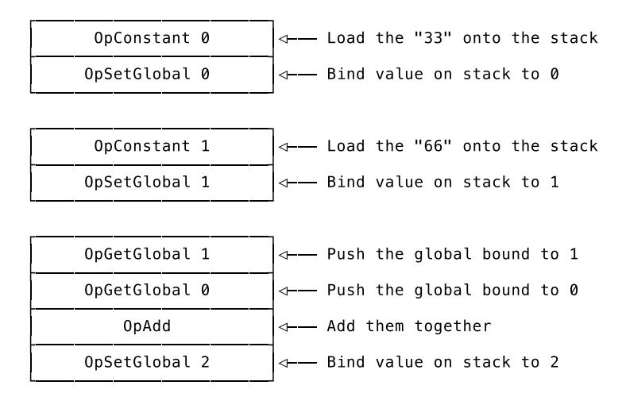

That's the compiler side of things. In the VM we'll use a slice to implement the creation and retrieval of global bindings. We'll call this slice our "globals store" and we'll use the operands of the OpSetGlobal and OpGetGlobal instructions as indexes into it.

When we execute an OpSetGlobal instruction, we'll read in the operand, pop the topmost value off the stack and save it to the globals store at the index encoded in the operand. To execute an OpGetGlobal instruction we'll use the operand to retrieve the value from the globals store and push it on to the stack.

Two new opcodes called OpGetGlobal and OpSetGlobal, a mechanism to associate identifiers with numbers while compiling, and a globals store in the VM. Sounds doable, when broken down like this, right?

Of course, things get more complicated once we introduce functions and local variables, but that's a bridge we'll cross once we get there. For now, let's head on over to our compiler.

<span id="page-114-0"></span>

### Compiling Bindings

First up is the definition of the two new opcodes, OpSetGlobal and OpGetGlobal:

```
// code/code.go
const (
    // [...]
    OpGetGlobal
    OpSetGlobal
)
var definitions = map[Opcode]*Definition{
    // [...]
    OpGetGlobal: {"OpGetGlobal", []int{2}},
    OpSetGlobal: {"OpSetGlobal", []int{2}},
}
```

Both have a single two-byte operand to hold the unique number of a global binding. Just like we discussed. We can move along and use these new opcodes to write a first compiler test:

```
// compiler/compiler_test.go
```

```
func TestGlobalLetStatements(t *testing.T) {
    tests := []compilerTestCase{
        {
            input: `
            let one = 1;
            let two = 2;
            `,
            expectedConstants: []interface{}{1, 2},
            expectedInstructions: []code.Instructions{
                code.Make(code.OpConstant, 0),
                code.Make(code.OpSetGlobal, 0),
                code.Make(code.OpConstant, 1),
                code.Make(code.OpSetGlobal, 1),
            },
        },
        {
            input: `
            let one = 1;
            one;
            `,
            expectedConstants: []interface{}{1},
            expectedInstructions: []code.Instructions{
                code.Make(code.OpConstant, 0),
                code.Make(code.OpSetGlobal, 0),
                code.Make(code.OpGetGlobal, 0),
                code.Make(code.OpPop),
            },
        },
        {
            input: `
            let one = 1;
            let two = one;
            two;
            `,
            expectedConstants: []interface{}{1},
            expectedInstructions: []code.Instructions{
                code.Make(code.OpConstant, 0),
                code.Make(code.OpSetGlobal, 0),
                code.Make(code.OpGetGlobal, 0),
                code.Make(code.OpSetGlobal, 1),
                code.Make(code.OpGetGlobal, 1),
                code.Make(code.OpPop),
            },
        },
    }
    runCompilerTests(t, tests)
}
```

Same test setup as before, so let's talk about *what* we test in these three test cases. The first one makes sure that a let statement leads to the correct OpSetGlobal instruction being emitted. The second one expects that an identifier resolves to a previous binding by testing for the OpGetGlobal instruction. Note here that the operands of the OpSetGlobal and OpGetGlobal instructions have to match. The third test case asserts that combining the setting and getting of global bindings works, too. Here, too, it's important that the operands of the instructions match.

We're going to fix these test cases one after the other, starting with the first one, which isn't

doing so well:

```
$ go test ./compiler
--- FAIL: TestGlobalLetStatements (0.00s)
 compiler_test.go:361: testInstructions failed: wrong instructions length.
  want="0000 OpConstant 0\n0003 OpSetGlobal 0\n0006 OpConstant 1\n\
    0009 OpSetGlobal 1\n"
  got =""
FAIL
FAIL monkey/compiler 0.009s
```

Looks like we're not even close. But the reason for the empty result is that Monkey code consists solely of let statements and our compiler currently skips them. We can get better feedback from the test by adding a new case branch to the compiler's Compile method:

```
// compiler/compiler.go
func (c *Compiler) Compile(node ast.Node) error {
    switch node := node.(type) {
    // [...]
    case *ast.LetStatement:
        err := c.Compile(node.Value)
        if err != nil {
            return err
        }
    // [...]
    }
    // [...]
}
```

The first thing we do when we come across a let statement is to compile the expression on the right side of the equal sign. That's the Value that will be bound to a name and compiling this expression means instructing the VM to put the value on to the stack:

```
$ go test ./compiler
--- FAIL: TestGlobalLetStatements (0.00s)
 compiler_test.go:361: testInstructions failed: wrong instructions length.
  want="0000 OpConstant 0\n0003 OpSetGlobal 0\n0006 OpConstant 1\n\
    0009 OpSetGlobal 1\n"
  got ="0000 OpConstant 0\n0003 OpConstant 1\n"
FAIL
FAIL monkey/compiler 0.009s
```

Now we can bind it to a name. That means we need to follow up with an OpSetGlobal instruction that tells the VM to create the binding. But which number do we choose for our identifier? The answer comes from a new component we're going to add to our compiler, a symbol table.

### Introducing: the Symbol Table

<span id="page-116-0"></span>A symbol table is a data structure used in interpreters and compilers to associate identifiers with information. It can be used in every phase, from lexing to code generation, to store and retrieve information about a given identifier (which can be called a symbol). Information such as its location, its scope, whether it was previously declared or not, of which type the associated va[lue is, and an](https://en.wikipedia.org/wiki/Symbol_table)ything else that seems useful while interpreting or compiling.

We're going to use as symbol table to associate identifiers with a scope and a unique number.

For now, it should do two things:

- 1. Associate identifiers in the global scope with a unique number
- 2. Get the previously associated number for a given identifier

The common names for these two methods on a symbol table are "define" and "resolve". You "define" an identifier in a given scope to associate some information with it. Later you "resolve" the identifier to this information. The information itself we'll call the "symbol" – an identifier is associated with a symbol and the symbol itself is what contains information.

Working code helps to explain this. Here are the type definitions that make up our symbol table:

```
// compiler/symbol_table.go
package compiler
type SymbolScope string
const (
    GlobalScope SymbolScope = "GLOBAL"
)
type Symbol struct {
    Name string
    Scope SymbolScope
    Index int
}
type SymbolTable struct {
    store map[string]Symbol
    numDefinitions int
}
func NewSymbolTable() *SymbolTable {
    s := make(map[string]Symbol)
    return &SymbolTable{store: s}
}
```

The first definition here is that of SymbolScope, a type alias for string. The value of a SymbolScope itself is not important. What's important is that it's unique, because we need to differentiate between different scopes. We use strings as the aliased type (as opposed to an integer, for example) for a better debugging experience.

We then define our first scope, GlobalScope. In the coming chapters we'll add more.

The next definition is that of Symbol. A Symbol is a struct that holds all the necessary information about a symbol we encounter in Monkey code: the Name, the Scope and the Index. Not much more to explain here.

The SymbolTable itself then associates strings with Symbols in its store and keeps track of the numDefinitions it has. The strings are the identifiers we come across in the Monkey code.

The names of the types and fields can feel unfamiliar, if you haven't used a symbol table before, but worry not: we're building a map that associates strings with information about them. There is no hidden wisdom or trick you need to wrap your head around. Tests make this much clearer by demonstrating what we expect from the missing Define and Resolve methods of the SymbolTable:

```
// compiler/symbol_table_test.go
package compiler
import "testing"
func TestDefine(t *testing.T) {
    expected := map[string]Symbol{
        "a": Symbol{Name: "a", Scope: GlobalScope, Index: 0},
        "b": Symbol{Name: "b", Scope: GlobalScope, Index: 1},
    }
    global := NewSymbolTable()
    a := global.Define("a")
    if a != expected["a"] {
        t.Errorf("expected a=%+v, got=%+v", expected["a"], a)
    }
    b := global.Define("b")
    if b != expected["b"] {
        t.Errorf("expected b=%+v, got=%+v", expected["b"], b)
    }
}
func TestResolveGlobal(t *testing.T) {
    global := NewSymbolTable()
    global.Define("a")
    global.Define("b")
    expected := []Symbol{
        Symbol{Name: "a", Scope: GlobalScope, Index: 0},
        Symbol{Name: "b", Scope: GlobalScope, Index: 1},
    }
    for _, sym := range expected {
        result, ok := global.Resolve(sym.Name)
        if !ok {
            t.Errorf("name %s not resolvable", sym.Name)
            continue
        }
        if result != sym {
            t.Errorf("expected %s to resolve to %+v, got=%+v",
                sym.Name, sym, result)
        }
    }
}
```

In TestDefine we make assertions about the Define method. It should take an identifier as argument, create a definition and return the Symbol. Note that we don't have to say in which scope we want to create the definition. It's the job of the symbol table to keep track of that for us. We only call Define("a") and the symbol table associates the identifier "a" with a new Symbol, that contains the Name, the Scope and the Index. The Index is the unique number we're after.

In TestResolveGlobal we do the reverse: we hand the symbol table an identifier that was previously defined and expect it to return the associated Symbol. Again, the only argument is the identifier: Resolve("a"). If the identifier is undefined, the second return value of Resolve has to be false.

The tests don't compile, because both methods are missing and I'm going to spare you from reading through the results of running the tests repeatedly while adding the method definition step by step. Instead, let me give you the full version of Define:

```
// compiler/symbol_table.go
func (s *SymbolTable) Define(name string) Symbol {
    symbol := Symbol{Name: name, Index: s.numDefinitions, Scope: GlobalScope}
    s.store[name] = symbol
    s.numDefinitions++
    return symbol
}
```

I told you, there's nothing to worry about; we're building a map with some additional features. Here's the evidence. We create a new Symbol, associate it with the name in our store, increase the numDefinitions counter and return the new Symbol. Defined. Done.

The Resolve method is even simpler:

```
// compiler/symbol_table.go
func (s *SymbolTable) Resolve(name string) (Symbol, bool) {
    obj, ok := s.store[name]
    return obj, ok
}
```

Sadly, this method won't stay that small. As we add more scopes in the future, it'll grow, but for now, what it does is enough: both tests pass.

```
$ go test -run TestDefine ./compiler
ok monkey/compiler 0.008s
$ go test -run TestResolveGlobal ./compiler
ok monkey/compiler 0.011s
```

<span id="page-119-0"></span>

### Using Symbols in the Compiler

We had to selectively run the TestDefine and TestResolveGlobal functions to get an "ok" because our compiler test is still failing. Now though, armed with our symbol table, we can make it pass! First we need to add the symbol table to the compiler:

```
// compiler/compiler.go
type Compiler struct {
    // [...]
    symbolTable *SymbolTable
}
func New() *Compiler {
    return &Compiler{
        // [...]
        symbolTable: NewSymbolTable(),
    }
}
```

That allows us to define the identifiers in \*ast.LetStatements:

```
// compiler/compiler.go
```

```
func (c *Compiler) Compile(node ast.Node) error {
    switch node := node.(type) {
    // [...]
    case *ast.LetStatement:
        err := c.Compile(node.Value)
        if err != nil {
            return err
        }
        symbol := c.symbolTable.Define(node.Name.Value)
    // [...]
    }
    // [...]
}
```

node.Name is the \*ast.Identifier on the left side of the let statement's equal sign. And node.Name.Value holds the string representation of that identifier. We pass it to the symbol table's Define method and thus define it in the GlobalScope. The returned symbol now has a Name, a Scope and, most importantly, an Index.

We can now use that Index as operand of a OpSetGlobal instruction and emit that:

```
// compiler/compiler.go
func (c *Compiler) Compile(node ast.Node) error {
    switch node := node.(type) {
    // [...]
    case *ast.LetStatement:
        err := c.Compile(node.Value)
        if err != nil {
            return err
        }
        symbol := c.symbolTable.Define(node.Name.Value)
        c.emit(code.OpSetGlobal, symbol.Index)
    // [...]
    }
    // [...]
}
```

With that we just took a huge step towards our goal:

```
$ go test ./compiler
--- FAIL: TestGlobalLetStatements (0.00s)
 compiler_test.go:361: testInstructions failed: wrong instructions length.
  want="0000 OpConstant 0\n0003 OpSetGlobal 0\n0006 OpGetGlobal 0\n\
    0009 OpPop\n"
  got ="0000 OpConstant 0\n0003 OpSetGlobal 0\n0006 OpPop\n"
FAIL
FAIL monkey/compiler 0.011s
```

Now we're talki– wait a second! The test is still failing? No, this is the *second* test case. The first one is passing! What's failing now is the test case that makes sure *resolving a global binding* works.

Instead of defining an identifier and emitting an OpSetGlobal instruction we now have to do the

opposite. When we come across an \*ast.Identifier we need to check with our symbol table whether the identifier was previously used as part of a let statement and if so, we need to emit an OpGetGlobal instruction with the correct operand. "Correct" here means that the operand holds the same number that was used in the previously emitted OpSetGlobal instruction. We can manage that, can't we?

First we have to tell the compiler about \*ast.Identifiers. It should try to resolve the identifier at hand with the symbol table:

```
// compiler/compiler.go
func (c *Compiler) Compile(node ast.Node) error {
    switch node := node.(type) {
    // [...]
    case *ast.Identifier:
        symbol, ok := c.symbolTable.Resolve(node.Value)
        if !ok {
            return fmt.Errorf("undefined variable %s", node.Value)
        }
    // [...]
    }
    // [...]
}
```

We take the Value of the \*ast.Identifier and ask the symbol table whether it can Resolve it. If not, we return an error. Looks just like any other map access in Go, doesn't it? But I want you to note that this is a *compile time error*! Previously, in our evaluator, we could only determine whether a variable was defined or not at *run time*, while executing the Monkey program. Now we can throw an error before we pass bytecode to the VM. Pretty cool, isn't it?

In case the identifier can be resolved we have the symbol at hand and can use it to emit the OpGetGlobal instruction:

```
// compiler/compiler.go
func (c *Compiler) Compile(node ast.Node) error {
    switch node := node.(type) {
    // [...]
    case *ast.Identifier:
        symbol, ok := c.symbolTable.Resolve(node.Value)
        if !ok {
            return fmt.Errorf("undefined variable %s", node.Value)
        }
        c.emit(code.OpGetGlobal, symbol.Index)
    // [...]
    }
    // [...]
}
```

The operand matches the one used in the OpSetGlobal instruction, the Index associated with the symbol. Our symbol table took care of that. That means the VM does not have to worry about identifiers at all but can just concentrate on storing and retrieving values using this Index. In other words:

```
$ go test ./compiler
ok monkey/compiler 0.008s
```

We did it! We can now use let statements to bind values to an identifier and later use the identifier to get to that value – at least in our compiler.

<span id="page-122-0"></span>

### Adding Globals to the VM

Let me be upfront about this and say that the hardest part is over. We've added support for the OpSetGlobal and OpGetGlobal instructions to our compiler and doing the same for VM takes far less effort. It's fun, though, because writing tests for the VM and making them pass is fun:

```
// vm/vm_test.go
func TestGlobalLetStatements(t *testing.T) {
    tests := []vmTestCase{
        {"let one = 1; one", 1},
        {"let one = 1; let two = 2; one + two", 3},
        {"let one = 1; let two = one + one; one + two", 3},
    }
    runVmTests(t, tests)
}
```

In these test cases we create one or two global bindings and then try to resolve the previously bound identifiers to their values. The result should land on the stack, where we can test for it. Alas, it blows up in our face:

```
$ go test ./vm
--- FAIL: TestGlobalLetStatements (0.00s)
panic: runtime error: index out of range [recovered]
 panic: runtime error: index out of range
goroutine 21 [running]:
testing.tRunner.func1(0xc4200c83c0)
 /usr/local/go/src/testing/testing.go:742 +0x29d
panic(0x111a5a0, 0x11f3fe0)
 /usr/local/go/src/runtime/panic.go:502 +0x229
monkey/vm.(*VM).Run(0xc420050eb8, 0x800, 0x800)
 /Users/mrnugget/code/05/src/monkey/vm/vm.go:47 +0x47c
monkey/vm.runVmTests(0xc4200c83c0, 0xc420073f38, 0x3, 0x3)
 /Users/mrnugget/code/05/src/monkey/vm/vm_test.go:115 +0x3c1
monkey/vm.TestGlobalLetStatements(0xc4200c83c0)
 /Users/mrnugget/code/05/src/monkey/vm/vm_test.go:94 +0xb5
testing.tRunner(0xc4200c83c0, 0x114b5b8)
 /usr/local/go/src/testing/testing.go:777 +0xd0
created by testing.(*T).Run
 /usr/local/go/src/testing/testing.go:824 +0x2e0
FAIL monkey/vm 0.011s
```

We've seen this before. The VM doesn't know how to handle the new opcodes and skips them. But since it doesn't know how far it has to skip in order to jump over the operands, it ends up trying to decode the operands as opcodes. That leads to this nonsense here.

Before we clean that up, though, and properly decode and execute OpSetGlobal and OpGetGlobal

instructions, we need a place to store globals.

Since the operand of both opcodes is 16 bits wide, we have an upper limit on the number of global bindings our VM can support. That's good, because a limit allows us to pre-allocate all the memory we will use:

```
// vm/vm.go
const GlobalsSize = 65536
type VM struct {
// [...]
    globals []object.Object
}
func New(bytecode *compiler.Bytecode) *VM {
    return &VM{
// [...]
        globals: make([]object.Object, GlobalsSize),
    }
}
```

This new globals field of VM is the "globals store". We use a slice as the underlying data structure, because it gives us direct index-based access to single elements without any overhead.

Now we can implement OpSetGlobal:

```
// vm/vm.go
func (vm *VM) Run() error {
    // [...]
        switch op {
        // [...]
        case code.OpSetGlobal:
            globalIndex := code.ReadUint16(vm.instructions[ip+1:])
            ip += 2
            vm.globals[globalIndex] = vm.pop()
        // [...]
        }
    // [...]
}
```

The first thing we do is decode the operand, globalIndex, and increment the VM's instruction pointer, ip, by two bytes. Then we pop the top element off the stack, which is the value that should be bound to a name, and save it to the new globals store under the specified index. There it's easy to retrieve when we need to push it on to the stack again:

```
// vm/vm.go
func (vm *VM) Run() error {
    // [...]
        switch op {
        // [...]
        case code.OpGetGlobal:
```

```
globalIndex := code.ReadUint16(vm.instructions[ip+1:])
            ip += 2
            err := vm.push(vm.globals[globalIndex])
            if err != nil {
                 return err
            }
        // [...]
        }
    // [...]
}
```

Again, we decode the operand, globalIndex, and increment the ip. Then we fetch the value from vm.globals and push it back on to the stack. Gone is the panic:

```
$ go test ./vm
ok monkey/vm 0.030s
```

Instead, we get an enthusiastic "ok" to let us know us that we successfully taught our compiler and our VM to handle global let statements. Look at this:

```
$ go build -o monkey . && ./monkey
Hello mrnugget! This is the Monkey programming language!
Feel free to type in commands
>> let a = 1;
1
>> let b = 2;
2
>> let c = a + b;
Woops! Compilation failed:
 undefined variable a
>>
```

What? This is tested behaviour, why doesn't it work in the REPL? Ah! Of course! In our REPL we create a new compiler and a new VM in *each iteration of its main loop*. That means we also create a new symbol table and a new globals store every time we type a new line. Easy to fix.

All we need are new constructor functions for our compiler and VM that allow us to keep global state in the REPL:

```
// compiler/compiler.go
func NewWithState(s *SymbolTable, constants []object.Object) *Compiler {
    compiler := New()
    compiler.symbolTable = s
    compiler.constants = constants
    return compiler
}
```

This new constructor for Compiler now accepts a \*SymbolTable and an []object.Object slice containing the constants of a previous compilation. In order to get out of our current predicament we would only need the \*SymbolTable, but soon we'd run into errors where the line that was just typed into the REPL would need to access the constants that were previously entered. This is the correct and future-proof approach.

Yes, we create duplicate allocations. We first call New() in this new constructor and then throw away the symbol table and constants slice it allocated by overwriting them. That's fine, I think. Especially for our use case, the REPL. It's not a problem for Go's GC and when compared to the effort needed to implement it without those allocations, it's the most efficient approach.

Here is the new constructor for the VM:

```
// vm/vm.go
func NewWithGlobalsStore(bytecode *compiler.Bytecode, s []object.Object) *VM {
    vm := New(bytecode)
    vm.globals = s
    return vm
}
```

Now we need to modify the main loop of our REPL so it keeps the global state around – the globals store, the symbol table, the constants – and passes it to new instances of the compiler and the VM:

```
// repl/repl.go
import (
    // [...]
    "monkey/object"
    // [...]
)
func Start(in io.Reader, out io.Writer) {
    scanner := bufio.NewScanner(in)
    constants := []object.Object{}
    globals := make([]object.Object, vm.GlobalsSize)
    symbolTable := compiler.NewSymbolTable()
    for {
        // [...]
        comp := compiler.NewWithState(symbolTable, constants)
        err := comp.Compile(program)
        if err != nil {
            fmt.Fprintf(out, "Woops! Compilation failed:\n %s\n", err)
            continue
        }
        code := comp.Bytecode()
        constants = code.Constants
        machine := vm.NewWithGlobalsStore(code, globals)
        // [...]
    }
}
```

We allocate a slice for constants, a globals store and a symbolTable. Then, in each iteration of the loop, we pass the symbolTable and the constants to the compiler, so it *continues* its work, rather than beginning anew. After the compiler is done, we update the constants reference. That's necessary because the compiler uses append internally and our previously allocated constants slice is not what comes out the other end. Since the constants are included in the bytecode, we don't need to explicitly pass them to the VM's constructor, but just the globals.

Now we have global state in the REPL, which allows us to treat each line entered into it as a part of one program, even though we start the compilation and execution process every time we hit return. Problem fixed. We can now play around with global bindings in the REPL:

```
$ go build -o monkey . && ./monkey
Hello mrnugget! This is the Monkey programming language!
Feel free to type in commands
>> let a = 1;
1
>> let b = 2;
2
>> let c = a + b;
3
>> c
3
```

It's time to lean back and take a big breath, because in the upcoming chapters we'll build upon and combine everything we've done so far. It's going to be amazing.

## <span id="page-127-0"></span>Chapter 6

# String, Array and Hash

In their current form our compiler and VM only support three of Monkey's data types: integers, booleans and null. But there are three more: strings, arrays and hashes. We implemented all of them in the previous book and now it's time for us to also add them to our new Monkey implementation.

That doesn't mean we have to redo all of what we did in *Writing An Interpreter In Go*. The object system representations of the data types are still there – object.String, object.Array and object.Hash – and we can reuse them, which means we can concentrate on the novel parts of the implementation.

The goal for this chapter is to add the string, array and hash data types to the compiler and the VM so that, in the end, we can execute this piece of Monkey code:

```
[1, 2, 3][1]
// => 2
{"one": 1, "two": 2, "three": 3}["o" + "ne"]
// => 1
```

As you can see, besides adding support for literals and the data types themselves, we also need to implement string concatenation and the index operator for arrays and hashes to get this snippet working.

We're going to start by implementing support for object.String.

<span id="page-127-1"></span>

### String

Since the value of string literals doesn't change between compile and run time, we can treat them as constant expressions. Similar to our implementation of integer literals, we can turn them into \*object.String at compile time and add them to the constant pool in compiler.Bytecode.

From integer literals we also know that this doesn't take more than a handful of lines of code in the compiler. So why not keep things challenging? Instead of only implementing string literals, we'll also make it a goal for this section to implement string concatenation, which allows us to concatenate two strings with the + operator.

Our first compiler test in this chapter expects both to work:

```
// compiler/compiler_test.go
func TestStringExpressions(t *testing.T) {
```

```
tests := []compilerTestCase{
   {
       input: `"monkey"`,
       expectedConstants: []interface{}{"monkey"},
       expectedInstructions: []code.Instructions{
           code.Make(code.OpConstant, 0),
           code.Make(code.OpPop),
       },
   },
   {
       input: `"mon" + "key"`,
       expectedConstants: []interface{}{"mon", "key"},
       expectedInstructions: []code.Instructions{
           code.Make(code.OpConstant, 0),
           code.Make(code.OpConstant, 1),
           code.Make(code.OpAdd),
           code.Make(code.OpPop),
       },
   },
}
runCompilerTests(t, tests)
```

}

The first of these two test cases makes sure that the compiler knows how to treat string literals as constants; the second test asserts that it's possible to concatenate them with the + infix operator.

Of note is that we do not expect any new opcodes. We already have those we need in place: we have an opcode to load a constant expression on to the stack, OpConstant, and we have an opcode to add two things together: OpAdd.

The usage of both opcodes is also unchanged. The operand of OpConstant is still the index of the constant in the constant pool and OpAdd still expects its two operands to sit on top of the stack – it doesn't matter if those are \*object.Integers or \*object.Strings.

What's new is that we now expect strings in the constant pool. That means we need to test that the bytecode.Constants contains the correct \*object.Strings and in order to do that, we need to add another case branch to the testConstants function:

```
// compiler/compiler_test.go
func testConstants(
    t *testing.T,
    expected []interface{},
    actual []object.Object,
) error {
    // [...]
    for i, constant := range expected {
        switch constant := constant.(type) {
        // [...]
        case string:
            err := testStringObject(constant, actual[i])
            if err != nil {
                return fmt.Errorf("constant %d - testStringObject failed: %s",
                    i, err)
            }
```

```
}
    }
    return nil
}
func testStringObject(expected string, actual object.Object) error {
    result, ok := actual.(*object.String)
    if !ok {
        return fmt.Errorf("object is not String. got=%T (%+v)",
            actual, actual)
    }
    if result.Value != expected {
        return fmt.Errorf("object has wrong value. got=%q, want=%q",
            result.Value, expected)
    }
    return nil
}
```

The new case string branch in testConstants is accompanied by the new testStringObject function, which mirrors the existing testIntegerObject and makes sure that the constants are the strings we expect them to be.

When we now run the tests, we can see that the expected constants are not the issue (yet), but the instructions are:

```
$ go test ./compiler
--- FAIL: TestStringExpressions (0.00s)
 compiler_test.go:410: testInstructions failed: wrong instructions length.
  want="0000 OpConstant 0\n0003 OpPop\n"
  got ="0000 OpPop\n"
FAIL
FAIL monkey/compiler 0.009s
```

It's not like we didn't expect that. We need to emit OpConstant instructions when compiling string literals. To do that, we have to change the Compile method of the compiler to handle \*ast.StringLiterals and create \*object.String out of them:

```
// compiler/compiler.go
func (c *Compiler) Compile(node ast.Node) error {
    switch node := node.(type) {
    // [...]
    case *ast.StringLiteral:
        str := &object.String{Value: node.Value}
        c.emit(code.OpConstant, c.addConstant(str))
    // [...]
    }
    // [...]
}
```

Except for one variable name and one identifier, this is a copy of the case branch for \*ast.IntegerLiterals. We take the value out of the AST node, we create an object, and we add it to the constant pool.

A step into the right direction:

```
$ go test ./compiler
ok monkey/compiler 0.009s
```

Sweet, both tests pass. And notice that we didn't have to do anything special to emit the OpAdd instruction for the concatenation to work. The compiler already takes care of \*ast.InfixExpressions by compiling their Left and Right nodes. In the test case these are \*ast.StringLiterals, which we can now successfully compile.

Next, we write a test for the VM to make sure that the same Monkey code can be executed by the VM once it's compiled to bytecode instructions:

```
// vm/vm_test.go
func TestStringExpressions(t *testing.T) {
    tests := []vmTestCase{
        {`"monkey"`, "monkey"},
        {`"mon" + "key"`, "monkey"},
        {`"mon" + "key" + "banana"`, "monkeybanana"},
    }
    runVmTests(t, tests)
}
```

These test cases are the same as in the compiler test, except for the additional assertion that adding more than two strings together should also work – because why not?

Here, too, we need a new testStringObject helper function to make sure that it's \*object.Strings that end up on the VM's stack. It's also a copy of its testIntegerObject counterpart and makes sure that the strings produced by the VM are the ones we expect:

```
// vm/vm_test.go
func testExpectedObject(
    t *testing.T,
    expected interface{},
    actual object.Object,
) {
    t.Helper()
    switch expected := expected.(type) {
    // [...]
    case string:
        err := testStringObject(expected, actual)
        if err != nil {
            t.Errorf("testStringObject failed: %s", err)
        }
    }
}
func testStringObject(expected string, actual object.Object) error {
    result, ok := actual.(*object.String)
    if !ok {
        return fmt.Errorf("object is not String. got=%T (%+v)",
            actual, actual)
    }
```

```
if result.Value != expected {
        return fmt.Errorf("object has wrong value. got=%q, want=%q",
            result.Value, expected)
    }
    return nil
}
```

Running the tests shows us that loading strings on to the stack is already working fine, but concatenation is not:

```
$ go test ./vm
--- FAIL: TestStringExpressions (0.00s)
 vm_test.go:222: vm error:\
   unsupported types for binary operation: STRING STRING
FAIL
FAIL monkey/vm 0.029s
```

Technically speaking, this *could* have been working without us doing anything. We *could* have made our previous implementation of OpAdd in the VM so generic that it would work with any object.Object that has an Add method, or something like that. But we didn't. Instead, we added type checks to be explicit about which data type we support and which not. Now we have to extend the check:

```
// vm/vm.go
func (vm *VM) executeBinaryOperation(op code.Opcode) error {
    right := vm.pop()
    left := vm.pop()
    leftType := left.Type()
    rightType := right.Type()
    switch {
    case leftType == object.INTEGER_OBJ && rightType == object.INTEGER_OBJ:
        return vm.executeBinaryIntegerOperation(op, left, right)
    case leftType == object.STRING_OBJ && rightType == object.STRING_OBJ:
        return vm.executeBinaryStringOperation(op, left, right)
    default:
        return fmt.Errorf("unsupported types for binary operation: %s %s",
            leftType, rightType)
    }
}
func (vm *VM) executeBinaryStringOperation(
    op code.Opcode,
    left, right object.Object,
) error {
    if op != code.OpAdd {
        return fmt.Errorf("unknown string operator: %d", op)
    }
    leftValue := left.(*object.String).Value
    rightValue := right.(*object.String).Value
    return vm.push(&object.String{Value: leftValue + rightValue})
}
```

In executeBinaryOperation the conditional has been changed into a switch statement

with a new case branch for strings. There, we delegate the actual adding of two strings to executeBinaryStringOperation, which unwraps the \*object.Strings, concatenates the underlying Go strings and pushes the result back on to the VM's stack.

And that's it:

```
$ go test ./vm
ok monkey/vm 0.028s
```

Monkey strings are now fully implemented, including string concatenation. Next up: arrays.

### Array

<span id="page-132-0"></span>Arrays are the first composite data type we're adding to this Monkey implementation. That means, roughly speaking, arrays are *composed* out of other data types. The practical consequence for us is that we can't treat array literals as constant expressions.

Since an array is ma[de up of multiple elem](https://en.wikipedia.org/wiki/Composite_data_type)ents and an array literal consists of multiple expressions that produce these elements, the value of the array literal itself might change between compile and run time. Here's an example:

```
[1 + 2, 3 + 4, 5 + 6]
```

Don't be distracted by these integer expressions. They're so simple, an optimizing compiler could pre-compute them, yes, but the point is that these could be *any* type of expression – integer literal, string concatenation, function literal, function call, and so on. Only at run time can we reliably determine what they evaluate to.

Coming from integer and string literals, we now have to change our approach a tiny bit. Instead of building an array at compile time and passing it to the VM in the constant pool, we'll instead tell the VM how to build it on its own.

To that end, we define a new opcode, called OpArray, with one operand: the number of elements in an array literal. When we then compile an \*ast.ArrayLiteral, we first compile all of its elements. Since these are ast.Expressions, compiling them results in instructions that leave N values on the VM's stack, where N is the number of elements in the array literal. Then, we're going to emit an OpArray instruction with the operand being N, the number of elements. Compilation done.

When the VM then executes the OpArray instruction it takes the N elements off the stack, builds an \*object.Array out of them, and pushes that on to the stack. Done. We told the VM how to build an array.

Let's put this plan right into practice. Here is the definition of OpArray:

```
// code/code.go
const (
    // [...]
    OpArray
)
var definitions = map[Opcode]*Definition{
    // [...]
    OpArray: {"OpArray", []int{2}},
}
```

The single operand is two bytes wide. That gives us 65535 as the highest possible number of elements in an array literal. If you have a Monkey program that needs more than that, please let me know.

Before we translate our plan for this new opcode into compiler code, we need to write a test, as always:

```
// compiler/compiler_test.go
func TestArrayLiterals(t *testing.T) {
    tests := []compilerTestCase{
        {
            input: "[]",
            expectedConstants: []interface{}{},
            expectedInstructions: []code.Instructions{
                code.Make(code.OpArray, 0),
                code.Make(code.OpPop),
            },
        },
        {
            input: "[1, 2, 3]",
            expectedConstants: []interface{}{1, 2, 3},
            expectedInstructions: []code.Instructions{
                code.Make(code.OpConstant, 0),
                code.Make(code.OpConstant, 1),
                code.Make(code.OpConstant, 2),
                code.Make(code.OpArray, 3),
                code.Make(code.OpPop),
            },
        },
        {
            input: "[1 + 2, 3 - 4, 5 * 6]",
            expectedConstants: []interface{}{1, 2, 3, 4, 5, 6},
            expectedInstructions: []code.Instructions{
                code.Make(code.OpConstant, 0),
                code.Make(code.OpConstant, 1),
                code.Make(code.OpAdd),
                code.Make(code.OpConstant, 2),
                code.Make(code.OpConstant, 3),
                code.Make(code.OpSub),
                code.Make(code.OpConstant, 4),
                code.Make(code.OpConstant, 5),
                code.Make(code.OpMul),
                code.Make(code.OpArray, 3),
                code.Make(code.OpPop),
            },
        },
    }
    runCompilerTests(t, tests)
}
```

This is also a translation of our plan, only it's expressed in assertions, not yet in working code. We expect the compiler to compile the elements in the array literal into instructions that leave values on the stack and we expect it to emit an OpArray instruction with the operand being the number of elements in the array literal.

Unsurprisingly, that doesn't happen yet:

```
$ go test ./compiler
--- FAIL: TestArrayLiterals (0.00s)
 compiler_test.go:477: testInstructions failed: wrong instructions length.
  want="0000 OpArray 0\n0003 OpPop\n"
  got ="0000 OpPop\n"
FAIL
FAIL monkey/compiler 0.009s
```

Thankfully, the fix for this test is not much longer than the prose necessary to explain it:

```
// compiler/compiler.go
   func (c *Compiler) Compile(node ast.Node) error {
       switch node := node.(type) {
       // [...]
       case *ast.ArrayLiteral:
           for _, el := range node.Elements {
               err := c.Compile(el)
               if err != nil {
                    return err
               }
           }
           c.emit(code.OpArray, len(node.Elements))
       // [...]
       }
       // [...]
   }
Just like we planned:
```

Just like we planned:

```
$ go test ./compiler
ok monkey/compiler 0.011s
```

The next part of our plan includes the VM, where we need to implement OpArray, too. We start with a test:

```
// vm/vm_test.go
func TestArrayLiterals(t *testing.T) {
    tests := []vmTestCase{
        {"[]", []int{}},
        {"[1, 2, 3]", []int{1, 2, 3}},
        {"[1 + 2, 3 * 4, 5 + 6]", []int{3, 12, 11}},
    }
    runVmTests(t, tests)
}
func testExpectedObject(
    t *testing.T,
    expected interface{},
    actual object.Object,
) {
    t.Helper()
    switch expected := expected.(type) {
```

```
// [...]
    case []int:
        array, ok := actual.(*object.Array)
        if !ok {
            t.Errorf("object not Array: %T (%+v)", actual, actual)
            return
        }
        if len(array.Elements) != len(expected) {
            t.Errorf("wrong num of elements. want=%d, got=%d",
                len(expected), len(array.Elements))
            return
        }
        for i, expectedElem := range expected {
            err := testIntegerObject(int64(expectedElem), array.Elements[i])
            if err != nil {
                t.Errorf("testIntegerObject failed: %s", err)
            }
        }
    }
}
```

The Monkey code in these test cases is exactly the same as in the compiler test. Here, though, it's even more important to make sure that an empty array literal works, because it's far easier to run into an off-by-one error in the VM than in the compiler.

And to make sure that an \*object.Array is what ends up on the VM's stack, we extend the testExpectedObject with a new case []int branch that turns our expected []int slices into expectations about an \*object.Array.

Neat and reusable! I like it. The bad news is that if we run the tests, we don't get a helpful error message, but a panic – I'll spare you the stack trace. The reason the VM panics is because it doesn't know about OpArray and its operand yet, and interprets the operand as another instruction. Nonsense guaranteed.

But regardless of whether we get a panic or a nice, readable error message from a failing test, it's clear that we have to implement OpArray in the VM. Decode the operand, take the specified number of elements off the stack, construct an \*object.Array, push it back on to the stack. We can do all of that with one case branch and one method:

```
// vm/vm.go
func (vm *VM) Run() error {
    // [...]
        switch op {
        // [...]
        case code.OpArray:
            numElements := int(code.ReadUint16(vm.instructions[ip+1:]))
            ip += 2
            array := vm.buildArray(vm.sp-numElements, vm.sp)
            vm.sp = vm.sp - numElements
            err := vm.push(array)
```

```
if err != nil {
                return err
            }
        // [...]
        }
    // [...]
}
func (vm *VM) buildArray(startIndex, endIndex int) object.Object {
    elements := make([]object.Object, endIndex-startIndex)
    for i := startIndex; i < endIndex; i++ {
        elements[i-startIndex] = vm.stack[i]
    }
    return &object.Array{Elements: elements}
}
```

The case branch for code.OpArray takes care of decoding the operand, incrementing the ip and telling the new buildArray method where it can find the array elements on the stack.

buildArray then iterates through the elements in the specified section of the stack, adding each to a newly-built \*object.Array. This array is then pushed on to the stack, but only – and this is important – after the elements have been taken off. What we end up with is an \*object.Array sitting on the stack, containing the specified number of elements:

```
$ go test ./vm
ok monkey/vm 0.031s
```

Alright! Another one in the bag: we've fully implemented array literals!

<span id="page-136-0"></span>

### Hash

In order to implement Monkey's hash data structure we again need a new opcode. Just like an array, its final value can't be determined at compile time. Doubly so, actually, because instead of having N elements, a hash in Monkey has N keys and N values and all of them are created by expressions:

```
{1 + 1: 2 * 2, 3 + 3: 4 * 4}
```

That's equivalent to this hash literal:

```
{2: 4, 6: 16}
```

You and me, we wouldn't write the first version, I know that, but we still need to make it work. To do that, we follow the same strategy we used for array literals: teaching the VM how to build hash literals.

And again, our first step is to define a new opcode. This one is called OpHash and also has one operand:

```
// code/code.go
const (
    // [...]
    OpHash
)
```

```
var definitions = map[Opcode]*Definition{
    // [...]
    OpHash: {"OpHash", []int{2}},
}
```

The operand specifies the number of keys *and* values sitting on the stack. It's equally feasible to use the number of pairs, but then we'd have to double it in the VM to get the number of values sitting on the stack. If we can pre-calculate that in the compiler, why not?

With the operand the VM can take the correct number of elements off the stack, create object.HashPairs out of them and build an \*object.Hash, which it pushes on to the stack. Again, that's the DIY strategy we used for our implementation of Monkey's array, except that building the \*object.Hash is slightly more elaborate.

Before we get to that, though, we first need to write a test to make sure our compiler can output OpHash instructions:

```
// compiler/compiler_test.go
func TestHashLiterals(t *testing.T) {
    tests := []compilerTestCase{
        {
            input: "{}",
            expectedConstants: []interface{}{},
            expectedInstructions: []code.Instructions{
                code.Make(code.OpHash, 0),
                code.Make(code.OpPop),
            },
        },
        {
            input: "{1: 2, 3: 4, 5: 6}",
            expectedConstants: []interface{}{1, 2, 3, 4, 5, 6},
            expectedInstructions: []code.Instructions{
                code.Make(code.OpConstant, 0),
                code.Make(code.OpConstant, 1),
                code.Make(code.OpConstant, 2),
                code.Make(code.OpConstant, 3),
                code.Make(code.OpConstant, 4),
                code.Make(code.OpConstant, 5),
                code.Make(code.OpHash, 6),
                code.Make(code.OpPop),
            },
        },
        {
            input: "{1: 2 + 3, 4: 5 * 6}",
            expectedConstants: []interface{}{1, 2, 3, 4, 5, 6},
            expectedInstructions: []code.Instructions{
                code.Make(code.OpConstant, 0),
                code.Make(code.OpConstant, 1),
                code.Make(code.OpConstant, 2),
                code.Make(code.OpAdd),
                code.Make(code.OpConstant, 3),
                code.Make(code.OpConstant, 4),
                code.Make(code.OpConstant, 5),
                code.Make(code.OpMul),
                code.Make(code.OpHash, 4),
```

```
code.Make(code.OpPop),
             },
        },
    }
    runCompilerTests(t, tests)
}
```

That looks like a lot of bytecode, but that's mainly due to the expressions in the hash literals. We want to be sure that they're compiled correctly, with the resulting instructions leaving a value on the stack. After that, we expect an OpHash instruction with the operand specifying the number of keys *and* values sitting on the stack.

The tests fails and tell us that we're missing OpHash instructions:

```
$ go test ./compiler
--- FAIL: TestHashLiterals (0.00s)
 compiler_test.go:336: testInstructions failed: wrong instructions length.
  want="0000 OpHash 0\n0003 OpPop\n"
  got ="0000 OpPop\n"
FAIL
FAIL monkey/compiler 0.009s
```

As I said, building \*object.Hashes in the VM takes a little more effort than building \*object.Arrays. But compiling them also requires a little trick to work reliably:

```
// compiler/compiler.go
import (
    // [...]
    "sort"
)
func (c *Compiler) Compile(node ast.Node) error {
    switch node := node.(type) {
    // [...]
    case *ast.HashLiteral:
        keys := []ast.Expression{}
        for k := range node.Pairs {
            keys = append(keys, k)
        }
        sort.Slice(keys, func(i, j int) bool {
            return keys[i].String() < keys[j].String()
        })
        for _, k := range keys {
            err := c.Compile(k)
            if err != nil {
                return err
            }
            err = c.Compile(node.Pairs[k])
            if err != nil {
                return err
            }
        }
        c.emit(code.OpHash, len(node.Pairs)*2)
```

```
// [...]
    }
    // [...]
}
```

Since node.Pairs is a map[ast.Expression]ast.Expression and Go does not guarantee a consistent order when iterating through the keys and values of a map, we need to manually sort the keys before we can compile them. If we didn't do that, the emitted instructions would be in random order.

That's not an issue per se and, in fact, our compiler and VM would work fine without the sorting. Our tests, though, would break randomly. They have assertions about the constants in a certain order. Not for order's sake, of course, but because we want to make sure we have the right ones.

In order to stop our tests' success rate from depending on the mercy of randomness, we need to guarantee a specific arrangement of elements by sorting the keys first. Since we don't really care about which order exactly, as long there is one, we sort them by their String representation.

After that, we iterate through the keys, compile them, fetch the corresponding value from node.Pairs and compile that, too. The order of key first and then the value *is* important, because we'll need to reconstruct it in the VM.

As the last step in this case branch we emit an OpHash instruction, its operand being the number of keys and values.

When we now run our tests…

```
$ go test ./compiler
ok monkey/compiler 0.009s
```

… we can see that it's time to move on to the VM.

It's not hard to build \*object.Hashes in the VM, but we need to do a few different things to make it work and it's good to have tests to rely on:

```
// vm/vm_test.go
```

```
func TestHashLiterals(t *testing.T) {
    tests := []vmTestCase{
        {
            "{}", map[object.HashKey]int64{},
        },
        {
            "{1: 2, 2: 3}",
            map[object.HashKey]int64{
                (&object.Integer{Value: 1}).HashKey(): 2,
                (&object.Integer{Value: 2}).HashKey(): 3,
            },
        },
        {
            "{1 + 1: 2 * 2, 3 + 3: 4 * 4}",
            map[object.HashKey]int64{
                (&object.Integer{Value: 2}).HashKey(): 4,
                (&object.Integer{Value: 6}).HashKey(): 16,
            },
        },
    }
```

```
runVmTests(t, tests)
}
func testExpectedObject(
    t *testing.T,
    expected interface{},
    actual object.Object,
) {
    t.Helper()
    switch expected := expected.(type) {
    // [...]
    case map[object.HashKey]int64:
        hash, ok := actual.(*object.Hash)
        if !ok {
            t.Errorf("object is not Hash. got=%T (%+v)", actual, actual)
            return
        }
        if len(hash.Pairs) != len(expected) {
            t.Errorf("hash has wrong number of Pairs. want=%d, got=%d",
                len(expected), len(hash.Pairs))
            return
        }
        for expectedKey, expectedValue := range expected {
            pair, ok := hash.Pairs[expectedKey]
            if !ok {
                t.Errorf("no pair for given key in Pairs")
            }
            err := testIntegerObject(expectedValue, pair.Value)
            if err != nil {
                t.Errorf("testIntegerObject failed: %s", err)
            }
        }
    }
}
```

This test and the accompanying new case branch in testExpectedObject not only make sure that the VM knows how to build \*object.Hashes, but also give us a refresher of how \*object.Hash works.

object.Hash has a Pairs field that contains a map[HashKey]HashPair. A HashKey can be created by calling the HashKey method of an object.Hashable, an interface that \*object.String, \*object.Boolean and \*object.Integer implement. A HashPair then has a Key and a Value field, both containing an object.Object. This is where the real key and the real value are stored. But the HashKey is necessary to have consistent hashing of Monkey objects. Read through the HashKey methods in the object package to get a more detailed refresher of how that works.

We expect the VM to store the correct HashPairs under the correct HashKeys. We do not really care about *what* gets stored; we mostly care about the *how*, which is why we use boring integers and why the expected hash in each test case is a map[object.HashKey]int64. That way we can concentrate on finding the correct value under the correct hash key.

When we run the tests now, we run into the same problem we previously faced when running

the array test for the first time: a panic. I'll again refrain from showing you this unsightly mess, but rest assured that its cause, again, is the fact that our VM doesn't know about OpHash nor its operand yet. Let's fix that.

```
// vm/vm.go
func (vm *VM) Run() error {
    // [...]
        switch op {
        // [...]
        case code.OpHash:
            numElements := int(code.ReadUint16(vm.instructions[ip+1:]))
            ip += 2
            hash, err := vm.buildHash(vm.sp-numElements, vm.sp)
            if err != nil {
                 return err
            }
            vm.sp = vm.sp - numElements
            err = vm.push(hash)
            if err != nil {
                 return err
            }
        // [...]
        }
    // [...]
}
```

This is also remarkably close to the case branch for OpArray, except that now we're using the new buildHash to build a hash instead of an array. And buildHash might return an error:

```
// vm/vm.go
func (vm *VM) buildHash(startIndex, endIndex int) (object.Object, error) {
    hashedPairs := make(map[object.HashKey]object.HashPair)
    for i := startIndex; i < endIndex; i += 2 {
        key := vm.stack[i]
        value := vm.stack[i+1]
        pair := object.HashPair{Key: key, Value: value}
        hashKey, ok := key.(object.Hashable)
        if !ok {
            return nil, fmt.Errorf("unusable as hash key: %s", key.Type())
        }
        hashedPairs[hashKey.HashKey()] = pair
    }
    return &object.Hash{Pairs: hashedPairs}, nil
}
```

Similar to buildArray, buildHash also takes in the startIndex and endIndex of the elements sitting on the stack. It then iterates through them in pairs, key and value, creating an object.HashPair out of each. For each pair it generates an object.HashKey and adds the pair to hashedPairs. As its final act, it builds the \*object.Hash and returns it.

In the case code.OpHash branch of vm.Run this newly built \*object.Hash is then pushed on to the stack, but only after the elements have been taken off.

And that's how our VM builds hashes:

```
$ go test ./vm
ok monkey/vm 0.033s
```

Look at that! We've implemented hashes! That completes our implementation of Monkey data types. The only problem is that we can't really do anything with them yet.

<span id="page-142-0"></span>

### Adding the index operator

As we said at the beginning of the chapter, our goal is to make this piece of Monkey code work:

```
[1, 2, 3][1]
{"one": 1, "two": 2, "three": 3}["o" + "ne"]
```

We're nearly there: we already support array literals, hash literals, and also string concatenation. What we don't have yet is the index operator, which allows us to retrieve a single element from an array or a hash.

What's interesting about the index operator is that it's quite generic. While we only want to use it with arrays and hashes, its syntactic form allows for much more:

```
<expression>[<expression>]
```

The data structure being indexed and the index itself can be produced by any expression. And since a Monkey expression can produce any Monkey object that means, on a semantic level, that the index operator can work with any object.Object either as the index or as the indexed data structure.

That's exactly how we're going to implement it. Instead of treating the index operator in combination with a specific data structure as a special case, we'll build a generic index operator into the compiler and VM. The first step, as so often, is to define a new opcode.

It's called OpIndex and has no operands. Instead, for OpIndex to work, there need to be two values sitting on the top of the stack: the object to be indexed and, above that, the object serving as the index. When the VM executes OpIndex it should take both off the stack, perform the index operation, and put the result back on.

That's generic enough to allow for arrays and hashes to be used as the indexed data structure, while also being easy to implement, due to its usage of the stack.

Here is the definition of OpIndex:

```
// code/code.go
const (
    // [...]
    OpIndex
)
var definitions = map[Opcode]*Definition{
    // [...]
```

```
OpIndex: {"OpIndex", []int{}},
}
```

Now we write a compiler test in which we expect OpIndex instructions:

```
// compiler/compiler_test.go
func TestIndexExpressions(t *testing.T) {
    tests := []compilerTestCase{
        {
            input: "[1, 2, 3][1 + 1]",
            expectedConstants: []interface{}{1, 2, 3, 1, 1},
            expectedInstructions: []code.Instructions{
                code.Make(code.OpConstant, 0),
                code.Make(code.OpConstant, 1),
                code.Make(code.OpConstant, 2),
                code.Make(code.OpArray, 3),
                code.Make(code.OpConstant, 3),
                code.Make(code.OpConstant, 4),
                code.Make(code.OpAdd),
                code.Make(code.OpIndex),
                code.Make(code.OpPop),
            },
        },
        {
            input: "{1: 2}[2 - 1]",
            expectedConstants: []interface{}{1, 2, 2, 1},
            expectedInstructions: []code.Instructions{
                code.Make(code.OpConstant, 0),
                code.Make(code.OpConstant, 1),
                code.Make(code.OpHash, 2),
                code.Make(code.OpConstant, 2),
                code.Make(code.OpConstant, 3),
                code.Make(code.OpSub),
                code.Make(code.OpIndex),
                code.Make(code.OpPop),
            },
        },
    }
    runCompilerTests(t, tests)
}
```

What we're making sure of here is that we can compile both array and hash literals as part of an index-operator expression and that the index itself can be any expression.

It's important to note that the compiler doesn't have to care about what is being indexed, what the index is or whether or not the whole operation is valid. That's the job of the VM and also the reason why we don't have any test cases for empty arrays or non-existent indexes here. All we need to do in the compiler is to compile two expression and emit an OpIndex instruction:

```
// compiler/compiler.go
func (c *Compiler) Compile(node ast.Node) error {
    switch node := node.(type) {
    // [...]
    case *ast.IndexExpression:
        err := c.Compile(node.Left)
```

```
if err != nil {
             return err
        }
        err = c.Compile(node.Index)
        if err != nil {
             return err
        }
        c.emit(code.OpIndex)
    // [...]
    }
    // [...]
}
```

We first compile the object being indexed, node.Left, and then the node.Index. Both are ast.Expressions, which means that we don't have to worry about what they are exactly – other parts of Compile already take care of that:

```
$ go test ./compiler
ok monkey/compiler 0.009s
```

And *now* we can start to worry about edge cases, because we can move on to the VM and write tests there:

```
// vm/vm_test.go
func TestIndexExpressions(t *testing.T) {
    tests := []vmTestCase{
        {"[1, 2, 3][1]", 2},
        {"[1, 2, 3][0 + 2]", 3},
        {"[[1, 1, 1]][0][0]", 1},
        {"[][0]", Null},
        {"[1, 2, 3][99]", Null},
        {"[1][-1]", Null},
        {"{1: 1, 2: 2}[1]", 1},
        {"{1: 1, 2: 2}[2]", 2},
        {"{1: 1}[0]", Null},
        {"{}[0]", Null},
    }
    runVmTests(t, tests)
}
```

Here we can find all the things that didn't make an appearance in the compiler test: valid indexes, invalid indexes, arrays within arrays, empty hashes, empty arrays – it's all there and it all needs to work.

The essence is that with a valid index we expect the corresponding element to end up on the stack and in the cases where the index is invalid we expect vm.Null instead:

```
$ go test ./vm
--- FAIL: TestIndexExpressions (0.00s)
 vm_test.go:400: testIntegerObject failed: object has wrong value.\
   got=1, want=2
 vm_test.go:400: testIntegerObject failed: object has wrong value.\
   got=2, want=3
 vm_test.go:400: testIntegerObject failed: object has wrong value.\
```

```
got=0, want=1
 vm_test.go:404: object is not Null: *object.Integer (&{Value:0})
 vm_test.go:404: object is not Null: *object.Integer (&{Value:99})
 vm_test.go:404: object is not Null: *object.Integer (&{Value:-1})
 vm_test.go:404: object is not Null: *object.Integer (&{Value:0})
 vm_test.go:404: object is not Null: *object.Integer (&{Value:0})
FAIL
FAIL monkey/vm 0.036s
```

While these error messages are nice, they're not what we're after. What we want is for our VM to decode and execute OpIndex instructions:

```
// vm/vm.go
func (vm *VM) Run() error {
    // [...]
        switch op {
        // [...]
        case code.OpIndex:
            index := vm.pop()
            left := vm.pop()
            err := vm.executeIndexExpression(left, index)
            if err != nil {
                 return err
            }
        // [...]
        }
    // [...]
}
```

The topmost element on the stack is supposed to be the index, so we pop that off first. Then we pop off the left side of the index operator, the object being indexed. Again, it's important that the order matches the one used in the compiler – you can imagine what happens when we mix it up.

Once we have index and left and are ready to do some indexing, we delegate to executeIndexExpression:

```
// vm/vm.go
func (vm *VM) executeIndexExpression(left, index object.Object) error {
    switch {
    case left.Type() == object.ARRAY_OBJ && index.Type() == object.INTEGER_OBJ:
        return vm.executeArrayIndex(left, index)
    case left.Type() == object.HASH_OBJ:
        return vm.executeHashIndex(left, index)
    default:
        return fmt.Errorf("index operator not supported: %s", left.Type())
    }
}
```

That's close to the executeBinaryOperation method we already have. It performs type checking of the left and index, but also delegates the actual indexing to other methods. The first of these is executeArrayIndex, which does what its name promises:

```
// vm/vm.go
```

```
func (vm *VM) executeArrayIndex(array, index object.Object) error {
    arrayObject := array.(*object.Array)
    i := index.(*object.Integer).Value
    max := int64(len(arrayObject.Elements) - 1)
    if i < 0 || i > max {
        return vm.push(Null)
    }
    return vm.push(arrayObject.Elements[i])
}
```

If it weren't for the bounds checking, this method could be much shorter. But we do want to check that the index is within the bounds of the array being indexed – that's what we expect in our tests. If the index does not match an element in the array, we push Null on to the stack. And if it does match, we push the element.

In executeHashIndex we do not have to do bounds checking, but we have to check whether the given index can be used as an object.HashKey:

```
// vm/vm.go
func (vm *VM) executeHashIndex(hash, index object.Object) error {
    hashObject := hash.(*object.Hash)
    key, ok := index.(object.Hashable)
    if !ok {
        return fmt.Errorf("unusable as hash key: %s", index.Type())
    }
    pair, ok := hashObject.Pairs[key.HashKey()]
    if !ok {
        return vm.push(Null)
    }
    return vm.push(pair.Value)
}
```

If the given index can be turned into an object.Hashable, we try to fetch the matching element from hashObject.Pairs. And here, too, we push the element if we were successful and if not, we push vm.Null. That also matches our test expectations.

Let's take a look at the tests themselves now:

```
$ go test ./vm
ok monkey/vm 0.036s
```

That means, we made it! We've reached our goal. We can now successfully execute what we set out to implement:

```
$ go build -o monkey . && ./monkey
Hello mrnugget! This is the Monkey programming language!
Feel free to type in commands
>> [1, 2, 3][1]
2
>> {"one": 1, "two": 2, "three": 3}["o" + "ne"]
1
>>
```

We've reached the end of the chapter. We can construct strings, arrays, hashes, concatenate

strings and now also access elements in our compound data types – but, sadly, no more than that.

In *Writing An Interpreter In Go* we had additional, built-in functions to perform operations with the data structures: accessing the first and last elements, getting the number of elements, and so on. They are very useful and we're going implement them in our new Monkey compiler and virtual machine too. But before we can add built-in functions, we need to implement functions.

## <span id="page-148-0"></span>Chapter 7

# Functions

This is one of the most demanding chapters in the book. At its end, we'll have implemented functions and function calls, complete with local bindings and function-call arguments. But to get there, we have to do a lot of thinking and make many tiny changes that look innocent but have great impact on our Monkey implementation. We'll come across more than one challenge along the way. Because, you see, the problem with implementing functions is this: it's not just one problem.

The first one is the question of how to represent functions. The naive assumption is that functions are a series of instructions. But in Monkey functions are also first-class citizens that can be passed around and returned from other functions. How do we represent a series of instructions that can be passed around?

Once we answer that, there's the issue of control flow. How do we get our VM to execute the instructions of a function? And, let's say, we managed to do that, how do we get it to *return back* to the instructions it was previously executing? And while we're at it: how do we get it to pass *arguments to functions*?

These are the big questions – followed by a myriad of smaller ones, that are hard to ignore. Rest assured, we'll answer all of them. Just not all at once. Instead, we're going to weave many different parts into a coherent whole by taking well-considered baby steps, which is also what makes this chapter incredible fun.

<span id="page-148-1"></span>

### Dipping Our Toes: a Simple Function

Our goal for this first section is to "only" get this seemingly-simple piece of Monkey code compiled and executed:

```
let fivePlusTen = fn() { 5 + 10 };
fivePlusTen();
```

This function has no parameters. It doesn't use local bindings. It's called without arguments and doesn't access global bindings. While I'd wager that there aren't many highly-complex Monkey programs in existence, this one is definitely one of the simpler ones. Still, it poses multiple challenges.

<span id="page-148-2"></span>

### Representing Functions

Before we can even think about compiling or executing this function, we run into the first challenge: how do we represent functions?

We know that a function consists of Monkey code. We also know that we compile Monkey code to Monkey bytecode. It follows that our compiler should turn functions into *at least* a series of Monkey bytecode instructions. The question is, then, where do we store this series of instructions and how do we hand it to the VM?

We already pass the instructions of the main program to the VM, but we can't just mix those with the instructions of a function. If we did that, we would have to untangle them again in the VM in order to execute them one by one. It's best to keep them separate from the start.

The answer to our question lies in the fact that Monkey functions are Monkey values. They can be bound to names, returned from other functions, passed to other functions as arguments and much more – just like any other Monkey value. And like other values, they're also produced by expressions.

These expressions are the function literals, the *literal* representation of functions in Monkey code. In the example above, the function literal is this part:

```
fn() { 5 + 10 }
```

The curious thing about function literals is that the value they produce doesn't change. Ever. It's constant. And that's the last hint we need.

We'll treat function literals like the other literals that produce constant values and pass them to the VM as – here it comes – constants. We'll compile them into sequences of instructions and add those to the compiler's pool of constants. An OpConstant instruction then takes care of putting the compiled function on to the stack – just like any other value.

Now, the remaining question is how to exactly represent these sequences of instructions, so they can be added to the constant pool and loaded on to the stack.

In *Writing An Interpreter In Go* we defined object.Function, a Monkey object that represents evaluated function literals which itself can be evaluated. Now we need an updated version of that: a function object that holds bytecode instead of AST nodes.

For that, we open up our object package and introduce the new object.CompiledFunction:

```
// object/object.go
import (
    // [...]
    "monkey/code"
    // [...]
)
const (
    // [...]
    COMPILED_FUNCTION_OBJ = "COMPILED_FUNCTION_OBJ"
)
type CompiledFunction struct {
    Instructions code.Instructions
}
func (cf *CompiledFunction) Type() ObjectType { return COMPILED_FUNCTION_OBJ }
func (cf *CompiledFunction) Inspect() string {
    return fmt.Sprintf("CompiledFunction[%p]", cf)
}
```

object.CompiledFunction is everything we need: it can hold the code.Instructions we get from the compilation of a function literal and it's an object.Object, which means we can add it as a constant to our compiler.Bytecode and load it in the VM.

First problem solved. Let's start thinking about compilation.

<span id="page-150-0"></span>

### Opcodes to Execute Functions

The first question we have to ask ourselves is whether we need new opcodes to achieve our goal of compiling and executing the snippet of Monkey code from above.

Let's start with what we *don't* need: an opcode for function literals. Since we decided to compile them to \*object.CompiledFunctions and treat those as constants, they can be loaded on to the stack of the VM with our existing OpConstant instructions.

So, in terms of opcodes, we can cross off the first line of the snippet:

```
let fivePlusTen = fn() { 5 + 10 };
fivePlusTen();
```

Once we have compiled the function literal to an \*object.CompiledFunction we already know how to bind it to the fivePlusTen name. We have global bindings in place and they work with any object.Object.

But we do need an opcode for the second line: fivePlusTen(). That's a call expression, represented in our AST by \*ast.CallExpression, and it must be compiled to an instruction that tells the VM to execute the function in question.

Since we don't have an opcode that fits this need, we need to define a new one now. It's called OpCall and it doesn't have any operands:

```
// code/code.go
const (
    // [...]
    OpCall
)
var definitions = map[Opcode]*Definition{
    // [...]
    OpCall: {"OpCall", []int{}},
}
```

Here's how it will be used. First, we get the function we want to call on to the stack. For example, with an OpConstant instruction. Then, we issue an OpCall instruction. That tells the VM to execute the function on top of the stack and off we go.

This little instruction manual for OpCall is what's called a *calling convention*. Once we add support for function call arguments it will have to change, but for now, it's just two steps: put the function you want to call on to the stack, issue an OpCall instruction.

With OpCall defined, we are now – in theory – able to get a function on to the stack of our VM and call it. What we still need is a way to tell the VM to return from a called function.

More specifically, we need to differentiate between two cases where the VM has to return from a function. The first case is a function actually returning *something*, implicitly or explicitly. The

second one is when the execution of a function ends without anything being returned, e.g. the function has an empty function body.

Let's talk about the former case first, the explicit and implicit returning of values. Monkey supports both:

```
let explicitReturn = fn() { return 5 + 10; };
let implicitReturn = fn() { 5 + 10; };
```

An explicit return statement stops the execution of the rest of the function and returns the value produced by the expression following the return keyword. In the case above, that's the infix expression 5 + 10.

Without a return statement, a function call evaluates to the last value produced inside the function. That's what's called *implicit return*.

In the evaluator we built in *Writing An Interpreter In Go* the implicit returning of values was the default case. Explicit return statements were an additional feature we had to build.

This time, though, the implicit return will be a slight variation of the explicit return. Or, in other words, these two will compile to the same bytecode:

```
fn() { 5 + 10 }
fn() { return 5 + 10 }
```

That means, for one, that both implicit and explicit returns are the same under the hood – always a joy to us programmers. But it also means we have to implement both mechanisms in order to get the fivePlusTen function from above compiled and running. No shortcuts, even if we only use implicit returns. But this increased effort in the compiler *now* will make things a lot easier in the VM later on.

Since they're both compiled down to the same bytecode, implicit and explicit returns will also be represented by the same opcode. It's called OpReturnValue and tells the VM to return from the function *with a return value*:

```
// code/code.go
const (
    // [...]
    OpReturnValue
)
var definitions = map[Opcode]*Definition{
    // [...]
    OpReturnValue: {"OpReturnValue", []int{}},
}
```

It doesn't have any arguments. The value to be returned has to sit on top of the stack.

It's clear when and how to emit this opcode in the case of explicit returns. First, compile the return statement so the return value will end up on the stack, then emit an OpReturnValue. No puzzles here, just like we want it.

Implementing implicit returning of values takes slightly more effort, since it also means returning the value produced by an expression statement – if it was the last executed statement in a function's body. But previously we made sure that an expression statement does not leave a value behind. We explicitly emit an OpPop instructions to get rid of it. If we now want to return the value, we need to find a way to combine our need for a clean stack with our desire for implicit returns. But we'll do, you'll see. For now, though, put this issue in the back of your mind.

Let's talk about the second and much rarer case when returning from a function: a function returning nothing. Neither explicitly nor implicitly. Since nearly everything in Monkey is an expression that produces a value, it's an achievement to even come up with such a function, but they do exist. Here's one:

```
fn() { }
```

That's a function with an empty body. Compiling it would produce a valid \*object.CompiledFunction that can be called, but doesn't have any instructions. Another example, which we'll meet later on again, when we talk about local bindings, is this one:

```
fn() { let a = 1; }
```

Granted, a function that returns nothing is an edge case. We didn't even handle it in the first book. But now it sits in front of us, next to an unanswered question: what should these functions produce? Since a function call is an expression and expressions produce values, to be consistent, these functions, too, should produce a value.

We could ignore the whole issue by putting it in a file called undefined\_behaviour.txt and calling it a day. We could. Or we could make these functions return \*object.Null. Since in Monkey an \*object.Null signifies the absence of a value, it does make sense for a function that didn't produce a value to return it.

Decision made, which means we need to tell our VM to return vm.Null from a function in case it has no OpReturnValue instruction at its end. We'll do that by introducing another opcode.

The previously-defined OpReturnValue tells the VM to return the value sitting on top of the stack. The new opcode, which we'll call OpReturn, will also tell the VM to return from the current function, except this time, there's nothing on the stack, no return value, nothing. Just go back to what you were doing before calling this function.

Here is its definition:

```
// code/code.go
const (
    // [...]
    OpReturn
)
var definitions = map[Opcode]*Definition{
    // [...]
    OpReturn: {"OpReturn", []int{}},
}
```

That makes three new opcodes – enough to get started in the compiler.

<span id="page-152-0"></span>

### Compiling Function Literals

Before we start opening our compiler/compiler\_test.go file, a little inventory check. We now have in place:

• object.CompiledFunction to hold the instructions of a compiled function and to pass them from the compiler to the VM as part of the bytecode, as a constant.

- code.OpCall to tell the VM to start executing the \*object.CompiledFunction sitting on top of the stack.
- code.OpReturnValue to tell the VM to return the value on top of the stack to the calling context and to resume execution there.
- code.OpReturn, which is similar to code.OpReturnValue, except that there is no explicit value to return but an implicit vm.Null.

That's enough for us to start compiling. But, again, baby steps. Before we can start compiling a function *call*, we're going to make sure that we can compile the function being called.

That gives us a clear first task: compile function literals. We'll take this snippet as our starting point:

```
fn() { return 5 + 10 }
```

A function without arguments, an integer arithmetic expression in the body, and an *explicit return statement*. The last point is important. We need to turn the function literal into an \*object.CompiledFunction with these instructions in its Instructions field:

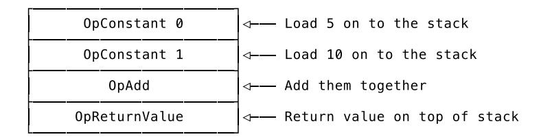

And in the main program, contained in Bytecode.Instructions, we need an OpConstant instruction that loads this function on to the stack. Followed by an OpPop, of course, since the returned value is unused.

We can do this. Let's write the test for it.

```
// compiler/compiler_test.go
func TestFunctions(t *testing.T) {
    tests := []compilerTestCase{
        {
            input: `fn() { return 5 + 10 }`,
            expectedConstants: []interface{}{
                5,
                10,
                []code.Instructions{
                     code.Make(code.OpConstant, 0),
                     code.Make(code.OpConstant, 1),
                     code.Make(code.OpAdd),
                     code.Make(code.OpReturnValue),
                },
            },
            expectedInstructions: []code.Instructions{
                code.Make(code.OpConstant, 2),
                code.Make(code.OpPop),
            },
        },
    }
    runCompilerTests(t, tests)
}
```

At first glance, it doesn't look like there's anything new in this test, but expectedConstants now also includes []code.Instructions.

These are the instructions we want to see in the Instructions field of the \*object.CompiledFunction, which is passed around as the constant with the index 2. We could've put an \*object.CompiledFunction directly into expectedConstants, but since we're only interested in the instructions, we might as well skip the outer layer and make the tests more readable.

Nonetheless, we need to update our tooling so it can now make assertions about []code.Instructions in expectedConstants:

```
// compiler/compiler_test.go
func testConstants(
    t *testing.T,
    expected []interface{},
    actual []object.Object,
) error {
    // [...]
    for i, constant := range expected {
        switch constant := constant.(type) {
        // [...]
        case []code.Instructions:
            fn, ok := actual[i].(*object.CompiledFunction)
            if !ok {
                return fmt.Errorf("constant %d - not a function: %T",
                     i, actual[i])
            }
            err := testInstructions(constant, fn.Instructions)
            if err != nil {
                return fmt.Errorf("constant %d - testInstructions failed: %s",
                     i, err)
            }
        }
    }
    return nil
}
```

In the new case branch for []code.Instructions we use testInstructions (which we already had in place), to make sure that the \*object.CompiledFunction in the constant pool contains the correct instructions.

And that's it. Our first test for the compilation of functions. We can now run it and see it fail:

```
$ go test ./compiler
--- FAIL: TestFunctions (0.00s)
 compiler_test.go:296: testInstructions failed: wrong instructions length.
  want="0000 OpConstant 2\n0003 OpPop\n"
  got ="0000 OpPop\n"
FAIL
FAIL monkey/compiler 0.008s
```

The test doesn't even get to check the compiled function's instructions, because the instruction that's supposed to load the function on to the stack is missing in the main program. And that's because our compiler does not compile \*ast.FunctionLiterals. Time to change that.

The Body of an \*ast.FunctionLiteral is an \*ast.BlockStatement and contains a series of ast.Statements. Since we already know how to compile \*ast.BlockStatements from compiling \*ast.IfExpressions, compiling the statements in a function's body shouldn't be a problem.

But if we were to simply call the compiler's Compile method with the Body of the \*ast.FunctionLiteral at hand, we'd end up with a mess: the resulting instructions would end up being entangled with the instructions of the main program. The solution? Introducing our compiler to the concept of scopes.

### Adding Scopes

That sounds quite elaborate, but is actually a straightforward change. In practical terms, it means that instead of using a single slice and the two separate fields lastInstruction and previousInstruction to keep track of emitted instructions, we bundle them together in a *compilation scope* and use *a stack of compilation scopes*:

```
// compiler/compiler.go
type CompilationScope struct {
   instructions code.Instructions
   lastInstruction EmittedInstruction
   previousInstruction EmittedInstruction
}
type Compiler struct {
   // [...]
   scopes []CompilationScope
   scopeIndex int
}
```

Before we start compiling a function's body, *i.e.*, enter a new scope, we push a new CompilationScope on to the scopes stack. While compiling inside this scope, the emit method of the compiler will modify only the fields of the current CompilationScope. Once we're done compiling the function, we leave the scope by popping it off the scopes stack and putting the instructions in a new \*object.CompiledFunction.

It sounds way more complicated than it is, I promise. Here's the test case that shows what we want:

```
// compiler/compiler_test.go
func TestCompilerScopes(t *testing.T) {
    compiler := New()
    if compiler.scopeIndex != 0 {
        t.Errorf("scopeIndex wrong. got=%d, want=%d", compiler.scopeIndex, 0)
    }
    compiler.emit(code.OpMul)
    compiler.enterScope()
    if compiler.scopeIndex != 1 {
        t.Errorf("scopeIndex wrong. got=%d, want=%d", compiler.scopeIndex, 1)
    }
    compiler.emit(code.OpSub)
    if len(compiler.scopes[compiler.scopeIndex].instructions) != 1 {
```

```
t.Errorf("instructions length wrong. got=%d",
            len(compiler.scopes[compiler.scopeIndex].instructions))
    }
    last := compiler.scopes[compiler.scopeIndex].lastInstruction
    if last.Opcode != code.OpSub {
        t.Errorf("lastInstruction.Opcode wrong. got=%d, want=%d",
            last.Opcode, code.OpSub)
    }
    compiler.leaveScope()
    if compiler.scopeIndex != 0 {
        t.Errorf("scopeIndex wrong. got=%d, want=%d",
            compiler.scopeIndex, 0)
    }
    compiler.emit(code.OpAdd)
    if len(compiler.scopes[compiler.scopeIndex].instructions) != 2 {
        t.Errorf("instructions length wrong. got=%d",
            len(compiler.scopes[compiler.scopeIndex].instructions))
    }
    last = compiler.scopes[compiler.scopeIndex].lastInstruction
    if last.Opcode != code.OpAdd {
        t.Errorf("lastInstruction.Opcode wrong. got=%d, want=%d",
            last.Opcode, code.OpAdd)
    }
    previous := compiler.scopes[compiler.scopeIndex].previousInstruction
    if previous.Opcode != code.OpMul {
        t.Errorf("previousInstruction.Opcode wrong. got=%d, want=%d",
            previous.Opcode, code.OpMul)
    }
}
```

We test two new methods on the compiler here: enterScope and leaveScope. They're supposed to do what their names promise and change the behaviour of emit by pushing and popping instructions CompilationScopes on the new scopes stack. The main idea behind this test is to make sure that the instructions emitted in one scope should have no effect on the instructions in another scope.

Since the methods do not exist yet, the tests blow up. I'll spare you the output. Making them pass, though, comes naturally to us since it boils down to using a stack of something and we're pretty good at that by now.

First, we have to remove the instructions, lastInstruction and previousInstruction fields from the compiler and replace them with a CompilationScope when initializing a new \*Compiler:

```
// compiler/compiler.go
type Compiler struct {
    constants []object.Object
    symbolTable *SymbolTable
    scopes []CompilationScope
    scopeIndex int
```

```
}
func New() *Compiler {
   mainScope := CompilationScope{
       instructions: code.Instructions{},
       lastInstruction: EmittedInstruction{},
       previousInstruction: EmittedInstruction{},
   }
   return &Compiler{
       constants: []object.Object{},
       symbolTable: NewSymbolTable(),
       scopes: []CompilationScope{mainScope},
       scopeIndex: 0,
   }
}
```

Now we need to update every reference to the removed fields and change them to use the current scope. To help with that we add a new method, called currentInstructions:

```
// compiler/compiler.go
func (c *Compiler) currentInstructions() code.Instructions {
    return c.scopes[c.scopeIndex].instructions
}
```

This can now be used in addInstruction, the method emit uses to do its work:

```
// compiler/compiler.go
func (c *Compiler) addInstruction(ins []byte) int {
    posNewInstruction := len(c.currentInstructions())
    updatedInstructions := append(c.currentInstructions(), ins...)
    c.scopes[c.scopeIndex].instructions = updatedInstructions
    return posNewInstruction
}
```

Here we first use c.currentInstructions to get the current slice of instructions and then, in order to mutate them, we replace them on the stack.

In the other helper methods of the compiler where we previously accessed the instructions, lastInstruction and previousInstruction fields directly, we also have to go through the stack now:

```
// compiler/compiler.go
```

```
func (c *Compiler) setLastInstruction(op code.Opcode, pos int) {
    previous := c.scopes[c.scopeIndex].lastInstruction
    last := EmittedInstruction{Opcode: op, Position: pos}
    c.scopes[c.scopeIndex].previousInstruction = previous
    c.scopes[c.scopeIndex].lastInstruction = last
}
func (c *Compiler) lastInstructionIsPop() bool {
    return c.scopes[c.scopeIndex].lastInstruction.Opcode == code.OpPop
}
```

```
func (c *Compiler) removeLastPop() {
    last := c.scopes[c.scopeIndex].lastInstruction
    previous := c.scopes[c.scopeIndex].previousInstruction
    old := c.currentInstructions()
    new := old[:last.Position]
    c.scopes[c.scopeIndex].instructions = new
    c.scopes[c.scopeIndex].lastInstruction = previous
}
func (c *Compiler) replaceInstruction(pos int, newInstruction []byte) {
    ins := c.currentInstructions()
    for i := 0; i < len(newInstruction); i++ {
        ins[pos+i] = newInstruction[i]
    }
}
func (c *Compiler) changeOperand(opPos int, operand int) {
    op := code.Opcode(c.currentInstructions()[opPos])
    newInstruction := code.Make(op, operand)
    c.replaceInstruction(opPos, newInstruction)
}
```

Then we need to make a few more delicate changes, in the heart of the Compile method, where we previously accessed c.instructions and now need to switch to c.currentInstructions() call:

```
// compiler/compiler.go
func (c *Compiler) Compile(node ast.Node) error {
    switch node := node.(type) {
    // [...]
    case *ast.IfExpression:
        // [...]
        afterConsequencePos := len(c.currentInstructions())
        c.changeOperand(jumpNotTruthyPos, afterConsequencePos)
        // [...]
        afterAlternativePos := len(c.currentInstructions())
        c.changeOperand(jumpPos, afterAlternativePos)
    // [...]
    }
    // [...]
}
```

We also need to return the current instructions when we want to return the bytecode the compiler produced:

```
// compiler/compiler.go
func (c *Compiler) Bytecode() *Bytecode {
    return &Bytecode{
        Instructions: c.currentInstructions(),
```

```
Constants: c.constants,
    }
}
```

Finally, we're ready to add the new enterScope and leaveScope methods:

```
// compiler/compiler.go
func (c *Compiler) enterScope() {
    scope := CompilationScope{
        instructions: code.Instructions{},
        lastInstruction: EmittedInstruction{},
        previousInstruction: EmittedInstruction{},
    }
    c.scopes = append(c.scopes, scope)
    c.scopeIndex++
}
func (c *Compiler) leaveScope() code.Instructions {
    instructions := c.currentInstructions()
    c.scopes = c.scopes[:len(c.scopes)-1]
    c.scopeIndex--
    return instructions
}
```

I'll spare you an in-depth explanation. We've seen this before with all of the other stacks we've implemented, except that now it's whole code.Instructions that we push and pop.

The tests are happy:

```
$ go test -run TestCompilerScopes ./compiler
ok monkey/compiler 0.008s
```

At least the TestCompilerScopes function. What's not happy is the test that brought us here:

```
$ go test ./compiler
--- FAIL: TestFunctions (0.00s)
 compiler_test.go:396: testInstructions failed: wrong instructions length.
  want="0000 OpConstant 2\n0003 OpPop\n"
  got ="0000 OpPop\n"
FAIL
FAIL monkey/compiler 0.008s
```

Now, though, we're in a position to fix it.

### Compiling With Scopes

Our compiler knows about scopes and we know how to use them – we can now compile \*ast.FunctionLiterals:

```
// compiler/compiler.go
func (c *Compiler) Compile(node ast.Node) error {
    switch node := node.(type) {
    // [...]
    case *ast.FunctionLiteral:
        c.enterScope()
```

```
err := c.Compile(node.Body)
        if err != nil {
            return err
        }
        instructions := c.leaveScope()
        compiledFn := &object.CompiledFunction{Instructions: instructions}
        c.emit(code.OpConstant, c.addConstant(compiledFn))
    // [...]
    }
    // [...]
}
```

This snippet of code revolves around one idea: change where emitted instructions are stored when compiling a function.

So, when we come across an \*ast.FunctionLiteral the first thing we do is enter a new scope by calling c.enterScope. Then we compile the node.Body, the AST nodes making up the function's body. After that, we take the just-filled slice of instructions off the stack of CompilationScopes by calling c.leaveScope, create a new \*object.CompiledFunction that holds these instructions, and add that function to the constant pool.

Done, function compiled:

```
$ go test ./compiler
--- FAIL: TestFunctions (0.00s)
 compiler_test.go:654: testInstructions failed: wrong instruction at 2.
  want="0000 OpConstant 2\n0003 OpPop\n"
  got ="0000 OpConstant 0\n0003 OpPop\n"
FAIL
FAIL monkey/compiler 0.008s
```

Oh, well. It turns out that we *do* know how to compile function literals, but we don't know how to compile \*ast.ReturnStatements. And since the body of the function in the test is nothing more than a single return statement, we do not compile anything of that function. We only create an \*object.CompiledFunction constant with no instructions.

Our testing infrastructure is just not advanced enough to point us to the origin of the problem with a precise error message. You can trust me, though, I've done the digging for both of us.

So, compiling \*ast.ReturnStatements it is. Since we made a plan, we already know which opcode should come out the other end: OpReturnValue.

```
// compiler/compiler.go
func (c *Compiler) Compile(node ast.Node) error {
    switch node := node.(type) {
    // [...]
    case *ast.ReturnStatement:
        err := c.Compile(node.ReturnValue)
        if err != nil {
            return err
        }
        c.emit(code.OpReturnValue)
```

```
// [...]
    }
    // [...]
}
```

First we compile the return value itself, an expression, to instructions that leave the value on the stack and then we emit an OpReturnValue instruction.

And now, let's try that again…

```
$ go test ./compiler
ok monkey/compiler 0.009s
```

Alright, here we go! We've successfully turned the body of a function into a series of instructions!

But before we start the official celebration, there's one last thing we need to take care of. It's not a big deal, really, since we just implemented a variation of it, but we need to make sure that the implicit returning of a value results in the same bytecode as the explicit return statement.

Writing the test case for this is as easy as duplicating the previous one and removing the return from the Monkey code:

```
// compiler/compiler_test.go
func TestFunctions(t *testing.T) {
    tests := []compilerTestCase{
        // [...]
        {
            input: `fn() { 5 + 10 }`,
            expectedConstants: []interface{}{
                5,
                10,
                []code.Instructions{
                     code.Make(code.OpConstant, 0),
                     code.Make(code.OpConstant, 1),
                     code.Make(code.OpAdd),
                     code.Make(code.OpReturnValue),
                },
            },
            expectedInstructions: []code.Instructions{
                code.Make(code.OpConstant, 2),
                code.Make(code.OpPop),
            },
        },
    }
    runCompilerTests(t, tests)
}
```

We already know that solving this involves OpPop instructions, because in this test case we expect the compiler to get rid of the OpPop that it would emit after the last expression statement in a function's body. We do not want anything to take the implicit return value off the stack. In other cases, though, we still want OpPop instructions around, and before we end up with no OpPop at all, let's make sure they stay where they are in the cases where we need them and add another test case:

```
// compiler/compiler_test.go
```

```
func TestFunctions(t *testing.T) {
    tests := []compilerTestCase{
        // [...]
        {
            input: `fn() { 1; 2 }`,
            expectedConstants: []interface{}{
                1,
                2,
                []code.Instructions{
                     code.Make(code.OpConstant, 0),
                     code.Make(code.OpPop),
                     code.Make(code.OpConstant, 1),
                     code.Make(code.OpReturnValue),
                },
            },
            expectedInstructions: []code.Instructions{
                code.Make(code.OpConstant, 2),
                code.Make(code.OpPop),
            },
        },
    }
    runCompilerTests(t, tests)
}
```

This test case now succinctly explains what we want to do with OpPop in the future. The first expression statement, the literal 1, should be followed by an OpPop instruction. Same as it ever was. But the second expression statement, the 2, is the implicit return value and the OpPop instruction must be replaced by an OpReturnValue instruction.

Now we have two failing test cases to fix and the test output is actually pretty helpful:

```
$ go test ./compiler
--- FAIL: TestFunctions (0.00s)
 compiler_test.go:693: testConstants failed: constant 2 -\
   testInstructions failed: wrong instruction at 7.
  want="0000 OpConstant 0\n0003 OpConstant 1\n0006 OpAdd\n0007 OpReturnValue\n"
  got ="0000 OpConstant 0\n0003 OpConstant 1\n0006 OpAdd\n0007 OpPop\n"
FAIL
FAIL monkey/compiler 0.009s
```

As expected, the last expression statement in a function is *not* turned into an implicit return value, but is still followed by an OpPop instruction.

The right time to fix this is *after* the compilation of a function's body and *before* leaving the scope. At that point, we still have access to the just-emitted instructions. We can check whether the last instruction is an OpPop instruction and, if necessary, turn it into an OpReturnValue.

To make the necessary changes easier, we refactor and change our existing lastInstructionIsPop method into a more generic lastInstructionIs with an added defensive check:

```
// compiler/compiler.go
func (c *Compiler) lastInstructionIs(op code.Opcode) bool {
    if len(c.currentInstructions()) == 0 {
        return false
    }
    return c.scopes[c.scopeIndex].lastInstruction.Opcode == op
```

}

That requires changing the previous locations in which lastInstructionIsPop was called:

```
// compiler/compiler.go
func (c *Compiler) Compile(node ast.Node) error {
    switch node := node.(type) {
    // [...]
    case *ast.IfExpression:
        // [...]
        if c.lastInstructionIs(code.OpPop) {
            c.removeLastPop()
        }
        // [...]
        if node.Alternative == nil {
            // [...]
        } else {
            // [...]
            if c.lastInstructionIs(code.OpPop) {
                 c.removeLastPop()
            }
            // [...]
        }
    // [...]
    }
    // [...]
}
```

We can now change the case \*ast.FunctionLiteral branch in the Compile method to use c.lastInstructionIs:

```
// compiler/compiler.go
func (c *Compiler) Compile(node ast.Node) error {
    switch node := node.(type) {
    // [...]
    case *ast.FunctionLiteral:
        c.enterScope()
        err := c.Compile(node.Body)
        if err != nil {
            return err
        }
        if c.lastInstructionIs(code.OpPop) {
            c.replaceLastPopWithReturn()
        }
        instructions := c.leaveScope()
        compiledFn := &object.CompiledFunction{Instructions: instructions}
        c.emit(code.OpConstant, c.addConstant(compiledFn))
```

```
// [...]
    }
    // [...]
}
func (c *Compiler) replaceLastPopWithReturn() {
    lastPos := c.scopes[c.scopeIndex].lastInstruction.Position
    c.replaceInstruction(lastPos, code.Make(code.OpReturnValue))
    c.scopes[c.scopeIndex].lastInstruction.Opcode = code.OpReturnValue
}
```

Right after compiling a function's body, we check whether the last emitted instruction was an OpPop and, if it was, we replace it with an OpReturnValue. A straightforward change and the two new test cases now pass:

```
$ go test ./compiler
ok monkey/compiler 0.008s
```

But why did we refactor lastInstructionIsPop to lastInstructionIs and add an extra safety check if we only check for OpPop again? Well, because we're not done yet. There is still this nagging edge case: a function without a body. I promise, though, we're close to the finish line.

What we want from our compiler is to turn an empty function body into a single OpReturn instruction:

```
// compiler/compiler_test.go
   func TestFunctionsWithoutReturnValue(t *testing.T) {
       tests := []compilerTestCase{
           {
               input: `fn() { }`,
               expectedConstants: []interface{}{
                   []code.Instructions{
                        code.Make(code.OpReturn),
                   },
               },
               expectedInstructions: []code.Instructions{
                   code.Make(code.OpConstant, 0),
                   code.Make(code.OpPop),
               },
           },
       }
       runCompilerTests(t, tests)
   }
This fails, shall I say, beautifully:
   $ go test ./compiler
   --- FAIL: TestFunctionsWithoutReturnValue (0.00s)
    compiler_test.go:772: testConstants failed: constant 0 -\
     testInstructions failed: wrong instructions length.
     want="0000 OpReturn\n"
     got =""
   FAIL
   FAIL monkey/compiler 0.009s
```

We want an OpReturn instruction, but get nothing. Can't be more specific than that, right? The fix for this is also quite beautiful, in its own succinct way:

```
// compiler/compiler.go
func (c *Compiler) Compile(node ast.Node) error {
    switch node := node.(type) {
    // [...]
    case *ast.FunctionLiteral:
        // [...]
        if c.lastInstructionIs(code.OpPop) {
            c.replaceLastPopWithReturn()
        }
        if !c.lastInstructionIs(code.OpReturnValue) {
            c.emit(code.OpReturn)
        }
        // [...]
    // [...]
    }
    // [...]
}
```

First the check whether we need to replace an OpPop instruction with an OpReturnValue. We already had that in place. It should turn every last statement in a function's body into an OpReturnValue. Either because it already was an explicit \*ast.ReturnStatement or because we now changed it.

But if that wasn't the case – and this is new – it means we either didn't have any statements in the function's body or only statements that we couldn't turn into an OpReturnValue instruction. Currently, we're focused on former, but we'll talk about the latter soon enough. For now, we emit an OpReturn in both cases.

And now, with this edge case also fixed, we're finally ready to celebrate:

```
$ go test ./compiler
ok monkey/compiler 0.009s
```

Cool! We can now correctly compile function literals! That really is a reason to celebrate.

We turn function literals into \*object.CompiledFunction, take care of implicit and explicit returns in the function's body and also emit an OpConstant instruction to load the function on to the stack in the VM. Cheers to that!

We've reached the halfway point on the compilation side. The rest of the way is the compilation of function *calls*.

<span id="page-165-0"></span>

### Compiling Function Calls

Before we open compiler\_test.go and start hammering out test cases, let's take a step back and think this through. We want to implement function calls. In other words, we need to emit instructions that represent Monkey's bytecode calling convention, since that's how you call a function in Monkey bytecode.

At the beginning of this chapter we decided that the start of the calling convention is putting the function you want to call on to the stack. We already know how to do that. Either by using an OpConstant instruction in case it's a function literal that's being called, which looks like this:

```
fn() { 1 + 2 }()
```

Or with an OpGetGlobal instruction, if the function was previously bound to a name:

```
let onePlusTwo = fn() { 1 + 2 };
onePlusTwo();
```

Both options result in the \*object.CompiledFunction we want to call to sit on the stack. In order to now execute its instructions, we need to issue an OpCall instruction.

The VM then executes the function's instructions and when it's done, it pops the function itself off the stack and replaces it with the return value. That's *if* there is a return value. If not, it only pops the function off the stack, which is fine too.

This whole part of the calling convention – what the VM does with the function once it's done executing it – is implicit: we do not need to issue an OpPop instruction to get the function off the stack. It's part of the convention and we'll build it straight into the VM.

Before you start to scratch your head, please keep in mind that the convention will change once we introduce arguments to function calls. That's why there's no mention of them yet.

For now, though, we're pretty sure about what we need to do. When the compiler comes across an \*ast.CallExpression it should do this:

```
// compiler/compiler_test.go
func TestFunctionCalls(t *testing.T) {
    tests := []compilerTestCase{
        {
            input: `fn() { 24 }();`,
            expectedConstants: []interface{}{
                24,
                []code.Instructions{
                    code.Make(code.OpConstant, 0), // The literal "24"
                    code.Make(code.OpReturnValue),
                },
            },
            expectedInstructions: []code.Instructions{
                code.Make(code.OpConstant, 1), // The compiled function
                code.Make(code.OpCall),
                code.Make(code.OpPop),
            },
        },
        {
            input: `
            let noArg = fn() { 24 };
            noArg();
            `,
            expectedConstants: []interface{}{
                24,
                []code.Instructions{
                    code.Make(code.OpConstant, 0), // The literal "24"
                    code.Make(code.OpReturnValue),
                },
            },
            expectedInstructions: []code.Instructions{
                code.Make(code.OpConstant, 1), // The compiled function
                code.Make(code.OpSetGlobal, 0),
```

```
code.Make(code.OpGetGlobal, 0),
                 code.Make(code.OpCall),
                 code.Make(code.OpPop),
            },
        },
    }
    runCompilerTests(t, tests)
}
```

The function that's being called in both test cases is intentionally simple, because the focus here is on the OpCall instruction and that it's preceded by either an OpGetGlobal or an OpConstant instruction.

The test fails because our compiler knows nothing about \*ast.CallExpression yet:

```
$ go test ./compiler
--- FAIL: TestFunctionCalls (0.00s)
 compiler_test.go:833: testInstructions failed: wrong instructions length.
  want="0000 OpConstant 1\n0003 OpCall\n0004 OpPop\n"
  got ="0000 OpPop\n"
FAIL
FAIL monkey/compiler 0.008s
```

The great thing about implementing a fix for these tests is that from the compiler's perspective it doesn't matter whether the function to be called is bound to a name or a literal – we already know how to do both.

All we need to do is tell our compiler that when it comes across an \*ast.CallExpression it should compile the function being called and then emit an OpCall instruction:

```
// compiler/compiler.go
func (c *Compiler) Compile(node ast.Node) error {
    switch node := node.(type) {
    // [...]
    case *ast.CallExpression:
        err := c.Compile(node.Function)
        if err != nil {
            return err
        }
        c.emit(code.OpCall)
    // [...]
    }
    // [...]
}
```

You see, when I said that we're halfway there and that the second half is implementing function calls, I kinda lied a little bit. We were way past the halfway point. And now, we've crossed the finish line in the compiler:

```
$ go test ./compiler
ok monkey/compiler 0.009s
```

Yes, that means that we are correctly compiling function literals *and* function calls. We're now *really* at the halfway point, because now we can head over to the VM and make sure that it knows how to handle functions, the two return instructions and OpCall.

<span id="page-168-0"></span>

### Functions in the VM

Here's the situation and task at hand, put into the vocabulary of our VM:

The bytecode's Constant field can now contain \*object.CompiledFunctions. When we come across an OpCall instruction we need to execute the instructions of the \*object.CompiledFunction sitting on top of the stack. We do that until we encounter either an OpReturnValue or an OpReturn instruction. If it's an OpReturnValue, we need to preserve the value on top of the stack, the return value. Then we have to remove the just executed \*object.CompiledFunction from the stack and replace it with the saved return value, if we have one.

Implementing that is our goal for this section and we already know that popping off and pushing things on to the stack are not going to be the issue. We're pros at that by now. The intriguing question is how do we execute the instructions of a function?

Right now, executing instructions means that the VM's main loop iterates through the vm.instructions slice by incrementing its instruction pointer, ip, and using it as an index to fetch the next opcode from vm.instructions. It also reads the operands from the same slice. When it comes across a branching instruction, like OpJump, it changes the value of ip manually.

When we execute functions, we do not want to change this mechanism. The only thing we want to change is the *data* it uses: the instructions and the instruction pointer. If we can change those while the VM is running we can execute functions.

"Changing a slice and an integer? That's not a challenge!" I know, but that's not all of it. We also need to change them *back*. When the function returns we need to restore the old instructions and the old ip. And not just once. We also need to handle nested execution of functions. Consider this:

```
let one = fn() { 5 };
let two = fn() { one() };
let three = fn() { two() };
three();
```

When three is called the instructions and the instruction pointer need to be changed. Then two is called, so they need to be changed again. one is called in two, so again, change the instructions and the instruction pointer. And once one is executed, we need to restore the instructions and the instruction pointer as we left them in two, before the call. Then we need to do the same for three, and after three returns we need to do the same for the main program.

If you read the last paragraph and a little bell with "stack" written on it began ringing in your head: you're on the right track.

### Adding Frames

This is what we know: function calls are nested and execution-relevant data – the instructions and the instruction pointer – is accessed in a last-in-first-out (LIFO) manner. We're masters of the stack, so this plays into our hands, but juggling two separate pieces of data is never pleasant. The solution is to tie them together and call the resulting bundle a "frame".

Frame is short for *call frame*, or *stack frame*, and is the name for a data structure that holds execution-relevant information. In compiler or interpreter literature this is also sometimes called an *activation record*.

On real machines – computers – a frame is a not something separate from but a designated part of *the stack*. It's where the return address, the arguments to the current function and its local variables are stored. And since it's on a stack, a frame is easy to pop off after the function has been executed. As we saw in the first chapter, using *the stack* to save call frames is what turns it from *a stack* into *the stack*, and more specifically: the *call stack*.

In virtual-machine land we don't have to use the stack. We're not constrained by standardized calling conventions and other much too real things, like *real memory addresses* and locations. We, using Go instead of assembly language and building a *virtual* machine, have more options available to us than the builders and programmers of real machines. We can store frames anywhere we like. Any execution-relevant piece of data, actually.

What's kept on the stack and what's not differs from VM to VM. Some keep everything on the stack, others only the return address, some only the local variables, some the local variables and the arguments of the function call. There is no best nor an only choice for these decisions. The implementation depends on the language being implemented, the requirements in regards to concurrency and performance, the host language and much more.

Since we're here to learn, we choose what's easiest to build, to understand, to extend and what also allows us to see how it *might* be changed or implemented differently.

We already use our VM's stack in parts as a call stack: we save the function to be called and its return value on it. But we're not going to keep our frames on there. Instead they'll get their own stack.

But before we build that, here's what makes up a Frame in our Monkey VM:

```
// vm/frame.go
package vm
import (
    "monkey/code"
    "monkey/object"
)
type Frame struct {
    fn *object.CompiledFunction
    ip int
}
func NewFrame(fn *object.CompiledFunction) *Frame {
    return &Frame{fn: fn, ip: -1}
}
func (f *Frame) Instructions() code.Instructions {
    return f.fn.Instructions
}
```

A Frame has two fields: ip and fn. fn points to the compiled function referenced by the frame, and ip is the instruction pointer in *this frame*, for *this function*. With these two fields we have all the data used by the main loop of the VM in one place. And the frame being currently executed is the one sitting on top of the call stack.

This is so tiny that I'm fairly confident in my choice to not write tests for the NewFrame function and Instructions method.

With Frame defined, we find ourselves at a crossroads. We can either go left and decide to bend

over backwards by changing our VM to only use frames when calling and executing a function. Or, we can go right and choose a much more elegant and smoother approach, which modifies the VM so that it not only uses frames for functions, but also treats the main program, the bytecode.Instructions, as if it were a function.

Yes, of course we're going right.

And even better news than the fact that we're going to build something smooth and elegant is that we don't even have to write tests, since this is another prime example for the term "implementation detail": the visible behaviour of the VM should not change one bit when we now change it to use frames. It's an internal change only. And to make sure that our VM keeps on working the way it currently does, we already have our test suite.

So, let's build a stack for frames:

```
// vm/vm.go
type VM struct {
    // [...]
    frames []*Frame
    framesIndex int
}
func (vm *VM) currentFrame() *Frame {
    return vm.frames[vm.framesIndex-1]
}
func (vm *VM) pushFrame(f *Frame) {
    vm.frames[vm.framesIndex] = f
    vm.framesIndex++
}
func (vm *VM) popFrame() *Frame {
    vm.framesIndex--
    return vm.frames[vm.framesIndex]
}
```

Private and still unused changes – all the tests are still green, but now we have a stack for frames in place. Just like with our other stacks, we use a slice as the underlying data structure and an integer as index. Since it's nice to have a little bit of performance here, we use a slightly different approach than the one used in the compiler for the scopes stack. Instead of appending and slicing off, we pre-allocate the frames slice.

Now we just need to use it. The first task is to allocate said slice and push the outermost, the "main frame", on to it:

```
// vm/vm.go
const MaxFrames = 1024
func New(bytecode *compiler.Bytecode) *VM {
    mainFn := &object.CompiledFunction{Instructions: bytecode.Instructions}
    mainFrame := NewFrame(mainFn)
    frames := make([]*Frame, MaxFrames)
    frames[0] = mainFrame
    return &VM{
```

```
constants: bytecode.Constants,
        stack: make([]object.Object, StackSize),
        sp: 0,
        globals: make([]object.Object, GlobalsSize),
        frames: frames,
        framesIndex: 1,
    }
}
```

New here is the prelude before we initialize a new \*VM.

As the first thing, we create a mainFn. That's the fictional main frame that contains the bytecode.Instructions, which make up the whole Monkey program. Then we allocate the frames stack with a maximum of MaxFrames slots. The value of 1024 is arbitrary but should be enough for us as long as we don't nest function calls too much. The first frame on this new frames stack is the mainFrame. And then, following the fields we already know, we put the frames and the framesIndex of 1 into the newly created \*VM.

At the same time, we've also **removed** the initialization of the instructions field in this New function and now need to remove it from the definition of VM, too:

```
// vm/vm.go
type VM struct {
    constants []object.Object
    stack []object.Object
    sp int
    globals []object.Object
    frames []*Frame
    framesIndex int
}
```

With the instructions slice gone, we now need to change the way we access the instructions and the instruction pointer inside the VM and make sure that we always access them by going through the current frame.

The first change we need to make is in the VM's main loop. Since the ip can't be initialized in the loop anymore, but only incremented there, we need to change from an old school for loop to Go's version of a while loop, where we have just one condition and increment the ip manually in its body:

```
// vm/vm.go
func (vm *VM) Run() error {
    var ip int
    var ins code.Instructions
    var op code.Opcode
    for vm.currentFrame().ip < len(vm.currentFrame().Instructions())-1 {
        vm.currentFrame().ip++
        ip = vm.currentFrame().ip
        ins = vm.currentFrame().Instructions()
```

```
op = code.Opcode(ins[ip])
        switch op {
        // [...]
        }
    }
    return nil
}
```

We add the three helper variables – ip, ins and op – at the top of the Run method, so the rest of it doesn't become too crowded with calls to currentFrame(). Especially since we now need to update every place in Run where we either read in operands or access or modify the instruction pointer:

```
// vm/vm.go
func (vm *VM) Run() error {
    // [...]
        switch op {
        case code.OpConstant:
            constIndex := code.ReadUint16(ins[ip+1:])
            vm.currentFrame().ip += 2
        // [...]
        case code.OpJump:
            pos := int(code.ReadUint16(ins[ip+1:]))
            vm.currentFrame().ip = pos - 1
        // [...]
        case code.OpJumpNotTruthy:
            pos := int(code.ReadUint16(ins[ip+1:]))
            vm.currentFrame().ip += 2
            condition := vm.pop()
            if !isTruthy(condition) {
                vm.currentFrame().ip = pos - 1
            }
        // [...]
        case code.OpSetGlobal:
            globalIndex := code.ReadUint16(ins[ip+1:])
            vm.currentFrame().ip += 2
        // [...]
        case code.OpGetGlobal:
            globalIndex := code.ReadUint16(ins[ip+1:])
            vm.currentFrame().ip += 2
        // [...]
        case code.OpArray:
            numElements := int(code.ReadUint16(ins[ip+1:]))
            vm.currentFrame().ip += 2
        // [...]
        case code.OpHash:
            numElements := int(code.ReadUint16(ins[ip+1:]))
            vm.currentFrame().ip += 2
```

```
// [...]
         }
    // [...]
}
```

And that was it: our VM is now fully converted to frames! And the best bit is that all the tests are still green:

```
$ go test ./vm
ok monkey/vm 0.036s
```

Time to add function calls.

### Executing Function Calls

It's high time and we know exactly what we want:

```
// vm/vm_test.go
func TestCallingFunctionsWithoutArguments(t *testing.T) {
    tests := []vmTestCase{
        {
            input: `
        let fivePlusTen = fn() { 5 + 10; };
        fivePlusTen();
        `,
            expected: 15,
        },
    }
    runVmTests(t, tests)
}
```

That's what we're after! Remember? It's the goal of this section. Question is, can we already get it to work?

```
$ go test ./vm
--- FAIL: TestCallingFunctionsWithoutArguments (0.00s)
 vm_test.go:443: testIntegerObject failed: object is not Integer.\
   got=*object.CompiledFunction (&{Instructions:\
  0000 OpConstant 0
  0003 OpConstant 1
  0006 OpAdd
  0007 OpReturnValue
  })
FAIL
FAIL monkey/vm 0.036s
```

Well, we always do, don't we?

Most of the things we need are in place already. We know how to handle global bindings, check. We know how to handle integer expressions, check. We know how to load constants, which compiled functions are, check. And we know how to execute frames, so check here too. What we haven't yet implemented is the OpCall opcode.

But we already know pretty well what to do when we come across an OpCall:

```
// vm/vm.go
```

```
func (vm *VM) Run() error {
    // [...]
        switch op {
        // [...]
        case code.OpCall:
            fn, ok := vm.stack[vm.sp-1].(*object.CompiledFunction)
            if !ok {
                 return fmt.Errorf("calling non-function")
            }
            frame := NewFrame(fn)
            vm.pushFrame(frame)
        // [...]
        }
    // [...]
}
```

We get the compiled function off the stack and check if it's indeed an \*object.CompiledFunction. If it's not, we return an error. If it is, we create a new frame that contains a reference to this function and push it on to the frames stack. As a result, the next iteration of the VM's main loop fetches the next instruction from the \*object.CompiledFunction.

Cross your fingers and awkwardly try to type go test ./vm with them:

```
$ go test ./vm
--- FAIL: TestCallingFunctionsWithoutArguments (0.00s)
 vm_test.go:169: testIntegerObject failed: object has wrong value.\
   got=10, want=15
FAIL
FAIL monkey/vm 0.034s
```

Huh. Okay. We got 10 when we wanted 15 to be returned. Shouldn't 10 be popped off the stack when we come across the OpAdd instruction? Why is it stil– ahh! We always check for the "last popped element" in our tests! And the 15 hasn't been popped off the stack yet.

Come to think of it: why did we even expect that this would work? We haven't even told the VM yet to handle OpReturnValue instructions!

```
// vm/vm.go
func (vm *VM) Run() error {
    // [...]
        switch op {
        // [...]
        case code.OpReturnValue:
            returnValue := vm.pop()
            vm.popFrame()
            vm.pop()
            err := vm.push(returnValue)
            if err != nil {
                 return err
            }
        // [...]
        }
```

```
// [...]
}
```

We first pop the return value off the stack and put it on the side. That's the first part of our calling convention: in the case of an OpReturnValue instruction, the return value sits on top of the stack. Then we pop the frame we just executed off the frame stack so that the next iteration of the VM's main loop continues executing in the caller context.

And then there's another vm.pop() call to get the just-called \*object.CompiledFunction off the stack. Remember that we said it's the VM's implicit task to get the executed function off the stack? This is it.

Watch this:

```
$ go test ./vm
ok monkey/vm 0.035s
```

We just called and executed a function. Remember this moment! This is a milestone when developing a bytecode VM. Our VM is now not just humming along, it's roaring. We can even execute multiple functions – sequentially or nested in one another:

```
// vm/vm_test.go
func TestCallingFunctionsWithoutArguments(t *testing.T) {
    tests := []vmTestCase{
        // [...]
        {
            input: `
        let one = fn() { 1; };
        let two = fn() { 2; };
        one() + two()
        `,
            expected: 3,
        },
        {
            input: `
        let a = fn() { 1 };
        let b = fn() { a() + 1 };
        let c = fn() { b() + 1 };
        c();
        `,
            expected: 3,
        },
    }
    runVmTests(t, tests)
}
```

This thing runs like clockwork:

```
$ go test ./vm
ok monkey/vm 0.039s
```

We can even be meticulous and add a test for *explicit* return statements. We already know that these compile down to the same instructions we just successfully executed, but adding it will give us much better feedback should something go wrong in the future:

```
// vm/vm_test.go
func TestFunctionsWithReturnStatement(t *testing.T) {
```

```
tests := []vmTestCase{
        {
             input: `
        let earlyExit = fn() { return 99; 100; };
        earlyExit();
        `,
             expected: 99,
        },
        {
             input: `
        let earlyExit = fn() { return 99; return 100; };
        earlyExit();
        `,
             expected: 99,
        },
    }
    runVmTests(t, tests)
}
```

Even that runs without any hiccups:

```
$ go test ./vm
ok monkey/vm 0.032s
```

Holy opcode! We're compiling *function calls* to *bytecode* and have our own call stack in our *bytecode VM* and it all works! It's high time for a nice round of patting ourselves on the back and to sit back and take a deep breath.

But since we're here…

### It's Not Nothing, It's Null

Before we move on, we need to take care of the OpReturn opcode. In the compiler we already made sure that empty functions compile to a single opcode: OpReturn. We also decided that calling these functions should put vm.Null on the VM's stack and now is the time to implement that.

Thankfully, this last paragraph is a straightforward definition of the desired behaviour and can be rewritten as a test:

```
// vm/vm_test.go
func TestFunctionsWithoutReturnValue(t *testing.T) {
    tests := []vmTestCase{
        {
            input: `
        let noReturn = fn() { };
        noReturn();
        `,
            expected: Null,
        },
        {
            input: `
        let noReturn = fn() { };
        let noReturnTwo = fn() { noReturn(); };
        noReturn();
        noReturnTwo();
        `,
```

```
expected: Null,
         },
    }
    runVmTests(t, tests)
}
```

Clueless as our VM is about OpReturn, it doesn't put vm.Null on the stack:

```
$ go test ./vm
--- FAIL: TestFunctionsWithoutReturnValue (0.00s)
 vm_test.go:546: object is not Null: <nil> (<nil>)
 vm_test.go:546: object is not Null: <nil> (<nil>)
FAIL
FAIL monkey/vm 0.037s
```

What do we have to do to fix these test cases? We already know how to return from a function and we even know how to return *with a value*. Now we have to do *less*:

```
// vm/vm.go
func (vm *VM) Run() error {
    // [...]
        switch op {
        // [...]
        case code.OpReturn:
             vm.popFrame()
             vm.pop()
             err := vm.push(Null)
             if err != nil {
                 return err
             }
        // [...]
        }
    // [...]
}
```

Pop the frame, pop the called function, push Null. Done:

```
$ go test ./vm
ok monkey/vm 0.038s
```

<span id="page-177-0"></span>

### A Little Bonus

Here's a little treat. In this section, we did more than reach the milestone of compiling and executing the snippet we set out to get working. We also – without making it a goal or even thinking about it – managed to implement the best thing since REPLs and fast unit tests: first-class functions. Yes, the compiler and VM are already capable of compiling and executing the following piece of Monkey code:

```
let returnsOne = fn() { 1; };
let returnsOneReturner = fn() { returnsOne; };
returnsOneReturner()();
```

Don't believe me? Well, no need, I'm willing to bet a test case on it:

```
// vm/vm_test.go
```

```
func TestFirstClassFunctions(t *testing.T) {
    tests := []vmTestCase{
        {
            input: `
        let returnsOne = fn() { 1; };
        let returnsOneReturner = fn() { returnsOne; };
        returnsOneReturner()();
        `,
            expected: 1,
        },
    }
    runVmTests(t, tests)
}
```

Here's what we achieved without even intending to:

```
$ go test ./vm
ok monkey/vm 0.038s
```

If it wouldn't be us patting ourselves shamelessly on our backs, I'd say that's a note as high as you can end a section on.

<span id="page-178-0"></span>

### Local Bindings

Our current implementation of functions and function calls does not support local bindings. We do support bindings, but only global ones. Local bindings are different in a crucial detail, in that they are *local to a function*, meaning that they are only visible and accessible within the scope of a function. This detail is crucial because it ties the implementation of local bindings to the implementation of functions. And since we did a great job with the second one, we're now ready to approach the first one.

At the end of this section we want to have this piece of Monkey code working:

```
let globalSeed = 50;
let minusOne = fn() {
  let num = 1;
  globalSeed - num;
}
let minusTwo = fn() {
  let num = 2;
  globalSeed - num;
}
minusOne() + minusTwo()
```

What we have here is a mixture of global and local bindings. globalSeed is a global binding that can be accessed in nested scopes, like the minusOne and minusTwo functions. Then we also have the local binding num, showing up in both functions. Important about num is that it's not accessible outside these functions and that both bindings of num in each function are unique and don't overwrite each other.

In order to get this piece of code compiled and executed, we need to do a few different things.

First of all, we need to define opcodes that tell the VM to create local binding and to retrieve them. I bet you guessed as much.

Then we need to extend the compiler so it can output these new opcodes correctly. That means, it needs to distinguish between local bindings and global bindings, and also between local bindings with the same name in different functions.

The last step is to implement these new instructions and local bindings in the VM. We already know how to store and access global bindings and that knowledge won't be wasted, since the main mechanism behind bindings won't change. But for local bindings we need a new *store*.

As always, we'll take small steps and start at the beginning.

<span id="page-179-0"></span>

### Opcodes for Local Bindings

We already have two opcodes for bindings in place: OpSetGlobal and OpGetGlobal. Now we need equivalents for local bindings. We don't even need to be creative here, we'll just create "local versions" of the global ones and call them OpSetLocal and OpGetLocal. They'll also, just like the global ones, have one operand each, a unique index for the local binding in question.

The naming doesn't play a huge role, as you know, because it's just bytes underneath. The important bit is that these opcodes are distinct from the global ones. They should tell VM that the binding is *local* to the currently executing function and that it should have absolutely no effect on global bindings. The binding shouldn't overwrite a global binding and it itself shouldn't be overwritten by one.

And since defining opcodes is a rather dull task, we'll treat ourselves to a little flourish: instead of giving these new opcodes the two-byte operand their global cousins have, we'll use one byte, which we haven't had before. And besides that, 256 local bindings per function should surely be enough for the average Monkey program, right?

Here are the definitions:

```
// code/code.go
const (
    // [...]
    OpGetLocal
    OpSetLocal
)
var definitions = map[Opcode]*Definition{
    // [...]
    OpGetLocal: {"OpGetLocal", []int{1}},
    OpSetLocal: {"OpSetLocal", []int{1}},
}
```

Nothing surprising here, only the one-byte operands are new. That means we need to make sure our existing tooling can handle them:

```
// code/code_test.go
func TestMake(t *testing.T) {
    tests := []struct {
        op Opcode
        operands []int
        expected []byte
    }{
        // [...]
        {OpGetLocal, []int{255}, []byte{byte(OpGetLocal), 255}},
    }
```

```
// [...]
}
```

Rightfully, Make is stumped by the one byte:

```
$ go test ./code
--- FAIL: TestMake (0.00s)
 code_test.go:26: wrong byte at pos 1. want=255, got=0
FAIL
FAIL monkey/code 0.007s
```

Getting Make to work means extending its switch statement, which I promised you to do since it's been introduced:

```
// code/code.go
func Make(op Opcode, operands ...int) []byte {
    // [...]
    offset := 1
    for i, o := range operands {
        width := def.OperandWidths[i]
        switch width {
        case 2:
            binary.BigEndian.PutUint16(instruction[offset:], uint16(o))
        case 1:
            instruction[offset] = byte(o)
        }
        offset += width
    }
    return instruction
}
```

The added case 1 branch is enough to get it working, since there's only one way to sort a single byte:

```
$ go test ./code
ok monkey/code 0.007s
```

With Make working, we can now produce instructions with one-byte operands, but we can't decode them. For that, we need to update our ReadOperands function and the String() debug method on Instructions:

```
// code/code_test.go
func TestReadOperands(t *testing.T) {
    tests := []struct {
        op Opcode
        operands []int
        bytesRead int
    }{
        // [...]
        {OpGetLocal, []int{255}, 1},
    }
    // [...]
}
func TestInstructionsString(t *testing.T) {
```

```
instructions := []Instructions{
        Make(OpAdd),
        Make(OpGetLocal, 1),
        Make(OpConstant, 2),
        Make(OpConstant, 65535),
    }
    expected := `0000 OpAdd
0001 OpGetLocal 1
0003 OpConstant 2
0006 OpConstant 65535
    // [...]
}
```

Both test functions blow up, because they both depend on the same function underneath:

```
$ go test ./code
--- FAIL: TestInstructionsString (0.00s)
 code_test.go:53: instructions wrongly formatted.
  want="0000 OpAdd\n0001 OpGetLocal 1\n0003 OpConstant 2\n\
    0006 OpConstant 65535\n"
  got="0000 OpAdd\n0001 OpGetLocal 0\n0003 OpConstant 2\n\
    0006 OpConstant 65535\n"
--- FAIL: TestReadOperands (0.00s)
 code_test.go:83: operand wrong. want=255, got=0
FAIL
FAIL monkey/code 0.006s
```

To fix these tests we create a ReadUint8 function and use it in ReadOperands:

```
// code/code.go
func ReadOperands(def *Definition, ins Instructions) ([]int, int) {
    operands := make([]int, len(def.OperandWidths))
    offset := 0
    for i, width := range def.OperandWidths {
        switch width {
        case 2:
            operands[i] = int(ReadUint16(ins[offset:]))
        case 1:
            operands[i] = int(ReadUint8(ins[offset:]))
        }
        offset += width
    }
    return operands, offset
}
```

**func** ReadUint8(ins Instructions) uint8 { **return** uint8(ins[0]) }

Yes, reading one byte and turning it into an uint8 means nothing more than telling the compiler that from now on it should treat it as such:

```
$ go test ./code
ok monkey/code 0.008s
```

Alright, we now have two new opcodes, SetLocal and GetLocal, and both have a one-byte operand that's supported by our infrastructure. Let's move on to the compiler.

<span id="page-182-0"></span>

### Compiling Locals

We already know where and how to emit the correct instructions for bindings, because we already did that for global bindings. The "where" and "how" won't change now, but the "scope" will. And that's also the main challenge when it comes to compiling local bindings: deciding whether to emit an instruction for a global or for a local binding.

From the outside, though, it's clear what we want and easy to express in a test case:

```
// compiler/compiler_test.go
func TestLetStatementScopes(t *testing.T) {
    tests := []compilerTestCase{
        {
            input: `
            let num = 55;
            fn() { num }
            `,
            expectedConstants: []interface{}{
                55,
                []code.Instructions{
                     code.Make(code.OpGetGlobal, 0),
                     code.Make(code.OpReturnValue),
                },
            },
            expectedInstructions: []code.Instructions{
                code.Make(code.OpConstant, 0),
                code.Make(code.OpSetGlobal, 0),
                code.Make(code.OpConstant, 1),
                code.Make(code.OpPop),
            },
        },
        {
            input: `
            fn() {
                let num = 55;
                num
            }
            `,
            expectedConstants: []interface{}{
                55,
                []code.Instructions{
                     code.Make(code.OpConstant, 0),
                     code.Make(code.OpSetLocal, 0),
                     code.Make(code.OpGetLocal, 0),
                     code.Make(code.OpReturnValue),
                },
            },
            expectedInstructions: []code.Instructions{
                code.Make(code.OpConstant, 1),
                code.Make(code.OpPop),
            },
        },
        {
            input: `
```

```
fn() {
            let a = 55;
            let b = 77;
            a + b
        }
        `,
        expectedConstants: []interface{}{
            55,
            77,
            []code.Instructions{
                code.Make(code.OpConstant, 0),
                code.Make(code.OpSetLocal, 0),
                code.Make(code.OpConstant, 1),
                code.Make(code.OpSetLocal, 1),
                code.Make(code.OpGetLocal, 0),
                code.Make(code.OpGetLocal, 1),
                code.Make(code.OpAdd),
                code.Make(code.OpReturnValue),
            },
        },
        expectedInstructions: []code.Instructions{
            code.Make(code.OpConstant, 2),
            code.Make(code.OpPop),
        },
    },
}
runCompilerTests(t, tests)
```

Don't be put off by the line count, this is mostly just busywork around the three use cases we test here. In the first test case, we assert that accessing a global binding from a function results in a OpGetGlobal instruction. In the second one, we expect that creating and accessing a local binding results in the new OpSetLocal and OpGetLocal opcodes being emitted. And in the third one we want to make sure that multiple local bindings in the same scope also work.

As expected, the test fails:

}

```
$ go test ./compiler
--- FAIL: TestLetStatementScopes (0.00s)
 compiler_test.go:935: testConstants failed:\
   constant 1 - testInstructions failed: wrong instructions length.
  want="0000 OpConstant 0\n0003 OpSetLocal 0\n0005 OpGetLocal 0\n\
    0007 OpReturnValue\n"
  got ="0000 OpConstant 0\n0003 OpSetGlobal 0\n0006 OpGetGlobal 0\n\
    0009 OpReturnValue\n"
FAIL
FAIL monkey/compiler 0.009s
```

As you can see, the compiler treats every binding created with a let statement as a global binding. In order to fix that, we have to extend the SymbolTable.

### Extending the Symbol Table

Currently, our symbol table only knows about one scope, the global one. We now need to extend it so it can not only tell different scopes apart but also in which scope a given symbol was defined.

More specifically, what we want is to just tell the symbol table when we enter or leave a scope

in our compiler and it should keep track for us in which scope we're in and attach that to every symbol we define in that scope. And then, when we ask it to resolve a symbol, it should tell us which unique Index a previously-defined symbol has and in which scope it was defined.

It doesn't take a lot of code to implement that – once we make our SymbolTable recursive. But before we do that, here's the list of requirements, translated into a test:

```
// compiler/symbol_table_test.go
func TestResolveLocal(t *testing.T) {
    global := NewSymbolTable()
    global.Define("a")
    global.Define("b")
    local := NewEnclosedSymbolTable(global)
    local.Define("c")
    local.Define("d")
    expected := []Symbol{
        Symbol{Name: "a", Scope: GlobalScope, Index: 0},
        Symbol{Name: "b", Scope: GlobalScope, Index: 1},
        Symbol{Name: "c", Scope: LocalScope, Index: 0},
        Symbol{Name: "d", Scope: LocalScope, Index: 1},
    }
    for _, sym := range expected {
        result, ok := local.Resolve(sym.Name)
        if !ok {
            t.Errorf("name %s not resolvable", sym.Name)
            continue
        }
        if result != sym {
            t.Errorf("expected %s to resolve to %+v, got=%+v",
                sym.Name, sym, result)
        }
    }
}
```

In the first line of TestResolveLocal we create a new symbol table, global, just like we previously did by calling NewSymbolTable. Then we define two symbols in this global symbol table: a and b. After that, we use a new function, called NewEnclosedSymbolTable, to create another symbol table, called local, that's enclosed in global. In local we then define two new symbols: c and d.

That's the setup. The expectation is that when we then try to resolve all four symbols by calling Resolve on local, the symbols with the correct Scope and Index fields are returned.

And that's not all of it. We also want to make sure that the SymbolTable can handle arbitrarily nested and enclosed symbol tables:

```
// compiler/symbol_table_test.go
func TestResolveNestedLocal(t *testing.T) {
    global := NewSymbolTable()
    global.Define("a")
    global.Define("b")
    firstLocal := NewEnclosedSymbolTable(global)
    firstLocal.Define("c")
```

```
firstLocal.Define("d")
    secondLocal := NewEnclosedSymbolTable(firstLocal)
    secondLocal.Define("e")
    secondLocal.Define("f")
    tests := []struct {
        table *SymbolTable
        expectedSymbols []Symbol
    }{
        {
            firstLocal,
            []Symbol{
                Symbol{Name: "a", Scope: GlobalScope, Index: 0},
                Symbol{Name: "b", Scope: GlobalScope, Index: 1},
                Symbol{Name: "c", Scope: LocalScope, Index: 0},
                Symbol{Name: "d", Scope: LocalScope, Index: 1},
            },
        },
        {
            secondLocal,
            []Symbol{
                Symbol{Name: "a", Scope: GlobalScope, Index: 0},
                Symbol{Name: "b", Scope: GlobalScope, Index: 1},
                Symbol{Name: "e", Scope: LocalScope, Index: 0},
                Symbol{Name: "f", Scope: LocalScope, Index: 1},
            },
        },
    }
    for _, tt := range tests {
        for _, sym := range tt.expectedSymbols {
            result, ok := tt.table.Resolve(sym.Name)
            if !ok {
                t.Errorf("name %s not resolvable", sym.Name)
                continue
            }
            if result != sym {
                t.Errorf("expected %s to resolve to %+v, got=%+v",
                    sym.Name, sym, result)
            }
        }
    }
}
```

Here we go one step further and create a third symbol table, secondLocal, that's enclosed in firstLocal, which in turn is enclosed in global. In global we again define a and b. In both enclosed symbol tables we also define two symbols each, c and d in firstLocal and e and f in secondLocal.

The expectation is that defining symbols in one local table does not interfere with the definitions in another one, and that resolving global symbols in a nested local table still resolves to the correct symbols. Finally, we also want to make sure that the Index values of the symbols defined in secondLocal again start at zero, so we can use them as operands in OpSetLocal and OpGetLocal without being tied to other scopes.

Since the nesting of symbol tables must also have an effect on the Define method of SymbolTable, we need to update the existing TestDefine function:

```
// compiler/symbol_table_test.go
func TestDefine(t *testing.T) {
    expected := map[string]Symbol{
        "a": Symbol{Name: "a", Scope: GlobalScope, Index: 0},
        "b": Symbol{Name: "b", Scope: GlobalScope, Index: 1},
        "c": Symbol{Name: "c", Scope: LocalScope, Index: 0},
        "d": Symbol{Name: "d", Scope: LocalScope, Index: 1},
        "e": Symbol{Name: "e", Scope: LocalScope, Index: 0},
        "f": Symbol{Name: "f", Scope: LocalScope, Index: 1},
    }
    global := NewSymbolTable()
    a := global.Define("a")
    if a != expected["a"] {
        t.Errorf("expected a=%+v, got=%+v", expected["a"], a)
    }
    b := global.Define("b")
    if b != expected["b"] {
        t.Errorf("expected b=%+v, got=%+v", expected["b"], b)
    }
    firstLocal := NewEnclosedSymbolTable(global)
    c := firstLocal.Define("c")
    if c != expected["c"] {
        t.Errorf("expected c=%+v, got=%+v", expected["c"], c)
    }
    d := firstLocal.Define("d")
    if d != expected["d"] {
        t.Errorf("expected d=%+v, got=%+v", expected["d"], d)
    }
    secondLocal := NewEnclosedSymbolTable(firstLocal)
    e := secondLocal.Define("e")
    if e != expected["e"] {
        t.Errorf("expected e=%+v, got=%+v", expected["e"], e)
    }
    f := secondLocal.Define("f")
    if f != expected["f"] {
        t.Errorf("expected f=%+v, got=%+v", expected["f"], f)
    }
}
```

Okay, we know what we have to do. We need to make Define and Resolve work with enclosed symbol tables. The good thing is that they are two sides of the same implementation: a recursive definition of SymbolTable that allows us to enclose symbol tables within other symbol tables.

Our tests can't give us feedback yet, because they won't compile due to NewEnclosedSymbolTable and LocalScope being undefined. So, let's get them running and start by giving SymbolTable an Outer field:

```
// compiler/symbol_table.go
```

```
type SymbolTable struct {
   Outer *SymbolTable
   store map[string]Symbol
   numDefinitions int
}
```

That allows us to implement the NewEnclosedSymbolTable function that creates a \*SymbolTable with an Outer symbol table:

```
// compiler/symbol_table.go
func NewEnclosedSymbolTable(outer *SymbolTable) *SymbolTable {
    s := NewSymbolTable()
    s.Outer = outer
    return s
}
```

We just got rid of one of the undefined errors when trying to compile the tests. In order to make the other one disappear, we have to define the LocalScope constant, right next to the existing GlobalScope:

```
// compiler/symbol_table.go
const (
    LocalScope SymbolScope = "LOCAL"
    GlobalScope SymbolScope = "GLOBAL"
)
```

\$ go test ./compiler

Now we can finally get feedback from our three failing tests in symbol\_table\_test.go:

```
--- FAIL: TestLetStatementScopes (0.00s)
 compiler_test.go:935: testConstants failed:\
   constant 1 - testInstructions failed: wrong instructions length.
  want="0000 OpConstant 0\n0003 OpSetLocal 0\n0005 OpGetLocal 0\n\
    0007 OpReturnValue\n"
  got ="0000 OpConstant 0\n0003 OpSetGlobal 0\n0006 OpGetGlobal 0\n\
    0009 OpReturnValue\n"
--- FAIL: TestDefine (0.00s)
 symbol_table_test.go:31: expected c={Name:c Scope:LOCAL Index:0},\
   got={Name:c Scope:GLOBAL Index:0}
 symbol_table_test.go:36: expected d={Name:d Scope:LOCAL Index:1},\
   got={Name:d Scope:GLOBAL Index:1}
 symbol_table_test.go:43: expected e={Name:e Scope:LOCAL Index:0},\
   got={Name:e Scope:GLOBAL Index:0}
 symbol_table_test.go:48: expected f={Name:f Scope:LOCAL Index:1},\
   got={Name:f Scope:GLOBAL Index:1}
--- FAIL: TestResolveLocal (0.00s)
 symbol_table_test.go:94: name a not resolvable
 symbol_table_test.go:94: name b not resolvable
 symbol_table_test.go:98: expected c to resolve to\
   {Name:c Scope:LOCAL Index:0}, got={Name:c Scope:GLOBAL Index:0}
 symbol_table_test.go:98: expected d to resolve to\
   {Name:d Scope:LOCAL Index:1}, got={Name:d Scope:GLOBAL Index:1}
--- FAIL: TestResolveNestedLocal (0.00s)
```

```
symbol_table_test.go:145: name a not resolvable
 symbol_table_test.go:145: name b not resolvable
 symbol_table_test.go:149: expected c to resolve to\
   {Name:c Scope:LOCAL Index:0}, got={Name:c Scope:GLOBAL Index:0}
 symbol_table_test.go:149: expected d to resolve to\
   {Name:d Scope:LOCAL Index:1}, got={Name:d Scope:GLOBAL Index:1}
 symbol_table_test.go:145: name a not resolvable
 symbol_table_test.go:145: name b not resolvable
 symbol_table_test.go:149: expected e to resolve to\
   {Name:e Scope:LOCAL Index:0}, got={Name:e Scope:GLOBAL Index:0}
 symbol_table_test.go:149: expected f to resolve to\
   {Name:f Scope:LOCAL Index:1}, got={Name:f Scope:GLOBAL Index:1}
FAIL
FAIL monkey/compiler 0.008s
```

Besides the three test functions concerning themselves with SymbolTable, there's also TestLetStatementScopes failing and reminding us that we need to go back to our compiler once we're done with extending SymbolTable. That won't take too long – we can make all of the other tests pass with a tiny number of changes.

Now that we have the Outer field on SymbolTable, the Resolve and Define methods need to make use of it. We'll start with Define. Here's what it needs to do: if the SymbolTable being called is not enclosed in another SymbolTable, i.e. its Outer field is not set, then its scope is global. If it *is* enclosed, the scope is local. Every symbol defined in the symbol table should then have the correct scope. Translated into code the changes are barely worth mentioning:

```
// compiler/symbol_table.go
func (s *SymbolTable) Define(name string) Symbol {
    symbol := Symbol{Name: name, Index: s.numDefinitions}
    if s.Outer == nil {
        symbol.Scope = GlobalScope
    } else {
        symbol.Scope = LocalScope
    }
    s.store[name] = symbol
    s.numDefinitions++
    return symbol
}
```

New is only the conditional which checks whether s.Outer is nil. If it is, we set the Scope on the symbol to GlobalScope and if it's not, we set it to LocalScope.

That not only makes TestDefine pass, but a lot of the other test errors also disappear:

```
$ go test ./compiler
--- FAIL: TestLetStatementScopes (0.00s)
 compiler_test.go:935: testConstants failed:\
   constant 1 - testInstructions failed: wrong instructions length.
  want="0000 OpConstant 0\n0003 OpSetLocal 0\n0005 OpGetLocal 0\n\
    0007 OpReturnValue\n"
  got ="0000 OpConstant 0\n0003 OpSetGlobal 0\n0006 OpGetGlobal 0\n\
    0009 OpReturnValue\n"
--- FAIL: TestResolveLocal (0.00s)
 symbol_table_test.go:94: name a not resolvable
 symbol_table_test.go:94: name b not resolvable
--- FAIL: TestResolveNestedLocal (0.00s)
 symbol_table_test.go:145: name a not resolvable
```

```
symbol_table_test.go:145: name b not resolvable
 symbol_table_test.go:145: name a not resolvable
 symbol_table_test.go:145: name b not resolvable
FAIL
FAIL monkey/compiler 0.011s
```

This tells us that we can now Define global and local bindings by enclosing a symbol table in another one. Perfect! But it's also clear that we do not resolve symbols correctly yet.

The task of Resolve is now to either find symbols in the SymbolTable on which it's called or – if it exists – in the Outer symbol table. And since symbol tables can be nested arbitrarily deep, Resolve can't just access the outer symbol table's store directly but needs to use that table's Resolve method instead. That one, then, checks its own store and if it can't find anything there, it needs to use its own outer table's Resolve method, which again checks its store and i… You get the drift. Recursion.

We need to make Resolve recursive so that it climbs up the Outer symbol table until it either finds a symbol defined somewhere up the chain or tells the caller that it's not defined:

```
// compiler/symbol_table.go
func (s *SymbolTable) Resolve(name string) (Symbol, bool) {
    obj, ok := s.store[name]
    if !ok && s.Outer != nil {
        obj, ok = s.Outer.Resolve(name)
        return obj, ok
    }
    return obj, ok
}
```

Three new lines that check whether the given symbol name can be recursively resolved in any of the Outer symbol tables. Three lines!

```
$ go test ./compiler
--- FAIL: TestLetStatementScopes (0.00s)
 compiler_test.go:935: testConstants failed:
   constant 1 - testInstructions failed: wrong instructions length.
  want="0000 OpConstant 0\n0003 OpSetLocal 0\n0005 OpGetLocal 0\n\
    0007 OpReturnValue\n"
  got ="0000 OpConstant 0\n0003 OpSetGlobal 0\n0006 OpGetGlobal 0\n\
    0009 OpReturnValue\n"
FAIL
FAIL monkey/compiler 0.010s
```

All that's left is the failing compiler test, which means we successfully fixed all the tests for SymbolTable! Yes! We can now define and resolve symbols in the global and multiple nested local scopes!

But while that's cause for celebration, I also know that you're thinking ahead and probably wondering: "but if you define a symbol in a local scope and then resolve it in a deeper scope, the symbol has a local scope, even though it's – from the perspective of the deepest scope – defined in an *outer* scope?" You're on to something. We'll get to that once we implement closures.

Right now, we still have a failing test to fix.

### Compiling With Scopes

Our compiler already knows about scopes. Its enterScope and leaveScope methods are called when compiling a function literal and make sure that emitted instructions end up where they need to. We now need to extend them both so they also enclose and "un-enclose" symbol tables.

The existing TestCompilerScopes test function is the perfect place to test that:

```
// compiler/compiler_test.go
func TestCompilerScopes(t *testing.T) {
    compiler := New()
    if compiler.scopeIndex != 0 {
        t.Errorf("scopeIndex wrong. got=%d, want=%d", compiler.scopeIndex, 0)
    }
    globalSymbolTable := compiler.symbolTable
    compiler.emit(code.OpMul)
    compiler.enterScope()
    if compiler.scopeIndex != 1 {
        t.Errorf("scopeIndex wrong. got=%d, want=%d", compiler.scopeIndex, 1)
    }
    compiler.emit(code.OpSub)
    if len(compiler.scopes[compiler.scopeIndex].instructions) != 1 {
        t.Errorf("instructions length wrong. got=%d",
            len(compiler.scopes[compiler.scopeIndex].instructions))
    }
    last := compiler.scopes[compiler.scopeIndex].lastInstruction
    if last.Opcode != code.OpSub {
        t.Errorf("lastInstruction.Opcode wrong. got=%d, want=%d",
            last.Opcode, code.OpSub)
    }
    if compiler.symbolTable.Outer != globalSymbolTable {
        t.Errorf("compiler did not enclose symbolTable")
    }
    compiler.leaveScope()
    if compiler.scopeIndex != 0 {
        t.Errorf("scopeIndex wrong. got=%d, want=%d",
            compiler.scopeIndex, 0)
    }
    if compiler.symbolTable != globalSymbolTable {
        t.Errorf("compiler did not restore global symbol table")
    }
    if compiler.symbolTable.Outer != nil {
        t.Errorf("compiler modified global symbol table incorrectly")
    }
    compiler.emit(code.OpAdd)
    if len(compiler.scopes[compiler.scopeIndex].instructions) != 2 {
        t.Errorf("instructions length wrong. got=%d",
            len(compiler.scopes[compiler.scopeIndex].instructions))
```

```
}
    last = compiler.scopes[compiler.scopeIndex].lastInstruction
    if last.Opcode != code.OpAdd {
        t.Errorf("lastInstruction.Opcode wrong. got=%d, want=%d",
            last.Opcode, code.OpAdd)
    }
    previous := compiler.scopes[compiler.scopeIndex].previousInstruction
    if previous.Opcode != code.OpMul {
        t.Errorf("previousInstruction.Opcode wrong. got=%d, want=%d",
            previous.Opcode, code.OpMul)
    }
}
```

Scattered among the existing assertions regarding the compiler's scopes stack we now have new code that makes sure enterScope and leaveScope enclose and "un-enclose" the compiler's symbolTable respectively. Testing that is as easy as checking whether the Outer field of the symbolTable is nil or not. And if it's not, it should point to the globalSymbolTable.

```
$ go test -run TestCompilerScopes ./compiler
--- FAIL: TestCompilerScopes (0.00s)
 compiler_test.go:41: compiler did not enclose symbolTable
FAIL
FAIL monkey/compiler 0.008s
```

To make this test green, we need to enclose a symbol table in the global one every time we enter a scope:

```
// compiler/compiler.go
func (c *Compiler) enterScope() {
    // [...]
    c.symbolTable = NewEnclosedSymbolTable(c.symbolTable)
}
```

That makes the compiler use a fresh, enclosed symbol table when it compiles a function's body. Exactly what we want, but we also need to undo it once the function is fully compiled:

```
// compiler/compiler.go
   func (c *Compiler) leaveScope() code.Instructions {
       // [...]
       c.symbolTable = c.symbolTable.Outer
       return instructions
   }
Again, it's only one new line, but it's enough to fix this test:
   $ go test -run TestCompilerScopes ./compiler
   ok monkey/compiler 0.006s
However, the test that's been haunting us for a while now is still failing:
   $ go test ./compiler
   --- FAIL: TestLetStatementScopes (0.00s)
```

constant 1 - testInstructions failed: wrong instructions length.

189

compiler\_test.go:947: testConstants failed:\

```
want="0000 OpConstant 0\n0003 OpSetLocal 0\n0005 OpGetLocal 0\n\
    0007 OpReturnValue\n"
  got ="0000 OpConstant 0\n0003 OpSetGlobal 0\n0006 OpGetGlobal 0\n\
    0009 OpReturnValue\n"
FAIL
FAIL monkey/compiler 0.009s
```

But we're finally ready to fix it. We have all the necessary parts in place and now we just need to use them and to finally listen to what our symbol table really has to say.

Up until now, we always emitted OpSetGlobal and OpGetGlobal instructions – no matter what the symbol table might say about the scope of a symbol. Granted, "might" is the important word here. Because even if we would have listened, the symbol table would've always replied with GlobalScope. That's changed and we can now use a Symbol's scope to emit the correct instructions.

The first place to do that is the case branch for \*ast.LetStatements:

```
// compiler/compiler.go
func (c *Compiler) Compile(node ast.Node) error {
    switch node := node.(type) {
    // [...]
    case *ast.LetStatement:
        err := c.Compile(node.Value)
        if err != nil {
            return err
        }
        symbol := c.symbolTable.Define(node.Name.Value)
        if symbol.Scope == GlobalScope {
            c.emit(code.OpSetGlobal, symbol.Index)
        } else {
            c.emit(code.OpSetLocal, symbol.Index)
        }
    // [...]
    }
    // [...]
}
```

New is the check for the symbol.Scope and, depending on its outcome, the emitting of an OpSetGlobal or OpSetLocal instruction. As you can see, most of the work is done by the SymbolTable and we just listen to what it tells us:

```
$ go test ./compiler
--- FAIL: TestLetStatementScopes (0.00s)
 compiler_test.go:947: testConstants failed:\
   constant 1 - testInstructions failed: wrong instructions length.
  want="0000 OpConstant 0\n0003 OpSetLocal 0\n0005 OpGetLocal 0\n\
    0007 OpReturnValue\n"
  got ="0000 OpConstant 0\n0003 OpSetLocal 0\n0005 OpGetGlobal 0\n\
    0008 OpReturnValue\n"
FAIL
FAIL monkey/compiler 0.007s
```

Finally, the OpSetLocal instruction is there. The creation of local bindings is now being properly

compiled. Now we need to do the same for the other side, the resolving of a name:

```
// compiler/compiler.go
func (c *Compiler) Compile(node ast.Node) error {
    switch node := node.(type) {
    // [...]
    case *ast.Identifier:
        symbol, ok := c.symbolTable.Resolve(node.Value)
        if !ok {
            return fmt.Errorf("undefined variable %s", node.Value)
        }
        if symbol.Scope == GlobalScope {
            c.emit(code.OpGetGlobal, symbol.Index)
        } else {
            c.emit(code.OpGetLocal, symbol.Index)
        }
    // [...]
    }
    // [...]
}
```

The only difference to the previous change is that here the opcodes are OpGetGlobal and OpGetLocal. And with that, the tests are passing – all of them:

```
$ go test ./compiler
ok monkey/compiler 0.008s
```

It's time to move on over to the VM.

<span id="page-193-0"></span>

### Implementing Local Bindings in the VM

Now that the bytecode is able to represent the creation and resolution of local bindings with OpSetLocal and OpGetLocal instructions and the compiler knows how to emit them, the task at hand is clear: we need to implement local bindings in the VM.

That means we need to, first, create bindings when we execute OpSetLocal instructions and then, second, resolve those bindings when we execute OpGetLocal instructions. That's similar to the implementation of global bindings, except that the storage must now be different – it must be *local*.

But while the storage of the local bindings is more than a mere implementation detail and can play a crucial role in the performance of a VM, it shouldn't concern the user of the VM *where* and *how* they're stored. The most important thing is that they work as expected, which is what this test describes:

```
// vm/vm_test.go
func TestCallingFunctionsWithBindings(t *testing.T) {
    tests := []vmTestCase{
        {
            input: `
        let one = fn() { let one = 1; one };
        one();
        `,
```

```
expected: 1,
        },
        {
            input: `
        let oneAndTwo = fn() { let one = 1; let two = 2; one + two; };
        oneAndTwo();
        `,
            expected: 3,
        },
        {
            input: `
        let oneAndTwo = fn() { let one = 1; let two = 2; one + two; };
        let threeAndFour = fn() { let three = 3; let four = 4; three + four; };
        oneAndTwo() + threeAndFour();
        `,
            expected: 10,
        },
        {
            input: `
        let firstFoobar = fn() { let foobar = 50; foobar; };
        let secondFoobar = fn() { let foobar = 100; foobar; };
        firstFoobar() + secondFoobar();
        `,
            expected: 150,
        },
        {
            input: `
        let globalSeed = 50;
        let minusOne = fn() {
            let num = 1;
            globalSeed - num;
        }
        let minusTwo = fn() {
            let num = 2;
            globalSeed - num;
        }
        minusOne() + minusTwo();
        `,
            expected: 97,
        },
    }
    runVmTests(t, tests)
}
```

All of these test cases assert that local bindings work, each one concentrating on a different aspect of the feature.

The first test case makes sure that local bindings work at all. The second one tests multiple local bindings in the same function. The third one tests multiple local bindings in different functions, while the fourth one does a slight variation of that by making sure that local bindings with the same name in different functions do not cause problems.

Take a look at the last test case, the one with globalSeed and minusOne – remember that? That's our main goal for this section! That's what we set out to compile and to execute. But, alas, the test output confirms that we've done the compilation part but not much execution:

```
$ go test ./vm
```

```
--- FAIL: TestCallingFunctionsWithBindings (0.00s)
panic: runtime error: index out of range [recovered]
 panic: runtime error: index out of range
goroutine 37 [running]:
testing.tRunner.func1(0xc4204e60f0)
 /usr/local/go/src/testing/testing.go:742 +0x29d
panic(0x11211a0, 0x11fffe0)
 /usr/local/go/src/runtime/panic.go:502 +0x229
monkey/vm.(*VM).Run(0xc420527e58, 0x10000, 0x10000)
 /Users/mrnugget/code/07/src/monkey/vm/vm.go:78 +0xb54
monkey/vm.runVmTests(0xc4204e60f0, 0xc420527ef8, 0x5, 0x5)
 /Users/mrnugget/code/07/src/monkey/vm/vm_test.go:266 +0x5d6
monkey/vm.TestCallingFunctionsWithBindings(0xc4204e60f0)
 /Users/mrnugget/code/07/src/monkey/vm/vm_test.go:326 +0xe3
testing.tRunner(0xc4204e60f0, 0x1153b68)
 /usr/local/go/src/testing/testing.go:777 +0xd0
created by testing.(*T).Run
 /usr/local/go/src/testing/testing.go:824 +0x2e0
FAIL monkey/vm 0.041s
```

Let's think this through. How do we implement local bindings? We know that local bindings come with a unique index, just like their global counterparts. So, here too, we can use the operand of an OpSetLocal instruction, the unique index, as an index into a data structure to store and retrieve the value being bound to a name.

The question is: index into which data structure? And where is this data structure located? We can't just use the globals slice stored on the VM, since that would defy having local bindings in the first place. We need something different.

There are two main options. The first one is to dynamically allocate the local bindings and store them in their own data structure. That could be a slice, for example. Whenever a function is called an empty slice would then be allocated and used to store and retrieve locals. Then there's the second option: reusing what we already have. Because we do have a place in memory where we store data that's relevant to the current function being called. It's called the stack.

Now, storing locals on the stack is the elaborate choice, but lots of fun to implement. It can also teach us a great deal and not just about our VM and compiler, but about computers and low-level programming in general, where using the stack like this is common practice. That's why we're choosing this, even though we normally opt for the easiest option, because this time, the increased effort is worth it.

Here's how it works. When we come across an OpCall instruction in the VM and are about to execute the function on the stack, we take the current value of the stack pointer and put it aside – for later use. We then increase the stack pointer by the number of locals used by the function we're about to execute. The result is a "hole" on the stack: we've increased the stack pointer without pushing any values, creating a region on the stack without any values. Below the hole: all the values previously pushed on to the stack, before the function call. And above the hole is the function's workspace, where it will push and pop the values it needs to do its work.

The hole itself is where we're going to store local bindings. We won't use the unique index of a local binding as a key for another data structure, but instead as an index into the hole on the stack.

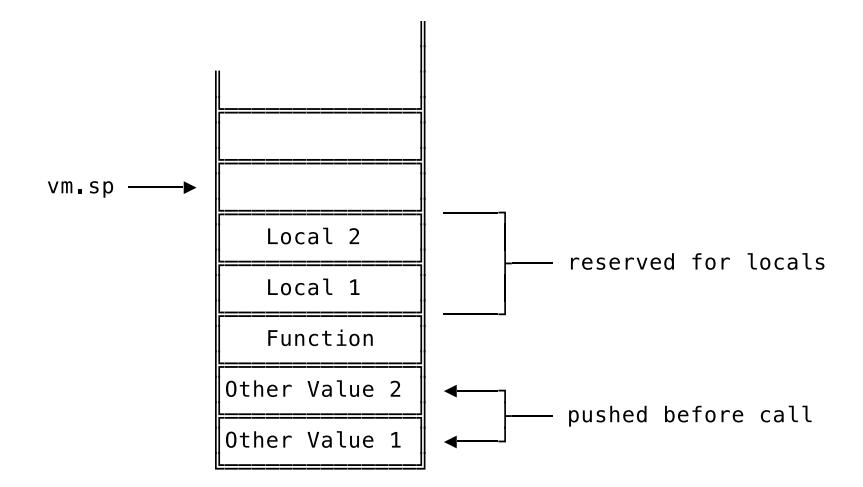

We already have the necessary parts to pull this off: the value of the stack pointer before executing the function, giving us the lower boundary of the hole, and an index that increases with every local. We can use both to calculate a stack slot index for each local binding by adding them together. Every index calculated this way serves as an offset into the hole and points to the slot where we'll store the local binding.

The beauty of this approach is what happens when we're done executing a function. Since we put the previous value of the stack pointer aside, we can now simply restore it and thus "reset" the stack. That removes not only everything the function call may have left on the stack, but also the local bindings saved in the hole – everything is squeaky-clean again!

"That's all fine and good", you say, "but how do we know how many locals a function is going to use?" Good catch; you got me. It's true, we *don't* know. At least not in the VM. In the compiler, on the other hand, we do and it's rather trivial for us to pass this information on to the VM.

What we need to do first is to extend our object.CompiledFunction by one field:

```
// object/object.go
type CompiledFunction struct {
    Instructions code.Instructions
    NumLocals int
}
```

NumLocals will later on tell us how many local bindings this function is going to create. In the compiler we can now ask the symbol table how many symbols were defined while compiling a function and put that number into NumLocals:

```
// compiler/compiler.go
func (c *Compiler) Compile(node ast.Node) error {
    switch node := node.(type) {
    // [...]
    case *ast.FunctionLiteral:
        // [...]
        numLocals := c.symbolTable.numDefinitions
        instructions := c.leaveScope()
        compiledFn := &object.CompiledFunction{
```

```
Instructions: instructions,
            NumLocals: numLocals,
        }
        c.emit(code.OpConstant, c.addConstant(compiledFn))
    // [...]
    }
    // [...]
}
```

Right before we call c.leaveScope, we take the current symbol table's numDefinitions, put it aside and, after leaving the scope, save it to the \*object.CompiledFunction. That gives us the number of local bindings a function is going to create and use in the VM. First mini-challenge completed! Sweet!

Now, according to our plan the other thing we need to do is to keep track of the stack pointer's value *before* we execute a function and then restore it to this value *after* executing. So in other words, we need a temporary storage that lives as long as a function call. Guess what? We already have that and call it Frame. We only need to add one more field to it, the so called basePointer:

```
// vm/frame.go
type Frame struct {
   fn *object.CompiledFunction
   ip int
   basePointer int
}
func NewFrame(fn *object.CompiledFunction, basePointer int) *Frame {
   f := &Frame{
       fn: fn,
       ip: -1,
       basePointer: basePointer,
   }
   return f
}
```

The name "base pointer" is not something I made up. On the contrary, it's common practice to give this name to the pointer that points to the bottom of the stack of the current call frame. It's the *base* for a lot of references while executing a function. Sometimes it's also called "frame pointer". In the upcoming sections of this book we'll use it even more. Right now, we just need to initialize it before we push a new frame:

```
// vm/vm.go
func New(bytecode *compiler.Bytecode) *VM {
    // [...]
    mainFrame := NewFrame(mainFn, 0)
    // [...]
}
func (vm *VM) Run() error {
    // [...]
```

```
switch op {
        // [...]
        case code.OpCall:
            fn, ok := vm.stack[vm.sp-1].(*object.CompiledFunction)
            if !ok {
                 return fmt.Errorf("calling non-function")
            }
            frame := NewFrame(fn, vm.sp)
            vm.pushFrame(frame)
        // [...]
        }
    // [...]
}
```

In the vm.New function we pass in 0 as the current value of the stack pointer so we can make our mainFrame work properly, even though this particular frame should never be popped off the stack and doesn't have local bindings. The setup of the new frame in the case code.OpCall branch is what we're really after. New is the second argument in the call to NewFrame, the current value of vm.sp, which will serve as the basePointer for the new frame.

Alright! We now have a basePointer in place and we know how many locals a function is going to use. That leaves us with two tasks: Allocate space for the local bindings on the stack before executing a function. Meaning: creating the "hole". And we also need to implement OpSetLocal and OpGetLocal instructions in the VM to use it.

"Allocating space on the stack" sounds fancy, but comes down to increasing the value of vm.sp without pushing something. And since we already save its value to the side before executing a function, we already have a perfect place, where we can do that:

```
// vm/vm.go
func (vm *VM) Run() error {
    // [...]
        switch op {
        // [...]
        case code.OpCall:
            fn, ok := vm.stack[vm.sp-1].(*object.CompiledFunction)
            if !ok {
                return fmt.Errorf("calling non-function")
            }
            frame := NewFrame(fn, vm.sp)
            vm.pushFrame(frame)
            vm.sp = frame.basePointer + fn.NumLocals
        // [...]
        }
    // [...]
}
```

We set vm.sp to frame.basePointer + fn.NumLocals to make clear that the starting point is basePointer and that we reserve fn.NumLocals slots on the stack. These slots might contain no or old values and in either case, we don't care. We can now use this region of the stack for local bindings and the normal usage of the stack – the pushing and popping of temporary values – won't affect it.

Next up: implement OpSetLocal and OpGetLocal instructions in our VM. We'll start with OpSetLocal.

What we have to do is very similar to what we did for global bindings: read in the operand, pop the value that should be bound off the stack and store it.

```
// vm/vm.go
func (vm *VM) Run() error {
    // [...]
        switch op {
        // [...]
        case code.OpSetLocal:
            localIndex := code.ReadUint8(ins[ip+1:])
            vm.currentFrame().ip += 1
            frame := vm.currentFrame()
            vm.stack[frame.basePointer+int(localIndex)] = vm.pop()
        // [...]
        }
    // [...]
}
```

After decoding the operand and getting the current frame, we take the basePointer of the frame and add the index of the binding in question as an offset. The result is the index of the location on the stack to which we can save the binding. We then pop the value off the stack and save it to the computed location. Done. Local binding created.

Implementing OpGetLocal means doing the opposite. Instead of assigning a value, we retrieve it. The rest is exactly the same:

```
// vm/vm.go
func (vm *VM) Run() error {
    // [...]
        switch op {
        // [...]
        case code.OpGetLocal:
            localIndex := code.ReadUint8(ins[ip+1:])
            vm.currentFrame().ip += 1
            frame := vm.currentFrame()
            err := vm.push(vm.stack[frame.basePointer+int(localIndex)])
            if err != nil {
                return err
            }
        // [...]
        }
    // [...]
}
```

Done! Let's see what our tests have to say:

```
$ go test ./vm
```

```
--- FAIL: TestCallingFunctionsWithBindings (0.00s)
 vm_test.go:444: vm error: unsupported types for binary operation:\
   COMPILED_FUNCTION_OBJ INTEGER
FAIL
FAIL monkey/vm 0.031s
```

What? In none of our test cases do we try to add a function to an integer. That would only happen if we leave functions lying around on the sta- Aha! We forgot to clean up the stack! We have the basePointer in place but we don't use it to reset our vm.sp after we're done executing a function.

We know where to do that, though: when we come across an OpReturnValue or an OpReturn instruction. Currently, we only take the return value and the just executed function off the stack. Now we need to get rid of the local bindings, too. The easiest way to do that is to set the stack pointer to the basePointer of the frame that holds the just-executed function:

```
// vm/vm.go
func (vm *VM) Run() error {
    // [...]
        switch op {
        // [...]
        case code.OpReturnValue:
            returnValue := vm.pop()
            frame := vm.popFrame()
            vm.sp = frame.basePointer - 1
            err := vm.push(returnValue)
            if err != nil {
                 return err
            }
        case code.OpReturn:
            frame := vm.popFrame()
            vm.sp = frame.basePointer - 1
            err := vm.push(Null)
            if err != nil {
                 return err
            }
        // [...]
        }
    // [...]
}
```

When we return from a function we first pop the frame off the frame stack. Previously we also did that, but didn't save the popped frame. Now we also set vm.sp to frame.basePointer - 1. Where does the additional -1 come from? It's an optimization: setting vm.sp to frame.basePointer would get rid of the local bindings, but it would still leave the just-executed function on the stack. So instead of keeping around the vm.pop() we previously had in place there, we replace it by decrementing vm.sp even further.

And with that, we're done. Yes, really. We're at the end of a journey that began with the definition of the OpSetLocal and OpGetLocal opcodes, led us from the compiler tests through the symbol table back to the compiler and finally, with a little detour back to object.CompiledFunction,

landed us in the VM. Local bindings work:

```
$ go test ./vm
ok monkey/vm 0.039s
```

We can now compile and execute this piece of Monkey code:

```
let globalSeed = 50;
let minusOne = fn() {
  let num = 1;
  globalSeed - num;
}
let minusTwo = fn() {
  let num = 2;
  globalSeed - num;
}
minusOne() + minusOne()
```

And there's more. We got an upgrade to our first-class functions without, again, explicitly setting out to do so. We can now take functions and assign them to names – in other functions:

```
// vm/vm_test.go
   func TestFirstClassFunctions(t *testing.T) {
       tests := []vmTestCase{
           // [...]
           {
               input: `
           let returnsOneReturner = fn() {
               let returnsOne = fn() { 1; };
               returnsOne;
           };
           returnsOneReturner()();
           `,
               expected: 1,
           },
       }
       runVmTests(t, tests)
   }
Yep, that passes:
   $ go test ./vm
   ok monkey/vm 0.037s
```

Now that we've reached our goal, where do we go next? Arguments to function calls – they are much closer to where we are than you might think.

<span id="page-201-0"></span>

### Arguments

Let's start this section with a little recap. In Monkey we can define functions to have parameters, like this:

```
let addThree = fn(a, b, c) {
  a + b + c;
}
```

This function has three parameters: a, b, and c. When we call it we can use arguments in the call expression:

```
addThree(1, 2, 3);
```

This binds the values passed in as arguments to the parameter names while the function executes. Now, the "bind" should ring a bell but I don't want to beat around the bush, so let me come straight out with it: arguments to function calls are a special case of local bindings.

They have the same lifespan, they have the same scope, they resolve in the same way. The only difference is their creation. Local bindings are created explicitly by the user with a let statement and result in OpSetLocal instructions being emitted by the compiler. Arguments, on the other hand, are implicitly bound to names, which is done behind the scenes by the compiler and the VM. And that leads us to our list of tasks for this section.

Our goal in this section is to fully implement function parameters and arguments to function calls. At the end, we want to compile and execute this snippet of Monkey code:

```
let globalNum = 10;
let sum = fn(a, b) {
  let c = a + b;
  c + globalNum;
};
let outer = fn() {
  sum(1, 2) + sum(3, 4) + globalNum;
};
outer() + globalNum;
```

At first glance, this looks quite chaotic. That's intentional. It's a mixture of everything we've already implemented and the things we're about to build: global and local bindings, functions with and without parameters, function calls with and without arguments.

So what's our plan? First, we need to rethink our calling convention. In its current form it doesn't accommodate for arguments. Then, as the second and already final step, we need to implement this updated calling convention. But let's start at the beginning.

<span id="page-202-0"></span>

### Compiling Calls With Arguments

The condensed version of our current calling convention is this: push the function you want to call on to the stack, emit OpCall and off you go. The question we're now facing is where to put the arguments to the function call – not only "where" in the sense of a memory location, but also where in the calling convention.

We don't have to search for a memory location for too long, because we already have a place where we store data that's relevant to the current function call: the stack. And just like we use the stack to store the function that's to be called, we can use it to store the arguments to the call.

But how do we get them on there? The easiest way is to simply push them on the stack right after the function has been pushed. And, surprisingly enough, there's nothing that speaks against this pragmatic solution. It's actually quite elegant, as we'll later see.

So, if we adopt this approach, it changes our calling convention to this: push the function you want to call on to the stack, then push all the arguments to the call on to the stack, emit OpCall and off you go. The stack would then look like this, right before executing OpCall:

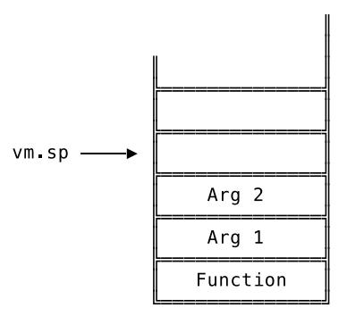

As things stand, though, that solution poses a slight problem to our VM, because it wouldn't know how many arguments are on top of the stack.

Think of our implementation of OpCall in the VM. Before we push a new frame, we take the function to be called right off the top of the stack. With this new calling convention, there could be zero or multiple arguments on the stack – on top of the function. How do we reach the function on the stack so we can execute it?

Since functions are ordinary Monkey object.Objects we can't even choose the hacky way and traverse the stack to find the first object.CompiledFunction; that might just be an argument to the function call.

Thankfully, we don't have to resort to hacky and ugh-this-feels-dirty fixes. There's a simple and beautiful solution available: we give the OpCall opcode an operand that holds the number of arguments of the call. One byte is enough for that (or do you want to call functions with more than 256 arguments?) and allows us, by doing a little calculation, to find the function below the arguments.

So, let's add an operand to OpCall:

```
// code/code.go
var definitions = map[Opcode]*Definition{
   // [...]
   OpCall: {"OpCall", []int{1}},
   // [...]
}
```

With this change some tests are breaking due to panics and index errors, because we defined something neither the compiler nor the VM know about. That's not a problem per se, but the definition of the new operand causes our code.Make function to create an empty byte in its place – even if we don't pass in an operand. We end up in this sort of limbo, where different parts in our system act on different assumptions and nobody knows what's really happened. We need to restore order again.

We'll start by updating our existing compiler tests and making sure that we do pass in an operand when creating OpCall instructions:

```
// compiler/compiler_test.go
func TestFunctionCalls(t *testing.T) {
    tests := []compilerTestCase{
        {
            // [...]
```

```
expectedInstructions: []code.Instructions{
                code.Make(code.OpConstant, 1), // The compiled function
                code.Make(code.OpCall, 0),
                code.Make(code.OpPop),
            },
        },
        {
            // [...]
            expectedInstructions: []code.Instructions{
                code.Make(code.OpConstant, 1), // The compiled function
                code.Make(code.OpSetGlobal, 0),
                code.Make(code.OpGetGlobal, 0),
                code.Make(code.OpCall, 0),
                code.Make(code.OpPop),
            },
        },
    }
    runCompilerTests(t, tests)
}
```

That makes the compiler tests correct and the compiler itself is fine for now, because it also uses code.Make to emit instructions, which, again, adds an empty byte for the new operand, even if none was passed in as argument.

The VM, though, stumbles and trips over the new operand, empty or not. The solution for now, at least until we've written the tests to tell us what we actually want, is to simply skip it:

```
// vm/vm.go
  func (vm *VM) Run() error {
      // [...]
         switch op {
         // [...]
         case code.OpCall:
             vm.currentFrame().ip += 1
             // [...]
         // [...]
         }
      // [...]
  }
Order is restored:
  $ go test ./...
  ? monkey [no test files]
  ok monkey/ast 0.014s
  ok monkey/code 0.014s
  ok monkey/compiler 0.011s
  ok monkey/evaluator 0.014s
  ok monkey/lexer 0.011s
  ok monkey/object 0.014s
  ok monkey/parser 0.009s
  ? monkey/repl [no test files]
  ? monkey/token [no test files]
  ok monkey/vm 0.037s
```

We're back on track and can now write a test to make sure the compiler conforms to the updated

calling convention by emitting instructions that push the arguments on to the stack. Since we already have TestFunctionCalls in place, we can extend it with new test cases instead of having to add a new test function:

```
// compiler/compiler_test.go
func TestFunctionCalls(t *testing.T) {
    tests := []compilerTestCase{
        // [...]
        {
            input: `
            let oneArg = fn(a) { };
            oneArg(24);
            `,
            expectedConstants: []interface{}{
                []code.Instructions{
                     code.Make(code.OpReturn),
                },
                24,
            },
            expectedInstructions: []code.Instructions{
                code.Make(code.OpConstant, 0),
                code.Make(code.OpSetGlobal, 0),
                code.Make(code.OpGetGlobal, 0),
                code.Make(code.OpConstant, 1),
                code.Make(code.OpCall, 1),
                code.Make(code.OpPop),
            },
        },
        {
            input: `
            let manyArg = fn(a, b, c) { };
            manyArg(24, 25, 26);
            `,
            expectedConstants: []interface{}{
                []code.Instructions{
                     code.Make(code.OpReturn),
                },
                24,
                25,
                26,
            },
            expectedInstructions: []code.Instructions{
                code.Make(code.OpConstant, 0),
                code.Make(code.OpSetGlobal, 0),
                code.Make(code.OpGetGlobal, 0),
                code.Make(code.OpConstant, 1),
                code.Make(code.OpConstant, 2),
                code.Make(code.OpConstant, 3),
                code.Make(code.OpCall, 3),
                code.Make(code.OpPop),
            },
        },
    }
    runCompilerTests(t, tests)
}
```

It's worth noting that the functions used in these new test cases have an empty body and don't make use of their parameters. That's by design. We first want to make sure that we can compile function calls and once we have that in place, we'll reference the parameters in the same tests and update our expectations.

As you can see in the expectedInstructions of these test cases, the first argument to the function call should end up lowest on the stack. From our current point of view, it doesn't really matter, but soon we'll see how much nicer that makes things in the VM once we start to reference parameters.

The output of these new tests is quite instructive:

```
$ go test ./compiler
--- FAIL: TestFunctionCalls (0.00s)
 compiler_test.go:889: testInstructions failed: wrong instructions length.
  want="0000 OpConstant 0\n0003 OpSetGlobal 0\n0006 OpGetGlobal 0\n\
    0009 OpConstant 1\n0012 OpCall 1\n0014 OpPop\n"
  got ="0000 OpConstant 0\n0003 OpSetGlobal 0\n0006 OpGetGlobal 0\n\
    0009 OpCall 0\n0011 OpPop\n"
FAIL
FAIL monkey/compiler 0.008s
```

The missing OpConstant instructions tell us that we need to compile the arguments of the function call and the wrong operand of OpCall tells us that it's still unused.

We can do both by updating our case branch in the compiler for \*ast.CallExpressions to this:

```
// compiler/compiler.go
func (c *Compiler) Compile(node ast.Node) error {
    switch node := node.(type) {
    // [...]
    case *ast.CallExpression:
        err := c.Compile(node.Function)
        if err != nil {
            return err
        }
        for _, a := range node.Arguments {
            err := c.Compile(a)
            if err != nil {
                return err
            }
        }
        c.emit(code.OpCall, len(node.Arguments))
    // [...]
    }
    // [...]
}
```

What hasn't changed here is the compilation of the node.Function. But now, with the new calling convention, that's only the first step. We also need to push the arguments to the function call on to the stack.

We do that by compiling the arguments in sequence, using a loop. Since each argument is an

\*ast.Expression it's compiled to one or more instructions that push a value on to the stack. The result is that the arguments end up on the stack above the function we want to call, exactly where the calling convention needs them to be. And to tell our VM how many arguments are now sitting above the function, we use len(node.Arguments) as the operand to OpCall.

Done. The tests are green:

```
$ go test ./compiler
ok monkey/compiler 0.008s
```

We can now compile call expressions with arguments. *Now* we can start to think about using those arguments in the function's body.

<span id="page-207-0"></span>

### Resolving References to Arguments

Before we update our test cases and replace those empty function bodies, let's be sure about what we expect from the compiler. At the time of a function call, the arguments will now sit on the stack. How do we access them while the function is executing?

Should we add a new opcode, something like OpGetArgument, that tells the VM to push the argument on to the stack? For that we would need to give the arguments their own scope and index in the symbol table. Otherwise we wouldn't know which opcode to emit when we come across a reference to an argument.

That's a viable solution and if our goal was to explicitly treat arguments different from local bindings, then we should choose it, because it offers much more flexibility in that direction. But we don't. In Monkey there is no difference between arguments passed in to a function and a local binding created in the same function. The better option for us is to embrace that and treat them the same.

Once you look at the stack at the time of a function call, it also becomes the obvious choice. The arguments sit right above the function that's being called. And you know what's normally stored in this region of the stack? Exactly! Local bindings! So if we treat arguments as locals, they would already be exactly where they need to be. The only thing we would then have to do is to treat them as locals in the compiler.

In practical terms that means emitting OpGetLocal instructions for every reference to a function's parameter. In order to test that, we update our last two test cases in TestFunctionCalls:

```
// compiler/compiler_test.go
```

```
func TestFunctionCalls(t *testing.T) {
    tests := []compilerTestCase{
        // [...]
        {
            input: `
            let oneArg = fn(a) { a };
            oneArg(24);
            `,
            expectedConstants: []interface{}{
                []code.Instructions{
                     code.Make(code.OpGetLocal, 0),
                     code.Make(code.OpReturnValue),
                },
                24,
            },
            expectedInstructions: []code.Instructions{
                code.Make(code.OpConstant, 0),
```

```
code.Make(code.OpSetGlobal, 0),
            code.Make(code.OpGetGlobal, 0),
            code.Make(code.OpConstant, 1),
            code.Make(code.OpCall, 1),
            code.Make(code.OpPop),
        },
    },
    {
        input: `
        let manyArg = fn(a, b, c) { a; b; c };
        manyArg(24, 25, 26);
        `,
        expectedConstants: []interface{}{
            []code.Instructions{
                code.Make(code.OpGetLocal, 0),
                code.Make(code.OpPop),
                code.Make(code.OpGetLocal, 1),
                code.Make(code.OpPop),
                code.Make(code.OpGetLocal, 2),
                code.Make(code.OpReturnValue),
            },
            24,
            25,
            26,
        },
        expectedInstructions: []code.Instructions{
            code.Make(code.OpConstant, 0),
            code.Make(code.OpSetGlobal, 0),
            code.Make(code.OpGetGlobal, 0),
            code.Make(code.OpConstant, 1),
            code.Make(code.OpConstant, 2),
            code.Make(code.OpConstant, 3),
            code.Make(code.OpCall, 3),
            code.Make(code.OpPop),
        },
    },
}
runCompilerTests(t, tests)
```

Instead of empty function bodies, we now have references to the parameters of the functions. And the updated expectations tell the compiler that these references should be turned into OpGetLocal instructions that load the arguments on to the stack. The indexes to these OpGetLocal instructions start at 0 for the first argument and then increment with each next one. Just like other local bindings.

If we run the tests we can see that the compiler can't resolve these references yet:

```
$ go test ./compiler
--- FAIL: TestFunctionCalls (0.00s)
 compiler_test.go:541: compiler error: undefined variable a
FAIL
FAIL monkey/compiler 0.009s
```

}

And here's where we step into "oh, nice" territory. All it takes for us to fix this is to define the parameters of a function as a local binding. And "define" is meant to be taken literally here. It's just one method call:

```
// compiler/compiler.go
func (c *Compiler) Compile(node ast.Node) error {
    switch node := node.(type) {
    // [...]
    case *ast.FunctionLiteral:
        c.enterScope()
        for _, p := range node.Parameters {
            c.symbolTable.Define(p.Value)
        }
        err := c.Compile(node.Body)
        if err != nil {
            return err
        }
        // [...]
    // [...]
    }
    // [...]
```

After entering a new scope and right before compiling the function's body we define each parameter in the scope of the function. That allows the symbol table (and in turn the compiler) to resolve the new references and treat them as locals when compiling the function's body. Look:

```
$ go test ./compiler
ok monkey/compiler 0.009s
```

Isn't that neat?

}

<span id="page-209-0"></span>

### Arguments in the VM

Remember that our goal is to compile and get this piece of Monkey code running in our VM:

```
let globalNum = 10;
let sum = fn(a, b) {
  let c = a + b;
  c + globalNum;
};
let outer = fn() {
  sum(1, 2) + sum(3, 4) + globalNum;
};
outer() + globalNum;
```

We're nearly there. We can already extract bits of this snippet and turn them into a test for the VM:

```
// vm/vm_test.go
func TestCallingFunctionsWithArgumentsAndBindings(t *testing.T) {
    tests := []vmTestCase{
        {
            input: `
```

```
let identity = fn(a) { a; };
        identity(4);
        `,
             expected: 4,
        },
        {
             input: `
        let sum = fn(a, b) { a + b; };
        sum(1, 2);
        `,
             expected: 3,
        },
    }
    runVmTests(t, tests)
}
```

That shows what we're after in its most basic form. In the first test case we pass one argument to a function that only references its single argument and returns it. The second test case is the sanity check that makes sure we're not hard-coding edge cases into our VM and can also handle multiple arguments. Both fail:

```
$ go test ./vm
--- FAIL: TestCallingFunctionsWithArgumentsAndBindings (0.00s)
 vm_test.go:709: vm error: calling non-function
FAIL
FAIL monkey/vm 0.039s
```

This is interesting. The test doesn't fail because the VM can't find the arguments on the stack. It fails because it can't find the function. And that's because it's looking in the wrong place.

The VM still expects the function to sit on top of the stack – correct behaviour according to the *old* calling convention. But since we updated the compiler, the emitted instructions not only put the function on the stack, but also the arguments. That's why the VM says it can't call a non-function: it trips over the arguments.

The fix is to use the operand of the OpCall instruction as it was designed to be used: to reach further down the stack to get to the function.

```
// vm/vm.go
func (vm *VM) Run() error {
    // [...]
        switch op {
        // [...]
        case code.OpCall:
            numArgs := code.ReadUint8(ins[ip+1:])
            vm.currentFrame().ip += 1
            fn, ok := vm.stack[vm.sp-1-int(numArgs)].(*object.CompiledFunction)
            if !ok {
                return fmt.Errorf("calling non-function")
            }
            frame := NewFrame(fn, vm.sp)
            vm.pushFrame(frame)
            vm.sp = frame.basePointer + fn.NumLocals
        // [...]
```

```
}
     // [...]
}
```

Instead of simply grabbing the function off the top of the stack, we calculate its position by decoding the operand, numArgs, and subtracting it from vm.sp. The additional -1 is there because vm.sp doesn't point to the topmost element on the stack, but the slot where the next element will be pushed.

That gets us a little bit further, but not by much:

```
$ go test ./vm
--- FAIL: TestCallingFunctionsWithArgumentsAndBindings (0.00s)
 vm_test.go:357: testIntegerObject failed:\
   object is not Integer. got=<nil> (<nil>)
panic: runtime error: \
  invalid memory address or nil pointer dereference [recovered]
 panic: runtime error: invalid memory address or nil pointer dereference
[signal SIGSEGV: segmentation violation code=0x1 addr=0x20 pc=0x10f7841]
goroutine 13 [running]:
testing.tRunner.func1(0xc4200a80f0)
 /usr/local/go/src/testing/testing.go:742 +0x29d
panic(0x11215e0, 0x11fffa0)
 /usr/local/go/src/runtime/panic.go:502 +0x229
monkey/vm.(*VM).executeBinaryOperation(0xc4204b3eb8, 0x1, 0x0, 0x0)
 /Users/mrnugget/code/07/src/monkey/vm/vm.go:270 +0xa1
monkey/vm.(*VM).Run(0xc4204b3eb8, 0x10000, 0x10000)
 /Users/mrnugget/code/07/src/monkey/vm/vm.go:87 +0x155
monkey/vm.runVmTests(0xc4200a80f0, 0xc4204b3f58, 0x2, 0x2)
 /Users/mrnugget/code/07/src/monkey/vm/vm_test.go:276 +0x5de
monkey/vm.TestCallingFunctionsWithArgumentsAndBindings(0xc4200a80f0)
 /Users/mrnugget/code/07/src/monkey/vm/vm_test.go:357 +0x93
testing.tRunner(0xc4200a80f0, 0x11540e8)
 /usr/local/go/src/testing/testing.go:777 +0xd0
created by testing.(*T).Run
 /usr/local/go/src/testing/testing.go:824 +0x2e0
FAIL monkey/vm 0.049s
```

The first test case tells us that the value that was last popped off the stack is not the expected 4, but nil. Alright. Apparently the VM can't find the arguments on the stack.

The second test case doesn't tell us anything but blows up. Why it does that is not immediately visible and requires some walking up of the stack trace. And once we reach vm.go we find the reason for the panic: the VM tries to call the object.Object.Type method on two nil pointers, which it popped off the stack in order to add them together.

Both failures come down to the same thing: the VM tries to find the arguments on the stack but gets nils instead.

That at least *something* doesn't work is kinda what we expected. But then again, not really. The arguments sit on top of the stack, right above the function being called. That's where local bindings are supposed to be stored. And since we treat arguments as locals and want to retrieve them with OpGetLocal instructions, that's exactly where they should be. That's the beauty behind the whole idea of treating arguments as locals. So why can't the VM find them?

Short answer: because our stack pointer is too high. The way we initialize it together with basePointer when setting up a new frame is outdated.

Remember that the basePointer of Frame has two purposes. First, it serves as a reset button we can push to get rid of a just-executed function and everything the function left on the stack by setting vm.sp to the basePointer - 1.

The second one is to serve as a reference for local bindings. This is where the bug hides. Right before we execute a function we set basePointer to the current value of vm.sp. Then we increase vm.sp by the number of locals the function's going to use, which gives us what we called "the hole": N slots on the stack which we can use to store and retrieve local bindings.

What makes our tests fail is that before we execute the function, we already have things on the stack we want to use as locals: the arguments of the call. And we want to access them with the same formula we use for other local bindings: basePointer plus individual local-binding index. The problem is that when we now initialize a new frame, the stack looks like this:

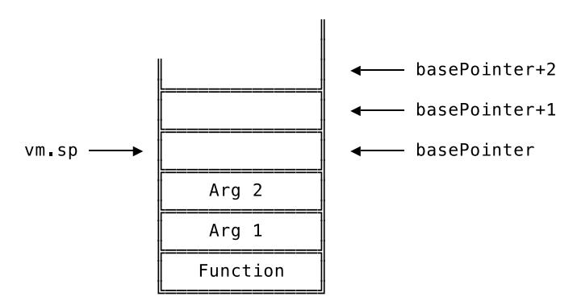

I bet you can see the problem. We set basePointer to the current value of vm.sp *after* we pushed the arguments on the stack. That leads to basePointer *plus* the index of the local binding pointing to empty stack slots. And the result of that is that the VM gets nils instead of the arguments it wants.

We need to adjust the basePointer. We can't just clone vm.sp anymore. But the new and correct formula for basePointer is not much harder to understand: basePointer = vm.sp numArguments. That results in this stack layout at the start of a function call:

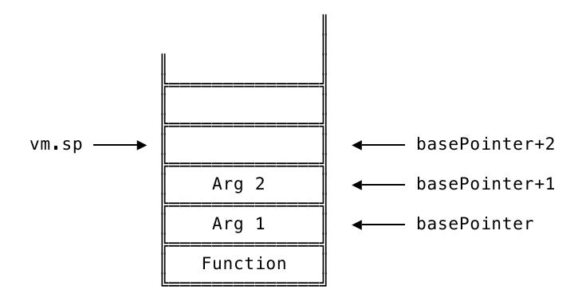

That would work. With this, if we'd compute basePointer *plus* local binding index of the argument, we'd get the correct slot. And on top of that (pun intended!) the vm.sp would still point to the next empty slot on the stack. Perfect!

Here is this idea's translation into code:

*// vm/vm.go*

```
func (vm *VM) Run() error {
    // [...]
        switch op {
        // [...]
        case code.OpCall:
            numArgs := code.ReadUint8(ins[ip+1:])
            vm.currentFrame().ip += 1
            err := vm.callFunction(int(numArgs))
            if err != nil {
                return err
            }
        // [...]
        }
    // [...]
}
func (vm *VM) callFunction(numArgs int) error {
    fn, ok := vm.stack[vm.sp-1-numArgs].(*object.CompiledFunction)
    if !ok {
        return fmt.Errorf("calling non-function")
    }
    frame := NewFrame(fn, vm.sp-numArgs)
    vm.pushFrame(frame)
    vm.sp = frame.basePointer + fn.NumLocals
    return nil
}
```

Before it's too late, we move the main part of the OpCall implementation to a new method, called callFunction. Don't be fooled, though, barely anything has changed in the implementation itself. The only difference is the second argument in the call to NewFrame. Instead of passing in vm.sp as the future basePointer for the frame, we first subtract numArgs. That gives us the basePointer as pictured in the diagram earlier.

Now look at that:

```
$ go test ./vm
ok monkey/vm 0.047s
```

sum(1, 2);

*All* of our tests are passing! Let's roll the dice, go even further and throw some more tests at our VM:

```
// vm/vm_test.go
func TestCallingFunctionsWithArgumentsAndBindings(t *testing.T) {
    tests := []vmTestCase {
        // [...]
        {
            input: `
        let sum = fn(a, b) {
            let c = a + b;
            c;
        };
```

```
`,
        expected: 3,
    },
    {
        input: `
    let sum = fn(a, b) {
        let c = a + b;
        c;
    };
    sum(1, 2) + sum(3, 4);`,
        expected: 10,
    },
    {
        input: `
    let sum = fn(a, b) {
        let c = a + b;
        c;
    };
    let outer = fn() {
        sum(1, 2) + sum(3, 4);
    };
    outer();
    `,
        expected: 10,
    },
}
runVmTests(t, tests)
```

These test cases make sure that we can mix manually created local bindings with arguments: in one function, or in the same function that's called multiple times or in one function that's called multiple times in another function. They all pass:

```
$ go test ./vm
ok monkey/vm 0.041s
```

Now, let's see whether we've reached our goal:

```
// vm/vm_test.go
```

}

```
func TestCallingFunctionsWithArgumentsAndBindings(t *testing.T) {
    tests := []vmTestCase {
        // [...]
        {
            input: `
        let globalNum = 10;
        let sum = fn(a, b) {
            let c = a + b;
            c + globalNum;
        };
        let outer = fn() {
            sum(1, 2) + sum(3, 4) + globalNum;
        };
        outer() + globalNum;
        `,
```

```
expected: 50,
           },
       }
       runVmTests(t, tests)
   }
Running this test will tell us:
   $ go test ./vm
   ok monkey/vm 0.035s
```

Yes, we did! We've successfully added function call arguments to our compiler and our VM!

Now we just need to make sure that the stack doesn't come tumbling down when we call a function with the wrong number of arguments, since a lot of our implementation hinges on that number:

```
// vm/vm_test.go
func TestCallingFunctionsWithWrongArguments(t *testing.T) {
    tests := []vmTestCase{
        {
            input: `fn() { 1; }(1);`,
            expected: `wrong number of arguments: want=0, got=1`,
        },
        {
            input: `fn(a) { a; }();`,
            expected: `wrong number of arguments: want=1, got=0`,
        },
        {
            input: `fn(a, b) { a + b; }(1);`,
            expected: `wrong number of arguments: want=2, got=1`,
        },
    }
    for _, tt := range tests {
        program := parse(tt.input)
        comp := compiler.New()
        err := comp.Compile(program)
        if err != nil {
            t.Fatalf("compiler error: %s", err)
        }
        vm := New(comp.Bytecode())
        err = vm.Run()
        if err == nil {
            t.Fatalf("expected VM error but resulted in none.")
        }
        if err.Error() != tt.expected {
            t.Fatalf("wrong VM error: want=%q, got=%q", tt.expected, err)
        }
    }
}
```

We want to make sure that we get a VM error when we call a function with the wrong number of arguments. So, yes, this time we *want* an error, but get none:

```
$ go test ./vm
--- FAIL: TestCallingFunctionsWithWrongArguments (0.00s)
 vm_test.go:801: expected VM error but resulted in none.
FAIL
FAIL monkey/vm 0.053s
```

To fix that we need to make quick trip to the object package and add a new field to the definition of object.CompiledFunction:

```
// object/object.go
type CompiledFunction struct {
    Instructions code.Instructions
    NumLocals int
    NumParameters int
}
```

We'll now fill out this new NumParameters field in the compiler, where we have the number of parameters of a function literal at hand:

```
// compiler/compiler.go
func (c *Compiler) Compile(node ast.Node) error {
    switch node := node.(type) {
    // [...]
    case *ast.FunctionLiteral:
        // [...]
        compiledFn := &object.CompiledFunction{
            Instructions: instructions,
            NumLocals: numLocals,
            NumParameters: len(node.Parameters),
        }
        c.emit(code.OpConstant, c.addConstant(compiledFn))
    // [...]
    }
    // [...]
}
```

In the VM we can use that field to make sure that we have the right number of arguments sitting on the stack:

```
// vm/vm.go
func (vm *VM) callFunction(numArgs int) error {
    fn, ok := vm.stack[vm.sp-1-numArgs].(*object.CompiledFunction)
    if !ok {
        return fmt.Errorf("calling non-function")
    }
    if numArgs != fn.NumParameters {
        return fmt.Errorf("wrong number of arguments: want=%d, got=%d",
            fn.NumParameters, numArgs)
    }
    // [...]
}
```

With that, we're in safe territory:

```
$ go test ./vm
ok monkey/vm 0.035s
```

The stack will hold, even if we call a function with the wrong number of arguments.

Now we can enjoy the fact that we've implement functions and function calls in a bytecode compiler and VM, including arguments and local bindings. That's certainly no small feat and puts us, again, in another league:

```
$ go build -o monkey . && ./monkey
Hello mrnugget! This is the Monkey programming language!
Feel free to type in commands
>> let one = fn() { 1; };
CompiledFunction[0xc42008a8d0]
>> let two = fn() { let result = one(); return result + result; };
CompiledFunction[0xc42008aba0]
>> let three = fn(two) { two() + 1; };
CompiledFunction[0xc42008ae40]
>> three(two);
3
```

Time to add another type of function.

## <span id="page-218-0"></span>Chapter 8

# Built-in Functions

In *Writing An Interpreter In Go* we did not only add the ability to define functions to our evaluator, but we also built functions right into it. These functions here:

```
len([1, 2, 3]); // => 3
first([1, 2, 3]); // => 1
last([1, 2, 3]); // => 3
rest([1, 2, 3]); // => [2, 3]
push([1, 2, 3], 4); // => [1, 2, 3, 4]
puts("Hello World!"); // prints "Hello World!"
```

Our goal for this chapter is to do the same for our new bytecode compiler and virtual machine and build these functions into them. That's not as easy as one might think.

While these are Go functions and thus should be as portable as any other function we wrote, they took roots in the evaluator package. They're defined as private, they use internal references and make use of private helper functions – not the best circumstances for using them in the compiler and the vm packages.

So, before we can start to think about executing these built-in functions in the VM, or even mention them in the compiler, we need to refactor some of our code from the previous book to make it easier for our new code to use it.

The obvious, first option is to make the function definitions public. Uppercase their names, done. That would work, yes, but it would also clash with something delicate – my taste. I don't want the compiler nor the VM to depend on the evaluator, which is what this course of action would lead to. Instead, I want all three packages – compiler, vm and evaluator – to have equal access to the built-in functions.

That leads us to the second option: duplicate the definitions, keep one copy for the evaluator and create one for the vm and compiler packages. But then again, we're programmers, we do not like duplication. In all seriousness, though: duplicating these built-in functions *would* be a bad idea. Encoded in them is a non-trivial amount of Monkey behaviour, which we don't want to accidentally fork and diverge.

Instead, we're going to move these built-in functions to the object package. That takes slightly more effort, but it's also the most elegant choice, since it makes incorporating the built-in functions into the compiler and the VM much easier later on.

<span id="page-219-0"></span>

### Making the Change Easy

So, here's the first task: move the built-in functions out of the evaluator package while keeping the evaluator working. Attached to that is a little sidequest: while moving them, we need to define the built-in functions so that we can use an index to access a single function and iterate through them *in a stable way*. The builtins we currently have in evaluator is a map[string]\*object.Builtin, which gives us the indexing but not the guarantee of stable iteration.

Instead of a map we're going to use a slice of structs in which we can pair an \*object.Builtin with its name. That gives us stable iteration and, with the help of a small function, allows us to fetch a single function by name.

Doing this instead of simply cutting and pasting the existing evaluator.builtins definition, also gives us a chance to refreshen our memory by taking a look at each built-in function again.

Let's start with len. It returns the length of an array or a string. We create a new file, object/builtins.go, and copy the definition of len from evaluator/builtins.go to the new file. Like this:

```
// object/builtins.go
package object
import "fmt"
var Builtins = []struct {
    Name string
    Builtin *Builtin
}{
    {
        "len",
        &Builtin{Fn: func(args ...Object) Object {
            if len(args) != 1 {
                return newError("wrong number of arguments. got=%d, want=1",
                    len(args))
            }
            switch arg := args[0].(type) {
            case *Array:
                return &Integer{Value: int64(len(arg.Elements))}
            case *String:
                return &Integer{Value: int64(len(arg.Value))}
            default:
                return newError("argument to `len` not supported, got %s",
                    args[0].Type())
            }
        },
        },
    },
}
func newError(format string, a ...interface{}) *Error {
    return &Error{Message: fmt.Sprintf(format, a...)}
}
```

Builtins is a slice of structs, where each struct contains the name and the \*Builtin function itself.

While we did copy the \*Builtin with the name len, please note that this is not mindless copy and pasting: in the \*Builtin itself we had to remove references to the object package. They're redundant now that we're in object.

The newError function we also had to copy over since it's heavily used by most of the built-in functions.

With Builtins defined and containing its first definition, we can now add a function called GetBuiltinByName:

```
// object/builtins.go
func GetBuiltinByName(name string) *Builtin {
    for _, def := range Builtins {
        if def.Name == name {
            return def.Builtin
        }
    }
    return nil
}
```

There's not much to explain here. It's a function that allows us to fetch a built-in function by name. But with this in place, we can get rid of the duplication in evaluator/builtins.go and replace the old definition of len with this:

```
// evaluator/builtins.go
var builtins = map[string]*object.Builtin{
    "len": object.GetBuiltinByName("len"),
    // [...]
}
```

That's our first built-in function moved. Congratulations! And, look at that, the tests of the evaluator package are still working:

```
$ go test ./evaluator
ok monkey/evaluator 0.009s
```

Great! Now we can do the same for each function in evaluator.builtins. Next up is puts, which prints its arguments:

```
// object/builtins.go
var Builtins = []struct {
    Name string
    Builtin *Builtin
}{
    // [...]
    {
        "puts",
        &Builtin{Fn: func(args ...Object) Object {
            for _, arg := range args {
                 fmt.Println(arg.Inspect())
            }
            return nil
        },
        },
    },
}
```

Even though it doesn't look like much, this new definition of puts contains one crucial change.

In its definition in the evaluator package, puts returns evaluator.NULL. That's the evaluator's counterpart to the VM's vm.Null. But since keeping the reference to evaluator.NULL would mean juggling around two instances of \*object.Null in the VM, we change puts to instead return nil.

That's easy to replace with vm.Null once we're in the VM. But since we want to use the new definition of puts in the evaluator too, we need to change the existing code to now check for nil and turn it into NULL if necessary:

```
// evaluator/evaluator.go
func applyFunction(fn object.Object, args []object.Object) object.Object {
    switch fn := fn.(type) {
    // [...]
    case *object.Builtin:
        if result := fn.Fn(args...); result != nil {
            return result
        }
        return NULL
    // [...]
    }
}
```

The next function to move is first, which returns the first element of an array. It has to undergo the same treatment as puts: copy it from evaluator/builtins.go to object/builtins.go, remove references to the object package and return nil where it previously returned evaluator.NULL:

```
// object/builtins.go
var Builtins = []struct {
    Name string
    Builtin *Builtin
}{
    // [...]
    {
        "first",
        &Builtin{Fn: func(args ...Object) Object {
            if len(args) != 1 {
                return newError("wrong number of arguments. got=%d, want=1",
                    len(args))
            }
            if args[0].Type() != ARRAY_OBJ {
                return newError("argument to `first` must be ARRAY, got %s",
                    args[0].Type())
            }
            arr := args[0].(*Array)
            if len(arr.Elements) > 0 {
                return arr.Elements[0]
            }
            return nil
        },
        },
```

```
},
}
```

Of course, we also defined a last function, for which we have to follow the same recipe:

```
// object/builtins.go
var Builtins = []struct {
    Name string
    Builtin *Builtin
}{
    // [...]
    {
        "last",
        &Builtin{Fn: func(args ...Object) Object {
            if len(args) != 1 {
                return newError("wrong number of arguments. got=%d, want=1",
                     len(args))
            }
            if args[0].Type() != ARRAY_OBJ {
                return newError("argument to `last` must be ARRAY, got %s",
                     args[0].Type())
            }
            arr := args[0].(*Array)
            length := len(arr.Elements)
            if length > 0 {
                return arr.Elements[length-1]
            }
            return nil
        },
        },
    },
}
```

Besides getting the first and last elements of an array, it's sometimes really useful to get every element except the first one, which is why we have rest:

```
// object/builtins.go
var Builtins = []struct {
    Name string
    Builtin *Builtin
}{
    // [...]
    {
        "rest",
        &Builtin{Fn: func(args ...Object) Object {
            if len(args) != 1 {
                return newError("wrong number of arguments. got=%d, want=1",
                    len(args))
            }
            if args[0].Type() != ARRAY_OBJ {
                return newError("argument to `rest` must be ARRAY, got %s",
                    args[0].Type())
            }
            arr := args[0].(*Array)
```

```
length := len(arr.Elements)
            if length > 0 {
                newElements := make([]Object, length-1, length-1)
                copy(newElements, arr.Elements[1:length])
                return &Array{Elements: newElements}
            }
            return nil
        },
        },
    },
}
```

And then we define push, which adds an element to an array. It doesn't mutate the array, but instead leaves it untouched and allocates a new one, containing the elements of the original array and the addition:

```
// object/builtins.go
var Builtins = []struct {
    Name string
    Builtin *Builtin
}{
    // [...]
    {
        "push",
        &Builtin{Fn: func(args ...Object) Object {
            if len(args) != 2 {
                return newError("wrong number of arguments. got=%d, want=2",
                    len(args))
            }
            if args[0].Type() != ARRAY_OBJ {
                return newError("argument to `push` must be ARRAY, got %s",
                    args[0].Type())
            }
            arr := args[0].(*Array)
            length := len(arr.Elements)
            newElements := make([]Object, length+1, length+1)
            copy(newElements, arr.Elements)
            newElements[length] = args[1]
            return &Array{Elements: newElements}
        },
        },
    },
}
```

And that was the last of the built-in functions we set out to implement. All of them are now defined in object.Builtins, stripped free of redundant references to the object package and making no mention of evaluator.NULL.

Now we can go back to evaluator/builtins.go and replace all of the currently-duplicated definitions with calls to object.GetBuiltinByName:

```
// evaluator/builtins.go
import (
```

```
"monkey/object"
)
var builtins = map[string]*object.Builtin{
    "len": object.GetBuiltinByName("len"),
    "puts": object.GetBuiltinByName("puts"),
    "first": object.GetBuiltinByName("first"),
    "last": object.GetBuiltinByName("last"),
    "rest": object.GetBuiltinByName("rest"),
    "push": object.GetBuiltinByName("push"),
}
```

Isn't that neat? That's the whole file! Now comes the sanity check to make sure that everything still works:

```
$ go test ./evaluator
ok monkey/evaluator 0.009s
```

Great! With that, built-in functions are now available to every package that imports the object package. They do not depend on evaluator.NULL anymore and follow a bring-your-own-null approach instead. The evaluator still works as it did at the end of *Writing An Interpreter In Go* and all tests pass.

Beautiful. That's what I call a refactoring. It makes everything we now have to do easier.

<span id="page-224-0"></span>

### Making the Change: the Plan

You know what I like? Getting rid of edge cases and having as few of them as possible.

That's why I want to keep our existing calling convention as it is, even for built-in functions. That means, in order to call a built-in function, you'd do the same as for any other function: push the built-in function on to the stack, push the arguments of the call and then call the function with an OpCall instruction.

*How* the built-in function is going to be executed, that's an implementation detail of the VM which we'll worry about later.

From the compiler's perspective, the only thing that should be different when compiling a call expression involving a built-in function is how the function ends up on the stack. For that, we really need to introduce another case, but not an edge case.

Built-in functions are neither defined in the global nor in a local scope. They live in their own scope. And we need to introduce that scope to the compiler and its symbol table, so they can correctly resolve references to built-in functions.

We're going to call this scope the BuiltinScope and in it we're going to define all the built-in functions we have just moved over to the object.Builtins slice of definitions – in exactly that order. That's an important detail, because it's our sidequest.

When the compiler (with the help of the symbol table) then detects a reference to a built-in function it will emit an OpGetBuiltin instruction. The operand in this instruction will be the index of the referenced function in object.Builtins.

Since object.Builtins is also accessible by the VM it can use the operand of the instruction to fetch the correct function from object.Builtins and push it on to the stack, where it can then be called.

Again, we can worry about how *that* happens later, once we've written our first VM test. But as our next step, we need to make sure that the compiler knows how to resolve references to built-ins. For that, we need a new opcode and a new scope.

<span id="page-225-0"></span>

### A New Scope for Built-in Functions

First things first and as we know by now, that's often a new opcode. This time it's called OpGetBuiltin:

```
// code/code.go
const (
    // [...]
    OpGetBuiltin
)
var definitions = map[Opcode]*Definition{
    // [...]
    OpGetBuiltin: {"OpGetBuiltin", []int{1}},
}
```

The opcode comes with one operand that's one byte wide. That means we can define up to 256 built-in functions. Sounds low? Let's just say that once we've reached that limit, we can always make it two bytes.

You know the drill: opcodes first and compiler tests next. Now that we have OpGetBuiltin, we can write a test that expects our compiler to turn references to built-in functions into OpGetBuiltin instructions.

```
// compiler/compiler_test.go
func TestBuiltins(t *testing.T) {
    tests := []compilerTestCase{
        {
            input: `
            len([]);
            push([], 1);
            `,
            expectedConstants: []interface{}{1},
            expectedInstructions: []code.Instructions{
                code.Make(code.OpGetBuiltin, 0),
                code.Make(code.OpArray, 0),
                code.Make(code.OpCall, 1),
                code.Make(code.OpPop),
                code.Make(code.OpGetBuiltin, 5),
                code.Make(code.OpArray, 0),
                code.Make(code.OpConstant, 0),
                code.Make(code.OpCall, 2),
                code.Make(code.OpPop),
            },
        },
        {
            input: `fn() { len([]) }`,
            expectedConstants: []interface{}{
                []code.Instructions{
                    code.Make(code.OpGetBuiltin, 0),
```

```
code.Make(code.OpArray, 0),
                     code.Make(code.OpCall, 1),
                     code.Make(code.OpReturnValue),
                },
            },
            expectedInstructions: []code.Instructions{
                code.Make(code.OpConstant, 0),
                code.Make(code.OpPop),
            },
        },
    }
    runCompilerTests(t, tests)
}
```

The first of these two test cases makes sure of two things. First, calling a built-in function follows our established calling convention and, second, the operand of the OpGetBuiltin instruction is the index of the referenced function in object.Builtins.

The second test case then makes sure that references to built-in functions are correctly resolved, independent of the scope in which they occur, which is different from the existing behaviour of local and global scopes.

If we run the tests, we get a compiler error:

```
$ go test ./compiler
--- FAIL: TestBuiltins (0.00s)
 compiler_test.go:1049: compiler error: undefined variable len
FAIL
FAIL monkey/compiler 0.008s
```

Since the fix for this failing test includes our compiler correctly resolving references, our next stop is the place where the compiler goes to for its resolving needs: the symbol table.

Here, too, we need to write a test to make sure that built-in functions *always* resolve to a symbol in the BuiltinScope, regardless of how many times the symbol table has been enclosed in another one:

```
// compiler/symbol_table_test.go
```

```
func TestDefineResolveBuiltins(t *testing.T) {
    global := NewSymbolTable()
    firstLocal := NewEnclosedSymbolTable(global)
    secondLocal := NewEnclosedSymbolTable(firstLocal)
    expected := []Symbol{
        Symbol{Name: "a", Scope: BuiltinScope, Index: 0},
        Symbol{Name: "c", Scope: BuiltinScope, Index: 1},
        Symbol{Name: "e", Scope: BuiltinScope, Index: 2},
        Symbol{Name: "f", Scope: BuiltinScope, Index: 3},
    }
    for i, v := range expected {
        global.DefineBuiltin(i, v.Name)
    }
    for _, table := range []*SymbolTable{global, firstLocal, secondLocal} {
        for _, sym := range expected {
            result, ok := table.Resolve(sym.Name)
```

```
if !ok {
                 t.Errorf("name %s not resolvable", sym.Name)
                 continue
            }
            if result != sym {
                 t.Errorf("expected %s to resolve to %+v, got=%+v",
                     sym.Name, sym, result)
            }
        }
    }
}
```

In this test we define three scopes, nested within each other, and expect every symbol that's been defined in the global scope with DefineBuiltin to resolve to the new BuiltinScope.

Since DefineBuiltin and BuiltinScope do not exist yet, there's no need to run the tests yet, but it also doesn't hurt to make sure that they blow up as expected:

```
$ go test -run TestDefineResolveBuiltins ./compiler
# monkey/compiler
compiler/symbol_table_test.go:162:28: undefined: BuiltinScope
compiler/symbol_table_test.go:163:28: undefined: BuiltinScope
compiler/symbol_table_test.go:164:28: undefined: BuiltinScope
compiler/symbol_table_test.go:165:28: undefined: BuiltinScope
compiler/symbol_table_test.go:169:9: global.DefineBuiltin undefined\
  (type *SymbolTable has no field or method DefineBuiltin)
FAIL monkey/compiler [build failed]
```

As expected. Defining BuiltinScope is the easier of the two necessary steps, so we do that first:

```
// compiler/symbol_table.go
const (
    // [...]
    BuiltinScope SymbolScope = "BUILTIN"
)
```

But it's not that much harder to write the DefineBuiltin method:

```
// compiler/symbol_table.go
func (s *SymbolTable) DefineBuiltin(index int, name string) Symbol {
    symbol := Symbol{Name: name, Index: index, Scope: BuiltinScope}
    s.store[name] = symbol
    return symbol
}
```

Compared to the existing Define method, this one here is much simpler. Define the given name with the given index in the BuiltinScope, ignore whether you're enclosed in another symbol table or not, and done:

```
$ go test -run TestDefineResolveBuiltins ./compiler
ok monkey/compiler 0.007s
```

Now we can go back and use DefineBuiltin method in the compiler:

```
// compiler/compiler.go
func New() *Compiler {
    // [...]
```

```
symbolTable := NewSymbolTable()
    for i, v := range object.Builtins {
        symbolTable.DefineBuiltin(i, v.Name)
    }
    return &Compiler{
        // [...]
        symbolTable: symbolTable,
        // [...]
    }
}
```

When initializing a new \*Compiler we iterate through all of the functions in object.Builtins and define them in the BuiltinScope by using the DefineBuiltin method on the global symbol table.

That should fix our compiler test, because the compiler can now resolve the references to the built-in functions:

```
$ go test ./compiler
--- FAIL: TestBuiltins (0.00s)
 compiler_test.go:1056: testInstructions failed: wrong instruction at 0.
  want="0000 OpGetBuiltin 0\n0002 OpArray 0\n0005 OpCall 1\n0007 OpPop\n\
    0008 OpGetBuiltin 5\n0010 OpArray 0\n0013 OpConstant 0\n\
    0016 OpCall 2\n0018 OpPop\n"
  got ="0000 OpGetLocal 0\n0002 OpArray 0\n0005 OpCall 1\n0007 OpPop\n\
    0008 OpGetLocal 5\n0010 OpArray 0\n0013 OpConstant 0\n\
    0016 OpCall 2\n0018 OpPop\n"
FAIL
FAIL monkey/compiler 0.009s
```

Except, it doesn't and that's because our compiler ignores half of what the symbol table is saying. In its current state, after using the symbol table to resolve a name, the compiler only checks whether a symbol's scope is GlobalScope or not. But we can't get away with an if-else check anymore.

We have a third scope now and have to actually listen to what the symbol table has to say. And we best do that in a separate method:

```
// compiler/compiler.go
func (c *Compiler) loadSymbol(s Symbol) {
    switch s.Scope {
    case GlobalScope:
        c.emit(code.OpGetGlobal, s.Index)
    case LocalScope:
        c.emit(code.OpGetLocal, s.Index)
    case BuiltinScope:
        c.emit(code.OpGetBuiltin, s.Index)
    }
}
```

When we now use loadSymbol to compile an \*ast.Identifier, we emit the correct instruction for each symbol we resolve:

```
// compiler/compiler.go
func (c *Compiler) Compile(node ast.Node) error {
    switch node := node.(type) {
```

```
// [...]
       case *ast.Identifier:
           symbol, ok := c.symbolTable.Resolve(node.Value)
           if !ok {
               return fmt.Errorf("undefined variable %s", node.Value)
           }
           c.loadSymbol(symbol)
       // [...]
       }
       // [...]
   }
Yep, that did it:
   $ go test ./compiler
   ok monkey/compiler 0.008s
```

That means, the compiler now compiles references to built-in functions. And the best bit is that it also upholds our existing calling convention – without us having to do anything. Sweet!

Time to start worrying about the implementation detail that is the execution of built-in functions.

<span id="page-229-0"></span>

### Executing built-in functions

"Implementation detail" always sounds like it's about of the size of the change, when it's really about visibility, abstraction. The user of a feature shouldn't have to worry about *how* it's implemented – the detail – but only about using it.

A Monkey user shouldn't have to worry about how to execute a built-in function. Neither should the compiler. That should solely be the concern of the VM. And that gives us a lot of freedom: freedom of implementation and also freedom of tests. We can simply write down what we want the VM to do and only then worry about the *how*:

```
// vm/vm_test.go
func TestBuiltinFunctions(t *testing.T) {
    tests := []vmTestCase{
        {`len("")`, 0},
        {`len("four")`, 4},
        {`len("hello world")`, 11},
        {
            `len(1)`,
            &object.Error{
                Message: "argument to `len` not supported, got INTEGER",
            },
        },
        {`len("one", "two")`,
            &object.Error{
                Message: "wrong number of arguments. got=2, want=1",
            },
        },
        {`len([1, 2, 3])`, 3},
```

```
{`len([])`, 0},
        {`puts("hello", "world!")`, Null},
        {`first([1, 2, 3])`, 1},
        {`first([])`, Null},
        {`first(1)`,
            &object.Error{
                Message: "argument to `first` must be ARRAY, got INTEGER",
            },
        },
        {`last([1, 2, 3])`, 3},
        {`last([])`, Null},
        {`last(1)`,
            &object.Error{
                Message: "argument to `last` must be ARRAY, got INTEGER",
            },
        },
        {`rest([1, 2, 3])`, []int{2, 3}},
        {`rest([])`, Null},
        {`push([], 1)`, []int{1}},
        {`push(1, 1)`,
            &object.Error{
                Message: "argument to `push` must be ARRAY, got INTEGER",
            },
        },
    }
    runVmTests(t, tests)
}
func testExpectedObject(
    t *testing.T,
    expected interface{},
    actual object.Object,
) {
    t.Helper()
    switch expected := expected.(type) {
    // [...]
    case *object.Error:
        errObj, ok := actual.(*object.Error)
        if !ok {
            t.Errorf("object is not Error: %T (%+v)", actual, actual)
            return
        }
        if errObj.Message != expected.Message {
            t.Errorf("wrong error message. expected=%q, got=%q",
                expected.Message, errObj.Message)
        }
    }
}
```

This test is an updated version of the TestBuiltinFunctions test in the evaluator package. The references to evaluator.NULL have been changed to vm.Null and the testing of the result has been updated to use our new test helpers. Other than that, it does the same thing as its precursor: make sure that all built-in functions work as expected, including error handling.

None of the functions work yet, of course. Instead, we get a panic when we try to run the tests.

I won't show it to you – to save half a book page and to spare you the headache of looking at it. Rest assured, though, that the main reason for the panic is that the VM doesn't decode and execute the OpGetBuiltin instructions yet. That's our first task:

```
// vm/vm.go
func (vm *VM) Run() error {
    // [...]
        switch op {
        // [...]
        case code.OpGetBuiltin:
            builtinIndex := code.ReadUint8(ins[ip+1:])
            vm.currentFrame().ip += 1
            definition := object.Builtins[builtinIndex]
            err := vm.push(definition.Builtin)
            if err != nil {
                return err
            }
        // [...]
        }
    // [...]
}
```

We decode the operand, use it as an index into object.Builtins, get the definition of the built-in function and then push the \*object.Builtin on to the stack. That's the first part of our calling convention, the part in which you get the function you want to call on to the stack.

When we now run the tests, the panic is gone, replaced with something much more helpful:

```
$ go test ./vm
--- FAIL: TestBuiltinFunctions (0.00s)
 vm_test.go:847: vm error: calling non-function
FAIL
FAIL monkey/vm 0.036s
```

The VM tells us that it can only execute user-defined functions. To fix that, we have to change how we execute OpCall instructions. Instead of directly calling the callFunction method, as we currently do, we first need to check what it is that we're supposed to call and then dispatch the appropriate method. For that, we introduce an executeCall method:

```
// vm/vm.go
func (vm *VM) Run() error {
    // [...]
        switch op {
        // [...]
        case code.OpCall:
            numArgs := code.ReadUint8(ins[ip+1:])
            vm.currentFrame().ip += 1
            err := vm.executeCall(int(numArgs))
            if err != nil {
                return err
```

```
}
        // [...]
        }
    // [...]
}
func (vm *VM) executeCall(numArgs int) error {
    callee := vm.stack[vm.sp-1-numArgs]
    switch callee := callee.(type) {
    case *object.CompiledFunction:
        return vm.callFunction(callee, numArgs)
    case *object.Builtin:
        return vm.callBuiltin(callee, numArgs)
    default:
        return fmt.Errorf("calling non-function and non-built-in")
    }
}
func (vm *VM) callFunction(fn *object.CompiledFunction, numArgs int) error {
    if numArgs != fn.NumParameters {
        return fmt.Errorf("wrong number of arguments: want=%d, got=%d",
            fn.NumParameters, numArgs)
    }
    frame := NewFrame(fn, vm.sp-numArgs)
    vm.pushFrame(frame)
    vm.sp = frame.basePointer + fn.NumLocals
    return nil
}
```

executeCall now does some of the things that were previously done by callFunction, namely the type checking and error generation. That in turn makes callFunction smaller and requires a different interface, where we pass in the function that's to be called and the number of arguments of the call.

But that's mainly code being moved around. What's new is the addition of the case \*object.Builtin branch and the callBuiltin method, which takes care of executing built-in functions:

```
// vm/vm.go
func (vm *VM) callBuiltin(builtin *object.Builtin, numArgs int) error {
    args := vm.stack[vm.sp-numArgs : vm.sp]
    result := builtin.Fn(args...)
    vm.sp = vm.sp - numArgs - 1
    if result != nil {
        vm.push(result)
    } else {
        vm.push(Null)
    }
    return nil
```

}

Here's finally the *how* of executing built-in functions.

We take the arguments from the stack (without removing them yet) and pass them to the object.BuiltinFunction that's contained in the \*object.Builtin's Fn field. That's the central part, the execution of the built-in function itself.

After that, we decrease the vm.sp to take the arguments and the function we just executed off the stack. As per our calling convention, doing that is the duty of the VM.

Once the stack is cleaned up, we check whether the result of the call is nil or not. If it's not nil, we push the result on to the stack; but if it is, we push vm.Null. That's the bring-your-own-null strategy at work again.

And now, to the sound of us whispering an impressed *nice* under our breath, we can see that every built-in function works as expected – in our compiler and our VM:

```
$ go test ./vm
ok monkey/vm 0.045s
```

But while that euphoric "ok" screams for celebration, as a last step, we also have to take care of the REPL. Although we define every built-in function on the compiler's symbol table in the compiler.New function, that doesn't have an effect on the REPL and it won't find those built-in functions.

That's because we're not using compiler.New but compiler.NewWithState in the REPL. NewWithState allows us to reuse one symbol table across REPL prompts by overwriting the symbol table that's been initialized by New with a global one. And since no built-in functions have been defined in this global table, that's what we have to change:

```
// repl/repl.go
func Start(in io.Reader, out io.Writer) {
    // [...]
    symbolTable := compiler.NewSymbolTable()
    for i, v := range object.Builtins {
        symbolTable.DefineBuiltin(i, v.Name)
    }
    for {
        // [...]
    }
}
```

With that, we can use built-in functions even in our REPL:

```
$ go build -o monkey . && ./monkey
Hello mrnugget! This is the Monkey programming language!
Feel free to type in commands
>> let array = [1, 2, 3];
[1, 2, 3]
>> len(array)
3
>> push(array, 1)
[1, 2, 3, 1]
>> rest(array)
[2, 3]
>> first(array)
```

```
1
>> last(array)
3
>> first(rest(push(array, 4)))
2
```

Perfect! That's a far better output to end a chapter on than the measly ok of our tests.

Now, onwards, to the final frontier of function implementation: closures.

## <span id="page-235-0"></span>Chapter 9

# Closures

It's time to complete our new implementation of Monkey and add the last missing piece – closures. This is by far the most precious and one of those category-defining features in the realm of bytecode compilers and virtual machines. There aren't that many that support it and soon enough, you'll see why that is.

First, a little refresher of what closures are and how they work. Here's the prime example:

```
let newAdder = fn(a) {
  let adder = fn(b) { a + b; };
  return adder;
};
let addTwo = newAdder(2);
addTwo(3); // => 5
```

The newAdder function returns a closure called adder. It's a closure because it not only makes use of its own parameter, b, but also accesses a, the parameter defined in newAdder. After adder is returned from newAdder it still has access to *both* of them. That's what makes adder a closure and why addTwo returns 5 when called with 3 – it's a version of the adder function that can still access the previous value of a, which was 2.

That's "what's a closure?" in six lines of code.

Our interpreter in *Writing An Interpreter In Go* also had support for closures and while that implementation is markedly different from what we're going to build in this chapter, a little recap helps to set the stage, so here's a rough sketch of our path to closures in *Writing An Interpreter In Go*.

The first thing we did was to add an Env field to object.Function to hold an \*object.Environment, which is what we used to store global and local bindings. When we evaluated an \*ast.FunctionLiteral, which turns it into an \*object.Function, we put a pointer to the *current environment* in the Env field of the new function.

When the function was called, we evaluated its body in *this environment*, the one we put in the Env field. The practical effect of all this was that functions always had access to the bindings of the environment in which they were defined, even much later and in any place. This ability is what makes closures *closures* and separates them from normal functions.

The reason I wanted to go over the old implementation again is because of how closely it maps to the way we think about closures: they're functions that "close over" their environment at the time of their definition, wrap around it and carry it with them, just like the pointer to the \*object.Environment in the Env field. That's the most important thing to understand about closures.

Now we need to implement closures again, only this time we don't have a tree-walking interpreter. We have a compiler and a VM and that poses a fundamental problem.

<span id="page-236-0"></span>

### The Problem

It's not that we don't *evaluate* function literals anymore; the problem is not the *evaluation* per se. In our current implementation we still turn \*ast.FunctionLiterals into object.Objects; meaning that we turn them into something that can be passed around and, most importantly, something that can be called and executed. In that sense, the semantics haven't changed.

What's changed are the time and place when closures are created.

In our old interpreter the conversion of a function literal into an object.Function and the closing over the environment, which sets the Env field on said object.Function, happened at *exactly the same time* and even *in the same code block*.

In our new Monkey implementation this does not only happen at different times, but also in two different packages: we compile function literals in our compiler and we build up an environment in our VM. The consequence is that we can't close over an environment when we compile functions because, well, there is no environment yet.

Let's try to make this more tangible by mentally following the snippet from above as it moves through our current implementation.

The first thing that happens is that we compile it. Both functions – newAdder and adder – are turned into a series of instructions and added to the constant pool. After that, we emit OpConstant instructions to instruct the VM to load the functions on to the stack. At that point, compilation is done and nobody knows yet which value a is going to have.

In the VM, however, the value is known as soon as we execute newAdder. By that time, though, adder has already been compiled and its instructions will simply be loaded on to the stack, contained in an \*object.CompiledFunction, and returned from newAdder – without any chance to "close over" a.

You can see where the challenge lies. In the VM, we need to get the value of a into an *alreadycompiled* adder function before it's returned from newAdder, and we need to do it in such a way that an adder later on can access it.

Yes, that means the compiler must have previously emitted the instructions that get a on to the stack whenever an adder references it. Quite the feat, considering that a is neither a local nor a global binding and its "location" changes between the time we execute newAdder and, later on, call the returned adder function. First it's in scope and then it… well, then it has to be *somewhere* where adder can still access it.

In other words: we need to give *compiled* functions the ability to hold bindings that are only created at run time and their instructions must already reference said bindings. And then, at run time, we need to instruct the VM to make these bindings available to the function at the right time.

Quite the tall order, isn't it? On top of that comes the fact that we don't have a single environment anymore. What was the environment in our tree-walking interpreter is now scattered among the globals store and different regions of the stack, all of which can be wiped out with a return from a function.

If you just let out a little "whew", here's another one: we're also still facing the problem of nested local bindings. That's fine, though, because the solution to this problem is closely entwined with our future implementation of closures. You can, of course, implement nested local bindings without thinking about closures for one second, but we're going to get two features for one implementation.

Let's get to work and make a plan.

### The Plan

<span id="page-237-0"></span>There is not one true way to implement closures. On the contrary, there are quite a few, all of them peculiar in their own way. Not all of them are publicly documented in prose, most only in code, and that is often optimized to save the last byte of memory and gain precious milliseconds in performance, which – generally speaking – doesn't help its accessibility. And if you narrow the search down to bytecode compilers and virtual machines, a willingness to dig into the code becomes a hard requirement.

Our implementation will be based on the resources and codebases I found most accessible and transferable to Monkey. Leading here as the main influence is GNU Guile, a Scheme implementation with amazing debugging tools. It's followed by multiple implementations of Lua and the beautiful codebase of Wren, which has previously inspired *Writing An Interpreter In Go*. Matt Might's writing on the topic of compiling closures was als[o invaluable](https://www.gnu.org/software/guile/) and comes highly recommended, in case you want to dive even deeper into the topic.

Before we get down to the details [and](https://github.com/munificent/wren) formulate a plan for our implementation, we need to expand [our vocabulary and i](http://matt.might.net/articles)ntroduce a new term, which can be found at the center of all of the previously-mentioned implementations and resources. It's this one: "free variable". Take another look at this part of the code snippet:

```
let newAdder = fn(a) {
  let adder = fn(b) { a + b; };
  return adder;
};
```

From adder's point of view a is *a free variable*. I have to admit that this was never an intuitive name to me, but free variables are those which are neither defined in the current local scope nor are they parameters of the current function. Since they're not bound to the current scope, they are free. Another definition explains that free variables are those that are used locally, but defined in an encl[osing scope.](https://en.wikipedia.org/wiki/Free_variables_and_bound_variables)

Implementing closures with a compiler and a VM revolves around free variables. The compiler needs to detect references to them and emit instructions that will load them on to the stack, even later on, when they're already out of scope. In the object system, compiled functions must be able to carry free variables with them. And the VM must not only resolve references to free variables correctly, but also store them on compiled functions.

Here's how we're going to pull this off: we're going to turn every function into a closure. Yes, not every function *is* a closure, but we'll treat them as such anyway. That's a common way to keep the architectures of the compiler and the VM simple and also helps us by reducing some of the cognitive load. (If you're after performance, you'll find a ton of possible optimizations created through this decision.)

Let's translate this into practical terms. First, we'll define a new object in our object package, called Closure. It will have a pointer to an \*object.CompiledFunction and a place to store the free variables it references and carries around.

The compilation of functions itself, though, won't change. We'll still compile an \*ast.FunctionLiteral into an \*object.CompiledFunction and add it to the constant pool.

But while compiling the function's body we'll inspect each symbol we resolve to find out whether it's a reference to a free variable. If it is, we won't emit an OpGetLocal or a OpGetGlobal instruction, but instead a new opcode that loads the value from the "store for the free variables" part of the object.Closure. We'll have to extend our SymbolTable so it can take care of this part for us.

After the function's body is compiled and we left its scope in the compiler, we'll check whether it did reference any free variables. Our upgraded SymbolTable should then tell us how many were referenced and in which scope they were originally defined. This last attribute is especially important, since the next step is to transfer these free variables to the compiled function – at run time. For that, we'll first have to emit instructions that get the referenced free variables on to the stack and in order to do that we have to know in which scope the bindings were created. Otherwise we won't know which instructions to emit.

After that we'll emit another new opcode to tell the VM to fetch the specified function from the constant pool, take the just-pushed free variables off the stack and transfer them to the compiled function. This is what turns the \*object.CompiledFunction into an \*object.Closure and pushes it on to the stack. While on the stack it can be called just like an \*object.CompiledFunctions before, except that it now has access to the free variables its instructions reference. It's been turned into a closure.

In summary: detect references to free variables while compiling a function, get the referenced values on to the stack, merge the values and the compiled function into a closure and leave it on the stack where it can then be called. Let's go.

<span id="page-238-0"></span>

### Everything's a closure

As always, we are working towards our goal by taking baby steps. In order to make that possible and avoid having to take risky strides later on, our first step is to start treating every function as a closure. Again, not every function *is* a closure, but it can nonetheless be treated as one and that makes adding "real" closures later on incredibly smooth. You'll see.

In order to treat functions as closures, we need to represent them as such, so here's our new Monkey object, the Closure:

```
// object/object.go
const (
    // [...]
    CLOSURE_OBJ = "CLOSURE"
)
type Closure struct {
    Fn *CompiledFunction
    Free []Object
}
func (c *Closure) Type() ObjectType { return CLOSURE_OBJ }
func (c *Closure) Inspect() string {
    return fmt.Sprintf("Closure[%p]", c)
}
```

It has a pointer to the function it wraps, Fn, and a place to keep the free variables it carries

around, Free. Semantically speaking, the latter is the equivalent to the Env field we added to the \*object.Function in *Writing An Interpreter in Go*.

Since closures are created at run time, we can't use object.Closure in the compiler. What we need to do instead is send a message into the future. This message, a new opcode called OpClosure, is sent by the compiler to the VM and tells it to wrap the specified \*object.CompiledFunction in an \*object.Closure:

```
// code/code.go
const (
    // [...]
    OpClosure
)
var definitions = map[Opcode]*Definition{
    // [...]
    OpClosure: {"OpClosure", []int{2, 1}},
}
```

Now, this is interesting. OpClosure has *two* operands! We haven't had that before. Allow me to explain.

The first operand, two bytes wide, is the *constant index*. It specifies where in the constant pool we can find the \*object.CompiledFunction that's to be converted into a closure. It's two bytes wide, because the operand of OpConstant is also two bytes wide. By keeping this consistent we ensure that we never run into the case where we can load a function from the constant pool and put it on the stack, but can't convert it into a closure, because it's index is too high.

The second operand, one byte wide, specifies how many *free variables* sit on the stack and need to be transferred to the about-to-be-created closure. Why one byte? Well, 256 free variables should be plenty. If a Monkey function needs more, I'm happy to say that this VM will refuse to execute it.

We don't have to worry too much about the second parameter, since right now we're only concerned about treating functions as closures, not about implementing free variables. That comes later.

What we need to take care of, though, is that our tooling can support an opcode with two operands. At the moment, it kinda does, but not fully and without any tests. Let's change that by adding them:

```
// code/code_test.go
func TestMake(t *testing.T) {
    tests := []struct {
        op Opcode
        operands []int
        expected []byte
    }{
        // [...]
        {OpClosure, []int{65534, 255}, []byte{byte(OpClosure), 255, 254, 255}},
    }
    // [...]
}
```

```
func TestInstructionsString(t *testing.T) {
       instructions := []Instructions{
           Make(OpAdd),
           Make(OpGetLocal, 1),
           Make(OpConstant, 2),
           Make(OpConstant, 65535),
           Make(OpClosure, 65535, 255),
       }
       expected := `0000 OpAdd
   0001 OpGetLocal 1
   0003 OpConstant 2
   0006 OpConstant 65535
   0009 OpClosure 65535 255
       // [...]
   }
   func TestReadOperands(t *testing.T) {
       tests := []struct {
           op Opcode
           operands []int
           bytesRead int
       }{
           // [...]
           {OpClosure, []int{65535, 255}, 3},
       }
       // [...]
   }
When we now run the tests of the code package, we see this:
   $ go test ./code
   --- FAIL: TestInstructionsString (0.00s)
    code_test.go:56: instructions wrongly formatted.
     want="0000 OpAdd\n0001 OpGetLocal 1\n0003 OpConstant 2\n\
       0006 OpConstant 65535\n0009 OpClosure 65535 255\n"
     got="0000 OpAdd\n0001 OpGetLocal 1\n0003 OpConstant 2\n\
       0006 OpConstant 65535\n\
       0009 ERROR: unhandled operandCount for OpClosure\n\n"
   FAIL
   FAIL monkey/code 0.007s
Looks like we only need to fix the fmtInstruction method on Instructions:
   // code/code.go
   func (ins Instructions) fmtInstruction(def *Definition, operands []int) string {
       // [...]
       switch operandCount {
       case 0:
           return def.Name
       case 1:
           return fmt.Sprintf("%s %d", def.Name, operands[0])
       case 2:
```

```
return fmt.Sprintf("%s %d %d", def.Name, operands[0], operands[1])
    }
    // [...]
}
```

Another case branch and we're back in business, because code.Make and code.ReadOperands can already handle two operands per opcode:

```
$ go test ./code
ok monkey/code 0.008s
```

We've paved the way and can start to treat functions as closures.

In compiler terms, that means we will now emit OpClosure instructions instead of OpConstant ones to get functions on the stack. Everything else will stay the same for now. We'll compile functions to \*object.CompiledFunctions and we'll add them to the constant pool. But instead of taking the index for the constant pool and using it as an operand to OpConstant, we'll give it to an OpClosure instruction instead. As the second operand to OpClosure, the number of free variables sitting on the stack, we'll use 0 for now.

If we were to jump straight into compiler.go now and replace the OpConstant instructions with OpClosure ones, we'd end up with a whole lot of failing compiler tests. Unintended failing tests are always a bad thing, so let's get ahead of the issue and adjust our tests first. All we need to do is change the OpConstant into an OpClosure wherever we expected functions to be loaded on to the stack:

```
// compiler/compiler_test.go
func TestFunctions(t *testing.T) {
    tests := []compilerTestCase{
        {
            input: `fn() { return 5 + 10 }`,
            expectedConstants: []interface{}{
                // [...]
            },
            expectedInstructions: []code.Instructions{
                code.Make(code.OpClosure, 2, 0),
                code.Make(code.OpPop),
            },
        },
        {
            input: `fn() { 5 + 10 }`,
            expectedConstants: []interface{}{
                // [...]
            },
            expectedInstructions: []code.Instructions{
                code.Make(code.OpClosure, 2, 0),
                code.Make(code.OpPop),
            },
        },
        {
            input: `fn() { 1; 2 }`,
            expectedConstants: []interface{}{
                // [...]
            },
            expectedInstructions: []code.Instructions{
                code.Make(code.OpClosure, 2, 0),
                code.Make(code.OpPop),
```

```
},
         },
    }
    runCompilerTests(t, tests)
}
```

This looks like more than it is, but that's only because I want to give you some context to these changes. In the expectedInstructions of each test case we change the previous OpConstant to OpClosure and add the second operand, 0. That's it. Now we need to do the same in the other tests where we load functions:

```
// compiler/compiler_test.go
func TestFunctionsWithoutReturnValue(t *testing.T) {
    tests := []compilerTestCase{
        {
            input: `fn() { }`,
            expectedConstants: []interface{}{
                // [...]
            },
            expectedInstructions: []code.Instructions{
                code.Make(code.OpClosure, 0, 0),
                code.Make(code.OpPop),
            },
        },
    }
    runCompilerTests(t, tests)
}
func TestFunctionCalls(t *testing.T) {
    tests := []compilerTestCase{
        {
            input: `fn() { 24 }();`,
            expectedConstants: []interface{}{
                // [...]
            },
            expectedInstructions: []code.Instructions{
                code.Make(code.OpClosure, 1, 0),
                code.Make(code.OpCall, 0),
                code.Make(code.OpPop),
            },
        },
        {
            input: `
            let noArg = fn() { 24 };
            noArg();
            `,
            expectedConstants: []interface{}{
                // [...]
            },
            expectedInstructions: []code.Instructions{
                code.Make(code.OpClosure, 1, 0),
                code.Make(code.OpSetGlobal, 0),
                code.Make(code.OpGetGlobal, 0),
                code.Make(code.OpCall, 0),
                code.Make(code.OpPop),
```

```
},
        },
        {
            input: `
            let oneArg = fn(a) { a };
            oneArg(1);
            `,
            expectedConstants: []interface{}{
                // [...]
            },
            expectedInstructions: []code.Instructions{
                code.Make(code.OpClosure, 0, 0),
                code.Make(code.OpSetGlobal, 0),
                code.Make(code.OpGetGlobal, 0),
                code.Make(code.OpConstant, 1),
                code.Make(code.OpCall, 1),
                code.Make(code.OpPop),
            },
        },
        {
            input: `
            let manyArg = fn(a, b, c) { a; b; c };
            manyArg(1, 2, 3);
            `,
            expectedConstants: []interface{}{
                // [...]
            },
            expectedInstructions: []code.Instructions{
                code.Make(code.OpClosure, 0, 0),
                code.Make(code.OpSetGlobal, 0),
                code.Make(code.OpGetGlobal, 0),
                code.Make(code.OpConstant, 1),
                code.Make(code.OpConstant, 2),
                code.Make(code.OpConstant, 3),
                code.Make(code.OpCall, 3),
                code.Make(code.OpPop),
            },
        },
    }
    runCompilerTests(t, tests)
}
func TestLetStatementScopes(t *testing.T) {
    tests := []compilerTestCase{
        {
            input: `
            let num = 55;
            fn() { num }`,
            expectedConstants: []interface{}{
                // [...]
            },
            expectedInstructions: []code.Instructions{
                code.Make(code.OpConstant, 0),
                code.Make(code.OpSetGlobal, 0),
                code.Make(code.OpClosure, 1, 0),
                code.Make(code.OpPop),
            },
```

```
{
                input: `
                fn() {
                    let num = 55;
                    num
                }
                `,
                expectedConstants: []interface{}{
                    // [...]
                },
                expectedInstructions: []code.Instructions{
                    code.Make(code.OpClosure, 1, 0),
                    code.Make(code.OpPop),
                },
           },
           {
                input: `
                fn() {
                    let a = 55;
                    let b = 77;
                    a + b
                }
                `,
                expectedConstants: []interface{}{
                    // [...]
                },
                expectedInstructions: []code.Instructions{
                    code.Make(code.OpClosure, 2, 0),
                    code.Make(code.OpPop),
                },
           },
       }
       runCompilerTests(t, tests)
   }
   func TestBuiltins(t *testing.T) {
       tests := []compilerTestCase{
           // [...]
           {
                input: `fn() { len([]) }`,
                expectedConstants: []interface{}{
                    // [...]
                },
                expectedInstructions: []code.Instructions{
                    code.Make(code.OpClosure, 0, 0),
                    code.Make(code.OpPop),
                },
           },
       }
       runCompilerTests(t, tests)
   }
With updated expectations but an old compiler, we now have failing tests:
   $ go test ./compiler
   --- FAIL: TestFunctions (0.00s)
```

},

```
compiler_test.go:688: testInstructions failed: wrong instructions length.
  want="0000 OpClosure 2 0\n0004 OpPop\n"
  got ="0000 OpConstant 2\n0003 OpPop\n"
--- FAIL: TestFunctionsWithoutReturnValue (0.00s)
 compiler_test.go:779: testInstructions failed: wrong instructions length.
  want="0000 OpClosure 0 0\n0004 OpPop\n"
  got ="0000 OpConstant 0\n0003 OpPop\n"
--- FAIL: TestFunctionCalls (0.00s)
 compiler_test.go:895: testInstructions failed: wrong instructions length.
  want="0000 OpClosure 1 0\n0004 OpCall 0\n0006 OpPop\n"
  got ="0000 OpConstant 1\n0003 OpCall 0\n0005 OpPop\n"
--- FAIL: TestLetStatementScopes (0.00s)
 compiler_test.go:992: testInstructions failed: wrong instructions length.
  want="0000 OpConstant 0\n0003 OpSetGlobal 0\n\
    0006 OpClosure 1 0\n0010 OpPop\n"
  got ="0000 OpConstant 0\n0003 OpSetGlobal 0\n\
    0006 OpConstant 1\n0009 OpPop\n"
--- FAIL: TestBuiltins (0.00s)
 compiler_test.go:1056: testInstructions failed: wrong instructions length.
  want="0000 OpClosure 0 0\n0004 OpPop\n"
  got ="0000 OpConstant 0\n0003 OpPop\n"
FAIL
FAIL monkey/compiler 0.010s
```

As expected: we want an OpClosure instead of an OpConstant. Perfect. Now we can change the compiler and what a change it is:

```
// compiler/compiler.go
func (c *Compiler) Compile(node ast.Node) error {
    switch node := node.(type) {
    // [...]
    case *ast.FunctionLiteral:
        // [...]
        fnIndex := c.addConstant(compiledFn)
        c.emit(code.OpClosure, fnIndex, 0)
    // [...]
    }
    // [...]
}
```

These are the new last two lines of the case branch for \*ast.FunctionLiteral. Instead of emitting OpConstant, we emit an OpClosure instruction. That's all that needs to be changed and it's enough to get the tests working again:

```
$ go test ./compiler
ok monkey/compiler 0.008s
```

The frontend of our Monkey implementation now treats every function as a closure. The VM, however, isn't on the same page yet:

```
$ go test ./vm
--- FAIL: TestCallingFunctionsWithoutArguments (0.00s)
panic: runtime error: index out of range [recovered]
 panic: runtime error: index out of range
```

```
[...]
FAIL monkey/vm 0.038s
```

The upside is that we don't have to change any VM tests, we just have to get them to pass again. First step: wrap the mainFn we're executing in a closure and update the initialization code for the VM.

```
// vm/vm.go
func New(bytecode *compiler.Bytecode) *VM {
    mainFn := &object.CompiledFunction{Instructions: bytecode.Instructions}
    mainClosure := &object.Closure{Fn: mainFn}
    mainFrame := NewFrame(mainClosure, 0)
    // [...]
}
```

That doesn't get us too far, because NewFrame and the underlying Frames do not know how to work with closures yet. What we need to do is make Frame keep a reference to a \*object.Closure:

```
// vm/frame.go
type Frame struct {
   cl *object.Closure
   ip int
   basePointer int
}
func NewFrame(cl *object.Closure, basePointer int) *Frame {
   f := &Frame{
       cl: cl,
       ip: -1,
       basePointer: basePointer,
   }
   return f
}
func (f *Frame) Instructions() code.Instructions {
   return f.cl.Fn.Instructions
}
```

What these changes come down to is another level of indirection. Instead of the fn that holds an \*object.CompiledFunction, a Frame now has a cl field, pointing to an object.Closure. To get to the Instructions we now have to go through the cl field first and then through the Fn the closure is wrapping.

And now that our frames assume they only have to work with closures, we actually need to give them closures when we initialize and push them on to our frame stack. The initialization previously happened in the callFunction method of VM. Now is the time to rename it to callClosure and initialize frames with closures:

```
// vm/vm.go
func (vm *VM) executeCall(numArgs int) error {
    callee := vm.stack[vm.sp-1-numArgs]
    switch callee := callee.(type) {
    case *object.Closure:
        return vm.callClosure(callee, numArgs)
```

```
case *object.Builtin:
        return vm.callBuiltin(callee, numArgs)
    default:
        return fmt.Errorf("calling non-closure and non-builtin")
    }
}
func (vm *VM) callClosure(cl *object.Closure, numArgs int) error {
    if numArgs != cl.Fn.NumParameters {
        return fmt.Errorf("wrong number of arguments: want=%d, got=%d",
            cl.Fn.NumParameters, numArgs)
    }
    frame := NewFrame(cl, vm.sp-numArgs)
    vm.pushFrame(frame)
    vm.sp = frame.basePointer + cl.Fn.NumLocals
    return nil
}
```

Make no mistake: callClosure is just a revamped callFunction. The name has been changed and the local variable has been renamed from fn to cl, because it's now an \*object.Closure that's being called. That brings with it that we also have to ask cl.Fn for the NumParameters and NumLocals. What the method does, though, is the same.

The same renaming was necessary in executeCall, of course, where we now expect an \*object.Closure to sit on the stack instead of an \*object.CompiledFunction.

All that's left to do now is to actually handle the OpClosure instructions. That means getting functions from the constant pool, wrapping them in a closure and pushing that on to the stack, where it can be called:

```
// vm/vm.go
func (vm *VM) Run() error {
    // [...]
        switch op {
        // [...]
        case code.OpClosure:
            constIndex := code.ReadUint16(ins[ip+1:])
            _ = code.ReadUint8(ins[ip+3:])
            vm.currentFrame().ip += 3
            err := vm.pushClosure(int(constIndex))
            if err != nil {
                return err
            }
        // [...]
        }
    // [...]
}
func (vm *VM) pushClosure(constIndex int) error {
    constant := vm.constants[constIndex]
    function, ok := constant.(*object.CompiledFunction)
```

```
if !ok {
        return fmt.Errorf("not a function: %+v", constant)
    }
    closure := &object.Closure{Fn: function}
    return vm.push(closure)
}
```

Since OpClosure instructions have two operands, we need to either decode or skip both of them, even though we only need one. If we fail do that, the rest of the VM will trip over the unused operand. And while a manual increment of ip is enough to advance it past both operands, we still put a symbolic and absolutely useless ReadUint8 in place, to show us where we will later decode the second operand. The \_ is a little reminder that we still have work to do.

We then pass the first operand, constIndex, to the new pushClosure method, which in turn takes care of finding the specified function in the constants, turns it into an \*object.Closure and puts it on the stack. There it can be passed around or called, just like \*object.CompiledFunctions before, which is to say that it did the trick:

```
$ go test ./vm
ok monkey/vm 0.051s
```

Now, everything's a closure. Time to add closures.

<span id="page-248-0"></span>

### Compiling and resolving free variables

As I said before, compiling closures revolves around free variables and how to tame them. On that front, we're doing well. With the Free field on object.Closure we have a place where we can store free variables, and with the OpClosure opcode we can tell the VM to store them there.

But what we also need is an opcode to retrieve the values in the Free field and put them on to the stack. Since our other opcodes to retrieve values are called OpGetLocal, OpGetGlobal and OpGetBuiltin it only makes sense to call this one OpGetFree:

```
// code/code.go
const (
    // [...]
    OpGetFree
)
var definitions = map[Opcode]*Definition{
    // [...]
    OpGetFree: {"OpGetFree", []int{1}},
}
```

Now that we have it, we can write a first compiler test in which we use OpGetFree to retrieve the free variables referenced in a *real* closure:

```
// compiler/compiler_test.go
func TestClosures(t *testing.T) {
    tests := []compilerTestCase{
        {
            input: `
            fn(a) {
```

```
fn(b) {
                     a + b
                }
            }
            `,
            expectedConstants: []interface{}{
                []code.Instructions{
                     code.Make(code.OpGetFree, 0),
                     code.Make(code.OpGetLocal, 0),
                     code.Make(code.OpAdd),
                     code.Make(code.OpReturnValue),
                },
                []code.Instructions{
                     code.Make(code.OpGetLocal, 0),
                     code.Make(code.OpClosure, 0, 1),
                     code.Make(code.OpReturnValue),
                },
            },
            expectedInstructions: []code.Instructions{
                code.Make(code.OpClosure, 1, 0),
                code.Make(code.OpPop),
            },
        },
    }
    runCompilerTests(t, tests)
}
```

This test succinctly shows how our implementation of closures is supposed to work.

The innermost function in the test input, the one with the b parameter, is a *real* closure: it references not only the local b but also a, which was defined in an enclosing scope. From this function's perspective a is a free variable and we expect the compiler to emit an OpGetFree instructions to get it on to the stack. The b will be pushed on to the stack with an ordinary OpGetLocal.

In the outer function, a is supposed to be loaded on to the stack with OpGetLocal – despite the function itself never referencing it. But since it's referenced by the inner function it has to be put on the stack before the VM executes the next instruction: OpClosure.

The second operand of OpClosure is now in use and has the value 1, because there's one free variable sitting on the stack, a, waiting to be saved into the Free field of an object.Closure.

In the expectedInstructions of the main program another OpClosure takes care of creating a closure, but this time it's the old use case we already know, without any free variables.

That's how we're going to implement closures, expressed as expectations in a compiler test. That's not all, though. We also want to support deeply-nested closures:

```
// compiler/compiler_test.go
func TestClosures(t *testing.T) {
    tests := []compilerTestCase{
        // [...]
        {
            input: `
            fn(a) {
                 fn(b) {
                     fn(c) {
```

```
a + b + c
                     }
                }
            };
            `,
            expectedConstants: []interface{}{
                []code.Instructions{
                     code.Make(code.OpGetFree, 0),
                     code.Make(code.OpGetFree, 1),
                     code.Make(code.OpAdd),
                     code.Make(code.OpGetLocal, 0),
                     code.Make(code.OpAdd),
                     code.Make(code.OpReturnValue),
                },
                []code.Instructions{
                     code.Make(code.OpGetFree, 0),
                     code.Make(code.OpGetLocal, 0),
                     code.Make(code.OpClosure, 0, 2),
                     code.Make(code.OpReturnValue),
                },
                []code.Instructions{
                     code.Make(code.OpGetLocal, 0),
                     code.Make(code.OpClosure, 1, 1),
                     code.Make(code.OpReturnValue),
                },
            },
            expectedInstructions: []code.Instructions{
                code.Make(code.OpClosure, 2, 0),
                code.Make(code.OpPop),
            },
        },
    }
    runCompilerTests(t, tests)
}
```

Here we have three nested functions. The innermost function, the one with the c parameter, references two free variables: a and b. b is defined in the immediate enclosing scope, but a is defined in the outermost function, two scopes removed.

The middle function is expected to contain an OpClosure instruction that turns the innermost function into a closure. Since the second operand is 2, there are supposed to be two free variables sitting on the stack when the VM executes it. What's curious is how these values are being put on to the stack: an OpGetLocal instruction for the b and – this is the interesting bit – an OpGetFree instruction for the outer a.

Why OpGetFree? Because from the perspective of the middle function, a is also a free variable: neither defined in scope nor as a parameter. And since it needs to get a on to the stack, so it can be transferred to the innermost function's Free field, we expect an OpGetFree instruction.

That's how a function will be able to access local bindings from an outer scope; it's how we implement nested local bindings by implementing closures. We treat every non-local, non-global, non-built-in binding as a free variable.

Let's add a test that makes this goal clearer:

```
// compiler/compiler_test.go
func TestClosures(t *testing.T) {
```

```
tests := []compilerTestCase{
    // [...]
    {
        input: `
        let global = 55;
        fn() {
            let a = 66;
            fn() {
                let b = 77;
                fn() {
                     let c = 88;
                     global + a + b + c;
                }
            }
        }
        `,
        expectedConstants: []interface{}{
            55,
            66,
            77,
            88,
            []code.Instructions{
                code.Make(code.OpConstant, 3),
                code.Make(code.OpSetLocal, 0),
                code.Make(code.OpGetGlobal, 0),
                code.Make(code.OpGetFree, 0),
                code.Make(code.OpAdd),
                code.Make(code.OpGetFree, 1),
                code.Make(code.OpAdd),
                code.Make(code.OpGetLocal, 0),
                code.Make(code.OpAdd),
                code.Make(code.OpReturnValue),
            },
            []code.Instructions{
                code.Make(code.OpConstant, 2),
                code.Make(code.OpSetLocal, 0),
                code.Make(code.OpGetFree, 0),
                code.Make(code.OpGetLocal, 0),
                code.Make(code.OpClosure, 4, 2),
                code.Make(code.OpReturnValue),
            },
            []code.Instructions{
                code.Make(code.OpConstant, 1),
                code.Make(code.OpSetLocal, 0),
                code.Make(code.OpGetLocal, 0),
                code.Make(code.OpClosure, 5, 1),
                code.Make(code.OpReturnValue),
            },
        },
        expectedInstructions: []code.Instructions{
            code.Make(code.OpConstant, 0),
            code.Make(code.OpSetGlobal, 0),
            code.Make(code.OpClosure, 6, 0),
            code.Make(code.OpPop),
```

```
},
         },
    }
    runCompilerTests(t, tests)
}
```

Don't be put off by the number of instructions here and concentrate on the ones that make up the innermost function. That's the first []code.Instructions slice. It references all available bindings and makes use of three different opcodes to get values on to the stack: OpGetLocal, OpGetFree and now also OpGetGlobal.

References to global bindings won't be turned into OpGetFree instructions, because global bindings are just that: global. They're visible and reachable from every scope. There's no need to treat them as free variables too, even though they technically are.

The rest of the test case makes sure that a reference to a local binding created with a let statement in an outer scope results in the same instructions as a reference to a parameter of an outer function.

Since we implemented parameters as local bindings, this is more of a sanity check than anything else, because it *should* work without any additional changes once we have the first test case passing. And it makes our intent of treating local bindings of outer scopes as free variables much clearer.

Now we have multiple test cases and the first one already tells us that our compiler knows nothing about free variables yet:

```
$ go test ./compiler
--- FAIL: TestClosures (0.00s)
 compiler_test.go:1212: testConstants failed: constant 0 -\
   testInstructions failed: wrong instruction at 0.
  want="0000 OpGetFree 0\n0002 OpGetLocal 0\n0004 OpAdd\n0005 OpReturnValue\n"
  got ="0000 OpGetLocal 0\n0002 OpGetLocal 0\n0004 OpAdd\n0005 OpReturnValue\n"
FAIL
FAIL monkey/compiler 0.008s
```

Instead of the expected OpGetFree we get an OpGetLocal instruction. Not surprising, really, since the compiler currently treats every non-global binding as local. That's wrong. Instead, the compiler must detect free variables when it resolves references and emit an OpGetFree instruction.

Detecting and resolving free variables sounds daunting, but once it's sliced it into tiny problems, you'll see that we can solve them one by one. It gets even easier if we ask our symbol table for help, since it was built for tasks like these.

So, let's start with the easiest possible change and introduce a new scope:

```
// compiler/symbol_table.go
const (
    // [...]
    FreeScope SymbolScope = "FREE"
)
```

With that, we can now write a test for the symbol table to make sure that it can handle free variables. Specifically, we want it to correctly resolve every symbol in this snippet of Monkey code:

```
let a = 1;
let b = 2;
```

```
let firstLocal = fn() {
  let c = 3;
  let d = 4;
  a + b + c + d;
  let secondLocal = fn() {
    let e = 5;
    let f = 6;
    a + b + c + d + e + f;
  };
};
```

We can take this Monkey code and turn it into a test by looking at it from the symbol table's perspective:

```
// compiler/symbol_table_test.go
func TestResolveFree(t *testing.T) {
    global := NewSymbolTable()
    global.Define("a")
    global.Define("b")
    firstLocal := NewEnclosedSymbolTable(global)
    firstLocal.Define("c")
    firstLocal.Define("d")
    secondLocal := NewEnclosedSymbolTable(firstLocal)
    secondLocal.Define("e")
    secondLocal.Define("f")
    tests := []struct {
        table *SymbolTable
        expectedSymbols []Symbol
        expectedFreeSymbols []Symbol
    }{
        {
            firstLocal,
            []Symbol{
                Symbol{Name: "a", Scope: GlobalScope, Index: 0},
                Symbol{Name: "b", Scope: GlobalScope, Index: 1},
                Symbol{Name: "c", Scope: LocalScope, Index: 0},
                Symbol{Name: "d", Scope: LocalScope, Index: 1},
            },
            []Symbol{},
        },
        {
            secondLocal,
            []Symbol{
                Symbol{Name: "a", Scope: GlobalScope, Index: 0},
                Symbol{Name: "b", Scope: GlobalScope, Index: 1},
                Symbol{Name: "c", Scope: FreeScope, Index: 0},
                Symbol{Name: "d", Scope: FreeScope, Index: 1},
                Symbol{Name: "e", Scope: LocalScope, Index: 0},
                Symbol{Name: "f", Scope: LocalScope, Index: 1},
            },
            []Symbol{
                Symbol{Name: "c", Scope: LocalScope, Index: 0},
                Symbol{Name: "d", Scope: LocalScope, Index: 1},
```

```
},
        },
    }
    for _, tt := range tests {
        for _, sym := range tt.expectedSymbols {
            result, ok := tt.table.Resolve(sym.Name)
            if !ok {
                t.Errorf("name %s not resolvable", sym.Name)
                continue
            }
            if result != sym {
                t.Errorf("expected %s to resolve to %+v, got=%+v",
                    sym.Name, sym, result)
            }
        }
        if len(tt.table.FreeSymbols) != len(tt.expectedFreeSymbols) {
            t.Errorf("wrong number of free symbols. got=%d, want=%d",
                len(tt.table.FreeSymbols), len(tt.expectedFreeSymbols))
            continue
        }
        for i, sym := range tt.expectedFreeSymbols {
            result := tt.table.FreeSymbols[i]
            if result != sym {
                t.Errorf("wrong free symbol. got=%+v, want=%+v",
                    result, sym)
            }
        }
    }
}
```

Just like in the Monkey snippet, we define three scopes: the global scope, a firstLocal scope and a secondLocal scope, all nested within each other, with secondLocal being the innermost one. In the setup part of the test, we define two symbols per scope, which matches the let statements in the snippet.

The first part of the test then expects that all the identifiers used in the arithmetic expressions can be resolved correctly. It does so by going through each scope and asking the symbol table to resolve every previously-defined symbol.

It can already do some of that, but now it should also recognize free variables as such and set their scope to FreeScope. And not only that. It also needs to keep track of which symbols were resolved as free variables. That's what the second part of the test is about.

We iterate through the expectedFreeSymbols and make sure they match the symbol table's FreeSymbols. The field doesn't exist yet, but when it does, FreeSymbols should contain the *original* symbols of the *enclosing* scope. For example, when we ask the symbol table to resolve c and d while we're in secondLocal, we want to get back symbols with FreeScope. But at the same time, the *original* symbols, which were created when the names were defined, should be added to FreeSymbols.

We need to do that because "free variable" is a relative term. A free variable in the current scope could be a local binding in the enclosing scope. And since we want to put free variables on to the stack *after* a function has been compiled, which is when we emit the OpClosure instruction and have left the scope of the function, we need to know how to reach these symbols while inside of the enclosing scope.

The input in this test is pretty close to our compiler test, isn't it? That means we're on the right track, but we still have something to do. We have to make sure that the symbol table doesn't automatically mark every symbol as a free variable if it can't resolve it:

```
// compiler/symbol_table_test.go
func TestResolveUnresolvableFree(t *testing.T) {
    global := NewSymbolTable()
    global.Define("a")
    firstLocal := NewEnclosedSymbolTable(global)
    firstLocal.Define("c")
    secondLocal := NewEnclosedSymbolTable(firstLocal)
    secondLocal.Define("e")
    secondLocal.Define("f")
    expected := []Symbol{
        Symbol{Name: "a", Scope: GlobalScope, Index: 0},
        Symbol{Name: "c", Scope: FreeScope, Index: 0},
        Symbol{Name: "e", Scope: LocalScope, Index: 0},
        Symbol{Name: "f", Scope: LocalScope, Index: 1},
    }
    for _, sym := range expected {
        result, ok := secondLocal.Resolve(sym.Name)
        if !ok {
            t.Errorf("name %s not resolvable", sym.Name)
            continue
        }
        if result != sym {
            t.Errorf("expected %s to resolve to %+v, got=%+v",
                sym.Name, sym, result)
        }
    }
    expectedUnresolvable := []string{
        "b",
        "d",
    }
    for _, name := range expectedUnresolvable {
        _, ok := secondLocal.Resolve(name)
        if ok {
            t.Errorf("name %s resolved, but was expected not to", name)
        }
    }
}
```

Before we can get feedback from the tests, we need to define the FreeSymbols field on the SymbolTable. Otherwise they won't compile:

```
// compiler/symbol_table.go
type SymbolTable struct {
    // [...]
```

```
FreeSymbols []Symbol
}
func NewSymbolTable() *SymbolTable {
    s := make(map[string]Symbol)
    free := []Symbol{}
    return &SymbolTable{store: s, FreeSymbols: free}
}
```

Now we can run our new tests and see that they do fail as expected:

```
$ go test -run 'TestResolve*' ./compiler
--- FAIL: TestResolveFree (0.00s)
 symbol_table_test.go:240: expected c to resolve to\
   {Name:c Scope:FREE Index:0}, got={Name:c Scope:LOCAL Index:0}
 symbol_table_test.go:240: expected d to resolve to\
   {Name:d Scope:FREE Index:1}, got={Name:d Scope:LOCAL Index:1}
 symbol_table_test.go:246: wrong number of free symbols. got=0, want=2
--- FAIL: TestResolveUnresolvableFree (0.00s)
 symbol_table_test.go:286: expected c to resolve to\
   {Name:c Scope:FREE Index:0}, got={Name:c Scope:LOCAL Index:0}
FAIL
FAIL monkey/compiler 0.008s
```

We expect FREE, but get LOCAL instead. Perfect. Let's go.

The first thing we do is add a helper method that adds a Symbol to FreeSymbols and returns a FreeScope version of it:

```
// compiler/symbol_table.go
func (s *SymbolTable) defineFree(original Symbol) Symbol {
    s.FreeSymbols = append(s.FreeSymbols, original)
    symbol := Symbol{Name: original.Name, Index: len(s.FreeSymbols) - 1}
    symbol.Scope = FreeScope
    s.store[original.Name] = symbol
    return symbol
}
```

Now we can take this method and make both tests for the symbol table pass by using it in the Resolve method.

What Resolve needs to do comes down to a few checks. Has the name been defined in this scope, this symbol table? No? Well, is it a global binding, or a built-in function? No again? That means it was defined as a local in an enclosing scope. In that case, from this scope's point of view, it's a free variable and should be resolved as such.

The last point means using the defineFree method returning a symbol with Scope set to FreeScope.

It's a lot easier to express in code actually:

```
// compiler/symbol_table.go
func (s *SymbolTable) Resolve(name string) (Symbol, bool) {
    obj, ok := s.store[name]
    if !ok && s.Outer != nil {
        obj, ok = s.Outer.Resolve(name)
        if !ok {
```

```
return obj, ok
        }
        if obj.Scope == GlobalScope || obj.Scope == BuiltinScope {
            return obj, ok
        }
        free := s.defineFree(obj)
        return free, true
    }
    return obj, ok
}
```

What's new is the check whether the Symbol's Scope is GlobalScope or BuiltinScope and the call to the new helper method defineFree. The rest is the recursive walk up the enclosing symbol tables we already had in place.

But that's enough. We've reached the first destination on our way to closures: a fully-functioning symbol table that knows about free variables!

```
$ go test -run 'TestResolve*' ./compiler
ok monkey/compiler 0.010s
```

We can head back to our failing compiler test:

```
$ go test ./compiler
--- FAIL: TestClosures (0.00s)
 compiler_test.go:927: testConstants failed: constant 0 -\
   testInstructions failed: wrong instructions length.
  want="0000 OpGetFree 0\n0002 OpGetLocal 0\n0004 OpAdd\n0005 OpReturnValue\n"
  got ="0000 OpGetLocal 0\n0002 OpAdd\n0003 OpReturnValue\n"
FAIL
FAIL monkey/compiler 0.008s
```

Now that the symbol table knows about free variables, we only need to add two lines to the compilers loadSymbol method to fix this particular test:

```
// compiler/compiler.go
func (c *Compiler) loadSymbol(s Symbol) {
    switch s.Scope {
    case GlobalScope:
        c.emit(code.OpGetGlobal, s.Index)
    case LocalScope:
        c.emit(code.OpGetLocal, s.Index)
    case BuiltinScope:
        c.emit(code.OpGetBuiltin, s.Index)
    case FreeScope:
        c.emit(code.OpGetFree, s.Index)
    }
}
```

That gives us the correct OpGetFree instructions *inside a closure*. But outside, things still don't work as expected:

```
$ go test ./compiler
--- FAIL: TestClosures (0.00s)
 compiler_test.go:900: testConstants failed: constant 1 -\
   testInstructions failed: wrong instructions length.
  want="0000 OpGetLocal 0\n0002 OpClosure 0 1\n0006 OpReturnValue\n"
  got ="0000 OpClosure 0 0\n0004 OpReturnValue\n"
```

```
FAIL
FAIL monkey/compiler 0.009s
```

This tells us that we're not loading the free variables on to the stack after we compiled a function and that the second operand for the OpClosure instruction is still the hardcoded 0.

What we have to do, right after we compiled a function's body, is iterate through the FreeSymbols of the SymbolTable we just "left" and loadSymbol them. That should result in instructions in the enclosing scope that put the free variables on to the stack.

Here, too, the code explains things much more concisely than I can in prose:

```
// compiler/compiler.go
func (c *Compiler) Compile(node ast.Node) error {
    switch node := node.(type) {
    // [...]
    case *ast.FunctionLiteral:
        // [...]
        if !c.lastInstructionIs(code.OpReturnValue) {
            c.emit(code.OpReturn)
        }
        freeSymbols := c.symbolTable.FreeSymbols
        numLocals := c.symbolTable.numDefinitions
        instructions := c.leaveScope()
        for _, s := range freeSymbols {
            c.loadSymbol(s)
        }
        compiledFn := &object.CompiledFunction{
            Instructions: instructions,
            NumLocals: numLocals,
            NumParameters: len(node.Parameters),
        }
        fnIndex := c.addConstant(compiledFn)
        c.emit(code.OpClosure, fnIndex, len(freeSymbols))
    // [...]
    }
    // [...]
}
```

A lot of this is just presented here to give you context for the changes, which are only five lines of code.

The first new line is the assignment of freeSymbols. It's important that this happens *before* we call c.leaveScope(). Then, *after* we left the scope, we iterate through the freeSymbols in a loop and c.loadSymbol each.

The len(freeSymbols) is then used as the second operand to the OpClosure instruction. After the c.loadSymbol calls, the free variables sit on the stack waiting to be merged with an \*object.CompiledFunction into an \*object.Closure.

Five lines that give us a lot:

```
$ go test ./compiler
ok monkey/compiler 0.008s
```

Would you look at that! We are successfully compiling closures! Compile time, check. Now we need to take care of the run time, which is when the magic of closures emerges.

<span id="page-259-0"></span>

### Creating real closures at run time

Our VM is already running on closures. It doesn't execute \*object.CompiledFunctions anymore, but wraps them in \*object.Closures when it executes an OpClosure instruction and then calls and executes those.

What's missing is the part that creates "real" closures: the transfer of free variables to these closures and executing the OpGetFree instructions that load them on to the stack. Since we were so diligent about the preparation we can reach this goal with ease, taking tiny, easy to understand steps.

We start with a test that expects the VM to handle the simplest possible version of a real closure:

```
// vm/vm_test.go
func TestClosures(t *testing.T) {
    tests := []vmTestCase{
        {
            input: `
        let newClosure = fn(a) {
            fn() { a; };
        };
        let closure = newClosure(99);
        closure();
        `,
            expected: 99,
        },
    }
    runVmTests(t, tests)
}
```

In the test input newClosure returns a closure that closes over one free variable, the a parameter of newClosure. When the returned closure is called it should return this a. One closure, one free variable, one enclosing scope. We can do this.

The first thing we have to do is make use of the OpClosure's second operand, which tells the VM how many free variables should be transferred to the specified closure. We're already decoding but ignoring it, because we didn't have free variables in place. Now we do and we have to use it to get them to work:

```
// vm/vm.go
func (vm *VM) Run() error {
    // [...]
        switch op {
        // [...]
        case code.OpClosure:
            constIndex := code.ReadUint16(ins[ip+1:])
            numFree := code.ReadUint8(ins[ip+3:])
```

```
vm.currentFrame().ip += 3
            err := vm.pushClosure(int(constIndex), int(numFree))
            if err != nil {
                 return err
            }
        // [...]
        }
    // [...]
}
```

We now pass two arguments to pushClosure: the index of the compiled function in the constant pool and the number of free variables waiting on the stack. Here it is:

```
// vm/vm.go
func (vm *VM) pushClosure(constIndex, numFree int) error {
    constant := vm.constants[constIndex]
    function, ok := constant.(*object.CompiledFunction)
    if !ok {
        return fmt.Errorf("not a function: %+v", constant)
    }
    free := make([]object.Object, numFree)
    for i := 0; i < numFree; i++ {
        free[i] = vm.stack[vm.sp-numFree+i]
    }
    vm.sp = vm.sp - numFree
    closure := &object.Closure{Fn: function, Free: free}
    return vm.push(closure)
}
```

New is the middle part. Here we take the second parameter, numFree, to construct a slice, free. Then, starting with the one that's lowest on the stack, we take each free variable and copy it to free. Afterwards we clean up the stack by decrementing vm.sp manually.

The order of the copying is important, because that's the same order in which the free variables were referenced inside the closure's body and with which we put them on to the stack. If we were to reverse the order, the operands of the GetFree instructions would be wrong. That brings us to our next point: our VM doesn't know about OpGetFree yet.

Implementing OpGetFree is not markedly different from implementing the other OpGet\* instructions, except for the place from which the values are retrieved. This time it's the Free slice of the \*object.Closure the VM is currently executing:

```
// vm/vm.go
func (vm *VM) Run() error {
    // [...]
        switch op {
        // [...]
        case code.OpGetFree:
            freeIndex := code.ReadUint8(ins[ip+1:])
            vm.currentFrame().ip += 1
            currentClosure := vm.currentFrame().cl
```

```
err := vm.push(currentClosure.Free[freeIndex])
             if err != nil {
                 return err
             }
        // [...]
        }
    // [...]
}
```

As I said, only the place has changed. We decode the operand and use it as an index into the Free slice to retrieve the value and push it on to the stack. That's all there is to it.

Now, in case you have a standing desk, you might want to sit down for this one. Take a look:

```
$ go test ./vm
ok monkey/vm 0.036s
```

Yes, really. We implemented real closures! Fully! We're done! Don't believe me? Let's throw some more tests at our VM and see what it does:

```
// vm/vm_test.go
func TestClosures(t *testing.T) {
    tests := []vmTestCase{
        // [...]
        {
             input: `
        let newAdder = fn(a, b) {
             fn(c) { a + b + c };
        };
        let adder = newAdder(1, 2);
        adder(8);
        `,
             expected: 11,
        },
        {
             input: `
        let newAdder = fn(a, b) {
             let c = a + b;
             fn(d) { c + d };
        };
        let adder = newAdder(1, 2);
        adder(8);
        `,
             expected: 11,
        },
    }
    runVmTests(t, tests)
}
```

Here we have closures that reference multiple free variables, some defined as parameters in the enclosing function, some as local variables. Cross your fingers:

```
$ go test ./vm
ok monkey/vm 0.035s
```

Sweet! Let's take it up a notch:

```
// vm/vm_test.go
```

```
func TestClosures(t *testing.T) {
    tests := []vmTestCase{
        // [...]
        {
            input: `
        let newAdderOuter = fn(a, b) {
            let c = a + b;
            fn(d) {
                 let e = d + c;
                 fn(f) { e + f; };
            };
        };
        let newAdderInner = newAdderOuter(1, 2)
        let adder = newAdderInner(3);
        adder(8);
        `,
            expected: 14,
        },
        {
            input: `
        let a = 1;
        let newAdderOuter = fn(b) {
            fn(c) {
                 fn(d) { a + b + c + d };
            };
        };
        let newAdderInner = newAdderOuter(2)
        let adder = newAdderInner(3);
        adder(8);
        `,
            expected: 14,
        },
        {
            input: `
        let newClosure = fn(a, b) {
            let one = fn() { a; };
            let two = fn() { b; };
            fn() { one() + two(); };
        };
        let closure = newClosure(9, 90);
        closure();
        `,
            expected: 99,
        },
    }
  runVmTests(t, tests)
}
```

Now we have closures that return other closures, global bindings, local bindings, multiple closures being called in other closures, all thrown together and this thing still runs:

```
$ go test ./vm
ok monkey/vm 0.039s
```

This is as close as you can get to "certified working", but there is one last thing, a peculiar use of closures that doesn't work yet: a closure that calls itself – a recursive closure.

<span id="page-263-0"></span>

### Recursive Closures

Here is the first problem we run into when trying to define and call a recursive closure, stated in the plainest of terms: a failing test case.

```
// vm/vm_test.go
func TestRecursiveFunctions(t *testing.T) {
    tests := []vmTestCase{
        {
             input: `
        let countDown = fn(x) {
             if (x == 0) {
                 return 0;
             } else {
                 countDown(x - 1);
             }
        };
        countDown(1);
        `,
             expected: 0,
        },
    }
    runVmTests(t, tests)
}
```

There's not much to explain here. We have a tiny function, called countDown, that calls itself and when we run the test we're told that countDown can't find itself:

```
$ go test ./vm -run TestRecursiveFunctions
--- FAIL: TestRecursiveFunctions (0.00s)
 vm_test.go:559: compiler error: undefined variable countDown
FAIL
FAIL monkey/vm 0.006s
```

But this problem is harmless and easy to fix. All we have to do is go into the compiler and take this part:

```
// compiler/compiler.go
func (c *Compiler) Compile(node ast.Node) error {
    switch node := node.(type) {
    // [...]
    case *ast.LetStatement:
        err := c.Compile(node.Value)
        if err != nil {
            return err
        }
        symbol := c.symbolTable.Define(node.Name.Value)
        if symbol.Scope == GlobalScope {
            c.emit(code.OpSetGlobal, symbol.Index)
        } else {
            c.emit(code.OpSetLocal, symbol.Index)
        }
    // [...]
```

```
}
     // [...]
}
```

And move one line, the symbol := ..., further up, to right below the case \*ast.LetStatement:

```
// compiler/compiler.go
func (c *Compiler) Compile(node ast.Node) error {
    switch node := node.(type) {
    // [...]
    case *ast.LetStatement:
        symbol := c.symbolTable.Define(node.Name.Value)
        err := c.Compile(node.Value)
        if err != nil {
            return err
        }
        if symbol.Scope == GlobalScope {
            c.emit(code.OpSetGlobal, symbol.Index)
        } else {
            c.emit(code.OpSetLocal, symbol.Index)
        }
    // [...]
    }
    // [...]
}
```

What the code now does is to define the name to which a function will be bound in the symbol table, right before the body is compiled, allowing the function's body to reference the name of the function. A one-line change that gives us this:

```
$ go test ./vm
ok monkey/vm 0.033s
```

The test passes – it certainly *looks* like we've implemented recursive function calls. We can add another test case to make sure that this is not an edge case that only works in the global scope:

```
// vm/vm_test.go
func TestRecursiveFunctions(t *testing.T) {
    tests := []vmTestCase{
        // [...]
        {
            input: `
        let countDown = fn(x) {
            if (x == 0) {
                 return 0;
            } else {
                 countDown(x - 1);
            }
        };
        let wrapper = fn() {
            countDown(1);
        };
        wrapper();
```

```
`,
               expected: 0,
           },
       }
       runVmTests(t, tests)
   }
Let's run it:
   $ go test ./vm
   ok monkey/vm 0.030s
```

OK, this also works. Now, what if we *combine* those two test cases and define a recursive function *inside* another function and also call it inside this other function?

```
// vm/vm_test.go
func TestRecursiveFunctions(t *testing.T) {
    tests := []vmTestCase{
        // [...]
        {
             input: `
        let wrapper = fn() {
             let countDown = fn(x) {
                 if (x == 0) {
                     return 0;
                 } else {
                     countDown(x - 1);
                 }
             };
             countDown(1);
        };
        wrapper();
        `,
             expected: 0,
        },
    }
    runVmTests(t, tests)
}
```

The basic pieces from the other two test cases are still there but things moved around a bit. countDown still calls itself and wrapper still calls countDown, but now countDown is also defined inside wrapper. Since, in the end, every function in Monkey is a closure, what we have here is a recursive closure defined in another closure.

We know that both features already work separately. Defining and calling a function inside another function works since the last section and since a few paragraphs ago a function calling itself also works. But combined?

Let's run the test:

```
$ go test ./vm -run TestRecursiveFunctions
--- FAIL: TestRecursiveFunctions (0.00s)
 vm_test.go:591: vm error: calling non-closure and non-builtin
FAIL
FAIL monkey/vm 0.007s
```

Huh.

No compiler error this time. The test breaks in the VM, at runtime, because apparently the VM tries to call something that's neither a closure nor a built-in function.

Before we dig into why this test fails, let's get the "can't we sweep this under the rug?" question out of the way and make sure that we're clear on why we want this test to work, because it *does* look contrived, doesn't it? Who defines recursive closures in other closures anyway?

As it turns out: we do! The test case is a reduced form of this:

```
let map = fn(arr, f) {
  let iter = fn(arr, accumulated) {
    if (len(arr) == 0) {
      accumulated
    } else {
      iter(rest(arr), push(accumulated, f(first(arr))));
    }
  };
  iter(arr, []);
};
```

The higher-order map function, written in Monkey, which definitely *is* something we want. So, let's get back to our test.

It doesn't fail because the compiler emitted the wrong bytecode for the main function. Nor does it fail because of the instructions that make up countDown. It fails because of innocent-looking wrapper function.

In order to see what the compiler compiled wrapper to, we can add something like the following to the runVmTests function:

```
// vm/vm_test.go
func runVmTests(t *testing.T, tests []vmTestCase) {
    // [...]
    for _, tt := range tests {
        // [...]
        for i, constant := range comp.Bytecode().Constants {
            fmt.Printf("CONSTANT %d %p (%T):\n", i, constant, constant)
            switch constant := constant.(type) {
            case *object.CompiledFunction:
                fmt.Printf(" Instructions:\n%s", constant.Instructions)
            case *object.Integer:
                fmt.Printf(" Value: %d\n", constant.Value)
            }
            fmt.Printf("\n")
        }
        vm := New(comp.Bytecode())
        // [...]
    }
}
```

That's a crude "bytecode dumper" and could certainly benefit from some refinement, but it helps to see which instructions make up wrapper:

```
$ go test ./vm -run TestRecursiveFunctions
// [...]
CONSTANT 5 0xc0000c8660 (*object.CompiledFunction):
 Instructions:
0000 OpGetLocal 0
0002 OpClosure 3 1
0006 OpSetLocal 0
0008 OpGetLocal 0
0010 OpConstant 4
0013 OpCall 1
0015 OpReturnValue
--- FAIL: TestRecursiveFunctions (0.00s)
 vm_test.go:591: vm error: calling non-closure and non-builtin
FAIL
FAIL monkey/vm 0.005s
```

At first glance nothing seems to be missing and even when looking at it a second or third time, yes, everything that needs to be there *is* there. The problem lies in the *order* of the instructions: OpGetLocal 0, the first instruction in wrapper, comes **before** OpSetLocal 0.

Here's what happened: while compiling the body of countDown, the compiler came across the reference to countDown and asked the symbol table to resolve it. The symbol table noticed that no symbol with the name countDown has been defined in the current scope and marked it as a free variable.

Then, after compiling the body of countDown and right before emitting the OpClosure instruction to turn countDown into a closure, the compiler iterates the symbols that were marked as free and emits the necessary load instructions to get them on to the stack.

That's where they're supposed to end up, so that the VM, when executing the OpClosure instruction that comes after these load instructions, can access them and transfer them on to the \*object.Closure it creates.

Exactly as designed and implemented in this chapter, yes.

What breaks the VM is the fact that the local with index 0 has not been saved yet. When it attempts to load it, it ends up with a Go nil on the stack instead. That's what's causing the vm error: calling non-closure and non-builtin message: the VM tells us that it can't call a nil.

But why wasn't the local saved yet? Because the slot with index 0 is where the *closure itself is supposed to end up*.

Or, in other words: in order to load the single free variable that countDown references — itself! on to the stack, we emit the correct OpGetLocal 0 instruction, but we do it before countDown has been turned into a closure and saved with OpSetLocal 0. In short: we try to create a reference to countDown and save it on countDown itself before countDown exists.

Now, read through the last few paragraphs again until you're confident you've grasped the issue. But make sure to stop before your vision gets blurry and you find yourself repeatedly whispering "wait, what?". Then read on and concentrate on the next sentence for 30 seconds and slowly breathe in and out:

The fix is straightforward.

Here's what we're going to do: we're going to detect these self-references in the compiler and instead of marking the symbols as "free" and emitting OpGetFree instructions to load them, we instead emit a new opcode.

It's called OpCurrentClosure and instructs the VM to load the closure it's currently executing on to the stack. In the VM we'll then implement OpCurrentClosure to do just that and, boom, mic drop, applause, music, we're done, that's it – problem solved.

The first thing we have to do is define the new opcode:

```
// code/code.go
const (
    // [...]
    OpCurrentClosure
)
var definitions = map[Opcode]*Definition{
    // [...]
    OpCurrentClosure: {"OpCurrentClosure", []int{}},
}
```

With that, we're ready to write compiler tests to assert that OpCurrentClosure does get emitted at the right places.

The first of these tests makes sure that a recursive function that's *not* defined inside another function makes use of OpCurrentClosure to reference itself:

```
// compiler/compiler_test.go
func TestRecursiveFunctions(t *testing.T) {
    tests := []compilerTestCase{
        {
            input: `
            let countDown = fn(x) { countDown(x - 1); };
            countDown(1);
            `,
            expectedConstants: []interface{}{
                1,
                []code.Instructions{
                    code.Make(code.OpCurrentClosure),
                    code.Make(code.OpGetLocal, 0),
                    code.Make(code.OpConstant, 0),
                    code.Make(code.OpSub),
                    code.Make(code.OpCall, 1),
                    code.Make(code.OpReturnValue),
                },
                1,
            },
            expectedInstructions: []code.Instructions{
                code.Make(code.OpClosure, 1, 0),
                code.Make(code.OpSetGlobal, 0),
                code.Make(code.OpGetGlobal, 0),
                code.Make(code.OpConstant, 2),
                code.Make(code.OpCall, 1),
                code.Make(code.OpPop),
            },
        },
    }
```

```
runCompilerTests(t, tests)
}
```

Just like every call expression, the countDown(x - 1) we have here should be compiled to instructions that follow our calling convention: first load the callee on to the stack, then the arguments of the call, and then the OpCall instruction.

What's special here, besides the fact that countDown so simplified that it never stops, is that the callee is countDown itself, which is why we expect an OpCurrentClosure to put the callee on the stack.

We'll also add another test case for the thing that brought us here: a recursive function defined in another function.

```
// compiler/compiler_test.go
func TestRecursiveFunctions(t *testing.T) {
    tests := []compilerTestCase{
        // [...]
        {
            input: `
            let wrapper = fn() {
                let countDown = fn(x) { countDown(x - 1); };
                countDown(1);
            };
            wrapper();
            `,
            expectedConstants: []interface{}{
                1,
                []code.Instructions{
                    code.Make(code.OpCurrentClosure),
                    code.Make(code.OpGetLocal, 0),
                    code.Make(code.OpConstant, 0),
                    code.Make(code.OpSub),
                    code.Make(code.OpCall, 1),
                    code.Make(code.OpReturnValue),
                },
                1,
                []code.Instructions{
                    code.Make(code.OpClosure, 1, 0),
                    code.Make(code.OpSetLocal, 0),
                    code.Make(code.OpGetLocal, 0),
                    code.Make(code.OpConstant, 2),
                    code.Make(code.OpCall, 1),
                    code.Make(code.OpReturnValue),
                },
            },
            expectedInstructions: []code.Instructions{
                code.Make(code.OpClosure, 3, 0),
                code.Make(code.OpSetGlobal, 0),
                code.Make(code.OpGetGlobal, 0),
                code.Make(code.OpCall, 0),
                code.Make(code.OpPop),
            },
        },
    }
    runCompilerTests(t, tests)
```

}

If we run these tests, they confirm two things: our analysis of the problem was correct and, yes, we didn't do anything yet.

```
$ go test ./compiler
--- FAIL: TestRecursiveFunctions (0.00s)
 compiler_test.go:996: testConstants failed:\
   constant 1 - testInstructions failed: wrong instructions length.
  want="0000 OpCurrentClosure\n0001 OpGetLocal 0\n0003 OpConstant 0\n\
    0006 OpSub\n0007 OpCall 1\n0009 OpReturnValue\n"
  got ="0000 OpGetGlobal 0\n0003 OpGetLocal 0\n0005 OpConstant 0\n\
    0008 OpSub\n0009 OpCall 1\n0011 OpReturnValue\n"
FAIL
FAIL monkey/compiler 0.006s
```

Beautiful! Now, let's do something.

In order to make the tests pass by detecting self-references in the compiler, we need one crucial piece of information: the name of the function we're currently compiling. As things stand, we have no way of knowing whether a reference is a self-reference, since we never capture which name a function is bound to.

But we *can*: in the parser we can tell whether a let-statement binds a function literal to a name and if so, we can save the name of the binding on to the function literal.

What we have to do as the first step is to add a Name field to our ast.FunctionLiteral definition:

```
// ast/ast.go
type FunctionLiteral struct {
    // [...]
    Name string
}
func (fl *FunctionLiteral) String() string {
    // [...]
    out.WriteString(fl.TokenLiteral())
    if fl.Name != "" {
        out.WriteString(fmt.Sprintf("<%s>", fl.Name))
    }
    out.WriteString("(")
    // [...]
}
```

Now we can write a test for the parser that makes sure the Name field is filled out when possible:

*// parser/parser\_test.go*

```
func TestFunctionLiteralWithName(t *testing.T) {
    input := `let myFunction = fn() { };`
    l := lexer.New(input)
    p := New(l)
    program := p.ParseProgram()
    checkParserErrors(t, p)
    if len(program.Statements) != 1 {
        t.Fatalf("program.Body does not contain %d statements. got=%d\n",
            1, len(program.Statements))
```

```
}
    stmt, ok := program.Statements[0].(*ast.LetStatement)
    if !ok {
        t.Fatalf("program.Statements[0] is not ast.LetStatement. got=%T",
            program.Statements[0])
    }
    function, ok := stmt.Value.(*ast.FunctionLiteral)
    if !ok {
        t.Fatalf("stmt.Value is not ast.FunctionLiteral. got=%T",
            stmt.Value)
    }
    if function.Name != "myFunction" {
        t.Fatalf("function literal name wrong. want 'myFunction', got=%q\n",
            function.Name)
    }
}
```

Let's make sure that we didn't make a mistake and it fails as it should:

```
$ go test ./parser
--- FAIL: TestFunctionLiteralWithName (0.00s)
 parser_test.go:965: function literal name wrong. want 'myFunction', got=""
FAIL
FAIL monkey/parser 0.005s
```

In order to fix it, we need to change the parseLetStatement method in the parser:

```
// parser/parser.go
func (p *Parser) parseLetStatement() *ast.LetStatement {
    // [...]
    stmt.Value = p.parseExpression(LOWEST)
    if fl, ok := stmt.Value.(*ast.FunctionLiteral); ok {
        fl.Name = stmt.Name.Value
    }
    // [...]
}
```

After both sides of the = in a let statement have been parsed, we check whether the right side, stmt.Value, is a \*ast.FunctionLiteral. If it is, we save the name of binding, stmt.Name, on to it. Yes, that's it:

```
$ go test ./parser
ok monkey/parser 0.005s
```

Now we have everything in place to detect self-references! But instead of rushing into it and ending up with ugly checks for edge cases in our compiler, we go to the place that manages names and references for us: the symbol table.

What we'll do in the symbol table is to add a new scope, called FunctionScope. We'll only define one symbol with that scope per symbol table: the name of the function we're currently compiling. When we then resolve a name and get back a symbol with FunctionScope we know that it's the name of the current function, ergo a self-reference.

Let's start by defining the new scope:

```
// compiler/symbol_table.go
   const (
       // [...]
       FunctionScope SymbolScope = "FUNCTION"
   )
With that, we're ready to add a test:
   // compiler/symbol_table_test.go
   func TestDefineAndResolveFunctionName(t *testing.T) {
       global := NewSymbolTable()
       global.DefineFunctionName("a")
       expected := Symbol{Name: "a", Scope: FunctionScope, Index: 0}
       result, ok := global.Resolve(expected.Name)
       if !ok {
           t.Fatalf("function name %s not resolvable", expected.Name)
       }
       if result != expected {
           t.Errorf("expected %s to resolve to %+v, got=%+v",
               expected.Name, expected, result)
       }
   }
```

In this test we call DefineFunctionName, which we'll have to write next, and then call Resolve with the function's name in the hope that we'll get back a Symbol with Scope set to FunctionScope.

In addition to that we also want to make sure that shadowing the current function's name still works, like this:

```
let foobar = fn() {
  let foobar = 1;
  foobar;
};
```

To ensure that we add a second test that's similar to our first one, except that it contains an additional call to Define after the call to DefineFunctionName:

```
// compiler/symbol_table_test.go
func TestShadowingFunctionName(t *testing.T) {
    global := NewSymbolTable()
    global.DefineFunctionName("a")
    global.Define("a")
    expected := Symbol{Name: "a", Scope: GlobalScope, Index: 0}
    result, ok := global.Resolve(expected.Name)
    if !ok {
        t.Fatalf("function name %s not resolvable", expected.Name)
    }
    if result != expected {
        t.Errorf("expected %s to resolve to %+v, got=%+v",
```

```
expected.Name, expected, result)
       }
   }
Alright, let's run them:
   $ go test -run FunctionName ./compiler
   # monkey/compiler [monkey/compiler.test]
   compiler/symbol_table_test.go:306:8: global.DefineFunctionName undefined \
     (type *SymbolTable has no field or method DefineFunctionName)
   compiler/symbol_table_test.go:323:8: global.DefineFunctionName undefined \
     (type *SymbolTable has no field or method DefineFunctionName)
   FAIL monkey/compiler [build failed]
```

Hard to misinterpret. Let's implement DefineFunctionName, which is easy enough, since it's really similar to the DefineBuiltin method we already have:

```
// compiler/symbol_table.go
func (s *SymbolTable) DefineFunctionName(name string) Symbol {
    symbol := Symbol{Name: name, Index: 0, Scope: FunctionScope}
    s.store[name] = symbol
    return symbol
}
```

We create a new Symbol with FunctionScope and add it to the s.store. The Index is an arbitrary choice, since it doesn't matter. Feel free to set it to your favorite number. And then, run the tests again:

```
$ go test -run FunctionName ./compiler
ok monkey/compiler 0.005s
```

Now we can move on to the compiler where, as it turns out, we don't have to do very much to make the failing tests pass.

When compiling a \*ast.FunctionLiteral that has a .Name, right after we entered the new compilation scope, we need to add the function's name to the symbol table by making use of the new DefineFunctionName method:

```
// compiler/compiler.go
func (c *Compiler) Compile(node ast.Node) error {
    switch node := node.(type) {
    // [...]
    case *ast.FunctionLiteral:
        c.enterScope()
        if node.Name != "" {
            c.symbolTable.DefineFunctionName(node.Name)
        }
        // [...]
    // [...]
    }
    // [...]
}
```

Then we need to make sure that loading a FunctionScope symbol results in an OpCurrentClosure opcode being emitted. And that's easy to do with the code we already have:

```
// compiler/compiler.go
func (c *Compiler) loadSymbol(s Symbol) {
    switch s.Scope {
    // [...]
    case FunctionScope:
        c.emit(code.OpCurrentClosure)
    }
}
```

In total, we've now added five new lines to the compiler – enough to fix the tests:

```
$ go test ./compiler
ok monkey/compiler 0.006s
```

Great! You know what that means, right? We can now finally take care of the failing VM tests we started with:

```
$ go test ./vm -run TestRecursiveFunctions
--- FAIL: TestRecursiveFunctions (0.00s)
 vm_test.go:591: vm error: calling non-closure and non-builtin
FAIL
FAIL monkey/vm 0.005s
```

And the best part? We already did most of the work — in the parser, in the symbol table and in the compiler. All that's left to do is to implement OpCurrentClosure in the VM:

```
// vm/vm.go
func (vm *VM) Run() error {
    // [...]
        switch op {
        // [...]
        case code.OpCurrentClosure:
            currentClosure := vm.currentFrame().cl
            err := vm.push(currentClosure)
            if err != nil {
                 return err
            }
        // [...]
        }
    // [...]
}
```

We take the closure of the vm.currentFrame() and push it on to the stack. That's it:

```
$ go test ./vm
ok monkey/vm 0.033s
```

We're done! We've added the last missing piece and with great confidence we can now say: we've successfully implemented closures in a bytecode compiler and a bytecode VM! We've added the crown jewel to our shiniest Monkey implementation. Time to celebrate.

## <span id="page-275-0"></span>Chapter 10

# Taking Time

We're at the end of our journey. We did it. We successfully built a bytecode compiler and a virtual machine.

We've implemented binary and prefix operators, conditionals with jump instructions, global and local bindings, strings, arrays, hashes, first-class functions, higher-order functions, built-in functions and now even closures, the most prestigious of all the features.

It's time we give ourselves a little pat on the back. With great contentment, with the fulfillment that comes after having put in the work, we can now watch as our compiler compiles and our VM executes the following piece of Monkey code.

This is *the* go-to example to showcase a programming language. Yes, it might be a cliché, but nevertheless, it's a milestone and always brings a smile to my face. I'm talking about the recursive function for computing a Fibonacci number:

```
// vm/vm_test.go
func TestRecursiveFibonacci(t *testing.T) {
    tests := []vmTestCase{
        {
             input: `
        let fibonacci = fn(x) {
             if (x == 0) {
                 return 0;
             } else {
                 if (x == 1) {
                     return 1;
                 } else {
                     fibonacci(x - 1) + fibonacci(x - 2);
                 }
             }
        };
        fibonacci(15);
        `,
             expected: 610,
        },
    }
    runVmTests(t, tests)
}
```

Ah, recursion! Beautiful, isn't it? Here we go, cross your fingers, knock on wood:

```
$ go test ./vm
ok monkey/vm 0.034s
```

Beautiful! Now, using a recursive Fibonacci function to showcase a language's ability is not exactly what created this aura of cliché – using it as a benchmark for a language's performance is.

Knowing how fast a language can execute such a function tells us nothing about how it performs in a production setting, with *real* code and a *real* workload. But we also know that Monkey was never built for that anyway and that benchmarks and numbers are fun. And you also might remember that, in the first chapter, I promised that this new implementation of Monkey will be three times as fast as the old one. It's time for me to deliver on that promise.

Let's create a little utility that allows us to compare our evaluator from the first book against our new bytecode interpreter and see how fast they can calculate a Fibonacci number.

In a new folder, benchmark, we create a new main.go file:

```
// benchmark/main.go
package main
import (
    "flag"
    "fmt"
    "time"
    "monkey/compiler"
    "monkey/evaluator"
    "monkey/lexer"
    "monkey/object"
    "monkey/parser"
    "monkey/vm"
)
var engine = flag.String("engine", "vm", "use 'vm' or 'eval'")
var input = `
let fibonacci = fn(x) {
  if (x == 0) {
    0
  } else {
    if (x == 1) {
      return 1;
    } else {
      fibonacci(x - 1) + fibonacci(x - 2);
    }
  }
};
fibonacci(35);
func main() {
    flag.Parse()
    var duration time.Duration
    var result object.Object
    l := lexer.New(input)
```

```
p := parser.New(l)
    program := p.ParseProgram()
    if *engine == "vm" {
        comp := compiler.New()
        err := comp.Compile(program)
        if err != nil {
            fmt.Printf("compiler error: %s", err)
            return
        }
        machine := vm.New(comp.Bytecode())
        start := time.Now()
        err = machine.Run()
        if err != nil {
            fmt.Printf("vm error: %s", err)
            return
        }
        duration = time.Since(start)
        result = machine.LastPoppedStackElem()
    } else {
        env := object.NewEnvironment()
        start := time.Now()
        result = evaluator.Eval(program, env)
        duration = time.Since(start)
    }
    fmt.Printf(
        "engine=%s, result=%s, duration=%s\n",
        *engine,
        result.Inspect(),
        duration)
}
```

There's nothing here we haven't seen before. The input is the same fibonacci function we already know we can compile and execute, except that this time, the input is 35, which gives our interpreters something to chew on.

In the main function we parse the command-line flag engine and, depending on its value, either execute the fibonacci snippet in the evaluator from the first book or compile it for and execute it in our new, shiny VM. Either way, we measure the time it takes to execute it and then print a summary of the benchmark.

Running it will tell us how much performance we gained by switching from a tree-walking interpreter to a compiler and a virtual machine – without focusing on performance at all and a lot of optimization opportunities left unused.

We build it into its own executable:

```
$ go build -o fibonacci ./benchmark
```

And now, welcome, first on the stage, the evaluator:

```
$ ./fibonacci -engine=eval
engine=eval, result=9227465, duration=27.204277379s
```

27 seconds. Time for our final pat on the back:

\$ ./fibonacci -engine=vm engine=vm, result=9227465, duration=8.876222455s

8 seconds. 3.3 times faster.

# <span id="page-279-0"></span>Resources

### Books

- Abelson, Harold and Sussman, Gerald Jay with Sussman, Julie. 1996. **Structure and Interpretation of Computer Programs, Second Edition**. MIT Press.
- Appel, Andrew W.. 2004. **Modern Compiler Implementation in C**. Cambridge University Press.
- Appel, Andrew W.. 2004. **Modern Compiler Implementation in ML**. Cambridge University Press.
- Cooper, Keith D. and Torczon Linda. 2011. **Engineering a Compiler, Second Edition**. Morgan Kaufmann.
- Grune, Dick and Jacobs, Ceriel. 1990. **Parsing Techniques. A Practical Guide.**. Ellis Horwood Limited.
- Grune, Dick and van Reeuwijk, Kees and Bal Henri E. and Jacobs, Ceriel J.H. Jacobs and Langendoen, Koen. 2012. **Modern Compiler Design, Second Edition**. Springer
- Nisan, Noam and Schocken, Shimon. 2008. **The Elements Of Computing Systems**. MIT Press.
- Parr, Terrence. 2010. **Language Implementation Patterns: Create Your Own Domain-Specific and General Programming Languages**. Pragmatic Programmers.
- Queinnec, Christian. 2003. **Lisp in Small Pieces**. Cambridge University Press.

### Papers

- Ayock, John. 2003. **A Brief History of Just-In-Time**. In **ACM Computing Surveys, Vol. 35, No. 2, June 2003**
- Dybvig, R. Kent. 2006. **The Development of Chez Scheme**. In **ACM ICFP '06**
- Dybvig, R. Kent. 1987. **Three Implementation Models for Scheme**. Dissertation, University of North Carolina at Chapel Hill
- Ertl, M. Anton and Gregg, David. 2003. **The Structure and Performance of Efficient Interpreters**. In **Journal Of Instruction-Level Parallelism 5 (2003)**
- Ghuloum, Abdulaziz. 2006. **An Incremental Approach To Compiler Construction**. In **Proceedings of the 2006 Scheme and Functional Programming Workshop**.
- Ierusalimschy, Robert and de Figueiredo, Luiz Henrique and Celes Waldemar. **The Implementation of Lua 5.0**. https://www.lua.org/doc/jucs05.pdf
- Pratt, Vaughan R. 1973. **Top Down Operator Precedence**. Massachusetts Institute of Technology.
- Romer, Theodore H. and Lee, Dennis and Voelker, Geoffrey M. and Wolman, Alec and Wong, Wayne A. and Baer, [Jean-Loup and Bershad, Brian N. and](https://www.lua.org/doc/jucs05.pdf) Levy, Henry M.. 1996. **The Structure and Performance of Interpreters**. In **ASPLOS VII Proceedings of the seventh international conference on Architectural support for programming languages and operating systems**.
- Fang, Ruijie and Liu. **A Performance Survey on Stack-based and Register-based**

### Web

- Aaron Patterson Reducing Memory Usage In Ruby: https://tenderlovemaking.com/ 2018/01/23/reducing-memory-usage-in-ruby.html
- Allison Kaptur A Python Interpreter Written in Python: http://aosabook.org/en/500L/ a-python-interpreter-written-in-python.html
- Andy Wingo a lambda is not (necessarily) a closure: [https://wingolog.org/archives/](https://tenderlovemaking.com/2018/01/23/reducing-memory-usage-in-ruby.html) [2016/02/08/a-lambda-is-not-necessarily-a-closure](https://tenderlovemaking.com/2018/01/23/reducing-memory-usage-in-ruby.html)
- [Andy Wingo a register vm for guile:](http://aosabook.org/en/500L/a-python-interpreter-written-in-python.html) https://wing[olog.org/archives/2013/11/26/](http://aosabook.org/en/500L/a-python-interpreter-written-in-python.html) a-register-vm-for-guile
- Andy Wingo the half strap: self-hosting and guile: https[://wingolog.org/archives/2016/](https://wingolog.org/archives/2016/02/08/a-lambda-is-not-necessarily-a-closure) [01/11/the-half-strap-self-hosting-and-guile](https://wingolog.org/archives/2016/02/08/a-lambda-is-not-necessarily-a-closure)
- Eli Bendersky Adventures in JIT com[pilation: Part 2 an x64 JIT:](https://wingolog.org/archives/2013/11/26/a-register-vm-for-guile) https: [//eli.thegreenplace.net/](https://wingolog.org/archives/2013/11/26/a-register-vm-for-guile)2017/adventures-in-jit-compilation-part-2-an-x64-jit/
- GNU Guile Documentation About Closures [https://www.gnu.org/software/guile/](https://wingolog.org/archives/2016/01/11/the-half-strap-self-hosting-and-guile) [manual/guile.html#About-Closure](https://wingolog.org/archives/2016/01/11/the-half-strap-self-hosting-and-guile)
- [Jack W. Crenshaw Let's Build a Compiler! -](https://eli.thegreenplace.net/2017/adventures-in-jit-compilation-part-2-an-x64-jit/) http://compilers.iecc.com/cren[shaw/](https://eli.thegreenplace.net/2017/adventures-in-jit-compilation-part-2-an-x64-jit/) tutorfinal.pdf
- Kein-Hong Man A No-Frills Introduction to Lua [5.1 VM Instructions:](https://www.gnu.org/software/guile/manual/guile.html#About-Closure) http://luaforge. [net/docman/83/98/ANoFrillsIntroT](https://www.gnu.org/software/guile/manual/guile.html#About-Closure)oLua51VMInstructions.pdf
- Lua 5.3 Bytecode Reference: http://the-ravi-progr[amming-language.readthedocs.io/en/](http://compilers.iecc.com/crenshaw/tutorfinal.pdf) [latest/lua\\_by](http://compilers.iecc.com/crenshaw/tutorfinal.pdf)tecode\_reference.html
- LuaJIT 2.0 Bytecode Instructions: http://wiki.luajit.org/Bytecode-2.0
- [Mathew Zaleski Dispatch Techniques:](http://luaforge.net/docman/83/98/ANoFrillsIntroToLua51VMInstructions.pdf) [http://www.cs.toronto.edu/~matz/dissertation/](http://the-ravi-programming-language.readthedocs.io/en/latest/lua_bytecode_reference.html) matzDissertation-latex2html/node6.html
- [Matt Might Closure Conversion](http://the-ravi-programming-language.readthedocs.io/en/latest/lua_bytecode_reference.html) ["Flat Closures":](http://wiki.luajit.org/Bytecode-2.0) http://matt.might.net/articles/ closure-conversion/
- Matt Might Compiling Scheme to C with closure conversion: [http://matt.might.net/](http://www.cs.toronto.edu/~matz/dissertation/matzDissertation-latex2html/node6.html) [articles/compiling-scheme-to-c/](http://www.cs.toronto.edu/~matz/dissertation/matzDissertation-latex2html/node6.html)
- Mozilla SpiderMonkey Internals: https://developer.[mozilla.org/en-US/docs/Mozilla/](http://matt.might.net/articles/closure-conversion/) [Projects/SpiderMon](http://matt.might.net/articles/closure-conversion/)key/Internals
- Stack Overflow Implementation of closures in Lua?: htt[ps://stackoverflow.com/](http://matt.might.net/articles/compiling-scheme-to-c/) [questions/7781432/implementat](http://matt.might.net/articles/compiling-scheme-to-c/)ion-of-closures-in-lua
- The Cliffs of Inanity Emacs JIT Calling Convention: [http://tromey.com/blog/?p=999](https://developer.mozilla.org/en-US/docs/Mozilla/Projects/SpiderMonkey/Internals)
- [Vyacheslav Egorov Explaining](https://developer.mozilla.org/en-US/docs/Mozilla/Projects/SpiderMonkey/Internals) JavaScript VMs in JavaScr[ipt Inline Caches:](https://stackoverflow.com/questions/7781432/implementation-of-closures-in-lua) https: //mrale.ph/blog/2012/06/03/explaining-js-vms-in-js-inline-caches.html
- [Peter Michaux Scheme from Scratch Introduction](https://stackoverflow.com/questions/7781432/implementation-of-closures-in-lua): [http://peter.michaux.ca/articles/](http://tromey.com/blog/?p=999) scheme-from-scratch-introduction

### So[urce Code](https://mrale.ph/blog/2012/06/03/explaining-js-vms-in-js-inline-caches.html)

- [8cc A Small C Compiler -](http://peter.michaux.ca/articles/scheme-from-scratch-introduction) https://github.com/rui314/8cc
- GNU Guile 2.2 https://www.gnu.org/software/guile/download/
- MoarVM A modern VM built for Rakudo Perl 6 https://github.com/MoarVM/ MoarVM
- The Lua Programming Lan[guage \(1.1, 3.1, 5.3.2\) -](https://github.com/rui314/8cc) https://www.lua.org/versions.html
- The Ruby Programming Language [https://github.com/ruby/rub](https://www.gnu.org/software/guile/download/)y
- The Wren Programming Language https://github.com/[munificent/wren](https://github.com/MoarVM/MoarVM)
- [c4 C in](https://github.com/MoarVM/MoarVM) four functions https://github.com/rswier/c4
- tcc Tiny C Compiler https://gith[ub.com/LuaDi](https://github.com/ruby/ruby)[st/tcc](https://www.lua.org/versions.html)

# Feedback

If you spot a typo, find something wrong with the code, have a suggestion to make or just a question, feel free to send me an email:

**me@thorstenball.com**

# Changelog

### 7 May 2019 - 1.2

- Code
  - **–** Added go.mod files to the code folder so that users with Go >= 1.13 can easily run it without having to set \$GOPATH
- Introduction and following chapters
  - **–** Changed REPL code from fmt.Printf to correctly use fmt.Fprintf to make use of out parameter
- Chapter 1 Real Machines
  - **–** Fixed a typo where it said "We're going the" instead of "We're going to"
- Chapter 2 Starting With Bytes
  - **–** Removed a comma that disrupted flow
- Chapter 3 Booleans
  - **–** Fixed a typo where it said "There are also has" instead of "There are also"
- Chapter 3 Comparison Operators
  - **–** Changed the conditional in executeComparison that checks that both operands are integers from a || to the correct &&
- Chapter 4
  - **–** Fixed a typo where it said "We need put" instead of "We need to put"
- Chapter 7
  - **–** Fixed the wrong function names in the code snippet: minsOne and minsTwo to minusOne and minusTwo
- Chapter 9 Recursive Closures
  - **–** Removed duplicate word "fail"

### 20 March 2019 - 1.1

Besides fixes for various typos and spelling errors:

- Chapter 3 Infix Expressions:
  - **–** Remove duplicated test case
- Chapter 6 Array:
  - **–** Fix broken link to Wikipedia entry for "Composite Data Type"
- Chapter 9 Recursive Closures:
  - **–** Add a completely new section that addresses a bug in the previous implementation that prevented recursive closures defined in other closures from working correctly
- Chapter 10 Taking Time:
  - **–** Chapter shortened after reworking Chapter 9 to include the proper for recursive closures

### 31 July 2018 - 1.0

Initial Release