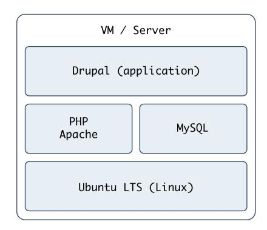
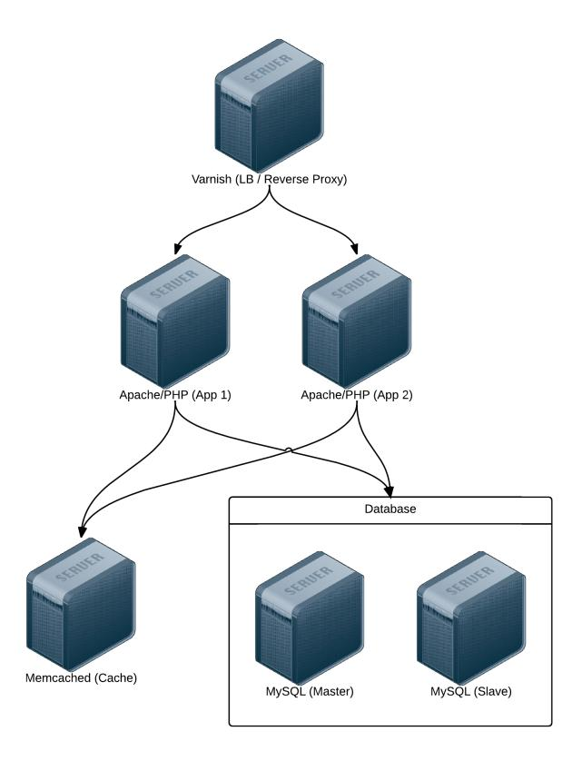
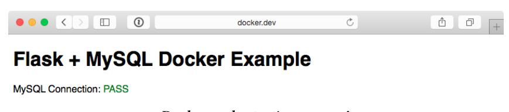

# Ansible for DevOps

Server and configuration management for humans

Jeff Geerling

## Ansible for DevOps

## Server and configuration management for humans

## Jeff Geerling

This boo[k is availa](https://leanpub.com/)ble at [https://lean](https://leanpub.com/manifesto)pub.com/ansible-for-devops

This version was published on 2025-05-25

ISBN 978-0-9863934-3-3


This is a Leanpub book. Leanpub empowers authors and publishers with the Lean Publishing process. Lean Publishing is the act of publishing an in-progress ebook using lightweight tools and many iterations to get reader feedback, pivot until you have the right book and build traction once you do.


This work is licensed under a Creative Commons Attribution-ShareAlike 4.0 International License

## Tweet This Book!

[Please h](https://twitter.com/search?q=%23ansible)elp Jeff Geerling by spreading the word about this book on Twitter!

The suggested tweet for this book is:

I just purchased @Ansible4DevOps by @geerlingguy on @leanpub https://leanpub.com/ansible-for-devops #ansible

The suggested hashtag for this book is #ansible.

Find out what other people are saying about the book by clicking on this link to search for this hashtag on Twitter:

#ansible

## Also By Jeff Geerling

Kubernetes 101 You Only Have Crohn's Once! Ansible for Kubernetes

*This book is dedicated to my wife, Natalie, and my children.*

*Editing by Margie Newman and Katherine Geerling.*

*Cover photograph and illustration © 2011 Jeff Geerling.*

*Ansible is a software product distributed under the GNU GPLv3 open source license.*

## Contents

| Foreword                                                             | ii  |
|----------------------------------------------------------------------|-----|
| Preface                                                              | iii |
| Second Edition                                                       | iv  |
| Who is this book for?                                                | iv  |
| Typographic conventions                                              | iv  |
| Please help improve this book!                                       | v   |
| Current Published Book Version Information                           | v   |
| About the Author                                                     | v   |
| Introduction                                                         | vi  |
| In the beginning, there were sysadmins                               | vi  |
| Modern infrastructure management                                     | vi  |
| Ansible and Red Hat                                                  | vii |
| Ansible Examples                                                     | x   |
| Other resources                                                      | x   |
| Chapter 1 - Getting Started with Ansible                             | 1   |
| Ansible and Infrastructure Management                                | 1   |
| On snowflakes and shell scripts                                      | 1   |
| Configuration management                                             | 2   |
| Installing Ansible                                                   | 3   |
| Fedora/Red Hat Enterprise Linux                                      | 4   |
| Debian/Ubuntu                                                        | 4   |
| Creating a basic inventory file                                      | 5   |
| Running your first Ad-Hoc Ansible command                            | 7   |
| Summary                                                              | 8   |
|                                                                      |     |
| Chapter 3 - Ad-Hoc Commands<br>                                      |     |
|                                                                      |     |
|                                                                      |     |
|                                                                      |     |
|                                                                      |     |
|                                                                      |     |
|                                                                      |     |
|                                                                      |     |
|                                                                      |     |
|                                                                      |     |
|                                                                      |     |
|                                                                      |     |
|                                                                      |     |
|                                                                      |     |
|                                                                      |     |
|                                                                      |     |
|                                                                      |     |
|                                                                      |     |
|                                                                      |     |
|                                                                      |     |
|                                                                      |     |
|                                                                      |     |
|                                                                      |     |
|                                                                      |     |
|                                                                      |     |
|                                                                      |     |
|                                                                      |     |
|                                                                      |     |
|                                                                      |     |
|                                                                      |     |
|                                                                      |     |
|                                                                      |     |
|                                                                      |     |
|                                                                      |     |
|                                                                      |     |
|                                                                      |     |
|                                                                      |     |
|                                                                      |     |
|                                                                      |     |
|                                                                      |     |
|                                                                      |     |
|                                                                      |     |
|                                                                      |     |
|                                                                      |     |
|                                                                      |     |
|                                                                      |     |
|                                                                      |     |
|                                                                      |     |
|                                                                      |     |
|                                                                      |     |
|                                                                      |     |
|                                                                      |     |
|                                                                      |     |
|                                                                      |     |
|                                                                      |     |
|                                                                      |     |
|                                                                      |     |
|                                                                      |     |
|                                                                      |     |
|                                                                      |     |
|                                                                      |     |
|                                                                      |     |
| Chapter 5 - Ansible Playbooks - Beyond the Basics<br>                |     |
|                                                                      |     |
|                                                                      |     |
|                                                                      |     |
|                                                                      |     |
|                                                                      |     |
| Playbook Variables                                                   | 90  |
| Inventory variables                                                  | 92  |
| Registered Variables                                                 | 94  |
| Accessing Variables                                                  | 94  |
| Host and Group variables                                             | 97  |
| Automatically-loaded group_vars and host_vars                        | 97  |
| Magic variables with host and group variables and information        | 98  |
| Facts (Variables derived from system information)                    | 99  |
| Local Facts (Facts.d)                                                | 101 |
| Ansible Vault - Keeping secrets secret                               | 102 |
| Variable Precedence                                                  | 106 |
| If/then/when - Conditionals                                          | 108 |
| Jinja Expressions, Python built-ins, and Logic                       | 108 |
| register                                                             | 110 |
| when                                                                 | 111 |
| changed_when and failed_when                                         | 112 |
| ignore_errors.                                                       | 114 |
| Delegation, Local Actions, and Pauses                                | 114 |
| Pausing playbook execution with wait_for                             | 115 |
| Running an entire playbook locally                                   | 116 |
| Prompts                                                              | 116 |
| Tags                                                                 | 118 |
| Blocks.                                                              | 119 |
| Summary                                                              | 121 |
| Chapter 6 - Playbook Organization - Roles, Includes, and Imports     | 123 |
| Imports                                                              | 123 |
| Includes                                                             | 126 |
| Dynamic includes                                                     | 127 |
| Handler imports and includes                                         | 127 |
| Playbook imports                                                     | 128 |
| Complete includes example.                                           | 128 |
| Roles                                                                | 131 |
| Role scaffolding                                                     | 132 |
| Building your first role.                                            | 133 |
| More flexibility with role vars and defaults                         | 135 |
| Other role parts: handlers, files, and templates                     | 137 |
| Handlers                                                             | 137 |
| Files and Templates                                                  | 138 |
| Organizing more complex and cross-platform roles                     | 139 |
| Ansible Galaxy                                                       | 141 |
| Getting roles from Galaxy                                            | 142 |
| Using role requirements files to manage dependencies                 | 143 |
| A LAMP server in nine lines of YAML                                  | 144 |
| A Solr server in seven lines of YAML                                 | 145 |
| Helpful Galaxy commands                                              | 146 |
| Contributing to Ansible Galaxy                                       | 147 |
| Summary.                                                             | 147 |
| Chapter 7 - Ansible Plugins and Content Collections                  | 148 |
| Creating our first Ansible Plugin — A Jinja Filter                   | 148 |
| The history of Ansible Content Collections                           | 153 |
| The Anatomy of a Collection                                          | 155 |
| Putting our Plugin into a Collection                                 | 157 |
| Going deeper developing collections                                  | 158 |
| Collections on Automation Hub and Ansible Galaxy                     | 159 |
| Collection version constraints                                       | 160 |
| Where are collections installed?                                     | 160 |
| Summary                                                              | 162 |
| Chapter 8 - Inventories                                              | 163 |
| A real-world web application server inventory                        | 164 |
| Non-prod environments, separate inventory files                      | 168 |
| Inventory variables                                                  | 169 |
| host_vars                                                            | 170 |
| group_vars                                                           | 172 |
| Ephemeral infrastructure: Dynamic inventory                          | 173 |
| Dynamic inventory with DigitalOcean                                  | 174 |
| DigitalOcean account prerequisites                                   | 174 |
| Connecting to your DigitalOcean account                              | 174 |
| Creating a droplet with Ansible                                      | 175 |
| DigitalOcean dynamic inventory with digitalocean.py                  | 182 |
| Dynamic inventory with AWS                                           | 183 |
| Inventory on-the-fly: add_host and group_by                          | 183 |
| Multiple inventory sources - mixing static and dynamic inventories   | 185 |
| Creating custom dynamic inventories                                  | 185 |
| Building a Custom Dynamic Inventory in Python                        | 187 |
| Building a Custom Dynamic Inventory in PHP                           | 192 |
| Managing a PaaS with a Custom Dynamic Inventory                      | 195 |
| Summary                                                              | 196 |
| Chapter 9 - Ansible Cookbooks                                        | 197 |
| Highly-Available Infrastructure with Ansible                         | 197 |
| Directory Structure                                                  | 199 |
| Individual Server Playbooks                                          | 199 |
| Main Playbook for Configuring All Servers                            | 212 |
| Getting the required roles                                           | 212 |
| Vagrantfile for Local Infrastructure via VirtualBox                  | 213 |
| Provisioner Configuration: DigitalOcean                              | 218 |
| Provisioner Configuration: Amazon Web Services (EC2)                 | 223 |
| AWS EC2 Dynamic inventory plugin                                     | 230 |
| Summary                                                              | 232 |
| ELK Logging with Ansible                                             | 233 |
| ELK Playbook                                                         | 234 |
| Forwarding Logs from Other Servers                                   | 240 |
| Summary                                                              | 246 |
| GlusterFS Distributed File System Configuration with Ansible         | 247 |
| Configuring Gluster - Basic Overview                                 | 248 |
| Configuring Gluster with Ansible                                     | 249 |
| Summary                                                              | 256 |
| Mac Provisioning with Ansible and Homebrew                           | 256 |
| Running Ansible playbooks locally                                    | 257 |
| Automating Homebrew package and app management                       | 257 |
| Configuring macOS through dotfiles                                   | 259 |
| Summary                                                              | 261 |
| Chapter 10 - Deployments with Ansible                                | 262 |
| Deployment strategies                                                | 262 |
|                                                                      |     |
|                                                                      |     |
|                                                                      |     |
|                                                                      |     |
|                                                                      |     |
|                                                                      |     |
| Chapter 11 - Server Security and Ansible<br>                         |     |
|                                                                      |     |
|                                                                      |     |
|                                                                      |     |
|                                                                      |     |
|                                                                      |     |
|                                                                      |     |
|                                                                      |     |
|                                                                      |     |
|                                                                      |     |
|                                                                      |     |
|                                                                      |     |
|                                                                      |     |
|                                                                      |     |
|                                                                      |     |
|                                                                      |     |
|                                                                      |     |
|                                                                      |     |
|                                                                      |     |
|                                                                      |     |
|                                                                      |     |
| Configuring a firewall with<br>on Fedora, RHEL and RHEL<br>firewalld |     |
|                                                                      |     |
|                                                                      |     |
|                                                                      |     |
|                                                                      |     |
|                                                                      |     |
|                                                                      |     |
|                                                                      |     |
| Chapter 12 - Automating Your Automation with Ansible Tower and CI/CD | 326 |
| Installing Ansible AWX                                               | 327 |
| Using AWX                                                            | 329 |
| Uninstalling AWX                                                     | 332 |
| Other Tower Features of Note                                         | 332 |
| Tower Alternatives                                                   | 333 |
| Jenkins CI                                                           | 333 |
| Build a local Jenkins server with Ansible                            | 333 |
| Create an Ansible playbook on the Jenkins server                     | 336 |
| Create a Jenkins job to run an Ansible Playbook                      | 337 |
| Summary                                                              | 338 |
| Chapter 13 - Testing and CI for Ansible Content                      | 340 |
| Unit, Integration, and Functional Testing                            | 340 |
| Debugging and Asserting                                              | 342 |
| The debug module                                                     | 342 |
| The fail and assert modules                                          | 344 |
| Linting YAML with yamllint                                           | 345 |
| Performing a --syntax-check                                          | 347 |
| Linting Ansible content with ansible-lint                            | 348 |
| Automated testing and development with Molecule                      | 350 |
| Testing a role with Molecule                                         | 351 |
| Testing a playbook with Molecule                                     | 354 |
| Adjusting Molecule to use more flexible test containers              | 358 |
| Verifying a playbook with Molecule                                   | 360 |
| Adding lint configuration to Molecule                                | 361 |
| Molecule Summary                                                     | 361 |
| Running your playbook in check mode                                  | 362 |
| Automated testing on GitHub using GitHub Actions                     | 363 |
| Automated testing in other CI environments                           | 368 |
| Real-world examples                                                  | 368 |
| Functional testing using serverspec or testinfra                     | 368 |
| Summary                                                              | 369 |
| Chapter 14 - Automating HTTPS and TLS Certificates                   | 371 |
| Generating Self-Signed Certificates with Ansible                     | 371 |
| Idempotent Nginx HTTPS playbook with a self-signed cert              | 373 |
| Automating Let's Encrypt with Ansible for free Certs                 | 380 |
| Use Galaxy roles to get things done faster                           | 381 |
| Create the playbook                                                  | 382 |
| Create a server and configure DNS                                    | 388 |
| Point the playbook inventory at the server                           | 388 |
| Access your server over HTTPS!                                       | 389 |
| Configuring Nginx to proxy HTTP traffic and serve it over HTTPS      | 390 |
| Modify the Nginx configuration to proxy traffic                      | 391 |
| Summary                                                              | 394 |
| Chapter 15 - Docker and Ansible                                      | 395 |
| A brief introduction to Docker containers                            | 395 |
| Using Ansible to build and manage containers                         | 397 |
| Building a Flask app with Ansible and Docker                         | 399 |
| Data storage container                                               | 406 |
| Flask container                                                      | 406 |
| MySQL container                                                      | 411 |
| Ship it!                                                             | 412 |
| Building containers with Ansible from the outside                    | 413 |
| Build a Hubot Slack bot container with ansible_connection: docker    | 413 |
| Hubot and Slack                                                      | 414 |
| Building a Docker container with Ansible                             | 414 |
| Building the hubot-slack role                                        | 417 |
| Building and running the Hubot Slack bot container                   | 419 |
| Summary                                                              | 420 |
| Summary                                                              | 421 |
| Afterword                                                            | 422 |
| Appendix A - Using Ansible on Windows workstations                   | 423 |
| Method 1 - Use the Windows Subsystem for Linux                       | 423 |
| Installing Ansible inside WSL                                        | 424 |
| Method 2 - When WSL is not an option                                 | 426 |
| Prerequisites                                                        | 426 |
| Set up an Ubuntu Linux Virtual Machine                               | 426 |
| Log into the Virtual Machine                                         | 427 |
| Install Ansible                                                      | 429 |
| Summary                                                              | 430 |
| Appendix B - Ansible Best Practices and Conventions                  | 431 |
| Playbook Organization                                                | 431 |
| Write comments and use name liberally                                | 431 |
| Include related variables and tasks                                  | 432 |
| Use Roles to bundle logical groupings of configuration               | 433 |
| Use role defaults and vars correctly                                 | 434 |
| YAML Conventions and Best Practices                                  | 435 |
| YAML for Ansible tasks                                               | 436 |
| Three ways to format Ansible tasks                                   | 437 |
| Shorthand/one-line (key=value)                                       | 437 |
| Structured map/multi-line (key:value)                                | 438 |
| Folded scalars/multi-line (>)                                        | 439 |
| Using   to format multiline variables                                | 440 |
| Using ansible-playbook                                               | 440 |
| Use Ansible Tower                                                    | 441 |
| Install Galaxy dependencies local to your playbook                   | 441 |
| Discriminate wisely when choosing community dependencies             | 442 |
| Specify forks for playbooks running on > 5 servers                   | 443 |
| Use Ansible's Configuration file                                     | 443 |
| Summary                                                              | 444 |
|                                                                      |     |

# Foreword

Over the last few years, Ansible has rapidly become one of the most popular IT automation tools in the world. We've seen the open source community expand from the beginning of the project in early 2012 to over 1200 individual contributors today. Ansible's modular architecture and broad applicability to a variety of automation and orchestration problems created a perfect storm for hundreds of thousands of users worldwide.

Ansible is a general purpose IT automation platform, and it can be used for a variety of purposes. From configuration management: enforcing declared state across your infrastructure, to procedural application deployment, to broad multi-component and multi-system orchestration of complicated interconnected systems. It is agentless, so it can coexist with legacy tools, and it's easy to install, configure, and maintain.

Ansible had its beginnings in 2012, when Michael DeHaan, the project's founder, took inspiration from several tools he had written prior, along with some hands-on experience with the state of configuration management at the time, and launched the project in February of 2012. Some of Ansible's unique attributes like its module-based architecture and agentless approach quickly attracted attention in the open source world.

In 2013, Said Ziouani, Michael DeHaan, and I launched Ansible, Inc. We wanted to harness the growing adoption of Ansible in the open source world, and create products to fill the gaps in the IT automation space as we saw them. The existing tools were complicated, error-prone, and hard to learn. Ansible gave users across an IT organization a low barrier of entry into automation, and it could be deployed incrementally, solving as few or as many problems as the team needed without a big shift in methodology.

This book is about using Ansible in a DevOps environment. I'm not going to try to define what DevOps is or isn't, or who's doing it or not. My personal interpretation of the idea is that DevOps is meant to shorten the distance between the developers writing the code, and the operators running the application. Now, I don't believe Foreword ii

adding a new "DevOps" team in between existing development and operations teams achieves that objective! (Oops, now I'm trying for a definition, aren't I?)

Well, definitions aside, one of the first steps towards a DevOps environment is choosing tools that can be consumed by both developers and operations engineers. Ansible is one of those tools: you don't have to be a software developer to use it, and the playbooks that you write can easily be self-documenting. There have been a lot of attempts at "write once, run anywhere" models of application development and deployment, but I think Ansible comes the closest to providing a common language that's useful across teams and across clouds and different datacenters.

The author of this book, Jeff, has been a long-time supporter, contributor, and advocate of Ansible, and he's maintained a massive collection of impressive Ansible roles in Galaxy, the public role-sharing service maintained by Ansible, Inc. Jeff has used Ansible extensively in his professional career, and is eminently qualified to write the end-to-end book on Ansible in a DevOps environment.

As you read this book, I hope you enjoy your journey into IT automation as much as we have. Be well, do good work, and automate everything.

Tim Gerla Ansible, Inc. Co-Founder & CTO

# Preface

Growing up, I had access to a world that not many kids ever get to enter. At the local radio stations where my dad was chief engineer, I was fortunate to see networks and IT infrastructure up close: Novell servers and old Mac and Windows workstations in the '90s; Microsoft and Linux-based servers; and everything in between. Best of all, he brought home decommissioned servers and copies of Linux burned to CD.

I began working with Linux and small-scale infrastructures before I started high school, and my passion for infrastructure grew as I built a Cat5 wired network and a small rack of networking equipment for a local grade school. When I started developing full-time, what was once a hobby became a necessary part of my job, so I invested more time in managing infrastructure efficiently. Over the past ten years, I've gone from manually booting and configuring physical and virtual servers; to using relatively complex shell scripts to provision and configure servers; to using configuration management tools to manage thousands of cloud servers.

When I began converting my infrastructure to code, some of the best tools for testing, provisioning, and managing my servers were still in their infancy, but they have since matured into fully-featured, robust tools that I use every day. Vagrant is an excellent tool for managing local virtual machines to mimic real-world infrastructure locally (or in the cloud), and Ansible — the subject of this book — is an excellent tool for provisioning servers, managing their configuration, and deploying applications, even on my local workstation!

These tools are still improving, and I'm excited for what the future holds. The time I invest in learning new infrastructure tools well will be helpful for years to come.

In these pages, I'll share with you all I've learned about Ansible: my favorite tool for server provisioning, configuration management, and application deployment. I hope you enjoy reading this book as much as I did writing it!

— Jeff Geerling, 2015

Preface iv

## Second Edition

I've published 23 major revisions to the book since the original 1.0 release in 2015. After major rewrites (and three new chapters) in 2019 and 2020 to reflect Ansible's changing architecture, I decided to publish the new content as a '2nd edition'.

I will continue to publish revisions in the future, to keep this book relevant for as long as possible! Please visit the book's website, at www.ansiblefordevops.com, for the latest updates, or to subscribe to be notified of Ansible and book news!

— Jeff Geerling, 2020

<span id="page-18-0"></span>

## Who is this book for?

Many of the developers and sysadmins I work with are at least moderately comfortable administering a Linux server via SSH, and manage between 1-100 servers, whether bare metal, virtualized, or using containers.

Some of these people have a little experience with configuration management tools (usually with Puppet or Chef), and maybe a little experience with deployments and continuous integration using tools like Jenkins, Capistrano, or Fabric. I am writing this book for these friends who, I think, are representative of most people who have heard of and/or are beginning to use Ansible.

If you are interested in both development and operations, and have at least a passing familiarity with managing a server via the command line, this book should provide you with an intermediate- to expert-level understanding of Ansible and how you can use it to manage your infrastructure.

<span id="page-18-1"></span>

## Typographic conventions

Ansible uses a simple syntax (YAML) and simple command-line tools (using common POSIX conventions) for all its powerful abilities. Code samples and commands will be highlighted throughout the book either inline (for example: ansible [command]), or in a code block (with or without line numbers) like:

Preface v

```
1 ---
2 # This is the beginning of a YAML file.
```

Some lines of YAML and other code examples require more than 70 characters per line, resulting in the code wrapping to a new line. Wrapping code is indicated by a \ [at the e](https://www.ansible.com/)[n](#page-19-0)d of the line of code. For example:

```
1 # The line of code wraps due to the extremely long URL.
```

- 2 wget http://www.example.com/really/really/really/long/path/in/the/url/c\
- 3 auses/the/line/to/wrap

When using the code, don't copy the \ character, and make sure you don't use a newline between the first line with the trailing \ and the next line.

Links to pertinent resources and websites are added inline, like the following link to Ansible¹, and can be viewed directly by clicking on them in eBook formats, or by following the URL in the footnotes.

Sometimes, asides are added to highlight further information about a specific topic:


Informational asides will provide extra information.


Warning asides will warn about common pitfalls and how to avoid them.

<span id="page-19-0"></span>

Tip asides will give tips for deepening your understanding or optimizing your use of Ansible.

When displaying commands run in a terminal session, if the commands are run under your normal/non-root user account, the commands will be prefixed by the dollar sign (\$). If the commands are run as the root user, they will be prefixed with the pound sign (#).

¹https://www.ansible.com/

<span id="page-20-0"></span>Preface Vi

## Please help improve this book!

New revisions of this book are published on a regular basis (see current book publication stats below). If you think a particular section needs improvement or find something missing, please post an issue in the Ansible for DevOps issue queue<sup>2</sup> (on GitHub) or contact me via Twitter (@geerlingguy<sup>3</sup>).

All known issues with Ansible for DevOps will be aggregated on the book's online Errata<sup>4</sup> page.

#### **Current Published Book Version Information**

- Current book version: 2.3
- Current Ansible version as of last publication: 11.6.0 (core 2.18.6)
- Current Date as of last publication: May 25, 2025

#### **About the Author**

Jeff Geerling is a developer who has worked in programming and reliability engineering for companies with anywhere between one to thousands of servers. He also manages many virtual servers for services offered by Midwestern Mac, LLC and has been using Ansible to manage infrastructure since early 2013.

<sup>&</sup>lt;sup>2</sup>https://github.com/geerlingguy/ansible-for-devops/issues

<sup>&</sup>lt;sup>3</sup>https://twitter.com/geerlingguy

<sup>4</sup>https://www.ansiblefordevops.com/errata

<span id="page-21-0"></span>

# Introduction

<span id="page-21-1"></span>

## In the beginning, there were sysadmins

Since the beginning of networked computing, deploying and managing servers reliably and efficiently has been a challenge. Historically, system administrators were walled off from the developers and users who interact with the systems they administer, and they managed servers by hand, installing software, changing configurations, and administering services on individual servers.

As data centers grew, and hosted applications became more complex, administrators realized they couldn't scale their manual systems management as fast as the applications they were enabling. That's why server provisioning and configuration management tools came to flourish.

Server virtualization brought large-scale infrastructure management to the fore, and the number of servers managed by one admin (or by a small team of admins), has grown by an order of magnitude. Instead of deploying, patching, and destroying every server by hand, admins now are expected to bring up new servers, either automatically or with minimal intervention. Large-scale IT deployments now may involve hundreds or thousands of servers; in many of the largest environments, server provisioning, configuration, and decommissioning are fully automated.

<span id="page-21-2"></span>

## Modern infrastructure management

As the systems that run applications become an ever more complex and integral part of the software they run, application developers themselves have begun to integrate their work more fully with operations personnel. In many companies, development and operations work is integrated. Indeed, this integration is a requirement for modern test-driven application design.

As a software developer by trade, and a sysadmin by necessity, I have seen the power in uniting development and operations—more commonly referred to now as DevOps Introduction Viii

or Site Reliability Engineering. When developers begin to think of infrastructure as *part of their application*, stability and performance become normative. When sysadmins (most of whom have intermediate to advanced knowledge of the applications and languages being used on servers they manage) work tightly with developers, development velocity is improved, and more time is spent doing 'fun' activities like performance tuning, experimentation, and getting things done, and less time putting out fires.

<span id="page-22-0"></span>

DevOps is a loaded word; some people argue using the word to identify both the *movement* of development and operations working more closely to automate infrastructure-related processes, and the *personnel* who skew slightly more towards the system administration side of the equation, dilutes the word's meaning. I think the word has come to be a rallying cry for the employees who are dragging their startups, small businesses, and enterprises into a new era of infrastructure growth and stability. I'm not too concerned that the term has become more of a catch-all for modern infrastructure management. My advice: spend less time arguing over the definition of the word, and more time making it mean something *to you*.

#### **Ansible and Red Hat**

<span id="page-22-2"></span><span id="page-22-1"></span>Ansible was released in 2012 by Michael DeHaan (@laserllama<sup>5</sup> on Twitter), a developer who has been working with configuration management and infrastructure orchestration in one form or another for many years. Through his work with Puppet Labs and Red Hat (where he worked on Cobbler<sup>6</sup>, a configuration management tool, Func, a tool for communicating commands to remote servers, and some other projects<sup>7</sup>), he experienced the trials and tribulations of many different organizations and individual sysadmins on their quest to simplify and automate their infrastructure management operations.

Additionally, Michael found many shops were using separate tools<sup>8</sup> for configuration management (Puppet, Chef, cfengine), server deployment (Capistrano, Fabric), and

<sup>&</sup>lt;sup>5</sup>https://twitter.com/laserllama

<sup>6</sup>https://cobbler.github.io/

Thttps://web.archive.org/web/20240223204426/https://www.ansible.com/blog/2013/12/08/the-origins-of-ansible#expand

<sup>8</sup>https://highscalability.com/ansible-a-simple-model-driven-configuration-management-and-c/

Introduction ix

ad-hoc task execution (Func, plain SSH), and wanted to see if there was a better way. Ansible wraps up all three of these features into one tool, and does it in a way that's actually *simpler* and more consistent than any of the other task-specific tools!

#### Ansible aims to be:

- 1. **Clear** Ansible uses a simple syntax (YAML) and is easy for anyone (developers, sysadmins, managers) to understand. APIs are simple and sensible.
- 2. **Fast** Fast to learn, fast to set up—especially considering you don't need to install extra agents or daemons on all your servers!
- 3. **Complete** Ansible does three things in one, and does them very well. Ansible's 'batteries included' approach means you have everything you need in one complete package.
- 4. **Efficient** No extra software on your servers means more resources for your applications. Also, since Ansible modules work via JSON, Ansible is extensible [with m](https://www.ansible.com/)[o](#page-23-0)dules written in a programming language you already know.
- 5. **Secure** Ansible uses SSH, and requires no extra open ports or potentiallyvulnerable daemon[s on your servers.](https://www.redhat.com/en/technologies/management/ansible)

Ansible also has a lighter side that gives the project a little personality. As an example, Ansible's major releases used to be named after Led Zeppelin songs (e.g. 2.0 was named after 1973's "Over the Hills and Far Away", 1.x releases were named after Van Halen songs). Additionally, Ansible uses cowsay, if installed, to wrap output in an ASCII cow's speech bubble (this behavior can be disabled in Ansible's configuration).

<span id="page-23-0"></span>An[sible, Inc.⁹](https://www.ansible.com/) [was founded by Saïd Ziouani, Mi](https://www.redhat.com/en/technologies/management/ansible)chael DeHaan, and Tim Gerla, and acquired by Red Hat in 2015. The Ansible team oversees core Ansible development and development of the Red Hat Ansible Automation Platform¹⁰ for organizations using Ansible. Hundreds of individual developers have contributed patches to Ansible, and Ansible is the most starred infrastructure management tool on GitHub (with over 64,000 stars as of this writing).

In October 2015, Red Hat acquired Ansible, Inc., and has proven itself to be a good steward and promoter of Ansible. I see no indication of this changing in the future.

⁹https://www.ansible.com/

¹⁰https://www.redhat.com/en/technologies/management/ansible

<span id="page-24-0"></span>Introduction X

<span id="page-24-1"></span>

## Ansible Examples

There are many Ansible examples (playbooks, roles, infrastructure, configuration, etc.) throughout this book. Most of the examples are in the Ansible for DevOps GitHub repository<sup>11</sup>, so you can browse the code in its final state while you're reading the book. Some of the line numbering may not match the book *exactly* (especially if you're reading an older version of the book!), but I will try my best to keep everything synchronized over time.

#### Other resources

We'll explore all aspects of using Ansible to provision and manage your infrastructure in this book, but there's no substitute for the wealth of documentation and community interaction that make Ansible great. Check out the links below to find out more about Ansible and discover the community:

- Ansible Documentation<sup>12</sup> Covers all Ansible options in depth. There are few open source projects with documentation as clear and thorough.
- Ansible Glossary<sup>13</sup> If there's ever a term in this book you don't seem to fully understand, check the glossary.
- The Bullhorn<sup>14</sup> Ansible's official newsletter.
- <span id="page-24-3"></span><span id="page-24-2"></span>• Ansible Mailing List<sup>15</sup> - Discuss Ansible and submit questions with Ansible's community via this Google group.
- <span id="page-24-6"></span><span id="page-24-5"></span><span id="page-24-4"></span>• Ansible on GitHub¹⁶ - The official Ansible code repository, where the magic happens.
- <span id="page-24-7"></span>• Ansible Example Playbooks on GitHub<sup>17</sup> - Many examples for common server configurations.
- Getting Started with Ansible¹8 A simple guide to Ansible's community and resources

<sup>11</sup>https://github.com/geerlingguy/ansible-for-devops

<sup>12</sup>https://docs.ansible.com/ansible/

 $<sup>^{13}</sup> https://docs.ansible.com/ansible/latest/reference\_appendices/glossary.html$ 

 $<sup>^{14}</sup> https://us19.campaign-archive.com/home/?u=56d874e027110e35dea0e03c1\&id=d6635f5420e10e10e10e10e10e10e10e10e10e10e10e10e10$ 

<sup>15</sup>https://groups.google.com/forum/#!forum/ansible-project

<sup>16</sup>https://github.com/ansible/ansible

<sup>17</sup>https://github.com/ansible/ansible-examples

<sup>18</sup>https://www.ansible.com/resources/get-started

Introduction xi

#### • Ansible Blog¹⁹

I'd like to especially highlight Ansible's documentation (the first resource listed above); one of Ansible's greatest strengths is its well-written and extremely relevant documentation, containing a large number of relevant examples and continuouslyupdated guides. Very few projects—open source or not—have documentation as thorough, yet easy-to-read. This book is meant as a supplement to, not a replacement for, Ansible's documentation!

¹⁹https://www.ansible.com/blog

<span id="page-26-0"></span>

# Chapter 1 - Getting Started with Ansible

<span id="page-26-1"></span>

## Ansible and Infrastructure Management

<span id="page-26-2"></span>

## On snowflakes and shell scripts

Many developers and system administrators manage servers by logging into them via SSH, making changes, and logging off. Some of these changes would be documented, some would not. If an admin needed to make the same change to many servers (for example, changing one value in a config file), the admin would manually log into *each* server and repeatedly make this change.

If there were only one or two changes in the course of a server's lifetime, and if the server were extremely simple (running only one process, with one configuration, and a very simple firewall), *and* if every change were thoroughly documented, this process wouldn't be a problem.

But for almost every company in existence, servers are more complex—most run tens, sometimes hundreds of different applications or application containers. Most servers have complicated firewalls and dozens of tweaked configuration files. And even with change documentation, the manual process usually results in some servers or some steps being forgotten.

If the admins at these companies wanted to set up a new server *exactly* like one that is currently running, they would need to spend a good deal of time going through all of the installed packages, documenting configurations, versions, and settings; and they would spend a lot of unnecessary time manually reinstalling, updating, and tweaking everything to get the new server to run close to how the old server did.

Some admins may use shell scripts to try to reach some level of sanity, but I've yet to see a complex shell script that handles all edge cases correctly while synchronizing multiple servers' configuration and deploying new code.

#### <span id="page-27-0"></span>**Configuration management**

Lucky for you, there are tools to help you avoid having these *snowflake servers*—servers that are uniquely configured and impossible to recreate from scratch because they were hand-configured without documentation. Tools like CFEngine<sup>20</sup>, Puppet<sup>21</sup> and Chef<sup>22</sup> became very popular in the mid-to-late 2000s.

But there's a reason why many developers and sysadmins stick to shell scripting and command-line configuration: it's simple and easy-to-use, and they've had years of experience using bash and command-line tools. Why throw all that out the window and learn a new configuration language and methodology?

Enter Ansible. Ansible was built (and continues to be improved) by developers and sysadmins who know the command line—and want to make a tool that helps them manage their servers exactly the same as they have in the past, but in a repeatable and centrally managed way. Ansible also has other tricks up its sleeve, making it a true Swiss Army knife for people involved in DevOps (not just the operations side).

One of Ansible's greatest strengths is its ability to run regular shell commands verbatim, so you can take existing scripts and commands and work on converting them into idempotent playbooks as time allows. For someone (like me) who was comfortable with the command line, but never became proficient in more complicated tools like Puppet or Chef (which both required at least a *slight* understanding of Ruby and/or a custom language just to get started), Ansible was a breath of fresh air.

Ansible works by pushing changes out to all your servers (by default), and requires no extra software to be installed on your servers (thus no extra memory footprint, and no extra daemon to manage), unlike most other configuration management tools.

<sup>&</sup>lt;sup>20</sup>http://cfengine.com/

<sup>&</sup>lt;sup>21</sup>http://puppetlabs.com/

<sup>&</sup>lt;sup>22</sup>http://www.getchef.com/chef/


**Idempotence** is the ability to run an operation which produces the same result whether run once or multiple times (source²³).

<span id="page-28-0"></span>An important feature of a configuration management tool is its ability to ensure the same configuration is maintained whether you run it once or a thousand times. Many shell scripts have unintended consequences if run more than once, but Ansible deploys the same configuration to a server over and over again without making any changes after the first deployment.

In fact, almost every aspect of Ansible modules and commands is idempotent, and for those that aren't, Ansible allows you to define when the given command should be run, and what constitutes a changed or failed command, so you can easily maintain an idempotent configuration on all your servers.

## **Installing Ansible**

Ansible's only real dependency is Python. Once Python is installed, the simplest way to get Ansible running is to use pip, a simple package manager for Python.

**If you're on a Mac**, installing Ansible is a piece of cake:

- 1. [Check if](#page-448-0) pip is installed (which pip). If not, install it: sudo easy\_install pip
- 2. Install Ansible: pip install ansible

You could also install Ansible via Homebrew²⁴ with brew install ansible. Either way ([pip](http://brew.sh/) or brew[\) is fine, but make sure you update A](http://en.wikipedia.org/wiki/Idempotence#Computer_science_meaning)nsible using the same system with which it was installed!

**If you're running Windows**, it will take a little extra work to set everything up. Typically, people run Ansible inside the Windows Subsystem for Linux. For detailed instructions setting up Ansible under the WSL, see Appendix A - Using Ansible on Windows workstations.

**If you're running Linux**, chances are you already have Ansible's dependencies installed, but we'll cover the most common installation methods.

²³http://en.wikipedia.org/wiki/Idempotence#Computer\_science\_meaning

²⁴http://brew.sh/

<span id="page-29-0"></span>If you have python-pip and python-devel (python-dev on Debian/Ubuntu) installed, use pip to install Ansible (this assumes you also have the 'Development Tools' package installed, so you have gcc, make, etc. available):

```
$ pip install ansible
```

Using pip allows you to upgrade Ansible with pip install --upgrade ansible.

#### **Fedor[a/Red Hat](https://fedoraproject.org/wiki/EPEL) [E](#page-29-2)nterprise Linux**

The easiest way to install Ansible on an RPM-based OS is to use the official dnf package. If you're running Red Hat Enterprise Linux (RHEL) or CentOS/Rocky/Alma Linux, you need to install EPEL's RPM before you install Ansible (see the info section below for instructions):

```
$ dnf -y install ansible
```


On RPM-based systems, python-pip and ansible are available via the EPEL repository²⁵. If you run the command dnf repolist | grep epel (to see if the EPEL repo is already available) and there are no results, you need to install it with the following commands:

```
# If you're on RHEL/CentOS 6:
$ rpm -ivh http://dl.fedoraproject.org/pub/epel/6/x86_64/\
epel-release-6-8.noarch.rpm
# If you're on RHEL/CentOS 7:
$ yum install epel-release
# If you're on RHEL 8+/Fedora:
$ dnf install epel-release
```

## **Debian/Ubuntu**

The easiest way to install Ansible on a Debian or Ubuntu system is to use the official apt package.

²⁵https://fedoraproject.org/wiki/EPEL

```
$ sudo apt-add-repository -y ppa:ansible/ansible
$ sudo apt-get update
$ sudo apt-get install -y ansible
```


If you get an error like "sudo: add-apt-repository: command not found", you're probably missing the software-properties-common package. Install it with the command:

**Once**

\$ sudo apt-get install software-properties-common

**Ansible is installed**, make sure it's working properly by entering ansible --version on the command line. You should see the currently-installed version information:

```
$ ansible --version
ansible [core 2.14.6]
  ...
  python version = 3.10.11
  jinja version = 3.1.2
  libyaml = True
```


**What about Python 3?** If you have both Python 2 and Python 3 installed, and pip is aliased to an older Python 2 version of pip, you should consider installing Python 3 and pip3, and using that version instead. Ansible is fully compatible with Python 3, and unless you're running on a very old system that doesn't have Python 3 available for it, you should use Python 3.

## <span id="page-30-1"></span><span id="page-30-0"></span>**Creating a basic inventory file**

Ansible uses an inventory file (basically, a list of servers) to communicate with your servers. Like a hosts file (at /etc/hosts) that matches IP addresses to domain names, an Ansible inventory file matches servers (IP addresses or domain names) to groups. Inventory files can do a lot more, but for now, we'll just create a simple file with one server. Create a file named hosts.ini in a test project folder:

- \$ mkdir test-project
- \$ cd test-project
- \$ touch hosts.ini


Inventory file names do not have to follow any particular naming convention. I often use the file name hosts.ini for Ansible's default 'ini-style' syntax, but I also sometimes call the file inventory (with no file extension).

Edit this hosts file with nano, vim, or whatever editor you'd like. Put the following into the file:

- 1 [example]
- 2 www.example.com

…where example is the group of servers you're managing and www.example.com is the domain name (or IP address) of a server in that group. If you're not using port 22 for SSH on this server, you will need to add it to the address, like www.example.com:2222, since Ansible defaults to port 22 and won't get this value from your ssh config file.


This first example assumes you have a server set up that you can test with; if you don't already have a spare server somewhere that you can connect to, you might want to create a small VM using DigitalOcean, Amazon Web Services, Linode, or some other service that bills by the hour. That way you have a full server environment to work with when learning Ansible—and when you're finished testing, delete the server and you'll only be billed a few pennies!

Replace the www.example.com in the above example with the name or IP address of your server.


You can also place your inventory in Ansible's global inventory file, /etc/ansible/hosts, and any playbook will default to that if no other inventory is specified. However, that file requires sudo permissions and it is usually better to maintain inventory alongside your Ansible projects.

## <span id="page-32-0"></span>**Running your first Ad-Hoc Ansible command**

Now that you've installed Ansible and created an inventory file, it's time to run a command to see if everything works! Enter the following in the terminal (we'll do something safe so it doesn't make any changes on the server):

```
$ ansible -i hosts.ini example -m ping -u [username]
```

…where [username] is the user you use to log into the server. If everything worked, you should see a message that shows [www.example.com | SUCCESS >>](#page-325-0), then the result of your ping. If it didn't work, run the command again with -vvvv on the end to see verbose output. Chances are you don't have SSH keys configured properly—if you login with ssh username@www.example.com and that works, the above Ansible command should work, too.


Ansible assumes you're using passwordless (key-based) login for SSH (e.g. you login by entering ssh username@example.com and don't have to type a password). If you're still logging into your remote servers with a username and password, or if you need a primer on Linux remote authentication and security best practices, please read Chapt[er 11 - Server Security](https://help.ubuntu.com/community/SSH/OpenSSH/Keys) [a](#page-32-1)nd Ansible. If you insist on using passwords, add the --ask-pass (-k) flag to Ansible commands (you may also need to install the sshpass package for this to work). This entire book is written assuming passwordless authentication, so you'll need to keep this in mind every time you run a command or playbook.

<span id="page-32-1"></span>

Need a primer on SSH key-based authentication? Please read through Ubuntu's community documentation on SSH/OpenSSH/Keys²⁶.

Let's run a more useful command:

²⁶https://help.ubuntu.com/community/SSH/OpenSSH/Keys

```
$ ansible -i hosts.ini example -a "free -h" -u [username]
```

<span id="page-33-0"></span>In this example, we quickly see memory usage (in a human-readable format) on all the servers (for now, just one) in the example group. Commands like this are helpful for quickly finding a server that has a value out of a normal range. I often use commands like free -h (to see memory statistics), df -h (to see disk usage statistics), and the like to make sure none of my servers is behaving erratically. While it's good to track these details in an external tool like Nagios<sup>27</sup>, Munin<sup>28</sup>, or Cacti<sup>29</sup>, it's also nice to check these stats on all your servers with one simple command and one terminal window!

## **Summary**

That's it! You've just learned about configuration management and Ansible, installed it, told it about your server, and ran a couple commands on that server through Ansible. If you're not impressed yet, that's okay—you've only seen the *tip* of the iceberg.

```
/ A doctor can bury his mistakes but an \
| architect can only advise his clients |
\ to plant vines. (Frank Lloyd Wright) /

\
```

<sup>&</sup>lt;sup>27</sup>http://www.nagios.org/

<sup>&</sup>lt;sup>28</sup>http://munin-monitoring.org/

<sup>&</sup>lt;sup>29</sup>http://www.cacti.net/

# Chapter 2 - Local Infrastructure Development: Ansible and Vagrant

## **Prototyping and testing with local virtual machines**

Ansible works well with any server to which you can connect—remote *or* local. For speedier testing and development of Ansible playbooks, and for testing in general, it's a very good idea to work locally. Local development and testing of infrastructure is both safer and faster than doing it on remote/live machines—especially in production environments!


In the past decade, test-driven development (TDD), in one form or another, has become the norm for much of the software industry. Infrastructure development hasn't been as organized until recently, and best practices dictate that infrastructure (which is becoming more and more important to the software that runs on it) should be thoroughly tested as well.

Changes to software are tested either manually or in some automated fashion; there are now systems that integrate both with Ansible and with other deployment and configuration management tools, to allow some amount of infrastructure testing as well. Even if it's just testing a configuration change locally before applying it to production, that approach is a thousand times better than what, in the software development world, would be called 'cowboy coding'—working directly in a production environment, not documenting or encapsulating changes in code, and not having a way to roll back to a previous version.

The past decade has seen the growth of many virtualization tools that allow for flexible and very powerful infrastructure emulation, all from your local workstation! It's empowering to be able to play around with a config file, or to tweak the order of a server update to perfection, over and over again, with no fear of breaking an important server. If you use a local virtual machine, there's no downtime for a server rebuild; just re-run the provisioning on a new VM, and you're back up and running in minutes—with no one the wiser.

Vagrant<sup>30</sup>, a server provisioning tool, and VirtualBox<sup>31</sup>, a local virtualization environment, make a potent combination for testing infrastructure and individual server configurations locally. Both applications are free and open source, and work well on Mac, Linux, or Windows hosts.

We're going to set up Vagrant and VirtualBox for easy testing with Ansible to provision a new server.

## Your first local server: Setting up Vagrant

To get started with your first local virtual server, you need to download and install Vagrant and VirtualBox, and set up a simple Vagrantfile, which will describe the virtual server.

- 1. Download and install Vagrant and VirtualBox (whichever version is appropriate for your OS): Download Vagrant<sup>32</sup> Download VirtualBox<sup>33</sup> (when installing, make sure the command line tools are installed, so Vagrant works with it)
- 2. Create a new folder somewhere on your hard drive where you will keep your Vagrantfile and provisioning instructions.
- <span id="page-35-2"></span><span id="page-35-1"></span><span id="page-35-0"></span>3. Open a Terminal or PowerShell window, then navigate to the folder you just created.
- 4. Add a Rocky Linux 8.x 64-bit 'box' using the vagrant box add<sup>34</sup> command: vagrant box add geerlingguy/rockylinux8 (note: HashiCorp's Vagrant Cloud<sup>35</sup> has a comprehensive list of different pre-made Linux boxes. Also, check out the 'official' Vagrant Ubuntu boxes in Vagrant's Boxes documentation<sup>36</sup>.

<sup>30</sup>https://www.vagrantup.com

<sup>31</sup>https://www.virtualbox.org/

<sup>32</sup>https://www.vagrantup.com/downloads.html

<sup>33</sup>https://www.virtualbox.org/wiki/Downloads

<sup>34</sup>https://www.vagrantup.com/docs/boxes.html

<sup>35</sup>https://app.vagrantup.com/boxes/search

<sup>36</sup>https://www.vagrantup.com/docs/boxes.html

- Create a default virtual server configuration using the box you just downloaded: vagrant init geerlingguy/rockylinux8
- 6. Boot your Rocky Linux server: vagrant up

Vagrant downloaded a pre-built 64-bit Rocky Linux 8 virtual machine image (you can build your own<sup>37</sup> virtual machine 'boxes', if you so desire), loaded the image into VirtualBox with the configuration defined in the default Vagrantfile (which is now in the folder you created earlier), and booted the virtual machine.

Managing this virtual server is extremely easy: vagrant halt will shut down the VM, vagrant up will bring it back up, and vagrant destroy will completely delete the machine from VirtualBox. A simple vagrant up again will re-create it from the base box you originally downloaded.

Now that you have a running server, you can use it just like you would any other server, and you can connect via SSH. To connect, enter vagrant ssh from the folder where the Vagrantfile is located. If you want to connect manually, or connect from another application, enter vagrant ssh-config to get the required SSH details.

## Using Ansible with Vagrant

Vagrant's ability to bring up preconfigured boxes is convenient on its own, but you could do similar things with the same efficiency using VirtualBox's (or VMWare's, or Parallels') GUI. Vagrant has some other tricks up its sleeve:

- <span id="page-36-2"></span><span id="page-36-1"></span><span id="page-36-0"></span>• Network interface management<sup>38</sup>: You can forward ports to a VM, share the public network connection, or use private networking for inter-VM and host-only communication.
- Shared folder management<sup>39</sup>: Vagrant sets up shares between your host machine and VMs using NFS or (much slower) native folder sharing in VirtualBox.
- Multi-machine management<sup>40</sup>: Vagrant is able to configure and control multiple VMs within one Vagrantfile. This is important because, as stated in the

<sup>&</sup>lt;sup>37</sup>https://www.vagrantup.com/docs/providers/virtualbox/boxes.html

<sup>38</sup>https://www.vagrantup.com/docs/networking

<sup>39</sup>https://www.vagrantup.com/docs/synced-folders

<sup>40</sup>https://www.vagrantup.com/docs/multi-machine

documentation, "Historically, running complex environments was done by flattening them onto a single machine. The problem with that is that it is an inaccurate model of the production setup, which behaves far differently."

• **Provisioning**⁴¹: When running vagrant up the first time, Vagrant automatically *provisions* the newly-minted VM using whatever provisioner you have configured in the Vagrantfile. You can also run vagrant provision after the VM has been created to explicitly run the provisioner again.

It's this last feature that is most important for us. Ansible is one of many provisioners integrated with Vagrant (others include basic shell scripts, Chef, Docker, Puppet, and Salt). When you call vagrant provision (or vagrant up the first time), Vagrant passes off the VM to Ansible, and tells Ansible to run a defined Ansible playbook. We'll get into the details of Ansible playbooks later, but for now, we're going to edit our Vagrantfile to use Ansible to provision our virtual machine.

Open the Vagrantfile that was created when we used the vagrant init command ear[lier. Add the following line](https://www.vagrantup.com/docs/provisioning/ansible_intro)[s](#page-37-0) just before the final 'end' (Vagrantfiles use Ruby syntax, in case you're wondering):

```
1 # Provisioning configuration for Ansible.
2 config.vm.provision "ansible" do |ansible|
3 ansible.playbook = "playbook.yml"
4 end
```

<span id="page-37-0"></span>This is a very basic configuration to get you started using Ansible with Vagrant. There are [many other Ansible options⁴²](https://www.vagrantup.com/docs/provisioning) you can use once we get deeper into using Ansible. For [now, we just want to set up a very basic p](https://www.vagrantup.com/docs/provisioning/ansible_intro)laybook—a simple file you create to tell Ansible how to configure your VM.

## Your first Ansible playbook

Let's create the Ansible playbook.yml file now. Create an empty text file in the same folder as your Vagrantfile, and put in the following contents:

⁴¹https://www.vagrantup.com/docs/provisioning

⁴²https://www.vagrantup.com/docs/provisioning/ansible\_intro

```
1
 2
    - hosts: all
      become: yes
 5
      tasks:
      - name: Ensure chrony (for time synchronization) is installed.
 6
 7
        dnf:
          name: chrony
 8
          state: present
9
10
      - name: Ensure chrony is running.
11
        service:
12
          name: chronyd
13
          state: started
14
15
          enabled: yes
```

I'll get into what this playbook is doing in a minute. For now, let's run the playbook on our VM. Make sure you're in the same directory as the Vagrantfile and new playbook.yml file, and enter vagrant provision. You should see status messages for each of the 'tasks' you defined, and then a recap showing what Ansible did on your VM—something like the following:

```
PLAY RECAP ************************************
```

<span id="page-38-0"></span>Ansible just took the simple playbook you defined, parsed the YAML syntax, and ran a bunch of commands via SSH to configure the server as you specified. Let's go through the playbook, step by step:

1 ---

This first line is a marker showing that the rest of the document will be formatted in YAML (read an introduction to YAML<sup>43</sup>).

<sup>43</sup>https://yaml.org/spec/1.2.2/

```
2 - hosts: all
```

This line tells Ansible to which hosts this playbook applies. all works here, since Vagrant is invisibly using its own Ansible inventory file (instead of using a manuallycreated hosts.ini file), which just defines the Vagrant VM.

```
3 become: yes
```

Since we need privileged access to install chrony and modify system configuration, this line tells Ansible to use sudo for all the tasks in the playbook (you're telling Ansible to 'become' the root user with sudo, or an equivalent).

#### 5 **tasks**:

All the tasks after this line will be run on all hosts (or, in our case, our one VM).

```
6 - name: Ensure chrony (for time synchronization) is installed.
7 dnf:
8 name: chrony
9 state: present
```

This command is the equivalent of running dnf install chrony, but is much more intelligent; it will check if chrony is installed, and, if not, install it. This is the equivalent of the following shell script:

```
if ! rpm -qa | grep -qw chrony; then
    dnf install -y chrony
fi
```

However, the above script is still not quite as robust as Ansible's dnf command. What if some other package with chrony in its name is installed, but not chrony? This script would require extra tweaking and complexity to match the simple Ansible dnf command, especially after we explore the dnf module more intimately (or the apt module for Debian-flavored Linux, or package for OS-agnostic package installation).

```
11 - name: Ensure chrony is running.
12 service:
13 name: chronyd
14 state: started
15 enabled: yes
```

This final task both checks and ensures that the chronyd service is started and running, and sets it to start at system boot. A shell script with the same effect would be:

```
# Start chronyd if it's not already running.
if ps aux | grep -q "[c]hronyd"
then
    echo "chronyd is running." > /dev/null
else
    systemctl start chronyd.service > /dev/null
    echo "Started chronyd."
fi
# Make sure chronyd is enabled on system startup.
systemctl enable chronyd.service
```

You can see how things start getting complex in the land of shell scripts! And this shell script is still not as robust as what you get with Ansible. To maintain idempotency and handle error conditions, you'll have to do even more work with basic shell scripts than you do with Ansible.

We could be more terse (and demonstrate Ansible's powerful simplicity) ignoring Ansible's self-documenting name parameter and shorthand key=value syntax, resulting in the following playbook:

```
1 ---
2 - hosts: all
3 become: yes
4 tasks:
5 - dnf: name=chrony state=present
6 - service: name=chronyd state=started enabled=yes
```


Just as with code and configuration files, documentation in Ansible (e.g. using the name parameter and/or adding comments to the YAML for complicated tasks) is not absolutely necessary. However, I'm a firm believer in thorough (but concise) documentation, so I always document what my tasks will do by providing a name for each one. This also helps when you're running the playbooks, so you can see what's going on in a human-readable format.

## Cleaning Up

Once you're finished experimenting with the Rocky Linux Vagrant VM, you can remove it from your system by running vagrant destroy. If you want to rebuild the VM again, run vagrant up. If you're like me, you'll soon be building and rebuilding hundreds of VMs and containers per week using Vagrant and Ansible!

## Summary

Your workstation is on the path to becoming an "infrastructure-in-a-box," and you can now ensure your infrastructure is as well-tested as the code that runs on top of it. With one small example, you've got a glimpse at the simple-yet-powerful Ansible playbook. We'll dive deeper into Ansible playbooks later, and we'll also explore Vagrant a little more as we go.

```
______________________________________
/ I have not failed, I've just found \
| 10,000 ways that won't work. (Thomas |
\ Edison) /
--------------------------------------
      \ ^__^
       \ (oo)\_______
          (__)\ )\/\
             ||----w |
             || ||
```

<span id="page-43-0"></span>

# Chapter 3 - Ad-Hoc Commands

In the previous chapter, we ended our exploration of local infrastructure testing with Vagrant by creating a very simple Ansible playbook. Earlier still, we used a simple ansible ad-hoc command to run a one-off command on a remote server.

We'll dive deeper into playbooks in coming chapters; for now, we'll explore how Ansible helps you quickly perform common tasks on, and gather data from, one or many servers with ad-hoc commands.

<span id="page-43-1"></span>

## Conducting an orchestra

The number of servers managed by an individual administrator has risen dramatically in the past decade, especially as virtualization and growing cloud application usage has become standard fare. As a result, admins have had to find new ways of managing servers in a streamlined fashion.

On any given day, a systems administrator has many tasks:

- Apply patches and updates via dnf, apt, and other package managers.
- Check resource usage (disk space, memory, CPU, swap space, network).
- Check log files.
- Manage system users and groups.
- Manage DNS settings, hosts files, etc.
- Copy files to and from servers.
- Deploy applications or run application maintenance.
- Reboot servers.
- Manage cron jobs.

Nearly all of these tasks can be (and usually are) at least partially automated—but some often need a human touch, especially when it comes to diagnosing issues in real time. And in today's complex multi-server environments, logging into servers individually is not a workable solution.

Ansible allows admins to run ad-hoc commands on one or hundreds of machines at the same time, using the ansible command. In Chapter 1, we ran a couple of commands (ping and free -m) on a server that we added to our Ansible inventory file. This chapter will explore ad-hoc commands and multi-server environments in much greater detail. Even if you decide to ignore the rest of Ansible's powerful features, you will be able to manage your servers much more efficiently after reading this chapter.


Some of the examples in this chapter will display how you can configure certain aspects of a server with ad-hoc commands. It is usually more appropriate to contain all configuration within playbooks and templates, so it's easier to provision your servers (running the playbook the first time) and then ensure their configuration is idempotent (you can run the playbooks over and over again, and your servers will be in the correct state).

The examples in this chapter are for illustration purposes only, and all might not be applicable to your environment. But even if you *only* used Ansible for server management and running individual tasks against groups of servers, and didn't use Ansible's playbook functionality at all, you'd still have a great orchestration and deployment tool in Ansible!

<span id="page-44-0"></span>

## Build infrastructure with Vagrant for testing

For the rest of this chapter, since we want to do a bunch of experimentation without damaging any production servers, we're going to use Vagrant's powerful multimachine capabilities to configure a few servers which we'll manage with Ansible.

Earlier, we used Vagrant to boot up one virtual machine running Rocky Linux 8. In that example, we used all of Vagrant's default configuration defined in the Vagrantfile. In this example, we'll use Vagrant's powerful multi-machine management features.


**Three servers: two application, one database.**

We're going to manage three VMs: two app servers and a database server. Many simple web applications and websites have a similar architecture, and even though this may not reflect the vast realm of infrastructure combinations that exist, it will be enough to highlight Ansible's server management abilities.

To begin, create a new folder somewhere on your local drive (I like using *<sup>∼</sup>*/VMs/[dir]), and create a new blank file named Vagrantfile (this is how we describe our virtual machines to Vagrant). Open the file in your favorite editor, add the following, and save the file:

```
1 # -*- mode: ruby -*-
2 # vi: set ft=ruby :
3
4 VAGRANTFILE_API_VERSION = "2"
5
6 Vagrant.configure(VAGRANTFILE_API_VERSION) do |config|
7 # General Vagrant VM configuration.
8 config.vm.box = "geerlingguy/rockylinux8"
9 config.ssh.insert_key = false
10 config.vm.synced_folder ".", "/vagrant", disabled: true
11 config.vm.provider :virtualbox do |v|
12 v.memory = 512
13 v.linked_clone = true
14 end
15
```

```
16 # Application server 1.
17 config.vm.define "app1" do |app|
18 app.vm.hostname = "orc-app1.test"
19 app.vm.network "private_network", ip: "192.168.56.4"
20 end
21
22 # Application server 2.
23 config.vm.define "app2" do |app|
24 app.vm.hostname = "orc-app2.test"
25 app.vm.network "private_network", ip: "192.168.56.5"
26 end
27
28 # Database server.
29 config.vm.define "db" do |db|
30 db.vm.hostname = "orc-db.test"
31 db.vm.network "private_network", ip: "192.168.56.6"
32 end
33 end
```

This Vagrantfile defines the three servers we want to manage, and gives each one a unique hostname, machine name (for VirtualBox), and IP address. For simplicity's sake, all three servers will be running Rocky Linux 8.

Open up a terminal window and change directory to the same folder where the Vagrantfile you just created exists. Enter vagrant up to let Vagrant begin building the three VMs. If you already downloaded the box while building the example from Chapter 2, this process shouldn't take too long—maybe 3-5 minutes.

While that's going on, we'll work on telling Ansible about the servers, so we can start managing them right away.

<span id="page-46-0"></span>

## Inventory file for multiple servers

There are many ways you can tell Ansible about the servers you manage, but the most standard, and simplest, is to add them to an inventory file you store with your Ansible project.

In the earlier examples, we specified the path to the inventory file on the command line using -i hosts.ini. But we can avoid having to specify this path every time we run ansible commands by specifying the path to the inventory file in an ansible.cfg file that is also stored in the root directory of your project:

```
1 [defaults]
2 inventory = hosts.ini
```

Now, add the following to a hosts.ini file, also in the root directory of your project:

```
1 # Lines beginning with a # are comments, and are only included for
2 # illustration. These comments are overkill for most inventory files.
3
4 # Application servers
5 [app]
6 192.168.56.4
7 192.168.56.5
8
9 # Database server
10 [db]
11 192.168.56.6
12
13 # Group 'multi' with all servers
14 [multi:children]
15 app
16 db
17
18 # Variables that will be applied to all servers
19 [multi:vars]
20 ansible_user=vagrant
21 ansible_ssh_private_key_file=~/.vagrant.d/insecure_private_key
```

Let's step through this example, group by group:

1. The first block puts both of our application servers into an 'app' group.

- 2. The second block puts the database server into a 'db' group.
- 3. The third block tells ansible to define a new group 'multi', with child groups, and we add in both the 'app' and 'db' groups.
- 4. The fourth block adds variables to the multi group that will be applied to *all* servers within multi and all its children.


We'll dive deeper into variables, group definitions, group hierarchy, and other Inventory file topics later. For now, we just want Ansible to know about our servers, so we can start managing them quickly.

Save the updated inventory file, and then check to see if Vagrant has finished building the three VMs. Once Vagrant has finished, we can start managing the servers with Ansible.

## <span id="page-48-0"></span>**Your first ad-hoc commands**

One of the first things you need to do is to check in on your servers. Let's make sure they're configured correctly, have the right time and date (we don't want any time synchronization-related errors in our application!), and have enough free resources to run an application.


Many of the things we're manually checking here should also be monitored by an automated system on production servers; the best way to prevent disaster is to know when it could be coming, and to fix the problem *before* it happens. You should use tools like Munin, Nagios, Cacti, Hyperic, etc. to ensure you have a good idea of your servers' past and present resource usage! If you're running a website or web application available over the Internet, you should probably also use an external monitoring solution like Pingdom or Uptime Robot.

### <span id="page-48-1"></span>**Discover Ansible's parallel nature**

First, I want to make sure Vagrant configured the VMs with the right hostnames. Use ansible with the -a argument 'hostname' to run hostname against all the servers:

```
$ ansible multi -a "hostname"
```

Ansible will run this command against all three of the servers, and return the results (if Ansible can't reach one server, it will show an error for that server, but continue running the command on the others).


If Ansible reports No hosts matched or returns some other inventoryrelated error, you might not have your ansible.cfg file in the correct directory, or it might not be the correct syntax. You can also try overriding the inventory file path by setting the ANSIBLE\_INVENTORY environment variable explicitly: export ANSIBLE\_INVENTORY=hosts.ini.


If you get an error like The authenticity of host '192.168.56.5' can't be established., this is because SSH has a security feature which requires you to confirm the server's 'host key' the first time you connect. You can type yes on the command line (in this case multiple times) to dismiss the warning and accept the hostkey, or you can also set the environment variable ANSIBLE\_HOST\_KEY\_CHECKING=False. The behavior for host key acceptance can also be configured in your SSH configuration file.

You may have noticed that the command was not run on each server in the order you'd expect. Go ahead and run the command a few more times, and see the order:

```
# First run results: # Second run results:
192.168.56.5 | CHANGED | rc=0 >> 192.168.56.6 | CHANGED | rc=0 >>
orc-app2.test orc-db.test
192.168.56.6 | CHANGED | rc=0 >> 192.168.56.5 | CHANGED | rc=0 >>
orc-db.test orc-app2.test
192.168.56.4 | CHANGED | rc=0 >> 192.168.56.4 | CHANGED | rc=0 >>
orc-app1.test orc-app1.test
```

By default, Ansible will run your commands in parallel, using multiple process forks, so the command will complete more quickly. If you're managing a few servers, this

may not be much quicker than running the command serially, on one server after the other, but even managing 5-10 servers, you'll notice a dramatic speedup if you use Ansible's parallelism (which is enabled by default).

Run the same command again, but this time, add the argument -f 1 to tell Ansible to use only one fork (basically, to perform the command on each server in sequence):

```
$ ansible multi -a "hostname" -f 1
192.168.56.4 | CHANGED | rc=0 >>
orc-app1.test
192.168.56.5 | CHANGED | rc=0 >>
orc-app2.test
192.168.56.6 | CHANGED | rc=0 >>
orc-db.test
```

Run the same command over and over again, and it will always return results in the same order. It's fairly rare that you will ever need to do this, but it's much more frequent that you'll want to *increase* the value (like -f 10, or -f 25… depending on how much your system and network connection can handle) to speed up the process of running commands on tens or hundreds of servers.


Most people place the target of the action (multi) before the command/action itself ("on X servers, run Y command"), but if your brain works in the reverse order ("run Y command on X servers"), you could put the target *after* the other arguments (ansible -a "hostname" multi)—the commands are equivalent.

## <span id="page-50-0"></span>**Learning about your environment**

Now that we trust Vagrant's ability to set hostnames correctly, let's make sure everything else is in order.

First, let's make sure the servers have disk space available for our application:

```
$ ansible multi -a "df -h"
192.168.56.6 | CHANGED | rc=0 >>
Filesystem Size Used Avail Use% Mounted on
/dev/mapper/rl-root 19G 1014M 18G 6% /
devtmpfs 111M 0 111M 0% /dev
tmpfs 120M 0 120M 0% /dev/shm
tmpfs 120M 4.3M 115M 4% /run
tmpfs 120M 0 120M 0% /sys/fs/cgroup
/dev/sda1 497M 124M 374M 25% /boot
none 233G 217G 17G 94% /vagrant
192.168.56.5 | CHANGED | rc=0 >>
Filesystem Size Used Avail Use% Mounted on
/dev/mapper/rl-root 19G 1014M 18G 6% /
devtmpfs 111M 0 111M 0% /dev
tmpfs 120M 0 120M 0% /dev/shm
tmpfs 120M 4.3M 115M 4% /run
tmpfs 120M 0 120M 0% /sys/fs/cgroup
/dev/sda1 497M 124M 374M 25% /boot
none 233G 217G 17G 94% /vagrant
192.168.56.4 | CHANGED | rc=0 >>
Filesystem Size Used Avail Use% Mounted on
/dev/mapper/rl-root 19G 1014M 18G 6% /
devtmpfs 111M 0 111M 0% /dev
tmpfs 120M 0 120M 0% /dev/shm
tmpfs 120M 4.3M 115M 4% /run
tmpfs 120M 0 120M 0% /sys/fs/cgroup
/dev/sda1 497M 124M 374M 25% /boot
none 233G 217G 17G 94% /vagrant
```

It looks like we have plenty of room for now; our application is pretty lightweight. Second, let's also make sure there is enough memory on our servers:

```
$ ansible multi -a "free -m"
192.168.56.4 | CHANGED | rc=0 >>
         total used free shared buff/cache available
Mem: 486 98 283 4 104 371
Swap: 1023 0 1023
192.168.56.5 | CHANGED | rc=0 >>
         total used free shared buff/cache available
Mem: 486 96 285 4 104 372
Swap: 1023 0 1023
192.168.56.6 | CHANGED | rc=0 >>
         total used free shared buff/cache available
Mem: 486 97 284 4 104 371
Swap: 1023 0 1023
```

Memory is pretty tight, but since we're running three VMs on our localhost, we need to be a little conservative.

Third, let's make sure the date and time on each server is in sync:

```
$ ansible multi -a "date"
192.168.56.5 | CHANGED | rc=0 >>
Sat Feb 1 20:23:08 UTC 2021
192.168.56.4 | CHANGED | rc=0 >>
Sat Feb 1 20:23:08 UTC 2021
192.168.56.6 | CHANGED | rc=0 >>
Sat Feb 1 20:23:08 UTC 2021
```

Most applications are written with slight tolerances for per-server time jitter, but it's always a good idea to make sure the times on the different servers are as close as possible, and the simplest way to do that is to use the Network Time Protocol, which is easy enough to configure. We'll do that next, using Ansible's modules to make the process painless.


To get an exhaustive list of all the environment details ('facts', in Ansible's lingo) for a particular server (or for a group of servers), use the command ansible [host-or-group] -m setup. This will provide a list of every minute bit of detail about the server (including file systems, memory, OS, network interfaces… you name it, it's in the list).

## <span id="page-53-0"></span>**Make changes using Ansible modules**

We want to install the chrony daemon on the server to keep the time in sync. Instead of running the command dnf install -y chrony on each of the servers, we'll use ansible's dnf module to do the same (just like we did in the playbook example earlier, but this time using an ad-hoc command).

```
$ ansible multi -b -m dnf -a "name=chrony state=present"
```

You should see three 'CHANGED' messages, and the output from the installation command. If you run the command again, you'll see three 'SUCCESS' messages, since the package is already installed.


The -b option (alias for --become) tells Ansible to run the command with become (basically, run commands with 'sudo'). This will work fine with our Vagrant VMs, but if you're running commands against a server where your user account requires a password for privilege escalation, you should also pass in -K (alias for --ask-become-pass), so you can enter your password when Ansible needs it.

Now we'll make sure the chrony daemon is started and set to run on boot. We could use two separate commands, systemctl start chronyd and systemctl enable chronyd, but we'll use Ansible's service module instead.

```
$ ansible multi -b -m service -a "name=chronyd state=started \
enabled=yes"
```

All three servers should show a success message like:

```
"changed": true,
"enabled": true,
"name": "chronyd",
"state": "started"
```

If you run the exact same command again, everything will be the same, but Ansible will report that nothing has changed, so the "changed" value becomes false.

When you use Ansible's modules instead of plain shell commands, you can use the powers of abstraction and idempotency offered by Ansible. Even if you're running shell commands, you could wrap them in Ansible's shell or command modules (like ansible multi -m shell -a "date"), but for these kind of commands, there's usually no need to use an Ansible module when running them ad-hoc.

The last thing we should do is check to make sure our servers are synced closely to the official time on a time server:

```
$ ansible multi -b -a "chronyc tracking"
```

In my test, I was within four one-hundredths of a second on all three servers—close enough for my purposes.

## <span id="page-54-0"></span>**Configure groups of servers, or individual servers**

Now that we've been able to get all our servers to a solid baseline (e.g. all of them at least have the correct time), we need to set up the application servers, then the database server.

Since we set up two separate groups in our inventory file, app and db, we can target commands to just the servers in those groups.

#### <span id="page-54-1"></span>**Configure the Application servers**

Our hypothetical web application uses Django, so we need to make sure Django and its dependencies are installed. Django is not in the official Rocky Linux dnf repository, but we can install it using Pip:

```
$ ansible app -b -m dnf -a "name=python3-pip state=present"
$ ansible app -b -m pip -a "executable=pip3 name=django<4 state=present"
```

Check to make sure Django is installed and working correctly:

```
$ ansible app -a "python3 -m django --version"
192.168.56.5 | SUCCESS | rc=0 >>
3.1.1
192.168.56.4 | SUCCESS | rc=0 >>
3.1.1
```

Things look like they're working correctly on our app servers. We can now move on to our database server.


Almost all of the configuration we've done in this chapter would be much better off in an Ansible playbook (which will be explored in greater depth throughout the rest of this book). This chapter demonstrates how easy it is to manage multiple servers—for whatever purpose—using Ansible. Even if you set up and configure servers by hand using shell commands, using Ansible will save you a ton of time and help you do everything in the most secure and efficient manner possible.

## <span id="page-55-0"></span>**Configure the Database servers**

We configured the application servers using the app group defined in Ansible's main inventory, and we can configure the database server (currently the only server in the db group) using the similarly-defined db group.

Let's install MariaDB and start it:

```
$ ansible db -b -m dnf -a "name=mariadb-server state=present"
$ ansible db -b -m service -a "name=mariadb state=started \
enabled=yes"
```

And then configure the system firewall to ensure only the app servers can access the database:

```
1 $ ansible db -b -m dnf -a "name=firewalld state=present"
2 $ ansible db -b -m service -a "name=firewalld state=started \
3 enabled=yes"
4 $ ansible db -b -m firewalld -a "zone=database state=present permanent=\
5 yes"
6 $ ansible db -b -m firewalld -a "source=192.168.56.0/24 \
7 zone=database state=enabled permanent=yes"
8 $ ansible db -b -m firewalld -a "port=3306/tcp zone=database \
9 state=enabled permanent=yes"
```

If you try connecting to the database from the app servers (or your host machine) at this point, you won't be able to connect, since MariaDB still needs to be set up. Typically, you'd do this by logging into the server and running mysql\_secure\_ installation. Luckily, though, Ansible can control a MariaDB server with its assorted mysql\_\* modules. For now, we need to allow MySQL access for one user from our app servers. The MySQL modules require the PyMySQL module to be present on the managed server.


Why MariaDB and not MySQL? RHEL 8 and Rocky Linux 8 have MariaDB as the default supported MySQL-compatible database server. Some of the tooling around MariaDB still uses the old 'MySQL\*' naming syntax, but if you're used to MySQL, things work similarly with MariaDB.

```
$ ansible db -b -m dnf -a "name=python3-PyMySQL state=present"
$ ansible db -b -m mysql_user -a "name=django host=% password=12345 \
priv=*.*:ALL state=present"
```

At this point, you should be able to create or deploy a Django application on the app servers (e.g. with django-admin startproject mysite, but we'll get to multi-server deployments later), then point it at the database server with the username django and password 12345.


The MySQL configuration used here is for example/development purposes only! There are a few other things you should do to secure a production MySQL server, like further restricting the IP addresses allowed to access port 3306, and other minor cleanups. Some of these things will be covered later in this book, but, as always, you are responsible for securing your servers—make sure you're doing it correctly!

## <span id="page-57-0"></span>**Make changes to just one server**

Congratulations! You now have a small web application environment running Django and MySQL. It's not much, and there's not even a load balancer in front of the app servers to spread out the requests; but we've configured everything pretty quickly, and without ever having to log into a server. What's even more impressive is that you could run any of the ansible commands again (besides a couple of the simple shell commands), and they wouldn't change anything—they would return "changed": false, giving you peace of mind that the original configuration is intact.

Now that your local infrastructure has been running a while, you notice (hypothetically, of course) that the logs indicate one of the two app servers' time has gotten way out of sync with the others, likely because the chrony time sync daemon has crashed or somehow been stopped. Quickly, you enter the following command to check the status of chronyd:

```
$ ansible app -b -a "systemctl status chronyd"
```

Then, you restart the service on the affected app server:

```
$ ansible app -b -a "service chronyd restart" --limit "192.168.56.4"
```

In this command, we used the --limit argument to limit the command to a specific host in the specified group. --limit will match either an exact string or a regular expression (prefixed with *<sup>∼</sup>*). The above command could be stated more simply if you want to apply the command to only the .4 server (assuming you know there are no other servers with the an IP address ending in .4), the following would work exactly the same:

```
# Limit hosts with a simple pattern (asterisk is a wildcard).
$ ansible app -b -a "service chronyd restart" --limit "*.4"
# Limit hosts with a regular expression (prefix with a tilde).
$ ansible app -b -a "service chronyd restart" --limit ~".*\.4"
```

In these examples, we've been using IP addresses instead of hostnames, but in many real-world scenarios, you'll probably be using hostnames like nyc-dev-1.example.com; being able to match on regular expressions is often helpful.


Try to reserve the --limit option for running commands on single servers. If you often find yourself running commands on the same set of servers using --limit, consider instead adding them to a group in your inventory file. That way you can enter ansible [my-new-group-name] [command], and save yourself a few keystrokes.

## <span id="page-58-0"></span>**Manage users and groups**

One of the most common uses for Ansible's ad-hoc commands in my day-to-day usage is user and group management. I don't know how many times I've had to reread the man pages or do a Google search just to remember which arguments I need to create a user with or without a home folder, add the user to certain groups, etc.

Ansible's user and group modules make things pretty simple and standard across any Linux flavor.

First, add an admin group on the app servers for the server administrators:

```
$ ansible app -b -m group -a "name=admin state=present"
```

The group module is pretty simple; you can remove a group by setting state=absent, set a group id with gid=[gid], and indicate that the group is a system group with system=yes.

Now add the user johndoe to the app servers with the group I just created and give him a home folder in /home/johndoe (the default location for most Linux distributions). Simple:

```
$ ansible app -b -m user -a "name=johndoe group=admin createhome=yes"
```

If you want to automatically create an SSH key for the new user (if one doesn't already exist), you can run the same command with the additional parameter generate\_ssh\_key=yes. You can also set:

- [The UID of the user](https://docs.ansible.com/ansible/latest/collections/ansible/builtin/user_module.html) [w](#page-59-1)ith uid=[uid]
- The user's shell with shell=[shell]
- <span id="page-59-0"></span>• The users's password with password=[encrypted-password]

What if you want to delete the account?

```
$ ansible app -b -m user -a "name=johndoe state=absent remove=yes"
```

You can do just about anything you could do with useradd, userdel, and usermod using Ansible's user module, except you can do it more easily. The official documentation of the User module⁴⁴ explains all the possibilities in great detail.

## <span id="page-59-1"></span>**M[anage packages](https://docs.ansible.com/ansible/latest/collections/ansible/builtin/user_module.html)**

We've already used the dnf module on our example Rocky Linux infrastructure to ensure certain packages are installed. Ansible has a variety of package management modules for any flavor of Linux, but there's also a generic package module that can be used for easier cross-platform Ansible usage.

If you want to install a generic package like git on any Debian, RHEL, Fedora, Ubuntu, CentOS, FreeBSD, etc. system, you can use the command:

⁴⁴https://docs.ansible.com/ansible/latest/collections/ansible/builtin/user\_module.html

```
$ ansible app -b -m package -a "name=git state=present"
```

package works much the same as dnf, apt, and other package management modules. Later in the book we'll explore ways of dealing with multi-platform package management where package names differ between OSes.

## <span id="page-60-0"></span>**Manage files and directories**

Another common use for ad-hoc commands is remote file management. Ansible makes it easy to copy files from your host to remote servers, create directories, manage file and directory permissions and ownership, and delete files or directories.

## <span id="page-60-1"></span>**Get information about a file**

If you need to check a file's permissions, MD5, or owner, use Ansible's stat module:

```
$ ansible multi -m stat -a "path=/etc/environment"
```

This gives the same information you'd get when running the stat command, but passes back information in JSON, which can be parsed a little more easily (or, later, used in playbooks to conditionally do or not do certain tasks).

#### <span id="page-60-2"></span>**Copy a file to the servers**

You probably use scp and/or rsync to copy files and directories to remote servers, and while Ansible has more advanced file copy modules like rsync, most file copy operations can be completed with Ansible's copy module:

```
$ ansible multi -m copy -a "src=/etc/hosts dest=/tmp/hosts"
```

The src can be a file or a directory. If you include a trailing slash, only the contents of the directory will be copied into the dest. If you omit the trailing slash, the contents *and* the directory itself will be copied into the dest.

The copy module is perfect for single-file copies, and works very well with small directories. When you want to copy hundreds of files, especially in very deeplynested directory structures, you should consider either copying then expanding an archive of the files with Ansible's unarchive module, or using Ansible's synchronize or rsync modules.

## <span id="page-61-0"></span>**Retrieve a file from the servers**

The fetch module works almost exactly the same as the copy module, except in reverse. The major difference is that files will be copied down to the local dest in a directory structure that matches the host from which you copied them. For example, use the following command to grab the hosts file from the servers:

```
$ ansible multi -b -m fetch -a "src=/etc/hosts dest=/tmp"
```

Fetch will, by default, put the /etc/hosts file from each server into a folder in the destination with the name of the host (in our case, the three IP addresses), then in the location defined by src. So, the db server's hosts file will end up in /tmp/192.168.56.6/etc/hosts.

You can add the parameter flat=yes, and set the dest to dest=/tmp/ (add a trailing slash), to make Ansible fetch the files directly into the /tmp directory. However, filenames must be unique for this to work, so it's not as useful when copying down files from multiple hosts. Only use flat=yes if you're copying files from a single host.

#### <span id="page-61-1"></span>**Create directories and files**

You can use the file module to create files and directories (like touch), manage permissions and ownership on files and directories, modify SELinux properties, and create symlinks.

Here's how to create a directory:

state=link"

```
$ ansible multi -m file -a "dest=/tmp/test mode=644 state=directory"
Here's how to create a symlink (set state=link):
$ ansible multi -m file -a "src=/src/file dest=/dest/symlink \
```

The src is the symlink's target file, and the dest is the path where the symlink itself should be.

## <span id="page-62-0"></span>**Delete directories and files**

You can set the state to absent to delete a file, directory, or symlink.

```
$ ansible multi -m file -a "dest=/tmp/test state=absent"
```

There are many simple ways to manage files remotely using Ansible. We've briefly covered the copy and file modules here, but be sure to read the documentation for the other file-management modules like lineinfile, ini\_file, and unarchive. This book will cover these additional modules in depth in later chapters (when dealing with playbooks).

## <span id="page-62-1"></span>**Run operations in the background**

Some operations take quite a while (minutes or even hours). For example, when you run dnf update or apt-get update && apt-get dist-upgrade, it could be a few minutes before all the packages on your servers are updated.

In these situations, you can tell Ansible to run the commands asynchronously, and poll the servers to see when the commands finish. When you're only managing one server, this is not really helpful, but if you have many servers, Ansible starts the command *very* quickly on all your servers (especially if you set a higher --forks value), then polls the servers for status until they're all up to date.

To run a command in the background, you set the following options:

- -B <seconds>: the maximum amount of time (in seconds) to let the job run.
- <span id="page-63-0"></span>• -P <seconds>: the amount of time (in seconds) to wait between polling the servers for an updated job status.


As of Ansible 2.0, asynchronous polling on the command line (via the -P flag) no longer displays output in real time. Please follow the progress of this bug's resolution in the issue v2 async events are not triggered⁴⁵. For now, you can still run jobs in the background and get job status information separately, but you can't see the polling status real-time.

## **Update servers asynchronously with asynchronous jobs**

Let's run dnf -y update on all our servers to get them up to date. If you set -P 0, Ansible fires off the command on the servers, then prints the background job information to the screen and exits:

```
$ ansible multi -b -B 3600 -P 0 -a "dnf -y update"
192.168.56.4 | CHANGED => {
    "ansible_facts": {
        "discovered_interpreter_python": "/usr/bin/python"
    },
    "ansible_job_id": "333866395772.18507",
    "changed": true,
    "finished": 0,
    "results_file": "/root/.ansible_async/333866395772.18507",
    "started": 1
}
... [other hosts] ...
```

While the background task is running, you can check on the status elsewhere using Ansible's async\_status module, as long as you have the ansible\_job\_id value to pass in as jid:

⁴⁵https://github.com/ansible/ansible/issues/14681

```
$ ansible multi -b -m async_status -a "jid=169825235950.3572"
192.168.56.6 | CHANGED => {
    "ansible_facts": {
        "discovered_interpreter_python": "/usr/bin/python"
    },
    "ansible_job_id": "761320869373.18496",
    "changed": true,
    "cmd": [
        "dnf",
        "-y",
        "update"
    ],
    "delta": "0:00:09.017121",
    "end": "2019-08-23 02:32:58.727209",
    "finished": 1,
    "rc": 0,
    "start": "2019-08-23 02:32:49.710088",
    ...
    "stdout_lines": [
        "Loaded plugins: fastestmirror",
        "Determining fastest mirrors",
        " * base: mirror.genesisadaptive.com",
        " * extras: mirror.mobap.edu",
        " * updates: mirror.mobap.edu",
        "No packages marked for update"
    ]
}
```


For tasks you don't track remotely, it's usually a good idea to log the progress of the task *somewhere*, and also send some sort of alert on failure—especially, for example, when running backgrounded tasks that perform backup operations, or when running business-critical database maintenance tasks.

You can also run tasks in Ansible playbooks in the background, asynchronously,

by defining an async and poll parameter on the play. We'll discuss playbook task backgrounding in later chapters.

## <span id="page-65-0"></span>**Check log files**

Sometimes, when debugging application errors, or diagnosing outages or other problems, you need to check server log files. Any common log file operation (like using tail, cat, grep, etc.) works through the ansible command, with a few caveats:

- 1. Operations that continuously monitor a file, like tail -f, won't work via Ansible, because Ansible only displays output after the operation is complete, and you won't be able to send the Control-C command to stop following the file. Someday, the async module might have this feature, but for now, it's not possible.
- 2. It's not a good idea to run a command that returns a huge amount of data via stdout via Ansible. If you're going to cat a file larger than a few KB, you should probably log into the server(s) individually.
- 3. If you redirect and filter output from a command run via Ansible, you need to use the shell module instead of Ansible's default command module (add -m shell to your commands).

As a simple example, let's view the last few lines of the messages log file on each of our servers:

```
$ ansible multi -b -a "tail /var/log/messages"
```

As stated in the caveats, if you want to filter the messages log with something like grep, you can't use Ansible's default command module, but instead, shell:

```
$ ansible multi -b -m shell -a "tail /var/log/messages | \
grep ansible-command | wc -l"
192.168.56.5 | success | rc=0 >>
12
192.168.56.4 | success | rc=0 >>
12
192.168.56.6 | success | rc=0 >>
14
```

This command shows how many ansible commands have been run on each server (the numbers you get may be different).

## <span id="page-66-0"></span>**Manage cron jobs**

Periodic tasks run via cron are managed by a system's crontab. Normally, to change cron job settings on a server, you would log into the server, use crontab -e under the account where the cron jobs reside, and type in an entry with the interval and job.

Ansible makes managing cron jobs easy with its cron module. If you want to run a shell script on all the servers every day at 4 a.m., add the cron job with:

```
$ ansible multi -b -m cron -a "name='daily-cron-all-servers' \
hour=4 job='/path/to/daily-script.sh'"
```

Ansible will assume \* for all values you don't specify (valid values are day, hour, minute, month, and weekday). You could also specify special time values like reboot, yearly, or monthly using special\_time=[value]. You can also set the user the job will run under via user=[user], and create a backup of the current crontab by passing backup=yes.

What if we want to remove the cron job? Simple enough, use the same cron command, and pass the name of the cron job you want to delete, and state=absent:

```
$ ansible multi -b -m cron -a "name='daily-cron-all-servers' \
state=absent"
```

You can also use Ansible to manage custom crontab files; use the same syntax as you used earlier, but specify the location to the cron file with: cron\_file=cron\_file\_name (where cron\_file\_name is a cron file located in /etc/cron.d).


Ansible denotes Ansible-managed crontab entries by adding a comment on the line above the entry like #Ansible: daily-cron-all-servers. It's best to leave things be in the crontab itself, and always manage entries via ad-hoc commands or playbooks using Ansible's cron module.

## <span id="page-67-0"></span>**Deploy a version-controlled application**

For simple application deployments, where you may need to update a git checkout, or copy a new bit of code to a group of servers, then run a command to finish the deployment, Ansible's ad-hoc mode can help. For more complicated deployments, use Ansible playbooks and rolling update features (which will be discussed in later chapters) to ensure successful deployments with zero downtime.

In the example below, I'll assume we're running a simple application on one or two servers, in the directory /opt/myapp. This directory is a git repository cloned from a central server or a service like GitHub, and application deployments and updates are done by updating the clone, then running a shell script at /opt/myapp/scripts/update.sh.

First, update the git checkout to the application's new version branch, 1.2.4, on all the app servers:

```
$ ansible app -b -m git -a "repo=git://example.com/path/to/repo.git \
dest=/opt/myapp update=yes version=1.2.4"
```

Ansible's git module lets you specify a branch, tag, or even a specific commit with the version parameter (in this case, we chose to checkout tag 1.2.4, but if you run the command again with a branch name, like prod, Ansible will happily do that instead). To force Ansible to update the checked-out copy, we passed in update=yes. The repo and dest options should be self-explanatory.


If you get a message saying "Failed to find required executable git", you will need to install Git on the server. To do so, run the ad-hoc command ansible app -b -m package -a "name=git state=present".

If you get a message saying the Git server has an "unknown hostkey", add the option accept\_hostkey=yes to the command, or add the hostkey to your server's known\_hosts file before running this command.

Then, run the application's update.sh shell script:

```
$ ansible app -b -a "/opt/myapp/scripts/update.sh"
```

Ad-hoc commands are fine for the simple deployments (like our example above), but you should use Ansible's more powerful and flexible application deployment features described later in this book if you have complex application or infrastructure needs. See especially the 'Rolling Updates' section later in this book.

## <span id="page-68-0"></span>**Ansible's SSH connection history**

One of Ansible's greatest features is its ability to function without running any extra applications or daemons on the servers it manages. Instead of using a proprietary protocol to communicate with the servers, Ansible uses the standard and secure SSH connection that is commonly used for basic administration on almost every Linux server running today.

Since a stable, fast, and secure SSH connection is the heart of Ansible's communication abilities, Ansible's implementation of SSH has continually improved throughout the past few years—and is still improving today.

One thing that is universal to all of Ansible's SSH connection methods is that Ansible uses the connection to transfer one or a few files defining a play or command to the remote server, then runs the play/command, then deletes the transferred file(s), and reports back the results. A fast, stable, and secure SSH connection is of paramount importance to Ansible.

## <span id="page-69-0"></span>**Paramiko**

In the beginning, Ansible used paramiko—an open source SSH2 implementation for Python—exclusively. However, as a single library for a single language (Python), development of paramiko doesn't keep pace with development of OpenSSH (the standard implementation of SSH used almost everywhere), and its performance and security is slightly worse than OpenSSH.

Ansible continues to support the use of paramiko, and even chooses it as the default for systems (like RHEL 6) which don't support ControlPersist—an option present only in OpenSSH 5.6 or newer. (ControlPersist allows SSH connections to persist so frequent commands run over SSH don't have to go through the initial handshake over and over again until the ControlPersist timeout set in the server's SSH config is reached.)

## <span id="page-69-1"></span>**OpenSSH (default)**

In Ansible 1.3, Ansible defaulted to using native OpenSSH connections to connect to servers supporting ControlPersist. Ansible had this ability since version 0.5, but didn't default to it until 1.3.

Most local SSH configuration parameters (like hosts, key files, etc.) are respected, but if you need to connect via a port other than port 22 (the default SSH port), you should specify the port in an inventory file (ansible\_ssh\_port option) or when running ansible commands.

OpenSSH is faster, and a little more reliable, than paramiko, but there are ways to make Ansible faster still.

## **Faster OpenSSH with Pipelining**

Modern versions of Ansible allow you to improve on the performance of Ansible's default OpenSSH implementation.

Instead of copying files, running them on the remote server, then removing them, the 'pipelining' method of OpenSSH transfer will send and execute commands for most Ansible modules directly over the SSH connection.

This method of connection can be enabled by adding pipelining=True under the [ssh\_connection] section of the Ansible configuration file (ansible.cfg, which will be covered in more detail later).


The pipelining=True configuration option won't help much unless you have removed or commented the Defaults requiretty option in /etc/sudoers. This is commented out in the default configuration for most OSes, but you might want to double-check this setting to make sure you're getting the fastest connection possible!


If you're runni[ng a rec](http://mirror.neu.edu.cn/CentALT/readme.txt)[en](#page-70-0)t version of macOS, Ubuntu, Windows with Cygwin, or most other OS for the host from which you run ansible and ansible-playbook, you should be running OpenSSH version 5.6 or later, which works perfectly with the ControlPersist setting used with all of Ansible's SSH connections settings.

If the host on which Ansible runs has RHEL or a derivative, you might need to update your version of OpenSSH so it supports the faster/persistent connection method. Any OpenSSH version 5.6 or greater should work. To install a later version, either compile from source, or use a different repository (like CentALT⁴⁶ and dnf update openssh.

## **Summary**

<span id="page-70-0"></span>In t[his chapter, you learned how to b](http://mirror.neu.edu.cn/CentALT/readme.txt)uild a multi-server infrastructure for testing on your local workstation using Vagrant, and you configured, monitored, and managed the infrastructure without ever logging in to an individual server. You also learned how Ansible connects to remote servers, and how to use the ansible command to perform tasks on many servers quickly in parallel, or one by one.

By now, you should be getting familiar with the basics of Ansible, and you should be able to start managing your own infrastructure more efficiently.

⁴⁶http://mirror.neu.edu.cn/CentALT/readme.txt

```
______________________________________
/ It's easier to seek forgiveness than \
\ ask for permission. (Proverb) /
--------------------------------------
       \ ^__^
        \ (oo)\_______
           (__)\ )\/\
               ||----w |
               || ||
```

# **Chapter 4 - Ansible Playbooks**

## **Power plays**

Like many other configuration management solutions, Ansible uses a metaphor to describe its configuration files. They are called 'playbooks', and they list sets of tasks ('plays' in Ansible parlance) that will be run against a particular server or set of servers. In American football, a team follows a set of pre-written playbooks as the basis for a bunch of plays they execute to try to win a game. In Ansible, you write playbooks (a list of instructions describing the steps to bring your server to a certain configuration state) that are then *play*ed on your servers.

Playbooks are written in YAML⁴⁷, a simple human-readable syntax popular for defining configuration. Playbooks may be included within other playbooks, and certain metadata and options cause different plays or playbooks to be run in different scenarios on different servers.

Ad-hoc commands alone make Ansible a powerful tool; playbooks turn Ansible into a top-notch server provisioning and configuration management tool.

What attracts most DevOps personnel to Ansible is the fact that it is easy to convert shell scripts (or one-off shell commands) directly into Ansible plays. Consider the following script, which installs Apache on a RHEL/CentOS server:

**She[ll Script](https://docs.ansible.com/ansible/latest/reference_appendices/YAMLSyntax.html)**

⁴⁷https://docs.ansible.com/ansible/latest/reference\_appendices/YAMLSyntax.html

```
1 # Install Apache.
2 dnf install --quiet -y httpd httpd-devel
3 # Copy configuration files.
4 cp httpd.conf /etc/httpd/conf/httpd.conf
5 cp httpd-vhosts.conf /etc/httpd/conf/httpd-vhosts.conf
6 # Start Apache and configure it to run at boot.
7 service httpd start
8 chkconfig httpd on
```

To run the shell script (in this case, a file named shell-script.sh with the contents as above), you would call it directly from the command line:

```
# (From the same directory in which the shell script resides).
$ ./shell-script.sh
```

#### **Ansible Playbook**

```
1 ---
2 - hosts: all
3
4 tasks:
5 - name: Install Apache.
6 command: dnf install --quiet -y httpd httpd-devel
7 - name: Copy configuration files.
8 command: >
9 cp httpd.conf /etc/httpd/conf/httpd.conf
10 - command: >
11 cp httpd-vhosts.conf /etc/httpd/conf/httpd-vhosts.conf
12 - name: Start Apache and configure it to run at boot.
13 command: service httpd start
14 - command: chkconfig httpd on
```

To run the Ansible Playbook (in this case, a file named playbook.yml with the contents as above), you would call it using the ansible-playbook command:

- # (From the same directory in which the playbook resides).
- \$ ansible-playbook playbook.yml

Ansible is powerful in that you quickly transition to using playbooks if you know how to write standard shell commands—the same commands you've been using for years—and then as you get time, rebuild your configuration to take advantage of Ansible's helpful features.

In the above playbook, we use Ansible's command module to run standard shell commands. We're also [giving each task a 'name', so when](#page-460-1) we run the playbook, the task has human-readable output on the screen or in the logs. The command module has some other tricks up its sleeve (which we'll see later), but for now, be assured shell scripts are translated directly into Ansible playbooks without much hassle.


The greater-than sign (>) immediately following the command: module directive tells YAML "automatically quote the next set of indented lines as one long string, with each line separated by a space". It helps improve task readability in some cases. There are different ways of describing configuration using valid YAML syntax, and these methods are discussed in-depth in the YAML Conventions and Best Practices section in Appendix B.

This book uses three different task-formatting techniques: For tasks which require one or two simple parameters, Ansible's shorthand syntax (e.g. dnf: name=apache2 state=present) is used. For most uses of command or shell, where longer commands are entered, the > technique mentioned above is used. For tasks which require many parameters, YAML object notation is used—placing each key and variable on its own line. This assists with readability and allows for version control systems to easily distinguish changes line-by-line.

The above playbook will perform *exactly* like the shell script, but you can improve things greatly by using some of Ansible's built-in modules to handle the heavy lifting:

**Revised Ansible Playbook - Now with idempotence!**

```
1 ---
2 - hosts: all
3 become: yes
4
5 tasks:
6 - name: Install Apache.
7 dnf:
8 name:
9 - httpd
10 - httpd-devel
11 state: present
12
13 - name: Copy configuration files.
14 copy:
15 src: "{{ item.src }}"
16 dest: "{{ item.dest }}"
17 owner: root
18 group: root
19 mode: 0644
20 with_items:
21 - src: httpd.conf
22 dest: /etc/httpd/conf/httpd.conf
23 - src: httpd-vhosts.conf
24 dest: /etc/httpd/conf/httpd-vhosts.conf
25
26 - name: Make sure Apache is started now and at boot.
27 service:
28 name: httpd
29 state: started
30 enabled: yes
```

Now we're getting somewhere. Let me walk you through this simple playbook:

1. The first line, ---, is how we mark this document as using YAML syntax (like using <html> at the top of an HTML document, or <?php at the top of a block of PHP code).

- 2. The second line, hosts: all defines the first (and in this case, only) *play*, and tells Ansible to run the play on all hosts that it knows about.
- 3. The third line, become: yes tells Ansible to run all the commands through sudo, so the commands will be run as the root user.
- 4. The fifth line, tasks:, tells Ansible that what follows is a list of tasks to run as part of this play.
- 5. The first task begins with name: Install Apache.. name is not a module that does something to your server; rather, it's a way of giving a human-readable description to the task that follows. Seeing "Install Apache" is more relevant than seeing "dnf name=httpd state=present"… but if you drop the name line completely, that won't cause any problem.
  - We use the dnf module to install Apache. Instead of the command dnf -y install httpd httpd-devel, we can describe to Ansible exactly what we want. Ansible will take the list of packages we provide. We tell dnf to make sure the packages are installed with state: present, but we could also use state: latest to ensure the latest version is installed, or state: absent to make sure the packages are *not* installed.
- 6. The second task again starts with a human-readable name (which could be left out if you'd like).
  - We use the copy module to copy files from a source (on our local workstation) to a destination (the server being managed). We could also pass in more variables, like file metadata including ownership and permissions (owner, group, and mode).
  - Ansible allows lists of variables to be passed into tasks using with\_items: Define a list of items and each one will be passed into the play, referenced using the item variable (e.g. {{ item }}).
  - In this case, we are using a list of items containing dicts (dictionaries) used for variable substitution; to define each element in a list of dicts with each list item in the format:

- **var1**: value **var2**: value

The list can have as many variables as you want, even deeply-nested dicts. When you reference the variables in the play, you use a dot to access the variable within the item, so {{ item.var1 }} would access the first variable. In our example, item.src accesses the src in each item.

- 7. The third task also uses a name to describe it in a human-readable format.
  - We use the service module to describe the desired state of a particular service, in this case httpd, Apache's http daemon. We want it to be running, so we set state: started, and we want it to run at system startup, so we say enabled: yes (the equivalent of running chkconfig httpd on).

With this playbook format, Ansible can keep track of the state of everything on all our servers. If you run the playbook the first time, it will provision the server by ensuring Apache is installed and running, and your custom configuration is in place.

Even better, the *second* time you run it (if the server is in the correct state), it won't actually do anything besides tell you nothing has changed. So, with this one short playbook, you're able to provision and ensure the proper configuration for an Apache web server. Additionally, running the playbook with the --check option (see the next section below) verifies the configuration matches what's defined in the playbook, without actually running the tasks on the server.

If you ever want to update your configuration, or install another httpd package, either update the configuration file locally or add a package to the name list for dnf and run the playbook again. Whether you have one or a thousand servers, all of their configurations will [be updated to match your pla](#page-30-1)ybook—and Ansible will tell you if anything ever changes (you're not making ad-hoc changes on individual production servers, *are you*?).

## **Running Playbooks with ansible-playbook**

If we run the playbooks in the examples above (which are set to run on all hosts), then the playbook would be run against every host defined in your Ansible inventory file (see Chapter 1's basic inventory file example).

## **Limiting playbooks to particular hosts and groups**

You can limit a playbook to specific groups or individual hosts by changing the hosts: definition. The value can be set to all hosts, a group of hosts defined in your inventory, multiple groups of hosts (e.g. webservers,dbservers), individual hosts (e.g. atl.example.com), or a mixture of hosts. You can even do wild card matches, like \*.example.com, to match all subdomains of a top-level domain.

You can also limit the hosts on which the playbook is run via the ansible-playbook command:

```
$ ansible-playbook playbook.yml --limit webservers
```

In this case (assuming your inventory file contains a webservers group), even if the playbook is set to hosts: all, or includes hosts in addition to what's defined in the webservers group, it will only be run on the hosts defined in webservers.

You could also limit the playbook to one particular host:

```
$ ansible-playbook playbook.yml --limit xyz.example.com
```

If you want to see a list of hosts that would be affected by your playbook before you actually run it, use --list-hosts:

```
$ ansible-playbook playbook.yml --list-hosts
```

Running this should give output like:

```
playbook: playbook.yml
  play #1 (all): host count=4
    127.0.0.1
    192.168.24.2
    foo.example.com
    bar.example.com
```

(Where count is the count of servers defined in your inventory, and following is a list of all the hosts defined in your inventory).

#### <span id="page-79-0"></span>**Setting user and sudo options with ansible-playbook**

If no remote\_user is defined alongside the hosts in a playbook, Ansible assumes you'll connect as the user defined in your inventory file for a particular host, and then will fall back to your local user account name. You can explicitly define a remote user to use for remote plays using the --user (-u) option:

```
$ ansible-playbook playbook.yml --user=johndoe
```

In some situations, you will need to pass along your sudo password to the remote server to perform commands via sudo. In these situations, you'll need use the --ask-become-pass (-K) option. You can also explicitly force all tasks in a playbook to use sudo with --become (-b). Finally, you can define the sudo user for tasks run via sudo (the default is root) with the --become-user option.

For example, the following command will run our example playbook with sudo, performing the tasks as the sudo user janedoe, and Ansible will prompt you for the sudo password:

```
$ ansible-playbook playbook.yml --become --become-user=janedoe \
--ask-become-pass
```

If you're not using key-based authentication to connect to your servers (read my warning about the security implications of doing so in Chapter 1), you can use --ask-pass.

#### <span id="page-79-1"></span>**Other options for ansible-playbook**

The ansible-playbook command also allows for some other common options:

- --inventory=PATH (-i PATH): Define a custom inventory file (default is the default Ansible inventory file, usually located at /etc/ansible/hosts).
- --verbose (-v): Verbose mode (show all output, including output from successful options). You can pass in -vvvv to give every minute detail.
- --extra-vars=VARS (-e VARS): Define variables to be used in the playbook, in "key=value,key=value" format.

- --forks=NUM (-f NUM): Number for forks (integer). Set this to a number higher than 5 to increase the number of servers on which Ansible will run tasks concurrently.
- --connection=TYPE (-c TYPE): The type of connection which will be used (this defaults to ssh; you might sometimes want to use local to run a playbook on your local machine, or on a remot[e server via cron\).](https://github.com/geerlingguy/ansible-for-devops)
- --check: Run the playbook in Check Mode ('Dry Run'); all tasks defined in the playbook will be checked against all hosts, but none will actually be run.

There are some other options and configuration variables that are important to get the most out of ansible-playbook, but this should be enough to get you started running the playbooks in this chapter on your own servers or virtual machines.

<span id="page-80-0"></span>

The rest of this chapter uses more realistic Ansible playbooks. All the examples in this chapter are in the Ansible for DevOps GitHub repository⁴⁸, and you can clone that repository to your computer (or browse the code online) to follow along more easily. The GitHub repository includes Vagrantfiles with each example, so you can build the servers on your local host using Vagrant.

## **Real-world playbook: Rocky Linux Node.js app s[erver](https://github.com/geerlingguy/ansible-for-devops)**

The first example, while being helpful for someone who might want to post a simple static web page to a clunky old Apache server, is not a good representation of a real-world scenario. I'm going to run through more complex playbooks that do many different things, most of which are actually being used to manage production infrastructure today.

The first playbook will configure a Rocky Linux server with Node.js, and install and start a simple Node.js application. The server will have a very simple architecture:

⁴⁸https://github.com/geerlingguy/ansible-for-devops


**Node.js app on Rocky Linux.**

To start things off, we need to create a YAML file (playbook.yml in this example) to contain our playbook. Let's keep things simple:

```
1 ---
2 - hosts: all
3 become: yes
4
5 vars:
6 node_apps_location: /usr/local/opt/node
7
8 tasks:
```

First, define a set of hosts (all) on which this playbook will be run (see the section above about limiting the playbook to particular groups and hosts), then tell Ansible to run the playbook with root privileges (since we need to install and configure system packages).

Next, we can define vars (playbook variables) directly in the playbook; in this case, we are adding the node\_apps\_location variable so we can use that to identify where our Node.js apps will be located.

Finally, the playbook will need to do something on the hosts, so we add a tasks section which we'll fill in soon.

#### <span id="page-82-0"></span>**Add extra repositories**

Adding extra package repositories (dnf or apt) is one thing many admins will do before any other work on a server to ensure that certain packages are available, or are at a later version than the ones in the base installation.

In the shell script below, we want to add both the EPEL and Remi repositories, so we can get some packages like Node.js or later versions of other necessary software (these examples presume you're running Rocky Linux as the root user):

```
1 # Install EPEL repo.
2 dnf install -y epel-release
3
4 # Import Remi GPG key.
5 wget https://rpms.remirepo.net/RPM-GPG-KEY-remi2018 \
6 -O /etc/pki/rpm-gpg/RPM-GPG-KEY-remi2018
7 rpm --import /etc/pki/rpm-gpg/RPM-GPG-KEY-remi2018
8
9 # Install Remi repo.
10 rpm -Uvh --quiet \
11 https://rpms.remirepo.net/enterprise/remi-release-8.rpm
12
13 # Install Node.js (npm plus all its dependencies).
14 dnf --enablerepo=epel -y install npm
```

This shell script uses the rpm command to install the EPEL repository, import the Remi repository GPG keys, add the Remi repository, and finally install Node.js. It works okay for a simple deployment (or by hand), but it's silly to run all these commands (some of which could take time or stop your script entirely if your connection is flaky or bad) if the result has already been achieved (namely, two repositories and their GPG keys have been added).


If you wanted to skip a couple steps, you could skip adding the GPG keys, and just run your commands with --nogpgcheck (or, in Ansible, set the disable\_gpg\_check parameter of the dnf module to yes), but it's a good idea to leave this enabled. GPG stands for *GNU Privacy Guard*, and it's a way that developers and package distributors can sign their packages (so you know it's from the original author, and hasn't been modified or corrupted). Unless you *really* know what you're doing, don't disable security settings like GPG key checks.

Ansible makes things a little more robust. Even though the following is slightly more verbose, it performs the same actions in a more structured way, which is simpler to understand, and works with variables and other nifty Ansible features we'll discuss later:

```
9 - name: Install EPEL repo.
10 dnf: name=epel-release state=present
11
12 - name: Import Remi GPG key.
13 rpm_key:
14 key: "https://rpms.remirepo.net/RPM-GPG-KEY-remi2018"
15 state: present
16
17 - name: Install Remi repo.
18 dnf:
19 name: "https://rpms.remirepo.net/enterprise/remi-release-8.rpm"
20 state: present
21
22 - name: Ensure firewalld is stopped (since this is for testing).
23 service: name=firewalld state=stopped
24
25 - name: Install Node.js and npm.
26 dnf: name=npm state=present enablerepo=epel
27
28 - name: Install Forever (to run our Node.js app).
29 npm: name=forever global=yes state=present
```

Let's walk through this playbook step-by-step:

- 1. dnf installs the EPEL repository (and automatically imports its GPG key).
- 2. rpm\_key is a very simple Ansible module that takes and imports an RPM key from a URL or file, or the key id of a key that is already present, and ensures the key is either present or absent (the state parameter). We're importing one key, for Remi's repository.
- 3. We can install extra dnf repositories using the dnf module. Just pass in the URL to the repo .rpm file, and Ansible will take care of the rest.
- 4. Since this server is being used only for test purposes, we disable the system firewall so it won't interfere with testing (using the service module).
- 5. dnf installs Node.js (along with all the required packages for npm, Node's package manager) if it's not present, and allows the EPEL repo to be searched via the enablerepo parameter (you could also explicitly *disable* a repository using disablerepo).
- 6. Since NPM is now installed, we use Ansible's npm module to install a Node.js utility, forever, to launch our app and keep it running. Setting global to yes tells NPM to install the forever node module in /usr/lib/node\_modules/ so it will be available to all users and Node.js apps on the system.

We're beginning to have a nice little Node.js app server set up. Let's set up a little Node.js app that responds to HTTP requests on port 80.


You may be wondering why sometimes quotes are used in these YAML playbooks, and sometimes not. I typically use quotes around my parameters in the following scenarios:

- 1. If I have a Jinja variable (e.g. {{ variable\_here }}) at the beginning or end of the line; otherwise YAML will parse the line as nested objects due to the braces.
- 2. If there are any colons (:) in the string (e.g. for URLs).

The easiest way to make sure you're quoting things correctly is to use YAML syntax highlighting in your code editor.

#### <span id="page-85-0"></span>**Deploy a Node.js app**

The next step is to install a simple Node.js app on our server. First, we'll create a really simple Node.js app by creating a new folder, app, in the same folder as your playbook.yml. Create a new file, app.js, in this folder, with the following contents:

```
1 // Load the express module.
2 var express = require('express');
3 var app = express();
4
5 // Respond to requests for / with 'Hello World'.
6 app.get('/', function(req, res){
7 res.send('Hello World!');
8 });
9
10 // Listen on port 80 (like a true web server).
11 app.listen(80, () => console.log('Express server started successfully.'\
12 ));
```

Don't worry about the syntax or the fact that this is Node.js. We just need a quick example to deploy. This example could've been written in Python, Perl, Java, PHP, or another language, but since Node is a simple language (JavaScript) that runs in a lightweight environment, it's an easy language to use when testing things or prodding your server.

Since this little app is dependent on Express (an http framework for Node), we also need to tell NPM about this dependency via a package.json file in the same folder as app.js:

```
1 {
2 "name": "examplenodeapp",
3 "description": "Example Express Node.js app.",
4 "author": "Jeff Geerling <geerlingguy@mac.com>",
5 "dependencies": {
6 "express": "4.x"
7 },
8 "engine": "node >= 10.0.2"
9 }
```

We need to copy the entire app to the server, and then have NPM download the required dependencies (in this case, express), so add these tasks to your playbook:

```
31 - name: Ensure Node.js app folder exists.
32 file: "path={{ node_apps_location }} state=directory"
33
34 - name: Copy example Node.js app to server.
35 copy: "src=app dest={{ node_apps_location }}"
36
37 - name: Install app dependencies defined in package.json.
38 npm: path={{ node_apps_location }}/app
```

First, we ensure the directory where our app will be installed exists, using the file module.


The {{ node\_apps\_location }} variable used in these tasks was defined under a vars section at the top of our playbook, but it could also be overridden in your inventory, or on the command line when calling ansible-playbook using the --extra-vars option.

Second, we copy the entire app folder up to the server, using Ansible's copy command, which intelligently distinguishes between a single file or a directory of files, and recurses through the directory, similar to recursive scp or rsync.


Ansible's copy module works very well for single or small groups of files, and recurses through directories automatically. If you are copying hundreds of files, or deeply-nested directory structures, copy will get bogged down. In these situations, consider either using the synchronize or rsync module to copy a full directory, or unarchive to copy an archive and have it expanded in place on the server.

Third, we use npm again, this time, with no extra arguments besides the path to the app. This tells NPM to parse the package.json file and ensure all the dependencies are present.

We're *almost* finished! The last step is to start the app.

#### <span id="page-87-0"></span>**Launch a Node.js app**

We'll now use forever (which we installed earlier) to start the app.

```
41 - name: Check list of running Node.js apps.
42 command: npx forever list
43 register: forever_list
44 changed_when: false
45
46 - name: Start example Node.js app.
47 command: "npx forever start {{ node_apps_location }}/app/app.js"
48 when: "forever_list.stdout.find(node_apps_location + \
49 '/app/app.js') == -1"
```

In the first task, we're doing two new things:

- 1. register creates a new variable, forever\_list, to be used in the next task to determine when to run the task. register stashes the output (stdout, stderr) of the defined command in the variable name passed to it.
- 2. changed\_when tells Ansible explicitly when this task results in a change to the server. In this case, we know the forever list command will never change the server, so we just say false—the server will never be changed when the command is run.

The second task actually starts the app, using Forever. We could also start the app by calling node {{ node\_apps\_location }}/app/app.js, but we would not be able to control the process easily, and we would also need to use nohup and & to avoid Ansible hanging on this task.

Forever tracks the Node apps it manages, and we use Forever's list option to print a list of running apps. The first time we run this playbook, the list will obviously be empty—but on future runs, if the app is running, we don't want to start another instance of it. To avoid that situation, we tell Ansible when we want to start the app with when. Specifically, we tell Ansible to start the app only when the app's path is *not* in the forever list output.

## <span id="page-88-0"></span>**Node.js app server summary**

At this point, you have a complete playbook that will install a simple Node.js app which responds to HTTP requests on port 80 with "Hello World!".

To run the playbook on a server (in our case, we could just set up a new VirtualBox VM for testing, either via Vagrant or manually), use the following command (pass in the node\_apps\_location variable via the command):

```
$ ansible-playbook playbook.yml \
--extra-vars="node_apps_location=/usr/local/opt/node"
```

Once the playbook has finished configuring the server and deploying your app, visit http://hostname/ in a browser (or use curl or wget to request the site), and you should see the following:


**Node.js Application home page.**

Simple, but very powerful. We've configured an entire Node.js application server In fewer than fifty lines of YAML!

<span id="page-89-0"></span>

The entire example Node.js app server playbook is in this book's code repository at https://github.com/geerlingguy/ansible-for-devops⁴⁹, in the nodejs directory.

## **Real-world playbook: Ubuntu LAMP server with Drupal**

At this point, you should be getting comfortable with Ansible playbooks and the YAML syntax used to define them. Up to this point, most examples have assumed you're working with a Fedora or RHEL-derivative server. Ansible plays nicely with other flavors of Linux and BSD-like systems as well. In the following example, we're going to set up a traditional LAMP (Linux, Apache, MySQL, and PHP) server using Ubuntu to run a Drupal website.

<span id="page-89-1"></span>

**[Drupal L](https://github.com/geerlingguy/ansible-for-devops)AMP server.**

## **Include a variables file, and discover pre\_tasks and handlers**

To make our playbook more efficient and readable, let's begin the playbook (named playbook.yml) by instructing Ansible to load in variables from a separate vars.yml file:

⁴⁹https://github.com/geerlingguy/ansible-for-devops

```
1 ---
2 - hosts: all
3 become: yes
4
5 vars_files:
6 - vars.yml
```

Using one or more included variable files cleans up your main playbook file, and lets you organize all your configurable variables in one place. At the moment, we don't have any variables to add; we'll define the contents of vars.yml later. For now, create the empty file, and continue on to the next section of the playbook, pre\_tasks:

```
8 pre_tasks:
9 - name: Update apt cache if needed.
10 apt: update_cache=yes cache_valid_time=3600
```

Ansible lets you run tasks before or after the main tasks (defined in tasks:) or roles (defined in roles:—we'll get to roles later) using pre\_tasks and post\_tasks, respectively. In this case, we need to ensure that our apt cache is updated before running the rest of the playbook, so we have the latest package versions on our server. We use Ansible's apt module and tell it to update the cache if it's been more than 3600 seconds (1 hour) since the last update.

With that out of the way, we'll add another new section to our playbook, handlers:

```
12 handlers:
13 - name: restart apache
14 service: name=apache2 state=restarted
```

handlers are special kinds of tasks you run at the end of a play by adding the notify option to any of the tasks in that group. The handler will only be called if one of the tasks notifying the handler makes a change to the server (and doesn't fail), and it will only be notified at the *end* of the play.

To call this handler from a task, add the option notify: restart apache to any task in the play. We've defined this handler so we can restart the apache2 service after a configuration change, which will be explained below.


Just like variables, handlers and tasks may be placed in separate files and included in your playbook to keep things tidy (we'll discuss this in chapter 6). For simplicity's sake, though, the examples in this chapter are shown as in a single playbook file. We'll discuss different playbook organization methods later.


By default, Ansible will stop all playbook execution when a task fails, and won't notify any handlers that may need to be triggered. In some cases, this leads to unintended side effects. If you want to make sure handlers always run after a task uses notify to call the handler, even in case of playbook failure, add --force-handlers to your ansible-playbook command.

### <span id="page-91-0"></span>**Basic LAMP server setup**

The first step towards building an application server that depends on the LAMP stack is to build the actual LAMP part of it. This is the simplest process, but still requires a little extra work for our particular server. We want to install Apache, MySQL and PHP, but we'll also need a couple other dependencies.

```
16 tasks:
17 - name: Get software for apt repository management.
18 apt:
19 state: present
20 name:
21 - python3-apt
22 - python3-pycurl
23
24 - name: Add ondrej repository for later versions of PHP.
25 apt_repository: repo='ppa:ondrej/php' update_cache=yes
26
27 - name: "Install Apache, MySQL, PHP, and other dependencies."
28 apt:
29 state: present
30 name:
```

```
31 - acl
32 - git
33 - curl
34 - unzip
35 - sendmail
36 - apache2
37 - php8.2-common
38 - php8.2-cli
39 - php8.2-dev
40 - php8.2-gd
41 - php8.2-curl
42 - php8.2-opcache
43 - php8.2-xml
44 - php8.2-mbstring
45 - php8.2-pdo
46 - php8.2-mysql
47 - php8.2-apcu
48 - libpcre3-dev
49 - libapache2-mod-php8.2
50 - python3-mysqldb
51 - mysql-server
52
53 - name: Disable the firewall (since this is for local dev only).
54 service: name=ufw state=stopped
55
56 - name: "Start Apache, MySQL, and PHP."
57 service: "name={{ item }} state=started enabled=yes"
58 with_items:
59 - apache2
60 - mysql
```

In this playbook, we begin with a common LAMP setup:

1. Install a couple helper libraries which allow Python to manage apt more precisely (python3-apt and python3-pycurl are required for the apt\_repository module to do its work).

- 2. Install an extra apt PPA that will allow installation of a later version of PHP than is available in the default system repositories.
- 3. Install all the required packages for our LAMP server (including all the PHP extensions Drupal requires).
- 4. Disable the firewall entirely, for testing purposes. If on a production server or any server exposed to the Internet, you should instead have a restrictive firewall only allowing access on ports 22, 80, 443, and other necessary ports.
- 5. Start up all the required services, and make sure they're enabled to start on system boot.

#### <span id="page-93-0"></span>**Configure Apache**

The next step is configuring Apache so it will work correctly with Drupal. Out of the box, Apache may not have mod\_rewrite enabled. To remedy that situation, you could use the command sudo a2enmod rewrite, but Ansible has a handy apache2\_module module that will do the same thing with idempotence.

We also need to add a VirtualHost entry to give Apache the site's document root and provide other options for the site.

```
63 - name: Enable Apache rewrite module (required for Drupal).
64 apache2_module: name=rewrite state=present
65 notify: restart apache
66
67 - name: Add Apache virtualhost for Drupal.
68 template:
69 src: "templates/drupal.test.conf.j2"
70 dest: "/etc/apache2/sites-available/{{ domain }}.test.conf"
71 owner: root
72 group: root
73 mode: 0644
74 notify: restart apache
75
76 - name: Enable the Drupal site.
77 command: >
78 a2ensite {{ domain }}.test
```

```
79 creates=/etc/apache2/sites-enabled/{{ domain }}.test.conf
80 notify: restart apache
81
82 - name: Disable the default site.
83 command: >
84 a2dissite 000-default
85 removes=/etc/apache2/sites-enabled/000-default.conf
86 notify: restart apache
```

The first command enables all the required Apache modules by symlinking them from /etc/apache2/mods-available to /etc/apache2/mods-enabled.

The second command copies a Jinja template we define inside a templates folder to Apache's sites-available folder, with the correct owner and permissions. Additionally, we notify the restart apache handler, because copying in a new VirtualHost means Apache needs to be restarted to pick up the change.

Let's look at our Jinja template (denoted by the extra .j2 on the end of the filename), drupal.test.conf.j2:

```
1 <VirtualHost *:80>
2 ServerAdmin webmaster@localhost
3 ServerName {{ domain }}.test
4 ServerAlias www.{{ domain }}.test
5 DocumentRoot {{ drupal_core_path }}/web
6 <Directory "{{ drupal_core_path }}/web">
7 Options FollowSymLinks Indexes
8 AllowOverride All
9 </Directory>
10 </VirtualHost>
```

This is a fairly standard Apache VirtualHost definition, but we have a few Jinja template variables mixed in. The syntax for printing a variable in a Jinja template is the same syntax we use in our Ansible playbooks—two brackets around the variable's name (like so: {{ variable }}).

There are two variables we will need (drupal\_core\_path and domain), so add them to the empty vars.yml file we created earlier:

```
1 ---
2 # The path where Drupal will be downloaded and installed.
3 drupal_core_path: "/var/www/drupal"
4
5 # The resulting domain will be [domain].test (with .test appended).
6 domain: "drupal"
```

Now, when Ansible reaches the play that copies this template into place, the Jinja template will have the variable names replaced with the values /var/www/drupal and drupal (or whatever values you'd like!).

The last two tasks (lines 76-86) enable the VirtualHost we just added, and remove the default VirtualHost definition, which we no longer need.

At this point, you could start the server, but Apache will likely throw an error since the VirtualHost you've defined doesn't exist (there's no directory at {{ drupal\_ core\_path }}/web yet!). This is why using notify is important—instead of adding a task after these three steps to restart Apache (which will fail the first time you run the playbook), notify will wait until after we've finished all the other steps in our main group of tasks (giving us time to finish setting up the server), *then* restart Apache.

#### <span id="page-95-0"></span>**Configure PHP with lineinfile**

We briefly mentioned lineinfile earlier in the book, when discussing file management and ad-hoc task execution. Modifying PHP's configuration is a perfect way to demonstrate lineinfile's simplicity and usefulness:

```
88 - name: Adjust OpCache memory setting.
89 lineinfile:
90 dest: "/etc/php/8.2/apache2/conf.d/10-opcache.ini"
91 regexp: "^opcache.memory_consumption"
92 line: "opcache.memory_consumption = 96"
93 state: present
94 notify: restart apache
```

Ansible's lineinfile module does a simple task: ensures that a particular line of text exists (or doesn't exist) in a file.

In this example, we need to adjust PHP's default opcache.memory\_consumption option so the Drupal codebase can be compiled into PHP's system memory for much faster page load times.

First, we tell lineinfile the location of the file, in the dest parameter. Then, we give a regular expression (Python-style) to define what the line looks like (in this case, the line starts with the exact phrase "opcache.memory\_consumption"). Next, we tell lineinfile exactly how the resulting line should look. Finally, we explicitly state that we want this line to be present (with the state parameter).

Ansible will take the regular expression, and see if there's a matching line. If there is, Ansible will make sure the line matches the line parameter. If not, Ansible will add the line as defined in the line parameter. Ansible will only report a change if it had to add or change the line to match line.

#### <span id="page-96-0"></span>**Configure MySQL**

The next step is to create a database and user (named for the domain we specified earlier) for our Drupal installation to use.

```
96 - name: Create a MySQL database for Drupal.
97 mysql_db: "db={{ domain }} state=present"
98
99 - name: Create a MySQL user for Drupal.
100 mysql_user:
101 name: "{{ domain }}"
102 password: "1234"
103 priv: "{{ domain }}.*:ALL"
104 host: localhost
105 state: present
```


Ansible works with many databases out of the box (MongoDB, MySQL/- MariaDB, PostgreSQL, Redis, and more). In MySQL's case, Ansible uses the MySQLdb Python package (python3-mysqldb) to manage a connection to the database server, and assumes the default root account credentials ('root' as the username with no password). Obviously, leaving this default would be a bad idea! On a production server, one of the first steps should be to change the root account password, limit the root account to localhost, and delete any nonessential database users.

If you use different credentials, you can add a .my.cnf file to your remote user's home directory containing the database credentials to allow Ansible to connect to the MySQL database without leaving passwords in your Ansible playbooks or variable files. Otherwise, you can prompt the user running the Ansible playbook for a MySQL username and password. This option, using prompts, will be discussed later in the book.

#### <span id="page-97-0"></span>**Install Composer**

If we wanted, we could manually download Drupal from Drupal.org, then run the install wizard using our browser, but that's how you'd do things *before* you learned to automate with Ansible!

Instead, we're going to set up the Drupal codebase and install Drupal all via automation. Drupal uses Composer to configure its codebase and manage PHP dependencies, so the first step is installing Composer on the server.

```
107 - name: Download Composer installer.
108 get_url:
109 url: https://getcomposer.org/installer
110 dest: /tmp/composer-installer.php
111 mode: 0755
112
113 - name: Run Composer installer.
114 command: >
115 php composer-installer.php
116 chdir=/tmp
```

```
117 creates=/usr/local/bin/composer
118
119 - name: Move Composer into globally-accessible location.
120 command: >
121 mv /tmp/composer.phar /usr/local/bin/composer
122 creates=/usr/local/bin/composer
```

The first two commands download and run Composer's php-based installer, which generates a 'composer.phar' PHP application archive in /tmp. This archive is then copied (using the mv shell command) to the location /usr/local/bin/composer so we can use the composer command to install all of Drush's dependencies. The latter two commands are set to run only if the /usr/local/bin/composer file doesn't already exist (using the creates parameter).


Why use shell instead of command? Ansible's command module is the preferred option for running commands on a host (when an Ansible module won't suffice), and it works in most scenarios. However, command doesn't run the command via the remote shell /bin/sh, so options like <, >, |, and &, and local environment variables like \$HOME won't work. shell allows you to pipe command output to other commands, access the local environment, etc.

There are two other modules which assist in executing shell commands remotely: script executes shell scripts (though it's almost always a better idea to convert shell scripts into idempotent Ansible playbooks!), and raw executes raw commands via SSH (it should only be used in circumstances where you can't use one of the other options).

It's best to use an Ansible module for every task. If you have to resort to a regular command-line command, try the command module first. If you require the options mentioned above, use shell. Use of script or raw should be exceedingly rare, and won't be covered in this book.

#### <span id="page-98-0"></span>**Create a Drupal project with Composer**

Now that we have composer available, we can create a Drupal project using Composer's create-project command. This command downloads Drupal core and all of it's recommended dependencies to a folder on the server:

```
124 - name: Ensure Drupal directory exists.
125 file:
126 path: "{{ drupal_core_path }}"
127 state: directory
128 owner: www-data
129 group: www-data
130
131 - name: Check if Drupal project already exists.
132 stat:
133 path: "{{ drupal_core_path }}/composer.json"
134 register: drupal_composer_json
135
136 - name: Create Drupal project.
137 composer:
138 command: create-project
139 arguments: drupal/recommended-project "{{ drupal_core_path }}"
140 working_dir: "{{ drupal_core_path }}"
141 no_dev: true
142 become_user: www-data
143 when: not drupal_composer_json.stat.exists
```

First, we have to make sure the directory where Drupal will be stored exists, and is owned by the Apache user, www-data.

Next, for idempotence, we'll check if the project already exists, by seeing if a composer.json file (which Composer creates for any new PHP project) exists in the directory.

Finally, if that file *doesn't* already exist, we use Ansible's composer module to create the Drupal project. The no\_dev option tells Composer to not install any Drupal development dependencies, like testing tools that may not be helpful on a production server.

The composer task would be equivalent to running the following Composer command directly:

```
$ composer create-project drupal/recommended-project /var/www/drupal --\
no-dev
```

We used Ansible's become\_user feature in this task so it runs as the Apache user, www-data. Drupal will be accessed through Apache, and if we created the project as the default root user, some files would be inaccessible to the Apache web server, causing errors.

## <span id="page-100-0"></span>**Install Drupal with Drush**

Drupal has a command-line companion in the form of Drush. Drush is developed independently of Drupal, and provides a full suite of CLI commands to manage Drupal. Drush, like most modern PHP tools, is able to be installed via Composer, so we can add Drush to our Drupal project via Ansible's composer module with the require command.

And once Drush is installed, we can use it to install Drupal:

```
145 - name: Add drush to the Drupal site with Composer.
146 composer:
147 command: require
148 arguments: drush/drush:11.*
149 working_dir: "{{ drupal_core_path }}"
150 become_user: www-data
151 when: not drupal_composer_json.stat.exists
152
153 - name: Install Drupal.
154 command: >
155 vendor/bin/drush si -y --site-name="{{ drupal_site_name }}"
156 --account-name=admin
157 --account-pass=admin
158 --db-url=mysql://{{ domain }}:1234@localhost/{{ domain }}
159 --root={{ drupal_core_path }}/web
160 chdir={{ drupal_core_path }}
161 creates={{ drupal_core_path }}/web/sites/default/settings.php
162 notify: restart apache
163 become_user: www-data
```

Adding the when condition to this task also means Drush is only added to the project when the project is initialized. You could remove the when and run the task every time, but composer require (unlike composer install) can take a while to complete, so it's better to not run it after the project is initialized.

To install Drupal, we use Drush's si command (short for site-install) to run Drupal's installation (which configures the database (and creates a sites/default/settings.php file we can use for idempotence), runs some maintenance, and configures default settings for the site). We passed in the domain variable, and added a drupal\_site\_name, so add that variable to your vars.yml file:

```
10 # Your Drupal site name.
11 drupal_site_name: "Drupal Test"
```

Once the site is installed, we also restart Apache for good measure (using notify again, like we did when updating Apache's configuration). Finally, we ran both tasks using become\_user so all created files work correctly with Apache.

#### <span id="page-101-0"></span>**Drupal LAMP server summary**

To run the playbook on a server (either via a local VM for testing or on another server), use the following command:

```
$ ansible-playbook playbook.yml
```

After the playbook completes, if you access the server at http://drupal.test/ (assuming you've pointed drupal.test to your server or VM's IP address), you'll see Drupal's default home page, and you could login with 'admin'/'admin'. (Obviously, you'd set a secure password on a production server!).


**Drupal's default home page.**

<span id="page-102-0"></span>A similar server configuration, running Apache, MySQL, and PHP, can be used to run many popular web frameworks and CMSes besides Drupal, including Symfony, Wordpress, Joomla, Laravel, etc.


The entire example Drupal LAMP server playbook is in this book's code repository at https://github.com/geerlingguy/ansible-for-devops⁵⁰, in the drupal directory.

## **Real-world playbook: Ubuntu server with Solr**

Apache Solr is a fast and scalable search server optimized for full-text search, word highlighting, faceted search, fast indexing, and more. It's a very popular search server, and it's pretty easy to install and configure using Ansible. In the following example, we're going to set up Apache Solr using Ubuntu 20.04 and Java, on a server or VM with at least 512 MB of RAM.

⁵⁰https://github.com/geerlingguy/ansible-for-devops


**Apache Solr Server.**

#### <span id="page-103-0"></span>**Include a variables file, and more pre\_tasks**

Just like the previous LAMP server example, we'll begin this playbook (again named playbook.yml) by telling Ansible our variables will be in a separate vars.yml file:

```
1 ---
2 - hosts: all
3 become: true
4
5 vars_files:
6 - vars.yml
```

Let's quickly create the vars.yml file, while we're thinking about it. Create the file in the same folder as your Solr playbook, and add the following contents:

```
1 ---
2 download_dir: /tmp
3 solr_dir: /opt/solr
4 solr_version: 8.6.0
5 solr_checksum: sha512:6b0d618069e37215f305d9a61a3e65be2b9cfc32a3689ea6a\
6 25be2f220b1ecc96a644ecc31c81e335a2dfa0bc8b7d0f2881ca192c36fd435cdd832fd\
7 309a9ddb
```

These variables define two paths we'll use while downloading and installing Apache Solr, and the version and file download checksum for downloading Apache Solr's source.

Back in our playbook, after the vars\_files, we also need to make sure the apt cache is up to date, using pre\_tasks like the previous example:

```
8 pre_tasks:
9 - name: Update apt cache if needed.
10 apt: update_cache=true cache_valid_time=3600
```

#### <span id="page-104-0"></span>**Install Java**

It's easy enough to install Java on Ubuntu, as it's in the default apt repositories. We just need to make sure the right package is installed:

```
16 tasks:
17 - name: Install Java.
18 apt: name=openjdk-11-jdk state=present
```

That was easy enough! We used the apt module to install openjdk-11-jdk.

## <span id="page-104-1"></span>**Install Apache Solr**

Ubuntu's LTS release includes a package for Apache Solr, but it installs an older version, so we'll install the latest version of Solr from source. The first step is downloading the source:

```
20 - name: Download Solr.
21 get_url:
22 url: "https://archive.apache.org/dist/lucene/solr/\
23 {{ solr_version }}/solr-{{ solr_version }}.tgz"
24 dest: "{{ download_dir }}/solr-{{ solr_version }}.tgz"
25 checksum: "{{ solr_checksum }}"
```

When downloading files from remote servers, the get\_url module provides more flexibility and convenience than raw wget or curl commands.

You have to pass get\_url a url (the source of the file to be downloaded), and a dest (the location where the file will be downloaded). If you pass a directory to the dest parameter, Ansible will place the file inside, but will always re-download the file on subsequent runs of the playbook (and overwrite the existing download if it has changed). To avoid this extra overhead, we give the full path to the downloaded file.

We also use checksum, an optional parameter, for peace of mind; if you are downloading a file or archive that's critical to the functionality and security of your application, it's a good idea to check the file to make sure it is exactly what you're expecting. checksum compares a hash of the data in the downloaded file to a hash that you specify (and which is provided alongside the downloads on the Apache Solr website). If the checksum doesn't match the supplied hash, Ansible will fail and discard the freshly-downloaded (and invalid) file.

We need to expand the Solr archive so we can run the installer inside, and we can use the creates option to make this operation idempotent:

```
26 - name: Expand Solr.
27 unarchive:
28 src: "{{ download_dir }}/solr-{{ solr_version }}.tgz"
29 dest: "{{ download_dir }}"
30 remote_src: true
31 creates: "{{ download_dir }}/solr-{{ solr_version }}/\
32 README.txt"
```


If you read the unarchive module's documentation, you might notice you could consolidate both the get\_url and unarchive tasks into one task by setting src to the file URL. Doing this saves a step in the playbook and is generally preferred, but in Apache Solr's case, the original .tgz archive must be present to complete installation, so we still need both tasks.

Now that the source is present, run the Apache Solr installation script (provided inside the Solr archive's bin directory) to complete Solr installation:

```
33 - name: Run Solr installation script.
34 command: >
35 {{ download_dir }}/solr-{{ solr_version }}/bin/install_solr_ser\
36 vice.sh
37 {{ download_dir }}/solr-{{ solr_version }}.tgz
38 -i /opt
39 -d /var/solr
40 -u solr
41 -s solr
42 -p 8983
43 creates={{ solr_dir }}/bin/solr
```

In this example, the options passed to the installer are hard-coded (e.g. the -p 8983 tells Apache Solr to run on port 8983), and this works fine, but if you're going to reuse this playbook for many different types of Solr servers, you should probably configure many of these options with variables defined in vars.yml. This exercise is left to the reader.

Finally, we need a task that runs at the end of the playbook to make sure Apache Solr is started, and will start at system boot:

```
44 - name: Ensure solr is started and enabled on boot.
45 service: name=solr state=started enabled=yes
```

Run the playbook with \$ ansible-playbook playbook.yml, and after a few minutes (depending on your server's Internet connection speed), you should be able to access <span id="page-107-0"></span>the Solr admin interface at http://solr.test:8983/solr (where 'solr.test' is your server's hostname or IP address):


**Solr Admin page.**

#### **Apache Solr server summary**

The configuration we [used when deploying Apache Solr allows f](https://github.com/geerlingguy/ansible-for-devops)[or](#page-107-2) a multi core setup, so you could add more 'search cores' via the admin interface (as long as the directories and core schema configuration is in place in the filesystem), and have multiple indexes for multiple websites and applications.

<span id="page-107-1"></span>A playbook similar to the one above is used as part of the infrastructure for Hosted Apache Solr⁵¹, a service I run which hosts Apache Solr search cores for Drupal websites.

<span id="page-107-2"></span>

[The entire exam](https://hostedapachesolr.com/)ple Apache Solr server playbook is in this book's code repository at [https://github.com/](https://github.com/geerlingguy/ansible-for-devops)geerlingguy/ansible-for-devops⁵², in the solr directory.

## **Summary**

At this point, you should be getting comfortable with Ansible's *modus operandi*, the playbook. Playbooks are the heart of Ansible's configuration management and

⁵¹https://hostedapachesolr.com/

⁵²https://github.com/geerlingguy/ansible-for-devops

provisioning functionality, and the same modules and similar syntax can be used with ad-hoc commands for deployments and general server management.

Now that you're familiar with playbooks, we'll explore more advanced concepts in building playbooks, like organization of tasks, conditionals, variables, and more. Later, we'll explore the use of playbooks with roles to make them infinitely more flexible and to save time setting up and configuring your infrastructure.

```
_________________________________________
/ If everything is under control, you are \
\ going too slow. (Mario Andretti) /
-----------------------------------------
       \ ^__^
        \ (oo)\_______
           (__)\ )\/\
               ||----w |
               || ||
```

# <span id="page-109-0"></span>**Chapter 5 - Ansible Playbooks - Beyond the Basics**

The playbooks and simple playbook organization we used in the previous chapter cover many common use cases. When discussing the breadth of system administration needs, there are thousands more features of Ansible you need to know.

We'll cover how to run plays with more granularity, how to organize your tasks and playbooks for simplicity and usability, and other advanced playbook topics that will help you manage your infrastructure with even more confidence.

## <span id="page-109-1"></span>**Handlers**

In chapter 4, the Ubuntu LAMP server example used a simple handler to restart Apache, and certain tasks that affected Apache's configuration notified the handler with the option notify: restart apache:

#### **handlers**:

```
- name: restart apache
  service: name=apache2 state=restarted
```

#### **tasks**:

```
- name: Enable Apache rewrite module.
  apache2_module: name=rewrite state=present
  notify: restart apache
```

In some circumstances you may want to notify multiple handlers, or even have handlers notify additional handlers. Both are easy to do with Ansible. To notify multiple handlers from one task, use a list for the notify option:

- restart memcached

- **name**: Rebuild application configuration. **command**: /opt/app/rebuild.sh **notify**: - restart apache

To have one handler notify another, add a notify option onto the handler—handlers are basically glorified tasks that can be called by the notify option, but since they act as tasks themselves, they can chain themselves to other handlers:

#### **handlers**:

- **name**: restart apache **service**: name=apache2 state=restarted

**notify**: restart memcached

- **name**: restart memcached **service**: name=memcached state=restarted

There are a few other considerations when dealing with handlers:

- Handlers will only be run if a task notifies the handler; if a task that would've notified the handlers is skipped due to a when condition or something of the like, the handler will not be run.
- Handlers will run once, and only once, at the end of a play. If you absolutely need to override this behavior and run handlers in the middle of a playbook, you can use the meta module to do so (e.g. - meta: flush\_handlers).
- If the play fails on a particular host (or all hosts) before handlers are notified, the handlers will never be run. If it's desirable to always run handlers, even after the playbook has failed, you can use the meta module as described above as a separate task in the playbook, or you use the command line flag --force-handlers when running your playbook. Handlers won't run on any hosts that became unreachable during the playbook's run.

## <span id="page-111-0"></span>**Environment variables**

Ansible allows you to work with environment variables in a variety of ways. First of all, if you need to set some environment variables for your remote user account, you can do that by adding lines to the remote user's .bash\_profile, like so:

```
- name: Add an environment variable to the remote user's shell.
  lineinfile:
    dest: ~/.bash_profile
    regexp: '^ENV_VAR='
    line: "ENV_VAR=value"
```

All subsequent tasks will then have access to this environment variable (remember, of course, only the shell module will understand shell commands that use environment variables!). To use an environment variable in further tasks, it's recommended you use a task's register option to store the environment variable in a variable Ansible can use later, for example:

```
1 - name: Add an environment variable to the remote user's shell.
2 lineinfile:
3 dest: ~/.bash_profile
4 regexp: '^ENV_VAR='
5 line: "ENV_VAR=value"
6
7 - name: Get the value of the environment variable we just added.
8 shell: 'source ~/.bash_profile && echo $ENV_VAR'
9 register: foo
10
11 - name: Print the value of the environment variable.
12 debug:
13 msg: "The variable is {{ foo.stdout }}"
```

We use source *<sup>∼</sup>*/.bash\_profile in line 8 because Ansible needs to make sure it's using the latest environment configuration for the remote user. In some situations, the tasks all run over a persistent or quasi-cached SSH session, ov[er which](http://mywiki.wooledge.org/DotFiles) \$ENV\_VAR wouldn't [yet be defined.](http://mywiki.wooledge.org/DotFiles)

(This is also the first time the debug [m](#page-112-1)odule has made an appearance. It will be explored more in-depth along with other debugging techniques later.).


Why *<sup>∼</sup>*/.bash\_profile? There are many different places you can store environment variables, including .bashrc, .profile, and .bash\_login in a user's home folder. In our case, since we want the environment variable to be available to Ansible, which runs a pseudo-TTY shell session, in which case .bash\_profile is used to configure the environment. You can read more about shell session configuration and these dotfiles in *Configuring your login sessions with dotfiles*⁵³.

Linux will also read global environment variables added to /etc/environment, so you can add your variable there:

```
- name: Add a global environment variable.
  lineinfile:
    dest: /etc/environment
    regexp: '^ENV_VAR='
    line: "ENV_VAR=value"
  become: yes
```

<span id="page-112-1"></span>In any case, it's pretty simple to manage environment variables on the server with lineinfile. If your application requires many environment variables (as is the case in [many Java applications\), yo](http://mywiki.wooledge.org/DotFiles)u might consider using copy or template with a local file instead of using lineinfile with a large list of items.

## **Per-task environment variables**

You can also set the environment for just one task, using the environment option for that task. As an example, let's say you need to set an http proxy for a certain file download. This can be done with:

⁵³http://mywiki.wooledge.org/DotFiles

```
- name: Download a file, using example-proxy as a proxy.
  get_url:
    url: http://www.example.com/file.tar.gz
    dest: ~/Downloads/
  environment:
    http_proxy: http://example-proxy:80/
```

That could be rather cumbersome, though, especially if you have many tasks that require a proxy or some other environment variable. In this case, you can pass an environment in via a variable in your playbook's vars section (or via an included variables file), like so:

```
vars:
  proxy_vars:
    http_proxy: http://example-proxy:80/
    https_proxy: https://example-proxy:443/
    [etc...]
tasks:
- name: Download a file, using example-proxy as a proxy.
  get_url:
    url: http://www.example.com/file.tar.gz
    dest: ~/Downloads/
  environment: proxy_vars
```

If a proxy needs to be set system-wide (as is the case behind many corporate firewalls), I like to do so using the global /etc/environment file:

```
1 # In the 'vars' section of the playbook (set to 'absent' to remove):
2 proxy_state: present
3
4 # In the 'tasks' section of the playbook:
5 - name: Configure the proxy.
6 lineinfile:
7 dest: /etc/environment
8 regexp: "{{ item.regexp }}"
9 line: "{{ item.line }}"
10 state: "{{ proxy_state }}"
11 with_items:
12 - regexp: "^http_proxy="
13 line: "http_proxy=http://example-proxy:80/"
14 - regexp: "^https_proxy="
15 line: "https_proxy=https://example-proxy:443/"
16 - regexp: "^ftp_proxy="
17 line: "ftp_proxy=http://example-proxy:80/"
```

Doing it this way allows me to configure whether the proxy is enabled per-server (using the proxy\_state variable), and with one task, set the http, https, and ftp proxies. You can use a similar kind of task for any other types of environment variables you need to set system-wide.


You can test remote environment variables using the ansible command: ansible test -m shell -a 'echo \$TEST'. When doing so, be careful with your use of quotes and escaping—you might end up using double quotes where you meant to use single quotes, or vice-versa, and end up printing a local environment variable instead of one from the remote server!

## <span id="page-114-0"></span>**Variables**

Variables in Ansible work just like variables in most other systems. Variables usually begin with a letter ([A-Za-z]), but can also start with an underscore (\_). Variables can include any number of letters, underscores, or numbers.

Valid variable names include foo, foo\_bar, foo\_bar\_5, \_foo, and fooBar, though the standard is to use all lowercase letters, and typically avoid numbers in variable names (no camelCase or UpperCamelCase).

Invalid variable names include foo-bar, 12, foo.bar and foo bar.

In an ini-style inventory file, a variable's value is assigned using an equals sign, like so:

foo=bar

In a playbook or variables include file, a variable's value is assigned using a colon, like so:

**foo**: bar


While it's not explicitly stated in Ansible's documentation, *starting* a variable with an underscore (e.g. \_my\_variable) is uncommon, but sometimes is used as a way of indicating a 'private' or 'internal use only' variable. For example, many of the geerlingguy Ansible roles I maintain prefix variables with an underscore if they're meant for internal role use only, and should not be overridden by playbooks using the role.

## **Playbook Variables**

There are many different ways you can define variables to use in tasks.

Variables can be passed in via the command line, when calling ansible-playbook, with the --extra-vars option:

ansible-playbook example.yml --extra-vars "foo=bar"

You can also pass in extra variables using quoted JSON, YAML, or even by passing a JSON or YAML file directly, like --extra-vars "@even\_more\_vars.json" or --extra-vars "@even\_more\_vars.yml", but at this point, you might be better off using one of the other methods below.

Variables may be included inline with the rest of a playbook, in a vars section:

```
1 ---
2 - hosts: example
3
4 vars:
5 foo: bar
6
7 tasks:
8 # Prints "Variable 'foo' is set to bar".
9 - debug:
10 msg: "Variable 'foo' is set to {{ foo }}"
```

Variables may also be included in a separate file, using the vars\_files section:

```
1 ---
2 # Main playbook file.
3 - hosts: example
4
5 vars_files:
6 - vars.yml
8 tasks:
9 - debug:
10 msg: "Variable 'foo' is set to {{ foo }}"
1 ---
2 # Variables file 'vars.yml' in the same folder as the playbook.
3 foo: bar
```

Notice how the variables are all at the root level of the YAML file. They don't need to be under any kind of vars heading when they are included as a standalone file.

Variable files can also be imported conditionally. Say, for instance, you have one set of variables for your RHEL servers (where the Apache service is named httpd), and another for your Debian servers (where the Apache service is named apache2). In this case, you can conditionally include variables files using include\_vars:

```
1 ---
2 - hosts: example
3
4 pre_tasks:
5 - include_vars: "{{ item }}"
6 with_first_found:
7 - "apache_{{ ansible_os_family }}.yml"
8 - "apache_default.yml"
9
10 tasks:
11 - name: Ensure Apache is running.
12 service:
13 name: "{{ apache_service_name }}"
14 state: started
```

Then, add two files in the same folder as your example playbook, apache\_RedHat.yml, and apache\_default.yml. Define the variable apache\_service\_name: httpd in the RedHat file, and apache\_service\_name: apache2 in the default file.

As long as you don't disable gather\_facts (or if you run a setup task at some point to gather facts manually), Ansible stores the OS of the server in the variable ansible\_os\_family, and will include the vars file with the resulting name. If ansible can't find a file with that name, it will use the variables loaded from apache\_default.yml. So, on a Debian or Ubuntu server, Ansible would correctly use apache2 as the service name, even though there is no apache\_Debian.yml or apache\_Ubuntu.yml file available.

#### <span id="page-117-0"></span>**Inventory variables**

Variables may also be added via Ansible inventory files, either inline with a host definition, or after a group:

```
1 # Host-specific variables (defined inline).
2 [washington]
3 app1.example.com proxy_state=present
4 app2.example.com proxy_state=absent
6 # Variables defined for the entire group.
7 [washington:vars]
8 cdn_host=washington.static.example.com
9 api_version=3.0.1
```

If you need to define more than a few variables, especially variables that apply to more than one or two hosts, inventory files can be cumbersome. In fact, Ansible's documentation recommends *not* storing variables within the inventory. Instead, you can use group\_vars and host\_vars YAML variable files within a specific path, and Ansible will assign them to individual hosts and groups defined in your inventory.

For example, to apply a set of variables to the host app1.example.com, create a blank file named app1.example.com at the location /etc/ansible/host\_vars/app1.example.com, and add variables as you would in an included vars\_files YAML file:

```
1 ---
2 foo: bar
3 baz: qux
```

To apply a set of variables to the entire washington group, create a similar file in the location /etc/ansible/group\_vars/washington (substitute washington for whatever group name's variables you're defining).

You can also put these files (named the same way) in host\_vars or group\_vars directories in your playbook's directory. Ansible will use the variables defined in the inventory /etc/ansible/[host|group]\_vars directory first (if the appropriate files exist), then it will use variables defined in the playbook directories.

Another alternative to using host\_vars and group\_vars is to use conditional variable file imports, as was mentioned above.

## **Registered Variables**

There are many times that you will want to run a command, then use its return code, stderr, or stdout to determine whether to run a later task. For these situations, Ansible allows you to use register to store the output of a particular command in a variable at runtime.

In the previous chapter, we used register to get the output of the forever list command, then used the output to determine whether we needed to start our Node.js app:

```
39 - name: "Node: Check list of Node.js apps running."
40 command: forever list
41 register: forever_list
42 changed_when: false
43
44 - name: "Node: Start example Node.js app."
45 command: forever start {{ node_apps_location }}/app/app.js
46 when: "forever_list.stdout.find(node_apps_location + \
47 '/app/app.js') == -1"
```

In that example, we used a string function built into Python (find) to search for the path to our app, and if it was not present, the Node.js app was started.

We will explore the use of register further later in this chapter.

## **Accessing Variables**

Simple variables (gathered by Ansible, defined in inventory files, or defined in playbook or variable files) can be used as part of a task using syntax like {{ variable }}. For example:

```
- command: "/opt/my-app/rebuild {{ my_environment }}"
```

When the command is run, Ansible will substitute the contents of my\_environment for {{ my\_environment }}. So the resulting command would be something like /opt/my-app/rebuild dev.

Many variables you will use are structured as arrays (or 'lists'), and accessing the array foo would not give you enough information to be useful (except when passing in the array in a context where Ansible will use the entire array, like when using with\_items).

If you define a list variable like so:

#### **foo\_list**:

- one
- two
- three

You could access the first item in that array with either of the following syntax:

```
foo[0]
foo|first
```

Note that the first line uses standard Python array access syntax ('retrieve the first (0-indexed) element of the array'), whereas the second line uses a convenient *filter* provided by Jinja. Either way is equally valid and useful, and it's really up to you whether you like the first or second technique.

For larger and more structured arrays (for example, when retrieving the IP address of the server using the facts Ansible gathers from your server), you can access any part of the array by drilling through the array keys, either using bracket ([]) or dot (.) syntax. For example, if you would like to retrieve the information about the eth0 network interface, you could first take a look at the entire array using debug in your playbook:

```
# In your playbook.
tasks:
  - debug:
```

**var**: ansible\_eth0

```
TASK: [debug var=ansible_eth0] **************************************
ok: [webserver] => {
    "ansible_eth0": {
        "active": true,
        "device": "eth0",
        "ipv4": {
            "address": "10.0.2.15",
            "netmask": "255.255.255.0",
            "network": "10.0.2.0"
        },
        "ipv6": [
            {
                "address": "fe80::a00:27ff:feb1:589a",
                "prefix": "64",
                "scope": "link"
            }
        ],
        "macaddress": "08:00:27:b1:58:9a",
        "module": "e1000",
        "mtu": 1500,
        "promisc": false,
        "type": "ether"
    }
}
```

Now that you know the overall structure of the variable, you can use either of the following techniques to retrieve only the IPv4 address of the server:

```
{{ ansible_eth0.ipv4.address }}
{{ ansible_eth0['ipv4']['address'] }}
```


Be careful when using dot (.) syntax: if a key you access has certain characters or whitespace (e.g. if a key is some-string, the dot syntax (dict.some-string) will result in an error. If in doubt, use the bracket syntax (dict['some-string']).

## **Host and Group variables**

Ansible conveniently lets you define or override variables on a per-host or per-group basis. As we learned earlier, your inventory file can define groups and hosts like so:

```
1 [group]
2 host1
```

3 host2

The simplest way to define variables on a per-host or per-group basis is to do so directly within the inventory file:

```
1 [group]
2 host1 admin_user=jane
3 host2 admin_user=jack
4 host3
5
6 [group:vars]
7 admin_user=john
```

In this case, Ansible will use the group default variable 'john' for {{ admin\_user }}, but for host1 and host2, the admin users defined alongside the hostname will be used.

This is convenient and works well when you need to define a variable or two per-host or per-group, but once you start getting into more involved playbooks, you might need to add a few (3+) host-specific variables. In these situations, you can define the variables in a different place to make maintenance and readability much easier.

#### **Automatically-loaded group\_vars and host\_vars**

Ansible will search within the same directory as your inventory file (or inside /etc/ansible if you're using the default inventory file at /etc/ansible/hosts) for two specific directories: group\_vars and host\_vars.

You can place YAML files inside these directories named after the group name or hostname defined in your inventory file. Continuing our example above, let's move the specific variables into place:

```
1 ---
2 # File: /etc/ansible/group_vars/group
3 admin_user: john
1 ---
2 # File: /etc/ansible/host_vars/host1
3 admin_user: jane
```

Even if you're using the default inventory file (or an inventory file outside of your playbook's root directory), Ansible will also use host and group variables files located within your playbook's own group\_vars and host\_vars directories. This is convenient when you want to package together your entire playbook and infrastructure configuration (including all host/group-specific configuration) into a source-control repository.

You can also define a group\_vars/all file that would apply to *all* groups. Usually, though, it's best to provide defaults in your playbooks and roles (which will be discussed later).

#### **Magic variables with host and group variables and information**

If you ever need to retrieve a specific host's variables from another host, Ansible provides a magic hostvars variable containing all the defined host variables (from inventory files and any discovered YAML files inside host\_vars directories).

```
# From any host, returns "jane".
{{ hostvars['host1']['admin_user'] }}
```

There are a variety of other variables Ansible provides that you may need to use from time to time:

- groups: A list of all group names in the inventory.
- group\_names: A list of all the groups of which the *current* host is a part.
- inventory\_hostname: The hostname of the current host, according to the *inventory* (this can differ from ansible\_hostname, which is the hostname reported by the system).

- <span id="page-124-0"></span>• inventory\_hostname\_short: The first part of inventory\_hostname, up to the first period.
- play\_hosts: All hosts on which the current play will be run.

Please see Information about Ansible: magic variables<sup>54</sup> in Ansible's official documentation for the latest information and further usage examples.

#### **Facts (Variables derived from system information)**

By default, whenever you run an Ansible playbook, Ansible first gathers information ("facts") about each host in the play. You may have noticed this whenever we ran playbooks in earlier chapters:

```
$ ansible-playbook playbook.yml

PLAY [group] ************************************
```

Facts can be extremely helpful when you're running playbooks; you can use gathered information like host IP addresses, CPU type, disk space, operating system information, and network interface information to change when certain tasks are run, or to change certain information used in configuration files.

To get a list of every gathered fact available, you can use the ansible command with the setup module:

 $<sup>^{54}</sup> https://docs.ansible.com/ansible/latest/user\_guide/playbooks\_vars\_facts.html\#information-about-ansible-magic-variables$ 

```
$ ansible munin -m setup
munin.midwesternmac.com | success >> {
    "ansible_facts": {
        "ansible_all_ipv4_addresses": [
            "167.88.120.81"
        ],
        "ansible_all_ipv6_addresses": [
            "2604:180::a302:9076",
[...]
```

If you don't need to use facts, and would like to save a few seconds per-host when running playbooks (this can be especially helpful when running an Ansible playbook against dozens or hundreds of servers), you can set gather\_facts: no in your playbook:

```
---
- hosts: db
  gather_facts: no
```

Many of my own playbooks and roles use facts like ansible\_os\_family, ansible\_ hostname, and ansible\_memtotal\_mb to register new variables or in tandem with when[, to determine w](https://docs.chef.io/ohai/)[hether to run certa](https://puppet.com/docs/puppet/latest/facter.html)in tasks.


If you have Facter⁵⁵ or Ohai⁵⁶ installed on a remote host, Ansible will also include their gathered facts as well, prefixed by facter\_ and ohai\_ , respectively. If you're using Ansible in tandem with Puppet or Chef, and are already familiar with those system-information-gathering tools, you can conveniently use them within Ansible as well. If not, Ansible's Facts are usually sufficient for whatever you need to do, and can be made even more flexible through the use of Local Facts.

⁵⁵https://puppet.com/docs/puppet/latest/facter.html

⁵⁶https://docs.chef.io/ohai/


If you run a playbook against similar servers or virtual machines (e.g. all your servers are running the same OS, same hosting provider, etc.), facts are almost always consistent in their behavior. When running playbooks against a diverse set of hosts (for example, hosts with different OSes, virtualization stacks, or hosting providers), know that some facts may contain different information than you were expecting. For Server Check.in⁵⁷, I had servers from five different hosting providers, running on vastly different hardware, so I always monitored the output of ansible-playbook runs for abnormalities, especially when adding new servers.

#### **Local Facts (Facts.d)**

Another way of defining host-specific facts is to place a .fact file in a special directory on remote hosts, /etc/ansible/facts.d/. These files can be either JSON or INI files, or you could use executables that return JSON. As an example, create the file /etc/ansible/facts.d/settings.fact on a remote host, with the following contents:

```
1 [users]
2 admin=jane,john
3 normal=jim
```

Next, use Ansible's setup module to display the new facts on the remote host:

```
$ ansible hostname -m setup -a "filter=ansible_local"
munin.midwesternmac.com | success >> {
    "ansible_facts": {
        "ansible_local": {
            "settings": {
                "users": {
                     "admin": "jane,john",
                     "normal": "jim"
                }
            }
```

⁵⁷https://servercheck.in/

```
}
    },
    "changed": false
}
```

If you are using a playbook to provision a new server, and part of that playbook adds a local .fact file which generates local facts that are used later, you can explicitly tell Ansible to reload the local facts using a task like the following:

```
- name: Reload local facts.
  setup: filter=ansible_local
```


While it may be tempting to use local facts rather than host\_vars or other variable definition methods, remember that it's often better to build your playbooks in a way that doesn't rely (or care about) specific details of individual hosts. Sometimes it is necessary to use local facts (especially if you are using executables in facts.d to define the facts based on changing local environments), but it's almost always better to keep configuration in a central repository, and move away from host-specific facts.


Note that setup module options (like filter) won't work on remote Windows hosts, as of this writing.

#### <span id="page-127-0"></span>**Ansible Vault - Keeping secrets secret**

If you use Ansible to fully automate the provisioning and configuration of your servers, chances are you will need to use passwords or other sensitive data for some tasks, whether it's setting a default admin password, synchronizing a private key, or authenticating to a remote service.

Some projects store such data in a normal variables file, in version control with the rest of the playbook, but in this case, the data is easily accessed by anyone with a copy of the project. It's better to treat passwords and sensitive data specially, and there are two primary ways to do this:

- 1. Use a separate secret management service, such as Vault<sup>58</sup> by HashiCorp, Keywhiz<sup>59</sup> by Square, or a hosted service like AWS's Key Management Service<sup>60</sup> or Microsoft Azure's Key Vault<sup>61</sup>.
- 2. Use Ansible Vault, which is built into Ansible and stores encrypted passwords and other sensitive data alongside the rest of your playbook.

For most projects, Ansible's built-in Vault is adequate, but if you need some of the more advanced features found in the other projects listed in option #1 above, Ansible Vault might be too limiting.

Ansible Vault works much like a real-world vault:

- 1. You take any YAML file you would normally have in your playbook (e.g. a variables file, host vars, group vars, role default vars, or even task includes!), and store it in the vault.
- 2. Ansible encrypts the vault ('closes the door'), using a key (a password you set).
- 3. You store the key (your vault's password) separately from the playbook in a location only you control or can access.
- 4. You use the key to let Ansible decrypt the encrypted vault whenever you run your playbook.

Let's see how it works in practice. Here's a playbook in a file named main.yml that demonstrates the use of an API key:

<sup>58</sup>https://vaultproject.io/

<sup>59</sup>http://square.github.io/keywhiz/

<sup>60</sup>https://aws.amazon.com/kms/

<sup>61</sup>http://azure.microsoft.com/en-us/services/key-vault/

```
1 ---
2 - hosts: localhost
3 connection: local
4 gather_facts: no
6 vars_files:
7 - vars/api_key.yml
8
9 tasks:
10 - name: Echo the API key which was injected into the env.
11 shell: echo $API_KEY
12 environment:
13 API_KEY: "{{ myapp_api_key }}"
14 register: echo_result
15
16 - name: Show the result.
17 debug: var=echo_result.stdout
```

The api\_key.yml vars file, which is stored alongside the playbook in a vars folder, looks like:

```
1 ---
2 myapp_api_key: "l9bTqfBlbXTQiDaJMqgPJ1VdeFLfId98"
```

This is convenient, but it's not safe to store the API key in plain text. Even when running the playbook locally on an access-restricted computer, secrets should be encrypted. If you're running the playbook via a central server (e.g. using Ansible Tower or Jenkins), or if you have this playbook in a shared repository, it's even more important. *You* may follow best practices for physical and OS security, but can you guarantee *every* developer and sysadmin who has access to this file does the same?

For the best security, use Ansible Vault to encrypt the file. If you ever checked the original file into version control, it's also a good time to expire the old key and generate a new one, since the old key is part of the plaintext history of your project!

To encrypt the file with Vault, run:

\$ ansible-vault encrypt vars/api\_key.yml

Enter a secure password for the file, and Ansible will encrypt it. If you open the file now, you should see something like:

```
1 $ANSIBLE_VAULT;1.1;AES256
2 653635363963663439383865313262396665353063663839616266613737616539303
3 530313663316264336133626266336537616463366465653862366231310a30633064
4 633234306335333739623661633132376235666563653161353239383664613433663
5 1303132303566316232373865356237383539613437653563300a3263386336393866
6 376535646562336664303137346432313563373534373264363835303739366362393
7 639646137656633656630313933323464333563376662643336616534353234663332
8 656138326530366434313161363562333639383864333635333766316161383832383
```

9 831626166623762643230313436386339373437333830306438653833666364653164

10 6633613132323738633266363437

Next time you run the playbook, you will need to provide the password you used for the vault so Ansible can decrypt the playbook in memory for the brief period in which it will be used. If you don't specify the password, you'll receive an error:

```
$ ansible-playbook main.yml
ERROR: A vault password must be specified to decrypt vars/api_key.yml
```

There are a number of ways you can provide the password, depending on how you run playbooks. Providing the password at playbook runtime works well when running a playbook interactively:

```
# Use --ask-vault-pass to supply the vault password at runtime.
$ ansible-playbook main.yml --ask-vault-pass
Vault password:
```

After supplying the password, Ansible decrypts the vault (in memory) and runs the playbook with the decrypted data.

You can edit the encrypted file with ansible-vault edit. You can also rekey a file (change its password), create a new file, view an existing file, or decrypt a file. All these commands work with one or multiple files (e.g. ansible-vault create x.yml y.yml z.yml).

For convenience, or for automated playbook runs (e.g. on a continuous integration server), you can supply vault passwords via a password file. Just like secure keys in your *<sup>∼</sup>*/.ssh folder, you should treat these files carefully: never check them into source control, and set strict permissions (e.g. 600) so only *you* can read or write this file. Create the file *<sup>∼</sup>*/.ansible/vault\_pass.txt with your password in it, set permissions to 600, and tell Ansible the location of the file when you run the playbook:

```
# Use --vault-password-file to supply the password via file/script.
$ ansible-playbook main.yml --vault-password-file ~/.ansible/\
vault_pass.txt
```

You could also use an executable script (e.g. *<sup>∼</sup>*/.a[nsible/vault\\_pass.py](http://docs.ansible.com/ansible/playbooks_vault.html) with execute [perm](http://docs.ansible.com/ansible/playbooks_vault.html)[is](#page-131-1)sions, 700), as long as the script outputs a single line of text, the vault password.

<span id="page-131-0"></span>

Are you worried about the security of Vault-encrypted files? AES-256 encryption is extremely secure; it would take *billions of billions* of years to decrypt this single file, even if all of today's fastest supercomputer clusters were all put to the task 24x7. Of course, every vault is only as secure as its password, so make sure you use a secure password and store *it* securely!

<span id="page-131-1"></span>Mo[re options and examples are available](http://docs.ansible.com/ansible/playbooks_vault.html) in the official documentation for Ansible Vault⁶².

## **Variable Precedence**

It should be rare that you would need to dig into the details of which variable is used when you define the same variable in five different places, but since there are odd occasions where this is the case, Ansible's documentation provides the following ranking:

⁶²http://docs.ansible.com/ansible/playbooks\_vault.html

- 1. --extra-vars passed in via the command line (these always win, no matter what).
- 2. Task-level vars (in a task block).
- 3. Block-level vars (for all tasks in a block).
- 4. Role vars (e.g. [role]/vars/main.yml) and vars from include\_vars module.
- 5. Vars set via set\_facts modules.
- 6. Vars set via register in a task.
- 7. Individual play-level vars: 1. vars\_files 2. vars\_prompt 3. vars
- 8. Host facts.
- 9. Playbook host\_vars.
- 10. Playbook group\_vars.
- 11. Inventory: 1. host\_vars 2. group\_vars 3. vars
- 12. Role default vars (e.g. [role]/defaults/main.yml).

After lots of experience building playbooks, roles, and managing inventories, you'll likely find the right mix of variable definition for your needs, but there are a few general things that will mitigate any pain in setting and overriding variables on a per-play, per-host, or per-run basis:

- Roles (to be discussed in the next chapter) should provide sane default values via the role's 'defaults' variables. These variables will be the fallback in case the variable is not defined anywhere else in the chain.
- Playbooks should rarely define variables (e.g. via set\_fact), but rather, variables should be defined either in included vars\_files or, less often, via inventory.
- Only truly host- or group-specific variables should be defined in host or group inventories.
- Dynamic and static inventory sources should contain a minimum of variables, especially as these variables are often less visible to those maintaining a particular playbook.
- Command line variables (-e) should be avoided when possible. One of the main use cases is when doing local testing or running one-off playbooks where you aren't worried about the maintainability or idempotence of the tasks you're running.

<span id="page-133-0"></span>See Ansible's Variable Precedence⁶³ documentation for more detail and examples, especially if you use older versions of Ansible (since older versions were not as strict about the precedence).

## **If/then/when - Conditionals**

<span id="page-133-1"></span>Many tasks need only be run in certain circumstances. Some tasks use modules with built-in idempotence (as is the case when ensuring a dnf or apt package is installed), and you usually don't need to define further conditional behaviors for these tasks.

However, there are many tasks—especially those using Ansible's command or shell modules—which require further input as to when they're supposed to run, whether they've changed anything after they've been run, or when they've failed to run.

We'll cover all the main conditionals behaviors you can apply to Ansible tasks, as well as how you can tell Ansible when a play has done something to a server or failed.

## **Jinja Expressions, Python built-ins, and Logic**

Before discussing all the different uses of conditionals in Ansible, it's worthwhile to cover a small part of Jinja (the syntax Ansible uses both for templates and for conditionals), and available Python functions (often referred to as 'built-ins'). Ansible uses expressions and built-ins with when, changed\_when, and failed\_when so you can [describe these things to Ansible with as much precision as possible.](https://docs.ansible.com/ansible/latest/playbook_guide/playbooks_variables.html#understanding-variable-precedence)

Jinja allows the definition of literals like strings ("string"), integers (42), floats (42.33), lists ([1, 2, 3]), tuples (like lists, but can't be modified) dictionaries ({key: value, key2: value2}), and booleans (true or false).

Jinja also allows basic math operations, like addition, subtraction, multiplication and division, and comparisons (== for equality, != for inequality, >= for greater than or equal to, etc.). Logical operators are and, or, and not, and you can group expressions by placing them within parenthesis.

⁶³https://docs.ansible.com/ansible/latest/playbook\_guide/playbooks\_variables.html#understanding-variableprecedence

If you're familiar with almost any programming language, you will probably pick up basic usage of Jinja expressions in Ansible very quickly.

#### For example:

```
# The following expressions evaluate to 'true':
1 in [1, 2, 3]
'see' in 'Can you see me?'
foo != bar
(1 < 2) and ('a' not in 'best')
# The following expressions evaluate to 'false':
4 in [1, 2, 3]
foo == bar
(foo != foo) or (a in [1, 2, 3])
```

Jinja also offers a helpful set of 'tests' you can use to test a given object. For example, if you define the variable foo for only a certain group of servers, but not others, you can use the expression foo is defined with a conditional to evaluate to 'true' if the variable is defined, or false if not.

There are many other checks you can perform as well, like undefined (the opposite of defined), equalto (works like ==), even (returns true if the variable is an even number), and iterable (if you can iterate over the object). We'll cover the full gamut later in the book, but for now, know that you can use Ansible conditionals with Jinja expressions to do some powerful things!

For the few cases where Jinja doesn't provide enough power and flexibility, you can invoke Python's built-in library functions (like string.split, [number].is\_ signed()) to manipulate variables and determine whether a given task should be run, resulted in a change, failed, etc.

As an example, I need to parse version strings from time to time, to find the major version of a particular project. Assuming the variable software\_version is set to 4.6.1, I can get the major version by splitting the string on the . character, then using the first element of the array. I can check if the major version is 4 using when, and choose to run (or not run) a certain task:

```
1 - name: Do something only for version 4 of the software.
2 [task here]
3 when: software_version.split('.')[0] == '4'
```

It's generally best to stick with simpler Jinja filters and variables, but it's nice to be able to use Python when you're doing more advanced variable manipulation.

#### <span id="page-135-0"></span>**register**

In Ansible, any play can 'register' a variable, and once registered, that variable will be available to all subsequent tasks. Registered variables work just like normal variables or host facts.

Many times, you may need the output (stdout or stderr) of a shell command, and you can get that in a variable using the following syntax:

```
- shell: my_command_here
  register: my_command_result
```

Later, you can access stdout (as a string) with my\_command\_result.stdout, and stderr with my\_command\_result.stderr.

Registered facts are very helpful for many types of tasks, and can be used both with conditionals (defining when and how a play runs), and in any part of the play. As an example, if you have a command that outputs a version number string like "10.0.4", and you register the output as version, you can use the string later when doing a code checkout by printing the variable {{ version.stdout }}.


If you want to see the different properties of a particular registered variable, you can run a playbook with -v to inspect play output. Usually, you'll get access to values like changed (whether the play resulted in a change), delta (the time it took to run the play), stderr and stdout, etc. Some Ansible modules (like stat) add much more data to the registered variable, so always inspect the output with -v if you need to see what's inside.

#### <span id="page-136-0"></span>**when**

One of the most helpful extra keys you can add to a play is a when statement. Let's take a look at a simple use of when:

```
- dnf: name=mysql-server state=present
  when: is_db_server
```

The above statement assumes you've defined the is\_db\_server variable as a boolean (true or false) earlier, and will run the play if the value is true, or skip the play when the value is false.

If you only define the is\_db\_server variable on database servers (meaning there are times when the variable may not be defined at all), you could run tasks conditionally like so:

```
- dnf: name=mysql-server state=present
  when: (is_db_server is defined) and is_db_server
```

when is even more powerful if used in conjunction with variables registered by previous tasks. As an example, we want to check the status of a running application, and run a play only when that application reports it is 'ready' in its output:

```
- command: my-app --status
  register: myapp_result
- command: do-something-to-my-app
  when: "'ready' in myapp_result.stdout"
```

These examples are a little contrived, but they illustrate basic uses of when in your tasks. Here are some examples of uses of when in real-world playbooks:

```
# From our Node.js playbook - register a command's output, then see
# if the path to our app is in the output. Start the app if it's
# not present.
- command: forever list
  register: forever_list
- command: forever start /path/to/app/app.js
  when: "forever_list.stdout.find('/path/to/app/app.js') == -1"
# Run 'ping-hosts.sh' script if 'ping_hosts' variable is true.
- command: /usr/local/bin/ping-hosts.sh
  when: ping_hosts
# Run 'git-cleanup.sh' script if a branch we're interested in is
# missing from git's list of branches in our project.
- command: chdir=/path/to/project git branch
  register: git_branches
- command: /path/to/project/scripts/git-cleanup.sh
  when: "(is_app_server == true) and ('interesting-branch' not in \
  git_branches.stdout)"
# Downgrade PHP version if the current version contains '7.0'.
- shell: php --version
  register: php_version
- shell: dnf -y downgrade php*
  when: "'7.0' in php_version.stdout"
# Copy a file to the remote server if the hosts file doesn't exist.
- stat: path=/etc/hosts
  register: hosts_file
- copy: src=path/to/local/file dest=/path/to/remote/file
  when: hosts_file.stat.exists == false
```

#### <span id="page-137-0"></span>**changed\_when and failed\_when**

Just like when, you can use changed\_when and failed\_when to influence Ansible's reporting of when a certain task results in changes or failures.

It is difficult for Ansible to determine if a given command results in changes, so if you use the command or shell module without also using changed\_when, Ansible will always report a change. Most Ansible modules report whether they resulted in changes correctly, but you can also override this behavior by invoking changed\_when yourself.

When using PHP Composer as a command to install project dependencies, it's useful to know when Composer installed something, or when nothing changed. Here's an example:

```
1 - name: Install dependencies via Composer.
2 command: "/usr/local/bin/composer global require phpunit/phpunit \
3 --prefer-dist"
4 register: composer
5 changed_when: "'Nothing to install' not in composer.stdout"
```

You can see we used register to store the results of the command, then we checked whether a certain string was in the registered variable's stdout. Only when Composer doesn't do anything will it print "Nothing to install or update", so we use that string to tell Ansible if the task resulted in a change.

Many command-line utilities print results to stderr instead of stdout, so failed\_when can be used to tell Ansible when a task has *actually* failed and is not just reporting its results in the wrong way. Here's an example where we need to parse the stderr of a Jenkins CLI command to see if Jenkins did, in fact, fail to perform the command we requested:

```
1 - name: Import a Jenkins job via CLI.
2 shell: >
3 java -jar /opt/jenkins-cli.jar -s http://localhost:8080/
4 create-job "My Job" < /usr/local/my-job.xml
5 register: import
6 failed_when: "import.stderr and 'exists' not in import.stderr"
```

In this case, we only want Ansible to report a failure when the command returns an error, **and** that error doesn't contain 'exists'. It's debatable whether the command should report a job already exists via stderr, or just print the result to stdout… but it's easy to account for whatever the command does with Ansible!

#### <span id="page-139-0"></span>**ignore\_errors**

Sometimes there are commands that should be run always, and they often report errors. Or there are scripts you might run that output errors left and right, and the errors don't actually indicate a problem, but they're just annoying (and they cause your playbooks to stop executing).

For these situations, you can add ignore\_errors: true to the task, and Ansible will remain blissfully unaware of any problems running a particular task. Be careful using this, though; it's usually best if you can find a way to work with and around the errors generated by tasks so playbooks *do* fail if there are actual problems.

## <span id="page-139-1"></span>**Delegation, Local Actions, and Pauses**

Some tasks, like sending a notification, communicating with load balancers, or making changes to DNS, networking, or monitoring servers, require Ansible to run the task on the host machine (running the playbook) or another host besides the one(s) being managed by the playbook. Ansible allows any task to be delegated to a particular host using delegate\_to:

```
- name: Add server to Munin monitoring configuration.
  command: monitor-server webservers {{ inventory_hostname }}
  delegate_to: "{{ monitoring_master }}"
```

Delegation is often used to manage a server's participation in a load balancer or replication pool; you might either run a particular command locally (as in the example below), or you could use one of Ansible's built-in load balancer modules and delegate\_to a specific load balancer host directly:

```
- name: Remove server from load balancer.
  command: remove-from-lb {{ inventory_hostname }}
  delegate_to: 127.0.0.1
```

If you're delegating a task to localhost, Ansible has a convenient shorthand you can use, local\_action, instead of adding the entire delegate\_to line:

```
- name: Remove server from load balancer.
  local_action: command remove-from-lb {{ inventory_hostname }}
```

## <span id="page-140-0"></span>**Pausing playbook execution with wait\_for**

You might also use local\_action in the middle of a playbook to wait for a freshlybooted server or application to start listening on a particular port:

```
- name: Wait for web server to start.
  local_action:
    module: wait_for
    host: "{{ inventory_hostname }}"
    port: "{{ webserver_port }}"
    delay: 10
    timeout: 300
    state: started
```

The above task waits until webserver\_port is open on inventory\_hostname, as checked from the host running the Ansible playbook, with a 5-minute timeout (and 10 seconds before the first check, and between checks).

wait\_for can be used to pause your playbook execution to wait for many different things:

- Using host and port, wait a maximum of timeout seconds for the port to be available (or not).
- Using path (and search\_regex if desired), wait a maximum of timeout seconds for the file to be present (or absent).
- Using host and port and drained for the state parameter, check if a given port has drained all its active connections.
- Using delay, you can simply pause playbook execution for a given amount of time (in seconds).

#### <span id="page-141-0"></span>**Running an entire playbook locally**

When running playbooks on the server or workstation where the tasks need to be run (e.g. self-provisioning), or when a playbook should be otherwise run on the same host as the ansible-playbook command is run, you can use --connection=local to speed up playbook execution by avoiding the SSH connection overhead.

As a quick example, here's a short playbook that you can run with the command ansible-playbook test.yml --connection=local:

```
1 ---
2 - hosts: 127.0.0.1
3 gather_facts: no
4
5 tasks:
6 - name: Check the current system date.
7 command: date
8 register: date
9
10 - name: Print the current system date.
11 debug:
12 var: date.stdout
```

This playbook will run on localhost and output the current date in a debug message. It should run *very* fast (it took about .2 seconds on my Mac!) since it's running entirely over a local connection.

Running a playbook with --connection=local is also useful when you're either running a playbook with --check mode to verify configuration (e.g. on a cron job that emails you when changes are reported), or when testing playbooks on testing infrastructure (e.g. via Travis, Jenkins, or some other CI tool).

## <span id="page-141-1"></span>**Prompts**

Under rare circumstances, you may require the user to enter the value of a variable that will be used in the playbook. If the playbook requires a user's personal login information, or if you prompt for a version or other values that may change depending on who is running the playbook, or where it's being run, and if there's no other way this information can be configured (e.g. using environment variables, inventory variables, etc.), use vars\_prompt.

As a simple example, you can request a user to enter a username and password that could be used to login to a network share:

```
1 ---
2 - hosts: all
3
4 vars_prompt:
5 - name: share_user
6 prompt: "What is your network username?"
7
8 - name: share_pass
9 prompt: "What is your network password?"
10 private: yes
```

Before Ansible runs the play, Ansible prompts the user for a username and password, the latter's input b[eing hidd](http://docs.ansible.com/playbooks_prompts.html#prompts)[en](#page-142-0) on the command line for security purposes.

There are a few special options you can add to prompts:

- private: If set to yes, the user's input will be hidden on the command line.
- default: You can set a default value for the prompt, to save time for the end user.
- <span id="page-142-0"></span>• encrypt / confirm / salt\_size: These values can be set for passwords so you [can verify the entry \(the user will have to](http://docs.ansible.com/playbooks_prompts.html#prompts) enter the password twice if confirm is set to yes), and encrypt it using a salt (with the specified size and crypt scheme). See Ansible's Prompts⁶⁴ documentation for detailed information on prompted variable encryption.

Prompts are a simple way to gather user-specific information, but in most cases, you should avoid them unless absolutely necessary. It's preferable to use role or playbook variables, inventory variables, or even local environment variables, to maintain complete automation of the playbook run.

⁶⁴http://docs.ansible.com/playbooks\_prompts.html#prompts

## <span id="page-143-0"></span>**Tags**

Tags allow you to run (or exclude) subsets of a playbook's tasks.

You can tag roles, included files, individual tasks, and even entire plays. The syntax is simple, and below are examples of the different ways you can add tags:

```
1 ---
2 # You can apply tags to an entire play.
3 - hosts: webservers
4 tags: deploy
6 roles:
7 # Tags applied to a role will be applied to tasks in the role.
8 - role: tomcat
9 tags: ['tomcat', 'app']
10
11 tasks:
12 - name: Notify on completion.
13 local_action:
14 module: osx_say
15 msg: "{{inventory_hostname}} is finished!"
16 voice: Zarvox
17 tags:
18 - notifications
19 - say
20
21 - import_tasks: foo.yml
22 tags: foo
```

Assuming we save the above playbook as tags.yml, you could run the command below to only run the tomcat role and the Notify on completion task:

```
1 $ ansible-playbook tags.yml --tags "tomcat,say"
```

If you want to exclude anything tagged with notifications, you can use --skip-tags.

```
1 $ ansible-playbook tags.yml --skip-tags "notifications"
```

This is incredibly handy if you have a decent tagging structure; when you want to only run a particular portion of a playbook, or one play in a series (or, alternatively, if you want to exclude a play or included tasks), then it's easy to do using --tags or --skip-tags.

There is one caveat when adding one or multiple tags using the tags option in a playbook: you can use the shorthand tags: tagname when adding just one tag, but if adding more than one tag, you have to use YAML's list syntax, for example:

```
# Shorthand list syntax.
tags: ['one', 'two', 'three']
# Explicit list syntax.
tags:
  - one
  - two
  - three
# Non-working example.
tags: one, two, three
```

In general, I tend to use tags for larger playbooks, especially with individual roles and plays, but unless I'm debugging a set of tasks, I generally avoid adding tags to individual tasks or includes (not adding tags everywhere reduces visual clutter). You will need to find a tagging style that suits your needs and lets you run (or *not* run) the specific parts of your playbooks you desire.

## <span id="page-144-0"></span>**Blocks**

Introduced in Ansible 2.0.0, Blocks allow you to group related tasks together and apply particular task parameters on the block level. They also allow you to handle errors inside the blocks in a way similar to most programming languages' exception handling.

Here's an example playbook that uses blocks with when to run group of tasks specific to one platform without when parameters on each task:

```
1 ---
2 - hosts: web
3 tasks:
4 # Install and configure Apache on RHEL/CentOS hosts.
5 - block:
6 - dnf: name=httpd state=present
7 - template: src=httpd.conf.j2 dest=/etc/httpd/conf/httpd.conf
8 - service: name=httpd state=started enabled=yes
9 when: ansible_os_family == 'RedHat'
10 become: yes
11
12 # Install and configure Apache on Debian/Ubuntu hosts.
13 - block:
14 - apt: name=apache2 state=present
15 - template: src=httpd.conf.j2 dest=/etc/apache2/apache2.conf
16 - service: name=apache2 state=started enabled=yes
17 when: ansible_os_family == 'Debian'
18 become: yes
```

If you want to perform a series of tasks with one set of task parameters (e.g. with\_ items, when, or become) applied, blocks are quite handy.

Blocks are also useful if you want to be able to gracefully handle failures in certain tasks. There might be a task that connects your app to a monitoring service that's not essential for a deployment to succeed, so it would be better to gracefully handle a failure than to bail out of the entire deployment!

Here's how to use a block to gracefully handle task failures:

```
1 tasks:
2 - block:
3 - name: Script to connect the app to a monitoring service.
4 script: monitoring-connect.sh
5 rescue:
6 - name: This will only run in case of an error in the block.
7 debug: msg="There was an error in the block."
8 always:
9 - name: This will always run, no matter what.
10 debug: msg="This always executes."
```

Tasks inside the block will be run first. If there is a failure in any task in block, tasks inside rescue will be run. The tasks inside always will always be run, whether or not there were failures in either block or rescue.

Blocks can be very helpful for building reliable playbooks, but just like exceptions in programming languages, block/rescue/always failure handling can over-complicate things. If it's easier to maintain idempotence using failed\_when per-task to define acceptable failure conditions, or to structure your playbook in a different way, it may not be necessary to use block/rescue/always.

## <span id="page-146-0"></span>**Summary**

Playbooks are Ansible's primary means of automating infrastructure management. After reading this chapter, you should know how to use (and hopefully not abuse!) variables, inventories, handlers, conditionals, tags, and more.

The more you understand the fundamental components of a playbook, the more efficient you will be at building and expanding your infrastructure with Ansible.

```
____________________________________
/ Men have become the tools of their \
\ tools. (Henry David Thoreau) /
------------------------------------
       \ ^__^
        \ (oo)\_______
           (__)\ )\/\
               ||----w |
               || ||
```

# <span id="page-148-0"></span>**Chapter 6 - Playbook Organization - Roles, Includes, and Imports**

So far, we've used fairly straightforward examples in this book. Most examples are created for a particular server, and are in one long playbook.

Ansible is flexible when it comes to organizing tasks in more efficient ways so you can make playbooks more maintainable, reusable, and powerful. We'll look at two ways to split up tasks more efficiently using includes and roles, and we'll explore Ansible Galaxy, a repository of some community-maintained roles that help configure common packages and applications.

## <span id="page-148-1"></span>**Imports**

We've already seen one of the most basic ways of including other files in Chapter 4, when vars\_files was used to place variables into a separate vars.yml file instead of inline with the playbook:

```
- hosts: all
  vars_files:
    - vars.yml
```

Tasks can easily be included in a similar way. In the tasks: section of your playbook, you can add import\_tasks directives like so:

#### **tasks**:

```
- import_tasks: imported-tasks.yml
```

Just like with variable include files, tasks are formatted in a flat list in the included file. As an example, the imported-tasks.yml could look like this:

```
---
- name: Add profile info for user.
  copy:
    src: example_profile
    dest: "/home/{{ username }}/.profile"
    owner: "{{ username }}"
    group: "{{ username }}"
    mode: 0744
- name: Add private keys for user.
  copy:
    src: "{{ item.src }}"
    dest: "/home/{{ username }}/.ssh/{{ item.dest }}"
    owner: "{{ username }}"
    group: "{{ username }}"
    mode: 0600
  with_items: "{{ ssh_private_keys }}"
- name: Restart example service.
  service:
    name: example
    state: restarted
```

In this case, you'd probably want to name the file user.yml, since it's used to configure a user account and restart some service. Now, in this and any other playbook that provisions or configures a server, if you want to configure a particular user's account, add the following in your playbook's tasks section:

#### **tasks**:

```
- import_tasks: user.yml
```

We used {{ username }} and {{ ssh\_private\_keys }} variables in this include file instead of hard-coded values so we could make this include file reusable. You could define the variables in your playbook's inline variables or an included variables file, but Ansible also lets you pass variables directly into includes using normal YAML syntax. For example:

#### **tasks**:

```
- import_tasks: user.yml
  vars:
    username: johndoe
    ssh_private_keys:
      - { src: /path/to/johndoe/key1, dest: id_rsa }
      - { src: /path/to/johndoe/key2, dest: id_rsa_2 }
- import_tasks: user.yml
  vars:
    username: janedoe
    ssh_private_keys:
      - { src: /path/to/janedoe/key1, dest: id_rsa }
      - { src: /path/to/janedoe/key2, dest: id_rsa_2 }
```

Imported files can even import other files, so you could have something like the following:

```
tasks:
```

```
- import_tasks: user-config.yml
inside user-config.yml
- import_tasks: ssh-setup.yml
```

#### <span id="page-151-0"></span>**Includes**

If you use import\_tasks, Ansible statically imports the task file as if it were part of the main playbook, once, before the Ansible play is executed.

If you need to have included tasks that are *dynamic*—that is, they need to do different things depending on how the rest of the playbook runs—then you can use include\_ tasks rather than import\_tasks.

As an example, in one of my Ansible projects, I have a task file log\_paths.yml with the following:

```
---
- name: Check for existing log files in dynamic log_file_paths variable.
  find:
    paths: "{{ item }}"
    patterns: '*.log'
  register: found_log_file_paths
  with_items: "{{ log_file_paths }}"
```

In this case, the log\_file\_paths variable is set by a task earlier in my playbook—so this include file wouldn't be able to know the value of that variable until the playbook has already partly completed.

So when I include this task file, I have to do so dynamically, for example:

```
- include_tasks: log_paths.yml
```


Early on, Ansible only had static include available for task inclusion, but as playbooks became more complex, people need to be able to include tasks that were processed when run (instead of added to the list of tasks before the play started running). So Ansible 2.1 introduced the static flag for include:. This worked, but overloaded the use of one keyword, so in Ansible 2.4, the use of include: was deprecated and you should use import\_tasks if your tasks can basically be inlined before the playbook runs, or include\_tasks if the tasks might need to be more dynamic (e.g. registering and reacting to a new registered variable).

#### <span id="page-152-0"></span>**Dynamic includes**

Until Ansible 2.0, includes were always processed when your playbook run started (just like import\_tasks behaves now), so you couldn't do things like load a particular include when some condition was met. Ansible 2.0 and later evaluates includes during playbook execution, so you can do something like the following:

```
# Include extra tasks file, only if it's present at runtime.
- name: Check if extra_tasks.yml is present.
  stat:
    path: tasks/extra-tasks.yml
  register: extra_tasks_file
  connection: local
- include_tasks: tasks/extra-tasks.yml
  when: extra_tasks_file.stat.exists
```

If the file tasks/extra-tasks.yml is not present, Ansible skips the include\_tasks. You can even use a with\_items loop (or any other with\_\* loop) with includes. Includes evaluated during playbook execution can make your playbooks much more flexible!

#### <span id="page-152-1"></span>**Handler imports and includes**

Handlers can be imported or included just like tasks, within a playbook's handlers section. For example:

```
handlers:
```

```
- import_tasks: handlers.yml
```

This can be helpful in limiting the noise in your main playbook, since handlers are usually used for things like restarting services or loading a configuration, and can distract from the playbook's primary purpose.

#### <span id="page-153-0"></span>**Playbook imports**

Playbooks can even be included in other playbooks, using the same import syntax in the top level of your playbook (though for playbooks, you only have import\_playbook available, as they cannot be dynamic like task includes). For example, if you have two playbooks—one to set up your webservers (web.yml), and one to set up your database servers (db.yml), you could use the following playbook to run both at the same time:

```
- hosts: all
  remote_user: root
  tasks:
    [...]
- import_playbook: web.yml
- import_playbook: db.yml
```

This way, you can create playbooks to configure all the servers in your infrastructure, then create a master playbook that includes each of the individual playbooks. When you want to initialize your infrastructure, make changes across your entire fleet of servers, or check to make sure their configuration matches your playbook definitions, you can run one ansible-playbook command!

#### <span id="page-153-1"></span>**Complete includes example**

What if I told you we could remake the 137-line Drupal LAMP server playbook from Chapter 4 in just 21 lines? With includes, it's easy; just break out each of the sets of tasks into their own include files, and you'll end up with a main playbook like this:

```
1 ---
2 - hosts: all
3
4 vars_files:
5 - vars.yml
6
7 pre_tasks:
8 - name: Update apt cache if needed.
9 apt: update_cache=yes cache_valid_time=3600
10
11 handlers:
12 - import_tasks: handlers/handlers.yml
13
14 tasks:
15 - import_tasks: tasks/common.yml
16 - import_tasks: tasks/apache.yml
17 - import_tasks: tasks/php.yml
18 - import_tasks: tasks/mysql.yml
19 - import_tasks: tasks/composer.yml
20 - import_tasks: tasks/drush.yml
21 - import_tasks: tasks/drupal.yml
```

All you need to do is create two new folders in the same folder where you saved the Drupal playbook.yml file, handlers and tasks, then create files inside for each section of the playbook.

For example, inside handlers/handlers.yml, you'd have:

```
1 ---
2 - name: restart apache
3 service: name=apache2 state=restarted
```

And inside tasks/drush.yml:

```
1 ---
2 - name: Check out drush 8.x branch.
3 git:
4 repo: https://github.com/drush-ops/drush.git
5 version: 8.x
6 dest: /opt/drush
8 - name: Install Drush dependencies with Composer."
9 shell: >
10 /usr/local/bin/composer install
11 chdir=/opt/drush
12 creates=/opt/drush/vendor/autoload.php
13
14 - name: Create drush bin symlink.
15 file:
16 src: /opt/drush/drush
17 dest: /usr/local/bin/drush
18 state: link
```

Separating all the tasks into separate task files means you'll have more files to manage for your playbook, but it helps keep the main playbook more compact. It's easier to see all the installation and configuration steps the playbook contains, and it separates tasks into individual, maintainable groupings. Instead of having to browse one playbook with twenty-three separate tasks, you now maintain eight included files with two to five tasks, each.

It's much easier to maintain small groupings of related tasks than one long playbook. However, there's no reason to try to *start* writing a playbook with lots of individual includes. Most of the time, it's best to start with a monolithic playbook while you're working on the setup and configuration details, then move sets of tasks out to included files after you start seeing logical groupings.

You can also use tags (demonstrated in the previous chapter) to limit the playbook run to a certain task file. Using the above example, if you wanted to add a 'drush' tag to the included drush file (so you could run ansible-playbook playbook.yml --tags=drush and only run the drush tasks), you can change line 20 to the following:


You can find the entire example Drupal LAMP server playbook using include files in this book's code repository at https://github.com/geerlingguy/ansible-for-devops⁶⁵, in the includes directory.

<span id="page-156-0"></span>

You can't use variables for task include file names when using import\_ tasks (like you could with include\_vars directives, e.g. include\_vars: "{{ ansible\_os\_family }}.yml" as a task, or with vars\_files), but you can when using include\_tasks (dynamically). In either case, it might be easier to accomplish conditional task inclusion using a different playbook structure, or roles, which we will discuss next.

## **Roles**

Including playbooks inside other playbooks makes your playbook organization a little more sane, but once you start wrapping up your entire infrastructure's configuration in playbooks, you might end up with something resembling Russian nesting dolls.

Wo[uldn't it be nice if there were a wa](https://github.com/geerlingguy/ansible-for-devops)y to take bits of related configuration, and package them together nicely? Additionally, what if we could take these packages (often configuring the same thing on many different servers) and make them flexible so that we can use the same package throughout our infrastructure, with slightly different settings on individual servers or groups of servers?

Ansible Roles can do all that and more!

Let's dive into what makes an Ansible role by taking one of the playbook examples from Chapter 4 and splitting it into a more flexible structure using roles.

⁶⁵https://github.com/geerlingguy/ansible-for-devops

## <span id="page-157-0"></span>**Role scaffolding**

Instead of requiring you to explicitly include certain files and playbooks in a role, Ansible automatically includes any main.yml files inside specific directories that make up the role.

There are only two directories required to make a working Ansible role:

```
role_name/
  meta/
  tasks/
```

If you create a directory structure like the one shown above, with a main.yml file in each directory, Ansible will run all the tasks defined in tasks/main.yml if you call the role from your playbook using the following syntax:

```
1 ---
2 - hosts: all
3 roles:
4 - role_name
```

Your roles can live in a couple different places: the default global Ansible role path (configurable in /etc/ansible/ansible.cfg), or a roles folder in the same directory as your main playbook file.


Another simple way to build the scaffolding for a role is to use the command: ansible-galaxy role init role\_name. Running this command creates an example role in the current working directory, which you can modify to suit your needs. Using the init command also ensures the role is structured correctly in case you want to someday contribute the role to Ansible Galaxy.

#### <span id="page-158-0"></span>**Building your first role**

Let's clean up the Node.js server example from Chapter four, and break out one of the main parts of the configuration—installing Node.js and any required npm modules.

Create a roles folder in the same directory as the main playbook.yml file like we created in Chapter 4's first example. Inside the roles folder, create a new folder: nodejs (which will be our role's name). Create two folders inside the nodejs role directory: meta and tasks.

Inside the meta folder, add a simple main.yml file with the following contents:

```
1 ---
2 dependencies: []
```

The meta information for your role is defined in this file. In basic examples and simple roles, you just need to list any role dependencies (other roles that are required to be run before the current role can do its work). You can add more to this file to describe your role to Ansible and to Ansible Galaxy, but we'll dive deeper into meta information later. For now, save the file and head over to the tasks folder.

Create a main.yml file in this folder, and add the following contents (basically copying and pasting the configuration from the Chapter 4 example):

```
1 ---
2 - name: Install Node.js (npm plus all its dependencies).
3 dnf: name=npm state=present enablerepo=epel
4
5 - name: Install forever module (to run our Node.js app).
6 npm: name=forever global=yes state=present
```

The Node.js directory structure should now look like the following:

```
1 nodejs-app/
2 app/
3 app.js
4 package.json
5 playbook.yml
6 roles/
7 nodejs/
8 meta/
9 main.yml
10 tasks/
11 main.yml
```

You now have a complete Ansible role that you can use in your node.js server configuration playbook. Delete the Node.js app installation lines from playbook.yml, and reformat the playbook so the other tasks run first (in a pre\_tasks: section instead of tasks:), then the role, then the rest of the tasks (in the main tasks: section). Something like:

```
pre_tasks:
  # EPEL/GPG setup, firewall configuration...
roles:
  - nodejs
tasks:
  # Node.js app deployment tasks...
```

<span id="page-159-0"></span>

You can view the full example of this playbook in the ansible-for-devops code repository⁶⁶.

Once you finish reformatting the main playbook, everything will run exactly the same during an ansible-playbook run, with the exception of the tasks inside the nodejs role being prefixed with nodejs | [Task name here].

⁶⁶https://github.com/geerlingguy/ansible-for-devops/blob/master/nodejs-role/

This little bit of extra data shown during playbook runs is useful because it automatically prefixes tasks with the role that provides them, without you having to add in descriptions as part of the name values of the tasks.

Our role isn't all that helpful at this point, though, because it still does only one thing, and it's not really flexible enough to be used on other servers that might need different Node.js modules to be installed.

## <span id="page-160-0"></span>**More flexibility with role vars and defaults**

To make our role more flexible, we can make it use a list of npm modules instead of a hardcoded value, then allow playbooks using the role to provide their own module list variable to override our role's default list.

When running a role's tasks, Ansible picks up variables defined in a role's vars/main.yml file and defaults/main.yml (I'll get to the differences between the two later), but will allow your playbooks to override the defaults or other role-provided variables if you want.

Modify the tasks/main.yml file to use a list variable and iterate through the list to install as many packages as your playbook wants:

```
1 ---
2 - name: Install Node.js (npm plus all its dependencies).
3 dnf: name=npm state=present enablerepo=epel
4
5 - name: Install npm modules required by our app.
6 npm: name={{ item }} global=yes state=present
7 with_items: "{{ node_npm_modules }}"
```

Let's provide a sane default for the new node\_npm\_modules variable in defaults/main.yml:

```
1 ---
2 node_npm_modules:
3 - forever
```

Now, if you run the playbook as-is, it will still do the exact same thing—install the forever module. But since the role is more flexible, we could create a new playbook like our first, but add a variable (either in a vars section or in an included file via vars\_files) to override the default, like so:

#### **node\_npm\_modules**:

- forever
- async
- request

When you run the playbook with this custom variable (we didn't change *anything* with our nodejs role), all three of the above npm modules will be installed.

Hopefully you're beginning to see how this can be powerful!

Imagine if you had a playbook structure like:

```
1 ---
2 - hosts: appservers
3 roles:
4 - dnf-repo-setup
5 - firewall
6 - nodejs
7 - app-deploy
```

Each one of the roles lives in its own isolated world, and can be shared with other servers and groups of servers in your infrastructure.

- A dnf-repo-setup role could enable certain repositories and import their GPG keys.
- A firewall role could have per-server or per-inventory-group options for ports and services to allow or deny.
- An app-deploy role could deploy your app to a directory (configurable perserver) and set certain app options per-server or per-group.

These things are easy to manage when you have small bits of functionality separated into different roles. Instead of managing 100+ lines of playbook tasks, and manually prefixing every name: with something like "Common |" or "App Deploy |", you now manage a few roles with 10-20 lines of YAML each.

On top of that, when you're building your main playbooks, they can be extremely simple (like the above example), enabling you to see *everything* being configured and deployed on a particular server without scrolling through dozens of included playbook files and hundreds of tasks.


**Variable precedence**: Note that Ansible handles variables placed in included files in defaults with less precedence than those placed in vars. If you have certain variables you need to allow hosts/playbooks to easily override, you should probably put them into defaults. If they are common variables that should almost always be the values defined in your role, put them into vars. For more on variable precedence, see the "Variable Precedence" section in the previous chapter.

## **Other role parts: handlers, files, and templates**

#### **Handlers**

In one of the prior examples, we introduced handlers—tasks that could be called via the notify option after any playbook task resulted in a change—and an example handler for restarting Apache was given:

#### **handlers**:

- **name**: restart apache

**service**: name=httpd state=restarted

In Ansible roles, handlers are first-class citizens, alongside tasks, variables, and other configuration. You can store handlers directly inside a main.yml file inside a role's handlers directory. So if we had a role for Apache configuration, our handlers/main.yml file could look like this:

```
1 ---
2 - name: restart apache
3 service: name=httpd state=restarted
```

You can call handlers defined in a role's handlers folder just like those included directly in your playbooks (e.g. notify: restart apache).

#### **Files and Templates**

For the following examples, let's assume our role is structured with files and templates inside files and templates directories, respectively:

```
roles/
  example/
    files/
      example.conf
    meta/
      main.yml
    templates/
      example.xml.j2
    tasks/
      main.yml
```

when copying a file directly to the server, add the filename or the full path from within a role's files directory, like so:

```
- name: Copy configuration file to server directly.
  copy:
    src: example.conf
    dest: /etc/myapp/example.conf
    mode: 0644
```

Similarly, when specifying a template, add the filename or the full path from within a role's templates directory, like so:

**mode**: 0644

```
- name: Copy configuration file to server using a template.
  template:
    src: example.xml.j2
    dest: /etc/myapp/example.xml
```

The copy module copies files from within the module's files folder, and the template module runs given template files through the Jinja templating engine, merging in any variables available during your playbook run before copying the file to the server.

## **Organizing more complex and cross-platform roles**

[For simple pack](https://galaxy.ansible.com/geerlingguy/apache/)[ag](#page-164-0)e installation and configuration roles, you can get by [with placing](https://galaxy.ansible.com/geerlingguy/apache/) all tasks, variables, and handlers directly in the respective main.yml file Ansible automatically loads. But you can also *include* other files from within a role's main.yml files if needed.

As a rule of thumb, I keep my playbook and role task files under 100 lines of YAML if at all possible. It's easier to keep the entire set of tasks in my head while making changes or fixing bugs. If I start nearing that limit, I usually split the tasks into logical groupings, and include files from the main.yml file.

Let's take a look at the way my geerlingguy.apache role is set up (it's available on Ansible Galaxy⁶⁷ and can be downloaded to your roles directory with the command ansible-galaxy role install geerlingguy.apache; we'll discuss Ansible Galaxy itself later).

<span id="page-164-0"></span>Init[ially, the role's main](https://galaxy.ansible.com/geerlingguy/apache/) tasks/main.yml file looked something like the following:

⁶⁷https://galaxy.ansible.com/geerlingguy/apache/

```
1 ---
2 - name: Ensure Apache is installed (via apt).
3
4 - name: Configure Apache with lineinfile.
6 - name: Enable Apache modules.
```

Soon after creating the role, though, I wanted to make the role work with both Debian and RHEL hosts. I could've added two sets of tasks in the main.yml file, resulting in twice the number of tasks and a bunch of extra when statements:

```
1 ---
2 - name: Ensure Apache is installed (via apt).
3 when: ansible_os_family == 'Debian'
4
5 - name: Ensure Apache is installed (via dnf).
6 when: ansible_os_family == 'RedHat'
7
8 - name: Configure Apache with lineinfile (Debian).
9 when: ansible_os_family == 'Debian'
10
11 - name: Configure Apache with lineinfile (RHEL).
12 when: ansible_os_family == 'RedHat'
13
14 - name: Enable Apache modules (Debian).
15 when: ansible_os_family == 'Debian'
16
17 - name: Other OS-agnostic tasks...
```

If I had gone this route, and continued with the rest of the playbook tasks in one file, I would've quickly surpassed my informal 100-line limit. So I chose to use includes in my main tasks file:

```
1 ---
2 - name: Include OS-specific variables.
3 include_vars: "{{ ansible_os_family }}.yml"
4
5 - name: Include OS-specific setup tasks.
6 include_tasks: setup-{{ ansible_os_family }}.yml
8 - name: Other OS-agnostic tasks...
```

Two important things to notice about this style of distribution-specific inclusion:

- 1. When including vars and tasks files (with include\_vars or include\_tasks), you can actually *use variables in the name of the file*. This is handy in many situations; here we're including a vars file in the format distribution\_name.yml. For our purposes, since the role will be used on Debian and RHEL-based hosts, we can create Debian.yml and RedHat.yml files in our role's defaults and vars folders, and put distribution-specific variables there.
- 2. For the tasks, we include tasks files in the role's tasks directory, for example setup-Debian.yml or setup-RedHat.yml.

After setting things up this way, I put RHEL-specific tasks (like dnf tasks) into tasks/setup-RedHat.yml, and Debian and Ubuntu-specific tasks (like apt tasks) into tasks/setup-Debian.yml. There are other ways of making roles work cross-platform, but using distribution-specific variables files and included task files is one of the simplest.

Now this Apache role can be used across different distributions, and with clever usage of variables in tasks and in configuration templates, it can be used in a wide variety of infrastructure that needs Apache installed.

## **Ansible Galaxy**

Ansible roles are powerful and flexible; they allow you to encapsulate sets of configuration and deployable units of playbooks, variables, templates, and other files, so you can easily reuse them across different servers.

It's annoying to have to start from scratch every time, though; wouldn't it be better if people could share roles for commonly-installed applications and services?

Enter Ansible Galaxy⁶⁸.

Ansible Galaxy, or just 'Galaxy', is a repository of community-contributed Ansible content. There are thousands of roles available which can configure and deploy common applications, and they're all available through the ansible-galaxy command.

Galaxy offers the ability to add, download, and rate roles. With an account, you can contribute your own roles or rate others' roles (though you don't need an account to use roles).


#### **What about Collections?**

In 2019, collections were added to Ansible Galaxy. They offer a new way of packaging multiple roles together (along with modules and plugins), and we will cover them in the next chapter. In this chapter, we're discussing *roles* on Galaxy.

## **Getting roles from Galaxy**

One of the primary functions of the ansible-galaxy command is retrieving roles from Galaxy. Roles must be downloaded before they can be used in playbooks.

Remember the basic LAMP (Linux, Apache, MySQL and PHP) server we installed earl[ier in the book? Let](https://galaxy.ansible.com/)'s create it again, but this time, using a few roles from Galaxy:

\$ ansible-galaxy role install geerlingguy.apache \ geerlingguy.mysql geerlingguy.php


The latest version of a role will be downloaded if no version is specified. To specify a version, add the version after the role name, for example: \$ ansible-galaxy role install geerlingguy.apache,2.1.2.

⁶⁸https://galaxy.ansible.com/


Ansible Galaxy is still evolving rapidly, and has seen many improvements. There are a few areas where Galaxy could use some improvement (like browsing for roles by Operating System in the online interface, or automatically downloading roles that are included in playbooks), but most of these little bugs or rough spots will be fixed in time. Please check Ansible Galaxy's About⁶⁹ page and stay tuned to Ansible's blog for the latest updates.

#### **Using role requirements files to manage dependencies**

If your infrastructure configuration requires five, ten, fifteen or more Ansible roles, installing them all via ansible-galaxy role install commands can be exhausting. Additionally, if you host roles internally (e.g. via an internal Git or Mercurial repository), you can't install the roles through Ansible Galaxy. You can, however, pass the ansible-galaxy command a "requirements" file with the -r option to automatically download all dependencies.

Ansible allows a simple .txt format that is very basic (though this format is deprecated and may be removed), but you should use the more standard and expressive YAML format, which allows you to install roles from Ansible Galaxy, GitHub, an HTTP download, BitBucket, or your own repository. It also allows you to specify the path into which the roles should be downloaded. An example requirements.yml file looks like this:

```
1 ---
2 roles:
3 # From Ansible Galaxy, latest version.
4 - name: geerlingguy.firewall
5
6 # From Ansible Galaxy, specifying the version.
7 - name: geerlingguy.php
8 version: 4.3.1
9
10 # From GitHub, with a custom name and version.
```

⁶⁹https://galaxy.ansible.com/intro

```
11 - src: https://github.com/geerlingguy/ansible-role-passenger
12 name: passenger
13 version: 2.0.0
14
15 # From a web server, with a custom name.
16 - src: https://www.example.com/ansible/roles/my-role-name.tar.gz
17 name: my-role
```

To install the roles defined in a requirements file, use the command ansible-galaxy install -r requirements.yml. For more documentation on Ansible requirements files, see the official documentation: Installing Multiple Roles From a File⁷⁰.

#### **A LAMP server in nine lines of YAML**

With the Apache, MySQL, and PHP roles installed, we can quickly create a LAMP server. This example assumes you already have an Ubuntu-based linux VM or server booted and can connect to it or run Ansible as a provisioner via Vagrant on it, and that you've run the ansible-galaxy role install command above to download the required roles.

First, create an Ansible playbook named lamp.yml with the following contents:

```
1 ---
2 - hosts: all
3 become: yes
4
5 roles:
6 - geerlingguy.mysql
7 - geerlingguy.apache
8 - geerlingguy.php
9 - geerlingguy.php-mysql
```

Now, run the playbook against a host:

⁷⁰https://galaxy.ansible.com/docs/using/installing.html#installing-multiple-roles-from-a-file

\$ ansible-playbook -i path/to/custom-inventory lamp.yml

After a few minutes, an entire LAMP server should be set up and running. If you add in a few variables, you can configure virtualhosts, PHP configuration options, MySQL server settings, etc.


On RHEL servers, you should add the role geerlingguy.repo-epel to the roles list after installing it via ansible-galaxy, because some of the required PHP packages are only available in EPEL⁷¹.

We've effectively reduced about thirty lines of YAML (from previous examples dealing with LAMP or LAMP-like servers) down to four. Obviously, the roles have extra code in them, but the power here is in abstraction. Since most companies have many servers using similar software, but with slightly different configurations, having centralized, flexible roles saves a lot of repetition.

You could think of Galaxy roles as glorified packages; they not only install software, but they configure it *exactly* how you want it, every time, with minimal adjustment. Additionally, many of these roles work across different flavors of Linux and UNIX, so you have better configuration portability!

## **A Solr server in seven lines of YAML**

Let's grab a couple more roles and build an Apache Solr search server, which requires Java to be installed and configured.

\$ ansible-galaxy role install geerlingguy.java geerlingguy.solr

Then create a playbook named solr.yml with the following contents:

⁷¹https://fedoraproject.org/wiki/EPEL

```
1 ---
2 - hosts: all
3 become: yes
4
5 roles:
6 - geerlingguy.java
7 - geerlingguy.solr
```

Now we have a fully-functional Solr server, and we could add some variables to configure it exactly how we want, by using a non-default port, or changing the memory allocation for Solr.

A role's page on the Ansible Galaxy website highlights available variables for setting things like what version of Solr to install, where to install it, etc. For an example, view the geerlingguy.solr Galaxy page⁷².

<span id="page-171-0"></span>You can build a wide variety of servers with minimal effort with existing contributed roles on Galaxy. Instead of having to maintain lengthy playbooks and roles unique to each server, Galaxy lets you build a list of the required roles, and a few variables that set up the servers with the proper versions and paths. Configuration management with Ansible Galaxy becomes *true* configuration management—you get to spend more time managing your server's configuration, and less time on packaging and building individual services!

## **Helpful Galaxy commands**

Some other helpful ansible-galaxy commands you might use from time to time:

- [ansible-galaxy role list](https://galaxy.ansible.com/geerlingguy/solr/) displays a list of installed roles, with version numbers
- ansible-galaxy role remove [role] removes an installed role
- ansible-galaxy role init can be used to create a role template suitable for submission to Ansible Galaxy

You can configure the default path where Ansible roles will be downloaded by editing your ansible.cfg configuration file (normally located in /etc/ansible/ansible.cfg), and setting a roles\_path in the [defaults] section.

⁷²https://galaxy.ansible.com/geerlingguy/solr/

#### <span id="page-172-0"></span>**Contributing to Ansible Galaxy**

If you've been working on some useful Ansible roles, and you'd like to share them with others, all you need to do is make sure they follow Ansible Galaxy's basic template (especially within the meta/main.yml and README.md files). To get started, use ansible-galaxy role init to generate a basic Galaxy template, and make your own role match the Galaxy template's structure.

Then push your role up to a new project on GitHub (I usually name my Galaxy roles like ansible-role-[rolename], so I can easily see them when browsing my repos on GitHub), and add a new role while logged into galaxy.ansible.com, under the 'My Content' tab.

## <span id="page-172-1"></span>**Summary**

Using includes and Ansible roles organizes Playbooks and makes them maintainable. This chapter introduced different ways of including tasks, playbooks, and handlers, the power and flexible structure of roles, and how you can utilize Ansible Galaxy, the community repository of configurable Ansible roles that do just about anything.

```
_________________________________________
/ When the only tool you own is a hammer, \
| every problem begins to resemble a |
\ nail. (Abraham Maslow) /
-----------------------------------------
       \ ^__^
        \ (oo)\_______
          (__)\ )\/\
              ||----w |
              || ||
```

# <span id="page-173-0"></span>**Chapter 7 - Ansible Plugins and Content Collections**

Ansible roles are helpful when you want to organize tasks and related variabl[es](#page-173-2) and handlers in a maintainable way. And you can technically distribute Ansible *plugins*— Python code to extend Ansible's functionality with new modules, filters, inventory plugins, and more—but adding this kind of content to a role is not ideal, and in a sense, overloads the role by putting both Python code and Ansible YAML into the same entity.

<span id="page-173-1"></span>This is why, in Ansible 2.8, *Collections*, or more formally, *Content Collections*, were introduced.

Collections allow the gathering of Ansible plugins, roles, and even playbooks⁷³ into one entity, in a more structured way that Ansible, Ansible Galaxy, and Automation Hub can scan and consume.

## **Creating our first Ansible Plugin — A Jinja Filter**

<span id="page-173-2"></span>In many Ansible tasks, you may find yourself building some relatively complex logic to check for a set of conditions. If your Jinja conditionals start making your YAML files look more like a hybrid of Python and YAML, it's a good time to consider extracting the Python logic out into an Ansible plugin.

We're going to use an extremely basic example. Let's say I have a playbook, main.yml, and I have a task in it that needs to assert that a certain variable is a proper representation of the color 'blue' for some generated CSS:

⁷³Note that as of Ansible 2.10, there is no formal specification for how to define playbooks in Collections.

```
1 ---
2 - hosts: all
3
4 vars:
5 my_color_choice: blue
6
7 tasks:
8 - name: "Verify {{ my_color_choice }} is a form of blue."
9 assert:
10 that: my_color_choice == 'blue'
```

This works great… until you have another valid representation of blue. Let's say a user set my\_color\_choice: '#0000ff'. You could still use the same task, but you'd need to add to the logic:

```
1 ---
2 - hosts: all
3
4 vars:
5 my_color_choice: blue
6
7 tasks:
8 - name: "Verify {{ my_color_choice }} is a form of blue."
9 assert:
10 that: >
11 my_color_choice == 'blue'
12 or my_color_choice == '#0000ff'
```

Now, someone else might come along with the equally-valid option #00f. Time to add more logic to the task—or not.

Instead, we can write a *filter plugin*. Filter plugins allow you to verify data, and are some of the simpler types of plugins you'll find in Ansible.

In our case, we want a filter that allows us to write in our playbook:

```
1 ---
2 - hosts: all
3
4 vars:
5 my_color_choice: blue
6
7 tasks:
8 - name: "Verify {{ my_color_choice }} is a form of blue."
9 assert:
10 that: my_color_choice is blue
```

So how can we write a test filter so the is blue part in the assertion works?

The simplest way is to create a test\_plugins folder alongside the main.yml playbook, create a blue.py file, and add the following Python code inside:

```
1 # Ansible custom 'blue' test plugin definition.
2
3 def is_blue(string):
4 ''' Return True if a valid CSS value of 'blue'. '''
5 blue_values = [
6 'blue',
7 '#0000ff',
8 '#00f',
9 'rgb(0,0,255)',
10 'rgb(0%,0%,100%)',
11 ]
12 if string in blue_values:
13 return True
14 else:
15 return False
16
17 class TestModule(object):
18 ''' Return dict of custom jinja tests. '''
19
20 def tests(self):
```

```
21 return {
22 'blue': is_blue
23 }
```

This book isn't a primer on Python programming, but as a simple explanation, the first line is a comment saying what this file contains. It's not a requirement, but I like to always have something at the top of my code files introducing the file's purpose.

On line 3, the is\_blue function is defined. It contains some logic which takes one parameter (a string), and returns True if the string is a valid form of blue, or False if not.

In this case, it's a simple function, but in many test plugins, the logic is more complex. The important thing to note is that this logic (which benefits from Python's language features) is more maintainable as a plugin, rather than complex inline Jinja syntax in an Ansible playbook.

Ansible plugins are also unit testable, unlike conditionals in YAML files, which means you can test them without having to run a whole Ansible playbook to verify they are working.

Line 17 defines TestModule, and Ansible calls the tests method in this class in any Python file inside the test\_plugins directory, and loads any of the returned keys as available Jinja tests—in our case, blue is the name of the Jinja test, and when a user tests with blue, Ans[ible maps that test](https://docs.ansible.com/ansible/latest/dev_guide/developing_plugins.html) [b](#page-176-0)ack to the is\_blue function.

<span id="page-176-0"></span>

[You can store plugins in different paths to get An](https://docs.ansible.com/ansible/latest/dev_guide/developing_plugins.html)sible to pick them up. In our example, a test plugin was placed inside a test\_plugins directory, which Ansible scans for test plugins by default when running a playbook. See Adding modules and plugins locally⁷⁴ for more options for local plugin discovery.

For *test* plugins, you can have more than one defined in the same Python file. And the Python file's name doesn't need to correspond to the plugin name. But for other plugins and Ansible modules, the rules are different. Consult the Developing plugins⁷⁵ documentation for more information.

⁷⁴https://docs.ansible.com/ansible/latest/dev\_guide/developing\_locally.html

⁷⁵https://docs.ansible.com/ansible/latest/dev\_guide/developing\_plugins.html

If you run the main.yml playbook (even against localhost), it should now be able to verify that 'blue' is indeed *blue*:

```
$ ansible-playbook -i localhost, -c local main.yml

PLAY [all] ***********************************
```

Over time, you may find that you want to share this plugin with other playbooks, especially if it could be helpful in many of the projects you maintain.

The easiest way is to copy and paste the plugin code into each playbook's directory, but that leads to code duplication and will likely result in the Python code being impossible to keep in sync as the plugin is modified in different playbooks over time.

<span id="page-177-0"></span>Traditionally, people would share Ansible modules and plugins as part of *roles*, as you could place modules inside a special library directory in a role, and plugins in directories like test\_plugins in the role (just like in a playbook). This advanced usage is mentioned in the Ansible documentation: Embedding Modules and Plugins In Roles<sup>76</sup>.

But roles are primarily designed for sharing Ansible tasks, handlers, and associated variables—their architecture is not as great for sharing plugins and modules.

So where does that leave us?

 $<sup>^{76}</sup>https://docs.ansible.com/ansible/latest/user\_guide/playbooks\_reuse\_roles.html \# embedding-modules- and-plugins-in-roles$ 

## <span id="page-178-0"></span>**The history of Ansible Content Collections**

Well, in 2014, when Ansible Galaxy was created to allow roles to be shared, Ansible had less than 300 modules in Ansible's core repository, and the decision was made to split the modules off from Ansible core⁷⁷ to make maintenance easier, since issues and PRs were overwhelming the small core development team.

After a couple years, the modules were merged back in⁷⁸, because maintaining three separate git repositories using submodules and trying to track three separate issue and PR queues was a worse maintenance nightmare than what they had to begin [with!](https://groups.google.com/forum/#!searchin/ansible-project/core\protect \char "0024\relax 20extras\protect \char "0024\relax 20split%7Csort:relevance/ansible-project/TUL_Bfmhr-E/rshKe30KdD8J)

[In 2017, Galaxy started to burst at the seams a little, as more users were contributin](https://groups.google.com/forum/#!searchin/ansible-project/repository\protect \char "0024\relax 20merge%7Csort:relevance/ansible-project/9WpXraBSLz8/q6HYIszBBwAJ)g roles, and also trying to share module and plugin code by stashing them inside a role's structure.

Also in 2017, as Red Hat expanded Ansible's scope to more broadly embrace networking, security, and Windows automation, the amount of maintenance burden pretty much overwhelmed the core team's ability to cope with the now *thousands* of modules being maintained in Ansible's core repository:

⁷⁷https://groups.google.com/forum/#!searchin/ansible-project/core\protect\char"0024\relax20extras\protect\ char"0024\relax20split%7Csort:relevance/ansible-project/TUL\_Bfmhr-E/rshKe30KdD8J

⁷⁸https://groups.google.com/forum/#!searchin/ansible-project/repository\protect\char"0024\relax20merge%7Csort: relevance/ansible-project/9WpXraBSLz8/q6HYIszBBwAJ


Ansible core backlog growth

The graph above comes from Greg Sutcliffe's blog, in a post titled Collections, The Backlog View<sup>79</sup>. In the post, he explores the data behind a major decision to shift Ansible's plugin and module development burden off the small Ansible core team and into a distributed set of *collections*.

<span id="page-179-0"></span>Mazer<sup>80</sup> was introduced in 2018 to try experiment with new ways of managing groupings of Ansible content—roles, modules, and plugins. And in the Ansible 2.9 release in 2020, most of Mazer's functionality was merged into the already-existing ansible-galaxy command line utility that ships with Ansible.

Mazer was a character in the book *Ender's Game*, from which the name 'Ansible' was derived. A mazer is also a hardwood drinking vessel.

And between the release of Ansible 2.8 and 2.10, the Ansible code was restructured, as explained in the blog post Thoughts on Restructuring the Ansible Project<sup>81</sup>. The

<sup>79</sup> https://emeraldreverie.org/2020/03/02/collections-the-backlog-view/

 $<sup>\</sup>hbox{$^{80}$https://github.com/ansible/mazer}$ 

<sup>&</sup>lt;sup>81</sup>https://www.ansible.com/blog/thoughts-on-restructuring-the-ansible-project

Ansible core repository will still hold a few foundational plugins and modules, vendor-supported and Red Hat-supported modules will be split out into their own collections, and community modules will be in *their* own collections.

<span id="page-180-0"></span>This decision does run against the grain of the 'batteries included' philosophy, but the problem is that Ansible has grown to be one of the largest open source projects in existence, and it's no longer a good idea to have modules for Cisco networking switches that require special expertise in the same repository as modules for developer build tools like PHP's Composer or Node.js' NPM.

But users are still able to get all a 'batteries included' version [of Ansibl](https://www.python.org/dev/peps/pep-0420/)[e—](#page-180-1)its what you've used most of this book! The difference is you can also strap on extra batteries, of any type (not just roles), more easily with collections.

## **The Anatomy of a Collection**

So what's *in* a collection?

At the most basic level, you need to put a collection in the right directory, otherwise Ansible's namespace-based collection loader (based on Python's PEP 420⁸² standard) will not be able to see it.

Our goal is to move the blue test plugin from earlier in this chapter into a new collection, and use the plugin *in that collection* in our playbook.

<span id="page-180-1"></span>We need to create a collection so we can put the blue plugin inside. In this example, since the collection is intended to be used local to this playbook, and since it's meant to [hold color-related functionality,](https://www.python.org/dev/peps/pep-0420/) we can call the collection local.colors, which means the collection *namespace* will be local (denoting a collection that's local to this playbook), and the collection *name* will be colors.

As with Ansible roles, new collections can be scaffolded using the ansible-galaxy command, in this case:

⁸²https://www.python.org/dev/peps/pep-0420/

```
$ ansible-galaxy collection init local.colors --init-path ./collections\
/ansible_collections
```

You might be wondering why we created an extra directory ansible\_ collections to hold our new namespace and collection—and why the collection has to be in a namespace, since it's just a local collection. It's required so Ansible can use Python's built-in namespace-based loader to load content from the collection.

After running this command, you should see the following contents in your playbook directory:

```
ansible.cfg
collections/
  ansible_collections/
    local/
      colors/
        README.md
        docs/
        galaxy.yml
        plugins/
        roles/
main.yml
test_plugins/
  blue.py
```

The new collection includes all the necessary structure of a collection, but if you don't need one of the docs, plugins, or roles directories, you could delete them.

The most important thing is the galaxy.yml file, which is required so Ansible can read certain metadata about the Collection when it is loaded. For *local* collections like this one, the defaults are fine, but later, if you want to contribute a collection to Ansible Galaxy and share it with others, you would need to adjust the configuration in this file.

#### <span id="page-182-0"></span>**Putting our Plugin into a Collection**

To move our blue.py plugin into the collection, we'll need to create a test directory inside the collection's plugins directory (since blue is a test plugin), and then move the blue.py plugin into that folder:

```
$ mkdir collections/ansible_collections/local/colors/plugins/test
$ mv test_plugins/blue.py collections/ansible_collections/local/colors/\
plugins/test/blue.py
```

At this point if you were to run the main.yml playbook, it would fail, with the message:

```
TASK [Verify blue is a form of blue.] ****************************
fatal: [localhost]: FAILED! => {"msg": "The conditional check
'my_color_choice is blue' failed. The error was: template error
while templating string: no test named 'blue'. String:  True  False "}
```

The problem is you need to also modify your Playbook and make sure Ansible knows you want the blue module in the local.colors collection.

There are two ways you can do this. For collection modules and roles, you could leave the playbook mostly unmodified, and just add a collections section in the play, like:

```
1 ---
2 - hosts: all
3
4 collections:
5 - local.colors
6
7 vars:
8 my_color_choice: blue
```

But in this case, we're using a test plugin, not a regular module or role, so we need to refer to the module in a special way, using its 'Fully Qualified Collection Name' (FQCN), which in this test plugin's case would be local.colors.blue.

So the task should be changed to look like this:

```
7 tasks:
8 - name: "Verify {{ my_color_choice }} is a form of blue."
9 assert:
10 that: my_color_choice is local.colors.blue
```

Now, if you run the playbook, it will run the same as before, but using the module in the local.colors collection.

<span id="page-183-0"></span>Any content you add to the collection—plugins, modules, or roles—can be called the same way. Whereas for things *built into* Ansible or local to your playbook you can call them with modulename or rolename, for things from *collections* you should call them by their FQCN.

Unless you plan on sharing your collection code with other projects or with the entire Ansible community, it may be easier to maintain custom playbook-specific content like plugins, modules, and roles individually, inside local playbook directories like we did with the test\_plugins or with roles in previous [chapters.](https://docs.ansible.com/ansible/latest/dev_guide/developing_collections.html)

## **G[oing deeper developing collections](https://docs.ansible.com/ansible/latest/dev_guide/developing_collections.html)**

This example is rather simple, and doesn't even include useful components like *documentation* for the blue test plugin. There are many more things you can do with collections, including adding roles, modules, and someday maybe even *playbooks*.

There are different requirements and limitations to roles when they are part of a collection (vs built separately in a playbook's roles/ directory, or installed from Galaxy), and those are listed in Ansible's documentation: Developing collections⁸³.

⁸³https://docs.ansible.com/ansible/latest/dev\_guide/developing\_collections.html

## <span id="page-184-0"></span>**Collections on Automation Hub and Ansible Galaxy**

Just like roles, collections can be shared with the entire community on Ansible Galaxy, or in Red Hat's Automation Hub, which is part of Red Hat's Ansible Automation Platform.

If you browse Galaxy or Automation Hub and find a collection you'd like to use, you can use the ansible-galaxy CLI to install the collection similar to how you'd install a role:

\$ ansible-galaxy collection install geerlingguy.k8s

This command would install the geerlingguy.k8s collection into Ansible's default collection path. We'll talk a little more about collection paths in a bit, but first, you can also specify collections—just like roles—in a requirements.yml file.

For example, if you wanted to install the same collection, but using a requirements.yml file, you could specify it like so:

#### **-- collections**:

- **name**: geerlingguy.k8s

And then, before running your playbook that *uses* the collection, install all the required collections with ansible-galaxy:

\$ ansible-galaxy install -r requirements.yml


Ansible 2.9 and earlier required installing role requirements separately from collection requirements, and would not install any collections if you called ansible-galaxy install by itself. If you're running Ansible 2.9 or earlier, you need to run the command ansible-galaxy collection install -r requirements.yml.

Once the collection is installed, you can call content from it in any playbook using the FQCN, like so:

```
1 ---
2 - hosts: all
3
4 roles:
5 - geerlingguy.k8s.helm
```

#### **Collection version constraints**

For many playbooks, installing a specific version of a collection guarantees better stability. And since contributed collections—unlike roles—require the use of semantic versioning, you can even specify version constraints when installing a collection from Galaxy or Automation Hub, either on the com[mand line or in a](https://docs.ansible.com/ansible/latest/user_guide/collections_using.html#installing-an-older-version-of-a-collection) r[eq](#page-185-2)uirements.yml:

```
---
collections:
  - name: geerlingguy.k8s
    version: >=0.10.0,<0.11.0
```

This version constraint tells Ansible to install any version in the 0.10.x series, but not any version in 0.11.x or newer.

<span id="page-185-1"></span>For maximum stability, it is important to set a version constraint⁸⁴ for any content you rely on. As long as the content maintainers follow the rules of semantic versioning, it should be extremely rare a playbook breaks due to any updated collection content it uses.

<span id="page-185-2"></span>[When a newer major version of a collection you use is released, you can bump](https://docs.ansible.com/ansible/latest/user_guide/collections_using.html#installing-an-older-version-of-a-collection) the version constraint and test it when you're ready, instead of having the latest version always installed.

## **Where are collections installed?**

When you install a collection from Ansible Galaxy or Automation Hub, Ansible uses the configuration directive collections\_path to determine where collections should be installed.

⁸⁴https://docs.ansible.com/ansible/latest/user\_guide/collections\_using.html#installing-an-older-version-of-acollection

By default, they'll be installed in one of the following locations:

- *<sup>∼</sup>*/.ansible/collections
- /usr/share/ansible/collections

But you can override the setting in your own projects by setting the ANSIBLE\_- COLLECTIONS\_PATH environment variable, or setting collections\_path in an ansible.cfg file alongside your playbook.

There are some cases when I like to install collections into a path local to my playbook (e.g. by setting collections\_path = ./collections), because if you install collections to one of the more global locations, and you use the same collection with more than one project, you may run into issues if a newer version of a collection changes a behavior another playbook relies on.

One important note about the path, though: All collections in Ansible must be stored in a path that includes folders named after the collection namespace and name inside an ansible\_collections subdirectory.

That's why earlier in this chapter, when we created the local.colors collection, we ultimately created it inside the directory:

./collections/ansible\_collections/local/colors

Similarly, if you install collections using Galaxy or Automation Hub with collections\_ path set to ./collections, then they will end up inside the ./collections/ansible\_ collections directory as well, inside a namespaced directory.


Ansible 2.9 and earlier used the configuration setting collections\_paths (note the plural s). Ansible 2.10 and later uses the singular collections\_ path for consistency with other path-related settings.


Ansible automatically loads playbook-local collections from the path collections/, just like it loads local roles from roles/, test plugins from test\_plugins/, etc. But I like to explicitly configure collections\_paths so any collections I install from Ansible Galaxy or Automation Hub are also installed in the playbook's directory.

## <span id="page-187-0"></span>**Summary**

Ansible Collections allow for easier distribution of Ansible content—plugins, modules, and roles—and have also helped to make Ansible's own maintenance more evenly distributed.

You may find yourself using bare roles sometimes, and collections (with or without roles) other times. In either case, Ansible makes consolidating and sharing custom Ansible functionality easy!

```
____________________________________
/ Clarity is better than cleverness. \
\ (Eric S. Raymond) /
------------------------------------
       \ ^__^
        \ (oo)\_______
          (__)\ )\/\
              ||----w |
              || ||
```

<span id="page-188-0"></span>Earlier in the book, a basic inventory file example was given (see Chapter 1's basic inventory file example). For the simplest of purposes, a basic hosts.ini inventory file will suffice to describe to Ansible how to reach the servers you want to manage.

Later, a slightly more involved inventory file was introduced (see Chapter 3's inventory file for multiple servers), which allowed us to tell Ansible about multiple servers, and even group them into role-related groups, so we could run certain playbooks against certain groups.

Let's jump back to a basic inventory file example and build from there:

```
1 # Inventory file hosts.ini
2
3 # Groups are defined using square brackets (e.g. [groupname]).
4 # Each server in the group is defined on its own line.
5 [myapp]
6 www.myapp.com
```

If you want to run an ansible playbook on all the myapp servers in this inventory (so far, just one, www.myapp.com), you can set up the playbook like so:

```
---
- hosts: myapp
  tasks:
    [...]
```

If you want to run an ad-hoc command against all the myapp servers in the inventory, you can run a command like so:

```
# Use ansible to check memory usage on all the myapp servers.
$ ansible -i hosts.ini myapp -a "free -m"
```

## **A real-world web application server inventory**

The example above might be adequate for single-server services and tiny apps or websites, but most real-world applications require many more servers, and usually separate servers per application concern (database, caching, application, queuing, etc.). Let's take a look at a real-world inventory file I used for a small web application that monitored server uptime, Server Check.in⁸⁵.

```
1 # Individual Server Check.in servers.
2 [servercheck-web]
3 www1.servercheck.in
4 www2.servercheck.in
5
6 [servercheck-web:vars]
7 ansible_user=servercheck_svc
8
9 [servercheck-db]
10 db1.servercheck.in
11
12 [servercheck-log]
13 log.servercheck.in
14
15 [servercheck-backup]
16 backup.servercheck.in
17
18 [servercheck-nodejs]
19 atl1.servercheck.in
20 atl2.servercheck.in
21 nyc1.servercheck.in
22 nyc2.servercheck.in
```

<span id="page-189-1"></span>https://servercheck.in/

```
23 nyc3.servercheck.in
24 ned1.servercheck.in
25 ned2.servercheck.in
26
27 [servercheck-nodejs:vars]
28 ansible_user=servercheck_svc
29 foo=bar
30
31 # Server Check.in distribution-based groups.
32 [centos:children]
33 servercheck-web
34 servercheck-db
35 servercheck-nodejs
36 servercheck-backup
38 [ubuntu:children]
39 servercheck-log
```

This inventory may look a little overwhelming at first, but if you break it apart into simple groupings (web app servers, database servers, logging server, and node.js app servers), it describes a straightforward architecture.


**Server Check.in Infrastructure.**

Lines 1-29 describe a few groups of servers (some with only one server), so playbooks and ansible commands can refer to the group by name. Lines 6-7 and 27-29 set variables that will apply only to the servers in the group (e.g. variables below [servercheck-nodejs:vars] will only apply to the servers in the servercheck-nodejs group).

Lines 31-39 describe groups of groups (using groupname:children to describe 'child' groups) that allow for some helpful abstractions.

Describing infrastructure in such a way affords a lot of flexibility when using Ansible. Consider the task of patching a vulnerability on all your CentOS servers; instead of having to log into each of the servers, or even having to run an ansible command against all the groups, using the above structure allows you to easily run an ansible

command or pla[ybook against](https://raymii.org/s/articles/Patch_CVE-2014-6271_Shellshock_with_Ansible.html) [a](#page-192-0)ll centos servers.

As an example, when the Shellshock⁸⁶ vulnerability was disclosed in 2014, patched bash packages were released for all the major distributions within hours. To update all the Server Check.in servers, all that was needed was:

```
$ ansible centos -m dnf -a "name=bash state=latest"
```

You could even go further and create a small playbook that would patch the vulnerability, then run tests to make sure the vulnerability was no longer present, as illustrated in this playbook⁸⁷. This would also allow you to run the playbook in check mode or run it through a continuous integration system to verify the fix works in a non-prod environment.

This infrastructure inventory is also nice in that you could create a top-level playbook that runs certain roles or tasks against all your infrastructure, others against all servers of a certain Linux flavor, and another against all servers in your entire infrastructure.

Consider, for example, this example master playbook to completely configure all the servers:

```
1 ---
2 # Set up basic, standardized components across all servers.
3 - hosts: all
4 become: yes
5 roles:
6 - security
7 - logging
8 - firewall
9
10 # Configure web application servers.
11 - hosts: servercheck-web
12 roles:
13 - nginx
```

⁸⁶https://en.wikipedia.org/wiki/Shellshock\_(software\_bug)

⁸⁷https://raymii.org/s/articles/Patch\_CVE-2014-6271\_Shellshock\_with\_Ansible.html

```
14 - php
15 - servercheck-web
16
17 # Configure database servers.
18 - hosts: servercheck-db
19 roles:
20 - pgsql
21 - db-tuning
22
23 # Configure logging server.
24 - hosts: servercheck-log
25 roles:
26 - java
27 - elasticsearch
28 - logstash
29 - kibana
30
31 # Configure backup server.
32 - hosts: servercheck-backup
33 roles:
34 - backup
35
36 # Configure Node.js application servers.
37 - hosts: servercheck-nodejs
38 roles:
39 - servercheck-node
```

There are a number of different ways you can structure your infrastructure-management playbooks and roles, and we'll explore some in later chapters, but for a simple infrastructure, something like this is adequate and maintainable.

## <span id="page-193-0"></span>**Non-prod environments, separate inventory files**

Using the above playbook and a basic inventory file is great for your production infrastructure, but what happens when you want to configure a separate but similar infrastructure for, say a development or user certification environment?

In this case, it's easiest to use separate inventory files. For typical team-managed infrastructure, I would recommend including an inventory file for each environment in the same version-controlled repository as your Ansible playbooks, perhaps within an 'inventories' directory.

For example, I would store the contents of the inventory file inside an inventory file named inventory-prod, then duplicate it, changing server names where appropriate (e.g. the [servercheck-web] group would only have www-dev1.servercheck.in for the development environment), and naming the files for the environments:

```
servercheck/
  inventories/
    inventory-prod
    inventory-cert
    inventory-dev
  playbook.yml
```

<span id="page-194-0"></span>Now, when running playbook.yml to configure the development infrastructure, I would pass in the path to the dev inventory (assuming my current working directory is servercheck/):

```
$ ansible-playbook playbook.yml -i inventories/inventory-dev
```

Using inventory variables (which will be expl[ored further\), and w](#page-117-0)ell-constructed roles and/or tasks that use the variables effectively, you could architect your entire infrastructure, with environment-specific configurations, by changing some things in your inventory files.

## **Inventory variables**

Chapter 5 introduced basic methods of managing variables for individual hosts or groups of hosts through your inventory in the inventory variables section, but it's worth exploring the different ways of defining and overriding variables through inventory here.

For extremely simple use cases—usually when you need to define one or two connection-related variables (like ansible\_user or ansible\_ssh\_port)—you can place variables directly inside an inventory file.

Assuming we have a standalone inventory file for a basic web application, here are some examples of variable definition inside the file:

```
1 [www]
2 # You can define host-specific variables inline with the host.
3 www1.example.com ansible_user=johndoe
4 www2.example.com
5
6 [db]
7 db1.example.com
8 db2.example.com
9
10 # You can add a '[group:vars]' heading to create variables that
11 # will apply to an entire inventory group.
12 [db:vars]
13 ansible_ssh_port=5222
14 database_performance_mode=true
```

<span id="page-195-0"></span>It's usually better to avoid throwing too many variables inside static inventory files, bec[ause not only are the](https://hostedapachesolr.com/)[se](#page-195-1) variables typically less visible, they are also mixed in with your architecture definition. Especially for host-specific vars (which appear on one long line per host), this is an unmaintainable, low-visibility approach to host and gro[up-specific variables.](https://hostedapachesolr.com/)

<span id="page-195-1"></span>Fortunately, Ansible provides a more flexible way of declaring host and group variables.

#### **host\_vars**

For Hosted Apache Solr⁸⁸, different servers in a solr group have different memory requirements. The simplest way to tell Ansible to override a default variable in

⁸⁸https://hostedapachesolr.com/

our Ansible playbook (in this case, the tomcat\_xmx variable) is to use a host\_vars directory (which can be placed either in the same location as your inventory file, or in a playbook's root directory), and place a YAML file named after the host which needs the overridden variable.

As an illustration of the use of host\_vars, we'll assume we have the following directory layout:

```
hostedapachesolr/
  host_vars/
    nyc1.hostedapachesolr.com
  inventory/
    hosts
  main.yml
```

The inventory/hosts file contains a simple definition of all the servers by group:

```
1 [solr]
2 nyc1.hostedapachesolr.com
3 nyc2.hostedapachesolr.com
4 jap1.hostedapachesolr.com
5 ...
6
7 [log]
8 log.hostedapachesolr.com
```

Ansible will search for a file at either:

hostedapachesolr/host\_vars/nyc1.hostedapachesolr.com

Or:

hostedapachesolr/inventory/host\_vars/nyc1.hostedapachesolr.com

If there are any variables defined in the file (in YAML format), those variables will override all other playbook and role variables and gathered facts, *only for the single host*.

The nyc1.hostedapachesolr.com host\_vars file looks like:

```
1 ---
2 tomcat_xmx: "4096m"
```

The default for tomcat\_xmx may normally be 2048m, but when Ansible runs a playbook against nyc1.hostedapachesolr.com, the value of tomcat\_xmx will be 4096m instead.

Overriding host variables with host\_vars is much more maintainable than doing so directly in static inventory files, and also provides greater visibility into what hosts are getting what overrides.

#### <span id="page-197-0"></span>**group\_vars**

Much like host\_vars, Ansible will automatically load any files named after inventory groups in a group\_vars directory placed inside the playbook or inventory file's location.

Using the same example as above, we'll override one particular variable for an entire group of servers. First, we add a group\_vars directory with a file named after the group needing the overridden variable:

```
hostedapachesolr/
  group_vars/
    solr
  host_vars/
    nyc1.hostedapachesolr.com
  inventory/
    hosts
  main.yml
```

Then, inside group\_vars/solr, use YAML to define a list of variables that will be applied to servers in the solr group:

```
1 ---
2 do_something_amazing: true
3 foo: bar
```

Typically, if your playbook is only being run on one group of hosts, it's easier to define the variables in the playbook via an included vars file. However, in many cases you will be running a playbook or applying a set of roles to multiple inventory groups. In these situations, you may need to use group\_vars to override specific variables for one or more groups of servers.

## <span id="page-198-0"></span>**Ephemeral infrastructure: Dynamic inventory**

In many circumstances, static inventories are adequate for describing your infrastructure. When working on small applications, low-traffic web applications, and individual workstations, it's simple enough to manage an inventory file by hand.

However, in the age of cloud computing and highly scalable application architecture, it's often necessary to add dozens or hundreds of servers to an infrastructure in a short period of time—or to add and remove servers continuously, to scale as traffic grows and subsides. In this circumstance, it would be tedious (if not impossible) to manage a single inventory file by hand, especially if you're using auto-scaling infrastructure new instances are provisioned and need to be configured in minutes or seconds.

Even in the case of container-based infrastructure, new instances need to be configured correctly, with the proper port mappings, application settings, and filesystem configuration.

For these situations, Ansible allows you to define inventory *dynamically*. If you're using one of the larger cloud-based hosting providers, chances are there is already a dynamic inventory script (which Ansible uses to build an inventory) for you to use. Ansible core already includes scripts for Amazon Web Services, Cobbler, DigitalOcean, Linode, OpenStack, and other large providers, and later we'll explore creating our own dynamic inventory script (if you aren't using one of the major hosting providers or cloud management platforms).

#### <span id="page-199-0"></span>**Dynamic inventory with DigitalOcean**

<span id="page-199-1"></span>DigitalOcean is one of the world's top five hosting companies, and has grown rapidly since its founding in 2011. One of the reasons for the extremely rapid growth is the ease of provisioning new 'droplets' (cloud VPS servers), and the value provided; as of this writing, you could get a fairly speedy VPS with 1GB of RAM and a generous portion of fast SSD storage for \$5 USD per month.

DigitalOcean's API and developer-friendly philosophy ha[s made it e](https://www.digitalocean.com/community/tutorials/how-to-use-the-digitalocean-api-v2)[as](#page-199-3)y for Ansible to interact with DigitalOcean droplets; you can create, manage, and delete droplets with Ansible, as well as use droplets with your playbooks using dynamic inventory.

#### **DigitalOce[an accou](https://www.digitalocean.com/community/tutorials/how-to-use-ssh-keys-with-digitalocean-droplets)[n](#page-199-4)t prerequisites**

Before you can follow the rest of the examples in this section, you will need:

- 1. A DigitalOcean account (sign up at www.digitalocean.com).
- <span id="page-199-2"></span>2. A DigitalOcean API Personal Access Token. Follow this guide⁸⁹ to generate a Personal Access Token for use with Ansible (grant Read and Write access when you create the token).
- 3. An SSH key pair, which will be used to connect to your DigitalOcean servers. Follow this guide⁹⁰ to create a key pair and add the public key to your DigitalOcean account.

Once you have these three things set up and ready to go, you should be able to co[mmunicate with your DigitalOcean account through Ansible.](https://www.digitalocean.com/community/tutorials/how-to-use-the-digitalocean-api-v2)

#### <span id="page-199-4"></span><span id="page-199-3"></span>**Connecting to your DigitalOcean account**

There are a few different ways you can specify your DigitalOcean Personal Access Token (including passing it via api\_token to each DigitalOcean-related task, or exporting it in your local environment as DO\_API\_TOKEN or DO\_API\_KEY). For our example, we'll use environment variables (since these are easy to configure, and work both with Ansible's digital\_ocean module and the dynamic inventory script). Open up a terminal session, and enter the following command:

⁸⁹https://www.digitalocean.com/community/tutorials/how-to-use-the-digitalocean-api-v2

⁹⁰https://www.digitalocean.com/community/tutorials/how-to-use-ssh-keys-with-digitalocean-droplets

```
$ export DO_API_TOKEN=YOUR_API_TOKEN_HERE
```

Before we can use a dynamic inventory script to discover our DigitalOcean droplets, let's use Ansible to provision a new droplet.


Creating cloud instances ('Droplets', in DigitalOcean parlance) will incur minimal charges for the time you use them (currently less than \$0.01/hour for the size in this example). For the purposes of this tutorial (and in general, for any testing), make sure you shut down and destroy your instances when you're finished using them, or you will be charged through the next billing cycle! Even so, using low-priced instances (like a \$5/month DigitalOcean droplet with hourly billing) means that, even in the worst case, you won't have to pay much. If you create and destroy an instance in a few hours, you'll be charged a few pennies.

#### <span id="page-200-0"></span>**Creating a droplet with Ansible**

Create a new playbook named provision.yml, with the following contents:

```
1 ---
2 - hosts: localhost
3 connection: local
4 gather_facts: False
5
6 tasks:
7 - name: Create new Droplet.
8 digital_ocean_droplet:
9 state: present
10 name: ansible-test
11 private_networking: yes
12 size: s-1vcpu-1gb
13 image_id: centos-stream-9-x64
14 region: nyc3
15 # Customize this for your account.
16 ssh_keys:
```

```
17 - 138954
18 # Required for idempotence/only one droplet creation.
19 unique_name: yes
20 register: do
```

The digital\_ocean module lets you create, manage, and delete droplets with ease. You can read the documentation for all the options, but the above is an overview of the main options. name sets the hostname for the droplet, state can also be set to absent if you want the droplet to be destroyed, and other options tell DigitalOcean where to set up the droplet, and with what OS and configuration.


[You can use Digit](https://developers.digitalocean.com/)[al](#page-201-0)Ocean's API, along with your Personal Access Token, to get the IDs for size\_id (the size of the Droplet), image\_id (the system or distro image to use), region\_id (the data center in which your droplet will be created), and ssh\_key\_ids (a comma separate list of SSH keys to be included in the root account's authorized\_keys file).

As an example, to get all the available images, use curl --silent "https://api.digitalocean.com/v2/images?per\_page=999" -H "Authorization: Bearer \$DO\_API\_TOKEN" | python -m json.tool, and you'll receive a JSON listing of all available values. Browse the DigitalOcean API⁹¹ for information on how to query SSH key information, size information, etc.

<span id="page-201-0"></span>We used register as part of the digital\_ocean task so we could immediately start using and configuring the new host if needed. If you want to see what the output of the do [variable contains, add](https://developers.digitalocean.com/) the following debug task:

22 - **debug**: var=do

Then run the playbook:

⁹¹https://developers.digitalocean.com/

```
$ ansible-playbook provision.yml
PLAY [localhost] ***********************************************
TASK [Create new Droplet.] *************************************
changed: [localhost]
TASK [debug] ***************************************************
ok: [127.0.0.1] => {
    "do": {
        "ansible_facts": {
            "discovered_interpreter_python": "/usr/bin/python"
        },
        "changed": false,
        "data": {
            "droplet": {
                "backup_ids": [],
                "created_at": "2024-07-26T22:35:30Z",
                "disk": 30,
                "features": [
                    "private_networking"
                ],
                "id": 201562655,
                "image": {
                    "created_at": "2024-08-14T17:00:31Z",
                    "description": "9.0 x64",
                    "distribution": "CentOS",
                    "id": 50903182,
                    "min_disk_size": 20,
                    "name": "7.0 x64",
                    "public": true,
                    "regions": [
                         "nyc3",
                         ...
                    ],
                    "size_gigabytes": 0.43,
```

```
"slug": "centos-stream-9-x64",
    "status": "available",
    "tags": [],
    "type": "base"
},
"kernel": null,
"locked": false,
"memory": 1024,
"name": "ansible-test",
"networks": {
    "v4": [
        {
            "gateway": "<nil>",
            "ip_address": "10.132.75.250",
            "netmask": "255.255.0.0",
            "type": "private"
        },
        {
            "gateway": "167.71.96.1",
            "ip_address": "167.71.109.155",
            "netmask": "255.255.240.0",
            "type": "public"
        }
    ],
    "v6": []
},
"next_backup_window": null,
"region": {
    "available": true,
    "features": [
        "private_networking",
        "backups",
        "ipv6",
        "metadata",
        "install_agent",
        "storage",
```

```
"image_transfer"
                 ],
                 "name": "New York 3",
                 "sizes": [
                     "s-1vcpu-1gb",
                     ...
                 ],
                 "slug": "nyc3"
            },
            "size": {
                 "available": true,
                 "disk": 30,
                 "memory": 1024,
                 "price_hourly": 0.01488,
                 "price_monthly": 10.0,
                 "regions": [
                     "ams2",
                     ...
                 ],
                 "slug": "s-1vcpu-1gb",
                 "transfer": 2.0,
                 "vcpus": 1
            },
            "size_slug": "s-1vcpu-1gb",
            "snapshot_ids": [],
            "status": "active",
            "tags": [],
            "vcpus": 1,
            "volume_ids": [],
            "vpc_uuid": "9545131e-dc84-11e8-80bc-3cfdfea9fba1"
        },
        "ip_address": "167.71.109.155",
        "private_ipv4_address": "10.132.75.250"
    },
    "failed": false
}
```

```
}
PLAY RECAP *****************************************************
localhost : ok=2 changed=1 unreachable=0 failed=0
```

You can remove the debug task now that you know the structure of the returned do object.

Since do contains the new droplet's IP address (alongside other relevant information), you can place your freshly-created droplet in an existing inventory group using Ansible's add\_host module. Adding to the playbook we started above, you could set up your playbook to provision an instance and immediately configure it (after waiting for port 22 to become available) with something like:

```
21 - name: Add new host to our inventory.
22 add_host:
23 name: "{{ do.data.ip_address }}"
24 groups: do
25 ansible_ssh_extra_args: '-o StrictHostKeyChecking=no'
26 when: do.data is defined
27 changed_when: False
28
29 - hosts: do
30 remote_user: root
31 gather_facts: False
32
33 tasks:
34 - name: Wait for hosts to become reachable.
35 wait_for_connection:
36
37 - name: Install tcpdump.
38 dnf: name=tcpdump state=present
```

At this point, if you run the playbook (\$ ansible-playbook provision.yml), it should create a new droplet (if it has not already been created), then add that droplet to the do inventory group, and finally, run a new play on all the do hosts (including the new droplet). Here are the results:

```
$ ansible-playbook provision.yml
PLAY [localhost] **********************************
TASK: [Create new Droplet.] ***************************
changed: [localhost]
TASK: [Add new host to our inventory.] **********************
ok: [localhost]
PLAY [do] ************************************
TASK [Wait for hosts to become available.] **************
ok: [162.243.20.29]
TASK: [Install tcpdump.] ************************************
changed: [162.243.20.29]
PI AY RFCAP ************************************
162.243.20.29
               : ok=2 changed=1 unreachable=0 failed=0
localhost
               : ok=2 changed=1 unreachable=0 failed=0
```

If you run the same playbook again, it should report no changes—the entire playbook is idempotent! You might be starting to see just how powerful it is to have a tool as flexible as Ansible at your disposal; not only can you configure servers, you can create them (singly, or dozens at a time), and configure them at once. And even if a ham-fisted sysadmin jumps in and deletes an entire server, you can run the playbook again, and rest assured your server will be recreated and reconfigured exactly as it was when it was first set up.


We added the StrictHostKeyChecking=no option to the Ansible's SSH arguments for the droplet to avoid getting an interactive prompt to accept the server's host key during the playbook run.

Typically, you should leave host\_key\_checking enabled, but when rapidly building and destroying VMs for testing purposes, it's more convenient to turn off host key verification.

#### <span id="page-207-0"></span>**DigitalOcean dy[namic inventory with](https://github.com/ansible-collections/community.digitalocean/blob/main/scripts/inventory/digital_ocean.py) digital\_oc[ea](#page-207-1)n.py**

Once you have some DigitalOcean droplets, you need a way for Ansible to dynamically build an inventory of your servers so you can build playbooks and use the servers in logical groupings (or run playbooks and ansible commands directly on all droplets).

There are a few steps to getting DigitalOcean's official dynamic inventory script working:

1. Download the DigitalOcean dynamic inventory script⁹² from GitHub:

```
$ curl -O https://raw.githubusercontent.com/ansible-collections/communi\
ty.digitalocean/main/scripts/inventory/digital_ocean.py
```

2. Make the inventory script executable:

```
$ chmod +x digital_ocean.py
```

- 3. Make sure you have DO\_API\_TOKEN set in your environment.
- 4. Make sure the script is working by running the script directly (with the command below). After a second or two, you should see all your droplets (likely just the one you created earlier) listed by IP address and dynamic group as JSON.

```
$ ./digital_ocean.py --pretty
```

5. [Ping all your DigitalOcean droplets:](https://github.com/ansible-collections/community.digitalocean/blob/main/scripts/inventory/digital_ocean.ini)

```
$ ansible all -m ping -i digital_ocean.py -u root
```

Now that you have all your hosts being loaded through the dynamic inventory script, you can use add\_hosts to build groups of the Droplets for use in your playbooks. You can also configure a digital\_ocean.ini file (see an example⁹³ on GitHub) to customize the inventory data further.

⁹²https://github.com/ansible-collections/community.digitalocean/blob/main/scripts/inventory/digital\_ocean.py

⁹³https://github.com/ansible-collections/community.digitalocean/blob/main/scripts/inventory/digital\_ocean.ini


The community digitalocean collection<sup>94</sup> on Ansible Galaxy will soon include an inventory *plugin* for DigitalOcean, which will make dynamic inventory with DigitalOcean even easier.

To delete the DigitalOcean droplet you created earlier, update the state parameter for the Create new Droplet task. Set it to absent, then run the playbook again, and the droplet will be deleted from your account.

#### **Dynamic inventory with AWS**

Many of this book's readers are familiar with Amazon Web Services (especially EC2, S3, RDS, and Route53), and likely have managed or currently manage an infrastructure within Amazon's cloud. Ansible has very strong support for managing AWS-based infrastructure, and includes a EC2 inventory plugin<sup>95</sup> to help you run playbooks on your hosts in a variety of ways.

Ansible's own documentation includes a thorough Amazon Web Services Guide<sup>96</sup> if you'd like to automate your AWS workflows with Ansible.

I won't be covering AWS dynamic inventory in this chapter, but will mention that the aws\_ec2 inventory plugin, along with Ansible's extensive support for AWS infrastructure through ec2\_\* modules, makes Ansible an excellent choice for managing AWS infrastructure.

In the next chapter, one of the examples will include a guide for provisioning infrastructure on AWS, along with a quick overview of dynamic inventory on AWS.

## <span id="page-208-0"></span>Inventory on-the-fly: add\_host and group\_by

Sometimes, especially when provisioning new servers, you will need to modify the inmemory inventory during the course of a playbook run. Ansible offers the add\_host and group\_by modules to help you manage inventory for these scenarios.

In the DigitalOcean example above, add\_host was used to add the new droplet to the do group:

<sup>94</sup> https://github.com/ansible-collections/community.digitalocean

 $<sup>^{95}</sup> https://docs.ansible.com/ansible/latest/plugins/inventory/aws\_ec2.html$ 

<sup>96</sup>https://docs.ansible.com/ansible/latest/scenario\_guides/guide\_aws.html

```
[...]
    - name: Add new host to our inventory.
      add_host:
        name: "{{ do.droplet.ip_address }}"
        groups: do
      when: do.droplet is defined
- hosts: do
  remote_user: root
  tasks:
[...]
```

You could add multiple groups with add\_host, and you can also add other variables for the host inline with add\_host. As an example, let's say you created a VM using an image that exposes SSH on port 2288 and requires an application-specific memory limit specific to this VM:

```
- name: Add new host to our inventory.
  add_host:
    name: "{{ do.droplet.ip_address }}"
    ansible_ssh_port: 2288
    myapp_memory_maximum: "1G"
  when: do.droplet is defined
```

The custom port will be used when Ansible connects to this host, and the myapp\_ memory\_maximum will be passed into the playbooks just as any other inventory variable.

The group\_by module is even simpler, and allows you to create dynamic groups during the course of a playbook run. Usage is extremely simple:

```
- hosts: all
  gather_facts: yes
  tasks:
    - name: Create an inventory group for each architecture.
      group_by:
        key: "architecture-{{ ansible_machine }}"
    - debug: var=groups
```

After running the above playbook, you'd see all your normal inventory groups, plus groups for architecture-x86\_64, i386, etc. (depending on what kind of server architectures you use).

## **Multiple inventory sources - mixing static and dynamic inventories**

If you need to combine static and dynamic inventory, or even if you wish to use multiple dynamic inventories (for example, if you are managing servers hosted by two different cloud providers), you can pass a directory to ansible or ansible-playbook, and Ansible will combine the output of all the inventories (both static and dynamic) inside the directory:

```
ansible-playbook -i path/to/inventories main.yml
```

One caveat: Ansible ignores .ini and backup files in the directory, but will attempt to parse every text file and execute every executable file in the directory—don't leave random files in mixed inventory folders!

#### **Creating custom dynamic inventories**

Most infrastructure can be managed with a custom inventory file or an off-the-shelf cloud inventory script, but there are many situations where more control is needed. Ansible will accept any kind of executable file as an inventory file, so you can build your own dynamic inventory however you like, as long as you can pass it to Ansible as JSON.

You could create an executable binary, a script, or anything else that can be run and will output JSON to stdout, and Ansible will call it with the argument --list when you run, as an example, ansible all -i my-inventory-script -m ping.

Let's start working our own custom dynamic inventory script by outlining the basic JSON format Ansible expects:

```
1 {
2 "group": {
3 "hosts": [
4 "192.168.56.71",
5 "192.168.56.72"
6 ],
7 "vars": {
8 "ansible_user": "johndoe",
9 "ansible_ssh_private_key_file": "~/.ssh/mykey",
10 "example_variable": "value"
11 }
12 },
13 "_meta": {
14 "hostvars": {
15 "192.168.56.71": {
16 "host_specific_var": "bar"
17 },
18 "192.168.56.72": {
19 "host_specific_var": "foo"
20 }
21 }
22 }
23 }
```

Ansible expects a dictionary of groups (with each group having a list of hosts, and group variables in the group's vars dictionary), and a \_meta dictionary that stores host variables for all hosts individually inside a hostvars dictionary.


When you return a \_meta dictionary in your inventory script, Ansible stores that data in its cache and doesn't call your inventory script *N* times for all the hosts in the inventory. You can leave out the \_meta variables if you'd rather structure your inventory file to return host variables one host at a time (Ansible will call your script with the arguments --host [hostname] for each host), but it's often faster and easier to simply return all variables in the first call. In this book, all the examples will use the \_meta dictionary.

The dynamic inventory script can do anything to get the data (call an external API, pull information from a database or file, etc.), and Ansible will use it as an inventory source, so long as it returns a JSON structure like the one above when the script is called with the --list.

#### **Building a Custom Dynamic Inventory in Python**

To create a test dynamic inventory script for demonstration purposes, let's set up a quick set of two VMs using Vagrant. Create the following Vagrantfile in a new directory:

```
1 VAGRANTFILE_API_VERSION = "2"
2
3 Vagrant.configure(VAGRANTFILE_API_VERSION) do |config|
4 config.ssh.insert_key = false
5 config.vm.provider :virtualbox do |v|
6 v.memory = 512
7 v.linked_clone = true
8 end
9
10 # Application server 1.
11 config.vm.define "inventory1" do |inventory|
12 inventory.vm.hostname = "inventory1.test"
13 inventory.vm.box = "geerlingguy/ubuntu2004"
14 inventory.vm.network "private_network", ip: "192.168.56.71"
15 end
16
17 # Application server 2.
```

```
18 config.vm.define "inventory2" do |inventory|
19 inventory.vm.hostname = "inventory2.test"
20 inventory.vm.box = "geerlingguy/ubuntu2004"
21 inventory.vm.network "private_network", ip: "192.168.56.72"
22 end
23 end
```

Run vagrant up to boot two VMs running Ubuntu, with the IP addresses 192.168.56.71, and 192.168.56.72. A simple inventory file could be used to control the VMs with Ansible:

```
1 [group]
2 192.168.56.71 host_specific_var=foo
3 192.168.56.72 host_specific_var=bar
4
5 [group:vars]
6 ansible_user=vagrant
7 ansible_ssh_private_key_file=~/.vagrant.d/insecure_private_key
8 example_variable=value
```

However, let's assume the VMs were provisioned by another system, and you need to get the information through a dynamic inventory script. Here's a simple implementation of a dynamic inventory script in Python:

```
1 #!/usr/bin/env python3
2
3 '''
4 Example custom dynamic inventory script for Ansible, in Python.
5 '''
6
7 import os
8 import sys
9 import argparse
10 import json
11
```

```
12 class ExampleInventory(object):
13
14 def __init__(self):
15 self.inventory = {}
16 self.read_cli_args()
17
18 # Called with `--list`.
19 if self.args.list:
20 self.inventory = self.example_inventory()
21 # Called with `--host [hostname]`.
22 elif self.args.host:
23 # Not implemented, since we return _meta info `--list`.
24 self.inventory = self.empty_inventory()
25 # If no groups or vars are present, return empty inventory.
26 else:
27 self.inventory = self.empty_inventory()
28
29 print(json.dumps(self.inventory))
30
31 # Example inventory for testing.
32 def example_inventory(self):
33 return {
34 'group': {
35 'hosts': ['192.168.56.71', '192.168.56.72'],
36 'vars': {
37 'ansible_user': 'vagrant',
38 'ansible_ssh_private_key_file':
39 '~/.vagrant.d/insecure_private_key',
40 'ansible_python_interpreter':
41 '/usr/bin/python3',
42 'example_variable': 'value'
43 }
44 },
45 '_meta': {
46 'hostvars': {
47 '192.168.56.71': {
```

```
48 'host_specific_var': 'foo'
49 },
50 '192.168.56.72': {
51 'host_specific_var': 'bar'
52 }
53 }
54 }
55 }
56
57 # Empty inventory for testing.
58 def empty_inventory(self):
59 return {'_meta': {'hostvars': {}}}
60
61 # Read the command line args passed to the script.
62 def read_cli_args(self):
63 parser = argparse.ArgumentParser()
64 parser.add_argument('--list', action = 'store_true')
65 parser.add_argument('--host', action = 'store')
66 self.args = parser.parse_args()
67
68 # Get the inventory.
69 ExampleInventory()
```

Save the above as inventory.py in the same folder as the Vagrantfile you created earlier (make sure you booted the two VMs with vagrant up), and make the file executable chmod +x inventory.py.

Run the inventory script manually to verify it returns the proper JSON response when run with --list:

```
$ ./inventory.py --list
{"group": {"hosts": ["192.168.56.71", "192.168.56.72"], "vars":
{"ansible_user": "vagrant", "ansible_ssh_private_key_file":
"~/.vagrant.d/insecure_private_key", "example_variable": "value
"}}, "_meta": {"hostvars": {"192.168.56.72": {"host_specific_va
r": "bar"}, "192.168.56.71": {"host_specific_var": "foo"}}}}
```

Test Ansible's ability to use the inventory script to contact the two VMs:

```
$ ansible all -i inventory.py -m ping
192.168.56.71 | SUCCESS >> {
    "changed": false,
    "ping": "pong"
}
192.168.56.72 | SUCCESS >> {
    "changed": false,
    "ping": "pong"
}
```

Since Ansible can connect, verify the configured host variables (foo and bar) are set correctly on their respective hosts:

```
$ ansible all -i inventory.py -m debug -a "var=host_specific_var"
192.168.56.71 | SUCCESS >> {
    "var": {
        "host_specific_var": "foo"
    }
}
192.168.56.72 | SUCCESS >> {
    "var": {
        "host_specific_var": "bar"
    }
}
```

The only alteration for real-world usage you'd need to make to the above inventory.py script would be changing the example\_inventory() method to something that incorporates the business logic you would need for your own inventory, whether it would be calling an external API with all the server data or pulling in the information from a database or other data store.

#### **Building a Custom Dynamic Inventory in PHP**

You can build an inventory script in whatever language you'd like. For example, the Python script from above can be ported to functional PHP as follows:

```
1 #!/usr/bin/php
2 <?php
4 /**
5 * @file
6 * Example custom dynamic inventory script for Ansible, in PHP.
7 */
8
9 /**
10 * Example inventory for testing.
11 *
12 * @return array
13 * An example inventory with two hosts.
14 */
15 function example_inventory() {
16 return [
17 'group' => [
18 'hosts' => ['192.168.56.71', '192.168.56.72'],
19 'vars' => [
20 'ansible_user' => 'vagrant',
21 'ansible_ssh_private_key_file' => '~/.vagrant.d/\
22 insecure_private_key',
23 'ansible_python_interpreter' => '/usr/bin/python3',
24 'example_variable' => 'value',
25 ],
```

```
26 ],
27 '_meta' => [
28 'hostvars' => [
29 '192.168.56.71' => [
30 'host_specific_var' => 'foo',
31 ],
32 '192.168.56.72' => [
33 'host_specific_var' => 'bar',
34 ],
35 ],
36 ],
37 ];
38 }
39
40 /**
41 * Empty inventory for testing.
42 *
43 * @return array
44 * An empty inventory.
45 */
46 function empty_inventory() {
47 return ['_meta' => ['hostvars' => new stdClass()]];
48 }
49
50 /**
51 * Get inventory.
52 *
53 * @param array $argv
54 * Array of command line arguments (as in $_SERVER['argv']).
55 *
56 * @return array
57 * Inventory of groups or vars, depending on arguments.
58 */
59 function get_inventory($argv = []) {
60 $inventory = new stdClass();
61
```

```
62 // Called with `--list`.
63 if (!empty($argv[1]) && $argv[1] == '--list') {
64 $inventory = example_inventory();
65 }
66 // Called with `--host [hostname]`.
67 elseif ((!empty($argv[1]) && $argv[1] == '--host') && \
68 !empty($argv[2])) {
69 // Not implemented, since we return _meta info `--list`.
70 $inventory = empty_inventory();
71 }
72 // If no groups or vars are present, return an empty inventory.
73 else {
74 $inventory = empty_inventory();
75 }
76
77 print json_encode($inventory);
78 }
79
80 // Get the inventory.
81 get_inventory($_SERVER['argv']);
82
83 ?>
```

If y[ou were to save the code above into](https://github.com/geerlingguy/ansible-for-devops) the file inventory.php, mark it executable (chmod +x inventory.php), and run the same Ansible command as earlier (referencing inventory.php instead of inventory.py), the command should succeed, just as with the previous Python example.


All the files mentioned in these dynamic inventory examples are available in the Ansible for DevOps GitHub repository⁹⁷, in the dynamic-inventory folder.

https://github.com/geerlingguy/ansible-for-devops

#### **Managing a PaaS with a Custom Dynamic Inventory**

Hosted Apache Solr⁹⁸'s infrastructure is built using a custom dynamic inventory to allow for centrally-controlled server provisioning and configuration. Here's how the server provisioning process works on Hosted Apache Solr:

- 1. A Drupal website holds a 'Server' content type that stores metadata about each server (e.g. chosen hostname, data center location, choice of OS image, and memory settings).
- 2. When a new server is added, a remote Jenkins job is triggered, which: 1. Builds a new cloud server on DigitalOcean using an Ansible playbook. 2. Runs a provisioning playbook on the server to initialize the configuration. 3. Adds a new DNS entry for the server. 4. Posts additional server metadata (like the IP address) back to the Drupal website via a private API.
- 3. When a server is updated, or there is new configuration to be deployed to the server(s), a different Jenkins job is triggered, which: 1. Runs the same provisioning playbook on all the DigitalOcean servers. This playbook uses an inventory script which calls back to an inventory API endpoint that returns all the server information as JSON (the inventory script on the Jenkins server passes the JSON through to stdout). 2. Reports back success or failure of the ansible playbook to the REST API.

The above process transformed the management of the entire Hosted Apache Solr platform. Instead of taking twenty to thirty minutes to build a new server (even when usi[ng an Ansible playboo](https://hostedapachesolr.com/)k with a few manual steps), the process can be completed in just a few minutes, with no manual intervention.


The security of your server inventory and infrastructure management should be a top priority; Hosted Apache Solr uses HTTPS everywhere, and has a hardened private API for inventory access and server metadata. If you have any automated processes that run over a network, you should take extra care to audit these processes and all the involved systems thoroughly!

⁹⁸https://hostedapachesolr.com/

## <span id="page-221-0"></span>**Summary**

From the most basic infrastructure consisting of one server to a multi-tenant, dynamic infrastructure with thousands of them, Ansible offers many options for describing your servers and overriding playbook and role variables for specific hosts or groups. With Ansible's flexible inventory system, you should be able to describe all your servers, however they're managed and wherever they're hosted.

```
___________________________________
/ A pint of sweat saves a gallon of \
\ blood. (General Patton) /
-----------------------------------
       \ ^__^
        \ (oo)\_______
           (__)\ )\/\
              ||----w |
              || ||
```

# <span id="page-222-0"></span>**Chapter 9 - Ansible Cookbooks**

Until now, most of this book has demonstrated individual aspects of Ansible inventory, playbooks, ad-hoc tasks, etc. But this chapter synthesizes everything we've gone over in the previous chapters and shows how Ansible is applied to realworld infrastructure management scenarios.

## <span id="page-222-1"></span>**Highly-Available Infrastructure with Ansible**

Real-world web applications require redundancy and horizontal scalability with multi-server infrastructure. In the following example, we'll use Ansible to configure a complex infrastructure on servers provisioned either locally (via Vagrant and VirtualBox) or on a set of automatically-provisioned instances (running on either DigitalOcean or Amazon Web Services):



**Highly-Available Infrastructure.**

**Varnish** acts as a load balancer and reverse proxy, fronting web requests and routing them to the application servers. We could just as easily use something like **Nginx** or **HAProxy**, or even a proprietary cloud-based solution like an Amazon's **Elastic Load Balancer** or Linode's **NodeBalancer**, but for simplicity's sake and for flexibility in deployment, we'll use Varnish.

**Apache** and mod\_php run a PHP-based application that displays the entire stack's current status and outputs the current server's IP address for load balancing verification.

A **Memcached** server provides a caching layer that can be used to store and retrieve frequently-accessed objects in lieu of slower database storage.

Two **MySQL** servers, configured as a master and slave, offer redundant and performant database access; all data will be replicated from the master to the slave, and in

addition, the slave can be used as a secondary server for read-only queries to take some load off the master.

## <span id="page-224-0"></span>**Directory Structure**

In order to keep our configuration organized, we'll use the following structure for our playbooks and configuration:

```
lamp-infrastructure/
  inventories/
  playbooks/
    db/
    memcached/
    varnish/
    www/
  provisioners/
  configure.yml
  provision.yml
  requirements.yml
  Vagrantfile
```

Organizing things this way allows us to focus on each server configuration individually, then build playbooks for provisioning and configuring instances on different hosting providers later. This organization also keeps server playbooks completely independent, so we can modularize and reuse individual server configurations.

## <span id="page-224-1"></span>**Individual Server Playbooks**

Let's start building our individual server playbooks (in the playbooks directory). To make our playbooks more efficient, we'll use some contributed Ansible roles on Ansible Galaxy rather than install and configure everything step-by-step. We're going to target CentOS 7 servers in these playbooks, but only minimal changes would be required to use the playbooks with Ubuntu, Debian, or later versions of CentOS.

#### **Varnish**

Create a main.yml file within the playbooks/varnish directory, with the following contents:

```
1 ---
2 - hosts: lamp_varnish
3 become: yes
4
5 vars_files:
6 - vars.yml
8 roles:
9 - geerlingguy.firewall
10 - geerlingguy.repo-epel
11 - geerlingguy.varnish
12
13 tasks:
14 - name: Copy Varnish default.vcl.
15 template:
16 src: "templates/default.vcl.j2"
17 dest: "/etc/varnish/default.vcl"
18 notify: restart varnish
```

We're going to run this playbook on all hosts in the lamp\_varnish inventory group (we'll create this later), and we'll run a few simple roles to configure the server:

- geerlingguy.firewall configures a simple iptables-based firewall using a couple variables defined in vars.yml.
- geerlingguy.repo-epel adds the EPEL repository (a prerequisite for varnish).
- geerlingguy.varnish installs and configures Varnish.

Finally, a task copies over a custom default.vcl that configures Varnish, telling it where to find our web servers and how to load balance requests between the servers.

Let's create the two files referenced in the above playbook. First, vars.yml, in the same directory as main.yml:

```
1 ---
2 firewall_allowed_tcp_ports:
3 - "22"
4 - "80"
6 varnish_use_default_vcl: false
```

The first variable tells the geerlingguy.firewall role to open TCP ports 22 and 80 for incoming traffic. The second variable tells the geerlingguy.varnish we will supply a custom default.vcl for Varnish configuration.

Create a templates directory inside the playbooks/varnish directory, and inside, create a default.vcl.j2 file. This file will use Jinja syntax to build Varnish's custom default.vcl file:

```
1 vcl 4.0;
2
3 import directors;
4
5 
6 backend www{{ loop.index }} {
7 .host = "{{ host }}";
8 .port = "80";
9 }
10 
11
12 sub vcl_init {
13 new vdir = directors.random();
14 
15 vdir.add_backend(www{{ loop.index }}, 1);
16 
17 }
18
19 sub vcl_recv {
20 set req.backend_hint = vdir.backend();
21
```

```
22 # For testing ONLY; makes sure load balancing is working correctly.
23 return (pass);
24 }
```

We won't study Varnish's VCL syntax in depth but we'll run through default.vcl and highlight what is being configured:

- 1. (1-3) Indicate that we're using the 4.0 version of the VCL syntax and import the directors varnish module (which is used to configure load balancing).
- 2. (5-10) Define each web server as a new backend; give a host and a port through which varnish can contact each host.
- 3. (12-17) vcl\_init is called when Varnish boots and initializes any required varnish modules. In this case, we're configuring a load balancer vdir, and adding each of the www[#] backends we defined earlier as backends to which the load balancer will distribute requests. We use a random director so we can easily demonstrate Varnish's ability to distribute requests to both app backends, but other load balancing strategies are also available.
- 4. (19-24) vcl\_recv is called for each request, and routes the request through Varnish. In this case, we route the request to the vdir backend defined in vcl\_init, and indicate that Varnish should *not* cache the result.

According to #4, we're actually *bypassing Varnish's caching layer*, which is not helpful in a typical production environment. If you only need a load balancer without any reverse proxy or caching capabilities, there are better options. However, we need to verify our infrastructure is working as it should. If we used Varnish's caching, Varnish would only ever hit one of our two web servers during normal testing.

In terms of our caching/load balancing layer, this should suffice. For a true production environment, you should remove the final return (pass) and customize default.vcl according to your application's needs.

#### **Apache / PHP**

Create a main.yml file within the playbooks/www directory, with the following contents:

```
1 ---
2 - hosts: lamp_www
3 become: yes
4
5 vars_files:
6 - vars.yml
8 roles:
9 - geerlingguy.firewall
10 - geerlingguy.repo-epel
11 - geerlingguy.apache
12 - geerlingguy.php
13 - geerlingguy.php-mysql
14 - geerlingguy.php-memcached
15
16 tasks:
17 - name: Remove the Apache test page.
18 file:
19 path: /var/www/html/index.html
20 state: absent
21
22 - name: Copy our fancy server-specific home page.
23 template:
24 src: templates/index.php.j2
25 dest: /var/www/html/index.php
26
27 - name: Ensure required SELinux dependency is installed.
28 package:
29 name: libsemanage-python
30 state: present
31
32 - name: Configure SELinux to allow HTTPD connections.
33 seboolean:
34 name: "{{ item }}"
35 state: true
36 persistent: true
```

```
37 with_items:
38 - httpd_can_network_connect_db
39 - httpd_can_network_memcache
40 when: ansible_selinux.status == 'enabled'
```

As with Varnish's configuration, we'll configure a firewall and add the EPEL repository (required for PHP's memcached integration), and we'll also add the following roles:

- geerlingguy.apache installs and configures the latest available version of the Apache web server.
- geerlingguy.php installs and configures PHP to run through Apache.
- geerlingguy.php-mysql adds MySQL support to PHP.
- geerlingguy.php-memcached adds Memcached support to PHP.

Two first two tasks remove the default index.html home page included with Apache, and replace it with our PHP app.

The last two tasks ensure SELinux is configured to allow Apache to communicate with the database and memcached servers over the network. For more discussion on how to configure SELinux, please see chapter 11.

As in the Varnish example, create the two files referenced in the above playbook. First, vars.yml, alongside main.yml:

```
1 ---
2 firewall_allowed_tcp_ports:
3 - "22"
4 - "80"
```

Create a templates directory inside the playbooks/www directory, and inside, create an index.php.j2 file. This file will use Jinja syntax to build a (relatively) simple PHP script to display the health and status of all the servers in our infrastructure:

```
1 <?php
2 /**
3 * @file
4 * Infrastructure test page.
5 *
6 * DO NOT use this in production. It is simply a PoC.
7 */
8
9 $mysql_servers = array(
10 
11 '{{ host }}',
12 
13 );
14 $mysql_results = array();
15 foreach ($mysql_servers as $host) {
16 if ($result = mysql_test_connection($host)) {
17 $mysql_results[$host] = '<span style="color: green;">PASS\
18 </span>';
19 $mysql_results[$host] .= ' (' . $result['status'] . ')';
20 }
21 else {
22 $mysql_results[$host] = '<span style="color: red;">FAIL</span>';
23 }
24 }
25
26 // Connect to Memcached.
27 $memcached_result = '<span style="color: red;">FAIL</span>';
28 if (class_exists('Memcached')) {
29 $memcached = new Memcached;
30 $memcached->addServer('{{ groups['lamp_memcached'][0] }}', 11211);
31
32 // Test adding a value to memcached.
33 if ($memcached->add('test', 'success', 1)) {
34 $result = $memcached->get('test');
35 if ($result == 'success') {
36 $memcached_result = '<span style="color: green;">PASS</span>';
```

```
37 $memcached->delete('test');
38 }
39 }
40 }
41
42 /**
43 * Connect to a MySQL server and test the connection.
44 *
45 * @param string $host
46 * IP Address or hostname of the server.
47 *
48 * @return array
49 * Array with 'success' (bool) and 'status' ('slave' or 'master').
50 * Empty if connection failure.
51 */
52 function mysql_test_connection($host) {
53 $username = 'mycompany_user';
54 $password = 'secret';
55 try {
56 $db = new PDO(
57 'mysql:host=' . $host . ';dbname=mycompany_database',
58 $username,
59 $password,
60 array(PDO::ATTR_ERRMODE => PDO::ERRMODE_EXCEPTION));
61
62 // Query to see if the server is configured as a master or slave.
63 $statement = $db->prepare("SELECT variable_value
64 FROM information_schema.global_variables
65 WHERE variable_name = 'LOG_BIN';");
66 $statement->execute();
67 $result = $statement->fetch();
68
69 return array(
70 'success' => TRUE,
71 'status' => ($result[0] == 'ON') ? 'master' : 'slave',
72 );
```

```
73 }
74 catch (PDOException $e) {
75 return array();
76 }
77 }
78 ?>
79 <!DOCTYPE html>
80 <html>
81 <head>
82 <title>Host {{ inventory_hostname }}</title>
83 <style>* { font-family: Helvetica, Arial, sans-serif }</style>
84 </head>
85 <body>
86 <h1>Host {{ inventory_hostname }}</h1>
87 <?php foreach ($mysql_results as $host => $result): ?>
88 <p>MySQL Connection (<?php print $host; ?>):
89 <?php print $result; ?></p>
90 <?php endforeach; ?>
91 <p>Memcached Connection: <?php print $memcached_result; ?></p>
92 </body>
93 </html>
```


Don't try transcribing this example manually; you can get the code from this book's repository on GitHub. Visit the ansible-for-devops⁹⁹ repository [and download the source for](https://github.com/geerlingguy/ansible-for-devops) index.php.j2¹⁰⁰

<span id="page-232-0"></span>This application is a bit more complex than most examples in the book, but here's a quick run through:

• (9-23) Iterate through all the lamp\_db MySQL hosts defined in the playbook inventory and test the ability to connect to them—as well as whether they are configured as master or slave, using the mysql\_test\_connection() function defined later (40-73).

https://github.com/geerlingguy/ansible-for-devops

https://github.com/geerlingguy/ansible-for-devops/blob/master/lamp-infrastructure/playbooks/www/templates/ index.php.j2

- (25-39) Check the first defined lamp\_memcached Memcached host defined in the playbook inventory, confirming the ability to connect with the cache and to create, retrieve, or delete a cached value.
- (41-76) Define the mysql\_test\_connection() function, which tests the ability to connect to a MySQL server and also returns its replication status.
- (78-91) Print the results of all the MySQL and Memcached tests, along with {{ inventory\_hostname }} as the page title, so we can easily see which web server is serving the viewed page.

At this point, the heart of our infrastructure—the application that will test and display the status of all our servers—is ready to go.

#### **Memcached**

Compared to the earlier playbooks, the Memcached playbook is quite simple. Create playbooks/memcached/main.yml with the following contents:

```
1 ---
2 - hosts: lamp_memcached
3 become: yes
4
5 vars_files:
6 - vars.yml
7
8 roles:
9 - geerlingguy.firewall
10 - geerlingguy.memcached
```

As with the other servers, we need to ensure only the required TCP ports are open using the simple geerlingguy.firewall role. Next we install Memcached using the geerlingguy.memcached role.

In our vars.yml file (again, alongside main.yml), add the following:

```
1 ---
2 firewall_allowed_tcp_ports:
3 - "22"
4 firewall_additional_rules:
5 - "iptables -A INPUT -p tcp --dport 11211 -s \
6 {{ groups['lamp_www'][0] }} -j ACCEPT"
7 - "iptables -A INPUT -p tcp --dport 11211 -s \
8 {{ groups['lamp_www'][1] }} -j ACCEPT"
9
10 memcached_listen_ip: "0.0.0.0"
```

We need port 22 open for [remote a](http://en.wikipedia.org/wiki/Principle_of_least_privilege)[cce](#page-234-0)ss, and for Memcached, we're adding manual iptables rules to allow access on port 11211 for the web servers *only*. We add one rule per lamp\_www server by drilling down into each item in the generated groups variable that Ansible uses to track all inventory groups currently available. We also bind Memcached to all interfaces so it will accept connections through the server's network interface.


The **principle of least privilege** "requires that in a particular abstraction layer of a computing environment, every module … must be able to access only the information and resources that are necessary for its legitimate purpose" (Source: Wikipedia¹⁰¹). Always restrict services and ports to only those servers or users that need access!

#### **MySQL**

<span id="page-234-0"></span>The [MySQL configuration is more complex](http://en.wikipedia.org/wiki/Principle_of_least_privilege) than the other servers because we need to configure MySQL users per-host and configure replication. Because we want to maintain an independent and flexible playbook, we also need to dynamically create some variables so MySQL will get the right server addresses in any potential environment.

Let's first create the main playbook, playbooks/db/main.yml:

¹⁰¹http://en.wikipedia.org/wiki/Principle\_of\_least\_privilege

```
1 ---
2 - hosts: lamp_db
3 become: yes
4
5 vars_files:
6 - vars.yml
8 pre_tasks:
9 - name: Create dynamic MySQL variables.
10 set_fact:
11 mysql_users:
12 - name: mycompany_user
13 host: "{{ groups['lamp_www'][0] }}"
14 password: secret
15 priv: "*.*:SELECT"
16 - name: mycompany_user
17 host: "{{ groups['lamp_www'][1] }}"
18 password: secret
19 priv: "*.*:SELECT"
20 mysql_replication_master: "{{ groups['a4d.lamp.db.1'][0] }}"
21
22 roles:
23 - geerlingguy.firewall
24 - geerlingguy.mysql
```

Most of the playbook is straightforward, but in this instance, we're using set\_fact as a pre\_task (to be run before the geerlingguy.firewall and geerlingguy.mysql roles) to dynamically create variables for MySQL configuration.

set\_fact allows us to define variables at runtime, so we can have all server IP addresses available, even if the servers were freshly provisioned at the beginning of the playbook's run. We'll create two variables:

• mysql\_users is a list of users the geerlingguy.mysql role will create when it runs. This variable will be used on all database servers so both of the two lamp\_ www servers get SELECT privileges on all databases.

• mysql\_replication\_master is used to indicate to the geerlingguy.mysql role which database server is the master; it will perform certain steps differently depending on whether the server being configured is a master or slave, and ensure that all the slaves are configured to replicate data from the master.

We'll need a few other normal variables to configure MySQL, so we'll add them alongside the firewall variable in playbooks/db/vars.yml:

```
1 ---
2 firewall_allowed_tcp_ports:
3 - "22"
4 - "3306"
5
6 mysql_replication_user:
7 name: replication
8 password: secret
9
10 mysql_databases:
11 - name: mycompany_database
12 collation: utf8_general_ci
13 encoding: utf8
```

We're opening port 3306 to anyone, but according to the **principle of least privilege** discussed earlier, you would be justified in restricting this port to only the servers and users that need access to MySQL (similar to the memcached server configuration). In this case, the attack vector is mitigated because MySQL's own authentication layer is used through the mysql\_user variable generated in main.yml.

We are defining two MySQL variables: mysql\_replication\_user to be used for master and slave replication, and mysql\_databases to define a list of databases that will be created (if they don't already exist) on the database servers.

With the configuration of the database servers complete, the server-specific playbooks are ready to go.

#### <span id="page-237-0"></span>**Main Playbook for Configuring All Servers**

A simple playbook including each of the group-specific playbooks is all we need for the overall configuration to take place. Create configure.yml in the project's root directory, with the following contents:

```
1 ---
2 - import_playbook: playbooks/varnish/main.yml
3 - import_playbook: playbooks/www/main.yml
4 - import_playbook: playbooks/db/main.yml
5 - import_playbook: playbooks/memcached/main.yml
```

At this point, if you had some already-booted servers and statically defined inventory groups like lamp\_www, lamp\_db, etc., you could run ansible-playbook configure.yml and have a full HA infrastructure at the ready!

But we're going to continue to make our playbooks more flexible and useful.

## <span id="page-237-1"></span>**Getting the required roles**

As mentioned in the Chapter 6, Ansible allows you to define all the required Ansible Galaxy roles for a given project in a requirements.yml file. Instead of having to remember to run ansible-galaxy role install -y [role1] [role2] [role3] for each of the roles we're using, we can create requirements.yml in the root of our project, with the following contents:

```
1 ---
2 roles:
3 - name: geerlingguy.firewall
4 - name: geerlingguy.repo-epel
5 - name: geerlingguy.varnish
6 - name: geerlingguy.apache
7 - name: geerlingguy.php
8 - name: geerlingguy.php-mysql
9 - name: geerlingguy.php-memcached
10 - name: geerlingguy.mysql
11 - name: geerlingguy.memcached
```

To make sure all the required dependencies are installed, run ansible-galaxy install -r requirements.yml from within the project's root.

#### <span id="page-238-0"></span>**Vagrantfile for Local Infrastructure via VirtualBox**

As with many other examples in this book, we can use Vagrant and VirtualBox to build and configure the infrastructure locally. This lets us test things as much as we want with zero cost, and usually results in faster testing cycles, since everything is orchestrated over a local private network on a (hopefully) beefy workstation.

Our basic Vagrantfile layout will be something like the following:

- 1. Define a base box (in this case, CentOS 7) and VM hardware defaults.
- 2. Define all the VMs to be built, with VM-specific IP addresses and hostname configurations.
- 3. Define the Ansible provisioner along with the last VM, so Ansible can run once at the end of Vagrant's build cycle.

Here's the Vagrantfile in all its glory:

```
1 # -*- mode: ruby -*-
2 # vi: set ft=ruby :
3
4 Vagrant.configure("2") do |config|
5 # Base VM OS configuration.
6 config.vm.box = "geerlingguy/centos7"
7 config.ssh.insert_key = false
8 config.vm.synced_folder '.', '/vagrant', disabled: true
9
10 # General VirtualBox VM configuration.
11 config.vm.provider :virtualbox do |v|
12 v.memory = 512
13 v.cpus = 1
14 v.linked_clone = true
15 v.customize ["modifyvm", :id, "--natdnshostresolver1", "on"]
16 v.customize ["modifyvm", :id, "--ioapic", "on"]
```

```
17 end
18
19 # Varnish.
20 config.vm.define "varnish" do |varnish|
21 varnish.vm.hostname = "varnish.test"
22 varnish.vm.network "private_network", ip: "192.168.56.2"
23 end
24
25 # Apache.
26 config.vm.define "www1" do |www1|
27 www1.vm.hostname = "www1.test"
28 www1.vm.network "private_network", ip: "192.168.56.3"
29
30 www1.vm.provision "shell",
31 inline: "sudo yum update -y"
32
33 www1.vm.provider :virtualbox do |v|
34 v.customize ["modifyvm", :id, "--memory", 512]
35 end
36 end
37
38 # Apache.
39 config.vm.define "www2" do |www2|
40 www2.vm.hostname = "www2.test"
41 www2.vm.network "private_network", ip: "192.168.56.4"
42
43 www2.vm.provision "shell",
44 inline: "sudo yum update -y"
45
46 www2.vm.provider :virtualbox do |v|
47 v.customize ["modifyvm", :id, "--memory", 512]
48 end
49 end
50
51 # MySQL.
52 config.vm.define "db1" do |db1|
```

```
53 db1.vm.hostname = "db1.test"
54 db1.vm.network "private_network", ip: "192.168.56.5"
55 end
56
57 # MySQL.
58 config.vm.define "db2" do |db2|
59 db2.vm.hostname = "db2.test"
60 db2.vm.network "private_network", ip: "192.168.56.6"
61 end
62
63 # Memcached.
64 config.vm.define "memcached" do |memcached|
65 memcached.vm.hostname = "memcached.test"
66 memcached.vm.network "private_network", ip: "192.168.56.7"
67
68 # Run Ansible provisioner once for all VMs at the end.
69 memcached.vm.provision "ansible" do |ansible|
70 ansible.playbook = "configure.yml"
71 ansible.inventory_path = "inventories/vagrant/inventory"
72 ansible.limit = "all"
73 ansible.extra_vars = {
74 ansible_user: 'vagrant',
75 ansible_ssh_private_key_file: \
76 "~/.vagrant.d/insecure_private_key"
77 }
78 end
79 end
80 end
```

Most of the Vagrantfile is straightforward, and similar to other examples used in this book. The last block of code, which defines the ansible provisioner configuration, contains three extra values that are important for our purposes:

```
1 ansible.inventory_path = "inventories/vagrant/inventory"
2 ansible.limit = "all"
3 ansible.extra_vars = {
4 ansible_user: 'vagrant',
5 ansible_ssh_private_key_file: "~/.vagrant.d/insecure_private_key"
6 }
```

- 1. ansible.inventory\_path defines the inventory file for the ansible.playbook. You could certainly create a dynamic inventory script for use with Vagrant, but because we know the IP addresses ahead of time, and are expecting a few specially-crafted inventory group names, it's simpler to build the inventory file for Vagrant provisioning by hand (we'll do this next).
- 2. ansible.limit is set to all so Vagrant knows it should run the Ansible playbook connected to all VMs, and not just the current VM. You could technically use ansible.limit with a provisioner configuration for each of the individual VMs, and just run the VM-specific playbook through Vagrant, but our live production infrastructure will be using one playbook to configure all the servers, so we'll do the same locally.
- 3. ansible.extra\_vars contains the vagrant SSH user configuration for Ansible. It's more standard to include these settings in a static inventory file or use Vagrant's automatically-generated inventory file, but it's easiest to set them once for all servers here.

Before running vagrant up to see the fruits of our labor, we need to create an inventory file for Vagrant at inventories/vagrant/inventory:

```
1 [lamp_varnish]
2 192.168.56.2
3
4 [lamp_www]
5 192.168.56.3
6 192.168.56.4
8 [a4d.lamp.db.1]
9 192.168.56.5
10
11 [lamp_db]
12 192.168.56.5 mysql_replication_role=master
13 192.168.56.6 mysql_replication_role=slave
14
15 [lamp_memcached]
16 192.168.56.7
```

Now cd into the project's root directory, run vagrant up, and after ten or fifteen minutes, load http://192.168.56.2/ in your browser. Voila!


**Highly Available Infrastructure - Success!**

You should see something like the above screenshot. The PHP app displays the current app server's IP address, the individual MySQL servers' status, and the Memcached server status. Refresh the page a few times to verify Varnish is distributing requests randomly between the two app servers.

We now have local infrastructure development covered, and Ansible makes it easy to use the exact same configuration to build our infrastructure in the cloud.

## <span id="page-243-0"></span>**Provisioner Configuration: DigitalOcean**

In Chapter 8, we learned provisioning and configuring DigitalOcean droplets in an Ansible playbook is fairly simple. But we need to take provisioning a step further by provisioning multiple droplets (one for each server in our infrastructure) and dynamically grouping them so we can configure them after they are booted and online.

For the sake of flexibility, let's create a playbook for our DigitalOcean droplets in provisioners/digitalocean.yml. This will allow us to add other provisioner configurations later, alongside the digitalocean.yml playbook. As with our example in Chapter 7, we will use a local connection to provision cloud instances. Begin the playbook with:

```
1 ---
2 - hosts: localhost
3 connection: local
4 gather_facts: false
```

Next we need to define some metadata to describe each of our droplets. For simplicity's sake, we'll inline the droplets variable in this playbook:

```
6 vars:
7 droplets:
8 - { name: a4d.lamp.varnish, group: "lamp_varnish" }
9 - { name: a4d.lamp.www.1, group: "lamp_www" }
10 - { name: a4d.lamp.www.2, group: "lamp_www" }
11 - { name: a4d.lamp.db.1, group: "lamp_db" }
12 - { name: a4d.lamp.db.2, group: "lamp_db" }
13 - { name: a4d.lamp.memcached, group: "lamp_memcached" }
```

Each droplet is an object with two keys:

- name: The name of the Droplet for DigitalOcean's listings and Ansible's host inventory.
- group: The Ansible inventory group for the droplet.

Next we need to add a task to create the droplets, using the droplets list as a guide, and as part of the same task, register each droplet's information in a separate dictionary, created\_droplets:

```
15 tasks:
16 - name: Provision DigitalOcean droplets.
17 digital_ocean_droplet:
18 state: "{{ item.state | default('present') }}"
19 name: "{{ item.name }}"
20 private_networking: yes
21 size: "{{ item.size | default('s-1vcpu-1gb') }}"
22 image: "{{ item.image | default('centos-stream-9-x64') }}"
23 region: "{{ item.region | default('nyc3') }}"
24 # Customize this default for your account.
25 ssh_keys:
26 - "{{ item.ssh_key | default('138954') }}"
27 unique_name: yes
28 register: created_droplets
29 with_items: "{{ droplets }}"
```

Many of the options (e.g. size) are defined as {{ item.property | default('default\_ value') }}, which allows us to use optional variables per droplet. For any of the defined droplets, we could add size: 2gb (or another valid value), and it would override the default value set in the task.


You could specify an SSH public key per droplet, or use the same key for all hosts by providing a default (as I did above). In this example, I added an SSH key to my DigitalOcean account, then used the DigitalOcean API to retrieve the key's numeric ID (as described in the previous chapter).

It's best to use key-based authentication and add at least one SSH key to your DigitalOcean account so Ansible can connect using secure keys instead of insecure passwords—especially since these instances will be created with only a root account.

We loop through all the defined droplets using with\_items: droplets, and after each droplet is created, we add the droplet's metadata (name, IP address, etc.) to the created\_droplets variable. Next, we'll loop through that variable to build our inventory on-the-fly so our configuration applies to the correct servers:

```
31 - name: Add DigitalOcean hosts to inventory groups.
32 add_host:
33 name: "{{ item.1.data.ip_address }}"
34 groups: "do,{{ droplets[item.0].group }},{{ item.1.data.droplet\
35 .name }}"
36 # You can dynamically add inventory variables per-host.
37 ansible_user: root
38 mysql_replication_role: >-
39 {{ 'master' if (item.1.data.droplet.name == 'a4d.lamp.db.1')
40 else 'slave' }}
41 mysql_server_id: "{{ item.0 }}"
42 when: item.1.data is defined
43 with_indexed_items: "{{ created_droplets.results }}"
```

You'll notice a few interesting things happening in this task:

- This is the first time we've used with\_indexed\_items. Though less common, this is a valuable loop feature because it adds a sequential and unique mysql\_ server\_id. Though only the MySQL servers need a server ID set, it's more simple to dynamically create the variable for every server so each is available when needed. with\_indexed\_items sets item.0 to the key of the item and item.1 to the value of the item.
- In addition to helping us create server IDs, with\_indexed\_items also helps us to reliably set each droplet's group. We could also consider using tags for groups, but this example configures groups manually. By using the droplets variable we manually created earlier, we can set the proper group for a particular droplet.
- Finally, we add inventory variables per-host in add\_host. To do this, we add the variable name as a key and the variable value as that key's value. Simple, but powerful!


There are a few different ways you can approach dynamic provisioning and inventory management for your infrastructure. There are ways to avoid using more exotic features of Ansible (e.g. with\_indexed\_items) and complex if/else conditions, especially if you only use one cloud infrastructure provider. This example is slightly more complex because the playbook is being created to be interchangeable with similar provisioning playbooks.

The final step in our provisioning is to make sure all the droplets are booted and can be reached via SSH. So at the end of the digitalocean.yml playbook, add another play to be run on hosts in the do group we just defined:

```
44 - hosts: do
45 remote_user: root
46 gather_facts: false
47
48 tasks:
49 - name: Wait for hosts to become reachable.
50 wait_for_connection:
```

Once the server can be reached by Ansible (using the wait\_for\_connection module), we know the droplet is up and ready for configuration.

We're now *almost* ready to provision and configure our entire infrastructure on DigitalOcean, but first we need to create one last playbook to tie everything together. Create provision.yml in the project root with the following contents:

```
1 ---
2 - import_playbook: provisioners/digitalocean.yml
3 - import_playbook: configure.yml
```

That's it! Now, assuming you set the environment variable DO\_API\_TOKEN, you can run \$ ansible-playbook provision.yml to provision and configure the infrastructure on DigitalOcean.

The entire process should take about 15 minutes; once it's complete, you should see something like this:

|                 | PLAY RECAP ********************************************************** |            |               |          |  |
|-----------------|-----------------------------------------------------------------------|------------|---------------|----------|--|
| IP Address      | ok                                                                    | changed    | unreachable   | failed   |  |
| 107.170.27.137  | ok=19                                                                 | changed=13 | unreachable=0 | failed=0 |  |
| 107.170.3.23    | ok=13                                                                 | changed=8  | unreachable=0 | failed=0 |  |
| 107.170.51.216  | ok=40                                                                 | changed=18 | unreachable=0 | failed=0 |  |
| 107.170.54.218  | ok=27                                                                 | changed=16 | unreachable=0 | failed=0 |  |
| 162.243.20.29   | ok=24                                                                 | changed=15 | unreachable=0 | failed=0 |  |
| 192.241.181.197 | ok=40                                                                 | changed=18 | unreachable=0 | failed=0 |  |
| localhost       | ok=2                                                                  | changed=1  | unreachable=0 | failed=0 |  |

Visit the IP address of the varnish server, and you will be greeted with a status page similar to the one generated by the Vagrant-based infrastructure:


**Highly Available Infrastructure on DigitalOcean.**

Because everything in this playbook is idempotent, running \$ ansible-playbook provision.yml again should report no changes, and this will help you verify that everything is running correctly.

Ansible will also rebuild and reconfigure any droplets that might be missing from your infrastructure. If you're daring and would like to test this feature, just log into your DigitalOcean account, delete one of the droplets just created by this playbook (perhaps one of the two app servers), and then run the playbook again.

Now that we've tested our infrastructure on DigitalOcean, we can destroy the droplets just as easily as we can create them. To do this, change the state parameter in provisioners/digitalocean.yml to default to 'absent' and run \$ ansible-playbook provision.yml once more.

Next up, we'll build the infrastructure a third time—on Amazon's infrastructure.

#### <span id="page-248-0"></span>**Provisioner Configuration: Amazon Web Services (EC2)**

For Amazon Web Services, provisioning is slightly different. Amazon has a broader ecosystem of services surrounding EC2 instances, so for our particular example we will need to configure security groups prior to provisioning instances.

To begin, create aws.yml inside the provisioners directory and begin the playbook the same way as for DigitalOcean:

```
1 ---
2 - hosts: localhost
3 connection: local
4 gather_facts: false
```

First, we'll define three variables to describe what AWS resources and region to use for provisioning.

```
6 vars:
7 aws_profile: default
8 aws_region: us-east-1 # North Virginia
9 aws_ec2_ami: ami-06cf02a98a61f9f5e # CentOS 7
```

EC2 instances use security groups as an AWS-level firewall (which operates outside the individual instance's OS). We will need to define a list of security\_groups alongside our EC2 instances. First, the instances:

```
11 instances:
12 - name: a4d.lamp.varnish
13 group: "lamp_varnish"
14 security_group: ["default", "a4d_lamp_http"]
15 - name: a4d.lamp.www.1
16 group: "lamp_www"
17 security_group: ["default", "a4d_lamp_http"]
18 - name: a4d.lamp.www.2
19 group: "lamp_www"
20 security_group: ["default", "a4d_lamp_http"]
```

```
21 - name: a4d.lamp.db.1
22 group: "lamp_db"
23 security_group: ["default", "a4d_lamp_db"]
24 - name: a4d.lamp.db.2
25 group: "lamp_db"
26 security_group: ["default", "a4d_lamp_db"]
27 - name: a4d.lamp.memcached
28 group: "lamp_memcached"
29 security_group: ["default", "a4d_lamp_memcached"]
```

Inside the instances variable, each instance is an object with three keys:

- name: The name of the instance, which we'll use to tag the instance and ensure only one instance is created per name.
- group: The Ansible inventory group in which the instance should belong.
- security\_group: A list of security groups into which the instance will be placed. The default security group is added to your AWS account upon creation, and has one rule to allow outgoing traffic on any port to any IP address.


With our instances defined, we'll next define a security\_groups variable containing all the required security group configuration for each server:

```
31 security_groups:
32
       - name: a4d_lamp_http
33 rules:
34
          - proto: tcp
35 from_port: 80
36 to_port: 80
37 cidr_ip: 0.0.0.0/0
38
          - proto: tcp
39 from_port: 22
40 to_port: 22
41 cidr_ip: 0.0.0.0/0
42 rules_egress: []
43
44
       - name: a4d_lamp_db
45 rules:
46
          - proto: tcp
47 from_port: 3306
48 to_port: 3306
49 cidr_ip: 0.0.0.0/0
50
          - proto: tcp
51 from_port: 22
52 to_port: 22
53 cidr_ip: 0.0.0.0/0
54 rules_egress: []
55
56
       - name: a4d_lamp_memcached
57 rules:
58
          - proto: tcp
59 from_port: 11211
60 to_port: 11211
61 cidr_ip: 0.0.0.0/0
62
          - proto: tcp
63 from_port: 22
64 to_port: 22
65 cidr_ip: 0.0.0.0/0
66 rules_egress: []
```

Each security group has a name (which was used to identify the security group in the instances list), rules (a list of firewall rules—like protocol, ports, and IP ranges—to limit *incoming* traffic), and rules\_egress (a list of firewall rules to limit *outgoing* traffic).

We need three security groups: a4d\_lamp\_http to open port 80, a4d\_lamp\_db to open port 3306, and a4d\_lamp\_memcached to open port 11211.

Now that we have all the data we need to set up security groups and instances, our first task is to create or verify the existence of the security groups:

```
68 tasks:
69 - name: Configure EC2 Security Groups.
70 ec2_group:
71 name: "{{ item.name }}"
72 description: Example EC2 security group for A4D.
73 state: present
74 rules: "{{ item.rules }}"
75 rules_egress: "{{ item.rules_egress }}"
76 profile: "{{ aws_profile }}"
77 region: "{{ aws_region }}"
78 with_items: "{{ security_groups }}"
```

The ec2\_group requires a name, region, and rules for each security group. Security groups will be created if they don't exist, modified to match the supplied values if they do exist, or verified if they both exist and match the given values.

With the security groups configured, we can provision the defined EC2 instances by looping through instances with the ec2 module:

```
75 - name: Provision EC2 instances.
76 ec2:
77 key_name: "{{ item.ssh_key | default('lamp_aws') }}"
78 instance_tags:
79 Name: "{{ item.name | default('') }}"
80 Application: lamp_aws
81 inventory_group: "{{ item.group | default('') }}"
82 inventory_host: "{{ item.name | default('') }}"
83 group: "{{ item.security_group | default('') }}"
84 instance_type: "{{ item.type | default('t2.micro')}}"
85 image: "{{ aws_ec2_ami }}"
86 wait: yes
87 wait_timeout: 500
88 exact_count: 1
89 count_tag:
90 inventory_host: "{{ item.name | default('') }}"
91 profile: "{{ aws_profile }}"
92 region: "{{ aws_region }}"
93 register: created_instances
94 with_items: "{{ instances }}"
```

This example is slightly more complex than the DigitalOcean example, and a few parts warrant a deeper look:

- EC2 allows SSH keys to be defined by name—in my case, I have a key lamp\_aws in my AWS account. You should set the key\_name default to a key that you have in your account.
- Instance tags are tags that AWS will attach to your instance, for categorization purposes. Besides the Name tag (which is used for display purposes in the AWS Console), you can add whatever tags you want, to help categorize instances.
- t2.micro was used as the default instance type, since it falls within EC2's free tier usage. If you just set up an account and keep all AWS resource usage within free tier limits, you won't be billed anything.
- exact\_count and count\_tag work together to ensure AWS provisions only one of each of the instances we defined. The count\_tag tells the ec2 module to match on the inventory\_host value, and exact\_count tells the module to only

provision 1 instance. If you wanted to *remove* all your instances, you could set exact\_count to 0 and run the playbook again.

Each provisioned instance will have its metadata added to the registered created\_ instances variable, which we will use to build Ansible inventory groups for the server configuration playbooks.

```
100 - name: Add EC2 instances to inventory groups.
101 add_host:
102 name: "{{ item.1.tagged_instances.0.public_ip }}"
103 groups: "aws,{{ item.1.item.group }},{{ item.1.item.name }}"
104 # You can dynamically add inventory variables per-host.
105 ansible_user: centos
106 host_key_checking: false
107 mysql_replication_role: >-
108 {{ 'master' if (item.1.item.name == 'a4d.lamp.db.1')
109 else 'slave' }}
110 mysql_server_id: "{{ item.0 }}"
111 when: item.1.instances is defined
112 with_indexed_items: "{{ created_instances.results }}"
```

This add\_host example is slightly simpler than the one for DigitalOcean, because AWS attaches metadata to EC2 instances which we can re-use when building groups or hostnames (e.g. item.1.item.group). We don't have to use list indexes to fetch group names from the original instances variable.

We still use with\_indexed\_items so we can use the index to generate a unique ID per server for use in building the MySQL master-slave replication.

The final step in provisioning the EC2 instances is to ensure they are booted and able to accept connections.

```
114 - hosts: aws
115 gather_facts: false
116
117 tasks:
118 - name: Wait for hosts to become available.
119 wait_for_connection:
```

Now, modify the provision.yml file in the root of the project folder and change the provisioners import to look like the following:

```
1 ---
2 - import_playbook: provisioners/aws.yml
3 - import_playbook: configure.yml
```

Assuming the environment variables AWS\_ACCESS\_KEY\_ID and AWS\_SECRET\_ACCESS\_- KEY are set in your current terminal session, you can run \$ ansible-playbook provision.yml to provision and configure the infrastructure on AWS.

The entire process should take about 15 minutes, and once it's complete, you should see something like this:

```
PLAY RECAP **********************************************************
54.148.100.44 : ok=24 changed=16 unreachable=0 failed=0
54.148.120.23 : ok=40 changed=19 unreachable=0 failed=0
54.148.41.134 : ok=40 changed=19 unreachable=0 failed=0
54.148.56.137 : ok=13 changed=9 unreachable=0 failed=0
54.69.160.32 : ok=27 changed=17 unreachable=0 failed=0
54.69.86.187 : ok=19 changed=14 unreachable=0 failed=0
localhost : ok=3 changed=1 unreachable=0 failed=0
```

Visit the IP address of the Varnish server, and you will be greeted with a status page similar to the one generated by the Vagrant and DigitalOcean-based infrastructure:


**Highly Available Infrastructure on AWS EC2.**

As with the earlier examples, running ansible-playbook provision.yml again should produce no changes, because everything in this playbook is idempotent. If one of your instances was somehow terminated, running the playbook again would recreate and reconfigure the instance in a few minutes.

To terminate all the provisioned instances, you can change the exact\_count in the ec2 task to 0, and run \$ ansible-playbook provision.yml again.

#### <span id="page-255-0"></span>**AWS EC2 Dynamic inventory plugin**

If you'd like to connect to the EC2 servers provisioned in AWS in another playbook, you don't need to get the information in a play and use add\_hosts to build the inventory inside a playbook.

Like the DigitalOcean example in the previous chapter, you can use the aws\_ec2 dynamic inventory plugin to work with the servers in an AWS account.

Create an aws\_ec2.yml inventory configuration file in an inventories/aws directory under the main playbook directory, and add the following:

```
1 ---
2 plugin: aws_ec2
3
4 regions:
5 - us-east-1
6
7 hostnames:
8 - ip-address
9
10 keyed_groups:
11 - key: tags.inventory_group
```

| |--54.148.41.134

To verify the inventory source works correctly, use the ansible-inventory command:

```
$ ansible-inventory -i inventories/aws/aws_ec2.yml --graph
@all:
  |--@aws_ec2:
  | |--54.148.41.134
  | |--54.148.100.44
  | |--54.69.160.32
  | |--54.69.86.187
  | |--54.148.120.23
  | |--54.148.56.137
  |--@lamp_aws:
  | |--54.148.41.134
  | |--54.148.100.44
  | |--54.69.160.32
  | |--54.69.86.187
  | |--54.148.120.23
  | |--54.148.56.137
  |--@lamp_db:
  | |--54.148.100.44
  | |--54.148.120.23
  |--@lamp_memcached:
```

```
|--@lamp_varnish:
| |--54.148.56.137
|--@lamp_www:
| |--54.69.160.32
| |--54.69.86.187
|--@ungrouped:
```

You can then use these dynamic inventory groups in other playbooks to run tasks on all the LAMP servers (e.g. lamp\_aws), or just one subset (e.g. lamp\_db or lamp\_www).

#### **Summary**

We defined an entire highly-available PHP application infrastructure in a series of short Ansible playbooks, and then created provisioning configuration to build the infrastructure on either local VMs, DigitalOcean droplets, or AWS EC2 instances.

Once you start working on building infrastructure this way—by abstracting individual servers, then abstracting cloud provisioning—you'll start to see some of Ansible's true power of being more than just a configuration management tool. Imagine being able to create your own multi-datacenter, multi-provider infrastructure with Ansible and some basic configuration.

Amazon, DigitalOcean, Rackspace and other hosting providers have their own tooling and unique infrastructure merits. However, bui[lding infrastructur](https://github.com/geerlingguy/ansible-for-devops)e in a provider-[agnostic fashion](https://github.com/geerlingguy/ansible-for-devops) [pr](#page-257-1)ovides the agility and flexibility that allow you to treat hosting providers as commodities, and gives you the freedom to build more reliable and [more performant application infras](https://github.com/geerlingguy/ansible-for-devops)tructure.

<span id="page-257-1"></span>Even if you plan on running everything within one hosting provider's network (or in a private cloud, or even on a few bare metal servers), Ansible provides deep stackspecific integration so you can do whatever you need to do and manage the provider's services within your playbooks.


You can find the entire contents of this example in the Ansible for DevOps GitHub repository¹⁰², in the lamp-infrastructure directory.

¹⁰²https://github.com/geerlingguy/ansible-for-devops

## <span id="page-258-0"></span>**ELK Logging with Ansible**

Though application, database, and backup servers may be some of the most missioncritical components of a well-rounded infrastructure, one area that is equally important is a decent logging system.

In the old days when one or two servers could handle an entire website or application, you could work with built-in logfiles and rsyslog to troubleshoot issues or check trends in performance, errors, or overall traffic. With a typical modern infrastructure—like the example above, with six separate servers—it pays dividends to find a better solution for application, server, and firewall/authentication logging. Plain text files, logrotate, and grep don't cut it anymore.

Among various modern logging and reporting toolsets, the 'ELK' stack (Elasticsearch, Logstash, and Kibana) has come to the fore as one of the best-performing and easiestto-configure open source centralized logging solutions.


**An example Kibana logging dashboard.**

In our example, we'll configure a single ELK server to handle aggregation, searching, and graphical display of logged data from a variety of other servers, and give a

configuration example to aggregate common system and web server logs.

## <span id="page-259-0"></span>**ELK Playbook**

Just like our previous example, we're going to let a few roles from Ansible Galaxy do the heavy lifting of actually installing and configuring Elasticsearch, Logstash, Filebeat, and Kibana. If you're interested in reading through the roles that do this work, feel free to peruse them after they've been downloaded.

In this example, I'm going to highlight the important parts rather than walk through each role and variable in detail. Then I'll show how you can use this base server to aggregate logs, then how to point other servers' log files to the central server using Filebeat.

Here's our main playbook, saved as provisioning/elk/main.yml:

```
1 ---
2 - hosts: logs
3 gather_facts: yes
4
5 vars_files:
6 - vars/main.yml
7
8 pre_tasks:
9 - name: Update apt cache if needed.
10 apt: update_cache=yes cache_valid_time=86400
11
12 roles:
13 - geerlingguy.java
14 - geerlingguy.nginx
15 - geerlingguy.pip
16 - geerlingguy.elasticsearch
17 - geerlingguy.elasticsearch-curator
18 - geerlingguy.kibana
19 - geerlingguy.logstash
20 - geerlingguy.filebeat
```

This assumes you have a logs group in your inventory with at least one server listed. It also assumes you have all of those roles installed via Galaxy, using the following requirements.yml:

```
1 ---
2 roles:
3 - name: geerlingguy.java
4 - name: geerlingguy.nginx
5 - name: geerlingguy.pip
6 - name: geerlingguy.elasticsearch
7 version: 5.0.0
8 - name: geerlingguy.elasticsearch-curator
9 version: 2.1.0
10 - name: geerlingguy.kibana
11 version: 4.0.0
12 - name: geerlingguy.logstash
13 version: 5.1.0
14 - name: geerlingguy.filebeat
15 version: 3.0.1
```


This example sets specific versions for some of the roles, because the ELK stack tools only work together well if you install a specific set of versions. For many projects, I specify a version for every dependency so I can choose when to upgrade to a newer role version that might have breaking changes.

The playbook includes a vars file located in provisioning/elk/vars/main.yml, so create that file and put the following inside:

```
1 ---
2 java_packages:
3 - openjdk-11-jdk
4
5 nginx_user: www-data
6 nginx_remove_default_vhost: true
7 nginx_vhosts:
8 # Kibana proxy.
9 - listen: "80 default_server"
10 filename: kibana.conf
11 server_name: logs.test
12 extra_parameters: |
13 location / {
14 include /etc/nginx/proxy_params;
15 proxy_pass http://localhost:5601;
16 proxy_set_header Authorization "";
17 proxy_read_timeout 90s;
18 }
19
20 elasticsearch_curator_pip_package: python3-pip
21
22 logstash_ssl_key_file: elk-example.p8
23 logstash_ssl_certificate_file: elk-example.crt
24
25 filebeat_output_logstash_enabled: true
26 filebeat_output_logstash_hosts:
27 - "logs.test:5044"
28
29 filebeat_ssl_key_file: elk-example.p8
30 filebeat_ssl_certificate_file: elk-example.crt
31 filebeat_ssl_insecure: "true"
32
33 filebeat_inputs:
34 - type: log
35 paths:
36 - /var/log/auth.log
```

The Nginx variables define one server directive, which proxies requests on port 80 to the Kibana instance running on port 5601 (Kibana's default port).

The Logstash SSL variables give the name of a local file which will be copied into place and used by Logstash to encrypt log traffic to and from Logstash. You can generate the certificate using the command:

```
openssl req -x509 -batch -nodes -days 3650 -newkey rsa:2048 -keyout elk\
-example.key -out elk-example.crt -subj '/CN=logs.test'
```

Set the CN value to the hostname of your ELK server (in our example, logs.test. Then convert the key format to pkcs8 (the format required by Logstash) using the command:

```
openssl pkcs8 -in elk-example.key -topk8 -nocrypt -out elk-example.p8
```

The Filebeat variables tell Filebeat to connect to the Logstash server (in this case, the hostname logs.test on the default Logstash port 5044), and supply the certificate and key Filebeat should use to encrypt log traffic. The filebeat\_ssl\_insecure variable tells Logstash to accept a self-signed certificate like the one we generated with openssl.

The last variable, filebeat\_inputs, supplies a list of inputs Filebeat will pick up and stream to Logstash. In this case, it's just one input, the auth.log file which logs all authentication-related events on a Debian-based server.

If you want to get this ELK server up and running quickly, you can create a local VM using Vagrant like you have in most other examples in the book. Create a Vagrantfile in the same directory as the provisioning folder, with the following contents:

```
1 # -*- mode: ruby -*-
2 # vi: set ft=ruby :
3
4 VAGRANTFILE_API_VERSION = "2"
6 Vagrant.configure(VAGRANTFILE_API_VERSION) do |config|
7 config.vm.box = "geerlingguy/ubuntu2004"
8 config.vm.synced_folder '.', '/vagrant', disabled: true
9 config.ssh.insert_key = false
10
11 config.vm.provider :virtualbox do |v|
12 v.memory = 4096
13 v.cpus = 2
14 v.customize ["modifyvm", :id, "--natdnshostresolver1", "on"]
15 v.customize ["modifyvm", :id, "--ioapic", "on"]
16 end
17
18 # ELK server.
19 config.vm.define "logs" do |logs|
20 logs.vm.hostname = "logs.test"
21 logs.vm.network "private_network", ip: "192.168.56.90"
22
23 logs.vm.provision :ansible do |ansible|
24 ansible.playbook = "provisioning/elk/main.yml"
25 ansible.inventory_path = "provisioning/elk/inventory"
26 ansible.become = true
27 end
28 end
29
30 end
```

This Vagrant configuration expects an inventory file at provisioning/elk/inventory, so create one with the following contents:

- 1 [logs]
- 2 logs.test ansible\_ssh\_host=192.168.56.90 ansible\_ssh\_port=22

Now, run vagrant up. The build should take about five minutes, and upon completion, if you add a line like logs.test 192.168.56.90 to your /etc/hosts file, you can visit http://logs.test/ in your browser and see Kibana's default homepage:


**Kibana's default homepage.**

You can start exploring log data after configuring Kibana to search filebeat indices:

- 1. Click on the home page link to 'Connect to your Elasticsearch index'
- 2. Enter an index pattern like filebeat-\* (which will match all Filebeat indices), and click 'Next step'
- 3. Choose @timestamp for the Time Filter field name, and click 'Create index pattern'

Now that Kibana knows how to read the filebeat index, you can discover and search through log data in the 'Discover' UI, which is the top link in the sidebar:


**Exploring log data from filebeat.**

<span id="page-265-0"></span>We won't dive too deep into customizing Kibana's interface with saved searches, visualizations, and dashboards, since there are many guides to using Kibana, including Kibana's official guide¹⁰³.


The screenshots in this example are from Kibana 7.x; other versions may have a slightly different interface.

#### **Fo[rwarding Logs from Other Servers](https://www.elastic.co/guide/en/kibana/current/tutorial-build-dashboard.html)**

It's great that we have the ELK stack running. Elasticsearch will store and make available log data with one search index per day, Logstash will listen for log entries, Filebeat will send entries in /var/log/auth.log to Logstash, and Kibana will organize the logged data in useful visualizations.

Configuring additional servers to direct their logs to our new Logstash server is fairly simple using Filebeat. The basic steps we'll follow are:

¹⁰³https://www.elastic.co/guide/en/kibana/current/tutorial-build-dashboard.html

- 1. Set up another server in the Vagrantfile.
- 2. Set up an Ansible playbook to install and configure Filebeat alongside the application running on the server.
- 3. Boot the server and watch as the logs are forwarded to the main ELK server.

Let's begin by creating a new Nginx web server. It's useful to monitor web server access logs for a variety of reasons, especially to watch for traffic spikes and increases in non-200 responses for certain resources. Add the following server definition inside the Vagrantfile, just after the end of the ELK server definition:

```
30 # Web server.
31 config.vm.define "web" do |web|
32 web.vm.hostname = "web.test"
33 web.vm.network "private_network", ip: "192.168.56.91"
34
35 web.vm.provider :virtualbox do |v|
36 v.memory = 512
37 v.cpus = 1
38 end
39
40 web.vm.provision :ansible do |ansible|
41 ansible.playbook = "provisioning/web/main.yml"
42 ansible.inventory_path = "provisioning/web/inventory"
43 ansible.become = true
44 end
45 end
```

We'll next set up the playbook to install and configure both Nginx and Filebeat, at provisioning/web/main.yml:

```
1 ---
2 - hosts: web
3 gather_facts: yes
4
5 vars_files:
6 - vars/main.yml
8 pre_tasks:
9 - name: Update apt cache if needed.
10 apt: update_cache=yes cache_valid_time=86400
11
12 roles:
13 - geerlingguy.nginx
14 - geerlingguy.filebeat
15
16 tasks:
17 - name: Set up virtual host for testing.
18 copy:
19 src: files/example.conf
20 dest: /etc/nginx/sites-enabled/example.conf
21 owner: root
22 group: root
23 mode: 0644
24 notify: restart nginx
25
26 - name: Ensure logs server is in hosts file.
27 lineinfile:
28 dest: /etc/hosts
29 regexp: '.*logs\.test$'
30 line: "192.168.56.90 logs.test"
31 state: present
```

This playbook runs the geerlingguy.nginx and geerlingguy.filebeat roles, and in the tasks, there are two additional tasks: one to configure a server in Nginx's configuration (example.conf), and one to ensure the webserver knows the correct IP address for the logs.test server.

Create the Nginx configuration file at the path provisioning/web/files/example.conf, and define one Nginx virtualhost for our testing:

```
1 server {
2 listen 80 default_server;
3
4 root /usr/share/nginx/www;
5 index index.html index.htm;
6
7 access_log /var/log/nginx/access.log combined;
8 error_log /var/log/nginx/error.log debug;
9 }
```

Since this is the only server definition, and it's set as the default\_server on port 80, all requests will be directed to it. We routed the access\_log to /var/log/nginx/access.log, and told Nginx to write log entries using the combined format, which is how our Logstash server expects nginx access logs to be formatted.

Next, set up the required variables to tell the nginx and logstash-forwarder roles how to configure their respective services. Inside provisioning/web/vars/main.yml:

```
1 ---
2 nginx_user: www-data
3 nginx_remove_default_vhost: true
4
5 filebeat_output_logstash_enabled: true
6 filebeat_output_logstash_hosts:
7 - "logs.test:5044"
8
9 filebeat_ssl_key_file: elk-example.p8
10 filebeat_ssl_certificate_file: elk-example.crt
11 filebeat_ssl_insecure: "true"
12
13 filebeat_inputs:
14 - type: log
15 paths:
```

```
16 - /var/log/auth.log
17 - type: log
18 paths:
19 - /var/log/nginx/access.log
```

The nginx variables remove the default virtualhost entry and ensure Nginx will run optimally on our Ubuntu server. The filebeat variables tell the filebeat role how to connect to the central ELK server, and which logs to deliver to Logstash:

- filebeat\_output\_logstash\_enabled and \_hosts: Tells the role to configure Filebeat to connect to Logstash, and the host and port to use.
- logstash\_ssl\_\*: Provide a key and certificate to use for encrypted log transport (note that these files should be in the same directory as the playbook, copied over from the elk playbook).
- filebeat\_inputs: Defines a list of inputs, which identify log files or other types of log inputs. In this case, we're configuring the authentication log (/var/log/auth.log), which is a syslog-formatted log file, and the combinedformat access log from Nginx (/var/log/nginx/access.log).

To allow Vagrant to pass the proper connection details to Ansible, create a file named provisioning/web/inventory with the web.test host details:

```
1 [web]
2 web.test ansible_ssh_host=192.168.56.91 ansible_ssh_port=22
```

Run vagrant up again. Vagrant should verify that the first server (logs) is running, then create and run the Ansible provisioner on the newly-defined web Nginx server.

You can load http://192.168.56.91/ or http://web.test/ in your browser, and you should see a Welcome to nginx! message on the page. You can refresh the page a few times, then switch back over to http://logs.test/ to view some new log entries on the ELK server:


**Entries populating the Logstash Search Kibana dashboard.**


If you refresh the page a few times, and no entries show up in the Kibana search, Nginx may be buffering the log entries. In this case, keep refreshing a while (so you generate a few dozen or hundred entries), and Nginx will eventually write the entries to disk (thus allowing Filebeat to convey the logs to the Logstash server). Read more about Nginx log buffering in the Nginx's ngx\_http\_log\_module documentation¹⁰⁴.

A few requests being logged through logstash forwarder isn't all that exciting. Let's use the popular ab [tool available most anywh](http://nginx.org/en/docs/http/ngx_http_log_module.html)ere to put some load on the web server. On a modest laptop, running the command below resulted in Nginx serving around 1,200 requests per second.

```
ab -n 20000 -c 50 http://web.test/
```

During the course of the load test, I set Kibana to show only the past 5 minutes of log data (automatically refreshed every 5 seconds) and I could monitor the requests on the ELK server just a few seconds after they were served by Nginx:

¹⁰⁴http://nginx.org/en/docs/http/ngx\_http\_log\_module.html


**Monitoring a deluge of Nginx requests in near-realtime.**

Filebeat uses a highly-efficient TCP-like protocol, Lumberjack, to transmit log entries securely between servers. With the right tuning and scaling, you can efficiently process and display thousands of requests per second across your infrastructure! For most, even the simple example demonstrated above would adequately cover an entire infrastructure's logging and log analysis needs.

#### <span id="page-271-0"></span>**Summary**

Log aggregation and analysis are two fields that see constant improvements and innovation. There are many SaaS products and proprietary solutions that can assist with logging, but few match the flexibility, security, and TCO of Elasticsearch, Logstash and Kibana.

Ansible is the simplest way to configure an ELK server and direct all your infrastructure's pertinent log data to the server.

## <span id="page-272-0"></span>**GlusterFS Distributed File System Configuration with Ansible**

Modern infrastructure often involves some amount of horizontal scaling; instead of having one giant server with one storage volume, one database, one application instance, etc., most apps use two, four, ten, or dozens of servers.


**GlusterFS is a distributed filesystem for servers.**

Many applications can be scaled horizontally with ease. But what happens when you need shared resources, like files, application code, or other transient data, to be shared on all the servers? And how do you have this data scale out with your infrastructure, in a fast but reliable way? There are many different approaches to synchronizing or distributing files across servers:

- Set up rsync either on cron or via inotify to synchronize smaller sets of files on a regular basis.
- Store everything in a code repository (e.g. Git, SVN, etc.) and deploy files to each server using Ansible.
- Have one large volume on a file server and mount it via NFS or some other file sharing protocol.
- Have one master SAN that's mounted on each of the servers.

• Use a distributed file system, like Gluster, Lustre, Fraunhofer, or Ceph.

Some options are easier to set up than others, and all have benefits—and drawbacks. Rsync, git, or NFS offer simple initial setup, and low impact on filesystem performance (in many scenarios). But if you need more flexibility and scalability, less network overhead, and greater fault tolerance, you will have to consider something that requires more configuration (e.g. a distributed file system) and/or more hardware (e.g. a SAN).

GlusterFS is licensed under the AGPL license, has good documentation, and a fairly active support community (especially in the #gluster IRC channel). But to someone new to distributed file systems, it can be daunting to get set it up the first time.

## <span id="page-273-0"></span>**Configuring Gluster - Basic Overview**

To get Gluster working on a basic two-server setup (so you can have one folder synchronized and replicated across the two servers—allowing one server to go down completely, and the other to still have access to the files), you need to do the following:

- 1. Install Gluster server and client on each server, and start the server daemon.
- 2. (On both servers) Create a 'brick' directory (where Gluster will store files for a given volume).
- 3. (On both servers) Create a directory to be used as a mount point (a directory where you'll have Gluster mount the shared volume).
- 4. (On both servers) Use gluster peer probe to have Gluster connect to the other server.
- 5. (On one server) Use gluster volume create to create a new Gluster volume.
- 6. (On one server) Use gluster volume start to start the new Gluster volume.
- 7. (On both servers) Mount the gluster volume (adding a record to /etc/fstab to make the mount permanent).

Additionally, you need to make sure you have the following ports open on both servers (so Gluster can communicate): TCP ports 111, 24007-24011, 49152-49153, and UDP port 111. For each extra server in your Gluster cluster, you need to add an additional TCP port in the 49xxx range.

## <span id="page-274-0"></span>**Configuring Gluster with Ansible**

For demonstration purposes, we'll set up a simple two-server infrastructure using Vagrant, and create a shared volume between the two, with two replicas (meaning all files will be replicated on each server). As your infrastructure grows, you can set other options for data consistency and transport according to your needs.

To build the two-server infrastructure locally, create a folder gluster containing the following Vagrantfile:

```
1 # -*- mode: ruby -*-
2 # vi: set ft=ruby :
3
4 Vagrant.configure("2") do |config|
5 # Base VM OS configuration.
6 config.vm.box = "geerlingguy/ubuntu2004"
7 config.vm.synced_folder '.', '/vagrant', disabled: true
8 config.ssh.insert_key = false
9
10 config.vm.provider :virtualbox do |v|
11 v.memory = 512
12 v.cpus = 1
13 end
14
15 # Define two VMs with static private IP addresses.
16 boxes = [
17 { :name => "gluster1", :ip => "192.168.56.2" },
18 { :name => "gluster2", :ip => "192.168.56.3" }
19 ]
20
21 # Provision each of the VMs.
22 boxes.each do |opts|
23 config.vm.define opts[:name] do |config|
24 config.vm.hostname = opts[:name]
25 config.vm.network "private_network", ip: opts[:ip]
26
```

```
27 # Provision both VMs using Ansible after the last VM is booted.
28 if opts[:name] == "gluster2"
29 config.vm.provision "ansible" do |ansible|
30 ansible.playbook = "playbooks/provision.yml"
31 ansible.inventory_path = "inventory"
32 ansible.limit = "all"
33 end
34 end
35 end
36 end
37
38 end
```

This configuration creates two servers, gluster1 and gluster2, and will run a playbook at playbooks/provision.yml on the servers defined in an inventory file in the same directory as the Vagrantfile.

Create the inventory file to help Ansible connect to the two servers:

```
1 [gluster]
2 192.168.56.2
3 192.168.56.3
4
5 [gluster:vars]
6 ansible_user=vagrant
7 ansible_ssh_private_key_file=~/.vagrant.d/insecure_private_key
```

Now, create a playbook named provision.yml inside a playbooks directory:

```
1 ---
2 - hosts: gluster
3 become: yes
4
5 vars_files:
6 - vars.yml
8 roles:
9 - geerlingguy.firewall
10 - geerlingguy.glusterfs
11
12 tasks:
13 - name: Ensure Gluster brick and mount directories exist.
14 file:
15 path: "{{ item }}"
16 state: directory
17 mode: 0775
18 with_items:
19 - "{{ gluster_brick_dir }}"
20 - "{{ gluster_mount_dir }}"
21
22 - name: Configure Gluster volume.
23 gluster_volume:
24 state: present
25 name: "{{ gluster_brick_name }}"
26 brick: "{{ gluster_brick_dir }}"
27 replicas: 2
28 cluster: "{{ groups.gluster | join(',') }}"
29 host: "{{ inventory_hostname }}"
30 force: yes
31 run_once: true
32
33 - name: Ensure Gluster volume is mounted.
34 mount:
35 name: "{{ gluster_mount_dir }}"
36 src: "{{ inventory_hostname }}:/{{ gluster_brick_name }}"
```

37 **fstype**: glusterfs

38 **opts**: "defaults,\_netdev"

39 **state**: mounted

This playbook uses two roles to set up a firewall and install the required packages for GlusterFS to work. You can manually install both of the required roles with the command ansible-galaxy role install geerlingguy.firewall geerlingguy.glusterfs, or add them to a requirements.yml file and install with ansible-galaxy install -r requirements.yml.

Gluster requires a 'brick' directory to use as a virtual filesystem, and our servers also need a directory where the filesystem can be mounted, so the first file task ensures both directories exist (gluster\_brick\_dir and gluster\_mount\_dir). Since we need to use these directory paths more than once, we use variables which will be defined later, in vars.yml.

Ansible's gluster\_volume module (added in Ansible 1.9) does all the hard work of probing peer servers, setting up the brick as a Gluster filesystem, and configuring the brick for replication. Some of the most important configuration parameters for the gluster\_volume module include:

- state: Setting this to present makes sure the brick is present. It will also start the volume when it is first created by default, though this behavior can be overridden by the start\_on\_create option.
- name and brick give the Gluster brick a name and location on the server, respectively. In this example, the brick will be located on the boot volume, so we also have to add force: yes, or Gluster will complain about not having the brick on a separate volume.
- replicas tells Gluster how many replicas should exist; this number can vary depending on how many servers you have in the brick's cluster, and how much tolerance you have for server outages. We won't get much into tuning GlusterFS for performance and resiliency, but most situations warrant a value of 2 or 3.
- cluster defines all the hosts which will contain the distributed filesystem. In this case, all the gluster servers in our Ansible inventory should be included, so we use a Jinja join filter to join all the addresses into a list.

• host sets the host for peer probing explicitly. If you don't set this, you can sometimes get errors on brick creation, depending on your network configuration.

We only need to run the gluster\_volume module once for all the servers, so we add run\_once: true.

The last task in the playbook uses Ansible's mount module to ensure the Gluster volume is mounted on each of the servers, in the gluster\_mount\_dir.

After the playbook is created, we need to define all the variables used in the playbook. Create a vars.yml file inside the playbooks directory, with the following variables:

```
1 ---
2 # Firewall configuration.
3 firewall_allowed_tcp_ports:
4 - 22
5 # For Gluster.
6 - 111
7 # Port-mapper for Gluster 3.4+.
8 # - 2049
9 # Gluster Daemon.
10 - 24007
11 # 24009+ for Gluster <= 3.3; 49152+ for Gluster 3.4+.
12 - 24009
13 - 24010
14 - 49152
15 - 49153
16 # Gluster inline NFS server.
17 - 38465
18 - 38466
19 firewall_allowed_udp_ports:
20 - 111
21
22 # Gluster configuration.
23 gluster_mount_dir: /mnt/gluster
24 gluster_brick_dir: /srv/gluster/brick
25 gluster_brick_name: gluster
```

This variables file should be pretty self-explanatory; all the ports required for Gluster are opened in the firewall, and the three Gluster-related variables we use in the playbook are defined.

Now that we have everything set up, the folder structure should look like this:

```
gluster/
  playbooks/
    provision.yml
    main.yml
  inventory
  Vagrantfile
```

Change directory into the gluster directory, and run vagrant up. After a few minutes, provisioning should have completed successfully. To ensure Gluster is working properly, you can run the following two commands, which should give information about Gluster's peer connections and the configured gluster volume:

```
$ ansible gluster -i inventory -a "gluster peer status" -b
192.168.56.2 | success | rc=0 >>
Number of Peers: 1
Hostname: 192.168.56.3
Port: 24007
Uuid: 1340bcf1-1ae6-4e55-9716-2642268792a4
State: Peer in Cluster (Connected)
192.168.56.3 | success | rc=0 >>
Number of Peers: 1
Hostname: 192.168.56.2
Port: 24007
Uuid: 63d4a5c8-6b27-4747-8cc1-16af466e4e10
State: Peer in Cluster (Connected)
```

```
$ ansible gluster -i inventory -a "gluster volume info" -b
192.168.56.3 | SUCCESS | rc=0 >>
```

Volume Name: gluster Type: Replicate

Volume ID: b75e9e45-d39b-478b-a642-ccd16b7d89d8

Status: Started

Number of Bricks: 1 x 2 = 2

Transport-type: tcp

Bricks:

Brick1: 192.168.56.2:/srv/gluster/brick Brick2: 192.168.56.3:/srv/gluster/brick

192.168.56.2 | SUCCESS | rc=0 >>

Volume Name: gluster

Type: Replicate

Volume ID: b75e9e45-d39b-478b-a642-ccd16b7d89d8

Status: Started

Number of Bricks: 1 x 2 = 2

Transport-type: tcp

Bricks:

Brick1: 192.168.56.2:/srv/gluster/brick Brick2: 192.168.56.3:/srv/gluster/brick

You can also do the following to confirm that files are being replicated/distributed correctly:

- 1. Log into the first server: vagrant ssh gluster1
- 2. Create a file in the mounted gluster volume: sudo touch /mnt/gluster/test
- 3. Log out of the first server: exit
- 4. Log into the second server: vagrant ssh gluster2
- 5. List the contents of the gluster directory: ls /mnt/gluster

You should see the test file you created in step 2; this means Gluster is working correctly!

#### <span id="page-281-1"></span><span id="page-281-0"></span>**Summary**

Deploying distributed file systems like Gluster can seem challenging, but Ansible simplifies the process, and more importantly, does so idempotently; each time you run the playbook again, it will ensure everything stays configured as you've set it.

This example Gluster configuration can be found in its entirety on GitHub, in the Gluster example directory.

## **Mac Provisioning with Ansible and Homebrew**

The next example will be specific to the Mac, but the principle behind it applies universally. How many times have you wanted to hit the 'reset' button on your day-to-day workstation or personal computer? How much time do you spend automating configuration and testing of applications and infrastructure at your day job, and how little do you spend automating your *own* local environment?

<span id="page-281-2"></span>Over the past few years, as I've gone through four Macs (one personal, three employer-provided), I decided to start fresh on each new Mac (rather than transfer all my cruft from my old Mac to my new Mac through Apple's Migration Assistant). I had a problem, though; I had to spend at least 4-6 hours on each Mac, downloading, installing, and configuring everything. And I had another problem—since I actively used at least two separate Macs, I had to manually install and configure new software on both Macs whenever I wanted to try a new tool.

<span id="page-281-4"></span><span id="page-281-3"></span>To restore order to this madness, I wrapped up all the configuration I could into a set of dotfiles<sup>106</sup> and used git to synchronize the dotfiles to all my workstations.

However, even with the assistance of Homebrew<sup>107</sup>, an excellent package manager for macOS, there was still a lot of manual labor involved in installing and configuring my favorite apps and command line tools.

 $<sup>^{105}</sup> https://github.com/geerlingguy/ansible-for-devops/tree/master/gluster/properties and the state of the state of the state of the state of the state of the state of the state of the state of the state of the state of the state of the state of the state of the state of the state of the state of the state of the state of the state of the state of the state of the state of the state of the state of the state of the state of the state of the state of the state of the state of the state of the state of the state of the state of the state of the state of the state of the state of the state of the state of the state of the state of the state of the state of the state of the state of the state of the state of the state of the state of the state of the state of the state of the state of the state of the state of the state of the state of the state of the state of the state of the state of the state of the state of the state of the state of the state of the state of the state of the state of the state of the state of the state of the state of the state of the state of the state of the state of the state of the state of the state of the state of the state of the state of the state of the state of the state of the state of the state of the state of the state of the state of the state of the state of the state of the state of the state of the state of the state of the state of the state of the state of the state of the state of the state of the state of the state of the state of the state of the state of the state of the state of the state of the state of the state of the state of the state of the state of the state of the state of the state of the state of the state of the state of the state of the state of the state of the state of the state of the state of the state of the state of the state of the state of the state of the state of the state of the state of the state of the state of the state of the state of the state of the state of the state of the state of the state of the state of the state of the state of th$ 

<sup>106</sup>https://github.com/geerlingguy/dotfiles

<sup>107</sup>http://brew.sh/

#### <span id="page-282-0"></span>**Running Ansible playbooks locally**

We saw examples of running playbooks with connection: local earlier while provisioning virtual machines in the cloud through our local workstation. But in fact, you can perform *any* Ansible task using a local connection. This is how we will configure our local workstation, using Ansible.

I usually begin building a playbook by adding the basic scaffolding first, then filling in details as I go. You can follow along by creating the playbook main.yml with:

```
1 ---
2 - hosts: localhost
3 user: jgeerling
4 connection: local
5
6 vars_files:
7 - vars/main.yml
8
9 roles: []
10
11 tasks: []
```

We'll store any variables we need in the included vars/main.yml file. The user is set to my local user account (in this case, jgeerling), so file permissions are set for my account, and tasks are run under my own account in order to minimize surprises.


If certain tasks need to be run with sudo privileges, you can add become: yes to the task, and either run the playbook with --ask-sudo-pass (in which case, Ansible will prompt you for your sudo password before running the playbook) or run the playbook normally, and wait for Ansible to prompt you for your sudo password.

## <span id="page-282-1"></span>**Automating Homebrew package and app management**

Since I use Homebrew (billed as "the missing package manager for macOS") for most of my application installation and configuration, I created the role geerlingguy.homebrew, which first installs Homebrew and then installs all the applications and packages I configure in a few simple variables.

The next step, then, is to add the Homebrew role and configure the required variables. Inside main.yml, update the roles section:

```
9 roles:
10 - geerlingguy.homebrew
```

Then add the following into vars/main.yml:

```
1 ---
2 homebrew_installed_packages:
3 - sqlite
4 - mysql
5 - php
6 - python
7 - ssh-copy-id
8 - cowsay
9 - pv
10 - wget
11 - brew-cask
12
13 homebrew_taps:
14 - homebrew/core
15 - homebrew/cask
16
17 homebrew_cask_appdir: /Applications
18 homebrew_cask_apps:
19 - docker
20 - google-chrome
21 - sequel-pro
22 - slack
```

Homebrew has a few tricks up its sleeve, like being able to manage general packages like PHP, MySQL, Python, Pipe Viewer, etc. natively (using commands like brew install [package] and brew uninstall package), and can also install and manage general application installation for many Mac apps, like Chrome, Firefox, VLC, etc. using brew cask.

To anyone who's set up a new Mac the old-fashioned way—download 15 .dmg files, mount them, drag the applications to the Applications folder, eject them, delete the .dmg files—Homebrew's simplicity and speed are a true godsend. This Ansible playbook has so far automated that process completely, so you don't even have to run the Homebrew commands manually! The geerlingguy.homebrew role uses Ansible's built-in homebrew module to manage package installation, along with some custom tasks to manage cask applications.

## <span id="page-284-0"></span>**Configuring macOS through dotfiles**

Just like there's a homebrew role on Ansible Galaxy, made for configuring and installing packages via Homebrew, there's a dotfiles role you can use to download and configure your local dotfiles.


Dotfiles are named as such because they are files in your home directory that begin with a .. Many programs and shell environments read local configuration from dotfiles, so dotfiles are a simple, efficient, and easilysynchronized method of customizing your development environment for maximum efficiency.

In this example, we'll use the author's dotfiles, but you can tell the role to use whatever set of dotfiles you want.

Add another role to the roles list:

```
9 roles:
```

- 10 geerlingguy.homebrew
- 11 geerlingguy.dotfiles

Then, add the following three variables to your vars/main.yml file:

```
2 dotfiles_repo: https://github.com/geerlingguy/dotfiles.git
3 dotfiles_repo_local_destination: ~/repositories/dotfiles
4 dotfiles_files:
5 - .bash_profile
6 - .gitignore
7 - .inputrc
8 - .osx
9 - .vimrc
```

The first variable gives the git repository URL for the dotfiles to be cloned. The second gives a local path for the repository to be stored, and the final variable tells the role which dotfiles it should use from the specified repository.

The dotfiles role clones the specified dotfiles repository locally, then symlinks every one of the dotfiles specified in dotfiles\_files into your home folder (removing any existing dotfiles of the same name).

If you want to run the .osx dotfile, which adjusts many system and application settings, add in a new task under the tasks section in the main playbook:

```
13 tasks:
14 - name: Run .osx dotfiles.
15 shell: ~/.osx --no-restart
16 changed_when: false
```

<span id="page-285-0"></span>In this case, the .osx dotfile allows a --no-restart [flag to be passed to prevent t](https://github.com/geerlingguy/mac-dev-playbook)[he](#page-285-0) script from restarting certain apps and services including Terminal—which is good, sin[ce you'd likely be running the playbo](https://github.com/geerlingguy/mac-dev-playbook)ok from within Terminal.

At this point, you already have the majority of your local environment set up. Copying additional settings and tweaking things further is an exercise in adjusting your dotfiles or including another playbook that copies or links preference files into the right places.

I'm constantly tweaking my own development workstation, and for the most part, all my configuration is wrapped up in my Mac Development Ansible Playbook¹⁰⁸, available on GitHub. I'd encourage you to fork that project, as well as my dotfiles, if

¹⁰⁸https://github.com/geerlingguy/mac-dev-playbook

<span id="page-286-0"></span>you'd like to get started automating the build of your own development workstation. Even if you don't use a Mac, most of the structure is similar; just substitute a different [package manager, and start automati](https://github.com/geerlingguy/mac-dev-playbook)[ng](#page-286-1)!

#### **Summary**

Ansible is the best way to automate infrastructure provisioning and configuration. Ansible can also be used to configure your own workstation, saving you the time and frustration it takes to do so yourself. Unfortunately, you can't yet provision yourself a new top-of-the-line workstation with Ansible!

You can find the full playbook I'm currently using to configure my Macs on GitHub: Mac Development Ansible Playbook¹⁰⁹.

```
________________________________
/ Do or do not. There is no try. \
\ (Yoda) /
--------------------------------
      \ ^__^
       \ (oo)\_______
          (__)\ )\/\
             ||----w |
             || ||
```

¹⁰⁹https://github.com/geerlingguy/mac-dev-playbook

# <span id="page-287-0"></span>**Chapter 10 - Deployments with Ansible**

[Deploying applicat](http://www.slideshare.net/mikebrittain/principles-and-practices-in-continuous-deployment-at-etsy)[ion](#page-287-2) code to servers is one of the hardest, but most rewarding, tasks of any development team. Most shops using traditional deployment techniques (manual steps, shell scripts, and prayers) dread deployments, especially for complex, monolithic apps.

Deployments are less daunting when you adopt modern deployment processes and use the right amount of automation. In the best case, deployments become so boring and routine they barely register as a blip on your team's radar.

<span id="page-287-1"></span>Consider Etsy, a company whose engineers are deploying code to production up to 40 times per day¹¹⁰, with no manual intervention from the operations team. The operations team is free to work on more creative endeavors, and the developers see their code go live in near-real-time!

Etsy's production deployment schedule is enabled by a strong DevOps-oriented culture (with robust code repository management, continuous integration, welltested code, feature flags, etc.). While it may not be immediately possible to start deploying *your* application to production 20 times a day, you can move a long way towards effortless deployments by automating deployments with Ansible.

## <span id="page-287-2"></span>**D[eployment strategies](http://www.slideshare.net/mikebrittain/principles-and-practices-in-continuous-deployment-at-etsy)**

There are dozens of ways to deploy code to servers. For the most basic applications, you may only need to switch to a new tag in a code repository on the server and restarting a service.

For more complex applications, you might do a full Blue-Green deployment, where you build an entire new infrastructure alongside your current production infrastructure, run tests on the new infrastructure, then automatically cut over to the new

¹¹⁰http://www.slideshare.net/mikebrittain/principles-and-practices-in-continuous-deployment-at-etsy

instances. This may be overkill for many applications (especially if <100% uptime is acceptable), but it is becoming more and more common—and Ansible automates the entire process.

In this chapter, we will be covering the following deployment strategies:

- 1. Single-server deployments.
- 2. Zero-downtime multi-server deployments.
- 3. Capistrano-style and blue-green deployments.

These are three of the most common deployment techniques, and they cover many common use cases. There are other ways to strengthen your deployment processes, often involving application-level and organizational change, but those deployment aspects are out of the scope of this book.

## **Simple single-server deployments**

[The](https://github.com/geerlingguy/demo-rails-app) [va](#page-288-0)st majority of small applications and websites are easily run on a single virtual machine or dedicated server. Using Ansible to provision and manage the configuration on the server is a no-brainer. Even though you only have to manage *one* server, it's better to encapsulate all the setup so you don't end up with a *snowflake server*.

In this instance, we are managing a Ruby on Rails site that allows users to perform CRUD operations on articles (database records with a title and body).

<span id="page-288-0"></span>The [code repository for this app is lo](https://github.com/geerlingguy/demo-rails-app)cated on GitHub in the demo-rails-app repository¹¹¹.

Begin by creating a new Vagrant VM for local testing using the following Vagrantfile:

¹¹¹https://github.com/geerlingguy/demo-rails-app

```
1 # -*- mode: ruby -*-
2 # vi: set ft=ruby :
3
4 Vagrant.configure(2) do |config|
5 config.vm.box = "geerlingguy/ubuntu2004"
6 config.vm.synced_folder '.', '/vagrant', disabled: true
7 config.ssh.insert_key = false
8
9 config.vm.provider "virtualbox" do |v|
10 v.name = "rails-demo"
11 v.memory = 1024
12 v.cpus = 2
13 end
14
15 config.vm.hostname = "rails-demo"
16 config.vm.network "private_network", ip: "192.168.56.7"
17
18 config.vm.provision "ansible" do |ansible|
19 ansible.playbook = "playbooks/main.yml"
20 ansible.become = true
21 end
22
23 end
```

In this case, we have a VM at the IP address 192.168.56.7. When provisioned, it will run the Ansible playbook defined in playbooks/main.yml on the VM.

#### **Provisioning a Ruby on Rails server**

To prepare for our application deployment, we need to do the following:

- 1. Install git (our application is version controlled in a git repository).
- 2. Install Node.js (asset compilation requires its Javascript runtime).
- 3. Install Ruby (our application requires version 2.6.0 or later).
- 4. Install Passenger with Nginx (we need a fast web server to run our rails application).

5. Install any other dependencies, and prepare the server for deployment.

Let's create a new playbook just for the provisioning tasks (we'll worry about deployment later), in a new file, playbooks/provision.yml:

```
1 ---
2 - hosts: all
3 become: yes
4
5 vars_files:
6 - vars.yml
8 roles:
9 - geerlingguy.git
10 - geerlingguy.nodejs
11 - geerlingguy.ruby
12 - geerlingguy.passenger
13
14 tasks:
15 - name: Install app dependencies.
16 apt:
17 name:
18 - libsqlite3-dev
19 - libreadline-dev
20 - tzdata
21 state: present
22
23 - name: Ensure app directory exists and is writeable.
24 file:
25 path: "{{ app_directory }}"
26 state: directory
27 owner: "{{ app_user }}"
28 group: "{{ app_user }}"
29 mode: 0755
```

This is a straightforward playbook. We'll need to define a few variables to make sure

the geerlingguy.ruby role installs the correct version of Ruby (at least 2.6.0), and the geerlingguy.passenger role is configured to serve our app correctly.

There are also a few other variables we will need, like app\_directory and app\_user, so let's create the variables file now, at playbooks/vars.yml:

```
1 # Variables for our app.
2 app_directory: /opt/demo-rails-app
3 app_user: www-data
4
5 # Variables for Passenger and Nginx.
6 passenger_server_name: 0.0.0.0
7 passenger_app_root: /opt/demo-rails-app/public
8 passenger_app_env: production
9 passenger_ruby: /usr/local/bin/ruby
10
11 # Variables for Ruby installation.
12 ruby_install_from_source: true
13 ruby_download_url: https://cache.ruby-lang.org/pub/ruby/2.7/ruby-2.7.6.\
14 tar.gz
15 ruby_version: 2.7.6
```

The passenger variables tell Passenger to run a server available on every network interface, and to launch our app (which will be located in /opt/demo-rails-app/public) with production settings (the app's environment), using the ruby binary we have installed in /usr/local/bin/ruby.

The Ruby variables tell the ruby role to install Ruby 2.6.0 from source, since the packages available through Ubuntu's standard apt repositories only contain older versions.

The playbook specified in our Vagrantfile, playbooks/main.yml, doesn't yet exist. Let's create the playbook and include the above provision.yml playbook so our server will be provisioned successfully. We'll separate out the deployment steps into another playbook and include that separately. Inside playbooks/main.yml:

```
1 ---
2 - import_playbook: provision.yml
```

## **Deploying a Rails app to the server**

All the dependencies for our app's deployment were configured in provision.yml, so we're ready to build a playbook to perform all the deployment tasks.

Add a line to the main.yml file to include a new deploy.yml playbook:

```
1 ---
2 - import_playbook: provision.yml
3 - import_playbook: deploy.yml
```

Now we're ready to create the deploy.yml playbook, which will do the following:

- 1. Use git to check out the latest production release of the Rails app.
- 2. Copy over a secrets.yml template with secure app data required for running the app.
- 3. Make sure all the gems required for the app are installed (via Bundler).
- 4. Create the database (if it doesn't already exist).
- 5. Run rake tasks to make sure the database schema is up-to-date and all assets (like JS and CSS) are compiled.
- 6. Make sure the app files' ownership is set correctly so Passenger and Nginx serve them without error.
- 7. If any changes or updates were made, restart Passenger and Nginx.

Most of these tasks will use Ansible's modules, but for a few, we'll just wrap the normal deployment-related commands in command since there aren't pre-existing modules to take care of them for us:

```
1 ---
2 - hosts: all
3 become: yes
4
5 vars_files:
6 - vars.yml
8 roles:
9 - geerlingguy.passenger
10
11 tasks:
12 - name: Ensure demo application is at correct release.
13 git:
14 repo: https://github.com/geerlingguy/demo-rails-app.git
15 version: "{{ app_version }}"
16 dest: "{{ app_directory }}"
17 accept_hostkey: true
18 force: true
19 register: app_updated
20 notify: restart nginx
21 become: true
22 become_user: "{{ app_user }}"
23
24 - name: Ensure secrets file is present.
25 template:
26 src: templates/secrets.yml.j2
27 dest: "{{ app_directory }}/config/secrets.yml"
28 owner: "{{ app_user }}"
29 group: "{{ app_user }}"
30 mode: 0664
31 notify: restart nginx
32
33 - name: Install required dependencies with bundler.
34 command: "bundle install --path vendor/bundle \
35 chdir={{ app_directory }}"
36 when: app_updated.changed == true
```

```
37 notify: restart nginx
38
39 - name: Check if database exists.
40 stat: "path={{ app_directory }}/db/{{ app_environment.\
41 RAILS_ENV }}.sqlite3"
42 register: app_db_exists
43
44 - name: Create database.
45 command: "bundle exec rake db:create chdir={{ app_directory }}"
46 when: app_db_exists.stat.exists == false
47 notify: restart nginx
48
49 - name: Perform deployment-related rake tasks.
50 command: "{{ item }} chdir={{ app_directory }}"
51 with_items:
52 - bundle exec rake db:migrate
53 - bundle exec rake assets:precompile
54 environment: "{{ app_environment }}"
55 when: app_updated.changed == true
56 notify: restart nginx
57
58 - name: Ensure demo application has correct user for files.
59 file:
60 path: "{{ app_directory }}"
61 state: directory
62 owner: "{{ app_user }}"
63 group: "{{ app_user }}"
64 recurse: yes
65 notify: restart nginx
```

The first thing you'll notice (besides the fact we've included the vars.yml file again, since we need those variables in this playbook as well) is we've added the geerlingguy.passenger role in this playbook. Since we'll be using one of the handlers defined in that role (restart nginx), we need to include the role explicitly. We could've added a separate handler specific to this playbook, but using a role's handlers usually makes maintenance easier.

#### Let's walk through the tasks, one-by-one:

- 1. (Lines 12-22) We put all the application files in place by checking out the git repository at the version app\_version into the directory app\_directory. We set accept\_hostkey to true so this task doesn't hang the first time we deploy the app (since we haven't yet accepted the Git server's hostkey). We also become the app\_user so the directory will have the proper ownership and file permissions.
- 2. (Lines 24-31) We copy a secrets.yml file to the application's configuration directory. There are different ways to deploy app secrets, but this is the easiest, and allows us to store the app secrets in an Ansible Vault-protected vars file if we so desire.
- 3. (Lines 33-36) If the app\_updated variable shows a change occurred as part of the first git task, we'll run a bundler command to ensure all the latest bundled dependencies are installed in the vendor/bundle directory.
- 4. (Lines 38-45) Create the application database with rake db:create if it doesn't already exist. Since this application uses a SQLite database, it's a matter of checking if the .sqlite3 file exists, and if not, running the db:create task.
- 5. (Lines 47-54) If the app\_updated variable shows a change occurred as part of the first git task, we'll also run a couple rake tasks to make sure the database schema is up to date, and all assets (like scripts and stylesheets) are compiled.
- 6. (Lines 56-63) Make sure all app files have the correct permissions for Passenger/Nginx to serve them correctly.

Because many of the tasks result in filesystem changes that could change the behavior of the application, they all notify the restart nginx handler provided by the geerlingguy.passenger role, so Passenger reloads the configuration and restarts the app.

There are a few new variables we need to add to vars.yml, and we also need to add the secrets.yml.j2 template mentioned in the task that copies it into place.

First, we'll create the secrets file, inside playbooks/templates/secrets.yml.j2:

```
1 development:
2 secret_key_base: {{ app_secrets.dev }}
3
4 test:
5 secret_key_base: {{ app_secrets.test }}
6
7 production:
8 secret_key_base: {{ app_secrets.prod }}
```

We'll be using a dictionary variable for app\_secrets, so let's add it and all the other new variables to playbooks/vars.yml:

```
1 ---
2 # Variables for our app.
3 app_version: 2.0.1
4 app_directory: /opt/demo-rails-app
5 app_user: www-data
6 app_secrets:
7 dev: fe562ec1e21eecc5af4d83f6a157a7
8 test: 4408f36dd290766d2f368fdfcedf4d
9 prod: 9bf801da1a24c9a103ea86a1438caa
10 app_environment:
11 RAILS_ENV: production
12
13 # Variables for Passenger and Nginx.
14 passenger_server_name: 0.0.0.0
15 passenger_app_root: /opt/demo-rails-app/public
16 passenger_app_env: production
17 passenger_ruby: /usr/local/bin/ruby
18
19 # Variables for Ruby installation.
20 ruby_install_from_source: true
21 ruby_download_url: https://cache.ruby-lang.org/pub/ruby/2.7/ruby-2.7.6.\
22 tar.gz
23 ruby_version: 2.7.6
```

Note the addition of the following variables to support our deploy.yml playbook:

- app\_version: This is the git tag, branch, or commit hash to be deployed to the server.
- app\_secrets: A dictionary of Rails app secrets, which are used to verify the integrity of signed app cookies. You can generate new, unique strings for these variables using rake secret.
- app\_environment: Environment settings required for certain commands (like bundle exec and rake) to run with the correct Rails application environment.

## **Provisioning and Deploying the Rails App**

Since we now have our provision.yml and deploy.yml playbooks completed, and both are included in the main.yml playbook Vagrant will run, it's time to bring up the new VM using Vagrant, and see if our application works!

The structure of your project folder should look like this:

```
deployments/
  playbooks/
    templates/
      secrets.yml.j2
    deploy.yml
    main.yml
    provision.yml
    vars.yml
  Vagrantfile
```

Before running the playbook, we need to make sure all the role dependencies are present. If you were building everything from scratch, you might have a roles directory with all the roles inside, but in this case, since we're using roles from Ansible Galaxy, it's best to not include the role files directly with our playbook, but instead, add a requirements.yml file to the project and install the roles automatically with Galaxy.

Inside requirements.yml:

```
1 ---
2 roles:
3 - name: geerlingguy.git
4 - name: geerlingguy.ruby
5 - name: geerlingguy.nodejs
6 - name: geerlingguy.passenger
```

In the same directory as the requirements file, run the command \$ ansible-galaxy install -r requirements.yml, and after a minute, all the required roles will be downloaded to your default Ansible roles directory, if they're not already present.

Change directory back to the main directory containing the Vagrantfile, and run vagrant up. Assuming everything runs correctly, you should see the playbook complete successfully after a few minutes:

```
TASK [Ensure demo application has correct user for files.] **********
changed: [default]
RUNNING HANDLER [geerlingguy.passenger : restart nginx] *************
changed: [default]
PLAY RECAP **********************************************************
default : ok=55 changed=31 unreachable=0 failed=0
```

Now, jump over to a web browser and load http://192.168.56.7/. You should see something like the following:


**Demonstration Rails app running successfully.**

Try creating, updating, and deleting a few articles to make sure the database and all app functionality is working correctly:


The app seems to function perfectly, but it could use some improvements. After more development work, we have a new version of to deploy. We could update the app\_version variable in vars.yml and run vagrant provision to run the entire provisioning and deployment playbook again, but to save time using our flexible playbook layout (with separate provisioning and deployment playbooks), we can

#### **Deploying application updates**

run the deploy.yml playbook separately.

First, to test deployment without provisioning, we need to create an inventory file to tell Ansible how to connect directly to the Vagrant-managed VM.

Create the file playbooks/inventory-ansible with the following contents:

```
1 [rails]
2 192.168.56.7
3
4 [rails:vars]
5 ansible_user=vagrant
6 ansible_ssh_private_key_file=~/.vagrant.d/insecure_private_key
```


If you were creating this playbook for a server or VM running outside of Vagrant's control, you'd probably have already created an inventory file or added the server to your global inventory, but when we're working with Vagrant, it's often convenient to use Vagrant's own dynamicallymanaged inventory. Running playbooks outside of Vagrant's up/provision functionality requires us to create a separate inventory file.

Test the ability to run the deploy.yml playbook by running the following command inside the playbooks directory:

```
$ ansible-playbook deploy.yml -i inventory-ansible
```

Hopefully the playbook completed its run successfully. It may have reported a change in the "Ensure demo application has correct user for files" task, and if so, it will have restarted Passenger. Run it again, and ansible should report no changes:

```
PLAY RECAP **********************************************************
192.168.56.7 : ok=18 changed=0 unreachable=0 failed=0
```

Hopefully you've noticed running the deploy.yml playbook standalone is much faster than running the provision and deploy playbooks together (deployment only takes 18 tasks, while both playbooks add up to 80+ tasks!). In the future, we can deploy application updates using only the deploy.yml playbook and changing the app\_version either in vars.yml or by specifying the version on the command line in the ansible-playbook command.


It's generally preferred to change variables in vars files that are versioned with your playbooks, rather than specify them through inventory files, environment variables, or on the command line. This way the entire state of your infrastructure is encapsulated in your playbook files, which ideally should be version controlled and managed similarly to the application they deploy. Plus, who wants to enter any more information on the command line than is absolutely required?

Our application is a fairly generic web application with updates to application code (which require a web server reload), styles (which need recompiling), and possibly the database schema (which needs rake migrate tasks to be run). Any time app\_version is changed inside playbooks/vars.yml, the deploy playbook will automatically run all the required tasks to get our app running with the latest code.

Update app\_version to 2.1.0, and then run the following command again:

\$ ansible-playbook deploy.yml -i inventory-ansible

After a minute or so, the deployment should complete. Once complete, you'll see the new-and-improved version of the Demonstration Ruby on Rails Application:


**Rails app - version 2.1.0 with a fancy header.**

Application update deployments involve incrementing the app\_version to the latest git tag, then running the deploy.yml playbook again. The main.yml playbook can be run to ensure the entire server stack is in the correct state, but it's faster to just deploy the app updates.


Code for this entire example is available on GitHub in the Ansible for DevOps deployments example<sup>112</sup>.

## Zero-downtime multi-server deployments

If you need to run an application on multiple servers for horizontal scalability or redundancy, deployments can be cumbersome, resulting in downtime and complicated deployment processes—but not when you use Ansible!

Server Check.in<sup>113</sup> was a server and website monitoring service with a microservices-based architecture I ran for over a decade; there was a website, an API application, and a server checking application.

<span id="page-302-1"></span><span id="page-302-0"></span>The server checking application had to run on a variety of servers hosted around the world by different providers to provide redundancy and reliability. Server Check.in used Ansible to manage *rolling deployments* for this application, so new code was deployed across all the servers in minutes while maintaining 100% uptime!

We'll emulate part of Server Check.in's infrastructure (the check server application) by deploying and updating a small Node.js application to a set of virtual machines. The code repository for this app is located on GitHub in the demo-nodejs-api repository<sup>114</sup>. Here's a diagram of the infrastructure we'll be building:

<sup>112</sup>https://github.com/geerlingguy/ansible-for-devops/tree/master/deployments

<sup>113</sup>https://servercheck.in/

<sup>114</sup>https://github.com/geerlingguy/demo-nodejs-api


**Four servers connected to the Internet.**

To begin, create four lightweight Vagrant VMs using the following Vagrantfile:

```
1 # -*- mode: ruby -*-
2 # vi: set ft=ruby :
4 Vagrant.configure("2") do |config|
5 # Base VM OS configuration.
6 config.vm.box = "geerlingguy/ubuntu2004"
7 config.vm.synced_folder '.', '/vagrant', disabled: true
8 config.ssh.insert_key = false
9
10 config.vm.provider :virtualbox do |v|
11 v.memory = 512
12 v.cpus = 1
13 v.linked_clone = true
14 end
15
16 # Define four VMs with static private IP addresses.
17 boxes = [
18 { :name => "nodejs1", :ip => "192.168.56.2" },
19 { :name => "nodejs2", :ip => "192.168.56.3" },
20 { :name => "nodejs3", :ip => "192.168.56.4" },
21 { :name => "nodejs4", :ip => "192.168.56.5" }
```

```
22 ]
23
24 # Provision each of the VMs.
25 boxes.each do |opts|
26 config.vm.define opts[:name] do |config|
27 config.vm.hostname = opts[:name]
28 config.vm.network "private_network", ip: opts[:ip]
29
30 # Provision all the VMs using Ansible after last VM is up.
31 if opts[:name] == "nodejs4"
32 config.vm.provision "ansible" do |ansible|
33 ansible.playbook = "playbooks/main.yml"
34 ansible.inventory_path = "inventory"
35 ansible.limit = "all"
36 end
37 end
38 end
39 end
40
41 end
```

The above Vagrantfile defines four VMs with 512MB of RAM and a unique hostname and IP address (defined by the boxes variable). Our Node.js app doesn't require much in the way of processing power or memory.

In the provision section of the playbook, we told Vagrant to provision all the VMs with Ansible, using the inventory file inventory, and the playbook playbooks/main.yml. Create these two files in the same folder as your Vagrantfile:

```
deployments-rolling/
  playbooks/
    main.yml
  inventory
  Vagrantfile
```

Inside the inventory file, we just need to define a list of all the Node.js API app VMs by IP address:

```
1 [nodejs-api]
2 192.168.56.2
3 192.168.56.3
4 192.168.56.4
5 192.168.56.5
6
7 [nodejs-api:vars]
8 ansible_user=vagrant
9 ansible_ssh_private_key_file=~/.vagrant.d/insecure_private_key
```

Inside the main.yml playbook, we'll call out two separate playbooks—one for the initial provisioning (installing Node.js and making sure the server is configured correctly), and another for deployment (ensuring our Node.js API app is present and running):

```
1 ---
2 - import_playbook: provision.yml
3 - import_playbook: deploy.yml
```

Go ahead and create the provision.yml and deploy.yml playbooks, starting with provision.yml:

```
1 ---
2 - hosts: nodejs-api
3 become: yes
4
5 vars:
6 nodejs_install_npm_user: root
7 npm_config_prefix: "/usr"
8 nodejs_npm_global_packages:
9 - forever
10 firewall_allowed_tcp_ports:
11 - "22"
12 - "8080"
13
```

```
14 pre_tasks:
15 - name: Update apt cache if needed.
16 apt: update_cache=yes cache_valid_time=3600
17
18 roles:
19 - geerlingguy.firewall
20 - geerlingguy.nodejs
21 - geerlingguy.git
```

This playbook runs on all the servers defined in our inventory file, and runs three roles on the servers: geerlingguy.firewall (which installs and configures a firewall, in this case opening ports 22 for SSH and 8080 for our app), geerlingguy.nodejs (which installs Node.js, NPM, and the forever package (installed globally), which we'll use to run our app as a daemon), and geerlingguy.git (which installs git, used for app deployment).

Since we're using two roles from Ansible Galaxy, it's best practice to also include those roles in a requirements file so CI tools and others using this playbook can install all the required roles.

Create a requirements.yml file in the root folder and add the following:

```
1 ---
2 roles:
3 - name: geerlingguy.firewall
4 - name: geerlingguy.nodejs
5 - name: geerlingguy.git
```

Whenever someone wants to run the playbook, the command ansible-galaxy install -r requirements.yml will install all the required roles.

At this point, your project directory should be structured like the following:

```
deployments-rolling/
  playbooks/
    deploy.yml
    main.yml
    provision.yml
  inventory
  requirements.yml
  Vagrantfile
```

Before we run vagrant up and see our infrastructure in action, we need to build out the deploy.yml playbook, which will ensure our app is present and running correctly on all the servers.

Inside deploy.yml, add the following:

```
1 ---
2 - hosts: nodejs-api
3 gather_facts: no
4 become: yes
5
6 vars_files:
7 - vars.yml
```

Use become, and set gather\_facts to no to save a little time during deployments, since our app doesn't require any of the gathered system facts to run.

Since we have a few variables to define, and we'd like to track them separately for easier file revision history, we'll define the variables in a vars.yml file in the same directory as the deploy.yml playbook:

```
1 ---
2 app_repository: https://github.com/geerlingguy/demo-nodejs-api.git
3 app_version: "2.0.0"
4 app_directory: /opt/demo-nodejs-api
```

Once you've saved the vars.yml file, continue building out deploy.yml, starting with a task to clone the app's repository (which we just defined in vars.yml):

```
9 tasks:
10 - name: Ensure Node.js API app is present.
11 git:
12 repo: "{{ app_repository }}"
13 version: "{{ app_version }}"
14 dest: "{{ app_directory }}"
15 accept_hostkey: true
16 register: app_updated
17 notify: restart forever apps
```

Using variables for the git module's repo and version affords flexibility; app version changes might happen frequently, and it's easier to manage them in a separate vars.yml file.

We also want to notify a restart forever apps handler whenever the codebase is changed. We'll define the restart forever apps handler later in the playbook.

```
18 - name: Stop all running instances of the app.
19 command: "forever stopall"
20 when: app_updated.changed
21
22 - name: Ensure Node.js API app dependencies are present.
23 npm: "path={{ app_directory }}"
24 when: app_updated.changed
25
26 - name: Run Node.js API app tests.
27 command: "npm test chdir={{ app_directory }}"
28 when: app_updated.changed
```

Once the app is present on the server, we need to use npm to install dependencies (using Ansible's npm module), then run the app's test suite using npm test. To save time, we only stop the application, update dependencies, and run tests if the application has changed (using the app\_updated variable we registered when checking out the application code).

Running the tests for the app during every deployment ensures the app is present and in a functioning state. Having a thorough unit and integration test suite running on every deployment is prerequisite to a frequent or continuously-integrated project! Running the tests during deployments also enables zero-downtime deployments, as we'll see later.

```
25 - name: Get list of all running Node.js apps.
26 command: forever list
27 register: forever_list
28 changed_when: false
29
30 - name: Ensure Node.js API app is started.
31 command: "forever start {{ app_directory }}/app.js"
32 when: "forever_list.stdout.find('app.js') == -1"
```

Once the app is present and running correctly, we need to make sure it's started. There's a command to get the list of all running apps (using forever), then a command to start the app if it's not already running.

```
34 - name: Add cron entry to start Node.js API app on reboot.
35 cron:
36 name: "Start Node.js API app"
37 special_time: reboot
38 job: "forever start {{ app_directory }}/app.js"
```

The final task adds a cron job to make sure the app is started after the server reboots. Since we're managing the deamonization of our app using forever instead of the OS's init system, it's best to make sure the app starts on system boot using a reboot cron job.

Remember when we added the line notify: restart forever apps to the task that ensured the app was present on the server? It's time to define this handler, which runs the command forever restartall (which does exactly what it says):

```
40 handlers:
41 - name: restart forever apps
42 command: "forever restartall"
```

At this point, the Ansible playbooks and Vagrant configuration should be complete. The playbook will clone the demo-nodejs-api project, run its tests to make sure everything's working correctly, then start the app using forever and make sure it's started whenever the server reboots.

Run the command below to test all the new servers and make sure the app is running correctly:

```
$ for i in {2..5}; \
    do curl -w "\n" "http://192.168.56.$i:8080/hello/john"; \
  done
```

If all the servers are online, you should see the text "hello john" repeated four times (once for each server):

```
"hello john"
"hello john"
"hello john"
"hello john"
```

Run vagrant provision to run the entire provisioning and deployment process again, or just run ansible-playbook -i inventory playbooks/deploy.yml to run the deployment playbook again. In either case, you should see no changes, and Ansible should verify everything is ok.

You now have a fleet of Node.js API servers similar to Server Check.in's server checking infrastructure—except it doesn't do much yet! Luckily, the project has seen some new feature development since the initial 2.0.0 version you just deployed. We now need a way to get the new version deployed to and running on all the servers while maintaining 100% uptime for the API as a whole.

## **Ensuring zero downtime with serial and integration tests**

Now, after a little extra time in development, we have new features to deploy in a 2.0.1 version. You could run the exact same ansible-playbook command as above, adding in --extra-vars "app\_version=2.0.1", but best practice is to update the variable in your included variables file, since that change is tracked in version control and used for automated deployments.

Change the app\_version in playbooks/vars.yml to 2.0.1, and run the deployment playbook again:

```
ansible-playbook -i inventory playbooks/deploy.yml
```

Uh oh—after we deployed the new version, our tests started failing! Since we deployed to all four servers asynchronously, all four application servers are offline, and our boss and customers are going to be very angry.

In this case, rolling back is simple: revert to 2.0.0 and redeploy. Doing this now fixes the problem *this* time, but if part of the application update changed a database schema you could be in a world of hurt!

Ansible has two particular settings to protect you when you deploy to many servers while maintaining your infrastructure's overall integrity during a failed deployment.

Open the deployment playbook (playbooks/deploy.yml) and modify the initial settings to match the following:

```
1 ---
2 - hosts: nodejs-api
3 gather_facts: no
4 become: yes
5 serial: 2
```

Note the addition of serial: 2. This tells Ansible to run the entire playbook on two servers at a time. If you update app\_version to 2.0.1 again, and run the playbook, you should see it run on two of the four servers, and once it hits the test failure, the

playbook execution will stop—leaving your other two servers up (and saving you a few hours on a conference bridge explaining the outage).

You could again revert back to 2.0.0, but in the time you were deploying the failed version, developers finished a new version that got all tests passing again, 2.0.2. Go ahead and update app\_version and run the playbook again.

| PLAY RECAP ********************************************************** |
|-----------------------------------------------------------------------|
| 192.168.56.2 : ok=8 changed=5 unreachable=0 failed=0                  |
| 192.168.56.3 : ok=8 changed=5 unreachable=0 failed=0                  |
| 192.168.56.4 : ok=8 changed=5 unreachable=0 failed=0                  |
| 192.168.56.5 : ok=8 changed=5 unreachable=0 failed=0                  |

*Whew!* Everything is back online and operational, and all tests are passing with the latest version of the application.


Tests should rarely fail only on production. But there are many times where networking issues or even latency in third party services causes a random failure or two. Whenever you move beyond one server (usually to provide both redundancy and capacity), you will run into these transient issues. It's best to account for them in your automated deployment process by tuning serial and similar settings well.

Ansible exposes two different settings for controlling rolling deployment failure scenarios:

- 1. serial: Can be an integer (e.g. 3) or a percentage (e.g. 30%). Used to control how many hosts Ansible will manage at once.
- 2. max\_fail\_percentage: An integer between 1-100. Used to tell Ansible what percentage of hosts can fail a task before the play will be aborted.

If you have some headroom in your infrastructure, set these values higher. If you have only as much infrastructure running as your application needs, and having more than one or two servers offline would put your infrastructure into a bad state, you should be more conservative with these settings—and maybe provision a little more capacity!

<span id="page-313-0"></span>

Code for this entire example is available on GitHub in the Ansible for DevOps deployments-rolling example¹¹⁵.

#### **Deploying to app servers behind a load balancer**

In the case of Server Check.in, there were two separate API layers that managed the complexity of ensuring all server checks happen, regardless of whether certain servers are up or down. The 'load balancing' occurs on the application layer instead of as a separate infrastructure layer (this is extremely helpful when dealing with global latency and network reliability variation).

For many applications, especially those with app servers close together (e.g. in the same data center) the infrastructure layer follows a more traditional layout, with a load balancer to handle the API request distribution:


**Four servers behind a load balancer.**

For a demonstration of zero-downtime deployment with a load balancer, let's build a local infrastructure with one HAProxy load balancer and two Apache webservers.

First, create a new project folder deployments-balancer, and within it, create the following Vagrantfile:

¹¹⁵https://github.com/geerlingguy/ansible-for-devops/tree/master/deployments-rolling

```
1 # -*- mode: ruby -*-
2 # vi: set ft=ruby :
3
4 Vagrant.configure("2") do |config|
5 # Base VM OS configuration.
6 config.vm.box = "geerlingguy/ubuntu2004"
7 config.vm.synced_folder '.', '/vagrant', disabled: true
8 config.ssh.insert_key = false
9
10 config.vm.provider :virtualbox do |v|
11 v.memory = 512
12 v.cpus = 1
13 v.linked_clone = true
14 end
15
16 # Define three VMs with static private IP addresses.
17 boxes = [
18 { :name => "bal1", :ip => "192.168.56.2" },
19 { :name => "app1", :ip => "192.168.56.3" },
20 { :name => "app2", :ip => "192.168.56.4" }
21 ]
22
23 # Provision each of the VMs.
24 boxes.each do |opts|
25 config.vm.define opts[:name] do |config|
26 config.vm.hostname = opts[:name]
27 config.vm.network "private_network", ip: opts[:ip]
28
29 # Provision all the VMs using Ansible after last VM is up.
30 if opts[:name] == "app2"
31 config.vm.provision "ansible" do |ansible|
32 ansible.playbook = "playbooks/provision.yml"
33 ansible.inventory_path = "inventory"
34 ansible.limit = "all"
35 end
36 end
```

```
37 end
38 end
39
40 end
```

This Vagrantfile will create three servers running Ubuntu: bal1 (the balancer), and app1 and app2 (the application servers). We referenced an Ansible playbook at playbooks/provision.yml (to install the required software on the servers), as well as a custom inventory file at inventory. First, create the inventory file (inventory, in the same directory as the Vagrantfile), with the appropriate groupings and connection variables:

```
1 [balancer]
2 192.168.56.2
3
4 [app]
5 192.168.56.3
6 192.168.56.4
8 [deployments:children]
9 balancer
10 app
11
12 [deployments:vars]
13 ansible_user=vagrant
14 ansible_ssh_private_key_file=~/.vagrant.d/insecure_private_key
```

With this inventory, we can operate on just the balancer, just the app servers, or all the servers together (in the deployments group). Next, create a playbook (at playbooks/provision.yml) to provision the servers:

```
1 ---
2 - name: Firewall configuration.
3 hosts: all
4 become: yes
6 vars:
7 firewall_allowed_tcp_ports:
8 - "22"
9 - "80"
10
11 pre_tasks:
12 - name: Update apt cache if needed.
13 apt: update_cache=yes cache_valid_time=3600
14
15 roles:
16 - geerlingguy.firewall
17
18 - name: HAProxy Load Balancer setup.
19 hosts: balancer
20 become: yes
21
22 vars:
23 haproxy_backend_servers:
24 - name: 192.168.56.3
25 address: 192.168.56.3:80
26 - name: 192.168.56.4
27 address: 192.168.56.4:80
28
29 roles:
30 - geerlingguy.haproxy
31
32 - name: Apache webserver setup.
33 hosts: app
34 become: yes
35
36 roles:
```

```
37 - geerlingguy.apache
```

These three plays set up a firewall on all servers, configure HAProxy on the load balancer, and install Apache (with its default configuration) on the app servers. The only required configuration to get this infrastructure working is firewall\_allowed\_ tcp\_ports and haproxy\_backend\_servers. We let the roles do all the hard work for us.

Now, to make sure we have all these roles installed, create a requirements file to install the roles from Ansible Galaxy. Create requirements.yml in the same directory as the Vagrantfile, with the following contents:

```
1 ---
2 roles
3 - name: geerlingguy.firewall
4 - name: geerlingguy.haproxy
5 - name: geerlingguy.apache
```

To install the required roles, run ansible-galaxy install -r requirements.yml.

At this point, if you want to bring up your local load-balanced infrastructure, run vagrant up in the deployments-balancer directory, and wait a few minutes. Once everything is up and running, visit http://192.168.56.2/, and you should see the default Ubuntu Apache2 landing page:


**HAProxy is serving requests through the Apache backend servers.**

Verify round-robin load balancing is working by running the following command:

```
1 $ for i in {1..5}; do curl -Is http://192.168.56.2/ | grep -i cookie; \
2 done
3 Set-Cookie: SERVERID=192.168.56.4; path=/
4 Set-Cookie: SERVERID=192.168.56.3; path=/
5 Set-Cookie: SERVERID=192.168.56.4; path=/
6 Set-Cookie: SERVERID=192.168.56.3; path=/
7 Set-Cookie: SERVERID=192.168.56.4; path=/
```

You should see the load balancer distributing requests between the two backend app servers.

When you deploy new code to the application servers, you need to guarantee the load balancer always has an app server from which requests can be served, so you want to use serial to do the deployment on each server (or groups of servers) in sequence. To make sure the servers are properly removed from HAProxy, then added again post-deploy, use pre\_tasks and post\_tasks.

Create another playbook alongside provision.yml called deploy.yml, with the following contents:

```
1 ---
2 - hosts: app
3 become: yes
4 serial: 1
6 pre_tasks:
7 - name: Disable the backend server in HAProxy.
8 haproxy:
9 state: disabled
10 host: '{{ inventory_hostname }}'
11 socket: /var/lib/haproxy/stats
12 backend: habackend
13 delegate_to: "{{ item }}"
14 with_items: "{{ groups.balancer }}"
15
16 tasks:
17 - name: Wait a short time to simulate a deployment.
18 pause:
19 seconds: 20
20
21 post_tasks:
22 - name: Wait for backend to come back up.
23 wait_for:
24 host: '{{ inventory_hostname }}'
25 port: 80
26 state: started
27 timeout: 60
28
29 - name: Enable the backend server in HAProxy.
30 haproxy:
31 state: enabled
32 host: '{{ inventory_hostname }}'
33 socket: /var/lib/haproxy/stats
34 backend: habackend
35 delegate_to: "{{ item }}"
36 with_items: "{{ groups.balancer }}"
```

This playbook doesn't do much in terms of actual deployment, but it does illustrate how to do a zero-downtime rolling update over two or more application servers:

- 1. In pre\_tasks, the haproxy module disables the current app server (using the inventory\_hostname variable) on all the load balancers in the balancer group, using with\_items. The HAProxy task is delegated to each of the balancer servers (in our case, only one), since the task affects the load balancer, not the current app host.
- 2. In the post\_tasks, we first wait\_for port 80 to be available, and once it is, the haproxy module re-enables the current app server on all the load balancers.

Run the playbook on the local infrastructure with the following command:

```
1 $ ansible-playbook -i inventory playbooks/deploy.yml
```

It take a minute or so to run, and once it's finished, all the servers should be back in the mix for the load balancer. If you want to quickly confirm the deployment playbook is working as it should, add a task which always fails, immediately following the debug task:

```
15 # [...]
16 tasks:
17 - debug: msg="Deployment would be done here."
18 - command: /bin/false
19
20 post_tasks:
21 # [...]
```

If you run the deployment playbook again, wait for it to fail, then run the curl command again, you'll notice all the requests are being directed to the second app server:

```
1 $ for i in {1..5}; do curl -Is http://192.168.56.2/ | grep -i cookie; d\
2 one
3 Set-Cookie: SERVERID=192.168.56.4; path=/
4 Set-Cookie: SERVERID=192.168.56.4; path=/
5 Set-Cookie: SERVERID=192.168.56.4; path=/
6 Set-Cookie: SERVERID=192.168.56.4; path=/
7 Set-Cookie: SERVERID=192.168.56.4; path=/
```

Fix the deployment by removing the /bin/false command. Run the playbook one more time to restore the infrastructure to a fully functional state.

This demonstration may seem basic, but the pre\_tasks and post\_tasks in the playbook are identical to what many large-scale production infrastructure deployments use!


Code for this entire example is available on GitHub in the Ansible for DevOps deployments-balancer example¹¹⁶.

## **Capistrano-style and blue-green deployments**

<span id="page-321-0"></span>Many developers who deal with Ruby applications are familiar with Capistrano¹¹⁷, a task automation and application deployment application built with Ruby. Capistra[no's basic style of deployment is to create dated release direct](https://github.com/geerlingguy/ansible-for-devops/tree/master/deployments-balancer)ories, then symlink the [current release in](http://capistranorb.com/)to a stable application directory, along with resources that are continuous among releases (like logs and uploaded files).

Capistrano does a lot more than that basic deployment model, but many people want to replicate a simple application deployment workflow (which also makes rollbacks easy, since you just revert the symlink to the previous release directory!). This is easy to do with Ansible, and rather than walk you through the entire process in this book, I'll point you to a few great resources and an Ansible Galaxy role that coordinates Capistrano-style deployments with ease:

¹¹⁶https://github.com/geerlingguy/ansible-for-devops/tree/master/deployments-balancer

¹¹⁷http://capistranorb.com/

- Rebuilding Capistrano-like deployment with Ansible<sup>118</sup>
- project\_deploy role on Ansible Galaxy<sup>119</sup>
- Thoughts on deploying with Ansible 120 (background for the above role)
- Ansible project-deploy<sup>121</sup> (presentation about the above role)

Extending things a little further, many organizations use **blue-green** deployments. The basic concept involves bringing up a parallel production infrastructure, then switching over to it. The cutover may take only a few milliseconds and no active production infrastructure is ever offline during the deployment process.

A few different technologies and concepts, like container-based infrastructure and microservices (which are faster to deploy), and better cloud autoscaling and load balancing options, have made blue-green deployments much easier than in the past.

<span id="page-322-0"></span>This book won't go through a detailed example of this style of deployment, as the process is similar to other examples provided, the only difference being an additional task of switching a load balancer from the old to the new infrastructure once it's up and running. Ansible's blog has an excellent overview of AWS-based blue-green deployments: Immutable Systems and Ansible<sup>122</sup>, and there are built-in modules to manage almost any type of load balancer you could use, including F5's BIG-IP<sup>123</sup>, HAProxy<sup>124</sup>, Citrix NetScaler<sup>125</sup>, and Amazon ELB<sup>126</sup>.

## <span id="page-322-1"></span>**Additional Deployment Features**

<span id="page-322-3"></span><span id="page-322-2"></span>There are a few other Ansible modules and options which are helpful in the context of deployments:

<span id="page-322-5"></span><span id="page-322-4"></span>run\_once<sup>127</sup> and delegate\_to are extremely helpful in scenarios like updating a database schema or clearing an application's cache, where you need a particular task to only run one time, on a particular server:

<sup>118</sup> http://blog.versioneye.com/2014/09/24/rebuilding-capistrano-like-deployment-with-ansible/

<sup>119</sup>https://github.com/f500/ansible-project\_deploy

<sup>120</sup>http://www.future500.nl/articles/2014/07/thoughts-on-deploying-with-ansible/

<sup>121</sup>http://www.slideshare.net/ramondelafuente/ansible-projectdeploy

<sup>122</sup>http://www.ansible.com/blog/immutable-systems

<sup>123</sup>https://docs.ansible.com/ansible/latest/collections/f5networks/f5 modules/index.html

 $<sup>^{124}</sup> https://docs.ansible.com/ansible/latest/collections/community/general/haproxy\_module.html$ 

https://docs.ansible.com/ansible/latest/collections/community/network/netscaler\_service\_module.html

 $<sup>^{126}</sup> https://docs.ansible.com/ansible/latest/collections/amazon/aws/elb\_classic\_lb\_module.html \# ansible-collections-amazon-aws-elb-classic-lb-module$ 

 $<sup>^{127}</sup> http://docs.ansible.com/playbooks\_delegation.html \#run-once$ 

```
- command: /opt/app/upgrade-database-schema
  run_once: true
  delegate_to: app1.example.com
```

Using run\_once with delegate\_to is similar to the pattern of using when: inventory\_ hostname == groups.groupname[0], but is a little more precise in describing what you're trying to achieve—running a command once on a specific host.

Another important aspect of a successful deployment is communication. If you're running playbooks as part of a CI/CD process, or in some other automated fashion, use one of the many built-in Ansible notification modules to share the deployment's progress via chat, email, or even text-to-speech on your Mac with the osx\_say module! Ansible includes easy-to-use notification modules for:

- Campfire
- HipChat
- IRC
- Jabber
- Email
- Slack
- Twilio
- Amazon SNS
- etc.

Many playbooks include notifications in both the pre\_tasks and post\_tasks sections, notifying admins in a chat channel when a deployment begins or end[s. For example:](http://www.ansible.com/blog/listen-to-your-servers-talk)

#### **[post\\_tasks](http://www.ansible.com/blog/listen-to-your-servers-talk)**[:](#page-323-0)

```
- name: Tell everyone on IRC the deployment is complete.
  irc:
    channel: my-org
    server: irc.example.com
    msg: "Deployment complete!"
  delegate_to: 127.0.0.1
```

For a great primer on Ansible notifications, see Ansible Inc's blog post: Listen to your Servers Talk¹²⁸.

¹²⁸http://www.ansible.com/blog/listen-to-your-servers-talk

## <span id="page-324-0"></span>**Summary**

Automating deployments with Ansible enables your development team to have their code on production servers more reliably and quickly, and it enables your operations team to spend less time on repetitive tasks, and more time improving your infrastructure.

This chapter outlined only a few of the most popular deployment techniques, but Ansible is flexible enough to handle almost any situation out of the box.

```
_______________________________________
/ One machine can do the work of fifty \
| ordinary men. No machine can do the |
| work of one extraordinary man. |
\ (Elbert Hubbard) /
---------------------------------------
       \ ^__^
       \ (oo)\_______
          (__)\ )\/\
              ||----w |
              || ||
```

# <span id="page-325-0"></span>**Chapter 11 - Server Security and Ansible**

The first configuration to be performed on any new server—especially any server with any exposure (direct or indirect) to the public Internet)—is security configuration.

There are nine basic measures to ensure servers are secure from unauthorized access or intercepted communications:

- 1. Use secure and encrypted communication.
- 2. Disable root login and use sudo.
- 3. Remove unused software, open only required ports.
- 4. Use the principle of least privilege.
- 5. Update the OS and installed software.
- 6. Use a properly-configured firewall.
- 7. Make sure log files are populated and rotated.
- 8. Monitor logins and block suspect IP addresses.
- 9. Use SELinux (Security-Enhanced Linux).

Your infrastructure is as weak as the weakest server; in many high-profile security breaches, one poorly-secured server acts as a gateway into the rest of the network. Don't let your servers be *those* servers! Good security also helps you achieve the holy grail of system administration—100% uptime.

In this chapter, you'll learn about Linux security and how Ansible helps secure your servers, following the basic topics above.

## <span id="page-325-1"></span>**A brief history of SSH and remote access**

In the beginning, computers were the size of large conference rooms. A punch card reader would merrily accept pieces of paper with instructions the computer would run, and then a printer would etch the results into another piece of paper. Thousands of mechanical parts worked harmoniously (when they *did* work) to compute relatively simple commands.

As time progressed, computers became somewhat smaller, and interactive terminals became more user-friendly, but they were still wired directly into the computer being used. Mainframes came to the fore in the 1960s, originally used via typewriter and teletype interfaces, then via keyboards and small text displays. As networked computing became more mainstream in the 1970s and 1980s, remote terminal access was used to interact with the large central computers.

The first remote terminal interfaces assumed a high level of trust between the central computer and all those on the network, because the small, centralized networks used were physically isolated from one another.

#### <span id="page-326-0"></span>**Telnet**

In the late 1960s, the Telnet protocol was defined and started being used over TCP networks (normally on port 23) for remote control over larger private networks, and eventually the public Internet.

Telnet's underlying technology (a text-based protocol to transfer data between different systems) was the basis for many foundational communications protocols in use today, including HTTP, FTP, and POP3. However, plain text streams are not secure, and even with the addition of TLS and SASL, Telnet was never very secure by default. With the advent of SSH (which we'll get to in a bit), the protocol has declined in popularity for most remote administration purposes.

Telnet still has uses like configuring devices over local serial connections, or checking if a particular service is operating correctly on a remote server (like an HTTP server on port 80, mysql on port 3306, or munin on port 4949), but it is not installed by default on modern Linux distributions.


Plain text communications over a network are only as secure as the network's weakest link. In the early days of computer networking, networks were usually isolated to a specific company or educational institution, so transmitting things like passwords or secrets in plain text using the TCP protocol wasn't such a bad idea. Every part of the network (cabling, switches, and routers) was contained inside a secured physical perimeter. When connections started moving to the public Internet, this changed.

TCP packets can be intercepted over the Internet, at any point between the client and server, and these packets can easily be read if not encrypted. Therefore, plain text protocols are highly insecure, and should never be used to transmit sensitive information or system control data. Even on highly secure networks with properly-configured firewalls, it's a bad idea to use insecure communication methods like plain text rlogin and telnet connections for authentication and remote control.

Try running traceroute google.com in your terminal. Look at each of the hops between you and Google's CDN. Do you know who controls each of the devices between your computer and Google? Do you trust these operators with all of your personal or corporate secrets? Probably not. Each of these connection points—and each network device and cable connecting them—is a weak point exposing you to a man-in-the-middle attack. Strong encryption is needed between your computer and the destination if you want to ensure data security.

#### <span id="page-327-0"></span>**rlogin, rsh and rcp**

rlogin was introduced in BSD 4.2 in 1983, and has been distributed with many UNIXlike systems alongside Telnet until recently. rlogin was used widely during the 80s and much of the 90s.

Just like Telnet, a user could log into the remote system with a password, but rlogin additionally allowed automatic (passwordless) logins for users on trusted remote computers. rlogin also worked better than telnet for remote administration, as it worked correctly with certain characters and commands where telnet required extra translation.

However, like Telnet, rlogin still used plain text communications over TCP port 513 by default. rlogin also didn't have many safeguards against clients spoofing their <span id="page-328-0"></span>true identities. Some of rlogin's intrinsic flaws were highlighted in a 1998 report by Carnegie Mellon, rlogin: The Untold Story<sup>129</sup>.

rsh ("remote shell") is a command line program used alongside rlogin to execute individual shell commands remotely, and rcp ("remote copy") is used for remote file copies. rsh and rcp inherited the same security problems as rlogin, since they use the same connection method (over different ports).

#### SSH

Secure Shell was created in 1995 by Finland native Tatu Ylönen, in response to a password-sniffing attack<sup>130</sup> at his university. Seeing the flaws in plain text communication for secure information, Tatu created Secure Shell/SSH with a strong emphasis on encryption and security.

His version of SSH was developed for a few years as freeware with liberal licensing, but as his SSH Communications Security Corporation<sup>131</sup> began limiting the license and commercializing SSH, alternative forks began to gain in popularity. The most popular fork, OSSH, by Swedish programmer Bjoern Groenvall, was chosen as a starting point by some developers from the OpenBSD project.

OpenBSD was (and still is!) a highly secure, free version of BSD UNIX, and the project's developers needed a secure remote communication protocol, so a few project members worked to clean up and improve OSSH<sup>132</sup> so it could be included in OpenBSD's 2.6 release in December 1999. From there, it was quickly ported and adopted for all major versions of Linux, and is now ubiquitous in the world of POSIX-compliant operating systems.

<span id="page-328-2"></span><span id="page-328-1"></span>How does SSH work, and what makes it better than telnet or rlogin? It starts with the basic connection. SSH connection encryption works similarly to SSL for secure HTTP connections, but its authentication layer adds more security:

1. When you enterssh user@example.host to connect to the example.host server as user, your client and the host exchange keys.

 $<sup>^{129}</sup> http://resources.sei.cmu.edu/asset\_files/TechnicalReport/1998\_005\_001\_16670.pdf$ 

<sup>130</sup>http://en.wikipedia.org/wiki/Secure\_Shell#Version\_1.x

<sup>131</sup>http://www.ssh.com/

<sup>132</sup>http://www.openbsd.org/openssh/history.html

- 2. If you're connecting to a host the first time, or if the host's key has changed since last time you connected (this happens often when connecting via DNS rather than directly by IP), SSH will prompt you for your approval of the host key.
- 3. If you have a private key in your ~/.ssh folder matching one of the keys in ~/.ssh/authorized\_keys on the remote system, the connection continues to step 4. Otherwise, if password authentication is allowed, SSH prompts you for your password. There are other authentication methods as well, such as Kerberos, but they are less common and not covered in this book.
- 4. The transferred key is used to create a session key used for the remainder of the connection, encrypting all communication with a cipher such as AES, 3DES, Blowfish or RC4 ('arcfour').
- 5. The connection remains encrypted and persists until you exit out of the remote connection (in the case of an interactive session), or until the operation being performed (an scp or sftp file transfer, for example) is complete.

SSH uses encrypted keys to identify the client and host (which adds a layer of security over telnet and rlogin's defaults), and then sets up a per-session encrypted channel for further communication. This same connection method is used for interactive ssh sessions, as well as for services like:

- scp (secure copy), SSH's counterpart to rlogin's rcp.
- sftp (secure FTP), SSH's client/server file transfer protocol.
- SSH port forwarding (so you can run services securely over remote servers).
- <span id="page-329-0"></span>• SSH X11 forwarding (so you can use X windows securely).

(A full list of features is available on OpenBSD's site: OpenSSH Features<sup>133</sup>).

The full suite of SSH packages also includes helpful utilities like ssh-keygen, which generates public/private key pairs suitable for use when connecting via SSH. You can also install the utility ssh-copy-id, which speeds up the process of manually adding your identity file to a remote server.

SSH is fairly secure by default—certainly more so than telnet or rlogin's default configuration—but for even greater security, there are a few extra settings you should

<sup>133</sup>http://www.openbsd.org/openssh/features.html

use (all of these settings are configured in /etc/ssh/sshd\_config, and require a restart of the sshd service to take effect):

- 1. **Disable password-based SSH authentication.** Even though passwords are not sent in the clear, disabling password-based authentication makes it impossible for brute-force password attacks to even be *attempted*, even if you have the additional (and recommended) layer of something like Fail2Ban running. Set PasswordAuthentication no in the configuration.
- 2. **Disable root account remote login.** You shouldn't log in as the root user regardless (use sudo instead), but to reinforce this good habit, disable remote root user account login by setting PermitRootLogin no in the configuration. If you need to perform actions as root, either use sudo (preferred), or if it's absolutely necessary to work interactively as root, login with a normal account, then su to the root account.
- 3. **Explicitly allow/deny SSH for users.** Enable or disable SSH access for particular users on your system with AllowUsers and DenyUsers. To allow only 'John' to log in, the rule would be AllowUsers John. To allow any user *except* John to log in, the rule would be DenyUsers John.
- 4. **Use a non-standard port.** Change the default SSH port from 22 to something more obscure, like 2849, and prevent thousands of 'script kiddie' attacks that look for servers responding on port 22. While security through obscurity is no substitute for actually securing SSH overall, it provides a slight extra layer of protection. To change the port, set Port [new-port-number] in the configuration.

We'll cover how to configure some of these particular options in SSH in the next section.

## <span id="page-330-0"></span>**The evolution of SSH and the future of remote access**

It has been over a decade since OpenSSH became the *de facto* standard of remote access protocols, and since then Internet connectivity has changed dramatically. For reliable, low-latency LAN and Internet connections, SSH is still the king due to its simplicity, speed, and security. But in high-latency environments (think 3G or 4G mobile network connections, or satellite uplinks), using SSH is often a painful experience.

In some circumstances, just *establishing a connection* takes time. Additionally, once connected, the delay inherent in SSH's TCP interface (where every packet must reach its destination and be acknowledged before further input will be accepted) means entering commands or viewing progress over a high-latency connection is an exercise in frustration.

Mosh¹³⁴, "the mobile shell", a new alternative to SSH, uses SSH to establish an initial connection, then synchronizes the following local session with a remote session on the server via UDP.

<span id="page-331-0"></span>Using UDP instead of TCP requires Mosh to do a little extra behind-the-scenes work to synchronize the local and remote sessions (instead of sending all local keystrokes over the wire serially via TCP, then waiting for stdout and stderr to be returned, like SSH).

Mosh also promises better UTF-8 support than SSH, and is well supported by all the major POSIX-like operating systems (it even runs inside Google Chrome!).

It will be interesting to see where the future leads with regard to remote terminal access, but one thing is for sure: Ansible will continue to support the most secure, fast, and reliable connection methods to help you build and manage your infrastructure!

## **Use secure and encrypted communication**

We spent a lot of time discussing SSH's heritage and the way it works because it is, in many ways, the foundation of a secure infrastructure—in almost every circumstance, you will allow SSH remote access for your servers, so it's important you know how it wo[rks, and how to configure it to ensure you always a](https://www.usenix.org/system/files/conference/atc12/atc12-final32.pdf)dminister the server securely, over an encrypted connection.

Let's look at the security settings configured in /etc/ssh/sshd\_config (mentioned earlier), and how to control them with Ansible.

For our secure server, we want to disable password-based SSH authentication (make sure you can already log in via your SSH key before you do this!), disable remote root login, and change the port over which SSH operates. Let's do it!

¹³⁴https://www.usenix.org/system/files/conference/atc12/atc12-final32.pdf

```
1 ---
2 - hosts: example
3
4 handlers:
5 # Note: Use 'sshd' for Red Hat and its derivatives.
6 - name: restart ssh
7 service: name=ssh state=restarted
8
9 tasks:
10 - name: Update SSH configuration to be more secure.
11 lineinfile:
12 dest: /etc/ssh/sshd_config
13 regexp: "{{ item.regexp }}"
14 line: "{{ item.line }}"
15 state: present
16 validate: 'sshd -t -f %s'
17 with_items:
18 - regexp: "^PasswordAuthentication"
19 line: "PasswordAuthentication no"
20 - regexp: "^PermitRootLogin"
21 line: "PermitRootLogin no"
22 - regexp: "^Port"
23 line: "Port 2849"
24 notify: restart ssh
```

In this extremely simple playbook, we use a handler we define in the handlers section to restart the ssh service, then set three options in SSH configuration (PasswordAuthentication no, PermitRootLogin no, and Port 2849) using Ansible's lineinfile module.

If you're ever editing files that could result in broken behavior after a change, it's important to *validate* changes using the validate option (in this case using sshd's -t option and passing a file path). This makes sure you don't break sudo when you save the changes. The %s is a placeholder for the file's path, and will be filled in by Ansible when Ansible runs the validation command.


You can use the validate option with Ansible's copy, lineinfile, blockinfile, and template modules.


If you change certain SSH settings, like the port for SSH, you need to make sure Ansible's inventory is updated. You can explicitly define the SSH port for a host with the option ansible\_ssh\_port, and the local path to a private key file (identity file) with ansible\_ssh\_private\_key\_file, though Ansible uses keys defined by your ssh-agent setup, so typically a manual definition of the key file is not required.


For newer versions of Red Hat Enterprise Linux or its derivatives which have SELinux enabled, you also need to modify the default SELinux configuration to allow port 2849 to be used by SSH, using Ansible's seport module:

```
- name: Allow sshd to listen on tcp port 2849.
  seport:
    ports: 2849
    proto: tcp
    setype: ssh_port_t
    state: present
  when: ansible_selinux.status == 'enabled'
```

## <span id="page-333-0"></span>**Disable root login and use sudo**

We've already disabled root login with Ansible's lineinfile module in the previous section, but we'll cover a general Linux best practice here: don't use the root account if you don't absolutely need to use it.

Linux's sudo allows you (or other users) to run certain commands with root privileges (by default—you can also run commands as another user), ensuring you can perform actions needing elevated privileges without requiring you to be logged in as root (or another user).

Using sudo also forces you to be more explicit when performing certain actions with security implications, which is always a good thing. You don't want to accidentally delete a necessary file, or turn off a required service, which is easy to do if you're root.

In Ansible, it's preferred you log into the remote server with a normal or admin-level system account, and use the become parameter with a value of yes with any task, role, include, or playbook requiring elevated privileges. For example, if restarting Apache requires elevated privileges, you would write the task like so:

```
- name: Restart Apache.
  service:
    name: httpd
    state: restarted
  become: yes
```

Add become\_user: [username] to a task to specify a specific user account to use with sudo (this will only apply if become is already set on the task or in the playbook).

You can also use Ansible to control sudo's configuration, defining who should have access to what commands and whether the user should be required to enter a password, among other things.

As an example, set up the user johndoe with permission to use any command as root via sudo by adding a line in the /etc/sudoers file with Ansible's lineinfile module:

```
- name: Add sudo rights for deployment user.
  lineinfile:
    dest: /etc/sudoers
    regexp: '^johndoe'
    line: 'johndoe ALL=(ALL) NOPASSWD: ALL'
    state: present
    validate: 'visudo -cf %s'
```

As with the earlier SSH configuration, we make sure to validate the sudoers file to ensure Ansible's changes don't result in a broken configuration.


You might be alarmed at the use of NOPASSWD for sudo privileges. After all, aren't passwords always more secure? Well, there are many cases (especially in automation, if you don't have interactive logins for service accounts) where the convenience of not requiring a password for sudo use outweighs the minimal security benefit of requiring a password for all sudo activity.

For a good balance of convenience and security, you can also apply NOPASSWD to only a specific set of commands an account should be able to run without a password.

Another way of changing the sudoers file is to create a sudoers file locally, and copy it using Ansible's copy m[odule, like so:](http://www.sudo.ws/sudoers.man.html)

```
- name: Copy validated sudoers file into place.
  copy:
    src: sudoers
    dest: /etc/sudoers
    validate: 'visudo -cf %s'
```


The sudoers file syntax is very powerful and flexible, but also a bit obtuse. Read the entire Sudoers Manual¹³⁵ for all the details, or check out the sample sudoers file¹³⁶ for some practical examples.

## **R[emove unused so](http://www.sudo.ws/sudo/sample.sudoers)ftware, open only required ports**

Before the widespread use of configuration management tools for servers, when snowflake servers were the norm, servers would become bloated with extra software no longer in active use, open ports for old and unnecessary services, and old configuration settings opening up potential attack vectors.

¹³⁵http://www.sudo.ws/sudoers.man.html

¹³⁶http://www.sudo.ws/sudo/sample.sudoers

If you're not actively using a piece of software, or there's an obsolete cron task, get rid of it. If you're using Ansible for your entire infrastructure, this shouldn't be an issue, since you could just bring up new servers to replace old ones when you have major configuration and/or package changes. But if not, consider adding in a 'cleanup' role or at least a task to remove packages that shouldn't be installed, like:

```
- name: Remove unused packages.
  package:
    name:
      - nano
      - sendmail
    state: absent
    purge: yes
```

With modules like package, dnf, apt, file, and mysql\_db, a state: absent parameter means Ansible will remove whatever packages, files or databases you want, and will check to make sure this is still the case during future runs of your playbook.

Opening only required ports helps reduce the surface area for attack, requiring only a few firewall rules. This will be covered fully in the "Use a properly-configured firewall" section, but as an example, don't leave port 25 open on your server unless your server will be used as an SMTP relay server. Further, make sure the services you have listening on your open ports are configured to only allow access from trusted clients.

## <span id="page-336-0"></span>**Use the principle of least privilege**

Users, applications, and processes should only be able to access information (files) and resources (memory, network ports, etc) necessary for their operation.

Many of the other basic security measures in this chapter are tangentially related to the principle of least privilege, but user account configuration and file permissions are two main areas directly related to the principle.

#### <span id="page-337-0"></span>**User account configuration**

New user accounts, by default, have fairly limited permissions on a Linux server. They usually have a home folder, over which they have complete control, but any other folder or file on the system is only available for reading, writing, or execution if the folder has group permissions set.

Usually, users gain access to other files and services through two methods:

- 1. Adding the user to another group with wider access privileges.
- 2. Allowing the user to use the sudo command to execute commands and access files as root or another user.

For the former method, please read the next section on file permissions to learn how to limit access. For the latter, please make sure you understand the use of sudoers as explained earlier in this chapter.

## <span id="page-337-1"></span>**File permissions**

Every Ansible module that deals with files has file ownership and permission parameters available, including owner, group, and mode. Almost every time you handle files (using copy, template, file, etc.), you should explicitly define the correct permissions and ownership. For example, for a configuration file (in our example, the GitLab configuration file) that should *only* be readable or writeable by the root user, set the following:

```
- name: Configure the GitLab global configuration file.
  file:
    path: /etc/gitlab/gitlab.rb
    owner: root
    group: root
    mode: 0600
```


File permissions may seem a bit obtuse, and sometimes, they may cause headaches. But in reality, using octal numbers to represent file permissions is a helpful way to encapsulate a lot of configuration in three numbers. The main thing to remember is the following: for each of the file's *user*, *group*, and for *everyone* (each of the three digits), use the following digits to represent permission levels:

```
7: rwx (read/write/execute)
6: rw- (read/write)
5: r-x (read/execute)
4: r-- (read)
3: -wx (write/execute)
2: -w- (write)
1: --x (execute)
0: --- (no permissions)
```

Basically, 4 = read, 2 = write and 1 = execute. Therefore read (4) and write (2) is 6 in the octal representation, and read (4) and execute (1) is 5.

Less experienced admins are overly permissive, setting files and directories to 777 to fix issues they have with their applications. To allow one user (for example, your web server user, httpd or nginx) access to a directory or some files, you should consider setting the directory's or files' *group* to the user's group instead of giving permissions to *every user on the system*!

For example, if you have a directory of web application files, the *user* (or in Ansible's terminology, "owner") might be your personal user account, or a deployment or service account on the server. Set the *group* for the files to a group the web server user is in, and the web server should now be able to access the files (assuming you have the same permissions set for the user and group, like 664).

## <span id="page-338-0"></span>**Update the OS and installed software**

Every year, hundreds of security updates are released for the packages running on your servers, some of them fixing critical bugs. If you don't keep your server software up to date, you will be extremely vulnerable, especially when large exposures like Heartbleed¹³⁷ are uncovered.

At a minimum, you should schedule regular patch maintenance and package upgrade windows, and make sure you test the upgrades and patches on non-critical servers to make sure your applications work *before* applying the same on your production infrastructure.

With Ansible, since you already have your entire infrastructure described via Ansible inventories, you should be able to use a command like the following to upgrade all installed packages on a RHEL system:

```
$ ansible webservers -m dnf -a "name=* state=latest"
```

On a Debian-based system, the syntax is similar:

```
$ ansible webservers -m apt -a "upgrade=dist update_cache=yes"
```

The above commands will upgrade *everything* installed on your server. Sometimes, you only want to install security-related updates, or exclude certain packages. In those cases, you need to configure dnf or apt to tell them what to do (edit /etc/dnf/dnf.conf for dnf on RHEL-based systems, or use apt-mark hold [package-name] to keep a certain package at its current version on Debian-based systems).

#### **Automating updates**

Fully automated daily or weekly package and system upgrades provide even greater sec[urity. Not every](http://heartbleed.com/) environment or corporation can accommodate frequent automated upgrades (especially if your application has been known to break due to past package updates, or relies on custom builds or specific package versions), but if you do it for your servers, it will increase the depth of your infrastructure's security.


As mentioned in an earlier sidebar, GPG package signature checking is enabled by default for all package-related functionality. It's best to leave GPG checks in place, and import keys from trusted sources when necessary, *especially* when using automatic updates, if you want to prevent potentially insecure packages from being installed on your servers!

¹³⁷http://heartbleed.com/

## <span id="page-340-0"></span>**Automating updates for RHEL systems**

RHEL and CentOS 6 and 7 (and older versions of Fedora) uses a cron-based package, yum-cron, for automatic updates. For basic, set-and-forget usage, install yum-cron and make sure it's started and set to run on system boot:

```
- name: Install yum-cron.
  yum:
    name: yum-cron
    state: present
- name: Ensure yum-cron is running and enabled on boot.
  service:
    name: yum-cron
    state: started
    enabled: yes
```

Further configuration (such as packages to exclude from automatic updates) is done in the yum.conf file, at /etc/yum.conf.

For RHEL/Rocky/Alma Linux 8 and later (and the latest versions of Fedora), install dnf-automatic instead of yum-cron, and the service to start is dnf-automatic-install.timer (instead of yum-cron).

#### <span id="page-340-1"></span>**Automating updates for Debian-based systems**

Debian and its derivatives typically use the unattended-upgrades package to configure automatic updates. Like yum-cron, it is easy to install, and its configuration is placed in a variety of files within /etc/apt/apt.conf.d/:

```
- name: Install unattended upgrades package.
  apt:
    name: unattended-upgrades
    state: present
- name: Copy unattended-upgrades configuration files in place.
  template:
    src: "../templates/{{ item }}.j2"
    dest: "/etc/apt/apt.conf.d/{{ item }}"
    owner: root
    group: root
    mode: 0644
  with_items:
    - 20auto-upgrades
    - 50unattended-upgrades
```

The template files copied in the second task should look something like the following:

```
# File: /etc/apt/apt.conf.d/20auto-upgrades
APT::Periodic::Update-Package-Lists "1";
APT::Periodic::Unattended-Upgrade "1";
```

This file provides configuration for the apt script that runs as part of the unattended upgrades package, and tells apt whether to enable unattended upgrades.

```
# File: /etc/apt/apt.conf.d/50unattended-upgrades
Unattended-Upgrade::Automatic-Reboot "false";
Unattended-Upgrade::DevRelease "false";
Unattended-Upgrade::Allowed-Origins {
        "${distro_id}:${distro_codename}";
        "${distro_id}:${distro_codename}-security";
        "${distro_id}ESM:${distro_codename}";
// "${distro_id}:${distro_codename}-updates";
```

```
// "${distro_id}:${distro_codename}-proposed";
// "${distro_id}:${distro_codename}-backports";
};
```

This file provides further configuration for unattended upgrades, like whether to automatically restart the server for package and kernel upgrades requiring a reboot, or what apt sources should be checked for updated packages.


Make sure you get notifications or check in on your servers periodically so you know when they'll need a manual reboot if you have Automatic-Reboot set to false!

## <span id="page-342-0"></span>**Use a properly-configured firewall**

If you were building a secure bank vault, you wouldn't want to have many doors and windows leading into the vault. You'd instead build reinforced concrete walls, and have one or two strong metal doors.

Similarly, you should close any port not explicitly required to remain open on all your servers—whether in a DMZ in your network or open to the entire Internet. There are dozens of different ways to manage firewalls nowadays, from iptables and helpful tools like ufw and firewalld that help make iptables configuration easier, to AWS security groups and other external firewall services.

Ansible includes built-in support for configuring server firewalls with ufw (common on newer Debian and Ubuntu distributions) and firewalld (common on newer Fedora, and RHEL-based distributions).

## <span id="page-342-1"></span>**Configuring a firewall with ufw on Debian or Ubuntu**

Below is an entire firewall configuration to lock down most everything on a Debian or Ubuntu server, allowing traffic only through ports 22 (SSH), 80 (HTTP), and 123 (NTP):

```
- name: Configure open ports with ufw.
  ufw:
    rule: "{{ item.rule }}"
    port: "{{ item.port }}"
    proto: "{{ item.proto }}"
  with_items:
    - { rule: 'allow', port: 22, proto: 'tcp' }
    - { rule: 'allow', port: 80, proto: 'tcp' }
    - { rule: 'allow', port: 123, proto: 'udp' }
- name: Configure default incoming/outgoing rules with ufw.
  ufw:
    direction: "{{ item.direction }}"
    policy: "{{ item.policy }}"
    state: enabled
  with_items:
    - { direction: outgoing, policy: allow }
    - { direction: incoming, policy: deny }
```

If you run a playbook with the above rules, then log into the machine (or use the ansible command) and run sudo ufw status verbose, you should see the configuration has been updated to the following:

```
$ sudo ufw status verbose
Status: active
Logging: on (low)
Default: deny (incoming), allow (outgoing), disabled (routed)
New profiles: skip
To Action From
-- ------ ----
22/tcp ALLOW IN Anywhere
80/tcp ALLOW IN Anywhere
123/udp ALLOW IN Anywhere
22/tcp (v6) ALLOW IN Anywhere (v6)
```

```
80/tcp (v6) ALLOW IN Anywhere (v6)
123/udp (v6) ALLOW IN Anywhere (v6)
```

## <span id="page-344-0"></span>**Configuring a firewall with firewalld on Fedora, RHEL and RHEL-derivatives**

The same firewall configuration can be done via firewalld for RHEL-based systems with similar ease:

```
- name: Configure open ports with firewalld.
  firewalld:
    state: "{{ item.state }}"
    port: "{{ item.port }}"
    zone: external
    immediate: yes
    permanent: yes
  with_items:
    - { state: 'enabled', port: '22/tcp' }
    - { state: 'enabled', port: '80/tcp' }
    - { state: 'enabled', port: '123/udp' }
```


The immediate parameter was added in Ansible 1.9, and is required to make the rules effective immediately when the permanent parameter is set to yes. If you are running an older version of Ansible, you will need to restart to see your changes, or set permanent to no.


firewalld doesn't have an explicit command to allow setting default inbound/outbound policies, but you can still use iptables commands or manage the firewall via XML files inside /etc/firewalld.

If you run sudo firewall-cmd --zone=external --list-all, you should see the open ports:

```
$ sudo firewall-cmd --zone=external --list-all
external
  interfaces:
  sources:
  services: ssh
  ports: 123/udp 80/tcp 22/tcp
  masquerade: yes
  forward-ports:
  icmp-blocks:
  rich rules:
```

Some still prefer configuring firewalls with iptables (which is sometimes obtuse, but is almost infinitely malleable). This approach is used in the geerlingguy.firewall role on Ansible Galaxy, which translates variables like firewall\_allowed\_tcp\_ports and firewall\_forwarded\_tcp\_ports into iptables rules, and provides a firewall service for loading firewall rules.

It doesn't really matter what method you use to control access to your server, but the *principle of least privilege* applies here, as in most security-related discussions: only allow access on ports absolutely necessary for the functionality of your server, and restrict the use of those ports to only the hosts or subnets needing access to the services listening on the ports.


When you're building up a firewall, make sure you don't accidentally lock down ports or IP addresses that will lock you out of the server entirely, otherwise you'll have to connect to the server through a local terminal connection and start over!

## <span id="page-345-0"></span>**Make sure log files are populated and rotated**

Checking server logs is one of the most effective ways to not only see what attacks have taken place on a server, but also to see trends over time and predict high-traffic periods, potential attack vectors, and potential catastrophe.

But logs are completely worthless if they aren't being populated with effective data, aren't being monitored in any way, or are *the cause* of an outage! Many root cause

analyses conclude, "the server's disk was full because log file *x* took up all the free space".

#### **I have my eyes on you, 218.78.214.9…**

```
sshd[19731]: input_userauth_request: invalid user db2admin
sshd[19731]: Received disconnect from 218.78.214.9: 11: Bye Bye
sshd[19732]: Invalid user jenkins from 218.78.214.9
sshd[19733]: input_userauth_request: invalid user jenkins
sshd[19733]: Received disconnect from 218.78.214.9: 11: Bye Bye
sshd[19734]: Invalid user jenkins from 218.78.214.9
sshd[19735]: input_userauth_request: invalid user jenkins
sshd[19735]: Received disconnect from 218.78.214.9: 11: Bye Bye
sshd[19736]: Invalid user minecraft from 218.78.214.9
sshd[19737]: input_userauth_request: invalid user minecraft
sshd[19737]: Received disconnect from 218.78.214.9: 11: Bye Bye
```

Only you will know what l[ogs are the most important to mo](https://galaxy.ansible.com/nickhammond/logrotate/)[nit](#page-346-1)or on your servers, but some of the most common ones are database slow query logs, web server access and error logs, authorization logs, and cron logs. Use tools like the ELK stack (demonstrated in a cookbook in Chapter 9), Munin, Nagios, or even a hosted service to make sure logs are populated and monitored.

<span id="page-346-0"></span>Additionally, you should always make sure log files are rotated and archived (according to your infrastructure's needs) using a tool like logrotate, and you should have monitoring enabled on log file sizes so you have an early warning when a particular log file or directory grows a bit too large. There are a number of logrotate rol[es on Ansible Galaxy \(e.g.](https://galaxy.ansible.com/nickhammond/logrotate/) Nick Hammond's logrotate role¹³⁸) that make rotation configuration easy.

## <span id="page-346-1"></span>**Monitor logins and block suspect IP addresses**

If you've ever set up a new server on the public internet and enabled SSH on port 22 with password-based login enabled, you know how quickly the deluge of scriptbased logins begins. Many honeypot servers detect hundreds or thousands of such attempts per hour.

¹³⁸https://galaxy.ansible.com/nickhammond/logrotate/

If you allow password-based login (for SSH, for your web app, or for anything else), you need to implement some form of monitoring and rate limiting. At a most basic level, you should install a tool like Fail2Ban¹³⁹, which monitors log files and bans IP addresses when it detects too many unsuccessful login attempts in a given period of time.

Here's a set of tasks you could add to your playbook to install Fail2Ban and make sure it's started on either Debian or RHEL-based distributions:

```
- name: Install fail2ban (RedHat).
  dnf:
    name: fail2ban
    state: present
    enablerepo: epel
  when: ansible_os_family == 'RedHat'
- name: Install fail2ban (Debian).
  apt:
    name: fail2ban
    state: present
  when: ansible_os_family == 'Debian'
- name: Ensure fail2ban is running and enabled on boot.
  service:
    name: fail2ban
    state: started
    enabled: yes
```

Fail2Ban configuration is managed in a series of .conf files inside /etc/fail2ban, and most configuration can be done by overriding defaults in a local override file, /etc/fail2ban/jail.local. See the Fail2Ban manual¹⁴⁰ for more information.

¹³⁹http://www.fail2ban.org/wiki/index.php/Main\_Page

¹⁴⁰http://www.fail2ban.org/wiki/index.php/MANUAL\_0\_8

## <span id="page-348-0"></span>**Use SELinux (Security-Enhanced Linux) or AppArmor**

SELinux and AppArmor are two different tools which allow you to construct security sandboxes for memory and filesystem access, so, for example, one application can't easily access another application's resources. It's a little like user and group file permissions, but allowing far finer detail—with far more complexity.

You'd be forgiven if you disabled SELinux or AppArmor in the past; both require extra work to set up and configure for your particular servers, especially if you're using less popular distribution packages (extremely popular packages like Apache and MySQL are extremely well supported out-of-the-box on most distributions).

However, both of these tools are excellent ways to add *defense in depth* to your infrastructure. You should already have decent configurations for firewalls, file permissions, users and groups, OS updates, etc. But if you're running a web-facing application—especially one running on a server with any other applications—it's great to have the extra protection SELinux or AppArmor provides from applications accessing things they shouldn't.

SELinux is usually installed and enabled by default on Fedora and RHEL systems, is available and supported on most other Linux platforms, and is widely supported through Ansible modules, so we'll cover SELinux in a bit more depth.

To enable SELinux in targeted mode (which is the most secure mode without being almost impossible to work with), make sure the Python SELinux library is installed, then use Ansible's selinux module:

```
- name: Install Python SELinux library.
  dnf:
    name: python3-libselinux
    state: present
- name: Ensure SELinux is enabled in `targeted` mode.
  selinux:
    policy: targeted
    state: enforcing
```

Ansible also has a seboolean module that allows setting SELinux booleans. A very common setting for web servers involves setting the httpd\_can\_network\_connect boolean:

```
- name: Ensure httpd can connect to the network.
  seboolean:
    name: httpd_can_network_connect
    state: yes
    persistent: yes
  when: ansible_selinux.status == 'enabled'
```

The Ansible file module also integrates well with SELinux, allowing the four security context fields for a file or directory to be set, one per parameter:

- 1. selevel
- 2. serole
- 3. setype
- 4. seuser

<span id="page-349-0"></span>Building custom SELinux policies for more complex scenarios is out of the scope of this chapter, but you should be able to use tools like setroubleshoot, getsebool, and aureport to see what is being blocked, what booleans are available (and/or enabled currently), and even get helpful notifications when SELinux denies access to an application. Read Getting started with SELinux¹⁴¹ for an excellent and concise introduction.

Ne[xt time you're tempted to disable SEL](https://major.io/2012/01/25/getting-started-with-selinux/)inux instead of fixing the underlying problem, spend a little time investigating the correct boolean settings to configuring your system correctly for SELinux.

## **Summary and further reading**

This chapter contains a broad overview of some Linux security best practices, and how Ansible helps you conform to them. There is a wealth of good information on

¹⁴¹https://major.io/2012/01/25/getting-started-with-selinux/

the Internet to help you secure your servers, including articles and publications like the following:

- Linode Library: Linux Security Basics<sup>142</sup>
- My First Five Minutes on a Server<sup>143</sup>
- 20 Linux Server Hardening Security Tips<sup>144</sup>
- Unix and Linux System Administration Handbook<sup>145</sup>

Much of the security configuration in this chapter is encapsulated in a role on Ansible Galaxy, for use on your own servers: security role by geerlingguy<sup>146</sup>. The specific examples used in this chapter are also available in the security example in this book's repository<sup>147</sup>.

```
/ Bad planning on your part does not \
| constitute an emergency on my part. |
\ (Proverb)
```

<sup>142</sup>https://library.linode.com/security/basics

 $<sup>^{143}</sup> http://plusbryan.com/my-first-5-minutes-on-a-server-or-essential-security-for-linux-servers$ 

<sup>144</sup>http://www.cyberciti.biz/tips/linux-security.html

<sup>145</sup>http://www.admin.com/

<sup>146</sup>https://galaxy.ansible.com/geerlingguy/security/

<sup>147</sup>https://github.com/geerlingguy/ansible-for-devops/tree/master/security

# **Chapter 12 - Automating Your Automation with Ansible Tower and CI/CD**

At this point, you should be able to convert almost any bit of your infrastructure's configuration into Ansible playbooks, roles, and inventories.

All the examples in this book use Ansible's CLI to run playbooks and report back the results. For smaller teams, especially when everyone on the team is well-versed in how to use Ansible, YAML syntax, and security best practices, using the CLI is a sustainable approach.

But for many organizations, basic CLI use is inadequate:

- [The busi](https://www.ansible.com/products/tower)[nes](#page-351-0)s needs detailed reporting of infrastructure deployments and failures, especially for audit purposes.
- Team-based infrastructure management requires varying levels of involvement in playbook management, [inven](https://github.com/ansible/awx)[tor](#page-351-1)y management, and key and password access.
- <span id="page-351-0"></span>• A thorough visual overview of the current and historical playbook runs and [server health helps i](https://github.com/ansible/awx)[dentify](https://www.ansible.com/products/tower) potential issues before they affect the bottom line.
- <span id="page-351-1"></span>• Playbook scheduling ensures infrastructure remains in a known state.

Ansible Tower¹⁴⁸ fulfills these requirements—and many more—and provides a great mechanism for team-based Ansible usage.

Ansible Tower is part of Red Hat's Ansible Automation Platform, but it is built from an open source upstream project, AWX¹⁴⁹. AWX was open-sourced in 2017, shortly after Red Hat acquired Ansible.

¹⁴⁸https://www.ansible.com/products/tower

¹⁴⁹https://github.com/ansible/awx


While AWX and Tower are quite similar, AWX is updated much more frequently, with fewer guarantees about upgrade compatibility. If you are able and willing to keep up with AWX's releases and deploy it on your own, it is perfectly adequate for many use cases. Ansible Tower is part of Red Hat's broader subscription-based Ansible Automation Platform, and is fully supported.

While this book includes a brief overview of Tower, it is highly recommended you read through the extensive Tower User Guide¹⁵⁰, w[hich includes details this](https://github.com/ansible/awx/blob/devel/INSTALL.md#docker-compose) [book won't be cov](https://github.com/ansible/awx/blob/devel/INSTALL.md#docker-compose)[er](#page-352-0)ing such as LDAP integration and multiple-team playbook management workflows.

## **Installing Ansible AWX**

Because Ansible Tower requires a Red Hat Subscription, and you might want to get a feel for how it works before you fully commit to a subscription, it's best to install a test instance of AWX to get a feel for how Tower works and operates.

The quickest way to get AWX running is to use the AWX Docker Compose installation method¹⁵¹.

Make sure you have Ansible, Git, and Docker installed on your computer.

And to make sure the AWX installer can manage Docker containers, make sure you hav[e both the Docker and Docker Compose python lib](https://docs.ansible.com/ansible-tower/latest/html/userguide/index.html)raries installed:

```
pip install docker docker-compose
```

Then install AWX by cloning the repository and running the install playbook:

```
$ git clone https://github.com/ansible/awx.git
$ cd awx/installer
```

\$ ansible-playbook -i inventory install.yml

¹⁵⁰https://docs.ansible.com/ansible-tower/latest/html/userguide/index.html ¹⁵¹https://github.com/ansible/awx/blob/devel/INSTALL.md#docker-compose

AWX takes a few minutes to initialize, but should be accessible at localhost. Until it's initialized, you'll see an 'AWX is upgrading' message.

Once AWX is initialized, you should be able to log in using the default credentials (username admin and password password) and get to the default dashboard page:


**AWX's Dashboard**


*What's up with the irate potato?* Apparently it's an inside joke. Sometimes when using AWX you'll see the 'AWX with Wings' logo, which as far as I can tell has its roots as one of the original logos of the 'AnsibleWorks' organization that eventually became Ansible, Inc. and is part of Red Hat today. But other times you'll see the Angry Spud. 'Angry Spud,' 'Rage Tater,' and 'The Starchy Miracle' are some internal nicknames for our potato friend.

Like Ansible's tendency to wrap output in cowsay if you have it installed, some of these strange but fun quirks make using Ansible tools more fun by giving them personality—at least in the author's opinion.

#### **Using AWX**

Tower and AWX are centered around the idea of organizing *Projects* (which run your playbooks via *Jobs*) and *Inventories* (which describe the servers on which your playbooks should be run) inside of *Organizations*. *Organizations* are then set up with different levels of access based on *Users* and *Credentials* grouped in different *Teams*. It's a little overwhelming at first, but once the initial structure is configured, you'll see the power and flexibility the workflow affords.

Let's get started with our first project!

The first step is to make sure you have a test playbook you can run using AWX. Generally, your playbooks should be stored in a source code repository, with AWX configured to check out the latest version of the playbook from the repository and run it. For this example, however, we will create a playbook in AWX's default projects directory located in /var/lib/awx/projects:

- 1. Log into the AWX web container: docker exec -it awx\_web /bin/bash
- 2. Create the projects directory: mkdir /var/lib/awx/projects
- 3. Go into that directory: cd /var/lib/awx/projects
- 4. Create a new project directory: mkdir ansible-for-devops && cd ansible-for-devops
- 5. Create a new playbook file with vi (vi main.yml) in the new directory, and put in the following:

```
1 ---
2 - hosts: all
3 gather_facts: no
4 connection: local
6 tasks:
7 - name: Check the date on the server.
8 command: date
```

Now, to reinforce my earlier statement about why it's good to use a source repository instead of manually managing playbooks, you have to do *all five of those steps again* in the awx\_task container. So go do that, starting by logging into the AWX task container: docker exec -it awx\_web /bin/bash.


If you insist on manually managing playbooks in the default /var/lib/awx/projects path, then you can modify the volume configuration in the docker-compose.yml file generated by the AWX installer to mounting a local directory into both containers. But this is not a common way to use Ansible and I wouldn't recommend it!

Switch back to your web browser and get everything set up to run the test playbook inside Ansible Tower's web UI:

- 1. Create a new *Organization*, called 'Ansible for DevOps'.
- 2. Add a new User to the Organization, named John Doe, with the email johndoe@example.com, username johndoe, and password johndoe1234.
- 3. Create a new *Team*, called 'DevOps Engineers', in the 'Ansible for DevOps' Organization.
- 4. Add the johndoe user to the DevOps Engineers Team.
- 5. Under the Projects section, add a new *Project*. Set the 'Name' to Ansible for DevOps Project, 'Organization' to Ansible for DevOps, 'SCM Type' to Manual, and 'Playbook Directory' to ansible-for-devops (AWX automatically detects all folders placed inside /var/lib/awx/projects, but you could also use an alternate Project Base Path if you want to store projects elsewhere).
- 6. Under the Inventories section, add an *Inventory*. Set the 'Name' to AWX Local, and 'Organization' set to Ansible for DevOps. Once the inventory is saved: 1. Add a 'Group' with the Name localhost. Click on the group once it's saved. 2. Add a 'Host' with the Host Name 127.0.0.1.


New *Credentials* have a somewhat dizzying array of options, and offer login and API key support for a variety of services, like SSH, AWS, Rackspace, VMWare vCenter, and SCM systems. If you can login to a system, AWX likely supports the login mechanism!

Now that we have all the structure for running playbooks configured, we need only create a *Template* to run the playbook on the localhost and see whether we've succeeded. Click on 'Templates', and create a new Job Template with the following configuration:

• Name: Ansible for DevOps Job

• Job Type: Run

• Inventory: AWX Local

• Project: Ansible for DevOps Project

• Playbook: main.yml

Save the Job Template, then go back to the main AWX 'Templates' section.

Click the small Rocket ship button for the 'Ansible for DevOps Job' to start a job using the template. You'll be redirected to a Job status page, which provides live updates of the job status, and then a summary of the playbook run when complete:


**AWX job completed successfully!**

The playbook's output is logged to the web page in real-time. You can also stop a running job, delete a job's record, or relaunch a job with the same parameters using the respective buttons on the job's page.

The job's dashboard page is very useful for giving an overview of how many hosts were successful, how many tasks resulted in changes, and the timing of the different parts of the playbook run.

#### **Uninstalling AWX**

After you're finished trying out AWX, you can uninstall it using the following process:

- 1. Go into the directory where the AWX installer created a Docker Compose configuration: cd *<sup>∼</sup>*/.awx/awxcompose
- 2. Shut down the Docker Compose environment: docker-compose down -v
- 3. Delete the entire AWX directory: rm -rf *<sup>∼</sup>*/.awx

#### **Other Tower Features of Note**

In our walkthrough above, we used AWX to run a playbook on the local server; setting up AWX or Tower to run playbooks on real-world infrastructure or other local VMs is just as easy, and the tools Ansible Tower provides are very handy, especially when working in larger team environments.

This book won't walk through the entirety of Ansible Tower's documentation, but a few other features you should try out include:

- Setting up scheduled Job runs (especially with the 'Check' option instead of 'Run') for CI/CD.
- Configuring webhooks for Job Templates so you can trigger Job runs from your SCM (e.g. 'GitOps').
- <span id="page-357-0"></span>• [Integrating user accounts and Teams with LDAP u](https://www.ansible.com/blog/red-hat-ansible-tower-monitoring-using-prometheus-node-exporter-grafana)[ser](#page-357-0)s and groups for automatic [team-based project management.](https://www.ansible.com/blog/red-hat-ansible-tower-monitoring-using-prometheus-node-exporter-grafana)
- Setting different levels of permissions for Users and Teams so certain users can only edit, run, or view certain jobs within an Organization.
- Configuring Ansible Vault credentials to easily and automatically use Vaultprotected variables in your playbooks.
- Surveys, which allow users to add extra information based on a 'Survey' of questions per job run.
- Smart Inventories and dynamic inventory integrations.
- Monitoring Tower with Prometheus and Grafana¹⁵².

¹⁵²https://www.ansible.com/blog/red-hat-ansible-tower-monitoring-using-prometheus-node-exporter-grafana

Ansible Tower continues to improve rapidly, and is one of the best ways to run Ansible Playbooks from a central instance with team-based access and extremely detailed live and historical status reporting.

#### **Tower Alternatives**

Ansible Tower is purpose-built for use with Ansible playbooks, but there are many other ways to run playbooks on your servers with a solid workflow. If price is a major concern, and you don't need all the bells and whistles Tower provides, you can use other popular tools like Jenkins<sup>153</sup>, Rundeck<sup>154</sup>, or Go CI<sup>155</sup>.

All these tools provide flexibility and security for running Ansible Playbooks, and each one requires a different amount of setup and configuration before it will work well for common usage scenarios. One of the most popular and long-standing CI tools is Jenkins, so we'll explore how to configure a similar Playbook run in Jenkins next.

## Jenkins CI

<span id="page-358-0"></span>Jenkins is a Java-based open source continuous integration tool. It was forked from the Hudson project in 2011, but has a long history as a robust build tool for almost any software project.

<span id="page-358-3"></span><span id="page-358-2"></span><span id="page-358-1"></span>Jenkins is easy to install and configure, with the Java SDK as its only requirement. Jenkins runs on any modern OS, but for the purposes of this demonstration, we'll build a local VM using Vagrant, install Jenkins inside the VM using Ansible, then use Jenkins to run an Ansible playbook.

## **Build a local Jenkins server with Ansible**

Create a new directory for the Jenkins VM named jenkins. Inside the directory, create a Vagrantfile to describe the machine and the Ansible provisioning to Vagrant, with the following contents:

<sup>153</sup>https://www.jenkins.io

<sup>154</sup>https://www.rundeck.com/open-source

<sup>155</sup>https://www.gocd.org

```
1 VAGRANTFILE_API_VERSION = "2"
2
3 Vagrant.configure(VAGRANTFILE_API_VERSION) do |config|
4 config.vm.box = "geerlingguy/ubuntu2004"
5 config.vm.hostname = "jenkins.test"
6 config.vm.network "private_network", ip: "192.168.56.76"
7 config.ssh.insert_key = false
8
9 config.vm.provider :virtualbox do |v|
10 v.memory = 512
11 end
12
13 # Ansible provisioning.
14 config.vm.provision "ansible" do |ansible|
15 ansible.playbook = "provision.yml"
16 ansible.become = true
17 end
18 end
```

This Vagrantfile will create a new VM running Ubuntu, with the IP address 192.168.56.76 and the hostname jenkins.test. Go ahead and add an entry for 192.168.56.76 jenkins.test to your hosts file, and then create a new provision.yml playbook so Vagrant can run it with Ansible (as described in the config.vm.provision block in the Vagrantfile). Put the following in the provision.yml file:

```
1 ---
2 - hosts: all
3
4 vars:
5 ansible_install_method: pip
6 firewall_allowed_tcp_ports:
7 - "22"
8 - "8080"
9 jenkins_plugins:
10 - ansicolor
11
```

```
12 pre_tasks:
13 - name: Update apt cache if needed.
14 apt:
15 update_cache: true
16 cache_valid_time: 3600
17
18 roles:
19 - geerlingguy.firewall
20 - geerlingguy.pip
21 - geerlingguy.ansible
22 - geerlingguy.java
23 - geerlingguy.jenkins
```

This playbook uses a set of roles from Ansible Galaxy to install all the required components for our Jenkins CI server. To make sure you have all the required roles installed on your host machine, add a requirements.yml file in the jenkins folder, containing all the roles being used in the playbook:

```
1 ---
2 roles:
3 - name: geerlingguy.firewall
4 - name: geerlingguy.pip
5 - name: geerlingguy.ansible
6 - name: geerlingguy.java
7 - name: geerlingguy.jenkins
```

The geerlingguy.ansible role installs Ansible on the VM, so Jenkins can run Ansible playbooks and ad-hoc commands. The geerlingguy.java role is a dependency of geerlingguy.jenkins, and the geerlingguy.firewall role configures a firewall to limit access on ports besides 22 (for SSH) and 8080 (Jenkins' default port).

Finally, we tell the geerlingguy.jenkins role a set of plugins to install through the jenkins\_plugins variable; in this case, we just want the ansicolor plugin, which gives us full color display in Jenkins' console logs (so our Ansible playbook output is easier to read).


There is an official Ansible plugin for Jenkins¹⁵⁶ which can be used to run Ansible Ad-Hoc tasks and Playbooks, and may help you integrate Ansible and Jenkins more easily.

To build the VM and run the playbook, do the following (inside the jenkins folder):

- 1. Run ansible-galaxy install -r requirements.yml to install the required roles.
- 2. Run vagrant up to build the VM and install and configure Jenkins.

After a few minutes, the provisioning should complete, and you should be able to access Jenkins at http://jenkins.test:8080/ (if you configured the hostname in your hosts file).

## **Create an Ansible playbook on the Jenkins server**

It's preferred to keep your playbooks and server configuration in a code repository (e.g. Git or SVN), but for simplicity's sake, this example requires a playbook stored locally on the Jenkins server, similar to the earlier Ansible Tower example.

- 1. Log into the Jenkins VM: vagrant ssh
- 2. Go to the /opt directory: cd /opt
- 3. Create a new project directory: sudo mkdir ansible-for-devops && cd ansible-for-devops
- 4. [Create a new playbook file,](https://wiki.jenkins-ci.org/display/JENKINS/Ansible+Plugin) main.yml, within the new directory, with the following contents (use sudo to create the file, e.g. sudo vi main.yml):

¹⁵⁶https://wiki.jenkins-ci.org/display/JENKINS/Ansible+Plugin

```
1 ---
2 - hosts: 127.0.0.1
3 gather_facts: no
4 connection: local
6 tasks:
7 - name: Check the date on the server.
8 command: date
```

If you want, test the playbook while you're logged in: ansible-playbook main.yml.

## <span id="page-362-0"></span>**Create a Jenkins job to run an Ansible Playbook**

With Jenkins running, configure a Jenkins job to run a playbook on the local server with Ansible. Visit http://jenkins.test:8080/ and log in with username admin and password admin (these are the defaults from the geerlingguy.jenkins role—you should override these for anything besides local test environments!).

Once the page loads, click the 'New Item' link to create a new 'Freestyle project' with a title 'ansible-local-test'. Click 'OK' and when configuring the job, and set the following configuration:

- Under 'Build Environment', check the 'Color ANSI Console Output' option. This allows Ansible's helpful colored output to pass through the Jenkins console, so it is easier to read during and after the run.
- Under 'Build', click 'Add Build Step', then choose 'Execute shell'. In the 'Command' field, add the following code, which will run the local Ansible playbook:

```
1 # Force Ansible to output jobs with color.
2 export ANSIBLE_FORCE_COLOR=true
3
4 # Run the local test playbook.
5 ansible-playbook /opt/ansible-for-devops/main.yml
```

Click 'Save' to save the 'Ansible Local Test' job, and on the project's page, click the 'Build Now' link to start a build. After a few seconds, you should see a new item in the 'Build History' block. Click on the (hopefully) blue circle to the left of '#1', and it will take you to the console output of the job. It should look something like this:


**Jenkins job completed successfully!**

This is a basic example, but hopefully it's enough to show you how easy it is to get at least some of your baseline CI/CD automation done using a free and open source tool. Most of the more difficult aspects of managing infrastructure through Jenkins surrounds the ability to manage SSH keys, certificates, and other credentials through Jenkins, but there is already plenty of documentation surrounding these things elsewhere online and in Jenkins documentation, so this will be left as an exercise for the reader.

## <span id="page-363-0"></span>**Summary**

Tools like Ansible Tower provide a robust, repeatable, and accessible environment in which to run your Ansible playbooks.

In a team-based environment, it's especially important to have reliable ways to run your Ansible playbooks that aren't dependent on individual developers' laptops!

```
________________________________________
/ The first rule of any technology used \
| in a business is that automation |
| applied to an efficient operation will |
| magnify the efficiency. The second is |
| that automation applied to an |
| inefficient operation will magnify the |
\ inefficiency. (Bill Gates) /
----------------------------------------
       \ ^__^
        \ (oo)\_______
           (__)\ )\/\
              ||----w |
              || ||
```

# <span id="page-365-0"></span>**Chapter 13 - Testing and CI for Ansible Content**

Before deploying any infrastructure changes, you should test the changes in a non-production environment (just like you would with application releases). At a minimum, you should have the ability to run a playbook in a local or development environment to make sure it does what you expect.

Since all your infrastructure is defined in code, you can automate unit, functional, and integration tests on your infrastructure, just like you do for your applications.

This chapter covers different levels of infrastructure testing, and highlights tools and techniques that help you test and develop Ansible content.

## <span id="page-365-1"></span>**Unit, Integration, and Functional Testing**

When determining how you should test your infrastructure, you need to understand the different kinds of testing, and then determine the kinds of testing on which you should focus more effort.

*Unit* testing, when applied to applications, is testing of the smallest units of code (usually functions or class methods). In Ansible, unit testing would typically apply to individual playbooks. You could run individual playbooks in an isolated environment, but it's often not worth the effort. What *is* worth your effort is at least checking the playbook syntax, to make sure you didn't just commit a YAML file that will break an entire deployment because of a missing quotation mark or whitespace issue!

*Integration* testing, which is definitely more valuable when it comes to Ansible, is the testing of small groupings of individual units of code, to make sure they work correctly together. Breaking your infrastructure definition into many task-specific roles and playbooks allows you to do this; if you've structured your playbooks so they have no or limited dependencies, you could test each role individually in a fresh virtual machine, before you use the role as part of a full infrastructure deployment.

*Functional* testing involves the whole shebang. Basically, you set up a complete infrastructure environment, and then run tests against it to make sure *everything* was successfully installed, deployed, and configured. Ansible's own reporting is helpful in this kind of testing, and there are external tools available to test infrastructure even more deeply.


In this chapter's discussion of testing, I'm considering only *Ansible* content, such as the YAML that defines playbooks, roles, or collections. Unit, integration, and functional testing for the Python code in Ansible plugins and modules can require additional tools, like ansible-test.

It is often possible to perform all the testing you need on your own local workstation, using Virtual Machines (as demonstrated in earlier chapters), using tools like VirtualBox or VMWare. And with most cloud services providing robust control APIs and hourly billing, it's inexpensive and just as fast to test directly on cloud instances mirroring your production infrastructure!

I like to think of testing as a spectrum—just like most things in life, your project is unique, and might not need to integrate all the techniques discussed in this chapter. The following graphic is from a presentation I gave at AnsibleFest in 2018:


**My 'Ansible Testing Spectrum'**

Each technique discussed in this chapter provides more value than the previous one, but is also more complex and might not be worth the additional setup and maintenance burden, depending on your playbook.

We'll begin with the easiest and most basic tests, and progress to full-fledged functional testing methods and test automation.

## <span id="page-367-0"></span>**Debugging and Asserting**

For most playbooks, testing configuration changes and the result of commands being run as you go is all the testing you need. And having tests run *during your playbook runs* using some of Ansible's built-in utility modules means you have immediate assurance the system is in the correct state.

If at all possible, you should try to bake all simple test cases (e.g. comparison and state checks) into your playbooks. Ansible has three modules that simplify this process.

#### <span id="page-367-1"></span>**The debug module**

When actively developing an Ansible playbook, or even for historical logging purposes (e.g. if you're running Ansible playbooks using Tower or another CI system), it's often handy to print values of variables or output of certain commands during the playbook run.

For this purpose, Ansible has a debug module, which prints variables or messages during playbook execution.

As an extremely basic example, here are two of the ways I normally use debug while building a playbook:

ok:  $[127.0.0.1] \Rightarrow \{$ 

```
1
2
    - hosts: 127.0.0.1
3
      gather_facts: no
      connection: local
4
5
      tasks:
6
7
        - name: Register the output of the 'uptime' command.
8
          command: uptime
          register: system uptime
9
10
        - name: Print the registered output of the 'uptime' command.
11
12
          debug:
            var: system_uptime.stdout
13
14
15
        - name: Print a message if a command resulted in a change.
16
          debug:
            msg: "Command resulted in a change!"
17
          when: system_uptime is changed
18
    Running this playbook gives the following output:
    $ ansible-playbook debug.yml
    PLAY [127.0.0.1] ************************************
    TASK: [Register the output of the 'uptime' command.] ************
    changed: [127.0.0.1]
    TASK [Print the registered output of the 'uptime' command.] *******
    ok: [127.0.0.1] \Rightarrow \{
        "system_uptime.stdout":
          "20:55 up 7:33, 4 users, load averages: 0.95 1.36 1.43"
    }
    TASK [Print a message if a command resulted in a change.] ********
```

```
"msg": "Command resulted in a change!"
}
PLAY RECAP **********************************************************
127.0.0.1 : ok=3 changed=1 unreachable=0 failed=0
```

Debug messages are helpful when actively debugging a playbook or when you need extra verbosity in the playbook's output, but if you need to perform an explicit test on some variable, or bail out of a playbook for some reason, Ansible provides the fail module, and its more terse cousin, assert.

## <span id="page-369-0"></span>**The fail and assert modules**

Both fail and assert, when triggered, will abort the playbook run, and the main difference is in the simplicity of their usage and what is output during a playbook run. To illustrate, let's look at an example:

```
1 ---
2 - hosts: 127.0.0.1
3 gather_facts: no
4 connection: local
5
6 vars:
7 should_fail_via_fail: true
8 should_fail_via_assert: false
9 should_fail_via_complex_assert: false
10
11 tasks:
12 - name: Fail if conditions warrant a failure.
13 fail:
14 msg: "There was an epic failure."
15 when: should_fail_via_fail
16
17 - name: Stop playbook if an assertion isn't validated.
18 assert:
```

```
19 that: "should_fail_via_assert != true"
20
21 - name: Assertions can have contain conditions.
22 assert:
23 that:
24 - should_fail_via_fail != true
25 - should_fail_via_assert != true
26 - should_fail_via_complex_assert != true
```

Switch the boolean values of should\_fail\_via\_fail, should\_fail\_via\_assert, and should\_fail\_via\_complex\_assert to trigger each of the three fail/assert tasks, to see how they work.

A fail task will be reported as skipped if a failure is not triggered, whereas an assert task which passes will show as an ok task with an inline message in Ansible's default output:

```
TASK [Assertions can have contain conditions.] ********************
ok: [default] => {
    "changed": false,
    "msg": "All assertions passed"
}
```

[For most](https://yamllint.readthedocs.io/en/stable/) [te](#page-370-1)st cases, debug, fail, and assert are all you need to ensure your infrastructure is in the correct state during a playbook run.

## <span id="page-370-1"></span>**Linting YAML with yamllint**

Once you have a playbook written, it's a good idea to make sure the basic YAML syntax is correct. YAML parsers can be forgiving, but many of the most common errors in Ansible playbooks, especially for beginners, is whitespace issues.

yamllint¹⁵⁷ is a simple YAML lint tool which can be installed via Pip:

¹⁵⁷https://yamllint.readthedocs.io/en/stable/

```
pip3 install yamllint
```

Let's build an example playbook, and lint it to see if there are any errors:

```
1 - hosts: localhost
2 gather_facts: no
3 connection: local
4
5 tasks:
6 - name: Register the output of the 'uptime' command.
7 command: uptime
8 register: system_uptime # comment
9
10 - name: Print the registered output of the 'uptime' command.
11 debug:
12 var: system_uptime.stdout
```

If you have yamllint installed, you can run it on any YAML files in the current directory (and subdirectories, recursively), by passing the path . to the command. Let's do that and see the output:

```
$ yamllint .
./lint-example.yml
 1:1 warning missing document start "---" (document-start)
 2:17 warning truthy value should be one of [false, true] (truthy)
 7:22 error trailing spaces (trailing-spaces)
 8:31 warning too few spaces before comment (comments)
 12:8 error wrong indentation: expected 8 but found 7 (indentation)
```

While it might seem nitpicky at first, over time you realize how important it is to use a specific style and stick with it. It looks better, and can help prevent mistakes from creeping in due to indentation, whitespace, or structural issues.

In this particular case, we can fix some of the errors quickly:

• Add a yaml document start indicator (---) at the top of the playbook.

- Delete the extra space on the command line.
- Add an extra space before the # comment.
- Make sure the var line is indented one more space.

But what about the 'truthy value' warning? In many Ansible examples, yes or no are used instead of true and false. We can allow that by customizing yamllint with a configuration file.

Create a file in the same directory named .yamllint, with the following contents:

```
1 ---
2 extends: default
3
4 rules:
5 truthy:
6 allowed-values:
7 - 'true'
8 - 'false'
9 - 'yes'
10 - 'no'
```

Assuming you fixed the other errors in the playbook, and left gather\_facts: no, running yamllint . again should yield no errors.

## <span id="page-372-0"></span>**Performing a --syntax-check**

Syntax checking is similarly straightforward, and only requires a few seconds for even larger, more complex playbooks with dozens or hundreds of includes.

When you run a playbook with --syntax-check, the plays are not run; instead, Ansible loads the entire playbook statically and ensures everything can be loaded without a fatal error. If you are missing an imported task file, misspelled a module name, or are supplying a module with invalid parameters, --syntax-check will quickly identify the problem.

<span id="page-373-0"></span>Along with yamllint, it's common to include an ansible-playbook my-playbook.yml --syntax-check in your basic CI tests, and it's also good to add a syntax check in a pre-commit hook¹⁵⁸ if your playbook is in a Git repository.


Because syntax checki[ng only statica](https://github.com/ansible/ansible-lint)[lly](#page-373-1) loads a playbook, dynamic includes (like those loaded with include\_tasks) and variables can't be validated. Because of this, more integration testing is required to guarantee an entire playbook can be run.

## **Linting Ansible content with ansible-lint**

In addition to linting structural YAML issues with yamllint, Ansible tasks and playbooks can be linted using ansible-lint¹⁵⁹. Many Ansible best practices and a preferred task style can be enforced via linting.

Let's take the following playbook, for example (called main.yml):

```
1 ---
2 - hosts: localhost
3 gather_facts: false
4 connection: local
5
6 tasks:
7 - shell: uptime
8 register: system_uptime
9
10 - name: Print the registered output of the 'uptime' command.
11 debug:
12 var: system_uptime.stdout
```

<span id="page-373-1"></span>It looks straightforward, and the YAML syntax passes yamllint without a problem.

But there are some aspects to this playbook which could be improved. Let's see if ansible-lint can highlight them. Install it via Pip with:

¹⁵⁸https://git-scm.com/book/en/v2/Customizing-Git-Git-Hooks

¹⁵⁹https://github.com/ansible/ansible-lint

```
pip3 install ansible-lint
```

Then run it on the playbook, and observe the output:

```
$ ansible-lint main.yml
[301] Commands should not change things if nothing needs doing
main.yml:6
Task/Handler: shell uptime
[305] Use shell only when shell functionality is required
main.yml:6
Task/Handler: shell uptime
[502] All tasks should be named
main.yml:6
Task/Handler: shell uptime
```

Each of the suggestions corresponds to a 'rule'; all the default rules¹⁶⁰ are listed in Ansible Lint's documentation.

To fix these issues you would need to do the following:

- Add a name to the uptime task, to resolve the 502 rule violation.
- Use the command module instead of shell for the uptime task, to resolve the 305 rule violation. You should only use the shell [module when you need advanc](https://ansible.readthedocs.io/projects/lint/configuring/#ansible-lint-configuration)[ed](#page-374-0) capabilities like pipes or redirection.
- <span id="page-374-0"></span>• Add [changed\\_when: false](https://ansible.readthedocs.io/projects/lint/rules/) to the uptime task, to resolve the 301 rule violation. [Since the task doesn't change anything on the system, it](https://ansible.readthedocs.io/projects/lint/configuring/#ansible-lint-configuration) should be marked as such, to avoid breaking idempotency.

Most of the rules are straightforward, but you might choose to ignore some, if you have good reason to do something in opposition to the default rules.

As with yamllint, you can add a file named .ansible-lint, providing configuration specific to your project. See the ansible-lint Configuration File documentation¹⁶¹ for available options.

¹⁶⁰https://ansible.readthedocs.io/projects/lint/rules/

¹⁶¹https://ansible.readthedocs.io/projects/lint/configuring/#ansible-lint-configuration

## <span id="page-375-0"></span>**Automated testing and development with Molecule**

Everything to this point covers *static* testing. But *the proof is in the pudding*—that is, you can't really verify a playbook works until you actually *run* it.

But it would be dangerous to run your playbook against your production infrastructure, especially when modifying it or adding new functionality.

I started out running one-off Virtual Machines running in VirtualBox or Amazon EC2 to test my playbooks, but this is tiresome. I would have to do the following every time I wanted to test a playbook:

- 1. Build a new VM.
- 2. Configure SSH so I can connect to it.
- 3. Set up an inventory so the playbook connects to the VM (and *not* production!).
- 4. Run my Ansible playbook against the VM.
- 5. Test and validate my playbook does what it's supposed to.
- 6. Delete the VM.

<span id="page-375-1"></span>Vagrant can h[elp with](https://ansible.readthedocs.io/projects/molecule/) [thi](#page-375-1)s process somewhat, and it is well-suited to the task, but [Vagrant can be a little slow, and](https://ansible.readthedocs.io/projects/molecule/) it doesn't work well in CI or lightweight environments.

So I started maintaining a shell script which did many of the above steps automatically, using Docker containers, and I could run playbooks and tests in CI or locally. But this was fragile, required a lot of work to maintain in different CI environments. I also realized I was maintaining complex shell scripts to test my simple Ansible automation playbooks—there had to be a simpler way!

And there was: Molecule¹⁶².

¹⁶²https://ansible.readthedocs.io/projects/molecule/


Molecule is a lightweight, Ansible-based tool to help in the development and testing of Ansible playbooks, roles, and collections.

At its most basic level, Molecule does all the six steps identified above, and adds on extra functionality like multiple scenarios, multiple backends, and configurable verification methods.

And the best part? Everything in Molecule is controlled by Ansible playbooks! Molecule is easy to install:

pip3 install molecule

#### <span id="page-376-0"></span>**Testing a role with Molecule.**

Inside any directory, run the following command to create a new role, and initialize Molecule within:

ansible-galaxy role init my.test cd my.test molecule init scenario

If you cd into the new my.test directory, you'll see the standard role structure generated by ansible-galaxy, but with one notable addition: the molecule directory.

This directory's presence indicates there are one or more Molecule scenarios available for testing and development purposes. Let's take a look at what's inside the default scenario:

```
molecule/
  default/
    converge.yml
    create.yml
    destroy.yml
    molecule.yml
```

The molecule.yml file configures Molecule and tells it how to run the entire build and test process. We'll cover the file in more depth later.

The converge.yml file is an Ansible playbook, and Molecule runs it on the test environment immediately after setup is complete. For basic role testing, the Converge playbook could just include the role (in this case, my.test), and nothing more.

The create.yml and destroy.yml files are Ansible playbooks that run when a test environment is created or destroyed. Since we'll be using Docker for our test environment, go ahead and delete both of these files—we'll rely on Molecule's default create/delete playbooks.

To prepare your role for the first molecule test run, you'll need to tweak the role metadata, configure Molecule in molecule.yml.

First, add the following two lines in the galaxy\_info section of meta/main.yml:

```
galaxy_info:
  ...
  role_name: test
  namespace: a4d
```

Then, edit your molecule/default/molecule.yml to match the following:

```
1 ---
2 driver:
3 name: docker
4 platforms:
5 - name: instance
6 image: "geerlingguy/docker-debian12-ansible:latest"
7 pre_build_image: true
```

Assuming you have Docker installed on your computer, you can run Molecule's builtin tests on the default role now:

```
molecule test
```

The test command runs through the full gamut of Molecule's capabilities, including setting up a test environment, running any configured lint tools, installing any Ansible Galaxy requirements, running the converge playbook, and then destroying the test environment (regardless of tests passing or failing).

You can perform a subset of Molecule's tasks using other options, for example:

```
molecule converge
```

This will run through all the same steps as the test command, but will stop execution after the converge playbook runs, and leave the test environment running.

This is *extremely* useful for role development and debugging.

For automation development, I usually have a workflow like the following:

- 1. Create a new role with a Molecule test environment.
- 2. Start working on the tasks in the role.
- 3. Add a fail: task where I want to set a 'breakpoint', and run molecule converge.
- 4. After the playbook runs and hits my fail task, log into the environment with molecule login.
- 5. Explore the environment, check my configuration files, do some extra sleuthing if needed.
- 6. Go back to my role, work on the rest of the role's automation tasks.

- 7. Run molecule converge again.
- 8. (If there are any issues or I get my environment in a broken state, run molecule destroy to wipe away the environment then molecule converge to bring it back again.)
- 9. Once I feel satisfied, run molecule test to run the full test cycle and make sure my automation works flawlessly and with idempotence.

For debugging, I'll often just run molecule converge, see where my automation breaks, log in with molecule login to figure out the problem (and then fix it), then run molecule converge again until it starts working.

When you're finished with your development session, tell Molecule to tear down the environment using:

molecule destroy

## <span id="page-379-0"></span>**Testing a playbook with Molecule**

Molecule's useful for testing more than just roles. I regularly use Molecule to test playbooks, collections, and even Kubernetes Operators!

Let's say I have a playbook that sets up an Apache server, with the following contents in main.yml:

```
---
```

- **name**: Install Apache.

**hosts**: all **become**: true

#### **vars**:

**apache\_package**: apache2 **apache\_service**: apache2

#### **handlers**:

- **name**: restart apache

```
ansible.builtin.service:
      name: "{{ apache_service }}"
      state: restarted
pre_tasks:
  - name: Override Apache vars for Red Hat.
    ansible.builtin.set_fact:
      apache_package: httpd
      apache_service: httpd
    when: ansible_os_family == 'RedHat'
tasks:
  - name: Ensure Apache is installed.
    ansible.builtin.package:
      name: "{{ apache_package }}"
      state: present
  - name: Copy a web page.
    ansible.builtin.copy:
      content: |
        <html>
        <head><title>Hello world!</title></head>
        <body>Hello world!</body>
        </html>
      dest: "/var/www/html/index.html"
      mode: 0664
    notify: restart apache
  - name: Ensure Apache is running and starts at boot.
    ansible.builtin.service:
      name: "{{ apache_service }}"
      state: started
      enabled: true
```

Because I want to make sure this playbook works on both of the platforms I support— Debian and Rocky Linux, in this case—I want to make sure my Molecule tests cover

both platforms.

So first, run molecule init scenario to initialize a default Molecule scenario in the playbook's folder:

```
$ molecule init scenario
INFO Initializing new scenario default...
...
INFO Initialized scenario in molecule/default successfully.
```

Since we're going to test a playbook and not a role, we need to clean up some files and make a few changes.

Go ahead and delete the create.yml and destroy.yml files. Then open the converge.yml file, and delete the existing tasks: section. Make the Converge play prepare the environment in its tasks: section, then run the main.yml playbook by importing it:

```
1 ---
2 - name: Converge
3 hosts: all
4
5 tasks:
6 - name: Update apt cache (on Debian).
7 ansible.builtin.apt:
8 update_cache: true
9 cache_valid_time: 3600
10 when: ansible_os_family == 'Debian'
11
12 - name: Import playbook
13 ansible.builtin.import_playbook: ../../main.yml
```

Then configure molecule to run the playbook in a fresh Docker container. Edit the molecule.yml file to configure it:

```
1 ---
2 driver:
3 name: docker
4 platforms:
5 - name: instance
6 image: "geerlingguy/docker-rockylinux9-ansible:latest"
7 pre_build_image: true
```

At this point, you can try testing the playbook with Molecule. As I mentioned earlier, I like to use molecule converge when developing, so I can see where something breaks, then fix it, then run molecule converge again to re-run the playbook.

```
$ molecule converge
INFO default scenario test matrix: dependency, create, prepare, con\
verge
...
TASK [Ensure Apache is running and starts at boot.] *******************\
*********
fatal: [instance]: FAILED! => {"changed": false, "msg": "Service is in \
unknown state", "status": {}}
PLAY RECAP ************************************************************\
*********
instance : ok=5 changed=2 unreachable=0 fail\
ed=1 skipped=1 rescued=0 ignored=0
```

Uh oh, something definitely went wrong with Apache's service!

This playbook is pretty simple, though, and it doesn't seem like there are any errors with it. We should debug this problem by logging into the test environment, and checking out what's wrong with the httpd service:

```
$ molecule login
[root@instance /]# systemctl status httpd
System has not been booted with systemd as init system (PID 1). Can't o\
perate.
Failed to connect to bus: Host is down
```

Ah, it looks like systemd is not working properly. And, rather than lead you down a rabbit hole of trying to debug systemd inside a Docker container, and how to get everything working properly so you can test services running inside containers, I'll skip to the end and show you how I test my playbooks correctly when they manage services like httpd.

First, clean up the existing environment by exiting the running instance and destroying it:

```
[root@instance /]# exit
$ molecule destroy
```

#### <span id="page-383-0"></span>**Adjusting Molecule to use more flexible test containers**

Molecule allows almost infinite flexibility, when it comes to configuring the test environment. In our case, we need to be able to test services running in Docker containers, meaning the Docker containers need to be able to run an init system (in this case, systemd).

We also want to test Debian in addition to the default rockylinux9 container Molecule uses by default, so open the molecule.yml file and edit the platforms section to use a slightly different Docker configuration:

```
1 platforms:
2 - name: instance
3 image: "geerlingguy/docker-${MOLECULE_DISTRO:-rockylinux9}-ansible:\
4 latest"
5 command: ""
6 volumes:
7 - /sys/fs/cgroup:/sys/fs/cgroup:rw
8 cgroupns_mode: host
9 privileged: true
10 pre_build_image: true
```

This configuration makes one change (the image), and three additions:

- Set the image to a dynamically-defined image that I maintain, which has Python and Ansible installed on it, as well as a properly configured systemd, so I can run services inside the container. Molecule allows bash-style variables and defaults, so I set \${MOLECULE\_DISTRO:-rockylinux9} in the image name. This will allow substitution for other distros, like Debian, later.
- Override the command Molecule sets for the Docker container, so the container image uses its own preconfigured COMMAND, which in this case starts the systemd init system and keeps the container running.
- Add a necessary volume mount to allow processes to be managed inside the container, as well as setting the cgroupns\_mode to host so Docker will work with systemd support.
- Set the privileged flag on the container, so systemd can initialize properly.


The privileged flag should be used with care; don't run Docker images or software you don't trust using privileged, because that mode allows software running inside the Docker image to run as if it were running on the host machine directly, bypassing many of the security benefits of using containers. It is convenient but potentially dangerous. If necessary, consider maintaining your own testing container images if you need to run with privileged and wish to test with Docker.

Now, if you run molecule converge or molecule test, the entire playbook should succeed, and idempotence should also pass. Run molecule destroy to reset the test environment.

The last step is to make sure the playbook also runs correctly on Debian-based systems. Since there exists a geerlingguy/docker-debian10-ansible container (see a full list of the Docker Ansible test containers I maintain¹⁶³), you can run the Molecule tests under that operating system as well:

```
$ MOLECULE_DISTRO=debian12 molecule test
...
PLAY RECAP ************************************************************\
*********
localhost : ok=3 changed=2 unreachable=0 fail\
ed=0 skipped=1 rescued=0 ignored=0
```

#### **Verifying a playbook with Molecule**

Let's add one more thing: validation that Apache is actually serving web traffic! Open the verify.yml playbook, and add a task to check whether Apache serves web traffic:

```
1 ---
2 - name: Verify
3 hosts: all
4
5 tasks:
6 - name: Verify Apache is serving web requests.
7 ansible.builtin.uri:
8 url: http://localhost/
9 status_code: 200
```

Run molecule test again, and make sure the validation task succeeds:

¹⁶³https://ansible.jeffgeerling.com/#container-images-testing

```
$ molecule test
...
    TASK [Verify Apache is serving web requests.] *****************
    ok: [instance]
    PLAY RECAP ****************************************************
    instance : ok=2 changed=0 unreachable=0 failed=0 skipped=0
```

When developing or debugging with Molecule, you can run *only* the verify step using molecule verify.

As I've stated earlier, you could put this test in the Ansible playbook *itself*, so the test is always run as part of your automation. But the structure of your tests may dictate adding extra validation into Molecule's validate.yml playbook, like we did here.

#### <span id="page-386-0"></span>**Adding lint configuration to Molecule**

As a final step, it's good to make sure your code follows a consistent code style, so we can enforce it with Molecule by adding a lint configuration to the molecule.yml file:

```
6 lint: |
7 set -e
8 yamllint .
9 ansible-lint
```

You can add the lint configuration to any part of the Molecule configuration; you just need to make sure the lint key is one of the top-level keys.

Now you can run all configured lint tools with molecule lint, instead of running yamllint and ansible-lint separately. If you need to override any lint rules, you can add a .yamllint or .ansible-lint file alongside your playbook in the project's root folder.

### <span id="page-386-1"></span>**Molecule Summary**

Molecule is a simple but flexible tool used for testing Ansible roles, playbooks, and collections. The options presented in these examples are only a small subset of <span id="page-387-0"></span>what's possible using Molecule. Later, we'll configure Molecule to test a role using Continuous Integration, to help your playbooks always be tested and working.

You can find a complete example of this Molecule playbook configuration in this book's GitHub repository: Molecule Example¹⁶⁴.

## **Running your playbook in check mode**

One step beyond local integration testing is running your playbook with --check, which runs the entire playbook on your live infrastructure, but without performing any changes. Instead, Ansible highlights tasks that *would've* resulted in a change to show what will happen when you *actually* run the playbook later.

This is helpful for two purposes:

- 1. To prevent 'configuration drift', where a server configuration may have drifted away from your coded configuration. This could happen due to human intervention or other factors. But it's good to discover configuration drift without forcefully changing it.
- 2. To make sure changes you make to a playbook that shouldn't break idempotency *don't*, in fact, break idempotency. For example, if you're changing a configuration file's structure, but with the goal of maintaining the same resulting file, running the playbook with --check alerts you when you might accidentally change the live file as a result of the playbook changes. Time to fix your playbook!

When using --check mode, certain tasks may need to be forced to run to ensure the playbook completes successfully: (e.g. a command task that registers variables used in later tasks). You can set check\_mode: no to do this:

¹⁶⁴https://github.com/geerlingguy/ansible-for-devops/tree/master/molecule

- **name**: A task that runs all the time, even in check mode.

**command**: mytask --option1 --option2

**register**: my\_var **check\_mode**: no

For even more detailed information about what changes would occur, add the --diff option, and Ansible will output changes that *would've* been made to your servers lineby-line. This option produces a lot of output if check mode makes a lot of changes, so use it conservatively unless you want to scroll through a lot of text!


You can add conditionals with check\_mode just like you can with when clauses, though most of the time you will probably just use yes or no.

<span id="page-388-0"></span>

If you've never run a playbook with --check on an existing production instance, it might not be a good idea to blindly try it out. Some modules and playbooks are not written in a way that works well in check mode, and it can lead to problems. It's best to start using check mode testing early on, and fix small problems as they arise.

## **Automated testing on GitHub using GitHub Actions**

[GitHub Actions is one of many Continuous Integration \(CI\) and Continuous Deplo](https://help.github.com/en/actions/configuring-and-managing-workflows/configuring-a-workflow#creating-a-workflow-file)yment (CD) tools. Others like it include Travis CI, Circle CI, Drone, Jenkins, and Zuul.

I often choose to use the CI tool with the least amount of friction when integrating with my source repository, and because much of my code is hosted on GitHub, GitHub Actions is the easiest to implement! But if, for example, you use GitLab, it would be easier to use GitLab CI.

Following GitHub Actions' setup guide, the first step in setting up an Actions workflow is to create a workflow file in your repository¹⁶⁵.

¹⁶⁵https://help.github.com/en/actions/configuring-and-managing-workflows/configuring-a-workflow#creating-aworkflow-file

In this book's example, we'll work from the same Molecule playbook example we created earlier. This example presumes you have a playbook like the one created earlier in the root directory of a code repository that is on GitHub.

Create a new .github directory alongside the playbook, and inside that directory, create a workflows directory. Finally, create a workflow file named ci.yml inside the workflows directory.

You should have a directory structure like the following:

```
myproject/
  .github/
    workflows/
      ci.yml
  main.yml
```

As with most other operations tools these days, GitHub Actions uses YAML for its configuration syntax, so we'll create a 'CI' (for 'Continuous Integration') workflow. Open the ci.yml file and add a name for the workflow:

```
1 ---
2 name: CI
```

The first thing you should do in a GitHub Actions workflow is define when the workflow should run. By default, it will run on every branch and pull request, but for most of my projects, I like to have it run only on pushe[s and merges to the](https://help.github.com/en/articles/workflow-syntax-for-github-actions) master branch, a[s well as on an](https://help.github.com/en/articles/workflow-syntax-for-github-actions)[y](#page-389-0) pull\_request:

```
3 'on':
4 pull_request:
5 push:
6 branches:
7 - master
```


The syntax options for the on property and everything else you can put in a workflow are available in GitHub's documentation: Workflow syntax for GitHub Actions¹⁶⁶.

¹⁶⁶https://help.github.com/en/articles/workflow-syntax-for-github-actions

Next, you define a list of jobs to run in the workflow.

```
9 jobs:
10
11 test:
12 name: Molecule
13 runs-on: ubuntu-latest
```

This is a job with the name Molecule (that's the label that will show up in GitHub's interface), and it will run on the latest version of GitHub Actions' Ubuntu build environment. You can currently run jobs on a few different platforms¹⁶⁷, including Windows, macOS, and Ubuntu Linux.

We also want to define a matrix of Linux distributions to test against; earlier, we set up the playbook to be testable with either rockylinux9 or debian12, so we can add a test matrix under the jobs.test.strategy.matrix key:

```
14 strategy:
15 matrix:
16 - distro: rockylinux9
17 - distro: debian12
```

GitHub Actions will run a job once for each of the defined options in the build matrix—in our case, one time with a distro variable set to rockylinux9, and one time with distro set to debian12.

Fin[ally, we come to the meat of the workflow job, the](https://help.github.com/en/actions/reference/workflow-syntax-for-github-actions#jobsjob_idruns-on) steps that run once the environment is ready:

¹⁶⁷https://help.github.com/en/actions/reference/workflow-syntax-for-github-actions#jobsjob\_idruns-on

```
20 steps:
21 - name: Check out the codebase.
22 uses: actions/checkout@v2
23
24 - name: Set up Python 3.
25 uses: actions/setup-python@v2
26 with:
27 python-version: '3.x'
28
29 - name: Install test dependencies.
30 run: pip3 install ansible molecule molecule-plugins[docker] yam\
31 llint ansible-lint
32
33 - name: Run Molecule tests.
34 run: molecule test
35 env:
36 PY_COLORS: '1'
37 ANSIBLE_FORCE_COLOR: '1'
38 MOLECULE_DISTRO: ${{ matrix.distro }}
```

The first two steps set up the build environment using community-supported GitHub Actions to check out the repository code into the current directory, then set up Python.

The third step (these look a lot like Ansible tasks, don't they?) runs a command, which installs all our test dependencies via pip3.

The final step runs molecule test, and passes in three environment variables:

- PY\_COLORS: '1': This forces Molecule to use colorized output in the CI environment. Without it, all the output would be white text on a black background.
- ANSIBLE\_FORCE\_COLOR: '1': This does the same thing as PY\_COLORS, but for Ansible's playbook output.
- MOLECULE\_DISTRO: \${{ matrix.distro }}: This sets an environment variable with the current distro being run; so once for rockylinux9 and another time for debian12.

That's all there is to a GitHub Actions workflow! You can add it to your GitHub repository, and assuming you have available build minutes, GitHub will run this workflow, once for each of the distros in the matrix, every time you create or update a PR, or merge or push to the master branch.

Here's what it looks like when a build runs successfully:


**GitHub Actions CI workflow results**

You can also put a 'CI status' badge in your project's README file (or anywhere else!) to see the current build status at a glance. To do so, go to the 'Actions' tab on GitHub, click on the workflow name (in this case, 'CI'), and then click the 'Create status badge' button. It will allow you to choose options for a status badge you can place anywhere to quickly see the workflow's current status.


A CI status badge displays project health at a glance

<span id="page-393-1"></span><span id="page-393-0"></span>The example in this chapter is actively in use in this book's GitHub repository: Ansible for DevOps GitHub Actions CI workflow<sup>168</sup>.

#### **Automated testing in other CI environments**

Molecule has extended documentation with examples for integration with many different CI environments, like Travis CI, GitLab CI, Jenkins, and Tox; see the Molecule Continuous Integration<sup>169</sup> documentation for more examples.

#### <span id="page-393-2"></span>**Real-world examples**

This style of testing is integrated into many of my Ansible projects; here are a few examples using Molecule in various CI environments:

- https://github.com/geerlingguy/ansible-role-java
- <span id="page-393-3"></span>https://github.com/geerlingguy/ansible-collection-k8s
- https://github.com/ansible-collections/community.kubernetes

# Functional testing using serverspec or testinfra

Serverspec<sup>170</sup> is a tool to help automate server tests using RSpec tests, which use a

 $<sup>^{168}</sup> https://github.com/geerlingguy/ansible-for-devops/blob/master/.github/workflows/ci.yml\\$ 

<sup>169</sup>https://ansible.readthedocs.io/projects/molecule/ci/

<sup>170</sup>http://serverspec.org/

Ruby-like DSL to ensure your server configuration matches your expectations. In a sense, it's another way of building well-tested infrastructure.

Testinfra<sup>171</sup> is a very similar tool, written in Python with a Python-based DSL.

Serverspec and Testinfra tests can be run locally, via SSH, through Docker's APIs, or through other means, without the need for an agent installed on your servers, so they're lightweight tools for testing your infrastructure (just like Ansible is a lightweight tool for *managing* your infrastructure).

There's a lot of debate over whether well-written Ansible playbooks themselves (especially along with the dry-run --check mode, and Molecule for CI) are adequate for well-tested infrastructure, but many teams are more comfortable maintaining infrastructure tests separately (especially if the team is already familiar with another tool!).

<span id="page-394-0"></span>Consider this: a truly idempotent Ansible playbook is already a great testing tool if it uses Ansible's robust core modules and fail, assert, wait\_for and other tests to ensure a specific state for your server. If you use Ansible's user module to ensure a given user exists and is in a given group, and run the same playbook with --check and get ok for the same task, isn't that a good enough test your server is configured correctly?

This book will not provide a detailed guide for using Serverspec, but here are resources in case you'd like to use one of them:

- A brief introduction to server testing with Serverspec<sup>172</sup>
- <span id="page-394-2"></span><span id="page-394-1"></span>• Testing infrastructure with serverspec<sup>173</sup>

## <span id="page-394-3"></span>**Summary**

Tools like Molecule help develop, test, and run playbooks regularly and easily, both locally and in CI environments. In addition the information contained in this chapter, read through the Testing Strategies<sup>174</sup> documentation in Ansible's documentation for a comprehensive overview of infrastructure testing and Ansible.

 $<sup>^{171}</sup> https://testinfra.readthedocs.io/en/latest/\\$ 

 $<sup>^{172}</sup>https://www.debian-administration.org/article/703/A\_brief\_introduction\_to\_server-testing\_with\_serverspecture.$ 

<sup>&</sup>lt;sup>173</sup>https://vincent.bernat.ch/en/blog/2014-serverspec-test-infrastructure

<sup>174</sup>https://docs.ansible.com/ansible/latest/reference\_appendices/test\_strategies.html

```
________________________________________
/ Never ascribe to malice that which can \
| adequately be explained by |
\ incompetence. (Napoleon Bonaparte) /
----------------------------------------
       \ ^__^
        \ (oo)\_______
           (__)\ )\/\
              ||----w |
              || ||
```

# <span id="page-396-0"></span>**Chapter 14 - Automating HTTPS and TLS Certificates**

Today's application environment almost always requires the use of HTTP (and HTTPS) for certain traffic—end users interacting with a website, microservices communicating with each other internally or via the public Internet, or external APIs interacting with your apps.

HTTPS was originally used only for sensitive transactions, like banking transactions or secure web forms. It also used to require extra server CPU to encrypt data. But today, when Google boosts search results for HTTPS-only sites, and when processors barely show a difference with encrypted or unencrypted traffic, it's almost universally understood that all HTTP services should be served via https://.

Traditionally, one blocker to using HTTPS *everywhere* was certificates were difficult to acquire, manage, and renew. And they were also expensive!

Now, between Let's Encrypt's free certificates, more affordable wildcard certs, and universal Server Name Indication (SNI) support, there is almost never an excuse *not* to use HTTPS…

Except, that is, for the fact certificate management has been tricky to automate. This chapter will show how Ansible solves this last problem by managing certificates and securing all your HTTP traffic!

## <span id="page-396-1"></span>**Generating Self-Signed Certificates with Ansible**

Whenever I'm building and testing a new server configuration that requires TLS connections (typically HTTPS traffic over port 443), I need to use one or more valid certificates which can be accepted by a browser user, or by something like curl, so I can verify my TLS configuration is correct.

Ansible makes generating self-signed certificates easy. There are four openssl\_\* crypto-related modules useful in generating certificates:

- openssl\_certificate Generate and/or check OpenSSL certificates
- openssl\_csr Generate OpenSSL Certificate Signing Request (CSR)
- openssl\_privatekey Generate OpenSSL private keys
- openssl\_publickey Generate an OpenSSL public key from its private key

In order to use these modules, you need OpenSSL installed, and also one extra Python dependency used by Ansible to interact with OpenSSL, the pyOpenSSL library.

Here's a quick example of the tasks required to generate a self-signed cert:

```
- name: Ensure directory exists for local self-signed TLS certs.
  file:
    path: /etc/ssl/certs/example
    state: directory
- name: Generate an OpenSSL private key.
  openssl_privatekey:
    path: /etc/ssl/certs/example/privkey.pem
- name: Generate an OpenSSL CSR.
  openssl_csr:
    path: /etc/ssl/certs/example/example.csr
    privatekey_path: /etc/ssl/certs/example/privkey.pem
    common_name: "example.com"
- name: Generate a Self Signed OpenSSL certificate.
  openssl_certificate:
    path: /etc/ssl/certs/example/fullchain.pem
    privatekey_path: /etc/ssl/certs/example/privkey.pem
    csr_path: /etc/ssl/private/example/example.csr
    provider: selfsigned
```

These tasks ensure there's a directory inside which the certificate will live, create a private key and Certificate Signing Request (CSR) in that directory, and use them to generate the final cert.

You can then use this certificate to serve HTTPS requests using a web server; for example, in an Nginx server configuration:

```
server {
    listen 443 ssl default_server;
    server_name example.com;
    ssl_certificate {{ certificate_dir }}/{{ server_hostname }}/fullcha\
in.pem;
    ssl_certificate_key {{ certificate_dir }}/{{ server_hostname }}/pri\
vkey.pem;
    ...
}
```

[Let's put t](https://github.com/geerlingguy/ansible-for-devops/tree/master/https-self-signed)[oge](#page-398-0)ther a full playbook using the openssl\_\* [modules and Nginx, to build a](https://github.com/geerlingguy/ansible-for-devops/tree/master/https-self-signed) server complete with a self-signed certificate and a secure Nginx TLS configuration.

## **Idempotent Nginx HTTPS playbook with a self-signed cert**

<span id="page-398-0"></span>For the sake of convenience, this example will target a Debian 9 server (though it wo[uld be mostly unchanged for any other distribution\), an](https://github.com/geerlingguy/ansible-for-devops/tree/master/https-self-signed)d there's a fully tested example included in this book's GitHub repository: HTTPS Self-Signed Certificate Demo VM¹⁷⁵.

Create a new folder for the Self-Signed Certificate web server playbook, and add a main.yml playbook:

¹⁷⁵https://github.com/geerlingguy/ansible-for-devops/tree/master/https-self-signed

```
1 ---
2 - hosts: all
3
4 vars_files:
5 - vars/main.yml
6
7 pre_tasks:
8 - name: Ensure apt cache is updated.
9 apt: update_cache=yes cache_valid_time=600
10
11 - name: Install dependency for pyopenssl.
12 apt: name=libssl-dev state=present
```

To keep the main playbook tidy, we will store any variables in an included variables file (go ahead and create an empty main.yml vars file in a vars directory). Next, on most Debian (and Debian-derived) distros, I add in a pre\_task to make sure the Apt cache is up to date (this prevents errors when installing packages later). Finally, libssl-dev is a dependency we'll need to have on the system to make sure pyopenssl can be installed by pip later, so we'll do that too.

Next, to save some time, we can rely on some Ansible Galaxy roles to install and configure some required software on the server:

```
14 roles:
15 - geerlingguy.firewall
16 - geerlingguy.pip
17 - geerlingguy.nginx
```

We use the firewall role to configure iptables to only allow traffic to the server on certain ports, pip to install Python's Pip package manager and the required pyOpenSSL library, and nginx to install and configure Nginx.

To get these roles installed, add a requirements.yml file to your playbook directory, with the contents:

```
1 ---
2 roles:
3 - name: geerlingguy.firewall
4 - name: geerlingguy.pip
5 - name: geerlingguy.nginx
```

Then run ansible-galaxy install -r requirements.yml to install the roles.


In most cases, you should create an ansible.cfg in the playbook directory, with at least the following contents:

```
[defaults]
roles_path = ./roles
```

This way, role dependencies are installed inside the playbook directory itself instead of in your system-wide roles directory (as long as you run the ansible-galaxy command inside the playbook directory).

Now let's define a few variables to make the firewall, pip, and nginx roles configure things how we want:

```
1 # Firewall settings.
2 firewall_allowed_tcp_ports:
3 - "22"
4 - "80"
5 - "443"
6
7 # Python settings.
8 pip_install_packages: ['pyopenssl']
9
10 # Nginx settings.
11 nginx_vhosts: []
12 nginx_remove_default_vhost: True
13 nginx_ppa_version: stable
14 nginx_docroot: /var/www/html
```

For the firewall, you need port 22 open for remote SSH access, port 80 for HTTP requests (which we'll redirect to HTTPS), and 443 for HTTPS.

For Pip, we need to make sure the right version of pip is installed (so python3-pip for Debian 9, which has Python 3 installed by default), and we tell it to install the latest version of the pyopenssl package.

For Nginx, we want the default virtual host (server) which comes with the distro package install to be removed, we want to set the role's vhosts to an empty array (since we'll manage Nginx server configuration ourselves), and finally we'll use the docroot /var/www/html.

Now that we have all the base packages installed and configured, the next step is to generate the self-signed certificate. To keep our playbook clean, the required tasks can go into an imported task file, imported in the main.yml like so:

```
19 tasks:
20 - import_tasks: tasks/self-signed-cert.yml
```

Create a tasks folder, and create a self-signed-cert.yml task file inside. We'll place the tasks that create the key, generate the CSR, and generate the cert into this file:

```
1 ---
2 - name: Ensure directory exists for local self-signed TLS certs.
3 file:
4 path: "{{ certificate_dir }}/{{ server_hostname }}"
5 state: directory
7 - name: Generate an OpenSSL private key.
8 openssl_privatekey:
9 path: "{{ certificate_dir }}/{{ server_hostname }}/privkey.pem"
10
11 - name: Generate an OpenSSL CSR.
12 openssl_csr:
13 path: "{{ certificate_dir }}/{{ server_hostname }}.csr"
14 privatekey_path: "{{ certificate_dir }}/{{ server_hostname }}/privk\
15 ey.pem"
```

```
16 common_name: "{{ server_hostname }}"
17
18 - name: Generate a Self Signed OpenSSL certificate.
19 openssl_certificate:
20 path: "{{ certificate_dir }}/{{ server_hostname }}/fullchain.pem"
21 privatekey_path: "{{ certificate_dir }}/{{ server_hostname }}/privk\
22 ey.pem"
23 csr_path: "{{ certificate_dir }}/{{ server_hostname }}.csr"
24 provider: selfsigned
```

We added two variables which we'll now define in the vars/main.yml file (using variables makes it easier to change the site and/or refactor to allow multiple values in the future). Add these variables to the vars file:

```
19 # Self-signed certificate settings.
20 certificate_dir: /etc/ssl/private
21 server_hostname: https.test
```

Now that the playbook can generate a certificate (or on future runs, idempotently verify the certificate's existence), we need to configure Nginx to use the cert to deliver traffic using TLS for a particular URL.

The geerlingguy.nginx role took care of the majority of Nginx configuration, but we disabled that role's management of virtual hosts, in favor of managing a single virtual host (or server directive) ourselves. The following tasks copy an example landing page into a defined docroot, then our custom HTTPS server configuration to use the generated cert for the docroot:

```
22 - name: Ensure docroot exists.
23 file:
24 path: "{{ nginx_docroot }}"
25 state: directory
26
27 - name: Copy example index.html file in place.
28 copy:
29 src: files/index.html
30 dest: "{{ nginx_docroot }}/index.html"
31 mode: 0755
32
33 - name: Copy Nginx server configuration in place.
34 template:
35 src: templates/https.test.conf.j2
36 dest: /etc/nginx/sites-enabled/https.test.conf
37 mode: 0644
38 notify: restart nginx
```

Fairly straightforward, but we need to fill in a couple blanks. First, here's a quick and easy index.html just to allow you to test things out:

```
1 <!DOCTYPE html>
2 <html>
3 <head>
4 <title>HTTPS Self-Signed Certificate Test</title>
5 <style>* { font-family: Helvetica, Arial, sans-serif }</style>
6 </head>
7 <body>
8 <h1>HTTPS Self-Signed Certificate Test</h1>
9 <p>If you can see this message, it worked!</p>
10 </body>
11 </html>
```

Put that HTML into your playbook directory at files/index.html, then create another file, templates/https.test.conf.j2, with the following contents:

```
1 # HTTPS Test server configuration.
2
3 # Redirect HTTP traffic to HTTPS.
4 server {
5 listen 80 default_server;
6 server_name _;
7 index index.html;
8 return 301 https://$host$request_uri;
9 }
10
11 # Serve HTTPS traffic using the self-signed certificate created by Ansi\
12 ble.
13 server {
14 listen 443 ssl default_server;
15 server_name {{ server_hostname }};
16 root {{ nginx_docroot }};
17
18 ssl_certificate {{ certificate_dir }}/{{ server_hostname }}/fullcha\
19 in.pem;
20 ssl_certificate_key {{ certificate_dir }}/{{ server_hostname }}/pri\
21 vkey.pem;
22 }
```

The most important parts of this server configuration instruct Nginx to use the SSL certificate we generated (at the path {{ certificate\_dir }}/{{ server\_hostname }}/fullchain.pem;) for requests over port 443 for the domain {{ server\_hostname }} (in this case, requests to https://https.test/).


Production-ready TLS configuration will usually have more options defined than the above server directive. It's best practice to always configure TLS as secure as possible (later examples meant for production use will do so), but this example does the bare minimum to get SSL working with Nginx defaults.

Notice the notify: restart nginx in the Copy Nginx server configuration in place. task; this will force Nginx to restart after any configuration changes are made (or during the first provision, when the template is copied).

Once you run this playbook, if there were no errors, you should be able to securely access https://https.test/ (assuming you have a record for that domain in your hosts file pointing to your server's IP address!). You might receive a security warning since it's self-signed, but all modern browsers and HTTPS-enabled tools should now be able to load the site over an encrypted connection!


#### **HTTPS Test site loads with a security warning**


If you rebuild the server for https.test more than once (thus creating a new self-signed certificate), be sure to delete the certificate you previously added to your list of trusted certificates (e.g. via Keychain Access on macOS for Chrome and Safari, or in FireFox under Preferences > Advanced > Certificates).

## **Automating Let's Encrypt with Ansible for free Certs**

Self-signed certs are helpful in making sure certain environments can be accessed via HTTPS, but they have a number of downsides, the major one being that every visitor has to confirm a security exception the first time they visit, and similarly command line tools like curl and HTTP libraries usually fail when they encounter a self-signed cert, unless you specifically ignore cert trust settings (which is a security risk).

It's usually best to use a valid certificate from one of the trusted Ce[rtificate](https://github.com/geerlingguy/ansible-for-devops/tree/master/https-letsencrypt) [Authorities \(CAs\).](https://github.com/geerlingguy/ansible-for-devops/tree/master/https-letsencrypt)

Traditionally, you had to give some money to a Certificate Authority (CA) and work through a mostly-manual process to acquire a certificate. You can still do this, and there are use cases where this is still the best option, but Let's Encrypt¹⁷⁶ took the world of HTTPS certificates by storm by offering *free*, easy-to-automate certificates to everyone, with the goal of creating "a more secure and privacy-respecting Web."

In this example, we'll acquire a certificate from Let's Encrypt and set up auto-renewal (since Let's Encrypt certs are only valid for 90 days) on an Ubuntu server. There's a fully tested version of this example included in this book's GitHub repository: HTTPS Let's Encrypt Demo¹⁷⁷.

## **Use Galaxy roles to get things done faster**

Instead of writing all the automation ourselves, we can rely on some roles from Ansible Galaxy to do the heavy lifting. Create a requirements.yml file in a new project directory, containing:

```
1 ---
2 roles:
3 - name: geerlingguy.firewall
4 - name: geerlingguy.certbot
5 - name: geerlingguy.nginx
```

We'll use the geerlingguy.firewall role to secure unused ports on the server, geerlingguy.certbot to acquire and set up autorenewal of Let's Encrypt certs, and nginx to configure a web server to serve content over HTTPS.

The geerlingguy.certbot role is the heart of the operation; here's how it works:

¹⁷⁶https://letsencrypt.org/

¹⁷⁷https://github.com/geerlingguy/ansible-for-devops/tree/master/https-letsencrypt

- 1. First, it either installs Certbot from the system packages or from source, depending on the value of certbot\_install\_from\_source. Source installs are usually more usable since Certbot sometimes adds helpful features that will never be backported into system packages.
- 2. Then it creates a certificate if configured via certbot\_create\_if\_missing and if the certificate(s) specified in certbot\_certs do not yet exist. It creates the certificates using the certbot\_create\_command and can also stop and start certain services while the certificates are being created.
- 3. Finally, if certbot\_auto\_renew is true, it sets up a cron job for certificate renewal, using the certbot renew command along with the options passed in via certbot\_auto\_renew\_options. Auto renewal is one of the main benefits of Let's Encrypt, because as long as your renewal process is working, you'll never wake up to an outage due to an expired certificate again!

Once we have the requirements file set up, create an ansible.cfg file in the project directory to tell Ansible where to store and use the downloaded roles:

```
1 [defaults]
2 roles_path = ./roles
```

Install the required roles with: ansible-galaxy install -r requirements.yml.

## **Create the playbook**

Add a main.yml playbook to the project directory. This playbook will target servers running Ubuntu's minimal distribution (which may not include Python), so we need to do a couple special things to make sure Ansible can operate on the server in pre\_tasks. Then we'll run the three roles we downloaded from Ansible Galaxy, and configure Nginx to serve a simple web page using a Let's Encrypt certificate.

First things first, start the play on all the letsencrypt hosts, and since we might have to install Python to gather facts about the server for Ansible to use, disable the initial gather\_facts:

```
1 ---
2 - hosts: letsencrypt
3 become: true
4
5 vars_files:
6 - vars/main.yml
```

We will also need to perform most tasks using sudo (since we have to modify the system, configure Nginx, etc.), so become: true is necessary. Finally, to add the configuration for certificate generation, firewall configuration, and Nginx, we'll put all the variables in a vars/main.yml file.

In pre\_tasks in main.yml, update Apt's caches since we want the freshest package data available when installing software:

```
8 pre_tasks:
9 - name: Ensure apt cache is updated.
10 apt: update_cache=true cache_valid_time=600
```

Now, it's time for the meat of this playbook, the roles. Call each one:

```
12 roles:
13 - geerlingguy.firewall
14 - geerlingguy.nginx
15 - geerlingguy.certbot
```

Since the roles will be doing the heavy lifting (yay for easy-to-read playbooks!), we tell them what to do via variables in vars/main.yml:

```
1 ---
2 # Firewall settings.
3 firewall_allowed_tcp_ports:
4 - "22"
5 - "80"
6 - "443"
8 # Nginx settings.
9 nginx_vhosts: []
10 nginx_remove_default_vhost: true
11 nginx_ppa_version: stable
12 nginx_docroot: /var/www/html
13
14 # Let's Encrypt certificate settings.
15 certbot_create_if_missing: true
16 certbot_admin_email: "{{ letsencrypt_email }}"
17 certbot_certs:
18 - domains:
19 - "{{ inventory_hostname }}"
```

#### By section:

- For a typical webserver, we need port 22 for SSH access, port 80 for unencrypted HTTP access (Let's Encrypt needs this to operate using its default verification mechanism), and port 443 for encrypted HTTPS access.
- For Nginx, we will configure our own custom virtual host in a bit, so we make sure the default vhost is removed, and we'll also install the latest version of Nginx from the Nginx Ubuntu PPA. We added an extra variable nginx\_docroot to tell our own automation code where to put a test web page and serve it via Nginx.
- The Certbot role only requires a few variables to ensure a certificate is added:
  - **–** certbot\_create\_if\_missing: The role will check if the certificate exists, and if it doesn't (e.g. on the first playbook run) it will create it. If it does exist, it will be idempotent and make no changes.

- **–** certbot\_admin\_email: Let's Encrypt lets you associate an email address¹⁷⁸ with every certificate it generates, and uses this email address to notify the owner of any problems with the certificate, like impending expiration due to a server issue.
- **–** certbot\_certs: You can add one or more certificates using this list; and each certificate can cover one or more domains using Subject Alternative Name (SAN) certificates.

Two of the Jinja variables used in the vars file are not defined in vars—rather, they will come from the inventory. We'll set that up soon.

Now that we have the playbook configuring an HTTP/S-ready firewall, a Let's Encrypt certificate generated by Certbot, and a barebones Nginx web server, we need to configure Nginx to serve some content, and to serve it over HTTPS using the Let's Encrypt certificate.

So for the last part of the playbook, we need to:

- 1. Ensure the nginx\_docroot directory exists.
- 2. Create and copy over a sample index.html file to serve from that document root.
- 3. Create and copy over a Nginx server configuration which directs all traffic to HTTPS and serves the traffic using the generated Let's Encrypt certificate.

To make sure the nginx\_docroot exists, add a task to the tasks section of the playbook:

```
17 tasks:
18 - name: Ensure docroot exists.
19 file:
20 path: "{{ nginx_docroot }}"
21 state: directory
```


Since /var/www should already exist on an Ubuntu server, this is all we need. If the parent directory hierarchy didn't exist (e.g. we had nginx\_docroot set to /var/www/example/html), this task may also need recurse: true to ensure the parent directories exist.

¹⁷⁸https://letsencrypt.org/docs/expiration-emails/

Now we need an HTML file inside the docroot so Nginx can serve it, otherwise Nginx will return a 404 Not Found. Create a simple HTML file named files/index.html in your project directory, with the following contents:

```
1 <!DOCTYPE html>
2 <html>
3 <head>
4 <title>HTTPS Let's Encrypt Test</title>
5 <style>* { font-family: Helvetica, Arial, sans-serif }</style>
6 </head>
7 <body>
8 <h1>HTTPS Let's Encrypt Test</h1>
9 <p>If you can see this message, it worked!</p>
10 </body>
11 </html>
```

Then add a copy task in main.yml to copy the file into place after the docroot task:

```
23 - name: Copy example index.html file in place.
24 copy:
25 src: files/index.html
26 dest: "{{ nginx_docroot }}/index.html"
27 mode: 0755
```

Finally, we need to configure Nginx with two server blocks; one to redirect HTTP requests to HTTPS, and the other to serve HTTPS traffic using the Let's Encrypt certificates. Create a Nginx configuration template in templates/https-letsencrypt.conf.j2 with the following:

```
1 # HTTPS server configuration.
2
3 # Redirect HTTP traffic to HTTPS.
4 server {
5 listen 80 default_server;
6 server_name _;
7 index index.html;
8 return 301 https://$host$request_uri;
9 }
10
11 # Serve HTTPS traffic using the Let's Encrypt certificate.
12 server {
13 listen 443 ssl default_server;
14 server_name {{ inventory_hostname }};
15 root {{ nginx_docroot }};
16
17 ssl_certificate /etc/letsencrypt/live/{{ inventory_hostname }}/full\
18 chain.pem;
19 ssl_certificate_key /etc/letsencrypt/live/{{ inventory_hostname }}/\
20 privkey.pem;
21 }
```

The first server block configures a default port 80 server which redirects *all* traffic on port 80, for any incoming request, to the same URL, but with https://. This is a handy way to force all traffic to SSL by default if you're using Nginx.

The second server block configures a default port 443 server which handles all HTTPS traffic.

It uses the inventory\_hostname to tell Nginx what domain should be used to serve traffic, and it sets the document root to the nginx\_docroot.

Finally, it tells Nginx to use the certificate and key inside the default Let's Encrypt generated certificate path, which is always /etc/letsencrypt/live/[domain]/\*.pem.

Add a task templating this Jinja template to a Nginx config file in main.yml, making sure to restart Nginx when the template is created or modified:

```
29 - name: Copy Nginx server configuration in place.
30 template:
31 src: templates/https-letsencrypt.conf.j2
32 dest: /etc/nginx/sites-enabled/https-letsencrypt.conf
33 mode: 0644
34 notify: restart nginx
```

At this point, we have a complete playbook. It should set up a firewall, create a certificate, and configure Nginx to serve a web page using the certificate. But we don't have a server to run the playbook against!

## **Create a server and configure DNS**

Let's Encrypt generates certificates for domains only after verifying domain ownership. The Internet would be very insecure if Let's Encrypt allowed any random person to generate valid certificates for a domain like apple.com or google.com!

The easiest way to verify domain ownership to Let's Encrypt is to ensure your server is accessible over the public Internet. For internal servers, Let's Encrypt might not be the best option (though in some cases it can be made to work).

In Chapter 9, an example was provided for how to provision servers automatically via Ansible. For your own project, you may want to automate the process of initial server provisioning using Ansible, Terraform, or some other automation tool. But for this example, you just need to make sure a server is running which is reachable via the public Internet. You also need to point a domain at it (e.g. subdomain.example.com).

Once you've done that, and can confirm you can SSH into the server at the actual domain name (e.g. ssh myuser@subdomain.example.com), then you're ready to point the playbook at the server and configure everything via Ansible.

#### **Point the playbook inventory at the server**

Assuming your server is reachable at subdomain.example.com, and your SSH username is myuser, create an inventory file in the project directory with the following contents:

```
1 [letsencrypt]
2 subdomain.example.com
3
4 [letsencrypt:vars]
5 ansible_user=myuser
6 letsencrypt_email=webmaster@example.com
```

Now that the playbook knows how to connect to your public server, it's time to try it out. First, make sure all the required Galaxy roles are installed:

```
ansible-galaxy install -r requirements.yml
```

Then run the playbook:

```
ansible-playbook -i inventory main.yml
```

After a couple minutes, assuming Let's Encrypt could reach your server at subdomain.example.com on port 80, you should be able to access the index.html webpage created earlier over HTTPS.

## **Access your server over HTTPS!**

Visit https://subdomain.example.com/ and you should see something like:


**HTTPS Test site loads with a valid Let's Encrypt certificate**

<span id="page-415-0"></span>Automating free certificates with Let's Encrypt can be fun, but make sure you're aware of Let's Encrypt rate limits¹⁷⁹ before you go ahead and automate certs for 3,000 of your subdomains at once!

## **Configuring Nginx to proxy HTTP traffic and serve it over HTTPS**

One common problem you may encounter is an old web application or service which is n[o longer updated but must co](https://letsencrypt.org/docs/rate-limits/)ntinue running, and the need for HTTPS encryption (whether for SEO or security compliance).

You could use a third party service like Cloudflare to proxy all traffic through HTTPS, but you'd still have a connection over the public Internet from Cloudflare's network to your backend server that's unencrypted. Even if you're using a CDN, it's best to encrypt the traffic all the way to as close to your application server as possible.

And that's where Nginx comes in! There are other tools which can do the same thing, but Nginx is easy to configure as an HTTPS proxy server for HTTP backends.

¹⁷⁹https://letsencrypt.org/docs/rate-limits/

#### **Modify the Nginx configuration to proxy traffic**

We're going to use the exact same playbook and configuration from the self-signed certificate example earlier in this chapter, with two small modifications. The adjusted playbook is available in this book's GitHub repository: HTTPS Nginx Proxy Demo VM¹⁸⁰. There are only two small changes needed to set up and test Nginx proxying HTTPS traffic to an HTTP backend application:

- 1. Instead of serving traffic directly from Nginx, let Nginx proxy requests to a backend server running on port 8080.
- 2. Run a backend HTTP server on port 8080 using Python.

First, configure the port 443 server block to proxy traffic to another service running locally on port 8080:

```
11 # Proxy HTTPS traffic using a self-signed certificate.
12 server {
13 listen 443 ssl default_server;
14 server_name {{ server_hostname }};
15
16 location / {
17 include /etc/nginx/proxy_params;
18 proxy_pass http://localhost:8080;
19 proxy_read_timeout 90s;
20 proxy_redirect http://localhost:8080 {{ server_hostname }};
21 }
22
23 ssl_certificate {{ certificate_dir }}/{{ server_hostname }}/fullcha\
24 in.pem;
25 ssl_certificate_key {{ certificate_dir }}/{{ server_hostname }}/pri\
26 vkey.pem;
27 }
```

All that's been done is the removal of the root directive, which was replaced with the location directive. This particular location directive tells Nginx to proxy *all*

¹⁸⁰https://github.com/geerlingguy/ansible-for-devops/tree/master/https-nginx-proxy

requests to any path (/ includes everything) to the address http://localhost:8080, with a 90 second backend timeout.

This assumes there's a backend HTTP service running on port 8080, though! So, the second step is to run something on port 8080. Luckily, since we already have Python and a web root, we can use Python to run an HTTP server with a very simple CLI command:

```
python3 -m http.server 8080 --directory /var/www/html
```

You can run that command interactively, or if you're automating it in the Ansible playbook from earlier, you can add a task after the "Copy example index.html file in place." task:

```
33 - name: Start simple python webserver on port 8080.
34 shell: >
35 python3 -m http.server 8080 --directory {{ nginx_docroot }} &
36 changed_when: false
37 async: 45
38 poll: 0
```

Note the use of &, async and poll to fire and forget the command, so it can run in the background forever. It is *not* a good idea to run applications like this in production, but for demonstration purposes it's adequate to verify Nginx is proxying HTTPS requests correctly.


The --directory option in this command requires Python 3.7 or later. Make sure your operating system has this version of Python available (e.g. via system packages, like with Debian 10 or later, or via a virtualenv).

Now that a server is running on port 8080, you should see Nginx proxying requests successfully:


#### **Nginx proxies HTTPS requests to backend HTTP applications**

If you log into the server and kill the Python process serving HTTP traffic on port 8080, then Nginx will still attempt to proxy traffic, but will return a 502 Bad Gateway because the backend service is unavailable:


#### **Nginx returns 502 Bad Gateway if the backend is unavailable**

Once you learn to automate HTTPS certificates with Ansible and proxy backend services with Nginx (or another suitable HTTPS-aware proxy), it becomes possible to adopt HTTPS everywhere, no matter what kind of web applications you run.

## <span id="page-419-0"></span>**Summary**

HTTPS is now an essential feature of any public-facing website and application, and it's fairly standard to use it on internal services too. Ansible automates the process of encrypting all your HTTP traffic with TLS certificates, no matter the certificate type or use case.

```
____________________________________________
/ Fool me once, shame on you. Fool me twice, \
\ prepare to die. (Klingon Proverb) /
--------------------------------------------
       \ ^__^
        \ (oo)\_______
           (__)\ )\/\
               ||----w |
               || ||
```

# <span id="page-420-0"></span>**Chapter 15 - Docker and Ansible**

Docker is a highly o[ptimized platform for bu](https://docs.docker.com/installation/)[ild](#page-420-2)ing and running containers on local machines and servers in a highly efficient manner. You can think of Docker containers as sort-of lightweight virtual machines. This book won't go into the details of how Docker and Linux containers work, but will provide an introduction to how Ansible can integrate with Docker to build, manage, and deploy containers.

<span id="page-420-1"></span>

Prior to running example Docker commands or building and managing containers using Ansible, you'll need to make sure Docker is installed either on your workstation or a VM or server where you'll be testing everything. Please see the installation guide for Docker¹⁸¹ for help installing Docker on whatever platform you're using.

## **A brief introduction to Docker containers**

Starting with an extremely simple example, let's build a Docker image from a Dockerfile. In this case, we want to show how Dockerfiles work and how we can use Ansible to build the image in the same way as if we were to use the command line with docker build.

<span id="page-420-2"></span>Let['s start with a Dockerfile:](https://docs.docker.com/installation/)

¹⁸¹https://docs.docker.com/installation/

```
1 # Build an example Docker container image.
2 FROM busybox
3 LABEL maintainer="Jeff Geerling"
4
5 # Run a command when the container starts.
6 CMD ["/bin/true"]
```

This Docker container doesn't do much, but that's okay; we just want to build it and verify that it's present and working—first with Docker, then with Ansible.

Save the above file as Dockerfile inside a new directory, and then on the command line, run the following command to build the container:

```
$ docker build -t test .
```

After a few seconds, the Docker image should be built, and if you list all local images with docker image, you should see your new test image (along with the busybox image, which was used as a base):

```
$ docker images
REPOSITORY TAG IMAGE ID CREATED VIRTUAL SIZE
test latest 50d6e6479bc7 About a minute ago 2.433 MB
busybox latest 4986bf8c1536 2 weeks ago 2.433 MB
```

If you want to run the container image you just created, enter the following:

```
$ docker run --name=test test
```

This creates a Docker container with the name test, and starts the container. Since the only thing our container does is calls /bin/true, the container will run the command, then exit. You can see the current status of all your containers (whether or not they're actively running) with the docker ps -a command:

```
$ docker ps -a
CONTAINER ID IMAGE [...] CREATED STATUS
bae0972c26d4 test:latest [...] 3 seconds ago Exited (0) 2s ago
```

You can control the container using either the container ID (in this case, bae0972c26d4) or the name (test); start with docker start [container], stop with docker stop [container], delete/remove with docker rm [container].

If you delete the container (docker rm test) and the image you built (docker rmi test), you can experiment with the Dockerfile by changing it and rebuilding the image with docker build, then running the resulting image with docker run. For example, if you change the command from /bin/true to /bin/false, then run build and run the container, docker ps -a will show the container exited with the status code 1 instead of 0.

For our purposes, this is a good introduction to how Docker works. To summarize:

- Dockerfiles contain the instructions Docker uses to build containers.
- docker build builds Dockerfiles and generates container images.
- docker images lists all images present on the system.
- docker run runs created images.
- docker ps -a lists all containers, both running and stopped.

When developing Dockerfiles to containerize your own applications, you will likely want to get familiar with the Docker CLI and how the process works from a manual perspective. But when building the final images and running them on your servers, Ansible can help ease the process.

## <span id="page-422-0"></span>**Using Ansible to build and manage containers**

Ansible has built-in Docker modules that integrate nicely with Docker for container management. We're going to use them to automate the building and running of the container (managed by the Dockerfile) we just created.

Move the Dockerfile you had into a subdirectory, and create a new Ansible playbook (call it main.yml) in the project root directory. The directory layout should look like:

```
docker/
  main.yml
  test/
    Dockerfile
```

Inside the new playbook, add the following:

```
1 ---
2 - hosts: localhost
3 connection: local
4
5 tasks:
6 - name: Ensure Docker image is built from the test Dockerfile.
7 docker_image:
8 name: test
9 source: build
10 build:
11 path: test
12 state: present
```

The playbook uses the docker\_image module to build an image. Provide a name for the image, tell Ansible the source for the image is a build, then provide the path to the Dockerfile in the build parameters (in this case, inside the test directory). Finally, tell Ansible via the state parameter the image should be present, to ensure it is built and available.


Ansible's Docker integration may require you to install an extra Docker python library on the system running the Ansible playbook. For example, on ArchLinux, if you get the error "failed to import Python module", you will need to install the python2-docker package. On other distributions, you may need to install the docker Python library via Pip (pip install docker).

Run the playbook (\$ ansible-playbook main.yml), and then list all the Docker images (\$ docker images). If all was successful, you should see a fresh test image in the list.

Run docker ps -a again, though, and you'll see the new test image was never run and is absent from the output. Let's remedy that by adding another task to our Ansible playbook:

```
12 - name: Ensure the test container is running.
13 docker_container:
14 image: test:latest
15 name: test
16 state: started
```

If you run the playbook again, Ansible will start the Docker container. Check the list of containers with docker ps -a, and you'll note the test container is again present.

You can remove the container and the image via ansible by changing the state parameter to absent for both tasks.

<span id="page-424-0"></span>

[This playb](https://github.com/geerlingguy/ansible-for-devops/tree/master/docker)[oo](#page-424-1)k assumes you have both Docker and Ansible installed on whatever host you're using to test Docker containers. If this is not the case, you may need to modify the example so the Ansible playbook is targeting the correct hosts and using the right connection settings. Additionally, if the user account under which you run the playbook can't run docker commands, you may need to use become with this playbook.

<span id="page-424-1"></span>

The code example above can be found in the Ansible for DevOps GitHub [repository¹⁸².](https://github.com/geerlingguy/ansible-for-devops/tree/master/docker)

## **Building a Flask app with Ansible and Docker**

Let's build a more useful Docker-powered environment, with a container that runs our application (built with Flask, a lightweight Python web framework), and a container that runs a database (MySQL), along with a data container. We need a

¹⁸²https://github.com/geerlingguy/ansible-for-devops/tree/master/docker

separate data container to persist the MySQL database, because data changed inside the MySQL container is lost every time the container stops.


**Docker stack for Flask App**

We'll create a VM using Vagrant to run our Docker containers so the same Docker configuration can be tested on any machine capable of running Ansible and Vagrant. Create a docker folder, and inside it, the following Vagrantfile:

```
1 # -*- mode: ruby -*-
2 # vi: set ft=ruby :
3
4 VAGRANTFILE_API_VERSION = "2"
5
6 Vagrant.configure(VAGRANTFILE_API_VERSION) do |config|
7 config.vm.box = "geerlingguy/ubuntu2004"
8 config.vm.network "private_network", ip: "192.168.56.39"
9 config.ssh.insert_key = false
10
11 config.vm.hostname = "docker-flask.test"
12 config.vm.provider :virtualbox do |v|
13 v.name = "docker-flask.test"
14 v.memory = 1024
15 v.cpus = 2
16 v.customize ["modifyvm", :id, "--natdnshostresolver1", "on"]
```

```
17 v.customize ["modifyvm", :id, "--ioapic", "on"]
18 end
19
20 # Enable provisioning with Ansible.
21 config.vm.provision "ansible" do |ansible|
22 ansible.playbook = "provisioning/main.yml"
23 end
24
25 end
```

We'll use Ubuntu for this example, and we've specified an ansible.playbook to set everything up. Inside provisioning/main.yml, we need to first install and configure Docker (which we'll do using the Ansible Galaxy role geerlingguy.docker), then run some additional setup tasks, and finally build and start the required Docker containers:

```
1 ---
2 - hosts: all
3 become: true
4
5 vars:
6 build_root: /vagrant/provisioning
7
8 pre_tasks:
9 - name: Update apt cache if needed.
10 apt: update_cache=yes cache_valid_time=3600
11
12 roles:
13 - role: geerlingguy.docker
14
15 tasks:
16 - import_tasks: setup.yml
17 - import_tasks: docker.yml
```

We're using sudo for everything because Docker either requires root privileges, or requires the current user account to be in the docker group. It's simplest for our purposes to set everything up with sudo by setting become: true.

We also set a build\_root variable that we'll use later on to tell Docker to build the containers inside the VM using the default shared Vagrant volume.

The geerlingguy.docker role requires no additional settings or configuration, but it does need to be installed with ansible-galaxy, so add a requirements.yml:

```
1 roles:
2 - name: geerlingguy.docker
```

And make sure the role is installed:

```
$ ansible-galaxy install -r requirements.yml
```

Next, create setup.yml in the same provisioning directory alongside main.yml:

```
1 ---
2 - name: Install Pip.
3 apt: name=python3-pip state=present
4
5 - name: Install Docker Python library.
6 pip: name=docker state=present
```

Ansible needs the docker Python library in order to control Docker via Python, so we install pip, then use it to install docker.

Next is the meat of the playbook: docker.yml (also in the provisioning directory). The first task is to build Docker images for our data, application, and database containers:

```
1 ---
2 - name: Build Docker images from Dockerfiles.
3 docker_image:
4 name: "{{ item.name }}"
5 tag: "{{ item.tag }}"
6 source: build
7 build:
8 path: "{{ build_root }}/{{ item.directory }}"
9 pull: false
10 state: present
11 with_items:
12 - { name: data, tag: latest, directory: data }
13 - { name: flask, tag: latest, directory: www }
14 - { name: db, tag: latest, directory: db }
```

Don't worry that we haven't yet created the actual Dockerfiles required to create the Docker images; we'll do that after we finish structuring everything with Ansible.

Like our earlier usage of docker\_image, we supply a name, build.path, and source for each image. In this example, we're also adding a tag, which behaves like a git tag, allowing future Docker commands to use the images we created at a specific version. We'll be building three containers, data, flask, and db, and we're pointing Docker to the path /vagrant/provisioning/[directory], where [directory] contains the Dockerfile and any other helpful files to be used to build the Docker image.

After building the images, we will need to start each of them (or at least make sure a container is *present*, in the case of the data container—since you can use data volumes from non-running containers). We'll do that in three separate docker\_container tasks:

```
16 # Data containers don't need to be running to be utilized.
17 - name: Run a Data container.
18 docker_container:
19 image: data:latest
20 name: data
21 state: present
22
23 - name: Run a Flask container.
24 docker_container:
25 image: www:latest
26 name: www
27 state: started
28 command: python /opt/www/index.py
29 ports: "80:80"
30
31 - name: Run a MySQL container.
32 docker_container:
33 image: db:latest
34 name: db
35 state: started
36 volumes_from: data
37 ports: "3306:3306"
38 env:
39 MYSQL_ROOT_PASSWORD: root
40 MYSQL_DATABASE: flask
41 MYSQL_USER: flask
42 MYSQL_PASSWORD: flask
```

Each of these containers' configuration is a little more involved than the previous. In the case of the first container, it's just present; Ansible will ensure a data container is present.

For the Flask container, we need to make sure our app is not only running, but *continues* to run. So, unlike our earlier usage of /bin/true to run a container briefly and exit, in this case we will provide an explicit command to run:

```
25 command: python /opt/www/index.py
```

Calling the script directly will launch the app in the foreground and log everything to stdout, making it easy to inspect what's going on with docker logs [container] if needed.

Additionally, we want to map the container's port 80 to the host's port 80, so external users can load pages over HTTP. This is done using the ports option, passing data just as you would using Docker's --publish syntax.

The Flask container will have a static web application running on it, and has no need for extra non-transient file storage, but the MySQL container will mount a data volume from the data container, so it has a place to store data that won't vanish when the container dies and is restarted.

Thus, for the db container, we a special options: the volumes\_from option mounts volumes from the specified container (in this case, the data container).

Now that we have the playbook structured to build our Docker-based infrastructure, we'll build out each of the three Dockerfiles and related configuration to support the data, www, and db containers.

At this point, we should have a directory structure like:

```
docker/
  provisioning/
    data/
    db/
    www/
    docker.yml
    main.yml
    setup.yml
  Vagrantfile
```


It's best to use lightweight base images without any extra frills instead of heavyweight 'VM-like' images. Additionally, lightweight server environments where containers are built and run, like Fedora CoreOS, don't need the baggage of a standard Linux distribution. If you need Ansible available for configuration and container management in such an environment, you also need to have Python and other dependencies installed.

#### <span id="page-431-0"></span>**Data storage container**

For the data storage container, we don't need much; we just need to create a directory and set it as an exposed mount point using VOLUME:

```
1 # Build a simple MySQL data volume Docker container.
2 FROM busybox
3 MAINTAINER Jeff Geerling <geerlingguy@mac.com>
4
5 # Create data volume for MySQL.
6 RUN mkdir -p /var/lib/mysql
7 VOLUME /var/lib/mysql
```

We create a directory (line 6), and expose the directory as a volume (line 7) which can be mounted by the host or other containers. Save the above into a new file, docker/provisioning/data/Dockerfile.

<span id="page-431-1"></span>

This container builds on top of the official busybox base image. Busybox is an extremely simple distribution that is Linux-like but does not contain every option or application generally found in popular distributions like Debian, Ubuntu, or RHEL. Since we only need to create and share a directory, we don't need any additional 'baggage' inside the container. In the Docker world, it's best to use the most minimal base images possible, and to only install and run the bare necessities inside each container to support the container's app.

#### **Fl[ask container](https://palletsprojects.com/p/flask/)**

Flask¹⁸³ is a lightweight Python web framework "based on Werkzeug, Jinja 2 and good intentions". It's a great web framework for small, fast, and robust websites and apps, or even an API. For our purposes, we need to build a Flask app that connects to a MySQL database and displays the status of the connection on a basic web page (very much like our PHP example, in the earlier Highly-Available Infrastructure example).

Here's the code for the Flask app (save it as docker/provisioning/www/index.py.j2):

¹⁸³https://palletsprojects.com/p/flask/

```
1 # Infrastructure test page.
2 from flask import Flask
3 from flask import Markup
4 from flask import render_template
5 from flask_sqlalchemy import SQLAlchemy
6 from sqlalchemy import text
8 app = Flask(__name__)
9
10 # Configure MySQL connection.
11 db_uri = 'mysql://flask:flask@{{ host_ip_address }}/flask'
12 app.config['SQLALCHEMY_DATABASE_URI'] = db_uri
13 db = SQLAlchemy(app)
14
15 @app.route("/")
16 def test():
17 mysql_result = False
18 try:
19 query = text('SELECT 1')
20 result = db.engine.execute(query)
21 if [row[0] for row in result][0] == 1:
22 mysql_result = True
23 except:
24 pass
25
26 if mysql_result:
27 result = Markup('<span style="color: green;">PASS</span>')
28 else:
29 result = Markup('<span style="color: red;">FAIL</span>')
30
31 # Return the page with the result.
32 return render_template('index.html', result=result)
33
34 if __name__ == "__main__":
35 app.run(host="0.0.0.0", port=80)
```

This app defines one route (/), listens on every interface on port 80, and shows a MySQL connection status page rendered by the template index.html. There's nothing particularly complicated in this application, but there is one Jinja variable ({{ host\_ip\_address }}) which an Ansible playbook will replace during deployment, and the app has a few dependencies (like flask-sqlalchemy) which will need to be installed via the Dockerfile.

Since we are using a Jinja template to render the page, let's create that template in docker/provisioning/www/templates/index.html (Flask automatically picks up any templates inside a templates directory):

```
1 <!DOCTYPE html>
2 <html>
3 <head>
4 <title>Flask + MySQL Docker Example</title>
5 <style>* { font-family: Helvetica, Arial, sans-serif }</style>
6 </head>
7 <body>
8 <h1>Flask + MySQL Docker Example</h1>
9 <p>MySQL Connection: {{ result }}</p>
10 </body>
11 </html>
```

In this case, the .html template contains a Jinja variable ({{ result }}), and Flask will fill in the variable with the status of the MySQL connection.

Now that we have the app defined, we need to build the container to run the app. Here is a Dockerfile that will install all the required dependencies, then copy an Ansible playbook and the app itself into place so we can do the more complicated configuration (like copying a template with variable replacement) through Ansible:

```
1 # A simple Flask app container.
2 FROM geerlingguy/docker-ubuntu2004-ansible
3 MAINTAINER Jeff Geerling <geerlingguy@mac.com>
4
5 # Install Flask app dependencies.
6 RUN apt-get update
7 RUN apt-get install -y libmysqlclient-dev build-essential \
8 python3-dev python3-pip
9 RUN pip3 install flask flask-sqlalchemy mysqlclient
10
11 # Install playbook and run it.
12 COPY playbook.yml /etc/ansible/playbook.yml
13 COPY index.py.j2 /etc/ansible/index.py.j2
14 COPY templates /etc/ansible/templates
15 RUN mkdir -m 755 /opt/www
16 RUN ansible-playbook /etc/ansible/playbook.yml --connection=local
17
18 EXPOSE 80
```

Instead of installing apt and pip packages using Ansible, we'll install them using RUN commands in the Dockerfile. This allows those commands to be cached by Docker. Generally, more complicated package installation and configuration is easier and more maintainable inside Ansible, but in the case of package installation, having Docker cache the steps so future docker build commands take seconds instead of minutes is worth the verbosity of the Dockerfile.

At the end of the Dockerfile, we run a playbook (which should be located in the same directory as the Dockerfile) and expose port 80 so the app can be accessed via HTTP by the outside world. Next we'll create the app deployment playbook.


Purists might crin[ge at the sight o](https://github.com/ansible-community/ansible-bender)[f a](#page-435-0)n Ansible playbook inside a Dockerfile, and for good reason! Commands like the ansible-playbook command cover up configuration that might normally be done (and cached) within Docker. Additionally, using the geerlingguy/docker-ubuntu1804-ansible base image (which includes Ansible) requires an initial download that's 50+ MB larger than a comparable Debian or Ubuntu image without Ansible. However, for brevity and ease of maintenance, we're using Ansible to manage all the app configuration inside the container (otherwise we'd need to run a bunch of verbose and incomprehensible shell commands to replace Ansible's template functionality).

Using a tool like ansible-bender¹⁸⁴, or building containers with Ansible *directly* (using the docker connection plugin, mentioned later in this chapter), are ways you can still automate container image builds without running Ansible inside the image.

In order for the Flask app to function properly, we need to get the host\_ip\_address, then replace the variable in the index.py.j2 template. Create the Flask deployment playbook at docker/provisioning/www/playbook.yml:

```
1 ---
2 - hosts: localhost
3 become: true
4
5 tasks:
6 - name: Get host IP address.
7 shell: "/sbin/ip route | awk '/default/ { print $3 }'"
8 register: host_ip
9 changed_when: false
10
11 - name: Set host_ip_address variable.
12 set_fact:
13 host_ip_address: "{{ host_ip.stdout }}"
14
15 - name: Copy Flask app into place.
16 template:
```

¹⁸⁴https://github.com/ansible-community/ansible-bender

```
17 src: /etc/ansible/index.py.j2
18 dest: /opt/www/index.py
19 mode: 0755
20
21 - name: Copy Flask templates into place.
22 copy:
23 src: /etc/ansible/templates
24 dest: /opt/www
25 mode: 0755
```

The shell command that registers the host\_ip is an easy way to retrieve the IP while still letting Docker do its own virtual network management.

The last two tasks copy the flask app and templates directory into place.

The docker/provisioning/www directory should now contain the following:

```
www/
  templates/
    index.html
  Dockerfile
  index.py.j2
  playbook.yml
```

## <span id="page-436-0"></span>**MySQL container**

We've configured MySQL a few times throughout this book, so little time will be spent discussing how MySQL is set up. We'll instead dive into how MySQL works inside a Docker container, with a persistent data volume from the previouslyconfigured data container.

For MySQL, there is already a very well-maintained and flexible community MySQL Docker image we can rely on. To use it, we'll wrap it in our own Dockerfile (in case we want to make further customizations in the future).

```
1 # A simple MySQL container.
2 FROM mysql:5.7
3 MAINTAINER Jeff Geerling <geerlingguy@mac.com>
4
5 EXPOSE 3306
```

<span id="page-437-0"></span>This Dockerfile tells Docker to pull from the mysql image on Docker Hub, and then expose port 3306.

The docker/provisioning/db directory should now contain the following:

```
db/
  Dockerfile
```

## **Ship it!**

Now that everything's in place, you should be able to cd into the main docker directory, and run vagrant up. After 10 minutes or so, Vagrant should show Ansible provisioning was successful, and if you visit http://192.168.56.39/ in your browser, you should see something like the following:



**[Docker orchestration success!](https://github.com/geerlingguy/ansible-for-devops/tree/master/docker-flask)**

If you see "MySQL Connection: PASS", congratulations, everything worked! If it shows 'FAIL', you might need to give the MySQL a little extra time to finish its initialization, since it has to build it's environment on first launch. If the page doesn't show up at all, you might want to compare your code with the Docker Flask example¹⁸⁵ on GitHub.

The entire Docker Flask example¹⁸⁶ is available on GitHub, if you'd like to clone it and try it locally.

¹⁸⁵https://github.com/geerlingguy/ansible-for-devops/tree/master/docker-flask

¹⁸⁶https://github.com/geerlingguy/ansible-for-devops/tree/master/docker

## <span id="page-438-0"></span>**Building containers with Ansible from the outside**

In the previous example, an Ansible playbook was run *inside* a Docker container to build the Flask application image. While this approach works and is maintainable, it also makes for a lot of cruft. One major advantage of container-based app deployment is a nice tidy container image per service.

To use Ansible inside a container requires a lot of dependencies—Python, Ansible's dependencies, and Ansible itself.

One solution to this problem is to use ansible-bender¹⁸⁷. One of the key features of ansible-bender is a container image build system which applies Ansible tasks to a Docker image. So instead of Ansible running inside the container being built, you use Ansible to build the container.

<span id="page-438-1"></span>

Earlier in Ansible's history, there was a project called [Ansible Container], which used a sidecar container running Ansible to apply Ansible roles to a container image, and stored each role as one container image layer. That project never achieved critical mass and was left in a state of disrepair after around 2018.

#### **Build a Hubot Slack bot container with**

**an[sible\\_connection: docker](https://github.com/ansible-community/ansible-bender)**

Most examples in this book use the default ansible\_connection plugin, ssh, which connects to servers using SSH. A few examples also use the local plugin, which runs commands locally without SSH.

There are actually a few dozen connection plugins that ship with Ansible, including kubectl for interacting with Kubernetes pods, saltstack for piggybacking salt minions, winrm for connecting over Microsoft's WinRM, and docker, which runs tasks in Docker containers.

¹⁸⁷https://github.com/ansible-community/ansible-bender

<span id="page-439-0"></span>This last connection plugin is helpful if you want to build Docker container images using Ansible without the overhead of installing Ansible inside the container.

To learn how the docker connection plugin works, we'll build a Hubot Slack bot.

#### <span id="page-439-1"></span>**Hubot and Slack**

To give a little background, Hubot¹⁸⁸ is an open-source chat bot from GitHub, written in CoffeeScript, which can be connected to many different chat systems. Slack¹⁸⁹ is an popular chat platform used by many businesses to communicate. Many teams benefit from a bot like Hubot, as they can store data in Hubot for quick retrieval, or even connect Hubot to other services (like CI tools) and kick off deployments, check infrastructure health, and do other helpful things.

#### **Building a Docker container with Ansible**

The first step in setting up our bot project is to create a new directory (e.g. docker-hubot) and an Ansible playbook, we'll call it main.yml.

You'll have to have Docker installed and running on the computer where you'll run this playbook, and the first few setup steps will use connection: local to get the container build started:

```
1 ---
2 - hosts: localhost
3 connection: local
4 gather_facts: no
5
6 vars:
7 base_image: node:14
8 container_name: hubot_slack
9 image_namespace: a4d
10 image_name: hubot-slack
     ¹⁸⁸https://hubot.github.com
```

¹⁸⁹https://slack.com

There are also a few variables defined which we'll use later in the playbook to define things like the Docker base image to be used, the name for the container we're building, and the namespace and name for the final generated Docker image. We don't need to gather\_facts since we aren't going to do much on the local connection.

```
12 pre_tasks:
13 - name: Make the latest version of the base image available locally.
14 docker_image:
15 name: '{{ base_image }}'
16 source: pull
17 force_source: true
18
19 - name: Create the Docker container.
20 docker_container:
21 image: '{{ base_image }}'
22 name: '{{ container_name }}'
23 command: sleep infinity
24
25 - name: Add the newly created container to the inventory.
26 add_host:
27 hostname: '{{ container_name }}'
28 ansible_connection: docker
```

In a pre\_tasks area, we'll set up the Docker container so we can get Hubot on it:

- 1. The docker\_image task: Pull the base\_image (Ansible's equivalent of docker pull), and make sure the latest version is always present when the playbook runs.
- 2. The docker\_container task: Create a Docker container (Ansible's equivalent of docker run) from the base\_image.
- 3. The add\_host task: Add the just-created container to the Ansible inventory.

Now that we have a container running and in the inventory, we can build inside of it, using the docker connection plugin. Following the best practices we established earlier in the book, we'll put all the reusable logic inside an Ansible role, which we'll create in a moment. For now, we can call the role about to be created in the playbook's roles section:

```
30 roles:
31 - name: hubot-slack
32 delegate_to: '{{ container_name }}'
```

Note the delegate\_to. Any task, playbook, or role we want Ansible to run inside the Docker container needs to be delegated to the container.

Before building the hubot-slack role, let's finish off the container image build process and the rest of the main playbook:

```
34 post_tasks:
35 - name: Clean up the container.
36 shell: >
37 apt-get remove --purge -y python &&
38 rm -rf /var/lib/apt/lists/*
39 delegate_to: '{{ container_name }}'
40
41 - name: Commit the container.
42 command: >
43 docker commit
44 -c 'USER hubot'
45 -c 'WORKDIR "/home/hubot"'
46 -c 'CMD ["bin/hubot", "--adapter", "slack"]'
47 -c 'VOLUME ["/home/hubot/scripts"]'
48 {{ container_name }} {{ image_namespace }}/{{ image_name }}:lat\
49 est
50
51 - name: Remove the container.
52 docker_container:
53 name: '{{ container_name }}'
54 state: absent
```

The post-tasks clean up unnecessary cruft inside the container (trimming down the size of the committed image), commit the Docker container to an image (tagged a4d/hubot-slack:latest), and remove the running container.

When building from a Dockerfile, you can set things like the USER (the user used to run the CMD or ENTRYPOINT in the container) and CMD (the defaults for an executing container) directly. In our case, since we're not building from a Dockerfile, we set these options using docker commit's -c or --change option.

Now that we have the main scaffolding in place for building a Docker container, committing an image from that container, and tearing down the container, it's time to add the 'meat' to our playbook—the role that installs Hubot and its Slack adapter.

#### <span id="page-442-0"></span>**Building the hubot-slack role**

As with any role, the easiest way to scaffold the necessary files is using the ansible-galaxy command. Create a hubot-slack role in a roles subdirectory with:

```
ansible-galaxy role init hubot-slack
```

You can delete some unneeded role directories, namely files, handlers, templates, tests, and vars. If you want, fill in the metadata fields inside meta/main.yml (this is only needed if you're publishing the role on Ansible Galaxy or if you need to have other roles defined as dependencies, though).

Since Hubot isn't too hard to install, we can do everything we need inside tasks/main.yml. The first thing we need to do is ensure all the required dependencies for generating our bot are present:

```
1 ---
2 - name: Install dependencies.
3 package:
4 name: sudo
5 state: present
6
7 - name: Install required Node.js packages.
8 npm:
9 name: "{{ item }}"
10 state: present
11 global: yes
12 with_items:
```

```
13 - yo
14 - generator-hubot
```

Because we want to be able to run certain commands as a hubot user later, we'll need sudo present so Ansible can become the hubot user. Then we'll install some require dependencies—yo and generator-hubot, which are used to build the bot. Node.js is already present inside the container, since we chose to build the container based off the node:14 base image.

```
16 - name: Ensure hubot user exists.
17 user:
18 name: hubot
19 create_home: yes
20 home: "{{ hubot_home }}"
```

It's best to run Hubot inside an isolated directory, using a dedicated user account, so we set up a hubot user account with its own home directory. To make the Hubot role easier to adapt, a variable is used for the hubot user's home directory. We'll define that later in defaults/main.yml.

```
22 - name: Generate hubot.
23 command: >
24 yo hubot
25 --owner="{{ hubot_owner }}"
26 --name="{{ hubot_name }}"
27 --description="{{ hubot_description }}"
28 --adapter=slack
29 --defaults
30 chdir={{ hubot_home }}
31 become: yes
32 become_user: hubot
```

The yo hubot command scaffolds all the code necessary to run Hubot, and all the options passed in tell the generator to run non-interactively. We will define the default role hubot\_ vars in this command later in defaults/main.yml.

```
34 - name: Remove certain scripts from external-scripts.json.
35 lineinfile:
36 path: "{{ hubot_home }}/external-scripts.json"
37 regexp: "{{ item }}"
38 state: absent
39 with_items:
40 - 'redis-brain'
41 - 'heroku'
42 become: yes
43 become_user: hubot
44
45 - name: Remove the hubot-scripts.json file.
46 file:
47 path: "{{ hubot_home }}/hubot-scripts.json"
48 state: absent
```

There are a couple cleanup tasks which make sure Hubot runs properly in this isolated container. In the lineinfile task, the persistent Redis connection plugin and Heroku support are removed, since they are not needed. Also, the unused hubot-scripts.json file is removed to prevent errors during Hubot startup.

The final step in creating the hubot-slack role is to add default values for the variables we're using in the role, so put the following inside defaults/main.yml:

```
1 ---
2 hubot_home: /home/hubot
3 hubot_owner: Ansible for DevOps
4 hubot_name: a4dbot
5 hubot_description: Ansible for DevOps test bot.
```

#### <span id="page-444-0"></span>**Building and running the Hubot Slack bot container**

You should now have a directory containing the main.yml Ansible playbook and a hubot-slack role inside the roles directory. To build the container image, make sure Docker is running, and run:

ansible-playbook main.yml

Once the playbook completes, run docker images to verify the a4d/hubot-slack image was cr[eated:](https://slackapi.github.io/hubot-slack/)

| \$<br>docker | images |
|--------------|--------|
|              |        |

| REPOSITORY      | TAG    | IMAGE ID     | SIZE  |
|-----------------|--------|--------------|-------|
| a4d/hubot-slack | latest | 142db74437da | 804MB |
| node            | 8      | 55791187f71c | 673MB |

Before you can run an instance of the new container image and have your bot in your Slack channels, you have to get an API token from Slack. Follow the instructions in Slack's guide, Slack Developer Kit for Hubot¹⁹⁰, and get an API token.

Then run the following command to run an instance of Hubot attached to your Slack channel (replace TOKEN with your bot's Slack API token):

```
docker run -d --name hubot -e HUBOT_SLACK_TOKEN=TOKEN a4d/hubot-slack
```

The container should start, and you should see a new active member in your Slack team! In Slack, you can invite the bot to channels, converse directly, etc. (send a message with help to the bot to get all available commands).

If something went wrong, use docker logs hubot to find out what happened.

On[ce you're finished playing](https://slackapi.github.io/hubot-slack/) around with Hubot, you can kill and remove the container with docker rm -f hubot.

## **Summary**

You can use Ansible to build containers many different ways, depending on how you want to architect your container build pipeline. Using Ansible with the docker connection plugin allows you to treat a Docker container much like any other server in your fleet.

¹⁹⁰https://slackapi.github.io/hubot-slack/

<span id="page-446-0"></span>Some parts of an Ansible-based container build pipeline require a little more verbosity, but in the end, you can do things like use the exact same Ansible roles for VMs and bare metal servers as you do a Docker container, making your overall infrastructure maintenance easier. Instead of maintaining legacy servers using Ansible playbooks, and Docker containers using Dockerfiles, you can do everything with Ansible!

The entire Docker Hubot Slack bot example¹⁹¹ is available on GitHub, if you'd like to clone it and try it locally.

## **Summary**

The examples shown here barely scratch the surface of what makes Docker (and container-based application deployment in general) a fascinating and useful application deployment tool. Docker and other container-based tools are still in their infancy, so there are dozens of ways manage the building, running, and linking of containers. Ansible is a solid contender for managing your entire container-based application lifecycle (*and* the infrastructure on which it runs).

```
_________________________________________
/ Any sufficiently advanced technology is \
| indistinguishable from magic. |
\ (Arthur C. Clarke) /
-----------------------------------------
      \ ^__^
       \ (oo)\_______
          (__)\ )\/\
             ||----w |
             || ||
```

¹⁹¹https://github.com/geerlingguy/ansible-for-devops/tree/master/docker-hubot

# <span id="page-447-0"></span>**Afterword**

You should be well on your way towards streamlined infrastructure management. Many developers and sysadmins have been helped by this book, and many have even gone further and contributed *back* to the book, in the form of corrections, suggestions, and fruitful discussion!

Thanks to you for purchasing and reading this book, and a special thanks to all those who have given direct feedback in the form of corrections, PRs, or suggestions for improvement:

@LeeVanSteerthem, Jonathan Nakatsui, Joel Shprentz, Hugo Posca, Jon Forrest, Rohit Bhute, George Boobyer (@ibluebag), Jason Baker (@Alchemister5), Jonathan Le (@jonathanhle), Barry McClendon, Nestor Feliciano, @dan\_bohea, @lekum, @queue\_tip\_, @wimvandijck, André, @39digits, @aazon, Ned Schumann, @andypost, @michel\_slm, @erimar77, @geoand, Larry B, Tim Gerla, @b\_borysenko, Stephen H, @chesterbr, @mrjester888, @gkedge, @opratr, @briants5, @atweb, @devtux\_at, @sillygwailo, Anthony R, @arbabnazar, Leroy H, David, Joel S, Stephen W, Paul M, Adrian, @daniloradenovic, @e1nh4nd3r, @daniel, @guntbert, @rdonkin, @charleshepner, /u/levelupirl, @tychay, @williamt, @wurzeldub, @santisaez, @jonleibowitz, @mattjmcnaughton, @cwardgar, @rschmidtz, @scarroy, Ben K, @codeyy, @Gogoswitch, bngsudheer, @vtraida, @everett-toews, Germain G, vinceskahan, @vaygr, bryankennedy, i-zu, jdavid5815, krystan, nkabir, dglinder, ck05, and scottdavis99!

# <span id="page-448-0"></span>**Appendix A - Using Ansible on Windows workstations**

Ansible works primarily over the SSH protocol, which is supported natively by most every server, workstation, and operating system on the planet, with one exception— Microsoft's venerable Windows OS (though this may cha[nge in the comin](https://docs.ansible.com/ansible/latest/user_guide/windows.html)[g y](#page-448-2)ears).

To use SSH on Windows, you need additional software. But Ansible also requires other utilities and subsystems only present on Linux or other UNIX-like operating systems. This poses a problem for many system administrators who are either forced to use or have chosen to use Windows as their primary OS.

<span id="page-448-1"></span>This appendix will guide Windows users through the author's preferred method of using Ansible on a Windows workstation.


Ansible can manage Windows hosts (see Ansible's Windows Guides¹⁹² documentation), but doesn't run within Windows natively. You still need to follow the instructions here to run the Ansible client on a Windows host.

## <span id="page-448-2"></span>**Method 1 - Use the Windows Subsystem for Li[nux](https://docs.ansible.com/ansible/latest/user_guide/windows.html)**

If you are running Windows 10, and have upgraded to the latest version, you can install the Windows Subsystem for Linux (WSL), which is the most seamless Linux integration you can currently get in Windows.

The WSL downloads a Linux distribution and places it in a special privileged VM layer that's as transparent as it can be while sandboxed from the general Windows environment. Using WSL, you can open up a Linux prompt and have access to almost

¹⁹²https://docs.ansible.com/ansible/latest/user\_guide/windows.html

all the same software and functionality you would have if you were running Linux natively!

Microsoft has the most up-to-date installation guide¹⁹³ on their Developer Network site, but the installation process is straig[htforward:](https://docs.microsoft.com/en-us/windows/wsl/install-win10#install-your-linux-distribution-of-choice)

1. Open a PowerShell prompt as an administrator and run the command:

```
dism.exe /online /enable-feature \
/featurename:Microsoft-Windows-Subsystem-Linux /all /norestart
```

2. Restart your computer when prompted.

<span id="page-449-0"></span>At this point, the WSL is installed, but you haven't installed a Linux environment. To install Linux, follow Microsoft's guide to download and install a Linux distribution¹⁹⁴. For our purposes, I recommend the latest Ubuntu LTS release.

Once installation completes, there will be a shortcut either on your Desktop or in the Start menu, and you can either use this shortcut to open a Terminal session, or you can type bash in a Command prompt.

Now that you have Linux running inside Windows, you can install Ansible inside the WSL environment just like you would if you were running Linux natively!

## **Installing Ansible inside WSL**

Bef[ore installing Ansible, make sure your pack](https://docs.microsoft.com/en-us/windows/wsl/install-win10)age list is up to date by updating aptget:

```
$ sudo apt-get update
```

The easiest way to install Ansible is to use pip3, a package manager for Python. Python should already be installed on the system, but pip3 may not be, so let's install it, along with Python's development header files (which are in the python3-dev package).

¹⁹³https://docs.microsoft.com/en-us/windows/wsl/install-win10

¹⁹⁴https://docs.microsoft.com/en-us/windows/wsl/install-win10#install-your-linux-distribution-of-choice

```
$ sudo apt-get install -y python3-pip python3-dev
```

After the installation is complete, install Ansible:

```
$ pip3 install ansible
```

After Ansible and all its dependencies are downloaded and installed, make sure Ansible is running and working:

```
$ ansible --version
ansible [core 2.14.6]
  ...
  python version = 3.10.11
  jinja version = 3.1.2
  libyaml = True
```


Upgrading Ansible is also easy with pip: Run pip3 install --upgrade ansible to get the latest version.

You can now use Ansible within the Ubuntu Bash environment. You can access files on the Windows filesystem inside the /mnt folder (/mnt/c corresponds to C:\), but be [careful when moving things between Wind](https://github.com/geerlingguy/ansible-for-devops/issues/291)ows and the WSL, as strange things can happen because of line ending, permissions, and filesystem differences!


Many of the examples in this book use Vagrant, Docker, or Kubernetes command line utilities that sometimes behave differently when run under the Windows Subsystem for Linux. Please follow issue 291 in this book's repository¹⁹⁵ for the latest updates, as I am trying to make sure all examples can be run on Windows just as easily as on macOS or Linux.

¹⁹⁵https://github.com/geerlingguy/ansible-for-devops/issues/291

## <span id="page-451-1"></span><span id="page-451-0"></span>Method 2 - When WSL is not an option

If you're running Windows 7 or 8, or for some reason can't install or use the Windows Subsystem for Linux in Windows 10 or later, then the best alternative is to build a local Virtual Machine (VM) and install and use Ansible inside.

#### **Prerequisites**

The easiest way to build a VM is to download and install Vagrant and VirtualBox (both 100% free!), and then use Vagrant to install Linux, and PuTTY to connect and use Ansible. Here are the links to download these applications:

- <span id="page-451-2"></span>1. Vagrant<sup>196</sup>
- 2. VirtualBox<sup>197</sup>
- 3. PuTTY<sup>198</sup>

Once you've installed all three applications, you can use either the command prompt (cmd), Windows PowerShell, or a Linux terminal emulator like Cygwin to boot up a basic Linux VM with Vagrant (if you use Cygwin, which is not covered here, you could install its SSH component and use it for SSH, and avoid using PuTTY).

#### Set up an Ubuntu Linux Virtual Machine

<span id="page-451-4"></span><span id="page-451-3"></span>Open PowerShell (open the Start Menu or go to the Windows home and type in 'PowerShell'), and change directory to a place where you will store some metadata about the virtual machine you're about to boot. I like having a 'VMs' folder in my home directory to contain all my virtual machines:

<sup>196</sup>http://www.vagrantup.com/downloads.html

<sup>197</sup>https://www.virtualbox.org/

<sup>198</sup>http://www.chiark.greenend.org.uk/~sgtatham/putty/download.html

```
# Change directory to your user directory.
PS > cd C:/Users/[username]
# Make a 'VMs' directory and cd to it.
PS > md -Name VMs
PS > cd VMs
# Make a 'Ubuntu64' directory and cd to it.
PS > md -Name ubuntu-bionic-64
PS > cd ubuntu-bionic-64
```

Now, use vagrant to create the scaffolding for our new virtual machine:

```
PS > vagrant init ubuntu/bionic64
```

Vagrant creates a 'Vagrantfile' describing a basic Ubuntu 64-bit virtual machine in the current directory, and is now ready for you to run vagrant up to download and build the machine. Run vagrant up, and wait for the box to be downloaded and installed:

```
PS > vagrant up
```

After a few minutes, the box will be downloaded and a new virtual machine set up inside VirtualBox. Vagrant will boot and configure the machine according to the defaults defined in the Vagrantfile. Once the VM is booted and you're back at the command prompt, it's time to log into the VM.

## <span id="page-452-0"></span>**Log into the Virtual Machine**

Use vagrant ssh-config to grab the SSH connection details, which you will then enter into PuTTY to connect to the VM.

```
PS > vagrant ssh-config
```

It should show something like:

```
Host default
  Hostname 127.0.0.1
  User vagrant
  Port 2222
  UserKnownHostsFile /dev/null
  StrictHostKeyChecking no
  PasswordAuthentication no
  IdentityFile C:/Users/[username]/.vagrant.d/insecure_private_key
  IdentitiesOnly yes
  LogLevel FATAL
```

The lines we're interested in are the Hostname, User, Port, and IdentityFile.

Launch PuTTY, and enter the connection details:

• **Host Name (or IP address)**: 127.0.0.1

• **Port**: 2222

Click Open to connect, and if you receive a Security Alert concerning the server's host key, click 'Yes' to tell PuTTY to trust the host. You can save the connection details by entering a name in the 'Saved Sessions' field and clicking 'Save' to save the details.

PuTTY will ask for login credentials; we'll use the default login for a Vagrant box (vagrant for both the username and password):

```
login as: vagrant
vagrant@127.0.0.1's password: vagrant
```

You should now be connected to the virtual machine, and see the message of the day:

```
Welcome to Ubuntu 18.04.1 LTS (GNU/Linux 4.15.0-43-generic x86_64)
...
vagrant@ubuntu-bionic:~$
```

If you see this prompt, you're logged in, and you can start administering the VM. The next (and final) step is to install Ansible.


This example uses PuTTY to log into the VM, but other applications like Cygwin¹⁹⁹ or Git for Windows²⁰⁰ work just as well, and may be easier to use. Since these alternatives have built-in SSH support, you don't need to do any extra connection configuration, or even launch the apps manually; just cd to the same location as the Vagrantfile, and enter vagrant ssh!

## **Install Ansible**

Before installing Ansible, make sure your package list is up to date by updating aptget:

\$ sudo apt-get update

The easiest way to install Ansible is to use pip3, a package manager for Python. Python should already be installed on the system, but pip3 may not be, so let's install it, along with Python's development header files (which are in the python-dev package).

\$ sudo apt-get install -y python3-pip python3-dev

Aft[er the installation is c](http://cygwin.com/install.html)[om](http://git-scm.com/download/win)plete, install Ansible:

\$ pip3 install ansible

After Ansible and all its dependencies are downloaded and installed, make sure Ansible is running and working:

¹⁹⁹http://cygwin.com/install.html

²⁰⁰http://git-scm.com/download/win

```
$ ansible --version
ansible [core 2.14.6]
  ...
  python version = 3.10.11
  jinja version = 3.1.2
  libyaml = True
```


Upgrading Ansible is also easy with pip: Run pip3 install --upgrade ansible to get the latest version.

You should now have Ansible installed within a virtual machine running on your Windows workstation. You can control the virtual machine with Vagrant (cd to the location of the Vagrantfile), using up to boot or wake the VM, halt to shut down the VM, or suspend to sleep the VM. Log into the VM manually using PuTTY or via vagrant ssh with Cygwin or Git's Windows shell.

Use Ansible from within the virtual machine just as you would on a Linux or Mac workstation directly. If you need to share files between your Windows environment and the VM, Vagrant conveniently maps /vagrant on the VM to the same folder where your Vagrantfile is located. You can also connect between the two via other methods (SSH, SMB, SFTP etc.) if you so desire.

## **Summary**

There are ways to 'hack' Ansible into running natively within Windows (without a Linux VM), but I recommend either using the WSL or running everything within a Linux VM as performance will be better and the number of environment-related problems you encounter will be greatly reduced!

# **Appendix B - Ansible Best Practices and Conventions**

Ansible's flexibility allows for a variety of organization m[ethods and configurati](http://docs.ansible.com/playbooks_best_practices.html)[on](#page-456-0) syntaxes. You may have many tasks in one main file, or a few tasks in many files. You might prefer defining variables in group variable files, host variable files, inventories, or elsewhere, or you might try to find ways of avoiding variables in inventories altogether.

There are few *universal* best practices in Ansible, but this appendix contains helpful suggestions for organizing playbooks, writing tasks, using roles, and otherwise build infrastructure with Ansible.

In addition to this appendix (which contains mostly observations from the author's own daily use of Ansible), please read through the official Ansible Best Practices²⁰¹ guide, which contains a wealth of hard-earned knowledge.

## **Playbook Organization**

<span id="page-456-0"></span>Playbooks are Ansible's bread and butter, so it's important to organize them in a logi[cal manner for easier debugging and m](http://docs.ansible.com/playbooks_best_practices.html)aintenance.

#### **Write comments and use name liberally**

Many tasks you write will be fairly obvious when you write them, but less so six months later when you are making changes. Just like application code, Ansible playbooks should be documented so you spend less time familiarizing yourself with what a particular task is supposed to do, and more time fixing problems or extending your playbooks.

²⁰¹http://docs.ansible.com/playbooks\_best\_practices.html

In YAML, write comments by starting a line with a hash (#). If the comment spans multiple lines, start each line with #.

It's also a good idea to use a name for every task you write, besides the most trivial. If you're using the git module to check out a specific tag, use a name to indicate what repository you're using, why a tag instead of a commit hash, etc. This way, whenever your playbook is run, you'll see the comment you wrote and be assured what's going on.

```
- hosts: all
  tasks:
    # This task takes up to five minutes and is required so we will
    # have access to the images used in our application.
    - name: Copy the entire file repository to the application.
      copy:
        src: [...]
```

This advice assumes your comments actually indicate what's happening in your playbooks! I use full sentences with a period for all comments and names, but it's okay to use a slightly different style. Just be consistent, and remember, *bad comments are worse than no comments at all*.

#### **Include related variables and tasks**

If you find yourself writing a playbook over 50-100 lines and configuring three or four different applications or services, it may help to separate each group of tasks into a separate file, and use import\_tasks or include\_tasks to place them in a playbook (see Chapter 6 for details about when to use which syntax).

Additionally, variables are usually better left in their own file and included using vars\_files rather than defined inline with a playbook.

```
- hosts: all
  vars_files:
    - vars/main.yml
  handlers:
    - import_tasks: handlers/handlers.yml
  tasks:
    - import_tasks: tasks/init.yml
    - import_tasks: tasks/database.yml
    - import_tasks: tasks/app.yml
```

Using a more hierarchical model like this allows you to see what your playbook is doing at a higher level, and also lets you manage each portion of a configuration or deployment separately. I generally split tasks into separate files once I reach 15-20 tasks in a given file.

#### <span id="page-458-0"></span>**Use Roles to bundle logical groupings of configuration**

Along the same lines as using included files to better organize your playbooks and separate bits of configuration logically, Ansible roles supercharge your ability to manage infrastructure well.

Using loosely-coupled roles to configure individual components of your servers (like databases, application deployments, the networking stack, monitoring packages, etc.) allows you to write configuration once, and use it on all your servers, regardless of their role.

You'll probably configure something like NTP (Network Time Protocol) on every single server you manage, or at a minimum, set a timezone for the server. Instead of adding two or three tasks to every playbook you manage, set up a role (maybe call it time or ntp) to do this configuration, and use a few variables to allow different groups of servers to have customized settings.

Additionally, if you learn to build robust and generic roles, you could share them on Ansible Galaxy so others use them and help you make them even better!

## <span id="page-459-0"></span>**Use role defaults and vars correctly**

Set all role default variables likely to be overridden inside defaults/main.yml, and set variables likely never to be overridden in vars/main.yml.

If you have a variable that needs to be overridden, but you need to include it in a platform-specific vars file (e.g. one vars file for Debian, one for RHEL), then create the variable in vars/[file].yml as \_\_varname, and use set\_fact to set the variable at runtime if the variable varname is not defined. This way playbooks using your role can still override one of these variables.

For example, if you need to have a variable like package\_config\_path that is defaulted to one value on Debian, and another on RHEL, but may need to be overridden from time to time, you can create two files, vars/Debian.yml and vars/RedHat.yml, with the contents:

```
---
# Inside vars/Debian.yml
__package_config_path: /etc/package/package.conf
---
# Inside vars/RedHat.yml
__package_config_path: /etc/package/configfile
```

Then, in the playbook using the variable, include the platform-specific vars file and define the final package\_config\_path variable at runtime:

```
---
# Include variables and define needed variables.
- name: Include OS-specific variables.
  include_vars: "{{ ansible_os_family }}.yml"
- name: Define package_config_path.
  set_fact:
    package_config_path: "{{ __package_config_path }}"
  when: package_config_path is not defined
```

This way, any playbook using role can override the platform-specific defaults by defining package\_config\_path in its own variables.

## <span id="page-460-1"></span><span id="page-460-0"></span>**YAML Conventions and Best Practices**

YAML is a human-readable, machine-parseable syntax that allows for almost any list, map, or array structure to be described using a few basic conventions, so it's a great fit for configuration management. Consider the following method of defining a list (or 'collection') of widgets:

#### **widget**:

- foo
- bar
- fizz

This would translate into Python (using the PyYAML library employed by Ansible) as the following:

```
translated_yaml = {'widget': ['foo', 'bar', 'fizz']}
```

And what about a structured list/map in YAML?

```
widget:
  foo: 12
  bar: 13
```

The resulting Python:

```
translated_yaml = {'widget': {'foo': 12, 'bar': 13}}
```

A few things to note with both of the above examples:

- YAML will try to determine the type of an item automatically. So foo in the first example would be translated as a string, true or false would be a boolean, and 123 would be an integer. Read the official documentation for furtheri[nsight,](http://www.yaml.org/spec/1.2/spec.html) [but for our](http://www.yaml.org/spec/1.2/spec.html) [pur](#page-461-1)poses, decl[aring strings with quote](http://pyyaml.org/wiki/PyYAMLDocumentation)[s \(](#page-461-2)'' or "") will minimize surprises.
- <span id="page-461-0"></span>• Whitespace matters! YAML uses spaces (literal space characters—*not* tabs) to define structure (mappings, array lists, etc.), so set your editor to use spaces for tabs. You can use either a tab or a space to delimit parameters (like apt: name=foo state=present—either a tab or a space between parameters), but it's preferred to use spaces everywhere, to minimize errors and display irregularities across editors and platforms.
- YAML syntax is robust and well-documented. Read through the official YAML Specification²⁰² and/or the PyYAMLDocumentation²⁰³ to dig deeper.

## <span id="page-461-2"></span><span id="page-461-1"></span>**Y[AML for Ansible task](http://www.yaml.org/spec/1.2/spec.html)[s](http://pyyaml.org/wiki/PyYAMLDocumentation)**

Consider the following task:

```
- name: Install foo.
  apt: name=foo state=present
```

All well and good, right? Well, as you get deeper into Ansible and start defining more complex configuration, you might start seeing tasks like the following:

²⁰²http://www.yaml.org/spec/1.2/spec.html

²⁰³http://pyyaml.org/wiki/PyYAMLDocumentation

```
- name: Copy Phergie shell script into place.
  template: src=templates/phergie.sh.j2 dest=/opt/phergie.sh \
  owner={{ phergie_user }} group={{ phergie_user }} mode=755
```

The one-line syntax (which uses Ansible-specific key=value shorthand for defining parameters) has some positive attributes:

- Simpler tasks (like installations and copies) are compact and readable. apt: name=apache2 state=present and apt-get install -y apache2 are similarly concise; in this way, an Ansible playbook feels very much like a shell script.
- Playbooks are more compact, and more configuration is be displayed on one screen.

However, as highlighted in the above example, there are a few issues with this key=value syntax:

- Smaller monitors, terminal windows, and source control applications will either wrap or hide part of the task line.
- Diff viewers and source control systems generally don't highlight intra-line differences as well as full line changes.
- Variables and parameters are converted to strings, which may or may not be desired.

Ansible's shorthand syntax is troublesome for complicated playbooks and roles, but luckily there are other ways to write tasks which are better for narrower displays, version control software and diffing.

## <span id="page-462-0"></span>**Three ways to format Ansible tasks**

The following methods are most often used to define Ansible tasks in playbooks:

#### <span id="page-462-1"></span>**Shorthand/one-line (key=value)**

Ansible's shorthand syntax uses key=value parameters after the name of a module as a key:

```
- name: Install Nginx.
  dnf: name=nginx state=present
```

For any situation where an equivalent shell command would roughly match what I'm writing in the YAML, I prefer this method, since it's immediately obvious what's happening, and it's highly unlikely any of the parameters (like state=present) will change frequently during development.

Ansible's official documentation sometimes uses this syntax for shorter examples, and it also translates easily to ad-hoc commands.

#### <span id="page-463-0"></span>**Structured map/multi-line (key:value)**

Define a structured map of parameters (using key: value, with each parameter on its own line) for a task:

```
- name: Copy Phergie shell script into place.
  template:
    src: "templates/phergie.sh.j2"
    dest: "/home/{{ phergie_user }}/phergie.sh"
    owner: "{{ phergie_user }}"
    group: "{{ phergie_user }}"
    mode: 0755
```

A few notes on this syntax:

- The structure is all valid YAML, and functions similarly to Ansible's shorthand syntax.
- Strings, booleans, integers, octals, etc. are all preserved (instead of being converted to strings).
- Each parameter *must* be on its own line; multiple variables can't be chained together (e.g. mode: 0755, owner: root, user: root) to save space.
- YAML syntax highlighting works better for this format than key=value, since each key will be highlighted, and values will be displayed as constants, strings, etc.

#### <span id="page-464-0"></span>**Folded scalars/multi-line (>)**

Use the > character to break up Ansible's shorthand key=value syntax over multiple lines.

```
- name: Copy Phergie shell script into place.
  template: >
    src=templates/phergie.sh.j2
    dest=/home/{{ phergie_user }}/phergie.sh
    owner={{ phergie_user }} group={{ phergie_user }} mode=755
```

In YAML, the > character denotes a *folded scalar*, where every line that follows (as long as it's indented further than the line with the >) will be joined with the line above by a space. So the above YAML and the earlier template example will function exactly the same.

This syntax allows arbitrary splitting of lines on parameters, but it does not preserve value types (0775 would be converted to a string, for example).

While this syntax is often seen in the wild, I don't recommend it except for certain situations, like tasks using the command and shell modules with extra options:

```
- name: Install Drupal.
  command: >
    drush si -y --site-name="{{ drupal_site_name }}"
    --account-name=admin
    --account-pass=admin
    --db-url=mysql://{{ domain }}:1234@localhost/{{ domain }}
    --root={{ drupal_core_path }}
    creates={{ drupal_core_path }}/sites/default/settings.php
  notify: restart apache
  become_user: www-data
```

Sometimes the above is as good as you can do to keep unwieldy command or shell tasks formatted in a legible manner.

## <span id="page-465-0"></span>**Using | to format multiline variables**

In addition to using > to join multiple lines using spaces, YAML allows the use of | (pipe) to define literal scalars, to define strings with newlines preserved.

For example:

```
1 extra_lines: |
2 first line
3 second line
4 third line
```

Would be translated to a block of text with newlines intact:

```
1 first line
2 second line
3 third line
```

Using a folded scalar (>) would concatenate the lines, which might not be desirable. For example:

```
1 extra_lines: >
2 first line
3 second line
4 third line
```

Would be translated to a single string with no newlines:

```
1 first line second line third line
```

## <span id="page-465-1"></span>**Using ansible-playbook**

Generally, running playbooks from your own computer or a central playbook runner is preferable to running Ansible playbooks locally (using --connection=local), since Ansible and all its dependencies don't need to be installed on the system you're provisioning. Because of Ansible's optimized use of SSH for remote communication, there is usually minimal difference in performance running Ansible locally or from a remote workstation (barring network flakiness or a high-latency connection).

## <span id="page-466-0"></span>**Use Ansible Tower**

If you are able to use Ansible Tower to run your playbooks, this is even better, as you'll have a central server running Ansible playbooks, logging output, compiling statistics, and even allowing a team to work together to build servers and deploy applications in one place.

## <span id="page-466-1"></span>**Install Galaxy dependencies local to your playbook**

Over the years, especially as Collections have become a popular way to distribute Ansible plugins and modules, it has become more important to consider *where* you install Ansible project dependencies, whether installed from Ansible Galaxy or Automation Hub.

This means adding a requirements.yml file for every playbook, (usually, but not always) defining each role and collection version constraints, and adding an ansible.cfg file in the playbook project's root directory so Ansible would know to only load roles and collections from that playbook's local roles or collections directories.

For any new project I start, I add an ansible.cfg with the following (at minimum):

```
1 [defaults]
2 nocows = True
3 collections_paths = ./collections
4 roles_path = ./roles
```

Then I add a requirements.yml file specifying all the role and collection requirements for my playbook:

```
1 ---
2 roles:
3 - name: geerlingguy.java
4 version: 1.10.0
5
6 collections:
7 - name: community.kubernetes
8 version: 0.11.1
```

[Install the requirements with](https://www.jeffgeerling.com/blog/2019/how-evaluate-community-ansible-roles-your-playbooks) ansible-gala[xy](#page-467-1) install -r requirements.yml[, and](https://www.jeffgeerling.com/blog/2019/how-evaluate-community-ansible-roles-your-playbooks) then you should be able to access them from your playbook without the risk of breaking other playbooks, which may use the same roles and collections but require different versions.

## **Discriminate wisely when choosing community dependencies**

In 2019, I gave a presentation at AnsibleFest Atlanta on the topic evaluating community Ansible roles for your playbooks²⁰⁴.

In the presentation, I mentioned a few important considerations when you decide you want to incorporate content maintained by the community into your automation playbooks:

- Make sure you trust the maintainers of the content—will they fix major bugs, [do they have a proven track record, do they take security seriously?](https://www.jeffgeerling.com/blog/2019/how-evaluate-community-ansible-roles-your-playbooks)
- <span id="page-467-1"></span>• Consider whether the content is maintained too aggressively (many breaking changes in a short time frame) or too passively (no releases in many years) for your project's needs.
- Is it easy to understand the content in the role or collection, so you can fix any bugs you might find, or maintain a fork of the content if needed?

Sometimes people blindly adopt a dependency without much consideration for the technical debt or maintenance overhead they are incurring. Many dependencies are

²⁰⁴https://www.jeffgeerling.com/blog/2019/how-evaluate-community-ansible-roles-your-playbooks

<span id="page-468-0"></span>helpful in getting your automation goals accomplished faster than writing all the code yourself. But some can make the maintenance of your Ansible projects harder.

Always be careful when incorporating a dependency from Ansible Galaxy or Automation Hub into your project. Consider how well the dependency will help you achieve both short term automation goals and long-term project maintenance.

## **Specify --forks for playbooks running on > 5 servers**

<span id="page-468-1"></span>If you are running a playbook on a large number of servers, consider increasing the number of forks Ansible uses to run tasks simultaneously. The default, 5, means Ansible will only run a given task on 5 servers at a time. Consider increasing this to 10, 15, or however many connections your local workstation and ISP can handle—this will dramatically reduce the amount of time [it takes a playbook to run.](https://docs.ansible.com/ansible/latest/installation_guide/intro_configuration.html)

Set forks=[number] in Ansible's configuration file to set the default forks value for all playbook runs.

## **Use Ansible's Configuration file**

Ansible's main configuration file, in /etc/ansible/ansible.cfg, allows a wealth of opt[imizations and customizations for running playbooks and](https://docs.ansible.com/ansible/latest/installation_guide/intro_configuration.html) ad-hoc tasks.

Read through the official documentation's Ansible Configuration File²⁰⁵ page for customizable options in ansible.cfg.

I generally place a customized ansible.cfg file in every Ansible project I maintain, so I can have complete control over how Ansible behaves when I run my playbooks.

Remember that if you use an ansible.cfg file in your project, it will not inherit any values from the global configuration file, it will override all settings, and anything you don't explicitly define will be set to Ansible's default.

²⁰⁵https://docs.ansible.com/ansible/latest/installation\_guide/intro\_configuration.html

## <span id="page-469-0"></span>**Summary**

One of Ansible's strengths is its flexibility; there are often multiple 'right' ways of accomplishing your goals. I have chosen to use the methods I outlined above as they have proven to help me write and maintain a variety of playbooks and roles with minimal headaches.

It's perfectly acceptable to try a different approach; as with most programming and technical things, being *consistent* is more important than following a particular set of rules, especially if the ruleset isn't universally agreed upon. Consistency is especially important when you're not working solo—if every team member used Ansible in a different way, it would become difficult to share work very quickly!