# Ansible for Kubernetes

Automate app deployment on any scale with Ansible and K8s

Jeff Geerling

## **Ansible for Kubernetes**

## Automate app deployment on any scale with Ansible and K8s

## Jeff G[eerling](http://leanpub.com/)

This book is for sale at http://leanpub.com/ansible-for-kubernetes

This version was published on 2020-09-01


This is a Leanpub book. Leanpub empowers authors and publishers with the Lean Publishing process. Lean Publishing is the act of publishing an in-progress ebook using lightweight tools and many iterations to get reader feedback, pivot until you have the right book and build traction once you do.

© 2018 - 2020 Jeff Geerling

*This book is dedicated to my wife, Natalie, and my children.*

*Cover illustration © 2018 Jeff Geerling.*

*Ansible is a software product distributed under the GNU GPLv3 open source license. Kubernetes is a software product distributed under the Apache License 2.0 open source license.*

## **Contents**

| Preface                                                                 |     |
|-------------------------------------------------------------------------|-----|
| Who is this book for? ii                                                |     |
| Typographic conventions ii                                              |     |
| Please help improve this book! i                                        |     |
| Current Published Book Version Information                              |     |
| About the Author                                                        |     |
| Introduction                                                            |     |
| In the beginning, there were servers v                                  |     |
| The move to containers                                                  |     |
| Ansible by Red Hat vii                                                  |     |
| Kubernetes and the CNCF i                                               |     |
| Examples Repository                                                     |     |
| Other resources                                                         |     |
| Ansible resources                                                       |     |
| Kubernetes resources                                                    |     |
| Chapter 1 - Hello World!                                                |     |
| Hello, Go!                                                              |     |
| Installing Go                                                           |     |
| Creating a 'Hello world' app in Go                                      |     |
| Building Hello Go                                                       |     |
| Deploying Hello Go in a container                                       |     |
| Running Hello Go in Docker                                              |     |
| Building the container                                                  |     |
| Running the container                                                   |     |
| Hello Go ann summary                                                    |     |
|                                                                         |     |
| Chapter 2 - Automation brings DevOps bliss<br>                          |     |
|                                                                         |     |
|                                                                         |     |
|                                                                         |     |
|                                                                         |     |
|                                                                         |     |
|                                                                         |     |
|                                                                         |     |
|                                                                         |     |
|                                                                         |     |
|                                                                         |     |
|                                                                         |     |
|                                                                         |     |
|                                                                         |     |
|                                                                         |     |
|                                                                         |     |
|                                                                         |     |
|                                                                         |     |
|                                                                         |     |
| Chapter 3 - Ansible manages containers<br>                              |     |
|                                                                         |     |
|                                                                         |     |
|                                                                         |     |
|                                                                         |     |
|                                                                         |     |
|                                                                         |     |
|                                                                         |     |
|                                                                         |     |
|                                                                         |     |
|                                                                         |     |
|                                                                         |     |
|                                                                         |     |
|                                                                         |     |
| Writing a Playbook to Build a Container Image                           | 55  |
| Writing a Playbook to Test the Container Image                          | 62  |
| Apache Solr container build summary                                     | 66  |
| Summary                                                                 | 67  |
| Chapter 4 - Building K8s clusters with Ansible                          | 68  |
| Building a local Kubernetes cluster on VMs                              | 68  |
| Prerequisites - Vagrant and VirtualBox                                  | 68  |
| A small Kubernetes cluster architecture                                 | 70  |
| A Vagrantfile for local Infrastructure-as-Code                          | 71  |
| Building a Kubernetes cluster with Ansible                              | 74  |
| Describing hosts with an inventory                                      | 74  |
| Becoming root in a playbook                                             | 75  |
| Building a server with roles                                            | 75  |
| Role configuration                                                      | 77  |
| Running the cluster build playbook                                      | 79  |
| Testing the cluster with a deployment using Ansible                     | 80  |
| Debugging cluster networking issues                                     | 86  |
| Fixing issues with Flannel and iptables                                 | 88  |
| Switching nftables to iptables-legacy                                   | 89  |
| Patching Flannel to use the right network interface                     | 89  |
| Local VM cluster summary                                                | 94  |
| Building a cluster using Kubespray                                      | 95  |
| Building a cluster on VPSes using Kubespray                             | 95  |
| Building a bare metal cluster using Raspberry Pis                       | 95  |
| Summary                                                                 | 97  |
| Chapter 5 - Build an AWS EKS Cluster with CloudFormation and Ansible    | 98  |
| Managing AWS EKS clusters with CloudFormation                           | 98  |
| CloudFormation Templates                                                | 100 |
| CloudFormation template for VPC Networking                              | 100 |
| CloudFormation template for an EKS Cluster                              | 107 |
| CloudFormation template for an EKS Node Group                           | 110 |
| Applying CloudFormation Templates with Ansible                          | 113 |
| Authenticating to the EKS Cluster via kubeconfig                        | 118 |
| Deploying WordPress to the EKS Cluster                                  | 119 |
| Build the WordPress Kubernetes manifests                                | 127 |
| Build an Ansible Playbook to deploy the manifests to EKS                | 128 |
| Point a custom domain at the WordPress ELB                              | 131 |
| Run the playbook to deploy WordPress                                    | 134 |
| Summary                                                                 | 135 |
| Chapter 6 - Manage a GKE Cluster with Terraform and Ansible             | 137 |
| Managing Google Cloud GKE clusters with Terraform                       | 137 |
| Summary                                                                 | 137 |
| Chapter 7 - Development and CI Testing with Molecule, Kind, and Ansible | 138 |
| Ansible playbook to deploy a Kubernetes Job                             | 140 |
| Add Molecule for development and testing                                | 142 |
| Manage Kind with Molecule                                               | 144 |
| Test a playbook in Kind with Molecule                                   | 146 |
| Verify the playbook worked with Molecule                                | 147 |
| Kubernetes CI Testing in GitHub Actions                                 | 148 |
| Summary                                                                 | 151 |
| Chapter 8 - Ansible's Kubernetes integration                            | 153 |
| k8s module                                                              | 153 |
| k8s_info module                                                         | 153 |
| k8s inventory plugin                                                    | 153 |
| k8s_scale module                                                        | 154 |
| k8s_exec module                                                         | 154 |
| k8s_service module                                                      | 154 |
| k8s_log module                                                          | 154 |
| geerlingguy.k8s collection                                              | 154 |
| Summary                                                                 | 155 |
| Chapter 9 - Hello Operator                                              | 156 |
| The Operator Pattern                                                    | 156 |
| Operator SDK                                                            | 156 |
| Go vs. Ansible-based Operators                                          | 156 |
| Your first Ansible-based Operator                                       | 156 |
| End-to-end testing for an Ansible-based Operator with Molecule          | 156 |
| Example: WordPress in EKS with an Operator                              | 157 |
| 157                                                                     |     |
| 158                                                                     |     |
| 159                                                                     |     |
| 160                                                                     |     |
| 160                                                                     |     |
| 161                                                                     |     |
| 162                                                                     |     |
| 163                                                                     |     |
| 163                                                                     |     |
| 164                                                                     |     |
| 166                                                                     |     |
| 167                                                                     |     |
|                                                                         |     |

## **Preface**

After writing *Ansible for DevOps* in 2014 and publishing more than 20 revisions to the book, I had a desire to start working on companion books that were more focused on particular aspects of infrastructure automation that I couldn't cover in depth otherwise.

I started using Kubernetes in 2017, and found Ansible integrated nicely with my automation workflows in Kubernetes and container-based infrastructure. After adding a lengthy chapter to *Ansible for DevOps* introducing readers to Ansible and Kubernetes, I decided to expand the material into an entire book!

My primary motivation for writing this book is feedback I've been getting from a lot of readers. They are frustrated when they read other Kubernetes-related books, blog posts, and documentation, but run into a problem illustrated below:

Preface ii

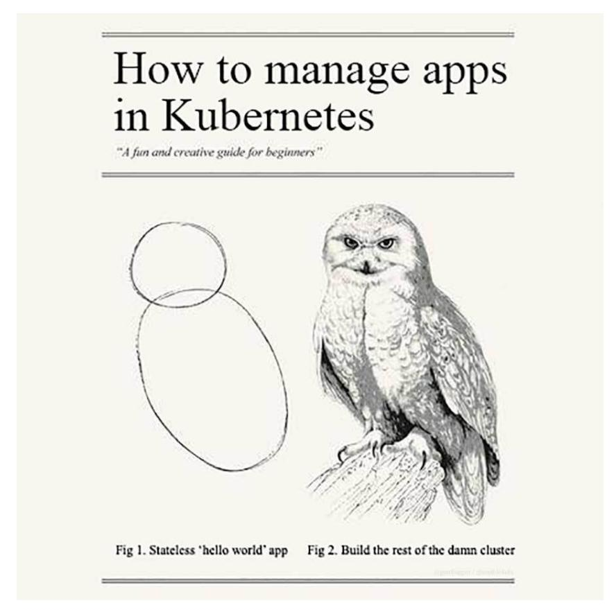

**But how do you draw the owl?!**

Many books promise to show you how to do new and exciting things in Kubernetes. They demonstrate simple stateless applications running in a Kubernetes cluster, and then tell you to go create robust, scalable, clusters running real-world applications. But they don't explain how to do it, much less how to make your process automated and well-tested!

Don't worry, I'm not going to do that here. We're going to start drawing that circle in Chapter 1, but through the rest of the book I'll teach you how to turn that circle into a beautiful owl—er… Kubernetes-powered infrastructure.

— Jeff Geerling, 2019

Preface iii

## **Who is this book for?**

Many of the developers and sysadmins I work with are at least moderately comfortable administering a Linux server via SSH, and manage between 1-100 servers, whether bare metal, virtualized, or using containers.

Some of these people have a little experience with configuration management tools (usually Puppet, Chef, or Ansible), and maybe a little experience with Kubernetes through tools like Minikube or a hosted Kubernetes environment (EKS, GKS, AKS, etc.). I am writing this book for these friends who, I think, are representative of most people who have heard of and/or are beginning to use Ansible and Kubernetes.

If you are interested in both development and operations, and have at least a passing familiarity with managing servers and managing app containers via the command line, this book should provide you with an intermediate- to expert-level understanding of Ansible and how you can use it to manage your Kubernetes-based infrastructure.

## **Typographic conventions**

Ansible and Kubernetes use a simple syntax (YAML) and simple command-line tools (using common POSIX conventions) to control their powerful abilities. Code samples and commands will be highlighted throughout the book either inline (for example: ansible [command] or kubectl [command]), or in a code block (with or without line numbers) like:

```
1 ---
2 # This is the beginning of a YAML file.
```

Some lines of YAML and other code examples require more than 70 characters per line, resulting in the code wrapping to a new line. Wrapping code is indicated by a \ at the end of the line of code. For example:

[Preface](https://www.ansible.com/) iv

- 1 # The line of code wraps due to the extremely long URL.
- 2 wget http://www.example.com/really/really/really/long/path/in/the/url/c\
- 3 auses/the/line/to/wrap

When using the code, don't copy the \ character, and make sure you don't use a newline between the first line with the trailing \ and the next line.

Links to pertinent resources and websites are added inline, like the following links to Ansible¹ and Kubernetes², and can be viewed directly by clicking on them in eBook formats, or by following the URL in the footnotes.

Sometimes, asides are added to highlight further information about a specific topic:


Informational asides will provide extra information.


Warning asides will warn about common pitfalls and how to avoid them.


Tip asides will give tips for deepening your understanding or optimizing your use of Ansible.

When displaying commands run in a terminal session, if the commands are run under you[r normal/non-root](https://www.ansible.com/) user account, the commands will be prefixed by the dollar sign (\$). If the commands are run as the root user, they will be prefixed with the pound sign (#).

## **Please help improve this book!**

New revisions of this book are published on a regular basis (see current book publication stats below). If you think a particular section needs improvement or find

¹https://www.ansible.com

²https://kubernetes.io

<span id="page-12-0"></span>Preface v

something missing, please post an issue in the Ansible for Kubernetes issue queue³ (on GitHub).

<span id="page-12-1"></span>All known issues with Ansible for Kubernetes will be aggregated on the book's online Errata⁴ page.

#### **Current Published Book Version Information**

- **Current book version**: 0.4
- **Current Ansible version as of last publication**: 2.10
- **Current Kubernetes version as of last publication**: 1.19
- **Current Date as of last publication**: September 1, 2020

## **About the Author**

Jeff Geerling is a developer who has worked in programming and reliability engineering, building hundreds of apps and services in various cloud and on-premise environments. He also manages many services offered by Midwestern Mac, LLC and has been using Ansible to manage infrastructure since early 2013, and Kubernetes since 2017.

³https://github.com/geerlingguy/ansible-for-kubernetes/issues

⁴https://www.ansibleforkubernetes.com/errata

## **Introduction**

## **In the beginning, there were servers**

Deploying and managing servers and applications reliably and efficiently has always been challenging. Historically, system administrators were walled off from the developers and users who interact with the systems they administer, and they managed servers by hand, installing software, changing configurations, and administering services on individual servers.

As data centers grew, and hosted applications became more complex, administrators realized they couldn't scale their manual systems management as fast as the applications they were enabling. API-driven server management and configuration management tools like Ansible helped make things manageable for a time.

But the shift to full self-service, developer-centric management of microservices and serverless application architecture meant that a more seismic shift was coming. Instead of thinking in terms of servers and infrastructure, developers expect to be able to manage containerized application lifecycles, with no regard for the servers on which their applications run.

<span id="page-13-0"></span>

## **The move to containers**

Contemporary business requirements for applications include one or more of the following features:

- self-healing infrastructure
- auto-scaling
- high-availability with multi-server failover
- flexible storage backends
- multi-cloud compatibility

Introduction vii

As containerized app development and deployment became more popular, there were a number of competing technology stacks which checked at least a few of these boxes, like Apache Mesos and Docker Swarm. Some cloud vendors like Amazon Web Services (AWS) even built their own container scheduling products (Elastic Container Service) to meet the needs of cloud-native applications.


**What is 'cloud native'?** [You'll often see t](https://12factor.net/)[h](#page-14-1)e term 'cloud-native' when discussing Kubernetes and container management. Like DevOps, the term can be loaded, and sometimes means different things to different people. For the purposes of this book, cl[oud native refers to desig](https://github.com/cncf/toc/blob/master/DEFINITION.md)[n](#page-14-2) and philosophy that is geared towards operations in a 'cloud' environment (whether public, private, or hybrid), versus operations in a classical server-based environment (bare metal or VMs).

Application architecture decisions make operating in container-driven infrastructure much easier if applications are designed in a 'cloud native' manner. One design methodology that strongly influenced cloud native [applicati](https://12factor.net/)on design is The Twelve-Factor App⁵.

<span id="page-14-2"></span><span id="page-14-1"></span><span id="page-14-0"></span>[The Cloud Native Computing Founda](https://github.com/cncf/toc/blob/master/DEFINITION.md)tion (mentioned later in this introduction) maintains the *de facto* Cloud Native Definition⁶, which expands on the informal definition above.

There were many entrants into the nascent field of container scheduling and selfhealing vendor-independent clustering software, but most of them had limited feature sets or did not afford the flexibility desired in a modern infrastructure environment.

⁵https://12factor.net

⁶https://github.com/cncf/toc/blob/master/DEFINITION.md

Introduction viii

## **Ansible by Red Hat**


**Ansible logo**

Ansible was created at a point when many companies were migrating to public or private cloud infrastructure, often replacing individual servers and hosts with virtual machines and managed services.

There were a number of 'configuration management' tools which served a similar role to Ansible, but Ansible had a few advantages that made its adoption easier for a wide variety of uses:

- Ansible was agentless, so you could manage resources without running extra software on them.
- Ansible was simple, using YAML syntax and a simple, modular architecture which was easy for most teams to learn, and didn't require everyone to be familiar with a particular programming language or a new DSL.
- Ansible had a 'batteries included' philosophy, which made it easy to install and use for almost any scenario out of the box.

As time went on, Ansible expanded its scope, becoming a top choice for Security, Windows, and Network automation in addition to general Linux and application automation. After Red Hat acquired Ansible, it consolidated everything into the Red Hat Ansible Automation Platform, while continuing to support the open source Ansible engine at the center of all things Ansible.

Ansible's openness and simplicity made it a central part of many teams' infrastructure automation, and thousands of modules have been added to meet most IT Introduction ix

automation needs.

As Kubernetes and OpenShift became popular in the late 2010s, Ansible was wellpositioned to manage Kubernetes and OpenShift clusters, applications running on the clusters, and integrations between Kubernetes services and externally-hosted services.

Ansible's abstractions allow flexibility in a modern multi-cloud environment, as automation has moved from configuring hundreds of servers at a time to actively managing hundreds of thousands of containers and automation tasks on a daily basis.

<span id="page-16-0"></span>

## **Kubernetes and the CNCF**

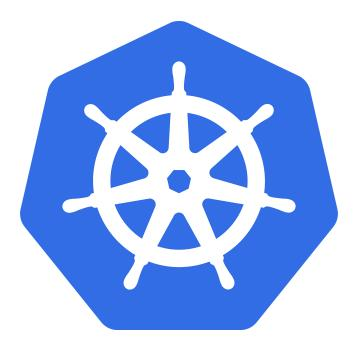

**Kubernetes logo**

In 2013, some Google engineers began working to create an open source representation of the internal tool Google used to run millions of containers in the Google data centers, named Borg. The first version of Kubernetes was known as Seven of Nine (another Star Trek reference), but was finally renamed Kubernetes (a mangled translation of the Greek word for 'helmsman') to avoid potential legal issues.

To keep a little of the original geek culture Trek reference, it was decided the logo would have seven sides, as a nod to the working name 'Seven of Nine'.

In a few short years, Kubernetes went from being one of many up-and-coming container scheduler engines to becoming almost a *de facto* standard for large scale container deployment. In 2015, at the same time as Kubernetes' 1.0 release, the Cloud Native Computing Foundation (CNCF) was founded, to promote containers and cloud-based infrastructure.

Introduction X

<span id="page-17-0"></span>Kubernetes is one of many projects endorsed by the CNCF for 'cloud-native' applications, and has been endorsed by VMware, Google, Twitter, IBM, Microsoft, Amazon, and many other major tech companies.

By 2018, Kubernetes was available as a service offering from all the major cloud providers, and most competing container tooling has been rebuilt to run with Kubernetes.

Kubernetes is often abbreviated 'K8s' (K + eight-letters + s), and the two terms are interchangeable.

<span id="page-17-1"></span>

## **Examples Repository**

There are many code examples (playbooks, roles, manifests, configuration, etc.) throughout this book. Most of the examples are in the Ansible for Kubernetes GitHub repository<sup>7</sup>, so you can browse the code in its final state while you're reading the book. Some of the line numbering may not match the book *exactly* (especially if you're reading an older version of the book!), but I will try my best to keep everything synchronized over time.

#### <span id="page-17-2"></span>Other resources

<span id="page-17-3"></span>We'll explore all aspects of using Ansible and Kubernetes to deploy applications in this book, but there's no substitute for the wealth of documentation and community interaction that make these tools great. Check out the links below to find out more about the tools and their communities:

#### <span id="page-17-4"></span>**Ansible resources**

- Ansible Documentation<sup>8</sup> Covers all Ansible options in depth. There are few open source projects with documentation as clear and thorough.
- Ansible Glossary<sup>9</sup> If there's ever a term in this book you don't seem to fully understand, check the glossary.

 $<sup>^7</sup> https://github.com/geerlingguy/ansible-for-kubernetes \\$ 

<sup>8</sup>https://docs.ansible.com/ansible/latest/

<sup>9</sup>https://docs.ansible.com/ansible/latest/reference\_appendices/glossary.html

<span id="page-18-0"></span>Introduction xi

Ansible Mailing List<sup>10</sup> - Discuss Ansible and submit questions with Ansible's community via this Google group.

- Ansible on GitHub<sup>11</sup> The official Ansible code repository, where the magic happens.
- Ansible Blog<sup>12</sup>

#### **Kubernetes resources**

- Kubernetes Documentation<sup>13</sup> Covers Kubernetes usage patterns in depth.
- Kubernetes Glossary<sup>14</sup> If there's ever a term in this book you don't seem to fully understand, check the glossary.
- Kubernetes SIGs and Working Groups<sup>15</sup> These groups are where major changes and new features are discussed—consider joining one of these groups if the topic is of importance to you, or just follow along with the groups you're interested in.
- Kubernetes on GitHub¹6 The official Kubernetes code repository, where the magic happens.
- Kubernetes on Slack<sup>17</sup> Chat with other Kubernetes users in the official Slack.
- Kubernetes Blog<sup>18</sup>

<span id="page-18-4"></span><span id="page-18-3"></span><span id="page-18-2"></span><span id="page-18-1"></span>I want to especially point out the official documentation for both projects, which is continually updated and is very thorough. This book is meant as a supplement to, not a replacement for, the official documentation!

<span id="page-18-5"></span><sup>10</sup>https://groups.google.com/forum/#!forum/ansible-project

<sup>11</sup>https://github.com/ansible/ansible

<sup>12</sup>https://www.ansible.com/blog

<sup>13</sup>https://kubernetes.io/docs/home/

<sup>14</sup>https://kubernetes.io/docs/reference/glossary/

<sup>&</sup>lt;sup>15</sup>https://github.com/kubernetes/community/blob/master/sig-list.md

<sup>16</sup>https://github.com/kubernetes/kubernetes

<sup>17</sup>http://slack.k8s.io

<sup>18</sup>https://kubernetes.io/blog/

<span id="page-19-1"></span><span id="page-19-0"></span>

## **Chapter 1 - Hello World!**

Kubernetes and many other CNCF ecosystem projects are built using the popular Go language. Because of that, it's good to have at least a basic understanding of Go (enough to write a 'Hello, world!' app¹⁹) before diving deeper into Kubernetes.

<span id="page-19-2"></span>Don't worry, we'll get to Kubernetes clusters and managing them with Ansible soon!

## **Hello, Go!**

In this chapter, we're going to build a tiny Go app and run it locally. We'll then use this app to demonstrate the basics of containers and Kubernetes, and build on it through the early parts of the book to get you started automating applications in Kubernetes.

#### **Installing Go**

The official method of installing Go requires downloading the correct binary source package from the Go Downloads page²⁰, then either running the installer (if downloading the macOS package or Windows MSI installer), or unpacking the arc[hive into the directory](https://en.wikipedia.org/wiki/%22Hello,_World!%22_program) /usr/local/go.

On [a typical 64-bit](https://golang.org/dl/) Linux workstation, the process would be:

¹⁹https://en.wikipedia.org/wiki/%22Hello,\_World!%22\_program ²⁰https://golang.org/dl/

```
export VERSION=1.15
```

```
# Download the Go archive.
curl -O https://dl.google.com/go/go$VERSION.linux-amd64.tar.gz
```

```
# Verify the SHA256 Checksum (against the downloads page).
sha256sum go$VERSION.linux-amd64.tar.gz
```

```
# Extract the tarball into the `/usr/local` directory.
tar -C /usr/local -xzf go$VERSION.linux-amd64.tar.gz
```

```
# Add the Go binaries to your $PATH.
export PATH=$PATH:/usr/local/go/bin
```


If you want the \$PATH changes to persist, make sure to add them to shell profile (e.g. *<sup>∼</sup>*/.profile).

The above commands should be run as the root user, or via sudo, so the Go installation can operate correctly.

If the installation worked, you should be able to enter go version and get the version you just installed:

```
$ go version
go version go1.15 linux/amd64
```

There are other ways to install Go, e.g. via Homebrew on macOS (brew install go), Chocolatey on Windows (choco install -y golang), or via various third-party repositories via apt or yum; as long as you can get a working Go installation, you should be able to compile the application we'll build in this chapter.

<span id="page-20-0"></span>

## **Creating a 'Hello world' app in Go**

Go is easy to learn. At its most basic, you can write a main() function, compile, and run your app.

We're going to write the most basic HTTP request response app, called Hello Go. The design goal is simple:

- 1. Run a web server on port 8180.
- 2. For any request, return the content "Hello, you requested: URL\_PATH\_HERE"

First, create a new project directory, hello-go, with the following directory structure:

```
hello-go/
  cmd/
    hello/
```

Now, inside the hello directory, create the file hello.go with the following Go code:

```
1 package main
2
3 import (
4 "fmt"
5 "log"
6 "net/http"
7 )
8
9 // HelloServer responds to requests with the given URL path.
10 func HelloServer(w http.ResponseWriter, r *http.Request) {
11 fmt.Fprintf(w, "Hello, you requested: %s", r.URL.Path)
12 log.Printf("Received request for path: %s", r.URL.Path)
13 }
14
15 func main() {
16 var addr string = ":8180"
17 handler := http.HandlerFunc(HelloServer)
18 if err := http.ListenAndServe(addr, handler); err != nil {
19 log.Fatalf("Could not listen on port %s %v", addr, err)
20 }
21 }
```

This is all that's needed to generate an HTTP server responding on port 8180. In the main function, Go's http.ListenAndServe() listens on the given network address (addr), and routes incoming requests through the handler (handler).

Our HelloServer handler responds to any request by printing "Hello, you requested: %s", with the URL path replacing the %s placeholder.

This is not an amazing HTTP server, and it doesn't do a whole lot, but it is a fullfledged Go application, which can now be compiled into a binary.

#### <span id="page-22-0"></span>**Building Hello Go**

With the hello.go file saved, run the following command from the project's root directory:

```
$ go build cmd/hello/hello.go
```

After a couple seconds, you should see a new hello binary in the project's root directory. Run it by typing:

```
$ ./hello
```

Now, in another terminal, run curl localhost:8180. You should see something like the following:

```
curl localhost:8180
Hello, you requested: /
```

And if you curl another path, like curl localhost:8180/test, you'll see:

```
curl localhost:8180
Hello, you requested: /test
```

Amazing! A couple more hours and we'll have implemented Apache in Go!

You may also note that your original terminal window was logging your curl requests in the background, like:

```
$ ./hello
2025/11/12 20:58:07 Received request for path: /
2025/11/12 20:58:15 Received request for path: /test
```

It's always nice to have applications log to standard output (stdout) and standard error (stderr), because in the cloud-native world, these logs are easy to route and store centrally.

<span id="page-23-1"></span>You can press Control + C to exit the Hello Go app; we're going to work on running it in a container now, so we can get one step closer to running it in Kubernetes!

## **Deploying Hello Go in a container**

Hello Go isn't very useful if you can only run it locally on your workstation. This app is stateless, it logs to stdout, and it fulfills a single purpose, so it is a perfect fit to containerize for a cloud-native deployment!

#### **Running Hello Go in Docker**

Building Go apps in Docker containers is easy. Go maintains a number of images on Docker Hub containing all the necessary tooling to build your app, and all you need to do is copy in the source and run go buil[d](https://podman.io/).


**Docker vs. Podman**: Docker users wonder about the future of Docker CE and moby, the engine that runs Docker containers. Events like the sale of ['Docker](https://podman.io/) Enterprise' to Mirantis in 2019 did nothing to quell fears about [Docker](https://buildah.io/)'s future, and many developers who rely on containers for their application deployment have been seeking alternative container builders and runtimes.

One of the more popular alternatives, which implements all the features we'll use in this book (in fact, it's a drop-in replacement for Docker for most purposes) is the combination of Podman²¹ and Buildah²².

This book will mostly use Docker in its examples due to its ongoing popularity, but know there are other container runtimes worth investigating.

²¹https://podman.io

²²https://buildah.io

It's time to create a Dockerfile to instruct Docker how to build our Hello Go app container image.

Create a Dockerfile in the hello-go project's root directory, and add the following:

```
1 FROM golang:1-alpine as build
2
3 WORKDIR /app
4 COPY cmd cmd
5 RUN go build cmd/hello/hello.go
```

If you've worked with Docker before, you might be wondering about the syntax of the first line.

The first line of a Dockerfile should define the base image for the Docker container. Here, we're building from the golang library image using the 1-alpine tag, which will give us the latest version in the Go 1.x series of images, based on Alpine Linux.

But what about as build? This portion of the FROM line allows a *multi-stage* build. If we just built our app inside the golang:1-alpine image, we would end up with at least a 150 MB Docker image. For a tiny HTTP server app like Hello Go, that's a lot of overhead!

Using a multi-stage build, we can *build* Hello Go in one container (named build using that as build statement), then *copy* Hello Go into a very small container for deployment.

Add the following to the same Dockerfile to complete the multi-stage build:

```
7 FROM alpine:latest
8
9 WORKDIR /app
10 COPY --from=build /app/hello /app/hello
11
12 EXPOSE 8180
13 ENTRYPOINT ["./hello"]
```

Building on the alpine:latest base image will give us a final container image that's only a few megabytes, which means it will be faster to upload into a container registry, and faster to pull when running it in Kubernetes.

We set the same workdir (/app) as the build container, and then COPY the binary that was built (/app/hello) into the final deployment container.

Finally, we EXPOSE port 8180, since that's the port our webserver listens on, and then we set the ENTRYPOINT to our hello binary, so Docker will run it as the singular process in the container when running it with all the default settings.

#### <span id="page-25-0"></span>**Building the container**

Now we can build the container image. Run the following command inside the same directory as the Dockerfile:

```
docker build -t hello-go .
```

After a couple minutes (or less if you already had the base images downloaded!), you should be able to see the hello-go container image when you run docker images:

| \$ docker images |          |                |        |
|------------------|----------|----------------|--------|
| REPOSITORY       | TAG      | CREATED        | SIZE   |
| hello-go         | latest   | 44 seconds ago | 13MB   |
| <none>           | <none>   | 47 seconds ago | 367MB  |
| golang           | 1-alpine | 2 weeks ago    | 359MB  |
| alpine           | latest   | 3 weeks ago    | 5.55MB |

Now we'll run the container image to make sure Hello Go operates in the container identically to how it operated when run directly.

#### <span id="page-25-1"></span>**Running the container**

To run the container and expose the internal port 8180 to your host, run the command:

```
$ docker run --name hello-go --rm -p 8180:8180 hello-go
```

After a second or two, the webserver should be operational. In another terminal, run curl localhost:8180/testing, and you should see the "Hello, you've requested: /testing" response in *that* window, as well as the logged request in the window where docker run was executed.

```
$ docker run --name hello-go --rm -p 8180:8180 hello-go
2025/11/12 22:31:07 Received request for path: /testing
```

To stop and terminate the container, press Ctrl-C in the terminal where you ran docker run.

#### Hello Go app summary

Many tools in the Kubernetes ecosystem are written in Go. You might not be a master of the Go language after building and running this app in a container, but you at least know the basics, and could even put 'Go programmer' on your resumé now (just kidding!).


The code used in this example is also available in this book's code repository, in the  $hello-go/^{23}$  directory.

## **Deploying Hello Go in Kubernetes**

You could deploy your app to a server somewhere using docker run, but if the app dies or the server reboots, the container would not come back up. You could specify a --restart policy with docker run, but the point of this book is to show you how to deploy into *Kubernetes* for all the other benefits it provides!

<span id="page-26-1"></span>So let's work on deploying this single-container, stateless Go app into Kubernetes, using a small local Kubernetes environment, Minikube<sup>24</sup>.

#### **Installing Minikube**

There are a variety of installation guides<sup>25</sup> depending on what OS and distribution you're running. If you're on macOS, you can install Minikube with Homebrew:

 $<sup>^{23}</sup> https://github.com/geerlingguy/ansible-for-kubernetes/tree/master/hello-gould for the control of the control of the control of the control of the control of the control of the control of the control of the control of the control of the control of the control of the control of the control of the control of the control of the control of the control of the control of the control of the control of the control of the control of the control of the control of the control of the control of the control of the control of the control of the control of the control of the control of the control of the control of the control of the control of the control of the control of the control of the control of the control of the control of the control of the control of the control of the control of the control of the control of the control of the control of the control of the control of the control of the control of the control of the control of the control of the control of the control of the control of the control of the control of the control of the control of the control of the control of the control of the control of the control of the control of the control of the control of the control of the control of the control of the control of the control of the control of the control of the control of the control of the control of the control of the control of the control of the control of the control of the control of the control of the control of the control of the control of the control of the control of the control of the control of the control of the control of the control of the control of the control of the control of the control of the control of the control of the control of the control of the control of the control of the control of the control of the control of the control of the control of the control of the control of the control of the control of the control of the control of the control of the control of the control of the control of the control of the control of the control of the control of the control of the co$ 

<sup>&</sup>lt;sup>24</sup>https://minikube.sigs.k8s.io

<sup>25</sup>https://minikube.sigs.k8s.io/docs/start/

\$ brew install minikube

If you're on Windows, you can install Minikube with Chocolatey:

> choco install minikube

If you're on Linux, Minikube can be installed via the latest .deb or .rpm from the Linux install guide²⁶.

Starting Minikube is as easy as:

\$ minikube start

Hello Go doesn't require much in terms of resources, so the default resources Minikube allocates are adequate. For later examples, it will be important to allocate more RAM and/or CPU to Minikube, which is as easy as specifying the values during start:

```
$ minikube start --cpus 4 --memory 4g
```

After a couple minutes, Minikube should be started, and you'll be able to start deploying Hello Go inside a Kubernetes environment!

## <span id="page-27-0"></span>**Building the Hello Go container in Minikube**

Minikube runs a separate VM on your workstation, and that VM doesn't have access to your local Docker registry. If you try to deploy the hello-go:latest image inside Minikube's Kubernetes cluster, Kubernetes will complain it can't pull the image.

Minikube recommends building images inside the Minikube environment, and to do that, set your local docker CLI to use Minikube's Docker daemon:

²⁶https://minikube.sigs.k8s.io/docs/start/linux/

\$ eval \$(minikube docker-env)

If you run docker images now, you'll see a number of images that are *not* present in your local workstation's Docker installation. And you can verify the hello-go:latest image is not present.

Now that you're operating in Minikube's Docker environment, build and tag the hello-go image again:

\$ docker build -t hello-go .

After it's finished, you should see the image in Minikube's docker images listing:

| REPOSITORY                | TAG      | CREATED       | SIZE   |
|---------------------------|----------|---------------|--------|
| hello-go                  | latest   | 7 seconds ago | 13MB   |
| <none>                    | <none>   | 9 seconds ago | 367MB  |
| golang                    | 1-alpine | 2 weeks ago   | 359MB  |
| alpine                    | latest   | 3 weeks ago   | 5.55MB |
| k8s.gcr.io/kube-proxy     | v1.18.3  | 4 weeks ago   | 116MB  |
| k8s.gcr.io/kube-scheduler | v1.18.3  | 4 weeks ago   | 94.4MB |

# **Running Hello Go in Minikube**

In Kubernetes, the most common way to deploy an app is using a *Deployment*. Deployments manage Kubernetes *Pods*, which for the purpose of this chapter are like individual running Docker containers. Deployments (and Pods, and everything else about Kubernetes) offer a lot more than we'll demonstrate right now, and we'll dig much deeper through the rest of the book.

For now, though, let's deploy our Hello Go app into the Minikube Kubernetes environment using the kubectl command line utility:

\$ kubectl create deployment hello-go --image=hello-go

This command creates a new Deployment resource named hello-go. The Deployment will run one Pod by default, and that Pod will start a container with the hello-go image we built inside Minikube's Docker environment a few moments ago.


If you don't yet have kubectl installed, follow these directions²⁷ to install it. If you're running macOS, you can install it with Homebrew (brew install kubectl), if you're on Windows, you can install it with Chocolatey (choco install kubernetes-cli), or on any platform, you can download the current kubectl binary following the linked instructions in Kubernetes' documentation and make it executable in your \$PATH.

Once the Deployment is created, you can check on its status with:

```
$ kubectl get deployment hello-go
```

You might notice Kubernetes prints 0/1 for the READY status of the hello-go deployment:

```
$ kubectl get deployment hello-go
NAME READY UP-TO-DATE AVAILABLE AGE
hello-go 0/1 1 0 12s
```

This means the deployment is expecting one running Pod, but currently there are no[ne. Let's take a look at the Pods curren](https://kubernetes.io/docs/tasks/tools/install-kubectl/)tly running to see what's happening:

```
$ kubectl get pods
NAME READY STATUS RESTARTS AGE
hello-go-6dfc8bbd74-pn2jf 0/1 ErrImagePull 0 22s
```

It looks like Kubernetes is having trouble pulling the hello-go image (thus the ErrImagePull message). You can get more details about the pod's woes using kubectl describe:

²⁷https://kubernetes.io/docs/tasks/tools/install-kubectl/

\$ kubectl describe pod hello-go-6dfc8bbd74-pn2jf

Name: hello-go-6dfc8bbd74-pn2jf

Namespace: default

...

Events:

Type Reason Age Message ---- ------ ---- -------

Normal Scheduled <unknown> Successfully assigned defaul\

t/hello-go-6dfc8bbd74-pn2jf to minikube

Normal Pulling 49s (x4 over 3m5s) Pulling image "hello-go" Warning Failed 23s (x4 over 2m50s) Failed to pull image "hello-\ go": rpc error: code = Unknown desc = Error response from daemon: Get h\ ttps://registry-1.docker.io/v2/: net/http: request canceled while waiti\ ng for connection (Client.Timeout exceeded while awaiting headers) Warning Failed 23s (x4 over 2m50s) Error: ErrImagePull

Warning: Failed 23S (x4 over zim40S). Error: L11 ImageFull.
No. 1. ReadOff. 11 (6 sec. + 40s). ReadOff (11 min.).

Normal BackOff 11s (x6 over 2m49s) Back-off pulling image "hell\

o-go"

Warning Failed 11s (x6 over 2m49s) Error: ImagePullBackOff


There will likely be thousands of instances where you'll deploy something into Kubernetes, and then you won't see it fully started. Using kubectl get [resource] and kubectl describe [resource] [instance] are usually the best ways to get started debugging problems in Kubernetes.

In this case, it looks like Kubernetes is trying to pull our image from Docker Hub (Get https://registry-1.docker.io/v2/) instead of from the local image registry. We could try to figure out the local registry's URL and other details, and include that in the Docker image's full path (e.g. http://192.168.x.x:1234/hello-go), but that's not very portable and would have to change any time we switched clusters.

So instead, we can modify the hello-go deployment to only attempt pulling the container image if it's not already present. In your terminal, run:

\$ kubectl edit deployment hello-go

Then, edit the YAML key spec.template.spec.containers.0.imagePullPolicy and change it from Always (Kubernetes' default) to IfNotPresent. That section of the deployment's YAML should end up looking like:

```
35 ...
36 spec:
37 containers:
38 - image: hello-go
39 imagePullPolicy: IfNotPresent
40 name: hello-go
41 ...
```

After you edit the deployment and save the changes (if using Vim, press Esc, then :wq to write the changes and quit), Kubernetes should finally be able to run the container in the hello-go Pod. Confirm that the Deployment is now healthy:

```
$ kubectl get deployment hello-go
NAME READY UP-TO-DATE AVAILABLE AGE
hello-go 1/1 1 1 8m35s
```


Hand-editing resources using kubectl edit is fine for development purposes, but as you get further in your automation journey, you should equate hand-editing resources (or any kind of *management* via kubectl) with hand-modifying individual server configurations—don't do it! Everything should be automated by the time you reach production. If it isn't, you're going to find yourself managing an increasingly complex and hard-tounderstand Kubernetes cluster.

At this point, Hello Go is running in Kubernetes. But we won't be able to access the app from anywhere, because there is nothing exposing port 8180 to the outside world. In Docker, we used -p 8180:8180 to expose a port from the Docker container to a port on the host. In Kubernetes, we can 'expose' a deployment to the outside world using a Kubernetes Service.

In this case, we'll create a Service of type LoadBalancer, which will take incoming requests, and distribute them to any Pods running our Hello Go app. By default, there's only one Pod right now, so the Load Balancer might be overkill. But later, if we want to scale out the app, the Load Balancer will come in handy! Run the following command:

\$ kubectl expose deployment hello-go --type=LoadBalancer --port=8180

And you can check on this service with:

\$ kubectl get service hello-go

NAME TYPE CLUSTER-IP EXTERNAL-IP PORT(S)

hello-go LoadBalancer 10.110.50.96 <pending> 8180:31565/TCP

Note that, when running Minikube, a LoadBalancer service won't acquire an external IP address. Locally, Minikube doesn't integrate with another service to run external load balancers. But in most other environments, when you use a Kubernetes LoadBalancer, it will provision a load balancer external to your cluster, for example an Elastic Load Balancer (ELB) in AWS, or a Cloud Load Balancer in GKE.

Because Minikube doesn't integrate with a separate local load balancer, you have to ask Minikube to simulate the connection using minikube service:

\$ minikube service hello-go

Ideally, this will pop open a browser window in your default browser, and you'll see the response from Hello Go:


**Hello Go responding to an HTTP request in Minikube.**

If not, it should print the URL (including Minikube's IP address and the port number Minikube routes to Hello Go), and you can copy and paste that into a browser to test the app.

Go ahead and visit a few pages (e.g. /testing, /hello-world, etc.), and make sure Hello Go responds with the appropriate path. You might wonder where all the logs are—in Docker and when running the app standalone, they were immediately printed to the screen. In Kubernetes, because you could be running one or *one hundred* instances of the app, it's important for the routing of logs to be a core feature. Thus, you can monitor the logs from *all* running instances of Hello Go (currently just one) using:

```
$ kubectl logs -l app=hello-go
```

This command uses the label selector to choose which Pods' logs to monitor, and then prints the logs to the screen. You can add -f to *follow* the logs in real-time.

Let's take a look at how this is helpful once we scale up Hello Go's Deployment.

#### **Scaling Hello Go in Kubernetes**

Let's scale Hello Go to *four* instances, instead of one. Use kubectl scale to increase the deployments *replicas*:

kubectl scale deployments/hello-go --replicas=4


You can also modify the spec.replicas value via kubectl edit deployment hello-go, but that requires a few more keystrokes to edit the YAML then save it, so it's easier when doing things via CLI to scale using kubectl scale.

Verify that the scaling is successful using kubectl get deployment:

```
$ kubectl get deployment hello-go
NAME READY UP-TO-DATE AVAILABLE AGE
hello-go 4/4 4 4 35m
```

Now send some more requests through to Hello Go (assuming it's still being served at the URL the minikube service command output earlier) while running kubectl logs:

```
$ kubectl logs -l app=hello-go -f
2025/11/13 16:23:00 Received request for path: /
2025/11/13 16:23:00 Received request for path: /favicon.ico
2025/11/13 16:35:01 Received request for path: /
2025/11/13 16:35:03 Received request for path: /testing
2025/11/13 16:35:06 Received request for path: /hello-world
...
```


Currently, kubectl logs doesn't differentiate log lines by pod name, so it might not be immediately obvious that Kubernetes is actually distributing requests to all the four replicas on the backend; someday this may be possible if this Kubernetes feature request is implemented²⁸, but until then, you can run this one-liner to separate the current logs by pod:

```
for pod in $(kubectl get po -l app=hello-go -oname); do echo $pod; kube\
ctl logs $pod; done;
```

#### <span id="page-34-0"></span>**Clean up Hello Go**

You can destroy the entire Minikube environment, if you want, by running minikube delete. However, you might want to keep Minikube running for other purposes, so here's how to remove everything we deployed into the Minikube Kubernetes environment in this chapter:

²⁸https://github.com/kubernetes/kubernetes/issues/44812

```
// Delete the Hello Go Service.
$ kubectl delete service hello-go
service "hello-go" deleted
// Delete the Hello Go Deployment (will also delete associated Pods).
$ kubectl delete deployment hello-go
deployment.apps "hello-go" deleted
// Delete the Hello Go container image.
$ eval $(minikube docker-env)
$ docker rmi hello-go
```

To conserve your workstation's CPU and memory, it's a good idea to at least *stop* Minikube (minikube stop) when you're not using it. You might notice a large amount of CPU load even when nothing is running in the Minikube cluster—that's par for the course, as Kubernetes runs a lot of containers to manage the cluster.


In the last step, we deleted the hello-go Docker image. If you run docker images, you may notice there are other images which were pulled (and are still present in the Minikube environment) because of the Docker image build process. These images take up space, and if you don't prune them and/or rebuild servers frequently, they can sometimes lead to problems like running out of disk space on a node. It is best practice to treat your Kubernetes cluster servers like cattle and not pets.

When I upgrade my own Kubernetes clusters, I always replace (for Cloud environments) or rebuild (for bare metal servers) each node during the upgrade cycle. It's possible, but not recommended, to keep Kubernetes nodes running for very long periods of time, doing in-place upgrades of the Kubernetes resources on them.

## **Summary**

In this chapter, we learned the Go programming language at a very basic level. We learned how to build a simple application container and run it using Docker. Then we learned how to deploy the same application into a Kubernetes cluster using Minikube. All of the examples in this chapter required manual steps on the command line; through the rest of the book, we'll learn how to automate every aspect of application builds, deployments, and scaling using Ansible and Kubernetes.

```
________________________________
/ It is possible to commit no \
| errors and still lose. That is |
| not a weakness. That is life. |
\ (Jean-Luc Picard, TNG) /
--------------------------------
       \ ^__^
        \ (oo)\_______
           (__)\ )\/\
               ||----w |
               || ||
```

<span id="page-37-0"></span>

## **Chapter 2 - Automation brings DevOps bliss**

In Chapter 1, we spent a lot of time typing in commands in our terminal. When you start operating at scale, there's no way you can manage dozens or hundreds of applications and deployments this way and keep your sanity.

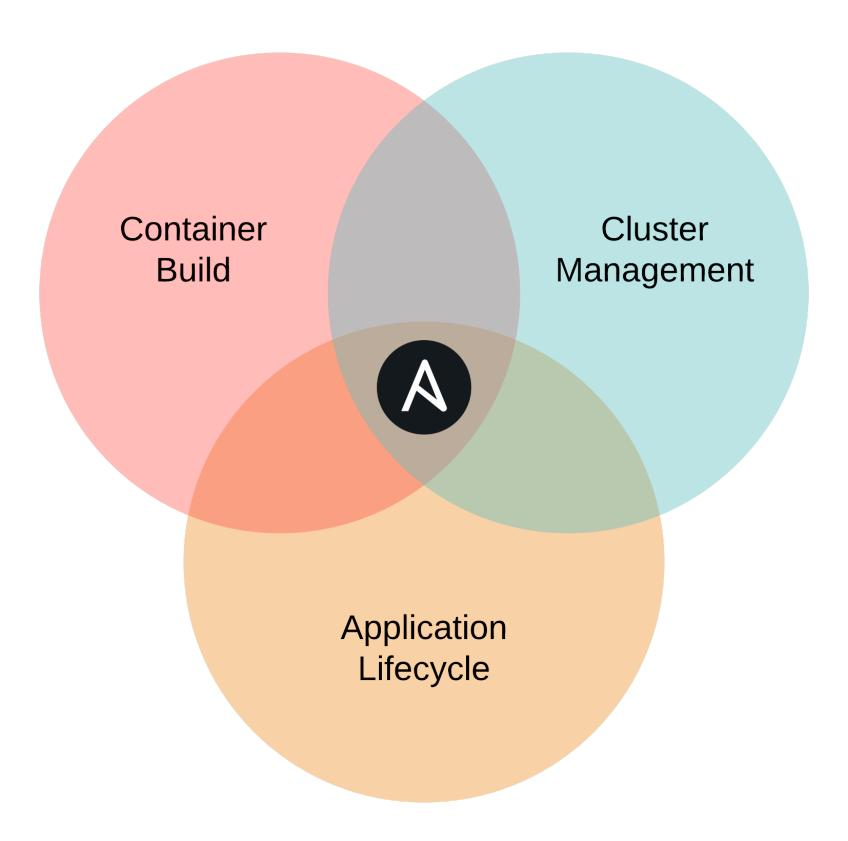

**Ansible automates Cloud Native infrastructure and apps.**

Ansible to the rescue! We're going to learn how to automate every aspect of the Cloud Native application lifecycle using Ansible.


While Ansible *can* do almost everything for you, it may not be the right tool for *every* aspect of your infrastructure automation. Sometimes there are other tools which may more cleanly integrate with your application developers' workflows, or have better support from app vendors.

Ansible is rarely used for everything demonstrated in this chapter in a given organization, but it's good to know that it *can be* used, and is often easier than other solutions.

<span id="page-38-0"></span>

## **Ansible 101**

As described in the Introduction, Ansible is known for its simplicity and fast onramp to productivity. To get started, you only need to know a few basic concepts:

- 1. Ansible uses an 'inventory' to describe the hosts on which it operates.
- 2. You create a YAML file, a 'playbook', to describe a series of 'plays' and 'tasks' Ansible should perform a given set of hosts.
- 3. Ansible runs the plays and tasks using a huge library of modules fit for most any automation purpose.

We'll soon get into our first Ansible playbook, but before that, we need to make sure Ansible is installed!

<span id="page-38-1"></span>

## **Installing Ansible**

Ansible's only real dependency is Python. Once Python is installed, the simplest way to get Ansible running is to use pip, a simple package manager for Python.

**If you're on a Mac**, installing Ansible is a piece of cake:

1. Check if pip is installed (which pip). If not, install it: sudo easy\_install pip

#### 2. Install Ansible: pip install ansible

You could also install Ansible via Homebrew²⁹ with brew install ansible. Either way (pip or brew) is fine, but make sure you update A[nsible using the same system](#page-178-0) [with which it was installed](#page-178-0)!

**If you're running Windows** it will take a little extra work to set everything up. There are two ways you can go about using Ansible if you use Windows:

- 1. The easiest solution would be to use a Linux virtual machine (with something like VirtualBox) to do your work.
- 2. You could also run Ansible inside the Windows Subsystem for Linux.

For detailed instructions for Windows installation, see Appendix A - Using Ansible on Windows workstations.

**If you're running Linux**, chances are you already have Ansible's dependencies installed, but we'll cover the most common installation methods.

If you have python-pip and python-devel (python-dev on Debian/Ubuntu) installed, use pip to install Ansible (this assumes you also have the 'Development Tools' package installed, so you have gcc, make, etc. available):

\$ pip install ansible

Usi[ng pip allow](http://brew.sh/)s you to upgrade Ansible with pip install --upgrade ansible.

*Fedora/Red Hat Enterprise Linux/CentOS:*

The easiest way to install Ansible on a Fedora-like system is to use the official yum package. If you're running Red Hat Enterprise Linux (RHEL) or CentOS, you need to install EPEL's RPM before you install Ansible (see the info section below for instructions):

\$ sudo yum -y install ansible

²⁹http://brew.sh/


On RHEL/CentOS systems, python-pip and ansible are available via the EPEL repository³⁰. If you run the command yum repolist | grep epel (to see if the EPEL repo is already available) and there are no results, you need to install it with the following commands:

```
# If you're on RHEL/CentOS 6:
$ rpm -ivh http://dl.fedoraproject.org/pub/epel/6/x86_64/\
epel-release-6-8.noarch.rpm
# If you're on RHEL/CentOS 7:
$ yum install epel-release
```

#### *Debian/Ubuntu:*

The easiest way to install Ansible on a Debian or Ubuntu system is to use the official apt package.

```
$ sudo apt-add-repository -y ppa:ansible/ansible
$ sudo apt-get update
$ sudo apt-get install -y ansible
```


If you get an error like "sudo: add-apt-repository: command not found", you're probably missing the python-software-properties package. Install it with the command:

```
$ sudo apt-get install python-software-properties
```

**Once Ansible is installed**, make sure it's working properly by entering ansible --version on the command line. You should see the currently-installed version:

³⁰https://fedoraproject.org/wiki/EPEL

```
$ ansible --version
ansible 2.9.13
```

## <span id="page-41-0"></span>**Hello, Ansible!**

At its most basic, Ansible can be used to run tasks on the same machine running the Ansible playbook, by running against localhost, and telling Ansible this is a "local" connection (Ansible defaults to trying to connect to any host—even localhost—via SSH).

Let's start off writing a basic playbook, which will run the date command, store its result in a variable, and then print the result in a debug message.

Before writing the playbook, create a file named inventory to tell Ansible how to connect to localhost:

```
1 [localhost]
2 127.0.0.1 ansible_connection=local
```

Every playbook starts with a play, which is a root level list item, with at least one key, hosts. To run a playbook against the local machine, you can set the following line at the beginning of the playbook, in a new file named main.yml:

```
1 ---
2 - hosts: localhost
```


The --- at the top of the file denotes the following markup is YAML. It's not required if there is only one YAML document in a file, but you'll likely need to separate YAML documents in a single file for some of the YAML you use with Kubernetes later on. So you're better off starting a good habit now!

When connecting to localhost and running simple automation tasks, you should usually disable Ansible's fact-gathering functionality. *Often* this is not needed and can save time in your playbook runs. When it *is* enabled, Ansible digs through the system and stores tons of environment information in variables before it begins running tasks.

So, to do this, the next line should be:

```
3 gather_facts: false
```


YAML is very picky about indentation! Make sure you have the hosts and gather\_facts keywords on the same indent (2 spaces), and also keep in mind that YAML only allows spaces (no tabs!) for indentation.

Next up, we're going to write our first-ever Ansible task, to run the date command and capture its output:

```
5 tasks:
```

6 - name: Get the current date.

7 command: date

8 register: current\_date 9 changed\_when: false

The tasks keyword should be on the same level as hosts, etc., and then all the tasks should be in a YAML list under tasks.

It's best practice to name every task you write in Ansible. This serves two purposes:

- 1. The name serves as an inline comment describing the task in YAML.
- 2. The value of the name will be printed in Ansible's output as the name of the task when it runs.

A name is not strictly required, but it's a lot easier to debug your playbooks if you name things after what they are doing!

This first task uses Ansible's command module, which takes the value of the command and runs it. So this would be the equivalent of running the date command on the command line.

The task also registers the returned value (and some other metadata) into a new variable current\_date, and because we know running date will never change the state of the host it's run on, we also add changed\_when: false. This helps Ansible keep track of state—later in the book we will use this to our advantage!

So far, your entire playbook should look like this:

```
1 ---
2 - hosts: localhost
3 gather_facts: false
4
5 tasks:
6 - name: Get the current date.
7 command: date
8 register: current_date
9 changed_when: false
```

If we stopped here, we'd have a working playbook, but it wouldn't show us any useful information.

So next, add a task to print the returned value of the date command using Ansible's debug module:

```
11 - name: Print the current date.
12 debug:
13 msg: "{{ current_date.stdout }}"
```

The name is self-explanatory, and we already stated we'll use the debug module to display the returned value of the date command.

For debug, you can either pass a var (variable) or msg (message). We chose the latter, and you might notice the value of the msg has some curly brackets. These indicate to Ansible it should *template* something inside using the Jinja templating language³¹. We won't get too deep into Jinja yet, but for now, know it will print any variables (or any inline Python-driven output) inside the curly brackets as strings.

³¹https://jinja.palletsprojects.com/en/2.11.x/

In this case, if you were to run this playbook using var: current\_date (instead of the msg), you would discover the variable is a dictionary with many keys like rc (for the return code), stdout (with the entire contents of stdout), stderr, and the like.

<span id="page-44-0"></span>So when we tell Ansible to print msg: "{{ current\_date.stdout }}", we are telling it to print the verbatim output of the date command run in the previous task.


If you ever need to figure out all the available parameters for an Ansible module, or see usage examples, Ansible's documentation is the best resource. Visit the Module Index<sup>32</sup> for a browseable list of all Ansible modules.

## **Running your first Ansible playbook**

Go ahead and run this playbook using the ansible-playbook command, and passing the inventory file as an argument:

```
$ ansible-playbook -i inventory main.yml

PLAY [localhost] ************************************
```

<sup>32</sup>https://docs.ansible.com/ansible/latest/modules/modules\_by\_category.html

#### <span id="page-45-0"></span>**Ansible 101 summary**

At this point, after writing less than twenty lines of YAML, you have the basic understanding of Ansible you need to automate *all* the manual tasks we performed in the previous chapter.

<span id="page-45-1"></span>If you want to dive deeper into general Ansible usage for server and cloud service management, I highly recommend you read Ansible for DevOps<sup>33</sup>. It has a much more broad focus on the entire DevOps ecosystem than this Kubernetes-specific volume.

<span id="page-45-2"></span>

The code used in this example is also available in this book's code repository, in the hello-ansible/<sup>34</sup> directory.

## Managing Kubernetes with Ansible

Now that you know Ansible, it's time to start automating.

#### **Managing Minikube**

We could use Ansible's homebrew<sup>35</sup> module to ensure Minikube is installed on macOS, or the win\_chocolatey<sup>36</sup> module to ensure it's installed on Windows... but for this playbook, we'll assume Minikube is already installed.

<span id="page-45-3"></span>Since there's not a minikube module for Ansible (at least as of this writing—you could write your own!), we're going to use the command module to manage a Minikube cluster.

Create a new directory hello-go-automation (next to the hello-go directory) with the same inventory file as used in the previous example, and add a main.yml playbook. Start the playbook with the same play settings as the earlier example playbook:

<sup>33</sup>https://www.ansiblefordevops.com

<sup>34</sup>https://github.com/geerlingguy/ansible-for-kubernetes/tree/master/hello-ansible

<sup>35</sup>https://docs.ansible.com/ansible/latest/modules/homebrew\_module.html

 $<sup>^{36}</sup> https://docs.ansible.com/ansible/latest/modules/win\_chocolatey\_module.html\\$ 

```
1 ---
2 - hosts: localhost
3 gather_facts: false
```

Next, we'll define a couple important variables, or vars, to be used in the playbook:

```
5 vars:
6 ansible_python_interpreter: '{{ ansible_playbook_python }}'
7 image_name: hello-go
```

The first variable, ansible\_python\_interpreter, is set this way to ensure all tasks run on the local machine inherit the same Python environment that's used by the ansible-playbook command. Normally you don't need to set this variable, but when using the local connection Ansible can get confused if you don't set it explicitly.

The second variable, image\_name, will be used to name the container image when we build it and use it in a deployment in Minikube. It's good to use variables for anything which could be changed over time, or which may be used in many places, so you can more easily maintain the playbook if something needs to change.

After vars, make sure Minikube is running in a pre\_tasks section of the playbook. pre\_tasks will always run prior to tasks (and prior to other sections of a playbook we'll learn about later).

First, check Minikube's current status:

```
9 pre_tasks:
10 - name: Check Minikube's status.
11 command: minikube status
12 register: minikube_status
13 changed_when: false
14 ignore_errors: true
```

This runs the minikube status command and stores the result in the minikube\_ status variable. The setting ignore\_errors is also set to true, as this command will return a non-zero exit code if it fails; however, we don't want that to fail the entire playbook run (because that's an acceptable condition).

```
16 - name: Start Minikube if it's not running.
17 command: minikube start
18 when: "not minikube_status.stdout or 'Running' not in minikube_st\
19 atus.stdout"
```

If there is no output from the minikube status command, or if the status does not have the word Running in it, this task will run the command minikube start, and wait for the command to complete.

The task uses the when condition (along with some Jinja conditionals) to determine whether it should run or not. If Minikube is already running, the command will be skipped (and no changes reported). If not, it will run, and Ansible will report it changed something.


Using when conditions properly makes playbooks run faster (you could *always* call minikube start, but that would restart the Kubernetes services and take a minute or so every playbook run) and helps Ansible summarize when it needed to make changes to the system.

The best Ansible playbooks are *idempotent*, meaning you can run them more than one time, and assuming the system hasn't been changed outside of Ansible, you'll see no changes reported after the first time the playbook is run. This is helpful for ensuring a consistent state across your application deployments, and to verify there are no changes (intended or not) happening outside of your automation.

#### <span id="page-47-0"></span>**Building container images in Minikube with Ansible**

We'll follow a similar pattern for building the container image inside Minikube's environment:

- 1. Check if the container image exists.
- 2. Build the container image if it doesn't exist.

Since this is part of the application build process, we'll use it to kick off the playbook's main tasks section:

```
20 tasks:
21 # Build the hello-go Docker image inside Minikube's environment.
22 - name: Get existing image hash.
23 shell: |
24 eval $(minikube docker-env)
25 docker images -q {{ image_name }}
26 register: image_hash
27 changed_when: false
```

The first task checks if there's an existing image with the image\_name variable defined earlier, "hello-go". Because we are running this playbook on localhost, but Minikube has its own Docker environment, we use Ansible's shell module, which is like the command module, but allows for more specialized use with pipes, redirection, and command substitution.

In the shell command, we use the vertical pipe (|) to indicate to the YAML parser it should store the following lines as a "multi-line scalar". Basically, the following content will be the equivalent of a shell script, with each line being its own command. We could've written the two commands inline, with ; or && separating them as needed, but a multi-line scalar makes it easier to understand the individual commands being run in this task.


Instead of running eval \$(minikube docker-env) inline, another option to set the Minikube Docker environment would be to run minikube docker-env in one command, register its results, then manually parse the various environment variables into ansible variables using the set\_fact module. In subsequent tasks, you could then add an environment parameter with the variables defined.

But since we will only need to use Minikube's Docker environment for this and the next task, it's easier (and barely slower) to run the eval command once on each task.

Now that we have the result (stored in image\_hash) from the docker images command, we can build the Docker image—but only if it's not already built:

```
29 - name: Build image if it's not already built.
30 shell: |
31 eval $(minikube docker-env)
32 docker build -t {{ image_name }} ../hello-go
33 when: not image_hash.stdout
```

The when condition says "if there's no stdout returned from the docker images command, assume the image doesn't exist yet". And because environment state is not shared between Ansible tasks, we use a similar shell task as earlier, with the eval command to configure the correct Docker environment.

Because this playbook is in a directory adjacent to the hello-go example (which contains the image build Dockerfile), the context passed to the docker build command is ../hello-go. This directs Docker to look for a Dockerfile inside the hello-go directory adjacent to this playbook's hello-go-automation directory.

#### <span id="page-49-0"></span>**Managing Kubernetes resources with Ansible**

In chapter 1, we used a convenient kubectl shortcut to create the hello-go deployment:

```
$ kubectl create deployment hello-go --image=hello-go
```

Behind the scenes, this command does a lot more than meets the eye; it creates the full valid structure of a Kubernetes deployment, with a name and namespace for the metadata key, and a full set of container specifications under the spec key.

We then had to hand-edit the resulting deployment resource (with kubectl edit), to update the imagePullPolicy. With Ansible, and with automation in Kubernetes in general, it's best to have full control over the Kubernetes resource definitions.

Ansible makes it easy to manage resources with its k8s module. The module uses the OpenShift Python client to interact with Kubernetes' API. To use the OpenShift client, you need to install it, usually with pip (or pip3 if you're using Python 3):

```
$ pip install openshift
```

Now that it's installed, you can pass a full Kubernetes resource definition to the k8s module, along with state: present to make sure it exists:

```
35 # Create Kubernetes resources to run Hello Go.
36 - name: Create a Deployment for Hello Go.
37 k8s:
38 state: present
39 definition:
40 apiVersion: apps/v1
41 kind: Deployment
42 metadata:
43 name: hello-go
44 namespace: default
45 spec:
46 replicas: 1
47 selector:
48 matchLabels:
49 app: hello-go
50 template:
51 metadata:
52 labels:
53 app: hello-go
54 spec:
55 containers:
56 - name: hello-go
57 image: "{{ image_name }}"
58 imagePullPolicy: IfNotPresent
59 ports:
60 - containerPort: 8180
```

Note that by passing the full resource definition, we can pass the correct setting for the imagePullPolicy right away, and we don't have to create the deployment then adjust it.

We also need to create the service that exposes Hello Go via a cluster LoadBalancer, so we can apply the Service definition directly with the k8s module as well:

```
62 - name: Create a Service for Hello Go.
63 k8s:
64 state: present
65 definition:
66 apiVersion: v1
67 kind: Service
68 metadata:
69 name: hello-go
70 namespace: default
71 spec:
72 type: LoadBalancer
73 ports:
74 - port: 8180
75 targetPort: 8180
76 selector:
77 app: hello-go
```

In the first chapter, the equivalent command was:

```
kubectl expose deployment hello-go --type=LoadBalancer --port=8180
```

As with the deployment example, the shorthand is great when starting out, but you don't have the flexibility you need when you have full control over the resource definition. Most of the kubectl shortcuts are great for quickly trying something out or for demonstration, but they don't cover all the use cases you'll need when managing real-world applications in Kubernetes.

If you run the playbook at this point, you'll end up with a running Hello Go app, with a Service exposing it through a LoadBalancer. But as we did in Chapter 1, we need to expose this Service to the host using minikube service (since Minikube doesn't ship with an external load balancer).

So in post\_tasks, we'll get the external URL for the service from Minikube, and print it to the screen with debug.

```
79    post_tasks:
80
```

Run the playbook, and after a few minutes, everything should be running. At the end, the URL for the service running in Minikube should be visible.

```
$ ansible-playbook -i inventory main.yml
...
TASK [Create a Service for Hello Go.] ***************************
ok: [127.0.0.1]

TASK [Expose Hello Go on the host via Minikube.] ************
ok: [127.0.0.1]

TASK [debug] ************************************
```

<span id="page-52-0"></span>Copy that URL and load it in a browser, and you'll see the hello-go page, just like in Chapter 1.


The code used in this example is also available in this book's code repository, in the hello-go-automation/<sup>37</sup> directory.

<sup>&</sup>lt;sup>37</sup>https://github.com/geerlingguy/ansible-for-kubernetes/tree/master/hello-go-automation

## <span id="page-53-0"></span>**Scaling Hello Go with Ansible**

In the manual example in Chapter 1, we used kubectl to scale our hello-go deployment:

kubectl scale deployments/hello-go --replicas=4

In this chapter, we'll scale the deployment using Ansible. There are a few different ways you can do it:

- 1. In the main.yml playbook, use a variable for the value of the deployment's spec.replicas, increase the value, and run the playbook again.
- 2. Use Ansible's k8s\_scale module, either via the ansible CLI, or in a playbook.
- 3. Use the k8s module with a strategic merge.


Later in the book, we'll implement scaling via the Horizontal Pod Autoscaler. As you become more confident in your ability to manage Kubernetes resources, you can begin automating aspects like scaling based on CPU, memory, HTTP requests, or even custom metrics!

#### <span id="page-53-1"></span>**Scaling via the existing Deployment spec**

Often the simplest solution is the best. If you need to have a certain number of replicas running (for most applications, you should have at least two for basic redundancy), you can and should set the default higher in the same playbook that runs your application in Kubernetes.

Since the spec.replicas value should be easy to change, it's best to make it a playbook variable (so it can be easily updated or overridden as needed), used in the deployment spec.

At the top of the playbook, add a variable to the vars:

```
5 vars:
6 ansible_python_interpreter: '{{ ansible_playbook_python }}'
7 image_name: hello-go
8 replicas: 4
```

Then, in the deployment definition's spec.replicas, use that variable:

```
45 spec:
46 replicas: "{{ replicas }}"
```

If you run the main.yml playbook again, you'll see there are now four pods running in the cluster:

```
$ kubectl get pods -l app=hello-go
NAME READY STATUS RESTARTS AGE
hello-go-6b694fb89b-4qcf8 1/1 Running 1 1m
hello-go-6b694fb89b-dtwzl 1/1 Running 1 15m
hello-go-6b694fb89b-w7t95 1/1 Running 1 1m
hello-go-6b694fb89b-w9p6s 1/1 Running 1 1m
```

Set the replicas value back to 1 in the vars section, and run the playbook again, and then you can see the new pods go away (they first go into Terminating status, then disappear once they're gone).

#### <span id="page-54-0"></span>**Scaling with Ansible's k8s\_scale module**

Ansible includes a module that specializes in scaling Kubernetes resources, k8s\_ scale. The module is pretty simple: you give it a resource name, namespace, and kind, then tell it how many replicas the resource should have. It works for Deployments, ReplicaSets, Replication Controllers or Job parallelism (we'll cover some of these other Kubernetes resources in later chapters).

Create a new playbook named scale-k8s\_scale.yml in the same directory as the main.yml playbook, and start it the same way as the other playbooks:

```
1 ---
2 - hosts: localhost
3 gather_facts: false
4
5 vars:
6 ansible_python_interpreter: '{{ ansible_playbook_python }}'
7 replicas: 4
```

We don't need the image\_name variable in this playbook, since we're not defining the entire deployment spec.

For tasks, we only need one, which uses the k8s\_scale module to increase the replicas to 4:

```
9 tasks:
10 - name: Scale the hello-go deployment with k8s_scale.
11 k8s_scale:
12 api_version: v1
13 kind: Deployment
14 name: hello-go
15 namespace: default
16 replicas: "{{ replicas }}"
17 wait: false
```

Run this playbook:

\$ ansible-playbook -i inventory scale-k8s\_scale.yml

<span id="page-55-0"></span>Aft[er it's complete, you should see f](https://github.com/ansible/ansible/pull/59887)our pods running.


There is a bug in the k8s\_scale module in Ansible 2.8 and 2.9 which prevents it from working correctly. The bug was fixed in pull request #59887³⁸, but it is not yet in a stable Ansible release. Until 2.10 is released, you have to manually patch Ansible or run Ansible from source to use the k8s\_scale module.

Set the replicas variable back to 1 and then run the playbook again.

³⁸https://github.com/ansible/ansible/pull/59887

#### <span id="page-56-0"></span>**Scaling with k8s and [strategic\\_merge](https://github.com/kubernetes/community/blob/master/contributors/devel/sig-api-machinery/strategic-merge-patch.md)**

One other option is using Ansible to *patch* the deployment using a 'strategic merge'. You can modify existing resources a few different ways using Ansible's k8s module:

- json: The most basic patch method, which replaces everything with your new definition.
- merge: (Also known as 'JSON Merge') Merges JSON objects, but lists are always replaced.
- strategic-merge: Same as the regular merge, but merges lists where possible. (See Kubernetes' documentation on strategic merge³⁹ for more details.)

Ansible defaults to strategic-merge for the k8s module's merge\_type, but you can override this behavior. In our case, the strategic-merge is exactly what we want to do, because this playbook will merge a change to the deployment's spec.replicas, but should change nothing else.

Create another playbook in the same directory, named scale-strategic-merge.yml, and add the same beginning to the play as the k8s\_scale playbook:

```
1 ---
2 - hosts: localhost
3 gather_facts: false
4
5 vars:
6 ansible_python_interpreter: '{{ ansible_playbook_python }}'
7 replicas: 4
```

For the tasks, use the k8s module, with the minimum required components of the deployment definition:

³⁹https://github.com/kubernetes/community/blob/master/contributors/devel/sig-api-machinery/strategic-mergepatch.md

```
9
     tasks:
10
        - name: Scale the hello-go deployment by strategic merge.
         k8s:
11
           state: present
12
           merge type: strategic-merge
13
           definition:
14
             apiVersion: apps/v1
15
             kind: Deployment
16
             metadata:
17
               name: hello-go
18
               namespace: default
19
20
             spec:
               replicas: "{{ replicas }}"
21
   Run the playbook:
    $ ansible-playbook -i inventory scale-strategic-merge.yml
   PLAY [localhost] ************************************
   TASK [Scale the hello-go deployment by merge.] ************
   ok: [127.0.0.1]
   PI AY RFCAP ************************************
   127 0 0 1
                : ok=1 changed=1 unreachable=0 failed=0 ...
```

<span id="page-57-0"></span>

## Cleaning up Kubernetes resources with Ansible

You could clean up the Hello Go application resources inside the Minikube cluster using the same kubectl delete commands found at the end of Chapter 1, but where's the fun in that?

Since we've already automated the *setup* of the cluster using Ansible, we can just as easily automate the *teardown*. And it's easier than you think!

Consider the following commands:

```
$ kubectl delete service hello-go
$ kubectl delete deployment hello-go
```

We already have the service and deployment defined in our playbook; to make them go away, all you have to do is change the state parameter from present to absent, and run the playbook again.

Bonus points if you add a variable to the playbook's vars like app\_state, and reuse that variable in both the deployment and service tasks' state parameter.

As far as the Minikube cluster itself goes, you could rewrite the pre\_tasks and post\_ tasks to either set up or tear down the cluster, and add a when conditional to tasks like "Expose Hello Go on the host via Minikube.", but for now, it's simpler to run minikube delete once finished with the cluster.

<span id="page-58-0"></span>

## **Summary**

In this chapter, you learned the basics of Ansible. You started running an extremely simple playbook on the same machine running Ansible, and then learned how to automate all the manual Minikube and Kubernetes deployment steps for the Hello Go app from Chapter 1.

Some of the playbooks and YAML resource definitions in this chapter seem more complex at first glance than the one-line kubectl commands from Chapter 1, but it is easier to automate real-world application deployment this way.

```
__________________________________
/ All systems automated and ready. \
| A chimpanzee and two trainees |
| could run her. |
\ (Scotty, Star Trek III) /
----------------------------------
       \ ^__^
       \ (oo)\_______
          (__)\ )\/\
              ||----w |
              || ||
```

<span id="page-60-0"></span>

## **Chapter 3 - Ansible manages containers**

A prerequisite to managing Kubernetes resources is being able to manage container workflows. In order to run a custom cloud-native application in Kubernetes you need to be able to:

- 1. Build a container image for the application.
- 2. Run and verify the container image is working correctly.
- <span id="page-60-1"></span>3. Push the container image to a registry from which Kubernetes can pull.

Ansible can help with any or all of these tasks—or none! Sometimes project teams already have their own container tooling built, or it is integrated out of the box with the tools the developers use (e.g. GitLab). Other [times, you might](https://docs.ansible.com/ansible/latest/modules/list_of_cloud_modules.html#docker) [n](#page-60-2)ot find Ansible is the right fit for your container management workflow.

In any case, it's good to know what Ansible *can* do, so you can see if it should perform any container management work in your infrastructure.

## **Ansible's Docker m[odules](https://pypi.org/project/docker/)**

<span id="page-60-2"></span>Do[cker is the most popul](https://pypi.org/project/docker/)[ar open source tool for building and](https://docs.ansible.com/ansible/latest/modules/list_of_cloud_modules.html#docker) managing container images, and Ansible has a comprehensive set of Docker modules⁴⁰.

The modules do much more than just manage images; there are modules to manage Docker networks and volumes, Docker Swarm clusters, and interact with running containers. But for the purposes of this book, we'll spend more time focusing on container builds, since containers will usually be run inside Kubernetes.

The docker\_\* modules require the Docker SDK for Python⁴¹, which can be installed via Pip:

⁴⁰https://docs.ansible.com/ansible/latest/modules/list\_of\_cloud\_modules.html#docker

⁴¹https://pypi.org/project/docker/

```
$ pip install docker
```

To illustrate the most useful Docker modules, we'll build a playbook that builds the Hello Go container image, runs it, tests it, stops it, then pushes it to a container registry.

Create a new folder named ansible-containers alongside the hello-go directory from Chapter 1 (all code examples can be found in the ansible-for-kubernetes⁴² project on GitHub), and inside that folder, create an inventory file with the same connection details used previously:

```
1 [localhost]
2 127.0.0.1 ansible_connection=local
```

<span id="page-61-0"></span>Then create a main.yml playbook with the same Ansible localhost play configuration as previous examples from Chapter 2:

```
1 ---
2 - hosts: localhost
3 gather_facts: false
```

#### **docker\_image module**

<span id="page-61-1"></span>In the previous chapters, we ran docker build to build Docker images based on Hello Go'[s Dockerfile. Ansible allows for more fin](https://github.com/geerlingguy/ansible-for-kubernetes)e-grained specification of the build using the docker\_image module.

For this playbook, we'll use variables for the image\_name and image\_tag so we can reference those throughout the rest of the playbook.

⁴²https://github.com/geerlingguy/ansible-for-kubernetes

```
5 vars:
6 image_name: hello-go
7 image_tag: latest
```

Now, we'll begin the playbook's tasks by building the Hello Go image with Ansible's docker\_image module:

```
9 tasks:
10 - name: Build the Hello Go image.
11 docker_image:
12 build:
13 path: ../hello-go
14 pull: false
15 name: '{{ image_name }}'
16 tag: '{{ image_tag }}'
17 source: build
```

Looking back at the docker build command used in previous chapters, we can pull out all the relevant information being used with docker\_image:

```
// From chapter 1, in the project directory.
$ docker build -t hello-go .
// From chapter 2, inside Minikube.
$ docker build -t {{ image_name }} ../hello-go
```

Breaking down the commands you have:

- -t hello-go or -t {{ image\_name }}: This defines the 'tag' for the image; and if you don't supply a specific tag in the form name:tag, Docker defaults to latest.
- . or ../hello-go: The path at the end of the command defines the path to the Dockerfile.

Translating the tag and path into Ansible's docker\_image module is simple—we set the build.path to the project directory, and we specify a name and tag separately.

Just like docker build, you could leave out the tag, and Ansible would default to latest—however, it's better to get in the habit of always specifying a tag (even if it's latest) because you'll find with Kubernetes, using tags appropriately (instead of relying on latest) prevents surprises.

There are a couple other things specified in the docker\_image parameters that help Ansible know what to do. Ansible uses the same module to do things like pull an image (source: pull) or load an image from a tarball (source: load), so it has a source parameter.

For the build options, we've also instructed Ansible to *not* attempt to pull a newer version of the base image defined in the Dockerfile's FROM line. Setting pull: false makes Ansible behave just like the Docker CLI (note that the default will change in Ansible 2.12, so this setting may be redundant in the future).

If we run the playbook at this point, we'd end up with a built container image, the same as if we had run docker build in the project directory. Next, let's *run* the image locally.

#### <span id="page-63-0"></span>**docker\_container module**

In previous chapters, we ran the standalone hello-go container with the command:

```
$ docker run --name hello-go --rm -p 8180:8180 hello-go
```

This translates into Ansible's docker\_container module like so:

```
19 - name: Run the Hello Go image.
20 docker_container:
21 name: hello-go
22 image: '{{ image_name }}:{{ image_tag }}'
23 state: started
24 published_ports:
25 - 8180:8180
```

Most things are self-explanatory, translating the docker run command to docker\_ container parameters. Ansible uses the same docker\_container module for various container operations via the state parameter, translating roughly to:

| Docker Command | Ansible state value | Note                                |
|----------------|---------------------|-------------------------------------|
| docker run     | started             |                                     |
| docker run     | present             | Won't start a stopped<br>container. |
| docker stop    | stopped             |                                     |
| docker rm      | absent              |                                     |

There is more nuance to the different values of state and how they interact with other docker\_container parameters, but if you need to go into that level of detail, I recommend reading through the module's full documentation.

In this case, Ansible will run a container named hello-go using the hello-go:latest image, and expose the container port 8180 to the host on port 8180.

Next, let's use Ansible's uri module to test the now-running Hello Go app:

```
27 - name: Verify Hello Go is responding.
28 uri:
29 url: http://localhost:8180/test
30 return_content: true
31 register: hello_go_response
32 failed_when: "'/test' not in hello_go_response.content"
```

The uri module is great for interacting with web services. Similar to curl, it allows great flexibility in the request structure, and it also makes it easy to handle responses or test for specific conditions, either in the response headers or body.

In this case, we tell uri to return the content of the response, and then tell Ansible to fail the task when "/test" is not in the response (using failed\_when). Using task parameters like changed\_when or failed\_when are often helpful for including at least basic tests inline with the rest of your automation code.

If Hello Go is not responding correctly, Ansible would report this task as failed and end playbook execution immediately.

After running Hello Go and verifying it works correctly, it's time to stop and remove the running container. This is done with the same docker\_container module we used previously:

 - name: Stop and remove the Hello Go container. docker\_container: name: hello-go state: absent

Since we're removing a container with state: absent, all we need is the container's name.


[It's un](https://docs.ansible.com/ansible/latest/user_guide/playbooks_blocks.html)[lik](#page-65-2)ely Hello Go would fail in this case, but for more complex apps, which *do* fail, you could wrap this entire sequence (run container, test container, stop-and-remove container) in a block, so even if the uri test fails, you can always run the stop-and-remove task, so you don't end up with a container running forever in your CI environment! (Ansible Blocks handle exceptions with a block-rescue-always routine, similar to exception handling in popular programming languages.)

<span id="page-65-0"></span>We won't get into the specifics of using a block in this chapter, but we will use blocks later in the book to handle more complex automation. Read the Blocks⁴³ documentation for more information.

<span id="page-65-1"></span>At this point, if you run the playbook, it will build, run, test, and then stop and remove a Hello Go container.

## **Pushing the container image to a registry**

The container build works great, and results in a verified working image—but then what? Usually, you would want to have your continuous deployment (CD) process push this verified image to a container registry so it can be pulled and run in your Ku[bernetes cluster.](https://docs.ansible.com/ansible/latest/user_guide/playbooks_blocks.html)

#### <span id="page-65-2"></span>**Running a local container registry**

For the purposes of this chapter, we need a quick local container registry. Since it will be local-only, and used just for our testing, we don't need to worry about configuring strict security, with certificates and authentication, so we can stick to Docker's own registry image on localhost.

Create a separate playbook, called registry.yml, and put the following inside:

⁴³https://docs.ansible.com/ansible/latest/user\_guide/playbooks\_blocks.html

```
1 ---
2 - hosts: localhost
3 gather_facts: false
4
5 vars:
6 registry_image: registry:2
8 tasks:
9 - name: Ensure the Docker registry image is present.
10 docker_image:
11 name: '{{ registry_image }}'
12 source: pull
13
14 - name: Run the Docker Registry container locally.
15 docker_container:
16 name: registry
17 image: '{{ registry_image }}'
18 state: started
19 published_ports:
20 - 5000:5000
```

This tiny playbook pulls the registry image, then runs it with port 5000 exposed to the host. Therefore the registry is accessible at localhost:5000.

Go ahead and run this playbook with:

```
$ ansible-playbook -i inventory registry.yml
```

If you want to test that it's working, run:

```
// Pull a lightweight Docker image from Docker Hub.
$ docker pull alpine
// Tag the image with the local registry's URL as the prefix.
$ docker image tag alpine localhost:5000/test-image
Push the image to the local registry.
$ docker push localhost:5000/test-image
If your local registry is working, the push should be successful:
$ docker push localhost:5000/test-image
The push refers to repository [localhost:5000/test-image]
77cae8ab23bf: Pushed
```

latest: digest: sha256:e4355b66995c96b4b4681... size: 528

#### <span id="page-67-0"></span>**docker\_login module**

Now that we have a container registry, we need to be able to log into it. In *this* case, there is no login required, because we're using a local, insecure registry. But this playbook should work with both unsecured and secure registries.

So let's write a new task in the post\_tasks section of our main.yml playbook which uses docker\_login to log into a registry—but only if registry details are supplied.

```
39 post_tasks:
40 - name: Log into Docker registry.
41 docker_login:
42 registry: '{{ registry_url }}'
43 username: '{{ registry_username }}'
44 password: '{{ registry_password }}'
45 when:
46 - registry_url is defined and registry_url != ''
47 - registry_username is defined and registry_username != ''
48 - registry_password is defined and registry_password != ''
```

If you define a registry\_url, registry\_username, and registry\_password, Ansible will log into the registry using the supplied credentials. Any container-related task in the rest of the playbook should then be able to work with that registry.

But in this particular case, we won't supply any of those three variables (either in vars in the Playbook, or by passing them as --extra-vars on the command line), so this task will appear as being *skipped* when we run the playbook.

#### <span id="page-68-0"></span>**Pushing an image to a Docker registry with docker\_image**

Now that we're logged into the registry—or in this particular case, not—it's time to push the Hello Go image. Earlier we used the docker\_image module to build a new image based on a Dockerfile, and now we'll use it to *push* the image:

```
50 - name: Push Hello Go image to Docker registry.
51 docker_image:
52 name: '{{ image_name }}'
53 tag: '{{ image_tag }}'
54 repository: 'localhost:5000/{{ image_name }}:{{ image_tag }}'
55 push: true
56 source: local
```

Given an existing image with the name and tag {{ image\_name }}:{{ image\_tag }}, we don't need to add an extra step of running docker image tag to tag it with the repository. Instead, Ansible implicitly does that when you push an image; all you need to do is provide the entire path (repository URL plus image name and tag) in the repository field.

The other important aspect of this task is setting source: local. Setting local tells Ansible the image must already exist locally, and Ansible should not attempt to pull or build the image. Because not including a source can cause unexpected (and sometimes dangerous!) consequences, Ansible will make this parameter mandatory starting in version 2.12.

Go ahead and run the entire playbook now, making sure the local registry is still running:

```
$ ansible-playbook -i inventory main.yml
...
TASK [Log into Docker registry.] ******************************
skipping: [127.0.0.1]
TASK [Push Hello Go image to Docker registry.] ****************
changed: [127.0.0.1]
PLAY RECAP ****************************************************
127.0.0.1 : ok=5 changed=4 unreachable=0 failed=0 ...
```

If you run docker images, you'll see Ansible tagged the hello-go:latest image with the repository name. Clear that image out of your local Docker environment:

```
$ docker rmi hello-go:latest
Untagged: hello-go:latest
$ docker rmi localhost:5000/hello-go:latest
Untagged: localhost:5000/hello-go:latest
Untagged: localhost:5000/hello-go@sha256:1c55f2e03507e895a4c...
...
```

To verify Ansible successfully pushed the image to the local registry, try to pull the image back into the local Docker environment:

```
$ docker pull localhost:5000/hello-go:latest
latest: Pulling from hello-go
89d9c30c1d48: Already exists
e0ee496eacc6: Pull complete
e01f5325fb82: Pull complete
Digest: sha256:1c55f2e03507e895a4c821019a1eb4c4fc0d713303ab2...
Status: Downloaded newer image for localhost:5000/hello-go:latest
localhost:5000/hello-go:latest
```

#### It worked!

To clean up the local registry, stop and remove the registry container:

<span id="page-70-0"></span>\$ docker rm -f registry

#### **Ansible Docker module summary**

<span id="page-70-1"></span>It's easy to both build and test containers using Ansible's docker modules, and then push them to a container registry. If you don't already use an automation tool to manage your container lifecycle, Ansible is a solid choice.


The code used in this example is also available in this book's code repository, in the ansible-containers/⁴⁴ directory.

## **Building images using Ansible without a**

#### **Dockerfile**

A demo app like Hello Go has a very straightforward Dockerfile.

For smaller apps like Hello Go, there are a few lines copying files into the container image, a few lines building an artifact or binary, then a few lines setting some container metadata like the port to EXPOSE and the default COMMAND to run if none is supplied.

But most real-world apps require more complexity.

It's [not uncommon for me to look at a project's codebase and find a](https://github.com/geerlingguy/ansible-for-kubernetes/tree/master/ansible-containers) Dockerfile riddled with incredibly-complex RUN commands like:

⁴⁴https://github.com/geerlingguy/ansible-for-kubernetes/tree/master/ansible-containers

```
RUN set -eux; \
  apt-get update; \
  apt-get install -y --no-install-recommends apache2; \
  rm -rf /var/lib/apt/lists/*; \
  \
  . "$APACHE_ENVVARS"; \
  for dir in \
    "$APACHE_LOCK_DIR" \
    "$APACHE_RUN_DIR" \
    "$APACHE_LOG_DIR" \
  ; do \
    rm -rvf "$dir"; \
    mkdir -p "$dir"; \
    chown "$APACHE_RUN_USER:$APACHE_RUN_GROUP" "$dir"; \
    chmod 777 "$dir"; \
  done; \
  rm -rvf /var/www/html/*; \
  ln -sfT /dev/stderr "$APACHE_LOG_DIR/error.log"; \
  ln -sfT /dev/stdout "$APACHE_LOG_DIR/access.log"; \
  ln -sfT /dev/stdout "$APACHE_LOG_DIR/other_vhosts_access.log"; \
  chown -R --no-dereference "$APACHE_RUN_USER:$APACHE_RUN_GROUP" "$APAC\
HE_LOG_DIR"
```

<span id="page-71-0"></span>At [a glance, can you tell m](https://lucene.apache.org/solr/)e what all this does?

The sad fact is, many people dump entire shell scripts into a single RUN line in their Dockerfiles; instead of a somewhat-organized shell script, though, it turns into a multi-line monster to maintain!

Ansible offers a better way.

Let's go through the process of building a container image that runs Apache Solr⁴⁵, a popular open source text search engine built on top of Lucene, which runs on the Java Virtual Machine (JVM).

⁴⁵https://lucene.apache.org/solr/

#### <span id="page-72-0"></span>**Relying on Roles from Ansible Galaxy**

One great benefit to using Ansible is there is a giant repository of existing Ansible automation content in Ansible Galaxy<sup>46</sup>. There are Ansible modules, plugins, and roles that are well-tested and premade to let you install and configure almost anything, almost anywhere.

There are two popular roles on Ansible Galaxy that help you install Java and Solr on any popular Linux distribution (e.g. CentOS, RHEL, Debian, Ubuntu, or Fedora):

- geerlingguy.java<sup>47</sup>
- geerlingguy.solr48

To use roles from Ansible Galaxy in your playbook, you add an Ansible requirements.yml file in your playbook directory, and list all the roles your playbook will require. So create a new project directory named ansible-solr-container, and inside it, create a requirements.yml file. The file should contain a YAML list of roles:

```
1 ---
2 roles:
3 - name: geerlingguy.java
4 - name: geerlingguy.solr
```

<span id="page-72-1"></span>Then, it's a good idea to tell Ansible where you want the roles installed. By default, they'll go to the /etc/ansible/roles directory, and could be shared with other playbooks. But it's better to have all your project's resources self-contained.

<span id="page-72-2"></span>So create an ansible.cfg file in the project directory, to customize Ansible's configuration for this playbook:

<sup>46</sup>https://galaxy.ansible.com

<sup>47</sup>https://galaxy.ansible.com/geerlingguy/java

<sup>48</sup>https://galaxy.ansible.com/geerlingguy/solr

```
1 [defaults]
2 roles_path = ./roles
3 nocows = 1
```

An ansible.cfg file will override any other Ansible configuration files (e.g. the default one located at /etc/ansible/ansible.cfg), and you can configure any aspect of Ansible in it. In this case, we're setting two properties:

- 1. The roles\_path is the location where Ansible Galaxy roles will be installed, and where an Ansible playbook will look for roles when it's run.
- 2. The nocows setting tells Ansible to disable cowsay-based output during playbook runs. (Ansible has a fun tendency to include cows in its output if you have cowsay installed on your computer; as an example, see any of the quotes at the end of this book's chapters!)

Now that we've provided a list of required roles, and configuration telling Ansible where to install them, go ahead and run the ansible-galaxy command to download the roles:

```
$ ansible-galaxy install -r requirements.yml
```

After this command completes, you should see two folders in the roles directory:

```
$ ls -1 roles
geerlingguy.java
geerlingguy.solr
```

With the roles in place, it's time to build the playbook that applies them to a Docker container and creates an Apache Solr image.

#### **Writing a Playbook to Build a Container Image**

As with the other examples so far, we'll run this playbook locally, so create an inventory file with the contents:

```
1 [localhost]
2 127.0.0.1 ansible_connection=local
```

And then create a playbook, main.yml:

```
1 ---
2 - hosts: localhost
3 gather_facts: false
```

Because this playbook is going to use a number of variables, it's easier to manage the variables in a separate file (instead of at the top of the playbook). So we can describe a list of vars\_files to Ansible at the top level of the play, and Ansible will pre-load all variables in these files before running any tasks:

```
5 vars_files:
6 - vars/main.yml
```

Create a vars directory, and inside it, a main.yml file to store all the variables we'll be using. One variable I know we'll need to provide is a container name, so we don't have to specify it over and over in the playbook. So add it as the first variable in the vars/main.yml file:

```
1 ---
2 container_name: solr
```

Now, back in the main.yml playbook, after the vars\_files, let's define tasks to be run prior to the Java and Apache Solr installation roles, using pre\_tasks. First, we need a task to start up a build container, using docker\_container:

```
8 pre_tasks:
9 - name: Create and start the build container.
10 docker_container:
11 image: debian:buster
12 name: '{{ container_name }}'
13 command: sleep infinity
```

We cou[ld also set the value](https://docs.ansible.com/ansible/latest/plugins/connection.html) [o](#page-75-0)f the image (which is used here as the base image) as a variable, but we probably won't need to change it or reuse the variable, so we are safe defining it inline.

We set the command to sleep infinity. If you don't do this, the container would start, then immediately exit. We want the container to keep running indefinitely, so we can configure Java and Apache Solr inside using Ansible. Another infinite-loop command like tail -f /dev/null would be just as effective.

After we have a running container, we need a way for Ansible to know it exists, so it can interact with the container directly. Luckily, Ansible has a Docker *connection plugin*. Connection plugins⁴⁹ allow Ansible to interact with systems via different protocols. By default, Ansible assumes an SSH connection, but we've also made good use of the local connection plugin in this book, and now we'll rely on the docker connection plugin.

To interact with the Docker container in the rest of the playbook, we need to *add a host* to Ansible's inventory, and tell it to use the docker connection plugin:

```
15 - name: Add the new container to the inventory.
16 add_host:
17 hostname: '{{ container_name }}'
18 ansible_connection: docker
19 ansible_python_interpreter: /usr/bin/python3
```

The add\_host module is useful when you are building infrastructure dynamically, and need to work with systems or containers that were created or started dynamically in the playbook.

⁴⁹https://docs.ansible.com/ansible/latest/plugins/connection.html

From this point forward, we can add a special parameter to any task to tell Ansible to use the new Docker container, delegate\_to. For example, the first thing we need to do is run a raw command on the container to make sure Python 3 is installed, since it is not installed by default on the debian:buster base image:

```
21 - name: Ensure Python is installed.
22 raw: >
23 apt-get update &&
24 apt-get install -y --no-install-recommends python3
25 delegate_to: '{{ container_name }}'
```

The raw module runs a command directly through the remote shell, without Ansible's Pythonic module system. These commands should be used sparingly, but are useful to do things like install Python if it's not already present—since using any other module would require Python already be installed!

There's a > character immediately following the raw: module invocation. This is an indication to the YAML parser that it should 'fold' the following lines into one line, with each newline converted to a space. This is called a "multi-line folded scalar" and is useful for splitting up one command or one block of text over multiple lines.

Now that we know Python is installed, we need to run Ansible's setup module, which does the equivalent of gather\_facts: true:

```
27 - name: Gather facts inside the container.
28 setup:
29 delegate_to: '{{ container_name }}'
```

Doing this populates a number of facts the Java and Apache Solr install roles will use to determine what Linux distribution and version are running. We could also specify these things manually, but it's nice to have access to the standard set of variables Ansible populates, like ansible\_os\_family (which, in this case, would be Debian).

There's one more task that needs to be done prior to installing Java and Apache Solr, and that is to ensure the ps command is present in the container, because it is used by part of the standard Apache Solr install script (which usually targets full VMs, not Docker containers!):

```
31 - name: Ensure ps command is present for Solr's installer.
32 apt:
33 name: procps
34 state: present
35 delegate_to: '{{ container_name }}'
```

Now it's time to install Java and Apache Solr, and the simplest way is to define them both under the top-level roles list in the playbook:

```
37 roles:
38 - name: geerlingguy.java
39 delegate_to: '{{ container_name }}'
40
41 - name: geerlingguy.solr
42 delegate_to: '{{ container_name }}'
```

Before we use these roles to configure the respective services, it's important to make sure the roles do the right thing! Most roles on Ansible Galaxy have sane defaults and document how to override important variables in their README files, but in this case, there are a few settings we'll need to override to get Apache Solr to run correctly on Debian Buster:

- 1. Java 11 (OpenJDK) should be installed.
- 2. The solr\_version should be defined so we have control over what exact version is being run on our infrastructure.

Looking at both roles' README files, we need to define two role override variables in the vars/main.yml file:

```
4 java_packages:
5 - openjdk-11-jdk
6
7 solr_version: "8.6.2"
```

At this point, you could run the playbook, and at the end, you'd have a container with Java 11 and Apache Solr 8 installed. But it wouldn't be a very useful container, because it hasn't been committed and tagged, so can't be run elsewhere.

After the roles list, create a post\_tasks section. In it, we're going to work on three things:

- 1. Cleaning up extra cruft in the container that isn't necessary, like Apt caches.
- 2. Committing (tagging) the container so it's stored in the local image registry.
- 3. Stopping and removing the running container (since the work to build our Apache Solr image is complete).

The first task is to clean out some of the cruft that's generated when we install packages via Apt, along with the Python 3 installation; we don't need Python to run the Java-based Apache Solr, we only needed it so Ansible could work inside the container. We could leave out this step, but then we'd be wasting an extra 20 MB of space in the final container image. That's not a whole lot in this case, when the image will end up over 1 GB, but it is significant with smaller projects.

```
44 post_tasks:
45 - name: Clean up the container.
46 shell: |
47 apt-get remove --purge -y python3
48 rm -rf /var/lib/apt/lists/*
49 delegate_to: '{{ container_name }}'
50 args:
51 warn: no
```

The shell module passes through commands just like you would run them on the command line, and using the pipe | operator tells YAML to parse the following lines as a "multi-line literal scalar". Instead of converting newlines to spaces, as with the > operator, this time the YAML parser will preserve newlines, making the commands run as if they were in a shell script.

There's also a special parameter, args, with a setting warn: no; Ansible may emit a warning in some cases, if you use commands like apt or yum in a shell or command task, because Ansible has dedicated modules for apt and yum (among other things). Sometimes we know what we're doing and don't want Ansible complaining about it.

The next command goes back to using a multi-line folded scalar, to run a docker commit command, which creates a new image from a running container:

```
53 - name: Commit the container.
54 command: >
55 docker commit
56 -c 'CMD ["/opt/solr/bin/solr", "start", "-f", "-force"]'
57 -c 'WORKDIR /var/solr'
58 {{ container_name }} ansible-for-kubernetes/solr:{{ solr_versio\
59 n }}
```

The two -c parameters apply Dockerfile instructions to the created image. This makes it easier to run the image, because the default command, which starts Apache Solr, is already set, and the working directory is set to /var/solr, so if you exec inside the container you'll be dropped into the default directory where writeable Solr files are stored.

The rest of the command tags the final image so you can push the image to a registry and run it in your infrastructure.

The final task in the playbook is to stop and remove the running container, since we're finished using it:

```
60 - name: Remove the container.
61 docker_container:
62 name: '{{ container_name }}'
63 state: absent
```

Now, it's time to run the playbook and build the Apache Solr container image!

```
ansible-playbook -i inventory main.yml
...

RUNNING HANDLER [geerlingguy.solr : restart solr] ************************************
```

Now run docker images to see the image in your local repository:

```
$ docker images

REPOSITORY TAG IMAGE ID SIZE

ansible-for-kubernetes/solr 8.3.1 8471f632f4e9 1.1GB

debian buster 67e34c1c9477 114MB
```


Committing image layers manually *can* require more discipline about how and when you commit, and what's in the resulting image layer. But it's easier to choose between trading off final image size vs. playbook length, instead of barely-maintainable and not-at-all-maintainable, all for the sake of a couple megabytes of image space, or a slightly faster build.

## Writing a Playbook to Test the Container Image

With the image available locally, you can run it using docker run:

\$ docker run -d -p 8983:8983 ansible-for-kubernetes/solr:8.3.1 18b7aed19bad2e18724f1939b8680bbadabed8cea05d4579ce6ecbafea44ad3e

And then open your browser to http://localhost:8983/ and you should see the Apache Solr dashboard:

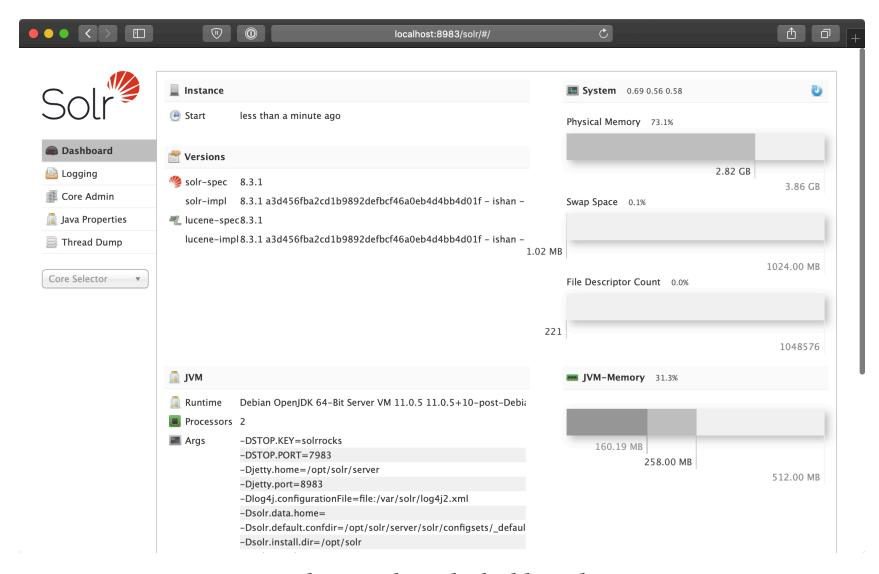

**The Apache Solr dashboard.**

This is great, but it would be even better to have a playbook which runs the container, tests that Solr is working correctly, then stops and removes the container. That way, if we have a CI job for this playbook, we can build and tag the container image, then test it, all using Ansible.

Go ahead and stop and remove the container you just ran, using the first few characters in the container identifier Docker returned after you ran docker run to identify the container:

#### \$ docker rm -f 18b7aed

Now create a playbook named test.yml in the same directory as the main.yml playbook. Start it the same as the main.yml playbook, using the same vars\_files so you have access to the same variables used in the main playbook:

```
1 ---
2 - hosts: localhost
3 gather_facts: false
4
5 vars_files:
6 - vars/main.yml
```

In the pre\_tasks, start a container using the image we just built:

```
8 pre_tasks:
9 - name: Run the solr container.
10 docker_container:
11 image: 'ansible-for-kubernetes/solr:{{ solr_version }}'
12 name: '{{ container_name }}-test'
13 published_ports:
14 - 8983:8983
```

Then in tasks, verify Apache Solr is responding correctly for the default Solr collection using the uri module:

```
16 tasks:
17 - name: Verify Solr is responding.
18 uri:
19 url: http://localhost:8983/solr/collection1/admin/ping
20 return_content: true
21 register: solr_response
22 until:
23 - solr_response.json is defined
24 - solr_response.json.status is defined
25 - solr_response.json.status == 'OK'
26 retries: 5
27 delay: 5
```

The admin/ping URL is built into Apache Solr and returns JSON (assuming Solr is working correctly) with the current status of a given solr collection. The collection1 collection comes by default, and it takes anywhere from a few seconds to a minute for the collection to be loaded on a cold start.

Therefore, for this uri invocation, we've used Ansible's built-in 'retry' functionality. Every delay seconds, Ansible will *retry* this task if it fails (up to retries times), *until* the parameters defined in until are met.

In this case, we take the content returned by a request to the admin/ping URL, register it as a variable, solr\_response, then check for three conditions:

- 1. If the response contains JSON. (While Solr is initializing, the response is completely empty.)
- 2. If the response contains a 'status' key in the JSON. (While the collection is initializing, even after Solr initialization is complete, there may not be a 'status' key in the output.)
- 3. If the 'status' is 'OK'. (This means Solr has initialized both itself and the collection successfully, and is ready to index data and retrieve search results.)

Once that task passes, we know our container image has a working instance of Apache Solr installed, and we can tear down the test container:

```
29 post_tasks:
30 - name: Stop and remove the solr container.
31 docker_container:
32 name: '{{ container_name }}-test'
33 state: absent
```

Run the test playbook:

```
$ ansible-playbook -i inventory test.yml

PLAY [localhost] ************************************
```

On the "Verify Solr is responding" task, you can see the task failed two times (while Solr spent about ten seconds initializing), and then succeeded on the third retry.

Using 'retry' with 'until' is extremely helpful when waiting for a new service to start responding, or when running tasks which could be flaky due to external networking issues or fragile build processes.

#### Apache Solr container build summary

<span id="page-84-0"></span>Sometimes building container images with a Dockerfile is the best choice. But it's nice to have the freedom to build containers in other ways, especially if you have existing Ansible automation to integrate with your container workflows, or if you need to manage more complex container builds—which can quickly turn into a spaghetti mess if done via Dockerfile.


The code used in this example is also available in this book's code repository, in the ansible-solr-container/<sup>50</sup> directory.

 $<sup>^{50}</sup> https://github.com/geerlingguy/ansible-for-kubernetes/tree/master/ansible-solr-container$ 

## **[Summary](https://opensource.com/article/19/10/building-container-images-ansible)**

In this chapter, we explored Ansible's integration with containers. You can build, test, and push container images with Ansible (though you may not need to use Ansible for this), and there are many different ways Ansible can supplement or even replace existing container workflows.

You might also be interested in ansible-bender⁵¹, which integrates tightly with Ansible and Podman to building containers in a more structured way. For more on ansible-bender, check out this Opensource.com article: Building container images with the ansible-bender tool⁵².

Whether or not you end up using Ansible for your app's container management lifecycle, you now know you *can*, and you've learned some interesting things about Ansible playbooks and YAML along the way. At a future trivia night, when someone asks you how to indicate a multi-line literal scalar in YAML, you'll know immediately, "it's |!".

```
_________________________________
/ If you test me, you will fail. \
\ (Sulu, Star Trek Into Darkness) /
---------------------------------
       \ ^__^
        \ (oo)\_______
           (__)\ )\/\
               ||----w |
               || ||
```

⁵¹https://github.com/ansible-community/ansible-bender

⁵²https://opensource.com/article/19/10/building-container-images-ansible

## **Chapter 4 - Building K8s clusters with Ansible**

Ansible's modularity has made it one of the best tools for multi-cloud and multicluster management. While managed Kubernetes clusters are the right solution for many projects, there are times when you need local clusters, or to run Kubernetes [on bare-metal servers. Ans](https://github.com/kelseyhightower/kubernetes-the-hard-way)[ibl](#page-86-1)e is a first-class tool for automating Kubernetes cluster management in any environment.

In this chapter, we'll learn how to use Ansible to build and manage Kubernetes clusters in a variety of environments, including local VMs and bare-metal servers!

## **Building a local Kubernetes cluster on VMs**

For the most valiant reader, you might want to try your hand at bootstrapping Kubernetes The Hard Way⁵³. The linked project walks you through the primitives, and holds your hand through the process of installing tools, generating certificates, writing configuration files, boostrapping etcd, etc.

<span id="page-86-0"></span>But there are many different ways to build 'bare metal' Kubernetes clusters, and one of the most popular and supported ways is to use kubeadm.

<span id="page-86-1"></span>Sin[ce we are using Ansible, we can rely on the](https://github.com/kelseyhightower/kubernetes-the-hard-way) community's existing automation tools, including roles from Ansible Galaxy. There happens to be a role to manage bootstrapping multi-node Kubernetes clusters using kubeadm, and we'll use it in this chapter to build our own local multi-node Kubernetes cluster on VirtualBox VMs.

## **Prerequisites - Vagrant and VirtualBox**

One of the best ways to learn about and debug Kubernetes applications is to have an ephemeral local multi-node cluster. Minikube and other single-node projects like

⁵³https://github.com/kelseyhightower/kubernetes-the-hard-way

Kubernetes-in-Docker (KinD) are great for CI workflows, or for quick testing, but they fall apart when you're building and testing real-world applications, which may behave differently (or break entirely) if run over multiple Kubernetes nodes.

You will need a minimum of 8GB of RAM and a multi-core CPU on your local workstation to build a small-but-competent cluster, but assuming you have that, the easiest way to build a local cluster is to use Vagrant<sup>54</sup> (a development environment management tool) to bootstrap multiple VirtualBox<sup>55</sup> VMs.

There are many other ways you can bring up local VMs and network them together, but I've had great success and reliability for many years with these tools, and I recommend them for local cluster development.

You will need to install Vagrant and VirtualBox, following their official installation instructions (basically, download and run the installers):

- Download VirtualBox<sup>56</sup>
- Download Vagrant<sup>57</sup>

Once you have them both installed, you should be able to run the command vagrant help and get Vagrant's CLI help:

```
$ vagrant help
Usage: vagrant [options] <command> [<args>]

-v, --version
```

<sup>54</sup>https://www.vagrantup.com

<sup>55</sup>https://www.virtualbox.org

<sup>56</sup>https://www.virtualbox.org/wiki/Downloads

<sup>&</sup>lt;sup>57</sup>https://www.vagrantup.com/downloads.html

#### <span id="page-88-0"></span>**A small Kubernetes cluster architecture**

For our local cluster, we are going to build a set of servers that looks like this:

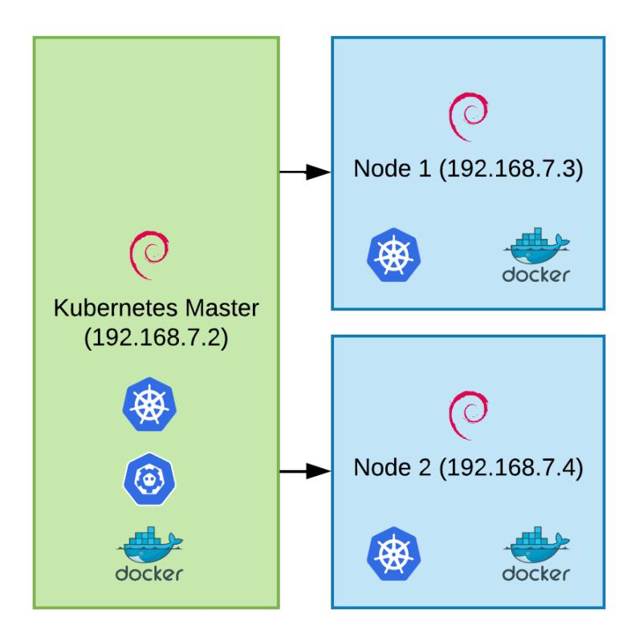

**Local multi-node Kubernetes cluster architecture.**

There will be one Kubernetes master node (running the Kubernetes control plane), and two worker nodes (running workloads).

The master node will run kube-apiserver (which exposes Kubernetes' API), kubescheduler (which schedules workloads on nodes), and etcd (which stores Kubernetes' data).

The worker nodes will run kubelet (an agent that makes sure the right containers are running on the right pods) and a container runtime—in this case, Docker.

<span id="page-89-0"></span>

It's recommended to have multiple masters for redundancy, but not every cluster requires this level of HA, especially since the workloads running on worker nodes can still operate when the master is down. For learning purposes, we'll run with a single master node.

Running a multi-master cluster requires additional infrastructure such as an external load balancer for the API server, which is out of the scope of this example. Please see the documentation for Creating Highly Available clusters with kubeadm⁵⁸ if you're interested in building a fully HA cluster with kubeadm.

#### **A Vagrantfile for local Infrastructure-as-Code**

Vagrant allows you to define servers using a Vagrantfile. We're going to define all three servers in a Vagrantfile, with common settings among the servers for RAM and CPU allocation, and the base OS image (or 'box', in Vagrant terminology) to run on them.

Create a new project directory and inside, create a Vagrantfile, with the following contents:

```
1 # -*- mode: ruby -*-
2 # vi: set ft=ruby :
3
4 VAGRANTFILE_API_VERSION = "2"
5
6 Vagrant.configure(VAGRANTFILE_API_VERSION) do |config|
7 config.vm.box = "geerlingguy/debian10"
8 config.ssh.insert_key = false
9 config.vm.provider "virtualbox"
10 config.vm.synced_folder '.', '/vagrant', disabled: true
11
12 config.vm.provider :virtualbox do |v|
13 v.memory = 2048
14 v.cpus = 2
```

⁵⁸https://kubernetes.io/docs/setup/production-environment/tools/kubeadm/high-availability/

```
15 v.linked_clone = true
16 v.customize ['modifyvm', :id, '--audio', 'none']
17 end
18
19 # Define three VMs with static private IP addresses.
20 boxes = [
21 { :name => "kube1", :ip => "192.168.7.2" },
22 { :name => "kube2", :ip => "192.168.7.3" },
23 { :name => "kube3", :ip => "192.168.7.4" }
24 ]
25
26 # Configure each of the VMs.
27 boxes.each_with_index do |opts, index|
28 config.vm.define opts[:name] do |config|
29 config.vm.hostname = opts[:name] + ".cluster.test"
30 config.vm.network :private_network, ip: opts[:ip]
31 end
32 end
34 end
```

This Vagrantfile does three things:

- 1. Sets default for the VMs about to be created: Each VM will have 2 GB of RAM and 2 virtual CPU cores - Each VM will run the geerlingguy/debian10 base box (Debian Buster). - Each VM will receive a couple tweaks to make sure they run optimally.
- 2. Defines a list of 'boxes', kube1, kube2, and kube3, which will get IP addresses in the range 192.168.7.[2-4].
- 3. Sets the hostname (name.cluster.test) and private network IP address for each box.

If you run vagrant up, Vagrant will spend a couple minutes downloading the Debian base box, then it will boot three VMs with the specified hostnames and IP addresses:

```
$ vagrant up
Bringing machine 'kube1' up with 'virtualbox' provider...
Bringing machine 'kube2' up with 'virtualbox' provider...
Bringing machine 'kube3' up with 'virtualbox' provider...
...
==> kube3: Setting hostname...
==> kube3: Configuring and enabling network interfaces...
```

If you want to log into any of the VMs individually, you can use vagrant ssh, like:

```
$ vagrant ssh kube1
Linux kube1 4.19.0-6-amd64 #1 SMP Debian 4.19.67-2+deb10u1 x86_64
```

The programs included with the Debian GNU/Linux system are free software; the exact distribution terms for each program are described in the individual files in /usr/share/doc/\*/copyright.

Debian GNU/Linux comes with ABSOLUTELY NO WARRANTY, to the extent permitted by applicable law.

```
Last login: Wed Dec 18 23:37:07 2025 from 10.0.2.2
vagrant@kube1:~$
```

But logging into individual servers is not what we're here to do. It's time to automate a cluster build!


You don't *have* to use Vagrant and VirtualBox for this example to work; instead, you could run three cloud servers, or use some other virtualization software. You could even run three separate bare metal servers. The only requirement is all three servers run Debian minimal, they each have a stable, dedicated IP address, and you can access them via SSH.

If you're not using Vagrant, make sure you change the vagrant user details and SSH key path to work with whatever servers you're using.

## <span id="page-92-0"></span>**Building a Kubernetes cluster with Ansible**

Let's create a new playbook, named main.yml. Since this playbook is targeting servers reachable via SSH, the playbook will target a 'group' of all three hosts, which we'll name kube. So start the playbook with:

```
1 ---
2 - hosts: kube
```

#### <span id="page-92-1"></span>**Describing hosts with an inventory**

Now create an inventory file, which will tell Ansible what hosts are in the kube group, and how to connect to them. Add the contents:

```
1 [kube]
2 kube1 ansible_host=192.168.7.2 kubernetes_role=master
3 kube2 ansible_host=192.168.7.3 kubernetes_role=node
4 kube3 ansible_host=192.168.7.4 kubernetes_role=node
5
6 [kube:vars]
7 ansible_ssh_user=vagrant
8 ansible_ssh_private_key_file=~/.vagrant.d/insecure_private_key
```

There's a bit to unpack here. This inventory file uses an INI-like format, and has headings or group names in brackets, then servers and variables defined below each heading.

First, we're defining the kube group. In it, we have a list of three hostnames, kube1, kube2, and kube3. We could define the entire hostname (e.g. kube1.cluster.test), but in this case, working with IP addresses is more reliable, so we define an ansible\_ host variable for each of the three servers. We also define the role of each server using the kubernetes\_role variable—kube1 will be the master, and the other two will be general purpose nodes.

Next, we define variables that will apply to *all* the kube group hosts, including the SSH user Ansible should use to log into the servers, and the SSH private key Ansible should use to authenticate.

<span id="page-93-0"></span>There are other ways to write inventory files (including generating inventory data as JSON using a script of your own design), but this format is easy to use for simpler cases with a static list of servers.

#### **Becoming root in a playbook**

<span id="page-93-1"></span>Going back to the playbook, we will also need to be root to perform most actions, so we can add become: true after the hosts definition:

```
1 ---
2 - hosts: kube
3 become: true
```

This tells Ansible to *become* another user when performing tasks—and if not specified, the default become user is root, and the default method Ansible uses to become that user is sudo.

#### **Building a server with roles**

In my book Ansible for DevOps⁵⁹, I start at the very basics and walk readers through building various server types from scratch. In this book, I will take the luxury of using pre-built Ansible roles from Ansible Galaxy to do some of the heavy lifting.

For an individual Kubernetes cluster server, there are a few thing you have to do:

- 1. Configure basic security settings (e.g. the 'first five minutes' basic security [hardening\), like locking](https://www.ansiblefordevops.com/) down SSH and configuring automatic updates.
- 2. Disable swap memory. Kubernetes' architecture prefers having no swap memory available for performance reasons.
- 3. Install Docker (or another compatible container runtime). Kubernetes needs to run containers, so it needs a container runtime available.
- 4. Install Kubernetes (e.g. kubelet on the nodes, kube-apiserver on the master).

We're in luck, because there are four open source roles available on Ansible Galaxy to do each of those four tasks, with minimal configuration required:

⁵⁹https://www.ansiblefordevops.com

```
    geerlingguy.security<sup>60</sup>
    geerlingguy.swap<sup>61</sup>
    geerlingguy.docker<sup>62</sup>
    geerlingguy.kubernetes<sup>63</sup>
```

To use the roles, they have to be available locally, so add a requirements.yml file listing each of the roles:

```
1 ---
2 roles:
3   - name: geerlingguy.security
4   - name: geerlingguy.swap
5   - name: geerlingguy.docker
6   - name: geerlingguy.kubernetes
```

Then add an ansible.cfg file defining the roles\_path, so the roles will be stored in the project directory:

```
1 [defaults]
2 roles_path = ./roles
3 nocows = 1
4 host_key_checking = False
```

You'll notice I also disabled the host\_key\_checking setting in this file. The reason I did that is because this is a local, ephemeral Kubernetes cluster, and the host keys used for SSH on the individual servers can change each time you rebuild the cluster. It's convenient to disable host key checking to bypass warnings every time you rebuild the cluster.

Now that we have a requirements file, and have told Ansible where roles should be stored, it's time to download the roles:

<sup>60</sup>https://galaxy.ansible.com/geerlingguy/security

<sup>61</sup>https://galaxy.ansible.com/geerlingguy/swap

<sup>62</sup>https://galaxy.ansible.com/geerlingguy/docker

<sup>63</sup>https://galaxy.ansible.com/geerlingguy/kubernetes

```
$ ansible-galaxy install -r requirements.yml
```

And now that the roles are available locally, we can include them in our playbook, in a roles section:

```
11 roles:
12 - geerlingguy.security
13 - geerlingguy.swap
14 - geerlingguy.docker
15 - geerlingguy.kubernetes
```

It' *almost* time to configure the servers with Ansible, but not quite yet. We need to define some variables to customize the roles for our particular cluster.

#### <span id="page-95-0"></span>**Role configuration**

Looking at the README files for each role, you can see a description of all the variables available for customization. Each role needs a few tweaks to make sure they work with our local VMs.

Because Vagrant is built for local development, Vagrant boxes already allow passwordless sudo from the vagrant user, so we don't need to do any extra security configuration besides the defaults defined in the geerlingguy.security role's defaults/main.yml variables file.

For Docker, we don't need to use Docker Compose (since Kubernetes will be handling the running of containers), so we can disable that, and also add the vagrant user to the list of Docker users, for convenience (so the vagrant user can run docker commands).

Create a vars directory with a main variables file inside, at vars/main.yml, and reference it in the main.yml playbook:

```
5 vars_files:
6 - vars/main.yml
```

In the variables file, define the two Docker role override variables:

```
1 ---
2 # Docker configuration.
3 docker_install_compose: false
4 docker_users:
5 - vagrant
```

Next, we need to tell the geerlingguy.swap role to *disable* swap (by default, it's enabled), and we can do that by setting swap\_file\_state to absent, and providing the path to the swap file:

```
7 # Swap configuration.
8 swap_file_state: absent
9 swap_file_path: /dev/mapper/packer--debian--10--amd64--vg-swap_1
```

To get the swap file path, I logged into one of the VMs (vagrant ssh kube1), then inspected the /etc/fstab file, looking for the file system path for the swap entry.

Finally, we need to configure Kubernetes using a few overrides:

```
11 # Kubernetes configuration.
12 kubernetes_version: '1.19'
13 kubernetes_allow_pods_on_master: false
14 kubernetes_apiserver_advertise_address: '192.168.7.2'
15 kubernetes_kubelet_extra_args: '--node-ip={{ ansible_host }}'
```

These four settings are all we need to get Kubernetes to play nice in a cluster of local VMs:

- kubernetes\_version: I always prefer to set a stable version (at least a major release) for my servers, instead of relying on 'latest'. That way I can choose when to upgrade and re-test everything for a newer version.
- kubernetes\_allow\_pods\_on\_master: For a small cluster, it's sometimes desireable to be able to run workloads on the master, because otherwise any free RAM or CPU would be wasted. However, it's not best practice, because you want your scheduler, API server, and etcd server to have all the resources they need to do their job. If you're packing extra services on the master, it can lead to resource contention.

- kubernetes\_apiserver\_advertise\_address: Because VirtualBox sets up multiple virtual network interfaces, we have to specify which IP address the API server should advertise for communication with kubelet on other nodes.
- kubernetes\_kubelet\_extra\_args: Similarly, all the nodes need to advertise their own correct IP address, and if you don't specify it explicitly, kubelet may choose the wrong network interface, leading to an orphaned node that can't communicate with the master.

Now that we have all of our roles configured, it's time to run the playbook and build the cluster!

#### <span id="page-97-0"></span>**Running the cluster build playbook**

With the roles, playbook, and configuration ready to go, let's run the playbook:

```
$ ansible-playbook -i inventory main.yml
...
TASK [geerlingguy.kubernetes : Join node to Kubernetes master] **
changed: [kube2]
changed: [kube3]
RUNNING HANDLER [geerlingguy.kubernetes : restart kubelet] ******
changed: [kube2]
changed: [kube3]
changed: [kube1]
PLAY RECAP ******************************************************
kube1 : ok=49 changed=25 unreachable=0 failed=0 skipped=16
kube2 : ok=43 changed=22 unreachable=0 failed=0 skipped=14
kube3 : ok=43 changed=22 unreachable=0 failed=0 skipped=14
```

Great! To verify cluster functionality, log into the master, switch to the root user, and check that all the system pods are 'Running':

| NAME                          | READY | STATUS  | RESTARTS | AGE   |
|-------------------------------|-------|---------|----------|-------|
| coredns-5644d7b6d9-dgmdq      | 1/1   | Running | 0        | 3m10s |
| coredns-5644d7b6d9-n8rgl      | 1/1   | Running | 0        | 3m10s |
| etcd-kube1                    | 1/1   | Running | 0        | 2m56s |
| kube-apiserver-kube1          | 1/1   | Running | 0        | 2m56s |
| kube-controller-manager-kube1 | 1/1   | Running | 0        | 2m56s |
| kube-flannel-ds-amd64-b2871   | 1/1   | Running | 0        | 3m2s  |
| kube-flannel-ds-amd64-dzc42   | 1/1   | Running | 0        | 3m10s |
| kube-flannel-ds-amd64-kf8z6   | 1/1   | Running | 0        | 3m2s  |
| kube-proxy-5mcdj              | 1/1   | Running | 0        | 3m2s  |
| kube-proxy-6zwlp              | 1/1   | Running | 0        | 3m10s |
| kube-proxy-x9nnq              | 1/1   | Running | 0        | 3m2s  |
| kube-scheduler-kube1          | 1/1   | Running | 0        | 2m56s |

Looks great! Now lets build a separate playbook that deploys an application to the cluster and tests that it works.

## <span id="page-98-0"></span>**Testing the cluster with a deployment using Ansible**

Create a file named test-deployment.yml, and structure it the same way as the main.yml cluster playbook, but tell it to only operate on the master (kube1), since it is configured to be able to connect to the Kubernetes API out of the box:

```
1 ---
2 - hosts: kube1
3 become: true
4
5 vars_files:
6 - vars/main.yml
```

To be able to use Ansible's Kubernetes modules, we need to make sure the openshift Python library is present. It may already be present *locally* (e.g. if you installed it on your workstation using Pip), but it will also need to be present on the Kubernetes nodes if you want to execute Ansible Kubernetes tasks on them.

Add the following pre\_tasks section to ensure the openshift library is present:

```
8 pre_tasks:
9 - name: Ensure k8s module dependencies are installed.
10 pip:
11 name: openshift
12 state: present
```

Now, we're going to deploy a test app and expose it to outside the cluster with a service. The best way to manage Kubernetes applications is to store the associated Deployments, Services, and other object definitions in separate *manifest* files.

In earlier examples, we used inline YAML definitions, which are convenient, but it's even easier to maintain a large number of Kubernetes resources if you separate their object definition YAML into separate files.

So create a files directory in your playbook directory, and inside, create two files:

```
• files/hello-k8s-deployment.yml
• files/hello-k8s-service.yml
```

For the deployment, add the following contents to hello-k8s-deployment.yml:

```
1 ---
2 apiVersion: apps/v1
3 kind: Deployment
4 metadata:
5 name: hello-k8s
6 namespace: default
7 spec:
8 replicas: 3
9 selector:
10 matchLabels:
11 app: hello-k8s
```

```
12 template:
13 metadata:
14 labels:
15 app: hello-k8s
16 spec:
17 containers:
18 - name: hello-k8s
19 image: paulbouwer/hello-kubernetes:1.5
20 ports:
21 - containerPort: 8080
```

This will run three replicas of the 'hello-k8s' container, available over port 8080. To distribute requests to the backends, define a service in the hello-k8s-service.yml file:

```
1 ---
2 apiVersion: v1
3 kind: Service
4 metadata:
5 name: hello-k8s
6 namespace: default
7 spec:
8 type: NodePort
9 ports:
10 - port: 8080
11 targetPort: 8080
12 selector:
13 app: hello-k8s
```

Now, in the Ansible playbook, we need a task to apply the two manifest files. Create a tasks section, and add a task using the k8s module to deploy the two files:

```
14 tasks:
15 - name: Create hello-k8s resources and wait until they are Ready.
16 k8s:
17 state: present
18 definition: "{{ lookup('file', 'files/' + item) }}"
19 wait: true
20 with_items:
21 - hello-k8s-deployment.yml
22 - hello-k8s-service.yml
```

This task uses Ansible's lookup plugin, which reads a file at a given path, and outputs the content of that file where it is templated. And it does that twice, once for each of the items in the with\_items list.

We're loading the contents of the file into the definition parameter of this task, and we're doing that twice, once for the deployment, and once for the service.

You can skip the lookup plugin if the manifest file is available on the server where the task is running. If that's the case, provide a path to the file in the src parameter and drop the definition. But because this task is running on the Kubernetes master server, and the file is local on the workstation, we need to use lookup to load in the file contents.


You can also use lookup to *template* a file, meaning you can use the full power of Ansible's Jinja templating engine in Kubernetes manifests, using something like:

```
definition: "{{ lookup('template', 'path/to/manifest.yml.jinja') }}"
```

We also added wait: true to make sure Ansible waits until all the pods in the deployment are 'Ready', before continuing on to test that the Deployment works correctly.

The default wait\_timeout is 120 seconds, and Ansible will check on the status every 5 seconds (the wait\_sleep default), so this is the first check to ensure the health of our application.

Next, we'll send an HTTP request to the app, to make sure it's responding correctly. Since the service is of type 'NodePort', it should be reachable on any of the servers' public IP addresses (e.g. 192.168.7.2) on the port Kubernetes assigns.

When using NodePort, the port number is dynamic, so it will be different any time you rebuild the cluster. We need Ansible to discover the port, so we can use the k8s\_info module to gather information about the hello-k8s service:

```
29 - name: Get hello-k8s service details.
30 k8s_info:
31 kind: Service
32 name: hello-k8s
33 namespace: default
34 register: svc
```


The k8s\_info module was named k8s\_facts in Ansible 2.8 and earlier. Use the older module name if you're on an older version of Ansible.

This registers a svc variable, which you could inspect by adding a debug task and running the playbook, for example:

```
- name: Print the full svc variable.
  debug: var=svc
```

Using that, we can find the correct structure to define the service's NodePort, and to make it easier to use in the next task, we can use set\_fact:

```
36 - name: Set the service NodePort as a variable.
37 set_fact:
38 port: "{{ svc['resources'][0]['spec']['ports'][0]['nodePort'] }\
39 }"
```

Finally, use the uri module to make a request. The URI task will fail if the request does not return a 200 OK response:

```
40 - name: Test a request to the service.
41 uri:
42 url: http://{{ ansible_host }}:{{ port }}/
43
44 - name: Print the URL for hello-k8s.
45 debug:
46 msg: http://{{ ansible_host }}:{{ port }}/
```

There's also a task immediately following using the debug module which prints the full URL used for the service (which will come in handy later).

Let's run the playbook to make sure the app is deployed and running properly:

```
$ ansible-playbook -i inventory test-deployment.yml
...
TASK [Get hello-k8s service details.] ***************************
ok: [kube1]
TASK [Set the service NodePort as a variable.] ******************
ok: [kube1]
TASK [Test a request to the service.] ***************************
fatal: [kube1]: FAILED! => {"changed": false, "content": "",
"elapsed": 30, "msg": "Status code was -1 and not [200]: Request
failed: <urlopen error timed out>", "redirected": false,
"status": -1, "url": "http://192.168.7.2:32202/"}
PLAY RECAP ******************************************************
kube1 : ok=6 changed=2 unreachable=0 failed=1 skipped=0
```

That's not good! It looks like something is broken. This is a very simple application, and it should be running, but it's not responding to requests on the NodePort.

The Pods all seem to have deployed successfully, and the service is present, otherwise Ansible wouldn't have been able to get a NodePort to use. But something must be wrong on the networking layer, because an HTTP request timed out.

## <span id="page-104-0"></span>**De[bugging clu](https://kubernetes.io/docs/tasks/debug-application-cluster/debug-service/)[s](#page-104-1)ter networking issues**

For c[ustom-built Kubernetes](https://kubernetes.io/docs/tasks/administer-cluster/dns-debugging-resolution/) [c](#page-104-2)lusters, a lot of the frustrations you'll encounter will be due to networking issues. Kubernetes has a relatively complex network layer, for both IP-based routing and DNS routing, and probably 80% of the issues I've ever encountered in my own bare-metal clusters have to do with one of those layers.

Luckily, Kubernetes' documentation has two great pages devoted to debugging broken networking:

- Debug Services⁶⁴
- Debug DNS Resolution⁶⁵

I always like to begin by running an interactive Pod inside the same namespace as my application, then debug things inside that Pod.

So I'm going to log into the Kubernetes master and switch to the root user:

```
$ vagrant ssh kube1
vagrant@kube1 $ sudo su
```

Then I'll check on my application pods that should be running:

```
# kubectl get pods -l app=hello-k8s
NAME READY STATUS RESTARTS AGE
hello-k8s-6ff5898cfb-66ghd 1/1 Running 0 9m5s
hello-k8s-6ff5898cfb-8pbsj 1/1 Running 0 9m5s
hello-k8s-6ff5898cfb-bnrdt 1/1 Running 0 9m5s
```

The Pods seem fine, so I'll start another pod alongside them and drop into it, using kubectl exec:

⁶⁴https://kubernetes.io/docs/tasks/debug-application-cluster/debug-service/

⁶⁵https://kubernetes.io/docs/tasks/administer-cluster/dns-debugging-resolution/

```
# kubectl run -i --tty busybox --image=busybox --restart=Never -- sh
If you don't see a command prompt, try pressing enter.
/ #
```

This drops me into a busybox container with a few helpful tools, like wget, nslookup, and ping.

First, I'm going to try using nslookup to verify DNS is working inside the cluster. Every pod should be able to get a route to kubernetes.default, so I'll first test that:

```
/ # nslookup kubernetes.default
;; connection timed out; no servers could be reached
```

Hmm… that doesn't look promising. At this point, I'm tempted to blame the problem on DNS, because:

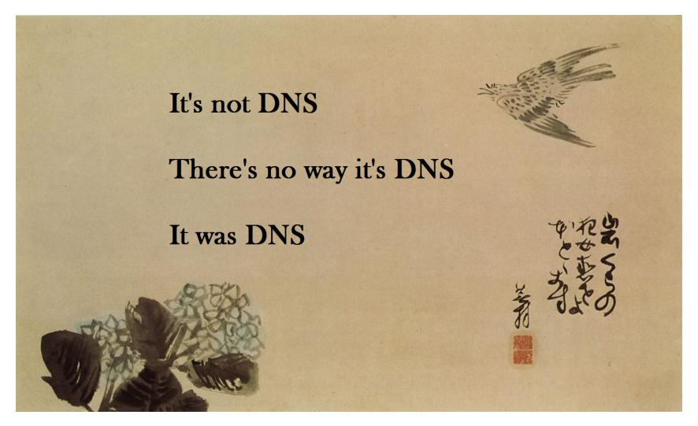

**It's always DNS.**

However, the 'no servers could be reached' message makes it seem this could be deeper than a DNS issue. It could be there are no network routes between pods at all! I'll check the IP address of the DNS server this Pod is using, and then try pinging it:

```
/ # cat /etc/resolv.conf
nameserver 10.96.0.10
search default.svc.cluster.local svc.cluster.local cluster.local
options ndots:5
/ # ping 10.96.0.10 -c 1
PING 10.96.0.10 (10.96.0.10): 56 data bytes
--- 10.96.0.10 ping statistics ---
1 packets transmitted, 0 packets received, 100% packet loss
```

Inter[esting. Earlier, when we checked all th](https://github.com/coreos/flannel/blob/master/Documentation/troubleshooting.md#vagrant)[e](#page-106-2) system pods, they reported 'Running', and that included the DNS pods which run CoreDNS. So at this point, I'm inclined to think IP networking is the issue. (For once, it's not DNS!).

And indeed, after searching Google for topics like "Pods can't ping each other", and reading through a number of GitHub issues and Stack Overflow Q&As, I found two important resources:

- <span id="page-106-0"></span>• Ensure iptables tooling does not use the nftables backend⁶⁶.
- Flannel CNI: Vagrant troubleshooting⁶⁷

Since we're using Debian Buster, which uses nftables, we need to switch it to use iptables-legacy instead.

<span id="page-106-2"></span><span id="page-106-1"></span>The geerlingguy.kubernetes [role uses Flannel for its pod networking by default](https://kubernetes.io/docs/setup/production-environment/tools/kubeadm/install-kubeadm/#ensure-iptables-tooling-does-not-use-the-nftables-backend), so [acco](https://kubernetes.io/docs/setup/production-environment/tools/kubeadm/install-kubeadm/#ensure-iptables-tooling-does-not-use-the-nftables-backend)[rding to the Flannel documentation, we need to specify the Vag](https://github.com/coreos/flannel/blob/master/Documentation/troubleshooting.md#vagrant)rant machine's --iface explicitly, in the kube-flannel container's command.

#### **Fixing issues with Flannel and iptables**

Unfortunately, this means our playbook has to be a little bit more complex; it won't just be some variables and a few roles. But that's life with Kubernetes—in cluster builds, very rarely will everything work 'out of the box'. It's a complex system that

⁶⁶https://kubernetes.io/docs/setup/production-environment/tools/kubeadm/install-kubeadm/#ensure-iptablestooling-does-not-use-the-nftables-backend

⁶⁷https://github.com/coreos/flannel/blob/master/Documentation/troubleshooting.md#vagrant

performs complex tasks, and even though things are very stable nowadays, you can't expect it to work in every case, for everyone, without modification.

To keep the main playbook clean, create a new tasks folder in the playbook directory, and inside, create a file named vagrant-setup.yml. This way, we can keep the tasks required to get our cluster running in the *Vagrant* environment separate from the main playbook.

#### <span id="page-107-0"></span>**Switching nftables to iptables-legacy**

The switch to use iptables-legacy is pretty easy to do, using the Debian alternatives system. In fact, Ansible has a module for it!

Inside vagrant-setup.yml, add a task to switch to iptables-legacy (and ip6tableslegacy, for completeness):

```
1 ---
2 # See: https://github.com/kubernetes/kubernetes/issues/71305
3 - name: Use iptables-legacy instead of nftables.
4 alternatives:
5 name: '{{ item.name }}'
6 path: '{{ item.path }}'
7 with_items:
8 - { name: iptables, path: /usr/sbin/iptables-legacy }
9 - { name: ip6tables, path: /usr/sbin/ip6tables-legacy }
```

This task does the equivalent of running the following commands:

```
# update-alternatives --set iptables /usr/sbin/iptables-legacy
# update-alternatives --set ip6tables /usr/sbin/ip6tables-legacy
```

#### <span id="page-107-1"></span>**Patching Flannel to use the right network interface**

Flannel is a little bit more difficult to deal with. The default and easiest way to install Flannel in a cluster is to directly apply the Flannel manifest, which is hosted on GitHub.

But we need to modify the manifest to include the --iface flag, and it would be very complicated to try to load the entire manifest as YAML, inject the flag in the correct YAML document and place (especially considering there are a dozen manifest documents in one file), and then apply it.

We have two options, then:

- 1. Maintain a forked copy of the Flannel inst[allation manifest.](https://raw.githubusercontent.com/coreos/flannel/master/Documentation/kube-flannel.yml)
- 2. Download the manifest, patch it, then apply it.

The first option may make sense if you're willing to maintain that forked manifest, and could help provide a more stable cluster installation experience, especially since it wouldn't rely on retrieving the manifest from a remote GitHub repository.

But the second option is simpler for our local development purposes (this cluster is not going to run production workloads on the public Internet), so we'll go that route.

To create the patch file, you can download the Flannel Kubernetes manifest⁶⁸, then add the item - --iface=enp0s8 to the args under the kube-flannel container inside the kube-flannel-ds-amd64 DaemonSet. Then create a patch using the diff utility, and you should end up with a patch file like:

```
1 --- kube-flannel.yml 2025-12-18 09:29:04.000000000 -0600
2 +++ kube-flannel-virtualbox.yml 2025-12-18 09:30:01.000000000 -0600
3 @@ -189,6 +189,7 @@
4 args:
5 - --ip-masq
6 - --kube-subnet-mgr
7 + - --iface=enp0s8
8 resources:
9 requests:
10 cpu: "100m"
```

Save that patch file as kube-flannel-patch.txt inside the playbook's files directory, and then go back to the vagrant-setup.yml task file.

In that file, we need to download the Flannel manifest from GitHub, then patch it so it's customized for our local cluster's network.

⁶⁸https://raw.githubusercontent.com/coreos/flannel/master/Documentation/kube-flannel.yml

```
11 # See: https://www.jeffgeerling.com/k8s-cni-virtualbox
12 - name: Retrieve current Flannel manifest from GitHub.
13 get_url:
14 url: https://raw.githubusercontent.com/coreos/flannel/master/Docume\
15 ntation/kube-flannel.yml
16 dest: ~/kube-flannel.yml
17 when: inventory_hostname == 'kube1'
18
19 - name: Patch Flannel manifest with VirtualBox interface.
20 patch:
21 src: files/kube-flannel-patch.txt
22 dest: ~/kube-flannel.yml
23 when: inventory_hostname == 'kube1'
```

The first task downloads kube-flannel.yml from GitHub into the file *<sup>∼</sup>*/kube.flannel.yml, which places it in the root user's home directory. The second task uses Ansible's patch module to apply the patch (from our files directory) to the kube-flannel.yml file.

We only need to do this on the Kubernetes master (kube1), so a when conditional was added to these tasks to limit them to the master node.

Now that the patch is applied, the last step is to force the geerlingguy.kubernetes role to use our customized Flannel manifest, instead of the default one from GitHub:

```
11 - name: Set the correct path for the patched Flannel manifest.
12 set_fact:
13 kubernetes_flannel_manifest_file: ~/kube-flannel.yml
14 when: inventory_hostname == 'kube1'
```

Now, edit the main.yml cluster build playbook, and add an include to make sure the vagrant-setup.yml tasks file is included and run before the roles:

```
8 pre_tasks:
9 - include_tasks: tasks/vagrant-setup.yml
10
11 roles:
12 ...
```

You could just run the main.yml playbook again, but the problem is it may not apply the change to the Flannel configuration correctly. The nice thing about using Vagrant and Ansible is *everything is automated*, so let's do something powerful that's enabled by this automation: throw it out and rebuild it from scratch!

Destroy the local cluster entirely:

```
$ vagrant destroy -f
```

Then build it again:

\$ vagrant up

And then run the Ansible playbook to configure Kubernetes:

```
$ ansible-playbook -i inventory main.yml
```


Vagrant can automatically run the Ansible playbook, as well. In this example, we kept the Vagrant build process separate from the Ansible playbook run, but we could've added a section to the bottom of our Vagrantfile to run the entire playbook as part of the vagrant up process, using Vagrant's ansible provisioner. After the config.vm.network line, you can add:

```
# Provision all the VMs using Ansible after last VM is up.
if index == boxes.size - 1
  config.vm.provision "ansible" do |ansible|
    ansible.compatibility_mode = "2.0"
    ansible.playbook = "main.yml"
    ansible.inventory_path = "inventory"
    ansible.limit = "all"
  end
end
```

This runs the main.yml playbook against all the servers, after the last server (kube3) is running.

After the build is finished, run the test playbook again, and see if it works now:

```
$ ansible-playbook -i inventory test-deployment.yml
...
TASK [Set the service NodePort as a variable.] ************************
ok: [kube1]

TASK [Test a request to the service.] ************************
ok: [kube1]

TASK [Print the URL for hello-k8s.] ****************************
ok: [kube1] => {
    "msg": "http://192.168.7.2:31812/"
}

PLAY RECAP ************************************
```

This time it works! With the two networking adjustments, we've fixed our Kubernetes cluster. If you open a browser window, you should even be able to see the hello-kubernetes page by accessing the NodePort on any of the three servers, e.g. http://192.168.7.3:31812 (note: the port will be different for you; see the play output for the correct port).

<span id="page-112-0"></span>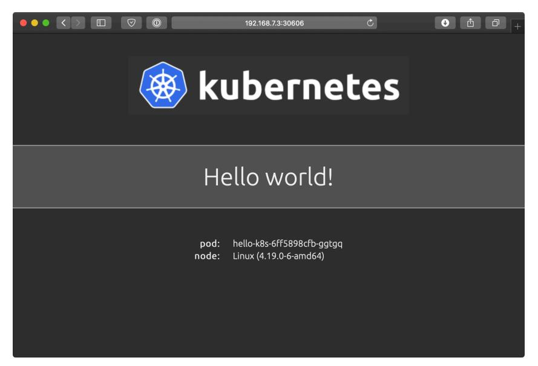

**Hello world in our Kubernetes cluster.**

#### **Local VM cluster summary**

An[sible can be used to manage servers whether running loc](https://github.com/geerlingguy/ansible-for-kubernetes/tree/master/cluster-local-vms)ally or in a cloud environment. It's often useful to build servers locally since you have more control over networking, and you can easily scrap and rebuild everything without incurring any extra expense (besides maybe buying a laptop with many GB of RAM!).


The code used in this example is also available in this book's code repository, in the cluster-local-vms/⁶⁹ directory.

⁶⁹https://github.com/geerlingguy/ansible-for-kubernetes/tree/master/cluster-local-vms

<span id="page-113-0"></span>

## **Building a cluster using Kubespray**

The local cluster we built on three VirtualBox VMs is hardly production-grade. It could work for some use cases, especially for something like a CI environment for your Kubernetes projects, or a non-production staging environment. But in production, you want to have more HA, and that means more servers and more configuration.

<span id="page-113-1"></span>There's an official Ansible-based cluster building tool called Kubespray⁷⁰, and it touts being able to build 'Production Ready' Kubernetes clusters on any cloud environment, or on bare metal servers.

<span id="page-113-2"></span>Kubespray is similar to our earlier playbook in that it uses kubeadm on the backend to build many parts of the cluster, but it goes beyond the earlier example to allow a large array of customizable options (e.g. you can choose from one of *nine* different CNI network plugins (our local cluster playbook only supports Flannel or Calico out of the box).

## **Building a cluster on VPSes using Kubespray**

TODO.

## **B[uilding a bare meta](https://github.com/kubernetes-sigs/kubespray)l cluster using Raspberry Pis**

In 2019, the Raspberry Pi Foundation introduced the Raspberry Pi 4 model B, with options including 1, 2, or 4 GB of RAM, and a decent ARM processor and I/O, including gigabit ethernet. I don't advocate running heavily-used production Kubernetes clusters on Raspberry Pis, but I have been interested on cluster computing on Raspberry Pis for some time.

⁷⁰https://github.com/kubernetes-sigs/kubespray


A Raspberry Pi Kubernetes cluster.

For a few hundred dollars, you can build a multi-node cluster with reasonably-competent hardware, and as long as you keep things powered and cooled adequately, the cluster will run well for a long time.

<span id="page-114-0"></span>How do I know? I've been running a Kubernetes cluster of Raspberry Pis (starting with the Pi 2 model B in 2017) continuously, at my house, serving the public website www.pidramble.com<sup>71</sup>.

<span id="page-114-1"></span>I document all the necessary equipment, and even open-sourced the entire Ansible playbook that is used to configure networking and run a Drupal website on the cluster—in fact, the Drupal site codebase that runs pidramble.com is also open source!

If you want to build a cluster of your own, check out the Pi Dramble Wiki<sup>72</sup>, as well as the Raspberry Pi Dramble open source codebase<sup>73</sup> that builds and deploys applications to the cluster.

<sup>71</sup>https://www.pidramble.com/

<sup>&</sup>lt;sup>72</sup>https://www.pidramble.com/wiki

<sup>&</sup>lt;sup>73</sup>https://github.com/geerlingguy/raspberry-pi-dramble

<span id="page-115-0"></span>

## **Summary**

In this chapter, you learned how Ansible can be used to build Kubernetes clusters from scratch, integrating with tools like kubeadm.

You could build local clusters, clusters on VMs in cloud environments, or even clusters on bare-metal servers using Ansible. But managing your own Kubernetes clusters isn't for everyone. In the next chapter, we'll explore using Ansible to manage *managed* Kubernetes clusters on popular cloud hosting platforms.

```
_________________________________
/ Your first command together was \
| less than successful. You are |
\ all dead. (Tuvok, VOY) /
---------------------------------
       \ ^__^
        \ (oo)\_______
           (__)\ )\/\
              ||----w |
              || ||
```

<span id="page-116-0"></span>

## **Chapter 5 - Build an AWS EKS Cluster with CloudFormation and Ansible**

<span id="page-116-1"></span>Ansible can build bespoke Kubernetes clusters in a variety of situations, but it's also great for building and managing *managed* clusters from popular cloud providers, like Amazon, Google, and Azure.

[In this](https://docs.ansible.com/ansible/latest/modules/aws_eks_cluster_module.html) [ch](#page-116-2)apter, we'll learn how to use Ansible to build and manage an Amazon Elastic Kubernetes Service (EKS) cluster using AWS CloudFormation Templates and Ansible, and then we'll deploy a WordPress application on it.

## **Managing AWS EKS clusters with CloudFormation**

Ansible includes a number of AWS-specific modules, including the aws\_eks\_ cluster⁷⁴ module, which can control AWS resources directly:

```
- name: Create an EKS cluster
  aws_eks_cluster:
    name: test_cluster
    role_arn: test_role_id
    subnets:
      - subnet-one-id-here
      - subnet-two-id-here
    security_groups:
      - eks-security-group
  register: eks_cluster_info
```

⁷⁴https://docs.ansible.com/ansible/latest/modules/aws\_eks\_cluster\_module.html

Sometimes, it's not as effecient to use Ansible modules to directly manipulate AWS infrastructure components, especially for services which require a lot of related resource coordination. AWS offers their own 'Infrastructure-as-Code' solution, CloudFormation⁷⁵, and it's a reliable way to define AWS infrastructure via YAML templates.

Ansible is very good at applying and updating CloudFormation templates, via the cloudformation⁷⁶ module.

For a simple AWS EKS cluster, you need to build out at least a few basic components, as shown in the following diagram:

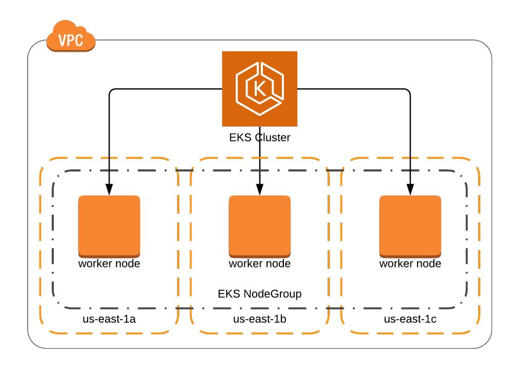

**AWS EKS cluster architecture.**

<span id="page-117-0"></span>In CloudFormation's flavor of YAML, the VPC in the architecture diagram would be defined like so:

⁷⁵https://aws.amazon.com/cloudformation/

⁷⁶https://docs.ansible.com/ansible/latest/modules/cloudformation\_module.html

VPC:

Type: AWS::EC2::VPC

Properties:

CidrBlock: 172.16.0.0/16 EnableDnsSupport: true EnableDnsHostnames: true

Tags:

- Key: Name

Value: eks-example

We will build out an EKS cluster using three main CloudFormation templates:

- 1. One for AWS networking components (a VPC, an Internet Gateway, a Route, and Subnets).
- 2. One defining the EKS Cluster.
- 3. One defining an EKS Node Group, which is a managed Auto Scaling Group of EC2 instances joined to Kubernetes as individual worker nodes.

## <span id="page-118-0"></span>**CloudFormation Templates**

Create a new project folder for the AWS EKS Cluster, named cluster-aws-eks. Inside that folder, create a directory to store all the CloudFormation templates, named cloudformation.

#### <span id="page-118-1"></span>**CloudFormation template for VPC Networking**

AWS has a fairly robust virtual networking model, and although this book won't get into the details, we'll need to set up a basic network in which the EKS cluster will reside.

Most AWS servers and services reside inside a Virtual Private Cloud (VPC), an isolated section of the AWS cloud environment with a virtual network you define. The VPC can have portions of the network exposed to the Internet, and portions isolated on a private subnet. It can also be configured to directly connect to a corporate network via a VPC bridge, if your applications require a 'hybrid cloud' setup.

So the first thing to do is create a CloudFormation template's basic metadata (including the template version and description), and the VPC definition. Create a new file in the cloudformation directory, named vpc.yml:

```
1 ---
2 AWSTemplateFormatVersion: '2010-09-09'
3 Description: VPC and network configuration for an EKS cluster.
4
5 Parameters:
6
7 Region:
8 Type: String
9 Default: us-east-1
10 Description: AWS Region for the VPC.
11
12 Resources:
13
14 VPC:
15 Type: AWS::EC2::VPC
16 Properties:
17 CidrBlock: 172.16.0.0/16
18 EnableDnsSupport: true
19 EnableDnsHostnames: true
20 Tags:
21 - Key: Name
22 Value: eks-example
```

The Parameters section of the template allows for parameters that Ansible can pass into the template.

In this Parameters section, we defined Region, which can be used in the rest of the template using the syntax !Ref Region or using a CloudFormation substitution macro like Fn::Sub: '\${Region}'. We'll need to specify regions for Subnets, so we've defined Region as a template parameter, with a default of us-east-1.


You could use Jinja *directly* on the template if you want, but Parameters are a more CloudFormation-native method that allows the templates to work within the CloudFormation ecosystem more easily, and enables easier sharing of templates among different accounts, even when not using Ansible.

After the VPC, we need an Internet Gateway, to attach the VPC (and our cluster) to the Internet. We also need a Route and Route Table to allow IP traffic to go from the VPC to the Internet:

```
24 InternetGateway:
25 Type: AWS::EC2::InternetGateway
26 Properties:
27 Tags:
28 - Key: Name
29 Value: eks-example
30
31 AttachGateway:
32 Type: AWS::EC2::VPCGatewayAttachment
33 Properties:
34 VpcId: !Ref VPC
35 InternetGatewayId: !Ref InternetGateway
36
37 RouteTable:
38 Type: AWS::EC2::RouteTable
39 Properties:
40 VpcId: !Ref VPC
41 Tags:
42 - Key: Name
43 Value: eks-example
44
45 Route:
46 Type: AWS::EC2::Route
47 Properties:
48 RouteTableId: !Ref RouteTable
49 DestinationCidrBlock: 0.0.0.0/0
```

```
50 GatewayId: !Ref InternetGateway
51 DependsOn: AttachGateway
```

We also need a Network Access Control List (ACL) which allows traffic to pass into and out from the VPC:

```
53 NetworkAcl:
54 Type: AWS::EC2::NetworkAcl
55 Properties:
56 VpcId: !Ref VPC
57 Tags:
58 - Key: Name
59 Value: eks-example
60
61 InboundNetworkAclEntrySSH:
62 Type: AWS::EC2::NetworkAclEntry
63 Properties:
64 NetworkAclId: !Ref NetworkAcl
65 RuleNumber: 100
66 RuleAction: allow
67 Protocol: -1
68 Egress: false
69 CidrBlock: 0.0.0.0/0
70 PortRange:
71 From: 22
72 To: 22
73
74 OutboundNetworkAclEntryAll:
75 Type: AWS::EC2::NetworkAclEntry
76 Properties:
77 NetworkAclId: !Ref NetworkAcl
78 RuleNumber: 101
79 RuleAction: allow
80 Protocol: -1
81 Egress: true
82 CidrBlock: 0.0.0.0/0
```

```
83 PortRange:
84 From: 0
85 To: 65535
```

All cluster resources—including the EKS cluster control plane nodes, EC2 nodes in the EKS Node Group, and every individual Kubernetes Pod—need IP addresses available to them within the VPC, so we will create multiple subnets, within at least two (preferably three or more) Availability Zones (AZs). AZs are unique per AWS region, but typically there are at least an a, b, and c AZ in every region.

```
87 Subnet1a:
88 Type: AWS::EC2::Subnet
89 Properties:
90 VpcId: !Ref VPC
91 AvailabilityZone:
92 Fn::Sub: '${Region}a'
93 CidrBlock: 172.16.0.0/18
94 MapPublicIpOnLaunch: true
95 Tags:
96 - Key: Name
97 Value: eks-example-a
98
99 Subnet1aRouteTableAssociation:
100 Type: AWS::EC2::SubnetRouteTableAssociation
101 Properties:
102 SubnetId: !Ref Subnet1a
103 RouteTableId: !Ref RouteTable
104
105 Subnet1aNetworkAclAssociation:
106 Type: AWS::EC2::SubnetNetworkAclAssociation
107 Properties:
108 SubnetId: !Ref Subnet1a
109 NetworkAclId: !Ref NetworkAcl
110
111 Subnet1b:
112 Type: AWS::EC2::Subnet
```

```
113 Properties:
114 VpcId: !Ref VPC
115 AvailabilityZone:
116 Fn::Sub: '${Region}b'
117 CidrBlock: 172.16.64.0/18
118 MapPublicIpOnLaunch: true
119 Tags:
120 - Key: Name
121 Value: eks-example-b
122
123 Subnet1bRouteTableAssociation:
124 Type: AWS::EC2::SubnetRouteTableAssociation
125 Properties:
126 SubnetId: !Ref Subnet1b
127 RouteTableId: !Ref RouteTable
128
129 Subnet1bNetworkAclAssociation:
130 Type: AWS::EC2::SubnetNetworkAclAssociation
131 Properties:
132 SubnetId: !Ref Subnet1b
133 NetworkAclId: !Ref NetworkAcl
134
135 Subnet1c:
136 Type: AWS::EC2::Subnet
137 Properties:
138 VpcId: !Ref VPC
139 AvailabilityZone:
140 Fn::Sub: '${Region}c'
141 CidrBlock: 172.16.128.0/18
142 MapPublicIpOnLaunch: true
143 Tags:
144 - Key: Name
145 Value: eks-example-c
146
147 Subnet1cRouteTableAssociation:
148 Type: AWS::EC2::SubnetRouteTableAssociation
```

```
149 Properties:
150 SubnetId: !Ref Subnet1c
151 RouteTableId: !Ref RouteTable
152
153 Subnet1cNetworkAclAssociation:
154 Type: AWS::EC2::SubnetNetworkAclAssociation
155 Properties:
156 SubnetId: !Ref Subnet1c
157 NetworkAclId: !Ref NetworkAcl
```

These subnets will allocate addresses in the IP ranges 172.16.0.0/18, 172.16.64.0/18, and 172.16.128.0/18, allowing nearly 50,000 Pods and other resources in the VPC.

Note that if you create subnets without accounting for the IP address allocation you will need for *all* the resources in your cluster (and other AWS resources that tie into the cluster), you'll be in for a world of hurt when you inevitably run out. I like to make sure I have at least 50% overhead when designing the network; it's not impossible to expand or migrate VPCs, but it's not fun to do.

Finally, we can define Outputs in the CloudFormation template, which allows consumers of the template (including Ansible) to quickly access certain resource metadata, like the created VPC's ID, or the created Subnet IDs. Other templates will need this data for the creation of resources, so define two Outputs to finish off the networking template:

```
159 Outputs:
160
161 VpcId:
162 Description: VPC id
163 Value: !Ref VPC
164
165 Subnets:
166 Description: List of Subnets in the VPC
167 Value:
168 Fn::Sub: '${Subnet1a},${Subnet1b},${Subnet1c}'
```

With this template complete, it's time to build an EKS Cluster template.


To make the templates easier to maintain, we split them by resource type (network, cluster, and cluster nodes). *Technically* we could stuff everything into one template, but it makes the template longer and harder to maintain, and risks running into individual CloudFormation template limits (e.g. maximum of 60 parameters and outputs, 200 resources, or 50KB template body).

#### <span id="page-125-0"></span>**CloudFormation template for an EKS Cluster**

To create an EKS Cluster, we need to specify a few more Parameters, including the VPC ID (which will come from the VPC CloudFormation stack), a list of all the VPC's Subnets (so the Cluster members can be placed within these subnets), a cluster name, and the Kubernetes version the Cluster should be running.

Create a template named eks-cluster.yml and put the initial metadata and parameters into it:

```
1 ---
2 AWSTemplateFormatVersion: '2010-09-09'
3 Description: 'EKS Cluster definition.'
4
5 Parameters:
6
7 VpcId:
8 Type: String
9 Description: VPC ID.
10
11 Subnets:
12 Type: CommaDelimitedList
13 Description: List of subnets in the VPC.
14
15 ClusterName:
16 Type: String
17 Description: EKS Kubernetes cluster name.
18
19 KubernetesVersion:
```

```
20 Type: String
21 Description: EKS Kubernetes cluster version.
```

The EKS Cluster needs to have an IAM Role assigned to it, with two policies, AmazonEKSClusterPolicy and AmazonEKSServicePolicy, so it has the right permissions for EKS to manage AWS resources associated with your cluster. Add the Role as the first resource in the template's Resources section:

```
23 Resources:
24
25 ClusterRole:
26 Type: AWS::IAM::Role
27 Properties:
28 AssumeRolePolicyDocument:
29 Version: 2012-10-17
30 Statement:
31 Effect: Allow
32 Principal:
33 Service:
34 - eks.amazonaws.com
35 Action: sts:AssumeRole
36 ManagedPolicyArns:
37 - arn:aws:iam::aws:policy/AmazonEKSClusterPolicy
38 - arn:aws:iam::aws:policy/AmazonEKSServicePolicy
```

Then add a basic security group EKS can use to allow cluster communication with worker nodes (which will be configured in the next template):

```
40 ClusterControlPlaneSecurityGroup:
41 Type: AWS::EC2::SecurityGroup
42 Properties:
43 GroupDescription: Cluster communication with worker nodes.
44 VpcId: !Ref VpcId
```

Finally, define the cluster itself:

```
46 Cluster:
47 Type: "AWS::EKS::Cluster"
48 Properties:
49 Name: !Ref ClusterName
50 Version: !Ref KubernetesVersion
51 RoleArn: !GetAtt ClusterRole.Arn
52 ResourcesVpcConfig:
53 SecurityGroupIds:
54 - !Ref ClusterControlPlaneSecurityGroup
55 SubnetIds: !Ref Subnets
```

The cluster definition references a few parameters that we'll pass in using Ansible:

- ClusterName
- KubernetesVersion
- Subnets

And it also references two values from other resources created in the same template:

- ClusterRole.Arn: The Amazon Resource Name (ARN) of the ClusterRole which gives the EKS cluster the ability to manage its own AWS resources.
- ClusterControlPlaneSecurityGroup: The Security Group ID for the security group that allows communication between the EKS control plane and worker nodes.

Finally, we can output two values which will come in handy later:

```
57 Outputs:
58
59 ClusterName:
60 Value: !Ref ClusterName
61 Description: Cluster Name
62 Export:
63 Name:
64 Fn::Sub: "${AWS::StackName}-ClusterName"
65
66 ClusterEndpoint:
67 Value: !GetAtt Cluster.Endpoint
68 Description: Cluster Endpoint
69 Export:
70 Name:
71 Fn::Sub: "${AWS::StackName}-ClusterEndpoint"
```

<span id="page-128-0"></span>The ClusterName will need to be passed through when c[reating the EKS Node G](https://docs.aws.amazon.com/eks/latest/userguide/managed-node-groups.html)[ro](#page-128-1)up, and the ClusterEndpoint can be used by automation to connect to the cluster's API endpoint.

#### **CloudFormation template for an EKS Node Group**

At this point, we could create our own EC2 instances and join them to the cluster manually, or even build the cluster and use it with no worker nodes, but we wouldn't be able to run any services or applications on the cluster.

<span id="page-128-1"></span>But [AWS makes worker node provisioning easier with](https://docs.aws.amazon.com/eks/latest/userguide/managed-node-groups.html) Managed Node Groups⁷⁷, so we'll create a final template to set up a Managed Node Group attached to our cluster.

Create a new file eks-nodegroup.yml and put in the metadata and five parameters we'll use to define the Node Group:

⁷⁷https://docs.aws.amazon.com/eks/latest/userguide/managed-node-groups.html

```
1 ---
2 AWSTemplateFormatVersion: "2010-09-09"
3 Description: 'EKS Node Group definition.'
4
5 Parameters:
6
7 ClusterName:
8 Type: String
9 Description: The EKS cluster name.
10
11 NodeGroupName:
12 Type: String
13 Description: Unique identifier for the Node Group.
14
15 NodeInstanceType:
16 Type: String
17 Default: t3.medium
18 Description: EC2 instance type for the node instances.
19
20 NodeGroupDesiredCapacity:
21 Type: Number
22 Default: 3
23 Description: Desired capacity of Node Group ASG.
24
25 Subnets:
26 Type: "List<AWS::EC2::Subnet::Id>"
27 Description: The subnets where workers can be created.
```

The ClusterName will come from the EKS Cluster template's outputs, and the Subnets will come from the VPC template's outputs. The other three parameters will be passed in by Ansible when we deploy the template.

Now, just like we had to add an IAM Role to allow the EKS Cluster to manage associated AWS resources, we need to add a Role to allow the Node Group EC2 instances to interact with associated resources (the EKS Cluster, VPC networking, and EC2 Container Registries):

```
29 Resources:
30
31 NodeInstanceRole:
32 Type: "AWS::IAM::Role"
33 Properties:
34 AssumeRolePolicyDocument:
35 Version: "2012-10-17"
36 Statement:
37 - Effect: Allow
38 Principal:
39 Service:
40 - ec2.amazonaws.com
41 Action:
42 - "sts:AssumeRole"
43 ManagedPolicyArns:
44 - "arn:aws:iam::aws:policy/AmazonEKSWorkerNodePolicy"
45 - "arn:aws:iam::aws:policy/AmazonEKS_CNI_Policy"
46 - "arn:aws:iam::aws:policy/AmazonEC2ContainerRegistryReadOnly"
47 Path: /
```

And finally, we can define the Node Group, using references to the NodeInstanceRole and parameters passed in to the template:

```
49 NodeGroup:
50 Type: 'AWS::EKS::Nodegroup'
51 Properties:
52 NodegroupName: !Ref NodeGroupName
53 ClusterName: !Ref ClusterName
54 NodeRole: !GetAtt NodeInstanceRole.Arn
55 InstanceTypes:
56 - !Ref NodeInstanceType
57 ScalingConfig:
58 MinSize: 2
59 DesiredSize: !Ref NodeGroupDesiredCapacity
60 MaxSize: 5
61 Subnets: !Ref Subnets
```

At this point, the cloudformation folder of your project should have the following files:

```
cloudformation/
  eks-cluster.yml
  eks-nodegroup.yml
  vpc.yml
```

Now that we have our three CloudFormation templates, we need to be able to apply them easily and automatically, and to do *that*, we'll build an Ansible playbook.

#### <span id="page-131-0"></span>**Applying CloudFormation Templates with Ansible**

Create an inventory file in the cluster-aws-eks directory, with the contents:

```
1 [localhost]
2 127.0.0.1 ansible_connection=local
```

Then create a variables file in vars/main.yml to store variables you'll use in the playbook. Finally, create a main.yml playbook alongside the inventory file, with a reference to the vars file:

```
1 ---
2 - hosts: localhost
3 gather_facts: false
4
5 vars_files:
6 - vars/main.yml
```

The first thing we need to do is create the VPC using the cloudformation/vpc.yml template. To do that, we'll need to define a few variables for Ansible to use in the vars/main.yml file. Add the following variables to that file:

```
1 ---
2 ansible_python_interpreter: '{{ ansible_playbook_python }}'
3
4 # AWS Settings.
5 aws_environment: true
6 aws_region: us-east-1
7 aws_profile: default
8
9 # This variable will be populated during playbook runs.
10 stack_outputs: {}
```

The first three variables allow us to specify AWS settings, including the region where CloudFormation stacks will be deployed, and the profile that Ansible will use to interact with AWS.

The stack\_outputs is an empty dictionary that will be modified as the playbook runs, to contain data from CloudFormation stack Outputs we defined in the templates.

With these variables available, we can create our first two tasks in the playbook: one to apply the vpc.yml template, and another to add the Outputs from that template to the stack\_outputs variable:

```
8 tasks:
9 - name: Ensure VPC exists via CloudFormation.
10 cloudformation:
11 stack_name: eks-example-vpc
12 state: present
13 region: "{{ aws_region }}"
14 profile: "{{ aws_profile }}"
15 disable_rollback: false
16 template: cloudformation/vpc.yml
17 template_parameters:
18 Region: "{{ aws_region }}"
19 tags:
20 stack: eks-example-vpc
21 application: eks-example
22 register: vpc_info
```

```
23
24 - name: Add to stack_outputs.
25 set_fact:
26 stack_outputs: "{{ stack_outputs | combine(vpc_info['stack_outp\
27 uts']) }}"
```

Because the vpc.yml template has a Region parameter, we specify it under the Ansible cloudformation module task's template\_parameters. We also define a few tags which will be applied to the CloudFormation stack in AWS.


It's a good idea to apply useful tags to all resources within AWS, as many tools can be made to track resources based on tags. For example, larger AWS accounts running hundreds or thousands of servers may be difficult and unweildy to manage, especially if you're trying to figure out how much you're paying for each type of application you run! Using tags like application: eks-example—as long as you consistently use them—means you'll be able to track resources by that tag and reason about how much they cost, and how many there are.

The second task uses the registered fact, vpc\_info, to store the outputs in the stack\_ outputs variable. The combine() Jinja filter combines all the data from the vpc\_ info['stack\_outputs'] dictionary with the existing stack\_outputs dictionary.

The next task supplies some of the variables stored in stack\_outputs to the template\_ parameters for the eks-cluster.yml template.

Before we can use the eks-cluster.yml template, we need to define a few variables to pass to its parameters, namely the ClusterName and KubernetesVersion. Add the following variables in the vars/main.yml file:

```
10 # EKS Cluster settings.
11 eks_cluster_name: eks-example
12 # See: https://docs.aws.amazon.com/eks/latest/userguide/platform-versio\
13 ns.html
14 eks_kubernetes_version: "1.17"
```

The Kubernetes version must be one of the supported EKS platform versions⁷⁸.

Now we're ready to add a task to apply the eks-cluster.yml template, and another task to combine its outputs with those from the vpc.yml stack:

```
28 - name: Ensure EKS Cluster exists via CloudFormation.
29 cloudformation:
30 stack_name: eks-example-cluster
31 state: present
32 region: "{{ aws_region }}"
33 profile: "{{ aws_profile }}"
34 disable_rollback: false
35 template: cloudformation/eks-cluster.yml
36 template_parameters:
37 ClusterName: "{{ eks_cluster_name }}"
38 KubernetesVersion: "{{ eks_kubernetes_version }}"
39 Subnets: "{{ stack_outputs.Subnets }}"
40 VpcId: "{{ stack_outputs.VpcId }}"
41 tags:
42 stack: eks-example-cluster
43 application: eks-example
44 register: eks_cluster_info
45
46 - name: Add to stack_outputs.
47 set_fact:
48 stack_outputs: "{{ stack_outputs | combine(eks_cluster_info['st\
49 ack_outputs']) }}"
```

This task uses the Subnets and VpcId stack outputs from the VPC stack, which were stored in the stack\_outputs dictionary previously. And it passes in the cluster name and Kubernetes version directly, using the variables defined in vars/main.yml.

The final task will create an EKS Node Group. For that, we need to add three additional variables in vars/main.yml to pass to eks-nodegroup.yml template parameters:

https://docs.aws.amazon.com/eks/latest/userguide/platform-versions.html

*# Nodegroup settings.*

```
16 eks_nodegroup_name: eks-example-nodegroup
17 eks_nodegroup_instance_type: t3.medium
18 eks_nodegroup_cluster_size: 3
   Create the final task in the main.yml playbook:
50 - name: Ensure EKS Node Group exists via CloudFormation.
51 cloudformation:
52 stack_name: eks-example-nodegroup
53 state: present
54 region: "{{ aws_region }}"
55 profile: "{{ aws_profile }}"
56 disable_rollback: false
57 template: cloudformation/eks-nodegroup.yml
58 template_parameters:
59 ClusterName: "{{ eks_cluster_name }}"
60 NodeGroupName: "{{ eks_nodegroup_name }}"
61 NodeGroupDesiredCapacity: "{{ eks_nodegroup_cluster_size }}"
62 NodeInstanceType: "{{ eks_nodegroup_instance_type }}"
63 Subnets: "{{ stack_outputs.Subnets }}"
64 tags:
65 stack: eks-example-nodegroup
66 application: eks-example
67 register: eks_nodegroup_info
```

<span id="page-135-0"></span>At [this point, the playbook should be ready to go. Before you can](https://docs.aws.amazon.com/mediapackage/latest/ug/setting-up-create-iam-user.html) *ru[n](#page-135-0)* the playbook, you need to make sure of the following:

- 1. The system where you are running the playbook should have the boto3 Python library available. You can install this via pip install boto3.
- 2. You have an AWS account allowing programmatic access using an access key and secret key.
- 3. Your AWS account's IAM permissions allow for management of CloudFormation resources, VPCs, EKS Clusters, and other associated resources. (For testing, it's easiest to make sure your IAM account is an admin account⁷⁹.)

https://docs.aws.amazon.com/mediapackage/latest/ug/setting-up-create-iam-user.html

4. You have made the access and secret keys available to Ansible either via environment variables (e.g. AWS\_ACCESS\_KEY\_ID and AWS\_SECRET\_ACCESS\_KEY), or you have configured one or more profiles (this playbook assumes the default profile) in *<sup>∼</sup>*/.aws/credentials.

Once you are ready, you can run this playbook to configure all the CloudFormation stacks:

\$ ansible-playbook -i inventory main.yml

It takes some time to build all the cluster resources; it is common to wait 10-20 minutes for this playbook to finish the first time it runs.

After the cluster and nodegroup are created, you should see one EKS cluster and three EC2 instances running, and you can start to manage the cluster with Ansible.

<span id="page-136-0"></span>

The IAM account you use to build the cluster will inherit the system:master permissions in the cluster, and only that account will be able to make the initial changes to the cluster via kubectl or Ansible. If you're automating the process with a service account, ma[ke sure to add a step in which that](https://docs.aws.amazon.com/eks/latest/userguide/install-aws-iam-authenticator.html) [servic](https://docs.aws.amazon.com/eks/latest/userguide/install-aws-iam-authenticator.html)[e](#page-136-1) account adds another user as system:master[, otherwise you may](https://docs.aws.amazon.com/cli/latest/userguide/cli-chap-install.html) be locked out of administering your own cluster!

<span id="page-136-1"></span>

## **A[uthenticating to the EKS Cluster via](https://docs.aws.amazon.com/eks/latest/userguide/install-aws-iam-authenticator.html) kubeconfig**

EKS clusters require a special tool, aws-iam-authenticator, to authenticate via IAM. You need to have this tool installed (following the installation instructions in the EKS documentation⁸⁰), and then you can use the AWS CLI (see install instructions here⁸¹) to generate a kubeconfig file for use authenticating to the EKS cluster.

Once you have both tools installed, run the command:

⁸⁰https://docs.aws.amazon.com/eks/latest/userguide/install-aws-iam-authenticator.html

⁸¹https://docs.aws.amazon.com/cli/latest/userguide/cli-chap-install.html

```
$ aws eks --region us-east-1 update-kubeconfig --name eks-example --kub\
econfig ~/.kube/eks-example
```

This creates a kubeconfig file located in *<sup>∼</sup>*/kube/eks-example. To let kubectl know where the file is, set the KUBECONFIG environment variable:

```
$ export KUBECONFIG=~/.kube/eks-example
```

Test that you can see the cluster with kubectl:

```
$ kubectl get svc
NAME TYPE CLUSTER-IP EXTERNAL-IP PORT(S) AGE
kubernetes ClusterIP 10.100.0.1 <none> 443/TCP 19m
```

If you can see the cluster via kubectl, then Ansible can see the cluster the same way. There are a few other ways to manage the connection details that we won't get into here, but this is usually the easiest way to connect to an EKS cluster.

<span id="page-137-0"></span>

## **Deploying WordPress to the EKS Cluster**

Now that we have an EKS cluster and some worker nodes, we can deploy applications to the cluster. WordPress is a popular blogging platform and Content Management System (CMS) that is popular for hosting websites and blogs, and it is easy to deploy a simple WordPress site into Kubernetes.

Because we're going to deploy it into EKS, we need to have a way for the outside world to access the WordPress site via HTTP, and the easiest way to do that is to use a Kubernetes Load Balancer Service which—when you're using EKS—automatically connects an Elastic Load Balancer (ELB) to the service and routes requests to the Pods behind the Service.

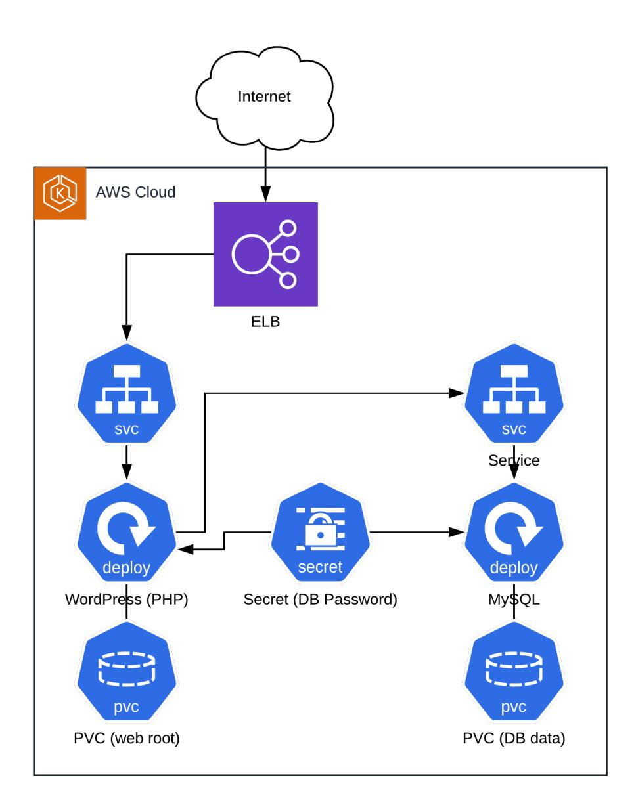

**WordPress architecture in EKS.**

There will be two Deployments, one for WordPress (in a container running the Apache web server and PHP), and one for MySQL. Each Deployment will run a single Pod with a Persistent Volume Claim to store persistent data (the WordPress site code, and the MySQL database). They will both access a secret containing the MySQL database password. The MySQL Deployment will be exposed internally on port 3306 (but not available external to the cluster), and the WordPress Deployment will be exposed to the Internet on port 80, via an ELB.

The ELB will have a DNS record associated with it, and to use a custom domain name to access the WordPress site, you will need to add an ALIAS DNS record to your domain pointing at the ELB's domain name. In this example, we'll assume the DNS is managed in AWS Route53, but other DNS providers should have a similar configuration.

#### **Build the WordPress Kubernetes manifests**

The first requirement for this application is a shared MySQL database password, which we'll store in the cluster as a Secret.

First, we need to define a password; for now, we can add a plain text password variable in the [vars/m](https://docs.ansible.com/ansible/latest/user_guide/vault.html)[ai](#page-139-0)n.yml file for the project (after the various CloudFormation variables):

20 # WordPress settings.

21 wordpress\_mysql\_password: ebJYfAi2QjhPsR

<span id="page-139-0"></span>

Storing sensitive data such as passwords and secret keys in your Ansible playbooks as plain text is generally not a good idea. For the sake of simplicity, we are storing the password in an unencrypted vars file here, [but for real-world production systems,](https://docs.ansible.com/ansible/latest/user_guide/vault.html) it would be better to either use [Ansible Vault⁸²](https://www.vaultproject.io/) to encrypt the vars, or to integrate a 3rd party secret management solution like HashiCorp Vault⁸³ with your Kubernetes cluster. The management of external secret management systems is out of this book's scope.

Now we're ready to create some Kubernetes manifests for the various WordPress components. Create a new directory named wordpress in the EKS cluster project, and create a file named mysql-pass.yml, with the following contents:

⁸²https://docs.ansible.com/ansible/latest/user\_guide/vault.html

⁸³https://www.vaultproject.io

```
1 ---
2 apiVersion: v1
3 kind: Secret
4 metadata:
5 name: mysql-pass
6 namespace: default
7 labels:
8 app: wordpress
9 data:
10 password: "{{ wordpress_mysql_password | b64encode }}"
```

This Secret will store the wordpress\_mysql\_password we just defined as mysql-pass in the default namespace. The | b64encode filter is required because Kubernetes Secrets require data values to be Base64-encoded.

Next, create a mysql.yml file in the wordpress directory, and add the following Service definition, which will allow applications (e.g. WordPress) to access the database by name on port 3306:

```
1 ---
2 apiVersion: v1
3 kind: Service
4 metadata:
5 name: wordpress-mysql
6 namespace: default
7 labels:
8 app: wordpress
9 spec:
10 ports:
11 - port: 3306
12 selector:
13 app: wordpress
14 tier: mysql
15 clusterIP: None
```

We intentionally set clusterIP to None to make this a 'headless' service; that is, there

will be no load balancing of requests for multiple backend pods, it will just direct requests to the MySQL pod using DNS.

Next, we need a Persistent Volume Claim so we can have persistent storage backing the MySQL database. If we neglected this, the entire database would vanish any time the server or the MySQL Pod restarted! This particular site may be a low-traffic site with little content, but to allow for a generous amount of expansion, we'll request 20 GiB of storage for the database:

```
17 ---
18 apiVersion: v1
19 kind: PersistentVolumeClaim
20 metadata:
21 name: mysql-pv-claim
22 namespace: default
23 labels:
24 app: wordpress
25 spec:
26 accessModes:
27 - ReadWriteOnce
28 resources:
29 requests:
30 storage: 20Gi
```


This storage claim doesn't include a spec.storageClassName, so it will use the default storage class configured in the cluster. For better performance (especially for use with databases which require more IOPS), you would usually create an additional Storage Class that uses higher speed storage, for example, on AWS, a Storage Class named io1 with a high iopsPerGB value.

Finally, we will define the MySQL Deployment, which will manage a single database container, attached to the persistent storage we defined previously, available on port 3306:

```
32 ---
33 apiVersion: apps/v1
34 kind: Deployment
35 metadata:
36 name: wordpress-mysql
37 namespace: default
38 labels:
39 app: wordpress
40 spec:
41 selector:
42 matchLabels:
43 app: wordpress
44 tier: mysql
45 strategy:
46 type: Recreate
47 template:
48 metadata:
49 labels:
50 app: wordpress
51 tier: mysql
52 spec:
53 containers:
54 - image: mysql:5.6
55 name: mysql
56 env:
57 - name: MYSQL_ROOT_PASSWORD
58 valueFrom:
59 secretKeyRef:
60 name: mysql-pass
61 key: password
62 ports:
63 - containerPort: 3306
64 name: mysql
65 volumeMounts:
66 - name: mysql-persistent-storage
67 mountPath: /var/lib/mysql
```

```
68 volumes:
69 - name: mysql-persistent-storage
70 persistentVolumeClaim:
71 claimName: mysql-pv-claim
```

In volumes we referenced the Persistent Volume Claim (PVC) defined previously, and then mounted the path /var/lib/mysql in the container into that PVC's storage. We also set the container's MYSQL\_ROOT\_PASSWORD using a reference to the password key defined in the mysql-pass secret also defined earlier.

The final manifest for WordPress itself is very similar to the MySQL manifest, with a Service, a Persistent Volume Claim, and a Deployment. The only major difference is the Service is of type 'LoadBalancer', and the container exposes port 80 instead of 3306.

Create a wordpress.yml file in the wordpress directory, and put the following Service at the top:

```
1 ---
2 apiVersion: v1
3 kind: Service
4 metadata:
5 name: wordpress
6 namespace: default
7 labels:
8 app: wordpress
9 spec:
10 ports:
11 - port: 80
12 selector:
13 app: wordpress
14 tier: frontend
15 type: LoadBalancer
```

This service exposes any pods with the labels app: wordpress and tier: frontend on port 80 using a Load Balancer. In EKS's case, this will trigger the creation of an Elastic Load Balancer (ELB) in front of the WordPress pods.

Next, add a Persistent Volume Claim (PVC) for WordPress, so the WordPress web root (including WordPress code and media files) is stored in a persistent volume:

```
17 ---
18 apiVersion: v1
19 kind: PersistentVolumeClaim
20 metadata:
21 name: wp-pv-claim
22 namespace: default
23 labels:
24 app: wordpress
25 spec:
26 accessModes:
27 - ReadWriteOnce
28 resources:
29 requests:
30 storage: 20Gi
```

And finally, add a WordPress deployment:

```
32 ---
33 apiVersion: apps/v1
34 kind: Deployment
35 metadata:
36 name: wordpress
37 namespace: default
38 labels:
39 app: wordpress
40 spec:
41 selector:
42 matchLabels:
43 app: wordpress
44 tier: frontend
45 strategy:
46 type: Recreate
47 template:
```

```
48 metadata:
49 labels:
50 app: wordpress
51 tier: frontend
52 spec:
53 containers:
54 - image: wordpress:5.3-apache
55 name: wordpress
56 env:
57 - name: WORDPRESS_DB_HOST
58 value: wordpress-mysql
59 - name: WORDPRESS_DB_PASSWORD
60 valueFrom:
61 secretKeyRef:
62 name: mysql-pass
63 key: password
64 ports:
65 - containerPort: 80
66 name: wordpress
67 volumeMounts:
68 - name: wordpress-persistent-storage
69 mountPath: /var/www/html
70 volumes:
71 - name: wordpress-persistent-storage
72 persistentVolumeClaim:
73 claimName: wp-pv-claim
```

This deployment has a similar structure to the MySQL deployment, with a volume and volume mount which stores the entire WordPress document root (/var/www/html) in persistent storage. It also injects the MySQL password into the container in the environment variable WORDPRESS\_DB\_PASSWORD.

It also adds another hard-coded environment variable WORDPRESS\_DB\_HOST. Where did we get the value wordpress-mysql from? Well, Kubernetes automatically routes DNS requests for any service name in a given namespace to that service. So, because we named the MySQL service wordpress-mysql, we can access the MySQL instance via that DNS name.

At this point, you should have three manifest files in the wordpress directory:

```
wordpress/
  mysql-pass.yml
  mysql.yml
  wordpress.yml
```

All but the mysql-pass.yml manifest *could* be deployed manually, using kubectl apply -f. But we should automate everything using Ansible—and doing so allows us to inject variables into manifests like wordpress\_mysql\_password inside mysql-pass.yml.

## **Build an Ansible Playbook to deploy the manifests to EKS**

We already have a main.yml playbook which creates the AWS resources to support an EKS cluster, so create a second playbook named deploy.yml in which we'll deploy WordPress to the cluster.

First, as with the main playbook, we'll create a play that operates on localhost, doesn't gather facts, and references the main variables file:

```
1 ---
2 - hosts: localhost
3 gather_facts: false
4
5 vars_files:
6 - vars/main.yml
```

For the first task, it is important to deploy the MySQL password secret without logging anything to the screen, so the password itself is not leaked in the playbook's output. Using the k8s module, we will loop over all the YAML documents defined in the mysql-pass.yml file, templating them using Ansible's lookup plugin:

```
8 tasks:
9 - name: Deploy WordPress secrets.
10 k8s:
11 definition: '{{ item }}'
12 kubeconfig: '{{ k8s_kubeconfig }}'
13 state: present
14 loop: "{{ lookup('template', 'wordpress/mysql-pass.yml') | from_y\
15 aml_all | list }}"
16 no_log: true
```

Let's go through this task in detail, since there are a few new things going on that you might not understand:

- We've done a lookup before, in the previous chapter. Here, we're using the template lookup plugin to read a file and then template it using Jinja, before passing the result into the task.
- The data that is templated is then passed to two filters:
  - **–** from\_yaml\_all: This filter parses *multi-document* YAML files (one or more YAML documents separated by ---) into a generator of documents.
  - **–** list: This filter converts the documents into a list, which can be looped over, one by one.
- The list of YAML documents, now templated and parsed, is passed to the task's loop parameter, which runs the task once for each item (with item being the contents of the individual list item—in this case, a templated YAML document).
- The kubeconfig parameter tells Ansible where to look for a kubeconfig file to be used when connecting to the cluster.
- The no\_log parameter forces Ansible to hide any output for this task, even when run with higher verbosity. This is important to safeguard the password from being output into the console output and logs, which may be streamed or stored in less secure locations.

To the last point, we need to define the k8s\_kubeconfig path, which is the path to the file we generated earlier using the aws eks update-kubeconfig command. So add the following variable to the vars/main.yml file:

```
27 # Kubernetes settings.
28 k8s_kubeconfig: ~/.kube/eks-example
```

We don't *technically* need to loop through a list of YAML documents for this task. We could've just as easily used from\_yaml instead of from\_yaml\_all in this instance, but I prefer to use the same task layout for all my Kubernetes manifest deployments, to allow for manifests to grow or change over time without requiring changes to the Ansible playbook.

For the next task, we'll use the same essential structure, and loop over both of the other manifest files:

```
17 - name: Deploy MySQL and WordPress.
18 k8s:
19 definition: '{{ item }}'
20 kubeconfig: '{{ k8s_kubeconfig }}'
21 state: present
22 loop:
23 - "{{ lookup('template', 'wordpress/mysql.yml') | from_yaml_all\
24 | list }}"
25 - "{{ lookup('template', 'wordpress/wordpress.yml') | from_yaml\
26 _all | list }}"
```

We don't *need* the template lookup here (though in this case we *do* need from\_ yaml\_all since these manifests have multiple YAML documents)—but again, I like to use the same pattern to allow flexibility in the future. It is likely that over time, I'll want to be able to use more variables for the MySQL and WordPress configuration, for example if I want to deploy this app into a staging and production cluster, with different defined resource limits, but using the same manifest template.

At this point, the deploy.yml playbook is able to deploy a WordPress instance into the cluster. If you ran the playbook, it would result in an ELB pointing at WordPress, but to be able to access the site, you would either need to enter a very long random ELB DNS name, or manually point a DNS CNAME or ALIAS record at the ELB's DNS name.

Since we're using AWS, and since (presumably) the DNS records are managed in Route 53, we can extend this playbook and manage the DNS automatically, making turnkey WordPress setup that much easier.

#### **Point a custom domain at the WordPress ELB**

Before going further, you should know there is an entire project, ExternalDNS⁸⁴, devoted to tying Kubernetes Ingress and Services to external DNS providers via their APIs. That project works with many popular DNS providers, and might be a better option depending on your needs.

In this example, though, we'll use Ansible to integrate a DNS record in a Route 53 hosted zone with the Elastic Load Balancer EKS provisioned for our WordPress service.

The steps involved include:

- 1. Getting the ELB's DNS name.
- 2. Waiting for the ELB to be responsive (it can sometimes take minutes for an ELB to provision and start routing traffic).
- 3. Getting all the properties of the ELB from AWS.
- 4. Using the data from step 3 to create an A ALIAS record pointing a domain record at the Wordpress app.

<span id="page-149-0"></span>So first things first, add a task to get the wordpress service's information using the k8s\_info module. That module returns a hostname in its output, which we'll use to ide[ntify the ELB:](https://github.com/kubernetes-sigs/external-dns)

⁸⁴https://github.com/kubernetes-sigs/external-dns

```
26 - name: Get load balancer DNS name.
27 k8s_info:
28 kubeconfig: '{{ k8s_kubeconfig }}'
29 kind: Service
30 name: wordpress
31 namespace: default
32 register: wordpress_svc
33
34 - name: Set the load balancer URL as a fact.
35 set_fact:
36 wordpress_lb_host: "{{ wordpress_svc['resources'][0]['status'][\
37 'loadBalancer']['ingress'][0]['hostname'] }}"
38 when: aws_environment | bool
```

Using set\_fact to set the wordpress\_lb\_host makes it easy to refer to the ELB's hostname through the rest of the play (without having to define the entire structure of the wordpress\_svc in follow-up tasks).

Now add a task to wait for the ELB to start responding.

```
39 - name: Wait for Load Balancer to respond.
40 uri:
41 url: "http://{{ wordpress_lb_host }}"
42 register: lb_result
43 until: lb_result.status == 200
44 retries: 60
45 delay: 5
46 when: aws_environment | bool
```

On the first playbook run, it's common to have to wait 3-5 minutes before the ELB created by EKS for the WordPress service is active. On subsequent runs, it should be up right away. Adding retries with an until condition allows this task to wait just long enough to guarantee the ELB is available.

Once the ELB is active, we can get all of its details using the AWS ec2\_elb\_info module:

```
48 - name: Get ELB info.
49 ec2_elb_info:
50 region: "{{ aws_region }}"
51 profile: "{{ aws_profile }}"
52 names: "{{ wordpress_lb_host.split('-')[0] }}"
53 register: elb_info
54 when: aws_environment | bool
```

The name of the ELB is derived from the first part of the hostname we retrieved using k8s\_info earlier. We use that name to find the ELB, and register its data to a new variable elb\_info.

The final task adds a record in a given hosted zone in Route 53:

```
56 - name: Add an A record in Route53 (if configured).
57 route53:
58 profile: "{{ aws_profile }}"
59 zone: '{{ wordpress_route53_zone }}'
60 record: '{{ wordpress_route53_domain }}'
61 state: present
62 type: A
63 ttl: 300
64 value: '{{ wordpress_lb_host }}.'
65 alias: true
66 alias_hosted_zone_id: "{{ elb_info['elbs'][0]['canonical_hosted\
67 _zone_name_id'] }}"
68 wait: true
69 when:
70 - aws_environment | bool
71 - wordpress_route53_zone != ''
72 - wordpress_route53_domain != ''
```

The last two when conditions on this task allow it to be skipped if you don't explicitly set a wordpress\_route53\_zone *and* wordpress\_route53\_domain.

If you use Route 53 for your DNS, you can set a value for those two variables in vars/main.yml. If not, you can leave them as empty strings (''):

```
23 # Domain settings for Route53 DNS.
24 wordpress_route53_zone: '' # e.g. 'example.com'
25 wordpress_route53_domain: '' # e.g. 'wordpress.example.com'
```

This means the playbook could be used with WordPress sites that have domains managed via Route 53, as well as domains managed via other DNS services—you would just need to make sure that each playbook run has either specified the zone and domain, or used an empty string.

The route53 module either creates the new A record (if it doesn't exist), or ensures the A record has the properties given here.

#### **Run the playbook to deploy WordPress**

Now that everything (including DNS) is automated in the deploy.yml playbook, you're ready to deploy a WordPress site in your fresh EKS cluster.

Run the playbook:

```
1 ansible-playbook -i inventory deploy.yml
```

And in a few minutes, you should be able to access your WordPress installation at the configured domain (or via the ELB's hostname, which can be found with kubectl get svc). If everything worked correctly, you should be redirected to the WordPress installer:

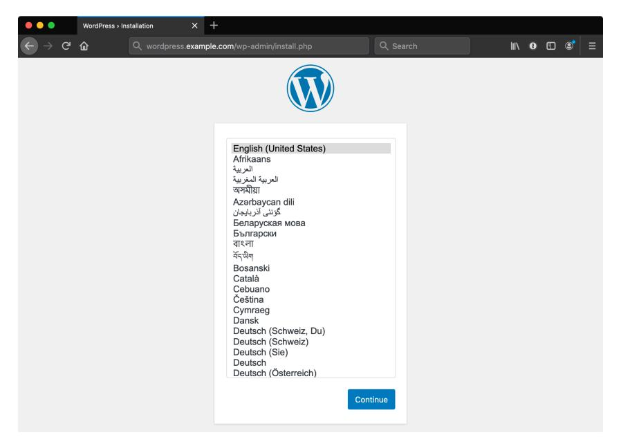

**WordPress is ready to be installed in EKS.**


After you're finished using this test EKS instance, be sure to delete all the resources you created, or you'll be billed hourly for the EKS cluster and EC2 EKS nodes. See the chapter summary for a link to this chapter's code examples, which include a delete.yml playbook to automate the removal of all the resources created in the chapter.

## **Summary**

In this chapter, we discovered the many ways Ansible can interact with AWS services, including direct manipulation of AWS resources, management of CloudFormation stacks and templates, and integration with EKS clusters.

The goal is not to force you into using a specific architecture for EKS clusters, but to show that Ansible is flexible and can be used for as many—or as few—parts of EKS automation as you'd like!


The code used in this chapter is also available in this book's code repository, in the cluster-aws-eks/⁸⁵ directory. That code includes a delete.yml playbook which can be used to clean up all the resources created in this chapter.

```
_________________________________
/ I don't like to lose. I don't \
| believe in the no-win scenario. |
\ (James T Kirk, TOS) /
---------------------------------
       \ ^__^
        \ (oo)\_______
           (__)\ )\/\
              ||----w |
              || ||
```

⁸⁵https://github.com/geerlingguy/ansible-for-kubernetes/tree/master/cluster-aws-eks

<span id="page-155-0"></span>

## **Chapter 6 - Manage a GKE Cluster with Terraform and Ansi[ble](https://www.terraform.io/docs/providers/google/r/container_cluster.html)**

<span id="page-155-1"></span>TODO.

## **Managing Google Cloud GKE clusters with Terraform**

TODO: See google\_container\_cluster⁸⁶ examples.

## **Summary**

TODO.

```
________________________________________
/ Computers make excellent and efficient \
| servants; but I have no wish to serve |
\ under them. (Spock, TOS) /
----------------------------------------
       \ ^__^
        \ (oo)\_______
           (__)\ )\/\
              ||----w |
              || ||
```

⁸⁶https://www.terraform.io/docs/providers/google/r/container\_cluster.html

<span id="page-156-0"></span>

## **Chapter 7 - Development and CI Testing with Molecule, Kind, and Ansible**

Developing and testing application deployments in Kubernetes can be difficult. You may have a fragile build-develop-test cycle which is difficult to integrate with your CI platform.

It's important to have a stable development and testing environment, and it makes Kubernetes development much easier if this environment is lightweight and easy to build and rebuild.


**Molecule's logo**

Molecule<sup>87</sup> is a Python tool which makes Ansible development easy, and you can integrate it with Kind<sup>88</sup> to manage development and test environments and ensure your code works.

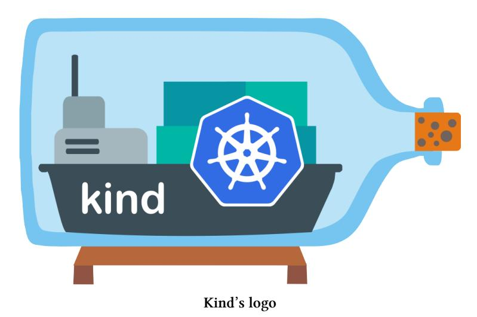

Kind doesn't replicate advanced functionality like external load balancers, specialized node types, or multiple storage classes in a full-fledged cloud environment, but it lets you run a full Kubernetes cluster locally with Docker, and run tests against it.


For a true User Acceptance Testing (UAT) or staging environment, it's best to set up an exact replica of your production environment. Some teams and projects need this level of test capability prior to approving and pushing changes to production. Even in that case, Molecule and Kind can play an important role in allowing local development and short CI runs for smaller components of the whole system.

<span id="page-157-0"></span>In this chapter, we will build an Ansible playbook that deploys a Kubernetes Job, then set up a development and test environment using Molecule and Kind to test it locally and in a Continuous Integration (CI) environment.


The code used in this chapter is also available in this book's code repository, in the testing-molecule-kind/<sup>89</sup> directory.

<sup>&</sup>lt;sup>87</sup>https://molecule.readthedocs.io/en/latest/

<sup>88</sup>https://kind.sigs.k8s.io

 $<sup>{}^{89}</sup> https://github.com/geerlingguy/ansible-for-kubernetes/tree/master/testing-molecule-kind.}$ 

<span id="page-158-0"></span>

## **Ansible playbook to deploy a Kubernetes Job**

You can test any of the playbooks in this book using Molecule, since it is a generic playbook development and testing tool, but for the purposes of this chapter, we'll build a small playbook which deploys a Job into Kubernetes.

This Job will run a busybox container, and echo 'Hello, Kubernetes!' into the abyss.

First, create a new project folder, and inside, create an inventory file named inventory:

```
1 [localhost]
2 127.0.0.1 ansible_connection=local
```

As with other examples in the book, we interact with Kubernetes on the local host using a kubeconfig to connect to the cluster.

Now create a playbook that deploys a 'hello' Job:

```
1 ---
2 - hosts: localhost
3 gather_facts: false
4
5 tasks:
6 - name: Deploy 'hello' Job.
7 k8s:
8 state: present
9 definition: "{{ lookup('file', 'manifests/hello.yml') }}"
10 wait: true
```

In the k8s module's definition, we look up a YAML manifest file, so let's create that file inside a manifests directory. Create a hello.yml file, and make sure your project layout looks like this:

```
inventory
main.yml
manifests/
  hello.yml
```

Inside the hello.yml file, define a Kubernetes Job named hello in the default namespace. The Job runs a busybox container and echoes some text:

```
1 ---
2 apiVersion: batch/v1
3 kind: Job
4 metadata:
5 name: hello
6 namespace: default
7 spec:
8 template:
9 spec:
10 containers:
11 - name: hello
12 image: busybox
13 command:
14 - sh
15 - -c
16 - echo "Hello, Kubernetes!"
17 restartPolicy: OnFailure
```

As a reminder, we could deploy anything here, but we're using a simple playbook for the purposes of learning Molecule.

If you have a running Kubernetes cluster, and can connect to it with a valid kubeconfig file (e.g. K8S\_AUTH\_KUBECONFIG=*∼*/.kube/config), you can run this playbook against your cluster, and it will deploy the Job:

```
$ ansible-playbook -i inventory main.yml
```

But in our case, we want to build a test environment and run the main.yml playbook inside.

<span id="page-160-0"></span>

## Add Molecule for development and testing

Molecule has been used for Ansible role testing for years, and has become one of the Ansible community's most popular development tools.

It works out of the box with Docker or Podman, but there are community drivers available for Vagrant<sup>90</sup>, libvirt<sup>91</sup>, Amazon EC2<sup>92</sup> and more.

To use Molecule, install it via Pip:

\$ pip install molecule

Then initialize a Molecule default scenario which can be modified to work with Kubernetes:

molecule init scenario

After doing this, you should see a new molecule directory, and inside that, a default directory. This directory contains the definition of Molecule's 'default' scenario.

You can delete the INSTALL file, as it is not relevant to our needs.

We need to teach Molecule how to manage a Kind cluster for us. The molecule.yml file needs to be modified.

Change the driver name to delegated, as this allows us to control how to 'create' and 'destroy' the test Kind environment.

Change the provisioner configuration to the following, so Molecule and the main.yml playbook have all the environment variables and inventory variables they will need to use the proper kubeconfig file:

<sup>90</sup>https://github.com/ansible-community/molecule-vagrant

<sup>91</sup>https://github.com/ansible-community/molecule-libvirt

<sup>92</sup>https://github.com/ansible-community/molecule-ec2

```
provisioner:
  name: ansible
  inventory:
    host_vars:
      localhost:
        ansible_python_interpreter: '{{ ansible_playbook_python }}'
        kubeconfig: "{{ lookup('env', 'KUBECONFIG') }}"
  env:
    KUBECONFIG: ~/.kube/config-molecule-test
    K8S_AUTH_KUBECONFIG: ~/.kube/config-molecule-test
```

You can remove the dependency and verifier configurations entirely, as we can rely on Molecule's defaults (they won't affect our playbook). Change the platforms to set only a name, since the other configuration doesn't apply when using the delegated driver:

```
platforms:
  - name: molecule-test
```

I always like to use Molecule's built-in linter integration as well, so add the following configuration to the top level of the file:

```
lint: |
  set -e
  yamllint .
  ansible-lint
```


This assumes you have yamllint and ansible-lint installed on the workstation on which molecule commands are being run. You can install them with pip install yamllint ansible-lint.

You should now have a molecule.yml file that looks similar to the following:

```
1 ---
2 driver:
3 name: delegated
4 lint: |
5 set -e
6 yamllint .
7 ansible-lint
8 platforms:
9 - name: molecule-test
10 provisioner:
11 name: ansible
12 inventory:
13 host_vars:
14 localhost:
15 ansible_python_interpreter: '{{ ansible_playbook_python }}'
16 kubeconfig: "{{ lookup('env', 'KUBECONFIG') }}"
17 env:
18 KUBECONFIG: ~/.kube/config-molecule-test
19 K8S_AUTH_KUBECONFIG: ~/.kube/config-molecule-test
```

Since we set the driver to delegated, we have to tell Molecule how to create and destroy a local Kind cluster. When using the delegated driver, Molecule automatically runs a create.yml playbook before starting a test run, and a destroy.yml playbook when the test run is complete.

## <span id="page-162-0"></span>**Manage Kind with Molecule**

Create a create.yml playbook in the molecule/default directory:

```
1 ---
2 - name: Create
3 hosts: localhost
4 connection: local
5 gather_facts: false
6
7 tasks:
8 - name: Build a kind cluster (wait for control plane).
9 command: >-
10 kind create cluster
11 --wait 300s
12 --name molecule-test
13 --kubeconfig {{ kubeconfig }}
14 changed_when: true
```

This playbook uses the kind command to create a local Kubernetes cluster. It stores the kubeconfig file in the path defined by the kubeconfig variable (set in molecule.yml earlier), and it names the cluster molecule-test.

Next, we need a playbook called destroy.yml, which will do the opposite: make sure the Kind cluster is gone:

```
1 ---
2 - name: Destroy
3 hosts: localhost
4 connection: local
5 gather_facts: false
6
7 tasks:
8 - name: Delete the kind cluster.
9 command: >-
10 kind delete cluster
11 --name molecule-test
12 --kubeconfig {{ kubeconfig }}
13 changed_when: false
```

This playbook deletes the Kind cluster created earlier.

You can test that the Kind cluster is created and destroyed successfully, by running:

```
$ molecule test
```

But building and deleting a cluster isn't that exciting. We need to run our main.yml playbook in the test cluster to make this automation useful!

#### <span id="page-164-0"></span>**Test a playbook in Kind with Molecule**

Molecule uses a converge.yml playbook to bring everything together in the running test environment.

In our case, since we want to run the main.yml playbook to test it, all we need to do in the Converge play is import the playbook:

```
1 ---
2 - name: Converge
3 hosts: localhost
4 connection: local
5 gather_facts: false
6
7 - import_playbook: ../../main.yml
```

Molecule also provides a command which builds the test environment, and runs the converge.yml playbook, but leaves the environment running for debugging and development.

Run this command to bring up the Kind cluster and deploy the Job:

```
$ molecule converge
```

Once the cluster is running and Molecule is finished running the playbook, you can inspect the cluster manually and verify the Job has been run successfully:

```
$ kubectl get job hello
NAME COMPLETIONS DURATION AGE
hello 1/1 3s 19s
```

But manually checking on the Job's status doesn't scale well. We can make sure the playbook resulted in the correct cluster state using Molecule.

#### <span id="page-165-0"></span>**Verify the playbook worked with Molecule**

While Ansible playbooks can contain inline validation with test modules like assert and fail, it's often helpful to verify the state of the cluster after the playbook runs.

In a verify.yml playbook, add a task to get the hello Job's details, then add a second task to assert the Job 'Succeeded':

```
---
- name: Verify
  hosts: localhost
  connection: local
  gather_facts: true
  tasks:
    - name: Get 'hello' Job info.
      k8s_info:
        kind: Job
        name: hello
        namespace: default
      register: jobs
    - name: Assert that 'hello' Job ran successfully.
      assert:
        that: jobs['resources'][0]['status']['succeeded'] == 1
```

At this point, you can run molecule verify to run only the verify playbook assuming you already ran molecule converge. Or you can run molecule test to run the full test cycle.

<span id="page-166-0"></span>

Are you wondering how to figure out the registered jobs variable's structure for the assertion in the second task? You can use Ansible's debug module to inspect the structure of any variable:

```
- name: Print the structure of the jobs var.
  debug:
    var: jobs
```

Returned data from k8s\_info can have many complex dicts, so I find mysel[f](https://github.com/features/actions) making use of Ansible's debug [module quite often.](https://molecule.readthedocs.io/en/latest/ci.html)

#### **Kubernetes CI Testing in GitHub Actions**

Molecule is helpful for testing and developing playbooks locally, but it's also a great tool for ensuring your automation works via CI testing.

I often host my code repositories on GitHub, and because of that, I can use GitHub Actions⁹³, an integrated CI system. Molecule works in any CI environment, and has documentation with integration examples for many common CI systems⁹⁴.

For the playbook in this chapter, we can add a GitHub Actions 'workflow' YAML file in the repository, and if GitHub detects this workflow file, GitHub Actions will see it and run the workflow on the conditions specified in the workflow file.

Create a workflow file in the playbook repository:

```
$ mkdir .github/workflows
$ touch .github/workflows/molecule-kind.yml
```

At the top of the molecule-kind.yml file, define the human-readable name of the workflow:

⁹³https://github.com/features/actions

⁹⁴https://molecule.readthedocs.io/en/latest/ci.html

```
1 ---
2 name: Molecule Kind Test
```

Then, describe to GitHub Actions when you want this workflow to run:

```
3 on:
4 push:
5 branches:
6 - master
7 pull_request:
8 schedule:
9 - cron: '0 6 * * *'
```

This set of conditions tells GitHub Actions to run the workflow on:

- 1. Every push or pull request merged to the master branch.
- 2. Every pull request.
- 3. Every day at 06:00.

Next, define a workflow job that installs test dependencies and runs molecule test:

```
1 jobs:
2
3 build:
4 runs-on: ubuntu-latest
5
6 steps:
7 - uses: actions/checkout@v2
8
9 - name: Set up Python.
10 uses: actions/setup-python@v2
11 with:
12 python-version: '3.x'
13
14 - name: Install dependencies.
```

```
15 run: >
16 pip3 install molecule docker openshift
17 ansible-lint yamllint
18
19 - name: Run molecule test.
20 run: molecule test
21 env:
22 PY_COLORS: '1'
23 ANSIBLE_FORCE_COLOR: '1'
```

This book doesn't cover GitHub Actions' complete syntax, but the build job defined in this workflow has four steps:

- 1. Check out the code into the workspace.
- 2. Set up the latest version of Python.
- 3. Install all the test dependencies with Pip.
- 4. Run molecule test.

The two env variables, PY\_COLORS, and ANSIBLE\_FORCE\_COLOR, direct Molecule and Ansible, respectively, to output color codes in their text output; otherwise, since there is no TTY, all the text would be white, making it harder to see the different types of messages Ansible outputs in GitHub Actions' logs.

Once you have the ci.yml workflow file added to your repository, you should be able to go to the 'Actions' section in the GitHub UI for your project, and see the 'Molecule Kind Test' workflow listed on the left, and workflow runs in a list to the right.

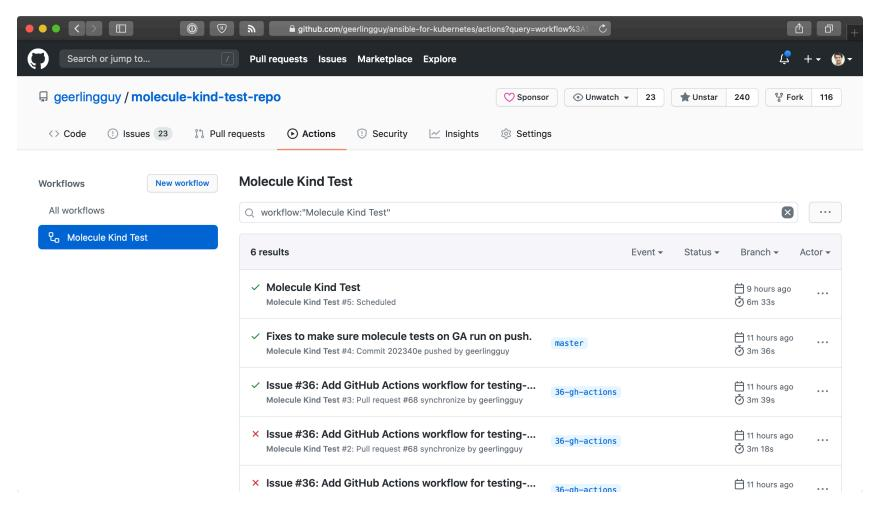

**GitHub Actions workflows**

<span id="page-169-0"></span>You can click on a workflow run to see the job output and other details, and from now on, any time a pull request is submitted, or code is pushed to the master branch, GitHub Actions will use Molecule to verify the code works as intended.

## **Summary**

In this chapter, you learned how to test your Ku[bernetes automation using Mo](https://molecule.readthedocs.io/)[le](#page-169-1)cule with a Kind cluster.

<span id="page-169-1"></span>Molecule can be used with any kind of cluster, and its configuration allows almost infinite flexibility with testing and development environments. If you can run an An[sible playbook, chances](https://molecule.readthedocs.io/) are you can find a way to build the same playbook in a test environment with Molecule.

Using Continuous Integration (CI) tools to ensure your automation is always working correctly—especially *before* you merge new code into your project—should be a high priority for any software or infrastructure project.

For more help with Molecule, please browse the Molecule documentation site⁹⁵.

⁹⁵https://molecule.readthedocs.io/

```
________________________________
/ If you test me, you will fail. \
\ (Sulu, Into Darkness) /
--------------------------------
       \ ^__^
        \ (oo)\_______
           (__)\ )\/\
              ||----w |
              || ||
```

# <span id="page-171-0"></span>Chapter 8 - Ansible's Kubernetes integration

<span id="page-171-1"></span>In Chapter 2, through the process of automating the deployment of the Hello Go app into Kubernetes, you discovered Ansible's k8s and k8s\_scale modules. Ansible has a number of other modules and plugins to help with your Kubernetes automation, and new content has been added frequently over the past couple years.

This chapter will give an overview of the most useful Kubernetes integrations (modules, plugins, collections, and roles) in Ansible.

<span id="page-171-2"></span>The rest of the book will make use of these various integrations to help you automate your Kubernetes cluster and application lifecycle management.

#### k8s module

<span id="page-171-3"></span>TODO.

See k8s module documentation<sup>96</sup>.

## k8s\_info module

<span id="page-171-4"></span>TODO.

See k8s info module documentation<sup>97</sup>.

## k8s inventory plugin

TODO.

See k8s inventory plugin documentation98.

 $<sup>^{96}</sup> https://docs.ansible.com/ansible/latest/modules/k8s\_module.html$ 

<sup>97</sup>https://docs.ansible.com/ansible/latest/modules/k8s\_info\_module.html

<sup>98</sup>https://docs.ansible.com/ansible/latest/plugins/inventory/k8s.html

#### <span id="page-172-1"></span><span id="page-172-0"></span>k8s\_scale module

<span id="page-172-2"></span>TODO.

See k8s\_scale module documentation<sup>99</sup>.

## k8s\_exec module

<span id="page-172-3"></span>TODO.

See k8s\_exec module documentation<sup>100</sup>.

## k8s\_service module

<span id="page-172-4"></span>TODO.

See k8s\_service module documentation<sup>101</sup>.

## k8s\_log module

TODO.

See k8s\_log module documentation<sup>102</sup>.

## geerlingguy.k8s collection

TODO.

See geerlingguy.k8s collection<sup>103</sup>.

 $<sup>^{99}</sup> https://docs.ansible.com/ansible/latest/modules/k8s\_scale\_module.html$ 

 $<sup>^{100}</sup> https://docs.ansible.com/ansible/latest/modules/k8s\_exec\_module.html$ 

<sup>101</sup>https://docs.ansible.com/ansible/latest/modules/k8s\_service\_module.html

 $<sup>^{102}</sup> https://docs.ansible.com/ansible/latest/modules/k8s\_log\_module.html$ 

<sup>103</sup>https://galaxy.ansible.com/geerlingguy/k8s

<span id="page-173-0"></span>

## **Summary**

TODO.

```
__________________________________
/ Insufficient facts always invite \
\ danger. (Mr. Spock, TOS) /
----------------------------------
       \ ^__^
        \ (oo)\_______
           (__)\ )\/\
              ||----w |
              || ||
```

<span id="page-174-0"></span>

## **Chapter 9 - Hello Operator**

TODO.

<span id="page-174-1"></span>

## **The Operator Pattern**

TODO: Why the Operator pattern is awesome. It is the 'foundation of Kubernetes application deployment'.

<span id="page-174-2"></span>

## **Operator SDK**

TODO.

## <span id="page-174-3"></span>**Go vs. Ansible-based Operators**

TODO: Compare the following templating:

- **Go Example**: https://github.com/operator-framework/operator-sdk-samples/blob/1c44eb4c2fd238a2c9f53a378064cbf6cbae5c8a/memcachedoperator/pkg/controller/memcached/memcached\_controller.go#L190-L226
- **Ansible Example**: https://github.com/operator-framework/operator-sdk-samples/blob/1c44eb4c2fd238a2c9f53a378064cbf6cbae5c8a/ansible/memcached-operator/roles/Memcached/tasks/main.yml#L2- L31

## <span id="page-174-4"></span>**Your first Ansible-based Operator**

TODO: Follow Operator SDK guide to build hello-go operator.

## <span id="page-174-5"></span>**End-to-end testing for an Ansible-based Operator with Molecule**

TODO: Build molecule tests for memcached operator.

<span id="page-175-0"></span>

## **Example: WordPress in EKS with an Operator**

TODO: AWS EKS Cluster running WordPress application: Ansible Operator which manages PHP container running WordPress, then uses Ansible Route53 module to set up DNS, EFS module to create shared filesystem, and RDS module to create external database cluster.

(Could be Drupal instead of WordPress, since I already have a Drupal Operator.)

## **Summary**

TODO.

```
_________________________________
/ Improve a mechanical device and \
| you may double productivity. |
| But improve man, you gain a |
\ thousandfold. (Khan, TOS) /
---------------------------------
       \ ^__^
        \ (oo)\_______
           (__)\ )\/\
               ||----w |
               || ||
```

## **Chapter 10 - The first real-world application**

#### TODO:

- Build out Hello Go application from Chapter 1 (possibly just in book repo, don't need to deep-dive into Go here if not required).
- Add database requirement (Postgres), to store request history and IP information.
- Add caching for database (Memcached or Redis) to display cached data.
- GitOps with Ansible (using playbooks from Chapter 3).

```
________________________
/ Shut up, Wesley! \
\ (Jean-Luc Picard, TNG) /
------------------------
       \ ^__^
        \ (oo)\_______
           (__)\ )\/\
              ||----w |
              || ||
```

## **Afterword**

You should be well on your way towards streamlined infrastructure management. Many developers and sysadmins have been helped by this book, and many have even gone further and contributed *back* to the book, in the form of corrections, suggestions, and fruitful discussion!

Thanks to you for purchasing and reading this book, and a special thanks to all those who have given direct feedback in the form of corrections, PRs, or suggestions for improvement:

TODO: List of contributors goes here!

<span id="page-178-0"></span>

## **Appendix A - Using Ansible on Windows workstations**

Ansible works primarily over the SSH protocol, which is supported natively by most every server, workstation, and operating system on the planet, with one exception— Microsoft['s vene](http://docs.ansible.com/intro_windows.html)[rab](#page-178-1)le Windows OS (though this may change in the [coming y](http://docs.ansible.com/intro_windows.html)ears).

To use SSH on Windows, you need additional software. But Ansible also requires other utilities and subsystems only present on Linux or other UNIX-like operating systems. This poses a problem for many system administrators who are either forced to use or have chosen to use Windows as their primary OS.

This appendix will guide Windows users through the author's preferred method of using Ansible on a Windows workstation.


Ansible 1.7 and later can manage Windows hosts (see Ansible's Windows Support¹⁰⁴ documentation), but doesn't run within Windows natively. You still need to follow the instructions here to run the Ansible client on a Windows host.

<span id="page-178-1"></span>

## **M[ethod 1 - Use the](http://docs.ansible.com/intro_windows.html) Windows Subsystem for Linux / Bash on Ubuntu**

If you are running Windows 10, and have installed either the Anniversary Update or any later version, you can install the Windows Subsystem for Linux (WSL), which is the most seamless Bash integration you can currently get for Windows.

The WSL downloads Ubuntu and places it in a special privileged VM layer that's as transparent as it can be while still existing sandboxed from the general Windows

¹⁰⁴http://docs.ansible.com/intro\_windows.html

environment. Using WSL, you can open up an Ubuntu command prompt and have access to almost all the same software and functionality you would have if you were running Ubuntu natively!

Microsoft has the most up-to-date installation guide¹⁰⁵ on their Developer Network site, but the installation process is straightforward:

- 1. Turn on Developer mode (inside Settings > Update and Security > For developers).
- 2. Open a PowerShell prompt as an administrator and run the command:

```
Enable-WindowsOptionalFeature -Online -FeatureName \
Microsoft-Windows-Subsystem-Linux
```

3. Restart your computer when prompted.

At this point, the WSL is installed, but Ubuntu has not yet been installed. To do that:

- 1. Open a Command prompt (cmd), and run the command bash.
- 2. Accept the license by typing y when prompted.
- <span id="page-179-0"></span>3. The first time Ubuntu is installed, you'll also be asked for a username and password to use in the bash environment.

Once installation completes, there will be a shortcut either on your Desktop or in the Start menu, and you can either use this shortcut to launch a bash session, or type bash in a Command prompt.

No[w that you have Bash on Ubuntu running inside](https://msdn.microsoft.com/en-us/commandline/wsl/install_guide) Windows, you can install Ansible inside the WSL environment just like you would if you were running Ubuntu natively!

## **Installing Ansible inside Bash on Ubuntu**

Before installing Ansible, make sure your package list is up to date by updating aptget:

¹⁰⁵https://msdn.microsoft.com/en-us/commandline/wsl/install\_guide

\$ sudo apt-get update

The easiest way to install Ansible is to use pip, a package manager for Python. Python should already be installed on the system, but pip may not be, so let's install it, along with Python's development header files (which are in the python-dev package).

\$ sudo apt-get install -y python-pip python-dev

After the installation is complete, install Ansible:

\$ sudo pip install ansible

After Ansible and all its dependencies are downloaded and installed, make sure Ansible is running and working:

\$ ansible --version ansible 2.9.13


Upgrading Ansible is also easy with pip: Run sudo pip install --upgrade ansible to get the latest version.

You can now use Ansible within the Ubuntu Bash environment. You can access files on the Windows filesystem inside the /mnt folder (/mnt/c corresponds to C:\), but be careful when moving things between Windows and the WSL, as strange things can happen because of line ending, permissions, and filesystem differences!

## **Method 2 - When WSL is not an option**

If you're running Windows 7 or 8, or for some reason can't install or use the Windows Subsystem for Linux in Windows 10 or later, then the best alternative is to build a local Virtual Machine (VM) and install and use Ansible inside.

#### <span id="page-181-0"></span>**Prerequisites**

The easiest way to build a VM is to download and install Vagrant and VirtualBox (both 100% free!), and then use Vagrant to install Linux, and PuTTY to connect and use Ansible. Here are the links to download these applications:

- <span id="page-181-1"></span>1. Vagrant<sup>106</sup>
- 2. VirtualBox<sup>107</sup>
- 3. PuTTY<sup>108</sup>

Once you've installed all three applications, you can use either the command prompt (cmd), Windows PowerShell, or a Linux terminal emulator like Cygwin to boot up a basic Linux VM with Vagrant (if you use Cygwin, which is not covered here, you could install its SSH component and use it for SSH, and avoid using PuTTY).

#### Set up an Ubuntu Linux Virtual Machine

Open PowerShell (open the Start Menu or go to the Windows home and type in 'PowerShell'), and change directory to a place where you will store some metadata about the virtual machine you're about to boot. I like having a 'VMs' folder in my home directory to contain all my virtual machines:

```
# Change directory to your user directory.
PS > cd C:/Users/[username]
# Make a 'VMs' directory and cd to it.
PS > md -Name VMs
PS > cd VMs
# Make a 'Ubuntu64' directory and cd to it.
PS > md -Name ubuntu-bionic-64
PS > cd ubuntu-bionic-64
```

Now, use vagrant to create the scaffolding for our new virtual machine:

<sup>106</sup>http://www.vagrantup.com/downloads.html

<sup>107</sup>https://www.virtualbox.org/

 $<sup>^{108}</sup> http://www.chiark.greenend.org.uk/\sim sgtatham/putty/download.html$ 

```
PS > vagrant init ubuntu/bionic64
```

Vagrant creates a 'Vagrantfile' describing a basic Ubuntu 64-bit virtual machine in the current directory, and is now ready for you to run vagrant up to download and build the machine. Run vagrant up, and wait for the box to be downloaded and installed:

```
PS > vagrant up
```

After a few minutes, the box will be downloaded and a new virtual machine set up inside VirtualBox. Vagrant will boot and configure the machine according to the defaults defined in the Vagrantfile. Once the VM is booted and you're back at the command prompt, it's time to log into the VM.

#### <span id="page-182-0"></span>**Log into the Virtual Machine**

Use vagrant ssh-config to grab the SSH connection details, which you will then enter into PuTTY to connect to the VM.

```
PS > vagrant ssh-config
```

It should show something like:

```
Host default
  Hostname 127.0.0.1
  User vagrant
  Port 2222
  UserKnownHostsFile /dev/null
  StrictHostKeyChecking no
  PasswordAuthentication no
  IdentityFile C:/Users/[username]/.vagrant.d/insecure_private_key
  IdentitiesOnly yes
  LogLevel FATAL
```

The lines we're interested in are the Hostname, User, Port, and IdentityFile. Launch PuTTY, and enter the connection details:

• **Host Name (or IP address)**: 127.0.0.1

• **Port**: 2222

Click Open to connect, and if you receive a Security Alert concerning the server's host key, click 'Yes' to tell PuTTY to trust the host. You can save the connection details by entering a name in the 'Saved Sessions' field and clicking 'Save' to save the details.

PuTTY will ask for login credentials; we'll use the default login for a Vagrant box (vagrant for both the username and password):

```
login as: vagrant
vagrant@127.0.0.1's password: vagrant
```

You should now be connected to the virtual machine, and see the message of the day:

```
Welcome to Ubuntu 18.04.1 LTS (GNU/Linux 4.15.0-43-generic x86_64)
...
vagrant@ubuntu-bionic:~$
```

If y[ou see this prompt, y](http://cygwin.com/install.html)ou're logged in, and you can start administering the VM. Th[e next \(and final\) step is t](http://git-scm.com/download/win)o install Ansible.


This example uses PuTTY to log into the VM, but other applications like Cygwin¹⁰⁹ or Git for Windows¹¹⁰ work just as well, and may be easier to use. Since these alternatives have built-in SSH support, you don't need to do any extra connection configuration, or even launch the apps manually; just cd to the same location as the Vagrantfile, and enter vagrant ssh!

¹⁰⁹http://cygwin.com/install.html

¹¹⁰http://git-scm.com/download/win

## <span id="page-184-0"></span>**Install Ansible**

Before installing Ansible, make sure your package list is up to date by updating aptget:

\$ sudo apt-get update

The easiest way to install Ansible is to use pip, a package manager for Python. Python should already be installed on the system, but pip may not be, so let's install it, along with Python's development header files (which are in the python-dev package).

\$ sudo apt-get install -y python-pip python-dev

After the installation is complete, install Ansible:

\$ sudo pip install ansible

After Ansible and all its dependencies are downloaded and installed, make sure Ansible is running and working:

\$ ansible --version ansible 2.9.13


Upgrading Ansible is also easy with pip: Run sudo pip install --upgrade ansible to get the latest version.

You should now have Ansible installed within a virtual machine running on your Windows workstation. You can control the virtual machine with Vagrant (cd to the location of the Vagrantfile), using up to boot or wake the VM, halt to shut down the VM, or suspend to sleep the VM. Log into the VM manually using PuTTY or via vagrant ssh with Cygwin or Git's Windows shell.

Use Ansible from within the virtual machine just as you would on a Linux or Mac workstation directly. If you need to share files between your Windows environment and the VM, Vagrant conveniently maps /vagrant on the VM to the same folder where your Vagrantfile is located. You can also connect between the two via other methods (SSH, SMB, SFTP etc.) if you so desire.

<span id="page-185-0"></span>

## **Summary**

There are other ways to 'hack' Ansible into running natively within Windows (without a Linux VM), such as the ansible-babun-bootstrap¹¹¹, but I recommend either using the WSL or running everything within a Linux VM as performance will be optimal and the number of environment-related problems you encounter will be greatly reduced!

¹¹¹https://github.com/jonathanhle/ansible-babun-bootstrap