# **PLATFORM STRATEGY**

**INNOVATION THROUGH HARMONIZATION** 

**Gregor Hohpe** 

An Architect Elevator Guide

With contributions by Michele Danieli and Jean-François Landreau

# **[Platform S](https://leanpub.com)trategy**

## Innovation Through Harmonization

### Gregor Hohpe

This book is available at http://leanpub.com/platformstrategy

This version was published on 2024-11-23

Platforms enable rapid and incremental software delivery. It only seems appropriate to embrace the same principles when writing a book about platforms. That's why this book started out as a Leanpub book with early releases that improved based on reader feedback. You are now reading the result of this iterative process.

© 2024 Gregor Hohpe

# **[Contents](#page-26-0)**

| About this Book                                       | i   |
|-------------------------------------------------------|-----|
| Part I: Understanding Platforms                       | 1   |
| 1. Standing on the Shoulders of Giants                | 2   |
| 2. The Fab Four of Technology Platforms               | 15  |
| Part II: A Strategy for Platforms                     | 27  |
| 3. Formulating a Strategy                             | 29  |
| 4. Becoming a Platform Company                        | 41  |
| 5. The Platform Paradox                               | 51  |
| 6. Mapping Platforms                                  | 63  |
| 7. Addendum: “I ACED My Strategy”                     | 73  |
| 8. Talking with Platform Builders: SIMBAS             | 77  |
| Part III: In-House Platforms                          | 83  |
| 9. In-House IT Platforms                              | 84  |
| 10. IT Platform and IT Services Are Antonyms          | 98  |
| 11. Mechanisms, Not Magic                             | 109 |
| 12. Do You Have an Opinion? A Mind of Your Own?       | 119 |
| 13. Making Platform Decisions                         | 128 |
| 14. Procuring a Platform                              | 136 |
| 15. Talking with Platform Builders: Singapore GovTech | 144 |
| <b>Part IV: Designing Platforms</b>                   | 151 |
| 16. The 7 “C”s of Platform Quality                    | 152 |
| 17. Fruit Salad or Fruit Basket?                      | 157 |
| 18. Cantilevered Platforms                            | 164 |
| 19. Will Your Platform Float or Sink?                 | 173 |
| 20. Beware the Grim Wrapper!                          | 182 |
| 21. Build Abstractions Not Illusions                  | 192 |
| 22. Failure Doesn't Respect Abstraction               | 203 |
| <b>Part V: Implementing Platforms</b>                 | 209 |
| 23. Platform Anatomy                                  | 210 |
| 24. Platform Orchestration                            | 221 |
| 25. Ownership and Tenancy                             | 232 |
| <b>Part VI: Growing Platforms</b>                     | 240 |
| 26. Platform Evolution Is a Cube                      | 241 |
| 27. The Shape of Platforms                            | 250 |
| 28. Visualizing Platforms                             | 261 |
| 29. Charting a Platform Roadmap                       | 272 |
| 30. Tiering and Slicing                               | 283 |
| Part VII: Organizing for Platforms                    | 294 |
| 31. Platform, Inc.                                    | 295 |
| 32. Multi-sided Platform Teams                        | 306 |
| 33. The Customer-Centric Platform Team                | 315 |
| 34. Platform Teams Without Platform                   | 323 |
| Author Biography                                      | 335 |

#### CONTENTS

# **About this Book**

My prior role as chief architect of a global financial services organization placed me in the middle of several major transformation programs. A major goal of those programs was to accelerate software delivery without compromising quality or security—two aspects that were believed to be at odds with each other. Undeterred by existing beliefs, we set out to deploy something called *Agile Delivery Platform*, which made software delivery "fast and compliant" and placed the broader IT organization on a trajectory toward a modern operational model.

Reflecting back on our work, several important questions remain. Did we truly build a platform as the name suggested, or were we just naming it creatively? Assuming the former, which characteristics or capabilities qualified it as a platform? Could we have achieved the same results without a platform? Was building on a third-party product the key aspect of providing a platform? Would any "agile delivery mechanism" inherently be a platform? Were related initiatives like the "digital backbone" or the "digital core" also platforms but simply didn't include the term in their name?

Deep in our minds, we might have had plausible answers to those questions, but articulating them clearly would have been rather difficult. I freely admit that we chose the name without deep consideration; we mainly wanted to express both the project's purpose (to enable agile delivery) and the mechanism (a common platform for all software projects). Both "Agile" and "Platform" also sounded like noble and useful things to us.

A few years later, I benefited from two advancements: *Internal Developer Platforms* had become a "thing", and I helped build one for the Singapore Government's GovTech division. Making software delivery more efficient across government agencies, we were convinced that we were actually building a platform, perhaps helped by the inherent fuzziness of the term. However, diving deeper into the design trade-offs of developer platforms also raised a slew of new questions and design decisions that had to be made. Running our internal platform on top of commercial cloud platforms only added to the list of questions: what aspects should be part of our platform versus the About this Book ii

cloud platform? What if the cloud launches a feature that makes our function obsolete? Who should own the services that our platform provisions? Should our platform handle billing?

Eager to get to the root of it all, I joined a major cloud provider and spent several years working with customers to get the most out of that platform. Although one might expect that powerful cloud services would have made building inhouse IT platforms superfluous, I observed exactly the opposite across large customers; they were building or deploying some sort of in-house platform, or often multiple platforms: developer platforms, data platforms, business platforms, digital platforms, multicloud platforms, and many more. And, unsurprisingly, they faced many of the same questions about their platforms.

After assisting many customers with their platform strategy, I took the Architect Elevator further down into the engine room to develop serverless products, which are widely considered the canonical example of a modern compute platform. So, once again I found myself deep in the mechanics of making platform decisions: what technical details can be safely hidden from the user, and which ones should be exposed? How can services be independent while also being constituent parts of something that's bigger than just the sum of its parts? Which aspect should be common across services? Is duplicate functionality across services a convenience or a design flaw? It seemed that the deeper I dug, the more questions arose.

Expecting a single book to answer all questions about platforms would be naive. Instead, I set out, aided by formidable contributors, to structure the questions and define decision models that can help you answer those questions for yourself. After all, you have more information about your undertaking than I would ever have, and thus you can make better decisions. That's why you won't find simplistic 1-2-3 recipes in this book. Instead, if you're new to the concept, you will find a smooth on-ramp, whereas if you're experienced, I may test and challenge your current thinking with novel viewpoints.

# **The Lure of Platforms**

Over the past decade, platforms have fueled some of the most successful business models, yielding companies with never-before-seen market valuations. Although they come in various shapes, all platforms share an "amplifier effect" that makes them enormously successful but deceivingly difficult to replicate.

About this Book iii

Marketplace platforms get their boost from the "flywheel" effect: more sellers provide a wider selection, thereby attracting more buyers, which in turn attract more sellers. That's the mechanism that propelled platform powerhouses like eBay, Uber, and Airbnb to success and astronomical valuations. But the magic of the platform business model doesn't end there. None of those companies keep any expensive inventory, because the platform's value proposition doesn't depend on directly delivering goods or services but on facilitating an exchange across an ecosystem of third parties.

IT also loves a multiplier effect for its investments and therefore values platforms as a shared foundation on top of which diverse solutions can be built. Operating systems and cloud platforms hide underlying complexity, allowing developers to focus on delivering business value instead of toiling deep down in the engine room. The need for higher levels of developer productivity in fast-moving environments has made in-house platforms a staple of modern IT strategies.

Outside of IT and online marketplaces, platforms already have a fairly long history. The automotive industry, for example, has long employed platforms to better amortize the heavy engineering investments required to build a safe and reliable car. Because few of the engineering elements like engine, transmission, or suspension are visible to buyers, they can be reused across models that differ in styling and interior options to attract different tastes and demographics. Yet, equating platforms with the act of combining all common elements and placing differentiators on top would be far too simplistic.

## **Building IT Platforms**

Lured by the apparent benefits and successes of both platform business models and in-house platforms, many enterprise IT departments discover that building and financing your own platform is far more difficult than it might have initially appeared. Many platform initiatives consume multiyear investments just to be already obsolete or not accepted by users by the time they launched.

Do such misfortunes invalidate the platform concept and value proposition? Surely not. But they highlight the value of a clear strategy and a deep understanding of the constraints and assumptions that are baked into the platform. Instead of leaving implementation details for later or, worse yet, with a provider, platforms want to be built incrementally with a keen eye on value delivery.

About this Book iv

This book lays out the elements of a platform strategy, highlighting critical decisions and trade-offs to help platform teams become innovation drivers in enterprises.

### **What Will I Learn?**

This book condenses years of experience building and using platforms into a mental framework for platform development. Covering technical, organizational, and financial aspects, it is structured along the journey that an organization might take toward becoming a platform company.

#### **Part I: Understanding Platforms**

When people say "platform", they may mean different things. That's why it's wise to first look at the history of platforms, catalog different types of platforms, and highlight their benefits.

#### **Part II: A Strategy for Platforms**

Building platforms requires a sizable investment and a clear strategy. That strategy must turn the objectives into an actionable path defined by meaningful decisions.

#### **Part III: In‐House Platform**

Most IT organizations experience platforms when they set out to build one. This part looks beneath the covers of such platform initiatives to highlight important characteristics.

#### **Part IV: Designing Platforms**

Platforms hide complexity, but building one isn't nearly as simple as it looks from the outside. This part employs metaphors to illustrate platform design decisions.

#### **Part V: Implementing Platforms**

Diving deeper into the engine room, this part investigates platform anatomies and proposes common platform blueprints.

About this Book v

#### **Part VI: Growing Platforms**

Platforms have to be rolled out across the organization. They also require delicate care and feeding over time so that they don't fall victim to excessive entropy or become a bottleneck. This part shows you how to do this successfully.

#### **Part VII: Organizing for Platforms**

If you are building platforms, you'll likely need a platform team, which is different from typical application delivery or operation teams. This part describes how to build and manage a platform team.

### **What About the Architect Elevator?**

This book is the second title in a growing series of "Architect Elevator Guides", based on the novel role of architects defined in *The Software Architect Elevator*. Targeting architects and technical decision makers, these guides don't get hung up on buzzwords and don't try to provide simplistic one-size-fits-all answers. Rather, they combine decision models that exert architectural rigor with real-life anecdotes from the daily grind of corporate IT.

In line with this approach, the books carry two "warning labels"; first:

This book doesn't tell you what to do. It teaches you how to come up with the best answer yourself.

You know your situation best. Many things in IT can be copied from Stack Overflow, but strategy isn't one of them. So, instead of giving you a fish, I want to teach you how to fish, that is, how to analyze your unique situation and selectively compose learnings from other organizations into a suitable strategy.

And, second:

You are bound to leave with more questions than you came with. But you'll also be better prepared to answer them.

Asking the right questions is a necessary first step for any successful strategy. I hope you enjoy the read and appreciate having more questions!

About this Book vi

## **Do I Need to Read All Chapters in Sequence?**

Just like the internet, my books are interlinked with cross-references between chapters and titles. Each chapter stands on its own, allowing you to skip ahead or start with a chapter that's particularly relevant to your situation.

The *Architect Elevator* guides, despite their titles, address a much broader audience than just architects. IT executives and decision makers may skip the technical details in Parts IV and V but will hugely benefit from the remaining parts. Folks leading a platform team may focus on Parts III, VI, and VII, whereas platform developers may skim Parts I through III and dive deep into Parts IV through VI. Architects will enjoy taking the elevator from the top levels down into the engine room across all parts.

### **Do I Need to Read the Other Books First?**

The books in the *Architect Elevator* series are self-contained so that you can be consume them independently. That's why it's totally fine to start with this book. Cloud services are platforms, so you also might want to read *Cloud Strategy*, but you can do so before or after you read this one. The books in the series refer back to the "umbrella" book, *The Software Architect Elevator*, which introduces the way of thinking that we use to dissect complex domains like cloud computing or IT platforms.

There is only minimal duplication across the books, so owning the complete collection is a great asset for any modern IT architect.

## **What's With the Jellyfish?**

Each book in the *Architect Elevator* series for IT leaders and architects features aquatic animals on its cover. Sea and river creatures are incredibly diverse and beautiful, so I expect to run out of content before I run out of images. All photos are my own.

I felt that jellyfish make a suitable metaphor for platforms. Just like IT systems, they carry some complexity but function without a central nervous system (or a very rudimentary one). Unlike some IT landscapes, they are amazingly wellcoordinated systems and beautiful to look at.

About this Book vii

## **Getting Involved**

My brain doesn't stop generating new ideas just because the book is published, so have a look at my blog to see what's new:

https://architectelevator.com/blog

Also, you can follow me on Twitter or LinkedIn to see what I am up to or to comment on my posts:

http://twitter.com/ghohpe

http://www.linkedin.com/in/ghohpe

To provide feedback and help make this a better book, please join our private discussion group at https://groups.google.com/d/forum/cloud-strategybook

## **Acknowledgments**

Like my prior books, *Platform Strategy* benefited from the involvement of a wide range of people. I won't be able to give due credit to everyone who provided valuable input, but I would like to call out Luca Acquaviva, Omar Khawaja, Manuel Pais, Johannes Seitz, and Clemens Utschig-Utschig for their insights and support. Special thanks go to HandyMaus for keeping everything working along the way.

One entity I don't intend to credit is AI. This book was entirely handwritten; no content was generated through GenAI technologies. Alas, I was tempted to make a bold statement here that the book is AI-free, but I realized that this doesn't entirely hold. For example, modern spell checkers are AI trained, rendering the book AI assisted, perhaps, but nevertheless 100% human authored.

# **Part I: Understanding Platforms**

There must be something about platforms. According to a report compiled in 2020, 7 of the 10 most valuable companies in 2018 based their success on a platform business model. Ten years earlier, in 2008, that number was zero. Many technology companies provide technology platforms, such as cloud platforms, that enable other businesses with modern IT infrastructure. Either type of organization might use internal developer platforms to increase their development speed, and a data platform to make business decisions. And virtu[ally all of them operate on the inter](#page-13-0)net, which is perhaps the ultimate innovation platform.

As w[e quickly discover, the term "platform](#page-26-0)" is overloaded and can mean different things in different contexts. It is therefore beneficial to look at what makes platforms different from prior approaches such as frameworks or common services, when something should actually be called a platform, and how platforms deliver benefits for your organization.

This part considers the platforms both in the business and technology space to set the context for diving deeper into designing successful platforms:

- Standing on the Shoulders of Giants examines the history and key properties of platforms.
- The Fab Four of Technology Platforms catalogs different types of platforms that you are likely to encounter.

# **1. Standing on the Shoulders of Giants**

**Do you really see further or is the air just thinner up there?**

**If I have seen further, it is because I used a telescope**

Platforms are a common sight in daily life—they are normally a structure that you stand on; for example to catch a train or to get a better view. Generally defined as a raised level surface on which people or things can stand, technology platforms also appear to be raising things up a level or two. A platform model powers many successful companies, while cloud platforms have transformed modern IT operations by democratizing access to compute resources.

Platform effects are not new. In their like-titled book, Kim et al.1 link the success of the Roman Empire to an open ecosystem strategy enabled by 80,000 kilometers of roads. They created a multisided market that spanned much of

1Kim, Song, Im: *Platform Strategy: a new paradigm for a changing world*. World Scientific Publishing; 2020.

Europe and reduced the friction for interaction between (not always voluntary) participants. The old saying that all roads lead to Rome seems to equally apply to large modern platform companies.

An eloquent—and widely cited—metaphor for using platforms are the words commonly attributed to Sir Issac Newton (although traced back to the 12th century):

*If I have seen further, it is by standing on the shoulders of giants.*

Many platform businesses have become giants, and architects have a keen desire to see further, so let's begin by taking a look at the concept of platforms and their various flavors.

# **Platforms Elevate**

A raised platform elevates you. This applies to train platforms as much as to product or technology platforms: building on top of a technology platform means you don't need to start from scratch but can build on top of what others have created. Using a marketplace platform gives you instant access to a large set of merchants or customers. Publishing content to a social-media platform can elevate you to millions of participants consuming your content.

As powerful as platforms are, so elusive is their precise definition. Perhaps that's why Kim et al. resort to cataloging platform definitions spanning more than a decade. In his course on platform strategy for MIT Sloan's executive education, Zach Church aims for a definition of platform strategy:

A platform strategy is an approach to entering a market which revolves around the task of allowing platform participants to benefit from the presence of others.2

2As you will discover throughout this book, entering a market is only part of a successful platform strategy, with many technology decisions and trade-offs to be made along the way.

Most definitions portray platforms as amplifiers: they create something bigger than just the sum of their parts. This characteristic helps explain the popularity of platforms, but also leads to another insight:

Platforms generate value through the interaction between their participants.

A platform without participants isn't providing value. It's like a farmers market that's lacking farmers and customers.

To offset your instant enthusiasm for such a powerful model, Church quickly reminds us that building a platform is "really, really hard". So, before you decide to jump on the platform bandwagon (there's a fundamental flaw in that mix of metaphors that I am intentionally overlooking), you should take a closer look at common types of platforms, their characteristics, challenges, and benefits.

## **Platforms: Faster, Better, Cheaper. Really?**

The popularity of platforms in both business and IT domains is easy to grasp when you see the outstanding results that platforms deliver. Just like any major buzzword, platforms are also subject to hyperbole and re-labeling. My bank is now a financial platform, the local bookstore has become a content platform, and the supermarket has evolved into a marketplace platform. If you take the words from marketing departments at face value, you might even believe that without a platform your business is utterly doomed.

Let's put our feet firmly on the ground (or the platform, so to speak) and dissect the buzzword to understand the benefits platforms provide in different contexts:

#### *Platforms enable*

Platforms generate value by allowing participants to benefit from the presence of others. Those participants can be buyers and sellers in a marketplace who gain access to a wider range of goods or prospects, respectively, and can transact more easily and safely. They can also be users of common technology platforms like cloud computing, which encourages experimentation with a consumption-based charging model. Content creators and consumers participate on social-media platforms to share and interact globally.

#### *Platforms democratize*

Successful platforms make it easy for participants to join thanks to low barriers. For example, modern e-commerce platforms allow independent sellers to join with much less friction than trying to supply a major supermarket chain. Many influencers and content providers on socialmedia platforms started with a low initial investment, which would not have been possible in a traditional media model. Likewise, users can access powerful cloud platform services for pennies an hour.

#### *Platforms self-perpetuate*

Platforms that enable the exchange of (virtual or physical) goods between sellers and buyers appear to provide a form of *perp[etuum mobile](https://aws.amazon.com/blogs/aws/we_build_muck_s/)*: more [buyers make it](https://aws.amazon.com/blogs/aws/we_build_muck_s/) attractive for sellers to sign up for the platform, which in turn leads to a wider selection, which attracts more buyers. Walmart has known for a while that having one store carry everything is a promising business model. Modern platforms do so without the endless aisles and long checkout lines. Meanwhile, onboarding a new participant carries a near-zero cost: Airbnb doesn't need to build a hotel room to increase its inventory. Such *near-zero marginal cost business models* are a key tenet of fast-scaling digital business model success.

#### *Platforms accelerate*

IT platforms and marketplace platforms alike handle common but laborious tasks ("undifferentiated heavy lifting" in the parlance of a major cloud provider). By making this toil go away, platforms allow their users to focus on innovation and differentiation, whether it's an application that they are developing or social media content that they are uploading.

#### *Platforms don't constrain*

Many approaches that promise acceleration rely on a "my way or the highway" model: users benefit from lower friction if they abide by the rules of the framework. Platforms accelerate without constraining: Airbnb and other marketplace platforms offer more types of properties than traditional hotel chains, and cloud platforms allow users to build virtually anything on top.

Having been sold snake oil for decades, enterprise decision makers might look at these effects with a healthy dose of skepticism. Should we file platforms along with "model-driven architecture", "executable design models", and "seamless portability" in the large drawer of past technology ideas that not only sounded too good to be true, but actually were? Are platforms, in the words of a recent Twitter user, just reinventing the wheel? Not so fast! Platforms are for real and are here to stay.

### **Established Platform Models**

The success of platforms comes at a price: the label is used for numerous, quite different constructs. Although they share similarities, the mechanisms behind the [different ty](https://en.wikipedia.org/wiki/Car_platform)pes of platforms are quite diverse. On the upside, platforms aren't an entirely new concept—it's just a common IT misbelief that we invented everything. Extraordinarily successful platform examples from automotive manufacturing, e-commerce, media, and IT will put the power of platforms in context.

#### **Automotive Platforms**

I am well known for car analogies, so I take great pleasure in reporting that automotive manufacturers have been using a platform concept for many decades (see Wikipedia). Those companies realized that a huge amount of engineering effort went into a vehicle's technical and safety components, such as engine, transmission, suspension, and anti-lock brakes. However, these engineering marvels are rarely visible to a prospective customer visiting the dealership. Even though the customer will consider safety ratings, power, and fuel consumption, which do result from the underlying components, purchasing decisions are often made based on the shape of the car, the interior finishing, the suppleness of the seats, or the badge on the trunk (boot).

It was a logical move, then, to reduce cost by conducting the base engineering effort once and reusing the chassis and its components across models. Following this strategy, car manufacturers could offer a variety of car models, targeted at different customer segments and often under different brands, without exploding engineering costs. Those cars exhibited a distinct look and feel despite sharing many components "under the hood".

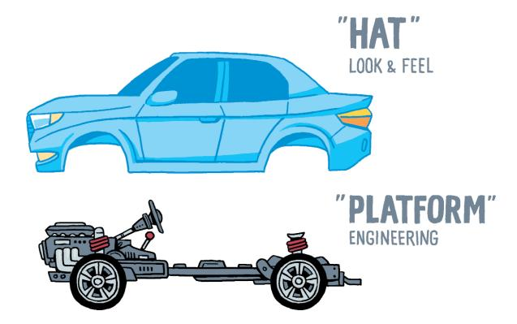

**[Automotive platforms boo](https://en.wikipedia.org/wiki/Volkswagen_Group_MLB_platform)st innovation both inside the platform and on top**

These kinds of platforms are often referred to as "product platforms" or "inner platforms" to distinguish them from external platforms that involve customers or partners. The initial incarnations reused a complete chassis and many body parts, leaving relatively little room for customization. Some manufacturers described this approach as placing a "hat" (the car's body and interior) on top of the shared technical platform (the chassis).

Volkswagen, which began using automotive product platforms in the 1970s, evolved the platform concept into several modular platforms, such as the Volkswagen Group MLB platform. Roughly translating into "modular longitudinal toolbox" (longitudinal referring to the engine orientation), it forms the basis for an amazing range of vehicles, from the Audi A4 all the way to the Bentley Bentayga SUV (using the so-called MLBevo matrix). Volkswagen's new MEB platform is looking to achieve the same for electric cars.

Against common belief, standardizing on shared platform elements didn't reduce choice or stifle automotive innovation. It achieved the exact opposite by boosting product diversity and technical innovation. BMW, for example, expanded its model range from a handful of series (3, 5, 7), to eight sedan series, eight SUV/crossover series, seven electric car series, several M series, plus a range of Mini vehicles. Such model diversity would not be economically viable without a platform strategy.

Automotive platforms amortize large engineering investments across a diverse range of models. Harmonizing those elements boosts diversity and innovation in others.

Common platforms provide better economies of scale for engineering innovations such as anti-lock brakes or autonomous driving. The standardization achieved via the platform (coupled with componentization) boosts innovation, one of magic properties of platforms.

With platforms, as with many other things, too much of a good thing can become an issue. The history of automotive platforms teaches a lesson about how much can be unified into the base platform and how much differentiation should remain on top of it. Based on the initial success, US car manufacturers took the platform idea a little too far in the 1980s by manufacturing essentially identical models that differed just in a few options or cosmetic elements. At its extreme, only the brand and model badges were different—a technique referred to as "badge engineering".

**Relabeling is not platform engineering**

Although tempting, this approach negated a key platform benefit: supporting diverse models and boosting innovation. Unsurprisingly, these attempts largely backfired, immortalized by the Cadillac Cimarron, which was positioned as a luxury car but was virtually indistinguishable from a fully equipped economyclass Chevrolet Cavalier. Its abysmal market response earned it a place on Forbes' list of Legendary Car Flops and its only contribution to the automotive world was lending its name to the "Cadillac Cimarron Effect".

Automotive history teaches us that both what's in the platforms and what's on top matter. Near replicas don't work.

A critical success factor for platforms is defining which aspects can be harmonized and which ones must be kept variable.

#### **E‐Commerce Platforms**

When speaking about platforms these days, many people refer to digital ecosystems as embodied by companies like Amazon, eBay, Gumroad, Alibaba, and the like. These marketplace platforms connect buyers and sellers or people sharing a common interest.

A suitable definition that captures the intention of these business models can be found in Reillier's book, also titled *Platform Strategy*: 3

A business creating significant value through the acquisition, matching, and connection of two or more customer groups to enable them to transact.

Not all marketplaces are platforms. An analogy from the retail business helps find the delineation. A supermarket connects buyers with goods to be sold while holding its own inventory and being directly involved in the purchasing transaction. In contrast, a farmer's market connects buyers and sellers directly, letting them handle the transaction and maintain inventory. Whereas a farmer's market is a "multisided platform"4 , a supermarket is strictly speaking—not. Farmer's markets democratize and enable transactions between farmers and consumers (the two sides), whereas supermarkets actively manage—and control—their supply chain.

Physical marketplaces and e-commerce platforms enjoy broad flexibility in their pricing models:

- They can charge buyers, for example by charging admission to a trade fair or farmer's market. Likewise, online platforms can charge membership fees to buyers, often pegged to premium services like fast or free delivery.
- They can charge sellers, for example by asking a fee for a farmer to have a stall. In the online world seller fees can be listing fees, transaction fees, membership fee, or any combination thereof.

3Reillier B and L: *Platform Strategy: How to Unlock the Power of Communities and Networks to Grow Your Business*. Routledge; 2017.

4Hagiu A: *Multi-sided Platforms: From Microfoundations to Design and Expansion Strategies*. Harvard Business School; 2006, working paper 07-094.

• They can monetize through third parties, for example by inviting sponsors or selling [a](#page-21-0)dvertising space, both in the physical world or the online counterparts. They can also monetize the data they collect by selling it to third parties.

This flexibility allows e-commerce platforms to offer services "for free" to select groups of the multisided market. Shifting pricing between participant groups or subsidizing specific types of transactions enables platforms to balance supply and demand, to drive growth, or, inversely, to moderate growth to uplift the quality of content or goods. Despite the risk of backlash, changes in pricing models are fairly frequent. Meetup provided a dramatic example by losing some 95% of their listings, but drastically improving quality, after starting to charge fee to organizers5 .

As the platform enables direct interaction between participants, it steps into the background—just like a real-life platform that's underneath the real action. Online platforms may be barely visible because they allow retailers to operate as white-label shops; for example, on Shopify. Likewise, when you visit the farmer's market you might notice the organizer's presence only by a banner at the entrance and a small organizer's booth. This is quite different from a supermarket where you are keenly aware of whose "ecosystem" you are in.

**The Marketplace Flywheel**

Major e-commerce platforms such as eBay, Amazon (which is careful to label itself as a marketplace), or Airbnb have harvested the perpetuating scale effects

5Parker, Van Alstyne, Choudary: *Platform Revolution: How Networked Markets Are Transforming the Economy*. W. W. Norton & Company; 2016.

cited at the beginning of the chapter. Amazon refers to this virtuous cycle as The Flywheel, inspired by the model presented by Jim Collins in *Good to Great*. 6

This wheel includes two positive feedback loops. The first occurs over the number of buyers and sellers, which fuel each other's participation: more buyers attract more sellers, who carry a wider selection, which attracts yet more buyers. A secondary loop lowers the cost structure with increasing scale, which in turn allows lower prices, which then further fuel growth.

Such feedback loops are behind the tendency of e-commerce platforms' toward a "winner takes all" scenario in which a single platform dominates its respective market segment. That's the power of platforms and positive feedback loops.

#### **Media Platforms**

A close relative of e-commerce platforms are social and media/streaming platforms like Facebook, TikTok, Netflix, Twitch, and many others. Like their cousins, they operate a multisided market that connects providers and consumers of services, in this case, social data (photos, posts, events) or media such as audio and video streams. They enjoy a similar flywheel effect that attracts consumers to the platform with diverse content, which in turn attracts content providers because they'll get more eyeballs. They may lack the outer loop of lower prices (their cost of goods tends to be near zero) but that hasn't dampened their growth in the least bit.

The internet bubble of 2000 was driven by the obsession with "eyeballs", replacing traditional metrics like revenue or profit with the number of viewers. Two decades later, platforms have figured out how to scale and actually monetize those eyeballs.

The primary revenue streams for these platforms are advertising or subscription fees. Some media platforms play the role of both the platform operator and a platform participant; for example, producing their own video content ("Netflix originals") but also distributing third-party content. Platform companies enjoy a large amount of flexibility and tend to experiment all the time.

6Collins J: *Good to Great: Why Some Companies Make the Leap and Others Don't*. HarperBusiness; 2001.

#### **Cloud Platforms**

Cloud computing has perhaps been the most significant IT innovation of the past two decades, being challenged just recently by the rapid rise of AI and large language models (LLMs). The cloud also gave birth to a hugely successful technology business models, with just the top cloud service providers (CSPs) generating combined \$200 billion in annual revenue. The collection of ondemand IT services provided by these companies are commonly labeled as platforms, with Google's cloud offering proudly carrying the label in its name: GCP—Google Cloud Platform.

The original motivation behind cloud platforms resembles that of automotive platforms. Just like cars, software requires a lot of heavy-duty engineering that isn't directly visible to the end user. Underneath a successful piece of software lies a vast array of compute infrastructure like data centers, global networks, servers and storage, software delivery pipelines, monitoring and failover mechanisms, synchronizing data stores, backup and disaster recovery, and regulatory compliance reporting. Those aspects can consume a large portion of a software project's timeline and budget before the first line of application code is ever delivered.

Combining those elements into common components that can be reused across many software projects allows developers to focus on providing customer value and differentiation; for example, through rapid feature delivery, unique functionality, or ease of use. They leave the heavy engineering work to the cloud platform providers, who have better economies of scale thanks to their broad customer base. IT departments consume those services in a low-friction way via a so-called cloud console (Web interfaces) or API calls that provision service instances to be used by custom applications.

**Cloud platforms allow application teams to focus on differentiation**

Although they follow similar approaches, cloud platforms also differ from

automotive platforms in several ways—after all, they are software. First, usage and application diversity are much broader. Whereas an automotive platform supports a handful of models for a specific automaker, cloud platforms support software development across a vast variety of use cases. It's the equivalent of using Volkswagen's chassis, engine, transmission, and suspension to put your custom interior and bodywork on top. Although this model exists as so-called "kit cars" (which generally modify a finished car to simplify registration), it's a small fringe business and large-scale automotive platforms lack such flexibility.7 Bits and bytes are more malleable than steel.

Second, cloud platforms allow developers to use the common components easily without any welding or assembling. A plat[form's v](https://www.gartner.com/en/newsroom/press-releases/2020-07-23-gartner-forecasts-worldwide-public-cloud-revenue-to-grow-6point3-percent-in-2020)alue isn't just defined by what's inside, but also by how easily its functions can be accessed. This is where cloud platforms shine. Even though they might look like traditional IT outsourcing from far away, the interaction between platform provider and platform user is notably different: month-long contract negotiations are replaced by an API call and near-instant provisioning.

Last, cloud platforms offer more fine-grained components than automotive platforms possibly can, offering several hundred individual services to customers. The only possible challenge remains an abundance of choice.

The success of cloud platforms is nothing short of phenomenal, creating a quarter-trillion-dollar market (according to Gartner) in just a decade-and-ahalf. That's no surprise when you consider that cloud computing has fundamentally transformed IT—from months of infrastructure planning and provisioning to running an automation script and waiting a few minutes.

# **Business Platforms**

Business platforms aim to elevate what cloud platforms achieved for IT infrastructure toward business applications. Starting off as powerful applications, these products added more capabilities for customization by splitting common functionality from specific needs, much like automotive manufacturers did. Prominent examples include SalesForce for Customer-Relationship Management (CRM) and SAP for Enterprise Resource Planning (ERP). The

7Volkswagen will, however, sell you a kit to convert your classic into an electric car: https://www.volkswagen.de/de/besitzer-und-service/magazin/elektromobilitaet/classic-cars-turn-into-electricvehicles.html .

SalesForce application sits on top of the "Force.com" (now SalesForce Platform) development platform, whereas SAP features a Business Technology Platform (BTP), both allowing customers to build their own business applications and customizations.

The critical progression from a feature-rich business application to a platform is twofold. First, the vendors transitioned to a Software as a Service (SaaS) operational model that vastly lowers the friction of both user adoption and platform evolution. Second, configuration settings, which often constrained customers, gave way to custom applications, which utilize the application domain's data model but don't place any constraint on the code developed on top. The combination is indeed powerful.

Cloud computing platform vendors haven't been oblivious to the power of business platforms. Virtually all of them offer business capabilities as services, such as Amazon Connect for contact center management and the Microsoft Dynamics suite for accounting and related business applications.

### **The Platforms of Giants**

There are valid reasons that platforms seem to be everywhere these days. Many platform providers are indeed giants, whether it's automotive giants, ecommerce giants, or internet giants. That doesn't mean, though, that there's already a platform for everything or that you have to be a giant to build one. Let's go on to catalog widely-used technology platforms, including those that are commonly built in-house.

# **2. The Fab Four of Technology Platforms**

**Technology drives business models.**

**The stars of modern IT**

The examples from the automotive, e-commerce, cloud, and enterprise software domains cited in Chapter 1 hint that there are different flavors of platforms. Architects don't like fuzzy terms and generally aren't content with enumerating examples as a replacement for a well-structured ontology. So let's add a bit more structure and catalog common types of technology platforms. I can't quite promise that we'll arrive at a universal ontology, but at a minimum, we'll gain vocabulary that we can refer to for the remainder of this book.

### **Technology Platforms**

There are many ways to slice the platform universe, and whichever way you do it, you're bound to exclude several varieties or leave gray areas in other places. Narrowing down the field to technology platforms provides some relief. Platform business models are well documented in books like that by Reillier,1 allowing *Platform Strategy* to mainly zoom into what it takes to build a technology or business capability platform, including the architecture decisions and trade-offs one will face along the way. We will discuss platform business models mainly to provide context or to delineate those platform models from technology platforms.

To sharpen the vocabulary the book will be using, we'll distinguish four types of platforms that a typical organization would encounter in its strategy plan:

**Types of platforms used in the context of IT**

Combinations are commonplace because the platform types reside in different layers of the IT stack. For example, a large organization could be a participant in a third-party marketplace, build its in-house developer platform on top of a cloud base platform, and provide business capabilities to ecosystem partners.

Let's look at common use cases for each platform type, how users interact with it, how they can be implemented, and some considerations to keep in mind.

# **Marketplaces**

As highlighted in the previous chapter, marketplaces facilitate transactions between customer groups such as buyers and sellers of physical goods, or consumers of services like media, car sharing, or accommodation. The marketplace appears to step into the background during the transaction but is a critical facilitator of the connection between seller and buyer or producer and consumer.

1Reillier B and L: *Platform Strategy: How to Unlock the Power of Communities and Networks to Grow Your Business*. Routledge; 2017.

#### **Common Use Cases**

This is the domain of e-commerce platforms like eBay, Amazon, Etsy in the US; Tokopedia, Carousell, Mercari, or Taobao in Asia; and mobile.de or Allegro in Europe. The same model is used by "match-making platforms" for ride-sharing (Uber, Lyft, Grab, Didi, Careem), accommodation sharing (Airbnb), or dating (Tinder).

Most of them follow the farmers' market model by enabling providers and consumers to transact directly while the platform handles search, advertising, reviews and ranking, fraud detection, and sometimes payment services. The marketplace benefits from not having to maintain inventory, which keeps operating costs down and reduces the marginal cost of onboarding a new seller or buyer to near zero. The marketplace can generate reven[ue in a variety of](https://www.vice.com/en/article/43k7z3/nationwide-fake-host-scam-on-airbnb) ways, including seller listing fees, placement fees, member fees, transaction fees, or advertising fees.

#### **Interaction**

From a technical perspective, participants interact with the marketplace platform via a web browser, mobile app, or application programming interfaces (APIs). Marketplaces commonly provide sellers with functionality beyond listing goods to also define their own storefronts, often without any custom programming effort, to further reduce onboarding friction. Balancing low friction of joining against assuring the quality of services and minimizing fraud is a major aspect of building consumer trust in the platform.

#### **Implementation**

The majority of major marketplace platforms are custom built and thus proprietary. The primary reason lies in the enormous scale and transaction volume that these platforms handle, coupled with rapid growth. These companies' stateof-the-art data analytics and machine learning technologies help them battle fraud, prioritize high-quality listings, and manage ad placements. They are mostly developed in-house because they are the company's key assets and often ahead of what's available on the open market.

Luckily, not everything those platforms produce remains proprietary. Several marketplace engineering teams have published open-source projects that are based on their in-house developments: Airbnb's Synapse, Uber's Jaeger, Spotify's Backstage, or Netflix' Chaos Monkey are just a few examples. These projects are engineering tools that can be used across industries and don't give away the marketplace's secret sauce. Still, they allow other organizations to benefit from the giants' engineering efforts.

Becoming a marketplace is less of an IT decision—it's at the heart of your business strategy. Often classified as a B2B2C model, meaning you as a business (visibly) provide a service to other businesses to better serve their customers, marketplaces look easy to build, but they are extremely difficult to scale. Successful marketplaces have taken investments of more than \$1 billion, highlighting the massive resources that are needed to grow a platform business.

#### **Considerations**

Marketplaces, despite several runaway successes, have well-known challenges. For example, the positive feedback cycle between buyers and sellers can flip into a chicken-or-egg problem at launch. Also, the apparent flexibility in pricing models is subject to balancing supply and demand. For example, if the platform lacks suppliers (sellers), imposing seller fees will further impede the platform's growth. The challenges of growing a new platform contribute to the "winner takes all" nature of established marketplace platforms.

### **Base Platforms**

At the other end of the spectrum, further down the IT engine room, are base platforms. These platforms provide technical products and services to support developers and IT departments. They are *one sided* in the sense that the platform operator creates all services to be consumed by a specific user group.

Still, base platforms often harvest the power of multisided markets by including a software marketplace for third parties. They have thus become a hybrid between a base platform and a marketplace. Things are rarely clear-cut in this space as companies continuously experiment with new products and revenue streams.

#### **Common Use Cases**

The most common base platforms in current enterprise IT are cloud platforms such as AWS, Microsoft Azure, Google Cloud, Ali Cloud (Aliyun), or Huawei Cloud. Consuming software from third parties is nothing new in IT, but base [platfor](https://spark.apache.org/)ms differ in several aspects. For one, they provide services that traditionally would be done in-house, such as provisioning servers, storage, and network hardware. Second, these platforms aren't a single product like an accounting system or a Customer Relationship Management (CRM ) system; they are a collection of services on top of which customers can build applications.

Base platforms can be layered as well. For example, the Kubernetes ecosystem is widely considered as a base platform on top of which developers deploy applications. One might even credit it with converting traditional on-premises IT into a base run-time platform. Similarly, many open-source data analytics products act as base platforms, although they more likely la[bel themsel](https://en.wikipedia.org/wiki/System_console)ves as engine (following the automotive platform nomenclature, an engine should be part of a base platform). The dividing lines are rarely super crisp, with many large software vendors labeling themselves as software platforms these days. We'll dive into those nuances later.

#### **Inter[action](#page-232-0)**

Base platform users generally interact via several means:

- Online consoles, which actually aren't consoles in the Wikipedia sense, but rather web interfaces that allow users to provision and configure resources.
- Command-line interfaces (CLIs), which support direct interaction or scripting for automated execution of platform instructions.
- Web APIs that can be called directly from applications.
- Cloud platforms feature automation languages in the form of Infrastructure-as-Code (IaC) tools (for example, Terraform, CDK, or Pulumi), which in turn interact with the base platform's APIs.

Base platforms aim for *feature parity* across all those access channels, meaning the same features are available regardless of which approach a user chooses. Platform users are developers or IT professionals, leading to higher onboarding effort than wit[h an e-comm](https://cloud.google.com/tpu)er[ce marketplace](https://aws.amazon.com/machine-learning/trainium/) or socia[l media. Redu](https://aws.amazon.com/ec2/graviton/)cing the cogni[tive load](https://aws.amazon.com/ec2/nitro/) for new platform consume[rs \(and thu](https://cloud.google.com/blog/products/identity-security/titan-in-depth-security-in-plaintext)s the friction) is a major theme for cloud providers as they are looking to keep scaling their platform to more users.

#### **Implementation**

Just like marketplaces, base platforms tend to have proprietary implementations due to the enormous scale and complexity of provisioning resources on demand around the globe. The level of customization extends down to the hardware with cloud providers now providing custom CPUs (e.g., AWS Graviton), custom AI accelerators (GCP's TPUs or AWS Trainium), custom hardware architectures (e.g., AWS Nitro), or security chips (e.g., GCP Titan). Platform services can be based on open-source projects, aided by proprietary run-time extensions to integrate with the platform's control plane to handle provisioning, billing, monitoring, and so on.

#### **Considerations**

Constructing such a broad platform is a rather involved topic, which we won't address here. *Cloud Strategy* provides a detailed description of how to successfully consume cloud base platforms. Base platforms' comprehensive capabilities can lead to high user expectations, which challenge in-house platform teams with much more limited resources.

Cloud platforms also highlight one of the most fundamental dynamics of platforms:

How users access your platform is at least as important as what's inside.

Cloud providers initially offered virtual machines, storage, and queues—nothing new, really. But the way users could consume those services was dramatically different and spawned a trillion-dollar market.

# **Developer Platforms**

In-house developer platforms are built by IT departments, generally to provide reuse of common IT services, to boost developer productivity, and to assure compliance with operational guidelines. These platforms support the in-house Software Development Lifecycle (SDLC) that development teams follow to deliver custom software. Part IV is dedicated to the detailed design considerations for such platforms.

#### **Common Use Cases**

In-house platforms come in a wide variety of flavors, essentially covering the entire SDLC. Software delivery platforms enable autonomous development teams, run-time platforms provide deployment and observability functions, and data-analytics platforms manage access to shared data. Backstage is a widely used tool to build in-house developer portals and tools.

Many organizations [aim t](https://research.google/pubs/pub43438/)o shield developers from the specifics of the base cloud platform, driven by the desire to reduce vendor lock-in and also boost productivity. Sadly, more often than not, those platforms end up restricting developers' choices and hinder productivity— clearly the opposite of what a platform should do.

Several companies have externalized portions of their internal platform. Amazon Web Services (AWS) and Kubernetes are prominent examples. AWS evolved from supporting Amazon's e-commerce marketplace (an in-house platform) into one of the largest base platforms for IT services. Kubernetes was specifically built to be shared as open-source software, but incorporates many of the features of Google's internal Borg workload management ecosystem. Both products were part of the provider's overarching platform strategy.

#### **Interaction**

In the best case, application developers interact with in-house platforms much like they would with base platforms; that is, through well-designed web consoles or APIs. However, in-house platform teams might lack the capacity to provide feature parity across web consoles, command lines, and APIs.

Although in-house platforms typically coexist with the underlying base [plat](#page-220-0)[for](#page-220-0)m t[o give d](#page-220-0)evelopers direct access, others intentionally restrict such access to avoid dependencies or developers circumventing governance coded into the in-house platform. The latter are prone to running into the Grim Wrapper symptoms.

#### **Implementation**

In-house platforms commonly reside on top of one or more cloud (base) platforms. They might span public cloud and on-premises data centers to give enterprises (a semblance of) a uniform development and deployment model across modern cloud providers and existing on-premises environments. Part IV and Part V [dive deeper into implementation aspects.](#page-306-0)

#### **Considerations**

In-house platforms live in an exciting but also hotly contested space between base platforms that are developed by large-scale providers with ample resources, widely available open-source projects, and development teams. Therefore, they have to consider their scope and positioning very carefully and have to live up to the expectations set by external developers. Even though they are not offered on the free market, in-house platform teams are tasked with supporting a variety of internal customers. They may find themselves surprised that they need internal marketing, consulting, support, and related functions that makes them resemble a company within a company. A large portion of this book dives into these decisions.

### **Business Capability Platforms**

Whereas developer platforms largely contain technical tools for developers, business capability platforms expose functions from the business domain. The delineation is easy to understand by the fact that a bank, a retailer, and a ride-sharing company could use the same developer productivity platform but have very different business capability platforms that reflect their respective domains. That's also the reason why we see a lot of sharing via open source in the former but not the latter.

Business capability platforms are often built and maintained in house but can be made available to external parties to enable a provider ecosystem. Examples range from digital identity services in the public sector to payment APIs offered to enable embe[dded finance in the Fintech in](https://commercesuite.aboutyou.com/)dustry. Externa[lized platforms can](https://corporate.aboutyou.de/en/presse/about-you-offers-its-proprietary-e-commerce-infrastructure-as-an-api-solution) [evolve from in-house services that are augmented](https://corporate.aboutyou.de/en/presse/about-you-offers-its-proprietary-e-commerce-infrastructure-as-an-api-solution) and hardened to allow them to be accessible from outside the organiz[ation.](https://www.syncier.com/en)

Externalized business platforms can in turn serve as base platforms for development inside ecosystem participants, highlighting the layered—or even fractal nature of the overall platform ecosystem.

#### **[Common Use Ca](https://axess.sc.com/apis/)ses**

Business capability platforms can be found across industries. In fashion ecommerce the About You Commerce Suite evolved from a proprietary implementation of a fashion e-commerce marketplace. In financial services, you'll find platforms like Allianz' now defunct Syncier spin-off, which made Allianz' core insurance system available a[s a software platfo](https://aws.amazon.com/connect)rm for other insurance compani[es. Its marketplace of th](https://cloud.google.com/medical-imaging)ird-party solutions, described as Insuranceas-a-Service, was spun off and acquired by Munich Re.

Other enterprises offer collections of lighter-weight APIs to grow external ecosystems. For example, banks (like DBS Bank's Developer APIs or Standard Chartered's Axess) have encouraged the development of third-party applications that make use of their payment APIs. For other payment providers like Stripe, the business capability platform is the core business.

Cloud providers also play in this space by offering higher-level services in addition to traditional IT services such as compute or storage. For example, AWS provides call center services with Amazon Connect, whereas Google Cloud includes medical imaging services.

#### **Interaction**

APIs are the key enabler for business capability platforms as integration frequently occurs across organizational boundaries. Externalized platforms allow higher degrees of integration and customization, usually at the cost of higher friction for adoption. This additional friction of onboarding can counteract the "platform-ness" of such offerings and position them closer to the traditional model of large, customizable software packages like SAP. Just exposing your internal application via an API in a multi-tenant model does not automatically make it a platform.

#### **Implementation**

Business capability platforms are developed like regular software products but have additional provisions for external usage, such as public APIs, multitenancy, or scalability. Those aspects make them well suited to be built on top of a cloud base platform. Operational aspects like data security or legal considerations tend to play a larger role due to the business-to-business nature of the relationship between platform provider and platform consumer.

#### **Considerations**

Although offering business capabilities to third parties might benefit direct competitors, it also opens up new revenue streams and market opportunities. For example, About You or Amazon could have considered their internal tooling a competitive advantage that they prefer to keep to themselves. In AWS' example that would have meant to forgo a \$100 billion opportunity. The old slogan, "When there is a gold rush, sell shovels," appears to apply here: successful companies don't just compete as a business but also benefit from selling tools to others.

The capability platform approach thrives in environments like fashion retail because the existence of diverse niche markets and specializations reduces the risk of a platform provider receiving direct competition from its platform customers.

One of the underappreciated benefits of offering an in-house product as an external platform is the insight one gains into how others use the platform. Such insight can in turn be used to improve in-house products and operations, gaining a critical market advantage. That's why Simon Wardley calls platforms future sensing engines.

### **Four in a Row**

We can compare and contrast the platform models as follows:

| Model               | Common Examples               | Value Proposition                 | Interaction                   | Implementation                        |
|---------------------|-------------------------------|-----------------------------------|-------------------------------|---------------------------------------|
| Marketplace         | Airbnb, eBay, Amazon, Mercari | Facilitate transactions           | Browser, Mobile App, API      | Proprietary                           |
| Base                | Cloud providers               | Rapidly provision IT resources    | Console, CLI, API, automation | Proprietary plus open source          |
| Developer           | Portals, cloud “wrappers”     | Increase speed, reuse, governance | Portal, command line          | Composed from open source             |
| Business capability | Allianz Syncier, About You    | Build an open ecosystem           | APIs, custom integration      | Proprietary, on top of base platforms |

Many people initially associate the word "platform" with marketplaces or multisided markets. Given the ample coverage of marketplace platforms, this book acknowledges the overloaded term but focuses on the platforms that largescale IT most commonly creates: developer and business capability platforms.

### **Combinations Encouraged**

Strategy books prefer classifications to be MECE or Mutually Exclusive and Collectively Exhaustive, which makes them well suited for decision trees: all options are distinct and jointly cover the available solution space. This approach doesn't work well in the almost fractal-like, layered world of platforms. Many platform companies engage in multiple options: marketplaces are routinely built on cloud base platforms. In-house platforms can be externalized later, perhaps even evolving into a base platform like Amazon has done with AWS. Similarly, a business capability platform can help its customers build a marketplace [platform, as commonly observe](https://en.wikipedia.org/wiki/United_States_v._Microsoft_Corp.)d in fashion e-commerce. That's why our list of platform types is decidedly non-MECE.

### **Primus Inter Pares?**

Providers who pursue multiple models tend to boost their credibility by highlighting that they are both a platform provider and user ("We don't just build for the market. We are part of it."). Those organizations must carefully consider feature parity across their in-house and the externalized platform. The famous antitrust case against Microsoft was partly based on allegations that their base platform, the Windows operating system, included undocumented features and APIs to enhance Microsoft's own software products like Internet Explorer versus market competitors. Microsoft subsequently agreed to publish those Windows APIs as part of the settlement in 2004. So, although it's good to be your own customer, it's even better to play fair.

# **Part II: A Strategy for Platforms**

Platforms can play a pivotal role in IT transformation by reducing complexity, harmonizing software delivery, and stabilizing operations, all the while reducing cost. It's no surprise, then, that they have become a staple in today's IT and business strategies. But launching a multisided market business model, building an in-house developer platform, or even using a cloud base platform are major strategic decisions that require significant investments in both technology and organizational change.

That's why success with platforms rarely results from an IT department's effort alone. Bridging both IT and business strategy is a key aspect of a successful platform strategy. Any [gaps in this area can become the source of expens](#page-40-0)ive failures.

"Strategy" as a term sadly doesn't stand far behind "platform" [when it comes](#page-52-0) to fu[zziness and overuse. So, th](#page-52-0)is chapter starts by recapping what it means to define a strategy before zooming into platform strategies. Strategy will never be a "paint by numbers" exercise (nor should it be), but organizations can benefit from common building blocks and recipes harvested from successful platform strategy definitions and executions.

The following key elements play a critical role in defining a platform strategy:

- Let's first describe what constitutes a sound business or IT strategy for large organizations.
- Becoming a platform company requires organizations to rethink their existing ways of working

- Platforms can overcome apparent opposites such as innovation and harmonization.
- Wardley Maps are excellent models to understand what drives platform adoption and how platforms drive innovation.
- Writing a strategy document can lead to writer's block, so it's good to have a mental framework.

# **3. Formulating a Strategy**

**Strategy is the difference between making a wish and making it come true.**

**Based on this classic information hiding strategy…**

Given the power of p[latforms, whether internal or external, one](https://hbr.org/chapters/playing-to-win)-sided or multi-sided, it's natural to want to include them as part of your IT strategy. Unsurprisingly, merely adding a line item to your list of ambitions won't do much to lead your organization to platform enlightenment. So, it behooves us to revisit what makes a meaningful strategy.

# **Strategy Is Hard**

Good strategies look simple in hindsight. However, defining one and documenting it well is anything but simple. The opening statement of A.G. Lafley and Roger L. Martin's book Playing to Win: How Strategy Really Works, captures the challenge well:

*Strategy is not complex. But it is hard. It's hard because it forces people and organizations to make specific choices about their future something that doesn't happen in most companies.*

Meaningful strategies must connect the dots between long-term vision and short-term tactics, between business and IT, and between quantifiable success metrics and beliefs. Platform strategies are no exception.

# **Strategy Is Hard to Argue Against**

Strategy as a term operates in similarly fuzzy territory to "architecture" and "platform". Still, hard data confirms that it's become a rather popular term over the past half-century, as demonstrated in the illustration that follows.

**Mentions of the word "Strategy"**

Strategy's popularity might be fueled by reams of business books, aided by the need for an anchor point in an ever-changing and increasingly complex world. Apparently, I am not above the trend, having chosen to suffix my entire book series with the magic word.

Life writes the best stories, and any cynic finds ample fodder in two familiar places: professional services and large enterprises. When working in consulting, I found the term "strategy" frequently applied to justify actions that eluded any rational argument:

Any potential engagement in an undesirable location that was unprofitable and required scarce skill sets was routinely labeled as "strategic" by the sales team.

A strategy seems difficult to argue against: it lays out a compelling vision that might materialize sometime in the future and therefore can't be proven or disproven so easily. Although some amount of speculation can't be avoided when predicting the future, that shouldn't be a license to disregard current reality. Good strategies "think big" but are meaningful only if they can lay out a credible path starting from the here-and-now.

### **Make Your Platform Wishes Come True**

This book is the second title in a series on IT strategy. Volume 1, Cloud Strategy, describes the power of a strategy rather vividly:

A strategy is the difference between making a wish and making it come true.

A strategy lays out a path that makes important decisions and trade-offs so that the vision won't remain just a wish but can become reality. This isn't a book about strategy (the virtual shelves are full of those), but it's helpful to highlight the foundations of a good strategy for IT transformation:

### **You Can't Copy‐Paste Strategy**

Many of today's enterprises are transforming their IT to better compete with digital disruptors and remain competitive in a fast-changing world. Naturally, they're reviewing other organizations' experiences within their industries or are looking to learn from those companies that are considered role models for success in the digital world. Although it's good to consider what other organizations have done, a meaningful strategy will be unique to each organization.

A sound strategy depends on your organization's unique assets (such as brand, people, intellectual property, equipment, cash, technology), its constraints (such as resources, labor contracts, regulatory environments), and its environment (such as competitors, market positioning, price pressure). That's why I often remind my customers of the following:

The goal of your transformation isn't to copy someone else's success. It's to maximize the return you achieve from your assets.

Organizations are hardly carbon copies of one another, so their strategies also shouldn't be. A strategy should amplify your organization's success as opposed to becoming like XYZ Silicon Valley company. Or, as my colleague (and serious foodie) Mark Schwartz pointedly stated, "Becoming the Amazon of seared Foie Gras isn't a meaningful strategy".

### **IT and Business Strategy Form a Two‐Way Street**

In traditional organizations, the technology strategy derives from a business strategy because the role of technology is to support the business. Successively zooming into more detailed strategies sounds like a rational approach:

A customer once shared that to define their cloud strategy they are waiting for their business strategy to be in place, which will allow them to define an IT strategy, which will include an architecture strategy, that will be vital input into the cloud strategy.

This one-way dependency is no longer applicable. For one, the traditional sequential approach blatantly ignores the cost of delay: the world isn't standing still while you are waiting for these documents to materialize. Divisions will forge ahead and trade a well-thought-out but slow strategy for fast but uncoordinated activity.

More important, though, technology now also drives business strategy. Transitioning from selling physical assets to providing a service is a major shift in business strategy. The power of such a shift is highlighted by cloud computing, which sells compute hours as opposed to shipping physical servers. But such business strategies are only viable thanks to advances in modern technology.

A manufacturer of large power generators might transition from selling pieces of equipment to pricing by the MWh produced. Likewise, a train engine manufacturer could sell a transportation service, priced by person-kilometer traveled. Both shifts in business strategy are enabled by a technology strategy.

Service models place additional demands on a business: a broken locomotive can't generate any person-kilometers and hence no revenue—maintenance is now the responsibility of the provider. Keeping outages to a minimum requires modern technology, especially if you aim for zero outages thanks to predictive maintenance. Sensors, Internet of Things (IoT), edge computing, analytics, and machine learning are some of the technologies that enable predictive maintenance, capacity management, or dynamic pricing. Without them, a service-based business strategy isn't viable. Likewise, selling compute capacity as a service, as modern serverless cloud offerings do, requires sophisticated technology to manage security, isolation, load optimization, failovers, and much more.

The following simple test helps reveal the two-way relationship between business model and technology:

[If t](#page-13-0)his is such a great idea, why didn't everyone do it 30 years ago?

In the majority of cases the answer is clear: we didn't have the technical capabilities, or at least not at the needed price point. In some cases, we did do it 30 years ago and just forgot how poorly it went.

#### **Think in the First Derivative**

Platforms enable, for example, base platforms and in-house developer platforms enable faster software delivery, whereas marketplaces enable the exchange of goods. Rolling out a platform is therefore not driven by the wish to achieve a predefined, static target state. Rather, it is to allow the organization to grow or to change more quickly.

**Platforms define the rate of change, not a target state**

A platform strategy, therefore, should think in the first derivative, in the rate of change, as opposed to a static target state. As elaborated in *Cloud Strategy*, this aspect makes building a platform different from a traditional IT project, which assumes that a well-defined target state is reached by the end of the project. Platforms, in contrast, keep on evolving. And because they help platform users evolve faster, one can understand platforms only with a dynamic view.

## **Documenting a Strategy**

A successful strategy consists of two accomplishments: capturing key decisions and documenting them well. Much of this book is about the former, but a few pieces of advice for the latter are valuable, as we'll see in the subsections that follow.

#### **Aim for Emphasis Over Completeness**

A like-titled chapter from *The Software Architect Elevator* reminds us that complex topics require abstraction, omitting details to amplify the important aspects. Naturally, this hints at an important skill:

Defining what's most relevant is a critical step toward devising a strategy.

You will see the forest only if you don't concern yourself with every single tree. "What is not included" can be the most important chapter near the beginning of a strategy document. Also, remember that you are writing for human readers, not a large language model. Humans tend not to read dictionaries from cov[er](#page-45-0) to cover, but too many strategy documents look like one. Including a seemingly endless and arbitrarily arranged list of strategic elements, each described in excruciating detail but in complete isolation, will make your strategy look more like a legal text and vastly reduce its audience.

## **Use Conceptual Models**

The picture that first enters many people's minds when thinking of strategy is a 2x2 matrix (you can see a few throughout this book). A staple of management consulting slide decks, for example as a SWOT matrix, they also have a prominent appearance in Eben Hewitt's useful book *Technology Strategy Patterns*. 1

1Hewitt:*Technology Strategy Patterns: Architecture as Strategy*. O'Reilly Media; 2018.

The central pi[cture from t](https://en.wikipedia.org/wiki/Conceptual_model)he defining book on enterprise architecture, *Enterprise Architecture as Strategy*, 2 is a 2x2 matrix that correlates the IT operating model with business process standardization and integration.

The enormous resources that IT vendors invest into earning a spot in industry analysts' "magic quadrant" (a 2x2 matrix across completeness of vision and ability to execute) indicate how many IT decisions are based on 2x2 matrices.

A 2x2 matrix is a very popular and extremely effective example of a conceptual model, which Wikipedia defines as follows:

**Conceptual Model**: A representation of a system, made of the composition of concepts which are used to help people know, underst[and, or simulate a](https://www.linkedin.com/pulse/building-smarter-nation-simple-models-lead-better-decisions-hohpe/) subject.

Quite a mouthful, but indeed helping people know and understand is something a strategy must do. To do so, complexity—the greatest enemy of that objective has to be tackled with models that clearly communicate concepts without losing essential information. The simpler the model, the better job it does reducing [complexity.](#page-74-0)

**The Yardstick**. At the Singapore government we developed several simple models to help us make more informed platform decisions. A particularly effective one was "the yardstick" that visualized which part of a problem has already been solved, what needs to be built as a common platform, and what's left to individual teams. Despite, or perhaps because of, being about the simplest model you can imagine, it proved immensely useful in our IT decision boards.

Wardley Maps are a powerful model that depicts the evolution of commodity and bespoke elements.

2Ross, Weill: *Enterprise Architecture As Strategy: Creating a Foundation for Business Execution*. Harvard Business Review Press; 2006.

#### **Show the Path and the Terrain**

A good strategy covers three dimensions, perhaps in the figurative, not the purely mathematical sense (see Thinking Strategy? Add Dimensions!):

- 1) A point: Where do you want to go?
- 2) A path: How will you get there?
- 3) The Terrain: What happens when you step off that path (or the ground shifts underneath you)?

Some strategies stop at the first item and aren't strategies at all—those are the mere wishes cited earlier. Actual strategies must lay out a path that will take the organization from here to there. Two common mistakes plague such strategies. First, the path might not connect to the organization's status quo. This typically happens when a strategy is adopted from another organization or a success story that worked off different preconditions. Needless to say, a path starting from somewhere else isn't a very useful option.

The second pitfall is a path that considers only the happy-day scenario. Assuming an ideal and predictable world won't last very long in the face of today's uncertain reality. Events of 2020 have made it clear that the environment in wh[ich your strategy](https://en.wikipedia.org/wiki/Angels_Landing) operates can shift suddenly and more vehemently than often assumed.

The shape of the terrain represents your strategy's risk profile; in other words, how resilient it is to unforeseen changes. Are you walking on a narrow ridge or gentle slopes?

A narrow ridge might be the shortest path, but it doesn't tolerate any missteps or shifting terrain. Without considering the terrain, the shortest but riskiest path will always seem attractive—until you actually get there and see you're heading for Angel's Landing.

# **Credible Roadmaps**

Strategies should be concrete and actionable, but that doesn't mean that they can define a simple linear path—that's simply not what the world looks like. Pretending a linear sequence of predictable steps is the classic fallacy of a misleading roadmap, as is nicely illustrated in the following diagram:3

**Misleading roadmaps versus strategic roadmaps (© Pavel Samsonov)**

Misleading roadmaps look convincing on paper but rarely last past the first stages of execution. I have seen enough of these strategies that I tend to describe the inevitable failure as follows:

When reality doesn't match the plan, we blame reality.

Seeing the future as uncertain forms an honest roadmap and is a big step ahead. But giving in to uncertainty doesn't make for a very meaningful strategy and runs the risk of "we'll figure it out as we go along." A strategic roadmap therefore anticipates decision points, possible paths to be taken, and the data needed to make those decisions. The diagram we just looked at was originally aimed at product roadmaps, but as we will soon see, platform evolution shares a lot in common with product evolution.

# **From Strategy to Execution**

Now that you are intellectually pumped up about strategy, you need to translate the learnings into an actionable execution plan. Too many strategies jump straight from lofty goals into technology buzzwords—this is where the concept

3Used with permission. Source: https://twitter.com/PavelASamsonov/status/1296818042928861184

of the Architect Elevator can help bridge the gap and connect the dots, depending on whic[h metaphor you](https://CloudStrategyBook.com) prefer.

Technical staff will nonchalantly rattle off platform benefits like automation, open APIs, reduced cognitive load, cohesion, undifferentiated heavy lifting, decoupling, abstraction, autonomy, knowledge sharing, and innovation. Structuring this laundry list into a logical sequence of goals and mechanisms makes the difference between wishful thinking and a strategy.

A common antipattern for strategy documents is the dangerous "IT Hourglass" described in Cloud Strategy: they start wide with exciting claims like "faster innovation at lower cost", then become very thin in the middle, and conclude with wide-ranging funding and headcount requests, following the shape of an hourglass.

Although strategy is never a paint-by-numbers exercise, structuring your strategy document into four distinct but connected layers can help you steer clear of the IT Hourglass:

#### **Context**

describes why you are following a platform strategy in the first place. This part assures the aforementioned alignment with the business strategy. If this part isn't clear, executives will stop reading right there.

#### **Objectives**

are business benefits that your strategy is intended to deliver. Reducing costs or speeding up innovation are worthwhile business goals. This section should place a clear emphasis on the top objectives instead of listing all possible benefits—too many items will weaken your strategy.

#### **Mechanisms**

are well-known techniques that help deliver your objectives. Increasing code reuse or enabling team autonomy are suitable mechanisms. The strategy needs to explain how these mechanisms support your objectives. Poor strategies look like an hourglass by falling for buzzwords like DevOps or microservices instead of elaborating.

#### **Design decisions**

denote specific trade-offs that you need to make during implementation. For example, you might mandate that all developers use the same programming language to make it easier to reuse other teams' code. Alternatively, you might look to achieve the same by wrapping all code assets behind standardized service APIs—more complexity but also more choice. A good strategy describes these more "technical" considerations such that they can be followed by all stakeholders.

The following table summarizes these four levels of a strategy with examples from typical platform strategies:

| Level           | Description                        | Key Activity         | Example                   |
|-----------------|------------------------------------|----------------------|---------------------------|
| Context         | Why you are creating a strategy | Link to business     | Increasing competition |
| Objective       | What you want to achieve        | Prioritization       | Speed up delivery         |
| Mechanism       | Common ways to get there        | Translate objectives | Increase code reuse       |
| Design decision | Trade-offs you are making       | Explain well         | Standard APIs             |

Although this recipe sounds simple enough, numerous strategies fall into the "hourglass" trap:

Poorly defined strategies tend to go heavy on the objectives (that's how you get funding), trade mechanisms for buzzwords, and propose design decisions without a clear linkage to the other two.

The *Architect Elevator* can be a useful antidote by ensuring a solid connection across the layers. As so often is the case, the connection is as (or more) important than the boxes (layers).

# **Strategy Is a Winding Road**

A strategy defines an overall direction, not the exact steps that you will be walking. This means that tactically you might be doing something that looks like it doesn't line up with your strategy. As long as it is done deliberately and achieves the overall strategic objective in the long term, that's alright and unavoidable.

**A strategy doesn't imply climbing the hill in a straight line**

When you're walking up a hill, few people go straight up. While you are traversing, a person lacking context may challenge why you're moving sideways instead of toward the peak.

A proper linkage between tactics and strategy reveals that hikers climb the hill very well by using switchbacks. Even though they traverse the mountain, they understand and follow the strategy.

# **4. Becoming a Platform Company**

**Transformation can't be understood from the end product.**

**It's time to build on a more stable foundation**

Platform plays are frequently considered in the context of an IT transformation, and for good reasons. For one, to fully benefit from modern base platforms, such as cloud platforms, an organization has to fundamentally change—or transform—the way it is working. Otherwise, you get the same old problems just in more modern packaging. Second, platforms help businesses overcome past constraints and effectively compete with digital disruptors, something that they would not be able to achieve otherwise.

## **More Than Meets the Eye**

In presentations about enterprise transformation, I cite the example of the disruption of the US automotive industry by Japanese automakers in the 1970s. The "big three" automakers—Ford, Chrysler, and GM—enjoyed a fruitful oligopoly until their Asian counterparts introduced cars into the market that were of higher build quality, more reliable, better equipped, less expensive, more fuel efficient, and by many accounts visually more appealing. When someone's product beats yours in all categories, it's called a disruption—derived from Latin *disrumpere*, which means as much as breaking apart.

**You can't see the transformation from the end product**

The natural reaction of the incumbent automakers might be to purchase one of the clearly superior cars, learn why it is so much better, and build comparable car.1 Sadly, they would not find much. That's because the essence of this transformation took place in the product philosophy, which changed the way of working, far before the finished product.

The essence of the transformation cannot be seen from the outside.

US manufacturers subjected each car to "quality assurance" at the end of production. This phase was essentially a euphemism for rework. Japanese manufacturers, led by Toyota, followed a very different philosophy: they realized that quality must be built-in, not added on at the end. It makes little sense to replicate a systemic defect 50,000 times over on the production line. They therefore did what would have been unimaginable in US plants: when they encountered a problem, they would stop the production line (using the famous "andon cord") to investigate, so that they could correct it once and for all. Quality was built in, not added on. This fundamental shift cannot be seen nor understood by looking at the finished product.

1A similar approach took place when European car manufacturers first encountered the Tesla.

## **Don't Burst the Boiler**

Companies that try to replicate other companies' success without seeing how those companies in a fundamentally different manner are subject to the "bursting the boiler" effect, which plays off another disruption in the transportation sector that took place half a century earlier: the transition from the steam locomotive to the electric train engine:

If you're running a steam engine and an electric train easily passes you, you'll want to speed up to remain competitive. So, you do what has worked before: you put more coals on the fire and increase the boiler pressure. This might initially speed you up, but it won't lead to a transformation—it will lead to a burst boiler.

Increasing the pressure is an attempt to optimize the way you are currently working. But one cannot optimize their way out of a disruption:

Disruption means that someone has changed the rules of the game. Those who play by the old rules have already lost.

To transform you must think and work differently. Platforms are like electric train engines—they change the rules of the game by removing past constraints. And you can't see that just by looking at the end product.

# **Classic IT Conflicts**

Modern CIOs are known to be living between a rock and a hard place. Upper management routinely demands more efficient IT operations based on harmonization and complexity reduction. Meanwhile, in uncertain times only agile organizations that innovate through experiments can be successful. This way of working requires modern tools that create more diversity and thus work against harmonization. Similarly, the business demands faster feature delivery to better compete in a fast-changing world while regulatory environments prescribe ever-increasing levels of transparency and compliance, which threaten to slow down delivery.

Rarely has this tension been more pronounced than during the pandemic of 2020/21 during which many IT budgets were being frozen or actively cut at just the time when organizations were forced to pivot from physical to e-commerce distribution. Naturally, such a shift has a major impact on IT requirements, scale, and operational needs.

Lasting change isn't something that you can buy. It derives from a new mental model or a different worldview.

There's no shortage of vendors or consultants peddling tools or giving advice on how to overcome these IT pain points. A battle-weary CIO can choose from a wide menu of Agile frameworks and certifications, DevOps approaches, Lean methods, low-code or no-code frameworks, VM-to-container conversion tools, and out-of-the-box machine learning frameworks. But lasting change is rarely something that you can buy.

## **Opposites Attract**

The previous example is typical for a mental model that considers innovation and harmonization to be opposite ends on a one-dimensional spectrum: harmonization stifles innovation and rapid innovation drives entropy and chaos. Sadly, organizations using this mental model can't find a happy place: either they reduce diversity and complexity but become too rigid to innovate, or they are innovative but have a giant operational mess on their hands.

The transformation happens when the worldview changes to a two-dimensional model (yes, we will encounter numerous 2x2 matrices in this book!). In such a model, harmonization and innovation aren't diametrically opposed but are two dimensions on a single plane. The old way of thinking would be represented by a straight line. The diagram illustrates that no matter where on the line you are, you are in the unhappy zone.

**Thinking in more dimensions**

Now you can think about the problem differently. The line doesn't have to be straight; it can be a curve. Can you shift the curve to drive more innovation without giving up harmonization? Higher levels of automation or new cost allocation models that better support small experiments could achieve such a shift.

**More dimensions widen the solution space**

Importantly, you can now discuss not just the position of the curve but also its shape: can you invert the curve, so that higher degrees of harmonization actually increase innovation, just like the automakers did? In software architecture, common API standards harmonize communication but boost reuse across diverse programming languages. Likewise, common software platforms boost innovation.

Two-dimensional thinking reveals the power of platforms.

Removing constraints is a key innovation driver. In my transformation workshops, participants brainstormed properties that used to be opposites but have turned into two independent dimensions. The list of items that are no longer opposites is quite impressive, even though it is far from complete:

| Characteristic     | Perceived Opposite | Enabling Mechanism                   |
|--------------------|-----------------------|--------------------------------------|
| Standards          | Innovation            | Platforms, interface standards       |
| Speed              | Quality               | Automation                           |
| Cost               | Agility               | Modularity, iterations               |
| Economies of scale | Economies of speed    | Cloud platforms                      |
| Openness           | Monetization          | Professional open source             |
| Low risk           | Change                | Automated tests, Continuous Delivery |
| Control            | Chaos                 | Transparency, automated governance   |
| Short-term gain    | Long-term gain        | Adaptability, low friction           |

The list also includes the primary mechanism that allows these items to no longer be opposites. For example, automated testing and deployment allow us to deliver at higher speed *and* quality. Likewise, professional open source has shown that open sharing of your product can still leave room for a public offering.

### **Transforming by Seeing More Dimensions**

Some of these old, one-dimensional mental models have been around long enough that they're codified in popular slogans. For example, speed and quality have been seen as at odds with each other for long enough that doing things "quick and dirty" has become a de facto law in IT management. People will routinely debate if they should cut corners (be "dirty") to speed things up. I tend to challenge this assumption as follows:

If I were a subversive developer who'd want to sabotage a software project, injecting a few very nasty and difficult-to-find bugs into the system would all but guarantee a major delay.

The notion that compromising quality somehow speeds things needs a major overhaul. If you think like the US automakers in the 1970s and see quality as an extra phase that you can cut, perhaps this might seem logical to you. But we learned how that way of thinking led them into a major disruption.

Why can't we have things that are quick and clean? High degrees of automation, such as continuous integration and delivery pipelines, reduce friction and eliminate mistakes caused by manual steps. So, it not only speeds things up but also makes the process more repeatable and thus increases quality at the same time.

"Fast and compliant" was the slogan we used to describe the platform we deployed at a major financial services organization. Allowing rapid software delivery while remaining compliant with internal and external requirements, the platform became a core element of the organization's transformation.

Identifying technologies that overcome past constraints and seeing how they can change the way an organization works is at the heart of any successful transformation, including becoming a platform company. Companies that set out to copy the success of disruptors while being stuck in the old way of working will burst the boiler.

## **Rethinking Old Ways**

A platform company will be keen to translate technical progress into better user experiences or value creation. For example, if such an organization gains the ability to use virtual machines instead of physical servers (cloud platforms, anno 2006), they would look to reduce capital expenses, harden server images for increased security, automate provisioning of servers, improve service levels, and optimize resource usage. A traditional company might see a cheaper server and be content with those savings. Needless to say, that company hasn't transformed anything.

Upgrading technology without changing ways of working is optimization not transformation.

Likewise, organizations that assess new technology under the existing ways of working will fail to see the benefits. Many traditional IT organizations keep servers running for years and may not perceive the benefits of rapid resource provisioning. As soon as the constraint of long lead times for compute capacity is removed, organizations will make servers disposable, always working off fresh images. They run more experiments and innovate faster because their experiments don't require up-front capital expenditure or lead times.

### **The Path to Platforms: On‐Off‐Line**

Thinking in two dimensions is essential for organizations to chart their course for becoming a platform business model. As the examples in prior chapters show, platform models aren't limited to "digital" businesses.

**Physical and digital business models (adapted from Reillier)**

In the physical world, farmers' markets or automotive platforms are also platform business models. So, becoming "more digital" and "becoming a platform" are two independent dimensions, as illustrated by a 2x2 matrix from Reillier's book. Once you separate becoming a platform from a digital model, you can plot a path for your organization. Do you go up first, then to the right? Or vice versa? Or take a shortcut and move diagonally?

- Many early adopters of digital technology moved from the lower-left quadrant to the upper-left: hotels and airlines added online booking sites; retailers enabled online orders and perhaps delivery options. Even though this felt like progress, they created "digital copies" of their existing business, staying in the traditional model, but with modern, digital technology. Although it boosted business, it didn't transform them into a platform company.
- Fewer organizations managed the transition to a digital platform business (upper right), a sector primarily occupied by new entrants that disrupted an existing industry unencumbered by (technical and mental) legacy. One notable example is Amazon, which started as a digital retailer (upper left) but very successfully shifted to the digital platform model (upper right) in the early 2000s with the Amazon Marketplace that admitted third-party sellers.
- One might be fooled into believing that the transition from a traditional platform model (lower right) into a digital platform (upper right) is easier. Those moves are quite rare. For example, only a few traditional real estate agents moved into the upper quadrant that's occupied by the likes of Zillow. And most farmers' markets still take place at the town square.

## **Business and Technology**

Digital platform models are an excellent example of the great power that lies in aligning an organization's business and technology models. Neither can substitute the other, but when properly aligned, they can become a force multiplier.

An organization's business and technology models, although unable to substitute for one another, can become a force multiplier when properly aligned.

The inverse is also true. A misalignment between business and technology teams dooms the most promising platform initiatives.

Many organizations experienced that transforming the business model is more difficult than adopting new technology. New business models question or even cannibalize the existing business model, an effect that was labeled by Clayton Christensen as "The Innovator's Dilemma".2 Amazon could have easily concluded that allowing third-party sellers undermines its revenue share and thus stuck to a traditional e-commerce model. Luckily, Amazon saw the explosive power of the platform business model and optimized for the long haul, not the next quarter. Too many traditional organizations allow complacency or outright resistance to prevent such bold moves, opening the doors to disruptors.

2Christensen, C: *The Innovator's Dilemma: The Revolutionary Book That Will Change the Way You Do Business*. HarperBusiness; 2011.

#### **It's a kind of magic.**

**Come on guys, what's so difficult here?**

Now that our view of platforms has become less fuzzy, let's dive deeper into the subtitle of this book: how platforms can break thro[ugh age-old IT confli](#page-95-0)cts, specifically those between achieving standardization and boosting innovation. For that, we need to rethink the role that standards play and expect a few surprises.

# **The Magic of Platforms**

Platforms play a unique role in overcoming perceived opposites. They are per definition harmonized—a platform's strength lies in its broad usage. A platform can't be customized for each user because the high onboarding friction would break one of the enabling factors for platforms (many in-house platforms fall

victim to this trap). At the same time, platforms clearly boost innovation: they reduce friction and give their users many degrees of freedom, as we already saw with automotive platforms.

Platforms break through the perceived dichotomy between harmonization and innovation.

For cloud platforms, I occasionally remind customers of this counterintuitive quality in somewhat blunt terms:

The cloud you are getting is the same one your competitors are getting.

Still, cloud platforms have been the biggest innovation drivers that IT has seen in the past decade-and-a-half. And, just as with automotive platfor[m](#page-63-0)s, that's because they harmonize. The platform's constraints remove other constraints, like long lead times and heavy up-front investment in hardware.

### **Removing Constraints by Constraining**

At first, the paradox of platforms—unifying to boost innovation and diversity might appear like magic, especially to IT leaders who have collected many battle scars trying to find a balance between these opposing objectives. But the effect of removing constraints by placing others has been known for more than a century. A vivid example is the Baltimore Standard for fire hydrants:1

In 1904, when the city of Baltimore burned to the ground, firemen from surrounding towns came to assist but weren't able to do much: their hoses wouldn't fit on Baltimore's fire hydrants. Harmonizing those connections, in the Baltimore Standard of 1905, enabled new use cases such as fire crews assisting another town.

1 For more insight on fire hydrants and standards, see the chapter "Governance Through Inception" in *The Software Architect Elevator*.

Information technology has seen similar effects—without burning anything down. HTTP is a standard: it is quite precise and universally adopted. By being a standardized protocol, it supported diversity between web browsers and web servers: any browser could visit any website, regardless of the respective technologies. It thus gave rise to the perhaps most innovative technology construct we have seen in the past decades, the internet.

HTTP is a standard that dramatically boosted innovation through harmonization.

Agreeing on *interface standards* is harmonization that becomes an innovation booster. Imagine a lack of harmonization, where one browser could work only with websites running on a server procured from the same vendor (the early browser wars almost drifted us into that direction). The internet surely would have never evolved the way it did.

HTTP is just one example of the power of interface standards. Common APIs achieve the same. By constraining—for example, by demanding common data formats and authentication mechanisms—diverse components can now interact and are no longer constrained in the choice of programming language or underlying run time.

**Common interfaces harmonize and boost innovation**

Common interfaces also accelerate the creation of new solutions and boost innovation by making more functionality instantly available for reuse.

## **The IT Pyramid Fallacy**

From far away, in-house platforms can resemble classic IT frameworks: all common elements that apply across business units/geographies/product lines are implemented in a base layer, on top of which resides a collection of more

specific, but still reusable elements. The cherry on top is that each business unit or geography merely has to configure a few settings, and, voilà, your business application is ready to serve customers without an additional line of code written. Although large software applications like CRM or ERP systems do unify many common processes, this approach looks much better in PowerPoint than in rea[li](#page-65-0)ty. The approach is flawed for two reasons:

- 1) You'd have to anticipate all users' needs. This is not only near-impossible, it'd also kill innovation.
- 2) Even if you could guess correctly, building the all-encompassing base layer requires a massive effort.

Such flawed visions routinely feature in IT strategy documents in the shape of a pyramid, notwithstanding the fact that people stopped building pyramids some 5,000 years ago, partly due to impracticality and partly due to horrible economics:2

**We stopped building these things 5,000 years ago—except in IT**

### **Platforms Aren't Pyramids**

So, how are platforms different? Platforms enable users to construct the needed functionality without having anticipated each and every possibility:

Platforms don't try to anticipate every use case.

2*The Software Architect Elevator* digs deeper into pyramids: "They don't build'em like that anymore."

This characteristic allows platforms to be leaner and more flexible at the same time. Users build on top of a platform; they don't just set configuration bits. Because it's all too easy for platform builders to fall into the trap of wanting to anticipate users' needs, I offer this simple test:

If your users haven't built something that surprised you, you probably didn't build a platform.

This observation might be the reason that Kim et al. cite *serendipity* as an essential element of a successful platform strategy: platforms leave room for users to innovate. So, the tip of a platform isn't narrow like a pyramid but supports broad innovation, yielding a double pyramid whose shape resembles an hourglass:

**IT platforms hide complexity beneath and enable diversity above**

The narrow part of the hourglass (the neck or waist, depending on your preferred anatomical analogy) depicts the harmonization that platforms rely on: a wide diversity of base technologies or choices is simplified behind a much narrower interface. That interface in turn supports broad innovation on top.

Technology platforms hide complexity, such as networking, security, data center facilities, hardware provisioning, workload placement, failovers, and much more behind a simple interface, which in turn enables a variety of use cases. Automotive platforms demonstrate this effect by boosting innovation inside the chassis layer (thanks to better economies of scale) and in the top layer (thanks to better economies of speed). The failed concept of badge engineering occurred exactly when things slipped back into a pyramid-shape.

Folks with experience in enterprise integration, using tools like Enterprise Service Buses, are familiar with the hourglass picture: common data models and transports simplify an *n-squared* model, where each pair of applications has to talk individually, to an *O(n)* model that scales much more easily across many applications.

### **The Double Double Pyramid**

Earlier chapters described both multi-sided marketplace platforms and technology platforms. Although they share common characteristics like low onboarding friction and democratization, they address different user groups and play at different levels of the organization. A multi-sided market is a business model that connects buyers and sellers (for e-commerce platforms), content creators and viewers (for social-media platforms), or drivers and riders (for ridesharing platforms). Meanwhile, technology platforms harmonize and simplify a technology stack to boost developer productivity and application diversity. A technology platform can be an in-house developer platform, which shields development teams from the complexity of cloud run-time platforms. It can also be a mobile phone platform like Android or Apple's iPhone ecosystem, which (mostly) shields application developers from the diversity of mobile devices and network communications.

**Many digital companies use technology platforms to offer marketplace platforms**

Many successful digital businesses harvest the benefits of marketplace platforms and technology platforms.

For example, a ride-sharing company is a classic marketplace platform that connects riders with drivers. It's built on a mobile technology platform that shields the application from different mobile providers and networks around the globe. Internally, it uses a developer platform that boosts productivity by reducing the cloud base platform's cognitive load. Each of these platforms exhibits the hourglass shape that expresses diversity (the bulbs) enabled through harmonization (the neck).

# **How Platforms Break Barriers**

No single aspect gives platforms these amazing properties; [rather, it's the](#page-74-0) interplay of multiple factors:

#### **Componentization**

Breaking something complex into standardized and recombinable components speeds up innovation through recomposition. To choose a historical example, standard-sized bricks have massively sped up co[ns](#page-68-0)truction without reducing creative possibilities.

#### **Separating commodity from differentiators**

Platforms bake widely used functions into a common layer and make them easily consumable and composable into new solutions. Borrowed from the pyramid approach, finding this dividing line, especially asit keeps shifting, is no easy task. Successful platforms get this right.

#### **Building Economies of Speed on Economies of Scale**

Building platforms is a scale business—they thrive on growth and require massive investments. However, platforms hide these scale effects from their customers by allowing frictionless incremental usage. They thus democratize access to resources, which boosts innovation.3

#### **Centralizing decentralization**

Platforms are central elements that foster autonomy and independent decision making. They support decentralized organizations while providing a common safety net and necessary guardrails.

Let's look at how each of these effects contributes to platform magic:

3Platforms are great antidotes to black markets, which are well known to stifle innovation.

#### **Componentization**

Simon Wardley highlights the linkage between commoditization (something becoming commonly available a[nd undifferentiated\)](#page-168-0) and componentization (the ability to assemble something new from pre-made parts). Platforms achieve their potential by not being monoliths, in[stead exposing many](#page-13-0) recombinable elements that can then be commoditized.

Cloud platforms feature hundreds of individual services that can be combined to support a limitless variety of use cases.

Componentization is more than splitting something into parts. Chopping wood isn't componentization. Instead, the pieces need to have a clear relationship to one another, an aspect that we'll dive into a bit later.

Componentization generally requires an overarching architecture that defines boundaries and connecting elements. The automotive industry was successful with its platform strategy because cars have a well-understood architecture of individual components. Increasing componentization was the primary mechanism that allowed companies like Volkswagen to progress from the basic hatplatform model to a modular "toolbox" approach.

### **Separating [Commodity From D](#page-139-0)ifferentiators**

Product platforms, much like frameworks, look to draw the line between commonly needed components and those that differentiate: whatever can be widely used goes inside the base layer and the rest is built bespoke on top of it. Even though that sounds intuitive enough in principle, in reality, it's a delicate balancing act. Several factors make drawing that line difficult:

- **Needs vary by user group**: Some users might welcome items included in the platform, whereas others consider them restrictive. A "soft" platform edge can allow user contributions, but that doesn't make the problem go away entirely.
- **The boundary shifts**: IT evolves and so do the needs of platform users. Cloud platforms started out provisioning just virtual machines and storage but today provide higher-level services from serverless compute to data analytics and machine learning.

• **Cohesion over precision**: Identifying the exact dividing line between [commodity](#page-326-0) and differentiator for each element doesn't necessarily yield a good platform. Users expect a uniform level of abstraction across platform services.

• **Interaction matters**: How users access the platform is as important as what's inside it. Valuable functionality that's difficult to access won't make a great platform. Vice versa, oversimplification will restrict usage, falling back into the pyramid model.

Drawing the line between what goes inside the platform and what is left to the application requires constant fine-tuning based on feedback cycles. Perhaps that's one reason that successful cloud platform providers are relentlessly customer centric.

### **Economies of Speed Built on Economies of Scale**

Platforms thrive on scale. The most successful technology platforms, cloud services platforms, depend on enormous up-front investments, such as large-scale data centers and global fiber networks. The magnitude of these investments limits the market to just a handful of so-called hyperscalers.4

Perhaps the biggest innovation of cloud platforms has been to free users from these scale effects: they have instant access to resources and only pay for what they use. Those are the perfect properties to operate in *economies of speed* because they encourage experimentation and innovation.5 By hiding the economies of scale, the cloud has democratized IT: whereas in the past, only large enterprises had access to fancy data centers and mainframes, today any start-up business, no matter how small, can use the same powerful technologies. The real magic trick of cloud platforms is as follows:

Cloud platforms provide scale-optimized technology as a speedoriented product.

IT is frequently depicted as a "stack" of layers, ranging from an application to the middleware (like application servers or databases), operating systems,

4 For a slightly dated but unusually transparent report on cloud economics, see https://mvdirona.com/jrh/TalksAndPapers/JamesHamilton\_Mix2010.pdf

5 Ironically these benefits can be undone by the long purchase cycles common with enterprise customers, which lead to multiyear contracts specifying minimum spending.

processor architectures, networks, and ultimately down to power supplies and physical server racks. Because items on top depend on the items lower down, lower layers generally have slower rates of change.

The prevalent processor architectures in use today (Intel x86 and ARM) date from 1978 and 1985, respectively, making it all but certain that they'll reach a popular lifetime of more than half a century. The Windows operating system is leading a happy adult life at 35 years and Linux is turning 30 this year. And it turns out that the 19-inch rack, the standard size for mounting computer hardware in data centers, dates back to 1922 (look it up on Wikipedia). Higher up, things move faster: developers now code mobile apps in Kotlin, whose 1.0 release dates back a mere five years, and deploy those apps on the latest Kubernetes release from a few months ago.

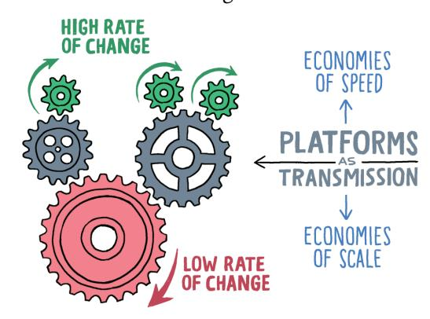

**Enabling higher rates of change**

Platforms are critical layers in this stack: they evolve comparatively slowly but enable high rates of change "above". They are like a transmission for the rate of change. Operating systems are a great example, and that's why they deserve the "platform" label.

### **Centralizing Decentralization**

ThoughtWorks' Peter Gillard-Moss defines platforms as follows:

Platforms are a means of centralizing expertise while decentralizing innovation to the customer or user. This happens through commoditization of services, but in a way which relinquishes an amount of control and is open to extension. This is a fundamental change to many organizations' core business models, which favor standards unification and work centralization.

Peter's wording aptly describes the platform paradox: we relinquish some control but do so in a centralized manner. This important nuance also explains why many so-called platform initiatives started by traditional infrastructure teams fail: they aren't looking to relinquish control but aim to strengthen it:

The most difficult step for organizations embarking on a platform journey is relinquishing control.

Traditional IT organizations link operational control with end-user control. A database administrator who assures the operational aspects of a database also exerts control over its use: developers need to file a ticket to change the schema. Although it's understandable that a person accountable for service uptime wants to restrict changes, the result is excessive friction. The typical alternative has each team managing its own database, ignoring central expertise and governance. Teams were forced to select either economies of speed or economies of scale.

**Detaching user control from operational control**

Platforms provide the best of both worlds: they provide central control and governance while decentralizing usage and innovation to the platform users. Again, we converted an issue into two independent dimensions.

Platform characteristics such as high levels of automation and a shared responsibility model make this apparent oxymoron work.

Operational Control

**User control versus operational control**

A common concern with relinquishing control is a perceived risk to governance. Experience shows, though, that carefully relinquishing control increases compliance. If IT infrastructure is rigid and cumbersome, teams are prone to going rogue and doing their own thing to make progress. An open platform gives users the ability to use parts of the common layer and perhaps even contribute to it.

# **A4 Paper Doesn't Stifle Creativity**

Allow me to conclude a metaphor from *The Software Architect Elevator*. A4 paper is one of the most widely used standards in the world, but hardly anyone could claim that it stifles their creativity.

Good platforms should be like A4 paper: highly standardized with plenty of room for innovation and creativity.

**If you don't know where you are, a map won't help.**

**All you need for a winning strategy is a good map!**

As described in the previous chapters, a meaningful strategy links the business environment with technology evolution. It lays out a path to succeed in the former by utilizing (dare we say, "leveraging"?) and sometimes anticipating the latter.

Although you'd think that established businesses operate off a well-laid-out strategy, the reality looks very different. Simon Wardley is one person who's not shy to point to the giant gaps in many large organizations' strategies and is aiming to shrink them with his modeling technique appropriately called *Wardley Maps*. Maps are a great tool to depict strategies (or reveal their shortcomings), so let's take a closer look.

### Maps as Visual Models

Maps are models—they are an abstraction that depicts the relevant features of a physical environment. "Relevant" are those things that help you answer questions or make decisions, like which turn to take.

Maps are some of the oldest models in use, so it's no surprise that numerous quotes guide us in their application:

"The map is not the territory."

Coined by Alfred Korzybski in 19331 and expanded and popularized by Hayakawa,2 this catchy saying points out that the representation of a thing (the model) isn't the thing itself. Hayakawa outlines the difference by describing two worlds: the extensional world that we experienced ourselves (authentic but limited) and the intensional world that we know from descriptions like words or maps. The latter has a much wider reach, but is subject to emphasis and abstraction, and can occasionally misrepresent reality, as warned by Hayawaka:

"No matter how beautiful a map may be, it is useless to a traveler unless it accurately shows the relationship of places to each other, the structure of the territory."

Maps aren't artwork but serve a purpose in the real-life territory; for example, to find the shortest path or win a battle. Ironically, too many IT maps fall short of this expectation: they are either beautiful but far detached from reality or aim to be authentic and end up a giant mess. It makes one wonder about the terrain that we are working with in corporate IT.

William Kent, author of *Data and Reality*3 from 1978, makes this point very clear in his "message to mapmakers":

 $^1$ Korzybski: Science and sanity; an introduction to Non-Aristotelian systems and general semantics. International Non-Aristotelian Library Publishing Company; 1933.

&lt;sup>2Hayakawa: *Language in Thought and Action*. Harcourt; 1949.

&lt;sup>3Kent: Data and Reality, 3rd ed. Technics Publications LLC; 2012.

"Highways are not painted red, rivers don't have county lines running down the middle, and you can't see the contour lines on a mountain."

Bill's book provides an introduction to the representation of information in computers, highlighting that this task is a lot more involved than trying to represent reality.

No chapter on models would be complete without a quote by statistician George Box:

"All models are wrong; some are useful."

Box shaped this famous aphorism also in 1978 to highlight that accurately representing reality isn't a model's (or map's) goal. In many cases, the more "wrong"—that is, the more abstracted—a model is, the more useful it becomes. As Bill Kent stated, road maps are far detached from reality but extremely useful.

### **Which Map Is Best?**

Cheekily placing myself alongside this great lineage of model thinkers, my sequel to George's insight highlights the context in which models are used:

"To know which models are useful, you must first know which question you're trying to answer."

To illustrate this point in my architect workshops, I share the following graphic of four two-dimensional models of a well-known system called planet Earth. Then I ask: "Which map is best?"

**The best map depends on the question you're trying to answer.**

It's a trick question because there is no single best map. The most useful map is the one that can answer your question at hand. Interestingly, the list of questions can be more varied than originally thought. For example, a topographical map can tell you the easiest hiking path, the best place to construct a ski resort, where to construct a dam for a hydropower plant, or where to build your house outside the flood zone of the river or the lake that's expected to be created by a dam. Political m[aps are great for e](https://medium.com/wardleymaps/on-being-lost-2ef5f05eb1ec)xplaining election results, road maps help you choose the fastest driving routes, and population density maps (combined with transport network maps) let you find a s[u](#page-77-0)itable location for a distribution center.

IT strategies tend to raise a lot of questions, and IT reality is complex and messy, so maps are the best tool to answer those questions.

## **Maps and Movement**

Maps have been used for a long time. Simon Wardley likes to start his description of maps and mapping with the battle of Thermopylae that took place in 480 BC when the Spartans fended off Xerxes I and his invading army:4

4 Source: https://medium.com/wardleymaps/on-being-lost-2ef5f05eb1ec, Licensed under CC-SA 4.0: https://creativecommons.org/licenses/by-sa/4.0/

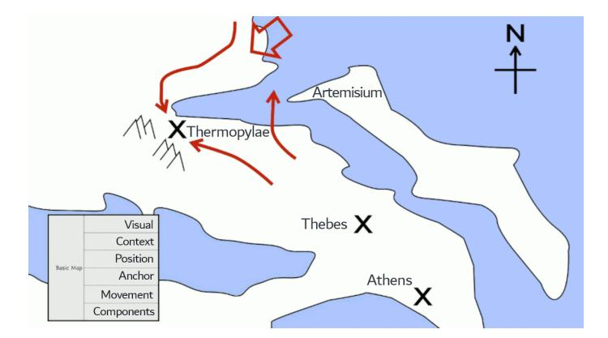

**The strategy for the Battle of Thermopylae (© Simon Wardley, CC-SA)**

This map might be considered a generic outline of the Greek coastline, apart from the movements of two opposing armies, which makes it interesting even some 2,500 years later. That's why Simon considers movement to be one of the six basic elements of maps: visual representation, contex[t \(i.e., the questio](#page-52-0)n you are trying to answer), components (in this case, military contingents) and their position, an orientation anchor (a chess board grid or a north compass), and movement of the components (attacks or retreats).

# **2x2 Maps**

Simple models provide the highest level of abstraction and are therefore the most useful ones. The much-derided 2x2 matrix is such a deceivingly simple model. A matrix provides the orientation anchor of Simon's map test, so by plotting components and movement it qualifies as a map. In the previous chapter a 2x2 matrix helped describe the path from a traditional business model to a platform business model alongside a physical or digital format.

Similarly, a 2x2 matrix presented by George Westerman and his coauthors5 plots an organization's technical capabilities against its leadership capabilities for a digital transformation journey. This map also depicts a grueling battle, that between change agents and conservative leadership:

5Westerman, Bonnet, McAfee: *Leading Digital: Turning Technology into Business Transformation*. Harvard Business Review Press; 2014.

**Movement across digital capability with leadership capability**

This matrix's visual representation lays out the territory as four distinct zones, providing the orientation anchor. The typical symptoms of organizations in each zone may help you determine if you are in one of those quadrants, perhaps without realizing it. If it does, the map has already been helpful.

This territory map also allows you to add components (your organization) and its movement. For example, you might have built up digital capabilities through so-called lighthouse or innovation projects, moving upward on the map. Now you are in need of increasing leadership capabilities to avoid fragmentation and digital silos.

A simple map like this one makes the strategy utterly clear. Adding your current position and your path turned the 2x2 matrix into a useful strategy map.

### **Wardley Mapping**

Wardley Maps are also two-dimensional grids. Living at the intersection of technical capability (the tools you have or are going to have) and business value (what your customers will get from you using these tools) makes them great strategy tools. Wardley Maps plot technologies (the components) along two axes:

• The vertical axis represents the value chain, indicating how visible a component is to the user. Dependencies between components flow from

top (visible) to bottom (less visible). A strict labeling of this axis isn't necessary as it is mainly about the relative positioning of the components.

• The horizontal axis represents the stages of evolution of the components: genesis (newly discovered things), custom built (uncommon things we still learn about), product (increasingly common, repeatable), and commodity (highly standardized, utility).

As you'd expect, Wardley maps include [movement. Com](https://blog.gardeviance.org/2011/03/componentisation.html)ponents move about the map based on two mechanisms:

- Commoditization describes a component's evolution toward the right (along the X-axis), from genesis toward commodity. This movement is driven by competition and can be hindered by inertia such as patent protection or an organization's inability to change.
- Componentization allows a system to be broken down into identifiable and reusable pieces, which then can move independently toward commoditization.

The combination is a powerful potion as stated by Simon:

Commoditization to standard components leads to an explosion of innovation for higher-order systems.

Using yet-another car analogy, cars have become heavily componentized, assembled from standardized, interchangeable parts, that range from light bulbs to brake pads and entire transmissions. This componentization accelerated the commoditization of these parts. Whereas in the early days of the automobile, the brake assembly might have been a custom-developed component (on the left of the Wardley map), you now can choose brake pads and calipers from a dozen or so manufacturers like Brembo, Bosch, or ACDelco. These parts have become a commodity, widely available at competitive prices.

The wide availability of standard components and an overarching component model (the parts of a car and their interactions are well understood) has not caused all cars to look the same. Quite the opposite: standard components boost innovation and differentiation of higher-order systems like cars. Without standardized brakes, lights, and other components, it would be time-consuming

and uneconomical for manufacturers to offer sedans, wagons (estates), twoseater coupés, convertibles, pick-up trucks, SUVs, crossovers, and minivans. Again, the magic of platforms boosts innovation through harmonization.

### **Platform Evolution**

Compute resources follow a similar path toward the right, from custom built to commodity. The following map plots the evolution of platforms on a Wardley Map:

**A Wardley Map s[ho](#page-81-0)wing platforms and commoditization (© Simon Wardley, CC-SA)**

Building a run-time environment used to involve installing and connecting multiple components; for example, a so-called LAMP stack (Linux, Apache, MySQL, PHP).6 The LAMP stack is an excellent example of componentization (a web app consists of a database, a web server, and an application) and standardization (Apache Web Server used to run two-thirds of all websites). Demand competition pushed for higher-level components that make it easier and faster to get such stacks up and running, ranging from automation scripts to container images. Basic compute (servers, operating systems) evolved into modern platforms that almost entirely free developers from such toil.

The Wardley Map7 shows the platform (e.g., a Platform as a Service [PaaS] product) above the pure compute, indicating that it is higher up in the value

6The Linux operating system can in turn be described as an extremely successful platform, underlining the fractal nature of systems architecture.

7 Source: https://medium.com/wardleymaps/exploring-the-map-ad0266fad59b, text enlarged for readability.

chain; that is, it is more visible to the customer. In the almost 10 years since Simon published this map, compute and platforms have surely moved further to the right; in other words, they became more commoditized.

**Innovate - Leverage - Commoditize (© Simon Wardley, CC-SA)**

The observation of platforms moving to the right is just the beginning, though. The secondary effect of commoditizing a platform is that it enables innovation in the form of additional components, indicated by B, C, and D in this map.

Traditional companies tried to resist the commoditization of their component (shown as progressing from A₁ toward A₃) as it subjects it to replaceability and pricing pressure. Platform companies realized that having others innovate on top of your now commoditized component (A₃) presents a unique opportunity that's bigger than holding on to A₁. Your platform can sense changes in the upper components—for example, D₁ advancing to D₂—giving you a plausible target to further industrialize (and commoditize) that component. Successful companies repeat that process multiple times over.

Platforms can be future sensing engines by detecting trends of innovations built on top.

This cycle of repeated commoditization is referred to as ILC, or Innovate - Leverage - Commoditize: while other companies innovate, you can leverage your platform to identify patterns and trends, and then commoditize. [In a](#page-283-0) [typic](#page-283-0)al example, Amazon accepted the transition from a one-off e-commerce site to a generic marketplace that allows third-party sellers. Now Amazon can monitor sales of consumer goods like batteries and offer a private label version (Amazon Basics) when sales reach a certain volume. It can detect this trend without ever stocking a single battery and then capitalize on the trend the moment the time is right. It might also detect a trend toward standardizing on AA and AAA cells (C and D cells have become increasingly rare due to the prevalence of rechargeable batteries), which provides better economies of scale.

Software platform teams can use a similar approach to sense trends by monitoring the usage of their platform and utilizing this data as input into their road map. For example, an in-house platform team might detect more teams using serverless run times or NoSQL databases and can better support them as part of the platform.

# **7. Addendum: "I ACED My Strategy"**

#### **A simple framework for writing IT strategy documents.**

Writing a strategy document is no paint-by-numbers exercise. Many authors either fall into writer's block or follow a vanilla template that's long on structure and short on content. Rather than using a rigid template, I have observed that several characteristics help in authoring meaningful strategy documents:

- **Alignment**: An IT strategy must align with a business strategy.1
- **Clarity**: A strategy is meaningful only if it's easily understood by a broad audience.
- **Evolution**: Although strategies are meant to last, they still need to evolve as opportunities come along, priorities shift, or existing constraints are removed.
- **Decisions**: A strategy that doesn't make decisions will sound like a list of wishes. And those rarely come true.

Although this list is by no means based on scientific evidence, it's a useful checklist to apply to your document or slide deck that has the word "strategy" on the cover. It's also easy to remember, given you're going to want to claim that you "ACED" your strategy.

Let's look at each aspect in detail.

### **Alignment**

A platform strategy isn't self-purpose, very much like an IT strategy isn't. Both must support the business today and in the future. A platform strategy will

1Readers of *The Software Architect Elevator* know that this isn't my favorite IT word, but in this context it actually makes sense.

invariably be part of an overall IT strategy; for example, a digital transformation, which in turn (hopefully) supports a business strategy, perhaps a pivot into a marketplace platform model or an entry into new markets. Architects are responsible for making sure that these strategies support one another:

Business Strategy ⇋ IT Strategy ⇋ Platform Strategy

Too many IT strategies fail not because they are poorly executed (that also happens), but because they aren't aligned with a business strategy and therefore can't bring the anticipated benefits. Predictably, the business side will be rather unhappy despite, or perhaps because of, much effort having been made. IT's defensive move is to fall back to vanity metrics—IT-internal metrics that are under IT's control but meaningless in a business context. IT might proudly report that the platform was in fact built or that 80% of all servers have been migrated to the cloud. If they're lucky, no one will notice that these achievements didn't actually improve any business-observable metrics, such as cost of operations or speed of innovation.

A better way to tie an IT (and platform) strategy to a business strategy, is to define success metrics that are meaningful to the business. *Cloud Strategy* described what this can look like in the chapter "Value is the Only Real Progress."

Alignment works both ways. The days when an IT strategy would support an existing business strategy are long over. A modern business strategy depends as much on technology as the other way around.

### **Clarity**

Different parts of the organization heading in different directions are unlikely to make for a great strategy. Alignment is therefore needed not just between the different layers of abstraction (business - IT - platform - implementation), but also across organizational units. That's why a successful strategy needs to address a broad set of audiences. Too often authors make things more complicated than they are, perhaps in an attempt to be appreciated for their hard work.

A strategy should be well thought through but easy to understand.

Conceptual models, as described earlier, can go a long way to adding clarity. Another common technique is to describe the strategy in horizontal layers of detail: a high-level slice across all topics, akin to an extended executive summary, followed by more detail. Structuring your document that way allows the audience to read up to the point that is relevant to them.

#### **Evolution**

A strategy cannot predict the future—after all, its main purpose is to help you cope with uncertainty. It therefore does need to absorb changes and evolve over time. This evolution incurs two levels:

- 1) The evolution of the elements described in the strategy
- 2) The evolution of the strategy itself

For example, if your in-house platform augments an existing base platform, it can evolve in two distinct forms. First, you can shrink your platform over time as its features become displaced with those of the base platform. Or, if you prefer to keep your platform the same size (in scope or value delivered), let it "float" on top of the base platform; for example, by adding new features as you shed obsolete ones.

#### **Decisions**

Last, as already highlighted in *Cloud Strategy*, decisions are a critical part of any sound strategy:

Strategy is defined by a series of meaningful decisions, those that require conscious trade-offs.

Through these decisions, a strategy na[rrows the playing field. We choose to](#page-184-0) [forgo some options, perhaps in favor of gaining others. Decisions are c](#page-184-0)ritical to reduce complexity, an observation encoded in "Gregor's Law":

**Gregor's Law**: Excessive complexity is nature's punishment for organizations who can't make decisions.

The need for decisions applies to platform strategies just as well. Such decisions can relate to many aspects; for example, the platform's scope (what's in your platform and what isn't?), its level of openness (can everyone contribute?), or its expected lifespan (will you be happy to toss your platform in a few years when the same functionality becomes available from a third-party platform?).

The following table summarizes these four aspects of a technology strategy and how we can express them:

| Property  | Rationale                                          | Mechanisms                        |
|-----------|----------------------------------------------------|-----------------------------------|
| Alignment | Assure that outcomes support business strategy     | Business-relevant success metrics |
| Clarity   | Avoid misunderstandings or mismatched expectations | Evocative conceptual models       |
| Evolution | Deal with changes                                  | Scenarios, paths                  |
| Decisions | Narrow the playing field, reduce complexity        | Meaningful options and choices    |

# **8. Talking with Platform Builders: SIMBAS**

#### **A Banking Platform for the Unbanked**

*Pieter Franken is a long-time fintech pioneer and co-founder of SIMBAS, a digital banking platform for small and medium banks.*

#### **Pieter, what made you want to build a digital banking platform?**

The story begins almost 35 years ago when the banking industry began downscaling from mainframes to distributed computing. In 2000, I had the rare chance to build a bank from scratch, using modern technology and pre-made components. We found that the advantage for a bank isn't so much in selecting the very best piece of software for each function, but rather in how fast and how well it can integrate those pieces. So, we primarily used components built by third parties, and our key innovation was the fast selection and integration of such components.

Borrowing one of your metaphors: you can buy great ingredients, but if you are a lousy cook, your meal will still be bland.

Technology has evolved a lot since those days, and many things have become much easier thanks to the cloud, APIs, and SaaS services. When I was meeting with smaller banks, they were trying to innovate in that space, but they were struggling because they didn't have a person like me to help them out. They would ask, "Pieter what would you do?" So the idea was born to create a configured assembly for small banks, credit unions, or microfinance institutions (MFIs). That platform is essentially what Pieter would do. Such a "bank in a box" would allow smaller banks in rural areas to grow their customer base or to extend their product portfolio, for example by selling insurance products.

#### **What did you find to be different when you moved from an internal solution to building a platform to be used by many banks?**

When taking a solution to other financial customers, you will find that the same functionality can have vastly different implementations, depending on scale and risk. Something called "payment" may look like moving a bit of data, but that data may be a payment for a cup of coffee or a settlement in the market for 10 billion dollars. If something goes wrong with the coffee payment, not much is going to happen. If something goes wrong with the settlement, it can cause the next Lehman shock and a global financial crisis.

So, a platform isn't just a collection of functionality, but the environment in which it'll operate plays a major role. A good way to think about it is: why is going from Tokyo to New York so much simpler than going to the moon? Both are going from A to B. Admittedly, the moon is a bit further, but the real difference is the risk profile, the level of mission criticality. The plane uses standard components and can make an emergency landing. The rocket has to have much more redundancy built in.

#### **Platforms harvest economies of scale to support economies of speed. How does that apply to SIMBAS?**

The capital base of small financial institutions is limited. Most technology vendors won't sell to these banks because the cost of sales is too high. But they are happy to sell to us when there are many small deployments. We tie the platform pricing to the number of customers or accounts, so that the cost of the platform lines up with the bank's income. That way the bank is not tied to the platform's scale economics. We in turn achieve scale by helping banks grow their customer base and signing up more banks. Naturally, it presents a risk for us as we anticipate that growth. What works in our favor is that once a bank is on a stable platform, they will stay unless they have a very compelling reason not to.

It is in our best interest to come up with something that helps the bank grow.

#### **So, as we like to say, the platform "democratizes" access.**

Yes, we are making something available that used to be out of reach. If you were setting up a bank in the 70s or 80s, only big Banks could afford a computer because they were so expensive. Today that's not a concern. Big banks love to talk about their tech stack, but the reality is that customers never see that tech stack.

Customers are interested in your interest rate or your penalty clauses on a time deposit. An out-of-the-box tech stack provides all that a small bank needs and sets it up for growth.

#### **Does the platform help build a stronger financial ecosystem?**

I'm not an economist, but I do believe that having more diversity in the lending strategy creates a more resilient financial ecosystem. Rural banks will have their own credit policy, so if something goes off, not everybody goes down at the same time. Regulators ultimately want to see a healthy financial ecosystem that has layers. So, democratizing access over a larger base, which can use a common platform, can increase diversity and make the entire system more resilient.

#### **Along the cube model, in which direction are you looking to grow the platform?**

You must understand your market and build a platform for that market. In banking, there is a lot of opportunity in Latin America, Africa, and Southeast Asia, which is a good third of the world's population. Much of the population is cash based and underbanked. I often refer to this as the "last meter banking": you have to see your customer in front of you: identifying customers is challenging because they often don't have much documentation, and there's a major dependency on cash. In contrast, much of Europe is massively overbanked and banks are fighting for existence through aggressive cost cutting. They'd need an entirely different kind of platform.

A rural bank bridges the gap between the digital world and the physical world.

We expect to grow mainly through the breadth of the platform in terms of products. For example, once they are on a platform, they could add in other products like insurance. Traditional insurance companies have no infrastructure to sell into this market as there is no infrastructure—it's cash based. The rural bank can do that. Also, many rural families have kids working abroad who send money back. So currency conversion can be a valuable product or creative savings schemes where people collectively save up for things. Large banks carry too much inefficiency for such a small scale.

#### **So, we learn again that scaling down is harder than scaling up?**

The irony is that the largest banks often have the oldest technology stacks. They have multi-year sales cycles, a lot of overhead, and loads of legacy. You cannot bring that to a small bank. Small banks have less legacy and can more easily move to the cloud. I was working with a small digital bank in the Philippines. When a massive flood happened, they were the only bank running because they were running in the cloud.

The lesson here is not to walk in someone else's shoes. If you're not a major Bank, leverage your advantages. Don't go and copy the processes and heavy engineering of a big bank. The key thing is that a platform gets you the tech infrastructure to tap into the innovation ecosystem.

#### **How do banks differentiate on top of your common platform that's built from standard components?**

As I mentioned earlier, customers won't come to your bank because of your tech stack. The differentiator is that you are in certain parts of the world with certain customers. It is the communities they work with, the way they sell, or a historical advantage. It's not going to be "how do you compute interest on a loan"—that part is a commodity. Small banks aren't doing naive stuff; they have clear things they want to do, but they can't do them because they lack a platform that allows them to bring in things from outside. So, in a classic platform maneuver, getting on a common tech platform actually spurs growth and innovation.

In the world of platforms and APIs, speed is a great differentiator. The cloud is fantastic– when I built data centers when I was young, it was years of work! Now you can have a professional data center environment up and running in minutes. But if you put all kinds of processes around it, you'll slow down, and then you might as well go and buy a mainframe.

#### **A good platform is like a fruit salad, but may make it more difficult to swap out components. How does SIMBAS strike that balance?**

Building on a restaurant metaphor, SIMBAS is not a supermarket (we already built that in the form of an API exchange called APIX—but that's another story). Rather, it is a restaurant providing a cooked meal, or a fruit salad so-to-speak.

After eating the same salad for some time, you may fancy another ingredient. Thanks to API integration, you can do that. Let's take a KYC (Know Your Customer) service, which is available from many suppliers these days. When you lay their APIs next to each other, you will see that they are quite similar. They won't be offering exactly the same service—they are different companies but you can integrate either service.

#### **Can a fruit ever go bad?**

Many people ask me what happens if one of our providers, one fruit in the salad, goes belly up. Traditional banks manage that risk by having the provider's source code in escrow. But in reality, it's very rare that someone would use that code and maintain it themselves—you'd need a large development organization that can dig through undocumented code. It'll be much faster to re-integrate another product. Still, rather than go out of business, the provider is more likely to be acquired instead. And if the provider is part of a common platform that risk is even lower, as they now have a larger customer base—that's a secondary positive effect.

I'm not saying you should blindly walk into vendor relationships. Instead of spending time in meeting rooms, you should start integrating through their API. Depending on your culture, that's a bit like dating—you find out quickly whether you are aligned or not.

#### **Platforms drive innovation both on top and inside the platform. How does SIMBAS benefit providers?**

Technology vendors may spend a lot of time trying to sell something that only a few customers buy. So, in return for initially taking a smaller amount of revenue, we can drastically reduce their cost of sales. As the customer grows, everything falls into place. Such an economic proposition isn't entirely new, but we focus on a very specific market that I believe is highly underserved in terms of technology.

Local banks are confined to loans and deposits out of necessity. If they gain more capability, they can serve much more diverse needs.

Also, an API-enabled platform opens up opportunities for larger financial services organizations. A small bank can connect to insurance companies that are SIMBAS-ready, for example, to provide micro-insurance. Larger financial institutions can gain a distribution channel that reduces risk because local banks tend to know their customers well. With a platform, they can share that data and broaden the reach of financial products.

#### **Is building a banking platform different from other platforms?**

People often think that building a neobank is like creating a mobile app. But that app is just the tip of the iceberg! You don't see the 90 percent that's underwater. If you don't have that piece right, you're going to sink. Several new banks failed—they were fast with the app, the visible thing. But banking is actually the invisible thing. Don't underestimate the complexity of money!

Money has no physical properties. But it's the thing that every single human wakes up with and thinks about.

You can't just send your customers a message: sorry, we had a little bug, and all the balances are zero, but we're trying to recover from the backup tape. So, engineering in banking is different. It's driven by complexity, and money is the most complex thing in our society that has no physical properties.

# **Part III: In House Platforms**

Platforms not only play a major role as part of a business strategy, but also as enabler for IT delivery. IT organizations rolling out an internal developer platform typically experience the benefits but also the challenges of building an IT pl[atform. Despite being b](#page-95-0)uilt on top of commercial platforms or open-source components, platforms differ substa[ntially from typical IT projects, requiring](#page-109-0) orga[nizations to](#page-109-0) rethink their approach from traditional IT services to platforms.

At the same time, expectations for internal platforms [are high: they are](#page-120-0) supp[osed to boost productivity, increase complia](#page-120-0)nce, and reduce vendor lockin. IT organizations must therefore be able to set appro[priate expectations and](#page-130-0) unde[rstand](#page-130-0) decision trade-offs.

This part provides IT organizations with guida[nce on how to build and deploy](#page-139-0) an in[ternal developer platf](#page-147-0)orm:

- In-house IT platforms come in several shapes and flavors.
- Existing service teams will find platforms to be entirely different animals altogether.
- Despite platforms having some magical properties, delivering benefits to the organization shouldn't be a magic trick.
- IT organizations may be puzzled why developers love opinionated platforms but despise restrictive ones.
- As with any architecture, platform teams must make conscious decisions and understand the trade-offs.
- Procuring a platform is easier than building one yourself, but that doesn't mean it's the easy way out.

**My way is the highway.**

**Technology is a competitive advantage**

Platforms have become popular inside IT org[anizations thanks to the promise of](https://www.linkedin.com/pulse/reverse-engineering-organization-gregor-hohpe/) harmonizing software delivery while also removing friction and thus speeding things up. Alas, like many successful concepts, the term also suffered from *semantic diffusion*, 1 not everything carrying the "platform" label actually qualifies as one. Let's take a closer look at the common types of platforms eagerly being built inside large-scale IT departments.

# **IT: Steering from the Top**

Any useful element of an IT strategy must consider the context in which it will be implemented. Although IT's main goals vary with the CIO reporting line,

1When a word is coined with a good definition but gets spread through the community in a way that weakens that definition, ultimately losing the definition entirely—and with it any usefulness to the term. (Martin Fowler)

several common elements drive large-scale IT: increased business efficiency (deliver value for the business), compliance (no one wants to go to jail), and reliability (no one likes to pay for IT that isn't run[ning\). All along, IT sho](#page-62-0)uld minimize the overall cost. These high-level goals typically match the main metrics that the business, who ultimately funds the IT, uses to evaluate the health of its IT.

Whereas the traditional metrics optimize for a known steady-state, modern organizations—those who aspire to become more "digital"—have learned that velocity (pace of delivery) and agility (rate of change) are equally critical to the success of their business. When organizations find that some of these worthwhile pursuits are at odds with one another (for example, building new solutions quickly can increase complexity and operational costs), they look to inhouse platforms to achieve both. As we have seen in The Platform Paradox, the magic of platforms can indeed break through perceived opposites, but achieving those benefits requires teams to dive deeper into the IT engine room.

# **IT Platform Benefits**

In-house IT platforms, when scoped and implemented well, can provide both development and operations teams with a handsome list of benefits:

- **Reduce cost**: Platforms allow organizations to reuse IT assets, whether provided by the platform or contributed by users, across a wide range of use cases, reducing the cost of new development.
- **Increase velocity**: Reuse not only reduces cost, it also accelerates new development and experimentation because new projects don't need to start from scratch—you're standing on top of a platform. Automated processes and build pipelines can further reduce friction and speed up delivery.
- **Assure compliance**: Building solutions on top of shared platforms can help assure compliance with internal processes and external requirements, such as regulatory oversight. This can be achieved, for example, by curating specific versions of third-party products, configuring underlying base platforms, or providing prebuilt software delivery pipelines that include automated quality and compliance checks.

• **Improve transparency**: A frequently underappreciated benefit is the improved transparency into applications running [on top of an in-house](#page-317-0) [platform. Traditional IT suffers from a general intr](#page-317-0)ansparency, exacerbated by numerous, usually proprietary systems. Shared platforms, in contrast, can easily show the number of applications, the resources they consume, their uptime, patch levels, and the last time they were updated.

• **Reduce lock-in**: In-house platforms can also serve as abstraction layers over external tools or platforms to reduce direct dependencies on those products. We discuss the trade-offs and dan[gers of this approach in a](https://www.mckinsey.com/business-functions/mckinsey-digital/our-insights/the-platform-play-how-to-operate-like-a-tech-company) [later chapte](https://www.mckinsey.com/business-functions/mckinsey-digital/our-insights/the-platform-play-how-to-operate-like-a-tech-company)r.

Thanks to these benefits, in-house platforms are popular elements in IT strategies and are often viewed as the mechanism that finally allows developers and operations to work together instead of against one another.

### **IT Platform Classifications**

Building in-house IT platforms has become so commonplace in large-scale IT organizations that it's helpful to categorize them first. McKinsey Digital's article on platform play distinguishes three broad areas of in-house platforms:

- **Customer journey platforms** contain reusable elements that define the customer proposition and experience. Such platforms contain coarsegrained functional components assembled from commercial products. For an e-commerce business, such a platform may define click-and-collect experiences or same-day home delivery.
- **Business capability platforms** consist of business solutions, for example, payment services or inventory management services for retail domains. Such business capabilities are intended to be modular and wired together to support the customer journey platforms.
- **Core IT platforms** provide the shared technology on which the journeys and business capabilities run, such as a cloud platform, build and deployment pipelines, or data analytics environments. They also include higherlevel technical services such as image analysis or in-store face recognition that directly support customer journeys.

The article's definition of the term "platform" implies a larger number of platforms than the examples in this book:

Services or products that operate as independent entities and bring together business, tech[nology, governance, proc](#page-13-0)esses, and people management.

The article mentions a typical business having 20 to 40 platforms. In contrast, the IT platforms described in this book typically comprise a wider range of IT capabilities, leading to a much smaller number.

ThoughtWorks describes a similar three-layered view of the types of platforms that are commonly used inside businesses:

- **Service Platforms** are the main offering to be used by customers; for example, an e-commerce platform. They are the most visible part of successful platform companies.
- **Digital Business Platforms** extend the service platform to be integrated with partners, usually via APIs, into a platform ecosystem.
- **Foundational Technology Platforms** underlie other products and services, similar to the Core IT Platforms described in the McKinsey model.

Both models follow a "stack" metaphor, with specialized items closer to the customer positioned on top and more generic technical items at the bottom.

# **IT Platforms Varieties**

In-house platforms come in a wide variety:

### **Digital Platforms**

When enterprises embark on something modern in a departure from their traditional way of working, the word "digital" becomes a stand-in for whatever the new model might entail. Platform initiatives fare no better, with "digital platform" serving as an organization's stepping stone into the modern, aka "digital" world. Naming challenges aside, looking toward platforms as an enabler to compete in a fast-changing environment is indeed a sound idea.

Most "digital platforms" are actually a combination of the multiple kinds of platforms per McKinsey's three-layered model and map roughly to ThoughtWorks' Digital Business Platforms. Didier Bonnet and George Westerman's article in MIT Sloan Review summarizes the value of a digital platform as supporting the core elements of a digital transformation:

- Enable new business models
- Provide better customer and employee experience
- Assure efficient, reliable, and data-driven operations

These core elements hint at the building blocks that are needed to make such a platform work:

- The *interaction platform* powers websites, mobile apps, and other processes that connect to customers and ecosystem partners via APIs. This platform shares similarities with ThoughtWorks' notion of Service Platforms and McKinsey's notion of Customer Journey Platforms.
- The *business capability platform* provides functions to support the business domain, such as e-commerce catalogs or payment services.
- The *base platform*, or "technology backbone", includes all elements needed for operational and transactional systems; for example, a cloud platform or modern on-premises run time. This layer is analogous to McKinsey's Core IT Platform or ThoughtWorks' Foundational Technology Platform.
- The *data analytics platform* processes data; for example to optimize processes, to tailor customer experiences through machine learning models, or to gain operational insights without disrupting operational systems.

These platforms work together as shown in the following simplified diagram, variations of which frequently adorn IT strategy documents:

**A common blueprint for digital platforms**

Updating an existing IT environment to reuse common platforms across frontend, core systems, and data is a ma[jor step forward for trad](#page-305-0)itional enterprises. However, the broad scope of such digital platforms is also their Achilles heel. Too often they're positioned as a cure-all for a[n](#page-100-0) organization's IT ailments, whether it's resistance to change, excessive operating cost, slow rate of innovation, or all of the above.

So-called digital platforms run the risk of being seen as a cure for any and all IT ailments.

That's a promise that hardly any product can fulfill, platform or not, particularly if that product lacks the requisite organizational changes. Digital platform initiatives run the risk of becoming proxies for actual organizational transformation, which is more difficult to put into place.2 Such platforms end up as heavily funded multiyear initiatives that deliver more slideware than lines of code. The bigger these initiatives are, the longer they seem to be able to defer any measurable value delivery.

Embarking on a digital platform initiative therefore must be guided by a clear road map with intermediate deliverables and the value achieved. Plotting a platform's value curve over time or adoption can be a useful tool to manage incremental value delivery.

2*Cloud Strategy* reminds us that "Transformation doesn't have a SKU," meaning it's not something that you can procure.

### **Engineering Productivity Platforms/Internal Developer Platforms**

In Economies of Speed, an organization's rate of change determines a company's future success.3 The core element limiting the rate of change of software is the delivery mechanism; for example, the build and deployment pipeline. Bo[osting](#page-62-0) [software's first derivative, so to speak, is the d](#page-62-0)eclared goal of engineering productivity platforms, also referred to as *Internal Developer Platforms* (IDP).

Your software delivery tooling determines your organization's rate of change.

Such platforms provide the necessary components for building, deploying, and operating software solutions, thereby harmonizing in-house software delivery tool chains. Done well, they can assure consistent code quality or detect security vulnerabilities early (an approach referred to as "DevSecOps") and thus break through the conflict between speed and quality. *Cloud Strategy* depicts an "Application-centric Cloud" in the form of a four-leafed clover, consisting of a tool chain, run time, monitoring, and communications.

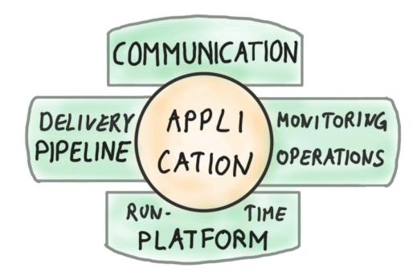

**The four-leafed clover of engineering productivity platforms**

Productivity platforms are rarely built from scratch; typically they are built on top of cloud platforms or from open-source projects. The value-add of the platform lies in the seamless integration and simplification of those base tools.

3*The Software Architect Elevator* explains why modern architects live in the first derivative.

Alas, quick assembly from prefab components runs the risk of ending up with a fruit basket.

The huge potential of productivity platforms hasn't escaped cloud vendors and source code management services like GitLab or GitHub, which are now including software delivery tools into their offerings. GitLab added GitLab CI/CD, GitHub features GitHub Actions, whereas AWS provides a suite of tools comprising AWS CodeCommit, AWS CodeBuild, AWS CodeDeploy, Amazon CodeGuru, and several others. Google Cloud, in turn, includes Google Cloud-Build, and Microsoft Azure sports Azure Pipelines. Many other cloud providers offer comparable services.

With so much capability being added to the base platforms, IDP's created in house run the risk of going underwater.

#### **[Data](https://www.linkedin.com/pulse/your-data-lake-like-pyramid-gregor-hohpe/) Platforms**

Data platforms are another common sight in large IT organizations, often as part of an organization's aim to become data driven by deriving more value from data that currently leads a shadow life in isolated data silos.

Early attempts at making data more accessible relied on massive data warehouses operated by specialists. Hampered by slow value creation from that data, those warehouses were later broken down into [smaller data lakes to make](#page-13-0) prod[ucing and](#page-13-0) consuming data easier. Somehow the producing part worked out better, resulting in data lakes that resemble the Pyramid Lake in the Nevada Desert: it has inflow but no outflow.

Data platforms present themselves as the next iteration in the perennial pursuit to extract more value from data. However, many such setups lack several critical qualities of a true platform:

- Adding a new data source can be labor-intensive, necessitating, for example, building and deploying new Extract-Transform-Load (ETL) pipelines. Due to high onboarding friction, they fail to democratize access to the platform.
- Users can't augment the built-in capabilities, rendering the supporting platform team a bottleneck that slows platform evolution.

• The pro[ducts offered](#page-26-0) as part of the platform lag behind vendor versions, depriving users of features that are readily available outside the platform. The platform doesn't enable but rather disables its users.

Such teams fell into the classic trap of not actually building a platform but merely a central system that's accessed by multiple users. Although that sounds appealing in its own right, it can't realize the benefits of a platform. The next chapter dives deeper into the important differences between centrally operated services and platforms.

Data sharing platforms are subject to network effects similar to marketplaces, meaning their value increases by the square of the number of p[articipants \(the number of edges in a fully connecte](#page-62-0)[d](#page-103-0) graph). While that works well for popular marketplace platforms, it presents in-house data platforms with a chicken-or-egg problem: sharing data has limited value for the provider, whereas consumers demand a wide range of high-quality data.

### **Data Meshes**

Data meshes are looking to overcome the limitations of centralized data systems by separating the "innovation layer" from the platform layer, following the platform characteristic of economies of speed built on economies of scale: 4

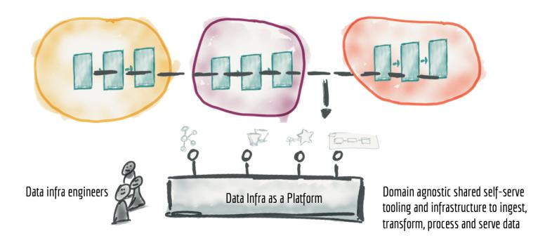

**A Data Mesh centralizes governance but decentralizes ownership (© Zhamak Dehghani)**

The concept of a data mesh rests on four pillars:

4Used with permission. Source: *How to Move Beyond a Monolithic Data Lake to a Distributed Data Mesh*, https://martinfowler.com/articles/data-monolith-to-mesh.html

- Decentralizing data domain ownership
- Treating data as a product, including ease of use, secure access, and trust
- Abstracting the infrastructure complexity into a common self-serve data platform to reduce friction
- Providing federated governance

In sum, the pillars equip data meshes with the essential characteristics of a platform: reducing duplication and retaining governance while enabling independent usage and innovation.

#### **API Platforms**

Applications and components communicate with one another, especially in the era of microservices architecture and serverless run times. That's why communication is one of the four leaves on the application-centric platform clover.

Machine-to-machine communication between modern services and applications usually takes place via Application Programming Interfaces (APIs). Such APIs play an important role in platforms at multiple levels:

- Users typically interact with IT platforms through APIs; for example, to request service instances. APIs enable self-service and reduce friction.
- APIs allow enterprises to make their legacy assets available to modern web or mobile front ends (being careful to provide commensurate scalability, latency, or robustness).
- Internal APIs can foster reuse and create a platform for innovation. Splitting a software monolith into smaller services, each of which is accessible via an API was one of the critical steps that the Amazon Marketplace took toward becoming a platform.
- Externally facing APIs can enable a digital ecosystem through easy onboarding of partners and integration of services into third-party products.

There isn't a razor-sharp definition of what's in (and outside of) an API platform. External-facing API platforms often contain commercial or open-source API management products such as Kong, Apigee, Axway, or 3Scale, and they range in scope from basic API proxies to full-fledged developer platforms with

developer keys and quotas. A full-fledged API platform would also include test tools like Postman.

**An internal API platform**

Internal API platforms typically utilize open-source service meshes like Istio or Kong, which form a control plane across internal API calls by intercepting communication between services through proxies. These proxies report metrics to the platform and can also reroute traffic; for example, to perform blue-green deployments or canary deployments.5

Most API platforms provide one or multiple of the following capabilities:

- Proxies to monitor and route service calls, such as an Envoy proxy
- API gateways to manage operational concerns like authentication, quota enforcement, and throttling (also referred to as traffic shaping)
- Self-service portals for developers to sign up to use external APIs
- Application connectors to API-enable legacy applications
- Certificate management for secure service-to-service communications
- A catalog or registry for API discovery
- Stream or event handling to augment traditional remote procedure call (RPC)–style APIs
- Monitoring and dashboards to provide observability and detect anomalies

APIs are a rich topic, which deserves its own book—with some luck, it will be the next title in this series. For the remainder of this book, we focus on APIs as an enabling technology for platforms.

5 Farley, Humble: *Continuous Delivery: Reliable Software Releases through Build, Test, and Deployment Automation*. Addison-Wesley; 2010.

#### **Abstraction Layers/Cross‐Platform Platforms**

Another species of in-house platforms aims to reduce the dependency on base platforms to reduce potential switching cost in case of a vendor switch.6 Those efforts run the risk of placing portability ahead of productivity.

Focus on productivity first and portability second. If you're not productive (and y[our competitors are\), you'll have n](#page-13-0)othing to port.

[Nevertheless, a](#page-193-0)bstraction platforms have gained in popularity. Infrastructure teams have traditionally been tasked with managing vendors and lock-in, so they naturally apply previous compliance mechanisms to the new technology (and try to not completely lose control). Such teams tend to favor an abstraction layer that is meant to shield developers from the vendor's cloud platform because they aren't operating in economies of speed.

Those abstraction layers run the risk of becoming hindrances rather than enablers, depriving them of a key characteristic of platforms. Things only get worse when they can't keep up with the underlying platform's evolution. Last, they require users to learn a proprietary interface with limited support and documentation, which slows them down.

# **Platforms and Software as a Service**

Platforms are frequently offered in a Software as a service (SaaS) model. The self-service nature and the pricing model of SaaS products helps reduce friction, which is an essential characteristic of platforms. SaaS reduces the operational burden and capital expense for customers while allowing vendors a higher rate of innovation thanks to the lack of software distribution. But not all SaaS products are platforms.

SaaS is a distribution, operational, and pricing model. Platforms are abstractions that enable teams to build on top of them.

6*Cloud Strategy* contains an entire chapter on lock-in and the trade-offs involved in trying to eliminate it.

A payment or file sharing service might be one component of your IT landscape but not something on top of which developers build. Such a service would be SaaS (the vendor handles operations and typically bills by usage) but not a platform (a basis for innovation). SaaS boosts reuse while minimizing operational toil, whereas platforms boost independent innovation.

**Comparing SaaS and platforms**

Large marketplace platforms like Airbnb or eBay, by contrast, aren't SaaS. They aren't a service in the technical sense but an entire business. Several major SaaS providers, like SalesForce or ServiceNow, have been successful combining both models by [also exposing a platform](#page-74-0) on top of which developers build applications.7 Traditional commercial software (COTS) is neither a platform nor available in a SaaS model.

The terms "SaaS" and "platform" depend on context. For example, the SaaS payment service you use may be built on top of an internal product platform developed using an internal developer platform. So, to the provider the service may be a platform, but to you, it's SaaS.

We learned that maps include movement, and it holds for this 2x2 map. A common movement for traditional commercial software vendors takes them

7Craig Weissman, SalesForce's former chief architect, explained the shift to a "general-purpose computing platform" back in 2009: https://www.infoq.com/presentations/SalesForce-Multi-Tenant-Architecture-Craig-Weissman .

toward a SaaS model, often in combination with a platform model. SAP is a prototypical example with the evolution of the traditional R/3 software into SAP S/4HANA and the SAP Business Technology Platform.

# **10. IT Platform and IT Services Are Antonyms**

**After renaming all teams, still nothing improved…**

**Teams, you won't believe the deal we got on your new development platform!**

The examples of common IT platforms in the previous chapter make the concept of in-house platforms more tangible. However, enterprises might also consider their existing data center or IT services a platform, or at least face the temptation to apply that label. After all, they provision virtual machines on demand, which sounds a bit like a cloud, which in turn is a platform. As so often, things that might appear similar from far away reveal important differences upon closer inspection. Let's take a closer look at what makes a platform deserve the name and why traditional IT services are unlikely to pass that test.

### **Isn't It Just a Box on Top of Another Box?**

When we draw high-level diagrams of platforms (including the diagrams in the Technology Platform Overview), they tend to look like a big box of "common things" with another box (or multiple boxes) of diverse things on top of it. Such a picture looks oddly familiar to anyone who has spent time in large-scale IT:

**A structural model cannot show the differences**

Much of IT is structured into a common infrastructure and operations layer, on top of which diverse applications are deployed. So, where's the difference between that model and all the excitement about platforms?

### **A Static Model Can't Show Dynamic Differences**

There are huge differences, but this structural model cannot show them. That's because this model is static—it shows only the pieces but not the interaction between them. Platforms are anything but static, so explaining the difference requires a new mental model.

The issues with the traditional "Dev and Ops" model are well known. Application developers ("dev") push for higher levels of flexibility and independence to release new functionality and meet customer expectations. They are also keen to try out new technologies to make sure that they use the best tooling possible, and that their resume remains up to date. Infrastructure and Operations, on the other hand, are more conservative and perhaps more resistant to change given that they are tasked with maintaining stable and secure operations.

Putting the two together results in a classic conflict of interest: developers throw half-tested software over the wall because the operations team has to wake up when the pagers go off. In return, operations can't do much to address outages besides rebooting a server and logging a defect for the development team to fix. This negative cycle is decorated with ample finger-pointing in both directions.

### **A Dynamic Model for a Dynamic World**

A dynamic model makes the issue clear:

**A dynamic model makes the differences clear**

As the left side of the diagram shows, the loop across deploying software, detecting its operational characteristics (or usage metrics), and correcting them, spans two organizational units whose opposing incentives pit them against each other. Often referred to as the "outer loop" of software delivery (the "inner" comprising the code/test/debug), modern software approaches like continuous integration place higher demands on making the outer loop spin faster and with less friction. In a traditional organizational model, the outer loop crosses organizational boundaries and inhibits these new ways of working.

Placing operational responsibilities in the development team, thus avoiding the organizational boundary, is one way to reduce this friction. This "you build it, you run it" model does indeed align the incentives into a single team, but it also burdens that team with a broad set of tasks and responsibilities. This means that cognitive load for teams increases (every developer now must also be a cloud and ops specialist) or team members will specialize (some folks are ops-heavy and others dev-heavy), which essentially reverts the state of affairs to the starting point, just under a common team label.

Placing operational responsibilities within the development team is the correct setup, but those teams must have the matching tools to perform these tasks as efficiently as possible. That's where platforms come in. Developer/engineering productivity platforms can be depicted as the axle that helps the outer loop spin faster.

A platform team builds the axle that makes the outer loop spin faster. But it's not part of that loop to avoid becoming a bottleneck.

The platform team is part of another loop, though: the loop that takes input from development teams to evolve the platform. This loop spins much more slowly and does not directly affect the delivery teams' velocity.

# **Platform Characteristics**

Understanding that developer platforms are a stark departure from the traditional operational model, it's easy to see how existing teams might believe they're building a platform when in reality they're not.1

Platform teams telling me that they provision or operate resources for the development teams is a warning sign that they might be stuck in the old model, just with a modern label.

That's why a set of key characteristics that [qualify an in-house project as a](https://www.linkedin.com/pulse/platform-lesson-1-platforms-should-focus-speed-efficiency-jan-bosch/) [genuine platfo](https://www.linkedin.com/pulse/platform-lesson-1-platforms-should-focus-speed-efficiency-jan-bosch/)rm is needed. Consider these like a checklist that helps you determine whether something you're building is a platform or not:

### **Speed First, Efficiency Second**

Large organizations traditionally view common elements (including platforms) as an opportunity to avoid duplic[ation and achieve e](#page-62-0)fficiency by doing things just once instead of multiple times. Such *Economies of Scale* helped traditional enterprises lower their unit costs, but software platforms are different. The traditional focus on efficiency through reuse leads to a dangerous side effect called out by Professor Jan Bosch his article "Platforms should focus on speed, not efficiency":

When companies focus on efficiency, the consequence tends to be that everything slows down.

Slowing things down is deadly in *Economies of Speed*, but that's what happens with reuse because it requires coordination. Platforms, in contrast, speed things up.

1A telling example can be found in Evan Botcher's article *What I Talk About When I Talk About Platforms*: https://martinfowler.com/articles/talk-about-platforms.html

#### **Provides Value Indirectly**

Platforms deliver value indirectly via other projects. Value is realized by the platform users; for example, by reducing projects' development effort. Platforms can also deliver value centrally, as well; for example, by providing better transparency across an IT organization's project portfolio, which in turn allows better decisions or more effective resource allocation. Just like multisided markets, IT platforms also serve multiple user groups:

- Project developers who can speed up software delivery
- Component developers who can find more users for their functional blocks
- Management who gains more transparency into workloads and resource utilization
- HR who can attract talent who are interested in [working in a modern](#page-62-0) [technology environment](#page-62-0)

Delivering value indirectly implies that a platform can deliver value only in combination with other projects. Running the risk of stating the obvious, this means that platforms without users generate no value. Platforms are indirect value enablers, not direct value creators.

#### **Thrives on Scale**

Something created as a one-off to support another project isn't a platform. Platforms are built to host a wide variety of other projects, reducing duplication of common components while enabling diversity in project implementation. Platforms thrive on scale—the more users are on the platform, the more attractive it becomes to be on the platform. In comparison, popular in-house IT systems (to the extent they exist) become victims of their own success, resulting in a bottleneck. They end up slowing the organization down, which is exactly the opposite of what a platform should do.

### **Minimizes Marginal Cost**

Successful platforms grow because new customers can sign up with minimal effort for both the user and the platform, meaning the platform's marginal cost for an additional customer is near zero or low.

Successful IT platforms inherit this property from e-commerce platforms like Airbnb. Airbnb doesn't have to build any new rooms to sign up a new host, allowing it to scale almost infinitely. For in-house IT platforms, automation, self-service APIs, and building on an elastic infrastructure are common mechanisms to achieve the same effect. Platforms that ignore this aspect are bound to become victims of their own success.

#### **Reduces Friction**

Low fric[tion extends beyond us](#page-334-0)er sign up. Traditional IT processes require would-be users to submit complex ticket requests that trigger a time-consuming and often manual provisioning process. Such cumbersome interactions stem from local optimizations within the team that shift the burden to users.

High onboarding friction all but guarantees the quick demise of any in-house platform.

Low friction doesn't always equate to a low barrier. In-house platforms and base (cloud) platforms can have low technical friction but require users to adopt a different mental model. Users who are already familiar with the new way of working—for example, using declarative scripts for infrastructure provisioning—will find the friction to be low. Others will encounter a steep learning curve at first.

### **Embraces Self‐Service**

Self-service is the default mechanism [through which IT platforms assure](#page-74-0) low friction. Instead of filing a ticket, teams directly provision a virtual machine. Transparency forms the other half of making a team self-sufficient: they need to have a good read on what's going on, so that they can pick the appropriate course of action through self-service. This way of working leads to a shared responsibility model (see below).

### **Run as a Product, Not a Project**

A platform can't be built by gathering requirements, implementing them, and calling it a day. We have seen how platforms can evolve user behavior and thus unlock additional opportunities, leading to a fruitful cycle of continuous improvement. A product must target a well-understood market, meet specific customer needs, and evolve alongside those needs. That's how platform teams must operate.

#### **Evolves Continuously**

Successful IT platforms evolve both in the depth of the services they offer and in the scope of services they provide. Users benefit from standing on a platform that continually grows and lifts them up.

When rolling out the *Agile Delivery Platform* inside a large enterprise, we decided to regularly update the underlying software product (an on-premises Platform as a Service [PaaS]) to the latest version, which ran counter to the IT operations team's preference of postponing updates until after all application owners agreed. A shared responsibility model was instrumental in allowing us to work this way.

#### **Puts Customers ahead of Processes**

So-called common services restrict users to a given set of software libraries, third-party products, or specific processes. While the motivation is easy to understand—organizations are looking to harmonize, reduce complexity, and boost compliance—these goals can't stand in the way of platforms enabling their users. Recall that "platforms enable" was the very first benefit described in Chapter 1.

Platforms therefore must find a way to serve their customers ahead of the platform stakeholders. After all, without customers the platform will provide no value whatsoever. Companies that are extremely successful with the platform model tend to be customer centric. Amazon even adopted "customer obsession" as one of its leadership principles and has managed to build not one but two successful platform businesses.

#### **Is Centrally Built and Operated**

Platform users don't need to concern themselves with the operations of the platform, because it is operated by a dedicated team. Platforms are available as an always-on production service that pools resources for standardized and automated management. This property is key to reducing the friction of teams operating on top of the platform.

#### **Shares Responsibility**

Platforms have a shared responsibility agreement with their client projects. Whereas the platform takes care of certain operational qualities like security or compliance, the client projects carry other aspects of the same qualities, such as availability, security, and compliance. You can't just deploy any old crappy application to a platfor[m and expect miracles.](#page-139-0)

Self-service can be an important part of the shared responsibility, allowing client teams to perform operational tasks like monitoring resource usage or performing restarts. An apt analogy is cars: a manufacturer can equip the car with a seatbelt and an airbag, but you still need to be a responsible driver. AWS articulates their expectations clearly in their Shared Responsibility Model for security and compliance.

#### **Users Extend**

IT platforms should be extensible by platform users; for example, to share functionality they have developed. This approach stands in contrast to traditional IT-services organizations that are looking to maintain central control and give users very limited influence over the services that they provide. Platforms are open, whereas IT services are generally closed.

# **Honorable Mentions**

A few additional characteristics are considered essential by some but debated by others, so they aren't part of the previous list but instead get an "honorable mention" here.

#### **Voluntary Adoption**

Voluntary platform usage is generally the preferred way because it builds more engagement and also provides better feedback to the platform teams. Mandated usage conflicts with customer centricity—only a tax authority might claim to be both, but that's outside the scope of this book. At the same time, a large organization isn't a democracy—whether you like it or not, hierarchies and decision powers exist for a reason.

As a pragmatist, I caution teams wanting to make their platform mandatory that it's nearly impossible to enforce things in large, federated organizations. There are one-thousand-and-one ways to work around "required" tools and even if things come to a head, you won't have sufficient political capital to fight and win every battle. This isn't a Hollywood movie where the heroes prevail. It's enterprise IT and the hallways are littered with skeletons of those who fought the noble battle.

[What you can do, th](#page-306-0)ough, is make people's lives easier if they use the platform and harder if they don't. If that sounds slightly mischievous, just think of it as a core property of multisided markets. Successful platform businesses commonly subsidize early users or charge at[hird party to provide a valuable product at](#page-334-0) [near-zero](#page-334-0) cost—until they reach scale and flip the model. If it works for the "giants", why shouldn't you get a slice of it?

### **Managed by a Dedicated Team**

Platforms are typically managed by a dedicated team that acts like a small business of its own. This approach makes good sense, but I am reluctant to call it a defining characteristic. If your platform exhibits all the aforementioned characteristics but is managed in a community model, more power to you! You may also find the opposite, a platform team that doesn't actually build a platform.

### **Platform ≠ IT Service**

As elaborated at the beginning, IT platforms often evolve (or are occasionally relabeled) from more traditional IT Services, but have entirely different characteristics. A side-by-side comparison summarizes the contrast between developer platforms and traditional IT Service Management (ITSM):

| Characteristic    | Platform          | IT Service      |
|-------------------|-------------------|-----------------|
| Main Driver       | Speed             | Reuse           |
| Value Proposition | Direct            | Indirect        |
| Scale Effect      | Thrives           | Bottleneck      |
| Marginal cost     | Low               | Medium/High     |
| Friction          | Low               | High            |
| Interaction       | Self Service      | Ticket-based    |
| Run as            | Product           | Project         |
| Evolution         | Continuous        | Sporadic        |
| Orientation       | Customer Centric  | Process Centric |
| Responsibility    | Shared            | Separated       |
| Extensibility     | Open or semi-open | Closed          |
| Adoption          | Voluntary         | Mandated        |

This list can help debunk lipstick-on-a-pig maneuvers that re-label existing processes and operational systems as platforms. The one common property (and therefore not included in the list) is that both IT services and platforms are centrally operated. Platforms depart from the traditional model by separating operational control from user control.

The table also highlights how drastic the change from traditional IT services to a platform model is, which explains why so many IT teams struggle to build successful platforms.

# **The Platform Gestalt**

A collection of characteristics is a great start but ignores that they support one another. As architects, we don't see characteristics as a simple checklist but also want to understand how they are connected—again the lines are as interesting as the boxes (see "Drawing the Line" in *The Software Architect Elevator*2 ).

- [A](#page-119-0) shared responsibility model enables continuous evolution, as described in the earlier anecdote.
- Self-service is a key contributor to low marginal cost, the ability to thrive with scale, and low friction.
- Making a platform user extensible is the ultimate form of being customer centric.

As a si[de note, a similar effect a](#page-305-0)pplies to good pattern languages: individual patterns are useful, but a cohesive language that shows how the patterns relate is much stronger. The best description of designing pattern languages I have seen is in the fifth volume of the Pattern-Oriented Software Architecture (POSA) series.3

# **Non Technical Aspects**

The platform model extends far beyond the technical aspects to also include organizational and operational aspects. That's why this book contains an entire part on Organizing for Platforms.

2Hohpe: *The Software Architect Elevator*. O'Reilly Media; 2020.

3Buschmann, Henney, Schmidt: *Pattern-Oriented Software Architecture Volume 5: On Patterns and Pattern Languages*. Wiley; 2007.

# **11. Mechanisms, Not Magic**

**Making things work is not an implementation detail.**

**Building on an outdated pl[atform isn't going to lift](#page-40-0) you up!**

Business and organizational goals for in-house platform development are plentiful: platfor[ms help](#page-52-0) enterprises speed up innovation, reduce cost, increase compliance, foster code reuse, enable autonomous teams, boost morale, and make the organization more attractive to prospective employees. However, these benefits don't magically materialize just because a major piece of the IT estate is (re-)labeled as "platform". Like other IT projects, platform initiatives frequently suffer from a weak linkage between well-stated ambitions and technical implementation proposals—the dangerous hourglass mentioned in Part II.

Platform proposals also routinely pitch different benefits to different stakeholders: developers are promised more productivity and autonomy, whereas operations teams are assured better transparency and stricter governance. As highlighted in Part II, platforms can overcome past constraints such as harmonization inhibiting innovation. However, that doesn't happen automagically. Rather, it relies on a carefully crafted combination and balance of platform characteristics.

A successful platform strategy must tightly connect expectations with relevant implementation details. Detailing how the technical aspects realize the anticipated benefits not only keeps the strategy from remaining wishful thinking, it also enables a balanced consideration of alternatives. Connecting across the levels of the organization means seeing the *Architect Elevator* in action! Interestingly, the solution lies in yet another buzzword.

## **Making Things Simpler Isn't Simple**

Base platforms such as cloud platforms or comprehensive enterprise products, are powerful but can be complex to set up and overwhelm users with choices. Although the Anything as a Service (XaaS) model removed the technical setup burden, it leaves administrators with plenty of logical setup tasks like virtual network partitions, identity and access management, and governance settings. Shielding users from this complexity is a legitimate goal. Reduced complexity brings numerous benefits: it speeds up delivery, reduces the chance of errors, and makes it easier to onboard new staff.

Finding skilled developers who can build sophisticated applications on top of commercial cloud platforms is a limiting factor for many organizations. They therefore look toward in-house platforms to soften the learning curve for developers and also to keep them from making avoidable beginner mistakes.

Building such a platform presents an even more challenging task that requires [developers to be not just skilled in c](#page-40-0)loud development but also in platform development. As a result, such organizations find themselves between a skillsrelated rock and a hard place.

## **Platform Marchitecture**

A disconnect between a platform's stated objectives and the implementation is the surest way to sabotage a platform strategy. Such a platform sounds good on paper, but "leaving the details to the technical implementation partner" all but guarantees that reality won't fulfill those expectations. And that means that the strategy remains just wishful thinking.

The symptoms of such a disconnect often appear when in-house platforms layered on top of commercial cloud platforms are pitched as a cure-all:

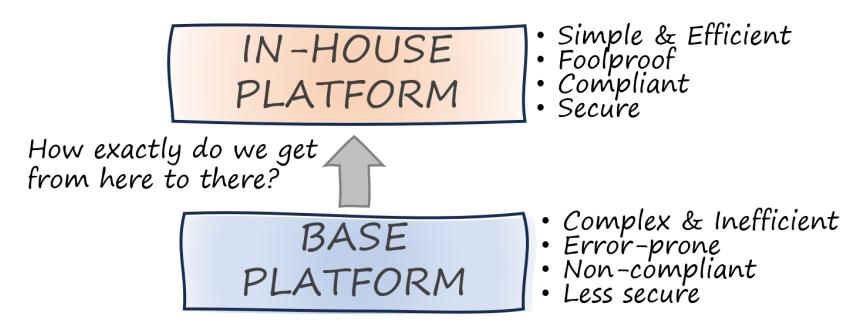

**Platform Marchitecture based on wishful thinking**

Such glorified marchitecture diagrams (they come in all sorts of flavors) play off FUD, fear, uncertainty, and doubt: developers lack the skills, base platforms aren't secure enough for a regulated industry, and giving developers more freedom is sure to lead to mayhem. They then praise the great benefits of a potential in-house platform that so far exists only on paper (or pixels).

Alas, in classic hourglass style, they fail to elaborate how exactly they get fro[m "there" to "here".](#page-40-0) Considering that the underlying cloud platforms have been built and refined over decades with billions of dollars of investment, one should describe clearly how the internal teams (or the implementation partner) can do so much better. Buzzwords like "open source, loosely coupled, and componentized" may temporarily silence the challengers, but such obfuscation maneuvers don't increase the odds of a successful implementation. Architects can do better than this.

# **Mechanisms Provide Linkage**

As previously discussed, without spelling out the core mechanisms that achieve the advertised benefits, a strategy remains wishful thikning:

Never believe a technical proposal that is soft on how the technical implementation achieves the advertised benefits.

Separating the strategy into three distinct layers adds much-needed rigor into

such discussions. Or it may expose the absence of credible mechanisms:

- *Benefits* are desirable properties. They describe the value to be achieved. Beware of proxy or vanity goals like "simplification" or "harmonization", though: they are merely substitutes for something else that you are looking to achieve; for example, better economics or faster delivery.
- *Mechanisms*, another fuzzy term alongside "architecture" and "platforms", explain how specific technical implementations achieve the benefits.
- *Implementation* details describe the other end of the mechanism; that is, what needs to be built or used.

Wikipedia defines a mechanism as a device that transforms input forces and movement into a desired set of output forces and movement. Never short of a car analogy, a crank (as in crankshaft) combined with a connecting rod is a device that converts a piston's linear back-and-forth motion into a rotating motion of the crankshaft and ultimately the wheels of a car. This mechanism has been in use for almost two millennia, so it serves us well to respect its significance.

Platform mechanisms might not last that long, but they nevertheless provide the necessary linkage that allows us to understand how the platform will function. There isn't a one-to-one mapping between technical implementation, mechanism, and benefits, as the following diagram illustrates:

**Mechanisms as logical connecting element**

Simplifying, or reducing cognitive load as we will soon discuss, is a mechanism that can fulfill multiple goals, such as accelerating development or reducing the time it takes a new team member to onboard. Simplification is itself still a fuzzy concept that can be achieved in different ways; for example, by reducing the number of choices a developer must make. Useful abstractions like Application Programming Interfaces (APIs) or network sockets have reduced cognitive load for developers for decades and can be valuable for in-house platforms, as well.

Restricting choice is frequently achieved with templates that fix certain parameters while leaving others to be set by the developers. Other implementations rely on built-in cloud services like service catalogs that define which services or geographic regions a developer can use. Both service catalogs and templates can also increase compliance, a worthwhile but entirely different benefit.

Such many-to-many relationships, when not properly understood or spelled out, can lead to miscommunication or missed expectations. For example, a platform team might implement a templating system to achieve compliance because the template won't allow developers to set sensitive or undesired settings. This implementation is then pitched to developers as reducing cognitive load, which may not actually come to fruition.

Settings that are fixed or defaulted often determine relevant aspects of the system behavior and can't just be hidden from developers. For example, fixing the geographic region of a cloud platform just to one setting doesn't free developers from knowing regions which have implications on latency, resilience, and service availability.

Instead, the cognitive load could have been more meaningfully reduced by introducing meaningful abstractions like a "Single Region Deployment", which makes the concept explicit but easy to implement.

Vice versa, the temptation to jump straight to a specific implementation is powerful. For example, governance can be achieved through the mechanism of restricting choice from the outset (by not allowing certain settings or services) or by validating choices that were made (e.g., through automated checks). Teams that skip mechanisms might fixate on one implementation without considering alternatives.

## **Welcome to the Twilight Zone of Architecture**

Technical mechanisms aren't a paint-by-number exercise for better architecture. They are a great vehicle to create a better strategy. Sadly, the value of clearly spelling out mechanisms is often overlooked because they tend to live in the twilight zone of high-level architecture:

Technical mechanisms can be deemed too conceptual or fluffy by technical teams but too technical for decision makers and high-level architects.

Some simple mechanisms, like default settings, are widely used and well known. That's why folks might not even consider them worthi[n](#page-125-0)cluding, but that would be a mistake because it would ignore the trade-offs involved even in such simple mechanisms. As we just learned, default settings can reduce or increase cognitive load, so they deserve a nuanced treatment.

## **Cognitive Load**

[Cognitive load has](#page-203-0) almost become synonymous with in-house platforms. Cognitive load was characterized in 1988 by psychologist John Sweller as "the total amount of mental effort being used in the working memory" and has been the center point for the impactful book *Team Topologies*1 . The core hypothesis of the book is that excessive mental load slows teams down and makes them more prone to mistakes. Therefore, platforms that look to enable or speed up development teams should reduce the cognitive load.

Reducing cognitive load is a worthwhile pursuit, but it might be easier said than done. Abstractions can be a useful mechanism to reduce mental load, but teams often discover that finding good abstractions is difficult and that building dangerous Illusions instead of useful abstractions is a real risk. Illusions initially appear to reduce the cognitive load but lead to bad surprises because they fail to provide the developers with the necessary details to implement acceptable solutions.

1 Skelton, Pais: *Team Topologies: Organizing Business and Technology Teams for Fast Flow*. IT Revolution Press; 2019.

Removing choices or elements does not automatically reduce cognitive load—it can have the opposite result.

It's too easy to believe that taking choices or elements away would automatically reduce cognitive load. However, that's oversimplified and often not true. A metaphor can help: if you remove 100 pieces from a 1,000-piece jigsaw puzzle, you didn't make it easier! You actually made solving the puzzle a lot harder. Instead, you would need to create a new puzzle of 900 (larger) pieces, which takes more effort.

## **Platform Mechanisms**

Although mechanisms don't provide a one-to-one linkage between implementation and benefit, cataloging the following mechanisms ca[n help shap](#page-193-0)e a platform strategy:

#### **Restricted Choice**

Picking a "golden path" out of an abundance of choices seems like a great way to reduce complexity and also provide governance. Governance places guard rails around the use of a base platform to meet regulatory demands or a (valid) desire to reduce complexity. But it might also eliminate useful options and slow down development teams. For example, if a competitor allows development teams access to a valuable cloud service type, restricting such access can turn out to be a competitive disadvantage. A later chapter on wrapping dives deeper into techniques to restrict choice.

Platforms can do good or harm when restricting choice, so let's not blame the tool. Teams must remember that platforms should be an enabler, so restricting choice should not slow down progress or stifle innovation. Instead, it can reduce complexity. We'll dive into how to achieve this in Part IV.

### **Meaningful Defaults**

A softer variant of restricting choice is providing meaningful defaults. Defaults don't try to hide the existence of certain settings; instead, they help you avoid mistakes by providing useful values if not explicitly set. Developers might benefit from a smoother learning curve because they can ignore some settings in the beginning and tend to them later when their needs evolve.

Picking meaningful defaults isn't as easy as it sounds. For example, when I built a serverless demo application on GCP, I was happily surprised that I was able to ignore security roles and access control. With AWS, the default settings initially disabled my entire application and provided additional hurdles along the way. However, the application built on AWS was better suited to be placed into production thanks to strict security settings.

### **Assumptions/Scope**

In conversations with platform teams, I tend to remind them of the following:

A cloud provider has to build for the whole world. An in-house platform needs to be built only for one organization.

The somewhat philosophical statement is intended to remind them that they can make more assumptions than a cloud provider can. These assumptions can translate into other mechanisms like restricting choice or stand on their own.

### **Aggregation**

The base layer may contain all the thin[gs you need but spread acr](#page-203-0)oss multiple systems. For example, a data platform might provide uniform access to data elements that were previously spread across legacy systems. This mechanism also reduces complexity but from a slightly different angle. Instead of looking to just reduce the depth of the existing systems, combining things aims to reduce the breadth of systems that developers need to deal with.

#### **Abstractions**

Abstractions are an often-overlooked or misunderstood mechanism. This book therefore dedicates an entire chapter to Abstractions and Illusions.

#### **Automation**

Friction is the cause of many ailments. In-house platforms often look to reduce such friction; for example, by automating tedious manual steps needed to deal with infrastructure or legacy systems. Complexity leads to friction. But friction originates from diverse sources, such as lack of documentation, inconsistency, and having to coordinate across multiple departments, so we consider it a separate motivation.

#### **Functional Addition**

Your base platform may provide the majority of the needed functions but might still have gaps that don't address your specific needs. For example, a cloud platform may give you all the storage and compute options you desire, but it can't support the specifics of your software delivery process. Your in-house platform augments the available baseline.

## **Mapping Mechanisms**

Although there isn't a direct mapping, the following table summarizes common combinations of business and technical objectives and the associated implementation mechanisms. It isn't intended to be comprehensive, but rather just to provide examples. The implementation mechanisms are described in more detail in Part II.

| Business Objective | Mechanism           | Implementation |
|--------------------|---------------------|----------------|
| Minimize mistakes  | Meaningful defaults | Templates      |
| Increase velocity  | Automation          | IaC Scripts    |
| Improve products   | Fill product gaps   | New components |
| Enforce compliance | Restrict choice     | Wrappers       |
| Reduce lock-in     | Abstraction         | Service layers |

### **[Non‐Technical Mec](#page-334-0)hanisms**

Software delivery organizations are sociotechnical systems. Hence, looking at technical mechanisms alone might miss the highest-impact strategies. For example, you can shorten the learning curve for teams by reducing cognitive load of the platform interfaces, or you can provide training or hands-on assistance. Each approach achieves similar results, despite having different pros and cons (reducing cognitive load is difficult but scales well to a large number of developers, whereas training is easier but doesn't scale as well). In the extreme case, you may find that you can achieve the platform strategy's goals without actually building any platform.

# **12. Do You Have an Opinion? A Mind of Your Own?**

**Why we love opinionated platforms but despise restrictive ones.**1

**Not everything that shines is gold.**

Productivity platforms abstract away the complexities of the underlying technology or base platform. They mainly do so by reducing choice or making assumptions. However, reducing choice invariably leads to complaints from development teams because it is seen as (and often is) disabling rather than enabling teams. Oddly enough, those same developers devour *opinionated* frameworks and celebrate being opinionated as a virtue. So, where's the difference between an opinionated platform and a restrictive one?

1 Some developers may be inclined to sing along when they encounter an in-house platform: "I thought you were special."

### **Being Opinionated**

"Opinionated" is a [common word in developer](https://basecamp.com/gettingreal/04.6-make-opinionated-software) circles and generally used with positive connotations. A StackOverflow user describes it as follows:

Opinionated software means that there is one right way to do things and trying to do it differently will be difficult and frustrating. On the other hand, doing things that particular way can make it very easy to develop as the number of decisions that you have to make is greatly reduced.

Both the Heroku Platform as a Service (PaaS) and the Rails framework are famously opinionated and widely revered because of it. Another example, highlighted by the Basecamp design principles is the Wiki. Designed by Ward Cunningham, the key aspect of the Wiki was the features that it lacked, such as fancy formatting or document ownership. In return for removing those features, it emphasized document linking by making it very easy to refer to another document just by typing the name with initial capital letters. This focus on ease of use and interlinking over fancy formatting made the Wiki the ideal basis for Wikipedia.

Basecamp itself is a great example of opinionated software and the design guides state this rather clearly:

They say software should always be as flexible as possible. We think that's bullsh\*t. The best software takes sides. Decide what your vision is and run with it.

When it comes to framework or product design, being opinionated translates into a strong vision and focus that benefits one well-defined user group as opposed to a diluted experience for a broad market. It thus follows the common wisdom of having clarity about the target segment and building a product specifically for that segment. Or, as we were told in our entrepreneurship class at university:

Business plans that describe how you would capture a small slice of a vast market are the first ones to go into the trash bin. Instead, we look for ideas that serve one market better than anyone else.

So, it appears that venture capitalists also like opinions, and some of them are also known to have strong ones.

### **Opinions Have a Shape**

So, if developers love opinions and opinions are healthy for product design and business plans, why do developers resist in-house platforms that have a specific and narrow focus? Why are those not considered opinionated, but seen as limiting and constraining, causing developers to engage in all sorts of maneuvers to avoid them? A visual model, aka diagram, can provide insight:

**Opinions give you something in return**

The image summarizes the key differences between opinionated and restrictive frameworks:

#### *Return on opinion*

Opinionated frameworks give you a high return on following their opinion. For [agreeing, yo](#page-40-0)u are rewarded with a simpler and seamless developer experience that makes you more productive and keeps you from making mistakes. In contrast, restrictive frameworks or platforms limit choice without giving anything in return. For example, if a developer platform restricts access to underlying cloud services, using the allowed services is no better than using the cloud platform directly, meaning the developers didn't benefit from following the opinion. That's why it's important to consider mechanisms to reduce cognitive load and thus provide platform users with tangible benefits.

#### *Gentle slopes*

Opinionated frameworks tend to have gentle slopes at the edge of their opinion (the terrain), meaning that the developer experience is still good even if you're looking to do something slightly outside the framework's sweet spot. Popular mechanisms are default overrides or "escape hatches" with the former sounding more comfortable than the latter. Restrictive platforms, in contrast, don't want you to go near (or beyond) the e[dge. If](#page-214-0) [an in-house platform restricts usage to specific](#page-214-0) services, there's little you can do if you don't agree (besides perhaps circumventing the platform altogether, essentially jumping off the cliff). Restrictive platforms often use the term "happy path" or "golden path", but in reality that's the only path they allow you to take, whether you're happy or not.

#### *Transparency*

The diagram we just looked at can't quite reflect this, but opinionated frameworks are fo[rthright about their opinions](https://en.wikipedia.org/wiki/Convention_over_configuration) and the motivation behind them. They state their opinions clearly, telling users what they are getting into and giving them an opportunity to opt out. Restrictive platforms tend to be opaque, leading to frustrating experiences when they reject developers' work without giving clear reasons.

Successful opinionated platforms do all three things well. They are transparent on the constraints they place and the benefits that these constraints enable. They provide mechanisms to deviate from the prescribed path where needed. Rails (aka Ruby on Rails) is a great example:

Rails put a Convention over configuration philosophy at the center of the framework and delivered higher developer productivity in return.

By making clear what developers will lose (e.g., explicit code or string abstraction between database and application) and what they will gain (compact code, high productivity), the framework managed to attract exactly those developers who would be happy with the chosen trade-offs.

# **Those Are My Opinions. If You Don't Like Them, I Have Others.**

Opinionated frameworks have one other fundamental advantage: they are not the only choice. If you don't like one framework's opinion, you can pick another one, following Groucho Marx's timeless saying, "Those are my principles, and if you don't like them…well, I have others." So, you aren't restricted at all because you can match a framework for almost any opinion:

**Multiple opinions give you choice**

The second part of Basecamp's design guidelines make exactly that point:

If they don't like your vision, there are plenty of other visions out there for people. Don't go chasing people you'll never make happy.

Developers agree with opinionated frameworks because they h[a](#page-134-0)ve a choice, or perhaps the illusion of choice, if we borrow some philosophy from my favorite source of movie quotes, *The Matrix*:

"Choice is an illusion created between those with power and those without." – Merovingian

Restrictive platforms, especially in-house ones, typically offer no alternatives, making it a my-way-or-the-highway proposition. Such platforms can succeed only if the return on opinion is particularly high, meaning the developer experience is so good that developers won't look for alternatives2 . If the reasons for the chosen restrictions are made transparent and not perceived as *fait accompli*, even better!

### **Open Source Can Afford To Be Opinionated**

Thanks to choice, open-source projects can afford to be more opinionated than commercial platform providers who look for the broadest possible user base to

2*The Matrix* buffs among developers will quickly recall the problem with such platforms: "You know that road. You know exactly where it ends. And I know that's not where you want to be."

fund their investment. This effect is underlined by open-source project home pages showing code samples that depict a superior developer experience. Commercial platforms, in contrast, tend to praise capabilities instead of developer experience.

Having an opinion improves the developer experience.

Open-source projects like Apache Kafka or Apache Airflow aren't shy to limit the programming languages that they support: Java and Scala for the former, and Python for the latter. Cloud APIs, by contrast, like to please everyone by generating libraries for a broad range of languages, but end up creating less idiomatic APIs that please no one.

### **Unnatural Selection**

When discussing the merits and demerits of internal platforms on social media, a reader gave the following candid input:

When a company decides to write a proprietary platform, it competes against industry alternatives. Unfortunately, in 90% of the cases the internal tooling teams are underfunded as a cost center and release buggy trash.

Opinionated developer frameworks are subject to some form of Darwinian selection by the developer community. Rails became popular because developers embraced it. There might have been other frameworks that aimed at doing the same but fizzled out, and we would have never heard of them. So, in a way developers embracing popular opinionated frameworks is the inverse causeand-effect: these frameworks are well known because so many developers like them.

The pointed comment hints at the challenges of building in-house platforms. If it were easy, we perhaps wouldn't even need this book. As we'll discuss later, building platforms requires a keen product mindset that previously had not been required inside IT organizations thanks to infrastructure essentially holding a monopoly.

Transitioning from classic IT services to in-house platforms is like moving from a state-controlled market to free capitalism. Many of the incumbent players will succumb to the competition.

Failing to make this drastic shift in mindset is an equally powerful contributor to releasing "buggy trash" as overly tight budgets. You can no longer roll out a platform by holding a monopoly, justified by FUD. A lot of in-house platforms simply struggle with adoption because they're not meeting the developers' needs.

[If you want developers](#page-163-0) to love your platform, make sure to build a lovable platform.

### **Cohesion**

Another difference between an opinionated framework and a restrictive platform is more subtle. Restrictive platforms often select a subset of services or features from an underlying base platform. Even though the base platform exhibits a high degree of cohesion, services may be removed due to outside considerations, such as regulatory requirements (or rather, the interpretation thereof). The selection can also be serendipitous, for example, based on which service was easiest to certify. As a result, restrictive platforms can lack cohesion, instead becoming a collection of odds and ends:

**Opinionated platforms tend to be cohesive**

An opinionated product, on the other hand, exhibits integrity and cohesion that's how it can improve the developer experience.

## **Freeways Are Opinionated**

Never short of a car analogy, I compare opinionated frameworks to freeways:

- Driving on a freeway, following the prescribed path, is very efficient and gets you to your goal much more quickly than taking the back roads.
- Freeways also constrain: you can't just enter and exit anywhere, and you must follow the prescribed path.

In comparison, restrictive in-house platforms look more like obstacle courses that have you hit sudden roadblocks for no apparent reason and without any advantage—not a lovable product.

In-house platforms may promise developers a freeway-like experience but end up delivering a mud path with giant guard rails, funded by governance and security teams. This isn't called opinionated; it's called *bait-and-switch*.

**Golden path: expectations versus common reality**

## **Are the Streets Really Paved With Gold?**

The path prescribed by opinionated platforms is often called the "golden path", a term popularized by Spotify and purportedly borrowed from the Dune sci-fi [saga. Whether all platform roads are paved](#page-317-0) in gold remains to be seen because IT organizations may lose the focus on making the golden path particularly happy in favor of closing off all other paths:

The so-called "happy path" isn't actually that happy; it's more like the other paths are closed off.

Although that matches the original Dune reference where all other paths lead to humanity's extinction, it might not be the best approach to gain widespread adoption and enthusiasm for your platform.

## **Employer Lock‐In**

There's a last consideration that can stir resistance among developers, even if your platform is beautifully cohesive and provides a great developer experience along with necessary escape hatches: lock-in. No, not being locked in to a thirdparty vendor, but being locked in to your own organization. Frameworks built in house are proprietary. If developers invest large amounts of time in learning such a framework, there's zero return on that investment in case they want to go work somewhere else.

In-house frameworks increase developers' switching costs, resulting in "employer lock-in" that they may resist.

In comparison, work experience with open-source platforms like Kubernetes increases developers' market value, so developers might prefer them over in-house platforms. This form of undesirable "resume-driven architecture" presents a real concern for platform teams in times of skill scarcity.

# **13. Making Platform Decisions**

**You want a quick decision? Give me a coin…**

**The path to the right platform can be harder than it seems**

*The Software Architect Elevator* reminds us that architecture is best represented by a set of conscious decisions. The same applies to the design of in-house platforms. Although designing a platform is far from a paint-by-number exercise, a checklist of major decisions and their trade-offs can be a valuable tool to start a platform strategy.

# **The Most Important Decisions Might Be the Ones You Didn't Know You Made**

*The Software Architect Elevator* features a simple but powerful picture that helps you identify what makes up the essence of architecture, even if it comes in the form of a simple sketch:

**Is this architecture?**

The sketch of a house on the left includes the elements that are commonly featured in definitions of systems architecture: the main components (door, windows, roof) and their interrelationships (door and windows in the wall, roof on the top). Yet, when building a house, one wouldn't want to pay an architect for this sketch. That's because this "cookie-cutter" house lacks any non-obvious decisions that an architect would have made.

The sketch on the right is equally simple and poorly drawn, and the house is almost identical except for the roof. This house has a steep roof and for a good reason: the house is designed for a cold climate where winters bring extensive snowfall. Snow is q[uite heav](https://architectelevator.com/architecture/important-decisions/)y and can easily overload the roof of the house. A steep roof allows the snow to slide off or be easily removed thanks to gravity. Additionally, an overhang prevents the sliding snow from piling up right in front of the windows.

Dismissing the decisions on the right as trivial would miss an important point.

A dangerous trap early during a platform development cycle is the team making decisions without being aware of it.

As I pointed out in a blog post, teams are prone to making decisions tacitly or just taking them for granted without evaluating alternatives. Those tacit decisions either result in poor design trade-offs right from the start or turn into hidden assumptions later on, which makes evolving the platform into a frustrating guessing game. A decision catalog therefore serves as a useful checklist that allows you to detect whether you made decisions without being aware of it.

### **Truth versus Comfort**

Platform decisions can be controversial. For example, we learned that platforms must evolve. Yet, most users prefer stability and look to avoid the effort of upgrading to a newer version. Others might ask you to commit to maintaining the platform forever (or their retirement, whichever comes sooner), something you're also unlikely to be able to do.

A popular sales tactic is to deliver bad news to customers after the buyer already committed and is less likely to back out. You may recognize this tactic by statements like "there's actually an additional delivery charge for your area" or "the quoted price is valid with a three-year commitment". Although most of us will find this annoying, it does work. So, stating your platform decisions early may front-load the debate and make the platform a tougher sell. But, if you're in it for the long run, it will avoid late surprises for your users and allow you to sleep soundly at night.

### **Decision Catalo[g](#page-162-0)**

Platform teams face numerous design decisions, and trying to compile an exhaustive list would not do the complexity of the topic justice. Most decisions aren't binary either-or decisions, and virtually all of them carry trade-offs, meaning "either" isn't necessarily better than "or". In line [with the warning](#page-62-0) [in the introduction, the](#page-62-0) goal of this chapter isn't to answer all questions, but to raise better ones and equip you to find better answers. Decision models are a great way to achieve that.

This chapter focuses on the externally visible platform choices; that is, those that affect the platform users. Part V - Implementing Platforms elaborates platforminternal implementation choices.

#### **Open or Closed?**

Platforms are enablers for other teams and thrive because they do not try to anticipate all use cases. Although a platform should be flexible enough to allow platform users to do anything they desire, in reality, platforms provide extension or customization mechanisms. The following decision model shows different approaches to allowing platforms to accept user contributions:

**[Platfor](#page-317-0)m collaboration models**

- **Closed**: The platform remains fully under the control of the platform team with limited input from the platform users. This model should be rare for in-house platforms and can be an antipattern as it lacks customer focus. However, there's always an exception to the rule: for example, a platform might need to be rigid due to regulatory oversight or required certifications.
- **Feature requests**: The platform is fully under the control of the platform team, but the team encourages feature requests from users and maintains a public backlog. Taking [feature requests doesn't](#page-221-0) imply that the team builds exactly what the users ask. Cloud platform vendors follow this model by taking in customer feedback.
- **Marketplace**: Users can't modify the platform directly but can offer components to be used by other platform users. Many commercial platforms actively support such marketplaces. For example, vir[tually](https://en.wikipedia.org/wiki/Inner_source) [all clou](https://en.wikipedia.org/wiki/Inner_source)d platforms have marketplaces for machine or container images offered by third parties, enabling use cases that aren't part of the base platform.
- **Extension API**: The platform allows users to develop components that will become part of the platform, often via dedicated extension APIs (discussed in detail in Anatomy of a Platform). A canonical example is Kubernetes Operators that extend the Kubernetes container orchestration platform to become available via the Kubernetes API. Unlike the marketplace components, these extensions sit inside the platform.
- **Co-Development**: Platform users can be actively involved in the platform development. This type of collaboration follows an open source or inner source development model and is therefore more viable with in-house platforms than in commercial ones.

#### **Free or Charged?**

Building platforms isn't free, but it pays off. In-house platforms deliver value to the organization indirectly by enabling users to deliver products faster or to innovate freely. If upper management is convinced of the platform's value, they may grant you the luxury of offering your platform to users for free, which can boost adoption and thus increase the overall (indirect) value delivery. Interestingly, not requesting any direct charges can improve the business case.

IT organizations generally require projects to recover their investments from their users through a direct pricing model. Before you blame an over-eager CFO, it's good to know that this restriction can originate from tax and accounting rules. Let's say one division of your large organization maintains a [sizable](https://en.wikipedia.org/wiki/Dutch_Sandwich) [team to bu](https://en.wikipedia.org/wiki/Dutch_Sandwich)ild an amazing in-house platform. This team happens to be located in a high-tax country. The platform is so amazing that little work remains to be done by the development teams, who happen to be located in low-tax countries. If the platform is free to use, you are essentially shifting profit from a high-tax location (where you allocate the bulk of the development cost) to lowtax locations (where you increase profit thanks to minimal development cost). Such a maneuver is bound to raise eyebrows in highly regulated and monitored industries like financial services who'd want to reflect that transfer of value from one country to another. This is a classic *Architect Elevator* scenario in which architectural decisions are driven by business context. Architects who are well vers[ed in the top floors migh](#page-109-0)t point to clever strategies like a Dutch Sandwich. Although I prefer architects to take a broad view of their role, I leave this topic as an exercise for you, the reader.

Offering a platform for free, although well-intentioned, can also lead to undesirable side effects. For example, numerous small projects may adopt the platform, resulting in a support and maintenance burden that may slow platform evolution or distract the platform team from supporting major users.

#### **Mandated or Voluntary?**

When listing platform characteristics, making platform usage voluntary was listed as a desirable property but not a required one. Voluntary adoption assures that the platform team listens to customers and evolves the platform based on customer needs. Even if you tried to mandate usage of a platform, project teams can become rather creative when it comes to circumventing mandated tool usage; for example, by using the mandated tool for a small or peripheral portion of their project to claim compliance while using other tools for the majority of the project.

On the flip side, voluntary platforms require teams to spend valuable resources promoting their platform, especially early during the adoption cycle when word-of-mouth marketing is not yet happening due to a small user base.

#### **Immor[tality?](#page-184-0)**

Nothing in IT lasts forever, so it's a good idea to give an indication of the intended platform lifespan, both in absolute terms and in evolution over time. Inhouse platforms don't exist in a vacuum; they are subject to shifting developer needs and preferences, and base platform evolution.

A[lthough platform](#page-184-0) teams would love their platform to live forever, few IT systems do (and those that are, become a burden for their maintainers). So it's helpful to give your users a notion of what the long-term plan for the platform will look like: will you go into maintenance mode at some point? Do you expect it to be underwater later on? Will you open-source it or pass it to the internal community? There are more choices than might initially appear, so it's good to lay out options and choose wisely.

#### **Can the Platform [Shrink?](https://honeycodecommunity.aws/c/announcements/7)**

The base assumption might be that a platform grows over time. However, a floating platform also retires functions to avoid duplication with readily available services.

Keeping focus requires pruning.

Some cloud providers have a long history of sunsetting services, but other providers have also started to prune services to focus their teams. As a contrary example, IT environments are largely so complex because the teams kept adding but never took anything away. In any case, it's important to set these expectations with platform users right from the start.

#### **Rate and Cadence of Change**

Continuous evolution is a key characteristic of platforms. Still, large organizations routinely pay millions of dollars for extended support contracts because they are unable to move off an unsupported version of a software product.

If your organization allows application teams to veto changes, your platform may not succeed.

Platforms should have a low rate of change, but it won't be zero. Still, teams have a right to know what rate of change to expect. Early in the platform journey you should define:

- What will change and what will not (e.g., do you keep existing APIs stable when adding new ones?)
- What is the expected rate and cadence of change (e.g., each quarter or as needed but generally less than once per month)?
- How you will support teams with the change (e.g., do you provide test environments for the new version or maintain multiple versions at any point in time)?

These decisions will mimic traditional service management processes (hello, ITIL!), but they do apply to in-house platforms just as much.

#### **Preconditions and Assumptions**

As with any product, be clear on what you assume to be in place for developers to use your platform, including skill sets, ways of working, and so on. A great platform cannot deliver value if the teams lack the preconditions that the platform assumed to be in place.

### **A Platform Design Canvas**

Platforms are products. And even though they don't compete in an open market, platform teams need to make the same design decisions that a product start-up would have, ranging from identifying customer groups to partners (like cloud platforms) and pricing models (see above).

At GovTech Singapore, we tailored the well-known Business Model Canvas to a *Shared Service Canvas* that helped us make conscious decisions on all aspects of our platform design.

**Why buy it when you can build it?**1

**They're all so tempting…**

Not all platforms have to be built. Organizations will routinely buy platforms that someone else built; for example, cloud platforms. On the other end of the spectrum, emerging platform toolkits ma[ke building a platform a much](#page-334-0) more viable proposition. Even if you don't intend to build a platform, knowing how to build one will help you make a better selection.

### **Do You Need a Platform?**

The popularity of the term "platform" has caused the approach to be misunderstood as the cure for all of IT's problems. That's why you should first reflect on whether a platform is the right choice. You might find that a readymade Software as a Service (SaaS) product meets your needs, that a framework increases your development speed, or that you don't need any tool at all.

1An ill-founded approach used by too many engineering teams

When the platform under consideration is a cloud platform, the default answer is "yes", thanks to the broad capabilities of those platforms and the (relative) ease of use. Selecting a cloud platform is a topic on its own, so I defer to my blog post on poor ways to select a cloud provider.

When asked why customers should even consider building their own platform on top of already well-equipped cloud platforms, I remind them that assumptions are a powerful mechanism, as stated earlier:

Cloud providers must build for the whole world. You need to build only for your organization, so you can make more assumptions.

### **Should You Build a Platform?**

You're unlikely to want to build an entire cloud platform, but you'll end up building at least portions of your in-house platform. That's because you need to tailor your platform to your business domain or because you integrate the platform with existing systems.

Like any architecture decision, buying or building a platform isn't binary, but an entire spectrum:

- 1. Buy (or "lease" in a SaaS model)
- 2. Build on top of a builder kit
- 3. Build from scratch

Platform builder kits have become more widespread, ranging from open-source projects like Spotify's Backstage or Syntasso's Kratix, and commercial products from companies like Humanitec.

A decision model can help bring clarity into the buy-versus-build decision of in-house platforms. A successful platform solves complex recurring software problems without constraining teams through its use. Therefore, when looking to choose an area for platforms to deliver value, we can chart the territory along two axes of your business or technical domain:

• *Complexity* describes the intellectual capital, skills, or effort required to develop a conceptual model for the domain.

• *Differentiation* measures the unique advantage that the organization can derive from this domain; for example, in revenue, brand equity, or customer satisfaction.

A high entry barrier for new entrants or competitors to match the unique advantage increases its value. That barrier could be due to its complexity, so the two axes can be interconnected.

Some business and technical domains are inherently complex (accounting, distributed systems), but others suffer from so-called *accidental complexity*, meaning the solution has become more complex than it should have been. In such cases, reducing the accidental complexity through refactoring promises to be more successful than trying to absorb it in some type of platform.

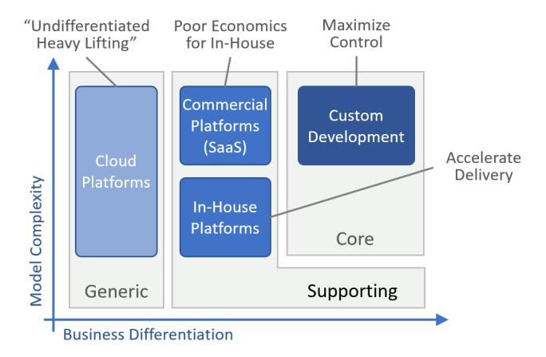

**Identifying domains for platforms**

Inspired by Core Domain Charts developed by Nick Tune and Christian Horsdal, organizations can use Domain-Driven Design (DDD) to discover domains that are well suited to platforms. DDD typically divides (business or technical) domains into three areas.

• *Core domains* are highly differentiating. They tend to be small but also

complex. If you tackle this part well, your business will benefit from an economic moat.

- *Supporting domains* can be either complex but less differentiating, or differentiating but less complex.
- *Generic domains* can be complex but don't differentiate your business, as they're commonly used across diverse businesses. DDD recommends using off-the-shelf models for these domains. Cloud platform providers often use the term *undifferentiated heavy lifting* for this area.

As with any competitive field, domains aren't static, but they show movement (Simon Wardley would approve). Elements that used to be core can erode to become supporting over time. As an organization, your goal is to stay ahead of the curve and tackle new domains. For example, Continuous Integration and Continuous Delivery/Deployment (CI/[CD](#page-150-0)) pipelines used to be supporting domains and have now become largely generic. AI moved quickly from core to supporting for a range of use cases. Businesses may choose to open-source their genericized supporting systems as Spotify has done with Backstage or Netflix did with Spinnaker.

Building custom platforms in the generic zone submerges them right from the start, all but guaranteeing a poor investment return. Instead, you should rely on existing cloud platforms, SaaS services, or frameworks. On the other end, building a platform for the core domain can seem tempting, but the heightened level of customization, constant discovery, and rate of change can make finding sufficient commonality difficult. Eric Evans2 points out that:

It is unlikely that the Core Domain can be purchased. The greatest value of custom software comes from the total control of the Core Domain.

Platforms can shine in the supporting space with sufficient commonality across projects. For domains with higher complexity, using a commercial platform is bound to yield better economics, as the cost of in-house implementation may outweigh the benefits. E-commerce platforms or insurance claim handling systems fall into this category, allowing developers to focus on differentiating factors like customer experience. In other cases, in-house platforms encode

2Evans: *Domain-Driven Design: Tackling Complexity in the Heart of Software*. Addison-Wesley; 2003.

standardized business processes that reflect a high quantity of intellectual capital, while implementing the individual steps using off-the-shelf solutions.

### **Selecting a Platform**

Platforms have very different dynamics from traditional IT services, so taking a static snapshot and running a scorecard based on the old way of working isn't effective.3 Michele has a great way of describing the common mistake of letting feature comparisons drive the decision, tapping into the serious Italian business of pizza:

I told a customer that they were selecting the platform as if they [were ch](#page-261-0)oosing a pizzeria by looking at the menu outside, picking the one with a wider selection. They'd have no idea of the thickness and texture of the crust, whether the oven is electric, gas, or woodfired, and whether the sauce uses fresh San Marzano tomatoes or paste from the can.

Assessing the breadth of a platform can serve as a useful baseline. However, not [all features translate into an actual](#page-13-0) benefit. You'll only eat one pizza, not the entire menu, so you'll want that one pizza to be tasty.

Lastly, be aware that when evaluating platforms, you may find yourself smackdab in the demo zone of the platform's complexity curve, just waiting to be hit by the hockey stick when your needs grow in scale and complexity.

### **Utilizing a Platform**

Just selecting something labeled "platform" doesn't guarantee that you'll be standing on the shoulders of giants. You'll also need to learn how to balance. *Cloud Strategy* reminds us that shopping for technology won't transform your organization with another food-related metaphor:

A better knife doesn't make you a better cook.

3*Cloud Strategy* discusses in much detail why the cloud is so different.

[Platforms require organizational c](https://en.wikipedia.org/wiki/Locomotive_Acts)hanges to deliver the anticipated benefits. If you procure a powerful cloud platform, but then follow a manual approval process for someone to provision virtual machines by clicking around in the console, you'll be hard-pressed to declare "progress through platforms".

[Just selectin](#page-130-0)g a platform doesn't guarantee that you'll be building on a platform.

Manual approval before provisioning a server is akin to having a person walking in front of your car waving a flag—also not a great way to speed up. But that's what often happens when you apply old processes to transformative technology.

### **Respecting Platform Opinions**

Platforms have opinions, so when choosing to onboard on a platform, you need to be aware and prepared to accept them. A mismatch at the architectural or organizational levels diminishes the value you can reap from your platform.

Not matching platform opinion against your own needs and context can lead to the platform sinking under the weight of the workload. When this happens, there is little that the platform can do to increase buoyancy, Organizations are left with a classic dilemma: customize the platform even further or define a path to exit.

When selecting an insurance business platform to manage claims, an organization chose a solution based on a favorable position in the respective Magic Quadrant. However, this platform came with strong opinions along its entire stack. It allowed extensions to be written in a proprietary language, but over time, the level of customization outgrew the use of out-of-the-box business processes. During the next platform upgrade the organization paid the price for adopting a platform but not its opinions.

A platform's opinions may cover not only functionality but also the technical layers and technical processes, which may not fit the organization's established practices. Carefully assessing the platform implementation reduces the risk of

the platform becoming an island in the IT sea, detached from the evolution of the IT foundation and other in-house platforms.

Not all products that are pitched as being extensible qualify as a platform. To enable development teams, the platform must provide a coherent domain model and efficient APIs, combined with modern tooling, including version control and unit testing. Too many commercial products, often portrayed as business platforms, include extension mechanisms that resemble "escape hatches" as a last resort. Building an entire business on a set of escape hatches is as bad an idea as it sounds.

## **Leaving a Platform**

When selecting tech[n](#page-153-0)ology that's expected to become a major part of your IT portfolio, it's good to think ahead. Regulatory considerations or risk management discipline may require you to think through separation before procuring a platform.

All technology, whether built in house or commercially procured carries a switching cost, in both elapsed time and money. If you can estimate the odds that you'll need to switch, then you can express it as a liability: If moving off a platform would cost you \$100,000 and there's a 5% chance that you'll need to move, you carry a \$5,000 liability. Investing 18 months of analysis and millions into building an abstraction layer to reduce this liability to \$500 will struggle to show a positive ROI.4 Hence, *Cloud Strategy* warns:

Don't get locked up into avoiding lock-in.

At the same time, you shouldn't be naive. You should aim for "accepted lockin" by weighing the benefit you gain today against the future liability. Most people think of their marriage in this way, whether it's with their spouse or their iPhone.

A common strategy for reducing dependencies and thus switching costs is by placing a layer of abstraction. The approach is so common that it's been jokingly

4 If you apply a discount rate to the future expense, and assume the cost will increase less than that rate, the liability might even be lower.

referred to as the fund[amental theorem of software engin](https://architectelevator.com/cloud/serverless-design-patterns/)eering. However, base platforms are moving targets, so you curse your platform team with a Sisyphean task.

Switching costs aren't just a function of the platform you use but also of the way you work.

Rather, you should look inside your organization to increase the rate of change that it can handle. Departing from a platform is such a change, so speeding up your organization also reduces potential switching costs.

# **15. Talking with Platform Builders: Singapore GovTech**

### **A Developer Platform for the Singapore Government**

*Kevin Ng is a Senior Director, Government Digital Products (Core Engineering Products), GovTech Singapore*

*Hsiao Ming Chia is a Director, Government [Digital Products \(Core](#page-95-0) Engineering Products), GovTech Singapore*

#### **What role does GovTech play in the Singapore Government?**

Following our mission of "Engineering Digital Government, Making Lives Better", we provide central platform capabilities to over 100 government agencies. Our team is called "Core Engineering Products", which in most organizations equates to "Platform Engineering". A large fraction of the 1,000+ systems that we host in the cloud use our SHIP-HATS CI/CD tools. We are now expanding our platform to onboard agencies onto run-time technologies like Kubernetes and Infrastructure as Code. In line with the four leaf clover model, we are also raising the bar on observability and the communication layer.

Our own developer-identity system provides secure login and authentication for these tools while a Developers' and Documentation Portal shares information about our tools. Soon, a Developers' Console will streamline tool configuration and subscriptions. Although developers are our primary target persona, our platform includes tools for product and project managers, as well as reporting tools for CIOs and CISOs. Additionally, many agencies outsource development, so we need to cater to those teams, also. As with any platform team, understanding all the customers we serve was critical to the platform's success.

#### **Your developer platform initiative started in 2016. Were you ahead of the trend?**

In then-Government Digital Services, we started around 2016 with Atlassian tools like Jira, Bitbucket, and Bamboo, which gave us source control and a way to run our build pipeline for internal use. Around 2018, we realized that this could become a platform for the whole-of-government.

#### **So, you built a product for yourself first rather than ponder over what developers might need?**

Indeed, but as we expanded our user base, we found that our customers' needs differed. For example, some used GitHub, which wasn't part of our platform.

Some teams were not using source control at all, so we had to accept that initially they may not use our product in the ideal way. But we consciously decided to prioritize adoption first and then follow with good practices. That worked well for us, as we now have nearly 80% of eligible systems on the cloud and over half of the agencies on our CI/CD platform.

#### **How did you decide to bootstrap your platform with a CI/CD product?**

We had a container runtime (NECTAR) and an on-premises API Exchange called APEX. With the arrival of the cloud, in this case Government on Commercial Cloud (GCC), NECTAR lost market share, and APEX moved to the cloud for cost reasons.

CI/CD stepped into the foreground and got an extra boost thanks to its role in the government digital transformation program. CI/CD was seen as a key construct to achieve higher delivery velocity and innovation. Also, our cloud strategy supports three major commercial clouds, so it made sense to keep our CI/CD independent of any one provider. This approach avoids the complexity of managing three different build pipelines.

#### **Back in 2018, the platform engineering buzz hadn't much taken off. Where did you find guidance?**

The initial idea for NECTAR was relatively simple: we wanted to shield developers from Kubernetes' complexity through a portal. But you can't just wrap the workflow without considering how people will use the tool. For example, we also had to address billing, user life cycle, and permissions management. That's really where [the platform concept originated.](#page-294-0)

#### **Today we would call that "reducing cognitive load"…**

Right! Our primary guidance came from the persona we wanted to serve—an average developer who would not be familiar with Kubernetes. The trade-off was that some progressive developers didn't find our layer open enough. A breakthrough happened when we used modular models like the Four-leaf Clover (Chapter 8) or the SG Tech Stack (Chapter 27). These models allow us to layer tools on top of each other so that development teams can choose.

#### **It sounds like you divided your platform into slices!**

A lot of the progress was driven by the desire for cloud computing. After all, each application needs a run-time. Once that was stable, we wanted to support the folks building software, which meant CI/CD. It helped us that we were assembling things that were already available. Teams were already using bits and pieces to do CI, so we collected and aggregated those into a platform.

Our journey was shaped by the users' capabilities and work styles. In the early days, many teams would not use the entire CI/CD chain. However, we could at least get them on version control, so having that capability in the platform was important.

#### **How different is building a developer platform for the public sector from a commercial one?**

Government compliance influenced a lot of our tooling. NECTAR mainly existed because hosting applications could be cumbersome. Likewise, APEX existed because of intranet-internet separation. Those constraints boosted the adoption of our tools. We were also fortunate to have high-level support from the Prime Minister, who asked to move 70% of eligible workloads into the cloud.

On the flip side, as senior government leaders are rotated regularly, re-education is needed. Our new leadership recognized the importance of shifting from a sole focus on compliance to prioritizing productivity and value delivery. Because compliance was no longer sufficient to drive adoption, we pivoted our tools to emphasize enhanced productivity, aligning with the changing needs of our users.

Data sovereignty is another important aspect, which restricts our use of SaaS products. But even more so, resilience is a major factor. In Singapore, there is a strong expectation that the government delivers results, so we must keep things moving but also plan for really far-flung risk scenarios. Governments' reputation is a critically important consideration. For example, the rollout of MyNumber in Japan, roughly equivalent to our Singpass, drew public criticism.

The public sector nevertheless shares many aspects with large enterprises, especially the financial sector, such as a focus on cybersecurity and IT being largely outsourced. Vendors brin[g additional](#page-168-0) personas into the mix, like project-oriented delivery managers and practice leaders who look to uplift their practices, which are not always aligned even within a vendor. Last, the technical capabilities of agencies vary, so we have a very broad and diverse user base.

Platform teams really must understand all their audiences to be successful.

#### **NECTAR, APEX, SHIP, and HATS started off as separate products. Does that make your platform a fruit basket?**

We sell to around 100 agencies, so the level of maturity varies substantially. This makes offering a single product harder, forcing us to offer what looks like a 'basket' from which you can easily make your favorite version of 'fruit salad'.

#### **When rolling out your platform, were some things harder than expected?**

Pricing was a challenge due to our mandate to recover our costs. Developers often expect tools to be free or very low-cost. Fortunately, our Chief Executives supported the decision to make SHIP-HATS essentially free for GovTechies, which significantly lowered the barrier to adoption. Vendors' resistance was less about cost, as they could simply pass those expenses on to the agencies, but rather about the government poking into their domain. We also learned that pricing models can influence behavior. For example, we encountered situations where a vendor would use their own CI/CD tools during development and only switch to our platform for production releases. This recreated the old dev/ops separation, which is the opposite of what we were looking to achieve.

#### **Could you share a bit about your pricing models?**

Pricing CI/CD is challenging—everyone thinks of the major providers offering free plans. When we charge for an enterprise license, developers often don't understand why they should pay for it.

The second part is that people are used to shrink wrap software, like Microsoft Office, which requires minimal configuration. As a result, they question why we have a team working on standard templates, permission rules, security operations, and single sign-on—all of which add to the overall cost.

Our pricing strategy has evolved for these reasons. For example, we aggregate demand for some products and use our bulk purchasing power. Then we can use that discount to fund our team.

But in practice, it's not easy to implement volume pricing because strong adoption is needed to secure meaningful discounts. In the beginning, you won't have that volume, and your economics look unfavorable. If your product does not gain traction quickly, we may need to subsidize it, leading some to question whether we should be [involved in](#page-294-0) this technology at all.

Volume pricing pushes us to a model where we need to make sure the product is suitable before we scale. Originally, we preferred to scale incrementally and refine the product based on feedback. Now, selecting the right customers has become quite important, particularly those willing to collaborate and co-invest in new ways of systems development.

We generally price per user or capacity, similar to GCC (cloud). For observability, we also plan to price based on volume. Pricing by user is natural for CI/CD products. Still, it also creates complications because some user groups may only use specific features, for example, Gitlab Pages, instead of a full build pipeline. So, they may request a lower tier.

We aim for a co-innovate model, where we try to find premium customers who are willing to work with us to influence the tool's roadmap. Our team will customize it for them, and in return, their input helps us improve the product.

#### **Did your users build something that surprised you?**

We built a container platform called CStack for developers. We were happily surprised when we found out that business users were able to deploy a teacher appreciation portal for Teacher's Day. They even went through the end-to-end process including vulnerability assessment and penetration testing (VAPT), all with very limited [developm](#page-252-0)ent skills.

We also discovered that some folks used our CI/CD pipeline as a data pipeline. We were initially impressed by the frequency of their deployments, but then we realized that they are basically shipping data!

Some teams were running hundreds and hundreds of test drops on our runners, which overwhelmed our pool of runners. That was a classic misuse of the payper-user model, as opposed to pay-per-run. So, some surprises were positive, whereas others were clever but not desired.

#### **Are you planning to build additional platforms or expand the existing ones (following the cube)?**

We are confident that going deeper can extract even more value. Our CI/CD platform journey began with a code repository, then evolved into a build pipeline, and now we're aiming to go further. We also want to integrate our vendors more closely into our development ecosystem. Ultimately, using our platform should become a requirement for anyone doing work for the government.

Some vendors still only use SHIP-HATS for source control. So, we continue to raise awareness that it's not just about using our tool to check a box. The real question is: How extensively are you leveraging the platform, and for what purpose?

Because some of our customers have less experience, our engineers help them build custom pipelines. So, we are offering new engagement models to help the agencies fully utilize our products.

Of course, there is AI, particularly in coding assistants and operations.

Supply chain security is another aspect that has received much attention recently. Naturally, it's very important for us in the public sector.

#### **Do you have any final piece of advice for platform teams?**

It takes time to convince people, especially the stakeholders, and there's a certain sense of satisfaction when they finally say: "Yes, let's do this."

I'd like to highlight our internal team's evolution. When I first joined, I had to convince the SHIP-HATS team that we were no longer building tools just for our department but for the whole government. Two or three years later, they fully accepted this, but now we tell them that it's not enough for everyone to simply use our tools—they should extract value from it. We also put our engineers in front of the customers to advocate for the platform and demonstrate its benefits firsthand.

Being an engineer used to be mainly about delivering good software. Now, the expectation is that you also engage with customers and understand the outcomes that your work drives.

This shift can be difficult, so it's important for platform leaders to support their teams in adapting to these broader responsibilities.

# **Part IV: Designing Platforms**

With the widespread success and potential of platforms, it's tempting to want to build one in your organization, perhaps to streamline application delivery or as the foundation of your organization's business. That's generally a sound idea, but, as so often, there's a [lot more behind other comp](#page-163-0)anies' platform success than might appear from the outside.

Designing and building a successful platform requires more consideration and engineering effort than many te[ams anticipate. Some org](#page-168-0)anizations spent considerable time and effort to build elaborate platforms that, upon l[aunch,](#page-175-0) didn'[t find much ad](#page-175-0)option. This part highlights critical design decisions that guide the shape of an in-house platform. As platform design is a complex topic, the chapters [in this part suggest rea](#page-184-0)l-life metaphors to highlight the decision trade-offs and nuances. Those mental models can also be helpful when assessing third-party platfor[ms.](#page-193-0)

- Architecture is often [defined by qualit](#page-203-0)y attributes, and it's no different for platforms.
- A good platform is [more than the sum of its part](#page-214-0)s, so choose carefully whether you are designing a Fruit Salad or Fruit Basket.
- Platforms are generally seen as horizontal elements, but they often sit on vertical pillars.
- In-house platforms that build on top of external base platforms need to decide whether to float or sink.
- Platforms can make great abstraction layers, but it's all too easy to fall victim to the Grim Wrapper.
- Platforms reduce cognitive load by hiding complexity. But hiding too much can lead to dangerous illusions.
- Even the most awesome abstraction crumbles when failure rears its head and reminds you that it doesn't respect abstraction.

# **16. The 7 "C"s of Platform Quality**

**Platforms might not be forever, but they do have more Cs than diamonds.**

**If it wasn't for the slight lack of cohesiveness, this'd be a real gem**

Conducting an architectural assessment of a platform, whether built in house or by a third party, is no easy task. Platforms' magical properties hint that building one isn't a paint-by-numbers exercise. In the absence of a recipe, a set of desirable characteristics, which are allowed to have trade-offs and tensions, can provide guidance to architects who look beyond individual features toward critical design decisions and trade-offs.

Diamonds are famously evaluated by the 4Cs (carat, clarity, color, cut), so let's see whether an equivalent architectural model can tell how precious a platform is.

# **Architecture Decisions and Trade Offs**

A key goal of this book is to present models that can guide the development of your platform or the evaluation of existing ones. Given the diversity of platforms, finding a universal framework that applies to all platforms might be a tall order. However, we can copy a good idea from the world of diamond gemstones and the concept of the 4Cs: instead of aiming for a single dimension that tries to line up all platforms from good to bad, we can break down platform qualities into multiple dimensions to highlight the trade-offs that you are likely to make.

As nice as it would be to have your diamonds be colorless, with flawless clarity, ideally cut, and of many carats, it would be guaranteed to [explode th](#page-168-0)e fifth dimension: cost. Instead, you might insist on an ideal cut and a near-pure color to generate that magical sparkle but are willing to tolerate small inclusions. The framework has given you the vocabulary to easily express those trade-offs in the four (or five)-dimensional space of diamonds.

We c[an aim for the same with platforms](https://architectelevator.com/strategy/takeshi-castle/), and we can even stick with the same initial letter, but instead define the "7Cs" of platforms:

#### **Cohesion**

Does the platform present a meaningful whole, as opposed to a loose collection of pieces? In other words, is it more like a fruit salad than a fruit basket?

#### **Closure**

Does the platform contain a well-rounded set of services or are pieces unexpectedly missing, reducing the user experience to a sadistic game of Takeshi's Castle's Skipping Stones?

#### **Completeness**

Does the platform offer a complete experience; in other words, does it provide self-service for all elements? Are helpful debugging tools and automation included? Is the documentation well written? Are training and support available, perhaps via a user community or consulting services?

#### **Consistency**

After dealing with one part of the platform, can a user apply what they learned to other parts? For example, are shared functions like security or error handling consistent across services?

#### **Commensurate Value**

When using just a portion of the platform, do users get proportionate value from it, or will they have to use most of the platform before they derive any measurable benefits?

#### **Connectedness**

How well is the platform connected (or connectable) to other systems? Platforms don't live in isolation, making integration with single sign-on and monitoring systems essential for a platform to coexist in an enterprise environment.

#### **Captivity**

How easy is it to move out from the platform in case you'd need to? Is it mostly "leg work", or will you have to redesign your solution from the ground up?

### **Delineating "C"s**

Several of the Cs might appear similar but denote important nuances in platform design.

**The 7 Cs of Platform Quality**

For example, completeness relates to the scope of a platform; that is, the functional surface area that it covers. A more complete platform may include monitoring or Continuous Integration and Continuous Delivery/Deployment (CI/CD) pipelines. In contrast, closure describes how well rounded the platform is within its scope. For example, a platform that includes a CI/CD build pipeline but doesn't include (or integrate with) an artifact repository, would have poor closure, because build pipelines typically store build artifacts in such a repository. Cohesion describes how well integrated the platform elements are. For example, a platform that includes a build pipeline and an artifact repository, but requires different user accounts for each, exhibits low cohesion.

# **Car Metaphors for the Win**

Given that we called on the automotive industry to explain the notion of platforms, perhaps we can continue that thread to elaborate on the 7Cs of successful platforms. Cars exhibit a high level of cohesion: an engine that's not connected to the transmission or the wheels is not going to move anything. Russ Ackoff, a luminary in system design, once stated this rather clearly: "The motor can't even carry itself from one place to another."

A car that's lacking closure might have only three wheels—not a great setup unless you're angling for a Piaggio Ape. Equally bad, a car lacking completeness might not have brakes. Consistency can play into many aspects; for example, the accelerator and brake pedals should be similar and close to each other. Connectedness could be compared to a dealer net[work where y](#page-283-0)ou can go and have your car serviced. Commensurate value for cars tends to be low—a car with three out of four wheels isn't 75% complete; rather, it's 0% usable. Last, captivity for cars is generally quite low—you just need someone to buy the old one from you.

### **One C to Rule Them All**

Luckily, the 7Cs don't have quite as much tension between one another as they do for diamonds. However, architects know that life is full of trade-offs, so expect some Cs to imply trade-offs. For example, a later chapter describes how teams may need to balance cohesion against completeness.

If you want all the Cs all the time, you'll pay with the eighth "C": complexity.

The search for the perfect platform is subject to Gregor's Law and might therefore lead to an unwelcome "C": Complexity. Complexity is the enemy of good platforms given that their original goal is to reduce cognitive load. Also, a complex platform implementation will slow down teams as the platform needs to evolve over time. Unlike cost, there is no bank where you can take out a complexity loan.

# **Architecture Strategy à la "C"**

As with the other models in this book, the 7Cs don't tell you what's right or what exactly you should be doing. Instead, it lays out the *decision space*, telling you what dimensions can be influenced. You could imagine a spider chart that plots your platform's characteristics across the seven dimensions:

**A well-designed plat[form with a steep on ramp](#page-283-0)**

Radar charts are useful to visualize the balance across different dimensions, especially if multiple options should be compared.

The vocabulary also allows you to state preferences as principles. Good principles express tension, rendering statements like, "We build good software", a rather meaningless principle (who would ever state the opposite?). Your team might choose a principle that states, "We won't compromise cohesion or closure for the sake of completeness", to express that it's more important to them that the parts inside the platform are well integrated rather than adding new features. Such principles can be very useful to guide the platform road map over time.

**Good platforms are more than a collection of services.**

**Sire, this is the market-fresh fruit, as you requested**

Most platforms comprise a collection of individual pieces such as components or services. However, the value of the platform doesn't just derive from its scope that is, how many components it contains—but also from how these pieces come together to form a meaningful whole. Given my knack for applying real-life metaphors to IT architecture, we find design guidance in a rather unexpected location: the produce section of a supermarket.

## **Summing Up the Parts**

Platforms combine elements into a meaningful whole. Those elements can be purpose-built components or, as is likely for in-house platforms, existing elements from a cloud or data platform. For example, a modern application delivery platform might include a CI/CD build and deployment pipeline, a serverless container runtime, observability services, and a service mesh for communication.

It's tempting to describe such a platform by the list of services or projects that it comprises, in this example perhaps Bamboo, Jenkins, Nexus, Spinnaker, Kubernetes, Prometheus, and Istio. But equating a solution to the list of its components would be a vast oversimplification and miss the core purpose of architecture. It's not only important that your platform includes Jenkins and Prometheus, but also how the platform presents the combination of these packages. After all, the platform should be more than just an installation script.

A non-car analogy highlights the importance of how systems are put together:

Architects are like chefs. Good ingredients help, but a great meal comes from how they're put together.

Simply listing ingredients, whether it's for dinner or for building a platform, isn't a useful expression of the final system. You could prepare many dishes from flour, cheese, and tomatoes, ranging from pizza to lasagna to a grilled cheese sandwich. You'd want the restaurant to state which one you're ordering.

The same holds true for IT platforms. If you tell folks that your platform contains a [CI/CD pipeline,](https://docs.gitlab.com/ee/ci/) they will have a pretty decent idea about what this component does. But they won't know how they will interact with the component or whether the platform centrally tracks all builds or collects key metrics like successful deploys. To make matters worse, platforms built from open-source projects suffer from the "creative" name choices that tend to confuse even the most well-meaning audience.

Thinking about a platform as a bill of materials also ignores the primary source of value for building it in the first place: if the platform is simply a collection of readily available tools, why wouldn't application teams just use their own Bamboo and Jenkins instances instead of adopting your platform? Hosted services like GitLab CI/CD make this approach even more appealing because no installation is required. Teams might even feel that using individual services gives them more freedom than your perhaps overly prescriptive platform.

Your platform therefore must equate to more than an installation script or a catalog of already existing services. Another food metaphor helps you express this design aspect vividly.

### **Fruit Baskets**

**Fruit baskets are really just baskets with fruit**

Platforms that are compilations of individual pieces can be compared to fruit baskets: they collate several items into a convenient [collection. However, i](https://www.buzzfeed.com/kevintang/inside-japans-most-insanely-expensive-fruit-parlor)n the end, all the customer gets is fruit. A fruit basket makes for a nice decoration, but it's largely a convenience. People aren't much worse off if they just buy the fruit itself, and they may actually be better off because the basket might lack their favorite fruit or, vice versa, includes fruit that they dislike. That pattern is well known from discounted bundle sets, which invariably include items that you wouldn't buy individually (luckily the lid of the yet-to-be-used 6-liter stock pot from my cooking set fits one of my saucepans).

Because purchasing bulk fruit at the supermarket is a vital alternative, fruit baskets can't command much of a margin over the ingredients, aside from affording a nicer presentation for special occasions. Japanese fruit baskets have taken that particular aspect to whole new levels of sophistication (and pricing), but it will prove difficult to replicate with IT services.

## **Serving Fruit Salad**

Platform designers should therefore aim beyond fruit baskets. There's a much more platform-esque way of consuming fruit: the fruit salad.

**A fruit salad opens up new opportunities**

Just like fruit baskets, fruit salads are collections of fruit; however, the fruit is cut up and packaged into a ready-to-eat meal. What might appear like a minor convenience allows the fruit salad to deliver much more value than just the sum of its parts by:

#### **Supporting use cases that fruit baskets or fruit cannot**

They're easy to carry and perfect for a picnic, for eating on the go, or for having lunch at your desk. Fruit baskets, by contrast, are great for decoration but not for eating on the go.

#### **Offering an enhanced user experience**

They balance texture and sweetness independent of the size of the fruits. In contrast, if you buy one pear and one watermelon, you'll struggle to achieve much of a balance in your basket. You could say, fruit salads are more cohesive they create a balanced whole.

#### **Scaling down**

They're available in small portions, regardless of the fruit size, in unlike a fruit basket containing watermelons. Their fine-grained, usage-based pricing model matches the customer's needs. Because scaling down is more difficult than scaling up, the compact format is a distinct advantage.

#### **Reducing toil**

Customers don't need to peel or cut the fruit, and the ingredients don't crush in a bag or your luggage. Not needing to cut up the fruit can be very handy, for example, when boarding an airplane where knives aren't allowed.

So, although a fruit salad might appear as not much more than cut-up fruit, it's actually a new product with a different value proposition. That's why it also fetches a significantly higher margin: many fruit salads clock in at more than 10 Euros per kilogram, whereas apples and oranges, the main ingredients, go for 2.49 (pre-inflation).

### **IT Fruit Salads**

Platform builders should be inspired by fruit salads and not just define their platform by the tools and products it comprises.

When someone tells you that they built a GitLab/Spinnaker or Bitbucket/Bamboo platform, that's a fruit basket. All the customer gets are fruits, and increasingly those fruits can also be had directly from the vendor.

To make your platform more than just the sum of the pieces, the pieces need to be well integrated or automated, so that it becomes noticeably easier for platform customers to use the whole platform instead of the individual pieces. Sane default settings can get people going mor[e quickly, as can](#page-193-0) better integration between the tools; for example, through shared account settings or by defining consistent version numbering across tools. Such integrations may seem trivial but can be surprisingly powerful in large systems. For example, relating changes in metrics back to a software release and the associated source changes can save endless hours of debugging. As with any product, the measure isn't how difficult it was to build the feature, but how valuable it is for users.

Every good thing can also be overdone. Platform teams may be tempted to overlay a complete abstraction over the individual tools, perhaps in the pursuit of a vendor-independent, universally pluggable software delivery engine. Sadly, such attempts tend to face the same fate as the Grim Wrapper. Let the fruit salad be a salad of fruits—don't try to make it a "nutrition-optimized breakfast supply with interchangeable Rutaceae".

## **Having Opinions**

Naturally, a fruit salad–style platform will be more opinionated, meaning it doesn't intend to be all things to all people. Customers will be more likely to accept the constraints that the salad imposes since they benefit from a smooth integration and ease of use. In the worst case, customers can still pick out individual pieces of fruit and thereby get value by consuming only part of the "platform".

In comparison, opinionated fruit baskets are a tougher sell, as the benefit won't outweigh the perceived lack of choice. A beautiful wrapping might get customers' attention, but that initial attraction will wear off rather quickly.

# **Making Fruit Salad From Fruit Baskets**

When I shared the fruit basket metaphor with a friend of mine who's running a platform tool company, he quickly concluded:

Cloud platforms are more like fruit baskets. We refine them into in-house fruit salads.

Cloud platforms exhibit a good degree of cohesiveness; for example, through unified provisioning APIs, consoles, monitoring, or security. But a cloud vendor needs to build for the whole world to make the economies of scale work. That means, it's harder for the provider to offer opinionated fruit salads tailored to your specific needs and tastes. That's where in-house platforms shine as they can make more assumptions and can be more opinionated.

Making fruit salad (in-house platforms) from fruit baskets (cloud platforms) is a common enough situation that some cloud platforms come with a knife and chopping board, so to speak. For example, in 2021 AWS introduced Proton, described as a "deployment workflow tool for modern applications", which roughly translates into a fruit salad builder service.

Being more than the sum of the parts is particularly important when a platform lives on top of another platform, such as a cloud platform. Cloud service providers and other vendors continuously adding and integrating new tools into the base platform challenges the value-add of "fruit basket"–style platforms. Platform teams should therefore decide at the outset whether their platform should be floating or sinking.

### **Remixing Salads**

In the case of in-house IT fruit salads, you face the unusual situation that new fruits come along fairly regularly in the form of new services released by the base platform providers. This poses a challenge as customers will demand those fruits to be swiftly included in your (or rather, their) salad. However, the more balanced your current salad is—in other words, the more cohesive and wellintegrated the services are—the more difficult it becomes to seamlessly integrate new services. Fruit salads face this classic architecture trade-off of optimizing for today versus optimizing for the future.

Although I a[m not fond of military analogies, one product that is frequently](https://www.enterpriseintegrationpatterns.com/ramblings/18_starbucks.html) [labeled a](https://www.enterpriseintegrationpatterns.com/ramblings/18_starbucks.html)s a near-perfect combination of desirable properties is the Japanese "Zero" fighter plane. The combination of excellent maneuverability, long range, low stall speed for use on aircraft carriers, and significant firepower made it extremely effective. However, modifying this design, for example, to achieve higher speed or add armor, proved challenging because any addition in weight would negate the other properties. The best fruit salads are perhaps seasonal.

### **Learning From the Real World**

Knowing that Starbucks isn't the only place to learn about IT architecture and strategy, the next time you visit the supermarket, spend extra time pondering the produce section! It isn't just healthy but also insightful.

**Horizontal platforms sit on vertical pillars.**

**Building on top of platforms**

A platform is commonly portrayed as a horizontal element that sits underneath and spans across multiple applications. But zooming into the platform reveals that it's made up of vertical pieces; for example, individual services that are largely independent. Software architectures tend to be fractal, so underneath these vertical pieces lie more horizontal layers, which leads to the question: what part of the platform should be horizontal, and what should be inside a standalone vertical? Time for a little geometry.

# **Fractal Platform Architectures**

A platform harmonizes across disparate systems by forming a common foundation underneath. That makes a platform true to its real-life counterpart.

**Horizontal platforms consist of verticals layered on more horizontals**

As suggested in this high-level architecture diagram, platforms aren't monoliths; they consist of a medley of individual pieces that come together. Knowing that platforms tend to sit on top of other platforms gives an indication that underneath the horizontal platform, we may find other layers. Zooming into the platform itself also reveals another combination of horizontals and verticals: various "vertical" platform components (representing an individual cloud service or a third-party product that's part of an in-house platform) are tied together by means of "horizontal" services to become more than just a fruit basket. Some of these platform-internal horizontals may be visible to the platform users; for example, a cloud console (or an internal platform's developer portal), whereas other horizontals like a cloud provider's internal monitoring or resource management system would not be visible.

### **Do Control Planes Really Have Control?**

The division of a system's architecture into common services ("horizontals") and individual components ("verticals") that sit on top of it is about as old as the first code library that perhaps provided functionality to print results to a terminal. Many language frameworks provide unified logging, database access, identity management, support for exposing APIs, and numerous other "common services". So what's different for platforms?

The classic architect maneuver to better understand these nuances is to take a step back—in other words "zoom out"—to reveal the reason behind horizontal layers:

• *Reuse*: the original motivation for extracting common elements from an application architecture is making common functionality available to

many components. Early language libraries did this for functionality like input, output, math, string operations, and so on. Reuse brings apparent benefits ranging from faster development, consistency, smaller code footprint, and increased quality thanks to avoiding coding errors for such common functions.

- *Governance*: As with many in-house platforms, extracting common elements can also assure that all applications use the same, authorized version of a specific function or run atop the same run-time infrastructure. A common run-time layer like a cloud brings many additional benefits like uniform access management, billing, and cost management.
- *Operational Improvement*: In distributed systems, functions like logging are highly beneficial to be part of a common horizontal layer because they afford operational teams a unified view across many distributed components. A*service mesh* gained popularity some five years ago as such a horizontal layer that manages data flow between run-time containers.

Although these examples match the same abstract diagram—a horizontal base layer with multiple verticals on top—a platform's run-time architecture differs significantly from that of a library. Common libraries become part of the application's deployment artifact during the build step and aren't visible in the run-time architecture. Run-time layers like a service mesh are the inverse: they aim to be transparent at build time but play a major role in the run-time architecture.

A horizontal run-time layer that spans distributed components is commonly called *control plane*, setting it apart from the so-called *data plane*:

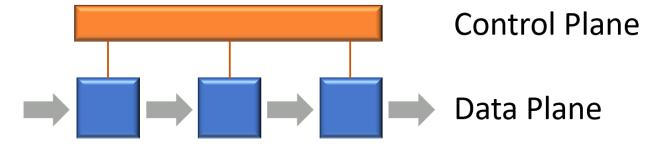

**Data and control planes**

The terminology derives from telecommunications and networking where data flows through a series of switches or routers. These routing elements have to be configured and managed via a separate control plane (occasionally an additional *management plane* is called out—more than that soon). Network diagrams usually show the control plane above the data plane because it occupies a higher layer in the Open Systems Interconnection (OSI) network stack model.

Unlike libraries, which are build-time constructs that are compiled or linked into the application that uses them, platforms are generally composed of distributed services or applications. That's why most of them have a control plane, for example, to provision and configure services, expose automation APIs, and aggregate billing data.

Some folks refer to the cloud platform "verticals"—that is, the actual services—as "data plane" to keep with the original nomenclature. This can be confusing, as many of these services' purpose isn't to route data packets.

An event router or data streaming service would be accurately described as a data plane, but a compute service such as a virtual machine wouldn't make a great analogy to a network router.

# **Shipping the Org Chart Without Shipping the Org Chart**

Control planes play an important role in abstracting away the complexities of a platform's implementation. In a talk about Amazon S3, distinguished engineer Andy Warfield describes:

"When you look at the highest-level block diagram of S3's technical design, […] AWS tends to ship its org chart. This is a phrase that's often used in a disparaging way, but in this case, it's absolutely fascinating."

As a large-scale object storage service, S3 consists of a front-end fleet that exposes the REST API, a namespace service, a storage fleet full of hard drives, and a background fleet that handles operations like replication. Behind these high-level building blocks sit hundreds of microservices that are developed and operated by independent teams.

"Shipping the org chart" is typically considered a negative because it exposes the user to the complexities of the organization's internal structure, requiring the

user to perform the missing integration. In S3's example, which is prototypical for platforms, that integration is done in the control plane, which exposes a simple unified API. So, AWS deploys its org chart as distributed services but wraps that complexity behind a simple API (S3 stands for "Simple Storage Servi[ce"\).](https://serverlessland.com/explore/qcon-2023)

## **Platform Jenga: Stacking Planes**

Zooming into a cloud platform's control plane, the fractal nature of our architectures becomes apparent. The control plane isn't a single element but is composed of many elements. In many cases, the control plane makes use of the same "vertical" services that it manages. For example, a serverless cloud run time may use a NOSQL database to store configuration data, an object store to look up deployment artifacts, and a queue service to handle event polling. That's what AWS Lambda does, utilizing AWS services like Amazon DynamoDB, S3, and SQS (Simple Queuing Service) to implement Lambda's control plane.

**The Matryoshka architecture of platforms**

As indicated earlier, several aspects of the control layer are visible to clients, such as automation APIs, command-line interfaces (CLIs), cloud consoles, or monitoring tools. Depending on the source, this layer is referred to as the *management plane*, sitting above the control plane (other, more-networkcentric sources place the management plane between the data plane and the control plane).

Most in-house portals interact with the cloud base platform via this management plane, typically through APIs or automation languages.

But the sto[ry doesn't end t](#page-193-0)here. The in-house platform also includes a control plane, which typically orchestrates tasks such as account setup and cloud service provisioning; for example, as part of a reference architecture. Not shown in the picture, but just as in the AWS Lambda example, real-life inhouse platform control planes interact with the base platform management plane for two purposes: to provision services on behalf of the users but also to manage resources for its own usage; for example, a database to store user or configuration data.

On top of all this sit the users—the developers. They access the in-house platform via a developer portal (and sometimes via an API). As long as you stay clear of the Grim Wrapper, they'll also interact directly with cloud services; for example, to configure them (management plane) or to store data in them (data plane).

# **Nesting UI Layers**

One question that the previous diagram leaves intentionally unanswered is whether users interact directly with the base platform UI console in addition to the in-house platform UI, commonly referred to as a *developer portal*. In many cases, the answer is "yes", divided along the lifecycle: users will use the in-house portal to create accounts or provision base resources and then use the cloud console to configure those resources.

This setup avoids the *Grim Wrapper* issues for the user interface, but it also makes for an inconsistent user experience, especially if users have to set up separate identities for each UI layer. To unify the experience, developer portal builders such as Backstage have gained popularity.

An architect pondering over the stack of layers should wonder whether we need all these layers:

Why aren't cloud consoles extensible to allow platform teams to build in-house portals directly on them?

If the cloud management plane calls public cloud APIs, that management layer could be open source and extensible to be customized as a developer portal, essentially collapsing the two layers. Thinking in platform layers raises interesting questions.

IT Service Management (ITSM) tools, originally considered the antonym of platforms, also increasingly include portals for developers to request and manage resources, creating noticeable overlap in capability. It's curious how the cloud's native ability for self-service has spawned a whole new genre of next-layer-up self-service portals.

Developer portals have triggered a special version of oneupmanship: each tool or vendor wants to sit on top of the others.

Cloud automation tools typically support plug-ins for other services. Meanwhile, ITSM tools feel they're naturally positioned on top because they're "cloud neutral". Developer portals like Backstage seem custom made for this purpose and are easily extensible thanks to being open source. Folks in the Kubernetes ecosystem will consider custom resources as the common management layer.

If anything, architects have an abundance of choice. There isn't an obvious "right" answer, but visualizing the layeri[ng and](#page-220-0) asking direct questions like "is our console really an ITSM tool?" can help bring clarity. Architects like to question everything.

# **Nesting API Layers**

Using a UI to perform cloud tasks is commonly derided as "click-ops" because it's error prone and not repeatable. We should hence have a similar look at how automation languages and APIs stack up across in-house platforms and base platforms. We'll dive into this fascinating domain, which ranges from YAML templates to technical domain models, in Part V of this book.

# **Developer Portals as Micro Frontends**

Many consoles and developer portals such as Backstage use a Micro-Frontends (MFE) architectural style, which also plays off verticals and horizontals. Cam

#### Jackson defines MFEs as:

"An architectural style where independently deliverable frontend applications are composed into a greater whole."

The arch[it](#page-182-0)ecture's appeal for cloud consoles and developer portals alike is easily understood. A cloud console contains configurations for perhaps hundreds of services. Likewise, an in-house portal may be split into account creation, build pipeline setup, run-time management, and monitoring dashboards, which may be maintained by independent teams. MFEs decompose the user interface into individual parts, allowing platform teams to build these elements independently and combine them into a single, consistent user interface.

Interestingly, MFEs reveal another horizontal-and-vertical structure. UI elements are independent "verticals" held together by "horizontals" like shared headers and footers, common UI elements, or identity management. MFE literature1 distinguishes a "horizontal" and a "vertical" approach, although both include horizontal and vertical elements:

- The "vertical" style prefers largely independent teams (and perhaps run times) that each maintain a page.
- The "horizontal" approach foresees a single page combining multiple UI elements, which can still be developed independently but need to follow a common UI framework.

Developer portal tools like Backstage follow a horizontal approach with a plugin architecture that allows developers to build additional UI components. Many cloud consoles follow the vertical model to support numerous service teams and their respective user interfaces.

### **Rotating 90 Degrees: Making Horizontals**

Not all orientations are set in stone. A common maneuver is to increase the amount of horizontal elements; for example, to increase reuse or improve the

1Mezzalira: *Building Micro-Frontends: Scaling Teams and Projects Empowering Developers*. O'Reilly Media; 2021.

user experience. You can observe this trend in cloud consoles that aim to unify the user experience and provide new features like customizable home pages.

Most anyone who has tried to unify elements after the fact has faced the same challenge, though:

Everyone will agree in principle that more common elements make sense. But everyone is too busy with their project to work on it now.

Unfortunately, the "doesn't it make sense?" argument won't overcome this barrier as people already agree. It's better to not rely on good intentions, but to look for a set of valuable features that require a stronger "horizontal". The aforementioned custom home pages are such an example: they have a clear user benefit in that they provide a tailored overview of the users' most relevant services. They also require a "horizontal" MFE setup, making them a handy driver for rearchitecting consoles.

# **19. Will Your Platform Float or Sink?**

**Most people want to swim—until they realize their cost is sunk.**

**That new thing doesn't even have a decent sail**

Most in-house platforms are built on top of base platforms, typically cloud platforms offered by major cloud providers. Those base platforms continually evolve with cloud providers adding thousands of new features each year. Although cloud users benefit from this base platform evolution, it requires internal platform builders to decide—and clearly communicate—what they plan to do in case the base platform replaces a feature that was built for the in-house platform. Another metaphor will help make the options crystal clear: do you want your platform to float or sink (or perhaps "submerge" for less intimidating language)?

## **Do Rising Tides Lift All Boats?**

One platform metaphor that I am not particularly fond of is the notion of a burning platform. Although it makes for a sticky mental image to depict the consequences of not changing, it appears to originate from a worker risking his life to jump off a burning oil platform into the ocean. The environmental impact aside, oil platforms are notoriously dangerous places to work and accidents have claimed hundreds of lives. So, conjuring the image of jumping into the raging ocean to escape being burned alive might be overdoing it a bit to convey the "jump in the cold water" that organizational transformations require.

Luckily, the cloud platforms that we build on top of don't burn, and they especially don't sink. They actually grow, both in scale and functionality, and may now include functionality that you had previously built as part of your in-house platform.

The software delivery platform we built on premises back in 2015 was largely replaced by a commercial cloud platform in 2021. This doesn't imply that our investment was poor; quite the opposite: it meant that we were on the same track as major cloud platforms, just a few years ahead of broad adoption.

There's a suitable metaphor for base platform evolution: rising ocean levels. It's also a concerning global trend, but luckily our platforms are built from bits and bytes. If you build a house (or in-house platform) near the ocean, you may need to decide how to react to rising water levels. And while the rising tide may lift all boats, it won't lift houses (or platforms).

# **Floating or Sinking**

When imagining the base platform (atop which your in-house platform is built) as the ocean, water levels rise when the base platform adds functionality. Your platform, which was previously sitting comfortably above the water line, now has two options:

**Two options for platform evolution: displace or augment**

Your platform can rise to the occasion and "float" on top by augmenting its functionality. Or you keep your platform as is, knowing that its functionality is displaced by the recent base platform features, meaning it is underwater.1

Augmenting your platform, which is usually seen as more desirable, depends on the combination of two mechanisms:

- You retire functionality that you had built but that is now "underwater". Doing so reduces your maintenance burden and cost as the cloud provider will invariably have better economics than your platform team.
- You use the freed-up capacity to add new capabilities to your platform that aren't yet broadly available, always staying one step ahead.

Retiring functionality will cause migration effort for your users. Keeping your platform as-is will save that effort but result in a platform that's duplicating features that are now readily available in commercial cloud platforms. Maintaining those features is not economical and may cut off your users from future base platform evolution. That's why saving on migration is penny wise but pound foolish.

Returning to our metaphor, augmenting your platform allows it to float above the rising water levels. Perhaps stretching the metaphor a little, shedding the ballast of redundant functionality gives your platform the buoyancy to float up. Keeping the platform static causes it to submerge or "sink" in the face of rising ocean/functionality levels.

1The term "underwater" is commonly used for stock options whose strike price exceeds the current stock price, rendering them economically uninteresting (they're not worthless as the stock price could increase again). The analogy translates quite well for functionality that can be had for less elsewhere.

**Is your platform sinking or floating?**

Giving these decision options evocative names brings clarity and allows teams to express a critical aspect of their platform strategy. For example, is your platform designed to "sink" (or "submerge") or "float"? Sticky names help people remember the decisions that they made.

### **Deciding Is Easy—Until You Get There**

When presenting these options to project sponsors, the notion of a sinking platform rarely finds much support. The provocative language might provide an initial bias (who wants to build stuff that sinks?), but in any case, sponsors will quickly realize that duplicating commercially available functionality doesn't make a ton of sense. The initial motivation for investing in an in-house platform is to add missing functionality to the existing platforms, so why wouldn't you want to keep it that way?

Ironically, though, when the time comes to scrap (or "offload") the functionality that's gone underwater, quite a few decision makers get cold (or perhaps wet) feet. Internal cost accounting favors long recovery periods, which means that systems should remain running as long as possible to recover the original investment (this habit explains why IT landscapes resemble computer history museums). Why would we want to throw away all this awesome capability we built? Add the inevitable migration cost (more on that in a moment) into the mix and the temptation to leave the platform as is or to "address it later" grows strong.

When my on-premises platform went underwater (several years after I had left the organization), folks expected me to be sad. Instead, I was quite happy that major cloud providers followed the same trajectory as our platform.

Such organizations fall into the classic sunk cost fallacy: decision makers have a bias to look at past investments that can't be recovered when making decisions about the future.2 Organizations that have a static view of the world and don't consider the cost of delay are particularly prone to making this mistake.

This is where the mental model combined with the evocative vocabulary can help increase decision discipline. It allows you to remind everyone that the platform you built is now "underwater" and the only way to get it to float again is by shedding ballast. Although you can't know the future (still, assuming that cloud platforms will grow in features is a fairly safe bet), stating your evolution strategy lays out clear options for how your platform will evolve in the face of changes to your environment. The fact that both options are viable and involve trade-offs is a signal that it helps you make a meaningful decision that's best for your circumstances.

### **Buoyancy**

Most platforms that struggle to float do so because of excessive weight. You could say they lack buoyancy.

Platforms should continuously evolve. However, if they never shed any functionality, they are bound to keep growing. Organizational aspects such as headcount and budget, also incentivize platform teams to add more weight to their platform than the original mission called for.

For its data platform, an organization selected heavy-weight, vendor-neutral technology and coupled it with a standardized information architecture, which didn't enable data scientists. The result was a heavy platform that didn't reduce cognitive load.

2Wikipedia's Simple English version cites watching 6 episodes of Battlestar Galactica as an example of sunk cost that might cause you to continue watching. This might be worse than funding an in-house platform that's gone underwater.

An overweight platform not only becomes more difficult to maintain and operate, it will also struggle to float when the tide of the ba[se platform rises.](#page-74-0) [Large platforms may have more internal interdepende](#page-74-0)ncies and more projects that depend on them, making it appear uneconomical to remove functionality. Sadly, though, the cost of carrying too much weight may be higher and isn't measured.

## **Underwater Maps**

Wardley Maps can provide another, perhaps more scientific-looking model to understand the implications of evolving your platform along the base platform or keeping it static. Base platforms adding features is a classic ILC maneuver of sensing innovation and commoditizing into a platform. In a way, your platform might have given the cloud provider a signal to commoditize this particular feature.

**When your platform becomes commoditized, shift the playing field!**

Holding on to a product that has been commoditized is guaranteed to have poor economics, just like someone building their own power station. Instead, you should be shifting your attention to components that are higher up the value chain and can benefit from new commoditization, as demonstrated in this Wardley map.

For example, cloud providers now offer CI/CD pipelines as a service, so it makes little sense to build such capability as an in-house platform. Instead, you should build on top of the new commodity, focusing, for example, on advanced team metrics or code inspection.

In many cases, commoditization won't shift your entire service. For example,

your platform's CI/CD service might include features or subcomponents that the cloud service does not provide. The key maneuver in this case is componentization. Instead of considering a CI/CD pipeline as an atomic component, you can break it down into subcomponents, several of which might be commoditized by the cloud provider. Stretching the metaphor one more time, your components can be like life rafts and float atop, even though other parts submerge.

### **Rising Levels**

Cloud platforms are excellent examples of base platforms that keep growing. Large business applications such as SalesForce or SAP follow a similar trajectory. The base platform growth can be roughly divided into two categories:

- 1) Enhancements to existing features
- 2) New features or the platform entering new s[egments](https://aws.amazon.com/codecatalyst/)

Cloud platforms enhance existing features all the time but also make noticeable forays into new segments. Build and deployment tools that provide continuous integration (CI) and continuous delivery (CD) of software used to be underrepresented in cloud platforms that primarily focused on application run times, storage, and networking.

A[ll major cloud providers plus](https://aws.amazon.com/grafana/) [major so](https://azure.microsoft.com/en-us/products/managed-grafana/)urce code [management tools](https://console.cloud.google.com/marketplace/details/grafana-public/grafana-cloud) like GitHub or GitLab now feature a suite of software delivery tools, which were previously developed in house. Full-featured ondemand development environments like AWS CodeCatalyst, Azure DevOps, and GCP Cloud Workstations continue this trend.

In other cases, the platform grows by offering open-source software as fully managed services, alleviating platform teams from having to operate such tools, while keeping migration cost to a minimum, thanks to identical interfaces. A classical example is Grafana, a popular tool to visualize operational data, which is available as a managed service on AWS, Azure, and the GCP Marketplace.

Many in-house platforms provide preconfigured service constellations and restrict the use of specific cloud services or geographic regions due to data residency considerations. Such features are being incorporated directly into the cloud platforms in the form of managed service catalogs.

### **You Pay in Opportunity Cost**

When faced with a sinking platform, a platform team's common reaction is that it's easier to keep running the services that they have already built. After all, internal users are already familiar with those services, and operating them doesn't take a lot of resources. Perhaps taking on a little water isn't so bad.

As illustrated in *Cloud Strategy*, the major mistake in this reasoning is measuring the actual cost of the internal resources as opposed to their opportunity cost:

The cost of maintaining a submerged platform is measured in opportunity cost; that is, the value that those teams could have generated otherwise. It can be a high multiple of the actual cost.

Part of that opportunity is building new platform features, which could provide high value to the organization. After all, platforms are accelerators and multipliers. If you're busy maintaining aspects that are widely available in cloud platforms, you'll miss out on that opportunity.

Be careful of the "we just maintain this on the side" fallacy!

Maintaining submerged platforms, like any other running system, takes not just engineer hours, but also engineer mindshare. Context switches can cost hours in productivity, even for a 20-minute task.

## **Breaking Changes**

When the base platform submerges your existing functionality, odds are that the replacement won't be a 100% identical copy of what you had built. Those differences imply migration effort and potential impact on your internal users. Trying to avoid this type of change is another common reason that internal platforms sink below the water level set by the base platform. Resisting change and clinging to the status quo is so common that *The Software Architect Elevator* cites the example of someone rejecting a new car because the door doesn't [make](#page-163-0) [the same squeakin](#page-163-0)g sound as the old one. In their view, it doesn't match the requirement.

When a platform I had built was supposed to be handed over to operations, that team demanded that the platform could not be upgraded until all users agreed. This would have killed innovation and ultimately the platform. So, we operated the platform ourselves.

Replacing a platform component with an implementation of the base platform is also a good test for the platform's modularity. Platforms should exhibit a high degree of cohesion but still have a functional composition that allows replacing functions without changes rippling through the entire platform. Balancing these needs is one of the key architectural tasks of designing successful platforms.

# **It's Never a Static World**

Base platforms are a rare case in which rising levels are a good thing because, as a user, you benefit from additional features. However, you must be prepared for this continued evolution and set the appropriate expectations. Or carry a lot of oxygen.

# **20. Beware the Grim Wrapper!**

**What starts well doesn't always end well.**

**Not everything that's wrapped is a present**

When building a platform over existing components, platform designers face a tremendous temptation to wrap existing APIs behind a brand-new, unified, perhaps vendor-neutral interface. The perceived benefit is a simpler user experience that reduces the cognitive load for developers: instead of dealing with all the underlying bits and pieces, users "only" have to learn the organization's purpose-made API. What could possibly go wrong?

# **Tailoring the Base Layer**

In-house platforms don't build the services from scratch. Instead, they comprise existing elements, such as open-source tools or public cloud services. Just collating existing pieces doesn't make a very valuable platform—it will just become a Basket of Fruit. Therefore, successful platforms tend to tailor existing services to the specific needs of the organization. They may also apply constraints over the usage of those services to provide governance.

Several techniques are available to allow internal platforms to customize an existing software component, as illustrated in the following diagram:

**Choices for influencing base platform behavior**

#### **Configuration**

The base platform creator may have anticipated the restrictions that in-house platform teams want to impose. For example, a service catalog allows a platform team to configure which cloud services users can provision and in which geographic region. Configurations may also set meaningful defaults. This is the easiest option because the platform team doesn't need to build any new software.

Configurations can be managed through configuration files, user interfaces (consoles), or APIs. Configuration doesn't shield users from the complexity of the base platform API, however, and if error messages aren't detailed, users may be puzzled as to what is allowed and what isn't.

### **Intercepting**

In some cases, the base platform allows platform teams to intercept calls made to the base platform's APIs: before the calls are executed, additional validation code provided by the platform team can be invoked through so-called "hooks". Your interceptor code can set default parameters, restrict the range of input parameters, or reject the call altogether. In comparison to configuration, hooks tend to have more flexibility in the logic they include.

Although perhaps less glorious than the Mad Max Interceptor cars, it provides an effective way to control end-user access to components without changing the API, freeing developers from having to learn a new interface. As with configuration, platform designers need to be cautious to not cause confusion when some functions that appear available in the public interface description are not available or exhibit modified functionality.

#### **Tracking**

Tracking allows users to interact directly with the original components without any restrictions. However, all calls are tracked, analyzed, and can trigger alerts or corrective actions when needed. Most public cloud platforms include tracking services, such as AWS CloudTrails or GCP Cloud Audit Logs. Tracking is reactive: if users perform an undesirable action, they have to detect it and throw an alert or in the worst case disable the affected component.

Security architects might object to users' unrestricted access to the platform APIs. In reality, though, tracking is a rather powerful option because it doesn't need to look at each API call in isolation, but has access to a log of actions over time. Also, developers will generally react quickly to warnings that their actions may result in a security breach. As with the previous approaches, the interface into the base platform remains the same.

## **Wrapping**

Last, you could replace the original component interface with a new interface of your choosing. Doing so affords the platform designers the most flexibility and the highest level of abstraction from the underlying components. Defining a clean interface also avoids the frustration of an operation appearing as available but then being restricted by a hidden rule.

Wrapping is best equipped to reduce cognitive load because it can provide an interface that's simpler than the base platform. That's why wrapping existing systems is also known as Anti-Corruption Layer, a concept defined by Eric Evans in Domain-Driven Design:1

1Evans: *Domain-Driven Design: Tackling Complexity in the Heart of Software*. Addison-Wesley; 2003.

Create an isolating layer to provide clients with functionality in terms of their own domain model.

A wrapper hence seems appropriate when you want to protect your domain model from that of another product.

As a welcome side benefit, a new interface also makes it easier to replace the base platform with a different implementation, potentially increasing application portability. As we will soon see, this benefit also presents a slippery slope.

## **What Control?**

All approaches have their place. Never short of a car analogy, let's examine how we can keep people from speeding, which is accepted as dangerous. The common approach, measuring speed and handing out fines, follows the *Tracking* model. Cars (and drivers) can speed, but if they do, the "system" finds out and provides feedback in the form of a fine or a suspended license. This approach generally delivers satisfactory results and accommodates for special cases like having to rush someone to the hospital or driving away from danger.2

Some cars, such as taxis or buses, are equipped with governors that limit the vehicle's speed. Such governor modules *Intercept* the signal from the gas pedal and li[mit it as soon](#page-203-0) as the vehicle reaches a preprogrammed speed. Alas, this approach has limitations, as well. For example, a 120 km/h governor may not know whether you're driving in a school zone or inside a city unless it's coupled with a GPS and a camera that detects speed-limit signs. It also won't keep drivers from making illegal turns. That's why governors are mainly used for vehicles that primarily travel on freeways, such as trucks. If the car manufacturer foresees the need for a governor, the implementation becomes much simpler, turning it into *Configuration*.

Many in-house platform teams are drawn to wrapping because the ability to build a custom abstraction affords them more flexibility than other approaches. As we will soon see, building abstractions is a lot more difficult than it seems, though. I warn platform teams going down this route:

2Creepy videos show cars trying to outrun tsunamis or money transports outracing attackers.

Be careful to second-guess cloud providers who invested billions of dollars over a decade, based on abundant customer feedback.

Platform teams tend to translate the ter[m "control" into "I determine what's](#page-214-0) allowed."3 Interestingly, that use of the word stands in contrast to control theory, which is primarily concerned with feedback loops that regulate a system via so-called *closed-loop control*. Such control systems resemble the *Tracking* approach more than the *Intercepting*. The origin of the word "control" appears to be from Anglo-Norman French, translating into "keep a copy of a roll of accounts", supporting the argument that control is about regulating a system.

## **Control Is a Two Way Street**

Any time a system denies an operation, it must give a detailed reason as to why. The absence of a such feedback mechanism may lead to inefficient behavior:

One client told me that the restrictions placed by an infrastructure team were so intransparent that development teams would simply try all sorts of settings until something would actually deploy.

Appending "considered harmful" to a concern, playing off Edsger Dijkstra's seminal letter in the 1968 Communications of the ACM, is a popular way to make your criticism sound more intellectual. I have seen numerous teams run into dead ends from what originally seemed like a viable wrapper path, so I feel entitled to make my warning sound intellectual.

# **Wrapping Considered Harmful**

Architecture is the business of trade-offs, so there are some downsides to wrapping, as well, and significant ones at that. The well-meaning wrapper can end up being the grim reaper for your platform! When building a wrapper, be aware of the following pitfalls:

3*The Software Architect Elevator* goes as far as stating that "Control is an Illusion."

#### **Keeping up with the rate of change**

Wrapping your mainframe legacy application that hasn't changed in 30 years (even if you wanted it to) might be alright. However, when building an IT platform, chances are that the components you wrap are undergoing a rapid evolution, especially if they are open-source projects or cloud platforms. This means your wrapper has to be constantly adjusted to avoid falling behind. If it does, platform users have one more reason to go "upstream" to use the source product directly, bypassing your wrapper.

Although base platform teams minimize breaking API changes, new features or capabilities also need to be wrapped. Aiming to keep up with the rate of innovation of a major cloud provider or an extensive open-source community is a tall order. If you can't (which is more than likely), you are cutting your platform users off of the innovation strea[m. Even heavily s](#page-203-0)upported projects like Kubernetes struggle to keep up to provide operators for new cloud services.

#### **Simpler doesn't mean easier**

A common motivation for building a wrapper is to simplify the developer experience. Not exposing the platf[orm user to all the complexities and nu](#page-214-0)ances of the underlying components should reduce developers' learning curves. Although a noble pursuit, the reality often looks different. To the surprise of the platform developers, users have a hard time learning the "simpler" API. That's because a smaller API into a complex subsystem doesn't necessarily reduce the interface's cognitive load, but could instead present a dangerous illusion. To make matters worse, documentation and support are unlikely to be at the same level as the base platform.

Layering new abstractions on top of existing ones can increase the cognitive load; for example, when error conditions occur from a component that the user didn't even know existed (see Failure Doesn't Respect Abstraction).

#### **Unable to benefit from external knowledge**

You can hire (or contract) people who are familiar with third-party products and their APIs. However, when you define in-house abstractions over existing products, you'll need to teach every user from scratch. This will not only burden you with more documentation effort, it will also slow down the rate at which you can scale.

#### **You might build the lowest common denominator**

Services offered by cloud providers look similar from afar, but very few are compatible across providers. That's a good thing because it gives you choice, but trying to fold a common abstraction over these services is bound to be a losing proposition, leaving you with the lowest common denominator at best. Also, logical abstraction layers cannot abstract physical properties of base services like cost or latency. Worse yet, hiding aspects like pricing models deprives teams of important feedback cycles to optimize their workloads.

#### **You need to operate your abstraction**

If you want to define a new API for your users to call, you need to operate this API, leaving you wit[h operating an additi](#page-52-0)onal run-time component. If you can operate in the cloud—for example, on a serverless platform—the impact might be small, but elsewhere it increases your operational effort and negatively affects your service level. As part of operations, you also have to deal with upgrades, user identity, and all the other aspects that come with building your own layer.

# **Not All Wrap pers Are Grim**

Most useful abstractions are wrappers, and those are anything but grim. To distinguish grim wrappers from happy ones, we must again subdivide the problem space along multiple dimensions:

- Does the wrapper cover the data or control plane?
- Does it attempt to wrap multiple implementations or a single one?

Reusing the diagram from the beginning allows us to illustrate the first aspect:

**Control plane wrappers are happier**

Control plane abstractions can provide users with a better vocabulary to describe the services that they provision, a key concept behind service orchestration. Run time abstractions look to decouple your application from interacting directly with the cloud run-time, for example through libraries or run-time abstraction layers. Instead of calling the API for a specific cloud database, your applications would now code against an abstract database library. Although we (as an industry) appear to have solved that problem with interfaces like Java Database Connectivity (JDBC), we must remember that JDCB is a wrapper around a relational database's control constructs, such as connections or statements. Actual queries are embedded as strings, using any vendor-specific syntax or extensions.

JDBC abstracts common command constructs like connections or statements, but not the vendor-specific SQL syntax.

The critical decision behind the second dimension of wrappers is whether the wrapper is intended to make developers' lives easier now (i.e., increase productivity) or in the future (i.e., increase portability) by abstracting across multiple vendor products.

Resorting one more time to a 2×2 matrix, we can try to show common examples of approaches along the four dimensions:

**Wrappers tackle different domains**

The open-source community is drawn to wrapping multiple vendor products because it plays to their strength of being open and vendor independent. However, by focusing on a single platform, you can build abstra[ctions without](https://aws.amazon.com/blogs/containers/kubernetes-as-a-platform-vs-kubernetes-as-an-api-2/) [losing any of the uniqu](https://aws.amazon.com/blogs/containers/kubernetes-as-a-platform-vs-kubernetes-as-an-api-2/)e features underneath. One of my favorite examples is LINQ, released with .NET 3.5 back in 2007. It wraps SQL commands in .NET language constructs. While LINQ focuses on the data plane—making database queries—you can also abstract the control plane with approaches like "Architecture as Code" and cloud compilers that build on top of automation frameworks like AWS CDK.

[On th](https://www.enterpriseintegrationpatterns.com/)e right-hand side of the illustration, which looks to abstract across multiple cloud platforms, Kubernetes (k8s) is the obvious favorite. Developers can build resource definitions to make it the universal abstraction of the underlying control plane. My former colleague wrote a nice summary of Kubernetes as an API or as a platform.

On top of Kubernetes, you'll find abstractions like DAPR that model a distributed application run time. Mass Transit builds similar abstractions for the .NET ecosystem *sans* Kubernetes. These run-time (data plane) abstractions work because they tackle a rather narrow but important domain: that of message-driven distributed applications (a domain that's rather close to my heart). Making this work across an entire cloud platform would be much, much more difficult.

The matrix also highlights how fluid these boundaries can be. Infrastructure

from Code (IfC) approaches like Winglang provide abstractions that cover both the control plane (e.g., provisioning of resources) and the data plane (application logic). We live in an interesting world, and maybe the grim wrapper is a goodlooking chap like Joe Black.

# **21. Build Abstractions Not Illusions**

**Sometimes less is actually less.**

**Some illusions are more convincing than others**

Who doesn't like a good magic show? Too many users expect internal platforms to be nothing short of magic. Wouldn't it be great if the rabbit jumped out of the hat to take away all those complexities, learning curves, and potential mistakes of the underlying technology, perhaps in a giant poof of smoke? Platforms that aim to live up to these inflated expectations are bound to find out that magic shows aren't a good match for IT platforms.

# **Making Things Simpler, but Not Too Simple**

The technology available to developers today is nothing short of amazing: we can globally deploy and scale fine-grained, loosely coupled systems with the push of a button. However, designing and running such applications can also be complex. For one, developers must deal with the inevitable aspects of distributed systems, such as asynchrony, out-of-order delivery, partial failures, and retries. They are also faced with often hundreds of base platform services that depend on constructs ranging from virtual private clouds to fine-grained access control.

It's only natural to want our platforms to hide that complexity. Reducing complexity improves productivit[y, avoids mistakes, and reduces cognitive load.](https://en.wikipedia.org/wiki/Fundamental_theorem_of_software_engineering) [So,](https://en.wikipedia.org/wiki/Fundamental_theorem_of_software_engineering) one would think that the more complexity we can hide, the better our platform will perform. Actually, no. We need to be careful that we provide platform users with useful abstractions, not dangerous illusions.

# **Abstraction: One More Layer Can't Hurt, Can It?**

Internal platforms aim to boost developer productivity by reducing cognitive load. The key mechanism at work is *abstraction*, a "magical" layer above all that complexity and inconsistency. [The idea of lay](https://softwareengineering.stackexchange.com/questions/111756/what-is-the-difference-between-layer-of-abstraction-and-level-of-indirection)ering things is so common in software that it's been called the Fundamental Theorem of Software Engineering (attributed to David J. Wheeler and named as such by Andrew Koenig):

We can solve any problem by introducing an extra level of indirection.

Not being an actual theorem, it should forgive us for broad brushing over indirection versus abstraction (see StackExchange for a healthy discourse). For an everyday example and to satisfy my penchant for car metaphors, we can consider the naming of an automobile and its interface consisting of pedals, steering wheel, and shifter to be a useful abstraction. To highlight that this isn't to be taken for granted, I have publicly posited that:

If software engineers had named the car, it'd be called "pistoncrankshaft-gear-wheel-assembly".

Luckily, someone else named this awesome machine after its purpose, which is

[to move by itself](#page-214-0) (or at least without being pulled by horses), so it's an *automobile*.

Not all car-related naming does an equally good job at abstraction. When we want to move our car, we commonly depress the "gas pedal". That term points to an implementation detail, easily highlighted by the fact that electric cars don't use gasoline (and better not have gas in their batteries). A more adequate term, which also provides better abstraction, is "accelerator".1 The term works equally well for internal combustion engines and electric cars because it's named after the purpose, not the implementation.

The next chapter reminds us that abstractions leak, especially in the face of failure. The automobile is no exception. The nice pedals and steering wheels are supplemented by a gallery of warning lights that can suddenly reveal all sorts of underlying complexity, ranging from lack of oil pressure to aging lambda sensors (again, electric vehicles won't have those). Some of these lights can be safely ignored, whereas others will entail thousands of dollars in repair cost unless you react instantly.

# **Good Abstractions Are Obvious but Difficult To Find**

*Enterprise Integration Patterns*, a book Bobby Woolf and I wrote 20 years ago, reminded us how easy it is for implementation details to slip through into the "abstract" layer. We set out to provide an abstract pattern language for messageoriented systems that uses beautiful words like "Filter" and "Aggregator". However, we caught ourselves multiple times doing the car-naming thing:

The integration pattern *Scatter-Gather* was initially called "Broadcast Aggregate", named after its components, not the user's intent.

Luckily, we caught these leaks and renamed the patterns before going to print. It's incredibly difficult to flush all those implementation details from your brain once you're in the deep of it.

1This is in fact the common usage in British English.

In the world of software, we routinely use abstractions that are so widespread and obvious that we don't even think about it. How do programmers read and write files? Not by fetching individual disk sectors but by using reading from continuous byte streams. Unless you are building a disk driver or rely on ultimate performance, this ab[straction ma](#page-168-0)kes programmers' lives much easier. Interestingly, common operating system abstractions like sockets, streams, and hierarchical file systems have been around for half a century or more, making us wonder how often we can stumble upon such gems.

# **Composition Isn't Abstraction**

Internal platfo[rms often compose existing base](https://architectelevator.com/cloud/abstractions-difficult/) platform services, which is undeniably useful. However, they don't provide any abstraction, which can be easily understood by the language that they use. Your Jenkins-Sonarcube-Nexus developer platform is a fruit basket, not a smoothie.

Solution libraries published by many cloud providers contain constructs like Lambda-SQS-Lambda, which make sense to you only if you are an AWS serverless developer.

Those constructs are the cloud equivalent of piston-crankshaft-gear-wheelassembly: they are compositions, not abstractions.

An abstraction provides a higher-level vocabulary that shields the user from the underlying complexity.

So, for something to provide a meaningful abstraction, it must provide a higherlevel vocabulary like that of an accelerator and brake, not one of air-fuel mixtures, fuel pressure, and injectors. Or streams and files, not disk sectors.

Our examples hint that useful abstractions rarely come as isolated constructs. Rather, they form a cohesive vocabulary of related concepts (again, the fruit salad is the suitable metaphor). This characteristic resembles that of design patterns. Great design patterns don't just stand alone; they are part of a cohesive pattern language.

Composition is still useful, even though it does not provide meaningful abstraction. For example, reference architectures are compositions of existing components that don't shield users from the underlying vocabulary. That's OK because users of these reference architectures will already be familiar with the underlying components. Still, you should provide meaningful names for your reference architectures to establish a vocabulary of application archetypes that describes your solution space.

### **Illusions Illu[strated](#page-261-0)**

Now that we better understand why abstractions are both useful and difficult to find, it will be tempting for platform teams to abstract away as many of the underlying details as possible. Sadly, too much of a good thing usually turns into a bad thing, and abstractions are no exception. Abstracting too much leads to dangerous illusions. Illusions happen when the abstractions hide too much, including relevant concepts.

Illusions are dangerous because they lead to initial developer euphoria—things look so much simpler—until reality bites and the illusion bubble bursts. They are one reason for Hockey Stick profiles that hit the users hard when their intellectual honeymoon is over.

Abstractions that omit essential details become dangerous illusions.

A widespread illusion in distributed system design is RPC—the Remote Procedure Call. This well-intended abstraction makes a call to a remote component look like a local method call. Technically, that's entirely possible and users may enjoy their newfound simplicity—until they realize that a remote call is nothing like a local call: it's slow, doesn't have a call stack, suffers from partial failures and inconsistencies due to the lack of shared memory, has to marshal and unmarshal data types across programming languages, just to name a few.

Remote Procedure Calls (RPCs) are one of the most dangerous illusions.

**Th[e RPC illusion: model \(left\) and reality \(right\)](https://architectelevator.com/cloud/abstractions-difficult/)**

[Program](https://architectelevator.com/cloud/abstractions-difficult/)mers who follow the abstraction might call a remote method 1,000 times in a loop (I have seen this happen in an environment with many very skilled developers) or won't check for inconsistencies and retries. Their illusion pops when they have serious performance issues, lose data records, or have duplicate ones. The software magic show never ends on a high note.

## **Good Abstractions Don't Come Bottom Up**

I posited before that finding good abstractions by working bottom-up is very difficult—you'll end up back at the piston-crankshaft thing. Instead, good technical abstractions come from really understanding your domain.

Teams building platforms over existing base layers routinely run into this issue when looking to define meaningful abstractions. In their pursuit to provide independence from any particular cloud platform, platform engineers will "abstract" a provider-specific service like AWS SQS, Azure Service Bus queues, or Google Cloud PubSub into a message queue. However, there isn't much abstraction that's taking place: you turned a specific queue into a generic queue, perhaps omitting some detailed settings.

# **Domain Models Provide Actual Abstraction**

Looking for abstractions from the top down, by pondering in the abstract (pun intended) is equally difficult. The best abstractions, like design patterns, come from a thorough understanding of your business domain and your customers' needs and intents.

Good technical abstractions derive from thoroughly understanding your domain.

Before you rebut this with the famous saying, "If I had asked people what they wanted, they would have said faster horses," keep in mind that Henry Ford apparently never said it, and that not listening to customers' needs caused his market share to plunge from 65% to 15% in less than six years. It seems that people did want cars that weren't black and were happy to specify the extra "color" field in the OrderPlacement API.

One customer defined platform abstractions based on business needs, such as compliance. Instead of providing default values for the cloud provider's NOSQL database, they defined a new construct called "Ledger Database", which consists of a primary operational database and a second one that captures an append-only change log.

The construct denotes a common need in the financial services industry, often referred to as CDC or Change Data Capture. It's a well-understood concept by developers and business users and provides a meaningful [abstraction.](#page-193-0)

## **Stringly Typed Domain Models**

Some domains, like distributed systems, have inherent complexity. Pretending this complexity doesn't exist is the path to building illusions. This fallac[y](#page-209-0) comes in two flavors. First, the abstraction can deny the existence of the complexity altogether, as it did in the case of RPC. The more subtle variant has the abstraction expose seemingly innocent numeric parameters like "maximum batch size", "maximum retry count", or "timeout". Or, they package a SQL command that's based on a 600-page spec in a string field, as JDBC does.

Number and string fields are a well-known enemy of good domain models. If your data representation falls back to those data types, you can assign the current year to a currency field or the two-letter country code into someone's last name—without any complaint from your development environment, the compiler, or your run time. Instead, the complaints will come from your users.2

2This isn't intended to reopen the eternal debate about statically versus dynamically typed languages, and, yes, thorough testing might reveal such mistakes.

Kevlin Henney jokingly describes the lack of suitable domain entities as *stringly typed*.

Values like "maximum batch size" define the essential behavior of the (distributed) system that you are managing. Without understanding the mechanics of that system, these parameters leave many questions open: What's a batch? What size should I set? Will the system wait forever for that batch to be filled? What if items are very large, will the batch be smaller? Can a batch be empty? If a batch fails, do I need to retry all entries? Apparently, a lot is going on behind one number!

So how are you as a developer supposed to know all this? Well, you post a question on *Stack Overflow* or read the 20 pages of documentation!3

The core domain's complexity will come to you—either in the API or in the documentation.

As tempting as it is to sweep the complexity under the type system rug, the purpose of Domain-Driven Design (and the subtitle of Eric Evans' book) is to "tackle complexity in the heart of software". Our technical domains are complex enough that good domain design is essential for finding useful abstractions.

# **Serverless: Distributed System's Essential Complexity**

Serverless applications are highly scalable and asynchronous, aided by message and event routing services. These services are magical because you don't need to deploy anything, and just by configuring a few settings they will process thousands of events per second.

However, any high-throughput asynchronous system must consider run-time characteristics like throttling, backpressure, time-to-live, back-off, batching, and limited retry counts. For example, if your event router uses a worker pool in a

3GenAI may give you the summary, but first you need to know what to ask. And then it will give you a summary of the documentation.

*Competing Consumers* pattern, it will scale really nicely but [process message](https://en.wikipedia.org/wiki/No_Silver_Bullet)s out of order. If this implementation is abstracted/illusioned away, users will be surprised (and will complain) that their data isn't arriving in order.

A hotly debated trade-off when building serverless platforms is which subset of distributed system aspects to expose to the user.

If the APIs expose too little, they create dangerous illusions. If they expose too much, they unnecessarily burden users. Separating complexity into essential and accidental complexity, popularized by Fred Brook's paper "No Silver Bullet", can help reason about this tension.

If your API has two integers, one string, and 30 pages of documentation to explain what these do, chances are that you created an illusion.

I consider concepts like batching, backpressure, retry, and back-off to be inherent in the domain of distributed systems. If you don't expose them in your API, or expose them as harmless-looking integer values, they'll be exposed in your documentation or, ultimately, in your support teams. Tackling them headon allows you to employ domain modeling techniques to minimize accidental complexity.

A LinkedIn follower once described the fallacy for platform designers rather eloquently:

Folks working on platforms look for ways to make complex problems easy rather than make it easy to work on complex problems.

I frequently discuss that queues allow you to change control flow—from push to pull. But they require flow control to avoid overflow, either via a time-to-live setting (that removes old messages) or back pressure (that keeps new messages from arriving). A good domain model would make one or the other a required parameter for a queue.

To not keep our book entirely devoid of UML, as a class diagram this aspect of the technical domain model looks as follows:

**Flow control in UML**

Time-to-live and backpressure are implementations of flow control, which is a required element of a queue. It's easy to see how strongly typed beats stringly typed.

# **What's "[Essential"? It Depends, and ChatGP](https://www.researchgate.net/publication/3249379_Understanding_the_Power_of_Abstraction_in_Patterns_of_Abstraction_in_Patterns)T Won't Tell You**

The earlier definition of illusion includes a clever weasel word: *essential*. It's in the league of "appropriate", "adequate", or "correct"; all words that suggest that things become quite easy if you only knew the answer beforehand! Whenever I stumble on such words, I recall Joseph Bergin's cheeky design pattern *Do the Right Thing*: all you need to do is apply this pattern and all will be well. Interestingly, one of the more common references to this (satirical) pattern is Linda Rising's IEEE column on The Power of Abstraction in Patterns.

There's good news and bad news here. The bad news first: there is no easy answer. And, no, ChatGPT also won't be able to tell you. The good part: that's why we have architects. Deciding what's essential is inherently a judgment call.

The essential aspects (which avoid becoming an illusion) change over time: we used to largely ignore run-time efficiency and carbon footprint. Recently they have become important aspects of operations management.

From the *Architect Elevator* we know that architects live in the first derivative, meaning that change drives architecture decisions. This effect also applies to what's an essential part of an abstraction and what isn't: it will change over time. For example, we used to abstract away resource consumption and carbon footprint because processors kept getting faster, and the carbon footprint was considered small and difficult to measure. Now these elements are very much returning to the abstraction with serverless computing charging you by resource usage and cloud providers providing carbon estimator tools.

# **The "Happy Path" Illusion**

Another illusion that's easy to fall into is that nothing ever goes wrong. Errors can make even the best abstraction go "poof". More on that in the next chapter.

# **22. Failure Doesn't Respect Abstraction**

#### **Time to enjoy a good stack trace!**

**The dealer said, "Don't worry about that warning light."**

Abstraction is an essential tool for building and managing complex systems. One could hardly imagine getting by in today's world without strong abstractions. Just imagine the complexity that lurks behind the channel-flip button of a TV remote control or the start button of a car. Platforms rely on similar abstraction mechanisms to hide implementation complexity and reduce the cognitive load on the platform's users. After all, low friction of platform adoption is one of the defining features.

Alas, when something goes wrong down in the engine room—perhaps the TV can't show your favorite program or a "check engine" light comes on—those amazing abstractions quickly break apart. Users suddenly find themselves with a boatload of sudden complexity or a broken black box with no hope of remediation.

## **Flying on Empty**

Air Transat Flight 236 was en route over the Atlantic from Toro[nto to Lisbon,](https://en.wikipedia.org/wiki/Air_Transat_Flight_236) [Portugal, when the pilots noticed](https://en.wikipedia.org/wiki/Air_Transat_Flight_236) that their gauges were showing low oil temper[at](#page-215-0)ure and high oil pressure on engine #2. Advised by the maintenance center to monitor the situation, they carried on without any issues. Half an hour later they were alerted of a fuel imbalance, which they corrected by transferring fuel between the tanks. Everything seemed normal for about 45 minutes. Then engine #2 flamed out due to lack of fuel—over the Atlantic Ocean. Luckily, all twin-engine jets are designed to operate on a single engine, so the flight was able to continue. Not long after, though, engine #1 also flamed out, rendering this amazing A340 aircraft into not much more than an expensive glider, 65 miles away from the closest air base. Thanks to amazing pilot skill (the pilot was said to be an avid hang glider pilot) and some luck, the plane landed on the Azores without any major injuries and ended up being nick-named the "Azores Glider".1

The near-disaster struck because, unbeknownst to the crew, the indicated symptoms of low oil temperature, high oil pressure, and low fuel levels resulted from a common cause: a wrongly installed hose near engine #2 tore and leaked fuel. Modern jet engines use a fuel-oil heat exchanger (FOHE) to cool the engine oil and warm the kerosene fuel before entering the turbine. The leaking hose increased the fuel flow through this heat exchanger, causing the engine oil to cool off more than usual, thereby increasing the oil pressure due to oil's higher viscosity at lower temperatures.

Not being aware of the root cause, the pilots pumped fuel from the "good" tank into a rapidly leaking tank and caused the plane to run out of fuel. Had the pilots (or the maintenance center) known the inner workings of the FOHE and its effects, they might have correctly diagnosed the problem. However, the enormous complexity of the aircraft has largely been abstracted away from them and reduced to a set of dials, levers, and wheels. These abstractions made flying much safer and also eliminated the need for a dedicated flight engineer. However, in a failure scenario like the fuel leak, ignoring the underlying complexity is outright dangerous.

1The malfunctioning of the Maneuvering Characteristics Augmentation System (MCAS) in two Boeing 737 MAX ended much worse, as pilots were desperately trying to debug a system that they didn't even know existed.

# **Searching for Alpha Particles**

Another great example of failures not wanting to respect abstractions comes from Google's early days, when the search index, Google's greatest asset, delivered incorrect results. After an intense debugging session that yielded no result, two of Google's greatest minds, Jeff Dean and Sanjay Ghemawat, "went deeper". By looking at data in binary format, they ultimately found that the bits stored in memory chips had been corrupted, perhaps by errant alpha particles (the whole story appeared in theNew Yorker and is also referenced in Jeff Dean's presentation). The brilliant software engineers, who tried to debug before, relied on the abstractions of operating systems and programming languages and hence were unable to find the bug in the system. Only going past these abstractions allowed Jeff and Sanjay to solve the problem.

# **Stack Traces Provide Feedback**

For developers, a stark reminder of failure causing an abstraction to leak comes in the form of the infamous *Stack trace*, a long list of source code locations that specify where and in which context an error occurred. Stack traces play a vital role in making the compiler abstraction work.

Compilers transform source code, which may be object-oriented or functional, into assembly language or virtual machine byte codes. The underlying machines don't have object-oriented concepts like inheritance or polymorphism the compiler implements these from lower-level primitives. Many modern compilers also generate code that you didn't write. For example, most objectoriented compilers will generate a default object constructor if you don't write one.

The Java compiler includes source code line numbers for any constructs that it creates. If you write a class without a constructor, the compiler will generate a default constructor that invokes the base constructor for Object and links that back to the first line of the class.

Debugging compiled code could be equally daunting to debugging an aircraft's FOHE or MCAS, which you didn't even know existed. That's why modern stack traces include a source code line number that tells developers what line of code caused the issue. It doesn't make the fix trivial, but at least it directs developers where to start looking.

**Linking failures back to their origin**

Platform builders may translate higher-level abstractions into cloud constructs, essentially building a cloud compiler, perhaps without realizing it. Such a compiler also must provide a stack trace to allow developers to debug operational issues.

# **Abstraction Is a Tool, Not a Replacement**

Although abstractions seem to work well in the happy day scenario, they can quickly break apart in case of errors. So how do you build abstractions that shield people from unnecessary complexity, but still provide assistance in case of failure?

The first trap when designing abstractions is believing that the simpler the abstraction is, the better. To show that, as usual, architecture decisions rarely find the optimum at the extrema, consider this abstraction:

void doTheRightThing(int thing);

In terms of getting things done with little code, this method surely wins. But it scores rock bottom when it comes to flexibility, expandability, or debuggability. A suitable abstraction, therefore, isn't the one with the smallest syntactical surface, but one that gives a meaningful set of constructs. "Meaningful" is admittedly a weasel word here as it assumes we have a good grasp of the meaning we want our abstraction to represent.

As so often, it helps to dig through computer science's past and see what very bright minds had to say about abstraction:

"The purpose of abstraction is not to be vague, but to create a new semantic level in which one can be absolutely precise." —Edsger Dijkstra

If we unwrap this, we should look for abstractions that eliminate things that don't matter (the noise) to allow us to be precise about the things that do matter. That just leaves us with having to know what matters and what doesn't.

I'd posit that things that matter for a useful abstraction include the following:

#### **The [domain](#page-163-0)**

This one might (and should) be self-evident, but it's better to state the obvious than fall victim to unstated assumptions. An abstraction defines a new vocabulary and domain, usually over an existing one. You have pretty free rein over this new domain, so the main design objective is to choose a domain that's meaningful to the users of your abstraction. With the domain comes the vocabulary and granularity of your abstraction.

#### **The learning curve**

People will use your abstraction incrementally. A beautiful abstraction that's very difficult to grasp might be suitable for math Ph.D. candidates but isn't so great for programming interfaces. As described in Platform Quality, building a gentle on-ramp for an abstraction is just as important as the abstraction itself.

#### **Dealing with errors**

Being this chapter's key point, abstractions don't just have to serve the sunny-day scenario, they also need to provide a lifeline to their users when things go awry.

There's a lot more to be said about abstractions and a good platform can become inseparable from the abstraction that it creates.

# **You Can't Manage What You Don't Understand**

A common management adage is that you [can't manage what you can't](https://www.linkedin.com/pulse/you-cant-manage-what-understand-gregor-hohpe) [measure. I b](https://www.linkedin.com/pulse/you-cant-manage-what-understand-gregor-hohpe)elieve that's only half the equation. The cockpit crew of Air Transat 236 was measuring all the right things such as fuel level plus oil pressure and temperature. However, translating what you measure into meaningful action requires you to have at least a high-level understanding of the system you are managing. The pilots aren't expected to know the part number and outer diameter of the fuel line (maintenance staff will do that), however, being aware of the existence and operational principles of a fuel-oil heat exchanger can be instrumental to selecting the proper course of action. At 35,000 feet, there isn't a "we'll deal with that later" option.

That's why I have claimed before that you can't manage what you can't understand— sometimes you have to open the hood. Even though not every developer needs to know the innards of the systems down to the hardware level, it's extremely helpful to have a few folks on hand who can, in case an alpha particle wreaks havoc deep down in your engine room.

# **[Part](#page-306-0) VII: Orga[nizing for](#page-334-0) [Platfo](#page-109-0)rms**

As with any software-intensive system, implementation isn't just a de[tail.](#page-243-0) Platf[orm users will see the implement](#page-243-0)ation but might not see your well-thoughtout design considerations. They might not see the control plane of your platform, but those implementation aspects also determine a platform's user experience, its performance, and its ability to evolve.

This part dives into the technical design details of internal developer platforms:

- A platform isn't a single piece but has a distinct anatomy
- Application teams interact with platforms in more ways than with regular applications, including templates and automation languages.
- Platforms provision resources on behalf of application team behalf. Resource ownership and tenancy are therefore critical design decisions for platform builders.

### **Platforms also hide their own complexity.**

**"And so the patella loosely couples the femur and the tibia…"**

#### **By Michele Danieli**

The engineering and operational effort behind building and running a platform is easily underestimated. The end result are overly ambitious and underfunded projects that fail to deliver the anticipated results. Building a platform that reduces friction, hides complexity, and is also flexible, reliable, and cheap is far from a copy-paste exercise. Luckily, teams can start from a common anatomy of components to improve the odds of success.

### **Main Components**

Architects like abstractions but shun black boxes—they're the folks who routinely took their toys apart as children. So, it seems apt to take a few platforms apart. As described earlier, platform components break down into three major categories:

- The *Management Plane* provides graphical or programmatic user interfaces to platform users and connects back into the control plane and services plane via Application Programming Interfaces (APIs).
- The *Control Plane* provisions services from the underlying base platform and includes functions like user management, orchestration, and compliance checks.
- The *Services Plane* consists of services that applications use or are deployed on, including cloud services from the underlying base platform, SaaS applications, or custom-built services managed by the platform team.

**The anatomy of an in-house platform**

Let's dive into each category.

## **Management Plane**

The management plane is the visible part of an in-house platform and forms the basis for the self-service mantra of platforms. Oddly, usability aspects

are t[oo often](#page-203-0) neglected by platform teams that are accustomed to building infrastructure services rather than applications. Such interfaces will appear CRUD1 -like, forcing users to manipulate data structures instead of supporting common user journeys like onboarding a new team.

Platform interfaces come in a variety of flavors, some of which warrant their own chapter. Whether visual or programmatic, these interfaces allow application teams to perform a core set of functions:

- Generate accounts for the base platform
- Provision services, specified in higher-level abstractions (like domain services) or predefined compositions (like reference architectures)
- View an inventory of provisioned services and environments for a specific application
- Understand which environments are compliant with regulatory guidelines or are up to date with the latest version of the reference architecture

The management plane may expose SaaS-like services that are hosted in the service plane; for example, a discussion board that allows the internal developer community to exchange ideas or pose questions.

#### **Visual Interfaces**

A browser-based UI has [become t](https://backstage.io/)he default for in-house platforms, despite human users being widely recognized as the most error-prone element in any IT system. Being well suited to infrequent or one-off tasks, like account creation or initial deployments, might explain the prominence of visual interfaces (they also demo well to stakeholders).

#### **Portal**

Developer portals—analog to cloud providers' consoles—allow platform users to provision and manage services. Because most cloud consoles aren't extensible, developer portals are commonly built from general-purpose UI frameworks or open-source projects like Backstage.

1Create-Read-Update-Delete, the basic operations on a data record.

Although GUIs are intuitive, especially for first-time users, they don't scale—try managing a thousand virtual machines by clicking checkboxes! Such a "ClickOps" approach results in a dangerous Hockey Stick experience curve when scope and complexity grow.

#### **Dashboards**

In-house platforms use visualization dashboards to show an inventory of provisioned services, to make up for shortcomings in cloud consoles, or to plot operational statistics and visualizations (for example, built on open-source tools like Grafana). Dashboard users range from developers to business users and stakeholders.

### **Programmatic Interfaces**

Programmatic interfaces avoid the click-ops trap and allow developers to interface with the platform in their preferred medium: [code.](#page-232-0)

#### **Command‐Line Interface**

Command-line interfaces (CLIs) are popular because they provide rapid feedback and allow simple automation via the command shell. But they also require a local installation for the respective operating systems (Windows, Linux, MacOS), which wants to be kept updated. Acknowledging local installations as a non-cloud pattern, cloud providers offer so-called *cloud shells* as an alternative, which provide a command shell with a CLI inside a browser.

In-house platforms often forego building a CLI, instead looking to automation languages that are more easily extended and offer declarative provisioning that is more robust than the procedural style of CLIs. Still, users appreciate CLIs for mock-ups or quick tasks.

#### **Application Programming Interface**

Behind a CLI and a UI usually sit a set of APIs, frequently implemented as REST APIs using JSON payloads. Platform frameworks like Crossplane directly expose APIs to be integrated with other tools.

APIs break down into service APIs (through which applications access cloud or SaaS services) and management APIs (which configure the platform). Most platforms separate these types of APIs due to their different usage characteristics. Also, platforms should avoid wrapping service APIs.

#### **Automation Language**

Cloud-based platforms manage resources via automation languages such as TerraForm, Pulumi, CDK, or CloudFormation. They are also a popular integration point for in-house platforms. In-house platform builders may utilize automation controllers like Crossplane on top of these automation tools.

# **C[ontrol Plane](https://kubernetes.io/docs/concepts/architecture/controller/)**

The control plane connects the management plane to the service plane, translating development team requests into provisioned and configured services. A key responsibility of the control plane is reconciling the user configuration against the current state. Teams define (or *declare*) a desired state through the platform; for example, a new instance of a reference architecture or a higherlevel component. The control plane compares this desired state to the actual state, determines the difference, and issues commands to provision, delete, or update services in the services layer. Some platforms delegate this task to the cloud provider's automation tools or an intermediate reconciliation mechanism like Kubernetes' control loop.

An in-house platform's control plane is usually multi-tenant, meaning that a single instance manages all internal users. This design avoids burdening small projects with an entire control plane. Still, due to pay-per-use pricing, new tenants aren't free, as they incur storage and traffic costs. It's good practice for platform teams to know their cost per tenant, even though in reality the platform development cost is bound to far outweigh the operational cost.

#### **User Management**

In-house platforms will usually manage identities that are separate from the cloud provider accounts. These identities track application ownership and access to billing reports or monitoring dashboards.

#### **Service Catalog**

Platforms that build abstractions or compositions will provide services on top of the cloud services of the base layer; for example, third-party applications or open-source applications managed by the platform team. A service catalog maintains metadata for these resources, such as their name or pricing model as well as a bill of materials for the underlying services.

#### **Service Orchestration**

Service orchestration is the heart of in-house platforms. This is where actions on the platform translate into actions on the base platform. Service orchestration is responsible for resolving abstraction or composition into the vocabulary of the base platform. It also typically tracks the services it created either by storing service identifiers or by tagging the provisioned services.

### **Services Plane**

#### **Base Services**

Most in-house platforms are assembled from existing components. For example, platforms that operate on top of a cloud provider platform provide users with access to those base services.

### **Third‐Party Services**

In-house platforms often enriched with commercial or open-source services, which aren't available as managed service from the cloud providers.

#### **Custom Services**

In-house platforms may also include custom components, developed by the platform team. These can be higher-level services that in turn call the base platform or third-party components, or completely new services. Such components will need to interact with the platform in multiple ways; for example, to provide metadata to be included in the service catalog. They also need to be managed by the control plane and report usage data for billing. The interface between custom components is often referred to as the *service interface*.

#### **User‐Contributed Services**

Custom components can also be developed and contributed to the platform by the user community. Accepting services from the user community is a great way to grow an in-house platform toward higher-level services.

### **Example: Kubernetes**

Kubernetes has become a near-ubiquitous run time and orchestration platform for containers. Kubernetes' APIs abstract away the underlying infrastructure (compute, network, and storage) and support automated operations, giving it the structural characteristics of a platform.

Kubernetes' control plane manages the cluster state by scheduling containers or updating the state of an application; for example, to scale up the deployment. The control plane provides an API server for the management plane which allows users to interact with the cluster via a CLI (kubectl) or a UI dashboard. The management plane defines a desired cluster state, which the control plane reconciles with the actual state of the cluster through control loops.

**Kubernetes cluster architecture (simplified)**

Application workloads run inside the services plane on worker nodes, which interact with the control plane via agents (kubelets) and expose their services via network services. Clusters may include additional components, like a DNS server or a certificate manager.

Kubernetes' Operator Framework provides an extension mechanism by supporting Custom Resource Definitions (CRD). CRDs specify additional run-time

resources, such as monitoring tools, CI/CD tool chains, or database servers, which operators running inside the service plane apply to the environment. Special operators like AWS CDK or Azure Service Operator v2 manage cloud resources from the Kubernetes control plane, allowing you to manage your entire cloud run-time environment through the Kubernetes API.

## **Example: Internal Developer Platform**

A popular site describes an Internal Developer Platform (IDP) as follows:

Many technologies and tools glued together in a way that lowers the cognitive load on developers without abstracting away context and underlying technologies

The prototypical architecture for an IDP varies depending on whether the platform provisions infrastructure (or solely manages applications) or how platform and application teams divide responsibilities.

**Developer platform components**

The high-level architecture follows the same planes identified earlier:

• The *control plane* ensures that services and resources are set up and maintained, typically via an orchestrator.

• The *service plane* executes the services to be consumed by the application teams, which can be an application run time or a CI/CD pipeline.

- The *management plane* includes a self-service portal for developers, Backstage being a popular choice, but may also include a CLI or API.
- The IDP will typically integrate with enterprise-wide Identity and Access Management (IAM) systems to provide single sign-on and to control access on a granular level.

#### **Control Plane**

A typical IDP control plane automates a broad range of activities like onboarding developer teams, provisioning infrastructure resources, and managing application components, configurations, and deployments. Operated by the platform team, it consists of the following main components:

- An *automation con[troller](https://www.crossplane.io/)*, responsible for orchestrating wor[kflows t](https://argo-cd.readthedocs.io/en/stable/)hat provision and configure the services that support the development teams' activities.
- A *catalog of services* with the respective automation definitions, often compositions of simpler services or tasks.
- A *set of providers* executing provisioning or configuration tasks on the service plane.
- A *repository* that stores metadata about services and resources.

For one IDP we built, we instantiated the control plane on Kubernetes, where Crossplane acted as automation controller andArgoCD as a continuous delivery tool for both the control plane (for platform CRD) and the service plane (for application configurations). With Kubernetes as the foundation for the control plane, we managed services on other technologies (e.g., on-premises virtual machines) through automation providers.

#### **Service Plane**

The service plane includes all the services that are offered or supported by the platform. These services implement common platform capabilities that are required for the Software Development Lifecycle (SDLC). Such services support application teams along the entire lifecycle: Source Code Management (SCM), Continuous Integration (CI) and Continuous Delivery (CD) tools, code analysis tools, test management, secret and policy management, release management, and observability. Platforms may include Infrastructure as Code (IaC) capabilities, enabling DevOps teams to provision infrastructure resources.

When our team implemented a developer platform at a financial organization a few years ago, a Git SCM was the first orderable service provided to developers, followed by dedicated and preconfigured Jenkins instances for CI/CD automation. Building the platform along the application lifecycle made it easier to onboard teams thanks to a clear value proposition.

Not all services need to be fully instantiated and managed by the control plane. They can also be supplied by cloud or SaaS providers, but the control plane may still take partial responsibility for making them available to developers. For example, the control plane may onboard a development team and apply configurations to a Git SCM that is provided as SaaS.

**IDP service provisioning example**

Upon deployment, these services can be integrated into developer portals via plug-ins. For example, users would interact with an SCM like GitHub or GitLab via its UI or the CLI. The control plane glues these individual capabilities together to provide a consistent developer experience.

In this IDP implementation, when the portal's template engine places a custom platform CRD into the Git repository (2), a platform ArgoCD application (3) triggers the automation controller (4) to perform a series of actions. For example, when a user requires a new resource, the platform invokes the following tasks: creating and configuring Git repositories (5.1), configuring the CI pipeline (5.2), creating a namespace in the application run-time environment (5.3), and instantiating an ArgoCD application in the service plane that deploys the application to the target cluster (5.4).

**From text processor to cloud compiler.**

**Orchestrating the orchestras.**

Development teams interact with a platform in more ways than with a standard software product. Interaction with software is largely limited to a visual user interface (GUI) or a programming interface (API). In-house platforms that reside on top of a cloud platform additionally employ cloud automation languages as part of their interface. These languages then become part of the abstraction that the platform can provide. Taking the Architect Elevator down into the automation engine room reveals new design decisions and trade-offs.

## **Templates: Paint by Numbers**

Cloud automation predates internal platforms. Before internal developer platforms became popular (and easier to build), infrastructure and operations teams would manage sets of automation files containing Terraform or CloudFormation

code. They would create automation templates to simplify consistent resource provisioning across development teams. By using existing tools, they eliminated the need to develop a platform run time and minimized the learning curve for platform users.

Template-based platforms inject input from development teams into predefined templates to generate automation scripts. The YAML or JSON syntax commonly used by automation languages is simple to parse and modify, which makes these processors easy to construct. Processors may inject default values for settings not defined by users, override values to prevent editing by users, or expand simple constructs into complex resource definitions. The output of the conversion is a valid automation script that can be directly passed to the existing cloud automation tool, alleviating the need for separate platform orchestration.

**Injecting variables into cloud automation files**

Declarative automation languages support templa[te-based processing thro](#page-120-0)ugh the use of variable placeholders, allowing teams to build template-based platforms without coding any parsing or text-processing logic. Such variables may support simple types (number, string, etc.), with the concrete values supplied depending on the environment, such as a development or production environment. When no value is specified, a default value specified in the variable definition is used. The resulting automation script is fully specified, meaning all required values are present.

Due to their simplicity, automation templates don't provide much abstraction from the cloud provider's resource definitions. They therefore don't reduce the cognitive load that developers are exposed to, and can even make it worse. For example, developers may end up with a long list of parameters, whose exact meaning they can understand only by examining the source template.

**Template-based platforms inject values in[to pl](https://cuelang.org/)aceholders**

Some cloud providers offer template-based tools; for example AWS SAM, the Serverless Automation Model (XXX). Like other template-based tools, SAM reduces the verbosity of the underlying template language (CloudFormation), but only provides limited abstraction from the core resource types.

Despite its limitations, the template approach is sufficiently popular that most automation languages have built-in provisions for parameter substitutions or can be processed via add-on tools like TerraGrunt.

Modern automation languages such as cue treat types as values, eliminating the distinction between a template file, a variable type definition, and a value file.

For developers who are familiar with the resource definition of the underlying platform, such languages can be a powerful tool.

### **Service Orchestration**

Developer platforms that look to overcome the limits of text-based templates use a service orchestrator, which performs two main functions:

#### **Translate**

Calculate the desired target set of resources from the description provided by development teams.

#### **Deploy**

Modify the compute environment to match the target resource definition.

These steps match template-based automation. However, instead of using builtin mechanisms provided by the cloud platform or the automation tool, service orchestration goes far beyond simple parameter substitutions.

#### **Translate**

Service orchestration translates higher-level specifications like reference architectures into a set of lower-level cloud resource specifications. If you imagine cloud resources as the assembly language of cloud automation, this step resembles a compiler translating source code into machine code. CPUs and virtual machines use different architectures than source code, requiring the compiler to perform the necessary translation between the two. For example, machine languages won't understand variables or classes, but instead feature registers and memory addresses, which aren't reflected in higher-level languages. Similarly, cloud resource definitions don't include concepts like reference architectures or architecture patterns. The platform handles that translation just like a compiler would.

Sophisticated translators work like compilers, which earns them the label *cloud compiler*.

Cloud platform translators can work at different levels of abstraction:

**Different levels of abstraction**

#### **Composition**

One resource in the platform language translates into multiple cloud

resources. AWS SAM and several of the higher-level Cloud Development Kit (CDK) constructs fall into this category; for example, to provision a container cluster manager with an application-level load balancer.

#### **Lookup**

A logical resource translates into a physical resource based on the context, such as the environment or the cloud provider underneath. For example, a developer may request a Relational Database Management System (RDBMS), which can translate into an Amazon RDS or Azure Database instance for MySQL. This approach is used by Humanitec's Platform Orchestrator.

#### **Model Translation**

Sophisticated automation layer abstractions can expose a different metamodel than the cloud resource model. For example, it may allow developers to model a data flow, which the platform maps to the underlying cloud resource hierarchy, taking into account any constraints of those services. This approach, described in more detail later, is closest to an actual compiler.

### **Deploy**

Developer platforms, like modern cloud automation languages, use *declarative provisioning*, meaning that the developer (or the platform) declares the desired state of resources instead of directly issuing commands to create, delete, or update cloud resources. As a result, the deployment step works in two stages: first, it determines the discrepancy between the desired (declared) and the actual set of resources. Then, it performs the appropriate cloud resource changes.

The changes can be simple, like adding a pod to a Kubernetes *deployment*, or it can be more involved and dependent on specific platform capabilities. For example, if a cloud resource such as a virtual machine can be resized, the deployment controller can just issue a command to the cloud platform to set a new size. If the underlying cloud platform does not support resizing, however, the controller must delete the resource and create a new one, applying any prior configuration to that new resource instance. Similarly, if the deployment replaces a serverless function, it also needs to redeploy the code, meaning it must have access to the code or the artifact repository.

Platforms typically deploy in a three-stage control loop, with Kubernetes serving as the canonical example:

• *Obser[ve](#page-237-0)*: The platform monitors changes to the specification and to the environment.

- *Analyze*: Based on the changes and the platform constraints, it calculates the set of actions to be applied.
- *Act*: It applies the changes and starts over to observe for changes.

Such a platform deployment control loop is commonly compared to a thermostat, which uses a physical control loop to keep the temperature in a room constant. If the thermostat observes that the room temperature is different from the desired temperature, the control loop will analyze the situation and engage the heater or cooling system until the room temperature matches the set temperature.1

**Control loops for room temperature and template orchestration**

If someone opens a window, the thermostat detects (observes) the temperature change and engages the heater or cooler again. The e[quivalent in cloud](#page-221-0) automation is *drift detection*[, which can recognize if resources managed by the](#page-221-0) [control loop have been altered manually; fo](#page-221-0)r example, in the console or via an API. Modern cloud automation tools usually can detect drift, but require manual resolution.2

Platform orchestrators need to deploy and manage different kinds of resources, such as cloud services, Software as a Service (SaaS) applications, or applications that need to be installed. After they are deployed, these resources need to be configured and interlinked, which requires granting access rights or sharing of identities. Much of the complexity of building in-house platforms lies in orchestrating across such services. Kubernetes allows the creation of custom

1To see how systems thinking can help you understand and depict these relationships, read the chapter, "Every System is Perfect." in *The Software Architect Elevator*.

2Think of it like a merge conflict in Git

resources to manage this diversity of resources, but much of the reconciliation still falls to the in-house platform.

### **Tracing Back**

Building higher-level programming models hasn't always worked well. History reminds us that approaches such a[s Computer-Aided Software Engineering](#page-214-0) [\(CASE\) tools, Model-Driven Ar](#page-214-0)chitecture (MDA), or executable UML come and go. Whether more recent "no code" approaches face the same fate remains to be seen. At the same time, it's easy to forget about the enormous impact of successful programming abstractions. Compilers are one such abstraction. Without compilers, we'd be programming in low-level assembly language instead of object-oriented or functional languages that give us type systems, classes, promises, and all the other creature comforts of modern programming.

Understanding how compilers fare so much better than other less fortunate abstractions reveals one key difference: modern compilers aren't a one-way translation. In case of failure, they link from the generated code back to the corresponding source code line via a line number table or a stack trace.

**Tracing back to the source of an error**

If any run-time exception occurs, the run time can point back at the source line that served as the origin for the created code, giving the user a starting point to remedy the problem.

Treating translation from a higher-level abstraction as a one-way process creates dangerous illusions.

Platform abstractions that omit this crit[ic](#page-239-0)al step risk becoming dangerous illusions, instead, illustrated by the following realistic concern.

How would you debug an error in a resource that you didn't even know existed?

In a most dramatic fashion, this is what happened to two ill-fated flights in a Boeing 737 MAX aircraft. When the aircraft's Maneuvering Characteristics Augmentation System (MCAS) caused the aircraft to nosedive, the pilots—who had not been made aware of the existence of such a system—scrambled to balance the aircraft. They ultimately failed3 because the system overrode their inputs. Fortunately, most software platform crashes are less fatal, but we should nevertheless learn from those lessons.

Equipping generated resources with a link back to the higher-level construct that created it is essential for troubleshooting.

Even though cloud platforms don't have direct support for such links, they support tagging resources with string identifiers. The automation layer can generate such tags in a special format that points back at the position in the higher-level abstraction.

# **Application Code**

Not all of a platform's capabilities may be mapped to cloud resources; for example, because the platform includes functionality that isn't available in the cloud provider's base services. This implies that the platform not only provisions cloud resources, but it also deploys application code onto those resources. Such an approach makes the platform more powerful but also increases the complexity of the platform implementation.

3 See https://architectelevator.com/architecture/stacktrace-abstraction/

Because most cloud automation tools separate resource provisioning from application delivery, the platform now must include a build and deployment pipeline for the custom code that it provides and make both systems appear seamless to the platform users.

# **Application Architecture as Code**

Sophisticated platform orchestrators don't just translate a single resource description into a concrete one, such as replacing "Relational Database" with the appropriate cloud service. Instead, they also emphasize the relationships between the resources by transforming the cloud platform metamodel. Such platforms most deserve the label "cloud compiler".

Virtually all cloud resource definitions use a resource hierarchy to model the resources. Hierarchies match the nested syntax of YAML (YAML Ain't Markup Language) files well and reflect the mental model of infrastructure resources: a virtual machine may be part of an autoscaling group, located inside a Virtual Private Cloud (VPC) inside an availability zone. In contrast, these languages model the dependencies between resources weakly because they were built for coarse-grained components like virtual machines or databases.

**Coding in application architecture, not resource hierarchies**

When developers describe the architecture of modern cloud applications, especially event-driven serverless applications, they do not depict them as a resource hierarchy. Rather, they consider the data flow and the dependencies between the components. However, existing cloud automation tools model a dependency, such as a message channel triggering a serverless function, only through the string name of the channel resource.

Modern distributed applications are described by data and control flow rather than a resource hierarchy.

Modern platforms can transform the underlying resource hierarchy so that developers can describe their application via the data or control flow across components. Such data flow can fall back to long-established architectural styles like Pipes-and-Filters. This type of abstraction raises the level of abstraction not by focusing on individual resources, but on the composition model. Because this abstraction focuses on the architecture of the application as opposed to infrastructure resources, we coin it *Architecture as Code*.

Architecture as Code (AaC) models the application topology as opposed to a hierarchy of infrastructure resources.

# **Next Step: Cloud Compilers**

Just like machine code compilers, cloud compilers can also absorb idiosyncrasies or accidental complexities of the underlying cloud platform or detect misconfigurations. Most cloud platforms currently allow configurations that will deploy but not function as intended. For example, multiple consumers may read from a single queue with each expecting to receive all messages. Such a configuration would not work as expected, because a queue follows a *Competing Consumers* pattern, in which each message can be consumed by only one consumer.

A classic example of compilers accommodating machine limitations is 6502 assembly code. The 6502 processor was designed to use the minimum number of transistors and therefore has limitations in register usage and operations. A compiler will hide these idiosyncrasies from application developers.

Alas, compilers, for the cloud and assembly code alike, cannot hide the physical run-time characteristics. A C compiler targeting a 6502 processor may generate additional instructions to overcome processor limitations. These instructions will consume memory and slow down execution. The equivalent happens with

cloud compilers. In the previous example of multiple consumers, the cloud compiler could insert a *Publish-Subscribe Channel* and create one queue for each consumer, allowing the application to function as intended. However, those additional resources will incur costs and increase latency, just like additional assembly code instructions.

Increased transparency, such as cost or latency estimates, can provide useful feedback to the users of cloud compilers.

Ultimately, such compilers may allow options to optimize for cost or latency, much like traditional compilers can optimize for code size or execution speed.

# **25. Ownership and Tenancy**

**Are you selling, leasing, or providing serviced apartments?**

**"We upgraded you to a m5.8xlarge"**

A platform interacts with many application teams, each of which provisions and operates resources. A critical aspect of an in-house platform's control plane, therefore, is managing ownership of resources across application teams and the platform team. Supporting multiple application teams may appear simple at first—after all your platform operates on top of a powerful cloud platform. However, managing the resource lifecycle, providing tenant isolation across resource types, navigating cloud platform limitations, and optimizing for cost make tenancy and ownership one of the central aspects of in-house platform design.

# **Ownership Drives Speed**

Traditional IT service teams provision and manage resources on behalf of application teams. To obtain a relational database, an application team would file a request in the form of a ticket, instructing the infrastructure team to install a new database instance on a virtual machine or an existing database server. The infrastructure team would manage that database, install patches and updates, and manage availability. A database administrator (DBA), who may also be part of the operations team, handles schema changes and account permissions. Finally, applications developed by the application team store and retrieve data from the database instance.

As explained earlier, this setup causes the develop/test/debug loop to span multiple teams, which introduces unnecessary friction. Although provisioning a new database may be an infrequent event, stories abound about application teams begging DBAs to add a new field or a new index to the database that's required for the next release.

A ticket-based system might have been sufficient for stable environments; for example, when the database schema is defined during the requirements gathering and design phase of a traditional waterfall process. However, in fastmoving environments, friction will lead to undesirable behavior. For example, teams blocked on a database schema change may abuse existing fields, causing a maintenance burden. Inversely, teams who can create test environments (which will likely contain a database) easily and quickly will be able to improve the quality and frequency of their tests compared to teams who are limited to a fixed set of environments.

**Shared responsibility models**

Platforms speed up development by reducing friction. That's why in-house platforms leave configuration (largely) to the application teams by providing the necessary administrative rights.

Reducing friction isn't just about speeding up development, it's about teams working differently.

Adding a field is now a matter of an API call or a change in a configuration file that's under version control (for most NOSQL databases with a soft schema, no change to the database is required at all). Meanwhile, the cloud assures the availability of the core services. This doesn't mean that it's a free-for-all for application teams: the platform team may still restrict configurations; for example, to comply with regulatory requirements or assure specific security postures.

## **Tena[nc](#page-245-0)y**

Because platforms thrive on scale they need to support multiple tenants; in most cases, development teams or individual developers. A multi-tenant system is one in which each tenant has the perception that they operate in an entire environment of their own. Traditionally, this perception was achieved by managing multiple tenants within a single system instance, thus avoiding having to deploy additional resources (and carrying the associated overhead) to onboard a new customer. Fully automated cloud platforms, especially serverless environments, make it feasible to seamlessly provide each tenant with its own instance.1

Multi-tenancy used to imply hosting all tenants in a single system. SaaS applications and cloud platforms open up the possibility of providing each tenant with its own environment.

A single system hosting multiple tenants is typically more resource efficient. Usage patterns across tenants tend to balance out, allowing the system to underprovision resources (meaning, the total available resources are less than what would be needed for all tenants to run at peak load). Additionally, the control

1 For details on implementing such an architecture, refer to the chapter "The End of Multitenancy?" in *Cloud Strategy*

plane mechanisms need to be created only once for all tenants. However, multi-tenant systems must be designed to provide isolation between tenants, both for security (assuring one tenant cannot access another's data) and runtime performance (assuring that a resource-hungry tenant, often called a "noisy neighbor", doesn't deprive other tenants of resources).

### **Pushing Tenancy Down the Stack**

Internal developer platforms tend to have more options when it comes to implementing tenancy:

- Inside the resources that they manage (Multi-Tenant Resource)
- Inside the developer platform (Multi-Single Tenant)
- Inside the underlying cloud platform (Independent Instances)

Resources managed by the Internal Developer Platform (IDP) may already be multi-tenant capable, as is the case, for example, with most Source Code Management (SCM) systems. Such resources either operate in a SaaS model, which inherently supports multiple tenants, or as a local installation (onpremises or on a virtual machine in the cloud), which also supports multitenancy. In such situations, the platform doesn't need to manage resources on behalf of its tenants; instead, it delegates requests to the resource's controller to create, change, or retire users or user groups.

**Three models for managing tenancy**

Cloud platforms are multi-tenant systems—they manage hundreds of thousands of customers (and user accounts) on the same platform. Layering an inhouse platform on top of a cloud platform therefore gives teams the choice of implementing tenancy either at the IDP level or the cloud level.

| Multi-Tenant Resource              | Multi-Single Tenant            | Independent Instances                 |
|---------------------------------------|--------------------------------|------------------------------------------|
| Easy to implement                     | Conceptually simple            | Cloud manages isolation               |
| Relies on resource capabilities    | Platform manages isolation  | Platform still need to manage tenants |
| Platform must reconcile identities | May reach quota limitations | Updates multiply                         |

In a real-life analogy, a multi-tenant resource is similar to leasing an entire hotel, which can manage rooms and tenants on your behalf. As the platform, you may interface with the hotel's reception to register new guests, but leave assigning rooms and managing occupancy to the hotel. Alternatively, you could rent an apartment building, which also supports multiple tenants. However, you now manage the tenants yourself. Last, you could build and sell individual homes, which reduces your management overhead, but also gives you less control and perhaps poorer economies of scale (in the case of the cloud, you let this be the provider's problem).

Managing a logical database for multiple tenants can illustrate the approaches:

**Tenancy in a database**

#### **Logical Separation**

By prefixing any row key passed in by the tenant with a ten[ant ID, you can](https://www.confluent.io/blog/cloud-native-multi-tenant-kafka-with-confluent-cloud/#tenants) store all data in a single table, allowing you to avoid managing resources on the tenants' behalf. Also, the overhead is minimal because you manage only a single resource.

However, this solution offers the lowest level of performance isolation because data access may slow as the table grows in size. Or you might even reach table size limits. Data isolation can be compromised by a simple programming error that reveals data to other tenants. You therefore need to make sure that each database access, including reporting, prepends the tenant ID.

Thanks to its low overhead, this approach is frequently used by SaaS providers.

#### **Namespace Separation**

Databases structure data into tables, so you can assign one table per tenant. Using this mechanism provides better performance and data isolation because one tenant's growing data won't affect other tenants and because different database accounts would restrict data access for each tenant. Performance is still subject to all data residing in a single database, so your tenants may experience noisy neighbor effects.

You now must interface with the database management system to create and manage tables for each tenant, perhaps reflecting the association between tables and tenants in connection settings provided to application instances. If you have numerous tenants, you may face a limit of how many tables you can create in a single database. Also, any schema change now must be replicated for each tenant's table, possibly rendering such changes a very lengthy operation.

Kubernetes' namespaces are roughly equivalent to this approach: they provide convenient isolation but don't enforce network separation, for example.

#### **Resource‐Level Separation**

The highest level of performance and data isolation is achieved by provisioning an entire database for each tenant.

This option can work only if creating and deleting databases is automatic and easy; in other words, when you're operating on top of a cloud platform. Also, you are facing the same challenges when you need to apply a change, which you must now propagate across all databases. This option may carry additional overhead due to the large number of database instances. If the databases are provided by a cloud provider, whether you pay for this overhead depends on the pricing model.

This model is most prevalent for serverless environments that make provisioning resources seamless and charge primarily for usage, not for instances.

### **Shared Resources and Fairness**

In the database example, sharing a single resource, such as a table, across tenants may have performance implications, but the row-level access model allows for a straightforward separation between tenants. If your resource has different access characteristics, noisy-neighbor issues can become more pronounced. For example, a queue will have a (mostly) first-in-first-out (FIFO) access model. Sharing a queue across tenants runs the risk of a single tenant flooding the queue with requests, which can cause severe processing delays for other tenants. In such cases, resource-level separation may be the preferred solution.

## **Ownership**

Aside from the resource cardinality (how many resources the platform creates), the platform can also choose the resource ownership (whether resources are created with the platform's or the user's account). For a multi-single tenant setup, most likely the platform will retain ownership. As a result, application teams might lack access rights, or the platform may run into resource limitations for a single account. For resource-level isolation, individual ownership gives teams more control but still needs to assure lifecycle control from the platform account.

### **Platforms Are Wholesale Customers**

Platforms can be compared to wholesale customers: they provision resources in bulk to be provided to retail customers on an individual basis. However, they largely use the same cloud platform APIs that individual customers would use. Due to the common need to manage resources across accounts, cloud providers have begun to provide "wholesale services" like Azure Lighthouse or AWS Control Tower.

## **Tenancy Hierarchies**

[Some orga](#page-109-0)nizations require multiple tiers of tenancy. For example, a large organization may group development teams by business unit, asking your platform to model a hierarchy of teams, each of which manages a hierarchy of resources.

# **Bringing Down the Control Plane**

Most in-house platform control planes only have to manage moderate scale, but you also wouldn't want to become a victim of your success like traditional IT services, so it's good to think about what happens at scale. Control planes managing a large fleet of services often have several orders of magnitude fewer resources. If resources call back into the control plane in an uneven pattern for example, when recovering from an outage or when updating versions the control plane can easily become overloaded and fail. Joe Magerramov has written an insightful article about how EC2 handles such situations.

# **Part VI: Growing Platforms**

Platforms thrive on scale, but platform users don't just appear overnight. Instead, they have to [be identified, recruited, and carefully nurtured. If your](#page-261-0) platform is too basic, it will turn off early adopters and fizzle out before it ever gains traction. Vice versa, over-investing into features before you have real user feedback is risky because it could lead you down a [wrong path.](#page-272-0)

This part discusses h[ow you can grow y](#page-283-0)our platform over time to expand its user base.

- Platforms live in three dimensions[, so it's natu](#page-294-0)ral to model platform evolution as a cube.
- It's easy to assume that each user is "all in" on a platform, but that's not how things start. Plotting users' experience with your platform over time can be a valuable design technique.
- Explaining what your platform delivers versus what users are expected to handle can be surprisingly difficult. Perhaps a picture says 1000 words?
- Maintaining a platform roadmap is a delicate balancing act between accepting user input and sticking to the product strategy.
- You might not be able to serve a wide range of customers with a single offering. Instead, you might need to tier and slice your platform.

# **26. Platform Evolution Is a Cube**

**Platforms may be flat, but their path isn't.**

**This cube evolution is turning out to be rather challenging**

Successful in-house platforms don't remain static; rather, they evolve based on user needs and the evolution of the underlying base platform. However, the path they take isn't linear. Architects are used to non-linear systems as they innovate and analyze by seeing more dimensions. They also prefer models to make informed decisions. So what would be better to plan platform evolution than to do so using a three-dimensional model; a cube?

### **The "Cube"**

Successful platforms evolve based on user feedback. However, increasing the functional scope isn't the only dimension in which a platform grows. A decision model can help teams make a better decision that balances technical aspects with platform adoption.

When designing platforms for GovTech Singapore, a series of simple models helped teams prioritize their investments over time.

One of these models took on a three-dimensional form, which we termed *The Cube* (for once, not inspired by the like-titled sci-fi horror movie). The cube's three dimensions depict the axes of platform evolution that teams can follow: market reach, platform breadth, and platform depth.

**Three dimensions of platform strategy**

#### **Market Reach**

Platforms enable and speed up innovation across the organization. So, to be successful, both economically and technically, they require broad adoption. Focusing on market reach can help platform teams counterbalance the temptation to build the "perfect platform" for one customer before actively growing the user base.

Building a platform without actively growing its user base can lead to a platform that's perfect for the platform team but not its users.

A platform's potential reach can be defined by its addressable market—Total Addressable Market (TAM) in sales speak. The actual reach grows by promoting the platform to new user groups, new geographies, or new lines of business. So, in a way, reach itself has multiple dimensions that can be referred to as market segments. For example, you might choose to push for more adoption across user groups (such as large and small projects) in a specific geography, or you might go the opposite route and try to serve a specific user group (e.g., highly skilled teams) across all geographies. Both are sensible routes.

Cloud providers' sales teams can serve as an example for these subdimensions as they organize their teams (and revenue objectives) by geography (usually Americas, EMEA, and Asia-Pacific), industry segment (e.g., Finance, Automotive, Media, Energy), and customer maturity (start-ups, small business, enterprise). An internal platform may not serve different industries, but large organizations often do consist of different product lines (e.g., retail, commercial, and wealth management for a bank) or different stages of the value chain (product development, manufacturing, distribution, retail).

Your planned market expansion may affect the platform team's structure.

For example, you might need experts in product development to [gain users in](#page-163-0) that segment, or you might need local support teams to assist customers in their time zone in order to gro[w](#page-254-0) across geographies.

#### **Platform Breadth**

Your platform's reach can grow only if it offers the features needed or desired by new user groups. Therefore, you need to grow your platform along with your markets. Again, it's helpful to subdivide your platform growth into two dimensions, breadth and depth. The breadth of your platform is measured by what portion of the available problem space it addresses, a characteristic typically considered as *completeness* by its users.

If you are building an application delivery platform (see "Application-Centric Cloud" in *Cloud Strategy*1 ), increasing your platform's breadth could take the form of adding monitoring or communication services to existing tool chain and run-time components.

A broad platform can boost the value proposition for both users and the enterprise. But it also increases the maintenance and support load for the

1Hohpe G: *Cloud Strategy*. Leanpub/Kindle Direct; 2020.

platform team. Also, growing too fast might distract from other aspects of platform evolution, such as quality or cohesion.

Focusing on breadth alone can dilute a platform team and compromise other characteristics like quality or cohesion.

A very broad platform can result in a user experience cliff for new adopters and thus actually impede market reach.

#### **Platform Depth**

The platform depth defines the completeness, quality, and sophistication of the elements covered within the platform's breadth. Returning to the application delivery pla[tform example, the notion of depth inside](#page-283-0) a Continuous Integration and Continuous Delivery (CI/CD) pipeline can denote the degree of automation or the tightness of integration between components.

A deep platform can offer a superior user experience by offering ready-made templates for common project types, which can be set up at the push of a button (or rather a single command line). Tight integration can take the form of webhooks for a Git repository to achieve continuous integration, storing artifacts in a central repository, and deployment into a test environment.

A deep platform is often perceived as "well thought out" or "[smooth" by users](https://medium.com/@kentbeck_7670/the-product-development-triathlon-6464e2763c46) as they find that the features are well rounded and tightly integrated. Platform teams who don't manage their roadmap carefully can end with too much breadth due to diverse customer requests. Vice versa, they might be tempted to add depth that serves only a very narrow customer segment and doesn't help increase market reach.

# **The Three "X's" of Product Lifecycle**

When looking to plot your road to market, I found Kent Beck's 3X mental model very useful. After all, he spent several years at Facebook, who surely knows a thing or two (or perhaps three) about platforms. Kent divides the evolution of a product (including platforms) development into three distinct phases:

- **Explore**: First, you need to find out what works. You could do that through clever guessing (or hypotheses), which you can test with lowcost experiments to obtain feedback from prospective users. This phase isn't a technical Proof of Concept (PoC), which assures that the platform functions. Instead, it validates acceptance by users.
- **Expand**: After you find something that users value, you want to find more users to delight. The critical activity in this phase is removing obstacles to further growth; for example, by making features available as self-service or minimizing the need for in-person support through ease of use and high-quality documentation.
- **Extract**: When the solution space is clear and a user base is established, you can start harvesting from your success. Even internal platforms must live up to a business case, so this phase is critical to make the economics work; for example, by benefiting from economies of scale. Extracting can also take the form of replicating the now well-established platform in new geographies or markets.

**Kent Beck's "3X" model**

Kent's model is simple but powerful because it draws attention to a few critical aspects:

- Each phase is distinct and requires different tools, approaches, and sometimes people.
- The transitions need to be well timed. Too many teams give up too early during experimentation and run with something that won't sufficiently

expand. Or they succumb to (often external) pressure to extract when they could have expanded much more.

Your team might need different skills or different leadership for the phases:

When building an internal platform to transform software delivery in a large organization, I focused on experimentation and expansion. We then handed over the effort to a different lead for the extraction phase.

If you look at the way Kent depicts the model, you will notice that I am mainly interested (and valuable) when the first derivative is the largest. A friend of mine pointedly expresses his similar strengths: "I am a cobbler, not the shoeshine service" (although one should be careful to not discredit the extract phase, as that's where the ultimate impact lies).

## **Common Pitfalls**

Models are useful if they help you make better decisions or keep you from repeating others' mistakes. As simple as the cube is, it enables a fruitful discussion that helps platform teams be effective and make a bigger impact. It also illustrates common antipatterns:

**Plotting platform evolution antipatterns**

#### **Perfection Before Actual Use**

Teams with substantial up-front funding and long planning timelines run the risk of meandering along the cube's bottom plane for too long, pushing further to the right and the back but never lifting up. This approach not only slows the path to value but also deprives these teams of vital feedback signals from actual users.

[I have seen large enterp](#page-62-0)rises invest 18 months into developing a cloud platform that would "streamline cloud development" across the organization. When completed, it could hardly fin[d](#page-258-0) any users: progressive teams were already building applications and considered the platform overly prescriptive, whereas less-advanced teams found the platform to be too complex.

These teams are often led by the misconception that building the platform in one shot is more efficient than growing it through discovery. Although such an approach may look promising on paper (or slides shown to project sponsors), it violates a key principle of platforms: you cannot anticipate every user need.

Not engaging users early leads platform developers into a dangerous trap that's aptly described by Jaroslav Tulach in his book *20 API Paradoxes*. 2 The paradox "API Authors" illustrates how API authors tend to build for themselves as opposed to their users because they talk within their development team rather than with their users.

#### **Spreading Too Thin**

Platform teams eager to gain a larger user base can be tempted to add features requested by new user segments. "I could use your platform if only it had feature X" is a common request inside large organizations because project teams know that they can exert more influence on the internal platform team than an external product. This approach can lead a platform team into building an overly broad platform that they struggle to support. A broad platform with poorly supported features will either erode the user base or turn the platform team into a bottleneck.

2Tulach J: *20 API Paradoxes*. WalrusInk; 2012.

#### **Depth versus Complexity**

Too much depth can also be detrimental. Many cloud providers design their services based on feedback from customers. Inevitably, larger customers receive more attention because they present a larger revenue opportunity. However, large customers may have unique needs that don't reflect the needs of the broader population. Perhaps they need sophisticated security controls or use a service in an uncommon way. Adding such features for a few big customers can increase the cognitive load for all other users, presenting them with a learning cliff.

Because you won't be able to slice or tier each service, balancing feature depth with complexity is a common tension that platform teams have to tackle.

### **Balancing Breadth Against Depth**

No effort is ever without constraints, so your platform team needs to be conscious of the trade-offs it makes. The chapter on Application-Centric Cloud in *Cloud Strategy* suggests balancing breadth and depth by growing the platform's breadth first before making additional passes to increase depth across the components shown in the following illustration.

**Growing an Application Delivery Platform**

Such an approach is sometimes referred to as an "upward spiral": you work in iterations, adding a little to each portion of the platform. The alternative is "divide and conquer", in which you complete one aspect (such as the build pipeline) first and tackle new areas (like observability) later.

# **Principles Guide**

It's normal for platform teams to be pulled in many directions. For example, you'll always have a prospective customer who will adopt your platform if only it had one particular feature. At the same time, existing customers may require much handholding because the documentation isn't refined yet. Adopting clear principles can help platform teams chart a balanced course through the platform evolution cube.

For example, a team might adopt a cohesion over completeness principle to resist the temptation to keep adding features that aren't tightly integrated, which would lower the value proposition due to the fruit basket effect. For a catchy (and less academic-sounding) way to express this principle, you could state, "Tasty fruit salad over large fruit basket."

### **Transparency Buys Goodwill**

Not all customers will be happy with the trade-offs that your platform team makes. Being transparent about your choices can buy goodwill from existing and prospective customers. Customers will understand that your team can't provide everythin[g immediately](#page-261-0) and are more likely to be patient if you maintain and publish a credible roadmap based on your stated principles. Models such as the cube help you communicate your decisions and trade-offs clearly to a wide range of stakeholders.

### **User Perspective**

There's another dimension of how platforms progress: through the eyes of the user. Users don't see the whole platform right from the beginning; they explore and learn through use. We can plot such a user journey using a model with one fewer dimension: a set of curves.

# **27. The Shape of Platforms**

### **Platform adoption is all but linear.**

**"So this is the cognitive load they warned me about"**

Whereas platform designers see their platform as a whole, users experience platforms in a journey over time that is defined through an initial learning curve, followed by evolving needs, growing scale, or increasing integration. Another model can visualize what that path looks like for your platform users and help you avoid a blind spot.

# **It's All About the Ramp**

Software pioneer Alan Kay aptly captured the complexity of designing good interfaces in a deceivingly simple piece of advice:

Simple things should be simple, and complex things should be possible.

A platform that manages to live up to these expectations makes it easy for users to get started and grows along the users' needs. I consider such a platform to have a smooth on-ramp: you can get going easily but don't run out of steam halfway.

# **An Experience Model**

Decision models help architects make better decisions. Those models don't tell you what to do, but they give you an expressive (or even visual) vocabulary of options and make the implied trade-offs explicit. A decision model for platform experience profiles helps us sharpen our senses for how users perceive the platform.

Users' experience with your platform isn't static. They might start out simple, using only a portion of the platform. Over time, as their demands and their understanding grow, they will fully utilize and perhaps even stretch your platform. This journey can occur along functional demands (the need for more features), scope of usage (the need for more services), or operational needs (e.g., expected throughput). As users' demands increase, the effort required to build on the platform will also grow. Effort also isn't a single dimension: it could be developer hours, an increase in cognitive load when learning new platform features, or the complexity of the final solution built on the platform.

### **Experience Curves**

The correlation between needs and solution effort/complexity is a critical design aspect for platforms (and any complex software system). Plotted along two axes, indicating the degree of user needs and solution complexity, yields a collection of prototypical graphs.

#### **Theory**

In theory, the solution complexity or effort should increase linearly with your needs, in line with Alan Kay's observation:

**The theoretical curve: you won't see this in reality**

That's the theory. In practice, no platform, even one with low friction, has an initial effort of zero. Also, very few platforms can meet infinitely complex demands, so there is bound to be a saturation point at which the users' needs outgrow platform capabilities.

#### **Ideal**

The best case a platform team can hope for is a curve with a moderate baselevel effort that, upon successfully getting over that hurdle, satisfies the users' growing needs at a moderate increase in effort or complexity.

**The best you can do in reality**

The initial complexity includes learning the platform vocabulary (e.g., service names for cloud providers) and fundamental concepts like fine-grained access control or asynchronous communication.

Mapped to performance needs, serverless run times can match this curve: there's an initial learning curve, consisting of invocation and concurrency models or restrictions on the functions' run length. As soon as users overcome that hurdle, solutions can scale quite easily, even to heavy loads.

Mapped to functional needs, general-purpose programming languages coupled with generic libraries fare similarly. Users initially need to tackle the language syntax but then can solve a wide variety of problems using the same language.

#### **Cliff**

As the name suggests, the ideal curve is difficult to achieve. Platform providers must balance the low end of the curve against the high end (gear heads will find this task similar to choosing a combustion engine's torque and power curves before the advent of turbos and variable valve timing, that is).

Platform designers who want to support high functional, performance, and security needs (high peak rpm, if you follow the metaphor) may trade this capability off against a steep learning curve for the user (lack of torque at low rpm):

**New users may never see the beauty of your platform.**

Despite the platform team's perhaps noble intentions, the cliff results in a rough start for new users. They either struggle to get anything working at all or require external help. Worse yet, if users become stuck at the cliff, they never get to appreciate the high-end performance (they end up stalling; and that's where we leave the engine metaphor).

The already steep learning curve of such platforms is exacerbated by the lack

of feedback on users' actions. Faced with a cliff, you won't get much working and can't get into an incremental learning cycle. Instead, users feel like they're tapping in the dark: they try something; it doesn't work; they aren't sure why; they try something else. To them,t[he system appears chaotic \(as per th](https://www.enterpriseintegrationpatterns.com/ramblings/loanbroker_gcp_workflows.html#mapping)e Cynefin Framework) because they are unable to see the underlying structure and principles that would help them make educated guesses.

The Unix shell or editors like vi are considered by many to reside in this category: at the beginning, the command line seems rather intimidating. You know (or are told) that even complex problems can be solved in just a few lines, but you can't even remember whether the -i option of the grep command ignores the text case or inverts the search. The result of getting this wrong isn't an elaborate error message, but simply wrong results. The initial learning curve is especially steep because you will need to be familiar with at least half a dozen commands before you can be proficient (the same is true for cloud platforms). But after you climbed the cliff, it's highly unlikely that you'll have to change tools when your needs evolve.

Folks who are proficient on the platform, which generally includes the platform builders, will have a difficult time understanding your struggles because they suffer from the curse of knowledge:

The curse of knowledge: once you know how to use a tool, you can no longer imagine the initial experience.

They have long forgotten their initial struggles and might fail to empathize with new customers, hurting platform adoption.

As engineers at Google, we were so much in love with our internal platform's capabilities that we started to forget the major cliff it presented to new joiners. Due to this cliff, newly hired, highly skilled engineers took three to six months to become fully productive. During the rapid growth phase, that cost became enormous, and we invested heavily in training.

Luckily, platform designers have several techniques available to them to lower the initial cliff:

- Base your platform on concepts and tools that are already known to potential users. For example, if you include open-source tools in your platform, you [can hire developers who are already](#page-252-0) familiar with those tools, meaning they climbed the cliff already.
- Provide default settings for rarely used or complicated parameters (this may not always work).
- Set up templates for a limited set of base cases.
- Provide documentation and training (self-guided training scales more easily but usually takes more effort to develop)
- Display tips of the day in a user interface or command line that alerts users to more advanced features.

If you are looking to increase your platform's market reach, you must minimize the initial cliff. Otherwise, new users may never see the great capabilities of your platform under heavy stress.

### **Hockey Stick**

Being intent on lowering the unpopular cliff to increase adoption, platform designers face a dangerous trade-off that can compromise the upper end:

**Bad things await your loyal users**

Products with a smooth on-ramp demo well as they handle the limited requirements with great ease, which earns them the derogatory name "demoware". Sadly, the price to pay for the initial euphoria arrives with the same surety as an overdrawn credit card. As soon as the users' needs exceed the initial "honeymoon" stage, the platform demands vastly increased effort to tackle marginally more complex requirements. In the worst case, the platform is unable to support the users' needs.

Such a curve that's initially quite flat, and then quickly spikes up, is well-known as the *hockey stick*. Platforms that aim for ease of use by making numerous assumptions can fall into this category, as do so-called "low-code" tools: life is great inside the walled garden, but sooner or later, the answer to your needs becomes: "custom function", "extension", "plug-in" or the like.

Hockey-stick platforms are typically those that attempt to anticipate users' needs so that they can make them easy to achieve. However, no one's a perfect guesser, so before long you'll find that you're not in Kansas anymore.

The stick rears its head in different dimensions of platform usage, including runtime scale, functionality, scope, and SDLC support (imagine these as different labels on the X-axis). The platform's run time may not meet scalability needs, or it may lack the needed functional flexib[ility. Additionally, th](#page-221-0)e developer experience may not be able to adequately handle complex solution scenarios (irrespective of the run-time scale). Visual editors (endearingly called "doodleware") are examples of the latter effect. They give users an intuitive start but struggle to scale as they fill endless screens with boxes and lines. Visual environments also tend to lack essential developer tools like version control, diff, green/blue depl[oyments, and similar nec](#page-294-0)essities of modern software delivery. Even if the platform is capable, not integrating into a modern SDLC provides an almost insurmountable hockey stick for developers.

Because cloud console UIs are subject to the *doodleware effect*, platforms should offer equivalent programmatic interfaces.

Dampening the hockey stick isn't easy when it results from fundamental design constraints baked into the platform. Possible approaches include the following:

- Providing multiple tiers of services
- Giving customers the ability to refactor their solutions to handle increased (operational or functional) demands
- As a last resort, simplify migrating off the platform (and onto another one)

### **Gear Shift**

Platforms that do reasonably well on both ends of the spectrum may resort to having the user switch gears along the way (coincidentally, that's how cars deal with the limited torque bands of traditional combustion engines; yes, the engine analogy is back).

The gearshift, although not ideal, is still much better than hitting the hockey stick. Some gear shifts are relatively painless. For example, you might have operated with default settings that you now need to explicitly specify. Or perhaps you started the project based on a template that you now must either customize or replace.

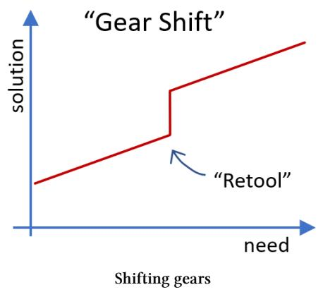

More pronounced gear shifts are those that require you to abandon part of your work so far.

Most cloud platforms provide built-in message routing and filtering services. When a user outgrows the expressiveness of the filter expressions, they need to replace the logic with a custom-built serverless function.

Sadly, the work to configure the managed service (encoded in a Terraform template or Cloud Development Kit [CDK] code) is lost because the serverless function has to be written in a general-purpose programming language like Typescript or Python. Nevertheless, this gear shift is still preferable to a hockeystick platform that can't support the increased customer needs at all.

The worst assumption a platform can make is that the problem is well-defined, developers select the perfect services to solve that specific problem, and they live happily ever after.

Development teams might switch services for a variety of reasons. They may have outgrown the functional capabilities of a service; they may realize that a service was overkill and switch to a simpler one; requirements may have changed; or they may have simply picked the wrong service for their needs.

Another gear shift faced by platform customers is starting work in a user interface console only to find out that they need better reproducibility and version control. In the early days of cloud consoles, this gear shift meant starting over with an automation tool. Modern automation tools can generate automation code from the current (manually deployed) resources. Alternatively, consoles are beginning to provide AI-assisted console-to-code conversion.

Common techniques to lower the gear shift jumps include the following:

- Automated exports from one approach into another when needed; for example, exporting automation code from the console UI
- A wider service portfolio that provides the users with incremental solution choices
- Users that use automated tests and build will have an easier time shifting gears than those relying on manual tests.

# **Reality**

Any real platform is going to exhibit a combination of the aforementioned characteristics. The goal of this chapter, therefore, isn't to present a recipe for defining the ideal experience profile; rather it is to provide a vocabulary to describe common traits, much like design patterns do. This vocabulary enables platform designers to have conversations like, "Can we lower the cliff by introducing an additional gear shift?"

**Real life may serve you an S-curve**

In reality, you may achieve a close-to-ideal curve around common use cases with a manageable cliff at the low end and custom extensions at the top end.

# **Home Grown Platforms Have Invisible Cliffs**

Teams building their own solution will invariably find it easier to use than a platform that's provided by a third party. When a team grows a solution alongside their needs, that solution will be simple while their needs are still simple. When their needs become more complex, team members are familiar with the solution and will find it intuitive, even if it isn't. The result is a platform with a cliff that its users never had to take:

**The teams never experience their platform's cliff**

Kelsey Hightower once captured this effect in a pointed Tweet:

I'm convinced the majority of people managing infrastructure just want a PaaS. The only requirement: it has to be built by them.

When presented with a ready-made, powerful platform, such teams might argue that it is overly complex compared to what they built. Building a smooth onramp for new teams is therefore doubly important for platform teams to gain wide acceptance within an organization.

# **Reshaping Platforms**

In-house platforms typically look to reshape an existing cloud platform's profile, mainly reducing the initial cliff by lowering the cognitive load. However, those teams face similar trade-offs: making assumptions that lower the initial cliff can cause a hockey stick for advanced users.

Providing "escape hatch" mechanisms from the in-house platform to the "raw" cloud services, can lower the stick but require users to shift gears. Including the decision model in the platform design discussions can help in-house platform teams find the right balance. For example, focusing on the on-ramp only might limit platform reach as more advanced developers find the platform overly constraining.

# **28. Visualizing Platforms**

### **Seeing is believing**

**"I heard the artist was influenced by Kandinsky and CNCF"**

The success of platforms hinges on shared responsibilities between platform providers and users. For example, the platform may provide services that users compose into meaningful applications. Likewise, secure and reliable operations require contributions from users of a run-time platform—you can't just deploy a brittle and insecure app on a platform and expect it to magically become secure and robust. Last, users of a data-sharing platform may be responsible for data quality whereas the platform handles data discovery, access, and audit.

Such a shared model makes it challenging for platform teams to describe exactly what they are providing to their users. Most development teams will readily understand a shared software component that they invoke per API. In comparison, platforms are "meta":

Rather than make things for you, platforms make it easier for you to make things.

I have observed platform teams struggle to succinctly describe what they provide, and what's expected from their users. Architects rely diagrams to communicate, so let's explain platforms in pictures!

### **Maps Come First**

We already concluded that maps are visual models. A map can help visualize what a platform provides vis-à-vis what its users have to add. Depicting such a relationship requires two steps:

You first need to establish a map of the logical territory before you can indicate respective positions on it.

For example, you need a topographical map to have a meaningful discussion about taking a hike or building a ski slope. The map defines the coordinate system, orientation, scale (real-life distance per distance on the map), and a way to depict elevation (lines with a label or color coding). Based on that map, you can have a fruitful di[sc](#page-273-0)ussion about whether to take the short and steep hike or the more scenic and leisurely one.

The same holds true when mapping complex software systems: the relationships between components can be expressed by their size or position on a coordinate system defined by the map.1 A layer diagram is a good example: things drawn near the top depend on things further down. Components next to each other are peers and have mutual dependencies. Sadly, most real-life software diagrams aren't that structured: a fuzzy ensemble of boxes defies coordinates and assigns the size or proximity of components mainly aesthetic value.

1The Chapter "Drawing the Line" in *The Software Architect Elevator* provides a detailed treatment on the importance of proximity and relationships.

### **Platform Visualizations**

An earlier chapter highlighted that no single model can answer all questions. That's why this chapter presents a range of models that depict platform capabilities on different coordinate systems.

### **Onboarding Timelines**

Platform onboarding is the starting point of a customer's interaction with a platform, rendering low onboarding friction a critical property of successful platforms. Sadly, the notion of a new platform user just filling a few fields in a portal or making an API call remains an unrealized ideal for most organizations. Accessing an internal platform can require approvals, accounting arrangements, contract signing (e.g., if the platform is provided by an IT subsidiary), or network changes (for integration or data platforms). These activities might fall under the purview of different departments or external providers, rendering the onboarding journey potentially lengthy and costly.

Platform teams can increase transparency around the onboarding process for both internal use and for communication with users with two visual models:

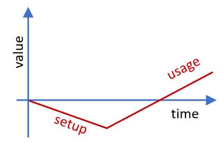

**The value curve conveys the hard truth of platform onboarding**

The value curve reminds platform teams that the customer journey invariably starts with a negative: teams invest to learn the platform, spend time specifying needs or requesting services, and possibly pay third parties for custom development or infrastructure services. Only once all that cost has been paid, can the platform begin to pay for itself—over time.

Flattening this initial "negative value curve" should be on any platform team's agenda, for example through automation, pre-provisioning resources, or trainVisualizing Platforms 264

ing. Platforms that include connectivity—such as IoT platforms or far-spanning data platforms—can require setup costs in the six figures, a far distance from the instant sign-ups of popular internet marketplaces that frequently stand in as successful platform examples.

In extreme cases where the upfront adoption cost can't be reduced (for example due to reliance on external parties), platform teams should consider prefinancing through a loan.

To help prospective platform users understand the onboarding timeline and responsibilities, traditional swimlane diagrams work surprisingly well. Such diagrams depict each involved party in a horizontal lane with activities and dependencies plotted across the time axis and the parties.

**Platform onboarding across teams**

This simplified example diagram shows three parties that must collaborate to onboard a user onto the platform. An infrastructure team sets up a landing zone that the platform team can provision resources into. Meanwhile, the infrastructure team configures the network. When both are done, the users can validate the platform operations.

### **Capability Maps**

Perhaps the most common view in IT architecture, the capability map, lists a subsystem's functional capabilities; for example, for a data platform:

| Data Ingestion        | Data Integration          | Data Storage     |                  |
|-----------------------|---------------------------|------------------|------------------|
| Batch Ingestion       | ETL                       | Landing Zone     | Consumption Zone |
| Stream Ingestion      | Data Aggregation          | Data Archiving   | Exploration Zone |
| Event Ingestion       | Data Validation           | Data Profiling   |                  |
| Change Data Capture   |                           |                  |                  |
| Data Analytics        | Data Management           | Data Preparation |                  |
| On-Demand Analytics   | Data Lifecycle Mgmt.      | Data Profiling   | Data Enrichment  |
| Analytical Modeling   | Data Stewardship          |                  |                  |
| Predictive Analytics  | Reference Data Mgmt.      |                  |                  |
| AI/ML                 |                           |                  |                  |
| Data Sharing          | Data Visualization        | Data Security    |                  |
| Data Marketplace      | Reporting & Visualization | Encryption       | Access Control   |
| Data Publishing       | Visual Data Discovery     | Anonymization    |                  |
| External Data Sharing |                           |                  |                  |

**A data platform capability map**

[Capabilities are a natu](#page-109-0)ral starting point for high-le[vel architectures as they](#page-109-0) provide an easy checklist of "what's in the box". But they aren't particularly strong models (and neither maps) because they merely represent a set (in the mathematical sense), meaning they do not express any coordinates or relationships between these capabilities. In the example above, the model doesn't indicate whether just implementing *Batch Ingestion* (and leaving *Stream Ingestion* for later) is a reasonable starting point for the platform. It also doesn't tell us whether certain capabilities depend on each other. For example, does *Stream Ingestion* coupled with *Data Validation* and *Data Archiving* support real user journeys or is it a useless subset of capabilities? It also doesn't explain how users gain access to these capabilities, which can be more important than the capabilities themselves.

Capability maps do not depict user journeys, value delivery, or platform evolution.

Resorting to one more automotive example, it's hard to tell whether the capabilities *Combustion*, *Convert linear motion into rotating motion*, *Change rotational speed*, and *Allow differences in axle speed* make a good car. Capability maps can be useful to depict a desirable end state or a platform's scope boundary, but they aren't well suited to illustrating a platform's usage or evolution to users.

Visualizing Platforms 266

### **Lifecycle Maps**

Developer platforms that support the Software Development Lifecycle (SDLC) are most meaningfully depicted along that lifecycle, for example, broken down into development, build, test, deploy, and operations. By depicting capabilities for each stage, such a diagram adds one meaningful dimension (the flow of software from concept to production) to the vanilla capability maps. Thanks to this additional dimension, teams can now reason whether selecting capabilities in disconnected phases is useful or not.

A lifecycle map shows a platform's cohesion and closure, whereas a capability diagram merely shows completeness ("7Cs").

Lifecycle maps can be augmented to show extension and variability points. For example, do you have to take the entire pipeline for your project, or could you utilize your own code Source Code Management (SCM) system? If you have a non-standard deployment target, can you extend the platform to support it? A suitable map can easily answer such questions.

**Extension points for a CI/CD platform**

The above diagram depicts a (simplified) CI/CD pipeline that indicates what components the platform provides, how they depend on each other, which elements the project has to supply (Unit and Integration Tests), which components are mandatory (Static Code Analysis), which ones can be replaced by custom components (SCM, Runtime), how to contribute third-party components (approval is required), and how custom components are connected to the platform (Github Actions, Deployment Descriptor). The picture may not say 1,000 words, but it does clearly answer many questions that development teams may have.

#### **Operational Maps**

Ownership of internal platforms comes in many flavors: the platform may provide a fully managed component that teams invoke via an API; it may provide shared components for the teams to operate; it may deploy cloud resources into the team's account; or external parties my operate on-premises components on the team's behalf. Clearly understanding the operational and ownership boundaries is essential for platform users, especially in large organizations, where wide variations are almost guaranteed. For example, I have seen an IoT platform that required a software component operated by the platform team to be installed on an on-premises application server, which is managed by an external party but relies on network connectivity to be provided by the infrastructure team.

Diagrams can express ownership and operational responsibilities by "stacking" different models along a virtual axis. The earlier CI/CD pipeline diagram did this by showing components provided by the platform on top and those added by the project team underneath. It omitted the details of ownership, tenancy, or operational responsibilities, which an operational map would add. Conflating ownership and operational responsibility into a single dimension simplifies diagrams because a single axis can depict both aspects. You can achieve this with double labels (e.g., "project owned/cloud operated"), analog to composite database keys. Folding two dimensions into one forces a global order (e.g., is project owned/cloud operated above or below platform owned/platform operated?), but swimlane diagrams provide some slack because they don't rely on strict top-to-bottom ordering like a true stack.

You have some editorial license to condense variations. It may be less relevant to platform users who operates platform-owned components (for example, the cloud provider for a serverless component or the platform team for an application deployed on IaaS). That's why the below table omits the second and third column values:

| Owned   | Provisioned | Operated  |
|---------|-------------|-----------|
| Project | Project     | Project   |
| Project | Platform    | Project   |
| Project | 3rd Party   | 3rd Party |

Visualizing Platforms 268

| Owned    | Provisioned | Operated |
|----------|-------------|----------|
| Project  | Platform    | Cloud    |
| Platform | —           | —        |

In case of an outage, the operating party may become relevant. Some situations may further separate operational responsibilities into assuring uptime (cloud provider) and updating versions (platform team). As before, knowing the question you are looking to answer helps create a suitable model.

#### **Connectivity / Data Flow Maps**

Although all architecture diagrams require lines, integration platforms or data platforms are line-centric: the critical capability they provide is sending data from one party to another, and it's difficult to depict that without lines.

Integration and data platforms are prone to spanning organizational or physical boundaries (for example, an IoT platform may need to connect to production facilities). That's why they provide unique value, but that's also why they are complex to build and operate. Diagrams for integration or data platforms therefore often show the flow of data along the horizontal axis, perhaps segmented by locale and ownership along the vertical axis.

**Sending data to an IoT platform**

The above diagram depicts a fictitious (and simplified) IoT and data analytics platform. Manufacturing plants can stream data directly via an API provided by the platform or submit data records via a third-party-managed component. Or, they can write to a local database, which is located on premises but managed by a third party. All data ends up in a large data store for analysis, whose results can be viewed from dashboards that are configured by the plant but hosted at headquarters.

### **Extensibility Maps**

Because platforms are generally opinionated, it's useful to include extensibility as a dimension in the diagrams. Whereas documents are best suited to enumerate all possible extension and configuration points, diagrams best convey the *gestalt* of the extensibility design. For example, it's common for integration or data platforms to accommodate connecting diverse data sources and adding custom analytics tools. At the same time, such platforms look to harmonize connectivity, data transport, data storage, and security. Similarly, an application platform may support diverse front-end applications and backend system integrations, but features a harmonized business logic and data flow. I draw such systems in the shape of a bone:

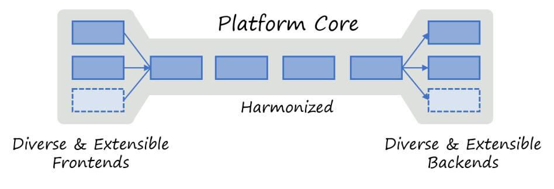

**A data analytics "bone"**

Giving your system an easily recognizable shape sets clear expectations with users and can indeed say more than 1,000 words.

## **Expressive Visuals**

The most suitable platform diagram depends on your platform, the context that it operates in, and the questions that your users need answered. For example, if no third parties or on-premises data centers are involved, depicting ownership Visualizing Platforms 270

and locality may not add much. Despite the diversity of platform diagrams, a few common guidelines help platform teams communicate better visually:

#### **Use visual diversity where it matters**

Ensure that different visual styles indicate noteworthy differences in the system. Vice versa, use uniform visuals when relevant differences do not exist.

#### **Layer diagrams so that they can reveal themselves**

A good diagram has an overall shape that conveys a relevant message after just a few seconds. Once the viewer spends more time, it should reveal additional details. This layering can be achieved for example through groupings, different font sizes, and lower contrast.

#### **Use the available space, be bold**

Extraneous whitespace (unless part of grouping or proximity) doesn't convey meaning. Allow large boxes and fonts to fill out the available space. [Let arrows a](#page-168-0)nd lines have ample thickness. Some visual templates favor sparse, delicate boxes—that's alright for corporate messaging but not for architecture diagrams.

# **Architecture Before Product**

None of the diagrams in this chapter [m](#page-281-0)ention specific products or services. Still, they express critical platform decisions and teach users how to interact with the platform. Too often product selection is mistaken for architecture. Not only does this lead to a fruit basket, it also hides the most relevant architecture decisions.

A list of products isn't your architecture, even if they are drawn as boxes.

Product selection has a habit of sneaking into architecture diagrams through colorful cloud service icons (Jacquie Read describes the dangers in her antipattern *Use Icons to Convey Meaning*2 ). Vendor icons are cute, but they will make your diagrams look like ancient hieroglyphs to any audience who isn't

2Read J: *Communication Patterns: A Guide for Developers and Architects*. O'Reilly Media; 2023.

Visualizing Platforms 271

intimately familiar with the services provided by a specific cloud vendor. They also generally fail to tell a story or place an emphasis, both anchors of effective communication.

### **Documenting the Platform**

The most effective visual model depends on the nature of the platform and the interests of its users. In contrast, platform teams should use common notations like the C4 model to document the platform implementation. For example, container and component diagrams are well suited to describe the internals of the platform orchestration layer, and alleviate platform developers from having to learn new notations.

# **29. Charting a Platform Roadmap**

**Staying on track while laying it.**

**"Where no (wo)man has gone before"**

#### **By Michele Danieli**

IT platforms only generate value when rolled out across an organization. However, the path to widespread adoption is paved with challenges. A platform that's been scoped to overly specific needs won't attract a broad audience. Other platforms might be too rigid, too complex for casual users, or too expensive for some user groups.

User input guides platform teams, however it rarely arrives as well-specified requirements that line up with your planned roadmap. That's why collecting user input is much more than taking down notes and building what users tell. Decision models help platform teams maintain a healthy balance between product integrity and responsiveness to user requests.

## **Balancing Completeness With Cohesion**

Essential platform characteristics can be pitted against one another. For example, adding features suggested by users can increase a platform's completeness, a characteristic that is likely to find immediate appreciation because it ticks an easy "can your platform do X?" box. However, haphazardly adding features is likely to hurt a platform's cohesion or closure. Although equally important, these characteristics are less apparent to prospective users, leaving platform teams with a difficult argument when rejecting a requested feature.

Decision models can help teams maintain a balanced roadmap, boost decision discipline, and help communicate decisions to users and stakeholders. A simple 2x2 decision matrix can again be an excellent starting point by plotting incoming requests across business impact and roadmap fit:

|  |                         | Investigate                                               | Prioritize                                      |
|--|-------------------------|-----------------------------------------------------------|-------------------------------------------------|
|  | High Business Impact | Why not in roadmap?                                    | Review priority?                             |
|  | Low                     | Decline Share evaluation, eventually reorient | Backlog Manage in backlog with sprints |
|  |                         | Low Roadmap Fit                                        | High                                            |

**Folding feedback into the roadmap**

Assessing how user requests fit with the platform strategy helps teams avoid getting sidetracked into dangerous detours. But it also allows them to keep an eye on inputs that may lead to pivoting the platform. Based on the quadrant, the platform team prioritizes, investigates, queues, or declines a request:

• If a high-impact item is already planned (upper right), it confirms the

team's chosen opinions. The team might nevertheless reevaluate the current backlog priority to optimize value delivery.

- A user request that has a high perceived impact but is outside the current scope (upper left) challenges the current platform opinion. The team should investigate whether it's an area that has been intentionally left out of scope or whether they hav[e a potential blind spot.](#page-306-0)
- [A low-i](#page-306-0)mpact suggestion that doesn't fit the current direction (lower left), can represent a dangerous deviation. Declining is the best option to avoid diluting the platform and the team. Sharing the principles that caused the decline helps the requesting team rationalize the decision.
- A low-impact suggestion that lines up with the platform strategy (lower right) represents business as usual. The team prioritizes requests into the backlog and delivers according to relevance and capacity.

Instead of just following the money (the re[quester may have bud](#page-139-0)get), the team must [exercise prud](#page-130-0)ence, balancing the engineering and marketing parts of its organization. Especially in the early stages of the platform evolution, the desire to meet an initial customer's every demand is a slippery slope:

Building to a single customer's needs, although well intentioned, reverts your platform team from a product team into a professional services organization.

Clear product vision is important to allow the platform to evolve based on user feedback while allowing it to take shape. Extensible Platforms or those that have gentle slopes aid teams in maintaining this balance.

Extensible platforms strengthen the team's discipline to decline feature requests. After all, the users can implement the feature themselves.

Teams should explore alternative paths for features that are a poor roadmap, like starting a subproject. The Kubernetes platform thrived thanks to an ecosystem of projects that run on top and in parallel instead of overloading its core. For example, autoscaling capabilities are enhanced by projects like KEDA or KPA in KNative.

### **Customer Feedback Is Biased**

Successful platforms don't try to anticipate every user need. Instead, they should grow based on user feedback. You must keep in mind, though, that your current user base is not a representative sample set. Your current users see the world through the lens of the current product, meaning they are biased.

I once challenged a team who stated that "users asked for this" whether they also talked to the one million non-users of their service.

This effect is particularly pronounced for platforms that comprise numerous services, for example, cloud platforms. Customers of Service A may wish for a new feature that's already available in Service B. If the team building Service A isn't aware of Service B, it might be tempted to duplicate that feature. When soliciting customer feedback, it's therefore helpful to look at the platform as a whole, not at each service in isolation. It's also good practice to approach customers with hypotheses and options as opposed to just asking "what would you like?"

**Combining features that customers asked for may not lead to a great product**

# **Selecting Metrics**

Expecting that a platform fixes all problems would be naive. Existing organizational processes can keep even the best platform from reaching its intended potential. For example, test automation may not reduce change lead time unless upstream issues are resolved. For [example, chang](https://cloud.google.com/blog/products/devops-sre/using-the-four-keys-to-measure-your-devops-performance)e reviews in infrequent, large batches will keep lead times long. Vice versa, less friction in the deployment process can motivate teams to work in smaller iterations and thus reduce debugging cycles, a metric that would usually not be captured for a platform.

An IT executive evaluating investments in an in-house platform initially looked at platform-centric metrics such as how many jobs it ran or how many teams adopted it. Such metrics may not show the real impact.

Platform teams can use or extend DORA metrics to measure development team performance. These metrics value the frequency, speed, quality, and stability of the software release. Such metrics provide insight into the build and run phases of a software product. Several products, including open-source projects like Apache Devlake, provide access to such metrics and offer an open model of the underlying data. Additional indicators can measure release size, test-book size and composition (e.g., manual versus automated tests), backlog trends, or the number and type of quality issues.

Platform run-time data can help illustrate platform usage. Such lower-level metrics are simpler to measure and provide insights into the way teams use the platform.

Metrics should highlight the interaction between platform capabilities and other practices in the organization.

To uncover links between platform usage and practices, you can analyze teams with similar or different process performance by looking at the process flow (the process steps) and operational indicators. By identifying cohorts of groups that move across the process flow similarly (analog to customer journey funnel analysis), platform teams can understand which factors enable productivity and which ones may hinder it.

Collecting data from the build toolchain and backlog planning tools helped us identify friction between the inner and outer loops, which caused developers to postpone quality and security analysis. We also discovered that application architecture limitations led teams to deploy larger batches of changes, creating more friction in the form of more complex and longer QA cycles.

As in any IT system, metrics help det[ect quality or performance issues](#page-74-0) that will lower customer satisfaction and hamper adoption.

## **Sensing the Future**

Data is important to run a platform, both as a technical system and as a product. Whereas telemetry gives visibility into the stability and reliability of platform operations, higher-level metrics support the platform team in improving its customer experience.

Usage data can help the organization sense the future of the platform. Relating the evolution of the landscape with the consumers' needs can identify new areas or help expand existing features. For example, an observed increase in data and analytics projects may lead the team to consider expanding the service catalog to ease data engineers' work with data orchestration or model serving.

Just like with explicit user feedback, platform teams need to balance these implicit inputs against the platform roadmap.

#### **Panta Rhei**

Everything flows—*panta rhei*— an aphorism attributed by Plato to Heraclitus, represents the view that nature is in a continuous flow of change. The same is true about IT, whether the change is driven by technology evolution or external forces.

The previous sections show how a platform team's path may be shaped by the way existing users work and how the team chooses to respond. But bigger changes may be driven by external forces. Simon Wardley defines a set of climatic patterns, which he describes as things that change regardless of your actions. The use of the term "climate" for these effects hints at a meteorological ground rule, coined by Alfred Wainwright :

There's no such thing as bad weather, only unsuitable clothing.

So, if your platform seems to face bad weather (or climate change and rising ocean levels), it may be time to rethink your wardrobe. Simon's list of climatic patterns helps teams understand common external forces to which they will need to react.

Technical evolution triggers changes in behavior, which will demand new technical capabilities.

Such changes occur at different levels with technology being just one of them. Platform teams will witness change driven by a cycle of evolving technology, which leads to new usage patterns, which in turn trigger n[ew demands](#page-120-0) for technical solutions. For example, cloud automation makes provisioning infrastructure repeatable and effortless. As a result, teams can make their environments disposable, destroying and re-creating them as they please. Such habits drive the need for much faster deployment cycles or more expressive automation languages.

Just like user input, climatic changes do not simply translate into an action or an adjustment of the platform roadmap. Rather, a platform team needs to identify if and where to apply the new capabilities. For example, although still at an early stage, *Generative AI* is transforming software development to be AI-assisted. This prospect raises important questions about the notion of a golden path: why would a platform team need to explicitly code paths when an assistant can guide application teams? Would platform teams tune the assistant to the organization's context instead of developing platforms?

The organizational ability to sense the future and take action determines the long-term viability of a platform team. Organizations may struggle to see an evolutionary path for their platforms, instead falling into a build-use-dispose cycle. For example, even though they may be enamored with the power of modern AI tools, they may fail to consider it as input into their current developer platform roadmap, instead starting yet another new initiative.

Teams that chase every new trend are like second-grade soccer teams: 1 ball and 10 children chasing it.

# **Retrospectives**

Noble intentions don't always address the users' immediate needs. Joint retrospectives with developers and platform engineers allow the teams to discuss what works well and what does not: developers may need more support or training; the platform may have undetected or unresolved gaps; architectural or organizational aspects may hinder the platform from delivering its full potential.

A retrospective helps teams understand which aspects drive higher productivity, enable the adoption of best practices, and support a compliance posture. The retrospective looks at the relationships between the platform, the organization's processes, and the output of application teams to understand how they influence one another.

The retrospective helps uncover findings that lead to improvement actions. For example:

- Application teams may miss critical features.
- Teams may be unable to exploit the platform because of knowledge gaps.
- Poor quality and security practices cause overhead or tempt teams to adopt lesser practices to match time-to-market demands.
- Governance processes required for risk and compliance management for example, asset and release management processes—may not be well supported by the platform automation, leading to manual overhead.

The platform is not a magic wand for transforming the organization. Other aspects, often at the intersection of processes and applications, can influence the output of application teams; for example, the quality of requirements and project planning.

Running retrospectives should not be a one-and-done exercise but be an integral part of the normal mode of operations.

## **The House of Quality**

Quality Functional Deployment (QFD), another inspiration from the automotive industry, helps translate customer needs into technical requirements. In QFD, quality is a measure of customer satisfaction with a product or a service. Each identified customer need is evaluated against relevance, benefit, technical complexity, and difficulty, plus a benchmark against other in-house or external solutions. The method's primary model, the House of Quality (HOQ), provides an approach to prioritize functionalities. Erder et al.1 show how the technique can be used to translate requirements into features and align features into stages based on priority and interdependencies.

**House of Quality**

At first, prioritized customer needs are evaluated against technical characteristics based on their relevance, leading to the identification of importance.

1Erder, Pureur, Woods: *Continuous Architecture: Sustainable Architecture in an Agile and Cloud-Centric World*. Addison-Wesley; 2021.

The interaction matrix (the roof) is used to identify features that may or not coexist. Technical values can be used to capture characteristics associated with features, a Service Level Objective (SLO), for example. Additionally, technical benchmarks highlight intrinsic difficulty and quality compared to competitors.

This approach has a positive impact even when you're merely adopting a platform: clarity on features helps prioritize which features to activate and pay for. It will also assist the team in planning enablement activities and creating a communication plan to promote the new platform.

## **Building Platforms Outside In**

When building an in-house platform, balancing unique user needs with providing a cohesive offering is delicate. On one hand, an in-house platform should address requirements that are unique to the organization; otherwise, an existing (commercial or open source) product would be a more economical choice. On the other hand, platforms should not have to reinvent the wheel to address common needs like continuous software delivery or automated testing.

Many platform teams therefore build a platform from two separate parts: a base layer in which the platform team anticipates common needs, and a custom service layer that is discovered from specific customer needs.

**Singapore Tech Stack; © 2024 Government of Singapore**

The Singapore Government Tech Stack (SGTS) consists of a base layer, which is largely predefined and a service layer that is incrementally built or harvested from agency applications.

The base layer contains common development tools and can therefore be driven by the platform team. The service layer contains domain-specific services for government agencies, which are developed based on customer input or contributed by users.2 We occasionally refer to harvesting features from users as "gravity": functions that were built for a specific team but turn out to have broader appeal "sift down" into the platform.

2Used with permission. Source: https://www.developer.tech.gov.sg/singapore-government-tech-stack/

### **Many sizes can fit all.**

**"Backplane is particularly good today."**

#### **By Jean‐Francois Landreau**

When designing platforms, like any software product, starting with a single eager customer is a good practice. Success with this initial customer prepares you for the needs of a second one, which helps you generalize concepts and discover patterns. The third customer provides sufficient generalization to address the needs of a wide range of customers. Still, transitioning from a small set of well-funded customers to the "long tail" may stretch your platform's capabilities and require you to chop it up.

### **Scaling Down**

Inside large organizations, your initial customers are likely to be "premium" ones: their business need for an internal platform derives from their current success and rapid growth. Or they need to standardize to cope with large

scale and complexity. Working with well-funded and fast-moving customers is a great start for a platform, but invariably you'll encounter customers with tighter budgets. Those customers can benefit from your platform, but your initial platform design may be too expensive for them.

A large financial institution with dozens of operating entities around the world had a saying: "You addressed the largest entity, but will it work for Sri Lanka?"

[A single plat](#page-175-0)form may not be able to ser[ve such a w](#page-168-0)ide range of customers equally well. Surprisingly, smaller customers may challenge the design of your internal platform more than large customers:

Scaling down is harder than scaling up.

Adding more capacity or functionality is typically easier than reducing cost. For example, a customer with a single virtual machine may still require a complete control plane or services like a CI/CD pipeline, monitoring, or network security. Ironically, the more your platform is like a fruit salad (which is a good thing), the harder it might become to scale down, as multiple components are tightly integrated.

**Tiering and slicing a platform**

Two mechanisms can help a platform serve a wider range of customers:

• Providing different *vertical tiers*; for example, for different ranges of operational qualities.

• Providing options by *horizontally slicing* the platform's functionality into modules that customers can consume independently.

Providing such tiers and slices not only helps your smaller customers but can provide a smoother on-ramp for large customers that start small before they grow.

Small customers come in a variety of flavors:

- *Experiments* that aren't meant to be production-hardened, but that are intended to test functionality or new product ideas. Such experiments are important innovation drivers and should be supported by an in-house platform.
- *Development environments* will have lower security and scale needs than their production equivalents.
- So-called *strangler applications* that provide a modern replacement for a small part of an existing application, implement only a few components of a larger system, and will have a small initial scale.
- *Low-volume, high-value* applications (e.g., insurance applications) will have vastly different operational requirements than *high-volume, lowvalue* ones (e.g., web logs). For example, the former don't need to scale but will have strict security and transactional needs, requiring exactly[once and in-orde](#page-13-0)r delivery of events. In contrast, the latter might need to handle higher message volumes but can afford out-of-order or even dropped data.

For your platform to grow, you'll need to support these kinds of customers alongside large ones.

### **Tiering**

Automotive platforms support a wide range of vehicles from middle class to luxury cars. Such a tiered offering serves diverse customer segments while avoiding duplication.

Tiering doesn't mean offering poor products to some customers; rather, offering the right product for the right use case.

Tiering isn't limited to a single dimension. A single customer may require the top security tier but the lowest scalability tier, whereas another customer may require just the opposite.

Cloud vendors have been providing a growing set of options for their customers. If your internal platform is built on top of a cloud platform, you can use those mechanisms or gain inspiration from them. For example, cloud providers offer different virtual machine types or custom types of almost any combination of CPU and memory. Your internal platform won't be able to reproduce such variety due a smaller customer base and poorer economies of scale. Luckily, you don't need to re-create these options if you base your services on these machine types, delivering the same benefits by inheritance so to speak.

#### **Performance Tiers**

Not all customers have the same performance needs or expectations, perhaps because their systems don't receive the same levels of traffic or because their end users may have differing performance expectations. You don't need a system response time in the tens of milliseconds if the overall end-user latency is in the high hundreds of milliseconds, because end users might not even notice the extra performance. You don't need a Ferrari on dirt roads, but your users may appreciate a cheap and sturdy 4-wheel-drive car.

In-house platforms based on virtual machines can provide tiers aligned to cloud providers' machine sizes, whereas serverless platforms can offer an entry tier without provisioned capacity and a premium tier that achieves consistent response times with provisioned capacity. Serverless compute illustrates how a single higher-level compute resource abstraction can address both the needs of a wide range of customers.

Assuming that requests serve business value, the serverless pay-per-request model aligns your infrastructure bill to revenue or value delivered, resulting in a continuous, automatic tiering system. Several cloud providers include serverless volume discounts to provide scale benefits to larger customers.

**Serverless provides automatic tiering**

Very large serverless customers may refactor their application run time to managed containers to further tilt the cost curve lower than the revenue curve.

#### **Frequency versus Response Time Tiers**

Performance isn't a single metric. Especially for data storage, access patterns and needs can vary widely:

- Frequency of access—the number of requests over a given time interval
- Latency—the response time distribution across single requests
- Bursting—the ability to handle sudden spikes in request volume

Storage services such as Azure blob storage offer Hot, Cool, Cold, and Archive tiers with different access patterns and cost characteristics. For example, Cold storage is designed for infrequent access, which is reflected in a pricing model with lower storage costs and higher access charges. The Hot tier, which is designed for frequent access, has the opposite characteristics.

#### **Resilience Tiers**

Consumers of IT services are well versed in specifying expected service dependability as a combination of RTO (Recovery Time Objective) and RPO (Recovery Point Objective), with the former indicating the expected length of an outage, and the latter the expected data loss.

What are your customers' Service Level Objectives, Recovery Point Objectives, and Recovery Time Objectives? What are yours?

Your premium customers will have higher SLOs, typically measured in the number of nines in the uptime percentage, for example, "four-nines" equating to 99.99% or about 52 minutes of downtime a year. Services that have to meet those SLOs may face a steep cost increase from 99.9% to 99.99%, which puts the platform out of reach of lower-tier customers.

Major cloud providers' blob storage services offer a range of SLOs. For example, the Amazon Simple Storage Service (Amazon S3) Standard Infrequent Access class is designed to offer 99.9% availability. The One Zone Infrequent Access class offers 99.5% availability at a roughly 20% lower storage price. Azure Blog storage offers georedundant, locally redundant, and zone-redundant storage that ranges from 99.99% to 99% availability for read access, with Cool and Archive tiers losing one "nine" of the respective tier.

You can implement availability classes by varying the service's component redundancy, both by the number of replicas and their geographic distribution. A premium tier may over-provision resources to cope with failure scenarios. Lower tiers will have just enough resources provisioned to satisfy the performance for the nominal setup, resulting in performance degradation in the case of component failure.

Alternatively, your platform can address customers' RPO and RTO needs by providing them with tools or implementation patterns. For example, a "top tier" blueprint may instruct customers to use a global load balancer across compute services and to select a widely distributed storage service.

To meet varying SLOs for your management or control plane, you can give premium customers priority during recovery so that they utilize already preprovisioned resources for such a scenario. Lower-tier customers, in contrast, will need to wait for new capacity to be built. In return, they pay a lower price.

### **Security Tiers**

Compromising on security can sound like an indecent proposal. The reality is this: there is always a limited budget, whereas there is nearly no limit on the security measures that you can implement.

IT Security is like insurance for your data. You only realize its value in case of disaster. Author: ChatGPT.

Despite having been generated by a computer, the quote illustrates a common sentiment of security teams. The larger the business, the higher the security concerns and the bigger the security budget. A small company being breached might not make the news headlines and may be able to communicate with its customers more directly than a large company. Hence, the small firm can accept a security risk against which a larger one must be protected. A successful platform offers options to meet such differences in budgets and risk acceptance.

Security features implemented via CI/CD pipelines, such as container and dependency scanning, should be active regardless of tier, as they wouldn't bring any meaningful cost reduction. However, active run-time security features like intrusion detection, detailed logs, or advanced Web Application Firewall rules may be offered depending on the servic[e tier. These features can also be](#page-326-0) [managed as options, a mechanism](#page-326-0) presented later in this chapter.

Other qualities of your platform can be tiered to offer the right price tag for the right customer, maximizing the market size for your service. A premium service may offer more durability or longer storage time for the data than an entry-level service. Other qualities like accessibility or extensibility can also be adapted to different tiers.

### **Support Tiers**

When considering support tiers, it's helpful to distinguish between enablement (training) and production support. For enablement support, cloud vendors' experience shows that smaller customers tend to have the necessary skills to adopt services faster than enterprise customers. They may be happy to learn from online documentation or by attending conferences. Large customers typically also have highly skilled teams, but they also have higher expectations for "high-touch" support.

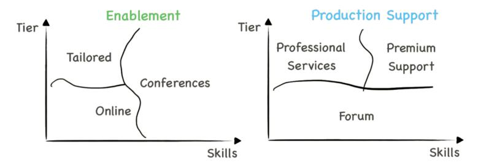

**Enablement and production support depending on skills and tier**

You might be tempted to distribute support costs via the price of your services across the entire range of customers. However, it can move the price tag too high for lower-tier customers (or be uneconomical if you charge a fixed percentage). Likewise, higher-tier customers might not want to pay for a service they don't need. Offering enablement and production support as an option can increase customer satisfaction and simplify capacity management for the support teams.

### **Slicing**

Despite all your efforts to offer tiers for different customer budgets, smaller projects may still not be able to afford your entire platform. Delivering one single package provides a great Return on Investment (ROI) for customers utilizing the package in its entirety but not for customers just dipping their toe into the water.

**Slicing a service**

It's time to slice your service portfolio.

#### **Feature Flags**

It's easy to slice an existing service via feature flags, which can activate features at a corresponding price tag. For example, the presence of a file in a repository can activate a CI/CD pipeline in the platform. The file can support multiple customer tiers by specifying which options to enable.

#### **Composable Services**

Alternatively, you can break a single large service into smaller ones. For example, instead of a single CI/CD service with feature options, you can offer individual services: build pipeline, code scanner, artifact repository, or software deployment. This approach offers customers more flexibility to compose their own pipeline from individual services. But it can also make the creation of the pipeline more complicated.

#### **Stack of Services**

The best of both worlds is possible by offering individual pipeline services to be composed by the customer and also offering preconfigured pipelines at a premium over the set of services composing it. Most cloud vendors follow this pattern with higher-level services; for example, database services that are built on top of virtual machine services and are offered at a premium.

[Teams m](https://en.wikipedia.org/wiki/Software_product_line)anaging a growing platform that can't satisfy all customers' respective budgets can avoid a major redesign by tiering and slicing.

Keeping these techniques in mind facilitates platform adoption across diverse user groups as the platform reach grows.

### **Platform Product Lines**

Slicing and tiering a platform resembles the approach of *software product lines*, defined by Wikipedia as:

Software engineering methods, tools, and techniques for creating a collection of similar software systems from a shared set of software assets using a common means of production.

Your in-house platform can bundle existing base platform capabilities into a collection of offerings that address different customer tiers, similar to Hot/cool/cold storage tier[s that cater](#page-168-0) to different combinations of access frequency, latency, and availability. A successful product line requires a clear domain model that articulates the platform's elements and its useful combinations. A metaphor, such as "hot" or "cold" storage can also be helpful for customers to grasp the implied trade-offs across the product line.

Using a household domain like fruit salads to illustrate a concept keeps participants from raising technically detailed but irrelevant discussion points.

A fictitious fruit salad product line (this is a book about platform strategy, not nutrition) may offer a healthy fruit salad, a sweet one, or one that isn't acidic. When you understand your fruits' characteristics (like calories, sweetness, or acidity), you can assemble a meaningful portfolio of salads, each of which matches a specific usage scenario:

**A fruit salad product architecture based on a well-defined domain model**

Cloud providers' service portfolios that have grown based on customer feedback rarely exhibit a clear product line architecture. Extensive online documentation

and training classes to assist customers with service selection are symptoms of this issue. Internal platforms can make more assumptions than base platforms but will find that straightening a cloud platform's peculiar product architecture is no simple task.

# **[Part](#page-306-0) VII: Orga[nizing for](#page-334-0) [Platfo](#page-109-0)rms**

Platform technology can be complex, and building one requires significant technical expertise. However, addressing sociotechnical aspects, handling the dynamics between people and untangling the organizational knot, are equally relevant. Whether you are setting up a platform team without a platform or building one, leaving these aspects unaddressed spells doom for even the most technically brilliant platform.

Rather than work off service tickets, [as would be the case in](#page-306-0) traditional IT organizations, platform teams enable develo[pment teams without inj](#page-317-0)ecting themselves into the inner loop of feature delive[ry. But this doesn't](#page-326-0) mean that platform teams work in isolation; rather, i[t's the opposite: they must](#page-334-0) be co[nnected t](#page-334-0)o parts of the organization as diverse as product engineering, operations, IT and business leadership, HR, and finance. That's why staffing and structuring a platform team isn't easy.

This part provides guidance on how to structure platform teams, the skills they need, and how they interact with other teams:

- Running a platform team can be like running a small company.
- A platform needs well-defined interfaces and align along two axes.
- Platform teams are well advised to place the customer at the center.
- Some platform teams can achieve benefits without actually building a platform.

**Running a platform team is much like running a company.**

**"I'll take all three"**

In-house platform teams either evolve out of existing IT infrastructure teams or are newly formed as cross-functional teams. Either one isn't without challenges: the forme[r requires pivoting away from a typ](https://hbr.org/2016/04/products-to-platforms-making-the-leap)ical IT project mindset, whereas the latter depends on a diverse group of people gelling into a performing team.

Because platforms are products (despite mainly serving internal customers) product teams provide a useful target picture for platforms teams. Taken a step further, platform teams can draw inspiration from a software product company. Think of yourselves as *Platform, Inc.*

### **A Product Organization**

Although platforms aren't regular products, platforms evolve like products to stay competitive in their market. In contrast, IT departments are used to working in a project-based model with defined beginning and end dates,

plus the assumption (or illusion) that the scope is fixed. Needless to say, the team structure [a](#page-307-0)nd ways of working are entirely different. Nevertheless, existing infrastructure teams are often tasked with providing a platform, so it's important to understand the magnitude of organizational change.

When setting up a platform team, you may gain more inspiration by looking outside the existing IT teams than inside.

Luckily there are plenty of examples of product organizations, and bookshelves are full of advice on how to build a successful one. So, this chapter won't repeat what's already been said and instead points to Mik Kersten's excellent book, *[Project to](#page-252-0) Product*, 1 as suggested reading for anyone involved in building a platform.

A prototypical platform team inspired by a product company relies on the following roles and functions. For very large platforms, like cloud platforms, each service team follows a similar structure.

#### **CEO**

Most teams benefit from an accountable leader who helps maintain the team's "balance sheet" between headcount, timeline, and value delivery. Models like The Cube can serve as planning and communication tools for this task.

If the platform is chargeable, the CEO should participate in service pricing to maintain the team's profitability and long-term viability.

The CEO also manages communication with stakeholders. For a start-up, these are the investors and the board. In corporate IT, the "investors" take the form of CIO, executive sponsors, or steering committees that want to be updated on progress made, money spent, users attracted, and benefits generated. Being able to articulate the platform vision and value proposition to an executive audience is an important skill for the CEO.

1Kersten M: *Project to Product: How to Survive and Thrive in the Age of Digital Disruption with the Flow Framework*. IT Revolution; 2018.

The CEO role usually translates into the platform team's tribe lead, the Tech Lead Manager (TLM), or a single-threaded leader, depending on local parlance. In case of a TML, team members have a reporting line to this role. Cloud platform providers map this role to a service's General Manager (GM) who owns the service P&L and works closely across product evolution, pricing, and headcount.

An easily overlooked leadership function is recruiting. Platform teams aren't looking to build an entirely new company from scratch, but they still must attract talent to their cause. Attracting internal candidates requires you to be well-connected and well-respected as a leader. Not every talented developer will jump to the next shiny object, so internal recruiting requires much more than drumming up excitement. Having the most senior person on the team perform the outreach can improve the odds.

When I built an in-house platform team, I routinely spent 30% of my time on recruiting. Several external candidates only responded because I contacted them instead of the HR department.

External recruitment hinges on employer branding. Traditional companies may feel that they have little to offer when they are competing for talent with tech giants. I found "traditional" businesses to be built on a rich domain, a diverse product range, international operations, and charismatic leadership. Each of these can serve as a valuable recruiting asset, certainly better than trying to emulate common tech company benefits like cool furniture and free soft drinks.

When recruiting, play to your strengths, not other companies' strengths!

#### **CTO**

A successful platform journey requires a clear technology strategy—after all, you are building a technical product for a technical customer base. The decisions discussed in Parts IV and V of this book play into this strategy: What base technologies should the platform rely on? Does it need to be portable across base platforms? How can the platform evolve without causing large migration

efforts? Should the platform be exclusively built from open-source components? How much can be built in-house (or outsourced) versus assembled from existing components?

A CTO (Chief Technolog[y Officer\) should](#page-317-0) not be the person making all these decisions, but they should ensure that these decisions are consciously made and documented.

Just like a CEO, a CTO can be a great recruiting asset; for example by being externally visible at events. Good developers want to work with other good developers, so make sure your work and the quality of your team are visible.

#### **VP Product**

The product head (in small companies usually a vice president) owns the product roadmap; that is, what gets built and roughly in which order. This roadmap should combine customer input with the overall product vision, and be coordinated with the delivery function via the VP of Engineering.

In larger organizations, this role will map to a Product Management (PM) team lead. It is often debated how technical product heads should be. Having worked for several large tech companies, I have seen either model work well. One company exclusively hired PMs with computer science degrees, whereas in the other company it was a rare exception. The choice followed the respective organization's *modus operandi*: the former was mainly technology driven, whereas the latter was customer driven.

A PM sits between users and engineering, so how technical a PM should be will depend on where on that spectrum you want to position the PM. A technical PM will be "closer" to engineering and require fewer translation steps. On the flip side, non-technical PMs might be more nuanced at soliciting input from users.

#### **VP Engineering**

The engineering VP owns the product delivery. They head the engineering teams and define timelines based on the scope, available resources, and team velocity. They coordinate with the CTO on key technical decisions and refine the PM's feature backlog into a project plan, taking into account technical complexities and available skills.

In small platform teams, the VP of Engineering role translates into the development team lead.

#### **VP Marketing**

"If you build it, they will come" rarely holds true, even in corporate environments. Enterprises may be tempted to mandate platform usage, but acquiring customers by decree rarely works—perhaps outside of tax authorities. So, you'd be better off making marketing a first-class citizen in the team.

When my team built a platform, we posted regular updates, moderated discussion groups, established a visual identity, and held community events.

Marketing owns outbound communications, articulating platform value and vision to the user community. This translates into holding internal events, community meetings, and hackathons. They'd also create brochures, establish branding, and maintain the team's internal online presence.

Building an online identity inside an organization can be more difficult than externally due to the lack of search engines, opensource repositories, and easy ways to build web pages.

If you think such efforts aren't needed inside an organization, think again. You may have thousands of internal customers, spread around the globe and sliced into divisions. If you want your platform to gain traction, you need to build mind share, which can be difficult; for example, because company policies limit hours spent on non-project activities.

Platform branding matters. You want people to call your platform by its name.

When rolling out internal platforms, we found that traditional marketing elements can be impactful because they are less commonly used in corporate environments. Selecting a catchy name and printing stickers, T-shirts, or caps can help build an identity for the platform and the team behind it.

Perhaps my most creative marketing ploy was to install a newspaper vending box (a common sight in Germany) to distribute architecture booklets.

#### **Support and Professional Services**

It's easy to forget that even with an awesome product, your customers need help. Self-service being a defining feature of platforms doesn't mean that an API call constitutes the entire interface between the user and the platform team. Because many platforms take part in a corporate transformation agenda, your users might not yet be familiar with your platform's runtime and programming model. In the worst case, they may be concerned about their current role and resist your platform. So, they need support and enablement. Supporting customers can also provide helpful feedback for missing platform features or adoption hurdles.

Some customers will need ongoing support, an engagement model commonly referred to as "professional services". Virtually all successful platform companies offer such (paid) support, either in-house or via consulting partners. Conducting such engagements may stretch the resources of small in-house platform teams, forcing those teams to make a conscious trade-off between building product and providing services.

Small platform teams can build a "partner ecosystem" of architects and ambassadors throughout their organization.

Such platform teams can follow a model inspired by cloud providers' partner ecosystem and build a network of architects who are part of delivery teams but support platform adoption as the team's ambassadors. The platform team can reward and motivate them through special training, events, or product previews, just like the cloud providers do.

# **Roles Aren't People**

Do you need this many folks to build and manage a platform? No! The roles don't correspond to single individuals. Also, roles may shift as the platform grows or shifts focus. Still, the need for each role is all but guaranteed to arise, so you're better off recognizing them.

If your team doesn't have a support function, your engineers will do support.

Team members juggling multiple roles can work if supporting mechanisms are in place. For example, engineers performing support can function if:

- 1) It consumes only a small percentage of their time.
- 2) The effort is recognized.
- 3) Support requests can be managed efficiently; for example, via a knowledge base or AI-assisted.

Early on, one person is likely to wear multiple hats and over time, you can split the roles out to multiple individuals. For example, your initial engineering VP could also be the CTO just like product and marketing may be handled by the same person. When your team grows, it's natural for these roles to split.

### **Fitting It Together**

As with any good architecture, the functioning of a team isn't defined by the list of roles, but by how they interact. The following diagram illustrates the relationship between the key team functions:

**Typical interactions in a platform team structure**

As expected, the product and marketing functions will interact closely with customers, negotiating for scope and prioritization with the engineering leads. The CTO guides both sides with an overarching technology strategy and boundaries for the development teams.

A mild tension between product teams, who envision new features[,](https://www.linkedin.com/pulse/transformation-missionaries-boot-camps-shanghaiing-gregor-hohpe/) and engineering, which has to manage staffing and timelines, can be healthy.

# **From Infrastructure Team to Platform Team**

The proposed platform team structure is very different from that of a traditional IT team, which is more likely to be split along technical boundaries. This implies that the organizational change will be dramatic and perhaps traumatic. A blog post of mine outlines three approaches to instilling a fundamentally different way of working into a team:

#### **Inject ("Missionaries")**

A popular approach injects new team members who are familiar with the new way of working, newly hired or transferred from another platform team. Although much better than just sending people to training, the odds of success are nevertheless slim. Team members are bound by existing incentive structures and management, which makes it unlikely that the new habits will stick once the "missionaries" depart.

#### **Incubate ("Boot Camp")**

Alternatively, you can temporarily embed team members into another team that practices the new way of working. This type of immersion can work well, but the returning team members will face similar challenges as the missionaries.

#### **Extract ("Shanghaiing")**

A more extreme version is a boot camp from which team members won't return. It avoids the challenge of changing a team bound to existing management structures. Instead, the new team ultimately replaces the old team.

As with most models, there is no one right answer that'll work in all circumstances. I intentionally chose provocative names to remind teams that this isn't a small adjustment. Rather, it turns the team on its head.

### **Cloud Service Teams**

Major cloud providers use a similar model for the teams building individual cloud services. For example, AWS service teams are structured along the following roles:

#### **General Manager (GM) = CEO**

AWS GMs are mini-CEOs of their autonomous "two-pizza" teams (the pizzas tend to be very large). T[hey frequ](https://coda.io/@colin-bryar/working-backwards-how-write-an-amazon-pr-faq)ently report service statistics and financials to VPs and look for opportunities to grow their business. Some GMs have a deep technical background, whereas others rely on their principal engineers.

#### **Sr. Principal Engineer (SPE) = CTO**

(Senior) Principal engineers are less involved in coding but help shape the technical service vision or tackle the most difficult problems.

#### **Software Delivery Manager (SDM) = VP Engineering**

Reporting to the GM, the SDM manages the development teams.

#### **Product Manager (PM) = VP Product**

PMs act as the conduit between customer needs and engineering teams. They may utilize mechanisms like PRFAQs to describe the product vision.

#### **Product Marketing Manager (PMM) = VP Marketing**

PMMs take an outbound role to carry the key product messages to the audience.

#### **Developer Advocate (DA) = Community management and advocacy**

Not explicitly called out in the model outlined earlier, DAs frequently speak at events or author blog posts. In small platform teams, this role might rest with the CTO or be distributed across team members.

# **Keeping a Platform Team**

Building and running a platform team is only half the story. If you have a wellrunning platform team, chances are that your folks can drive change in large organizations, overcome existing constraints, work with modern technology, and increase productivity through platforms. If that sounds like the dream profile of any hiring organization, you are spot on. Such a team of successful

platform engineers is an asset that other organizations will be keen to pillage! That's why no hiring strategy should be without a matching retention strategy:

Your best hire is the person who doesn't leave.

Team management and staff retention aren't unique to platform teams. However, the current interest in platforms might well place your platform in the center of attention. I'll therefore share my experiences with keeping highperforming teams inside a large IT organization that isn't the latest unicorn or Silicon Valley darling.

#### **People wanting to steal your engineers is a high‐class problem.**

An often-quoted conversation, sometimes attributed to Henry Ford, highlights that other organizations trying to poach your team members can be a good problem to have:

What if we train our people, and they leave? Well, what if you don't train them, and they stay?

So, never hold your folks back to keep them longer. It'll likely backfire.

### **If they do leave, you had a good deal.**

Several folks that I hired left for excellent opportunities, becoming start-up CTOs or taking very senior consulting positions. Some of them almost doubled their salary when they left. I was happy for them and felt that I got a good deal while they were part of the team. We paid them fairly, but their value was apparently much higher.

#### **Play your assets.**

Engineers can always make more money somewhere else. Still, changing jobs can be risky and means leaving relationships behind. Pay your staff so that

compensation isn't a concern and make them want to stay by having them be part of a great team.

Don't forget that even in a traditional organization you have more ways to reward team members than just compensation: Invite them to co-present with you at a conference; set up a lunch with a board member; encourage them to write a blog post; arrange for them to meet with other thought leaders; ask them to contribute a book chapter. These are all things that I have done, and none of them really cost anything.

#### **Personal relationships outlast employment relationships.**

It's interesting to see how few people keep in touch after you leave an organization (asking you to help them find a job doesn't count). I have always been a firm believer in building lasting relationships that don't depend on us being on the same payroll. I have become good friends with candidates who we ultimately didn't hire (or who declined). Michele and Jean-Francois used to work for me many years ago and still contribute to my books all these years later.

#### **Platform teams interface in two dimensions**

**"You will face difficult choices. Free your mind."**

#### **By Michele Danieli**

Platform teams need to architect themselves to tackle the challenges of building an internal product that sits at the crossroads between developers and operations. Platform teams can feel as if they're navigating between a rock and a hard place: developers push for higher levels of flexibility and independence, whereas operation's primary concerns are operational stability and security. Building interfaces across these teams is essential for platform teams to succeed.

### **Shifting Gears: Platform Teams Are the Clutch**

The tension between development teams and operations derives from a misperceived struggle between control and speed. Developers want to move [faster, misinterpreting freedom f](#page-62-0)or speed, and risking operational and security concerns. Meanwhile, operations aim to slow down in the belief that it yields better control.

A head of infrastructure and operations once explained how he sympathizes with developers' desire to adopt cutting-edge technologies, but that the board holds him accountable for meeting operational and security Service-Level Agreements (SLAs).

Failing to balance (or overcome) these forces will hamper platform evolution. Platforms are like transmissions that enable higher speeds. But before everything is moving smoothly, sitting between two parts moving at different speeds can make platform teams feel like the clutch on a car. When shifting gears—to speed up the organization—a clutch is exactly the right mechanism. However, if the speeds never align, the clutch must absorb the enduring misalignment and will burn out.

# **Aligning the axes**

Platform teams aren't just another team within the organization—they challenge existing relationships along two axes:

- *East-West* inside Infrastructure and Operations (I&O), which requires previously isolated teams to collaborate closely. Those teams may push back against their status quo being challenged.
- *North-South* between operations and developers; those who build and those who consume platform services. This relationship isn't new, but the nature of it changes dramatically.

For a platform initiative to succeed, healthy relationships must avoid the friction originating from *us versus them* attitudes. Rather, teams must establish bidirectional and transparent conversations that focus on outcomes and value for the end customer.

**Coordination within and across teams**

### **East‐West: Breaking Down Technology Silos**

Building and sustaining a platform requires coordination across diverse competencies. However, I&O teams are used to splitting responsibility along technical boundaries, such as network versus storage versus compute infrastructure. Although this setup allows separation of concerns and specialization, it pushes complexity to the users and counteracts the main purpose of the platform: to reduce cognitive load.

For example, differences in lifecycle management practices or levels [o](#page-319-0)f automation make integration complicated and cause friction for developers, who must juggle multiple interfaces to adopt the platform. In the worst case, the interface falls back to a much-feared ticketing system.

A venerable piece of advice especially applies to platforms:

Don't ship your org chart!

If your team remains siloed, you either need to defeat Conway's Law1 (this isn't impossible—no one went to jail for violating the law—but it's a lot of work) or

1Conway's law states that organizations are bound to produce designs that resemble their organizational structure.

you need to regroup into a cohesive platform team with aligned goals and fluid communication.

Growing a developer platform while fighting against organizational silos will lead to poorly integrated components, aka fruit basket.

Platforms are sociotechnical constructs, so misalignment in the organizational structure will negatively affect the technical quality of the solution. In other words, if your users can tell the structure of the teams from the platform API or UI, you likely have a team integration issue:

**The snake that (too apparently) ate a siloed platform**

#### **Can an extra layer abstract the org chart?**

Organizations may be tempted to adopt virtual team models, which leave the existing organizational hierarchy in place while trying to align members toward common goals. Such "matrix" setups are notoriously difficult to implement due to excessive internal coordination, misaligned incentives, and bruised egos.

The alternative is a single large platform team. Such a team can't exist in a vacuum; it must relate to already existing teams. A platform (and the team behind it) depends on coordinating cross-cutting aspects like security, network, or access to base services. If the team is too far detached from the remainder of the organization, access to base services will become a source of friction.

Infrastructure teams hold hidden power in large IT organizations. Without the necessary network configuration, a team won't be able to launch anything.

Operating on a commercial cloud will soften the dependency on infrastructure teams somewhat, thanks to self-service and higher levels of automation. Still, the setup of virtual private clouds, IP address ranges, and Network Address Translation (NAT) gateways likely remains in the hands of infrastructure teams.

Major cloud providers manage to roll out complex systems despite being organized as small and independently cooperating teams. They achieve this, for example, by hiding the complexity of the distributed system behind a relatively simple API. Although a platform's internal architecture may be distributed and supported by different autonomous systems, coordination between its parts is fundamental. East-West collaboration aims to enhance the quality of this collaboration, without increasing the communication overhead.

#### **Focus on outcomes to improve collaboration quality.**

East-West relationships require coordination, including negotiation. Agreeing on outcomes before trying to agree on a solution opens up the playing field and leaves room for team autonomy.

Before I ever heard the term *platform engineering*, my team at a large financial group set out to achieve a seamless experience for developers by automating moving code into production. Each subteam building their automation independently—or deploying manually—caused friction in the end-user experience. We quickly learned that addressing sociological aspects was more difficult than solving technology problems.

Pushing a master design increases the risk of confrontation. Instead, focus on expected behaviors and dependencies, leaving room for creative solutions. Shifting the conversation from "how" to "what" eases tensions and creates psychological safety for collaborating teams because conversations center on objective improvements to make *IT faster, better, and cheaper*. Within that goal, teams are empowered to devise a solution.

Focusing on platform benefits moves the platform forward by minimizing early conflict.

Silo mindset and confrontational attitudes can make any conversation impossible. In such cases, it's best to minimize dependencies between teams, building isolation with an anti-corruption layer. For example, if your network architecture doesn't support the needs of your platform, you can define the type of interface you wish for. The layer behind it absorbs the differences between the wish and the ugly realit[y, perhaps using ample amounts of du](#page-120-0)ct tape and string wire. Over time, either the dependent team may change its attitude ("if you can't beat'em, join'em") or the limitations become apparent enough that the platform team can look for alternatives.

The three modes of integrating with existing systems: fix it, wrap it, or work around it.

Organizations rolling out IT platforms must evaluate how well teams collaborate and have organizational support. A culture of collaboration will be as fundamental as the ability to maintain discipline with mechanisms.

### **North‐South: Adop[tion Is a T](#page-62-0)wo‐Way Street**

Aligning the platform team for smooth collaboration is an important foundation for a successful platform rollout. Think of this aspect as the team's internal architecture. Now you have to design your team's external interface, its API and facades, so to speak.

#### **Internal marketing or the art of dialog.**

Because a platform needs to enable its users, defining the product scope, collecting marketing intelligence, and testing hypotheses are critical steps in building a platform. You won't be able to (and shouldn't) anticipate all needs ; instead, you should follow a continuous process of listening and responding to the market. Timing matters: too early you will encounter a lack of understanding and urgency, whereas too late you won't have time to act. Even the brightest idea, if ill-timed, will sink into oblivion.

Platform teams require product management skills to identify the opportunity and drive adoption.

Successful product companies are good at this; however, enterprise IT teams generally aren't. Constraining budget policies, project-centric planning approaches, and lack of product management skills represent just a few of the typical hurdles. IT organizations embarking on a platform journey should therefore sharpen their internal marketing skills and their willingness to engage in effective dialog, leaving behind any inner and outer group dynamics.

I have experienced conversations that started on the wrong foot, with each party making assumptions about the other and taking strongly biased views. For example, assuming that your users are lacking technical skills may not be true. Rather, approaches may simply differ. Vice versa, the fear of being constrained or a lack of understanding of ops concerns is equally detrimental.

[A platf](https://www.enterpriseintegrationpatterns.com/ramblings/37_oopsla.html)orm can succeed only if organizations understand and address true needs instead of copy-pasting tools from other companies or vendor case studies. For example, a self-service developer portal will have much less impact if an organization lacks trust between teams or requires manual hand-overs. In such cases, identifying the root cause and making necessary improvements is the only path to a better result.

#### **Listen to your users but don't expect print‐ready requirements.**

As with any software product, building what users tell you is well intentioned but unlikely to succeed. Platform teams should therefore heed Kent Beck's advice:

Build a system that the users wish they had asked for!

Instead of writing down user input as immediate requirements, examine process flows to understand impediments and why they happen. Otherwise, you might be curing symptoms instead of addressing the underlying needs.

When implementing our developer platform, we encountered teams deploying large units with low functional cohesion. The root cause was friction in onboarding a new software component. Automating deployment pipeline provisioning made that process trackable.

Methods like the "5 Why's" and value stream mapping can help teams address the underlying problems and build to real customer needs.

At a large financial organization, I was tasked to support the adoption of a monitoring platform. Without a clear view of feature relevance and technical difficulty, the owner was betting on a blanket (aka "shotgun") approach. Evaluating [enablement effort](#page-109-0) and impact allowed a selective approach with a better return on investment.

Unlike project activities driven by business demand or technology roll-outs, platforms depend on a strong vision and the ability to execute along a nonlinear and ambiguous path.

#### **Avoid user churn by listening to feedback.**

Mandating platform use can drive initial adoption, but voluntary adoption assures much deeper engagement, driving retention based on customer satisfaction. Whereas past users had limited options outside the centrally provided solutions, today's cloud platforms and open-source projects provide viable alternatives against which internal platforms must compete.

Because traditional IT organizations aren't used to operating in an open market, they aren't well versed in engaging with their users. Changing their approach is hindered by different perceptions, concerns, and established ways of doing things. Alas, internal teams have little choice.

Failing to respond to feedback can erode your customer base. But failing to resist bad ideas may send your platform sideways.

Cloud service providers maintain community relationships and professional service organizations, which play a dual role in enabling adoption plus collecting feedback for product evolution. When introducing new features, a cloud vendor frequently starts its announcements with,"Our customers told us…" when introducing new features. Marketing an internal platform should follow this example.

IT teams need to become more extroverted and able to communicate and interact with [their customers. Platform teams need to establish a dialog with](#page-283-0) [their users and](#page-283-0) use feedback constructively, but firmly stand when needed. Feedback on quality issues should always be evaluated and prioritized.

Our internal development platform team used tech talks and company events to show what we were working on and why.

#### **Maintain a balanced roadmap.**

A team might decline a valuable feature request because it doesn't align with the platform scope. But instead of simply rejecting an issue, teams should engage in an open conversation to help the organization evaluate its capabilities and avoid being sidelined. For example, a feature that's a poor roadmap fit may take an alternative path, like spinning off an independent subproject to extend the platform.

Platform t[eams must embrace compl](#page-109-0)ete ownership of the quality and usability of their platform. They must also acquire soft skills to interact more broadly within the organization.

# **Define What a Platform Means to You**

Given the buzz around platforms, organizations can be tempted to dive into the technical aspects and chase cool features instead of prioritizing business impact. These teams fail to heed platform characteristics that separate them from other IT services.

Because each organization has unique goals and constraints, an adoption framework is useful to clarify the benefit that a platform will bring to your organization. From these goalposts, teams can lay out a path that includes required organizational changes, new operational procedures, and skills development. No one said it's easy, but it can certainly be done.

# **33. The Customer Centric Platform Team**

**Self‐service doesn't have to be anonymous.**

**"As you can tell, our organization is customer obsessed"**

Platforms scale by enabling users to perform tasks as self-service through portals (aka consoles), Application Programming Interfaces (APIs), automation languages, or command-line interfaces (CLI). That doesn't imply that platform teams don't interact with their customers—quite the opposite. Some of the most successful platform businesses introduce new features with the statement, "Customers have told us…", so it behooves any platform team to be centered not just on its amazing technology, but first and foremost on its customers.

# **Customer Engagement Models**

As architects, we use models to help teams make better decisions. When building an internal developer platform for the government of Singapore, we used the following model to discuss and decide how we should interact with our internal customers:

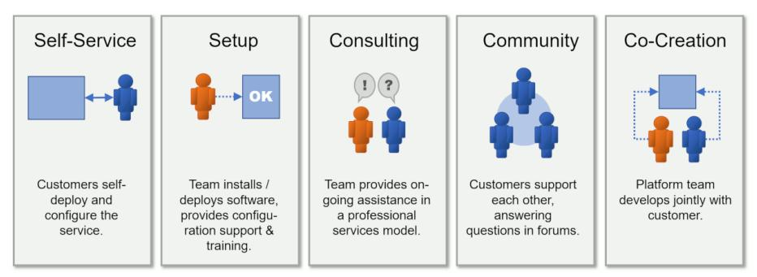

**Customer engagement models**

#### **Self‐Service**

Self-service is the mechanism that gives platforms low friction of onboarding and the ability to scale. Self-service is more than just an API to deploy a platform resource. Users will also want to monitor the status of their resources, structure their resources into projects and accounts, or obtain billing statements (if the platform charges).

An API is a user interface for developers.

The better designed the self-service APIs are, the easier it is for users to become self-sufficient with their usage. One could write an entire book about API design (one is indeed planned for this series), but just like any good user interface, APIs must be consistent and set the proper expectations with developers. For example, if one API behaves in a certain way, developers expect to use what they learned for the next API, a characteristic that's called *the rule of least surprise*.

It's easy for platform teams to underestimate how intimidating a large set of APIs can be. I have teased that the slogan "the broadest and deepest set of services" can also translate into "We overwhelm users with choice."

#### **Setup**

Lacking automation and a Software-as-a-Service (SaaS) operating model, traditional IT teams routinely assist their internal customers with installing or configuring the software or hardware. Single-tenant systems require installation and setup for each customer, working against the low-friction principle of successful platforms.

Modern platforms provide technical self-service, but development teams will still appreciate help with setup activities. For example, the flurry of options may present new users with a daunting cliff, which can be substantially lowered [with some hands-on assistance. S](#page-306-0)uch setup support can include training and onboarding.

Assisting customers is a noble task and helps drive adoption. But if your platform team is constantly engaged in setup activities, it's a signal that you should find ways to make the platform more automated or more intuitive. Because many users go through the same setup steps, communities can take some load off the platform team for such tasks.

#### **Consulting**

Consulting or professional service are a frequent element in product teams, and platform teams are no exception. Consulting can take a variety of forms, from teaching to architecture reviews, or hands-on development. A critical trade-off in developing consulting services is to what extent to prepackage the offerings. Packaged offerings scale better but can make the customer experience what I term the "two aspirin effect":

When you visit a doctor's office, the receptionist greets you with "two aspirin." It might be the correct advice, but will you feel well consulted?

Assuming that your product is intuitive to use and supported by clear documentation, a platform team's consulting engagements should fill in the gaps, meaning tackle rare and complex issues or those that weren't yet well documented. This effect will steer your consulting practice away from packaged offerings to one-off type engagements.

Consulting can be a welcome vehicle to generate short-term revenue for platform teams (and cloud providers). It can also provide a useful feedback c[hannel](#page-334-0) [for the](#page-334-0) platform development team by getting it engaged in real-world problem solving and seeing the platform through the eyes of its users.

Performing too much consulting turns your product organization into a professional services organization, which is unlikely to scale as you intended.

As with the other models, too much of a good thing can work against you. If a large portion of your team is constantly engaged with customers, you are no longer a product team but a professional services organization. That can be alright as long as it is a conscious choice.

#### **Community**

Your team doesn't need to be the only one supportin[g customers. As your user](#page-139-0) base grows, advanced users can be great amplifiers for a small platform team by helping out new platform users. The platform team may facilitate or moderate such communities.

As with the other mechanisms, communities are also excellent input channels for platform teams. Recurring questions in forums should not be interpreted as inexperienced users but as a shortcoming in the platform design.

#### **Co‐Creation**

The closest interaction with your customers can be to build something together; for example, a new platform feature. Co-creation can be a useful recruiting tool inside large organizations in so much as you can get to know developers and their grasp of the platform.

## **Mixing and Matching**

As with other decision models in this book, no one engagement mode is preferred over another. The main value of the model is to provide a list of named choices, allowing teams to have intelligent discussions about their desired staff allocation across these models.

For most platform teams the split across these engagement models is expected to shift over time. For example, as your platform grows, more user interaction can be channeled to community forums.

## **The Power of Community**

As hinted in Platform, Inc., internal marketing is essential for platforms to succeed. Such marketing shouldn't just be one-way communication; it should harvest the power of community.

Your happy customers are your most powerful salespeople.

Within an organization, prospective users will want to know how well your platform works by talking to current users. You should harness the power of word-of-mouth by creating an open forum for experience exchanges.

When launching our Agile Delivery Platform, we used the internal architect community to share progress, solicit input, and also give users a forum in which to share their experiences.

Although the vehicles for internal community building may seem obvious (pizza night), compiling a list of possible activities can be a valuable exercise for platform teams. For example, the following activities can help foster communities:

- Lunch-and-learn sessions or pizza nights during which current platform users share tips and tricks
- Focused offsite events of internal conferences where representatives from different business units can meet and deliver input
- Posts on private social-media platforms or private knowledge-sharing instances, like Stack Overflow for teams
- Newsletters and posters

### **Centers of Excellence**

Many large-scale cloud platform rollouts foresee the creation of a Center of Excellence (CoE) to the point where it's seen as a critical part of any transformation playbook. As discussed in *Cloud Strategy*, I have observed CoEs act as a useful [vehicle to start a major internal initiative but](#page-109-0) rarely as a sustainable model. The fact that the Wikipedia page [exists in only three languages,](#page-306-0) might give us a hint that a CoE is a somewhat fuzzy and overused concept.

Simply renaming centers of excellence into platform teams is a major failure mode of platform engineering.

Large organizations may be tempted to rename their existing Cloud Centers of Excellence (CCoEs) into "Platform teams" in the everlasting belief that renaming teams will lead to actual changes. Because CCoEs provide training and consulting, they tend to resemble the interaction models of platform teams. However, they lack the setup of successful platform teams and generally aren't equipped to develop a platform.

# **Which Customers?**

To serve your customers, it's important to understand the different customer personas that your team serves. It might be more than you initially realize!

When discussing platform strategy for Singapore GovTech, we used a central picture to remind us of the different customer groups we serve:

**Platform customer groups**

Internal platforms generally serve four distinct customer groups with diverse needs:

#### **Developers**

Developers are the primary user group for internal platfor[ms. Develope](https://en.wikipedia.org/wiki/Jump_server)rs use the cloud console, the platform console, APIs, and automation languages to provision and manage services.

#### **Project Administrators**

In large organizations, project administrators manage budgets and forecasting. They examine billing statements, aggregated billing and account reports, and lead cost reduction efforts.

#### **System Administrators**

To perform operational tasks, technical administrators may need direct access to compute resources like virtual machines. Special provisions restrict the use of long-lived credentials (e.g., passwords) or direct access to customer data. Administrators may also use so-called jump hosts to provide a hardened access path to sensitive resources.

#### **End Users**

Platform teams should not forget that applications built on top of their

platform serve internal or external end users. This access path requires network security services such as Distributed Denial-of-Service (DDoS) attack prevention, Content Delivery Networks, or Web Application Firewalls.

Dividing customers into these personas allows platform teams to better understand support needs. For example, developers will need enablement support in the form of training, whereas system administrators will look for on-call production support in case of operational issues.

# **34. Platform Teams Without Platform**

**Pyramids last 5,000 years, but diamonds are forever.**

**"They could have just given me a fish"**

#### **By Jean‐Francois Landreau**

Managing skills is an important aspect of a successful platform strategy. After all, platforms centralize expertise and reduce cognitive load to better the skill sets of engineering teams. Those skills aren't evenly distributed, given that you'll have a mix of senior and less-experienced developers, plus specialists in different areas. Successful platform teams should actively shape your teams' skills profile, and sometimes they may not even need an actual platform to do so.

## **Do Two Pyramids Make a Diamond?**

The distribution of skills in engineering teams can follow two distinct approaches that can be depicted by two classic shapes: a pyramid or a diamond.1 The pyramid model assumes that a small group of principal engineers guide a larger number of senior engineers and an even larger base of junior engineers. The principal engineers design frameworks, while the senior engineers implement them for the junior ones to deliver product features.

We already concluded that pyramids are obsolete in modern IT architectures and the same holds true for skill sets. Although a pyramid distribution of skills can work with slow-moving monoliths, they become a liability with web-scale and distributed architectures as well as with rapidly evolving domains.

**Skills models: pyramid versus diamond**

The assumption behind the pyramid is that junior engineers are productively coding in a paint-by-number style thanks to the frameworks that encode all advanced knowledge. Sadly, this approach runs into the same issue discussed earlier: it assumes that you can anticipate all developers' needs, so they merely have to put the low-code cherry on the framework cake. These frameworks don't enable like platforms do. Instead, they try to replace software engineering with filling in templates.

A diamond-shaped skills distribution provides higher levels of agility because it enables every team member to change anything, anytime.

1Astute readers will recognize that a pyramid is a three-dimensional shape, whereas a diamond is twodimensional. The three-dimensional equivalent would be an octahedron, which is composed of two pyramids.

In comparison, the diamond-shaped skills distribution favors a majority of senior engineers. They are skilled enough to build on top of platforms and navigate the entire code set. They will enjoy abstractions but can dive into details where needed or extend the platform.

When I worked in the periphery of Paris for a large software house, a competitor decided to relocate, causing several employees to leave.2 They worked productively in a pyramid model for many years. Even though we were excited to pick up such candidates, they didn't pass our tests because our diamond model assumed a deep understanding of programming languages and base frameworks. Getting these candidates to transition from one model to another was not something we were prepared to do.

The pyramid model is efficient in well-understood domains and feels innate. But it reduces agility and the ability to move quickly.

Modern cloud platforms such as serverless run times hide complexity but still require developers to be well versed in distributed system design.

A diamond-shaped skills profile is better suited to platforms because a large population of engineers can innovate and work productively on top.

# **Keeping the Diamond in Shape**

Engineering skill sets must evolve along with new technologies and methodologies. The diamond shape of skills has a natural tendency to revert to a pyramid due to evolution in technology or ways of working. If your teams already look like a pyramid, it will push it to be wider and flatter. You could say that these skill profiles are subject to the laws of gravity: stuff sinks to the bottom.

2This side effect of shedding employees when companies move around Paris is called "the centrifuge".

**Technical innovation implies skills gravity**

Whereas principal engineers are prepared to stay on top of either shape thanks to having lived through several technology shifts, senior engineers are more prone to being destabilized or even resisting change. They may have successfully adopted and gained expertise in one technology and can't yet recognize which knowledge they [c](#page-337-0)an reuse and whic[h to discard. N](https://teamtopologies.com/key-concepts)ot being ready to let go of their expertise and to relearn brings them back to the bottom of the pyramid.

To keep your team in a diamond shape (or to keep the pyramid from sinking), you need to actively evolve the team's skills.

# **Platform Enabling Teams**

*Team Topologies*3 defines the role of enabling teams alongside platform teams:

The end goal of an enabling team is to increase the autonomy of streamaligned teams by growing their capabilities with a focus on their problems first, not the solution, per se.

The definition highlights that enabling teams facilitate (one of the three interaction modes defined by *Team Topologies*) as opposed to providing staff

3 Skelton, Pais: *Team Topologies: Organizing Business and Technology Teams for Fast Flow*. IT Revolution Press; 2019.

augmentation to the development teams. In other words, they show the teams how to fish instead of handing out fish.

Platform teams reduce the underlying system's cognitive load, whereas enabling teams assist development teams with overcoming the remaining (intrinsic) cognitive load.

Platform teams deliver a product as a service, whereas the enabling teams facilitate. Engagin[g with development teams on an indivi](https://en.wikipedia.org/wiki/Mental_model)dual basis makes enabling teams highly effective, but also limits their ability to scale. When a major technical shift takes place, maintaining the diamond shape can take a larger effort.

## **Mental Models Impact Cognitive Load**

The cognitive load a team faces isn't just defined by the tools they use or those tools' interfaces. The mental model inside the user's head also has a major impact on the load. "Mental model" is another overused term, but one can best think about it as the internal representation of external reality, meaning the way we think about our environment.

When technology shifts, users may have an outdated or mismatched mental model that they formed based on prior learnings or assumptions. When they apply that model to the new technology, their cognitive load (and stress level) will go up because they cannot explain the system's behavior using their model.

A great illustration of a mismatching model refers to a rather large system: our solar system.

For centuries, the Earth was assumed to be the center of things, including the solar system. This assumption wasn't based on any scientific evidence, but rather on the premise that humans and their planet should be the anchor for everything else. Attempting to reason about the movement of planets in this *geocentric* model results in incredibly complex paths, as shown on the right. That model also raises fundamental questions; for example, how objects the size of the planet can make sharp turns. Copernicus was one of the scholars raising those questions and suggested an alternate model. By placing the sun in the center, this appropriately named *heliocentric* model, as shown on the left in the illustration, makes everything much simpler.

**The choice of mental model affects cognitive load**

Both depictions are still models, meaning they are abstractions of reality: planets are a tad bigger than the dots in this image, and they're also threedimensional. But the heliocentric model allows users to reason about the solar system with much reduced cognitive load.

The same is true for IT systems. Teams that built a mental model based on synchronous communication will find the behavior of distributed, asynchronous systems equally erratic to the geocentric planet movement. Their model doesn't account for partial failures, retries, or out-of-order delivery. Similarly, teams whose mental model considers change to be risky will struggle to adopt agile methods and frequent releases.

### **Platform Teams Without Platform**

When a major technical shift takes place, the enablement teams will have difficulty addressing these changes across all stream-aligned teams. Central teams can reduce cognitive load not by changing the underlying system (or its API), but by adjusting teams' mental models. As Copernicus experienced, questioning existing models can be risky, but it's easier than changing the path of the planets.

Such teams scale more easily across the organizations and reduce cognitive load, much like platform teams do. But they do not have to build a platform to achieve these objectives. In a way, they are a platform team without a platform. The members of such teams still adhere to the idea of reducing the cognitive load via a platform; they do this by facilitating the consumption of base platforms instead of building their own.

The role of an enabling team can be misunderstood to further the use of the in-house platform. But it can exist (and be effective) without one.

Creating an internal platform can hide much complexity. But removing too many options collapses the diamond-shaped organization back into a pyramid shape.

I was once asked by a customer's chief architect whether using a single cloud only would make his teams less proficient. He was worried about his teams reverting into a pyramid shape.

Platform teams without a platform maintain a diamond-shaped skills distribution by helping stream-aligned teams absorb the extra cognitive load resulting from the usage of a new technology or methodology. The focus isn't about teaching APIs but about internalizing a mindset (dare we say, paradigm?) shift.

The platform team without a platform helps people become better at fishing the new fish. It's not making the fish easier to catch.

The platform team without a platform concentrates highly skilled persons into one team. It must recognize a paradigm shift and the benefits it brings. By demonstrating the new paradigm in action they can showcase its value and recognize potential hindrances.

In a previous company, we didn't create a platform; instead, we raised the team's expertise. Not having built a platform that we needed to maintain and operate allowed us to quickly move to other teams and take on more responsibilities there.

When adopting a new base platform, organizations may need enablement taking place in three distinct layers:

- A team teaching the base platform; for example, the cloud platform and its services. Such a team is frequently available from the cloud vendor or a partner.
- [A pla](https://teamtopologies.com/key-concepts-content/what-is-a-thinnest-viable-platform-tvp)tform team without a platform that reduces cognitive load by adjusting the teams' mental model. For example, they may teach distributed system or event-driven architecture fundamentals.
- A classic enablement team that engages in projects to overcome hurdles. This team may help stream-aligned teams debug serverless applications.

The platform [team without a platform must](https://tag-app-delivery.cncf.io/whitepapers/platforms/#enabling-platform-teams) adapt to what's coming next—ahead of everyone else. Having them stuck with a platform that they need to maintain may not be the best use of their skills.

The notion of a platform team without a platform lines up well with the *Team Topologies* notion of a TVP— a Thinnest Viable Platform.

In the extreme case, your platform could just be a wiki page that states which cloud services you should use and how.

Similarly, the CNCF Platforms Whitepaper advises that:

Platform teams must focus their energy on the experience and capabilities that are unique to their specific business.

This advice implies that operating a complex platform can detract teams from generating value. Keeping the platform thin enables the platform team to enable other teams.

Even if the platform team ends up building a platform later on, deferring that step affords them more time to spend with development teams to observe their needs. They'll likely build a better platform that way.

## **AI Assist**

Whereas many technologies increase cognitive load for developers, some are designed to reduce it. Prominent examples are AI-assisted coding tools, like GitHub Copilot, that can generate code snippets from comments. These tools increase developer productivity by reducing the time spent looking up documentation or code samples.

The shared hope is that AI-assist shifts a pyramid-shaped organization back into a diamond shape by making junior developers more productive. However, the resulting code will still carry the same cognitive load as if it were written by hand. AI-assisted coding tools can't (yet) change mental models.

### **Human Giants**

If using a platform means standing on the shoulders of giants, your teams now stand on the shoulders of human giants. Ideally, you'll have a team of "human giants" in waiting mode, detecting the new trends and monitoring the skills shape, ready to intervene to maintain the diamond shape.

To live up to their name, such teams need to be versed in a variety of mechanisms that they tune to the specific situation.

#### **[Spikes](#page-193-0)**

You want your giants to have actual hands-on experience instead of regurgitating the latest marketing material. Spikes can help the team validate assumptions about a new technology or methodology. They may invite principal engineers into these spikes.

#### **Tailoring**

Many base platforms provide configuration and customization, allowing them to be tailored to an organization's context without having to build another platform.

#### **Pairing**

Pair programming, pair designing, pair-anything are great two-way streets to enablement. Not only do they train junior team members, but they also improve senior team members' understanding through reverse mentoring: junior members asking seemingly naive questions that turn out to be challenging to answer.

About 20 years ago, I had the opportunity to reboot a project that was stuck due to past technology and methodology choices. A colleague and I started to rewrite the software with a modern technology stack and novel practices like eXtreme Programming. Although we could have built a framework for other team members to work on top of, we onboarded the members of the team through pair programming, aided by the extensive unit tests we had developed as a safety net.

#### **Training**

Traditional training is an option if team members understand the paradigm shifts and the new mental models. They may simply not manage to reserve time to dive deeper into the new technology. Training can be a suitable mechanism to block that time.

#### **Blueprints**

Architecture references, blueprints, and templates are an intermediate step toward a platform that gives junior colleagues a starting point with less effort than building a full-fledged platform.

#### **Forcing Functions**

Automated tools can be surprisingly effective governance mechanisms. Netflix's Chaos Monkey, which randomly disables running servers, will shut down any application running on a single server. It thus enforces a mindset shift toward resilience by assuring that all deployed applications are resilient against single-server failure.

## **Common Transitions**

Platform teams without platform spring into action during major shifts in technology or ways of working, as described in the subsections that follow.

#### **Cloud Adoption**

When adopting the cloud, companies usually suffer from an initial lack of skills. Top management often focuses on the benefits, being less concerned with implementation details. Sending their entire IT team into a three-month training course is unrealistic, so they start with a project and a few pioneers to build a foundation. Once those teams gain traction, they opt for the pyramid shape and the development of an internal platform so that the rest of the company can easily jump on board.

Although logically appealing, this approach runs the risk of missing the mindset change across the broader population. Interestingly, such change is more readily achieved when the teams feel some pain. When following the path of [least resistance, teams simply m](https://web.devopstopologies.com/)ap their on-premises knowledge to the cloud, depriving the organization of the anticipated benefits. Worse yet, colleagues at the top of the pyramid might lose patience and resign. A platform team without a platform that supports a broad mindset change and helps junior adopters get to the next level faster can dramatically improve this situation.

### **DevOps Transition**

The transition to a DevOps model is another situation for which platforms are being built in a feeble attempt to cause a mindset shift. *Te[am](#page-344-0) Topologies* documents several antipatterns, often resulting from the belief that a platform can solve everything. A platform's API and UI create a clearer separation of responsibility between application and operations teams, but the also run the risk of creating rigidity and having teams stick to their old mindset.

The platform team without a platform follows a "DevOps team with an Expiry Date" approach. DevOps is not only about making the software delivery lifecycle easy with a developer platform. It's just as much about practices like bottleneck detection in the software production chain. It's about application teams understanding concepts outside pure software development. Achieving such a shift with any tool, including platforms, is highly unlikely.4

4The chapter, "If you don't know how to drive…" in *Cloud Strategy* explains why buying a better knife alone is equally unlikely to make you a better cook.

### **AI Technologies**

Generative AI moves many lines at the same time. Companies realize the transformative aspects of the technology and have a desire to gain a competitive advantage with it. But only a minority has teams working on this technology closely enough to become efficient with it on day one. The desire to concentrate the skills and make it easy for anyone in the company to try is high, and a platform appears to be the natural approach to lower the learning on-ramp.

Generative AI vendors are making the technology easier to use. But if adopters aren't confronted with the intricacies (and occasional difficulties) of the technology, they won't be able to recognize the best way to use it. They run the risk of being at the mercy of the platform team or the vendors to make the decisions. The platform team members may also soon realize that they can do better in companies recognizing their unique skills.

The alternative is to have this special team quickly elevate the skills in the company instead of keeping the majority ignorant of the details.

The AI/ML domain is heavily pyramidal. You have people capable of working on new algorithms, those using these algorithms to train models, those building services or applications on top of the models, and those consuming these services or applications. When these different personas sit in different companies, it becomes difficult to fight the pyramid model. Nevertheless, it's a necessity to maintain diversity in the domain to limit bias and exploit all the possibilities it offers.

The "Platform Team without Platform" is a strategic approach that recognizes the value of a platform while intentionally postponing its creation. It aligns with the principles discussed in *Team Topologies*: understand the potential benefits of a platform; resist the urge to immediately build one and explore alternative solutions first. While reading this book can better equip you for success, it's crucial to exhaust other options before committing to implementation. This deliberate delay can lead to an actually necessary, refined, and effective platform when—or if—you decide to build one.

# **Author Biography**

**Gregor Hohpe** is a senior principal evangelist for serverless. Riding the Architect Elevator from the engine room to the penthouse, he connects corporate strategy to technical implementations, and vice versa.

Gregor served as Smart Nation Fellow to the Singapore government, as technical director at Google Cloud, and as chief architect at Allianz SE, where he deployed the first software delivery platform. He has experienced the technology business from most every angle, ranging from start-up to professional services, internetscale engineering, corporate IT, and cloud services.

#### **Other Titles by This Author**

*Cloud Strategy*, Leanpub, 2020

*The Software Architect Elevator*, O'Reilly, 2020

*Enterprise Integration Patterns*, Addison-Wesley, 2003 (with Bobby Woolf)

# **Author Biography**

**Michele Danieli** is Architecture and Technology Director at Objectway for Financial Advisory in Italy. After starting his career in a garage, writing planning software for telcos, he held technical and managerial roles at Allianz Technology, UnipolSai, and IBM and worked as senior advisor for FIS markets at Imola Informatica. He still loves to build things in the engine room and counters architecture dogmatism with his tag line, Architecture must be Useful not only True.

**Jean-François Landreau** is a senior solutions architect with AWS. After a decade developing software for financial markets, he followed the shift of collective excitement to SRE and DevOps and never looked back. He is a strong believer that you can't take enlightened enterprise decisions if you are too far away from the engine room.