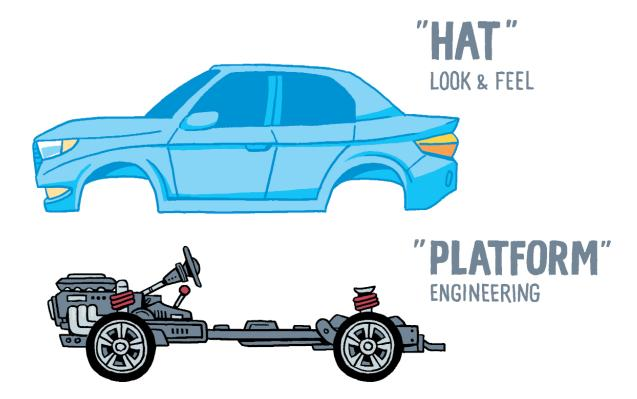
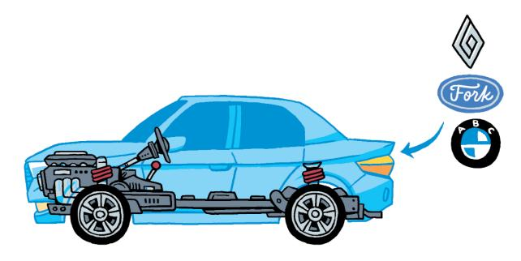
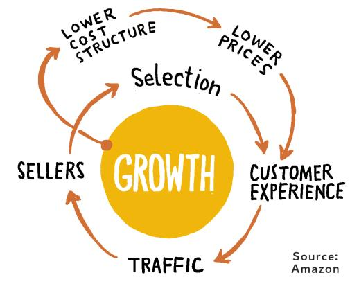
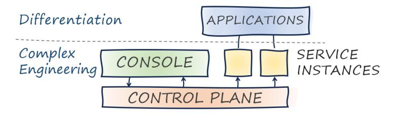
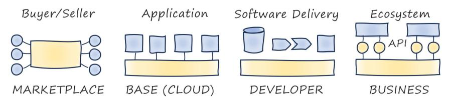

# **Part I: Understanding Platforms**

According to a 2020 report, 7 of the 10 most valuable companies in 2018 based their success on a platform business model. Ten years earlier, that number was zero. The term "platform" is overloaded—this part examines platforms in both business and technology spaces.

# **1. Standing on the Shoulders of Giants**

Platform effects are not new. Kim et al. link the Roman Empire's success to an open ecosystem strategy enabled by 80,000 kilometers of roads, creating a multisided market spanning much of Europe.

*If I have seen further, it is by standing on the shoulders of giants.* - Sir Isaac Newton

# **Platforms Elevate**

Building on platforms means not starting from scratch. Marketplace platforms give instant access to merchants or customers. Zach Church's definition: A platform strategy is an approach to entering a market which revolves around the task of allowing platform participants to benefit from the presence of others.

Platforms generate value through the interaction between their participants. Building a platform is "really, really hard."

## **Platforms: Faster, Better, Cheaper. Really?**

#### *Platforms enable*
Platforms allow participants to benefit from the presence of others—buyers and sellers transact more easily, cloud computing encourages experimentation, content creators interact globally.

#### *Platforms democratize*
Low barriers to entry. E-commerce platforms allow independent sellers to join with less friction. Users access powerful cloud services for pennies an hour.

#### *Platforms self-perpetuate*
More buyers attract sellers, creating wider selection, attracting more buyers. Airbnb doesn't need to build hotel rooms to increase inventory. *Near-zero marginal cost business models* enable fast-scaling digital success.

#### *Platforms accelerate*
Platforms handle "undifferentiated heavy lifting," allowing users to focus on innovation and differentiation.

#### *Platforms don't constrain*
Platforms accelerate without constraining. Airbnb offers more property types than hotel chains; cloud platforms allow users to build virtually anything.

### **Established Platform Models**

#### **Automotive Platforms**

Automotive manufacturers have used platforms for decades. Engineering effort went into technical components, but purchasing decisions were based on visible features. Manufacturers reduced cost by reusing chassis and components across models.

Volkswagen's MLB platform ("modular longitudinal toolbox") forms the basis for vehicles from the Audi A4 to the Bentley Bentayga SUV. BMW expanded from a handful of series to eight sedan series, eight SUV/crossover series, seven electric car series, several M series, plus Mini vehicles.

Automotive platforms amortize large engineering investments across diverse models. Harmonizing elements boosts diversity and innovation.

#### **The Cadillac Cimarron Effect**

US manufacturers took platforms too far in the 1980s with "badge engineering"—essentially identical models differing only in cosmetics. The Cadillac Cimarron was positioned as luxury but was virtually indistinguishable from a Chevrolet Cavalier, earning it a place on Forbes' Legendary Car Flops.

Both what's in the platform and what's on top matter. A critical success factor is defining which aspects can be harmonized and which must remain variable.

#### **E-Commerce Platforms**

Marketplace platforms connect buyers and sellers. Reillier: A business creating significant value through the acquisition, matching, and connection of two or more customer groups to enable them to transact.

Pricing flexibility: charge buyers (fees, membership), sellers (listing, transaction fees), or monetize through third parties (advertising, data sales).

**The Marketplace Flywheel**: Amazon calls this The Flywheel—more buyers attract more sellers, creating wider selection, attracting more buyers. A secondary loop lowers costs with scale, allowing lower prices. Such feedback loops lead to "winner takes all" scenarios.

#### **Media Platforms**

Social and media platforms (Facebook, TikTok, Netflix, Twitch) operate multisided markets. They enjoy similar flywheel effects: diverse content attracts consumers, which attracts content providers. The 2000 internet bubble obsessed over "eyeballs." Two decades later, platforms monetize those eyeballs through advertising or subscriptions.

#### **Cloud Platforms**

Cloud computing has been the most significant IT innovation of the past two decades. Top CSPs generate combined $200 billion annually. Software requires heavy-duty engineering (data centers, networks, servers, storage, pipelines, monitoring, failover, backup, compliance) before delivering application code.

Cloud platforms differ from automotive platforms: broader usage, easier component access, and more fine-grained components (several hundred services).

How users access your platform is at least as important as what's inside. Cloud providers initially offered virtual machines, storage, and queues—nothing new. But the consumption model was dramatically different, spawning a trillion-dollar market. Provisioning went from months to minutes.

# **Business Platforms**

Business platforms (SalesForce, SAP) split common functionality from specific needs. The critical progression: vendors transitioned to SaaS, and configuration gave way to custom applications utilizing domain data models without code constraints. Cloud providers offer business capabilities: Amazon Connect (contact centers), Microsoft Dynamics (accounting).

# **2. The Fab Four of Technology Platforms**

Let's catalog common types of technology platforms:

We'll distinguish four types organizations typically encounter: Marketplaces, Base Platforms, Developer Platforms, and Business Capability Platforms. Combinations are commonplace as platform types reside in different IT stack layers.

# **Marketplaces**

Marketplaces facilitate transactions between customer groups. Examples: eBay, Amazon, Etsy, Tokopedia, Uber, Lyft, Airbnb, Tinder. They enable direct transactions while handling search, advertising, reviews, fraud detection, and payments. Not maintaining inventory keeps costs down—marginal cost of onboarding near zero. Revenue comes from listing fees, member fees, transaction fees, or advertising.

Major marketplace platforms are proprietary due to scale, volume, and rapid growth. Becoming a marketplace is business strategy, not just IT. Successful marketplaces have taken investments exceeding $1 billion. Challenges: positive feedback cycles can flip into chicken-or-egg problems; pricing must balance supply and demand.

### **Base Platforms**

Base platforms provide technical products and services to developers and IT departments. They are *one sided*—the platform operator creates all services. Most common: AWS, Microsoft Azure, Google Cloud, Ali Cloud, Huawei Cloud. They differ from traditional software: they provide services traditionally done in-house and are collections of services, not single products.

Base platform users interact via consoles (web interfaces), CLIs, APIs, and IaC tools (Terraform, CDK, Pulumi). Base platforms aim for *feature parity* across channels. Implementations are proprietary due to scale and complexity. Customization extends to hardware: AWS Graviton CPUs, GCP's TPUs, AWS Trainium, AWS Nitro, GCP Titan security chips.

# **Developer Platforms**

In-house developer platforms provide reuse of common IT services, boost productivity, and assure compliance. They support the SDLC. Examples include software delivery platforms, run-time platforms, and data-analytics platforms. Backstage is widely used for developer portals.

AWS evolved from supporting Amazon's marketplace into a massive base platform. Kubernetes was built to be open-source, incorporating Google's internal Borg features. Both were part of overarching platform strategies.

In-house platforms occupy contested space between large-scale base platforms, open-source projects, and development teams. Though not market-offered, in-house platform teams support variety of internal customers, often needing internal marketing, consulting, and support—resembling a company within a company.

### **Business Capability Platforms**

Developer platforms contain technical tools; business capability platforms expose business domain functions. Examples: About You Commerce Suite (fashion e-commerce), Allianz's Syncier (insurance platform, spun off and acquired by Munich Re), banks' payment APIs (DBS Bank, Standard Chartered's Axess), Stripe.

APIs are key enablers as integration occurs across organizational boundaries. Externalized platforms allow higher integration and customization, usually at higher adoption friction cost.

Although offering business capabilities to third parties might benefit competitors, it opens new revenue streams. AWS represents a $100 billion opportunity. "When there is a gold rush, sell shovels."

The capability platform approach thrives in environments like fashion retail because diverse niche markets reduce risk of direct competition from platform customers. An underappreciated benefit: insight into how others use the platform improves in-house products and operations. Simon Wardley calls platforms future sensing engines.

### **Four in a Row**

| Model               | Common Examples               | Value Proposition                 | Interaction                   | Implementation                        |
|---------------------|-------------------------------|-----------------------------------|-------------------------------|---------------------------------------|
| Marketplace         | Airbnb, eBay, Amazon, Mercari | Facilitate transactions           | Browser, Mobile App, API      | Proprietary                           |
| Base                | Cloud providers               | Rapidly provision IT resources    | Console, CLI, API, automation | Proprietary plus open source          |
| Developer           | Portals, cloud "wrappers"     | Increase speed, reuse, governance | Portal, command line          | Composed from open source             |
| Business capability | Allianz Syncier, About You    | Build an open ecosystem           | APIs, custom integration      | Proprietary, on top of base platforms |

This book focuses on platforms large-scale IT most commonly creates: developer and business capability platforms.

### **Combinations Encouraged**

Platform types are decidedly non-MECE. Many platform companies engage in multiple options: marketplaces are built on cloud base platforms, in-house platforms can be externalized into base platforms like AWS, business capability platforms help customers build marketplace platforms.

### **Primus Inter Pares?**

Providers pursuing multiple models must carefully consider feature parity across in-house and externalized platforms. Microsoft's antitrust case alleged Windows included undocumented features to enhance their software versus competitors. Microsoft agreed to publish those APIs in 2004. It's good to be your own customer, but better to play fair.
