# **Part II: A Strategy for Platforms**

Platforms can play a pivotal role in IT transformation by reducing complexity, harmonizing software delivery, and stabilizing operations, all while reducing cost. Success with platforms rarely results from an IT department's effort alone. Bridging both IT and business strategy is a key aspect of a successful platform strategy.

"Strategy" as a term sadly doesn't stand far behind "platform" when it comes to fuzziness and overuse. This section starts by recapping what it means to define a strategy before zooming into platform strategies.

The following key elements play a critical role in defining a platform strategy:

- What constitutes a sound business or IT strategy for large organizations
- Becoming a platform company requires organizations to rethink their existing ways of working
- Platforms can overcome apparent opposites such as innovation and harmonization
- Wardley Maps are excellent models to understand what drives platform adoption and how platforms drive innovation
- Writing a strategy document requires a mental framework

# **3. Formulating a Strategy**

**Strategy is the difference between making a wish and making it come true.**

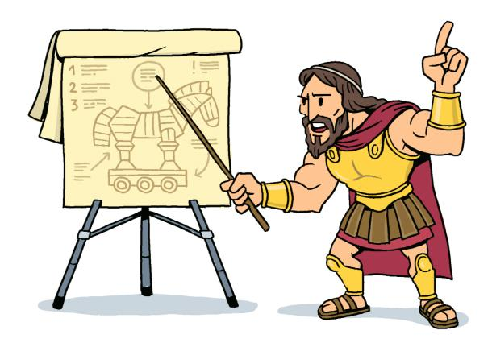

Given the power of platforms, it's natural to want to include them as part of your IT strategy. Unsurprisingly, merely adding a line item to your list of ambitions won't lead your organization to platform enlightenment.

## **Strategy Is Hard**

Good strategies look simple in hindsight. However, defining one and documenting it well is anything but simple. A.G. Lafley and Roger L. Martin's book Playing to Win captures the challenge well:

*Strategy is not complex. But it is hard. It's hard because it forces people and organizations to make specific choices about their future something that doesn't happen in most companies.*

Meaningful strategies must connect the dots between long-term vision and short-term tactics, between business and IT, and between quantifiable success metrics and beliefs.

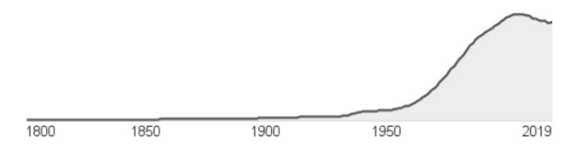

**Mentions of the word "Strategy"**

## **Make Your Platform Wishes Come True**

A strategy is the difference between making a wish and making it come true.

A strategy lays out a path that makes important decisions and trade-offs so that the vision won't remain just a wish but can become reality.

### **You Can't Copy-Paste Strategy**

Many of today's enterprises are transforming their IT to better compete with digital disruptors. Although it's good to consider what other organizations have done, a meaningful strategy will be unique to each organization.

The goal of your transformation isn't to copy someone else's success. It's to maximize the return you achieve from your assets.

A sound strategy depends on your organization's unique assets (such as brand, people, intellectual property), its constraints (such as resources, regulatory environments), and its environment (such as competitors, market positioning).

### **IT and Business Strategy Form a Two-Way Street**

This one-way dependency is no longer applicable. Technology now also drives business strategy. Transitioning from selling physical assets to providing a service is a major shift in business strategy enabled by advances in modern technology.

A manufacturer of large power generators might transition from selling equipment to pricing by the MWh produced. Service models place additional demands: a broken locomotive can't generate revenue—maintenance is now the provider's responsibility. Sensors, IoT, edge computing, analytics, and machine learning enable predictive maintenance. Without them, a service-based business strategy isn't viable.

If this is such a great idea, why didn't everyone do it 30 years ago?

In the majority of cases the answer is clear: we didn't have the technical capabilities, or at least not at the needed price point.

### **Think in the First Derivative**

Platforms enable faster software delivery or exchange of goods. Rolling out a platform is not driven by the wish to achieve a predefined, static target state. Rather, it is to allow the organization to grow or change more quickly.

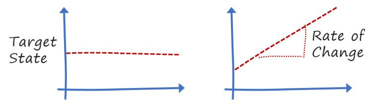

**Platforms define the rate of change, not a target state**

A platform strategy should think in the first derivative, in the rate of change, as opposed to a static target state. Platforms keep on evolving and help platform users evolve faster.

## **Documenting a Strategy**

### **Aim for Emphasis Over Completeness**

Complex topics require abstraction, omitting details to amplify the important aspects:

Defining what's most relevant is a critical step toward devising a strategy.

"What is not included" can be the most important chapter near the beginning of a strategy document.

## **Use Conceptual Models**

The central picture from the defining book on enterprise architecture, *Enterprise Architecture as Strategy*, is a 2x2 matrix that correlates the IT operating model with business process standardization and integration.

A 2x2 matrix is a very popular and extremely effective example of a conceptual model, which Wikipedia defines as:

**Conceptual Model**: A representation of a system, made of the composition of concepts which are used to help people know, understand, or simulate a subject.

**The Yardstick**. At the Singapore government we developed several simple models to help us make more informed platform decisions. A particularly effective one was "the yardstick" that visualized which part of a problem has already been solved, what needs to be built as a common platform, and what's left to individual teams.

### **Show the Path and the Terrain**

A good strategy covers three dimensions:

- 1) A point: Where do you want to go?
- 2) A path: How will you get there?
- 3) The Terrain: What happens when you step off that path (or the ground shifts underneath you)?

The shape of the terrain represents your strategy's risk profile; in other words, how resilient it is to unforeseen changes. A narrow ridge might be the shortest path, but it doesn't tolerate any missteps or shifting terrain.

## **Credible Roadmaps**

Strategies should be concrete and actionable, but that doesn't mean that they can define a simple linear path:

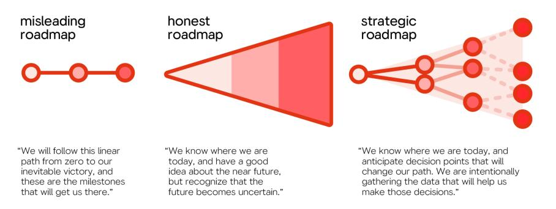

**Misleading roadmaps versus strategic roadmaps (© Pavel Samsonov)**

When reality doesn't match the plan, we blame reality.

A strategic roadmap anticipates decision points, possible paths to be taken, and the data needed to make those decisions.

## **From Strategy to Execution**

Structuring your strategy document into four distinct but connected layers can help you steer clear of the IT Hourglass:

### **Context**

describes why you are following a platform strategy in the first place. This part assures alignment with the business strategy.

### **Objectives**

are business benefits that your strategy is intended to deliver. Reducing costs or speeding up innovation are worthwhile business goals. Place a clear emphasis on the top objectives.

### **Mechanisms**

are well-known techniques that help deliver your objectives. Increasing code reuse or enabling team autonomy are suitable mechanisms. The strategy needs to explain how these mechanisms support your objectives.

### **Design decisions**

denote specific trade-offs that you need to make during implementation. For example, you might mandate that all developers use the same programming language or wrap all code assets behind standardized service APIs.

| Level           | Description                        | Key Activity         | Example                   |
|-----------------|------------------------------------|----------------------|---------------------------|
| Context         | Why you are creating a strategy    | Link to business     | Increasing competition    |
| Objective       | What you want to achieve           | Prioritization       | Speed up delivery         |
| Mechanism       | Common ways to get there           | Translate objectives | Increase code reuse       |
| Design decision | Trade-offs you are making          | Explain well         | Standard APIs             |

Poorly defined strategies tend to go heavy on the objectives (that's how you get funding), trade mechanisms for buzzwords, and propose design decisions without a clear linkage to the other two.

## **Strategy Is a Winding Road**

A strategy defines an overall direction, not the exact steps that you will be walking. Tactically you might be doing something that looks like it doesn't line up with your strategy. As long as it is done deliberately and achieves the overall strategic objective in the long term, that's alright.

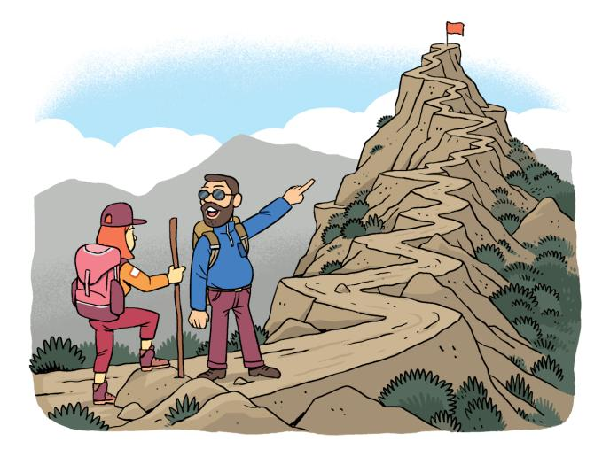

**A strategy doesn't imply climbing the hill in a straight line**

When you're walking up a hill, few people go straight up. While you are traversing, a person lacking context may challenge why you're moving sideways instead of toward the peak. A proper linkage between tactics and strategy reveals that hikers climb the hill very well by using switchbacks.

# **4. Becoming a Platform Company**

**Transformation can't be understood from the end product.**

Platform plays are frequently considered in the context of IT transformation. To fully benefit from modern base platforms, an organization has to fundamentally change the way it is working. Platforms help businesses overcome past constraints and compete with digital disruptors.

## **More Than Meets the Eye**

In the 1970s disruption of the US automotive industry by Japanese automakers, the "big three" automakers enjoyed a fruitful oligopoly until their Asian counterparts introduced cars that were of higher build quality, more reliable, better equipped, less expensive, more fuel efficient, and visually more appealing.

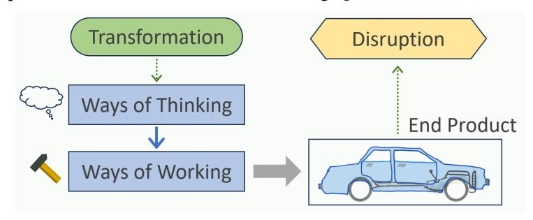

**You can't see the transformation from the end product**

The essence of the transformation cannot be seen from the outside.

US manufacturers subjected each car to "quality assurance" at the end of production—essentially a euphemism for rework. Japanese manufacturers realized that quality must be built-in, not added on at the end. They would stop the production line (using the famous "andon cord") to investigate problems and correct them once and for all. This fundamental shift cannot be seen nor understood by looking at the finished product.

## **Don't Burst the Boiler**

Companies that try to replicate other companies' success without seeing how those companies work in a fundamentally different manner are subject to the "bursting the boiler" effect:

If you're running a steam engine and an electric train easily passes you, you'll want to speed up to remain competitive. So you put more coals on the fire and increase the boiler pressure. This might initially speed you up, but it won't lead to a transformation—it will lead to a burst boiler.

Disruption means that someone has changed the rules of the game. Those who play by the old rules have already lost.

## **Classic IT Conflicts**

Modern CIOs are known to be living between a rock and a hard place. Upper management routinely demands more efficient IT operations based on harmonization and complexity reduction. Meanwhile, in uncertain times only agile organizations that innovate through experiments can be successful. This way of working requires modern tools that create more diversity and thus work against harmonization.

Lasting change isn't something that you can buy. It derives from a new mental model or a different worldview.

## **Opposites Attract**

A mental model that considers innovation and harmonization to be opposite ends on a one-dimensional spectrum leads to an unhappy place: either reduce diversity and complexity but become too rigid to innovate, or be innovative but have a giant operational mess.

The transformation happens when the worldview changes to a two-dimensional model:

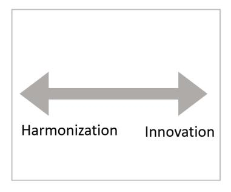

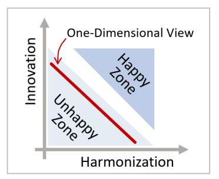

**Thinking in more dimensions**

Now you can shift the curve to drive more innovation without giving up harmonization. Higher levels of automation or new cost allocation models that better support small experiments could achieve such a shift. You can now invert the curve, so that higher degrees of harmonization actually increase innovation.

Two-dimensional thinking reveals the power of platforms.

Removing constraints is a key innovation driver. Properties that used to be opposites but have turned into two independent dimensions:

| Characteristic     | Perceived Opposite | Enabling Mechanism                   |
|--------------------|--------------------|--------------------------------------|
| Standards          | Innovation         | Platforms, interface standards       |
| Speed              | Quality            | Automation                           |
| Cost               | Agility            | Modularity, iterations               |
| Economies of scale | Economies of speed | Cloud platforms                      |
| Openness           | Monetization       | Professional open source             |
| Low risk           | Change             | Automated tests, Continuous Delivery |
| Control            | Chaos              | Transparency, automated governance   |

### **Transforming by Seeing More Dimensions**

If I were a subversive developer who'd want to sabotage a software project, injecting a few very nasty and difficult-to-find bugs into the system would all but guarantee a major delay.

Why can't we have things that are quick and clean? High degrees of automation, such as continuous integration and delivery pipelines, reduce friction and eliminate mistakes. It speeds things up and makes the process more repeatable, thus increasing quality at the same time.

"Fast and compliant" was the slogan we used to describe the platform we deployed at a major financial services organization.

## **Rethinking Old Ways**

A platform company will translate technical progress into better user experiences or value creation. If organizations gain the ability to use virtual machines instead of physical servers, they would reduce capital expenses, harden server images for increased security, automate provisioning, improve service levels, and optimize resource usage.

Upgrading technology without changing ways of working is optimization not transformation.

### **The Path to Platforms: On-Off-Line**

Thinking in two dimensions is essential for organizations to chart their course for becoming a platform business model.

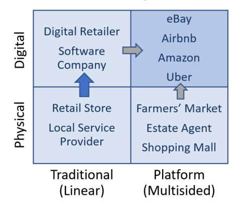

**Physical and digital business models (adapted from Reillier)**

"Becoming more digital" and "becoming a platform" are two independent dimensions. Many early adopters moved to the upper-left: hotels and airlines added online booking. They created "digital copies" of their existing business but didn't transform into a platform company. Fewer organizations managed the transition to a digital platform business (upper right), primarily occupied by new entrants like Amazon, which started as a digital retailer but successfully shifted to the digital platform model with the Amazon Marketplace.

## **Business and Technology**

An organization's business and technology models, although unable to substitute for one another, can become a force multiplier when properly aligned.

Many organizations experienced that transforming the business model is more difficult than adopting new technology. New business models question or even cannibalize the existing business model—"The Innovator's Dilemma". Amazon could have concluded that allowing third-party sellers undermines its revenue share but saw the explosive power of the platform business model and optimized for the long haul.

# **5. The Platform Paradox**

**It's a kind of magic.**

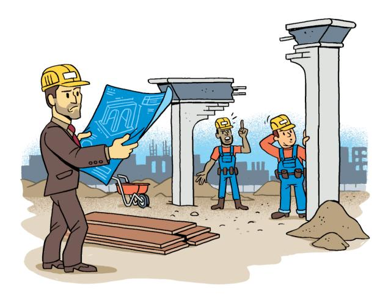

Let's dive deeper into how platforms can break through age-old IT conflicts, specifically those between achieving standardization and boosting innovation.

## **The Magic of Platforms**

Platforms play a unique role in overcoming perceived opposites. They are per definition harmonized—a platform's strength lies in its broad usage. At the same time, platforms clearly boost innovation: they reduce friction and give their users many degrees of freedom.

Platforms break through the perceived dichotomy between harmonization and innovation.

The cloud you are getting is the same one your competitors are getting.

Still, cloud platforms have been the biggest innovation drivers IT has seen in the past decade-and-a-half. And that's because they harmonize.

### **Removing Constraints by Constraining**

At first, the paradox of platforms—unifying to boost innovation and diversity—might appear like magic. But the effect of removing constraints by placing others has been known for more than a century. The Baltimore Standard for fire hydrants:

In 1904, when Baltimore burned to the ground, firemen from surrounding towns weren't able to help: their hoses wouldn't fit on Baltimore's fire hydrants. Harmonizing those connections, in the Baltimore Standard of 1905, enabled new use cases such as fire crews assisting another town.

HTTP is a standard that is quite precise and universally adopted. By being a standardized protocol, it supported diversity between web browsers and web servers: any browser could visit any website, regardless of technologies. It gave rise to the perhaps most innovative technology construct we have seen in the past decades, the internet.

HTTP is a standard that dramatically boosted innovation through harmonization.

Agreeing on *interface standards* is harmonization that becomes an innovation booster. Common APIs achieve the same by constraining—for example, by demanding common data formats and authentication mechanisms—diverse components can now interact.

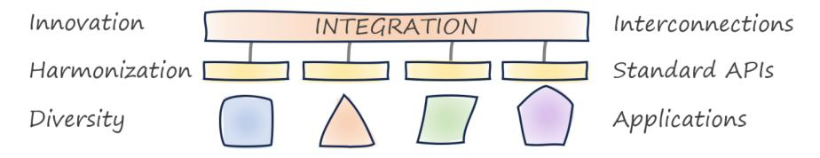

**Common interfaces harmonize and boost innovation**

## **The IT Pyramid Fallacy**

From far away, in-house platforms can resemble classic IT frameworks: all common elements are implemented in a base layer, on top of which resides a collection of more specific, but still reusable elements. The cherry on top is that each business unit merely has to configure a few settings. This approach is flawed for two reasons:

- 1) You'd have to anticipate all users' needs. This is not only near-impossible, it'd also kill innovation.
- 2) Building the all-encompassing base layer requires a massive effort.

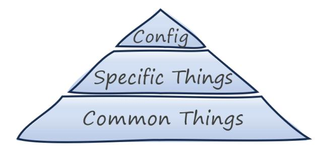

**We stopped building these things 5,000 years ago—except in IT**

### **Platforms Aren't Pyramids**

Platforms enable users to construct the needed functionality without having anticipated each and every possibility:

Platforms don't try to anticipate every use case.

If your users haven't built something that surprised you, you probably didn't build a platform.

Platforms leave room for users to innovate. Kim et al. cite *serendipity* as an essential element of a successful platform strategy:

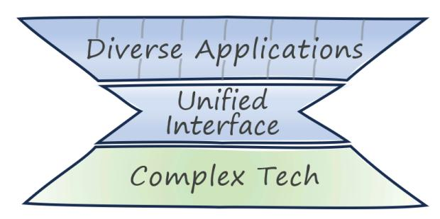

**IT platforms hide complexity beneath and enable diversity above**

The narrow part of the hourglass depicts the harmonization that platforms rely on: a wide diversity of base technologies is simplified behind a much narrower interface. That interface in turn supports broad innovation on top.

### **The Double Double Pyramid**

Multi-sided marketplace platforms and technology platforms share common characteristics like low onboarding friction and democratization but address different user groups. A multi-sided market connects buyers and sellers (e-commerce), content creators and viewers (social-media), or drivers and riders (ridesharing). Technology platforms harmonize and simplify a technology stack to boost developer productivity.

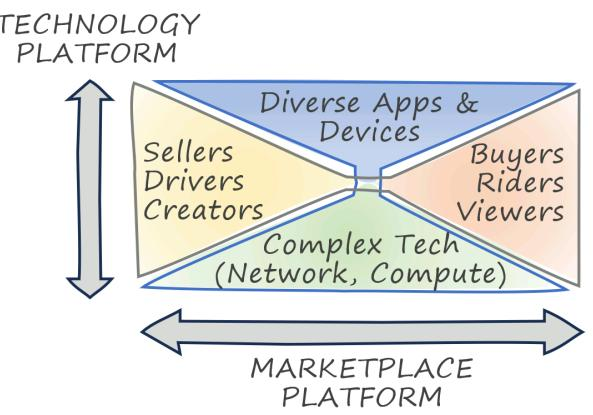

**Many digital companies use technology platforms to offer marketplace platforms**

A ride-sharing company is a classic marketplace platform that connects riders with drivers. It's built on a mobile technology platform that shields the application from different mobile providers and networks. Internally, it uses a developer platform that boosts productivity by reducing the cloud base platform's cognitive load. Each exhibits the hourglass shape.

## **How Platforms Break Barriers**

No single aspect gives platforms these amazing properties; rather, it's the interplay of multiple factors:

### **Componentization**

Breaking something complex into standardized and recombinable components speeds up innovation through recomposition. Standard-sized bricks have massively sped up construction without reducing creative possibilities.

### **Separating commodity from differentiators**

Platforms bake widely used functions into a common layer and make them easily consumable and composable into new solutions.

### **Building Economies of Speed on Economies of Scale**

Building platforms is a scale business—they thrive on growth and require massive investments. However, platforms hide these scale effects from their customers by allowing frictionless incremental usage. They thus democratize access to resources, which boosts innovation.

### **Centralizing decentralization**

Platforms are central elements that foster autonomy and independent decision making. They support decentralized organizations while providing a common safety net and necessary guardrails.

Simon Wardley highlights the linkage between commoditization (something becoming commonly available and undifferentiated) and componentization (the ability to assemble something new from pre-made parts).

Cloud platforms feature hundreds of individual services that can be combined to support a limitless variety of use cases.

### **Separating Commodity From Differentiators**

Drawing the line between commonly needed components and those that differentiate is a delicate balancing act:

- **Needs vary by user group**: Some users might welcome items included in the platform, whereas others consider them restrictive.
- **The boundary shifts**: IT evolves and so do the needs of platform users. Cloud platforms started provisioning just virtual machines but today provide serverless compute to data analytics and machine learning.
- **Cohesion over precision**: Users expect a uniform level of abstraction across platform services.
- **Interaction matters**: How users access the platform is as important as what's inside it.

### **Economies of Speed Built on Economies of Scale**

Platforms thrive on scale. Cloud platforms depend on enormous up-front investments, such as large-scale data centers and global fiber networks. Perhaps the biggest innovation has been to free users from these scale effects: they have instant access to resources and only pay for what they use.

Cloud platforms provide scale-optimized technology as a speed-oriented product.

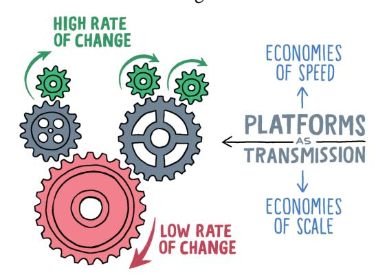

**Enabling higher rates of change**

Platforms are critical layers in the IT stack: they evolve comparatively slowly but enable high rates of change "above". They are like a transmission for the rate of change. Operating systems are a great example.

### **Centralizing Decentralization**

ThoughtWorks' Peter Gillard-Moss defines platforms as follows:

Platforms are a means of centralizing expertise while decentralizing innovation to the customer or user. This happens through commoditization of services, but in a way which relinquishes an amount of control and is open to extension.

The most difficult step for organizations embarking on a platform journey is relinquishing control.

Traditional IT organizations link operational control with end-user control. A database administrator who assures operational aspects also exerts control over its use: developers need to file a ticket to change the schema. The typical alternative has each team managing its own database, ignoring central expertise.

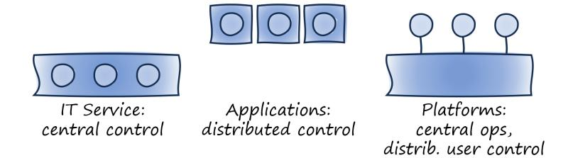

**Detaching user control from operational control**

Platforms provide the best of both worlds: they provide central control and governance while decentralizing usage and innovation to the platform users. Platform characteristics such as high levels of automation and a shared responsibility model make this work.

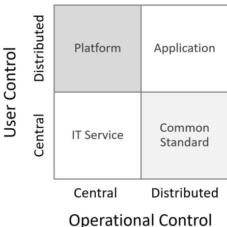

**User control versus operational control**

## **A4 Paper Doesn't Stifle Creativity**

A4 paper is one of the most widely used standards in the world, but hardly anyone could claim that it stifles their creativity.

Good platforms should be like A4 paper: highly standardized with plenty of room for innovation and creativity.

# **6. Mapping Platforms**

**If you don't know where you are, a map won't help.**

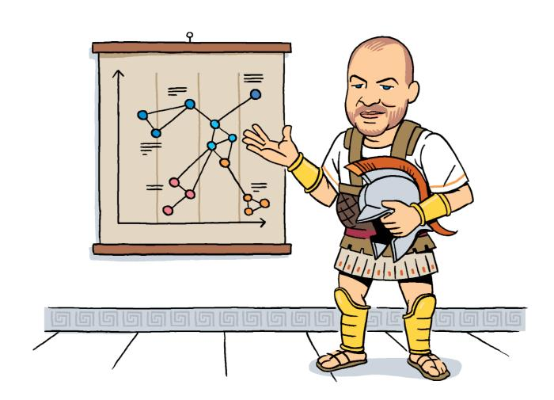

A meaningful strategy links the business environment with technology evolution. Simon Wardley aims to shrink the giant gaps in many large organizations' strategies with his modeling technique called *Wardley Maps*.

## **Maps as Visual Models**

Maps are models—they are an abstraction that depicts the relevant features of a physical environment. "Relevant" are those things that help you answer questions or make decisions.

"The map is not the territory."

Coined by Alfred Korzybski in 1933 and popularized by Hayakawa, this saying points out that the representation of a thing (the model) isn't the thing itself.

"No matter how beautiful a map may be, it is useless to a traveler unless it accurately shows the relationship of places to each other, the structure of the territory."

William Kent's "message to mapmakers":

"Highways are not painted red, rivers don't have county lines running down the middle, and you can't see the contour lines on a mountain."

"All models are wrong; some are useful."

Box shaped this famous aphorism in 1978 to highlight that accurately representing reality isn't a model's goal. In many cases, the more "wrong"—that is, the more abstracted—a model is, the more useful it becomes.

"To know which models are useful, you must first know which question you're trying to answer."

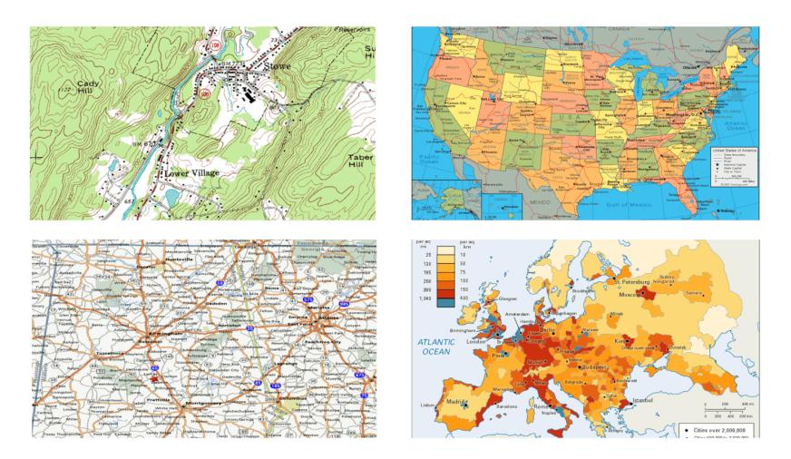

**The best map depends on the question you're trying to answer.**

It's a trick question because there is no single best map. The most useful map is the one that can answer your question at hand.

## **Maps and Movement**

Simon Wardley likes to start his description of maps with the battle of Thermopylae that took place in 480 BC:

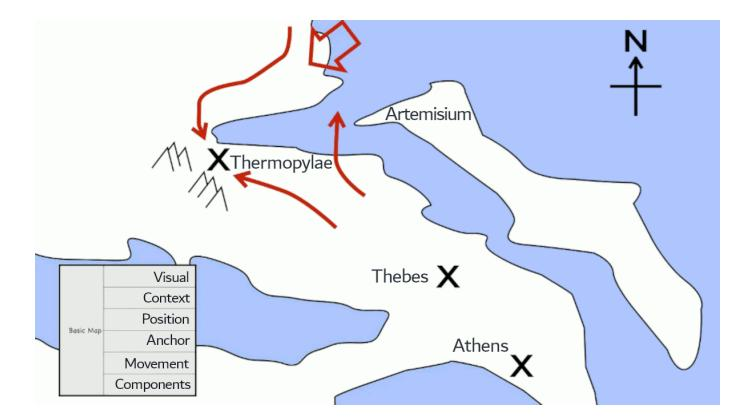

**The strategy for the Battle of Thermopylae (© Simon Wardley, CC-SA)**

Simon considers movement to be one of the six basic elements of maps: visual representation, context (the question you are trying to answer), components and their position, an orientation anchor (a chess board grid or a north compass), and movement of the components.

## **2x2 Maps**

Simple models provide the highest level of abstraction and are therefore the most useful ones. The 2x2 matrix is such a deceivingly simple model. A matrix provides the orientation anchor, so by plotting components and movement it qualifies as a map.

A 2x2 matrix presented by George Westerman plots an organization's technical capabilities against its leadership capabilities for a digital transformation journey:

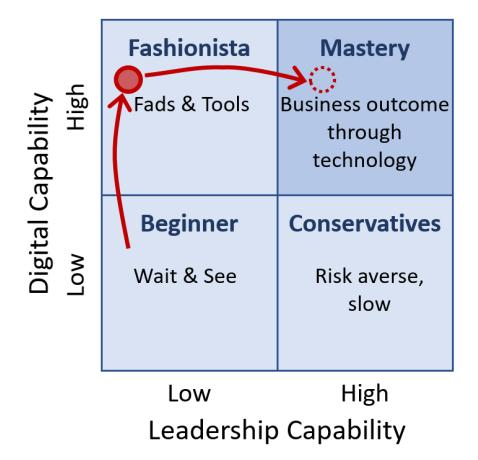

**Movement across digital capability with leadership capability**

This matrix's visual representation lays out the territory as four distinct zones. The typical symptoms help you determine if you are in one of those quadrants. A simple map like this one makes the strategy utterly clear. Adding your current position and your path turned the 2x2 matrix into a useful strategy map.

## **Wardley Mapping**

Wardley Maps are also two-dimensional grids. Living at the intersection of technical capability (the tools you have) and business value (what your customers will get) makes them great strategy tools. Wardley Maps plot technologies along two axes:

- The vertical axis represents the value chain, indicating how visible a component is to the user. Dependencies between components flow from top (visible) to bottom (less visible).

- The horizontal axis represents the stages of evolution of the components: genesis (newly discovered things), custom built (uncommon things we still learn about), product (increasingly common, repeatable), and commodity (highly standardized, utility).

Wardley maps include movement. Components move about the map based on two mechanisms:

- Commoditization describes a component's evolution toward the right, from genesis toward commodity. This movement is driven by competition.
- Componentization allows a system to be broken down into identifiable and reusable pieces, which then can move independently toward commoditization.

Commoditization to standard components leads to an explosion of innovation for higher-order systems.

Using a car analogy, cars have become heavily componentized, assembled from standardized, interchangeable parts. Componentization accelerated the commoditization of these parts. Brake assemblies moved from custom-developed to commodity, widely available at competitive prices. The wide availability of standard components has not caused all cars to look the same. Quite the opposite: standard components boost innovation and differentiation of higher-order systems like cars.

### **Platform Evolution**

Compute resources follow a similar path toward the right, from custom built to commodity. The following map plots the evolution of platforms on a Wardley Map:

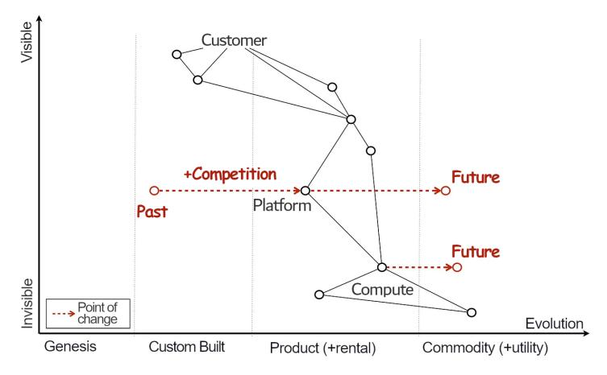

**A Wardley Map showing platforms and commoditization (© Simon Wardley, CC-SA)**

Building a run-time environment used to involve installing multiple components; for example, a LAMP stack (Linux, Apache, MySQL, PHP). This is an excellent example of componentization and standardization. Demand competition pushed for higher-level components that make it easier and faster to get such stacks up and running. Basic compute evolved into modern platforms that almost entirely free developers from such toil.

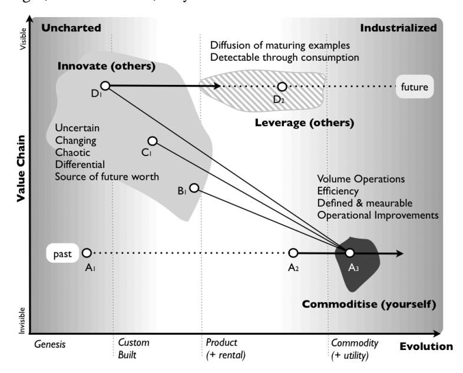

**Innovate - Leverage - Commoditize (© Simon Wardley, CC-SA)**

The secondary effect of commoditizing a platform is that it enables innovation in the form of additional components, indicated by B, C, and D. Platform companies realized that having others innovate on top of your now commoditized component presents a unique opportunity bigger than holding on to the original.

Platforms can be future sensing engines by detecting trends of innovations built on top.

This cycle is referred to as ILC, or Innovate - Leverage - Commoditize: while other companies innovate, you leverage your platform to identify patterns and trends, and then commoditize. Amazon accepted the transition from a one-off e-commerce site to a generic marketplace that allows third-party sellers. Now Amazon can monitor sales of consumer goods like batteries and offer a private label version (Amazon Basics) when sales reach a certain volume.

Software platform teams can use a similar approach to sense trends by monitoring the usage of their platform and utilizing this data as input into their road map.

# **7. Addendum: "I ACED My Strategy"**

**A simple framework for writing IT strategy documents.**

Writing a strategy document is no paint-by-numbers exercise. Several characteristics help in authoring meaningful strategy documents:

- **Alignment**: An IT strategy must align with a business strategy.
- **Clarity**: A strategy is meaningful only if it's easily understood by a broad audience.
- **Evolution**: Although strategies are meant to last, they still need to evolve as opportunities come along, priorities shift, or existing constraints are removed.
- **Decisions**: A strategy that doesn't make decisions will sound like a list of wishes.

This is a useful checklist to apply to your document. It's also easy to remember, given you're going to want to claim that you "ACED" your strategy.

## **Alignment**

A platform strategy isn't self-purpose. Both must support the business today and in the future. A platform strategy will invariably be part of an overall IT strategy which in turn (hopefully) supports a business strategy. Architects are responsible for making sure that these strategies support one another:

Business Strategy ⇋ IT Strategy ⇋ Platform Strategy

Too many IT strategies fail not because they are poorly executed, but because they aren't aligned with a business strategy. IT's defensive move is to fall back to vanity metrics—IT-internal metrics that are under IT's control but meaningless in a business context.

A better way to tie an IT (and platform) strategy to a business strategy is to define success metrics that are meaningful to the business. Alignment works both ways. A modern business strategy depends as much on technology as the other way around.

## **Clarity**

Alignment is needed not just between the different layers of abstraction (business - IT - platform - implementation), but also across organizational units. That's why a successful strategy needs to address a broad set of audiences.

A strategy should be well thought through but easy to understand.

Conceptual models can go a long way to adding clarity. Another common technique is to describe the strategy in horizontal layers of detail: a high-level slice across all topics, akin to an extended executive summary, followed by more detail.

## **Evolution**

A strategy cannot predict the future—its main purpose is to help you cope with uncertainty. It therefore does need to absorb changes and evolve over time:

- 1) The evolution of the elements described in the strategy
- 2) The evolution of the strategy itself

For example, if your in-house platform augments an existing base platform, you can shrink your platform over time as its features become displaced with those of the base platform. Or let it "float" on top by adding new features as you shed obsolete ones.

## **Decisions**

Strategy is defined by a series of meaningful decisions, those that require conscious trade-offs.

Through these decisions, a strategy narrows the playing field. We choose to forgo some options, perhaps in favor of gaining others. Decisions are critical to reduce complexity, an observation encoded in "Gregor's Law":

**Gregor's Law**: Excessive complexity is nature's punishment for organizations who can't make decisions.

The need for decisions applies to platform strategies. Such decisions can relate to many aspects; for example, the platform's scope (what's in your platform and what isn't?), its level of openness (can everyone contribute?), or its expected lifespan.

| Property  | Rationale                                          | Mechanisms                        |
|-----------|----------------------------------------------------|-----------------------------------|
| Alignment | Assure that outcomes support business strategy     | Business-relevant success metrics |
| Clarity   | Avoid misunderstandings or mismatched expectations | Evocative conceptual models       |
| Evolution | Deal with changes                                  | Scenarios, paths                  |
| Decisions | Narrow the playing field, reduce complexity        | Meaningful options and choices    |

# **8. Talking with Platform Builders: SIMBAS**

**A Banking Platform for the Unbanked**

*Pieter Franken is a long-time fintech pioneer and co-founder of SIMBAS, a digital banking platform for small and medium banks.*

### **Pieter, what made you want to build a digital banking platform?**

The story begins almost 35 years ago when the banking industry began downscaling from mainframes to distributed computing. In 2000, I had the rare chance to build a bank from scratch. We found that the advantage for a bank isn't in selecting the very best piece of software for each function, but rather in how fast and how well it can integrate those pieces.

You can buy great ingredients, but if you are a lousy cook, your meal will still be bland.

Technology has evolved a lot. When I was meeting with smaller banks trying to innovate, they were struggling because they didn't have someone to help them out. The idea was born to create a configured assembly for small banks, credit unions, or microfinance institutions. That platform is essentially what Pieter would do. Such a "bank in a box" would allow smaller banks in rural areas to grow their customer base or extend their product portfolio.

### **What did you find to be different when you moved from an internal solution to building a platform to be used by many banks?**

When taking a solution to other financial customers, you will find that the same functionality can have vastly different implementations, depending on scale and risk. Something called "payment" may be a payment for a cup of coffee or a settlement for 10 billion dollars. If something goes wrong with the coffee payment, not much is going to happen. If something goes wrong with the settlement, it can cause the next Lehman shock and a global financial crisis.

A platform isn't just a collection of functionality, but the environment in which it'll operate plays a major role. Why is going from Tokyo to New York so much simpler than going to the moon? Both are going from A to B. The real difference is the risk profile, the level of mission criticality.

### **Platforms harvest economies of scale to support economies of speed. How does that apply to SIMBAS?**

The capital base of small financial institutions is limited. Most technology vendors won't sell to these banks because the cost of sales is too high. We tie the platform pricing to the number of customers or accounts, so that the cost lines up with the bank's income. That way the bank is not tied to the platform's scale economics. We achieve scale by helping banks grow their customer base and signing up more banks.

It is in our best interest to come up with something that helps the bank grow.

### **So, as we like to say, the platform "democratizes" access.**

Yes, we are making something available that used to be out of reach. Big banks love to talk about their tech stack, but the reality is that customers never see that tech stack.

Customers are interested in your interest rate or your penalty clauses on a time deposit. An out-of-the-box tech stack provides all that a small bank needs and sets it up for growth.

### **Does the platform help build a stronger financial ecosystem?**

I believe that having more diversity in the lending strategy creates a more resilient financial ecosystem. Rural banks will have their own credit policy, so if something goes off, not everybody goes down at the same time. Democratizing access over a larger base can increase diversity and make the entire system more resilient.

### **Along the cube model, in which direction are you looking to grow the platform?**

You must understand your market and build a platform for that market. In banking, there is a lot of opportunity in Latin America, Africa, and Southeast Asia—a good third of the world's population. Much of the population is cash based and underbanked. I often refer to this as the "last meter banking": you have to see your customer in front of you.

A rural bank bridges the gap between the digital world and the physical world.

We expect to grow mainly through the breadth of the platform in terms of products. Once on a platform, they could add in other products like insurance. The rural bank can do that. Also, many rural families have kids working abroad who send money back. So currency conversion can be a valuable product.

### **So, we learn again that scaling down is harder than scaling up?**

The irony is that the largest banks often have the oldest technology stacks. They have multi-year sales cycles, a lot of overhead, and loads of legacy. Small banks have less legacy and can more easily move to the cloud. I was working with a small digital bank in the Philippines. When a massive flood happened, they were the only bank running because they were running in the cloud.

The lesson here is not to walk in someone else's shoes. If you're not a major Bank, leverage your advantages. The key thing is that a platform gets you the tech infrastructure to tap into the innovation ecosystem.

### **How do banks differentiate on top of your common platform that's built from standard components?**

Customers won't come to your bank because of your tech stack. The differentiator is that you are in certain parts of the world with certain customers. It is the communities they work with, the way they sell, or a historical advantage. It's not going to be "how do you compute interest on a loan"—that part is a commodity.

In the world of platforms and APIs, speed is a great differentiator. The cloud is fantastic—when I built data centers when I was young, it was years of work! Now you can have a professional data center environment up and running in minutes.

### **A good platform is like a fruit salad, but may make it more difficult to swap out components. How does SIMBAS strike that balance?**

SIMBAS is not a supermarket (we already built that in the form of an API exchange called APIX). Rather, it is a restaurant providing a cooked meal, or a fruit salad so-to-speak.

After eating the same salad for some time, you may fancy another ingredient. Thanks to API integration, you can do that. Let's take a KYC (Know Your Customer) service. When you lay their APIs next to each other, you will see that they are quite similar.

### **Can a fruit ever go bad?**

Many people ask me what happens if one of our providers goes belly up. Traditional banks manage that risk by having the provider's source code in escrow. But it's very rare that someone would use that code—you'd need a large development organization. It'll be much faster to re-integrate another product. Rather than go out of business, the provider is more likely to be acquired instead.

I'm not saying you should blindly walk into vendor relationships. Instead of spending time in meeting rooms, you should start integrating through their API. Depending on your culture, that's a bit like dating—you find out quickly whether you are aligned or not.

### **Platforms drive innovation both on top and inside the platform. How does SIMBAS benefit providers?**

Technology vendors may spend a lot of time trying to sell something that only a few customers buy. We can drastically reduce their cost of sales. As the customer grows, everything falls into place. Such an economic proposition isn't entirely new, but we focus on a very specific market that is highly underserved.

Local banks are confined to loans and deposits out of necessity. If they gain more capability, they can serve much more diverse needs.

Also, an API-enabled platform opens up opportunities for larger financial services organizations. A small bank can connect to insurance companies that are SIMBAS-ready. Larger financial institutions can gain a distribution channel that reduces risk because local banks tend to know their customers well.

### **Is building a banking platform different from other platforms?**

People often think that building a neobank is like creating a mobile app. But that app is just the tip of the iceberg! If you don't have the 90 percent that's underwater right, you're going to sink. Several new banks failed—they were fast with the app, the visible thing. But banking is actually the invisible thing. Don't underestimate the complexity of money!

Money has no physical properties. But it's the thing that every single human wakes up with and thinks about.

You can't just send your customers a message: sorry, we had a little bug, and all the balances are zero, but we're trying to recover from the backup tape. So, engineering in banking is different. It's driven by complexity, and money is the most complex thing in our society that has no physical properties.
