# **Part III: In House Platforms**

Platforms not only play a major role as part of a business strategy, but also as enabler for IT delivery. IT organizations rolling out an internal developer platform typically experience the benefits but also the challenges of building an IT platform. Despite being built on top of commercial platforms or open-source components, platforms differ substantially from typical IT projects, requiring organizations to rethink their approach from traditional IT services to platforms.

At the same time, expectations for internal platforms are high: they are supposed to boost productivity, increase compliance, and reduce vendor lockin. IT organizations must therefore be able to set appropriate expectations and understand decision trade-offs.

This part provides IT organizations with guidance on how to build and deploy an internal developer platform:

- In-house IT platforms come in several shapes and flavors.
- Existing service teams will find platforms to be entirely different animals altogether.
- Despite platforms having some magical properties, delivering benefits to the organization shouldn't be a magic trick.
- IT organizations may be puzzled why developers love opinionated platforms but despise restrictive ones.
- As with any architecture, platform teams must make conscious decisions and understand the trade-offs.
- Procuring a platform is easier than building one yourself, but that doesn't mean it's the easy way out.

**My way is the highway.**

**Technology is a competitive advantage**

Platforms have become popular inside IT organizations thanks to the promise of harmonizing software delivery while also removing friction and thus speeding things up. Alas, like many successful concepts, the term also suffered from *semantic diffusion*, not everything carrying the "platform" label actually qualifies as one.

# **IT: Steering from the Top**

Any useful element of an IT strategy must consider the context in which it will be implemented. Several common elements drive large-scale IT: increased business efficiency (deliver value for the business), compliance (no one wants to go to jail), and reliability (no one likes to pay for IT that isn't running). All along, IT should minimize the overall cost.

Whereas the traditional metrics optimize for a known steady-state, modern organizations—those who aspire to become more "digital"—have learned that velocity (pace of delivery) and agility (rate of change) are equally critical to the success of their business. When organizations find that some of these worthwhile pursuits are at odds with one another, they look to inhouse platforms to achieve both.

# **IT Platform Benefits**

In-house IT platforms, when scoped and implemented well, can provide both development and operations teams with a handsome list of benefits:

- **Reduce cost**: Platforms allow organizations to reuse IT assets across a wide range of use cases, reducing the cost of new development.
- **Increase velocity**: Reuse not only reduces cost, it also accelerates new development and experimentation. Automated processes and build pipelines can further reduce friction and speed up delivery.
- **Assure compliance**: Building solutions on top of shared platforms can help assure compliance with internal processes and external requirements, such as regulatory oversight.
- **Improve transparency**: A frequently underappreciated benefit is the improved transparency into applications running on top of an in-house platform. Shared platforms can easily show the number of applications, the resources they consume, their uptime, patch levels, and the last time they were updated.
- **Reduce lock-in**: In-house platforms can also serve as abstraction layers over external tools or platforms to reduce direct dependencies on those products.

### **IT Platform Classifications**

McKinsey Digital's article on platform play distinguishes three broad areas of in-house platforms:

- **Customer journey platforms** contain reusable elements that define the customer proposition and experience.
- **Business capability platforms** consist of business solutions, for example, payment services or inventory management services for retail domains.
- **Core IT platforms** provide the shared technology on which the journeys and business capabilities run, such as a cloud platform, build and deployment pipelines, or data analytics environments.

ThoughtWorks describes a similar three-layered view:

- **Service Platforms** are the main offering to be used by customers; for example, an e-commerce platform.
- **Digital Business Platforms** extend the service platform to be integrated with partners, usually via APIs.
- **Foundational Technology Platforms** underlie other products and services.

# **IT Platforms Varieties**

### **Digital Platforms**

Most "digital platforms" are actually a combination of multiple kinds of platforms and map roughly to ThoughtWorks' Digital Business Platforms. Didier Bonnet and George Westerman's article in MIT Sloan Review summarizes the value of a digital platform as supporting the core elements of a digital transformation:

- Enable new business models
- Provide better customer and employee experience
- Assure efficient, reliable, and data-driven operations

These platforms work together as shown in the following simplified diagram:

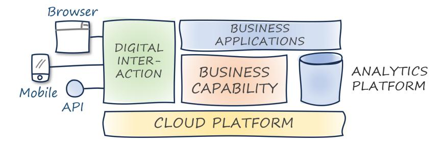

**A common blueprint for digital platforms**

So-called digital platforms run the risk of being seen as a cure for any and all IT ailments.

Digital platform initiatives run the risk of becoming proxies for actual organizational transformation. Embarking on a digital platform initiative must be guided by a clear road map with intermediate deliverables and the value achieved.

### **Engineering Productivity Platforms/Internal Developer Platforms**

In Economies of Speed, an organization's rate of change determines a company's future success. Boosting software's first derivative is the declared goal of engineering productivity platforms, also referred to as *Internal Developer Platforms* (IDP).

Your software delivery tooling determines your organization's rate of change.

Such platforms provide the necessary components for building, deploying, and operating software solutions, thereby harmonizing in-house software delivery tool chains. Done well, they can assure consistent code quality or detect security vulnerabilities early and thus break through the conflict between speed and quality.

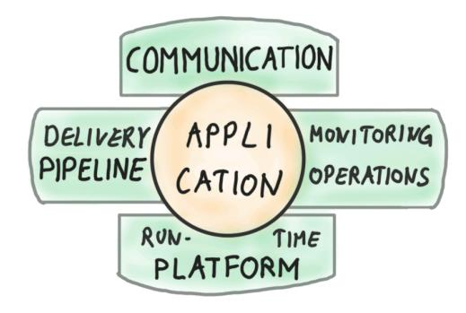

**The four-leafed clover of engineering productivity platforms**

Productivity platforms are rarely built from scratch; typically they are built on top of cloud platforms or from open-source projects. The value-add of the platform lies in the seamless integration and simplification of those base tools.

#### **Data Platforms**

Data platforms are another common sight in large IT organizations. However, many such setups lack several critical qualities of a true platform:

- Adding a new data source can be labor-intensive, necessitating building and deploying new Extract-Transform-Load (ETL) pipelines. Due to high onboarding friction, they fail to democratize access to the platform.
- Users can't augment the built-in capabilities, rendering the supporting platform team a bottleneck that slows platform evolution.
- The products offered as part of the platform lag behind vendor versions, depriving users of features that are readily available outside the platform.

### **Data Meshes**

Data meshes are looking to overcome the limitations of centralized data systems by separating the "innovation layer" from the platform layer:

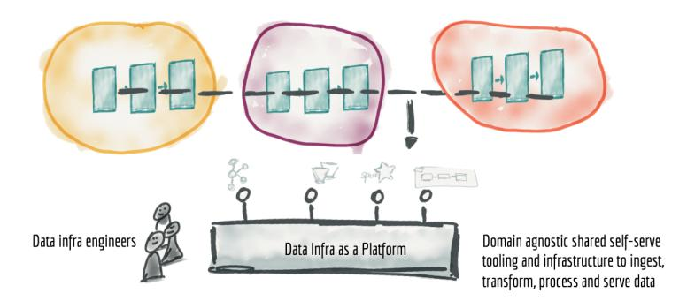

**A Data Mesh centralizes governance but decentralizes ownership (© Zhamak Dehghani)**

The concept of a data mesh rests on four pillars:

- Decentralizing data domain ownership
- Treating data as a product, including ease of use, secure access, and trust
- Abstracting the infrastructure complexity into a common self-serve data platform to reduce friction
- Providing federated governance

#### **API Platforms**

APIs play an important role in platforms at multiple levels:

- Users typically interact with IT platforms through APIs; for example, to request service instances.
- APIs allow enterprises to make their legacy assets available to modern web or mobile front ends.
- Internal APIs can foster reuse and create a platform for innovation.
- Externally facing APIs can enable a digital ecosystem through easy onboarding of partners.

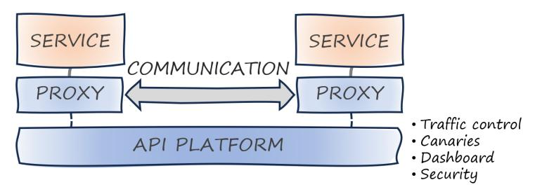

**An internal API platform**

Most API platforms provide one or multiple of the following capabilities:

- Proxies to monitor and route service calls
- API gateways to manage operational concerns like authentication, quota enforcement, and throttling
- Self-service portals for developers
- Certificate management for secure service-to-service communications
- A catalog or registry for API discovery
- Monitoring and dashboards to provide observability

#### **Abstraction Layers/Cross‐Platform Platforms**

Another species of in-house platforms aims to reduce the dependency on base platforms to reduce potential switching cost. Those efforts run the risk of placing portability ahead of productivity.

Focus on productivity first and portability second.

Those abstraction layers run the risk of becoming hindrances rather than enablers, depriving them of a key characteristic of platforms.

# **Platforms and Software as a Service**

SaaS is a distribution, operational, and pricing model. Platforms are abstractions that enable teams to build on top of them.

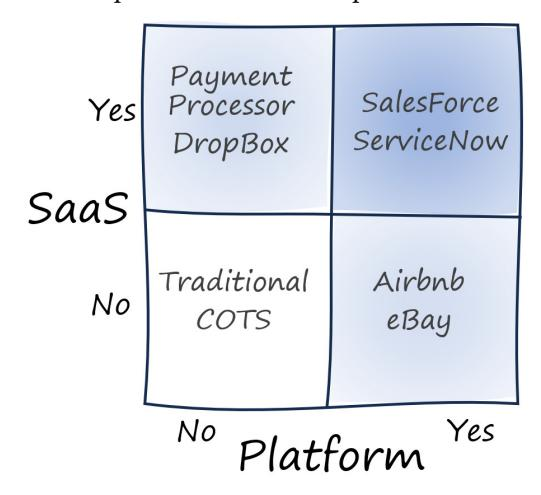

**Comparing SaaS and platforms**

# **10. IT Platform and IT Services Are Antonyms**

**After renaming all teams, still nothing improved…**

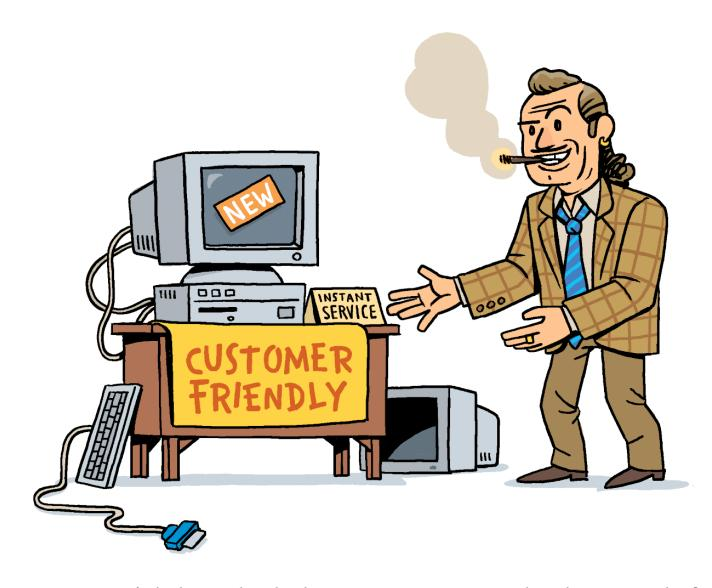

**Teams, you won't believe the deal we got on your new development platform!**

Enterprises might consider their existing data center or IT services a platform. As so often, things that might appear similar from far away reveal important differences upon closer inspection.

### **Isn't It Just a Box on Top of Another Box?**

When we draw high-level diagrams of platforms, they tend to look like a big box of "common things" with another box of diverse things on top of it.

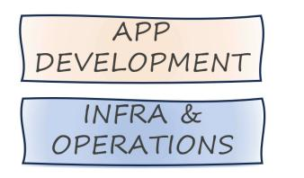

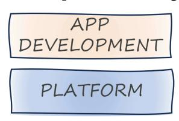

**A structural model cannot show the differences**

Much of IT is structured into a common infrastructure and operations layer, on top of which diverse applications are deployed. So, where's the difference?

### **A Static Model Can't Show Dynamic Differences**

There are huge differences, but this structural model cannot show them. That's because this model is static—it shows only the pieces but not the interaction between them.

The issues with the traditional "Dev and Ops" model are well known. Application developers push for flexibility and independence. Infrastructure and Operations are more conservative and resistant to change given that they are tasked with maintaining stable and secure operations.

### **A Dynamic Model for a Dynamic World**

A dynamic model makes the issue clear:

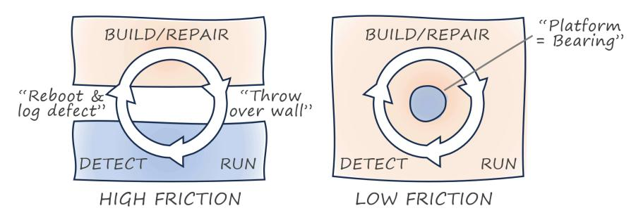

**A dynamic model makes the differences clear**

The loop across deploying software, detecting its operational characteristics, and correcting them, spans two organizational units whose opposing incentives pit them against each other. In a traditional organizational model, the outer loop crosses organizational boundaries and inhibits new ways of working.

Placing operational responsibilities in the development team is the correct setup, but those teams must have the matching tools to perform these tasks as efficiently as possible. That's where platforms come in.

A platform team builds the axle that makes the outer loop spin faster. But it's not part of that loop to avoid becoming a bottleneck.

# **Platform Characteristics**

Understanding that developer platforms are a stark departure from the traditional operational model, it's easy to see how existing teams might believe they're building a platform when in reality they're not.

Consider these like a checklist that helps you determine whether something you're building is a platform or not:

### **Speed First, Efficiency Second**

Large organizations traditionally view common elements as an opportunity to avoid duplication and achieve efficiency by doing things just once. Such *Economies of Scale* helped traditional enterprises lower their unit costs, but software platforms are different.

When companies focus on efficiency, the consequence tends to be that everything slows down.

Slowing things down is deadly in *Economies of Speed*, but that's what happens with reuse because it requires coordination. Platforms, in contrast, speed things up.

#### **Provides Value Indirectly**

Platforms deliver value indirectly via other projects. Value is realized by the platform users; for example, by reducing projects' development effort. IT platforms serve multiple user groups:

- Project developers who can speed up software delivery
- Component developers who can find more users for their functional blocks
- Management who gains more transparency into workloads and resource utilization
- HR who can attract talent interested in working in a modern technology environment

Delivering value indirectly implies that a platform can deliver value only in combination with other projects. Platforms are indirect value enablers, not direct value creators.

#### **Thrives on Scale**

Something created as a one-off to support another project isn't a platform. Platforms are built to host a wide variety of other projects, reducing duplication of common components while enabling diversity in project implementation. Platforms thrive on scale—the more users are on the platform, the more attractive it becomes.

### **Minimizes Marginal Cost**

Successful platforms grow because new customers can sign up with minimal effort for both the user and the platform, meaning the platform's marginal cost for an additional customer is near zero or low.

For in-house IT platforms, automation, self-service APIs, and building on an elastic infrastructure are common mechanisms to achieve the same effect.

#### **Reduces Friction**

Low friction extends beyond user sign up. Traditional IT processes require would-be users to submit complex ticket requests that trigger a time-consuming and often manual provisioning process.

High onboarding friction all but guarantees the quick demise of any in-house platform.

Low friction doesn't always equate to a low barrier. In-house platforms and base platforms can have low technical friction but require users to adopt a different mental model.

### **Embraces Self‐Service**

Self-service is the default mechanism through which IT platforms assure low friction. Instead of filing a ticket, teams directly provision a virtual machine. Transparency forms the other half of making a team self-sufficient.

### **Run as a Product, Not a Project**

A platform can't be built by gathering requirements, implementing them, and calling it a day. A product must target a well-understood market, meet specific customer needs, and evolve alongside those needs. That's how platform teams must operate.

#### **Evolves Continuously**

Successful IT platforms evolve both in the depth of the services they offer and in the scope of services they provide. Users benefit from standing on a platform that continually grows and lifts them up.

#### **Puts Customers ahead of Processes**

So-called common services restrict users to a given set of software libraries, third-party products, or specific processes. Platforms must find a way to serve their customers ahead of the platform stakeholders. After all, without customers the platform will provide no value whatsoever.

#### **Is Centrally Built and Operated**

Platform users don't need to concern themselves with the operations of the platform, because it is operated by a dedicated team. Platforms are available as an always-on production service that pools resources for standardized and automated management.

#### **Shares Responsibility**

Platforms have a shared responsibility agreement with their client projects. Whereas the platform takes care of certain operational qualities like security or compliance, the client projects carry other aspects of the same qualities, such as availability, security, and compliance.

Self-service can be an important part of the shared responsibility, allowing client teams to perform operational tasks like monitoring resource usage or performing restarts.

#### **Users Extend**

IT platforms should be extensible by platform users; for example, to share functionality they have developed. Platforms are open, whereas IT services are generally closed.

# **Honorable Mentions**

#### **Voluntary Adoption**

Voluntary platform usage is generally the preferred way because it builds more engagement and also provides better feedback to the platform teams. Mandated usage conflicts with customer centricity.

As a pragmatist, I caution teams wanting to make their platform mandatory that it's nearly impossible to enforce things in large, federated organizations. What you can do, though, is make people's lives easier if they use the platform and harder if they don't.

### **Managed by a Dedicated Team**

Platforms are typically managed by a dedicated team that acts like a small business of its own. This approach makes good sense, but I am reluctant to call it a defining characteristic.

### **Platform ≠ IT Service**

As elaborated at the beginning, IT platforms often evolve from more traditional IT Services, but have entirely different characteristics. A side-by-side comparison summarizes the contrast:

| Characteristic    | Platform          | IT Service      |
|-------------------|-------------------|-----------------|
| Main Driver       | Speed             | Reuse           |
| Value Proposition | Direct            | Indirect        |
| Scale Effect      | Thrives           | Bottleneck      |
| Marginal cost     | Low               | Medium/High     |
| Friction          | Low               | High            |
| Interaction       | Self Service      | Ticket-based    |
| Run as            | Product           | Project         |
| Evolution         | Continuous        | Sporadic        |
| Orientation       | Customer Centric  | Process Centric |
| Responsibility    | Shared            | Separated       |
| Extensibility     | Open or semi-open | Closed          |
| Adoption          | Voluntary         | Mandated        |

This list can help debunk lipstick-on-a-pig maneuvers that re-label existing processes and operational systems as platforms. The table also highlights how drastic the change from traditional IT services to a platform model is, which explains why so many IT teams struggle to build successful platforms.

# **The Platform Gestalt**

A collection of characteristics is a great start but ignores that they support one another:

- A shared responsibility model enables continuous evolution.
- Self-service is a key contributor to low marginal cost, the ability to thrive with scale, and low friction.
- Making a platform user extensible is the ultimate form of being customer centric.

# **11. Mechanisms, Not Magic**

**Making things work is not an implementation detail.**

**Building on an outdated platform isn't going to lift you up!**

Business and organizational goals for in-house platform development are plentiful: platforms help enterprises speed up innovation, reduce cost, increase compliance, foster code reuse, enable autonomous teams, boost morale, and make the organization more attractive to prospective employees. However, these benefits don't magically materialize just because a major piece of the IT estate is (re-)labeled as "platform".

A successful platform strategy must tightly connect expectations with relevant implementation details. Detailing how the technical aspects realize the anticipated benefits not only keeps the strategy from remaining wishful thinking, it also enables a balanced consideration of alternatives.

## **Making Things Simpler Isn't Simple**

Base platforms such as cloud platforms are powerful but can be complex to set up and overwhelm users with choices. Shielding users from this complexity is a legitimate goal. Reduced complexity brings numerous benefits: it speeds up delivery, reduces the chance of errors, and makes it easier to onboard new staff.

Finding skilled developers who can build sophisticated applications on top of commercial cloud platforms is a limiting factor for many organizations. They therefore look toward in-house platforms to soften the learning curve for developers.

## **Platform Marchitecture**

A disconnect between a platform's stated objectives and the implementation is the surest way to sabotage a platform strategy.

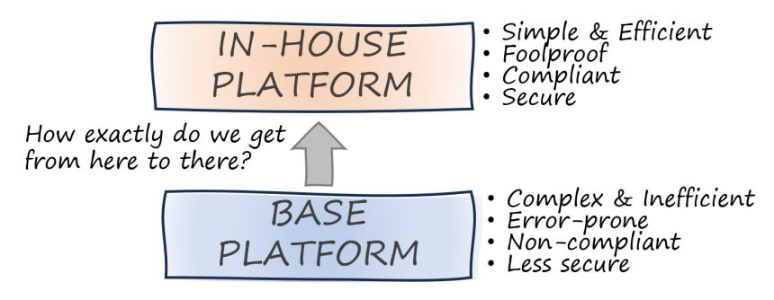

**Platform Marchitecture based on wishful thinking**

Such glorified marchitecture diagrams play off FUD: developers lack the skills, base platforms aren't secure enough, and giving developers more freedom is sure to lead to mayhem. They then praise the great benefits of a potential in-house platform that so far exists only on paper.

Alas, in classic hourglass style, they fail to elaborate how exactly they get from "there" to "here".

# **Mechanisms Provide Linkage**

Without spelling out the core mechanisms that achieve the advertised benefits, a strategy remains wishful thinking:

Never believe a technical proposal that is soft on how the technical implementation achieves the advertised benefits.

Separating the strategy into three distinct layers adds much-needed rigor:

- *Benefits* are desirable properties. They describe the value to be achieved.
- *Mechanisms* explain how specific technical implementations achieve the benefits.
- *Implementation* details describe the other end of the mechanism; that is, what needs to be built or used.

Platform mechanisms provide the necessary linkage that allows us to understand how the platform will function. There isn't a one-to-one mapping between technical implementation, mechanism, and benefits:

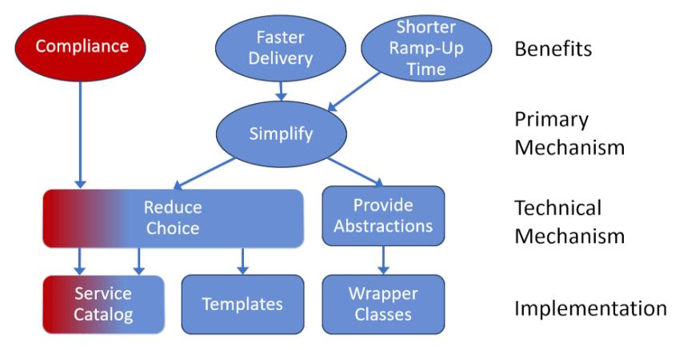

**Mechanisms as logical connecting element**

Simplifying is a mechanism that can fulfill multiple goals, such as accelerating development or reducing onboarding time. Simplification is itself still a fuzzy concept that can be achieved in different ways; for example, by reducing the number of choices a developer must make.

Such many-to-many relationships, when not properly understood or spelled out, can lead to miscommunication or missed expectations.

## **Welcome to the Twilight Zone of Architecture**

Technical mechanisms aren't a paint-by-number exercise for better architecture. They are a great vehicle to create a better strategy.

Technical mechanisms can be deemed too conceptual by technical teams but too technical for decision makers.

## **Cognitive Load**

Cognitive load has almost become synonymous with in-house platforms. Cognitive load was characterized in 1988 by psychologist John Sweller as "the total amount of mental effort being used in the working memory". The core hypothesis is that excessive mental load slows teams down and makes them more prone to mistakes.

Reducing cognitive load is a worthwhile pursuit, but it might be easier said than done.

Removing choices or elements does not automatically reduce cognitive load—it can have the opposite result.

It's too easy to believe that taking choices or elements away would automatically reduce cognitive load. However, if you remove 100 pieces from a 1,000-piece jigsaw puzzle, you didn't make it easier! You actually made solving the puzzle a lot harder.

## **Platform Mechanisms**

Although mechanisms don't provide a one-to-one linkage between implementation and benefit, cataloging the following mechanisms can help shape a platform strategy:

#### **Restricted Choice**

Picking a "golden path" out of an abundance of choices seems like a great way to reduce complexity and also provide governance. But it might also eliminate useful options and slow down development teams.

Platforms can do good or harm when restricting choice. Teams must remember that platforms should be an enabler, so restricting choice should not slow down progress or stifle innovation.

### **Meaningful Defaults**

A softer variant of restricting choice is providing meaningful defaults. Defaults don't try to hide the existence of certain settings; instead, they help you avoid mistakes by providing useful values if not explicitly set.

### **Assumptions/Scope**

In conversations with platform teams, I tend to remind them of the following:

A cloud provider has to build for the whole world. An in-house platform needs to be built only for one organization.

These assumptions can translate into other mechanisms like restricting choice or stand on their own.

### **Aggregation**

The base layer may contain all the things you need but spread across multiple systems. For example, a data platform might provide uniform access to data elements that were previously spread across legacy systems.

#### **Abstractions**

Abstractions are an often-overlooked or misunderstood mechanism. This book therefore dedicates an entire chapter to Abstractions and Illusions.

#### **Automation**

Friction is the cause of many ailments. In-house platforms often look to reduce such friction; for example, by automating tedious manual steps needed to deal with infrastructure or legacy systems.

#### **Functional Addition**

Your base platform may provide the majority of the needed functions but might still have gaps that don't address your specific needs. Your in-house platform augments the available baseline.

## **Mapping Mechanisms**

The following table summarizes common combinations of business and technical objectives and the associated implementation mechanisms:

| Business Objective | Mechanism           | Implementation |
|--------------------|---------------------|----------------|
| Minimize mistakes  | Meaningful defaults | Templates      |
| Increase velocity  | Automation          | IaC Scripts    |
| Improve products   | Fill product gaps   | New components |
| Enforce compliance | Restrict choice     | Wrappers       |
| Reduce lock-in     | Abstraction         | Service layers |

### **Non‐Technical Mechanisms**

Software delivery organizations are sociotechnical systems. Hence, looking at technical mechanisms alone might miss the highest-impact strategies. For example, you can shorten the learning curve for teams by reducing cognitive load of the platform interfaces, or you can provide training or hands-on assistance.

# **12. Do You Have an Opinion? A Mind of Your Own?**

**Why we love opinionated platforms but despise restrictive ones.**

**Not everything that shines is gold.**

Productivity platforms abstract away the complexities of the underlying technology or base platform. They mainly do so by reducing choice or making assumptions. However, reducing choice invariably leads to complaints from development teams. Oddly enough, those same developers devour *opinionated* frameworks and celebrate being opinionated as a virtue. So, where's the difference?

### **Being Opinionated**

"Opinionated" is a common word in developer circles and generally used with positive connotations. A StackOverflow user describes it as follows:

Opinionated software means that there is one right way to do things and trying to do it differently will be difficult and frustrating. On the other hand, doing things that particular way can make it very easy to develop as the number of decisions that you have to make is greatly reduced.

Both the Heroku Platform as a Service (PaaS) and the Rails framework are famously opinionated and widely revered because of it. Basecamp itself is a great example of opinionated software:

They say software should always be as flexible as possible. We think that's bullsh*t. The best software takes sides. Decide what your vision is and run with it.

When it comes to framework or product design, being opinionated translates into a strong vision and focus that benefits one well-defined user group.

Business plans that describe how you would capture a small slice of a vast market are the first ones to go into the trash bin. Instead, we look for ideas that serve one market better than anyone else.

### **Opinions Have a Shape**

So, if developers love opinions, why do developers resist in-house platforms that have a specific and narrow focus? A visual model can provide insight:

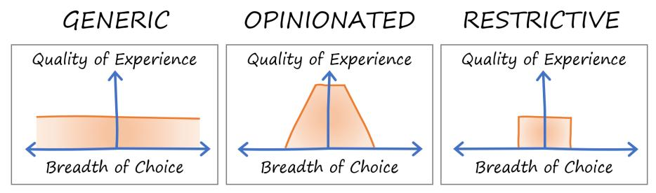

**Opinions give you something in return**

The image summarizes the key differences between opinionated and restrictive frameworks:

#### *Return on opinion*

Opinionated frameworks give you a high return on following their opinion. For agreeing, you are rewarded with a simpler and seamless developer experience that makes you more productive. In contrast, restrictive frameworks limit choice without giving anything in return.

#### *Gentle slopes*

Opinionated frameworks tend to have gentle slopes at the edge of their opinion (the terrain), meaning that the developer experience is still good even if you're looking to do something slightly outside the framework's sweet spot. Popular mechanisms are default overrides or "escape hatches". Restrictive platforms don't want you to go near or beyond the edge.

#### *Transparency*

Opinionated frameworks are forthright about their opinions and the motivation behind them. They state their opinions clearly, telling users what they are getting into. Restrictive platforms tend to be opaque.

Successful opinionated platforms do all three things well. Rails is a great example:

Rails put a Convention over configuration philosophy at the center of the framework and delivered higher developer productivity in return.

# **Those Are My Opinions. If You Don't Like Them, I Have Others.**

Opinionated frameworks have one other fundamental advantage: they are not the only choice. If you don't like one framework's opinion, you can pick another one:

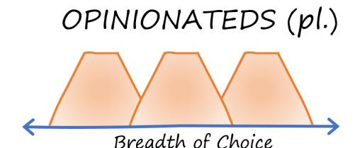

**Multiple opinions give you choice**

If they don't like your vision, there are plenty of other visions out there for people. Don't go chasing people you'll never make happy.

Restrictive platforms, especially in-house ones, typically offer no alternatives, making it a my-way-or-the-highway proposition. Such platforms can succeed only if the return on opinion is particularly high.

### **Open Source Can Afford To Be Opinionated**

Thanks to choice, open-source projects can afford to be more opinionated than commercial platform providers who look for the broadest possible user base.

Having an opinion improves the developer experience.

Open-source projects like Apache Kafka or Apache Airflow aren't shy to limit the programming languages that they support. Cloud APIs, by contrast, generate libraries for a broad range of languages, but end up creating less idiomatic APIs.

### **Unnatural Selection**

When discussing the merits and demerits of internal platforms on social media, a reader gave the following candid input:

When a company decides to write a proprietary platform, it competes against industry alternatives. Unfortunately, in 90% of the cases the internal tooling teams are underfunded as a cost center and release buggy trash.

Opinionated developer frameworks are subject to some form of Darwinian selection by the developer community.

Transitioning from classic IT services to in-house platforms is like moving from a state-controlled market to free capitalism. Many of the incumbent players will succumb to the competition.

If you want developers to love your platform, make sure to build a lovable platform.

### **Cohesion**

Restrictive platforms often select a subset of services or features from an underlying base platform. As a result, restrictive platforms can lack cohesion, instead becoming a collection of odds and ends:

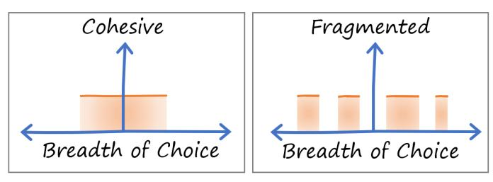

**Opinionated platforms tend to be cohesive**

An opinionated product exhibits integrity and cohesion that's how it can improve the developer experience.

## **Freeways Are Opinionated**

I compare opinionated frameworks to freeways:

- Driving on a freeway, following the prescribed path, is very efficient and gets you to your goal much more quickly than taking the back roads.
- Freeways also constrain: you can't just enter and exit anywhere, and you must follow the prescribed path.

In comparison, restrictive in-house platforms look more like obstacle courses. In-house platforms may promise developers a freeway-like experience but end up delivering a mud path with giant guard rails.

**Golden path: expectations versus common reality**

## **Are the Streets Really Paved With Gold?**

The path prescribed by opinionated platforms is often called the "golden path". IT organizations may lose the focus on making the golden path particularly happy in favor of closing off all other paths:

The so-called "happy path" isn't actually that happy; it's more like the other paths are closed off.

## **Employer Lock‐In**

There's a last consideration that can stir resistance among developers: lock-in. Frameworks built in house are proprietary. If developers invest large amounts of time in learning such a framework, there's zero return on that investment in case they want to go work somewhere else.

In-house frameworks increase developers' switching costs, resulting in "employer lock-in" that they may resist.

In comparison, work experience with open-source platforms like Kubernetes increases developers' market value.

# **13. Making Platform Decisions**

**You want a quick decision? Give me a coin…**

**The path to the right platform can be harder than it seems**

Architecture is best represented by a set of conscious decisions. The same applies to the design of in-house platforms. A checklist of major decisions and their trade-offs can be a valuable tool to start a platform strategy.

# **The Most Important Decisions Might Be the Ones You Didn't Know You Made**

*The Software Architect Elevator* features a simple but powerful picture:

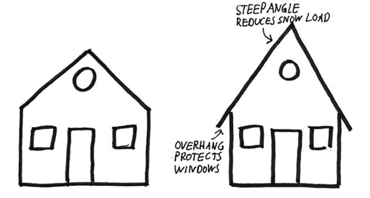

**Is this architecture?**

The sketch on the left includes the main components and their interrelationships. Yet, this "cookie-cutter" house lacks any non-obvious decisions that an architect would have made.

The sketch on the right has a steep roof for a good reason: the house is designed for a cold climate where winters bring extensive snowfall. A steep roof allows the snow to slide off or be easily removed.

A dangerous trap early during a platform development cycle is the team making decisions without being aware of it.

Teams are prone to making decisions tacitly or just taking them for granted without evaluating alternatives. A decision catalog serves as a useful checklist that allows you to detect whether you made decisions without being aware of it.

### **Truth versus Comfort**

Platform decisions can be controversial. A popular sales tactic is to deliver bad news to customers after the buyer already committed. Stating your platform decisions early may front-load the debate, but it will avoid late surprises for your users.

### **Decision Catalog**

Platform teams face numerous design decisions. Most decisions aren't binary either-or decisions, and virtually all of them carry trade-offs. The goal of this chapter is to raise better questions and equip you to find better answers.

This chapter focuses on the externally visible platform choices; that is, those that affect the platform users.

#### **Open or Closed?**

Platforms are enablers for other teams and thrive because they do not try to anticipate all use cases. The following decision model shows different approaches to allowing platforms to accept user contributions:

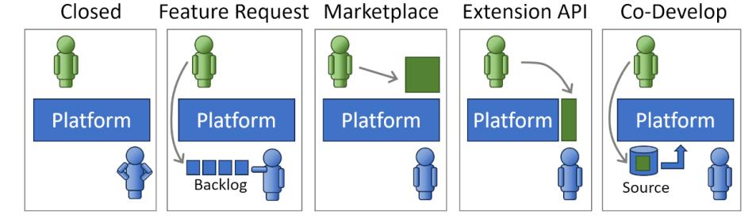

**Platform collaboration models**

- **Closed**: The platform remains fully under the control of the platform team with limited input from the platform users.
- **Feature requests**: The platform is fully under the control of the platform team, but the team encourages feature requests from users and maintains a public backlog.
- **Marketplace**: Users can't modify the platform directly but can offer components to be used by other platform users.
- **Extension API**: The platform allows users to develop components that will become part of the platform, often via dedicated extension APIs.
- **Co-Development**: Platform users can be actively involved in the platform development following an open source or inner source development model.

#### **Free or Charged?**

Building platforms isn't free, but it pays off. In-house platforms deliver value to the organization indirectly by enabling users to deliver products faster or to innovate freely. If upper management is convinced of the platform's value, they may grant you the luxury of offering your platform to users for free.

IT organizations generally require projects to recover their investments from their users through a direct pricing model. This restriction can originate from tax and accounting rules.

Offering a platform for free can also lead to undesirable side effects. For example, numerous small projects may adopt the platform, resulting in a support and maintenance burden.

#### **Mandated or Voluntary?**

Voluntary adoption assures that the platform team listens to customers and evolves the platform based on customer needs. Even if you tried to mandate usage of a platform, project teams can become rather creative when it comes to circumventing mandated tool usage.

On the flip side, voluntary platforms require teams to spend valuable resources promoting their platform.

#### **Immortality?**

Nothing in IT lasts forever, so it's a good idea to give an indication of the intended platform lifespan. Although platform teams would love their platform to live forever, few IT systems do.

#### **Can the Platform Shrink?**

The base assumption might be that a platform grows over time. However, a floating platform also retires functions to avoid duplication with readily available services.

Keeping focus requires pruning.

#### **Rate and Cadence of Change**

Continuous evolution is a key characteristic of platforms. Platforms should have a low rate of change, but it won't be zero.

If your organization allows application teams to veto changes, your platform may not succeed.

Early in the platform journey you should define:

- What will change and what will not
- What is the expected rate and cadence of change
- How you will support teams with the change

#### **Preconditions and Assumptions**

As with any product, be clear on what you assume to be in place for developers to use your platform, including skill sets, ways of working, and so on.

### **A Platform Design Canvas**

Platforms are products. Platform teams need to make the same design decisions that a product start-up would have.

At GovTech Singapore, we tailored the well-known Business Model Canvas to a *Shared Service Canvas* that helped us make conscious decisions on all aspects of our platform design.

# **14. Procuring a Platform**

**Why buy it when you can build it?**

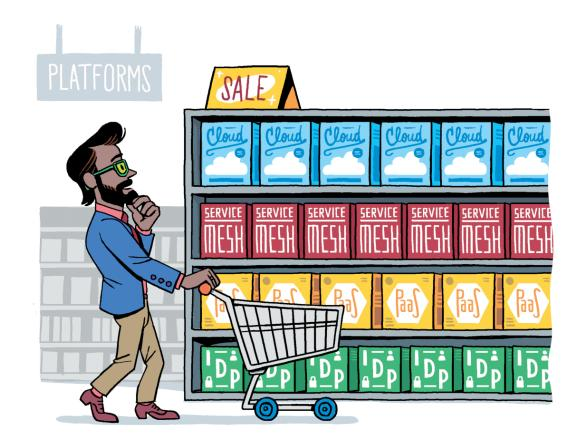

**They're all so tempting…**

Not all platforms have to be built. Organizations will routinely buy platforms that someone else built. Even if you don't intend to build a platform, knowing how to build one will help you make a better selection.

### **Do You Need a Platform?**

The popularity of the term "platform" has caused the approach to be misunderstood as the cure for all of IT's problems. You should first reflect on whether a platform is the right choice.

When asked why customers should even consider building their own platform on top of already well-equipped cloud platforms, I remind them:

Cloud providers must build for the whole world. You need to build only for your organization, so you can make more assumptions.

### **Should You Build a Platform?**

You're unlikely to want to build an entire cloud platform, but you'll end up building at least portions of your in-house platform.

Like any architecture decision, buying or building a platform isn't binary, but an entire spectrum:

- 1. Buy (or "lease" in a SaaS model)
- 2. Build on top of a builder kit
- 3. Build from scratch

Platform builder kits have become more widespread, ranging from open-source projects like Spotify's Backstage or Syntasso's Kratix, and commercial products from companies like Humanitec.

A decision model can help bring clarity into the buy-versus-build decision. A successful platform solves complex recurring software problems without constraining teams. We can chart the territory along two axes:

• *Complexity* describes the intellectual capital, skills, or effort required to develop a conceptual model for the domain.

• *Differentiation* measures the unique advantage that the organization can derive from this domain.

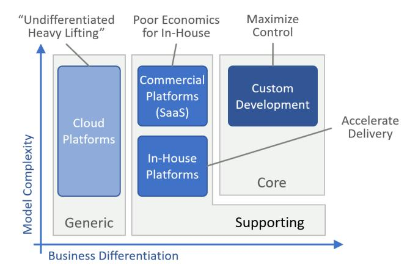

**Identifying domains for platforms**

Organizations can use Domain-Driven Design (DDD) to discover domains that are well suited to platforms. DDD typically divides domains into three areas:

• *Core domains* are highly differentiating. They tend to be small but also complex.

- *Supporting domains* can be either complex but less differentiating, or differentiating but less complex.
- *Generic domains* can be complex but don't differentiate your business. DDD recommends using off-the-shelf models for these domains.

Building custom platforms in the generic zone submerges them right from the start. Platforms can shine in the supporting space with sufficient commonality across projects.

### **Selecting a Platform**

Platforms have very different dynamics from traditional IT services, so taking a static snapshot and running a scorecard based on the old way of working isn't effective. Michele has a great way of describing the common mistake:

I told a customer that they were selecting the platform as if they were choosing a pizzeria by looking at the menu outside, picking the one with a wider selection. They'd have no idea of the thickness and texture of the crust, whether the oven is electric, gas, or woodfired, and whether the sauce uses fresh San Marzano tomatoes or paste from the can.

Assessing the breadth of a platform can serve as a useful baseline. However, not all features translate into an actual benefit.

### **Utilizing a Platform**

Just selecting something labeled "platform" doesn't guarantee that you'll be standing on the shoulders of giants. *Cloud Strategy* reminds us:

A better knife doesn't make you a better cook.

Platforms require organizational changes to deliver the anticipated benefits.

Just selecting a platform doesn't guarantee that you'll be building on a platform.

### **Respecting Platform Opinions**

Platforms have opinions, so when choosing to onboard on a platform, you need to be aware and prepared to accept them. A mismatch at the architectural or organizational levels diminishes the value you can reap from your platform.

Not all products that are pitched as being extensible qualify as a platform. To enable development teams, the platform must provide a coherent domain model and efficient APIs, combined with modern tooling.

## **Leaving a Platform**

When selecting technology that's expected to become a major part of your IT portfolio, it's good to think ahead.

All technology carries a switching cost. If you can estimate the odds that you'll need to switch, then you can express it as a liability. *Cloud Strategy* warns:

Don't get locked up into avoiding lock-in.

You should aim for "accepted lockin" by weighing the benefit you gain today against the future liability.

Switching costs aren't just a function of the platform you use but also of the way you work.

Rather, you should look inside your organization to increase the rate of change that it can handle.

# **15. Talking with Platform Builders: Singapore GovTech**

### **A Developer Platform for the Singapore Government**

*Kevin Ng is a Senior Director, Government Digital Products (Core Engineering Products), GovTech Singapore*

*Hsiao Ming Chia is a Director, Government Digital Products (Core Engineering Products), GovTech Singapore*

#### **What role does GovTech play in the Singapore Government?**

Following our mission of "Engineering Digital Government, Making Lives Better", we provide central platform capabilities to over 100 government agencies. Our team is called "Core Engineering Products", which in most organizations equates to "Platform Engineering". A large fraction of the 1,000+ systems that we host in the cloud use our SHIP-HATS CI/CD tools. We are now expanding our platform to onboard agencies onto run-time technologies like Kubernetes and Infrastructure as Code. In line with the four leaf clover model, we are also raising the bar on observability and the communication layer.

Our own developer-identity system provides secure login and authentication for these tools while a Developers' and Documentation Portal shares information about our tools. Although developers are our primary target persona, our platform includes tools for product and project managers, as well as reporting tools for CIOs and CISOs.

#### **Your developer platform initiative started in 2016. Were you ahead of the trend?**

In then-Government Digital Services, we started around 2016 with Atlassian tools like Jira, Bitbucket, and Bamboo, which gave us source control and a way to run our build pipeline for internal use. Around 2018, we realized that this could become a platform for the whole-of-government.

#### **So, you built a product for yourself first rather than ponder over what developers might need?**

Indeed, but as we expanded our user base, we found that our customers' needs differed. For example, some used GitHub, which wasn't part of our platform.

Some teams were not using source control at all, so we had to accept that initially they may not use our product in the ideal way. But we consciously decided to prioritize adoption first and then follow with good practices. That worked well for us, as we now have nearly 80% of eligible systems on the cloud and over half of the agencies on our CI/CD platform.

#### **How did you decide to bootstrap your platform with a CI/CD product?**

We had a container runtime (NECTAR) and an on-premises API Exchange called APEX. With the arrival of the cloud, in this case Government on Commercial Cloud (GCC), NECTAR lost market share, and APEX moved to the cloud for cost reasons.

CI/CD stepped into the foreground and got an extra boost thanks to its role in the government digital transformation program. CI/CD was seen as a key construct to achieve higher delivery velocity and innovation. Also, our cloud strategy supports three major commercial clouds, so it made sense to keep our CI/CD independent of any one provider. This approach avoids the complexity of managing three different build pipelines.

#### **Back in 2018, the platform engineering buzz hadn't much taken off. Where did you find guidance?**

The initial idea for NECTAR was relatively simple: we wanted to shield developers from Kubernetes' complexity through a portal. But you can't just wrap the workflow without considering how people will use the tool. For example, we also had to address billing, user life cycle, and permissions management. That's really where the platform concept originated.

#### **Today we would call that "reducing cognitive load"…**

Right! Our primary guidance came from the persona we wanted to serve—an average developer who would not be familiar with Kubernetes. The trade-off was that some progressive developers didn't find our layer open enough. A breakthrough happened when we used modular models like the Four-leaf Clover or the SG Tech Stack. These models allow us to layer tools on top of each other so that development teams can choose.

#### **It sounds like you divided your platform into slices!**

A lot of the progress was driven by the desire for cloud computing. After all, each application needs a run-time. Once that was stable, we wanted to support the folks building software, which meant CI/CD. It helped us that we were assembling things that were already available. Teams were already using bits and pieces to do CI, so we collected and aggregated those into a platform.

Our journey was shaped by the users' capabilities and work styles. In the early days, many teams would not use the entire CI/CD chain. However, we could at least get them on version control, so having that capability in the platform was important.

#### **How different is building a developer platform for the public sector from a commercial one?**

Government compliance influenced a lot of our tooling. NECTAR mainly existed because hosting applications could be cumbersome. Likewise, APEX existed because of intranet-internet separation. Those constraints boosted the adoption of our tools. We were also fortunate to have high-level support from the Prime Minister, who asked to move 70% of eligible workloads into the cloud.

On the flip side, as senior government leaders are rotated regularly, re-education is needed. Our new leadership recognized the importance of shifting from a sole focus on compliance to prioritizing productivity and value delivery. Because compliance was no longer sufficient to drive adoption, we pivoted our tools to emphasize enhanced productivity, aligning with the changing needs of our users.

Data sovereignty is another important aspect, which restricts our use of SaaS products. But even more so, resilience is a major factor. In Singapore, there is a strong expectation that the government delivers results, so we must keep things moving but also plan for really far-flung risk scenarios.

The public sector nevertheless shares many aspects with large enterprises, especially the financial sector, such as a focus on cybersecurity and IT being largely outsourced. Vendors bring additional personas into the mix, like project-oriented delivery managers and practice leaders who look to uplift their practices. Last, the technical capabilities of agencies vary, so we have a very broad and diverse user base.

Platform teams really must understand all their audiences to be successful.

#### **NECTAR, APEX, SHIP, and HATS started off as separate products. Does that make your platform a fruit basket?**

We sell to around 100 agencies, so the level of maturity varies substantially. This makes offering a single product harder, forcing us to offer what looks like a 'basket' from which you can easily make your favorite version of 'fruit salad'.

#### **When rolling out your platform, were some things harder than expected?**

Pricing was a challenge due to our mandate to recover our costs. Developers often expect tools to be free or very low-cost. Fortunately, our Chief Executives supported the decision to make SHIP-HATS essentially free for GovTechies, which significantly lowered the barrier to adoption. Vendors' resistance was less about cost, as they could simply pass those expenses on to the agencies, but rather about the government poking into their domain. We also learned that pricing models can influence behavior. For example, we encountered situations where a vendor would use their own CI/CD tools during development and only switch to our platform for production releases. This recreated the old dev/ops separation, which is the opposite of what we were looking to achieve.

#### **Could you share a bit about your pricing models?**

Pricing CI/CD is challenging—everyone thinks of the major providers offering free plans. When we charge for an enterprise license, developers often don't understand why they should pay for it.

The second part is that people are used to shrink wrap software, like Microsoft Office, which requires minimal configuration. As a result, they question why we have a team working on standard templates, permission rules, security operations, and single sign-on—all of which add to the overall cost.

Our pricing strategy has evolved for these reasons. For example, we aggregate demand for some products and use our bulk purchasing power. Then we can use that discount to fund our team.

But in practice, it's not easy to implement volume pricing because strong adoption is needed to secure meaningful discounts. In the beginning, you won't have that volume, and your economics look unfavorable. If your product does not gain traction quickly, we may need to subsidize it.

Volume pricing pushes us to a model where we need to make sure the product is suitable before we scale. Originally, we preferred to scale incrementally and refine the product based on feedback. Now, selecting the right customers has become quite important, particularly those willing to collaborate and co-invest in new ways of systems development.

We generally price per user or capacity, similar to GCC (cloud). For observability, we also plan to price based on volume. Pricing by user is natural for CI/CD products. Still, it also creates complications because some user groups may only use specific features.

We aim for a co-innovate model, where we try to find premium customers who are willing to work with us to influence the tool's roadmap. Our team will customize it for them, and in return, their input helps us improve the product.

#### **Did your users build something that surprised you?**

We built a container platform called CStack for developers. We were happily surprised when we found out that business users were able to deploy a teacher appreciation portal for Teacher's Day. They even went through the end-to-end process including vulnerability assessment and penetration testing (VAPT), all with very limited development skills.

We also discovered that some folks used our CI/CD pipeline as a data pipeline. We were initially impressed by the frequency of their deployments, but then we realized that they are basically shipping data!

Some teams were running hundreds and hundreds of test drops on our runners, which overwhelmed our pool of runners. That was a classic misuse of the payper-user model, as opposed to pay-per-run. So, some surprises were positive, whereas others were clever but not desired.

#### **Are you planning to build additional platforms or expand the existing ones?**

We are confident that going deeper can extract even more value. Our CI/CD platform journey began with a code repository, then evolved into a build pipeline, and now we're aiming to go further. We also want to integrate our vendors more closely into our development ecosystem. Ultimately, using our platform should become a requirement for anyone doing work for the government.

Some vendors still only use SHIP-HATS for source control. So, we continue to raise awareness that it's not just about using our tool to check a box. The real question is: How extensively are you leveraging the platform, and for what purpose?

Because some of our customers have less experience, our engineers help them build custom pipelines. So, we are offering new engagement models to help the agencies fully utilize our products.

Of course, there is AI, particularly in coding assistants and operations.

Supply chain security is another aspect that has received much attention recently. Naturally, it's very important for us in the public sector.

#### **Do you have any final piece of advice for platform teams?**

It takes time to convince people, especially the stakeholders, and there's a certain sense of satisfaction when they finally say: "Yes, let's do this."

I'd like to highlight our internal team's evolution. When I first joined, I had to convince the SHIP-HATS team that we were no longer building tools just for our department but for the whole government. Two or three years later, they fully accepted this, but now we tell them that it's not enough for everyone to simply use our tools—they should extract value from it. We also put our engineers in front of the customers to advocate for the platform and demonstrate its benefits firsthand.

Being an engineer used to be mainly about delivering good software. Now, the expectation is that you also engage with customers and understand the outcomes that your work drives.

This shift can be difficult, so it's important for platform leaders to support their teams in adapting to these broader responsibilities.
