# **Part IV: Designing Platforms**

With the widespread success and potential of platforms, it's tempting to want to build one in your organization. Designing and building a successful platform requires more consideration and engineering effort than many teams anticipate. This part highlights critical design decisions that guide the shape of an in-house platform.

- Architecture is often defined by quality attributes, and it's no different for platforms.
- A good platform is more than the sum of its parts, so choose carefully whether you are designing a Fruit Salad or Fruit Basket.
- Platforms are generally seen as horizontal elements, but they often sit on vertical pillars.
- In-house platforms that build on top of external base platforms need to decide whether to float or sink.
- Platforms can make great abstraction layers, but it's all too easy to fall victim to the Grim Wrapper.
- Platforms reduce cognitive load by hiding complexity. But hiding too much can lead to dangerous illusions.
- Even the most awesome abstraction crumbles when failure rears its head and reminds you that it doesn't respect abstraction.

# **16. The 7 "C"s of Platform Quality**

**Platforms might not be forever, but they do have more Cs than diamonds.**

Conducting an architectural assessment of a platform is no easy task. In the absence of a recipe, a set of desirable characteristics can provide guidance to architects who look beyond individual features toward critical design decisions and trade-offs. Diamonds are famously evaluated by the 4Cs (carat, clarity, color, cut), so let's see whether an equivalent architectural model can tell how precious a platform is.

## **The "7Cs" of platforms**

We can define the "7Cs" of platforms:

#### **Cohesion**
Does the platform present a meaningful whole, as opposed to a loose collection of pieces? In other words, is it more like a fruit salad than a fruit basket?

#### **Closure**
Does the platform contain a well-rounded set of services or are pieces unexpectedly missing, reducing the user experience to a sadistic game of Skipping Stones?

#### **Completeness**
Does the platform offer a complete experience; in other words, does it provide self-service for all elements? Are helpful debugging tools and automation included? Is the documentation well written? Are training and support available?

#### **Consistency**
After dealing with one part of the platform, can a user apply what they learned to other parts? For example, are shared functions like security or error handling consistent across services?

#### **Commensurate Value**
When using just a portion of the platform, do users get proportionate value from it, or will they have to use most of the platform before they derive any measurable benefits?

#### **Connectedness**
How well is the platform connected (or connectable) to other systems? Platforms don't live in isolation, making integration with single sign-on and monitoring systems essential.

#### **Captivity**
How easy is it to move out from the platform in case you'd need to? Is it mostly "leg work", or will you have to redesign your solution from the ground up?

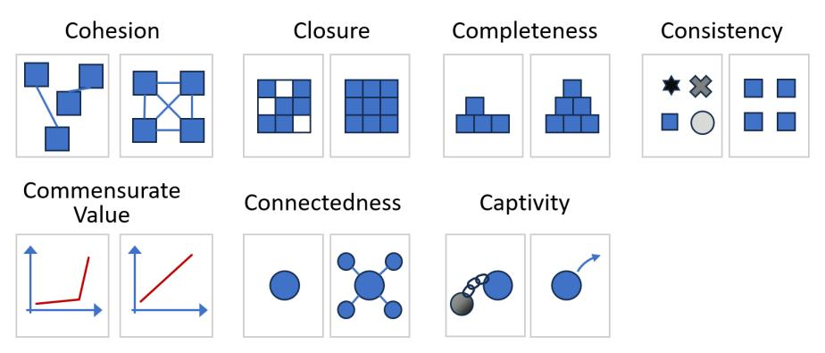

**The 7 Cs of Platform Quality**

For example, completeness relates to the scope of a platform; that is, the functional surface area that it covers. In contrast, closure describes how well rounded the platform is within its scope. Cohesion describes how well integrated the platform elements are.

## **Architecture Strategy à la "C"**

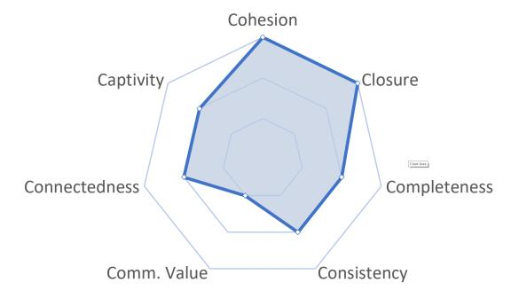

The 7Cs don't tell you what's right or what exactly you should be doing. Instead, it lays out the *decision space*, telling you what dimensions can be influenced. You could imagine a spider chart that plots your platform's characteristics across the seven dimensions.

The vocabulary also allows you to state preferences as principles. Your team might choose a principle that states, "We won't compromise cohesion or closure for the sake of completeness", to express that it's more important to them that the parts inside the platform are well integrated rather than adding new features.

# **17. Fruit Baskets and Fruit Salads**

**Good platforms are more than a collection of services.**

Most platforms comprise a collection of individual pieces. However, the value of the platform doesn't just derive from its scope—how many components it contains—but also from how these pieces come together to form a meaningful whole.

## **Summing Up the Parts**

Architects are like chefs. Good ingredients help, but a great meal comes from how they're put together.

Simply listing ingredients isn't a useful expression of the final system. Thinking about a platform as a bill of materials ignores the primary source of value: if the platform is simply a collection of readily available tools, why wouldn't application teams just use their own instances instead of adopting your platform?

### **Fruit Baskets**

Platforms that are compilations of individual pieces can be compared to fruit baskets: they collate several items into a convenient collection. However, in the end, all the customer gets is fruit. A fruit basket makes for a nice decoration, but it's largely a convenience.

## **Serving Fruit Salad**

Just like fruit baskets, fruit salads are collections of fruit; however, the fruit is cut up and packaged into a ready-to-eat meal. What might appear like a minor convenience allows the fruit salad to deliver much more value than just the sum of its parts by:

#### **Supporting use cases that fruit baskets or fruit cannot**
They're easy to carry and perfect for a picnic, for eating on the go, or for having lunch at your desk.

#### **Offering an enhanced user experience**
They balance texture and sweetness independent of the size of the fruits. You could say, fruit salads are more cohesive—they create a balanced whole.

#### **Scaling down**
They're available in small portions, regardless of the fruit size. Their fine-grained, usage-based pricing model matches the customer's needs.

#### **Reducing toil**
Customers don't need to peel or cut the fruit, and the ingredients don't crush in a bag or your luggage.

So, although a fruit salad might appear as not much more than cut-up fruit, it's actually a new product with a different value proposition. That's why it also fetches a significantly higher margin.

### **IT Fruit Salads**

Platform builders should be inspired by fruit salads and not just define their platform by the tools and products it comprises. To make your platform more than just the sum of the pieces, the pieces need to be well integrated or automated, so that it becomes noticeably easier for platform customers to use the whole platform instead of the individual pieces.

## **Having Opinions**

Naturally, a fruit salad–style platform will be more opinionated, meaning it doesn't intend to be all things to all people. Customers will be more likely to accept the constraints that the salad imposes since they benefit from a smooth integration and ease of use.

## **Making Fruit Salad From Fruit Baskets**

Cloud platforms are more like fruit baskets. We refine them into in-house fruit salads.

Cloud platforms exhibit a good degree of cohesiveness, but a cloud vendor needs to build for the whole world. That's where in-house platforms shine as they can make more assumptions and can be more opinionated.

Making fruit salad (in-house platforms) from fruit baskets (cloud platforms) is common enough that some cloud platforms come with tools to support it. For example, in 2021 AWS introduced Proton, described as a "deployment workflow tool for modern applications", which roughly translates into a fruit salad builder service.

# **18. Cantilevered Platforms**

**Horizontal platforms sit on vertical pillars.**

A platform is commonly portrayed as a horizontal element that sits underneath and spans across multiple applications. But zooming into the platform reveals that it's made up of vertical pieces; for example, individual services that are largely independent.

## **Fractal Platform Architectures**

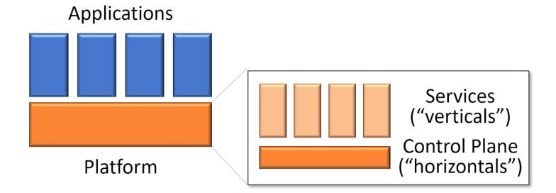

**Horizontal platforms consist of verticals layered on more horizontals**

Platforms aren't monoliths; they consist of a medley of individual pieces that come together. Zooming into the platform reveals a combination of horizontals and verticals: various "vertical" platform components are tied together by means of "horizontal" services.

### **Do Control Planes Really Have Control?**

The division of a system's architecture into common services ("horizontals") and individual components ("verticals") is about as old as the first code library. So what's different for platforms? Taking a step back reveals the reason behind horizontal layers:

- *Reuse*: making common functionality available to many components
- *Governance*: assuring that all applications use the same, authorized version
- *Operational Improvement*: unified view across many distributed components

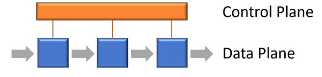

**Data and control planes**

A horizontal run-time layer that spans distributed components is commonly called *control plane*, setting it apart from the *data plane*. The terminology derives from telecommunications and networking.

## **Shipping the Org Chart Without Shipping the Org Chart**

"When you look at the highest-level block diagram of S3's technical design, AWS tends to ship its org chart. This is a phrase that's often used in a disparaging way, but in this case, it's absolutely fascinating." —Andy Warfield

"Shipping the org chart" is typically considered a negative because it exposes the user to the complexities of the organization's internal structure. In S3's example, which is prototypical for platforms, that integration is done in the control plane, which exposes a simple unified API.

### **Platform Jenga: Stacking Planes**

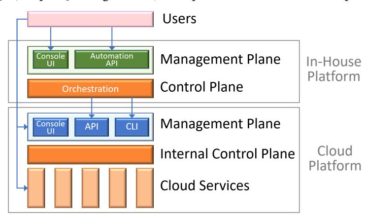

**The Matryoshka architecture of platforms**

Zooming into a cloud platform's control plane, the fractal nature of our architectures becomes apparent. The control plane isn't a single element but is composed of many elements. In many cases, the control plane makes use of the same "vertical" services that it manages.

Several aspects of the control layer are visible to clients, such as automation APIs, CLIs, cloud consoles, or monitoring tools. This layer is referred to as the *management plane*, sitting above the control plane.

The in-house platform also includes a control plane, which typically orchestrates tasks such as account setup and cloud service provisioning. On top of all this sit the users—the developers.

## **Nesting UI Layers**

Why aren't cloud consoles extensible to allow platform teams to build in-house portals directly on them?

Developer portal builders such as Backstage have gained popularity to unify the experience. IT Service Management (ITSM) tools also increasingly include portals for developers, creating noticeable overlap in capability.

## **Developer Portals as Micro Frontends**

Many consoles and developer portals use a Micro-Frontends (MFE) architectural style:

"An architectural style where independently deliverable frontend applications are composed into a greater whole." —Cam Jackson

MFEs decompose the user interface into individual parts, allowing platform teams to build these elements independently and combine them into a single, consistent user interface. Developer portal tools like Backstage follow a horizontal approach with a plugin architecture.

# **19. Will Your Platform Float or Sink?**

**Most people want to swim—until they realize their cost is sunk.**

Most in-house platforms are built on top of base platforms, typically cloud platforms. Those base platforms continually evolve with cloud providers adding thousands of new features each year. This requires internal platform builders to decide what they plan to do when the base platform replaces a feature built for the in-house platform.

## **Do Rising Tides Lift All Boats?**

The software delivery platform we built on premises back in 2015 was largely replaced by a commercial cloud platform in 2021. This doesn't imply that our investment was poor; quite the opposite: it meant that we were on the same track as major cloud platforms, just a few years ahead.

There's a suitable metaphor for base platform evolution: rising ocean levels. If you build a house (or in-house platform) near the ocean, you may need to decide how to react to rising water levels.

## **Floating or Sinking**

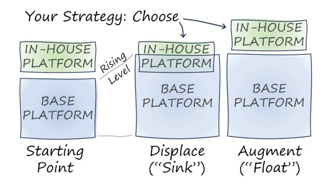

**Two options for platform evolution: displace or augment**

When the base platform adds functionality, your platform has two options:

Your platform can rise to the occasion and "float" on top by augmenting its functionality. Or you keep your platform as is, knowing that its functionality is displaced by the recent base platform features, meaning it is underwater.

Augmenting your platform depends on two mechanisms:
- You retire functionality that you had built but that is now "underwater"
- You use the freed-up capacity to add new capabilities to your platform

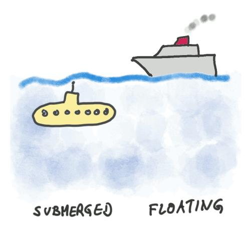

**Is your platform sinking or floating?**

Giving these decision options evocative names brings clarity and allows teams to express a critical aspect of their platform strategy.

### **Deciding Is Easy—Until You Get There**

When my on-premises platform went underwater (several years after I had left the organization), folks expected me to be sad. Instead, I was quite happy that major cloud providers followed the same trajectory as our platform.

Organizations fall into the classic sunk cost fallacy when making decisions about the future based on past investments that can't be recovered.

### **Buoyancy**

Most platforms that struggle to float do so because of excessive weight. Platforms should continuously evolve. However, if they never shed any functionality, they are bound to keep growing.

## **Underwater Maps**

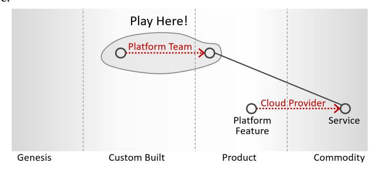

**When your platform becomes commoditized, shift the playing field!**

Wardley Maps provide another model to understand the implications. Holding on to a product that has been commoditized is guaranteed to have poor economics. Instead, you should be shifting your attention to components that are higher up the value chain.

### **You Pay in Opportunity Cost**

The cost of maintaining a submerged platform is measured in opportunity cost; that is, the value that those teams could have generated otherwise. It can be a high multiple of the actual cost.

# **20. Beware the Grim Wrapper!**

**What starts well doesn't always end well.**

When building a platform over existing components, platform designers face a tremendous temptation to wrap existing APIs behind a brand-new, unified, perhaps vendor-neutral interface. What could possibly go wrong?

## **Tailoring the Base Layer**

Several techniques are available to allow internal platforms to customize an existing software component:

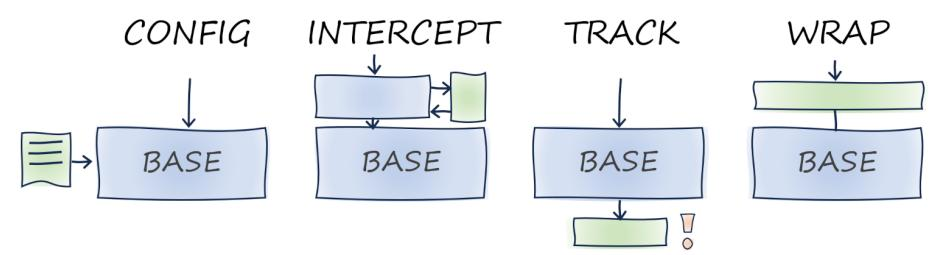

**Choices for influencing base platform behavior**

#### **Configuration**
The base platform creator may have anticipated the restrictions that in-house platform teams want to impose. This is the easiest option because the platform team doesn't need to build any new software.

#### **Intercepting**
The base platform allows platform teams to intercept calls made to the base platform's APIs through "hooks". Your interceptor code can set default parameters, restrict the range of input parameters, or reject the call altogether.

#### **Tracking**
Tracking allows users to interact directly with the original components without any restrictions. However, all calls are tracked, analyzed, and can trigger alerts or corrective actions when needed.

### **Wrapping**

You could replace the original component interface with a new interface of your choosing. Doing so affords the platform designers the most flexibility and the highest level of abstraction. Wrapping is best equipped to reduce cognitive load because it can provide an interface that's simpler than the base platform.

A wrapper is known as Anti-Corruption Layer, a concept defined by Eric Evans in Domain-Driven Design: "Create an isolating layer to provide clients with functionality in terms of their own domain model."

## **Wrapping Considered Harmful**

Architecture is the business of trade-offs, so there are significant downsides to wrapping:

#### **Keeping up with the rate of change**
When building an IT platform, chances are that the components you wrap are undergoing rapid evolution. Your wrapper has to be constantly adjusted to avoid falling behind.

#### **Simpler doesn't mean easier**
A smaller API into a complex subsystem doesn't necessarily reduce the interface's cognitive load, but could instead present a dangerous illusion.

#### **Unable to benefit from external knowledge**
You can hire people who are familiar with third-party products and their APIs. However, when you define in-house abstractions, you'll need to teach every user from scratch.

#### **You might build the lowest common denominator**
Services offered by cloud providers look similar from afar, but very few are compatible across providers. Trying to fold a common abstraction over these services is bound to be a losing proposition.

#### **You need to operate your abstraction**
If you want to define a new API for your users to call, you need to operate this API, leaving you with operating an additional run-time component.

## **Not All Wrappers Are Grim**

To distinguish grim wrappers from happy ones, we must subdivide the problem space:
- Does the wrapper cover the data or control plane?
- Does it attempt to wrap multiple implementations or a single one?

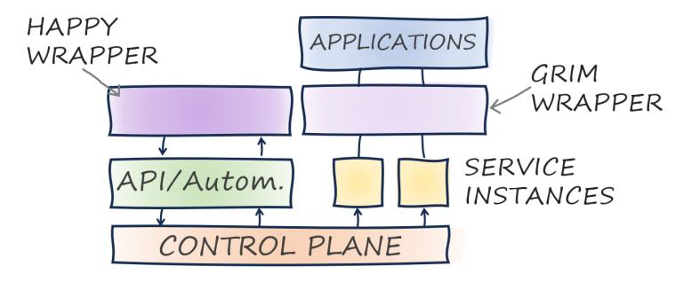

**Control plane wrappers are happier**

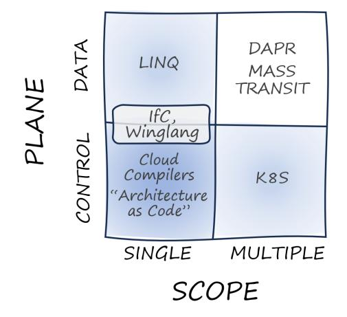

**Wrappers tackle different domains**

The open-source community is drawn to wrapping multiple vendor products. However, by focusing on a single platform, you can build abstractions without losing any of the unique features underneath. On the right-hand side, Kubernetes (k8s) is the obvious favorite for abstracting across multiple cloud platforms.

# **21. Build Abstractions Not Illusions**

**Sometimes less is actually less.**

Too many users expect internal platforms to be nothing short of magic. Platforms that aim to live up to these inflated expectations are bound to find out that magic shows aren't a good match for IT platforms.

## **Making Things Simpler, but Not Too Simple**

The technology available to developers today is nothing short of amazing. However, designing and running such applications can also be complex. It's only natural to want our platforms to hide that complexity. Reducing complexity improves productivity, avoids mistakes, and reduces cognitive load. However, we need to be careful that we provide platform users with useful abstractions, not dangerous illusions.

## **Abstraction: One More Layer Can't Hurt, Can It?**

Internal platforms aim to boost developer productivity by reducing cognitive load. The key mechanism at work is *abstraction*.

If software engineers had named the car, it'd be called "pistoncrankshaft-gear-wheel-assembly".

Luckily, someone else named this awesome machine after its purpose: *automobile*.

Not all car-related naming does an equally good job at abstraction. When we want to move our car, we commonly depress the "gas pedal". That term points to an implementation detail. A more adequate term, which also provides better abstraction, is "accelerator".

## **Good Abstractions Are Obvious but Difficult To Find**

The integration pattern *Scatter-Gather* was initially called "Broadcast Aggregate", named after its components, not the user's intent.

In the world of software, we routinely use abstractions that are so widespread and obvious that we don't even think about it. Common operating system abstractions like sockets, streams, and hierarchical file systems have been around for half a century or more.

## **Composition Isn't Abstraction**

An abstraction provides a higher-level vocabulary that shields the user from the underlying complexity.

For something to provide a meaningful abstraction, it must provide a higher-level vocabulary like that of an accelerator and brake, not one of air-fuel mixtures, fuel pressure, and injectors. Useful abstractions rarely come as isolated constructs. Rather, they form a cohesive vocabulary of related concepts (the fruit salad is the suitable metaphor).

Composition is still useful, even though it does not provide meaningful abstraction. Reference architectures are compositions of existing components that don't shield users from the underlying vocabulary.

### **Illusions Illustrated**

Abstractions that omit essential details become dangerous illusions.

A widespread illusion in distributed system design is RPC—the Remote Procedure Call. This well-intended abstraction makes a call to a remote component look like a local method call. However, a remote call is nothing like a local call: it's slow, doesn't have a call stack, suffers from partial failures, and has to marshal data types across programming languages.

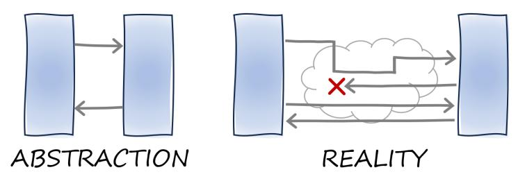

**The RPC illusion: model (left) and reality (right)**

## **Domain Models Provide Actual Abstraction**

Good technical abstractions derive from thoroughly understanding your domain.

The best abstractions come from a thorough understanding of your business domain and your customers' needs and intents. Before you rebut this with "If I had asked people what they wanted, they would have said faster horses," keep in mind that Henry Ford apparently never said it.

### **Stringly Typed Domain Models**

Some domains have inherent complexity. Pretending this complexity doesn't exist is the path to building illusions. The more subtle variant has the abstraction expose seemingly innocent numeric parameters like "maximum batch size" or string fields.

Kevlin Henney jokingly describes the lack of suitable domain entities as *stringly typed*.

The core domain's complexity will come to you—either in the API or in the documentation.

## **Serverless: Distributed System's Essential Complexity**

A hotly debated trade-off when building serverless platforms is which subset of distributed system aspects to expose to the user.

Any high-throughput asynchronous system must consider run-time characteristics like throttling, backpressure, time-to-live, back-off, batching, and limited retry counts. If the APIs expose too little, they create dangerous illusions. If they expose too much, they unnecessarily burden users.

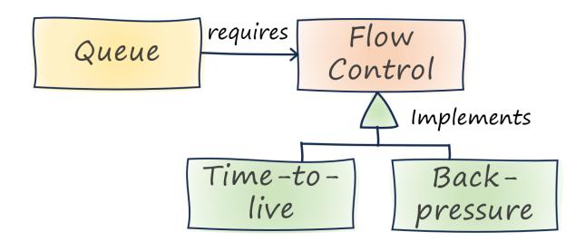

**Flow control in UML**

Time-to-live and backpressure are implementations of flow control, which is a required element of a queue. It's easy to see how strongly typed beats stringly typed.

## **What's "Essential"? It Depends**

The essential aspects (which avoid becoming an illusion) change over time: we used to largely ignore run-time efficiency and carbon footprint. Recently they have become important aspects.

Deciding what's essential is inherently a judgment call. That's why we have architects. The essential aspects of an abstraction change over time as change drives architecture decisions.

# **22. Failure Doesn't Respect Abstraction**

**Time to enjoy a good stack trace!**

Abstraction is an essential tool for building and managing complex systems. Platforms rely on abstraction mechanisms to hide implementation complexity and reduce cognitive load. Alas, when something goes wrong down in the engine room, those amazing abstractions quickly break apart.

## **Flying on Empty**

Air Transat Flight 236 was en route over the Atlantic when the pilots noticed low oil temperature and high oil pressure on engine #2. Later, both engines flamed out due to lack of fuel, rendering this A340 aircraft into not much more than an expensive glider. Thanks to amazing pilot skill, the plane landed on the Azores without any major injuries.

The near-disaster struck because a wrongly installed hose leaked fuel. The leaking hose increased the fuel flow through the heat exchanger, causing the engine oil to cool off more than usual, thereby increasing the oil pressure. Not being aware of the root cause, the pilots pumped fuel from the "good" tank into a rapidly leaking tank and caused the plane to run out of fuel.

Had the pilots known the inner workings of the fuel-oil heat exchanger (FOHE) and its effects, they might have correctly diagnosed the problem. However, the enormous complexity of the aircraft has largely been abstracted away from them.

## **Stack Traces Provide Feedback**

The Java compiler includes source code line numbers for any constructs that it creates. If you write a class without a constructor, the compiler will generate a default constructor that invokes the base constructor for Object and links that back to the first line of the class.

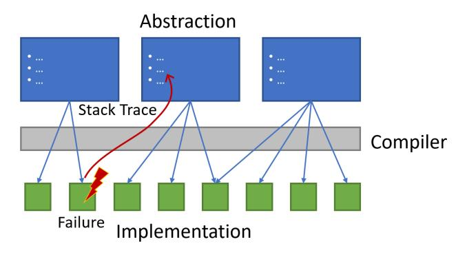

**Linking failures back to their origin**

Platform builders may translate higher-level abstractions into cloud constructs, essentially building a cloud compiler. Such a compiler also must provide a stack trace to allow developers to debug operational issues.

## **Abstraction Is a Tool, Not a Replacement**

Although abstractions seem to work well in the happy day scenario, they can quickly break apart in case of errors. The first trap when designing abstractions is believing that the simpler the abstraction is, the better.

"The purpose of abstraction is not to be vague, but to create a new semantic level in which one can be absolutely precise." —Edsger Dijkstra

Things that matter for a useful abstraction include:

#### **The domain**
An abstraction defines a new vocabulary and domain, usually over an existing one. The main design objective is to choose a domain that's meaningful to the users.

#### **The learning curve**
People will use your abstraction incrementally. A beautiful abstraction that's very difficult to grasp might be suitable for math Ph.D. candidates but isn't so great for programming interfaces.

#### **Dealing with errors**
Abstractions don't just have to serve the sunny-day scenario, they also need to provide a lifeline to their users when things go awry.

## **You Can't Manage What You Don't Understand**

A common management adage is that you can't manage what you can't measure. I believe that's only half the equation. The cockpit crew of Air Transat 236 was measuring all the right things. However, translating what you measure into meaningful action requires you to have at least a high-level understanding of the system you are managing.
