# **Part V: Implementing Platforms**

As with any software-intensive system, implementation isn't just a detail. Platform users will see the implementation but might not see your well-thought-out design considerations. This part dives into the technical design details of internal developer platforms:

- A platform isn't a single piece but has a distinct anatomy
- Application teams interact with platforms in more ways than with regular applications, including templates and automation languages
- Platforms provision resources on behalf of application teams. Resource ownership and tenancy are therefore critical design decisions

# **23. Platform Anatomy**

**Platforms also hide their own complexity.**

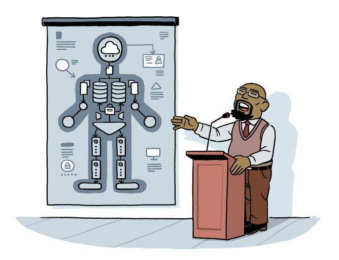

**By Michele Danieli**

The engineering and operational effort behind building and running a platform is easily underestimated. Building a platform that reduces friction, hides complexity, and is also flexible, reliable, and cheap is far from a copy-paste exercise. Teams can start from a common anatomy of components to improve the odds of success.

## **Main Components**

Platform components break down into three major categories:

- The *Management Plane* provides graphical or programmatic user interfaces to platform users and connects back into the control plane and services plane via APIs
- The *Control Plane* provisions services from the underlying base platform and includes functions like user management, orchestration, and compliance checks
- The *Services Plane* consists of services that applications use or are deployed on, including cloud services, SaaS applications, or custom-built services

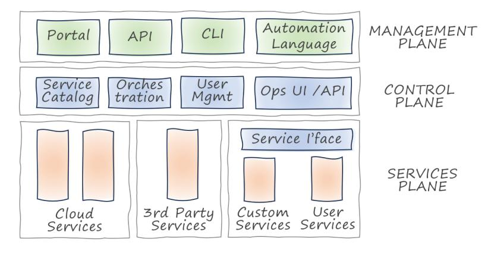

**The anatomy of an in-house platform**

## **Management Plane**

The management plane is the visible part of an in-house platform and forms the basis for the self-service mantra. Platform interfaces come in various flavors:

#### **Visual Interfaces**

A browser-based UI has become the default for in-house platforms. Being well suited to infrequent or one-off tasks, like account creation or initial deployments, might explain the prominence of visual interfaces.

**Portal**: Developer portals allow platform users to provision and manage services. Because most cloud consoles aren't extensible, developer portals are commonly built from general-purpose UI frameworks or open-source projects like Backstage.

Although GUIs are intuitive, they don't scale—try managing a thousand virtual machines by clicking checkboxes! Such a "ClickOps" approach results in a dangerous Hockey Stick experience curve.

**Dashboards**: In-house platforms use visualization dashboards to show an inventory of provisioned services or to plot operational statistics and visualizations.

### **Programmatic Interfaces**

Programmatic interfaces avoid the click-ops trap and allow developers to interface with the platform in their preferred medium: code.

**Command-Line Interface**: CLIs are popular because they provide rapid feedback and allow simple automation via the command shell. In-house platforms often forego building a CLI, instead looking to automation languages.

**Application Programming Interface**: Behind a CLI and a UI usually sit a set of APIs, frequently implemented as REST APIs using JSON payloads.

**Automation Language**: Cloud-based platforms manage resources via automation languages such as TerraForm, Pulumi, CDK, or CloudFormation. They are also a popular integration point for in-house platforms.

## **Control Plane**

The control plane connects the management plane to the service plane, translating development team requests into provisioned and configured services. A key responsibility is reconciling the user configuration against the current state.

#### **User Management**
In-house platforms will usually manage identities that are separate from the cloud provider accounts.

#### **Service Catalog**
Platforms that build abstractions or compositions will provide services on top of the cloud services. A service catalog maintains metadata for these resources.

#### **Service Orchestration**
Service orchestration is the heart of in-house platforms. This is where actions on the platform translate into actions on the base platform. Service orchestration is responsible for resolving abstraction or composition into the vocabulary of the base platform.

## **Services Plane**

#### **Base Services**
Most in-house platforms are assembled from existing components. For example, platforms that operate on top of a cloud provider platform provide users with access to those base services.

#### **Third-Party Services**
In-house platforms often enriched with commercial or open-source services, which aren't available as managed service from the cloud providers.

#### **Custom Services**
In-house platforms may also include custom components, developed by the platform team. These can be higher-level services that in turn call the base platform or third-party components.

#### **User-Contributed Services**
Custom components can also be developed and contributed to the platform by the user community. Accepting services from the user community is a great way to grow an in-house platform.

## **Example: Kubernetes**

Kubernetes has become a near-ubiquitous run time and orchestration platform for containers.

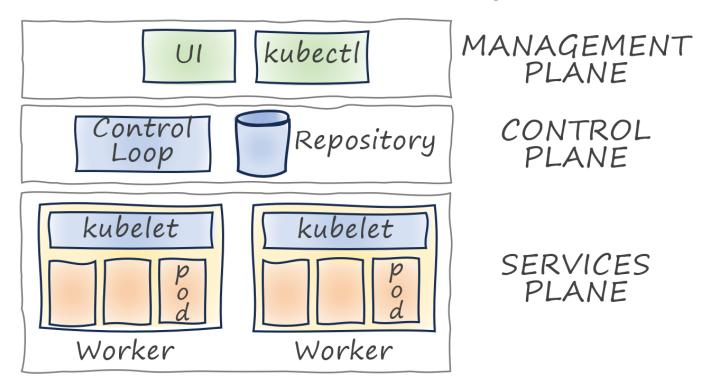

**Kubernetes cluster architecture (simplified)**

Kubernetes' control plane manages the cluster state by scheduling containers or updating the state of an application. The control plane provides an API server for the management plane which allows users to interact with the cluster via a CLI (kubectl) or a UI dashboard.

Application workloads run inside the services plane on worker nodes, which interact with the control plane via agents (kubelets). Kubernetes' Operator Framework provides an extension mechanism by supporting Custom Resource Definitions (CRD).

## **Example: Internal Developer Platform**

A popular site describes an Internal Developer Platform (IDP) as: "Many technologies and tools glued together in a way that lowers the cognitive load on developers without abstracting away context and underlying technologies"

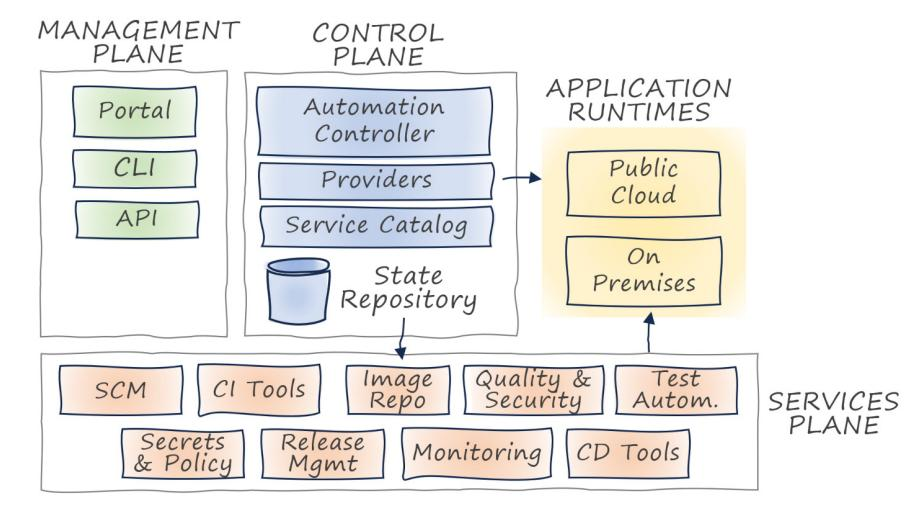

**Developer platform components**

The high-level architecture follows the same planes identified earlier:
- The *control plane* ensures that services and resources are set up and maintained, typically via an orchestrator
- The *service plane* executes the services to be consumed by the application teams
- The *management plane* includes a self-service portal for developers, Backstage being a popular choice
- The IDP will typically integrate with enterprise-wide Identity and Access Management (IAM) systems

#### **Control Plane**

A typical IDP control plane automates a broad range of activities like onboarding developer teams, provisioning infrastructure resources, and managing application components. It consists of:

- An *automation controller*, responsible for orchestrating workflows that provision and configure the services
- A *catalog of services* with the respective automation definitions
- A *set of providers* executing provisioning or configuration tasks on the service plane
- A *repository* that stores metadata about services and resources

For one IDP we built, we instantiated the control plane on Kubernetes, where Crossplane acted as automation controller and ArgoCD as a continuous delivery tool.

#### **Service Plane**

The service plane includes all the services that are offered or supported by the platform. These services implement common platform capabilities that are required for the Software Development Lifecycle (SDLC).

When our team implemented a developer platform at a financial organization, a Git SCM was the first orderable service provided to developers, followed by dedicated Jenkins instances for CI/CD automation.

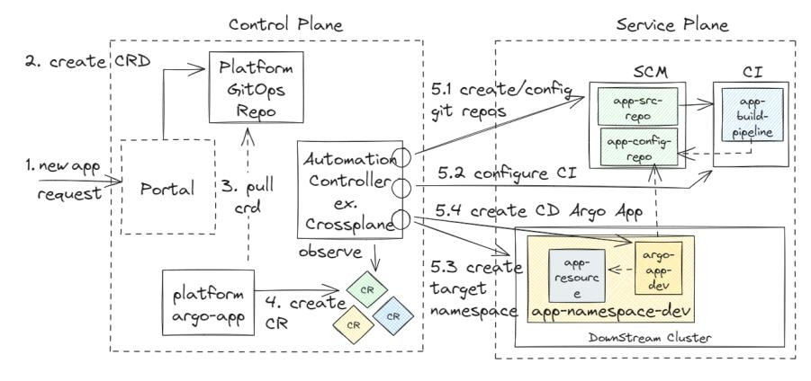

**IDP service provisioning example**

Upon deployment, these services can be integrated into developer portals via plug-ins. The control plane glues these individual capabilities together to provide a consistent developer experience.

# **24. Platform Orchestration**

**From text processor to cloud compiler.**

Development teams interact with a platform in more ways than with a standard software product. In-house platforms that reside on top of a cloud platform additionally employ cloud automation languages as part of their interface.

## **Templates: Paint by Numbers**

Cloud automation predates internal platforms. Before internal developer platforms became popular, infrastructure and operations teams would manage sets of automation files containing Terraform or CloudFormation code. They would create automation templates to simplify consistent resource provisioning.

Template-based platforms inject input from development teams into predefined templates to generate automation scripts.

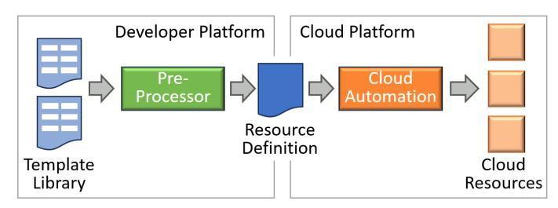

**Injecting variables into cloud automation files**

Declarative automation languages support template-based processing through the use of variable placeholders, allowing teams to build template-based platforms without coding any parsing or text-processing logic.

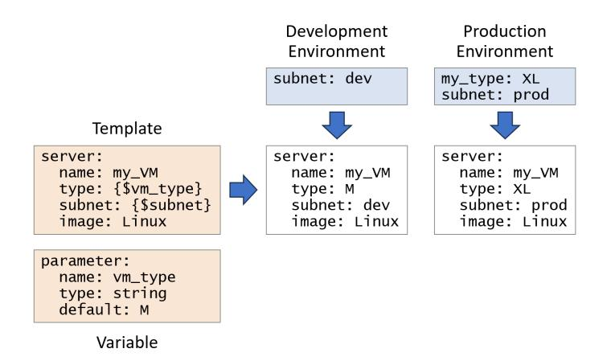

**Template-based platforms inject values into placeholders**

Due to their simplicity, automation templates don't provide much abstraction from the cloud provider's resource definitions. They therefore don't reduce the cognitive load that developers are exposed to, and can even make it worse.

Modern automation languages such as cue treat types as values, eliminating the distinction between a template file, a variable type definition, and a value file.

## **Service Orchestration**

Developer platforms that look to overcome the limits of text-based templates use a service orchestrator, which performs two main functions:

#### **Translate**
Calculate the desired target set of resources from the description provided by development teams.

#### **Deploy**
Modify the compute environment to match the target resource definition.

### **Translate**

Service orchestration translates higher-level specifications like reference architectures into a set of lower-level cloud resource specifications.

Sophisticated translators work like compilers, which earns them the label *cloud compiler*.

Cloud platform translators can work at different levels of abstraction:

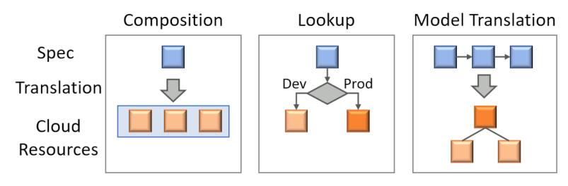

**Different levels of abstraction**

**Composition**: One resource in the platform language translates into multiple cloud resources.

**Lookup**: A logical resource translates into a physical resource based on the context, such as the environment or the cloud provider underneath.

**Model Translation**: Sophisticated automation layer abstractions can expose a different metamodel than the cloud resource model. This approach is closest to an actual compiler.

### **Deploy**

Developer platforms use *declarative provisioning*, meaning that the developer declares the desired state of resources instead of directly issuing commands. The deployment step works in two stages: first, it determines the discrepancy between the desired and actual set of resources. Then, it performs the appropriate cloud resource changes.

Platforms typically deploy in a three-stage control loop:
- *Observe*: The platform monitors changes to the specification and to the environment
- *Analyze*: Based on the changes and platform constraints, it calculates the set of actions to be applied
- *Act*: It applies the changes and starts over to observe for changes

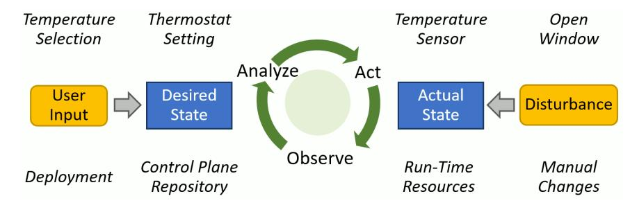

**Control loops for room temperature and template orchestration**

The equivalent in cloud automation is *drift detection*, which can recognize if resources managed by the control loop have been altered manually. Modern cloud automation tools usually can detect drift, but require manual resolution.

### **Tracing Back**

Building higher-level programming models hasn't always worked well. Understanding how compilers fare better reveals one key difference: modern compilers aren't a one-way translation. In case of failure, they link from the generated code back to the corresponding source code line via a line number table or a stack trace.

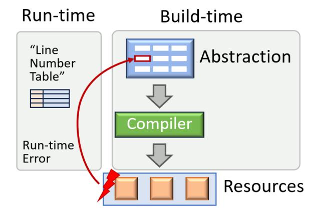

**Tracing back to the source of an error**

Treating translation from a higher-level abstraction as a one-way process creates dangerous illusions.

Equipping generated resources with a link back to the higher-level construct that created it is essential for troubleshooting.

Even though cloud platforms don't have direct support for such links, they support tagging resources with string identifiers. The automation layer can generate such tags in a special format that points back at the position in the higher-level abstraction.

## **Application Code**

Not all of a platform's capabilities may be mapped to cloud resources. This implies that the platform not only provisions cloud resources, but it also deploys application code onto those resources. Because most cloud automation tools separate resource provisioning from application delivery, the platform now must include a build and deployment pipeline for the custom code that it provides.

## **Application Architecture as Code**

Sophisticated platform orchestrators don't just translate a single resource description into a concrete one. Instead, they also emphasize the relationships between the resources by transforming the cloud platform metamodel.

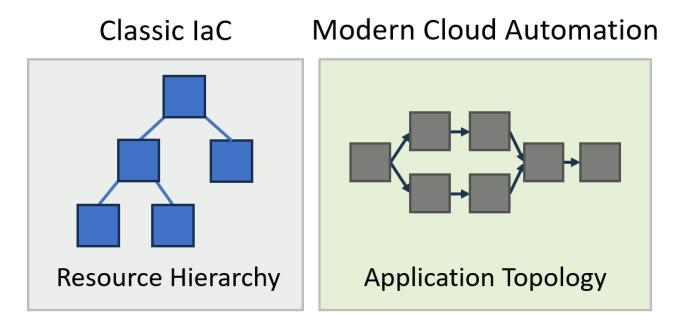

**Coding in application architecture, not resource hierarchies**

Virtually all cloud resource definitions use a resource hierarchy to model the resources. In contrast, modern cloud applications, especially event-driven serverless applications, are described by the data flow and the dependencies between the components.

Modern distributed applications are described by data and control flow rather than a resource hierarchy.

Modern platforms can transform the underlying resource hierarchy so that developers can describe their application via the data or control flow across components.

Architecture as Code (AaC) models the application topology as opposed to a hierarchy of infrastructure resources.

## **Next Step: Cloud Compilers**

A classic example of compilers accommodating machine limitations is 6502 assembly code. The 6502 processor was designed to use the minimum number of transistors and therefore has limitations in register usage and operations.

Just like machine code compilers, cloud compilers can also absorb idiosyncrasies or accidental complexities of the underlying cloud platform or detect misconfigurations. However, compilers cannot hide the physical run-time characteristics like cost or latency.

Increased transparency, such as cost or latency estimates, can provide useful feedback to the users of cloud compilers.

# **25. Ownership and Tenancy**

**Are you selling, leasing, or providing serviced apartments?**

A platform interacts with many application teams, each of which provisions and operates resources. A critical aspect of an in-house platform's control plane is managing ownership of resources across application teams and the platform team.

## **Ownership Drives Speed**

Traditional IT service teams provision and manage resources on behalf of application teams. This setup causes the develop/test/debug loop to span multiple teams, which introduces unnecessary friction.

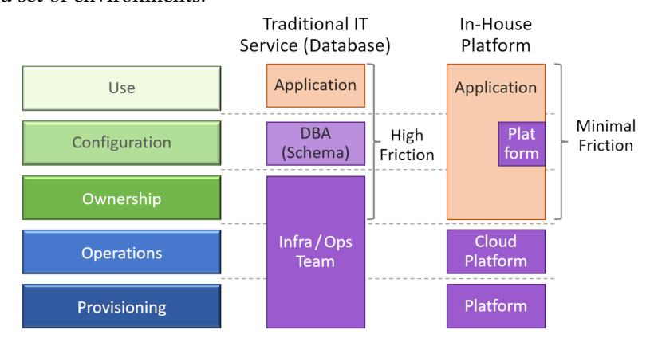

**Shared responsibility models**

Platforms speed up development by reducing friction. That's why in-house platforms leave configuration (largely) to the application teams by providing the necessary administrative rights.

Reducing friction isn't just about speeding up development, it's about teams working differently.

## **Tenancy**

Because platforms thrive on scale they need to support multiple tenants. A multi-tenant system is one in which each tenant has the perception that they operate in an entire environment of their own.

Multi-tenancy used to imply hosting all tenants in a single system. SaaS applications and cloud platforms open up the possibility of providing each tenant with its own environment.

A single system hosting multiple tenants is typically more resource efficient. However, multi-tenant systems must be designed to provide isolation between tenants, both for security and runtime performance.

### **Pushing Tenancy Down the Stack**

Internal developer platforms tend to have more options when it comes to implementing tenancy:
- Inside the resources that they manage (Multi-Tenant Resource)
- Inside the developer platform (Multi-Single Tenant)
- Inside the underlying cloud platform (Independent Instances)

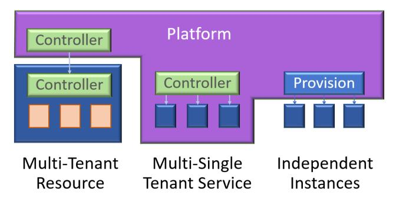

**Three models for managing tenancy**

Managing a logical database for multiple tenants can illustrate the approaches:

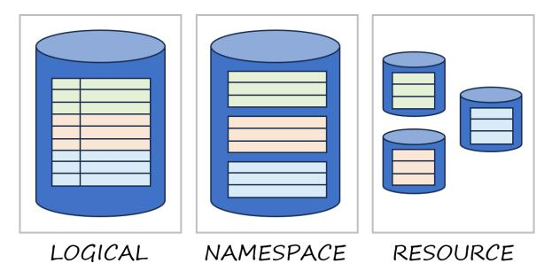

**Tenancy in a database**

**Logical Separation**: By prefixing any row key passed in by the tenant with a tenant ID, you can store all data in a single table. This solution offers the lowest level of performance isolation because data access may slow as the table grows in size.

**Namespace Separation**: Databases structure data into tables, so you can assign one table per tenant. This provides better performance and data isolation.

**Resource-Level Separation**: The highest level of performance and data isolation is achieved by provisioning an entire database for each tenant. This option can work only if creating and deleting databases is automatic and easy.

### **Shared Resources and Fairness**

In the database example, sharing a single resource across tenants may have performance implications. If your resource has different access characteristics, noisy-neighbor issues can become more pronounced. For example, sharing a queue across tenants runs the risk of a single tenant flooding the queue with requests.

## **Ownership**

Aside from the resource cardinality (how many resources the platform creates), the platform can also choose the resource ownership (whether resources are created with the platform's or the user's account).

### **Platforms Are Wholesale Customers**

Platforms can be compared to wholesale customers: they provision resources in bulk to be provided to retail customers on an individual basis. Due to the common need to manage resources across accounts, cloud providers have begun to provide "wholesale services" like Azure Lighthouse or AWS Control Tower.

## **Tenancy Hierarchies**

Some organizations require multiple tiers of tenancy. For example, a large organization may group development teams by business unit, asking your platform to model a hierarchy of teams, each of which manages a hierarchy of resources.

## **Bringing Down the Control Plane**

Most in-house platform control planes only have to manage moderate scale. Control planes managing a large fleet of services often have several orders of magnitude fewer resources. If resources call back into the control plane in an uneven pattern, the control plane can easily become overloaded and fail.
