# **Part VI: Growing Platforms**

Platforms thrive on scale, but platform users don't just appear overnight. Instead, they have to be identified, recruited, and carefully nurtured. If your platform is too basic, it will turn off early adopters. Vice versa, over-investing into features before you have real user feedback is risky.

This part discusses how you can grow your platform over time to expand its user base:

- Platforms live in three dimensions, so it's natural to model platform evolution as a cube
- It's easy to assume that each user is "all in" on a platform, but that's not how things start. Plotting users' experience with your platform over time can be a valuable design technique
- Explaining what your platform delivers versus what users are expected to handle can be surprisingly difficult. Perhaps a picture says 1000 words?
- Maintaining a platform roadmap is a delicate balancing act between accepting user input and sticking to the product strategy
- You might not be able to serve a wide range of customers with a single offering. Instead, you might need to tier and slice your platform

# **26. Platform Evolution Is a Cube**

**Platforms may be flat, but their path isn't.**

Successful in-house platforms don't remain static; rather, they evolve based on user needs and the evolution of the underlying base platform. However, the path they take isn't linear. A decision model can help teams make better decisions that balance technical aspects with platform adoption.

## **The "Cube"**

When designing platforms for GovTech Singapore, a series of simple models helped teams prioritize their investments over time.

One of these models took on a three-dimensional form, which we termed *The Cube*. The cube's three dimensions depict the axes of platform evolution: market reach, platform breadth, and platform depth.

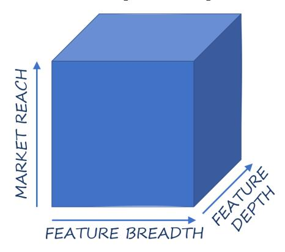

**Three dimensions of platform strategy**

#### **Market Reach**
Platforms enable and speed up innovation across the organization. So, to be successful, both economically and technically, they require broad adoption. Focusing on market reach can help platform teams counterbalance the temptation to build the "perfect platform" for one customer before actively growing the user base.

Building a platform without actively growing its user base can lead to a platform that's perfect for the platform team but not its users.

A platform's potential reach can be defined by its addressable market—Total Addressable Market (TAM) in sales speak. The actual reach grows by promoting the platform to new user groups, new geographies, or new lines of business.

Your planned market expansion may affect the platform team's structure.

#### **Platform Breadth**

The breadth of your platform is measured by what portion of the available problem space it addresses, typically considered as *completeness* by its users.

If you are building an application delivery platform, increasing your platform's breadth could take the form of adding monitoring or communication services to existing tool chain and run-time components.

Focusing on breadth alone can dilute a platform team and compromise other characteristics like quality or cohesion.

#### **Platform Depth**

The platform depth defines the completeness, quality, and sophistication of the elements covered within the platform's breadth. The notion of depth inside a CI/CD pipeline can denote the degree of automation or the tightness of integration between components.

A deep platform is often perceived as "well thought out" or "smooth" by users as they find that the features are well rounded and tightly integrated.

## **The Three "X's" of Product Lifecycle**

Kent Beck's 3X mental model divides the evolution of a product into three distinct phases:

- **Explore**: Find out what works through low-cost experiments to obtain feedback from prospective users
- **Expand**: After you find something that users value, find more users to delight by removing obstacles to further growth
- **Extract**: When the solution space is clear and a user base is established, start harvesting from your success

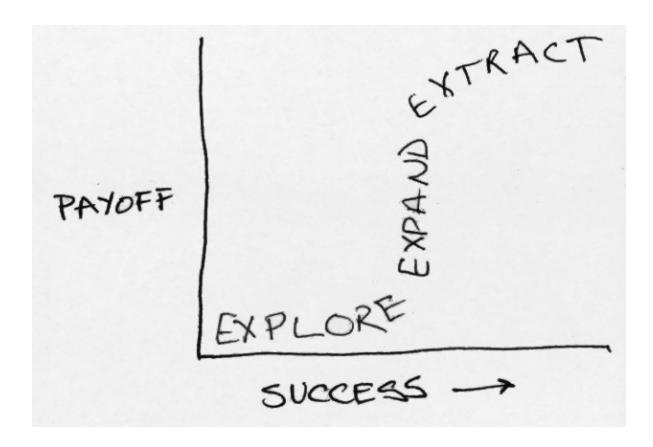

**Kent Beck's "3X" model**

The model is simple but powerful because it draws attention to a few critical aspects:
- Each phase is distinct and requires different tools, approaches, and sometimes people
- The transitions need to be well timed

When building an internal platform to transform software delivery in a large organization, I focused on experimentation and expansion. We then handed over the effort to a different lead for the extraction phase.

## **Common Pitfalls**

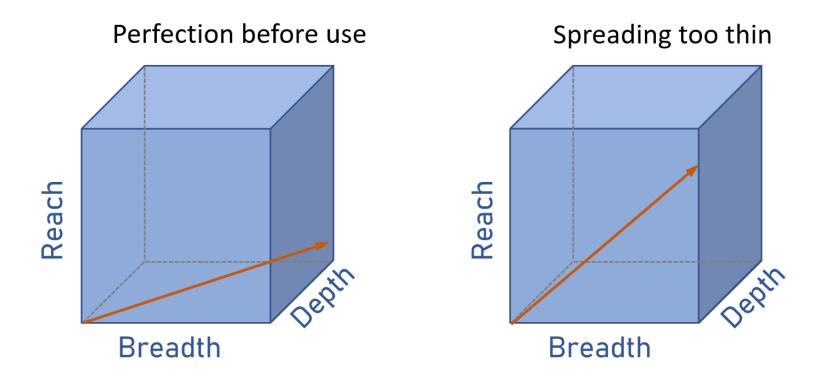

**Plotting platform evolution antipatterns**

#### **Perfection Before Actual Use**

Teams with substantial up-front funding and long planning timelines run the risk of meandering along the cube's bottom plane for too long, pushing further to the right and the back but never lifting up. This approach not only slows the path to value but also deprives these teams of vital feedback signals from actual users.

I have seen large enterprises invest 18 months into developing a cloud platform that would "streamline cloud development" across the organization. When completed, it could hardly find any users.

Not engaging users early leads platform developers into a dangerous trap described by Jaroslav Tulach's "API Authors" paradox: API authors tend to build for themselves as opposed to their users.

#### **Spreading Too Thin**

Platform teams eager to gain a larger user base can be tempted to add features requested by new user segments. This approach can lead to an overly broad platform that they struggle to support. A broad platform with poorly supported features will either erode the user base or turn the platform team into a bottleneck.

#### **Depth versus Complexity**

Too much depth can also be detrimental. Large customers may have unique needs that don't reflect the needs of the broader population. Adding such features for a few big customers can increase the cognitive load for all other users, presenting them with a learning cliff.

### **Balancing Breadth Against Depth**

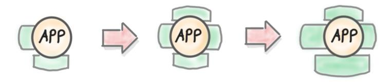

**Growing an Application Delivery Platform**

Such an approach is sometimes referred to as an "upward spiral": you work in iterations, adding a little to each portion of the platform. The alternative is "divide and conquer", in which you complete one aspect first and tackle new areas later.

## **Principles Guide**

Adopting clear principles can help platform teams chart a balanced course through the platform evolution cube. For example, a team might adopt a cohesion over completeness principle to resist the temptation to keep adding features that aren't tightly integrated.

### **Transparency Buys Goodwill**

Not all customers will be happy with the trade-offs that your platform team makes. Being transparent about your choices can buy goodwill from existing and prospective customers. Models such as the cube help you communicate your decisions and trade-offs clearly to a wide range of stakeholders.

# **27. The Shape of Platforms**

**Platform adoption is all but linear.**

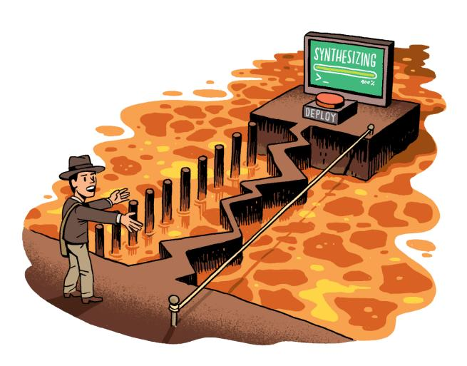

Whereas platform designers see their platform as a whole, users experience platforms in a journey over time that is defined through an initial learning curve, followed by evolving needs, growing scale, or increasing integration. Another model can visualize what that path looks like for your platform users.

## **It's All About the Ramp**

Simple things should be simple, and complex things should be possible. —Alan Kay

A platform that manages to live up to these expectations makes it easy for users to get started and grows along the users' needs. I consider such a platform to have a smooth on-ramp.

## **An Experience Model**

Users' experience with your platform isn't static. They might start out simple, using only a portion of the platform. Over time, as their demands grow, they will fully utilize and perhaps even stretch your platform. The correlation between needs and solution effort/complexity is a critical design aspect for platforms.

### **Experience Curves**

#### **Theory**

In theory, the solution complexity should increase linearly with your needs:

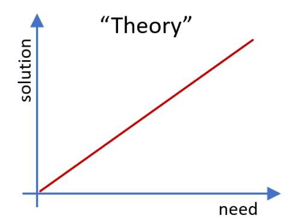

**The theoretical curve: you won't see this in reality**

In practice, no platform has an initial effort of zero, and very few can meet infinitely complex demands.

#### **Ideal**

The best case a platform team can hope for is a curve with a moderate base-level effort that, upon successfully getting over that hurdle, satisfies the users' growing needs at a moderate increase in effort.

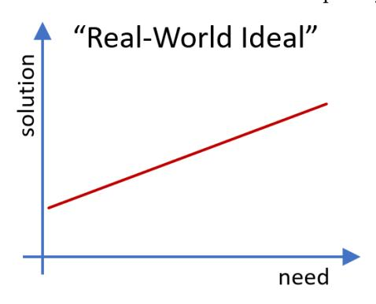

**The best you can do in reality**

Mapped to performance needs, serverless run times can match this curve. Mapped to functional needs, general-purpose programming languages coupled with generic libraries fare similarly.

#### **Cliff**

Platform designers who want to support high functional, performance, and security needs may trade this capability off against a steep learning curve for the user:

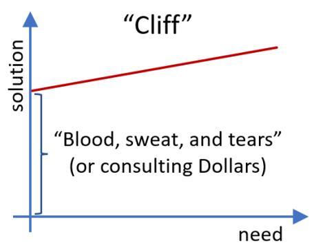

**New users may never see the beauty of your platform**

Despite the platform team's perhaps noble intentions, the cliff results in a rough start for new users. Worse yet, if users become stuck at the cliff, they never get to appreciate the high-end performance.

The Unix shell or editors like vi are considered by many to reside in this category. The initial learning curve is especially steep because you will need to be familiar with at least half a dozen commands before you can be proficient.

The curse of knowledge: once you know how to use a tool, you can no longer imagine the initial experience.

Platform designers have several techniques available to lower the initial cliff:
- Base your platform on concepts and tools that are already known to potential users
- Provide default settings for rarely used or complicated parameters
- Set up templates for a limited set of base cases
- Provide documentation and training
- Display tips of the day in a user interface

#### **Hockey Stick**

Being intent on lowering the cliff, platform designers face a dangerous trade-off that can compromise the upper end:

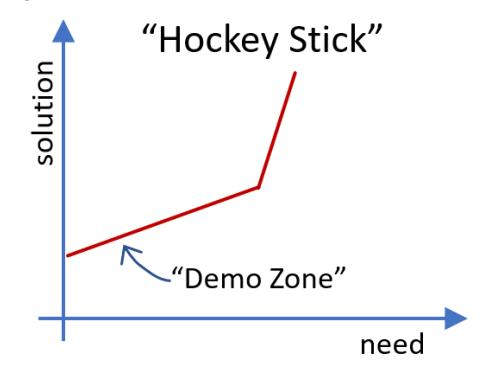

**Bad things await your loyal users**

Products with a smooth on-ramp demo well as they handle the limited requirements with great ease. Sadly, as soon as the users' needs exceed the initial "honeymoon" stage, the platform demands vastly increased effort. Such a curve is well-known as the *hockey stick*.

Hockey-stick platforms are typically those that attempt to anticipate users' needs so that they can make them easy to achieve. However, no one's a perfect guesser.

The stick rears its head in different dimensions including runtime scale, functionality, scope, and SDLC support. Visual editors (endearingly called "doodleware") are examples. They give users an intuitive start but struggle to scale as they fill endless screens with boxes and lines.

Because cloud console UIs are subject to the *doodleware effect*, platforms should offer equivalent programmatic interfaces.

Dampening the hockey stick isn't easy when it results from fundamental design constraints. Possible approaches include:
- Providing multiple tiers of services
- Giving customers the ability to refactor their solutions
- As a last resort, simplify migrating off the platform

#### **Gear Shift**

Platforms that do reasonably well on both ends of the spectrum may resort to having the user switch gears along the way.

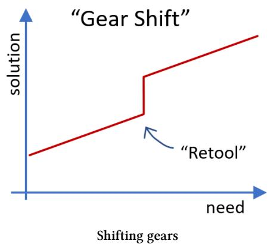

More pronounced gear shifts are those that require you to abandon part of your work so far.

Most cloud platforms provide built-in message routing and filtering services. When a user outgrows the expressiveness, they need to replace the logic with a custom-built serverless function.

The worst assumption a platform can make is that the problem is well-defined, developers select the perfect services, and they live happily ever after.

Common techniques to lower the gear shift jumps include:
- Automated exports from one approach into another
- A wider service portfolio that provides incremental solution choices
- Users that use automated tests will have an easier time shifting gears

## **Reality**

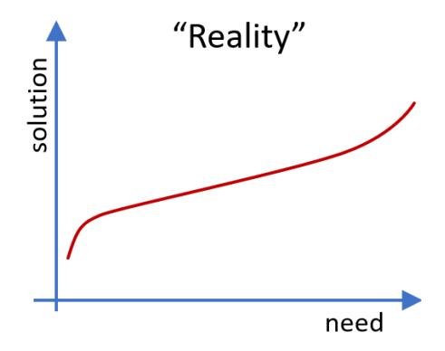

**Real life may serve you an S-curve**

In reality, you may achieve a close-to-ideal curve around common use cases with a manageable cliff at the low end and custom extensions at the top end.

## **Home Grown Platforms Have Invisible Cliffs**

Teams building their own solution will invariably find it easier to use than a platform provided by a third party. When a team grows a solution alongside their needs, that solution will be simple while their needs are still simple.

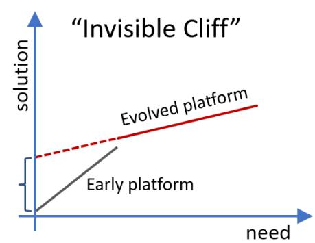

**The teams never experience their platform's cliff**

I'm convinced the majority of people managing infrastructure just want a PaaS. The only requirement: it has to be built by them. —Kelsey Hightower

## **Reshaping Platforms**

In-house platforms typically look to reshape an existing cloud platform's profile, mainly reducing the initial cliff by lowering the cognitive load. Including the decision model in the platform design discussions can help in-house platform teams find the right balance.

# **28. Visualizing Platforms**

**Seeing is believing**

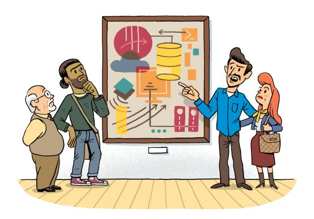

The success of platforms hinges on shared responsibilities between platform providers and users. Such a shared model makes it challenging for platform teams to describe exactly what they are providing. Architects rely on diagrams to communicate, so let's explain platforms in pictures!

## **Maps Come First**

You first need to establish a map of the logical territory before you can indicate respective positions on it.

A map can help visualize what a platform provides vis-à-vis what its users have to add. For example, you need a topographical map to have a meaningful discussion about taking a hike.

The same holds true when mapping complex software systems: the relationships between components can be expressed by their size or position on a coordinate system defined by the map.

## **Platform Visualizations**

### **Onboarding Timelines**

Platform teams can increase transparency around the onboarding process with two visual models:

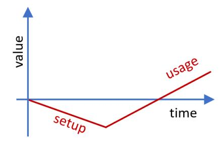

**The value curve conveys the hard truth of platform onboarding**

The value curve reminds platform teams that the customer journey invariably starts with a negative: teams invest to learn the platform, spend time specifying needs, and possibly pay third parties. Only once all that cost has been paid, can the platform begin to pay for itself.

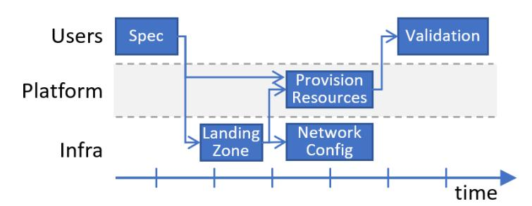

**Platform onboarding across teams**

Swimlane diagrams depict each involved party in a horizontal lane with activities and dependencies plotted across the time axis.

### **Capability Maps**

Perhaps the most common view in IT architecture, the capability map, lists a subsystem's functional capabilities:

**A data platform capability map**

| Data Ingestion | Data Integration | Data Storage |
|----------------|------------------|--------------|
| Batch Ingestion | ETL | Landing Zone |
| Stream Ingestion | Data Aggregation | Data Archiving |
| Event Ingestion | Data Validation | Data Profiling |

Capabilities are a natural starting point for high-level architectures as they provide an easy checklist of "what's in the box". But they aren't particularly strong models because they merely represent a set, meaning they do not express any coordinates or relationships.

Capability maps do not depict user journeys, value delivery, or platform evolution.

### **Lifecycle Maps**

Developer platforms that support the Software Development Lifecycle (SDLC) are most meaningfully depicted along that lifecycle, broken down into development, build, test, deploy, and operations.

A lifecycle map shows a platform's cohesion and closure, whereas a capability diagram merely shows completeness ("7Cs").

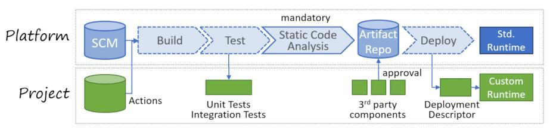

**Extension points for a CI/CD platform**

The diagram depicts a CI/CD pipeline that indicates what components the platform provides, how they depend on each other, which elements the project has to supply, and which components are mandatory or can be replaced.

### **Operational Maps**

Ownership of internal platforms comes in many flavors. Clearly understanding the operational and ownership boundaries is essential for platform users. Diagrams can express ownership and operational responsibilities by "stacking" different models along a virtual axis.

### **Connectivity / Data Flow Maps**

Integration platforms or data platforms are line-centric: the critical capability they provide is sending data from one party to another.

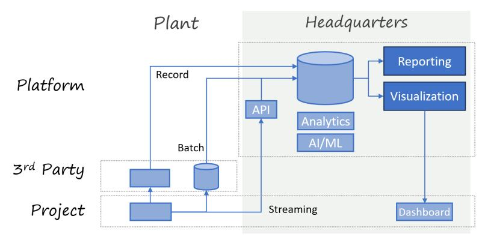

**Sending data to an IoT platform**

The diagram depicts a fictitious IoT and data analytics platform showing the flow of data along the horizontal axis, segmented by locale and ownership along the vertical axis.

### **Extensibility Maps**

Because platforms are generally opinionated, it's useful to include extensibility as a dimension in the diagrams. For example, it's common for integration platforms to accommodate connecting diverse data sources and adding custom analytics tools.

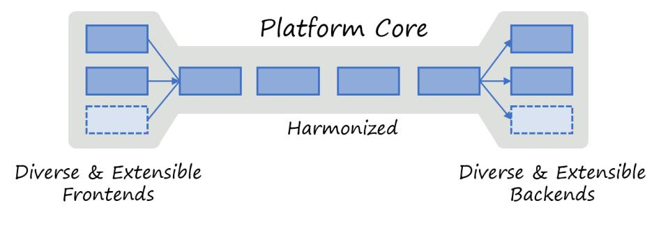

**A data analytics "bone"**

Giving your system an easily recognizable shape sets clear expectations with users.

## **Expressive Visuals**

A few common guidelines help platform teams communicate better visually:

- **Use visual diversity where it matters**: Ensure that different visual styles indicate noteworthy differences
- **Layer diagrams so that they can reveal themselves**: A good diagram has an overall shape that conveys a message after just a few seconds
- **Use the available space, be bold**: Extraneous whitespace doesn't convey meaning. Allow large boxes and fonts

## **Architecture Before Product**

A list of products isn't your architecture, even if they are drawn as boxes.

None of the diagrams in this chapter mention specific products or services. Still, they express critical platform decisions and teach users how to interact with the platform. Too often product selection is mistaken for architecture.

# **29. Charting a Platform Roadmap**

**Staying on track while laying it.**

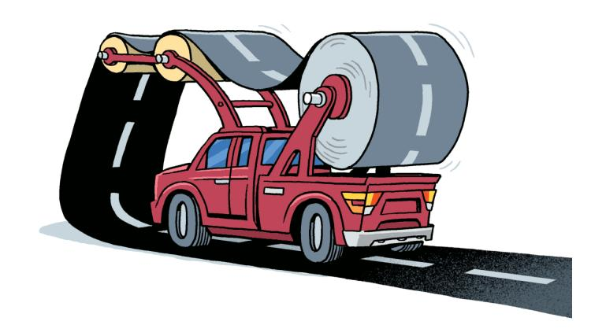

**By Michele Danieli**

IT platforms only generate value when rolled out across an organization. However, the path to widespread adoption is paved with challenges. User input guides platform teams, however it rarely arrives as well-specified requirements. Decision models help platform teams maintain a healthy balance between product integrity and responsiveness.

## **Balancing Completeness With Cohesion**

Essential platform characteristics can be pitted against one another. Adding features suggested by users can increase completeness but hurt cohesion or closure. A simple 2x2 decision matrix can help by plotting incoming requests across business impact and roadmap fit:

**Folding feedback into the roadmap**

|  | Low Roadmap Fit | High Roadmap Fit |
|--|-----------------|------------------|
| **High Business Impact** | Investigate: Why not in roadmap? | Prioritize: Review priority? |
| **Low Business Impact** | Decline: Share evaluation | Backlog: Manage in backlog |

Based on the quadrant, the platform team prioritizes, investigates, queues, or declines a request.

Building to a single customer's needs, although well intentioned, reverts your platform team from a product team into a professional services organization.

### **Customer Feedback Is Biased**

Successful platforms grow based on user feedback. You must keep in mind, though, that your current user base is not a representative sample set. Your current users see the world through the lens of the current product.

I once challenged a team who stated that "users asked for this" whether they also talked to the one million non-users of their service.

## **Selecting Metrics**

Expecting that a platform fixes all problems would be naive. Platform teams can use or extend DORA metrics to measure development team performance. These metrics value the frequency, speed, quality, and stability of the software release.

Metrics should highlight the interaction between platform capabilities and other practices in the organization.

Collecting data from the build toolchain and backlog planning tools helped us identify friction between the inner and outer loops.

## **Sensing the Future**

Data is important to run a platform. Usage data can help the organization sense the future. Relating the evolution of the landscape with consumers' needs can identify new areas or help expand existing features.

#### **Panta Rhei**

Everything flows—*panta rhei*. The same is true about IT. Simon Wardley defines a set of climatic patterns, which he describes as things that change regardless of your actions.

Technical evolution triggers changes in behavior, which will demand new technical capabilities.

Platform teams will witness change driven by a cycle of evolving technology, which leads to new usage patterns, which in turn trigger new demands for technical solutions.

## **Retrospectives**

Joint retrospectives with developers and platform engineers allow the teams to discuss what works well and what does not. The retrospective looks at the relationships between the platform, the organization's processes, and the output of application teams.

Running retrospectives should not be a one-and-done exercise but be an integral part of the normal mode of operations.

## **The House of Quality**

Quality Functional Deployment (QFD) helps translate customer needs into technical requirements. The method's primary model, the House of Quality (HOQ), provides an approach to prioritize functionalities.

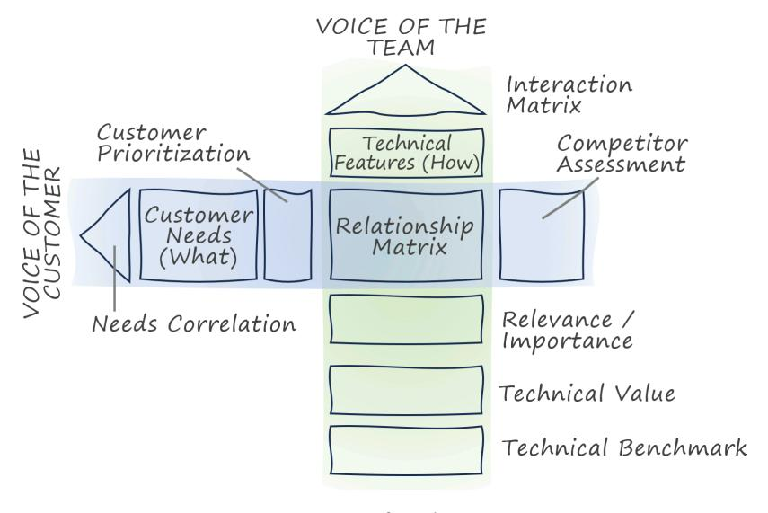

**House of Quality**

At first, prioritized customer needs are evaluated against technical characteristics based on their relevance. The interaction matrix (the roof) is used to identify features that may or not coexist.

## **Building Platforms Outside In**

Many platform teams build a platform from two separate parts: a base layer in which the platform team anticipates common needs, and a custom service layer that is discovered from specific customer needs.

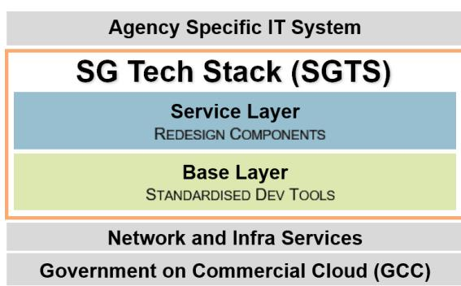

**Singapore Tech Stack; © 2024 Government of Singapore**

The Singapore Government Tech Stack (SGTS) consists of a base layer, which is largely predefined and a service layer that is incrementally built or harvested from agency applications.

# **30. Tiering and Slicing**

**Many sizes can fit all.**

**By Jean-Francois Landreau**

When designing platforms, starting with a single eager customer is a good practice. Still, transitioning from a small set of well-funded customers to the "long tail" may stretch your platform's capabilities and require you to chop it up.

## **Scaling Down**

Inside large organizations, your initial customers are likely to be "premium" ones. Working with well-funded customers is a great start, but invariably you'll encounter customers with tighter budgets.

Scaling down is harder than scaling up.

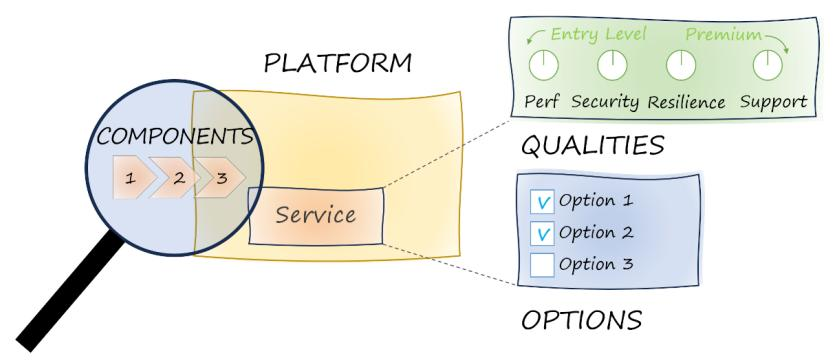

**Tiering and slicing a platform**

Two mechanisms can help a platform serve a wider range of customers:
- Providing different *vertical tiers*; for example, for different ranges of operational qualities
- Providing options by *horizontally slicing* the platform's functionality into modules

## **Tiering**

Automotive platforms support a wide range of vehicles from middle class to luxury cars. Such a tiered offering serves diverse customer segments while avoiding duplication.

Tiering doesn't mean offering poor products to some customers; rather, offering the right product for the right use case.

#### **Performance Tiers**

In-house platforms based on virtual machines can provide tiers aligned to cloud providers' machine sizes, whereas serverless platforms can offer an entry tier without provisioned capacity and a premium tier with provisioned capacity.

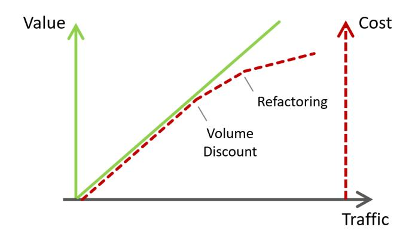

**Serverless provides automatic tiering**

#### **Frequency versus Response Time Tiers**

Performance isn't a single metric. Storage services such as Azure blob storage offer Hot, Cool, Cold, and Archive tiers with different access patterns and cost characteristics.

#### **Resilience Tiers**

What are your customers' Service Level Objectives, Recovery Point Objectives, and Recovery Time Objectives? What are yours?

Major cloud providers' blob storage services offer a range of SLOs. You can implement availability classes by varying the service's component redundancy.

#### **Security Tiers**

IT Security is like insurance for your data. You only realize its value in case of disaster.

A successful platform offers options to meet differences in budgets and risk acceptance. Security features implemented via CI/CD pipelines should be active regardless of tier. However, active run-time security features may be offered depending on the service tier.

#### **Support Tiers**

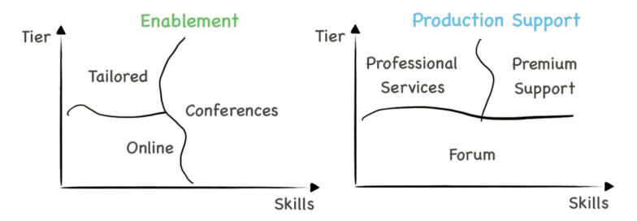

**Enablement and production support depending on skills and tier**

For enablement support, smaller customers tend to have the necessary skills to adopt services faster than enterprise customers. Large customers typically have highly skilled teams but also higher expectations for "high-touch" support.

## **Slicing**

Despite all your efforts to offer tiers for different customer budgets, smaller projects may still not be able to afford your entire platform.

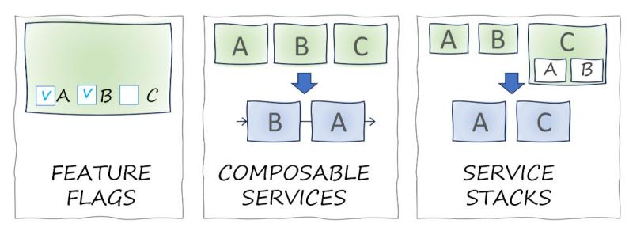

**Slicing a service**

#### **Feature Flags**
It's easy to slice an existing service via feature flags, which can activate features at a corresponding price tag.

#### **Composable Services**
You can break a single large service into smaller ones. This approach offers customers more flexibility to compose their own pipeline from individual services.

#### **Stack of Services**
The best of both worlds is possible by offering individual pipeline services to be composed by the customer and also offering preconfigured pipelines at a premium.

## **Platform Product Lines**

Slicing and tiering a platform resembles the approach of *software product lines*: creating a collection of similar software systems from a shared set of software assets using a common means of production.

Using a household domain like fruit salads to illustrate a concept keeps participants from raising technically detailed but irrelevant discussion points.

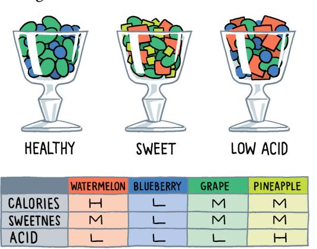

**A fruit salad product architecture based on a well-defined domain model**

Cloud providers' service portfolios that have grown based on customer feedback rarely exhibit a clear product line architecture. Internal platforms can make more assumptions than base platforms but will find that straightening a cloud platform's peculiar product architecture is no simple task.
