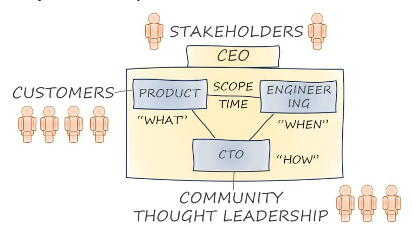
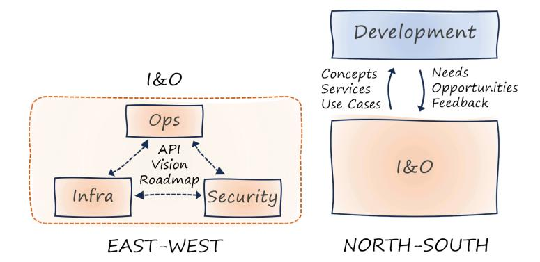
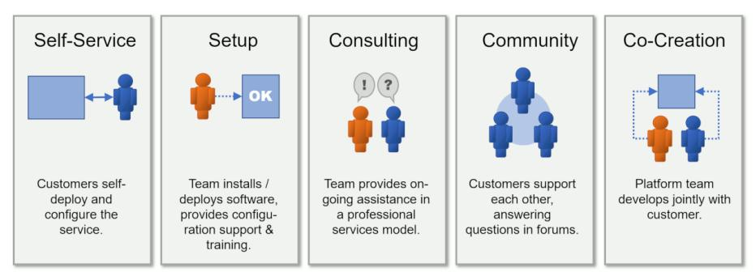
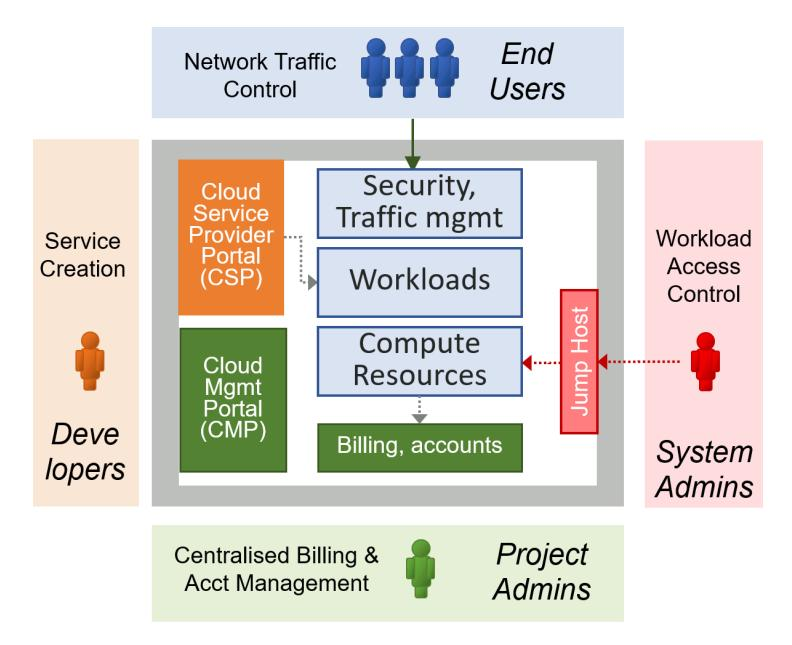
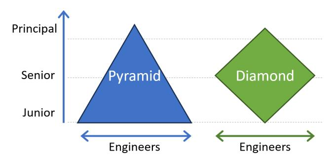
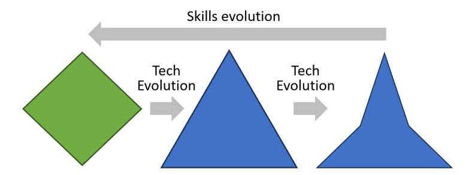

# **Part VII: Organizing for Platforms**

Platform technology can be complex, and building one requires significant technical expertise. However, addressing sociotechnical aspects, handling the dynamics between people and untangling the organizational knot, are equally relevant. This part provides guidance on how to structure platform teams, the skills they need, and how they interact with other teams:

- Running a platform team can be like running a small company
- A platform needs well-defined interfaces and align along two axes
- Platform teams are well advised to place the customer at the center
- Some platform teams can achieve benefits without actually building a platform

# **31. Platform, Inc.**

**Running a platform team is much like running a company.**

In-house platform teams either evolve out of existing IT infrastructure teams or are newly formed as cross-functional teams. Because platforms are products, product teams provide a useful target picture for platforms teams. Think of yourselves as *Platform, Inc.*

## **A Product Organization**

When setting up a platform team, you may gain more inspiration by looking outside the existing IT teams than inside.

A prototypical platform team inspired by a product company relies on the following roles and functions:

#### **CEO**
Most teams benefit from an accountable leader who helps maintain the team's "balance sheet" between headcount, timeline, and value delivery. The CEO manages communication with stakeholders and participates in service pricing to maintain the team's profitability.

When I built an in-house platform team, I routinely spent 30% of my time on recruiting.

An easily overlooked leadership function is recruiting. Attracting internal candidates requires you to be well-connected and well-respected as a leader.

When recruiting, play to your strengths, not other companies' strengths!

#### **CTO**
A successful platform journey requires a clear technology strategy. A CTO should ensure that these decisions are consciously made and documented. Just like a CEO, a CTO can be a great recruiting asset.

#### **VP Product**
The product head owns the product roadmap; that is, what gets built and roughly in which order. This roadmap should combine customer input with the overall product vision.

#### **VP Engineering**
The engineering VP owns the product delivery. They head the engineering teams and define timelines based on the scope, available resources, and team velocity.

#### **VP Marketing**
"If you build it, they will come" rarely holds true, even in corporate environments. Marketing owns outbound communications, articulating platform value and vision to the user community.

When my team built a platform, we posted regular updates, moderated discussion groups, established a visual identity, and held community events.

Platform branding matters. You want people to call your platform by its name.

When rolling out internal platforms, we found that traditional marketing elements can be impactful. Selecting a catchy name and printing stickers, T-shirts, or caps can help build an identity.

#### **Support and Professional Services**
Even with an awesome product, your customers need help. Self-service being a defining feature of platforms doesn't mean that an API call constitutes the entire interface.

Small platform teams can build a "partner ecosystem" of architects and ambassadors throughout their organization.

## **Roles Aren't People**

Do you need this many folks to build and manage a platform? No! The roles don't correspond to single individuals. Also, roles may shift as the platform grows or shifts focus.

If your team doesn't have a support function, your engineers will do support.

Team members juggling multiple roles can work if supporting mechanisms are in place. Early on, one person is likely to wear multiple hats and over time, you can split the roles out to multiple individuals.

### **Fitting It Together**

**Typical interactions in a platform team structure**

A mild tension between product teams, who envision new features, and engineering, which has to manage staffing and timelines, can be healthy.

## **From Infrastructure Team to Platform Team**

The proposed platform team structure is very different from that of a traditional IT team. A blog post of mine outlines three approaches to instilling a fundamentally different way of working:

**Inject ("Missionaries")**: Inject new team members who are familiar with the new way of working. The odds of success are slim as team members are bound by existing incentive structures.

**Incubate ("Boot Camp")**: Embed team members into another team that practices the new way of working. This can work well, but returning team members will face challenges.

**Extract ("Shanghaiing")**: A boot camp from which team members won't return. The new team ultimately replaces the old team.

### **Cloud Service Teams**

Major cloud providers use a similar model for the teams building individual cloud services:

**General Manager (GM) = CEO**: AWS GMs are mini-CEOs of their autonomous "two-pizza" teams.

**Sr. Principal Engineer (SPE) = CTO**: Principal engineers help shape the technical service vision or tackle the most difficult problems.

**Software Delivery Manager (SDM) = VP Engineering**: Reporting to the GM, the SDM manages the development teams.

**Product Manager (PM) = VP Product**: PMs act as the conduit between customer needs and engineering teams.

**Product Marketing Manager (PMM) = VP Marketing**: PMMs take an outbound role to carry the key product messages to the audience.

**Developer Advocate (DA) = Community management**: DAs frequently speak at events or author blog posts.

## **Keeping a Platform Team**

Building and running a platform team is only half the story. Such a team of successful platform engineers is an asset that other organizations will be keen to pillage!

Your best hire is the person who doesn't leave.

#### **People wanting to steal your engineers is a high-class problem**

What if we train our people, and they leave? Well, what if you don't train them, and they stay?

So, never hold your folks back to keep them longer. It'll likely backfire.

#### **Play your assets**

Engineers can always make more money somewhere else. Pay your staff so that compensation isn't a concern and make them want to stay by having them be part of a great team. Don't forget that you have more ways to reward team members than just compensation.

#### **Personal relationships outlast employment relationships**

I have always been a firm believer in building lasting relationships that don't depend on us being on the same payroll.

# **32. Multi-Sided Platform Teams**

**Platform teams interface in two dimensions**

**By Michele Danieli**

Platform teams need to architect themselves to tackle the challenges of building an internal product that sits at the crossroads between developers and operations. Building interfaces across these teams is essential for platform teams to succeed.

## **Shifting Gears: Platform Teams Are the Clutch**

The tension between development teams and operations derives from a misperceived struggle between control and speed. Developers want to move faster, whereas operations aim to slow down in the belief that it yields better control.

A head of infrastructure and operations once explained how he sympathizes with developers' desire to adopt cutting-edge technologies, but that the board holds him accountable for meeting operational and security SLAs.

Platforms are like transmissions that enable higher speeds. When shifting gears, a clutch is exactly the right mechanism. However, if the speeds never align, the clutch must absorb the enduring misalignment and will burn out.

## **Aligning the axes**

Platform teams aren't just another team within the organization—they challenge existing relationships along two axes:

- *East-West* inside Infrastructure and Operations (I&O), which requires previously isolated teams to collaborate closely
- *North-South* between operations and developers; those who build and those who consume platform services

**Coordination within and across teams**

### **East-West: Breaking Down Technology Silos**

Building and sustaining a platform requires coordination across diverse competencies. However, I&O teams are used to splitting responsibility along technical boundaries.

Don't ship your org chart!

If your team remains siloed, you either need to defeat Conway's Law or you need to regroup into a cohesive platform team with aligned goals and fluid communication.

Growing a developer platform while fighting against organizational silos will lead to poorly integrated components, aka fruit basket.

**The snake that (too apparently) ate a siloed platform**

#### **Can an extra layer abstract the org chart?**

Organizations may be tempted to adopt virtual team models. Such "matrix" setups are notoriously difficult to implement due to excessive internal coordination, misaligned incentives, and bruised egos.

Infrastructure teams hold hidden power in large IT organizations. Without the necessary network configuration, a team won't be able to launch anything.

#### **Focus on outcomes to improve collaboration quality**

East-West relationships require coordination, including negotiation. Agreeing on outcomes before trying to agree on a solution opens up the playing field and leaves room for team autonomy.

Before I ever heard the term *platform engineering*, my team set out to achieve a seamless experience for developers by automating moving code into production. We quickly learned that addressing sociological aspects was more difficult than solving technology problems.

Pushing a master design increases the risk of confrontation. Instead, focus on expected behaviors and dependencies, leaving room for creative solutions.

The three modes of integrating with existing systems: fix it, wrap it, or work around it.

### **North-South: Adoption Is a Two-Way Street**

#### **Internal marketing or the art of dialog**

Because a platform needs to enable its users, defining the product scope, collecting marketing intelligence, and testing hypotheses are critical steps. You won't be able to anticipate all needs; instead, you should follow a continuous process of listening and responding.

Platform teams require product management skills to identify the opportunity and drive adoption.

I have experienced conversations that started on the wrong foot, with each party making assumptions about the other and taking strongly biased views.

A platform can succeed only if organizations understand and address true needs instead of copy-pasting tools from other companies or vendor case studies.

#### **Listen to your users but don't expect print-ready requirements**

Build a system that the users wish they had asked for! —Kent Beck

Instead of writing down user input as immediate requirements, examine process flows to understand impediments and why they happen.

When implementing our developer platform, we encountered teams deploying large units with low functional cohesion. The root cause was friction in onboarding a new software component.

#### **Avoid user churn by listening to feedback**

Mandating platform use can drive initial adoption, but voluntary adoption assures much deeper engagement. Traditional IT organizations aren't used to operating in an open market, so they aren't well versed in engaging with their users.

Failing to respond to feedback can erode your customer base. But failing to resist bad ideas may send your platform sideways.

Our internal development platform team used tech talks and company events to show what we were working on and why.

#### **Maintain a balanced roadmap**

A team might decline a valuable feature request because it doesn't align with the platform scope. But instead of simply rejecting an issue, teams should engage in an open conversation.

Platform teams must embrace complete ownership of the quality and usability of their platform. They must also acquire soft skills to interact more broadly within the organization.

## **Define What a Platform Means to You**

Given the buzz around platforms, organizations can be tempted to dive into the technical aspects and chase cool features instead of prioritizing business impact. Because each organization has unique goals and constraints, an adoption framework is useful to clarify the benefit that a platform will bring to your organization.

# **33. The Customer Centric Platform Team**

**Self-service doesn't have to be anonymous.**

Platforms scale by enabling users to perform tasks as self-service. That doesn't imply that platform teams don't interact with their customers—quite the opposite. Some of the most successful platform businesses introduce new features with "Customers have told us…"

## **Customer Engagement Models**

When building an internal developer platform for the government of Singapore, we used the following model to discuss and decide how we should interact with our internal customers:

**Customer engagement models**

#### **Self-Service**
Self-service is the mechanism that gives platforms low friction of onboarding and the ability to scale. Self-service is more than just an API to deploy a platform resource.

An API is a user interface for developers.

The better designed the self-service APIs are, the easier it is for users to become self-sufficient. Just like any good user interface, APIs must be consistent and set the proper expectations.

#### **Setup**
Modern platforms provide technical self-service, but development teams will still appreciate help with setup activities. For example, the flurry of options may present new users with a daunting cliff, which can be substantially lowered with some hands-on assistance.

#### **Consulting**
Consulting or professional service are a frequent element in product teams. Consulting can take a variety of forms, from teaching to architecture reviews, or hands-on development.

When you visit a doctor's office, the receptionist greets you with "two aspirin." It might be the correct advice, but will you feel well consulted?

Consulting can be a welcome vehicle to generate short-term revenue for platform teams. It can also provide a useful feedback channel.

Performing too much consulting turns your product organization into a professional services organization, which is unlikely to scale as you intended.

#### **Community**
Your team doesn't need to be the only one supporting customers. As your user base grows, advanced users can be great amplifiers for a small platform team. Communities are also excellent input channels for platform teams.

#### **Co-Creation**
The closest interaction with your customers can be to build something together; for example, a new platform feature. Co-creation can be a useful recruiting tool inside large organizations.

## **Mixing and Matching**

As with other decision models in this book, no one engagement mode is preferred over another. The main value of the model is to provide a list of named choices, allowing teams to have intelligent discussions about their desired staff allocation.

For most platform teams the split across these engagement models is expected to shift over time. For example, as your platform grows, more user interaction can be channeled to community forums.

## **The Power of Community**

Internal marketing is essential for platforms to succeed. Such marketing shouldn't just be one-way communication; it should harvest the power of community.

Your happy customers are your most powerful salespeople.

When launching our Agile Delivery Platform, we used the internal architect community to share progress, solicit input, and also give users a forum in which to share their experiences.

Activities that can help foster communities:
- Lunch-and-learn sessions or pizza nights
- Focused offsite events of internal conferences
- Posts on private social-media platforms or private knowledge-sharing instances
- Newsletters and posters

### **Centers of Excellence**

Many large-scale cloud platform rollouts foresee the creation of a Center of Excellence (CoE).

Simply renaming centers of excellence into platform teams is a major failure mode of platform engineering.

Large organizations may be tempted to rename their existing Cloud Centers of Excellence (CCoEs) into "Platform teams" in the belief that renaming teams will lead to actual changes. CCoEs provide training and consulting but lack the setup of successful platform teams.

## **Which Customers?**

To serve your customers, it's important to understand the different customer personas that your team serves.

**Platform customer groups**

Internal platforms generally serve four distinct customer groups:

**Developers**: The primary user group for internal platforms. Developers use the cloud console, platform console, APIs, and automation languages.

**Project Administrators**: Manage budgets and forecasting. They examine billing statements and lead cost reduction efforts.

**System Administrators**: Perform operational tasks and may need direct access to compute resources.

**End Users**: Platform teams should not forget that applications built on top of their platform serve internal or external end users.

Dividing customers into these personas allows platform teams to better understand support needs.

# **34. Platform Teams Without Platform**

**Pyramids last 5,000 years, but diamonds are forever.**

**By Jean-Francois Landreau**

Managing skills is an important aspect of a successful platform strategy. Platforms centralize expertise and reduce cognitive load to better the skill sets of engineering teams. Successful platform teams should actively shape your teams' skills profile, and sometimes they may not even need an actual platform to do so.

## **Do Two Pyramids Make a Diamond?**

The distribution of skills in engineering teams can follow two distinct approaches: a pyramid or a diamond. The pyramid model assumes that a small group of principal engineers guide a larger number of senior engineers and an even larger base of junior engineers.

**Skills models: pyramid versus diamond**

Pyramids are obsolete in modern IT architectures and the same holds true for skill sets. The assumption behind the pyramid is that junior engineers are productively coding in a paint-by-number style thanks to frameworks. Sadly, this approach runs into the same issue: it assumes that you can anticipate all developers' needs.

A diamond-shaped skills distribution provides higher levels of agility because it enables every team member to change anything, anytime.

In comparison, the diamond-shaped skills distribution favors a majority of senior engineers. They are skilled enough to build on top of platforms and navigate the entire code set.

When I worked in the periphery of Paris, a competitor decided to relocate, causing several employees to leave. They worked productively in a pyramid model for many years. They didn't pass our tests because our diamond model assumed a deep understanding of programming languages.

Modern cloud platforms such as serverless run times hide complexity but still require developers to be well versed in distributed system design.

A diamond-shaped skills profile is better suited to platforms because a large population of engineers can innovate and work productively on top.

## **Keeping the Diamond in Shape**

Engineering skill sets must evolve along with new technologies and methodologies. The diamond shape of skills has a natural tendency to revert to a pyramid due to evolution in technology or ways of working.

**Technical innovation implies skills gravity**

Whereas principal engineers are prepared to stay on top, senior engineers are more prone to being destabilized or even resisting change. They may have successfully gained expertise in one technology and can't yet recognize which knowledge they can reuse and which to discard.

To keep your team in a diamond shape, you need to actively evolve the team's skills.

## **Platform Enabling Teams**

*Team Topologies* defines the role of enabling teams alongside platform teams:

"The end goal of an enabling team is to increase the autonomy of stream-aligned teams by growing their capabilities with a focus on their problems first, not the solution, per se."

Platform teams reduce the underlying system's cognitive load, whereas enabling teams assist development teams with overcoming the remaining (intrinsic) cognitive load.

Platform teams deliver a product as a service, whereas the enabling teams facilitate. Engaging with development teams on an individual basis makes enabling teams highly effective, but also limits their ability to scale.

## **Mental Models Impact Cognitive Load**

The cognitive load a team faces isn't just defined by the tools they use. The mental model inside the user's head also has a major impact on the load. "Mental model" is the internal representation of external reality, meaning the way we think about our environment.

**The choice of mental model affects cognitive load**

For centuries, the Earth was assumed to be the center of things. This *geocentric* model results in incredibly complex paths. By placing the sun in the center, the *heliocentric* model makes everything much simpler. Both are models, but the heliocentric model allows users to reason with much reduced cognitive load.

The same is true for IT systems. Teams that built a mental model based on synchronous communication will find the behavior of distributed, asynchronous systems equally erratic. Similarly, teams whose mental model considers change to be risky will struggle to adopt agile methods.

### **Platform Teams Without Platform**

When a major technical shift takes place, the enablement teams will have difficulty addressing these changes across all stream-aligned teams. Central teams can reduce cognitive load not by changing the underlying system, but by adjusting teams' mental models.

The role of an enabling team can be misunderstood to further the use of the in-house platform. But it can exist (and be effective) without one.

Creating an internal platform can hide much complexity. But removing too many options collapses the diamond-shaped organization back into a pyramid shape.

The platform team without a platform helps people become better at fishing the new fish. It's not making the fish easier to catch.

The platform team without a platform concentrates highly skilled persons into one team. It must recognize a paradigm shift and the benefits it brings. By demonstrating the new paradigm in action they can showcase its value.

In a previous company, we didn't create a platform; instead, we raised the team's expertise. Not having built a platform that we needed to maintain allowed us to quickly move to other teams.

When adopting a new base platform, organizations may need enablement in three distinct layers:
- A team teaching the base platform; for example, the cloud platform and its services
- A platform team without a platform that reduces cognitive load by adjusting the teams' mental model
- A classic enablement team that engages in projects to overcome hurdles

The notion of a platform team without a platform lines up well with the *Team Topologies* notion of a TVP—a Thinnest Viable Platform.

In the extreme case, your platform could just be a wiki page that states which cloud services you should use and how.

Similarly, the CNCF Platforms Whitepaper advises:

Platform teams must focus their energy on the experience and capabilities that are unique to their specific business.

This advice implies that operating a complex platform can detract teams from generating value. Keeping the platform thin enables the platform team to enable other teams.

## **AI Assist**

Whereas many technologies increase cognitive load for developers, some are designed to reduce it. AI-assisted coding tools, like GitHub Copilot, can generate code snippets from comments.

The shared hope is that AI-assist shifts a pyramid-shaped organization back into a diamond shape by making junior developers more productive. However, the resulting code will still carry the same cognitive load as if it were written by hand. AI-assisted coding tools can't (yet) change mental models.

## **Human Giants**

If using a platform means standing on the shoulders of giants, your teams now stand on the shoulders of human giants. You'll have a team of "human giants" in waiting mode, detecting new trends and monitoring the skills shape.

To live up to their name, such teams need to be versed in a variety of mechanisms:

**Spikes**: You want your giants to have actual hands-on experience instead of regurgitating the latest marketing material.

**Tailoring**: Many base platforms provide configuration and customization, allowing them to be tailored to an organization's context.

**Pairing**: Pair programming, pair designing, pair-anything are great two-way streets to enablement.

**Training**: Traditional training is an option if team members understand the paradigm shifts and the new mental models.

**Blueprints**: Architecture references, blueprints, and templates are an intermediate step toward a platform.

**Forcing Functions**: Automated tools can be surprisingly effective governance mechanisms. Netflix's Chaos Monkey enforces a mindset shift toward resilience.

## **Common Transitions**

Platform teams without platform spring into action during major shifts in technology or ways of working:

#### **Cloud Adoption**
When adopting the cloud, companies usually suffer from an initial lack of skills. Although logically appealing to build a platform first, this approach runs the risk of missing the mindset change across the broader population.

#### **DevOps Transition**
The transition to a DevOps model is another situation for which platforms are being built in a feeble attempt to cause a mindset shift. The platform team without a platform follows a "DevOps team with an Expiry Date" approach.

#### **AI Technologies**
Generative AI moves many lines at the same time. The desire to concentrate the skills and make it easy for anyone to try is high, and a platform appears to be the natural approach. The alternative is to have this special team quickly elevate the skills in the company.

The AI/ML domain is heavily pyramidal. When these different personas sit in different companies, it becomes difficult to fight the pyramid model. Nevertheless, it's a necessity to maintain diversity.

The "Platform Team without Platform" is a strategic approach that recognizes the value of a platform while intentionally postponing its creation. It aligns with the principles: understand the potential benefits of a platform; resist the urge to immediately build one and explore alternative solutions first. This deliberate delay can lead to an actually necessary, refined, and effective platform when—or if—you decide to build one.
