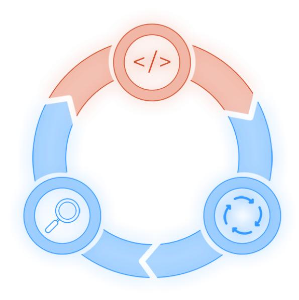

THE

# SOFTWARE DEVELOPERS' GUIDEBOOK


**DAVE FARLEY** 

**EDITED BY BERNARD MCCARTY** 

# **The Software Developers' Guidebook**

A Collection of M[odern Engineering Practices](https://leanpub.com/softwaredevelopersguidebook)

[David Farley an](https://leanpub.com)d Bernard McCarty (Editor)

This book is available at https://leanpub.com/softwaredevelopersguidebook

This version was published on 2025-08-19


This is a Leanpub book. Leanpub empowers authors and publishers with the Lean Publishing process. Lean Publishing is the act of publishing an in-progress ebook using lightweight tools and many iterations to get reader feedback, pivot until you have the right book and build traction once you do.

© 2025 Dave Farley

The rights of Dave Farley to be identified as the author of this work has been asserted by him in accordance with the Copyright, Designs and Patents Act 1988.

The author has taken care in the preparation of this book, but makes no expressed or implied warranty of any kind and assumes no responsibility for errors or omissions. No liability is assumed for incidental or consequential damages in connection with or arising out of the use of the information contained in this book.

All rights reserved. This publication is protected by copyright, and permission must be obtained from the author and publisher prior to any prohibited reproduction, storage in a retrieval system, or transmission in any form or by any means, electronic, mechanical, photocopying, recording, or likewise.

*I am grateful to the CD team for constantly mucking about, not taking anything I say seriously and generally being wonderful. For all your help and support over the past 5 years, and for making this book possible, many thanks to: Bernard, Tom, Georgia, Ben, Ramona and Kate.*

# Contents

| Preface                                                 | 2           |
|---------------------------------------------------------|-------------|
| Part 1. Foundations of Modern Software Development      |             |
| Starting A New Project                                  | 3           |
| Introduction                                            | 3           |
| Fast Feedback                                           | 3           |
| Optimise for Learning                                   | 3           |
| Set Up the Dev Environment                              | 4           |
| Build a Deployment Pipeline                             | 4           |
| Setting Goals                                           | 5           |
| Working in Small Steps                                  | 5           |
| Get Measures in Place                                   | 5           |
| Be Prepared to Change                                   | 5           |
| Learn more...                                           | 6           |
| Writing Better User Stories                             | 7           |
| Better Specifications with User Stories                 | 7           |
| What Are User Stories?                                  | 7           |
| User Stories Are Targets, Not Tasks                     | 7           |
| Good Stories                                            | 8           |
| Examples of Good Stories                                | 8           |
| Who Writes User Stories?                                | 8           |
| Tips for Writing User Stories                           | 9           |
| Where to Start                                          | 9           |
| Writing User Stories                                    | 9           |
| Avoid These Common Mistakes                             | 10          |
| Transforming Technical Requirements into User Stories   | 11          |
| Learn more....                                          | 12          |
| Organising Software Development Teams                   | 13          |
| How to set up your Software Development Teams?          | 13          |
| Team Size and Structure                                 | 13          |
| Team Skills & Responsibilities                          | 13          |
| Team Organisation                                       | 15          |
| Platform Teams                                          | 17          |
| Cooperation and Collaboration                           | 18          |
| Here are some recommendations:                          | 18          |
| Transforming Team Structure                             | 19          |
| Learn more...                                           | 19          |
|                                                         |             |
| <b>Pair Programming Patterns</b>                        | 21          |
| What is Pair Programming?                               | 21          |
| Pair Patterns                                           | 22          |
| Pair Rotation                                           | 22          |
| The Benefits of Pair Programming                        | 23          |
| Pair Partnerships                                       | 26          |
| Tips For Successful Pairing                             | 26          |
| Learn more...                                           | 27          |
|                                                         |             |
| <b>Part 2. Software Testing</b>                         | 28          |
| <b>Beginners Guide To TDD (Test Driven Development)</b> | 29          |
| Test Driven Development                                 | 29          |
| RED > GREEN > REFACTOR                                  | 29          |
| Top Tips                                                | 30          |
| Getting Going with TDD                                  | 30          |
|                                                         |             |
| <b>TDD Top Tips</b>                                     | 32          |
| When to Use TDD?                                        | 32          |
| Test to Evaluate Behaviour, NOT Implementation          | 32          |
| Test First To Improve Design                            | 33          |
| Three Mindsets of TDD                                   | 33          |
| Refactoring for Legacy Systems                          | 34          |
| The Shape of Your Tests                                 | 34          |
| Changing Your Design.                                   | 35          |
| Testing at the Edges                                    | 35          |
| Practise                                                | 36          |
| Learn more...                                           | 36          |
|                                                         |             |
| <b>Acceptance Test Driven Development</b>               | 38          |
| Approach                                                | 38          |
| Properties of Effective Acceptance Tests                | 38          |
| Tips                                                    | 38          |
| Four Layer Separation of Concerns                       | 40          |
| Test Cases                                              | 40          |
| Domain Specific Language (DSL)                          | 40          |
| Protocol Drivers                                        | 41          |
| System Under Test (SUT)                                 | 41          |
| Growing the DSL                                         | 42          |
|                                                         |             |
| Testing in Production 46                                |             |
|                                                         |             |
|                                                         |             |
|                                                         |             |
|                                                         |             |
|                                                         |             |
|                                                         |             |
|                                                         |             |
| Eliminate Intermittent Tests<br>                        |             |
|                                                         |             |
|                                                         |             |
|                                                         |             |
|                                                         |             |
|                                                         |             |
|                                                         |             |
|                                                         |             |
|                                                         |             |
|                                                         |             |
|                                                         |             |
|                                                         |             |
|                                                         |             |
|                                                         |             |
|                                                         |             |
| Get Started With Behaviour Driven Development (BDD)     |             |
|                                                         |             |
|                                                         |             |
|                                                         |             |
|                                                         |             |
|                                                         |             |
|                                                         |             |
|                                                         |             |
|                                                         |             |
|                                                         |             |
| Test Software Performance<br>                           |             |
|                                                         |             |
|                                                         |             |
|                                                         |             |
|                                                         |             |
|                                                         |             |
|                                                         |             |
|                                                         |             |
|                                                         |             |
| Part 3. Continuous Delivery Practices                   | . <b>65</b> |
| How To Build A Deployment Pipeline                      | . 66        |
| What Is A Deployment Pipeline?                          |             |
| Key Components                                          |             |
| The Deployment Pipeline                                 | . 66        |
| How To Build A Deployment Pipeline                      |             |
| A Simple Example                                        | . 68        |
| Getting Started                                         | . 68        |
| Create a Commit Stage                                   | . 68        |
| Create an Artifact Repository                           | . 68        |
| Create an Acceptance Stage                              | . 68        |
| Create a Simple version of Production                   | . 69        |
| Next Steps                                              | . 69        |
| Team Behaviours                                         | . 70        |
| Key Principles                                          | . 70        |
| Learn more                                              | . 71        |
| Continuous Integration Top Tips                         | . 73        |
| 10 Tips for Continuous Integration                      | . 73        |
| My Top Tips                                             |             |
| Learn more                                              | . 74        |
| Assess Your CD Capability                               | . 75        |
| Self-Assessment - How Well Do You Do The Following?     |             |
| Reflect On Your Findings                                |             |
| Conclusion                                              | . 77        |
| Refactoring Legacy Code                                 | . 78        |
| Introduction                                            |             |
| The 5 Steps In Refactoring To Testability               |             |
| Conclusion                                              |             |
| Learn more                                              | . 80        |
|                                                         |             |
| Part 4. Architecture and Design                         | . 82        |
| Evolve Your Software Architecture                       | . 83        |
| Introduction                                            | . 83        |
| Understanding Software Architecture                     | . 83        |
| Core Tips and Advice                                    | . 83        |
| Embracing Evolutionary Architecture                     | . 83        |
| Evolutionary Architecture Techniques                    | . 84        |
| Summary                                                 | . 86        |
| Learn more                                              | . 86        |
| Write Code You Can Change Fasily                        | 87          |

# CONTENTS

# CONTENTS

# CONTENTS

|        |                   |      |      |      |        |      |          |      |               | ٠    | •      | ٠      | •    | . 87                                     |
|--------|-------------------|------|------|------|--------|------|----------|------|---------------|------|--------|--------|------|------------------------------------------|
|        |                   |      |      |      |        |      |          |      |               |      |        |        |      |                                          |
|        |                   |      |      |      |        |      |          |      |               |      |        |        |      | . 87                                     |
|        |                   |      |      |      |        |      |          |      |               |      |        |        |      | . 87                                     |
|        |                   |      |      |      |        |      |          |      |               |      |        |        |      | . 88                                     |
|        |                   |      |      |      |        |      |          |      |               |      |        |        |      | . 89                                     |
| cerns  |                   |      |      |      |        |      |          |      |               |      |        |        |      | . 89                                     |
| ration |                   |      |      |      |        |      |          |      |               |      |        |        |      | . 89                                     |
|        |                   |      |      |      |        |      |          |      |               |      |        |        |      | . 89                                     |
|        |                   |      |      |      |        |      |          |      |               |      |        |        |      | . 90                                     |
|        |                   |      |      |      |        |      |          |      |               |      |        |        |      | . 91                                     |
|        |                   |      |      |      |        |      |          |      |               |      |        |        |      |                                          |
|        |                   |      |      |      |        |      |          |      |               |      |        |        |      |                                          |
|        |                   |      |      |      |        |      |          |      |               |      |        |        |      |                                          |
|        |                   |      |      |      |        |      |          |      |               |      |        |        |      |                                          |
|        |                   |      |      |      |        |      |          |      |               |      |        |        |      |                                          |
| oits   |                   |      |      |      |        |      |          |      |               |      |        |        |      | . 95                                     |
|        |                   |      |      |      |        |      |          |      |               |      |        |        |      | 96                                       |
|        |                   |      |      |      |        |      |          |      |               |      |        |        |      |                                          |
|        |                   |      |      |      |        |      |          |      |               |      |        |        |      |                                          |
|        |                   |      |      |      |        |      |          |      |               |      |        |        |      |                                          |
|        |                   |      |      |      |        |      |          |      |               |      |        |        |      |                                          |
|        |                   |      |      |      |        |      |          |      |               |      |        |        |      |                                          |
|        |                   |      |      |      |        |      |          |      |               |      |        |        |      |                                          |
|        |                   |      |      |      |        |      |          |      |               |      |        |        |      |                                          |
|        |                   |      |      |      |        |      |          |      |               |      |        |        |      |                                          |
|        |                   |      |      |      |        |      |          |      |               |      |        |        |      |                                          |
|        |                   |      |      |      |        |      |          |      |               | •    | •      | •      |      | . 90                                     |
|        |                   |      |      |      |        |      |          |      |               |      |        |        |      |                                          |
|        |                   |      |      |      |        |      |          |      |               |      |        |        |      | . 99                                     |
| lls    |                   |      |      |      |        |      |          |      |               |      |        |        |      | . 99                                     |
| lls    | • • •             |      |      |      |        |      |          |      |               |      |        |        |      | . 99<br>. <b>10</b> 1<br>. 101           |
| lls    |                   |      |      |      |        |      | <br><br> |      |               |      |        |        |      | . <b>10</b> 1 . 101 . 101                |
| lls    |                   |      |      |      |        |      | · · · ·  |      |               |      |        |        |      | . 99<br>. 101<br>. 102<br>. 104          |
| lls    |                   |      |      |      |        |      |          |      |               |      |        |        |      | . 99<br>. 101<br>. 102<br>. 104<br>. 104 |
| lls    |                   |      |      |      |        |      |          |      |               |      |        |        |      | . 99<br>. 101<br>. 102<br>. 104<br>. 104 |
| lls    |                   |      |      |      |        |      |          |      |               |      |        |        |      | . 99<br>. 101<br>. 101<br>. 104<br>. 104 |
|        | cerns ration  its | oits | oits | oits | ocerns | oits | oits     | oits | icerns ration | oits | ocerns | icerns | oits | cerns ration                             |

# <span id="page-8-0"></span>**Preface**

Back in 2020, we started putting together a series of How-To guides for our Continuous Delivery YouTube Channel supporters, mailing list members, and Patreon subscribers. These guides were intended to share practical advice based on our experience of working on sometimes complex, real world projects — this is real, actionable stuff that we think may help you. We've covered everything from writing user stories that actually help you to build the right things to mastering the craft of test-driven development, adopting better developer habits, and even how to organise your software teams for success.

The feedback was fantastic. Every couple of months, we'd release a new guide, and the response kept growing. People were telling us how much they valued the advice, how they were using it in their day-to-day work, and, most importantly, how it was making a difference. This isn't theoretical fluff — it's practical guidance based on real-world experience, and I think that's what resonated with so many people.

So, due to popular demand (and some gentle nudging from our amazing community), we decided to collect all of these guides into one place. This book brings together everything we've covered so far, into a single, easy-to-access resource. Whether you're just starting out or you've been in the software game for years, there's something in here that can help you.

What you'll find in this book is the culmination of principles, practices, and patterns that we've been refining over decades of building software. These are things that I've learned and put to the test in real-world environments, across multiple industries and projects. And the truth is, good software engineering doesn't just happen — it's the result of deliberate, disciplined practice, and a commitment to continuous improvement. That's the spirit of these How-To guides.

At its core, this collection is about enabling you to build better software. These aren't abstract concepts or long-winded theory, they're practical, bite-sized insights that you can put to work straight away. Software development is a complex business, but I believe with the right approach, the right mindset, and a focus on continuous learning, we can all get better at it.

This is, by its nature a diverse collection of advice, but there are some strong underlying themes that you will notice if you read the whole book, work in small steps, take an experimental approach to change, adopt Test Driven Development and so on. To be honest though the collection of ideas in this book were not written to be read end to end, but rather to be dipped into as you need them. I hope that you find them as useful as I have over the years.

Thanks to everyone who's been with us on this journey so far — your support, feedback, and enthusiasm are what made this collection possible. We're excited to share it with you all in one place, and we hope it continues to help you improve how you build software.

Keep learning, keep improving, and let's build great software together.

*Dave Farley, Dorset, 2025*

# **Part 1. Foundations of Modern Software Development**


# <span id="page-10-0"></span>**Introduction**

When we are starting a new project, we want it to be a success and, probably, to be better than the last project we worked on. A fresh start provides an opportunity to apply what we have learned from previous projects, to make choices about design, technology and how we organise our work.

But the start is where we know least about the requirements, the environment, our team, what our customers will make of our product, or what the future may hold. Therefore, any decisions we make at the beginning, about design, technology and approach, whatever our previous experience, will not yet be well-informed. So how do we start a new project in a way that improves our chances of success?

My approach is to work in a way that optimises for learning, builds-in flexibility and provides fast feedback. If we start with the assumption that initial decisions about design, technology and approach may be wrong, then we need to learn quickly what is working and what isn't, so we can change our minds, make better informed decisions and get back on track before we have wasted lots of effort and lost too much time.

My Top Tips for Starting a New Project are:

- Get Fast Feedback
- Optimise for Learning
- Create a Vision
- Work in Small Steps
- Build a Deployment Pipeline
- Put Measures in Place
- Be Prepared to Change Everything
- and don't forget the Development Environment

# <span id="page-10-1"></span>**Fast Feedback**

To learn and adapt as we make progress and begin to know more about our project, we need fast, high-quality, feedback. Feedback from build, test and deploy - in the form of Deployment Pipelines, but also feedback from production on the quality of our ideas and on the efficiency and quality of our work, so that we can understand the impact of our choices.

<span id="page-10-2"></span>Share the data from tests and metrics with clear feedback across the team, to inform thinking about where we are, and how we may be able to improve.

# **Optimise for Learning**

The importance of fast, accurate feedback is not only relevant to the technical aspects of how we work, but also how we organise our work and our behaviours more generally. Fundamentally, SW development is about learning, so ask questions, be open about problems and honest about what you don't know.

Retrospectives are an important tool for teams to regularly review and learn from their progress, share ideas and expertise. Establish this way of working from the start to build skills in incremental and collaborative working.

We can, and should, draw on previous experience from other projects the team has worked on. It is easiest to start with proven technologies and libraries, frameworks and design principles that the team is familiar with. But this new project is NOT the same. We need to keep an open mind, our previous experience may not apply, so be experimental, and make decisions based on evidence, not dogma or received wisdom.

# <span id="page-11-0"></span>**Set Up the Dev Environment**

Take some time to establish a Development Environment that has:

- Quality Tooling to enable fast and efficient feedback, so that we can learn quickly.
- Good Connectivity Ensure good network access and access to useful information resources so developers can explore ideas and find effective solutions together, even if they are geographically dispersed.
- Automate a Simple Setup so that new team members have the necessary hardware, OS, access permissions, correct language, access to source control, VCS, etc.
- Team Relationships agree ways to start working (e.g. Pairing, TDD, Coding Standards, etc), so that all members of the team can quickly become effective and make a contribution to the code. Don't agonise over getting this perfect, just decide on how to start and iterate, and refine, as you learn more.

# <span id="page-11-1"></span>**Build a Deployment Pipeline**

Get a minimal Deployment Pipeline in place and build on it over time as we develop the software.

The easiest place to start building a deployment pipeline is with the first feature that you build, at this point there is no legacy of code or tests, we have an open field and so the simplest possible version of a pipeline is all we will need. Start by building a "walking skeleton" for the simplest feature that is representative of the system as a whole. Add tests and infrastructure as required. Generally I recommend starting with TDD (commit tests) and ATDD (Acceptance tests) even for this first feature.

Adopt a TDD approach. Get unit tests and BDD-style acceptance tests in place, which specify the expected behaviour of the system. Deploy the code to a working test environment.

Automate everything you can (tests and deployment) to improve speed and efficiency, and reduce human error. Then look for the slowest components and work out how to speed them up.

# <span id="page-12-0"></span>**Setting Goals**

Create a vision as a team: a direction of travel that is aspirational, but NOT detailed. Goals should be focused on "how will our software make things better for the users?", without precise targets. What are the minimum success criteria?

As we make progress, check whether each step takes us closer to the goal, or further away.

<span id="page-12-1"></span>Don't try and create a detailed plan from start to "finish". If there are specific deadlines, or product features to achieve, fix either TIME or SCOPE, but never both.

# **Working in Small Steps**

Start Small. Identify the simplest feature that is representative of the proposed system and build the code, tests and infrastructure to complete that element.

Don't try and decide everything about the whole system up front. Working incrementally, in small steps, means we can get fast feedback, revert quickly and limit the impact of mis-steps.

<span id="page-12-2"></span>Abstract "unknowns", so that you can delay working out the details until later, and so make progress in smaller steps, in parts of the code that you do understand well.

# **Get Measures in Place**

How will we know if our small steps are moving us towards our goal, or further away? Is our software good enough? Fast enough? Are there any blockages or delays in our system? What can we improve?

Establishing what the appropriate metrics are for our system, and collecting the data to inform our decisions, is an early priority, so we get fast feedback and can make decisions that keep us on track. I recommend these 2 measures (the DORA metrics) as a minimum:

- Throughput "The efficiency with which we build and deploy new features".
- <span id="page-12-3"></span>• Stability - "The quality of our output at that level of Throughput".

# **Be Prepared to Change**

Adopt a defensive approach to design: Architecture should be modular, so we can make insulated changes to one part of our system; and aim for good separation of concerns in our code, to enhance end encourage that modularity.

<span id="page-13-0"></span>Retain, and encourage, a strong focus on the problem and a loose grip on the current solution. Be prepared to admit when something isn't working and be willing to discard bad ideas quickly.

Don't get hung [up on the tech. Be open t](https://bit.ly/DFTraining)o change direction, features, or even the whole product if it is not working, or a bett[er idea/opportunity is presented.](https://leanpub.com/cd-pipelines)

# **Lear[n more…](https://youtu.be/p9E2ifDF4P0)**

- CD.Training https://bit.ly/DFTraining
- Continuous Delivery Pipelines https://leanpub.com/cd-pipelines
- How to Start a New Software Project https://youtu.be/eozFlgu6ByY
- How To Build A Successful Software Startup IN ONE MONTH https://youtu.be/p9E2ifDF4P0

# <span id="page-14-1"></span><span id="page-14-0"></span>**Better Specifications with User Stories**

# <span id="page-14-2"></span>**What Are User Stories?**

To do a good job of software development, we need a good understanding of what we want our software to do, and to be able to communicate this between the people who have the vision for a new product, and the technicians who know how to create the software to achieve it.

The best way to achieve this is with **User Stories**, not with detailed, Technical Requirements.

Often Requirements are seen as a detailed, implementation-focused, technical specification of how a system should work: a high-level description of a solution, or set of instructions for the developers. Sometimes "User Stories" are seen as detailed technical specifications too, but neither of these are correct, and treating requirements or stories like this leads to worse outcomes.

A User Story is a simple description of something a user wants to do. At the start of writing new software, no-one knows the requirements well enough to specify the details of exactly how it will work. If they think they do, they are almost certainly mistaken. The job of software development is to explore a problem and try out different ways to achieve a good solution.

# **A Definition of Requirement**

*"A condition or capability needed by a user to solve a problem or achieve an objective."*

*- source: IEEE*

# <span id="page-14-3"></span>**User Stories Are Targets, Not Tasks**

A user story is meant to express a user need - a small increment in the function of a system that will be of some use to a user from their perspective.

**It's not meant to be a work item or a task for a development team.** It's more like a target that the team will work towards and aim to achieve as a result.

To achieve that goal, there will usually be lots of different steps, including work on both the essential complexity (the core problem) and accidental complexity (technical implementation details) of the system.

<span id="page-14-4"></span>If we see user stories as defining a series of "programming by remote control" steps decided by someone outside the development team, we're heading toward low quality outcomes.

# **Good Stories**

• Describe succinctly and simply *what* the User wants the software to do, not how it does it.

- Don't include descriptions of *how* the software will work. Eliminate implementation details or anything that is specific to your system.
- Use 'natural' language that a non-technical person and the User would understand.

# <span id="page-15-0"></span>**Examples of Good Stories**

| Good User Story                     | Not Like This                                            |
|-------------------------------------|----------------------------------------------------------|
| Pay by Credit Card                  | Integrate Component X with Payment<br>Provider Y         |
| Buy a Book                          | Add "Buy" button to Home Page                            |
| Inform me when my Order is rejected | Add error dialog with "this text" for<br>order rejection |

# <span id="page-15-1"></span>**Who Writes User Stories?**

Writing User Stories is not just the role of Product Owners, and is best done as a collaboration between: the people who have a vision for the new product/feature; experts in the problem we are trying to solve; and, the people who know how to create the software that makes those products.

We do not write detailed technical specifications to "throw over the wall" for the developers to turn into code. People reading the same thing will often take away very different meanings, so we can help reduce this communication problem by being more interactive. Stories should represent a "placeholder for a conversation".

We often use techniques like Event-storming and Story-mapping, which support conversations between different people in the development process: helping devs and domain experts to communicate more effectively and to organise their ideas. User Stories should be accessible to, and understandable for, domain experts, Ops, business leaders, developers, QA/testers, and anyone else with a role in the development of your particular software products.

Our aim is to share goals and ideas about what the software is for, not to describe how it works. We do this by taking a customer perspective, and by writing User Stories that can be understood by non-technical people.

Domain experts understand the problem thoroughly, but not necessarily the technology. Developers need to understand the problem well enough to choose and implement good solutions. So we need these two groups to communicate and reach a shared understanding – If we can't be clear about what we want our systems to do, we can't expect to build effective systems!

# <span id="page-16-0"></span>**Tips for Writing User Stories**

- Adopt the **User perspective** to describe what they would want the software to do. Be careful *not* to confuse this with the User Interface. It's not that a User wants to "press a button" (for example) but they would like to find some information, or take an action of some kind.
- Good User Stories *don't* include technical specifications. So eliminate any idea that is specific to your system – no mention of databases, fields, or even buttons.
- Each User Story should describe a **User-visible outcome**: *When I go to the checkout, I'd like to be able to review all of my purchases.*
- User Stories can be expressed in positive and negative terms this can describe something that a User wants or something that they don't want: *When the Book I order is not in stock, tell me when it will be in stock.*
- Focus on essential complexity over accidental complexity. Essential complexity is the actual problem you're solving for users (like calculating tax or responding to flight turbulence). Accidental complexity is the technical side-effects of implementing with computers (UI design, APIs, data persistence). Good user stories focus on the essential complexity from the user's perspective.

Use ordinary, simple, language that *anyone* could understand; avoid jargon in stories, except where the jargon is normal for users of the system (e.g. It's OK to talk about "fields and particles" in software for Physicists, or "Ailerons" and "CRM" in software for Airline pilots).

# <span id="page-16-1"></span>**Where to Start**

When learning to write User Stories, people often struggle with where to start – the goals for the software may be ambitious and complex; you may envisage LOTS of things that the User will get from the software; it can be hard to avoid thinking in terms of the technical details, when you are already thinking of how to write the software.

<span id="page-16-2"></span>So keep it simple by starting with the simplest scenario – one thing that the User will get from the software – maybe the first thing, or most important thing, they will do when they first use your software. Try not to overthink this – you can refine, change and add more User Stories as you start to understand the problem better.

# **Writing User Stories**

Put yourself into the position of a real user of the system, and think about what a good experience might be for them. Don't be afraid to make guesses and assumptions based on your knowledge and own experience as a User.

Start with the simplest case. The stories you are looking for are probably simpler than you think, rather than more complex. For example: What is the first step in buying a book? Place yourself in the role of the book buyer. What are your goals, and how do you think about what you are doing? What is the very first thing that you would need to do to buy a book?

I'd suggest that the first step is *"Go to the book store"*.

This may allow us to build a home-page, or a welcome message that is communicated directly into our minds in our thought-controlled bookshop. The story shouldn't say any of that though, these things are solutions, not User Stories.

Assume a smart development team, who you can talk to, to explain anything tricky. You don't need to specify things in every detail. You will be able to talk to them to explain any nuance – what we are saying here is "keep it simple".

Don't worry about being too formal in how you capture the stories. But you can use a story template if that helps you:

# **Story Template**


**Figure 1. Story Template**

# <span id="page-17-0"></span>**Avoid These Common Mistakes**

The first mistake is to start defining solutions before exploring the problem. We need to understand the problem we are trying to solve in order to find the best solution and write

the code to solve the problem.

Confusion between what we want our system to do and how it does it. We tend to think in semi-technical terms, like "enter data", "click this button", when what we *really* mean is *"find something"*, or *"buy something"*…

Requirements written as "remote control" programming, i.e., specifying how the developers should solve the problem (what code to write, how to design the solution) without sharing enough knowledge of the problem. This constrains the developer from using their skill and initiative to find the best solution, and gets in the way of them really understanding the problem that they are working on. For example, when developing the iPod, instead of saying "we need a list box which shows the songs stored on this device", the User Story would be: *"we want people to be able to find and select the song that they want to listen to"*.

User Stories are sometimes treated as a "Contract" which prescribes the work to be done, rather than describing the user-outcome to be achieved. This is common in regulated industries where people attempt to use it as a way of documenting the work done. Contracts constrain collaboration and act as a barrier between POs and devs. User Stories should encourage creative collaboration.

Relying too heavily on written communication. Communication is difficult – it is very easy to misunderstand written 'instructions', and to assume that because someone has it in writing, with lots of details, that they have understood it. Interactive conversation and discussion is a much better way to clarify things: we can ask questions and dig-in to achieve a better, shared, understanding.

Monster Stories. User Stories should describe a small increment in the behaviour of the system from the perspective of a User, and development of new features is incremental. "Small" means completing a User Story in a single sprint, a week or two, even better in a day or two! Break stories that seem bigger than this into smaller, more granular stories.

Treating Stories as Technical Task Lists. Breaking user stories down into technical tasks like "add database column" or "integrate with API X" makes prioritization impossible. How do you compare "Pay by Credit Card" versus "add column X to the database"? These are categorically different kinds of change - you're comparing apples and frogs.

# <span id="page-18-0"></span>**Transforming Technical Requirements into User Stories**

Find user value in technical requirements. Sometimes you'll encounter requirements that seem purely technical. The secret is that inside every technical requirement, there's user value struggling to escape.

Instead of technical stories like:

- "Scale the system to handle more users"
- "Implement disaster recovery"
- "Update to latest C# version"

Express them as user stories:

• "I want the results of my orders back quickly so that I can understand what I've just ordered"

- <span id="page-19-0"></span>• "I'd like to carry on placing orders even when there's a system outage"
- "As a user, I want to minimize the chances of being hacked"

This allows you to prioritize s[ensibly - comparing user needs rather than m](https://courses.cd.training/pages/about-atdd)ixing user features with technical tasks.

# **Learn more…**

- Acceptance Testing Courses https://[courses.cd.training/pages/about](https://youtu.be/_gteHp-ZR9k)-atdd
- Fifty Quick Ideas to Improve Your U[ser Stories, Gojko Adzic and David](https://youtu.be/vSuJqMRG1WM) Evans https:// amzn.to/3jXM481
- Requirement Specification v User Stories https://youtu.be/KP0U3I-f9-Y
- 5 Common Mistakes in User Stories https://youtu.be/0HMsh459h5c
- USER STORIES Shouldn't Be TOO BIG https://youtu.be/\_gteHp-ZR9k
- TECHNICAL STORIES DON'T WORK https://youtu.be/vSuJqMRG1WM

# <span id="page-20-0"></span>**Organising Software Development Teams**

# <span id="page-20-1"></span>**How to set up your Software Development Teams?**

This is one of the most important questions to consider when working to create great software.

How do we divide up the work? What skills do we need on the team? How do we create a team structure to work on a complex system? What happens when our system gets more complex and our organisation grows?

# <span id="page-20-2"></span>**Team Size and Structure**

Many studies and many experts conclude that small teams are more efficient and produce better quality code than large teams. This is because of the exponential increase in cognitive load, communication combinations, and complexity as team size grows.

Various sources recommend that a team should be somewhere between 5 and 9 people. What does that mean for large projects at large organisations?

As organisational size and the number of teams grow, it is common for teams to become more interconnected and dependent on other teams, and so progress grinds ever more slowly.

At the core of this is team focus and responsibility. How we organise our work and structure the teams is deeply related to how we structure the code and the systems that we build.

It is common to see that as we build more complex systems and the amount of work grows, the work is divided up into 'functions', e.g., coding, testing, architecture, UI, etc., and the teams are created to do these pieces of work. So no team can make progress without almost every other team delivering at the same time.

*"Any organization that designs a system will produce a design whose structure is a copy of the organization's communication structure." — Melvin E. Conway*

To enable teams to make progress and perform well, they need to be small! So we should optimise to manage cognitive load and limit communication complexity within and between teams, enabling each to work more independently.

# <span id="page-20-3"></span>**Team Skills & Responsibilities**

The "Team is the Primary Unit of Work", not the individual. This means that everyone in the team shares the work and the responsibility to achieve the shared goals of the team.

To produce, as near as possible, a complete piece of work, means minimising hand-offs between teams. NOT:

- Building the back-end service and then handing over to another team to build the frontend UI
- Assuming responsibility for overall architecture of the system lies elsewhere
- Passing responsibility for the quality of the code to another team to do the testing

It is common to think first of the "Dev Team," and if you are doing well, to think of them as being naturally responsible for Development and Coding, Design and Architecture, and if you are doing really well Infrastructure and Operability.

But what about Metrics and Monitoring, or Testing and QA? And do you expect someone else to be paying attention to App Security? Regulatory Compliance? Commercial and Operational Viability? User Experience?

To reduce the coupling between teams (the interdependencies that prevent independent progress), teams cannot be built around functional fragments of the work. Teams need to be multi-functional with the range of skills that they need to complete a piece of work, instead of handing it off to another team.

So high-performing teams are small, and comprise people with, at some level, *all* of these skills and responsibilities, so they can work more independently.


**Figure 2. Dev Team Roles**

# **Team Organisation**

A 'team first' approach is to divide the work in ways that minimise dependencies between the teams: to define boundaries and responsibilities so that each team has more autonomy and so the team structure overall is more loosely-coupled.

*"A predictor of success is the ability of a team to make decisions and make progress without coordinating with or asking permission of people outside the team." — State of DevOps*

Start by aligning teams with a bounded context in the problem domain, such that each team is aligned with a single valuable piece of work. The excellent book *"Team Topologies"* by Matthew Skelton & Manuel Pais refers to this as a **Stream-Aligned Team**.

Across the whole software development organisation, the majority of teams should be *Stream-aligned* – focused on the business goals, and able to produce valuable software for users quickly and reliably.

But other types of team with other responsibilities are also needed to:

- **Lend expertise** when required not every team can have deep expertise in all areas, but they should know enough to know when to ask for help, and their knowledge will grow as they learn from expert colleagues who are part of the team for a while – Teams that embody this kind of occasionally useful expertise are called **Enabling Teams**.
- **Be responsible** for technically specialised, complex components, e.g. interfacing with complex hardware. These are people with deep expertise in a narrow field who use their skills to write the code that can help stream-aligned teams make progress without worrying about the technicalities of the complex systems that aren't really their natural focus – These are **Complex Subsystem Teams**.
- **Create tools and infrastructure** that make it easier for the stream-aligned teams to do their work. These teams build platforms that meet long-term needs, not just responding to tactical feature requests. Their aim is to enable **Stream Aligned Teams** to make progress independently of others and NOT to be dependent on, coupled with, other teams - waiting until the platform team has delivered something before you can progress your work – These are our **Platform Teams**.


**Figure 3. Team Organisation**

# **Platform Teams**

The role of the Platform Team is to provide common functions and services that stream-aligned teams can rely on to make their jobs easier. This is critical to the success of stream-aligned teams but, this aspect is often an afterthought and is frequently done badly. Poor platform teams often increase technical and developmental coupling between teams, making it harder for stream-aligned teams to make progress independently.

In defining a team structure, we typically adopt some sort of organising principle for breaking up systems. We use them to identify classes or bounded contexts for service or module boundaries. But often, there is a lot of stuff left over that didn't fit into this division. A very common mistake is to group these 'leftovers' together into the 'platform' even though they aren't obviously directly related to one another.

Another common failing is the 'grand design' where a wonderful vision for the platform has to be complete in its entirety before anyone can sensibly make use of it. Progress is stalled, requiring all teams to wait to start work on a new feature until the perfect platform is built.

A Platform Team's goal should be to enable stream-aligned teams to deliver work with substantial autonomy. Allowing them to make progress independently of others, including the platform team. Maintaining the ability to change code easily is a key attribute of good design and one that liberates the value that platforms can deliver.

The goal of an effective platform should never be to force change on stream-aligned teams. So their role is to solve real problems for Stream-Aligned Teams in a way that makes their work simpler, not more difficult: to meet long-term needs, not just to respond to feature requests. One route is to focus on ease-of-use from the perspective of consumers of the platform, even if that means doing a little bit more work in the platform code itself to make it easier to use.

To get to good general solutions like this, work incrementally in small steps and discover what really works over several iterations in real use, allowing implementation and your vision to evolve in the face of reality.

# **Cooperation and Collaboration**

It is a big problem if every change to our system demands that several teams need to coordinate their work to achieve it. It is much more effective when teams can make progress independently.

If our aim is for teams to be able to make progress with greater autonomy, that doesn't rule out the need for cooperation and collaboration, but we need them to happen in ways that don't block independent progress.

<span id="page-25-0"></span>How can we achieve this?

# **Here are some recommendations:**

- Each team takes full responsibility for all aspects of its part of the system.
- Each team has the skills it needs to cope with most, common, aspects of their work 80% of the time they can make progress without any help.
- When they hit "the difficult 20%" they can draft in expertise from an Enabling Team.
- At this point, the goal of the "expert" is twofold:
- 1. Work with the Stream-aligned team to implement the new feature.
- 2. Teach the Stream-aligned Team a bit more about their, the expert's, specialty in the context of the new feature.
- The aim of all non Stream-aligned Teams is to reduce cognitive load in Stream-aligned Teams.

- There are two effective approaches for Platform Teams that stop them from forcing change on Stream-aligned Teams:
- 1. Work in ways that allow APIs to change without forcing Stream-aligned Teams to change their code – that means loosely coupled approaches to API design.
- 2. Work in ways that keep things working when the platform API changes A Platform Team takes the responsibility to change all of the consumers' code that uses it, when change is needed. This is most effectively done through Continuous Integration.

Most organisations don't have the luxury of building the team structure from scratch, so have to work within existing org structures. What can you do to introduce better team roles and structure into an existing organisation?

# <span id="page-26-0"></span>**Transforming Team Structure**

Create an Enabling Team to promote, and motivate others to adopt, CD practices, lend expertise where required and build infrastructure (such as Deployment Pipelines) to share with other teams.

Look at ways in which Dev Teams can operate more independently, reduce coupling and dependencies between teams, and aim to re-capture some of that youthful energy and focus on delivery from when the business was younger and smaller.

Bring more software development functions together to create more multi-skilled teams, that are each aligned with a bounded context in the problem domain. But not by making the teams bigger! Lend expertise between teams temporarily, when it is needed.

Review the role of Platform Teams. Is this an effective way to make life simpler for streamaligned teams, or someone's pet project or tactical hack?

A good starting point for a Platform Team can be something incredibly simple, maybe even just some documentation that describes how to add a new service or organise a directory structure to make it easy to find tests.

Maintain a laser focus on what Stream-aligned teams need, and work to prioritise and service those needs. Check that these teams are able to make decisions about their work, without control and interference from others.

Work incrementally in small steps and discover what really works over several iterations. Aim for teams of 5-9 people and agree how larger teams can be reshaped into several smaller teams. Avoid big-hit restructuring and the disruption that ensues.

Incrementally increase the autonomy, and responsibility of teams, ultimately "autonomous teams" are the goal and autonomy means we must trust those teams to do a good job, it will take time to build that trust, hence the need for an incremental approach.

<span id="page-26-1"></span>Be willing to accept some extra costs in your design – as long as those costs allow teams to work more independently, and so be more productive.

# **Lear[n more…](https://courses.cd.training/courses/cd-better-sw-faster)**

- Importance of Small Teams https://www.qsm.com/risk\_02.html
- High-Performing Teams [https://www.devops-resea](https://youtu.be/vIcp9zDs4EI)rch.com/research.html
- How to Use Continuous Delivery To Pr[oduce Better Software Faster](https://youtu.be/pw686Oyeqmw) https://courses.cd .training/courses/cd-better-sw-faster
- Team Topologies by Matthew Skelton & Manuel Pais https://amzn.to/2Y0NdSO
- Team Topologie[s, Cognitive Load & Complex Sys](https://youtu.be/FFPZfvHfE8M)tems | Matthew Skelton In The Engineering Room Ep. 12 https://youtu.be/vIcp9zDs4EI
- Why Your Software Team CAN'T Scale https://youtu.be/pw686Oyeqmw
- Tips for Building Successful Platform Teams https://youtu.be/\_zH7TIXcjEs
- Monolith Architecture Is Best For Start-Ups | Randy Shoup On Different Needs In Software Design https://youtu.be/FFPZfvHfE8M

# <span id="page-28-1"></span><span id="page-28-0"></span>**What is Pair Programming?**

Pair Programming is a powerful technique that can significantly improve the quality and efficiency of the software development process.

Variously described as an "Agile" or "Extreme Programming" technique, Pair Programming (as the name implies) involves two programmers working together to write code. Typically, the two programmers fulfil two different roles – "Driver" and "Navigator", where the "Driver" will write the code, while their partner the "Navigator" reviews each line, and thinks more strategically about where the code is heading. The pair switch roles periodically. In fact, there is a lot more to programming than writing the code – planning, researching, designing, testing, and documentation are also Pair responsibilities. There are several different partner roles that support programming in pairs – see "Pair Patterns".

Pair Programming is closely associated with, and enhances, other modern programming techniques, such as Continuous Delivery, Continuous Integration, TDD and ATDD.

By working closely together, Pairing promotes learning, reduces defects, encourages ideasharing and facilitates innovation. It also diminishes egos and reduces the sense of hierarchy in a team, and has many other benefits in respect of productivity and the quality of the code, innovation and business resilience, as well as improving the skills and job satisfaction of the coders.

# <span id="page-28-2"></span>**Pair Patterns**

# **Driver & Navigator**

**The usual model for Pairing and a good place to start**

- **The Driver** will start writing code, describing their approach and actions as they go. Their focus is "in the code": *What is the syntax for this? How can I express this clearly? Should I rename that function? What is the next test?*
- **The Navigator** will review each line of code, picking up bugs, sharing thoughts. They adopt a more "strategic" focus: *Where are we going? What comes next? Are there any blockages? Is this coming together well?*
- Switch roles regularly.

# **Ping Pong**

# **Well-suited to a TDD approach**

- **Ping** write the failing test **RED**
- **Pong** write the code to pass the test **GREEN**
- **REFACTOR** the code together
- Switch roles.
- **Ping** write the next failing test.
- Etc.

# **Strong Style**

# **Ideal for knowledge transfer**

- The experienced partner adopts the **Navigator** role and guides the driver.
- The novice partner adopts the **Driver** role, learning by doing.
- The pair review code, progress, and learning, together after each step.
- The pairs stay in role for longer, and switch only once sufficient learning has taken place.

# **Parent Child**

# **Watch out for this anti-pattern**

- The experienced or senior partner adopts a parental, guiding role. Often giving toodetailed instructions.
- The less-experienced, or junior, partner adopts a passive role, hearing guidance offered as instruction. Limited learning!

# <span id="page-29-0"></span>**Pair Rotation**

# **Great for knowledge sharing, team building & Growing a Strong Dev Culture**

Pairs rotate over time, by one partner moving on and the "Anchor" remains to work with another partner, thus ensuring continuity.


**Figure 4. Pair Rotation**

# <span id="page-30-0"></span>**The Benefits of Pair Programming**

# **Continuous Review**

Conventional software development involves a Code Review – in which an independent person or group review code, and give a second opinion, *after* it has been written. For Pair Programming, the review of code takes place contemporaneously, as it is written. So the feedback happens at exactly the moment when it is most relevant, and most valuable. This instant feedback identifies 'silly' mistakes early on, which are usually fixed there and then by the programmers, without delay. The Pairs also find more opportunities to improve the code, early on. As such, Pairing enhances Continuous Integration and Continuous Delivery.

# **Amplified Learning**

Pair Programming is a powerful technique to promote team learning. The programming partners explore problems and ideas together and so learn from each other's different knowledge and techniques. This is not just a one-way process from senior developer to junior programmer: learning and teaching are cyclical between partners. Sharing and explaining ideas improves communication skills and strengthens conceptual understanding.

# **Quality**

Various research studies have found a measurable increase in the quality of code that is produced by programmers working in pairs. As the old adage says "two heads are better than

one", and so the partners consider more options than solo programmers, and complement each other's strengths and weaknesses. Each Pair rotation can result in small improvements in the code, as well as broadening the understanding of the codebase across the team. Assumptions are not taken for granted, but stated and exposed. By talking through alternative approaches, and bringing combined knowledge and skills to bear, Pair Programming results in code that is measurably better in terms of: simplicity, readability, correctness, functionality, and speed. In the long run, the simpler code is more understandable and maintainable.

# **Productivity**

Even if persuaded by the quality arguments, Pair Programming doubters will look at:

*"How can we justify two people doing the work of one?!"*

Once again, we look at the research which finds that Pairs, on average, complete work in about 60% of the time it takes a solo programmer. They have better focus and get less distracted. Pairs produce code that contains fewer defects, and they spend less time fixing bugs. Pairing limits WIP – helping to maintain flow, and usually means fewer work streams – and so reduces merging and integration complexity.

# **Innovation**

Pair Programming is often a more creative process than working solo, as the partners can bounce ideas off each other and generate new approaches: they can take risks, and try and test ideas, with support from their partner, rather than sticking with what works. Pairing is best suited to creative activities, and less so for routine, repetitive tasks. Because Pairs spend less time fixing defects, they are able to spend more time on new work.

# **Knowledge Distribution & Business Resilience**

Everyone works on all aspects of the code – so no part remains the sole 'property' of any individual. Pairing gives more even weight to everyone's contribution, with reduced emphasis on seniority and expertise. Egos diminish: a novice can bring a fresh perspective; and, an experienced programmer can learn from a specialist in a new tool or approach. The team builds a shared knowledge of the system and mutual reliance. More than one person can tackle a problem if it arises, and the system is not at risk from one person leaving or being ill/on leave. There is no need for conventional 'handovers'.

# **Teamwork & Job Satisfaction**

Pair Programming involves a lot of communication and is a very collaborative approach. Over time, through regular rotation, team members get to work with each other more closely, more often. They get to know each other's strengths and contributions, which builds trust and respect. They can help each other stay focused, get 'unstuck', and build shared accountability for the system.

Pair Programming can be a useful recruitment and selection tool. New recruits can be quickly immersed in the team and so become effective from day one.

The majority of programmers who have worked in Pairs never look back. They describe Pairing as more enjoyable, more dynamic and rewarding, with better focus, and confidence in their code. They also describe this heightened intensity and focus as tiring, and so regular breaks are needed. **But…** There are some cultural and personality factors, such as trust, openness, and collaboration, which don't come naturally to everyone. So some people may find Pairing to be 'uncomfortable'.

# <span id="page-33-0"></span>**Pair Partnerships**

|             | Novice                                                                                                     | Experienced                                                                      | Specialist                                                                         |
|-------------|------------------------------------------------------------------------------------------------------------|----------------------------------------------------------------------------------|------------------------------------------------------------------------------------|
| Novice      | Experiment and<br>learn together.<br>May need external<br>coach/mentor to<br>guide/feedback.               | Knowledge<br>transfer. Beware of<br>micro<br>management.                         | Knowledge<br>transfer. Switch to<br>another role/pair<br>to avoid<br>'dependency'. |
| Experienced | Novice provides<br>fresh perspective<br>to experienced<br>Dev.                                             | Creative,<br>Productive, Fun.<br>Need checks<br>against 'analysis<br>paralysis'. | Specialist benefits<br>from broader<br>perspective/-<br>knowledge.                 |
| Specialist  | Novice learns<br>specific<br>tools/skills.<br>Switch to different<br>project/pair to<br>avoid 'narrowing'. | Experienced Dev<br>works in new<br>domains and<br>learns new<br>skills/tools.    | Knowledge<br>transfer.<br>Transformational.<br>Beware egos &<br>turf-wars.         |

# <span id="page-33-1"></span>**Tips For Successful Pairing**

**Adopt As Default** – Consider Pairing as "the norm", and be flexible where circumstances indicate other ways of working (such as for routine/repetitive tasks).

**Understand the Problem** – Spend some time developing the user story, exploring solutions, and planning your approach, together, before starting to write the test/code.

**Pair Formation** – allow Pairs to form naturally, with people choosing what to work on, particularly at first.

**Setup Basics** – coordinate calendars, agree Pairing duration and how to avoid/manage distractions during this time. Agree and create a suitable workspace for 2, having regard to individual requirements (may change for each Pair).

**Remote Pairing** – requires a screen-sharing option, and means of sharing controls/keyboard. Video is helpful so Pairs can see each other and get a sense of working together. Headphones may be needed to prevent distracting/annoying the rest of the team.

**Rotate Regularly** – Typically every 2-3 days. Maybe longer for novices, or for certain projects. Staying in the same Pairs for longer periods gradually reduces the benefits of pairing over time. Rotation every day can be too often for people new to pairing.

**Take Frequent Breaks** – Pairs can become very engaged and focussed and may need to be prompted to take breaks to avoid burnout.

<span id="page-34-0"></span>**Overcome Reluctance** – build trust and confidence in Pairing by trying it for a few iterations or sprints, before committing to it full time, so that the team experience the benefits and become more comfortable with the approach, rather than feeling forced into it.

**Flexibility & Patience** – different Pairing patterns suit different people and projects. It is not essential to Pair all the time. Expect and respect some [minor niggles such as "keyboard](https://www.researchgate.net/publication/27295641_The_Case_for_Collaborative_Programming)hoggi[ng", impatience, poor listening, and micromanagement.](https://www.researchgate.net/publication/27295641_The_Case_for_Collaborative_Programming)

# **Lear[n more…](https://ieeexplore.ieee.org/document/854064)**

- The Case for Collaborative Programming, Nosek 1998 https://[www.researchgate.net/p](https://amzn.to/2GpQRjE) [ubli](https://amzn.to/2GpQRjE)cation/27295641\_The\_Case\_for\_Collaborative\_Programming
- Strengthening the Case for Pair Programming[, Cunninghame & Jeffries 2000](https://youtu.be/aItVJprLYkg) https://ie eexplore.ieee.org/document/854064
- Pair Programming is about Business Continuity, Dave Hounslow https://bit.ly/1Pk0JFW
- *Extreme Programming Explained: Embrace Change*, Kent Beck https://amzn.to/2GpQ RjE
- You Must Be CRAZY To Do Pair Programming https://youtu.be/aItVJprLYkg

# <span id="page-35-0"></span>**Part 2. Software Testing**



# <span id="page-36-0"></span>**Beginners Guide To TDD (Test Driven Development)**

# <span id="page-36-1"></span>**Test Driven Development**

TDD is one of only a few techniques that help us to design better software, faster, but this valuable property of TDD is not always immediately obvious to beginners, but there are very good reasons why this is the case.

In order to create software that is easily "testable" we need software that we can interact with easily and straight-forwardly and that allows us to capture the results of those interactions so that we can match them in the assertions in our tests.

This focus on writing "Testable" code results in code that is more modular, more looselycoupled, has better separation-of-concerns, is better abstracted, and more highly-cohesive.

These 5 properties also happen to be the general hallmarks of well-designed software!

# So **TDD helps to steer us towards better design**.

These improvements are largely as a result of TDD forcing us to apply Dependency Inversion so that we can inject test-time components with which we can capture, and fake, those interactions that we want to test.

TDD is less about testing and more about good design.

# **RED > GREEN > REFACTOR**

• **Red** – Write a test, run it and see it fail. When writing the test, the goal is to clearly express the outcome that your code needs to achieve. Do this without worrying about the implementation detail – focus on designing the outside view of your code: how people will see and use it.

We always write the test BEFORE we write the code. See the test fail before moving on to the next step. Create a mini executable specification that defines what we want the code to do, but that cares little about how it does it. This is expressed as a specification of the behavioural intent of the code, i.e. what the code should do. To help us maintain this behavioural focus, a useful trick is to start each test with the word "SHOULD".

Your test should focus only on WHAT the system/code *should* do; and say nothing about HOW it does it.

Write all tests from the USER PERSPECTIVE – note that the user of your code may be another programmer, not just an end-user.

When you write your test, PREDICT what you think the outcome will be – this helps in the understanding and accuracy of the test, and understanding what's going on if you get an unexpected result.

• **Green** – You are now in an unstable state. Write simple code to make the test pass. Your aim is to get the code back to a safe, passing state as quickly and simply as you can.

Make the smallest possible changes to your code to get from a failing test to a passing test. Don't try and change, or improve, everything at this stage. You currently have a failing test, so think of yourself being, unprotected, in a less safe place, your goal now is to get back to "safety", under the protection of a passing test, as quickly and simply as you can. Use your tools, like refactoring IDEs to help you change the code in small simple steps. Don't worry about perfecting your design at this, unstable, stage.

• **Refactor** – Rework code and test, to make them clearer, more expressive, more general and better designed overall, all the time keeping the test passing.

Focus on the design of the implementation detail now! Your tests are passing, so you can safely make small changes now, using tests to reassure you that everything still works, while making your code more general, easier to read and overall better.

Now is the time to perfect your design. The test is passing so work in SMALL STEPS, running the test after every small change. Work to improve abstraction, delineate different attributes and behaviours of the code/system, to create boundaries in your design. Use these "boundaries" to keep the different concerns in your software separate and distinct.

Always look for opportunities to improve the code, make it more readable, more elegant, more generic, more maintainable and…

*Only Refactor when the tests are GREEN!*

For each test…

<span id="page-37-0"></span>*"Create a tiny universe where the software exists to do one thing, and do it well" – Josh Graham.*

# **Top Tips**

Simulate the inputs to your system and ALWAYS use fake dependencies. Use collaborators at points of measurement (PoM), and inject fake PoMs to replace the dependencies.

A high level of test coverage is not a useful goal in itself, but may be a side-benefit of a comprehensive approach to TDD. Avoid the temptation to chase test coverage, instead adopt the discipline to drive changes to the code from tests and better coverage will follow!

Don't try to write lots of tests before you start coding, that is not TDD. Instead, write the simplest test that you can think of, that moves the behaviour of the code forward. Run it and see it fail. Write just enough code to make it pass and then refactor code and test to make them great. Then add the next test for the next tiny change in behaviour.

TDD is about evolving our solutions and designs as a series of small steps.

<span id="page-37-1"></span>AUTOMATE nearly everything. No manual unit tests!

# **Getting Going with TDD**

Learning TDD is a skill and takes time. There are some good online resources to help.

Cyber Dojo allows you to practise TDD in a variety of languages, with a variety of test frameworks to solve a variety of simple problems (coding Katas). It is free, so give it a try. Start by dedicating 30 minutes every day for at least 2 weeks to practise "Coding Katas". It is OK, even good, to repeat the same Kata many times. Employ the TDD discipline rigorously to drive the development of the Kata. Solving the problem in a Kata is NOT the goal, practising the discipline is the goal.

So, RED, GREEN, REFACTOR!

<span id="page-39-0"></span>**Test Driven Development (TDD)** is one of those very rare software engineering practices that can make a real difference to the quality of your code. So is one of the most worthwhile skills to invest in learning. (See chapter 5 for a "Beginners guide to TDD').

As well as minimising bugs in production, when done well, **TDD** will give you clear feedback on whether your code does what you mean it to; and, whether your design is any good.

Writing tests first is a skill that needs to be learned and practised, and there are some common pitfalls and hurdles to be understood and overcome.

<span id="page-39-1"></span>There's no simple checklist or 'TDD by numbers', but here are some of my **Top Tips** to help you as you practise and learn to adopt TDD.

# **When to Use TDD?**

# **Start Any New Project with TDD**

This is the easiest time to begin! Establish a Continuous Integration system to run tests automatically and get fast feedback.

# **Write All New Code with TDD**

Even if working to improve, or adding to, an existing/legacy system (see below). Adopt the approach that new code added to the legacy code will be done with TDD. Accept that you may need to refactor the legacy code to make it more testable.

# **Start When you are Clear what the Outcome is that you are Looking For**

Don't wait until you know the solution. Start when you understand the problem. Design from the outside in by adopting the discipline to…

# **Always Start with a Failing Test**

<span id="page-39-2"></span>Predict the outcome of the test before you run it - How do you expect your test to fail? - Speak it out loud!

# **Test to Evaluate Behaviour, NOT Implementation**

We want to keep our tests focused on the behaviour - the desirable outcome, that we seek from our system, rather than detail of implementation.

When writing your tests, imagine replacing your current implementation with something different… Is the test still valid? It should be!

# **Design Your Code from the Outside In**

We want to only access our code through public, normal interfaces. In fact, since we write the test before the code, we take the opportunity to design the public interface to our code from this external perspective. Writing the test is our chance to experience the public interface to our own code for the first time, make this experience good, use writing the test as an act of design. This is a very good thing, since it encourages us to design our code to be easy to use. After all we don't want to make our own life more difficult by making it hard to write our test.

# <span id="page-40-0"></span>**Test First To Improve Design**

Begin new pieces of work by first creating a test that expresses some need in our software. Next, write some code to make the test pass.

This act of only adding to the code when we have a test that asks a question of it, forces us to focus first on the external view that our code exposes.

At the point when we write the test, we don't yet have any code, so this forces us to focus on the design of the code from the perspective of a consumer of that code.

Since we want our test to be easy to write, we are under a small, subtle pressure to write code that is easy to use. This applied pressure to design code that is easier to use, has a significant impact on the quality of the code that we produce; enhancing the properties that we value as markers of high-quality in code.

# <span id="page-40-1"></span>**Three Mindsets of TDD**

TDD is best described as a simple process - "Red, Green, Refactor" (see Chapter 5). This simple organising principle is the driving force behind TDD.

I find it useful to think of TDD as embodying three distinct mindsets:

- **Red** The primary goal here is the external design of our code, focus on what we aim to achieve as the goal of the test, and making that easy to express, through focusing on good public interface design for our code.
- **Green** This is the most tactical step, and surprisingly much less about design than the others. Our goal here is to get back to a safe, passing state. Make the smallest possible changes to you can to make the test pass, even if it means writing naive code. This is a tactical step, not a design step.

• **Refactor** – At this point our primary focus is on the internal design of our code. This is all about implementation, our tests have set the boundary of what MUST happen, our test is passing, but our implementation is crude, now we fix that, changing under the protect of our passing tests.

Refactoring is often overlooked, but in TDD it is pervasive and a continuous part of the process. We refactor to make our code simpler, more readable, more concise, more general and easier to maintain, and obviously, more testable! But we also refactor to improve the design of our code, to make it more modular, more loosely-coupled, more highly-cohesive, and better abstracted and to add new behaviours incrementally to our code.

*Quality of Code is Measured by Ease of Change!*

Tools can help in this. Look for good refactoring tools that support your language, such as: Jetbrains, Eclipse, VS Code, XCode, etc

<span id="page-41-0"></span>Adopt the discipline of always leaving the codebase in a better state after every commit.

# **Refactoring for Legacy Systems**

Refactoring means - **Behaviour-Preserving Change**, if you refactor and it changes what your code does, it isn't refactoring!

# **A Strategy for Refactoring**

- Add tests only for code that you are changing. Use Approval Tests or Acceptance Tests to defend the code that you want to change.
- When making changes, prefer design choices that enhance modularity and cohesion.
- Reduce coupling through separation of concerns and abstraction.
- Do Not 'retrofit' TDD-style Unit Tests to legacy code.
- Treat boundaries between modules and services, components and sub-systems, with caution. They should change more slowly than other parts of the code. Defend these boundaries with more loosely-coupled design strategies and with contract testing. Use the "Ports & Adapters" design strategy to insulate these parts of the system.

# <span id="page-41-1"></span>**The Shape of Your Tests**

Tests should be simple, expressive, and focused on a single outcome. This starts to say something about what good tests look like.

The aim is to use the properties of good tests to keep each test simple and focused.

This makes their intent clearer, and it means that they are usually less tightly-coupled to the system under test. This, in turn, frees us to more easily change our code without invalidating the test. Which is an important property of good testing.

# **Listen to Your Tests**

TDD can help you to understand if your design is good, if you listen to the messages that your tests and design are sending to you as you proceed.

If a test is hard to write, this is a sign that the code, and or your design, are too complex.

Focus on just the current step, and make it easy. Decompose code into smaller steps.

Pay attention to the complexity of your tests. If your tests are big or complex, it usually means that either you didn't practise TDD, and so wrote the test after the code, or that your design is bad. This is valuable information! Don't try and fix this in the test though, change the design to make it simpler to test the problem instead.

<span id="page-42-0"></span>*Complex Tests == Poor Design!*

# **Changing Your Design**

Although TDD will help you find better designs for your software, over time, your understanding of the problem will inevitably change. You will face new problems and may think of better ways to solve old ones. So you will want to be able to re-visit your design choices.

If you have used TDD to develop modular code, with loose coupling and good separation of concerns, this will be easier, but it can still be a trial!

At this point, break the restructuring of tests and code into small steps, using refactoring techniques. Steer the code and tests in small, safe, steps toward your new model. Work to keep your tests passing for as long as possible while doing this.

This will still be a bit of a pain, changing your mind always comes at a cost. If you aim to work to be perfect first time, either your problem is trivial or you are delusional and so in for disappointment. At this point remember all the times when TDD made life easier, and your code better, because now you need to pay for some of those advantages.

Treat the ability to safely change your code, at any point in its life, as a good measure of its quality.

# <span id="page-42-1"></span>**Testing at the Edges**

Code that touches the edges of our system (i.e user interfaces, storage, remote comms, in fact any form of I/O really) is more difficult to test.

The points where our code interacts with hardware or people are more complex. So minimise this code!

Aim to maximise your ability to test everything else easily and thoroughly.

You can do this by improving the abstraction and separation of concerns in your design, particularly at the points where the code touches these edges. This has the advantage of making your code more testable, but also making it more flexible in general.

Use abstraction to hide the details of these I/O interactions. Aim to make the interface to this "edge-code" as simple as makes sense. For example:

```
1 storeAccount(Account account)
```

means the code calling the store has abstracted the problem of storage, and so doesn't know anything about the detail of how things work, or are stored, while:

```
1 sqlCommand("UPDATE account_table SET (id = 1, name = my-account, ..)) WHERE ...")
```

has leaked the details of storage into logic that doesn't need to care.

<span id="page-43-0"></span>Ultimately the underlying storage code may be the same, but now the code that depends on it doesn't know and doesn't care. This code is better than the more coupled alternative!

Pick simple generic cases for edge tests. DO NOT try to test all behaviours through those edges. Once you can "store an account" who cares if you are storing it because an address has changed, or because a phone number was added?

Unit test pieces and use integration tests to validate interactions.

# **Practise**

TDD improves the skills of the developer and the quality of the code they write. It is worth investing the time and effort to learn these techniques.

<span id="page-43-1"></span>Set expectations as a team. Agree together to practise, and encourage each other to do so.

To reinforce your learning, regularly practise katas to develop your skills - when starting out we recommend that you practise katas for at least 30 minutes every day for 2 weeks. Be diligent, and disci[plined, in applying the skills you learned.](https://cyber-dojo.org/creator/home)

Start with a failing test, only write code t[hat is demanded by a test, use Red, Green, Refactor.](https://courses.cd.training/courses/tdd-bdd-design-through-testing)

# **Lear[n more…](https://www.amazon.com/Test-Driven-Development-Kent-Beck/dp/0321146530)**

- Cyber Dojo https://cyber-dojo.org/creator/home
- [TDD & BDD: Design](https://amzn.to/2Lt3jho) Through Testing https://courses.cd.training/courses/tdd-bdddesign-through-testing
- Test Driven De[velopment: By Example \(Th](https://amzn.to/30ntgaK)e Addison-Wesley Signature Series), Kent Beck https://www.amazon.com/Test-Driven-Development-Kent-Beck/dp/0321146530
- Growing Object Oriented Software Guided by Tests by Nat Price & Steve Freeman https: //amzn.to/2Lt3jho
- *Refactoring: Improving the Design of Existing Code* (Addison-Wesley Signature Series) by Martin Fowler https://amzn.to/30ntgaK

• *Working Effectively with Legacy Code* by Michael Feathers https://www.amazon.co.uk /Working-Effectively-Legacy-Michael-Feathers/dp/0131177052

• Continuous Delivery TDD Videos Playlist https://youtube.com/playlist?list=PLwLLc wQlnXByqD3a13UPeT4SMhc3rdZ8q

# <span id="page-45-0"></span>**Acceptance Test Driven Development**

# <span id="page-45-1"></span>**Approach**

In Continuous Delivery, Acceptance Tests are tests that are *Business Facing* and *Support Programming*. They are part of a systemic, strategic approach to testing and a cornerstone of any effective CD testing strategy.

Acceptance tests are written in the language of the problem domain, from the perspective of an external user of the system. They evaluate the system in life-like scenarios and are evaluated in production-like test environments. They interact with the System Under Test (SUT) through public interfaces and focus only on *What* the system does, not *How* it does it.

Acceptance Tests are the most obvious incarnation of Behaviour Driven Development (BDD) and are the most effective way to ensure that the system does what the users need it to do.

In CD terms the job of Acceptance Tests is to determine the *Releasability of the System* and our aim is to automate everything that determines that releasability.

The most effective way to work is to create an Acceptance Test before we write any code. These tests then act as *Executable Specifications* for our work. If we start with the test, the Acceptance Test now acts as a guide to help us organise our work until the specification is met, ensuring that we keep our focus on the outcome that we are aiming to achieve.

Developers use more technical, finer-grained TDD to create code that meets these more, user-focused, specifications defined in our Acceptance Tests.

<span id="page-45-2"></span>The combination of Acceptance Tests and TDD in this approach results in very significant reductions in defects of often two orders-of-magnitude.

# **Properties of Effective Acceptance Tests**

- Are written from the perspective of an external user of the system.
- Evaluate the system in life-like scenarios.
- Are evaluated in production-like test environments.
- Interact with the System Under Test (SUT) through public interfaces (no back-door access for tests).
- <span id="page-45-3"></span>• Focus only on *What* the system does, not *How* it does it.

# **Tips**

Imagine the least technical person that you can think of, who understands the problemdomain, reading your Acceptance Tests. The tests should make sense to that person.

Imagine throwing your SUT away and replacing it with something completely different, that achieves the same goals – your Acceptance Tests should make sense for the new system as well as the old.

Imagine testing buying a book on Amazon. Could your tests work just as well for a robot doing book-shopping in a physical book store?

This means avoiding tests that say things like *"fill in this field"* or *"click this button"* instead say things like *"placeAnOrder"* or *"payByCreditCard"*. Adopt the language of the problem domain exclusively!

Make the scenarios that the tests capture atomic! Don't share test-data between test cases. Make each test-case start from the assumption of a running, functioning system, but one that contains no-data. Populate the system with the state necessary for the test, as part of the test itself. prefer tools, techniques and designs that make this easier.

# <span id="page-47-0"></span>**Four Layer Separation of Concerns**


**Figure 5. Four Layer Separation Of Concerns**

# <span id="page-47-1"></span>**Test Cases**

Test Cases are written in the language of the problem domain, from the perspective of an external user.

```
1 @Test
2 @Channel(Amazon)
3 public void shouldBuyBookWithCreditCard() {
4 shopping.goToStore();
6 shopping.searchForBook("title: Continuous Delivery");
7 shopping.selectBook("author: David Farley");
9 shopping.addSelectedItemToShoppingBasket();
10
11 shopping.checkOut("item: Continuous Delivery");
13 shopping.assertItemPurchased("item: Continuous Delivery");
14 }
```

# <span id="page-47-2"></span>**Domain Specific Language (DSL)**

The DSL is shared between test-cases. It is designed to make it easy to write Test Cases. It should allow precision, where precision is needed to express a test, but also make it easy to skim over detail where it is not. Best way to achieve that is with *optional parameters* with *default values* for nearly everything.

Encode common start-up tasks for tests, e.g. *registering users* or *populating accounts*.

Keep the DSL focused on Domain level concepts, and clean from ideas of *How* the system works.

```
1 public void checkOut(String... args) {
2 Params params = new Params(args);
3 String item = params.Optional("name: item", defaultValue: "Continuous Delivery");
4 String price = params.Optional("name: price", defaultValue: "£10.00");
5 Card card = parseCard(params.Optional("name: card", defaultValue: "1234 5678 9101 0001 12/23 007"));
7 driver.checkOut(item, price, card);
8 }
```

# <span id="page-48-0"></span>**Protocol Drivers**

Protocol Drivers (PDs) are translators or adaptors. Translating from the DSL to the *language of the system*.

A good pattern is to mirror the interface to the DSL dsl.checkOut calls into driver.checkOut but with more specific parameters. DSL parses parameters and fills-in detail, Protocol Drivers encode real interactions with the SUT.

Create new PD for, at least, each different channel of communication supported by the SUT. Isolate *all* test infrastructure knowledge of the system here.

```
1 @Override
2 public void assertListedInShoppingBasket(String item) {
3 gotoPage("https://www.amazon.co.uk/gp/cart/view.html/ref=nav_cart",
4 expectedTitle: "Amazon.co.uk Shopping Basket");
6 List<WebElement> found = driver.findElements(
7 By.xpath("//span[@class='a-list-item'][contains(., '" + item + "')]")
8 );
10 assertEquals(String.format("Item '%s' not found in shopping basket", item), expected: 1, found.size());
11 }
```

# <span id="page-48-1"></span>**System Under Test (SUT)**

- Deploy the system using the same tools and techniques and configuration that you use to deploy into production. This allows Acceptance tests to evaluate any change to production, including config, OS version, DB version etc.
- Use Infrastructure-as-Code techniques to manage test (and production) environments and you now have *Full Control*.
- *Production-like* means that, from the perspective of the SUT, it can't tell the difference in how it is deployed or configured.

- <span id="page-49-0"></span>• Consider optimising in unusual places to make it fast and easy to deploy and so to test.
- e.g. Make your system start-up *FAST!*

# **Growing the DSL**

- Grow your DSL incrementally and pragmatically. Create two or three simple test-cases that exercise the most common/valuable behaviour of your system. Even at this level, you should expect some re-use in the DSL.
- Create the infrastructure that allows these tests to execute, and to pass.
- Now adopt the discipline that you, and your team, will create a new Acceptance Test for every Acceptance Criteria for every User Story. Drive all new development from these tests.
- Invent the language needed to express a test-case at the time of writing the test. Don't worry about implementation!
- Anyone can write a test-case, QA, BA, PO, Dev, but ensure that Devs & Dev teams own the tests. If a test breaks a Dev should notice first. Devs own responsibility for writing the plumbing (DSL and PDs) that make the tests work, and the code that makes the tests pass, so Devs should own the tests!

When taken seriously this approach is extr[emely effective. It takes disciplin](https://youtu.be/KP0U3I-f9-Y)e and time to adopt but can result in enormous savings [in time and big increases in quality](https://youtu.be/0HMsh459h5c).

# **Lear[n more…](https://courses.cd.training/pages/about-atdd)**

- Requirement Specification v User Stories https://youtu.be/KP0U3I-f9-Y
- 5 Common Mistakes in User Stories https://youtu.be/0HMsh459h5c
- A Collection of 3 Acceptance Testing courses from CD.Training https://courses.cd.tra ining/pages/about-atdd

# **What to Test, and When?**

**Continuous Delivery** gets us fast and frequent feedback from our customers and our tests, to enable us to learn, make evidence-based decisions, and improve our software.

Throughout the development process there are many opportunities to monitor, measure and evaluate our software, and lots of different types of tests.

- **Commit** Development supporting tests. Fast, lightweight, technical tests which give developers fast feedback; and other checks that the code does what the developer expects it to, and that serve to increase confidence in the code.
- **Acceptance** Defining Releasability. More user-centred tests to evaluate the code from the users' perspective, and everything else that we need to check to know that the software is sufficiently fast, scalable, secure, resilient, and fulfils its purpose.
- **Release** What we need to check at the point that we are ready to release the software into Production. e.g. Smoke Tests, Canary Releases, and other checks that the software is ready to be deployed. Note: Acceptance and Release tests are often combined into a single set of tests, but they serve different purposes. Acceptance Tests validate that our changes are ready to release, and Release Tests validate that our release is ready to deploy - environment is as we expect, and everything that we expect to be working, is working as we expect.
- **In Production** Once in Production, how do we understand how our software performs? What do our customers make of it? What can we learn that informs business or technical decisions? How can we continue to learn and enhance our products?

This guide provides a simple framework to support the development of a testing strategy: **How to choose what types of tests to do, and when.**

What to Test, and When? 44

# **Types of Testing at Different Stages**

| Commit                          | Acceptance                                     | Release                               | Production                                     |
|---------------------------------|------------------------------------------------|---------------------------------------|------------------------------------------------|
| Unit Tests                      | Acceptance Tests<br>(BDD style Exec.<br>Specs) | Smoke Tests /<br>Health Check         | Capacity<br>Monitoring                         |
| Coding<br>Standards<br>Asserted | Deployment<br>Tests                            | Canary Release<br>Testing             | Technical<br>Monitoring                        |
| Common Error<br>Detection       | Configuration<br>Tests                         | Monitoring                            | Performance<br>Verification                    |
| Static Analysis                 | Security Tests                                 | Exception<br>Tracking                 | Security<br>Verification                       |
| Data Migration<br>Unit Tests    | Data Migration<br>Tests                        |                                       | A/B Testing                                    |
|                                 | Performance<br>Tests                           |                                       | Biz Experiments<br>in Prod                     |
|                                 | Scalability                                    |                                       | Commercial<br>Performance                      |
|                                 | Resilience                                     |                                       |                                                |
|                                 | Compliance                                     |                                       |                                                |
| Anything that<br>can FAIL FAST! | Anything that<br>defines<br>RELEASABLE!        | Anything that<br>SUPPORTS<br>RELEASE! | Anything that<br>informs<br>PRODUCT<br>DESIGN! |

# <span id="page-51-0"></span>**Learn more…**

• CD.Training https://bit.ly/DFTraining

What to Test, and When? 45

• Continuous Delivery Pipelines on Amazon https://www.amazon.com/Continuous-Delivery-Pipelines-Better-Software-ebook/dp/B096YGZVZ9, or eBook https://lean pub.com/cd-pipelines

• Testing Strategy for DevOps https://youtu.be/z-3aSVfoyBY

<span id="page-53-0"></span>**Testing in Production** is an important aspect of doing a good job of software development.

If our goal is to get valuable software into the hands of users, then we need to know that it is being used, that it is working, and that it's useful.

We evaluate our software during development, but there are some things that we can only learn from the working of our systems in production – when our software is in use by real users.

This is not an excuse to avoid testing in development or permission to release inadequately tested software, rather it is a way of closing the feedback loop on some things that we can only learn once our software is in use in production.

Relying *solely* on testing in production is not a high quality solution. It delivers a poor customer experience from buggy software, and a poor developer experience too, finding mistakes far too late to fix them easy, and only after they have caused a problem for our users. Devs end up spending too much time fixing problems from previous releases, and so forever playing catch-up, not having time to use their skills to work on new features, and instead often spending long stressful working hours through some emergency.

If, when we are ready to release, this is the first time that everything is brought together, it is highly unlikely that everything will work seamlessly together. Now testing is complex and expensive, and too late to helpfully identify and correct errors early in the development of the software.

For effective testing in production, that gives us good feedback about the use and value of our changes to our customers, this needs to be done as part of a broader, more comprehensive, overall test strategy. We need a **Deployment Pipeline** to organise all our tests, effective TDD & ATDD as part of our overall test strategy aimed at determining the releasability of our systems, then complemented by testing in production to learn more about the actual use and value of our software.

So, we have new code, ready for release, which has completed its transit through our **Deployment Pipeline**. Our changes have passed all our unit tests, acceptance tests, performance tests, and met our security and compliance standards, and every other step and test that we need to complete for our software to be considered releasable. We are confident that the code does what we expect it to do and that it does what our users want from it: it is safe, resilient and stable.

# **So, what else is left that we can learn from Production?**

The **Production** phase is our final opportunity to collect feedback and to learn.

We gather feedback to understand what our customers make of our software, as well as other information that will be useful to inform business decisions.

There is always the chance that we may get unexpected problems – there may be things that we have missed, simply because we didn't think of them. If we collect information from production, we can feed this back into the development process.

This allows us to make progress as a series of small experimental steps, to try out different versions of our system, discover what our customers make of our software and what they prefer.

# **Feedback from Production**

To learn about our software we want to monitor feedback from our **Production** systems. We can monitor:

- **Technical Information** such as: memory usage, disk usage, CPU usage, queue depth, error logs, and performance measures.
- **Functional Information** which is about: the business performance of the system, data on user journeys, A/B testing, and other business metrics.

We might also monitor:

- Who is using the system, and how they are using it
- What is the impact of the change we made
- Is the new feature being used, enjoyed, and by whom
- <span id="page-54-0"></span>• What are the business benefits

# **Types of Test**

# **Smoke Test, or Health Check**

Immediately following the release into **Production**, we may use smoke tests to validate that the environment is correctly configured and everything is up and running and available for use.

# **Canary Release**

We start by deploying into low-risk, low-volume environments and, once assured that the changes are safe, we progressively deploy into more and higher-risk environments. The best way to structure this is as **"Pass/Fail"** tests, where we define what **"success means"** for our release and if the test **"Fails"** we revert the change, pull it from production, or at least, don't allow the change to move into riskier environments until we have fixed it.

# **A/B tests**

We deploy two different versions of the system, monitor both, and compare the impact in **Production**, on customers, and on the business. Which version is best "A" or "B"?

Grouping customers by their characteristics into different test cohorts to understand any differences in their use of the software and the impact of our changes can amplify what we can learn even more. This kind of thing is really the role of **data scientists**. but provides invaluable insight into the impact of our changes and is one of the most powerful tools to steer our software products toward success.

# **Configuration Testing**

Does all the software work together? **Testing configuration errors in production** is appropriate in some contexts, if there are systems in place to detect errors – without waiting for customers to report the problem. These errors can be fixed fast, with minimal downtime. But much of this type of testing can also be done before release, as part of the **acceptance testing** phase, using life-like production environments as a simulation of production.

# **Monitoring and Observability as Tests**

We can increase the value of **Monitoring and Observability** in our system by setting thresholds for success.

In monitoring **disk space and CPU usage**; we can define acceptable limits, don't just rely on a person observing the measurement data and knowing what to do, set an alert.

The **Deployment Pipeline** automates the collation of data during development, to provide rapid, quantifiable feedback and this should continue once we are in **Production**. We could measure:

- The number and type of tests
- Test results
- Changes made
- Time taken
- Load
- Usage
- Failure rate
- Energy usage
- <span id="page-55-0"></span>• Business metrics, and more…

# **Business (Pirate) Metrics**

The following **business metrics**, in production, can often help us to determine what our customers make of our software:

- **Acquisition**: the number of people who visit the service
- **Activation**: the number of people who have a good initial experience
- **Retention**: the number of people who come back for more
- **Revenue**: the number of people who subscribe, or make a purchase
- **Referral**: the number of people who recommend the service to other people

Track **AARRR** and measure the impact of changes – experiment. Monitor which routes through our system users take, and which features they choose to use. Maybe set thresholds for these too, and treat them as **"Pass/Fail"**… e.g. **"If the subscription rate doesn't improve by X per day, alert the dev team"**

# <span id="page-56-0"></span>**Data Collection**

The potential for **gathering data** is so great, that we need to be really clear about what it is that we'd like to know. Make the scale of your **data collection** and **analysis** proportionate to the scale of the system.

Be thoughtful about what **measures** and **monitoring arrangements** to put in place. Use your experience and known risks relevant to your software, to define what **data to collect**, and decide how best to collect it, define **acceptable thresholds**, and the appropriate **responses** if the software fails to meet these standards.

<span id="page-56-1"></span>Don't just set up **monitoring arrangements** and leave them running – use the findings and unexpected failures to improve your evaluation framework.

# **Control the Variables**

Consider what else might be having an impact on your software.

Limiting the number of **variables** in production can be difficult, but one or more of these tactics can help:

- **Collect a lot of data over time** and use **statistical analysis** to identify patterns and trends which help you interpret the impact of changes.
- **Make changes in small steps** only release one change at a time, so the impact can be more easily identified.
- **Engage directly with a small group of users** to get their feedback (although this is more subjective than statistically valid).

# <span id="page-56-2"></span>**Don't Do E2E Testing**

**End-to-end (E2E) testing** is one of the more common approaches to testing software – a kind of **gatekeeping exercise**, where teams wanting to release a change are required to deploy it

to a **staging environment**, where their change, and every other teams' changes are evaluated together, usually with **manual testing**.

This is **slow** and **takes a long time**, so each integration will involve a lot of software changes. This makes the results **harder to understand** and makes testing even more **complex**. Tests like this are inevitably **less thorough** and **less meaningful**. As the **amount of change** going into each release increases, so the number of interactions between each of the changes, the risk of something being wrong, and the difficulty of finding the problems and fixing them, all increase exponentially.

<span id="page-57-0"></span>**Testing in Production** is an important aspect of doing a good job of software development. It teaches us things that we simply **can't learn from testing during development**, but it works best **alongside other forms of testing**, and is a **compon[ent of a comprehensive approach t](https://youtu.be/Nmu4URA7pSM)o software testing**.

# **Lear[n more…](https://courses.cd.training/courses/the-anatomy-of-a-deployment-pipeline)**

- [Improving Observability](https://courses.cd.training/courses/tdd-bdd-design-through-testing) and Testing In Production https://youtu.be/Nmu4URA7pSM
- Don't Do E2E Testing! https://youtu.be/QFCHSEHgqFE
- Anatomy of a Deployment Pipeline https://courses.cd.training/courses/the-anatomyof-a-deployment-pipeline
- TDD & BDD: Design Through Testing https://courses.cd.training/courses/tdd-bdddesign-through-testing

# <span id="page-58-0"></span>**Eliminate Intermittent Tests**

# <span id="page-58-1"></span>**Releasable or Not?**

Can you depend on your automated tests to determine the releasability of your software? If not, you probably have tests that you don't really trust – sometimes they pass, sometimes they fail. Intermittent tests can be a **nightmare**, causing uncertainty and undermining the reliability and usefulness of our automated testing. We want our tests to be definitive.

So use these **practical ideas** to avoid intermittency in your tests, and gain more trust in the results.

<span id="page-58-2"></span>The best approach is to address the root causes of intermittency in our tests, **Build Better Tests** from the start!

# **Control Your Test Environment**

Key to eliminating intermittent tests is to **take control** of your test environment:

- **Version Control Your Environment Config**: Keep environment configurations alongside your code in version control. Ensure that the **same** environment is used **consistently** across test runs.
- **Automate Environment Setup**: Use automation to set up and tear down test environments, reducing the chances of configuration drift.

Stable testing requires version control for all relevant components:

- **Code**: Maintain version control for your application code to ensure reproducibility.
- **Tests**: Keep your tests in version control alongside the code they are testing.
- **Environment Configurations**: Include environment configuration files in your version control system.

<span id="page-58-3"></span>In short: **VERSION CONTROL EVERYTHING!**

# **Isolate Your Test Data**

Interactions between tests can lead to **unpredictable** results:

• **Use Atomic Test Data**: Keep test data isolated between test cases. Create new accounts, products, or other entities at the start of each test to eliminate **data dependencies** between tests. This is called **Functional Isolation**.

Eliminate Intermittent Tests 52

- Aim to **Share No Writable Data Between Tests**.
- **Generate Unique Identifiers**: Implement test infrastructure that generates unique identifiers for Functional Isolation entities in your test data to avoid conflicts.

# <span id="page-59-0"></span>**Implement Continuous Integration**

Continuous integration is crucial to identifying issues early in the development cycle:

- **Automate Testing**: Set up a continuous integration **pipeline** that runs tests after every code commit.
- **Immediate Feedback**: Get immediate **feedback** on test results, allowing you to address failures promptly.
- Address failures **immediately** when you find them.

# <span id="page-59-1"></span>**Monitor and Manage Resource Use**

Resource constraints can lead to **intermittent** test failures:

• **Resource Monitoring**: Monitor resource usage during tests and adjust resource allocation as needed to prevent test failures caused by resource constraints.

# <span id="page-59-2"></span>**Handle Concurrency and Race Conditions**

Concurrency introduces **unpredictability**.

- **Synchronisation**: Use synchronisation techniques to manage concurrency in your tests.
- **Avoid Race Conditions**: Eliminate race conditions by ensuring tests wait for specific conditions that show that a step has successfully completed, before proceeding on to the next step in the test. **Make Failure Incremental**.
- **Hide Concurrency**: Hide concurrency from your tests cases, deal with synchronisation in your test infrastructure, not in the test cases themselves.
- **Don't Rely on Timing**: Avoid relying on timing in your tests, as it will lead to intermittent failures.

# <span id="page-59-3"></span>**Test in Isolation**

Whenever possible, isolate components or services for testing:

- **Isolation**: Test individual components or services in isolation to simplify debugging and pinpoint failures.
- <span id="page-59-4"></span>• The narrower the scope of the test, the easier it is to **Control the Variables!**

Eliminate Intermittent Tests 53

# **Treat Tests as Falsification Mechanisms**

View tests as a way to **falsify** system behavior rather than of proving its correctness:

- <span id="page-60-0"></span>• **Falsification Over Proof**: Understand that passing tests do not guarantee a bug-free system, but failing tests indicate definite issues.
- **Never** rerun intermittent tests and then trust the pass, when the test failed was the more **interesting** and useful result!
- **Intermittency is Failure**: Treat intermittent tests as **failures** and investigate the root cause.

# **Continuous Monitoring in Production**

<span id="page-60-1"></span>To catch issues not found during testing:

• **Continuous Monitoring**: Make your systems **observable** in production to detect and report issues and anomalies.

# **Choose the Right Testing Strategy**

<span id="page-60-2"></span>Select an appropriate testing strategy for your system architecture:

• **Microservices or Integration Tests**: Choose between microservices-style testing or integration testing, **not both!**

# <span id="page-60-3"></span>**Summary**

Controlling your test environment, isolating test data, version-controlling all components, implementing continuous integration, monitoring resources, handling concurrency, and choosing the right testing strategy will help you to **[fix intermittent tests](https://youtu.be/vHBzZHE4tJ0)** and enhance the quality of your software.

# **Learn more…**

- 5 Reasons Your Automated Tests Fail https://youtu.be/vHBzZHE4tJ0
- ATDD & BDD From Stories to Executable Specifications https://courses.cd.training/ courses/atdd-from-stories-to-executable-specifications

# <span id="page-61-0"></span>**Get Started With Behaviour Driven Development (BDD)**

# <span id="page-61-1"></span>**Introduction**

**Behaviour-Driven Development (BDD)** is a refinement of **Test-Driven Development (TDD)**, shifting the focus from testing the code to verifying the **behaviour** of the system. It originated to teach TDD more effectively by emphasising **specifications** over tests. The goal of "specifications" is to ensure that the system behaves as expected, rather than merely attempting to achieve high code coverage of tests.

BDD encourages the writing of high-level executable specifications to describe the desired behaviour of the system, guiding development from the perspective of the user or stakeholder.

BDD was developed to address common misunderstandings associated with TDD. Often, TDD adopters mistakenly focused on achieving high code coverage as their main goal, writing tests only after completing the code, thereby missing the core principle of TDD, which is all about guiding design by writing tests **first!**

At its simplest level it is more obvious that a specification comes before the work, compared to a test that may come after the work. So BDD is a more natural way to think about the process of writing tests first.

High test coverage is a good thing, but it makes a poor target to aim for, it is best seen as a side effect, not a goal. BDD focuses on **scenarios** and **specifications** rather than attempting an intricate evaluation of the implementation detail of the code.

# <span id="page-61-2"></span>**Understanding BDD**

BDD is not about tools like Cucumber or SpecFlow, but rather, an approach that can work just as well without tools. You can do a poor job of BDD even with those tools if you don't focus on the right things and you can do a great job of BDD without any dedicated tools.

The core of BDD is the focus on the system's behaviour from the **user's** perspective, rather than details of technical implementation.

In BDD we focus on specifying the behaviour of our software rather than only testing for correctness. BDD also helps to encourage collaboration between developers, testers, and nontechnical stakeholders to define desired behaviours of software, using language to describe those behaviours that is clear to all.

<span id="page-61-3"></span>This collaboration is supported by defining a **ubiquitous language**, ensuring that everyone involved speaks about the system using the same words when discussing behaviours in the software.

# **Core Tips and Advice**

Working with **BDD** requires that we **understand** and **observe** several key concepts:

- **Focus on Behaviour, Not Testing**: BDD is about specifying what your code should do, not about how tests should be structured.
- **TIP**: Always start your specification descriptions with the word "should" to help you frame the desired outcome in terms of the behaviour you want. Example:
  - **–** "Should accept valid credit card details"
  - **–** "Should reject passwords shorter than 8 characters"
- **Establish a Ubiquitous Language**: Collaborate with **all stakeholders** to establish a nomenclature, a common language, for describing what the software does.
- **Use This Language Consistently**: Use consistent language across all documentation, code, tests, and discussions to reduce misinterpretations and misunderstandings, ensuring greater clarity in requirements.
- **Use 'Given-When-Then' Format**: Specify behaviours using the 'Given-When-Then' structure to clarify:
  - **– Preconditions** *GIVEN* the system is in a well-defined state.
  - **– Actions** *WHEN* a specific action occurs.
  - **– Expected outcomes** *THEN* the system should behave in a certain way.

This structure helps maintain focus on the user's perspective and on the software's behaviour that we are aiming to achieve.

- **Separate 'WHAT' From 'HOW'**: Specifications should concentrate only on **WHAT** the system does, and say nothing about **HOW** it does it.
- **TIP**: A common mistake is to assume that the UI is the same as "a User's perspective" It is Not! Avoid all mention of UI elements or specific interactions unless they are integral to the behaviour.

Think instead of WHAT the user is trying to accomplish and not HOW they accomplish it with UI design. Example:

- **–** "Place Order"
- **–** NOT "Press 'Buy Now' Button"

This approach allows implementation details to evolve without the need to rewrite tests. The specification remains correct even if the UI has changed and the test is failing.

<span id="page-62-0"></span>**In short:** Ignore **HOW** your software works, specify **WHAT** your software does!

# **Separating 'What' From 'How' ‐ An Example**

Let's take a look at two different testing approaches – **behaviourally** these are the same tests.

# **1. You could write a test like this:**

```
1 @Test
2 public void test1() throws Exception {
3 WebElement searchBox = driver().findElement(By.id("twotabsearchtextbox"));
4 searchBox.sendKeys("Continuous Delivery\n");
6 WebElement book = driver().findElement(By.xpath(
7 "//div[@class='a-row a-spacing-none']/span" +
8 "/*[text()='David Farley']/../..//div[contains(@class,'s-access-detail-page')]"
9 ));
10
11 book.click();
13 WebElement buyButton = driver().findElement(By.id("add-to-cart-button"));
14 buyButton.click();
16 shopping.assertItemListedInShoppingBasket("item: Continuous Delivery");
17 driver().get("https://www.amazon.co.uk/gp/cart/view.html/ref=nav_cart");
19 assertEquals("Amazon.co.uk Shopping Basket", driver().getTitle());
21 List<WebElement> found = driver().findElements(
22 By.xpath("//span[@class='a-list-item']/*[contains(.,'Continuous Delivery')]")
23 );
24
25 assertEquals("Item 'Continuous Delivery' not found in shopping basket", 1, found.size());
26 }
```

This example is difficult to understand for a variety of reasons:

- It doesn't say what the code is supposed to do anywhere.
- You need knowledge of lots of technical details to understand the goal of this test.
- It is also tightly coupled to the code under test.
- The tiniest change to the website being tested will break this test.
- It certainly won't work against their mobile app.

**TIP:** Imagine your test working even when used with a different vendor's bookstore, not just Amazon? Would the text of the test still be correct? If not, then it is too coupled to the solution.

# **2. Here's an example of a better abstracted test; to be clear this is exactly the same test!**

```
1 @Test
2 public void test2() throws Exception {
3 shopping.searchForBook("title: Continuous Delivery");
4 shopping.selectBook("author: David Farley");
6 shopping.addSelectedItemToShoppingBasket();
7 shopping.assertItemListedInShoppingBasket("item: Continuous Delivery");
8 }
```

This second version is wholly, and only, focused on what the user wants. It specifies the goal rather than the mechanism, making it instantly readable and clear to anyone who has ever wanted to buy a book. Clearly the technical detail from the first test need to happen somewhere, but not in the test case itself! (See Chapter 7 for more on this)

# **BDD Scales Better:**

- Organising tests that capture what the system needs to achieve while avoiding ALL mention of the implementation detail of the system. These better abstracted descriptions are more generally useful, so they can often be reused in lots of other similar tests, simplifying the creation of test specifications, and making test maintenance much easier.
- More importantly, even if the system under test is changed in a way that may break the test, the test case itself is still telling us what the system is meant to do, so is still correct! Test like this Act as a MUCH stronger, more durable, assertion of the correct behaviour of the system.

**TIP:** Tests should evaluate the behaviour of the system from the perspective of a user of it, rather than from the perspective of its producers. This difference in perspective forces us to think in terms of someone – or indeed something – using our software, forcing us to think about our design from the outside, as a consumer of that behaviour.

This approach has some nice consequences:

- If a test is difficult to write, then it means the code or system is difficult to use.
- Writing a test as a specification means writing it first before writing any code.

# Tests like this are:

- More focused on the goal
- Instantly readable
- Hide implementation detail
- Have Separation of Concerns between the test and its implementation-specific plumbing
- Encourage significant code reuse
- Significantly reduce maintenance
- Always represent an accurate Specification of the Behaviour, even when they are failing.

**TIP:** Express Specifications in the Language of the Problem - Not the language of the Solution

Treating our tests as **specifications** means that we are forced to take the perspective of a user of our software. Even if the code is some kind of back-end system, API, or platform, in that case, our users are other programmers – but they are still "users".

Start new features by writing acceptance tests as specifications. This means we document what our system is meant to do in a broadly accessible way, without demanding knowledge of how the system works.

This abstraction provides a better functional confirmation of what the software actually does – which we can be sure of because the tests pass!

<span id="page-64-0"></span>We create a Domain Specific Language with which to encode our test cases. This is based on our **ubiquitous language** of the problem, facilitating our focus on **WHAT** not **HOW!**

# **The Process of Translation**

Fundamentally, software development is a journey from vague concepts of what we'd like to achieve to specific, executable outcomes rendered in software. BDD is an extremely effective tool to help with this translation process from vague wish to concrete, working software. The BDD **Process of Translation** can guide our development process:

- **Starting Point**: Begin with a broad idea of user needs, acknowledging it's often vague and subject to refinement.
- **Refinement Process**: Translate this broad idea into smaller, manageable steps, visible increments in the behaviour of the system, to ensure accuracy and clarity.
- **User Stories**: Capture the initial idea as a user story, focusing on user benefits without detailing software mechanics.
- **Concrete Examples**: Develop specific examples that, if implemented, demonstrate the existence of our target desirable feature, our change in the system's value and functionality.
- **Acceptance Criteria**: Use these examples as acceptance criteria, and adopt the discipline of creating at least one executable specification for each acceptance criterion.
- **Executable Specifications**: Convert acceptance criteria into automated tests that, when passed, demonstrate that the example is demonstrable by the system. The executable specifications are our BDD Acceptance Tests, our BDD scenarios.
- **Outcome Focus**: Emphasise desired outcomes and user benefits over technical implementation details. Of course the technical details are important, but they are hidden in the plumbing of the test, and are not part of the specification.

<span id="page-65-0"></span>

**Figure 6. Process Of Translation**

# **Common Pitfalls**

It is common to get bogged down in the details while missing the big picture. Here are some things to avoid:

- **Don't Overfocus on Tooling**: Remember, tools like Cucumber are aids to practising BDD, not the essence of it. The heart of BDD lies in the approach and mindset.
- **Avoid Technical Jargon in Scenarios**: Don't write scenarios that only developers can understand. In fact, work to avoid ANY mention of implementation at all! Keep the language clear and domain-focused.
- **Don't Neglect Refinement**: Don't jump straight into coding from vague requirements. Make the Process of Translation one of Small Steps. Use User Stories, Acceptance Criteria, and Examples to incrementally refine your understanding.
- **Don't Ignore Feedback**: BDD is iterative. When your specifications or tests highlight a usability issue or a misunderstanding of the requirements, revisit and refine them.
- **Don't Treat BDD as Just Another Testing Methodology**: Focus on behaviour and collaboration instead of seeing BDD as merely a way to write tests.
- **Avoid Over-Specification**: Don't get bogged down in minute details that don't impact behaviour or user experience.
- <span id="page-66-0"></span>• **Resist Including Implementation Details in Specifications**: This can lead to brittle tests that require frequent updates as the implementation evolves.
- **Don't Work in Isolation**: BDD requires constant communication between developers, testers, and stakeholders. Solitary work against specifications can lead to misunderstandings and divergent outcomes.

# **Summary**

Behaviour-Driven Development (BDD) is more than just a technical practice; it's a collaborative approach that aligns developers, testers, and business stakeholders around a shared understanding of the software's intended behaviour.

<span id="page-66-1"></span>By focusing on outcomes rather than how those outcomes are achieved, BDD helps teams to deliver software **guided by tests** that truly meets the needs of its users. The key to successful BDD is maintaining clear, open communication and always prioritising the user's perspective in both the definition and implementation of software features.

Remember, the ultimate goal of BD[D is to build better software faster, b](https://www.behaviourdriven.org)y making informed decisions based on the behaviour of softw[are as experienced by its user](https://amzn.to/2WXJ94m)s.

# **Learn more…**

- The Original Description of BDD https://www.behaviourdriven.org
- *Domain Driven Design* by Eric Evans https://amzn.to/2WXJ94m

- *[The BDD Books: Disc](https://amzn.to/2Lt3jho)overy* by Gaspar Nagay & Seb Rose https://amzn.to/48tiEYm
- *The BDD Books: Formulation* [by Gaspar Nagay & Seb Rose](https://youtu.be/gXh0iUt4TXA) https://www.amazon.com/F ormulation-Document-examples-Given-Books[/dp/B093N4C2C2](https://youtu.be/zYj70EsD7uI)
- *Specification By Example* by Gojko Adzic [https://amzn.to/2TlfYaH](https://bit.ly/TDD-Design)
- *Growing Object-Oriented Soft[ware Guided by Tests](https://bit.ly/ATwBDD)* by Na[t Price & Steve Freeman](https://bit.ly/TDD-Design) https: //amzn.to/2Lt3jho
- An Ultimate Guide To BDD https://youtu.be/gXh0iUt4TXA
- BDD Explained (Behaviour Driven Development) https://youtu.be/zYj70EsD7uI
- TDD & BDD Design Through Testing https://bit.ly/TDD-Design
- Acceptance Testing with BDD https://bit.ly/ATwBDD
- ATDD & BDD From Stories to Executable Specifications https://bit.ly/TDD-Design

# <span id="page-68-1"></span><span id="page-68-0"></span>**Introduction**

**Performance testing** can be a crucial aspect for determining the releasability of our software. It helps us to ensure that our systems perform as expected, which may often include delivering a satisfactory user experience.

Performance testing is vital because it helps determine the robustness, speed, and stability of software under a particular workload. By identifying bottlenecks and areas for improvement, we can enhance performance, ensuring responsiveness and efficiency even under conditions of high load.

<span id="page-68-2"></span>What does performance testing involve, what is its relationship to usability and scalability, and what are the types of tests that can make it an effective development tool?

# **Basic Concepts**

- 1. **Throughput:** This measures the rate at which a system can process information. It is essentially the volume of transactions that can be completed within a given timeframe. The maximum throughput a system can handle is referred to as its bandwidth.
- 2. **Latency:** This is the time delay between initiating an action and observing its result. It measures how quickly the system responds to a request.
- 3. **Responsiveness:** A user prefers systems that are consistently quick to respond, regardless of how many users or actions are occurring simultaneously. Ideally, this is best achieved by systems with both high throughput and low latency.

# <span id="page-68-3"></span>**Key Idea – Control the Variables**

To obtain meaningful results from performance tests, it is crucial to control the testing environment's variables. Variability in test conditions can lead to inconsistent results, making it challenging to interpret performance accurately. Apply the following strategies for control:

- **Dedicated Test Environment:** Use a test environment that mirrors production as closely as possible.
- **Infrastructure as Code:** Manage test environment configurations programmatically to ensure consistency and repeatability.
- **Controlled Network Conditions:** Isolate the testing network to prevent fluctuations caused by external, non-test, traffic.

Controlling variables can be forced by adopting a **Pass/Fail Performance Testing** approach.

# **Pass/Fail Tests**

• Aim for consistent results by defining clear **Pass/Fail** criteria, based on acceptable thresholds for **Throughput** and **Latency**.

- Establish meaningful thresholds to represent success and avoid the need to interpret test results.
  - **– PASS** Good enough to release
  - **– FAIL** Don't release! Requires further investigation and improvement.

# **Component vs. Whole System Tests**

One important way to control the variables is to **reduce the scope of tests**. Instead of deploying a whole system, reduce the scope (and the complexity) of what we want to measure by focusing on components of it.

# **Component Performance Testing**

- Isolate and measure **performance-critical** parts to reduce complexity and enhance the repeatability of the test.
- Good at finding performance problems that you expect may happen.

# **Whole System Testing**

- Use comprehensive whole system tests to identify **unexpected performance issues**.
- These may require more complex setups and considerations to control variables.
- Controlling the variables in whole system tests is much more challenging, but it is essential to ensure useful, let alone accurate, results.
- Adopt PASS/FAIL testing to force the control of variables in whole system tests.

<span id="page-69-0"></span>For high performance systems, consider adding both of these types of tests to your deployment pipeline, with appropriately set threshold values.

# **Practical Steps**

# 1. **Infrastructure Setup:**

- Use **dedicated test environments** and networks.
- Adopt **infrastructure-as-code** for consistency in test environments.
- Implement **REAL-TIME configurations** to minimise background processes during tests, and in production, for very high performance systems.

# 2. **Test First Performance Testing:**

• Write tests against stubs before testing actual code, create "bare, minimal" stubs.

• Now you can ensure that your tests are capable of measuring at the desired rate before testing the real code.

# 3. **Threshold Setting:**

- Define **latency** and **throughput thresholds** and assert **Pass/Fail** against them in your performance tests.
- Adjust thresholds based on test results and performance regression insights and margin for error in your test runs.

# 4. **Usability Focus:**

- Usability is often measured in terms of system responsiveness.
- Latency benchmarks based on user perception:

| Excellent    | 0–150 ms   |
|--------------|------------|
| Good         | 300–450 ms |
| Poor         | 300–450 ms |
| Unacceptable | >450 ms    |

• Set user expectations through techniques like implementing visual progress indicators for longer tasks, such as an hourglass cursor or progress bar. Or even a notification of when the results will be available.

# <span id="page-70-0"></span>**Advanced Performance Testing**

# 1. **Scalability Testing:**

- Determine system load limits and scalability through gradual load increase.
- Use metrics to decide on hardware upgrades or software scaling.

# 2. **Ongoing Performance Evaluation:**

- Regular component-level and whole system performance tests.
- <span id="page-70-1"></span>• Use gathered data for planning future capacity upgrades and scaling strategies.

# **Conc[lusion](https://courses.cd.training/courses/the-anatomy-of-a-deployment-pipeline)**

<span id="page-71-0"></span>Performance testing is a vital part of ensuring that your software remains efficient, responsive, and reliable under varying conditions. By understanding and implementing effective performance tests, controlling test variables, concentrating on accurate and repeatable measurements, focusing on both component and whole system testing, and running these tests as part of your deployment pipeline from early in the li[fe of your project you can significantly enhance](https://courses.cd.training/courses/the-anatomy-of-a-deployment-pipeline) the q[uality and user satisfaction of your ap](https://courses.cd.training/courses/the-anatomy-of-a-deployment-pipeline)plications.

# **Learn more…**

- The Anatomy of a Deployment Pipeline https://courses.cd.training/courses/theanatomy-of-a-deployment-pipeline
- How To Test Software Performance https://youtu.be/7koEc8iX7AM

# **Part 3. Continuous Delivery Practices**


# **How To Build A Deployment Pipeline**

# <span id="page-73-0"></span>**What Is A Deployment Pipeline?**

**Continuous Delivery** is about **Working so our Software is Always in a Releasable State**. To achieve that we need to optimise to get from idea to valuable, working, software in the hands of its users, quickly, repeatably and reliably.

The **Deployment Pipeline** is a machine that organises our software development work, to go from Commit to Releasable Outcome, repeatably and reliably, quickly and efficiently. It includes any and all steps that are required for new software to be releasable, i.e: all unit tests, acceptance tests, validation, integration, version control, sign-offs and any other tests or requirements to achieve releasability. When new code has completed the transit through the pipeline, there is no more work to do and the software can be safely released into production.

#### The **Deployment Pipeline** is NOT:

- only an automated build, test and deploy workflow
- a series of separate pipelines for build, test and deployment
- just a collection of tools and processes
- for proving that new software is good

A Deployment Pipeline is a falsification mechanism, where we can fix, and learn from, failed tests quickly. It is a platform where we can test ideas and make changes safely. The pipeline enables the measurement of test results, and produces data about cycle-time, stability and throughput, which we can use to make evidence-based decisions. The Deployment Pipeline supports development teams in producing quality software, and requires their commitment to effective behaviours, in order to realise the considerable benefits.

# <span id="page-73-1"></span>**Key Components**

The simplest version of a Deployment Pipeline includes:

- **Commit Stage** Developers commit new code and undertake fast, lightweight technical tests to get fast feedback (aim for <5mins) and a high level of confidence that the code does what they think it should.
- **Artifact Repository** A successful output from the Commit stage is a Release Candidate that is saved (and version controlled) in the Artifact Repository.
- **Acceptance Test Stage** User-centred testing, in life-like scenarios, and a productionlike environment, to evaluate the code from the users' perspective.
- <span id="page-73-2"></span>• **Ability to Deploy into Production** – If a Release Candidate successfully passes all steps of the Deployment Pipeline we are ready, confident, to deploy it.

# **The Deployment Pipeline**


**Figure 7. The Deployment Pipeline**

# <span id="page-74-0"></span>**How To Build A Deployment Pipeline**

The Deployment Pipeline is the only route to production: all new code, and changes to existing code, will be tested, audited, traced and recorded through the pipeline. But you don't start by trying to build a Deployment Pipeline for some future vision of your system. Start simply.

Start by building a **"Walking Skeleton"** and building just enough Pipeline to support it – A "Walking Skeleton" is a tiny implementation of the system that performs a small end-to-end function. Take a really simple use-case, or story, which involves the bare bones of your system and implement the Deployment Pipeline for this simple example.

Work as a team, to agree the starting case, pull in different ideas and expertise, and agree what CI system, version control and packaging will be used. Put the Source Repository, Artifact Repository and automated testing in place. Use a fake (but life-like) production environment to complete the Deployment Pipeline.

This may take a couple of weeks, and will feel like a lot of work and a significant up-front investment of time, but once up and running, the Deployment Pipeline will accelerate, along <span id="page-75-0"></span>with the team's expertise and productivity.

# **A Simple Example**

Imagine a simple system, a Web UI, some Logic and some Storage.

- **Pick the minimum example (a story) that exercises the architecture of the system.**
  - **–** Simplest Possible UI
  - **–** Simplest Logic
  - **–** Simplest Storage

# <span id="page-75-1"></span>**Getting Started**

We build this minimum example app, and use its construction to guide the creation of the simplest **Deployment Pipeline** that will serve our needs, and help us establish how we will work in future – TDD, Acceptance Tests, Auto Deployment – *Continuous Delivery!*

- **Setup VCS** and keep everything in one Repo for now.
- Decide how to test the UI code Jasmine, Jest, Cypress, Puppeteer, whatever! Write some tests for the UI code and commit them together with the code.

# <span id="page-75-2"></span>**Create a Commit Stage**

- Decide how to run these tests? Pick a Build Management System (BMS), Semaphore, CircleCI, Armory, Jenkins, TeamCity, then configure it, hook it up to VCS and get it running the UI tests on every commit.
- Establish some simple conventions so that whenever new UI tests are added, they will be found and run.
- Decide how to test the Logic? Maybe it is a different tech, so pick a testing tool, establish folder-naming conventions etc. Configure the BMS to pick these changes up too, and to run the tests.

# <span id="page-75-3"></span>**Create an Artifact Repository**

- Decide on your packaging approach .Net Assembly, .EXE, Docker Image etc. Change your Commit Stage to generate your deployable thing! This is your **Release Candidate**.
- Give each **Release Candidate** that you generate a unique ID a simple sequence number, or the id generated by your **Artifact Repo** is fine.
- <span id="page-75-4"></span>• Change the Commit Stage so that the **Release Candidate** is stored in an Artifact Repo when all tests pass. This doesn't need to be complex, it just needs to be able to identify the newest **Release Candidate** at this stage.

# **Create an Acceptance Stage**

- Write an Acceptance Test, (Check here for some advice https://bit.ly/33mHLM1). In order to run this in the pipeline automate the deployment of this new, simple, app.
- Write some scripts to initialise the DB so it is ready to use by the app a clean installation from scratch.
- Commit these changes too to the same repo.
- Automate the configuration of the Acceptance Test environment. The DB deploy scripts will form part of your deploy scripts, to get the DB ready for use.
- In the BMS, setup a separate process to run the Acceptance Stage. Every time Acceptance Tests finish, the process should check for a new Release Candidate. If no Candidate is found, check (poll) every few minutes for new work to do. New work for the Acceptance Stage is a new Release Candidate that hasn't run through Acceptance yet.
- When the Acceptance Stage finds a new Release Candidate, automate the deployment of the candidate into your Acceptance Test Environment. Deployment should finish when your App is up and running and ready for use – build something simple that can check that!
- Once your App is ready for use, run your Acceptance Test.
- <span id="page-76-0"></span>• Use your BMS to report results from all tests. Prefer simple reports to detailed ones, but you can work to refine that later. For now, just make it obvious when tests pass or fail.
- Remember, any test failing, anywhere, means you kill that Release Candidate!
- When the Acceptance Stage finishes, it should record a success, or failure, for the Release Candidate. Set up somewhere to store the results! Use the Release Candidate ID from the Artifact Repo as a Key!

# **Create a Simple version of Production**

- Decide on the production release approach, manual or automated (Continuous Deployment)?
- <span id="page-76-1"></span>• Write a simple process to seek Release Candidates that have passed all tests and deploy the newest, create a simple Web UI for manual releases or a process (maybe in the BMS) for automated deployments.
- Use the mechanism created to deploy Release Candidates into the Acceptance Test{ "Acceptance Test"} Environment to now deploy it into 'Production'.
- You now have a working Deployment Pipeline!

# **Next Steps**

• Next story, will only need tests and the code!

- Over time add more checks and more sophistication to the pipeline. Other tests/steps are whatever else is necessary to determine the releasability of our code, e.g security, performance, resilience, data-migration, etc., depending on the nature and complexity of the software being developed.
- I recommend that the next step, soon, should be to automate version-control and Infrastructure as Code for the Deployment Pipeline!

# <span id="page-77-0"></span>**Team Behaviours**

The best way to start is to take a team-centred approach to building the Deployment Pipeline so that developers understand what is expected of them and how their behaviours impact on colleagues and the rest of the development process.

After the developers write their code and commit the change, they wait and watch to see if it passes the first stage technical tests. (Remember this should only be about 5 minutes). If there are any problems, they are the people most likely to spot them, understand them and fix them quickly, to prevent any hold-ups for the rest of the team.

If the code passes the Commit tests and the developers have a high level of confidence that the software is releasable, they can move onto new useful work, while the Deployment Pipeline continues to evaluate the code and carry out other automated steps.

However, each developer continues to monitor the progress of their code through the pipeline, interested in the outcomes of the acceptance tests, performance tests, security tests, and so on. If any of the tests fail, at any stage, the software is no longer in a releasable state, and it is the developer's responsibility to make the correction. If another member of the team spots a failure, when the developer is not around, the team should feel confident to revert to the pre-change state, so that there are no hold-ups to their work. If it is not clear who is responsible for the failed code, the team can agree who will take on the responsibility to fix it.

The Deployment Pipeline empowers the development team by giving them the visibility and control necessary so that they can be responsible for the design, quality, testing and deployment of their code.

# <span id="page-77-1"></span>**Key Principles**

## **Automation**

We automate everything we can in the Deployment Pipeline so that development activities are repeatable, reliable and carried out efficiently, in parallel, with consistent results. Through automation we can: get high quality, fast, measurable feedback from our tests, with auditable records of the tests and the results. Automation reduces the risks from human error, and ensures we can migrate data efficiently and effectively when we upgrade software, and deploy our software changes.

Manual testing is costly, low quality, and not a good use of a human being's creative skills when used for regression testing. But it is useful for exploratory testing to assess the usability of our software from the perspective of an external user.

# **Efficiency**

A goal of the Deployment Pipeline is to go from Commit to Releasable Outcome several times per day. To achieve this cycle time means working efficiently by removing waste from the software development process – we include only the essential steps necessary to release software into production, and do each step only once. By getting fast feedback on the unit tests, the developer can move onto other work, in parallel with further evaluations, like Acceptance Tests. By completing the cycle in an hour, or less, we get several chances to find and fix any problems in the same day, and can deliver new software quickly.

# **Continuous Integration**

Is the first stage of the Continuous Delivery Deployment Pipeline. There are many tools for running CI (such as Jenkins, Team City, Bamboo) but it is essentially a "publication" process, whereby information is shared and changes are transparent, so that developers can see if their code works with everyone else's on the team: when they make a correct change, everyone else has that same version almost instantaneously. There is only one interesting version of the system – the current one. 'Continuous' means at least very often! So aim to commit at least once per day, to get the best feedback on your changes and optimise your Deployment Pipeline to be fast, efficient and thorough.

# **Test Driven Development**

Writing tests first, before we write the code, makes the development process overall more efficient, and faster, because we spend less time fixing bugs. We can test the test, by running it before the code is written and see it fail. Looser coupling between test and code means tests are more robust as the code changes. We build quality in by testing throughout the process to identify and remedy any problems early, and it encourages design for testability (which has the same properties as high-quality code). This is the best way to create the fast, efficient, tests that we can run in minutes as part of the "Commit Stage" of the Deployment Pipeline.

<span id="page-78-0"></span>

# **Version Control**

Our aim is to ensure that every bit and byte that we deploy into production is the one that we intend. So we will take version control v[ery seriously and apply it to everything: code,](https://courses.cd.training/courses/cd-pipelines-webinar) depe[ndencies, configura](https://courses.cd.training/courses/cd-pipelines-webinar)tion, infrastructure, EVERYTHING!

# **Learn more…**

• Continuous Delivery Pipelines Webinar https://courses.cd.training/courses/cdpipelines-webinar

- *Continuous Delivery Pipelines Book* https://leanpub.com/cd- pipelines, and in Paperback https://www.amazon.com/Continuous-Delivery-Pipelines-Better-Software-ebook/dp/B096YGZVZ9
- The Anatomy of a Deployment Pipeline https://courses.cd.training/courses/theanatomy-of-a-deployment-pipeline

# <span id="page-80-0"></span>**Continuous Integration Top Tips**

# <span id="page-80-1"></span>**10 Tips for Continuous Integration**

# **Continuous Integration is the antidote to "Integration Hell".**

When we are developing software we want to avoid the complex, difficult and frustrating task of bringing diverse pieces of work together into a functioning system. We want to know that the code we are writing works with everyone else's – and we want to know this early and often.

CI is one of the **Extreme Programming** disciplines, first described in the C2 wiki (by Kent Beck, et al.) which asserts that code ownership and conflicts between people editing, are minimised when engineers don't hold onto a module for more than a moment. When correct changes are available to everyone, almost instantly, the system is always integrated and there is **only one interesting version – the current one!**

CI means little, or **no branching** (dividing up the work and working on separate pieces independently). Instead, we make small changes to Trunk, or Master, and continuously evaluate them. If branches exist at all, they are tiny and short-lived, no longer than a day at most. Recent "DevOps Research & Assessment" reports found that merging frequently is a reliable predictor of higher Throughput, Stability and overall software development performance.

"Continuous" means at least very often. We should **Commit at least once per day** as a bare minimum, but probably more often than you think! We need to evaluate our changes as frequently as we can, and get feedback multiple times a day, so that we get several chances to fix any problems that we introduce on the same day that we introduce them.

CI is an extremely important practice for **Continuous Delivery**. We want to maintain our software in a releasable state and keep the route to production open and moving. So we don't stall while we fix problems, nor will we leave bugs to be fixed later. Our aim is to find mistakes as soon as we make them, and fix them as soon as we find them.

CI is not just a technical discipline. There are some great **CI tools** available to help, but the way we think about making a change, and the approach we take as individuals within a team, can have a bigger impact on our success than tools or technicalities. These techniques are an effective way to build collaborative teams…

# <span id="page-80-2"></span>**My Top Tips**

1. I work in small steps: Committing and testing small changes, not whole features. Small changes are less likely to hide complex problems, are simpler to test, and easier to fix.

- 2. I run Commit Tests locally first, to find potential failures before impacting on the rest of the development process.
- 3. I aim to Commit every 10 15 minutes, and get feedback in < 5 minutes. I wait, patiently for the results of these tests (it's only 5 minutes!) If there are any failures, I (as the committer) will be the best person to understand the problem, find and implement a solution. So my goal is to be the first person to see my own mistakes.
- 4. It is my responsibility to see if my changes are successful. I will monitor progress through all evaluations – fast Unit Tests, and longer-running Acceptance Tests and other evaluations.
- 5. I aim to fix any failure in < 10 minutes. Or if I can't, I will revert the change and work offline to solve the problem, so that I don't impede others' progress.
- 6. If a team-mate does not stick around to see the results of the tests, or fix a failure, I will revert their change, to keep the route to production open.
- 7. As a team, we prioritise finding and fixing failures quickly, to keep the software in a releasable state. If it is not clear whose change caused a failure, I get together with the other Committers who could have caused the problem, and we agree who will fix it.
- 8. The team can encourage adherence to good CI behaviours, by gamifying "Build Sins", such as: wearing a silly hat, putting money in the build sin jar (like a swear jar), and having an instant alert system to notify the whole team about a failure.
- <span id="page-81-0"></span>9. I recommend adopting TDD – Test Driven Development.
- 10. I always promote building and using a Continuous Delivery Deployment Pipeline, it is the best way to organise software development and testing processes into one efficient 'machine'.

# **Lear[n more…](https://martinfowler.com/articles/branching-patterns.html)**

- Trunk Base Development{ :i "Trunk Bas[e Development"}: Introduction](https://youtu.be/Xl62gQpAl1w) https://trunkb aseddevelopment.com/
- Patterns for Managing Source Code Branches [https://martinfowler.com/](https://youtu.be/lXQEi1O5IOI)articles/br anching-patterns.html
- CD.Training{ :i "CD.Training"} https://bit.ly/DFTraining
- Top 10 Rules For Continuous Integration https://youtu.be/Xl62gQpAl1w
- Continuous Integration vs Feature Branch Workflow https://youtu.be/v4Ijkq6Myfc
- Why CI is BETTER Than Feature Branching https://youtu.be/lXQEi1O5IOI
- What Is Continuous Integration https://youtu.be/jAtI5T4O1j0

# **Assess Your CD Capability**

**Continuous Delivery** is a comprehensive approach to the development of quality software, efficiently, and at speed. CD is not just about the tools and processes: it involves a certain mindset, willingness to experiment, automation, measurement, evidence-based decisionma[king, and agile teamwor](https://bit.ly/33Puagi)k.

<span id="page-82-0"></span>The "State of DevOps" report identifies 13 indicators of **Continuous Delivery** practices. How well does your software development process measure up? And where can you improve?

I recommend that you **score yourself** on a scale of **0 to 5** for each of the following **13 Continuous Delivery** practices.

https://bit.ly/33Puagi

# **Self‐Assessment ‐ How Well Do You Do The Following?**

#### **13 Predictors of Continuous Delivery**

| Practice                     | Description                                                                                                                    | Score  |
|------------------------------|--------------------------------------------------------------------------------------------------------------------------------|--------|
| Test Automation              | Can we safely release change into production without the need for manual regression testing?                                   | 0 to 5 |
| Deployment Automation        | Can we deploy to a Test or Production environment at the push of a single button?                                              | 0 to 5 |
| Trunk-Based Development      | Do I merge changes to "trunk", "origin/master" or "head" at least once per day?                                                | 0 to 5 |
| Shift Left on Security       | Is all security testing and validation included as a function of our Deployment Pipeline?                                      | 0 to 5 |
| Practice                     | Description                                                                                                                    | Score  |
| Loosely Coupled Architecture | Can we make changes in one part<br>of our system and not need to<br>test the whole system before<br>releasing into production? | 0 to 5 |
| Empowered Teams              | Can we change technology or<br>design without asking permission<br>from someone outside our team?                              | 0 to 5 |
| Continuous Integration       | Can we safely commit small<br>changes multiple times per day?                                                                  | 0 to 5 |
| Version Control              | Could we reliably deploy a<br>working version of our system to<br>a test environment from any<br>point in its history?         | 0 to 5 |
| Continuous Testing           | On commit, are all tests<br>automatically run to the point<br>that we can achieve a releasable<br>outcome?                     | 0 to 5 |
| Test Data Management         | Are our automated tests isolated<br>and self-contained?                                                                        | 0 to 5 |
| Test Consistency             | Can we run tests in parallel and<br>repeatedly, and always get<br>consistent results?                                          | 0 to 5 |
| Monitoring and Observability | Can we determine when our<br>system has problems without<br>waiting for users to complain?                                     | 0 to 5 |
| Proactive Notifications      | Does our system actively inform<br>us of problems before we have<br>noticed them?                                              | 0 to 5 |
| Database Change Management   | Do we include changes to data<br>and data-structures as part of our<br>Continuous Delivery practice?                           | 0 to 5 |

Assess Your CD Capability 76

<span id="page-83-0"></span>

Assess Your CD Capability 77

# **Reflect On Your Findings**

If you have any measures in place for these things, then use the data to inform your conclusions.

But this works well as a subjective evaluation, which reflects what aspects are important to you, your current project, and the areas where you would like to improve.

Which of these **13 Continuous Delivery** practices would you prioritise, to focus your efforts to improve?

# <span id="page-84-0"></span>**Conclusion**

If you scored less than 5 on any of these practices, then you have **opportunities for improvement**. Plan to address any deficiencies in small steps, I recommend this model to structure work on each small step toward change:

- **Where Do You Think You Are Now?**
- **What Is Your Objective?**
- **What Is Your Next Step?**
- **How Will You Know If You Have Succeeded?** *(Based on the Toyota Improvement Kata model by Mike Rother)*

# <span id="page-85-0"></span>**Introduction**

We often need to work with **legacy** codebases that are some combination of: outdated; complex; poorly structured; and difficult to understand. Using modern tools and techniques, we can address these issues, while also reducing technical debt, improving productivity, and paving the way for future enhancements, but as important as it is to make changes like these, they are never easy to make.

So, how do we get **legacy code** fit for purpose, and keep it that way?

By definition **Refactoring** means modifying code to improve it without altering its behaviour. Refactoring is **ALWAYS BEHAVIOUR PRESERVING**. The main route to improving legacy code is to stabilise it by improving its Testability, and **Refactoring** is the principal tool for that.

My view is that **quality in code** is defined by one thing: **OUR ABILITY TO CHANGE IT!** Legacy Code is a problem because it is hard to change, so our aim in refactoring is always to make it easier to change.

In general Refactoring is a core, pervasive practice in effective software development. Great programmers maintain the freedom to change their code at any time, and they do this by keeping their code clean and well-factored all the time. The great programmers that I know refactor their code continuously, multiple times per day, leaving it in a slightly better state after every small change.

# <span id="page-85-1"></span>**The 5 Steps In Refactoring To Testability**

In legacy systems though, by definition, we have not been doing this, so we have a debt to repay to get our code into better shape. This is best organised as an incremental process of improvement, rather than a big-bang rewrite. Concentrate on improving the code in areas that you need to work on. Then refactor the code to make it easier to work with, as part of the process of working on it. Think of your refactoring as stabilising the code, so that you can change it more easily. For this we recommend organising larger-scale refactoring, like this, into the following five, sequential, steps:

# **1. Approval Testing**

*"Legacy code is code without tests" – Michael Feathers*

Approval tests (aka 'Characterisation Tests') capture current behaviour and then assert it. These tests act as a safeguard against unintentional changes to a codebase. When running

an approval test for the first time, it will fail, by storing the output from the test and then comparing that with the output from subsequent test runs, we can detect any unintended modifications to our code's behaviour. Approval tests verify that our changes were really "Behaviour-Preserving".

# **Benefits:**

- **Simplicity**: Easy to add to any codebase.
- **Preserve Behaviour**: By asserting that results are identical between test runs.
- **Ensures Behaviour-Preserving Change**: We can confidently modify code without changing its behaviour.

# **2. Remove Clutter**

Eliminate unnecessary code. Delete superfluous comments, redundant or inactive code, and any remnants of unused functionality or commented-out code! Dead code serves no purpose, obscures the intent of the working code, and is not covered by any of your approval tests so **delete it!** Similarly, remove code that is not called from anywhere. With **version control** in place, there is **no need to ever keep "dead" code**.

Removing clutter improves structure and readability immediately, helping you to more easily identify areas that require further attention.

# **Benefits:**

- **Enhanced Code Structure**: Provides better visibility of the structure of the code.
- **Improved Understanding**: A cleaner and more readable codebase, that is easier to change.

# **3. Reduce Complexity**

Reducing complexity is crucial to improving overall quality. **Cyclomatic Complexity** is a software metric, based on the number of possible execution paths. Reducing Cyclomatic Complexity leads to code that's easier to change.

# **Key Steps:**

- **Reduce Levels of Indentation**: Refactor to **Extract Methods** for blocks of code in for and while loops, and if, else, break, continue statements. Name the new methods descriptively with your best guess of what they are doing. Do this even if the code is only called once.
- **Eliminate Break and Continue Clauses**: As you gain clarity on the working of the code.
- **Single Exit or Return Point**: Aim for each method to have **one** exit or return point.

These practices simplify control flow and enhance code readability.

# **4. Compose Methods**

Continue extracting methods so you can name blocks of code. Pick meaningful method names and arrange them so that they clearly describe what the enclosing function does. **Tell the story of the function!**

# **Key Steps:**

- **Group Related Code**.
- **Choose Descriptive Names**.
- **Separate Unrelated Code** to clear the field and clarify the code.
- **Extract Method**: Define a descriptive name for each code block and extract it into a new method.
- **Use a Modern IDE**: IDEs automate many refactoring tasks, making them easier and less risky.
- **Iterate!** Repeat the process for other code blocks until the original method consists primarily of calls to the newly extracted methods, then **look at sub-methods and compose those too!**

# **5. Refactor To Testability**

Refactoring to testability is the process of restructuring our code to make it easier to test. Aim to simplify and clarify dependencies, by improved modularity and improving **Separation of Concerns**! All of these improve testability and align with test-driven development practices (**TDD**).

- Move code that is unrelated further apart (**increase Modularity**), and
- Move code that is related closer together (**Improve Cohesion**)!

# **Benefits:**

- **Improves**: Maintainability, reliability, and quality.
- **Code Is Testable**: Lets us write unit tests, integration tests, and other automated tests.
- <span id="page-87-0"></span>• **Increases**: Test coverage.

# **Conclusion**

Refactoring legacy code is essential for improving any codebase. The practices of approval testing, removing clutter, reducing complexity, and composing methods lead to cleaner, optimised, and enhanced code.

<span id="page-87-1"></span>

# **Get Refactoring!**

# **Lear[n more…](https://youtube.com/playlist?list=PLwLLcwQlnXBwMqsw_7idzE9sEN2ImXzeL)**

• [Refactori](https://amzn.to/30ntgaK)ng Legacy Code - Video Tutorial https://courses.[cd.training/courses/refact](https://www.amazon.com/Working-Effectively-Legacy-Michael-Feathers/dp/0131177052) oring-tutorial

- Refactoring & Legacy Code [https://youtube.com/playlist?list=P](https://www.amazon.com/Working-Effectively-Legacy-Michael-Feathers/dp/0131177052)LwLLcwQlnXBwMqs w\_7idzE9sEN2ImXzeL
- *Refactoring: Improving the Design of Existing Code* by Martin Fowler https://amzn.to/ 30ntgaK
- *Working Effectively with Legacy Code* by Michael C. Feathers https://www.amazon.com /Working-Effectively-Legacy-Michael-Feathers/dp/0131177052

<span id="page-89-0"></span>**Part 4. Architecture and Design**


# <span id="page-90-0"></span>**Evolve Your Software Architecture**

# <span id="page-90-1"></span>**Introduction**

Software architecture is a **complex** and **crucial** aspect of software development, it represents the **guide-rails** that help us to make design choices consistent with the goals of the system. It encompasses the functional structures of a software system, helping us to identify and codify cross-cutting and shared behaviours of the systems that we build. As software developers and engineers, our understanding of software architecture is **essential** for building robust, scalable, and maintainable systems.

# **Understanding Software Architecture**

Software architecture involves making significant **design decisions** that shape a system, **guided** by the system's requirements, constraints and the project's context. Effective architecture facilitates the creation of systems that meet current needs while remaining **adaptable** to future changes and evolution.

This is all very well, but when we start out we **don't know**, or at least can't be sure of, the answers to any of these questions, and even if our initial guesses are correct, things will change **unpredictably** as we learn more. Software architecture is not a static thing, it is a **living** thing that **evolves** as we learn more about the system and its requirements, so is best seen as a **snapshot** of the current state of our understanding of the system.

To facilitate this more dynamic view, it is best to adopt an **evolutionary** approach to architecture allowing us to change things as we learn more and as our understanding of the system deepens over time and as circumstances change.

# <span id="page-90-2"></span>**Core Tips and Advice**

When working on a software system of any complexity we should always . . .

- Work in ways that keep stuff **easy** to change which gives us the freedom to make mistakes and experiment.
- Working in **small steps** allows us to determine their fit, based on our present understanding of the problem, continuously.

When we do this we get the ability to more easily identify when our solutions are beginning to **diverge** from where we want to go, **earlier** in the process, when it is at its **easiest** to change things and better align them with our new, improved, understanding.

<span id="page-90-3"></span>To support our ability to achieve all this we will need to make design choices that retain this ease of change. This introduces the need for **Evolutionary Architecture (EA)**.

# **Separate Concerns and Emphasise Modularity**

Treat software architecture as an **iterative** and **evolving** process. This approach allows you to **adapt** to changes and learnings, correct mis-steps and refine the architecture of our systems over time as we learn more. This is distinctly counter to the misguided idea that "architecture is the stuff that we must get right from the start". We don't assume the need for perfect foresight and prefer to **assume that we will make mistakes** on a journey of adaptation that allows us to, small-step by small-step, better approach good solutions.

In this approach, architecture is best viewed as a kind of **snapshot** of the current state of our understanding of the needs and constraints of the system.

# **Work Incrementally**

- **Do:** Adopt an incremental, evolutionary approach to architecture. Begin with a simple design that meets current requirements and iteratively refine and expand it as new requirements emerge and your understanding of the project deepens.
- **Don't:** Attempt to design a perfect, complete architecture from the outset. Predicting every future need or change is impossible and may lead to over-engineered, inflexible solutions.

# **Mindset**

- **Do:** Question your own ideas and design decisions, and be open to finding flaws or better alternatives. A healthy scepticism helps in refining and improving the architecture.
- **Don't:** Become too attached to your initial designs or ideas. Defensiveness can hinder progress and innovation.

<span id="page-91-0"></span>Do not get caught up in making your system scalable, maintainable, and secure from day one. Instead, design with the intention to improve these aspects progressively.

# **Evolutionary Architecture Techniques**

When facing parts of the system you're **unsure** about, use **abstractions** as placeholders. This isolates uncertainty and allows you to make progress on other parts of the system where you are more sure. Design your system so that it can be **easily** modified. Organise things where you can, to allow for changes in security, scalability, and other architectural factors without having to rebuild everything from scratch. Techniques like good **automated testing**, and creating **modular**, **cohesive** systems with clear, well-designed lines of **abstraction** between the pieces enable this. **Separation of Concerns** encourages us to ensure that each part of a system is focused on doing one thing well, this helps enormously in managing the complexity of our systems by keeping them easy to change.

# **Separate Concerns and Emphasise Modularity**

• **Do:** Divide your system into distinct modules or components, each responsible for a specific aspect of the system's functionality. Use **interfaces** and **abstraction** to manage interactions between components, enabling more independent development and evolution.

• **Don't:** Allow tight coupling between distinct parts of your system. Interdependencies can make the system fragile and very difficult to change.

# **Prioritise Testability**

- **Do:** Design your system in a way that makes it easy to **test**. This involves organising code into testable units and using practices such as Test-Driven Development (TDD). Designing for 'Testability' encourages better design in terms of Modularity, Cohesion, Separation of Concerns, Abstraction and Reduced Coupling.
- Don't: Neglect testing or treat it as an afterthought. Lack of testability can mask design flaws and lead to **brittle** architecture.

# **Understand and Adapt to the Context**

- **Do:** Recognize that there is no "one size fits all" architecture. The best architectural approach depends on the specific requirements, goals, and constraints of your project.
- **Don't:** Blindly follow architectural patterns or trends without considering their relevance and fit for your particular project.

# **Assume Change and Uncertainty are Inevitable**

Create a high-level overview, a **whiteboard model**, representing the key aspects of your architecture and maintain it as things change, this should take the form of a kind of **"tourist map"** of your system – it should be intentionally simple, so that anyone on the team can reproduce it from memory. This helps to guide design choices and keep everyone on the same page about the system's structure. It should be accurate enough to be true, but abstract enough to allow for some variation. We don't want lots of detail that makes it fragile and means the model changes all the time.

- **Do:** Assume that your system will need to change and that new requirements will emerge. Design your architecture to be flexible and adaptable, allowing for easy refactoring and extension.
- **Don't:** Over-engineer your solution in an attempt to anticipate every possible future requirement. This can lead to unnecessary complexity.

**Avoid big upfront design** by steering clear of spending too much time planning every detail at the beginning. Start instead, with a broad design and refine it incrementally as you go, based on feedback and learning.

Evolve Your Software Architecture 86

# **Engage in Continuous Learning and Improvement**

• **Do:** Regularly evaluate your architecture against **new knowledge**, emerging best practices, and feedback from stakeholders. Be willing to refactor and improve the architecture as part of an ongoing process.

• **Do:** Use the techniques of "Managing Complexity" (Modularity, Cohesion, Separation of Concerns, Abstraction and Coupling) to compartmentalise systems and keep them easy to change.

<span id="page-93-0"></span>**Don't:** Consider the architecture "finished" at any point. Complacency can lead to **stagnation** and missed opportunities for improvement.

Regardless of your experience level, participate in architectural discussions and decisionmaking. This will improve your understanding and allow you to contribute valuable insights.

# **Summary**

**Evolutionary Architecture** is a discipline that requires careful thought while maintaining a willingness and capability to learn and adapt.

A software system is **guided** toward success by modifying the constraints that define it based on what makes sense at **any** given point in the life of the system. We view these constraints, or "rules of the road," as part of the **continuously evolving** specification of the system.

<span id="page-93-1"></span>These are best embodied in the form of **automated tests** that allow us to verify, after each small change, that they still hold: "is it fast/secure/resilient enough?" and so on.

The result is a more **incremental** approach to design and architecture, giving us the **freedom** to adapt to change **early** and at the point of **least cost**, as the developme[nt and](https://en.wikipedia.org/wiki/No_Silver_Bullet) exper[ience of the system proceeds.](https://en.wikipedia.org/wiki/No_Silver_Bullet)

# **Learn more…**

- Fred Brooks: "No Silver Bullet [Essence and Accident in Software](https://youtu.be/8GONv6jJsG0) [Engineering"](https://youtu.be/wQYRl--58zM) https: //en.wikipedia.org/wiki/No\_Silver\_Bullet
- *The Software Architect Elevator*, Gregor Hohpe https://amzn.to/3IEMf5o
- *Software Architecture Metrics* [https://amzn.to/3vugERk](https://youtu.be/YSw80X4w7hI)
- What Software Architecture Should Look Like https://youtu.be/EImnHDSFaCw
- How To Avoid Big Upfront Design https://youtu.be/8GONv6jJsG0
- Software Architecture Tips I WISH I Knew Sooner https://youtu.be/wQYRl—58zM
- Architectural Models & Microservices | Simon Brown and Hannes Lowette In The Engineering Room Ep. 5 https://youtu.be/YSw80X4w7hI

# <span id="page-94-0"></span>**Write Code You Can Change Easily**

# **Introduction**

# **High quality code is code that you can change easily.**

Writing code that you can change easily is a cornerstone of good software development. By focusing on strong design principles, testing practices, and refactoring techniques, you can make your codebase easy to change, and as a side-effect making it more robust and scalable.

"Easy to change code" allows developers to respond more quickly to new requirements, fix bugs without introducing side-effects, and quickly enhance features. It also facilitates better team collaboration, as clear and modular code is easier for all team members to understand and work with. Ultimately, the ease with which we can change our software defines its quality!

# **Prioritise Code Readability**

- **Express Intent Clearly**: Aim to make code that is readable and understandable at a glance. Ideally, even by those who are not experts in programming. This includes using meaningful variable names and writing small, focused, well named, functions.
- **Avoid Complex Comments**: Instead of relying on comments, prefer code that is selfexplanatory. Use comments to explain why a decision was made, not what the code does. The code is the truth of the system, a comment may or may not be true, by the time you read it.

# **Practise Test‐Driven Development (TDD)**

Test-Driven Development (TDD) ensures that your code is reliable and meets the specified requirements. This approach involves writing tests before the code, which helps you to design software incrementally:

- **Start with a Failing Test**: Write the simplest test first, run it and watch it fail. This gives us a chance to "test the test". If it fails in the way that we expect, it is working correctly. Now we can write code to make the test pass.
- **Refactor**: After passing the test, refactor your code to improve its structure without changing its behaviour. Remember, the mantra of TDD is *"Red, Green, Refactor"*.

# **Manage Complexity By Design**

Code is easy to change when it is **Modular**, **Cohesive**, has Good **Separation of Concerns** and uses **Abstraction to Manage Coupling** between its parts.

- **Modularity**: Divide code into smaller pieces, small functions, classes and so on. The aim is that we can change the internal workings of one module without affecting another.
- **Cohesion**: Code is easier to change, and easier to test, when related concepts are close together and unrelated concepts are further apart in the code.

Related Close = Cohesion Unrelated Distant = Modularity

- **Separation of Concerns**: Prefer designs where each part of the code is focused on one thing and does it well and is clear about how it does it.
- **Abstraction**: Abstract interactions between different services, classes, modules and functions so that you hide information behind the abstraction, allowing us to use that code without knowing how it works. This again makes it easier to change the code in one place without forcing change in another.
- **Coupling**: Design to prefer looser coupling where you can. Choose abstractions and other designs that prevent change in one place leaking out and affecting another.


**Figure 8. Manage Complexity**

# **Effective Refactoring Techniques**

Code Refactoring is the process of restructuring code without changing its behaviour.

Usually we do this to improve readability and reduce complexity, so making it easier to change.

Try this four step approach to refactoring:

• **Approval Test**: Stabilise with tests that assert what the code does now. Now, when we refactor, we can confirm that the code still does the same things.

- **Remove Clutter**: Delete dead code and useless comments, make the structure of the code easier to see.
- **Reduce Complexity**: Increase Modularity, Cohesion, Separation of Concerns, Improve Abstraction and reduce coupling.
- **Compose Methods**: Make each Method or Function easy to read by making it logically consistent, and working at the same level of abstraction.

# <span id="page-96-0"></span>**Techniques to Reduce Complexity**

- **Extract Method**: Break down long methods into smaller, more manageable, named pieces.
- **Eliminate Long Parameter Lists**: Reduce the number of parameters in methods and use objects or structures to group related parameters where applicable and so raise the level of abstraction.
- **Reduce Cyclomatic Complexity**: Simplify complex conditionals and loops by extracting them into their own methods.

# <span id="page-96-1"></span>**Techniques to Improve Separation of Concerns**

Divide your code in such a way that different concerns have minimal overlap. This principle leads to more organised and maintainable code:

- **Layered Architecture**: Separate your code into layers that each handle a specific aspect of your application, such as the user interface, business logic, and data access.
- **Modular Design**: Break down your application into modules, each of which encapsulates a specific domain or functionality.

# <span id="page-96-2"></span>**Automated Testing and Continuous Integration**

Automated tests validate that your code does what you intended it to, and later they can be used to verify that changes don't break that existing functionality:

- **Write Unit Tests**: As "Mini-specifications" for what you want to achieve. These tests ensure that individual components of your code do what you meant them to.
- <span id="page-96-3"></span>• **Use Continuous Integration (CI)**: Set up a CI system to run your tests automatically whenever code is committed. This provides quick feedback and helps catch errors early.

# **Summary**

These tips will help you to write code that is not only easier to change but also more efficient and robust — **Higher Quality!**

They do this in a way that means that we don't need to get things perfectly right the first time, instead we can continue to improve our code as we learn more through the life of the software.

This means that teams can more quickly adapt to new requirements and adopt a mindset of continuous improvement, modifying the code as we think of new ways to make it better. As a result, making our code easy to change, reduces the time we spend on maintenance.

Ultimately, writing code that's easy to change leads to better collaboration, faster development cycles, and more resilient and more scalable codebases that better fit the needs of our users. These practices help developers to focus on delivering value and innovation, ensuring the long-term success and sustainability of their software projects.

# <span id="page-97-0"></span>**Learn more…**

- *Modern Software Engineering*, Dave Farley: https://amzn.to/3rjCnXn
- Don't Build Perfect Software: https://youtu.be/NEJUkvWGuvw
- How To Avoid Designing A Big Ball Of Mud (YAGNI): https://youtu.be/flxmpq7\_tdM
- How To Avoid Big Upfront Design: https://youtu.be/8GONv6jJsG0
- Check out my free tutorials: https://courses.cd.training/collections/free-tutorials

# <span id="page-98-1"></span><span id="page-98-0"></span>**Introduction**

# **Microservices Architecture**

Microservices is a distributed systems architecture and a distributed development architecture. It is one of today's most popular architectural approaches. Software development is distributed to many small, independent teams, and so is very scalable. But, it is more complicated than just being about service-based design, and requires a high level of design sophistication to develop services independently enough to be able to release them without needing to test them all together, a prerequisite for scaling up development and of the microservices approach.

# **Microservices Are Small**

Microservices are small: commonly defined as capable of being rewritten in 1–2 weeks. They're focused on doing only one task – and doing it well. It's not about breaking down large systems into arbitrary pieces, but about autonomous services that are aligned with the problem domain.

# **Independently Deployable**

Microservices are independently deployable and loosely coupled. This allows teams to make independent progress, without being constrained with dependencies on other services and teams. Which allows each to make progress, in parallel, with the others, so a microservice approach is the most scalable way to grow a large team – the value that organisations seek. But it comes at a cost: you don't get to build test and deploy everything together!

# **Within A Bounded Context**

The easiest way to make services that are autonomous and independently deployable is to align each service with a "bounded context".

A Bounded Context is an area of the problem within which ideas have a consistent meaning. So if buying books, the part of the system that allows us to find books we like has a concept of "book", and the part of the system that ships the books to you has a concept of "book" but even when a find-book book and a ship-book book refer to the same book, they are different to one another, we need different things to help us find books, compared to shipping them, this means that they inhabit different Bounded Contexts. Bounded Contexts are useful in design, because they are naturally de-coupled from one another, and so make excellent service-boundaries.

But it is extremely difficult to define interfaces between services that are sufficiently stable and loosely coupled. Enough to prevent change in one service from forcing change in another. Yet this ability to allow independently deployable change is central to a microservice approach.


**Figure 9. Services, Messages and Bounded Context**

# <span id="page-99-0"></span>**Design**

A common (but misguided) starting point is to set up a separate repository for each new service. This is misguided because it is almost impossible to comprehensively define the services, the interfaces and the messaging up front. By rushing to decompose services into separate repos, learning what really works, and evolving the system, becomes MUCH more complex and risky.

Instead, begin with a **single repo**. Think about the problem. Play with different models. Create your first, best guess at a good design. Guess which concepts make good candidates for services and create separate services to represent them. Aim for good abstraction, but then try it out by coding real interaction to see what really works – refine your abstractions as you learn more. Create separate repos for services, only as the design of your abstractions stabilises. **Event-storming** is a good way to start this creative exploration – see link in "Reading & References", but also write real code to test your ideas!

Write some code. Initially test the code, and the interaction between your services, in a **single Deployment Pipeline**, shared between teams, to get fast feedback. See how your guesses work out and improve them as your understanding of the problem, and of the models

that you created, deepens. We aim to iterate quickly, so by keeping everything in the same repository we can evaluate and evolve our ideas more easily.

<span id="page-100-0"></span>Identify common ideas across the problem-domain that occur in different parts of the system. For example: "customer" and "book" are both important concepts for a book store, but a book has different criteria for "sales" (e.g price, cover art, etc) and for "distribution" (e.g weight, destination, etc.). A separate bounded context = separate model. **Align microservices with Bounded Contexts!**

# **Messaging**

When services need to communicate to do useful work, there is inevitably some degree of coupling. Aim to reduce coupling by ensuring messages are not closely tied to the internal implementation detail of any service.

**Treat the messages as a separate bounded context**, distinct from the services themselves. Keep code that translates inputs and formulates outputs distinct from the internal logic of the service. This is called a **Ports & Adapters** pattern. This translation keeps the messages that communicate between services, less coupled to the implementation of those services. It means messages can change more independently, at a different rate, without forcing change on implementation of the services. We may even choose to support multiple versions of messages with multiple translators within the same service. This enables more independent deployment of message consumers from message producers.

- **Work iteratively to design the conversations between services**. In the early stages, keep everything together to evaluate and learn fast.
- **Always Translate when Transitioning between Bounded Contexts**. Translate the concepts that they exchange, the ideas that cross interfaces, between bounded contexts. This prevents the need for a massive data structure that has to work perfectly in every possible context, this is close to, if not, impossible and even if it works it results in highly coupled, and so very fragile systems that are difficult to change, so any change breaks everything.
- **Avoid technically-focused messages**. Model the 'conversations' that the messages represent at the level of the problem domain, in a way that a non-technical person can understand.
- <span id="page-100-1"></span>**The boundary between services is an important part of the design of your system**, treat it with special care. Microservices only really make sense as way to scale up development, so deployment independence and loose-coupling are critical to that, work to maintain both.
- **Consider Contract Testing** to check for breaking changes in conversations between microservices – validate contract expe[ctations \(expected use of messag](https://youtu.be/zzMLg3Ys5vI)es) rather than testing real interactions between services, well abstracted messages will help this a lot!

# **Learn more…**

• The Problem with Microservices https://youtu.be/zzMLg3Ys5vI

- Getting Started with Microservices h[ttps://youtu.be/S8Aiqws3N](https://amzn.to/2WXJ94m)5o
- DRY Software P[atterns and Microservices](https://www.eventstorming.com) https://youtu.be/cqKGDpnE4eY
- Building Microservices: De[signing Fine-Grained Systems by Sam Newman](https://pactflow.io/blog/what-is-contract-testing/) https://ww w.amazon.com/Building-Microservices-Designing-Fine-Grained-Systems/dp/14920 34029
- Domain Driven Design by Eric Evans https://amzn.to/2WXJ94m
- Event Storming https://www.eventstorming.com
- What is 'Contract Testing'? https://pactflow.io/blog/what-is-contract-testing/

# <span id="page-102-0"></span>**Part 5. Get Into Good Habits**


# <span id="page-103-0"></span>**Adopt GREAT Developer Habits**

# <span id="page-103-1"></span>**Introduction**

None of us are born "great programmers" - great programmers are regular programmers with great habits! As with any acquired skill such as playing a musical instrument or studying a scientific discipline it takes commitment, a desire to explore and creativity. The best way to get those things is to have fun! So what are the great habits of a great software developer?

# **Code As Communication**

We might think of the target of our code as the computer - in reality though, it is other people!

- Focus on writing code that communicates well to other people; make it easy to read, easy to understand and easy to learn from. Often the person that you are communicating with will be *you*, in the future!
- Great programmers spend time and effort in making their code *clear* and simple to understand, it should communicate ideas effectively and concisely.
- **Tips for Clearer Code:**
  - **–** Pick clear descriptive names for modules, functions, and variables. Pick names that allow you to make little sentences that make sense.
  - **–** Keep each module and function small and focused on a single task. (Aim for functions of less than 5-10 lines).
  - **–** Aim to write code that *anyone* could read so they can understand what's happening in their narrow focus in just a few seconds.

# <span id="page-103-2"></span>**Think Like an Engineer**

The most profound difference between an engineering approach and not is that**in engineering we start off assuming that we're probably wrong**. Just because we hold an opinion doesn't mean it's right.

- **Question your assumptions**: Don't believe all ideas have equal merit. Some approaches simply work better than others.
- **Demand evidence**: Ask "What does it take to change my mind?" Look for data that backs up claims, not just personal preferences.
- **Try alternatives**: Always compare approaches. You can't know something works better unless you've tried the alternatives.

- **Build reasoned explanations**: Develop models for why certain practices work, so you can evaluate new ideas against proven principles.
- **Experiment**: Use small experiments to test ideas. "What would show that this idea is wrong?" is often a good place to start. This is the essence of scientific thinking applied to software development. (Automated tests are a great way to do this!)

<span id="page-104-0"></span>This isn't about personal preference or fashion - it's about what actually delivers better results.

# **Be Cautious Of Frameworks**

Modern software frameworks can be helpful, but there are downsides - they also impose their own structure on your code. This can mean your code may be forced to change when the framework does or it may limit your options in terms of the design choices you can make.

- A framework can impose an external structure on code that tends to lock you in, possibly preventing you from migrating to a different one - so use frameworks with care!
- Maintain the freedom to change your code when *you* decide to. Think about the degree to which a framework forces its programming model on you. Choose ones that ask less compromise from your code.
- **Ask**: how much of my code is tailored to reflect the framework specifics?
- Try to **isolate** any third-party code behind your own **abstraction** of its functions. This leaves you with greater choice if you wish to change your mind in the future.

<span id="page-104-1"></span>*"Ask not what you can do for your framework, ask what your framework can do for you!"*

# **Coding Is Design**

Don't get bogged down by tools and technology! Think instead about how your system really works? It is the shapes of the solutions that *really* matter.

- Focus first and foremost on the *information* you are dealing with and how it is *exchanged* between different parts of your system.
- Focus on **managing the complexity** of your system.
- Systems with **low complexity** are systems of **good design**!
- Good design in software is measured by how easy it is to change!

# **Managing Complexity!**

At every level aim for simplicity and prefer design choices that maximise:

• Modularity

- Cohesion
- Separation of Concerns
- Abstraction
- Reduce Coupling

<span id="page-105-0"></span>*"Good design, not tool use, distinguishes the great developers from the not so great."*

# **Quality Over Features**

Great programmers take pride in the *quality* of the features they build. Focusing only on feature production, at the expense of quality, ends up being much slower, and producing fewer features, not more. So never cut corners on quality to get a feature out the door, it simply doesn't pay off in the long run.

- Write software that is easy to change, and keep it like that *indefinitely*.
- Adopt incremental approaches like **Continuous Delivery** and **Agile** development.
- Optimise for the long haul by building high quality *now* that will reduce rework in the future.
- If you see an opportunity to **improve** your code, take it!

Imagine yourself revisiting your code in the future – will it still make sense to *you* then? If not, **refactor** until it will.

**Remember: There is no trade-off between speed and quality.** This may feel counterintuitive, but science helps us overcome biological limitations that make us jump to conclusions. You trade a bit of extra work now for much less work later by focusing on quality today.

# <span id="page-105-1"></span>**Social Activity**

Great software developers talk to other people more often – and the best ones are great **communicators**.

- Remember most effective professional software development is carried out in **teams**.
- **Learn** how to express your ideas from simple to complex *clearly*. If code is all about communication, and it is, then improving your communication skills can only help!
- **Pair Programming** will improve your communication skills, for pupils, teachers and collaborators, by forcing you to have conversations about code and to learn from others.
- If you are struggling with a solution or an idea, go and **explain it to someone else**. You'll be amazed how often you'll solve the problem before you've even finished explaining it!
- Other ways to grow your communication skills: go out of your way to collaborate on **unfamiliar** tasks with people at work, write a blog, join a user/meetup group or online discussion forum.

<span id="page-106-0"></span>• Practice pair programming instead of relying solely on code reviews. Pair programming provides better code review than traditional post-hoc reviews, doesn't slow down the process, and teaches team members to think carefully about changes at the point they make them, not some time later. Software development does not thrive in a vacuum! Of course there will be times when working alone allows you to concentrate on a problem but don't overdo it, and always remember to share your ideas. Speaking of which…

# **Work In Small Steps**

The best programmers make progress in **small steps**, checking each step as they go.

- Use **Test Driven Development** make a small change then check that the tests still pass!
- Learn how to and get **proficient at refactoring code**, again make small changes and refactor after each tiny step.

<span id="page-106-1"></span>Working in small steps is one of the most important ideas in doing a better job in software development. By doing so we are *optimising* to get faster higher-quality feedback. By progressing in small steps, we learn more **quickly**, proceed with more **confidence**, are better able to **explore** our solutions, and **continually** judge, refine and **improve** them.

The evidence shows these practices work across all types of software - from Google's 25,000 developers in one repository to high-performance financial exchanges to military systems.

# **Conclusion**

<span id="page-106-2"></span>This may seem a lot to take in, and it may take a fair bit of effort to achieve… but everything worth pursuing in life always does! Don't fall for the narrative that someone is a "code guru" or "rockstar programmer". The greatest programmers are the ones who have written enough code to have made the **most mistakes**, and have learned from them. Never be scared to make mistakes – learn, instead, to embrace them!

*"An expert is someone who knows some of the worst mistakes that can be made in his s[ubject,](https://amzn.to/3EdXvBm) and h[ow to avoid them." – We](https://amzn.to/3EdXvBm)rner Heisenberg*

# **Learn more…**

- The Pragmatic Programmer: You[r](https://youtu.be/X99Be8wJBMI) [journey to mastery, 20th Anniversary Edition](https://www.youtube.com/shorts/uN43mq_i4ko) https: //amzn.to/3EdXvBm
- Don't Build Perfect Software https://youtu.be/NEJUkvWGuvw
- How To Avoid Big Upfront Design https://youtu.be/8GONv6jJsG0
- 5 Ways to Improve Your Code https://youtu.be/1KeJc6V4Jjk
- 5 Vital Tips For Junior Developers https://www.youtube.com/shorts/uN43mq\_i4ko
- How To Be A GREAT Programmer https://youtu.be/X99Be8wJBMI

- Is This Why You're Bad At Programming? https://youtu.be/pAX8GAsRaYk
- Prag Dave Talks Agile, Waterfall, TDD & MORE (Dave Thomas) | The Engineering Room Ep. 18 https://youtu.be/7FtNjeYKVAE

# <span id="page-108-0"></span>**Avoid Common Software Development Pitfalls**

# <span id="page-108-1"></span>**Introduction**

We all come into software development with different sets of skills, beliefs, and misconceptions. It's likely we've developed habits over time, some good, some bad. Equally, we may have actually been taught bad habits! How do we avoid falling for and, worse, repeating them?

# <span id="page-108-2"></span>**Break Bad Software Habits**

# **1. It's Not Just 'The Happy Path'**

Seeing your software used in the Real World for the first time can be enlightening:

*"I never thought it would do that!" – every software developer ever.*

Avoid **Magical Thinking**. It's an **illusion** to imagine that things **won't go wrong**. High-quality systems are **resilient** when things **do** go wrong! The best systems of all, manage to reduce the numbers of ways in which things may go wrong. As conscientious developers, we need to think **defensively**. Think: "What Happens If…?"

Always think through **negative scenarios**, such as:

- What happens if a function receives some values that you didn't expect?
- What happens if the disk is full or a file isn't there?
- A third-party library that you're using throws an exception?
- Working with concurrency? *Concurrency bites!* **ALWAYS** take great care!
- Building a distributed system? What happens if the load is too high… or too low?
- What happens when queues are full?
- What happens if some hacker breaches security?
- What happens if your software goes crazy and starts bleeding money?
- What failures happened in production? How can you stop that type of failure from happening again?

Think through the risks **even** if you decide to defer dealing with them once you have thought about them. **Don't ignore them!**

# **2. Don't Fall for 'Code Ownership'**

Avoid the mindset of thinking of code as **'yours'**, always write code to be read by other people.

- In general, **shared code ownership** is a stronger model than relying on parts of the code being allocated to specific devs.
- Break 'one-person silos'.
- The problem of "One-person silos" is fixed by **Pair Programming**, or at least by rotating who works on a given part of the code.

# **3. It's Not My Problem!**

Stay focused: our goal is to have an impact on our users. That's it. It isn't somebody else's job to:

- Tell you **what** code to write.
- Tell you to keep your codebase **tidy** and **maintainable**.
- Grant you permission to **test** or **refactor**.

Listen to advice, but take **Responsibility** for these decisions yourself. Work on **communication** so that everyone understands the context of the problem and the **Team's approach** to solving it. As a professional you have **Duty of Care** to your users, your team, and your company, take responsibility for your work and **take pride in it**.

**Everyone takes ownership!**

# **4. Don't Be Afraid To Change The Code**

If you're scared to change the code you're working on, then that's a big problem. Work to make your code easy to change.

- Work on the assumption that our code is our **"best guess"** so far… and it's **probably wrong!**
- **Revisiting and refining** our code is a good thing and **deepens our learning**.
- Defend and maintain your **freedom and confidence** to change your code at all times. Make your code easy to change!
- Skills and techniques: **refactoring** and adding **effective tests** to defend the code.
- Good tests describe **what** the system should do, not **how** it does it.
- Use **approval (AKA characterisation) tests** if you have nothing in place yet.
- **Great code is code that we can change safely & easily!** If not, refactor it!
- Make these changes **incrementally** and **safely** in small, safe steps.
- If you are nervous about changing the code, then you need to **improve your skills** and **practice** refactoring techniques, adopt Approval Testing to defend the code and use refactoring IDEs to help you to make change safely.

# **5. Focus On Outcomes Rather Than Tools!**

What really matters is getting good software into the hands of users as **quickly** and **efficiently** as possible. This means understanding and solving the problem first.

• **Focus on the problem before the tools** – tools are only a means to the end!

# **6. Myth Busting**

Some developers have never had the benefit of working with great software engineering practices, and so doubt that working this way can really work for them. They assume that their organisation, technology or type of software is special in some way that prevents these techniques from working. The data, and the widespread adoption of these techniques, across industries and sectors, for every type of software that there is, says that "Yours is unlikely to be a special case where these techniques won't work better than the alternatives". These persistent myths hold people back from trying new, better, ways of working, and are often used as excuses for continuing with, what we now recognise as bad habits. How can we break through this barrier?

- 1. *"You can't do serious work without feature branching."*
  - **Continuous Integration** is the best way to see where you are and make safe, efficient progress.
  - You can't do both **CI** and feature branching unless your FBs last for **less than a day**. CI demands by definition that we merge changes together, everyone's changes – at least **once per day (minimum)!**
  - Many large, complex, world-class software systems are built without feature branching, including Google, Amazon, and Facebook. They all use **Continuous Integration** to manage complexity and deliver software more quickly than their feature-branching competitors.
- 2. *"My manager says I don't have time to do…"*
  - **There is no trade-off between speed and quality.** The only way to deliver features more quickly is to build **higher quality software**! Teams that practice **continuous delivery** spend **44% more time** on new features than teams that don't, based on the most scientifically credible study of software development practice (DORA reports). Take responsibility for the quality of your work and go faster!
- 3. *"Writing tests is a waste of time my code is good, I don't need tests!"*
  - **Tests Save Time!** You don't know your code is good unless you test it, so the only question is **"what is the most efficient way to test?"** Making tests part of the dev process is **more efficient, not less**.
- 4. *"You can't do Code Reviews/Pull Requests with CI."*

- **Of course you can!** But why wait for a pull request? much better and more efficient to review **as you go!** Adopt **Pair, or Mob, Programming** instead of waiting for **stale** code reviews.
- 5. *"These ideas may work for simple web apps but not for my system."*
  - Google, Volvo Trucks, Tesla, SpaceX, the US Air Force, Ericsson, Microsoft, Citibank, NYSE – they all use these techniques. There is **no type** or size of codebase where these techniques don't work.
- <span id="page-111-0"></span>6. *"We've always done it this way, and it works for us."*
  - But wouldn't you like to be able to **do better?** If we never question our approach and practices, then we'll never improve. **Even if you sit still, no one else will.**

# **Summary**

<span id="page-111-1"></span>There is **no trade-off between speed and quality**. Focus on what hurts, not what is easy! If an issue is painful, address it more often until it is fixed and becomes routine. It's **not** somebody else's responsibility to give us permission to do a good job. Investment in Continuous Delivery best practice early will save you time, resources, and money in the long run. **Don't make excuses!**

# **Conclusion**

**Think like an engineer** – as an engineer, we start off by assuming we are **wrong!** Not all ideas have equal merit, so discard those that don't measure up:

- <span id="page-111-2"></span>• Think: **"What does it take to change my mind?"** – **learn, hypothesise, experiment** and **gather evidence** to test your ideas.
- How to determine a good approach? Always try an alternative.
- Measure your approach in terms of **throughput** and **stability**.
- Find evidence that backs up your claims.
- Can you make a reasoned explanation of wh[y this idea works better?](https://youtu.be/gLYYXKL-Jug)

# **Learn more…**

- [Breaking Bad S](https://courses.cd.training/courses/refactoring-tutorial)oftware Development Habits https://youtu.be/gLYYXKL-Jug
- Is This Why You're Bad At Programming? https://youtu.be/pAX8GAsRaYk
- You Must Be CRAZY To Do Pair Programming https://youtu.be/aItVJprLYkg
- Add APPROVAL TESTING To Your Bag Of Tricks https://youtu.be/jAMVtMesHqk
- Refactoring Legacy Code Video Tutorial https://courses.cd.training/courses/refact oring-tutorial

# <span id="page-112-0"></span>**Summary**

In this book, we've covered a range of topics to help you improve your software development practices. This isn't the kind of book that we expect you to read sequentially, cover to cover, though I hope that you enjoyed it if you did. This is more a reference, a guide book, as the title says. However I think it is clear that if you do read significant portions of this book there are some important, consistent, themes that emerge.

In pretty much every chapter I talk about the importance of making progress in small steps. This is a foundational part of my philosophy for software engineering. By making progress, of whatever kind, as a series of **Small Steps**, we are better positioned to learn from our mistakes, and to make progress more quickly. This is true for writing code, for testing code, for deploying code, for designing systems, for managing teams, for managing projects, for managing companies. It is a universal truth. I would argue that this idea is at the heart, the core, of any scientifically rational engineering discipline. Science and engineering are about learning, and learning is about making progress in small steps and reflecting on what we have learned after each small step.

If we are to treat software development as more an engineering discipline than a craft, then a vital part of that is to proceed in our small steps as if each is a small experiment, an opportunity to learn. To do that we must **Control the Variables** so that we can understand where we are after each small step.

This idea of controlling the variables goes deep, from the Continuous Delivery mantra of **Every Change to Production Flows through Version Control** to the act of Test Driven Development, using tests as mini specifications of what our code is meant to achieve, while limiting the degree to which those tests are coupled to the implementation of the code.

The other theme that I think probably pervades this book, is that the advice offered here is quite opinionated. There are two parts to this…

First, I am an opinionated person, I think it helps to be clear. I am perfectly comfortable with the idea that not everyone will agree with me, but the advice that I offer here is hard won, this is the result of me trying these things, and in every case, many of the alternatives to them, and learning that these are the things that in my view work best. We have organised this book to be blunt, to give the best advice that we can, with perhaps less nuance and less backup or rationale than you might find in my other books. If you want that rationale, I recommend *Modern Software Engineering* as giving the clearest arguments for this more evolutionary approach to things.

The second reason for the opinionated nature of this book is that in creating this book we wanted to give you something practical and helpful. I believe that software development is often poorly done, so I wanted to be as clear as I can about how to do, what I think, is a much better job of things. I hope that this book helps you to do that, and thank you for reading it.

<span id="page-113-0"></span>.EXE, 68 .Net Assembly, 68 2020, 1 A/B tests, 48 AARRR, 49 abstraction, 88, 98 Acceptance Criteria, 42, 58, 59 Acceptance Test, 34, 38, 43, 57, 69 Acceptance Testing Courses, 12 adaptors, 41 advice, 105 Adzic, Gojko, 12, 60 Agile, 21, 98 agile teamwork, 75 aim, 18 Amazon, 39, 56, 103 APIs, 19 application code, 51 Approval Test, 34, 78, 88 architectural approaches, 91 architectural patterns, 85 architecture, 13 Artifact Repository, 66, 68 Automated Testing and Continuous Integration, 84, 89 Automated tests, 89 automation, 5 autonomy, 19 BDD scenarios, 58 BDD tool, 58 Beck, Kent, 27, 36, 73 Behaviour-Driven Development (BDD), 38, 54, 59 behavioural testing, 55 BMS, 69 book, 105 bottlenecks, 61 bounded context, 91 brittle architecture, 85 Brooks, Fred, 86 bug-free systems, 53 Building Successful Platform Teams, 20 business metrics, 48 C# version, 11 Canary Release, 47 CD practices, 19 CD.Training, 6, 44 changeability, 97 Chapter 7, 56 chapters, 105 characterisation tests, 102 Citibank, 104 clear code, 96 code calling the store, 36 code changeability, 102 code commit, 52 code easy to change, 90 code readability, 102 code reuse, 57 Code Review, 23 code structure, 13 code, understanding, 56 Cognitive Load, 13, 20 Cohesion, 85, 88, 98 Commit Stage, 71 commit tests, 43 Common Mistakes in User Stories, 12 communicators, 98 Complex Subsystem Teams, 16 complexity, 85 component-level testing, 63 Concrete Examples, 58 concurrency, 52 confidence, 99 consistency, 51 Continuous Delivery, 20, 23, 38, 43, 66, 73, 75, 98, 103–105 Continuous Delivery Deployment Pipeline, 74 Continuous Delivery Pipelines, 6 Continuous Delivery Pipelines eBook, 45 Continuous Delivery practices, 75 Continuous Delivery TDD Videos Playlist, 37 Continuous Delivery YouTube Channel, 1

Continuous Deployment, 69 continuous improvement, 90

Continuous Integration, 19, 21, 32, 52, 73, 76, 89,

103

Continuous Integration vs Feature Branch

Workflow, 74 continuous learning, 1 continuous monitoring, 53 Continuous Testing, 76 contract testing, 34

Control the Variables, 49, 105 Cooperation and Collaboration, 18

coupling, 85, 88

CRM, 9

Cucumber, 54, 59 Cunninghame, 27 Cyber Dojo, 31, 36

Cyclomatic Complexity, 79, 89

data evaluation, 77 data scientists, 48 data-migration, 70 Database (DB), 69

Database Change Management, 76

DB version, 41 default values, 41

Dependency Inversion, 29 Deployment Automation, 75

Deployment Pipeline, 3, 46, 48, 66, 69, 70

deployment pipeline, 52, 64

developer, 11 developers, 87

Development Environment, 4

DevOps Research & Assessment reports, 73

disciplined practice, 1 Docker Image, 68 Domain level concepts, 41

Domain Specific Language, 57

Domain Specific Language (DSL), 40, 41 DORA metrics, 5 DORA reports, 103 Driver and Navigator, 21 Duty of Care, 102

Eclipse, 34 edge tests, 36

effective approaches, 19

Eliminate Long Parameter Lists, 89

Empowered Teams, 76 Enabling Teams, 16, 18

End-to-end (E2E) testing, 49 engineering discipline, 105

Ericsson, 104 Evans, David, 12 Evans, Eric, 59

Evolutionary Architecture, 83, 86 examples, better abstracted, 56

examples, difficult, 56

Executable Specifications, 38, 58 experimental approach to change, 1

experimental steps, 47 experiments, 105 experts, 13

explain it to someone else, 98 Extract Method, 79, 89 Extreme Programming, 21, 73

Facebook, 103 fake dependencies, 30 falsification, 53 Farley, Dave, 1, 90 fast feedback, 3

Feathers, Michael, 37, 78, 81

features, new, 47 feedback, 4

Feedback from Production, 47 fix intermittent tests, 53 Fowler, Martin, 36, 81 framework specifics, 97 free tutorials, 90 Freeman, Steve, 36, 60 Functional Information, 47

functions, 97

Given-When-Then structure, 55 goal, understanding, 56 goals, setting, 5 good design, 18 Good User Stories, 8 Google, 103 grand design, 18

Tests, 36

Growing Object Oriented Software Guided by

Health Check, 47 Heisenberg, Werner, 99 High-Performing Teams, 20 high-quality code, 33 Higher Quality, 90 Hohpe, Gregor, 86

Hounslow, Dave, 27 How To Test Software Performance, 64 How-To guides, 1 IDE, 80 idea, 105 IEEE, 7 impact of changes, 47 implementation detail, 57 Importance of Small Teams, 20 In Production testing, 43 incremental approach, 19 incremental development, 5 independently deployable, 91 information exchange, 97 infrastructure, 19 Infrastructure as Code, 41, 61, 70 innovation, 24 integration tests, 36 intermittency, 51 intermittent tests, 51 iPod, 11 iterations, 18 Jeffries, 27 Jenkins, 71 Jetbrains, 34 katas, 36 Katas, coding, 31 knowledge distribution, 24 language of the system, 41 latency, 61 Layered Architecture, 89 Legacy Code, 32, 78, 80 logic, 36 Loosely Coupled Architecture, 76 Magical Thinking, 101 Managing Complexity, 86 manual testing, 71 metrics, establishing, 5 Microservices, 91 Microservices are small, 91 microservices-style testing, 53 Microsoft, 104 mindset, 1 Mob Programming, 104 Modular Design, 89 Modularity, 85, 88, 97 Monitoring and Observability, 48, 76 Monolith Architecture, 20 most mistakes, 99 musical instrument, 96 Nagay, Gaspar, 60 negative scenarios, 101 new knowledge, 86 new project start, 3 no branching, 73 no trade-off between speed and quality, 103 Nosek, 27 NYSE, 104 objective setting, 77 opportunities for improvement, 77 optional parameters, 41 org structures, 19 OS version, 41 Outcome Focus, 58 Pair Programming, 21, 24, 27, 98, 102, 104 Pais, Manuel, 15, 20 Pass/Fail Performance Testing, 61 Pass/Fail tests, 47 Patterns for Managing Source Code Branches, 74 performance testing, 61, 64 performance tests, 63, 64 personal preference, 97 philosophy, 105 Physicists, 9 pitfalls, 59 Platform Teams, 16, 17, 19 Platform Team's goal, 18 populating accounts, 41 Ports & Adapters pattern, 34, 93 practical and helpful, 105 Price, Nat, 36, 60 Proactive Notifications, 76 problem domain, 91, 93 problem language, 57 Product Owners, 8 Production, 46, 48 production environment, 71 programming model, 97

> project learnings, 3 Protocol Drivers, 41

Modern Software Engineering, 105

modular code, 34, 87

proven principles, 97 proven technologies, 4 quality, 98 quality of code, 23 race conditions, 52 readability, 56 Real World, 101 recommendations, 18 Red, Green, Refactor, 33, 36 reduce coupling, 98 refactor, 98 refactoring, 34, 78, 85, 99, 102 Refactoring Legacy Code - Video Tutorial, 81 refactoring techniques, 87 Refactoring: Improving the Design of Existing Code, 36 Refinement Process, 58 registering users, 41 Releasability of the System, 38, 51 Release Candidate, 68, 69 Release tests, 43 releases, previous, 46 Remote Pairing, 26 Requirement Specification, 12 Requirements, 7 resource allocation, 52 resource constraints, 52 responsiveness, 61 retrospectives, 4 root cause analysis, 53 Rose, Seb, 60 Rother, Mike, 77 scalability, 63 scalable codebases, 90 scaling strategies, 63 scenarios, 54 scientific discipline, 96 scientific thinking, 97 security, 101 Separation of Concerns, 6, 35, 57, 84, 88, 98 service, 19 Shift Left on Security, 75 Shoup, Randy, 20 simulation of production, 48 Small Steps, 83, 99, 105 small teams, 13 Smoke Test, 47 software, 13 software architecture, 83 software developer, 96 software development, 4, 78, 87, 101, 105 software engineering, 105 software engineering practices, 103 software engineers, 83 software frameworks, 97 software projects, 90 Software Team Scaling, 20 software, buggy, 46 software, inadequately tested, 46 SpaceX, 104 SpecFlow, 54 specifications, 54, 57 stakeholders, 55 Starting Point, 58 State of DevOps, 15, 75 storage, 36 storage abstraction, 36 Story-mapping, 8 Stream-Aligned Team, 15, 18 stubs, 63 system, 18 system behaviour, 5 system performance tests, 63 System Under Test (SUT), 38, 41 systems, releasability, 46 TDD & BDD: Design Through Testing, 36 TDD and ATDD, 21 team expectations, 36 team size, 19 team structure, 17 Team Topologies, 20 TeamCity, 68 teams, 98 teamwork, 24 technical and developmental coupling, 17 Technical Information, 47 technical requirements, 11 Technical Stories Don't Work, 12 technology decisions, 3 Tesla, 104

single Deployment Pipeline, 92 single repo, 92 Skelton, Matthew, 15, 20 Test Automation, 75 test cases, 40, 52 Test Consistency, 76

test data isolation, 51 Test Data Management, 76

Test Driven Development, 1, 4, 22, 29–31, 35, 36,

54, 68, 74, 80, 85, 87, 99, 105

Test Driven Development (TDD), 32, 38

Test Driven Development: By Example, 36

test environments, 51, 61 test infrastructure, 52 test interactions, 51 test isolation, 52 test maintenance, 57 test writing difficulty, 57 testability, 80, 85 testing approaches, 55

Testing in Production, 46, 50

testing strategy, 53

Testing Strategy for DevOps, 45

tests, intermittency, 51

The Pragmatic Programmer, 99 Think like an engineer, 104

throughput, 61

tightly coupled, tests, 56

timing, 52

Top 10 Rules For Continuous Integration, 74

Top Tips for TDD, 32

topics, 105

Transforming Team Structure, 19 Trunk-Based Development, 75

try alternatives, 96 Types of Test, 47

ubiquitous language, 54, 57

UI, 13

unexpected problems, 47 unfamiliar tasks, 98 unique identifiers, 52 unit tests, 71, 80, 89 US Air Force, 104 usability, 63

User, 9, 11 user focus, 56 user needs, 12

user perspective, 57

User Stories, 7, 9–11, 42, 58, 59

User Stories Shouldn't Be TOO BIG, 12

users, real, 46

variables, 96

Version Control, 51, 71, 76, 79, 105

vision, creating, 5 Volvo Trucks, 104 VS Code, 34

Walking Skeleton, 4, 67

Web UI, 69

What Is Continuous Integration, 74

whiteboard model, 85 whole system tests, 62

Why CI is BETTER Than Feature Branching, 74 Working Effectively with Legacy Code, 37, 81

world-class software systems, 103

Writing User Stories, 9

XCode, 34

YAGNI, 90

youthful energy, 19